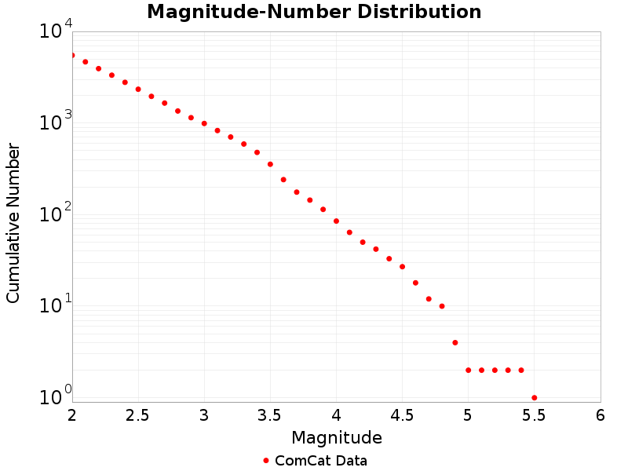

# 7.1, 2019 Ridgecrest Earthquake Sequence

## Table Of Contents

* [Mainshock Details](#mainshock-details)
  * [USGS Products](#usgs-products)
  * [Nearby Faults](#nearby-faults)
* [Sequence Details](#sequence-details)
  * [Aftershock Locations](#aftershock-locations)
  * [Magnitude vs Time Plot](#magnitude-vs-time-plot)
  * [Cumulative Number Plot](#cumulative-number-plot)
  * [Magnitude-Number Distributions](#magnitude-number-distributions)
* [Significant Foreshocks](#significant-foreshocks)
  * [M6.4 1.41 days before](#m64-141-days-before)

## Mainshock Details
*[(top)](#table-of-contents)*

Information and plots in the section are taken from the [USGS event page](https://earthquake.usgs.gov/earthquakes/eventpage/ci38457511), accessed through ComCat.

| Field | Value |
|-----|-----|
| Magnitude | 7.1 (mw) |
| Time (UTC) | Sat, 6 Jul 2019 03:19:53 UTC |
| Time (PDT) | Fri, 5 Jul 2019 20:19:53 PDT |
| Location | 35.7695, -117.599335 |
| Depth | 8.0 km |
| Status | reviewed |

### USGS Products
*[(top)](#table-of-contents)*

| 
**[ShakeMap](https://earthquake.usgs.gov/earthquakes/eventpage/ci38457511/shakemap/)**
 | 
**[Did You Feel It?](https://earthquake.usgs.gov/earthquakes/eventpage/ci38457511/dyfi/)**
 |
|-----|-----|
|  |  |
| 
**[PAGER](https://earthquake.usgs.gov/earthquakes/eventpage/ci38457511/pager/)**
 | 
**[Moment Tensor](https://earthquake.usgs.gov/earthquakes/eventpage/ci38457511/moment-tensor/)**
 |
|  |  |

### Nearby Faults
*[(top)](#table-of-contents)*

1 UCERF3 fault section is within 10km of this event's hypocenter:

* Airport Lake: 5.61km
## Sequence Details
*[(top)](#table-of-contents)*

These plots show the aftershock sequence. They were last updated at 2020/04/14 00:33:02 UTC, 282.88 days after the mainshock.

5409 M&ge;2 earthquakes within 47.75 km of the mainshock's epicenter.

|  | First Hour | First Day | First Week | First Month | To Date |
|-----|-----|-----|-----|-----|-----|
| **M 2** | 239 | 1851 | 3281 | 4307 | 5409 |
| **M 3** | 226 | 608 | 770 | 881 | 977 |
| **M 4** | 45 | 67 | 75 | 81 | 84 |
| **M 5** | 2 | 2 | 2 | 2 | 2 |
### Aftershock Locations
*[(top)](#table-of-contents)*

Map view of the aftershock sequence, plotted as cyan circles. The mainshock  and foreshocks are plotted below in brown and green circles respectively, but may be obscured by aftershocks. Nearby UCERF3 fault traces are plotted in gray lines, and the region used to fetch aftershock data in a dashed dark gray line.

| First Day | First Week | To Date |
|-----|-----|-----|
|  |  |  |

### Magnitude vs Time Plot
*[(top)](#table-of-contents)*

This plot shows the magnitude vs time evolution of the sequence. The mainshock is ploted as brown a brown circle, foreshocks are plotted as green circles, and aftershocks are plotted as cyan circles.

| First Week | First Month | To Date |
|-----|-----|-----|
|  |  |  |

### Cumulative Number Plot
*[(top)](#table-of-contents)*

This plot shows the cumulative number of M&ge;2 aftershocks as a function of time since the mainshock.

### Magnitude-Number Distributions
*[(top)](#table-of-contents)*

These plot shows the magnitude-number distrubtion of the aftershock sequence thus far. The left plot gives an incremental distribution (the count in each magnitude bin), and the right plot a cumulative distribution (the count in or above each magnitude bin). The y-axis is logarithmic.

| Incremental MND | Cumulative MND |
|-----|-----|
|  |  |

## Significant Foreshocks
*[(top)](#table-of-contents)*

Foreshock(s) with M&ge;6 or with M&ge;MMainshock-1.

### M6.4 1.41 days before
*[(top)](#table-of-contents)*

Information and plots in the section are taken from the [USGS event page](https://earthquake.usgs.gov/earthquakes/eventpage/ci38443183), accessed through ComCat.

| Field | Value |
|-----|-----|
| Magnitude | 6.4 (mw) |
| Time (UTC) | Sat, 6 Jul 2019 03:19:53 UTC |
| Time (PDT) | Fri, 5 Jul 2019 20:19:53 PDT |
| Location | 35.705334, -117.50383 |
| Depth | 10.5 km |
| Status | reviewed |

#### USGS Products
*[(top)](#table-of-contents)*

| 
**[ShakeMap](https://earthquake.usgs.gov/earthquakes/eventpage/ci38443183/shakemap/)**
 | 
**[Did You Feel It?](https://earthquake.usgs.gov/earthquakes/eventpage/ci38443183/dyfi/)**
 |
|-----|-----|
|  |  |
| 
**[PAGER](https://earthquake.usgs.gov/earthquakes/eventpage/ci38443183/pager/)**
 | 
**[Moment Tensor](https://earthquake.usgs.gov/earthquakes/eventpage/ci38443183/moment-tensor/)**
 |
|  |  |

#### Nearby Faults
*[(top)](#table-of-contents)*

No UCERF3 fault sections are within 10km of this event's hypocenter.

