# Parent Section Magnitude-Probability Distributions

Only fault sections with at least one triggered aftershock are plotted. Sections are sorted by total supraseismogenic trigger rate (decreasing)

## Table Of Contents

* [Garlock (Central)](#garlock-central)
* [Tank Canyon](#tank-canyon)
* [Little Lake](#little-lake)
* [Airport Lake](#airport-lake)
* [Owl Lake](#owl-lake)
* [Panamint Valley](#panamint-valley)
* [Garlock (East)](#garlock-east)
* [Ash Hill](#ash-hill)
* [Hunter Mountain-Saline Valley](#hunter-mountain-saline-valley)
* [Blackwater](#blackwater)
* [Garlock (West)](#garlock-west)
* [McLean Lake](#mclean-lake)
* [Goldstone Lake](#goldstone-lake)
* [Gravel Hills-Harper Lk](#gravel-hills-harper-lk)
* [So Sierra Nevada](#so-sierra-nevada)
* [Coyote Canyon](#coyote-canyon)
* [San Andreas (Mojave N)](#san-andreas-mojave-n)
* [Death Valley (So)](#death-valley-so)
* [San Andreas (Mojave S)](#san-andreas-mojave-s)
* [Towne Pass](#towne-pass)
* [Nelson Lake](#nelson-lake)
* [San Andreas (San Bernardino N)](#san-andreas-san-bernardino-n)
* [Lenwood-Lockhart-Old Woman Springs](#lenwood-lockhart-old-woman-springs)
* [Paradise](#paradise)
* [Bicycle Lake](#bicycle-lake)
* [Garlic Springs](#garlic-springs)
* [San Andreas (San Bernardino S)](#san-andreas-san-bernardino-s)
* [Death Valley (Black Mtns Frontal)](#death-valley-black-mtns-frontal)
* [San Andreas (Big Bend)](#san-andreas-big-bend)
* [Coyote Lake](#coyote-lake)
* [Helendale-So Lockhart](#helendale-so-lockhart)
* [San Andreas (San Gorgonio Pass-Garnet HIll)](#san-andreas-san-gorgonio-pass-garnet-hill)
* [Manix-Afton Hills](#manix-afton-hills)
* [Lake Isabella (Seismicity)](#lake-isabella-seismicity)
* [Scodie Lineament](#scodie-lineament)
* [Sierra Nevada  (No Extension)](#sierra-nevada--no-extension)
* [Cady](#cady)
* [Death Valley (No)](#death-valley-no)
* [White Wolf (Extension)](#white-wolf-extension)
* [Death Valley (Fish Lake Valley)](#death-valley-fish-lake-valley)
* [San Andreas (Carrizo) rev](#san-andreas-carrizo-rev)
* [San Andreas (Coachella) rev](#san-andreas-coachella-rev)
* [Baker](#baker)
* [San Andreas (Cholame) rev](#san-andreas-cholame-rev)
* [Santa Ynez (West)](#santa-ynez-west)
* [San Andreas (Parkfield)](#san-andreas-parkfield)
* [Calico-Hidalgo](#calico-hidalgo)
* [San Jacinto (San Bernardino)](#san-jacinto-san-bernardino)
* [Rose Canyon](#rose-canyon)
* [Santa Ynez (East)](#santa-ynez-east)
* [Owens Valley](#owens-valley)
* [Mission Creek](#mission-creek)
* [Great Valley 09 (Laguna Seca)](#great-valley-09-laguna-seca)
* [Ludlow](#ludlow)
* [Dry Mountain](#dry-mountain)
* [Red Pass](#red-pass)
* [Deep Springs](#deep-springs)
* [San Jacinto (Anza) rev](#san-jacinto-anza-rev)
* [San Jacinto (Lytle Creek connector)](#san-jacinto-lytle-creek-connector)
* [San Jacinto (San Jacinto Valley) rev](#san-jacinto-san-jacinto-valley-rev)
* [San Jacinto (Stepovers Combined)](#san-jacinto-stepovers-combined)
* [Coronado Bank alt1](#coronado-bank-alt1)
* [Mono Lake 2011 CFM](#mono-lake-2011-cfm)
* [San Jacinto (Superstition Mtn)](#san-jacinto-superstition-mtn)
* [Lost Hills](#lost-hills)
* [San Andreas (North Branch Mill Creek)](#san-andreas-north-branch-mill-creek)
* [Santa Rosa Island](#santa-rosa-island)
* [Elsinore (Glen Ivy) rev](#elsinore-glen-ivy-rev)
* [Big Pine (East)](#big-pine-east)
* [Brawley (Seismic Zone) alt 1](#brawley-seismic-zone-alt-1)
* [Whittier alt 1](#whittier-alt-1)
* [Imperial](#imperial)
* [Santa Cruz Island](#santa-cruz-island)
* [Kern Canyon (Lake Isabella) 2011](#kern-canyon-lake-isabella-2011)
* [San Diego Trough north alt1](#san-diego-trough-north-alt1)
* [San Clemente](#san-clemente)
* [Ortigalita (South)](#ortigalita-south)
* [Malibu Coast (Extension) alt 1](#malibu-coast-extension-alt-1)
* [Tin Mountain](#tin-mountain)
* [Pleito](#pleito)
* [Cucamonga](#cucamonga)
* [Santa Cruz Catalina Ridge alt1](#santa-cruz-catalina-ridge-alt1)
* [Sheephole](#sheephole)
* [San Jacinto (Coyote Creek)](#san-jacinto-coyote-creek)
* [Kern Canyon (South Kern) 2011](#kern-canyon-south-kern-2011)
* [San Jacinto (Borrego)](#san-jacinto-borrego)
* [Mission Ridge-Arroyo Parida-Santa Ana](#mission-ridge-arroyo-parida-santa-ana)
* [Santa Ynez River](#santa-ynez-river)
* [Camp Rock 2011](#camp-rock-2011)
* [Sierra Madre](#sierra-madre)
* [San Cayetano](#san-cayetano)
* [Los Alamos extension](#los-alamos-extension)
* [Carlsbad](#carlsbad)
* [San Diego Trough south](#san-diego-trough-south)
* [Pisgah-Bullion Mtn-Mesquite Lk](#pisgah-bullion-mtn-mesquite-lk)
* [White Mountains](#white-mountains)
* [Hollywood](#hollywood)
* [Rinconada 2011 CFM](#rinconada-2011-cfm)
* [Ventura-Pitas Point](#ventura-pitas-point)
* [Raymond](#raymond)
* [Great Valley 11](#great-valley-11)
* [Shoreline](#shoreline)
* [Malibu Coast alt 1](#malibu-coast-alt-1)
* [Bullion Mountains](#bullion-mountains)
* [Big Pine (Central)](#big-pine-central)
* [Great Valley 10 (Panoche)](#great-valley-10-panoche)
* [Kern Canyon (North Kern) 2011](#kern-canyon-north-kern-2011)
* [Oak Ridge (Onshore)](#oak-ridge-onshore)
* [Elysian Park (Upper)](#elysian-park-upper)
* [Hosgri](#hosgri)
* [Robinson Creek](#robinson-creek)
* [San Gabriel](#san-gabriel)
* [San Jacinto (Clark) rev](#san-jacinto-clark-rev)
* [Palos Verdes](#palos-verdes)
* [Oceanic - West Huasna](#oceanic---west-huasna)
* [San Pedro Basin](#san-pedro-basin)
* [Channel Islands Thrust](#channel-islands-thrust)
* [Superstition Hills](#superstition-hills)
* [Independence rev 2011](#independence-rev-2011)
* [San Andreas (Creeping Section) 2011 CFM](#san-andreas-creeping-section-2011-cfm)
* [Red Mountain](#red-mountain)
* [Los Alamos 2011 CFM](#los-alamos-2011-cfm)
* [Cleghorn Pass](#cleghorn-pass)
* [Simi-Santa Rosa](#simi-santa-rosa)
* [Homestead Valley 2011](#homestead-valley-2011)
* [Cleghorn Lake](#cleghorn-lake)

## Garlock (Central)
*[(top)](#table-of-contents)*

| 1 Week | 1 Month | 1 Year | 10 Year |
|-----|-----|-----|-----|
| 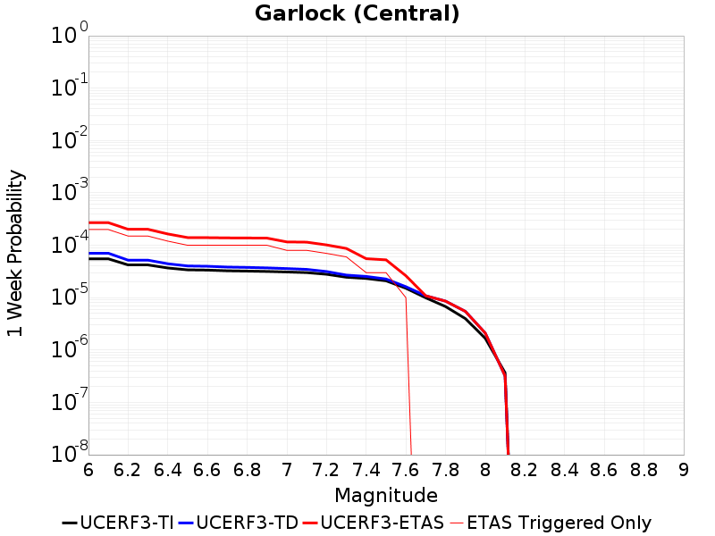 | 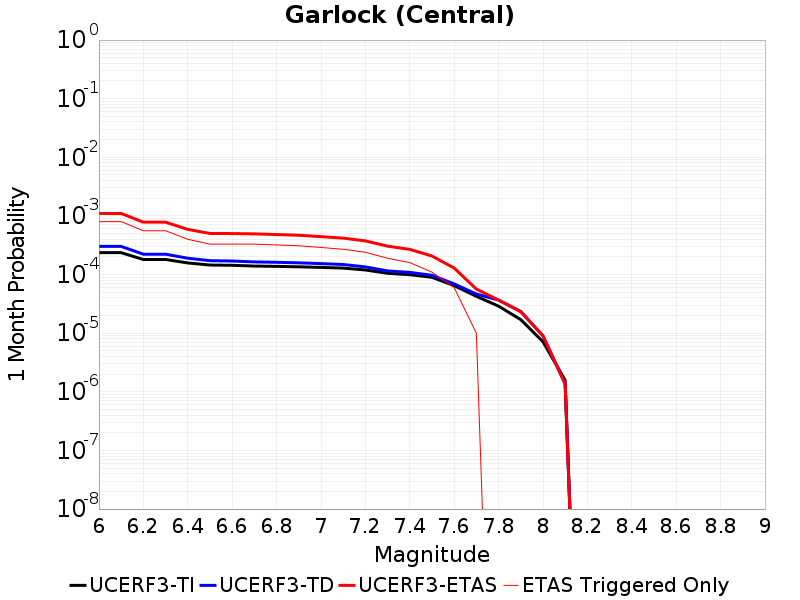 |  | 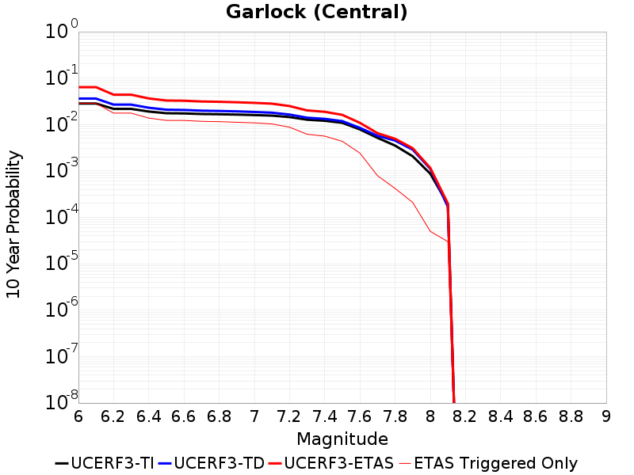 |

| Magnitude | 1 wk TI Prob | 1 wk TD Prob | 1 wk ETAS Prob | 1 wk ETAS/TD Gain | 1 wk ETAS Triggered Only | 1 mo TI Prob | 1 mo TD Prob | 1 mo ETAS Prob | 1 mo ETAS/TD Gain | 1 mo ETAS Triggered Only | 1 yr TI Prob | 1 yr TD Prob | 1 yr ETAS Prob | 1 yr ETAS/TD Gain | 1 yr ETAS Triggered Only | 10 yr TI Prob | 10 yr TD Prob | 10 yr ETAS Prob | 10 yr ETAS/TD Gain | 10 yr ETAS Triggered Only |
|-----|-----|-----|-----|-----|-----|-----|-----|-----|-----|-----|-----|-----|-----|-----|-----|-----|-----|-----|-----|-----|
| 6.0 | 5.5131142E-5 | 7.054012E-5 | 2.905246E-4 | 4.1185727 | 2.2E-4 | 2.3625491E-4 | 3.022801E-4 | 0.0012619899 | 4.1749024 | 9.6E-4 | 0.0028726095 | 0.0036741144 | 0.012053215 | 3.280577 | 0.00841 | 0.028357591 | 0.036211397 | 0.063939594 | 1.7657312 | 0.02877 |
| 6.1 | 5.5131142E-5 | 7.054012E-5 | 2.905246E-4 | 4.1185727 | 2.2E-4 | 2.3625491E-4 | 3.022801E-4 | 0.0012619899 | 4.1749024 | 9.6E-4 | 0.0028726095 | 0.0036741144 | 0.012053215 | 3.280577 | 0.00841 | 0.028357591 | 0.036211397 | 0.063939594 | 1.7657312 | 0.02877 |
| 6.2 | 4.216245E-5 | 5.192815E-5 | 2.319188E-4 | 4.466148 | 1.8E-4 | 1.806837E-4 | 2.225304E-4 | 8.7238575E-4 | 3.9202993 | 6.5E-4 | 0.0021976046 | 0.002705973 | 0.007891902 | 2.9164746 | 0.0052 | 0.021759989 | 0.026813101 | 0.044281807 | 1.6514989 | 0.01795 |
| 6.3 | 4.216245E-5 | 5.192815E-5 | 2.319188E-4 | 4.466148 | 1.8E-4 | 1.806837E-4 | 2.225304E-4 | 8.7238575E-4 | 3.9202993 | 6.5E-4 | 0.0021976046 | 0.002705973 | 0.007891902 | 2.9164746 | 0.0052 | 0.021759989 | 0.026813101 | 0.044281807 | 1.6514989 | 0.01795 |
| 6.4 | 3.6858168E-5 | 4.436641E-5 | 1.843602E-4 | 4.1554003 | 1.4E-4 | 1.5795401E-4 | 1.9012805E-4 | 6.9003296E-4 | 3.6293068 | 5.0E-4 | 0.0019213937 | 0.0023123769 | 0.006382942 | 2.7603383 | 0.00408 | 0.019048655 | 0.022983259 | 0.03647586 | 1.5870621 | 0.01381 |
| 6.5 | 3.39199E-5 | 4.0269617E-5 | 1.6026478E-4 | 3.979794 | 1.2E-4 | 1.453629E-4 | 1.7257278E-4 | 6.424917E-4 | 3.7230186 | 4.7E-4 | 0.0017683565 | 0.002099071 | 0.0057713464 | 2.7494767 | 0.00368 | 0.017543508 | 0.02088419 | 0.03296648 | 1.5785376 | 0.01234 |
| 6.6 | 3.3571985E-5 | 3.9722854E-5 | 1.5971808E-4 | 4.020811 | 1.2E-4 | 1.4387199E-4 | 1.7022982E-4 | 6.401498E-4 | 3.7605035 | 4.7E-4 | 0.0017502342 | 0.0020705997 | 0.0057429797 | 2.773583 | 0.00368 | 0.017365133 | 0.020607363 | 0.032663688 | 1.5850493 | 0.01231 |
| 6.7 | 3.2580007E-5 | 3.8337777E-5 | 1.5833318E-4 | 4.129952 | 1.2E-4 | 1.3962112E-4 | 1.6429454E-4 | 6.142206E-4 | 3.7385333 | 4.5E-4 | 0.0016985617 | 0.0019984725 | 0.005491478 | 2.7478375 | 0.0035 | 0.016856372 | 0.019897033 | 0.031432845 | 1.5797755 | 0.01177 |
| 6.8 | 3.2185937E-5 | 3.7763282E-5 | 1.5775875E-4 | 4.17757 | 1.2E-4 | 1.3793244E-4 | 1.6183272E-4 | 6.017615E-4 | 3.7184167 | 4.4E-4 | 0.0016780337 | 0.0019685545 | 0.005391802 | 2.7389653 | 0.00343 | 0.016654192 | 0.019603422 | 0.030917197 | 1.5771327 | 0.01154 |
| 6.9 | 3.165394E-5 | 3.696615E-5 | 1.5696172E-4 | 4.2460933 | 1.2E-4 | 1.3565269E-4 | 1.5841685E-4 | 5.9834716E-4 | 3.7770424 | 4.4E-4 | 0.0016503202 | 0.0019270405 | 0.005230662 | 2.7143497 | 0.00331 | 0.01638118 | 0.019195277 | 0.030150866 | 1.570744 | 0.01117 |
| 7.0 | 3.0903822E-5 | 3.5868343E-5 | 1.458644E-4 | 4.0666614 | 1.1E-4 | 1.3243823E-4 | 1.5371252E-4 | 5.7364797E-4 | 3.7319534 | 4.2E-4 | 0.0016112428 | 0.001869865 | 0.0050539 | 2.7028155 | 0.00319 | 0.015996104 | 0.018635197 | 0.029175054 | 1.5655888 | 0.01074 |
| 7.1 | 3.0069863E-5 | 3.463263E-5 | 1.4462882E-4 | 4.176085 | 1.1E-4 | 1.2886449E-4 | 1.4841724E-4 | 5.583564E-4 | 3.7620723 | 4.1E-4 | 0.0015677959 | 0.0018055035 | 0.004859979 | 2.6917582 | 0.00306 | 0.01556781 | 0.018001823 | 0.028037844 | 1.5575004 | 0.01022 |
| 7.2 | 2.7957109E-5 | 3.1512238E-5 | 1.215094E-4 | 3.8559434 | 9.0E-5 | 1.1981068E-4 | 1.3504556E-4 | 4.849983E-4 | 3.591368 | 3.5E-4 | 0.0014577188 | 0.0016429593 | 0.004178786 | 2.5434508 | 0.00254 | 0.014481937 | 0.01640067 | 0.02480061 | 1.5121704 | 0.00854 |
| 7.3 | 2.4519275E-5 | 2.693213E-5 | 8.6930515E-5 | 3.2277625 | 6.0E-5 | 1.0507837E-4 | 1.1541839E-4 | 3.35393E-4 | 2.9058888 | 2.2E-4 | 0.0012785783 | 0.0014043278 | 0.003221772 | 2.2941737 | 0.00182 | 0.012712469 | 0.014038702 | 0.0201418 | 1.434734 | 0.00619 |
| 7.4 | 2.3225532E-5 | 2.5412062E-5 | 8.541054E-5 | 3.3610234 | 6.0E-5 | 9.95342E-5 | 1.0890437E-4 | 3.088826E-4 | 2.8362734 | 2.0E-4 | 0.0012111551 | 0.0013251188 | 0.0030128793 | 2.2736673 | 0.00169 | 0.012045753 | 0.013254163 | 0.018710867 | 1.4116974 | 0.00553 |
| 7.5 | 2.097765E-5 | 2.2686047E-5 | 5.2685366E-5 | 2.3223689 | 3.0E-5 | 8.9901114E-5 | 9.722236E-5 | 2.1721069E-4 | 2.234164 | 1.2E-4 | 0.0010939965 | 0.0011830513 | 0.0025414424 | 2.1482098 | 0.00136 | 0.010886264 | 0.011843734 | 0.01618174 | 1.3662701 | 0.00439 |
| 7.6 | 1.511254E-5 | 1.6175478E-5 | 2.6175316E-5 | 1.6182097 | 1.0E-5 | 6.476642E-5 | 6.932168E-5 | 1.3931682E-4 | 2.009715 | 7.0E-5 | 7.882459E-4 | 8.436725E-4 | 0.0015730566 | 1.8645347 | 7.3E-4 | 0.007854558 | 0.008477943 | 0.01084768 | 1.279518 | 0.00239 |
| 7.7 | 9.934069E-6 | 1.0849114E-5 | 1.0849114E-5 | 1.0 | 0.0 | 4.2573887E-5 | 4.6495377E-5 | 6.6494445E-5 | 1.4301302 | 2.0E-5 | 5.182138E-4 | 5.659346E-4 | 7.8581006E-4 | 1.3885175 | 2.2E-4 | 0.00517007 | 0.0057158843 | 0.006511312 | 1.1391609 | 8.0E-4 |
| 7.8 | 6.7562896E-6 | 8.567351E-6 | 8.567351E-6 | 1.0 | 0.0 | 2.8955206E-5 | 3.6716705E-5 | 5.671597E-5 | 1.5446912 | 2.0E-5 | 3.5247262E-4 | 4.4693434E-4 | 5.968673E-4 | 1.3354697 | 1.5E-4 | 0.0035191406 | 0.004518471 | 0.005006257 | 1.1079538 | 4.9E-4 |
| 7.9 | 3.975453E-6 | 5.4550037E-6 | 5.4550037E-6 | 1.0 | 0.0 | 1.7037546E-5 | 2.3378378E-5 | 4.337791E-5 | 1.8554714 | 2.0E-5 | 2.0741238E-4 | 2.845947E-4 | 3.8456623E-4 | 1.3512769 | 1.0E-4 | 0.002072189 | 0.002877021 | 0.003186129 | 1.1074404 | 3.1E-4 |
| 8.0 | 1.6729537E-6 | 2.106297E-6 | 2.106297E-6 | 1.0 | 0.0 | 7.169782E-6 | 9.026956E-6 | 1.9026866E-5 | 2.107783 | 1.0E-5 | 8.7288594E-5 | 1.09897686E-4 | 1.3989439E-4 | 1.2729512 | 3.0E-5 | 8.7254314E-4 | 0.0011117051 | 0.0012215829 | 1.0988371 | 1.1E-4 |
| 8.1 | 3.6733252E-7 | 3.190176E-7 | 3.190176E-7 | 1.0 | 0.0 | 1.5742813E-6 | 1.3672176E-6 | 1.3672176E-6 | 1.0 | 0.0 | 1.9166706E-5 | 1.6645765E-5 | 1.6645765E-5 | 1.0 | 0.0 | 1.9165053E-4 | 1.684635E-4 | 1.7846182E-4 | 1.05935 | 1.0E-5 |

## Tank Canyon
*[(top)](#table-of-contents)*

| 1 Week | 1 Month | 1 Year | 10 Year |
|-----|-----|-----|-----|
| 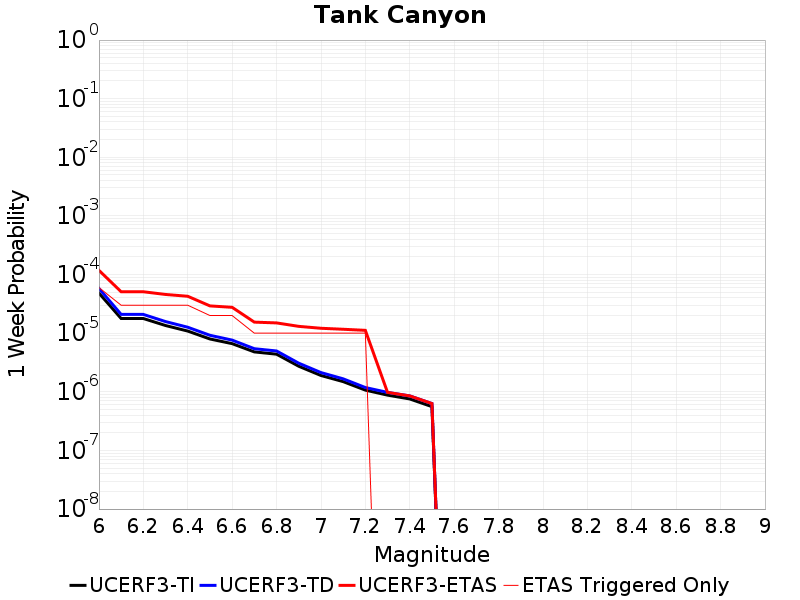 | 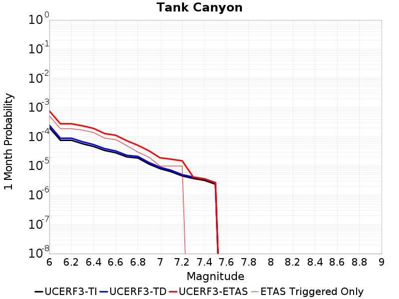 |  |  |

| Magnitude | 1 wk TI Prob | 1 wk TD Prob | 1 wk ETAS Prob | 1 wk ETAS/TD Gain | 1 wk ETAS Triggered Only | 1 mo TI Prob | 1 mo TD Prob | 1 mo ETAS Prob | 1 mo ETAS/TD Gain | 1 mo ETAS Triggered Only | 1 yr TI Prob | 1 yr TD Prob | 1 yr ETAS Prob | 1 yr ETAS/TD Gain | 1 yr ETAS Triggered Only | 10 yr TI Prob | 10 yr TD Prob | 10 yr ETAS Prob | 10 yr ETAS/TD Gain | 10 yr ETAS Triggered Only |
|-----|-----|-----|-----|-----|-----|-----|-----|-----|-----|-----|-----|-----|-----|-----|-----|-----|-----|-----|-----|-----|
| 6.0 | 4.8284557E-5 | 5.8033984E-5 | 2.2802412E-4 | 3.9291482 | 1.7E-4 | 2.0691741E-4 | 2.486972E-4 | 0.0010185057 | 4.0953646 | 7.7E-4 | 0.0025163088 | 0.0030243467 | 0.008318287 | 2.750441 | 0.00531 | 0.02488006 | 0.029898655 | 0.049242474 | 1.6469797 | 0.01994 |
| 6.1 | 1.7796336E-5 | 2.0895288E-5 | 9.0893824E-5 | 4.3499675 | 7.0E-5 | 7.626778E-5 | 8.954838E-5 | 3.3952598E-4 | 3.791537 | 2.5E-4 | 9.281647E-4 | 0.0010897443 | 0.0030276303 | 2.778294 | 0.00194 | 0.009242975 | 0.010847728 | 0.017999299 | 1.659269 | 0.00723 |
| 6.2 | 1.7796336E-5 | 2.0895288E-5 | 9.0893824E-5 | 4.3499675 | 7.0E-5 | 7.626778E-5 | 8.954838E-5 | 3.3952598E-4 | 3.791537 | 2.5E-4 | 9.281647E-4 | 0.0010897443 | 0.0030276303 | 2.778294 | 0.00194 | 0.009242975 | 0.010847728 | 0.017999299 | 1.659269 | 0.00723 |
| 6.3 | 1.3515912E-5 | 1.5775664E-5 | 7.577472E-5 | 4.8032665 | 6.0E-5 | 5.792405E-5 | 6.760837E-5 | 2.6759485E-4 | 3.9580135 | 2.0E-4 | 7.049971E-4 | 8.228447E-4 | 0.0021917173 | 2.6635857 | 0.00137 | 0.007027647 | 0.00820022 | 0.013307989 | 1.6228819 | 0.00515 |
| 6.4 | 1.0870146E-5 | 1.263064E-5 | 5.2630134E-5 | 4.166862 | 4.0E-5 | 4.658551E-5 | 5.4130294E-5 | 2.0412217E-4 | 3.7709415 | 1.5E-4 | 5.67031E-4 | 6.588547E-4 | 0.0017481366 | 2.653296 | 0.00109 | 0.005655863 | 0.006570651 | 0.010494697 | 1.597208 | 0.00395 |
| 6.5 | 7.964826E-6 | 9.20513E-6 | 2.9204944E-5 | 3.1726818 | 2.0E-5 | 3.4134522E-5 | 3.9450017E-5 | 1.5944528E-4 | 4.0417037 | 1.2E-4 | 4.1550855E-4 | 4.802087E-4 | 0.0012198533 | 2.5402567 | 7.4E-4 | 0.0041473247 | 0.0047926316 | 0.007459787 | 1.5565118 | 0.00268 |
| 6.6 | 6.6317E-6 | 7.619641E-6 | 2.7619488E-5 | 3.6247756 | 2.0E-5 | 2.8421264E-5 | 3.2655247E-5 | 1.1265263E-4 | 3.449756 | 8.0E-5 | 3.4597394E-4 | 3.975142E-4 | 8.773234E-4 | 2.207024 | 4.8E-4 | 0.0034543579 | 0.0039688027 | 0.005950905 | 1.4994206 | 0.00199 |
| 6.7 | 4.793663E-6 | 5.4358543E-6 | 5.4358543E-6 | 1.0 | 0.0 | 2.0544108E-5 | 2.3296336E-5 | 5.3295636E-5 | 2.2877262 | 3.0E-5 | 2.500958E-4 | 2.8360036E-4 | 5.435266E-4 | 1.9165231 | 2.6E-4 | 0.0024981452 | 0.002832694 | 0.0038597763 | 1.3625815 | 0.00103 |
| 6.8 | 4.382823E-6 | 4.973883E-6 | 4.973883E-6 | 1.0 | 0.0 | 1.8783392E-5 | 2.1316491E-5 | 5.1315852E-5 | 2.4073312 | 3.0E-5 | 2.286638E-4 | 2.5950166E-4 | 5.0943677E-4 | 1.963135 | 2.5E-4 | 0.0022842865 | 0.0025922826 | 0.003529846 | 1.3616748 | 9.4E-4 |
| 6.9 | 2.729601E-6 | 3.0767596E-6 | 3.0767596E-6 | 1.0 | 0.0 | 1.1698237E-5 | 1.3186053E-5 | 2.3185921E-5 | 1.7583671 | 1.0E-5 | 1.4241673E-4 | 1.605296E-4 | 2.6051354E-4 | 1.622838 | 1.0E-4 | 0.001423255 | 0.001604144 | 0.0020434381 | 1.2738496 | 4.4E-4 |
| 7.0 | 1.8987357E-6 | 2.1293888E-6 | 2.1293888E-6 | 1.0 | 0.0 | 8.137413E-6 | 9.1259235E-6 | 9.1259235E-6 | 1.0 | 0.0 | 9.90685E-5 | 1.1110315E-4 | 1.7109649E-4 | 1.5399786 | 6.0E-5 | 9.902435E-4 | 0.0011105448 | 0.0013203116 | 1.1888864 | 2.1E-4 |
| 7.1 | 1.4928986E-6 | 1.6653629E-6 | 1.6653629E-6 | 1.0 | 0.0 | 6.398121E-6 | 7.1372533E-6 | 7.1372533E-6 | 1.0 | 0.0 | 7.789434E-5 | 8.689318E-5 | 1.0689145E-4 | 1.2301476 | 2.0E-5 | 7.786704E-4 | 8.6865E-4 | 0.0010085284 | 1.1610296 | 1.4E-4 |
| 7.2 | 1.069082E-6 | 1.1833395E-6 | 1.1833395E-6 | 1.0 | 0.0 | 4.581772E-6 | 5.071448E-6 | 5.071448E-6 | 1.0 | 0.0 | 5.5781646E-5 | 6.174367E-5 | 6.174367E-5 | 1.0 | 0.0 | 5.576765E-4 | 6.173174E-4 | 6.97268E-4 | 1.129513 | 8.0E-5 |
| 7.3 | 8.776551E-7 | 9.774021E-7 | 9.774021E-7 | 1.0 | 0.0 | 3.7613736E-6 | 4.1888625E-6 | 4.1888625E-6 | 1.0 | 0.0 | 4.579376E-5 | 5.099873E-5 | 5.099873E-5 | 1.0 | 0.0 | 4.5784327E-4 | 5.099213E-4 | 5.698907E-4 | 1.1176052 | 6.0E-5 |
| 7.4 | 7.55721E-7 | 8.5122093E-7 | 8.5122093E-7 | 1.0 | 0.0 | 3.2388E-6 | 3.6480876E-6 | 3.6480876E-6 | 1.0 | 0.0 | 3.9431678E-5 | 4.441508E-5 | 4.441508E-5 | 1.0 | 0.0 | 3.942468E-4 | 4.441129E-4 | 4.9409067E-4 | 1.1125339 | 5.0E-5 |
| 7.5 | 5.587665E-7 | 6.307092E-7 | 6.307092E-7 | 1.0 | 0.0 | 2.3947114E-6 | 2.7030396E-6 | 2.7030396E-6 | 1.0 | 0.0 | 2.915522E-5 | 3.2909506E-5 | 3.2909506E-5 | 1.0 | 0.0 | 2.9151395E-4 | 3.2909508E-4 | 3.5908518E-4 | 1.0911291 | 3.0E-5 |

## Little Lake
*[(top)](#table-of-contents)*

| 1 Week | 1 Month | 1 Year | 10 Year |
|-----|-----|-----|-----|
|  |  |  |  |

| Magnitude | 1 wk TI Prob | 1 wk TD Prob | 1 wk ETAS Prob | 1 wk ETAS/TD Gain | 1 wk ETAS Triggered Only | 1 mo TI Prob | 1 mo TD Prob | 1 mo ETAS Prob | 1 mo ETAS/TD Gain | 1 mo ETAS Triggered Only | 1 yr TI Prob | 1 yr TD Prob | 1 yr ETAS Prob | 1 yr ETAS/TD Gain | 1 yr ETAS Triggered Only | 10 yr TI Prob | 10 yr TD Prob | 10 yr ETAS Prob | 10 yr ETAS/TD Gain | 10 yr ETAS Triggered Only |
|-----|-----|-----|-----|-----|-----|-----|-----|-----|-----|-----|-----|-----|-----|-----|-----|-----|-----|-----|-----|-----|
| 6.0 | 2.8424427E-5 | 3.1225307E-5 | 1.6122125E-4 | 5.16316 | 1.3E-4 | 1.2181328E-4 | 1.3381663E-4 | 6.437484E-4 | 4.8106756 | 5.1E-4 | 0.0014820677 | 0.0016281332 | 0.0054119625 | 3.3240294 | 0.00379 | 0.014722223 | 0.016175475 | 0.028709399 | 1.7748721 | 0.01274 |
| 6.1 | 2.8424427E-5 | 3.1225307E-5 | 1.6122125E-4 | 5.16316 | 1.3E-4 | 1.2181328E-4 | 1.3381663E-4 | 6.437484E-4 | 4.8106756 | 5.1E-4 | 0.0014820677 | 0.0016281332 | 0.0054119625 | 3.3240294 | 0.00379 | 0.014722223 | 0.016175475 | 0.028709399 | 1.7748721 | 0.01274 |
| 6.2 | 2.8424427E-5 | 3.1225307E-5 | 1.6122125E-4 | 5.16316 | 1.3E-4 | 1.2181328E-4 | 1.3381663E-4 | 6.437484E-4 | 4.8106756 | 5.1E-4 | 0.0014820677 | 0.0016281332 | 0.0054119625 | 3.3240294 | 0.00379 | 0.014722223 | 0.016175475 | 0.028709399 | 1.7748721 | 0.01274 |
| 6.3 | 1.48860645E-5 | 1.6090486E-5 | 7.608952E-5 | 4.728852 | 6.0E-5 | 6.379586E-5 | 6.895755E-5 | 3.6893686E-4 | 5.350202 | 3.0E-4 | 7.7643775E-4 | 8.392631E-4 | 0.0031972826 | 3.8096306 | 0.00236 | 0.007737305 | 0.008363758 | 0.01631668 | 1.9508791 | 0.00802 |
| 6.4 | 1.48860645E-5 | 1.6090486E-5 | 7.608952E-5 | 4.728852 | 6.0E-5 | 6.379586E-5 | 6.895755E-5 | 3.6893686E-4 | 5.350202 | 3.0E-4 | 7.7643775E-4 | 8.392631E-4 | 0.0031972826 | 3.8096306 | 0.00236 | 0.007737305 | 0.008363758 | 0.01631668 | 1.9508791 | 0.00802 |
| 6.5 | 1.2797581E-5 | 1.3773168E-5 | 7.377234E-5 | 5.3562365 | 6.0E-5 | 5.4845623E-5 | 5.902667E-5 | 3.2901074E-4 | 5.573933 | 2.7E-4 | 6.675408E-4 | 7.1843853E-4 | 0.0028569011 | 3.9765422 | 0.00214 | 0.006655392 | 0.0071637123 | 0.0143617755 | 2.004795 | 0.00725 |
| 6.6 | 9.661896E-6 | 1.0294404E-5 | 6.029389E-5 | 5.8569574 | 5.0E-5 | 4.1407468E-5 | 4.4118224E-5 | 2.5410895E-4 | 5.759728 | 2.1E-4 | 5.040193E-4 | 5.3702324E-4 | 0.0023960243 | 4.461677 | 0.00186 | 0.005028777 | 0.0053588618 | 0.011684779 | 2.1804593 | 0.00636 |
| 6.7 | 7.767871E-6 | 8.203777E-6 | 5.8203368E-5 | 7.0947037 | 5.0E-5 | 3.329045E-5 | 3.515865E-5 | 2.1515232E-4 | 6.1194706 | 1.8E-4 | 4.0523586E-4 | 4.279862E-4 | 0.0020273014 | 4.7368383 | 0.0016 | 0.004044977 | 0.004272973 | 0.009759429 | 2.2839904 | 0.00551 |
| 6.8 | 6.4235196E-6 | 6.73906E-6 | 5.6738725E-5 | 8.419382 | 5.0E-5 | 2.752908E-5 | 2.8881439E-5 | 1.788771E-4 | 6.1934967 | 1.5E-4 | 3.35115E-4 | 3.5158763E-4 | 0.0015711586 | 4.4687543 | 0.00122 | 0.003346101 | 0.0035115757 | 0.007975844 | 2.2713006 | 0.00448 |
| 6.9 | 3.1283696E-6 | 3.1133507E-6 | 4.3113225E-5 | 13.847855 | 4.0E-5 | 1.3407229E-5 | 1.3342871E-5 | 1.2334141E-4 | 9.243993 | 1.1E-4 | 1.6322079E-4 | 1.6243887E-4 | 9.223154E-4 | 5.677923 | 7.6E-4 | 0.0016310095 | 0.0016233497 | 0.004528626 | 2.7896798 | 0.00291 |
| 7.0 | 2.290603E-6 | 2.2295662E-6 | 2.2229522E-5 | 9.970335 | 2.0E-5 | 9.816834E-6 | 9.555255E-6 | 6.9554684E-5 | 7.279207 | 6.0E-5 | 1.19513395E-4 | 1.16330055E-4 | 5.362812E-4 | 4.609997 | 4.2E-4 | 0.0011944914 | 0.0011627938 | 0.0028907822 | 2.4860659 | 0.00173 |
| 7.1 | 1.293693E-6 | 1.1782298E-6 | 2.1178206E-5 | 17.974596 | 2.0E-5 | 5.5443866E-6 | 5.0495505E-6 | 4.504935E-5 | 8.921457 | 4.0E-5 | 6.750081E-5 | 6.147724E-5 | 3.0146248E-4 | 4.9036436 | 2.4E-4 | 6.7480316E-4 | 6.1467086E-4 | 0.0015540931 | 2.5283337 | 9.4E-4 |
| 7.2 | 4.715842E-7 | 3.0943545E-7 | 3.0943545E-7 | 1.0 | 0.0 | 2.0210737E-6 | 1.3261513E-6 | 1.1326138E-5 | 8.540607 | 1.0E-5 | 2.4606294E-5 | 1.6145777E-5 | 3.6145455E-5 | 2.238694 | 2.0E-5 | 2.460357E-4 | 1.6144659E-4 | 2.214369E-4 | 1.3715799 | 6.0E-5 |
| 7.3 | 3.9430947E-7 | 2.3121052E-7 | 2.3121052E-7 | 1.0 | 0.0 | 1.6898966E-6 | 9.909019E-7 | 1.0990892E-5 | 11.091806 | 1.0E-5 | 2.0574296E-5 | 1.2064164E-5 | 2.2064043E-5 | 1.8288912 | 1.0E-5 | 2.0572392E-4 | 1.20635166E-4 | 1.4063275E-4 | 1.1657691 | 2.0E-5 |
| 7.4 | 3.547123E-7 | 1.9700978E-7 | 1.9700978E-7 | 1.0 | 0.0 | 1.5201948E-6 | 8.4432736E-7 | 1.0844319E-5 | 12.843738 | 1.0E-5 | 1.8508214E-5 | 1.02796375E-5 | 2.0279535E-5 | 1.9727869 | 1.0E-5 | 1.8506673E-4 | 1.0279169E-4 | 1.2278963E-4 | 1.1945482 | 2.0E-5 |
| 7.5 | 2.6354266E-7 | 1.4438305E-7 | 1.4438305E-7 | 1.0 | 0.0 | 1.129468E-6 | 6.187843E-7 | 1.0618778E-5 | 17.16071 | 1.0E-5 | 1.3751187E-5 | 7.533674E-6 | 1.7533599E-5 | 2.3273637 | 1.0E-5 | 1.3750336E-4 | 7.533424E-5 | 9.533273E-5 | 1.2654636 | 2.0E-5 |
| 7.6 | 1.269913E-7 | 7.578998E-8 | 7.578998E-8 | 1.0 | 0.0 | 5.4424834E-7 | 3.2481415E-7 | 3.2481415E-7 | 1.0 | 0.0 | 6.6262032E-6 | 3.9546053E-6 | 3.9546053E-6 | 1.0 | 0.0 | 6.626006E-5 | 3.9545386E-5 | 3.9545386E-5 | 1.0 | 0.0 |

## Airport Lake
*[(top)](#table-of-contents)*

| 1 Week | 1 Month | 1 Year | 10 Year |
|-----|-----|-----|-----|
| 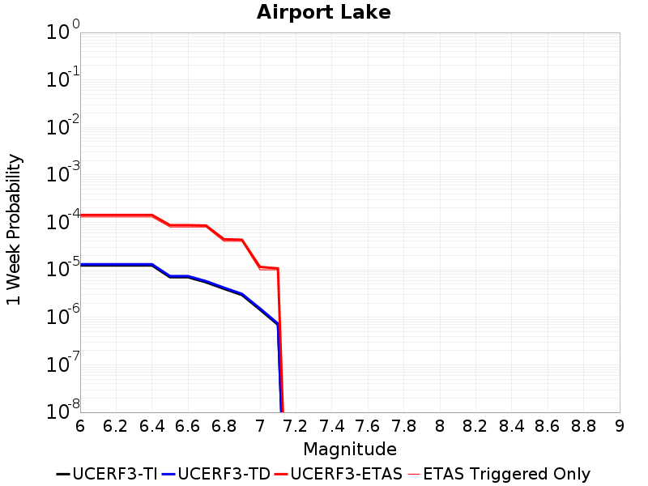 |  | 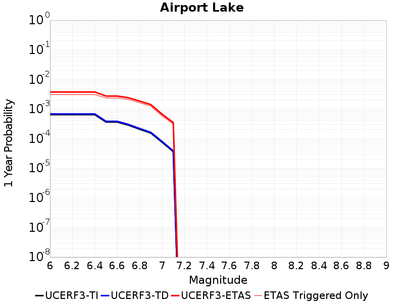 |  |

| Magnitude | 1 wk TI Prob | 1 wk TD Prob | 1 wk ETAS Prob | 1 wk ETAS/TD Gain | 1 wk ETAS Triggered Only | 1 mo TI Prob | 1 mo TD Prob | 1 mo ETAS Prob | 1 mo ETAS/TD Gain | 1 mo ETAS Triggered Only | 1 yr TI Prob | 1 yr TD Prob | 1 yr ETAS Prob | 1 yr ETAS/TD Gain | 1 yr ETAS Triggered Only | 10 yr TI Prob | 10 yr TD Prob | 10 yr ETAS Prob | 10 yr ETAS/TD Gain | 10 yr ETAS Triggered Only |
|-----|-----|-----|-----|-----|-----|-----|-----|-----|-----|-----|-----|-----|-----|-----|-----|-----|-----|-----|-----|-----|
| 6.0 | 1.2387061E-5 | 1.3107641E-5 | 1.231062E-4 | 9.391942 | 1.1E-4 | 5.3086325E-5 | 5.6174555E-5 | 4.4615264E-4 | 7.942255 | 3.9E-4 | 6.461343E-4 | 6.83739E-4 | 0.0036617015 | 5.355408 | 0.00298 | 0.0064425888 | 0.0068191653 | 0.0170092 | 2.494323 | 0.01026 |
| 6.1 | 1.2387061E-5 | 1.3107641E-5 | 1.231062E-4 | 9.391942 | 1.1E-4 | 5.3086325E-5 | 5.6174555E-5 | 4.4615264E-4 | 7.942255 | 3.9E-4 | 6.461343E-4 | 6.83739E-4 | 0.0036617015 | 5.355408 | 0.00298 | 0.0064425888 | 0.0068191653 | 0.0170092 | 2.494323 | 0.01026 |
| 6.2 | 1.2387061E-5 | 1.3107641E-5 | 1.231062E-4 | 9.391942 | 1.1E-4 | 5.3086325E-5 | 5.6174555E-5 | 4.4615264E-4 | 7.942255 | 3.9E-4 | 6.461343E-4 | 6.83739E-4 | 0.0036617015 | 5.355408 | 0.00298 | 0.0064425888 | 0.0068191653 | 0.0170092 | 2.494323 | 0.01026 |
| 6.3 | 1.2387061E-5 | 1.3107641E-5 | 1.231062E-4 | 9.391942 | 1.1E-4 | 5.3086325E-5 | 5.6174555E-5 | 4.4615264E-4 | 7.942255 | 3.9E-4 | 6.461343E-4 | 6.83739E-4 | 0.0036617015 | 5.355408 | 0.00298 | 0.0064425888 | 0.0068191653 | 0.0170092 | 2.494323 | 0.01026 |
| 6.4 | 1.2387061E-5 | 1.3107641E-5 | 1.231062E-4 | 9.391942 | 1.1E-4 | 5.3086325E-5 | 5.6174555E-5 | 4.4615264E-4 | 7.942255 | 3.9E-4 | 6.461343E-4 | 6.83739E-4 | 0.0036617015 | 5.355408 | 0.00298 | 0.0064425888 | 0.0068191653 | 0.0170092 | 2.494323 | 0.01026 |
| 6.5 | 6.9922594E-6 | 7.3873794E-6 | 8.738679E-5 | 11.8292 | 8.0E-5 | 2.996648E-5 | 3.1659845E-5 | 2.916516E-4 | 9.212036 | 2.6E-4 | 3.6478083E-4 | 3.8539586E-4 | 0.002514575 | 6.524655 | 0.00213 | 0.003641826 | 0.0038478125 | 0.011478338 | 2.9830813 | 0.00766 |
| 6.6 | 6.9922594E-6 | 7.3873794E-6 | 8.738679E-5 | 11.8292 | 8.0E-5 | 2.996648E-5 | 3.1659845E-5 | 2.916516E-4 | 9.212036 | 2.6E-4 | 3.6478083E-4 | 3.8539586E-4 | 0.002514575 | 6.524655 | 0.00213 | 0.003641826 | 0.0038478125 | 0.011478338 | 2.9830813 | 0.00766 |
| 6.7 | 5.477277E-6 | 5.787999E-6 | 6.578765E-5 | 11.366218 | 6.0E-5 | 2.3473833E-5 | 2.4805495E-5 | 2.4480003E-4 | 9.868783 | 2.2E-4 | 2.8575645E-4 | 3.0196895E-4 | 0.0020914285 | 6.925972 | 0.00179 | 0.0028538927 | 0.0030159703 | 0.009456487 | 3.1354709 | 0.00646 |
| 6.8 | 3.9950432E-6 | 4.220487E-6 | 5.4220276E-5 | 12.846924 | 5.0E-5 | 1.7121502E-5 | 1.8087692E-5 | 1.780848E-4 | 9.845634 | 1.6E-4 | 2.0843433E-4 | 2.2019816E-4 | 0.0015399075 | 6.993281 | 0.00132 | 0.0020823893 | 0.0022000708 | 0.0071890703 | 3.2676542 | 0.005 |
| 6.9 | 2.95695E-6 | 3.124062E-6 | 4.312394E-5 | 13.8038025 | 4.0E-5 | 1.2672582E-5 | 1.3388782E-5 | 1.3338718E-4 | 9.962607 | 1.2E-4 | 1.5427776E-4 | 1.6299849E-4 | 0.0011128436 | 6.827325 | 9.5E-4 | 0.001541707 | 0.0016290119 | 0.0053229844 | 3.2676156 | 0.0037 |
| 7.0 | 1.456072E-6 | 1.5413425E-6 | 2.1541311E-5 | 13.975681 | 2.0E-5 | 6.2402937E-6 | 6.6057423E-6 | 5.660541E-5 | 8.569121 | 5.0E-5 | 7.597293E-5 | 8.042296E-5 | 4.603924E-4 | 5.724639 | 3.8E-4 | 7.594696E-4 | 8.040375E-4 | 0.002392759 | 2.9759297 | 0.00159 |
| 7.1 | 6.995192E-7 | 7.411567E-7 | 2.0741141E-5 | 27.984827 | 2.0E-5 | 2.997936E-6 | 3.176386E-6 | 3.317629E-5 | 10.444666 | 3.0E-5 | 3.649926E-5 | 3.8672497E-5 | 2.58664E-4 | 6.688577 | 2.2E-4 | 3.6493264E-4 | 3.8672498E-4 | 0.0012563885 | 3.2487907 | 8.7E-4 |

## Owl Lake
*[(top)](#table-of-contents)*

| 1 Week | 1 Month | 1 Year | 10 Year |
|-----|-----|-----|-----|
| 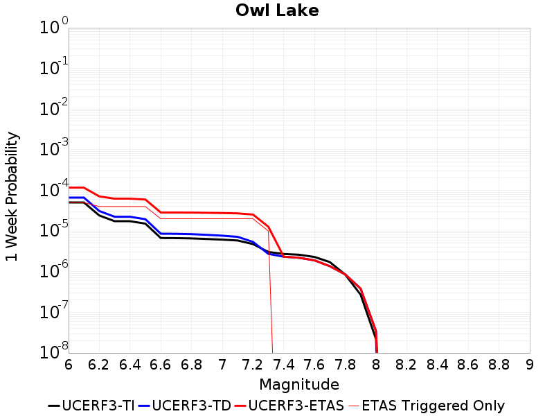 |  |  |  |

| Magnitude | 1 wk TI Prob | 1 wk TD Prob | 1 wk ETAS Prob | 1 wk ETAS/TD Gain | 1 wk ETAS Triggered Only | 1 mo TI Prob | 1 mo TD Prob | 1 mo ETAS Prob | 1 mo ETAS/TD Gain | 1 mo ETAS Triggered Only | 1 yr TI Prob | 1 yr TD Prob | 1 yr ETAS Prob | 1 yr ETAS/TD Gain | 1 yr ETAS Triggered Only | 10 yr TI Prob | 10 yr TD Prob | 10 yr ETAS Prob | 10 yr ETAS/TD Gain | 10 yr ETAS Triggered Only |
|-----|-----|-----|-----|-----|-----|-----|-----|-----|-----|-----|-----|-----|-----|-----|-----|-----|-----|-----|-----|-----|
| 6.0 | 5.0320643E-5 | 6.650935E-5 | 1.3650469E-4 | 2.0524137 | 7.0E-5 | 2.1564208E-4 | 2.8501524E-4 | 5.6493544E-4 | 1.9821236 | 2.8E-4 | 0.0026222812 | 0.003465427 | 0.005737526 | 1.6556476 | 0.00228 | 0.02591553 | 0.03421692 | 0.042493682 | 1.2418909 | 0.00857 |
| 6.1 | 5.0320643E-5 | 6.650935E-5 | 1.3650469E-4 | 2.0524137 | 7.0E-5 | 2.1564208E-4 | 2.8501524E-4 | 5.6493544E-4 | 1.9821236 | 2.8E-4 | 0.0026222812 | 0.003465427 | 0.005737526 | 1.6556476 | 0.00228 | 0.02591553 | 0.03421692 | 0.042493682 | 1.2418909 | 0.00857 |
| 6.2 | 2.4125871E-5 | 3.1063722E-5 | 7.106248E-5 | 2.2876356 | 4.0E-5 | 1.0339249E-4 | 1.3312462E-4 | 3.2309932E-4 | 2.4270442 | 1.9E-4 | 0.0012580766 | 0.0016197643 | 0.0033469622 | 2.0663266 | 0.00173 | 0.012509781 | 0.01611303 | 0.022242647 | 1.3804135 | 0.00623 |
| 6.3 | 1.7433485E-5 | 2.2424418E-5 | 6.242352E-5 | 2.7837298 | 4.0E-5 | 7.471279E-5 | 9.6102005E-5 | 2.8608376E-4 | 2.976876 | 1.9E-4 | 9.0924866E-4 | 0.0011695556 | 0.0027377193 | 2.3408203 | 0.00157 | 0.009055373 | 0.011664262 | 0.016991392 | 1.4567052 | 0.00539 |
| 6.4 | 1.7433485E-5 | 2.2424418E-5 | 6.242352E-5 | 2.7837298 | 4.0E-5 | 7.471279E-5 | 9.6102005E-5 | 2.8608376E-4 | 2.976876 | 1.9E-4 | 9.0924866E-4 | 0.0011695556 | 0.0027377193 | 2.3408203 | 0.00157 | 0.009055373 | 0.011664262 | 0.016991392 | 1.4567052 | 0.00539 |
| 6.5 | 1.5182742E-5 | 1.9493227E-5 | 5.949245E-5 | 3.0519547 | 4.0E-5 | 6.506727E-5 | 8.354058E-5 | 2.7352473E-4 | 3.2741537 | 1.9E-4 | 7.919061E-4 | 0.0010167713 | 0.0025152462 | 2.473758 | 0.0015 | 0.0078909 | 0.01015133 | 0.01524905 | 1.5021727 | 0.00515 |
| 6.6 | 6.7271576E-6 | 8.593633E-6 | 2.859346E-5 | 3.3272846 | 2.0E-5 | 2.8830356E-5 | 3.6829366E-5 | 1.5682494E-4 | 4.2581496 | 1.2E-4 | 3.5095305E-4 | 4.4831095E-4 | 0.0015778043 | 3.5194418 | 0.00113 | 0.0035039932 | 0.0044915746 | 0.008304372 | 1.8488777 | 0.00383 |
| 6.7 | 6.682835E-6 | 8.526018E-6 | 2.8525847E-5 | 3.345741 | 2.0E-5 | 2.8640408E-5 | 3.6539597E-5 | 1.5653521E-4 | 4.2839885 | 1.2E-4 | 3.4864116E-4 | 4.4478447E-4 | 0.0015742818 | 3.5394263 | 0.00113 | 0.003480947 | 0.004456496 | 0.008269427 | 1.8555896 | 0.00383 |
| 6.8 | 6.5774975E-6 | 8.372317E-6 | 2.837215E-5 | 3.388805 | 2.0E-5 | 2.8188972E-5 | 3.5880897E-5 | 1.558766E-4 | 4.344278 | 1.2E-4 | 3.4314668E-4 | 4.3676805E-4 | 0.0015662744 | 3.5860558 | 0.00113 | 0.0034261728 | 0.0043765903 | 0.008189828 | 1.8712804 | 0.00383 |
| 6.9 | 6.363419E-6 | 8.045045E-6 | 2.8044884E-5 | 3.4859822 | 2.0E-5 | 2.727151E-5 | 3.447834E-5 | 1.544742E-4 | 4.480326 | 1.2E-4 | 3.3198006E-4 | 4.1969857E-4 | 0.0015392285 | 3.6674619 | 0.00112 | 0.0033148455 | 0.004206339 | 0.008010271 | 1.9043331 | 0.00382 |
| 7.0 | 6.1342453E-6 | 7.676664E-6 | 2.767651E-5 | 3.6052785 | 2.0E-5 | 2.6289357E-5 | 3.2899603E-5 | 1.5289565E-4 | 4.6473403 | 1.2E-4 | 3.2002592E-4 | 4.004846E-4 | 0.00151004 | 3.7705321 | 0.00111 | 0.0031956544 | 0.004014755 | 0.0077994987 | 1.9427086 | 0.0038 |
| 7.1 | 5.842926E-6 | 7.1863624E-6 | 2.7186219E-5 | 3.783029 | 2.0E-5 | 2.504087E-5 | 3.0798365E-5 | 1.5079467E-4 | 4.896191 | 1.2E-4 | 3.0482994E-4 | 3.74911E-4 | 0.0014445098 | 3.8529406 | 0.00107 | 0.0030441214 | 0.0037597185 | 0.007336221 | 1.9512688 | 0.00359 |
| 7.2 | 4.77173E-6 | 5.394801E-6 | 2.5394693E-5 | 4.707253 | 2.0E-5 | 2.045011E-5 | 2.3120394E-5 | 1.03118546E-4 | 4.4600687 | 8.0E-5 | 2.4895166E-4 | 2.8145852E-4 | 9.312756E-4 | 3.308749 | 6.5E-4 | 0.0024867293 | 0.0028271168 | 0.005170473 | 1.8288856 | 0.00235 |
| 7.3 | 3.0494948E-6 | 2.7387068E-6 | 2.7387068E-6 | 1.0 | 0.0 | 1.3069198E-5 | 1.1737263E-5 | 1.1737263E-5 | 1.0 | 0.0 | 1.5910587E-4 | 1.4289196E-4 | 2.9287054E-4 | 2.0495942 | 1.5E-4 | 0.0015899199 | 0.0014378113 | 0.0021268192 | 1.4792061 | 6.9E-4 |
| 7.4 | 2.7263884E-6 | 2.332126E-6 | 2.332126E-6 | 1.0 | 0.0 | 1.1684469E-5 | 9.994789E-6 | 9.994789E-6 | 1.0 | 0.0 | 1.4224913E-4 | 1.2167986E-4 | 2.4166526E-4 | 1.9860744 | 1.2E-4 | 0.0014215811 | 0.0012249203 | 0.0016743691 | 1.3669208 | 4.5E-4 |
| 7.5 | 2.6090431E-6 | 2.1916007E-6 | 2.1916007E-6 | 1.0 | 0.0 | 1.1181565E-5 | 9.392541E-6 | 9.392541E-6 | 1.0 | 0.0 | 1.3612706E-4 | 1.1434829E-4 | 2.04338E-4 | 1.7869791 | 9.0E-5 | 0.001360437 | 0.0011514282 | 0.0015210022 | 1.32097 | 3.7E-4 |
| 7.6 | 2.3008756E-6 | 1.8959158E-6 | 1.8959158E-6 | 1.0 | 0.0 | 9.860858E-6 | 8.125328E-6 | 8.125328E-6 | 1.0 | 0.0 | 1.20049335E-4 | 9.892147E-5 | 1.7891356E-4 | 1.8086423 | 8.0E-5 | 0.001199845 | 9.970275E-4 | 0.0012867384 | 1.2905746 | 2.9E-4 |
| 7.7 | 1.7184348E-6 | 1.3627093E-6 | 1.3627093E-6 | 1.0 | 0.0 | 7.3646997E-6 | 5.8401697E-6 | 5.8401697E-6 | 1.0 | 0.0 | 8.966153E-5 | 7.110179E-5 | 1.3109752E-4 | 1.8438007 | 6.0E-5 | 8.962536E-4 | 7.18671E-4 | 8.7855605E-4 | 1.2224731 | 1.6E-4 |
| 7.8 | 8.4612907E-7 | 8.5524664E-7 | 8.5524664E-7 | 1.0 | 0.0 | 3.6262625E-6 | 3.6653378E-6 | 3.6653378E-6 | 1.0 | 0.0 | 4.4148852E-5 | 4.4624598E-5 | 7.4623254E-5 | 1.672245 | 3.0E-5 | 4.414008E-4 | 4.5155524E-4 | 5.2152365E-4 | 1.1549498 | 7.0E-5 |
| 7.9 | 2.716738E-7 | 3.828163E-7 | 3.828163E-7 | 1.0 | 0.0 | 1.1643157E-6 | 1.6406403E-6 | 1.6406403E-6 | 1.0 | 0.0 | 1.4175452E-5 | 1.9974625E-5 | 2.9974424E-5 | 1.5006253 | 1.0E-5 | 1.4174548E-4 | 2.0138944E-4 | 2.4138138E-4 | 1.1985801 | 4.0E-5 |
| 8.0 | 2.1995428E-8 | 3.4390467E-8 | 3.4390467E-8 | 1.0 | 0.0 | 9.426611E-8 | 1.4738772E-7 | 1.4738772E-7 | 1.0 | 0.0 | 1.1476893E-6 | 1.7944448E-6 | 1.7944448E-6 | 1.0 | 0.0 | 1.14768345E-5 | 1.8146931E-5 | 1.8146931E-5 | 1.0 | 0.0 |

## Panamint Valley
*[(top)](#table-of-contents)*

| 1 Week | 1 Month | 1 Year | 10 Year |
|-----|-----|-----|-----|
|  |  |  | 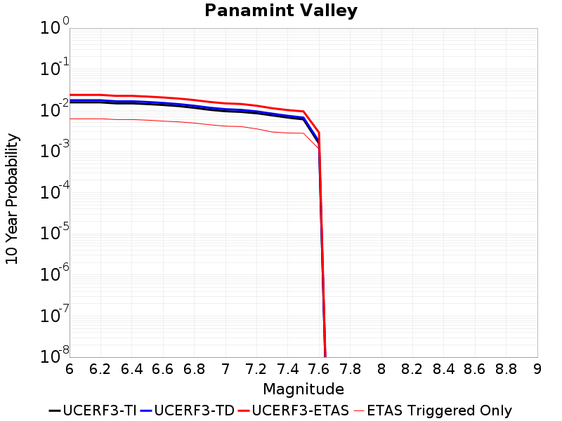 |

| Magnitude | 1 wk TI Prob | 1 wk TD Prob | 1 wk ETAS Prob | 1 wk ETAS/TD Gain | 1 wk ETAS Triggered Only | 1 mo TI Prob | 1 mo TD Prob | 1 mo ETAS Prob | 1 mo ETAS/TD Gain | 1 mo ETAS Triggered Only | 1 yr TI Prob | 1 yr TD Prob | 1 yr ETAS Prob | 1 yr ETAS/TD Gain | 1 yr ETAS Triggered Only | 10 yr TI Prob | 10 yr TD Prob | 10 yr ETAS Prob | 10 yr ETAS/TD Gain | 10 yr ETAS Triggered Only |
|-----|-----|-----|-----|-----|-----|-----|-----|-----|-----|-----|-----|-----|-----|-----|-----|-----|-----|-----|-----|-----|
| 6.0 | 3.0211835E-5 | 3.4025208E-5 | 1.0402282E-4 | 3.057228 | 7.0E-5 | 1.2947287E-4 | 1.4581434E-4 | 3.957779E-4 | 2.714259 | 2.5E-4 | 0.0015751923 | 0.0017738736 | 0.0036405565 | 2.0523202 | 0.00187 | 0.015640736 | 0.017603392 | 0.02393985 | 1.3599566 | 0.00645 |
| 6.1 | 3.0211835E-5 | 3.4025208E-5 | 1.0402282E-4 | 3.057228 | 7.0E-5 | 1.2947287E-4 | 1.4581434E-4 | 3.957779E-4 | 2.714259 | 2.5E-4 | 0.0015751923 | 0.0017738736 | 0.0036405565 | 2.0523202 | 0.00187 | 0.015640736 | 0.017603392 | 0.02393985 | 1.3599566 | 0.00645 |
| 6.2 | 3.0211835E-5 | 3.4025208E-5 | 1.0402282E-4 | 3.057228 | 7.0E-5 | 1.2947287E-4 | 1.4581434E-4 | 3.957779E-4 | 2.714259 | 2.5E-4 | 0.0015751923 | 0.0017738736 | 0.0036405565 | 2.0523202 | 0.00187 | 0.015640736 | 0.017603392 | 0.02393985 | 1.3599566 | 0.00645 |
| 6.3 | 2.8573924E-5 | 3.2141324E-5 | 1.0213907E-4 | 3.1778116 | 7.0E-5 | 1.2245393E-4 | 1.3774142E-4 | 3.7770835E-4 | 2.7421553 | 2.4E-4 | 0.001489857 | 0.0016757397 | 0.0034727233 | 2.0723526 | 0.0018 | 0.01479908 | 0.016636899 | 0.022586245 | 1.3575995 | 0.00605 |
| 6.4 | 2.8573924E-5 | 3.2141324E-5 | 1.0213907E-4 | 3.1778116 | 7.0E-5 | 1.2245393E-4 | 1.3774142E-4 | 3.7770835E-4 | 2.7421553 | 2.4E-4 | 0.001489857 | 0.0016757397 | 0.0034727233 | 2.0723526 | 0.0018 | 0.01479908 | 0.016636899 | 0.022586245 | 1.3575995 | 0.00605 |
| 6.5 | 2.7468774E-5 | 3.086568E-5 | 1.0086352E-4 | 3.2678208 | 7.0E-5 | 1.1771801E-4 | 1.3227494E-4 | 3.722432E-4 | 2.8141625 | 2.4E-4 | 0.0014322745 | 0.0016092852 | 0.0033265173 | 2.0670774 | 0.00172 | 0.014230782 | 0.015982073 | 0.021777937 | 1.3626479 | 0.00589 |
| 6.6 | 2.6135967E-5 | 2.9287849E-5 | 9.92858E-5 | 3.3899996 | 7.0E-5 | 1.1200648E-4 | 1.2551347E-4 | 3.4548584E-4 | 2.75258 | 2.2E-4 | 0.0013628257 | 0.0015270818 | 0.003184547 | 2.0853806 | 0.00166 | 0.013544982 | 0.01517127 | 0.020784793 | 1.3700101 | 0.0057 |
| 6.7 | 2.4498746E-5 | 2.737492E-5 | 9.7373006E-5 | 3.5570152 | 7.0E-5 | 1.04990395E-4 | 1.1731595E-4 | 3.3729014E-4 | 2.875058 | 2.2E-4 | 0.0012775084 | 0.001427411 | 0.0030750558 | 2.154289 | 0.00165 | 0.012701893 | 0.014187601 | 0.019649003 | 1.3849418 | 0.00554 |
| 6.8 | 2.2244329E-5 | 2.496671E-5 | 9.496496E-5 | 3.8036635 | 7.0E-5 | 9.532935E-5 | 1.0699592E-4 | 3.069745E-4 | 2.8690302 | 2.0E-4 | 0.0011600169 | 0.0013019186 | 0.0028798617 | 2.2120135 | 0.00158 | 0.011539802 | 0.012947693 | 0.018050753 | 1.3941289 | 0.00517 |
| 6.9 | 1.9902658E-5 | 2.2319167E-5 | 9.2317605E-5 | 4.1362476 | 7.0E-5 | 8.529431E-5 | 9.5650175E-5 | 2.7563295E-4 | 2.8816776 | 1.8E-4 | 0.0010379635 | 0.0011639373 | 0.0025722962 | 2.2099955 | 0.00141 | 0.010331288 | 0.011582794 | 0.016070208 | 1.3874208 | 0.00454 |
| 7.0 | 1.8353881E-5 | 2.0593112E-5 | 9.059167E-5 | 4.3991246 | 7.0E-5 | 7.865712E-5 | 8.825331E-5 | 2.5823832E-4 | 2.9261034 | 1.7E-4 | 9.5722964E-4 | 0.0010739722 | 0.0024025438 | 2.2370634 | 0.00133 | 0.009531168 | 0.010692194 | 0.014837394 | 1.3876847 | 0.00419 |
| 7.1 | 1.7667631E-5 | 1.9798024E-5 | 8.979664E-5 | 4.5356364 | 7.0E-5 | 7.571623E-5 | 8.484601E-5 | 2.548316E-4 | 3.0034597 | 1.7E-4 | 9.2145515E-4 | 0.0010325284 | 0.0022812376 | 2.2093706 | 0.00125 | 0.009176437 | 0.010281641 | 0.014270206 | 1.3879308 | 0.00403 |
| 7.2 | 1.6381597E-5 | 1.818122E-5 | 6.818031E-5 | 3.7500408 | 5.0E-5 | 7.020495E-5 | 7.791728E-5 | 2.2790559E-4 | 2.9249685 | 1.5E-4 | 8.544101E-4 | 9.482474E-4 | 0.0020771758 | 2.1905422 | 0.00113 | 0.008511325 | 0.009446116 | 0.013002205 | 1.3764604 | 0.00359 |
| 7.3 | 1.4520491E-5 | 1.5985328E-5 | 5.598469E-5 | 3.5022545 | 4.0E-5 | 6.222919E-5 | 6.8506844E-5 | 1.7849931E-4 | 2.6055691 | 1.1E-4 | 7.57377E-4 | 8.337679E-4 | 0.0018029591 | 2.1624234 | 9.7E-4 | 0.0075480095 | 0.008308994 | 0.0113039 | 1.3604416 | 0.00302 |
| 7.4 | 1.2852287E-5 | 1.4161974E-5 | 4.416155E-5 | 3.1183188 | 3.0E-5 | 5.5080065E-5 | 6.069285E-5 | 1.6068679E-4 | 2.6475406 | 1.0E-4 | 6.7039346E-4 | 7.387008E-4 | 0.0016680139 | 2.258037 | 9.3E-4 | 0.0066837464 | 0.0073648533 | 0.010154158 | 1.3787318 | 0.00281 |
| 7.5 | 1.1637851E-5 | 1.2852719E-5 | 4.2852334E-5 | 3.3341064 | 3.0E-5 | 4.987555E-5 | 5.5082004E-5 | 1.550765E-4 | 2.8153749 | 1.0E-4 | 6.070656E-4 | 6.704328E-4 | 0.0015998093 | 2.3862336 | 9.3E-4 | 0.006054099 | 0.0066864775 | 0.009408156 | 1.4070423 | 0.00274 |
| 7.6 | 3.0068115E-6 | 3.339223E-6 | 1.33391895E-5 | 3.9946985 | 1.0E-5 | 1.2886271E-5 | 1.4310918E-5 | 5.4310345E-5 | 3.7950287 | 4.0E-5 | 1.5687906E-4 | 1.7422882E-4 | 5.7415914E-4 | 3.2954316 | 4.0E-4 | 0.0015676835 | 0.0017419244 | 0.0028799386 | 1.6533086 | 0.00114 |

## Garlock (East)
*[(top)](#table-of-contents)*

| 1 Week | 1 Month | 1 Year | 10 Year |
|-----|-----|-----|-----|
|  |  |  |  |

| Magnitude | 1 wk TI Prob | 1 wk TD Prob | 1 wk ETAS Prob | 1 wk ETAS/TD Gain | 1 wk ETAS Triggered Only | 1 mo TI Prob | 1 mo TD Prob | 1 mo ETAS Prob | 1 mo ETAS/TD Gain | 1 mo ETAS Triggered Only | 1 yr TI Prob | 1 yr TD Prob | 1 yr ETAS Prob | 1 yr ETAS/TD Gain | 1 yr ETAS Triggered Only | 10 yr TI Prob | 10 yr TD Prob | 10 yr ETAS Prob | 10 yr ETAS/TD Gain | 10 yr ETAS Triggered Only |
|-----|-----|-----|-----|-----|-----|-----|-----|-----|-----|-----|-----|-----|-----|-----|-----|-----|-----|-----|-----|-----|
| 6.0 | 4.5092507E-5 | 6.308443E-5 | 1.0308191E-4 | 1.6340308 | 4.0E-5 | 1.9323928E-4 | 2.7033637E-4 | 4.902769E-4 | 1.813581 | 2.2E-4 | 0.0023501497 | 0.003286825 | 0.0049114674 | 1.4942893 | 0.00163 | 0.023254504 | 0.032474987 | 0.038018905 | 1.1707134 | 0.00573 |
| 6.1 | 4.5092507E-5 | 6.308443E-5 | 1.0308191E-4 | 1.6340308 | 4.0E-5 | 1.9323928E-4 | 2.7033637E-4 | 4.902769E-4 | 1.813581 | 2.2E-4 | 0.0023501497 | 0.003286825 | 0.0049114674 | 1.4942893 | 0.00163 | 0.023254504 | 0.032474987 | 0.038018905 | 1.1707134 | 0.00573 |
| 6.2 | 2.6674514E-5 | 3.4657023E-5 | 6.4655986E-5 | 1.8655955 | 3.0E-5 | 1.1431433E-4 | 1.4852184E-4 | 3.0849807E-4 | 2.0771227 | 1.6E-4 | 0.0013908884 | 0.0018067867 | 0.0029846549 | 1.6519132 | 0.00118 | 0.01382215 | 0.017978387 | 0.022034137 | 1.2255902 | 0.00413 |
| 6.3 | 2.6674514E-5 | 3.4657023E-5 | 6.4655986E-5 | 1.8655955 | 3.0E-5 | 1.1431433E-4 | 1.4852184E-4 | 3.0849807E-4 | 2.0771227 | 1.6E-4 | 0.0013908884 | 0.0018067867 | 0.0029846549 | 1.6519132 | 0.00118 | 0.01382215 | 0.017978387 | 0.022034137 | 1.2255902 | 0.00413 |
| 6.4 | 2.5312667E-5 | 3.2483564E-5 | 6.248259E-5 | 1.923514 | 3.0E-5 | 1.0847834E-4 | 1.3920802E-4 | 2.9918575E-4 | 2.149199 | 1.6E-4 | 0.0013199237 | 0.0016935696 | 0.002861588 | 1.6896785 | 0.00117 | 0.013121112 | 0.016848773 | 0.020830536 | 1.2363236 | 0.00405 |
| 6.5 | 2.5312667E-5 | 3.2483564E-5 | 6.248259E-5 | 1.923514 | 3.0E-5 | 1.0847834E-4 | 1.3920802E-4 | 2.9918575E-4 | 2.149199 | 1.6E-4 | 0.0013199237 | 0.0016935696 | 0.002861588 | 1.6896785 | 0.00117 | 0.013121112 | 0.016848773 | 0.020830536 | 1.2363236 | 0.00405 |
| 6.6 | 2.246556E-5 | 2.826663E-5 | 5.826578E-5 | 2.0612922 | 3.0E-5 | 9.627742E-5 | 1.2113721E-4 | 2.6112027E-4 | 2.1555743 | 1.4E-4 | 0.0011715472 | 0.0014738714 | 0.00257225 | 1.7452338 | 0.0011 | 0.011653901 | 0.014683984 | 0.018428184 | 1.2549853 | 0.0038 |
| 6.7 | 2.2241198E-5 | 2.7935694E-5 | 5.7934856E-5 | 2.073865 | 3.0E-5 | 9.531594E-5 | 1.1971904E-4 | 2.5970227E-4 | 2.1692646 | 1.4E-4 | 0.0011598538 | 0.0014566284 | 0.0025550262 | 1.7540686 | 0.0011 | 0.011538187 | 0.014513304 | 0.0182483 | 1.2573497 | 0.00379 |
| 6.8 | 1.9528685E-5 | 2.402015E-5 | 5.401943E-5 | 2.2489214 | 3.0E-5 | 8.369167E-5 | 1.0293955E-4 | 2.3292616E-4 | 2.262747 | 1.3E-4 | 0.0010184698 | 0.0012525882 | 0.0022513357 | 1.797347 | 0.001 | 0.010138147 | 0.012498631 | 0.016043762 | 1.2836415 | 0.00359 |
| 6.9 | 1.3318621E-5 | 1.5297152E-5 | 4.5296692E-5 | 2.9611194 | 3.0E-5 | 5.7078556E-5 | 6.555761E-5 | 1.9554909E-4 | 2.982859 | 1.3E-4 | 6.9470983E-4 | 7.978773E-4 | 0.0016671831 | 2.0895233 | 8.7E-4 | 0.0069254204 | 0.007989423 | 0.011104336 | 1.3898796 | 0.00314 |
| 7.0 | 1.1760853E-5 | 1.3202715E-5 | 4.320232E-5 | 3.27223 | 3.0E-5 | 5.0402683E-5 | 5.6581866E-5 | 1.8657451E-4 | 3.2974257 | 1.3E-4 | 6.134799E-4 | 6.8867154E-4 | 0.0014981137 | 2.1753676 | 8.1E-4 | 0.0061178906 | 0.006904327 | 0.00984389 | 1.4257567 | 0.00296 |
| 7.1 | 1.0064758E-5 | 1.0994681E-5 | 4.099435E-5 | 3.728562 | 3.0E-5 | 4.3133965E-5 | 4.711923E-5 | 1.771131E-4 | 3.7588284 | 1.3E-4 | 5.2502943E-4 | 5.7352916E-4 | 0.0013330933 | 2.3243687 | 7.6E-4 | 0.005237907 | 0.0057601067 | 0.008563863 | 1.4867543 | 0.00282 |
| 7.2 | 9.768808E-6 | 1.0589924E-5 | 4.0589606E-5 | 3.8328514 | 3.0E-5 | 4.186565E-5 | 4.5384622E-5 | 1.7537872E-4 | 3.8642764 | 1.3E-4 | 5.095951E-4 | 5.524212E-4 | 0.0013120014 | 2.375002 | 7.6E-4 | 0.0050842804 | 0.005550216 | 0.008324731 | 1.4998932 | 0.00279 |
| 7.3 | 9.344516E-6 | 1.0033902E-5 | 4.00336E-5 | 3.9898338 | 3.0E-5 | 4.004731E-5 | 4.300175E-5 | 1.7299615E-4 | 4.023003 | 1.3E-4 | 4.8746695E-4 | 5.23424E-4 | 0.0012430472 | 2.3748379 | 7.2E-4 | 0.0048639905 | 0.005261036 | 0.007847358 | 1.4915992 | 0.0026 |
| 7.4 | 9.023491E-6 | 9.5783425E-6 | 3.9578055E-5 | 4.1320357 | 3.0E-5 | 3.867153E-5 | 4.1049414E-5 | 1.510449E-4 | 3.6795874 | 1.1E-4 | 4.7072413E-4 | 4.996654E-4 | 0.0011393456 | 2.2802172 | 6.4E-4 | 0.004697283 | 0.0050235745 | 0.00733192 | 1.4595026 | 0.00232 |
| 7.5 | 7.081253E-6 | 7.165846E-6 | 7.165846E-6 | 1.0 | 0.0 | 3.0347876E-5 | 3.071041E-5 | 6.0709488E-5 | 1.9768374 | 3.0E-5 | 3.6942272E-4 | 3.7383585E-4 | 7.23705E-4 | 1.9358898 | 3.5E-4 | 0.003688092 | 0.0037647025 | 0.005039884 | 1.3387203 | 0.00128 |
| 7.6 | 6.116396E-6 | 6.0308166E-6 | 6.0308166E-6 | 1.0 | 0.0 | 2.6212863E-5 | 2.5846102E-5 | 5.584533E-5 | 2.1606865 | 3.0E-5 | 3.1909486E-4 | 3.1463112E-4 | 5.145682E-4 | 1.635465 | 2.0E-4 | 0.0031863707 | 0.0031726453 | 0.003920266 | 1.2356458 | 7.5E-4 |
| 7.7 | 4.797145E-6 | 4.824902E-6 | 4.824902E-6 | 1.0 | 0.0 | 2.055903E-5 | 2.0677988E-5 | 4.0677576E-5 | 1.967192 | 2.0E-5 | 2.5027743E-4 | 2.5172555E-4 | 3.7169535E-4 | 1.4765897 | 1.2E-4 | 0.0024999576 | 0.0025442895 | 0.0030130937 | 1.1842574 | 4.7E-4 |
| 7.8 | 3.4028885E-6 | 4.038925E-6 | 4.038925E-6 | 1.0 | 0.0 | 1.4583726E-5 | 1.7309565E-5 | 3.730922E-5 | 2.1554105 | 2.0E-5 | 1.775424E-4 | 2.1072365E-4 | 2.9070678E-4 | 1.3795642 | 8.0E-5 | 0.0017740062 | 0.0021323704 | 0.0024017948 | 1.1263497 | 2.7E-4 |
| 7.9 | 2.5928412E-6 | 3.4236325E-6 | 3.4236325E-6 | 1.0 | 0.0 | 1.1112129E-5 | 1.4672629E-5 | 3.4672335E-5 | 2.3630624 | 2.0E-5 | 1.3528178E-4 | 1.7862467E-4 | 2.5861038E-4 | 1.4477865 | 8.0E-5 | 0.0013519945 | 0.0018076303 | 0.0020172508 | 1.1159642 | 2.1E-4 |
| 8.0 | 1.3743648E-6 | 1.696674E-6 | 1.696674E-6 | 1.0 | 0.0 | 5.8901214E-6 | 7.2714397E-6 | 1.7271366E-5 | 2.3752334 | 1.0E-5 | 7.1709874E-5 | 8.852621E-5 | 1.1852355E-4 | 1.3388526 | 3.0E-5 | 7.1686733E-4 | 8.956477E-4 | 9.75576E-4 | 1.0892408 | 8.0E-5 |
| 8.1 | 3.6733252E-7 | 3.190176E-7 | 3.190176E-7 | 1.0 | 0.0 | 1.5742813E-6 | 1.3672176E-6 | 1.3672176E-6 | 1.0 | 0.0 | 1.9166706E-5 | 1.6645765E-5 | 1.6645765E-5 | 1.0 | 0.0 | 1.9165053E-4 | 1.684635E-4 | 1.7846182E-4 | 1.05935 | 1.0E-5 |

## Ash Hill
*[(top)](#table-of-contents)*

| 1 Week | 1 Month | 1 Year | 10 Year |
|-----|-----|-----|-----|
|  |  | 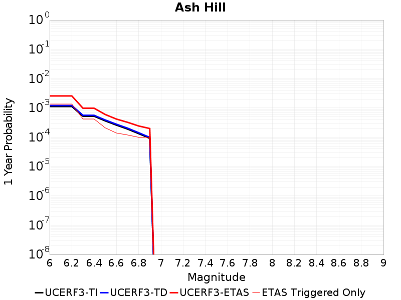 |  |

| Magnitude | 1 wk TI Prob | 1 wk TD Prob | 1 wk ETAS Prob | 1 wk ETAS/TD Gain | 1 wk ETAS Triggered Only | 1 mo TI Prob | 1 mo TD Prob | 1 mo ETAS Prob | 1 mo ETAS/TD Gain | 1 mo ETAS Triggered Only | 1 yr TI Prob | 1 yr TD Prob | 1 yr ETAS Prob | 1 yr ETAS/TD Gain | 1 yr ETAS Triggered Only | 10 yr TI Prob | 10 yr TD Prob | 10 yr ETAS Prob | 10 yr ETAS/TD Gain | 10 yr ETAS Triggered Only |
|-----|-----|-----|-----|-----|-----|-----|-----|-----|-----|-----|-----|-----|-----|-----|-----|-----|-----|-----|-----|-----|
| 6.0 | 2.1545662E-5 | 2.3204955E-5 | 4.320449E-5 | 1.8618649 | 2.0E-5 | 9.2335285E-5 | 9.944647E-5 | 1.7943852E-4 | 1.8043729 | 8.0E-5 | 0.0011236023 | 0.0012101684 | 0.0025485468 | 2.105944 | 0.00134 | 0.011179381 | 0.012043774 | 0.015936323 | 1.3232 | 0.00394 |
| 6.1 | 2.1545662E-5 | 2.3204955E-5 | 4.320449E-5 | 1.8618649 | 2.0E-5 | 9.2335285E-5 | 9.944647E-5 | 1.7943852E-4 | 1.8043729 | 8.0E-5 | 0.0011236023 | 0.0012101684 | 0.0025485468 | 2.105944 | 0.00134 | 0.011179381 | 0.012043774 | 0.015936323 | 1.3232 | 0.00394 |
| 6.2 | 2.1545662E-5 | 2.3204955E-5 | 4.320449E-5 | 1.8618649 | 2.0E-5 | 9.2335285E-5 | 9.944647E-5 | 1.7943852E-4 | 1.8043729 | 8.0E-5 | 0.0011236023 | 0.0012101684 | 0.0025485468 | 2.105944 | 0.00134 | 0.011179381 | 0.012043774 | 0.015936323 | 1.3232 | 0.00394 |
| 6.3 | 1.0025529E-5 | 1.0751511E-5 | 1.0751511E-5 | 1.0 | 0.0 | 4.2965847E-5 | 4.6077163E-5 | 7.607578E-5 | 1.6510518 | 3.0E-5 | 5.229836E-4 | 5.608583E-4 | 0.0010705723 | 1.9088106 | 5.1E-4 | 0.005217545 | 0.005595742 | 0.007007796 | 1.2523444 | 0.00142 |
| 6.4 | 1.0025529E-5 | 1.0751511E-5 | 1.0751511E-5 | 1.0 | 0.0 | 4.2965847E-5 | 4.6077163E-5 | 7.607578E-5 | 1.6510518 | 3.0E-5 | 5.229836E-4 | 5.608583E-4 | 0.0010705723 | 1.9088106 | 5.1E-4 | 0.005217545 | 0.005595742 | 0.007007796 | 1.2523444 | 0.00142 |
| 6.5 | 6.9617327E-6 | 7.4597706E-6 | 7.4597706E-6 | 1.0 | 0.0 | 2.9835655E-5 | 3.1970103E-5 | 4.1969783E-5 | 1.3127823 | 1.0E-5 | 3.6318856E-4 | 3.8917514E-4 | 7.290428E-4 | 1.8733026 | 3.4E-4 | 0.0036259557 | 0.0038857912 | 0.0047922553 | 1.2332765 | 9.1E-4 |
| 6.6 | 4.9919777E-6 | 5.348936E-6 | 5.348936E-6 | 1.0 | 0.0 | 2.1394015E-5 | 2.2923849E-5 | 3.2923617E-5 | 1.436217 | 1.0E-5 | 2.60441E-4 | 2.790688E-4 | 5.3899625E-4 | 1.9314098 | 2.6E-4 | 0.0026013597 | 0.0027878429 | 0.0035058355 | 1.2575442 | 7.2E-4 |
| 6.7 | 3.6630722E-6 | 3.926282E-6 | 3.926282E-6 | 1.0 | 0.0 | 1.5698786E-5 | 1.6826845E-5 | 1.6826845E-5 | 1.0 | 0.0 | 1.9111596E-4 | 2.0485332E-4 | 3.748185E-4 | 1.829692 | 1.7E-4 | 0.0019095168 | 0.0020472084 | 0.0024962872 | 1.2193615 | 4.5E-4 |
| 6.8 | 2.5599613E-6 | 2.7460985E-6 | 2.7460985E-6 | 1.0 | 0.0 | 1.0971216E-5 | 1.1768969E-5 | 1.1768969E-5 | 1.0 | 0.0 | 1.3356637E-4 | 1.4328271E-4 | 2.4326838E-4 | 1.6978209 | 1.0E-4 | 0.0013348613 | 0.0014323888 | 0.0017219733 | 1.2021691 | 2.9E-4 |
| 6.9 | 1.7684905E-6 | 1.8976854E-6 | 1.8976854E-6 | 1.0 | 0.0 | 7.579223E-6 | 8.132937E-6 | 8.132937E-6 | 1.0 | 0.0 | 9.2273134E-5 | 9.9018514E-5 | 1.5901258E-4 | 1.6058873 | 6.0E-5 | 9.223483E-4 | 9.901852E-4 | 0.0012099673 | 1.2219607 | 2.2E-4 |

## Hunter Mountain-Saline Valley
*[(top)](#table-of-contents)*

| 1 Week | 1 Month | 1 Year | 10 Year |
|-----|-----|-----|-----|
|  |  |  |  |

| Magnitude | 1 wk TI Prob | 1 wk TD Prob | 1 wk ETAS Prob | 1 wk ETAS/TD Gain | 1 wk ETAS Triggered Only | 1 mo TI Prob | 1 mo TD Prob | 1 mo ETAS Prob | 1 mo ETAS/TD Gain | 1 mo ETAS Triggered Only | 1 yr TI Prob | 1 yr TD Prob | 1 yr ETAS Prob | 1 yr ETAS/TD Gain | 1 yr ETAS Triggered Only | 10 yr TI Prob | 10 yr TD Prob | 10 yr ETAS Prob | 10 yr ETAS/TD Gain | 10 yr ETAS Triggered Only |
|-----|-----|-----|-----|-----|-----|-----|-----|-----|-----|-----|-----|-----|-----|-----|-----|-----|-----|-----|-----|-----|
| 6.0 | 4.5103672E-5 | 5.4645774E-5 | 9.464359E-5 | 1.7319471 | 4.0E-5 | 1.9328714E-4 | 2.3417608E-4 | 3.4415032E-4 | 1.469622 | 1.1E-4 | 0.002350731 | 0.0028475395 | 0.0038048057 | 1.3361732 | 9.6E-4 | 0.023260195 | 0.028130349 | 0.030939052 | 1.099846 | 0.00289 |
| 6.1 | 4.5103672E-5 | 5.4645774E-5 | 9.464359E-5 | 1.7319471 | 4.0E-5 | 1.9328714E-4 | 2.3417608E-4 | 3.4415032E-4 | 1.469622 | 1.1E-4 | 0.002350731 | 0.0028475395 | 0.0038048057 | 1.3361732 | 9.6E-4 | 0.023260195 | 0.028130349 | 0.030939052 | 1.099846 | 0.00289 |
| 6.2 | 3.9363465E-5 | 4.712625E-5 | 8.712437E-5 | 1.8487438 | 4.0E-5 | 1.6868966E-4 | 2.0195477E-4 | 3.1193256E-4 | 1.5445664 | 1.1E-4 | 0.002051862 | 0.0024561617 | 0.0034138039 | 1.3898938 | 9.6E-4 | 0.020330196 | 0.024305398 | 0.027115399 | 1.1156121 | 0.00288 |
| 6.3 | 3.9363465E-5 | 4.712625E-5 | 8.712437E-5 | 1.8487438 | 4.0E-5 | 1.6868966E-4 | 2.0195477E-4 | 3.1193256E-4 | 1.5445664 | 1.1E-4 | 0.002051862 | 0.0024561617 | 0.0034138039 | 1.3898938 | 9.6E-4 | 0.020330196 | 0.024305398 | 0.027115399 | 1.1156121 | 0.00288 |
| 6.4 | 3.2311684E-5 | 3.7999373E-5 | 6.799823E-5 | 1.7894567 | 3.0E-5 | 1.384713E-4 | 1.6284456E-4 | 2.6282828E-4 | 1.6139826 | 1.0E-4 | 0.0016845843 | 0.0019808991 | 0.0029290172 | 1.4786302 | 9.5E-4 | 0.016718714 | 0.019640677 | 0.022444505 | 1.1427561 | 0.00286 |
| 6.5 | 3.2311684E-5 | 3.7999373E-5 | 6.799823E-5 | 1.7894567 | 3.0E-5 | 1.384713E-4 | 1.6284456E-4 | 2.6282828E-4 | 1.6139826 | 1.0E-4 | 0.0016845843 | 0.0019808991 | 0.0029290172 | 1.4786302 | 9.5E-4 | 0.016718714 | 0.019640677 | 0.022444505 | 1.1427561 | 0.00286 |
| 6.6 | 2.9305844E-5 | 3.422459E-5 | 6.422357E-5 | 1.8765327 | 3.0E-5 | 1.2559042E-4 | 1.4666893E-4 | 2.4665426E-4 | 1.6817076 | 1.0E-4 | 0.0015279909 | 0.0017842936 | 0.0027325985 | 1.5314736 | 9.5E-4 | 0.015175272 | 0.01770707 | 0.020506606 | 1.1581026 | 0.00285 |
| 6.7 | 2.7826512E-5 | 3.2384378E-5 | 6.2383406E-5 | 1.9263426 | 3.0E-5 | 1.19251024E-4 | 1.3878314E-4 | 2.3876927E-4 | 1.7204486 | 1.0E-4 | 0.0014509142 | 0.0016884356 | 0.0026368315 | 1.561701 | 9.5E-4 | 0.014414776 | 0.01676325 | 0.019565474 | 1.1671648 | 0.00285 |
| 6.8 | 2.3389874E-5 | 2.6899199E-5 | 5.6898392E-5 | 2.1152449 | 3.0E-5 | 1.0023846E-4 | 1.1527745E-4 | 2.1526593E-4 | 1.8673724 | 1.0E-4 | 0.00121972 | 0.0014026468 | 0.0023413284 | 1.6692216 | 9.4E-4 | 0.01213047 | 0.013943631 | 0.01674403 | 1.2008373 | 0.00284 |
| 6.9 | 2.069209E-5 | 2.3598179E-5 | 5.3597472E-5 | 2.2712545 | 3.0E-5 | 8.867737E-5 | 1.01131336E-4 | 2.0112122E-4 | 1.9887131 | 1.0E-4 | 0.0010791123 | 0.0012306148 | 0.002169458 | 1.7629058 | 9.4E-4 | 0.010738871 | 0.01224251 | 0.0150378635 | 1.2283318 | 0.00283 |
| 7.0 | 1.7462342E-5 | 1.965659E-5 | 4.9656002E-5 | 2.5261757 | 3.0E-5 | 7.483646E-5 | 8.423994E-5 | 1.8423151E-4 | 2.1869853 | 1.0E-4 | 9.1075303E-4 | 0.0010251614 | 0.001954208 | 1.9062443 | 9.3E-4 | 0.009070295 | 0.010207429 | 0.012988746 | 1.2724797 | 0.00281 |
| 7.1 | 1.4807709E-5 | 1.6460968E-5 | 4.6460475E-5 | 2.822463 | 3.0E-5 | 6.3460066E-5 | 7.05452E-5 | 1.7053814E-4 | 2.4174309 | 1.0E-4 | 7.723524E-4 | 8.5856585E-4 | 0.0017877674 | 2.0822718 | 9.3E-4 | 0.007696735 | 0.008554947 | 0.011340907 | 1.325655 | 0.00281 |
| 7.2 | 1.4180048E-5 | 1.5716745E-5 | 4.5716275E-5 | 2.908762 | 3.0E-5 | 6.077022E-5 | 6.735584E-5 | 1.673491E-4 | 2.4845524 | 1.0E-4 | 7.396263E-4 | 8.1976503E-4 | 0.0017490026 | 2.1335413 | 9.3E-4 | 0.0073716943 | 0.008169833 | 0.010956875 | 1.3411384 | 0.00281 |
| 7.3 | 1.3730402E-5 | 1.5189923E-5 | 4.5189467E-5 | 2.9749637 | 3.0E-5 | 5.8843252E-5 | 6.509814E-5 | 1.6509162E-4 | 2.5360422 | 1.0E-4 | 7.161811E-4 | 7.922977E-4 | 0.001721561 | 2.172871 | 9.3E-4 | 0.007138774 | 0.007897133 | 0.010684942 | 1.3530153 | 0.00281 |
| 7.4 | 1.2810095E-5 | 1.4125734E-5 | 4.412531E-5 | 3.1237533 | 3.0E-5 | 5.489925E-5 | 6.0537546E-5 | 1.6053149E-4 | 2.6517675 | 1.0E-4 | 6.681934E-4 | 7.3681126E-4 | 0.001666126 | 2.2612658 | 9.3E-4 | 0.006661878 | 0.0073460485 | 0.01012548 | 1.3783573 | 0.0028 |
| 7.5 | 1.1595659E-5 | 1.2816478E-5 | 4.2816093E-5 | 3.3407066 | 3.0E-5 | 4.9694736E-5 | 5.49267E-5 | 1.549212E-4 | 2.8205082 | 1.0E-4 | 6.0486543E-4 | 6.685431E-4 | 0.0015979214 | 2.3901546 | 9.3E-4 | 0.006032217 | 0.0066676596 | 0.009379457 | 1.4067091 | 0.00273 |
| 7.6 | 2.997694E-6 | 3.3313286E-6 | 1.3331295E-5 | 4.0017953 | 1.0E-5 | 1.28471975E-5 | 1.4277085E-5 | 5.4276516E-5 | 3.8016522 | 4.0E-5 | 1.564034E-4 | 1.7381695E-4 | 5.7374744E-4 | 3.3008714 | 4.0E-4 | 0.0015629337 | 0.0017378022 | 0.002875821 | 1.654861 | 0.00114 |

## Blackwater
*[(top)](#table-of-contents)*

| 1 Week | 1 Month | 1 Year | 10 Year |
|-----|-----|-----|-----|
|  | 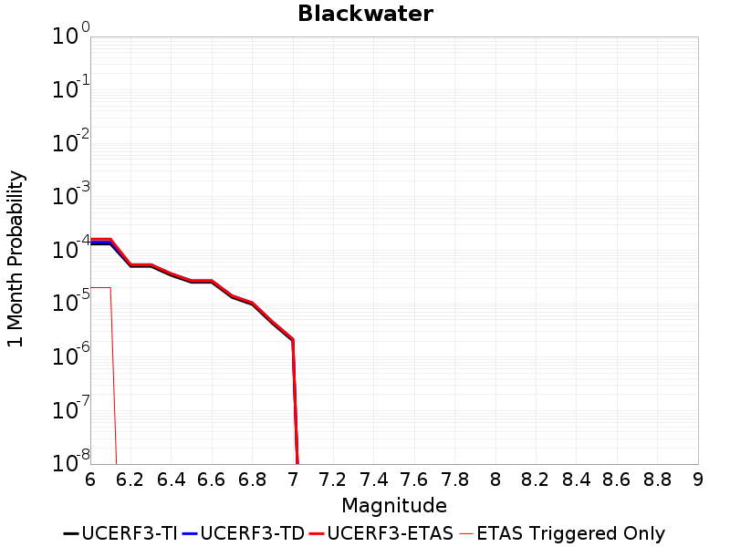 |  |  |

| Magnitude | 1 wk TI Prob | 1 wk TD Prob | 1 wk ETAS Prob | 1 wk ETAS/TD Gain | 1 wk ETAS Triggered Only | 1 mo TI Prob | 1 mo TD Prob | 1 mo ETAS Prob | 1 mo ETAS/TD Gain | 1 mo ETAS Triggered Only | 1 yr TI Prob | 1 yr TD Prob | 1 yr ETAS Prob | 1 yr ETAS/TD Gain | 1 yr ETAS Triggered Only | 10 yr TI Prob | 10 yr TD Prob | 10 yr ETAS Prob | 10 yr ETAS/TD Gain | 10 yr ETAS Triggered Only |
|-----|-----|-----|-----|-----|-----|-----|-----|-----|-----|-----|-----|-----|-----|-----|-----|-----|-----|-----|-----|-----|
| 6.0 | 3.0708583E-5 | 3.3111097E-5 | 4.3110766E-5 | 1.3020036 | 1.0E-5 | 1.3160157E-4 | 1.4189775E-4 | 1.9189065E-4 | 1.3523164 | 5.0E-5 | 0.0016010714 | 0.0017263729 | 0.0024251644 | 1.4047744 | 7.0E-4 | 0.015895851 | 0.017143467 | 0.019512152 | 1.1381683 | 0.00241 |
| 6.1 | 3.0708583E-5 | 3.3111097E-5 | 4.3110766E-5 | 1.3020036 | 1.0E-5 | 1.3160157E-4 | 1.4189775E-4 | 1.9189065E-4 | 1.3523164 | 5.0E-5 | 0.0016010714 | 0.0017263729 | 0.0024251644 | 1.4047744 | 7.0E-4 | 0.015895851 | 0.017143467 | 0.019512152 | 1.1381683 | 0.00241 |
| 6.2 | 1.1707779E-5 | 1.2550434E-5 | 2.2550308E-5 | 1.7967752 | 1.0E-5 | 5.017523E-5 | 5.378652E-5 | 8.378491E-5 | 1.5577306 | 3.0E-5 | 6.107122E-4 | 6.546637E-4 | 9.344804E-4 | 1.4274205 | 2.8E-4 | 0.006090366 | 0.006528324 | 0.007402579 | 1.1339172 | 8.8E-4 |
| 6.3 | 1.1707779E-5 | 1.2550434E-5 | 2.2550308E-5 | 1.7967752 | 1.0E-5 | 5.017523E-5 | 5.378652E-5 | 8.378491E-5 | 1.5577306 | 3.0E-5 | 6.107122E-4 | 6.546637E-4 | 9.344804E-4 | 1.4274205 | 2.8E-4 | 0.006090366 | 0.006528324 | 0.007402579 | 1.1339172 | 8.8E-4 |
| 6.4 | 7.929244E-6 | 8.483585E-6 | 1.8483499E-5 | 2.178737 | 1.0E-5 | 3.3982033E-5 | 3.6357735E-5 | 5.6357007E-5 | 1.5500692 | 2.0E-5 | 4.136527E-4 | 4.4256955E-4 | 6.324855E-4 | 1.429121 | 1.9E-4 | 0.0041288356 | 0.0044172877 | 0.0050345487 | 1.1397376 | 6.2E-4 |
| 6.5 | 5.8832115E-6 | 6.2885374E-6 | 6.2885374E-6 | 1.0 | 0.0 | 2.521352E-5 | 2.695061E-5 | 3.695034E-5 | 1.3710392 | 1.0E-5 | 3.0693135E-4 | 3.2807683E-4 | 4.5803416E-4 | 1.3961186 | 1.3E-4 | 0.0030650778 | 0.0032761784 | 0.003724704 | 1.1369052 | 4.5E-4 |
| 6.6 | 5.8832115E-6 | 6.2885374E-6 | 6.2885374E-6 | 1.0 | 0.0 | 2.521352E-5 | 2.695061E-5 | 3.695034E-5 | 1.3710392 | 1.0E-5 | 3.0693135E-4 | 3.2807683E-4 | 4.5803416E-4 | 1.3961186 | 1.3E-4 | 0.0030650778 | 0.0032761784 | 0.003724704 | 1.1369052 | 4.5E-4 |
| 6.7 | 3.0715053E-6 | 3.2827934E-6 | 3.2827934E-6 | 1.0 | 0.0 | 1.3163528E-5 | 1.4069045E-5 | 1.4069045E-5 | 1.0 | 0.0 | 1.6025416E-4 | 1.7127833E-4 | 2.1127147E-4 | 1.233498 | 4.0E-5 | 0.0016013865 | 0.0017115778 | 0.0019312013 | 1.1283164 | 2.2E-4 |
| 6.8 | 2.2722281E-6 | 2.4297435E-6 | 2.4297435E-6 | 1.0 | 0.0 | 9.738084E-6 | 1.041315E-5 | 1.041315E-5 | 1.0 | 0.0 | 1.1855473E-4 | 1.2677365E-4 | 1.6676857E-4 | 1.315483 | 4.0E-5 | 0.001184915 | 0.0012671035 | 0.0014468754 | 1.1418762 | 1.8E-4 |
| 6.9 | 9.952399E-7 | 1.0657928E-6 | 1.0657928E-6 | 1.0 | 0.0 | 4.265307E-6 | 4.567679E-6 | 4.567679E-6 | 1.0 | 0.0 | 5.1928873E-5 | 5.5610584E-5 | 6.561003E-5 | 1.1798118 | 1.0E-5 | 5.191674E-4 | 5.5601733E-4 | 5.959951E-4 | 1.0719002 | 4.0E-5 |
| 7.0 | 4.7385504E-7 | 5.077695E-7 | 5.077695E-7 | 1.0 | 0.0 | 2.0308057E-6 | 2.176155E-6 | 2.176155E-6 | 1.0 | 0.0 | 2.4724779E-5 | 2.6494688E-5 | 3.6494424E-5 | 1.3774241 | 1.0E-5 | 2.4722028E-4 | 2.6494687E-4 | 2.8494158E-4 | 1.0754669 | 2.0E-5 |

## Garlock (West)
*[(top)](#table-of-contents)*

| 1 Week | 1 Month | 1 Year | 10 Year |
|-----|-----|-----|-----|
|  |  |  | 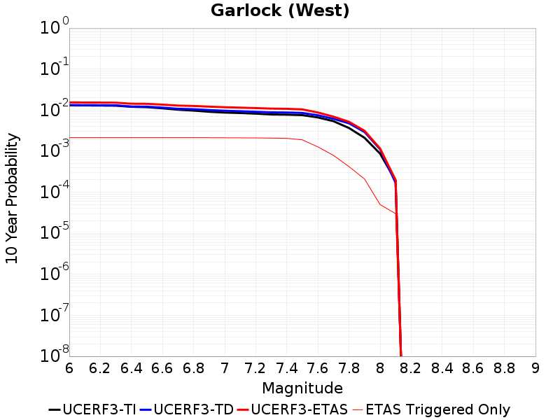 |

| Magnitude | 1 wk TI Prob | 1 wk TD Prob | 1 wk ETAS Prob | 1 wk ETAS/TD Gain | 1 wk ETAS Triggered Only | 1 mo TI Prob | 1 mo TD Prob | 1 mo ETAS Prob | 1 mo ETAS/TD Gain | 1 mo ETAS Triggered Only | 1 yr TI Prob | 1 yr TD Prob | 1 yr ETAS Prob | 1 yr ETAS/TD Gain | 1 yr ETAS Triggered Only | 10 yr TI Prob | 10 yr TD Prob | 10 yr ETAS Prob | 10 yr ETAS/TD Gain | 10 yr ETAS Triggered Only |
|-----|-----|-----|-----|-----|-----|-----|-----|-----|-----|-----|-----|-----|-----|-----|-----|-----|-----|-----|-----|-----|
| 6.0 | 2.5181727E-5 | 2.5426747E-5 | 2.5426747E-5 | 1.0 | 0.0 | 1.0791722E-4 | 1.08967244E-4 | 1.4896288E-4 | 1.3670428 | 4.0E-5 | 0.0013131002 | 0.0013258723 | 0.0018951165 | 1.4293357 | 5.7E-4 | 0.013053683 | 0.01325913 | 0.0153707545 | 1.1592582 | 0.00214 |
| 6.1 | 2.5077732E-5 | 2.5327747E-5 | 2.5327747E-5 | 1.0 | 0.0 | 1.0747157E-4 | 1.0854299E-4 | 1.4853865E-4 | 1.3684776 | 4.0E-5 | 0.001307681 | 0.0013207133 | 0.0018899605 | 1.431015 | 5.7E-4 | 0.013000126 | 0.013208154 | 0.0153198885 | 1.1598811 | 0.00214 |
| 6.2 | 2.494612E-5 | 2.5209263E-5 | 2.5209263E-5 | 1.0 | 0.0 | 1.0690756E-4 | 1.08035245E-4 | 1.4803093E-4 | 1.3702096 | 4.0E-5 | 0.0013008224 | 0.0013145389 | 0.0018837895 | 1.4330422 | 5.7E-4 | 0.012932341 | 0.013147142 | 0.015259007 | 1.160633 | 0.00214 |
| 6.3 | 2.4733758E-5 | 2.5028407E-5 | 2.5028407E-5 | 1.0 | 0.0 | 1.0599751E-4 | 1.0726021E-4 | 1.4725592E-4 | 1.3728849 | 4.0E-5 | 0.0012897556 | 0.0013051141 | 0.0018743703 | 1.4361734 | 5.7E-4 | 0.012822957 | 0.013054006 | 0.01516607 | 1.1617943 | 0.00214 |
| 6.4 | 2.3237335E-5 | 2.3406159E-5 | 2.3406159E-5 | 1.0 | 0.0 | 9.958477E-5 | 1.00308265E-4 | 1.4030426E-4 | 1.3987308 | 4.0E-5 | 0.0012117702 | 0.0012205718 | 0.001789876 | 1.4664242 | 5.7E-4 | 0.012051838 | 0.01221815 | 0.014332004 | 1.1730093 | 0.00214 |
| 6.5 | 2.2732203E-5 | 2.3219805E-5 | 2.3219805E-5 | 1.0 | 0.0 | 9.742009E-5 | 9.950967E-5 | 1.3950569E-4 | 1.4019309 | 4.0E-5 | 0.0011854442 | 0.0012108597 | 0.0017801696 | 1.4701699 | 5.7E-4 | 0.011791403 | 0.012122094 | 0.014236152 | 1.1743971 | 0.00214 |
| 6.6 | 2.1319436E-5 | 2.199796E-5 | 2.199796E-5 | 1.0 | 0.0 | 9.136581E-5 | 9.427358E-5 | 1.3426981E-4 | 1.424257 | 4.0E-5 | 0.001111811 | 0.0011471788 | 0.001716525 | 1.496301 | 5.7E-4 | 0.011062649 | 0.011492016 | 0.013607423 | 1.1840762 | 0.00214 |
| 6.7 | 1.970802E-5 | 2.0615611E-5 | 2.0615611E-5 | 1.0 | 0.0 | 8.446021E-5 | 8.834964E-5 | 1.283461E-4 | 1.4527066 | 4.0E-5 | 0.001027818 | 0.0010751277 | 0.001644515 | 1.5295995 | 5.7E-4 | 0.010230771 | 0.010778678 | 0.012895611 | 1.1964002 | 0.00214 |
| 6.8 | 1.8744462E-5 | 2.0121339E-5 | 2.0121339E-5 | 1.0 | 0.0 | 8.033094E-5 | 8.623146E-5 | 1.2622801E-4 | 1.4638278 | 4.0E-5 | 9.775903E-4 | 0.0010493641 | 0.001618766 | 1.5426161 | 5.7E-4 | 0.009733009 | 0.010523496 | 0.012640976 | 1.2012144 | 0.00214 |
| 6.9 | 1.7559682E-5 | 1.9171908E-5 | 1.9171908E-5 | 1.0 | 0.0 | 7.5253614E-5 | 8.216274E-5 | 1.2215946E-4 | 1.4867986 | 4.0E-5 | 9.158276E-4 | 9.998737E-4 | 0.0015693038 | 1.569502 | 5.7E-4 | 0.0091206245 | 0.010033188 | 0.012131917 | 1.2091787 | 0.00212 |
| 7.0 | 1.6794445E-5 | 1.8431936E-5 | 1.8431936E-5 | 1.0 | 0.0 | 7.197421E-5 | 7.899162E-5 | 1.18988464E-4 | 1.5063428 | 4.0E-5 | 8.759337E-4 | 9.613001E-4 | 0.0015307522 | 1.592377 | 5.7E-4 | 0.008724891 | 0.00965072 | 0.01175026 | 1.2175528 | 0.00212 |
| 7.1 | 1.6337795E-5 | 1.7931603E-5 | 1.7931603E-5 | 1.0 | 0.0 | 7.0017246E-5 | 7.684747E-5 | 1.0684517E-4 | 1.3903537 | 3.0E-5 | 8.521265E-4 | 9.352178E-4 | 0.001494694 | 1.5982311 | 5.6E-4 | 0.008488664 | 0.009391992 | 0.011462363 | 1.22044 | 0.00209 |
| 7.2 | 1.5780008E-5 | 1.7379438E-5 | 1.7379438E-5 | 1.0 | 0.0 | 6.762685E-5 | 7.448119E-5 | 1.0447895E-4 | 1.4027562 | 3.0E-5 | 8.2304585E-4 | 9.064325E-4 | 0.0014659249 | 1.6172466 | 5.6E-4 | 0.008200042 | 0.009106452 | 0.011147692 | 1.2241533 | 0.00206 |
| 7.3 | 1.5058865E-5 | 1.6830967E-5 | 1.6830967E-5 | 1.0 | 0.0 | 6.45364E-5 | 7.213073E-5 | 1.02128564E-4 | 1.4158815 | 3.0E-5 | 7.854473E-4 | 8.7783905E-4 | 0.0014273562 | 1.6259886 | 5.5E-4 | 0.00782677 | 0.008822388 | 0.010854303 | 1.2303134 | 0.00205 |
| 7.4 | 1.4887923E-5 | 1.6666272E-5 | 1.6666272E-5 | 1.0 | 0.0 | 6.380382E-5 | 7.1424925E-5 | 1.0142278E-4 | 1.4199914 | 3.0E-5 | 7.7653467E-4 | 8.692528E-4 | 0.0014187747 | 1.6321774 | 5.5E-4 | 0.0077382675 | 0.008736984 | 0.010739336 | 1.229181 | 0.00202 |
| 7.5 | 1.4509299E-5 | 1.6256727E-5 | 1.6256727E-5 | 1.0 | 0.0 | 6.218123E-5 | 6.966983E-5 | 9.966774E-5 | 1.4305724 | 3.0E-5 | 7.567935E-4 | 8.479013E-4 | 0.0013474773 | 1.5891913 | 5.0E-4 | 0.0075422134 | 0.008524511 | 0.010398399 | 1.2198236 | 0.00189 |
| 7.6 | 1.2756717E-5 | 1.4247925E-5 | 1.4247925E-5 | 1.0 | 0.0 | 5.4670498E-5 | 6.106111E-5 | 9.105928E-5 | 1.491281 | 3.0E-5 | 6.6541E-4 | 7.431661E-4 | 0.0010729209 | 1.443716 | 3.3E-4 | 0.006634211 | 0.0074829776 | 0.008723624 | 1.1657958 | 0.00125 |
| 7.7 | 1.0328985E-5 | 1.164479E-5 | 1.164479E-5 | 1.0 | 0.0 | 4.4266326E-5 | 4.990529E-5 | 6.9904294E-5 | 1.4007391 | 2.0E-5 | 5.388092E-4 | 6.074279E-4 | 8.272943E-4 | 1.3619629 | 2.2E-4 | 0.0053750467 | 0.006133729 | 0.006928822 | 1.1296264 | 8.0E-4 |
| 7.8 | 7.0306583E-6 | 9.047091E-6 | 9.047091E-6 | 1.0 | 0.0 | 3.0131043E-5 | 3.8772672E-5 | 5.8771897E-5 | 1.5158073 | 2.0E-5 | 3.667837E-4 | 4.719552E-4 | 6.218844E-4 | 1.3176768 | 1.5E-4 | 0.003661789 | 0.004771473 | 0.005259135 | 1.1022036 | 4.9E-4 |
| 7.9 | 4.060633E-6 | 5.55106E-6 | 5.55106E-6 | 1.0 | 0.0 | 1.7402595E-5 | 2.379004E-5 | 4.3789565E-5 | 1.840668 | 2.0E-5 | 2.11856E-4 | 2.8960535E-4 | 3.895764E-4 | 1.3451974 | 1.0E-4 | 0.0021165414 | 0.002928485 | 0.003237577 | 1.1055468 | 3.1E-4 |
| 8.0 | 1.6729537E-6 | 2.106297E-6 | 2.106297E-6 | 1.0 | 0.0 | 7.169782E-6 | 9.026956E-6 | 1.9026866E-5 | 2.107783 | 1.0E-5 | 8.7288594E-5 | 1.09897686E-4 | 1.3989439E-4 | 1.2729512 | 3.0E-5 | 8.7254314E-4 | 0.0011117051 | 0.0012215829 | 1.0988371 | 1.1E-4 |
| 8.1 | 3.6733252E-7 | 3.190176E-7 | 3.190176E-7 | 1.0 | 0.0 | 1.5742813E-6 | 1.3672176E-6 | 1.3672176E-6 | 1.0 | 0.0 | 1.9166706E-5 | 1.6645765E-5 | 1.6645765E-5 | 1.0 | 0.0 | 1.9165053E-4 | 1.684635E-4 | 1.7846182E-4 | 1.05935 | 1.0E-5 |

## McLean Lake
*[(top)](#table-of-contents)*

| 1 Week | 1 Month | 1 Year | 10 Year |
|-----|-----|-----|-----|
|  | 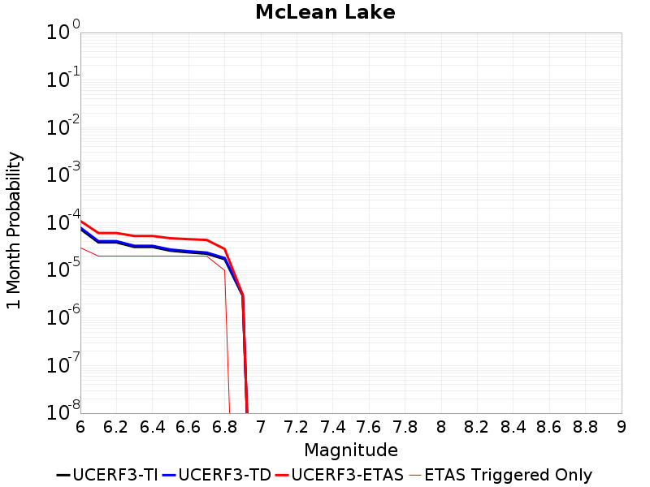 |  |  |

| Magnitude | 1 wk TI Prob | 1 wk TD Prob | 1 wk ETAS Prob | 1 wk ETAS/TD Gain | 1 wk ETAS Triggered Only | 1 mo TI Prob | 1 mo TD Prob | 1 mo ETAS Prob | 1 mo ETAS/TD Gain | 1 mo ETAS Triggered Only | 1 yr TI Prob | 1 yr TD Prob | 1 yr ETAS Prob | 1 yr ETAS/TD Gain | 1 yr ETAS Triggered Only | 10 yr TI Prob | 10 yr TD Prob | 10 yr ETAS Prob | 10 yr ETAS/TD Gain | 10 yr ETAS Triggered Only |
|-----|-----|-----|-----|-----|-----|-----|-----|-----|-----|-----|-----|-----|-----|-----|-----|-----|-----|-----|-----|-----|
| 6.0 | 1.7360222E-5 | 1.8508837E-5 | 3.8508468E-5 | 2.080545 | 2.0E-5 | 7.439883E-5 | 7.932145E-5 | 1.2931749E-4 | 1.6302965 | 5.0E-5 | 9.0542925E-4 | 9.6535945E-4 | 0.0013050312 | 1.3518604 | 3.4E-4 | 0.009017491 | 0.009616505 | 0.011111984 | 1.1555117 | 0.00151 |
| 6.1 | 9.062689E-6 | 9.595513E-6 | 1.9595416E-5 | 2.0421438 | 1.0E-5 | 3.8839516E-5 | 4.112303E-5 | 7.1121794E-5 | 1.7294883 | 3.0E-5 | 4.727685E-4 | 5.0056673E-4 | 7.004666E-4 | 1.3993471 | 2.0E-4 | 0.0047176396 | 0.0049952758 | 0.00582113 | 1.165327 | 8.3E-4 |
| 6.2 | 9.062689E-6 | 9.595513E-6 | 1.9595416E-5 | 2.0421438 | 1.0E-5 | 3.8839516E-5 | 4.112303E-5 | 7.1121794E-5 | 1.7294883 | 3.0E-5 | 4.727685E-4 | 5.0056673E-4 | 7.004666E-4 | 1.3993471 | 2.0E-4 | 0.0047176396 | 0.0049952758 | 0.00582113 | 1.165327 | 8.3E-4 |
| 6.3 | 7.2575485E-6 | 7.670275E-6 | 7.670275E-6 | 1.0 | 0.0 | 3.110341E-5 | 3.2872234E-5 | 5.287158E-5 | 1.6083962 | 2.0E-5 | 3.786182E-4 | 4.001531E-4 | 5.500931E-4 | 1.3747065 | 1.5E-4 | 0.0037797375 | 0.003995031 | 0.004592634 | 1.1495866 | 6.0E-4 |
| 6.4 | 7.2575485E-6 | 7.670275E-6 | 7.670275E-6 | 1.0 | 0.0 | 3.110341E-5 | 3.2872234E-5 | 5.287158E-5 | 1.6083962 | 2.0E-5 | 3.786182E-4 | 4.001531E-4 | 5.500931E-4 | 1.3747065 | 1.5E-4 | 0.0037797375 | 0.003995031 | 0.004592634 | 1.1495866 | 6.0E-4 |
| 6.5 | 6.06582E-6 | 6.4059905E-6 | 6.4059905E-6 | 1.0 | 0.0 | 2.5996113E-5 | 2.7453993E-5 | 4.7453443E-5 | 1.7284715 | 2.0E-5 | 3.164567E-4 | 3.3420758E-4 | 4.3417414E-4 | 1.2991153 | 1.0E-4 | 0.0031600643 | 0.0033376887 | 0.0037961532 | 1.13736 | 4.6E-4 |
| 6.6 | 5.598744E-6 | 5.9122094E-6 | 5.9122094E-6 | 1.0 | 0.0 | 2.3994397E-5 | 2.533783E-5 | 4.5337325E-5 | 1.7893136 | 2.0E-5 | 2.9209262E-4 | 3.084508E-4 | 4.0841996E-4 | 1.3241009 | 1.0E-4 | 0.0029170897 | 0.0030808565 | 0.0035394393 | 1.1488491 | 4.6E-4 |
| 6.7 | 5.246996E-6 | 5.5409882E-6 | 5.5409882E-6 | 1.0 | 0.0 | 2.2486933E-5 | 2.3746912E-5 | 4.3746437E-5 | 1.8421948 | 2.0E-5 | 2.73744E-4 | 2.8908666E-4 | 3.7906063E-4 | 1.3112353 | 9.0E-5 | 0.0027340704 | 0.0028877303 | 0.0032965462 | 1.14157 | 4.1E-4 |
| 6.8 | 4.02324E-6 | 4.2483025E-6 | 4.2483025E-6 | 1.0 | 0.0 | 1.7242342E-5 | 1.8206918E-5 | 3.8206552E-5 | 2.0984635 | 2.0E-5 | 2.099053E-4 | 2.2165263E-4 | 3.016349E-4 | 1.3608451 | 8.0E-5 | 0.0020970714 | 0.0022149002 | 0.0025840807 | 1.1666805 | 3.7E-4 |
| 6.9 | 6.835972E-7 | 7.141806E-7 | 7.141806E-7 | 1.0 | 0.0 | 2.9296991E-6 | 3.0607723E-6 | 3.0607723E-6 | 1.0 | 0.0 | 3.56685E-5 | 3.7264585E-5 | 5.726384E-5 | 1.5366826 | 2.0E-5 | 3.5662777E-4 | 3.7261462E-4 | 4.4258856E-4 | 1.1877917 | 7.0E-5 |

## Goldstone Lake
*[(top)](#table-of-contents)*

| 1 Week | 1 Month | 1 Year | 10 Year |
|-----|-----|-----|-----|
| 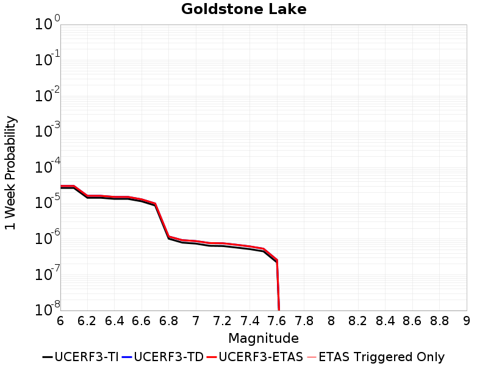 |  | 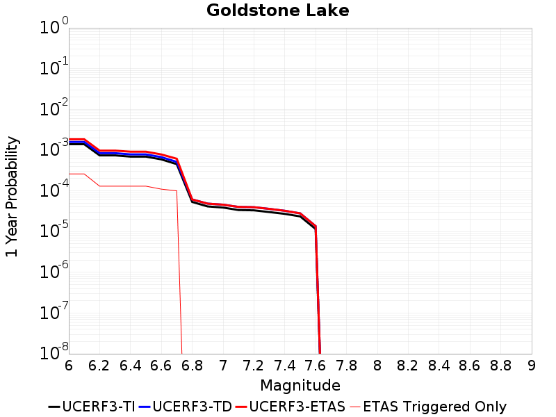 |  |

| Magnitude | 1 wk TI Prob | 1 wk TD Prob | 1 wk ETAS Prob | 1 wk ETAS/TD Gain | 1 wk ETAS Triggered Only | 1 mo TI Prob | 1 mo TD Prob | 1 mo ETAS Prob | 1 mo ETAS/TD Gain | 1 mo ETAS Triggered Only | 1 yr TI Prob | 1 yr TD Prob | 1 yr ETAS Prob | 1 yr ETAS/TD Gain | 1 yr ETAS Triggered Only | 10 yr TI Prob | 10 yr TD Prob | 10 yr ETAS Prob | 10 yr ETAS/TD Gain | 10 yr ETAS Triggered Only |
|-----|-----|-----|-----|-----|-----|-----|-----|-----|-----|-----|-----|-----|-----|-----|-----|-----|-----|-----|-----|-----|
| 6.0 | 2.671352E-5 | 3.0400692E-5 | 5.040008E-5 | 1.6578598 | 2.0E-5 | 1.1448149E-4 | 1.3028328E-4 | 1.5028067E-4 | 1.1534916 | 2.0E-5 | 0.001392921 | 0.0015852414 | 0.0018747817 | 1.1826475 | 2.9E-4 | 0.013842222 | 0.015758865 | 0.017058063 | 1.0824424 | 0.00132 |
| 6.1 | 2.671352E-5 | 3.0400692E-5 | 5.040008E-5 | 1.6578598 | 2.0E-5 | 1.1448149E-4 | 1.3028328E-4 | 1.5028067E-4 | 1.1534916 | 2.0E-5 | 0.001392921 | 0.0015852414 | 0.0018747817 | 1.1826475 | 2.9E-4 | 0.013842222 | 0.015758865 | 0.017058063 | 1.0824424 | 0.00132 |
| 6.2 | 1.4197047E-5 | 1.6108927E-5 | 2.6108766E-5 | 1.6207638 | 1.0E-5 | 6.0843064E-5 | 6.9036985E-5 | 7.90363E-5 | 1.1448399 | 1.0E-5 | 7.4051257E-4 | 8.403E-4 | 0.0010101572 | 1.2021387 | 1.7E-4 | 0.007380498 | 0.008380938 | 0.009075072 | 1.0828229 | 7.0E-4 |
| 6.3 | 1.4197047E-5 | 1.6108927E-5 | 2.6108766E-5 | 1.6207638 | 1.0E-5 | 6.0843064E-5 | 6.9036985E-5 | 7.90363E-5 | 1.1448399 | 1.0E-5 | 7.4051257E-4 | 8.403E-4 | 0.0010101572 | 1.2021387 | 1.7E-4 | 0.007380498 | 0.008380938 | 0.009075072 | 1.0828229 | 7.0E-4 |
| 6.4 | 1.3238931E-5 | 1.502027E-5 | 2.502012E-5 | 1.665757 | 1.0E-5 | 5.6737044E-5 | 6.4371554E-5 | 7.437091E-5 | 1.1553382 | 1.0E-5 | 6.9055456E-4 | 7.8354E-4 | 9.534068E-4 | 1.216794 | 1.7E-4 | 0.006884126 | 0.0078174155 | 0.008482178 | 1.085036 | 6.7E-4 |
| 6.5 | 1.3238931E-5 | 1.502027E-5 | 2.502012E-5 | 1.665757 | 1.0E-5 | 5.6737044E-5 | 6.4371554E-5 | 7.437091E-5 | 1.1553382 | 1.0E-5 | 6.9055456E-4 | 7.8354E-4 | 9.534068E-4 | 1.216794 | 1.7E-4 | 0.006884126 | 0.0078174155 | 0.008482178 | 1.085036 | 6.7E-4 |
| 6.6 | 1.1328278E-5 | 1.2865357E-5 | 2.2865228E-5 | 1.7772712 | 1.0E-5 | 4.8548856E-5 | 5.5136617E-5 | 6.513607E-5 | 1.1813576 | 1.0E-5 | 5.90922E-4 | 6.711774E-4 | 8.3107E-4 | 1.238227 | 1.6E-4 | 0.0058935313 | 0.0067009074 | 0.0072869537 | 1.0874578 | 5.9E-4 |
| 6.7 | 8.651175E-6 | 9.832386E-6 | 1.9832289E-5 | 2.0170372 | 1.0E-5 | 3.707594E-5 | 4.213863E-5 | 5.213821E-5 | 1.237302 | 1.0E-5 | 4.5130608E-4 | 5.1300775E-4 | 6.529359E-4 | 1.2727604 | 1.4E-4 | 0.0045039062 | 0.0051271273 | 0.005644461 | 1.1009014 | 5.2E-4 |
| 6.8 | 1.0215377E-6 | 1.1764512E-6 | 1.1764512E-6 | 1.0 | 0.0 | 4.378012E-6 | 5.0419244E-6 | 5.0419244E-6 | 1.0 | 0.0 | 5.3300988E-5 | 6.138381E-5 | 7.13832E-5 | 1.1628994 | 1.0E-5 | 5.3288206E-4 | 6.136799E-4 | 6.436615E-4 | 1.0488554 | 3.0E-5 |
| 6.9 | 7.9360774E-7 | 9.2919737E-7 | 9.2919737E-7 | 1.0 | 0.0 | 3.4011714E-6 | 3.982269E-6 | 3.982269E-6 | 1.0 | 0.0 | 4.1408475E-5 | 4.8483114E-5 | 5.848263E-5 | 1.2062473 | 1.0E-5 | 4.140076E-4 | 4.847324E-4 | 4.947275E-4 | 1.02062 | 1.0E-5 |
| 7.0 | 7.4382757E-7 | 8.7556623E-7 | 8.7556623E-7 | 1.0 | 0.0 | 3.1878285E-6 | 3.7524217E-6 | 3.7524217E-6 | 1.0 | 0.0 | 3.8811122E-5 | 4.5684843E-5 | 4.5684843E-5 | 1.0 | 0.0 | 3.8804344E-4 | 4.5676116E-4 | 4.5676116E-4 | 1.0 | 0.0 |
| 7.1 | 6.4709513E-7 | 7.719198E-7 | 7.719198E-7 | 1.0 | 0.0 | 2.773262E-6 | 3.308224E-6 | 3.308224E-6 | 1.0 | 0.0 | 3.376394E-5 | 4.0276944E-5 | 4.0276944E-5 | 1.0 | 0.0 | 3.375881E-4 | 4.027024E-4 | 4.027024E-4 | 1.0 | 0.0 |
| 7.2 | 6.356704E-7 | 7.5962026E-7 | 7.5962026E-7 | 1.0 | 0.0 | 2.7242988E-6 | 3.2555115E-6 | 3.2555115E-6 | 1.0 | 0.0 | 3.3167835E-5 | 3.9635193E-5 | 3.9635193E-5 | 1.0 | 0.0 | 3.3162883E-4 | 3.9628719E-4 | 3.9628719E-4 | 1.0 | 0.0 |
| 7.3 | 5.7695723E-7 | 6.904245E-7 | 6.904245E-7 | 1.0 | 0.0 | 2.4726714E-6 | 2.958959E-6 | 2.958959E-6 | 1.0 | 0.0 | 3.0104358E-5 | 3.6024787E-5 | 3.6024787E-5 | 1.0 | 0.0 | 3.0100282E-4 | 3.601952E-4 | 3.601952E-4 | 1.0 | 0.0 |
| 7.4 | 5.209647E-7 | 6.2008854E-7 | 6.2008854E-7 | 1.0 | 0.0 | 2.232704E-6 | 2.6575199E-6 | 2.6575199E-6 | 1.0 | 0.0 | 2.718283E-5 | 3.235488E-5 | 3.235488E-5 | 1.0 | 0.0 | 2.7179506E-4 | 3.2350727E-4 | 3.2350727E-4 | 1.0 | 0.0 |
| 7.5 | 4.512955E-7 | 5.355957E-7 | 5.355957E-7 | 1.0 | 0.0 | 1.934122E-6 | 2.2954084E-6 | 2.2954084E-6 | 1.0 | 0.0 | 2.3547682E-5 | 2.7946293E-5 | 2.7946293E-5 | 1.0 | 0.0 | 2.3545188E-4 | 2.794331E-4 | 2.794331E-4 | 1.0 | 0.0 |
| 7.6 | 2.21172E-7 | 2.604535E-7 | 2.604535E-7 | 1.0 | 0.0 | 9.478797E-7 | 1.116229E-6 | 1.116229E-6 | 1.0 | 0.0 | 1.1540374E-5 | 1.3590032E-5 | 1.3590032E-5 | 1.0 | 0.0 | 1.1539775E-4 | 1.3589482E-4 | 1.3589482E-4 | 1.0 | 0.0 |

## Gravel Hills-Harper Lk
*[(top)](#table-of-contents)*

| 1 Week | 1 Month | 1 Year | 10 Year |
|-----|-----|-----|-----|
| 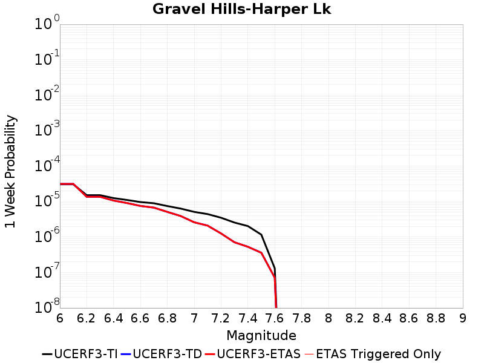 |  |  |  |

| Magnitude | 1 wk TI Prob | 1 wk TD Prob | 1 wk ETAS Prob | 1 wk ETAS/TD Gain | 1 wk ETAS Triggered Only | 1 mo TI Prob | 1 mo TD Prob | 1 mo ETAS Prob | 1 mo ETAS/TD Gain | 1 mo ETAS Triggered Only | 1 yr TI Prob | 1 yr TD Prob | 1 yr ETAS Prob | 1 yr ETAS/TD Gain | 1 yr ETAS Triggered Only | 10 yr TI Prob | 10 yr TD Prob | 10 yr ETAS Prob | 10 yr ETAS/TD Gain | 10 yr ETAS Triggered Only |
|-----|-----|-----|-----|-----|-----|-----|-----|-----|-----|-----|-----|-----|-----|-----|-----|-----|-----|-----|-----|-----|
| 6.0 | 3.0679566E-5 | 3.1488926E-5 | 3.1488926E-5 | 1.0 | 0.0 | 1.3147724E-4 | 1.3494678E-4 | 1.4494543E-4 | 1.0740933 | 1.0E-5 | 0.0015995599 | 0.0016419563 | 0.0019115129 | 1.164168 | 2.7E-4 | 0.015880952 | 0.016319854 | 0.017559292 | 1.0759466 | 0.00126 |
| 6.1 | 3.0679566E-5 | 3.1488926E-5 | 3.1488926E-5 | 1.0 | 0.0 | 1.3147724E-4 | 1.3494678E-4 | 1.4494543E-4 | 1.0740933 | 1.0E-5 | 0.0015995599 | 0.0016419563 | 0.0019115129 | 1.164168 | 2.7E-4 | 0.015880952 | 0.016319854 | 0.017559292 | 1.0759466 | 0.00126 |
| 6.2 | 1.514536E-5 | 1.364375E-5 | 1.364375E-5 | 1.0 | 0.0 | 6.490707E-5 | 5.847197E-5 | 5.847197E-5 | 1.0 | 0.0 | 7.8995706E-4 | 7.116756E-4 | 8.315902E-4 | 1.1684961 | 1.2E-4 | 0.007871548 | 0.0070951683 | 0.0075419755 | 1.0629735 | 4.5E-4 |
| 6.3 | 1.514536E-5 | 1.364375E-5 | 1.364375E-5 | 1.0 | 0.0 | 6.490707E-5 | 5.847197E-5 | 5.847197E-5 | 1.0 | 0.0 | 7.8995706E-4 | 7.116756E-4 | 8.315902E-4 | 1.1684961 | 1.2E-4 | 0.007871548 | 0.0070951683 | 0.0075419755 | 1.0629735 | 4.5E-4 |
| 6.4 | 1.2532521E-5 | 1.0696001E-5 | 1.0696001E-5 | 1.0 | 0.0 | 5.37097E-5 | 4.5839228E-5 | 4.5839228E-5 | 1.0 | 0.0 | 6.537194E-4 | 5.579555E-4 | 6.379109E-4 | 1.1433007 | 8.0E-5 | 0.0065179965 | 0.0055661374 | 0.005834635 | 1.0482376 | 2.7E-4 |
| 6.5 | 1.1094058E-5 | 9.088861E-6 | 9.088861E-6 | 1.0 | 0.0 | 4.7545094E-5 | 3.8951704E-5 | 3.8951704E-5 | 1.0 | 0.0 | 5.787078E-4 | 4.7413784E-4 | 5.141189E-4 | 1.0843236 | 4.0E-5 | 0.0057720304 | 0.0047316705 | 0.004890913 | 1.0336547 | 1.6E-4 |
| 6.6 | 9.688328E-6 | 7.5359335E-6 | 7.5359335E-6 | 1.0 | 0.0 | 4.1520743E-5 | 3.2296473E-5 | 3.2296473E-5 | 1.0 | 0.0 | 5.053978E-4 | 3.9314118E-4 | 4.131333E-4 | 1.0508523 | 2.0E-5 | 0.0050424994 | 0.003924714 | 0.004024321 | 1.0253795 | 1.0E-4 |
| 6.7 | 8.974824E-6 | 6.753204E-6 | 6.753204E-6 | 1.0 | 0.0 | 3.8462964E-5 | 2.8941995E-5 | 2.8941995E-5 | 1.0 | 0.0 | 4.6818596E-4 | 3.52314E-4 | 3.7230697E-4 | 1.0567476 | 2.0E-5 | 0.004672008 | 0.003517776 | 0.0035775648 | 1.0169963 | 6.0E-5 |
| 6.8 | 7.4780046E-6 | 5.119102E-6 | 5.119102E-6 | 1.0 | 0.0 | 3.20482E-5 | 2.1938831E-5 | 2.1938831E-5 | 1.0 | 0.0 | 3.9011694E-4 | 2.6707392E-4 | 2.7707126E-4 | 1.0374328 | 1.0E-5 | 0.0038943281 | 0.002667668 | 0.002697588 | 1.0112158 | 3.0E-5 |
| 6.9 | 6.3409307E-6 | 3.9098227E-6 | 3.9098227E-6 | 1.0 | 0.0 | 2.7175134E-5 | 1.6756281E-5 | 1.6756281E-5 | 1.0 | 0.0 | 3.3080703E-4 | 2.0398962E-4 | 2.0398962E-4 | 1.0 | 0.0 | 0.0033031502 | 0.002038122 | 0.002058081 | 1.0097929 | 2.0E-5 |
| 7.0 | 5.1239335E-6 | 2.6075645E-6 | 2.6075645E-6 | 1.0 | 0.0 | 2.195953E-5 | 1.117523E-5 | 1.117523E-5 | 1.0 | 0.0 | 2.6732447E-4 | 1.3605019E-4 | 1.3605019E-4 | 1.0 | 0.0 | 0.0026700313 | 0.0013596942 | 0.0013696806 | 1.0073446 | 1.0E-5 |
| 7.1 | 4.438899E-6 | 2.0999469E-6 | 2.0999469E-6 | 1.0 | 0.0 | 1.9023713E-5 | 8.999742E-6 | 8.999742E-6 | 1.0 | 0.0 | 2.315891E-4 | 1.0956658E-4 | 1.0956658E-4 | 1.0 | 0.0 | 0.002313479 | 0.0010951475 | 0.0010951475 | 1.0 | 0.0 |
| 7.2 | 3.50367E-6 | 1.2627299E-6 | 1.2627299E-6 | 1.0 | 0.0 | 1.5015643E-5 | 5.411689E-6 | 5.411689E-6 | 1.0 | 0.0 | 1.8280011E-4 | 6.5885404E-5 | 6.5885404E-5 | 1.0 | 0.0 | 0.0018264982 | 6.5866695E-4 | 6.5866695E-4 | 1.0 | 0.0 |
| 7.3 | 2.561638E-6 | 7.1287576E-7 | 7.1287576E-7 | 1.0 | 0.0 | 1.0978401E-5 | 3.0551785E-6 | 3.0551785E-6 | 1.0 | 0.0 | 1.3365384E-4 | 3.7196183E-5 | 3.7196183E-5 | 1.0 | 0.0 | 0.0013357349 | 3.7190158E-4 | 3.7190158E-4 | 1.0 | 0.0 |
| 7.4 | 2.0368864E-6 | 5.313136E-7 | 5.313136E-7 | 1.0 | 0.0 | 8.729483E-6 | 2.2770564E-6 | 2.2770564E-6 | 1.0 | 0.0 | 1.06276275E-4 | 2.7722814E-5 | 2.7722814E-5 | 1.0 | 0.0 | 0.0010622547 | 2.7719408E-4 | 2.7719408E-4 | 1.0 | 0.0 |
| 7.5 | 1.1681728E-6 | 3.608593E-7 | 3.608593E-7 | 1.0 | 0.0 | 5.0064455E-6 | 1.546539E-6 | 1.546539E-6 | 1.0 | 0.0 | 6.0951766E-5 | 1.8828954E-5 | 1.8828954E-5 | 1.0 | 0.0 | 6.093505E-4 | 1.8827406E-4 | 1.8827406E-4 | 1.0 | 0.0 |
| 7.6 | 1.3154387E-7 | 7.141376E-8 | 7.141376E-8 | 1.0 | 0.0 | 5.6375933E-7 | 3.0605895E-7 | 3.0605895E-7 | 1.0 | 0.0 | 6.863748E-6 | 3.726263E-6 | 3.726263E-6 | 1.0 | 0.0 | 6.863536E-5 | 3.7262165E-5 | 3.7262165E-5 | 1.0 | 0.0 |

## So Sierra Nevada
*[(top)](#table-of-contents)*

| 1 Week | 1 Month | 1 Year | 10 Year |
|-----|-----|-----|-----|
|  |  |  |  |

| Magnitude | 1 wk TI Prob | 1 wk TD Prob | 1 wk ETAS Prob | 1 wk ETAS/TD Gain | 1 wk ETAS Triggered Only | 1 mo TI Prob | 1 mo TD Prob | 1 mo ETAS Prob | 1 mo ETAS/TD Gain | 1 mo ETAS Triggered Only | 1 yr TI Prob | 1 yr TD Prob | 1 yr ETAS Prob | 1 yr ETAS/TD Gain | 1 yr ETAS Triggered Only | 10 yr TI Prob | 10 yr TD Prob | 10 yr ETAS Prob | 10 yr ETAS/TD Gain | 10 yr ETAS Triggered Only |
|-----|-----|-----|-----|-----|-----|-----|-----|-----|-----|-----|-----|-----|-----|-----|-----|-----|-----|-----|-----|-----|
| 6.0 | 1.15488665E-5 | 1.1083145E-5 | 1.1083145E-5 | 1.0 | 0.0 | 4.9494203E-5 | 4.74984E-5 | 8.7496504E-5 | 1.8420936 | 4.0E-5 | 6.024253E-4 | 5.7815237E-4 | 8.879732E-4 | 1.5358808 | 3.1E-4 | 0.006007948 | 0.0057677524 | 0.00704037 | 1.2206435 | 0.00128 |
| 6.1 | 1.15488665E-5 | 1.1083145E-5 | 1.1083145E-5 | 1.0 | 0.0 | 4.9494203E-5 | 4.74984E-5 | 8.7496504E-5 | 1.8420936 | 4.0E-5 | 6.024253E-4 | 5.7815237E-4 | 8.879732E-4 | 1.5358808 | 3.1E-4 | 0.006007948 | 0.0057677524 | 0.00704037 | 1.2206435 | 0.00128 |
| 6.2 | 1.15488665E-5 | 1.1083145E-5 | 1.1083145E-5 | 1.0 | 0.0 | 4.9494203E-5 | 4.74984E-5 | 8.7496504E-5 | 1.8420936 | 4.0E-5 | 6.024253E-4 | 5.7815237E-4 | 8.879732E-4 | 1.5358808 | 3.1E-4 | 0.006007948 | 0.0057677524 | 0.00704037 | 1.2206435 | 0.00128 |
| 6.3 | 1.15488665E-5 | 1.1083145E-5 | 1.1083145E-5 | 1.0 | 0.0 | 4.9494203E-5 | 4.74984E-5 | 8.7496504E-5 | 1.8420936 | 4.0E-5 | 6.024253E-4 | 5.7815237E-4 | 8.879732E-4 | 1.5358808 | 3.1E-4 | 0.006007948 | 0.0057677524 | 0.00704037 | 1.2206435 | 0.00128 |
| 6.4 | 1.15488665E-5 | 1.1083145E-5 | 1.1083145E-5 | 1.0 | 0.0 | 4.9494203E-5 | 4.74984E-5 | 8.7496504E-5 | 1.8420936 | 4.0E-5 | 6.024253E-4 | 5.7815237E-4 | 8.879732E-4 | 1.5358808 | 3.1E-4 | 0.006007948 | 0.0057677524 | 0.00704037 | 1.2206435 | 0.00128 |
| 6.5 | 1.15488665E-5 | 1.1083145E-5 | 1.1083145E-5 | 1.0 | 0.0 | 4.9494203E-5 | 4.74984E-5 | 8.7496504E-5 | 1.8420936 | 4.0E-5 | 6.024253E-4 | 5.7815237E-4 | 8.879732E-4 | 1.5358808 | 3.1E-4 | 0.006007948 | 0.0057677524 | 0.00704037 | 1.2206435 | 0.00128 |
| 6.6 | 7.587044E-6 | 6.9380085E-6 | 6.9380085E-6 | 1.0 | 0.0 | 3.2515498E-5 | 2.9734E-5 | 4.9733404E-5 | 1.6726106 | 2.0E-5 | 3.9580427E-4 | 3.619542E-4 | 5.4188905E-4 | 1.4971205 | 1.8E-4 | 0.003951 | 0.0036139388 | 0.004331337 | 1.1985086 | 7.2E-4 |
| 6.7 | 7.587044E-6 | 6.9380085E-6 | 6.9380085E-6 | 1.0 | 0.0 | 3.2515498E-5 | 2.9734E-5 | 4.9733404E-5 | 1.6726106 | 2.0E-5 | 3.9580427E-4 | 3.619542E-4 | 5.4188905E-4 | 1.4971205 | 1.8E-4 | 0.003951 | 0.0036139388 | 0.004331337 | 1.1985086 | 7.2E-4 |
| 6.8 | 5.9026956E-6 | 5.1813217E-6 | 5.1813217E-6 | 1.0 | 0.0 | 2.5297022E-5 | 2.2205482E-5 | 4.2205036E-5 | 1.9006585 | 2.0E-5 | 3.0794772E-4 | 2.7031937E-4 | 4.1028153E-4 | 1.5177659 | 1.4E-4 | 0.0030752132 | 0.0027000217 | 0.0032086447 | 1.1883774 | 5.1E-4 |
| 6.9 | 5.0118915E-6 | 4.2541315E-6 | 4.2541315E-6 | 1.0 | 0.0 | 2.1479358E-5 | 1.8231869E-5 | 2.8231687E-5 | 1.5484802 | 1.0E-5 | 2.614798E-4 | 2.2195112E-4 | 3.1193116E-4 | 1.4054047 | 9.0E-5 | 0.0026117235 | 0.002217367 | 0.002626458 | 1.184494 | 4.1E-4 |
| 7.0 | 4.4924795E-6 | 3.7155048E-6 | 3.7155048E-6 | 1.0 | 0.0 | 1.925334E-5 | 1.5923499E-5 | 2.592334E-5 | 1.6279926 | 1.0E-5 | 2.3438422E-4 | 1.9385199E-4 | 2.5384035E-4 | 1.3094546 | 6.0E-5 | 0.0023413717 | 0.0019368918 | 0.0022562721 | 1.1648932 | 3.2E-4 |
| 7.1 | 3.9118436E-6 | 3.1134232E-6 | 3.1134232E-6 | 1.0 | 0.0 | 1.6764936E-5 | 1.3343177E-5 | 2.3343044E-5 | 1.7494367 | 1.0E-5 | 2.0409399E-4 | 1.6244163E-4 | 2.0243514E-4 | 1.2462022 | 4.0E-5 | 0.0020390663 | 0.0016232851 | 0.0018529118 | 1.141458 | 2.3E-4 |
| 7.2 | 3.4200818E-6 | 2.6067862E-6 | 2.6067862E-6 | 1.0 | 0.0 | 1.4657411E-5 | 1.11718955E-5 | 2.1171783E-5 | 1.8950932 | 1.0E-5 | 1.7843937E-4 | 1.3600984E-4 | 1.7600441E-4 | 1.2940564 | 4.0E-5 | 0.0017829615 | 0.0013593158 | 0.0015590439 | 1.1469328 | 2.0E-4 |
| 7.3 | 2.6593618E-6 | 1.8295802E-6 | 1.8295802E-6 | 1.0 | 0.0 | 1.13972155E-5 | 7.841036E-6 | 1.7840957E-5 | 2.2753317 | 1.0E-5 | 1.3875226E-4 | 9.5460724E-5 | 1.2545787E-4 | 1.3142353 | 3.0E-5 | 0.0013866565 | 9.542261E-4 | 0.0010641211 | 1.1151667 | 1.1E-4 |
| 7.4 | 2.2577992E-6 | 1.4374937E-6 | 1.4374937E-6 | 1.0 | 0.0 | 9.676246E-6 | 6.160674E-6 | 1.6160613E-5 | 2.623189 | 1.0E-5 | 1.1780193E-4 | 7.500388E-5 | 1.0500163E-4 | 1.3999493 | 3.0E-5 | 0.001177395 | 7.498107E-4 | 8.597282E-4 | 1.1465937 | 1.1E-4 |
| 7.5 | 1.489319E-6 | 7.362189E-7 | 7.362189E-7 | 1.0 | 0.0 | 6.3827797E-6 | 3.1552202E-6 | 1.3155189E-5 | 4.169341 | 1.0E-5 | 7.770758E-5 | 3.8414135E-5 | 5.8413363E-5 | 1.5206217 | 2.0E-5 | 7.7680405E-4 | 3.8407536E-4 | 4.3405616E-4 | 1.1301328 | 5.0E-5 |
| 7.6 | 1.0680322E-6 | 4.6657263E-7 | 4.6657263E-7 | 1.0 | 0.0 | 4.577273E-6 | 1.9995955E-6 | 1.9995955E-6 | 1.0 | 0.0 | 5.5726876E-5 | 2.4344807E-5 | 3.434456E-5 | 1.4107553 | 1.0E-5 | 5.5712904E-4 | 2.4342166E-4 | 2.7341436E-4 | 1.1232129 | 3.0E-5 |
| 7.7 | 5.509146E-7 | 1.561072E-7 | 1.561072E-7 | 1.0 | 0.0 | 2.3610605E-6 | 6.6903067E-7 | 6.6903067E-7 | 1.0 | 0.0 | 2.8745531E-5 | 8.145419E-6 | 8.145419E-6 | 1.0 | 0.0 | 2.8741814E-4 | 8.1451326E-5 | 8.1451326E-5 | 1.0 | 0.0 |

## Coyote Canyon
*[(top)](#table-of-contents)*

| 1 Week | 1 Month | 1 Year | 10 Year |
|-----|-----|-----|-----|
| 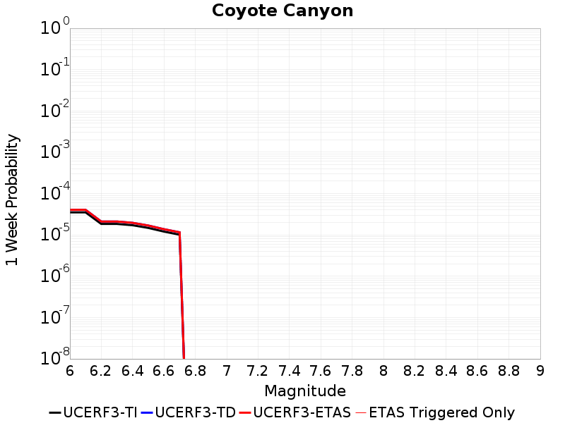 |  |  | 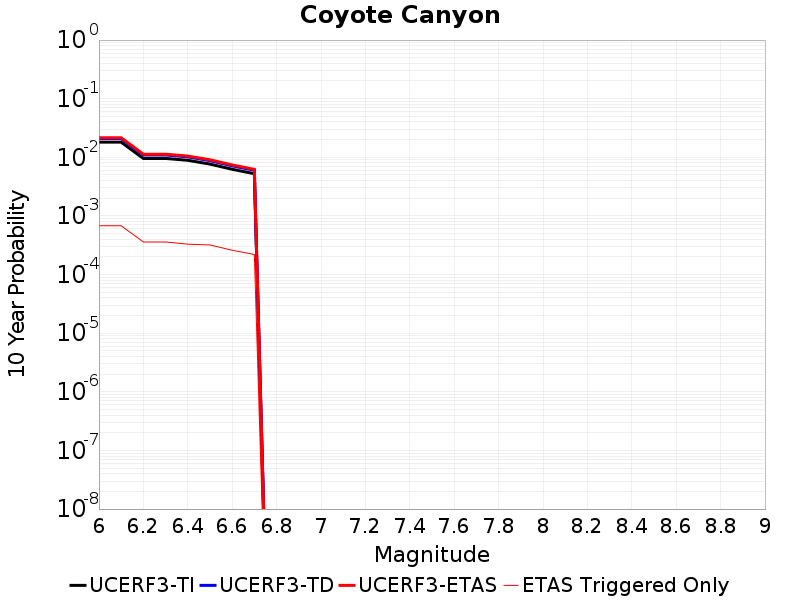 |

| Magnitude | 1 wk TI Prob | 1 wk TD Prob | 1 wk ETAS Prob | 1 wk ETAS/TD Gain | 1 wk ETAS Triggered Only | 1 mo TI Prob | 1 mo TD Prob | 1 mo ETAS Prob | 1 mo ETAS/TD Gain | 1 mo ETAS Triggered Only | 1 yr TI Prob | 1 yr TD Prob | 1 yr ETAS Prob | 1 yr ETAS/TD Gain | 1 yr ETAS Triggered Only | 10 yr TI Prob | 10 yr TD Prob | 10 yr ETAS Prob | 10 yr ETAS/TD Gain | 10 yr ETAS Triggered Only |
|-----|-----|-----|-----|-----|-----|-----|-----|-----|-----|-----|-----|-----|-----|-----|-----|-----|-----|-----|-----|-----|
| 6.0 | 3.5090034E-5 | 4.0400257E-5 | 6.039945E-5 | 1.4950264 | 2.0E-5 | 1.503772E-4 | 1.7313393E-4 | 2.13127E-4 | 1.230995 | 4.0E-5 | 0.0018293047 | 0.0021061255 | 0.0023755569 | 1.1279275 | 2.7E-4 | 0.018143194 | 0.020887617 | 0.021788402 | 1.0431253 | 9.2E-4 |
| 6.1 | 3.5090034E-5 | 4.0400257E-5 | 6.039945E-5 | 1.4950264 | 2.0E-5 | 1.503772E-4 | 1.7313393E-4 | 2.13127E-4 | 1.230995 | 4.0E-5 | 0.0018293047 | 0.0021061255 | 0.0023755569 | 1.1279275 | 2.7E-4 | 0.018143194 | 0.020887617 | 0.021788402 | 1.0431253 | 9.2E-4 |
| 6.2 | 1.841879E-5 | 2.1077672E-5 | 3.1077463E-5 | 1.4744257 | 1.0E-5 | 7.8935285E-5 | 9.033034E-5 | 1.20327626E-4 | 1.3320843 | 3.0E-5 | 9.606133E-4 | 0.0010993192 | 0.0012291763 | 1.118125 | 1.3E-4 | 0.0095647145 | 0.010948914 | 0.011393987 | 1.04065 | 4.5E-4 |
| 6.3 | 1.841879E-5 | 2.1077672E-5 | 3.1077463E-5 | 1.4744257 | 1.0E-5 | 7.8935285E-5 | 9.033034E-5 | 1.20327626E-4 | 1.3320843 | 3.0E-5 | 9.606133E-4 | 0.0010993192 | 0.0012291763 | 1.118125 | 1.3E-4 | 0.0095647145 | 0.010948914 | 0.011393987 | 1.04065 | 4.5E-4 |
| 6.4 | 1.712201E-5 | 1.9581743E-5 | 1.9581743E-5 | 1.0 | 0.0 | 7.337798E-5 | 8.391962E-5 | 1.1391711E-4 | 1.3574549 | 3.0E-5 | 8.930107E-4 | 0.0010213432 | 0.0011512104 | 1.1271534 | 1.3E-4 | 0.008894307 | 0.010176428 | 0.010582255 | 1.0398792 | 4.1E-4 |
| 6.5 | 1.4744935E-5 | 1.6851118E-5 | 1.6851118E-5 | 1.0 | 0.0 | 6.3191044E-5 | 7.2217605E-5 | 1.0221544E-4 | 1.4153812 | 3.0E-5 | 7.6907943E-4 | 8.789883E-4 | 9.789004E-4 | 1.1136671 | 1.0E-4 | 0.007664232 | 0.008764328 | 0.009131085 | 1.0418466 | 3.7E-4 |
| 6.6 | 1.2017839E-5 | 1.3735627E-5 | 1.3735627E-5 | 1.0 | 0.0 | 5.150401E-5 | 5.8866146E-5 | 8.886438E-5 | 1.5096008 | 3.0E-5 | 6.268809E-4 | 7.165484E-4 | 7.964911E-4 | 1.1115663 | 8.0E-5 | 0.0062511545 | 0.0071510877 | 0.0074588708 | 1.04304 | 3.1E-4 |
| 6.7 | 1.00956095E-5 | 1.1543244E-5 | 1.1543244E-5 | 1.0 | 0.0 | 4.326618E-5 | 4.94706E-5 | 6.946961E-5 | 1.4042605 | 2.0E-5 | 5.266384E-4 | 6.022252E-4 | 6.621891E-4 | 1.0995705 | 6.0E-5 | 0.005253921 | 0.0060144737 | 0.0062927897 | 1.0462743 | 2.8E-4 |

## San Andreas (Mojave N)
*[(top)](#table-of-contents)*

| 1 Week | 1 Month | 1 Year | 10 Year |
|-----|-----|-----|-----|
|  |  |  | 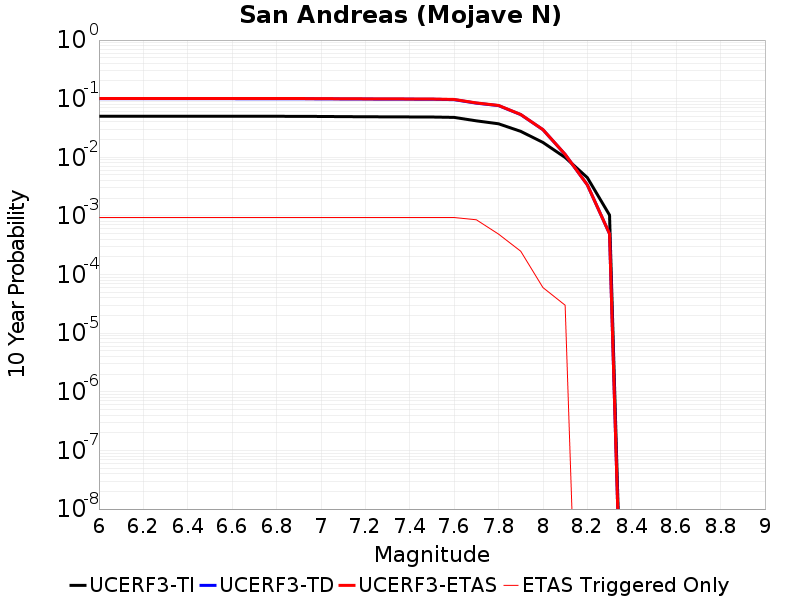 |

| Magnitude | 1 wk TI Prob | 1 wk TD Prob | 1 wk ETAS Prob | 1 wk ETAS/TD Gain | 1 wk ETAS Triggered Only | 1 mo TI Prob | 1 mo TD Prob | 1 mo ETAS Prob | 1 mo ETAS/TD Gain | 1 mo ETAS Triggered Only | 1 yr TI Prob | 1 yr TD Prob | 1 yr ETAS Prob | 1 yr ETAS/TD Gain | 1 yr ETAS Triggered Only | 10 yr TI Prob | 10 yr TD Prob | 10 yr ETAS Prob | 10 yr ETAS/TD Gain | 10 yr ETAS Triggered Only |
|-----|-----|-----|-----|-----|-----|-----|-----|-----|-----|-----|-----|-----|-----|-----|-----|-----|-----|-----|-----|-----|
| 6.0 | 9.877682E-5 | 1.9794924E-4 | 1.9794924E-4 | 1.0 | 0.0 | 4.2326056E-4 | 8.480782E-4 | 8.6806127E-4 | 1.0235628 | 2.0E-5 | 0.0051410277 | 0.0102766035 | 0.0105240345 | 1.024077 | 2.5E-4 | 0.05023708 | 0.100038506 | 0.100911476 | 1.0087262 | 9.7E-4 |
| 6.1 | 9.877682E-5 | 1.9794924E-4 | 1.9794924E-4 | 1.0 | 0.0 | 4.2326056E-4 | 8.480782E-4 | 8.6806127E-4 | 1.0235628 | 2.0E-5 | 0.0051410277 | 0.0102766035 | 0.0105240345 | 1.024077 | 2.5E-4 | 0.05023708 | 0.100038506 | 0.100911476 | 1.0087262 | 9.7E-4 |
| 6.2 | 9.877682E-5 | 1.9794924E-4 | 1.9794924E-4 | 1.0 | 0.0 | 4.2326056E-4 | 8.480782E-4 | 8.6806127E-4 | 1.0235628 | 2.0E-5 | 0.0051410277 | 0.0102766035 | 0.0105240345 | 1.024077 | 2.5E-4 | 0.05023708 | 0.100038506 | 0.100911476 | 1.0087262 | 9.7E-4 |
| 6.3 | 9.877682E-5 | 1.9794924E-4 | 1.9794924E-4 | 1.0 | 0.0 | 4.2326056E-4 | 8.480782E-4 | 8.6806127E-4 | 1.0235628 | 2.0E-5 | 0.0051410277 | 0.0102766035 | 0.0105240345 | 1.024077 | 2.5E-4 | 0.05023708 | 0.100038506 | 0.100911476 | 1.0087262 | 9.7E-4 |
| 6.4 | 9.877682E-5 | 1.9794924E-4 | 1.9794924E-4 | 1.0 | 0.0 | 4.2326056E-4 | 8.480782E-4 | 8.6806127E-4 | 1.0235628 | 2.0E-5 | 0.0051410277 | 0.0102766035 | 0.0105240345 | 1.024077 | 2.5E-4 | 0.05023708 | 0.100038506 | 0.100911476 | 1.0087262 | 9.7E-4 |
| 6.5 | 9.861474E-5 | 1.9768569E-4 | 1.9768569E-4 | 1.0 | 0.0 | 4.2256617E-4 | 8.4694946E-4 | 8.669325E-4 | 1.0235941 | 2.0E-5 | 0.0051326132 | 0.01026299 | 0.010510424 | 1.0241094 | 2.5E-4 | 0.050156746 | 0.099916115 | 0.1007892 | 1.0087382 | 9.7E-4 |
| 6.6 | 9.861474E-5 | 1.9768569E-4 | 1.9768569E-4 | 1.0 | 0.0 | 4.2256617E-4 | 8.4694946E-4 | 8.669325E-4 | 1.0235941 | 2.0E-5 | 0.0051326132 | 0.01026299 | 0.010510424 | 1.0241094 | 2.5E-4 | 0.050156746 | 0.099916115 | 0.1007892 | 1.0087382 | 9.7E-4 |
| 6.7 | 9.8552715E-5 | 1.9758477E-4 | 1.9758477E-4 | 1.0 | 0.0 | 4.223004E-4 | 8.465172E-4 | 8.665003E-4 | 1.0236062 | 2.0E-5 | 0.0051293927 | 0.010257778 | 0.010505213 | 1.0241218 | 2.5E-4 | 0.050125998 | 0.099869065 | 0.10074219 | 1.0087427 | 9.7E-4 |
| 6.8 | 9.8464974E-5 | 1.9743525E-4 | 1.9743525E-4 | 1.0 | 0.0 | 4.219245E-4 | 8.458769E-4 | 8.6585997E-4 | 1.0236241 | 2.0E-5 | 0.0051248376 | 0.010250054 | 0.010497492 | 1.0241401 | 2.5E-4 | 0.05008251 | 0.099798486 | 0.10067168 | 1.0087496 | 9.7E-4 |
| 6.9 | 9.825824E-5 | 1.9711323E-4 | 1.9711323E-4 | 1.0 | 0.0 | 4.2103877E-4 | 8.444977E-4 | 8.644808E-4 | 1.0236627 | 2.0E-5 | 0.0051141046 | 0.010233421 | 0.010480862 | 1.0241798 | 2.5E-4 | 0.049980022 | 0.09964696 | 0.100520305 | 1.0087644 | 9.7E-4 |
| 7.0 | 9.781462E-5 | 1.9642239E-4 | 1.9642239E-4 | 1.0 | 0.0 | 4.1913814E-4 | 8.4153883E-4 | 8.6152204E-4 | 1.023746 | 2.0E-5 | 0.005091073 | 0.010197734 | 0.010445185 | 1.0242653 | 2.5E-4 | 0.04976007 | 0.09932193 | 0.10019559 | 1.0087962 | 9.7E-4 |
| 7.1 | 9.7121134E-5 | 1.954334E-4 | 1.954334E-4 | 1.0 | 0.0 | 4.1616702E-4 | 8.3730306E-4 | 8.572863E-4 | 1.0238662 | 2.0E-5 | 0.005055068 | 0.010146645 | 0.0103941085 | 1.0243887 | 2.5E-4 | 0.04941613 | 0.09885664 | 0.09973075 | 1.0088422 | 9.7E-4 |
| 7.2 | 9.663819E-5 | 1.9473686E-4 | 1.9473686E-4 | 1.0 | 0.0 | 4.1409794E-4 | 8.3431974E-4 | 8.5430307E-4 | 1.0239516 | 2.0E-5 | 0.0050299936 | 0.010110661 | 0.010358133 | 1.0244764 | 2.5E-4 | 0.049176537 | 0.09852862 | 0.099403046 | 1.0088749 | 9.7E-4 |
| 7.3 | 9.6277574E-5 | 1.9425648E-4 | 1.9425648E-4 | 1.0 | 0.0 | 4.125529E-4 | 8.3226233E-4 | 8.5224566E-4 | 1.0240109 | 2.0E-5 | 0.0050112694 | 0.010085844 | 0.010333323 | 1.0245372 | 2.5E-4 | 0.04899759 | 0.09830008 | 0.09917472 | 1.0088978 | 9.7E-4 |
| 7.4 | 9.593308E-5 | 1.936482E-4 | 1.936482E-4 | 1.0 | 0.0 | 4.1107697E-4 | 8.296571E-4 | 8.4964046E-4 | 1.0240864 | 2.0E-5 | 0.0049933824 | 0.010054419 | 0.010301905 | 1.0246147 | 2.5E-4 | 0.04882661 | 0.09801641 | 0.09889133 | 1.0089263 | 9.7E-4 |
| 7.5 | 9.561707E-5 | 1.9310352E-4 | 1.9310352E-4 | 1.0 | 0.0 | 4.0972308E-4 | 8.273242E-4 | 8.473077E-4 | 1.0241543 | 2.0E-5 | 0.0049769743 | 0.010026278 | 0.010273771 | 1.0246844 | 2.5E-4 | 0.048669744 | 0.09776045 | 0.09863562 | 1.0089523 | 9.7E-4 |
| 7.6 | 9.418194E-5 | 1.8959372E-4 | 1.8959372E-4 | 1.0 | 0.0 | 4.0357444E-4 | 8.1229163E-4 | 8.322754E-4 | 1.0246017 | 2.0E-5 | 0.004902454 | 0.009844924 | 0.010092463 | 1.0251437 | 2.5E-4 | 0.047957025 | 0.0961326 | 0.09700031 | 1.0090262 | 9.6E-4 |
| 7.7 | 8.202141E-5 | 1.6375589E-4 | 1.6375589E-4 | 1.0 | 0.0 | 3.51473E-4 | 7.016222E-4 | 7.2160823E-4 | 1.0284854 | 2.0E-5 | 0.00427079 | 0.008508854 | 0.008736897 | 1.0268006 | 2.3E-4 | 0.04189639 | 0.08381673 | 0.08458632 | 1.0091819 | 8.4E-4 |
| 7.8 | 7.2859846E-5 | 1.4835256E-4 | 1.4835256E-4 | 1.0 | 0.0 | 3.1221908E-4 | 6.356418E-4 | 6.556291E-4 | 1.0314443 | 2.0E-5 | 0.003794643 | 0.0077115223 | 0.007870289 | 1.0205882 | 1.6E-4 | 0.037304975 | 0.07616003 | 0.0766589 | 1.0065503 | 5.4E-4 |
| 7.9 | 5.3874453E-5 | 1.02701444E-4 | 1.02701444E-4 | 1.0 | 0.0 | 2.3087008E-4 | 4.400748E-4 | 4.60066E-4 | 1.0454268 | 2.0E-5 | 0.0028072202 | 0.00534476 | 0.005444226 | 1.0186099 | 1.0E-4 | 0.02772022 | 0.05347264 | 0.05377553 | 1.0056643 | 3.2E-4 |
| 8.0 | 3.468538E-5 | 5.55638E-5 | 5.55638E-5 | 1.0 | 0.0 | 1.4864317E-4 | 2.3810884E-4 | 2.4810646E-4 | 1.0419877 | 1.0E-5 | 0.0018082283 | 0.0028951233 | 0.0029250365 | 1.0103322 | 3.0E-5 | 0.017935853 | 0.029586395 | 0.02969314 | 1.0036079 | 1.1E-4 |
| 8.1 | 1.9152367E-5 | 2.002416E-5 | 2.002416E-5 | 1.0 | 0.0 | 8.207899E-5 | 8.5815E-5 | 8.5815E-5 | 1.0 | 0.0 | 9.988535E-4 | 0.0010442976 | 0.0010442976 | 1.0 | 0.0 | 0.009943757 | 0.01118099 | 0.011190878 | 1.0008844 | 1.0E-5 |
| 8.2 | 8.643924E-6 | 5.7090024E-6 | 5.7090024E-6 | 1.0 | 0.0 | 3.704486E-5 | 2.4466923E-5 | 2.4466923E-5 | 1.0 | 0.0 | 4.5092785E-4 | 2.9784418E-4 | 2.9784418E-4 | 1.0 | 0.0 | 0.0045001395 | 0.0033766231 | 0.0033766231 | 1.0 | 0.0 |
| 8.3 | 1.983087E-6 | 8.050169E-7 | 8.050169E-7 | 1.0 | 0.0 | 8.498917E-6 | 3.4500679E-6 | 3.4500679E-6 | 1.0 | 0.0 | 1.034694E-4 | 4.2003783E-5 | 4.2003783E-5 | 1.0 | 0.0 | 0.0010342124 | 4.943242E-4 | 4.943242E-4 | 1.0 | 0.0 |

## Death Valley (So)
*[(top)](#table-of-contents)*

| 1 Week | 1 Month | 1 Year | 10 Year |
|-----|-----|-----|-----|
|  |  | 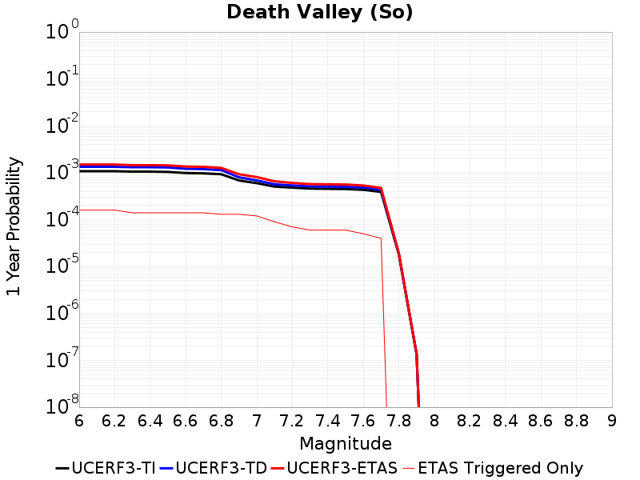 | 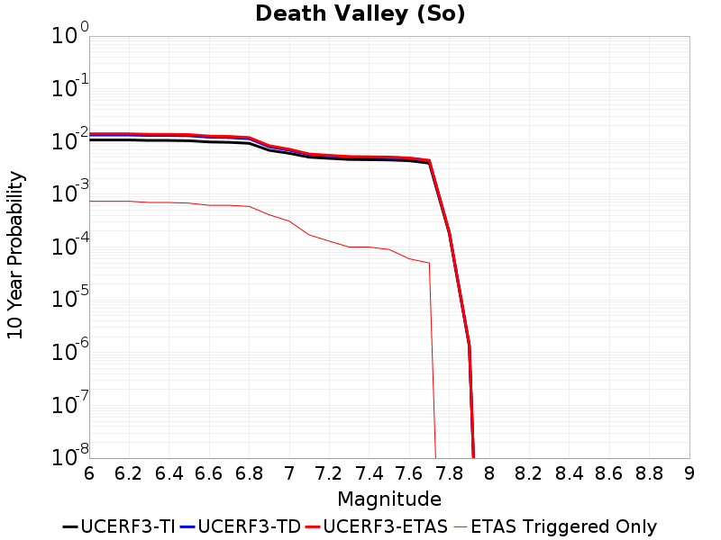 |

| Magnitude | 1 wk TI Prob | 1 wk TD Prob | 1 wk ETAS Prob | 1 wk ETAS/TD Gain | 1 wk ETAS Triggered Only | 1 mo TI Prob | 1 mo TD Prob | 1 mo ETAS Prob | 1 mo ETAS/TD Gain | 1 mo ETAS Triggered Only | 1 yr TI Prob | 1 yr TD Prob | 1 yr ETAS Prob | 1 yr ETAS/TD Gain | 1 yr ETAS Triggered Only | 10 yr TI Prob | 10 yr TD Prob | 10 yr ETAS Prob | 10 yr ETAS/TD Gain | 10 yr ETAS Triggered Only |
|-----|-----|-----|-----|-----|-----|-----|-----|-----|-----|-----|-----|-----|-----|-----|-----|-----|-----|-----|-----|-----|
| 6.0 | 2.0684236E-5 | 2.5664065E-5 | 2.5664065E-5 | 1.0 | 0.0 | 8.864371E-5 | 1.09984314E-4 | 1.3998101E-4 | 1.2727362 | 3.0E-5 | 0.0010787029 | 0.0013382535 | 0.0016078921 | 1.2014855 | 2.7E-4 | 0.010734817 | 0.01330486 | 0.01421262 | 1.0682276 | 9.2E-4 |
| 6.1 | 2.0684236E-5 | 2.5664065E-5 | 2.5664065E-5 | 1.0 | 0.0 | 8.864371E-5 | 1.09984314E-4 | 1.3998101E-4 | 1.2727362 | 3.0E-5 | 0.0010787029 | 0.0013382535 | 0.0016078921 | 1.2014855 | 2.7E-4 | 0.010734817 | 0.01330486 | 0.01421262 | 1.0682276 | 9.2E-4 |
| 6.2 | 2.0684236E-5 | 2.5664065E-5 | 2.5664065E-5 | 1.0 | 0.0 | 8.864371E-5 | 1.09984314E-4 | 1.3998101E-4 | 1.2727362 | 3.0E-5 | 0.0010787029 | 0.0013382535 | 0.0016078921 | 1.2014855 | 2.7E-4 | 0.010734817 | 0.01330486 | 0.01421262 | 1.0682276 | 9.2E-4 |
| 6.3 | 2.0240292E-5 | 2.5163776E-5 | 2.5163776E-5 | 1.0 | 0.0 | 8.6741224E-5 | 1.07840395E-4 | 1.3783715E-4 | 1.2781589 | 3.0E-5 | 0.0010555626 | 0.0013121829 | 0.0015818286 | 1.205494 | 2.7E-4 | 0.010505628 | 0.013047234 | 0.01395523 | 1.0695931 | 9.2E-4 |
| 6.4 | 2.0240292E-5 | 2.5163776E-5 | 2.5163776E-5 | 1.0 | 0.0 | 8.6741224E-5 | 1.07840395E-4 | 1.3783715E-4 | 1.2781589 | 3.0E-5 | 0.0010555626 | 0.0013121829 | 0.0015818286 | 1.205494 | 2.7E-4 | 0.010505628 | 0.013047234 | 0.01395523 | 1.0695931 | 9.2E-4 |
| 6.5 | 1.9962767E-5 | 2.4852809E-5 | 2.4852809E-5 | 1.0 | 0.0 | 8.55519E-5 | 1.0650779E-4 | 1.3650459E-4 | 1.2816396 | 3.0E-5 | 0.0010410968 | 0.0012959777 | 0.0015656278 | 1.2080669 | 2.7E-4 | 0.010362327 | 0.01288707 | 0.013755729 | 1.0674055 | 8.8E-4 |
| 6.6 | 1.8937297E-5 | 2.3348563E-5 | 2.3348563E-5 | 1.0 | 0.0 | 8.115732E-5 | 1.0006151E-4 | 1.3005851E-4 | 1.2997856 | 3.0E-5 | 9.876423E-4 | 0.0012175827 | 0.0014772661 | 1.2132778 | 2.6E-4 | 0.009832645 | 0.01211184 | 0.012912029 | 1.0660667 | 8.1E-4 |
| 6.7 | 1.8621096E-5 | 2.2948589E-5 | 2.2948589E-5 | 1.0 | 0.0 | 7.980225E-5 | 9.8347475E-5 | 1.2834452E-4 | 1.3050109 | 3.0E-5 | 9.711593E-4 | 0.0011967373 | 0.0014564262 | 1.2169974 | 2.6E-4 | 0.009669261 | 0.011905649 | 0.012676362 | 1.0647352 | 7.8E-4 |
| 6.8 | 1.7830353E-5 | 2.1838629E-5 | 2.1838629E-5 | 1.0 | 0.0 | 7.641356E-5 | 9.359084E-5 | 1.1358897E-4 | 1.2136761 | 2.0E-5 | 9.29938E-4 | 0.001138887 | 0.001368625 | 1.2017215 | 2.3E-4 | 0.009260561 | 0.011332942 | 0.012054669 | 1.063684 | 7.3E-4 |
| 6.9 | 1.3135183E-5 | 1.531815E-5 | 1.531815E-5 | 1.0 | 0.0 | 5.6292425E-5 | 6.56476E-5 | 8.564629E-5 | 1.304637 | 2.0E-5 | 6.8514474E-4 | 7.989729E-4 | 9.6883706E-4 | 1.2126032 | 1.7E-4 | 0.006830362 | 0.007960996 | 0.0084173335 | 1.0573217 | 4.6E-4 |
| 7.0 | 1.1507512E-5 | 1.316517E-5 | 1.316517E-5 | 1.0 | 0.0 | 4.9316975E-5 | 5.642097E-5 | 6.6420405E-5 | 1.177229 | 1.0E-5 | 6.002687E-4 | 6.867146E-4 | 7.9663907E-4 | 1.160073 | 1.1E-4 | 0.0059864987 | 0.0068455664 | 0.007143513 | 1.043524 | 3.0E-4 |
| 7.1 | 9.715903E-6 | 1.0873141E-5 | 1.0873141E-5 | 1.0 | 0.0 | 4.1638916E-5 | 4.6598365E-5 | 4.6598365E-5 | 1.0 | 0.0 | 5.068359E-4 | 5.671917E-4 | 6.171633E-4 | 1.0881037 | 5.0E-5 | 0.0050568148 | 0.005657727 | 0.005796935 | 1.0246049 | 1.4E-4 |
| 7.2 | 9.233269E-6 | 1.0293572E-5 | 1.0293572E-5 | 1.0 | 0.0 | 3.9570554E-5 | 4.411459E-5 | 4.411459E-5 | 1.0 | 0.0 | 4.81665E-4 | 5.3696695E-4 | 5.769455E-4 | 1.0744525 | 4.0E-5 | 0.0048062233 | 0.005357127 | 0.005466538 | 1.0204234 | 1.1E-4 |
| 7.3 | 8.8041315E-6 | 9.814817E-6 | 9.814817E-6 | 1.0 | 0.0 | 3.7731446E-5 | 4.2062846E-5 | 4.2062846E-5 | 1.0 | 0.0 | 4.592835E-4 | 5.11999E-4 | 5.5197853E-4 | 1.0780852 | 4.0E-5 | 0.0045833546 | 0.0051086214 | 0.0051981616 | 1.0175272 | 9.0E-5 |
| 7.4 | 8.708749E-6 | 9.713792E-6 | 9.713792E-6 | 1.0 | 0.0 | 3.7322676E-5 | 4.1629894E-5 | 4.1629894E-5 | 1.0 | 0.0 | 4.5430884E-4 | 5.067303E-4 | 5.367151E-4 | 1.0591731 | 3.0E-5 | 0.004533812 | 0.0050561754 | 0.005135771 | 1.0157422 | 8.0E-5 |
| 7.5 | 8.612678E-6 | 9.611393E-6 | 9.611393E-6 | 1.0 | 0.0 | 3.6910955E-5 | 4.119106E-5 | 4.119106E-5 | 1.0 | 0.0 | 4.492982E-4 | 5.0138996E-4 | 5.313749E-4 | 1.0598037 | 3.0E-5 | 0.004483909 | 0.005003013 | 0.0050826133 | 1.0159104 | 8.0E-5 |
| 7.6 | 8.319024E-6 | 9.290314E-6 | 9.290314E-6 | 1.0 | 0.0 | 3.5652476E-5 | 3.9815044E-5 | 3.9815044E-5 | 1.0 | 0.0 | 4.3398244E-4 | 4.8464455E-4 | 5.0463487E-4 | 1.0412474 | 2.0E-5 | 0.0043313587 | 0.004836301 | 0.0049059624 | 1.0144038 | 7.0E-5 |
| 7.7 | 7.4718328E-6 | 8.350963E-6 | 8.350963E-6 | 1.0 | 0.0 | 3.2021748E-5 | 3.5789373E-5 | 3.5789373E-5 | 1.0 | 0.0 | 3.8979502E-4 | 4.3565256E-4 | 4.5564384E-4 | 1.0458882 | 2.0E-5 | 0.00389112 | 0.0043483907 | 0.0044180867 | 1.0160279 | 7.0E-5 |
| 7.8 | 3.4586725E-7 | 3.6494507E-7 | 3.6494507E-7 | 1.0 | 0.0 | 1.4822873E-6 | 1.5640494E-6 | 1.5640494E-6 | 1.0 | 0.0 | 1.80467E-5 | 1.904214E-5 | 1.904214E-5 | 1.0 | 0.0 | 1.8045233E-4 | 1.9040552E-4 | 2.004036E-4 | 1.0525094 | 1.0E-5 |
| 7.9 | 2.5591178E-9 | 2.670354E-9 | 2.670354E-9 | 1.0 | 0.0 | 1.0967647E-8 | 1.1444374E-8 | 1.1444374E-8 | 1.0 | 0.0 | 1.335311E-7 | 1.3933526E-7 | 1.3933526E-7 | 1.0 | 0.0 | 1.3353102E-6 | 1.3933526E-6 | 1.3933526E-6 | 1.0 | 0.0 |

## San Andreas (Mojave S)
*[(top)](#table-of-contents)*

| 1 Week | 1 Month | 1 Year | 10 Year |
|-----|-----|-----|-----|
|  |  |  |  |

| Magnitude | 1 wk TI Prob | 1 wk TD Prob | 1 wk ETAS Prob | 1 wk ETAS/TD Gain | 1 wk ETAS Triggered Only | 1 mo TI Prob | 1 mo TD Prob | 1 mo ETAS Prob | 1 mo ETAS/TD Gain | 1 mo ETAS Triggered Only | 1 yr TI Prob | 1 yr TD Prob | 1 yr ETAS Prob | 1 yr ETAS/TD Gain | 1 yr ETAS Triggered Only | 10 yr TI Prob | 10 yr TD Prob | 10 yr ETAS Prob | 10 yr ETAS/TD Gain | 10 yr ETAS Triggered Only |
|-----|-----|-----|-----|-----|-----|-----|-----|-----|-----|-----|-----|-----|-----|-----|-----|-----|-----|-----|-----|-----|
| 6.0 | 3.1064058E-4 | 6.789936E-4 | 6.789936E-4 | 1.0 | 0.0 | 0.0013306376 | 0.0029068557 | 0.0029367686 | 1.0102904 | 3.0E-5 | 0.016080605 | 0.034785826 | 0.035007827 | 1.0063819 | 2.3E-4 | 0.1496549 | 0.2882895 | 0.28888732 | 1.0020738 | 8.4E-4 |
| 6.1 | 3.1064058E-4 | 6.789936E-4 | 6.789936E-4 | 1.0 | 0.0 | 0.0013306376 | 0.0029068557 | 0.0029367686 | 1.0102904 | 3.0E-5 | 0.016080605 | 0.034785826 | 0.035007827 | 1.0063819 | 2.3E-4 | 0.1496549 | 0.2882895 | 0.28888732 | 1.0020738 | 8.4E-4 |
| 6.2 | 3.1064058E-4 | 6.789936E-4 | 6.789936E-4 | 1.0 | 0.0 | 0.0013306376 | 0.0029068557 | 0.0029367686 | 1.0102904 | 3.0E-5 | 0.016080605 | 0.034785826 | 0.035007827 | 1.0063819 | 2.3E-4 | 0.1496549 | 0.2882895 | 0.28888732 | 1.0020738 | 8.4E-4 |
| 6.3 | 3.1064058E-4 | 6.789936E-4 | 6.789936E-4 | 1.0 | 0.0 | 0.0013306376 | 0.0029068557 | 0.0029367686 | 1.0102904 | 3.0E-5 | 0.016080605 | 0.034785826 | 0.035007827 | 1.0063819 | 2.3E-4 | 0.1496549 | 0.2882895 | 0.28888732 | 1.0020738 | 8.4E-4 |
| 6.4 | 1.9872203E-4 | 4.35971E-4 | 4.35971E-4 | 1.0 | 0.0 | 8.5138786E-4 | 0.0018671374 | 0.0018871 | 1.0106916 | 2.0E-5 | 0.010316478 | 0.022501634 | 0.022687359 | 1.0082538 | 1.9E-4 | 0.098504856 | 0.19868712 | 0.19929612 | 1.0030651 | 7.6E-4 |
| 6.5 | 1.291105E-4 | 2.9149183E-4 | 2.9149183E-4 | 1.0 | 0.0 | 5.5321335E-4 | 0.0012486554 | 0.0012686304 | 1.0159972 | 2.0E-5 | 0.006714592 | 0.015097253 | 0.015274536 | 1.0117427 | 1.8E-4 | 0.065152965 | 0.1396941 | 0.1402791 | 1.0041878 | 6.8E-4 |
| 6.6 | 1.291105E-4 | 2.9149183E-4 | 2.9149183E-4 | 1.0 | 0.0 | 5.5321335E-4 | 0.0012486554 | 0.0012686304 | 1.0159972 | 2.0E-5 | 0.006714592 | 0.015097253 | 0.015274536 | 1.0117427 | 1.8E-4 | 0.065152965 | 0.1396941 | 0.1402791 | 1.0041878 | 6.8E-4 |
| 6.7 | 1.08001186E-4 | 2.4724525E-4 | 2.4724525E-4 | 1.0 | 0.0 | 4.6278012E-4 | 0.0010591927 | 0.0010791715 | 1.0188622 | 2.0E-5 | 0.0056198016 | 0.012819733 | 0.012997424 | 1.0138608 | 1.8E-4 | 0.054797906 | 0.120824724 | 0.12140498 | 1.0048025 | 6.6E-4 |
| 6.8 | 1.0624356E-4 | 2.4241084E-4 | 2.4241084E-4 | 1.0 | 0.0 | 4.5525006E-4 | 0.0010384904 | 0.0010584696 | 1.0192387 | 2.0E-5 | 0.0055285925 | 0.012570608 | 0.012748346 | 1.014139 | 1.8E-4 | 0.053930566 | 0.11877388 | 0.11935549 | 1.0048968 | 6.6E-4 |
| 6.9 | 1.0393785E-4 | 2.3609945E-4 | 2.3609945E-4 | 1.0 | 0.0 | 4.4537184E-4 | 0.0010114629 | 0.0010314427 | 1.0197533 | 2.0E-5 | 0.0054089287 | 0.012245288 | 0.012423084 | 1.0145196 | 1.8E-4 | 0.05279156 | 0.11607614 | 0.11665953 | 1.0050259 | 6.6E-4 |
| 7.0 | 1.0155622E-4 | 2.2977777E-4 | 2.2977777E-4 | 1.0 | 0.0 | 4.3516833E-4 | 9.843906E-4 | 0.001004371 | 1.0202972 | 2.0E-5 | 0.005285311 | 0.011919331 | 0.012097185 | 1.0149215 | 1.8E-4 | 0.05161361 | 0.11333701 | 0.11392221 | 1.0051633 | 6.6E-4 |
| 7.1 | 9.885595E-5 | 2.226428E-4 | 2.226428E-4 | 1.0 | 0.0 | 4.2359953E-4 | 9.538349E-4 | 9.738158E-4 | 1.0209479 | 2.0E-5 | 0.0051451353 | 0.011551313 | 0.011729234 | 1.0154027 | 1.8E-4 | 0.05027629 | 0.11021646 | 0.110803716 | 1.0053282 | 6.6E-4 |
| 7.2 | 9.6411415E-5 | 2.1625459E-4 | 2.1625459E-4 | 1.0 | 0.0 | 4.1312634E-4 | 9.264765E-4 | 9.4645796E-4 | 1.0215671 | 2.0E-5 | 0.005018219 | 0.011221702 | 0.011399683 | 1.0158603 | 1.8E-4 | 0.049064007 | 0.10740599 | 0.1079951 | 1.0054849 | 6.6E-4 |
| 7.3 | 9.1180635E-5 | 1.9843623E-4 | 1.9843623E-4 | 1.0 | 0.0 | 3.907156E-4 | 8.501639E-4 | 8.701469E-4 | 1.0235049 | 2.0E-5 | 0.004746591 | 0.01030174 | 0.010479886 | 1.0172927 | 1.8E-4 | 0.046464786 | 0.09957192 | 0.1001662 | 1.0059683 | 6.6E-4 |
| 7.4 | 8.887388E-5 | 1.9087926E-4 | 1.9087926E-4 | 1.0 | 0.0 | 3.8083247E-4 | 8.1779755E-4 | 8.3778123E-4 | 1.0244359 | 2.0E-5 | 0.0046267817 | 0.009911333 | 0.010089549 | 1.017981 | 1.8E-4 | 0.045316286 | 0.096199915 | 0.09679642 | 1.0062007 | 6.6E-4 |
| 7.5 | 8.6750515E-5 | 1.8415548E-4 | 1.8415548E-4 | 1.0 | 0.0 | 3.7173493E-4 | 7.889991E-4 | 8.0898334E-4 | 1.0253285 | 2.0E-5 | 0.004516484 | 0.009563845 | 0.009742124 | 1.0186409 | 1.8E-4 | 0.04425787 | 0.0931545 | 0.09375302 | 1.006425 | 6.6E-4 |
| 7.6 | 8.453092E-5 | 1.7798434E-4 | 1.7798434E-4 | 1.0 | 0.0 | 3.6222505E-4 | 7.6256716E-4 | 7.825519E-4 | 1.0262072 | 2.0E-5 | 0.0044011753 | 0.009244812 | 0.009423148 | 1.0192903 | 1.8E-4 | 0.04315024 | 0.09029881 | 0.09089012 | 1.0065483 | 6.5E-4 |
| 7.7 | 8.259102E-5 | 1.7316648E-4 | 1.7316648E-4 | 1.0 | 0.0 | 3.539135E-4 | 7.41931E-4 | 7.6191616E-4 | 1.0269367 | 2.0E-5 | 0.004300386 | 0.008995671 | 0.009174052 | 1.0198296 | 1.8E-4 | 0.042181134 | 0.088035986 | 0.08862876 | 1.0067333 | 6.5E-4 |
| 7.8 | 7.444844E-5 | 1.5607473E-4 | 1.5607473E-4 | 1.0 | 0.0 | 3.1902574E-4 | 6.6872034E-4 | 6.8870693E-4 | 1.0298879 | 2.0E-5 | 0.0038772223 | 0.008111329 | 0.008270032 | 1.0195655 | 1.6E-4 | 0.03810269 | 0.07973989 | 0.08023683 | 1.006232 | 5.4E-4 |
| 7.9 | 5.2586525E-5 | 1.0228509E-4 | 1.0228509E-4 | 1.0 | 0.0 | 2.2535135E-4 | 4.3829103E-4 | 4.5828227E-4 | 1.0456117 | 2.0E-5 | 0.0027402006 | 0.0053231493 | 0.005422617 | 1.0186858 | 1.0E-4 | 0.027066574 | 0.053235713 | 0.05353868 | 1.005691 | 3.2E-4 |
| 8.0 | 3.379877E-5 | 5.5365268E-5 | 5.5365268E-5 | 1.0 | 0.0 | 1.4484383E-4 | 2.3725815E-4 | 2.4725578E-4 | 1.0421382 | 1.0E-5 | 0.0017620471 | 0.0028847936 | 0.002914707 | 1.0103693 | 3.0E-5 | 0.017481409 | 0.029466802 | 0.02957356 | 1.003623 | 1.1E-4 |
| 8.1 | 1.8668277E-5 | 1.992471E-5 | 1.992471E-5 | 1.0 | 0.0 | 8.000444E-5 | 8.538882E-5 | 8.538882E-5 | 1.0 | 0.0 | 9.736188E-4 | 0.0010391137 | 0.0010391137 | 1.0 | 0.0 | 0.009693642 | 0.011120078 | 0.011129967 | 1.0008893 | 1.0E-5 |
| 8.2 | 8.541571E-6 | 5.6941603E-6 | 5.6941603E-6 | 1.0 | 0.0 | 3.660622E-5 | 2.4403316E-5 | 2.4403316E-5 | 1.0 | 0.0 | 4.455896E-4 | 2.9706996E-4 | 2.9706996E-4 | 1.0 | 0.0 | 0.0044469717 | 0.0033682827 | 0.0033682827 | 1.0 | 0.0 |
| 8.3 | 1.983087E-6 | 8.050169E-7 | 8.050169E-7 | 1.0 | 0.0 | 8.498917E-6 | 3.4500679E-6 | 3.4500679E-6 | 1.0 | 0.0 | 1.034694E-4 | 4.2003783E-5 | 4.2003783E-5 | 1.0 | 0.0 | 0.0010342124 | 4.943242E-4 | 4.943242E-4 | 1.0 | 0.0 |

## Towne Pass
*[(top)](#table-of-contents)*

| 1 Week | 1 Month | 1 Year | 10 Year |
|-----|-----|-----|-----|
| 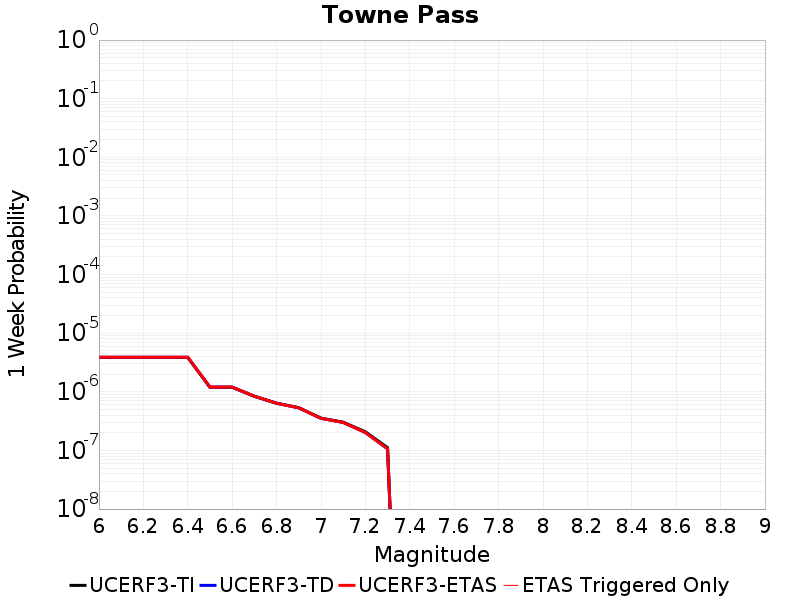 |  |  | 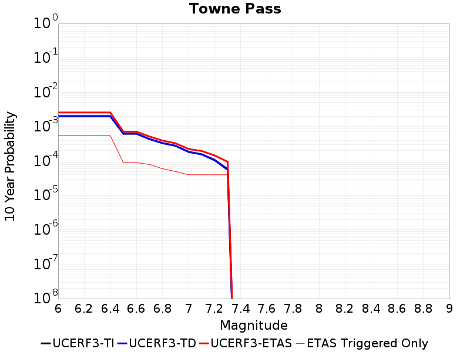 |

| Magnitude | 1 wk TI Prob | 1 wk TD Prob | 1 wk ETAS Prob | 1 wk ETAS/TD Gain | 1 wk ETAS Triggered Only | 1 mo TI Prob | 1 mo TD Prob | 1 mo ETAS Prob | 1 mo ETAS/TD Gain | 1 mo ETAS Triggered Only | 1 yr TI Prob | 1 yr TD Prob | 1 yr ETAS Prob | 1 yr ETAS/TD Gain | 1 yr ETAS Triggered Only | 10 yr TI Prob | 10 yr TD Prob | 10 yr ETAS Prob | 10 yr ETAS/TD Gain | 10 yr ETAS Triggered Only |
|-----|-----|-----|-----|-----|-----|-----|-----|-----|-----|-----|-----|-----|-----|-----|-----|-----|-----|-----|-----|-----|
| 6.0 | 3.849728E-6 | 3.894906E-6 | 1.3894867E-5 | 3.5674462 | 1.0E-5 | 1.649873E-5 | 1.6692371E-5 | 4.6691872E-5 | 2.797198 | 3.0E-5 | 2.0085352E-4 | 2.0321505E-4 | 3.9317642E-4 | 1.9347801 | 1.9E-4 | 0.0020067208 | 0.0020307214 | 0.002759239 | 1.3587482 | 7.3E-4 |
| 6.1 | 3.849728E-6 | 3.894906E-6 | 1.3894867E-5 | 3.5674462 | 1.0E-5 | 1.649873E-5 | 1.6692371E-5 | 4.6691872E-5 | 2.797198 | 3.0E-5 | 2.0085352E-4 | 2.0321505E-4 | 3.9317642E-4 | 1.9347801 | 1.9E-4 | 0.0020067208 | 0.0020307214 | 0.002759239 | 1.3587482 | 7.3E-4 |
| 6.2 | 3.849728E-6 | 3.894906E-6 | 1.3894867E-5 | 3.5674462 | 1.0E-5 | 1.649873E-5 | 1.6692371E-5 | 4.6691872E-5 | 2.797198 | 3.0E-5 | 2.0085352E-4 | 2.0321505E-4 | 3.9317642E-4 | 1.9347801 | 1.9E-4 | 0.0020067208 | 0.0020307214 | 0.002759239 | 1.3587482 | 7.3E-4 |
| 6.3 | 3.849728E-6 | 3.894906E-6 | 1.3894867E-5 | 3.5674462 | 1.0E-5 | 1.649873E-5 | 1.6692371E-5 | 4.6691872E-5 | 2.797198 | 3.0E-5 | 2.0085352E-4 | 2.0321505E-4 | 3.9317642E-4 | 1.9347801 | 1.9E-4 | 0.0020067208 | 0.0020307214 | 0.002759239 | 1.3587482 | 7.3E-4 |
| 6.4 | 3.849728E-6 | 3.894906E-6 | 1.3894867E-5 | 3.5674462 | 1.0E-5 | 1.649873E-5 | 1.6692371E-5 | 4.6691872E-5 | 2.797198 | 3.0E-5 | 2.0085352E-4 | 2.0321505E-4 | 3.9317642E-4 | 1.9347801 | 1.9E-4 | 0.0020067208 | 0.0020307214 | 0.002759239 | 1.3587482 | 7.3E-4 |
| 6.5 | 1.1953545E-6 | 1.203194E-6 | 1.203194E-6 | 1.0 | 0.0 | 5.1229376E-6 | 5.1565357E-6 | 5.1565357E-6 | 1.0 | 0.0 | 6.236998E-5 | 6.277914E-5 | 9.277725E-5 | 1.4778358 | 3.0E-5 | 6.235248E-4 | 6.2762573E-4 | 7.3755666E-4 | 1.1751537 | 1.1E-4 |
| 6.6 | 1.1953545E-6 | 1.203194E-6 | 1.203194E-6 | 1.0 | 0.0 | 5.1229376E-6 | 5.1565357E-6 | 5.1565357E-6 | 1.0 | 0.0 | 6.236998E-5 | 6.277914E-5 | 9.277725E-5 | 1.4778358 | 3.0E-5 | 6.235248E-4 | 6.2762573E-4 | 7.3755666E-4 | 1.1751537 | 1.1E-4 |
| 6.7 | 8.375951E-7 | 8.411837E-7 | 8.411837E-7 | 1.0 | 0.0 | 3.5896885E-6 | 3.6050683E-6 | 3.6050683E-6 | 1.0 | 0.0 | 4.370358E-5 | 4.389088E-5 | 5.3890442E-5 | 1.2278278 | 1.0E-5 | 4.3694986E-4 | 4.3882782E-4 | 4.888059E-4 | 1.1138899 | 5.0E-5 |
| 6.8 | 6.38041E-7 | 6.393185E-7 | 6.393185E-7 | 1.0 | 0.0 | 2.7344586E-6 | 2.739934E-6 | 2.739934E-6 | 1.0 | 0.0 | 3.3291526E-5 | 3.3358225E-5 | 3.3358225E-5 | 1.0 | 0.0 | 3.3286537E-4 | 3.3353598E-4 | 3.6352596E-4 | 1.0899153 | 3.0E-5 |
| 6.9 | 5.3460053E-7 | 5.346288E-7 | 5.346288E-7 | 1.0 | 0.0 | 2.2911431E-6 | 2.2912643E-6 | 2.2912643E-6 | 1.0 | 0.0 | 2.789431E-5 | 2.789582E-5 | 2.789582E-5 | 1.0 | 0.0 | 2.789081E-4 | 2.7892648E-4 | 2.9892093E-4 | 1.0716835 | 2.0E-5 |
| 7.0 | 3.557783E-7 | 3.533229E-7 | 3.533229E-7 | 1.0 | 0.0 | 1.5247632E-6 | 1.5142401E-6 | 1.5142401E-6 | 1.0 | 0.0 | 1.8563835E-5 | 1.8435727E-5 | 1.8435727E-5 | 1.0 | 0.0 | 1.8562283E-4 | 1.843428E-4 | 1.9434097E-4 | 1.0542368 | 1.0E-5 |
| 7.1 | 3.037942E-7 | 3.000953E-7 | 3.000953E-7 | 1.0 | 0.0 | 1.3019744E-6 | 1.2861223E-6 | 1.2861223E-6 | 1.0 | 0.0 | 1.5851423E-5 | 1.5658434E-5 | 1.5658434E-5 | 1.0 | 0.0 | 1.5850292E-4 | 1.5657405E-4 | 1.6657248E-4 | 1.0638576 | 1.0E-5 |
| 7.2 | 2.0808248E-7 | 2.0223635E-7 | 2.0223635E-7 | 1.0 | 0.0 | 8.917818E-7 | 8.6672696E-7 | 8.6672696E-7 | 1.0 | 0.0 | 1.0857389E-5 | 1.0552355E-5 | 1.0552355E-5 | 1.0 | 0.0 | 1.0856859E-4 | 1.05519E-4 | 1.1551794E-4 | 1.0947597 | 1.0E-5 |
| 7.3 | 1.1162073E-7 | 1.06404954E-7 | 1.06404954E-7 | 1.0 | 0.0 | 4.7837443E-7 | 4.5602116E-7 | 4.5602116E-7 | 1.0 | 0.0 | 5.8241935E-6 | 5.5520454E-6 | 5.5520454E-6 | 1.0 | 0.0 | 5.8240406E-5 | 5.5519267E-5 | 6.551871E-5 | 1.1801076 | 1.0E-5 |

## Nelson Lake
*[(top)](#table-of-contents)*

| 1 Week | 1 Month | 1 Year | 10 Year |
|-----|-----|-----|-----|
| 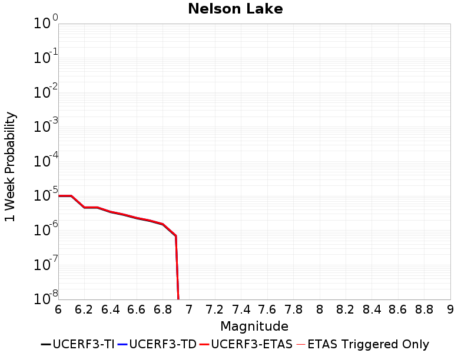 | 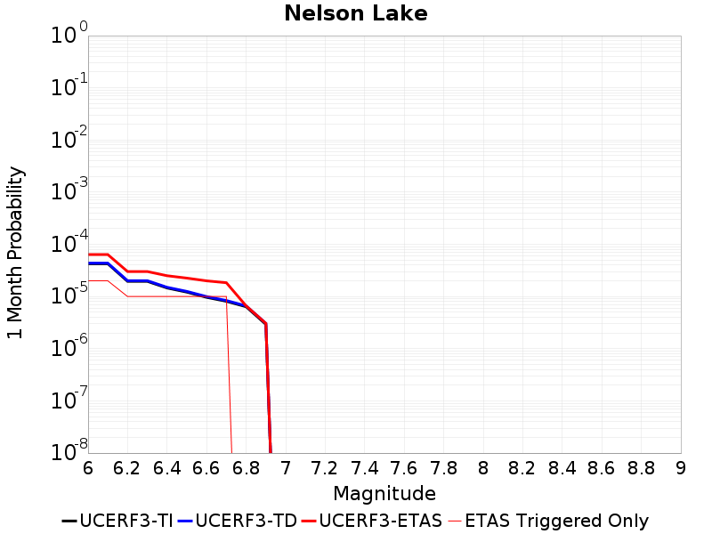 |  |  |

| Magnitude | 1 wk TI Prob | 1 wk TD Prob | 1 wk ETAS Prob | 1 wk ETAS/TD Gain | 1 wk ETAS Triggered Only | 1 mo TI Prob | 1 mo TD Prob | 1 mo ETAS Prob | 1 mo ETAS/TD Gain | 1 mo ETAS Triggered Only | 1 yr TI Prob | 1 yr TD Prob | 1 yr ETAS Prob | 1 yr ETAS/TD Gain | 1 yr ETAS Triggered Only | 10 yr TI Prob | 10 yr TD Prob | 10 yr ETAS Prob | 10 yr ETAS/TD Gain | 10 yr ETAS Triggered Only |
|-----|-----|-----|-----|-----|-----|-----|-----|-----|-----|-----|-----|-----|-----|-----|-----|-----|-----|-----|-----|-----|
| 6.0 | 9.913453E-6 | 1.0193953E-5 | 1.0193953E-5 | 1.0 | 0.0 | 4.2485535E-5 | 4.3687698E-5 | 5.368726E-5 | 1.2288874 | 1.0E-5 | 5.1713863E-4 | 5.3177826E-4 | 6.5171445E-4 | 1.225538 | 1.2E-4 | 0.0051593683 | 0.0053060856 | 0.0059128487 | 1.1143523 | 6.1E-4 |
| 6.1 | 9.913453E-6 | 1.0193953E-5 | 1.0193953E-5 | 1.0 | 0.0 | 4.2485535E-5 | 4.3687698E-5 | 5.368726E-5 | 1.2288874 | 1.0E-5 | 5.1713863E-4 | 5.3177826E-4 | 6.5171445E-4 | 1.225538 | 1.2E-4 | 0.0051593683 | 0.0053060856 | 0.0059128487 | 1.1143523 | 6.1E-4 |
| 6.2 | 4.5596407E-6 | 4.6971472E-6 | 4.6971472E-6 | 1.0 | 0.0 | 1.954117E-5 | 2.0130483E-5 | 2.0130483E-5 | 1.0 | 0.0 | 2.3788778E-4 | 2.4506234E-4 | 3.0504764E-4 | 1.2447757 | 6.0E-5 | 0.0023763329 | 0.002448047 | 0.0026874596 | 1.0977973 | 2.4E-4 |
| 6.3 | 4.5596407E-6 | 4.6971472E-6 | 4.6971472E-6 | 1.0 | 0.0 | 1.954117E-5 | 2.0130483E-5 | 2.0130483E-5 | 1.0 | 0.0 | 2.3788778E-4 | 2.4506234E-4 | 3.0504764E-4 | 1.2447757 | 6.0E-5 | 0.0023763329 | 0.002448047 | 0.0026874596 | 1.0977973 | 2.4E-4 |
| 6.4 | 3.4025713E-6 | 3.5105536E-6 | 3.5105536E-6 | 1.0 | 0.0 | 1.4582367E-5 | 1.5045148E-5 | 1.5045148E-5 | 1.0 | 0.0 | 1.7752586E-4 | 1.8316011E-4 | 2.2315279E-4 | 1.2183481 | 4.0E-5 | 0.001773841 | 0.0018301745 | 0.0020198268 | 1.1036252 | 1.9E-4 |
| 6.5 | 2.8352947E-6 | 2.9284229E-6 | 2.9284229E-6 | 1.0 | 0.0 | 1.2151207E-5 | 1.25503275E-5 | 1.25503275E-5 | 1.0 | 0.0 | 1.479309E-4 | 1.5279026E-4 | 1.8278569E-4 | 1.1963176 | 3.0E-5 | 0.0014783246 | 0.0015269261 | 0.0016966666 | 1.1111648 | 1.7E-4 |
| 6.6 | 2.251518E-6 | 2.3295431E-6 | 2.3295431E-6 | 1.0 | 0.0 | 9.649328E-6 | 9.983722E-6 | 9.983722E-6 | 1.0 | 0.0 | 1.1747423E-4 | 1.2154566E-4 | 1.5154202E-4 | 1.2467908 | 3.0E-5 | 0.0011741214 | 0.0012148536 | 0.0013646714 | 1.1233217 | 1.5E-4 |
| 6.7 | 1.8911853E-6 | 1.959557E-6 | 1.959557E-6 | 1.0 | 0.0 | 8.105055E-6 | 8.398078E-6 | 8.398078E-6 | 1.0 | 0.0 | 9.867457E-5 | 1.0224238E-4 | 1.3223932E-4 | 1.2933904 | 3.0E-5 | 9.863076E-4 | 0.0010220109 | 0.0011418883 | 1.1172956 | 1.2E-4 |
| 6.8 | 1.4874814E-6 | 1.544177E-6 | 1.544177E-6 | 1.0 | 0.0 | 6.374905E-6 | 6.6178877E-6 | 6.6178877E-6 | 1.0 | 0.0 | 7.76117E-5 | 8.0570324E-5 | 1.1056791E-4 | 1.3723155 | 3.0E-5 | 7.75846E-4 | 8.054623E-4 | 9.0538175E-4 | 1.1240523 | 1.0E-4 |
| 6.9 | 6.835972E-7 | 7.141806E-7 | 7.141806E-7 | 1.0 | 0.0 | 2.9296991E-6 | 3.0607723E-6 | 3.0607723E-6 | 1.0 | 0.0 | 3.56685E-5 | 3.7264585E-5 | 5.726384E-5 | 1.5366826 | 2.0E-5 | 3.5662777E-4 | 3.7261462E-4 | 4.4258856E-4 | 1.1877917 | 7.0E-5 |

## San Andreas (San Bernardino N)
*[(top)](#table-of-contents)*

| 1 Week | 1 Month | 1 Year | 10 Year |
|-----|-----|-----|-----|
| 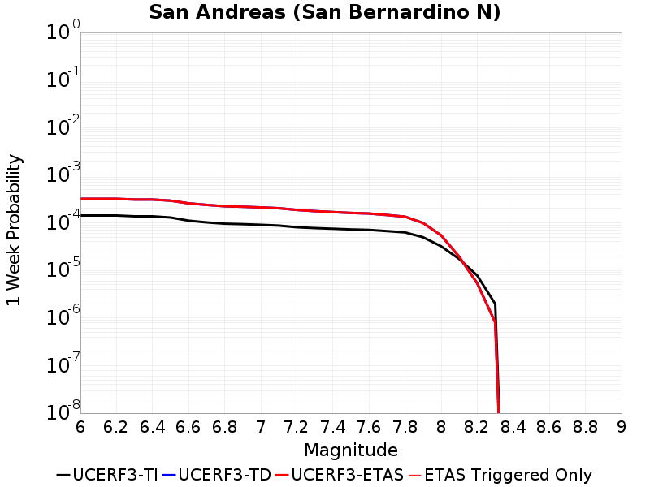 | 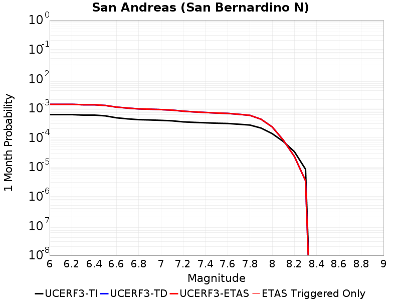 |  | 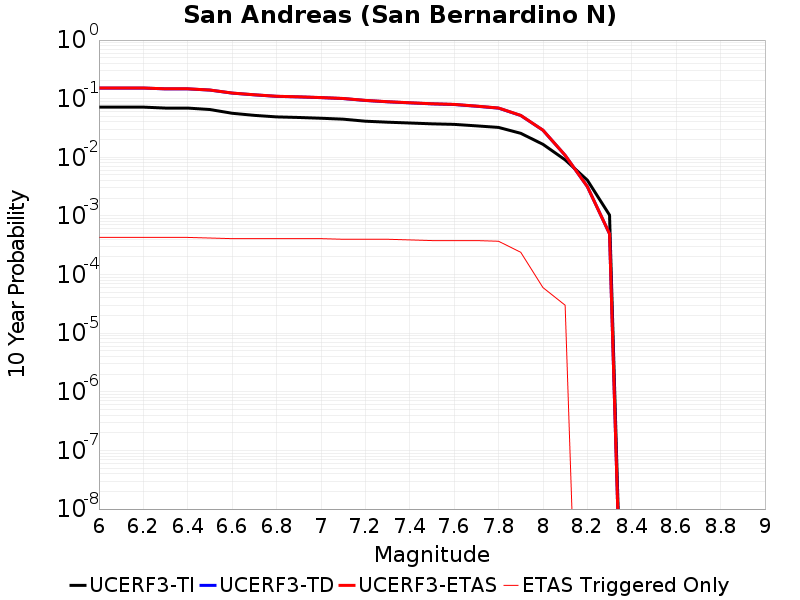 |

| Magnitude | 1 wk TI Prob | 1 wk TD Prob | 1 wk ETAS Prob | 1 wk ETAS/TD Gain | 1 wk ETAS Triggered Only | 1 mo TI Prob | 1 mo TD Prob | 1 mo ETAS Prob | 1 mo ETAS/TD Gain | 1 mo ETAS Triggered Only | 1 yr TI Prob | 1 yr TD Prob | 1 yr ETAS Prob | 1 yr ETAS/TD Gain | 1 yr ETAS Triggered Only | 10 yr TI Prob | 10 yr TD Prob | 10 yr ETAS Prob | 10 yr ETAS/TD Gain | 10 yr ETAS Triggered Only |
|-----|-----|-----|-----|-----|-----|-----|-----|-----|-----|-----|-----|-----|-----|-----|-----|-----|-----|-----|-----|-----|
| 6.0 | 1.4273766E-4 | 3.1940022E-4 | 3.1940022E-4 | 1.0 | 0.0 | 6.115894E-4 | 0.0013681459 | 0.0013881186 | 1.0145984 | 2.0E-5 | 0.0074207084 | 0.016531475 | 0.01666916 | 1.0083287 | 1.4E-4 | 0.07177748 | 0.15162991 | 0.15202865 | 1.0026296 | 4.7E-4 |
| 6.1 | 1.4273766E-4 | 3.1940022E-4 | 3.1940022E-4 | 1.0 | 0.0 | 6.115894E-4 | 0.0013681459 | 0.0013881186 | 1.0145984 | 2.0E-5 | 0.0074207084 | 0.016531475 | 0.01666916 | 1.0083287 | 1.4E-4 | 0.07177748 | 0.15162991 | 0.15202865 | 1.0026296 | 4.7E-4 |
| 6.2 | 1.4273766E-4 | 3.1940022E-4 | 3.1940022E-4 | 1.0 | 0.0 | 6.115894E-4 | 0.0013681459 | 0.0013881186 | 1.0145984 | 2.0E-5 | 0.0074207084 | 0.016531475 | 0.01666916 | 1.0083287 | 1.4E-4 | 0.07177748 | 0.15162991 | 0.15202865 | 1.0026296 | 4.7E-4 |
| 6.3 | 1.3730655E-4 | 3.0843186E-4 | 3.0843186E-4 | 1.0 | 0.0 | 5.883239E-4 | 0.0013211868 | 0.0013411604 | 1.0151179 | 2.0E-5 | 0.0071393442 | 0.015968231 | 0.016105996 | 1.0086274 | 1.4E-4 | 0.06914291 | 0.14694238 | 0.14734332 | 1.0027286 | 4.7E-4 |
| 6.4 | 1.3730655E-4 | 3.0843186E-4 | 3.0843186E-4 | 1.0 | 0.0 | 5.883239E-4 | 0.0013211868 | 0.0013411604 | 1.0151179 | 2.0E-5 | 0.0071393442 | 0.015968231 | 0.016105996 | 1.0086274 | 1.4E-4 | 0.06914291 | 0.14694238 | 0.14734332 | 1.0027286 | 4.7E-4 |
| 6.5 | 1.2942807E-4 | 2.9255252E-4 | 2.9255252E-4 | 1.0 | 0.0 | 5.545738E-4 | 0.0012531993 | 0.0012731742 | 1.0159391 | 2.0E-5 | 0.0067310524 | 0.015152223 | 0.015290102 | 1.0090996 | 1.4E-4 | 0.06530788 | 0.14008181 | 0.14048597 | 1.0028852 | 4.7E-4 |
| 6.6 | 1.1125901E-4 | 2.568756E-4 | 2.568756E-4 | 1.0 | 0.0 | 4.767372E-4 | 0.0011004333 | 0.0011204113 | 1.0181546 | 2.0E-5 | 0.005788839 | 0.013316116 | 0.013454252 | 1.0103736 | 1.4E-4 | 0.056403454 | 0.124384165 | 0.12477819 | 1.0031679 | 4.5E-4 |
| 6.7 | 1.02209575E-4 | 2.3820197E-4 | 2.3820197E-4 | 1.0 | 0.0 | 4.3796748E-4 | 0.0010204676 | 0.0010404473 | 1.0195788 | 2.0E-5 | 0.0053192247 | 0.012353849 | 0.012492119 | 1.0111924 | 1.4E-4 | 0.051936906 | 0.11614547 | 0.11653437 | 1.0033484 | 4.4E-4 |
| 6.8 | 9.610582E-5 | 2.2341544E-4 | 2.2341544E-4 | 1.0 | 0.0 | 4.1181705E-4 | 9.5714413E-4 | 9.77125E-4 | 1.0208755 | 2.0E-5 | 0.0050023515 | 0.011591238 | 0.011729615 | 1.0119381 | 1.4E-4 | 0.048912346 | 0.10954914 | 0.10992313 | 1.0034139 | 4.2E-4 |
| 6.9 | 9.3877505E-5 | 2.1795736E-4 | 2.1795736E-4 | 1.0 | 0.0 | 4.0227012E-4 | 9.337693E-4 | 9.537506E-4 | 1.0213985 | 2.0E-5 | 0.0048866454 | 0.011309633 | 0.01144805 | 1.0122389 | 1.4E-4 | 0.04780577 | 0.10714089 | 0.107515894 | 1.0035001 | 4.2E-4 |
| 7.0 | 9.1019785E-5 | 2.1120583E-4 | 2.1120583E-4 | 1.0 | 0.0 | 3.900265E-4 | 9.0485445E-4 | 9.248364E-4 | 1.022083 | 2.0E-5 | 0.0047382377 | 0.010961187 | 0.011099652 | 1.0126324 | 1.4E-4 | 0.046384744 | 0.10411174 | 0.10448801 | 1.0036141 | 4.2E-4 |
| 7.1 | 8.771155E-5 | 2.0292844E-4 | 2.0292844E-4 | 1.0 | 0.0 | 3.758525E-4 | 8.6940394E-4 | 8.893866E-4 | 1.0229843 | 2.0E-5 | 0.0045664064 | 0.010533824 | 0.010672349 | 1.0131506 | 1.4E-4 | 0.044737056 | 0.10041399 | 0.10079182 | 1.0037627 | 4.2E-4 |
| 7.2 | 8.0830236E-5 | 1.869362E-4 | 1.869362E-4 | 1.0 | 0.0 | 3.4636928E-4 | 8.009093E-4 | 8.2089327E-4 | 1.0249516 | 2.0E-5 | 0.0042088944 | 0.009707585 | 0.009846225 | 1.0142817 | 1.4E-4 | 0.041300658 | 0.09313366 | 0.09351455 | 1.0040896 | 4.2E-4 |
| 7.3 | 7.7668235E-5 | 1.7631758E-4 | 1.7631758E-4 | 1.0 | 0.0 | 3.328214E-4 | 7.5542805E-4 | 7.754129E-4 | 1.026455 | 2.0E-5 | 0.0040445733 | 0.009158634 | 0.009297351 | 1.0151461 | 1.4E-4 | 0.03971748 | 0.0883859 | 0.08876878 | 1.004332 | 4.2E-4 |
| 7.4 | 7.520177E-5 | 1.6847688E-4 | 1.6847688E-4 | 1.0 | 0.0 | 3.2225347E-4 | 7.2184403E-4 | 7.4182963E-4 | 1.0276868 | 2.0E-5 | 0.0039163795 | 0.008753108 | 0.008891882 | 1.0158544 | 1.4E-4 | 0.038480744 | 0.08483435 | 0.08521872 | 1.0045308 | 4.2E-4 |
| 7.5 | 7.274697E-5 | 1.6131444E-4 | 1.6131444E-4 | 1.0 | 0.0 | 3.1173544E-4 | 6.911645E-4 | 7.111507E-4 | 1.0289167 | 2.0E-5 | 0.003788775 | 0.008382521 | 0.008521347 | 1.0165614 | 1.4E-4 | 0.03724827 | 0.08154105 | 0.081917614 | 1.0046182 | 4.1E-4 |
| 7.6 | 7.1185845E-5 | 1.5698801E-4 | 1.5698801E-4 | 1.0 | 0.0 | 3.0504653E-4 | 6.7263236E-4 | 6.926189E-4 | 1.0297139 | 2.0E-5 | 0.0037076178 | 0.008158604 | 0.008297462 | 1.0170197 | 1.4E-4 | 0.036463667 | 0.079521686 | 0.07989908 | 1.0047458 | 4.1E-4 |
| 7.7 | 6.709961E-5 | 1.4600813E-4 | 1.4600813E-4 | 1.0 | 0.0 | 2.8753807E-4 | 6.2559906E-4 | 6.455866E-4 | 1.0319494 | 2.0E-5 | 0.003495157 | 0.00759011 | 0.0077290474 | 1.0183051 | 1.4E-4 | 0.034406938 | 0.0743268 | 0.07470632 | 1.0051062 | 4.1E-4 |
| 7.8 | 6.300812E-5 | 1.3470254E-4 | 1.3470254E-4 | 1.0 | 0.0 | 2.7000686E-4 | 5.771689E-4 | 5.9715734E-4 | 1.0346318 | 2.0E-5 | 0.0032823787 | 0.007004421 | 0.0071434407 | 1.0198474 | 1.4E-4 | 0.032343175 | 0.06892805 | 0.069309786 | 1.0055382 | 4.1E-4 |
| 7.9 | 4.983037E-5 | 9.934932E-5 | 9.934932E-5 | 1.0 | 0.0 | 2.1354125E-4 | 4.2571337E-4 | 4.4570485E-4 | 1.04696 | 2.0E-5 | 0.0025967648 | 0.005170753 | 0.005270236 | 1.0192395 | 1.0E-4 | 0.025666296 | 0.05163324 | 0.05192723 | 1.0056939 | 3.1E-4 |
| 8.0 | 3.2211527E-5 | 5.455228E-5 | 5.455228E-5 | 1.0 | 0.0 | 1.380421E-4 | 2.3377454E-4 | 2.437722E-4 | 1.0427662 | 1.0E-5 | 0.0016793669 | 0.0028424922 | 0.002872407 | 1.0105242 | 3.0E-5 | 0.016667323 | 0.028969355 | 0.029076168 | 1.0036871 | 1.1E-4 |
| 8.1 | 1.743376E-5 | 1.9409223E-5 | 1.9409223E-5 | 1.0 | 0.0 | 7.471398E-5 | 8.317974E-5 | 8.317974E-5 | 1.0 | 0.0 | 9.0926304E-4 | 0.0010122434 | 0.0010122434 | 1.0 | 0.0 | 0.009055517 | 0.010787586 | 0.010797477 | 1.000917 | 1.0E-5 |
| 8.2 | 7.831616E-6 | 5.369979E-6 | 5.369979E-6 | 1.0 | 0.0 | 3.3563636E-5 | 2.3013994E-5 | 2.3013994E-5 | 1.0 | 0.0 | 4.0856065E-4 | 2.8015944E-4 | 2.8015944E-4 | 1.0 | 0.0 | 0.004078103 | 0.0031585693 | 0.0031585693 | 1.0 | 0.0 |
| 8.3 | 1.983087E-6 | 8.050169E-7 | 8.050169E-7 | 1.0 | 0.0 | 8.498917E-6 | 3.4500679E-6 | 3.4500679E-6 | 1.0 | 0.0 | 1.034694E-4 | 4.2003783E-5 | 4.2003783E-5 | 1.0 | 0.0 | 0.0010342124 | 4.943242E-4 | 4.943242E-4 | 1.0 | 0.0 |

## Lenwood-Lockhart-Old Woman Springs
*[(top)](#table-of-contents)*

| 1 Week | 1 Month | 1 Year | 10 Year |
|-----|-----|-----|-----|
|  | 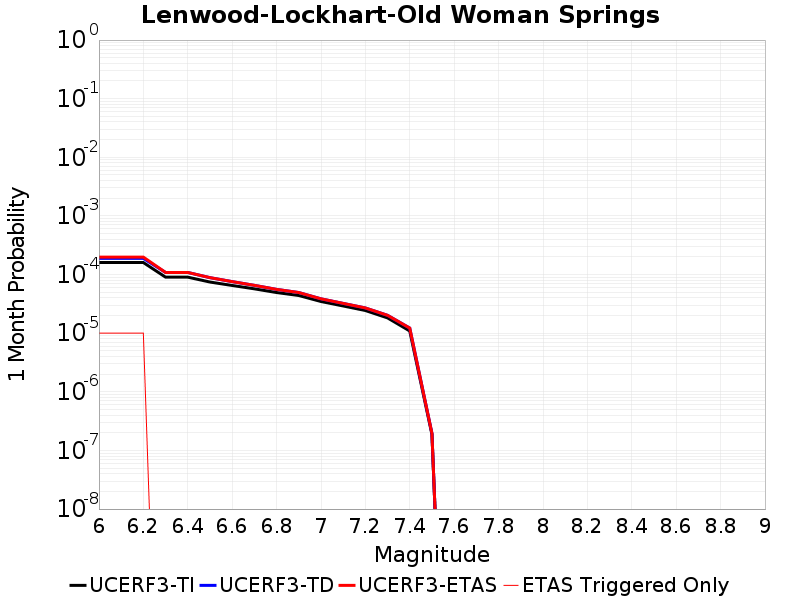 |  | 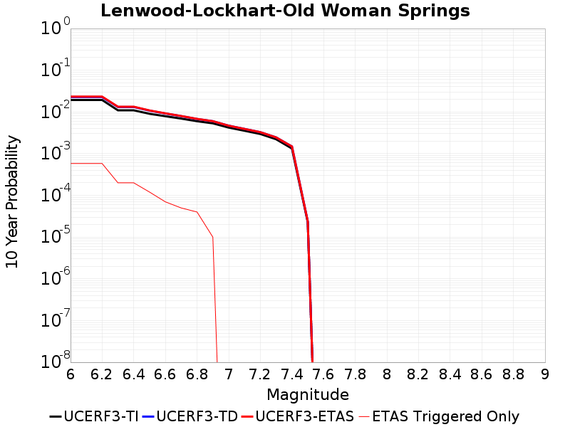 |

| Magnitude | 1 wk TI Prob | 1 wk TD Prob | 1 wk ETAS Prob | 1 wk ETAS/TD Gain | 1 wk ETAS Triggered Only | 1 mo TI Prob | 1 mo TD Prob | 1 mo ETAS Prob | 1 mo ETAS/TD Gain | 1 mo ETAS Triggered Only | 1 yr TI Prob | 1 yr TD Prob | 1 yr ETAS Prob | 1 yr ETAS/TD Gain | 1 yr ETAS Triggered Only | 10 yr TI Prob | 10 yr TD Prob | 10 yr ETAS Prob | 10 yr ETAS/TD Gain | 10 yr ETAS Triggered Only |
|-----|-----|-----|-----|-----|-----|-----|-----|-----|-----|-----|-----|-----|-----|-----|-----|-----|-----|-----|-----|-----|
| 6.0 | 3.744542E-5 | 4.3986143E-5 | 5.3985703E-5 | 1.2273344 | 1.0E-5 | 1.604705E-4 | 1.884994E-4 | 1.9849751E-4 | 1.0530406 | 1.0E-5 | 0.0019519776 | 0.002292737 | 0.0024024846 | 1.0478675 | 1.1E-4 | 0.019349206 | 0.02270886 | 0.02321705 | 1.0223786 | 5.2E-4 |
| 6.1 | 3.744542E-5 | 4.3986143E-5 | 5.3985703E-5 | 1.2273344 | 1.0E-5 | 1.604705E-4 | 1.884994E-4 | 1.9849751E-4 | 1.0530406 | 1.0E-5 | 0.0019519776 | 0.002292737 | 0.0024024846 | 1.0478675 | 1.1E-4 | 0.019349206 | 0.02270886 | 0.02321705 | 1.0223786 | 5.2E-4 |
| 6.2 | 3.744542E-5 | 4.3986143E-5 | 5.3985703E-5 | 1.2273344 | 1.0E-5 | 1.604705E-4 | 1.884994E-4 | 1.9849751E-4 | 1.0530406 | 1.0E-5 | 0.0019519776 | 0.002292737 | 0.0024024846 | 1.0478675 | 1.1E-4 | 0.019349206 | 0.02270886 | 0.02321705 | 1.0223786 | 5.2E-4 |
| 6.3 | 2.1079984E-5 | 2.536437E-5 | 2.536437E-5 | 1.0 | 0.0 | 9.0339665E-5 | 1.0870003E-4 | 1.0870003E-4 | 1.0 | 0.0 | 0.0010993304 | 0.0013226394 | 0.0013326261 | 1.0075506 | 1.0E-5 | 0.010939079 | 0.01314989 | 0.013337392 | 1.0142587 | 1.9E-4 |
| 6.4 | 2.1079984E-5 | 2.536437E-5 | 2.536437E-5 | 1.0 | 0.0 | 9.0339665E-5 | 1.0870003E-4 | 1.0870003E-4 | 1.0 | 0.0 | 0.0010993304 | 0.0013226394 | 0.0013326261 | 1.0075506 | 1.0E-5 | 0.010939079 | 0.01314989 | 0.013337392 | 1.0142587 | 1.9E-4 |
| 6.5 | 1.7397282E-5 | 2.0671594E-5 | 2.0671594E-5 | 1.0 | 0.0 | 7.455765E-5 | 8.858961E-5 | 8.858961E-5 | 1.0 | 0.0 | 9.073613E-4 | 0.0010780565 | 0.0010880458 | 1.0092659 | 1.0E-5 | 0.009036654 | 0.0107295625 | 0.010858168 | 1.011986 | 1.3E-4 |
| 6.6 | 1.52050325E-5 | 1.768792E-5 | 1.768792E-5 | 1.0 | 0.0 | 6.51628E-5 | 7.580321E-5 | 7.580321E-5 | 1.0 | 0.0 | 7.9306826E-4 | 9.225213E-4 | 9.3251205E-4 | 1.0108298 | 1.0E-5 | 0.007902439 | 0.00918778 | 0.009306678 | 1.0129409 | 1.2E-4 |
| 6.7 | 1.332523E-5 | 1.5271782E-5 | 1.5271782E-5 | 1.0 | 0.0 | 5.7106878E-5 | 6.544888E-5 | 6.544888E-5 | 1.0 | 0.0 | 6.950544E-4 | 7.965547E-4 | 8.065467E-4 | 1.012544 | 1.0E-5 | 0.006928845 | 0.007937626 | 0.008026912 | 1.0112484 | 9.0E-5 |
| 6.8 | 1.1525329E-5 | 1.3037911E-5 | 1.3037911E-5 | 1.0 | 0.0 | 4.9393333E-5 | 5.587559E-5 | 5.587559E-5 | 1.0 | 0.0 | 6.011979E-4 | 6.800772E-4 | 6.900704E-4 | 1.0146942 | 1.0E-5 | 0.00599574 | 0.006780412 | 0.0068499376 | 1.0102539 | 7.0E-5 |
| 6.9 | 1.0253909E-5 | 1.1520842E-5 | 1.1520842E-5 | 1.0 | 0.0 | 4.3944583E-5 | 4.937412E-5 | 4.937412E-5 | 1.0 | 0.0 | 5.3489394E-4 | 6.009678E-4 | 6.1096175E-4 | 1.0166298 | 1.0E-5 | 0.0053360825 | 0.005993806 | 0.006033566 | 1.0066335 | 4.0E-5 |
| 7.0 | 8.104563E-6 | 8.996868E-6 | 8.996868E-6 | 1.0 | 0.0 | 3.4733377E-5 | 3.855745E-5 | 3.855745E-5 | 1.0 | 0.0 | 4.2279682E-4 | 4.6933824E-4 | 4.7933357E-4 | 1.0212966 | 1.0E-5 | 0.0042199334 | 0.0046837186 | 0.004713578 | 1.0063752 | 3.0E-5 |
| 7.1 | 6.7986157E-6 | 7.5207286E-6 | 7.5207286E-6 | 1.0 | 0.0 | 2.91366E-5 | 3.223131E-5 | 3.223131E-5 | 1.0 | 0.0 | 3.5468035E-4 | 3.9234766E-4 | 4.0234375E-4 | 1.0254776 | 1.0E-5 | 0.003541148 | 0.0039167665 | 0.003936688 | 1.0050863 | 2.0E-5 |
| 7.2 | 5.6893327E-6 | 6.2845993E-6 | 6.2845993E-6 | 1.0 | 0.0 | 2.4382627E-5 | 2.693373E-5 | 2.693373E-5 | 1.0 | 0.0 | 2.9681803E-4 | 3.278708E-4 | 3.278708E-4 | 1.0 | 0.0 | 0.002964219 | 0.0032740696 | 0.0032840369 | 1.0030442 | 1.0E-5 |
| 7.3 | 4.253348E-6 | 4.7093E-6 | 4.7093E-6 | 1.0 | 0.0 | 1.8228506E-5 | 2.0182568E-5 | 2.0182568E-5 | 1.0 | 0.0 | 2.2190946E-4 | 2.456969E-4 | 2.456969E-4 | 1.0 | 0.0 | 0.00221688 | 0.0024544336 | 0.002464409 | 1.0040642 | 1.0E-5 |
| 7.4 | 2.5448119E-6 | 2.8524714E-6 | 2.8524714E-6 | 1.0 | 0.0 | 1.0906291E-5 | 1.222483E-5 | 1.222483E-5 | 1.0 | 0.0 | 1.3277601E-4 | 1.488288E-4 | 1.488288E-4 | 1.0 | 0.0 | 0.001326967 | 0.0014874534 | 0.0014874534 | 1.0 | 0.0 |
| 7.5 | 4.3706837E-8 | 4.5640963E-8 | 4.5640963E-8 | 1.0 | 0.0 | 1.8731501E-7 | 1.9560412E-7 | 1.9560412E-7 | 1.0 | 0.0 | 2.2805577E-6 | 2.381478E-6 | 2.381478E-6 | 1.0 | 0.0 | 2.2805343E-5 | 2.381458E-5 | 2.381458E-5 | 1.0 | 0.0 |

## Paradise
*[(top)](#table-of-contents)*

| 1 Week | 1 Month | 1 Year | 10 Year |
|-----|-----|-----|-----|
|  | 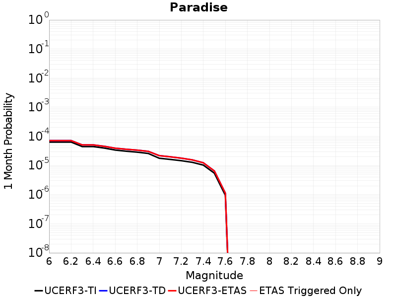 | 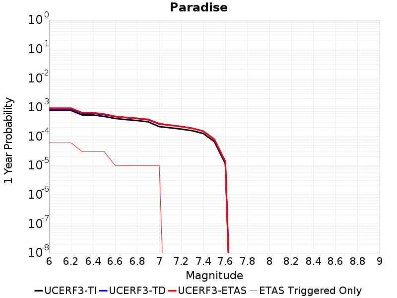 |  |

| Magnitude | 1 wk TI Prob | 1 wk TD Prob | 1 wk ETAS Prob | 1 wk ETAS/TD Gain | 1 wk ETAS Triggered Only | 1 mo TI Prob | 1 mo TD Prob | 1 mo ETAS Prob | 1 mo ETAS/TD Gain | 1 mo ETAS Triggered Only | 1 yr TI Prob | 1 yr TD Prob | 1 yr ETAS Prob | 1 yr ETAS/TD Gain | 1 yr ETAS Triggered Only | 10 yr TI Prob | 10 yr TD Prob | 10 yr ETAS Prob | 10 yr ETAS/TD Gain | 10 yr ETAS Triggered Only |
|-----|-----|-----|-----|-----|-----|-----|-----|-----|-----|-----|-----|-----|-----|-----|-----|-----|-----|-----|-----|-----|
| 6.0 | 1.4851273E-5 | 1.6703798E-5 | 2.670363E-5 | 1.5986563 | 1.0E-5 | 6.364676E-5 | 7.158587E-5 | 8.158515E-5 | 1.1396824 | 1.0E-5 | 7.7462377E-4 | 8.712331E-4 | 9.911286E-4 | 1.1376158 | 1.2E-4 | 0.0077192914 | 0.008680557 | 0.00915639 | 1.054816 | 4.8E-4 |
| 6.1 | 1.4851273E-5 | 1.6703798E-5 | 2.670363E-5 | 1.5986563 | 1.0E-5 | 6.364676E-5 | 7.158587E-5 | 8.158515E-5 | 1.1396824 | 1.0E-5 | 7.7462377E-4 | 8.712331E-4 | 9.911286E-4 | 1.1376158 | 1.2E-4 | 0.0077192914 | 0.008680557 | 0.00915639 | 1.054816 | 4.8E-4 |
| 6.2 | 1.4851273E-5 | 1.6703798E-5 | 2.670363E-5 | 1.5986563 | 1.0E-5 | 6.364676E-5 | 7.158587E-5 | 8.158515E-5 | 1.1396824 | 1.0E-5 | 7.7462377E-4 | 8.712331E-4 | 9.911286E-4 | 1.1376158 | 1.2E-4 | 0.0077192914 | 0.008680557 | 0.00915639 | 1.054816 | 4.8E-4 |
| 6.3 | 1.0426831E-5 | 1.1895269E-5 | 1.1895269E-5 | 1.0 | 0.0 | 4.4685654E-5 | 5.0978764E-5 | 5.0978764E-5 | 1.0 | 0.0 | 5.43912E-4 | 6.2049564E-4 | 6.604708E-4 | 1.0644246 | 4.0E-5 | 0.0054258266 | 0.0061882404 | 0.006396941 | 1.0337254 | 2.1E-4 |
| 6.4 | 1.0426831E-5 | 1.1895269E-5 | 1.1895269E-5 | 1.0 | 0.0 | 4.4685654E-5 | 5.0978764E-5 | 5.0978764E-5 | 1.0 | 0.0 | 5.43912E-4 | 6.2049564E-4 | 6.604708E-4 | 1.0644246 | 4.0E-5 | 0.0054258266 | 0.0061882404 | 0.006396941 | 1.0337254 | 2.1E-4 |
| 6.5 | 9.25027E-6 | 1.062602E-5 | 1.062602E-5 | 1.0 | 0.0 | 3.964341E-5 | 4.553932E-5 | 4.553932E-5 | 1.0 | 0.0 | 4.8255164E-4 | 5.543051E-4 | 5.9428293E-4 | 1.0721225 | 4.0E-5 | 0.0048150513 | 0.0055297245 | 0.00568884 | 1.0287745 | 1.6E-4 |
| 6.6 | 7.904275E-6 | 9.164849E-6 | 9.164849E-6 | 1.0 | 0.0 | 3.3875025E-5 | 3.9277355E-5 | 3.9277355E-5 | 1.0 | 0.0 | 4.1235037E-4 | 4.781008E-4 | 5.1808165E-4 | 1.0836244 | 4.0E-5 | 0.0041158604 | 0.0047711194 | 0.0048507378 | 1.0166875 | 8.0E-5 |
| 6.7 | 7.2061953E-6 | 8.412226E-6 | 8.412226E-6 | 1.0 | 0.0 | 3.088333E-5 | 3.605192E-5 | 3.605192E-5 | 1.0 | 0.0 | 3.7593965E-4 | 4.388474E-4 | 4.6883425E-4 | 1.0683309 | 3.0E-5 | 0.003753043 | 0.0043801772 | 0.0044498704 | 1.0159111 | 7.0E-5 |
| 6.8 | 6.6948724E-6 | 7.846897E-6 | 7.846897E-6 | 1.0 | 0.0 | 2.8691995E-5 | 3.3629145E-5 | 3.3629145E-5 | 1.0 | 0.0 | 3.4926904E-4 | 4.0936147E-4 | 4.293533E-4 | 1.0488366 | 2.0E-5 | 0.003487206 | 0.004086432 | 0.0041461866 | 1.0146227 | 6.0E-5 |
| 6.9 | 6.0421025E-6 | 7.1350423E-6 | 7.1350423E-6 | 1.0 | 0.0 | 2.5894467E-5 | 3.0578412E-5 | 3.0578412E-5 | 1.0 | 0.0 | 3.1521954E-4 | 3.7223197E-4 | 3.9222452E-4 | 1.05371 | 2.0E-5 | 0.0031477278 | 0.0037164234 | 0.0037562747 | 1.010723 | 4.0E-5 |
| 7.0 | 4.134091E-6 | 5.083948E-6 | 5.083948E-6 | 1.0 | 0.0 | 1.7717413E-5 | 2.1788175E-5 | 2.1788175E-5 | 1.0 | 0.0 | 2.1568815E-4 | 2.652403E-4 | 2.7523763E-4 | 1.0376917 | 1.0E-5 | 0.0021547892 | 0.0026493904 | 0.0026693374 | 1.0075289 | 2.0E-5 |
| 7.1 | 3.7674888E-6 | 4.6353284E-6 | 4.6353284E-6 | 1.0 | 0.0 | 1.6146281E-5 | 1.986555E-5 | 1.986555E-5 | 1.0 | 0.0 | 1.9656324E-4 | 2.4183776E-4 | 2.5183533E-4 | 1.04134 | 1.0E-5 | 0.0019638946 | 0.0024158966 | 0.0024258725 | 1.0041293 | 1.0E-5 |
| 7.2 | 3.4065345E-6 | 4.1599546E-6 | 4.1599546E-6 | 1.0 | 0.0 | 1.4599351E-5 | 1.7828263E-5 | 1.7828263E-5 | 1.0 | 0.0 | 1.777326E-4 | 2.1703899E-4 | 2.2703681E-4 | 1.0460646 | 1.0E-5 | 0.0017759053 | 0.0021684186 | 0.0021783968 | 1.0046016 | 1.0E-5 |
| 7.3 | 2.9934936E-6 | 3.6321007E-6 | 3.6321007E-6 | 1.0 | 0.0 | 1.2829195E-5 | 1.5566062E-5 | 1.5566062E-5 | 1.0 | 0.0 | 1.5618425E-4 | 1.8950179E-4 | 1.9949989E-4 | 1.05276 | 1.0E-5 | 0.0015607453 | 0.0018935474 | 0.0019035285 | 1.0052711 | 1.0E-5 |
| 7.4 | 2.4049796E-6 | 2.8904778E-6 | 2.8904778E-6 | 1.0 | 0.0 | 1.0307015E-5 | 1.2387712E-5 | 1.2387712E-5 | 1.0 | 0.0 | 1.2548068E-4 | 1.508114E-4 | 1.6080988E-4 | 1.066298 | 1.0E-5 | 0.0012540985 | 0.001507232 | 0.0015172169 | 1.0066247 | 1.0E-5 |
| 7.5 | 1.2710091E-6 | 1.5144822E-6 | 1.5144822E-6 | 1.0 | 0.0 | 5.44717E-6 | 6.490629E-6 | 6.490629E-6 | 1.0 | 0.0 | 6.631728E-5 | 7.902179E-5 | 8.9021E-5 | 1.1265373 | 1.0E-5 | 6.6297496E-4 | 7.900596E-4 | 8.000517E-4 | 1.0126473 | 1.0E-5 |
| 7.6 | 2.21172E-7 | 2.604535E-7 | 2.604535E-7 | 1.0 | 0.0 | 9.478797E-7 | 1.116229E-6 | 1.116229E-6 | 1.0 | 0.0 | 1.1540374E-5 | 1.3590032E-5 | 1.3590032E-5 | 1.0 | 0.0 | 1.1539775E-4 | 1.3589482E-4 | 1.3589482E-4 | 1.0 | 0.0 |

## Bicycle Lake
*[(top)](#table-of-contents)*

| 1 Week | 1 Month | 1 Year | 10 Year |
|-----|-----|-----|-----|
| 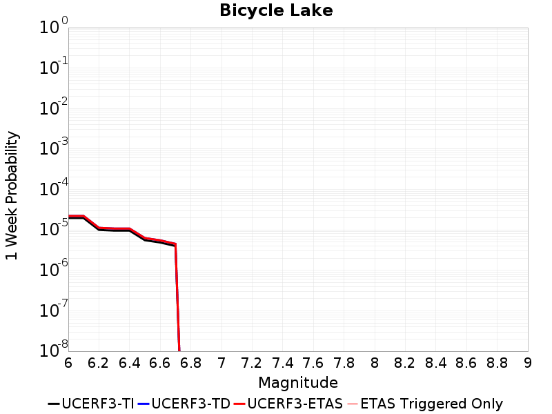 | 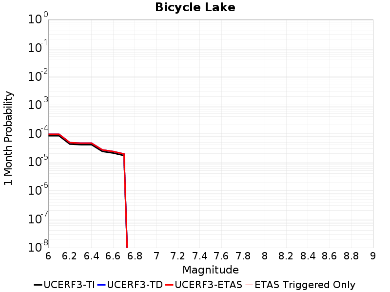 | 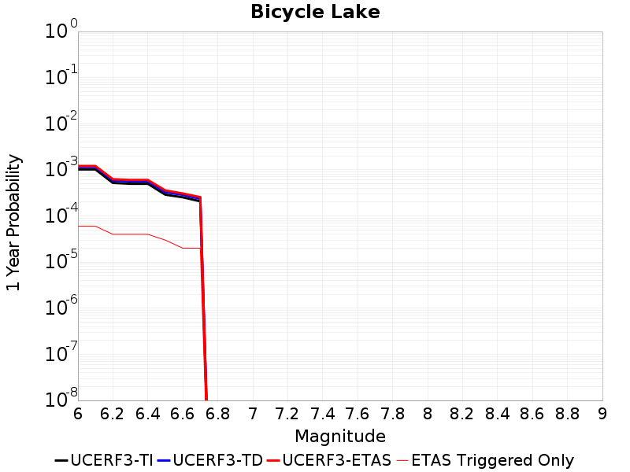 |  |

| Magnitude | 1 wk TI Prob | 1 wk TD Prob | 1 wk ETAS Prob | 1 wk ETAS/TD Gain | 1 wk ETAS Triggered Only | 1 mo TI Prob | 1 mo TD Prob | 1 mo ETAS Prob | 1 mo ETAS/TD Gain | 1 mo ETAS Triggered Only | 1 yr TI Prob | 1 yr TD Prob | 1 yr ETAS Prob | 1 yr ETAS/TD Gain | 1 yr ETAS Triggered Only | 10 yr TI Prob | 10 yr TD Prob | 10 yr ETAS Prob | 10 yr ETAS/TD Gain | 10 yr ETAS Triggered Only |
|-----|-----|-----|-----|-----|-----|-----|-----|-----|-----|-----|-----|-----|-----|-----|-----|-----|-----|-----|-----|-----|
| 6.0 | 1.9621975E-5 | 2.2113585E-5 | 2.2113585E-5 | 1.0 | 0.0 | 8.4091465E-5 | 9.476983E-5 | 1.2476699E-4 | 1.3165264 | 3.0E-5 | 0.0010233327 | 0.0011533471 | 0.0012931856 | 1.1212459 | 1.4E-4 | 0.01018633 | 0.011486945 | 0.01190212 | 1.0361433 | 4.2E-4 |
| 6.1 | 1.9621975E-5 | 2.2113585E-5 | 2.2113585E-5 | 1.0 | 0.0 | 8.4091465E-5 | 9.476983E-5 | 1.2476699E-4 | 1.3165264 | 3.0E-5 | 0.0010233327 | 0.0011533471 | 0.0012931856 | 1.1212459 | 1.4E-4 | 0.01018633 | 0.011486945 | 0.01190212 | 1.0361433 | 4.2E-4 |
| 6.2 | 9.9971285E-6 | 1.1264027E-5 | 1.1264027E-5 | 1.0 | 0.0 | 4.2844134E-5 | 4.8273803E-5 | 6.8272835E-5 | 1.4142834 | 2.0E-5 | 5.2150246E-4 | 5.876272E-4 | 6.6758017E-4 | 1.1360607 | 8.0E-5 | 0.0052028033 | 0.005865846 | 0.0060845558 | 1.0372852 | 2.2E-4 |
| 6.3 | 9.589428E-6 | 1.0806405E-5 | 1.0806405E-5 | 1.0 | 0.0 | 4.10969E-5 | 4.6312634E-5 | 6.631171E-5 | 1.4318277 | 2.0E-5 | 5.002399E-4 | 5.637624E-4 | 6.437173E-4 | 1.1418238 | 8.0E-5 | 0.0049911533 | 0.005628419 | 0.0058372375 | 1.0371007 | 2.1E-4 |
| 6.4 | 9.589428E-6 | 1.0806405E-5 | 1.0806405E-5 | 1.0 | 0.0 | 4.10969E-5 | 4.6312634E-5 | 6.631171E-5 | 1.4318277 | 2.0E-5 | 5.002399E-4 | 5.637624E-4 | 6.437173E-4 | 1.1418238 | 8.0E-5 | 0.0049911533 | 0.005628419 | 0.0058372375 | 1.0371007 | 2.1E-4 |
| 6.5 | 5.557707E-6 | 6.2904737E-6 | 6.2904737E-6 | 1.0 | 0.0 | 2.3818526E-5 | 2.6959047E-5 | 4.6958507E-5 | 1.741846 | 2.0E-5 | 2.8995197E-4 | 3.2820387E-4 | 3.8818418E-4 | 1.1827532 | 6.0E-5 | 0.0028957394 | 0.003279832 | 0.0034393072 | 1.048623 | 1.6E-4 |
| 6.6 | 4.8742945E-6 | 5.5175674E-6 | 5.5175674E-6 | 1.0 | 0.0 | 2.0889667E-5 | 2.3646651E-5 | 4.3646178E-5 | 1.8457657 | 2.0E-5 | 2.54302E-4 | 2.8788619E-4 | 3.3787178E-4 | 1.1736298 | 5.0E-5 | 0.002540112 | 0.0028777053 | 0.0030173024 | 1.0485098 | 1.4E-4 |
| 6.7 | 3.991108E-6 | 4.5194247E-6 | 4.5194247E-6 | 1.0 | 0.0 | 1.7104636E-5 | 1.9368963E-5 | 2.936877E-5 | 1.5162799 | 1.0E-5 | 2.0822904E-4 | 2.3581713E-4 | 2.6581006E-4 | 1.1271873 | 3.0E-5 | 0.0020803404 | 0.0023581712 | 0.0024778883 | 1.050767 | 1.2E-4 |

## Garlic Springs
*[(top)](#table-of-contents)*

| 1 Week | 1 Month | 1 Year | 10 Year |
|-----|-----|-----|-----|
|  | 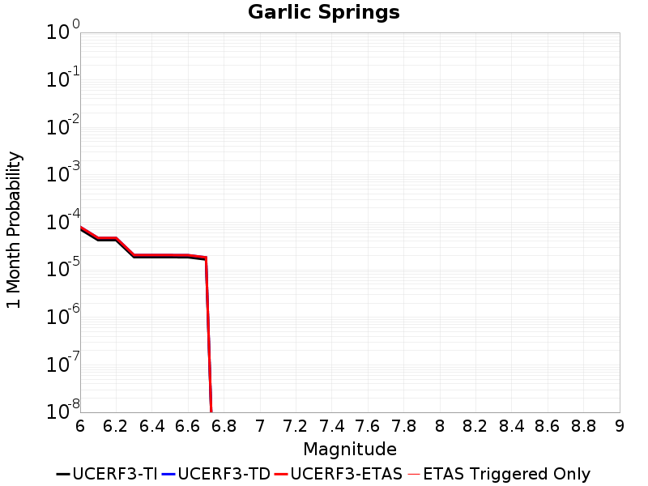 |  |  |

| Magnitude | 1 wk TI Prob | 1 wk TD Prob | 1 wk ETAS Prob | 1 wk ETAS/TD Gain | 1 wk ETAS Triggered Only | 1 mo TI Prob | 1 mo TD Prob | 1 mo ETAS Prob | 1 mo ETAS/TD Gain | 1 mo ETAS Triggered Only | 1 yr TI Prob | 1 yr TD Prob | 1 yr ETAS Prob | 1 yr ETAS/TD Gain | 1 yr ETAS Triggered Only | 10 yr TI Prob | 10 yr TD Prob | 10 yr ETAS Prob | 10 yr ETAS/TD Gain | 10 yr ETAS Triggered Only |
|-----|-----|-----|-----|-----|-----|-----|-----|-----|-----|-----|-----|-----|-----|-----|-----|-----|-----|-----|-----|-----|
| 6.0 | 1.6760017E-5 | 1.8790215E-5 | 1.8790215E-5 | 1.0 | 0.0 | 7.182667E-5 | 8.052767E-5 | 8.052767E-5 | 1.0 | 0.0 | 8.7413884E-4 | 9.80101E-4 | 0.0010400421 | 1.0611582 | 6.0E-5 | 0.008707083 | 0.009769347 | 0.010007001 | 1.0243267 | 2.4E-4 |
| 6.1 | 9.852767E-6 | 1.0980976E-5 | 1.0980976E-5 | 1.0 | 0.0 | 4.222546E-5 | 4.706088E-5 | 4.706088E-5 | 1.0 | 0.0 | 5.139737E-4 | 5.728866E-4 | 6.128637E-4 | 1.0697819 | 4.0E-5 | 0.005127866 | 0.0057210657 | 0.0059000356 | 1.0312827 | 1.8E-4 |
| 6.2 | 9.852767E-6 | 1.0980976E-5 | 1.0980976E-5 | 1.0 | 0.0 | 4.222546E-5 | 4.706088E-5 | 4.706088E-5 | 1.0 | 0.0 | 5.139737E-4 | 5.728866E-4 | 6.128637E-4 | 1.0697819 | 4.0E-5 | 0.005127866 | 0.0057210657 | 0.0059000356 | 1.0312827 | 1.8E-4 |
| 6.3 | 4.3167724E-6 | 4.78105E-6 | 4.78105E-6 | 1.0 | 0.0 | 1.8500323E-5 | 2.0490183E-5 | 2.0490183E-5 | 1.0 | 0.0 | 2.2521814E-4 | 2.4946246E-4 | 2.694575E-4 | 1.0801524 | 2.0E-5 | 0.0022499003 | 0.0024940856 | 0.002543961 | 1.0199975 | 5.0E-5 |
| 6.4 | 4.3167724E-6 | 4.78105E-6 | 4.78105E-6 | 1.0 | 0.0 | 1.8500323E-5 | 2.0490183E-5 | 2.0490183E-5 | 1.0 | 0.0 | 2.2521814E-4 | 2.4946246E-4 | 2.694575E-4 | 1.0801524 | 2.0E-5 | 0.0022499003 | 0.0024940856 | 0.002543961 | 1.0199975 | 5.0E-5 |
| 6.5 | 4.3167724E-6 | 4.78105E-6 | 4.78105E-6 | 1.0 | 0.0 | 1.8500323E-5 | 2.0490183E-5 | 2.0490183E-5 | 1.0 | 0.0 | 2.2521814E-4 | 2.4946246E-4 | 2.694575E-4 | 1.0801524 | 2.0E-5 | 0.0022499003 | 0.0024940856 | 0.002543961 | 1.0199975 | 5.0E-5 |
| 6.6 | 4.301311E-6 | 4.7639073E-6 | 4.7639073E-6 | 1.0 | 0.0 | 1.8434059E-5 | 2.0416715E-5 | 2.0416715E-5 | 1.0 | 0.0 | 2.2441156E-4 | 2.4856822E-4 | 2.6856325E-4 | 1.0804408 | 2.0E-5 | 0.0022418506 | 0.002485163 | 0.0025350389 | 1.0200694 | 5.0E-5 |
| 6.7 | 3.8599724E-6 | 4.2737515E-6 | 4.2737515E-6 | 1.0 | 0.0 | 1.6542634E-5 | 1.8316077E-5 | 1.8316077E-5 | 1.0 | 0.0 | 2.0138794E-4 | 2.2299825E-4 | 2.3299603E-4 | 1.0448334 | 1.0E-5 | 0.0020120554 | 0.0022299825 | 0.0022599157 | 1.013423 | 3.0E-5 |

## San Andreas (San Bernardino S)
*[(top)](#table-of-contents)*

| 1 Week | 1 Month | 1 Year | 10 Year |
|-----|-----|-----|-----|
|  |  |  |  |

| Magnitude | 1 wk TI Prob | 1 wk TD Prob | 1 wk ETAS Prob | 1 wk ETAS/TD Gain | 1 wk ETAS Triggered Only | 1 mo TI Prob | 1 mo TD Prob | 1 mo ETAS Prob | 1 mo ETAS/TD Gain | 1 mo ETAS Triggered Only | 1 yr TI Prob | 1 yr TD Prob | 1 yr ETAS Prob | 1 yr ETAS/TD Gain | 1 yr ETAS Triggered Only | 10 yr TI Prob | 10 yr TD Prob | 10 yr ETAS Prob | 10 yr ETAS/TD Gain | 10 yr ETAS Triggered Only |
|-----|-----|-----|-----|-----|-----|-----|-----|-----|-----|-----|-----|-----|-----|-----|-----|-----|-----|-----|-----|-----|
| 6.0 | 1.2336002E-4 | 3.0224494E-4 | 3.0224494E-4 | 1.0 | 0.0 | 5.2857865E-4 | 0.0012947187 | 0.0013047057 | 1.0077137 | 1.0E-5 | 0.006416472 | 0.015654264 | 0.015723169 | 1.0044017 | 7.0E-5 | 0.06234337 | 0.1437209 | 0.14392641 | 1.0014299 | 2.4E-4 |
| 6.1 | 1.2336002E-4 | 3.0224494E-4 | 3.0224494E-4 | 1.0 | 0.0 | 5.2857865E-4 | 0.0012947187 | 0.0013047057 | 1.0077137 | 1.0E-5 | 0.006416472 | 0.015654264 | 0.015723169 | 1.0044017 | 7.0E-5 | 0.06234337 | 0.1437209 | 0.14392641 | 1.0014299 | 2.4E-4 |
| 6.2 | 1.2336002E-4 | 3.0224494E-4 | 3.0224494E-4 | 1.0 | 0.0 | 5.2857865E-4 | 0.0012947187 | 0.0013047057 | 1.0077137 | 1.0E-5 | 0.006416472 | 0.015654264 | 0.015723169 | 1.0044017 | 7.0E-5 | 0.06234337 | 0.1437209 | 0.14392641 | 1.0014299 | 2.4E-4 |
| 6.3 | 1.1712257E-4 | 2.9010474E-4 | 2.9010474E-4 | 1.0 | 0.0 | 5.018573E-4 | 0.0012427395 | 0.0012527271 | 1.0080367 | 1.0E-5 | 0.006093008 | 0.015030268 | 0.015099215 | 1.0045873 | 7.0E-5 | 0.059286322 | 0.13843165 | 0.13863844 | 1.0014937 | 2.4E-4 |
| 6.4 | 1.1712257E-4 | 2.9010474E-4 | 2.9010474E-4 | 1.0 | 0.0 | 5.018573E-4 | 0.0012427395 | 0.0012527271 | 1.0080367 | 1.0E-5 | 0.006093008 | 0.015030268 | 0.015099215 | 1.0045873 | 7.0E-5 | 0.059286322 | 0.13843165 | 0.13863844 | 1.0014937 | 2.4E-4 |
| 6.5 | 1.0689076E-4 | 2.7019437E-4 | 2.7019437E-4 | 1.0 | 0.0 | 4.5802278E-4 | 0.0011574869 | 0.0011674754 | 1.0086294 | 1.0E-5 | 0.0055621783 | 0.014005997 | 0.014075017 | 1.0049279 | 7.0E-5 | 0.05425003 | 0.12971416 | 0.12992303 | 1.0016103 | 2.4E-4 |
| 6.6 | 9.7648895E-5 | 2.5260478E-4 | 2.5260478E-4 | 1.0 | 0.0 | 4.1842813E-4 | 0.0010821666 | 0.0010921557 | 1.0092307 | 1.0E-5 | 0.005082469 | 0.013100184 | 0.013169266 | 1.0052735 | 7.0E-5 | 0.049677886 | 0.12186209 | 0.122072846 | 1.0017295 | 2.4E-4 |
| 6.7 | 8.757013E-5 | 2.3327493E-4 | 2.3327493E-4 | 1.0 | 0.0 | 3.7524657E-4 | 9.993891E-4 | 0.001009379 | 1.009996 | 1.0E-5 | 0.00455906 | 0.012103797 | 0.012163071 | 1.0048971 | 6.0E-5 | 0.04466656 | 0.11321058 | 0.113405675 | 1.0017233 | 2.2E-4 |
| 6.8 | 8.562978E-5 | 2.2885749E-4 | 2.2885749E-4 | 1.0 | 0.0 | 3.6693315E-4 | 9.804715E-4 | 9.904617E-4 | 1.0101892 | 1.0E-5 | 0.004458263 | 0.011876002 | 0.011935289 | 1.0049922 | 6.0E-5 | 0.043698758 | 0.11121134 | 0.11140687 | 1.0017582 | 2.2E-4 |
| 6.9 | 6.124075E-5 | 1.7250857E-4 | 1.7250857E-4 | 1.0 | 0.0 | 2.6243398E-4 | 7.3911384E-4 | 7.4910646E-4 | 1.0135198 | 1.0E-5 | 0.0031904527 | 0.008961793 | 0.009001435 | 1.0044234 | 4.0E-5 | 0.031450346 | 0.084974095 | 0.08514795 | 1.002046 | 1.9E-4 |
| 7.0 | 5.8598747E-5 | 1.667791E-4 | 1.667791E-4 | 1.0 | 0.0 | 2.5111332E-4 | 7.1457255E-4 | 7.245654E-4 | 1.0139843 | 1.0E-5 | 0.0030530186 | 0.008665415 | 0.008705068 | 1.0045761 | 4.0E-5 | 0.03011414 | 0.08228728 | 0.08246165 | 1.002119 | 1.9E-4 |
| 7.1 | 5.613814E-5 | 1.6094456E-4 | 1.6094456E-4 | 1.0 | 0.0 | 2.4056983E-4 | 6.8958086E-4 | 6.9957395E-4 | 1.0144916 | 1.0E-5 | 0.0029250039 | 0.008363511 | 0.008403177 | 1.0047426 | 4.0E-5 | 0.028868021 | 0.079575844 | 0.079750724 | 1.0021976 | 1.9E-4 |
| 7.2 | 4.991222E-5 | 1.4696663E-4 | 1.4696663E-4 | 1.0 | 0.0 | 2.1389198E-4 | 6.297054E-4 | 6.3969905E-4 | 1.0158705 | 1.0E-5 | 0.002601025 | 0.007639818 | 0.0076795123 | 1.0051957 | 4.0E-5 | 0.025707912 | 0.07301366 | 0.07318979 | 1.0024122 | 1.9E-4 |
| 7.3 | 4.7410045E-5 | 1.3886846E-4 | 1.3886846E-4 | 1.0 | 0.0 | 2.0317009E-4 | 5.950151E-4 | 6.050092E-4 | 1.0167964 | 1.0E-5 | 0.0024707897 | 0.0072203344 | 0.0072600455 | 1.0055 | 4.0E-5 | 0.024434982 | 0.06928257 | 0.06945941 | 1.0025524 | 1.9E-4 |
| 7.4 | 4.5556746E-5 | 1.3291762E-4 | 1.3291762E-4 | 1.0 | 0.0 | 1.952286E-4 | 5.695229E-4 | 5.795172E-4 | 1.0175486 | 1.0E-5 | 0.002374317 | 0.0069119767 | 0.0069517004 | 1.0057471 | 4.0E-5 | 0.023491086 | 0.066527575 | 0.06670494 | 1.002666 | 1.9E-4 |
| 7.5 | 4.3084514E-5 | 1.2523428E-4 | 1.2523428E-4 | 1.0 | 0.0 | 1.8463485E-4 | 5.366083E-4 | 5.466029E-4 | 1.0186256 | 1.0E-5 | 0.0022456115 | 0.0065137083 | 0.006553448 | 1.0061009 | 4.0E-5 | 0.022230545 | 0.062916845 | 0.063085526 | 1.0026809 | 1.8E-4 |
| 7.6 | 3.408608E-5 | 9.988179E-5 | 9.988179E-5 | 1.0 | 0.0 | 1.4607502E-4 | 4.2799467E-4 | 4.379904E-4 | 1.0233548 | 1.0E-5 | 0.0017770125 | 0.0051984116 | 0.005238204 | 1.0076547 | 4.0E-5 | 0.017628696 | 0.05069642 | 0.050867297 | 1.0033705 | 1.8E-4 |
| 7.7 | 2.8315713E-5 | 8.3921776E-5 | 8.3921776E-5 | 1.0 | 0.0 | 1.2134742E-4 | 3.596152E-4 | 3.696116E-4 | 1.0277975 | 1.0E-5 | 0.0014764034 | 0.0043695346 | 0.00440936 | 1.0091143 | 4.0E-5 | 0.01466633 | 0.042911496 | 0.043083772 | 1.0040147 | 1.8E-4 |
| 7.8 | 2.6222975E-5 | 7.5972515E-5 | 7.5972515E-5 | 1.0 | 0.0 | 1.1237934E-4 | 3.2555588E-4 | 3.355526E-4 | 1.0307066 | 1.0E-5 | 0.0013673597 | 0.0039564455 | 0.003996287 | 1.0100701 | 4.0E-5 | 0.013589768 | 0.039038252 | 0.039211225 | 1.0044309 | 1.8E-4 |
| 7.9 | 2.1469694E-5 | 5.899918E-5 | 5.899918E-5 | 1.0 | 0.0 | 9.200973E-5 | 2.5282914E-4 | 2.6282662E-4 | 1.0395424 | 1.0E-5 | 0.0011196428 | 0.003073853 | 0.00311373 | 1.012973 | 4.0E-5 | 0.011140184 | 0.030661045 | 0.030835526 | 1.0056907 | 1.8E-4 |
| 8.0 | 1.2420249E-5 | 3.1944517E-5 | 3.1944517E-5 | 1.0 | 0.0 | 5.322855E-5 | 1.368979E-4 | 1.4689653E-4 | 1.0730371 | 1.0E-5 | 6.478649E-4 | 0.0016654587 | 0.0016854254 | 1.0119888 | 2.0E-5 | 0.0064597935 | 0.016814265 | 0.01689292 | 1.0046779 | 8.0E-5 |
| 8.1 | 4.9197724E-6 | 8.0540585E-6 | 8.0540585E-6 | 1.0 | 0.0 | 2.1084568E-5 | 3.451694E-5 | 3.451694E-5 | 1.0 | 0.0 | 2.566744E-4 | 4.2016283E-4 | 4.2016283E-4 | 1.0 | 0.0 | 0.002563781 | 0.0045005945 | 0.0045005945 | 1.0 | 0.0 |
| 8.2 | 2.5634774E-6 | 3.0128597E-6 | 3.0128597E-6 | 1.0 | 0.0 | 1.0986286E-5 | 1.2912192E-5 | 1.2912192E-5 | 1.0 | 0.0 | 1.3374983E-4 | 1.5719465E-4 | 1.5719465E-4 | 1.0 | 0.0 | 0.0013366934 | 0.0017606186 | 0.0017606186 | 1.0 | 0.0 |
| 8.3 | 5.2850464E-7 | 3.3543316E-7 | 3.3543316E-7 | 1.0 | 0.0 | 2.2650179E-6 | 1.43757E-6 | 1.43757E-6 | 1.0 | 0.0 | 2.7576245E-5 | 1.7502287E-5 | 1.7502287E-5 | 1.0 | 0.0 | 2.7572823E-4 | 2.068833E-4 | 2.068833E-4 | 1.0 | 0.0 |

## Death Valley (Black Mtns Frontal)
*[(top)](#table-of-contents)*

| 1 Week | 1 Month | 1 Year | 10 Year |
|-----|-----|-----|-----|
| 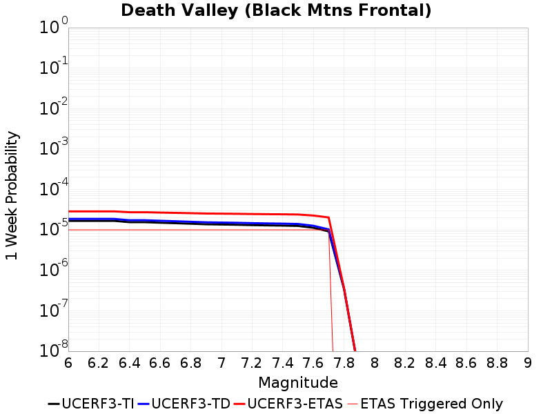 |  |  | 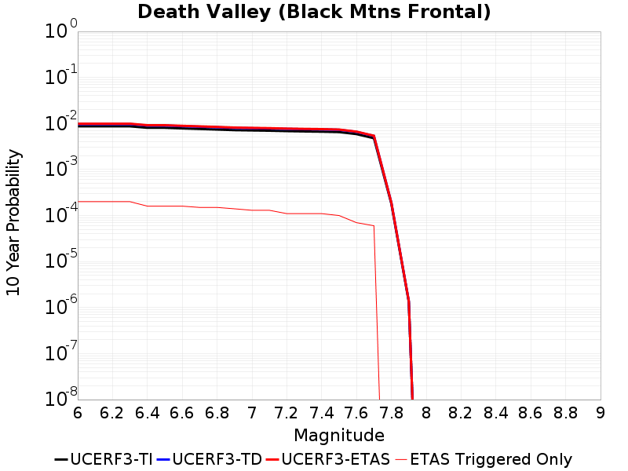 |

| Magnitude | 1 wk TI Prob | 1 wk TD Prob | 1 wk ETAS Prob | 1 wk ETAS/TD Gain | 1 wk ETAS Triggered Only | 1 mo TI Prob | 1 mo TD Prob | 1 mo ETAS Prob | 1 mo ETAS/TD Gain | 1 mo ETAS Triggered Only | 1 yr TI Prob | 1 yr TD Prob | 1 yr ETAS Prob | 1 yr ETAS/TD Gain | 1 yr ETAS Triggered Only | 10 yr TI Prob | 10 yr TD Prob | 10 yr ETAS Prob | 10 yr ETAS/TD Gain | 10 yr ETAS Triggered Only |
|-----|-----|-----|-----|-----|-----|-----|-----|-----|-----|-----|-----|-----|-----|-----|-----|-----|-----|-----|-----|-----|
| 6.0 | 1.6707214E-5 | 1.8683288E-5 | 1.8683288E-5 | 1.0 | 0.0 | 7.160038E-5 | 8.0068814E-5 | 9.006802E-5 | 1.1248826 | 1.0E-5 | 8.71386E-4 | 9.744095E-4 | 0.0010343511 | 1.0615158 | 6.0E-5 | 0.00867977 | 0.009702225 | 0.009910188 | 1.0214345 | 2.1E-4 |
| 6.1 | 1.6707214E-5 | 1.8683288E-5 | 1.8683288E-5 | 1.0 | 0.0 | 7.160038E-5 | 8.0068814E-5 | 9.006802E-5 | 1.1248826 | 1.0E-5 | 8.71386E-4 | 9.744095E-4 | 0.0010343511 | 1.0615158 | 6.0E-5 | 0.00867977 | 0.009702225 | 0.009910188 | 1.0214345 | 2.1E-4 |
| 6.2 | 1.6707214E-5 | 1.8683288E-5 | 1.8683288E-5 | 1.0 | 0.0 | 7.160038E-5 | 8.0068814E-5 | 9.006802E-5 | 1.1248826 | 1.0E-5 | 8.71386E-4 | 9.744095E-4 | 0.0010343511 | 1.0615158 | 6.0E-5 | 0.00867977 | 0.009702225 | 0.009910188 | 1.0214345 | 2.1E-4 |
| 6.3 | 1.6707214E-5 | 1.8683288E-5 | 1.8683288E-5 | 1.0 | 0.0 | 7.160038E-5 | 8.0068814E-5 | 9.006802E-5 | 1.1248826 | 1.0E-5 | 8.71386E-4 | 9.744095E-4 | 0.0010343511 | 1.0615158 | 6.0E-5 | 0.00867977 | 0.009702225 | 0.009910188 | 1.0214345 | 2.1E-4 |
| 6.4 | 1.5515609E-5 | 1.7350303E-5 | 1.7350303E-5 | 1.0 | 0.0 | 6.649377E-5 | 7.435636E-5 | 8.435561E-5 | 1.1344775 | 1.0E-5 | 8.0926094E-4 | 9.0491876E-4 | 9.6486445E-4 | 1.0662442 | 6.0E-5 | 0.008063202 | 0.009013025 | 0.009211223 | 1.0219901 | 2.0E-4 |
| 6.5 | 1.5515609E-5 | 1.7350303E-5 | 1.7350303E-5 | 1.0 | 0.0 | 6.649377E-5 | 7.435636E-5 | 8.435561E-5 | 1.1344775 | 1.0E-5 | 8.0926094E-4 | 9.0491876E-4 | 9.6486445E-4 | 1.0662442 | 6.0E-5 | 0.008063202 | 0.009013025 | 0.009211223 | 1.0219901 | 2.0E-4 |
| 6.6 | 1.5041828E-5 | 1.6820868E-5 | 1.6820868E-5 | 1.0 | 0.0 | 6.4463384E-5 | 7.208748E-5 | 8.208676E-5 | 1.1387104 | 1.0E-5 | 7.8455906E-4 | 8.7731757E-4 | 9.372649E-4 | 1.0683303 | 6.0E-5 | 0.00781795 | 0.008739198 | 0.008927537 | 1.0215511 | 1.9E-4 |
| 6.7 | 1.4634985E-5 | 1.6367436E-5 | 1.6367436E-5 | 1.0 | 0.0 | 6.271985E-5 | 7.01443E-5 | 8.0143596E-5 | 1.1425532 | 1.0E-5 | 7.6334673E-4 | 8.53678E-4 | 9.1362675E-4 | 1.0702242 | 6.0E-5 | 0.007607299 | 0.0085046245 | 0.008683093 | 1.020985 | 1.8E-4 |
| 6.8 | 1.4209158E-5 | 1.5893149E-5 | 1.5893149E-5 | 1.0 | 0.0 | 6.089497E-5 | 6.811175E-5 | 7.811107E-5 | 1.1468076 | 1.0E-5 | 7.4114406E-4 | 8.2895067E-4 | 8.8890095E-4 | 1.0723207 | 6.0E-5 | 0.007386771 | 0.008259202 | 0.0084377155 | 1.0216138 | 1.8E-4 |
| 6.9 | 1.3780098E-5 | 1.5415375E-5 | 1.5415375E-5 | 1.0 | 0.0 | 5.9056227E-5 | 6.6064254E-5 | 6.6064254E-5 | 1.0 | 0.0 | 7.1877235E-4 | 8.0404093E-4 | 8.5400074E-4 | 1.0621359 | 5.0E-5 | 0.0071645193 | 0.008011915 | 0.008160713 | 1.0185721 | 1.5E-4 |
| 7.0 | 1.3585064E-5 | 1.5198798E-5 | 1.5198798E-5 | 1.0 | 0.0 | 5.8220405E-5 | 6.513611E-5 | 6.513611E-5 | 1.0 | 0.0 | 7.086029E-4 | 7.9274905E-4 | 8.427094E-4 | 1.0630217 | 5.0E-5 | 0.007063476 | 0.007899804 | 0.008028777 | 1.0163261 | 1.3E-4 |
| 7.1 | 1.3398601E-5 | 1.4991848E-5 | 1.4991848E-5 | 1.0 | 0.0 | 5.742131E-5 | 6.424922E-5 | 6.424922E-5 | 1.0 | 0.0 | 6.9888023E-4 | 7.8195904E-4 | 8.3191996E-4 | 1.063892 | 5.0E-5 | 0.0069668638 | 0.0077926656 | 0.007921653 | 1.0165523 | 1.3E-4 |
| 7.2 | 1.3126312E-5 | 1.4689876E-5 | 1.4689876E-5 | 1.0 | 0.0 | 5.6254412E-5 | 6.295512E-5 | 6.295512E-5 | 1.0 | 0.0 | 6.846822E-4 | 7.662145E-4 | 8.0618385E-4 | 1.0521647 | 4.0E-5 | 0.006825765 | 0.007636312 | 0.0077355485 | 1.0129954 | 1.0E-4 |
| 7.3 | 1.2922429E-5 | 1.4463959E-5 | 1.4463959E-5 | 1.0 | 0.0 | 5.5380664E-5 | 6.198695E-5 | 6.198695E-5 | 1.0 | 0.0 | 6.74051E-4 | 7.544353E-4 | 7.944051E-4 | 1.0529798 | 4.0E-5 | 0.006720101 | 0.007519323 | 0.007608646 | 1.0118792 | 9.0E-5 |
| 7.4 | 1.2768878E-5 | 1.4293833E-5 | 1.4293833E-5 | 1.0 | 0.0 | 5.4722615E-5 | 6.125788E-5 | 6.125788E-5 | 1.0 | 0.0 | 6.660441E-4 | 7.4556493E-4 | 7.755426E-4 | 1.040208 | 3.0E-5 | 0.0066405144 | 0.007431216 | 0.0075106216 | 1.0106854 | 8.0E-5 |
| 7.5 | 1.2521929E-5 | 1.4021914E-5 | 1.4021914E-5 | 1.0 | 0.0 | 5.366431E-5 | 6.0092563E-5 | 6.0092563E-5 | 1.0 | 0.0 | 6.531671E-4 | 7.3138677E-4 | 7.613648E-4 | 1.040988 | 3.0E-5 | 0.006512506 | 0.007290374 | 0.0073697907 | 1.0108933 | 8.0E-5 |
| 7.6 | 1.1301089E-5 | 1.2657098E-5 | 1.2657098E-5 | 1.0 | 0.0 | 4.8432343E-5 | 5.4243606E-5 | 5.4243606E-5 | 1.0 | 0.0 | 5.895042E-4 | 6.6022115E-4 | 6.802079E-4 | 1.0302728 | 2.0E-5 | 0.0058794282 | 0.00658315 | 0.006652689 | 1.0105633 | 7.0E-5 |
| 7.7 | 9.189108E-6 | 1.0290627E-5 | 1.0290627E-5 | 1.0 | 0.0 | 3.93813E-5 | 4.410197E-5 | 4.410197E-5 | 1.0 | 0.0 | 4.7936183E-4 | 5.368143E-4 | 5.5680354E-4 | 1.0372368 | 2.0E-5 | 0.004783291 | 0.0053556873 | 0.005425312 | 1.0130002 | 7.0E-5 |
| 7.8 | 3.4586725E-7 | 3.6494507E-7 | 3.6494507E-7 | 1.0 | 0.0 | 1.4822873E-6 | 1.5640494E-6 | 1.5640494E-6 | 1.0 | 0.0 | 1.80467E-5 | 1.904214E-5 | 1.904214E-5 | 1.0 | 0.0 | 1.8045233E-4 | 1.9040552E-4 | 2.004036E-4 | 1.0525094 | 1.0E-5 |
| 7.9 | 2.5591178E-9 | 2.670354E-9 | 2.670354E-9 | 1.0 | 0.0 | 1.0967647E-8 | 1.1444374E-8 | 1.1444374E-8 | 1.0 | 0.0 | 1.335311E-7 | 1.3933526E-7 | 1.3933526E-7 | 1.0 | 0.0 | 1.3353102E-6 | 1.3933526E-6 | 1.3933526E-6 | 1.0 | 0.0 |

## San Andreas (Big Bend)
*[(top)](#table-of-contents)*

| 1 Week | 1 Month | 1 Year | 10 Year |
|-----|-----|-----|-----|
|  | 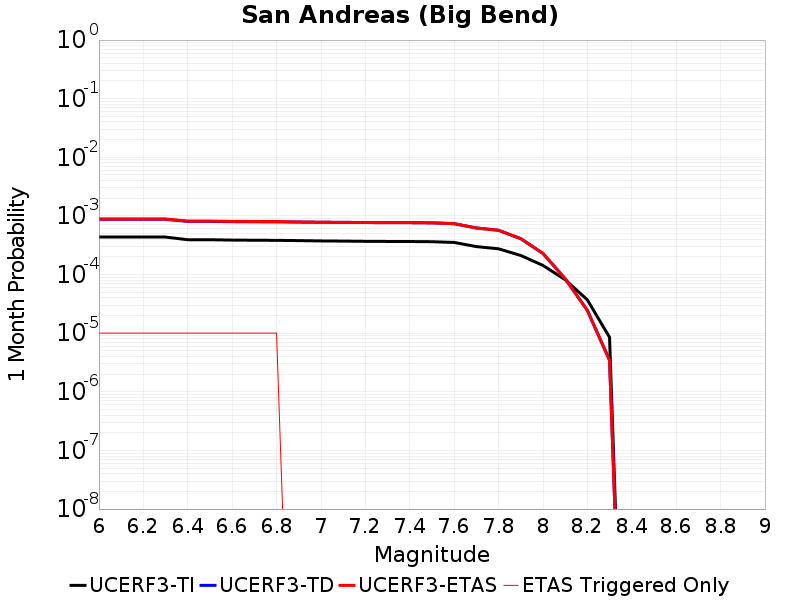 |  | 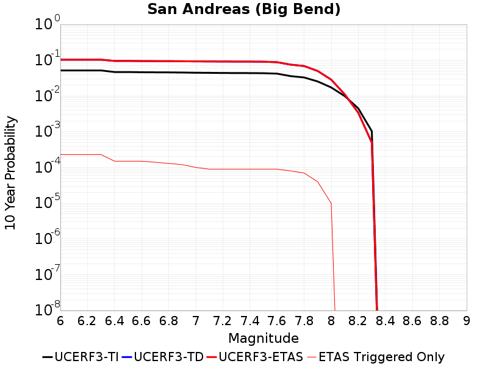 |

| Magnitude | 1 wk TI Prob | 1 wk TD Prob | 1 wk ETAS Prob | 1 wk ETAS/TD Gain | 1 wk ETAS Triggered Only | 1 mo TI Prob | 1 mo TD Prob | 1 mo ETAS Prob | 1 mo ETAS/TD Gain | 1 mo ETAS Triggered Only | 1 yr TI Prob | 1 yr TD Prob | 1 yr ETAS Prob | 1 yr ETAS/TD Gain | 1 yr ETAS Triggered Only | 10 yr TI Prob | 10 yr TD Prob | 10 yr ETAS Prob | 10 yr ETAS/TD Gain | 10 yr ETAS Triggered Only |
|-----|-----|-----|-----|-----|-----|-----|-----|-----|-----|-----|-----|-----|-----|-----|-----|-----|-----|-----|-----|-----|
| 6.0 | 1.0179969E-4 | 2.0457983E-4 | 2.0457983E-4 | 1.0 | 0.0 | 4.362114E-4 | 8.7647716E-4 | 8.7647716E-4 | 1.0 | 0.0 | 0.0052979486 | 0.0106191905 | 0.010629084 | 1.0009317 | 1.0E-5 | 0.051734097 | 0.10310678 | 0.10325029 | 1.0013918 | 1.6E-4 |
| 6.1 | 1.0179969E-4 | 2.0457983E-4 | 2.0457983E-4 | 1.0 | 0.0 | 4.362114E-4 | 8.7647716E-4 | 8.7647716E-4 | 1.0 | 0.0 | 0.0052979486 | 0.0106191905 | 0.010629084 | 1.0009317 | 1.0E-5 | 0.051734097 | 0.10310678 | 0.10325029 | 1.0013918 | 1.6E-4 |
| 6.2 | 1.0179969E-4 | 2.0457983E-4 | 2.0457983E-4 | 1.0 | 0.0 | 4.362114E-4 | 8.7647716E-4 | 8.7647716E-4 | 1.0 | 0.0 | 0.0052979486 | 0.0106191905 | 0.010629084 | 1.0009317 | 1.0E-5 | 0.051734097 | 0.10310678 | 0.10325029 | 1.0013918 | 1.6E-4 |
| 6.3 | 1.0179969E-4 | 2.0457983E-4 | 2.0457983E-4 | 1.0 | 0.0 | 4.362114E-4 | 8.7647716E-4 | 8.7647716E-4 | 1.0 | 0.0 | 0.0052979486 | 0.0106191905 | 0.010629084 | 1.0009317 | 1.0E-5 | 0.051734097 | 0.10310678 | 0.10325029 | 1.0013918 | 1.6E-4 |
| 6.4 | 9.1639464E-5 | 1.8807573E-4 | 1.8807573E-4 | 1.0 | 0.0 | 3.9268145E-4 | 8.0579007E-4 | 8.0579007E-4 | 1.0 | 0.0 | 0.0047704205 | 0.009766489 | 0.009776391 | 1.0010139 | 1.0E-5 | 0.046693064 | 0.09544009 | 0.09553959 | 1.0010426 | 1.1E-4 |
| 6.5 | 9.1639464E-5 | 1.8807573E-4 | 1.8807573E-4 | 1.0 | 0.0 | 3.9268145E-4 | 8.0579007E-4 | 8.0579007E-4 | 1.0 | 0.0 | 0.0047704205 | 0.009766489 | 0.009776391 | 1.0010139 | 1.0E-5 | 0.046693064 | 0.09544009 | 0.09553959 | 1.0010426 | 1.1E-4 |
| 6.6 | 9.042622E-5 | 1.8613729E-4 | 1.8613729E-4 | 1.0 | 0.0 | 3.8748336E-4 | 7.9748756E-4 | 7.9748756E-4 | 1.0 | 0.0 | 0.0047074095 | 0.009666305 | 0.009676208 | 1.0010245 | 1.0E-5 | 0.046089325 | 0.09452757 | 0.09461812 | 1.0009578 | 1.0E-4 |
| 6.7 | 8.9836685E-5 | 1.8527744E-4 | 1.8527744E-4 | 1.0 | 0.0 | 3.8495753E-4 | 7.9380476E-4 | 7.9380476E-4 | 1.0 | 0.0 | 0.00467679 | 0.009621862 | 0.009631767 | 1.0010293 | 1.0E-5 | 0.045795817 | 0.09412107 | 0.09421165 | 1.0009625 | 1.0E-4 |
| 6.8 | 8.9471854E-5 | 1.8474172E-4 | 1.8474172E-4 | 1.0 | 0.0 | 3.8339442E-4 | 7.9151016E-4 | 7.9151016E-4 | 1.0 | 0.0 | 0.004657841 | 0.009594172 | 0.009604077 | 1.0010324 | 1.0E-5 | 0.04561414 | 0.093866765 | 0.09395738 | 1.0009654 | 1.0E-4 |
| 6.9 | 8.858234E-5 | 1.8355538E-4 | 1.8355538E-4 | 1.0 | 0.0 | 3.7958333E-4 | 7.864289E-4 | 7.864289E-4 | 1.0 | 0.0 | 0.004611638 | 0.009532851 | 0.009542756 | 1.001039 | 1.0E-5 | 0.04517103 | 0.09330526 | 0.093386866 | 1.0008745 | 9.0E-5 |
| 7.0 | 8.7433385E-5 | 1.81934E-4 | 1.81934E-4 | 1.0 | 0.0 | 3.746607E-4 | 7.794843E-4 | 7.794843E-4 | 1.0 | 0.0 | 0.004551957 | 0.009449037 | 0.009458942 | 1.0010483 | 1.0E-5 | 0.044598386 | 0.092536405 | 0.09261807 | 1.0008826 | 9.0E-5 |
| 7.1 | 8.684964E-5 | 1.8104758E-4 | 1.8104758E-4 | 1.0 | 0.0 | 3.7215967E-4 | 7.756877E-4 | 7.756877E-4 | 1.0 | 0.0 | 0.0045216335 | 0.009403213 | 0.0094131185 | 1.0010535 | 1.0E-5 | 0.04430731 | 0.092115976 | 0.09219769 | 1.000887 | 9.0E-5 |
| 7.2 | 8.606521E-5 | 1.7994788E-4 | 1.7994788E-4 | 1.0 | 0.0 | 3.6879873E-4 | 7.7097747E-4 | 7.7097747E-4 | 1.0 | 0.0 | 0.0044808835 | 0.009346359 | 0.009356266 | 1.0010599 | 1.0E-5 | 0.043916024 | 0.091594234 | 0.09167599 | 1.0008926 | 9.0E-5 |
| 7.3 | 8.568266E-5 | 1.7936091E-4 | 1.7936091E-4 | 1.0 | 0.0 | 3.6715972E-4 | 7.6846336E-4 | 7.6846336E-4 | 1.0 | 0.0 | 0.0044610105 | 0.009316012 | 0.009325919 | 1.0010635 | 1.0E-5 | 0.043725148 | 0.091312766 | 0.09139455 | 1.0008956 | 9.0E-5 |
| 7.4 | 8.5432206E-5 | 1.7898229E-4 | 1.7898229E-4 | 1.0 | 0.0 | 3.6608664E-4 | 7.6684164E-4 | 7.6684164E-4 | 1.0 | 0.0 | 0.004447999 | 0.009296436 | 0.009306343 | 1.0010657 | 1.0E-5 | 0.043600157 | 0.091131404 | 0.091213204 | 1.0008975 | 9.0E-5 |
| 7.5 | 8.4791965E-5 | 1.776607E-4 | 1.776607E-4 | 1.0 | 0.0 | 3.633435E-4 | 7.61181E-4 | 7.61181E-4 | 1.0 | 0.0 | 0.0044147377 | 0.009228104 | 0.009238011 | 1.0010736 | 1.0E-5 | 0.043280575 | 0.09050131 | 0.09057406 | 1.000804 | 8.0E-5 |
| 7.6 | 8.241105E-5 | 1.7205233E-4 | 1.7205233E-4 | 1.0 | 0.0 | 3.531424E-4 | 7.3715893E-4 | 7.3715893E-4 | 1.0 | 0.0 | 0.0042910352 | 0.008938071 | 0.008947982 | 1.0011088 | 1.0E-5 | 0.042091176 | 0.087857276 | 0.08792113 | 1.0007267 | 7.0E-5 |
| 7.7 | 7.00432E-5 | 1.4534169E-4 | 1.4534169E-4 | 1.0 | 0.0 | 3.001506E-4 | 6.227443E-4 | 6.227443E-4 | 1.0 | 0.0 | 0.0036482112 | 0.007555597 | 0.007565521 | 1.0013136 | 1.0E-5 | 0.035888977 | 0.07500353 | 0.07504977 | 1.0006167 | 5.0E-5 |
| 7.8 | 6.415362E-5 | 1.326644E-4 | 1.326644E-4 | 1.0 | 0.0 | 2.749151E-4 | 5.6843786E-4 | 5.6843786E-4 | 1.0 | 0.0 | 0.0033419547 | 0.006898802 | 0.006908733 | 1.0014396 | 1.0E-5 | 0.03292141 | 0.06860146 | 0.06864803 | 1.0006789 | 5.0E-5 |
| 7.9 | 4.939911E-5 | 9.555521E-5 | 9.555521E-5 | 1.0 | 0.0 | 2.116933E-4 | 4.0945807E-4 | 4.0945807E-4 | 1.0 | 0.0 | 0.0025743195 | 0.004973767 | 0.004973767 | 1.0 | 0.0 | 0.025447013 | 0.049918063 | 0.049927566 | 1.0001904 | 1.0E-5 |
| 8.0 | 3.344983E-5 | 5.3509804E-5 | 5.3509804E-5 | 1.0 | 0.0 | 1.4334853E-4 | 2.293076E-4 | 2.293076E-4 | 1.0 | 0.0 | 0.0017438711 | 0.0027882475 | 0.0027882475 | 1.0 | 0.0 | 0.017302496 | 0.028552394 | 0.028552394 | 1.0 | 0.0 |
| 8.1 | 1.9104898E-5 | 1.9797006E-5 | 1.9797006E-5 | 1.0 | 0.0 | 8.1875565E-5 | 8.484156E-5 | 8.484156E-5 | 1.0 | 0.0 | 9.963791E-4 | 0.0010324571 | 0.0010324571 | 1.0 | 0.0 | 0.009919235 | 0.011076487 | 0.011076487 | 1.0 | 0.0 |
| 8.2 | 8.643924E-6 | 5.7090024E-6 | 5.7090024E-6 | 1.0 | 0.0 | 3.704486E-5 | 2.4466923E-5 | 2.4466923E-5 | 1.0 | 0.0 | 4.5092785E-4 | 2.9784418E-4 | 2.9784418E-4 | 1.0 | 0.0 | 0.0045001395 | 0.0033766231 | 0.0033766231 | 1.0 | 0.0 |
| 8.3 | 1.983087E-6 | 8.050169E-7 | 8.050169E-7 | 1.0 | 0.0 | 8.498917E-6 | 3.4500679E-6 | 3.4500679E-6 | 1.0 | 0.0 | 1.034694E-4 | 4.2003783E-5 | 4.2003783E-5 | 1.0 | 0.0 | 0.0010342124 | 4.943242E-4 | 4.943242E-4 | 1.0 | 0.0 |

## Coyote Lake
*[(top)](#table-of-contents)*

| 1 Week | 1 Month | 1 Year | 10 Year |
|-----|-----|-----|-----|
| 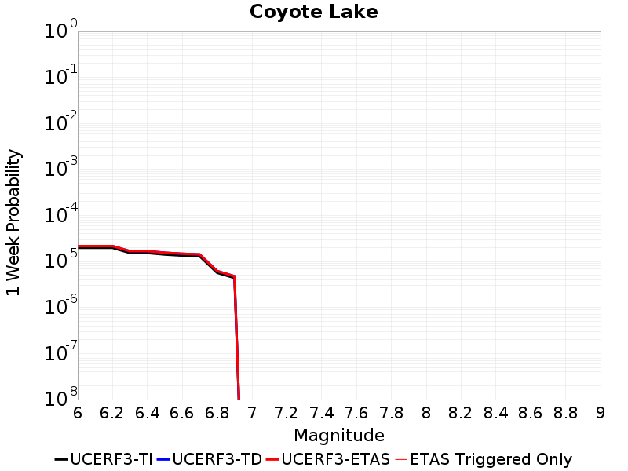 | 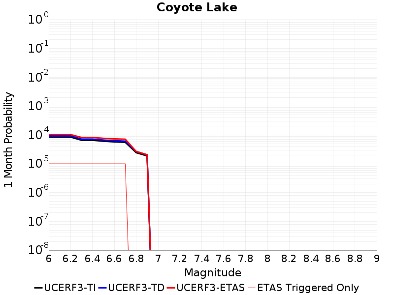 | 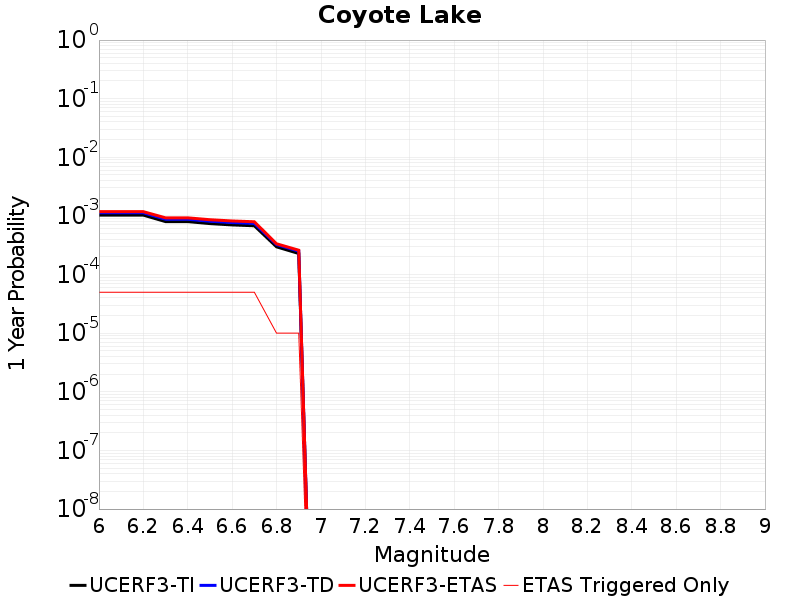 |  |

| Magnitude | 1 wk TI Prob | 1 wk TD Prob | 1 wk ETAS Prob | 1 wk ETAS/TD Gain | 1 wk ETAS Triggered Only | 1 mo TI Prob | 1 mo TD Prob | 1 mo ETAS Prob | 1 mo ETAS/TD Gain | 1 mo ETAS Triggered Only | 1 yr TI Prob | 1 yr TD Prob | 1 yr ETAS Prob | 1 yr ETAS/TD Gain | 1 yr ETAS Triggered Only | 10 yr TI Prob | 10 yr TD Prob | 10 yr ETAS Prob | 10 yr ETAS/TD Gain | 10 yr ETAS Triggered Only |
|-----|-----|-----|-----|-----|-----|-----|-----|-----|-----|-----|-----|-----|-----|-----|-----|-----|-----|-----|-----|-----|
| 6.0 | 1.980352E-5 | 2.1719094E-5 | 2.1719094E-5 | 1.0 | 0.0 | 8.486947E-5 | 9.307892E-5 | 9.307892E-5 | 1.0 | 0.0 | 0.0010327959 | 0.0011327188 | 0.0011726734 | 1.0352733 | 4.0E-5 | 0.010280091 | 0.011276638 | 0.0114348335 | 1.0140287 | 1.6E-4 |
| 6.1 | 1.980352E-5 | 2.1719094E-5 | 2.1719094E-5 | 1.0 | 0.0 | 8.486947E-5 | 9.307892E-5 | 9.307892E-5 | 1.0 | 0.0 | 0.0010327959 | 0.0011327188 | 0.0011726734 | 1.0352733 | 4.0E-5 | 0.010280091 | 0.011276638 | 0.0114348335 | 1.0140287 | 1.6E-4 |
| 6.2 | 1.980352E-5 | 2.1719094E-5 | 2.1719094E-5 | 1.0 | 0.0 | 8.486947E-5 | 9.307892E-5 | 9.307892E-5 | 1.0 | 0.0 | 0.0010327959 | 0.0011327188 | 0.0011726734 | 1.0352733 | 4.0E-5 | 0.010280091 | 0.011276638 | 0.0114348335 | 1.0140287 | 1.6E-4 |
| 6.3 | 1.5344787E-5 | 1.6830247E-5 | 1.6830247E-5 | 1.0 | 0.0 | 6.576172E-5 | 7.212798E-5 | 7.212798E-5 | 1.0 | 0.0 | 8.003548E-4 | 8.7786565E-4 | 9.178305E-4 | 1.0455251 | 4.0E-5 | 0.007974784 | 0.008750031 | 0.008878893 | 1.0147271 | 1.3E-4 |
| 6.4 | 1.5344787E-5 | 1.6830247E-5 | 1.6830247E-5 | 1.0 | 0.0 | 6.576172E-5 | 7.212798E-5 | 7.212798E-5 | 1.0 | 0.0 | 8.003548E-4 | 8.7786565E-4 | 9.178305E-4 | 1.0455251 | 4.0E-5 | 0.007974784 | 0.008750031 | 0.008878893 | 1.0147271 | 1.3E-4 |
| 6.5 | 1.4189697E-5 | 1.5566868E-5 | 1.5566868E-5 | 1.0 | 0.0 | 6.081157E-5 | 6.671379E-5 | 6.671379E-5 | 1.0 | 0.0 | 7.401293E-4 | 8.11998E-4 | 8.519655E-4 | 1.0492212 | 4.0E-5 | 0.0073766913 | 0.00809626 | 0.008225208 | 1.0159268 | 1.3E-4 |
| 6.6 | 1.3469301E-5 | 1.4780032E-5 | 1.4780032E-5 | 1.0 | 0.0 | 5.7724297E-5 | 6.3341795E-5 | 6.3341795E-5 | 1.0 | 0.0 | 7.025667E-4 | 7.7097357E-4 | 8.009504E-4 | 1.0388819 | 3.0E-5 | 0.0070034964 | 0.0076888995 | 0.007807977 | 1.015487 | 1.2E-4 |
| 6.7 | 1.3027966E-5 | 1.4289882E-5 | 1.4289882E-5 | 1.0 | 0.0 | 5.5832945E-5 | 6.124125E-5 | 6.124125E-5 | 1.0 | 0.0 | 6.7955407E-4 | 7.4541697E-4 | 7.6540204E-4 | 1.0268106 | 2.0E-5 | 0.006774798 | 0.0074350503 | 0.0075343065 | 1.0133498 | 1.0E-4 |
| 6.8 | 5.695434E-6 | 6.2278386E-6 | 6.2278386E-6 | 1.0 | 0.0 | 2.4408775E-5 | 2.6690632E-5 | 2.6690632E-5 | 1.0 | 0.0 | 2.971363E-4 | 3.2494002E-4 | 3.2494002E-4 | 1.0 | 0.0 | 0.0029673933 | 0.003247593 | 0.0032774957 | 1.0092076 | 3.0E-5 |
| 6.9 | 4.385688E-6 | 4.7956896E-6 | 4.7956896E-6 | 1.0 | 0.0 | 1.879567E-5 | 2.0552956E-5 | 2.0552956E-5 | 1.0 | 0.0 | 2.2881327E-4 | 2.5023223E-4 | 2.5023223E-4 | 1.0 | 0.0 | 0.002285778 | 0.0025023224 | 0.0025122974 | 1.0039862 | 1.0E-5 |

## Helendale-So Lockhart
*[(top)](#table-of-contents)*

| 1 Week | 1 Month | 1 Year | 10 Year |
|-----|-----|-----|-----|
| 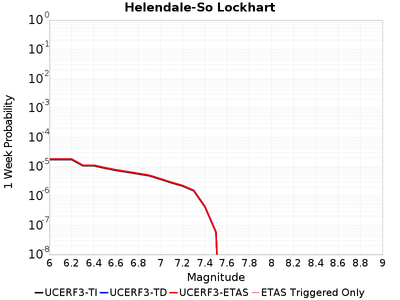 |  | 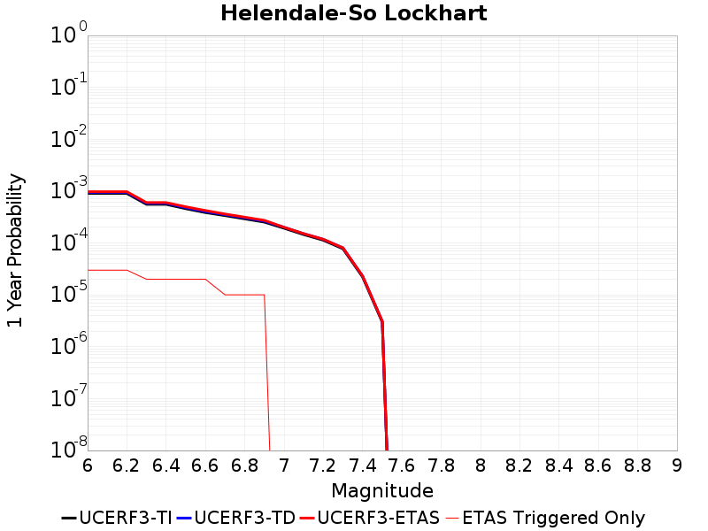 | 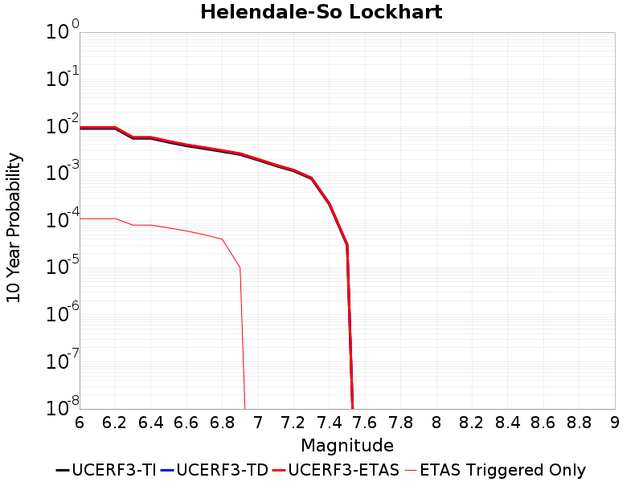 |

| Magnitude | 1 wk TI Prob | 1 wk TD Prob | 1 wk ETAS Prob | 1 wk ETAS/TD Gain | 1 wk ETAS Triggered Only | 1 mo TI Prob | 1 mo TD Prob | 1 mo ETAS Prob | 1 mo ETAS/TD Gain | 1 mo ETAS Triggered Only | 1 yr TI Prob | 1 yr TD Prob | 1 yr ETAS Prob | 1 yr ETAS/TD Gain | 1 yr ETAS Triggered Only | 10 yr TI Prob | 10 yr TD Prob | 10 yr ETAS Prob | 10 yr ETAS/TD Gain | 10 yr ETAS Triggered Only |
|-----|-----|-----|-----|-----|-----|-----|-----|-----|-----|-----|-----|-----|-----|-----|-----|-----|-----|-----|-----|-----|
| 6.0 | 1.7296055E-5 | 1.8108742E-5 | 1.8108742E-5 | 1.0 | 0.0 | 7.412385E-5 | 7.76067E-5 | 7.76067E-5 | 1.0 | 0.0 | 9.0208417E-4 | 9.4447273E-4 | 9.6445385E-4 | 1.0211558 | 2.0E-5 | 0.008984311 | 0.009406708 | 0.009545391 | 1.014743 | 1.4E-4 |
| 6.1 | 1.7296055E-5 | 1.8108742E-5 | 1.8108742E-5 | 1.0 | 0.0 | 7.412385E-5 | 7.76067E-5 | 7.76067E-5 | 1.0 | 0.0 | 9.0208417E-4 | 9.4447273E-4 | 9.6445385E-4 | 1.0211558 | 2.0E-5 | 0.008984311 | 0.009406708 | 0.009545391 | 1.014743 | 1.4E-4 |
| 6.2 | 1.7296055E-5 | 1.8108742E-5 | 1.8108742E-5 | 1.0 | 0.0 | 7.412385E-5 | 7.76067E-5 | 7.76067E-5 | 1.0 | 0.0 | 9.0208417E-4 | 9.4447273E-4 | 9.6445385E-4 | 1.0211558 | 2.0E-5 | 0.008984311 | 0.009406708 | 0.009545391 | 1.014743 | 1.4E-4 |
| 6.3 | 1.0669118E-5 | 1.1138308E-5 | 1.1138308E-5 | 1.0 | 0.0 | 4.5723988E-5 | 4.773475E-5 | 4.773475E-5 | 1.0 | 0.0 | 5.5654737E-4 | 5.810184E-4 | 6.0100673E-4 | 1.0344024 | 2.0E-5 | 0.0055515557 | 0.0057952898 | 0.0059245364 | 1.022302 | 1.3E-4 |
| 6.4 | 1.0669118E-5 | 1.1138308E-5 | 1.1138308E-5 | 1.0 | 0.0 | 4.5723988E-5 | 4.773475E-5 | 4.773475E-5 | 1.0 | 0.0 | 5.5654737E-4 | 5.810184E-4 | 6.0100673E-4 | 1.0344024 | 2.0E-5 | 0.0055515557 | 0.0057952898 | 0.0059245364 | 1.022302 | 1.3E-4 |
| 6.5 | 8.790038E-6 | 9.172547E-6 | 9.172547E-6 | 1.0 | 0.0 | 3.767105E-5 | 3.931033E-5 | 3.931033E-5 | 1.0 | 0.0 | 4.585485E-4 | 4.784997E-4 | 4.8849493E-4 | 1.0208887 | 1.0E-5 | 0.0045760344 | 0.0047748587 | 0.0048743812 | 1.020843 | 1.0E-4 |
| 6.6 | 7.396949E-6 | 7.7175055E-6 | 7.7175055E-6 | 1.0 | 0.0 | 3.1700827E-5 | 3.307461E-5 | 3.307461E-5 | 1.0 | 0.0 | 3.858892E-4 | 4.0261E-4 | 4.1260596E-4 | 1.024828 | 1.0E-5 | 0.003852198 | 0.004018913 | 0.0041085514 | 1.022304 | 9.0E-5 |
| 6.7 | 6.4600285E-6 | 6.739749E-6 | 6.739749E-6 | 1.0 | 0.0 | 2.7685543E-5 | 2.8884324E-5 | 2.8884324E-5 | 1.0 | 0.0 | 3.3701936E-4 | 3.5161068E-4 | 3.6160715E-4 | 1.0284306 | 1.0E-5 | 0.0033650869 | 0.0035106253 | 0.0036003094 | 1.0255464 | 9.0E-5 |
| 6.8 | 5.600104E-6 | 5.8374653E-6 | 5.8374653E-6 | 1.0 | 0.0 | 2.4000226E-5 | 2.501747E-5 | 2.501747E-5 | 1.0 | 0.0 | 2.9216358E-4 | 3.0454574E-4 | 3.145427E-4 | 1.0328258 | 1.0E-5 | 0.0029177975 | 0.0030413454 | 0.0031111324 | 1.0229461 | 7.0E-5 |
| 6.9 | 4.839122E-6 | 5.040745E-6 | 5.040745E-6 | 1.0 | 0.0 | 2.0738931E-5 | 2.1603015E-5 | 2.1603015E-5 | 1.0 | 0.0 | 2.5246723E-4 | 2.6298544E-4 | 2.729828E-4 | 1.0380149 | 1.0E-5 | 0.002521806 | 0.0026267897 | 0.0026666846 | 1.0151877 | 4.0E-5 |
| 7.0 | 3.6937633E-6 | 3.846141E-6 | 3.846141E-6 | 1.0 | 0.0 | 1.5830317E-5 | 1.648336E-5 | 1.648336E-5 | 1.0 | 0.0 | 1.9271708E-4 | 2.0066673E-4 | 2.1066473E-4 | 1.0498239 | 1.0E-5 | 0.0019255003 | 0.002004887 | 0.0020248468 | 1.0099556 | 2.0E-5 |
| 7.1 | 2.7858857E-6 | 2.898543E-6 | 2.898543E-6 | 1.0 | 0.0 | 1.1939455E-5 | 1.2422269E-5 | 1.2422269E-5 | 1.0 | 0.0 | 1.4535317E-4 | 1.5123084E-4 | 1.6122933E-4 | 1.0661141 | 1.0E-5 | 0.0014525814 | 0.0015113008 | 0.0015312706 | 1.0132136 | 2.0E-5 |
| 7.2 | 2.1672065E-6 | 2.2545469E-6 | 2.2545469E-6 | 1.0 | 0.0 | 9.2879945E-6 | 9.662309E-6 | 9.662309E-6 | 1.0 | 0.0 | 1.1307546E-4 | 1.1763245E-4 | 1.1763245E-4 | 1.0 | 0.0 | 0.0011301794 | 0.00117572 | 0.0011857083 | 1.0084955 | 1.0E-5 |
| 7.3 | 1.4823496E-6 | 1.5425786E-6 | 1.5425786E-6 | 1.0 | 0.0 | 6.3529114E-6 | 6.6110356E-6 | 6.6110356E-6 | 1.0 | 0.0 | 7.734395E-5 | 8.0486534E-5 | 8.0486534E-5 | 1.0 | 0.0 | 7.731704E-4 | 8.0458896E-4 | 8.1458094E-4 | 1.0124187 | 1.0E-5 |
| 7.4 | 4.2321457E-7 | 4.4119784E-7 | 4.4119784E-7 | 1.0 | 0.0 | 1.8137755E-6 | 1.8908468E-6 | 1.8908468E-6 | 1.0 | 0.0 | 2.2082493E-5 | 2.3020862E-5 | 2.3020862E-5 | 1.0 | 0.0 | 2.2080299E-4 | 2.3018931E-4 | 2.3018931E-4 | 1.0 | 0.0 |
| 7.5 | 5.6942316E-8 | 5.9430914E-8 | 5.9430914E-8 | 1.0 | 0.0 | 2.440385E-7 | 2.5470388E-7 | 2.5470388E-7 | 1.0 | 0.0 | 2.9711643E-6 | 3.1010163E-6 | 3.1010163E-6 | 1.0 | 0.0 | 2.9711247E-5 | 3.1009808E-5 | 3.1009808E-5 | 1.0 | 0.0 |

## San Andreas (San Gorgonio Pass-Garnet HIll)
*[(top)](#table-of-contents)*

| 1 Week | 1 Month | 1 Year | 10 Year |
|-----|-----|-----|-----|
|  |  |  |  |

| Magnitude | 1 wk TI Prob | 1 wk TD Prob | 1 wk ETAS Prob | 1 wk ETAS/TD Gain | 1 wk ETAS Triggered Only | 1 mo TI Prob | 1 mo TD Prob | 1 mo ETAS Prob | 1 mo ETAS/TD Gain | 1 mo ETAS Triggered Only | 1 yr TI Prob | 1 yr TD Prob | 1 yr ETAS Prob | 1 yr ETAS/TD Gain | 1 yr ETAS Triggered Only | 10 yr TI Prob | 10 yr TD Prob | 10 yr ETAS Prob | 10 yr ETAS/TD Gain | 10 yr ETAS Triggered Only |
|-----|-----|-----|-----|-----|-----|-----|-----|-----|-----|-----|-----|-----|-----|-----|-----|-----|-----|-----|-----|-----|
| 6.0 | 8.31567E-5 | 2.3571E-4 | 2.3571E-4 | 1.0 | 0.0 | 3.5633717E-4 | 0.001009795 | 0.001009795 | 1.0 | 0.0 | 0.004329778 | 0.0122248605 | 0.012264372 | 1.003232 | 4.0E-5 | 0.042463828 | 0.11334968 | 0.113456085 | 1.0009387 | 1.2E-4 |
| 6.1 | 8.31567E-5 | 2.3571E-4 | 2.3571E-4 | 1.0 | 0.0 | 3.5633717E-4 | 0.001009795 | 0.001009795 | 1.0 | 0.0 | 0.004329778 | 0.0122248605 | 0.012264372 | 1.003232 | 4.0E-5 | 0.042463828 | 0.11334968 | 0.113456085 | 1.0009387 | 1.2E-4 |
| 6.2 | 8.31567E-5 | 2.3571E-4 | 2.3571E-4 | 1.0 | 0.0 | 3.5633717E-4 | 0.001009795 | 0.001009795 | 1.0 | 0.0 | 0.004329778 | 0.0122248605 | 0.012264372 | 1.003232 | 4.0E-5 | 0.042463828 | 0.11334968 | 0.113456085 | 1.0009387 | 1.2E-4 |
| 6.3 | 8.31567E-5 | 2.3571E-4 | 2.3571E-4 | 1.0 | 0.0 | 3.5633717E-4 | 0.001009795 | 0.001009795 | 1.0 | 0.0 | 0.004329778 | 0.0122248605 | 0.012264372 | 1.003232 | 4.0E-5 | 0.042463828 | 0.11334968 | 0.113456085 | 1.0009387 | 1.2E-4 |
| 6.4 | 8.059055E-5 | 2.3127526E-4 | 2.3127526E-4 | 1.0 | 0.0 | 3.4534236E-4 | 9.908057E-4 | 9.908057E-4 | 1.0 | 0.0 | 0.0041964394 | 0.011996552 | 0.012036073 | 1.0032943 | 4.0E-5 | 0.041180745 | 0.11132814 | 0.11143478 | 1.0009578 | 1.2E-4 |
| 6.5 | 8.059055E-5 | 2.3127526E-4 | 2.3127526E-4 | 1.0 | 0.0 | 3.4534236E-4 | 9.908057E-4 | 9.908057E-4 | 1.0 | 0.0 | 0.0041964394 | 0.011996552 | 0.012036073 | 1.0032943 | 4.0E-5 | 0.041180745 | 0.11132814 | 0.11143478 | 1.0009578 | 1.2E-4 |
| 6.6 | 7.619237E-5 | 2.2370573E-4 | 2.2370573E-4 | 1.0 | 0.0 | 3.2649786E-4 | 9.583889E-4 | 9.583889E-4 | 1.0 | 0.0 | 0.0039678677 | 0.011606513 | 0.011646048 | 1.0034063 | 4.0E-5 | 0.03897764 | 0.10786114 | 0.107968196 | 1.0009925 | 1.2E-4 |
| 6.7 | 7.440636E-5 | 2.2045997E-4 | 2.2045997E-4 | 1.0 | 0.0 | 3.188454E-4 | 9.444886E-4 | 9.444886E-4 | 1.0 | 0.0 | 0.0038750346 | 0.011439062 | 0.011468719 | 1.0025926 | 3.0E-5 | 0.038081564 | 0.10636924 | 0.106467545 | 1.0009241 | 1.1E-4 |
| 6.8 | 7.3735864E-5 | 2.1892581E-4 | 2.1892581E-4 | 1.0 | 0.0 | 3.1597257E-4 | 9.379184E-4 | 9.379184E-4 | 1.0 | 0.0 | 0.0038401815 | 0.01135991 | 0.011389568 | 1.0026109 | 3.0E-5 | 0.03774495 | 0.105668776 | 0.10576715 | 1.000931 | 1.1E-4 |
| 6.9 | 7.27575E-5 | 2.1661106E-4 | 2.1661106E-4 | 1.0 | 0.0 | 3.117806E-4 | 9.280051E-4 | 9.280051E-4 | 1.0 | 0.0 | 0.003789323 | 0.0112404665 | 0.011270129 | 1.0026389 | 3.0E-5 | 0.037253562 | 0.10461573 | 0.10471423 | 1.0009415 | 1.1E-4 |
| 7.0 | 7.102591E-5 | 2.1244331E-4 | 2.1244331E-4 | 1.0 | 0.0 | 3.0436125E-4 | 9.101559E-4 | 9.101559E-4 | 1.0 | 0.0 | 0.003699303 | 0.011025369 | 0.011055038 | 1.002691 | 3.0E-5 | 0.03638325 | 0.10271573 | 0.10280546 | 1.0008736 | 1.0E-4 |
| 7.1 | 7.028513E-5 | 2.1079417E-4 | 2.1079417E-4 | 1.0 | 0.0 | 3.0118722E-4 | 9.030931E-4 | 9.030931E-4 | 1.0 | 0.0 | 0.0036607897 | 0.010940247 | 0.010969919 | 1.0027121 | 3.0E-5 | 0.036010686 | 0.101956956 | 0.102046765 | 1.0008808 | 1.0E-4 |
| 7.2 | 6.8498244E-5 | 2.068642E-4 | 2.068642E-4 | 1.0 | 0.0 | 2.9353087E-4 | 8.8626187E-4 | 8.8626187E-4 | 1.0 | 0.0 | 0.003567883 | 0.010737362 | 0.010767041 | 1.002764 | 3.0E-5 | 0.035111405 | 0.10014693 | 0.100236915 | 1.0008985 | 1.0E-4 |
| 7.3 | 6.622592E-5 | 1.9910968E-4 | 1.9910968E-4 | 1.0 | 0.0 | 2.8379448E-4 | 8.530504E-4 | 8.530504E-4 | 1.0 | 0.0 | 0.0034497243 | 0.010336918 | 0.010366608 | 1.0028722 | 3.0E-5 | 0.033966612 | 0.096634656 | 0.09672499 | 1.0009348 | 1.0E-4 |
| 7.4 | 5.1050705E-5 | 1.4839385E-4 | 1.4839385E-4 | 1.0 | 0.0 | 2.1877038E-4 | 6.3581957E-4 | 6.3581957E-4 | 1.0 | 0.0 | 0.002660276 | 0.007713823 | 0.007743592 | 1.0038592 | 3.0E-5 | 0.02628654 | 0.073512696 | 0.07359608 | 1.0011343 | 9.0E-5 |
| 7.5 | 3.9302922E-5 | 1.1258279E-4 | 1.1258279E-4 | 1.0 | 0.0 | 1.6843023E-4 | 4.8240877E-4 | 4.8240877E-4 | 1.0 | 0.0 | 0.0020487092 | 0.005857581 | 0.005887405 | 1.0050915 | 3.0E-5 | 0.020299247 | 0.056576684 | 0.05666159 | 1.0015007 | 9.0E-5 |
| 7.6 | 2.9851626E-5 | 8.609036E-5 | 8.609036E-5 | 1.0 | 0.0 | 1.2792926E-4 | 3.6890662E-4 | 3.6890662E-4 | 1.0 | 0.0 | 0.0015564259 | 0.004482215 | 0.00451208 | 1.0066631 | 3.0E-5 | 0.0154556995 | 0.043703508 | 0.043789573 | 1.0019693 | 9.0E-5 |
| 7.7 | 2.1135214E-5 | 6.454374E-5 | 6.454374E-5 | 1.0 | 0.0 | 9.0576345E-5 | 2.765867E-4 | 2.765867E-4 | 1.0 | 0.0 | 0.0011022091 | 0.0033622491 | 0.0033921483 | 1.0088927 | 3.0E-5 | 0.010967582 | 0.03303859 | 0.033125617 | 1.002634 | 9.0E-5 |
| 7.8 | 1.883379E-5 | 5.657075E-5 | 5.657075E-5 | 1.0 | 0.0 | 8.0713755E-5 | 2.4242356E-4 | 2.4242356E-4 | 1.0 | 0.0 | 9.822468E-4 | 0.0029475153 | 0.0029774269 | 1.010148 | 3.0E-5 | 0.0097791655 | 0.029115533 | 0.029202914 | 1.0030011 | 9.0E-5 |
| 7.9 | 1.5156185E-5 | 4.2424337E-5 | 4.2424337E-5 | 1.0 | 0.0 | 6.495346E-5 | 1.8180592E-4 | 1.8180592E-4 | 1.0 | 0.0 | 7.9052144E-4 | 0.0022112415 | 0.0022411752 | 1.013537 | 3.0E-5 | 0.007877152 | 0.02211045 | 0.02219846 | 1.0039805 | 9.0E-5 |
| 8.0 | 1.1405907E-5 | 3.0552277E-5 | 3.0552277E-5 | 1.0 | 0.0 | 4.8881542E-5 | 1.3093177E-4 | 1.3093177E-4 | 1.0 | 0.0 | 5.9497025E-4 | 0.0015929297 | 0.0016029137 | 1.0062678 | 1.0E-5 | 0.005933798 | 0.016040975 | 0.016100012 | 1.0036805 | 6.0E-5 |
| 8.1 | 4.3511436E-6 | 7.579923E-6 | 7.579923E-6 | 1.0 | 0.0 | 1.8647626E-5 | 3.2484983E-5 | 3.2484983E-5 | 1.0 | 0.0 | 2.2701119E-4 | 3.9543302E-4 | 3.9543302E-4 | 1.0 | 0.0 | 0.0022677942 | 0.004221245 | 0.004221245 | 1.0 | 0.0 |
| 8.2 | 2.3042528E-6 | 2.8301974E-6 | 2.8301974E-6 | 1.0 | 0.0 | 9.875332E-6 | 1.21293615E-5 | 1.21293615E-5 | 1.0 | 0.0 | 1.2022553E-4 | 1.4766502E-4 | 1.4766502E-4 | 1.0 | 0.0 | 0.0012016051 | 0.0016487143 | 0.0016487143 | 1.0 | 0.0 |
| 8.3 | 5.202968E-7 | 3.3030278E-7 | 3.3030278E-7 | 1.0 | 0.0 | 2.2298414E-6 | 1.4155827E-6 | 1.4155827E-6 | 1.0 | 0.0 | 2.714798E-5 | 1.7234597E-5 | 1.7234597E-5 | 1.0 | 0.0 | 2.7144665E-4 | 2.0368869E-4 | 2.0368869E-4 | 1.0 | 0.0 |

## Manix-Afton Hills
*[(top)](#table-of-contents)*

| 1 Week | 1 Month | 1 Year | 10 Year |
|-----|-----|-----|-----|
| 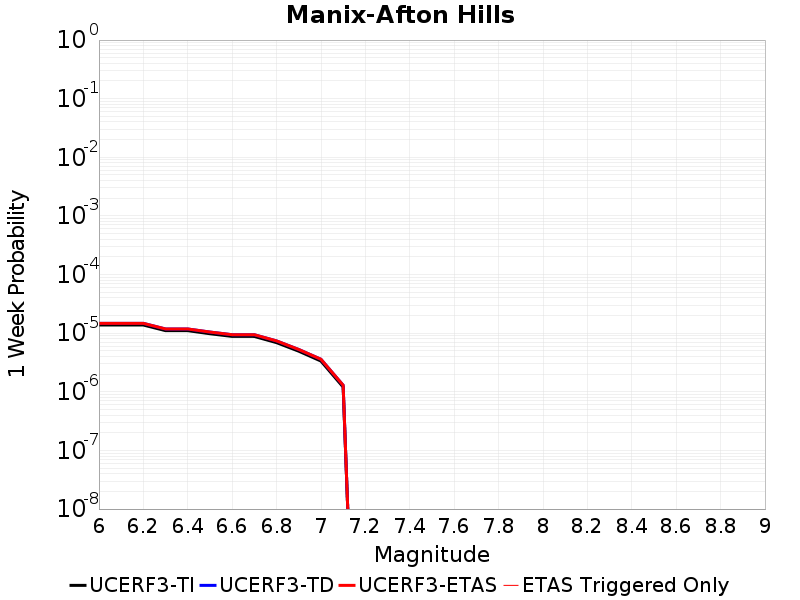 |  | 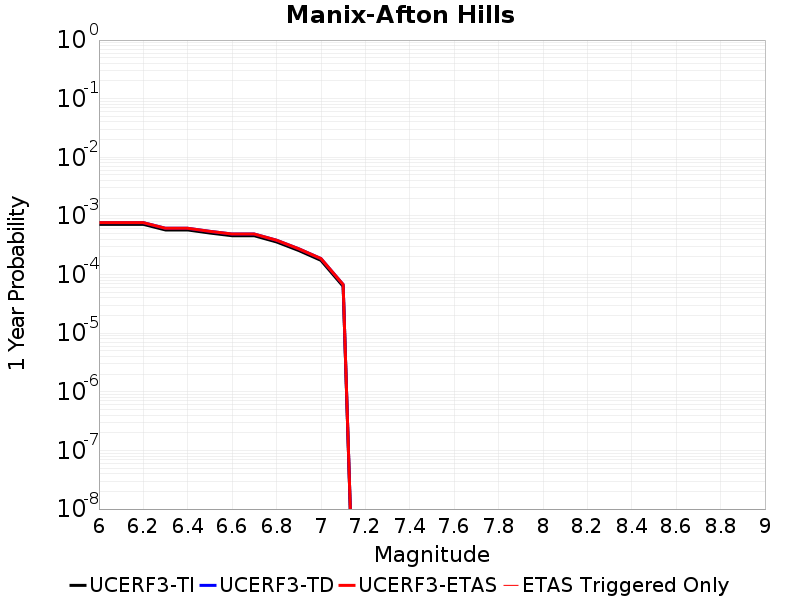 | 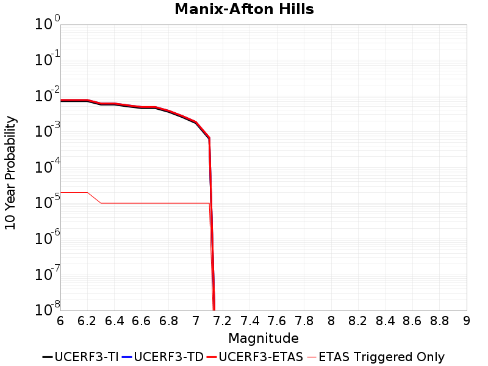 |

| Magnitude | 1 wk TI Prob | 1 wk TD Prob | 1 wk ETAS Prob | 1 wk ETAS/TD Gain | 1 wk ETAS Triggered Only | 1 mo TI Prob | 1 mo TD Prob | 1 mo ETAS Prob | 1 mo ETAS/TD Gain | 1 mo ETAS Triggered Only | 1 yr TI Prob | 1 yr TD Prob | 1 yr ETAS Prob | 1 yr ETAS/TD Gain | 1 yr ETAS Triggered Only | 10 yr TI Prob | 10 yr TD Prob | 10 yr ETAS Prob | 10 yr ETAS/TD Gain | 10 yr ETAS Triggered Only |
|-----|-----|-----|-----|-----|-----|-----|-----|-----|-----|-----|-----|-----|-----|-----|-----|-----|-----|-----|-----|-----|
| 6.0 | 1.3783202E-5 | 1.471696E-5 | 1.471696E-5 | 1.0 | 0.0 | 5.906953E-5 | 6.307126E-5 | 7.307063E-5 | 1.1585408 | 1.0E-5 | 7.189342E-4 | 7.6763955E-4 | 7.876242E-4 | 1.0260339 | 2.0E-5 | 0.0071661277 | 0.0076516373 | 0.007750872 | 1.0129691 | 1.0E-4 |
| 6.1 | 1.3783202E-5 | 1.471696E-5 | 1.471696E-5 | 1.0 | 0.0 | 5.906953E-5 | 6.307126E-5 | 7.307063E-5 | 1.1585408 | 1.0E-5 | 7.189342E-4 | 7.6763955E-4 | 7.876242E-4 | 1.0260339 | 2.0E-5 | 0.0071661277 | 0.0076516373 | 0.007750872 | 1.0129691 | 1.0E-4 |
| 6.2 | 1.3783202E-5 | 1.471696E-5 | 1.471696E-5 | 1.0 | 0.0 | 5.906953E-5 | 6.307126E-5 | 7.307063E-5 | 1.1585408 | 1.0E-5 | 7.189342E-4 | 7.6763955E-4 | 7.876242E-4 | 1.0260339 | 2.0E-5 | 0.0071661277 | 0.0076516373 | 0.007750872 | 1.0129691 | 1.0E-4 |
| 6.3 | 1.10494875E-5 | 1.17978425E-5 | 1.17978425E-5 | 1.0 | 0.0 | 4.7354086E-5 | 5.056126E-5 | 6.0560753E-5 | 1.1977699 | 1.0E-5 | 5.763835E-4 | 6.154198E-4 | 6.354075E-4 | 1.0324781 | 2.0E-5 | 0.005748908 | 0.006138197 | 0.0062077674 | 1.011334 | 7.0E-5 |
| 6.4 | 1.10494875E-5 | 1.17978425E-5 | 1.17978425E-5 | 1.0 | 0.0 | 4.7354086E-5 | 5.056126E-5 | 6.0560753E-5 | 1.1977699 | 1.0E-5 | 5.763835E-4 | 6.154198E-4 | 6.354075E-4 | 1.0324781 | 2.0E-5 | 0.005748908 | 0.006138197 | 0.0062077674 | 1.011334 | 7.0E-5 |
| 6.5 | 9.788949E-6 | 1.0458534E-5 | 1.0458534E-5 | 1.0 | 0.0 | 4.1951964E-5 | 4.4821572E-5 | 5.482112E-5 | 1.2230968 | 1.0E-5 | 5.1064545E-4 | 5.455753E-4 | 5.655644E-4 | 1.0366385 | 2.0E-5 | 0.0050947363 | 0.0054432866 | 0.005493014 | 1.0091356 | 5.0E-5 |
| 6.6 | 8.810006E-6 | 9.417454E-6 | 9.417454E-6 | 1.0 | 0.0 | 3.775662E-5 | 4.0359944E-5 | 5.035954E-5 | 1.2477604 | 1.0E-5 | 4.5958988E-4 | 4.912804E-4 | 5.112706E-4 | 1.04069 | 2.0E-5 | 0.0045864056 | 0.004902826 | 0.004952581 | 1.0101482 | 5.0E-5 |
| 6.7 | 8.80128E-6 | 9.407929E-6 | 9.407929E-6 | 1.0 | 0.0 | 3.7719226E-5 | 4.0319122E-5 | 5.031872E-5 | 1.2480112 | 1.0E-5 | 4.591348E-4 | 4.907836E-4 | 5.107738E-4 | 1.0407312 | 2.0E-5 | 0.004581874 | 0.0048978804 | 0.004947636 | 1.0101585 | 5.0E-5 |
| 6.8 | 6.8994877E-6 | 7.3831256E-6 | 7.3831256E-6 | 1.0 | 0.0 | 2.9568899E-5 | 3.164163E-5 | 4.1641313E-5 | 1.3160293 | 1.0E-5 | 3.5994186E-4 | 3.851769E-4 | 4.051692E-4 | 1.0519042 | 2.0E-5 | 0.003593594 | 0.0038458987 | 0.0038757834 | 1.0077705 | 3.0E-5 |
| 6.9 | 4.9328037E-6 | 5.273105E-6 | 5.273105E-6 | 1.0 | 0.0 | 2.1140417E-5 | 2.2598862E-5 | 2.2598862E-5 | 1.0 | 0.0 | 2.5735417E-4 | 2.7511257E-4 | 2.7511257E-4 | 1.0 | 0.0 | 0.0025705635 | 0.0027483255 | 0.002758298 | 1.0036286 | 1.0E-5 |
| 7.0 | 3.347973E-6 | 3.5915702E-6 | 3.5915702E-6 | 1.0 | 0.0 | 1.4348378E-5 | 1.5392376E-5 | 1.5392376E-5 | 1.0 | 0.0 | 1.746775E-4 | 1.8739016E-4 | 1.8739016E-4 | 1.0 | 0.0 | 0.0017454025 | 0.0018727245 | 0.0018727245 | 1.0 | 0.0 |
| 7.1 | 1.2073567E-6 | 1.2940279E-6 | 1.2940279E-6 | 1.0 | 0.0 | 5.1743755E-6 | 5.5458313E-6 | 5.5458313E-6 | 1.0 | 0.0 | 6.29962E-5 | 6.752004E-5 | 6.752004E-5 | 1.0 | 0.0 | 6.297835E-4 | 6.7515555E-4 | 6.7515555E-4 | 1.0 | 0.0 |

## Lake Isabella (Seismicity)
*[(top)](#table-of-contents)*

| 1 Week | 1 Month | 1 Year | 10 Year |
|-----|-----|-----|-----|
|  |  |  |  |

| Magnitude | 1 wk TI Prob | 1 wk TD Prob | 1 wk ETAS Prob | 1 wk ETAS/TD Gain | 1 wk ETAS Triggered Only | 1 mo TI Prob | 1 mo TD Prob | 1 mo ETAS Prob | 1 mo ETAS/TD Gain | 1 mo ETAS Triggered Only | 1 yr TI Prob | 1 yr TD Prob | 1 yr ETAS Prob | 1 yr ETAS/TD Gain | 1 yr ETAS Triggered Only | 10 yr TI Prob | 10 yr TD Prob | 10 yr ETAS Prob | 10 yr ETAS/TD Gain | 10 yr ETAS Triggered Only |
|-----|-----|-----|-----|-----|-----|-----|-----|-----|-----|-----|-----|-----|-----|-----|-----|-----|-----|-----|-----|-----|
| 6.0 | 9.431637E-6 | 9.743547E-6 | 9.743547E-6 | 1.0 | 0.0 | 4.0420677E-5 | 4.1757463E-5 | 4.1757463E-5 | 1.0 | 0.0 | 4.920106E-4 | 5.082916E-4 | 5.482713E-4 | 1.078655 | 4.0E-5 | 0.004909227 | 0.0050725834 | 0.005162127 | 1.0176524 | 9.0E-5 |
| 6.1 | 9.431637E-6 | 9.743547E-6 | 9.743547E-6 | 1.0 | 0.0 | 4.0420677E-5 | 4.1757463E-5 | 4.1757463E-5 | 1.0 | 0.0 | 4.920106E-4 | 5.082916E-4 | 5.482713E-4 | 1.078655 | 4.0E-5 | 0.004909227 | 0.0050725834 | 0.005162127 | 1.0176524 | 9.0E-5 |
| 6.2 | 9.431637E-6 | 9.743547E-6 | 9.743547E-6 | 1.0 | 0.0 | 4.0420677E-5 | 4.1757463E-5 | 4.1757463E-5 | 1.0 | 0.0 | 4.920106E-4 | 5.082916E-4 | 5.482713E-4 | 1.078655 | 4.0E-5 | 0.004909227 | 0.0050725834 | 0.005162127 | 1.0176524 | 9.0E-5 |
| 6.3 | 9.431637E-6 | 9.743547E-6 | 9.743547E-6 | 1.0 | 0.0 | 4.0420677E-5 | 4.1757463E-5 | 4.1757463E-5 | 1.0 | 0.0 | 4.920106E-4 | 5.082916E-4 | 5.482713E-4 | 1.078655 | 4.0E-5 | 0.004909227 | 0.0050725834 | 0.005162127 | 1.0176524 | 9.0E-5 |
| 6.4 | 5.144063E-6 | 5.3010276E-6 | 5.3010276E-6 | 1.0 | 0.0 | 2.2045799E-5 | 2.271851E-5 | 2.271851E-5 | 1.0 | 0.0 | 2.6837454E-4 | 2.7656622E-4 | 2.8656345E-4 | 1.0361477 | 1.0E-5 | 0.0026805066 | 0.002762561 | 0.0027825057 | 1.0072197 | 2.0E-5 |
| 6.5 | 5.144063E-6 | 5.3010276E-6 | 5.3010276E-6 | 1.0 | 0.0 | 2.2045799E-5 | 2.271851E-5 | 2.271851E-5 | 1.0 | 0.0 | 2.6837454E-4 | 2.7656622E-4 | 2.8656345E-4 | 1.0361477 | 1.0E-5 | 0.0026805066 | 0.002762561 | 0.0027825057 | 1.0072197 | 2.0E-5 |
| 6.6 | 3.4009804E-6 | 3.4993816E-6 | 3.4993816E-6 | 1.0 | 0.0 | 1.4575549E-5 | 1.4997273E-5 | 1.4997273E-5 | 1.0 | 0.0 | 1.7744285E-4 | 1.8257811E-4 | 1.9257628E-4 | 1.054761 | 1.0E-5 | 0.0017730123 | 0.0018244388 | 0.0018444023 | 1.0109422 | 2.0E-5 |
| 6.7 | 3.3880428E-6 | 3.4862471E-6 | 3.4862471E-6 | 1.0 | 0.0 | 1.4520103E-5 | 1.49409825E-5 | 1.49409825E-5 | 1.0 | 0.0 | 1.767679E-4 | 1.8189289E-4 | 1.9189106E-4 | 1.0549674 | 1.0E-5 | 0.0017662736 | 0.0018175978 | 0.0018375615 | 1.0109836 | 2.0E-5 |
| 6.8 | 2.6582E-6 | 2.7341598E-6 | 2.7341598E-6 | 1.0 | 0.0 | 1.1392236E-5 | 1.1717782E-5 | 1.1717782E-5 | 1.0 | 0.0 | 1.3869164E-4 | 1.42656E-4 | 1.5265458E-4 | 1.0700887 | 1.0E-5 | 0.0013860512 | 0.0014257764 | 0.0014457479 | 1.0140074 | 2.0E-5 |
| 6.9 | 2.406011E-6 | 2.4747446E-6 | 2.4747446E-6 | 1.0 | 0.0 | 1.0311434E-5 | 1.0606013E-5 | 1.0606013E-5 | 1.0 | 0.0 | 1.2553448E-4 | 1.2912188E-4 | 1.3912059E-4 | 1.0774362 | 1.0E-5 | 0.0012546359 | 0.0012905982 | 0.0013005852 | 1.0077384 | 1.0E-5 |
| 7.0 | 1.6953097E-6 | 1.743227E-6 | 1.743227E-6 | 1.0 | 0.0 | 7.265593E-6 | 7.4709574E-6 | 7.4709574E-6 | 1.0 | 0.0 | 8.8455E-5 | 9.095616E-5 | 9.095616E-5 | 1.0 | 0.0 | 8.84198E-4 | 9.092921E-4 | 9.092921E-4 | 1.0 | 0.0 |
| 7.1 | 3.5013824E-7 | 3.5719052E-7 | 3.5719052E-7 | 1.0 | 0.0 | 1.5005916E-6 | 1.5308157E-6 | 1.5308157E-6 | 1.0 | 0.0 | 1.826955E-5 | 1.8637524E-5 | 1.8637524E-5 | 1.0 | 0.0 | 1.8268047E-4 | 1.8635986E-4 | 1.8635986E-4 | 1.0 | 0.0 |
| 7.2 | 2.2321095E-7 | 2.2753163E-7 | 2.2753163E-7 | 1.0 | 0.0 | 9.56618E-7 | 9.751352E-7 | 9.751352E-7 | 1.0 | 0.0 | 1.1646762E-5 | 1.1872207E-5 | 1.1872207E-5 | 1.0 | 0.0 | 1.1646151E-4 | 1.18715834E-4 | 1.18715834E-4 | 1.0 | 0.0 |
| 7.3 | 1.5760406E-7 | 1.6062734E-7 | 1.6062734E-7 | 1.0 | 0.0 | 6.7544585E-7 | 6.884027E-7 | 6.884027E-7 | 1.0 | 0.0 | 8.223522E-6 | 8.381271E-6 | 8.381271E-6 | 1.0 | 0.0 | 8.2232174E-5 | 8.380961E-5 | 8.380961E-5 | 1.0 | 0.0 |
| 7.4 | 1.1216497E-7 | 1.14330035E-7 | 1.14330035E-7 | 1.0 | 0.0 | 4.8070694E-7 | 4.899858E-7 | 4.899858E-7 | 1.0 | 0.0 | 5.852591E-6 | 5.965561E-6 | 5.965561E-6 | 1.0 | 0.0 | 5.8524372E-5 | 5.9654052E-5 | 5.9654052E-5 | 1.0 | 0.0 |
| 7.5 | 4.885185E-8 | 4.979338E-8 | 4.979338E-8 | 1.0 | 0.0 | 2.0936506E-7 | 2.1340018E-7 | 2.1340018E-7 | 1.0 | 0.0 | 2.5490165E-6 | 2.5981442E-6 | 2.5981442E-6 | 1.0 | 0.0 | 2.5489873E-5 | 2.5981157E-5 | 2.5981157E-5 | 1.0 | 0.0 |
| 7.6 | 1.504641E-9 | 1.5319538E-9 | 1.5319538E-9 | 1.0 | 0.0 | 6.4484613E-9 | 6.565516E-9 | 6.565516E-9 | 1.0 | 0.0 | 7.851001E-8 | 7.9935155E-8 | 7.9935155E-8 | 1.0 | 0.0 | 7.8509987E-7 | 7.993516E-7 | 7.993516E-7 | 1.0 | 0.0 |

## Scodie Lineament
*[(top)](#table-of-contents)*

| 1 Week | 1 Month | 1 Year | 10 Year |
|-----|-----|-----|-----|
|  |  |  |  |

| Magnitude | 1 wk TI Prob | 1 wk TD Prob | 1 wk ETAS Prob | 1 wk ETAS/TD Gain | 1 wk ETAS Triggered Only | 1 mo TI Prob | 1 mo TD Prob | 1 mo ETAS Prob | 1 mo ETAS/TD Gain | 1 mo ETAS Triggered Only | 1 yr TI Prob | 1 yr TD Prob | 1 yr ETAS Prob | 1 yr ETAS/TD Gain | 1 yr ETAS Triggered Only | 10 yr TI Prob | 10 yr TD Prob | 10 yr ETAS Prob | 10 yr ETAS/TD Gain | 10 yr ETAS Triggered Only |
|-----|-----|-----|-----|-----|-----|-----|-----|-----|-----|-----|-----|-----|-----|-----|-----|-----|-----|-----|-----|-----|
| 6.0 | 3.2919327E-6 | 3.01398E-6 | 3.01398E-6 | 1.0 | 0.0 | 1.4108206E-5 | 1.2917011E-5 | 1.2917011E-5 | 1.0 | 0.0 | 1.7175387E-4 | 1.5725644E-4 | 1.772533E-4 | 1.1271608 | 2.0E-5 | 0.0017162118 | 0.0015717633 | 0.0016616218 | 1.0571705 | 9.0E-5 |
| 6.1 | 1.8663811E-6 | 1.5494523E-6 | 1.5494523E-6 | 1.0 | 0.0 | 7.998751E-6 | 6.640496E-6 | 6.640496E-6 | 1.0 | 0.0 | 9.738045E-5 | 8.084554E-5 | 8.084554E-5 | 1.0 | 0.0 | 9.7337784E-4 | 8.082101E-4 | 8.3818584E-4 | 1.0370891 | 3.0E-5 |
| 6.2 | 1.8663811E-6 | 1.5494523E-6 | 1.5494523E-6 | 1.0 | 0.0 | 7.998751E-6 | 6.640496E-6 | 6.640496E-6 | 1.0 | 0.0 | 9.738045E-5 | 8.084554E-5 | 8.084554E-5 | 1.0 | 0.0 | 9.7337784E-4 | 8.082101E-4 | 8.3818584E-4 | 1.0370891 | 3.0E-5 |
| 6.3 | 1.8663811E-6 | 1.5494523E-6 | 1.5494523E-6 | 1.0 | 0.0 | 7.998751E-6 | 6.640496E-6 | 6.640496E-6 | 1.0 | 0.0 | 9.738045E-5 | 8.084554E-5 | 8.084554E-5 | 1.0 | 0.0 | 9.7337784E-4 | 8.082101E-4 | 8.3818584E-4 | 1.0370891 | 3.0E-5 |
| 6.4 | 1.8663811E-6 | 1.5494523E-6 | 1.5494523E-6 | 1.0 | 0.0 | 7.998751E-6 | 6.640496E-6 | 6.640496E-6 | 1.0 | 0.0 | 9.738045E-5 | 8.084554E-5 | 8.084554E-5 | 1.0 | 0.0 | 9.7337784E-4 | 8.082101E-4 | 8.3818584E-4 | 1.0370891 | 3.0E-5 |
| 6.5 | 1.8106311E-6 | 1.4913721E-6 | 1.4913721E-6 | 1.0 | 0.0 | 7.759824E-6 | 6.391582E-6 | 6.391582E-6 | 1.0 | 0.0 | 9.447177E-5 | 7.7815224E-5 | 7.7815224E-5 | 1.0 | 0.0 | 9.4431615E-4 | 7.7792845E-4 | 8.0790516E-4 | 1.0385339 | 3.0E-5 |
| 6.6 | 1.2414679E-6 | 9.0000833E-7 | 9.0000833E-7 | 1.0 | 0.0 | 5.320566E-6 | 3.8571734E-6 | 3.8571734E-6 | 1.0 | 0.0 | 6.477596E-5 | 4.6960162E-5 | 4.6960162E-5 | 1.0 | 0.0 | 6.475708E-4 | 4.6951105E-4 | 4.8950163E-4 | 1.0425775 | 2.0E-5 |
| 6.7 | 1.1062215E-6 | 7.596525E-7 | 7.596525E-7 | 1.0 | 0.0 | 4.7409408E-6 | 3.25565E-6 | 3.25565E-6 | 1.0 | 0.0 | 5.7719422E-5 | 3.963689E-5 | 3.963689E-5 | 1.0 | 0.0 | 5.770443E-4 | 3.9630517E-4 | 4.063012E-4 | 1.0252231 | 1.0E-5 |
| 6.8 | 1.0006736E-6 | 6.502375E-7 | 6.502375E-7 | 1.0 | 0.0 | 4.288594E-6 | 2.7867295E-6 | 2.7867295E-6 | 1.0 | 0.0 | 5.221238E-5 | 3.3927965E-5 | 3.3927965E-5 | 1.0 | 0.0 | 5.220012E-4 | 3.3923396E-4 | 3.4923054E-4 | 1.0294682 | 1.0E-5 |
| 6.9 | 9.167364E-7 | 5.633423E-7 | 5.633423E-7 | 1.0 | 0.0 | 3.9288643E-6 | 2.4143224E-6 | 2.4143224E-6 | 1.0 | 0.0 | 4.7832873E-5 | 2.9394036E-5 | 2.9394036E-5 | 1.0 | 0.0 | 4.782258E-4 | 2.9390716E-4 | 2.9390716E-4 | 1.0 | 0.0 |
| 7.0 | 7.6987664E-7 | 4.1148778E-7 | 4.1148778E-7 | 1.0 | 0.0 | 3.2994672E-6 | 1.7635181E-6 | 1.7635181E-6 | 1.0 | 0.0 | 4.0170275E-5 | 2.1470662E-5 | 2.1470662E-5 | 1.0 | 0.0 | 4.0163012E-4 | 2.1468973E-4 | 2.1468973E-4 | 1.0 | 0.0 |
| 7.1 | 7.1038727E-7 | 3.5225264E-7 | 3.5225264E-7 | 1.0 | 0.0 | 3.0445133E-6 | 1.5096535E-6 | 1.5096535E-6 | 1.0 | 0.0 | 3.706632E-5 | 1.8379913E-5 | 1.8379913E-5 | 1.0 | 0.0 | 3.7060137E-4 | 1.8378742E-4 | 1.8378742E-4 | 1.0 | 0.0 |
| 7.2 | 2.0799602E-7 | 3.122293E-8 | 3.122293E-8 | 1.0 | 0.0 | 8.914113E-7 | 1.3381253E-7 | 1.3381253E-7 | 1.0 | 0.0 | 1.0852878E-5 | 1.6291665E-6 | 1.6291665E-6 | 1.0 | 0.0 | 1.08523476E-4 | 1.6291553E-5 | 1.6291553E-5 | 1.0 | 0.0 |
| 7.3 | 1.5048182E-7 | 1.5971404E-8 | 1.5971404E-8 | 1.0 | 0.0 | 6.449219E-7 | 6.844888E-8 | 6.844888E-8 | 1.0 | 0.0 | 7.851896E-6 | 8.3336477E-7 | 8.3336477E-7 | 1.0 | 0.0 | 7.851618E-5 | 8.333619E-6 | 8.333619E-6 | 1.0 | 0.0 |
| 7.4 | 5.9334678E-8 | 4.879923E-9 | 4.879923E-9 | 1.0 | 0.0 | 2.5429145E-7 | 2.0913955E-8 | 2.0913955E-8 | 1.0 | 0.0 | 3.095994E-6 | 2.546274E-7 | 2.546274E-7 | 1.0 | 0.0 | 3.095951E-5 | 2.546272E-6 | 2.546272E-6 | 1.0 | 0.0 |

## Sierra Nevada  (No Extension)
*[(top)](#table-of-contents)*

| 1 Week | 1 Month | 1 Year | 10 Year |
|-----|-----|-----|-----|
|  |  |  | 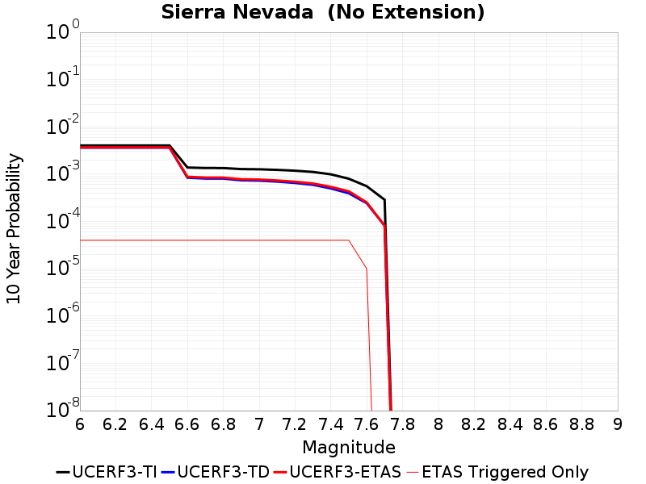 |

| Magnitude | 1 wk TI Prob | 1 wk TD Prob | 1 wk ETAS Prob | 1 wk ETAS/TD Gain | 1 wk ETAS Triggered Only | 1 mo TI Prob | 1 mo TD Prob | 1 mo ETAS Prob | 1 mo ETAS/TD Gain | 1 mo ETAS Triggered Only | 1 yr TI Prob | 1 yr TD Prob | 1 yr ETAS Prob | 1 yr ETAS/TD Gain | 1 yr ETAS Triggered Only | 10 yr TI Prob | 10 yr TD Prob | 10 yr ETAS Prob | 10 yr ETAS/TD Gain | 10 yr ETAS Triggered Only |
|-----|-----|-----|-----|-----|-----|-----|-----|-----|-----|-----|-----|-----|-----|-----|-----|-----|-----|-----|-----|-----|
| 6.0 | 7.7690465E-6 | 6.9790362E-6 | 6.9790362E-6 | 1.0 | 0.0 | 3.329549E-5 | 2.9910016E-5 | 3.9909715E-5 | 1.3343261 | 1.0E-5 | 4.0529718E-4 | 3.6412946E-4 | 3.941185E-4 | 1.0823582 | 3.0E-5 | 0.004045588 | 0.003638846 | 0.0037085915 | 1.0191668 | 7.0E-5 |
| 6.1 | 7.7690465E-6 | 6.9790362E-6 | 6.9790362E-6 | 1.0 | 0.0 | 3.329549E-5 | 2.9910016E-5 | 3.9909715E-5 | 1.3343261 | 1.0E-5 | 4.0529718E-4 | 3.6412946E-4 | 3.941185E-4 | 1.0823582 | 3.0E-5 | 0.004045588 | 0.003638846 | 0.0037085915 | 1.0191668 | 7.0E-5 |
| 6.2 | 7.7690465E-6 | 6.9790362E-6 | 6.9790362E-6 | 1.0 | 0.0 | 3.329549E-5 | 2.9910016E-5 | 3.9909715E-5 | 1.3343261 | 1.0E-5 | 4.0529718E-4 | 3.6412946E-4 | 3.941185E-4 | 1.0823582 | 3.0E-5 | 0.004045588 | 0.003638846 | 0.0037085915 | 1.0191668 | 7.0E-5 |
| 6.3 | 7.7690465E-6 | 6.9790362E-6 | 6.9790362E-6 | 1.0 | 0.0 | 3.329549E-5 | 2.9910016E-5 | 3.9909715E-5 | 1.3343261 | 1.0E-5 | 4.0529718E-4 | 3.6412946E-4 | 3.941185E-4 | 1.0823582 | 3.0E-5 | 0.004045588 | 0.003638846 | 0.0037085915 | 1.0191668 | 7.0E-5 |
| 6.4 | 7.7690465E-6 | 6.9790362E-6 | 6.9790362E-6 | 1.0 | 0.0 | 3.329549E-5 | 2.9910016E-5 | 3.9909715E-5 | 1.3343261 | 1.0E-5 | 4.0529718E-4 | 3.6412946E-4 | 3.941185E-4 | 1.0823582 | 3.0E-5 | 0.004045588 | 0.003638846 | 0.0037085915 | 1.0191668 | 7.0E-5 |
| 6.5 | 7.7690465E-6 | 6.9790362E-6 | 6.9790362E-6 | 1.0 | 0.0 | 3.329549E-5 | 2.9910016E-5 | 3.9909715E-5 | 1.3343261 | 1.0E-5 | 4.0529718E-4 | 3.6412946E-4 | 3.941185E-4 | 1.0823582 | 3.0E-5 | 0.004045588 | 0.003638846 | 0.0037085915 | 1.0191668 | 7.0E-5 |
| 6.6 | 2.653E-6 | 1.6160471E-6 | 1.6160471E-6 | 1.0 | 0.0 | 1.136995E-5 | 6.925898E-6 | 1.692583E-5 | 2.443846 | 1.0E-5 | 1.3842035E-4 | 8.431958E-5 | 1.1431705E-4 | 1.3557593 | 3.0E-5 | 0.0013833415 | 8.4287935E-4 | 9.1282034E-4 | 1.0829786 | 7.0E-5 |
| 6.7 | 2.5902466E-6 | 1.551369E-6 | 1.551369E-6 | 1.0 | 0.0 | 1.11010095E-5 | 6.6487078E-6 | 1.664864E-5 | 2.5040417 | 1.0E-5 | 1.351464E-4 | 8.0945036E-5 | 1.1094261E-4 | 1.3705919 | 3.0E-5 | 0.0013506424 | 8.0915855E-4 | 8.791019E-4 | 1.0864396 | 7.0E-5 |
| 6.8 | 2.5853892E-6 | 1.5481637E-6 | 1.5481637E-6 | 1.0 | 0.0 | 1.1080193E-5 | 6.6349708E-6 | 1.6634904E-5 | 2.5071557 | 1.0E-5 | 1.34893E-4 | 8.0777805E-5 | 1.1077538E-4 | 1.3713591 | 3.0E-5 | 0.0013481114 | 8.074874E-4 | 8.774309E-4 | 1.0866187 | 7.0E-5 |
| 6.9 | 2.458257E-6 | 1.4232111E-6 | 1.4232111E-6 | 1.0 | 0.0 | 1.0535345E-5 | 6.099462E-6 | 1.60994E-5 | 2.639479 | 1.0E-5 | 1.2826028E-4 | 7.425844E-5 | 1.0425621E-4 | 1.4039645 | 3.0E-5 | 0.0012818627 | 7.423382E-4 | 8.122863E-4 | 1.0942266 | 7.0E-5 |
| 7.0 | 2.4341468E-6 | 1.4001693E-6 | 1.4001693E-6 | 1.0 | 0.0 | 1.0432016E-5 | 6.0007114E-6 | 1.6000651E-5 | 2.666459 | 1.0E-5 | 1.270024E-4 | 7.305623E-5 | 1.0305404E-4 | 1.4106126 | 3.0E-5 | 0.0012692984 | 7.303241E-4 | 8.00273E-4 | 1.0957779 | 7.0E-5 |
| 7.1 | 2.3652476E-6 | 1.3351024E-6 | 1.3351024E-6 | 1.0 | 0.0 | 1.0136736E-5 | 5.721855E-6 | 1.5721798E-5 | 2.747675 | 1.0E-5 | 1.2340778E-4 | 6.966138E-5 | 9.9659286E-5 | 1.4306247 | 3.0E-5 | 0.0012333926 | 6.963971E-4 | 7.663483E-4 | 1.1004474 | 7.0E-5 |
| 7.2 | 2.272158E-6 | 1.2513823E-6 | 1.2513823E-6 | 1.0 | 0.0 | 9.737784E-6 | 5.363056E-6 | 1.5363003E-5 | 2.8645985 | 1.0E-5 | 1.1855107E-4 | 6.5293265E-5 | 9.529131E-5 | 1.4594355 | 3.0E-5 | 0.0011848784 | 6.5274234E-4 | 7.2269666E-4 | 1.1071699 | 7.0E-5 |
| 7.3 | 2.1382127E-6 | 1.1430354E-6 | 1.1430354E-6 | 1.0 | 0.0 | 9.163737E-6 | 4.898714E-6 | 1.48986655E-5 | 3.041342 | 1.0E-5 | 1.1156279E-4 | 5.9640224E-5 | 7.963903E-5 | 1.3353242 | 2.0E-5 | 0.001115068 | 5.9624336E-4 | 6.4621354E-4 | 1.0838084 | 5.0E-5 |
| 7.4 | 1.9048055E-6 | 9.585316E-7 | 9.585316E-7 | 1.0 | 0.0 | 8.163426E-6 | 4.107986E-6 | 1.41079445E-5 | 3.434273 | 1.0E-5 | 9.9385186E-5 | 5.0013587E-5 | 7.001259E-5 | 1.3998713 | 2.0E-5 | 9.934074E-4 | 5.00024E-4 | 5.49999E-4 | 1.0999452 | 5.0E-5 |
| 7.5 | 1.5373403E-6 | 7.568611E-7 | 7.568611E-7 | 1.0 | 0.0 | 6.5885843E-6 | 3.2436865E-6 | 1.3243654E-5 | 4.082902 | 1.0E-5 | 8.021306E-5 | 3.949117E-5 | 5.949038E-5 | 1.5064223 | 2.0E-5 | 8.0184115E-4 | 3.94842E-4 | 4.4482228E-4 | 1.126583 | 5.0E-5 |
| 7.6 | 1.0680322E-6 | 4.6657263E-7 | 4.6657263E-7 | 1.0 | 0.0 | 4.577273E-6 | 1.9995955E-6 | 1.9995955E-6 | 1.0 | 0.0 | 5.5726876E-5 | 2.4344807E-5 | 3.434456E-5 | 1.4107553 | 1.0E-5 | 5.5712904E-4 | 2.4342166E-4 | 2.7341436E-4 | 1.1232129 | 3.0E-5 |
| 7.7 | 5.509146E-7 | 1.561072E-7 | 1.561072E-7 | 1.0 | 0.0 | 2.3610605E-6 | 6.6903067E-7 | 6.6903067E-7 | 1.0 | 0.0 | 2.8745531E-5 | 8.145419E-6 | 8.145419E-6 | 1.0 | 0.0 | 2.8741814E-4 | 8.1451326E-5 | 8.1451326E-5 | 1.0 | 0.0 |

## Cady
*[(top)](#table-of-contents)*

| 1 Week | 1 Month | 1 Year | 10 Year |
|-----|-----|-----|-----|
|  |  | 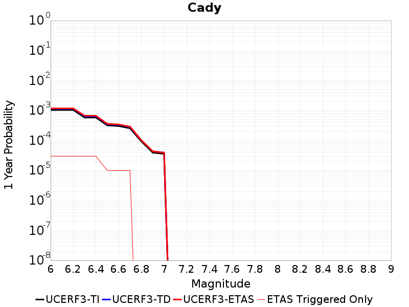 | 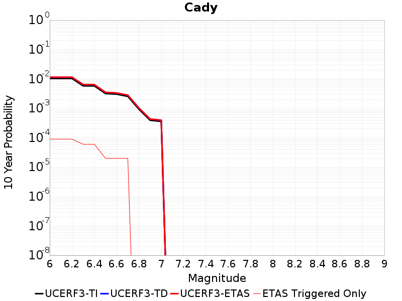 |

| Magnitude | 1 wk TI Prob | 1 wk TD Prob | 1 wk ETAS Prob | 1 wk ETAS/TD Gain | 1 wk ETAS Triggered Only | 1 mo TI Prob | 1 mo TD Prob | 1 mo ETAS Prob | 1 mo ETAS/TD Gain | 1 mo ETAS Triggered Only | 1 yr TI Prob | 1 yr TD Prob | 1 yr ETAS Prob | 1 yr ETAS/TD Gain | 1 yr ETAS Triggered Only | 10 yr TI Prob | 10 yr TD Prob | 10 yr ETAS Prob | 10 yr ETAS/TD Gain | 10 yr ETAS Triggered Only |
|-----|-----|-----|-----|-----|-----|-----|-----|-----|-----|-----|-----|-----|-----|-----|-----|-----|-----|-----|-----|-----|
| 6.0 | 1.9892565E-5 | 2.1871521E-5 | 2.1871521E-5 | 1.0 | 0.0 | 8.525106E-5 | 9.373224E-5 | 9.373224E-5 | 1.0 | 0.0 | 0.0010374374 | 0.0011406837 | 0.0011506722 | 1.0087566 | 1.0E-5 | 0.010326075 | 0.011357312 | 0.011436404 | 1.006964 | 8.0E-5 |
| 6.1 | 1.9892565E-5 | 2.1871521E-5 | 2.1871521E-5 | 1.0 | 0.0 | 8.525106E-5 | 9.373224E-5 | 9.373224E-5 | 1.0 | 0.0 | 0.0010374374 | 0.0011406837 | 0.0011506722 | 1.0087566 | 1.0E-5 | 0.010326075 | 0.011357312 | 0.011436404 | 1.006964 | 8.0E-5 |
| 6.2 | 1.9892565E-5 | 2.1871521E-5 | 2.1871521E-5 | 1.0 | 0.0 | 8.525106E-5 | 9.373224E-5 | 9.373224E-5 | 1.0 | 0.0 | 0.0010374374 | 0.0011406837 | 0.0011506722 | 1.0087566 | 1.0E-5 | 0.010326075 | 0.011357312 | 0.011436404 | 1.006964 | 8.0E-5 |
| 6.3 | 1.1117327E-5 | 1.2183453E-5 | 1.2183453E-5 | 1.0 | 0.0 | 4.764482E-5 | 5.221393E-5 | 5.221393E-5 | 1.0 | 0.0 | 5.7992124E-4 | 6.355507E-4 | 6.355507E-4 | 1.0 | 0.0 | 0.0057841022 | 0.006340441 | 0.0063503776 | 1.0015671 | 1.0E-5 |
| 6.4 | 1.1117327E-5 | 1.2183453E-5 | 1.2183453E-5 | 1.0 | 0.0 | 4.764482E-5 | 5.221393E-5 | 5.221393E-5 | 1.0 | 0.0 | 5.7992124E-4 | 6.355507E-4 | 6.355507E-4 | 1.0 | 0.0 | 0.0057841022 | 0.006340441 | 0.0063503776 | 1.0015671 | 1.0E-5 |
| 6.5 | 6.103093E-6 | 6.6757043E-6 | 6.6757043E-6 | 1.0 | 0.0 | 2.615585E-5 | 2.8609918E-5 | 2.8609918E-5 | 1.0 | 0.0 | 3.1840094E-4 | 3.4828266E-4 | 3.4828266E-4 | 1.0 | 0.0 | 0.0031794512 | 0.0034786034 | 0.0034786034 | 1.0 | 0.0 |
| 6.6 | 5.817237E-6 | 6.369212E-6 | 6.369212E-6 | 1.0 | 0.0 | 2.4930776E-5 | 2.7296408E-5 | 2.7296408E-5 | 1.0 | 0.0 | 3.034899E-4 | 3.3229555E-4 | 3.3229555E-4 | 1.0 | 0.0 | 0.0030307577 | 0.0033192101 | 0.0033192101 | 1.0 | 0.0 |
| 6.7 | 4.8846314E-6 | 5.34352E-6 | 5.34352E-6 | 1.0 | 0.0 | 2.0933967E-5 | 2.2900665E-5 | 2.2900665E-5 | 1.0 | 0.0 | 2.5484123E-4 | 2.7879173E-4 | 2.7879173E-4 | 1.0 | 0.0 | 0.0025454918 | 0.0027855765 | 0.0027855765 | 1.0 | 0.0 |
| 6.8 | 1.7788773E-6 | 1.9409479E-6 | 1.9409479E-6 | 1.0 | 0.0 | 7.6237375E-6 | 8.31833E-6 | 8.31833E-6 | 1.0 | 0.0 | 9.281505E-5 | 1.0127254E-4 | 1.0127254E-4 | 1.0 | 0.0 | 9.2776294E-4 | 0.0010124187 | 0.0010124187 | 1.0 | 0.0 |
| 6.9 | 7.5455404E-7 | 8.3019825E-7 | 8.3019825E-7 | 1.0 | 0.0 | 3.233799E-6 | 3.5579897E-6 | 3.5579897E-6 | 1.0 | 0.0 | 3.937079E-5 | 4.3318E-5 | 4.3318E-5 | 1.0 | 0.0 | 3.9363815E-4 | 4.3312853E-4 | 4.3312853E-4 | 1.0 | 0.0 |
| 7.0 | 6.8578805E-7 | 7.546267E-7 | 7.546267E-7 | 1.0 | 0.0 | 2.9390883E-6 | 3.2341122E-6 | 3.2341122E-6 | 1.0 | 0.0 | 3.578281E-5 | 3.9374936E-5 | 3.9374936E-5 | 1.0 | 0.0 | 3.577705E-4 | 3.937121E-4 | 3.937121E-4 | 1.0 | 0.0 |

## Death Valley (No)
*[(top)](#table-of-contents)*

| 1 Week | 1 Month | 1 Year | 10 Year |
|-----|-----|-----|-----|
|  |  |  |  |

| Magnitude | 1 wk TI Prob | 1 wk TD Prob | 1 wk ETAS Prob | 1 wk ETAS/TD Gain | 1 wk ETAS Triggered Only | 1 mo TI Prob | 1 mo TD Prob | 1 mo ETAS Prob | 1 mo ETAS/TD Gain | 1 mo ETAS Triggered Only | 1 yr TI Prob | 1 yr TD Prob | 1 yr ETAS Prob | 1 yr ETAS/TD Gain | 1 yr ETAS Triggered Only | 10 yr TI Prob | 10 yr TD Prob | 10 yr ETAS Prob | 10 yr ETAS/TD Gain | 10 yr ETAS Triggered Only |
|-----|-----|-----|-----|-----|-----|-----|-----|-----|-----|-----|-----|-----|-----|-----|-----|-----|-----|-----|-----|-----|
| 6.0 | 2.0074807E-5 | 2.2516248E-5 | 2.2516248E-5 | 1.0 | 0.0 | 8.603206E-5 | 9.6494674E-5 | 9.6494674E-5 | 1.0 | 0.0 | 0.001046937 | 0.001174197 | 0.0011941735 | 1.017013 | 2.0E-5 | 0.010420183 | 0.011680843 | 0.011759909 | 1.0067688 | 8.0E-5 |
| 6.1 | 2.0074807E-5 | 2.2516248E-5 | 2.2516248E-5 | 1.0 | 0.0 | 8.603206E-5 | 9.6494674E-5 | 9.6494674E-5 | 1.0 | 0.0 | 0.001046937 | 0.001174197 | 0.0011941735 | 1.017013 | 2.0E-5 | 0.010420183 | 0.011680843 | 0.011759909 | 1.0067688 | 8.0E-5 |
| 6.2 | 2.0074807E-5 | 2.2516248E-5 | 2.2516248E-5 | 1.0 | 0.0 | 8.603206E-5 | 9.6494674E-5 | 9.6494674E-5 | 1.0 | 0.0 | 0.001046937 | 0.001174197 | 0.0011941735 | 1.017013 | 2.0E-5 | 0.010420183 | 0.011680843 | 0.011759909 | 1.0067688 | 8.0E-5 |
| 6.3 | 1.9050609E-5 | 2.1352176E-5 | 2.1352176E-5 | 1.0 | 0.0 | 8.164292E-5 | 9.150616E-5 | 9.150616E-5 | 1.0 | 0.0 | 9.935491E-4 | 0.0011135249 | 0.0011335026 | 1.017941 | 2.0E-5 | 0.009891188 | 0.011080279 | 0.011159392 | 1.00714 | 8.0E-5 |
| 6.4 | 1.9050609E-5 | 2.1352176E-5 | 2.1352176E-5 | 1.0 | 0.0 | 8.164292E-5 | 9.150616E-5 | 9.150616E-5 | 1.0 | 0.0 | 9.935491E-4 | 0.0011135249 | 0.0011335026 | 1.017941 | 2.0E-5 | 0.009891188 | 0.011080279 | 0.011159392 | 1.00714 | 8.0E-5 |
| 6.5 | 1.8367004E-5 | 2.0575617E-5 | 2.0575617E-5 | 1.0 | 0.0 | 7.8713354E-5 | 8.8178276E-5 | 8.8178276E-5 | 1.0 | 0.0 | 9.5791375E-4 | 0.0010730483 | 0.0010930268 | 1.0186185 | 2.0E-5 | 0.009537951 | 0.010679458 | 0.010758604 | 1.007411 | 8.0E-5 |
| 6.6 | 1.779439E-5 | 1.9925017E-5 | 1.9925017E-5 | 1.0 | 0.0 | 7.625944E-5 | 8.539017E-5 | 8.539017E-5 | 1.0 | 0.0 | 9.280632E-4 | 0.0010391359 | 0.001059115 | 1.0192268 | 2.0E-5 | 0.009241969 | 0.010343529 | 0.010422702 | 1.0076543 | 8.0E-5 |
| 6.7 | 1.7025437E-5 | 1.9056853E-5 | 1.9056853E-5 | 1.0 | 0.0 | 7.296412E-5 | 8.166971E-5 | 8.166971E-5 | 1.0 | 0.0 | 8.87976E-4 | 9.938813E-4 | 0.0010138614 | 1.0201031 | 2.0E-5 | 0.008844362 | 0.0098950835 | 0.009974292 | 1.0080048 | 8.0E-5 |
| 6.8 | 1.6545107E-5 | 1.8525636E-5 | 1.8525636E-5 | 1.0 | 0.0 | 7.090568E-5 | 7.93932E-5 | 7.93932E-5 | 1.0 | 0.0 | 8.629347E-4 | 9.6618966E-4 | 9.861704E-4 | 1.0206798 | 2.0E-5 | 0.008595915 | 0.009620594 | 0.009699824 | 1.0082355 | 8.0E-5 |
| 6.9 | 1.615478E-5 | 1.8100454E-5 | 1.8100454E-5 | 1.0 | 0.0 | 6.9232934E-5 | 7.75711E-5 | 7.75711E-5 | 1.0 | 0.0 | 8.4258494E-4 | 9.4402506E-4 | 9.640062E-4 | 1.0211658 | 2.0E-5 | 0.008393973 | 0.009400844 | 0.009480092 | 1.0084299 | 8.0E-5 |
| 7.0 | 1.5894311E-5 | 1.7818267E-5 | 1.7818267E-5 | 1.0 | 0.0 | 6.81167E-5 | 7.636181E-5 | 7.636181E-5 | 1.0 | 0.0 | 8.2900526E-4 | 9.293145E-4 | 9.4929594E-4 | 1.0215012 | 2.0E-5 | 0.008259195 | 0.009254973 | 0.009334233 | 1.008564 | 8.0E-5 |
| 7.1 | 1.5602263E-5 | 1.7496022E-5 | 1.7496022E-5 | 1.0 | 0.0 | 6.6865134E-5 | 7.498083E-5 | 7.498083E-5 | 1.0 | 0.0 | 8.137789E-4 | 9.1251533E-4 | 9.324971E-4 | 1.0218974 | 2.0E-5 | 0.008108052 | 0.009088368 | 0.0091676405 | 1.0087224 | 8.0E-5 |
| 7.2 | 1.5323829E-5 | 1.7182918E-5 | 1.7182918E-5 | 1.0 | 0.0 | 6.56719E-5 | 7.3639036E-5 | 7.3639036E-5 | 1.0 | 0.0 | 7.99262E-4 | 8.9619256E-4 | 9.161746E-4 | 1.0222967 | 2.0E-5 | 0.007963934 | 0.008926462 | 0.009005749 | 1.0088822 | 8.0E-5 |
| 7.3 | 1.4556212E-5 | 1.631407E-5 | 1.631407E-5 | 1.0 | 0.0 | 6.238227E-5 | 6.99156E-5 | 6.99156E-5 | 1.0 | 0.0 | 7.592395E-4 | 8.508959E-4 | 8.7087887E-4 | 1.0234846 | 2.0E-5 | 0.0075665074 | 0.008477024 | 0.008556346 | 1.0093573 | 8.0E-5 |
| 7.4 | 1.411725E-5 | 1.5819203E-5 | 1.5819203E-5 | 1.0 | 0.0 | 6.0501097E-5 | 6.7794856E-5 | 6.7794856E-5 | 1.0 | 0.0 | 7.363519E-4 | 8.250956E-4 | 8.450791E-4 | 1.0242196 | 2.0E-5 | 0.0073391674 | 0.008220958 | 0.008290382 | 1.0084448 | 7.0E-5 |
| 7.5 | 1.3503312E-5 | 1.5137081E-5 | 1.5137081E-5 | 1.0 | 0.0 | 5.7870053E-5 | 6.487163E-5 | 6.487163E-5 | 1.0 | 0.0 | 7.043401E-4 | 7.895317E-4 | 8.095159E-4 | 1.0253115 | 2.0E-5 | 0.007021119 | 0.007867892 | 0.007937342 | 1.008827 | 7.0E-5 |
| 7.6 | 1.1279839E-5 | 1.26352725E-5 | 1.26352725E-5 | 1.0 | 0.0 | 4.834127E-5 | 5.4150074E-5 | 5.4150074E-5 | 1.0 | 0.0 | 5.88396E-4 | 6.59083E-4 | 6.7906984E-4 | 1.0303252 | 2.0E-5 | 0.005868405 | 0.0065718363 | 0.0066413763 | 1.0105815 | 7.0E-5 |
| 7.7 | 9.189108E-6 | 1.0290627E-5 | 1.0290627E-5 | 1.0 | 0.0 | 3.93813E-5 | 4.410197E-5 | 4.410197E-5 | 1.0 | 0.0 | 4.7936183E-4 | 5.368143E-4 | 5.5680354E-4 | 1.0372368 | 2.0E-5 | 0.004783291 | 0.0053556873 | 0.005425312 | 1.0130002 | 7.0E-5 |
| 7.8 | 3.4586725E-7 | 3.6494507E-7 | 3.6494507E-7 | 1.0 | 0.0 | 1.4822873E-6 | 1.5640494E-6 | 1.5640494E-6 | 1.0 | 0.0 | 1.80467E-5 | 1.904214E-5 | 1.904214E-5 | 1.0 | 0.0 | 1.8045233E-4 | 1.9040552E-4 | 2.004036E-4 | 1.0525094 | 1.0E-5 |
| 7.9 | 2.5591178E-9 | 2.670354E-9 | 2.670354E-9 | 1.0 | 0.0 | 1.0967647E-8 | 1.1444374E-8 | 1.1444374E-8 | 1.0 | 0.0 | 1.335311E-7 | 1.3933526E-7 | 1.3933526E-7 | 1.0 | 0.0 | 1.3353102E-6 | 1.3933526E-6 | 1.3933526E-6 | 1.0 | 0.0 |

## White Wolf (Extension)
*[(top)](#table-of-contents)*

| 1 Week | 1 Month | 1 Year | 10 Year |
|-----|-----|-----|-----|
|  |  |  | 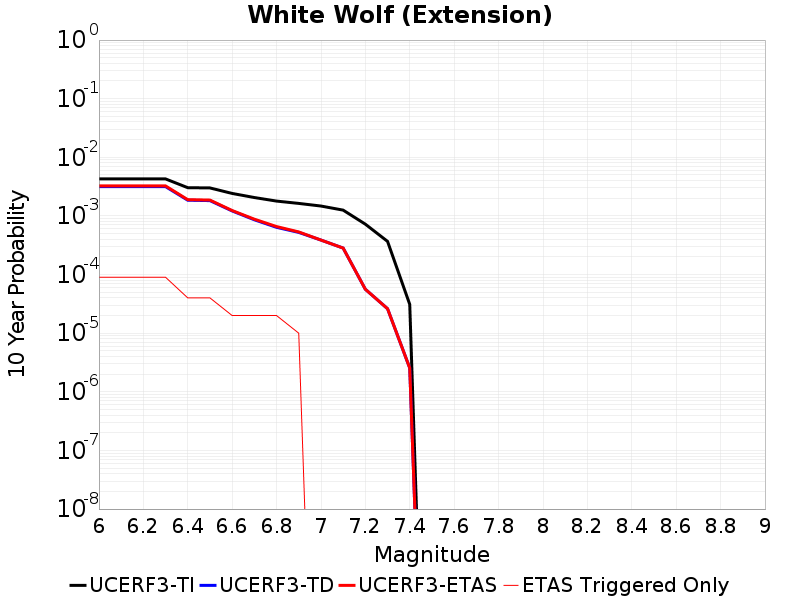 |

| Magnitude | 1 wk TI Prob | 1 wk TD Prob | 1 wk ETAS Prob | 1 wk ETAS/TD Gain | 1 wk ETAS Triggered Only | 1 mo TI Prob | 1 mo TD Prob | 1 mo ETAS Prob | 1 mo ETAS/TD Gain | 1 mo ETAS Triggered Only | 1 yr TI Prob | 1 yr TD Prob | 1 yr ETAS Prob | 1 yr ETAS/TD Gain | 1 yr ETAS Triggered Only | 10 yr TI Prob | 10 yr TD Prob | 10 yr ETAS Prob | 10 yr ETAS/TD Gain | 10 yr ETAS Triggered Only |
|-----|-----|-----|-----|-----|-----|-----|-----|-----|-----|-----|-----|-----|-----|-----|-----|-----|-----|-----|-----|-----|
| 6.0 | 8.222555E-6 | 6.06843E-6 | 6.06843E-6 | 1.0 | 0.0 | 3.5239045E-5 | 2.6007336E-5 | 2.6007336E-5 | 1.0 | 0.0 | 4.289509E-4 | 3.1659994E-4 | 3.2659678E-4 | 1.0315756 | 1.0E-5 | 0.0042812387 | 0.0031621412 | 0.0032418882 | 1.0252193 | 8.0E-5 |
| 6.1 | 8.222555E-6 | 6.06843E-6 | 6.06843E-6 | 1.0 | 0.0 | 3.5239045E-5 | 2.6007336E-5 | 2.6007336E-5 | 1.0 | 0.0 | 4.289509E-4 | 3.1659994E-4 | 3.2659678E-4 | 1.0315756 | 1.0E-5 | 0.0042812387 | 0.0031621412 | 0.0032418882 | 1.0252193 | 8.0E-5 |
| 6.2 | 8.222555E-6 | 6.06843E-6 | 6.06843E-6 | 1.0 | 0.0 | 3.5239045E-5 | 2.6007336E-5 | 2.6007336E-5 | 1.0 | 0.0 | 4.289509E-4 | 3.1659994E-4 | 3.2659678E-4 | 1.0315756 | 1.0E-5 | 0.0042812387 | 0.0031621412 | 0.0032418882 | 1.0252193 | 8.0E-5 |
| 6.3 | 8.222555E-6 | 6.06843E-6 | 6.06843E-6 | 1.0 | 0.0 | 3.5239045E-5 | 2.6007336E-5 | 2.6007336E-5 | 1.0 | 0.0 | 4.289509E-4 | 3.1659994E-4 | 3.2659678E-4 | 1.0315756 | 1.0E-5 | 0.0042812387 | 0.0031621412 | 0.0032418882 | 1.0252193 | 8.0E-5 |
| 6.4 | 5.821773E-6 | 3.5582684E-6 | 3.5582684E-6 | 1.0 | 0.0 | 2.4950215E-5 | 1.5249639E-5 | 1.5249639E-5 | 1.0 | 0.0 | 3.0372653E-4 | 1.8564962E-4 | 1.8564962E-4 | 1.0 | 0.0 | 0.0030331176 | 0.0018550538 | 0.0019149425 | 1.032284 | 6.0E-5 |
| 6.5 | 5.766023E-6 | 3.500188E-6 | 3.500188E-6 | 1.0 | 0.0 | 2.4711293E-5 | 1.5000726E-5 | 1.5000726E-5 | 1.0 | 0.0 | 3.0081844E-4 | 1.8261964E-4 | 1.8261964E-4 | 1.0 | 0.0 | 0.0030041158 | 0.0018248039 | 0.0018846944 | 1.0328202 | 6.0E-5 |
| 6.6 | 4.643576E-6 | 2.3334308E-6 | 2.3334308E-6 | 1.0 | 0.0 | 1.9900888E-5 | 1.0000382E-5 | 1.0000382E-5 | 1.0 | 0.0 | 2.4226638E-4 | 1.2174828E-4 | 1.2174828E-4 | 1.0 | 0.0 | 0.0024200242 | 0.0012168583 | 0.0012568096 | 1.0328315 | 4.0E-5 |
| 6.7 | 3.9529173E-6 | 1.6489912E-6 | 1.6489912E-6 | 1.0 | 0.0 | 1.6940963E-5 | 7.067087E-6 | 7.067087E-6 | 1.0 | 0.0 | 2.0623671E-4 | 8.603858E-5 | 8.603858E-5 | 1.0 | 0.0 | 0.002060454 | 8.6007116E-4 | 8.8005397E-4 | 1.0232339 | 2.0E-5 |
| 6.8 | 3.4377522E-6 | 1.2250545E-6 | 1.2250545E-6 | 1.0 | 0.0 | 1.473314E-5 | 5.2502232E-6 | 5.2502232E-6 | 1.0 | 0.0 | 1.7936122E-4 | 6.391969E-5 | 6.391969E-5 | 1.0 | 0.0 | 0.0017921652 | 6.3902215E-4 | 6.590094E-4 | 1.0312778 | 2.0E-5 |
| 6.9 | 3.1367306E-6 | 1.0038439E-6 | 1.0038439E-6 | 1.0 | 0.0 | 1.3443062E-5 | 4.3021814E-6 | 4.3021814E-6 | 1.0 | 0.0 | 1.63657E-4 | 5.2377876E-5 | 5.2377876E-5 | 1.0 | 0.0 | 0.0016353652 | 5.2366295E-4 | 5.2366295E-4 | 1.0 | 0.0 |
| 7.0 | 2.8298145E-6 | 7.432667E-7 | 7.432667E-7 | 1.0 | 0.0 | 1.2127721E-5 | 3.185425E-6 | 3.185425E-6 | 1.0 | 0.0 | 1.47645E-4 | 3.878191E-5 | 3.878191E-5 | 1.0 | 0.0 | 0.0014754693 | 3.8775642E-4 | 3.8775642E-4 | 1.0 | 0.0 |
| 7.1 | 2.4091064E-6 | 5.425965E-7 | 5.425965E-7 | 1.0 | 0.0 | 1.03247E-5 | 2.325412E-6 | 2.325412E-6 | 1.0 | 0.0 | 1.2569598E-4 | 2.8311564E-5 | 2.8311564E-5 | 1.0 | 0.0 | 0.001256249 | 2.8308362E-4 | 2.8308362E-4 | 1.0 | 0.0 |
| 7.2 | 1.3875518E-6 | 1.07579744E-7 | 1.07579744E-7 | 1.0 | 0.0 | 5.9466374E-6 | 4.6105598E-7 | 4.6105598E-7 | 1.0 | 0.0 | 7.23979E-5 | 5.613343E-6 | 5.613343E-6 | 1.0 | 0.0 | 7.2374323E-4 | 5.613213E-5 | 5.613213E-5 | 1.0 | 0.0 |
| 7.3 | 7.056077E-7 | 5.010799E-8 | 5.010799E-8 | 1.0 | 0.0 | 3.0240296E-6 | 2.1474851E-7 | 2.1474851E-7 | 1.0 | 0.0 | 3.681694E-5 | 2.6145606E-6 | 2.6145606E-6 | 1.0 | 0.0 | 3.681084E-4 | 2.6145344E-5 | 2.6145344E-5 | 1.0 | 0.0 |
| 7.4 | 5.9334678E-8 | 4.879923E-9 | 4.879923E-9 | 1.0 | 0.0 | 2.5429145E-7 | 2.0913955E-8 | 2.0913955E-8 | 1.0 | 0.0 | 3.095994E-6 | 2.546274E-7 | 2.546274E-7 | 1.0 | 0.0 | 3.095951E-5 | 2.546272E-6 | 2.546272E-6 | 1.0 | 0.0 |

## Death Valley (Fish Lake Valley)
*[(top)](#table-of-contents)*

| 1 Week | 1 Month | 1 Year | 10 Year |
|-----|-----|-----|-----|
|  | 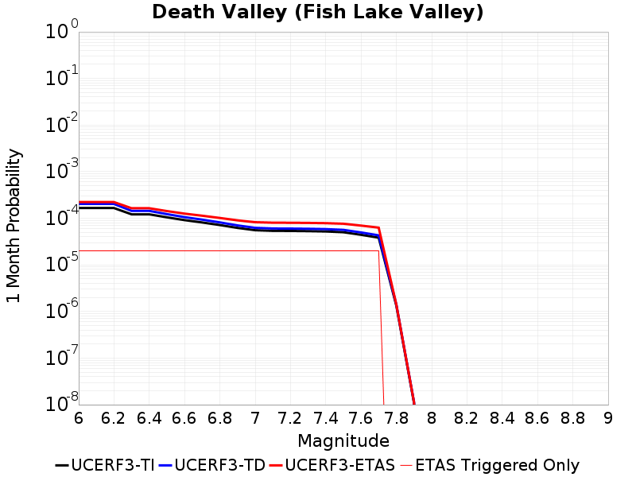 |  |  |

| Magnitude | 1 wk TI Prob | 1 wk TD Prob | 1 wk ETAS Prob | 1 wk ETAS/TD Gain | 1 wk ETAS Triggered Only | 1 mo TI Prob | 1 mo TD Prob | 1 mo ETAS Prob | 1 mo ETAS/TD Gain | 1 mo ETAS Triggered Only | 1 yr TI Prob | 1 yr TD Prob | 1 yr ETAS Prob | 1 yr ETAS/TD Gain | 1 yr ETAS Triggered Only | 10 yr TI Prob | 10 yr TD Prob | 10 yr ETAS Prob | 10 yr ETAS/TD Gain | 10 yr ETAS Triggered Only |
|-----|-----|-----|-----|-----|-----|-----|-----|-----|-----|-----|-----|-----|-----|-----|-----|-----|-----|-----|-----|-----|
| 6.0 | 3.872328E-5 | 4.732798E-5 | 4.732798E-5 | 1.0 | 0.0 | 1.6594635E-4 | 2.028188E-4 | 2.028188E-4 | 1.0 | 0.0 | 0.0020185246 | 0.0024667827 | 0.0024867333 | 1.0080878 | 2.0E-5 | 0.02000288 | 0.02441976 | 0.024497807 | 1.003196 | 8.0E-5 |
| 6.1 | 3.872328E-5 | 4.732798E-5 | 4.732798E-5 | 1.0 | 0.0 | 1.6594635E-4 | 2.028188E-4 | 2.028188E-4 | 1.0 | 0.0 | 0.0020185246 | 0.0024667827 | 0.0024867333 | 1.0080878 | 2.0E-5 | 0.02000288 | 0.02441976 | 0.024497807 | 1.003196 | 8.0E-5 |
| 6.2 | 3.872328E-5 | 4.732798E-5 | 4.732798E-5 | 1.0 | 0.0 | 1.6594635E-4 | 2.028188E-4 | 2.028188E-4 | 1.0 | 0.0 | 0.0020185246 | 0.0024667827 | 0.0024867333 | 1.0080878 | 2.0E-5 | 0.02000288 | 0.02441976 | 0.024497807 | 1.003196 | 8.0E-5 |
| 6.3 | 2.8356371E-5 | 3.3647055E-5 | 3.3647055E-5 | 1.0 | 0.0 | 1.2152165E-4 | 1.4419408E-4 | 1.4419408E-4 | 1.0 | 0.0 | 0.0014785219 | 0.0017542201 | 0.001774185 | 1.011381 | 2.0E-5 | 0.014687235 | 0.017410899 | 0.017489506 | 1.0045148 | 8.0E-5 |
| 6.4 | 2.8356371E-5 | 3.3647055E-5 | 3.3647055E-5 | 1.0 | 0.0 | 1.2152165E-4 | 1.4419408E-4 | 1.4419408E-4 | 1.0 | 0.0 | 0.0014785219 | 0.0017542201 | 0.001774185 | 1.011381 | 2.0E-5 | 0.014687235 | 0.017410899 | 0.017489506 | 1.0045148 | 8.0E-5 |
| 6.5 | 2.4448687E-5 | 2.8636741E-5 | 2.8636741E-5 | 1.0 | 0.0 | 1.0477588E-4 | 1.227234E-4 | 1.227234E-4 | 1.0 | 0.0 | 0.0012748998 | 0.0014931804 | 0.0015131506 | 1.0133742 | 2.0E-5 | 0.012676105 | 0.01483637 | 0.014915183 | 1.0053122 | 8.0E-5 |
| 6.6 | 2.1298161E-5 | 2.4683375E-5 | 2.4683375E-5 | 1.0 | 0.0 | 9.127464E-5 | 1.057818E-4 | 1.057818E-4 | 1.0 | 0.0 | 0.0011107022 | 0.0012871657 | 0.0013071399 | 1.0155181 | 2.0E-5 | 0.011051672 | 0.012800536 | 0.012879512 | 1.0061698 | 8.0E-5 |
| 6.7 | 1.8959729E-5 | 2.180041E-5 | 2.180041E-5 | 1.0 | 0.0 | 8.125345E-5 | 9.342712E-5 | 9.342712E-5 | 1.0 | 0.0 | 9.888117E-4 | 0.0011369073 | 0.0011568846 | 1.0175716 | 2.0E-5 | 0.009844234 | 0.011313576 | 0.011392671 | 1.0069911 | 8.0E-5 |
| 6.8 | 1.6691629E-5 | 1.9034165E-5 | 1.9034165E-5 | 1.0 | 0.0 | 7.153359E-5 | 8.1572536E-5 | 8.1572536E-5 | 1.0 | 0.0 | 8.7057345E-4 | 9.9271E-4 | 0.0010126901 | 1.0201268 | 2.0E-5 | 0.008671708 | 0.009884517 | 0.009953825 | 1.0070118 | 7.0E-5 |
| 6.9 | 1.450505E-5 | 1.6402204E-5 | 1.6402204E-5 | 1.0 | 0.0 | 6.216302E-5 | 7.029331E-5 | 7.029331E-5 | 1.0 | 0.0 | 7.5657194E-4 | 8.554939E-4 | 8.7547675E-4 | 1.0233583 | 2.0E-5 | 0.007540013 | 0.008522939 | 0.008592342 | 1.0081432 | 7.0E-5 |
| 7.0 | 1.2940855E-5 | 1.454862E-5 | 1.454862E-5 | 1.0 | 0.0 | 5.545963E-5 | 6.2349776E-5 | 6.2349776E-5 | 1.0 | 0.0 | 6.750118E-4 | 7.588499E-4 | 7.7883474E-4 | 1.0263357 | 2.0E-5 | 0.006729651 | 0.0075632054 | 0.0076326756 | 1.0091853 | 7.0E-5 |
| 7.1 | 1.2544658E-5 | 1.4088419E-5 | 1.4088419E-5 | 1.0 | 0.0 | 5.3761712E-5 | 6.0377573E-5 | 6.0377573E-5 | 1.0 | 0.0 | 6.5435225E-4 | 7.3485466E-4 | 7.5484E-4 | 1.0271963 | 2.0E-5 | 0.006524288 | 0.0073248413 | 0.0073943282 | 1.0094866 | 7.0E-5 |
| 7.2 | 1.2489416E-5 | 1.4025837E-5 | 1.4025837E-5 | 1.0 | 0.0 | 5.3524967E-5 | 6.0109378E-5 | 6.0109378E-5 | 1.0 | 0.0 | 6.514716E-4 | 7.3159154E-4 | 7.515769E-4 | 1.0273176 | 2.0E-5 | 0.006495651 | 0.007292425 | 0.0073619145 | 1.009529 | 7.0E-5 |
| 7.3 | 1.2368307E-5 | 1.3889876E-5 | 1.3889876E-5 | 1.0 | 0.0 | 5.3005948E-5 | 5.9526716E-5 | 5.9526716E-5 | 1.0 | 0.0 | 6.451563E-4 | 7.245024E-4 | 7.4448786E-4 | 1.0275851 | 2.0E-5 | 0.0064328653 | 0.007221996 | 0.00729149 | 1.0096226 | 7.0E-5 |
| 7.4 | 1.2161707E-5 | 1.3657762E-5 | 1.3657762E-5 | 1.0 | 0.0 | 5.212056E-5 | 5.8531983E-5 | 5.8531983E-5 | 1.0 | 0.0 | 6.3438306E-4 | 7.123995E-4 | 7.3238526E-4 | 1.0280541 | 2.0E-5 | 0.006325751 | 0.007101747 | 0.0071712504 | 1.0097867 | 7.0E-5 |
| 7.5 | 1.1707948E-5 | 1.3155086E-5 | 1.3155086E-5 | 1.0 | 0.0 | 5.0175953E-5 | 5.6377754E-5 | 5.6377754E-5 | 1.0 | 0.0 | 6.10721E-4 | 6.861886E-4 | 7.061748E-4 | 1.0291265 | 2.0E-5 | 0.0060904534 | 0.006841282 | 0.006910803 | 1.010162 | 7.0E-5 |
| 7.6 | 1.0319538E-5 | 1.1588002E-5 | 1.1588002E-5 | 1.0 | 0.0 | 4.4225842E-5 | 4.966195E-5 | 4.966195E-5 | 1.0 | 0.0 | 5.383166E-4 | 6.0447166E-4 | 6.244596E-4 | 1.0330667 | 2.0E-5 | 0.0053701443 | 0.0060288073 | 0.0060983854 | 1.0115409 | 7.0E-5 |
| 7.7 | 8.937764E-6 | 1.0029991E-5 | 1.0029991E-5 | 1.0 | 0.0 | 3.830414E-5 | 4.2984997E-5 | 4.2984997E-5 | 1.0 | 0.0 | 4.6625308E-4 | 5.2322174E-4 | 5.4321124E-4 | 1.0382047 | 2.0E-5 | 0.0046527605 | 0.0052204086 | 0.005290043 | 1.0133389 | 7.0E-5 |
| 7.8 | 3.108007E-7 | 3.285764E-7 | 3.285764E-7 | 1.0 | 0.0 | 1.3320023E-6 | 1.4081838E-6 | 1.4081838E-6 | 1.0 | 0.0 | 1.6217007E-5 | 1.7144506E-5 | 1.7144506E-5 | 1.0 | 0.0 | 1.6215823E-4 | 1.7143223E-4 | 1.814305E-4 | 1.0583221 | 1.0E-5 |
| 7.9 | 2.5591178E-9 | 2.670354E-9 | 2.670354E-9 | 1.0 | 0.0 | 1.0967647E-8 | 1.1444374E-8 | 1.1444374E-8 | 1.0 | 0.0 | 1.335311E-7 | 1.3933526E-7 | 1.3933526E-7 | 1.0 | 0.0 | 1.3353102E-6 | 1.3933526E-6 | 1.3933526E-6 | 1.0 | 0.0 |

## San Andreas (Carrizo) rev
*[(top)](#table-of-contents)*

| 1 Week | 1 Month | 1 Year | 10 Year |
|-----|-----|-----|-----|
|  |  | 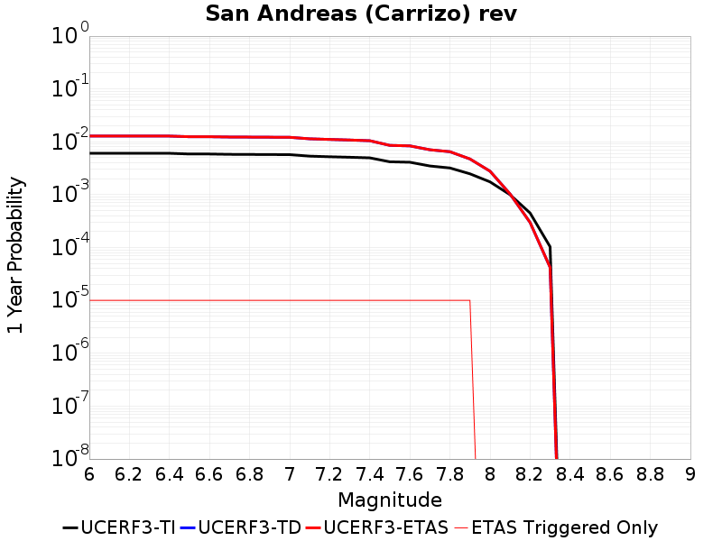 |  |

| Magnitude | 1 wk TI Prob | 1 wk TD Prob | 1 wk ETAS Prob | 1 wk ETAS/TD Gain | 1 wk ETAS Triggered Only | 1 mo TI Prob | 1 mo TD Prob | 1 mo ETAS Prob | 1 mo ETAS/TD Gain | 1 mo ETAS Triggered Only | 1 yr TI Prob | 1 yr TD Prob | 1 yr ETAS Prob | 1 yr ETAS/TD Gain | 1 yr ETAS Triggered Only | 10 yr TI Prob | 10 yr TD Prob | 10 yr ETAS Prob | 10 yr ETAS/TD Gain | 10 yr ETAS Triggered Only |
|-----|-----|-----|-----|-----|-----|-----|-----|-----|-----|-----|-----|-----|-----|-----|-----|-----|-----|-----|-----|-----|
| 6.0 | 1.1674632E-4 | 2.4755814E-4 | 2.4755814E-4 | 1.0 | 0.0 | 5.002454E-4 | 0.0010605337 | 0.0010605337 | 1.0 | 0.0 | 0.006073493 | 0.012836055 | 0.012855798 | 1.0015382 | 2.0E-5 | 0.0591016 | 0.122454986 | 0.12252519 | 1.0005733 | 8.0E-5 |
| 6.1 | 1.1674632E-4 | 2.4755814E-4 | 2.4755814E-4 | 1.0 | 0.0 | 5.002454E-4 | 0.0010605337 | 0.0010605337 | 1.0 | 0.0 | 0.006073493 | 0.012836055 | 0.012855798 | 1.0015382 | 2.0E-5 | 0.0591016 | 0.122454986 | 0.12252519 | 1.0005733 | 8.0E-5 |
| 6.2 | 1.1674632E-4 | 2.4755814E-4 | 2.4755814E-4 | 1.0 | 0.0 | 5.002454E-4 | 0.0010605337 | 0.0010605337 | 1.0 | 0.0 | 0.006073493 | 0.012836055 | 0.012855798 | 1.0015382 | 2.0E-5 | 0.0591016 | 0.122454986 | 0.12252519 | 1.0005733 | 8.0E-5 |
| 6.3 | 1.1674632E-4 | 2.4755814E-4 | 2.4755814E-4 | 1.0 | 0.0 | 5.002454E-4 | 0.0010605337 | 0.0010605337 | 1.0 | 0.0 | 0.006073493 | 0.012836055 | 0.012855798 | 1.0015382 | 2.0E-5 | 0.0591016 | 0.122454986 | 0.12252519 | 1.0005733 | 8.0E-5 |
| 6.4 | 1.1674632E-4 | 2.4755814E-4 | 2.4755814E-4 | 1.0 | 0.0 | 5.002454E-4 | 0.0010605337 | 0.0010605337 | 1.0 | 0.0 | 0.006073493 | 0.012836055 | 0.012855798 | 1.0015382 | 2.0E-5 | 0.0591016 | 0.122454986 | 0.12252519 | 1.0005733 | 8.0E-5 |
| 6.5 | 1.13136164E-4 | 2.407396E-4 | 2.407396E-4 | 1.0 | 0.0 | 4.847792E-4 | 0.0010313347 | 0.0010313347 | 1.0 | 0.0 | 0.0058862255 | 0.012484673 | 0.012504423 | 1.0015819 | 2.0E-5 | 0.057327334 | 0.11941853 | 0.11948898 | 1.00059 | 8.0E-5 |
| 6.6 | 1.13136164E-4 | 2.407396E-4 | 2.407396E-4 | 1.0 | 0.0 | 4.847792E-4 | 0.0010313347 | 0.0010313347 | 1.0 | 0.0 | 0.0058862255 | 0.012484673 | 0.012504423 | 1.0015819 | 2.0E-5 | 0.057327334 | 0.11941853 | 0.11948898 | 1.00059 | 8.0E-5 |
| 6.7 | 1.1149675E-4 | 2.3764331E-4 | 2.3764331E-4 | 1.0 | 0.0 | 4.777557E-4 | 0.0010180754 | 0.0010180754 | 1.0 | 0.0 | 0.0058011734 | 0.0123250745 | 0.012344829 | 1.0016026 | 2.0E-5 | 0.05652051 | 0.11803604 | 0.118106596 | 1.0005977 | 8.0E-5 |
| 6.8 | 1.1103589E-4 | 2.3665975E-4 | 2.3665975E-4 | 1.0 | 0.0 | 4.7578133E-4 | 0.0010138634 | 0.0010138634 | 1.0 | 0.0 | 0.005777263 | 0.012274372 | 0.012294127 | 1.0016094 | 2.0E-5 | 0.056293584 | 0.11759543 | 0.11766602 | 1.0006003 | 8.0E-5 |
| 6.9 | 1.1053259E-4 | 2.3557778E-4 | 2.3557778E-4 | 1.0 | 0.0 | 4.7362508E-4 | 0.0010092299 | 0.0010092299 | 1.0 | 0.0 | 0.0057511497 | 0.0122185955 | 0.012238351 | 1.0016168 | 2.0E-5 | 0.05604569 | 0.11711057 | 0.117181204 | 1.0006031 | 8.0E-5 |
| 7.0 | 1.1005377E-4 | 2.3458088E-4 | 2.3458088E-4 | 1.0 | 0.0 | 4.7157376E-4 | 0.0010049609 | 0.0010049609 | 1.0 | 0.0 | 0.0057263062 | 0.0121672 | 0.012186957 | 1.0016237 | 2.0E-5 | 0.055809796 | 0.1166614 | 0.11673206 | 1.0006057 | 8.0E-5 |
| 7.1 | 1.0308142E-4 | 2.1959734E-4 | 2.1959734E-4 | 1.0 | 0.0 | 4.417027E-4 | 9.407931E-4 | 9.407931E-4 | 1.0 | 0.0 | 0.0053644776 | 0.0113943275 | 0.0114141 | 1.0017352 | 2.0E-5 | 0.052368138 | 0.109900214 | 0.10997142 | 1.0006479 | 8.0E-5 |
| 7.2 | 1.0027479E-4 | 2.1364357E-4 | 2.1364357E-4 | 1.0 | 0.0 | 4.296783E-4 | 9.1529504E-4 | 9.1529504E-4 | 1.0 | 0.0 | 0.0052187922 | 0.011087088 | 0.011106866 | 1.0017838 | 2.0E-5 | 0.050979212 | 0.107195795 | 0.10726722 | 1.0006663 | 8.0E-5 |
| 7.3 | 9.816942E-5 | 2.0833798E-4 | 2.0833798E-4 | 1.0 | 0.0 | 4.2065824E-4 | 8.9257257E-4 | 8.9257257E-4 | 1.0 | 0.0 | 0.005109493 | 0.010813221 | 0.010833005 | 1.0018296 | 2.0E-5 | 0.049935985 | 0.104762085 | 0.1048337 | 1.0006837 | 8.0E-5 |
| 7.4 | 9.5634205E-5 | 2.0195961E-4 | 2.0195961E-4 | 1.0 | 0.0 | 4.0979648E-4 | 8.65255E-4 | 8.65255E-4 | 1.0 | 0.0 | 0.0049778637 | 0.01048387 | 0.010503661 | 1.0018877 | 2.0E-5 | 0.048678253 | 0.10182026 | 0.10189211 | 1.0007057 | 8.0E-5 |
| 7.5 | 8.052417E-5 | 1.6468097E-4 | 1.6468097E-4 | 1.0 | 0.0 | 3.4505792E-4 | 7.055848E-4 | 7.055848E-4 | 1.0 | 0.0 | 0.0041929903 | 0.008556744 | 0.008566659 | 1.0011587 | 1.0E-5 | 0.04114753 | 0.08439002 | 0.08444496 | 1.000651 | 6.0E-5 |
| 7.6 | 7.897024E-5 | 1.6116911E-4 | 1.6116911E-4 | 1.0 | 0.0 | 3.384E-4 | 6.905421E-4 | 6.905421E-4 | 1.0 | 0.0 | 0.0041122385 | 0.008375022 | 0.008384937 | 1.001184 | 1.0E-5 | 0.040369697 | 0.08271508 | 0.08277012 | 1.0006654 | 6.0E-5 |
| 7.7 | 6.707427E-5 | 1.3592766E-4 | 1.3592766E-4 | 1.0 | 0.0 | 2.8742946E-4 | 5.824171E-4 | 5.824171E-4 | 1.0 | 0.0 | 0.003493839 | 0.0070679085 | 0.0070778383 | 1.0014049 | 1.0E-5 | 0.034394164 | 0.07048497 | 0.07052216 | 1.0005275 | 4.0E-5 |
| 7.8 | 6.147705E-5 | 1.2484241E-4 | 1.2484241E-4 | 1.0 | 0.0 | 2.6344648E-4 | 5.349292E-4 | 5.349292E-4 | 1.0 | 0.0 | 0.0032027436 | 0.0064933416 | 0.006503277 | 1.00153 | 1.0E-5 | 0.031569764 | 0.06482214 | 0.06485954 | 1.0005771 | 4.0E-5 |
| 7.9 | 4.7636717E-5 | 9.087419E-5 | 9.087419E-5 | 1.0 | 0.0 | 2.0414138E-4 | 3.8940273E-4 | 3.8940273E-4 | 1.0 | 0.0 | 0.0024825884 | 0.0047306805 | 0.0047306805 | 1.0 | 0.0 | 0.024550365 | 0.047604132 | 0.047613654 | 1.0002 | 1.0E-5 |
| 8.0 | 3.3554235E-5 | 5.3420623E-5 | 5.3420623E-5 | 1.0 | 0.0 | 1.4379594E-4 | 2.2892543E-4 | 2.2892543E-4 | 1.0 | 0.0 | 0.0017493097 | 0.0027836068 | 0.0027836068 | 1.0 | 0.0 | 0.017356034 | 0.028511899 | 0.028511899 | 1.0 | 0.0 |
| 8.1 | 1.9175432E-5 | 1.980985E-5 | 1.980985E-5 | 1.0 | 0.0 | 8.217783E-5 | 8.48966E-5 | 8.48966E-5 | 1.0 | 0.0 | 0.0010000558 | 0.0010331266 | 0.0010331266 | 1.0 | 0.0 | 0.009955673 | 0.011085294 | 0.011085294 | 1.0 | 0.0 |
| 8.2 | 8.643924E-6 | 5.7090024E-6 | 5.7090024E-6 | 1.0 | 0.0 | 3.704486E-5 | 2.4466923E-5 | 2.4466923E-5 | 1.0 | 0.0 | 4.5092785E-4 | 2.9784418E-4 | 2.9784418E-4 | 1.0 | 0.0 | 0.0045001395 | 0.0033766231 | 0.0033766231 | 1.0 | 0.0 |
| 8.3 | 1.983087E-6 | 8.050169E-7 | 8.050169E-7 | 1.0 | 0.0 | 8.498917E-6 | 3.4500679E-6 | 3.4500679E-6 | 1.0 | 0.0 | 1.034694E-4 | 4.2003783E-5 | 4.2003783E-5 | 1.0 | 0.0 | 0.0010342124 | 4.943242E-4 | 4.943242E-4 | 1.0 | 0.0 |

## San Andreas (Coachella) rev
*[(top)](#table-of-contents)*

| 1 Week | 1 Month | 1 Year | 10 Year |
|-----|-----|-----|-----|
| 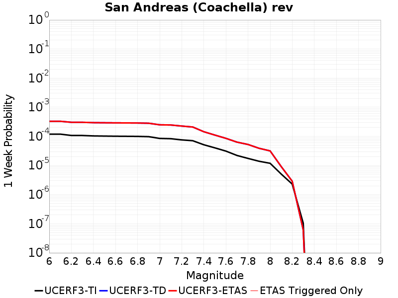 |  | 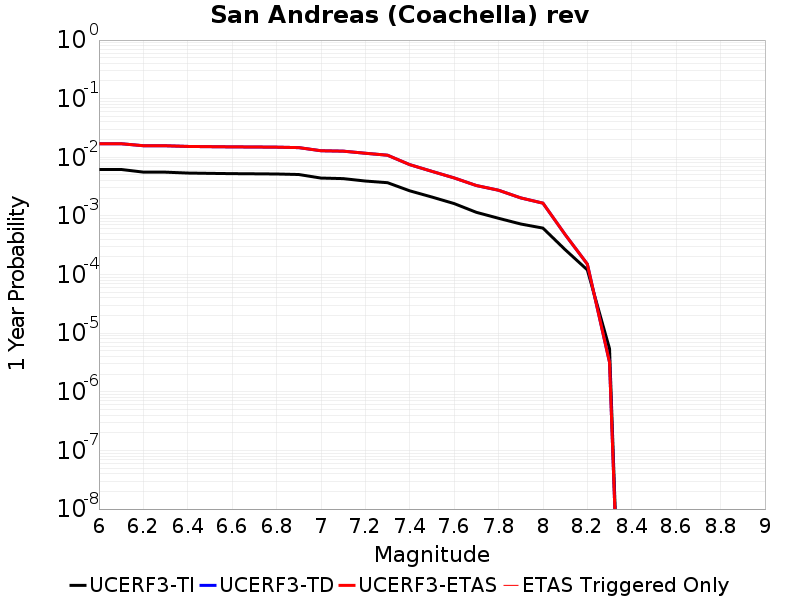 |  |

| Magnitude | 1 wk TI Prob | 1 wk TD Prob | 1 wk ETAS Prob | 1 wk ETAS/TD Gain | 1 wk ETAS Triggered Only | 1 mo TI Prob | 1 mo TD Prob | 1 mo ETAS Prob | 1 mo ETAS/TD Gain | 1 mo ETAS Triggered Only | 1 yr TI Prob | 1 yr TD Prob | 1 yr ETAS Prob | 1 yr ETAS/TD Gain | 1 yr ETAS Triggered Only | 10 yr TI Prob | 10 yr TD Prob | 10 yr ETAS Prob | 10 yr ETAS/TD Gain | 10 yr ETAS Triggered Only |
|-----|-----|-----|-----|-----|-----|-----|-----|-----|-----|-----|-----|-----|-----|-----|-----|-----|-----|-----|-----|-----|
| 6.0 | 1.1925945E-4 | 3.2942957E-4 | 3.2942957E-4 | 1.0 | 0.0 | 5.110118E-4 | 0.0014110819 | 0.0014110819 | 1.0 | 0.0 | 0.0062038354 | 0.017045947 | 0.017055776 | 1.0005766 | 1.0E-5 | 0.060334753 | 0.15349405 | 0.15356176 | 1.0004412 | 8.0E-5 |
| 6.1 | 1.1925945E-4 | 3.2942957E-4 | 3.2942957E-4 | 1.0 | 0.0 | 5.110118E-4 | 0.0014110819 | 0.0014110819 | 1.0 | 0.0 | 0.0062038354 | 0.017045947 | 0.017055776 | 1.0005766 | 1.0E-5 | 0.060334753 | 0.15349405 | 0.15356176 | 1.0004412 | 8.0E-5 |
| 6.2 | 1.07432395E-4 | 3.04423E-4 | 3.04423E-4 | 1.0 | 0.0 | 4.603433E-4 | 0.0013040218 | 0.0013040218 | 1.0 | 0.0 | 0.005590286 | 0.015762007 | 0.015762007 | 1.0 | 0.0 | 0.05451731 | 0.14267105 | 0.14273107 | 1.0004207 | 7.0E-5 |
| 6.3 | 1.0718766E-4 | 3.0387598E-4 | 3.0387598E-4 | 1.0 | 0.0 | 4.592948E-4 | 0.0013016796 | 0.0013016796 | 1.0 | 0.0 | 0.005577586 | 0.015733903 | 0.015733903 | 1.0 | 0.0 | 0.054396555 | 0.14243948 | 0.14249952 | 1.0004214 | 7.0E-5 |
| 6.4 | 1.0355944E-4 | 2.959538E-4 | 2.959538E-4 | 1.0 | 0.0 | 4.4375064E-4 | 0.0012677609 | 0.0012677609 | 1.0 | 0.0 | 0.0053892885 | 0.015326823 | 0.015326823 | 1.0 | 0.0 | 0.052604496 | 0.13900255 | 0.13906282 | 1.0004336 | 7.0E-5 |
| 6.5 | 1.0227914E-4 | 2.9314717E-4 | 2.9314717E-4 | 1.0 | 0.0 | 4.382655E-4 | 0.0012557441 | 0.0012557441 | 1.0 | 0.0 | 0.0053228354 | 0.015182568 | 0.015182568 | 1.0 | 0.0 | 0.051971316 | 0.13777652 | 0.13783687 | 1.0004381 | 7.0E-5 |
| 6.6 | 1.0116757E-4 | 2.9080376E-4 | 2.9080376E-4 | 1.0 | 0.0 | 4.3350324E-4 | 0.0012457105 | 0.0012457105 | 1.0 | 0.0 | 0.0052651367 | 0.015062103 | 0.015062103 | 1.0 | 0.0 | 0.051421247 | 0.13675445 | 0.13681488 | 1.0004419 | 7.0E-5 |
| 6.7 | 1.0050676E-4 | 2.8938876E-4 | 2.8938876E-4 | 1.0 | 0.0 | 4.3067214E-4 | 0.001239652 | 0.001239652 | 1.0 | 0.0 | 0.005230834 | 0.014989358 | 0.014989358 | 1.0 | 0.0 | 0.051094085 | 0.13613896 | 0.13619943 | 1.0004442 | 7.0E-5 |
| 6.8 | 9.976819E-5 | 2.8742032E-4 | 2.8742032E-4 | 1.0 | 0.0 | 4.2750788E-4 | 0.0012312238 | 0.0012312238 | 1.0 | 0.0 | 0.0051924936 | 0.014888152 | 0.014888152 | 1.0 | 0.0 | 0.050728295 | 0.13528925 | 0.13534978 | 1.0004474 | 7.0E-5 |
| 6.9 | 9.77719E-5 | 2.8237238E-4 | 2.8237238E-4 | 1.0 | 0.0 | 4.1895514E-4 | 0.00120961 | 0.00120961 | 1.0 | 0.0 | 0.0050888555 | 0.014628568 | 0.014628568 | 1.0 | 0.0 | 0.049738888 | 0.1331144 | 0.13317508 | 1.0004559 | 7.0E-5 |
| 7.0 | 8.500761E-5 | 2.4959055E-4 | 2.4959055E-4 | 1.0 | 0.0 | 3.6426744E-4 | 0.0010692385 | 0.0010692385 | 1.0 | 0.0 | 0.0044259406 | 0.012941063 | 0.012941063 | 1.0 | 0.0 | 0.04338823 | 0.118932016 | 0.11898488 | 1.0004445 | 6.0E-5 |
| 7.1 | 8.319876E-5 | 2.4559337E-4 | 2.4559337E-4 | 1.0 | 0.0 | 3.5651738E-4 | 0.0010521216 | 0.0010521216 | 1.0 | 0.0 | 0.004331963 | 0.012735121 | 0.012735121 | 1.0 | 0.0 | 0.042484846 | 0.117143966 | 0.11719694 | 1.0004522 | 6.0E-5 |
| 7.2 | 7.563917E-5 | 2.2601355E-4 | 2.2601355E-4 | 1.0 | 0.0 | 3.2412758E-4 | 9.6827303E-4 | 9.6827303E-4 | 1.0 | 0.0 | 0.0039391145 | 0.011725703 | 0.011725703 | 1.0 | 0.0 | 0.03870018 | 0.10853263 | 0.10858612 | 1.0004928 | 6.0E-5 |
| 7.3 | 7.082985E-5 | 2.0909615E-4 | 2.0909615E-4 | 1.0 | 0.0 | 3.0352117E-4 | 8.958215E-4 | 8.958215E-4 | 1.0 | 0.0 | 0.0036891096 | 0.01085272 | 0.01085272 | 1.0 | 0.0 | 0.03628465 | 0.10103076 | 0.101084694 | 1.0005338 | 6.0E-5 |
| 7.4 | 5.146215E-5 | 1.4416053E-4 | 1.4416053E-4 | 1.0 | 0.0 | 2.2053342E-4 | 6.1768544E-4 | 6.1768544E-4 | 1.0 | 0.0 | 0.0026816884 | 0.007494581 | 0.007494581 | 1.0 | 0.0 | 0.02649557 | 0.07146972 | 0.07151614 | 1.0006496 | 5.0E-5 |
| 7.5 | 4.0285166E-5 | 1.10627196E-4 | 1.10627196E-4 | 1.0 | 0.0 | 1.7263928E-4 | 4.7403073E-4 | 4.7403073E-4 | 1.0 | 0.0 | 0.002099857 | 0.0057561225 | 0.0057561225 | 1.0 | 0.0 | 0.020801254 | 0.055550657 | 0.05559788 | 1.0008501 | 5.0E-5 |
| 7.6 | 3.1168736E-5 | 8.54637E-5 | 8.54637E-5 | 1.0 | 0.0 | 1.3357346E-4 | 3.6622168E-4 | 3.6622168E-4 | 1.0 | 0.0 | 0.0016250437 | 0.0044496604 | 0.0044496604 | 1.0 | 0.0 | 0.016132116 | 0.04329422 | 0.043342058 | 1.0011048 | 5.0E-5 |
| 7.7 | 2.2100989E-5 | 6.3333995E-5 | 6.3333995E-5 | 1.0 | 0.0 | 9.4715084E-5 | 2.714032E-4 | 2.714032E-4 | 1.0 | 0.0 | 0.001152546 | 0.003299334 | 0.003299334 | 1.0 | 0.0 | 0.011465867 | 0.03232924 | 0.032377623 | 1.0014966 | 5.0E-5 |
| 7.8 | 1.7484861E-5 | 5.263971E-5 | 5.263971E-5 | 1.0 | 0.0 | 7.493296E-5 | 2.2557925E-4 | 2.2557925E-4 | 1.0 | 0.0 | 9.1192697E-4 | 0.0027429715 | 0.0027429715 | 1.0 | 0.0 | 0.009081938 | 0.027023852 | 0.0270725 | 1.0018002 | 5.0E-5 |
| 7.9 | 1.3967285E-5 | 3.8914994E-5 | 3.8914994E-5 | 1.0 | 0.0 | 5.985842E-5 | 1.6676789E-4 | 1.6676789E-4 | 1.0 | 0.0 | 7.2853256E-4 | 0.0020285095 | 0.0020285095 | 1.0 | 0.0 | 0.0072614877 | 0.020229299 | 0.020278286 | 1.0024216 | 5.0E-5 |
| 8.0 | 1.1887396E-5 | 3.166081E-5 | 3.166081E-5 | 1.0 | 0.0 | 5.094499E-5 | 1.3568213E-4 | 1.3568213E-4 | 1.0 | 0.0 | 6.200787E-4 | 0.0016506793 | 0.0016506793 | 1.0 | 0.0 | 0.006183513 | 0.01655684 | 0.01659618 | 1.002376 | 4.0E-5 |
| 8.1 | 5.100864E-6 | 9.217857E-6 | 9.217857E-6 | 1.0 | 0.0 | 2.1860664E-5 | 3.9504503E-5 | 3.9504503E-5 | 1.0 | 0.0 | 2.6612106E-4 | 4.8086132E-4 | 4.8086132E-4 | 1.0 | 0.0 | 0.002658026 | 0.0050394624 | 0.0050394624 | 1.0 | 0.0 |
| 8.2 | 2.3004484E-6 | 2.8837624E-6 | 2.8837624E-6 | 1.0 | 0.0 | 9.859027E-6 | 1.2358923E-5 | 1.2358923E-5 | 1.0 | 0.0 | 1.2002704E-4 | 1.5045954E-4 | 1.5045954E-4 | 1.0 | 0.0 | 0.0011996223 | 0.0016476025 | 0.0016476025 | 1.0 | 0.0 |
| 8.3 | 1.0424446E-7 | 6.078577E-8 | 6.078577E-8 | 1.0 | 0.0 | 4.4676187E-7 | 2.6051043E-7 | 2.6051043E-7 | 1.0 | 0.0 | 5.439312E-6 | 3.1717102E-6 | 3.1717102E-6 | 1.0 | 0.0 | 5.4391792E-5 | 3.330761E-5 | 3.330761E-5 | 1.0 | 0.0 |

## Baker
*[(top)](#table-of-contents)*

| 1 Week | 1 Month | 1 Year | 10 Year |
|-----|-----|-----|-----|
|  |  |  | 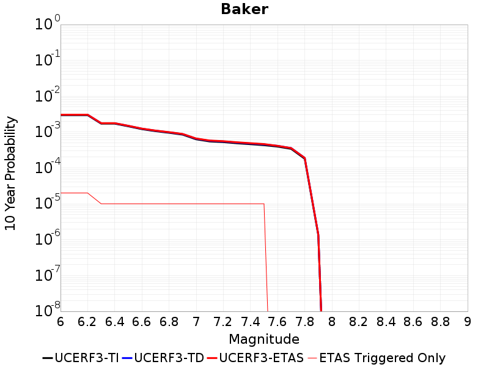 |

| Magnitude | 1 wk TI Prob | 1 wk TD Prob | 1 wk ETAS Prob | 1 wk ETAS/TD Gain | 1 wk ETAS Triggered Only | 1 mo TI Prob | 1 mo TD Prob | 1 mo ETAS Prob | 1 mo ETAS/TD Gain | 1 mo ETAS Triggered Only | 1 yr TI Prob | 1 yr TD Prob | 1 yr ETAS Prob | 1 yr ETAS/TD Gain | 1 yr ETAS Triggered Only | 10 yr TI Prob | 10 yr TD Prob | 10 yr ETAS Prob | 10 yr ETAS/TD Gain | 10 yr ETAS Triggered Only |
|-----|-----|-----|-----|-----|-----|-----|-----|-----|-----|-----|-----|-----|-----|-----|-----|-----|-----|-----|-----|-----|
| 6.0 | 5.695525E-6 | 5.835687E-6 | 5.835687E-6 | 1.0 | 0.0 | 2.4409164E-5 | 2.5009867E-5 | 2.5009867E-5 | 1.0 | 0.0 | 2.9714106E-4 | 3.044566E-4 | 3.2445052E-4 | 1.0656708 | 2.0E-5 | 0.0029674405 | 0.0030407908 | 0.0031105778 | 1.0229503 | 7.0E-5 |
| 6.1 | 5.695525E-6 | 5.835687E-6 | 5.835687E-6 | 1.0 | 0.0 | 2.4409164E-5 | 2.5009867E-5 | 2.5009867E-5 | 1.0 | 0.0 | 2.9714106E-4 | 3.044566E-4 | 3.2445052E-4 | 1.0656708 | 2.0E-5 | 0.0029674405 | 0.0030407908 | 0.0031105778 | 1.0229503 | 7.0E-5 |
| 6.2 | 5.695525E-6 | 5.835687E-6 | 5.835687E-6 | 1.0 | 0.0 | 2.4409164E-5 | 2.5009867E-5 | 2.5009867E-5 | 1.0 | 0.0 | 2.9714106E-4 | 3.044566E-4 | 3.2445052E-4 | 1.0656708 | 2.0E-5 | 0.0029674405 | 0.0030407908 | 0.0031105778 | 1.0229503 | 7.0E-5 |
| 6.3 | 3.2995713E-6 | 3.3841818E-6 | 3.3841818E-6 | 1.0 | 0.0 | 1.4140943E-5 | 1.4503558E-5 | 1.4503558E-5 | 1.0 | 0.0 | 1.7215237E-4 | 1.7656699E-4 | 1.9656346E-4 | 1.1132514 | 2.0E-5 | 0.0017201907 | 0.0017643141 | 0.0018142259 | 1.0282897 | 5.0E-5 |
| 6.4 | 3.2995713E-6 | 3.3841818E-6 | 3.3841818E-6 | 1.0 | 0.0 | 1.4140943E-5 | 1.4503558E-5 | 1.4503558E-5 | 1.0 | 0.0 | 1.7215237E-4 | 1.7656699E-4 | 1.9656346E-4 | 1.1132514 | 2.0E-5 | 0.0017201907 | 0.0017643141 | 0.0018142259 | 1.0282897 | 5.0E-5 |
| 6.5 | 2.782202E-6 | 2.856292E-6 | 2.856292E-6 | 1.0 | 0.0 | 1.1923668E-5 | 1.2241196E-5 | 1.2241196E-5 | 1.0 | 0.0 | 1.4516099E-4 | 1.490267E-4 | 1.6902371E-4 | 1.1341841 | 2.0E-5 | 0.001450662 | 0.0014893004 | 0.0015392259 | 1.0335228 | 5.0E-5 |
| 6.6 | 2.3163404E-6 | 2.3813168E-6 | 2.3813168E-6 | 1.0 | 0.0 | 9.927136E-6 | 1.0205605E-5 | 1.0205605E-5 | 1.0 | 0.0 | 1.20856166E-4 | 1.2424636E-4 | 1.4424388E-4 | 1.1609505 | 2.0E-5 | 0.0012079047 | 0.0012417892 | 0.0012917271 | 1.0402145 | 5.0E-5 |
| 6.7 | 2.037056E-6 | 2.0968664E-6 | 2.0968664E-6 | 1.0 | 0.0 | 8.7302105E-6 | 8.98654E-6 | 8.98654E-6 | 1.0 | 0.0 | 1.0628513E-4 | 1.09405795E-4 | 1.194047E-4 | 1.0913929 | 1.0E-5 | 0.0010623431 | 0.0010935355 | 0.0011235026 | 1.027404 | 3.0E-5 |
| 6.8 | 1.8356744E-6 | 1.891873E-6 | 1.891873E-6 | 1.0 | 0.0 | 7.867153E-6 | 8.1080025E-6 | 8.1080025E-6 | 1.0 | 0.0 | 9.577837E-5 | 9.87106E-5 | 1.0870962E-4 | 1.1012962 | 1.0E-5 | 9.57371E-4 | 9.866816E-4 | 0.001016652 | 1.030375 | 3.0E-5 |
| 6.9 | 1.6310546E-6 | 1.6835291E-6 | 1.6835291E-6 | 1.0 | 0.0 | 6.9902153E-6 | 7.2151056E-6 | 7.2151056E-6 | 1.0 | 0.0 | 8.510255E-5 | 8.784049E-5 | 9.7839606E-5 | 1.1138327 | 1.0E-5 | 8.5069967E-4 | 8.780689E-4 | 9.080426E-4 | 1.0341359 | 3.0E-5 |
| 7.0 | 1.2058036E-6 | 1.2511459E-6 | 1.2511459E-6 | 1.0 | 0.0 | 5.1677193E-6 | 5.362043E-6 | 5.362043E-6 | 1.0 | 0.0 | 6.291517E-5 | 6.528094E-5 | 7.528029E-5 | 1.153174 | 1.0E-5 | 6.289736E-4 | 6.5262E-4 | 6.8260037E-4 | 1.0459386 | 3.0E-5 |
| 7.1 | 1.052382E-6 | 1.0954265E-6 | 1.0954265E-6 | 1.0 | 0.0 | 4.5102006E-6 | 4.6946766E-6 | 4.6946766E-6 | 1.0 | 0.0 | 5.491031E-5 | 5.7156198E-5 | 6.7155626E-5 | 1.1749492 | 1.0E-5 | 5.4896745E-4 | 5.714159E-4 | 6.013987E-4 | 1.0524712 | 3.0E-5 |
| 7.2 | 1.0067454E-6 | 1.0490321E-6 | 1.0490321E-6 | 1.0 | 0.0 | 4.3146156E-6 | 4.495844E-6 | 4.495844E-6 | 1.0 | 0.0 | 5.252918E-5 | 5.473554E-5 | 6.4734995E-5 | 1.1826867 | 1.0E-5 | 5.251676E-4 | 5.4722145E-4 | 5.7720504E-4 | 1.0547924 | 3.0E-5 |
| 7.3 | 9.3596316E-7 | 9.77026E-7 | 9.77026E-7 | 1.0 | 0.0 | 4.0112645E-6 | 4.187248E-6 | 4.187248E-6 | 1.0 | 0.0 | 4.8836053E-5 | 5.097856E-5 | 6.097805E-5 | 1.1961509 | 1.0E-5 | 4.8825322E-4 | 5.096694E-4 | 5.296593E-4 | 1.0392212 | 2.0E-5 |
| 7.4 | 8.8117395E-7 | 9.210127E-7 | 9.210127E-7 | 1.0 | 0.0 | 3.7764542E-6 | 3.9471915E-6 | 3.9471915E-6 | 1.0 | 0.0 | 4.5977362E-5 | 4.8056005E-5 | 5.8055524E-5 | 1.2080805 | 1.0E-5 | 4.596785E-4 | 4.8045686E-4 | 5.004473E-4 | 1.041607 | 2.0E-5 |
| 7.5 | 8.292386E-7 | 8.6769757E-7 | 8.6769757E-7 | 1.0 | 0.0 | 3.5538749E-6 | 3.7186987E-6 | 3.7186987E-6 | 1.0 | 0.0 | 4.326757E-5 | 4.5274224E-5 | 5.527377E-5 | 1.2208662 | 1.0E-5 | 4.3259145E-4 | 4.5265074E-4 | 4.7264167E-4 | 1.0441642 | 2.0E-5 |
| 7.6 | 7.553842E-7 | 7.916719E-7 | 7.916719E-7 | 1.0 | 0.0 | 3.2373566E-6 | 3.3928752E-6 | 3.3928752E-6 | 1.0 | 0.0 | 3.9414106E-5 | 4.1307478E-5 | 4.1307478E-5 | 1.0 | 0.0 | 3.9407116E-4 | 4.1299872E-4 | 4.2299458E-4 | 1.0242032 | 1.0E-5 |
| 7.7 | 6.5285366E-7 | 6.854822E-7 | 6.854822E-7 | 1.0 | 0.0 | 2.797941E-6 | 2.9377775E-6 | 2.9377775E-6 | 1.0 | 0.0 | 3.40644E-5 | 3.5766858E-5 | 3.5766858E-5 | 1.0 | 0.0 | 3.405918E-4 | 3.576117E-4 | 3.6760813E-4 | 1.0279533 | 1.0E-5 |
| 7.8 | 3.4586725E-7 | 3.6494507E-7 | 3.6494507E-7 | 1.0 | 0.0 | 1.4822873E-6 | 1.5640494E-6 | 1.5640494E-6 | 1.0 | 0.0 | 1.80467E-5 | 1.904214E-5 | 1.904214E-5 | 1.0 | 0.0 | 1.8045233E-4 | 1.9040552E-4 | 2.004036E-4 | 1.0525094 | 1.0E-5 |
| 7.9 | 2.5591178E-9 | 2.670354E-9 | 2.670354E-9 | 1.0 | 0.0 | 1.0967647E-8 | 1.1444374E-8 | 1.1444374E-8 | 1.0 | 0.0 | 1.335311E-7 | 1.3933526E-7 | 1.3933526E-7 | 1.0 | 0.0 | 1.3353102E-6 | 1.3933526E-6 | 1.3933526E-6 | 1.0 | 0.0 |

## San Andreas (Cholame) rev
*[(top)](#table-of-contents)*

| 1 Week | 1 Month | 1 Year | 10 Year |
|-----|-----|-----|-----|
| 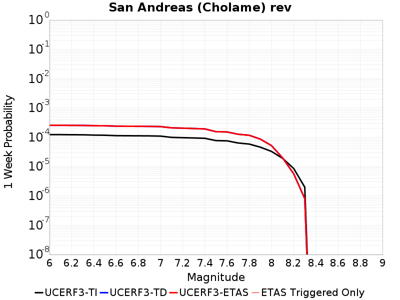 |  |  | 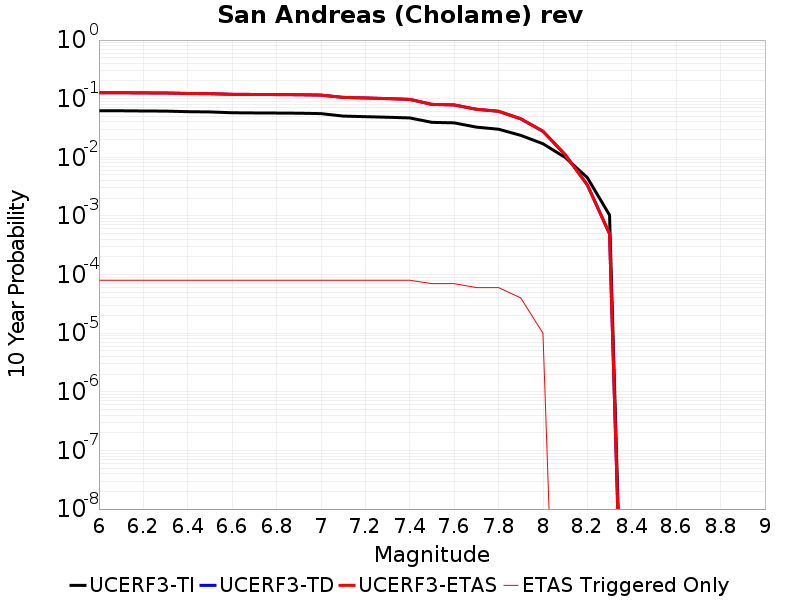 |

| Magnitude | 1 wk TI Prob | 1 wk TD Prob | 1 wk ETAS Prob | 1 wk ETAS/TD Gain | 1 wk ETAS Triggered Only | 1 mo TI Prob | 1 mo TD Prob | 1 mo ETAS Prob | 1 mo ETAS/TD Gain | 1 mo ETAS Triggered Only | 1 yr TI Prob | 1 yr TD Prob | 1 yr ETAS Prob | 1 yr ETAS/TD Gain | 1 yr ETAS Triggered Only | 10 yr TI Prob | 10 yr TD Prob | 10 yr ETAS Prob | 10 yr ETAS/TD Gain | 10 yr ETAS Triggered Only |
|-----|-----|-----|-----|-----|-----|-----|-----|-----|-----|-----|-----|-----|-----|-----|-----|-----|-----|-----|-----|-----|
| 6.0 | 1.2302514E-4 | 2.5641316E-4 | 2.5641316E-4 | 1.0 | 0.0 | 5.27144E-4 | 0.0010984525 | 0.0010984525 | 1.0 | 0.0 | 0.0063991086 | 0.013292177 | 0.013311911 | 1.0014846 | 2.0E-5 | 0.06217949 | 0.12623206 | 0.12629321 | 1.0004846 | 7.0E-5 |
| 6.1 | 1.2302514E-4 | 2.5641316E-4 | 2.5641316E-4 | 1.0 | 0.0 | 5.27144E-4 | 0.0010984525 | 0.0010984525 | 1.0 | 0.0 | 0.0063991086 | 0.013292177 | 0.013311911 | 1.0014846 | 2.0E-5 | 0.06217949 | 0.12623206 | 0.12629321 | 1.0004846 | 7.0E-5 |
| 6.2 | 1.2203569E-4 | 2.5457566E-4 | 2.5457566E-4 | 1.0 | 0.0 | 5.2290526E-4 | 0.0010905841 | 0.0010905841 | 1.0 | 0.0 | 0.006347804 | 0.013197544 | 0.01321728 | 1.0014955 | 2.0E-5 | 0.061695136 | 0.12541725 | 0.12547848 | 1.0004882 | 7.0E-5 |
| 6.3 | 1.2142645E-4 | 2.5343208E-4 | 2.5343208E-4 | 1.0 | 0.0 | 5.202953E-4 | 0.0010856871 | 0.0010856871 | 1.0 | 0.0 | 0.006316212 | 0.0131386435 | 0.013158381 | 1.0015023 | 2.0E-5 | 0.06139677 | 0.12491142 | 0.12497267 | 1.0004904 | 7.0E-5 |
| 6.4 | 1.1865206E-4 | 2.4846094E-4 | 2.4846094E-4 | 1.0 | 0.0 | 5.0840975E-4 | 0.0010643997 | 0.0010643997 | 1.0 | 0.0 | 0.006172335 | 0.0128825605 | 0.012902303 | 1.0015324 | 2.0E-5 | 0.060036868 | 0.122695714 | 0.12275712 | 1.0005006 | 7.0E-5 |
| 6.5 | 1.17443946E-4 | 2.463761E-4 | 2.463761E-4 | 1.0 | 0.0 | 5.032341E-4 | 0.0010554718 | 0.0010554718 | 1.0 | 0.0 | 0.006109677 | 0.01277514 | 0.012794884 | 1.0015455 | 2.0E-5 | 0.059444077 | 0.121762365 | 0.12182385 | 1.0005049 | 7.0E-5 |
| 6.6 | 1.13579066E-4 | 2.3941381E-4 | 2.3941381E-4 | 1.0 | 0.0 | 4.866766E-4 | 0.0010256573 | 0.0010256573 | 1.0 | 0.0 | 0.0059092017 | 0.012416339 | 0.01243609 | 1.0015907 | 2.0E-5 | 0.057545185 | 0.118665986 | 0.11872768 | 1.0005199 | 7.0E-5 |
| 6.7 | 1.1271412E-4 | 2.3784667E-4 | 2.3784667E-4 | 1.0 | 0.0 | 4.829711E-4 | 0.0010189462 | 0.0010189462 | 1.0 | 0.0 | 0.005864331 | 0.012335559 | 0.012355313 | 1.0016013 | 2.0E-5 | 0.057119697 | 0.11796725 | 0.11802899 | 1.0005233 | 7.0E-5 |
| 6.8 | 1.1217975E-4 | 2.3672065E-4 | 2.3672065E-4 | 1.0 | 0.0 | 4.8068175E-4 | 0.0010141241 | 0.0010141241 | 1.0 | 0.0 | 0.005836608 | 0.012277515 | 0.012297269 | 1.001609 | 2.0E-5 | 0.056856725 | 0.11746232 | 0.117524095 | 1.000526 | 7.0E-5 |
| 6.9 | 1.1146753E-4 | 2.3519673E-4 | 2.3519673E-4 | 1.0 | 0.0 | 4.7763053E-4 | 0.0010075981 | 0.0010075981 | 1.0 | 0.0 | 0.0057996577 | 0.012198953 | 0.012218709 | 1.0016195 | 2.0E-5 | 0.056506127 | 0.11677994 | 0.11684176 | 1.0005294 | 7.0E-5 |
| 7.0 | 1.0965793E-4 | 2.3139603E-4 | 2.3139603E-4 | 1.0 | 0.0 | 4.698779E-4 | 9.913219E-4 | 9.913219E-4 | 1.0 | 0.0 | 0.005705768 | 0.012002991 | 0.01202275 | 1.0016463 | 2.0E-5 | 0.055614736 | 0.115072064 | 0.11513401 | 1.0005383 | 7.0E-5 |
| 7.1 | 9.927982E-5 | 2.09431E-4 | 2.09431E-4 | 1.0 | 0.0 | 4.2541555E-4 | 8.9725375E-4 | 8.9725375E-4 | 1.0 | 0.0 | 0.0051671406 | 0.010869653 | 0.010889435 | 1.00182 | 2.0E-5 | 0.05048634 | 0.1051154 | 0.10517804 | 1.0005959 | 7.0E-5 |
| 7.2 | 9.696786E-5 | 2.0444467E-4 | 2.0444467E-4 | 1.0 | 0.0 | 4.1551032E-4 | 8.7589823E-4 | 8.7589823E-4 | 1.0 | 0.0 | 0.00504711 | 0.010612211 | 0.010631999 | 1.0018647 | 2.0E-5 | 0.04934009 | 0.1028483 | 0.1029111 | 1.0006106 | 7.0E-5 |
| 7.3 | 9.4727984E-5 | 1.9867197E-4 | 1.9867197E-4 | 1.0 | 0.0 | 4.0591392E-4 | 8.511745E-4 | 8.511745E-4 | 1.0 | 0.0 | 0.0049308087 | 0.010314088 | 0.010333883 | 1.0019192 | 2.0E-5 | 0.048228268 | 0.10019925 | 0.10026224 | 1.0006286 | 7.0E-5 |
| 7.4 | 9.220358E-5 | 1.9230435E-4 | 1.9230435E-4 | 1.0 | 0.0 | 3.9509835E-4 | 8.2390214E-4 | 8.2390214E-4 | 1.0 | 0.0 | 0.004799717 | 0.00998513 | 0.01000493 | 1.0019829 | 2.0E-5 | 0.046973653 | 0.097248696 | 0.097311884 | 1.0006498 | 7.0E-5 |
| 7.5 | 7.71631E-5 | 1.5516987E-4 | 1.5516987E-4 | 1.0 | 0.0 | 3.306571E-4 | 6.6484435E-4 | 6.6484435E-4 | 1.0 | 0.0 | 0.0040183207 | 0.008064514 | 0.008074434 | 1.00123 | 1.0E-5 | 0.03946433 | 0.07980111 | 0.07984713 | 1.0005766 | 5.0E-5 |
| 7.6 | 7.5634416E-5 | 1.5172065E-4 | 1.5172065E-4 | 1.0 | 0.0 | 3.241072E-4 | 6.5006956E-4 | 6.5006956E-4 | 1.0 | 0.0 | 0.0039388672 | 0.007885946 | 0.007895867 | 1.0012581 | 1.0E-5 | 0.038697794 | 0.078148335 | 0.078194425 | 1.0005898 | 5.0E-5 |
| 7.7 | 6.3783E-5 | 1.2659072E-4 | 1.2659072E-4 | 1.0 | 0.0 | 2.7332708E-4 | 5.4241886E-4 | 5.4241886E-4 | 1.0 | 0.0 | 0.0033226798 | 0.0065839817 | 0.006593916 | 1.0015088 | 1.0E-5 | 0.032734364 | 0.065912165 | 0.06594019 | 1.0004251 | 3.0E-5 |
| 7.8 | 5.863422E-5 | 1.1689242E-4 | 1.1689242E-4 | 1.0 | 0.0 | 2.512653E-4 | 5.0087133E-4 | 5.0087133E-4 | 1.0 | 0.0 | 0.003054864 | 0.0060810805 | 0.0060910196 | 1.0016345 | 1.0E-5 | 0.030132094 | 0.06091184 | 0.060940012 | 1.0004625 | 3.0E-5 |
| 7.9 | 4.595283E-5 | 8.6266504E-5 | 8.6266504E-5 | 1.0 | 0.0 | 1.9692584E-4 | 3.6966123E-4 | 3.6966123E-4 | 1.0 | 0.0 | 0.0023949358 | 0.004491345 | 0.004491345 | 1.0 | 0.0 | 0.023692891 | 0.045307204 | 0.045307204 | 1.0 | 0.0 |
| 8.0 | 3.2950178E-5 | 5.2031995E-5 | 5.2031995E-5 | 1.0 | 0.0 | 1.412074E-4 | 2.2297521E-4 | 2.2297521E-4 | 1.0 | 0.0 | 0.0017178444 | 0.0027113454 | 0.0027113454 | 1.0 | 0.0 | 0.017046256 | 0.027799848 | 0.027799848 | 1.0 | 0.0 |
| 8.1 | 1.9177472E-5 | 1.9810032E-5 | 1.9810032E-5 | 1.0 | 0.0 | 8.218658E-5 | 8.489737E-5 | 8.489737E-5 | 1.0 | 0.0 | 0.0010001622 | 0.001033136 | 0.001033136 | 1.0 | 0.0 | 0.009956728 | 0.011085417 | 0.011085417 | 1.0 | 0.0 |
| 8.2 | 8.643924E-6 | 5.7090024E-6 | 5.7090024E-6 | 1.0 | 0.0 | 3.704486E-5 | 2.4466923E-5 | 2.4466923E-5 | 1.0 | 0.0 | 4.5092785E-4 | 2.9784418E-4 | 2.9784418E-4 | 1.0 | 0.0 | 0.0045001395 | 0.0033766231 | 0.0033766231 | 1.0 | 0.0 |
| 8.3 | 1.983087E-6 | 8.050169E-7 | 8.050169E-7 | 1.0 | 0.0 | 8.498917E-6 | 3.4500679E-6 | 3.4500679E-6 | 1.0 | 0.0 | 1.034694E-4 | 4.2003783E-5 | 4.2003783E-5 | 1.0 | 0.0 | 0.0010342124 | 4.943242E-4 | 4.943242E-4 | 1.0 | 0.0 |

## Santa Ynez (West)
*[(top)](#table-of-contents)*

| 1 Week | 1 Month | 1 Year | 10 Year |
|-----|-----|-----|-----|
| 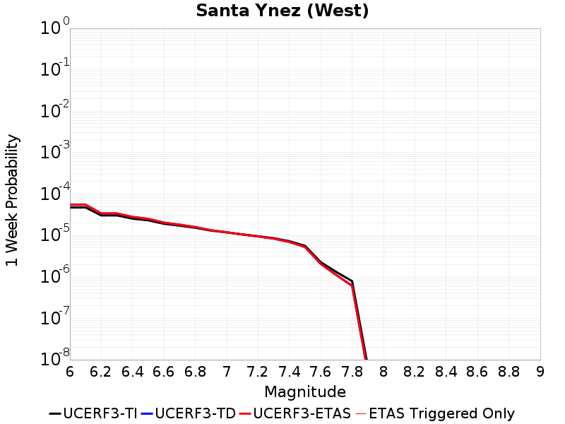 |  | 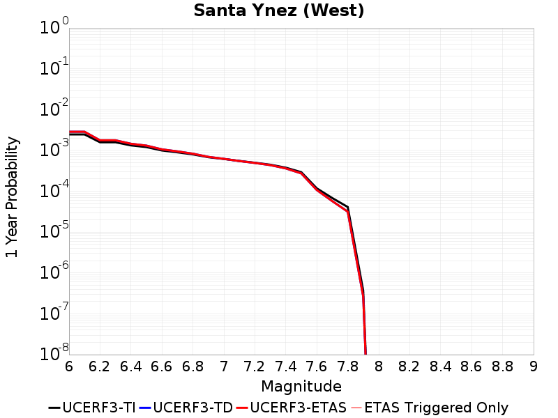 |  |

| Magnitude | 1 wk TI Prob | 1 wk TD Prob | 1 wk ETAS Prob | 1 wk ETAS/TD Gain | 1 wk ETAS Triggered Only | 1 mo TI Prob | 1 mo TD Prob | 1 mo ETAS Prob | 1 mo ETAS/TD Gain | 1 mo ETAS Triggered Only | 1 yr TI Prob | 1 yr TD Prob | 1 yr ETAS Prob | 1 yr ETAS/TD Gain | 1 yr ETAS Triggered Only | 10 yr TI Prob | 10 yr TD Prob | 10 yr ETAS Prob | 10 yr ETAS/TD Gain | 10 yr ETAS Triggered Only |
|-----|-----|-----|-----|-----|-----|-----|-----|-----|-----|-----|-----|-----|-----|-----|-----|-----|-----|-----|-----|-----|
| 6.0 | 4.7352758E-5 | 5.5031825E-5 | 5.5031825E-5 | 1.0 | 0.0 | 2.0292461E-4 | 2.3583103E-4 | 2.3583103E-4 | 1.0 | 0.0 | 0.0024678076 | 0.0028677364 | 0.0028677364 | 1.0 | 0.0 | 0.024405818 | 0.0283354 | 0.028393699 | 1.0020574 | 6.0E-5 |
| 6.1 | 4.7352758E-5 | 5.5031825E-5 | 5.5031825E-5 | 1.0 | 0.0 | 2.0292461E-4 | 2.3583103E-4 | 2.3583103E-4 | 1.0 | 0.0 | 0.0024678076 | 0.0028677364 | 0.0028677364 | 1.0 | 0.0 | 0.024405818 | 0.0283354 | 0.028383981 | 1.0017146 | 5.0E-5 |
| 6.2 | 3.0415853E-5 | 3.3956E-5 | 3.3956E-5 | 1.0 | 0.0 | 1.3034715E-4 | 1.4551781E-4 | 1.4551781E-4 | 1.0 | 0.0 | 0.0015858212 | 0.0017702746 | 0.0017702746 | 1.0 | 0.0 | 0.015745522 | 0.017565666 | 0.017585315 | 1.0011185 | 2.0E-5 |
| 6.3 | 3.0415853E-5 | 3.3956E-5 | 3.3956E-5 | 1.0 | 0.0 | 1.3034715E-4 | 1.4551781E-4 | 1.4551781E-4 | 1.0 | 0.0 | 0.0015858212 | 0.0017702746 | 0.0017702746 | 1.0 | 0.0 | 0.015745522 | 0.017565666 | 0.017585315 | 1.0011185 | 2.0E-5 |
| 6.4 | 2.5452082E-5 | 2.7935781E-5 | 2.7935781E-5 | 1.0 | 0.0 | 1.09075794E-4 | 1.197194E-4 | 1.197194E-4 | 1.0 | 0.0 | 0.0013271887 | 0.0014566279 | 0.0014566279 | 1.0 | 0.0 | 0.013192902 | 0.014472971 | 0.014482826 | 1.0006809 | 1.0E-5 |
| 6.5 | 2.3143784E-5 | 2.5148185E-5 | 2.5148185E-5 | 1.0 | 0.0 | 9.9183875E-5 | 1.07773565E-4 | 1.07773565E-4 | 1.0 | 0.0 | 0.0012068948 | 0.0013113678 | 0.0013113678 | 1.0 | 0.0 | 0.012003611 | 0.013037964 | 0.013047833 | 1.000757 | 1.0E-5 |
| 6.6 | 1.9118515E-5 | 2.0369012E-5 | 2.0369012E-5 | 1.0 | 0.0 | 8.193392E-5 | 8.7292894E-5 | 8.7292894E-5 | 1.0 | 0.0 | 9.97089E-4 | 0.0010622807 | 0.0010622807 | 1.0 | 0.0 | 0.00992627 | 0.010572942 | 0.010582836 | 1.0009358 | 1.0E-5 |
| 6.7 | 1.722807E-5 | 1.815881E-5 | 1.815881E-5 | 1.0 | 0.0 | 7.3832496E-5 | 7.782118E-5 | 7.782118E-5 | 1.0 | 0.0 | 8.985399E-4 | 9.4706664E-4 | 9.4706664E-4 | 1.0 | 0.0 | 0.008949154 | 0.009430952 | 0.009440858 | 1.0010504 | 1.0E-5 |
| 6.8 | 1.5317364E-5 | 1.5936803E-5 | 1.5936803E-5 | 1.0 | 0.0 | 6.56442E-5 | 6.8298825E-5 | 6.8298825E-5 | 1.0 | 0.0 | 7.98925E-4 | 8.3122525E-4 | 8.3122525E-4 | 1.0 | 0.0 | 0.007960589 | 0.00828165 | 0.008291567 | 1.0011975 | 1.0E-5 |
| 6.9 | 1.3071226E-5 | 1.3337527E-5 | 1.3337527E-5 | 1.0 | 0.0 | 5.6018336E-5 | 5.715959E-5 | 5.715959E-5 | 1.0 | 0.0 | 6.8180985E-4 | 6.95698E-4 | 6.95698E-4 | 1.0 | 0.0 | 0.0067972173 | 0.0069354624 | 0.006945393 | 1.0014318 | 1.0E-5 |
| 7.0 | 1.1836986E-5 | 1.1939585E-5 | 1.1939585E-5 | 1.0 | 0.0 | 5.0728955E-5 | 5.1168656E-5 | 5.1168656E-5 | 1.0 | 0.0 | 6.1745E-4 | 6.22802E-4 | 6.22802E-4 | 1.0 | 0.0 | 0.006157372 | 0.0062107593 | 0.0062206974 | 1.0016001 | 1.0E-5 |
| 7.1 | 1.0597169E-5 | 1.0547993E-5 | 1.0547993E-5 | 1.0 | 0.0 | 4.541565E-5 | 4.520491E-5 | 4.520491E-5 | 1.0 | 0.0 | 5.5279525E-4 | 5.502319E-4 | 5.502319E-4 | 1.0 | 0.0 | 0.0055142213 | 0.005488827 | 0.005498772 | 1.0018119 | 1.0E-5 |
| 7.2 | 9.59113E-6 | 9.464439E-6 | 9.464439E-6 | 1.0 | 0.0 | 4.11042E-5 | 4.056126E-5 | 4.056126E-5 | 1.0 | 0.0 | 5.0032866E-4 | 4.937225E-4 | 4.937225E-4 | 1.0 | 0.0 | 0.004992037 | 0.004926375 | 0.004936326 | 1.0020199 | 1.0E-5 |
| 7.3 | 8.586084E-6 | 8.384402E-6 | 8.384402E-6 | 1.0 | 0.0 | 3.679698E-5 | 3.5932662E-5 | 3.5932662E-5 | 1.0 | 0.0 | 4.4791115E-4 | 4.3739335E-4 | 4.3739335E-4 | 1.0 | 0.0 | 0.004470094 | 0.0043654363 | 0.0043753926 | 1.0022807 | 1.0E-5 |
| 7.4 | 7.2622997E-6 | 6.955675E-6 | 6.955675E-6 | 1.0 | 0.0 | 3.112377E-5 | 2.98097E-5 | 2.98097E-5 | 1.0 | 0.0 | 3.78866E-4 | 3.6287363E-4 | 3.6287363E-4 | 1.0 | 0.0 | 0.0037822074 | 0.0036229114 | 0.0036328752 | 1.0027502 | 1.0E-5 |
| 7.5 | 5.627296E-6 | 5.2544874E-6 | 5.2544874E-6 | 1.0 | 0.0 | 2.411676E-5 | 2.2519042E-5 | 2.2519042E-5 | 1.0 | 0.0 | 2.9358198E-4 | 2.7413556E-4 | 2.7413556E-4 | 1.0 | 0.0 | 0.0029319443 | 0.002738046 | 0.0027480186 | 1.0036422 | 1.0E-5 |
| 7.6 | 2.265244E-6 | 2.0616528E-6 | 2.0616528E-6 | 1.0 | 0.0 | 9.708152E-6 | 8.8356255E-6 | 8.8356255E-6 | 1.0 | 0.0 | 1.18190335E-4 | 1.0756852E-4 | 1.0756852E-4 | 1.0 | 0.0 | 0.001181275 | 0.0010751731 | 0.0010751731 | 1.0 | 0.0 |
| 7.7 | 1.3099874E-6 | 1.1020651E-6 | 1.1020651E-6 | 1.0 | 0.0 | 5.61422E-6 | 4.7231274E-6 | 4.7231274E-6 | 1.0 | 0.0 | 6.8350986E-5 | 5.7502584E-5 | 5.7502584E-5 | 1.0 | 0.0 | 6.832996E-4 | 5.7487946E-4 | 5.7487946E-4 | 1.0 | 0.0 |
| 7.8 | 7.903951E-7 | 6.073616E-7 | 6.073616E-7 | 1.0 | 0.0 | 3.3874032E-6 | 2.6029757E-6 | 2.6029757E-6 | 1.0 | 0.0 | 4.1240855E-5 | 3.1690783E-5 | 3.1690783E-5 | 1.0 | 0.0 | 4.12332E-4 | 3.1686394E-4 | 3.1686394E-4 | 1.0 | 0.0 |
| 7.9 | 7.0753297E-9 | 5.091409E-9 | 5.091409E-9 | 1.0 | 0.0 | 3.032284E-8 | 2.1820325E-8 | 2.1820325E-8 | 1.0 | 0.0 | 3.6918053E-7 | 2.6566244E-7 | 2.6566244E-7 | 1.0 | 0.0 | 3.691799E-6 | 2.6566222E-6 | 2.6566222E-6 | 1.0 | 0.0 |

## San Andreas (Parkfield)
*[(top)](#table-of-contents)*

| 1 Week | 1 Month | 1 Year | 10 Year |
|-----|-----|-----|-----|
|  | 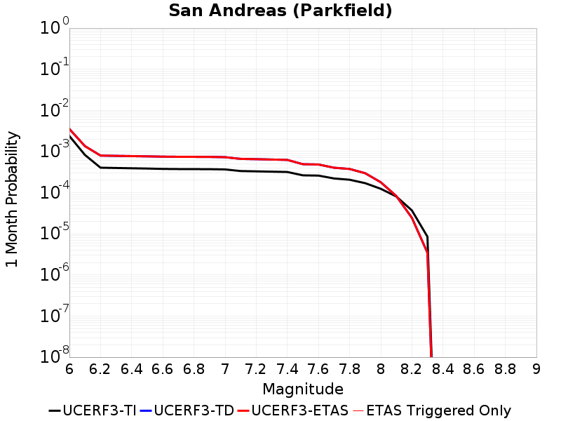 |  | 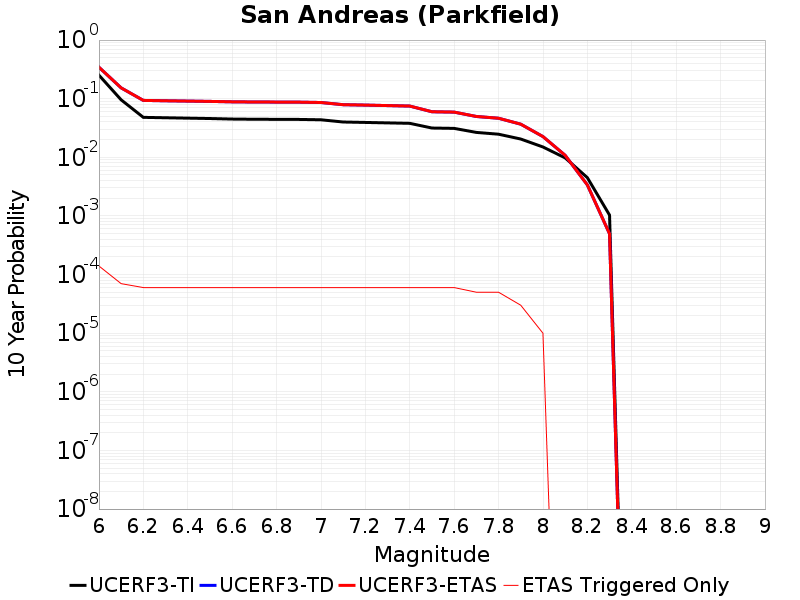 |

| Magnitude | 1 wk TI Prob | 1 wk TD Prob | 1 wk ETAS Prob | 1 wk ETAS/TD Gain | 1 wk ETAS Triggered Only | 1 mo TI Prob | 1 mo TD Prob | 1 mo ETAS Prob | 1 mo ETAS/TD Gain | 1 mo ETAS Triggered Only | 1 yr TI Prob | 1 yr TD Prob | 1 yr ETAS Prob | 1 yr ETAS/TD Gain | 1 yr ETAS Triggered Only | 10 yr TI Prob | 10 yr TD Prob | 10 yr ETAS Prob | 10 yr ETAS/TD Gain | 10 yr ETAS Triggered Only |
|-----|-----|-----|-----|-----|-----|-----|-----|-----|-----|-----|-----|-----|-----|-----|-----|-----|-----|-----|-----|-----|
| 6.0 | 5.556969E-4 | 8.218209E-4 | 8.218209E-4 | 1.0 | 0.0 | 0.0023793848 | 0.0035179637 | 0.0035179637 | 1.0 | 0.0 | 0.028586963 | 0.04221359 | 0.042223167 | 1.0002269 | 1.0E-5 | 0.25176284 | 0.3436787 | 0.34371808 | 1.0001146 | 6.0E-5 |
| 6.1 | 1.925858E-4 | 3.1522222E-4 | 3.1522222E-4 | 1.0 | 0.0 | 8.2510663E-4 | 0.0013503616 | 0.0013503616 | 1.0 | 0.0 | 0.0099994885 | 0.016387276 | 0.016387276 | 1.0 | 0.0 | 0.095613256 | 0.15271725 | 0.15272571 | 1.0000554 | 1.0E-5 |
| 6.2 | 9.4306815E-5 | 1.8589664E-4 | 1.8589664E-4 | 1.0 | 0.0 | 4.0410945E-4 | 7.9645787E-4 | 7.9645787E-4 | 1.0 | 0.0 | 0.0049089384 | 0.009654 | 0.009654 | 1.0 | 0.0 | 0.048019063 | 0.09337003 | 0.09337003 | 1.0 | 0.0 |
| 6.3 | 9.283051E-5 | 1.8284739E-4 | 1.8284739E-4 | 1.0 | 0.0 | 3.9778434E-4 | 7.833975E-4 | 7.833975E-4 | 1.0 | 0.0 | 0.0048322747 | 0.009496382 | 0.009496382 | 1.0 | 0.0 | 0.047285385 | 0.09202012 | 0.09202012 | 1.0 | 0.0 |
| 6.4 | 9.138826E-5 | 1.8044666E-4 | 1.8044666E-4 | 1.0 | 0.0 | 3.916052E-4 | 7.7311485E-4 | 7.7311485E-4 | 1.0 | 0.0 | 0.0047573745 | 0.009372267 | 0.009372267 | 1.0 | 0.0 | 0.046568092 | 0.0909114 | 0.0909114 | 1.0 | 0.0 |
| 6.5 | 9.000255E-5 | 1.7800715E-4 | 1.7800715E-4 | 1.0 | 0.0 | 3.8566816E-4 | 7.626659E-4 | 7.626659E-4 | 1.0 | 0.0 | 0.0046854047 | 0.009246139 | 0.009246139 | 1.0 | 0.0 | 0.045878403 | 0.089788444 | 0.089788444 | 1.0 | 0.0 |
| 6.6 | 8.8109264E-5 | 1.7477442E-4 | 1.7477442E-4 | 1.0 | 0.0 | 3.7755648E-4 | 7.488194E-4 | 7.488194E-4 | 1.0 | 0.0 | 0.0045870654 | 0.009078992 | 0.009078992 | 1.0 | 0.0 | 0.04493529 | 0.08830626 | 0.08830626 | 1.0 | 0.0 |
| 6.7 | 8.738073E-5 | 1.7343568E-4 | 1.7343568E-4 | 1.0 | 0.0 | 3.7443507E-4 | 7.4308517E-4 | 7.4308517E-4 | 1.0 | 0.0 | 0.0045492216 | 0.009009796 | 0.009009796 | 1.0 | 0.0 | 0.04457213 | 0.0877042 | 0.0877042 | 1.0 | 0.0 |
| 6.8 | 8.710195E-5 | 1.7288295E-4 | 1.7288295E-4 | 1.0 | 0.0 | 3.7324068E-4 | 7.407177E-4 | 7.407177E-4 | 1.0 | 0.0 | 0.0045347405 | 0.008981219 | 0.008981219 | 1.0 | 0.0 | 0.04443313 | 0.08744911 | 0.08744911 | 1.0 | 0.0 |
| 6.9 | 8.6801556E-5 | 1.7228573E-4 | 1.7228573E-4 | 1.0 | 0.0 | 3.7195362E-4 | 7.3815964E-4 | 7.3815964E-4 | 1.0 | 0.0 | 0.0045191357 | 0.00895033 | 0.00895033 | 1.0 | 0.0 | 0.044283327 | 0.08717288 | 0.08717288 | 1.0 | 0.0 |
| 7.0 | 8.5571606E-5 | 1.6978668E-4 | 1.6978668E-4 | 1.0 | 0.0 | 3.6668387E-4 | 7.274555E-4 | 7.274555E-4 | 1.0 | 0.0 | 0.004455241 | 0.008821069 | 0.008821069 | 1.0 | 0.0 | 0.043669727 | 0.08601282 | 0.08601282 | 1.0 | 0.0 |
| 7.1 | 7.82589E-5 | 1.5447437E-4 | 1.5447437E-4 | 1.0 | 0.0 | 3.3535215E-4 | 6.618658E-4 | 6.618658E-4 | 1.0 | 0.0 | 0.0040752706 | 0.00802862 | 0.00802862 | 1.0 | 0.0 | 0.040013418 | 0.07888741 | 0.07888741 | 1.0 | 0.0 |
| 7.2 | 7.690929E-5 | 1.5182167E-4 | 1.5182167E-4 | 1.0 | 0.0 | 3.2956956E-4 | 6.505028E-4 | 6.505028E-4 | 1.0 | 0.0 | 0.004005129 | 0.007891285 | 0.007891285 | 1.0 | 0.0 | 0.0393371 | 0.07765246 | 0.07765246 | 1.0 | 0.0 |
| 7.3 | 7.5543794E-5 | 1.4874659E-4 | 1.4874659E-4 | 1.0 | 0.0 | 3.2371894E-4 | 6.373304E-4 | 6.373304E-4 | 1.0 | 0.0 | 0.003934157 | 0.0077320593 | 0.0077320593 | 1.0 | 0.0 | 0.038652334 | 0.07620362 | 0.07620362 | 1.0 | 0.0 |
| 7.4 | 7.4214564E-5 | 1.4571422E-4 | 1.4571422E-4 | 1.0 | 0.0 | 3.1802364E-4 | 6.243408E-4 | 6.243408E-4 | 1.0 | 0.0 | 0.003865065 | 0.007575021 | 0.007575021 | 1.0 | 0.0 | 0.03798529 | 0.07476232 | 0.07476232 | 1.0 | 0.0 |
| 7.5 | 6.149578E-5 | 1.145699E-4 | 1.145699E-4 | 1.0 | 0.0 | 2.6352672E-4 | 4.9092155E-4 | 4.9092155E-4 | 1.0 | 0.0 | 0.0032037178 | 0.0059606237 | 0.0059606237 | 1.0 | 0.0 | 0.03157923 | 0.05978319 | 0.05978319 | 1.0 | 0.0 |
| 7.6 | 6.0643448E-5 | 1.12832146E-4 | 1.12832146E-4 | 1.0 | 0.0 | 2.598746E-4 | 4.8347685E-4 | 4.8347685E-4 | 1.0 | 0.0 | 0.0031593828 | 0.0058704764 | 0.0058704764 | 1.0 | 0.0 | 0.031148417 | 0.058934804 | 0.058934804 | 1.0 | 0.0 |
| 7.7 | 5.1652263E-5 | 9.41181E-5 | 9.41181E-5 | 1.0 | 0.0 | 2.2134806E-4 | 4.0330095E-4 | 4.0330095E-4 | 1.0 | 0.0 | 0.002691582 | 0.004899145 | 0.004899145 | 1.0 | 0.0 | 0.026592141 | 0.049644813 | 0.049644813 | 1.0 | 0.0 |
| 7.8 | 4.8090482E-5 | 8.777965E-5 | 8.777965E-5 | 1.0 | 0.0 | 2.060858E-4 | 3.7614428E-4 | 3.7614428E-4 | 1.0 | 0.0 | 0.0025062072 | 0.004569949 | 0.004569949 | 1.0 | 0.0 | 0.024781305 | 0.04632643 | 0.04632643 | 1.0 | 0.0 |
| 7.9 | 3.970278E-5 | 6.920681E-5 | 6.920681E-5 | 1.0 | 0.0 | 1.7014367E-4 | 2.9656693E-4 | 2.9656693E-4 | 1.0 | 0.0 | 0.002069531 | 0.0036047283 | 0.0036047283 | 1.0 | 0.0 | 0.020503636 | 0.03669607 | 0.03669607 | 1.0 | 0.0 |
| 8.0 | 2.8982335E-5 | 4.1782892E-5 | 4.1782892E-5 | 1.0 | 0.0 | 1.2420409E-4 | 1.7905726E-4 | 1.7905726E-4 | 1.0 | 0.0 | 0.0015111357 | 0.0021778438 | 0.0021778438 | 1.0 | 0.0 | 0.015009012 | 0.022552041 | 0.022552041 | 1.0 | 0.0 |
| 8.1 | 1.8836186E-5 | 1.929523E-5 | 1.929523E-5 | 1.0 | 0.0 | 8.0724014E-5 | 8.269123E-5 | 8.269123E-5 | 1.0 | 0.0 | 9.823717E-4 | 0.0010063014 | 0.0010063014 | 1.0 | 0.0 | 0.009780403 | 0.010809994 | 0.010809994 | 1.0 | 0.0 |
| 8.2 | 8.643924E-6 | 5.7090024E-6 | 5.7090024E-6 | 1.0 | 0.0 | 3.704486E-5 | 2.4466923E-5 | 2.4466923E-5 | 1.0 | 0.0 | 4.5092785E-4 | 2.9784418E-4 | 2.9784418E-4 | 1.0 | 0.0 | 0.0045001395 | 0.0033766231 | 0.0033766231 | 1.0 | 0.0 |
| 8.3 | 1.983087E-6 | 8.050169E-7 | 8.050169E-7 | 1.0 | 0.0 | 8.498917E-6 | 3.4500679E-6 | 3.4500679E-6 | 1.0 | 0.0 | 1.034694E-4 | 4.2003783E-5 | 4.2003783E-5 | 1.0 | 0.0 | 0.0010342124 | 4.943242E-4 | 4.943242E-4 | 1.0 | 0.0 |

## Calico-Hidalgo
*[(top)](#table-of-contents)*

| 1 Week | 1 Month | 1 Year | 10 Year |
|-----|-----|-----|-----|
| 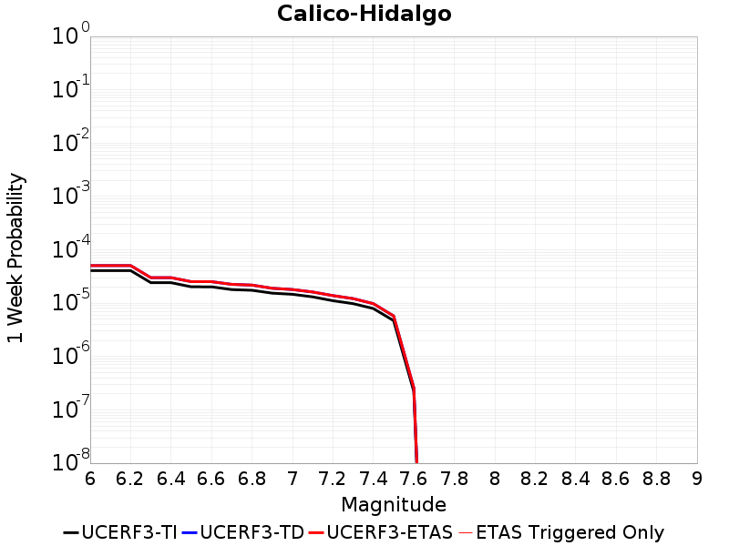 |  |  | 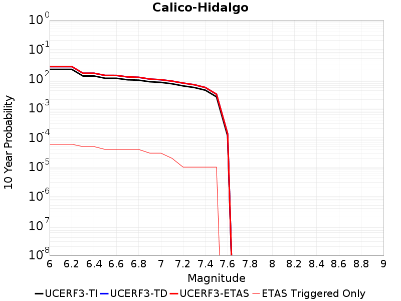 |

| Magnitude | 1 wk TI Prob | 1 wk TD Prob | 1 wk ETAS Prob | 1 wk ETAS/TD Gain | 1 wk ETAS Triggered Only | 1 mo TI Prob | 1 mo TD Prob | 1 mo ETAS Prob | 1 mo ETAS/TD Gain | 1 mo ETAS Triggered Only | 1 yr TI Prob | 1 yr TD Prob | 1 yr ETAS Prob | 1 yr ETAS/TD Gain | 1 yr ETAS Triggered Only | 10 yr TI Prob | 10 yr TD Prob | 10 yr ETAS Prob | 10 yr ETAS/TD Gain | 10 yr ETAS Triggered Only |
|-----|-----|-----|-----|-----|-----|-----|-----|-----|-----|-----|-----|-----|-----|-----|-----|-----|-----|-----|-----|-----|
| 6.0 | 4.0906612E-5 | 5.0750878E-5 | 5.0750878E-5 | 1.0 | 0.0 | 1.7530227E-4 | 2.1748792E-4 | 2.1748792E-4 | 1.0 | 0.0 | 0.0021322158 | 0.0026450986 | 0.0026550721 | 1.0037706 | 1.0E-5 | 0.02111873 | 0.026176509 | 0.026225198 | 1.0018601 | 5.0E-5 |
| 6.1 | 4.0906612E-5 | 5.0750878E-5 | 5.0750878E-5 | 1.0 | 0.0 | 1.7530227E-4 | 2.1748792E-4 | 2.1748792E-4 | 1.0 | 0.0 | 0.0021322158 | 0.0026450986 | 0.0026550721 | 1.0037706 | 1.0E-5 | 0.02111873 | 0.026176509 | 0.026225198 | 1.0018601 | 5.0E-5 |
| 6.2 | 4.0906612E-5 | 5.0750878E-5 | 5.0750878E-5 | 1.0 | 0.0 | 1.7530227E-4 | 2.1748792E-4 | 2.1748792E-4 | 1.0 | 0.0 | 0.0021322158 | 0.0026450986 | 0.0026550721 | 1.0037706 | 1.0E-5 | 0.02111873 | 0.026176509 | 0.026225198 | 1.0018601 | 5.0E-5 |
| 6.3 | 2.4242801E-5 | 3.0110934E-5 | 3.0110934E-5 | 1.0 | 0.0 | 1.0389358E-4 | 1.2904067E-4 | 1.2904067E-4 | 1.0 | 0.0 | 0.0012641704 | 0.0015699714 | 0.0015799557 | 1.0063596 | 1.0E-5 | 0.01257003 | 0.0155924875 | 0.015631864 | 1.0025253 | 4.0E-5 |
| 6.4 | 2.4242801E-5 | 3.0110934E-5 | 3.0110934E-5 | 1.0 | 0.0 | 1.0389358E-4 | 1.2904067E-4 | 1.2904067E-4 | 1.0 | 0.0 | 0.0012641704 | 0.0015699714 | 0.0015799557 | 1.0063596 | 1.0E-5 | 0.01257003 | 0.0155924875 | 0.015631864 | 1.0025253 | 4.0E-5 |
| 6.5 | 2.0286952E-5 | 2.5330844E-5 | 2.5330844E-5 | 1.0 | 0.0 | 8.694118E-5 | 1.0855634E-4 | 1.0855634E-4 | 1.0 | 0.0 | 0.0010579949 | 0.0013208892 | 0.001330876 | 1.0075606 | 1.0E-5 | 0.010529719 | 0.013132318 | 0.013171793 | 1.0030059 | 4.0E-5 |
| 6.6 | 2.0269223E-5 | 2.5311785E-5 | 2.5311785E-5 | 1.0 | 0.0 | 8.6865206E-5 | 1.0847467E-4 | 1.0847467E-4 | 1.0 | 0.0 | 0.0010570707 | 0.0013198961 | 0.0013298829 | 1.0075663 | 1.0E-5 | 0.010520565 | 0.013122504 | 0.013161979 | 1.0030082 | 4.0E-5 |
| 6.7 | 1.799852E-5 | 2.2553662E-5 | 2.2553662E-5 | 1.0 | 0.0 | 7.713423E-5 | 9.665505E-5 | 9.665505E-5 | 1.0 | 0.0 | 9.3870464E-4 | 0.0011761546 | 0.0011861428 | 1.0084922 | 1.0E-5 | 0.009347493 | 0.0117009105 | 0.011730559 | 1.0025339 | 3.0E-5 |
| 6.8 | 1.7458793E-5 | 2.185478E-5 | 2.185478E-5 | 1.0 | 0.0 | 7.4821255E-5 | 9.3660055E-5 | 9.3660055E-5 | 1.0 | 0.0 | 9.10568E-4 | 0.0011397292 | 0.0011497178 | 1.008764 | 1.0E-5 | 0.009068459 | 0.011340425 | 0.011370085 | 1.0026155 | 3.0E-5 |
| 6.9 | 1.542884E-5 | 1.9036994E-5 | 1.9036994E-5 | 1.0 | 0.0 | 6.612192E-5 | 8.158464E-5 | 8.158464E-5 | 1.0 | 0.0 | 8.04737E-4 | 9.928535E-4 | 0.0010028436 | 1.010062 | 1.0E-5 | 0.008018291 | 0.009885577 | 0.009905379 | 1.0020032 | 2.0E-5 |
| 7.0 | 1.468253E-5 | 1.8041103E-5 | 1.8041103E-5 | 1.0 | 0.0 | 6.292361E-5 | 7.731679E-5 | 7.731679E-5 | 1.0 | 0.0 | 7.658257E-4 | 9.409384E-4 | 9.50929E-4 | 1.0106177 | 1.0E-5 | 0.0076319184 | 0.009370912 | 0.009390724 | 1.0021143 | 2.0E-5 |
| 7.1 | 1.3139281E-5 | 1.621048E-5 | 1.621048E-5 | 1.0 | 0.0 | 5.6309986E-5 | 6.947172E-5 | 6.947172E-5 | 1.0 | 0.0 | 6.853584E-4 | 8.455025E-4 | 8.55494E-4 | 1.0118173 | 1.0E-5 | 0.0068324856 | 0.0084241545 | 0.00843407 | 1.0011771 | 1.0E-5 |
| 7.2 | 1.1127404E-5 | 1.3875048E-5 | 1.3875048E-5 | 1.0 | 0.0 | 4.7688E-5 | 5.94632E-5 | 5.94632E-5 | 1.0 | 0.0 | 5.8044674E-4 | 7.237349E-4 | 7.3372765E-4 | 1.0138072 | 1.0E-5 | 0.0057893298 | 0.0072148875 | 0.0072248154 | 1.001376 | 1.0E-5 |
| 7.3 | 9.808154E-6 | 1.218221E-5 | 1.218221E-5 | 1.0 | 0.0 | 4.2034266E-5 | 5.2208492E-5 | 5.2208492E-5 | 1.0 | 0.0 | 5.11647E-4 | 6.354637E-4 | 6.4545736E-4 | 1.0157266 | 1.0E-5 | 0.0051047057 | 0.0063375426 | 0.0063474793 | 1.0015678 | 1.0E-5 |
| 7.4 | 7.942452E-6 | 9.795776E-6 | 9.795776E-6 | 1.0 | 0.0 | 3.4038632E-5 | 4.198128E-5 | 4.198128E-5 | 1.0 | 0.0 | 4.1434157E-4 | 5.110117E-4 | 5.210065E-4 | 1.019559 | 1.0E-5 | 0.0041356985 | 0.0050993077 | 0.0051092566 | 1.0019511 | 1.0E-5 |
| 7.5 | 4.7121216E-6 | 5.7750735E-6 | 5.7750735E-6 | 1.0 | 0.0 | 2.019465E-5 | 2.4750123E-5 | 2.4750123E-5 | 1.0 | 0.0 | 2.4584212E-4 | 3.0129874E-4 | 3.1129573E-4 | 1.0331796 | 1.0E-5 | 0.0024557032 | 0.0030096553 | 0.003019625 | 1.0033126 | 1.0E-5 |
| 7.6 | 2.21172E-7 | 2.604535E-7 | 2.604535E-7 | 1.0 | 0.0 | 9.478797E-7 | 1.116229E-6 | 1.116229E-6 | 1.0 | 0.0 | 1.1540374E-5 | 1.3590032E-5 | 1.3590032E-5 | 1.0 | 0.0 | 1.1539775E-4 | 1.3589482E-4 | 1.3589482E-4 | 1.0 | 0.0 |

## San Jacinto (San Bernardino)
*[(top)](#table-of-contents)*

| 1 Week | 1 Month | 1 Year | 10 Year |
|-----|-----|-----|-----|
|  |  | 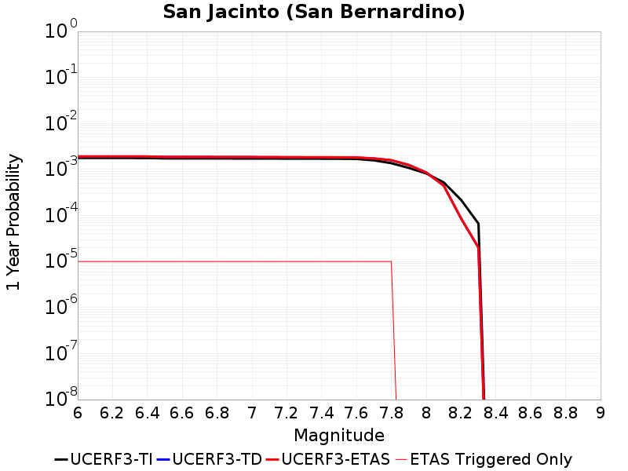 | 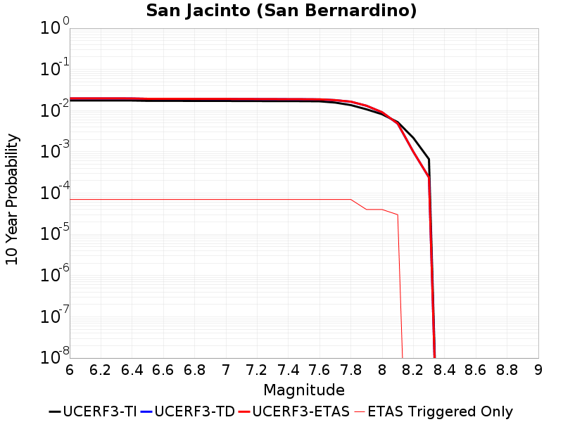 |

| Magnitude | 1 wk TI Prob | 1 wk TD Prob | 1 wk ETAS Prob | 1 wk ETAS/TD Gain | 1 wk ETAS Triggered Only | 1 mo TI Prob | 1 mo TD Prob | 1 mo ETAS Prob | 1 mo ETAS/TD Gain | 1 mo ETAS Triggered Only | 1 yr TI Prob | 1 yr TD Prob | 1 yr ETAS Prob | 1 yr ETAS/TD Gain | 1 yr ETAS Triggered Only | 10 yr TI Prob | 10 yr TD Prob | 10 yr ETAS Prob | 10 yr ETAS/TD Gain | 10 yr ETAS Triggered Only |
|-----|-----|-----|-----|-----|-----|-----|-----|-----|-----|-----|-----|-----|-----|-----|-----|-----|-----|-----|-----|-----|
| 6.0 | 3.409352E-5 | 3.67342E-5 | 3.67342E-5 | 1.0 | 0.0 | 1.461069E-4 | 1.574228E-4 | 1.574228E-4 | 1.0 | 0.0 | 0.0017774 | 0.0019149393 | 0.001934901 | 1.0104241 | 2.0E-5 | 0.01763251 | 0.01973152 | 0.019780533 | 1.002484 | 5.0E-5 |
| 6.1 | 3.409352E-5 | 3.67342E-5 | 3.67342E-5 | 1.0 | 0.0 | 1.461069E-4 | 1.574228E-4 | 1.574228E-4 | 1.0 | 0.0 | 0.0017774 | 0.0019149393 | 0.001934901 | 1.0104241 | 2.0E-5 | 0.01763251 | 0.01973152 | 0.019780533 | 1.002484 | 5.0E-5 |
| 6.2 | 3.409352E-5 | 3.67342E-5 | 3.67342E-5 | 1.0 | 0.0 | 1.461069E-4 | 1.574228E-4 | 1.574228E-4 | 1.0 | 0.0 | 0.0017774 | 0.0019149393 | 0.001934901 | 1.0104241 | 2.0E-5 | 0.01763251 | 0.01973152 | 0.019780533 | 1.002484 | 5.0E-5 |
| 6.3 | 3.409352E-5 | 3.67342E-5 | 3.67342E-5 | 1.0 | 0.0 | 1.461069E-4 | 1.574228E-4 | 1.574228E-4 | 1.0 | 0.0 | 0.0017774 | 0.0019149393 | 0.001934901 | 1.0104241 | 2.0E-5 | 0.01763251 | 0.01973152 | 0.019780533 | 1.002484 | 5.0E-5 |
| 6.4 | 3.400795E-5 | 3.6626705E-5 | 3.6626705E-5 | 1.0 | 0.0 | 1.4574021E-4 | 1.5696217E-4 | 1.5696217E-4 | 1.0 | 0.0 | 0.0017729428 | 0.001909341 | 0.0019293028 | 1.0104548 | 2.0E-5 | 0.017588645 | 0.019676542 | 0.019725557 | 1.0024911 | 5.0E-5 |
| 6.5 | 3.341482E-5 | 3.5886267E-5 | 3.5886267E-5 | 1.0 | 0.0 | 1.4319851E-4 | 1.5378922E-4 | 1.5378922E-4 | 1.0 | 0.0 | 0.0017420477 | 0.0018707772 | 0.0018907399 | 1.0106708 | 2.0E-5 | 0.017284546 | 0.019297685 | 0.019346721 | 1.002541 | 5.0E-5 |
| 6.6 | 3.3364955E-5 | 3.582339E-5 | 3.582339E-5 | 1.0 | 0.0 | 1.4298483E-4 | 1.5351978E-4 | 1.5351978E-4 | 1.0 | 0.0 | 0.0017394501 | 0.0018675025 | 0.0018874651 | 1.0106895 | 2.0E-5 | 0.017258976 | 0.019265514 | 0.019314552 | 1.0025454 | 5.0E-5 |
| 6.7 | 3.335922E-5 | 3.5813147E-5 | 3.5813147E-5 | 1.0 | 0.0 | 1.4296026E-4 | 1.534759E-4 | 1.534759E-4 | 1.0 | 0.0 | 0.0017391514 | 0.001866969 | 0.0018869317 | 1.0106926 | 2.0E-5 | 0.017256035 | 0.0192603 | 0.019309338 | 1.0025461 | 5.0E-5 |
| 6.8 | 3.327683E-5 | 3.5707042E-5 | 3.5707042E-5 | 1.0 | 0.0 | 1.4260718E-4 | 1.5302122E-4 | 1.5302122E-4 | 1.0 | 0.0 | 0.0017348597 | 0.0018614428 | 0.0018814056 | 1.0107243 | 2.0E-5 | 0.017213784 | 0.019206006 | 0.019255046 | 1.0025533 | 5.0E-5 |
| 6.9 | 3.3235785E-5 | 3.564789E-5 | 3.564789E-5 | 1.0 | 0.0 | 1.4243131E-4 | 1.5276774E-4 | 1.5276774E-4 | 1.0 | 0.0 | 0.0017327217 | 0.0018583619 | 0.0018783248 | 1.0107422 | 2.0E-5 | 0.017192734 | 0.019175833 | 0.019224875 | 1.0025574 | 5.0E-5 |
| 7.0 | 3.3197095E-5 | 3.5587695E-5 | 3.5587695E-5 | 1.0 | 0.0 | 1.422655E-4 | 1.5250979E-4 | 1.5250979E-4 | 1.0 | 0.0 | 0.0017307063 | 0.0018552267 | 0.0018751896 | 1.0107603 | 2.0E-5 | 0.017172894 | 0.019145159 | 0.019194202 | 1.0025616 | 5.0E-5 |
| 7.1 | 3.3129716E-5 | 3.5467627E-5 | 3.5467627E-5 | 1.0 | 0.0 | 1.4197677E-4 | 1.5199526E-4 | 1.5199526E-4 | 1.0 | 0.0 | 0.0017271966 | 0.0018489731 | 0.0018689361 | 1.0107968 | 2.0E-5 | 0.017138338 | 0.019084122 | 0.019133167 | 1.00257 | 5.0E-5 |
| 7.2 | 3.3034008E-5 | 3.533483E-5 | 3.533483E-5 | 1.0 | 0.0 | 1.4156665E-4 | 1.514262E-4 | 1.514262E-4 | 1.0 | 0.0 | 0.0017222111 | 0.0018420565 | 0.0018620196 | 1.0108374 | 2.0E-5 | 0.017089253 | 0.019016432 | 0.01906548 | 1.0025793 | 5.0E-5 |
| 7.3 | 3.2956614E-5 | 3.520203E-5 | 3.520203E-5 | 1.0 | 0.0 | 1.4123498E-4 | 1.5085711E-4 | 1.5085711E-4 | 1.0 | 0.0 | 0.0017181796 | 0.0018351397 | 0.001855103 | 1.0108783 | 2.0E-5 | 0.017049557 | 0.018948937 | 0.01899799 | 1.0025886 | 5.0E-5 |
| 7.4 | 3.2915937E-5 | 3.5123318E-5 | 3.5123318E-5 | 1.0 | 0.0 | 1.4106068E-4 | 1.5051982E-4 | 1.5051982E-4 | 1.0 | 0.0 | 0.0017160608 | 0.0018310399 | 0.0018510033 | 1.0109028 | 2.0E-5 | 0.017028693 | 0.01890902 | 0.018958075 | 1.0025942 | 5.0E-5 |
| 7.5 | 3.281791E-5 | 3.4987646E-5 | 3.4987646E-5 | 1.0 | 0.0 | 1.406406E-4 | 1.4993845E-4 | 1.4993845E-4 | 1.0 | 0.0 | 0.0017109542 | 0.0018239736 | 0.0018439371 | 1.0109451 | 2.0E-5 | 0.016978411 | 0.018839648 | 0.018888706 | 1.002604 | 5.0E-5 |
| 7.6 | 3.2521442E-5 | 3.4711204E-5 | 3.4711204E-5 | 1.0 | 0.0 | 1.3937015E-4 | 1.4875382E-4 | 1.4875382E-4 | 1.0 | 0.0 | 0.0016955109 | 0.0018095748 | 0.0018295386 | 1.0110323 | 2.0E-5 | 0.016826328 | 0.018696604 | 0.01874567 | 1.0026243 | 5.0E-5 |
| 7.7 | 3.0287873E-5 | 3.3186894E-5 | 3.3186894E-5 | 1.0 | 0.0 | 1.297987E-4 | 1.422218E-4 | 1.422218E-4 | 1.0 | 0.0 | 0.0015791537 | 0.0017301764 | 0.0017501418 | 1.0115395 | 2.0E-5 | 0.01567979 | 0.017903581 | 0.017952686 | 1.0027428 | 5.0E-5 |
| 7.8 | 2.6316151E-5 | 3.0369338E-5 | 3.0369338E-5 | 1.0 | 0.0 | 1.1277862E-4 | 1.3014782E-4 | 1.3014782E-4 | 1.0 | 0.0 | 0.0013722149 | 0.001583399 | 0.0016033673 | 1.012611 | 2.0E-5 | 0.013637724 | 0.016431296 | 0.016480476 | 1.002993 | 5.0E-5 |
| 7.9 | 2.0761147E-5 | 2.4028788E-5 | 2.4028788E-5 | 1.0 | 0.0 | 8.897331E-5 | 1.0297646E-4 | 1.0297646E-4 | 1.0 | 0.0 | 0.0010827117 | 0.0012530183 | 0.0012729932 | 1.0159415 | 2.0E-5 | 0.010774517 | 0.013108528 | 0.013148003 | 1.0030115 | 4.0E-5 |
| 8.0 | 1.5738568E-5 | 1.6493268E-5 | 1.6493268E-5 | 1.0 | 0.0 | 6.744926E-5 | 7.068352E-5 | 7.068352E-5 | 1.0 | 0.0 | 8.2088535E-4 | 8.6023286E-4 | 8.7022426E-4 | 1.0116148 | 1.0E-5 | 0.008178596 | 0.009107635 | 0.009137362 | 1.003264 | 3.0E-5 |
| 8.1 | 1.0105832E-5 | 8.598553E-6 | 8.598553E-6 | 1.0 | 0.0 | 4.3309992E-5 | 3.6850426E-5 | 3.6850426E-5 | 1.0 | 0.0 | 5.2717153E-4 | 4.4856212E-4 | 4.4856212E-4 | 1.0 | 0.0 | 0.005259227 | 0.004821004 | 0.004830956 | 1.0020642 | 1.0E-5 |
| 8.2 | 4.189207E-6 | 1.6566728E-6 | 1.6566728E-6 | 1.0 | 0.0 | 1.7953622E-5 | 7.100007E-6 | 7.100007E-6 | 1.0 | 0.0 | 2.1856341E-4 | 8.643919E-5 | 8.643919E-5 | 1.0 | 0.0 | 0.0021834858 | 0.0010012593 | 0.0010012593 | 1.0 | 0.0 |
| 8.3 | 1.2758221E-6 | 3.821866E-7 | 3.821866E-7 | 1.0 | 0.0 | 5.4677976E-6 | 1.6379416E-6 | 1.6379416E-6 | 1.0 | 0.0 | 6.65684E-5 | 1.9941761E-5 | 1.9941761E-5 | 1.0 | 0.0 | 6.6548464E-4 | 2.396598E-4 | 2.396598E-4 | 1.0 | 0.0 |

## Rose Canyon
*[(top)](#table-of-contents)*

| 1 Week | 1 Month | 1 Year | 10 Year |
|-----|-----|-----|-----|
| 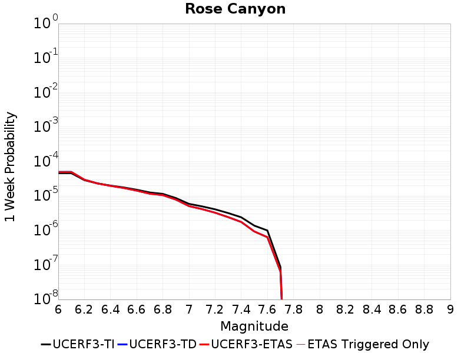 |  |  |  |

| Magnitude | 1 wk TI Prob | 1 wk TD Prob | 1 wk ETAS Prob | 1 wk ETAS/TD Gain | 1 wk ETAS Triggered Only | 1 mo TI Prob | 1 mo TD Prob | 1 mo ETAS Prob | 1 mo ETAS/TD Gain | 1 mo ETAS Triggered Only | 1 yr TI Prob | 1 yr TD Prob | 1 yr ETAS Prob | 1 yr ETAS/TD Gain | 1 yr ETAS Triggered Only | 10 yr TI Prob | 10 yr TD Prob | 10 yr ETAS Prob | 10 yr ETAS/TD Gain | 10 yr ETAS Triggered Only |
|-----|-----|-----|-----|-----|-----|-----|-----|-----|-----|-----|-----|-----|-----|-----|-----|-----|-----|-----|-----|-----|
| 6.0 | 4.5923203E-5 | 4.9858107E-5 | 4.9858107E-5 | 1.0 | 0.0 | 1.9679888E-4 | 2.1366145E-4 | 2.1366145E-4 | 1.0 | 0.0 | 0.0023933933 | 0.0025984182 | 0.0026083922 | 1.0038385 | 1.0E-5 | 0.023677798 | 0.025727933 | 0.025766904 | 1.0015147 | 4.0E-5 |
| 6.1 | 4.5923203E-5 | 4.9858107E-5 | 4.9858107E-5 | 1.0 | 0.0 | 1.9679888E-4 | 2.1366145E-4 | 2.1366145E-4 | 1.0 | 0.0 | 0.0023933933 | 0.0025984182 | 0.0026083922 | 1.0038385 | 1.0E-5 | 0.023677798 | 0.025727933 | 0.025757162 | 1.0011361 | 3.0E-5 |
| 6.2 | 2.8844734E-5 | 2.9772078E-5 | 2.9772078E-5 | 1.0 | 0.0 | 1.2361443E-4 | 1.2758857E-4 | 1.2758857E-4 | 1.0 | 0.0 | 0.0015039665 | 0.0015523122 | 0.0015523122 | 1.0 | 0.0 | 0.0149382865 | 0.0154408645 | 0.0154408645 | 1.0 | 0.0 |
| 6.3 | 2.3171577E-5 | 2.3253007E-5 | 2.3253007E-5 | 1.0 | 0.0 | 9.9302975E-5 | 9.965201E-5 | 9.965201E-5 | 1.0 | 0.0 | 0.0012083431 | 0.0012126015 | 0.0012126015 | 1.0 | 0.0 | 0.012017938 | 0.012081835 | 0.012081835 | 1.0 | 0.0 |
| 6.4 | 2.0066604E-5 | 1.9729136E-5 | 1.9729136E-5 | 1.0 | 0.0 | 8.599689E-5 | 8.455076E-5 | 8.455076E-5 | 1.0 | 0.0 | 0.0010465092 | 0.0010289295 | 0.0010289295 | 1.0 | 0.0 | 0.010415946 | 0.010265942 | 0.010265942 | 1.0 | 0.0 |
| 6.5 | 1.776989E-5 | 1.715639E-5 | 1.715639E-5 | 1.0 | 0.0 | 7.615444E-5 | 7.352535E-5 | 7.352535E-5 | 1.0 | 0.0 | 9.267859E-4 | 8.9481054E-4 | 8.9481054E-4 | 1.0 | 0.0 | 0.009229303 | 0.008936901 | 0.008936901 | 1.0 | 0.0 |
| 6.6 | 1.5227364E-5 | 1.43622E-5 | 1.43622E-5 | 1.0 | 0.0 | 6.52585E-5 | 6.155086E-5 | 6.155086E-5 | 1.0 | 0.0 | 7.942326E-4 | 7.491293E-4 | 7.491293E-4 | 1.0 | 0.0 | 0.007914 | 0.0074933483 | 0.0074933483 | 1.0 | 0.0 |
| 6.7 | 1.2703898E-5 | 1.1686975E-5 | 1.1686975E-5 | 1.0 | 0.0 | 5.4444143E-5 | 5.00861E-5 | 5.00861E-5 | 1.0 | 0.0 | 6.626558E-4 | 6.096319E-4 | 6.096319E-4 | 1.0 | 0.0 | 0.006606833 | 0.006092882 | 0.006092882 | 1.0 | 0.0 |
| 6.8 | 1.1554917E-5 | 1.0621193E-5 | 1.0621193E-5 | 1.0 | 0.0 | 4.9520135E-5 | 4.5518627E-5 | 4.5518627E-5 | 1.0 | 0.0 | 6.0274085E-4 | 5.540524E-4 | 5.540524E-4 | 1.0 | 0.0 | 0.0060110865 | 0.005544497 | 0.005544497 | 1.0 | 0.0 |
| 6.9 | 8.732078E-6 | 7.886807E-6 | 7.886807E-6 | 1.0 | 0.0 | 3.7422655E-5 | 3.380018E-5 | 3.380018E-5 | 1.0 | 0.0 | 4.5552556E-4 | 4.1144242E-4 | 4.1144242E-4 | 1.0 | 0.0 | 0.0045459294 | 0.0041236007 | 0.0041236007 | 1.0 | 0.0 |
| 7.0 | 5.9337494E-6 | 5.110991E-6 | 5.110991E-6 | 1.0 | 0.0 | 2.5430107E-5 | 2.1904063E-5 | 2.1904063E-5 | 1.0 | 0.0 | 3.0956755E-4 | 2.6664947E-4 | 2.6664947E-4 | 1.0 | 0.0 | 0.0030913667 | 0.0026633109 | 0.0026633109 | 1.0 | 0.0 |
| 7.1 | 5.013409E-6 | 4.1803087E-6 | 4.1803087E-6 | 1.0 | 0.0 | 2.1485863E-5 | 1.7915487E-5 | 1.7915487E-5 | 1.0 | 0.0 | 2.6155898E-4 | 2.1809933E-4 | 2.1809933E-4 | 1.0 | 0.0 | 0.0026125133 | 0.0021788646 | 0.0021788646 | 1.0 | 0.0 |
| 7.2 | 4.120763E-6 | 3.2847038E-6 | 3.2847038E-6 | 1.0 | 0.0 | 1.7660293E-5 | 1.4077226E-5 | 1.4077226E-5 | 1.0 | 0.0 | 2.1499286E-4 | 1.7137684E-4 | 1.7137684E-4 | 1.0 | 0.0 | 0.0021478499 | 0.0017124563 | 0.0017124563 | 1.0 | 0.0 |
| 7.3 | 3.2081239E-6 | 2.442592E-6 | 2.442592E-6 | 1.0 | 0.0 | 1.374903E-5 | 1.0468209E-5 | 1.0468209E-5 | 1.0 | 0.0 | 1.6738157E-4 | 1.2744307E-4 | 1.2744307E-4 | 1.0 | 0.0 | 0.0016725556 | 0.0012737068 | 0.0012737068 | 1.0 | 0.0 |
| 7.4 | 2.4194755E-6 | 1.7695461E-6 | 1.7695461E-6 | 1.0 | 0.0 | 1.0369139E-5 | 7.5837474E-6 | 7.5837474E-6 | 1.0 | 0.0 | 1.2623696E-4 | 9.2328264E-5 | 9.2328264E-5 | 1.0 | 0.0 | 0.0012616527 | 9.229044E-4 | 9.229044E-4 | 1.0 | 0.0 |
| 7.5 | 1.3842889E-6 | 9.390626E-7 | 9.390626E-7 | 1.0 | 0.0 | 5.9326535E-6 | 4.0245477E-6 | 4.0245477E-6 | 1.0 | 0.0 | 7.222766E-5 | 4.8997805E-5 | 4.8997805E-5 | 1.0 | 0.0 | 7.220419E-4 | 4.898736E-4 | 4.898736E-4 | 1.0 | 0.0 |
| 7.6 | 1.0021575E-6 | 6.415258E-7 | 6.415258E-7 | 1.0 | 0.0 | 4.2949537E-6 | 2.7493934E-6 | 2.7493934E-6 | 1.0 | 0.0 | 5.2289808E-5 | 3.3473374E-5 | 3.3473374E-5 | 1.0 | 0.0 | 5.2277505E-4 | 3.3468546E-4 | 3.3468546E-4 | 1.0 | 0.0 |
| 7.7 | 8.7620116E-8 | 6.451353E-8 | 6.451353E-8 | 1.0 | 0.0 | 3.7551473E-7 | 2.764865E-7 | 2.764865E-7 | 1.0 | 0.0 | 4.5718825E-6 | 3.3662184E-6 | 3.3662184E-6 | 1.0 | 0.0 | 4.5717883E-5 | 3.36617E-5 | 3.36617E-5 | 1.0 | 0.0 |

## Santa Ynez (East)
*[(top)](#table-of-contents)*

| 1 Week | 1 Month | 1 Year | 10 Year |
|-----|-----|-----|-----|
|  |  | 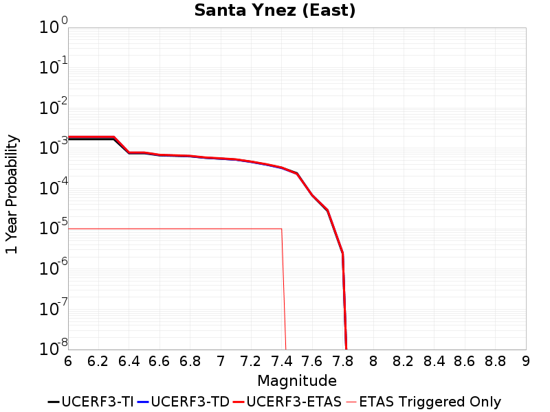 | 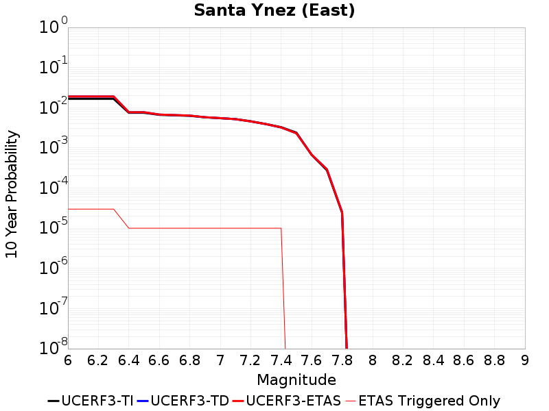 |

| Magnitude | 1 wk TI Prob | 1 wk TD Prob | 1 wk ETAS Prob | 1 wk ETAS/TD Gain | 1 wk ETAS Triggered Only | 1 mo TI Prob | 1 mo TD Prob | 1 mo ETAS Prob | 1 mo ETAS/TD Gain | 1 mo ETAS Triggered Only | 1 yr TI Prob | 1 yr TD Prob | 1 yr ETAS Prob | 1 yr ETAS/TD Gain | 1 yr ETAS Triggered Only | 10 yr TI Prob | 10 yr TD Prob | 10 yr ETAS Prob | 10 yr ETAS/TD Gain | 10 yr ETAS Triggered Only |
|-----|-----|-----|-----|-----|-----|-----|-----|-----|-----|-----|-----|-----|-----|-----|-----|-----|-----|-----|-----|-----|
| 6.0 | 3.2269712E-5 | 3.6789395E-5 | 3.6789395E-5 | 1.0 | 0.0 | 1.3829143E-4 | 1.5766265E-4 | 1.5766265E-4 | 1.0 | 0.0 | 0.0016823979 | 0.0019184371 | 0.0019284178 | 1.0052025 | 1.0E-5 | 0.016697178 | 0.019076332 | 0.01911557 | 1.0020568 | 4.0E-5 |
| 6.1 | 3.2269712E-5 | 3.6789395E-5 | 3.6789395E-5 | 1.0 | 0.0 | 1.3829143E-4 | 1.5766265E-4 | 1.5766265E-4 | 1.0 | 0.0 | 0.0016823979 | 0.0019184371 | 0.0019284178 | 1.0052025 | 1.0E-5 | 0.016697178 | 0.019076332 | 0.01911557 | 1.0020568 | 4.0E-5 |
| 6.2 | 3.2269712E-5 | 3.6789395E-5 | 3.6789395E-5 | 1.0 | 0.0 | 1.3829143E-4 | 1.5766265E-4 | 1.5766265E-4 | 1.0 | 0.0 | 0.0016823979 | 0.0019184371 | 0.0019284178 | 1.0052025 | 1.0E-5 | 0.016697178 | 0.019076332 | 0.01911557 | 1.0020568 | 4.0E-5 |
| 6.3 | 3.2269712E-5 | 3.6789395E-5 | 3.6789395E-5 | 1.0 | 0.0 | 1.3829143E-4 | 1.5766265E-4 | 1.5766265E-4 | 1.0 | 0.0 | 0.0016823979 | 0.0019184371 | 0.0019284178 | 1.0052025 | 1.0E-5 | 0.016697178 | 0.019076332 | 0.01911557 | 1.0020568 | 4.0E-5 |
| 6.4 | 1.4404779E-5 | 1.48587405E-5 | 1.48587405E-5 | 1.0 | 0.0 | 6.1733306E-5 | 6.367879E-5 | 6.367879E-5 | 1.0 | 0.0 | 7.513438E-4 | 7.750186E-4 | 7.750186E-4 | 1.0 | 0.0 | 0.0074880854 | 0.007723708 | 0.007733631 | 1.0012847 | 1.0E-5 |
| 6.5 | 1.4404779E-5 | 1.48587405E-5 | 1.48587405E-5 | 1.0 | 0.0 | 6.1733306E-5 | 6.367879E-5 | 6.367879E-5 | 1.0 | 0.0 | 7.513438E-4 | 7.750186E-4 | 7.750186E-4 | 1.0 | 0.0 | 0.0074880854 | 0.007723708 | 0.007733631 | 1.0012847 | 1.0E-5 |
| 6.6 | 1.280208E-5 | 1.3019708E-5 | 1.3019708E-5 | 1.0 | 0.0 | 5.4864904E-5 | 5.579756E-5 | 5.579756E-5 | 1.0 | 0.0 | 6.6777546E-4 | 6.7912537E-4 | 6.7912537E-4 | 1.0 | 0.0 | 0.006657724 | 0.0067707105 | 0.006780643 | 1.001467 | 1.0E-5 |
| 6.7 | 1.2457027E-5 | 1.2635975E-5 | 1.2635975E-5 | 1.0 | 0.0 | 5.3386164E-5 | 5.415306E-5 | 5.415306E-5 | 1.0 | 0.0 | 6.497827E-4 | 6.591157E-4 | 6.591157E-4 | 1.0 | 0.0 | 0.00647886 | 0.0065718065 | 0.0065817405 | 1.0015117 | 1.0E-5 |
| 6.8 | 1.2095134E-5 | 1.2238189E-5 | 1.2238189E-5 | 1.0 | 0.0 | 5.1835254E-5 | 5.2448337E-5 | 5.2448337E-5 | 1.0 | 0.0 | 6.309115E-4 | 6.38373E-4 | 6.38373E-4 | 1.0 | 0.0 | 0.0062912325 | 0.006365581 | 0.006375517 | 1.0015609 | 1.0E-5 |
| 6.9 | 1.1104036E-5 | 1.1164085E-5 | 1.1164085E-5 | 1.0 | 0.0 | 4.758786E-5 | 4.784521E-5 | 4.784521E-5 | 1.0 | 0.0 | 5.7922816E-4 | 5.8236095E-4 | 5.8236095E-4 | 1.0 | 0.0 | 0.005777207 | 0.0058084945 | 0.0058184364 | 1.0017116 | 1.0E-5 |
| 7.0 | 1.0577444E-5 | 1.05881E-5 | 1.05881E-5 | 1.0 | 0.0 | 4.5331115E-5 | 4.5376786E-5 | 4.5376786E-5 | 1.0 | 0.0 | 5.5176654E-4 | 5.5232353E-4 | 5.5232353E-4 | 1.0 | 0.0 | 0.0055039856 | 0.0055096466 | 0.0055195917 | 1.001805 | 1.0E-5 |
| 7.1 | 1.0021775E-5 | 9.987115E-6 | 9.987115E-6 | 1.0 | 0.0 | 4.294976E-5 | 4.2801224E-5 | 4.2801224E-5 | 1.0 | 0.0 | 5.2278786E-4 | 5.209815E-4 | 5.209815E-4 | 1.0 | 0.0 | 0.0052155964 | 0.005197734 | 0.005207682 | 1.0019139 | 1.0E-5 |
| 7.2 | 8.874109E-6 | 8.754309E-6 | 8.754309E-6 | 1.0 | 0.0 | 3.8031343E-5 | 3.7517937E-5 | 3.7517937E-5 | 1.0 | 0.0 | 4.629332E-4 | 4.5668622E-4 | 4.5668622E-4 | 1.0 | 0.0 | 0.0046197 | 0.0045575956 | 0.00456755 | 1.0021842 | 1.0E-5 |
| 7.3 | 7.5504267E-6 | 7.5097637E-6 | 7.5097637E-6 | 1.0 | 0.0 | 3.235857E-5 | 3.218431E-5 | 3.218431E-5 | 1.0 | 0.0 | 3.9389438E-4 | 3.9177455E-4 | 3.9177455E-4 | 1.0 | 0.0 | 0.0039319694 | 0.0039109457 | 0.0039209067 | 1.0025469 | 1.0E-5 |
| 7.4 | 6.309394E-6 | 6.1869982E-6 | 6.1869982E-6 | 1.0 | 0.0 | 2.703998E-5 | 2.6515443E-5 | 2.6515443E-5 | 1.0 | 0.0 | 3.2916202E-4 | 3.2277865E-4 | 3.2277865E-4 | 1.0 | 0.0 | 0.003286749 | 0.0032231957 | 0.0032331634 | 1.0030925 | 1.0E-5 |
| 7.5 | 4.6103073E-6 | 4.4434223E-6 | 4.4434223E-6 | 1.0 | 0.0 | 1.975831E-5 | 1.9043104E-5 | 1.9043104E-5 | 1.0 | 0.0 | 2.4053088E-4 | 2.318258E-4 | 2.318258E-4 | 1.0 | 0.0 | 0.002402707 | 0.0023159094 | 0.0023258862 | 1.004308 | 1.0E-5 |
| 7.6 | 1.2858658E-6 | 1.3012415E-6 | 1.3012415E-6 | 1.0 | 0.0 | 5.5108417E-6 | 5.5767377E-6 | 5.5767377E-6 | 1.0 | 0.0 | 6.7092435E-5 | 6.789473E-5 | 6.789473E-5 | 1.0 | 0.0 | 6.707218E-4 | 6.7874684E-4 | 6.7874684E-4 | 1.0 | 0.0 |
| 7.7 | 5.3302307E-7 | 5.613905E-7 | 5.613905E-7 | 1.0 | 0.0 | 2.2843826E-6 | 2.4059573E-6 | 2.4059573E-6 | 1.0 | 0.0 | 2.7812002E-5 | 2.9292172E-5 | 2.9292172E-5 | 1.0 | 0.0 | 2.7808524E-4 | 2.928867E-4 | 2.928867E-4 | 1.0 | 0.0 |
| 7.8 | 4.613933E-8 | 4.804175E-8 | 4.804175E-8 | 1.0 | 0.0 | 1.9773998E-7 | 2.0589319E-7 | 2.0589319E-7 | 1.0 | 0.0 | 2.4074816E-6 | 2.5067468E-6 | 2.5067468E-6 | 1.0 | 0.0 | 2.4074554E-5 | 2.5067195E-5 | 2.5067195E-5 | 1.0 | 0.0 |

## Owens Valley
*[(top)](#table-of-contents)*

| 1 Week | 1 Month | 1 Year | 10 Year |
|-----|-----|-----|-----|
|  | 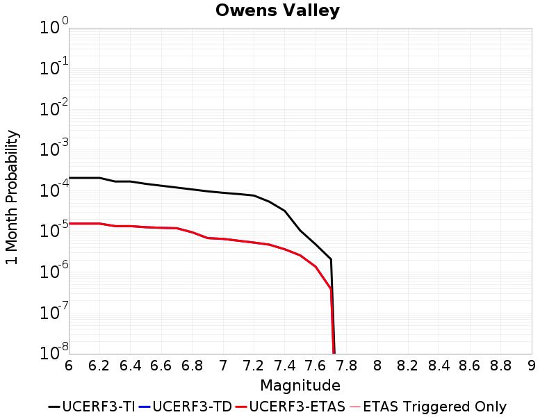 |  |  |

| Magnitude | 1 wk TI Prob | 1 wk TD Prob | 1 wk ETAS Prob | 1 wk ETAS/TD Gain | 1 wk ETAS Triggered Only | 1 mo TI Prob | 1 mo TD Prob | 1 mo ETAS Prob | 1 mo ETAS/TD Gain | 1 mo ETAS Triggered Only | 1 yr TI Prob | 1 yr TD Prob | 1 yr ETAS Prob | 1 yr ETAS/TD Gain | 1 yr ETAS Triggered Only | 10 yr TI Prob | 10 yr TD Prob | 10 yr ETAS Prob | 10 yr ETAS/TD Gain | 10 yr ETAS Triggered Only |
|-----|-----|-----|-----|-----|-----|-----|-----|-----|-----|-----|-----|-----|-----|-----|-----|-----|-----|-----|-----|-----|
| 6.0 | 4.83821E-5 | 3.659507E-6 | 3.659507E-6 | 1.0 | 0.0 | 2.0733538E-4 | 1.5683512E-5 | 2.5683355E-5 | 1.6376022 | 1.0E-5 | 0.002521386 | 1.9093105E-4 | 2.2092533E-4 | 1.1570948 | 3.0E-5 | 0.024929691 | 0.0019455922 | 0.001995495 | 1.0256491 | 5.0E-5 |
| 6.1 | 4.83821E-5 | 3.659507E-6 | 3.659507E-6 | 1.0 | 0.0 | 2.0733538E-4 | 1.5683512E-5 | 2.5683355E-5 | 1.6376022 | 1.0E-5 | 0.002521386 | 1.9093105E-4 | 2.2092533E-4 | 1.1570948 | 3.0E-5 | 0.024929691 | 0.0019455922 | 0.001995495 | 1.0256491 | 5.0E-5 |
| 6.2 | 4.83821E-5 | 3.659507E-6 | 3.659507E-6 | 1.0 | 0.0 | 2.0733538E-4 | 1.5683512E-5 | 2.5683355E-5 | 1.6376022 | 1.0E-5 | 0.002521386 | 1.9093105E-4 | 2.2092533E-4 | 1.1570948 | 3.0E-5 | 0.024929691 | 0.0019455922 | 0.001995495 | 1.0256491 | 5.0E-5 |
| 6.3 | 3.953008E-5 | 3.1736533E-6 | 3.1736533E-6 | 1.0 | 0.0 | 1.6940363E-4 | 1.3601305E-5 | 2.360117E-5 | 1.7352135 | 1.0E-5 | 0.002060538 | 1.6558405E-4 | 1.8558073E-4 | 1.1207646 | 2.0E-5 | 0.020415364 | 0.0016681744 | 0.0017081077 | 1.0239383 | 4.0E-5 |
| 6.4 | 3.953008E-5 | 3.1736533E-6 | 3.1736533E-6 | 1.0 | 0.0 | 1.6940363E-4 | 1.3601305E-5 | 2.360117E-5 | 1.7352135 | 1.0E-5 | 0.002060538 | 1.6558405E-4 | 1.8558073E-4 | 1.1207646 | 2.0E-5 | 0.020415364 | 0.0016681744 | 0.0017081077 | 1.0239383 | 4.0E-5 |
| 6.5 | 3.457342E-5 | 2.983584E-6 | 2.983584E-6 | 1.0 | 0.0 | 1.4816338E-4 | 1.278673E-5 | 2.2786602E-5 | 1.7820508 | 1.0E-5 | 0.0018023965 | 1.5566802E-4 | 1.756649E-4 | 1.1284585 | 2.0E-5 | 0.017878477 | 0.0015619164 | 0.001601854 | 1.0255696 | 4.0E-5 |
| 6.6 | 3.1127765E-5 | 2.8833674E-6 | 2.8833674E-6 | 1.0 | 0.0 | 1.3339789E-4 | 1.23572345E-5 | 2.2357111E-5 | 1.8092326 | 1.0E-5 | 0.0016229092 | 1.5043964E-4 | 1.7043663E-4 | 1.1329237 | 2.0E-5 | 0.016111081 | 0.0015053201 | 0.0015452598 | 1.0265324 | 4.0E-5 |
| 6.7 | 2.806885E-5 | 2.8169836E-6 | 2.8169836E-6 | 1.0 | 0.0 | 1.2028952E-4 | 1.20727345E-5 | 2.2072614E-5 | 1.8283027 | 1.0E-5 | 0.001463541 | 1.4697632E-4 | 1.6697338E-4 | 1.1360563 | 2.0E-5 | 0.014539397 | 0.0014692527 | 0.001509194 | 1.0271847 | 4.0E-5 |
| 6.8 | 2.524524E-5 | 2.2410347E-6 | 2.2410347E-6 | 1.0 | 0.0 | 1.0818939E-4 | 9.604401E-6 | 1.9604306E-5 | 2.0411794 | 1.0E-5 | 0.0013164099 | 1.1692761E-4 | 1.3692527E-4 | 1.171026 | 2.0E-5 | 0.01308639 | 0.0011690195 | 0.0012089728 | 1.0341767 | 4.0E-5 |
| 6.9 | 2.2704568E-5 | 1.6123149E-6 | 1.6123149E-6 | 1.0 | 0.0 | 9.730166E-5 | 6.909903E-6 | 1.6909833E-5 | 2.4471884 | 1.0E-5 | 0.0011840039 | 8.412484E-5 | 1.0412315E-4 | 1.2377219 | 2.0E-5 | 0.011777153 | 8.412201E-4 | 8.8118645E-4 | 1.04751 | 4.0E-5 |
| 7.0 | 2.0871712E-5 | 1.5434724E-6 | 1.5434724E-6 | 1.0 | 0.0 | 8.944713E-5 | 6.6148655E-6 | 1.6614798E-5 | 2.5117366 | 1.0E-5 | 0.0010884746 | 8.053303E-5 | 1.0053142E-4 | 1.2483253 | 2.0E-5 | 0.010831586 | 8.0528436E-4 | 8.452521E-4 | 1.049632 | 4.0E-5 |
| 7.1 | 1.944928E-5 | 1.3897688E-6 | 1.3897688E-6 | 1.0 | 0.0 | 8.335139E-5 | 5.9561385E-6 | 1.5956079E-5 | 2.67893 | 1.0E-5 | 0.0010143308 | 7.251358E-5 | 9.2512135E-5 | 1.2757903 | 2.0E-5 | 0.010097133 | 7.251311E-4 | 7.651021E-4 | 1.0551225 | 4.0E-5 |
| 7.2 | 1.7876306E-5 | 1.2518595E-6 | 1.2518595E-6 | 1.0 | 0.0 | 7.6610486E-5 | 5.3651015E-6 | 1.5365047E-5 | 2.8638875 | 1.0E-5 | 9.3233347E-4 | 6.531816E-5 | 8.531685E-5 | 1.3061736 | 2.0E-5 | 0.009284316 | 6.531857E-4 | 6.931596E-4 | 1.0611984 | 4.0E-5 |
| 7.3 | 1.2618672E-5 | 1.1142514E-6 | 1.1142514E-6 | 1.0 | 0.0 | 5.40789E-5 | 4.7753542E-6 | 1.4775306E-5 | 3.0940754 | 1.0E-5 | 6.582117E-4 | 5.8138394E-5 | 7.813723E-5 | 1.3439867 | 2.0E-5 | 0.0065626553 | 5.814228E-4 | 6.2139955E-4 | 1.0687567 | 4.0E-5 |
| 7.4 | 7.4874442E-6 | 8.571643E-7 | 8.571643E-7 | 1.0 | 0.0 | 3.208865E-5 | 3.6735562E-6 | 1.367352E-5 | 3.722148 | 1.0E-5 | 3.906093E-4 | 4.4724635E-5 | 6.472374E-5 | 1.4471608 | 2.0E-5 | 0.003899234 | 4.473058E-4 | 4.872879E-4 | 1.0893843 | 4.0E-5 |
| 7.5 | 2.4734156E-6 | 6.084105E-7 | 6.084105E-7 | 1.0 | 0.0 | 1.060031E-5 | 2.607471E-6 | 1.2607445E-5 | 4.8351235 | 1.0E-5 | 1.2905113E-4 | 3.17455E-5 | 5.1744868E-5 | 1.6299906 | 2.0E-5 | 0.0012897621 | 3.1740998E-4 | 3.573973E-4 | 1.12598 | 4.0E-5 |
| 7.6 | 1.1328841E-6 | 3.2042144E-7 | 3.2042144E-7 | 1.0 | 0.0 | 4.8552088E-6 | 1.373234E-6 | 1.373234E-6 | 1.0 | 0.0 | 5.9110564E-5 | 1.6718997E-5 | 2.671883E-5 | 1.598112 | 1.0E-5 | 5.9094845E-4 | 1.6717758E-4 | 1.8717424E-4 | 1.1196133 | 2.0E-5 |
| 7.7 | 4.8613185E-7 | 8.9940926E-8 | 8.9940926E-8 | 1.0 | 0.0 | 2.0834207E-6 | 3.8546105E-7 | 3.8546105E-7 | 1.0 | 0.0 | 2.536535E-5 | 4.692979E-6 | 4.692979E-6 | 1.0 | 0.0 | 2.5362454E-4 | 4.6928864E-5 | 4.6928864E-5 | 1.0 | 0.0 |

## Mission Creek
*[(top)](#table-of-contents)*

| 1 Week | 1 Month | 1 Year | 10 Year |
|-----|-----|-----|-----|
|  |  |  | 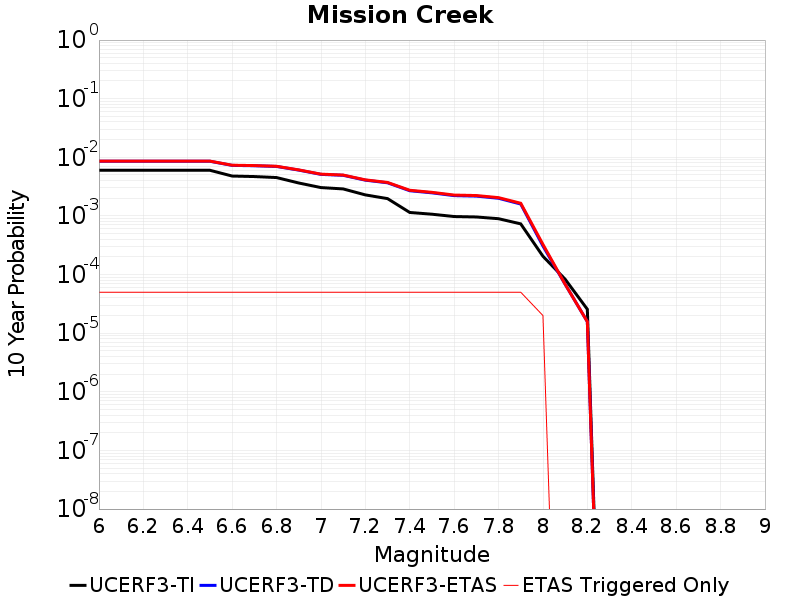 |

| Magnitude | 1 wk TI Prob | 1 wk TD Prob | 1 wk ETAS Prob | 1 wk ETAS/TD Gain | 1 wk ETAS Triggered Only | 1 mo TI Prob | 1 mo TD Prob | 1 mo ETAS Prob | 1 mo ETAS/TD Gain | 1 mo ETAS Triggered Only | 1 yr TI Prob | 1 yr TD Prob | 1 yr ETAS Prob | 1 yr ETAS/TD Gain | 1 yr ETAS Triggered Only | 10 yr TI Prob | 10 yr TD Prob | 10 yr ETAS Prob | 10 yr ETAS/TD Gain | 10 yr ETAS Triggered Only |
|-----|-----|-----|-----|-----|-----|-----|-----|-----|-----|-----|-----|-----|-----|-----|-----|-----|-----|-----|-----|-----|
| 6.0 | 1.1549387E-5 | 1.6427497E-5 | 1.6427497E-5 | 1.0 | 0.0 | 4.9496433E-5 | 7.0401744E-5 | 8.0401034E-5 | 1.1420319 | 1.0E-5 | 6.0245243E-4 | 8.5681916E-4 | 8.668106E-4 | 1.011661 | 1.0E-5 | 0.006008218 | 0.008563137 | 0.008612708 | 1.005789 | 5.0E-5 |
| 6.1 | 1.1549387E-5 | 1.6427497E-5 | 1.6427497E-5 | 1.0 | 0.0 | 4.9496433E-5 | 7.0401744E-5 | 8.0401034E-5 | 1.1420319 | 1.0E-5 | 6.0245243E-4 | 8.5681916E-4 | 8.668106E-4 | 1.011661 | 1.0E-5 | 0.006008218 | 0.008563137 | 0.008612708 | 1.005789 | 5.0E-5 |
| 6.2 | 1.1549387E-5 | 1.6427497E-5 | 1.6427497E-5 | 1.0 | 0.0 | 4.9496433E-5 | 7.0401744E-5 | 8.0401034E-5 | 1.1420319 | 1.0E-5 | 6.0245243E-4 | 8.5681916E-4 | 8.668106E-4 | 1.011661 | 1.0E-5 | 0.006008218 | 0.008563137 | 0.008612708 | 1.005789 | 5.0E-5 |
| 6.3 | 1.1549387E-5 | 1.6427497E-5 | 1.6427497E-5 | 1.0 | 0.0 | 4.9496433E-5 | 7.0401744E-5 | 8.0401034E-5 | 1.1420319 | 1.0E-5 | 6.0245243E-4 | 8.5681916E-4 | 8.668106E-4 | 1.011661 | 1.0E-5 | 0.006008218 | 0.008563137 | 0.008612708 | 1.005789 | 5.0E-5 |
| 6.4 | 1.1549387E-5 | 1.6427497E-5 | 1.6427497E-5 | 1.0 | 0.0 | 4.9496433E-5 | 7.0401744E-5 | 8.0401034E-5 | 1.1420319 | 1.0E-5 | 6.0245243E-4 | 8.5681916E-4 | 8.668106E-4 | 1.011661 | 1.0E-5 | 0.006008218 | 0.008563137 | 0.008612708 | 1.005789 | 5.0E-5 |
| 6.5 | 1.1549387E-5 | 1.6427497E-5 | 1.6427497E-5 | 1.0 | 0.0 | 4.9496433E-5 | 7.0401744E-5 | 8.0401034E-5 | 1.1420319 | 1.0E-5 | 6.0245243E-4 | 8.5681916E-4 | 8.668106E-4 | 1.011661 | 1.0E-5 | 0.006008218 | 0.008563137 | 0.008612708 | 1.005789 | 5.0E-5 |
| 6.6 | 9.202681E-6 | 1.3949962E-5 | 1.3949962E-5 | 1.0 | 0.0 | 3.9439463E-5 | 5.978423E-5 | 6.978363E-5 | 1.1672581 | 1.0E-5 | 4.800697E-4 | 7.27639E-4 | 7.376317E-4 | 1.013733 | 1.0E-5 | 0.004790339 | 0.0072799674 | 0.0073296037 | 1.0068182 | 5.0E-5 |
| 6.7 | 9.019164E-6 | 1.37555635E-5 | 1.37555635E-5 | 1.0 | 0.0 | 3.8652986E-5 | 5.8951133E-5 | 6.895055E-5 | 1.1696221 | 1.0E-5 | 4.7049852E-4 | 7.175027E-4 | 7.274955E-4 | 1.0139272 | 1.0E-5 | 0.004695036 | 0.007179262 | 0.007228903 | 1.0069145 | 5.0E-5 |
| 6.8 | 8.673558E-6 | 1.3377452E-5 | 1.3377452E-5 | 1.0 | 0.0 | 3.717186E-5 | 5.733073E-5 | 6.7330155E-5 | 1.1744165 | 1.0E-5 | 4.524734E-4 | 6.977869E-4 | 7.0777995E-4 | 1.014321 | 1.0E-5 | 0.0045155324 | 0.006983346 | 0.0070329965 | 1.0071099 | 5.0E-5 |
| 6.9 | 7.002255E-6 | 1.1580882E-5 | 1.1580882E-5 | 1.0 | 0.0 | 3.000932E-5 | 4.9631446E-5 | 5.9630947E-5 | 1.2014751 | 1.0E-5 | 3.653022E-4 | 6.041022E-4 | 6.140961E-4 | 1.0165435 | 1.0E-5 | 0.0036470229 | 0.006051803 | 0.0061015007 | 1.008212 | 5.0E-5 |
| 7.0 | 5.84644E-6 | 9.772933E-6 | 9.772933E-6 | 1.0 | 0.0 | 2.5055931E-5 | 4.188335E-5 | 5.1882933E-5 | 1.2387483 | 1.0E-5 | 3.0501327E-4 | 5.0981506E-4 | 5.1980995E-4 | 1.0196049 | 1.0E-5 | 0.0030459496 | 0.0051134485 | 0.0051631927 | 1.0097282 | 5.0E-5 |
| 7.1 | 5.54703E-6 | 9.427054E-6 | 9.427054E-6 | 1.0 | 0.0 | 2.377277E-5 | 4.0401057E-5 | 5.0400653E-5 | 1.2475083 | 1.0E-5 | 2.8939504E-4 | 4.917763E-4 | 5.017714E-4 | 1.0203245 | 1.0E-5 | 0.0028901845 | 0.004933867 | 0.0049836203 | 1.010084 | 5.0E-5 |
| 7.2 | 4.384709E-6 | 7.7748155E-6 | 7.7748155E-6 | 1.0 | 0.0 | 1.8791474E-5 | 3.332023E-5 | 4.33199E-5 | 1.300108 | 1.0E-5 | 2.2876218E-4 | 4.0560195E-4 | 4.155979E-4 | 1.0246447 | 1.0E-5 | 0.0022852682 | 0.0040755635 | 0.00412536 | 1.0122182 | 5.0E-5 |
| 7.3 | 3.7888456E-6 | 7.0068595E-6 | 7.0068595E-6 | 1.0 | 0.0 | 1.623781E-5 | 3.0029072E-5 | 4.002877E-5 | 1.3330007 | 1.0E-5 | 1.9767738E-4 | 3.6554597E-4 | 3.7554232E-4 | 1.0273464 | 1.0E-5 | 0.0019750162 | 0.0036763689 | 0.003726185 | 1.0135504 | 5.0E-5 |
| 7.4 | 2.1982462E-6 | 5.1124803E-6 | 5.1124803E-6 | 1.0 | 0.0 | 9.421021E-6 | 2.1910446E-5 | 3.1910226E-5 | 1.4563934 | 1.0E-5 | 1.1469489E-4 | 2.6672723E-4 | 2.7672455E-4 | 1.0374814 | 1.0E-5 | 0.0011463572 | 0.0026907825 | 0.002740648 | 1.0185319 | 5.0E-5 |
| 7.5 | 2.051923E-6 | 4.7012973E-6 | 4.7012973E-6 | 1.0 | 0.0 | 8.793926E-6 | 2.0148262E-5 | 3.014806E-5 | 1.4963107 | 1.0E-5 | 1.0706078E-4 | 2.452776E-4 | 2.5527517E-4 | 1.0407602 | 1.0E-5 | 0.0010700922 | 0.0024772764 | 0.0025271524 | 1.0201335 | 5.0E-5 |
| 7.6 | 1.8733427E-6 | 4.206705E-6 | 4.206705E-6 | 1.0 | 0.0 | 8.028587E-6 | 1.8028612E-5 | 2.8028431E-5 | 1.5546639 | 1.0E-5 | 9.774366E-5 | 2.1947632E-4 | 2.2947413E-4 | 1.045553 | 1.0E-5 | 9.770069E-4 | 0.0022203939 | 0.002270283 | 1.0224686 | 5.0E-5 |
| 7.7 | 1.8411953E-6 | 4.1258245E-6 | 4.1258245E-6 | 1.0 | 0.0 | 7.890813E-6 | 1.7681985E-5 | 2.7681808E-5 | 1.5655373 | 1.0E-5 | 9.606641E-5 | 2.15257E-4 | 2.2525484E-4 | 1.0464461 | 1.0E-5 | 9.6024893E-4 | 0.0021783935 | 0.0022282845 | 1.0229027 | 5.0E-5 |
| 7.8 | 1.7194251E-6 | 3.7875272E-6 | 3.7875272E-6 | 1.0 | 0.0 | 7.368944E-6 | 1.623216E-5 | 2.6231997E-5 | 1.616051 | 1.0E-5 | 8.97132E-5 | 1.976087E-4 | 2.0760672E-4 | 1.050595 | 1.0E-5 | 8.967699E-4 | 0.0020014832 | 0.002051383 | 1.0249314 | 5.0E-5 |
| 7.9 | 1.4035052E-6 | 3.0132815E-6 | 3.0132815E-6 | 1.0 | 0.0 | 6.0150082E-6 | 1.2914E-5 | 2.2913871E-5 | 1.7743434 | 1.0E-5 | 7.3230265E-5 | 1.5721667E-4 | 1.672151E-4 | 1.0635965 | 1.0E-5 | 7.3206134E-4 | 0.0015951974 | 0.0016451176 | 1.0312941 | 5.0E-5 |
| 8.0 | 3.9318823E-7 | 5.6825365E-7 | 5.6825365E-7 | 1.0 | 0.0 | 1.6850913E-6 | 2.4353706E-6 | 1.2435346E-5 | 5.106141 | 1.0E-5 | 2.0515794E-5 | 2.965024E-5 | 3.9649945E-5 | 1.3372554 | 1.0E-5 | 2.0513899E-4 | 3.069332E-4 | 3.2692705E-4 | 1.0651407 | 2.0E-5 |
| 8.1 | 1.596793E-7 | 1.1914987E-7 | 1.1914987E-7 | 1.0 | 0.0 | 6.8433974E-7 | 5.1064217E-7 | 5.1064217E-7 | 1.0 | 0.0 | 8.331805E-6 | 6.217051E-6 | 6.217051E-6 | 1.0 | 0.0 | 8.331492E-5 | 6.8398454E-5 | 6.8398454E-5 | 1.0 | 0.0 |
| 8.2 | 4.9003038E-8 | 2.6803056E-8 | 2.6803056E-8 | 1.0 | 0.0 | 2.10013E-7 | 1.1487023E-7 | 1.1487023E-7 | 1.0 | 0.0 | 2.5569052E-6 | 1.3985442E-6 | 1.3985442E-6 | 1.0 | 0.0 | 2.556876E-5 | 1.5706382E-5 | 1.5706382E-5 | 1.0 | 0.0 |

## Great Valley 09 (Laguna Seca)
*[(top)](#table-of-contents)*

| 1 Week | 1 Month | 1 Year | 10 Year |
|-----|-----|-----|-----|
|  | 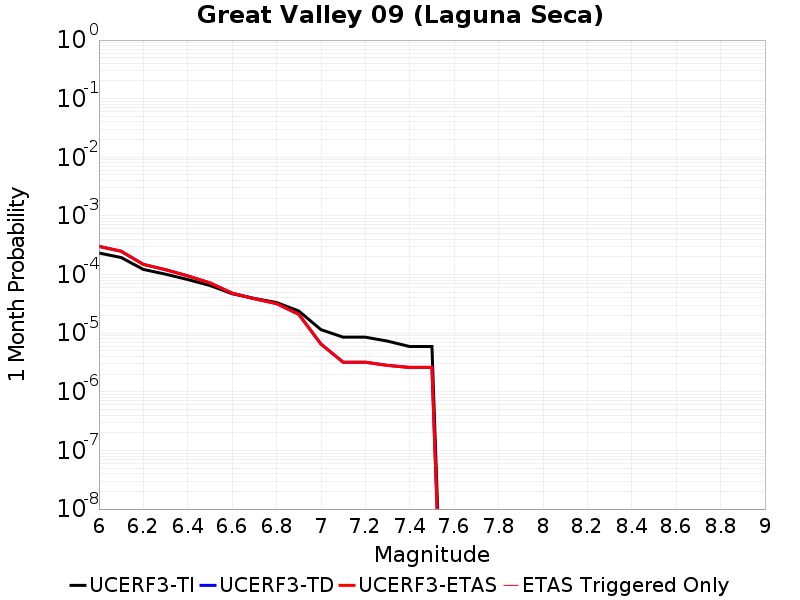 |  |  |

| Magnitude | 1 wk TI Prob | 1 wk TD Prob | 1 wk ETAS Prob | 1 wk ETAS/TD Gain | 1 wk ETAS Triggered Only | 1 mo TI Prob | 1 mo TD Prob | 1 mo ETAS Prob | 1 mo ETAS/TD Gain | 1 mo ETAS Triggered Only | 1 yr TI Prob | 1 yr TD Prob | 1 yr ETAS Prob | 1 yr ETAS/TD Gain | 1 yr ETAS Triggered Only | 10 yr TI Prob | 10 yr TD Prob | 10 yr ETAS Prob | 10 yr ETAS/TD Gain | 10 yr ETAS Triggered Only |
|-----|-----|-----|-----|-----|-----|-----|-----|-----|-----|-----|-----|-----|-----|-----|-----|-----|-----|-----|-----|-----|
| 6.0 | 5.4353277E-5 | 7.0630325E-5 | 7.0630325E-5 | 1.0 | 0.0 | 2.3292181E-4 | 3.0266543E-4 | 3.126624E-4 | 1.0330298 | 1.0E-5 | 0.0028321352 | 0.0036787218 | 0.0037086115 | 1.008125 | 3.0E-5 | 0.02796312 | 0.036179766 | 0.036227956 | 1.001332 | 5.0E-5 |
| 6.1 | 4.5578287E-5 | 5.8324094E-5 | 5.8324094E-5 | 1.0 | 0.0 | 1.953209E-4 | 2.4993665E-4 | 2.5993414E-4 | 1.0400001 | 1.0E-5 | 0.0023754383 | 0.0030387272 | 0.003068636 | 1.0098425 | 3.0E-5 | 0.023502063 | 0.029971387 | 0.030010188 | 1.0012946 | 4.0E-5 |
| 6.2 | 2.8536782E-5 | 3.4791912E-5 | 3.4791912E-5 | 1.0 | 0.0 | 1.2229476E-4 | 1.4909885E-4 | 1.4909885E-4 | 1.0 | 0.0 | 0.0014879217 | 0.001813746 | 0.001823728 | 1.0055034 | 1.0E-5 | 0.014779986 | 0.017986353 | 0.017996173 | 1.000546 | 1.0E-5 |
| 6.3 | 2.3698774E-5 | 2.8256163E-5 | 2.8256163E-5 | 1.0 | 0.0 | 1.01562226E-4 | 1.21091914E-4 | 1.21091914E-4 | 1.0 | 0.0 | 0.0012358186 | 0.0014732877 | 0.001483273 | 1.0067775 | 1.0E-5 | 0.012289686 | 0.0146332905 | 0.014643145 | 1.0006734 | 1.0E-5 |
| 6.4 | 1.9191197E-5 | 2.2154096E-5 | 2.2154096E-5 | 1.0 | 0.0 | 8.2245395E-5 | 9.494228E-5 | 9.494228E-5 | 1.0 | 0.0 | 0.0010008777 | 0.0011553129 | 0.0011653013 | 1.0086457 | 1.0E-5 | 0.009963818 | 0.011492942 | 0.0115028275 | 1.0008601 | 1.0E-5 |
| 6.5 | 1.5203241E-5 | 1.6822505E-5 | 1.6822505E-5 | 1.0 | 0.0 | 6.5155116E-5 | 7.2094E-5 | 7.2094E-5 | 1.0 | 0.0 | 7.9297484E-4 | 8.774048E-4 | 8.8739605E-4 | 1.0113872 | 1.0E-5 | 0.007901512 | 0.008740474 | 0.008750386 | 1.0011342 | 1.0E-5 |
| 6.6 | 1.0984925E-5 | 1.1253748E-5 | 1.1253748E-5 | 1.0 | 0.0 | 4.70774E-5 | 4.822947E-5 | 4.822947E-5 | 1.0 | 0.0 | 5.730166E-4 | 5.8703945E-4 | 5.970336E-4 | 1.0170246 | 1.0E-5 | 0.005715413 | 0.0058552776 | 0.005865219 | 1.0016979 | 1.0E-5 |
| 6.7 | 9.134616E-6 | 9.0284075E-6 | 9.0284075E-6 | 1.0 | 0.0 | 3.9147766E-5 | 3.8692615E-5 | 3.8692615E-5 | 1.0 | 0.0 | 4.7651984E-4 | 4.7098313E-4 | 4.8097843E-4 | 1.0212222 | 1.0E-5 | 0.004754993 | 0.004700095 | 0.004710048 | 1.0021176 | 1.0E-5 |
| 6.8 | 7.785589E-6 | 7.4589493E-6 | 7.4589493E-6 | 1.0 | 0.0 | 3.3366385E-5 | 3.1966545E-5 | 3.1966545E-5 | 1.0 | 0.0 | 4.0616E-4 | 3.891252E-4 | 3.9912132E-4 | 1.0256886 | 1.0E-5 | 0.0040541845 | 0.0038846429 | 0.003894604 | 1.0025642 | 1.0E-5 |
| 6.9 | 5.579095E-6 | 4.9031196E-6 | 4.9031196E-6 | 1.0 | 0.0 | 2.3910188E-5 | 2.101321E-5 | 2.101321E-5 | 1.0 | 0.0 | 2.9106764E-4 | 2.5580716E-4 | 2.5580716E-4 | 1.0 | 0.0 | 0.002906867 | 0.0025552649 | 0.0025552649 | 1.0 | 0.0 |
| 7.0 | 2.6816688E-6 | 1.5229268E-6 | 1.5229268E-6 | 1.0 | 0.0 | 1.1492816E-5 | 6.526813E-6 | 6.526813E-6 | 1.0 | 0.0 | 1.3991605E-4 | 7.946114E-5 | 7.946114E-5 | 1.0 | 0.0 | 0.0013982799 | 7.94336E-4 | 7.94336E-4 | 1.0 | 0.0 |
| 7.1 | 1.9951021E-6 | 7.460964E-7 | 7.460964E-7 | 1.0 | 0.0 | 8.55041E-6 | 3.1975524E-6 | 3.1975524E-6 | 1.0 | 0.0 | 1.0409627E-4 | 3.8929546E-5 | 3.8929546E-5 | 1.0 | 0.0 | 0.0010404752 | 3.892314E-4 | 3.892314E-4 | 1.0 | 0.0 |
| 7.2 | 1.9951021E-6 | 7.460964E-7 | 7.460964E-7 | 1.0 | 0.0 | 8.55041E-6 | 3.1975524E-6 | 3.1975524E-6 | 1.0 | 0.0 | 1.0409627E-4 | 3.8929546E-5 | 3.8929546E-5 | 1.0 | 0.0 | 0.0010404752 | 3.892314E-4 | 3.892314E-4 | 1.0 | 0.0 |
| 7.3 | 1.7087556E-6 | 6.5844074E-7 | 6.5844074E-7 | 1.0 | 0.0 | 7.3232177E-6 | 2.821886E-6 | 2.821886E-6 | 1.0 | 0.0 | 8.915652E-5 | 3.4355962E-5 | 3.4355962E-5 | 1.0 | 0.0 | 8.9120766E-4 | 3.4351056E-4 | 3.4351056E-4 | 1.0 | 0.0 |
| 7.4 | 1.3804846E-6 | 6.0781616E-7 | 6.0781616E-7 | 1.0 | 0.0 | 5.916349E-6 | 2.604924E-6 | 2.604924E-6 | 1.0 | 0.0 | 7.2029165E-5 | 3.171453E-5 | 3.171453E-5 | 1.0 | 0.0 | 7.200583E-4 | 3.1710404E-4 | 3.1710404E-4 | 1.0 | 0.0 |
| 7.5 | 1.3804846E-6 | 6.0781616E-7 | 6.0781616E-7 | 1.0 | 0.0 | 5.916349E-6 | 2.604924E-6 | 2.604924E-6 | 1.0 | 0.0 | 7.2029165E-5 | 3.171453E-5 | 3.171453E-5 | 1.0 | 0.0 | 7.200583E-4 | 3.1710404E-4 | 3.1710404E-4 | 1.0 | 0.0 |

## Ludlow
*[(top)](#table-of-contents)*

| 1 Week | 1 Month | 1 Year | 10 Year |
|-----|-----|-----|-----|
|  |  |  |  |

| Magnitude | 1 wk TI Prob | 1 wk TD Prob | 1 wk ETAS Prob | 1 wk ETAS/TD Gain | 1 wk ETAS Triggered Only | 1 mo TI Prob | 1 mo TD Prob | 1 mo ETAS Prob | 1 mo ETAS/TD Gain | 1 mo ETAS Triggered Only | 1 yr TI Prob | 1 yr TD Prob | 1 yr ETAS Prob | 1 yr ETAS/TD Gain | 1 yr ETAS Triggered Only | 10 yr TI Prob | 10 yr TD Prob | 10 yr ETAS Prob | 10 yr ETAS/TD Gain | 10 yr ETAS Triggered Only |
|-----|-----|-----|-----|-----|-----|-----|-----|-----|-----|-----|-----|-----|-----|-----|-----|-----|-----|-----|-----|-----|
| 6.0 | 2.2407607E-5 | 2.3665063E-5 | 2.3665063E-5 | 1.0 | 0.0 | 9.602906E-5 | 1.0141801E-4 | 1.0141801E-4 | 1.0 | 0.0 | 0.0011685267 | 0.0012341089 | 0.0012440967 | 1.008093 | 1.0E-5 | 0.011624013 | 0.01227707 | 0.012316579 | 1.003218 | 4.0E-5 |
| 6.1 | 2.2407607E-5 | 2.3665063E-5 | 2.3665063E-5 | 1.0 | 0.0 | 9.602906E-5 | 1.0141801E-4 | 1.0141801E-4 | 1.0 | 0.0 | 0.0011685267 | 0.0012341089 | 0.0012440967 | 1.008093 | 1.0E-5 | 0.011624013 | 0.01227707 | 0.012316579 | 1.003218 | 4.0E-5 |
| 6.2 | 1.0781252E-5 | 1.136931E-5 | 1.136931E-5 | 1.0 | 0.0 | 4.620455E-5 | 4.8724727E-5 | 4.8724727E-5 | 1.0 | 0.0 | 5.623952E-4 | 5.9306616E-4 | 6.030602E-4 | 1.0168515 | 1.0E-5 | 0.00560974 | 0.005915253 | 0.005925194 | 1.0016805 | 1.0E-5 |
| 6.3 | 1.0781252E-5 | 1.136931E-5 | 1.136931E-5 | 1.0 | 0.0 | 4.620455E-5 | 4.8724727E-5 | 4.8724727E-5 | 1.0 | 0.0 | 5.623952E-4 | 5.9306616E-4 | 6.030602E-4 | 1.0168515 | 1.0E-5 | 0.00560974 | 0.005915253 | 0.005925194 | 1.0016805 | 1.0E-5 |
| 6.4 | 7.814439E-6 | 8.24037E-6 | 8.24037E-6 | 1.0 | 0.0 | 3.3490025E-5 | 3.5315403E-5 | 3.5315403E-5 | 1.0 | 0.0 | 4.0766477E-4 | 4.298816E-4 | 4.398773E-4 | 1.0232522 | 1.0E-5 | 0.0040691774 | 0.004290647 | 0.004300604 | 1.0023206 | 1.0E-5 |
| 6.5 | 6.4986366E-6 | 6.853118E-6 | 6.853118E-6 | 1.0 | 0.0 | 2.7851002E-5 | 2.9370181E-5 | 2.9370181E-5 | 1.0 | 0.0 | 3.390332E-4 | 3.575242E-4 | 3.6752064E-4 | 1.0279602 | 1.0E-5 | 0.003385164 | 0.0035695864 | 0.003579551 | 1.0027914 | 1.0E-5 |
| 6.6 | 5.582177E-6 | 5.8879023E-6 | 5.8879023E-6 | 1.0 | 0.0 | 2.3923398E-5 | 2.5233627E-5 | 2.5233627E-5 | 1.0 | 0.0 | 2.9122844E-4 | 3.0717682E-4 | 3.1717375E-4 | 1.0325445 | 1.0E-5 | 0.0029084706 | 0.0030675957 | 0.003077565 | 1.0032499 | 1.0E-5 |
| 6.7 | 4.6858763E-6 | 4.942016E-6 | 4.942016E-6 | 1.0 | 0.0 | 2.0082172E-5 | 2.11799E-5 | 2.11799E-5 | 1.0 | 0.0 | 2.4447302E-4 | 2.5783532E-4 | 2.6783274E-4 | 1.0387745 | 1.0E-5 | 0.0024420423 | 0.0025754182 | 0.0025853924 | 1.0038729 | 1.0E-5 |
| 6.8 | 3.5584908E-6 | 3.753226E-6 | 3.753226E-6 | 1.0 | 0.0 | 1.5250586E-5 | 1.6085158E-5 | 1.6085158E-5 | 1.0 | 0.0 | 1.8566006E-4 | 1.9581961E-4 | 2.0581765E-4 | 1.0510575 | 1.0E-5 | 0.0018550502 | 0.0019565118 | 0.001966492 | 1.0051011 | 1.0E-5 |
| 6.9 | 2.532834E-6 | 2.6718658E-6 | 2.6718658E-6 | 1.0 | 0.0 | 1.0854958E-5 | 1.1450804E-5 | 1.1450804E-5 | 1.0 | 0.0 | 1.3215111E-4 | 1.394049E-4 | 1.4940351E-4 | 1.0717235 | 1.0E-5 | 0.0013207254 | 0.0013932021 | 0.0014031882 | 1.0071677 | 1.0E-5 |
| 7.0 | 1.7083285E-6 | 1.8025281E-6 | 1.8025281E-6 | 1.0 | 0.0 | 7.3213873E-6 | 7.725099E-6 | 7.725099E-6 | 1.0 | 0.0 | 8.913424E-5 | 9.404919E-5 | 1.04048246E-4 | 1.1063174 | 1.0E-5 | 8.9098496E-4 | 9.4011036E-4 | 9.5010095E-4 | 1.010627 | 1.0E-5 |
| 7.1 | 1.0905424E-6 | 1.1501314E-6 | 1.1501314E-6 | 1.0 | 0.0 | 4.6737446E-6 | 4.9291257E-6 | 4.9291257E-6 | 1.0 | 0.0 | 5.6901354E-5 | 6.0010556E-5 | 7.0009955E-5 | 1.1666274 | 1.0E-5 | 5.6886784E-4 | 5.999533E-4 | 6.0994725E-4 | 1.016658 | 1.0E-5 |
| 7.2 | 6.06668E-7 | 6.389275E-7 | 6.389275E-7 | 1.0 | 0.0 | 2.600003E-6 | 2.738258E-6 | 2.738258E-6 | 1.0 | 0.0 | 3.1654577E-5 | 3.3337852E-5 | 3.3337852E-5 | 1.0 | 0.0 | 3.1650066E-4 | 3.3333534E-4 | 3.3333534E-4 | 1.0 | 0.0 |

## Dry Mountain
*[(top)](#table-of-contents)*

| 1 Week | 1 Month | 1 Year | 10 Year |
|-----|-----|-----|-----|
|  |  | 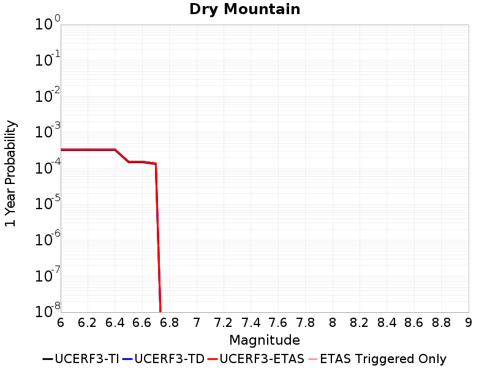 |  |

| Magnitude | 1 wk TI Prob | 1 wk TD Prob | 1 wk ETAS Prob | 1 wk ETAS/TD Gain | 1 wk ETAS Triggered Only | 1 mo TI Prob | 1 mo TD Prob | 1 mo ETAS Prob | 1 mo ETAS/TD Gain | 1 mo ETAS Triggered Only | 1 yr TI Prob | 1 yr TD Prob | 1 yr ETAS Prob | 1 yr ETAS/TD Gain | 1 yr ETAS Triggered Only | 10 yr TI Prob | 10 yr TD Prob | 10 yr ETAS Prob | 10 yr ETAS/TD Gain | 10 yr ETAS Triggered Only |
|-----|-----|-----|-----|-----|-----|-----|-----|-----|-----|-----|-----|-----|-----|-----|-----|-----|-----|-----|-----|-----|
| 6.0 | 6.222801E-6 | 6.440707E-6 | 6.440707E-6 | 1.0 | 0.0 | 2.6668875E-5 | 2.7602828E-5 | 2.7602828E-5 | 1.0 | 0.0 | 3.2464517E-4 | 3.3602852E-4 | 3.3602852E-4 | 1.0 | 0.0 | 0.0032417132 | 0.003356767 | 0.0033966326 | 1.0118762 | 4.0E-5 |
| 6.1 | 6.222801E-6 | 6.440707E-6 | 6.440707E-6 | 1.0 | 0.0 | 2.6668875E-5 | 2.7602828E-5 | 2.7602828E-5 | 1.0 | 0.0 | 3.2464517E-4 | 3.3602852E-4 | 3.3602852E-4 | 1.0 | 0.0 | 0.0032417132 | 0.003356767 | 0.0033966326 | 1.0118762 | 4.0E-5 |
| 6.2 | 6.222801E-6 | 6.440707E-6 | 6.440707E-6 | 1.0 | 0.0 | 2.6668875E-5 | 2.7602828E-5 | 2.7602828E-5 | 1.0 | 0.0 | 3.2464517E-4 | 3.3602852E-4 | 3.3602852E-4 | 1.0 | 0.0 | 0.0032417132 | 0.003356767 | 0.0033966326 | 1.0118762 | 4.0E-5 |
| 6.3 | 6.222801E-6 | 6.440707E-6 | 6.440707E-6 | 1.0 | 0.0 | 2.6668875E-5 | 2.7602828E-5 | 2.7602828E-5 | 1.0 | 0.0 | 3.2464517E-4 | 3.3602852E-4 | 3.3602852E-4 | 1.0 | 0.0 | 0.0032417132 | 0.003356767 | 0.0033966326 | 1.0118762 | 4.0E-5 |
| 6.4 | 6.222801E-6 | 6.440707E-6 | 6.440707E-6 | 1.0 | 0.0 | 2.6668875E-5 | 2.7602828E-5 | 2.7602828E-5 | 1.0 | 0.0 | 3.2464517E-4 | 3.3602852E-4 | 3.3602852E-4 | 1.0 | 0.0 | 0.0032417132 | 0.003356767 | 0.0033966326 | 1.0118762 | 4.0E-5 |
| 6.5 | 2.8528623E-6 | 2.9527762E-6 | 2.9527762E-6 | 1.0 | 0.0 | 1.22264955E-5 | 1.2654743E-5 | 1.2654743E-5 | 1.0 | 0.0 | 1.4884741E-4 | 1.540693E-4 | 1.540693E-4 | 1.0 | 0.0 | 0.0014874774 | 0.0015404787 | 0.0015704324 | 1.0194445 | 3.0E-5 |
| 6.6 | 2.8528623E-6 | 2.9527762E-6 | 2.9527762E-6 | 1.0 | 0.0 | 1.22264955E-5 | 1.2654743E-5 | 1.2654743E-5 | 1.0 | 0.0 | 1.4884741E-4 | 1.540693E-4 | 1.540693E-4 | 1.0 | 0.0 | 0.0014874774 | 0.0015404787 | 0.0015704324 | 1.0194445 | 3.0E-5 |
| 6.7 | 2.541E-6 | 2.6298987E-6 | 2.6298987E-6 | 1.0 | 0.0 | 1.0889954E-5 | 1.1270994E-5 | 1.1270994E-5 | 1.0 | 0.0 | 1.3257713E-4 | 1.3722436E-4 | 1.3722436E-4 | 1.0 | 0.0 | 0.0013249806 | 0.0013722435 | 0.0014022024 | 1.021832 | 3.0E-5 |

## Red Pass
*[(top)](#table-of-contents)*

| 1 Week | 1 Month | 1 Year | 10 Year |
|-----|-----|-----|-----|
|  |  | 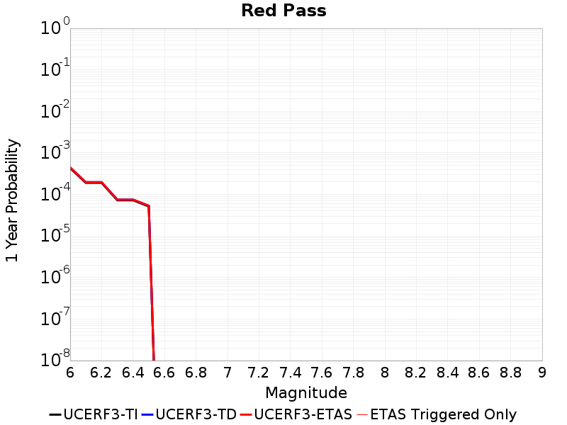 |  |

| Magnitude | 1 wk TI Prob | 1 wk TD Prob | 1 wk ETAS Prob | 1 wk ETAS/TD Gain | 1 wk ETAS Triggered Only | 1 mo TI Prob | 1 mo TD Prob | 1 mo ETAS Prob | 1 mo ETAS/TD Gain | 1 mo ETAS Triggered Only | 1 yr TI Prob | 1 yr TD Prob | 1 yr ETAS Prob | 1 yr ETAS/TD Gain | 1 yr ETAS Triggered Only | 10 yr TI Prob | 10 yr TD Prob | 10 yr ETAS Prob | 10 yr ETAS/TD Gain | 10 yr ETAS Triggered Only |
|-----|-----|-----|-----|-----|-----|-----|-----|-----|-----|-----|-----|-----|-----|-----|-----|-----|-----|-----|-----|-----|
| 6.0 | 8.258278E-6 | 8.553059E-6 | 8.553059E-6 | 1.0 | 0.0 | 3.539214E-5 | 3.6655554E-5 | 3.6655554E-5 | 1.0 | 0.0 | 4.308141E-4 | 4.4620788E-4 | 4.4620788E-4 | 1.0 | 0.0 | 0.0042997985 | 0.0044548777 | 0.0044946996 | 1.0089389 | 4.0E-5 |
| 6.1 | 3.649988E-6 | 3.7760828E-6 | 3.7760828E-6 | 1.0 | 0.0 | 1.5642712E-5 | 1.618314E-5 | 1.618314E-5 | 1.0 | 0.0 | 1.9043336E-4 | 1.9701666E-4 | 1.9701666E-4 | 1.0 | 0.0 | 0.0019027026 | 0.0019688876 | 0.001978868 | 1.005069 | 1.0E-5 |
| 6.2 | 3.649988E-6 | 3.7760828E-6 | 3.7760828E-6 | 1.0 | 0.0 | 1.5642712E-5 | 1.618314E-5 | 1.618314E-5 | 1.0 | 0.0 | 1.9043336E-4 | 1.9701666E-4 | 1.9701666E-4 | 1.0 | 0.0 | 0.0019027026 | 0.0019688876 | 0.001978868 | 1.005069 | 1.0E-5 |
| 6.3 | 1.3924937E-6 | 1.4414143E-6 | 1.4414143E-6 | 1.0 | 0.0 | 5.9678164E-6 | 6.177483E-6 | 6.177483E-6 | 1.0 | 0.0 | 7.265574E-5 | 7.5209675E-5 | 7.5209675E-5 | 1.0 | 0.0 | 7.263199E-4 | 7.5198105E-4 | 7.5198105E-4 | 1.0 | 0.0 |
| 6.4 | 1.3924937E-6 | 1.4414143E-6 | 1.4414143E-6 | 1.0 | 0.0 | 5.9678164E-6 | 6.177483E-6 | 6.177483E-6 | 1.0 | 0.0 | 7.265574E-5 | 7.5209675E-5 | 7.5209675E-5 | 1.0 | 0.0 | 7.263199E-4 | 7.5198105E-4 | 7.5198105E-4 | 1.0 | 0.0 |
| 6.5 | 9.876812E-7 | 1.0224024E-6 | 1.0224024E-6 | 1.0 | 0.0 | 4.2329125E-6 | 4.381725E-6 | 4.381725E-6 | 1.0 | 0.0 | 5.153449E-5 | 5.33475E-5 | 5.33475E-5 | 1.0 | 0.0 | 5.1522546E-4 | 5.33475E-4 | 5.33475E-4 | 1.0 | 0.0 |

## Deep Springs
*[(top)](#table-of-contents)*

| 1 Week | 1 Month | 1 Year | 10 Year |
|-----|-----|-----|-----|
|  | 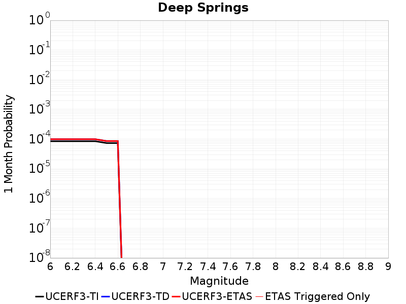 |  |  |

| Magnitude | 1 wk TI Prob | 1 wk TD Prob | 1 wk ETAS Prob | 1 wk ETAS/TD Gain | 1 wk ETAS Triggered Only | 1 mo TI Prob | 1 mo TD Prob | 1 mo ETAS Prob | 1 mo ETAS/TD Gain | 1 mo ETAS Triggered Only | 1 yr TI Prob | 1 yr TD Prob | 1 yr ETAS Prob | 1 yr ETAS/TD Gain | 1 yr ETAS Triggered Only | 10 yr TI Prob | 10 yr TD Prob | 10 yr ETAS Prob | 10 yr ETAS/TD Gain | 10 yr ETAS Triggered Only |
|-----|-----|-----|-----|-----|-----|-----|-----|-----|-----|-----|-----|-----|-----|-----|-----|-----|-----|-----|-----|-----|
| 6.0 | 1.9810619E-5 | 2.3135315E-5 | 2.3135315E-5 | 1.0 | 0.0 | 8.489989E-5 | 9.915044E-5 | 9.915044E-5 | 1.0 | 0.0 | 0.001033166 | 0.0012069967 | 0.0012069967 | 1.0 | 0.0 | 0.010283757 | 0.012054286 | 0.012093804 | 1.0032784 | 4.0E-5 |
| 6.1 | 1.9810619E-5 | 2.3135315E-5 | 2.3135315E-5 | 1.0 | 0.0 | 8.489989E-5 | 9.915044E-5 | 9.915044E-5 | 1.0 | 0.0 | 0.001033166 | 0.0012069967 | 0.0012069967 | 1.0 | 0.0 | 0.010283757 | 0.012054286 | 0.012093804 | 1.0032784 | 4.0E-5 |
| 6.2 | 1.9810619E-5 | 2.3135315E-5 | 2.3135315E-5 | 1.0 | 0.0 | 8.489989E-5 | 9.915044E-5 | 9.915044E-5 | 1.0 | 0.0 | 0.001033166 | 0.0012069967 | 0.0012069967 | 1.0 | 0.0 | 0.010283757 | 0.012054286 | 0.012093804 | 1.0032784 | 4.0E-5 |
| 6.3 | 1.9810619E-5 | 2.3135315E-5 | 2.3135315E-5 | 1.0 | 0.0 | 8.489989E-5 | 9.915044E-5 | 9.915044E-5 | 1.0 | 0.0 | 0.001033166 | 0.0012069967 | 0.0012069967 | 1.0 | 0.0 | 0.010283757 | 0.012054286 | 0.012093804 | 1.0032784 | 4.0E-5 |
| 6.4 | 1.9810619E-5 | 2.3135315E-5 | 2.3135315E-5 | 1.0 | 0.0 | 8.489989E-5 | 9.915044E-5 | 9.915044E-5 | 1.0 | 0.0 | 0.001033166 | 0.0012069967 | 0.0012069967 | 1.0 | 0.0 | 0.010283757 | 0.012054286 | 0.012093804 | 1.0032784 | 4.0E-5 |
| 6.5 | 1.7190405E-5 | 2.0070298E-5 | 2.0070298E-5 | 1.0 | 0.0 | 7.367108E-5 | 8.6015556E-5 | 8.6015556E-5 | 1.0 | 0.0 | 8.9657627E-4 | 0.0010472392 | 0.0010472392 | 1.0 | 0.0 | 0.008929676 | 0.010472358 | 0.010511939 | 1.0037795 | 4.0E-5 |
| 6.6 | 1.7190405E-5 | 2.0070298E-5 | 2.0070298E-5 | 1.0 | 0.0 | 7.367108E-5 | 8.6015556E-5 | 8.6015556E-5 | 1.0 | 0.0 | 8.9657627E-4 | 0.0010472392 | 0.0010472392 | 1.0 | 0.0 | 0.008929676 | 0.010472358 | 0.010511939 | 1.0037795 | 4.0E-5 |

## San Jacinto (Anza) rev
*[(top)](#table-of-contents)*

| 1 Week | 1 Month | 1 Year | 10 Year |
|-----|-----|-----|-----|
|  |  |  |  |

| Magnitude | 1 wk TI Prob | 1 wk TD Prob | 1 wk ETAS Prob | 1 wk ETAS/TD Gain | 1 wk ETAS Triggered Only | 1 mo TI Prob | 1 mo TD Prob | 1 mo ETAS Prob | 1 mo ETAS/TD Gain | 1 mo ETAS Triggered Only | 1 yr TI Prob | 1 yr TD Prob | 1 yr ETAS Prob | 1 yr ETAS/TD Gain | 1 yr ETAS Triggered Only | 10 yr TI Prob | 10 yr TD Prob | 10 yr ETAS Prob | 10 yr ETAS/TD Gain | 10 yr ETAS Triggered Only |
|-----|-----|-----|-----|-----|-----|-----|-----|-----|-----|-----|-----|-----|-----|-----|-----|-----|-----|-----|-----|-----|
| 6.0 | 6.3015636E-5 | 4.4111595E-5 | 4.4111595E-5 | 1.0 | 0.0 | 2.7003905E-4 | 1.8903607E-4 | 1.8903607E-4 | 1.0 | 0.0 | 0.0032827691 | 0.0022990971 | 0.0023090742 | 1.0043396 | 1.0E-5 | 0.032346968 | 0.023714017 | 0.02375307 | 1.0016468 | 4.0E-5 |
| 6.1 | 6.3015636E-5 | 4.4111595E-5 | 4.4111595E-5 | 1.0 | 0.0 | 2.7003905E-4 | 1.8903607E-4 | 1.8903607E-4 | 1.0 | 0.0 | 0.0032827691 | 0.0022990971 | 0.0023090742 | 1.0043396 | 1.0E-5 | 0.032346968 | 0.023714017 | 0.02375307 | 1.0016468 | 4.0E-5 |
| 6.2 | 6.3015636E-5 | 4.4111595E-5 | 4.4111595E-5 | 1.0 | 0.0 | 2.7003905E-4 | 1.8903607E-4 | 1.8903607E-4 | 1.0 | 0.0 | 0.0032827691 | 0.0022990971 | 0.0023090742 | 1.0043396 | 1.0E-5 | 0.032346968 | 0.023714017 | 0.02375307 | 1.0016468 | 4.0E-5 |
| 6.3 | 6.3015636E-5 | 4.4111595E-5 | 4.4111595E-5 | 1.0 | 0.0 | 2.7003905E-4 | 1.8903607E-4 | 1.8903607E-4 | 1.0 | 0.0 | 0.0032827691 | 0.0022990971 | 0.0023090742 | 1.0043396 | 1.0E-5 | 0.032346968 | 0.023714017 | 0.02375307 | 1.0016468 | 4.0E-5 |
| 6.4 | 6.3015636E-5 | 4.4111595E-5 | 4.4111595E-5 | 1.0 | 0.0 | 2.7003905E-4 | 1.8903607E-4 | 1.8903607E-4 | 1.0 | 0.0 | 0.0032827691 | 0.0022990971 | 0.0023090742 | 1.0043396 | 1.0E-5 | 0.032346968 | 0.023714017 | 0.02375307 | 1.0016468 | 4.0E-5 |
| 6.5 | 5.811017E-5 | 4.0852792E-5 | 4.0852792E-5 | 1.0 | 0.0 | 2.4901982E-4 | 1.7507168E-4 | 1.7507168E-4 | 1.0 | 0.0 | 0.0030276014 | 0.0021294197 | 0.0021393986 | 1.0046861 | 1.0E-5 | 0.02986684 | 0.021990104 | 0.022029223 | 1.001779 | 4.0E-5 |
| 6.6 | 5.811017E-5 | 4.0852792E-5 | 4.0852792E-5 | 1.0 | 0.0 | 2.4901982E-4 | 1.7507168E-4 | 1.7507168E-4 | 1.0 | 0.0 | 0.0030276014 | 0.0021294197 | 0.0021393986 | 1.0046861 | 1.0E-5 | 0.02986684 | 0.021990104 | 0.022029223 | 1.001779 | 4.0E-5 |
| 6.7 | 5.712442E-5 | 4.0267463E-5 | 4.0267463E-5 | 1.0 | 0.0 | 2.4479596E-4 | 1.7256345E-4 | 1.7256345E-4 | 1.0 | 0.0 | 0.0029763177 | 0.0020989412 | 0.0021089204 | 1.0047543 | 1.0E-5 | 0.029367693 | 0.021678207 | 0.02171734 | 1.0018052 | 4.0E-5 |
| 6.8 | 5.6967532E-5 | 4.0122308E-5 | 4.0122308E-5 | 1.0 | 0.0 | 2.4412372E-4 | 1.7194146E-4 | 1.7194146E-4 | 1.0 | 0.0 | 0.0029681553 | 0.0020913829 | 0.002101362 | 1.0047715 | 1.0E-5 | 0.029288229 | 0.021601664 | 0.0216408 | 1.0018117 | 4.0E-5 |
| 6.9 | 5.6211324E-5 | 3.9822142E-5 | 3.9822142E-5 | 1.0 | 0.0 | 2.4088343E-4 | 1.7065518E-4 | 1.7065518E-4 | 1.0 | 0.0 | 0.0029288116 | 0.0020757525 | 0.0020857318 | 1.0048075 | 1.0E-5 | 0.028905109 | 0.0214382 | 0.021477342 | 1.0018258 | 4.0E-5 |
| 7.0 | 5.4383527E-5 | 3.866577E-5 | 3.866577E-5 | 1.0 | 0.0 | 2.3305144E-4 | 1.6569995E-4 | 1.6569995E-4 | 1.0 | 0.0 | 0.0028337094 | 0.0020155353 | 0.002025515 | 1.0049515 | 1.0E-5 | 0.027978465 | 0.020817038 | 0.020856205 | 1.0018815 | 4.0E-5 |
| 7.1 | 5.1393665E-5 | 3.7101483E-5 | 3.7101483E-5 | 1.0 | 0.0 | 2.2023996E-4 | 1.5899669E-4 | 1.5899669E-4 | 1.0 | 0.0 | 0.0026781242 | 0.0019340703 | 0.0019440509 | 1.0051605 | 1.0E-5 | 0.026460782 | 0.019978981 | 0.020018183 | 1.0019621 | 4.0E-5 |
| 7.2 | 4.785222E-5 | 3.5423476E-5 | 3.5423476E-5 | 1.0 | 0.0 | 2.0506482E-4 | 1.5180609E-4 | 1.5180609E-4 | 1.0 | 0.0 | 0.0024938055 | 0.0018466759 | 0.0018566574 | 1.0054052 | 1.0E-5 | 0.024660049 | 0.019081654 | 0.01912089 | 1.0020562 | 4.0E-5 |
| 7.3 | 4.2143256E-5 | 3.4499146E-5 | 3.4499146E-5 | 1.0 | 0.0 | 1.8060145E-4 | 1.4784512E-4 | 1.4784512E-4 | 1.0 | 0.0 | 0.002196605 | 0.0017985317 | 0.0018085138 | 1.0055501 | 1.0E-5 | 0.02175019 | 0.018580943 | 0.0186202 | 1.0021127 | 4.0E-5 |
| 7.4 | 4.0264713E-5 | 3.413128E-5 | 3.413128E-5 | 1.0 | 0.0 | 1.7255165E-4 | 1.4626874E-4 | 1.4626874E-4 | 1.0 | 0.0 | 0.002098792 | 0.0017793707 | 0.001789353 | 1.00561 | 1.0E-5 | 0.020790804 | 0.018382192 | 0.018421458 | 1.002136 | 4.0E-5 |
| 7.5 | 3.694492E-5 | 3.2829776E-5 | 3.2829776E-5 | 1.0 | 0.0 | 1.5832575E-4 | 1.4069147E-4 | 1.4069147E-4 | 1.0 | 0.0 | 0.0019259118 | 0.0017115759 | 0.0017215587 | 1.0058326 | 1.0E-5 | 0.01909306 | 0.017690908 | 0.0177302 | 1.0022211 | 4.0E-5 |
| 7.6 | 3.200565E-5 | 3.011551E-5 | 3.011551E-5 | 1.0 | 0.0 | 1.3715986E-4 | 1.2906009E-4 | 1.2906009E-4 | 1.0 | 0.0 | 0.001668642 | 0.0015701764 | 0.0015801607 | 1.0063587 | 1.0E-5 | 0.01656168 | 0.016263688 | 0.016303036 | 1.0024195 | 4.0E-5 |
| 7.7 | 2.731642E-5 | 2.6687394E-5 | 2.6687394E-5 | 1.0 | 0.0 | 1.1706512E-4 | 1.1436953E-4 | 1.1436953E-4 | 1.0 | 0.0 | 0.001424336 | 0.0013915607 | 0.0014015468 | 1.0071762 | 1.0E-5 | 0.014152412 | 0.014476566 | 0.014515987 | 1.0027231 | 4.0E-5 |
| 7.8 | 2.3466424E-5 | 2.407397E-5 | 2.407397E-5 | 1.0 | 0.0 | 1.0056651E-4 | 1.0317008E-4 | 1.0317008E-4 | 1.0 | 0.0 | 0.0012237094 | 0.0012553728 | 0.0012653603 | 1.0079558 | 1.0E-5 | 0.012169928 | 0.013105861 | 0.013145336 | 1.0030121 | 4.0E-5 |
| 7.9 | 1.8611925E-5 | 1.9415616E-5 | 1.9415616E-5 | 1.0 | 0.0 | 7.9762955E-5 | 8.320714E-5 | 8.320714E-5 | 1.0 | 0.0 | 9.7068126E-4 | 0.0010125769 | 0.0010225667 | 1.0098658 | 1.0E-5 | 0.0096645225 | 0.010659822 | 0.010689503 | 1.0027843 | 3.0E-5 |
| 8.0 | 1.5460775E-5 | 1.6191141E-5 | 1.6191141E-5 | 1.0 | 0.0 | 6.6258784E-5 | 6.938876E-5 | 6.938876E-5 | 1.0 | 0.0 | 8.0640207E-4 | 8.444815E-4 | 8.5447304E-4 | 1.0118316 | 1.0E-5 | 0.008034821 | 0.008939621 | 0.008969353 | 1.0033258 | 3.0E-5 |
| 8.1 | 9.983884E-6 | 8.53478E-6 | 8.53478E-6 | 1.0 | 0.0 | 4.2787375E-5 | 3.657712E-5 | 3.657712E-5 | 1.0 | 0.0 | 5.2081177E-4 | 4.4523596E-4 | 4.4523596E-4 | 1.0 | 0.0 | 0.0051959283 | 0.004781973 | 0.004791925 | 1.0020812 | 1.0E-5 |
| 8.2 | 4.1226E-6 | 1.6297444E-6 | 1.6297444E-6 | 1.0 | 0.0 | 1.7668166E-5 | 6.9846E-6 | 6.9846E-6 | 1.0 | 0.0 | 2.1508869E-4 | 8.503422E-5 | 8.503422E-5 | 1.0 | 0.0 | 0.0021488064 | 9.843193E-4 | 9.843193E-4 | 1.0 | 0.0 |
| 8.3 | 1.2750878E-6 | 3.8188736E-7 | 3.8188736E-7 | 1.0 | 0.0 | 5.4646503E-6 | 1.636659E-6 | 1.636659E-6 | 1.0 | 0.0 | 6.653009E-5 | 1.9926147E-5 | 1.9926147E-5 | 1.0 | 0.0 | 6.6510175E-4 | 2.39482E-4 | 2.39482E-4 | 1.0 | 0.0 |

## San Jacinto (Lytle Creek connector)
*[(top)](#table-of-contents)*

| 1 Week | 1 Month | 1 Year | 10 Year |
|-----|-----|-----|-----|
|  | 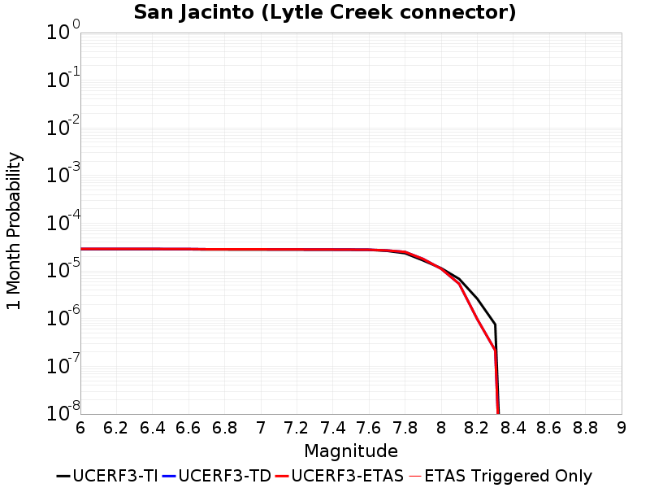 |  | 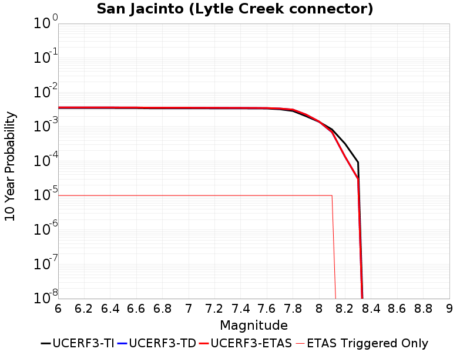 |

| Magnitude | 1 wk TI Prob | 1 wk TD Prob | 1 wk ETAS Prob | 1 wk ETAS/TD Gain | 1 wk ETAS Triggered Only | 1 mo TI Prob | 1 mo TD Prob | 1 mo ETAS Prob | 1 mo ETAS/TD Gain | 1 mo ETAS Triggered Only | 1 yr TI Prob | 1 yr TD Prob | 1 yr ETAS Prob | 1 yr ETAS/TD Gain | 1 yr ETAS Triggered Only | 10 yr TI Prob | 10 yr TD Prob | 10 yr ETAS Prob | 10 yr ETAS/TD Gain | 10 yr ETAS Triggered Only |
|-----|-----|-----|-----|-----|-----|-----|-----|-----|-----|-----|-----|-----|-----|-----|-----|-----|-----|-----|-----|-----|
| 6.0 | 6.693995E-6 | 6.7815936E-6 | 6.7815936E-6 | 1.0 | 0.0 | 2.8688235E-5 | 2.9063649E-5 | 2.9063649E-5 | 1.0 | 0.0 | 3.492233E-4 | 3.5379254E-4 | 3.7378547E-4 | 1.0565103 | 2.0E-5 | 0.00348675 | 0.0036121982 | 0.0036520537 | 1.0110335 | 4.0E-5 |
| 6.1 | 6.693995E-6 | 6.7815936E-6 | 6.7815936E-6 | 1.0 | 0.0 | 2.8688235E-5 | 2.9063649E-5 | 2.9063649E-5 | 1.0 | 0.0 | 3.492233E-4 | 3.5379254E-4 | 3.7378547E-4 | 1.0565103 | 2.0E-5 | 0.00348675 | 0.0036121982 | 0.0036520537 | 1.0110335 | 4.0E-5 |
| 6.2 | 6.693995E-6 | 6.7815936E-6 | 6.7815936E-6 | 1.0 | 0.0 | 2.8688235E-5 | 2.9063649E-5 | 2.9063649E-5 | 1.0 | 0.0 | 3.492233E-4 | 3.5379254E-4 | 3.7378547E-4 | 1.0565103 | 2.0E-5 | 0.00348675 | 0.0036121982 | 0.0036520537 | 1.0110335 | 4.0E-5 |
| 6.3 | 6.693995E-6 | 6.7815936E-6 | 6.7815936E-6 | 1.0 | 0.0 | 2.8688235E-5 | 2.9063649E-5 | 2.9063649E-5 | 1.0 | 0.0 | 3.492233E-4 | 3.5379254E-4 | 3.7378547E-4 | 1.0565103 | 2.0E-5 | 0.00348675 | 0.0036121982 | 0.0036520537 | 1.0110335 | 4.0E-5 |
| 6.4 | 6.693995E-6 | 6.7815936E-6 | 6.7815936E-6 | 1.0 | 0.0 | 2.8688235E-5 | 2.9063649E-5 | 2.9063649E-5 | 1.0 | 0.0 | 3.492233E-4 | 3.5379254E-4 | 3.7378547E-4 | 1.0565103 | 2.0E-5 | 0.00348675 | 0.0036121982 | 0.0036520537 | 1.0110335 | 4.0E-5 |
| 6.5 | 6.6561875E-6 | 6.741799E-6 | 6.741799E-6 | 1.0 | 0.0 | 2.8526205E-5 | 2.8893106E-5 | 2.8893106E-5 | 1.0 | 0.0 | 3.472512E-4 | 3.5171685E-4 | 3.7170982E-4 | 1.0568439 | 2.0E-5 | 0.0034670907 | 0.0035915086 | 0.003631365 | 1.0110974 | 4.0E-5 |
| 6.6 | 6.6561875E-6 | 6.741799E-6 | 6.741799E-6 | 1.0 | 0.0 | 2.8526205E-5 | 2.8893106E-5 | 2.8893106E-5 | 1.0 | 0.0 | 3.472512E-4 | 3.5171685E-4 | 3.7170982E-4 | 1.0568439 | 2.0E-5 | 0.0034670907 | 0.0035915086 | 0.003631365 | 1.0110974 | 4.0E-5 |
| 6.7 | 6.5802237E-6 | 6.6609473E-6 | 6.6609473E-6 | 1.0 | 0.0 | 2.8200653E-5 | 2.8546605E-5 | 2.8546605E-5 | 1.0 | 0.0 | 3.4328885E-4 | 3.4749956E-4 | 3.674926E-4 | 1.057534 | 2.0E-5 | 0.0034275902 | 0.0035494708 | 0.0035893288 | 1.0112293 | 4.0E-5 |
| 6.8 | 6.575632E-6 | 6.65543E-6 | 6.65543E-6 | 1.0 | 0.0 | 2.8180975E-5 | 2.852296E-5 | 2.852296E-5 | 1.0 | 0.0 | 3.4304935E-4 | 3.4721178E-4 | 3.6720483E-4 | 1.0575818 | 2.0E-5 | 0.0034252026 | 0.003546602 | 0.0035864604 | 1.0112385 | 4.0E-5 |
| 6.9 | 6.570433E-6 | 6.6468065E-6 | 6.6468065E-6 | 1.0 | 0.0 | 2.8158694E-5 | 2.8486003E-5 | 2.8486003E-5 | 1.0 | 0.0 | 3.4277816E-4 | 3.4676195E-4 | 3.6675503E-4 | 1.0576564 | 2.0E-5 | 0.0034224992 | 0.0035421185 | 0.0035819768 | 1.0112526 | 4.0E-5 |
| 7.0 | 6.5643826E-6 | 6.636907E-6 | 6.636907E-6 | 1.0 | 0.0 | 2.8132765E-5 | 2.8443577E-5 | 2.8443577E-5 | 1.0 | 0.0 | 3.424626E-4 | 3.4624562E-4 | 3.6623867E-4 | 1.0577425 | 2.0E-5 | 0.0034193532 | 0.0035369713 | 0.0035768298 | 1.0112691 | 4.0E-5 |
| 7.1 | 6.557402E-6 | 6.625598E-6 | 6.625598E-6 | 1.0 | 0.0 | 2.8102848E-5 | 2.8395112E-5 | 2.8395112E-5 | 1.0 | 0.0 | 3.4209844E-4 | 3.4565572E-4 | 3.656488E-4 | 1.0578411 | 2.0E-5 | 0.0034157229 | 0.0035310928 | 0.0035709515 | 1.0112879 | 4.0E-5 |
| 7.2 | 6.546394E-6 | 6.607524E-6 | 6.607524E-6 | 1.0 | 0.0 | 2.8055672E-5 | 2.8317654E-5 | 2.8317654E-5 | 1.0 | 0.0 | 3.4152428E-4 | 3.4471296E-4 | 3.6470607E-4 | 1.0579993 | 2.0E-5 | 0.0034099987 | 0.0035216997 | 0.003561559 | 1.0113182 | 4.0E-5 |
| 7.3 | 6.5364216E-6 | 6.5882327E-6 | 6.5882327E-6 | 1.0 | 0.0 | 2.8012933E-5 | 2.8234977E-5 | 2.8234977E-5 | 1.0 | 0.0 | 3.4100408E-4 | 3.4370672E-4 | 3.6369983E-4 | 1.0581691 | 2.0E-5 | 0.003404813 | 0.0035116796 | 0.003551539 | 1.0113505 | 4.0E-5 |
| 7.4 | 6.5269523E-6 | 6.569231E-6 | 6.569231E-6 | 1.0 | 0.0 | 2.7972354E-5 | 2.8153545E-5 | 2.8153545E-5 | 1.0 | 0.0 | 3.4051016E-4 | 3.4271556E-4 | 3.627087E-4 | 1.0583375 | 2.0E-5 | 0.0033998888 | 0.0035018276 | 0.0035416875 | 1.0113826 | 4.0E-5 |
| 7.5 | 6.5111835E-6 | 6.5454105E-6 | 6.5454105E-6 | 1.0 | 0.0 | 2.7904773E-5 | 2.805146E-5 | 2.805146E-5 | 1.0 | 0.0 | 3.3968766E-4 | 3.4147306E-4 | 3.6146623E-4 | 1.0585498 | 2.0E-5 | 0.0033916887 | 0.0034894543 | 0.0035293147 | 1.0114231 | 4.0E-5 |
| 7.6 | 6.4768806E-6 | 6.5043732E-6 | 6.5043732E-6 | 1.0 | 0.0 | 2.7757764E-5 | 2.7875589E-5 | 2.7875589E-5 | 1.0 | 0.0 | 3.3789838E-4 | 3.393325E-4 | 3.5932573E-4 | 1.0589192 | 2.0E-5 | 0.0033738504 | 0.0034681126 | 0.0035079739 | 1.0114937 | 4.0E-5 |
| 7.7 | 6.1655364E-6 | 6.2959048E-6 | 6.2959048E-6 | 1.0 | 0.0 | 2.642346E-5 | 2.698217E-5 | 2.698217E-5 | 1.0 | 0.0 | 3.2165812E-4 | 3.2845847E-4 | 3.484519E-4 | 1.0608705 | 2.0E-5 | 0.0032119295 | 0.003359236 | 0.0033991018 | 1.0118675 | 4.0E-5 |
| 7.8 | 5.5043524E-6 | 5.85347E-6 | 5.85347E-6 | 1.0 | 0.0 | 2.3589868E-5 | 2.508606E-5 | 2.508606E-5 | 1.0 | 0.0 | 2.871688E-4 | 3.0538003E-4 | 3.2537393E-4 | 1.0654721 | 2.0E-5 | 0.0028679797 | 0.003127523 | 0.003167398 | 1.0127497 | 4.0E-5 |
| 7.9 | 3.889249E-6 | 4.1714093E-6 | 4.1714093E-6 | 1.0 | 0.0 | 1.6668104E-5 | 1.7877346E-5 | 1.7877346E-5 | 1.0 | 0.0 | 2.0291525E-4 | 2.17635E-4 | 2.17635E-4 | 1.0 | 0.0 | 0.0020273007 | 0.0022435922 | 0.0022635472 | 1.0088943 | 2.0E-5 |
| 8.0 | 2.668535E-6 | 2.5969534E-6 | 2.5969534E-6 | 1.0 | 0.0 | 1.1436528E-5 | 1.1129753E-5 | 1.1129753E-5 | 1.0 | 0.0 | 1.3923083E-4 | 1.3549635E-4 | 1.3549635E-4 | 1.0 | 0.0 | 0.0013914363 | 0.0014102462 | 0.001430218 | 1.014162 | 2.0E-5 |
| 8.1 | 1.5911459E-6 | 1.2535944E-6 | 1.2535944E-6 | 1.0 | 0.0 | 6.8191785E-6 | 5.3725366E-6 | 5.3725366E-6 | 1.0 | 0.0 | 8.3020335E-5 | 6.540869E-5 | 6.540869E-5 | 1.0 | 0.0 | 8.298933E-4 | 6.8795023E-4 | 6.979434E-4 | 1.0145259 | 1.0E-5 |
| 8.2 | 6.1294963E-7 | 2.2848405E-7 | 2.2848405E-7 | 1.0 | 0.0 | 2.6269242E-6 | 9.79217E-7 | 9.79217E-7 | 1.0 | 0.0 | 3.1982334E-5 | 1.1921902E-5 | 1.1921902E-5 | 1.0 | 0.0 | 3.1977732E-4 | 1.3365799E-4 | 1.3365799E-4 | 1.0 | 0.0 |
| 8.3 | 1.762871E-7 | 5.0149033E-8 | 5.0149033E-8 | 1.0 | 0.0 | 7.5551594E-7 | 2.1492441E-7 | 2.1492441E-7 | 1.0 | 0.0 | 9.1983675E-6 | 2.6167015E-6 | 2.6167015E-6 | 1.0 | 0.0 | 9.197987E-5 | 3.018173E-5 | 3.018173E-5 | 1.0 | 0.0 |

## San Jacinto (San Jacinto Valley) rev
*[(top)](#table-of-contents)*

| 1 Week | 1 Month | 1 Year | 10 Year |
|-----|-----|-----|-----|
|  |  |  |  |

| Magnitude | 1 wk TI Prob | 1 wk TD Prob | 1 wk ETAS Prob | 1 wk ETAS/TD Gain | 1 wk ETAS Triggered Only | 1 mo TI Prob | 1 mo TD Prob | 1 mo ETAS Prob | 1 mo ETAS/TD Gain | 1 mo ETAS Triggered Only | 1 yr TI Prob | 1 yr TD Prob | 1 yr ETAS Prob | 1 yr ETAS/TD Gain | 1 yr ETAS Triggered Only | 10 yr TI Prob | 10 yr TD Prob | 10 yr ETAS Prob | 10 yr ETAS/TD Gain | 10 yr ETAS Triggered Only |
|-----|-----|-----|-----|-----|-----|-----|-----|-----|-----|-----|-----|-----|-----|-----|-----|-----|-----|-----|-----|-----|
| 6.0 | 3.652694E-5 | 3.510104E-5 | 3.510104E-5 | 1.0 | 0.0 | 1.5653463E-4 | 1.5042436E-4 | 1.5042436E-4 | 1.0 | 0.0 | 0.0019041431 | 0.0018298802 | 0.0018398619 | 1.0054549 | 1.0E-5 | 0.018879099 | 0.018886441 | 0.018925685 | 1.0020779 | 4.0E-5 |
| 6.1 | 3.652694E-5 | 3.510104E-5 | 3.510104E-5 | 1.0 | 0.0 | 1.5653463E-4 | 1.5042436E-4 | 1.5042436E-4 | 1.0 | 0.0 | 0.0019041431 | 0.0018298802 | 0.0018398619 | 1.0054549 | 1.0E-5 | 0.018879099 | 0.018886441 | 0.018925685 | 1.0020779 | 4.0E-5 |
| 6.2 | 3.652694E-5 | 3.510104E-5 | 3.510104E-5 | 1.0 | 0.0 | 1.5653463E-4 | 1.5042436E-4 | 1.5042436E-4 | 1.0 | 0.0 | 0.0019041431 | 0.0018298802 | 0.0018398619 | 1.0054549 | 1.0E-5 | 0.018879099 | 0.018886441 | 0.018925685 | 1.0020779 | 4.0E-5 |
| 6.3 | 3.652694E-5 | 3.510104E-5 | 3.510104E-5 | 1.0 | 0.0 | 1.5653463E-4 | 1.5042436E-4 | 1.5042436E-4 | 1.0 | 0.0 | 0.0019041431 | 0.0018298802 | 0.0018398619 | 1.0054549 | 1.0E-5 | 0.018879099 | 0.018886441 | 0.018925685 | 1.0020779 | 4.0E-5 |
| 6.4 | 3.646941E-5 | 3.5022458E-5 | 3.5022458E-5 | 1.0 | 0.0 | 1.5628811E-4 | 1.5008762E-4 | 1.5008762E-4 | 1.0 | 0.0 | 0.0019011468 | 0.0018257876 | 0.0018357693 | 1.005467 | 1.0E-5 | 0.018849645 | 0.018846257 | 0.018885503 | 1.0020825 | 4.0E-5 |
| 6.5 | 3.646941E-5 | 3.5022458E-5 | 3.5022458E-5 | 1.0 | 0.0 | 1.5628811E-4 | 1.5008762E-4 | 1.5008762E-4 | 1.0 | 0.0 | 0.0019011468 | 0.0018257876 | 0.0018357693 | 1.005467 | 1.0E-5 | 0.018849645 | 0.018846257 | 0.018885503 | 1.0020825 | 4.0E-5 |
| 6.6 | 3.6442503E-5 | 3.4985773E-5 | 3.4985773E-5 | 1.0 | 0.0 | 1.561728E-4 | 1.4993042E-4 | 1.4993042E-4 | 1.0 | 0.0 | 0.0018997455 | 0.001823877 | 0.0018338588 | 1.0054728 | 1.0E-5 | 0.018835869 | 0.018827496 | 0.018866744 | 1.0020845 | 4.0E-5 |
| 6.7 | 3.6432113E-5 | 3.4971315E-5 | 3.4971315E-5 | 1.0 | 0.0 | 1.5612828E-4 | 1.4986847E-4 | 1.4986847E-4 | 1.0 | 0.0 | 0.0018992044 | 0.0018231242 | 0.0018331059 | 1.005475 | 1.0E-5 | 0.018830549 | 0.018820107 | 0.018859355 | 1.0020853 | 4.0E-5 |
| 6.8 | 3.6409598E-5 | 3.4940305E-5 | 3.4940305E-5 | 1.0 | 0.0 | 1.560318E-4 | 1.4973558E-4 | 1.4973558E-4 | 1.0 | 0.0 | 0.0018980318 | 0.001821509 | 0.0018314908 | 1.0054799 | 1.0E-5 | 0.018819023 | 0.018804234 | 0.018843481 | 1.0020872 | 4.0E-5 |
| 6.9 | 3.638078E-5 | 3.490064E-5 | 3.490064E-5 | 1.0 | 0.0 | 1.5590832E-4 | 1.4956562E-4 | 1.4956562E-4 | 1.0 | 0.0 | 0.0018965311 | 0.0018194431 | 0.0018294249 | 1.0054861 | 1.0E-5 | 0.018804269 | 0.01878393 | 0.018823178 | 1.0020895 | 4.0E-5 |
| 7.0 | 3.6294874E-5 | 3.4782403E-5 | 3.4782403E-5 | 1.0 | 0.0 | 1.5554018E-4 | 1.4905893E-4 | 1.4905893E-4 | 1.0 | 0.0 | 0.0018920569 | 0.0018132846 | 0.0018232665 | 1.0055048 | 1.0E-5 | 0.018760284 | 0.018723402 | 0.018762654 | 1.0020964 | 4.0E-5 |
| 7.1 | 3.6260717E-5 | 3.4738612E-5 | 3.4738612E-5 | 1.0 | 0.0 | 1.5539382E-4 | 1.4887129E-4 | 1.4887129E-4 | 1.0 | 0.0 | 0.001890278 | 0.0018110038 | 0.0018209857 | 1.0055118 | 1.0E-5 | 0.018742796 | 0.018700976 | 0.018740227 | 1.0020989 | 4.0E-5 |
| 7.2 | 3.6210204E-5 | 3.467261E-5 | 3.467261E-5 | 1.0 | 0.0 | 1.5517735E-4 | 1.4858844E-4 | 1.4858844E-4 | 1.0 | 0.0 | 0.001887647 | 0.0018075659 | 0.001817548 | 1.0055223 | 1.0E-5 | 0.01871693 | 0.018667167 | 0.01870642 | 1.0021029 | 4.0E-5 |
| 7.3 | 3.6119454E-5 | 3.4560257E-5 | 3.4560257E-5 | 1.0 | 0.0 | 1.5478847E-4 | 1.4810699E-4 | 1.4810699E-4 | 1.0 | 0.0 | 0.0018829206 | 0.001801714 | 0.001811696 | 1.0055403 | 1.0E-5 | 0.018670462 | 0.018609416 | 0.018648673 | 1.0021094 | 4.0E-5 |
| 7.4 | 3.607848E-5 | 3.4507422E-5 | 3.4507422E-5 | 1.0 | 0.0 | 1.5461289E-4 | 1.478806E-4 | 1.478806E-4 | 1.0 | 0.0 | 0.0018807866 | 0.001798962 | 0.001808944 | 1.0055487 | 1.0E-5 | 0.018649481 | 0.018582253 | 0.01862151 | 1.0021126 | 4.0E-5 |
| 7.5 | 3.5856774E-5 | 3.431524E-5 | 3.431524E-5 | 1.0 | 0.0 | 1.5366284E-4 | 1.4705703E-4 | 1.4705703E-4 | 1.0 | 0.0 | 0.0018692396 | 0.0017889518 | 0.0017989338 | 1.0055798 | 1.0E-5 | 0.018535944 | 0.018482381 | 0.018521642 | 1.0021242 | 4.0E-5 |
| 7.6 | 3.286655E-5 | 3.282022E-5 | 3.282022E-5 | 1.0 | 0.0 | 1.4084904E-4 | 1.4065052E-4 | 1.4065052E-4 | 1.0 | 0.0 | 0.001713488 | 0.001711077 | 0.00172106 | 1.0058342 | 1.0E-5 | 0.017003361 | 0.017692871 | 0.017732164 | 1.0022207 | 4.0E-5 |
| 7.7 | 2.8882527E-5 | 2.9899169E-5 | 2.9899169E-5 | 1.0 | 0.0 | 1.237764E-4 | 1.28133E-4 | 1.28133E-4 | 1.0 | 0.0 | 0.0015059357 | 0.0015589042 | 0.0015688885 | 1.0064048 | 1.0E-5 | 0.014957713 | 0.016172923 | 0.016212275 | 1.0024333 | 4.0E-5 |
| 7.8 | 2.4950225E-5 | 2.716319E-5 | 2.716319E-5 | 1.0 | 0.0 | 1.0692515E-4 | 1.1640848E-4 | 1.1640848E-4 | 1.0 | 0.0 | 0.0013010362 | 0.0014163528 | 0.0014263386 | 1.0070504 | 1.0E-5 | 0.012934455 | 0.014740997 | 0.014780408 | 1.0026735 | 4.0E-5 |
| 7.9 | 1.9881603E-5 | 2.2073516E-5 | 2.2073516E-5 | 1.0 | 0.0 | 8.520408E-5 | 9.459736E-5 | 9.459736E-5 | 1.0 | 0.0 | 0.001036866 | 0.0011511152 | 0.0011611036 | 1.0086772 | 1.0E-5 | 0.010320415 | 0.012071415 | 0.012101053 | 1.0024552 | 3.0E-5 |
| 8.0 | 1.563292E-5 | 1.6393262E-5 | 1.6393262E-5 | 1.0 | 0.0 | 6.6996516E-5 | 7.025495E-5 | 7.025495E-5 | 1.0 | 0.0 | 8.153773E-4 | 8.550191E-4 | 8.650105E-4 | 1.0116856 | 1.0E-5 | 0.00812392 | 0.009050215 | 0.009079943 | 1.0032848 | 3.0E-5 |
| 8.1 | 1.0045313E-5 | 8.5682705E-6 | 8.5682705E-6 | 1.0 | 0.0 | 4.305063E-5 | 3.6720645E-5 | 3.6720645E-5 | 1.0 | 0.0 | 5.2401534E-4 | 4.4698268E-4 | 4.4698268E-4 | 1.0 | 0.0 | 0.0052278144 | 0.0048019784 | 0.00481193 | 1.0020725 | 1.0E-5 |
| 8.2 | 4.1554413E-6 | 1.6430384E-6 | 1.6430384E-6 | 1.0 | 0.0 | 1.7808914E-5 | 7.0415745E-6 | 7.0415745E-6 | 1.0 | 0.0 | 2.1680194E-4 | 8.572783E-5 | 8.572783E-5 | 1.0 | 0.0 | 0.0021659054 | 9.92517E-4 | 9.92517E-4 | 1.0 | 0.0 |
| 8.3 | 1.2758221E-6 | 3.821866E-7 | 3.821866E-7 | 1.0 | 0.0 | 5.4677976E-6 | 1.6379416E-6 | 1.6379416E-6 | 1.0 | 0.0 | 6.65684E-5 | 1.9941761E-5 | 1.9941761E-5 | 1.0 | 0.0 | 6.6548464E-4 | 2.396598E-4 | 2.396598E-4 | 1.0 | 0.0 |

## San Jacinto (Stepovers Combined)
*[(top)](#table-of-contents)*

| 1 Week | 1 Month | 1 Year | 10 Year |
|-----|-----|-----|-----|
|  | 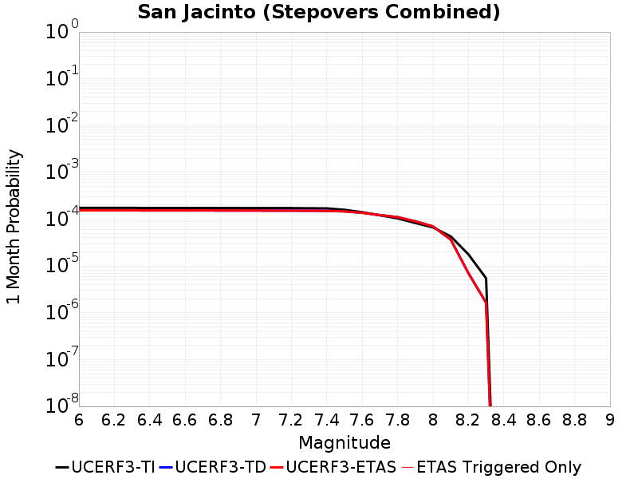 | 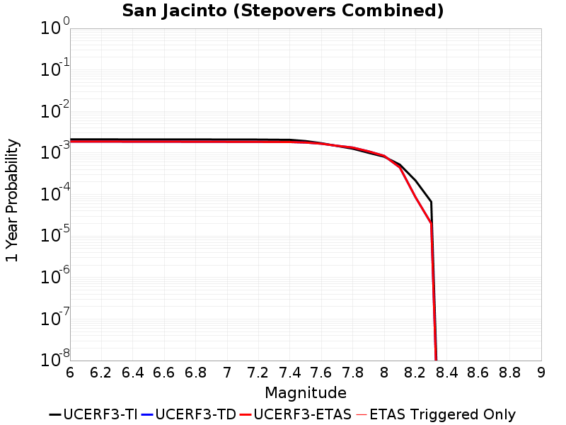 |  |

| Magnitude | 1 wk TI Prob | 1 wk TD Prob | 1 wk ETAS Prob | 1 wk ETAS/TD Gain | 1 wk ETAS Triggered Only | 1 mo TI Prob | 1 mo TD Prob | 1 mo ETAS Prob | 1 mo ETAS/TD Gain | 1 mo ETAS Triggered Only | 1 yr TI Prob | 1 yr TD Prob | 1 yr ETAS Prob | 1 yr ETAS/TD Gain | 1 yr ETAS Triggered Only | 10 yr TI Prob | 10 yr TD Prob | 10 yr ETAS Prob | 10 yr ETAS/TD Gain | 10 yr ETAS Triggered Only |
|-----|-----|-----|-----|-----|-----|-----|-----|-----|-----|-----|-----|-----|-----|-----|-----|-----|-----|-----|-----|-----|
| 6.0 | 4.0667746E-5 | 3.5967976E-5 | 3.5967976E-5 | 1.0 | 0.0 | 1.742787E-4 | 1.5413937E-4 | 1.5413937E-4 | 1.0 | 0.0 | 0.0021197782 | 0.0018750327 | 0.0018850139 | 1.0053233 | 1.0E-5 | 0.020996714 | 0.019345835 | 0.01938506 | 1.0020276 | 4.0E-5 |
| 6.1 | 4.0667746E-5 | 3.5967976E-5 | 3.5967976E-5 | 1.0 | 0.0 | 1.742787E-4 | 1.5413937E-4 | 1.5413937E-4 | 1.0 | 0.0 | 0.0021197782 | 0.0018750327 | 0.0018850139 | 1.0053233 | 1.0E-5 | 0.020996714 | 0.019345835 | 0.01938506 | 1.0020276 | 4.0E-5 |
| 6.2 | 4.0667746E-5 | 3.5967976E-5 | 3.5967976E-5 | 1.0 | 0.0 | 1.742787E-4 | 1.5413937E-4 | 1.5413937E-4 | 1.0 | 0.0 | 0.0021197782 | 0.0018750327 | 0.0018850139 | 1.0053233 | 1.0E-5 | 0.020996714 | 0.019345835 | 0.01938506 | 1.0020276 | 4.0E-5 |
| 6.3 | 4.0667746E-5 | 3.5967976E-5 | 3.5967976E-5 | 1.0 | 0.0 | 1.742787E-4 | 1.5413937E-4 | 1.5413937E-4 | 1.0 | 0.0 | 0.0021197782 | 0.0018750327 | 0.0018850139 | 1.0053233 | 1.0E-5 | 0.020996714 | 0.019345835 | 0.01938506 | 1.0020276 | 4.0E-5 |
| 6.4 | 4.0577226E-5 | 3.5839606E-5 | 3.5839606E-5 | 1.0 | 0.0 | 1.738908E-4 | 1.5358928E-4 | 1.5358928E-4 | 1.0 | 0.0 | 0.0021150648 | 0.0018683481 | 0.0018783294 | 1.0053424 | 1.0E-5 | 0.020950472 | 0.019280287 | 0.019319516 | 1.0020347 | 4.0E-5 |
| 6.5 | 4.0577226E-5 | 3.5839606E-5 | 3.5839606E-5 | 1.0 | 0.0 | 1.738908E-4 | 1.5358928E-4 | 1.5358928E-4 | 1.0 | 0.0 | 0.0021150648 | 0.0018683481 | 0.0018783294 | 1.0053424 | 1.0E-5 | 0.020950472 | 0.019280287 | 0.019319516 | 1.0020347 | 4.0E-5 |
| 6.6 | 4.053861E-5 | 3.578483E-5 | 3.578483E-5 | 1.0 | 0.0 | 1.7372532E-4 | 1.5335456E-4 | 1.5335456E-4 | 1.0 | 0.0 | 0.0021130538 | 0.0018654957 | 0.001875477 | 1.0053505 | 1.0E-5 | 0.020930743 | 0.019252315 | 0.019291544 | 1.0020376 | 4.0E-5 |
| 6.7 | 4.0516545E-5 | 3.5753837E-5 | 3.5753837E-5 | 1.0 | 0.0 | 1.7363077E-4 | 1.5322174E-4 | 1.5322174E-4 | 1.0 | 0.0 | 0.002111905 | 0.0018638818 | 0.0018738632 | 1.0053551 | 1.0E-5 | 0.020919468 | 0.019236485 | 0.019275716 | 1.0020394 | 4.0E-5 |
| 6.8 | 4.049434E-5 | 3.5725225E-5 | 3.5725225E-5 | 1.0 | 0.0 | 1.7353562E-4 | 1.5309913E-4 | 1.5309913E-4 | 1.0 | 0.0 | 0.0021107488 | 0.0018623916 | 0.0018723729 | 1.0053594 | 1.0E-5 | 0.020908125 | 0.019221812 | 0.019261044 | 1.002041 | 4.0E-5 |
| 6.9 | 4.046386E-5 | 3.568762E-5 | 3.568762E-5 | 1.0 | 0.0 | 1.73405E-4 | 1.5293798E-4 | 1.5293798E-4 | 1.0 | 0.0 | 0.0021091616 | 0.001860433 | 0.0018704144 | 1.0053651 | 1.0E-5 | 0.020892553 | 0.019202508 | 0.019241739 | 1.002043 | 4.0E-5 |
| 7.0 | 4.036382E-5 | 3.5567627E-5 | 3.5567627E-5 | 1.0 | 0.0 | 1.7297632E-4 | 1.5242379E-4 | 1.5242379E-4 | 1.0 | 0.0 | 0.0021039525 | 0.0018541835 | 0.001864165 | 1.0053833 | 1.0E-5 | 0.02084144 | 0.019140854 | 0.01918009 | 1.0020498 | 4.0E-5 |
| 7.1 | 4.0343282E-5 | 3.5545996E-5 | 3.5545996E-5 | 1.0 | 0.0 | 1.7288832E-4 | 1.5233111E-4 | 1.5233111E-4 | 1.0 | 0.0 | 0.002102883 | 0.001853057 | 0.0018630384 | 1.0053865 | 1.0E-5 | 0.020830948 | 0.019129692 | 0.019168926 | 1.002051 | 4.0E-5 |
| 7.2 | 4.0257353E-5 | 3.5450106E-5 | 3.5450106E-5 | 1.0 | 0.0 | 1.725201E-4 | 1.5192019E-4 | 1.5192019E-4 | 1.0 | 0.0 | 0.0020984085 | 0.0018480626 | 0.0018580441 | 1.005401 | 1.0E-5 | 0.020787042 | 0.019080248 | 0.019119484 | 1.0020564 | 4.0E-5 |
| 7.3 | 3.9940667E-5 | 3.5275072E-5 | 3.5275072E-5 | 1.0 | 0.0 | 1.7116306E-4 | 1.5117014E-4 | 1.5117014E-4 | 1.0 | 0.0 | 0.0020819185 | 0.001838946 | 0.0018489277 | 1.005428 | 1.0E-5 | 0.020625217 | 0.018987484 | 0.019026725 | 1.0020666 | 4.0E-5 |
| 7.4 | 3.9721202E-5 | 3.5159115E-5 | 3.5159115E-5 | 1.0 | 0.0 | 1.7022261E-4 | 1.5067324E-4 | 1.5067324E-4 | 1.0 | 0.0 | 0.0020704903 | 0.0018329065 | 0.0018428882 | 1.0054458 | 1.0E-5 | 0.020513052 | 0.018925935 | 0.018965177 | 1.0020735 | 4.0E-5 |
| 7.5 | 3.7036873E-5 | 3.4213328E-5 | 3.4213328E-5 | 1.0 | 0.0 | 1.5871979E-4 | 1.4662032E-4 | 1.4662032E-4 | 1.0 | 0.0 | 0.0019307006 | 0.001783644 | 0.0017936261 | 1.0055965 | 1.0E-5 | 0.019140124 | 0.01842087 | 0.018460132 | 1.0021315 | 4.0E-5 |
| 7.6 | 3.2940967E-5 | 3.1967375E-5 | 3.1967375E-5 | 1.0 | 0.0 | 1.4116794E-4 | 1.3699585E-4 | 1.3699585E-4 | 1.0 | 0.0 | 0.0017173645 | 0.0016666506 | 0.0016766341 | 1.00599 | 1.0E-5 | 0.01704153 | 0.017240105 | 0.017279414 | 1.0022801 | 4.0E-5 |
| 7.7 | 2.8236149E-5 | 2.851638E-5 | 2.851638E-5 | 1.0 | 0.0 | 1.2100645E-4 | 1.2220735E-4 | 1.2220735E-4 | 1.0 | 0.0 | 0.0014722579 | 0.00148686 | 0.0014968452 | 1.0067155 | 1.0E-5 | 0.014625421 | 0.015443018 | 0.0154824 | 1.0025501 | 4.0E-5 |
| 7.8 | 2.4329287E-5 | 2.5813515E-5 | 2.5813515E-5 | 1.0 | 0.0 | 1.042642E-4 | 1.10624664E-4 | 1.10624664E-4 | 1.0 | 0.0 | 0.0012686774 | 0.0013460241 | 0.0013560106 | 1.0074192 | 1.0E-5 | 0.012614589 | 0.014027247 | 0.014066686 | 1.0028116 | 4.0E-5 |
| 7.9 | 1.9370926E-5 | 2.0962296E-5 | 2.0962296E-5 | 1.0 | 0.0 | 8.301561E-5 | 8.983532E-5 | 8.983532E-5 | 1.0 | 0.0 | 0.0010102465 | 0.001093197 | 0.001103186 | 1.0091375 | 1.0E-5 | 0.0100566605 | 0.011481733 | 0.011511388 | 1.0025828 | 3.0E-5 |
| 8.0 | 1.5583017E-5 | 1.6340435E-5 | 1.6340435E-5 | 1.0 | 0.0 | 6.6782646E-5 | 7.002856E-5 | 7.002856E-5 | 1.0 | 0.0 | 8.127754E-4 | 8.5226493E-4 | 8.6225645E-4 | 1.0117234 | 1.0E-5 | 0.008098091 | 0.009020498 | 0.009050228 | 1.0032958 | 3.0E-5 |
| 8.1 | 1.0024873E-5 | 8.558367E-6 | 8.558367E-6 | 1.0 | 0.0 | 4.2963035E-5 | 3.6678204E-5 | 3.6678204E-5 | 1.0 | 0.0 | 5.229494E-4 | 4.4646618E-4 | 4.4646618E-4 | 1.0 | 0.0 | 0.0052172043 | 0.0047959913 | 0.004805943 | 1.0020751 | 1.0E-5 |
| 8.2 | 4.142796E-6 | 1.6382219E-6 | 1.6382219E-6 | 1.0 | 0.0 | 1.775472E-5 | 7.020932E-6 | 7.020932E-6 | 1.0 | 0.0 | 2.1614227E-4 | 8.5476524E-5 | 8.5476524E-5 | 1.0 | 0.0 | 0.0021593217 | 9.895413E-4 | 9.895413E-4 | 1.0 | 0.0 |
| 8.3 | 1.2750878E-6 | 3.8188736E-7 | 3.8188736E-7 | 1.0 | 0.0 | 5.4646503E-6 | 1.636659E-6 | 1.636659E-6 | 1.0 | 0.0 | 6.653009E-5 | 1.9926147E-5 | 1.9926147E-5 | 1.0 | 0.0 | 6.6510175E-4 | 2.39482E-4 | 2.39482E-4 | 1.0 | 0.0 |

## Coronado Bank alt1
*[(top)](#table-of-contents)*

| 1 Week | 1 Month | 1 Year | 10 Year |
|-----|-----|-----|-----|
|  |  |  | 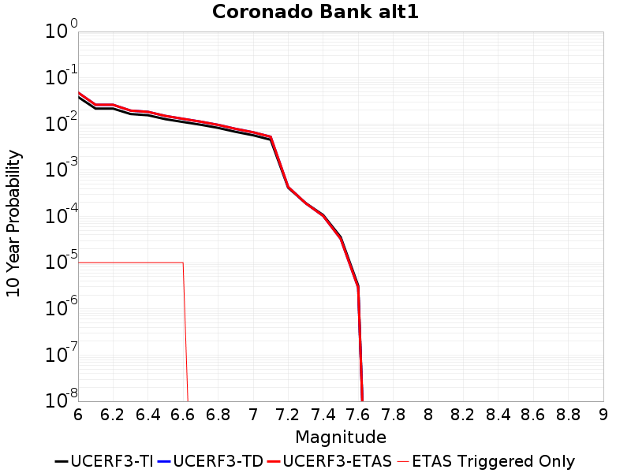 |

| Magnitude | 1 wk TI Prob | 1 wk TD Prob | 1 wk ETAS Prob | 1 wk ETAS/TD Gain | 1 wk ETAS Triggered Only | 1 mo TI Prob | 1 mo TD Prob | 1 mo ETAS Prob | 1 mo ETAS/TD Gain | 1 mo ETAS Triggered Only | 1 yr TI Prob | 1 yr TD Prob | 1 yr ETAS Prob | 1 yr ETAS/TD Gain | 1 yr ETAS Triggered Only | 10 yr TI Prob | 10 yr TD Prob | 10 yr ETAS Prob | 10 yr ETAS/TD Gain | 10 yr ETAS Triggered Only |
|-----|-----|-----|-----|-----|-----|-----|-----|-----|-----|-----|-----|-----|-----|-----|-----|-----|-----|-----|-----|-----|
| 6.0 | 7.533492E-5 | 9.40879E-5 | 9.40879E-5 | 1.0 | 0.0 | 3.22824E-4 | 4.0317283E-4 | 4.0317283E-4 | 1.0 | 0.0 | 0.0039233007 | 0.004898188 | 0.004898188 | 1.0 | 0.0 | 0.03854755 | 0.047971327 | 0.04799037 | 1.000397 | 2.0E-5 |
| 6.1 | 4.1807285E-5 | 5.0555525E-5 | 5.0555525E-5 | 1.0 | 0.0 | 1.7916178E-4 | 2.1664909E-4 | 2.1664909E-4 | 1.0 | 0.0 | 0.0021791123 | 0.002634588 | 0.002634588 | 1.0 | 0.0 | 0.021578677 | 0.026042791 | 0.026052529 | 1.000374 | 1.0E-5 |
| 6.2 | 4.1807285E-5 | 5.0555525E-5 | 5.0555525E-5 | 1.0 | 0.0 | 1.7916178E-4 | 2.1664909E-4 | 2.1664909E-4 | 1.0 | 0.0 | 0.0021791123 | 0.002634588 | 0.002634588 | 1.0 | 0.0 | 0.021578677 | 0.026042791 | 0.026052529 | 1.000374 | 1.0E-5 |
| 6.3 | 3.1793104E-5 | 3.7753103E-5 | 3.7753103E-5 | 1.0 | 0.0 | 1.3624904E-4 | 1.6178915E-4 | 1.6178915E-4 | 1.0 | 0.0 | 0.0016575698 | 0.0019680357 | 0.0019680357 | 1.0 | 0.0 | 0.016452603 | 0.019509958 | 0.019519763 | 1.0005026 | 1.0E-5 |
| 6.4 | 2.9878007E-5 | 3.537442E-5 | 3.537442E-5 | 1.0 | 0.0 | 1.2804232E-4 | 1.5159602E-4 | 1.5159602E-4 | 1.0 | 0.0 | 0.0015578003 | 0.0018441514 | 0.0018441514 | 1.0 | 0.0 | 0.015469253 | 0.01829224 | 0.018302057 | 1.0005367 | 1.0E-5 |
| 6.5 | 2.4512565E-5 | 2.879401E-5 | 2.879401E-5 | 1.0 | 0.0 | 1.0504962E-4 | 1.2339721E-4 | 1.2339721E-4 | 1.0 | 0.0 | 0.0012782287 | 0.0015013524 | 0.0015013524 | 1.0 | 0.0 | 0.012709012 | 0.014915064 | 0.014924915 | 1.0006604 | 1.0E-5 |
| 6.6 | 2.1317413E-5 | 2.4931836E-5 | 2.4931836E-5 | 1.0 | 0.0 | 9.135714E-5 | 1.0684648E-4 | 1.0684648E-4 | 1.0 | 0.0 | 0.0011117056 | 0.0013001018 | 0.0013001018 | 1.0 | 0.0 | 0.011061605 | 0.012927371 | 0.012937242 | 1.0007635 | 1.0E-5 |
| 6.7 | 1.8585655E-5 | 2.1656208E-5 | 2.1656208E-5 | 1.0 | 0.0 | 7.9650374E-5 | 9.280913E-5 | 9.280913E-5 | 1.0 | 0.0 | 9.6931186E-4 | 0.001129386 | 0.001129386 | 1.0 | 0.0 | 0.0096509475 | 0.011238631 | 0.011248519 | 1.0008798 | 1.0E-5 |
| 6.8 | 1.5862879E-5 | 1.8437342E-5 | 1.8437342E-5 | 1.0 | 0.0 | 6.798199E-5 | 7.901489E-5 | 7.901489E-5 | 1.0 | 0.0 | 8.273665E-4 | 9.6160104E-4 | 9.6160104E-4 | 1.0 | 0.0 | 0.008242928 | 0.009576388 | 0.009586292 | 1.0010343 | 1.0E-5 |
| 6.9 | 1.3021509E-5 | 1.5109773E-5 | 1.5109773E-5 | 1.0 | 0.0 | 5.5805274E-5 | 6.475466E-5 | 6.475466E-5 | 1.0 | 0.0 | 6.792174E-4 | 7.88121E-4 | 7.88121E-4 | 1.0 | 0.0 | 0.006771452 | 0.0078550875 | 0.007865009 | 1.001263 | 1.0E-5 |
| 7.0 | 1.0974371E-5 | 1.2732348E-5 | 1.2732348E-5 | 1.0 | 0.0 | 4.7032172E-5 | 5.4566164E-5 | 5.4566164E-5 | 1.0 | 0.0 | 5.7246623E-4 | 6.6415814E-4 | 6.6415814E-4 | 1.0 | 0.0 | 0.0057099373 | 0.006623485 | 0.006633419 | 1.0014998 | 1.0E-5 |
| 7.1 | 8.766221E-6 | 1.01736805E-5 | 1.01736805E-5 | 1.0 | 0.0 | 3.7568978E-5 | 4.3600856E-5 | 4.3600856E-5 | 1.0 | 0.0 | 4.573063E-4 | 5.307284E-4 | 5.307284E-4 | 1.0 | 0.0 | 0.0045636636 | 0.005296312 | 0.005306259 | 1.0018781 | 1.0E-5 |
| 7.2 | 8.026024E-7 | 8.335201E-7 | 8.335201E-7 | 1.0 | 0.0 | 3.43972E-6 | 3.5722242E-6 | 3.5722242E-6 | 1.0 | 0.0 | 4.1877785E-5 | 4.3490974E-5 | 4.3490974E-5 | 1.0 | 0.0 | 4.1869894E-4 | 4.3482572E-4 | 4.3482572E-4 | 1.0 | 0.0 |
| 7.3 | 3.7293114E-7 | 3.7013584E-7 | 3.7013584E-7 | 1.0 | 0.0 | 1.5982754E-6 | 1.5862954E-6 | 1.5862954E-6 | 1.0 | 0.0 | 1.9458828E-5 | 1.9312976E-5 | 1.9312976E-5 | 1.0 | 0.0 | 1.9457124E-4 | 1.9311304E-4 | 1.9311304E-4 | 1.0 | 0.0 |
| 7.4 | 2.0557036E-7 | 1.9680968E-7 | 1.9680968E-7 | 1.0 | 0.0 | 8.810155E-7 | 8.4346976E-7 | 8.4346976E-7 | 1.0 | 0.0 | 1.0726311E-5 | 1.02691965E-5 | 1.02691965E-5 | 1.0 | 0.0 | 1.0725793E-4 | 1.0268725E-4 | 1.0268725E-4 | 1.0 | 0.0 |
| 7.5 | 6.845446E-8 | 6.281244E-8 | 6.281244E-8 | 1.0 | 0.0 | 2.9337625E-7 | 2.6919614E-7 | 2.6919614E-7 | 1.0 | 0.0 | 3.5718497E-6 | 3.2774583E-6 | 3.2774583E-6 | 1.0 | 0.0 | 3.5717923E-5 | 3.2774107E-5 | 3.2774107E-5 | 1.0 | 0.0 |
| 7.6 | 6.0975145E-9 | 5.5324048E-9 | 5.5324048E-9 | 1.0 | 0.0 | 2.6132206E-8 | 2.3710305E-8 | 2.3710305E-8 | 1.0 | 0.0 | 3.1815955E-7 | 2.8867294E-7 | 2.8867294E-7 | 1.0 | 0.0 | 3.181591E-6 | 2.8867266E-6 | 2.8867266E-6 | 1.0 | 0.0 |

## Mono Lake 2011 CFM
*[(top)](#table-of-contents)*

| 1 Week | 1 Month | 1 Year | 10 Year |
|-----|-----|-----|-----|
|  |  | 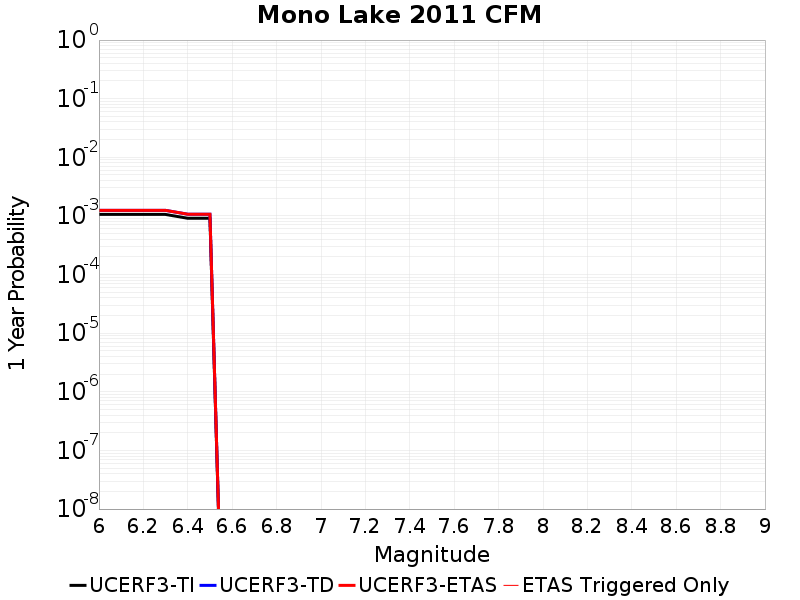 |  |

| Magnitude | 1 wk TI Prob | 1 wk TD Prob | 1 wk ETAS Prob | 1 wk ETAS/TD Gain | 1 wk ETAS Triggered Only | 1 mo TI Prob | 1 mo TD Prob | 1 mo ETAS Prob | 1 mo ETAS/TD Gain | 1 mo ETAS Triggered Only | 1 yr TI Prob | 1 yr TD Prob | 1 yr ETAS Prob | 1 yr ETAS/TD Gain | 1 yr ETAS Triggered Only | 10 yr TI Prob | 10 yr TD Prob | 10 yr ETAS Prob | 10 yr ETAS/TD Gain | 10 yr ETAS Triggered Only |
|-----|-----|-----|-----|-----|-----|-----|-----|-----|-----|-----|-----|-----|-----|-----|-----|-----|-----|-----|-----|-----|
| 6.0 | 2.0341662E-5 | 2.3852359E-5 | 2.3852359E-5 | 1.0 | 0.0 | 8.717564E-5 | 1.0222339E-4 | 1.0222339E-4 | 1.0 | 0.0 | 0.0010608466 | 0.0012443912 | 0.0012443912 | 1.0 | 0.0 | 0.010557966 | 0.012426406 | 0.012456033 | 1.0023842 | 3.0E-5 |
| 6.1 | 2.0341662E-5 | 2.3852359E-5 | 2.3852359E-5 | 1.0 | 0.0 | 8.717564E-5 | 1.0222339E-4 | 1.0222339E-4 | 1.0 | 0.0 | 0.0010608466 | 0.0012443912 | 0.0012443912 | 1.0 | 0.0 | 0.010557966 | 0.012426406 | 0.012456033 | 1.0023842 | 3.0E-5 |
| 6.2 | 2.0341662E-5 | 2.3852359E-5 | 2.3852359E-5 | 1.0 | 0.0 | 8.717564E-5 | 1.0222339E-4 | 1.0222339E-4 | 1.0 | 0.0 | 0.0010608466 | 0.0012443912 | 0.0012443912 | 1.0 | 0.0 | 0.010557966 | 0.012426406 | 0.012456033 | 1.0023842 | 3.0E-5 |
| 6.3 | 2.0341662E-5 | 2.3852359E-5 | 2.3852359E-5 | 1.0 | 0.0 | 8.717564E-5 | 1.0222339E-4 | 1.0222339E-4 | 1.0 | 0.0 | 0.0010608466 | 0.0012443912 | 0.0012443912 | 1.0 | 0.0 | 0.010557966 | 0.012426406 | 0.012456033 | 1.0023842 | 3.0E-5 |
| 6.4 | 1.749821E-5 | 2.051175E-5 | 2.051175E-5 | 1.0 | 0.0 | 7.499018E-5 | 8.79075E-5 | 8.79075E-5 | 1.0 | 0.0 | 9.1262296E-4 | 0.0010702732 | 0.0010702732 | 1.0 | 0.0 | 0.009088841 | 0.010702686 | 0.010732365 | 1.002773 | 3.0E-5 |
| 6.5 | 1.749821E-5 | 2.051175E-5 | 2.051175E-5 | 1.0 | 0.0 | 7.499018E-5 | 8.79075E-5 | 8.79075E-5 | 1.0 | 0.0 | 9.1262296E-4 | 0.0010702732 | 0.0010702732 | 1.0 | 0.0 | 0.009088841 | 0.010702686 | 0.010732365 | 1.002773 | 3.0E-5 |

## San Jacinto (Superstition Mtn)
*[(top)](#table-of-contents)*

| 1 Week | 1 Month | 1 Year | 10 Year |
|-----|-----|-----|-----|
|  |  | 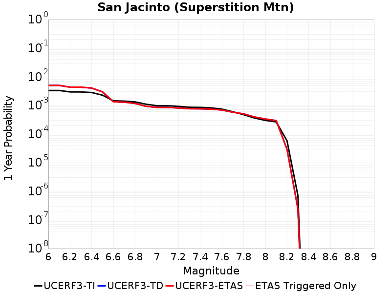 |  |

| Magnitude | 1 wk TI Prob | 1 wk TD Prob | 1 wk ETAS Prob | 1 wk ETAS/TD Gain | 1 wk ETAS Triggered Only | 1 mo TI Prob | 1 mo TD Prob | 1 mo ETAS Prob | 1 mo ETAS/TD Gain | 1 mo ETAS Triggered Only | 1 yr TI Prob | 1 yr TD Prob | 1 yr ETAS Prob | 1 yr ETAS/TD Gain | 1 yr ETAS Triggered Only | 10 yr TI Prob | 10 yr TD Prob | 10 yr ETAS Prob | 10 yr ETAS/TD Gain | 10 yr ETAS Triggered Only |
|-----|-----|-----|-----|-----|-----|-----|-----|-----|-----|-----|-----|-----|-----|-----|-----|-----|-----|-----|-----|-----|
| 6.0 | 6.4193904E-5 | 9.636034E-5 | 9.636034E-5 | 1.0 | 0.0 | 2.7508775E-4 | 4.129172E-4 | 4.129172E-4 | 1.0 | 0.0 | 0.0033440501 | 0.0050170715 | 0.0050170715 | 1.0 | 0.0 | 0.03294174 | 0.04900064 | 0.049029168 | 1.0005822 | 3.0E-5 |
| 6.1 | 6.4193904E-5 | 9.636034E-5 | 9.636034E-5 | 1.0 | 0.0 | 2.7508775E-4 | 4.129172E-4 | 4.129172E-4 | 1.0 | 0.0 | 0.0033440501 | 0.0050170715 | 0.0050170715 | 1.0 | 0.0 | 0.03294174 | 0.04900064 | 0.049029168 | 1.0005822 | 3.0E-5 |
| 6.2 | 5.7023593E-5 | 8.348826E-5 | 8.348826E-5 | 1.0 | 0.0 | 2.4436394E-4 | 3.5776707E-4 | 3.5776707E-4 | 1.0 | 0.0 | 0.002971072 | 0.0043487586 | 0.0043487586 | 1.0 | 0.0 | 0.029316625 | 0.042674616 | 0.042703338 | 1.0006729 | 3.0E-5 |
| 6.3 | 5.6940098E-5 | 8.333342E-5 | 8.333342E-5 | 1.0 | 0.0 | 2.4400617E-4 | 3.5710365E-4 | 3.5710365E-4 | 1.0 | 0.0 | 0.002966728 | 0.004340714 | 0.004340714 | 1.0 | 0.0 | 0.029274331 | 0.04259791 | 0.04262663 | 1.0006742 | 3.0E-5 |
| 6.4 | 5.4171585E-5 | 7.7819175E-5 | 7.7819175E-5 | 1.0 | 0.0 | 2.3214328E-4 | 3.3347745E-4 | 3.3347745E-4 | 1.0 | 0.0 | 0.0028226813 | 0.004054181 | 0.004054181 | 1.0 | 0.0 | 0.02787096 | 0.039883684 | 0.03991249 | 1.0007222 | 3.0E-5 |
| 6.5 | 4.375144E-5 | 5.6721325E-5 | 5.6721325E-5 | 1.0 | 0.0 | 1.874927E-4 | 2.430754E-4 | 2.430754E-4 | 1.0 | 0.0 | 0.0022803338 | 0.0029566034 | 0.0029566034 | 1.0 | 0.0 | 0.022570757 | 0.029387312 | 0.029416429 | 1.0009909 | 3.0E-5 |
| 6.6 | 2.772192E-5 | 2.5773881E-5 | 2.5773881E-5 | 1.0 | 0.0 | 1.1880282E-4 | 1.1045492E-4 | 1.1045492E-4 | 1.0 | 0.0 | 0.0014454646 | 0.0013439787 | 0.0013439787 | 1.0 | 0.0 | 0.014360986 | 0.013687839 | 0.0136977015 | 1.0007206 | 1.0E-5 |
| 6.7 | 2.7124124E-5 | 2.4983476E-5 | 2.4983476E-5 | 1.0 | 0.0 | 1.1624106E-4 | 1.0706775E-4 | 1.0706775E-4 | 1.0 | 0.0 | 0.0014143161 | 0.0013027898 | 0.0013027898 | 1.0 | 0.0 | 0.014053487 | 0.013280714 | 0.013290581 | 1.0007429 | 1.0E-5 |
| 6.8 | 2.5475807E-5 | 2.244181E-5 | 2.244181E-5 | 1.0 | 0.0 | 1.0917746E-4 | 9.617571E-5 | 9.617571E-5 | 1.0 | 0.0 | 0.001328425 | 0.0011703224 | 0.0011703224 | 1.0 | 0.0 | 0.0132051185 | 0.0119651975 | 0.011975078 | 1.0008258 | 1.0E-5 |
| 6.9 | 2.1162023E-5 | 1.7882852E-5 | 1.7882852E-5 | 1.0 | 0.0 | 9.069123E-5 | 7.663857E-5 | 7.663857E-5 | 1.0 | 0.0 | 0.0011036064 | 9.32679E-4 | 9.32679E-4 | 1.0 | 0.0 | 0.010981417 | 0.009580322 | 0.009580322 | 1.0 | 0.0 |
| 7.0 | 1.8754288E-5 | 1.6407248E-5 | 1.6407248E-5 | 1.0 | 0.0 | 8.037304E-5 | 7.03149E-5 | 7.03149E-5 | 1.0 | 0.0 | 9.781026E-4 | 8.557502E-4 | 8.557502E-4 | 1.0 | 0.0 | 0.009738087 | 0.008797882 | 0.008797882 | 1.0 | 0.0 |
| 7.1 | 1.8678527E-5 | 1.6332155E-5 | 1.6332155E-5 | 1.0 | 0.0 | 8.0048376E-5 | 6.999309E-5 | 6.999309E-5 | 1.0 | 0.0 | 9.7415317E-4 | 8.518352E-4 | 8.518352E-4 | 1.0 | 0.0 | 0.009698939 | 0.008758717 | 0.008758717 | 1.0 | 0.0 |
| 7.2 | 1.7804578E-5 | 1.5624284E-5 | 1.5624284E-5 | 1.0 | 0.0 | 7.6303106E-5 | 6.695951E-5 | 6.695951E-5 | 1.0 | 0.0 | 9.285943E-4 | 8.1492943E-4 | 8.1492943E-4 | 1.0 | 0.0 | 0.009247236 | 0.008388742 | 0.008388742 | 1.0 | 0.0 |
| 7.3 | 1.6583685E-5 | 1.4770715E-5 | 1.4770715E-5 | 1.0 | 0.0 | 7.1070994E-5 | 6.330154E-5 | 6.330154E-5 | 1.0 | 0.0 | 8.649459E-4 | 7.704258E-4 | 7.704258E-4 | 1.0 | 0.0 | 0.00861587 | 0.007942752 | 0.007942752 | 1.0 | 0.0 |
| 7.4 | 1.6387552E-5 | 1.4635161E-5 | 1.4635161E-5 | 1.0 | 0.0 | 7.023047E-5 | 6.2720625E-5 | 6.2720625E-5 | 1.0 | 0.0 | 8.5472054E-4 | 7.633581E-4 | 7.633581E-4 | 1.0 | 0.0 | 0.008514405 | 0.007871902 | 0.007871902 | 1.0 | 0.0 |
| 7.5 | 1.5790754E-5 | 1.4273538E-5 | 1.4273538E-5 | 1.0 | 0.0 | 6.767291E-5 | 6.117088E-5 | 6.117088E-5 | 1.0 | 0.0 | 8.236062E-4 | 7.4450305E-4 | 7.4450305E-4 | 1.0 | 0.0 | 0.008205604 | 0.0076813214 | 0.0076813214 | 1.0 | 0.0 |
| 7.6 | 1.4248672E-5 | 1.3284053E-5 | 1.3284053E-5 | 1.0 | 0.0 | 6.106431E-5 | 5.6930425E-5 | 5.6930425E-5 | 1.0 | 0.0 | 7.432043E-4 | 6.9290923E-4 | 6.9290923E-4 | 1.0 | 0.0 | 0.007407237 | 0.0071594794 | 0.0071594794 | 1.0 | 0.0 |
| 7.7 | 1.15449975E-5 | 1.1123314E-5 | 1.1123314E-5 | 1.0 | 0.0 | 4.947762E-5 | 4.767048E-5 | 4.767048E-5 | 1.0 | 0.0 | 6.022235E-4 | 5.8023434E-4 | 5.8023434E-4 | 1.0 | 0.0 | 0.006005941 | 0.0060248664 | 0.0060248664 | 1.0 | 0.0 |
| 7.8 | 9.1391985E-6 | 9.725352E-6 | 9.725352E-6 | 1.0 | 0.0 | 3.9167408E-5 | 4.167942E-5 | 4.167942E-5 | 1.0 | 0.0 | 4.767588E-4 | 5.073294E-4 | 5.073294E-4 | 1.0 | 0.0 | 0.0047573727 | 0.0052871034 | 0.0052871034 | 1.0 | 0.0 |
| 7.9 | 6.973017E-6 | 7.5694943E-6 | 7.5694943E-6 | 1.0 | 0.0 | 2.9884017E-5 | 3.244029E-5 | 3.244029E-5 | 1.0 | 0.0 | 3.6377716E-4 | 3.948895E-4 | 3.948895E-4 | 1.0 | 0.0 | 0.0036318225 | 0.004150054 | 0.004150054 | 1.0 | 0.0 |
| 8.0 | 5.7638235E-6 | 6.4313285E-6 | 6.4313285E-6 | 1.0 | 0.0 | 2.4701867E-5 | 2.7562548E-5 | 2.7562548E-5 | 1.0 | 0.0 | 3.0070372E-4 | 3.3552287E-4 | 3.3552287E-4 | 1.0 | 0.0 | 0.0030029714 | 0.0035433932 | 0.0035433932 | 1.0 | 0.0 |
| 8.1 | 5.1124434E-6 | 5.651804E-6 | 5.651804E-6 | 1.0 | 0.0 | 2.1910288E-5 | 2.4221794E-5 | 2.4221794E-5 | 1.0 | 0.0 | 2.6672508E-4 | 2.9486095E-4 | 2.9486095E-4 | 1.0 | 0.0 | 0.0026640517 | 0.0031224047 | 0.0031224047 | 1.0 | 0.0 |
| 8.2 | 1.1075938E-6 | 5.554598E-7 | 5.554598E-7 | 1.0 | 0.0 | 4.7468216E-6 | 2.3805399E-6 | 2.3805399E-6 | 1.0 | 0.0 | 5.779102E-5 | 2.8982711E-5 | 2.8982711E-5 | 1.0 | 0.0 | 5.777599E-4 | 3.2558144E-4 | 3.2558144E-4 | 1.0 | 0.0 |
| 8.3 | 1.3584393E-8 | 4.679043E-9 | 4.679043E-9 | 1.0 | 0.0 | 5.8218827E-8 | 2.005304E-8 | 2.005304E-8 | 1.0 | 0.0 | 7.0881396E-7 | 2.4414575E-7 | 2.4414575E-7 | 1.0 | 0.0 | 7.0881174E-6 | 2.732244E-6 | 2.732244E-6 | 1.0 | 0.0 |

## Lost Hills
*[(top)](#table-of-contents)*

| 1 Week | 1 Month | 1 Year | 10 Year |
|-----|-----|-----|-----|
| 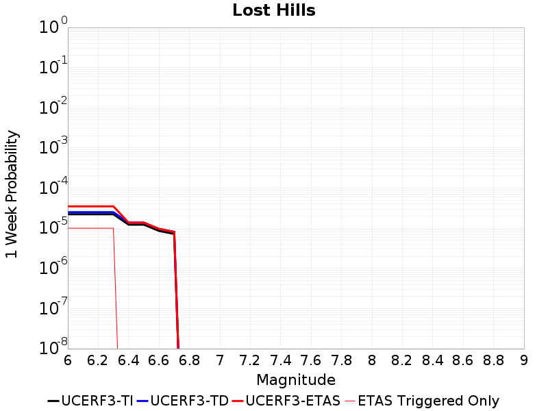 | 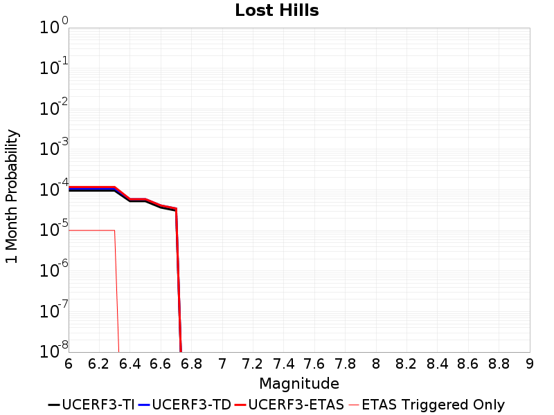 | 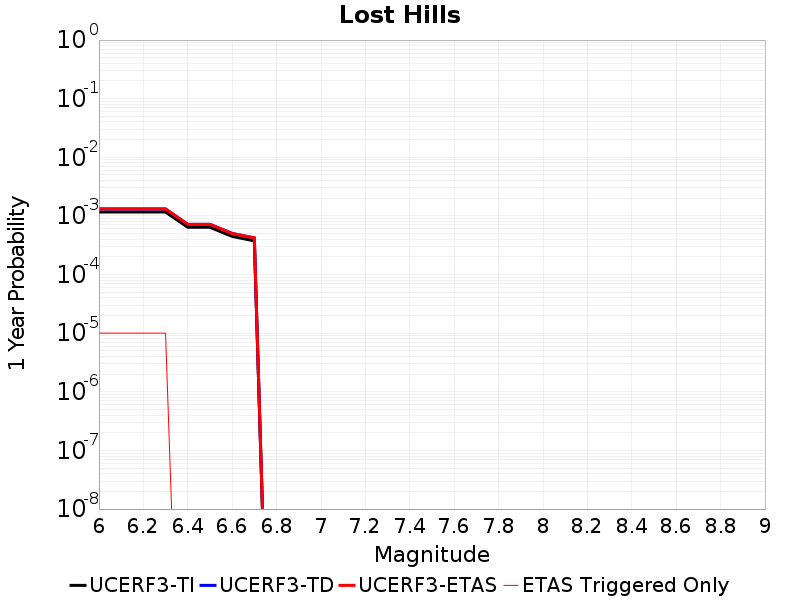 |  |

| Magnitude | 1 wk TI Prob | 1 wk TD Prob | 1 wk ETAS Prob | 1 wk ETAS/TD Gain | 1 wk ETAS Triggered Only | 1 mo TI Prob | 1 mo TD Prob | 1 mo ETAS Prob | 1 mo ETAS/TD Gain | 1 mo ETAS Triggered Only | 1 yr TI Prob | 1 yr TD Prob | 1 yr ETAS Prob | 1 yr ETAS/TD Gain | 1 yr ETAS Triggered Only | 10 yr TI Prob | 10 yr TD Prob | 10 yr ETAS Prob | 10 yr ETAS/TD Gain | 10 yr ETAS Triggered Only |
|-----|-----|-----|-----|-----|-----|-----|-----|-----|-----|-----|-----|-----|-----|-----|-----|-----|-----|-----|-----|-----|
| 6.0 | 2.233523E-5 | 2.512502E-5 | 2.512502E-5 | 1.0 | 0.0 | 9.571891E-5 | 1.07675165E-4 | 1.07675165E-4 | 1.0 | 0.0 | 0.0011647546 | 0.0013103251 | 0.001320312 | 1.0076216 | 1.0E-5 | 0.011586686 | 0.013042613 | 0.013072222 | 1.0022701 | 3.0E-5 |
| 6.1 | 2.233523E-5 | 2.512502E-5 | 2.512502E-5 | 1.0 | 0.0 | 9.571891E-5 | 1.07675165E-4 | 1.07675165E-4 | 1.0 | 0.0 | 0.0011647546 | 0.0013103251 | 0.001320312 | 1.0076216 | 1.0E-5 | 0.011586686 | 0.013042613 | 0.013072222 | 1.0022701 | 3.0E-5 |
| 6.2 | 2.233523E-5 | 2.512502E-5 | 2.512502E-5 | 1.0 | 0.0 | 9.571891E-5 | 1.07675165E-4 | 1.07675165E-4 | 1.0 | 0.0 | 0.0011647546 | 0.0013103251 | 0.001320312 | 1.0076216 | 1.0E-5 | 0.011586686 | 0.013042613 | 0.013072222 | 1.0022701 | 3.0E-5 |
| 6.3 | 2.233523E-5 | 2.512502E-5 | 2.512502E-5 | 1.0 | 0.0 | 9.571891E-5 | 1.07675165E-4 | 1.07675165E-4 | 1.0 | 0.0 | 0.0011647546 | 0.0013103251 | 0.001320312 | 1.0076216 | 1.0E-5 | 0.011586686 | 0.013042613 | 0.013072222 | 1.0022701 | 3.0E-5 |
| 6.4 | 1.2288092E-5 | 1.37910165E-5 | 1.37910165E-5 | 1.0 | 0.0 | 5.2662188E-5 | 5.910355E-5 | 5.910355E-5 | 1.0 | 0.0 | 6.409735E-4 | 7.1944203E-4 | 7.294349E-4 | 1.0138897 | 1.0E-5 | 0.006391279 | 0.007180349 | 0.0071902773 | 1.0013827 | 1.0E-5 |
| 6.5 | 1.2288092E-5 | 1.37910165E-5 | 1.37910165E-5 | 1.0 | 0.0 | 5.2662188E-5 | 5.910355E-5 | 5.910355E-5 | 1.0 | 0.0 | 6.409735E-4 | 7.1944203E-4 | 7.294349E-4 | 1.0138897 | 1.0E-5 | 0.006391279 | 0.007180349 | 0.0071902773 | 1.0013827 | 1.0E-5 |
| 6.6 | 8.58281E-6 | 9.640751E-6 | 9.640751E-6 | 1.0 | 0.0 | 3.6782953E-5 | 4.1317322E-5 | 4.1317322E-5 | 1.0 | 0.0 | 4.4774043E-4 | 5.030056E-4 | 5.130006E-4 | 1.0198705 | 1.0E-5 | 0.0044683935 | 0.0050268425 | 0.0050367923 | 1.0019794 | 1.0E-5 |
| 6.7 | 7.205685E-6 | 8.0941645E-6 | 8.0941645E-6 | 1.0 | 0.0 | 3.088114E-5 | 3.4689278E-5 | 3.4689278E-5 | 1.0 | 0.0 | 3.7591302E-4 | 4.2234195E-4 | 4.3233772E-4 | 1.0236675 | 1.0E-5 | 0.0037527776 | 0.00422342 | 0.0042333775 | 1.0023577 | 1.0E-5 |

## San Andreas (North Branch Mill Creek)
*[(top)](#table-of-contents)*

| 1 Week | 1 Month | 1 Year | 10 Year |
|-----|-----|-----|-----|
|  |  |  |  |

| Magnitude | 1 wk TI Prob | 1 wk TD Prob | 1 wk ETAS Prob | 1 wk ETAS/TD Gain | 1 wk ETAS Triggered Only | 1 mo TI Prob | 1 mo TD Prob | 1 mo ETAS Prob | 1 mo ETAS/TD Gain | 1 mo ETAS Triggered Only | 1 yr TI Prob | 1 yr TD Prob | 1 yr ETAS Prob | 1 yr ETAS/TD Gain | 1 yr ETAS Triggered Only | 10 yr TI Prob | 10 yr TD Prob | 10 yr ETAS Prob | 10 yr ETAS/TD Gain | 10 yr ETAS Triggered Only |
|-----|-----|-----|-----|-----|-----|-----|-----|-----|-----|-----|-----|-----|-----|-----|-----|-----|-----|-----|-----|-----|
| 6.0 | 1.3461156E-5 | 2.3810462E-5 | 2.3810462E-5 | 1.0 | 0.0 | 5.7689394E-5 | 1.0204087E-4 | 1.0204087E-4 | 1.0 | 0.0 | 7.02142E-4 | 0.0012416429 | 0.0012616181 | 1.0160877 | 2.0E-5 | 0.0069992766 | 0.012387945 | 0.0124175735 | 1.0023917 | 3.0E-5 |
| 6.1 | 1.3461156E-5 | 2.3810462E-5 | 2.3810462E-5 | 1.0 | 0.0 | 5.7689394E-5 | 1.0204087E-4 | 1.0204087E-4 | 1.0 | 0.0 | 7.02142E-4 | 0.0012416429 | 0.0012616181 | 1.0160877 | 2.0E-5 | 0.0069992766 | 0.012387945 | 0.0124175735 | 1.0023917 | 3.0E-5 |
| 6.2 | 1.3461156E-5 | 2.3810462E-5 | 2.3810462E-5 | 1.0 | 0.0 | 5.7689394E-5 | 1.0204087E-4 | 1.0204087E-4 | 1.0 | 0.0 | 7.02142E-4 | 0.0012416429 | 0.0012616181 | 1.0160877 | 2.0E-5 | 0.0069992766 | 0.012387945 | 0.0124175735 | 1.0023917 | 3.0E-5 |
| 6.3 | 1.3461156E-5 | 2.3810462E-5 | 2.3810462E-5 | 1.0 | 0.0 | 5.7689394E-5 | 1.0204087E-4 | 1.0204087E-4 | 1.0 | 0.0 | 7.02142E-4 | 0.0012416429 | 0.0012616181 | 1.0160877 | 2.0E-5 | 0.0069992766 | 0.012387945 | 0.0124175735 | 1.0023917 | 3.0E-5 |
| 6.4 | 1.3461156E-5 | 2.3810462E-5 | 2.3810462E-5 | 1.0 | 0.0 | 5.7689394E-5 | 1.0204087E-4 | 1.0204087E-4 | 1.0 | 0.0 | 7.02142E-4 | 0.0012416429 | 0.0012616181 | 1.0160877 | 2.0E-5 | 0.0069992766 | 0.012387945 | 0.0124175735 | 1.0023917 | 3.0E-5 |
| 6.5 | 1.3450706E-5 | 2.3799419E-5 | 2.3799419E-5 | 1.0 | 0.0 | 5.764461E-5 | 1.0199354E-4 | 1.0199354E-4 | 1.0 | 0.0 | 7.0159714E-4 | 0.0012410673 | 0.0012610425 | 1.0160952 | 2.0E-5 | 0.006993862 | 0.012382254 | 0.012411882 | 1.0023928 | 3.0E-5 |
| 6.6 | 1.3074523E-5 | 2.3413591E-5 | 2.3413591E-5 | 1.0 | 0.0 | 5.6032466E-5 | 1.0034013E-4 | 1.0034013E-4 | 1.0 | 0.0 | 6.8198174E-4 | 0.0012209597 | 0.0012409353 | 1.0163605 | 2.0E-5 | 0.006798926 | 0.012183394 | 0.012213029 | 1.0024323 | 3.0E-5 |
| 6.7 | 1.3050216E-5 | 2.3388866E-5 | 2.3388866E-5 | 1.0 | 0.0 | 5.59283E-5 | 1.0023417E-4 | 1.0023417E-4 | 1.0 | 0.0 | 6.8071426E-4 | 0.0012196711 | 0.0012396467 | 1.0163778 | 2.0E-5 | 0.0067863287 | 0.012170649 | 0.012200285 | 1.002435 | 3.0E-5 |
| 6.8 | 1.29049395E-5 | 2.3237211E-5 | 2.3237211E-5 | 1.0 | 0.0 | 5.530571E-5 | 9.958427E-5 | 9.958427E-5 | 1.0 | 0.0 | 6.73139E-4 | 0.0012117674 | 0.0012317431 | 1.0164849 | 2.0E-5 | 0.0067110364 | 0.012092474 | 0.012122111 | 1.0024508 | 3.0E-5 |
| 6.9 | 1.2867369E-5 | 2.3196571E-5 | 2.3196571E-5 | 1.0 | 0.0 | 5.51447E-5 | 9.941011E-5 | 9.941011E-5 | 1.0 | 0.0 | 6.711799E-4 | 0.0012096493 | 0.0012296251 | 1.0165137 | 2.0E-5 | 0.006691564 | 0.012071524 | 0.012101162 | 1.0024552 | 3.0E-5 |
| 7.0 | 1.2495996E-5 | 2.2594451E-5 | 2.2594451E-5 | 1.0 | 0.0 | 5.3553173E-5 | 9.682978E-5 | 9.682978E-5 | 1.0 | 0.0 | 6.518148E-4 | 0.0011782679 | 0.0011982444 | 1.0169541 | 2.0E-5 | 0.0064990623 | 0.011761043 | 0.01179069 | 1.0025208 | 3.0E-5 |
| 7.1 | 1.2452067E-5 | 2.2539429E-5 | 2.2539429E-5 | 1.0 | 0.0 | 5.3364907E-5 | 9.659399E-5 | 9.659399E-5 | 1.0 | 0.0 | 6.4952404E-4 | 0.0011754002 | 0.0011953767 | 1.0169954 | 2.0E-5 | 0.0064762887 | 0.0117326705 | 0.011762318 | 1.002527 | 3.0E-5 |
| 7.2 | 1.2002777E-5 | 2.1916334E-5 | 2.1916334E-5 | 1.0 | 0.0 | 5.143946E-5 | 9.392378E-5 | 9.392378E-5 | 1.0 | 0.0 | 6.2609545E-4 | 0.0011429249 | 0.001162902 | 1.017479 | 2.0E-5 | 0.006243344 | 0.011411275 | 0.011440933 | 1.002599 | 3.0E-5 |
| 7.3 | 1.1923425E-5 | 2.1785838E-5 | 2.1785838E-5 | 1.0 | 0.0 | 5.109939E-5 | 9.336455E-5 | 9.336455E-5 | 1.0 | 0.0 | 6.219575E-4 | 0.0011361233 | 0.0011561007 | 1.0175837 | 2.0E-5 | 0.0062021962 | 0.011343983 | 0.011373643 | 1.0026146 | 3.0E-5 |
| 7.4 | 1.16105175E-5 | 2.1156551E-5 | 2.1156551E-5 | 1.0 | 0.0 | 4.975841E-5 | 9.0667796E-5 | 9.0667796E-5 | 1.0 | 0.0 | 6.0564023E-4 | 0.001103324 | 0.001123302 | 1.018107 | 2.0E-5 | 0.006039923 | 0.011019984 | 0.011049653 | 1.0026923 | 3.0E-5 |
| 7.5 | 1.1037265E-5 | 1.9845485E-5 | 1.9845485E-5 | 1.0 | 0.0 | 4.7301706E-5 | 8.5049316E-5 | 8.5049316E-5 | 1.0 | 0.0 | 5.757461E-4 | 0.0010349858 | 0.0010549651 | 1.0193039 | 2.0E-5 | 0.005742567 | 0.0103445025 | 0.010374192 | 1.0028701 | 3.0E-5 |
| 7.6 | 1.0720915E-5 | 1.9283632E-5 | 1.9283632E-5 | 1.0 | 0.0 | 4.5945973E-5 | 8.2641534E-5 | 8.2641534E-5 | 1.0 | 0.0 | 5.592486E-4 | 0.0010056985 | 0.0010256784 | 1.0198667 | 2.0E-5 | 0.005578433 | 0.010054328 | 0.010084026 | 1.0029538 | 3.0E-5 |
| 7.7 | 9.276279E-6 | 1.671567E-5 | 1.671567E-5 | 1.0 | 0.0 | 3.9754876E-5 | 7.163663E-5 | 7.163663E-5 | 1.0 | 0.0 | 4.839081E-4 | 8.7182864E-4 | 8.918112E-4 | 1.0229203 | 2.0E-5 | 0.0048285574 | 0.00872678 | 0.008756518 | 1.0034077 | 3.0E-5 |
| 7.8 | 5.8346777E-6 | 1.13777E-5 | 1.13777E-5 | 1.0 | 0.0 | 2.5005522E-5 | 4.876066E-5 | 4.876066E-5 | 1.0 | 0.0 | 3.043997E-4 | 5.9349946E-4 | 6.1348756E-4 | 1.0336784 | 2.0E-5 | 0.0030398308 | 0.0059614386 | 0.0059912596 | 1.0050024 | 3.0E-5 |
| 7.9 | 4.690204E-6 | 8.694638E-6 | 8.694638E-6 | 1.0 | 0.0 | 2.0100719E-5 | 3.7262205E-5 | 3.7262205E-5 | 1.0 | 0.0 | 2.4469878E-4 | 4.53573E-4 | 4.7356394E-4 | 1.0440743 | 2.0E-5 | 0.002444295 | 0.004566298 | 0.004596161 | 1.0065398 | 3.0E-5 |
| 8.0 | 2.9570454E-6 | 4.960419E-6 | 4.960419E-6 | 1.0 | 0.0 | 1.267299E-5 | 2.1258766E-5 | 2.1258766E-5 | 1.0 | 0.0 | 1.5428272E-4 | 2.5879475E-4 | 2.5879475E-4 | 1.0 | 0.0 | 0.0015417566 | 0.0026087195 | 0.0026087195 | 1.0 | 0.0 |
| 8.1 | 1.6376824E-6 | 2.2564755E-6 | 2.2564755E-6 | 1.0 | 0.0 | 7.01862E-6 | 9.670573E-6 | 9.670573E-6 | 1.0 | 0.0 | 8.544835E-5 | 1.1773288E-4 | 1.1773288E-4 | 1.0 | 0.0 | 8.54155E-4 | 0.0011918932 | 0.0011918932 | 1.0 | 0.0 |
| 8.2 | 6.9631557E-7 | 4.7216932E-7 | 4.7216932E-7 | 1.0 | 0.0 | 2.984206E-6 | 2.0235811E-6 | 2.0235811E-6 | 1.0 | 0.0 | 3.63321E-5 | 2.4636824E-5 | 2.4636824E-5 | 1.0 | 0.0 | 3.6326164E-4 | 2.550164E-4 | 2.550164E-4 | 1.0 | 0.0 |
| 8.3 | 1.7876137E-7 | 8.73973E-8 | 8.73973E-8 | 1.0 | 0.0 | 7.661199E-7 | 3.7455976E-7 | 3.7455976E-7 | 1.0 | 0.0 | 9.32747E-6 | 4.560256E-6 | 4.560256E-6 | 1.0 | 0.0 | 9.3270784E-5 | 4.7852045E-5 | 4.7852045E-5 | 1.0 | 0.0 |

## Santa Rosa Island
*[(top)](#table-of-contents)*

| 1 Week | 1 Month | 1 Year | 10 Year |
|-----|-----|-----|-----|
|  |  | 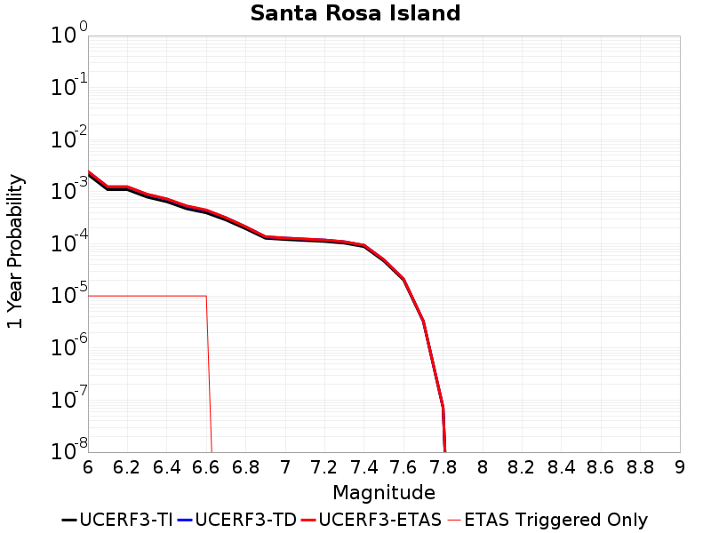 |  |

| Magnitude | 1 wk TI Prob | 1 wk TD Prob | 1 wk ETAS Prob | 1 wk ETAS/TD Gain | 1 wk ETAS Triggered Only | 1 mo TI Prob | 1 mo TD Prob | 1 mo ETAS Prob | 1 mo ETAS/TD Gain | 1 mo ETAS Triggered Only | 1 yr TI Prob | 1 yr TD Prob | 1 yr ETAS Prob | 1 yr ETAS/TD Gain | 1 yr ETAS Triggered Only | 10 yr TI Prob | 10 yr TD Prob | 10 yr ETAS Prob | 10 yr ETAS/TD Gain | 10 yr ETAS Triggered Only |
|-----|-----|-----|-----|-----|-----|-----|-----|-----|-----|-----|-----|-----|-----|-----|-----|-----|-----|-----|-----|-----|
| 6.0 | 4.1143165E-5 | 4.7131638E-5 | 4.7131638E-5 | 1.0 | 0.0 | 1.7631594E-4 | 2.0197821E-4 | 2.0197821E-4 | 1.0 | 0.0 | 0.002144533 | 0.0024565083 | 0.0024664837 | 1.0040609 | 1.0E-5 | 0.021239553 | 0.024314221 | 0.02434349 | 1.0012039 | 3.0E-5 |
| 6.1 | 2.1061249E-5 | 2.388387E-5 | 2.388387E-5 | 1.0 | 0.0 | 9.0259375E-5 | 1.0235558E-4 | 1.0235558E-4 | 1.0 | 0.0 | 0.0010983539 | 0.0012454959 | 0.0012454959 | 1.0 | 0.0 | 0.01092941 | 0.0123882 | 0.012407952 | 1.0015944 | 2.0E-5 |
| 6.2 | 2.1061249E-5 | 2.388387E-5 | 2.388387E-5 | 1.0 | 0.0 | 9.0259375E-5 | 1.0235558E-4 | 1.0235558E-4 | 1.0 | 0.0 | 0.0010983539 | 0.0012454959 | 0.0012454959 | 1.0 | 0.0 | 0.01092941 | 0.0123882 | 0.012407952 | 1.0015944 | 2.0E-5 |
| 6.3 | 1.5158236E-5 | 1.708727E-5 | 1.708727E-5 | 1.0 | 0.0 | 6.496225E-5 | 7.3229174E-5 | 7.3229174E-5 | 1.0 | 0.0 | 7.906284E-4 | 8.912125E-4 | 8.912125E-4 | 1.0 | 0.0 | 0.007878214 | 0.008877639 | 0.00888755 | 1.0011164 | 1.0E-5 |
| 6.4 | 1.2341918E-5 | 1.386302E-5 | 1.386302E-5 | 1.0 | 0.0 | 5.2892858E-5 | 5.941164E-5 | 5.941164E-5 | 1.0 | 0.0 | 6.437803E-4 | 7.231048E-4 | 7.231048E-4 | 1.0 | 0.0 | 0.006419184 | 0.007208357 | 0.007208357 | 1.0 | 0.0 |
| 6.5 | 9.061158E-6 | 1.0124066E-5 | 1.0124066E-5 | 1.0 | 0.0 | 3.883296E-5 | 4.338816E-5 | 4.338816E-5 | 1.0 | 0.0 | 4.726887E-4 | 5.281281E-4 | 5.281281E-4 | 1.0 | 0.0 | 0.004716845 | 0.0052692695 | 0.0052692695 | 1.0 | 0.0 |
| 6.6 | 7.5461685E-6 | 8.406418E-6 | 8.406418E-6 | 1.0 | 0.0 | 3.2340322E-5 | 3.602703E-5 | 3.602703E-5 | 1.0 | 0.0 | 3.936723E-4 | 4.385451E-4 | 4.385451E-4 | 1.0 | 0.0 | 0.003929756 | 0.0043772273 | 0.0043772273 | 1.0 | 0.0 |
| 6.7 | 5.5023775E-6 | 6.091258E-6 | 6.091258E-6 | 1.0 | 0.0 | 2.3581404E-5 | 2.610515E-5 | 2.610515E-5 | 1.0 | 0.0 | 2.8706578E-4 | 3.1778708E-4 | 3.1778708E-4 | 1.0 | 0.0 | 0.0028669522 | 0.0031736488 | 0.0031736488 | 1.0 | 0.0 |
| 6.8 | 3.7351679E-6 | 4.0854266E-6 | 4.0854266E-6 | 1.0 | 0.0 | 1.6007763E-5 | 1.7508868E-5 | 1.7508868E-5 | 1.0 | 0.0 | 1.948771E-4 | 2.131521E-4 | 2.131521E-4 | 1.0 | 0.0 | 0.0019470629 | 0.0021297222 | 0.0021297222 | 1.0 | 0.0 |
| 6.9 | 2.456366E-6 | 2.6303783E-6 | 2.6303783E-6 | 1.0 | 0.0 | 1.0527241E-5 | 1.1273001E-5 | 1.1273001E-5 | 1.0 | 0.0 | 1.2816161E-4 | 1.3724017E-4 | 1.3724017E-4 | 1.0 | 0.0 | 0.0012808773 | 0.0013715571 | 0.0013715571 | 1.0 | 0.0 |
| 7.0 | 2.3245157E-6 | 2.4837898E-6 | 2.4837898E-6 | 1.0 | 0.0 | 9.962172E-6 | 1.064477E-5 | 1.064477E-5 | 1.0 | 0.0 | 1.2128269E-4 | 1.2959239E-4 | 1.2959239E-4 | 1.0 | 0.0 | 0.0012121652 | 0.0012951704 | 0.0012951704 | 1.0 | 0.0 |
| 7.1 | 2.2248344E-6 | 2.3741973E-6 | 2.3741973E-6 | 1.0 | 0.0 | 9.53497E-6 | 1.0175091E-5 | 1.0175091E-5 | 1.0 | 0.0 | 1.1608207E-4 | 1.238747E-4 | 1.238747E-4 | 1.0 | 0.0 | 0.0011602144 | 0.0012380587 | 0.0012380587 | 1.0 | 0.0 |
| 7.2 | 2.1350402E-6 | 2.2770544E-6 | 2.2770544E-6 | 1.0 | 0.0 | 9.150141E-6 | 9.758768E-6 | 9.758768E-6 | 1.0 | 0.0 | 1.1139726E-4 | 1.1880654E-4 | 1.1880654E-4 | 1.0 | 0.0 | 0.0011134144 | 0.0011874322 | 0.0011874322 | 1.0 | 0.0 |
| 7.3 | 1.9793572E-6 | 2.1095445E-6 | 2.1095445E-6 | 1.0 | 0.0 | 8.482932E-6 | 9.040874E-6 | 9.040874E-6 | 1.0 | 0.0 | 1.032748E-4 | 1.100671E-4 | 1.100671E-4 | 1.0 | 0.0 | 0.0010322682 | 0.0011001276 | 0.0011001276 | 1.0 | 0.0 |
| 7.4 | 1.6951194E-6 | 1.8052725E-6 | 1.8052725E-6 | 1.0 | 0.0 | 7.264777E-6 | 7.7368595E-6 | 7.7368595E-6 | 1.0 | 0.0 | 8.844508E-5 | 9.4192204E-5 | 9.4192204E-5 | 1.0 | 0.0 | 8.840988E-4 | 9.415245E-4 | 9.415245E-4 | 1.0 | 0.0 |
| 7.5 | 8.987207E-7 | 9.5155895E-7 | 9.5155895E-7 | 1.0 | 0.0 | 3.8516546E-6 | 4.0781033E-6 | 4.0781033E-6 | 1.0 | 0.0 | 4.6892885E-5 | 4.964979E-5 | 4.964979E-5 | 1.0 | 0.0 | 4.688299E-4 | 4.963881E-4 | 4.963881E-4 | 1.0 | 0.0 |
| 7.6 | 3.8783037E-7 | 4.0540843E-7 | 4.0540843E-7 | 1.0 | 0.0 | 1.6621291E-6 | 1.7374635E-6 | 1.7374635E-6 | 1.0 | 0.0 | 2.0236233E-5 | 2.115342E-5 | 2.115342E-5 | 1.0 | 0.0 | 2.023439E-4 | 2.1151472E-4 | 2.1151472E-4 | 1.0 | 0.0 |
| 7.7 | 6.181804E-8 | 6.34044E-8 | 6.34044E-8 | 1.0 | 0.0 | 2.6493444E-7 | 2.7173311E-7 | 2.7173311E-7 | 1.0 | 0.0 | 3.225572E-6 | 3.3083459E-6 | 3.3083459E-6 | 1.0 | 0.0 | 3.225525E-5 | 3.308297E-5 | 3.308297E-5 | 1.0 | 0.0 |
| 7.8 | 1.3704449E-9 | 1.3965717E-9 | 1.3965717E-9 | 1.0 | 0.0 | 5.873335E-9 | 5.985308E-9 | 5.985308E-9 | 1.0 | 0.0 | 7.1507856E-8 | 7.2871124E-8 | 7.2871124E-8 | 1.0 | 0.0 | 7.1507833E-7 | 7.287111E-7 | 7.287111E-7 | 1.0 | 0.0 |

## Elsinore (Glen Ivy) rev
*[(top)](#table-of-contents)*

| 1 Week | 1 Month | 1 Year | 10 Year |
|-----|-----|-----|-----|
| 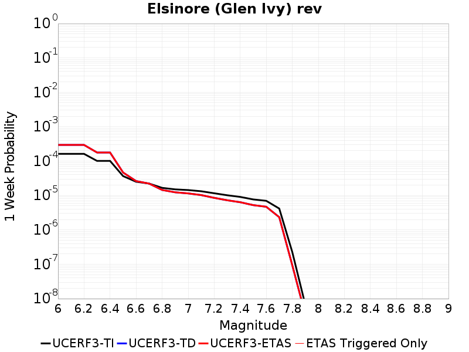 |  | 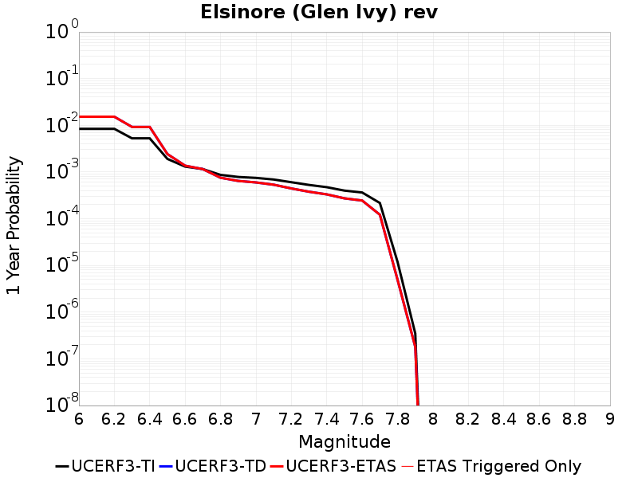 |  |

| Magnitude | 1 wk TI Prob | 1 wk TD Prob | 1 wk ETAS Prob | 1 wk ETAS/TD Gain | 1 wk ETAS Triggered Only | 1 mo TI Prob | 1 mo TD Prob | 1 mo ETAS Prob | 1 mo ETAS/TD Gain | 1 mo ETAS Triggered Only | 1 yr TI Prob | 1 yr TD Prob | 1 yr ETAS Prob | 1 yr ETAS/TD Gain | 1 yr ETAS Triggered Only | 10 yr TI Prob | 10 yr TD Prob | 10 yr ETAS Prob | 10 yr ETAS/TD Gain | 10 yr ETAS Triggered Only |
|-----|-----|-----|-----|-----|-----|-----|-----|-----|-----|-----|-----|-----|-----|-----|-----|-----|-----|-----|-----|-----|
| 6.0 | 1.6204086E-4 | 2.945153E-4 | 2.945153E-4 | 1.0 | 0.0 | 6.94276E-4 | 0.0012617535 | 0.0012717409 | 1.0079155 | 1.0E-5 | 0.008420097 | 0.015275345 | 0.015285192 | 1.0006447 | 1.0E-5 | 0.081081145 | 0.13979064 | 0.13981645 | 1.0001847 | 3.0E-5 |
| 6.1 | 1.6204086E-4 | 2.945153E-4 | 2.945153E-4 | 1.0 | 0.0 | 6.94276E-4 | 0.0012617535 | 0.0012717409 | 1.0079155 | 1.0E-5 | 0.008420097 | 0.015275345 | 0.015285192 | 1.0006447 | 1.0E-5 | 0.081081145 | 0.13979064 | 0.13981645 | 1.0001847 | 3.0E-5 |
| 6.2 | 1.6204086E-4 | 2.945153E-4 | 2.945153E-4 | 1.0 | 0.0 | 6.94276E-4 | 0.0012617535 | 0.0012717409 | 1.0079155 | 1.0E-5 | 0.008420097 | 0.015275345 | 0.015285192 | 1.0006447 | 1.0E-5 | 0.081081145 | 0.13979064 | 0.13981645 | 1.0001847 | 3.0E-5 |
| 6.3 | 1.0111737E-4 | 1.774996E-4 | 1.774996E-4 | 1.0 | 0.0 | 4.332882E-4 | 7.6060806E-4 | 7.7060045E-4 | 1.0131373 | 1.0E-5 | 0.005262531 | 0.009241883 | 0.00925179 | 1.001072 | 1.0E-5 | 0.0513964 | 0.08711627 | 0.08713453 | 1.0002096 | 2.0E-5 |
| 6.4 | 1.0111737E-4 | 1.774996E-4 | 1.774996E-4 | 1.0 | 0.0 | 4.332882E-4 | 7.6060806E-4 | 7.7060045E-4 | 1.0131373 | 1.0E-5 | 0.005262531 | 0.009241883 | 0.00925179 | 1.001072 | 1.0E-5 | 0.0513964 | 0.08711627 | 0.08713453 | 1.0002096 | 2.0E-5 |
| 6.5 | 3.6624708E-5 | 4.6503937E-5 | 4.6503937E-5 | 1.0 | 0.0 | 1.569536E-4 | 1.9928938E-4 | 1.9928938E-4 | 1.0 | 0.0 | 0.001909235 | 0.0024240098 | 0.0024240098 | 1.0 | 0.0 | 0.01892915 | 0.023747865 | 0.023747865 | 1.0 | 0.0 |
| 6.6 | 2.5051324E-5 | 2.6216445E-5 | 2.6216445E-5 | 1.0 | 0.0 | 1.073584E-4 | 1.12351605E-4 | 1.12351605E-4 | 1.0 | 0.0 | 0.0013063047 | 0.0013670672 | 0.0013670672 | 1.0 | 0.0 | 0.012986525 | 0.0135971 | 0.0135971 | 1.0 | 0.0 |
| 6.7 | 2.2189772E-5 | 2.2127255E-5 | 2.2127255E-5 | 1.0 | 0.0 | 9.509556E-5 | 9.482785E-5 | 9.482785E-5 | 1.0 | 0.0 | 0.0011571734 | 0.0011539542 | 0.0011539542 | 1.0 | 0.0 | 0.011511663 | 0.011490793 | 0.011490793 | 1.0 | 0.0 |
| 6.8 | 1.6654378E-5 | 1.4469626E-5 | 1.4469626E-5 | 1.0 | 0.0 | 7.137396E-5 | 6.201124E-5 | 6.201124E-5 | 1.0 | 0.0 | 8.686314E-4 | 7.547305E-4 | 7.547305E-4 | 1.0 | 0.0 | 0.008652439 | 0.007527374 | 0.007527374 | 1.0 | 0.0 |
| 6.9 | 1.5042909E-5 | 1.23591035E-5 | 1.23591035E-5 | 1.0 | 0.0 | 6.446802E-5 | 5.296653E-5 | 5.296653E-5 | 1.0 | 0.0 | 7.8461546E-4 | 6.446798E-4 | 6.446798E-4 | 1.0 | 0.0 | 0.007818509 | 0.006432777 | 0.006432777 | 1.0 | 0.0 |
| 7.0 | 1.4361385E-5 | 1.1476469E-5 | 1.1476469E-5 | 1.0 | 0.0 | 6.154734E-5 | 4.9183956E-5 | 4.9183956E-5 | 1.0 | 0.0 | 7.490812E-4 | 5.986531E-4 | 5.986531E-4 | 1.0 | 0.0 | 0.007465612 | 0.0059745563 | 0.0059745563 | 1.0 | 0.0 |
| 7.1 | 1.3265571E-5 | 1.0267539E-5 | 1.0267539E-5 | 1.0 | 0.0 | 5.6851208E-5 | 4.4003013E-5 | 4.4003013E-5 | 1.0 | 0.0 | 6.919436E-4 | 5.356075E-4 | 5.356075E-4 | 1.0 | 0.0 | 0.006897931 | 0.005346517 | 0.005346517 | 1.0 | 0.0 |
| 7.2 | 1.1596403E-5 | 8.5240845E-6 | 8.5240845E-6 | 1.0 | 0.0 | 4.9697923E-5 | 3.6531288E-5 | 3.6531288E-5 | 1.0 | 0.0 | 6.049042E-4 | 4.4467935E-4 | 4.4467935E-4 | 1.0 | 0.0 | 0.006032603 | 0.0044393227 | 0.0044393227 | 1.0 | 0.0 |
| 7.3 | 1.0150827E-5 | 7.254947E-6 | 7.254947E-6 | 1.0 | 0.0 | 4.3502816E-5 | 3.109227E-5 | 3.109227E-5 | 1.0 | 0.0 | 5.2951806E-4 | 3.7848405E-4 | 3.7848405E-4 | 1.0 | 0.0 | 0.005282581 | 0.0037787547 | 0.0037787547 | 1.0 | 0.0 |
| 7.4 | 9.080705E-6 | 6.366748E-6 | 6.366748E-6 | 1.0 | 0.0 | 3.8916725E-5 | 2.7285785E-5 | 2.7285785E-5 | 1.0 | 0.0 | 4.7370812E-4 | 3.3215515E-4 | 3.3215515E-4 | 1.0 | 0.0 | 0.004726996 | 0.0033167377 | 0.0033167377 | 1.0 | 0.0 |
| 7.5 | 7.671649E-6 | 5.2375644E-6 | 5.2375644E-6 | 1.0 | 0.0 | 3.287808E-5 | 2.244652E-5 | 2.244652E-5 | 1.0 | 0.0 | 4.0021708E-4 | 2.7325336E-4 | 2.7325336E-4 | 1.0 | 0.0 | 0.0039949706 | 0.0027292992 | 0.0027292992 | 1.0 | 0.0 |
| 7.6 | 6.990086E-6 | 4.698136E-6 | 4.698136E-6 | 1.0 | 0.0 | 2.9957167E-5 | 2.013472E-5 | 2.013472E-5 | 1.0 | 0.0 | 3.6466747E-4 | 2.451138E-4 | 2.451138E-4 | 1.0 | 0.0 | 0.0036406964 | 0.0024485514 | 0.0024485514 | 1.0 | 0.0 |
| 7.7 | 4.163505E-6 | 2.3355967E-6 | 2.3355967E-6 | 1.0 | 0.0 | 1.7843471E-5 | 1.0009666E-5 | 1.0009666E-5 | 1.0 | 0.0 | 2.172226E-4 | 1.21861616E-4 | 1.21861616E-4 | 1.0 | 0.0 | 0.0021701038 | 0.0012180213 | 0.0012180213 | 1.0 | 0.0 |
| 7.8 | 2.2692414E-7 | 9.4061434E-8 | 9.4061434E-8 | 1.0 | 0.0 | 9.725317E-7 | 4.031204E-7 | 4.031204E-7 | 1.0 | 0.0 | 1.1840509E-5 | 4.907983E-6 | 4.907983E-6 | 1.0 | 0.0 | 1.1839878E-4 | 4.9079074E-5 | 4.9079074E-5 | 1.0 | 0.0 |
| 7.9 | 6.676829E-9 | 3.445269E-9 | 3.445269E-9 | 1.0 | 0.0 | 2.861498E-8 | 1.4765438E-8 | 1.4765438E-8 | 1.0 | 0.0 | 3.4838732E-7 | 1.7976919E-7 | 1.7976919E-7 | 1.0 | 0.0 | 3.4838679E-6 | 1.7976906E-6 | 1.7976906E-6 | 1.0 | 0.0 |

## Big Pine (East)
*[(top)](#table-of-contents)*

| 1 Week | 1 Month | 1 Year | 10 Year |
|-----|-----|-----|-----|
|  |  |  |  |

| Magnitude | 1 wk TI Prob | 1 wk TD Prob | 1 wk ETAS Prob | 1 wk ETAS/TD Gain | 1 wk ETAS Triggered Only | 1 mo TI Prob | 1 mo TD Prob | 1 mo ETAS Prob | 1 mo ETAS/TD Gain | 1 mo ETAS Triggered Only | 1 yr TI Prob | 1 yr TD Prob | 1 yr ETAS Prob | 1 yr ETAS/TD Gain | 1 yr ETAS Triggered Only | 10 yr TI Prob | 10 yr TD Prob | 10 yr ETAS Prob | 10 yr ETAS/TD Gain | 10 yr ETAS Triggered Only |
|-----|-----|-----|-----|-----|-----|-----|-----|-----|-----|-----|-----|-----|-----|-----|-----|-----|-----|-----|-----|-----|
| 6.0 | 9.916913E-6 | 1.2872945E-5 | 1.2872945E-5 | 1.0 | 0.0 | 4.250036E-5 | 5.5168723E-5 | 5.5168723E-5 | 1.0 | 0.0 | 5.173191E-4 | 6.7149434E-4 | 6.7149434E-4 | 1.0 | 0.0 | 0.0051611643 | 0.006699053 | 0.006728852 | 1.0044483 | 3.0E-5 |
| 6.1 | 9.916913E-6 | 1.2872945E-5 | 1.2872945E-5 | 1.0 | 0.0 | 4.250036E-5 | 5.5168723E-5 | 5.5168723E-5 | 1.0 | 0.0 | 5.173191E-4 | 6.7149434E-4 | 6.7149434E-4 | 1.0 | 0.0 | 0.0051611643 | 0.006699053 | 0.006728852 | 1.0044483 | 3.0E-5 |
| 6.2 | 9.916913E-6 | 1.2872945E-5 | 1.2872945E-5 | 1.0 | 0.0 | 4.250036E-5 | 5.5168723E-5 | 5.5168723E-5 | 1.0 | 0.0 | 5.173191E-4 | 6.7149434E-4 | 6.7149434E-4 | 1.0 | 0.0 | 0.0051611643 | 0.006699053 | 0.006728852 | 1.0044483 | 3.0E-5 |
| 6.3 | 5.479711E-6 | 8.167238E-6 | 8.167238E-6 | 1.0 | 0.0 | 2.3484265E-5 | 3.5001995E-5 | 3.5001995E-5 | 1.0 | 0.0 | 2.858834E-4 | 4.260692E-4 | 4.260692E-4 | 1.0 | 0.0 | 0.0028551589 | 0.004255054 | 0.004274969 | 1.0046803 | 2.0E-5 |
| 6.4 | 5.465009E-6 | 8.1515245E-6 | 8.1515245E-6 | 1.0 | 0.0 | 2.3421257E-5 | 3.4934656E-5 | 3.4934656E-5 | 1.0 | 0.0 | 2.851165E-4 | 4.2524966E-4 | 4.2524966E-4 | 1.0 | 0.0 | 0.0028475097 | 0.00424689 | 0.0042668055 | 1.0046893 | 2.0E-5 |
| 6.5 | 4.826767E-6 | 7.4763516E-6 | 7.4763516E-6 | 1.0 | 0.0 | 2.068598E-5 | 3.2041127E-5 | 3.2041127E-5 | 1.0 | 0.0 | 2.518227E-4 | 3.900337E-4 | 3.900337E-4 | 1.0 | 0.0 | 0.0025153751 | 0.003895981 | 0.003915903 | 1.0051135 | 2.0E-5 |
| 6.6 | 4.3146847E-6 | 6.936113E-6 | 6.936113E-6 | 1.0 | 0.0 | 1.8491375E-5 | 2.9725874E-5 | 2.9725874E-5 | 1.0 | 0.0 | 2.2510924E-4 | 3.6185488E-4 | 3.6185488E-4 | 1.0 | 0.0 | 0.0022488134 | 0.0036151134 | 0.0036350412 | 1.0055124 | 2.0E-5 |
| 6.7 | 3.6968106E-6 | 6.04613E-6 | 6.04613E-6 | 1.0 | 0.0 | 1.5843378E-5 | 2.5911735E-5 | 2.5911735E-5 | 1.0 | 0.0 | 1.9287605E-4 | 3.1543127E-4 | 3.1543127E-4 | 1.0 | 0.0 | 0.0019270873 | 0.003152201 | 0.0031721378 | 1.0063248 | 2.0E-5 |
| 6.8 | 3.4671132E-6 | 5.751458E-6 | 5.751458E-6 | 1.0 | 0.0 | 1.4858972E-5 | 2.4648882E-5 | 2.4648882E-5 | 1.0 | 0.0 | 1.8089297E-4 | 3.0006026E-4 | 3.0006026E-4 | 1.0 | 0.0 | 0.0018074579 | 0.002998908 | 0.0030188481 | 1.0066491 | 2.0E-5 |
| 6.9 | 2.7686972E-6 | 4.8707334E-6 | 4.8707334E-6 | 1.0 | 0.0 | 1.1865792E-5 | 2.087441E-5 | 2.087441E-5 | 1.0 | 0.0 | 1.4445644E-4 | 2.5411704E-4 | 2.5411704E-4 | 1.0 | 0.0 | 0.0014436257 | 0.0025405528 | 0.0025505275 | 1.0039262 | 1.0E-5 |
| 7.0 | 2.1472624E-6 | 4.026393E-6 | 4.026393E-6 | 1.0 | 0.0 | 9.20252E-6 | 1.725586E-5 | 1.725586E-5 | 1.0 | 0.0 | 1.12034926E-4 | 2.1007039E-4 | 2.1007039E-4 | 1.0 | 0.0 | 0.0011197845 | 0.0021009645 | 0.0021109434 | 1.0047498 | 1.0E-5 |
| 7.1 | 1.7018335E-6 | 3.382505E-6 | 3.382505E-6 | 1.0 | 0.0 | 7.293552E-6 | 1.44963715E-5 | 1.44963715E-5 | 1.0 | 0.0 | 8.879537E-5 | 1.7647939E-4 | 1.7647939E-4 | 1.0 | 0.0 | 8.87599E-4 | 0.0017656168 | 0.0017755992 | 1.0056537 | 1.0E-5 |
| 7.2 | 1.25603E-6 | 2.8300367E-6 | 2.8300367E-6 | 1.0 | 0.0 | 5.3829745E-6 | 1.2128673E-5 | 1.2128673E-5 | 1.0 | 0.0 | 6.553574E-5 | 1.4765681E-4 | 1.4765681E-4 | 1.0 | 0.0 | 6.551642E-4 | 0.0014777863 | 0.0014877715 | 1.0067569 | 1.0E-5 |
| 7.3 | 1.112297E-6 | 2.6439086E-6 | 2.6439086E-6 | 1.0 | 0.0 | 4.7669787E-6 | 1.1330989E-5 | 1.1330989E-5 | 1.0 | 0.0 | 5.803642E-5 | 1.3794628E-4 | 1.3794628E-4 | 1.0 | 0.0 | 5.802127E-4 | 0.0013806211 | 0.0013906073 | 1.0072331 | 1.0E-5 |
| 7.4 | 1.0137181E-6 | 2.5156305E-6 | 2.5156305E-6 | 1.0 | 0.0 | 4.3444993E-6 | 1.078123E-5 | 1.078123E-5 | 1.0 | 0.0 | 5.2892992E-5 | 1.312538E-4 | 1.312538E-4 | 1.0 | 0.0 | 5.288041E-4 | 0.0013135661 | 0.001323553 | 1.0076028 | 1.0E-5 |
| 7.5 | 9.598608E-7 | 2.4383335E-6 | 2.4383335E-6 | 1.0 | 0.0 | 4.1136827E-6 | 1.044996E-5 | 1.044996E-5 | 1.0 | 0.0 | 5.0082934E-5 | 1.2722105E-4 | 1.2722105E-4 | 1.0 | 0.0 | 5.007165E-4 | 0.0012730991 | 0.0012830864 | 1.0078448 | 1.0E-5 |
| 7.6 | 7.929459E-7 | 2.0724171E-6 | 2.0724171E-6 | 1.0 | 0.0 | 3.3983351E-6 | 8.881758E-6 | 8.881758E-6 | 1.0 | 0.0 | 4.1373947E-5 | 1.0813022E-4 | 1.0813022E-4 | 1.0 | 0.0 | 4.1366243E-4 | 0.0010824766 | 0.0010824766 | 1.0 | 0.0 |
| 7.7 | 4.155788E-7 | 1.1801329E-6 | 1.1801329E-6 | 1.0 | 0.0 | 1.7810507E-6 | 5.0577028E-6 | 5.0577028E-6 | 1.0 | 0.0 | 2.1684076E-5 | 6.157583E-5 | 6.157583E-5 | 1.0 | 0.0 | 2.1681961E-4 | 6.184585E-4 | 6.184585E-4 | 1.0 | 0.0 |
| 7.8 | 1.14666925E-7 | 2.635791E-7 | 2.635791E-7 | 1.0 | 0.0 | 4.914296E-7 | 1.1296243E-6 | 1.1296243E-6 | 1.0 | 0.0 | 5.9831386E-6 | 1.3753092E-5 | 1.3753092E-5 | 1.0 | 0.0 | 5.9829777E-5 | 1.3859477E-4 | 1.3859477E-4 | 1.0 | 0.0 |
| 7.9 | 2.9231824E-8 | 4.219349E-8 | 4.219349E-8 | 1.0 | 0.0 | 1.2527924E-7 | 1.8082923E-7 | 1.8082923E-7 | 1.0 | 0.0 | 1.5252737E-6 | 2.201594E-6 | 2.201594E-6 | 1.0 | 0.0 | 1.5252632E-5 | 2.234949E-5 | 2.234949E-5 | 1.0 | 0.0 |

## Brawley (Seismic Zone) alt 1
*[(top)](#table-of-contents)*

| 1 Week | 1 Month | 1 Year | 10 Year |
|-----|-----|-----|-----|
|  |  |  |  |

| Magnitude | 1 wk TI Prob | 1 wk TD Prob | 1 wk ETAS Prob | 1 wk ETAS/TD Gain | 1 wk ETAS Triggered Only | 1 mo TI Prob | 1 mo TD Prob | 1 mo ETAS Prob | 1 mo ETAS/TD Gain | 1 mo ETAS Triggered Only | 1 yr TI Prob | 1 yr TD Prob | 1 yr ETAS Prob | 1 yr ETAS/TD Gain | 1 yr ETAS Triggered Only | 10 yr TI Prob | 10 yr TD Prob | 10 yr ETAS Prob | 10 yr ETAS/TD Gain | 10 yr ETAS Triggered Only |
|-----|-----|-----|-----|-----|-----|-----|-----|-----|-----|-----|-----|-----|-----|-----|-----|-----|-----|-----|-----|-----|
| 6.0 | 2.2521618E-4 | 4.8089577E-4 | 4.8089577E-4 | 1.0 | 0.0 | 9.6485513E-4 | 0.0020593917 | 0.0020593917 | 1.0 | 0.0 | 0.011683988 | 0.024765022 | 0.024765022 | 1.0 | 0.0 | 0.11088423 | 0.21505162 | 0.21507517 | 1.0001096 | 3.0E-5 |
| 6.1 | 2.2521618E-4 | 4.8089577E-4 | 4.8089577E-4 | 1.0 | 0.0 | 9.6485513E-4 | 0.0020593917 | 0.0020593917 | 1.0 | 0.0 | 0.011683988 | 0.024765022 | 0.024765022 | 1.0 | 0.0 | 0.11088423 | 0.21505162 | 0.21507517 | 1.0001096 | 3.0E-5 |
| 6.2 | 2.198148E-4 | 4.716413E-4 | 4.716413E-4 | 1.0 | 0.0 | 9.417233E-4 | 0.0020197912 | 0.0020197912 | 1.0 | 0.0 | 0.011405343 | 0.024294391 | 0.024294391 | 1.0 | 0.0 | 0.10837428 | 0.21146747 | 0.21149114 | 1.0001118 | 3.0E-5 |
| 6.3 | 2.1704129E-4 | 4.6597837E-4 | 4.6597837E-4 | 1.0 | 0.0 | 9.298453E-4 | 0.0019955589 | 0.0019955589 | 1.0 | 0.0 | 0.011262234 | 0.024007091 | 0.024007091 | 1.0 | 0.0 | 0.107082725 | 0.20935729 | 0.20938101 | 1.0001132 | 3.0E-5 |
| 6.4 | 1.876142E-4 | 4.047302E-4 | 4.047302E-4 | 1.0 | 0.0 | 8.038131E-4 | 0.0017334196 | 0.0017334196 | 1.0 | 0.0 | 0.00974259 | 0.020887546 | 0.020887546 | 1.0 | 0.0 | 0.093263686 | 0.18610466 | 0.18612908 | 1.0001312 | 3.0E-5 |
| 6.5 | 1.7390939E-4 | 3.7889104E-4 | 3.7889104E-4 | 1.0 | 0.0 | 7.45113E-4 | 0.0016228207 | 0.0016228207 | 1.0 | 0.0 | 0.009034078 | 0.019567864 | 0.019567864 | 1.0 | 0.0 | 0.086755216 | 0.17589763 | 0.17592236 | 1.0001405 | 3.0E-5 |
| 6.6 | 1.591791E-4 | 3.528232E-4 | 3.528232E-4 | 1.0 | 0.0 | 6.8201777E-4 | 0.0015112335 | 0.0015112335 | 1.0 | 0.0 | 0.008271996 | 0.018232439 | 0.018232439 | 1.0 | 0.0 | 0.07970774 | 0.16525742 | 0.16528247 | 1.0001515 | 3.0E-5 |
| 6.7 | 1.4268003E-4 | 3.2423256E-4 | 3.2423256E-4 | 1.0 | 0.0 | 6.1134255E-4 | 0.0013888367 | 0.0013888367 | 1.0 | 0.0 | 0.007417723 | 0.016777981 | 0.016777981 | 1.0 | 0.0 | 0.07174956 | 0.1533253 | 0.1533507 | 1.0001657 | 3.0E-5 |
| 6.8 | 1.239713E-4 | 2.9358637E-4 | 2.9358637E-4 | 1.0 | 0.0 | 5.3119735E-4 | 0.0012576269 | 0.0012576269 | 1.0 | 0.0 | 0.0064481674 | 0.015205584 | 0.015205584 | 1.0 | 0.0 | 0.06264243 | 0.13958515 | 0.13961096 | 1.0001849 | 3.0E-5 |
| 6.9 | 1.0180238E-4 | 2.648632E-4 | 2.648632E-4 | 1.0 | 0.0 | 4.3622297E-4 | 0.0011346386 | 0.0011346386 | 1.0 | 0.0 | 0.005298089 | 0.013727745 | 0.013727745 | 1.0 | 0.0 | 0.05173543 | 0.12590079 | 0.12591827 | 1.0001389 | 2.0E-5 |
| 7.0 | 7.6619996E-5 | 2.25723E-4 | 2.25723E-4 | 1.0 | 0.0 | 3.283301E-4 | 9.6702884E-4 | 9.6702884E-4 | 1.0 | 0.0 | 0.0039900932 | 0.011710738 | 0.011710738 | 1.0 | 0.0 | 0.039192066 | 0.107975625 | 0.10799347 | 1.0001652 | 2.0E-5 |
| 7.1 | 7.5127435E-5 | 2.2253083E-4 | 2.2253083E-4 | 1.0 | 0.0 | 3.2193496E-4 | 9.533582E-4 | 9.533582E-4 | 1.0 | 0.0 | 0.0039125155 | 0.011546074 | 0.011546074 | 1.0 | 0.0 | 0.038443442 | 0.106531054 | 0.10654893 | 1.0001677 | 2.0E-5 |
| 7.2 | 6.788582E-5 | 2.037447E-4 | 2.037447E-4 | 1.0 | 0.0 | 2.9090676E-4 | 8.729024E-4 | 8.729024E-4 | 1.0 | 0.0 | 0.0035360386 | 0.010576448 | 0.010576448 | 1.0 | 0.0 | 0.034803 | 0.09818285 | 0.09820089 | 1.0001837 | 2.0E-5 |
| 7.3 | 6.399602E-5 | 1.8998125E-4 | 1.8998125E-4 | 1.0 | 0.0 | 2.7423984E-4 | 8.139542E-4 | 8.139542E-4 | 1.0 | 0.0 | 0.0033337586 | 0.009865463 | 0.009865463 | 1.0 | 0.0 | 0.03284188 | 0.092053525 | 0.09207168 | 1.0001973 | 2.0E-5 |
| 7.4 | 4.506759E-5 | 1.264901E-4 | 1.264901E-4 | 1.0 | 0.0 | 1.9313251E-4 | 5.4198864E-4 | 5.4198864E-4 | 1.0 | 0.0 | 0.0023488526 | 0.006578924 | 0.006578924 | 1.0 | 0.0 | 0.023241805 | 0.06288886 | 0.06289823 | 1.000149 | 1.0E-5 |
| 7.5 | 3.43289E-5 | 9.4344185E-5 | 9.4344185E-5 | 1.0 | 0.0 | 1.4711556E-4 | 4.042699E-4 | 4.042699E-4 | 1.0 | 0.0 | 0.0017896603 | 0.0049109412 | 0.0049109412 | 1.0 | 0.0 | 0.01775316 | 0.047498446 | 0.04750797 | 1.0002005 | 1.0E-5 |
| 7.6 | 2.5980507E-5 | 7.139132E-5 | 7.139132E-5 | 1.0 | 0.0 | 1.1134028E-4 | 3.0592704E-4 | 3.0592704E-4 | 1.0 | 0.0 | 0.001354725 | 0.003718325 | 0.003718325 | 1.0 | 0.0 | 0.013464959 | 0.036229853 | 0.03623949 | 1.000266 | 1.0E-5 |
| 7.7 | 1.7292105E-5 | 5.0142513E-5 | 5.0142513E-5 | 1.0 | 0.0 | 7.4106916E-5 | 2.1487882E-4 | 2.1487882E-4 | 1.0 | 0.0 | 9.018782E-4 | 0.0026130169 | 0.0026130169 | 1.0 | 0.0 | 0.008982267 | 0.025624063 | 0.025633808 | 1.0003803 | 1.0E-5 |
| 7.8 | 1.2927471E-5 | 4.0333114E-5 | 4.0333114E-5 | 1.0 | 0.0 | 5.5402274E-5 | 1.7284477E-4 | 1.7284477E-4 | 1.0 | 0.0 | 6.743139E-4 | 0.0021023566 | 0.0021023566 | 1.0 | 0.0 | 0.0067227143 | 0.02072239 | 0.020732183 | 1.0004725 | 1.0E-5 |
| 7.9 | 1.0200774E-5 | 2.9263276E-5 | 2.9263276E-5 | 1.0 | 0.0 | 4.371687E-5 | 1.2540801E-4 | 1.2540801E-4 | 1.0 | 0.0 | 5.321229E-4 | 0.0015257744 | 0.0015257744 | 1.0 | 0.0 | 0.005308505 | 0.015230607 | 0.015240455 | 1.0006466 | 1.0E-5 |
| 8.0 | 8.650396E-6 | 2.3721383E-5 | 2.3721383E-5 | 1.0 | 0.0 | 3.70726E-5 | 1.0165911E-4 | 1.0165911E-4 | 1.0 | 0.0 | 4.5126543E-4 | 0.0012369978 | 0.0012369978 | 1.0 | 0.0 | 0.0045035016 | 0.012417772 | 0.012417772 | 1.0 | 0.0 |
| 8.1 | 3.9368224E-6 | 7.5194002E-6 | 7.5194002E-6 | 1.0 | 0.0 | 1.6871985E-5 | 3.2225606E-5 | 3.2225606E-5 | 1.0 | 0.0 | 2.0539707E-4 | 3.9227624E-4 | 3.9227624E-4 | 1.0 | 0.0 | 0.0020520731 | 0.0040959544 | 0.0040959544 | 1.0 | 0.0 |
| 8.2 | 1.7101195E-6 | 2.2915826E-6 | 2.2915826E-6 | 1.0 | 0.0 | 7.329063E-6 | 9.821032E-6 | 9.821032E-6 | 1.0 | 0.0 | 8.922769E-5 | 1.1956454E-4 | 1.1956454E-4 | 1.0 | 0.0 | 8.9191867E-4 | 0.0013044128 | 0.0013044128 | 1.0 | 0.0 |
| 8.3 | 3.0346666E-8 | 1.7988825E-8 | 1.7988825E-8 | 1.0 | 0.0 | 1.3005713E-7 | 7.709496E-8 | 7.709496E-8 | 1.0 | 0.0 | 1.5834444E-6 | 9.38631E-7 | 9.38631E-7 | 1.0 | 0.0 | 1.5834332E-5 | 9.778491E-6 | 9.778491E-6 | 1.0 | 0.0 |

## Whittier alt 1
*[(top)](#table-of-contents)*

| 1 Week | 1 Month | 1 Year | 10 Year |
|-----|-----|-----|-----|
|  |  | 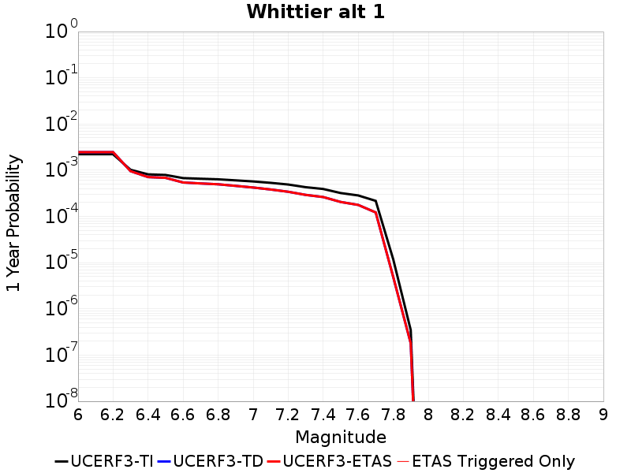 |  |

| Magnitude | 1 wk TI Prob | 1 wk TD Prob | 1 wk ETAS Prob | 1 wk ETAS/TD Gain | 1 wk ETAS Triggered Only | 1 mo TI Prob | 1 mo TD Prob | 1 mo ETAS Prob | 1 mo ETAS/TD Gain | 1 mo ETAS Triggered Only | 1 yr TI Prob | 1 yr TD Prob | 1 yr ETAS Prob | 1 yr ETAS/TD Gain | 1 yr ETAS Triggered Only | 10 yr TI Prob | 10 yr TD Prob | 10 yr ETAS Prob | 10 yr ETAS/TD Gain | 10 yr ETAS Triggered Only |
|-----|-----|-----|-----|-----|-----|-----|-----|-----|-----|-----|-----|-----|-----|-----|-----|-----|-----|-----|-----|-----|
| 6.0 | 4.2554693E-5 | 4.7306155E-5 | 4.7306155E-5 | 1.0 | 0.0 | 1.8236451E-4 | 2.0272673E-4 | 2.0272673E-4 | 1.0 | 0.0 | 0.002218027 | 0.002465726 | 0.0024757015 | 1.0040456 | 1.0E-5 | 0.02196019 | 0.024417756 | 0.024447024 | 1.0011986 | 3.0E-5 |
| 6.1 | 4.2554693E-5 | 4.7306155E-5 | 4.7306155E-5 | 1.0 | 0.0 | 1.8236451E-4 | 2.0272673E-4 | 2.0272673E-4 | 1.0 | 0.0 | 0.002218027 | 0.002465726 | 0.0024757015 | 1.0040456 | 1.0E-5 | 0.02196019 | 0.024417756 | 0.024447024 | 1.0011986 | 3.0E-5 |
| 6.2 | 4.2554693E-5 | 4.7306155E-5 | 4.7306155E-5 | 1.0 | 0.0 | 1.8236451E-4 | 2.0272673E-4 | 2.0272673E-4 | 1.0 | 0.0 | 0.002218027 | 0.002465726 | 0.0024757015 | 1.0040456 | 1.0E-5 | 0.02196019 | 0.024417756 | 0.024447024 | 1.0011986 | 3.0E-5 |
| 6.3 | 1.9617712E-5 | 1.8298491E-5 | 1.8298491E-5 | 1.0 | 0.0 | 8.40732E-5 | 7.841986E-5 | 7.841986E-5 | 1.0 | 0.0 | 0.0010231105 | 9.5436256E-4 | 9.5436256E-4 | 1.0 | 0.0 | 0.01018413 | 0.009505908 | 0.009515814 | 1.001042 | 1.0E-5 |
| 6.4 | 1.5611336E-5 | 1.3629739E-5 | 1.3629739E-5 | 1.0 | 0.0 | 6.690401E-5 | 5.8411893E-5 | 5.8411893E-5 | 1.0 | 0.0 | 8.142519E-4 | 7.1093877E-4 | 7.1093877E-4 | 1.0 | 0.0 | 0.008112748 | 0.0070885867 | 0.0070885867 | 1.0 | 0.0 |
| 6.5 | 1.5150166E-5 | 1.312611E-5 | 1.312611E-5 | 1.0 | 0.0 | 6.492767E-5 | 5.625358E-5 | 5.625358E-5 | 1.0 | 0.0 | 7.9020765E-4 | 6.8467803E-4 | 6.8467803E-4 | 1.0 | 0.0 | 0.007874036 | 0.0068276133 | 0.0068276133 | 1.0 | 0.0 |
| 6.6 | 1.295588E-5 | 1.0401731E-5 | 1.0401731E-5 | 1.0 | 0.0 | 5.552402E-5 | 4.4578097E-5 | 4.4578097E-5 | 1.0 | 0.0 | 6.7579525E-4 | 5.426051E-4 | 5.426051E-4 | 1.0 | 0.0 | 0.006737438 | 0.005414361 | 0.005414361 | 1.0 | 0.0 |
| 6.7 | 1.2542085E-5 | 9.919822E-6 | 9.919822E-6 | 1.0 | 0.0 | 5.3750682E-5 | 4.2512842E-5 | 4.2512842E-5 | 1.0 | 0.0 | 6.542181E-4 | 5.174728E-4 | 5.174728E-4 | 1.0 | 0.0 | 0.006522954 | 0.005164207 | 0.005164207 | 1.0 | 0.0 |
| 6.8 | 1.2195878E-5 | 9.515166E-6 | 9.515166E-6 | 1.0 | 0.0 | 5.2267E-5 | 4.0778657E-5 | 4.0778657E-5 | 1.0 | 0.0 | 6.36165E-4 | 4.963689E-4 | 4.963689E-4 | 1.0 | 0.0 | 0.0063434686 | 0.004954065 | 0.004954065 | 1.0 | 0.0 |
| 6.9 | 1.1580298E-5 | 8.791342E-6 | 8.791342E-6 | 1.0 | 0.0 | 4.9628903E-5 | 3.7676647E-5 | 3.7676647E-5 | 1.0 | 0.0 | 6.040644E-4 | 4.5861828E-4 | 4.5861828E-4 | 1.0 | 0.0 | 0.00602425 | 0.00457813 | 0.00457813 | 1.0 | 0.0 |
| 7.0 | 1.0964795E-5 | 8.1010985E-6 | 8.1010985E-6 | 1.0 | 0.0 | 4.6991136E-5 | 3.4718538E-5 | 3.4718538E-5 | 1.0 | 0.0 | 5.7196687E-4 | 4.2261777E-4 | 4.2261777E-4 | 1.0 | 0.0 | 0.0057049696 | 0.0042194426 | 0.0042194426 | 1.0 | 0.0 |
| 7.1 | 1.0230601E-5 | 7.342106E-6 | 7.342106E-6 | 1.0 | 0.0 | 4.3844695E-5 | 3.1465795E-5 | 3.1465795E-5 | 1.0 | 0.0 | 5.336784E-4 | 3.8303004E-4 | 3.8303004E-4 | 1.0 | 0.0 | 0.005323986 | 0.0038248822 | 0.0038248822 | 1.0 | 0.0 |
| 7.2 | 9.40865E-6 | 6.557506E-6 | 6.557506E-6 | 1.0 | 0.0 | 4.032216E-5 | 2.81033E-5 | 2.81033E-5 | 1.0 | 0.0 | 4.908117E-4 | 3.421052E-4 | 3.421052E-4 | 1.0 | 0.0 | 0.0048972913 | 0.003416893 | 0.003416893 | 1.0 | 0.0 |
| 7.3 | 8.237384E-6 | 5.610133E-6 | 5.610133E-6 | 1.0 | 0.0 | 3.5302593E-5 | 2.4043213E-5 | 2.4043213E-5 | 1.0 | 0.0 | 4.2972428E-4 | 2.9268785E-4 | 2.9268785E-4 | 1.0 | 0.0 | 0.0042889426 | 0.0029233142 | 0.0029233142 | 1.0 | 0.0 |
| 7.4 | 7.5316966E-6 | 5.039166E-6 | 5.039166E-6 | 1.0 | 0.0 | 3.2278298E-5 | 2.1596252E-5 | 2.1596252E-5 | 1.0 | 0.0 | 3.9291743E-4 | 2.6290366E-4 | 2.6290366E-4 | 1.0 | 0.0 | 0.0039222343 | 0.0026260393 | 0.0026260393 | 1.0 | 0.0 |
| 7.5 | 6.149649E-6 | 3.9430656E-6 | 3.9430656E-6 | 1.0 | 0.0 | 2.6355372E-5 | 1.6898748E-5 | 1.6898748E-5 | 1.0 | 0.0 | 3.208294E-4 | 2.0572374E-4 | 2.0572374E-4 | 1.0 | 0.0 | 0.003203666 | 0.0020554226 | 0.0020554226 | 1.0 | 0.0 |
| 7.6 | 5.457711E-6 | 3.4033028E-6 | 3.4033028E-6 | 1.0 | 0.0 | 2.338998E-5 | 1.45855065E-5 | 1.45855065E-5 | 1.0 | 0.0 | 2.8473578E-4 | 1.7756489E-4 | 1.7756489E-4 | 1.0 | 0.0 | 0.0028437122 | 0.0017743112 | 0.0017743112 | 1.0 | 0.0 |
| 7.7 | 4.1676276E-6 | 2.3392583E-6 | 2.3392583E-6 | 1.0 | 0.0 | 1.7861139E-5 | 1.0025359E-5 | 1.0025359E-5 | 1.0 | 0.0 | 2.1743766E-4 | 1.22052654E-4 | 1.22052654E-4 | 1.0 | 0.0 | 0.0021722503 | 0.0012199297 | 0.0012199297 | 1.0 | 0.0 |
| 7.8 | 2.2692414E-7 | 9.4061434E-8 | 9.4061434E-8 | 1.0 | 0.0 | 9.725317E-7 | 4.031204E-7 | 4.031204E-7 | 1.0 | 0.0 | 1.1840509E-5 | 4.907983E-6 | 4.907983E-6 | 1.0 | 0.0 | 1.1839878E-4 | 4.9079074E-5 | 4.9079074E-5 | 1.0 | 0.0 |
| 7.9 | 6.676829E-9 | 3.445269E-9 | 3.445269E-9 | 1.0 | 0.0 | 2.861498E-8 | 1.4765438E-8 | 1.4765438E-8 | 1.0 | 0.0 | 3.4838732E-7 | 1.7976919E-7 | 1.7976919E-7 | 1.0 | 0.0 | 3.4838679E-6 | 1.7976906E-6 | 1.7976906E-6 | 1.0 | 0.0 |

## Imperial
*[(top)](#table-of-contents)*

| 1 Week | 1 Month | 1 Year | 10 Year |
|-----|-----|-----|-----|
|  |  | 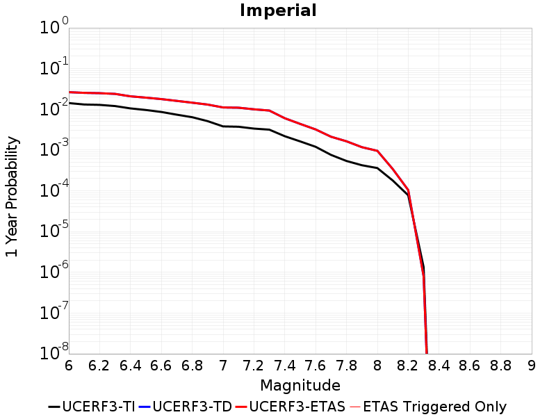 |  |

| Magnitude | 1 wk TI Prob | 1 wk TD Prob | 1 wk ETAS Prob | 1 wk ETAS/TD Gain | 1 wk ETAS Triggered Only | 1 mo TI Prob | 1 mo TD Prob | 1 mo ETAS Prob | 1 mo ETAS/TD Gain | 1 mo ETAS Triggered Only | 1 yr TI Prob | 1 yr TD Prob | 1 yr ETAS Prob | 1 yr ETAS/TD Gain | 1 yr ETAS Triggered Only | 10 yr TI Prob | 10 yr TD Prob | 10 yr ETAS Prob | 10 yr ETAS/TD Gain | 10 yr ETAS Triggered Only |
|-----|-----|-----|-----|-----|-----|-----|-----|-----|-----|-----|-----|-----|-----|-----|-----|-----|-----|-----|-----|-----|
| 6.0 | 2.7496446E-4 | 5.1185914E-4 | 5.1185914E-4 | 1.0 | 0.0 | 0.0011778869 | 0.0021918777 | 0.0021918777 | 1.0 | 0.0 | 0.0142467655 | 0.026356462 | 0.026356462 | 1.0 | 0.0 | 0.13367249 | 0.23013641 | 0.2301595 | 1.0001004 | 3.0E-5 |
| 6.1 | 2.5356023E-4 | 4.9216824E-4 | 4.9216824E-4 | 1.0 | 0.0 | 0.001086234 | 0.0021076263 | 0.0021076263 | 1.0 | 0.0 | 0.013144928 | 0.025352562 | 0.025352562 | 1.0 | 0.0 | 0.123940155 | 0.22135974 | 0.2213831 | 1.0001055 | 3.0E-5 |
| 6.2 | 2.4820742E-4 | 4.8302198E-4 | 4.8302198E-4 | 1.0 | 0.0 | 0.0010633124 | 0.0020684905 | 0.0020684905 | 1.0 | 0.0 | 0.01286919 | 0.02488772 | 0.02488772 | 1.0 | 0.0 | 0.12148927 | 0.21784636 | 0.21786983 | 1.0001078 | 3.0E-5 |
| 6.3 | 2.3205351E-4 | 4.6387434E-4 | 4.6387434E-4 | 1.0 | 0.0 | 9.94136E-4 | 0.0019865555 | 0.0019865555 | 1.0 | 0.0 | 0.012036599 | 0.023912247 | 0.023912247 | 1.0 | 0.0 | 0.11405133 | 0.20965515 | 0.20967886 | 1.0001131 | 3.0E-5 |
| 6.4 | 2.0304754E-4 | 4.035655E-4 | 4.035655E-4 | 1.0 | 0.0 | 8.6991355E-4 | 0.0017284349 | 0.0017284349 | 1.0 | 0.0 | 0.010539869 | 0.02084042 | 0.02084042 | 1.0 | 0.0 | 0.100537635 | 0.18678907 | 0.18681346 | 1.0001307 | 3.0E-5 |
| 6.5 | 1.854992E-4 | 3.7437995E-4 | 3.7437995E-4 | 1.0 | 0.0 | 7.9475436E-4 | 0.0016035115 | 0.0016035115 | 1.0 | 0.0 | 0.009633281 | 0.019343378 | 0.019343378 | 1.0 | 0.0 | 0.0922623 | 0.1749475 | 0.17497225 | 1.0001415 | 3.0E-5 |
| 6.6 | 1.6586106E-4 | 3.4444098E-4 | 3.4444098E-4 | 1.0 | 0.0 | 7.106394E-4 | 0.0014753509 | 0.0014753509 | 1.0 | 0.0 | 0.008617763 | 0.017805075 | 0.017805075 | 1.0 | 0.0 | 0.08291132 | 0.16230716 | 0.1623239 | 1.0001032 | 2.0E-5 |
| 6.7 | 1.4224656E-4 | 3.112591E-4 | 3.112591E-4 | 1.0 | 0.0 | 6.094856E-4 | 0.0013332941 | 0.0013332941 | 1.0 | 0.0 | 0.0073952693 | 0.016111962 | 0.016111962 | 1.0 | 0.0 | 0.07153955 | 0.14787085 | 0.1478879 | 1.0001153 | 2.0E-5 |
| 6.8 | 1.2317259E-4 | 2.808903E-4 | 2.808903E-4 | 1.0 | 0.0 | 5.2777573E-4 | 0.0012032666 | 0.0012032666 | 1.0 | 0.0 | 0.0064067547 | 0.01455279 | 0.01455279 | 1.0 | 0.0 | 0.06225166 | 0.13413131 | 0.13414864 | 1.0001291 | 2.0E-5 |
| 6.9 | 9.859898E-5 | 2.5233583E-4 | 2.5233583E-4 | 1.0 | 0.0 | 4.2249862E-4 | 0.0010809953 | 0.0010809953 | 1.0 | 0.0 | 0.0051317946 | 0.013082679 | 0.013082679 | 1.0 | 0.0 | 0.05014893 | 0.120301045 | 0.120309845 | 1.0000731 | 1.0E-5 |
| 7.0 | 7.3191884E-5 | 2.1426473E-4 | 2.1426473E-4 | 1.0 | 0.0 | 3.136418E-4 | 9.1795746E-4 | 9.1795746E-4 | 1.0 | 0.0 | 0.003811904 | 0.011119557 | 0.011119557 | 1.0 | 0.0 | 0.037471764 | 0.10272296 | 0.10273193 | 1.0000874 | 1.0E-5 |
| 7.1 | 7.1760296E-5 | 2.1125472E-4 | 2.1125472E-4 | 1.0 | 0.0 | 3.0750787E-4 | 9.0506644E-4 | 9.0506644E-4 | 1.0 | 0.0 | 0.003737482 | 0.010964199 | 0.010964199 | 1.0 | 0.0 | 0.03675245 | 0.10135081 | 0.10135979 | 1.0000887 | 1.0E-5 |
| 7.2 | 6.46614E-5 | 1.9287714E-4 | 1.9287714E-4 | 1.0 | 0.0 | 2.7709085E-4 | 8.263575E-4 | 8.263575E-4 | 1.0 | 0.0 | 0.0033683628 | 0.010015122 | 0.010015122 | 1.0 | 0.0 | 0.033177625 | 0.0931391 | 0.093148164 | 1.0000974 | 1.0E-5 |
| 7.3 | 6.088115E-5 | 1.7952228E-4 | 1.7952228E-4 | 1.0 | 0.0 | 2.6089314E-4 | 7.691572E-4 | 7.691572E-4 | 1.0 | 0.0 | 0.0031717476 | 0.0093248645 | 0.0093248645 | 1.0 | 0.0 | 0.031268585 | 0.08716559 | 0.08717471 | 1.0001047 | 1.0E-5 |
| 7.4 | 4.199346E-5 | 1.1617043E-4 | 1.1617043E-4 | 1.0 | 0.0 | 1.7995955E-4 | 4.9777917E-4 | 4.9777917E-4 | 1.0 | 0.0 | 0.0021888057 | 0.0060437922 | 0.0060437922 | 1.0 | 0.0 | 0.02167372 | 0.05791094 | 0.05791094 | 1.0 | 0.0 |
| 7.5 | 3.130448E-5 | 8.419214E-5 | 8.419214E-5 | 1.0 | 0.0 | 1.3415517E-4 | 3.6077388E-4 | 3.6077388E-4 | 1.0 | 0.0 | 0.0016321153 | 0.004383636 | 0.004383636 | 1.0 | 0.0 | 0.016201803 | 0.04252008 | 0.04252008 | 1.0 | 0.0 |
| 7.6 | 2.3074248E-5 | 6.157518E-5 | 6.157518E-5 | 1.0 | 0.0 | 9.888588E-5 | 2.6386706E-4 | 2.6386706E-4 | 1.0 | 0.0 | 0.0012032706 | 0.0032078724 | 0.0032078724 | 1.0 | 0.0 | 0.011967761 | 0.03135968 | 0.03135968 | 1.0 | 0.0 |
| 7.7 | 1.45864815E-5 | 4.0731353E-5 | 4.0731353E-5 | 1.0 | 0.0 | 6.2511994E-5 | 1.7455129E-4 | 1.7455129E-4 | 1.0 | 0.0 | 7.608177E-4 | 0.0021230963 | 0.0021230963 | 1.0 | 0.0 | 0.007582182 | 0.020905325 | 0.020905325 | 1.0 | 0.0 |
| 7.8 | 1.0352979E-5 | 3.147645E-5 | 3.147645E-5 | 1.0 | 0.0 | 4.4369157E-5 | 1.348921E-4 | 1.348921E-4 | 1.0 | 0.0 | 5.400606E-4 | 0.0016410766 | 0.0016410766 | 1.0 | 0.0 | 0.0053875 | 0.016252723 | 0.016252723 | 1.0 | 0.0 |
| 7.9 | 8.137906E-6 | 2.2563847E-5 | 2.2563847E-5 | 1.0 | 0.0 | 3.4876273E-5 | 9.669862E-5 | 9.669862E-5 | 1.0 | 0.0 | 4.2453592E-4 | 0.0011766709 | 0.0011766709 | 1.0 | 0.0 | 0.004237258 | 0.0118108 | 0.0118108 | 1.0 | 0.0 |
| 8.0 | 6.93792E-6 | 1.8365889E-5 | 1.8365889E-5 | 1.0 | 0.0 | 2.9733603E-5 | 7.870858E-5 | 7.870858E-5 | 1.0 | 0.0 | 3.6194647E-4 | 9.578564E-4 | 9.578564E-4 | 1.0 | 0.0 | 0.0036135751 | 0.009668917 | 0.009668917 | 1.0 | 0.0 |
| 8.1 | 3.4286315E-6 | 6.547186E-6 | 6.547186E-6 | 1.0 | 0.0 | 1.4694053E-5 | 2.8059068E-5 | 2.8059068E-5 | 1.0 | 0.0 | 1.7888541E-4 | 3.4156573E-4 | 3.4156573E-4 | 1.0 | 0.0 | 0.0017874148 | 0.003568937 | 0.003568937 | 1.0 | 0.0 |
| 8.2 | 1.4906886E-6 | 2.0010925E-6 | 2.0010925E-6 | 1.0 | 0.0 | 6.3886496E-6 | 8.576083E-6 | 8.576083E-6 | 1.0 | 0.0 | 7.7779034E-5 | 1.0440884E-4 | 1.0440884E-4 | 1.0 | 0.0 | 7.775182E-4 | 0.0011405131 | 0.0011405131 | 1.0 | 0.0 |
| 8.3 | 2.5758007E-8 | 1.515495E-8 | 1.515495E-8 | 1.0 | 0.0 | 1.10391454E-7 | 6.494978E-8 | 6.494978E-8 | 1.0 | 0.0 | 1.3440151E-6 | 7.907636E-7 | 7.907636E-7 | 1.0 | 0.0 | 1.344007E-5 | 8.235644E-6 | 8.235644E-6 | 1.0 | 0.0 |

## Santa Cruz Island
*[(top)](#table-of-contents)*

| 1 Week | 1 Month | 1 Year | 10 Year |
|-----|-----|-----|-----|
|  | 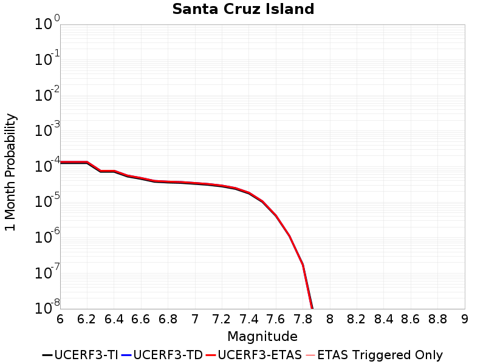 |  |  |

| Magnitude | 1 wk TI Prob | 1 wk TD Prob | 1 wk ETAS Prob | 1 wk ETAS/TD Gain | 1 wk ETAS Triggered Only | 1 mo TI Prob | 1 mo TD Prob | 1 mo ETAS Prob | 1 mo ETAS/TD Gain | 1 mo ETAS Triggered Only | 1 yr TI Prob | 1 yr TD Prob | 1 yr ETAS Prob | 1 yr ETAS/TD Gain | 1 yr ETAS Triggered Only | 10 yr TI Prob | 10 yr TD Prob | 10 yr ETAS Prob | 10 yr ETAS/TD Gain | 10 yr ETAS Triggered Only |
|-----|-----|-----|-----|-----|-----|-----|-----|-----|-----|-----|-----|-----|-----|-----|-----|-----|-----|-----|-----|-----|
| 6.0 | 2.9164563E-5 | 3.1615476E-5 | 3.1615476E-5 | 1.0 | 0.0 | 1.2498499E-4 | 1.3548863E-4 | 1.3548863E-4 | 1.0 | 0.0 | 0.0015206301 | 0.0016484624 | 0.0016484624 | 1.0 | 0.0 | 0.015102667 | 0.016376093 | 0.016395766 | 1.0012013 | 2.0E-5 |
| 6.1 | 2.9164563E-5 | 3.1615476E-5 | 3.1615476E-5 | 1.0 | 0.0 | 1.2498499E-4 | 1.3548863E-4 | 1.3548863E-4 | 1.0 | 0.0 | 0.0015206301 | 0.0016484624 | 0.0016484624 | 1.0 | 0.0 | 0.015102667 | 0.016376093 | 0.016395766 | 1.0012013 | 2.0E-5 |
| 6.2 | 2.9164563E-5 | 3.1615476E-5 | 3.1615476E-5 | 1.0 | 0.0 | 1.2498499E-4 | 1.3548863E-4 | 1.3548863E-4 | 1.0 | 0.0 | 0.0015206301 | 0.0016484624 | 0.0016484624 | 1.0 | 0.0 | 0.015102667 | 0.016376093 | 0.016395766 | 1.0012013 | 2.0E-5 |
| 6.3 | 1.6635553E-5 | 1.7811826E-5 | 1.7811826E-5 | 1.0 | 0.0 | 7.1293274E-5 | 7.633427E-5 | 7.633427E-5 | 1.0 | 0.0 | 8.6765E-4 | 9.289917E-4 | 9.289917E-4 | 1.0 | 0.0 | 0.008642701 | 0.009252956 | 0.009262864 | 1.0010707 | 1.0E-5 |
| 6.4 | 1.6635553E-5 | 1.7811826E-5 | 1.7811826E-5 | 1.0 | 0.0 | 7.1293274E-5 | 7.633427E-5 | 7.633427E-5 | 1.0 | 0.0 | 8.6765E-4 | 9.289917E-4 | 9.289917E-4 | 1.0 | 0.0 | 0.008642701 | 0.009252956 | 0.009262864 | 1.0010707 | 1.0E-5 |
| 6.5 | 1.2238748E-5 | 1.3048126E-5 | 1.3048126E-5 | 1.0 | 0.0 | 5.2450723E-5 | 5.591936E-5 | 5.591936E-5 | 1.0 | 0.0 | 6.3840044E-4 | 6.8060926E-4 | 6.8060926E-4 | 1.0 | 0.0 | 0.0063656955 | 0.006785647 | 0.006795579 | 1.0014637 | 1.0E-5 |
| 6.6 | 1.0489767E-5 | 1.1160889E-5 | 1.1160889E-5 | 1.0 | 0.0 | 4.495537E-5 | 4.7831516E-5 | 4.7831516E-5 | 1.0 | 0.0 | 5.4719415E-4 | 5.8219535E-4 | 5.8219535E-4 | 1.0 | 0.0 | 0.005458487 | 0.0058069425 | 0.0058168843 | 1.0017121 | 1.0E-5 |
| 6.7 | 8.699222E-6 | 9.240214E-6 | 9.240214E-6 | 1.0 | 0.0 | 3.7281847E-5 | 3.960032E-5 | 3.960032E-5 | 1.0 | 0.0 | 4.5381195E-4 | 4.820278E-4 | 4.820278E-4 | 1.0 | 0.0 | 0.0045288634 | 0.0048098904 | 0.0048098904 | 1.0 | 0.0 |
| 6.8 | 8.307732E-6 | 8.820156E-6 | 8.820156E-6 | 1.0 | 0.0 | 3.560408E-5 | 3.7800124E-5 | 3.7800124E-5 | 1.0 | 0.0 | 4.3339343E-4 | 4.6011974E-4 | 4.6011974E-4 | 1.0 | 0.0 | 0.004325492 | 0.0045917244 | 0.0045917244 | 1.0 | 0.0 |
| 6.9 | 8.073121E-6 | 8.56808E-6 | 8.56808E-6 | 1.0 | 0.0 | 3.459863E-5 | 3.671983E-5 | 3.671983E-5 | 1.0 | 0.0 | 4.2115687E-4 | 4.4697264E-4 | 4.4697264E-4 | 1.0 | 0.0 | 0.004203596 | 0.004460788 | 0.004460788 | 1.0 | 0.0 |
| 7.0 | 7.617019E-6 | 8.077586E-6 | 8.077586E-6 | 1.0 | 0.0 | 3.264396E-5 | 3.461777E-5 | 3.461777E-5 | 1.0 | 0.0 | 3.9736772E-4 | 4.2139023E-4 | 4.2139023E-4 | 1.0 | 0.0 | 0.003966579 | 0.0042059594 | 0.0042059594 | 1.0 | 0.0 |
| 7.1 | 7.1224836E-6 | 7.548491E-6 | 7.548491E-6 | 1.0 | 0.0 | 3.052457E-5 | 3.2350275E-5 | 3.2350275E-5 | 1.0 | 0.0 | 3.715733E-4 | 3.937938E-4 | 3.937938E-4 | 1.0 | 0.0 | 0.003709526 | 0.0039310027 | 0.0039310027 | 1.0 | 0.0 |
| 7.2 | 6.441115E-6 | 6.8298536E-6 | 6.8298536E-6 | 1.0 | 0.0 | 2.7604487E-5 | 2.9270475E-5 | 2.9270475E-5 | 1.0 | 0.0 | 3.360328E-4 | 3.5631E-4 | 3.5631E-4 | 1.0 | 0.0 | 0.0033552512 | 0.0035574154 | 0.0035574154 | 1.0 | 0.0 |
| 7.3 | 5.494274E-6 | 5.8220826E-6 | 5.8220826E-6 | 1.0 | 0.0 | 2.3546674E-5 | 2.4951543E-5 | 2.4951543E-5 | 1.0 | 0.0 | 2.8664304E-4 | 3.037429E-4 | 3.037429E-4 | 1.0 | 0.0 | 0.002862736 | 0.0030333006 | 0.0030333006 | 1.0 | 0.0 |
| 7.4 | 4.0802624E-6 | 4.3137516E-6 | 4.3137516E-6 | 1.0 | 0.0 | 1.7486722E-5 | 1.8487377E-5 | 1.8487377E-5 | 1.0 | 0.0 | 2.1288003E-4 | 2.2506065E-4 | 2.2506065E-4 | 1.0 | 0.0 | 0.0021267622 | 0.002248336 | 0.002248336 | 1.0 | 0.0 |
| 7.5 | 2.3584746E-6 | 2.4760764E-6 | 2.4760764E-6 | 1.0 | 0.0 | 1.0107709E-5 | 1.0611713E-5 | 1.0611713E-5 | 1.0 | 0.0 | 1.2305441E-4 | 1.2919E-4 | 1.2919E-4 | 1.0 | 0.0 | 0.0012298629 | 0.001291154 | 0.001291154 | 1.0 | 0.0 |
| 7.6 | 9.4981914E-7 | 9.86351E-7 | 9.86351E-7 | 1.0 | 0.0 | 4.0706473E-6 | 4.227212E-6 | 4.227212E-6 | 1.0 | 0.0 | 4.9559E-5 | 5.14651E-5 | 5.14651E-5 | 1.0 | 0.0 | 4.954795E-4 | 5.145331E-4 | 5.145331E-4 | 1.0 | 0.0 |
| 7.7 | 2.6013532E-7 | 2.642179E-7 | 2.642179E-7 | 1.0 | 0.0 | 1.1148652E-6 | 1.132362E-6 | 1.132362E-6 | 1.0 | 0.0 | 1.3573399E-5 | 1.378642E-5 | 1.378642E-5 | 1.0 | 0.0 | 1.357257E-4 | 1.3785572E-4 | 1.3785572E-4 | 1.0 | 0.0 |
| 7.8 | 4.1522263E-8 | 3.9662755E-8 | 3.9662755E-8 | 1.0 | 0.0 | 1.7795254E-7 | 1.6998322E-7 | 1.6998322E-7 | 1.0 | 0.0 | 2.16657E-6 | 2.069544E-6 | 2.069544E-6 | 1.0 | 0.0 | 2.1665488E-5 | 2.0695268E-5 | 2.0695268E-5 | 1.0 | 0.0 |
| 7.9 | 7.7242046E-10 | 5.9489114E-10 | 5.9489114E-10 | 1.0 | 0.0 | 3.3103735E-9 | 2.5495337E-9 | 2.5495337E-9 | 1.0 | 0.0 | 4.0303796E-8 | 3.104057E-8 | 3.104057E-8 | 1.0 | 0.0 | 4.030379E-7 | 3.1040568E-7 | 3.1040568E-7 | 1.0 | 0.0 |

## Kern Canyon (Lake Isabella) 2011
*[(top)](#table-of-contents)*

| 1 Week | 1 Month | 1 Year | 10 Year |
|-----|-----|-----|-----|
| 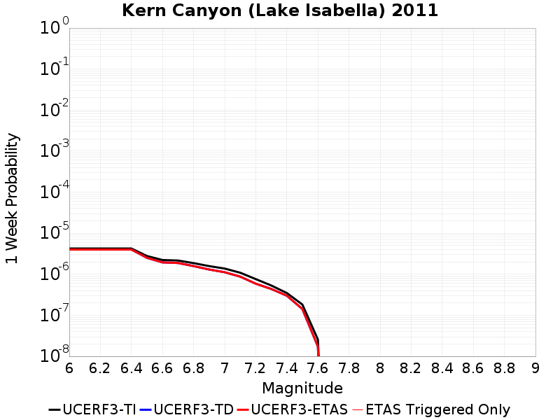 |  |  |  |

| Magnitude | 1 wk TI Prob | 1 wk TD Prob | 1 wk ETAS Prob | 1 wk ETAS/TD Gain | 1 wk ETAS Triggered Only | 1 mo TI Prob | 1 mo TD Prob | 1 mo ETAS Prob | 1 mo ETAS/TD Gain | 1 mo ETAS Triggered Only | 1 yr TI Prob | 1 yr TD Prob | 1 yr ETAS Prob | 1 yr ETAS/TD Gain | 1 yr ETAS Triggered Only | 10 yr TI Prob | 10 yr TD Prob | 10 yr ETAS Prob | 10 yr ETAS/TD Gain | 10 yr ETAS Triggered Only |
|-----|-----|-----|-----|-----|-----|-----|-----|-----|-----|-----|-----|-----|-----|-----|-----|-----|-----|-----|-----|-----|
| 6.0 | 4.2387383E-6 | 4.0021687E-6 | 4.0021687E-6 | 1.0 | 0.0 | 1.8165894E-5 | 1.715205E-5 | 1.715205E-5 | 1.0 | 0.0 | 2.2114732E-4 | 2.0880805E-4 | 2.1880596E-4 | 1.0478809 | 1.0E-5 | 0.0022092736 | 0.0020863025 | 0.0021062607 | 1.0095663 | 2.0E-5 |
| 6.1 | 4.2387383E-6 | 4.0021687E-6 | 4.0021687E-6 | 1.0 | 0.0 | 1.8165894E-5 | 1.715205E-5 | 1.715205E-5 | 1.0 | 0.0 | 2.2114732E-4 | 2.0880805E-4 | 2.1880596E-4 | 1.0478809 | 1.0E-5 | 0.0022092736 | 0.0020863025 | 0.0021062607 | 1.0095663 | 2.0E-5 |
| 6.2 | 4.2387383E-6 | 4.0021687E-6 | 4.0021687E-6 | 1.0 | 0.0 | 1.8165894E-5 | 1.715205E-5 | 1.715205E-5 | 1.0 | 0.0 | 2.2114732E-4 | 2.0880805E-4 | 2.1880596E-4 | 1.0478809 | 1.0E-5 | 0.0022092736 | 0.0020863025 | 0.0021062607 | 1.0095663 | 2.0E-5 |
| 6.3 | 4.2387383E-6 | 4.0021687E-6 | 4.0021687E-6 | 1.0 | 0.0 | 1.8165894E-5 | 1.715205E-5 | 1.715205E-5 | 1.0 | 0.0 | 2.2114732E-4 | 2.0880805E-4 | 2.1880596E-4 | 1.0478809 | 1.0E-5 | 0.0022092736 | 0.0020863025 | 0.0021062607 | 1.0095663 | 2.0E-5 |
| 6.4 | 4.2387383E-6 | 4.0021687E-6 | 4.0021687E-6 | 1.0 | 0.0 | 1.8165894E-5 | 1.715205E-5 | 1.715205E-5 | 1.0 | 0.0 | 2.2114732E-4 | 2.0880805E-4 | 2.1880596E-4 | 1.0478809 | 1.0E-5 | 0.0022092736 | 0.0020863025 | 0.0021062607 | 1.0095663 | 2.0E-5 |
| 6.5 | 2.7857532E-6 | 2.518211E-6 | 2.518211E-6 | 1.0 | 0.0 | 1.1938888E-5 | 1.079229E-5 | 1.079229E-5 | 1.0 | 0.0 | 1.4534626E-4 | 1.3138853E-4 | 1.4138722E-4 | 1.0761001 | 1.0E-5 | 0.0014525123 | 0.0013131413 | 0.001333115 | 1.0152106 | 2.0E-5 |
| 6.6 | 2.2233348E-6 | 1.9443992E-6 | 1.9443992E-6 | 1.0 | 0.0 | 9.528543E-6 | 8.333113E-6 | 8.333113E-6 | 1.0 | 0.0 | 1.1600384E-4 | 1.0145102E-4 | 1.11450005E-4 | 1.0985597 | 1.0E-5 | 0.001159433 | 0.0010140557 | 0.0010240455 | 1.0098513 | 1.0E-5 |
| 6.7 | 2.1635126E-6 | 1.8837744E-6 | 1.8837744E-6 | 1.0 | 0.0 | 9.272164E-6 | 8.073294E-6 | 8.073294E-6 | 1.0 | 0.0 | 1.1288274E-4 | 9.828801E-5 | 1.0828703E-4 | 1.1017318 | 1.0E-5 | 0.0011282542 | 9.824536E-4 | 9.924438E-4 | 1.0101686 | 1.0E-5 |
| 6.8 | 1.8685711E-6 | 1.5833807E-6 | 1.5833807E-6 | 1.0 | 0.0 | 8.008137E-6 | 6.7859E-6 | 6.7859E-6 | 1.0 | 0.0 | 9.74947E-5 | 8.261525E-5 | 9.261443E-5 | 1.1210331 | 1.0E-5 | 9.745194E-4 | 8.258503E-4 | 8.3584205E-4 | 1.0120988 | 1.0E-5 |
| 6.9 | 1.5815071E-6 | 1.3066957E-6 | 1.3066957E-6 | 1.0 | 0.0 | 6.77787E-6 | 5.6001127E-6 | 5.6001127E-6 | 1.0 | 0.0 | 8.251744E-5 | 6.8179266E-5 | 7.8178586E-5 | 1.1466621 | 1.0E-5 | 8.248681E-4 | 6.8158616E-4 | 6.9157936E-4 | 1.0146617 | 1.0E-5 |
| 7.0 | 1.3772564E-6 | 1.1212476E-6 | 1.1212476E-6 | 1.0 | 0.0 | 5.9025137E-6 | 4.805338E-6 | 4.805338E-6 | 1.0 | 0.0 | 7.186073E-5 | 5.850344E-5 | 6.850285E-5 | 1.1709201 | 1.0E-5 | 7.18375E-4 | 5.848824E-4 | 5.948766E-4 | 1.0170875 | 1.0E-5 |
| 7.1 | 1.0916998E-6 | 8.7651205E-7 | 8.7651205E-7 | 1.0 | 0.0 | 4.678705E-6 | 3.7564748E-6 | 3.7564748E-6 | 1.0 | 0.0 | 5.6961744E-5 | 4.5734138E-5 | 5.573368E-5 | 1.2186451 | 1.0E-5 | 5.6947145E-4 | 4.572486E-4 | 4.67244E-4 | 1.0218599 | 1.0E-5 |
| 7.2 | 7.6277024E-7 | 5.9023637E-7 | 5.9023637E-7 | 1.0 | 0.0 | 3.2690114E-6 | 2.5295822E-6 | 2.5295822E-6 | 1.0 | 0.0 | 3.9799485E-5 | 3.0797233E-5 | 3.0797233E-5 | 1.0 | 0.0 | 3.9792358E-4 | 3.0793026E-4 | 3.0793026E-4 | 1.0 | 0.0 |
| 7.3 | 5.3265916E-7 | 4.383092E-7 | 4.383092E-7 | 1.0 | 0.0 | 2.282823E-6 | 1.8784667E-6 | 1.8784667E-6 | 1.0 | 0.0 | 2.7793016E-5 | 2.2870096E-5 | 2.2870096E-5 | 1.0 | 0.0 | 2.778954E-4 | 2.286778E-4 | 2.286778E-4 | 1.0 | 0.0 |
| 7.4 | 3.4946007E-7 | 3.007015E-7 | 3.007015E-7 | 1.0 | 0.0 | 1.497685E-6 | 1.28872E-6 | 1.28872E-6 | 1.0 | 0.0 | 1.8234163E-5 | 1.5690055E-5 | 1.5690055E-5 | 1.0 | 0.0 | 1.8232666E-4 | 1.568897E-4 | 1.568897E-4 | 1.0 | 0.0 |
| 7.5 | 1.8317026E-7 | 1.4247317E-7 | 1.4247317E-7 | 1.0 | 0.0 | 7.850152E-7 | 6.1059916E-7 | 6.1059916E-7 | 1.0 | 0.0 | 9.557518E-6 | 7.43402E-6 | 7.43402E-6 | 1.0 | 0.0 | 9.5571064E-5 | 7.433779E-5 | 7.433779E-5 | 1.0 | 0.0 |
| 7.6 | 2.572245E-8 | 1.7356182E-8 | 1.7356182E-8 | 1.0 | 0.0 | 1.10239064E-7 | 7.438364E-8 | 7.438364E-8 | 1.0 | 0.0 | 1.3421597E-6 | 9.056205E-7 | 9.056205E-7 | 1.0 | 0.0 | 1.3421517E-5 | 9.056173E-6 | 9.056173E-6 | 1.0 | 0.0 |

## San Diego Trough north alt1
*[(top)](#table-of-contents)*

| 1 Week | 1 Month | 1 Year | 10 Year |
|-----|-----|-----|-----|
| 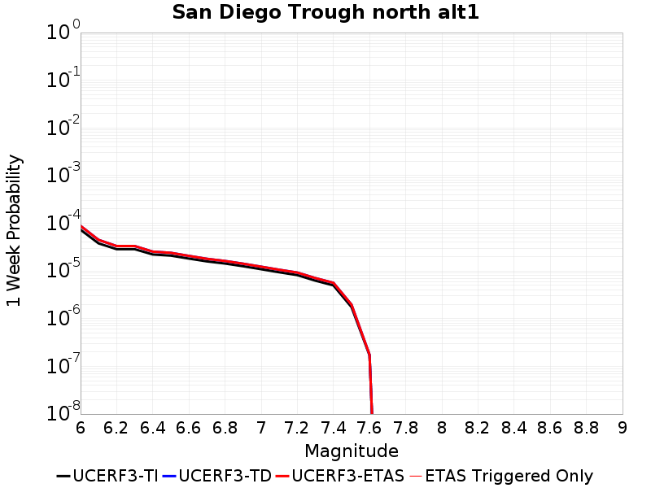 | 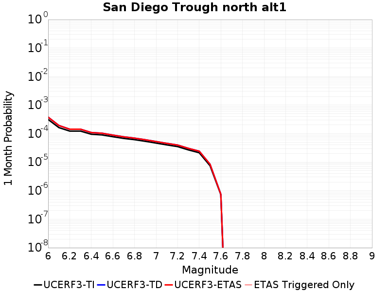 |  | 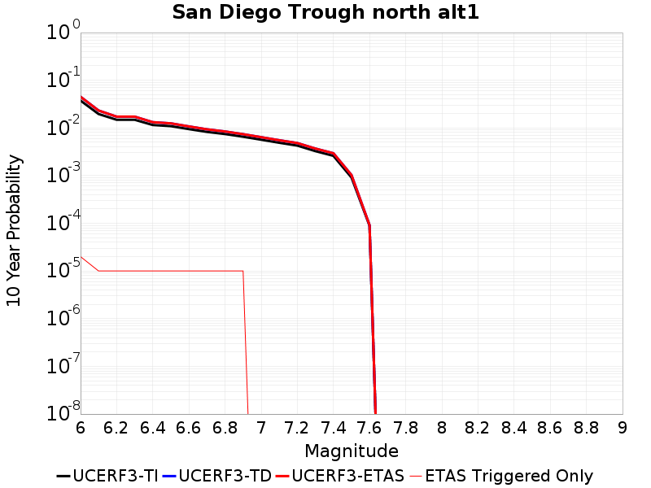 |

| Magnitude | 1 wk TI Prob | 1 wk TD Prob | 1 wk ETAS Prob | 1 wk ETAS/TD Gain | 1 wk ETAS Triggered Only | 1 mo TI Prob | 1 mo TD Prob | 1 mo ETAS Prob | 1 mo ETAS/TD Gain | 1 mo ETAS Triggered Only | 1 yr TI Prob | 1 yr TD Prob | 1 yr ETAS Prob | 1 yr ETAS/TD Gain | 1 yr ETAS Triggered Only | 10 yr TI Prob | 10 yr TD Prob | 10 yr ETAS Prob | 10 yr ETAS/TD Gain | 10 yr ETAS Triggered Only |
|-----|-----|-----|-----|-----|-----|-----|-----|-----|-----|-----|-----|-----|-----|-----|-----|-----|-----|-----|-----|-----|
| 6.0 | 7.329252E-5 | 8.831989E-5 | 8.831989E-5 | 1.0 | 0.0 | 3.14073E-4 | 3.784622E-4 | 3.784622E-4 | 1.0 | 0.0 | 0.0038171355 | 0.004598604 | 0.0046085585 | 1.0021646 | 1.0E-5 | 0.03752231 | 0.045098316 | 0.04511741 | 1.0004234 | 2.0E-5 |
| 6.1 | 3.7940346E-5 | 4.493434E-5 | 4.493434E-5 | 1.0 | 0.0 | 1.6259136E-4 | 1.9256175E-4 | 1.9256175E-4 | 1.0 | 0.0 | 0.0019777524 | 0.002341994 | 0.002341994 | 1.0 | 0.0 | 0.019602431 | 0.023181763 | 0.02319153 | 1.0004214 | 1.0E-5 |
| 6.2 | 2.8645263E-5 | 3.3329194E-5 | 3.3329194E-5 | 1.0 | 0.0 | 1.2275964E-4 | 1.4283169E-4 | 1.4283169E-4 | 1.0 | 0.0 | 0.0014935739 | 0.0017376099 | 0.0017376099 | 1.0 | 0.0 | 0.0148357535 | 0.017242877 | 0.017252704 | 1.0005699 | 1.0E-5 |
| 6.3 | 2.8645263E-5 | 3.3329194E-5 | 3.3329194E-5 | 1.0 | 0.0 | 1.2275964E-4 | 1.4283169E-4 | 1.4283169E-4 | 1.0 | 0.0 | 0.0014935739 | 0.0017376099 | 0.0017376099 | 1.0 | 0.0 | 0.0148357535 | 0.017242877 | 0.017252704 | 1.0005699 | 1.0E-5 |
| 6.4 | 2.2204576E-5 | 2.5470566E-5 | 2.5470566E-5 | 1.0 | 0.0 | 9.5159E-5 | 1.0915506E-4 | 1.0915506E-4 | 1.0 | 0.0 | 0.001157945 | 0.0013281619 | 0.0013281619 | 1.0 | 0.0 | 0.011519298 | 0.0132034095 | 0.013213278 | 1.0007473 | 1.0E-5 |
| 6.5 | 2.1004838E-5 | 2.4045356E-5 | 2.4045356E-5 | 1.0 | 0.0 | 9.0017624E-5 | 1.030475E-4 | 1.030475E-4 | 1.0 | 0.0 | 0.0010954136 | 0.0012538901 | 0.0012538901 | 1.0 | 0.0 | 0.010900296 | 0.012469235 | 0.012479111 | 1.000792 | 1.0E-5 |
| 6.6 | 1.820557E-5 | 2.0721769E-5 | 2.0721769E-5 | 1.0 | 0.0 | 7.802154E-5 | 8.880459E-5 | 8.880459E-5 | 1.0 | 0.0 | 9.4949827E-4 | 0.001080665 | 0.001080665 | 1.0 | 0.0 | 0.009454516 | 0.010754771 | 0.010764663 | 1.0009198 | 1.0E-5 |
| 6.7 | 1.5884485E-5 | 1.7997836E-5 | 1.7997836E-5 | 1.0 | 0.0 | 6.807459E-5 | 7.713131E-5 | 7.713131E-5 | 1.0 | 0.0 | 8.284929E-4 | 9.3867193E-4 | 9.3867193E-4 | 1.0 | 0.0 | 0.008254109 | 0.009347439 | 0.009357345 | 1.0010598 | 1.0E-5 |
| 6.8 | 1.4331171E-5 | 1.6213673E-5 | 1.6213673E-5 | 1.0 | 0.0 | 6.141786E-5 | 6.948534E-5 | 6.948534E-5 | 1.0 | 0.0 | 7.4750587E-4 | 8.456576E-4 | 8.456576E-4 | 1.0 | 0.0 | 0.0074499645 | 0.008424663 | 0.008434579 | 1.001177 | 1.0E-5 |
| 6.9 | 1.2574203E-5 | 1.4216821E-5 | 1.4216821E-5 | 1.0 | 0.0 | 5.3888325E-5 | 6.0927818E-5 | 6.0927818E-5 | 1.0 | 0.0 | 6.558929E-4 | 7.415451E-4 | 7.415451E-4 | 1.0 | 0.0 | 0.0065396037 | 0.0073908935 | 0.00740082 | 1.001343 | 1.0E-5 |
| 7.0 | 1.0883844E-5 | 1.2298719E-5 | 1.2298719E-5 | 1.0 | 0.0 | 4.664421E-5 | 5.270774E-5 | 5.270774E-5 | 1.0 | 0.0 | 5.677453E-4 | 6.4152875E-4 | 6.4152875E-4 | 1.0 | 0.0 | 0.00566297 | 0.006396896 | 0.006396896 | 1.0 | 0.0 |
| 7.1 | 9.393088E-6 | 1.0615195E-5 | 1.0615195E-5 | 1.0 | 0.0 | 4.025547E-5 | 4.54929E-5 | 4.54929E-5 | 1.0 | 0.0 | 4.900001E-4 | 5.537361E-4 | 5.537361E-4 | 1.0 | 0.0 | 0.0048892107 | 0.0055236598 | 0.0055236598 | 1.0 | 0.0 |
| 7.2 | 8.190791E-6 | 9.2658265E-6 | 9.2658265E-6 | 1.0 | 0.0 | 3.510292E-5 | 3.9710085E-5 | 3.9710085E-5 | 1.0 | 0.0 | 4.2729423E-4 | 4.833637E-4 | 4.833637E-4 | 1.0 | 0.0 | 0.0042647356 | 0.0048232037 | 0.0048232037 | 1.0 | 0.0 |
| 7.3 | 6.268162E-6 | 7.0952547E-6 | 7.0952547E-6 | 1.0 | 0.0 | 2.6863276E-5 | 3.0407882E-5 | 3.0407882E-5 | 1.0 | 0.0 | 3.2701128E-4 | 3.701535E-4 | 3.701535E-4 | 1.0 | 0.0 | 0.003265305 | 0.0036954156 | 0.0036954156 | 1.0 | 0.0 |
| 7.4 | 4.985186E-6 | 5.647116E-6 | 5.647116E-6 | 1.0 | 0.0 | 2.1364907E-5 | 2.4201703E-5 | 2.4201703E-5 | 1.0 | 0.0 | 2.600867E-4 | 2.946163E-4 | 2.946163E-4 | 1.0 | 0.0 | 0.002597825 | 0.0029422985 | 0.0029422985 | 1.0 | 0.0 |
| 7.5 | 1.7489613E-6 | 1.9711686E-6 | 1.9711686E-6 | 1.0 | 0.0 | 7.495527E-6 | 8.44784E-6 | 8.44784E-6 | 1.0 | 0.0 | 9.125422E-5 | 1.02847815E-4 | 1.02847815E-4 | 1.0 | 0.0 | 9.1216754E-4 | 0.0010280242 | 0.0010280242 | 1.0 | 0.0 |
| 7.6 | 1.6988751E-7 | 1.7537151E-7 | 1.7537151E-7 | 1.0 | 0.0 | 7.2808916E-7 | 7.51592E-7 | 7.51592E-7 | 1.0 | 0.0 | 8.864449E-6 | 9.150596E-6 | 9.150596E-6 | 1.0 | 0.0 | 8.8640954E-5 | 9.150239E-5 | 9.150239E-5 | 1.0 | 0.0 |

## San Clemente
*[(top)](#table-of-contents)*

| 1 Week | 1 Month | 1 Year | 10 Year |
|-----|-----|-----|-----|
|  |  |  | 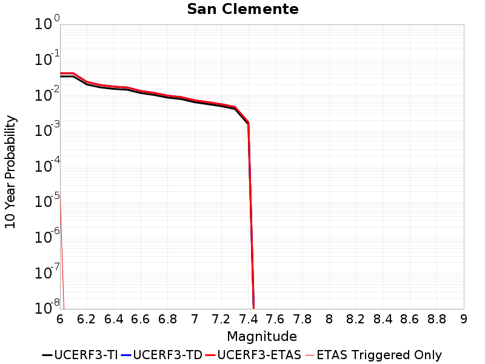 |

| Magnitude | 1 wk TI Prob | 1 wk TD Prob | 1 wk ETAS Prob | 1 wk ETAS/TD Gain | 1 wk ETAS Triggered Only | 1 mo TI Prob | 1 mo TD Prob | 1 mo ETAS Prob | 1 mo ETAS/TD Gain | 1 mo ETAS Triggered Only | 1 yr TI Prob | 1 yr TD Prob | 1 yr ETAS Prob | 1 yr ETAS/TD Gain | 1 yr ETAS Triggered Only | 10 yr TI Prob | 10 yr TD Prob | 10 yr ETAS Prob | 10 yr ETAS/TD Gain | 10 yr ETAS Triggered Only |
|-----|-----|-----|-----|-----|-----|-----|-----|-----|-----|-----|-----|-----|-----|-----|-----|-----|-----|-----|-----|-----|
| 6.0 | 6.681379E-5 | 8.1745595E-5 | 8.1745595E-5 | 1.0 | 0.0 | 2.8631336E-4 | 3.502944E-4 | 3.602909E-4 | 1.0285374 | 1.0E-5 | 0.003480294 | 0.0042569847 | 0.0042669424 | 1.0023391 | 1.0E-5 | 0.03426291 | 0.04180953 | 0.041828692 | 1.0004584 | 2.0E-5 |
| 6.1 | 6.681379E-5 | 8.1745595E-5 | 8.1745595E-5 | 1.0 | 0.0 | 2.8631336E-4 | 3.502944E-4 | 3.602909E-4 | 1.0285374 | 1.0E-5 | 0.003480294 | 0.0042569847 | 0.0042669424 | 1.0023391 | 1.0E-5 | 0.03426291 | 0.04180953 | 0.041828692 | 1.0004584 | 2.0E-5 |
| 6.2 | 3.9400576E-5 | 4.650204E-5 | 4.650204E-5 | 1.0 | 0.0 | 1.6884868E-4 | 1.9927946E-4 | 2.0927747E-4 | 1.0501708 | 1.0E-5 | 0.0020537945 | 0.0024235805 | 0.0024335564 | 1.0041162 | 1.0E-5 | 0.020349167 | 0.02397813 | 0.023997651 | 1.0008141 | 2.0E-5 |
| 6.3 | 3.2590255E-5 | 3.7966136E-5 | 3.7966136E-5 | 1.0 | 0.0 | 1.3966505E-4 | 1.6270201E-4 | 1.7270038E-4 | 1.061452 | 1.0E-5 | 0.0016990956 | 0.001979128 | 0.001989108 | 1.0050427 | 1.0E-5 | 0.01686163 | 0.019618811 | 0.01963842 | 1.0009995 | 2.0E-5 |
| 6.4 | 2.9454652E-5 | 3.412975E-5 | 3.412975E-5 | 1.0 | 0.0 | 1.2622811E-4 | 1.462623E-4 | 1.5626084E-4 | 1.0683603 | 1.0E-5 | 0.0015357438 | 0.0017793154 | 0.0017892976 | 1.0056101 | 1.0E-5 | 0.015251739 | 0.017653864 | 0.017673511 | 1.0011129 | 2.0E-5 |
| 6.5 | 2.790836E-5 | 3.2277287E-5 | 3.2277287E-5 | 1.0 | 0.0 | 1.1960178E-4 | 1.3832403E-4 | 1.4832265E-4 | 1.072284 | 1.0E-5 | 0.001455179 | 0.0016828198 | 0.001692803 | 1.0059325 | 1.0E-5 | 0.014456868 | 0.016703786 | 0.016723452 | 1.0011773 | 2.0E-5 |
| 6.6 | 2.2492153E-5 | 2.5784939E-5 | 2.5784939E-5 | 1.0 | 0.0 | 9.639138E-5 | 1.1050228E-4 | 1.1050228E-4 | 1.0 | 0.0 | 0.0011729331 | 0.0013445497 | 0.0013445497 | 1.0 | 0.0 | 0.011667615 | 0.013365867 | 0.013365867 | 1.0 | 0.0 |
| 6.7 | 1.9862755E-5 | 2.2685395E-5 | 2.2685395E-5 | 1.0 | 0.0 | 8.512331E-5 | 9.721956E-5 | 9.721956E-5 | 1.0 | 0.0 | 0.0010358836 | 0.0011830168 | 0.0011830168 | 1.0 | 0.0 | 0.010310682 | 0.011768486 | 0.011768486 | 1.0 | 0.0 |
| 6.8 | 1.6697575E-5 | 1.899306E-5 | 1.899306E-5 | 1.0 | 0.0 | 7.155907E-5 | 8.139634E-5 | 8.139634E-5 | 1.0 | 0.0 | 8.7088346E-4 | 9.905593E-4 | 9.905593E-4 | 1.0 | 0.0 | 0.008674784 | 0.0098624695 | 0.0098624695 | 1.0 | 0.0 |
| 6.9 | 1.5218415E-5 | 1.7283182E-5 | 1.7283182E-5 | 1.0 | 0.0 | 6.522015E-5 | 7.406873E-5 | 7.406873E-5 | 1.0 | 0.0 | 7.93766E-4 | 9.014225E-4 | 9.014225E-4 | 1.0 | 0.0 | 0.007909367 | 0.008978609 | 0.008978609 | 1.0 | 0.0 |
| 7.0 | 1.2392958E-5 | 1.4044009E-5 | 1.4044009E-5 | 1.0 | 0.0 | 5.3111595E-5 | 6.0187263E-5 | 6.0187263E-5 | 1.0 | 0.0 | 6.4644177E-4 | 7.3254114E-4 | 7.3254114E-4 | 1.0 | 0.0 | 0.0064456454 | 0.0073020523 | 0.0073020523 | 1.0 | 0.0 |
| 7.1 | 1.0934128E-5 | 1.2384792E-5 | 1.2384792E-5 | 1.0 | 0.0 | 4.6859706E-5 | 5.307664E-5 | 5.307664E-5 | 1.0 | 0.0 | 5.7036756E-4 | 6.4602384E-4 | 6.4602384E-4 | 1.0 | 0.0 | 0.0056890585 | 0.006442206 | 0.006442206 | 1.0 | 0.0 |
| 7.2 | 9.5798805E-6 | 1.0853412E-5 | 1.0853412E-5 | 1.0 | 0.0 | 4.1055984E-5 | 4.6513836E-5 | 4.6513836E-5 | 1.0 | 0.0 | 4.9974193E-4 | 5.66166E-4 | 5.66166E-4 | 1.0 | 0.0 | 0.0049861963 | 0.005647961 | 0.005647961 | 1.0 | 0.0 |
| 7.3 | 8.0167365E-6 | 9.091075E-6 | 9.091075E-6 | 1.0 | 0.0 | 3.4356988E-5 | 3.8961207E-5 | 3.8961207E-5 | 1.0 | 0.0 | 4.1821605E-4 | 4.7425652E-4 | 4.7425652E-4 | 1.0 | 0.0 | 0.0041742986 | 0.004733148 | 0.004733148 | 1.0 | 0.0 |
| 7.4 | 2.9581017E-6 | 3.365099E-6 | 3.365099E-6 | 1.0 | 0.0 | 1.2677518E-5 | 1.4421802E-5 | 1.4421802E-5 | 1.0 | 0.0 | 1.5433785E-4 | 1.7557635E-4 | 1.7557635E-4 | 1.0 | 0.0 | 0.001542307 | 0.0017548722 | 0.0017548722 | 1.0 | 0.0 |

## Ortigalita (South)
*[(top)](#table-of-contents)*

| 1 Week | 1 Month | 1 Year | 10 Year |
|-----|-----|-----|-----|
| 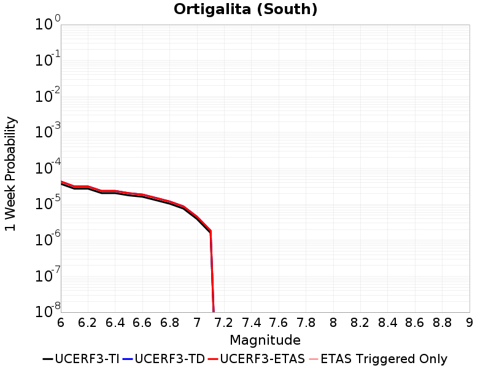 |  |  |  |

| Magnitude | 1 wk TI Prob | 1 wk TD Prob | 1 wk ETAS Prob | 1 wk ETAS/TD Gain | 1 wk ETAS Triggered Only | 1 mo TI Prob | 1 mo TD Prob | 1 mo ETAS Prob | 1 mo ETAS/TD Gain | 1 mo ETAS Triggered Only | 1 yr TI Prob | 1 yr TD Prob | 1 yr ETAS Prob | 1 yr ETAS/TD Gain | 1 yr ETAS Triggered Only | 10 yr TI Prob | 10 yr TD Prob | 10 yr ETAS Prob | 10 yr ETAS/TD Gain | 10 yr ETAS Triggered Only |
|-----|-----|-----|-----|-----|-----|-----|-----|-----|-----|-----|-----|-----|-----|-----|-----|-----|-----|-----|-----|-----|
| 6.0 | 3.72394E-5 | 4.3297132E-5 | 4.3297132E-5 | 1.0 | 0.0 | 1.5958765E-4 | 1.8554683E-4 | 1.8554683E-4 | 1.0 | 0.0 | 0.0019412481 | 0.002256849 | 0.0022668263 | 1.004421 | 1.0E-5 | 0.019243775 | 0.022355719 | 0.022375273 | 1.0008746 | 2.0E-5 |
| 6.1 | 2.7299884E-5 | 3.1520754E-5 | 3.1520754E-5 | 1.0 | 0.0 | 1.16994255E-4 | 1.3508227E-4 | 1.3508227E-4 | 1.0 | 0.0 | 0.0014234743 | 0.001643442 | 0.001643442 | 1.0 | 0.0 | 0.014143906 | 0.016318824 | 0.01632866 | 1.0006028 | 1.0E-5 |
| 6.2 | 2.7299884E-5 | 3.1520754E-5 | 3.1520754E-5 | 1.0 | 0.0 | 1.16994255E-4 | 1.3508227E-4 | 1.3508227E-4 | 1.0 | 0.0 | 0.0014234743 | 0.001643442 | 0.001643442 | 1.0 | 0.0 | 0.014143906 | 0.016318824 | 0.01632866 | 1.0006028 | 1.0E-5 |
| 6.3 | 2.0546433E-5 | 2.3652523E-5 | 2.3652523E-5 | 1.0 | 0.0 | 8.805317E-5 | 1.0136412E-4 | 1.0136412E-4 | 1.0 | 0.0 | 0.00107152 | 0.0012334285 | 0.0012334285 | 1.0 | 0.0 | 0.010663681 | 0.012267894 | 0.012277771 | 1.0008051 | 1.0E-5 |
| 6.4 | 2.0546433E-5 | 2.3652523E-5 | 2.3652523E-5 | 1.0 | 0.0 | 8.805317E-5 | 1.0136412E-4 | 1.0136412E-4 | 1.0 | 0.0 | 0.00107152 | 0.0012334285 | 0.0012334285 | 1.0 | 0.0 | 0.010663681 | 0.012267894 | 0.012277771 | 1.0008051 | 1.0E-5 |
| 6.5 | 1.7779594E-5 | 2.0465195E-5 | 2.0465195E-5 | 1.0 | 0.0 | 7.619603E-5 | 8.7705106E-5 | 8.7705106E-5 | 1.0 | 0.0 | 9.272918E-4 | 0.0010673002 | 0.0010673002 | 1.0 | 0.0 | 0.009234319 | 0.010623212 | 0.010633105 | 1.0009314 | 1.0E-5 |
| 6.6 | 1.6272212E-5 | 1.8731656E-5 | 1.8731656E-5 | 1.0 | 0.0 | 6.973618E-5 | 8.027613E-5 | 8.027613E-5 | 1.0 | 0.0 | 8.487073E-4 | 9.769358E-4 | 9.769358E-4 | 1.0 | 0.0 | 0.008454733 | 0.009727716 | 0.009727716 | 1.0 | 0.0 |
| 6.7 | 1.3051484E-5 | 1.5052365E-5 | 1.5052365E-5 | 1.0 | 0.0 | 5.593373E-5 | 6.45086E-5 | 6.45086E-5 | 1.0 | 0.0 | 6.807804E-4 | 7.8511867E-4 | 7.8511867E-4 | 1.0 | 0.0 | 0.006786986 | 0.007824434 | 0.007824434 | 1.0 | 0.0 |
| 6.8 | 1.04277415E-5 | 1.199787E-5 | 1.199787E-5 | 1.0 | 0.0 | 4.4689557E-5 | 5.1418472E-5 | 5.1418472E-5 | 1.0 | 0.0 | 5.439595E-4 | 6.2584755E-4 | 6.2584755E-4 | 1.0 | 0.0 | 0.0054262993 | 0.006241606 | 0.006241606 | 1.0 | 0.0 |
| 6.9 | 7.639968E-6 | 8.79936E-6 | 8.79936E-6 | 1.0 | 0.0 | 3.274231E-5 | 3.7711034E-5 | 3.7711034E-5 | 1.0 | 0.0 | 3.9856473E-4 | 4.5904098E-4 | 4.5904098E-4 | 1.0 | 0.0 | 0.003978506 | 0.004581515 | 0.004581515 | 1.0 | 0.0 |
| 7.0 | 3.919831E-6 | 4.5376073E-6 | 4.5376073E-6 | 1.0 | 0.0 | 1.679917E-5 | 1.9446756E-5 | 1.9446756E-5 | 1.0 | 0.0 | 2.045107E-4 | 2.3674064E-4 | 2.3674064E-4 | 1.0 | 0.0 | 0.0020432258 | 0.0023650934 | 0.0023650934 | 1.0 | 0.0 |
| 7.1 | 1.6017933E-6 | 1.8587959E-6 | 1.8587959E-6 | 1.0 | 0.0 | 6.8648105E-6 | 7.9662495E-6 | 7.9662495E-6 | 1.0 | 0.0 | 8.357586E-5 | 9.6985845E-5 | 9.6985845E-5 | 1.0 | 0.0 | 8.3544437E-4 | 9.695401E-4 | 9.695401E-4 | 1.0 | 0.0 |

## Malibu Coast (Extension) alt 1
*[(top)](#table-of-contents)*

| 1 Week | 1 Month | 1 Year | 10 Year |
|-----|-----|-----|-----|
|  |  |  |  |

| Magnitude | 1 wk TI Prob | 1 wk TD Prob | 1 wk ETAS Prob | 1 wk ETAS/TD Gain | 1 wk ETAS Triggered Only | 1 mo TI Prob | 1 mo TD Prob | 1 mo ETAS Prob | 1 mo ETAS/TD Gain | 1 mo ETAS Triggered Only | 1 yr TI Prob | 1 yr TD Prob | 1 yr ETAS Prob | 1 yr ETAS/TD Gain | 1 yr ETAS Triggered Only | 10 yr TI Prob | 10 yr TD Prob | 10 yr ETAS Prob | 10 yr ETAS/TD Gain | 10 yr ETAS Triggered Only |
|-----|-----|-----|-----|-----|-----|-----|-----|-----|-----|-----|-----|-----|-----|-----|-----|-----|-----|-----|-----|-----|
| 6.0 | 8.930738E-6 | 9.332519E-6 | 9.332519E-6 | 1.0 | 0.0 | 3.827403E-5 | 3.9995906E-5 | 4.9995506E-5 | 1.2500156 | 1.0E-5 | 4.6588664E-4 | 4.8684306E-4 | 4.968382E-4 | 1.0205305 | 1.0E-5 | 0.0046491115 | 0.004857948 | 0.004877851 | 1.004097 | 2.0E-5 |
| 6.1 | 7.199952E-6 | 7.53312E-6 | 7.53312E-6 | 1.0 | 0.0 | 3.0856572E-5 | 3.2284403E-5 | 4.2284082E-5 | 1.3097371 | 1.0E-5 | 3.75614E-4 | 3.929923E-4 | 4.029884E-4 | 1.0254358 | 1.0E-5 | 0.0037497976 | 0.00392304 | 0.0039330004 | 1.002539 | 1.0E-5 |
| 6.2 | 6.3721413E-6 | 6.6693947E-6 | 6.6693947E-6 | 1.0 | 0.0 | 2.7308892E-5 | 2.8582808E-5 | 3.8582522E-5 | 1.3498507 | 1.0E-5 | 3.3243504E-4 | 3.4794048E-4 | 3.57937E-4 | 1.0287305 | 1.0E-5 | 0.0033193815 | 0.0034739973 | 0.0034839625 | 1.0028685 | 1.0E-5 |
| 6.3 | 6.016345E-6 | 6.2976633E-6 | 6.2976633E-6 | 1.0 | 0.0 | 2.578408E-5 | 2.6989708E-5 | 3.6989437E-5 | 1.3705016 | 1.0E-5 | 3.1387596E-4 | 3.2855046E-4 | 3.385472E-4 | 1.0304267 | 1.0E-5 | 0.00313433 | 0.0032806834 | 0.0032906507 | 1.0030382 | 1.0E-5 |
| 6.4 | 5.8104883E-6 | 6.081989E-6 | 6.081989E-6 | 1.0 | 0.0 | 2.4901856E-5 | 2.6065409E-5 | 3.6065147E-5 | 1.3836403 | 1.0E-5 | 3.031379E-4 | 3.1730044E-4 | 3.2729728E-4 | 1.0315058 | 1.0E-5 | 0.0030272473 | 0.0031685089 | 0.003178477 | 1.003146 | 1.0E-5 |
| 6.5 | 5.476925E-6 | 5.729842E-6 | 5.729842E-6 | 1.0 | 0.0 | 2.3472323E-5 | 2.4556237E-5 | 3.455599E-5 | 1.4072186 | 1.0E-5 | 2.8573806E-4 | 2.9893144E-4 | 3.0892846E-4 | 1.0334425 | 1.0E-5 | 0.0028537093 | 0.0029853254 | 0.0029952957 | 1.0033398 | 1.0E-5 |
| 6.6 | 5.222387E-6 | 5.4608186E-6 | 5.4608186E-6 | 1.0 | 0.0 | 2.2381464E-5 | 2.34033E-5 | 3.3403066E-5 | 1.4272802 | 1.0E-5 | 2.7246025E-4 | 2.8489818E-4 | 2.9489535E-4 | 1.0350902 | 1.0E-5 | 0.0027212645 | 0.0028453604 | 0.0028553319 | 1.0035045 | 1.0E-5 |
| 6.7 | 5.0337076E-6 | 5.261274E-6 | 5.261274E-6 | 1.0 | 0.0 | 2.1572854E-5 | 2.2548125E-5 | 3.2547898E-5 | 1.4434859 | 1.0E-5 | 2.6261783E-4 | 2.744891E-4 | 2.8448636E-4 | 1.0364213 | 1.0E-5 | 0.002623077 | 0.002741531 | 0.0027515034 | 1.0036376 | 1.0E-5 |
| 6.8 | 4.5675624E-6 | 4.7606695E-6 | 4.7606695E-6 | 1.0 | 0.0 | 1.9575122E-5 | 2.0402711E-5 | 3.0402507E-5 | 1.4901209 | 1.0E-5 | 2.3830103E-4 | 2.4837488E-4 | 2.583724E-4 | 1.0402517 | 1.0E-5 | 0.0023804565 | 0.0024809926 | 0.0024909677 | 1.0040207 | 1.0E-5 |
| 6.9 | 4.2802412E-6 | 4.4538515E-6 | 4.4538515E-6 | 1.0 | 0.0 | 1.8343762E-5 | 1.9087794E-5 | 2.9087605E-5 | 1.523885 | 1.0E-5 | 2.2331243E-4 | 2.3236928E-4 | 2.4236695E-4 | 1.0430249 | 1.0E-5 | 0.0022308815 | 0.0023212798 | 0.0023312566 | 1.004298 | 1.0E-5 |
| 7.0 | 3.9794063E-6 | 4.1317962E-6 | 4.1317962E-6 | 1.0 | 0.0 | 1.7054486E-5 | 1.7707578E-5 | 1.7707578E-5 | 1.0 | 0.0 | 2.0761859E-4 | 2.1556855E-4 | 2.1556855E-4 | 1.0 | 0.0 | 0.0020742472 | 0.002153608 | 0.002153608 | 1.0 | 0.0 |
| 7.1 | 3.7730424E-6 | 3.912835E-6 | 3.912835E-6 | 1.0 | 0.0 | 1.6170083E-5 | 1.6769187E-5 | 1.6769187E-5 | 1.0 | 0.0 | 1.9685295E-4 | 2.0414584E-4 | 2.0414584E-4 | 1.0 | 0.0 | 0.0019667868 | 0.002039596 | 0.002039596 | 1.0 | 0.0 |
| 7.2 | 3.424985E-6 | 3.5428175E-6 | 3.5428175E-6 | 1.0 | 0.0 | 1.4678424E-5 | 1.5183416E-5 | 1.5183416E-5 | 1.0 | 0.0 | 1.7869516E-4 | 1.8484252E-4 | 1.8484252E-4 | 1.0 | 0.0 | 0.0017855153 | 0.0018468997 | 0.0018468997 | 1.0 | 0.0 |
| 7.3 | 2.6966375E-6 | 2.7607944E-6 | 2.7607944E-6 | 1.0 | 0.0 | 1.15569665E-5 | 1.1831922E-5 | 1.1831922E-5 | 1.0 | 0.0 | 1.4069698E-4 | 1.4404417E-4 | 1.4404417E-4 | 1.0 | 0.0 | 0.0014060794 | 0.0014395121 | 0.0014395121 | 1.0 | 0.0 |
| 7.4 | 2.215957E-6 | 2.2503218E-6 | 2.2503218E-6 | 1.0 | 0.0 | 9.496924E-6 | 9.644201E-6 | 9.644201E-6 | 1.0 | 0.0 | 1.1561892E-4 | 1.1741186E-4 | 1.1741186E-4 | 1.0 | 0.0 | 0.0011555878 | 0.001173502 | 0.001173502 | 1.0 | 0.0 |
| 7.5 | 1.2040218E-6 | 1.2224031E-6 | 1.2224031E-6 | 1.0 | 0.0 | 5.160083E-6 | 5.23886E-6 | 5.23886E-6 | 1.0 | 0.0 | 6.2822204E-5 | 6.378127E-5 | 6.378127E-5 | 1.0 | 0.0 | 6.280445E-4 | 6.376315E-4 | 6.376315E-4 | 1.0 | 0.0 |
| 7.6 | 6.6157446E-7 | 6.681597E-7 | 6.681597E-7 | 1.0 | 0.0 | 2.835316E-6 | 2.8635384E-6 | 2.8635384E-6 | 1.0 | 0.0 | 3.4519428E-5 | 3.486304E-5 | 3.486304E-5 | 1.0 | 0.0 | 3.4514067E-4 | 3.4857722E-4 | 3.4857722E-4 | 1.0 | 0.0 |
| 7.7 | 2.6012302E-7 | 2.4366736E-7 | 2.4366736E-7 | 1.0 | 0.0 | 1.1148124E-6 | 1.0442883E-6 | 1.0442883E-6 | 1.0 | 0.0 | 1.3572758E-5 | 1.2714147E-5 | 1.2714147E-5 | 1.0 | 0.0 | 1.3571928E-4 | 1.2713527E-4 | 1.2713527E-4 | 1.0 | 0.0 |
| 7.8 | 2.8323132E-8 | 2.0275033E-8 | 2.0275033E-8 | 1.0 | 0.0 | 1.2138484E-7 | 8.6892996E-8 | 8.6892996E-8 | 1.0 | 0.0 | 1.4778595E-6 | 1.0579217E-6 | 1.0579217E-6 | 1.0 | 0.0 | 1.4778497E-5 | 1.0579175E-5 | 1.0579175E-5 | 1.0 | 0.0 |

## Tin Mountain
*[(top)](#table-of-contents)*

| 1 Week | 1 Month | 1 Year | 10 Year |
|-----|-----|-----|-----|
|  |  | 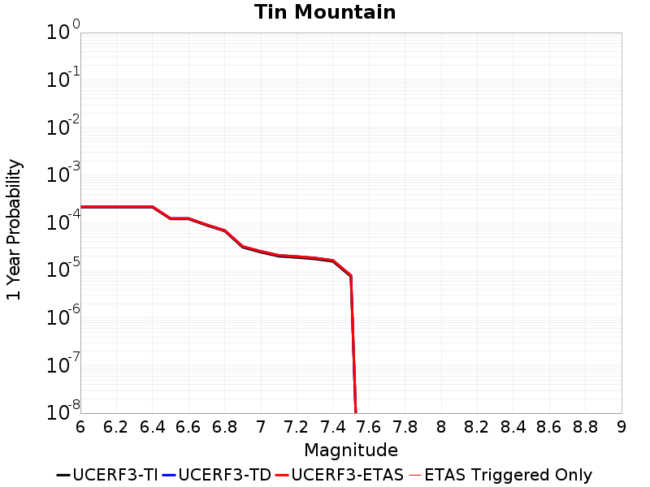 | 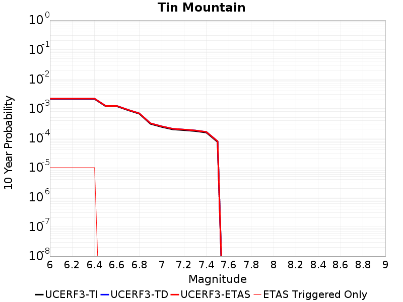 |

| Magnitude | 1 wk TI Prob | 1 wk TD Prob | 1 wk ETAS Prob | 1 wk ETAS/TD Gain | 1 wk ETAS Triggered Only | 1 mo TI Prob | 1 mo TD Prob | 1 mo ETAS Prob | 1 mo ETAS/TD Gain | 1 mo ETAS Triggered Only | 1 yr TI Prob | 1 yr TD Prob | 1 yr ETAS Prob | 1 yr ETAS/TD Gain | 1 yr ETAS Triggered Only | 10 yr TI Prob | 10 yr TD Prob | 10 yr ETAS Prob | 10 yr ETAS/TD Gain | 10 yr ETAS Triggered Only |
|-----|-----|-----|-----|-----|-----|-----|-----|-----|-----|-----|-----|-----|-----|-----|-----|-----|-----|-----|-----|-----|
| 6.0 | 4.083776E-6 | 4.1821304E-6 | 4.1821304E-6 | 1.0 | 0.0 | 1.750178E-5 | 1.7923314E-5 | 1.7923314E-5 | 1.0 | 0.0 | 2.1306332E-4 | 2.1819823E-4 | 2.1819823E-4 | 1.0 | 0.0 | 0.0021285915 | 0.0021802057 | 0.002200162 | 1.0091535 | 2.0E-5 |
| 6.1 | 4.083776E-6 | 4.1821304E-6 | 4.1821304E-6 | 1.0 | 0.0 | 1.750178E-5 | 1.7923314E-5 | 1.7923314E-5 | 1.0 | 0.0 | 2.1306332E-4 | 2.1819823E-4 | 2.1819823E-4 | 1.0 | 0.0 | 0.0021285915 | 0.0021802057 | 0.002200162 | 1.0091535 | 2.0E-5 |
| 6.2 | 4.083776E-6 | 4.1821304E-6 | 4.1821304E-6 | 1.0 | 0.0 | 1.750178E-5 | 1.7923314E-5 | 1.7923314E-5 | 1.0 | 0.0 | 2.1306332E-4 | 2.1819823E-4 | 2.1819823E-4 | 1.0 | 0.0 | 0.0021285915 | 0.0021802057 | 0.002200162 | 1.0091535 | 2.0E-5 |
| 6.3 | 4.083776E-6 | 4.1821304E-6 | 4.1821304E-6 | 1.0 | 0.0 | 1.750178E-5 | 1.7923314E-5 | 1.7923314E-5 | 1.0 | 0.0 | 2.1306332E-4 | 2.1819823E-4 | 2.1819823E-4 | 1.0 | 0.0 | 0.0021285915 | 0.0021802057 | 0.002200162 | 1.0091535 | 2.0E-5 |
| 6.4 | 4.083776E-6 | 4.1821304E-6 | 4.1821304E-6 | 1.0 | 0.0 | 1.750178E-5 | 1.7923314E-5 | 1.7923314E-5 | 1.0 | 0.0 | 2.1306332E-4 | 2.1819823E-4 | 2.1819823E-4 | 1.0 | 0.0 | 0.0021285915 | 0.0021802057 | 0.002200162 | 1.0091535 | 2.0E-5 |
| 6.5 | 2.3143427E-6 | 2.3735156E-6 | 2.3735156E-6 | 1.0 | 0.0 | 9.9185745E-6 | 1.0172174E-5 | 1.0172174E-5 | 1.0 | 0.0 | 1.2075195E-4 | 1.2383996E-4 | 1.2383996E-4 | 1.0 | 0.0 | 0.0012068636 | 0.0012377854 | 0.0012377854 | 1.0 | 0.0 |
| 6.6 | 2.3143427E-6 | 2.3735156E-6 | 2.3735156E-6 | 1.0 | 0.0 | 9.9185745E-6 | 1.0172174E-5 | 1.0172174E-5 | 1.0 | 0.0 | 1.2075195E-4 | 1.2383996E-4 | 1.2383996E-4 | 1.0 | 0.0 | 0.0012068636 | 0.0012377854 | 0.0012377854 | 1.0 | 0.0 |
| 6.7 | 1.7029532E-6 | 1.7500777E-6 | 1.7500777E-6 | 1.0 | 0.0 | 7.2983503E-6 | 7.5003145E-6 | 7.5003145E-6 | 1.0 | 0.0 | 8.885379E-5 | 9.1313035E-5 | 9.1313035E-5 | 1.0 | 0.0 | 8.881827E-4 | 9.128078E-4 | 9.128078E-4 | 1.0 | 0.0 |
| 6.8 | 1.2914646E-6 | 1.3301735E-6 | 1.3301735E-6 | 1.0 | 0.0 | 5.534837E-6 | 5.7007337E-6 | 5.7007337E-6 | 1.0 | 0.0 | 6.738455E-5 | 6.940467E-5 | 6.940467E-5 | 1.0 | 0.0 | 6.736412E-4 | 6.9387327E-4 | 6.9387327E-4 | 1.0 | 0.0 |
| 6.9 | 5.8708974E-7 | 6.118514E-7 | 6.118514E-7 | 1.0 | 0.0 | 2.5160964E-6 | 2.6222178E-6 | 2.6222178E-6 | 1.0 | 0.0 | 3.0633044E-5 | 3.1925076E-5 | 3.1925076E-5 | 1.0 | 0.0 | 3.0628822E-4 | 3.19209E-4 | 3.19209E-4 | 1.0 | 0.0 |
| 7.0 | 4.6248786E-7 | 4.8332976E-7 | 4.8332976E-7 | 1.0 | 0.0 | 1.9820893E-6 | 2.071412E-6 | 2.071412E-6 | 1.0 | 0.0 | 2.413167E-5 | 2.5219186E-5 | 2.5219186E-5 | 1.0 | 0.0 | 2.412905E-4 | 2.5216694E-4 | 2.5216694E-4 | 1.0 | 0.0 |
| 7.1 | 3.804606E-7 | 3.9882798E-7 | 3.9882798E-7 | 1.0 | 0.0 | 1.6305444E-6 | 1.7092618E-6 | 1.7092618E-6 | 1.0 | 0.0 | 1.9851697E-5 | 2.0810097E-5 | 2.0810097E-5 | 1.0 | 0.0 | 1.9849923E-4 | 2.0808485E-4 | 2.0808485E-4 | 1.0 | 0.0 |
| 7.2 | 3.5864858E-7 | 3.762774E-7 | 3.762774E-7 | 1.0 | 0.0 | 1.5370645E-6 | 1.6126166E-6 | 1.6126166E-6 | 1.0 | 0.0 | 1.87136E-5 | 1.9633464E-5 | 1.9633464E-5 | 1.0 | 0.0 | 1.8712023E-4 | 1.9632062E-4 | 1.9632062E-4 | 1.0 | 0.0 |
| 7.3 | 3.342063E-7 | 3.5073674E-7 | 3.5073674E-7 | 1.0 | 0.0 | 1.4323119E-6 | 1.5031568E-6 | 1.5031568E-6 | 1.0 | 0.0 | 1.7438259E-5 | 1.8300814E-5 | 1.8300814E-5 | 1.0 | 0.0 | 1.743689E-4 | 1.8299637E-4 | 1.8299637E-4 | 1.0 | 0.0 |
| 7.4 | 2.971242E-7 | 3.117484E-7 | 3.117484E-7 | 1.0 | 0.0 | 1.2733886E-6 | 1.3360641E-6 | 1.3360641E-6 | 1.0 | 0.0 | 1.5503398E-5 | 1.6266493E-5 | 1.6266493E-5 | 1.0 | 0.0 | 1.5502315E-4 | 1.626563E-4 | 1.626563E-4 | 1.0 | 0.0 |
| 7.5 | 1.4326713E-7 | 1.5016775E-7 | 1.5016775E-7 | 1.0 | 0.0 | 6.140018E-7 | 6.435761E-7 | 6.435761E-7 | 1.0 | 0.0 | 7.4754466E-6 | 7.835539E-6 | 7.835539E-6 | 1.0 | 0.0 | 7.475195E-5 | 7.8355384E-5 | 7.8355384E-5 | 1.0 | 0.0 |

## Pleito
*[(top)](#table-of-contents)*

| 1 Week | 1 Month | 1 Year | 10 Year |
|-----|-----|-----|-----|
| 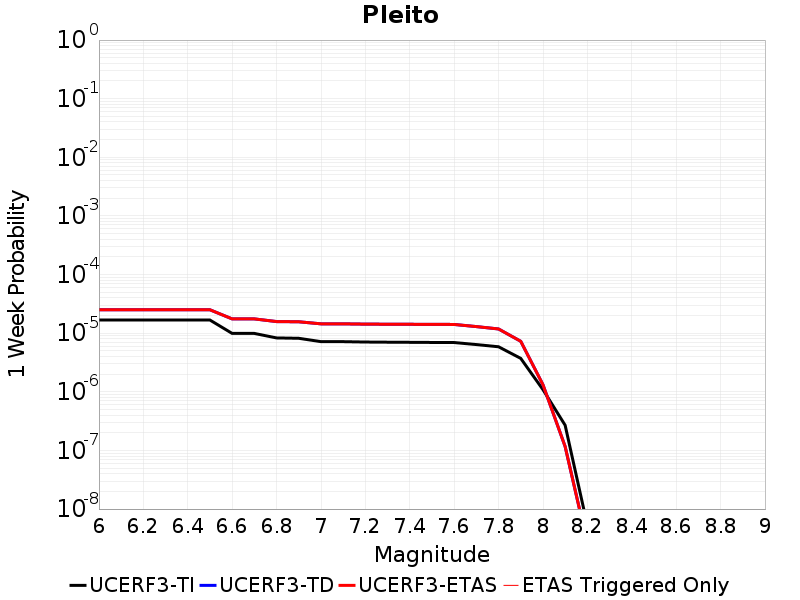 | 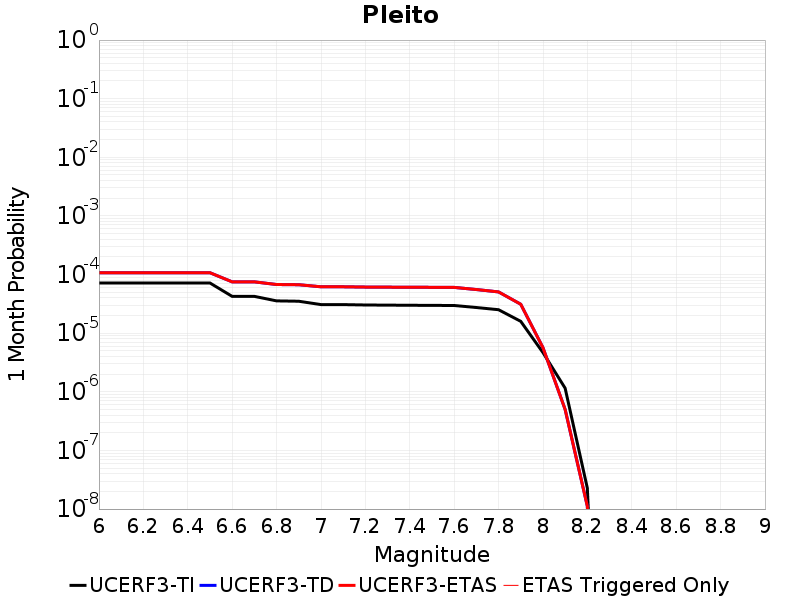 | 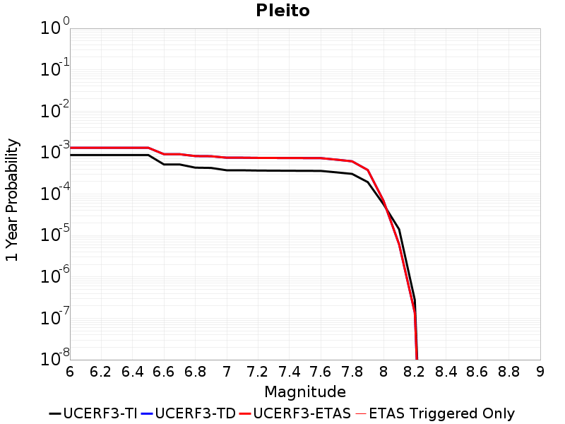 |  |

| Magnitude | 1 wk TI Prob | 1 wk TD Prob | 1 wk ETAS Prob | 1 wk ETAS/TD Gain | 1 wk ETAS Triggered Only | 1 mo TI Prob | 1 mo TD Prob | 1 mo ETAS Prob | 1 mo ETAS/TD Gain | 1 mo ETAS Triggered Only | 1 yr TI Prob | 1 yr TD Prob | 1 yr ETAS Prob | 1 yr ETAS/TD Gain | 1 yr ETAS Triggered Only | 10 yr TI Prob | 10 yr TD Prob | 10 yr ETAS Prob | 10 yr ETAS/TD Gain | 10 yr ETAS Triggered Only |
|-----|-----|-----|-----|-----|-----|-----|-----|-----|-----|-----|-----|-----|-----|-----|-----|-----|-----|-----|-----|-----|
| 6.0 | 1.6763008E-5 | 2.506567E-5 | 2.506567E-5 | 1.0 | 0.0 | 7.183948E-5 | 1.0742028E-4 | 1.0742028E-4 | 1.0 | 0.0 | 8.742947E-4 | 0.0013071294 | 0.0013071294 | 1.0 | 0.0 | 0.00870863 | 0.013106349 | 0.013126087 | 1.001506 | 2.0E-5 |
| 6.1 | 1.6763008E-5 | 2.506567E-5 | 2.506567E-5 | 1.0 | 0.0 | 7.183948E-5 | 1.0742028E-4 | 1.0742028E-4 | 1.0 | 0.0 | 8.742947E-4 | 0.0013071294 | 0.0013071294 | 1.0 | 0.0 | 0.00870863 | 0.013106349 | 0.013126087 | 1.001506 | 2.0E-5 |
| 6.2 | 1.6763008E-5 | 2.506567E-5 | 2.506567E-5 | 1.0 | 0.0 | 7.183948E-5 | 1.0742028E-4 | 1.0742028E-4 | 1.0 | 0.0 | 8.742947E-4 | 0.0013071294 | 0.0013071294 | 1.0 | 0.0 | 0.00870863 | 0.013106349 | 0.013126087 | 1.001506 | 2.0E-5 |
| 6.3 | 1.6763008E-5 | 2.506567E-5 | 2.506567E-5 | 1.0 | 0.0 | 7.183948E-5 | 1.0742028E-4 | 1.0742028E-4 | 1.0 | 0.0 | 8.742947E-4 | 0.0013071294 | 0.0013071294 | 1.0 | 0.0 | 0.00870863 | 0.013106349 | 0.013126087 | 1.001506 | 2.0E-5 |
| 6.4 | 1.6763008E-5 | 2.506567E-5 | 2.506567E-5 | 1.0 | 0.0 | 7.183948E-5 | 1.0742028E-4 | 1.0742028E-4 | 1.0 | 0.0 | 8.742947E-4 | 0.0013071294 | 0.0013071294 | 1.0 | 0.0 | 0.00870863 | 0.013106349 | 0.013126087 | 1.001506 | 2.0E-5 |
| 6.5 | 1.6763008E-5 | 2.506567E-5 | 2.506567E-5 | 1.0 | 0.0 | 7.183948E-5 | 1.0742028E-4 | 1.0742028E-4 | 1.0 | 0.0 | 8.742947E-4 | 0.0013071294 | 0.0013071294 | 1.0 | 0.0 | 0.00870863 | 0.013106349 | 0.013126087 | 1.001506 | 2.0E-5 |
| 6.6 | 9.910213E-6 | 1.7511915E-5 | 1.7511915E-5 | 1.0 | 0.0 | 4.247165E-5 | 7.504893E-5 | 7.504893E-5 | 1.0 | 0.0 | 5.169696E-4 | 9.133414E-4 | 9.133414E-4 | 1.0 | 0.0 | 0.0051576863 | 0.009201407 | 0.009211315 | 1.0010768 | 1.0E-5 |
| 6.7 | 9.910213E-6 | 1.7511915E-5 | 1.7511915E-5 | 1.0 | 0.0 | 4.247165E-5 | 7.504893E-5 | 7.504893E-5 | 1.0 | 0.0 | 5.169696E-4 | 9.133414E-4 | 9.133414E-4 | 1.0 | 0.0 | 0.0051576863 | 0.009201407 | 0.009211315 | 1.0010768 | 1.0E-5 |
| 6.8 | 8.300162E-6 | 1.5770689E-5 | 1.5770689E-5 | 1.0 | 0.0 | 3.557164E-5 | 6.758692E-5 | 6.758692E-5 | 1.0 | 0.0 | 4.3299864E-4 | 8.225616E-4 | 8.225616E-4 | 1.0 | 0.0 | 0.004321559 | 0.008300548 | 0.008310465 | 1.0011947 | 1.0E-5 |
| 6.9 | 8.183114E-6 | 1.5641772E-5 | 1.5641772E-5 | 1.0 | 0.0 | 3.5070017E-5 | 6.7034445E-5 | 6.7034445E-5 | 1.0 | 0.0 | 4.2689382E-4 | 8.1584026E-4 | 8.1584026E-4 | 1.0 | 0.0 | 0.0042607468 | 0.008233834 | 0.008243752 | 1.0012045 | 1.0E-5 |
| 7.0 | 7.1748823E-6 | 1.4425071E-5 | 1.4425071E-5 | 1.0 | 0.0 | 3.0749135E-5 | 6.182027E-5 | 6.182027E-5 | 1.0 | 0.0 | 3.743064E-4 | 7.524024E-4 | 7.524024E-4 | 1.0 | 0.0 | 0.0037367654 | 0.0076034092 | 0.0076133334 | 1.0013052 | 1.0E-5 |
| 7.1 | 7.1671807E-6 | 1.4415401E-5 | 1.4415401E-5 | 1.0 | 0.0 | 3.0716128E-5 | 6.177883E-5 | 6.177883E-5 | 1.0 | 0.0 | 3.7390468E-4 | 7.518982E-4 | 7.518982E-4 | 1.0 | 0.0 | 0.0037327618 | 0.007598402 | 0.0076083257 | 1.001306 | 1.0E-5 |
| 7.2 | 7.0649667E-6 | 1.426173E-5 | 1.426173E-5 | 1.0 | 0.0 | 3.0278077E-5 | 6.112027E-5 | 6.112027E-5 | 1.0 | 0.0 | 3.6857324E-4 | 7.4388576E-4 | 7.4388576E-4 | 1.0 | 0.0 | 0.0036796255 | 0.0075186756 | 0.0075286003 | 1.00132 | 1.0E-5 |
| 7.3 | 7.02082E-6 | 1.4204626E-5 | 1.4204626E-5 | 1.0 | 0.0 | 3.008888E-5 | 6.0875547E-5 | 6.0875547E-5 | 1.0 | 0.0 | 3.6627054E-4 | 7.4090826E-4 | 7.4090826E-4 | 1.0 | 0.0 | 0.0036566744 | 0.007488889 | 0.0074988143 | 1.0013254 | 1.0E-5 |
| 7.4 | 6.987146E-6 | 1.4163871E-5 | 1.4163871E-5 | 1.0 | 0.0 | 2.9944567E-5 | 6.0700895E-5 | 6.0700895E-5 | 1.0 | 0.0 | 3.6451413E-4 | 7.3878333E-4 | 7.3878333E-4 | 1.0 | 0.0 | 0.0036391679 | 0.0074676657 | 0.007477591 | 1.0013291 | 1.0E-5 |
| 7.5 | 6.9494554E-6 | 1.41205355E-5 | 1.41205355E-5 | 1.0 | 0.0 | 2.9783041E-5 | 6.051518E-5 | 6.051518E-5 | 1.0 | 0.0 | 3.625482E-4 | 7.3652377E-4 | 7.3652377E-4 | 1.0 | 0.0 | 0.0036195726 | 0.007445173 | 0.0074550984 | 1.0013331 | 1.0E-5 |
| 7.6 | 6.92694E-6 | 1.4079203E-5 | 1.4079203E-5 | 1.0 | 0.0 | 2.9686547E-5 | 6.0338047E-5 | 6.0338047E-5 | 1.0 | 0.0 | 3.6137376E-4 | 7.3436863E-4 | 7.3436863E-4 | 1.0 | 0.0 | 0.0036078666 | 0.0074237017 | 0.0074336277 | 1.001337 | 1.0E-5 |
| 7.7 | 6.395867E-6 | 1.2945889E-5 | 1.2945889E-5 | 1.0 | 0.0 | 2.741057E-5 | 5.5481203E-5 | 5.5481203E-5 | 1.0 | 0.0 | 3.336726E-4 | 6.7527464E-4 | 6.7527464E-4 | 1.0 | 0.0 | 0.0033317201 | 0.0068361918 | 0.0068461234 | 1.0014528 | 1.0E-5 |
| 7.8 | 5.8664327E-6 | 1.1789529E-5 | 1.1789529E-5 | 1.0 | 0.0 | 2.5141611E-5 | 5.0525574E-5 | 5.0525574E-5 | 1.0 | 0.0 | 3.060561E-4 | 6.1497546E-4 | 6.1497546E-4 | 1.0 | 0.0 | 0.0030563495 | 0.006229571 | 0.0062395087 | 1.0015953 | 1.0E-5 |
| 7.9 | 3.7167474E-6 | 7.267829E-6 | 7.267829E-6 | 1.0 | 0.0 | 1.592882E-5 | 3.114747E-5 | 3.114747E-5 | 1.0 | 0.0 | 1.9391612E-4 | 3.7915458E-4 | 3.7915458E-4 | 1.0 | 0.0 | 0.0019374699 | 0.0038455895 | 0.0038455895 | 1.0 | 0.0 |
| 8.0 | 1.0903841E-6 | 1.3218223E-6 | 1.3218223E-6 | 1.0 | 0.0 | 4.6730665E-6 | 5.6649405E-6 | 5.6649405E-6 | 1.0 | 0.0 | 5.68931E-5 | 6.896848E-5 | 6.896848E-5 | 1.0 | 0.0 | 5.6878536E-4 | 7.1199E-4 | 7.1199E-4 | 1.0 | 0.0 |
| 8.1 | 2.6894583E-7 | 1.1631775E-7 | 1.1631775E-7 | 1.0 | 0.0 | 1.1526245E-6 | 4.9850456E-7 | 4.9850456E-7 | 1.0 | 0.0 | 1.4033113E-5 | 6.069276E-6 | 6.069276E-6 | 1.0 | 0.0 | 1.4032227E-4 | 6.775822E-5 | 6.775822E-5 | 1.0 | 0.0 |
| 8.2 | 5.2967013E-9 | 2.5930653E-9 | 2.5930653E-9 | 1.0 | 0.0 | 2.2700148E-8 | 1.1113139E-8 | 1.1113139E-8 | 1.0 | 0.0 | 2.7637427E-7 | 1.3530246E-7 | 1.3530246E-7 | 1.0 | 0.0 | 2.7637393E-6 | 1.5350266E-6 | 1.5350266E-6 | 1.0 | 0.0 |

## Cucamonga
*[(top)](#table-of-contents)*

| 1 Week | 1 Month | 1 Year | 10 Year |
|-----|-----|-----|-----|
| 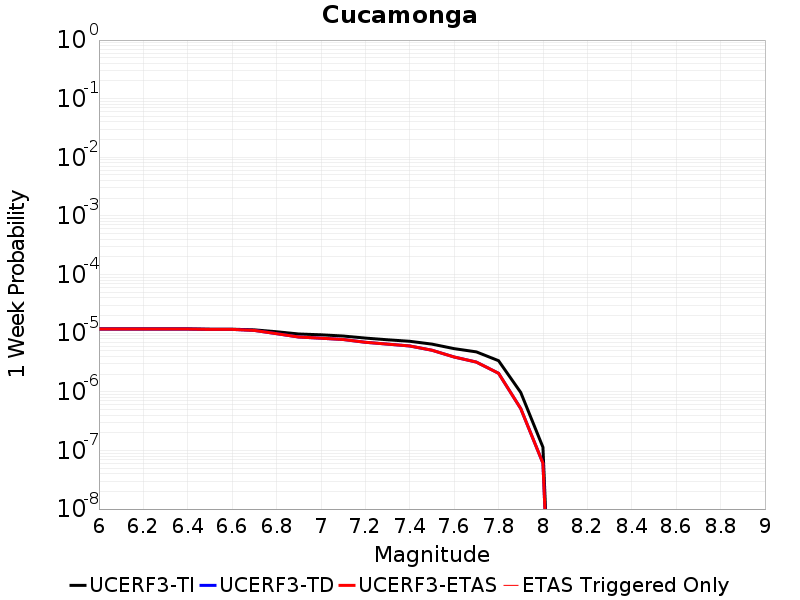 |  | 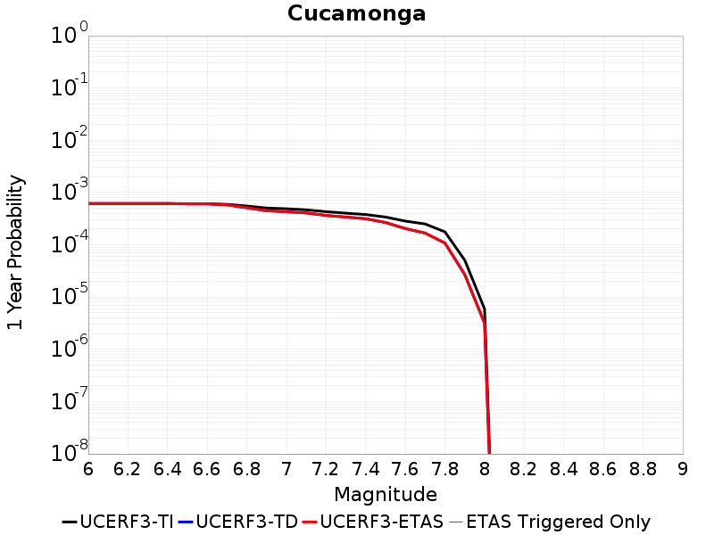 | 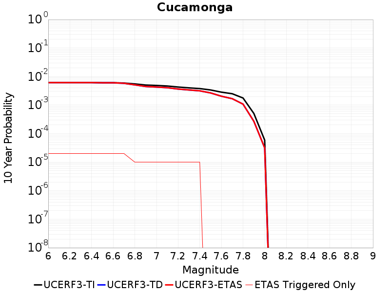 |

| Magnitude | 1 wk TI Prob | 1 wk TD Prob | 1 wk ETAS Prob | 1 wk ETAS/TD Gain | 1 wk ETAS Triggered Only | 1 mo TI Prob | 1 mo TD Prob | 1 mo ETAS Prob | 1 mo ETAS/TD Gain | 1 mo ETAS Triggered Only | 1 yr TI Prob | 1 yr TD Prob | 1 yr ETAS Prob | 1 yr ETAS/TD Gain | 1 yr ETAS Triggered Only | 10 yr TI Prob | 10 yr TD Prob | 10 yr ETAS Prob | 10 yr ETAS/TD Gain | 10 yr ETAS Triggered Only |
|-----|-----|-----|-----|-----|-----|-----|-----|-----|-----|-----|-----|-----|-----|-----|-----|-----|-----|-----|-----|-----|
| 6.0 | 1.1848348E-5 | 1.1768576E-5 | 1.1768576E-5 | 1.0 | 0.0 | 5.0777642E-5 | 5.0435796E-5 | 5.0435796E-5 | 1.0 | 0.0 | 6.180424E-4 | 6.138855E-4 | 6.138855E-4 | 1.0 | 0.0 | 0.0061632637 | 0.006122755 | 0.006142632 | 1.0032465 | 2.0E-5 |
| 6.1 | 1.1848348E-5 | 1.1768576E-5 | 1.1768576E-5 | 1.0 | 0.0 | 5.0777642E-5 | 5.0435796E-5 | 5.0435796E-5 | 1.0 | 0.0 | 6.180424E-4 | 6.138855E-4 | 6.138855E-4 | 1.0 | 0.0 | 0.0061632637 | 0.006122755 | 0.006142632 | 1.0032465 | 2.0E-5 |
| 6.2 | 1.1848348E-5 | 1.1768576E-5 | 1.1768576E-5 | 1.0 | 0.0 | 5.0777642E-5 | 5.0435796E-5 | 5.0435796E-5 | 1.0 | 0.0 | 6.180424E-4 | 6.138855E-4 | 6.138855E-4 | 1.0 | 0.0 | 0.0061632637 | 0.006122755 | 0.006142632 | 1.0032465 | 2.0E-5 |
| 6.3 | 1.1848348E-5 | 1.1768576E-5 | 1.1768576E-5 | 1.0 | 0.0 | 5.0777642E-5 | 5.0435796E-5 | 5.0435796E-5 | 1.0 | 0.0 | 6.180424E-4 | 6.138855E-4 | 6.138855E-4 | 1.0 | 0.0 | 0.0061632637 | 0.006122755 | 0.006142632 | 1.0032465 | 2.0E-5 |
| 6.4 | 1.1848348E-5 | 1.1768576E-5 | 1.1768576E-5 | 1.0 | 0.0 | 5.0777642E-5 | 5.0435796E-5 | 5.0435796E-5 | 1.0 | 0.0 | 6.180424E-4 | 6.138855E-4 | 6.138855E-4 | 1.0 | 0.0 | 0.0061632637 | 0.006122755 | 0.006142632 | 1.0032465 | 2.0E-5 |
| 6.5 | 1.16988695E-5 | 1.1607533E-5 | 1.1607533E-5 | 1.0 | 0.0 | 5.013705E-5 | 4.974564E-5 | 4.974564E-5 | 1.0 | 0.0 | 6.102476E-4 | 6.0548756E-4 | 6.0548756E-4 | 1.0 | 0.0 | 0.006085745 | 0.0060392325 | 0.0060591116 | 1.0032917 | 2.0E-5 |
| 6.6 | 1.16988695E-5 | 1.1607533E-5 | 1.1607533E-5 | 1.0 | 0.0 | 5.013705E-5 | 4.974564E-5 | 4.974564E-5 | 1.0 | 0.0 | 6.102476E-4 | 6.0548756E-4 | 6.0548756E-4 | 1.0 | 0.0 | 0.006085745 | 0.0060392325 | 0.0060591116 | 1.0032917 | 2.0E-5 |
| 6.7 | 1.1397107E-5 | 1.11456675E-5 | 1.11456675E-5 | 1.0 | 0.0 | 4.884383E-5 | 4.7766287E-5 | 4.7766287E-5 | 1.0 | 0.0 | 5.9451134E-4 | 5.8140187E-4 | 5.8140187E-4 | 1.0 | 0.0 | 0.005929234 | 0.005799641 | 0.005819525 | 1.0034285 | 2.0E-5 |
| 6.8 | 1.058387E-5 | 9.812156E-6 | 9.812156E-6 | 1.0 | 0.0 | 4.5358654E-5 | 4.2051426E-5 | 4.2051426E-5 | 1.0 | 0.0 | 5.521017E-4 | 5.11857E-4 | 5.11857E-4 | 1.0 | 0.0 | 0.00550732 | 0.00510747 | 0.0051174187 | 1.0019479 | 1.0E-5 |
| 6.9 | 9.690046E-6 | 8.604309E-6 | 8.604309E-6 | 1.0 | 0.0 | 4.1528107E-5 | 3.687509E-5 | 3.687509E-5 | 1.0 | 0.0 | 5.054874E-4 | 4.4886215E-4 | 4.4886215E-4 | 1.0 | 0.0 | 0.005043391 | 0.0044801715 | 0.004490127 | 1.0022221 | 1.0E-5 |
| 7.0 | 9.381461E-6 | 8.211304E-6 | 8.211304E-6 | 1.0 | 0.0 | 4.020564E-5 | 3.519083E-5 | 3.519083E-5 | 1.0 | 0.0 | 4.893937E-4 | 4.283645E-4 | 4.283645E-4 | 1.0 | 0.0 | 0.0048831734 | 0.0042760028 | 0.00428596 | 1.0023286 | 1.0E-5 |
| 7.1 | 8.946492E-6 | 7.805633E-6 | 7.805633E-6 | 1.0 | 0.0 | 3.8341543E-5 | 3.3452285E-5 | 3.3452285E-5 | 1.0 | 0.0 | 4.667083E-4 | 4.0720578E-4 | 4.0720578E-4 | 1.0 | 0.0 | 0.0046572937 | 0.0040652137 | 0.0040751733 | 1.0024499 | 1.0E-5 |
| 7.2 | 8.251016E-6 | 6.9975063E-6 | 6.9975063E-6 | 1.0 | 0.0 | 3.5361016E-5 | 2.9988969E-5 | 2.9988969E-5 | 1.0 | 0.0 | 4.3043532E-4 | 3.6505476E-4 | 3.6505476E-4 | 1.0 | 0.0 | 0.0042960253 | 0.0036451654 | 0.0036551289 | 1.0027333 | 1.0E-5 |
| 7.3 | 7.717881E-6 | 6.5079043E-6 | 6.5079043E-6 | 1.0 | 0.0 | 3.3076216E-5 | 2.7890721E-5 | 2.7890721E-5 | 1.0 | 0.0 | 4.026285E-4 | 3.3951685E-4 | 3.3951685E-4 | 1.0 | 0.0 | 0.004018998 | 0.0033906004 | 0.0034005668 | 1.0029393 | 1.0E-5 |
| 7.4 | 7.275623E-6 | 6.0527404E-6 | 6.0527404E-6 | 1.0 | 0.0 | 3.118087E-5 | 2.594006E-5 | 2.594006E-5 | 1.0 | 0.0 | 3.7956095E-4 | 3.1577467E-4 | 3.1577467E-4 | 1.0 | 0.0 | 0.0037891332 | 0.0031538794 | 0.003163848 | 1.0031607 | 1.0E-5 |
| 7.5 | 6.5109502E-6 | 5.1190686E-6 | 5.1190686E-6 | 1.0 | 0.0 | 2.7903774E-5 | 2.1938682E-5 | 2.1938682E-5 | 1.0 | 0.0 | 3.3967546E-4 | 2.6707086E-4 | 2.6707086E-4 | 1.0 | 0.0 | 0.0033915674 | 0.0026681067 | 0.0026681067 | 1.0 | 0.0 |
| 7.6 | 5.4495326E-6 | 3.9250554E-6 | 3.9250554E-6 | 1.0 | 0.0 | 2.335493E-5 | 1.6821557E-5 | 1.6821557E-5 | 1.0 | 0.0 | 2.8430918E-4 | 2.0478327E-4 | 2.0478327E-4 | 1.0 | 0.0 | 0.0028394572 | 0.0020465513 | 0.0020465513 | 1.0 | 0.0 |
| 7.7 | 4.7997164E-6 | 3.2151004E-6 | 3.2151004E-6 | 1.0 | 0.0 | 2.057005E-5 | 1.3778929E-5 | 1.3778929E-5 | 1.0 | 0.0 | 2.504116E-4 | 1.6774559E-4 | 1.6774559E-4 | 1.0 | 0.0 | 0.002501296 | 0.0016768151 | 0.0016768151 | 1.0 | 0.0 |
| 7.8 | 3.3941733E-6 | 2.0719092E-6 | 2.0719092E-6 | 1.0 | 0.0 | 1.4546376E-5 | 8.879581E-6 | 8.879581E-6 | 1.0 | 0.0 | 1.7708774E-4 | 1.0810355E-4 | 1.0810355E-4 | 1.0 | 0.0 | 0.0017694668 | 0.0010806373 | 0.0010806373 | 1.0 | 0.0 |
| 7.9 | 9.750552E-7 | 5.1730893E-7 | 5.1730893E-7 | 1.0 | 0.0 | 4.178801E-6 | 2.2170366E-6 | 2.2170366E-6 | 1.0 | 0.0 | 5.0875715E-5 | 2.699209E-5 | 2.699209E-5 | 1.0 | 0.0 | 5.086407E-4 | 2.6988852E-4 | 2.6988852E-4 | 1.0 | 0.0 |
| 8.0 | 1.133857E-7 | 6.068945E-8 | 6.068945E-8 | 1.0 | 0.0 | 4.8593864E-7 | 2.6009764E-7 | 2.6009764E-7 | 1.0 | 0.0 | 5.9162867E-6 | 3.166684E-6 | 3.166684E-6 | 1.0 | 0.0 | 5.916129E-5 | 3.1666408E-5 | 3.1666408E-5 | 1.0 | 0.0 |

## Santa Cruz Catalina Ridge alt1
*[(top)](#table-of-contents)*

| 1 Week | 1 Month | 1 Year | 10 Year |
|-----|-----|-----|-----|
|  |  |  |  |

| Magnitude | 1 wk TI Prob | 1 wk TD Prob | 1 wk ETAS Prob | 1 wk ETAS/TD Gain | 1 wk ETAS Triggered Only | 1 mo TI Prob | 1 mo TD Prob | 1 mo ETAS Prob | 1 mo ETAS/TD Gain | 1 mo ETAS Triggered Only | 1 yr TI Prob | 1 yr TD Prob | 1 yr ETAS Prob | 1 yr ETAS/TD Gain | 1 yr ETAS Triggered Only | 10 yr TI Prob | 10 yr TD Prob | 10 yr ETAS Prob | 10 yr ETAS/TD Gain | 10 yr ETAS Triggered Only |
|-----|-----|-----|-----|-----|-----|-----|-----|-----|-----|-----|-----|-----|-----|-----|-----|-----|-----|-----|-----|-----|
| 6.0 | 3.2833184E-5 | 3.6583315E-5 | 3.6583315E-5 | 1.0 | 0.0 | 1.4070606E-4 | 1.5677715E-4 | 1.5677715E-4 | 1.0 | 0.0 | 0.00171175 | 0.0019072574 | 0.0019272192 | 1.0104662 | 2.0E-5 | 0.016986247 | 0.018925821 | 0.018945443 | 1.0010368 | 2.0E-5 |
| 6.1 | 1.9835548E-5 | 2.1671389E-5 | 2.1671389E-5 | 1.0 | 0.0 | 8.500672E-5 | 9.287419E-5 | 9.287419E-5 | 1.0 | 0.0 | 0.0010344655 | 0.0011301768 | 0.0011401656 | 1.0088382 | 1.0E-5 | 0.010296632 | 0.01124643 | 0.011256318 | 1.0008792 | 1.0E-5 |
| 6.2 | 1.9835548E-5 | 2.1671389E-5 | 2.1671389E-5 | 1.0 | 0.0 | 8.500672E-5 | 9.287419E-5 | 9.287419E-5 | 1.0 | 0.0 | 0.0010344655 | 0.0011301768 | 0.0011401656 | 1.0088382 | 1.0E-5 | 0.010296632 | 0.01124643 | 0.011256318 | 1.0008792 | 1.0E-5 |
| 6.3 | 1.5728183E-5 | 1.7042355E-5 | 1.7042355E-5 | 1.0 | 0.0 | 6.7404755E-5 | 7.303666E-5 | 7.303666E-5 | 1.0 | 0.0 | 8.2034385E-4 | 8.888646E-4 | 8.9885574E-4 | 1.0112404 | 1.0E-5 | 0.008173222 | 0.008853775 | 0.008863687 | 1.0011195 | 1.0E-5 |
| 6.4 | 1.5728183E-5 | 1.7042355E-5 | 1.7042355E-5 | 1.0 | 0.0 | 6.7404755E-5 | 7.303666E-5 | 7.303666E-5 | 1.0 | 0.0 | 8.2034385E-4 | 8.888646E-4 | 8.9885574E-4 | 1.0112404 | 1.0E-5 | 0.008173222 | 0.008853775 | 0.008863687 | 1.0011195 | 1.0E-5 |
| 6.5 | 1.3707734E-5 | 1.4801484E-5 | 1.4801484E-5 | 1.0 | 0.0 | 5.8746107E-5 | 6.343341E-5 | 6.343341E-5 | 1.0 | 0.0 | 7.1499916E-4 | 7.720316E-4 | 7.8202394E-4 | 1.0129428 | 1.0E-5 | 0.0071270303 | 0.007693895 | 0.007703818 | 1.0012897 | 1.0E-5 |
| 6.6 | 1.2539813E-5 | 1.3516422E-5 | 1.3516422E-5 | 1.0 | 0.0 | 5.3740947E-5 | 5.7926252E-5 | 5.7926252E-5 | 1.0 | 0.0 | 6.540996E-4 | 7.0502656E-4 | 7.1501953E-4 | 1.0141739 | 1.0E-5 | 0.0065217763 | 0.0070282025 | 0.0070381323 | 1.0014129 | 1.0E-5 |
| 6.7 | 1.1504083E-5 | 1.2382947E-5 | 1.2382947E-5 | 1.0 | 0.0 | 4.930228E-5 | 5.3068707E-5 | 5.3068707E-5 | 1.0 | 0.0 | 6.0008996E-4 | 6.45922E-4 | 6.5591553E-4 | 1.0154717 | 1.0E-5 | 0.005984721 | 0.006440675 | 0.0064506107 | 1.0015427 | 1.0E-5 |
| 6.8 | 1.012739E-5 | 1.0881845E-5 | 1.0881845E-5 | 1.0 | 0.0 | 4.340238E-5 | 4.6635654E-5 | 4.6635654E-5 | 1.0 | 0.0 | 5.282958E-4 | 5.676427E-4 | 5.77637E-4 | 1.0176067 | 1.0E-5 | 0.0052704164 | 0.0056620967 | 0.00567204 | 1.0017561 | 1.0E-5 |
| 6.9 | 8.9607865E-6 | 9.613238E-6 | 9.613238E-6 | 1.0 | 0.0 | 3.8402806E-5 | 4.119895E-5 | 4.119895E-5 | 1.0 | 0.0 | 4.6745385E-4 | 5.014828E-4 | 5.014828E-4 | 1.0 | 0.0 | 0.0046647177 | 0.0050036316 | 0.0050036316 | 1.0 | 0.0 |
| 7.0 | 8.046829E-6 | 8.623383E-6 | 8.623383E-6 | 1.0 | 0.0 | 3.4485955E-5 | 3.6956837E-5 | 3.6956837E-5 | 1.0 | 0.0 | 4.1978562E-4 | 4.498574E-4 | 4.498574E-4 | 1.0 | 0.0 | 0.004189935 | 0.0044895583 | 0.0044895583 | 1.0 | 0.0 |
| 7.1 | 7.136131E-6 | 7.640838E-6 | 7.640838E-6 | 1.0 | 0.0 | 3.0583058E-5 | 3.274604E-5 | 3.274604E-5 | 1.0 | 0.0 | 3.7228514E-4 | 3.986108E-4 | 3.986108E-4 | 1.0 | 0.0 | 0.0037166206 | 0.0039790347 | 0.0039790347 | 1.0 | 0.0 |
| 7.2 | 6.362014E-6 | 6.807767E-6 | 6.807767E-6 | 1.0 | 0.0 | 2.726549E-5 | 2.917582E-5 | 2.917582E-5 | 1.0 | 0.0 | 3.3190678E-4 | 3.5515838E-4 | 3.5515838E-4 | 1.0 | 0.0 | 0.0033141149 | 0.0035459762 | 0.0035459762 | 1.0 | 0.0 |
| 7.3 | 5.004101E-6 | 5.353919E-6 | 5.353919E-6 | 1.0 | 0.0 | 2.1445969E-5 | 2.2945167E-5 | 2.2945167E-5 | 1.0 | 0.0 | 2.6107338E-4 | 2.7932212E-4 | 2.7932212E-4 | 1.0 | 0.0 | 0.002607669 | 0.0027897654 | 0.0027897654 | 1.0 | 0.0 |
| 7.4 | 3.4901443E-6 | 3.7335865E-6 | 3.7335865E-6 | 1.0 | 0.0 | 1.4957676E-5 | 1.600099E-5 | 1.600099E-5 | 1.0 | 0.0 | 1.8209449E-4 | 1.9479501E-4 | 1.9479501E-4 | 1.0 | 0.0 | 0.0018194534 | 0.0019462813 | 0.0019462813 | 1.0 | 0.0 |
| 7.5 | 1.1215045E-6 | 1.1898146E-6 | 1.1898146E-6 | 1.0 | 0.0 | 4.806439E-6 | 5.0991957E-6 | 5.0991957E-6 | 1.0 | 0.0 | 5.851682E-5 | 6.2080966E-5 | 6.2080966E-5 | 1.0 | 0.0 | 5.850142E-4 | 6.206393E-4 | 6.206393E-4 | 1.0 | 0.0 |
| 7.6 | 2.8599047E-7 | 2.996038E-7 | 2.996038E-7 | 1.0 | 0.0 | 1.2256729E-6 | 1.2840156E-6 | 1.2840156E-6 | 1.0 | 0.0 | 1.4922465E-5 | 1.563278E-5 | 1.563278E-5 | 1.0 | 0.0 | 1.4921463E-4 | 1.5631695E-4 | 1.5631695E-4 | 1.0 | 0.0 |
| 7.7 | 2.0781519E-7 | 2.1750286E-7 | 2.1750286E-7 | 1.0 | 0.0 | 8.906362E-7 | 9.3215476E-7 | 9.3215476E-7 | 1.0 | 0.0 | 1.08434415E-5 | 1.1348927E-5 | 1.1348927E-5 | 1.0 | 0.0 | 1.0842913E-4 | 1.1348356E-4 | 1.1348356E-4 | 1.0 | 0.0 |
| 7.8 | 3.614776E-8 | 3.7650217E-8 | 3.7650217E-8 | 1.0 | 0.0 | 1.5491896E-7 | 1.6135807E-7 | 1.6135807E-7 | 1.0 | 0.0 | 1.8861368E-6 | 1.9645329E-6 | 1.9645329E-6 | 1.0 | 0.0 | 1.8861208E-5 | 1.9645167E-5 | 1.9645167E-5 | 1.0 | 0.0 |

## Sheephole
*[(top)](#table-of-contents)*

| 1 Week | 1 Month | 1 Year | 10 Year |
|-----|-----|-----|-----|
| 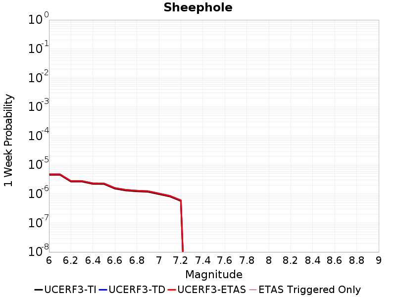 |  |  |  |

| Magnitude | 1 wk TI Prob | 1 wk TD Prob | 1 wk ETAS Prob | 1 wk ETAS/TD Gain | 1 wk ETAS Triggered Only | 1 mo TI Prob | 1 mo TD Prob | 1 mo ETAS Prob | 1 mo ETAS/TD Gain | 1 mo ETAS Triggered Only | 1 yr TI Prob | 1 yr TD Prob | 1 yr ETAS Prob | 1 yr ETAS/TD Gain | 1 yr ETAS Triggered Only | 10 yr TI Prob | 10 yr TD Prob | 10 yr ETAS Prob | 10 yr ETAS/TD Gain | 10 yr ETAS Triggered Only |
|-----|-----|-----|-----|-----|-----|-----|-----|-----|-----|-----|-----|-----|-----|-----|-----|-----|-----|-----|-----|-----|
| 6.0 | 4.5579695E-6 | 4.7423923E-6 | 4.7423923E-6 | 1.0 | 0.0 | 1.9534009E-5 | 2.0324413E-5 | 2.0324413E-5 | 1.0 | 0.0 | 2.3780059E-4 | 2.4742718E-4 | 2.574247E-4 | 1.040406 | 1.0E-5 | 0.0023754628 | 0.0024720614 | 0.002492012 | 1.0080705 | 2.0E-5 |
| 6.1 | 4.5579695E-6 | 4.7423923E-6 | 4.7423923E-6 | 1.0 | 0.0 | 1.9534009E-5 | 2.0324413E-5 | 2.0324413E-5 | 1.0 | 0.0 | 2.3780059E-4 | 2.4742718E-4 | 2.574247E-4 | 1.040406 | 1.0E-5 | 0.0023754628 | 0.0024720614 | 0.002492012 | 1.0080705 | 2.0E-5 |
| 6.2 | 2.6677674E-6 | 2.788135E-6 | 2.788135E-6 | 1.0 | 0.0 | 1.1433239E-5 | 1.1949101E-5 | 1.1949101E-5 | 1.0 | 0.0 | 1.3919079E-4 | 1.4547167E-4 | 1.5547022E-4 | 1.0687319 | 1.0E-5 | 0.0013910364 | 0.0014538703 | 0.0014638558 | 1.0068682 | 1.0E-5 |
| 6.3 | 2.6677674E-6 | 2.788135E-6 | 2.788135E-6 | 1.0 | 0.0 | 1.1433239E-5 | 1.1949101E-5 | 1.1949101E-5 | 1.0 | 0.0 | 1.3919079E-4 | 1.4547167E-4 | 1.5547022E-4 | 1.0687319 | 1.0E-5 | 0.0013910364 | 0.0014538703 | 0.0014638558 | 1.0068682 | 1.0E-5 |
| 6.4 | 2.2159759E-6 | 2.323542E-6 | 2.323542E-6 | 1.0 | 0.0 | 9.497005E-6 | 9.958004E-6 | 9.958004E-6 | 1.0 | 0.0 | 1.156199E-4 | 1.21232755E-4 | 1.3123154E-4 | 1.0824759 | 1.0E-5 | 0.0011555976 | 0.0012117457 | 0.0012217335 | 1.0082426 | 1.0E-5 |
| 6.5 | 2.1986082E-6 | 2.3054176E-6 | 2.3054176E-6 | 1.0 | 0.0 | 9.4225725E-6 | 9.880328E-6 | 9.880328E-6 | 1.0 | 0.0 | 1.1471378E-4 | 1.2028717E-4 | 1.3028596E-4 | 1.0831244 | 1.0E-5 | 0.0011465458 | 0.0012023 | 0.0012122879 | 1.0083073 | 1.0E-5 |
| 6.6 | 1.5232331E-6 | 1.6023812E-6 | 1.6023812E-6 | 1.0 | 0.0 | 6.5281256E-6 | 6.867331E-6 | 6.867331E-6 | 1.0 | 0.0 | 7.947703E-5 | 8.360674E-5 | 9.36059E-5 | 1.1195976 | 1.0E-5 | 7.9448614E-4 | 8.357716E-4 | 8.4576325E-4 | 1.011955 | 1.0E-5 |
| 6.7 | 1.3137362E-6 | 1.3832492E-6 | 1.3832492E-6 | 1.0 | 0.0 | 5.6302856E-6 | 5.9281983E-6 | 5.9281983E-6 | 1.0 | 0.0 | 6.854657E-5 | 7.217356E-5 | 8.2172846E-5 | 1.1385449 | 1.0E-5 | 6.8525434E-4 | 7.2151516E-4 | 7.3150796E-4 | 1.0138497 | 1.0E-5 |
| 6.8 | 1.2275751E-6 | 1.2926877E-6 | 1.2926877E-6 | 1.0 | 0.0 | 5.2610258E-6 | 5.5400787E-6 | 5.5400787E-6 | 1.0 | 0.0 | 6.4051106E-5 | 6.7448505E-5 | 7.744783E-5 | 1.1482513 | 1.0E-5 | 6.4032647E-4 | 6.742937E-4 | 6.84287E-4 | 1.0148203 | 1.0E-5 |
| 6.9 | 1.1837088E-6 | 1.2464906E-6 | 1.2464906E-6 | 1.0 | 0.0 | 5.0730278E-6 | 5.342092E-6 | 5.342092E-6 | 1.0 | 0.0 | 6.176237E-5 | 6.503816E-5 | 7.503752E-5 | 1.1537459 | 1.0E-5 | 6.17452E-4 | 6.502045E-4 | 6.60198E-4 | 1.0153698 | 1.0E-5 |
| 7.0 | 9.849371E-7 | 1.0369506E-6 | 1.0369506E-6 | 1.0 | 0.0 | 4.2211523E-6 | 4.444067E-6 | 4.444067E-6 | 1.0 | 0.0 | 5.1391315E-5 | 5.410528E-5 | 6.410474E-5 | 1.1848148 | 1.0E-5 | 5.137943E-4 | 5.409311E-4 | 5.5092573E-4 | 1.0184766 | 1.0E-5 |
| 7.1 | 8.1643645E-7 | 8.5943293E-7 | 8.5943293E-7 | 1.0 | 0.0 | 3.4990085E-6 | 3.6832791E-6 | 3.6832791E-6 | 1.0 | 0.0 | 4.2599597E-5 | 4.484309E-5 | 5.484264E-5 | 1.2229898 | 1.0E-5 | 4.259143E-4 | 4.4834905E-4 | 4.5834456E-4 | 1.022294 | 1.0E-5 |
| 7.2 | 5.7295756E-7 | 6.031369E-7 | 6.031369E-7 | 1.0 | 0.0 | 2.45553E-6 | 2.5848703E-6 | 2.5848703E-6 | 1.0 | 0.0 | 2.9895667E-5 | 3.147041E-5 | 3.147041E-5 | 1.0 | 0.0 | 2.9891645E-4 | 3.1466622E-4 | 3.1466622E-4 | 1.0 | 0.0 |

## San Jacinto (Coyote Creek)
*[(top)](#table-of-contents)*

| 1 Week | 1 Month | 1 Year | 10 Year |
|-----|-----|-----|-----|
|  |  | 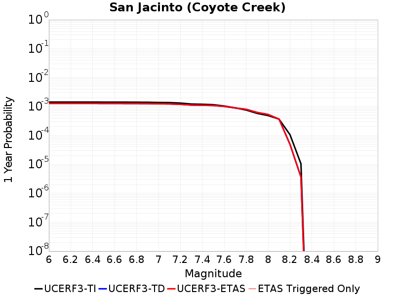 |  |

| Magnitude | 1 wk TI Prob | 1 wk TD Prob | 1 wk ETAS Prob | 1 wk ETAS/TD Gain | 1 wk ETAS Triggered Only | 1 mo TI Prob | 1 mo TD Prob | 1 mo ETAS Prob | 1 mo ETAS/TD Gain | 1 mo ETAS Triggered Only | 1 yr TI Prob | 1 yr TD Prob | 1 yr ETAS Prob | 1 yr ETAS/TD Gain | 1 yr ETAS Triggered Only | 10 yr TI Prob | 10 yr TD Prob | 10 yr ETAS Prob | 10 yr ETAS/TD Gain | 10 yr ETAS Triggered Only |
|-----|-----|-----|-----|-----|-----|-----|-----|-----|-----|-----|-----|-----|-----|-----|-----|-----|-----|-----|-----|-----|
| 6.0 | 2.7374346E-5 | 2.4545796E-5 | 2.4545796E-5 | 1.0 | 0.0 | 1.1731335E-4 | 1.0519204E-4 | 1.0519204E-4 | 1.0 | 0.0 | 0.0014273542 | 0.0012799633 | 0.0012899505 | 1.0078027 | 1.0E-5 | 0.01418221 | 0.013136459 | 0.013156196 | 1.0015025 | 2.0E-5 |
| 6.1 | 2.7374346E-5 | 2.4545796E-5 | 2.4545796E-5 | 1.0 | 0.0 | 1.1731335E-4 | 1.0519204E-4 | 1.0519204E-4 | 1.0 | 0.0 | 0.0014273542 | 0.0012799633 | 0.0012899505 | 1.0078027 | 1.0E-5 | 0.01418221 | 0.013136459 | 0.013156196 | 1.0015025 | 2.0E-5 |
| 6.2 | 2.7374346E-5 | 2.4545796E-5 | 2.4545796E-5 | 1.0 | 0.0 | 1.1731335E-4 | 1.0519204E-4 | 1.0519204E-4 | 1.0 | 0.0 | 0.0014273542 | 0.0012799633 | 0.0012899505 | 1.0078027 | 1.0E-5 | 0.01418221 | 0.013136459 | 0.013156196 | 1.0015025 | 2.0E-5 |
| 6.3 | 2.7374346E-5 | 2.4545796E-5 | 2.4545796E-5 | 1.0 | 0.0 | 1.1731335E-4 | 1.0519204E-4 | 1.0519204E-4 | 1.0 | 0.0 | 0.0014273542 | 0.0012799633 | 0.0012899505 | 1.0078027 | 1.0E-5 | 0.01418221 | 0.013136459 | 0.013156196 | 1.0015025 | 2.0E-5 |
| 6.4 | 2.7374346E-5 | 2.4545796E-5 | 2.4545796E-5 | 1.0 | 0.0 | 1.1731335E-4 | 1.0519204E-4 | 1.0519204E-4 | 1.0 | 0.0 | 0.0014273542 | 0.0012799633 | 0.0012899505 | 1.0078027 | 1.0E-5 | 0.01418221 | 0.013136459 | 0.013156196 | 1.0015025 | 2.0E-5 |
| 6.5 | 2.7282445E-5 | 2.4431714E-5 | 2.4431714E-5 | 1.0 | 0.0 | 1.16919524E-4 | 1.04703155E-4 | 1.04703155E-4 | 1.0 | 0.0 | 0.0014225657 | 0.0012740182 | 0.0012840055 | 1.0078392 | 1.0E-5 | 0.014134934 | 0.013077716 | 0.013097455 | 1.0015093 | 2.0E-5 |
| 6.6 | 2.7282445E-5 | 2.4431714E-5 | 2.4431714E-5 | 1.0 | 0.0 | 1.16919524E-4 | 1.04703155E-4 | 1.04703155E-4 | 1.0 | 0.0 | 0.0014225657 | 0.0012740182 | 0.0012840055 | 1.0078392 | 1.0E-5 | 0.014134934 | 0.013077716 | 0.013097455 | 1.0015093 | 2.0E-5 |
| 6.7 | 2.7216198E-5 | 2.4356728E-5 | 2.4356728E-5 | 1.0 | 0.0 | 1.1663563E-4 | 1.0438181E-4 | 1.0438181E-4 | 1.0 | 0.0 | 0.0014191137 | 0.0012701104 | 0.0012800978 | 1.0078633 | 1.0E-5 | 0.014100855 | 0.013039081 | 0.013058821 | 1.0015138 | 2.0E-5 |
| 6.8 | 2.7078617E-5 | 2.4273731E-5 | 2.4273731E-5 | 1.0 | 0.0 | 1.1604605E-4 | 1.0402614E-4 | 1.0402614E-4 | 1.0 | 0.0 | 0.001411945 | 0.0012657852 | 0.0012757725 | 1.0078902 | 1.0E-5 | 0.014030075 | 0.012996117 | 0.013015857 | 1.001519 | 2.0E-5 |
| 6.9 | 2.6982952E-5 | 2.419302E-5 | 2.419302E-5 | 1.0 | 0.0 | 1.15636096E-4 | 1.03680264E-4 | 1.03680264E-4 | 1.0 | 0.0 | 0.0014069602 | 0.001261579 | 0.0012715664 | 1.0079166 | 1.0E-5 | 0.013980856 | 0.012954292 | 0.012974032 | 1.0015239 | 2.0E-5 |
| 7.0 | 2.6449972E-5 | 2.376921E-5 | 2.376921E-5 | 1.0 | 0.0 | 1.1335209E-4 | 1.01864076E-4 | 1.01864076E-4 | 1.0 | 0.0 | 0.001379188 | 0.0012394922 | 0.0012494798 | 1.0080578 | 1.0E-5 | 0.0137065975 | 0.012735264 | 0.012755009 | 1.0015504 | 2.0E-5 |
| 7.1 | 2.6257849E-5 | 2.3594865E-5 | 2.3594865E-5 | 1.0 | 0.0 | 1.1252879E-4 | 1.01116944E-4 | 1.01116944E-4 | 1.0 | 0.0 | 0.0013691769 | 0.0012304062 | 0.0012403938 | 1.0081174 | 1.0E-5 | 0.013607717 | 0.01264496 | 0.012664706 | 1.0015616 | 2.0E-5 |
| 7.2 | 2.5270041E-5 | 2.2786966E-5 | 2.2786966E-5 | 1.0 | 0.0 | 1.0829568E-4 | 9.765479E-5 | 9.765479E-5 | 1.0 | 0.0 | 0.0013177024 | 0.001188301 | 0.0011982891 | 1.0084053 | 1.0E-5 | 0.013099162 | 0.012224651 | 0.012244406 | 1.001616 | 2.0E-5 |
| 7.3 | 2.339701E-5 | 2.1513833E-5 | 2.1513833E-5 | 1.0 | 0.0 | 1.0026905E-4 | 9.21989E-5 | 9.21989E-5 | 1.0 | 0.0 | 0.001220092 | 0.0011219457 | 0.0011319345 | 1.0089031 | 1.0E-5 | 0.012134149 | 0.011561145 | 0.011580914 | 1.0017099 | 2.0E-5 |
| 7.4 | 2.296333E-5 | 2.1242913E-5 | 2.1242913E-5 | 1.0 | 0.0 | 9.841056E-5 | 9.1037895E-5 | 9.1037895E-5 | 1.0 | 0.0 | 0.0011974899 | 0.0011078248 | 0.0011178138 | 1.0090168 | 1.0E-5 | 0.011910575 | 0.01141961 | 0.011439381 | 1.0017314 | 2.0E-5 |
| 7.5 | 2.2188895E-5 | 2.0762136E-5 | 2.0762136E-5 | 1.0 | 0.0 | 9.50918E-5 | 8.8977555E-5 | 8.8977555E-5 | 1.0 | 0.0 | 0.0011571277 | 0.0010827655 | 0.0010927547 | 1.0092256 | 1.0E-5 | 0.011511209 | 0.011167396 | 0.0111871725 | 1.001771 | 2.0E-5 |
| 7.6 | 2.0013189E-5 | 1.933566E-5 | 1.933566E-5 | 1.0 | 0.0 | 8.5767984E-5 | 8.286449E-5 | 8.286449E-5 | 1.0 | 0.0 | 0.001043725 | 0.0010084101 | 0.0010184 | 1.0099066 | 1.0E-5 | 0.010388365 | 0.010418833 | 0.010438625 | 1.0018996 | 2.0E-5 |
| 7.7 | 1.7230794E-5 | 1.7107139E-5 | 1.7107139E-5 | 1.0 | 0.0 | 7.384417E-5 | 7.331425E-5 | 7.331425E-5 | 1.0 | 0.0 | 8.986819E-4 | 8.9223636E-4 | 9.022274E-4 | 1.0111978 | 1.0E-5 | 0.008950562 | 0.009252628 | 0.009272443 | 1.0021416 | 2.0E-5 |
| 7.8 | 1.4478809E-5 | 1.5340103E-5 | 1.5340103E-5 | 1.0 | 0.0 | 6.205057E-5 | 6.5741646E-5 | 6.5741646E-5 | 1.0 | 0.0 | 7.552038E-4 | 8.0011133E-4 | 8.101033E-4 | 1.0124882 | 1.0E-5 | 0.0075264242 | 0.008323951 | 0.008343784 | 1.0023828 | 2.0E-5 |
| 7.9 | 1.1114467E-5 | 1.1950163E-5 | 1.1950163E-5 | 1.0 | 0.0 | 4.7632562E-5 | 5.121398E-5 | 5.121398E-5 | 1.0 | 0.0 | 5.797721E-4 | 6.233525E-4 | 6.333462E-4 | 1.0160323 | 1.0E-5 | 0.0057826187 | 0.0065404153 | 0.0065602846 | 1.0030379 | 2.0E-5 |
| 8.0 | 9.327402E-6 | 1.0175201E-5 | 1.0175201E-5 | 1.0 | 0.0 | 3.9973966E-5 | 4.360728E-5 | 4.360728E-5 | 1.0 | 0.0 | 4.8657437E-4 | 5.307899E-4 | 5.4078456E-4 | 1.0188298 | 1.0E-5 | 0.0048551033 | 0.005595026 | 0.0056149145 | 1.0035546 | 2.0E-5 |
| 8.1 | 7.0235833E-6 | 7.0300584E-6 | 7.0300584E-6 | 1.0 | 0.0 | 3.0100724E-5 | 3.0128478E-5 | 3.0128478E-5 | 1.0 | 0.0 | 3.664147E-4 | 3.66753E-4 | 3.66753E-4 | 1.0 | 0.0 | 0.003658111 | 0.0038948301 | 0.0038948301 | 1.0 | 0.0 |
| 8.2 | 2.0358202E-6 | 9.4085266E-7 | 9.4085266E-7 | 1.0 | 0.0 | 8.724915E-6 | 4.0322197E-6 | 4.0322197E-6 | 1.0 | 0.0 | 1.06220665E-4 | 4.909119E-5 | 4.909119E-5 | 1.0 | 0.0 | 0.001061699 | 5.558016E-4 | 5.558016E-4 | 1.0 | 0.0 |
| 8.3 | 2.0051264E-7 | 6.995083E-8 | 6.995083E-8 | 1.0 | 0.0 | 8.5933965E-7 | 2.9978924E-7 | 2.9978924E-7 | 1.0 | 0.0 | 1.046241E-5 | 3.6499282E-6 | 3.6499282E-6 | 1.0 | 0.0 | 1.0461917E-4 | 4.2317584E-5 | 4.2317584E-5 | 1.0 | 0.0 |

## Kern Canyon (South Kern) 2011
*[(top)](#table-of-contents)*

| 1 Week | 1 Month | 1 Year | 10 Year |
|-----|-----|-----|-----|
|  | 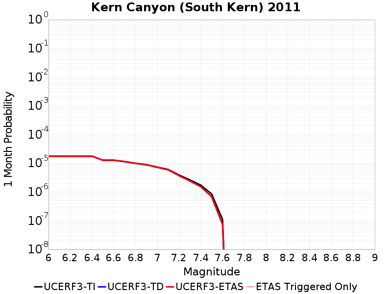 | 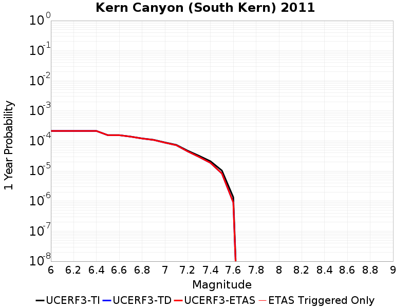 |  |

| Magnitude | 1 wk TI Prob | 1 wk TD Prob | 1 wk ETAS Prob | 1 wk ETAS/TD Gain | 1 wk ETAS Triggered Only | 1 mo TI Prob | 1 mo TD Prob | 1 mo ETAS Prob | 1 mo ETAS/TD Gain | 1 mo ETAS Triggered Only | 1 yr TI Prob | 1 yr TD Prob | 1 yr ETAS Prob | 1 yr ETAS/TD Gain | 1 yr ETAS Triggered Only | 10 yr TI Prob | 10 yr TD Prob | 10 yr ETAS Prob | 10 yr ETAS/TD Gain | 10 yr ETAS Triggered Only |
|-----|-----|-----|-----|-----|-----|-----|-----|-----|-----|-----|-----|-----|-----|-----|-----|-----|-----|-----|-----|-----|
| 6.0 | 4.105075E-6 | 4.1141843E-6 | 4.1141843E-6 | 1.0 | 0.0 | 1.7593058E-5 | 1.7632103E-5 | 1.7632103E-5 | 1.0 | 0.0 | 2.1417443E-4 | 2.1465035E-4 | 2.246482E-4 | 1.0465773 | 1.0E-5 | 0.0021396813 | 0.002144494 | 0.0021644512 | 1.0093062 | 2.0E-5 |
| 6.1 | 4.105075E-6 | 4.1141843E-6 | 4.1141843E-6 | 1.0 | 0.0 | 1.7593058E-5 | 1.7632103E-5 | 1.7632103E-5 | 1.0 | 0.0 | 2.1417443E-4 | 2.1465035E-4 | 2.246482E-4 | 1.0465773 | 1.0E-5 | 0.0021396813 | 0.002144494 | 0.0021644512 | 1.0093062 | 2.0E-5 |
| 6.2 | 4.105075E-6 | 4.1141843E-6 | 4.1141843E-6 | 1.0 | 0.0 | 1.7593058E-5 | 1.7632103E-5 | 1.7632103E-5 | 1.0 | 0.0 | 2.1417443E-4 | 2.1465035E-4 | 2.246482E-4 | 1.0465773 | 1.0E-5 | 0.0021396813 | 0.002144494 | 0.0021644512 | 1.0093062 | 2.0E-5 |
| 6.3 | 4.105075E-6 | 4.1141843E-6 | 4.1141843E-6 | 1.0 | 0.0 | 1.7593058E-5 | 1.7632103E-5 | 1.7632103E-5 | 1.0 | 0.0 | 2.1417443E-4 | 2.1465035E-4 | 2.246482E-4 | 1.0465773 | 1.0E-5 | 0.0021396813 | 0.002144494 | 0.0021644512 | 1.0093062 | 2.0E-5 |
| 6.4 | 4.105075E-6 | 4.1141843E-6 | 4.1141843E-6 | 1.0 | 0.0 | 1.7593058E-5 | 1.7632103E-5 | 1.7632103E-5 | 1.0 | 0.0 | 2.1417443E-4 | 2.1465035E-4 | 2.246482E-4 | 1.0465773 | 1.0E-5 | 0.0021396813 | 0.002144494 | 0.0021644512 | 1.0093062 | 2.0E-5 |
| 6.5 | 2.9849807E-6 | 2.9734892E-6 | 2.9734892E-6 | 1.0 | 0.0 | 1.2792712E-5 | 1.2743464E-5 | 1.2743464E-5 | 1.0 | 0.0 | 1.5574014E-4 | 1.5514078E-4 | 1.6513922E-4 | 1.0644476 | 1.0E-5 | 0.0015563103 | 0.0015503399 | 0.0015603245 | 1.0064402 | 1.0E-5 |
| 6.6 | 2.9849807E-6 | 2.9734892E-6 | 2.9734892E-6 | 1.0 | 0.0 | 1.2792712E-5 | 1.2743464E-5 | 1.2743464E-5 | 1.0 | 0.0 | 1.5574014E-4 | 1.5514078E-4 | 1.6513922E-4 | 1.0644476 | 1.0E-5 | 0.0015563103 | 0.0015503399 | 0.0015603245 | 1.0064402 | 1.0E-5 |
| 6.7 | 2.6756725E-6 | 2.6585215E-6 | 2.6585215E-6 | 1.0 | 0.0 | 1.1467117E-5 | 1.1393614E-5 | 1.1393614E-5 | 1.0 | 0.0 | 1.396032E-4 | 1.3870854E-4 | 1.4870714E-4 | 1.0720836 | 1.0E-5 | 0.0013951553 | 0.0013862305 | 0.0013962166 | 1.0072038 | 1.0E-5 |
| 6.8 | 2.3283721E-6 | 2.3050425E-6 | 2.3050425E-6 | 1.0 | 0.0 | 9.9787E-6 | 9.878717E-6 | 9.878717E-6 | 1.0 | 0.0 | 1.214839E-4 | 1.2026681E-4 | 1.302656E-4 | 1.0831385 | 1.0E-5 | 0.001214175 | 0.0012020248 | 0.0012120127 | 1.0083092 | 1.0E-5 |
| 6.9 | 2.0972677E-6 | 2.0698806E-6 | 2.0698806E-6 | 1.0 | 0.0 | 8.988259E-6 | 8.870887E-6 | 8.870887E-6 | 1.0 | 0.0 | 1.0942656E-4 | 1.0799775E-4 | 1.1799667E-4 | 1.0925845 | 1.0E-5 | 0.0010937268 | 0.0010794585 | 0.0010894478 | 1.0092539 | 1.0E-5 |
| 7.0 | 1.7132242E-6 | 1.6789015E-6 | 1.6789015E-6 | 1.0 | 0.0 | 7.3423685E-6 | 7.1952722E-6 | 7.1952722E-6 | 1.0 | 0.0 | 8.938967E-5 | 8.759896E-5 | 9.759808E-5 | 1.1141466 | 1.0E-5 | 8.935372E-4 | 8.756481E-4 | 8.856394E-4 | 1.0114101 | 1.0E-5 |
| 7.1 | 1.4215541E-6 | 1.3817403E-6 | 1.3817403E-6 | 1.0 | 0.0 | 6.0923603E-6 | 5.9217305E-6 | 5.9217305E-6 | 1.0 | 0.0 | 7.417196E-5 | 7.2094714E-5 | 8.209399E-5 | 1.1386964 | 1.0E-5 | 7.414721E-4 | 7.207159E-4 | 7.307087E-4 | 1.0138651 | 1.0E-5 |
| 7.2 | 9.097853E-7 | 8.604858E-7 | 8.604858E-7 | 1.0 | 0.0 | 3.899074E-6 | 3.6877911E-6 | 3.6877911E-6 | 1.0 | 0.0 | 4.7470192E-5 | 4.489794E-5 | 4.489794E-5 | 1.0 | 0.0 | 4.7460053E-4 | 4.488898E-4 | 4.488898E-4 | 1.0 | 0.0 |
| 7.3 | 6.144169E-7 | 5.6289537E-7 | 5.6289537E-7 | 1.0 | 0.0 | 2.6332125E-6 | 2.4124065E-6 | 2.4124065E-6 | 1.0 | 0.0 | 3.205889E-5 | 2.9370658E-5 | 2.9370658E-5 | 1.0 | 0.0 | 3.2054266E-4 | 2.9366827E-4 | 2.9366827E-4 | 1.0 | 0.0 |
| 7.4 | 4.049844E-7 | 3.5733416E-7 | 3.5733416E-7 | 1.0 | 0.0 | 1.7356463E-6 | 1.5314313E-6 | 1.5314313E-6 | 1.0 | 0.0 | 2.1131287E-5 | 1.8645018E-5 | 1.8645018E-5 | 1.0 | 0.0 | 2.1129279E-4 | 1.8643479E-4 | 1.8643479E-4 | 1.0 | 0.0 |
| 7.5 | 1.9871162E-7 | 1.5833135E-7 | 1.5833135E-7 | 1.0 | 0.0 | 8.5162094E-7 | 6.7856274E-7 | 6.7856274E-7 | 1.0 | 0.0 | 1.0368436E-5 | 8.261471E-6 | 8.261471E-6 | 1.0 | 0.0 | 1.0367952E-4 | 8.2611725E-5 | 8.2611725E-5 | 1.0 | 0.0 |
| 7.6 | 2.572245E-8 | 1.7356182E-8 | 1.7356182E-8 | 1.0 | 0.0 | 1.10239064E-7 | 7.438364E-8 | 7.438364E-8 | 1.0 | 0.0 | 1.3421597E-6 | 9.056205E-7 | 9.056205E-7 | 1.0 | 0.0 | 1.3421517E-5 | 9.056173E-6 | 9.056173E-6 | 1.0 | 0.0 |

## San Jacinto (Borrego)
*[(top)](#table-of-contents)*

| 1 Week | 1 Month | 1 Year | 10 Year |
|-----|-----|-----|-----|
|  |  |  |  |

| Magnitude | 1 wk TI Prob | 1 wk TD Prob | 1 wk ETAS Prob | 1 wk ETAS/TD Gain | 1 wk ETAS Triggered Only | 1 mo TI Prob | 1 mo TD Prob | 1 mo ETAS Prob | 1 mo ETAS/TD Gain | 1 mo ETAS Triggered Only | 1 yr TI Prob | 1 yr TD Prob | 1 yr ETAS Prob | 1 yr ETAS/TD Gain | 1 yr ETAS Triggered Only | 10 yr TI Prob | 10 yr TD Prob | 10 yr ETAS Prob | 10 yr ETAS/TD Gain | 10 yr ETAS Triggered Only |
|-----|-----|-----|-----|-----|-----|-----|-----|-----|-----|-----|-----|-----|-----|-----|-----|-----|-----|-----|-----|-----|
| 6.0 | 3.543992E-5 | 2.8304157E-5 | 2.8304157E-5 | 1.0 | 0.0 | 1.5187653E-4 | 1.2129796E-4 | 1.2129796E-4 | 1.0 | 0.0 | 0.0018475284 | 0.0014758146 | 0.0014857999 | 1.006766 | 1.0E-5 | 0.018322436 | 0.015065311 | 0.01508501 | 1.0013076 | 2.0E-5 |
| 6.1 | 3.542281E-5 | 2.8304157E-5 | 2.8304157E-5 | 1.0 | 0.0 | 1.5180321E-4 | 1.2129796E-4 | 1.2129796E-4 | 1.0 | 0.0 | 0.0018466372 | 0.0014758146 | 0.0014857999 | 1.006766 | 1.0E-5 | 0.018313672 | 0.015065311 | 0.01508501 | 1.0013076 | 2.0E-5 |
| 6.2 | 3.4688688E-5 | 2.8304157E-5 | 2.8304157E-5 | 1.0 | 0.0 | 1.4865733E-4 | 1.2129796E-4 | 1.2129796E-4 | 1.0 | 0.0 | 0.0018084005 | 0.0014758146 | 0.0014857999 | 1.006766 | 1.0E-5 | 0.017937548 | 0.0150653105 | 0.01508501 | 1.0013076 | 2.0E-5 |
| 6.3 | 3.2087122E-5 | 2.814931E-5 | 2.814931E-5 | 1.0 | 0.0 | 1.3750899E-4 | 1.2063439E-4 | 1.2063439E-4 | 1.0 | 0.0 | 0.0016728862 | 0.0014677466 | 0.0014777319 | 1.0068032 | 1.0E-5 | 0.016603488 | 0.0149863865 | 0.015006087 | 1.0013145 | 2.0E-5 |
| 6.4 | 3.1828724E-5 | 2.8116232E-5 | 2.8116232E-5 | 1.0 | 0.0 | 1.364017E-4 | 1.20492645E-4 | 1.20492645E-4 | 1.0 | 0.0 | 0.0016594254 | 0.0014660232 | 0.0014760084 | 1.0068111 | 1.0E-5 | 0.016470885 | 0.014969138 | 0.014988839 | 1.0013161 | 2.0E-5 |
| 6.5 | 3.1563577E-5 | 2.7855203E-5 | 2.7855203E-5 | 1.0 | 0.0 | 1.3526545E-4 | 1.19374046E-4 | 1.19374046E-4 | 1.0 | 0.0 | 0.0016456128 | 0.0014524225 | 0.0014624079 | 1.006875 | 1.0E-5 | 0.0163348 | 0.014834859 | 0.0148545625 | 1.0013282 | 2.0E-5 |
| 6.6 | 3.1467625E-5 | 2.7698814E-5 | 2.7698814E-5 | 1.0 | 0.0 | 1.3485427E-4 | 1.1870387E-4 | 1.1870387E-4 | 1.0 | 0.0 | 0.0016406142 | 0.0014442739 | 0.0014542594 | 1.0069139 | 1.0E-5 | 0.016285548 | 0.014754749 | 0.014774454 | 1.0013355 | 2.0E-5 |
| 6.7 | 3.1223695E-5 | 2.731615E-5 | 2.731615E-5 | 1.0 | 0.0 | 1.3380898E-4 | 1.1706403E-4 | 1.1706403E-4 | 1.0 | 0.0 | 0.0016279068 | 0.001424335 | 0.0014343207 | 1.0070108 | 1.0E-5 | 0.01616033 | 0.014558907 | 0.014578616 | 1.0013537 | 2.0E-5 |
| 6.8 | 3.1015585E-5 | 2.713642E-5 | 2.713642E-5 | 1.0 | 0.0 | 1.3291716E-4 | 1.1629383E-4 | 1.1629383E-4 | 1.0 | 0.0 | 0.001617065 | 0.00141497 | 0.0014249559 | 1.0070573 | 1.0E-5 | 0.016053487 | 0.014465807 | 0.0144855175 | 1.0013626 | 2.0E-5 |
| 6.9 | 2.6641965E-5 | 2.2538039E-5 | 2.2538039E-5 | 1.0 | 0.0 | 1.1417485E-4 | 9.658804E-5 | 9.658804E-5 | 1.0 | 0.0 | 0.0013891924 | 0.001175329 | 0.0011853173 | 1.0084983 | 1.0E-5 | 0.0138054015 | 0.012066506 | 0.012076385 | 1.0008187 | 1.0E-5 |
| 7.0 | 2.3854353E-5 | 2.0821455E-5 | 2.0821455E-5 | 1.0 | 0.0 | 1.02228936E-4 | 8.923177E-5 | 8.923177E-5 | 1.0 | 0.0 | 0.0012439266 | 0.001085858 | 0.0010958471 | 1.0091993 | 1.0E-5 | 0.012369866 | 0.011161105 | 0.011170994 | 1.000886 | 1.0E-5 |
| 7.1 | 2.3672901E-5 | 2.0657613E-5 | 2.0657613E-5 | 1.0 | 0.0 | 1.0145135E-4 | 8.852964E-5 | 8.852964E-5 | 1.0 | 0.0 | 0.0012344702 | 0.001077318 | 0.0010873072 | 1.0092723 | 1.0E-5 | 0.0122763505 | 0.011076134 | 0.011086023 | 1.0008929 | 1.0E-5 |
| 7.2 | 2.2717244E-5 | 1.9882467E-5 | 1.9882467E-5 | 1.0 | 0.0 | 9.735599E-5 | 8.520781E-5 | 8.520781E-5 | 1.0 | 0.0 | 0.0011846646 | 0.0010369137 | 0.0010469033 | 1.009634 | 1.0E-5 | 0.01178369 | 0.010672204 | 0.010682097 | 1.000927 | 1.0E-5 |
| 7.3 | 2.1016205E-5 | 1.8719868E-5 | 1.8719868E-5 | 1.0 | 0.0 | 9.006634E-5 | 8.0225545E-5 | 8.0225545E-5 | 1.0 | 0.0 | 0.001096006 | 9.7631046E-4 | 9.863008E-4 | 1.0102327 | 1.0E-5 | 0.010906163 | 0.0100658 | 0.010075699 | 1.0009835 | 1.0E-5 |
| 7.4 | 2.0683625E-5 | 1.852151E-5 | 1.852151E-5 | 1.0 | 0.0 | 8.86411E-5 | 7.9375495E-5 | 7.9375495E-5 | 1.0 | 0.0 | 0.001078671 | 9.659703E-4 | 9.7596063E-4 | 1.0103422 | 1.0E-5 | 0.010734501 | 0.00996207 | 0.00997197 | 1.0009938 | 1.0E-5 |
| 7.5 | 1.9993966E-5 | 1.8113687E-5 | 1.8113687E-5 | 1.0 | 0.0 | 8.568561E-5 | 7.7627796E-5 | 7.7627796E-5 | 1.0 | 0.0 | 0.001042723 | 9.447106E-4 | 9.547012E-4 | 1.0105753 | 1.0E-5 | 0.010378438 | 0.009747581 | 0.009757482 | 1.0010159 | 1.0E-5 |
| 7.6 | 1.788966E-5 | 1.6754362E-5 | 1.6754362E-5 | 1.0 | 0.0 | 7.666772E-5 | 7.180244E-5 | 7.180244E-5 | 1.0 | 0.0 | 9.3302975E-4 | 8.7384594E-4 | 8.838372E-4 | 1.0114337 | 1.0E-5 | 0.00929122 | 0.009032953 | 0.009042862 | 1.0010971 | 1.0E-5 |
| 7.7 | 1.5125781E-5 | 1.454668E-5 | 1.454668E-5 | 1.0 | 0.0 | 6.4823165E-5 | 6.234143E-5 | 6.234143E-5 | 1.0 | 0.0 | 7.889362E-4 | 7.5874344E-4 | 7.6873583E-4 | 1.0131696 | 1.0E-5 | 0.007861412 | 0.00787595 | 0.007885871 | 1.0012597 | 1.0E-5 |
| 7.8 | 1.250089E-5 | 1.29270775E-5 | 1.29270775E-5 | 1.0 | 0.0 | 5.3574146E-5 | 5.540059E-5 | 5.540059E-5 | 1.0 | 0.0 | 6.5207E-4 | 6.742941E-4 | 6.8428734E-4 | 1.0148203 | 1.0E-5 | 0.006501599 | 0.00702316 | 0.0070330896 | 1.0014138 | 1.0E-5 |
| 7.9 | 9.561E-6 | 1.0013388E-5 | 1.0013388E-5 | 1.0 | 0.0 | 4.0975072E-5 | 4.291382E-5 | 4.291382E-5 | 1.0 | 0.0 | 4.987573E-4 | 5.223511E-4 | 5.323459E-4 | 1.0191342 | 1.0E-5 | 0.0049763937 | 0.005488401 | 0.005498346 | 1.001812 | 1.0E-5 |
| 8.0 | 8.01699E-6 | 8.528079E-6 | 8.528079E-6 | 1.0 | 0.0 | 3.4358076E-5 | 3.6548397E-5 | 3.6548397E-5 | 1.0 | 0.0 | 4.1822926E-4 | 4.4488645E-4 | 4.54882E-4 | 1.0224676 | 1.0E-5 | 0.0041744304 | 0.0046968744 | 0.0047068275 | 1.0021191 | 1.0E-5 |
| 8.1 | 6.541947E-6 | 6.6518505E-6 | 6.6518505E-6 | 1.0 | 0.0 | 2.8036617E-5 | 2.8507624E-5 | 2.8507624E-5 | 1.0 | 0.0 | 3.4129233E-4 | 3.4702558E-4 | 3.4702558E-4 | 1.0 | 0.0 | 0.0034076865 | 0.003680939 | 0.003680939 | 1.0 | 0.0 |
| 8.2 | 1.7968189E-6 | 8.3353217E-7 | 8.3353217E-7 | 1.0 | 0.0 | 7.70063E-6 | 3.572276E-6 | 3.572276E-6 | 1.0 | 0.0 | 9.3751136E-5 | 4.349162E-5 | 4.349162E-5 | 1.0 | 0.0 | 9.371159E-4 | 4.916386E-4 | 4.916386E-4 | 1.0 | 0.0 |
| 8.3 | 1.5167889E-7 | 5.1803205E-8 | 5.1803205E-8 | 1.0 | 0.0 | 6.500522E-7 | 2.2201372E-7 | 2.2201372E-7 | 1.0 | 0.0 | 7.9143565E-6 | 2.7030142E-6 | 2.7030142E-6 | 1.0 | 0.0 | 7.914075E-5 | 3.132658E-5 | 3.132658E-5 | 1.0 | 0.0 |

## Mission Ridge-Arroyo Parida-Santa Ana
*[(top)](#table-of-contents)*

| 1 Week | 1 Month | 1 Year | 10 Year |
|-----|-----|-----|-----|
| 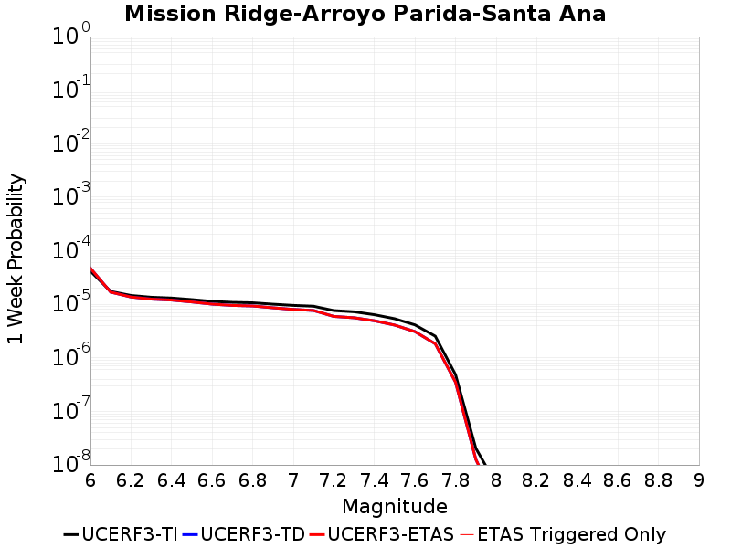 | 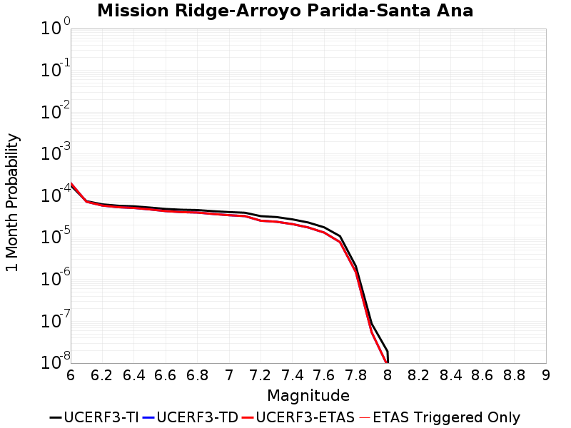 |  |  |

| Magnitude | 1 wk TI Prob | 1 wk TD Prob | 1 wk ETAS Prob | 1 wk ETAS/TD Gain | 1 wk ETAS Triggered Only | 1 mo TI Prob | 1 mo TD Prob | 1 mo ETAS Prob | 1 mo ETAS/TD Gain | 1 mo ETAS Triggered Only | 1 yr TI Prob | 1 yr TD Prob | 1 yr ETAS Prob | 1 yr ETAS/TD Gain | 1 yr ETAS Triggered Only | 10 yr TI Prob | 10 yr TD Prob | 10 yr ETAS Prob | 10 yr ETAS/TD Gain | 10 yr ETAS Triggered Only |
|-----|-----|-----|-----|-----|-----|-----|-----|-----|-----|-----|-----|-----|-----|-----|-----|-----|-----|-----|-----|-----|
| 6.0 | 4.169034E-5 | 4.719534E-5 | 4.719534E-5 | 1.0 | 0.0 | 1.7866064E-4 | 2.0225493E-4 | 2.0225493E-4 | 1.0 | 0.0 | 0.0021730233 | 0.00246051 | 0.00246051 | 1.0 | 0.0 | 0.021518968 | 0.024414483 | 0.024433997 | 1.0007992 | 2.0E-5 |
| 6.1 | 1.73813E-5 | 1.6868635E-5 | 1.6868635E-5 | 1.0 | 0.0 | 7.4489166E-5 | 7.2292205E-5 | 7.2292205E-5 | 1.0 | 0.0 | 9.065282E-4 | 8.7981287E-4 | 8.7981287E-4 | 1.0 | 0.0 | 0.009028391 | 0.0087643415 | 0.0087742545 | 1.0011309 | 1.0E-5 |
| 6.2 | 1.4622182E-5 | 1.3684774E-5 | 1.3684774E-5 | 1.0 | 0.0 | 6.2664985E-5 | 5.8647733E-5 | 5.8647733E-5 | 1.0 | 0.0 | 7.6267915E-4 | 7.1380613E-4 | 7.1380613E-4 | 1.0 | 0.0 | 0.007600669 | 0.007115478 | 0.007125407 | 1.0013953 | 1.0E-5 |
| 6.3 | 1.3552434E-5 | 1.24928765E-5 | 1.24928765E-5 | 1.0 | 0.0 | 5.8080568E-5 | 5.3539818E-5 | 5.3539818E-5 | 1.0 | 0.0 | 7.069015E-4 | 6.516555E-4 | 6.516555E-4 | 1.0 | 0.0 | 0.00704657 | 0.0064977105 | 0.0065076454 | 1.001529 | 1.0E-5 |
| 6.4 | 1.30977305E-5 | 1.1989513E-5 | 1.1989513E-5 | 1.0 | 0.0 | 5.613192E-5 | 5.138263E-5 | 5.138263E-5 | 1.0 | 0.0 | 6.831918E-4 | 6.25407E-4 | 6.25407E-4 | 1.0 | 0.0 | 0.006810953 | 0.006236716 | 0.006236716 | 1.0 | 0.0 |
| 6.5 | 1.225205E-5 | 1.1058607E-5 | 1.1058607E-5 | 1.0 | 0.0 | 5.2507727E-5 | 4.7393183E-5 | 4.7393183E-5 | 1.0 | 0.0 | 6.3909404E-4 | 5.7686196E-4 | 5.7686196E-4 | 1.0 | 0.0 | 0.006372592 | 0.005753856 | 0.005753856 | 1.0 | 0.0 |
| 6.6 | 1.1352241E-5 | 1.0072784E-5 | 1.0072784E-5 | 1.0 | 0.0 | 4.8651553E-5 | 4.316837E-5 | 4.316837E-5 | 1.0 | 0.0 | 5.921717E-4 | 5.254503E-4 | 5.254503E-4 | 1.0 | 0.0 | 0.0059059616 | 0.0052422257 | 0.0052422257 | 1.0 | 0.0 |
| 6.7 | 1.0864116E-5 | 9.525883E-6 | 9.525883E-6 | 1.0 | 0.0 | 4.6559664E-5 | 4.0824587E-5 | 4.0824587E-5 | 1.0 | 0.0 | 5.667165E-4 | 4.96928E-4 | 4.96928E-4 | 1.0 | 0.0 | 0.005652734 | 0.0049583027 | 0.0049583027 | 1.0 | 0.0 |
| 6.8 | 1.0666365E-5 | 9.308507E-6 | 9.308507E-6 | 1.0 | 0.0 | 4.571219E-5 | 3.9893002E-5 | 3.9893002E-5 | 1.0 | 0.0 | 5.564038E-4 | 4.8559107E-4 | 4.8559107E-4 | 1.0 | 0.0 | 0.005550127 | 0.004845433 | 0.004845433 | 1.0 | 0.0 |
| 6.9 | 1.0038665E-5 | 8.600237E-6 | 8.600237E-6 | 1.0 | 0.0 | 4.302214E-5 | 3.685765E-5 | 3.685765E-5 | 1.0 | 0.0 | 5.236687E-4 | 4.4865132E-4 | 4.4865132E-4 | 1.0 | 0.0 | 0.005224364 | 0.004477567 | 0.004477567 | 1.0 | 0.0 |
| 7.0 | 9.5379955E-6 | 8.032797E-6 | 8.032797E-6 | 1.0 | 0.0 | 4.0876483E-5 | 3.442583E-5 | 3.442583E-5 | 1.0 | 0.0 | 4.975576E-4 | 4.190556E-4 | 4.190556E-4 | 1.0 | 0.0 | 0.00496445 | 0.004182754 | 0.004182754 | 1.0 | 0.0 |
| 7.1 | 9.207389E-6 | 7.659781E-6 | 7.659781E-6 | 1.0 | 0.0 | 3.945964E-5 | 3.282723E-5 | 3.282723E-5 | 1.0 | 0.0 | 4.803152E-4 | 3.9959993E-4 | 3.9959993E-4 | 1.0 | 0.0 | 0.004792784 | 0.003988911 | 0.003988911 | 1.0 | 0.0 |
| 7.2 | 7.638091E-6 | 5.9368767E-6 | 5.9368767E-6 | 1.0 | 0.0 | 3.2734264E-5 | 2.544351E-5 | 2.544351E-5 | 1.0 | 0.0 | 3.984668E-4 | 3.0973103E-4 | 3.0973103E-4 | 1.0 | 0.0 | 0.0039775306 | 0.0030929504 | 0.0030929504 | 1.0 | 0.0 |
| 7.3 | 7.2500147E-6 | 5.60157E-6 | 5.60157E-6 | 1.0 | 0.0 | 3.1071122E-5 | 2.4006511E-5 | 2.4006511E-5 | 1.0 | 0.0 | 3.7822526E-4 | 2.9224035E-4 | 2.9224035E-4 | 1.0 | 0.0 | 0.0037758215 | 0.0029185163 | 0.0029185163 | 1.0 | 0.0 |
| 7.4 | 6.3899715E-6 | 4.923243E-6 | 4.923243E-6 | 1.0 | 0.0 | 2.7385306E-5 | 2.1099444E-5 | 2.1099444E-5 | 1.0 | 0.0 | 3.3336508E-4 | 2.5685565E-4 | 2.5685565E-4 | 1.0 | 0.0 | 0.0033286542 | 0.0025655325 | 0.0025655325 | 1.0 | 0.0 |
| 7.5 | 5.379025E-6 | 4.0878144E-6 | 4.0878144E-6 | 1.0 | 0.0 | 2.305276E-5 | 1.7519087E-5 | 1.7519087E-5 | 1.0 | 0.0 | 2.806312E-4 | 2.132741E-4 | 2.132741E-4 | 1.0 | 0.0 | 0.0028027708 | 0.0021307056 | 0.0021307056 | 1.0 | 0.0 |
| 7.6 | 4.1270696E-6 | 3.0912727E-6 | 3.0912727E-6 | 1.0 | 0.0 | 1.768732E-5 | 1.3248245E-5 | 1.3248245E-5 | 1.0 | 0.0 | 2.1532185E-4 | 1.6128551E-4 | 1.6128551E-4 | 1.0 | 0.0 | 0.0021511333 | 0.0016116927 | 0.0016116927 | 1.0 | 0.0 |
| 7.7 | 2.5406805E-6 | 1.8301239E-6 | 1.8301239E-6 | 1.0 | 0.0 | 1.0888585E-5 | 7.843365E-6 | 7.843365E-6 | 1.0 | 0.0 | 1.3256045E-4 | 9.5488846E-5 | 9.5488846E-5 | 1.0 | 0.0 | 0.0013248142 | 9.5448433E-4 | 9.5448433E-4 | 1.0 | 0.0 |
| 7.8 | 4.8608285E-7 | 3.5129014E-7 | 3.5129014E-7 | 1.0 | 0.0 | 2.0832106E-6 | 1.5055283E-6 | 1.5055283E-6 | 1.0 | 0.0 | 2.5362791E-5 | 1.8329654E-5 | 1.8329654E-5 | 1.0 | 0.0 | 2.5359896E-4 | 1.8328155E-4 | 1.8328155E-4 | 1.0 | 0.0 |
| 7.9 | 2.0472514E-8 | 1.2704431E-8 | 1.2704431E-8 | 1.0 | 0.0 | 8.7739345E-8 | 5.444756E-8 | 5.444756E-8 | 1.0 | 0.0 | 1.068226E-6 | 6.6289886E-7 | 6.6289886E-7 | 1.0 | 0.0 | 1.0682209E-5 | 6.62897E-6 | 6.62897E-6 | 1.0 | 0.0 |
| 8.0 | 4.443582E-9 | 2.0384494E-9 | 2.0384494E-9 | 1.0 | 0.0 | 1.9043922E-8 | 8.736212E-9 | 8.736212E-9 | 1.0 | 0.0 | 2.3185973E-7 | 1.0636337E-7 | 1.0636337E-7 | 1.0 | 0.0 | 2.3185949E-6 | 1.0636332E-6 | 1.0636332E-6 | 1.0 | 0.0 |

## Santa Ynez River
*[(top)](#table-of-contents)*

| 1 Week | 1 Month | 1 Year | 10 Year |
|-----|-----|-----|-----|
| 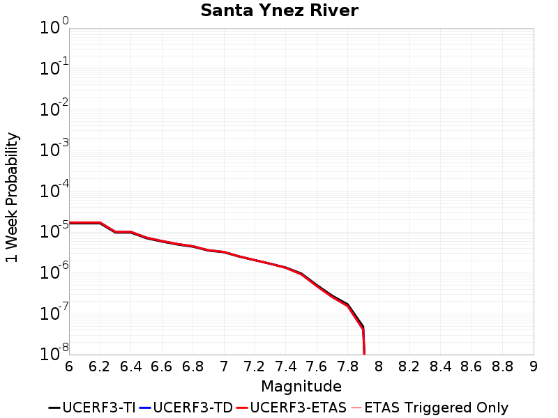 |  |  |  |

| Magnitude | 1 wk TI Prob | 1 wk TD Prob | 1 wk ETAS Prob | 1 wk ETAS/TD Gain | 1 wk ETAS Triggered Only | 1 mo TI Prob | 1 mo TD Prob | 1 mo ETAS Prob | 1 mo ETAS/TD Gain | 1 mo ETAS Triggered Only | 1 yr TI Prob | 1 yr TD Prob | 1 yr ETAS Prob | 1 yr ETAS/TD Gain | 1 yr ETAS Triggered Only | 10 yr TI Prob | 10 yr TD Prob | 10 yr ETAS Prob | 10 yr ETAS/TD Gain | 10 yr ETAS Triggered Only |
|-----|-----|-----|-----|-----|-----|-----|-----|-----|-----|-----|-----|-----|-----|-----|-----|-----|-----|-----|-----|-----|
| 6.0 | 1.6396456E-5 | 1.7215589E-5 | 1.7215589E-5 | 1.0 | 0.0 | 7.026863E-5 | 7.377921E-5 | 7.377921E-5 | 1.0 | 0.0 | 8.551848E-4 | 8.9792727E-4 | 8.9792727E-4 | 1.0 | 0.0 | 0.0085190125 | 0.008946544 | 0.008956454 | 1.0011077 | 1.0E-5 |
| 6.1 | 1.6396456E-5 | 1.7215589E-5 | 1.7215589E-5 | 1.0 | 0.0 | 7.026863E-5 | 7.377921E-5 | 7.377921E-5 | 1.0 | 0.0 | 8.551848E-4 | 8.9792727E-4 | 8.9792727E-4 | 1.0 | 0.0 | 0.0085190125 | 0.008946544 | 0.008956454 | 1.0011077 | 1.0E-5 |
| 6.2 | 1.6396456E-5 | 1.7215589E-5 | 1.7215589E-5 | 1.0 | 0.0 | 7.026863E-5 | 7.377921E-5 | 7.377921E-5 | 1.0 | 0.0 | 8.551848E-4 | 8.9792727E-4 | 8.9792727E-4 | 1.0 | 0.0 | 0.0085190125 | 0.008946544 | 0.008956454 | 1.0011077 | 1.0E-5 |
| 6.3 | 9.736976E-6 | 1.0125781E-5 | 1.0125781E-5 | 1.0 | 0.0 | 4.172923E-5 | 4.339551E-5 | 4.339551E-5 | 1.0 | 0.0 | 5.0793495E-4 | 5.2821724E-4 | 5.2821724E-4 | 1.0 | 0.0 | 0.005067755 | 0.0052701235 | 0.005280071 | 1.0018874 | 1.0E-5 |
| 6.4 | 9.736976E-6 | 1.0125781E-5 | 1.0125781E-5 | 1.0 | 0.0 | 4.172923E-5 | 4.339551E-5 | 4.339551E-5 | 1.0 | 0.0 | 5.0793495E-4 | 5.2821724E-4 | 5.2821724E-4 | 1.0 | 0.0 | 0.005067755 | 0.0052701235 | 0.005280071 | 1.0018874 | 1.0E-5 |
| 6.5 | 7.081964E-6 | 7.3324895E-6 | 7.3324895E-6 | 1.0 | 0.0 | 3.035092E-5 | 3.1424584E-5 | 3.1424584E-5 | 1.0 | 0.0 | 3.694598E-4 | 3.8252876E-4 | 3.8252876E-4 | 1.0 | 0.0 | 0.0036884616 | 0.003818865 | 0.0038288266 | 1.0026085 | 1.0E-5 |
| 6.6 | 5.873247E-6 | 6.0619536E-6 | 6.0619536E-6 | 1.0 | 0.0 | 2.5170815E-5 | 2.5979547E-5 | 2.5979547E-5 | 1.0 | 0.0 | 3.064116E-4 | 3.1625593E-4 | 3.1625593E-4 | 1.0 | 0.0 | 0.0030598943 | 0.0031581463 | 0.0031581463 | 1.0 | 0.0 |
| 6.7 | 4.973277E-6 | 5.1178395E-6 | 5.1178395E-6 | 1.0 | 0.0 | 2.1313872E-5 | 2.1933414E-5 | 2.1933414E-5 | 1.0 | 0.0 | 2.5946548E-4 | 2.670071E-4 | 2.670071E-4 | 1.0 | 0.0 | 0.0025916274 | 0.0026669118 | 0.0026669118 | 1.0 | 0.0 |
| 6.8 | 4.396492E-6 | 4.5127413E-6 | 4.5127413E-6 | 1.0 | 0.0 | 1.884197E-5 | 1.9340177E-5 | 1.9340177E-5 | 1.0 | 0.0 | 2.2937685E-4 | 2.3544158E-4 | 2.3544158E-4 | 1.0 | 0.0 | 0.0022914023 | 0.0023519567 | 0.0023519567 | 1.0 | 0.0 |
| 6.9 | 3.5255632E-6 | 3.6028573E-6 | 3.6028573E-6 | 1.0 | 0.0 | 1.5109469E-5 | 1.5440726E-5 | 1.5440726E-5 | 1.0 | 0.0 | 1.8394225E-4 | 1.8797479E-4 | 1.8797479E-4 | 1.0 | 0.0 | 0.0018379007 | 0.001878174 | 0.001878174 | 1.0 | 0.0 |
| 7.0 | 3.211603E-6 | 3.2750934E-6 | 3.2750934E-6 | 1.0 | 0.0 | 1.376394E-5 | 1.403604E-5 | 1.403604E-5 | 1.0 | 0.0 | 1.6756308E-4 | 1.7087552E-4 | 1.7087552E-4 | 1.0 | 0.0 | 0.0016743679 | 0.0017074555 | 0.0017074555 | 1.0 | 0.0 |
| 7.1 | 2.5094619E-6 | 2.5421707E-6 | 2.5421707E-6 | 1.0 | 0.0 | 1.0754793E-5 | 1.0894972E-5 | 1.0894972E-5 | 1.0 | 0.0 | 1.3093173E-4 | 1.3263826E-4 | 1.3263826E-4 | 1.0 | 0.0 | 0.0013085462 | 0.001325597 | 0.001325597 | 1.0 | 0.0 |
| 7.2 | 2.0515774E-6 | 2.0630569E-6 | 2.0630569E-6 | 1.0 | 0.0 | 8.792445E-6 | 8.841643E-6 | 8.841643E-6 | 1.0 | 0.0 | 1.0704277E-4 | 1.07641725E-4 | 1.07641725E-4 | 1.0 | 0.0 | 0.0010699122 | 0.0010759002 | 0.0010759002 | 1.0 | 0.0 |
| 7.3 | 1.6845745E-6 | 1.6784011E-6 | 1.6784011E-6 | 1.0 | 0.0 | 7.219585E-6 | 7.1931277E-6 | 7.1931277E-6 | 1.0 | 0.0 | 8.78949E-5 | 8.757284E-5 | 8.757284E-5 | 1.0 | 0.0 | 8.7860145E-4 | 8.753862E-4 | 8.753862E-4 | 1.0 | 0.0 |
| 7.4 | 1.3600285E-6 | 1.3342235E-6 | 1.3342235E-6 | 1.0 | 0.0 | 5.82868E-6 | 5.7180882E-6 | 5.7180882E-6 | 1.0 | 0.0 | 7.096187E-5 | 6.961552E-5 | 6.961552E-5 | 1.0 | 0.0 | 7.0939213E-4 | 6.9593935E-4 | 6.9593935E-4 | 1.0 | 0.0 |
| 7.5 | 9.735342E-7 | 9.296813E-7 | 9.296813E-7 | 1.0 | 0.0 | 4.172283E-6 | 3.984342E-6 | 3.984342E-6 | 1.0 | 0.0 | 5.079636E-5 | 4.8508304E-5 | 4.8508304E-5 | 1.0 | 0.0 | 5.0784746E-4 | 4.8497887E-4 | 4.8497887E-4 | 1.0 | 0.0 |
| 7.6 | 5.067187E-7 | 4.780357E-7 | 4.780357E-7 | 1.0 | 0.0 | 2.1716498E-6 | 2.048723E-6 | 2.048723E-6 | 1.0 | 0.0 | 2.6439517E-5 | 2.4942923E-5 | 2.4942923E-5 | 1.0 | 0.0 | 2.643637E-4 | 2.49402E-4 | 2.49402E-4 | 1.0 | 0.0 |
| 7.7 | 2.769089E-7 | 2.5768492E-7 | 2.5768492E-7 | 1.0 | 0.0 | 1.1867519E-6 | 1.1043634E-6 | 1.1043634E-6 | 1.0 | 0.0 | 1.4448608E-5 | 1.3445541E-5 | 1.3445541E-5 | 1.0 | 0.0 | 1.444767E-4 | 1.3444731E-4 | 1.3444731E-4 | 1.0 | 0.0 |
| 7.8 | 1.7044663E-7 | 1.5454172E-7 | 1.5454172E-7 | 1.0 | 0.0 | 7.3048534E-7 | 6.6232144E-7 | 6.6232144E-7 | 1.0 | 0.0 | 8.893623E-6 | 8.063735E-6 | 8.063735E-6 | 1.0 | 0.0 | 8.893267E-5 | 8.063444E-5 | 8.063444E-5 | 1.0 | 0.0 |
| 7.9 | 4.8344287E-8 | 4.0925556E-8 | 4.0925556E-8 | 1.0 | 0.0 | 2.0718979E-7 | 1.7539523E-7 | 1.7539523E-7 | 1.0 | 0.0 | 2.5225327E-6 | 2.135435E-6 | 2.135435E-6 | 1.0 | 0.0 | 2.5225041E-5 | 2.1354146E-5 | 2.1354146E-5 | 1.0 | 0.0 |

## Camp Rock 2011
*[(top)](#table-of-contents)*

| 1 Week | 1 Month | 1 Year | 10 Year |
|-----|-----|-----|-----|
|  | 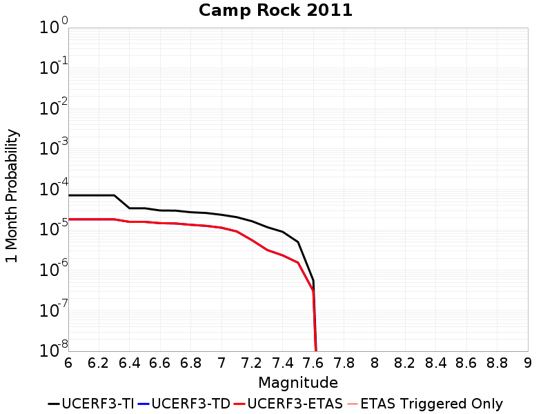 |  |  |

| Magnitude | 1 wk TI Prob | 1 wk TD Prob | 1 wk ETAS Prob | 1 wk ETAS/TD Gain | 1 wk ETAS Triggered Only | 1 mo TI Prob | 1 mo TD Prob | 1 mo ETAS Prob | 1 mo ETAS/TD Gain | 1 mo ETAS Triggered Only | 1 yr TI Prob | 1 yr TD Prob | 1 yr ETAS Prob | 1 yr ETAS/TD Gain | 1 yr ETAS Triggered Only | 10 yr TI Prob | 10 yr TD Prob | 10 yr ETAS Prob | 10 yr ETAS/TD Gain | 10 yr ETAS Triggered Only |
|-----|-----|-----|-----|-----|-----|-----|-----|-----|-----|-----|-----|-----|-----|-----|-----|-----|-----|-----|-----|-----|
| 6.0 | 1.6710783E-5 | 4.2530187E-6 | 4.2530187E-6 | 1.0 | 0.0 | 7.161568E-5 | 1.8227098E-5 | 1.8227098E-5 | 1.0 | 0.0 | 8.7157206E-4 | 2.2189284E-4 | 2.2189284E-4 | 1.0 | 0.0 | 0.008681616 | 0.002216766 | 0.0022367216 | 1.0090022 | 2.0E-5 |
| 6.1 | 1.6710783E-5 | 4.2530187E-6 | 4.2530187E-6 | 1.0 | 0.0 | 7.161568E-5 | 1.8227098E-5 | 1.8227098E-5 | 1.0 | 0.0 | 8.7157206E-4 | 2.2189284E-4 | 2.2189284E-4 | 1.0 | 0.0 | 0.008681616 | 0.002216766 | 0.0022367216 | 1.0090022 | 2.0E-5 |
| 6.2 | 1.6710783E-5 | 4.2530187E-6 | 4.2530187E-6 | 1.0 | 0.0 | 7.161568E-5 | 1.8227098E-5 | 1.8227098E-5 | 1.0 | 0.0 | 8.7157206E-4 | 2.2189284E-4 | 2.2189284E-4 | 1.0 | 0.0 | 0.008681616 | 0.002216766 | 0.0022367216 | 1.0090022 | 2.0E-5 |
| 6.3 | 1.6710783E-5 | 4.2530187E-6 | 4.2530187E-6 | 1.0 | 0.0 | 7.161568E-5 | 1.8227098E-5 | 1.8227098E-5 | 1.0 | 0.0 | 8.7157206E-4 | 2.2189284E-4 | 2.2189284E-4 | 1.0 | 0.0 | 0.008681616 | 0.002216766 | 0.0022367216 | 1.0090022 | 2.0E-5 |
| 6.4 | 7.982846E-6 | 3.6844276E-6 | 3.6844276E-6 | 1.0 | 0.0 | 3.421175E-5 | 1.579031E-5 | 1.579031E-5 | 1.0 | 0.0 | 4.1644843E-4 | 1.922304E-4 | 1.922304E-4 | 1.0 | 0.0 | 0.0041566887 | 0.0019206762 | 0.0019406378 | 1.010393 | 2.0E-5 |
| 6.5 | 7.982846E-6 | 3.6844276E-6 | 3.6844276E-6 | 1.0 | 0.0 | 3.421175E-5 | 1.579031E-5 | 1.579031E-5 | 1.0 | 0.0 | 4.1644843E-4 | 1.922304E-4 | 1.922304E-4 | 1.0 | 0.0 | 0.0041566887 | 0.0019206762 | 0.0019406378 | 1.010393 | 2.0E-5 |
| 6.6 | 7.048869E-6 | 3.4266197E-6 | 3.4266197E-6 | 1.0 | 0.0 | 3.0209088E-5 | 1.4685432E-5 | 1.4685432E-5 | 1.0 | 0.0 | 3.677336E-4 | 1.7878079E-4 | 1.7878079E-4 | 1.0 | 0.0 | 0.0036712566 | 0.0017864013 | 0.0017963834 | 1.0055878 | 1.0E-5 |
| 6.7 | 6.987307E-6 | 3.3645756E-6 | 3.3645756E-6 | 1.0 | 0.0 | 2.9945259E-5 | 1.4419532E-5 | 1.4419532E-5 | 1.0 | 0.0 | 3.6452254E-4 | 1.7554397E-4 | 1.7554397E-4 | 1.0 | 0.0 | 0.0036392517 | 0.0017540843 | 0.0017640668 | 1.0056909 | 1.0E-5 |
| 6.8 | 6.3737602E-6 | 3.1201257E-6 | 3.1201257E-6 | 1.0 | 0.0 | 2.731583E-5 | 1.33719E-5 | 1.33719E-5 | 1.0 | 0.0 | 3.3251947E-4 | 1.6279101E-4 | 1.6279101E-4 | 1.0 | 0.0 | 0.0033202237 | 0.0016267463 | 0.0016367299 | 1.0061373 | 1.0E-5 |
| 6.9 | 6.112211E-6 | 2.9352482E-6 | 2.9352482E-6 | 1.0 | 0.0 | 2.6194928E-5 | 1.2579576E-5 | 1.2579576E-5 | 1.0 | 0.0 | 3.1887658E-4 | 1.5314585E-4 | 1.5314585E-4 | 1.0 | 0.0 | 0.003184194 | 0.0015304309 | 0.0015404156 | 1.0065241 | 1.0E-5 |
| 7.0 | 5.5140117E-6 | 2.6437083E-6 | 2.6437083E-6 | 1.0 | 0.0 | 2.3631264E-5 | 1.133013E-5 | 1.133013E-5 | 1.0 | 0.0 | 2.8767265E-4 | 1.3793586E-4 | 1.3793586E-4 | 1.0 | 0.0 | 0.0028730053 | 0.0013785277 | 0.001388514 | 1.0072441 | 1.0E-5 |
| 7.1 | 4.8151105E-6 | 2.135821E-6 | 2.135821E-6 | 1.0 | 0.0 | 2.0636026E-5 | 9.153488E-6 | 9.153488E-6 | 1.0 | 0.0 | 2.5121463E-4 | 1.1143823E-4 | 1.1143823E-4 | 1.0 | 0.0 | 0.0025093083 | 0.0011138454 | 0.0011138454 | 1.0 | 0.0 |
| 7.2 | 3.818335E-6 | 1.2949685E-6 | 1.2949685E-6 | 1.0 | 0.0 | 1.6364189E-5 | 5.5498535E-6 | 5.5498535E-6 | 1.0 | 0.0 | 1.9921579E-4 | 6.756746E-5 | 6.756746E-5 | 1.0 | 0.0 | 0.0019903728 | 6.754774E-4 | 6.754774E-4 | 1.0 | 0.0 |
| 7.3 | 2.7166698E-6 | 7.3937264E-7 | 7.3937264E-7 | 1.0 | 0.0 | 1.1642818E-5 | 3.1687362E-6 | 3.1687362E-6 | 1.0 | 0.0 | 1.4174209E-4 | 3.85787E-5 | 3.85787E-5 | 1.0 | 0.0 | 0.0014165172 | 3.8572203E-4 | 3.8572203E-4 | 1.0 | 0.0 |
| 7.4 | 2.0893426E-6 | 5.470302E-7 | 5.470302E-7 | 1.0 | 0.0 | 8.954295E-6 | 2.344413E-6 | 2.344413E-6 | 1.0 | 0.0 | 1.0901308E-4 | 2.854286E-5 | 2.854286E-5 | 1.0 | 0.0 | 0.0010895962 | 2.8539248E-4 | 2.8539248E-4 | 1.0 | 0.0 |
| 7.5 | 1.1681728E-6 | 3.608593E-7 | 3.608593E-7 | 1.0 | 0.0 | 5.0064455E-6 | 1.546539E-6 | 1.546539E-6 | 1.0 | 0.0 | 6.0951766E-5 | 1.8828954E-5 | 1.8828954E-5 | 1.0 | 0.0 | 6.093505E-4 | 1.8827406E-4 | 1.8827406E-4 | 1.0 | 0.0 |
| 7.6 | 1.3154387E-7 | 7.141376E-8 | 7.141376E-8 | 1.0 | 0.0 | 5.6375933E-7 | 3.0605895E-7 | 3.0605895E-7 | 1.0 | 0.0 | 6.863748E-6 | 3.726263E-6 | 3.726263E-6 | 1.0 | 0.0 | 6.863536E-5 | 3.7262165E-5 | 3.7262165E-5 | 1.0 | 0.0 |

## Sierra Madre
*[(top)](#table-of-contents)*

| 1 Week | 1 Month | 1 Year | 10 Year |
|-----|-----|-----|-----|
| 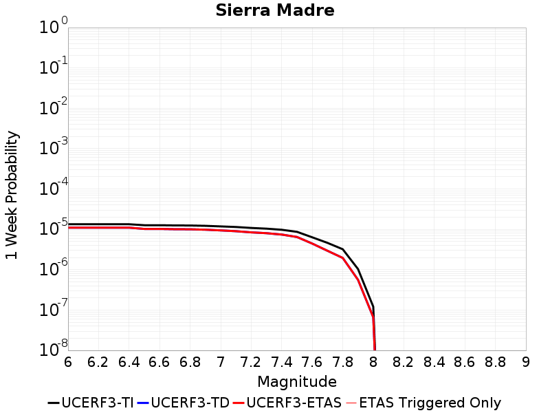 |  | 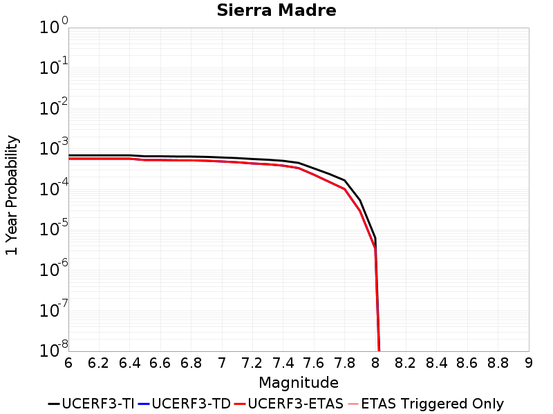 | 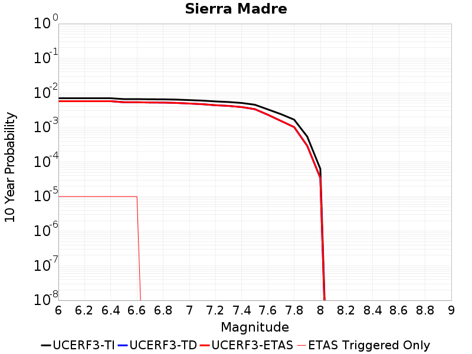 |

| Magnitude | 1 wk TI Prob | 1 wk TD Prob | 1 wk ETAS Prob | 1 wk ETAS/TD Gain | 1 wk ETAS Triggered Only | 1 mo TI Prob | 1 mo TD Prob | 1 mo ETAS Prob | 1 mo ETAS/TD Gain | 1 mo ETAS Triggered Only | 1 yr TI Prob | 1 yr TD Prob | 1 yr ETAS Prob | 1 yr ETAS/TD Gain | 1 yr ETAS Triggered Only | 10 yr TI Prob | 10 yr TD Prob | 10 yr ETAS Prob | 10 yr ETAS/TD Gain | 10 yr ETAS Triggered Only |
|-----|-----|-----|-----|-----|-----|-----|-----|-----|-----|-----|-----|-----|-----|-----|-----|-----|-----|-----|-----|-----|
| 6.0 | 1.3379373E-5 | 1.1015404E-5 | 1.1015404E-5 | 1.0 | 0.0 | 5.7338908E-5 | 4.720803E-5 | 4.720803E-5 | 1.0 | 0.0 | 6.978776E-4 | 5.7460763E-4 | 5.7460763E-4 | 1.0 | 0.0 | 0.0069569005 | 0.0057314998 | 0.005751385 | 1.0034695 | 2.0E-5 |
| 6.1 | 1.3379373E-5 | 1.1015404E-5 | 1.1015404E-5 | 1.0 | 0.0 | 5.7338908E-5 | 4.720803E-5 | 4.720803E-5 | 1.0 | 0.0 | 6.978776E-4 | 5.7460763E-4 | 5.7460763E-4 | 1.0 | 0.0 | 0.0069569005 | 0.0057314998 | 0.005751385 | 1.0034695 | 2.0E-5 |
| 6.2 | 1.3379373E-5 | 1.1015404E-5 | 1.1015404E-5 | 1.0 | 0.0 | 5.7338908E-5 | 4.720803E-5 | 4.720803E-5 | 1.0 | 0.0 | 6.978776E-4 | 5.7460763E-4 | 5.7460763E-4 | 1.0 | 0.0 | 0.0069569005 | 0.0057314998 | 0.005751385 | 1.0034695 | 2.0E-5 |
| 6.3 | 1.3379373E-5 | 1.1015404E-5 | 1.1015404E-5 | 1.0 | 0.0 | 5.7338908E-5 | 4.720803E-5 | 4.720803E-5 | 1.0 | 0.0 | 6.978776E-4 | 5.7460763E-4 | 5.7460763E-4 | 1.0 | 0.0 | 0.0069569005 | 0.0057314998 | 0.005751385 | 1.0034695 | 2.0E-5 |
| 6.4 | 1.3379373E-5 | 1.1015404E-5 | 1.1015404E-5 | 1.0 | 0.0 | 5.7338908E-5 | 4.720803E-5 | 4.720803E-5 | 1.0 | 0.0 | 6.978776E-4 | 5.7460763E-4 | 5.7460763E-4 | 1.0 | 0.0 | 0.0069569005 | 0.0057314998 | 0.005751385 | 1.0034695 | 2.0E-5 |
| 6.5 | 1.26563245E-5 | 1.0244561E-5 | 1.0244561E-5 | 1.0 | 0.0 | 5.4240263E-5 | 4.390453E-5 | 4.390453E-5 | 1.0 | 0.0 | 6.601751E-4 | 5.344076E-4 | 5.344076E-4 | 1.0 | 0.0 | 0.006582173 | 0.0053314627 | 0.005351356 | 1.0037314 | 2.0E-5 |
| 6.6 | 1.26563245E-5 | 1.0244561E-5 | 1.0244561E-5 | 1.0 | 0.0 | 5.4240263E-5 | 4.390453E-5 | 4.390453E-5 | 1.0 | 0.0 | 6.601751E-4 | 5.344076E-4 | 5.344076E-4 | 1.0 | 0.0 | 0.006582173 | 0.0053314627 | 0.005351356 | 1.0037314 | 2.0E-5 |
| 6.7 | 1.2502474E-5 | 1.0080642E-5 | 1.0080642E-5 | 1.0 | 0.0 | 5.3580934E-5 | 4.3202042E-5 | 4.3202042E-5 | 1.0 | 0.0 | 6.521526E-4 | 5.2585895E-4 | 5.2585895E-4 | 1.0 | 0.0 | 0.0065024206 | 0.0052463817 | 0.0052662767 | 1.0037922 | 2.0E-5 |
| 6.8 | 1.2454966E-5 | 1.0032888E-5 | 1.0032888E-5 | 1.0 | 0.0 | 5.3377335E-5 | 4.299739E-5 | 4.299739E-5 | 1.0 | 0.0 | 6.4967526E-4 | 5.2336854E-4 | 5.2336854E-4 | 1.0 | 0.0 | 0.006477792 | 0.0052215946 | 0.00524149 | 1.0038103 | 2.0E-5 |
| 6.9 | 1.2225574E-5 | 9.8066175E-6 | 9.8066175E-6 | 1.0 | 0.0 | 5.2394265E-5 | 4.202769E-5 | 4.202769E-5 | 1.0 | 0.0 | 6.3771347E-4 | 5.1156804E-4 | 5.1156804E-4 | 1.0 | 0.0 | 0.006358865 | 0.005104136 | 0.005124034 | 1.0038984 | 2.0E-5 |
| 7.0 | 1.182946E-5 | 9.412976E-6 | 9.412976E-6 | 1.0 | 0.0 | 5.06967E-5 | 4.034071E-5 | 4.034071E-5 | 1.0 | 0.0 | 6.1705755E-4 | 4.910385E-4 | 4.910385E-4 | 1.0 | 0.0 | 0.006153469 | 0.0048997626 | 0.0049196645 | 1.0040618 | 2.0E-5 |
| 7.1 | 1.14369095E-5 | 8.99962E-6 | 8.99962E-6 | 1.0 | 0.0 | 4.9014405E-5 | 3.8569236E-5 | 3.8569236E-5 | 1.0 | 0.0 | 5.9658696E-4 | 4.6948026E-4 | 4.6948026E-4 | 1.0 | 0.0 | 0.005949879 | 0.004685106 | 0.0047050123 | 1.0042489 | 2.0E-5 |
| 7.2 | 1.0836419E-5 | 8.412558E-6 | 8.412558E-6 | 1.0 | 0.0 | 4.644097E-5 | 3.6053323E-5 | 3.6053323E-5 | 1.0 | 0.0 | 5.652721E-4 | 4.3886172E-4 | 4.3886172E-4 | 1.0 | 0.0 | 0.0056383642 | 0.004380164 | 0.00439012 | 1.002273 | 1.0E-5 |
| 7.3 | 1.0403439E-5 | 8.0335885E-6 | 8.0335885E-6 | 1.0 | 0.0 | 4.4585406E-5 | 3.4429213E-5 | 3.4429213E-5 | 1.0 | 0.0 | 5.426921E-4 | 4.1909597E-4 | 4.1909597E-4 | 1.0 | 0.0 | 0.005413687 | 0.0041832672 | 0.0041932254 | 1.0023805 | 1.0E-5 |
| 7.4 | 9.768864E-6 | 7.4268155E-6 | 7.4268155E-6 | 1.0 | 0.0 | 4.186589E-5 | 3.1828826E-5 | 3.1828826E-5 | 1.0 | 0.0 | 5.09598E-4 | 3.8744794E-4 | 3.8744794E-4 | 1.0 | 0.0 | 0.0050843097 | 0.0038679321 | 0.0038778936 | 1.0025754 | 1.0E-5 |
| 7.5 | 8.687089E-6 | 6.46159E-6 | 6.46159E-6 | 1.0 | 0.0 | 3.722985E-5 | 2.769224E-5 | 2.769224E-5 | 1.0 | 0.0 | 4.5317915E-4 | 3.3710172E-4 | 3.3710172E-4 | 1.0 | 0.0 | 0.004522561 | 0.003366107 | 0.003366107 | 1.0 | 0.0 |
| 7.6 | 6.3506063E-6 | 4.4405324E-6 | 4.4405324E-6 | 1.0 | 0.0 | 2.72166E-5 | 1.9030716E-5 | 1.9030716E-5 | 1.0 | 0.0 | 3.3131172E-4 | 2.316746E-4 | 2.316746E-4 | 1.0 | 0.0 | 0.003308182 | 0.002314471 | 0.002314471 | 1.0 | 0.0 |
| 7.7 | 4.62223E-6 | 2.942493E-6 | 2.942493E-6 | 1.0 | 0.0 | 1.9809406E-5 | 1.2610623E-5 | 1.2610623E-5 | 1.0 | 0.0 | 2.4115283E-4 | 1.5352354E-4 | 1.5352354E-4 | 1.0 | 0.0 | 0.0024089129 | 0.0015342898 | 0.0015342898 | 1.0 | 0.0 |
| 7.8 | 3.2145008E-6 | 1.9560123E-6 | 1.9560123E-6 | 1.0 | 0.0 | 1.3776359E-5 | 8.382884E-6 | 8.382884E-6 | 1.0 | 0.0 | 1.6771426E-4 | 1.0205684E-4 | 1.0205684E-4 | 1.0 | 0.0 | 0.0016758774 | 0.0010201578 | 0.0010201578 | 1.0 | 0.0 |
| 7.9 | 1.0391769E-6 | 5.620104E-7 | 5.620104E-7 | 1.0 | 0.0 | 4.4536077E-6 | 2.408614E-6 | 2.408614E-6 | 1.0 | 0.0 | 5.4221324E-5 | 2.9324483E-5 | 2.9324483E-5 | 1.0 | 0.0 | 5.4208096E-4 | 2.9320657E-4 | 2.9320657E-4 | 1.0 | 0.0 |
| 8.0 | 1.210983E-7 | 6.6293154E-8 | 6.6293154E-8 | 1.0 | 0.0 | 5.1899264E-7 | 2.8411347E-7 | 2.8411347E-7 | 1.0 | 0.0 | 6.3187167E-6 | 3.4590762E-6 | 3.4590762E-6 | 1.0 | 0.0 | 6.318537E-5 | 3.459024E-5 | 3.459024E-5 | 1.0 | 0.0 |

## San Cayetano
*[(top)](#table-of-contents)*

| 1 Week | 1 Month | 1 Year | 10 Year |
|-----|-----|-----|-----|
|  |  |  | 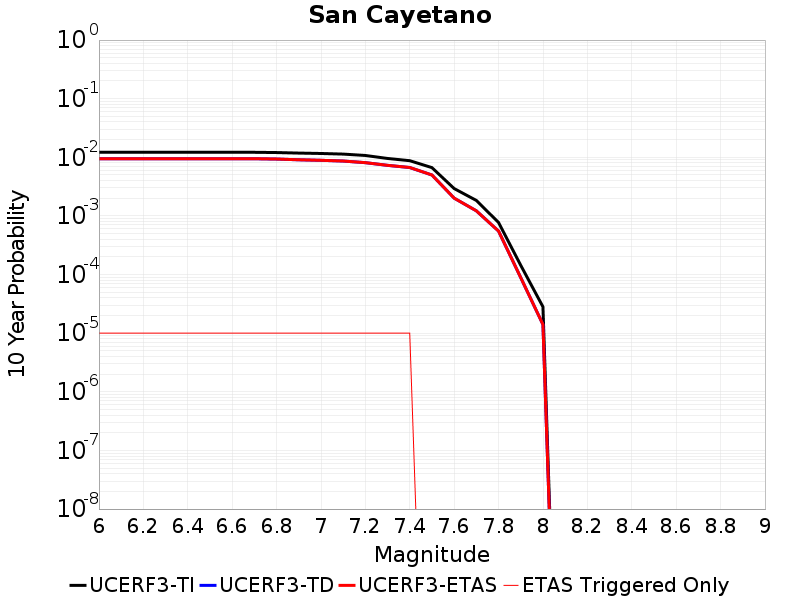 |

| Magnitude | 1 wk TI Prob | 1 wk TD Prob | 1 wk ETAS Prob | 1 wk ETAS/TD Gain | 1 wk ETAS Triggered Only | 1 mo TI Prob | 1 mo TD Prob | 1 mo ETAS Prob | 1 mo ETAS/TD Gain | 1 mo ETAS Triggered Only | 1 yr TI Prob | 1 yr TD Prob | 1 yr ETAS Prob | 1 yr ETAS/TD Gain | 1 yr ETAS Triggered Only | 10 yr TI Prob | 10 yr TD Prob | 10 yr ETAS Prob | 10 yr ETAS/TD Gain | 10 yr ETAS Triggered Only |
|-----|-----|-----|-----|-----|-----|-----|-----|-----|-----|-----|-----|-----|-----|-----|-----|-----|-----|-----|-----|-----|
| 6.0 | 2.3476267E-5 | 1.8200677E-5 | 1.8200677E-5 | 1.0 | 0.0 | 1.0060869E-4 | 7.8000594E-5 | 7.8000594E-5 | 1.0 | 0.0 | 0.0012242225 | 9.492471E-4 | 9.492471E-4 | 1.0 | 0.0 | 0.012175002 | 0.009452539 | 0.009462444 | 1.001048 | 1.0E-5 |
| 6.1 | 2.3476267E-5 | 1.8200677E-5 | 1.8200677E-5 | 1.0 | 0.0 | 1.0060869E-4 | 7.8000594E-5 | 7.8000594E-5 | 1.0 | 0.0 | 0.0012242225 | 9.492471E-4 | 9.492471E-4 | 1.0 | 0.0 | 0.012175002 | 0.009452539 | 0.009462444 | 1.001048 | 1.0E-5 |
| 6.2 | 2.3476267E-5 | 1.8200677E-5 | 1.8200677E-5 | 1.0 | 0.0 | 1.0060869E-4 | 7.8000594E-5 | 7.8000594E-5 | 1.0 | 0.0 | 0.0012242225 | 9.492471E-4 | 9.492471E-4 | 1.0 | 0.0 | 0.012175002 | 0.009452539 | 0.009462444 | 1.001048 | 1.0E-5 |
| 6.3 | 2.3476267E-5 | 1.8200677E-5 | 1.8200677E-5 | 1.0 | 0.0 | 1.0060869E-4 | 7.8000594E-5 | 7.8000594E-5 | 1.0 | 0.0 | 0.0012242225 | 9.492471E-4 | 9.492471E-4 | 1.0 | 0.0 | 0.012175002 | 0.009452539 | 0.009462444 | 1.001048 | 1.0E-5 |
| 6.4 | 2.3476267E-5 | 1.8200677E-5 | 1.8200677E-5 | 1.0 | 0.0 | 1.0060869E-4 | 7.8000594E-5 | 7.8000594E-5 | 1.0 | 0.0 | 0.0012242225 | 9.492471E-4 | 9.492471E-4 | 1.0 | 0.0 | 0.012175002 | 0.009452539 | 0.009462444 | 1.001048 | 1.0E-5 |
| 6.5 | 2.3476267E-5 | 1.8200677E-5 | 1.8200677E-5 | 1.0 | 0.0 | 1.0060869E-4 | 7.8000594E-5 | 7.8000594E-5 | 1.0 | 0.0 | 0.0012242225 | 9.492471E-4 | 9.492471E-4 | 1.0 | 0.0 | 0.012175002 | 0.009452539 | 0.009462444 | 1.001048 | 1.0E-5 |
| 6.6 | 2.3476267E-5 | 1.8200677E-5 | 1.8200677E-5 | 1.0 | 0.0 | 1.0060869E-4 | 7.8000594E-5 | 7.8000594E-5 | 1.0 | 0.0 | 0.0012242225 | 9.492471E-4 | 9.492471E-4 | 1.0 | 0.0 | 0.012175002 | 0.009452539 | 0.009462444 | 1.001048 | 1.0E-5 |
| 6.7 | 2.3476267E-5 | 1.8200677E-5 | 1.8200677E-5 | 1.0 | 0.0 | 1.0060869E-4 | 7.8000594E-5 | 7.8000594E-5 | 1.0 | 0.0 | 0.0012242225 | 9.492471E-4 | 9.492471E-4 | 1.0 | 0.0 | 0.012175002 | 0.009452539 | 0.009462444 | 1.001048 | 1.0E-5 |
| 6.8 | 2.3241924E-5 | 1.79681E-5 | 1.79681E-5 | 1.0 | 0.0 | 9.960445E-5 | 7.700389E-5 | 7.700389E-5 | 1.0 | 0.0 | 0.0012120095 | 9.3712274E-4 | 9.3712274E-4 | 1.0 | 0.0 | 0.012054204 | 0.009332251 | 0.009342157 | 1.0010616 | 1.0E-5 |
| 6.9 | 2.2761007E-5 | 1.7463082E-5 | 1.7463082E-5 | 1.0 | 0.0 | 9.7543525E-5 | 7.483965E-5 | 7.483965E-5 | 1.0 | 0.0 | 0.0011869454 | 9.107953E-4 | 9.107953E-4 | 1.0 | 0.0 | 0.011806256 | 0.009071141 | 0.00908105 | 1.0010924 | 1.0E-5 |
| 7.0 | 2.240283E-5 | 1.7096538E-5 | 1.7096538E-5 | 1.0 | 0.0 | 9.600859E-5 | 7.326884E-5 | 7.326884E-5 | 1.0 | 0.0 | 0.0011682777 | 8.916865E-4 | 8.916865E-4 | 1.0 | 0.0 | 0.011621549 | 0.008881586 | 0.008891497 | 1.0011159 | 1.0E-5 |
| 7.1 | 2.1871154E-5 | 1.661379E-5 | 1.661379E-5 | 1.0 | 0.0 | 9.373015E-5 | 7.120004E-5 | 7.120004E-5 | 1.0 | 0.0 | 0.0011405671 | 8.6651905E-4 | 8.6651905E-4 | 1.0 | 0.0 | 0.011347309 | 0.00863189 | 0.008641803 | 1.0011485 | 1.0E-5 |
| 7.2 | 2.0714133E-5 | 1.558917E-5 | 1.558917E-5 | 1.0 | 0.0 | 8.8771834E-5 | 6.6809036E-5 | 6.6809036E-5 | 1.0 | 0.0 | 0.0010802611 | 8.1309973E-4 | 8.1309973E-4 | 1.0 | 0.0 | 0.010750249 | 0.008101705 | 0.008111625 | 1.0012243 | 1.0E-5 |
| 7.3 | 1.8408395E-5 | 1.4017898E-5 | 1.4017898E-5 | 1.0 | 0.0 | 7.8890735E-5 | 6.007534E-5 | 6.007534E-5 | 1.0 | 0.0 | 9.600714E-4 | 7.3117483E-4 | 7.3117483E-4 | 1.0 | 0.0 | 0.009559342 | 0.007288107 | 0.007298034 | 1.0013621 | 1.0E-5 |
| 7.4 | 1.6856795E-5 | 1.28691845E-5 | 1.28691845E-5 | 1.0 | 0.0 | 7.2241404E-5 | 5.5152497E-5 | 5.5152497E-5 | 1.0 | 0.0 | 8.7918417E-4 | 6.7127764E-4 | 6.7127764E-4 | 1.0 | 0.0 | 0.00875714 | 0.0066928696 | 0.0067028026 | 1.0014842 | 1.0E-5 |
| 7.5 | 1.2822778E-5 | 9.593377E-6 | 9.593377E-6 | 1.0 | 0.0 | 5.495361E-5 | 4.111384E-5 | 4.111384E-5 | 1.0 | 0.0 | 6.688548E-4 | 5.004476E-4 | 5.004476E-4 | 1.0 | 0.0 | 0.006668452 | 0.0049932953 | 0.0050032455 | 1.0019927 | 1.0E-5 |
| 7.6 | 5.6272684E-6 | 3.859022E-6 | 3.859022E-6 | 1.0 | 0.0 | 2.4116642E-5 | 1.653856E-5 | 1.653856E-5 | 1.0 | 0.0 | 2.9358055E-4 | 2.0133847E-4 | 2.0133847E-4 | 1.0 | 0.0 | 0.0029319301 | 0.0020115715 | 0.0020115715 | 1.0 | 0.0 |
| 7.7 | 3.5261346E-6 | 2.3434866E-6 | 2.3434866E-6 | 1.0 | 0.0 | 1.5111918E-5 | 1.0043476E-5 | 1.0043476E-5 | 1.0 | 0.0 | 1.8397206E-4 | 1.2227253E-4 | 1.2227253E-4 | 1.0 | 0.0 | 0.0018381984 | 0.00122206 | 0.00122206 | 1.0 | 0.0 |
| 7.8 | 1.4826929E-6 | 1.0574486E-6 | 1.0574486E-6 | 1.0 | 0.0 | 6.354383E-6 | 4.531915E-6 | 4.531915E-6 | 1.0 | 0.0 | 7.736187E-5 | 5.5174685E-5 | 5.5174685E-5 | 1.0 | 0.0 | 7.733494E-4 | 5.516119E-4 | 5.516119E-4 | 1.0 | 0.0 |
| 7.9 | 2.7568166E-7 | 1.6997419E-7 | 1.6997419E-7 | 1.0 | 0.0 | 1.1814923E-6 | 7.284606E-7 | 7.284606E-7 | 1.0 | 0.0 | 1.4384574E-5 | 8.868972E-6 | 8.868972E-6 | 1.0 | 0.0 | 1.4383643E-4 | 8.868621E-5 | 8.868621E-5 | 1.0 | 0.0 |
| 8.0 | 5.407832E-8 | 2.6951078E-8 | 2.6951078E-8 | 1.0 | 0.0 | 2.3176422E-7 | 1.1550461E-7 | 1.1550461E-7 | 1.0 | 0.0 | 2.8217257E-6 | 1.4062678E-6 | 1.4062678E-6 | 1.0 | 0.0 | 2.8216898E-5 | 1.4062593E-5 | 1.4062593E-5 | 1.0 | 0.0 |

## Los Alamos extension
*[(top)](#table-of-contents)*

| 1 Week | 1 Month | 1 Year | 10 Year |
|-----|-----|-----|-----|
|  | 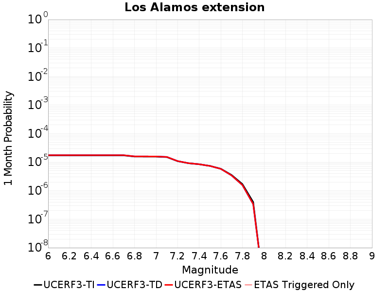 |  |  |

| Magnitude | 1 wk TI Prob | 1 wk TD Prob | 1 wk ETAS Prob | 1 wk ETAS/TD Gain | 1 wk ETAS Triggered Only | 1 mo TI Prob | 1 mo TD Prob | 1 mo ETAS Prob | 1 mo ETAS/TD Gain | 1 mo ETAS Triggered Only | 1 yr TI Prob | 1 yr TD Prob | 1 yr ETAS Prob | 1 yr ETAS/TD Gain | 1 yr ETAS Triggered Only | 10 yr TI Prob | 10 yr TD Prob | 10 yr ETAS Prob | 10 yr ETAS/TD Gain | 10 yr ETAS Triggered Only |
|-----|-----|-----|-----|-----|-----|-----|-----|-----|-----|-----|-----|-----|-----|-----|-----|-----|-----|-----|-----|-----|
| 6.0 | 4.0146506E-6 | 4.0871014E-6 | 4.0871014E-6 | 1.0 | 0.0 | 1.7205533E-5 | 1.7516037E-5 | 1.7516037E-5 | 1.0 | 0.0 | 2.0945723E-4 | 2.1323799E-4 | 2.1323799E-4 | 1.0 | 0.0 | 0.0020925992 | 0.002130443 | 0.0021404217 | 1.0046839 | 1.0E-5 |
| 6.1 | 4.0146506E-6 | 4.0871014E-6 | 4.0871014E-6 | 1.0 | 0.0 | 1.7205533E-5 | 1.7516037E-5 | 1.7516037E-5 | 1.0 | 0.0 | 2.0945723E-4 | 2.1323799E-4 | 2.1323799E-4 | 1.0 | 0.0 | 0.0020925992 | 0.002130443 | 0.0021404217 | 1.0046839 | 1.0E-5 |
| 6.2 | 4.0146506E-6 | 4.0871014E-6 | 4.0871014E-6 | 1.0 | 0.0 | 1.7205533E-5 | 1.7516037E-5 | 1.7516037E-5 | 1.0 | 0.0 | 2.0945723E-4 | 2.1323799E-4 | 2.1323799E-4 | 1.0 | 0.0 | 0.0020925992 | 0.002130443 | 0.0021404217 | 1.0046839 | 1.0E-5 |
| 6.3 | 4.0146506E-6 | 4.0871014E-6 | 4.0871014E-6 | 1.0 | 0.0 | 1.7205533E-5 | 1.7516037E-5 | 1.7516037E-5 | 1.0 | 0.0 | 2.0945723E-4 | 2.1323799E-4 | 2.1323799E-4 | 1.0 | 0.0 | 0.0020925992 | 0.002130443 | 0.0021404217 | 1.0046839 | 1.0E-5 |
| 6.4 | 4.0146506E-6 | 4.0871014E-6 | 4.0871014E-6 | 1.0 | 0.0 | 1.7205533E-5 | 1.7516037E-5 | 1.7516037E-5 | 1.0 | 0.0 | 2.0945723E-4 | 2.1323799E-4 | 2.1323799E-4 | 1.0 | 0.0 | 0.0020925992 | 0.002130443 | 0.0021404217 | 1.0046839 | 1.0E-5 |
| 6.5 | 4.0146506E-6 | 4.0871014E-6 | 4.0871014E-6 | 1.0 | 0.0 | 1.7205533E-5 | 1.7516037E-5 | 1.7516037E-5 | 1.0 | 0.0 | 2.0945723E-4 | 2.1323799E-4 | 2.1323799E-4 | 1.0 | 0.0 | 0.0020925992 | 0.002130443 | 0.0021404217 | 1.0046839 | 1.0E-5 |
| 6.6 | 4.0146506E-6 | 4.0871014E-6 | 4.0871014E-6 | 1.0 | 0.0 | 1.7205533E-5 | 1.7516037E-5 | 1.7516037E-5 | 1.0 | 0.0 | 2.0945723E-4 | 2.1323799E-4 | 2.1323799E-4 | 1.0 | 0.0 | 0.0020925992 | 0.002130443 | 0.0021404217 | 1.0046839 | 1.0E-5 |
| 6.7 | 4.0146506E-6 | 4.0871014E-6 | 4.0871014E-6 | 1.0 | 0.0 | 1.7205533E-5 | 1.7516037E-5 | 1.7516037E-5 | 1.0 | 0.0 | 2.0945723E-4 | 2.1323799E-4 | 2.1323799E-4 | 1.0 | 0.0 | 0.0020925992 | 0.002130443 | 0.0021404217 | 1.0046839 | 1.0E-5 |
| 6.8 | 3.6584688E-6 | 3.7197328E-6 | 3.7197328E-6 | 1.0 | 0.0 | 1.5679057E-5 | 1.594162E-5 | 1.594162E-5 | 1.0 | 0.0 | 1.9087581E-4 | 1.9407287E-4 | 1.9407287E-4 | 1.0 | 0.0 | 0.0019071194 | 0.0019391263 | 0.0019491069 | 1.005147 | 1.0E-5 |
| 6.9 | 3.644631E-6 | 3.70544E-6 | 3.70544E-6 | 1.0 | 0.0 | 1.5619753E-5 | 1.5880365E-5 | 1.5880365E-5 | 1.0 | 0.0 | 1.901539E-4 | 1.9332723E-4 | 1.9332723E-4 | 1.0 | 0.0 | 0.0018999127 | 0.0019316829 | 0.0019416636 | 1.0051669 | 1.0E-5 |
| 7.0 | 3.6318522E-6 | 3.6921977E-6 | 3.6921977E-6 | 1.0 | 0.0 | 1.5564989E-5 | 1.5823614E-5 | 1.5823614E-5 | 1.0 | 0.0 | 1.8948725E-4 | 1.926364E-4 | 1.926364E-4 | 1.0 | 0.0 | 0.0018932576 | 0.0019247866 | 0.0019347674 | 1.0051854 | 1.0E-5 |
| 7.1 | 3.5001724E-6 | 3.5562423E-6 | 3.5562423E-6 | 1.0 | 0.0 | 1.5000653E-5 | 1.5240955E-5 | 1.5240955E-5 | 1.0 | 0.0 | 1.8261763E-4 | 1.8554374E-4 | 1.8554374E-4 | 1.0 | 0.0 | 0.0018246764 | 0.001853979 | 0.0018639604 | 1.0053838 | 1.0E-5 |
| 7.2 | 2.5204702E-6 | 2.544341E-6 | 2.544341E-6 | 1.0 | 0.0 | 1.080197E-5 | 1.0904274E-5 | 1.0904274E-5 | 1.0 | 0.0 | 1.3150605E-4 | 1.3275149E-4 | 1.3275149E-4 | 1.0 | 0.0 | 0.0013142825 | 0.0013267276 | 0.0013267276 | 1.0 | 0.0 |
| 7.3 | 2.1399692E-6 | 2.1506985E-6 | 2.1506985E-6 | 1.0 | 0.0 | 9.1712645E-6 | 9.217247E-6 | 9.217247E-6 | 1.0 | 0.0 | 1.1165442E-4 | 1.1221423E-4 | 1.1221423E-4 | 1.0 | 0.0 | 0.0011159834 | 0.001121579 | 0.001121579 | 1.0 | 0.0 |
| 7.4 | 1.9660122E-6 | 1.9707668E-6 | 1.9707668E-6 | 1.0 | 0.0 | 8.42574E-6 | 8.446116E-6 | 8.446116E-6 | 1.0 | 0.0 | 1.0257855E-4 | 1.0282664E-4 | 1.0282664E-4 | 1.0 | 0.0 | 0.0010253121 | 0.0010277937 | 0.0010277937 | 1.0 | 0.0 |
| 7.5 | 1.7204633E-6 | 1.7155697E-6 | 1.7155697E-6 | 1.0 | 0.0 | 7.373393E-6 | 7.352421E-6 | 7.352421E-6 | 1.0 | 0.0 | 8.976737E-5 | 8.9512076E-5 | 8.9512076E-5 | 1.0 | 0.0 | 8.9731114E-4 | 8.947632E-4 | 8.947632E-4 | 1.0 | 0.0 |
| 7.6 | 1.3717638E-6 | 1.3539657E-6 | 1.3539657E-6 | 1.0 | 0.0 | 5.878974E-6 | 5.802697E-6 | 5.802697E-6 | 1.0 | 0.0 | 7.157416E-5 | 7.0645576E-5 | 7.0645576E-5 | 1.0 | 0.0 | 7.1551115E-4 | 7.062338E-4 | 7.062338E-4 | 1.0 | 0.0 |
| 7.7 | 8.272564E-7 | 7.9600767E-7 | 7.9600767E-7 | 1.0 | 0.0 | 3.5453797E-6 | 3.4114569E-6 | 3.4114569E-6 | 1.0 | 0.0 | 4.3164142E-5 | 4.1533698E-5 | 4.1533698E-5 | 1.0 | 0.0 | 4.315576E-4 | 4.1525954E-4 | 4.1525954E-4 | 1.0 | 0.0 |
| 7.8 | 3.9708277E-7 | 3.6730884E-7 | 3.6730884E-7 | 1.0 | 0.0 | 1.7017821E-6 | 1.5741798E-6 | 1.5741798E-6 | 1.0 | 0.0 | 2.0719E-5 | 1.916547E-5 | 1.916547E-5 | 1.0 | 0.0 | 2.071707E-4 | 1.9163825E-4 | 1.9163825E-4 | 1.0 | 0.0 |
| 7.9 | 9.292528E-8 | 7.891758E-8 | 7.891758E-8 | 1.0 | 0.0 | 3.9825116E-7 | 3.3821814E-7 | 3.3821814E-7 | 1.0 | 0.0 | 4.848697E-6 | 4.117798E-6 | 4.117798E-6 | 1.0 | 0.0 | 4.8485912E-5 | 4.117723E-5 | 4.117723E-5 | 1.0 | 0.0 |
| 8.0 | 7.880441E-11 | 8.237511E-11 | 8.237511E-11 | 1.0 | 0.0 | 3.3773329E-10 | 3.5303604E-10 | 3.5303604E-10 | 1.0 | 0.0 | 4.1119033E-9 | 4.2982142E-9 | 4.2982142E-9 | 1.0 | 0.0 | 4.1119034E-8 | 4.298214E-8 | 4.298214E-8 | 1.0 | 0.0 |

## Carlsbad
*[(top)](#table-of-contents)*

| 1 Week | 1 Month | 1 Year | 10 Year |
|-----|-----|-----|-----|
| 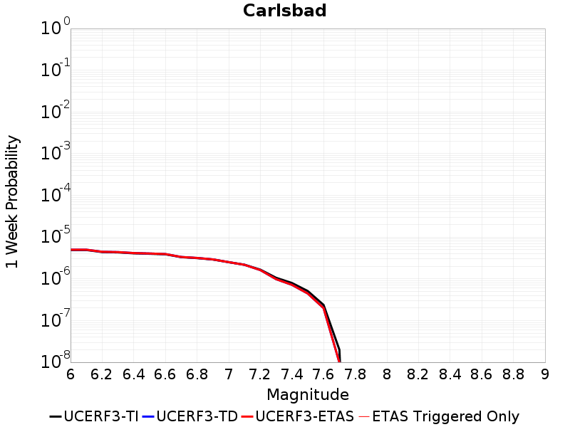 |  | 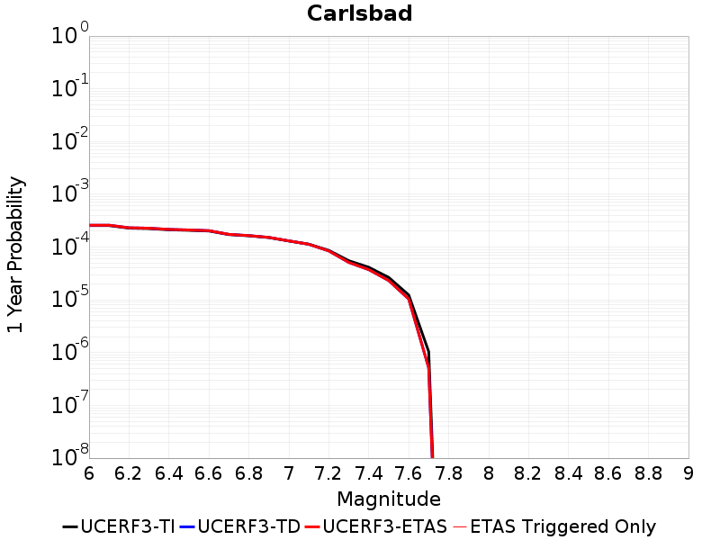 |  |

| Magnitude | 1 wk TI Prob | 1 wk TD Prob | 1 wk ETAS Prob | 1 wk ETAS/TD Gain | 1 wk ETAS Triggered Only | 1 mo TI Prob | 1 mo TD Prob | 1 mo ETAS Prob | 1 mo ETAS/TD Gain | 1 mo ETAS Triggered Only | 1 yr TI Prob | 1 yr TD Prob | 1 yr ETAS Prob | 1 yr ETAS/TD Gain | 1 yr ETAS Triggered Only | 10 yr TI Prob | 10 yr TD Prob | 10 yr ETAS Prob | 10 yr ETAS/TD Gain | 10 yr ETAS Triggered Only |
|-----|-----|-----|-----|-----|-----|-----|-----|-----|-----|-----|-----|-----|-----|-----|-----|-----|-----|-----|-----|-----|
| 6.0 | 4.9038536E-6 | 4.988742E-6 | 4.988742E-6 | 1.0 | 0.0 | 2.1016345E-5 | 2.138015E-5 | 2.138015E-5 | 1.0 | 0.0 | 2.5584397E-4 | 2.602727E-4 | 2.602727E-4 | 1.0 | 0.0 | 0.002555496 | 0.002599726 | 0.0026097 | 1.0038365 | 1.0E-5 |
| 6.1 | 4.9038536E-6 | 4.988742E-6 | 4.988742E-6 | 1.0 | 0.0 | 2.1016345E-5 | 2.138015E-5 | 2.138015E-5 | 1.0 | 0.0 | 2.5584397E-4 | 2.602727E-4 | 2.602727E-4 | 1.0 | 0.0 | 0.002555496 | 0.002599726 | 0.0026097 | 1.0038365 | 1.0E-5 |
| 6.2 | 4.3820614E-6 | 4.4561903E-6 | 4.4561903E-6 | 1.0 | 0.0 | 1.8780129E-5 | 1.9097819E-5 | 1.9097819E-5 | 1.0 | 0.0 | 2.2862408E-4 | 2.324915E-4 | 2.324915E-4 | 1.0 | 0.0 | 0.00228389 | 0.0023225185 | 0.0023324953 | 1.0042957 | 1.0E-5 |
| 6.3 | 4.302872E-6 | 4.374412E-6 | 4.374412E-6 | 1.0 | 0.0 | 1.8440749E-5 | 1.8747347E-5 | 1.8747347E-5 | 1.0 | 0.0 | 2.24493E-4 | 2.2822538E-4 | 2.2822538E-4 | 1.0 | 0.0 | 0.0022426634 | 0.0022799454 | 0.0022899224 | 1.004376 | 1.0E-5 |
| 6.4 | 4.0835243E-6 | 4.1490234E-6 | 4.1490234E-6 | 1.0 | 0.0 | 1.75007E-5 | 1.778141E-5 | 1.778141E-5 | 1.0 | 0.0 | 2.1305021E-4 | 2.164675E-4 | 2.164675E-4 | 1.0 | 0.0 | 0.0021284607 | 0.0021626004 | 0.0021725788 | 1.0046141 | 1.0E-5 |
| 6.5 | 3.987806E-6 | 4.050237E-6 | 4.050237E-6 | 1.0 | 0.0 | 1.7090486E-5 | 1.7358045E-5 | 1.7358045E-5 | 1.0 | 0.0 | 2.080568E-4 | 2.1131404E-4 | 2.1131404E-4 | 1.0 | 0.0 | 0.002078621 | 0.0021111649 | 0.0021211437 | 1.0047268 | 1.0E-5 |
| 6.6 | 3.8707576E-6 | 3.928812E-6 | 3.928812E-6 | 1.0 | 0.0 | 1.6588854E-5 | 1.683766E-5 | 1.683766E-5 | 1.0 | 0.0 | 2.0195059E-4 | 2.0497954E-4 | 2.0497954E-4 | 1.0 | 0.0 | 0.0020176715 | 0.0020479383 | 0.0020579179 | 1.0048729 | 1.0E-5 |
| 6.7 | 3.3093434E-6 | 3.343559E-6 | 3.343559E-6 | 1.0 | 0.0 | 1.4182823E-5 | 1.4329461E-5 | 1.4329461E-5 | 1.0 | 0.0 | 1.7266218E-4 | 1.7444727E-4 | 1.7444727E-4 | 1.0 | 0.0 | 0.001725281 | 0.0017431094 | 0.0017530919 | 1.0057269 | 1.0E-5 |
| 6.8 | 3.136983E-6 | 3.1675636E-6 | 3.1675636E-6 | 1.0 | 0.0 | 1.3444143E-5 | 1.3575202E-5 | 1.3575202E-5 | 1.0 | 0.0 | 1.6367015E-4 | 1.6526559E-4 | 1.6526559E-4 | 1.0 | 0.0 | 0.0016354966 | 0.0016514327 | 0.0016614161 | 1.0060453 | 1.0E-5 |
| 6.9 | 2.9056644E-6 | 2.9277885E-6 | 2.9277885E-6 | 1.0 | 0.0 | 1.2452788E-5 | 1.2547605E-5 | 1.2547605E-5 | 1.0 | 0.0 | 1.5160214E-4 | 1.5275643E-4 | 1.5275643E-4 | 1.0 | 0.0 | 0.0015149876 | 0.0015265197 | 0.0015365044 | 1.0065409 | 1.0E-5 |
| 7.0 | 2.5071035E-6 | 2.512302E-6 | 2.512302E-6 | 1.0 | 0.0 | 1.0744685E-5 | 1.0766965E-5 | 1.0766965E-5 | 1.0 | 0.0 | 1.308087E-4 | 1.3107994E-4 | 1.3107994E-4 | 1.0 | 0.0 | 0.0013073172 | 0.0013100294 | 0.0013200163 | 1.0076234 | 1.0E-5 |
| 7.1 | 2.1786877E-6 | 2.168676E-6 | 2.168676E-6 | 1.0 | 0.0 | 9.3372E-6 | 9.294293E-6 | 9.294293E-6 | 1.0 | 0.0 | 1.13674476E-4 | 1.13152164E-4 | 1.13152164E-4 | 1.0 | 0.0 | 0.0011361635 | 0.0011309483 | 0.0011409371 | 1.0088321 | 1.0E-5 |
| 7.2 | 1.6628418E-6 | 1.6219695E-6 | 1.6219695E-6 | 1.0 | 0.0 | 7.1264453E-6 | 6.95128E-6 | 6.95128E-6 | 1.0 | 0.0 | 8.676102E-5 | 8.462857E-5 | 8.462857E-5 | 1.0 | 0.0 | 8.672715E-4 | 8.459656E-4 | 8.459656E-4 | 1.0 | 0.0 |
| 7.3 | 1.0595926E-6 | 9.81953E-7 | 9.81953E-7 | 1.0 | 0.0 | 4.541103E-6 | 4.2083634E-6 | 4.2083634E-6 | 1.0 | 0.0 | 5.5286528E-5 | 5.1235627E-5 | 5.1235627E-5 | 1.0 | 0.0 | 5.527277E-4 | 5.1223906E-4 | 5.1223906E-4 | 1.0 | 0.0 |
| 7.4 | 7.956623E-7 | 7.1757415E-7 | 7.1757415E-7 | 1.0 | 0.0 | 3.4099767E-6 | 3.0753142E-6 | 3.0753142E-6 | 1.0 | 0.0 | 4.1515676E-5 | 3.7441314E-5 | 3.7441314E-5 | 1.0 | 0.0 | 4.150792E-4 | 3.7435078E-4 | 3.7435078E-4 | 1.0 | 0.0 |
| 7.5 | 5.1043804E-7 | 4.4490582E-7 | 4.4490582E-7 | 1.0 | 0.0 | 2.1875896E-6 | 1.9067379E-6 | 1.9067379E-6 | 1.0 | 0.0 | 2.663358E-5 | 2.3214292E-5 | 2.3214292E-5 | 1.0 | 0.0 | 2.6630386E-4 | 2.3211924E-4 | 2.3211924E-4 | 1.0 | 0.0 |
| 7.6 | 2.3723294E-7 | 1.9898815E-7 | 1.9898815E-7 | 1.0 | 0.0 | 1.0167122E-6 | 8.5280607E-7 | 8.5280607E-7 | 1.0 | 0.0 | 1.2378401E-5 | 1.0382867E-5 | 1.0382867E-5 | 1.0 | 0.0 | 1.237771E-4 | 1.03824095E-4 | 1.03824095E-4 | 1.0 | 0.0 |
| 7.7 | 1.9992152E-8 | 9.86545E-9 | 9.86545E-9 | 1.0 | 0.0 | 8.568065E-8 | 4.2280497E-8 | 4.2280497E-8 | 1.0 | 0.0 | 1.0431614E-6 | 5.147651E-7 | 5.147651E-7 | 1.0 | 0.0 | 1.0431565E-5 | 5.147651E-6 | 5.147651E-6 | 1.0 | 0.0 |

## San Diego Trough south
*[(top)](#table-of-contents)*

| 1 Week | 1 Month | 1 Year | 10 Year |
|-----|-----|-----|-----|
|  |  |  |  |

| Magnitude | 1 wk TI Prob | 1 wk TD Prob | 1 wk ETAS Prob | 1 wk ETAS/TD Gain | 1 wk ETAS Triggered Only | 1 mo TI Prob | 1 mo TD Prob | 1 mo ETAS Prob | 1 mo ETAS/TD Gain | 1 mo ETAS Triggered Only | 1 yr TI Prob | 1 yr TD Prob | 1 yr ETAS Prob | 1 yr ETAS/TD Gain | 1 yr ETAS Triggered Only | 10 yr TI Prob | 10 yr TD Prob | 10 yr ETAS Prob | 10 yr ETAS/TD Gain | 10 yr ETAS Triggered Only |
|-----|-----|-----|-----|-----|-----|-----|-----|-----|-----|-----|-----|-----|-----|-----|-----|-----|-----|-----|-----|-----|
| 6.0 | 8.279495E-5 | 1.0440902E-4 | 1.0440902E-4 | 1.0 | 0.0 | 3.5478722E-4 | 4.4739526E-4 | 4.4739526E-4 | 1.0 | 0.0 | 0.004310982 | 0.0054339333 | 0.0054339333 | 1.0 | 0.0 | 0.042283054 | 0.053068604 | 0.05307807 | 1.0001785 | 1.0E-5 |
| 6.1 | 4.6961468E-5 | 5.780735E-5 | 5.780735E-5 | 1.0 | 0.0 | 2.0124791E-4 | 2.4772302E-4 | 2.4772302E-4 | 1.0 | 0.0 | 0.00244744 | 0.0030119207 | 0.0030119207 | 1.0 | 0.0 | 0.024206603 | 0.029718602 | 0.029728305 | 1.0003265 | 1.0E-5 |
| 6.2 | 3.5079658E-5 | 4.2192914E-5 | 4.2192914E-5 | 1.0 | 0.0 | 1.5033272E-4 | 1.808143E-4 | 1.808143E-4 | 1.0 | 0.0 | 0.0018287642 | 0.0021992105 | 0.0021992105 | 1.0 | 0.0 | 0.018137876 | 0.021776803 | 0.021786584 | 1.0004492 | 1.0E-5 |
| 6.3 | 3.5079658E-5 | 4.2192914E-5 | 4.2192914E-5 | 1.0 | 0.0 | 1.5033272E-4 | 1.808143E-4 | 1.808143E-4 | 1.0 | 0.0 | 0.0018287642 | 0.0021992105 | 0.0021992105 | 1.0 | 0.0 | 0.018137876 | 0.021776803 | 0.021786584 | 1.0004492 | 1.0E-5 |
| 6.4 | 2.7196904E-5 | 3.2121523E-5 | 3.2121523E-5 | 1.0 | 0.0 | 1.16552954E-4 | 1.376565E-4 | 1.376565E-4 | 1.0 | 0.0 | 0.0014181085 | 0.0016746913 | 0.0016746913 | 1.0 | 0.0 | 0.014090929 | 0.016622294 | 0.016632129 | 1.0005916 | 1.0E-5 |
| 6.5 | 2.5584688E-5 | 3.0133297E-5 | 3.0133297E-5 | 1.0 | 0.0 | 1.0964406E-4 | 1.291364E-4 | 1.291364E-4 | 1.0 | 0.0 | 0.0013340989 | 0.0015711135 | 0.0015711135 | 1.0 | 0.0 | 0.013261181 | 0.015601593 | 0.015611437 | 1.000631 | 1.0E-5 |
| 6.6 | 2.2034688E-5 | 2.5768524E-5 | 2.5768524E-5 | 1.0 | 0.0 | 9.443096E-5 | 1.1043191E-4 | 1.1043191E-4 | 1.0 | 0.0 | 0.0011490905 | 0.0013436868 | 0.0013436868 | 1.0 | 0.0 | 0.011431668 | 0.013356615 | 0.013366481 | 1.0007387 | 1.0E-5 |
| 6.7 | 1.9394853E-5 | 2.2563554E-5 | 2.2563554E-5 | 1.0 | 0.0 | 8.311815E-5 | 9.669739E-5 | 9.669739E-5 | 1.0 | 0.0 | 0.0010114936 | 0.0011766601 | 0.0011766601 | 1.0 | 0.0 | 0.01006902 | 0.011705006 | 0.011714889 | 1.0008444 | 1.0E-5 |
| 6.8 | 1.7615313E-5 | 2.0422403E-5 | 2.0422403E-5 | 1.0 | 0.0 | 7.549201E-5 | 8.752167E-5 | 8.752167E-5 | 1.0 | 0.0 | 9.1872766E-4 | 0.0010650598 | 0.0010650598 | 1.0 | 0.0 | 0.009149387 | 0.010600122 | 0.010610016 | 1.0009334 | 1.0E-5 |
| 6.9 | 1.5621423E-5 | 1.8042618E-5 | 1.8042618E-5 | 1.0 | 0.0 | 6.6947236E-5 | 7.732323E-5 | 7.732323E-5 | 1.0 | 0.0 | 8.147778E-4 | 9.410073E-4 | 9.410073E-4 | 1.0 | 0.0 | 0.008117969 | 0.0093706725 | 0.009380579 | 1.0010571 | 1.0E-5 |
| 7.0 | 1.3444376E-5 | 1.546177E-5 | 1.546177E-5 | 1.0 | 0.0 | 5.7617483E-5 | 6.626306E-5 | 6.626306E-5 | 1.0 | 0.0 | 7.0126704E-4 | 8.0645696E-4 | 8.0645696E-4 | 1.0 | 0.0 | 0.006990582 | 0.008035637 | 0.008035637 | 1.0 | 0.0 |
| 7.1 | 1.2268361E-5 | 1.4085331E-5 | 1.4085331E-5 | 1.0 | 0.0 | 5.2577634E-5 | 6.036432E-5 | 6.036432E-5 | 1.0 | 0.0 | 6.399447E-4 | 7.346904E-4 | 7.346904E-4 | 1.0 | 0.0 | 0.0063810493 | 0.007322921 | 0.007322921 | 1.0 | 0.0 |
| 7.2 | 1.0922655E-5 | 1.2524395E-5 | 1.2524395E-5 | 1.0 | 0.0 | 4.681054E-5 | 5.367489E-5 | 5.367489E-5 | 1.0 | 0.0 | 5.697693E-4 | 6.532984E-4 | 6.532984E-4 | 1.0 | 0.0 | 0.0056831064 | 0.00651406 | 0.00651406 | 1.0 | 0.0 |
| 7.3 | 6.1106753E-6 | 6.934444E-6 | 6.934444E-6 | 1.0 | 0.0 | 2.6188345E-5 | 2.9718709E-5 | 2.9718709E-5 | 1.0 | 0.0 | 3.1879646E-4 | 3.6176562E-4 | 3.6176562E-4 | 1.0 | 0.0 | 0.0031833951 | 0.0036118124 | 0.0036118124 | 1.0 | 0.0 |
| 7.4 | 4.933187E-6 | 5.5939804E-6 | 5.5939804E-6 | 1.0 | 0.0 | 2.114206E-5 | 2.3973982E-5 | 2.3973982E-5 | 1.0 | 0.0 | 2.5737417E-4 | 2.9184454E-4 | 2.9184454E-4 | 1.0 | 0.0 | 0.002570763 | 0.002914654 | 0.002914654 | 1.0 | 0.0 |
| 7.5 | 1.7489613E-6 | 1.9711686E-6 | 1.9711686E-6 | 1.0 | 0.0 | 7.495527E-6 | 8.44784E-6 | 8.44784E-6 | 1.0 | 0.0 | 9.125422E-5 | 1.02847815E-4 | 1.02847815E-4 | 1.0 | 0.0 | 9.1216754E-4 | 0.0010280242 | 0.0010280242 | 1.0 | 0.0 |
| 7.6 | 1.6988751E-7 | 1.7537151E-7 | 1.7537151E-7 | 1.0 | 0.0 | 7.2808916E-7 | 7.51592E-7 | 7.51592E-7 | 1.0 | 0.0 | 8.864449E-6 | 9.150596E-6 | 9.150596E-6 | 1.0 | 0.0 | 8.8640954E-5 | 9.150239E-5 | 9.150239E-5 | 1.0 | 0.0 |

## Pisgah-Bullion Mtn-Mesquite Lk
*[(top)](#table-of-contents)*

| 1 Week | 1 Month | 1 Year | 10 Year |
|-----|-----|-----|-----|
| 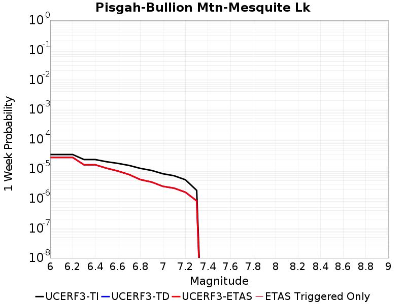 |  | 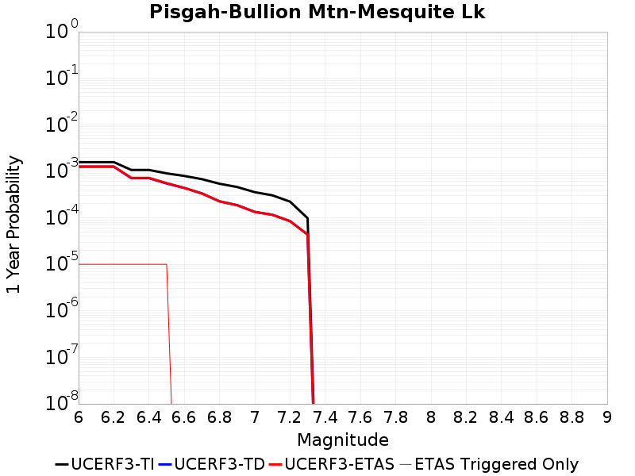 | 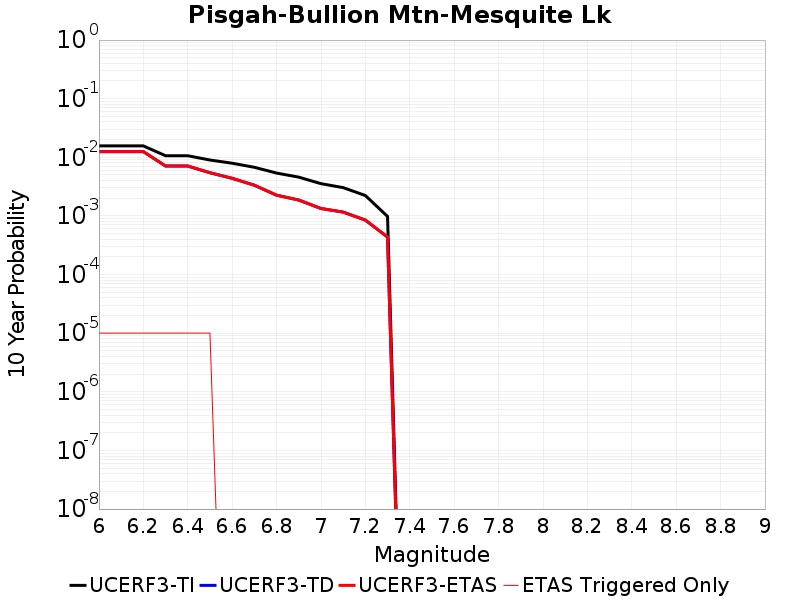 |

| Magnitude | 1 wk TI Prob | 1 wk TD Prob | 1 wk ETAS Prob | 1 wk ETAS/TD Gain | 1 wk ETAS Triggered Only | 1 mo TI Prob | 1 mo TD Prob | 1 mo ETAS Prob | 1 mo ETAS/TD Gain | 1 mo ETAS Triggered Only | 1 yr TI Prob | 1 yr TD Prob | 1 yr ETAS Prob | 1 yr ETAS/TD Gain | 1 yr ETAS Triggered Only | 10 yr TI Prob | 10 yr TD Prob | 10 yr ETAS Prob | 10 yr ETAS/TD Gain | 10 yr ETAS Triggered Only |
|-----|-----|-----|-----|-----|-----|-----|-----|-----|-----|-----|-----|-----|-----|-----|-----|-----|-----|-----|-----|-----|
| 6.0 | 3.0240792E-5 | 2.4108935E-5 | 2.4108935E-5 | 1.0 | 0.0 | 1.2959696E-4 | 1.0332048E-4 | 1.0332048E-4 | 1.0 | 0.0 | 0.0015767008 | 0.0012573018 | 0.0012672893 | 1.0079435 | 1.0E-5 | 0.015655609 | 0.012511924 | 0.012521799 | 1.0007893 | 1.0E-5 |
| 6.1 | 3.0240792E-5 | 2.4108935E-5 | 2.4108935E-5 | 1.0 | 0.0 | 1.2959696E-4 | 1.0332048E-4 | 1.0332048E-4 | 1.0 | 0.0 | 0.0015767008 | 0.0012573018 | 0.0012672893 | 1.0079435 | 1.0E-5 | 0.015655609 | 0.012511924 | 0.012521799 | 1.0007893 | 1.0E-5 |
| 6.2 | 3.0240792E-5 | 2.4108935E-5 | 2.4108935E-5 | 1.0 | 0.0 | 1.2959696E-4 | 1.0332048E-4 | 1.0332048E-4 | 1.0 | 0.0 | 0.0015767008 | 0.0012573018 | 0.0012672893 | 1.0079435 | 1.0E-5 | 0.015655609 | 0.012511924 | 0.012521799 | 1.0007893 | 1.0E-5 |
| 6.3 | 2.0498217E-5 | 1.3646986E-5 | 1.3646986E-5 | 1.0 | 0.0 | 8.784654E-5 | 5.848586E-5 | 5.848586E-5 | 1.0 | 0.0 | 0.0010690069 | 7.11849E-4 | 7.218419E-4 | 1.014038 | 1.0E-5 | 0.01063879 | 0.0070973164 | 0.0071072453 | 1.001399 | 1.0E-5 |
| 6.4 | 2.0498217E-5 | 1.3646986E-5 | 1.3646986E-5 | 1.0 | 0.0 | 8.784654E-5 | 5.848586E-5 | 5.848586E-5 | 1.0 | 0.0 | 0.0010690069 | 7.11849E-4 | 7.218419E-4 | 1.014038 | 1.0E-5 | 0.01063879 | 0.0070973164 | 0.0071072453 | 1.001399 | 1.0E-5 |
| 6.5 | 1.7316182E-5 | 1.0483666E-5 | 1.0483666E-5 | 1.0 | 0.0 | 7.42101E-5 | 4.492928E-5 | 4.492928E-5 | 1.0 | 0.0 | 9.0313336E-4 | 5.468867E-4 | 5.568812E-4 | 1.0182754 | 1.0E-5 | 0.008994718 | 0.005456405 | 0.005466351 | 1.0018227 | 1.0E-5 |
| 6.6 | 1.5251077E-5 | 8.419549E-6 | 8.419549E-6 | 1.0 | 0.0 | 6.536012E-5 | 3.6083326E-5 | 3.6083326E-5 | 1.0 | 0.0 | 7.9546886E-4 | 4.3923315E-4 | 4.3923315E-4 | 1.0 | 0.0 | 0.007926274 | 0.004384368 | 0.004384368 | 1.0 | 0.0 |
| 6.7 | 1.2997425E-5 | 6.415517E-6 | 6.415517E-6 | 1.0 | 0.0 | 5.570206E-5 | 2.7494809E-5 | 2.7494809E-5 | 1.0 | 0.0 | 6.7796157E-4 | 3.3470255E-4 | 3.3470255E-4 | 1.0 | 0.0 | 0.0067589693 | 0.003342445 | 0.003342445 | 1.0 | 0.0 |
| 6.8 | 1.035386E-5 | 4.336464E-6 | 4.336464E-6 | 1.0 | 0.0 | 4.437293E-5 | 1.8584718E-5 | 1.8584718E-5 | 1.0 | 0.0 | 5.401065E-4 | 2.2624632E-4 | 2.2624632E-4 | 1.0 | 0.0 | 0.0053879567 | 0.0022602468 | 0.0022602468 | 1.0 | 0.0 |
| 6.9 | 8.816252E-6 | 3.5834755E-6 | 3.5834755E-6 | 1.0 | 0.0 | 3.778339E-5 | 1.5357666E-5 | 1.5357666E-5 | 1.0 | 0.0 | 4.5991567E-4 | 1.8696411E-4 | 1.8696411E-4 | 1.0 | 0.0 | 0.00458965 | 0.0018681268 | 0.0018681268 | 1.0 | 0.0 |
| 7.0 | 6.8232207E-6 | 2.5699753E-6 | 2.5699753E-6 | 1.0 | 0.0 | 2.9242048E-5 | 1.1014135E-5 | 1.1014135E-5 | 1.0 | 0.0 | 3.5596377E-4 | 1.3408916E-4 | 1.3408916E-4 | 1.0 | 0.0 | 0.0035539411 | 0.0013401136 | 0.0013401136 | 1.0 | 0.0 |
| 7.1 | 5.837013E-6 | 2.22936E-6 | 2.22936E-6 | 1.0 | 0.0 | 2.501553E-5 | 9.554366E-6 | 9.554366E-6 | 1.0 | 0.0 | 3.045215E-4 | 1.163185E-4 | 1.163185E-4 | 1.0 | 0.0 | 0.0030410455 | 0.0011626052 | 0.0011626052 | 1.0 | 0.0 |
| 7.2 | 4.278052E-6 | 1.6290835E-6 | 1.6290835E-6 | 1.0 | 0.0 | 1.833438E-5 | 6.9817693E-6 | 6.9817693E-6 | 1.0 | 0.0 | 2.231982E-4 | 8.499996E-5 | 8.499996E-5 | 1.0 | 0.0 | 0.0022297418 | 8.4969774E-4 | 8.4969774E-4 | 1.0 | 0.0 |
| 7.3 | 1.8803692E-6 | 8.354291E-7 | 8.354291E-7 | 1.0 | 0.0 | 8.0587E-6 | 3.5804064E-6 | 3.5804064E-6 | 1.0 | 0.0 | 9.811026E-5 | 4.3590724E-5 | 4.3590724E-5 | 1.0 | 0.0 | 9.806695E-4 | 4.358362E-4 | 4.358362E-4 | 1.0 | 0.0 |

## White Mountains
*[(top)](#table-of-contents)*

| 1 Week | 1 Month | 1 Year | 10 Year |
|-----|-----|-----|-----|
|  | 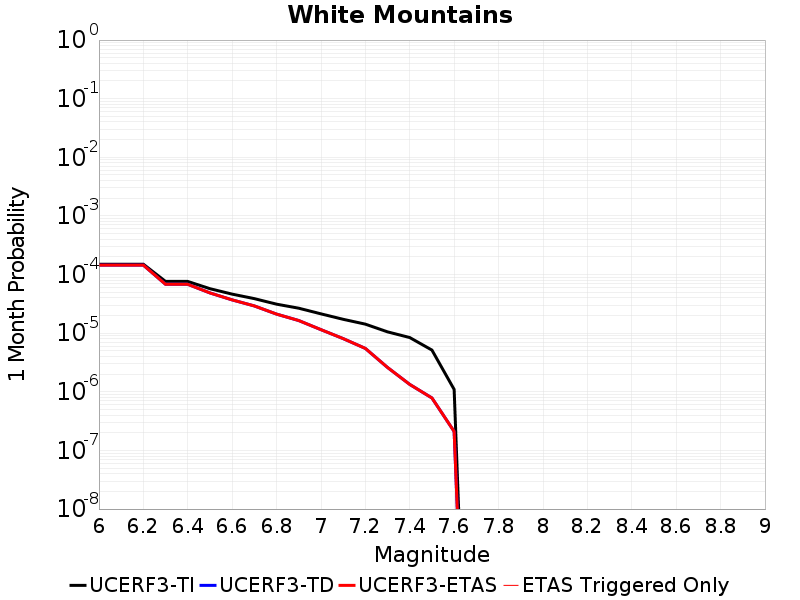 |  | 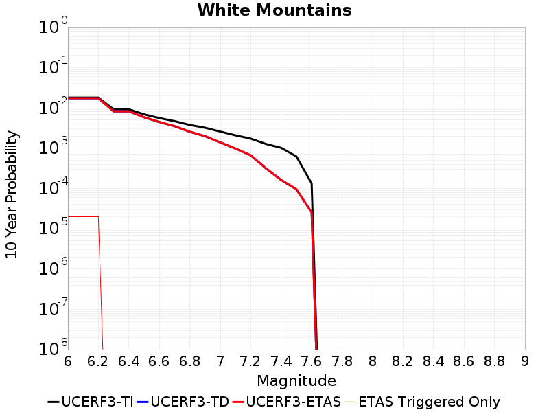 |

| Magnitude | 1 wk TI Prob | 1 wk TD Prob | 1 wk ETAS Prob | 1 wk ETAS/TD Gain | 1 wk ETAS Triggered Only | 1 mo TI Prob | 1 mo TD Prob | 1 mo ETAS Prob | 1 mo ETAS/TD Gain | 1 mo ETAS Triggered Only | 1 yr TI Prob | 1 yr TD Prob | 1 yr ETAS Prob | 1 yr ETAS/TD Gain | 1 yr ETAS Triggered Only | 10 yr TI Prob | 10 yr TD Prob | 10 yr ETAS Prob | 10 yr ETAS/TD Gain | 10 yr ETAS Triggered Only |
|-----|-----|-----|-----|-----|-----|-----|-----|-----|-----|-----|-----|-----|-----|-----|-----|-----|-----|-----|-----|-----|
| 6.0 | 3.503579E-5 | 3.3801065E-5 | 3.3801065E-5 | 1.0 | 0.0 | 1.5014476E-4 | 1.4485433E-4 | 1.4485433E-4 | 1.0 | 0.0 | 0.0018264796 | 0.0017622958 | 0.0017722782 | 1.0056645 | 1.0E-5 | 0.018115403 | 0.017495556 | 0.01750538 | 1.0005616 | 1.0E-5 |
| 6.1 | 3.503579E-5 | 3.3801065E-5 | 3.3801065E-5 | 1.0 | 0.0 | 1.5014476E-4 | 1.4485433E-4 | 1.4485433E-4 | 1.0 | 0.0 | 0.0018264796 | 0.0017622958 | 0.0017722782 | 1.0056645 | 1.0E-5 | 0.018115403 | 0.017495556 | 0.01750538 | 1.0005616 | 1.0E-5 |
| 6.2 | 3.503579E-5 | 3.3801065E-5 | 3.3801065E-5 | 1.0 | 0.0 | 1.5014476E-4 | 1.4485433E-4 | 1.4485433E-4 | 1.0 | 0.0 | 0.0018264796 | 0.0017622958 | 0.0017722782 | 1.0056645 | 1.0E-5 | 0.018115403 | 0.017495556 | 0.01750538 | 1.0005616 | 1.0E-5 |
| 6.3 | 1.7818425E-5 | 1.5923611E-5 | 1.5923611E-5 | 1.0 | 0.0 | 7.636245E-5 | 6.824234E-5 | 6.824234E-5 | 1.0 | 0.0 | 9.293162E-4 | 8.3054806E-4 | 8.3054806E-4 | 1.0 | 0.0 | 0.009254395 | 0.0082759 | 0.0082759 | 1.0 | 0.0 |
| 6.4 | 1.7818425E-5 | 1.5923611E-5 | 1.5923611E-5 | 1.0 | 0.0 | 7.636245E-5 | 6.824234E-5 | 6.824234E-5 | 1.0 | 0.0 | 9.293162E-4 | 8.3054806E-4 | 8.3054806E-4 | 1.0 | 0.0 | 0.009254395 | 0.0082759 | 0.0082759 | 1.0 | 0.0 |
| 6.5 | 1.3397557E-5 | 1.1341609E-5 | 1.1341609E-5 | 1.0 | 0.0 | 5.741684E-5 | 4.860603E-5 | 4.860603E-5 | 1.0 | 0.0 | 6.988258E-4 | 5.916247E-4 | 5.916247E-4 | 1.0 | 0.0 | 0.006966323 | 0.005901203 | 0.005901203 | 1.0 | 0.0 |
| 6.6 | 1.0818695E-5 | 8.629391E-6 | 8.629391E-6 | 1.0 | 0.0 | 4.6365014E-5 | 3.6982605E-5 | 3.6982605E-5 | 1.0 | 0.0 | 5.6434784E-4 | 4.5017456E-4 | 4.5017456E-4 | 1.0 | 0.0 | 0.005629168 | 0.0044930633 | 0.0044930633 | 1.0 | 0.0 |
| 6.7 | 9.067908E-6 | 6.805643E-6 | 6.805643E-6 | 1.0 | 0.0 | 3.8861883E-5 | 2.9166733E-5 | 2.9166733E-5 | 1.0 | 0.0 | 4.7304068E-4 | 3.5505032E-4 | 3.5505032E-4 | 1.0 | 0.0 | 0.00472035 | 0.003545148 | 0.003545148 | 1.0 | 0.0 |
| 6.8 | 7.295947E-6 | 4.9387386E-6 | 4.9387386E-6 | 1.0 | 0.0 | 3.126797E-5 | 2.1165857E-5 | 2.1165857E-5 | 1.0 | 0.0 | 3.8062103E-4 | 2.5766497E-4 | 2.5766497E-4 | 1.0 | 0.0 | 0.0037996976 | 0.0025737751 | 0.0025737751 | 1.0 | 0.0 |
| 6.9 | 6.2243444E-6 | 3.834156E-6 | 3.834156E-6 | 1.0 | 0.0 | 2.6675489E-5 | 1.6431997E-5 | 1.6431997E-5 | 1.0 | 0.0 | 3.2472567E-4 | 2.0004172E-4 | 2.0004172E-4 | 1.0 | 0.0 | 0.0032425157 | 0.0019986692 | 0.0019986692 | 1.0 | 0.0 |
| 7.0 | 4.9878413E-6 | 2.6812074E-6 | 2.6812074E-6 | 1.0 | 0.0 | 2.1376287E-5 | 1.149084E-5 | 1.149084E-5 | 1.0 | 0.0 | 2.602252E-4 | 1.3989226E-4 | 1.3989226E-4 | 1.0 | 0.0 | 0.002599207 | 0.0013980682 | 0.0013980682 | 1.0 | 0.0 |
| 7.1 | 4.0252844E-6 | 1.8872656E-6 | 1.8872656E-6 | 1.0 | 0.0 | 1.7251105E-5 | 8.088257E-6 | 8.088257E-6 | 1.0 | 0.0 | 2.1001195E-4 | 9.8470206E-5 | 9.8470206E-5 | 1.0 | 0.0 | 0.0020981359 | 9.842785E-4 | 9.842785E-4 | 1.0 | 0.0 |
| 7.2 | 3.3284066E-6 | 1.283238E-6 | 1.283238E-6 | 1.0 | 0.0 | 1.4264522E-5 | 5.4995808E-6 | 5.4995808E-6 | 1.0 | 0.0 | 1.736567E-4 | 6.695544E-5 | 6.695544E-5 | 1.0 | 0.0 | 0.0017352107 | 6.693627E-4 | 6.693627E-4 | 1.0 | 0.0 |
| 7.3 | 2.458226E-6 | 6.0690445E-7 | 6.0690445E-7 | 1.0 | 0.0 | 1.0535211E-5 | 2.6010168E-6 | 2.6010168E-6 | 1.0 | 0.0 | 1.2825865E-4 | 3.1666958E-5 | 3.1666958E-5 | 1.0 | 0.0 | 0.0012818464 | 3.166282E-4 | 3.166282E-4 | 1.0 | 0.0 |
| 7.4 | 1.965953E-6 | 3.119065E-7 | 3.119065E-7 | 1.0 | 0.0 | 8.425486E-6 | 1.3367414E-6 | 1.3367414E-6 | 1.0 | 0.0 | 1.0257547E-4 | 1.6274706E-5 | 1.6274706E-5 | 1.0 | 0.0 | 0.0010252813 | 1.6273528E-4 | 1.6273528E-4 | 1.0 | 0.0 |
| 7.5 | 1.2014192E-6 | 1.8314239E-7 | 1.8314239E-7 | 1.0 | 0.0 | 5.148929E-6 | 7.8489575E-7 | 7.8489575E-7 | 1.0 | 0.0 | 6.2686406E-5 | 9.5560645E-6 | 9.5560645E-6 | 1.0 | 0.0 | 6.266873E-4 | 9.555662E-5 | 9.555662E-5 | 1.0 | 0.0 |
| 7.6 | 2.5612175E-7 | 4.9131806E-8 | 4.9131806E-8 | 1.0 | 0.0 | 1.0976642E-6 | 2.1056486E-7 | 2.1056486E-7 | 1.0 | 0.0 | 1.3363979E-5 | 2.5636245E-6 | 2.5636245E-6 | 1.0 | 0.0 | 1.3363175E-4 | 2.5635987E-5 | 2.5635987E-5 | 1.0 | 0.0 |

## Hollywood
*[(top)](#table-of-contents)*

| 1 Week | 1 Month | 1 Year | 10 Year |
|-----|-----|-----|-----|
| 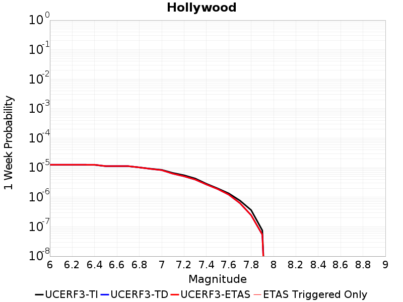 |  |  |  |

| Magnitude | 1 wk TI Prob | 1 wk TD Prob | 1 wk ETAS Prob | 1 wk ETAS/TD Gain | 1 wk ETAS Triggered Only | 1 mo TI Prob | 1 mo TD Prob | 1 mo ETAS Prob | 1 mo ETAS/TD Gain | 1 mo ETAS Triggered Only | 1 yr TI Prob | 1 yr TD Prob | 1 yr ETAS Prob | 1 yr ETAS/TD Gain | 1 yr ETAS Triggered Only | 10 yr TI Prob | 10 yr TD Prob | 10 yr ETAS Prob | 10 yr ETAS/TD Gain | 10 yr ETAS Triggered Only |
|-----|-----|-----|-----|-----|-----|-----|-----|-----|-----|-----|-----|-----|-----|-----|-----|-----|-----|-----|-----|-----|
| 6.0 | 1.24487615E-5 | 1.2600301E-5 | 1.2600301E-5 | 1.0 | 0.0 | 5.3350745E-5 | 5.4000197E-5 | 5.4000197E-5 | 1.0 | 0.0 | 6.4935174E-4 | 6.5725873E-4 | 6.5725873E-4 | 1.0 | 0.0 | 0.0064745755 | 0.006553637 | 0.0065635713 | 1.0015159 | 1.0E-5 |
| 6.1 | 1.24487615E-5 | 1.2600301E-5 | 1.2600301E-5 | 1.0 | 0.0 | 5.3350745E-5 | 5.4000197E-5 | 5.4000197E-5 | 1.0 | 0.0 | 6.4935174E-4 | 6.5725873E-4 | 6.5725873E-4 | 1.0 | 0.0 | 0.0064745755 | 0.006553637 | 0.0065635713 | 1.0015159 | 1.0E-5 |
| 6.2 | 1.24487615E-5 | 1.2600301E-5 | 1.2600301E-5 | 1.0 | 0.0 | 5.3350745E-5 | 5.4000197E-5 | 5.4000197E-5 | 1.0 | 0.0 | 6.4935174E-4 | 6.5725873E-4 | 6.5725873E-4 | 1.0 | 0.0 | 0.0064745755 | 0.006553637 | 0.0065635713 | 1.0015159 | 1.0E-5 |
| 6.3 | 1.24487615E-5 | 1.2600301E-5 | 1.2600301E-5 | 1.0 | 0.0 | 5.3350745E-5 | 5.4000197E-5 | 5.4000197E-5 | 1.0 | 0.0 | 6.4935174E-4 | 6.5725873E-4 | 6.5725873E-4 | 1.0 | 0.0 | 0.0064745755 | 0.006553637 | 0.0065635713 | 1.0015159 | 1.0E-5 |
| 6.4 | 1.2431024E-5 | 1.2580903E-5 | 1.2580903E-5 | 1.0 | 0.0 | 5.327473E-5 | 5.391707E-5 | 5.391707E-5 | 1.0 | 0.0 | 6.4842677E-4 | 6.5624726E-4 | 6.5624726E-4 | 1.0 | 0.0 | 0.0064653796 | 0.0065435814 | 0.0065535163 | 1.0015182 | 1.0E-5 |
| 6.5 | 1.1242222E-5 | 1.1324444E-5 | 1.1324444E-5 | 1.0 | 0.0 | 4.8180063E-5 | 4.853244E-5 | 4.853244E-5 | 1.0 | 0.0 | 5.864344E-4 | 5.90725E-4 | 5.90725E-4 | 1.0 | 0.0 | 0.0058488925 | 0.0058918344 | 0.0059017753 | 1.0016873 | 1.0E-5 |
| 6.6 | 1.1234066E-5 | 1.1315553E-5 | 1.1315553E-5 | 1.0 | 0.0 | 4.8145106E-5 | 4.849434E-5 | 4.849434E-5 | 1.0 | 0.0 | 5.86009E-4 | 5.9026136E-4 | 5.9026136E-4 | 1.0 | 0.0 | 0.005844661 | 0.0058872225 | 0.005897164 | 1.0016886 | 1.0E-5 |
| 6.7 | 1.12294E-5 | 1.1310292E-5 | 1.1310292E-5 | 1.0 | 0.0 | 4.812511E-5 | 4.8471797E-5 | 4.8471797E-5 | 1.0 | 0.0 | 5.857657E-4 | 5.8998703E-4 | 5.8998703E-4 | 1.0 | 0.0 | 0.0058422405 | 0.0058844937 | 0.005894435 | 1.0016894 | 1.0E-5 |
| 6.8 | 1.0252819E-5 | 1.022436E-5 | 1.022436E-5 | 1.0 | 0.0 | 4.3939912E-5 | 4.3817963E-5 | 4.3817963E-5 | 1.0 | 0.0 | 5.3483713E-4 | 5.333553E-4 | 5.333553E-4 | 1.0 | 0.0 | 0.005335517 | 0.0053209784 | 0.0053309253 | 1.0018693 | 1.0E-5 |
| 6.9 | 9.252289E-6 | 9.115514E-6 | 9.115514E-6 | 1.0 | 0.0 | 3.9652066E-5 | 3.9065915E-5 | 3.9065915E-5 | 1.0 | 0.0 | 4.8265693E-4 | 4.7552536E-4 | 4.7552536E-4 | 1.0 | 0.0 | 0.0048161 | 0.004745252 | 0.0047552045 | 1.0020974 | 1.0E-5 |
| 7.0 | 8.474604E-6 | 8.262982E-6 | 8.262982E-6 | 1.0 | 0.0 | 3.6319227E-5 | 3.5412308E-5 | 3.5412308E-5 | 1.0 | 0.0 | 4.4209688E-4 | 4.31061E-4 | 4.31061E-4 | 1.0 | 0.0 | 0.004412184 | 0.004302399 | 0.004312356 | 1.0023143 | 1.0E-5 |
| 7.1 | 6.643643E-6 | 6.2719846E-6 | 6.2719846E-6 | 1.0 | 0.0 | 2.8472443E-5 | 2.687966E-5 | 2.687966E-5 | 1.0 | 0.0 | 3.4659685E-4 | 3.2721114E-4 | 3.2721114E-4 | 1.0 | 0.0 | 0.0034605677 | 0.0032673394 | 0.003277307 | 1.0030506 | 1.0E-5 |
| 7.2 | 5.549002E-6 | 5.111744E-6 | 5.111744E-6 | 1.0 | 0.0 | 2.378122E-5 | 2.1907292E-5 | 2.1907292E-5 | 1.0 | 0.0 | 2.8949787E-4 | 2.666888E-4 | 2.666888E-4 | 1.0 | 0.0 | 0.0028912104 | 0.0026637039 | 0.0026637039 | 1.0 | 0.0 |
| 7.3 | 4.3059727E-6 | 3.962412E-6 | 3.962412E-6 | 1.0 | 0.0 | 1.8454039E-5 | 1.6981656E-5 | 1.6981656E-5 | 1.0 | 0.0 | 2.2465475E-4 | 2.0673213E-4 | 2.0673213E-4 | 1.0 | 0.0 | 0.0022442779 | 0.0020654083 | 0.0020654083 | 1.0 | 0.0 |
| 7.4 | 2.8550733E-6 | 2.7033213E-6 | 2.7033213E-6 | 1.0 | 0.0 | 1.2235971E-5 | 1.1585611E-5 | 1.1585611E-5 | 1.0 | 0.0 | 1.4896276E-4 | 1.4104573E-4 | 1.4104573E-4 | 1.0 | 0.0 | 0.0014886294 | 0.0014095673 | 0.0014095673 | 1.0 | 0.0 |
| 7.5 | 1.9927045E-6 | 1.8991699E-6 | 1.8991699E-6 | 1.0 | 0.0 | 8.540134E-6 | 8.1392745E-6 | 8.1392745E-6 | 1.0 | 0.0 | 1.0397117E-4 | 9.9091194E-5 | 9.9091194E-5 | 1.0 | 0.0 | 0.0010392254 | 9.904738E-4 | 9.904738E-4 | 1.0 | 0.0 |
| 7.6 | 1.345084E-6 | 1.222641E-6 | 1.222641E-6 | 1.0 | 0.0 | 5.764633E-6 | 5.2398796E-6 | 5.2398796E-6 | 1.0 | 0.0 | 7.018215E-5 | 6.379369E-5 | 6.379369E-5 | 1.0 | 0.0 | 7.0159987E-4 | 6.3775573E-4 | 6.3775573E-4 | 1.0 | 0.0 |
| 7.7 | 7.6835164E-7 | 6.285482E-7 | 6.285482E-7 | 1.0 | 0.0 | 3.2929315E-6 | 2.6937755E-6 | 2.6937755E-6 | 1.0 | 0.0 | 4.00907E-5 | 3.2796237E-5 | 3.2796237E-5 | 1.0 | 0.0 | 4.0083472E-4 | 3.2791545E-4 | 3.2791545E-4 | 1.0 | 0.0 |
| 7.8 | 3.6562128E-7 | 2.4598734E-7 | 2.4598734E-7 | 1.0 | 0.0 | 1.5669474E-6 | 1.054231E-6 | 1.054231E-6 | 1.0 | 0.0 | 1.9077417E-5 | 1.2835191E-5 | 1.2835191E-5 | 1.0 | 0.0 | 1.907578E-4 | 1.2834487E-4 | 1.2834487E-4 | 1.0 | 0.0 |
| 7.9 | 7.5024424E-8 | 5.3952906E-8 | 5.3952906E-8 | 1.0 | 0.0 | 3.215332E-7 | 2.3122674E-7 | 2.3122674E-7 | 1.0 | 0.0 | 3.91466E-6 | 2.815183E-6 | 2.815183E-6 | 1.0 | 0.0 | 3.9145907E-5 | 2.8151604E-5 | 2.8151604E-5 | 1.0 | 0.0 |

## Rinconada 2011 CFM
*[(top)](#table-of-contents)*

| 1 Week | 1 Month | 1 Year | 10 Year |
|-----|-----|-----|-----|
| 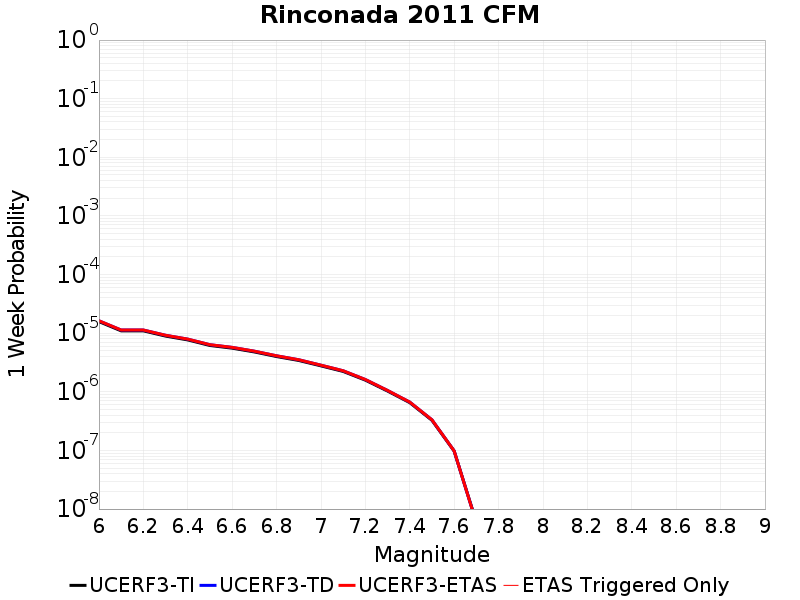 |  |  |  |

| Magnitude | 1 wk TI Prob | 1 wk TD Prob | 1 wk ETAS Prob | 1 wk ETAS/TD Gain | 1 wk ETAS Triggered Only | 1 mo TI Prob | 1 mo TD Prob | 1 mo ETAS Prob | 1 mo ETAS/TD Gain | 1 mo ETAS Triggered Only | 1 yr TI Prob | 1 yr TD Prob | 1 yr ETAS Prob | 1 yr ETAS/TD Gain | 1 yr ETAS Triggered Only | 10 yr TI Prob | 10 yr TD Prob | 10 yr ETAS Prob | 10 yr ETAS/TD Gain | 10 yr ETAS Triggered Only |
|-----|-----|-----|-----|-----|-----|-----|-----|-----|-----|-----|-----|-----|-----|-----|-----|-----|-----|-----|-----|-----|
| 6.0 | 1.5752368E-5 | 1.6277923E-5 | 1.6277923E-5 | 1.0 | 0.0 | 6.75084E-5 | 6.976068E-5 | 6.976068E-5 | 1.0 | 0.0 | 8.2160486E-4 | 8.4900844E-4 | 8.4900844E-4 | 1.0 | 0.0 | 0.008185739 | 0.0084580295 | 0.008467945 | 1.0011723 | 1.0E-5 |
| 6.1 | 1.0966133E-5 | 1.1325224E-5 | 1.1325224E-5 | 1.0 | 0.0 | 4.6996865E-5 | 4.8535774E-5 | 4.8535774E-5 | 1.0 | 0.0 | 5.720366E-4 | 5.907636E-4 | 5.907636E-4 | 1.0 | 0.0 | 0.0057056635 | 0.005892027 | 0.005892027 | 1.0 | 0.0 |
| 6.2 | 1.0966133E-5 | 1.1325224E-5 | 1.1325224E-5 | 1.0 | 0.0 | 4.6996865E-5 | 4.8535774E-5 | 4.8535774E-5 | 1.0 | 0.0 | 5.720366E-4 | 5.907636E-4 | 5.907636E-4 | 1.0 | 0.0 | 0.0057056635 | 0.005892027 | 0.005892027 | 1.0 | 0.0 |
| 6.3 | 8.926149E-6 | 9.2145365E-6 | 9.2145365E-6 | 1.0 | 0.0 | 3.8254362E-5 | 3.9490275E-5 | 3.9490275E-5 | 1.0 | 0.0 | 4.6564735E-4 | 4.8068832E-4 | 4.8068832E-4 | 1.0 | 0.0 | 0.0046467283 | 0.004796531 | 0.004796531 | 1.0 | 0.0 |
| 6.4 | 7.676955E-6 | 7.92169E-6 | 7.92169E-6 | 1.0 | 0.0 | 3.290082E-5 | 3.394966E-5 | 3.394966E-5 | 1.0 | 0.0 | 4.0049385E-4 | 4.1325888E-4 | 4.1325888E-4 | 1.0 | 0.0 | 0.0039977287 | 0.00412493 | 0.00412493 | 1.0 | 0.0 |
| 6.5 | 6.1671026E-6 | 6.360139E-6 | 6.360139E-6 | 1.0 | 0.0 | 2.6430173E-5 | 2.7257456E-5 | 2.7257456E-5 | 1.0 | 0.0 | 3.2173982E-4 | 3.3180907E-4 | 3.3180907E-4 | 1.0 | 0.0 | 0.003212744 | 0.0033131486 | 0.0033131486 | 1.0 | 0.0 |
| 6.6 | 5.553456E-6 | 5.7258717E-6 | 5.7258717E-6 | 1.0 | 0.0 | 2.3800309E-5 | 2.4539218E-5 | 2.4539218E-5 | 1.0 | 0.0 | 2.897302E-4 | 2.987241E-4 | 2.987241E-4 | 1.0 | 0.0 | 0.0028935277 | 0.0029832341 | 0.0029832341 | 1.0 | 0.0 |
| 6.7 | 4.787857E-6 | 4.9342098E-6 | 4.9342098E-6 | 1.0 | 0.0 | 2.0519226E-5 | 2.1146443E-5 | 2.1146443E-5 | 1.0 | 0.0 | 2.4979294E-4 | 2.5742757E-4 | 2.5742757E-4 | 1.0 | 0.0 | 0.0024951235 | 0.0025712994 | 0.0025712994 | 1.0 | 0.0 |
| 6.8 | 3.9955166E-6 | 4.114208E-6 | 4.114208E-6 | 1.0 | 0.0 | 1.7123532E-5 | 1.7632201E-5 | 1.7632201E-5 | 1.0 | 0.0 | 2.0845905E-4 | 2.1465092E-4 | 2.1465092E-4 | 1.0 | 0.0 | 0.002082636 | 0.0021444394 | 0.0021444394 | 1.0 | 0.0 |
| 6.9 | 3.4250072E-6 | 3.5230519E-6 | 3.5230519E-6 | 1.0 | 0.0 | 1.46785205E-5 | 1.5098706E-5 | 1.5098706E-5 | 1.0 | 0.0 | 1.7869633E-4 | 1.8381127E-4 | 1.8381127E-4 | 1.0 | 0.0 | 0.001785527 | 0.0018365948 | 0.0018365948 | 1.0 | 0.0 |
| 7.0 | 2.7712713E-6 | 2.8471704E-6 | 2.8471704E-6 | 1.0 | 0.0 | 1.1876823E-5 | 1.2202102E-5 | 1.2202102E-5 | 1.0 | 0.0 | 1.4459073E-4 | 1.4855048E-4 | 1.4855048E-4 | 1.0 | 0.0 | 0.0014449668 | 0.0014845134 | 0.0014845134 | 1.0 | 0.0 |
| 7.1 | 2.227358E-6 | 2.2860645E-6 | 2.2860645E-6 | 1.0 | 0.0 | 9.545785E-6 | 9.7973825E-6 | 9.7973825E-6 | 1.0 | 0.0 | 1.16213734E-4 | 1.19276614E-4 | 1.19276614E-4 | 1.0 | 0.0 | 0.0011615298 | 0.001192127 | 0.001192127 | 1.0 | 0.0 |
| 7.2 | 1.581796E-6 | 1.6211496E-6 | 1.6211496E-6 | 1.0 | 0.0 | 6.779108E-6 | 6.9477655E-6 | 6.9477655E-6 | 1.0 | 0.0 | 8.253252E-5 | 8.458577E-5 | 8.458577E-5 | 1.0 | 0.0 | 8.250187E-4 | 8.455363E-4 | 8.455363E-4 | 1.0 | 0.0 |
| 7.3 | 1.0306567E-6 | 1.054804E-6 | 1.054804E-6 | 1.0 | 0.0 | 4.4170924E-6 | 4.5205807E-6 | 4.5205807E-6 | 1.0 | 0.0 | 5.3776774E-5 | 5.5036682E-5 | 5.5036682E-5 | 1.0 | 0.0 | 5.376376E-4 | 5.502308E-4 | 5.502308E-4 | 1.0 | 0.0 |
| 7.4 | 6.535541E-7 | 6.683742E-7 | 6.683742E-7 | 1.0 | 0.0 | 2.800943E-6 | 2.8644577E-6 | 2.8644577E-6 | 1.0 | 0.0 | 3.4100947E-5 | 3.4874214E-5 | 3.4874214E-5 | 1.0 | 0.0 | 3.4095717E-4 | 3.4868755E-4 | 3.4868755E-4 | 1.0 | 0.0 |
| 7.5 | 3.2656962E-7 | 3.3321757E-7 | 3.3321757E-7 | 1.0 | 0.0 | 1.3995833E-6 | 1.4280745E-6 | 1.4280745E-6 | 1.0 | 0.0 | 1.7039794E-5 | 1.7386668E-5 | 1.7386668E-5 | 1.0 | 0.0 | 1.7038487E-4 | 1.7385311E-4 | 1.7385311E-4 | 1.0 | 0.0 |
| 7.6 | 9.754343E-8 | 9.8224525E-8 | 9.8224525E-8 | 1.0 | 0.0 | 4.180432E-7 | 4.2096218E-7 | 4.2096218E-7 | 1.0 | 0.0 | 5.089664E-6 | 5.1252027E-6 | 5.1252027E-6 | 1.0 | 0.0 | 5.0895473E-5 | 5.1250852E-5 | 5.1250852E-5 | 1.0 | 0.0 |
| 7.7 | 6.0001453E-9 | 5.8501772E-9 | 5.8501772E-9 | 1.0 | 0.0 | 2.5714908E-8 | 2.507219E-8 | 2.507219E-8 | 1.0 | 0.0 | 3.1307894E-7 | 3.0525388E-7 | 3.0525388E-7 | 1.0 | 0.0 | 3.1307852E-6 | 3.0525346E-6 | 3.0525346E-6 | 1.0 | 0.0 |
| 7.8 | 7.400003E-11 | 7.465839E-11 | 7.465839E-11 | 1.0 | 0.0 | 3.171432E-10 | 3.199644E-10 | 3.199644E-10 | 1.0 | 0.0 | 3.861218E-9 | 3.895567E-9 | 3.895567E-9 | 1.0 | 0.0 | 3.861218E-8 | 3.895567E-8 | 3.895567E-8 | 1.0 | 0.0 |

## Ventura-Pitas Point
*[(top)](#table-of-contents)*

| 1 Week | 1 Month | 1 Year | 10 Year |
|-----|-----|-----|-----|
|  |  | 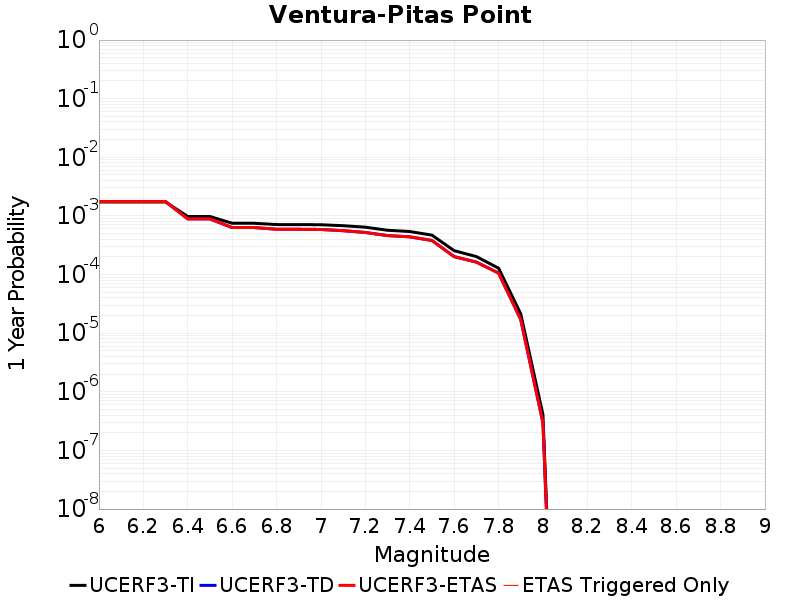 |  |

| Magnitude | 1 wk TI Prob | 1 wk TD Prob | 1 wk ETAS Prob | 1 wk ETAS/TD Gain | 1 wk ETAS Triggered Only | 1 mo TI Prob | 1 mo TD Prob | 1 mo ETAS Prob | 1 mo ETAS/TD Gain | 1 mo ETAS Triggered Only | 1 yr TI Prob | 1 yr TD Prob | 1 yr ETAS Prob | 1 yr ETAS/TD Gain | 1 yr ETAS Triggered Only | 10 yr TI Prob | 10 yr TD Prob | 10 yr ETAS Prob | 10 yr ETAS/TD Gain | 10 yr ETAS Triggered Only |
|-----|-----|-----|-----|-----|-----|-----|-----|-----|-----|-----|-----|-----|-----|-----|-----|-----|-----|-----|-----|-----|
| 6.0 | 3.3179622E-5 | 3.3776512E-5 | 3.3776512E-5 | 1.0 | 0.0 | 1.4219063E-4 | 1.4474991E-4 | 1.4474991E-4 | 1.0 | 0.0 | 0.0017297962 | 0.0017611627 | 0.001771145 | 1.005668 | 1.0E-5 | 0.017163932 | 0.01749755 | 0.017507376 | 1.0005615 | 1.0E-5 |
| 6.1 | 3.3179622E-5 | 3.3776512E-5 | 3.3776512E-5 | 1.0 | 0.0 | 1.4219063E-4 | 1.4474991E-4 | 1.4474991E-4 | 1.0 | 0.0 | 0.0017297962 | 0.0017611627 | 0.001771145 | 1.005668 | 1.0E-5 | 0.017163932 | 0.01749755 | 0.017507376 | 1.0005615 | 1.0E-5 |
| 6.2 | 3.3179622E-5 | 3.3776512E-5 | 3.3776512E-5 | 1.0 | 0.0 | 1.4219063E-4 | 1.4474991E-4 | 1.4474991E-4 | 1.0 | 0.0 | 0.0017297962 | 0.0017611627 | 0.001771145 | 1.005668 | 1.0E-5 | 0.017163932 | 0.01749755 | 0.017507376 | 1.0005615 | 1.0E-5 |
| 6.3 | 3.3179622E-5 | 3.3776512E-5 | 3.3776512E-5 | 1.0 | 0.0 | 1.4219063E-4 | 1.4474991E-4 | 1.4474991E-4 | 1.0 | 0.0 | 0.0017297962 | 0.0017611627 | 0.001771145 | 1.005668 | 1.0E-5 | 0.017163932 | 0.01749755 | 0.017507376 | 1.0005615 | 1.0E-5 |
| 6.4 | 1.8754668E-5 | 1.7045166E-5 | 1.7045166E-5 | 1.0 | 0.0 | 8.037467E-5 | 7.30488E-5 | 7.30488E-5 | 1.0 | 0.0 | 9.781223E-4 | 8.8902935E-4 | 8.8902935E-4 | 1.0 | 0.0 | 0.009738282 | 0.008856987 | 0.008856987 | 1.0 | 0.0 |
| 6.5 | 1.8754668E-5 | 1.7045166E-5 | 1.7045166E-5 | 1.0 | 0.0 | 8.037467E-5 | 7.30488E-5 | 7.30488E-5 | 1.0 | 0.0 | 9.781223E-4 | 8.8902935E-4 | 8.8902935E-4 | 1.0 | 0.0 | 0.009738282 | 0.008856987 | 0.008856987 | 1.0 | 0.0 |
| 6.6 | 1.4361558E-5 | 1.2144503E-5 | 1.2144503E-5 | 1.0 | 0.0 | 6.154808E-5 | 5.2046846E-5 | 5.2046846E-5 | 1.0 | 0.0 | 7.490902E-4 | 6.334884E-4 | 6.334884E-4 | 1.0 | 0.0 | 0.0074657016 | 0.0063170013 | 0.0063170013 | 1.0 | 0.0 |
| 6.7 | 1.4361558E-5 | 1.2144503E-5 | 1.2144503E-5 | 1.0 | 0.0 | 6.154808E-5 | 5.2046846E-5 | 5.2046846E-5 | 1.0 | 0.0 | 7.490902E-4 | 6.334884E-4 | 6.334884E-4 | 1.0 | 0.0 | 0.0074657016 | 0.0063170013 | 0.0063170013 | 1.0 | 0.0 |
| 6.8 | 1.3663846E-5 | 1.1366117E-5 | 1.1366117E-5 | 1.0 | 0.0 | 5.8558027E-5 | 4.871103E-5 | 4.871103E-5 | 1.0 | 0.0 | 7.127108E-4 | 5.9289736E-4 | 5.9289736E-4 | 1.0 | 0.0 | 0.007104293 | 0.00591329 | 0.00591329 | 1.0 | 0.0 |
| 6.9 | 1.3644157E-5 | 1.1344203E-5 | 1.1344203E-5 | 1.0 | 0.0 | 5.8473648E-5 | 4.861712E-5 | 4.861712E-5 | 1.0 | 0.0 | 7.116841E-4 | 5.917546E-4 | 5.917546E-4 | 1.0 | 0.0 | 0.007094092 | 0.005901923 | 0.005901923 | 1.0 | 0.0 |
| 7.0 | 1.3568845E-5 | 1.1263704E-5 | 1.1263704E-5 | 1.0 | 0.0 | 5.8150898E-5 | 4.8272137E-5 | 4.8272137E-5 | 1.0 | 0.0 | 7.077572E-4 | 5.8755674E-4 | 5.8755674E-4 | 1.0 | 0.0 | 0.007055073 | 0.0058601666 | 0.0058601666 | 1.0 | 0.0 |
| 7.1 | 1.306572E-5 | 1.0739634E-5 | 1.0739634E-5 | 1.0 | 0.0 | 5.599474E-5 | 4.60262E-5 | 4.60262E-5 | 1.0 | 0.0 | 6.815227E-4 | 5.602268E-4 | 5.602268E-4 | 1.0 | 0.0 | 0.0067943637 | 0.005588268 | 0.005588268 | 1.0 | 0.0 |
| 7.2 | 1.232604E-5 | 1.0011376E-5 | 1.0011376E-5 | 1.0 | 0.0 | 5.2824813E-5 | 4.2905198E-5 | 4.2905198E-5 | 1.0 | 0.0 | 6.429523E-4 | 5.2224734E-4 | 5.2224734E-4 | 1.0 | 0.0 | 0.0064109527 | 0.0052103107 | 0.0052103107 | 1.0 | 0.0 |
| 7.3 | 1.0917261E-5 | 8.857486E-6 | 8.857486E-6 | 1.0 | 0.0 | 4.678742E-5 | 3.796011E-5 | 3.796011E-5 | 1.0 | 0.0 | 5.69488E-4 | 4.620679E-4 | 4.620679E-4 | 1.0 | 0.0 | 0.0056803077 | 0.0046111555 | 0.0046111555 | 1.0 | 0.0 |
| 7.4 | 1.039959E-5 | 8.436688E-6 | 8.436688E-6 | 1.0 | 0.0 | 4.456891E-5 | 3.6156744E-5 | 3.6156744E-5 | 1.0 | 0.0 | 5.424914E-4 | 4.4012096E-4 | 4.4012096E-4 | 1.0 | 0.0 | 0.0054116896 | 0.0043925727 | 0.0043925727 | 1.0 | 0.0 |
| 7.5 | 9.015877E-6 | 7.309434E-6 | 7.309434E-6 | 1.0 | 0.0 | 3.86389E-5 | 3.1325777E-5 | 3.1325777E-5 | 1.0 | 0.0 | 4.7032707E-4 | 3.81326E-4 | 3.81326E-4 | 1.0 | 0.0 | 0.004693329 | 0.00380678 | 0.00380678 | 1.0 | 0.0 |
| 7.6 | 4.900162E-6 | 3.8766643E-6 | 3.8766643E-6 | 1.0 | 0.0 | 2.1000526E-5 | 1.661417E-5 | 1.661417E-5 | 1.0 | 0.0 | 2.556514E-4 | 2.0225889E-4 | 2.0225889E-4 | 1.0 | 0.0 | 0.0025535747 | 0.0020207618 | 0.0020207618 | 1.0 | 0.0 |
| 7.7 | 3.8850626E-6 | 3.1288027E-6 | 3.1288027E-6 | 1.0 | 0.0 | 1.6650163E-5 | 1.3409087E-5 | 1.3409087E-5 | 1.0 | 0.0 | 2.0269687E-4 | 1.6324349E-4 | 1.6324349E-4 | 1.0 | 0.0 | 0.002025121 | 0.001631245 | 0.001631245 | 1.0 | 0.0 |
| 7.8 | 2.4654719E-6 | 2.0310754E-6 | 2.0310754E-6 | 1.0 | 0.0 | 1.0566265E-5 | 8.704579E-6 | 8.704579E-6 | 1.0 | 0.0 | 1.2863669E-4 | 1.0597315E-4 | 1.0597315E-4 | 1.0 | 0.0 | 0.0012856225 | 0.0010592309 | 0.0010592309 | 1.0 | 0.0 |
| 7.9 | 4.095894E-7 | 3.2778405E-7 | 3.2778405E-7 | 1.0 | 0.0 | 1.7553821E-6 | 1.404788E-6 | 1.404788E-6 | 1.0 | 0.0 | 2.1371567E-5 | 1.7103162E-5 | 1.7103162E-5 | 1.0 | 0.0 | 2.1369511E-4 | 1.7101878E-4 | 1.7101878E-4 | 1.0 | 0.0 |
| 8.0 | 7.791402E-9 | 5.6860734E-9 | 5.6860734E-9 | 1.0 | 0.0 | 3.3391725E-8 | 2.4368886E-8 | 2.4368886E-8 | 1.0 | 0.0 | 4.0654416E-7 | 2.9669116E-7 | 2.9669116E-7 | 1.0 | 0.0 | 4.065434E-6 | 2.9669097E-6 | 2.9669097E-6 | 1.0 | 0.0 |

## Raymond
*[(top)](#table-of-contents)*

| 1 Week | 1 Month | 1 Year | 10 Year |
|-----|-----|-----|-----|
|  | 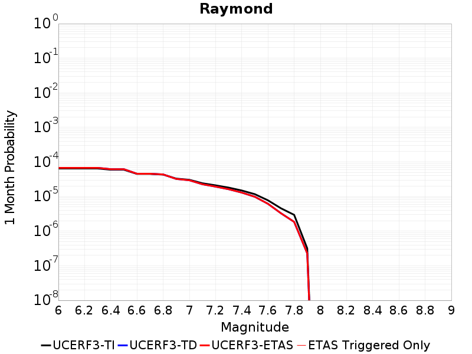 | 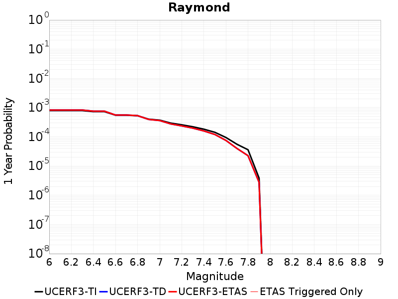 | 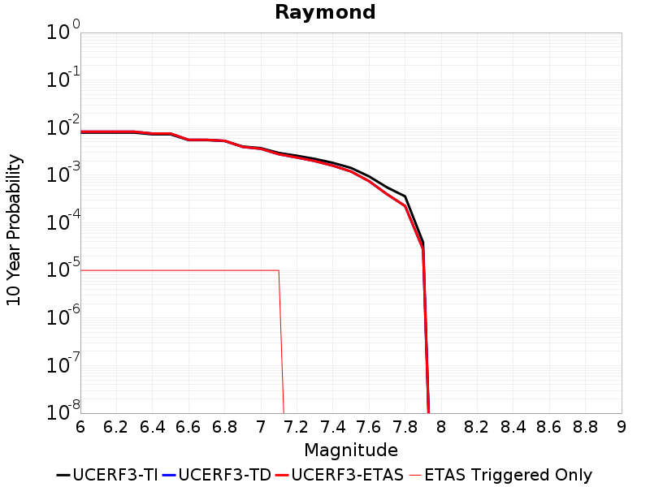 |

| Magnitude | 1 wk TI Prob | 1 wk TD Prob | 1 wk ETAS Prob | 1 wk ETAS/TD Gain | 1 wk ETAS Triggered Only | 1 mo TI Prob | 1 mo TD Prob | 1 mo ETAS Prob | 1 mo ETAS/TD Gain | 1 mo ETAS Triggered Only | 1 yr TI Prob | 1 yr TD Prob | 1 yr ETAS Prob | 1 yr ETAS/TD Gain | 1 yr ETAS Triggered Only | 10 yr TI Prob | 10 yr TD Prob | 10 yr ETAS Prob | 10 yr ETAS/TD Gain | 10 yr ETAS Triggered Only |
|-----|-----|-----|-----|-----|-----|-----|-----|-----|-----|-----|-----|-----|-----|-----|-----|-----|-----|-----|-----|-----|
| 6.0 | 1.5157413E-5 | 1.5821463E-5 | 1.5821463E-5 | 1.0 | 0.0 | 6.4958724E-5 | 6.780464E-5 | 6.780464E-5 | 1.0 | 0.0 | 7.905855E-4 | 8.25234E-4 | 8.25234E-4 | 1.0 | 0.0 | 0.007877788 | 0.0082242135 | 0.008234131 | 1.0012059 | 1.0E-5 |
| 6.1 | 1.5157413E-5 | 1.5821463E-5 | 1.5821463E-5 | 1.0 | 0.0 | 6.4958724E-5 | 6.780464E-5 | 6.780464E-5 | 1.0 | 0.0 | 7.905855E-4 | 8.25234E-4 | 8.25234E-4 | 1.0 | 0.0 | 0.007877788 | 0.0082242135 | 0.008234131 | 1.0012059 | 1.0E-5 |
| 6.2 | 1.5157413E-5 | 1.5821463E-5 | 1.5821463E-5 | 1.0 | 0.0 | 6.4958724E-5 | 6.780464E-5 | 6.780464E-5 | 1.0 | 0.0 | 7.905855E-4 | 8.25234E-4 | 8.25234E-4 | 1.0 | 0.0 | 0.007877788 | 0.0082242135 | 0.008234131 | 1.0012059 | 1.0E-5 |
| 6.3 | 1.5157413E-5 | 1.5821463E-5 | 1.5821463E-5 | 1.0 | 0.0 | 6.4958724E-5 | 6.780464E-5 | 6.780464E-5 | 1.0 | 0.0 | 7.905855E-4 | 8.25234E-4 | 8.25234E-4 | 1.0 | 0.0 | 0.007877788 | 0.0082242135 | 0.008234131 | 1.0012059 | 1.0E-5 |
| 6.4 | 1.3941944E-5 | 1.44651E-5 | 1.44651E-5 | 1.0 | 0.0 | 5.9749822E-5 | 6.1991945E-5 | 6.1991945E-5 | 1.0 | 0.0 | 7.2721124E-4 | 7.5451395E-4 | 7.5451395E-4 | 1.0 | 0.0 | 0.007248361 | 0.0075218556 | 0.0075317807 | 1.0013194 | 1.0E-5 |
| 6.5 | 1.3941944E-5 | 1.44651E-5 | 1.44651E-5 | 1.0 | 0.0 | 5.9749822E-5 | 6.1991945E-5 | 6.1991945E-5 | 1.0 | 0.0 | 7.2721124E-4 | 7.5451395E-4 | 7.5451395E-4 | 1.0 | 0.0 | 0.007248361 | 0.0075218556 | 0.0075317807 | 1.0013194 | 1.0E-5 |
| 6.6 | 1.0542609E-5 | 1.0678992E-5 | 1.0678992E-5 | 1.0 | 0.0 | 4.5181827E-5 | 4.5766337E-5 | 4.5766337E-5 | 1.0 | 0.0 | 5.499499E-4 | 5.5706815E-4 | 5.5706815E-4 | 1.0 | 0.0 | 0.005485909 | 0.005557276 | 0.0055672205 | 1.0017895 | 1.0E-5 |
| 6.7 | 1.0542609E-5 | 1.0678992E-5 | 1.0678992E-5 | 1.0 | 0.0 | 4.5181827E-5 | 4.5766337E-5 | 4.5766337E-5 | 1.0 | 0.0 | 5.499499E-4 | 5.5706815E-4 | 5.5706815E-4 | 1.0 | 0.0 | 0.005485909 | 0.005557276 | 0.0055672205 | 1.0017895 | 1.0E-5 |
| 6.8 | 1.0079132E-5 | 1.0184325E-5 | 1.0184325E-5 | 1.0 | 0.0 | 4.3195567E-5 | 4.3646407E-5 | 4.3646407E-5 | 1.0 | 0.0 | 5.257791E-4 | 5.312708E-4 | 5.312708E-4 | 1.0 | 0.0 | 0.0052453685 | 0.0053005544 | 0.0053105014 | 1.0018766 | 1.0E-5 |
| 6.9 | 7.721598E-6 | 7.5547828E-6 | 7.5547828E-6 | 1.0 | 0.0 | 3.3092143E-5 | 3.2377244E-5 | 3.2377244E-5 | 1.0 | 0.0 | 4.0282236E-4 | 3.9412288E-4 | 3.9412288E-4 | 1.0 | 0.0 | 0.0040209293 | 0.0039343694 | 0.00394433 | 1.0025316 | 1.0E-5 |
| 7.0 | 7.137566E-6 | 6.916835E-6 | 6.916835E-6 | 1.0 | 0.0 | 3.058921E-5 | 2.9643248E-5 | 2.9643248E-5 | 1.0 | 0.0 | 3.7236E-4 | 3.6084786E-4 | 3.6084786E-4 | 1.0 | 0.0 | 0.0037173668 | 0.003602734 | 0.003612698 | 1.0027657 | 1.0E-5 |
| 7.1 | 5.654976E-6 | 5.304236E-6 | 5.304236E-6 | 1.0 | 0.0 | 2.4235387E-5 | 2.2732242E-5 | 2.2732242E-5 | 1.0 | 0.0 | 2.9502588E-4 | 2.767301E-4 | 2.767301E-4 | 1.0 | 0.0 | 0.0029463451 | 0.0027638827 | 0.002773855 | 1.0036081 | 1.0E-5 |
| 7.2 | 4.9358455E-6 | 4.5309703E-6 | 4.5309703E-6 | 1.0 | 0.0 | 2.1153453E-5 | 1.94183E-5 | 1.94183E-5 | 1.0 | 0.0 | 2.5751285E-4 | 2.3639228E-4 | 2.3639228E-4 | 1.0 | 0.0 | 0.0025721465 | 0.0023614268 | 0.0023614268 | 1.0 | 0.0 |
| 7.3 | 4.2368597E-6 | 3.8096027E-6 | 3.8096027E-6 | 1.0 | 0.0 | 1.8157843E-5 | 1.6326767E-5 | 1.6326767E-5 | 1.0 | 0.0 | 2.2104931E-4 | 1.9876036E-4 | 1.9876036E-4 | 1.0 | 0.0 | 0.0022082955 | 0.0019858412 | 0.0019858412 | 1.0 | 0.0 |
| 7.4 | 3.4999923E-6 | 3.0473143E-6 | 3.0473143E-6 | 1.0 | 0.0 | 1.49998805E-5 | 1.3059854E-5 | 1.3059854E-5 | 1.0 | 0.0 | 1.8260824E-4 | 1.5899219E-4 | 1.5899219E-4 | 1.0 | 0.0 | 0.0018245826 | 0.0015887966 | 0.0015887966 | 1.0 | 0.0 |
| 7.5 | 2.738017E-6 | 2.3049643E-6 | 2.3049643E-6 | 1.0 | 0.0 | 1.1734306E-5 | 9.878381E-6 | 9.878381E-6 | 1.0 | 0.0 | 1.428558E-4 | 1.2026272E-4 | 1.2026272E-4 | 1.0 | 0.0 | 0.0014276401 | 0.0012019872 | 0.0012019872 | 1.0 | 0.0 |
| 7.6 | 1.8186392E-6 | 1.4443787E-6 | 1.4443787E-6 | 1.0 | 0.0 | 7.794145E-6 | 6.1901796E-6 | 6.1901796E-6 | 1.0 | 0.0 | 9.488958E-5 | 7.536287E-5 | 7.536287E-5 | 1.0 | 0.0 | 9.4849075E-4 | 7.533811E-4 | 7.533811E-4 | 1.0 | 0.0 |
| 7.7 | 1.0660348E-6 | 7.6606017E-7 | 7.6606017E-7 | 1.0 | 0.0 | 4.5687125E-6 | 3.283111E-6 | 3.283111E-6 | 1.0 | 0.0 | 5.5622655E-5 | 3.997116E-5 | 3.997116E-5 | 1.0 | 0.0 | 5.5608735E-4 | 3.996453E-4 | 3.996453E-4 | 1.0 | 0.0 |
| 7.8 | 6.913602E-7 | 4.3346083E-7 | 4.3346083E-7 | 1.0 | 0.0 | 2.962969E-6 | 1.857688E-6 | 1.857688E-6 | 1.0 | 0.0 | 3.607355E-5 | 2.2617123E-5 | 2.2617123E-5 | 1.0 | 0.0 | 3.6067693E-4 | 2.2615268E-4 | 2.2615268E-4 | 1.0 | 0.0 |
| 7.9 | 7.425201E-8 | 5.3358015E-8 | 5.3358015E-8 | 1.0 | 0.0 | 3.1822285E-7 | 2.286772E-7 | 2.286772E-7 | 1.0 | 0.0 | 3.874356E-6 | 2.7841427E-6 | 2.7841427E-6 | 1.0 | 0.0 | 3.8742884E-5 | 2.7841208E-5 | 2.7841208E-5 | 1.0 | 0.0 |

## Great Valley 11
*[(top)](#table-of-contents)*

| 1 Week | 1 Month | 1 Year | 10 Year |
|-----|-----|-----|-----|
| 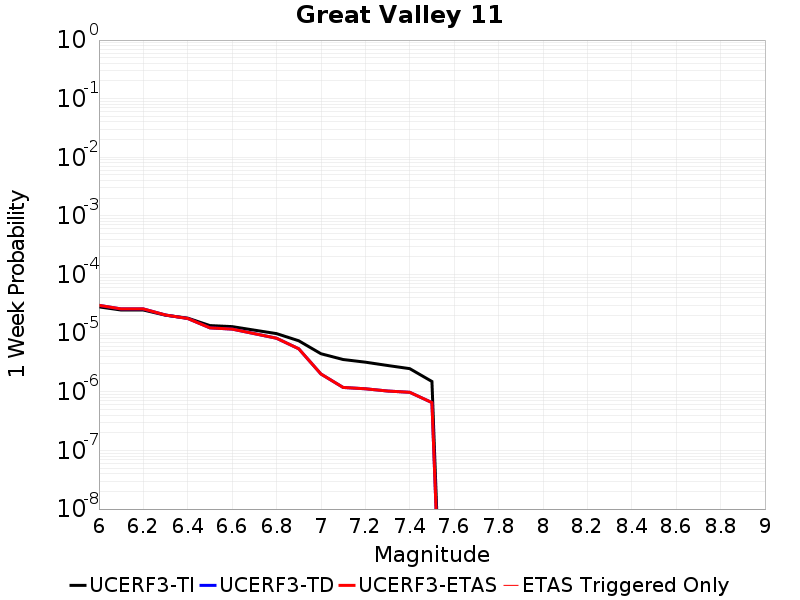 |  | 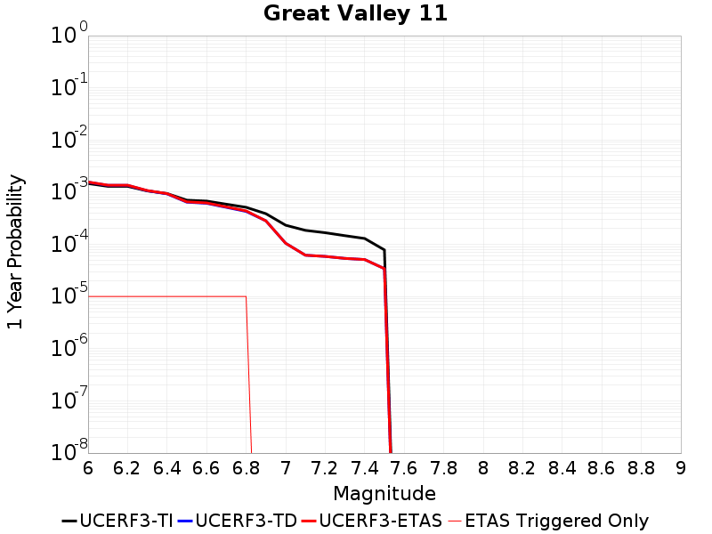 | 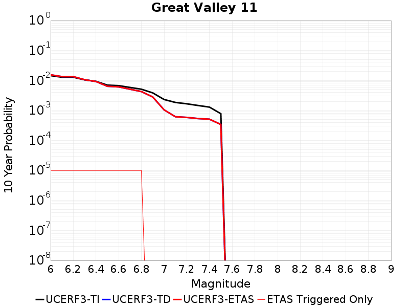 |

| Magnitude | 1 wk TI Prob | 1 wk TD Prob | 1 wk ETAS Prob | 1 wk ETAS/TD Gain | 1 wk ETAS Triggered Only | 1 mo TI Prob | 1 mo TD Prob | 1 mo ETAS Prob | 1 mo ETAS/TD Gain | 1 mo ETAS Triggered Only | 1 yr TI Prob | 1 yr TD Prob | 1 yr ETAS Prob | 1 yr ETAS/TD Gain | 1 yr ETAS Triggered Only | 10 yr TI Prob | 10 yr TD Prob | 10 yr ETAS Prob | 10 yr ETAS/TD Gain | 10 yr ETAS Triggered Only |
|-----|-----|-----|-----|-----|-----|-----|-----|-----|-----|-----|-----|-----|-----|-----|-----|-----|-----|-----|-----|-----|
| 6.0 | 2.8099583E-5 | 2.9863664E-5 | 2.9863664E-5 | 1.0 | 0.0 | 1.20421224E-4 | 1.2798126E-4 | 1.2798126E-4 | 1.0 | 0.0 | 0.0014651422 | 0.0015571315 | 0.001567116 | 1.006412 | 1.0E-5 | 0.0145552 | 0.015469745 | 0.01547959 | 1.0006365 | 1.0E-5 |
| 6.1 | 2.483194E-5 | 2.5934001E-5 | 2.5934001E-5 | 1.0 | 0.0 | 1.0641825E-4 | 1.1114133E-4 | 1.1114133E-4 | 1.0 | 0.0 | 0.0012948721 | 0.001352369 | 0.0013623554 | 1.0073844 | 1.0E-5 | 0.012873529 | 0.013447808 | 0.013457674 | 1.0007336 | 1.0E-5 |
| 6.2 | 2.483194E-5 | 2.5934001E-5 | 2.5934001E-5 | 1.0 | 0.0 | 1.0641825E-4 | 1.1114133E-4 | 1.1114133E-4 | 1.0 | 0.0 | 0.0012948721 | 0.001352369 | 0.0013623554 | 1.0073844 | 1.0E-5 | 0.012873529 | 0.013447808 | 0.013457674 | 1.0007336 | 1.0E-5 |
| 6.3 | 2.0257901E-5 | 2.0419126E-5 | 2.0419126E-5 | 1.0 | 0.0 | 8.681669E-5 | 8.7507826E-5 | 8.7507826E-5 | 1.0 | 0.0 | 0.0010564806 | 0.0010649286 | 0.001074918 | 1.0093803 | 1.0E-5 | 0.01051472 | 0.010602431 | 0.010612326 | 1.0009332 | 1.0E-5 |
| 6.4 | 1.8054898E-5 | 1.7798135E-5 | 1.7798135E-5 | 1.0 | 0.0 | 7.737584E-5 | 7.627568E-5 | 7.627568E-5 | 1.0 | 0.0 | 9.416436E-4 | 9.2829845E-4 | 9.3828916E-4 | 1.0107625 | 1.0E-5 | 0.009376635 | 0.009247954 | 0.009257861 | 1.0010713 | 1.0E-5 |
| 6.5 | 1.34804895E-5 | 1.233203E-5 | 1.233203E-5 | 1.0 | 0.0 | 5.777225E-5 | 5.2850508E-5 | 5.2850508E-5 | 1.0 | 0.0 | 7.031501E-4 | 6.432691E-4 | 6.5326266E-4 | 1.0155356 | 1.0E-5 | 0.007009294 | 0.006414509 | 0.0064244447 | 1.001549 | 1.0E-5 |
| 6.6 | 1.294883E-5 | 1.174291E-5 | 1.174291E-5 | 1.0 | 0.0 | 5.5493805E-5 | 5.032581E-5 | 5.032581E-5 | 1.0 | 0.0 | 6.754276E-4 | 6.1254855E-4 | 6.2254246E-4 | 1.0163152 | 1.0E-5 | 0.006733784 | 0.0061090277 | 0.0061189667 | 1.001627 | 1.0E-5 |
| 6.7 | 1.1272237E-5 | 9.820828E-6 | 9.820828E-6 | 1.0 | 0.0 | 4.8308695E-5 | 4.20886E-5 | 4.20886E-5 | 1.0 | 0.0 | 5.879996E-4 | 5.1231094E-4 | 5.2230584E-4 | 1.0195094 | 1.0E-5 | 0.005864462 | 0.005111584 | 0.005121533 | 1.0019463 | 1.0E-5 |
| 6.8 | 9.8337505E-6 | 8.201513E-6 | 8.201513E-6 | 1.0 | 0.0 | 4.2143965E-5 | 3.5148878E-5 | 3.5148878E-5 | 1.0 | 0.0 | 5.1298196E-4 | 4.2785562E-4 | 4.3785135E-4 | 1.0233624 | 1.0E-5 | 0.005117994 | 0.0042705294 | 0.0042804866 | 1.0023316 | 1.0E-5 |
| 6.9 | 7.4224813E-6 | 5.418353E-6 | 5.418353E-6 | 1.0 | 0.0 | 3.1810247E-5 | 2.3221313E-5 | 2.3221313E-5 | 1.0 | 0.0 | 3.872209E-4 | 2.8268422E-4 | 2.8268422E-4 | 1.0 | 0.0 | 0.0038654688 | 0.0028233875 | 0.0028233875 | 1.0 | 0.0 |
| 7.0 | 4.4628923E-6 | 2.0129582E-6 | 2.0129582E-6 | 1.0 | 0.0 | 1.912654E-5 | 8.626936E-6 | 8.626936E-6 | 1.0 | 0.0 | 2.3284076E-4 | 1.05028E-4 | 1.05028E-4 | 1.0 | 0.0 | 0.0023259693 | 0.0010497952 | 0.0010497952 | 1.0 | 0.0 |
| 7.1 | 3.5546527E-6 | 1.186776E-6 | 1.186776E-6 | 1.0 | 0.0 | 1.5234136E-5 | 5.0861736E-6 | 5.0861736E-6 | 1.0 | 0.0 | 1.8545982E-4 | 6.1922474E-5 | 6.1922474E-5 | 1.0 | 0.0 | 0.0018530512 | 6.1905896E-4 | 6.1905896E-4 | 1.0 | 0.0 |
| 7.2 | 3.2039936E-6 | 1.1264967E-6 | 1.1264967E-6 | 1.0 | 0.0 | 1.3731329E-5 | 4.8278343E-6 | 4.8278343E-6 | 1.0 | 0.0 | 1.671661E-4 | 5.877737E-5 | 5.877737E-5 | 1.0 | 0.0 | 0.0016704041 | 5.8762496E-4 | 5.8762496E-4 | 1.0 | 0.0 |
| 7.3 | 2.8120473E-6 | 1.0314657E-6 | 1.0314657E-6 | 1.0 | 0.0 | 1.2051575E-5 | 4.42056E-6 | 4.42056E-6 | 1.0 | 0.0 | 1.4671806E-4 | 5.3819058E-5 | 5.3819058E-5 | 1.0 | 0.0 | 0.0014662122 | 5.3806684E-4 | 5.3806684E-4 | 1.0 | 0.0 |
| 7.4 | 2.4837766E-6 | 9.808412E-7 | 9.808412E-7 | 1.0 | 0.0 | 1.0644713E-5 | 4.2035986E-6 | 4.2035986E-6 | 1.0 | 0.0 | 1.2959167E-4 | 5.1177678E-5 | 5.1177678E-5 | 1.0 | 0.0 | 0.0012951613 | 5.116655E-4 | 5.116655E-4 | 1.0 | 0.0 |
| 7.5 | 1.5002679E-6 | 6.550841E-7 | 6.550841E-7 | 1.0 | 0.0 | 6.4297037E-6 | 2.8075003E-6 | 2.8075003E-6 | 1.0 | 0.0 | 7.827883E-5 | 3.4180823E-5 | 3.4180823E-5 | 1.0 | 0.0 | 7.825126E-4 | 3.4175982E-4 | 3.4175982E-4 | 1.0 | 0.0 |

## Shoreline
*[(top)](#table-of-contents)*

| 1 Week | 1 Month | 1 Year | 10 Year |
|-----|-----|-----|-----|
| 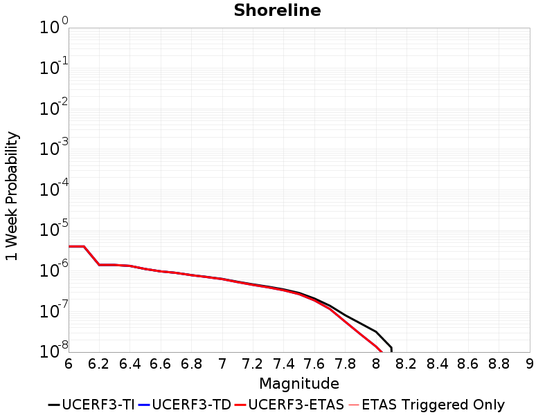 |  |  | 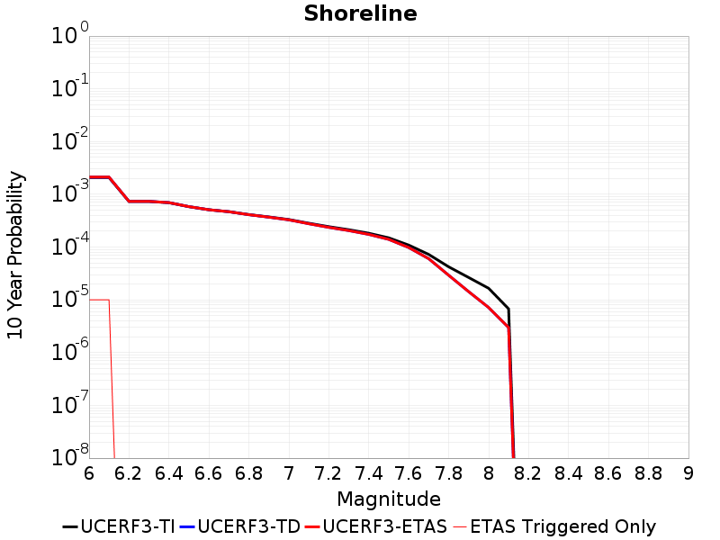 |

| Magnitude | 1 wk TI Prob | 1 wk TD Prob | 1 wk ETAS Prob | 1 wk ETAS/TD Gain | 1 wk ETAS Triggered Only | 1 mo TI Prob | 1 mo TD Prob | 1 mo ETAS Prob | 1 mo ETAS/TD Gain | 1 mo ETAS Triggered Only | 1 yr TI Prob | 1 yr TD Prob | 1 yr ETAS Prob | 1 yr ETAS/TD Gain | 1 yr ETAS Triggered Only | 10 yr TI Prob | 10 yr TD Prob | 10 yr ETAS Prob | 10 yr ETAS/TD Gain | 10 yr ETAS Triggered Only |
|-----|-----|-----|-----|-----|-----|-----|-----|-----|-----|-----|-----|-----|-----|-----|-----|-----|-----|-----|-----|-----|
| 6.0 | 3.9888673E-6 | 4.048653E-6 | 4.048653E-6 | 1.0 | 0.0 | 1.7095033E-5 | 1.7351287E-5 | 1.7351287E-5 | 1.0 | 0.0 | 2.0811215E-4 | 2.1123703E-4 | 2.1123703E-4 | 1.0 | 0.0 | 0.0020791737 | 0.0021109113 | 0.0021208902 | 1.0047272 | 1.0E-5 |
| 6.1 | 3.9888673E-6 | 4.048653E-6 | 4.048653E-6 | 1.0 | 0.0 | 1.7095033E-5 | 1.7351287E-5 | 1.7351287E-5 | 1.0 | 0.0 | 2.0811215E-4 | 2.1123703E-4 | 2.1123703E-4 | 1.0 | 0.0 | 0.0020791737 | 0.0021109113 | 0.0021208902 | 1.0047272 | 1.0E-5 |
| 6.2 | 1.4039653E-6 | 1.4104935E-6 | 1.4104935E-6 | 1.0 | 0.0 | 6.0169805E-6 | 6.0449584E-6 | 6.0449584E-6 | 1.0 | 0.0 | 7.325427E-5 | 7.359494E-5 | 7.359494E-5 | 1.0 | 0.0 | 7.3230127E-4 | 7.357117E-4 | 7.357117E-4 | 1.0 | 0.0 |
| 6.3 | 1.4039653E-6 | 1.4104935E-6 | 1.4104935E-6 | 1.0 | 0.0 | 6.0169805E-6 | 6.0449584E-6 | 6.0449584E-6 | 1.0 | 0.0 | 7.325427E-5 | 7.359494E-5 | 7.359494E-5 | 1.0 | 0.0 | 7.3230127E-4 | 7.357117E-4 | 7.357117E-4 | 1.0 | 0.0 |
| 6.4 | 1.3314152E-6 | 1.3365566E-6 | 1.3365566E-6 | 1.0 | 0.0 | 5.7060524E-6 | 5.728087E-6 | 5.728087E-6 | 1.0 | 0.0 | 6.946897E-5 | 6.973729E-5 | 6.973729E-5 | 1.0 | 0.0 | 6.9447263E-4 | 6.971594E-4 | 6.971594E-4 | 1.0 | 0.0 |
| 6.5 | 1.1187026E-6 | 1.1207416E-6 | 1.1207416E-6 | 1.0 | 0.0 | 4.794431E-6 | 4.8031693E-6 | 4.8031693E-6 | 1.0 | 0.0 | 5.8370628E-5 | 5.8477042E-5 | 5.8477042E-5 | 1.0 | 0.0 | 5.83553E-4 | 5.8461906E-4 | 5.8461906E-4 | 1.0 | 0.0 |
| 6.6 | 9.793089E-7 | 9.788546E-7 | 9.788546E-7 | 1.0 | 0.0 | 4.1970316E-6 | 4.1950843E-6 | 4.1950843E-6 | 1.0 | 0.0 | 5.1097657E-5 | 5.1073966E-5 | 5.1073966E-5 | 1.0 | 0.0 | 5.108591E-4 | 5.1062356E-4 | 5.1062356E-4 | 1.0 | 0.0 |
| 6.7 | 8.995986E-7 | 8.976336E-7 | 8.976336E-7 | 1.0 | 0.0 | 3.8554167E-6 | 3.8469952E-6 | 3.8469952E-6 | 1.0 | 0.0 | 4.693869E-5 | 4.6836172E-5 | 4.6836172E-5 | 1.0 | 0.0 | 4.6928777E-4 | 4.6826396E-4 | 4.6826396E-4 | 1.0 | 0.0 |
| 6.8 | 7.931612E-7 | 7.8837684E-7 | 7.8837684E-7 | 1.0 | 0.0 | 3.3992578E-6 | 3.3787535E-6 | 3.3787535E-6 | 1.0 | 0.0 | 4.1385178E-5 | 4.113555E-5 | 4.113555E-5 | 1.0 | 0.0 | 4.1377472E-4 | 4.112799E-4 | 4.112799E-4 | 1.0 | 0.0 |
| 6.9 | 7.1465956E-7 | 7.081266E-7 | 7.081266E-7 | 1.0 | 0.0 | 3.062823E-6 | 3.0348247E-6 | 3.0348247E-6 | 1.0 | 0.0 | 3.7289232E-5 | 3.6948368E-5 | 3.6948368E-5 | 1.0 | 0.0 | 3.7282976E-4 | 3.694226E-4 | 3.694226E-4 | 1.0 | 0.0 |
| 7.0 | 6.389046E-7 | 6.30259E-7 | 6.30259E-7 | 1.0 | 0.0 | 2.7381598E-6 | 2.7011074E-6 | 2.7011074E-6 | 1.0 | 0.0 | 3.3336586E-5 | 3.2885488E-5 | 3.2885488E-5 | 1.0 | 0.0 | 3.3331584E-4 | 3.2880646E-4 | 3.2880646E-4 | 1.0 | 0.0 |
| 7.1 | 5.4300875E-7 | 5.314084E-7 | 5.314084E-7 | 1.0 | 0.0 | 2.3271782E-6 | 2.2774623E-6 | 2.2774623E-6 | 1.0 | 0.0 | 2.8333026E-5 | 2.7727752E-5 | 2.7727752E-5 | 1.0 | 0.0 | 2.8329415E-4 | 2.7724303E-4 | 2.7724303E-4 | 1.0 | 0.0 |
| 7.2 | 4.6768855E-7 | 4.537707E-7 | 4.537707E-7 | 1.0 | 0.0 | 2.0043778E-6 | 1.94473E-6 | 1.94473E-6 | 1.0 | 0.0 | 2.4403027E-5 | 2.3676832E-5 | 2.3676832E-5 | 1.0 | 0.0 | 2.4400349E-4 | 2.3674314E-4 | 2.3674314E-4 | 1.0 | 0.0 |
| 7.3 | 4.0966103E-7 | 3.94128E-7 | 3.94128E-7 | 1.0 | 0.0 | 1.7556889E-6 | 1.6891189E-6 | 1.6891189E-6 | 1.0 | 0.0 | 2.1375303E-5 | 2.0564828E-5 | 2.0564828E-5 | 1.0 | 0.0 | 2.1373246E-4 | 2.056293E-4 | 2.056293E-4 | 1.0 | 0.0 |
| 7.4 | 3.5105785E-7 | 3.3390126E-7 | 3.3390126E-7 | 1.0 | 0.0 | 1.5045327E-6 | 1.4310045E-6 | 1.4310045E-6 | 1.0 | 0.0 | 1.8317533E-5 | 1.742234E-5 | 1.742234E-5 | 1.0 | 0.0 | 1.8316023E-4 | 1.7420978E-4 | 1.7420978E-4 | 1.0 | 0.0 |
| 7.5 | 2.8737534E-7 | 2.6845115E-7 | 2.6845115E-7 | 1.0 | 0.0 | 1.2316079E-6 | 1.1505043E-6 | 1.1505043E-6 | 1.0 | 0.0 | 1.4994724E-5 | 1.4007301E-5 | 1.4007301E-5 | 1.0 | 0.0 | 1.4993713E-4 | 1.4006419E-4 | 1.4006419E-4 | 1.0 | 0.0 |
| 7.6 | 2.0924051E-7 | 1.8802663E-7 | 1.8802663E-7 | 1.0 | 0.0 | 8.967448E-7 | 8.058281E-7 | 8.058281E-7 | 1.0 | 0.0 | 1.0917813E-5 | 9.810913E-6 | 9.810913E-6 | 1.0 | 0.0 | 1.0917276E-4 | 9.8104814E-5 | 9.8104814E-5 | 1.0 | 0.0 |
| 7.7 | 1.392265E-7 | 1.1565617E-7 | 1.1565617E-7 | 1.0 | 0.0 | 5.9668486E-7 | 4.956692E-7 | 4.956692E-7 | 1.0 | 0.0 | 7.2646135E-6 | 6.0347556E-6 | 6.0347556E-6 | 1.0 | 0.0 | 7.2643765E-5 | 6.0345923E-5 | 6.0345923E-5 | 1.0 | 0.0 |
| 7.8 | 8.1080074E-8 | 5.6064366E-8 | 5.6064366E-8 | 1.0 | 0.0 | 3.4748598E-7 | 2.4027582E-7 | 2.4027582E-7 | 1.0 | 0.0 | 4.2306337E-6 | 2.9253542E-6 | 2.9253542E-6 | 1.0 | 0.0 | 4.230553E-5 | 2.9253159E-5 | 2.9253159E-5 | 1.0 | 0.0 |
| 7.9 | 5.0859036E-8 | 2.7426434E-8 | 2.7426434E-8 | 1.0 | 0.0 | 2.1796728E-7 | 1.1754185E-7 | 1.1754185E-7 | 1.0 | 0.0 | 2.6537484E-6 | 1.431071E-6 | 1.431071E-6 | 1.0 | 0.0 | 2.6537167E-5 | 1.4310619E-5 | 1.4310619E-5 | 1.0 | 0.0 |
| 8.0 | 3.1760536E-8 | 1.3718646E-8 | 1.3718646E-8 | 1.0 | 0.0 | 1.3611657E-7 | 5.8794193E-8 | 5.8794193E-8 | 1.0 | 0.0 | 1.6572179E-6 | 7.1581906E-7 | 7.1581906E-7 | 1.0 | 0.0 | 1.6572056E-5 | 7.1581676E-6 | 7.1581676E-6 | 1.0 | 0.0 |
| 8.1 | 1.2947896E-8 | 5.725122E-9 | 5.725122E-9 | 1.0 | 0.0 | 5.5490982E-8 | 2.4536236E-8 | 2.4536236E-8 | 1.0 | 0.0 | 6.756025E-7 | 2.9872862E-7 | 2.9872862E-7 | 1.0 | 0.0 | 6.7560045E-6 | 2.9872824E-6 | 2.9872824E-6 | 1.0 | 0.0 |

## Malibu Coast alt 1
*[(top)](#table-of-contents)*

| 1 Week | 1 Month | 1 Year | 10 Year |
|-----|-----|-----|-----|
|  | 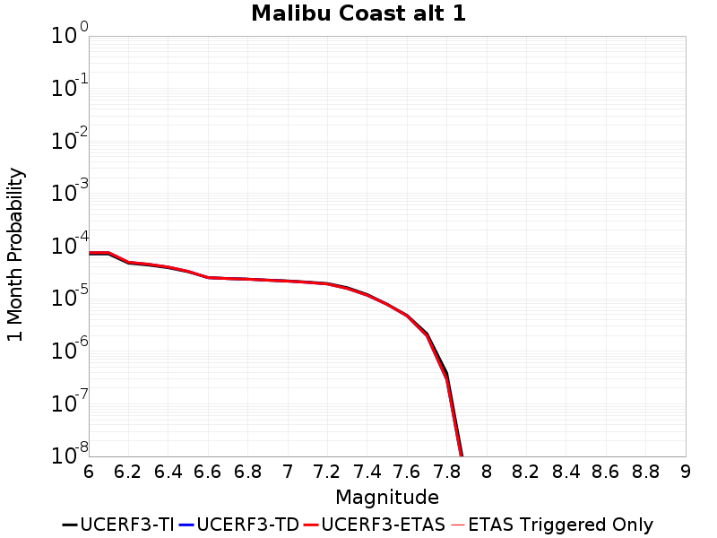 |  |  |

| Magnitude | 1 wk TI Prob | 1 wk TD Prob | 1 wk ETAS Prob | 1 wk ETAS/TD Gain | 1 wk ETAS Triggered Only | 1 mo TI Prob | 1 mo TD Prob | 1 mo ETAS Prob | 1 mo ETAS/TD Gain | 1 mo ETAS Triggered Only | 1 yr TI Prob | 1 yr TD Prob | 1 yr ETAS Prob | 1 yr ETAS/TD Gain | 1 yr ETAS Triggered Only | 10 yr TI Prob | 10 yr TD Prob | 10 yr ETAS Prob | 10 yr ETAS/TD Gain | 10 yr ETAS Triggered Only |
|-----|-----|-----|-----|-----|-----|-----|-----|-----|-----|-----|-----|-----|-----|-----|-----|-----|-----|-----|-----|-----|
| 6.0 | 1.6572556E-5 | 1.7607226E-5 | 1.7607226E-5 | 1.0 | 0.0 | 7.102331E-5 | 7.5457465E-5 | 7.5457465E-5 | 1.0 | 0.0 | 8.6436566E-4 | 9.183264E-4 | 9.283172E-4 | 1.0108794 | 1.0E-5 | 0.0086101135 | 0.009147251 | 0.009157159 | 1.0010833 | 1.0E-5 |
| 6.1 | 1.6572556E-5 | 1.7607226E-5 | 1.7607226E-5 | 1.0 | 0.0 | 7.102331E-5 | 7.5457465E-5 | 7.5457465E-5 | 1.0 | 0.0 | 8.6436566E-4 | 9.183264E-4 | 9.183264E-4 | 1.0 | 0.0 | 0.0086101135 | 0.009147251 | 0.009147251 | 1.0 | 0.0 |
| 6.2 | 1.1085717E-5 | 1.1562685E-5 | 1.1562685E-5 | 1.0 | 0.0 | 4.750935E-5 | 4.9553444E-5 | 4.9553444E-5 | 1.0 | 0.0 | 5.782728E-4 | 6.031497E-4 | 6.031497E-4 | 1.0 | 0.0 | 0.0057677035 | 0.0060154987 | 0.0060154987 | 1.0 | 0.0 |
| 6.3 | 1.0208568E-5 | 1.0597202E-5 | 1.0597202E-5 | 1.0 | 0.0 | 4.375027E-5 | 4.5415807E-5 | 4.5415807E-5 | 1.0 | 0.0 | 5.325294E-4 | 5.528001E-4 | 5.528001E-4 | 1.0 | 0.0 | 0.0053125503 | 0.005514558 | 0.005514558 | 1.0 | 0.0 |
| 6.4 | 9.0682315E-6 | 9.346892E-6 | 9.346892E-6 | 1.0 | 0.0 | 3.8863272E-5 | 4.0057505E-5 | 4.0057505E-5 | 1.0 | 0.0 | 4.730576E-4 | 4.87593E-4 | 4.87593E-4 | 1.0 | 0.0 | 0.0047205184 | 0.0048654457 | 0.0048654457 | 1.0 | 0.0 |
| 6.5 | 7.605796E-6 | 7.751991E-6 | 7.751991E-6 | 1.0 | 0.0 | 3.259586E-5 | 3.32224E-5 | 3.32224E-5 | 1.0 | 0.0 | 3.9678233E-4 | 4.04409E-4 | 4.04409E-4 | 1.0 | 0.0 | 0.0039607463 | 0.0040368685 | 0.0040368685 | 1.0 | 0.0 |
| 6.6 | 5.889873E-6 | 5.881953E-6 | 5.881953E-6 | 1.0 | 0.0 | 2.5242069E-5 | 2.5208126E-5 | 2.5208126E-5 | 1.0 | 0.0 | 3.0727885E-4 | 3.068658E-4 | 3.068658E-4 | 1.0 | 0.0 | 0.003068543 | 0.0030644336 | 0.0030644336 | 1.0 | 0.0 |
| 6.7 | 5.66586E-6 | 5.643968E-6 | 5.643968E-6 | 1.0 | 0.0 | 2.428203E-5 | 2.4188212E-5 | 2.4188212E-5 | 1.0 | 0.0 | 2.955936E-4 | 2.9445178E-4 | 2.9445178E-4 | 1.0 | 0.0 | 0.0029520073 | 0.0029406282 | 0.0029406282 | 1.0 | 0.0 |
| 6.8 | 5.521556E-6 | 5.491704E-6 | 5.491704E-6 | 1.0 | 0.0 | 2.3663597E-5 | 2.3535664E-5 | 2.3535664E-5 | 1.0 | 0.0 | 2.880662E-4 | 2.865091E-4 | 2.865091E-4 | 1.0 | 0.0 | 0.0028769306 | 0.002861409 | 0.002861409 | 1.0 | 0.0 |
| 6.9 | 5.29752E-6 | 5.2521104E-6 | 5.2521104E-6 | 1.0 | 0.0 | 2.270346E-5 | 2.250885E-5 | 2.250885E-5 | 1.0 | 0.0 | 2.7637955E-4 | 2.7401088E-4 | 2.7401088E-4 | 1.0 | 0.0 | 0.0027603607 | 0.0027367405 | 0.0027367405 | 1.0 | 0.0 |
| 7.0 | 5.106743E-6 | 5.0497847E-6 | 5.0497847E-6 | 1.0 | 0.0 | 2.1885859E-5 | 2.1641756E-5 | 2.1641756E-5 | 1.0 | 0.0 | 2.6642776E-4 | 2.6345658E-4 | 2.6345658E-4 | 1.0 | 0.0 | 0.0026610855 | 0.0026314522 | 0.0026314522 | 1.0 | 0.0 |
| 7.1 | 4.8469647E-6 | 4.7723674E-6 | 4.7723674E-6 | 1.0 | 0.0 | 2.0772539E-5 | 2.0452844E-5 | 2.0452844E-5 | 1.0 | 0.0 | 2.528763E-4 | 2.48985E-4 | 2.48985E-4 | 1.0 | 0.0 | 0.0025258875 | 0.0024870683 | 0.0024870683 | 1.0 | 0.0 |
| 7.2 | 4.545514E-6 | 4.4500557E-6 | 4.4500557E-6 | 1.0 | 0.0 | 1.9480629E-5 | 1.9071527E-5 | 1.9071527E-5 | 1.0 | 0.0 | 2.3715083E-4 | 2.3217117E-4 | 2.3217117E-4 | 1.0 | 0.0 | 0.0023689792 | 0.0023192936 | 0.0023192936 | 1.0 | 0.0 |
| 7.3 | 3.794097E-6 | 3.653433E-6 | 3.653433E-6 | 1.0 | 0.0 | 1.6260314E-5 | 1.5657475E-5 | 1.5657475E-5 | 1.0 | 0.0 | 1.9795135E-4 | 1.9061314E-4 | 1.9061314E-4 | 1.0 | 0.0 | 0.001977751 | 0.001904501 | 0.001904501 | 1.0 | 0.0 |
| 7.4 | 2.808217E-6 | 2.720243E-6 | 2.720243E-6 | 1.0 | 0.0 | 1.203516E-5 | 1.1658132E-5 | 1.1658132E-5 | 1.0 | 0.0 | 1.4651821E-4 | 1.4192854E-4 | 1.4192854E-4 | 1.0 | 0.0 | 0.0014642165 | 0.0014183816 | 0.0014183816 | 1.0 | 0.0 |
| 7.5 | 1.83809E-6 | 1.8198233E-6 | 1.8198233E-6 | 1.0 | 0.0 | 7.877505E-6 | 7.799219E-6 | 7.799219E-6 | 1.0 | 0.0 | 9.59044E-5 | 9.495138E-5 | 9.495138E-5 | 1.0 | 0.0 | 9.5863023E-4 | 9.491101E-4 | 9.491101E-4 | 1.0 | 0.0 |
| 7.6 | 1.1292672E-6 | 1.10061E-6 | 1.10061E-6 | 1.0 | 0.0 | 4.839708E-6 | 4.7168915E-6 | 4.7168915E-6 | 1.0 | 0.0 | 5.8921847E-5 | 5.7426656E-5 | 5.7426656E-5 | 1.0 | 0.0 | 5.890623E-4 | 5.741198E-4 | 5.741198E-4 | 1.0 | 0.0 |
| 7.7 | 5.065272E-7 | 4.6114974E-7 | 4.6114974E-7 | 1.0 | 0.0 | 2.170829E-6 | 1.9763547E-6 | 1.9763547E-6 | 1.0 | 0.0 | 2.6429525E-5 | 2.4061863E-5 | 2.4061863E-5 | 1.0 | 0.0 | 2.642638E-4 | 2.405937E-4 | 2.405937E-4 | 1.0 | 0.0 |
| 7.8 | 8.952991E-8 | 6.7169886E-8 | 6.7169886E-8 | 1.0 | 0.0 | 3.8369956E-7 | 2.878709E-7 | 2.878709E-7 | 1.0 | 0.0 | 4.671532E-6 | 3.5048226E-6 | 3.5048226E-6 | 1.0 | 0.0 | 4.671434E-5 | 3.5047695E-5 | 3.5047695E-5 | 1.0 | 0.0 |
| 7.9 | 8.007447E-10 | 6.1633565E-10 | 6.1633565E-10 | 1.0 | 0.0 | 3.4317629E-9 | 2.6414388E-9 | 2.6414388E-9 | 1.0 | 0.0 | 4.1781714E-8 | 3.2159516E-8 | 3.2159516E-8 | 1.0 | 0.0 | 4.1781706E-7 | 3.2159514E-7 | 3.2159514E-7 | 1.0 | 0.0 |

## Bullion Mountains
*[(top)](#table-of-contents)*

| 1 Week | 1 Month | 1 Year | 10 Year |
|-----|-----|-----|-----|
|  |  |  |  |

| Magnitude | 1 wk TI Prob | 1 wk TD Prob | 1 wk ETAS Prob | 1 wk ETAS/TD Gain | 1 wk ETAS Triggered Only | 1 mo TI Prob | 1 mo TD Prob | 1 mo ETAS Prob | 1 mo ETAS/TD Gain | 1 mo ETAS Triggered Only | 1 yr TI Prob | 1 yr TD Prob | 1 yr ETAS Prob | 1 yr ETAS/TD Gain | 1 yr ETAS Triggered Only | 10 yr TI Prob | 10 yr TD Prob | 10 yr ETAS Prob | 10 yr ETAS/TD Gain | 10 yr ETAS Triggered Only |
|-----|-----|-----|-----|-----|-----|-----|-----|-----|-----|-----|-----|-----|-----|-----|-----|-----|-----|-----|-----|-----|
| 6.0 | 1.6420427E-5 | 1.4701667E-5 | 1.4701667E-5 | 1.0 | 0.0 | 7.037136E-5 | 6.300584E-5 | 6.300584E-5 | 1.0 | 0.0 | 8.5643446E-4 | 7.6686457E-4 | 7.6686457E-4 | 1.0 | 0.0 | 0.008531413 | 0.007645981 | 0.0076559046 | 1.0012978 | 1.0E-5 |
| 6.1 | 1.6420427E-5 | 1.4701667E-5 | 1.4701667E-5 | 1.0 | 0.0 | 7.037136E-5 | 6.300584E-5 | 6.300584E-5 | 1.0 | 0.0 | 8.5643446E-4 | 7.6686457E-4 | 7.6686457E-4 | 1.0 | 0.0 | 0.008531413 | 0.007645981 | 0.0076559046 | 1.0012978 | 1.0E-5 |
| 6.2 | 1.6420427E-5 | 1.4701667E-5 | 1.4701667E-5 | 1.0 | 0.0 | 7.037136E-5 | 6.300584E-5 | 6.300584E-5 | 1.0 | 0.0 | 8.5643446E-4 | 7.6686457E-4 | 7.6686457E-4 | 1.0 | 0.0 | 0.008531413 | 0.007645981 | 0.0076559046 | 1.0012978 | 1.0E-5 |
| 6.3 | 1.2046778E-5 | 9.868931E-6 | 9.868931E-6 | 1.0 | 0.0 | 5.1628023E-5 | 4.229486E-5 | 4.229486E-5 | 1.0 | 0.0 | 6.283899E-4 | 5.148415E-4 | 5.148415E-4 | 1.0 | 0.0 | 0.0062661595 | 0.005138772 | 0.005138772 | 1.0 | 0.0 |
| 6.4 | 1.2046778E-5 | 9.868931E-6 | 9.868931E-6 | 1.0 | 0.0 | 5.1628023E-5 | 4.229486E-5 | 4.229486E-5 | 1.0 | 0.0 | 6.283899E-4 | 5.148415E-4 | 5.148415E-4 | 1.0 | 0.0 | 0.0062661595 | 0.005138772 | 0.005138772 | 1.0 | 0.0 |
| 6.5 | 1.0244343E-5 | 7.884879E-6 | 7.884879E-6 | 1.0 | 0.0 | 4.390359E-5 | 3.3792017E-5 | 3.3792017E-5 | 1.0 | 0.0 | 5.343951E-4 | 4.1136084E-4 | 4.1136084E-4 | 1.0 | 0.0 | 0.005331118 | 0.0041080276 | 0.0041080276 | 1.0 | 0.0 |
| 6.6 | 9.605408E-6 | 7.182507E-6 | 7.182507E-6 | 1.0 | 0.0 | 4.1165385E-5 | 3.0781925E-5 | 3.0781925E-5 | 1.0 | 0.0 | 5.010733E-4 | 3.7472587E-4 | 3.7472587E-4 | 1.0 | 0.0 | 0.00499945 | 0.0037429396 | 0.0037429396 | 1.0 | 0.0 |
| 6.7 | 8.60418E-6 | 6.128376E-6 | 6.128376E-6 | 1.0 | 0.0 | 3.687454E-5 | 2.6264313E-5 | 2.6264313E-5 | 1.0 | 0.0 | 4.48855E-4 | 3.1974062E-4 | 3.1974062E-4 | 1.0 | 0.0 | 0.004479495 | 0.0031947203 | 0.0031947203 | 1.0 | 0.0 |
| 6.8 | 5.187994E-6 | 2.5654576E-6 | 2.5654576E-6 | 1.0 | 0.0 | 2.223407E-5 | 1.0994794E-5 | 1.0994794E-5 | 1.0 | 0.0 | 2.7066618E-4 | 1.338574E-4 | 1.338574E-4 | 1.0 | 0.0 | 0.0027033675 | 0.00133816 | 0.00133816 | 1.0 | 0.0 |
| 6.9 | 4.5302368E-6 | 2.3463008E-6 | 2.3463008E-6 | 1.0 | 0.0 | 1.9415156E-5 | 1.0055558E-5 | 1.0055558E-5 | 1.0 | 0.0 | 2.3635388E-4 | 1.2242352E-4 | 1.2242352E-4 | 1.0 | 0.0 | 0.0023610266 | 0.0012239505 | 0.0012239505 | 1.0 | 0.0 |
| 7.0 | 3.431668E-6 | 1.6897859E-6 | 1.6897859E-6 | 1.0 | 0.0 | 1.4707065E-5 | 7.24194E-6 | 7.24194E-6 | 1.0 | 0.0 | 1.7904381E-4 | 8.8170615E-5 | 8.8170615E-5 | 1.0 | 0.0 | 0.0017889962 | 8.8170613E-4 | 8.8170613E-4 | 1.0 | 0.0 |

## Big Pine (Central)
*[(top)](#table-of-contents)*

| 1 Week | 1 Month | 1 Year | 10 Year |
|-----|-----|-----|-----|
|  |  |  |  |

| Magnitude | 1 wk TI Prob | 1 wk TD Prob | 1 wk ETAS Prob | 1 wk ETAS/TD Gain | 1 wk ETAS Triggered Only | 1 mo TI Prob | 1 mo TD Prob | 1 mo ETAS Prob | 1 mo ETAS/TD Gain | 1 mo ETAS Triggered Only | 1 yr TI Prob | 1 yr TD Prob | 1 yr ETAS Prob | 1 yr ETAS/TD Gain | 1 yr ETAS Triggered Only | 10 yr TI Prob | 10 yr TD Prob | 10 yr ETAS Prob | 10 yr ETAS/TD Gain | 10 yr ETAS Triggered Only |
|-----|-----|-----|-----|-----|-----|-----|-----|-----|-----|-----|-----|-----|-----|-----|-----|-----|-----|-----|-----|-----|
| 6.0 | 1.2706755E-5 | 1.4272185E-5 | 1.4272185E-5 | 1.0 | 0.0 | 5.4456385E-5 | 6.116528E-5 | 6.116528E-5 | 1.0 | 0.0 | 6.628048E-4 | 7.444694E-4 | 7.444694E-4 | 1.0 | 0.0 | 0.006608314 | 0.007424689 | 0.0074346145 | 1.0013368 | 1.0E-5 |
| 6.1 | 8.342579E-6 | 9.530004E-6 | 9.530004E-6 | 1.0 | 0.0 | 3.5753423E-5 | 4.0842355E-5 | 4.0842355E-5 | 1.0 | 0.0 | 4.3521097E-4 | 4.97164E-4 | 4.97164E-4 | 1.0 | 0.0 | 0.0043435963 | 0.004963977 | 0.004973927 | 1.0020045 | 1.0E-5 |
| 6.2 | 6.923899E-6 | 7.9855845E-6 | 7.9855845E-6 | 1.0 | 0.0 | 2.9673516E-5 | 3.4223594E-5 | 3.4223594E-5 | 1.0 | 0.0 | 3.6121515E-4 | 4.1661185E-4 | 4.1661185E-4 | 1.0 | 0.0 | 0.003606286 | 0.004161521 | 0.004171479 | 1.002393 | 1.0E-5 |
| 6.3 | 2.728396E-6 | 3.440503E-6 | 3.440503E-6 | 1.0 | 0.0 | 1.1693074E-5 | 1.4744934E-5 | 1.4744934E-5 | 1.0 | 0.0 | 1.4235388E-4 | 1.7950566E-4 | 1.7950566E-4 | 1.0 | 0.0 | 0.0014226272 | 0.001795016 | 0.001795016 | 1.0 | 0.0 |
| 6.4 | 2.7136944E-6 | 3.4247898E-6 | 3.4247898E-6 | 1.0 | 0.0 | 1.1630066E-5 | 1.4677594E-5 | 1.4677594E-5 | 1.0 | 0.0 | 1.4158686E-4 | 1.7868592E-4 | 1.7868592E-4 | 1.0 | 0.0 | 0.0014149669 | 0.0017868319 | 0.0017868319 | 1.0 | 0.0 |
| 6.5 | 2.6971882E-6 | 3.4071277E-6 | 3.4071277E-6 | 1.0 | 0.0 | 1.1559327E-5 | 1.4601899E-5 | 1.4601899E-5 | 1.0 | 0.0 | 1.4072572E-4 | 1.777645E-4 | 1.777645E-4 | 1.0 | 0.0 | 0.0014063664 | 0.0017776324 | 0.0017776324 | 1.0 | 0.0 |
| 6.6 | 2.669092E-6 | 3.3771364E-6 | 3.3771364E-6 | 1.0 | 0.0 | 1.1438916E-5 | 1.4473366E-5 | 1.4473366E-5 | 1.0 | 0.0 | 1.3925991E-4 | 1.7619986E-4 | 1.7619986E-4 | 1.0 | 0.0 | 0.0013917267 | 0.0017620109 | 0.0017620109 | 1.0 | 0.0 |
| 6.7 | 2.6408059E-6 | 3.3471513E-6 | 3.3471513E-6 | 1.0 | 0.0 | 1.1317691E-5 | 1.4344861E-5 | 1.4344861E-5 | 1.0 | 0.0 | 1.3778417E-4 | 1.7463556E-4 | 1.7463556E-4 | 1.0 | 0.0 | 0.0013769877 | 0.0017463925 | 0.0017463925 | 1.0 | 0.0 |
| 6.8 | 2.1786943E-6 | 2.8705206E-6 | 2.8705206E-6 | 1.0 | 0.0 | 9.337228E-6 | 1.2302177E-5 | 1.2302177E-5 | 1.0 | 0.0 | 1.1367482E-4 | 1.4976945E-4 | 1.4976945E-4 | 1.0 | 0.0 | 0.0011361669 | 0.0014980809 | 0.0014980809 | 1.0 | 0.0 |
| 6.9 | 1.4411696E-6 | 2.0838731E-6 | 2.0838731E-6 | 1.0 | 0.0 | 6.1764263E-6 | 8.930856E-6 | 8.930856E-6 | 1.0 | 0.0 | 7.51954E-5 | 1.0872802E-4 | 1.0872802E-4 | 1.0 | 0.0 | 7.5169955E-4 | 0.0010880993 | 0.0010880993 | 1.0 | 0.0 |
| 7.0 | 1.0073411E-6 | 1.5679915E-6 | 1.5679915E-6 | 1.0 | 0.0 | 4.317169E-6 | 6.719947E-6 | 6.719947E-6 | 1.0 | 0.0 | 5.2560266E-5 | 8.181244E-5 | 8.181244E-5 | 1.0 | 0.0 | 5.2547833E-4 | 8.1916293E-4 | 8.1916293E-4 | 1.0 | 0.0 |
| 7.1 | 8.947104E-7 | 1.4437841E-6 | 1.4437841E-6 | 1.0 | 0.0 | 3.834468E-6 | 6.187632E-6 | 6.187632E-6 | 1.0 | 0.0 | 4.6683643E-5 | 7.533197E-5 | 7.533197E-5 | 1.0 | 0.0 | 4.6673836E-4 | 7.544038E-4 | 7.544038E-4 | 1.0 | 0.0 |
| 7.2 | 5.215166E-7 | 1.0237997E-6 | 1.0237997E-6 | 1.0 | 0.0 | 2.2350691E-6 | 4.3877058E-6 | 4.3877058E-6 | 1.0 | 0.0 | 2.7211627E-5 | 5.341905E-5 | 5.341905E-5 | 1.0 | 0.0 | 2.7208295E-4 | 5.3539145E-4 | 5.3539145E-4 | 1.0 | 0.0 |
| 7.3 | 4.4024807E-7 | 9.34216E-7 | 9.34216E-7 | 1.0 | 0.0 | 1.8867761E-6 | 4.003777E-6 | 4.003777E-6 | 1.0 | 0.0 | 2.2971257E-5 | 4.8744936E-5 | 4.8744936E-5 | 1.0 | 0.0 | 2.2968883E-4 | 4.886715E-4 | 4.886715E-4 | 1.0 | 0.0 |
| 7.4 | 3.6130905E-7 | 8.477297E-7 | 8.477297E-7 | 1.0 | 0.0 | 1.5484665E-6 | 3.6331226E-6 | 3.6331226E-6 | 1.0 | 0.0 | 1.8852415E-5 | 4.423241E-5 | 4.423241E-5 | 1.0 | 0.0 | 1.8850817E-4 | 4.435563E-4 | 4.435563E-4 | 1.0 | 0.0 |
| 7.5 | 3.408184E-7 | 8.2243275E-7 | 8.2243275E-7 | 1.0 | 0.0 | 1.4606494E-6 | 3.5247074E-6 | 3.5247074E-6 | 1.0 | 0.0 | 1.7783263E-5 | 4.2912507E-5 | 4.2912507E-5 | 1.0 | 0.0 | 1.778184E-4 | 4.3034088E-4 | 4.3034088E-4 | 1.0 | 0.0 |
| 7.6 | 3.1428627E-7 | 7.8436653E-7 | 7.8436653E-7 | 1.0 | 0.0 | 1.3469405E-6 | 3.3615668E-6 | 3.3615668E-6 | 1.0 | 0.0 | 1.6398877E-5 | 4.0926345E-5 | 4.0926345E-5 | 1.0 | 0.0 | 1.6397667E-4 | 4.1046052E-4 | 4.1046052E-4 | 1.0 | 0.0 |
| 7.7 | 1.7972785E-7 | 5.163479E-7 | 5.163479E-7 | 1.0 | 0.0 | 7.70262E-7 | 2.2129177E-6 | 2.2129177E-6 | 1.0 | 0.0 | 9.377899E-6 | 2.694195E-5 | 2.694195E-5 | 1.0 | 0.0 | 9.377503E-5 | 2.7064572E-4 | 2.7064572E-4 | 1.0 | 0.0 |
| 7.8 | 4.9230927E-8 | 1.2182925E-7 | 1.2182925E-7 | 1.0 | 0.0 | 2.1098968E-7 | 5.221252E-7 | 5.221252E-7 | 1.0 | 0.0 | 2.5687964E-6 | 6.3568577E-6 | 6.3568577E-6 | 1.0 | 0.0 | 2.5687666E-5 | 6.4003034E-5 | 6.4003034E-5 | 1.0 | 0.0 |
| 7.9 | 3.6805972E-9 | 4.1860466E-9 | 4.1860466E-9 | 1.0 | 0.0 | 1.5773987E-8 | 1.7940199E-8 | 1.7940199E-8 | 1.0 | 0.0 | 1.9204828E-7 | 2.184219E-7 | 2.184219E-7 | 1.0 | 0.0 | 1.920481E-6 | 2.2325519E-6 | 2.2325519E-6 | 1.0 | 0.0 |

## Great Valley 10 (Panoche)
*[(top)](#table-of-contents)*

| 1 Week | 1 Month | 1 Year | 10 Year |
|-----|-----|-----|-----|
|  | 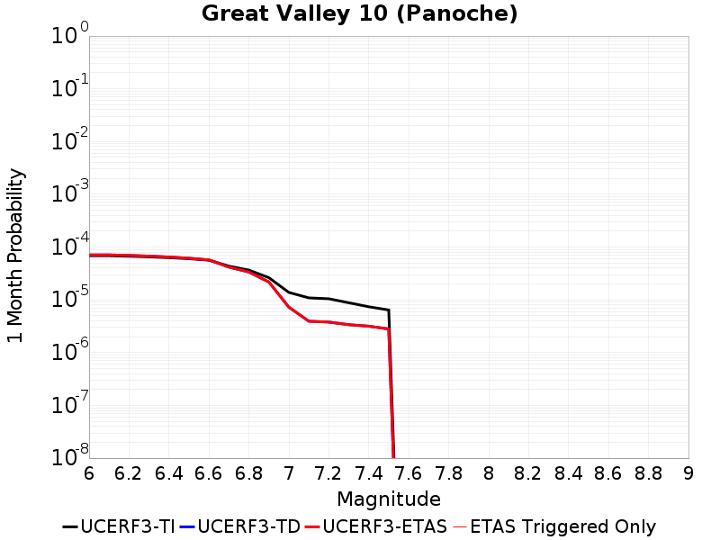 |  |  |

| Magnitude | 1 wk TI Prob | 1 wk TD Prob | 1 wk ETAS Prob | 1 wk ETAS/TD Gain | 1 wk ETAS Triggered Only | 1 mo TI Prob | 1 mo TD Prob | 1 mo ETAS Prob | 1 mo ETAS/TD Gain | 1 mo ETAS Triggered Only | 1 yr TI Prob | 1 yr TD Prob | 1 yr ETAS Prob | 1 yr ETAS/TD Gain | 1 yr ETAS Triggered Only | 10 yr TI Prob | 10 yr TD Prob | 10 yr ETAS Prob | 10 yr ETAS/TD Gain | 10 yr ETAS Triggered Only |
|-----|-----|-----|-----|-----|-----|-----|-----|-----|-----|-----|-----|-----|-----|-----|-----|-----|-----|-----|-----|-----|
| 6.0 | 1.6014626E-5 | 1.6591368E-5 | 1.6591368E-5 | 1.0 | 0.0 | 6.863231E-5 | 7.110395E-5 | 7.110395E-5 | 1.0 | 0.0 | 8.35278E-4 | 8.653523E-4 | 8.753436E-4 | 1.011546 | 1.0E-5 | 0.008321454 | 0.008620438 | 0.008630352 | 1.00115 | 1.0E-5 |
| 6.1 | 1.6014626E-5 | 1.6591368E-5 | 1.6591368E-5 | 1.0 | 0.0 | 6.863231E-5 | 7.110395E-5 | 7.110395E-5 | 1.0 | 0.0 | 8.35278E-4 | 8.653523E-4 | 8.753436E-4 | 1.011546 | 1.0E-5 | 0.008321454 | 0.008620438 | 0.008630352 | 1.00115 | 1.0E-5 |
| 6.2 | 1.56782E-5 | 1.6214146E-5 | 1.6214146E-5 | 1.0 | 0.0 | 6.719056E-5 | 6.948737E-5 | 6.948737E-5 | 1.0 | 0.0 | 8.17738E-4 | 8.4568583E-4 | 8.5567735E-4 | 1.0118147 | 1.0E-5 | 0.008147354 | 0.008425276 | 0.008435192 | 1.001177 | 1.0E-5 |
| 6.3 | 1.5263338E-5 | 1.5738806E-5 | 1.5738806E-5 | 1.0 | 0.0 | 6.541267E-5 | 6.74503E-5 | 6.74503E-5 | 1.0 | 0.0 | 7.961082E-4 | 8.2090346E-4 | 8.3089527E-4 | 1.0121717 | 1.0E-5 | 0.007932622 | 0.008179297 | 0.008189215 | 1.0012126 | 1.0E-5 |
| 6.4 | 1.4720723E-5 | 1.5114111E-5 | 1.5114111E-5 | 1.0 | 0.0 | 6.308728E-5 | 6.477317E-5 | 6.477317E-5 | 1.0 | 0.0 | 7.67817E-4 | 7.883334E-4 | 7.983255E-4 | 1.012675 | 1.0E-5 | 0.007651695 | 0.007855938 | 0.007865859 | 1.0012629 | 1.0E-5 |
| 6.5 | 1.408264E-5 | 1.4369977E-5 | 1.4369977E-5 | 1.0 | 0.0 | 6.0352773E-5 | 6.1584185E-5 | 6.1584185E-5 | 1.0 | 0.0 | 7.3454727E-4 | 7.4953475E-4 | 7.5952726E-4 | 1.0133317 | 1.0E-5 | 0.0073212404 | 0.007470616 | 0.0074805417 | 1.0013286 | 1.0E-5 |
| 6.6 | 1.3197086E-5 | 1.3334865E-5 | 1.3334865E-5 | 1.0 | 0.0 | 5.6557717E-5 | 5.714819E-5 | 5.714819E-5 | 1.0 | 0.0 | 6.8837265E-4 | 6.955622E-4 | 7.0555526E-4 | 1.0143669 | 1.0E-5 | 0.006862442 | 0.0069343843 | 0.006944315 | 1.0014321 | 1.0E-5 |
| 6.7 | 1.017583E-5 | 9.754467E-6 | 9.754467E-6 | 1.0 | 0.0 | 4.360997E-5 | 4.18042E-5 | 4.18042E-5 | 1.0 | 0.0 | 5.30822E-4 | 5.0884974E-4 | 5.1884464E-4 | 1.0196421 | 1.0E-5 | 0.0052955584 | 0.0050770985 | 0.005087048 | 1.0019597 | 1.0E-5 |
| 6.8 | 8.557912E-6 | 7.880043E-6 | 7.880043E-6 | 1.0 | 0.0 | 3.667625E-5 | 3.377119E-5 | 3.377119E-5 | 1.0 | 0.0 | 4.4644187E-4 | 4.1108867E-4 | 4.2108458E-4 | 1.0243156 | 1.0E-5 | 0.0044554602 | 0.0041034897 | 0.0041134483 | 1.002427 | 1.0E-5 |
| 6.9 | 6.14664E-6 | 5.0968824E-6 | 5.0968824E-6 | 1.0 | 0.0 | 2.6342475E-5 | 2.1843607E-5 | 2.1843607E-5 | 1.0 | 0.0 | 3.2067244E-4 | 2.6591486E-4 | 2.6591486E-4 | 1.0 | 0.0 | 0.003202101 | 0.0026561052 | 0.0026561052 | 1.0 | 0.0 |
| 7.0 | 3.2310581E-6 | 1.696607E-6 | 1.696607E-6 | 1.0 | 0.0 | 1.3847319E-5 | 7.271153E-6 | 7.271153E-6 | 1.0 | 0.0 | 1.6857806E-4 | 8.852279E-5 | 8.852279E-5 | 1.0 | 0.0 | 0.0016845023 | 8.848847E-4 | 8.848847E-4 | 1.0 | 0.0 |
| 7.1 | 2.544492E-6 | 9.1977677E-7 | 9.1977677E-7 | 1.0 | 0.0 | 1.090492E-5 | 3.9418946E-6 | 3.9418946E-6 | 1.0 | 0.0 | 1.327593E-4 | 4.799156E-5 | 4.799156E-5 | 1.0 | 0.0 | 0.0013268003 | 4.7981675E-4 | 4.7981675E-4 | 1.0 | 0.0 |
| 7.2 | 2.4479045E-6 | 8.849739E-7 | 8.849739E-7 | 1.0 | 0.0 | 1.0490977E-5 | 3.79274E-6 | 3.79274E-6 | 1.0 | 0.0 | 1.2772017E-4 | 4.617568E-5 | 4.617568E-5 | 1.0 | 0.0 | 0.0012764678 | 4.616656E-4 | 4.616656E-4 | 1.0 | 0.0 |
| 7.3 | 2.0559578E-6 | 7.899428E-7 | 7.899428E-7 | 1.0 | 0.0 | 8.811218E-6 | 3.385465E-6 | 3.385465E-6 | 1.0 | 0.0 | 1.072713E-4 | 4.1217303E-5 | 4.1217303E-5 | 1.0 | 0.0 | 0.0010721954 | 4.1210125E-4 | 4.1210125E-4 | 1.0 | 0.0 |
| 7.4 | 1.727687E-6 | 7.3931824E-7 | 7.3931824E-7 | 1.0 | 0.0 | 7.404352E-6 | 3.1685033E-6 | 3.1685033E-6 | 1.0 | 0.0 | 9.0144255E-5 | 3.857589E-5 | 3.857589E-5 | 1.0 | 0.0 | 9.0107694E-4 | 3.8569656E-4 | 3.8569656E-4 | 1.0 | 0.0 |
| 7.5 | 1.5002679E-6 | 6.550841E-7 | 6.550841E-7 | 1.0 | 0.0 | 6.4297037E-6 | 2.8075003E-6 | 2.8075003E-6 | 1.0 | 0.0 | 7.827883E-5 | 3.4180823E-5 | 3.4180823E-5 | 1.0 | 0.0 | 7.825126E-4 | 3.4175982E-4 | 3.4175982E-4 | 1.0 | 0.0 |

## Kern Canyon (North Kern) 2011
*[(top)](#table-of-contents)*

| 1 Week | 1 Month | 1 Year | 10 Year |
|-----|-----|-----|-----|
|  |  |  |  |

| Magnitude | 1 wk TI Prob | 1 wk TD Prob | 1 wk ETAS Prob | 1 wk ETAS/TD Gain | 1 wk ETAS Triggered Only | 1 mo TI Prob | 1 mo TD Prob | 1 mo ETAS Prob | 1 mo ETAS/TD Gain | 1 mo ETAS Triggered Only | 1 yr TI Prob | 1 yr TD Prob | 1 yr ETAS Prob | 1 yr ETAS/TD Gain | 1 yr ETAS Triggered Only | 10 yr TI Prob | 10 yr TD Prob | 10 yr ETAS Prob | 10 yr ETAS/TD Gain | 10 yr ETAS Triggered Only |
|-----|-----|-----|-----|-----|-----|-----|-----|-----|-----|-----|-----|-----|-----|-----|-----|-----|-----|-----|-----|-----|
| 6.0 | 6.6264497E-6 | 6.7582855E-6 | 6.7582855E-6 | 1.0 | 0.0 | 2.8398761E-5 | 2.8963805E-5 | 2.8963805E-5 | 1.0 | 0.0 | 3.4570007E-4 | 3.5258528E-4 | 3.5258528E-4 | 1.0 | 0.0 | 0.0034516277 | 0.0035210473 | 0.0035310122 | 1.00283 | 1.0E-5 |
| 6.1 | 6.6264497E-6 | 6.7582855E-6 | 6.7582855E-6 | 1.0 | 0.0 | 2.8398761E-5 | 2.8963805E-5 | 2.8963805E-5 | 1.0 | 0.0 | 3.4570007E-4 | 3.5258528E-4 | 3.5258528E-4 | 1.0 | 0.0 | 0.0034516277 | 0.0035210473 | 0.0035310122 | 1.00283 | 1.0E-5 |
| 6.2 | 6.6264497E-6 | 6.7582855E-6 | 6.7582855E-6 | 1.0 | 0.0 | 2.8398761E-5 | 2.8963805E-5 | 2.8963805E-5 | 1.0 | 0.0 | 3.4570007E-4 | 3.5258528E-4 | 3.5258528E-4 | 1.0 | 0.0 | 0.0034516277 | 0.0035210473 | 0.0035310122 | 1.00283 | 1.0E-5 |
| 6.3 | 6.6264497E-6 | 6.7582855E-6 | 6.7582855E-6 | 1.0 | 0.0 | 2.8398761E-5 | 2.8963805E-5 | 2.8963805E-5 | 1.0 | 0.0 | 3.4570007E-4 | 3.5258528E-4 | 3.5258528E-4 | 1.0 | 0.0 | 0.0034516277 | 0.0035210473 | 0.0035310122 | 1.00283 | 1.0E-5 |
| 6.4 | 6.6264497E-6 | 6.7582855E-6 | 6.7582855E-6 | 1.0 | 0.0 | 2.8398761E-5 | 2.8963805E-5 | 2.8963805E-5 | 1.0 | 0.0 | 3.4570007E-4 | 3.5258528E-4 | 3.5258528E-4 | 1.0 | 0.0 | 0.0034516277 | 0.0035210473 | 0.0035310122 | 1.00283 | 1.0E-5 |
| 6.5 | 3.2162225E-6 | 3.2574999E-6 | 3.2574999E-6 | 1.0 | 0.0 | 1.3783738E-5 | 1.3960644E-5 | 1.3960644E-5 | 1.0 | 0.0 | 1.6780409E-4 | 1.699584E-4 | 1.699584E-4 | 1.0 | 0.0 | 0.0016767744 | 0.0016983638 | 0.0016983638 | 1.0 | 0.0 |
| 6.6 | 3.2162225E-6 | 3.2574999E-6 | 3.2574999E-6 | 1.0 | 0.0 | 1.3783738E-5 | 1.3960644E-5 | 1.3960644E-5 | 1.0 | 0.0 | 1.6780409E-4 | 1.699584E-4 | 1.699584E-4 | 1.0 | 0.0 | 0.0016767744 | 0.0016983638 | 0.0016983638 | 1.0 | 0.0 |
| 6.7 | 2.1908265E-6 | 2.2073818E-6 | 2.2073818E-6 | 1.0 | 0.0 | 9.389223E-6 | 9.460175E-6 | 9.460175E-6 | 1.0 | 0.0 | 1.1430779E-4 | 1.1517173E-4 | 1.1517173E-4 | 1.0 | 0.0 | 0.0011424901 | 0.0011511398 | 0.0011511398 | 1.0 | 0.0 |
| 6.8 | 1.7303895E-6 | 1.7367512E-6 | 1.7367512E-6 | 1.0 | 0.0 | 7.415934E-6 | 7.4431987E-6 | 7.4431987E-6 | 1.0 | 0.0 | 9.028525E-5 | 9.061728E-5 | 9.061728E-5 | 1.0 | 0.0 | 9.024858E-4 | 9.05813E-4 | 9.05813E-4 | 1.0 | 0.0 |
| 6.9 | 1.3700314E-6 | 1.3690163E-6 | 1.3690163E-6 | 1.0 | 0.0 | 5.87155E-6 | 5.8672E-6 | 5.8672E-6 | 1.0 | 0.0 | 7.148377E-5 | 7.143086E-5 | 7.143086E-5 | 1.0 | 0.0 | 7.146078E-4 | 7.140836E-4 | 7.140836E-4 | 1.0 | 0.0 |
| 7.0 | 1.1467797E-6 | 1.141509E-6 | 1.141509E-6 | 1.0 | 0.0 | 4.9147607E-6 | 4.8921725E-6 | 4.8921725E-6 | 1.0 | 0.0 | 5.983557E-5 | 5.9560603E-5 | 5.9560603E-5 | 1.0 | 0.0 | 5.981946E-4 | 5.954495E-4 | 5.954495E-4 | 1.0 | 0.0 |
| 7.1 | 9.3952065E-7 | 9.303744E-7 | 9.303744E-7 | 1.0 | 0.0 | 4.026511E-6 | 3.987313E-6 | 3.987313E-6 | 1.0 | 0.0 | 4.9021666E-5 | 4.8544473E-5 | 4.8544473E-5 | 1.0 | 0.0 | 4.901085E-4 | 4.8534045E-4 | 4.8534045E-4 | 1.0 | 0.0 |
| 7.2 | 6.858055E-7 | 6.7200756E-7 | 6.7200756E-7 | 1.0 | 0.0 | 2.939163E-6 | 2.8800293E-6 | 2.8800293E-6 | 1.0 | 0.0 | 3.5783723E-5 | 3.50638E-5 | 3.50638E-5 | 1.0 | 0.0 | 3.5777962E-4 | 3.5058358E-4 | 3.5058358E-4 | 1.0 | 0.0 |
| 7.3 | 5.1101983E-7 | 4.939881E-7 | 4.939881E-7 | 1.0 | 0.0 | 2.1900833E-6 | 2.1170904E-6 | 2.1170904E-6 | 1.0 | 0.0 | 2.6663936E-5 | 2.5775274E-5 | 2.5775274E-5 | 1.0 | 0.0 | 2.6660739E-4 | 2.5772332E-4 | 2.5772332E-4 | 1.0 | 0.0 |
| 7.4 | 3.4999414E-7 | 3.2999947E-7 | 3.2999947E-7 | 1.0 | 0.0 | 1.499974E-6 | 1.4142827E-6 | 1.4142827E-6 | 1.0 | 0.0 | 1.8262032E-5 | 1.7218757E-5 | 1.7218757E-5 | 1.0 | 0.0 | 1.826053E-4 | 1.7217448E-4 | 1.7217448E-4 | 1.0 | 0.0 |
| 7.5 | 1.7021522E-7 | 1.475209E-7 | 1.475209E-7 | 1.0 | 0.0 | 7.2949354E-7 | 6.3223223E-7 | 6.3223223E-7 | 1.0 | 0.0 | 8.881548E-6 | 7.697401E-6 | 7.697401E-6 | 1.0 | 0.0 | 8.8811925E-5 | 7.6971424E-5 | 7.6971424E-5 | 1.0 | 0.0 |
| 7.6 | 2.572245E-8 | 1.7356182E-8 | 1.7356182E-8 | 1.0 | 0.0 | 1.10239064E-7 | 7.438364E-8 | 7.438364E-8 | 1.0 | 0.0 | 1.3421597E-6 | 9.056205E-7 | 9.056205E-7 | 1.0 | 0.0 | 1.3421517E-5 | 9.056173E-6 | 9.056173E-6 | 1.0 | 0.0 |

## Oak Ridge (Onshore)
*[(top)](#table-of-contents)*

| 1 Week | 1 Month | 1 Year | 10 Year |
|-----|-----|-----|-----|
|  |  | 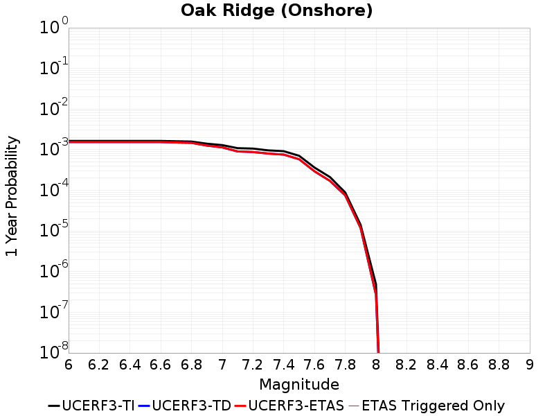 |  |

| Magnitude | 1 wk TI Prob | 1 wk TD Prob | 1 wk ETAS Prob | 1 wk ETAS/TD Gain | 1 wk ETAS Triggered Only | 1 mo TI Prob | 1 mo TD Prob | 1 mo ETAS Prob | 1 mo ETAS/TD Gain | 1 mo ETAS Triggered Only | 1 yr TI Prob | 1 yr TD Prob | 1 yr ETAS Prob | 1 yr ETAS/TD Gain | 1 yr ETAS Triggered Only | 10 yr TI Prob | 10 yr TD Prob | 10 yr ETAS Prob | 10 yr ETAS/TD Gain | 10 yr ETAS Triggered Only |
|-----|-----|-----|-----|-----|-----|-----|-----|-----|-----|-----|-----|-----|-----|-----|-----|-----|-----|-----|-----|-----|
| 6.0 | 3.155064E-5 | 2.9558156E-5 | 2.9558156E-5 | 1.0 | 0.0 | 1.3521002E-4 | 1.2667188E-4 | 1.2667188E-4 | 1.0 | 0.0 | 0.001644939 | 0.0015411772 | 0.0015411772 | 1.0 | 0.0 | 0.01632816 | 0.015309093 | 0.015318939 | 1.0006433 | 1.0E-5 |
| 6.1 | 3.155064E-5 | 2.9558156E-5 | 2.9558156E-5 | 1.0 | 0.0 | 1.3521002E-4 | 1.2667188E-4 | 1.2667188E-4 | 1.0 | 0.0 | 0.001644939 | 0.0015411772 | 0.0015411772 | 1.0 | 0.0 | 0.01632816 | 0.015309093 | 0.015318939 | 1.0006433 | 1.0E-5 |
| 6.2 | 3.155064E-5 | 2.9558156E-5 | 2.9558156E-5 | 1.0 | 0.0 | 1.3521002E-4 | 1.2667188E-4 | 1.2667188E-4 | 1.0 | 0.0 | 0.001644939 | 0.0015411772 | 0.0015411772 | 1.0 | 0.0 | 0.01632816 | 0.015309093 | 0.015318939 | 1.0006433 | 1.0E-5 |
| 6.3 | 3.155064E-5 | 2.9558156E-5 | 2.9558156E-5 | 1.0 | 0.0 | 1.3521002E-4 | 1.2667188E-4 | 1.2667188E-4 | 1.0 | 0.0 | 0.001644939 | 0.0015411772 | 0.0015411772 | 1.0 | 0.0 | 0.01632816 | 0.015309093 | 0.015318939 | 1.0006433 | 1.0E-5 |
| 6.4 | 3.155064E-5 | 2.9558156E-5 | 2.9558156E-5 | 1.0 | 0.0 | 1.3521002E-4 | 1.2667188E-4 | 1.2667188E-4 | 1.0 | 0.0 | 0.001644939 | 0.0015411772 | 0.0015411772 | 1.0 | 0.0 | 0.01632816 | 0.015309093 | 0.015318939 | 1.0006433 | 1.0E-5 |
| 6.5 | 3.155064E-5 | 2.9558156E-5 | 2.9558156E-5 | 1.0 | 0.0 | 1.3521002E-4 | 1.2667188E-4 | 1.2667188E-4 | 1.0 | 0.0 | 0.001644939 | 0.0015411772 | 0.0015411772 | 1.0 | 0.0 | 0.01632816 | 0.015309093 | 0.015318939 | 1.0006433 | 1.0E-5 |
| 6.6 | 3.155064E-5 | 2.9558156E-5 | 2.9558156E-5 | 1.0 | 0.0 | 1.3521002E-4 | 1.2667188E-4 | 1.2667188E-4 | 1.0 | 0.0 | 0.001644939 | 0.0015411772 | 0.0015411772 | 1.0 | 0.0 | 0.01632816 | 0.015309093 | 0.015318939 | 1.0006433 | 1.0E-5 |
| 6.7 | 3.098897E-5 | 2.8895658E-5 | 2.8895658E-5 | 1.0 | 0.0 | 1.328031E-4 | 1.2383287E-4 | 1.2383287E-4 | 1.0 | 0.0 | 0.0016156785 | 0.0015066603 | 0.0015066603 | 1.0 | 0.0 | 0.016039822 | 0.014968595 | 0.014978445 | 1.000658 | 1.0E-5 |
| 6.8 | 3.0449872E-5 | 2.8270268E-5 | 2.8270268E-5 | 1.0 | 0.0 | 1.3049292E-4 | 1.2115287E-4 | 1.2115287E-4 | 1.0 | 0.0 | 0.0015875935 | 0.0014740755 | 0.0014740755 | 1.0 | 0.0 | 0.015762992 | 0.014647045 | 0.014656899 | 1.0006727 | 1.0E-5 |
| 6.9 | 2.697928E-5 | 2.4246894E-5 | 2.4246894E-5 | 1.0 | 0.0 | 1.15620365E-4 | 1.0391124E-4 | 1.0391124E-4 | 1.0 | 0.0 | 0.0014067689 | 0.0012644067 | 0.0012644067 | 1.0 | 0.0 | 0.0139789665 | 0.012574538 | 0.012584412 | 1.0007852 | 1.0E-5 |
| 7.0 | 2.4893961E-5 | 2.1887097E-5 | 2.1887097E-5 | 1.0 | 0.0 | 1.0668404E-4 | 9.3798575E-5 | 9.3798575E-5 | 1.0 | 0.0 | 0.0012981043 | 0.0011414171 | 0.0011414171 | 1.0 | 0.0 | 0.012905477 | 0.0113575235 | 0.0113575235 | 1.0 | 0.0 |
| 7.1 | 2.0945363E-5 | 1.737568E-5 | 1.737568E-5 | 1.0 | 0.0 | 8.976275E-5 | 7.44651E-5 | 7.44651E-5 | 1.0 | 0.0 | 0.0010923136 | 9.0624025E-4 | 9.0624025E-4 | 1.0 | 0.0 | 0.0108696 | 0.009026072 | 0.009026072 | 1.0 | 0.0 |
| 7.2 | 2.0439404E-5 | 1.6830183E-5 | 1.6830183E-5 | 1.0 | 0.0 | 8.7594504E-5 | 7.212739E-5 | 7.212739E-5 | 1.0 | 0.0 | 0.0010659413 | 8.7780185E-4 | 8.7780185E-4 | 1.0 | 0.0 | 0.010608427 | 0.008743954 | 0.008743954 | 1.0 | 0.0 |
| 7.3 | 1.8463334E-5 | 1.5399663E-5 | 1.5399663E-5 | 1.0 | 0.0 | 7.912617E-5 | 6.599691E-5 | 6.599691E-5 | 1.0 | 0.0 | 9.6293533E-4 | 8.0322055E-4 | 8.0322055E-4 | 1.0 | 0.0 | 0.009587734 | 0.0080037275 | 0.0080037275 | 1.0 | 0.0 |
| 7.4 | 1.763139E-5 | 1.45335825E-5 | 1.45335825E-5 | 1.0 | 0.0 | 7.556091E-5 | 6.228532E-5 | 6.228532E-5 | 1.0 | 0.0 | 9.1956573E-4 | 7.580639E-4 | 7.580639E-4 | 1.0 | 0.0 | 0.009157699 | 0.0075552743 | 0.0075552743 | 1.0 | 0.0 |
| 7.5 | 1.3594944E-5 | 1.1177267E-5 | 1.1177267E-5 | 1.0 | 0.0 | 5.8262744E-5 | 4.7901707E-5 | 4.7901707E-5 | 1.0 | 0.0 | 7.0911803E-4 | 5.830498E-4 | 5.830498E-4 | 1.0 | 0.0 | 0.007068595 | 0.0058153905 | 0.0058153905 | 1.0 | 0.0 |
| 7.6 | 6.9889534E-6 | 5.6402573E-6 | 5.6402573E-6 | 1.0 | 0.0 | 2.9952313E-5 | 2.417231E-5 | 2.417231E-5 | 1.0 | 0.0 | 3.646084E-4 | 2.9425856E-4 | 2.9425856E-4 | 1.0 | 0.0 | 0.0036401073 | 0.0029387332 | 0.0029387332 | 1.0 | 0.0 |
| 7.7 | 4.0824193E-6 | 3.2858027E-6 | 3.2858027E-6 | 1.0 | 0.0 | 1.7495966E-5 | 1.4081937E-5 | 1.4081937E-5 | 1.0 | 0.0 | 2.1299256E-4 | 1.7143422E-4 | 1.7143422E-4 | 1.0 | 0.0 | 0.0021278851 | 0.0017130332 | 0.0017130332 | 1.0 | 0.0 |
| 7.8 | 1.7023609E-6 | 1.4378659E-6 | 1.4378659E-6 | 1.0 | 0.0 | 7.295812E-6 | 6.1622677E-6 | 6.1622677E-6 | 1.0 | 0.0 | 8.882289E-5 | 7.5023054E-5 | 7.5023054E-5 | 1.0 | 0.0 | 8.8787393E-4 | 7.499801E-4 | 7.499801E-4 | 1.0 | 0.0 |
| 7.9 | 2.721225E-7 | 2.2627142E-7 | 2.2627142E-7 | 1.0 | 0.0 | 1.1662388E-6 | 9.697343E-7 | 9.697343E-7 | 1.0 | 0.0 | 1.4198865E-5 | 1.1806454E-5 | 1.1806454E-5 | 1.0 | 0.0 | 1.4197957E-4 | 1.18058546E-4 | 1.18058546E-4 | 1.0 | 0.0 |
| 8.0 | 9.364255E-9 | 5.131954E-9 | 5.131954E-9 | 1.0 | 0.0 | 4.0132523E-8 | 2.1994088E-8 | 2.1994088E-8 | 1.0 | 0.0 | 4.8861335E-7 | 2.6777798E-7 | 2.6777798E-7 | 1.0 | 0.0 | 4.8861225E-6 | 2.677777E-6 | 2.677777E-6 | 1.0 | 0.0 |

## Elysian Park (Upper)
*[(top)](#table-of-contents)*

| 1 Week | 1 Month | 1 Year | 10 Year |
|-----|-----|-----|-----|
|  |  |  | 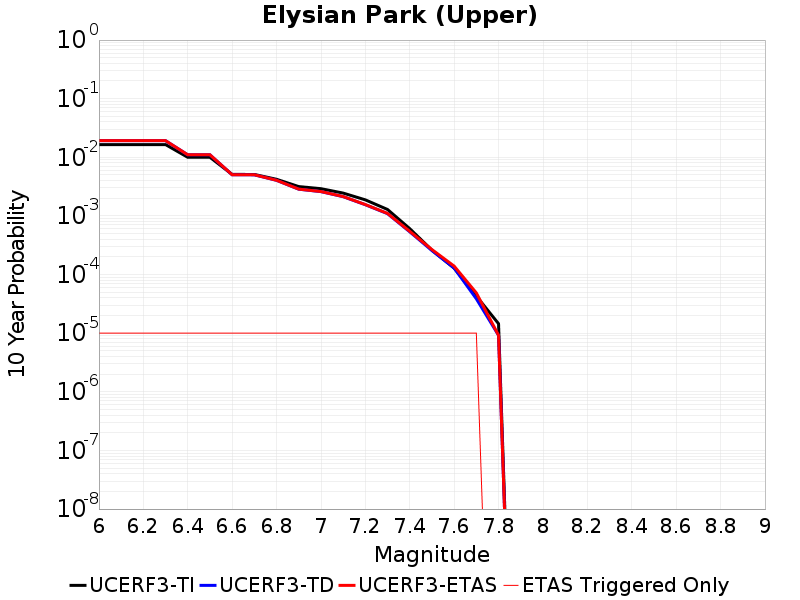 |

| Magnitude | 1 wk TI Prob | 1 wk TD Prob | 1 wk ETAS Prob | 1 wk ETAS/TD Gain | 1 wk ETAS Triggered Only | 1 mo TI Prob | 1 mo TD Prob | 1 mo ETAS Prob | 1 mo ETAS/TD Gain | 1 mo ETAS Triggered Only | 1 yr TI Prob | 1 yr TD Prob | 1 yr ETAS Prob | 1 yr ETAS/TD Gain | 1 yr ETAS Triggered Only | 10 yr TI Prob | 10 yr TD Prob | 10 yr ETAS Prob | 10 yr ETAS/TD Gain | 10 yr ETAS Triggered Only |
|-----|-----|-----|-----|-----|-----|-----|-----|-----|-----|-----|-----|-----|-----|-----|-----|-----|-----|-----|-----|-----|
| 6.0 | 3.1876025E-5 | 3.7079746E-5 | 3.7079746E-5 | 1.0 | 0.0 | 1.3660437E-4 | 1.5890627E-4 | 1.5890627E-4 | 1.0 | 0.0 | 0.0016618895 | 0.0019334434 | 0.0019334434 | 1.0 | 0.0 | 0.016495159 | 0.01921274 | 0.019222546 | 1.0005105 | 1.0E-5 |
| 6.1 | 3.1876025E-5 | 3.7079746E-5 | 3.7079746E-5 | 1.0 | 0.0 | 1.3660437E-4 | 1.5890627E-4 | 1.5890627E-4 | 1.0 | 0.0 | 0.0016618895 | 0.0019334434 | 0.0019334434 | 1.0 | 0.0 | 0.016495159 | 0.01921274 | 0.019222546 | 1.0005105 | 1.0E-5 |
| 6.2 | 3.1876025E-5 | 3.7079746E-5 | 3.7079746E-5 | 1.0 | 0.0 | 1.3660437E-4 | 1.5890627E-4 | 1.5890627E-4 | 1.0 | 0.0 | 0.0016618895 | 0.0019334434 | 0.0019334434 | 1.0 | 0.0 | 0.016495159 | 0.01921274 | 0.019222546 | 1.0005105 | 1.0E-5 |
| 6.3 | 3.1876025E-5 | 3.7079746E-5 | 3.7079746E-5 | 1.0 | 0.0 | 1.3660437E-4 | 1.5890627E-4 | 1.5890627E-4 | 1.0 | 0.0 | 0.0016618895 | 0.0019334434 | 0.0019334434 | 1.0 | 0.0 | 0.016495159 | 0.01921274 | 0.019222546 | 1.0005105 | 1.0E-5 |
| 6.4 | 1.9273462E-5 | 2.1223272E-5 | 2.1223272E-5 | 1.0 | 0.0 | 8.259794E-5 | 9.0954694E-5 | 9.0954694E-5 | 1.0 | 0.0 | 0.001005166 | 0.0011069827 | 0.0011069827 | 1.0 | 0.0 | 0.010006315 | 0.011031524 | 0.011031524 | 1.0 | 0.0 |
| 6.5 | 1.9273462E-5 | 2.1223272E-5 | 2.1223272E-5 | 1.0 | 0.0 | 8.259794E-5 | 9.0954694E-5 | 9.0954694E-5 | 1.0 | 0.0 | 0.001005166 | 0.0011069827 | 0.0011069827 | 1.0 | 0.0 | 0.010006315 | 0.011031524 | 0.011031524 | 1.0 | 0.0 |
| 6.6 | 9.813258E-6 | 9.671488E-6 | 9.671488E-6 | 1.0 | 0.0 | 4.205614E-5 | 4.1448617E-5 | 4.1448617E-5 | 1.0 | 0.0 | 5.119132E-4 | 5.045273E-4 | 5.045273E-4 | 1.0 | 0.0 | 0.005107356 | 0.0050345436 | 0.0050345436 | 1.0 | 0.0 |
| 6.7 | 9.801478E-6 | 9.659053E-6 | 9.659053E-6 | 1.0 | 0.0 | 4.2005657E-5 | 4.1395328E-5 | 4.1395328E-5 | 1.0 | 0.0 | 5.112989E-4 | 5.038788E-4 | 5.038788E-4 | 1.0 | 0.0 | 0.0051012407 | 0.0050280876 | 0.0050280876 | 1.0 | 0.0 |
| 6.8 | 8.102489E-6 | 7.777698E-6 | 7.777698E-6 | 1.0 | 0.0 | 3.4724493E-5 | 3.333259E-5 | 3.333259E-5 | 1.0 | 0.0 | 4.2268867E-4 | 4.057537E-4 | 4.057537E-4 | 1.0 | 0.0 | 0.004218856 | 0.004050623 | 0.004050623 | 1.0 | 0.0 |
| 6.9 | 6.08275E-6 | 5.4843185E-6 | 5.4843185E-6 | 1.0 | 0.0 | 2.6068668E-5 | 2.3504013E-5 | 2.3504013E-5 | 1.0 | 0.0 | 3.173398E-4 | 2.8612456E-4 | 2.8612456E-4 | 1.0 | 0.0 | 0.0031688702 | 0.0028576395 | 0.0028576395 | 1.0 | 0.0 |
| 7.0 | 5.5995934E-6 | 4.985383E-6 | 4.985383E-6 | 1.0 | 0.0 | 2.3998036E-5 | 2.1365755E-5 | 2.1365755E-5 | 1.0 | 0.0 | 2.9213692E-4 | 2.6009767E-4 | 2.6009767E-4 | 1.0 | 0.0 | 0.0029175316 | 0.002598 | 0.002598 | 1.0 | 0.0 |
| 7.1 | 4.709881E-6 | 4.0895434E-6 | 4.0895434E-6 | 1.0 | 0.0 | 2.0185047E-5 | 1.75265E-5 | 1.75265E-5 | 1.0 | 0.0 | 2.4572524E-4 | 2.1336465E-4 | 2.1336465E-4 | 1.0 | 0.0 | 0.002454537 | 0.0021316395 | 0.0021316395 | 1.0 | 0.0 |
| 7.2 | 3.6063436E-6 | 2.9795067E-6 | 2.9795067E-6 | 1.0 | 0.0 | 1.5455667E-5 | 1.2769253E-5 | 1.2769253E-5 | 1.0 | 0.0 | 1.881565E-4 | 1.5545468E-4 | 1.5545468E-4 | 1.0 | 0.0 | 0.0018799726 | 0.0015534705 | 0.0015534705 | 1.0 | 0.0 |
| 7.3 | 2.471135E-6 | 2.0965954E-6 | 2.0965954E-6 | 1.0 | 0.0 | 1.0590536E-5 | 8.985378E-6 | 8.985378E-6 | 1.0 | 0.0 | 1.2893214E-4 | 1.09391556E-4 | 1.09391556E-4 | 1.0 | 0.0 | 0.0012885736 | 0.0010933843 | 0.0010933843 | 1.0 | 0.0 |
| 7.4 | 1.163943E-6 | 1.028179E-6 | 1.028179E-6 | 1.0 | 0.0 | 4.988318E-6 | 4.406474E-6 | 4.406474E-6 | 1.0 | 0.0 | 6.0731076E-5 | 5.364753E-5 | 5.364753E-5 | 1.0 | 0.0 | 6.071448E-4 | 5.363488E-4 | 5.363488E-4 | 1.0 | 0.0 |
| 7.5 | 4.99459E-7 | 4.920478E-7 | 4.920478E-7 | 1.0 | 0.0 | 2.140537E-6 | 2.1087747E-6 | 2.1087747E-6 | 1.0 | 0.0 | 2.6060725E-5 | 2.5674044E-5 | 2.5674044E-5 | 1.0 | 0.0 | 2.605767E-4 | 2.5671234E-4 | 2.5671234E-4 | 1.0 | 0.0 |
| 7.6 | 2.4667852E-7 | 2.479345E-7 | 2.479345E-7 | 1.0 | 0.0 | 1.0571932E-6 | 1.0625761E-6 | 1.0625761E-6 | 1.0 | 0.0 | 1.2871251E-5 | 1.293679E-5 | 1.293679E-5 | 1.0 | 0.0 | 1.2870505E-4 | 1.2936073E-4 | 1.2936073E-4 | 1.0 | 0.0 |
| 7.7 | 8.2312795E-8 | 7.394644E-8 | 7.394644E-8 | 1.0 | 0.0 | 3.527691E-7 | 3.169133E-7 | 3.169133E-7 | 1.0 | 0.0 | 4.294955E-6 | 3.8584135E-6 | 3.8584135E-6 | 1.0 | 0.0 | 4.2948723E-5 | 3.858358E-5 | 3.858358E-5 | 1.0 | 0.0 |
| 7.8 | 2.7819295E-8 | 1.762377E-8 | 1.762377E-8 | 1.0 | 0.0 | 1.1922555E-7 | 7.5530444E-8 | 7.5530444E-8 | 1.0 | 0.0 | 1.45157E-6 | 9.195829E-7 | 9.195829E-7 | 1.0 | 0.0 | 1.45156055E-5 | 9.195806E-6 | 9.195806E-6 | 1.0 | 0.0 |

## Hosgri
*[(top)](#table-of-contents)*

| 1 Week | 1 Month | 1 Year | 10 Year |
|-----|-----|-----|-----|
| 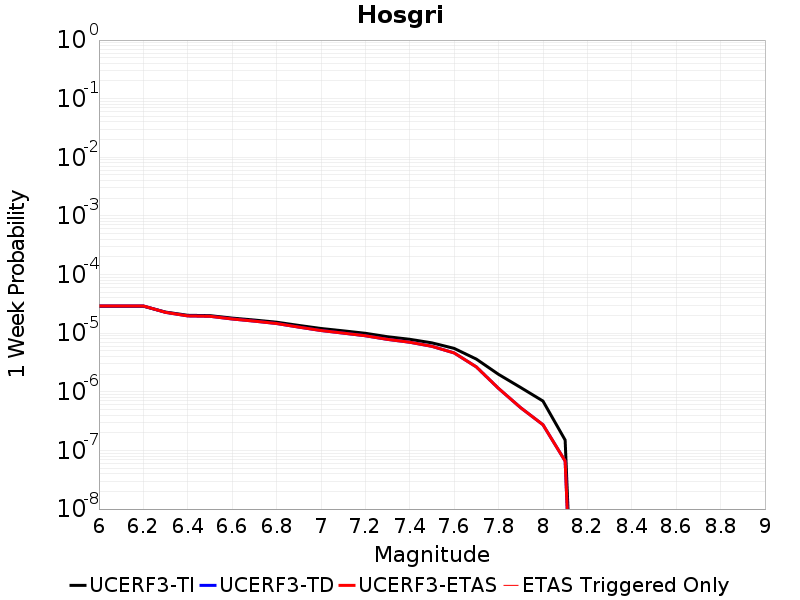 |  | 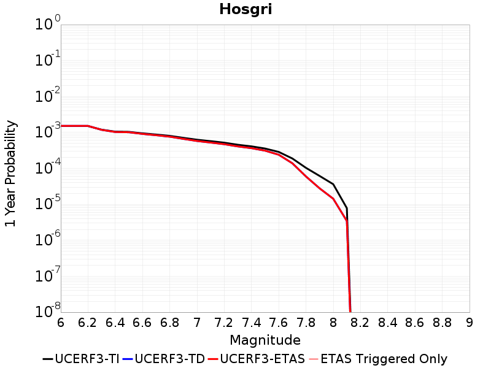 |  |

| Magnitude | 1 wk TI Prob | 1 wk TD Prob | 1 wk ETAS Prob | 1 wk ETAS/TD Gain | 1 wk ETAS Triggered Only | 1 mo TI Prob | 1 mo TD Prob | 1 mo ETAS Prob | 1 mo ETAS/TD Gain | 1 mo ETAS Triggered Only | 1 yr TI Prob | 1 yr TD Prob | 1 yr ETAS Prob | 1 yr ETAS/TD Gain | 1 yr ETAS Triggered Only | 10 yr TI Prob | 10 yr TD Prob | 10 yr ETAS Prob | 10 yr ETAS/TD Gain | 10 yr ETAS Triggered Only |
|-----|-----|-----|-----|-----|-----|-----|-----|-----|-----|-----|-----|-----|-----|-----|-----|-----|-----|-----|-----|-----|
| 6.0 | 2.883978E-5 | 2.9148005E-5 | 2.9148005E-5 | 1.0 | 0.0 | 1.235932E-4 | 1.249142E-4 | 1.249142E-4 | 1.0 | 0.0 | 0.0015037085 | 0.0015197966 | 0.0015197966 | 1.0 | 0.0 | 0.01493574 | 0.015097792 | 0.015107641 | 1.0006523 | 1.0E-5 |
| 6.1 | 2.883978E-5 | 2.9148005E-5 | 2.9148005E-5 | 1.0 | 0.0 | 1.235932E-4 | 1.249142E-4 | 1.249142E-4 | 1.0 | 0.0 | 0.0015037085 | 0.0015197966 | 0.0015197966 | 1.0 | 0.0 | 0.01493574 | 0.015097792 | 0.015107641 | 1.0006523 | 1.0E-5 |
| 6.2 | 2.883978E-5 | 2.9148005E-5 | 2.9148005E-5 | 1.0 | 0.0 | 1.235932E-4 | 1.249142E-4 | 1.249142E-4 | 1.0 | 0.0 | 0.0015037085 | 0.0015197966 | 0.0015197966 | 1.0 | 0.0 | 0.01493574 | 0.015097792 | 0.015107641 | 1.0006523 | 1.0E-5 |
| 6.3 | 2.2914428E-5 | 2.265791E-5 | 2.265791E-5 | 1.0 | 0.0 | 9.8200995E-5 | 9.710174E-5 | 9.710174E-5 | 1.0 | 0.0 | 0.0011949413 | 0.0011815776 | 0.0011815776 | 1.0 | 0.0 | 0.011885363 | 0.011754336 | 0.011764218 | 1.0008408 | 1.0E-5 |
| 6.4 | 2.0195741E-5 | 1.9711044E-5 | 1.9711044E-5 | 1.0 | 0.0 | 8.65503E-5 | 8.4473184E-5 | 8.4473184E-5 | 1.0 | 0.0 | 0.0010532405 | 0.0010279777 | 0.0010279777 | 1.0 | 0.0 | 0.010482626 | 0.010233255 | 0.010243152 | 1.0009673 | 1.0E-5 |
| 6.5 | 1.9924333E-5 | 1.9423356E-5 | 1.9423356E-5 | 1.0 | 0.0 | 8.53872E-5 | 8.324031E-5 | 8.324031E-5 | 1.0 | 0.0 | 0.0010390934 | 0.0010129815 | 0.0010129815 | 1.0 | 0.0 | 0.010342481 | 0.01008466 | 0.010094559 | 1.0009816 | 1.0E-5 |
| 6.6 | 1.809694E-5 | 1.7471846E-5 | 1.7471846E-5 | 1.0 | 0.0 | 7.7556004E-5 | 7.48772E-5 | 7.48772E-5 | 1.0 | 0.0 | 9.438353E-4 | 9.1124995E-4 | 9.1124995E-4 | 1.0 | 0.0 | 0.009398366 | 0.009076059 | 0.009085968 | 1.0010918 | 1.0E-5 |
| 6.7 | 1.675989E-5 | 1.6055745E-5 | 1.6055745E-5 | 1.0 | 0.0 | 7.182612E-5 | 6.880853E-5 | 6.880853E-5 | 1.0 | 0.0 | 8.7413215E-4 | 8.3742297E-4 | 8.3742297E-4 | 1.0 | 0.0 | 0.008707017 | 0.008343562 | 0.008353478 | 1.0011885 | 1.0E-5 |
| 6.8 | 1.5401129E-5 | 1.4626505E-5 | 1.4626505E-5 | 1.0 | 0.0 | 6.6003166E-5 | 6.268352E-5 | 6.268352E-5 | 1.0 | 0.0 | 8.032922E-4 | 7.629055E-4 | 7.629055E-4 | 1.0 | 0.0 | 0.008003947 | 0.0076037105 | 0.0076037105 | 1.0 | 0.0 |
| 6.9 | 1.356559E-5 | 1.2701641E-5 | 1.2701641E-5 | 1.0 | 0.0 | 5.8136946E-5 | 5.443447E-5 | 5.443447E-5 | 1.0 | 0.0 | 7.0758746E-4 | 6.6253863E-4 | 6.6253863E-4 | 1.0 | 0.0 | 0.007053386 | 0.00660642 | 0.00660642 | 1.0 | 0.0 |
| 7.0 | 1.2030819E-5 | 1.11069685E-5 | 1.11069685E-5 | 1.0 | 0.0 | 5.155963E-5 | 4.7600428E-5 | 4.7600428E-5 | 1.0 | 0.0 | 6.275577E-4 | 5.793812E-4 | 5.793812E-4 | 1.0 | 0.0 | 0.006257884 | 0.005779449 | 0.005779449 | 1.0 | 0.0 |
| 7.1 | 1.0972698E-5 | 1.0032752E-5 | 1.0032752E-5 | 1.0 | 0.0 | 4.7025E-5 | 4.29968E-5 | 4.29968E-5 | 1.0 | 0.0 | 5.72379E-4 | 5.233604E-4 | 5.233604E-4 | 1.0 | 0.0 | 0.0057090693 | 0.0052220114 | 0.0052220114 | 1.0 | 0.0 |
| 7.2 | 9.961926E-6 | 9.044995E-6 | 9.044995E-6 | 1.0 | 0.0 | 4.2693267E-5 | 3.8763686E-5 | 3.8763686E-5 | 1.0 | 0.0 | 5.1966653E-4 | 4.7184573E-4 | 4.7184573E-4 | 1.0 | 0.0 | 0.00518453 | 0.0047091665 | 0.0047091665 | 1.0 | 0.0 |
| 7.3 | 8.700929E-6 | 7.8379935E-6 | 7.8379935E-6 | 1.0 | 0.0 | 3.7289166E-5 | 3.3590968E-5 | 3.3590968E-5 | 1.0 | 0.0 | 4.53901E-4 | 4.088933E-4 | 4.088933E-4 | 1.0 | 0.0 | 0.00452975 | 0.0040821303 | 0.0040821303 | 1.0 | 0.0 |
| 7.4 | 7.866285E-6 | 7.0083674E-6 | 7.0083674E-6 | 1.0 | 0.0 | 3.3712215E-5 | 3.0035515E-5 | 3.0035515E-5 | 1.0 | 0.0 | 4.103689E-4 | 3.6562106E-4 | 3.6562106E-4 | 1.0 | 0.0 | 0.004096119 | 0.0036509135 | 0.0036509135 | 1.0 | 0.0 |
| 7.5 | 6.8381305E-6 | 5.968985E-6 | 5.968985E-6 | 1.0 | 0.0 | 2.9305946E-5 | 2.5581114E-5 | 2.5581114E-5 | 1.0 | 0.0 | 3.5674145E-4 | 3.1140557E-4 | 3.1140557E-4 | 1.0 | 0.0 | 0.0035616932 | 0.003110408 | 0.003110408 | 1.0 | 0.0 |
| 7.6 | 5.503376E-6 | 4.6040354E-6 | 4.6040354E-6 | 1.0 | 0.0 | 2.3585684E-5 | 1.9731431E-5 | 1.9731431E-5 | 1.0 | 0.0 | 2.8711787E-4 | 2.402037E-4 | 2.402037E-4 | 1.0 | 0.0 | 0.002867472 | 0.0024001547 | 0.0024001547 | 1.0 | 0.0 |
| 7.7 | 3.6144982E-6 | 2.6601783E-6 | 2.6601783E-6 | 1.0 | 0.0 | 1.5490614E-5 | 1.1400714E-5 | 1.1400714E-5 | 1.0 | 0.0 | 1.8858191E-4 | 1.3879487E-4 | 1.3879487E-4 | 1.0 | 0.0 | 0.0018842196 | 0.0013877939 | 0.0013877939 | 1.0 | 0.0 |
| 7.8 | 1.9853494E-6 | 1.1426567E-6 | 1.1426567E-6 | 1.0 | 0.0 | 8.508612E-6 | 4.897091E-6 | 4.897091E-6 | 1.0 | 0.0 | 1.0358743E-4 | 5.962045E-5 | 5.962045E-5 | 1.0 | 0.0 | 0.0010353916 | 5.967565E-4 | 5.967565E-4 | 1.0 | 0.0 |
| 7.9 | 1.1818757E-6 | 5.34501E-7 | 5.34501E-7 | 1.0 | 0.0 | 5.0651715E-6 | 2.2907163E-6 | 2.2907163E-6 | 1.0 | 0.0 | 6.1666724E-5 | 2.7889117E-5 | 2.7889117E-5 | 1.0 | 0.0 | 6.1649614E-4 | 2.7953065E-4 | 2.7953065E-4 | 1.0 | 0.0 |
| 8.0 | 6.962958E-7 | 2.7475056E-7 | 2.7475056E-7 | 1.0 | 0.0 | 2.9841215E-6 | 1.1775019E-6 | 1.1775019E-6 | 1.0 | 0.0 | 3.6331072E-5 | 1.4335991E-5 | 1.4335991E-5 | 1.0 | 0.0 | 3.6325134E-4 | 1.4392231E-4 | 1.4392231E-4 | 1.0 | 0.0 |
| 8.1 | 1.5033264E-7 | 6.599767E-8 | 6.599767E-8 | 1.0 | 0.0 | 6.442826E-7 | 2.828471E-7 | 2.828471E-7 | 1.0 | 0.0 | 7.844113E-6 | 3.4436582E-6 | 3.4436582E-6 | 1.0 | 0.0 | 7.843835E-5 | 3.4456603E-5 | 3.4456603E-5 | 1.0 | 0.0 |

## Robinson Creek
*[(top)](#table-of-contents)*

| 1 Week | 1 Month | 1 Year | 10 Year |
|-----|-----|-----|-----|
|  |  | 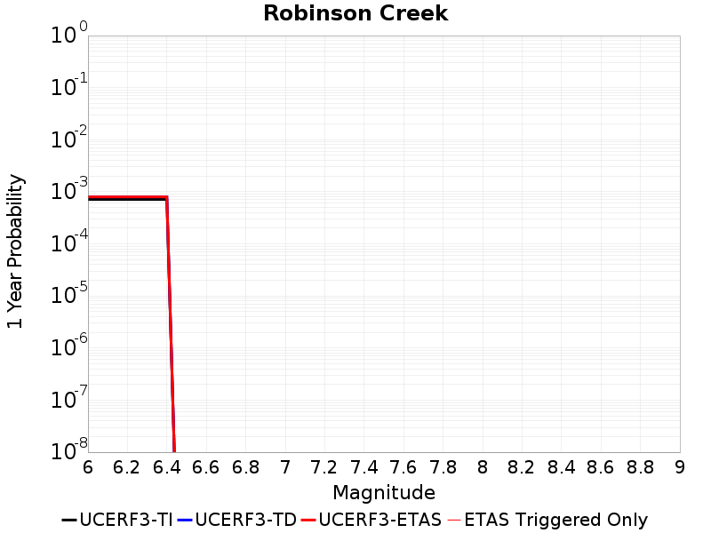 | 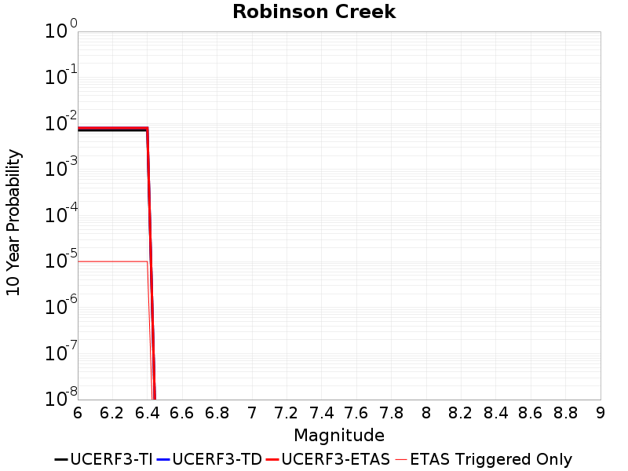 |

| Magnitude | 1 wk TI Prob | 1 wk TD Prob | 1 wk ETAS Prob | 1 wk ETAS/TD Gain | 1 wk ETAS Triggered Only | 1 mo TI Prob | 1 mo TD Prob | 1 mo ETAS Prob | 1 mo ETAS/TD Gain | 1 mo ETAS Triggered Only | 1 yr TI Prob | 1 yr TD Prob | 1 yr ETAS Prob | 1 yr ETAS/TD Gain | 1 yr ETAS Triggered Only | 10 yr TI Prob | 10 yr TD Prob | 10 yr ETAS Prob | 10 yr ETAS/TD Gain | 10 yr ETAS Triggered Only |
|-----|-----|-----|-----|-----|-----|-----|-----|-----|-----|-----|-----|-----|-----|-----|-----|-----|-----|-----|-----|-----|
| 6.0 | 1.3705327E-5 | 1.5295438E-5 | 1.5295438E-5 | 1.0 | 0.0 | 5.8735794E-5 | 6.555188E-5 | 6.555188E-5 | 1.0 | 0.0 | 7.1487366E-4 | 7.9809414E-4 | 7.9809414E-4 | 1.0 | 0.0 | 0.0071257832 | 0.007980941 | 0.007990861 | 1.001243 | 1.0E-5 |
| 6.1 | 1.3705327E-5 | 1.5295438E-5 | 1.5295438E-5 | 1.0 | 0.0 | 5.8735794E-5 | 6.555188E-5 | 6.555188E-5 | 1.0 | 0.0 | 7.1487366E-4 | 7.9809414E-4 | 7.9809414E-4 | 1.0 | 0.0 | 0.0071257832 | 0.007980941 | 0.007990861 | 1.001243 | 1.0E-5 |
| 6.2 | 1.3705327E-5 | 1.5295438E-5 | 1.5295438E-5 | 1.0 | 0.0 | 5.8735794E-5 | 6.555188E-5 | 6.555188E-5 | 1.0 | 0.0 | 7.1487366E-4 | 7.9809414E-4 | 7.9809414E-4 | 1.0 | 0.0 | 0.0071257832 | 0.007980941 | 0.007990861 | 1.001243 | 1.0E-5 |
| 6.3 | 1.3705327E-5 | 1.5295438E-5 | 1.5295438E-5 | 1.0 | 0.0 | 5.8735794E-5 | 6.555188E-5 | 6.555188E-5 | 1.0 | 0.0 | 7.1487366E-4 | 7.9809414E-4 | 7.9809414E-4 | 1.0 | 0.0 | 0.0071257832 | 0.007980941 | 0.007990861 | 1.001243 | 1.0E-5 |
| 6.4 | 1.3705327E-5 | 1.5295438E-5 | 1.5295438E-5 | 1.0 | 0.0 | 5.8735794E-5 | 6.555188E-5 | 6.555188E-5 | 1.0 | 0.0 | 7.1487366E-4 | 7.9809414E-4 | 7.9809414E-4 | 1.0 | 0.0 | 0.0071257832 | 0.007980941 | 0.007990861 | 1.001243 | 1.0E-5 |

## San Gabriel
*[(top)](#table-of-contents)*

| 1 Week | 1 Month | 1 Year | 10 Year |
|-----|-----|-----|-----|
|  |  | 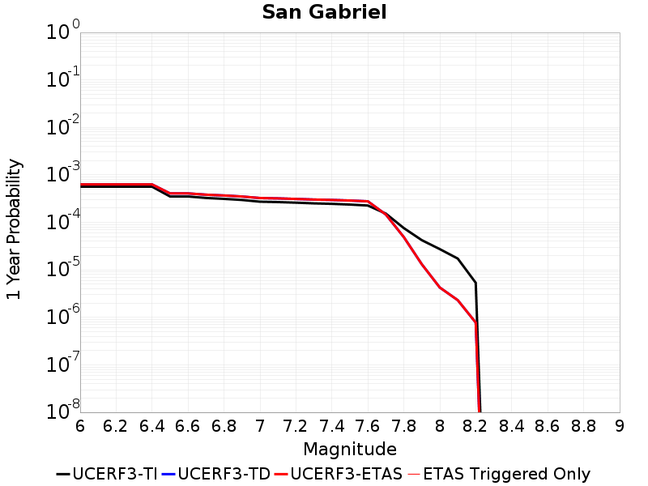 | 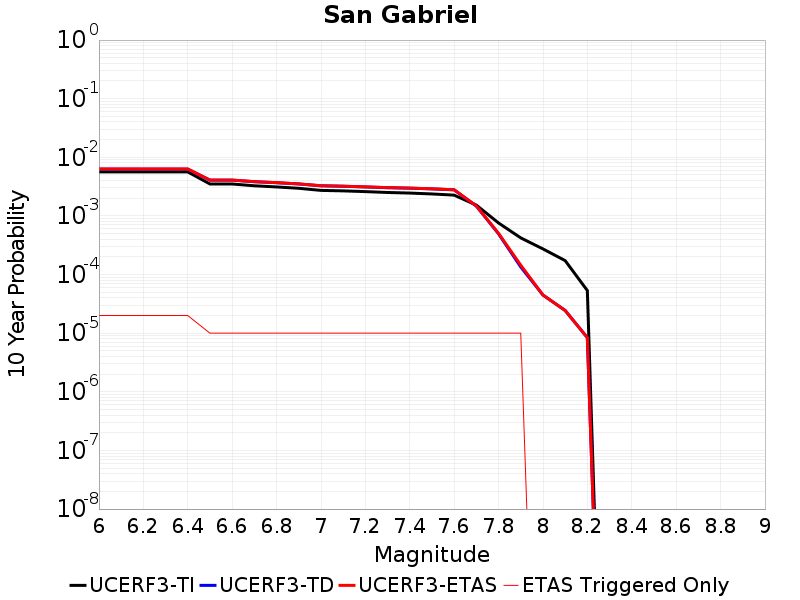 |

| Magnitude | 1 wk TI Prob | 1 wk TD Prob | 1 wk ETAS Prob | 1 wk ETAS/TD Gain | 1 wk ETAS Triggered Only | 1 mo TI Prob | 1 mo TD Prob | 1 mo ETAS Prob | 1 mo ETAS/TD Gain | 1 mo ETAS Triggered Only | 1 yr TI Prob | 1 yr TD Prob | 1 yr ETAS Prob | 1 yr ETAS/TD Gain | 1 yr ETAS Triggered Only | 10 yr TI Prob | 10 yr TD Prob | 10 yr ETAS Prob | 10 yr ETAS/TD Gain | 10 yr ETAS Triggered Only |
|-----|-----|-----|-----|-----|-----|-----|-----|-----|-----|-----|-----|-----|-----|-----|-----|-----|-----|-----|-----|-----|
| 6.0 | 1.083775E-5 | 1.20816085E-5 | 1.20816085E-5 | 1.0 | 0.0 | 4.6446676E-5 | 5.177736E-5 | 5.177736E-5 | 1.0 | 0.0 | 5.653415E-4 | 6.3021836E-4 | 6.4021203E-4 | 1.0158575 | 1.0E-5 | 0.0056390543 | 0.006296172 | 0.006306109 | 1.0015782 | 1.0E-5 |
| 6.1 | 1.083775E-5 | 1.20816085E-5 | 1.20816085E-5 | 1.0 | 0.0 | 4.6446676E-5 | 5.177736E-5 | 5.177736E-5 | 1.0 | 0.0 | 5.653415E-4 | 6.3021836E-4 | 6.4021203E-4 | 1.0158575 | 1.0E-5 | 0.0056390543 | 0.006296172 | 0.006306109 | 1.0015782 | 1.0E-5 |
| 6.2 | 1.083775E-5 | 1.20816085E-5 | 1.20816085E-5 | 1.0 | 0.0 | 4.6446676E-5 | 5.177736E-5 | 5.177736E-5 | 1.0 | 0.0 | 5.653415E-4 | 6.3021836E-4 | 6.4021203E-4 | 1.0158575 | 1.0E-5 | 0.0056390543 | 0.006296172 | 0.006306109 | 1.0015782 | 1.0E-5 |
| 6.3 | 1.083775E-5 | 1.20816085E-5 | 1.20816085E-5 | 1.0 | 0.0 | 4.6446676E-5 | 5.177736E-5 | 5.177736E-5 | 1.0 | 0.0 | 5.653415E-4 | 6.3021836E-4 | 6.4021203E-4 | 1.0158575 | 1.0E-5 | 0.0056390543 | 0.006296172 | 0.006306109 | 1.0015782 | 1.0E-5 |
| 6.4 | 1.083775E-5 | 1.20816085E-5 | 1.20816085E-5 | 1.0 | 0.0 | 4.6446676E-5 | 5.177736E-5 | 5.177736E-5 | 1.0 | 0.0 | 5.653415E-4 | 6.3021836E-4 | 6.4021203E-4 | 1.0158575 | 1.0E-5 | 0.0056390543 | 0.006296172 | 0.006306109 | 1.0015782 | 1.0E-5 |
| 6.5 | 6.7317824E-6 | 7.812367E-6 | 7.812367E-6 | 1.0 | 0.0 | 2.8850178E-5 | 3.348115E-5 | 3.348115E-5 | 1.0 | 0.0 | 3.511943E-4 | 4.0755782E-4 | 4.1755373E-4 | 1.0245264 | 1.0E-5 | 0.003506398 | 0.004078964 | 0.004088923 | 1.0024416 | 1.0E-5 |
| 6.6 | 6.7317824E-6 | 7.812367E-6 | 7.812367E-6 | 1.0 | 0.0 | 2.8850178E-5 | 3.348115E-5 | 3.348115E-5 | 1.0 | 0.0 | 3.511943E-4 | 4.0755782E-4 | 4.1755373E-4 | 1.0245264 | 1.0E-5 | 0.003506398 | 0.004078964 | 0.004088923 | 1.0024416 | 1.0E-5 |
| 6.7 | 6.274881E-6 | 7.3412007E-6 | 7.3412007E-6 | 1.0 | 0.0 | 2.6892068E-5 | 3.1461914E-5 | 3.1461914E-5 | 1.0 | 0.0 | 3.2736175E-4 | 3.8298246E-4 | 3.8298246E-4 | 1.0 | 0.0 | 0.0032687993 | 0.0038340776 | 0.0038340776 | 1.0 | 0.0 |
| 6.8 | 5.996209E-6 | 7.053868E-6 | 7.053868E-6 | 1.0 | 0.0 | 2.5697784E-5 | 3.023052E-5 | 3.023052E-5 | 1.0 | 0.0 | 3.128256E-4 | 3.6799535E-4 | 3.6799535E-4 | 1.0 | 0.0 | 0.003123856 | 0.0036847107 | 0.0036847107 | 1.0 | 0.0 |
| 6.9 | 5.686331E-6 | 6.7185383E-6 | 6.7185383E-6 | 1.0 | 0.0 | 2.4369761E-5 | 2.8793422E-5 | 2.8793422E-5 | 1.0 | 0.0 | 2.9666146E-4 | 3.5050444E-4 | 3.5050444E-4 | 1.0 | 0.0 | 0.0029626573 | 0.0035103655 | 0.0035103655 | 1.0 | 0.0 |
| 7.0 | 5.2329838E-6 | 6.242183E-6 | 6.242183E-6 | 1.0 | 0.0 | 2.242688E-5 | 2.6751943E-5 | 2.6751943E-5 | 1.0 | 0.0 | 2.7301308E-4 | 3.2565702E-4 | 3.2565702E-4 | 1.0 | 0.0 | 0.002726779 | 0.0032626349 | 0.0032626349 | 1.0 | 0.0 |
| 7.1 | 5.135671E-6 | 6.1320625E-6 | 6.1320625E-6 | 1.0 | 0.0 | 2.2009834E-5 | 2.6280006E-5 | 2.6280006E-5 | 1.0 | 0.0 | 2.6793676E-4 | 3.1991288E-4 | 3.1991288E-4 | 1.0 | 0.0 | 0.0026761394 | 0.0032053606 | 0.0032053606 | 1.0 | 0.0 |
| 7.2 | 4.989062E-6 | 5.9650188E-6 | 5.9650188E-6 | 1.0 | 0.0 | 2.1381518E-5 | 2.5564119E-5 | 2.5564119E-5 | 1.0 | 0.0 | 2.6028889E-4 | 3.111995E-4 | 3.111995E-4 | 1.0 | 0.0 | 0.0025998424 | 0.0031184738 | 0.0031184738 | 1.0 | 0.0 |
| 7.3 | 4.8219395E-6 | 5.796197E-6 | 5.796197E-6 | 1.0 | 0.0 | 2.0665291E-5 | 2.484061E-5 | 2.484061E-5 | 1.0 | 0.0 | 2.5157086E-4 | 3.0239325E-4 | 3.0239325E-4 | 1.0 | 0.0 | 0.0025128627 | 0.003030655 | 0.003030655 | 1.0 | 0.0 |
| 7.4 | 4.7118383E-6 | 5.6844124E-6 | 5.6844124E-6 | 1.0 | 0.0 | 2.0193436E-5 | 2.4361543E-5 | 2.4361543E-5 | 1.0 | 0.0 | 2.4582737E-4 | 2.9656218E-4 | 2.9656218E-4 | 1.0 | 0.0 | 0.002455556 | 0.0029725006 | 0.0029725006 | 1.0 | 0.0 |
| 7.5 | 4.5506545E-6 | 5.529282E-6 | 5.529282E-6 | 1.0 | 0.0 | 1.9502659E-5 | 2.3696712E-5 | 2.3696712E-5 | 1.0 | 0.0 | 2.37419E-4 | 2.8847004E-4 | 2.8847004E-4 | 1.0 | 0.0 | 0.002371655 | 0.0028917913 | 0.0028917913 | 1.0 | 0.0 |
| 7.6 | 4.343636E-6 | 5.321374E-6 | 5.321374E-6 | 1.0 | 0.0 | 1.861545E-5 | 2.2805692E-5 | 2.2805692E-5 | 1.0 | 0.0 | 2.2661954E-4 | 2.776247E-4 | 2.776247E-4 | 1.0 | 0.0 | 0.0022638857 | 0.0027836056 | 0.0027836056 | 1.0 | 0.0 |
| 7.7 | 2.936235E-6 | 2.8062075E-6 | 2.8062075E-6 | 1.0 | 0.0 | 1.2583803E-5 | 1.2026548E-5 | 1.2026548E-5 | 1.0 | 0.0 | 1.5319703E-4 | 1.4641341E-4 | 1.4641341E-4 | 1.0 | 0.0 | 0.0015309147 | 0.0014706816 | 0.0014706816 | 1.0 | 0.0 |
| 7.8 | 1.4541639E-6 | 9.3758143E-7 | 9.3758143E-7 | 1.0 | 0.0 | 6.232116E-6 | 4.0182E-6 | 4.0182E-6 | 1.0 | 0.0 | 7.587337E-5 | 4.8920487E-5 | 4.8920487E-5 | 1.0 | 0.0 | 7.584747E-4 | 4.9420446E-4 | 4.9420446E-4 | 1.0 | 0.0 |
| 7.9 | 8.098958E-7 | 2.5146102E-7 | 2.5146102E-7 | 1.0 | 0.0 | 3.4709774E-6 | 1.0776896E-6 | 1.0776896E-6 | 1.0 | 0.0 | 4.225833E-5 | 1.3120792E-5 | 1.3120792E-5 | 1.0 | 0.0 | 4.2250296E-4 | 1.3444782E-4 | 1.3444782E-4 | 1.0 | 0.0 |
| 8.0 | 5.2473234E-7 | 8.1303064E-8 | 8.1303064E-8 | 1.0 | 0.0 | 2.248851E-6 | 3.4844163E-7 | 3.4844163E-7 | 1.0 | 0.0 | 2.7379416E-5 | 4.2422685E-6 | 4.2422685E-6 | 1.0 | 0.0 | 2.7376044E-4 | 4.466362E-5 | 4.466362E-5 | 1.0 | 0.0 |
| 8.1 | 3.3162388E-7 | 4.400615E-8 | 4.400615E-8 | 1.0 | 0.0 | 1.4212444E-6 | 1.8859777E-7 | 1.8859777E-7 | 1.0 | 0.0 | 1.7303513E-5 | 2.2961754E-6 | 2.2961754E-6 | 1.0 | 0.0 | 1.7302166E-4 | 2.434421E-5 | 2.434421E-5 | 1.0 | 0.0 |
| 8.2 | 1.0235345E-7 | 1.4842227E-8 | 1.4842227E-8 | 1.0 | 0.0 | 4.3865757E-7 | 6.360954E-8 | 6.360954E-8 | 1.0 | 0.0 | 5.340643E-6 | 7.7444594E-7 | 7.7444594E-7 | 1.0 | 0.0 | 5.3405143E-5 | 8.368745E-6 | 8.368745E-6 | 1.0 | 0.0 |

## San Jacinto (Clark) rev
*[(top)](#table-of-contents)*

| 1 Week | 1 Month | 1 Year | 10 Year |
|-----|-----|-----|-----|
|  |  |  | 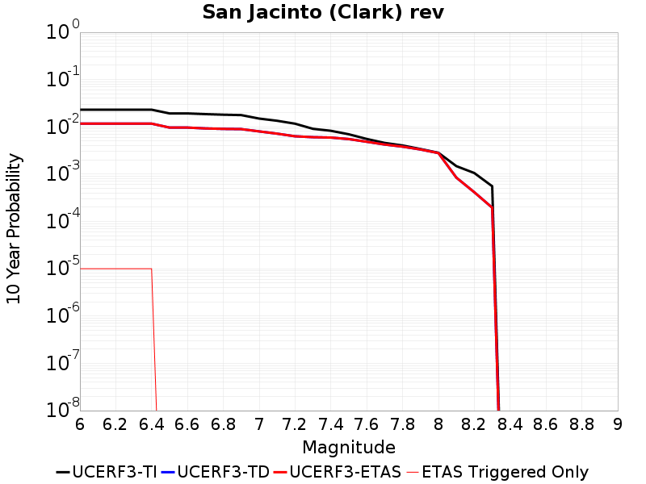 |

| Magnitude | 1 wk TI Prob | 1 wk TD Prob | 1 wk ETAS Prob | 1 wk ETAS/TD Gain | 1 wk ETAS Triggered Only | 1 mo TI Prob | 1 mo TD Prob | 1 mo ETAS Prob | 1 mo ETAS/TD Gain | 1 mo ETAS Triggered Only | 1 yr TI Prob | 1 yr TD Prob | 1 yr ETAS Prob | 1 yr ETAS/TD Gain | 1 yr ETAS Triggered Only | 10 yr TI Prob | 10 yr TD Prob | 10 yr ETAS Prob | 10 yr ETAS/TD Gain | 10 yr ETAS Triggered Only |
|-----|-----|-----|-----|-----|-----|-----|-----|-----|-----|-----|-----|-----|-----|-----|-----|-----|-----|-----|-----|-----|
| 6.0 | 4.482615E-5 | 2.1547932E-5 | 2.1547932E-5 | 1.0 | 0.0 | 1.9209793E-4 | 9.2345064E-5 | 9.2345064E-5 | 1.0 | 0.0 | 0.0023362834 | 0.0011237308 | 0.0011237308 | 1.0 | 0.0 | 0.02311874 | 0.011700109 | 0.011709991 | 1.0008447 | 1.0E-5 |
| 6.1 | 4.482615E-5 | 2.1547932E-5 | 2.1547932E-5 | 1.0 | 0.0 | 1.9209793E-4 | 9.2345064E-5 | 9.2345064E-5 | 1.0 | 0.0 | 0.0023362834 | 0.0011237308 | 0.0011237308 | 1.0 | 0.0 | 0.02311874 | 0.011700109 | 0.011709991 | 1.0008447 | 1.0E-5 |
| 6.2 | 4.482615E-5 | 2.1547932E-5 | 2.1547932E-5 | 1.0 | 0.0 | 1.9209793E-4 | 9.2345064E-5 | 9.2345064E-5 | 1.0 | 0.0 | 0.0023362834 | 0.0011237308 | 0.0011237308 | 1.0 | 0.0 | 0.02311874 | 0.011700109 | 0.011709991 | 1.0008447 | 1.0E-5 |
| 6.3 | 4.482615E-5 | 2.1547932E-5 | 2.1547932E-5 | 1.0 | 0.0 | 1.9209793E-4 | 9.2345064E-5 | 9.2345064E-5 | 1.0 | 0.0 | 0.0023362834 | 0.0011237308 | 0.0011237308 | 1.0 | 0.0 | 0.02311874 | 0.011700109 | 0.011709991 | 1.0008447 | 1.0E-5 |
| 6.4 | 4.482615E-5 | 2.1547932E-5 | 2.1547932E-5 | 1.0 | 0.0 | 1.9209793E-4 | 9.2345064E-5 | 9.2345064E-5 | 1.0 | 0.0 | 0.0023362834 | 0.0011237308 | 0.0011237308 | 1.0 | 0.0 | 0.02311874 | 0.011700109 | 0.011709991 | 1.0008447 | 1.0E-5 |
| 6.5 | 3.7294863E-5 | 1.7706909E-5 | 1.7706909E-5 | 1.0 | 0.0 | 1.5982533E-4 | 7.588457E-5 | 7.588457E-5 | 1.0 | 0.0 | 0.0019441366 | 9.235077E-4 | 9.235077E-4 | 1.0 | 0.0 | 0.01927216 | 0.009676229 | 0.009686133 | 1.0010234 | 1.0E-5 |
| 6.6 | 3.7294863E-5 | 1.7706909E-5 | 1.7706909E-5 | 1.0 | 0.0 | 1.5982533E-4 | 7.588457E-5 | 7.588457E-5 | 1.0 | 0.0 | 0.0019441366 | 9.235077E-4 | 9.235077E-4 | 1.0 | 0.0 | 0.01927216 | 0.009676229 | 0.009686133 | 1.0010234 | 1.0E-5 |
| 6.7 | 3.6039248E-5 | 1.6948177E-5 | 1.6948177E-5 | 1.0 | 0.0 | 1.5444479E-4 | 7.263305E-5 | 7.263305E-5 | 1.0 | 0.0 | 0.0018787434 | 8.839529E-4 | 8.839529E-4 | 1.0 | 0.0 | 0.01862939 | 0.009272293 | 0.009282201 | 1.0010685 | 1.0E-5 |
| 6.8 | 3.5031844E-5 | 1.657104E-5 | 1.657104E-5 | 1.0 | 0.0 | 1.5012783E-4 | 7.101683E-5 | 7.101683E-5 | 1.0 | 0.0 | 0.0018262739 | 8.642912E-4 | 8.642912E-4 | 1.0 | 0.0 | 0.01811338 | 0.009068621 | 0.009078531 | 1.0010927 | 1.0E-5 |
| 6.9 | 3.435112E-5 | 1.6398428E-5 | 1.6398428E-5 | 1.0 | 0.0 | 1.4721078E-4 | 7.027711E-5 | 7.027711E-5 | 1.0 | 0.0 | 0.0017908178 | 8.5529214E-4 | 8.5529214E-4 | 1.0 | 0.0 | 0.017764548 | 0.008973457 | 0.008983367 | 1.0011044 | 1.0E-5 |
| 7.0 | 2.8959772E-5 | 1.4641289E-5 | 1.4641289E-5 | 1.0 | 0.0 | 1.241074E-4 | 6.274689E-5 | 6.274689E-5 | 1.0 | 0.0 | 0.0015099603 | 7.636785E-4 | 7.636785E-4 | 1.0 | 0.0 | 0.014997416 | 0.008023166 | 0.008033086 | 1.0012364 | 1.0E-5 |
| 7.1 | 2.6002877E-5 | 1.3106502E-5 | 1.3106502E-5 | 1.0 | 0.0 | 1.11436144E-4 | 5.6169527E-5 | 5.6169527E-5 | 1.0 | 0.0 | 0.0013558907 | 6.836516E-4 | 6.836516E-4 | 1.0 | 0.0 | 0.013476475 | 0.0071897185 | 0.0071996464 | 1.0013809 | 1.0E-5 |
| 7.2 | 2.2544838E-5 | 1.15105895E-5 | 1.15105895E-5 | 1.0 | 0.0 | 9.661716E-5 | 4.9330174E-5 | 4.9330174E-5 | 1.0 | 0.0 | 0.001175679 | 6.004308E-4 | 6.004308E-4 | 1.0 | 0.0 | 0.011694785 | 0.00632378 | 0.0063337167 | 1.0015713 | 1.0E-5 |
| 7.3 | 1.75334E-5 | 1.10435485E-5 | 1.10435485E-5 | 1.0 | 0.0 | 7.514098E-5 | 4.732864E-5 | 4.732864E-5 | 1.0 | 0.0 | 9.144575E-4 | 5.760753E-4 | 5.760753E-4 | 1.0 | 0.0 | 0.009107036 | 0.0060569528 | 0.0060668923 | 1.001641 | 1.0E-5 |
| 7.4 | 1.5924552E-5 | 1.0838275E-5 | 1.0838275E-5 | 1.0 | 0.0 | 6.82463E-5 | 4.644893E-5 | 4.644893E-5 | 1.0 | 0.0 | 8.305819E-4 | 5.653704E-4 | 5.653704E-4 | 1.0 | 0.0 | 0.008274844 | 0.0059413007 | 0.005951241 | 1.0016731 | 1.0E-5 |
| 7.5 | 1.3428931E-5 | 1.0066964E-5 | 1.0066964E-5 | 1.0 | 0.0 | 5.7551293E-5 | 4.3143424E-5 | 4.3143424E-5 | 1.0 | 0.0 | 7.004617E-4 | 5.251457E-4 | 5.251457E-4 | 1.0 | 0.0 | 0.006982579 | 0.0055208 | 0.0055307453 | 1.0018014 | 1.0E-5 |
| 7.6 | 1.0688787E-5 | 8.8129045E-6 | 8.8129045E-6 | 1.0 | 0.0 | 4.5808283E-5 | 3.7769045E-5 | 3.7769045E-5 | 1.0 | 0.0 | 5.5757316E-4 | 4.597416E-4 | 4.597416E-4 | 1.0 | 0.0 | 0.005561762 | 0.004846853 | 0.0048568044 | 1.0020531 | 1.0E-5 |
| 7.7 | 8.81236E-6 | 7.659423E-6 | 7.659423E-6 | 1.0 | 0.0 | 3.776671E-5 | 3.282569E-5 | 3.282569E-5 | 1.0 | 0.0 | 4.597127E-4 | 3.9957967E-4 | 3.9957967E-4 | 1.0 | 0.0 | 0.0045876284 | 0.004236541 | 0.0042464985 | 1.0023504 | 1.0E-5 |
| 7.8 | 7.780431E-6 | 6.8773147E-6 | 6.8773147E-6 | 1.0 | 0.0 | 3.3344273E-5 | 2.9473873E-5 | 2.9473873E-5 | 1.0 | 0.0 | 4.0589093E-4 | 3.587855E-4 | 3.587855E-4 | 1.0 | 0.0 | 0.0040515037 | 0.003819144 | 0.0038291058 | 1.0026084 | 1.0E-5 |
| 7.9 | 6.5437994E-6 | 5.948945E-6 | 5.948945E-6 | 1.0 | 0.0 | 2.8044553E-5 | 2.5495228E-5 | 2.5495228E-5 | 1.0 | 0.0 | 3.4138895E-4 | 3.1036037E-4 | 3.1036037E-4 | 1.0 | 0.0 | 0.0034086495 | 0.0033245215 | 0.0033344883 | 1.002998 | 1.0E-5 |
| 8.0 | 5.4488164E-6 | 4.962672E-6 | 4.962672E-6 | 1.0 | 0.0 | 2.3351862E-5 | 2.126842E-5 | 2.126842E-5 | 1.0 | 0.0 | 2.8427184E-4 | 2.5891242E-4 | 2.5891242E-4 | 1.0 | 0.0 | 0.0028390845 | 0.0027908317 | 0.0028008036 | 1.0035732 | 1.0E-5 |
| 8.1 | 2.8397242E-6 | 1.426252E-6 | 1.426252E-6 | 1.0 | 0.0 | 1.217019E-5 | 6.112494E-6 | 6.112494E-6 | 1.0 | 0.0 | 1.4816198E-4 | 7.441708E-5 | 7.441708E-5 | 1.0 | 0.0 | 0.0014806325 | 8.448094E-4 | 8.548009E-4 | 1.011827 | 1.0E-5 |
| 8.2 | 2.030244E-6 | 6.661475E-7 | 6.661475E-7 | 1.0 | 0.0 | 8.701017E-6 | 2.8549148E-6 | 2.8549148E-6 | 1.0 | 0.0 | 1.05929736E-4 | 3.475804E-5 | 3.475804E-5 | 1.0 | 0.0 | 0.0010587925 | 4.148059E-4 | 4.148059E-4 | 1.0 | 0.0 |
| 8.3 | 1.0659804E-6 | 3.0925696E-7 | 3.0925696E-7 | 1.0 | 0.0 | 4.568479E-6 | 1.3253864E-6 | 1.3253864E-6 | 1.0 | 0.0 | 5.5619817E-5 | 1.6136464E-5 | 1.6136464E-5 | 1.0 | 0.0 | 5.5605895E-4 | 1.9554347E-4 | 1.9554347E-4 | 1.0 | 0.0 |

## Palos Verdes
*[(top)](#table-of-contents)*

| 1 Week | 1 Month | 1 Year | 10 Year |
|-----|-----|-----|-----|
|  | 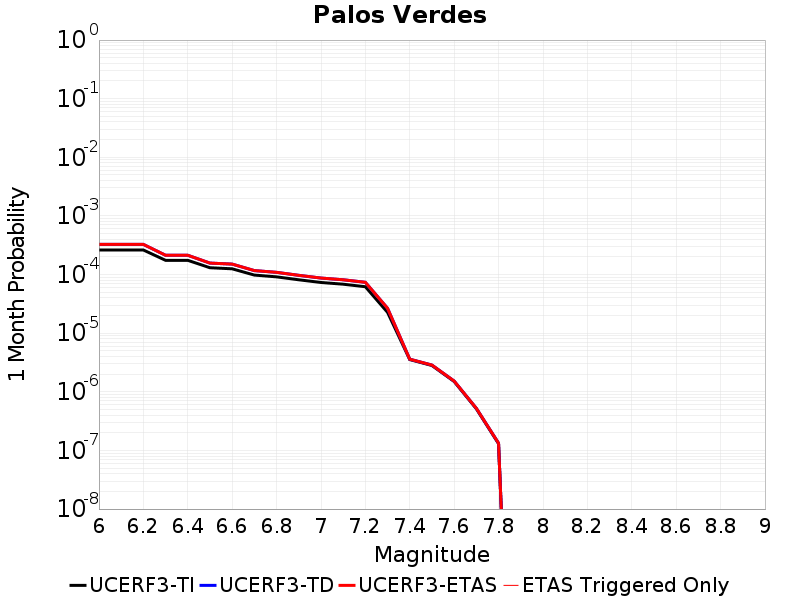 | 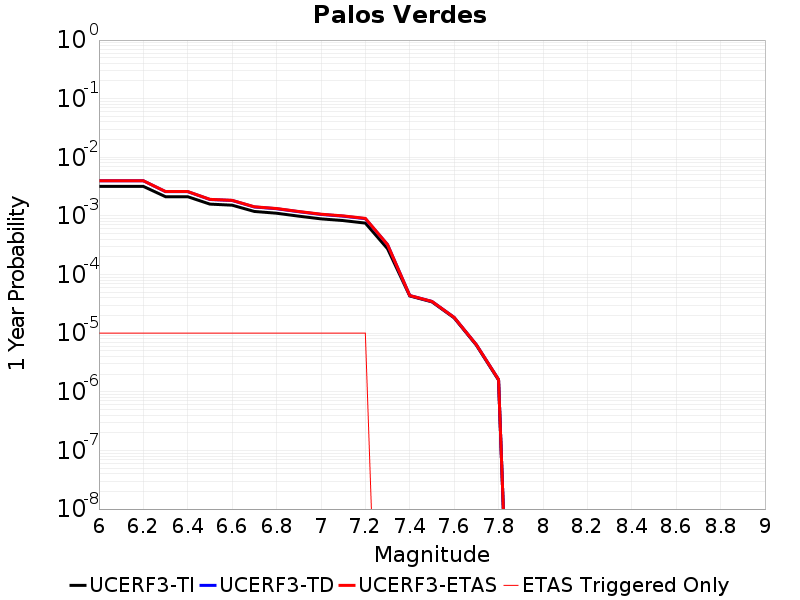 | 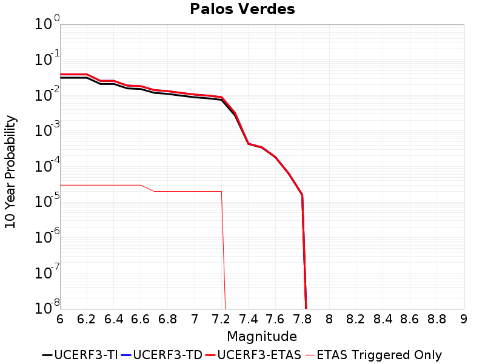 |

| Magnitude | 1 wk TI Prob | 1 wk TD Prob | 1 wk ETAS Prob | 1 wk ETAS/TD Gain | 1 wk ETAS Triggered Only | 1 mo TI Prob | 1 mo TD Prob | 1 mo ETAS Prob | 1 mo ETAS/TD Gain | 1 mo ETAS Triggered Only | 1 yr TI Prob | 1 yr TD Prob | 1 yr ETAS Prob | 1 yr ETAS/TD Gain | 1 yr ETAS Triggered Only | 10 yr TI Prob | 10 yr TD Prob | 10 yr ETAS Prob | 10 yr ETAS/TD Gain | 10 yr ETAS Triggered Only |
|-----|-----|-----|-----|-----|-----|-----|-----|-----|-----|-----|-----|-----|-----|-----|-----|-----|-----|-----|-----|-----|
| 6.0 | 6.126063E-5 | 7.6335265E-5 | 7.6335265E-5 | 1.0 | 0.0 | 2.6251914E-4 | 3.2711297E-4 | 3.2711297E-4 | 1.0 | 0.0 | 0.0031914865 | 0.0039758664 | 0.0039758664 | 1.0 | 0.0 | 0.031460393 | 0.039103907 | 0.039113518 | 1.0002457 | 1.0E-5 |
| 6.1 | 6.126063E-5 | 7.6335265E-5 | 7.6335265E-5 | 1.0 | 0.0 | 2.6251914E-4 | 3.2711297E-4 | 3.2711297E-4 | 1.0 | 0.0 | 0.0031914865 | 0.0039758664 | 0.0039758664 | 1.0 | 0.0 | 0.031460393 | 0.039103907 | 0.039113518 | 1.0002457 | 1.0E-5 |
| 6.2 | 6.126063E-5 | 7.6335265E-5 | 7.6335265E-5 | 1.0 | 0.0 | 2.6251914E-4 | 3.2711297E-4 | 3.2711297E-4 | 1.0 | 0.0 | 0.0031914865 | 0.0039758664 | 0.0039758664 | 1.0 | 0.0 | 0.031460393 | 0.039103907 | 0.039113518 | 1.0002457 | 1.0E-5 |
| 6.3 | 4.0838047E-5 | 4.9813563E-5 | 4.9813563E-5 | 1.0 | 0.0 | 1.7500846E-4 | 2.1346996E-4 | 2.1346996E-4 | 1.0 | 0.0 | 0.0021286458 | 0.0025961068 | 0.0025961068 | 1.0 | 0.0 | 0.021083709 | 0.025679473 | 0.025689216 | 1.0003794 | 1.0E-5 |
| 6.4 | 4.0838047E-5 | 4.9813563E-5 | 4.9813563E-5 | 1.0 | 0.0 | 1.7500846E-4 | 2.1346996E-4 | 2.1346996E-4 | 1.0 | 0.0 | 0.0021286458 | 0.0025961068 | 0.0025961068 | 1.0 | 0.0 | 0.021083709 | 0.025679473 | 0.025689216 | 1.0003794 | 1.0E-5 |
| 6.5 | 3.0512005E-5 | 3.6604826E-5 | 3.6604826E-5 | 1.0 | 0.0 | 1.3075917E-4 | 1.5686899E-4 | 1.5686899E-4 | 1.0 | 0.0 | 0.0015908304 | 0.0019083226 | 0.0019083226 | 1.0 | 0.0 | 0.015794903 | 0.018931303 | 0.018941116 | 1.0005182 | 1.0E-5 |
| 6.6 | 2.9255087E-5 | 3.519663E-5 | 3.519663E-5 | 1.0 | 0.0 | 1.2537291E-4 | 1.5083454E-4 | 1.5083454E-4 | 1.0 | 0.0 | 0.0015253464 | 0.0018349771 | 0.0018349771 | 1.0 | 0.0 | 0.015149189 | 0.018209882 | 0.018219698 | 1.0005392 | 1.0E-5 |
| 6.7 | 2.287198E-5 | 2.7279406E-5 | 2.7279406E-5 | 1.0 | 0.0 | 9.801909E-5 | 1.1690702E-4 | 1.1690702E-4 | 1.0 | 0.0 | 0.001192729 | 0.0014225055 | 0.0014225055 | 1.0 | 0.0 | 0.011863477 | 0.014143254 | 0.014153112 | 1.000697 | 1.0E-5 |
| 6.8 | 2.1325764E-5 | 2.54611E-5 | 2.54611E-5 | 1.0 | 0.0 | 9.139293E-5 | 1.0911495E-4 | 1.0911495E-4 | 1.0 | 0.0 | 0.001112141 | 0.0013277554 | 0.0013277554 | 1.0 | 0.0 | 0.011065915 | 0.013207282 | 0.01321715 | 1.0007472 | 1.0E-5 |
| 6.9 | 1.9009392E-5 | 2.2639153E-5 | 2.2639153E-5 | 1.0 | 0.0 | 8.1466285E-5 | 9.7021824E-5 | 9.7021824E-5 | 1.0 | 0.0 | 9.914007E-4 | 0.0011806882 | 0.0011806882 | 1.0 | 0.0 | 0.009869894 | 0.011752859 | 0.011762741 | 1.0008409 | 1.0E-5 |
| 7.0 | 1.7098473E-5 | 2.0342235E-5 | 2.0342235E-5 | 1.0 | 0.0 | 7.3277115E-5 | 8.7178574E-5 | 8.7178574E-5 | 1.0 | 0.0 | 8.917837E-4 | 0.0010609678 | 0.0010609678 | 1.0 | 0.0 | 0.008882134 | 0.010567481 | 0.010577375 | 1.0009363 | 1.0E-5 |
| 7.1 | 1.5982785E-5 | 1.9016159E-5 | 1.9016159E-5 | 1.0 | 0.0 | 6.849585E-5 | 8.149576E-5 | 8.149576E-5 | 1.0 | 0.0 | 8.336179E-4 | 9.918441E-4 | 9.918441E-4 | 1.0 | 0.0 | 0.008304977 | 0.009882557 | 0.009892458 | 1.0010018 | 1.0E-5 |
| 7.2 | 1.4468002E-5 | 1.7216638E-5 | 1.7216638E-5 | 1.0 | 0.0 | 6.200425E-5 | 7.378398E-5 | 7.378398E-5 | 1.0 | 0.0 | 7.546402E-4 | 8.9803396E-4 | 8.9803396E-4 | 1.0 | 0.0 | 0.007520827 | 0.008952339 | 0.008962249 | 1.001107 | 1.0E-5 |
| 7.3 | 5.288233E-6 | 6.210196E-6 | 6.210196E-6 | 1.0 | 0.0 | 2.2663658E-5 | 2.6615051E-5 | 2.6615051E-5 | 1.0 | 0.0 | 2.7589512E-4 | 3.2402505E-4 | 3.2402505E-4 | 1.0 | 0.0 | 0.0027555283 | 0.003238957 | 0.003238957 | 1.0 | 0.0 |
| 7.4 | 8.279556E-7 | 8.4091204E-7 | 8.4091204E-7 | 1.0 | 0.0 | 3.5483763E-6 | 3.6039041E-6 | 3.6039041E-6 | 1.0 | 0.0 | 4.3200624E-5 | 4.3876724E-5 | 4.3876724E-5 | 1.0 | 0.0 | 4.3192226E-4 | 4.3868783E-4 | 4.3868783E-4 | 1.0 | 0.0 |
| 7.5 | 6.559831E-7 | 6.6678746E-7 | 6.6678746E-7 | 1.0 | 0.0 | 2.8113532E-6 | 2.8576578E-6 | 2.8576578E-6 | 1.0 | 0.0 | 3.4227687E-5 | 3.4791494E-5 | 3.4791494E-5 | 1.0 | 0.0 | 3.4222414E-4 | 3.478671E-4 | 3.478671E-4 | 1.0 | 0.0 |
| 7.6 | 3.5018968E-7 | 3.5623646E-7 | 3.5623646E-7 | 1.0 | 0.0 | 1.500812E-6 | 1.526727E-6 | 1.526727E-6 | 1.0 | 0.0 | 1.8272232E-5 | 1.8587789E-5 | 1.8587789E-5 | 1.0 | 0.0 | 1.8270731E-4 | 1.8586694E-4 | 1.8586694E-4 | 1.0 | 0.0 |
| 7.7 | 1.1986104E-7 | 1.2199655E-7 | 1.2199655E-7 | 1.0 | 0.0 | 5.1369005E-7 | 5.2284224E-7 | 5.2284224E-7 | 1.0 | 0.0 | 6.2541585E-6 | 6.365586E-6 | 6.365586E-6 | 1.0 | 0.0 | 6.2539824E-5 | 6.365408E-5 | 6.365408E-5 | 1.0 | 0.0 |
| 7.8 | 3.0445005E-8 | 3.1031096E-8 | 3.1031096E-8 | 1.0 | 0.0 | 1.3047858E-7 | 1.3299041E-7 | 1.3299041E-7 | 1.0 | 0.0 | 1.5885756E-6 | 1.6191572E-6 | 1.6191572E-6 | 1.0 | 0.0 | 1.5885644E-5 | 1.6191474E-5 | 1.6191474E-5 | 1.0 | 0.0 |

## Oceanic - West Huasna
*[(top)](#table-of-contents)*

| 1 Week | 1 Month | 1 Year | 10 Year |
|-----|-----|-----|-----|
| 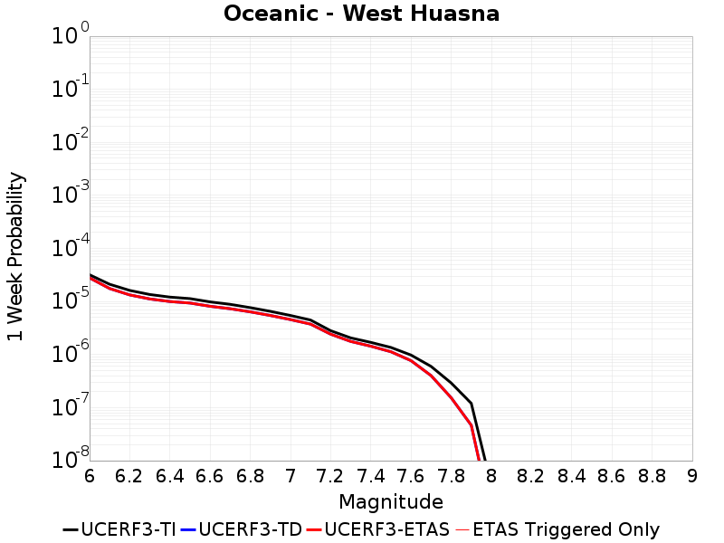 | 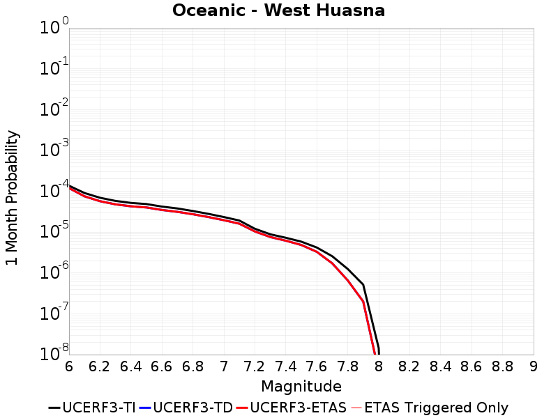 |  |  |

| Magnitude | 1 wk TI Prob | 1 wk TD Prob | 1 wk ETAS Prob | 1 wk ETAS/TD Gain | 1 wk ETAS Triggered Only | 1 mo TI Prob | 1 mo TD Prob | 1 mo ETAS Prob | 1 mo ETAS/TD Gain | 1 mo ETAS Triggered Only | 1 yr TI Prob | 1 yr TD Prob | 1 yr ETAS Prob | 1 yr ETAS/TD Gain | 1 yr ETAS Triggered Only | 10 yr TI Prob | 10 yr TD Prob | 10 yr ETAS Prob | 10 yr ETAS/TD Gain | 10 yr ETAS Triggered Only |
|-----|-----|-----|-----|-----|-----|-----|-----|-----|-----|-----|-----|-----|-----|-----|-----|-----|-----|-----|-----|-----|
| 6.0 | 3.195567E-5 | 2.7940981E-5 | 2.7940981E-5 | 1.0 | 0.0 | 1.3694567E-4 | 1.1974181E-4 | 1.1974181E-4 | 1.0 | 0.0 | 0.0016660384 | 0.0014569248 | 0.0014669102 | 1.0068538 | 1.0E-5 | 0.016536033 | 0.014478291 | 0.014488147 | 1.0006807 | 1.0E-5 |
| 6.1 | 2.1156782E-5 | 1.75824E-5 | 1.75824E-5 | 1.0 | 0.0 | 9.066878E-5 | 7.5351025E-5 | 7.5351025E-5 | 1.0 | 0.0 | 0.0011033333 | 9.1702194E-4 | 9.270128E-4 | 1.0108949 | 1.0E-5 | 0.010978713 | 0.009133388 | 0.009143297 | 1.0010849 | 1.0E-5 |
| 6.2 | 1.6195117E-5 | 1.3333127E-5 | 1.3333127E-5 | 1.0 | 0.0 | 6.9405796E-5 | 5.7140733E-5 | 5.7140733E-5 | 1.0 | 0.0 | 8.44688E-4 | 6.95469E-4 | 7.05462E-4 | 1.0143688 | 1.0E-5 | 0.008414844 | 0.0069332193 | 0.00694315 | 1.0014323 | 1.0E-5 |
| 6.3 | 1.3559345E-5 | 1.1183812E-5 | 1.1183812E-5 | 1.0 | 0.0 | 5.811018E-5 | 4.792975E-5 | 4.792975E-5 | 1.0 | 0.0 | 7.072618E-4 | 5.8338937E-4 | 5.9338356E-4 | 1.0171312 | 1.0E-5 | 0.0070501505 | 0.0058186976 | 0.0058286395 | 1.0017086 | 1.0E-5 |
| 6.4 | 1.2120619E-5 | 1.0004981E-5 | 1.0004981E-5 | 1.0 | 0.0 | 5.1944477E-5 | 4.2877786E-5 | 4.2877786E-5 | 1.0 | 0.0 | 6.322405E-4 | 5.2191253E-4 | 5.319073E-4 | 1.0191503 | 1.0E-5 | 0.006304447 | 0.0052069356 | 0.0052168835 | 1.0019106 | 1.0E-5 |
| 6.5 | 1.13511915E-5 | 9.371173E-6 | 9.371173E-6 | 1.0 | 0.0 | 4.8647056E-5 | 4.0161558E-5 | 4.0161558E-5 | 1.0 | 0.0 | 5.9211696E-4 | 4.888577E-4 | 4.988528E-4 | 1.0204458 | 1.0E-5 | 0.0059054173 | 0.004877882 | 0.0048878333 | 1.00204 | 1.0E-5 |
| 6.6 | 9.850605E-6 | 8.13858E-6 | 8.13858E-6 | 1.0 | 0.0 | 4.2216197E-5 | 3.4879162E-5 | 3.4879162E-5 | 1.0 | 0.0 | 5.1386096E-4 | 4.2457128E-4 | 4.2457128E-4 | 1.0 | 0.0 | 0.0051267436 | 0.0042376337 | 0.0042376337 | 1.0 | 0.0 |
| 6.7 | 8.8558645E-6 | 7.3213164E-6 | 7.3213164E-6 | 1.0 | 0.0 | 3.7953152E-5 | 3.1376694E-5 | 3.1376694E-5 | 1.0 | 0.0 | 4.6198163E-4 | 3.8194447E-4 | 3.8194447E-4 | 1.0 | 0.0 | 0.004610224 | 0.0038129059 | 0.0038129059 | 1.0 | 0.0 |
| 6.8 | 7.67136E-6 | 6.3943235E-6 | 6.3943235E-6 | 1.0 | 0.0 | 3.2876844E-5 | 2.7403958E-5 | 2.7403958E-5 | 1.0 | 0.0 | 4.0020206E-4 | 3.3359224E-4 | 3.3359224E-4 | 1.0 | 0.0 | 0.003994821 | 0.0033309362 | 0.0033309362 | 1.0 | 0.0 |
| 6.9 | 6.534529E-6 | 5.4606085E-6 | 5.4606085E-6 | 1.0 | 0.0 | 2.8004823E-5 | 2.34024E-5 | 2.34024E-5 | 1.0 | 0.0 | 3.4090536E-4 | 2.8488706E-4 | 2.8488706E-4 | 1.0 | 0.0 | 0.0034038287 | 0.0028452356 | 0.0028452356 | 1.0 | 0.0 |
| 7.0 | 5.460525E-6 | 4.5718853E-6 | 4.5718853E-6 | 1.0 | 0.0 | 2.3402039E-5 | 1.9593648E-5 | 1.9593648E-5 | 1.0 | 0.0 | 2.8488258E-4 | 2.3852666E-4 | 2.3852666E-4 | 1.0 | 0.0 | 0.0028451765 | 0.0023827204 | 0.0023827204 | 1.0 | 0.0 |
| 7.1 | 4.4825083E-6 | 3.7541258E-6 | 3.7541258E-6 | 1.0 | 0.0 | 1.9210609E-5 | 1.6089012E-5 | 1.6089012E-5 | 1.0 | 0.0 | 2.3386406E-4 | 1.958662E-4 | 1.958662E-4 | 1.0 | 0.0 | 0.002336181 | 0.0019569478 | 0.0019569478 | 1.0 | 0.0 |
| 7.2 | 2.821708E-6 | 2.426424E-6 | 2.426424E-6 | 1.0 | 0.0 | 1.2092979E-5 | 1.039892E-5 | 1.039892E-5 | 1.0 | 0.0 | 1.4722206E-4 | 1.265995E-4 | 1.265995E-4 | 1.0 | 0.0 | 0.0014712457 | 0.0012652763 | 0.0012652763 | 1.0 | 0.0 |
| 7.3 | 2.0644757E-6 | 1.7701026E-6 | 1.7701026E-6 | 1.0 | 0.0 | 8.847723E-6 | 7.5861317E-6 | 7.5861317E-6 | 1.0 | 0.0 | 1.0771569E-4 | 9.2357244E-5 | 9.2357244E-5 | 1.0 | 0.0 | 0.001076635 | 9.231905E-4 | 9.231905E-4 | 1.0 | 0.0 |
| 7.4 | 1.6980367E-6 | 1.4392455E-6 | 1.4392455E-6 | 1.0 | 0.0 | 7.27728E-6 | 6.16818E-6 | 6.16818E-6 | 1.0 | 0.0 | 8.8597284E-5 | 7.5095006E-5 | 7.5095006E-5 | 1.0 | 0.0 | 8.8561967E-4 | 7.5069803E-4 | 7.5069803E-4 | 1.0 | 0.0 |
| 7.5 | 1.3637683E-6 | 1.1314162E-6 | 1.1314162E-6 | 1.0 | 0.0 | 5.844708E-6 | 4.848918E-6 | 4.848918E-6 | 1.0 | 0.0 | 7.1156996E-5 | 5.9033973E-5 | 5.9033973E-5 | 1.0 | 0.0 | 7.1134215E-4 | 5.901846E-4 | 5.901846E-4 | 1.0 | 0.0 |
| 7.6 | 9.802994E-7 | 7.6880866E-7 | 7.6880866E-7 | 1.0 | 0.0 | 4.2012766E-6 | 3.2948901E-6 | 3.2948901E-6 | 1.0 | 0.0 | 5.1149345E-5 | 4.0114548E-5 | 4.0114548E-5 | 1.0 | 0.0 | 5.113757E-4 | 4.0107465E-4 | 4.0107465E-4 | 1.0 | 0.0 |
| 7.7 | 5.986191E-7 | 4.0139003E-7 | 4.0139003E-7 | 1.0 | 0.0 | 2.5655079E-6 | 1.7202417E-6 | 1.7202417E-6 | 1.0 | 0.0 | 3.1234613E-5 | 2.0943742E-5 | 2.0943742E-5 | 1.0 | 0.0 | 3.123022E-4 | 2.0941917E-4 | 2.0941917E-4 | 1.0 | 0.0 |
| 7.8 | 2.9189815E-7 | 1.5358552E-7 | 1.5358552E-7 | 1.0 | 0.0 | 1.2509914E-6 | 6.582234E-7 | 6.582234E-7 | 1.0 | 0.0 | 1.5230714E-5 | 8.013841E-6 | 8.013841E-6 | 1.0 | 0.0 | 1.522967E-4 | 8.013697E-5 | 8.013697E-5 | 1.0 | 0.0 |
| 7.9 | 1.2057845E-7 | 4.660813E-8 | 4.660813E-8 | 1.0 | 0.0 | 5.1676466E-7 | 1.9974911E-7 | 1.9974911E-7 | 1.0 | 0.0 | 6.2915915E-6 | 2.4319427E-6 | 2.4319427E-6 | 1.0 | 0.0 | 6.2914136E-5 | 2.4320603E-5 | 2.4320603E-5 | 1.0 | 0.0 |
| 8.0 | 3.3806387E-9 | 9.1599317E-10 | 9.1599317E-10 | 1.0 | 0.0 | 1.4488451E-8 | 3.925684E-9 | 3.925684E-9 | 1.0 | 0.0 | 1.7639688E-7 | 4.7795194E-8 | 4.7795194E-8 | 1.0 | 0.0 | 1.7639674E-6 | 4.791584E-7 | 4.791584E-7 | 1.0 | 0.0 |

## San Pedro Basin
*[(top)](#table-of-contents)*

| 1 Week | 1 Month | 1 Year | 10 Year |
|-----|-----|-----|-----|
|  | 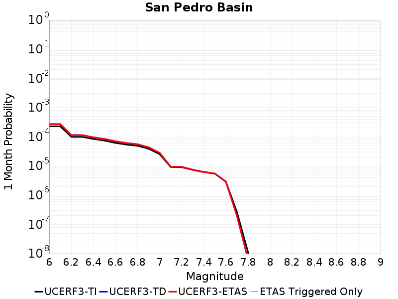 | 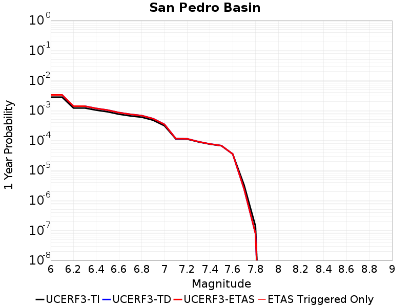 | 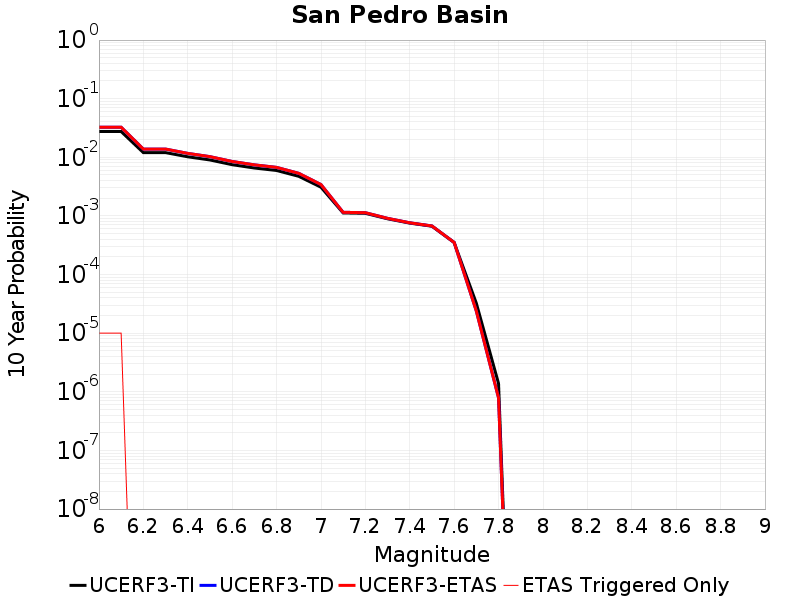 |

| Magnitude | 1 wk TI Prob | 1 wk TD Prob | 1 wk ETAS Prob | 1 wk ETAS/TD Gain | 1 wk ETAS Triggered Only | 1 mo TI Prob | 1 mo TD Prob | 1 mo ETAS Prob | 1 mo ETAS/TD Gain | 1 mo ETAS Triggered Only | 1 yr TI Prob | 1 yr TD Prob | 1 yr ETAS Prob | 1 yr ETAS/TD Gain | 1 yr ETAS Triggered Only | 10 yr TI Prob | 10 yr TD Prob | 10 yr ETAS Prob | 10 yr ETAS/TD Gain | 10 yr ETAS Triggered Only |
|-----|-----|-----|-----|-----|-----|-----|-----|-----|-----|-----|-----|-----|-----|-----|-----|-----|-----|-----|-----|-----|
| 6.0 | 5.3449043E-5 | 6.344069E-5 | 6.344069E-5 | 1.0 | 0.0 | 2.2904722E-4 | 2.7186333E-4 | 2.7186333E-4 | 1.0 | 0.0 | 0.0027850836 | 0.0033055171 | 0.0033055171 | 1.0 | 0.0 | 0.027504366 | 0.032625154 | 0.03263483 | 1.0002965 | 1.0E-5 |
| 6.1 | 5.3449043E-5 | 6.344069E-5 | 6.344069E-5 | 1.0 | 0.0 | 2.2904722E-4 | 2.7186333E-4 | 2.7186333E-4 | 1.0 | 0.0 | 0.0027850836 | 0.0033055171 | 0.0033055171 | 1.0 | 0.0 | 0.027504366 | 0.032625154 | 0.03263483 | 1.0002965 | 1.0E-5 |
| 6.2 | 2.3189454E-5 | 2.6666814E-5 | 2.6666814E-5 | 1.0 | 0.0 | 9.9379584E-5 | 1.142816E-4 | 1.142816E-4 | 1.0 | 0.0 | 0.0012092749 | 0.0013905376 | 0.0013905376 | 1.0 | 0.0 | 0.012027155 | 0.013823241 | 0.013823241 | 1.0 | 0.0 |
| 6.3 | 2.3189454E-5 | 2.6666814E-5 | 2.6666814E-5 | 1.0 | 0.0 | 9.9379584E-5 | 1.142816E-4 | 1.142816E-4 | 1.0 | 0.0 | 0.0012092749 | 0.0013905376 | 0.0013905376 | 1.0 | 0.0 | 0.012027155 | 0.013823241 | 0.013823241 | 1.0 | 0.0 |
| 6.4 | 1.966056E-5 | 2.248284E-5 | 2.248284E-5 | 1.0 | 0.0 | 8.425682E-5 | 9.6351694E-5 | 9.6351694E-5 | 1.0 | 0.0 | 0.001025344 | 0.0011724908 | 0.0011724908 | 1.0 | 0.0 | 0.010206259 | 0.011667141 | 0.011667141 | 1.0 | 0.0 |
| 6.5 | 1.7342953E-5 | 1.9761786E-5 | 1.9761786E-5 | 1.0 | 0.0 | 7.4324824E-5 | 8.469083E-5 | 8.469083E-5 | 1.0 | 0.0 | 9.04529E-4 | 0.0010306601 | 0.0010306601 | 1.0 | 0.0 | 0.009008561 | 0.01026253 | 0.01026253 | 1.0 | 0.0 |
| 6.6 | 1.439804E-5 | 1.6336062E-5 | 1.6336062E-5 | 1.0 | 0.0 | 6.170443E-5 | 7.001E-5 | 7.001E-5 | 1.0 | 0.0 | 7.509924E-4 | 8.520706E-4 | 8.520706E-4 | 1.0 | 0.0 | 0.0074845953 | 0.008491244 | 0.008491244 | 1.0 | 0.0 |
| 6.7 | 1.2634884E-5 | 1.42967665E-5 | 1.42967665E-5 | 1.0 | 0.0 | 5.414838E-5 | 6.127059E-5 | 6.127059E-5 | 1.0 | 0.0 | 6.590571E-4 | 7.457446E-4 | 7.457446E-4 | 1.0 | 0.0 | 0.006571059 | 0.0074354475 | 0.0074354475 | 1.0 | 0.0 |
| 6.8 | 1.146091E-5 | 1.2943447E-5 | 1.2943447E-5 | 1.0 | 0.0 | 4.911726E-5 | 5.54709E-5 | 5.54709E-5 | 1.0 | 0.0 | 5.9783855E-4 | 6.751788E-4 | 6.751788E-4 | 1.0 | 0.0 | 0.0059623276 | 0.00673422 | 0.00673422 | 1.0 | 0.0 |
| 6.9 | 9.109035E-6 | 1.0242911E-5 | 1.0242911E-5 | 1.0 | 0.0 | 3.9038136E-5 | 4.389761E-5 | 4.389761E-5 | 1.0 | 0.0 | 4.7518566E-4 | 5.343504E-4 | 5.343504E-4 | 1.0 | 0.0 | 0.0047417083 | 0.0053334148 | 0.0053334148 | 1.0 | 0.0 |
| 7.0 | 5.9351028E-6 | 6.588612E-6 | 6.588612E-6 | 1.0 | 0.0 | 2.5435906E-5 | 2.8236736E-5 | 2.8236736E-5 | 1.0 | 0.0 | 3.0963816E-4 | 3.437517E-4 | 3.437517E-4 | 1.0 | 0.0 | 0.0030920706 | 0.003434521 | 0.003434521 | 1.0 | 0.0 |
| 7.1 | 2.1557585E-6 | 2.210216E-6 | 2.210216E-6 | 1.0 | 0.0 | 9.238933E-6 | 9.472322E-6 | 9.472322E-6 | 1.0 | 0.0 | 1.1247819E-4 | 1.1531956E-4 | 1.1531956E-4 | 1.0 | 0.0 | 0.0011242128 | 0.0011526126 | 0.0011526126 | 1.0 | 0.0 |
| 7.2 | 2.1251979E-6 | 2.1785556E-6 | 2.1785556E-6 | 1.0 | 0.0 | 9.107958E-6 | 9.336634E-6 | 9.336634E-6 | 1.0 | 0.0 | 1.1088375E-4 | 1.1366775E-4 | 1.1366775E-4 | 1.0 | 0.0 | 0.0011082845 | 0.0011361114 | 0.0011361114 | 1.0 | 0.0 |
| 7.3 | 1.7145798E-6 | 1.7447042E-6 | 1.7447042E-6 | 1.0 | 0.0 | 7.3481783E-6 | 7.477283E-6 | 7.477283E-6 | 1.0 | 0.0 | 8.94604E-5 | 9.1032205E-5 | 9.1032205E-5 | 1.0 | 0.0 | 8.9424395E-4 | 9.0995827E-4 | 9.0995827E-4 | 1.0 | 0.0 |
| 7.4 | 1.4467993E-6 | 1.464527E-6 | 1.464527E-6 | 1.0 | 0.0 | 6.200554E-6 | 6.27653E-6 | 6.27653E-6 | 1.0 | 0.0 | 7.548913E-5 | 7.6414144E-5 | 7.6414144E-5 | 1.0 | 0.0 | 7.546349E-4 | 7.6388597E-4 | 7.6388597E-4 | 1.0 | 0.0 |
| 7.5 | 1.2803735E-6 | 1.29345E-6 | 1.29345E-6 | 1.0 | 0.0 | 5.487303E-6 | 5.543346E-6 | 5.543346E-6 | 1.0 | 0.0 | 6.680587E-5 | 6.748822E-5 | 6.748822E-5 | 1.0 | 0.0 | 6.678579E-4 | 6.746843E-4 | 6.746843E-4 | 1.0 | 0.0 |
| 7.6 | 6.755009E-7 | 6.7710573E-7 | 6.7710573E-7 | 1.0 | 0.0 | 2.8950008E-6 | 2.9018788E-6 | 2.9018788E-6 | 1.0 | 0.0 | 3.5246063E-5 | 3.532986E-5 | 3.532986E-5 | 1.0 | 0.0 | 3.5240475E-4 | 3.5324818E-4 | 3.5324818E-4 | 1.0 | 0.0 |
| 7.7 | 6.211885E-8 | 4.571547E-8 | 4.571547E-8 | 1.0 | 0.0 | 2.6622362E-7 | 1.9592343E-7 | 1.9592343E-7 | 1.0 | 0.0 | 3.2412677E-6 | 2.3853654E-6 | 2.3853654E-6 | 1.0 | 0.0 | 3.2412205E-5 | 2.3853418E-5 | 2.3853418E-5 | 1.0 | 0.0 |
| 7.8 | 2.6580573E-9 | 1.5160313E-9 | 1.5160313E-9 | 1.0 | 0.0 | 1.1391674E-8 | 6.497277E-9 | 6.497277E-9 | 1.0 | 0.0 | 1.3869362E-7 | 7.9104346E-8 | 7.9104346E-8 | 1.0 | 0.0 | 1.3869354E-6 | 7.910435E-7 | 7.910435E-7 | 1.0 | 0.0 |

## Channel Islands Thrust
*[(top)](#table-of-contents)*

| 1 Week | 1 Month | 1 Year | 10 Year |
|-----|-----|-----|-----|
| 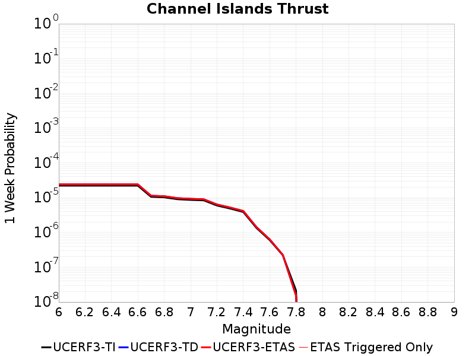 |  |  | 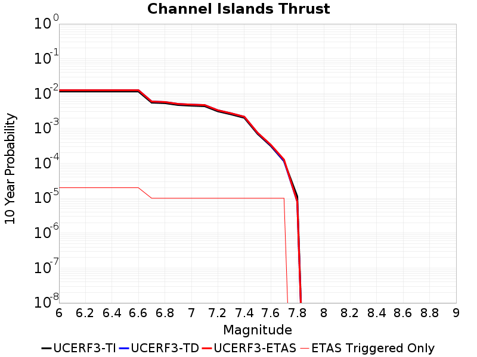 |

| Magnitude | 1 wk TI Prob | 1 wk TD Prob | 1 wk ETAS Prob | 1 wk ETAS/TD Gain | 1 wk ETAS Triggered Only | 1 mo TI Prob | 1 mo TD Prob | 1 mo ETAS Prob | 1 mo ETAS/TD Gain | 1 mo ETAS Triggered Only | 1 yr TI Prob | 1 yr TD Prob | 1 yr ETAS Prob | 1 yr ETAS/TD Gain | 1 yr ETAS Triggered Only | 10 yr TI Prob | 10 yr TD Prob | 10 yr ETAS Prob | 10 yr ETAS/TD Gain | 10 yr ETAS Triggered Only |
|-----|-----|-----|-----|-----|-----|-----|-----|-----|-----|-----|-----|-----|-----|-----|-----|-----|-----|-----|-----|-----|
| 6.0 | 2.2156251E-5 | 2.410457E-5 | 2.410457E-5 | 1.0 | 0.0 | 9.495191E-5 | 1.03301805E-4 | 1.13300775E-4 | 1.0967938 | 1.0E-5 | 0.0011554264 | 0.0012570806 | 0.001267068 | 1.007945 | 1.0E-5 | 0.011494373 | 0.0125103 | 0.0125201745 | 1.0007893 | 1.0E-5 |
| 6.1 | 2.2156251E-5 | 2.410457E-5 | 2.410457E-5 | 1.0 | 0.0 | 9.495191E-5 | 1.03301805E-4 | 1.13300775E-4 | 1.0967938 | 1.0E-5 | 0.0011554264 | 0.0012570806 | 0.001267068 | 1.007945 | 1.0E-5 | 0.011494373 | 0.0125103 | 0.0125201745 | 1.0007893 | 1.0E-5 |
| 6.2 | 2.2156251E-5 | 2.410457E-5 | 2.410457E-5 | 1.0 | 0.0 | 9.495191E-5 | 1.03301805E-4 | 1.13300775E-4 | 1.0967938 | 1.0E-5 | 0.0011554264 | 0.0012570806 | 0.001267068 | 1.007945 | 1.0E-5 | 0.011494373 | 0.0125103 | 0.0125201745 | 1.0007893 | 1.0E-5 |
| 6.3 | 2.2156251E-5 | 2.410457E-5 | 2.410457E-5 | 1.0 | 0.0 | 9.495191E-5 | 1.03301805E-4 | 1.13300775E-4 | 1.0967938 | 1.0E-5 | 0.0011554264 | 0.0012570806 | 0.001267068 | 1.007945 | 1.0E-5 | 0.011494373 | 0.0125103 | 0.0125201745 | 1.0007893 | 1.0E-5 |
| 6.4 | 2.2156251E-5 | 2.410457E-5 | 2.410457E-5 | 1.0 | 0.0 | 9.495191E-5 | 1.03301805E-4 | 1.13300775E-4 | 1.0967938 | 1.0E-5 | 0.0011554264 | 0.0012570806 | 0.001267068 | 1.007945 | 1.0E-5 | 0.011494373 | 0.0125103 | 0.0125201745 | 1.0007893 | 1.0E-5 |
| 6.5 | 2.2156251E-5 | 2.410457E-5 | 2.410457E-5 | 1.0 | 0.0 | 9.495191E-5 | 1.03301805E-4 | 1.13300775E-4 | 1.0967938 | 1.0E-5 | 0.0011554264 | 0.0012570806 | 0.001267068 | 1.007945 | 1.0E-5 | 0.011494373 | 0.0125103 | 0.0125201745 | 1.0007893 | 1.0E-5 |
| 6.6 | 2.2156251E-5 | 2.410457E-5 | 2.410457E-5 | 1.0 | 0.0 | 9.495191E-5 | 1.03301805E-4 | 1.13300775E-4 | 1.0967938 | 1.0E-5 | 0.0011554264 | 0.0012570806 | 0.001267068 | 1.007945 | 1.0E-5 | 0.011494373 | 0.0125103 | 0.0125201745 | 1.0007893 | 1.0E-5 |
| 6.7 | 1.0601296E-5 | 1.1384554E-5 | 1.1384554E-5 | 1.0 | 0.0 | 4.5433335E-5 | 4.879006E-5 | 5.8789574E-5 | 1.2049497 | 1.0E-5 | 5.5301044E-4 | 5.93862E-4 | 6.0385605E-4 | 1.0168289 | 1.0E-5 | 0.005516363 | 0.005923253 | 0.0059331935 | 1.0016782 | 1.0E-5 |
| 6.8 | 1.0246747E-5 | 1.1001498E-5 | 1.1001498E-5 | 1.0 | 0.0 | 4.391389E-5 | 4.7148453E-5 | 5.7147983E-5 | 1.2120861 | 1.0E-5 | 5.345204E-4 | 5.7388603E-4 | 5.838803E-4 | 1.017415 | 1.0E-5 | 0.0053323656 | 0.005724531 | 0.0057344735 | 1.0017369 | 1.0E-5 |
| 6.9 | 9.049551E-6 | 9.703834E-6 | 9.703834E-6 | 1.0 | 0.0 | 3.878322E-5 | 4.1587216E-5 | 5.15868E-5 | 1.2404485 | 1.0E-5 | 4.7208337E-4 | 5.0621084E-4 | 5.162058E-4 | 1.0197446 | 1.0E-5 | 0.0047108172 | 0.0050509954 | 0.005060945 | 1.0019698 | 1.0E-5 |
| 7.0 | 8.6542195E-6 | 9.278603E-6 | 9.278603E-6 | 1.0 | 0.0 | 3.7088983E-5 | 3.976486E-5 | 3.976486E-5 | 1.0 | 0.0 | 4.5146482E-4 | 4.840337E-4 | 4.840337E-4 | 1.0 | 0.0 | 0.004505487 | 0.0048302067 | 0.0048302067 | 1.0 | 0.0 |
| 7.1 | 8.391028E-6 | 8.996808E-6 | 8.996808E-6 | 1.0 | 0.0 | 3.5961057E-5 | 3.8557202E-5 | 3.8557202E-5 | 1.0 | 0.0 | 4.3773788E-4 | 4.693369E-4 | 4.693369E-4 | 1.0 | 0.0 | 0.004368766 | 0.0046838676 | 0.0046838676 | 1.0 | 0.0 |
| 7.2 | 5.965188E-6 | 6.374327E-6 | 6.374327E-6 | 1.0 | 0.0 | 2.556484E-5 | 2.7318261E-5 | 2.7318261E-5 | 1.0 | 0.0 | 3.1120746E-4 | 3.3254962E-4 | 3.3254962E-4 | 1.0 | 0.0 | 0.00310772 | 0.003320578 | 0.003320578 | 1.0 | 0.0 |
| 7.3 | 4.877518E-6 | 5.2081427E-6 | 5.2081427E-6 | 1.0 | 0.0 | 2.0903482E-5 | 2.2320422E-5 | 2.2320422E-5 | 1.0 | 0.0 | 2.5447016E-4 | 2.7171773E-4 | 2.7171773E-4 | 1.0 | 0.0 | 0.0025417898 | 0.0027139012 | 0.0027139012 | 1.0 | 0.0 |
| 7.4 | 3.8829853E-6 | 4.143558E-6 | 4.143558E-6 | 1.0 | 0.0 | 1.664126E-5 | 1.7757988E-5 | 1.7757988E-5 | 1.0 | 0.0 | 2.0258849E-4 | 2.1618245E-4 | 2.1618245E-4 | 1.0 | 0.0 | 0.002024039 | 0.0021597634 | 0.0021597634 | 1.0 | 0.0 |
| 7.5 | 1.3489616E-6 | 1.4283429E-6 | 1.4283429E-6 | 1.0 | 0.0 | 5.7812517E-6 | 6.1214555E-6 | 6.1214555E-6 | 1.0 | 0.0 | 7.038446E-5 | 7.4526215E-5 | 7.4526215E-5 | 1.0 | 0.0 | 7.036218E-4 | 7.4501615E-4 | 7.4501615E-4 | 1.0 | 0.0 |
| 7.6 | 6.058192E-7 | 6.356183E-7 | 6.356183E-7 | 1.0 | 0.0 | 2.5963652E-6 | 2.7240756E-6 | 2.7240756E-6 | 1.0 | 0.0 | 3.161029E-5 | 3.316513E-5 | 3.316513E-5 | 1.0 | 0.0 | 3.1605794E-4 | 3.3160343E-4 | 3.3160343E-4 | 1.0 | 0.0 |
| 7.7 | 2.2170494E-7 | 2.2615791E-7 | 2.2615791E-7 | 1.0 | 0.0 | 9.5016367E-7 | 9.692479E-7 | 9.692479E-7 | 1.0 | 0.0 | 1.1568181E-5 | 1.180054E-5 | 1.180054E-5 | 1.0 | 0.0 | 1.1567579E-4 | 1.18000244E-4 | 1.18000244E-4 | 1.0 | 0.0 |
| 7.8 | 2.1613102E-8 | 1.547138E-8 | 1.547138E-8 | 1.0 | 0.0 | 9.262757E-8 | 6.6305915E-8 | 6.6305915E-8 | 1.0 | 0.0 | 1.1277401E-6 | 8.072743E-7 | 8.072743E-7 | 1.0 | 0.0 | 1.1277344E-5 | 8.072721E-6 | 8.072721E-6 | 1.0 | 0.0 |

## Superstition Hills
*[(top)](#table-of-contents)*

| 1 Week | 1 Month | 1 Year | 10 Year |
|-----|-----|-----|-----|
|  |  |  | 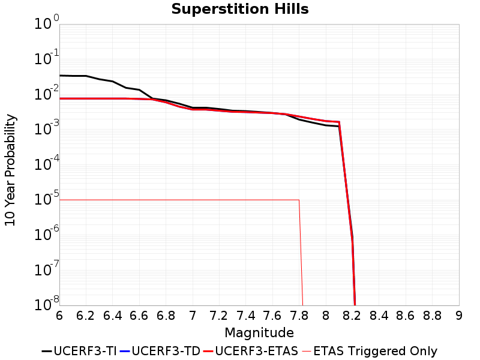 |

| Magnitude | 1 wk TI Prob | 1 wk TD Prob | 1 wk ETAS Prob | 1 wk ETAS/TD Gain | 1 wk ETAS Triggered Only | 1 mo TI Prob | 1 mo TD Prob | 1 mo ETAS Prob | 1 mo ETAS/TD Gain | 1 mo ETAS Triggered Only | 1 yr TI Prob | 1 yr TD Prob | 1 yr ETAS Prob | 1 yr ETAS/TD Gain | 1 yr ETAS Triggered Only | 10 yr TI Prob | 10 yr TD Prob | 10 yr ETAS Prob | 10 yr ETAS/TD Gain | 10 yr ETAS Triggered Only |
|-----|-----|-----|-----|-----|-----|-----|-----|-----|-----|-----|-----|-----|-----|-----|-----|-----|-----|-----|-----|-----|
| 6.0 | 6.6865185E-5 | 1.4280012E-5 | 1.4280012E-5 | 1.0 | 0.0 | 2.8653358E-4 | 6.1198705E-5 | 6.1198705E-5 | 1.0 | 0.0 | 0.0034829667 | 7.4485585E-4 | 7.4485585E-4 | 1.0 | 0.0 | 0.03428881 | 0.0075940336 | 0.0076039573 | 1.0013068 | 1.0E-5 |
| 6.1 | 6.544851E-5 | 1.4280011E-5 | 1.4280011E-5 | 1.0 | 0.0 | 2.8046346E-4 | 6.1198705E-5 | 6.1198705E-5 | 1.0 | 0.0 | 0.0034092965 | 7.4485585E-4 | 7.4485585E-4 | 1.0 | 0.0 | 0.033574644 | 0.0075940327 | 0.007603957 | 1.0013068 | 1.0E-5 |
| 6.2 | 6.544851E-5 | 1.4280011E-5 | 1.4280011E-5 | 1.0 | 0.0 | 2.8046346E-4 | 6.1198705E-5 | 6.1198705E-5 | 1.0 | 0.0 | 0.0034092965 | 7.4485585E-4 | 7.4485585E-4 | 1.0 | 0.0 | 0.033574644 | 0.0075940327 | 0.007603957 | 1.0013068 | 1.0E-5 |
| 6.3 | 5.2402065E-5 | 1.428001E-5 | 1.428001E-5 | 1.0 | 0.0 | 2.2456095E-4 | 6.11987E-5 | 6.11987E-5 | 1.0 | 0.0 | 0.0027306017 | 7.448558E-4 | 7.448558E-4 | 1.0 | 0.0 | 0.02697292 | 0.0075940257 | 0.00760395 | 1.0013068 | 1.0E-5 |
| 6.4 | 4.542238E-5 | 1.4280009E-5 | 1.4280009E-5 | 1.0 | 0.0 | 1.9465282E-4 | 6.11987E-5 | 6.11987E-5 | 1.0 | 0.0 | 0.0023673223 | 7.4485573E-4 | 7.4485573E-4 | 1.0 | 0.0 | 0.023422617 | 0.007594022 | 0.007603946 | 1.0013068 | 1.0E-5 |
| 6.5 | 2.9672969E-5 | 1.4280007E-5 | 1.4280007E-5 | 1.0 | 0.0 | 1.2716366E-4 | 6.119869E-5 | 6.119869E-5 | 1.0 | 0.0 | 0.0015471181 | 7.448557E-4 | 7.448557E-4 | 1.0 | 0.0 | 0.015363912 | 0.007594014 | 0.007603938 | 1.0013068 | 1.0E-5 |
| 6.6 | 2.6056105E-5 | 1.3944776E-5 | 1.3944776E-5 | 1.0 | 0.0 | 1.1166424E-4 | 5.9762046E-5 | 5.9762046E-5 | 1.0 | 0.0 | 0.0013586642 | 7.273762E-4 | 7.273762E-4 | 1.0 | 0.0 | 0.013503874 | 0.007417984 | 0.00742791 | 1.0013381 | 1.0E-5 |
| 6.7 | 1.4611248E-5 | 1.3523907E-5 | 1.3523907E-5 | 1.0 | 0.0 | 6.261813E-5 | 5.79584E-5 | 5.79584E-5 | 1.0 | 0.0 | 7.6210906E-4 | 7.0543116E-4 | 7.0543116E-4 | 1.0 | 0.0 | 0.0075950073 | 0.0071987924 | 0.0072087203 | 1.0013791 | 1.0E-5 |
| 6.8 | 1.30607E-5 | 1.1113192E-5 | 1.1113192E-5 | 1.0 | 0.0 | 5.597323E-5 | 4.762715E-5 | 4.762715E-5 | 1.0 | 0.0 | 6.8126095E-4 | 5.7971507E-4 | 5.7971507E-4 | 1.0 | 0.0 | 0.006791762 | 0.005943591 | 0.0059535312 | 1.0016725 | 1.0E-5 |
| 6.9 | 1.0443096E-5 | 8.317415E-6 | 8.317415E-6 | 1.0 | 0.0 | 4.4755358E-5 | 3.5645593E-5 | 3.5645593E-5 | 1.0 | 0.0 | 5.447602E-4 | 4.339011E-4 | 4.339011E-4 | 1.0 | 0.0 | 0.005434267 | 0.0044730892 | 0.0044730892 | 1.0 | 0.0 |
| 7.0 | 8.045912E-6 | 6.850921E-6 | 6.850921E-6 | 1.0 | 0.0 | 3.4482026E-5 | 2.9360766E-5 | 2.9360766E-5 | 1.0 | 0.0 | 4.197378E-4 | 3.5740974E-4 | 3.5740974E-4 | 1.0 | 0.0 | 0.0041894587 | 0.0036914013 | 0.0036914013 | 1.0 | 0.0 |
| 7.1 | 8.045912E-6 | 6.850921E-6 | 6.850921E-6 | 1.0 | 0.0 | 3.4482026E-5 | 2.9360766E-5 | 2.9360766E-5 | 1.0 | 0.0 | 4.197378E-4 | 3.5740974E-4 | 3.5740974E-4 | 1.0 | 0.0 | 0.0041894587 | 0.0036914013 | 0.0036914013 | 1.0 | 0.0 |
| 7.2 | 7.375506E-6 | 6.355865E-6 | 6.355865E-6 | 1.0 | 0.0 | 3.1608928E-5 | 2.7239143E-5 | 2.7239143E-5 | 1.0 | 0.0 | 3.8477074E-4 | 3.3158698E-4 | 3.3158698E-4 | 1.0 | 0.0 | 0.003841052 | 0.0034307826 | 0.0034307826 | 1.0 | 0.0 |
| 7.3 | 6.6063913E-6 | 5.9065405E-6 | 5.9065405E-6 | 1.0 | 0.0 | 2.8312797E-5 | 2.5313504E-5 | 2.5313504E-5 | 1.0 | 0.0 | 3.446538E-4 | 3.081491E-4 | 3.081491E-4 | 1.0 | 0.0 | 0.0034411973 | 0.00319414 | 0.00319414 | 1.0 | 0.0 |
| 7.4 | 6.4313126E-6 | 5.7876105E-6 | 5.7876105E-6 | 1.0 | 0.0 | 2.7562477E-5 | 2.4803812E-5 | 2.4803812E-5 | 1.0 | 0.0 | 3.355215E-4 | 3.019453E-4 | 3.019453E-4 | 1.0 | 0.0 | 0.0033501536 | 0.0031317119 | 0.0031317119 | 1.0 | 0.0 |
| 7.5 | 6.0742927E-6 | 5.582134E-6 | 5.582134E-6 | 1.0 | 0.0 | 2.6032423E-5 | 2.3923214E-5 | 2.3923214E-5 | 1.0 | 0.0 | 3.1689866E-4 | 2.912269E-4 | 2.912269E-4 | 1.0 | 0.0 | 0.0031644711 | 0.0030228847 | 0.0030228847 | 1.0 | 0.0 |
| 7.6 | 5.6987187E-6 | 5.398981E-6 | 5.398981E-6 | 1.0 | 0.0 | 2.4422852E-5 | 2.313829E-5 | 2.313829E-5 | 1.0 | 0.0 | 2.9730765E-4 | 2.8167295E-4 | 2.8167295E-4 | 1.0 | 0.0 | 0.002969102 | 0.0029254218 | 0.0029254218 | 1.0 | 0.0 |
| 7.7 | 5.1658035E-6 | 5.0277845E-6 | 5.0277845E-6 | 1.0 | 0.0 | 2.2138971E-5 | 2.1547472E-5 | 2.1547472E-5 | 1.0 | 0.0 | 2.6950863E-4 | 2.6230954E-4 | 2.6230954E-4 | 1.0 | 0.0 | 0.00269182 | 0.0027293577 | 0.0027293577 | 1.0 | 0.0 |
| 7.8 | 3.6864697E-6 | 4.2947204E-6 | 4.2947204E-6 | 1.0 | 0.0 | 1.579906E-5 | 1.8405819E-5 | 1.8405819E-5 | 1.0 | 0.0 | 1.9233658E-4 | 2.2406828E-4 | 2.2406828E-4 | 1.0 | 0.0 | 0.0019217018 | 0.0023404649 | 0.0023404649 | 1.0 | 0.0 |
| 7.9 | 3.0265903E-6 | 3.6548859E-6 | 3.6548859E-6 | 1.0 | 0.0 | 1.2971037E-5 | 1.5663705E-5 | 1.5663705E-5 | 1.0 | 0.0 | 1.5791094E-4 | 1.9068939E-4 | 1.9068939E-4 | 1.0 | 0.0 | 0.0015779877 | 0.0020009803 | 0.0020009803 | 1.0 | 0.0 |
| 8.0 | 2.5271493E-6 | 3.1706581E-6 | 3.1706581E-6 | 1.0 | 0.0 | 1.0830595E-5 | 1.3588467E-5 | 1.3588467E-5 | 1.0 | 0.0 | 1.3185451E-4 | 1.6542745E-4 | 1.6542745E-4 | 1.0 | 0.0 | 0.0013177631 | 0.0017410847 | 0.0017410847 | 1.0 | 0.0 |
| 8.1 | 2.3749135E-6 | 2.9977882E-6 | 2.9977882E-6 | 1.0 | 0.0 | 1.0178161E-5 | 1.2847603E-5 | 1.2847603E-5 | 1.0 | 0.0 | 1.2391206E-4 | 1.5640877E-4 | 1.5640877E-4 | 1.0 | 0.0 | 0.0012384299 | 0.0016468901 | 0.0016468901 | 1.0 | 0.0 |
| 8.2 | 1.7186406E-9 | 1.1832443E-9 | 1.1832443E-9 | 1.0 | 0.0 | 7.3656024E-9 | 5.071047E-9 | 5.071047E-9 | 1.0 | 0.0 | 8.9676206E-8 | 6.1739996E-8 | 6.1739996E-8 | 1.0 | 0.0 | 8.9676166E-7 | 6.5997096E-7 | 6.5997096E-7 | 1.0 | 0.0 |

## Independence rev 2011
*[(top)](#table-of-contents)*

| 1 Week | 1 Month | 1 Year | 10 Year |
|-----|-----|-----|-----|
| 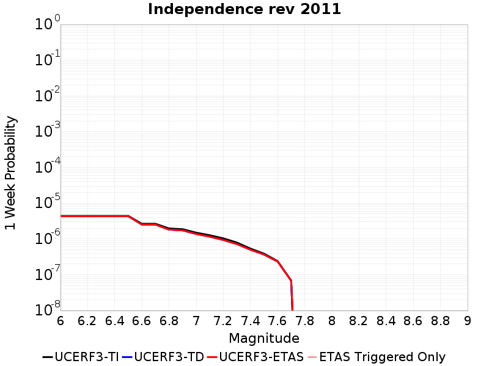 |  |  | 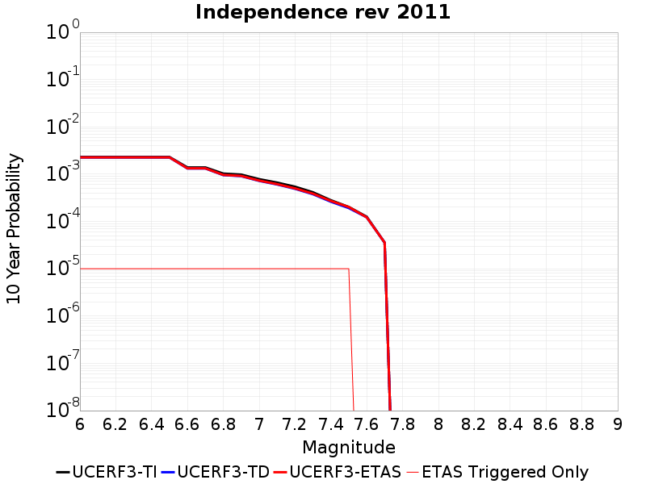 |

| Magnitude | 1 wk TI Prob | 1 wk TD Prob | 1 wk ETAS Prob | 1 wk ETAS/TD Gain | 1 wk ETAS Triggered Only | 1 mo TI Prob | 1 mo TD Prob | 1 mo ETAS Prob | 1 mo ETAS/TD Gain | 1 mo ETAS Triggered Only | 1 yr TI Prob | 1 yr TD Prob | 1 yr ETAS Prob | 1 yr ETAS/TD Gain | 1 yr ETAS Triggered Only | 10 yr TI Prob | 10 yr TD Prob | 10 yr ETAS Prob | 10 yr ETAS/TD Gain | 10 yr ETAS Triggered Only |
|-----|-----|-----|-----|-----|-----|-----|-----|-----|-----|-----|-----|-----|-----|-----|-----|-----|-----|-----|-----|-----|
| 6.0 | 4.422171E-6 | 4.327041E-6 | 4.327041E-6 | 1.0 | 0.0 | 1.8952025E-5 | 1.8544346E-5 | 1.8544346E-5 | 1.0 | 0.0 | 2.3071647E-4 | 2.2575702E-4 | 2.2575702E-4 | 1.0 | 0.0 | 0.0023047708 | 0.0022555704 | 0.0022655479 | 1.0044235 | 1.0E-5 |
| 6.1 | 4.422171E-6 | 4.327041E-6 | 4.327041E-6 | 1.0 | 0.0 | 1.8952025E-5 | 1.8544346E-5 | 1.8544346E-5 | 1.0 | 0.0 | 2.3071647E-4 | 2.2575702E-4 | 2.2575702E-4 | 1.0 | 0.0 | 0.0023047708 | 0.0022555704 | 0.0022655479 | 1.0044235 | 1.0E-5 |
| 6.2 | 4.422171E-6 | 4.327041E-6 | 4.327041E-6 | 1.0 | 0.0 | 1.8952025E-5 | 1.8544346E-5 | 1.8544346E-5 | 1.0 | 0.0 | 2.3071647E-4 | 2.2575702E-4 | 2.2575702E-4 | 1.0 | 0.0 | 0.0023047708 | 0.0022555704 | 0.0022655479 | 1.0044235 | 1.0E-5 |
| 6.3 | 4.422171E-6 | 4.327041E-6 | 4.327041E-6 | 1.0 | 0.0 | 1.8952025E-5 | 1.8544346E-5 | 1.8544346E-5 | 1.0 | 0.0 | 2.3071647E-4 | 2.2575702E-4 | 2.2575702E-4 | 1.0 | 0.0 | 0.0023047708 | 0.0022555704 | 0.0022655479 | 1.0044235 | 1.0E-5 |
| 6.4 | 4.422171E-6 | 4.327041E-6 | 4.327041E-6 | 1.0 | 0.0 | 1.8952025E-5 | 1.8544346E-5 | 1.8544346E-5 | 1.0 | 0.0 | 2.3071647E-4 | 2.2575702E-4 | 2.2575702E-4 | 1.0 | 0.0 | 0.0023047708 | 0.0022555704 | 0.0022655479 | 1.0044235 | 1.0E-5 |
| 6.5 | 4.422171E-6 | 4.327041E-6 | 4.327041E-6 | 1.0 | 0.0 | 1.8952025E-5 | 1.8544346E-5 | 1.8544346E-5 | 1.0 | 0.0 | 2.3071647E-4 | 2.2575702E-4 | 2.2575702E-4 | 1.0 | 0.0 | 0.0023047708 | 0.0022555704 | 0.0022655479 | 1.0044235 | 1.0E-5 |
| 6.6 | 2.663744E-6 | 2.532584E-6 | 2.532584E-6 | 1.0 | 0.0 | 1.1415996E-5 | 1.0853889E-5 | 1.0853889E-5 | 1.0 | 0.0 | 1.3898089E-4 | 1.3213858E-4 | 1.3213858E-4 | 1.0 | 0.0 | 0.0013889399 | 0.0013206482 | 0.001330635 | 1.007562 | 1.0E-5 |
| 6.7 | 2.663744E-6 | 2.532584E-6 | 2.532584E-6 | 1.0 | 0.0 | 1.1415996E-5 | 1.0853889E-5 | 1.0853889E-5 | 1.0 | 0.0 | 1.3898089E-4 | 1.3213858E-4 | 1.3213858E-4 | 1.0 | 0.0 | 0.0013889399 | 0.0013206482 | 0.001330635 | 1.007562 | 1.0E-5 |
| 6.8 | 1.9716529E-6 | 1.8327701E-6 | 1.8327701E-6 | 1.0 | 0.0 | 8.449913E-6 | 7.854706E-6 | 7.854706E-6 | 1.0 | 0.0 | 1.0287284E-4 | 9.562698E-5 | 9.562698E-5 | 1.0 | 0.0 | 0.0010282523 | 9.558712E-4 | 9.6586166E-4 | 1.0104517 | 1.0E-5 |
| 6.9 | 1.8788617E-6 | 1.7434911E-6 | 1.7434911E-6 | 1.0 | 0.0 | 8.0522395E-6 | 7.4720842E-6 | 7.4720842E-6 | 1.0 | 0.0 | 9.80316E-5 | 9.096895E-5 | 9.096895E-5 | 1.0 | 0.0 | 9.798837E-4 | 9.0932916E-4 | 9.1932004E-4 | 1.0109872 | 1.0E-5 |
| 7.0 | 1.5045488E-6 | 1.3853578E-6 | 1.3853578E-6 | 1.0 | 0.0 | 6.44805E-6 | 5.937234E-6 | 5.937234E-6 | 1.0 | 0.0 | 7.8502184E-5 | 7.228348E-5 | 7.228348E-5 | 1.0 | 0.0 | 7.8474457E-4 | 7.2260486E-4 | 7.325976E-4 | 1.0138289 | 1.0E-5 |
| 7.1 | 1.272341E-6 | 1.1628649E-6 | 1.1628649E-6 | 1.0 | 0.0 | 5.4528787E-6 | 4.9836976E-6 | 4.9836976E-6 | 1.0 | 0.0 | 6.6386776E-5 | 6.067486E-5 | 6.067486E-5 | 1.0 | 0.0 | 6.636695E-4 | 6.0658617E-4 | 6.165801E-4 | 1.0164757 | 1.0E-5 |
| 7.2 | 1.0416892E-6 | 9.412944E-7 | 9.412944E-7 | 1.0 | 0.0 | 4.464375E-6 | 4.0341124E-6 | 4.0341124E-6 | 1.0 | 0.0 | 5.4352407E-5 | 4.911423E-5 | 4.911423E-5 | 1.0 | 0.0 | 5.4339116E-4 | 4.9103564E-4 | 5.010307E-4 | 1.0203551 | 1.0E-5 |
| 7.3 | 7.9450155E-7 | 7.2372853E-7 | 7.2372853E-7 | 1.0 | 0.0 | 3.4050022E-6 | 3.10169E-6 | 3.10169E-6 | 1.0 | 0.0 | 4.1455114E-5 | 3.7762435E-5 | 3.7762435E-5 | 1.0 | 0.0 | 4.144738E-4 | 3.775613E-4 | 3.875575E-4 | 1.0264758 | 1.0E-5 |
| 7.4 | 5.3893444E-7 | 5.020934E-7 | 5.020934E-7 | 1.0 | 0.0 | 2.309717E-6 | 2.1518274E-6 | 2.1518274E-6 | 1.0 | 0.0 | 2.8120441E-5 | 2.6198188E-5 | 2.6198188E-5 | 1.0 | 0.0 | 2.8116882E-4 | 2.6195144E-4 | 2.719488E-4 | 1.038165 | 1.0E-5 |
| 7.5 | 3.8852085E-7 | 3.6834916E-7 | 3.6834916E-7 | 1.0 | 0.0 | 1.6650882E-6 | 1.5786383E-6 | 1.5786383E-6 | 1.0 | 0.0 | 2.027226E-5 | 1.9219753E-5 | 1.9219753E-5 | 1.0 | 0.0 | 2.0270412E-4 | 1.9218113E-4 | 2.021792E-4 | 1.0520242 | 1.0E-5 |
| 7.6 | 2.414929E-7 | 2.3462434E-7 | 2.3462434E-7 | 1.0 | 0.0 | 1.0349692E-6 | 1.0055325E-6 | 1.0055325E-6 | 1.0 | 0.0 | 1.2600677E-5 | 1.2242291E-5 | 1.2242291E-5 | 1.0 | 0.0 | 1.2599962E-4 | 1.2241628E-4 | 1.3241507E-4 | 1.0816785 | 1.0E-5 |
| 7.7 | 6.8298014E-8 | 6.8600016E-8 | 6.8600016E-8 | 1.0 | 0.0 | 2.9270575E-7 | 2.9400002E-7 | 2.9400002E-7 | 1.0 | 0.0 | 3.5636867E-6 | 3.5794449E-6 | 3.5794449E-6 | 1.0 | 0.0 | 3.5636294E-5 | 3.579392E-5 | 3.579392E-5 | 1.0 | 0.0 |

## San Andreas (Creeping Section) 2011 CFM
*[(top)](#table-of-contents)*

| 1 Week | 1 Month | 1 Year | 10 Year |
|-----|-----|-----|-----|
|  | 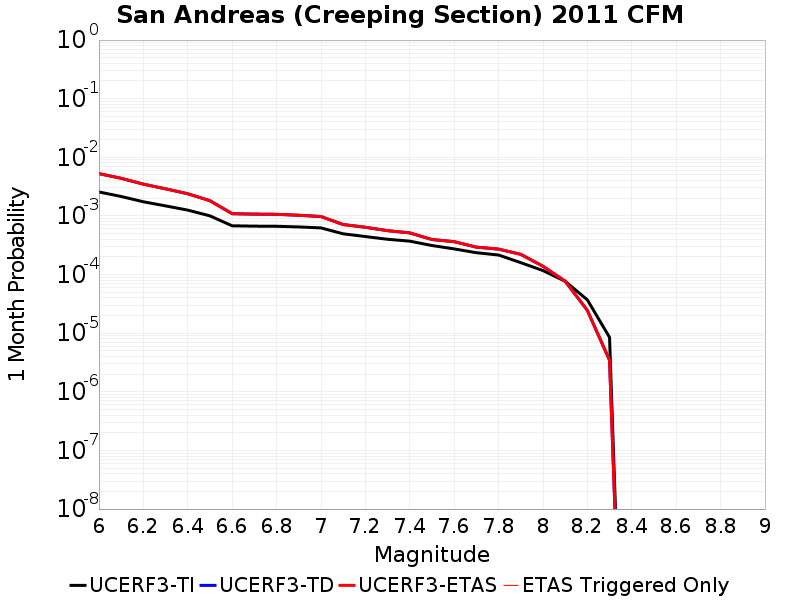 |  |  |

| Magnitude | 1 wk TI Prob | 1 wk TD Prob | 1 wk ETAS Prob | 1 wk ETAS/TD Gain | 1 wk ETAS Triggered Only | 1 mo TI Prob | 1 mo TD Prob | 1 mo ETAS Prob | 1 mo ETAS/TD Gain | 1 mo ETAS Triggered Only | 1 yr TI Prob | 1 yr TD Prob | 1 yr ETAS Prob | 1 yr ETAS/TD Gain | 1 yr ETAS Triggered Only | 10 yr TI Prob | 10 yr TD Prob | 10 yr ETAS Prob | 10 yr ETAS/TD Gain | 10 yr ETAS Triggered Only |
|-----|-----|-----|-----|-----|-----|-----|-----|-----|-----|-----|-----|-----|-----|-----|-----|-----|-----|-----|-----|-----|
| 6.0 | 5.986481E-4 | 0.0012328271 | 0.0012328271 | 1.0 | 0.0 | 0.0025631124 | 0.0052679065 | 0.0052679065 | 1.0 | 0.0 | 0.030762846 | 0.061461803 | 0.061461803 | 1.0 | 0.0 | 0.26835477 | 0.42728218 | 0.4272879 | 1.0000134 | 1.0E-5 |
| 6.1 | 5.015945E-4 | 0.0010260851 | 0.0010260851 | 1.0 | 0.0 | 0.00214792 | 0.004386168 | 0.004386168 | 1.0 | 0.0 | 0.025839351 | 0.05146115 | 0.05146115 | 1.0 | 0.0 | 0.23032776 | 0.37413755 | 0.37413755 | 1.0 | 0.0 |
| 6.2 | 4.073338E-4 | 8.149674E-4 | 8.149674E-4 | 1.0 | 0.0 | 0.0017445484 | 0.0034851916 | 0.0034851916 | 1.0 | 0.0 | 0.021034058 | 0.04114488 | 0.04114488 | 1.0 | 0.0 | 0.19150782 | 0.3144226 | 0.3144226 | 1.0 | 0.0 |
| 6.3 | 3.464099E-4 | 6.7814963E-4 | 6.7814963E-4 | 1.0 | 0.0 | 0.0014837692 | 0.002901026 | 0.002901026 | 1.0 | 0.0 | 0.017915873 | 0.03440279 | 0.03440279 | 1.0 | 0.0 | 0.16538359 | 0.27278963 | 0.27278963 | 1.0 | 0.0 |
| 6.4 | 2.935057E-4 | 5.5867375E-4 | 5.5867375E-4 | 1.0 | 0.0 | 0.0012572751 | 0.0023906778 | 0.0023906778 | 1.0 | 0.0 | 0.015200248 | 0.028479796 | 0.028479796 | 1.0 | 0.0 | 0.14201577 | 0.23454022 | 0.23454022 | 1.0 | 0.0 |
| 6.5 | 2.3409708E-4 | 4.25185E-4 | 4.25185E-4 | 1.0 | 0.0 | 0.0010028875 | 0.0018201347 | 0.0018201347 | 1.0 | 0.0 | 0.012141965 | 0.021804282 | 0.021804282 | 1.0 | 0.0 | 0.11499573 | 0.18847242 | 0.18847242 | 1.0 | 0.0 |
| 6.6 | 1.5842178E-4 | 2.5491024E-4 | 2.5491024E-4 | 1.0 | 0.0 | 6.7877385E-4 | 0.0010920055 | 0.0010920055 | 1.0 | 0.0 | 0.0082328 | 0.013212759 | 0.013212759 | 1.0 | 0.0 | 0.07934396 | 0.1249138 | 0.1249138 | 1.0 | 0.0 |
| 6.7 | 1.5616413E-4 | 2.5026454E-4 | 2.5026454E-4 | 1.0 | 0.0 | 6.691031E-4 | 0.0010721155 | 0.0010721155 | 1.0 | 0.0 | 0.0081159435 | 0.012974108 | 0.012974108 | 1.0 | 0.0 | 0.0782586 | 0.12294082 | 0.12294082 | 1.0 | 0.0 |
| 6.8 | 1.5538467E-4 | 2.4849345E-4 | 2.4849345E-4 | 1.0 | 0.0 | 6.6576427E-4 | 0.001064532 | 0.001064532 | 1.0 | 0.0 | 0.008075596 | 0.012883009 | 0.012883009 | 1.0 | 0.0 | 0.07788358 | 0.12216957 | 0.12216957 | 1.0 | 0.0 |
| 6.9 | 1.5153569E-4 | 2.3955017E-4 | 2.3955017E-4 | 1.0 | 0.0 | 6.49277E-4 | 0.0010262416 | 0.0010262416 | 1.0 | 0.0 | 0.007876333 | 0.01242345 | 0.01242345 | 1.0 | 0.0 | 0.07602952 | 0.1182337 | 0.1182337 | 1.0 | 0.0 |
| 7.0 | 1.4588932E-4 | 2.2804852E-4 | 2.2804852E-4 | 1.0 | 0.0 | 6.250901E-4 | 9.769867E-4 | 9.769867E-4 | 1.0 | 0.0 | 0.0075839474 | 0.011830455 | 0.011830455 | 1.0 | 0.0 | 0.073302895 | 0.113060586 | 0.113060586 | 1.0 | 0.0 |
| 7.1 | 1.1565079E-4 | 1.663424E-4 | 1.663424E-4 | 1.0 | 0.0 | 4.955521E-4 | 7.127021E-4 | 7.127021E-4 | 1.0 | 0.0 | 0.006016669 | 0.0086428365 | 0.0086428365 | 1.0 | 0.0 | 0.058563538 | 0.08524527 | 0.08524527 | 1.0 | 0.0 |
| 7.2 | 1.0393792E-4 | 1.494592E-4 | 1.494592E-4 | 1.0 | 0.0 | 4.4537216E-4 | 6.40383E-4 | 6.40383E-4 | 1.0 | 0.0 | 0.005408933 | 0.0077689677 | 0.0077689677 | 1.0 | 0.0 | 0.052791595 | 0.07711097 | 0.07711097 | 1.0 | 0.0 |
| 7.3 | 9.332884E-5 | 1.3070638E-4 | 1.3070638E-4 | 1.0 | 0.0 | 3.999194E-4 | 5.6005054E-4 | 5.6005054E-4 | 1.0 | 0.0 | 0.0048581534 | 0.0067974376 | 0.0067974376 | 1.0 | 0.0 | 0.047533102 | 0.06781491 | 0.06781491 | 1.0 | 0.0 |
| 7.4 | 8.670252E-5 | 1.19762095E-4 | 1.19762095E-4 | 1.0 | 0.0 | 3.715293E-4 | 5.131658E-4 | 5.131658E-4 | 1.0 | 0.0 | 0.004513991 | 0.0062300204 | 0.0062300204 | 1.0 | 0.0 | 0.044233937 | 0.062415514 | 0.062415514 | 1.0 | 0.0 |
| 7.5 | 7.3036405E-5 | 9.236324E-5 | 9.236324E-5 | 1.0 | 0.0 | 3.129756E-4 | 3.957825E-4 | 3.957825E-4 | 1.0 | 0.0 | 0.0038038217 | 0.0048080278 | 0.0048080278 | 1.0 | 0.0 | 0.03739367 | 0.04897706 | 0.04897706 | 1.0 | 0.0 |
| 7.6 | 6.3935775E-5 | 8.488999E-5 | 8.488999E-5 | 1.0 | 0.0 | 2.7398168E-4 | 3.6376357E-4 | 3.6376357E-4 | 1.0 | 0.0 | 0.0033306254 | 0.0044198474 | 0.0044198474 | 1.0 | 0.0 | 0.032811474 | 0.044986796 | 0.044986796 | 1.0 | 0.0 |
| 7.7 | 5.5050095E-5 | 6.84677E-5 | 6.84677E-5 | 1.0 | 0.0 | 2.3590765E-4 | 2.9340002E-4 | 2.9340002E-4 | 1.0 | 0.0 | 0.0028683927 | 0.0035662986 | 0.0035662986 | 1.0 | 0.0 | 0.0283165 | 0.036691185 | 0.036691185 | 1.0 | 0.0 |
| 7.8 | 5.027131E-5 | 6.3320294E-5 | 6.3320294E-5 | 1.0 | 0.0 | 2.1543067E-4 | 2.713445E-4 | 2.713445E-4 | 1.0 | 0.0 | 0.0026197135 | 0.0032986181 | 0.0032986181 | 1.0 | 0.0 | 0.025890453 | 0.033947527 | 0.033947527 | 1.0 | 0.0 |
| 7.9 | 3.7271806E-5 | 5.1588642E-5 | 5.1588642E-5 | 1.0 | 0.0 | 1.5972654E-4 | 2.2107545E-4 | 2.2107545E-4 | 1.0 | 0.0 | 0.0019429359 | 0.0026882733 | 0.0026882733 | 1.0 | 0.0 | 0.019260362 | 0.02773602 | 0.02773602 | 1.0 | 0.0 |
| 8.0 | 2.7310243E-5 | 3.2334243E-5 | 3.2334243E-5 | 1.0 | 0.0 | 1.17038646E-4 | 1.3856798E-4 | 1.3856798E-4 | 1.0 | 0.0 | 0.0014240141 | 0.0016857604 | 0.0016857604 | 1.0 | 0.0 | 0.014149235 | 0.017673848 | 0.017673848 | 1.0 | 0.0 |
| 8.1 | 1.7940547E-5 | 1.7984112E-5 | 1.7984112E-5 | 1.0 | 0.0 | 7.688579E-5 | 7.7072495E-5 | 7.7072495E-5 | 1.0 | 0.0 | 9.3568244E-4 | 9.3795423E-4 | 9.3795423E-4 | 1.0 | 0.0 | 0.009317525 | 0.010105335 | 0.010105335 | 1.0 | 0.0 |
| 8.2 | 8.643924E-6 | 5.7090024E-6 | 5.7090024E-6 | 1.0 | 0.0 | 3.704486E-5 | 2.4466923E-5 | 2.4466923E-5 | 1.0 | 0.0 | 4.5092785E-4 | 2.9784418E-4 | 2.9784418E-4 | 1.0 | 0.0 | 0.0045001395 | 0.0033766231 | 0.0033766231 | 1.0 | 0.0 |
| 8.3 | 1.983087E-6 | 8.050169E-7 | 8.050169E-7 | 1.0 | 0.0 | 8.498917E-6 | 3.4500679E-6 | 3.4500679E-6 | 1.0 | 0.0 | 1.034694E-4 | 4.2003783E-5 | 4.2003783E-5 | 1.0 | 0.0 | 0.0010342124 | 4.943242E-4 | 4.943242E-4 | 1.0 | 0.0 |

## Red Mountain
*[(top)](#table-of-contents)*

| 1 Week | 1 Month | 1 Year | 10 Year |
|-----|-----|-----|-----|
|  |  |  | 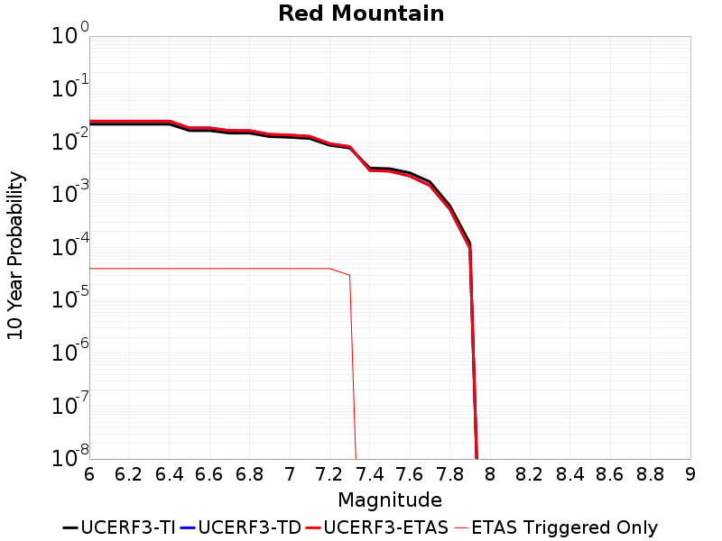 |

| Magnitude | 1 wk TI Prob | 1 wk TD Prob | 1 wk ETAS Prob | 1 wk ETAS/TD Gain | 1 wk ETAS Triggered Only | 1 mo TI Prob | 1 mo TD Prob | 1 mo ETAS Prob | 1 mo ETAS/TD Gain | 1 mo ETAS Triggered Only | 1 yr TI Prob | 1 yr TD Prob | 1 yr ETAS Prob | 1 yr ETAS/TD Gain | 1 yr ETAS Triggered Only | 10 yr TI Prob | 10 yr TD Prob | 10 yr ETAS Prob | 10 yr ETAS/TD Gain | 10 yr ETAS Triggered Only |
|-----|-----|-----|-----|-----|-----|-----|-----|-----|-----|-----|-----|-----|-----|-----|-----|-----|-----|-----|-----|-----|
| 6.0 | 4.1810763E-5 | 4.7638332E-5 | 4.7638332E-5 | 1.0 | 0.0 | 1.7917668E-4 | 2.0414924E-4 | 2.0414924E-4 | 1.0 | 0.0 | 0.0021792934 | 0.0024828487 | 0.0024828487 | 1.0 | 0.0 | 0.021580452 | 0.024568735 | 0.02457849 | 1.000397 | 1.0E-5 |
| 6.1 | 4.1810763E-5 | 4.7638332E-5 | 4.7638332E-5 | 1.0 | 0.0 | 1.7917668E-4 | 2.0414924E-4 | 2.0414924E-4 | 1.0 | 0.0 | 0.0021792934 | 0.0024828487 | 0.0024828487 | 1.0 | 0.0 | 0.021580452 | 0.024568735 | 0.02457849 | 1.000397 | 1.0E-5 |
| 6.2 | 4.1810763E-5 | 4.7638332E-5 | 4.7638332E-5 | 1.0 | 0.0 | 1.7917668E-4 | 2.0414924E-4 | 2.0414924E-4 | 1.0 | 0.0 | 0.0021792934 | 0.0024828487 | 0.0024828487 | 1.0 | 0.0 | 0.021580452 | 0.024568735 | 0.02457849 | 1.000397 | 1.0E-5 |
| 6.3 | 4.1810763E-5 | 4.7638332E-5 | 4.7638332E-5 | 1.0 | 0.0 | 1.7917668E-4 | 2.0414924E-4 | 2.0414924E-4 | 1.0 | 0.0 | 0.0021792934 | 0.0024828487 | 0.0024828487 | 1.0 | 0.0 | 0.021580452 | 0.024568735 | 0.02457849 | 1.000397 | 1.0E-5 |
| 6.4 | 4.1810763E-5 | 4.7638332E-5 | 4.7638332E-5 | 1.0 | 0.0 | 1.7917668E-4 | 2.0414924E-4 | 2.0414924E-4 | 1.0 | 0.0 | 0.0021792934 | 0.0024828487 | 0.0024828487 | 1.0 | 0.0 | 0.021580452 | 0.024568735 | 0.02457849 | 1.000397 | 1.0E-5 |
| 6.5 | 3.154503E-5 | 3.539423E-5 | 3.539423E-5 | 1.0 | 0.0 | 1.3518598E-4 | 1.5168126E-4 | 1.5168126E-4 | 1.0 | 0.0 | 0.0016446467 | 0.0018452475 | 0.0018452475 | 1.0 | 0.0 | 0.01632528 | 0.018308923 | 0.01831874 | 1.0005362 | 1.0E-5 |
| 6.6 | 3.1535834E-5 | 3.5383604E-5 | 3.5383604E-5 | 1.0 | 0.0 | 1.3514658E-4 | 1.5163572E-4 | 1.5163572E-4 | 1.0 | 0.0 | 0.0016441676 | 0.0018446939 | 0.0018446939 | 1.0 | 0.0 | 0.01632056 | 0.018303478 | 0.018313296 | 1.0005363 | 1.0E-5 |
| 6.7 | 2.8267326E-5 | 3.1499527E-5 | 3.1499527E-5 | 1.0 | 0.0 | 1.2114006E-4 | 1.3499147E-4 | 1.3499147E-4 | 1.0 | 0.0 | 0.0014738824 | 0.0016423673 | 0.0016423673 | 1.0 | 0.0 | 0.014641452 | 0.016311077 | 0.016320914 | 1.0006031 | 1.0E-5 |
| 6.8 | 2.8212884E-5 | 3.143736E-5 | 3.143736E-5 | 1.0 | 0.0 | 1.20906756E-4 | 1.3472507E-4 | 1.3472507E-4 | 1.0 | 0.0 | 0.0014710457 | 0.0016391288 | 0.0016391288 | 1.0 | 0.0 | 0.014613459 | 0.016279168 | 0.016289005 | 1.0006043 | 1.0E-5 |
| 6.9 | 2.4227871E-5 | 2.6732116E-5 | 2.6732116E-5 | 1.0 | 0.0 | 1.03829596E-4 | 1.14561604E-4 | 1.14561604E-4 | 1.0 | 0.0 | 0.0012633923 | 0.0013939711 | 0.0013939711 | 1.0 | 0.0 | 0.012562336 | 0.013859978 | 0.013869839 | 1.0007116 | 1.0E-5 |
| 7.0 | 2.348524E-5 | 2.5860005E-5 | 2.5860005E-5 | 1.0 | 0.0 | 1.0064714E-4 | 1.10824316E-4 | 1.10824316E-4 | 1.0 | 0.0 | 0.0012246901 | 0.0013485267 | 0.0013485267 | 1.0 | 0.0 | 0.012179627 | 0.013411087 | 0.0134209525 | 1.0007356 | 1.0E-5 |
| 7.1 | 2.2311642E-5 | 2.4485684E-5 | 2.4485684E-5 | 1.0 | 0.0 | 9.561782E-5 | 1.0493485E-4 | 1.0493485E-4 | 1.0 | 0.0 | 0.0011635252 | 0.001276908 | 0.001276908 | 1.0 | 0.0 | 0.01157452 | 0.012703243 | 0.012713116 | 1.0007772 | 1.0E-5 |
| 7.2 | 1.6533986E-5 | 1.7686132E-5 | 1.7686132E-5 | 1.0 | 0.0 | 7.085802E-5 | 7.579587E-5 | 7.579587E-5 | 1.0 | 0.0 | 8.623549E-4 | 9.224876E-4 | 9.224876E-4 | 1.0 | 0.0 | 0.008590161 | 0.009192875 | 0.009192875 | 1.0 | 0.0 |
| 7.3 | 1.4703092E-5 | 1.557338E-5 | 1.557338E-5 | 1.0 | 0.0 | 6.301173E-5 | 6.67417E-5 | 6.67417E-5 | 1.0 | 0.0 | 7.668978E-4 | 8.123389E-4 | 8.123389E-4 | 1.0 | 0.0 | 0.0076425658 | 0.008099782 | 0.008099782 | 1.0 | 0.0 |
| 7.4 | 6.1331984E-6 | 5.5325795E-6 | 5.5325795E-6 | 1.0 | 0.0 | 2.6284872E-5 | 2.3710843E-5 | 2.3710843E-5 | 1.0 | 0.0 | 3.199713E-4 | 2.886418E-4 | 2.886418E-4 | 1.0 | 0.0 | 0.0031951098 | 0.0028827235 | 0.0028827235 | 1.0 | 0.0 |
| 7.5 | 5.954766E-6 | 5.3421127E-6 | 5.3421127E-6 | 1.0 | 0.0 | 2.5520176E-5 | 2.289457E-5 | 2.289457E-5 | 1.0 | 0.0 | 3.1066386E-4 | 2.7870628E-4 | 2.7870628E-4 | 1.0 | 0.0 | 0.003102299 | 0.0027836214 | 0.0027836214 | 1.0 | 0.0 |
| 7.6 | 4.9726646E-6 | 4.3184164E-6 | 4.3184164E-6 | 1.0 | 0.0 | 2.1311245E-5 | 1.850737E-5 | 1.850737E-5 | 1.0 | 0.0 | 2.5943352E-4 | 2.2530426E-4 | 2.2530426E-4 | 1.0 | 0.0 | 0.0025913084 | 0.0022507932 | 0.0022507932 | 1.0 | 0.0 |
| 7.7 | 3.3613894E-6 | 2.854986E-6 | 2.854986E-6 | 1.0 | 0.0 | 1.4405875E-5 | 1.2235598E-5 | 1.2235598E-5 | 1.0 | 0.0 | 1.7537741E-4 | 1.4895848E-4 | 1.4895848E-4 | 1.0 | 0.0 | 0.0017523908 | 0.0014886127 | 0.0014886127 | 1.0 | 0.0 |
| 7.8 | 1.1828961E-6 | 1.0130772E-6 | 1.0130772E-6 | 1.0 | 0.0 | 5.069545E-6 | 4.3417526E-6 | 4.3417526E-6 | 1.0 | 0.0 | 6.171996E-5 | 5.2859585E-5 | 5.2859585E-5 | 1.0 | 0.0 | 6.170282E-4 | 5.2847306E-4 | 5.2847306E-4 | 1.0 | 0.0 |
| 7.9 | 2.2967266E-7 | 1.8626314E-7 | 1.8626314E-7 | 1.0 | 0.0 | 9.843111E-7 | 7.982703E-7 | 7.982703E-7 | 1.0 | 0.0 | 1.19839215E-5 | 9.7189E-6 | 9.7189E-6 | 1.0 | 0.0 | 1.1983275E-4 | 9.7185046E-5 | 9.7185046E-5 | 1.0 | 0.0 |

## Los Alamos 2011 CFM
*[(top)](#table-of-contents)*

| 1 Week | 1 Month | 1 Year | 10 Year |
|-----|-----|-----|-----|
| 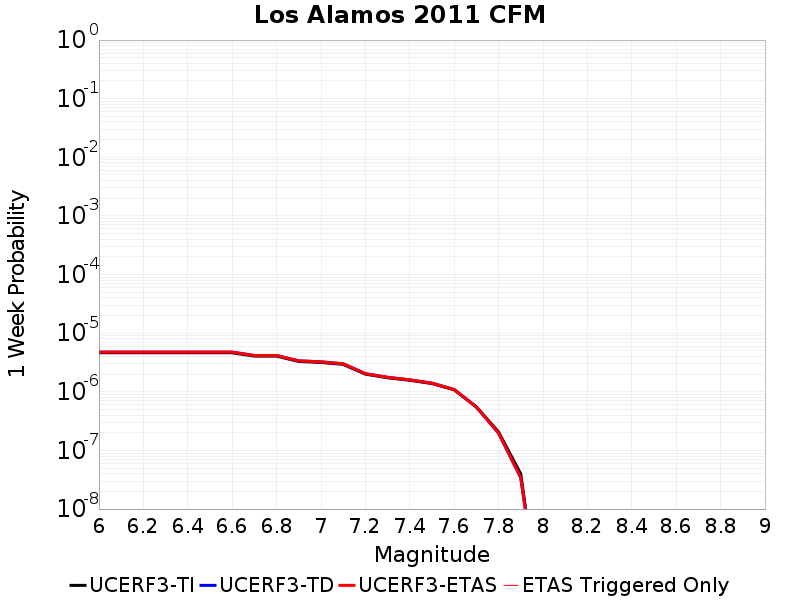 |  | 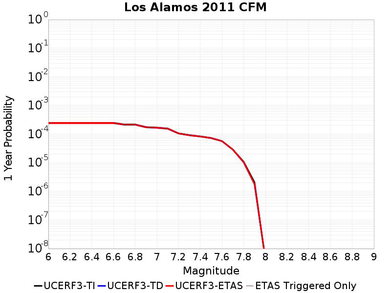 |  |

| Magnitude | 1 wk TI Prob | 1 wk TD Prob | 1 wk ETAS Prob | 1 wk ETAS/TD Gain | 1 wk ETAS Triggered Only | 1 mo TI Prob | 1 mo TD Prob | 1 mo ETAS Prob | 1 mo ETAS/TD Gain | 1 mo ETAS Triggered Only | 1 yr TI Prob | 1 yr TD Prob | 1 yr ETAS Prob | 1 yr ETAS/TD Gain | 1 yr ETAS Triggered Only | 10 yr TI Prob | 10 yr TD Prob | 10 yr ETAS Prob | 10 yr ETAS/TD Gain | 10 yr ETAS Triggered Only |
|-----|-----|-----|-----|-----|-----|-----|-----|-----|-----|-----|-----|-----|-----|-----|-----|-----|-----|-----|-----|-----|
| 6.0 | 4.6284417E-6 | 4.7527083E-6 | 4.7527083E-6 | 1.0 | 0.0 | 1.9836029E-5 | 2.0368601E-5 | 2.0368601E-5 | 1.0 | 0.0 | 2.4147688E-4 | 2.4796126E-4 | 2.4796126E-4 | 1.0 | 0.0 | 0.0024121467 | 0.00247702 | 0.0024869954 | 1.0040271 | 1.0E-5 |
| 6.1 | 4.6284417E-6 | 4.7527083E-6 | 4.7527083E-6 | 1.0 | 0.0 | 1.9836029E-5 | 2.0368601E-5 | 2.0368601E-5 | 1.0 | 0.0 | 2.4147688E-4 | 2.4796126E-4 | 2.4796126E-4 | 1.0 | 0.0 | 0.0024121467 | 0.00247702 | 0.0024869954 | 1.0040271 | 1.0E-5 |
| 6.2 | 4.6284417E-6 | 4.7527083E-6 | 4.7527083E-6 | 1.0 | 0.0 | 1.9836029E-5 | 2.0368601E-5 | 2.0368601E-5 | 1.0 | 0.0 | 2.4147688E-4 | 2.4796126E-4 | 2.4796126E-4 | 1.0 | 0.0 | 0.0024121467 | 0.00247702 | 0.0024869954 | 1.0040271 | 1.0E-5 |
| 6.3 | 4.6284417E-6 | 4.7527083E-6 | 4.7527083E-6 | 1.0 | 0.0 | 1.9836029E-5 | 2.0368601E-5 | 2.0368601E-5 | 1.0 | 0.0 | 2.4147688E-4 | 2.4796126E-4 | 2.4796126E-4 | 1.0 | 0.0 | 0.0024121467 | 0.00247702 | 0.0024869954 | 1.0040271 | 1.0E-5 |
| 6.4 | 4.6284417E-6 | 4.7527083E-6 | 4.7527083E-6 | 1.0 | 0.0 | 1.9836029E-5 | 2.0368601E-5 | 2.0368601E-5 | 1.0 | 0.0 | 2.4147688E-4 | 2.4796126E-4 | 2.4796126E-4 | 1.0 | 0.0 | 0.0024121467 | 0.00247702 | 0.0024869954 | 1.0040271 | 1.0E-5 |
| 6.5 | 4.6284417E-6 | 4.7527083E-6 | 4.7527083E-6 | 1.0 | 0.0 | 1.9836029E-5 | 2.0368601E-5 | 2.0368601E-5 | 1.0 | 0.0 | 2.4147688E-4 | 2.4796126E-4 | 2.4796126E-4 | 1.0 | 0.0 | 0.0024121467 | 0.00247702 | 0.0024869954 | 1.0040271 | 1.0E-5 |
| 6.6 | 4.6284417E-6 | 4.7527083E-6 | 4.7527083E-6 | 1.0 | 0.0 | 1.9836029E-5 | 2.0368601E-5 | 2.0368601E-5 | 1.0 | 0.0 | 2.4147688E-4 | 2.4796126E-4 | 2.4796126E-4 | 1.0 | 0.0 | 0.0024121467 | 0.00247702 | 0.0024869954 | 1.0040271 | 1.0E-5 |
| 6.7 | 4.062321E-6 | 4.1672083E-6 | 4.1672083E-6 | 1.0 | 0.0 | 1.7409831E-5 | 1.785935E-5 | 1.785935E-5 | 1.0 | 0.0 | 2.1194408E-4 | 2.174174E-4 | 2.174174E-4 | 1.0 | 0.0 | 0.0021174205 | 0.0021721967 | 0.002182175 | 1.0045936 | 1.0E-5 |
| 6.8 | 4.062321E-6 | 4.1672083E-6 | 4.1672083E-6 | 1.0 | 0.0 | 1.7409831E-5 | 1.785935E-5 | 1.785935E-5 | 1.0 | 0.0 | 2.1194408E-4 | 2.174174E-4 | 2.174174E-4 | 1.0 | 0.0 | 0.0021174205 | 0.0021721967 | 0.002182175 | 1.0045936 | 1.0E-5 |
| 6.9 | 3.2936077E-6 | 3.3736667E-6 | 3.3736667E-6 | 1.0 | 0.0 | 1.4115385E-5 | 1.44584965E-5 | 1.44584965E-5 | 1.0 | 0.0 | 1.7184127E-4 | 1.7601892E-4 | 1.7601892E-4 | 1.0 | 0.0 | 0.0017170844 | 0.0017588875 | 0.00176887 | 1.0056754 | 1.0E-5 |
| 7.0 | 3.1687898E-6 | 3.245504E-6 | 3.245504E-6 | 1.0 | 0.0 | 1.3580457E-5 | 1.3909234E-5 | 1.3909234E-5 | 1.0 | 0.0 | 1.6532952E-4 | 1.6933269E-4 | 1.6933269E-4 | 1.0 | 0.0 | 0.0016520657 | 0.0016921284 | 0.0017021114 | 1.0058997 | 1.0E-5 |
| 7.1 | 2.9379228E-6 | 3.007974E-6 | 3.007974E-6 | 1.0 | 0.0 | 1.25910365E-5 | 1.2891259E-5 | 1.2891259E-5 | 1.0 | 0.0 | 1.5328509E-4 | 1.5694067E-4 | 1.5694067E-4 | 1.0 | 0.0 | 0.001531794 | 0.0015683876 | 0.001578372 | 1.006366 | 1.0E-5 |
| 7.2 | 2.0020686E-6 | 2.042096E-6 | 2.042096E-6 | 1.0 | 0.0 | 8.580266E-6 | 8.75181E-6 | 8.75181E-6 | 1.0 | 0.0 | 1.0445973E-4 | 1.0654813E-4 | 1.0654813E-4 | 1.0 | 0.0 | 0.0010441064 | 0.0010649748 | 0.0010649748 | 1.0 | 0.0 |
| 7.3 | 1.7364243E-6 | 1.7682969E-6 | 1.7682969E-6 | 1.0 | 0.0 | 7.441797E-6 | 7.5783933E-6 | 7.5783933E-6 | 1.0 | 0.0 | 9.0600115E-5 | 9.2263064E-5 | 9.2263064E-5 | 1.0 | 0.0 | 9.0563187E-4 | 9.2225074E-4 | 9.2225074E-4 | 1.0 | 0.0 |
| 7.4 | 1.5718434E-6 | 1.5987039E-6 | 1.5987039E-6 | 1.0 | 0.0 | 6.7364545E-6 | 6.85157E-6 | 6.85157E-6 | 1.0 | 0.0 | 8.201325E-5 | 8.341471E-5 | 8.341471E-5 | 1.0 | 0.0 | 8.198299E-4 | 8.3383697E-4 | 8.3383697E-4 | 1.0 | 0.0 |
| 7.5 | 1.3841119E-6 | 1.4046268E-6 | 1.4046268E-6 | 1.0 | 0.0 | 5.9318945E-6 | 6.0198154E-6 | 6.0198154E-6 | 1.0 | 0.0 | 7.221842E-5 | 7.3288815E-5 | 7.3288815E-5 | 1.0 | 0.0 | 7.2194956E-4 | 7.3264935E-4 | 7.3264935E-4 | 1.0 | 0.0 |
| 7.6 | 1.0843726E-6 | 1.0937215E-6 | 1.0937215E-6 | 1.0 | 0.0 | 4.647303E-6 | 4.6873697E-6 | 4.6873697E-6 | 1.0 | 0.0 | 5.6579443E-5 | 5.7067256E-5 | 5.7067256E-5 | 1.0 | 0.0 | 5.656504E-4 | 5.705286E-4 | 5.705286E-4 | 1.0 | 0.0 |
| 7.7 | 5.544814E-7 | 5.5033576E-7 | 5.5033576E-7 | 1.0 | 0.0 | 2.3763469E-6 | 2.3585796E-6 | 2.3585796E-6 | 1.0 | 0.0 | 2.8931638E-5 | 2.871533E-5 | 2.871533E-5 | 1.0 | 0.0 | 2.8927872E-4 | 2.8711636E-4 | 2.8711636E-4 | 1.0 | 0.0 |
| 7.8 | 2.0707465E-7 | 1.9784476E-7 | 1.9784476E-7 | 1.0 | 0.0 | 8.874625E-7 | 8.479058E-7 | 8.479058E-7 | 1.0 | 0.0 | 1.08048025E-5 | 1.0323205E-5 | 1.0323205E-5 | 1.0 | 0.0 | 1.0804277E-4 | 1.032273E-4 | 1.032273E-4 | 1.0 | 0.0 |
| 7.9 | 3.9821284E-8 | 3.4341728E-8 | 3.4341728E-8 | 1.0 | 0.0 | 1.7066264E-7 | 1.4717882E-7 | 1.4717882E-7 | 1.0 | 0.0 | 2.0778157E-6 | 1.7919008E-6 | 1.7919008E-6 | 1.0 | 0.0 | 2.0777963E-5 | 1.7918868E-5 | 1.7918868E-5 | 1.0 | 0.0 |
| 8.0 | 7.880441E-11 | 8.237511E-11 | 8.237511E-11 | 1.0 | 0.0 | 3.3773329E-10 | 3.5303604E-10 | 3.5303604E-10 | 1.0 | 0.0 | 4.1119033E-9 | 4.2982142E-9 | 4.2982142E-9 | 1.0 | 0.0 | 4.1119034E-8 | 4.298214E-8 | 4.298214E-8 | 1.0 | 0.0 |

## Cleghorn Pass
*[(top)](#table-of-contents)*

| 1 Week | 1 Month | 1 Year | 10 Year |
|-----|-----|-----|-----|
|  | 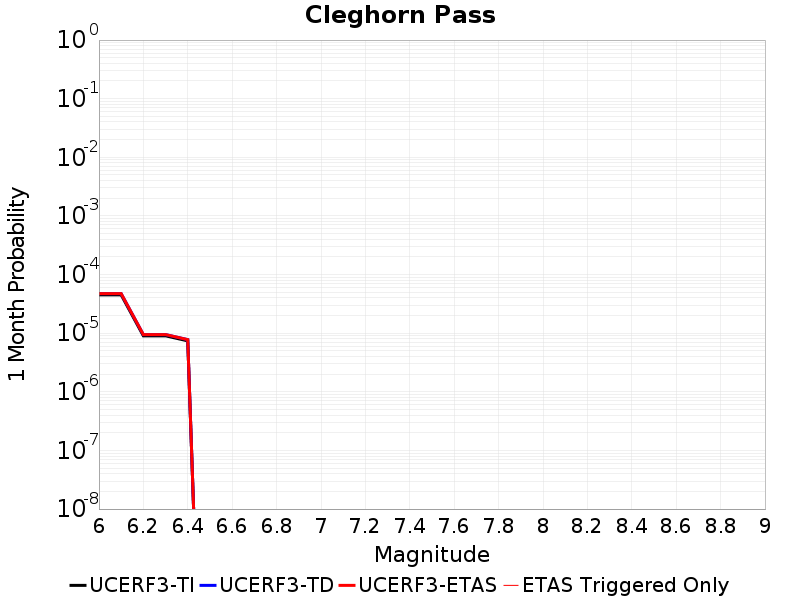 |  | 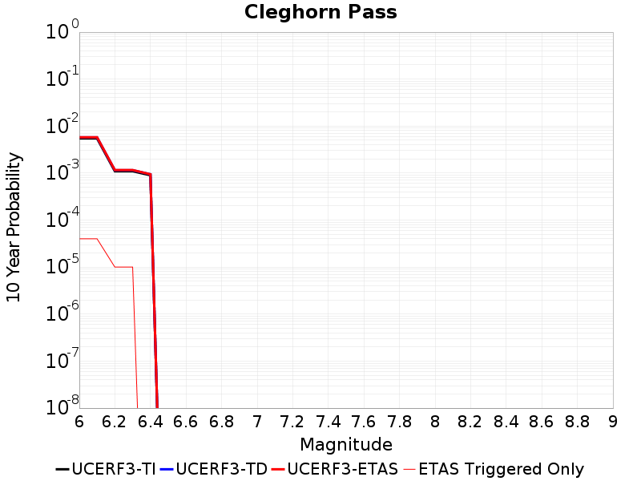 |

| Magnitude | 1 wk TI Prob | 1 wk TD Prob | 1 wk ETAS Prob | 1 wk ETAS/TD Gain | 1 wk ETAS Triggered Only | 1 mo TI Prob | 1 mo TD Prob | 1 mo ETAS Prob | 1 mo ETAS/TD Gain | 1 mo ETAS Triggered Only | 1 yr TI Prob | 1 yr TD Prob | 1 yr ETAS Prob | 1 yr ETAS/TD Gain | 1 yr ETAS Triggered Only | 10 yr TI Prob | 10 yr TD Prob | 10 yr ETAS Prob | 10 yr ETAS/TD Gain | 10 yr ETAS Triggered Only |
|-----|-----|-----|-----|-----|-----|-----|-----|-----|-----|-----|-----|-----|-----|-----|-----|-----|-----|-----|-----|-----|
| 6.0 | 1.0522846E-5 | 1.1043855E-5 | 1.1043855E-5 | 1.0 | 0.0 | 4.509713E-5 | 4.7330246E-5 | 4.7330246E-5 | 1.0 | 0.0 | 5.4891926E-4 | 5.7614606E-4 | 5.7614606E-4 | 1.0 | 0.0 | 0.0054756533 | 0.005751692 | 0.005761635 | 1.0017287 | 1.0E-5 |
| 6.1 | 1.0522846E-5 | 1.1043855E-5 | 1.1043855E-5 | 1.0 | 0.0 | 4.509713E-5 | 4.7330246E-5 | 4.7330246E-5 | 1.0 | 0.0 | 5.4891926E-4 | 5.7614606E-4 | 5.7614606E-4 | 1.0 | 0.0 | 0.0054756533 | 0.005751692 | 0.005761635 | 1.0017287 | 1.0E-5 |
| 6.2 | 2.1045846E-6 | 2.2088457E-6 | 2.2088457E-6 | 1.0 | 0.0 | 9.019617E-6 | 9.46647E-6 | 9.46647E-6 | 1.0 | 0.0 | 1.098083E-4 | 1.1525238E-4 | 1.1525238E-4 | 1.0 | 0.0 | 0.0010975406 | 0.0011523378 | 0.0011623262 | 1.0086681 | 1.0E-5 |
| 6.3 | 2.1045846E-6 | 2.2088457E-6 | 2.2088457E-6 | 1.0 | 0.0 | 9.019617E-6 | 9.46647E-6 | 9.46647E-6 | 1.0 | 0.0 | 1.098083E-4 | 1.1525238E-4 | 1.1525238E-4 | 1.0 | 0.0 | 0.0010975406 | 0.0011523378 | 0.0011623262 | 1.0086681 | 1.0E-5 |
| 6.4 | 1.7259927E-6 | 1.8114039E-6 | 1.8114039E-6 | 1.0 | 0.0 | 7.3970905E-6 | 7.763159E-6 | 7.763159E-6 | 1.0 | 0.0 | 9.005586E-5 | 9.451647E-5 | 9.451647E-5 | 1.0 | 0.0 | 9.001937E-4 | 9.451647E-4 | 9.5515524E-4 | 1.0105702 | 1.0E-5 |

## Simi-Santa Rosa
*[(top)](#table-of-contents)*

| 1 Week | 1 Month | 1 Year | 10 Year |
|-----|-----|-----|-----|
| 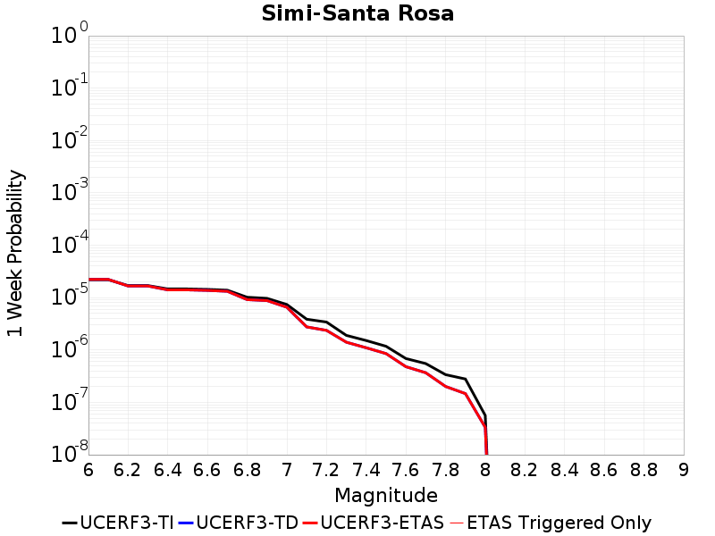 | 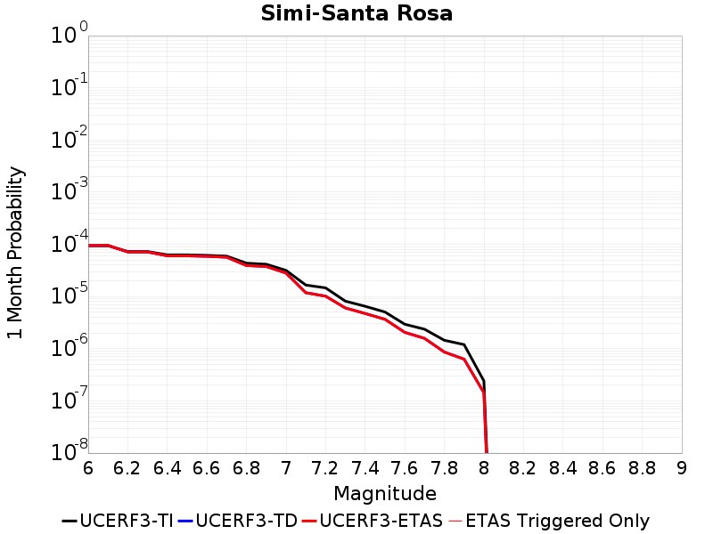 | 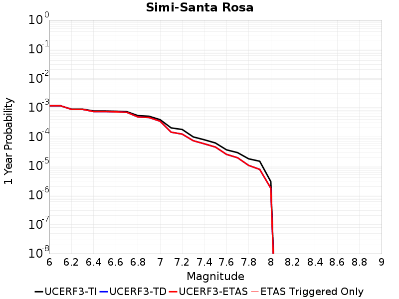 |  |

| Magnitude | 1 wk TI Prob | 1 wk TD Prob | 1 wk ETAS Prob | 1 wk ETAS/TD Gain | 1 wk ETAS Triggered Only | 1 mo TI Prob | 1 mo TD Prob | 1 mo ETAS Prob | 1 mo ETAS/TD Gain | 1 mo ETAS Triggered Only | 1 yr TI Prob | 1 yr TD Prob | 1 yr ETAS Prob | 1 yr ETAS/TD Gain | 1 yr ETAS Triggered Only | 10 yr TI Prob | 10 yr TD Prob | 10 yr ETAS Prob | 10 yr ETAS/TD Gain | 10 yr ETAS Triggered Only |
|-----|-----|-----|-----|-----|-----|-----|-----|-----|-----|-----|-----|-----|-----|-----|-----|-----|-----|-----|-----|-----|
| 6.0 | 2.198912E-5 | 2.229294E-5 | 2.229294E-5 | 1.0 | 0.0 | 9.4235686E-5 | 9.553792E-5 | 9.553792E-5 | 1.0 | 0.0 | 0.0011467156 | 0.0011625974 | 0.0011725858 | 1.0085914 | 1.0E-5 | 0.011408163 | 0.011569607 | 0.011579491 | 1.0008544 | 1.0E-5 |
| 6.1 | 2.198912E-5 | 2.229294E-5 | 2.229294E-5 | 1.0 | 0.0 | 9.4235686E-5 | 9.553792E-5 | 9.553792E-5 | 1.0 | 0.0 | 0.0011467156 | 0.0011625974 | 0.0011725858 | 1.0085914 | 1.0E-5 | 0.011408163 | 0.011569607 | 0.011579491 | 1.0008544 | 1.0E-5 |
| 6.2 | 1.69983E-5 | 1.668196E-5 | 1.668196E-5 | 1.0 | 0.0 | 7.284782E-5 | 7.1492315E-5 | 7.1492315E-5 | 1.0 | 0.0 | 8.865613E-4 | 8.7010063E-4 | 8.800919E-4 | 1.011483 | 1.0E-5 | 0.008830327 | 0.008669864 | 0.008679777 | 1.0011435 | 1.0E-5 |
| 6.3 | 1.69983E-5 | 1.668196E-5 | 1.668196E-5 | 1.0 | 0.0 | 7.284782E-5 | 7.1492315E-5 | 7.1492315E-5 | 1.0 | 0.0 | 8.865613E-4 | 8.7010063E-4 | 8.800919E-4 | 1.011483 | 1.0E-5 | 0.008830327 | 0.008669864 | 0.008679777 | 1.0011435 | 1.0E-5 |
| 6.4 | 1.4666188E-5 | 1.4064059E-5 | 1.4064059E-5 | 1.0 | 0.0 | 6.285358E-5 | 6.0273283E-5 | 6.0273283E-5 | 1.0 | 0.0 | 7.6497364E-4 | 7.336051E-4 | 7.336051E-4 | 1.0 | 0.0 | 0.0076234564 | 0.007314313 | 0.007314313 | 1.0 | 0.0 |
| 6.5 | 1.4666188E-5 | 1.4064059E-5 | 1.4064059E-5 | 1.0 | 0.0 | 6.285358E-5 | 6.0273283E-5 | 6.0273283E-5 | 1.0 | 0.0 | 7.6497364E-4 | 7.336051E-4 | 7.336051E-4 | 1.0 | 0.0 | 0.0076234564 | 0.007314313 | 0.007314313 | 1.0 | 0.0 |
| 6.6 | 1.4377586E-5 | 1.3740871E-5 | 1.3740871E-5 | 1.0 | 0.0 | 6.1616774E-5 | 5.8888254E-5 | 5.8888254E-5 | 1.0 | 0.0 | 7.4992597E-4 | 7.1675354E-4 | 7.1675354E-4 | 1.0 | 0.0 | 0.007474003 | 0.0071468907 | 0.0071468907 | 1.0 | 0.0 |
| 6.7 | 1.3881404E-5 | 1.3218463E-5 | 1.3218463E-5 | 1.0 | 0.0 | 5.9490372E-5 | 5.6649467E-5 | 5.6649467E-5 | 1.0 | 0.0 | 7.240546E-4 | 6.8951375E-4 | 6.8951375E-4 | 1.0 | 0.0 | 0.007217 | 0.0068761976 | 0.0068761976 | 1.0 | 0.0 |
| 6.8 | 1.0176516E-5 | 9.162029E-6 | 9.162029E-6 | 1.0 | 0.0 | 4.3612912E-5 | 3.9265342E-5 | 3.9265342E-5 | 1.0 | 0.0 | 5.308578E-4 | 4.7796726E-4 | 4.7796726E-4 | 1.0 | 0.0 | 0.0052959146 | 0.0047710286 | 0.0047710286 | 1.0 | 0.0 |
| 6.9 | 9.699797E-6 | 8.782237E-6 | 8.782237E-6 | 1.0 | 0.0 | 4.15699E-5 | 3.763771E-5 | 3.763771E-5 | 1.0 | 0.0 | 5.05996E-4 | 4.5815922E-4 | 4.5815922E-4 | 1.0 | 0.0 | 0.005048454 | 0.004573767 | 0.004573767 | 1.0 | 0.0 |
| 7.0 | 7.4049476E-6 | 6.5649147E-6 | 6.5649147E-6 | 1.0 | 0.0 | 3.1735104E-5 | 2.8135117E-5 | 2.8135117E-5 | 1.0 | 0.0 | 3.8630638E-4 | 3.425039E-4 | 3.425039E-4 | 1.0 | 0.0 | 0.0038563553 | 0.0034210044 | 0.0034210044 | 1.0 | 0.0 |
| 7.1 | 3.873439E-6 | 2.7619021E-6 | 2.7619021E-6 | 1.0 | 0.0 | 1.6600346E-5 | 1.1836671E-5 | 1.1836671E-5 | 1.0 | 0.0 | 2.0209046E-4 | 1.4410217E-4 | 1.4410217E-4 | 1.0 | 0.0 | 0.0020190678 | 0.0014401108 | 0.0014401108 | 1.0 | 0.0 |
| 7.2 | 3.417706E-6 | 2.3697835E-6 | 2.3697835E-6 | 1.0 | 0.0 | 1.4647229E-5 | 1.0156176E-5 | 1.0156176E-5 | 1.0 | 0.0 | 1.7831543E-4 | 1.2364466E-4 | 1.2364466E-4 | 1.0 | 0.0 | 0.0017817242 | 0.0012357809 | 0.0012357809 | 1.0 | 0.0 |
| 7.3 | 1.90225E-6 | 1.4088738E-6 | 1.4088738E-6 | 1.0 | 0.0 | 8.152474E-6 | 6.0380166E-6 | 6.0380166E-6 | 1.0 | 0.0 | 9.9251854E-5 | 7.35104E-5 | 7.35104E-5 | 1.0 | 0.0 | 9.920754E-4 | 7.3486305E-4 | 7.3486305E-4 | 1.0 | 0.0 |
| 7.4 | 1.5170556E-6 | 1.1038198E-6 | 1.1038198E-6 | 1.0 | 0.0 | 6.5016507E-6 | 4.730648E-6 | 4.730648E-6 | 1.0 | 0.0 | 7.915472E-5 | 5.7594127E-5 | 5.7594127E-5 | 1.0 | 0.0 | 7.9126534E-4 | 5.757931E-4 | 5.757931E-4 | 1.0 | 0.0 |
| 7.5 | 1.178732E-6 | 8.5472715E-7 | 8.5472715E-7 | 1.0 | 0.0 | 5.0516987E-6 | 3.6631113E-6 | 3.6631113E-6 | 1.0 | 0.0 | 6.1502695E-5 | 4.4597477E-5 | 4.4597477E-5 | 1.0 | 0.0 | 6.148568E-4 | 4.4588622E-4 | 4.4588622E-4 | 1.0 | 0.0 |
| 7.6 | 6.8722386E-7 | 4.804014E-7 | 4.804014E-7 | 1.0 | 0.0 | 2.9452417E-6 | 2.0588616E-6 | 2.0588616E-6 | 1.0 | 0.0 | 3.5857727E-5 | 2.5066354E-5 | 2.5066354E-5 | 1.0 | 0.0 | 3.5851944E-4 | 2.506354E-4 | 2.506354E-4 | 1.0 | 0.0 |
| 7.7 | 5.5126515E-7 | 3.683492E-7 | 3.683492E-7 | 1.0 | 0.0 | 2.3625628E-6 | 1.5786385E-6 | 1.5786385E-6 | 1.0 | 0.0 | 2.8763823E-5 | 1.9219755E-5 | 1.9219755E-5 | 1.0 | 0.0 | 2.87601E-4 | 1.9218103E-4 | 1.9218103E-4 | 1.0 | 0.0 |
| 7.8 | 3.3860243E-7 | 2.0144445E-7 | 2.0144445E-7 | 1.0 | 0.0 | 1.4511525E-6 | 8.6333307E-7 | 8.6333307E-7 | 1.0 | 0.0 | 1.7667637E-5 | 1.051103E-5 | 1.051103E-5 | 1.0 | 0.0 | 1.7666233E-4 | 1.05105384E-4 | 1.05105384E-4 | 1.0 | 0.0 |
| 7.9 | 2.7955386E-7 | 1.4710305E-7 | 1.4710305E-7 | 1.0 | 0.0 | 1.1980875E-6 | 6.304415E-7 | 6.304415E-7 | 1.0 | 0.0 | 1.4586617E-5 | 7.675599E-6 | 7.675599E-6 | 1.0 | 0.0 | 1.458566E-4 | 7.675338E-5 | 7.675338E-5 | 1.0 | 0.0 |
| 8.0 | 5.6259015E-8 | 3.343367E-8 | 3.343367E-8 | 1.0 | 0.0 | 2.4111003E-7 | 1.4328714E-7 | 1.4328714E-7 | 1.0 | 0.0 | 2.9355108E-6 | 1.7445196E-6 | 1.7445196E-6 | 1.0 | 0.0 | 2.935472E-5 | 1.7445074E-5 | 1.7445074E-5 | 1.0 | 0.0 |

## Homestead Valley 2011
*[(top)](#table-of-contents)*

| 1 Week | 1 Month | 1 Year | 10 Year |
|-----|-----|-----|-----|
| 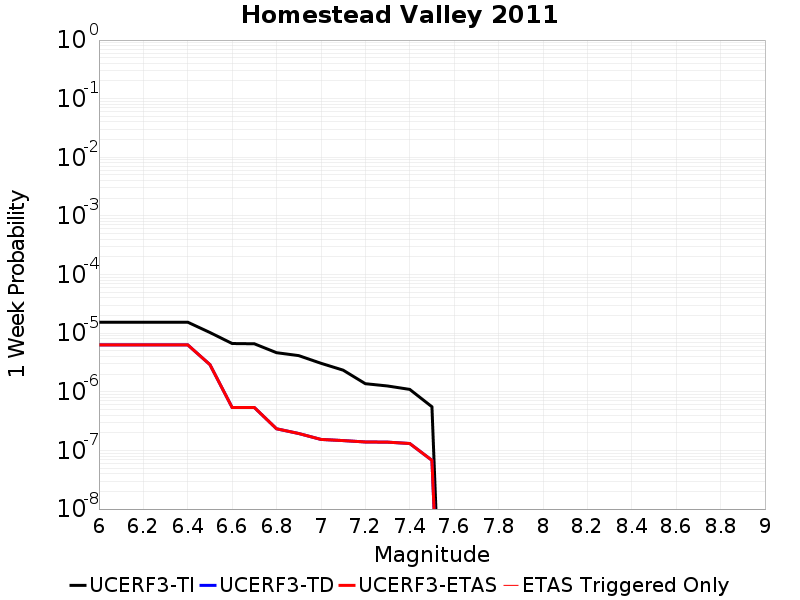 | 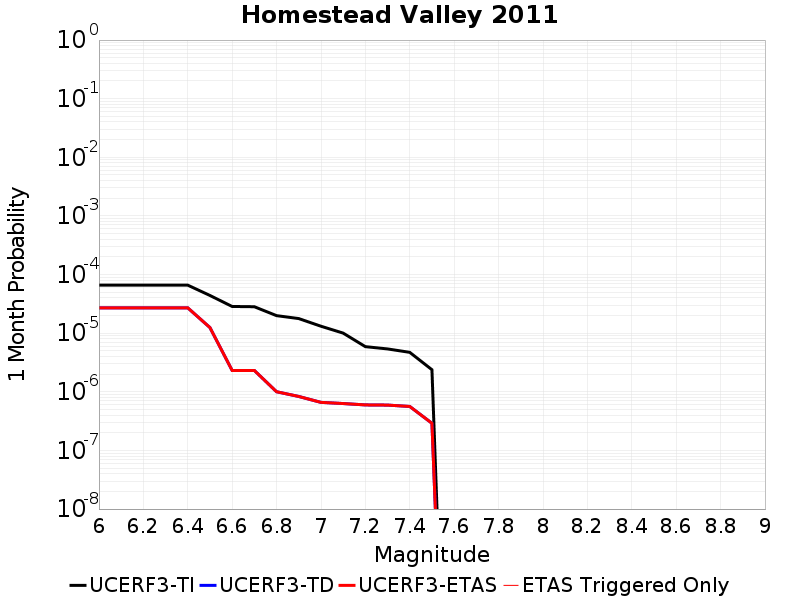 | 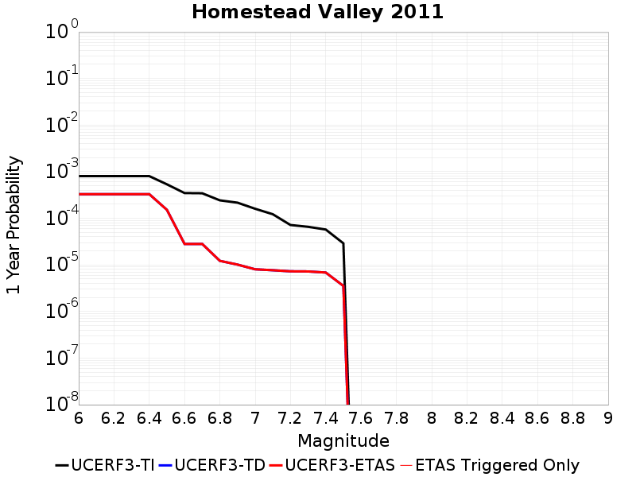 | 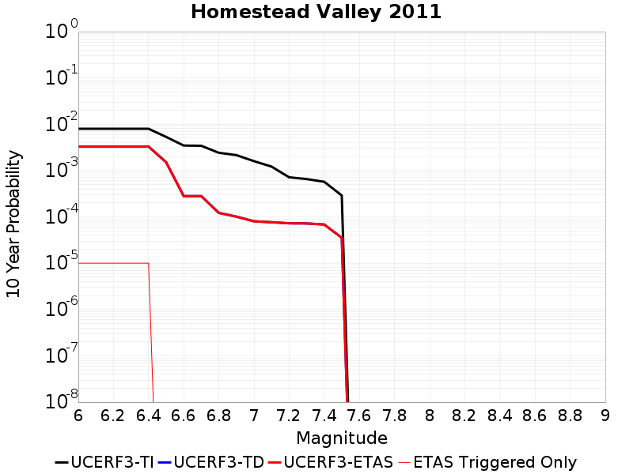 |

| Magnitude | 1 wk TI Prob | 1 wk TD Prob | 1 wk ETAS Prob | 1 wk ETAS/TD Gain | 1 wk ETAS Triggered Only | 1 mo TI Prob | 1 mo TD Prob | 1 mo ETAS Prob | 1 mo ETAS/TD Gain | 1 mo ETAS Triggered Only | 1 yr TI Prob | 1 yr TD Prob | 1 yr ETAS Prob | 1 yr ETAS/TD Gain | 1 yr ETAS Triggered Only | 10 yr TI Prob | 10 yr TD Prob | 10 yr ETAS Prob | 10 yr ETAS/TD Gain | 10 yr ETAS Triggered Only |
|-----|-----|-----|-----|-----|-----|-----|-----|-----|-----|-----|-----|-----|-----|-----|-----|-----|-----|-----|-----|-----|
| 6.0 | 1.539795E-5 | 6.3188E-6 | 6.3188E-6 | 1.0 | 0.0 | 6.5989545E-5 | 2.7080407E-5 | 2.7080407E-5 | 1.0 | 0.0 | 8.0312655E-4 | 3.2967483E-4 | 3.2967483E-4 | 1.0 | 0.0 | 0.008002302 | 0.003293895 | 0.003303862 | 1.0030259 | 1.0E-5 |
| 6.1 | 1.539795E-5 | 6.3188E-6 | 6.3188E-6 | 1.0 | 0.0 | 6.5989545E-5 | 2.7080407E-5 | 2.7080407E-5 | 1.0 | 0.0 | 8.0312655E-4 | 3.2967483E-4 | 3.2967483E-4 | 1.0 | 0.0 | 0.008002302 | 0.003293895 | 0.003303862 | 1.0030259 | 1.0E-5 |
| 6.2 | 1.539795E-5 | 6.3188E-6 | 6.3188E-6 | 1.0 | 0.0 | 6.5989545E-5 | 2.7080407E-5 | 2.7080407E-5 | 1.0 | 0.0 | 8.0312655E-4 | 3.2967483E-4 | 3.2967483E-4 | 1.0 | 0.0 | 0.008002302 | 0.003293895 | 0.003303862 | 1.0030259 | 1.0E-5 |
| 6.3 | 1.539795E-5 | 6.3188E-6 | 6.3188E-6 | 1.0 | 0.0 | 6.5989545E-5 | 2.7080407E-5 | 2.7080407E-5 | 1.0 | 0.0 | 8.0312655E-4 | 3.2967483E-4 | 3.2967483E-4 | 1.0 | 0.0 | 0.008002302 | 0.003293895 | 0.003303862 | 1.0030259 | 1.0E-5 |
| 6.4 | 1.539795E-5 | 6.3188E-6 | 6.3188E-6 | 1.0 | 0.0 | 6.5989545E-5 | 2.7080407E-5 | 2.7080407E-5 | 1.0 | 0.0 | 8.0312655E-4 | 3.2967483E-4 | 3.2967483E-4 | 1.0 | 0.0 | 0.008002302 | 0.003293895 | 0.003303862 | 1.0030259 | 1.0E-5 |
| 6.5 | 1.0265258E-5 | 2.909553E-6 | 2.909553E-6 | 1.0 | 0.0 | 4.3993223E-5 | 1.24694925E-5 | 1.24694925E-5 | 1.0 | 0.0 | 5.3548586E-4 | 1.5181261E-4 | 1.5181261E-4 | 1.0 | 0.0 | 0.005341973 | 0.0015177858 | 0.0015177858 | 1.0 | 0.0 |
| 6.6 | 6.664671E-6 | 5.3995535E-7 | 5.3995535E-7 | 1.0 | 0.0 | 2.8562565E-5 | 2.314093E-6 | 2.314093E-6 | 1.0 | 0.0 | 3.476937E-4 | 2.817384E-5 | 2.817384E-5 | 1.0 | 0.0 | 0.003471502 | 2.817146E-4 | 2.817146E-4 | 1.0 | 0.0 |
| 6.7 | 6.5954046E-6 | 5.3995535E-7 | 5.3995535E-7 | 1.0 | 0.0 | 2.8265715E-5 | 2.314093E-6 | 2.314093E-6 | 1.0 | 0.0 | 3.4408073E-4 | 2.817384E-5 | 2.817384E-5 | 1.0 | 0.0 | 0.0034354846 | 2.817146E-4 | 2.817146E-4 | 1.0 | 0.0 |
| 6.8 | 4.648189E-6 | 2.3408766E-7 | 2.3408766E-7 | 1.0 | 0.0 | 1.9920659E-5 | 1.0032325E-6 | 1.0032325E-6 | 1.0 | 0.0 | 2.4250703E-4 | 1.2214292E-5 | 1.2214292E-5 | 1.0 | 0.0 | 0.0024224254 | 1.221367E-4 | 1.221367E-4 | 1.0 | 0.0 |
| 6.9 | 4.1428534E-6 | 1.9438771E-7 | 1.9438771E-7 | 1.0 | 0.0 | 1.7754966E-5 | 8.330899E-7 | 8.330899E-7 | 1.0 | 0.0 | 2.1614527E-4 | 1.0142826E-5 | 1.0142826E-5 | 1.0 | 0.0 | 0.0021593515 | 1.0142393E-4 | 1.0142393E-4 | 1.0 | 0.0 |
| 7.0 | 3.0673707E-6 | 1.5411585E-7 | 1.5411585E-7 | 1.0 | 0.0 | 1.3145808E-5 | 6.6049637E-7 | 6.6049637E-7 | 1.0 | 0.0 | 1.6003846E-4 | 8.041515E-6 | 8.041515E-6 | 1.0 | 0.0 | 0.0015992324 | 8.041234E-5 | 8.041234E-5 | 1.0 | 0.0 |
| 7.1 | 2.340854E-6 | 1.4722423E-7 | 1.4722423E-7 | 1.0 | 0.0 | 1.0032193E-5 | 6.309608E-7 | 6.309608E-7 | 1.0 | 0.0 | 1.221351E-4 | 7.6819215E-6 | 7.6819215E-6 | 1.0 | 0.0 | 0.00122068 | 7.681666E-5 | 7.681666E-5 | 1.0 | 0.0 |
| 7.2 | 1.3754182E-6 | 1.3947027E-7 | 1.3947027E-7 | 1.0 | 0.0 | 5.8946357E-6 | 5.9772964E-7 | 5.9772964E-7 | 1.0 | 0.0 | 7.176483E-5 | 7.277335E-6 | 7.277335E-6 | 1.0 | 0.0 | 7.174166E-4 | 7.277106E-5 | 7.277106E-5 | 1.0 | 0.0 |
| 7.3 | 1.2573237E-6 | 1.3851296E-7 | 1.3851296E-7 | 1.0 | 0.0 | 5.388519E-6 | 5.9362685E-7 | 5.9362685E-7 | 1.0 | 0.0 | 6.560324E-5 | 7.2273842E-6 | 7.2273842E-6 | 1.0 | 0.0 | 6.558388E-4 | 7.2271585E-5 | 7.2271585E-5 | 1.0 | 0.0 |
| 7.4 | 1.0994207E-6 | 1.3128835E-7 | 1.3128835E-7 | 1.0 | 0.0 | 4.7117946E-6 | 5.626642E-7 | 5.626642E-7 | 1.0 | 0.0 | 5.736459E-5 | 6.850416E-6 | 6.850416E-6 | 1.0 | 0.0 | 5.734978E-4 | 6.850214E-5 | 6.850214E-5 | 1.0 | 0.0 |
| 7.5 | 5.5569126E-7 | 6.783951E-8 | 6.783951E-8 | 1.0 | 0.0 | 2.3815317E-6 | 2.9074073E-7 | 2.9074073E-7 | 1.0 | 0.0 | 2.8994764E-5 | 3.5397634E-6 | 3.5397634E-6 | 1.0 | 0.0 | 2.899098E-4 | 3.5397134E-5 | 3.5397134E-5 | 1.0 | 0.0 |

## Cleghorn Lake
*[(top)](#table-of-contents)*

| 1 Week | 1 Month | 1 Year | 10 Year |
|-----|-----|-----|-----|
| 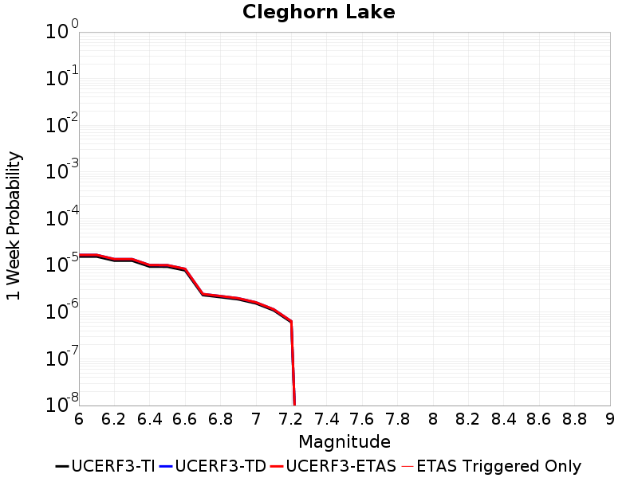 |  |  |  |

| Magnitude | 1 wk TI Prob | 1 wk TD Prob | 1 wk ETAS Prob | 1 wk ETAS/TD Gain | 1 wk ETAS Triggered Only | 1 mo TI Prob | 1 mo TD Prob | 1 mo ETAS Prob | 1 mo ETAS/TD Gain | 1 mo ETAS Triggered Only | 1 yr TI Prob | 1 yr TD Prob | 1 yr ETAS Prob | 1 yr ETAS/TD Gain | 1 yr ETAS Triggered Only | 10 yr TI Prob | 10 yr TD Prob | 10 yr ETAS Prob | 10 yr ETAS/TD Gain | 10 yr ETAS Triggered Only |
|-----|-----|-----|-----|-----|-----|-----|-----|-----|-----|-----|-----|-----|-----|-----|-----|-----|-----|-----|-----|-----|
| 6.0 | 1.5467183E-5 | 1.6802758E-5 | 1.6802758E-5 | 1.0 | 0.0 | 6.6286244E-5 | 7.201014E-5 | 7.201014E-5 | 1.0 | 0.0 | 8.067362E-4 | 8.7642577E-4 | 8.86417E-4 | 1.0114 | 1.0E-5 | 0.008038137 | 0.008735127 | 0.008745039 | 1.0011348 | 1.0E-5 |
| 6.1 | 1.5467183E-5 | 1.6802758E-5 | 1.6802758E-5 | 1.0 | 0.0 | 6.6286244E-5 | 7.201014E-5 | 7.201014E-5 | 1.0 | 0.0 | 8.067362E-4 | 8.7642577E-4 | 8.86417E-4 | 1.0114 | 1.0E-5 | 0.008038137 | 0.008735127 | 0.008745039 | 1.0011348 | 1.0E-5 |
| 6.2 | 1.2624631E-5 | 1.3688348E-5 | 1.3688348E-5 | 1.0 | 0.0 | 5.410444E-5 | 5.8663303E-5 | 5.8663303E-5 | 1.0 | 0.0 | 6.585225E-4 | 7.140404E-4 | 7.240333E-4 | 1.0139948 | 1.0E-5 | 0.0065657445 | 0.0071222624 | 0.007132191 | 1.001394 | 1.0E-5 |
| 6.3 | 1.2624631E-5 | 1.3688348E-5 | 1.3688348E-5 | 1.0 | 0.0 | 5.410444E-5 | 5.8663303E-5 | 5.8663303E-5 | 1.0 | 0.0 | 6.585225E-4 | 7.140404E-4 | 7.240333E-4 | 1.0139948 | 1.0E-5 | 0.0065657445 | 0.0071222624 | 0.007132191 | 1.001394 | 1.0E-5 |
| 6.4 | 9.417684E-6 | 1.0174948E-5 | 1.0174948E-5 | 1.0 | 0.0 | 4.036088E-5 | 4.3606426E-5 | 4.3606426E-5 | 1.0 | 0.0 | 4.912829E-4 | 5.3082005E-4 | 5.408147E-4 | 1.0188287 | 1.0E-5 | 0.004901982 | 0.005299561 | 0.005309508 | 1.001877 | 1.0E-5 |
| 6.5 | 9.368219E-6 | 1.0122355E-5 | 1.0122355E-5 | 1.0 | 0.0 | 4.014889E-5 | 4.3381035E-5 | 4.3381035E-5 | 1.0 | 0.0 | 4.8870314E-4 | 5.2807725E-4 | 5.3807197E-4 | 1.0189266 | 1.0E-5 | 0.004876298 | 0.0052722637 | 0.0052822107 | 1.0018867 | 1.0E-5 |
| 6.6 | 7.803798E-6 | 8.44593E-6 | 8.44593E-6 | 1.0 | 0.0 | 3.3444423E-5 | 3.6196565E-5 | 3.6196565E-5 | 1.0 | 0.0 | 4.0710976E-4 | 4.4064404E-4 | 4.5063964E-4 | 1.0226841 | 1.0E-5 | 0.0040636472 | 0.0044016247 | 0.0044115805 | 1.0022619 | 1.0E-5 |
| 6.7 | 2.3108669E-6 | 2.4446663E-6 | 2.4446663E-6 | 1.0 | 0.0 | 9.903678E-6 | 1.0477101E-5 | 1.0477101E-5 | 1.0 | 0.0 | 1.205706E-4 | 1.2755142E-4 | 1.3755015E-4 | 1.0783898 | 1.0E-5 | 0.001205052 | 0.0012748007 | 0.001284788 | 1.0078343 | 1.0E-5 |
| 6.8 | 2.0882828E-6 | 2.20702E-6 | 2.20702E-6 | 1.0 | 0.0 | 8.949753E-6 | 9.458625E-6 | 9.458625E-6 | 1.0 | 0.0 | 1.08957785E-4 | 1.15152834E-4 | 1.2515168E-4 | 1.0868311 | 1.0E-5 | 0.0010890438 | 0.0011509486 | 0.001160937 | 1.0086784 | 1.0E-5 |
| 6.9 | 1.876935E-6 | 1.9817012E-6 | 1.9817012E-6 | 1.0 | 0.0 | 8.043982E-6 | 8.492979E-6 | 8.492979E-6 | 1.0 | 0.0 | 9.7931086E-5 | 1.0339727E-4 | 1.13396236E-4 | 1.0967044 | 1.0E-5 | 9.788794E-4 | 0.0010335076 | 0.0010434974 | 1.0096657 | 1.0E-5 |
| 7.0 | 1.5357559E-6 | 1.6208085E-6 | 1.6208085E-6 | 1.0 | 0.0 | 6.5817944E-6 | 6.946304E-6 | 6.946304E-6 | 1.0 | 0.0 | 8.01304E-5 | 8.45681E-5 | 9.456725E-5 | 1.1182379 | 1.0E-5 | 8.010151E-4 | 8.453716E-4 | 8.5536315E-4 | 1.0118191 | 1.0E-5 |
| 7.1 | 1.0905424E-6 | 1.1501314E-6 | 1.1501314E-6 | 1.0 | 0.0 | 4.6737446E-6 | 4.9291257E-6 | 4.9291257E-6 | 1.0 | 0.0 | 5.6901354E-5 | 6.0010556E-5 | 7.0009955E-5 | 1.1666274 | 1.0E-5 | 5.6886784E-4 | 5.999533E-4 | 6.0994725E-4 | 1.016658 | 1.0E-5 |
| 7.2 | 6.06668E-7 | 6.389275E-7 | 6.389275E-7 | 1.0 | 0.0 | 2.600003E-6 | 2.738258E-6 | 2.738258E-6 | 1.0 | 0.0 | 3.1654577E-5 | 3.3337852E-5 | 3.3337852E-5 | 1.0 | 0.0 | 3.1650066E-4 | 3.3333534E-4 | 3.3333534E-4 | 1.0 | 0.0 |

