# Parent Section Magnitude-Probability Distributions

Only fault sections with at least one triggered aftershock are plotted. Sections are sorted by total supraseismogenic trigger rate (decreasing)

## Table Of Contents

* [Garlock (Central)](#garlock-central)
* [Tank Canyon](#tank-canyon)
* [Little Lake](#little-lake)
* [Airport Lake](#airport-lake)
* [Owl Lake](#owl-lake)
* [Panamint Valley](#panamint-valley)
* [Garlock (East)](#garlock-east)
* [Ash Hill](#ash-hill)
* [Hunter Mountain-Saline Valley](#hunter-mountain-saline-valley)
* [Blackwater](#blackwater)
* [Garlock (West)](#garlock-west)
* [McLean Lake](#mclean-lake)
* [Goldstone Lake](#goldstone-lake)
* [Gravel Hills-Harper Lk](#gravel-hills-harper-lk)
* [So Sierra Nevada](#so-sierra-nevada)
* [San Andreas (Mojave N)](#san-andreas-mojave-n)
* [Nelson Lake](#nelson-lake)
* [San Andreas (Mojave S)](#san-andreas-mojave-s)
* [Coyote Canyon](#coyote-canyon)
* [Death Valley (So)](#death-valley-so)
* [Lenwood-Lockhart-Old Woman Springs](#lenwood-lockhart-old-woman-springs)
* [Towne Pass](#towne-pass)
* [San Andreas (San Bernardino N)](#san-andreas-san-bernardino-n)
* [Paradise](#paradise)
* [Bicycle Lake](#bicycle-lake)
* [San Andreas (Big Bend)](#san-andreas-big-bend)
* [San Andreas (San Bernardino S)](#san-andreas-san-bernardino-s)
* [Garlic Springs](#garlic-springs)
* [Coyote Lake](#coyote-lake)
* [Death Valley (Black Mtns Frontal)](#death-valley-black-mtns-frontal)
* [San Andreas (Parkfield)](#san-andreas-parkfield)
* [Death Valley (No)](#death-valley-no)
* [Helendale-So Lockhart](#helendale-so-lockhart)
* [San Andreas (Creeping Section) 2011 CFM](#san-andreas-creeping-section-2011-cfm)
* [White Wolf (Extension)](#white-wolf-extension)
* [San Andreas (Carrizo) rev](#san-andreas-carrizo-rev)
* [Cady](#cady)
* [San Andreas (San Gorgonio Pass-Garnet HIll)](#san-andreas-san-gorgonio-pass-garnet-hill)
* [San Andreas (Cholame) rev](#san-andreas-cholame-rev)
* [Santa Rosa Island](#santa-rosa-island)
* [San Jacinto (San Bernardino)](#san-jacinto-san-bernardino)
* [Cleghorn Lake](#cleghorn-lake)
* [Death Valley (Fish Lake Valley)](#death-valley-fish-lake-valley)
* [San Andreas (North Branch Mill Creek)](#san-andreas-north-branch-mill-creek)
* [Mission Ridge-Arroyo Parida-Santa Ana](#mission-ridge-arroyo-parida-santa-ana)
* [Calico-Hidalgo](#calico-hidalgo)
* [Big Pine (Central)](#big-pine-central)
* [San Jacinto (Stepovers Combined)](#san-jacinto-stepovers-combined)
* [Big Pine (East)](#big-pine-east)
* [Lake Isabella (Seismicity)](#lake-isabella-seismicity)
* [Cleghorn Pass](#cleghorn-pass)
* [San Jacinto (San Jacinto Valley) rev](#san-jacinto-san-jacinto-valley-rev)
* [Scodie Lineament](#scodie-lineament)
* [San Jacinto (Borrego)](#san-jacinto-borrego)
* [Pleito](#pleito)
* [Santa Ynez (East)](#santa-ynez-east)
* [San Andreas (Coachella) rev](#san-andreas-coachella-rev)
* [Elsinore (Glen Ivy) rev](#elsinore-glen-ivy-rev)
* [Lost Hills](#lost-hills)
* [Red Mountain](#red-mountain)
* [San Jacinto (Coyote Creek)](#san-jacinto-coyote-creek)
* [Ludlow](#ludlow)
* [Sierra Nevada  (No Extension)](#sierra-nevada--no-extension)
* [San Jacinto (Anza) rev](#san-jacinto-anza-rev)
* [Red Pass](#red-pass)
* [Camp Rock 2011](#camp-rock-2011)
* [Palos Verdes](#palos-verdes)
* [Dry Mountain](#dry-mountain)
* [Manix-Afton Hills](#manix-afton-hills)
* [Channel Islands Thrust](#channel-islands-thrust)
* [Oak Ridge (Onshore)](#oak-ridge-onshore)
* [Great Valley 09 (Laguna Seca)](#great-valley-09-laguna-seca)
* [Gillem - Big Crack 2011 CFM](#gillem---big-crack-2011-cfm)
* [Santa Ynez (West)](#santa-ynez-west)
* [San Gabriel](#san-gabriel)
* [Great Valley 03 Mysterious Ridge](#great-valley-03-mysterious-ridge)
* [Mono Lake 2011 CFM](#mono-lake-2011-cfm)
* [Kern Canyon (South Kern) 2011](#kern-canyon-south-kern-2011)
* [Oceanic - West Huasna](#oceanic---west-huasna)
* [Deep Springs](#deep-springs)
* [Imperial](#imperial)
* [Ventura-Pitas Point](#ventura-pitas-point)
* [San Clemente](#san-clemente)
* [Owens Valley](#owens-valley)
* [Cerro Prieto](#cerro-prieto)
* [Baker](#baker)
* [Simi-Santa Rosa](#simi-santa-rosa)
* [Whittier alt 1](#whittier-alt-1)
* [Chino alt 1](#chino-alt-1)
* [White Mountains](#white-mountains)
* [Brawley (Seismic Zone) alt 1](#brawley-seismic-zone-alt-1)
* [San Diego Trough south](#san-diego-trough-south)
* [Northridge Hills](#northridge-hills)
* [San Jacinto (Clark) rev](#san-jacinto-clark-rev)
* [Hunting Creek - Berryessa 2011 CFM](#hunting-creek---berryessa-2011-cfm)
* [Channel Islands Western Deep Ramp](#channel-islands-western-deep-ramp)
* [San Gabriel (Extension)](#san-gabriel-extension)
* [Del Valle](#del-valle)
* [San Gregorio (North) 2011 CFM](#san-gregorio-north-2011-cfm)
* [San Cayetano](#san-cayetano)
* [Santa Cruz Island](#santa-cruz-island)
* [Independence rev 2011](#independence-rev-2011)
* [Mad River (alt1)](#mad-river-alt1)
* [Rinconada 2011 CFM](#rinconada-2011-cfm)
* [San Jacinto (Lytle Creek connector)](#san-jacinto-lytle-creek-connector)
* [Great Valley 08 (Quinto)](#great-valley-08-quinto)
* [Coronado Bank alt1](#coronado-bank-alt1)
* [Johnson Valley (No) 2011 rev](#johnson-valley-no-2011-rev)
* [Elsinore (Temecula) rev](#elsinore-temecula-rev)
* [Malibu Coast (Extension) alt 1](#malibu-coast-extension-alt-1)
* [Reliz 2011 CFM](#reliz-2011-cfm)
* [Northridge](#northridge)
* [Elsinore (Stepovers Combined)](#elsinore-stepovers-combined)
* [Santa Cruz Catalina Ridge alt1](#santa-cruz-catalina-ridge-alt1)
* [Maacama 2011 CFM](#maacama-2011-cfm)
* [Swain Ravine - Spenceville](#swain-ravine---spenceville)
* [Fickle Hill (alt1)](#fickle-hill-alt1)
* [Pinto Mtn](#pinto-mtn)
* [Ozena](#ozena)
* [Superstition Hills](#superstition-hills)
* [San Luis Range 2011 CFM](#san-luis-range-2011-cfm)
* [Round Valley](#round-valley)
* [Ortigalita (North)](#ortigalita-north)
* [Sisar](#sisar)
* [San Jacinto (Superstition Mtn)](#san-jacinto-superstition-mtn)
* [Puente Hills](#puente-hills)
* [Kern Canyon (North Kern) 2011](#kern-canyon-north-kern-2011)
* [Mission Hills 2011](#mission-hills-2011)
* [Tin Mountain](#tin-mountain)
* [Pine Mtn](#pine-mtn)
* [Concord 2011 CFM](#concord-2011-cfm)
* [Hollywood](#hollywood)
* [Santa Monica alt 1](#santa-monica-alt-1)
* [Elmore Ranch](#elmore-ranch)
* [Elysian Park (Upper)](#elysian-park-upper)
* [Blue Cut](#blue-cut)
* [Great Valley 02](#great-valley-02)
* [Sierra Madre](#sierra-madre)
* [Calaveras (So) - Paicines extension 2011 CFM](#calaveras-so---paicines-extension-2011-cfm)
* [Great Valley 04a Trout Creek](#great-valley-04a-trout-creek)
* [Hayward (So) 2011 CFM](#hayward-so-2011-cfm)
* [Bullion Mountains](#bullion-mountains)
* [La Panza 2011](#la-panza-2011)
* [Cleghorn](#cleghorn)
* [Rose Canyon](#rose-canyon)
* [Malibu Coast alt 1](#malibu-coast-alt-1)

## Garlock (Central)
*[(top)](#table-of-contents)*

| 1 Week | 1 Month | 1 Year | 10 Year |
|-----|-----|-----|-----|
|  |  | 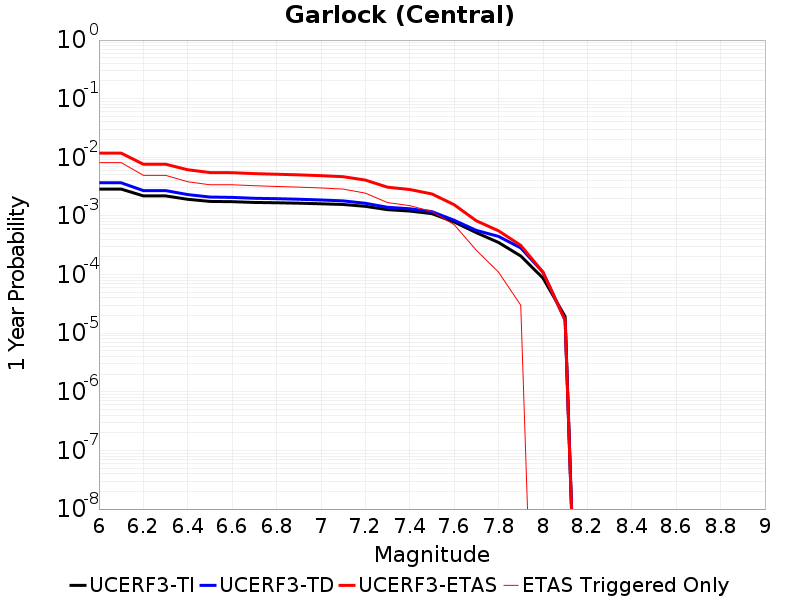 |  |

| Magnitude | 1 wk TI Prob | 1 wk TD Prob | 1 wk ETAS Prob | 1 wk ETAS/TD Gain | 1 wk ETAS Triggered Only | 1 mo TI Prob | 1 mo TD Prob | 1 mo ETAS Prob | 1 mo ETAS/TD Gain | 1 mo ETAS Triggered Only | 1 yr TI Prob | 1 yr TD Prob | 1 yr ETAS Prob | 1 yr ETAS/TD Gain | 1 yr ETAS Triggered Only | 10 yr TI Prob | 10 yr TD Prob | 10 yr ETAS Prob | 10 yr ETAS/TD Gain | 10 yr ETAS Triggered Only |
|-----|-----|-----|-----|-----|-----|-----|-----|-----|-----|-----|-----|-----|-----|-----|-----|-----|-----|-----|-----|-----|
| 6.0 | 5.5131142E-5 | 7.055428E-5 | 2.7054016E-4 | 3.834497 | 2.0E-4 | 2.3625491E-4 | 3.023408E-4 | 0.001102099 | 3.6452208 | 8.0E-4 | 0.0028726095 | 0.003674851 | 0.011774975 | 3.2042046 | 0.00813 | 0.028357591 | 0.036264762 | 0.063895054 | 1.7619046 | 0.02867 |
| 6.1 | 5.5131142E-5 | 7.055428E-5 | 2.7054016E-4 | 3.834497 | 2.0E-4 | 2.3625491E-4 | 3.023408E-4 | 0.001102099 | 3.6452208 | 8.0E-4 | 0.0028726095 | 0.003674851 | 0.011774975 | 3.2042046 | 0.00813 | 0.028357591 | 0.036264762 | 0.063895054 | 1.7619046 | 0.02867 |
| 6.2 | 4.216245E-5 | 5.1940715E-5 | 2.0193293E-4 | 3.8877578 | 1.5E-4 | 1.806837E-4 | 2.2258425E-4 | 7.824596E-4 | 3.5153413 | 5.6E-4 | 0.0021976046 | 0.0027066271 | 0.0076232837 | 2.8165252 | 0.00493 | 0.021759989 | 0.026845042 | 0.0439823 | 1.6383771 | 0.01761 |
| 6.3 | 4.216245E-5 | 5.1940715E-5 | 2.0193293E-4 | 3.8877578 | 1.5E-4 | 1.806837E-4 | 2.2258425E-4 | 7.824596E-4 | 3.5153413 | 5.6E-4 | 0.0021976046 | 0.0027066271 | 0.0076232837 | 2.8165252 | 0.00493 | 0.021759989 | 0.026845042 | 0.0439823 | 1.6383771 | 0.01761 |
| 6.4 | 3.6858168E-5 | 4.4378874E-5 | 1.6437354E-4 | 3.7038693 | 1.2E-4 | 1.5795401E-4 | 1.9018144E-4 | 5.9010537E-4 | 3.1028545 | 4.0E-4 | 0.0019213937 | 0.0023130255 | 0.006134167 | 2.65201 | 0.00383 | 0.019048655 | 0.023006393 | 0.036469363 | 1.585184 | 0.01378 |
| 6.5 | 3.39199E-5 | 4.028196E-5 | 1.4027793E-4 | 3.482401 | 1.0E-4 | 1.453629E-4 | 1.7262567E-4 | 5.025687E-4 | 2.911321 | 3.3E-4 | 0.0017683565 | 0.0020997135 | 0.0054925745 | 2.6158686 | 0.0034 | 0.017543508 | 0.02089455 | 0.032927755 | 1.5759017 | 0.01229 |
| 6.6 | 3.3571985E-5 | 3.9735172E-5 | 1.397312E-4 | 3.516562 | 1.0E-4 | 1.4387199E-4 | 1.7028261E-4 | 5.002264E-4 | 2.937625 | 3.3E-4 | 0.0017502342 | 0.0020712414 | 0.005464199 | 2.6381278 | 0.0034 | 0.017365133 | 0.020615362 | 0.032612823 | 1.5819671 | 0.01225 |
| 6.7 | 3.2580007E-5 | 3.8350052E-5 | 1.3834622E-4 | 3.6074584 | 1.0E-4 | 1.3962112E-4 | 1.6434713E-4 | 4.942929E-4 | 3.0076149 | 3.3E-4 | 0.0016985617 | 0.0019991116 | 0.0052725547 | 2.6374488 | 0.00328 | 0.016856372 | 0.019904472 | 0.031400993 | 1.5775849 | 0.01173 |
| 6.8 | 3.2185937E-5 | 3.777552E-5 | 1.3777174E-4 | 3.6471171 | 1.0E-4 | 1.3793244E-4 | 1.6188515E-4 | 4.8183335E-4 | 2.97639 | 3.2E-4 | 0.0016780337 | 0.0019691917 | 0.0051429295 | 2.6116958 | 0.00318 | 0.016654192 | 0.019610537 | 0.030904623 | 1.5759193 | 0.01152 |
| 6.9 | 3.165394E-5 | 3.69783E-5 | 1.369746E-4 | 3.7041886 | 1.0E-4 | 1.3565269E-4 | 1.5846893E-4 | 4.684198E-4 | 2.9559095 | 3.1E-4 | 0.0016503202 | 0.0019276734 | 0.005021698 | 2.6050563 | 0.0031 | 0.01638118 | 0.019202998 | 0.030187925 | 1.5720422 | 0.0112 |
| 7.0 | 3.0903822E-5 | 3.5880443E-5 | 1.1587757E-4 | 3.2295468 | 8.0E-5 | 1.3243823E-4 | 1.5376438E-4 | 4.437198E-4 | 2.8857124 | 2.9E-4 | 0.0016112428 | 0.0018704953 | 0.0048648836 | 2.6008532 | 0.003 | 0.015996104 | 0.018642118 | 0.02930948 | 1.5722182 | 0.01087 |
| 7.1 | 3.0069863E-5 | 3.464464E-5 | 1.1464187E-4 | 3.3090794 | 8.0E-5 | 1.2886449E-4 | 1.484687E-4 | 4.1842862E-4 | 2.818295 | 2.7E-4 | 0.0015677959 | 0.0018061289 | 0.0046709455 | 2.5861638 | 0.00287 | 0.01556781 | 0.018008636 | 0.028142786 | 1.5627384 | 0.01032 |
| 7.2 | 2.7957109E-5 | 3.1523978E-5 | 1.0152177E-4 | 3.220462 | 7.0E-5 | 1.1981068E-4 | 1.3509588E-4 | 3.7506345E-4 | 2.776276 | 2.4E-4 | 0.0014577188 | 0.001643571 | 0.004089544 | 2.4882066 | 0.00245 | 0.014481937 | 0.01640728 | 0.025023552 | 1.5251493 | 0.00876 |
| 7.3 | 2.4519275E-5 | 2.6943235E-5 | 8.694162E-5 | 3.226844 | 6.0E-5 | 1.0507837E-4 | 1.1546598E-4 | 3.0544403E-4 | 2.6453164 | 1.9E-4 | 0.0012785783 | 0.0014049065 | 0.0030925323 | 2.201237 | 0.00169 | 0.012712469 | 0.014044941 | 0.020138144 | 1.4338361 | 0.00618 |
| 7.4 | 2.3225532E-5 | 2.5422967E-5 | 5.5422206E-5 | 2.1800053 | 3.0E-5 | 9.95342E-5 | 1.08951106E-4 | 2.6893368E-4 | 2.4683886 | 1.6E-4 | 0.0012111551 | 0.001325687 | 0.0028236986 | 2.1299887 | 0.0015 | 0.012045753 | 0.013260259 | 0.018805737 | 1.4182028 | 0.00562 |
| 7.5 | 2.097765E-5 | 2.2696438E-5 | 5.269576E-5 | 2.3217633 | 3.0E-5 | 8.9901114E-5 | 9.726689E-5 | 2.0725619E-4 | 2.130799 | 1.1E-4 | 0.0010939965 | 0.001183593 | 0.0023721845 | 2.0042233 | 0.00119 | 0.010886264 | 0.011849117 | 0.016157456 | 1.3635999 | 0.00436 |
| 7.6 | 1.511254E-5 | 1.618518E-5 | 2.6185018E-5 | 1.6178392 | 1.0E-5 | 6.476642E-5 | 6.9363254E-5 | 1.2935909E-4 | 1.8649513 | 6.0E-5 | 7.882459E-4 | 8.441783E-4 | 0.001553579 | 1.8403445 | 7.1E-4 | 0.007854558 | 0.008482835 | 0.010882307 | 1.282862 | 0.00242 |
| 7.7 | 9.934069E-6 | 1.0858208E-5 | 1.0858208E-5 | 1.0 | 0.0 | 4.2573887E-5 | 4.653435E-5 | 5.6533885E-5 | 1.214885 | 1.0E-5 | 5.182138E-4 | 5.6640885E-4 | 8.262616E-4 | 1.4587724 | 2.6E-4 | 0.00517007 | 0.0057204044 | 0.006505885 | 1.1373122 | 7.9E-4 |
| 7.8 | 6.7562896E-6 | 8.574831E-6 | 8.574831E-6 | 1.0 | 0.0 | 2.8955206E-5 | 3.674876E-5 | 3.674876E-5 | 1.0 | 0.0 | 3.5247262E-4 | 4.4732445E-4 | 5.5727526E-4 | 1.2457966 | 1.1E-4 | 0.0035191406 | 0.004522285 | 0.004940386 | 1.0924534 | 4.2E-4 |
| 7.9 | 3.975453E-6 | 5.4591287E-6 | 5.4591287E-6 | 1.0 | 0.0 | 1.7037546E-5 | 2.3396056E-5 | 2.3396056E-5 | 1.0 | 0.0 | 2.0741238E-4 | 2.8480985E-4 | 3.1480132E-4 | 1.1053034 | 3.0E-5 | 0.002072189 | 0.002879018 | 0.0030884133 | 1.0727315 | 2.1E-4 |
| 8.0 | 1.6729537E-6 | 2.1077342E-6 | 2.1077342E-6 | 1.0 | 0.0 | 7.169782E-6 | 9.033115E-6 | 9.033115E-6 | 1.0 | 0.0 | 8.7288594E-5 | 1.09972665E-4 | 1.09972665E-4 | 1.0 | 0.0 | 8.7254314E-4 | 0.0011123676 | 0.001162312 | 1.0448992 | 5.0E-5 |
| 8.1 | 3.6733252E-7 | 3.1919836E-7 | 3.1919836E-7 | 1.0 | 0.0 | 1.5742813E-6 | 1.3679924E-6 | 1.3679924E-6 | 1.0 | 0.0 | 1.9166706E-5 | 1.6655196E-5 | 1.6655196E-5 | 1.0 | 0.0 | 1.9165053E-4 | 1.6866802E-4 | 1.9866296E-4 | 1.1778342 | 3.0E-5 |

## Tank Canyon
*[(top)](#table-of-contents)*

| 1 Week | 1 Month | 1 Year | 10 Year |
|-----|-----|-----|-----|
|  |  | 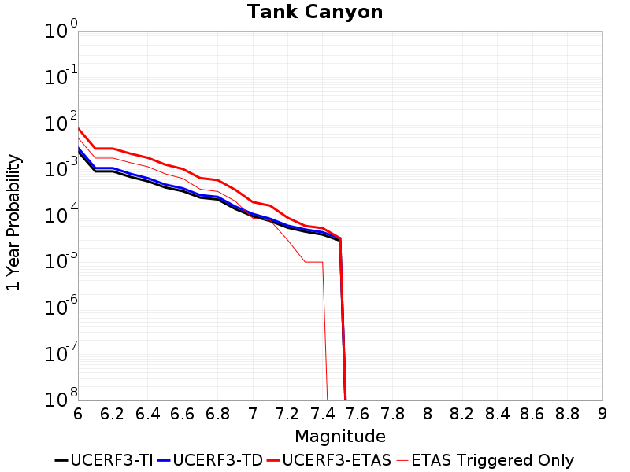 | 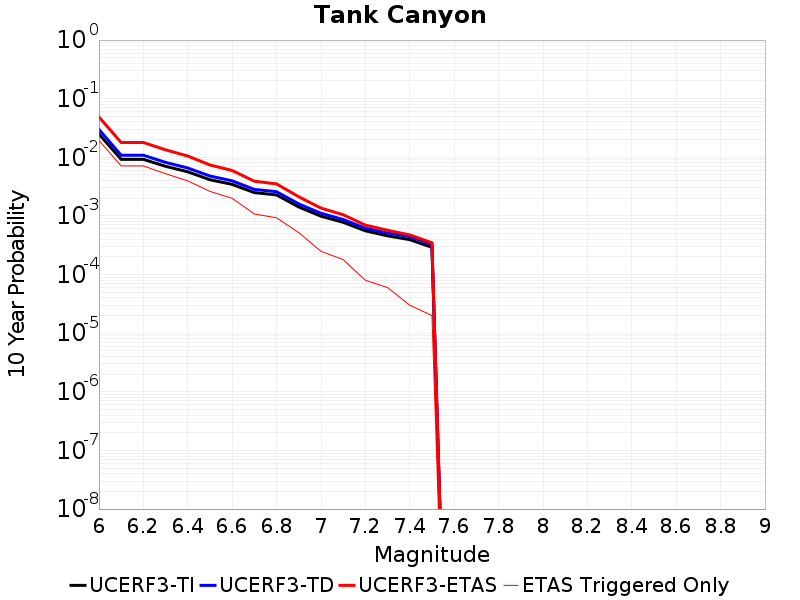 |

| Magnitude | 1 wk TI Prob | 1 wk TD Prob | 1 wk ETAS Prob | 1 wk ETAS/TD Gain | 1 wk ETAS Triggered Only | 1 mo TI Prob | 1 mo TD Prob | 1 mo ETAS Prob | 1 mo ETAS/TD Gain | 1 mo ETAS Triggered Only | 1 yr TI Prob | 1 yr TD Prob | 1 yr ETAS Prob | 1 yr ETAS/TD Gain | 1 yr ETAS Triggered Only | 10 yr TI Prob | 10 yr TD Prob | 10 yr ETAS Prob | 10 yr ETAS/TD Gain | 10 yr ETAS Triggered Only |
|-----|-----|-----|-----|-----|-----|-----|-----|-----|-----|-----|-----|-----|-----|-----|-----|-----|-----|-----|-----|-----|
| 6.0 | 4.8284557E-5 | 5.8037393E-5 | 1.1803391E-4 | 2.0337563 | 6.0E-5 | 2.0691741E-4 | 2.4871153E-4 | 7.685822E-4 | 3.0902557 | 5.2E-4 | 0.0025163088 | 0.0030245224 | 0.00799943 | 2.6448572 | 0.00499 | 0.02488006 | 0.02990107 | 0.04871129 | 1.6290817 | 0.01939 |
| 6.1 | 1.7796336E-5 | 2.0896292E-5 | 5.0895665E-5 | 2.4356315 | 3.0E-5 | 7.626778E-5 | 8.955268E-5 | 2.7953566E-4 | 3.1214662 | 1.9E-4 | 9.281647E-4 | 0.0010897965 | 0.002887835 | 2.6498845 | 0.0018 | 0.009242975 | 0.01084896 | 0.017901607 | 1.6500758 | 0.00713 |
| 6.2 | 1.7796336E-5 | 2.0896292E-5 | 5.0895665E-5 | 2.4356315 | 3.0E-5 | 7.626778E-5 | 8.955268E-5 | 2.7953566E-4 | 3.1214662 | 1.9E-4 | 9.281647E-4 | 0.0010897965 | 0.002887835 | 2.6498845 | 0.0018 | 0.009242975 | 0.01084896 | 0.017901607 | 1.6500758 | 0.00713 |
| 6.3 | 1.3515912E-5 | 1.5776372E-5 | 4.5775898E-5 | 2.901548 | 3.0E-5 | 5.792405E-5 | 6.76114E-5 | 2.375999E-4 | 3.5141988 | 1.7E-4 | 7.049971E-4 | 8.228816E-4 | 0.002251705 | 2.7363656 | 0.00143 | 0.007027647 | 0.008201303 | 0.013418164 | 1.6361015 | 0.00526 |
| 6.4 | 1.0870146E-5 | 1.2631174E-5 | 4.2630796E-5 | 3.375046 | 3.0E-5 | 4.658551E-5 | 5.413258E-5 | 1.94125E-4 | 3.586103 | 1.4E-4 | 5.67031E-4 | 6.5888255E-4 | 0.0018281117 | 2.7745638 | 0.00117 | 0.005655863 | 0.006571646 | 0.010515557 | 1.6001405 | 0.00397 |
| 6.5 | 7.964826E-6 | 9.205483E-6 | 2.92053E-5 | 3.1725981 | 2.0E-5 | 3.4134522E-5 | 3.9451534E-5 | 1.2944799E-4 | 3.2811902 | 9.0E-5 | 4.1550855E-4 | 4.8022714E-4 | 0.0012998334 | 2.7067053 | 8.2E-4 | 0.0041473247 | 0.0047935355 | 0.0074009765 | 1.5439495 | 0.00262 |
| 6.6 | 6.6317E-6 | 7.619912E-6 | 2.7619759E-5 | 3.6246822 | 2.0E-5 | 2.8421264E-5 | 3.2656408E-5 | 1.126538E-4 | 3.449669 | 8.0E-5 | 3.4597394E-4 | 3.9752832E-4 | 0.0010472699 | 2.6344535 | 6.5E-4 | 0.0034543579 | 0.003969664 | 0.005961725 | 1.5018209 | 0.002 |
| 6.7 | 4.793663E-6 | 5.4360107E-6 | 1.5435957E-5 | 2.8395743 | 1.0E-5 | 2.0544108E-5 | 2.3297005E-5 | 7.329584E-5 | 3.1461487 | 5.0E-5 | 2.500958E-4 | 2.836085E-4 | 6.6350074E-4 | 2.3394952 | 3.8E-4 | 0.0024981452 | 0.0028334965 | 0.0039104363 | 1.3800745 | 0.00108 |
| 6.8 | 4.382823E-6 | 4.9740192E-6 | 1.497397E-5 | 3.0104365 | 1.0E-5 | 1.8783392E-5 | 2.1317075E-5 | 5.1316434E-5 | 2.4072926 | 3.0E-5 | 2.286638E-4 | 2.5950876E-4 | 5.994205E-4 | 2.3098278 | 3.4E-4 | 0.0022842865 | 0.0025930651 | 0.0035206536 | 1.357719 | 9.3E-4 |
| 6.9 | 2.729601E-6 | 3.0768085E-6 | 1.3076778E-5 | 4.250111 | 1.0E-5 | 1.1698237E-5 | 1.3186263E-5 | 3.3186E-5 | 2.51671 | 2.0E-5 | 1.4241673E-4 | 1.6053214E-4 | 3.7049843E-4 | 2.3079393 | 2.1E-4 | 0.001423255 | 0.001604395 | 0.0021235608 | 1.3235897 | 5.2E-4 |
| 7.0 | 1.8987357E-6 | 2.1294147E-6 | 1.2129393E-5 | 5.696116 | 1.0E-5 | 8.137413E-6 | 9.1260345E-6 | 1.9125944E-5 | 2.095756 | 1.0E-5 | 9.90685E-5 | 1.11104506E-4 | 2.010945E-4 | 1.8099581 | 9.0E-5 | 9.902435E-4 | 0.0011105584 | 0.0013602807 | 1.224862 | 2.5E-4 |
| 7.1 | 1.4928986E-6 | 1.6653767E-6 | 1.166536E-5 | 7.0046377 | 1.0E-5 | 6.398121E-6 | 7.1373124E-6 | 1.7137241E-5 | 2.4010777 | 1.0E-5 | 7.789434E-5 | 8.68939E-5 | 1.6688695E-4 | 1.920583 | 8.0E-5 | 7.786704E-4 | 8.686572E-4 | 0.0010485008 | 1.2070364 | 1.8E-4 |
| 7.2 | 1.069082E-6 | 1.1833479E-6 | 1.1183336E-5 | 9.45059 | 1.0E-5 | 4.581772E-6 | 5.0714843E-6 | 1.5071433E-5 | 2.9717994 | 1.0E-5 | 5.5781646E-5 | 6.1744104E-5 | 9.174225E-5 | 1.4858464 | 3.0E-5 | 5.576765E-4 | 6.1732176E-4 | 6.972724E-4 | 1.1295121 | 8.0E-5 |
| 7.3 | 8.776551E-7 | 9.774085E-7 | 9.774085E-7 | 1.0 | 0.0 | 3.7613736E-6 | 4.1888898E-6 | 4.1888898E-6 | 1.0 | 0.0 | 4.579376E-5 | 5.099906E-5 | 6.099855E-5 | 1.1960721 | 1.0E-5 | 4.5784327E-4 | 5.099246E-4 | 5.69894E-4 | 1.1176045 | 6.0E-5 |
| 7.4 | 7.55721E-7 | 8.5122497E-7 | 8.5122497E-7 | 1.0 | 0.0 | 3.2388E-6 | 3.648105E-6 | 3.648105E-6 | 1.0 | 0.0 | 3.9431678E-5 | 4.441529E-5 | 5.4414846E-5 | 1.2251377 | 1.0E-5 | 3.942468E-4 | 4.4411502E-4 | 4.741017E-4 | 1.06752 | 3.0E-5 |
| 7.5 | 5.587665E-7 | 6.307093E-7 | 6.307093E-7 | 1.0 | 0.0 | 2.3947114E-6 | 2.7030396E-6 | 2.7030396E-6 | 1.0 | 0.0 | 2.915522E-5 | 3.290951E-5 | 3.290951E-5 | 1.0 | 0.0 | 2.9151395E-4 | 3.2909508E-4 | 3.4908848E-4 | 1.0607527 | 2.0E-5 |

## Little Lake
*[(top)](#table-of-contents)*

| 1 Week | 1 Month | 1 Year | 10 Year |
|-----|-----|-----|-----|
|  | 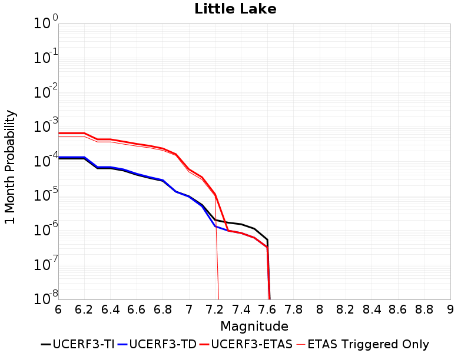 | 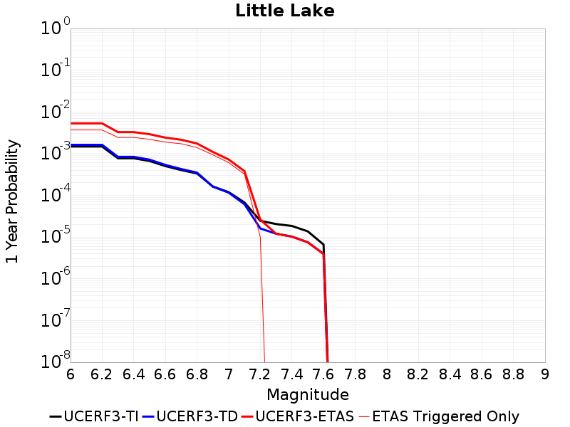 | 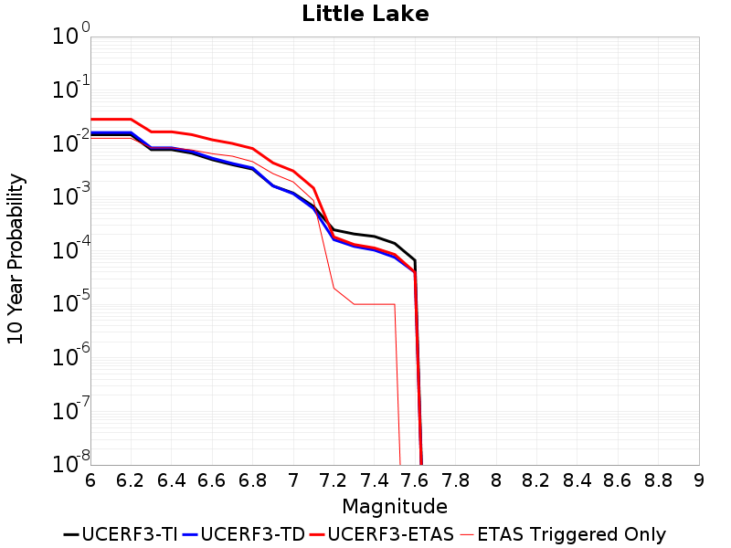 |

| Magnitude | 1 wk TI Prob | 1 wk TD Prob | 1 wk ETAS Prob | 1 wk ETAS/TD Gain | 1 wk ETAS Triggered Only | 1 mo TI Prob | 1 mo TD Prob | 1 mo ETAS Prob | 1 mo ETAS/TD Gain | 1 mo ETAS Triggered Only | 1 yr TI Prob | 1 yr TD Prob | 1 yr ETAS Prob | 1 yr ETAS/TD Gain | 1 yr ETAS Triggered Only | 10 yr TI Prob | 10 yr TD Prob | 10 yr ETAS Prob | 10 yr ETAS/TD Gain | 10 yr ETAS Triggered Only |
|-----|-----|-----|-----|-----|-----|-----|-----|-----|-----|-----|-----|-----|-----|-----|-----|-----|-----|-----|-----|-----|
| 6.0 | 2.8424427E-5 | 3.1226286E-5 | 1.6122223E-4 | 5.163029 | 1.3E-4 | 1.2181328E-4 | 1.3382082E-4 | 6.637499E-4 | 4.9599895 | 5.3E-4 | 0.0014820677 | 0.0016281842 | 0.0053221597 | 3.2687702 | 0.0037 | 0.014722223 | 0.016175978 | 0.02857216 | 1.7663327 | 0.0126 |
| 6.1 | 2.8424427E-5 | 3.1226286E-5 | 1.6122223E-4 | 5.163029 | 1.3E-4 | 1.2181328E-4 | 1.3382082E-4 | 6.637499E-4 | 4.9599895 | 5.3E-4 | 0.0014820677 | 0.0016281842 | 0.0053221597 | 3.2687702 | 0.0037 | 0.014722223 | 0.016175978 | 0.02857216 | 1.7663327 | 0.0126 |
| 6.2 | 2.8424427E-5 | 3.1226286E-5 | 1.6122223E-4 | 5.163029 | 1.3E-4 | 1.2181328E-4 | 1.3382082E-4 | 6.637499E-4 | 4.9599895 | 5.3E-4 | 0.0014820677 | 0.0016281842 | 0.0053221597 | 3.2687702 | 0.0037 | 0.014722223 | 0.016175978 | 0.02857216 | 1.7663327 | 0.0126 |
| 6.3 | 1.48860645E-5 | 1.6090939E-5 | 1.2608917E-4 | 7.8360357 | 1.1E-4 | 6.379586E-5 | 6.89595E-5 | 4.38934E-4 | 6.365098 | 3.7E-4 | 7.7643775E-4 | 8.392868E-4 | 0.0032872306 | 3.916695 | 0.00245 | 0.007737305 | 0.008363993 | 0.01665407 | 1.9911625 | 0.00836 |
| 6.4 | 1.48860645E-5 | 1.6090939E-5 | 1.2608917E-4 | 7.8360357 | 1.1E-4 | 6.379586E-5 | 6.89595E-5 | 4.38934E-4 | 6.365098 | 3.7E-4 | 7.7643775E-4 | 8.392868E-4 | 0.0032872306 | 3.916695 | 0.00245 | 0.007737305 | 0.008363993 | 0.01665407 | 1.9911625 | 0.00836 |
| 6.5 | 1.2797581E-5 | 1.3773548E-5 | 9.377245E-5 | 6.808155 | 8.0E-5 | 5.4845623E-5 | 5.9028298E-5 | 3.790094E-4 | 6.4208083 | 3.2E-4 | 6.675408E-4 | 7.184583E-4 | 0.0029268705 | 4.073821 | 0.00221 | 0.006655392 | 0.0071639093 | 0.014739249 | 2.057431 | 0.00763 |
| 6.6 | 9.661896E-6 | 1.0294672E-5 | 8.0293954E-5 | 7.7995634 | 7.0E-5 | 4.1407468E-5 | 4.411937E-5 | 3.24107E-4 | 7.346139 | 2.8E-4 | 5.040193E-4 | 5.370372E-4 | 0.0024260222 | 4.5174193 | 0.00189 | 0.005028777 | 0.005359001 | 0.011824167 | 2.2064126 | 0.0065 |
| 6.7 | 7.767871E-6 | 8.203981E-6 | 7.8203404E-5 | 9.532372 | 7.0E-5 | 3.329045E-5 | 3.5159523E-5 | 2.8515075E-4 | 8.110199 | 2.5E-4 | 4.0523586E-4 | 4.2799686E-4 | 0.0021572565 | 5.0403557 | 0.00173 | 0.004044977 | 0.0042730793 | 0.010088124 | 2.360856 | 0.00584 |
| 6.8 | 6.4235196E-6 | 6.7392257E-6 | 5.673889E-5 | 8.4192 | 5.0E-5 | 2.752908E-5 | 2.8882148E-5 | 2.3887608E-4 | 8.270718 | 2.1E-4 | 3.35115E-4 | 3.5159627E-4 | 0.001751104 | 4.9804397 | 0.0014 | 0.003346101 | 0.003511662 | 0.008105474 | 2.3081586 | 0.00461 |
| 6.9 | 3.1283696E-6 | 3.1134089E-6 | 5.3113254E-5 | 17.059517 | 5.0E-5 | 1.3407229E-5 | 1.3343121E-5 | 1.6334112E-4 | 12.241598 | 1.5E-4 | 1.6322079E-4 | 1.624419E-4 | 0.0011022892 | 6.785744 | 9.4E-4 | 0.0016310095 | 0.00162338 | 0.0043788995 | 2.6973965 | 0.00276 |
| 7.0 | 2.290603E-6 | 2.2296101E-6 | 2.2229566E-5 | 9.970158 | 2.0E-5 | 9.816834E-6 | 9.555443E-6 | 5.9554965E-5 | 6.2325697 | 5.0E-5 | 1.19513395E-4 | 1.16332354E-4 | 7.262614E-4 | 6.242987 | 6.1E-4 | 0.0011944914 | 0.0011628168 | 0.0030905725 | 2.6578329 | 0.00193 |
| 7.1 | 1.293693E-6 | 1.178257E-6 | 2.1178234E-5 | 17.974207 | 2.0E-5 | 5.5443866E-6 | 5.049667E-6 | 3.5049514E-5 | 6.940956 | 3.0E-5 | 6.750081E-5 | 6.1478655E-5 | 3.81459E-4 | 6.2047386 | 3.2E-4 | 6.7480316E-4 | 6.14685E-4 | 0.0014841502 | 2.414489 | 8.7E-4 |
| 7.2 | 4.715842E-7 | 3.0944804E-7 | 1.0309445E-5 | 33.315594 | 1.0E-5 | 2.0210737E-6 | 1.3262053E-6 | 1.1326192E-5 | 8.5403 | 1.0E-5 | 2.4606294E-5 | 1.6146436E-5 | 2.6146274E-5 | 1.6193217 | 1.0E-5 | 2.460357E-4 | 1.6145316E-4 | 1.8144994E-4 | 1.1238549 | 2.0E-5 |
| 7.3 | 3.9430947E-7 | 2.3122206E-7 | 2.3122206E-7 | 1.0 | 0.0 | 1.6898966E-6 | 9.909513E-7 | 9.909513E-7 | 1.0 | 0.0 | 2.0574296E-5 | 1.2064766E-5 | 1.2064766E-5 | 1.0 | 0.0 | 2.0572392E-4 | 1.2064118E-4 | 1.3063998E-4 | 1.0828804 | 1.0E-5 |
| 7.4 | 3.547123E-7 | 1.9702048E-7 | 1.9702048E-7 | 1.0 | 0.0 | 1.5201948E-6 | 8.4437323E-7 | 8.4437323E-7 | 1.0 | 0.0 | 1.8508214E-5 | 1.0280196E-5 | 1.0280196E-5 | 1.0 | 0.0 | 1.8506673E-4 | 1.0279727E-4 | 1.12796246E-4 | 1.0972688 | 1.0E-5 |
| 7.5 | 2.6354266E-7 | 1.4439075E-7 | 1.4439075E-7 | 1.0 | 0.0 | 1.129468E-6 | 6.1881735E-7 | 6.1881735E-7 | 1.0 | 0.0 | 1.3751187E-5 | 7.534076E-6 | 7.534076E-6 | 1.0 | 0.0 | 1.3750336E-4 | 7.5338256E-5 | 8.53375E-5 | 1.1327246 | 1.0E-5 |
| 7.6 | 1.269913E-7 | 7.5793245E-8 | 7.5793245E-8 | 1.0 | 0.0 | 5.4424834E-7 | 3.2482814E-7 | 3.2482814E-7 | 1.0 | 0.0 | 6.6262032E-6 | 3.954776E-6 | 3.954776E-6 | 1.0 | 0.0 | 6.626006E-5 | 3.9547092E-5 | 3.9547092E-5 | 1.0 | 0.0 |

## Airport Lake
*[(top)](#table-of-contents)*

| 1 Week | 1 Month | 1 Year | 10 Year |
|-----|-----|-----|-----|
|  | 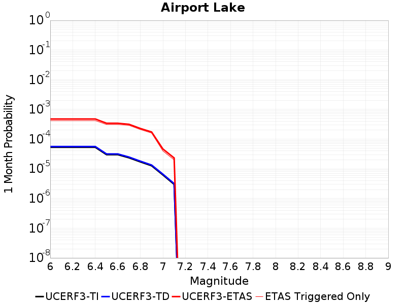 |  | 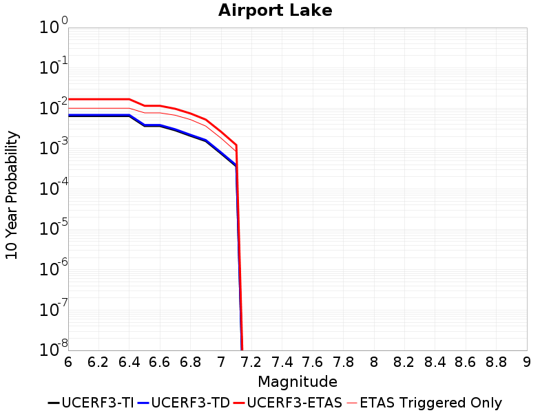 |

| Magnitude | 1 wk TI Prob | 1 wk TD Prob | 1 wk ETAS Prob | 1 wk ETAS/TD Gain | 1 wk ETAS Triggered Only | 1 mo TI Prob | 1 mo TD Prob | 1 mo ETAS Prob | 1 mo ETAS/TD Gain | 1 mo ETAS Triggered Only | 1 yr TI Prob | 1 yr TD Prob | 1 yr ETAS Prob | 1 yr ETAS/TD Gain | 1 yr ETAS Triggered Only | 10 yr TI Prob | 10 yr TD Prob | 10 yr ETAS Prob | 10 yr ETAS/TD Gain | 10 yr ETAS Triggered Only |
|-----|-----|-----|-----|-----|-----|-----|-----|-----|-----|-----|-----|-----|-----|-----|-----|-----|-----|-----|-----|-----|
| 6.0 | 1.2387061E-5 | 1.3107865E-5 | 1.4310617E-4 | 10.91758 | 1.3E-4 | 5.3086325E-5 | 5.6175515E-5 | 4.761519E-4 | 8.476147 | 4.2E-4 | 6.461343E-4 | 6.837507E-4 | 0.0037616447 | 5.501486 | 0.00308 | 0.0064425888 | 0.0068192817 | 0.016780885 | 2.4607995 | 0.01003 |
| 6.1 | 1.2387061E-5 | 1.3107865E-5 | 1.4310617E-4 | 10.91758 | 1.3E-4 | 5.3086325E-5 | 5.6175515E-5 | 4.761519E-4 | 8.476147 | 4.2E-4 | 6.461343E-4 | 6.837507E-4 | 0.0037616447 | 5.501486 | 0.00308 | 0.0064425888 | 0.0068192817 | 0.016780885 | 2.4607995 | 0.01003 |
| 6.2 | 1.2387061E-5 | 1.3107865E-5 | 1.4310617E-4 | 10.91758 | 1.3E-4 | 5.3086325E-5 | 5.6175515E-5 | 4.761519E-4 | 8.476147 | 4.2E-4 | 6.461343E-4 | 6.837507E-4 | 0.0037616447 | 5.501486 | 0.00308 | 0.0064425888 | 0.0068192817 | 0.016780885 | 2.4607995 | 0.01003 |
| 6.3 | 1.2387061E-5 | 1.3107865E-5 | 1.4310617E-4 | 10.91758 | 1.3E-4 | 5.3086325E-5 | 5.6175515E-5 | 4.761519E-4 | 8.476147 | 4.2E-4 | 6.461343E-4 | 6.837507E-4 | 0.0037616447 | 5.501486 | 0.00308 | 0.0064425888 | 0.0068192817 | 0.016780885 | 2.4607995 | 0.01003 |
| 6.4 | 1.2387061E-5 | 1.3107865E-5 | 1.4310617E-4 | 10.91758 | 1.3E-4 | 5.3086325E-5 | 5.6175515E-5 | 4.761519E-4 | 8.476147 | 4.2E-4 | 6.461343E-4 | 6.837507E-4 | 0.0037616447 | 5.501486 | 0.00308 | 0.0064425888 | 0.0068192817 | 0.016780885 | 2.4607995 | 0.01003 |
| 6.5 | 6.9922594E-6 | 7.387502E-6 | 8.7386914E-5 | 11.8290205 | 8.0E-5 | 2.996648E-5 | 3.166037E-5 | 3.4165056E-4 | 10.791111 | 3.1E-4 | 3.6478083E-4 | 3.8540224E-4 | 0.0027444926 | 7.1211123 | 0.00236 | 0.003641826 | 0.0038478763 | 0.011518247 | 2.9934037 | 0.0077 |
| 6.6 | 6.9922594E-6 | 7.387502E-6 | 8.7386914E-5 | 11.8290205 | 8.0E-5 | 2.996648E-5 | 3.166037E-5 | 3.4165056E-4 | 10.791111 | 3.1E-4 | 3.6478083E-4 | 3.8540224E-4 | 0.0027444926 | 7.1211123 | 0.00236 | 0.003641826 | 0.0038478763 | 0.011518247 | 2.9934037 | 0.0077 |
| 6.7 | 5.477277E-6 | 5.788095E-6 | 8.578763E-5 | 14.821393 | 8.0E-5 | 2.3473833E-5 | 2.4805908E-5 | 3.147987E-4 | 12.690474 | 2.9E-4 | 2.8575645E-4 | 3.0197398E-4 | 0.0024113369 | 7.985247 | 0.00211 | 0.0028538927 | 0.0030160204 | 0.0097257225 | 3.224687 | 0.00673 |
| 6.8 | 3.9950432E-6 | 4.220557E-6 | 4.422039E-5 | 10.477382 | 4.0E-5 | 1.7121502E-5 | 1.808799E-5 | 2.2808419E-4 | 12.609702 | 2.1E-4 | 2.0843433E-4 | 2.202018E-4 | 0.0018598407 | 8.446074 | 0.00164 | 0.0020823893 | 0.0022001073 | 0.0074385568 | 3.3809974 | 0.00525 |
| 6.9 | 2.95695E-6 | 3.1241138E-6 | 4.312399E-5 | 13.80359 | 4.0E-5 | 1.2672582E-5 | 1.33890035E-5 | 1.7338686E-4 | 12.9499445 | 1.6E-4 | 1.5427776E-4 | 1.630012E-4 | 0.0014127975 | 8.667405 | 0.00125 | 0.001541707 | 0.001629039 | 0.0052431417 | 3.218549 | 0.00362 |
| 7.0 | 1.456072E-6 | 1.541369E-6 | 1.1541353E-5 | 7.487729 | 1.0E-5 | 6.2402937E-6 | 6.605856E-6 | 4.6605594E-5 | 7.0551934 | 4.0E-5 | 7.597293E-5 | 8.042434E-5 | 6.703769E-4 | 8.335498 | 5.9E-4 | 7.594696E-4 | 8.040513E-4 | 0.0026225878 | 3.261717 | 0.00182 |
| 7.1 | 6.995192E-7 | 7.411697E-7 | 1.0741162E-5 | 14.492177 | 1.0E-5 | 2.997936E-6 | 3.1764414E-6 | 2.3176377E-5 | 7.2963343 | 2.0E-5 | 3.649926E-5 | 3.8673174E-5 | 3.4866118E-4 | 9.015582 | 3.1E-4 | 3.6493264E-4 | 3.8673176E-4 | 0.0012264069 | 3.1712081 | 8.4E-4 |

## Owl Lake
*[(top)](#table-of-contents)*

| 1 Week | 1 Month | 1 Year | 10 Year |
|-----|-----|-----|-----|
|  | 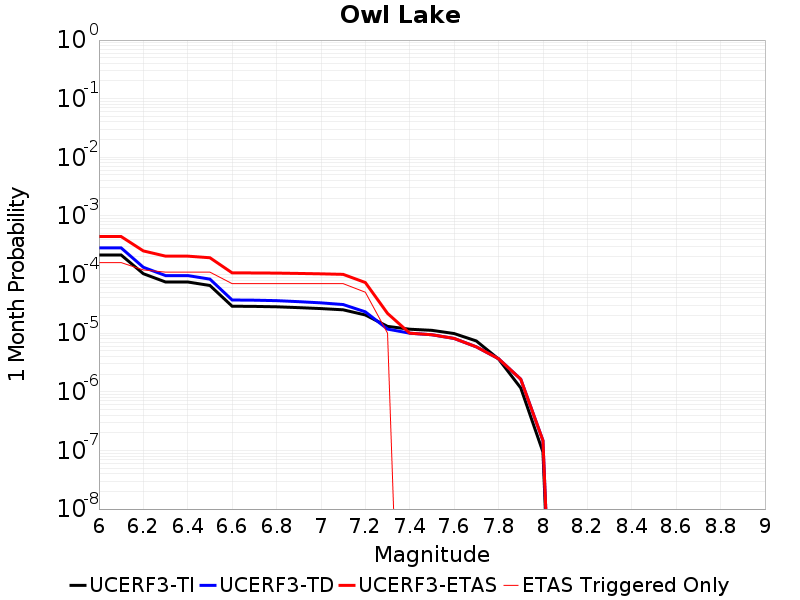 | 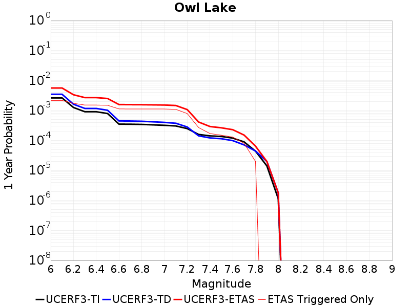 |  |

| Magnitude | 1 wk TI Prob | 1 wk TD Prob | 1 wk ETAS Prob | 1 wk ETAS/TD Gain | 1 wk ETAS Triggered Only | 1 mo TI Prob | 1 mo TD Prob | 1 mo ETAS Prob | 1 mo ETAS/TD Gain | 1 mo ETAS Triggered Only | 1 yr TI Prob | 1 yr TD Prob | 1 yr ETAS Prob | 1 yr ETAS/TD Gain | 1 yr ETAS Triggered Only | 10 yr TI Prob | 10 yr TD Prob | 10 yr ETAS Prob | 10 yr ETAS/TD Gain | 10 yr ETAS Triggered Only |
|-----|-----|-----|-----|-----|-----|-----|-----|-----|-----|-----|-----|-----|-----|-----|-----|-----|-----|-----|-----|-----|
| 6.0 | 5.0320643E-5 | 6.651682E-5 | 1.1651349E-4 | 1.7516396 | 5.0E-5 | 2.1564208E-4 | 2.850472E-4 | 4.4500158E-4 | 1.5611506 | 1.6E-4 | 0.0026222812 | 0.0034657938 | 0.0056183077 | 1.6210738 | 0.00216 | 0.02591553 | 0.034220446 | 0.04235231 | 1.2376317 | 0.00842 |
| 6.1 | 5.0320643E-5 | 6.651682E-5 | 1.1651349E-4 | 1.7516396 | 5.0E-5 | 2.1564208E-4 | 2.850472E-4 | 4.4500158E-4 | 1.5611506 | 1.6E-4 | 0.0026222812 | 0.0034657938 | 0.0056183077 | 1.6210738 | 0.00216 | 0.02591553 | 0.034220446 | 0.04235231 | 1.2376317 | 0.00842 |
| 6.2 | 2.4125871E-5 | 3.1067426E-5 | 7.1066184E-5 | 2.2874823 | 4.0E-5 | 1.0339249E-4 | 1.3314046E-4 | 2.5312448E-4 | 1.9011837 | 1.2E-4 | 0.0012580766 | 0.0016199542 | 0.0033471517 | 2.0662014 | 0.00173 | 0.012509781 | 0.016114889 | 0.022392076 | 1.3895272 | 0.00638 |
| 6.3 | 1.7433485E-5 | 2.2427375E-5 | 6.242648E-5 | 2.7834945 | 4.0E-5 | 7.471279E-5 | 9.611468E-5 | 2.061041E-4 | 2.1443563 | 1.1E-4 | 9.0924866E-4 | 0.001169708 | 0.0026879301 | 2.2979496 | 0.00152 | 0.009055373 | 0.01166576 | 0.017131248 | 1.4685068 | 0.00553 |
| 6.4 | 1.7433485E-5 | 2.2427375E-5 | 6.242648E-5 | 2.7834945 | 4.0E-5 | 7.471279E-5 | 9.611468E-5 | 2.061041E-4 | 2.1443563 | 1.1E-4 | 9.0924866E-4 | 0.001169708 | 0.0026879301 | 2.2979496 | 0.00152 | 0.009055373 | 0.01166576 | 0.017131248 | 1.4685068 | 0.00553 |
| 6.5 | 1.5182742E-5 | 1.949593E-5 | 5.949515E-5 | 3.0516703 | 4.0E-5 | 6.506727E-5 | 8.355217E-5 | 1.9354298E-4 | 2.3164327 | 1.1E-4 | 7.919061E-4 | 0.0010169109 | 0.0025053958 | 2.4637318 | 0.00149 | 0.0078909 | 0.010152697 | 0.015349396 | 1.5118539 | 0.00525 |
| 6.6 | 6.7271576E-6 | 8.595416E-6 | 2.8595245E-5 | 3.3268018 | 2.0E-5 | 2.8830356E-5 | 3.683701E-5 | 1.0683443E-4 | 2.900193 | 7.0E-5 | 3.5095305E-4 | 4.4840397E-4 | 0.0015778972 | 3.518919 | 0.00113 | 0.0035039932 | 0.0044924803 | 0.008434691 | 1.8775129 | 0.00396 |
| 6.7 | 6.682835E-6 | 8.5278E-6 | 2.852763E-5 | 3.3452508 | 2.0E-5 | 2.8640408E-5 | 3.6547233E-5 | 1.0654468E-4 | 2.9152596 | 7.0E-5 | 3.4864116E-4 | 4.448774E-4 | 0.0015643792 | 3.5164275 | 0.00112 | 0.003480947 | 0.0044573885 | 0.008389782 | 1.8822191 | 0.00395 |
| 6.8 | 6.5774975E-6 | 8.374097E-6 | 2.8373928E-5 | 3.3882973 | 2.0E-5 | 2.8188972E-5 | 3.5888523E-5 | 1.05886014E-4 | 2.9504142 | 7.0E-5 | 3.4314668E-4 | 4.3686086E-4 | 0.0015563716 | 3.5626254 | 0.00112 | 0.0034261728 | 0.004377375 | 0.008300128 | 1.8961428 | 0.00394 |
| 6.9 | 6.363419E-6 | 8.046802E-6 | 2.8046641E-5 | 3.4854398 | 2.0E-5 | 2.727151E-5 | 3.4485867E-5 | 1.0448345E-4 | 3.029747 | 7.0E-5 | 3.3198006E-4 | 4.197902E-4 | 0.00153932 | 3.6668797 | 0.00112 | 0.0033148455 | 0.0042071333 | 0.008100683 | 1.9254639 | 0.00391 |
| 7.0 | 6.1342453E-6 | 7.678395E-6 | 2.7678241E-5 | 3.6046908 | 2.0E-5 | 2.6289357E-5 | 3.2907024E-5 | 1.0290472E-4 | 3.1271353 | 7.0E-5 | 3.2002592E-4 | 4.0057494E-4 | 0.0015201262 | 3.7948613 | 0.00112 | 0.0031956544 | 0.004015537 | 0.007879957 | 1.9623669 | 0.00388 |
| 7.1 | 5.842926E-6 | 7.188055E-6 | 2.718791E-5 | 3.782374 | 2.0E-5 | 2.504087E-5 | 3.0805615E-5 | 1.0080346E-4 | 3.2722428 | 7.0E-5 | 3.0482994E-4 | 3.749993E-4 | 0.0014645905 | 3.9055822 | 0.00109 | 0.0030441214 | 0.0037604326 | 0.0074365567 | 1.9775801 | 0.00369 |
| 7.2 | 4.77173E-6 | 5.396309E-6 | 2.53962E-5 | 4.706217 | 2.0E-5 | 2.045011E-5 | 2.3126857E-5 | 7.31257E-5 | 3.1619387 | 5.0E-5 | 2.4895166E-4 | 2.8153718E-4 | 0.0010713148 | 3.8052337 | 7.9E-4 | 0.0024867293 | 0.0028279696 | 0.0054006735 | 1.9097353 | 0.00258 |
| 7.3 | 3.0494948E-6 | 2.7398207E-6 | 1.2739793E-5 | 4.649864 | 1.0E-5 | 1.3069198E-5 | 1.1742037E-5 | 2.1741918E-5 | 1.851631 | 1.0E-5 | 1.5910587E-4 | 1.4295008E-4 | 4.129115E-4 | 2.8885012 | 2.7E-4 | 0.0015899199 | 0.0014385364 | 0.0021075725 | 1.4650811 | 6.7E-4 |
| 7.4 | 2.7263884E-6 | 2.3331786E-6 | 2.3331786E-6 | 1.0 | 0.0 | 1.1684469E-5 | 9.9992985E-6 | 9.9992985E-6 | 1.0 | 0.0 | 1.4224913E-4 | 1.2173477E-4 | 2.9171407E-4 | 2.3963087 | 1.7E-4 | 0.0014215811 | 0.001225488 | 0.0016449733 | 1.3423007 | 4.2E-4 |
| 7.5 | 2.6090431E-6 | 2.1926178E-6 | 2.1926178E-6 | 1.0 | 0.0 | 1.1181565E-5 | 9.3969E-6 | 9.3969E-6 | 1.0 | 0.0 | 1.3612706E-4 | 1.1440135E-4 | 2.643842E-4 | 2.3110232 | 1.5E-4 | 0.001360437 | 0.001151995 | 0.0015015919 | 1.3034707 | 3.5E-4 |
| 7.6 | 2.3008756E-6 | 1.8968979E-6 | 1.8968979E-6 | 1.0 | 0.0 | 9.860858E-6 | 8.1295375E-6 | 8.1295375E-6 | 1.0 | 0.0 | 1.20049335E-4 | 9.8972705E-5 | 2.2895983E-4 | 2.3133636 | 1.3E-4 | 0.001199845 | 9.974332E-4 | 0.001297134 | 1.300472 | 3.0E-4 |
| 7.7 | 1.7184348E-6 | 1.3636143E-6 | 1.3636143E-6 | 1.0 | 0.0 | 7.3646997E-6 | 5.8440487E-6 | 5.8440487E-6 | 1.0 | 0.0 | 8.966153E-5 | 7.114901E-5 | 1.5114332E-4 | 2.1243207 | 8.0E-5 | 8.962536E-4 | 7.19121E-4 | 8.9899154E-4 | 1.2501255 | 1.8E-4 |
| 7.8 | 8.4612907E-7 | 8.5589573E-7 | 8.5589573E-7 | 1.0 | 0.0 | 3.6262625E-6 | 3.6681197E-6 | 3.6681197E-6 | 1.0 | 0.0 | 4.4148852E-5 | 4.4658464E-5 | 6.465757E-5 | 1.4478234 | 2.0E-5 | 4.414008E-4 | 4.5180792E-4 | 4.9178983E-4 | 1.0884932 | 4.0E-5 |
| 7.9 | 2.716738E-7 | 3.8309955E-7 | 3.8309955E-7 | 1.0 | 0.0 | 1.1643157E-6 | 1.6418543E-6 | 1.6418543E-6 | 1.0 | 0.0 | 1.4175452E-5 | 1.9989404E-5 | 1.9989404E-5 | 1.0 | 0.0 | 1.4174548E-4 | 2.0150446E-4 | 2.0150446E-4 | 1.0 | 0.0 |
| 8.0 | 2.1995428E-8 | 3.4398994E-8 | 3.4398994E-8 | 1.0 | 0.0 | 9.426611E-8 | 1.4742426E-7 | 1.4742426E-7 | 1.0 | 0.0 | 1.1476893E-6 | 1.7948895E-6 | 1.7948895E-6 | 1.0 | 0.0 | 1.14768345E-5 | 1.8151613E-5 | 1.8151613E-5 | 1.0 | 0.0 |

## Panamint Valley
*[(top)](#table-of-contents)*

| 1 Week | 1 Month | 1 Year | 10 Year |
|-----|-----|-----|-----|
| 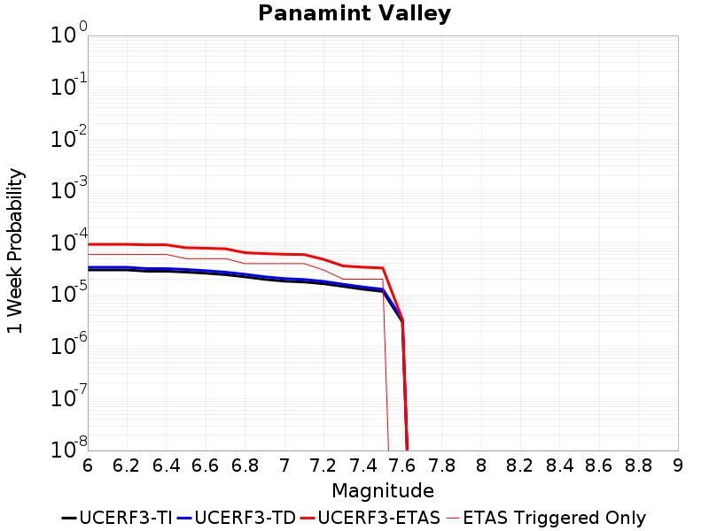 | 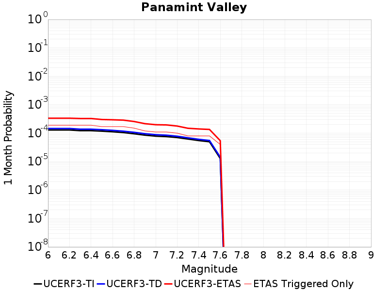 | 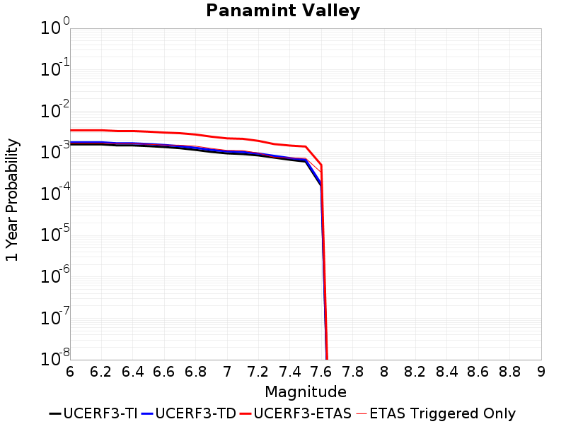 |  |

| Magnitude | 1 wk TI Prob | 1 wk TD Prob | 1 wk ETAS Prob | 1 wk ETAS/TD Gain | 1 wk ETAS Triggered Only | 1 mo TI Prob | 1 mo TD Prob | 1 mo ETAS Prob | 1 mo ETAS/TD Gain | 1 mo ETAS Triggered Only | 1 yr TI Prob | 1 yr TD Prob | 1 yr ETAS Prob | 1 yr ETAS/TD Gain | 1 yr ETAS Triggered Only | 10 yr TI Prob | 10 yr TD Prob | 10 yr ETAS Prob | 10 yr ETAS/TD Gain | 10 yr ETAS Triggered Only |
|-----|-----|-----|-----|-----|-----|-----|-----|-----|-----|-----|-----|-----|-----|-----|-----|-----|-----|-----|-----|-----|
| 6.0 | 3.0211835E-5 | 3.4026947E-5 | 9.40249E-5 | 2.7632484 | 6.0E-5 | 1.2947287E-4 | 1.4582179E-4 | 3.357941E-4 | 2.3027704 | 1.9E-4 | 0.0015751923 | 0.001773964 | 0.003460966 | 1.9509786 | 0.00169 | 0.015640736 | 0.017604938 | 0.023764554 | 1.3498801 | 0.00627 |
| 6.1 | 3.0211835E-5 | 3.4026947E-5 | 9.40249E-5 | 2.7632484 | 6.0E-5 | 1.2947287E-4 | 1.4582179E-4 | 3.357941E-4 | 2.3027704 | 1.9E-4 | 0.0015751923 | 0.001773964 | 0.003460966 | 1.9509786 | 0.00169 | 0.015640736 | 0.017604938 | 0.023764554 | 1.3498801 | 0.00627 |
| 6.2 | 3.0211835E-5 | 3.4026947E-5 | 9.40249E-5 | 2.7632484 | 6.0E-5 | 1.2947287E-4 | 1.4582179E-4 | 3.357941E-4 | 2.3027704 | 1.9E-4 | 0.0015751923 | 0.001773964 | 0.003460966 | 1.9509786 | 0.00169 | 0.015640736 | 0.017604938 | 0.023764554 | 1.3498801 | 0.00627 |
| 6.3 | 2.8573924E-5 | 3.2142987E-5 | 9.214106E-5 | 2.866599 | 6.0E-5 | 1.2245393E-4 | 1.3774853E-4 | 3.2772237E-4 | 2.379135 | 1.9E-4 | 0.001489857 | 0.0016758263 | 0.0033130778 | 1.9769818 | 0.00164 | 0.01479908 | 0.016638407 | 0.022528743 | 1.3540204 | 0.00599 |
| 6.4 | 2.8573924E-5 | 3.2142987E-5 | 9.214106E-5 | 2.866599 | 6.0E-5 | 1.2245393E-4 | 1.3774853E-4 | 3.2772237E-4 | 2.379135 | 1.9E-4 | 0.001489857 | 0.0016758263 | 0.0033130778 | 1.9769818 | 0.00164 | 0.01479908 | 0.016638407 | 0.022528743 | 1.3540204 | 0.00599 |
| 6.5 | 2.7468774E-5 | 3.0867297E-5 | 8.086576E-5 | 2.6197872 | 5.0E-5 | 1.1771801E-4 | 1.3228187E-4 | 3.0225937E-4 | 2.2849646 | 1.7E-4 | 0.0014322745 | 0.0016093694 | 0.0031968104 | 1.9863746 | 0.00159 | 0.014230782 | 0.015983557 | 0.021671174 | 1.3558416 | 0.00578 |
| 6.6 | 2.6135967E-5 | 2.9289391E-5 | 7.928793E-5 | 2.7070527 | 5.0E-5 | 1.1200648E-4 | 1.2552008E-4 | 2.9549873E-4 | 2.354195 | 1.7E-4 | 0.0013628257 | 0.0015271623 | 0.0030448409 | 1.9937901 | 0.00152 | 0.013544982 | 0.015173054 | 0.020569906 | 1.3556865 | 0.00548 |
| 6.7 | 2.4498746E-5 | 2.7376436E-5 | 7.7375065E-5 | 2.8263383 | 5.0E-5 | 1.04990395E-4 | 1.17322445E-4 | 2.873025E-4 | 2.448828 | 1.7E-4 | 0.0012775084 | 0.00142749 | 0.0029353346 | 2.0562909 | 0.00151 | 0.012701893 | 0.014189378 | 0.0193846 | 1.3661345 | 0.00527 |
| 6.8 | 2.2244329E-5 | 2.4968158E-5 | 6.496716E-5 | 2.6020005 | 4.0E-5 | 9.532935E-5 | 1.0700213E-4 | 2.5698607E-4 | 2.4016912 | 1.5E-4 | 0.0011600169 | 0.0013019942 | 0.0027301323 | 2.0968852 | 0.00143 | 0.011539802 | 0.012949424 | 0.017795842 | 1.3742574 | 0.00491 |
| 6.9 | 1.9902658E-5 | 2.2320502E-5 | 6.231961E-5 | 2.7920344 | 4.0E-5 | 8.529431E-5 | 9.5655894E-5 | 2.1564441E-4 | 2.2543766 | 1.2E-4 | 0.0010379635 | 0.0011640069 | 0.0024225402 | 2.0812078 | 0.00126 | 0.010331288 | 0.011583983 | 0.016002202 | 1.3814076 | 0.00447 |
| 7.0 | 1.8353881E-5 | 2.05944E-5 | 6.0593575E-5 | 2.9422357 | 4.0E-5 | 7.865712E-5 | 8.825883E-5 | 1.9824912E-4 | 2.2462244 | 1.1E-4 | 9.5722964E-4 | 0.0010740393 | 0.0022028256 | 2.0509732 | 0.00113 | 0.009531168 | 0.01069314 | 0.014788871 | 1.3830241 | 0.00414 |
| 7.1 | 1.7667631E-5 | 1.9799285E-5 | 5.9798494E-5 | 3.020235 | 4.0E-5 | 7.571623E-5 | 8.485142E-5 | 1.9484208E-4 | 2.2962737 | 1.1E-4 | 9.2145515E-4 | 0.001032594 | 0.0021514376 | 2.0835268 | 0.00112 | 0.009176437 | 0.010282583 | 0.014281041 | 1.3888574 | 0.00404 |
| 7.2 | 1.6381597E-5 | 1.8182402E-5 | 4.8181857E-5 | 2.6499171 | 3.0E-5 | 7.020495E-5 | 7.792235E-5 | 1.7791455E-4 | 2.2832289 | 1.0E-4 | 8.544101E-4 | 9.4830897E-4 | 0.0019173891 | 2.0219033 | 9.7E-4 | 0.008511325 | 0.009446987 | 0.0129634505 | 1.3722311 | 0.00355 |
| 7.3 | 1.4520491E-5 | 1.5986368E-5 | 3.598605E-5 | 2.251046 | 2.0E-5 | 6.222919E-5 | 6.8511305E-5 | 1.4850582E-4 | 2.1676106 | 8.0E-5 | 7.57377E-4 | 8.338221E-4 | 0.0016031801 | 1.9226884 | 7.7E-4 | 0.0075480095 | 0.008309663 | 0.011264901 | 1.3556386 | 0.00298 |
| 7.4 | 1.2852287E-5 | 1.4162809E-5 | 3.4162527E-5 | 2.4121292 | 2.0E-5 | 5.5080065E-5 | 6.0696428E-5 | 1.4069157E-4 | 2.3179548 | 8.0E-5 | 6.7039346E-4 | 7.3874433E-4 | 0.0014781976 | 2.0009596 | 7.4E-4 | 0.0066837464 | 0.0073654167 | 0.010164646 | 1.3800504 | 0.00282 |
| 7.5 | 1.1637851E-5 | 1.2853535E-5 | 3.2853277E-5 | 2.5559723 | 2.0E-5 | 4.987555E-5 | 5.5085504E-5 | 1.3508109E-4 | 2.4522078 | 8.0E-5 | 6.070656E-4 | 6.7047536E-4 | 0.0013999859 | 2.08805 | 7.3E-4 | 0.006054099 | 0.006686994 | 0.0094484035 | 1.4129524 | 0.00278 |
| 7.6 | 3.0068115E-6 | 3.339516E-6 | 3.339516E-6 | 1.0 | 0.0 | 1.2886271E-5 | 1.4312175E-5 | 5.4311604E-5 | 3.7947834 | 4.0E-5 | 1.5687906E-4 | 1.7424411E-4 | 5.041866E-4 | 2.8935647 | 3.3E-4 | 0.0015676835 | 0.001742112 | 0.0028901086 | 1.6589683 | 0.00115 |

## Garlock (East)
*[(top)](#table-of-contents)*

| 1 Week | 1 Month | 1 Year | 10 Year |
|-----|-----|-----|-----|
| 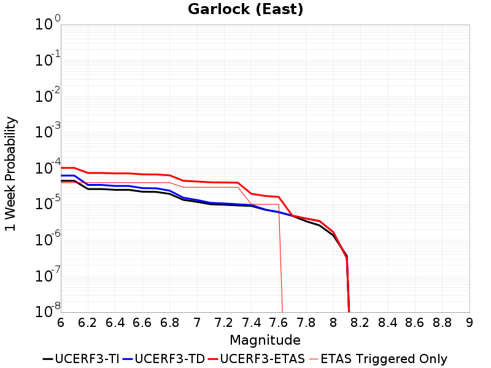 | 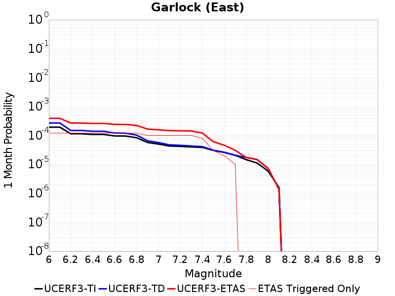 | 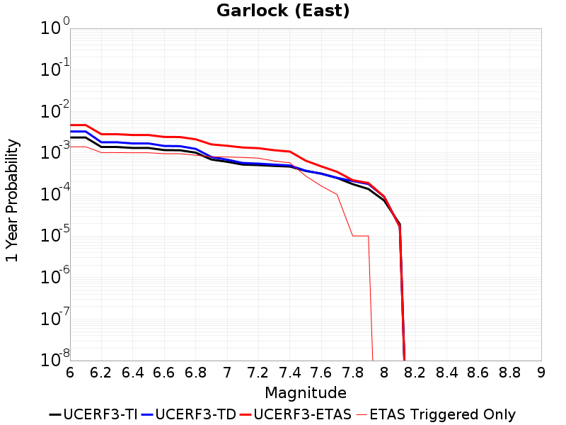 | 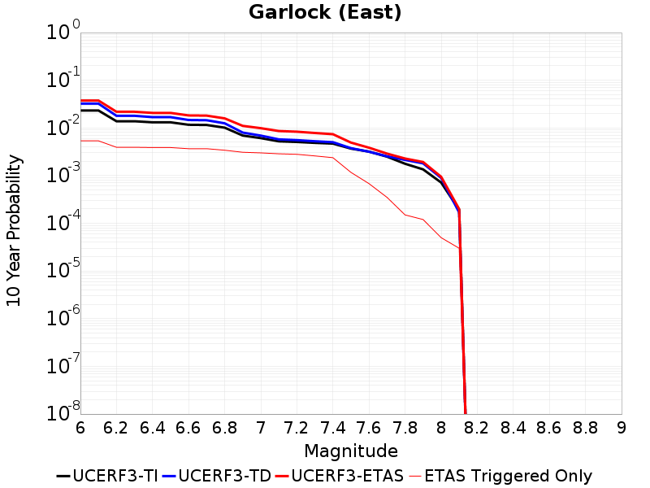 |

| Magnitude | 1 wk TI Prob | 1 wk TD Prob | 1 wk ETAS Prob | 1 wk ETAS/TD Gain | 1 wk ETAS Triggered Only | 1 mo TI Prob | 1 mo TD Prob | 1 mo ETAS Prob | 1 mo ETAS/TD Gain | 1 mo ETAS Triggered Only | 1 yr TI Prob | 1 yr TD Prob | 1 yr ETAS Prob | 1 yr ETAS/TD Gain | 1 yr ETAS Triggered Only | 10 yr TI Prob | 10 yr TD Prob | 10 yr ETAS Prob | 10 yr ETAS/TD Gain | 10 yr ETAS Triggered Only |
|-----|-----|-----|-----|-----|-----|-----|-----|-----|-----|-----|-----|-----|-----|-----|-----|-----|-----|-----|-----|-----|
| 6.0 | 4.5092507E-5 | 6.309244E-5 | 1.03089915E-4 | 1.6339504 | 4.0E-5 | 1.9323928E-4 | 2.7037069E-4 | 3.9033822E-4 | 1.4437151 | 1.2E-4 | 0.0023501497 | 0.0032872416 | 0.0046926066 | 1.4275211 | 0.00141 | 0.023254504 | 0.032425884 | 0.037621755 | 1.1602384 | 0.00537 |
| 6.1 | 4.5092507E-5 | 6.309244E-5 | 1.03089915E-4 | 1.6339504 | 4.0E-5 | 1.9323928E-4 | 2.7037069E-4 | 3.9033822E-4 | 1.4437151 | 1.2E-4 | 0.0023501497 | 0.0032872416 | 0.0046926066 | 1.4275211 | 0.00141 | 0.023254504 | 0.032425884 | 0.037621755 | 1.1602384 | 0.00537 |
| 6.2 | 2.6674514E-5 | 3.4662582E-5 | 7.466119E-5 | 2.153942 | 4.0E-5 | 1.1431433E-4 | 1.4854565E-4 | 2.6852783E-4 | 1.8077124 | 1.2E-4 | 0.0013908884 | 0.0018070763 | 0.0028252332 | 1.5634277 | 0.00102 | 0.01382215 | 0.017980855 | 0.02184019 | 1.2146358 | 0.00393 |
| 6.3 | 2.6674514E-5 | 3.4662582E-5 | 7.466119E-5 | 2.153942 | 4.0E-5 | 1.1431433E-4 | 1.4854565E-4 | 2.6852783E-4 | 1.8077124 | 1.2E-4 | 0.0013908884 | 0.0018070763 | 0.0028252332 | 1.5634277 | 0.00102 | 0.01382215 | 0.017980855 | 0.02184019 | 1.2146358 | 0.00393 |
| 6.4 | 2.5312667E-5 | 3.2489115E-5 | 7.248782E-5 | 2.2311416 | 4.0E-5 | 1.0847834E-4 | 1.3923181E-4 | 2.592151E-4 | 1.861752 | 1.2E-4 | 0.0013199237 | 0.0016938588 | 0.002702148 | 1.5952617 | 0.00101 | 0.013121112 | 0.016850417 | 0.020665038 | 1.2263813 | 0.00388 |
| 6.5 | 2.5312667E-5 | 3.2489115E-5 | 7.248782E-5 | 2.2311416 | 4.0E-5 | 1.0847834E-4 | 1.3923181E-4 | 2.592151E-4 | 1.861752 | 1.2E-4 | 0.0013199237 | 0.0016938588 | 0.002702148 | 1.5952617 | 0.00101 | 0.013121112 | 0.016850417 | 0.020665038 | 1.2263813 | 0.00388 |
| 6.6 | 2.246556E-5 | 2.827212E-5 | 6.827099E-5 | 2.4147813 | 4.0E-5 | 9.627742E-5 | 1.2116073E-4 | 2.4114619E-4 | 1.9902999 | 1.2E-4 | 0.0011715472 | 0.0014741574 | 0.0024327422 | 1.6502595 | 9.6E-4 | 0.011653901 | 0.014685724 | 0.018301828 | 1.2462325 | 0.00367 |
| 6.7 | 2.2241198E-5 | 2.7941132E-5 | 6.794001E-5 | 2.4315412 | 4.0E-5 | 9.531594E-5 | 1.1974235E-4 | 2.3972797E-4 | 2.0020318 | 1.2E-4 | 0.0011598538 | 0.0014569118 | 0.0024155132 | 1.657968 | 9.6E-4 | 0.011538187 | 0.014516235 | 0.01813296 | 1.2491504 | 0.00367 |
| 6.8 | 1.9528685E-5 | 2.4025301E-5 | 6.402434E-5 | 2.6648715 | 4.0E-5 | 8.369167E-5 | 1.02961625E-4 | 2.2294927E-4 | 2.1653628 | 1.2E-4 | 0.0010184698 | 0.0012528567 | 0.002131754 | 1.7015148 | 8.8E-4 | 0.010138147 | 0.012505226 | 0.015872583 | 1.269276 | 0.00341 |
| 6.9 | 1.3318621E-5 | 1.5301835E-5 | 4.5301378E-5 | 2.960519 | 3.0E-5 | 5.7078556E-5 | 6.557768E-5 | 1.6557112E-4 | 2.5248091 | 1.0E-4 | 6.9470983E-4 | 7.9812156E-4 | 0.0016074751 | 2.014073 | 8.1E-4 | 0.0069254204 | 0.007993941 | 0.0110592395 | 1.3834528 | 0.00309 |
| 7.0 | 1.1760853E-5 | 1.32072555E-5 | 4.320686E-5 | 3.2714486 | 3.0E-5 | 5.0402683E-5 | 5.6601326E-5 | 1.5659566E-4 | 2.766643 | 1.0E-4 | 6.134799E-4 | 6.8890833E-4 | 0.0014883572 | 2.1604576 | 8.0E-4 | 0.0061178906 | 0.006908642 | 0.009887916 | 1.4312388 | 0.003 |
| 7.1 | 1.0064758E-5 | 1.0999056E-5 | 4.0998726E-5 | 3.7274766 | 3.0E-5 | 4.3133965E-5 | 4.7137983E-5 | 1.4713327E-4 | 3.1213315 | 1.0E-4 | 5.2502943E-4 | 5.7375734E-4 | 0.0013533098 | 2.3586798 | 7.8E-4 | 0.005237907 | 0.0057629393 | 0.0086164 | 1.4951397 | 0.00287 |
| 7.2 | 9.768808E-6 | 1.0594276E-5 | 4.0593957E-5 | 3.831688 | 3.0E-5 | 4.186565E-5 | 4.540327E-5 | 1.4539874E-4 | 3.2023845 | 1.0E-4 | 5.095951E-4 | 5.526481E-4 | 0.0013022337 | 2.3563523 | 7.5E-4 | 0.0050842804 | 0.005552793 | 0.008337245 | 1.5014508 | 0.0028 |
| 7.3 | 9.344516E-6 | 1.00381685E-5 | 4.0037867E-5 | 3.9885628 | 3.0E-5 | 4.004731E-5 | 4.3020034E-5 | 1.4301573E-4 | 3.3243985 | 1.0E-4 | 4.8746695E-4 | 5.2364654E-4 | 0.0011633114 | 2.2215586 | 6.4E-4 | 0.0048639905 | 0.0052635623 | 0.007839929 | 1.4894722 | 0.00259 |
| 7.4 | 9.023491E-6 | 9.582518E-6 | 1.9582421E-5 | 2.043557 | 1.0E-5 | 3.867153E-5 | 4.1067306E-5 | 1.2106402E-4 | 2.9479415 | 8.0E-5 | 4.7072413E-4 | 4.9988314E-4 | 0.0010795932 | 2.159691 | 5.8E-4 | 0.004697283 | 0.005026115 | 0.007394153 | 1.4711467 | 0.00238 |
| 7.5 | 7.081253E-6 | 7.1695667E-6 | 1.7169496E-5 | 2.3947744 | 1.0E-5 | 3.0347876E-5 | 3.0726358E-5 | 6.0725437E-5 | 1.9763304 | 3.0E-5 | 3.6942272E-4 | 3.7402994E-4 | 6.5392524E-4 | 1.7483232 | 2.8E-4 | 0.003688092 | 0.0037665304 | 0.0049321237 | 1.3094608 | 0.00117 |
| 7.6 | 6.116396E-6 | 6.03434E-6 | 1.6034279E-5 | 2.657172 | 1.0E-5 | 2.6212863E-5 | 2.5861202E-5 | 4.5860685E-5 | 1.7733393 | 2.0E-5 | 3.1909486E-4 | 3.148149E-4 | 4.7476453E-4 | 1.5080751 | 1.6E-4 | 0.0031863707 | 0.0031744502 | 0.0038522917 | 1.2135303 | 6.8E-4 |
| 7.7 | 4.797145E-6 | 4.828256E-6 | 4.828256E-6 | 1.0 | 0.0 | 2.055903E-5 | 2.0692361E-5 | 3.0692154E-5 | 1.4832602 | 1.0E-5 | 2.5027743E-4 | 2.5190052E-4 | 3.5187532E-4 | 1.3968822 | 1.0E-4 | 0.0024999576 | 0.002546012 | 0.0028951208 | 1.1371199 | 3.5E-4 |
| 7.8 | 3.4028885E-6 | 4.041909E-6 | 4.041909E-6 | 1.0 | 0.0 | 1.4583726E-5 | 1.7322353E-5 | 1.7322353E-5 | 1.0 | 0.0 | 1.775424E-4 | 2.1087931E-4 | 2.208772E-4 | 1.0474105 | 1.0E-5 | 0.0017740062 | 0.0021340887 | 0.0022837685 | 1.0701376 | 1.5E-4 |
| 7.9 | 2.5928412E-6 | 3.4261584E-6 | 3.4261584E-6 | 1.0 | 0.0 | 1.1112129E-5 | 1.4683454E-5 | 1.4683454E-5 | 1.0 | 0.0 | 1.3528178E-4 | 1.7875645E-4 | 1.8875467E-4 | 1.055932 | 1.0E-5 | 0.0013519945 | 0.0018089929 | 0.0019287758 | 1.0662153 | 1.2E-4 |
| 8.0 | 1.3743648E-6 | 1.6978186E-6 | 1.6978186E-6 | 1.0 | 0.0 | 5.8901214E-6 | 7.276345E-6 | 7.276345E-6 | 1.0 | 0.0 | 7.1709874E-5 | 8.858593E-5 | 8.858593E-5 | 1.0 | 0.0 | 7.1686733E-4 | 8.962669E-4 | 9.4622205E-4 | 1.0557369 | 5.0E-5 |
| 8.1 | 3.6733252E-7 | 3.1919836E-7 | 3.1919836E-7 | 1.0 | 0.0 | 1.5742813E-6 | 1.3679924E-6 | 1.3679924E-6 | 1.0 | 0.0 | 1.9166706E-5 | 1.6655196E-5 | 1.6655196E-5 | 1.0 | 0.0 | 1.9165053E-4 | 1.6866802E-4 | 1.9866296E-4 | 1.1778342 | 3.0E-5 |

## Ash Hill
*[(top)](#table-of-contents)*

| 1 Week | 1 Month | 1 Year | 10 Year |
|-----|-----|-----|-----|
| 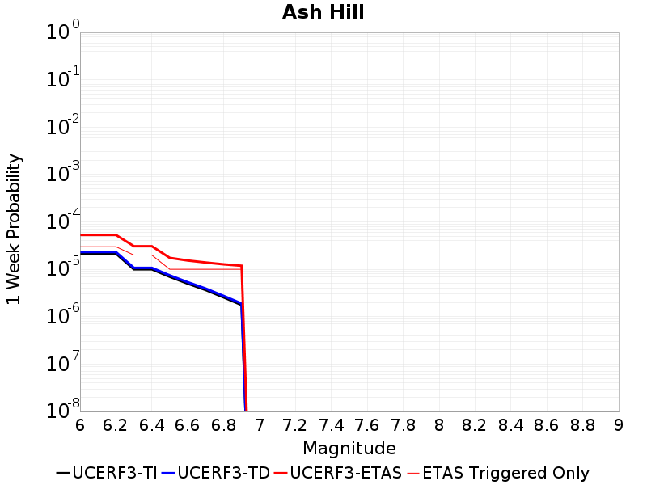 |  |  | 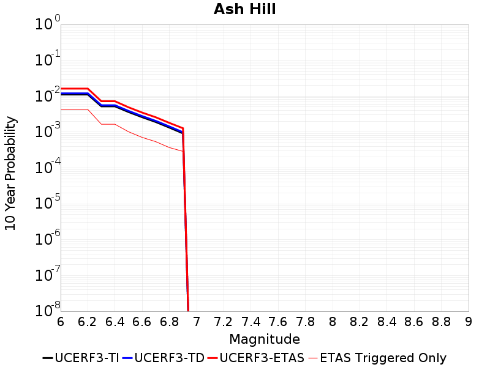 |

| Magnitude | 1 wk TI Prob | 1 wk TD Prob | 1 wk ETAS Prob | 1 wk ETAS/TD Gain | 1 wk ETAS Triggered Only | 1 mo TI Prob | 1 mo TD Prob | 1 mo ETAS Prob | 1 mo ETAS/TD Gain | 1 mo ETAS Triggered Only | 1 yr TI Prob | 1 yr TD Prob | 1 yr ETAS Prob | 1 yr ETAS/TD Gain | 1 yr ETAS Triggered Only | 10 yr TI Prob | 10 yr TD Prob | 10 yr ETAS Prob | 10 yr ETAS/TD Gain | 10 yr ETAS Triggered Only |
|-----|-----|-----|-----|-----|-----|-----|-----|-----|-----|-----|-----|-----|-----|-----|-----|-----|-----|-----|-----|-----|
| 6.0 | 2.1545662E-5 | 2.320548E-5 | 5.3204785E-5 | 2.292768 | 3.0E-5 | 9.2335285E-5 | 9.944872E-5 | 2.0943779E-4 | 2.1059878 | 1.1E-4 | 0.0011236023 | 0.0012101957 | 0.00256855 | 2.122425 | 0.00136 | 0.011179381 | 0.012044045 | 0.016272496 | 1.3510823 | 0.00428 |
| 6.1 | 2.1545662E-5 | 2.320548E-5 | 5.3204785E-5 | 2.292768 | 3.0E-5 | 9.2335285E-5 | 9.944872E-5 | 2.0943779E-4 | 2.1059878 | 1.1E-4 | 0.0011236023 | 0.0012101957 | 0.00256855 | 2.122425 | 0.00136 | 0.011179381 | 0.012044045 | 0.016272496 | 1.3510823 | 0.00428 |
| 6.2 | 2.1545662E-5 | 2.320548E-5 | 5.3204785E-5 | 2.292768 | 3.0E-5 | 9.2335285E-5 | 9.944872E-5 | 2.0943779E-4 | 2.1059878 | 1.1E-4 | 0.0011236023 | 0.0012101957 | 0.00256855 | 2.122425 | 0.00136 | 0.011179381 | 0.012044045 | 0.016272496 | 1.3510823 | 0.00428 |
| 6.3 | 1.0025529E-5 | 1.0751739E-5 | 3.0751526E-5 | 2.8601441 | 2.0E-5 | 4.2965847E-5 | 4.607814E-5 | 1.36074E-4 | 2.9531138 | 9.0E-5 | 5.229836E-4 | 5.608702E-4 | 9.806346E-4 | 1.7484163 | 4.2E-4 | 0.005217545 | 0.0055958605 | 0.0072366274 | 1.2932109 | 0.00165 |
| 6.4 | 1.0025529E-5 | 1.0751739E-5 | 3.0751526E-5 | 2.8601441 | 2.0E-5 | 4.2965847E-5 | 4.607814E-5 | 1.36074E-4 | 2.9531138 | 9.0E-5 | 5.229836E-4 | 5.608702E-4 | 9.806346E-4 | 1.7484163 | 4.2E-4 | 0.005217545 | 0.0055958605 | 0.0072366274 | 1.2932109 | 0.00165 |
| 6.5 | 6.9617327E-6 | 7.459927E-6 | 1.7459852E-5 | 2.3404856 | 1.0E-5 | 2.9835655E-5 | 3.1970772E-5 | 8.196918E-5 | 2.5638783 | 5.0E-5 | 3.6318856E-4 | 3.8918332E-4 | 5.991016E-4 | 1.5393815 | 2.1E-4 | 0.0036259557 | 0.0038858727 | 0.0049019093 | 1.2614692 | 0.00102 |
| 6.6 | 4.9919777E-6 | 5.3490485E-6 | 1.5348995E-5 | 2.8694813 | 1.0E-5 | 2.1394015E-5 | 2.2924329E-5 | 5.2923642E-5 | 2.3086233 | 3.0E-5 | 2.60441E-4 | 2.7907468E-4 | 4.190356E-4 | 1.5015179 | 1.4E-4 | 0.0026013597 | 0.0027879013 | 0.0034959218 | 1.2539618 | 7.1E-4 |
| 6.7 | 3.6630722E-6 | 3.9263646E-6 | 1.3926326E-5 | 3.5468752 | 1.0E-5 | 1.5698786E-5 | 1.68272E-5 | 3.6826863E-5 | 2.1885319 | 2.0E-5 | 1.9111596E-4 | 2.0485764E-4 | 3.2483306E-4 | 1.5856526 | 1.2E-4 | 0.0019095168 | 0.0020472514 | 0.0025861461 | 1.2632283 | 5.4E-4 |
| 6.8 | 2.5599613E-6 | 2.7461572E-6 | 1.274613E-5 | 4.6414423 | 1.0E-5 | 1.0971216E-5 | 1.176922E-5 | 3.1768985E-5 | 2.699328 | 2.0E-5 | 1.3356637E-4 | 1.4328578E-4 | 2.4327145E-4 | 1.697806 | 1.0E-4 | 0.0013348613 | 0.0014324193 | 0.0018018893 | 1.2579342 | 3.7E-4 |
| 6.9 | 1.7684905E-6 | 1.8977261E-6 | 1.1897707E-5 | 6.2694545 | 1.0E-5 | 7.579223E-6 | 8.133112E-6 | 2.8132949E-5 | 3.4590633 | 2.0E-5 | 9.2273134E-5 | 9.902064E-5 | 1.9901074E-4 | 2.0097904 | 1.0E-4 | 9.223483E-4 | 9.902064E-4 | 0.0012799192 | 1.2925782 | 2.9E-4 |

## Hunter Mountain-Saline Valley
*[(top)](#table-of-contents)*

| 1 Week | 1 Month | 1 Year | 10 Year |
|-----|-----|-----|-----|
|  |  | 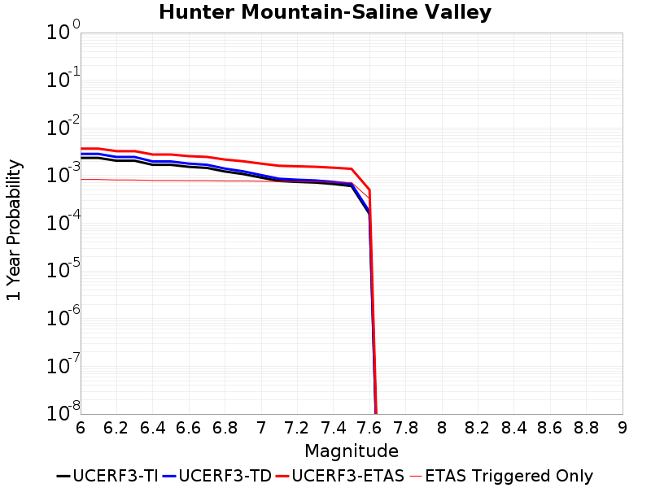 |  |

| Magnitude | 1 wk TI Prob | 1 wk TD Prob | 1 wk ETAS Prob | 1 wk ETAS/TD Gain | 1 wk ETAS Triggered Only | 1 mo TI Prob | 1 mo TD Prob | 1 mo ETAS Prob | 1 mo ETAS/TD Gain | 1 mo ETAS Triggered Only | 1 yr TI Prob | 1 yr TD Prob | 1 yr ETAS Prob | 1 yr ETAS/TD Gain | 1 yr ETAS Triggered Only | 10 yr TI Prob | 10 yr TD Prob | 10 yr ETAS Prob | 10 yr ETAS/TD Gain | 10 yr ETAS Triggered Only |
|-----|-----|-----|-----|-----|-----|-----|-----|-----|-----|-----|-----|-----|-----|-----|-----|-----|-----|-----|-----|-----|
| 6.0 | 4.5103672E-5 | 5.4649736E-5 | 7.464864E-5 | 1.365947 | 2.0E-5 | 1.9328714E-4 | 2.341927E-4 | 3.2417162E-4 | 1.3842089 | 9.0E-5 | 0.002350731 | 0.002847744 | 0.0036753803 | 1.2906288 | 8.3E-4 | 0.023260195 | 0.028132487 | 0.031028653 | 1.1029474 | 0.00298 |
| 6.1 | 4.5103672E-5 | 5.4649736E-5 | 7.464864E-5 | 1.365947 | 2.0E-5 | 1.9328714E-4 | 2.341927E-4 | 3.2417162E-4 | 1.3842089 | 9.0E-5 | 0.002350731 | 0.002847744 | 0.0036753803 | 1.2906288 | 8.3E-4 | 0.023260195 | 0.028132487 | 0.031028653 | 1.1029474 | 0.00298 |
| 6.2 | 3.9363465E-5 | 4.712952E-5 | 6.712858E-5 | 1.4243425 | 2.0E-5 | 1.6868966E-4 | 2.0196891E-4 | 2.8195276E-4 | 1.3960205 | 8.0E-5 | 0.002051862 | 0.0024563323 | 0.0032643427 | 1.3289499 | 8.1E-4 | 0.020330196 | 0.024307212 | 0.027195264 | 1.1188146 | 0.00296 |
| 6.3 | 3.9363465E-5 | 4.712952E-5 | 6.712858E-5 | 1.4243425 | 2.0E-5 | 1.6868966E-4 | 2.0196891E-4 | 2.8195276E-4 | 1.3960205 | 8.0E-5 | 0.002051862 | 0.0024563323 | 0.0032643427 | 1.3289499 | 8.1E-4 | 0.020330196 | 0.024307212 | 0.027195264 | 1.1188146 | 0.00296 |
| 6.4 | 3.2311684E-5 | 3.8001846E-5 | 5.8001086E-5 | 1.5262702 | 2.0E-5 | 1.384713E-4 | 1.628553E-4 | 2.4284227E-4 | 1.4911536 | 8.0E-5 | 0.0016845843 | 0.0019810298 | 0.0027694649 | 1.3979925 | 7.9E-4 | 0.016718714 | 0.01964211 | 0.022524364 | 1.1467384 | 0.00294 |
| 6.5 | 3.2311684E-5 | 3.8001846E-5 | 5.8001086E-5 | 1.5262702 | 2.0E-5 | 1.384713E-4 | 1.628553E-4 | 2.4284227E-4 | 1.4911536 | 8.0E-5 | 0.0016845843 | 0.0019810298 | 0.0027694649 | 1.3979925 | 7.9E-4 | 0.016718714 | 0.01964211 | 0.022524364 | 1.1467384 | 0.00294 |
| 6.6 | 2.9305844E-5 | 3.422682E-5 | 5.4226137E-5 | 1.584317 | 2.0E-5 | 1.2559042E-4 | 1.4667849E-4 | 2.2666676E-4 | 1.5453305 | 8.0E-5 | 0.0015279909 | 0.0017844097 | 0.002563018 | 1.4363394 | 7.8E-4 | 0.015175272 | 0.017708365 | 0.020576656 | 1.1619738 | 0.00292 |
| 6.7 | 2.7826512E-5 | 3.2386477E-5 | 5.238583E-5 | 1.6175218 | 2.0E-5 | 1.19251024E-4 | 1.3879214E-4 | 2.1878103E-4 | 1.5763215 | 8.0E-5 | 0.0014509142 | 0.0016885449 | 0.0024672279 | 1.4611561 | 7.8E-4 | 0.014414776 | 0.016764477 | 0.019625692 | 1.1706713 | 0.00291 |
| 6.8 | 2.3389874E-5 | 2.6900916E-5 | 4.690038E-5 | 1.7434491 | 2.0E-5 | 1.0023846E-4 | 1.1528481E-4 | 1.952756E-4 | 1.6938535 | 8.0E-5 | 0.00121972 | 0.0014027363 | 0.0021716561 | 1.5481571 | 7.7E-4 | 0.01213047 | 0.013944667 | 0.016784506 | 1.2036506 | 0.00288 |
| 6.9 | 2.069209E-5 | 2.3599681E-5 | 4.3599208E-5 | 1.8474491 | 2.0E-5 | 8.867737E-5 | 1.01137775E-4 | 1.8112968E-4 | 1.7909203 | 8.0E-5 | 0.0010791123 | 0.0012306931 | 0.0019997454 | 1.6248937 | 7.7E-4 | 0.010738871 | 0.012243436 | 0.0150881745 | 1.2323481 | 0.00288 |
| 7.0 | 1.7462342E-5 | 1.9657837E-5 | 3.9657443E-5 | 2.017386 | 2.0E-5 | 7.483646E-5 | 8.424528E-5 | 1.6423855E-4 | 1.9495281 | 8.0E-5 | 9.1075303E-4 | 0.0010252263 | 0.0017844471 | 1.7405397 | 7.6E-4 | 0.009070295 | 0.010208224 | 0.013039028 | 1.2773063 | 0.00286 |
| 7.1 | 1.4807709E-5 | 1.6462023E-5 | 3.6461694E-5 | 2.2148974 | 2.0E-5 | 6.3460066E-5 | 7.0549715E-5 | 1.5054407E-4 | 2.133872 | 8.0E-5 | 7.723524E-4 | 8.5862086E-4 | 0.0016079769 | 1.8727438 | 7.5E-4 | 0.007696735 | 0.008555644 | 0.011371346 | 1.3291047 | 0.00284 |
| 7.2 | 1.4180048E-5 | 1.571776E-5 | 3.5717447E-5 | 2.272426 | 2.0E-5 | 6.077022E-5 | 6.736018E-5 | 1.4735479E-4 | 2.1875653 | 8.0E-5 | 7.396263E-4 | 8.198179E-4 | 0.0015692031 | 1.9140873 | 7.5E-4 | 0.0073716943 | 0.00817051 | 0.010987305 | 1.3447516 | 0.00284 |
| 7.3 | 1.3730402E-5 | 1.5190911E-5 | 3.5190606E-5 | 2.3165567 | 2.0E-5 | 5.8843252E-5 | 6.510237E-5 | 1.4509716E-4 | 2.2287538 | 8.0E-5 | 7.161811E-4 | 7.923492E-4 | 0.0015317629 | 1.9331915 | 7.4E-4 | 0.007138774 | 0.007897797 | 0.010705446 | 1.3554978 | 0.00283 |
| 7.4 | 1.2810095E-5 | 1.4126563E-5 | 3.4126282E-5 | 2.4157526 | 2.0E-5 | 5.489925E-5 | 6.0541097E-5 | 1.4053626E-4 | 2.3213365 | 8.0E-5 | 6.681934E-4 | 7.3685445E-4 | 0.0014663165 | 1.9899677 | 7.3E-4 | 0.006661878 | 0.0073466296 | 0.010126059 | 1.3783271 | 0.0028 |
| 7.5 | 1.1595659E-5 | 1.2817289E-5 | 3.281703E-5 | 2.5603724 | 2.0E-5 | 4.9694736E-5 | 5.493017E-5 | 1.3492578E-4 | 2.4563146 | 8.0E-5 | 6.0486543E-4 | 6.685853E-4 | 0.0013881039 | 2.0761807 | 7.2E-4 | 0.006032217 | 0.006668194 | 0.00940979 | 1.4111452 | 0.00276 |
| 7.6 | 2.997694E-6 | 3.3316205E-6 | 3.3316205E-6 | 1.0 | 0.0 | 1.28471975E-5 | 1.42783365E-5 | 5.4277767E-5 | 3.8014066 | 4.0E-5 | 1.564034E-4 | 1.7383219E-4 | 5.0377485E-4 | 2.8980525 | 3.3E-4 | 0.0015629337 | 0.0017380059 | 0.002886007 | 1.6605278 | 0.00115 |

## Blackwater
*[(top)](#table-of-contents)*

| 1 Week | 1 Month | 1 Year | 10 Year |
|-----|-----|-----|-----|
| 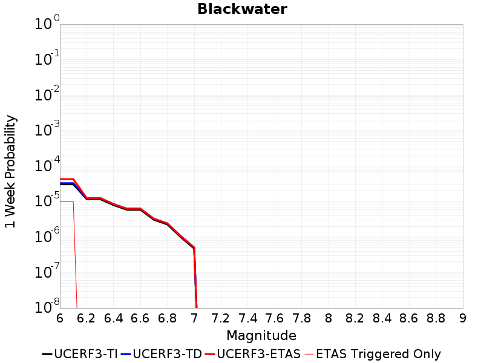 |  |  |  |

| Magnitude | 1 wk TI Prob | 1 wk TD Prob | 1 wk ETAS Prob | 1 wk ETAS/TD Gain | 1 wk ETAS Triggered Only | 1 mo TI Prob | 1 mo TD Prob | 1 mo ETAS Prob | 1 mo ETAS/TD Gain | 1 mo ETAS Triggered Only | 1 yr TI Prob | 1 yr TD Prob | 1 yr ETAS Prob | 1 yr ETAS/TD Gain | 1 yr ETAS Triggered Only | 10 yr TI Prob | 10 yr TD Prob | 10 yr ETAS Prob | 10 yr ETAS/TD Gain | 10 yr ETAS Triggered Only |
|-----|-----|-----|-----|-----|-----|-----|-----|-----|-----|-----|-----|-----|-----|-----|-----|-----|-----|-----|-----|-----|
| 6.0 | 3.0708583E-5 | 3.3111857E-5 | 4.3111526E-5 | 1.3019966 | 1.0E-5 | 1.3160157E-4 | 1.4190101E-4 | 1.6189818E-4 | 1.1409233 | 2.0E-5 | 0.0016010714 | 0.0017264126 | 0.002355325 | 1.3642886 | 6.3E-4 | 0.015895851 | 0.01714386 | 0.019650143 | 1.1461914 | 0.00255 |
| 6.1 | 3.0708583E-5 | 3.3111857E-5 | 4.3111526E-5 | 1.3019966 | 1.0E-5 | 1.3160157E-4 | 1.4190101E-4 | 1.6189818E-4 | 1.1409233 | 2.0E-5 | 0.0016010714 | 0.0017264126 | 0.002355325 | 1.3642886 | 6.3E-4 | 0.015895851 | 0.01714386 | 0.019650143 | 1.1461914 | 0.00255 |
| 6.2 | 1.1707779E-5 | 1.25506995E-5 | 1.25506995E-5 | 1.0 | 0.0 | 5.017523E-5 | 5.3787655E-5 | 5.3787655E-5 | 1.0 | 0.0 | 6.107122E-4 | 6.5467757E-4 | 9.145074E-4 | 1.396882 | 2.6E-4 | 0.006090366 | 0.0065284614 | 0.0074821943 | 1.1460885 | 9.6E-4 |
| 6.3 | 1.1707779E-5 | 1.25506995E-5 | 1.25506995E-5 | 1.0 | 0.0 | 5.017523E-5 | 5.3787655E-5 | 5.3787655E-5 | 1.0 | 0.0 | 6.107122E-4 | 6.5467757E-4 | 9.145074E-4 | 1.396882 | 2.6E-4 | 0.006090366 | 0.0065284614 | 0.0074821943 | 1.1460885 | 9.6E-4 |
| 6.4 | 7.929244E-6 | 8.483758E-6 | 8.483758E-6 | 1.0 | 0.0 | 3.3982033E-5 | 3.635848E-5 | 3.635848E-5 | 1.0 | 0.0 | 4.136527E-4 | 4.4257866E-4 | 6.0250785E-4 | 1.3613577 | 1.6E-4 | 0.0041288356 | 0.004417378 | 0.004945037 | 1.1194507 | 5.3E-4 |
| 6.5 | 5.8832115E-6 | 6.2886647E-6 | 6.2886647E-6 | 1.0 | 0.0 | 2.521352E-5 | 2.6951155E-5 | 2.6951155E-5 | 1.0 | 0.0 | 3.0693135E-4 | 3.2808346E-4 | 4.580408E-4 | 1.3961107 | 1.3E-4 | 0.0030650778 | 0.0032762445 | 0.0036350652 | 1.1095219 | 3.6E-4 |
| 6.6 | 5.8832115E-6 | 6.2886647E-6 | 6.2886647E-6 | 1.0 | 0.0 | 2.521352E-5 | 2.6951155E-5 | 2.6951155E-5 | 1.0 | 0.0 | 3.0693135E-4 | 3.2808346E-4 | 4.580408E-4 | 1.3961107 | 1.3E-4 | 0.0030650778 | 0.0032762445 | 0.0036350652 | 1.1095219 | 3.6E-4 |
| 6.7 | 3.0715053E-6 | 3.2828596E-6 | 3.2828596E-6 | 1.0 | 0.0 | 1.3163528E-5 | 1.4069329E-5 | 1.4069329E-5 | 1.0 | 0.0 | 1.6025416E-4 | 1.7128179E-4 | 2.2127322E-4 | 1.2918667 | 5.0E-5 | 0.0016013865 | 0.0017116123 | 0.0019112701 | 1.1166489 | 2.0E-4 |
| 6.8 | 2.2722281E-6 | 2.429793E-6 | 2.429793E-6 | 1.0 | 0.0 | 9.738084E-6 | 1.0413362E-5 | 1.0413362E-5 | 1.0 | 0.0 | 1.1855473E-4 | 1.2677623E-4 | 1.7676989E-4 | 1.3943458 | 5.0E-5 | 0.001184915 | 0.0012671293 | 0.0014469012 | 1.1418734 | 1.8E-4 |
| 6.9 | 9.952399E-7 | 1.065815E-6 | 1.065815E-6 | 1.0 | 0.0 | 4.265307E-6 | 4.567774E-6 | 4.567774E-6 | 1.0 | 0.0 | 5.1928873E-5 | 5.561174E-5 | 6.561119E-5 | 1.1798081 | 1.0E-5 | 5.191674E-4 | 5.560289E-4 | 6.1599555E-4 | 1.107848 | 6.0E-5 |
| 7.0 | 4.7385504E-7 | 5.0778016E-7 | 5.0778016E-7 | 1.0 | 0.0 | 2.0308057E-6 | 2.1762007E-6 | 2.1762007E-6 | 1.0 | 0.0 | 2.4724779E-5 | 2.6495245E-5 | 3.649498E-5 | 1.3774163 | 1.0E-5 | 2.4722028E-4 | 2.6495245E-4 | 2.8494713E-4 | 1.0754652 | 2.0E-5 |

## Garlock (West)
*[(top)](#table-of-contents)*

| 1 Week | 1 Month | 1 Year | 10 Year |
|-----|-----|-----|-----|
| 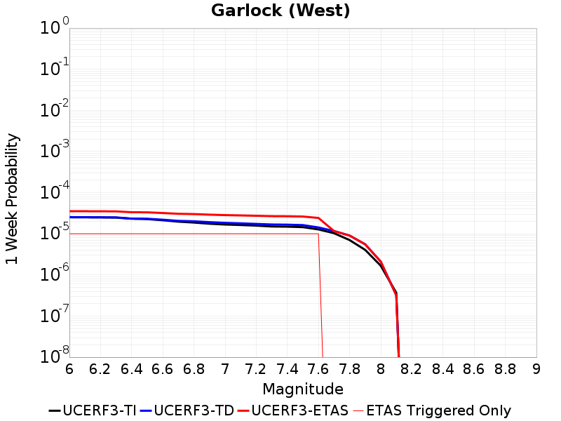 |  | 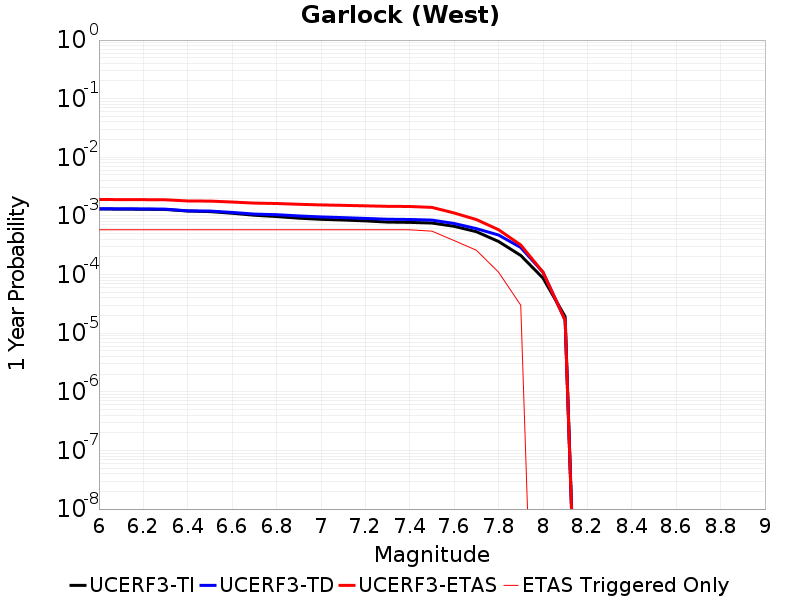 |  |

| Magnitude | 1 wk TI Prob | 1 wk TD Prob | 1 wk ETAS Prob | 1 wk ETAS/TD Gain | 1 wk ETAS Triggered Only | 1 mo TI Prob | 1 mo TD Prob | 1 mo ETAS Prob | 1 mo ETAS/TD Gain | 1 mo ETAS Triggered Only | 1 yr TI Prob | 1 yr TD Prob | 1 yr ETAS Prob | 1 yr ETAS/TD Gain | 1 yr ETAS Triggered Only | 10 yr TI Prob | 10 yr TD Prob | 10 yr ETAS Prob | 10 yr ETAS/TD Gain | 10 yr ETAS Triggered Only |
|-----|-----|-----|-----|-----|-----|-----|-----|-----|-----|-----|-----|-----|-----|-----|-----|-----|-----|-----|-----|-----|
| 6.0 | 2.5181727E-5 | 2.5438247E-5 | 3.543799E-5 | 1.3930988 | 1.0E-5 | 1.0791722E-4 | 1.0901652E-4 | 1.3901325E-4 | 1.2751577 | 3.0E-5 | 0.0013131002 | 0.0013264715 | 0.001905702 | 1.4366703 | 5.8E-4 | 0.013053683 | 0.013264985 | 0.01536673 | 1.1584431 | 0.00213 |
| 6.1 | 2.5077732E-5 | 2.5339245E-5 | 3.533899E-5 | 1.3946347 | 1.0E-5 | 1.0747157E-4 | 1.08592256E-4 | 1.38589E-4 | 1.2762328 | 3.0E-5 | 0.001307681 | 0.0013213124 | 0.001900546 | 1.4383775 | 5.8E-4 | 0.013000126 | 0.013214008 | 0.015315862 | 1.1590626 | 0.00213 |
| 6.2 | 2.494612E-5 | 2.5220756E-5 | 3.5220502E-5 | 1.3964888 | 1.0E-5 | 1.0690756E-4 | 1.0808449E-4 | 1.3808125E-4 | 1.2775307 | 3.0E-5 | 0.0013008224 | 0.0013151377 | 0.001894375 | 1.4404384 | 5.8E-4 | 0.012932341 | 0.013152994 | 0.015254979 | 1.1598103 | 0.00213 |
| 6.3 | 2.4733758E-5 | 2.5039893E-5 | 3.5039644E-5 | 1.3993527 | 1.0E-5 | 1.0599751E-4 | 1.0730944E-4 | 1.3730621E-4 | 1.2795353 | 3.0E-5 | 0.0012897556 | 0.0013057127 | 0.0018849554 | 1.4436219 | 5.8E-4 | 0.012822957 | 0.013059857 | 0.01516204 | 1.1609652 | 0.00213 |
| 6.4 | 2.3237335E-5 | 2.3417575E-5 | 3.3417342E-5 | 1.4270197 | 1.0E-5 | 9.958477E-5 | 1.00357196E-4 | 1.3035418E-4 | 1.2989023 | 3.0E-5 | 0.0012117702 | 0.0012211668 | 0.0018004585 | 1.4743756 | 5.8E-4 | 0.012051838 | 0.01222397 | 0.014327933 | 1.1721178 | 0.00213 |
| 6.5 | 2.2732203E-5 | 2.323122E-5 | 3.3230986E-5 | 1.4304452 | 1.0E-5 | 9.742009E-5 | 9.955858E-5 | 1.295556E-4 | 1.3013002 | 3.0E-5 | 0.0011854442 | 0.0012114545 | 0.0017907519 | 1.4781833 | 5.8E-4 | 0.011791403 | 0.012127912 | 0.0142320795 | 1.1734979 | 0.00213 |
| 6.6 | 2.1319436E-5 | 2.2009322E-5 | 3.2009102E-5 | 1.454343 | 1.0E-5 | 9.136581E-5 | 9.432227E-5 | 1.2431944E-4 | 1.3180285 | 3.0E-5 | 0.001111811 | 0.001147771 | 0.0017271054 | 1.5047473 | 5.8E-4 | 0.011062649 | 0.011497811 | 0.013603321 | 1.1831226 | 0.00213 |
| 6.7 | 1.970802E-5 | 2.0626878E-5 | 3.062667E-5 | 1.4847944 | 1.0E-5 | 8.446021E-5 | 8.839792E-5 | 1.1839527E-4 | 1.3393445 | 3.0E-5 | 0.001027818 | 0.0010757151 | 0.0016550911 | 1.5385963 | 5.8E-4 | 0.010230771 | 0.010784428 | 0.0128914565 | 1.195377 | 0.00213 |
| 6.8 | 1.8744462E-5 | 2.0132544E-5 | 3.0132343E-5 | 1.4966981 | 1.0E-5 | 8.033094E-5 | 8.627949E-5 | 1.16276904E-4 | 1.3476772 | 3.0E-5 | 9.775903E-4 | 0.0010499483 | 0.0016293393 | 1.5518281 | 5.8E-4 | 0.009733009 | 0.010529213 | 0.012636785 | 1.2001643 | 0.00213 |
| 6.9 | 1.7559682E-5 | 1.9183051E-5 | 2.918286E-5 | 1.5212835 | 1.0E-5 | 7.5253614E-5 | 8.22105E-5 | 1.12208036E-4 | 1.3648869 | 3.0E-5 | 9.158276E-4 | 0.0010004546 | 0.0015798744 | 1.5791564 | 5.8E-4 | 0.0091206245 | 0.010038879 | 0.0121474955 | 1.2100451 | 0.00213 |
| 7.0 | 1.6794445E-5 | 1.8443008E-5 | 2.8442824E-5 | 1.5422009 | 1.0E-5 | 7.197421E-5 | 7.903908E-5 | 1.0903671E-4 | 1.3795291 | 3.0E-5 | 8.759337E-4 | 9.6187735E-4 | 0.0015413194 | 1.6024075 | 5.8E-4 | 0.008724891 | 0.009656378 | 0.011755906 | 1.217424 | 0.00212 |
| 7.1 | 1.6337795E-5 | 1.7942619E-5 | 2.7942438E-5 | 1.5573223 | 1.0E-5 | 7.0017246E-5 | 7.689468E-5 | 1.0689237E-4 | 1.3901141 | 3.0E-5 | 8.521265E-4 | 9.3579193E-4 | 0.0015152491 | 1.6192158 | 5.8E-4 | 0.008488664 | 0.009397589 | 0.01148776 | 1.2224157 | 0.00211 |
| 7.2 | 1.5780008E-5 | 1.7390417E-5 | 2.7390242E-5 | 1.5750194 | 1.0E-5 | 6.762685E-5 | 7.452824E-5 | 1.04526E-4 | 1.4025021 | 3.0E-5 | 8.2304585E-4 | 9.0700487E-4 | 0.0014864788 | 1.6388874 | 5.8E-4 | 0.008200042 | 0.009112036 | 0.0111929 | 1.2283645 | 0.0021 |
| 7.3 | 1.5058865E-5 | 1.6841868E-5 | 2.68417E-5 | 1.5937483 | 1.0E-5 | 6.45364E-5 | 7.217745E-5 | 1.0217528E-4 | 1.4156123 | 3.0E-5 | 7.854473E-4 | 8.784073E-4 | 0.0014578978 | 1.6597059 | 5.8E-4 | 0.00782677 | 0.008827934 | 0.010889571 | 1.2335358 | 0.00208 |
| 7.4 | 1.4887923E-5 | 1.6677142E-5 | 2.6676975E-5 | 1.5996131 | 1.0E-5 | 6.380382E-5 | 7.147151E-5 | 1.0146937E-4 | 1.4197177 | 3.0E-5 | 7.7653467E-4 | 8.6981955E-4 | 0.001449315 | 1.666225 | 5.8E-4 | 0.0077382675 | 0.008742524 | 0.010774602 | 1.2324361 | 0.00205 |
| 7.5 | 1.4509299E-5 | 1.6267506E-5 | 2.6267344E-5 | 1.6147124 | 1.0E-5 | 6.218123E-5 | 6.971603E-5 | 9.9713936E-5 | 1.4302871 | 3.0E-5 | 7.567935E-4 | 8.484633E-4 | 0.0013979967 | 1.6476808 | 5.5E-4 | 0.0075422134 | 0.008530031 | 0.010403909 | 1.2196801 | 0.00189 |
| 7.6 | 1.2756717E-5 | 1.4258292E-5 | 2.425815E-5 | 1.7013363 | 1.0E-5 | 5.4670498E-5 | 6.110554E-5 | 8.1104314E-5 | 1.3272825 | 2.0E-5 | 6.6541E-4 | 7.4370665E-4 | 0.001123424 | 1.5105741 | 3.8E-4 | 0.006634211 | 0.0074882377 | 0.008748728 | 1.1683294 | 0.00127 |
| 7.7 | 1.0328985E-5 | 1.165459E-5 | 1.165459E-5 | 1.0 | 0.0 | 4.4266326E-5 | 4.9947288E-5 | 5.9946786E-5 | 1.200201 | 1.0E-5 | 5.388092E-4 | 6.07939E-4 | 8.677809E-4 | 1.4274145 | 2.6E-4 | 0.0053750467 | 0.006138655 | 0.0069238055 | 1.1279026 | 7.9E-4 |
| 7.8 | 7.0306583E-6 | 9.055017E-6 | 9.055017E-6 | 1.0 | 0.0 | 3.0131043E-5 | 3.8806636E-5 | 3.8806636E-5 | 1.0 | 0.0 | 3.667837E-4 | 4.7236856E-4 | 5.823166E-4 | 1.232759 | 1.1E-4 | 0.003661789 | 0.0047755605 | 0.005193555 | 1.0875278 | 4.2E-4 |
| 7.9 | 4.060633E-6 | 5.555263E-6 | 5.555263E-6 | 1.0 | 0.0 | 1.7402595E-5 | 2.3808054E-5 | 2.3808054E-5 | 1.0 | 0.0 | 2.11856E-4 | 2.8982462E-4 | 3.198159E-4 | 1.1034809 | 3.0E-5 | 0.0021165414 | 0.0029305124 | 0.003139897 | 1.0714499 | 2.1E-4 |
| 8.0 | 1.6729537E-6 | 2.1077342E-6 | 2.1077342E-6 | 1.0 | 0.0 | 7.169782E-6 | 9.033115E-6 | 9.033115E-6 | 1.0 | 0.0 | 8.7288594E-5 | 1.09972665E-4 | 1.09972665E-4 | 1.0 | 0.0 | 8.7254314E-4 | 0.0011123676 | 0.001162312 | 1.0448992 | 5.0E-5 |
| 8.1 | 3.6733252E-7 | 3.1919836E-7 | 3.1919836E-7 | 1.0 | 0.0 | 1.5742813E-6 | 1.3679924E-6 | 1.3679924E-6 | 1.0 | 0.0 | 1.9166706E-5 | 1.6655196E-5 | 1.6655196E-5 | 1.0 | 0.0 | 1.9165053E-4 | 1.6866802E-4 | 1.9866296E-4 | 1.1778342 | 3.0E-5 |

## McLean Lake
*[(top)](#table-of-contents)*

| 1 Week | 1 Month | 1 Year | 10 Year |
|-----|-----|-----|-----|
| 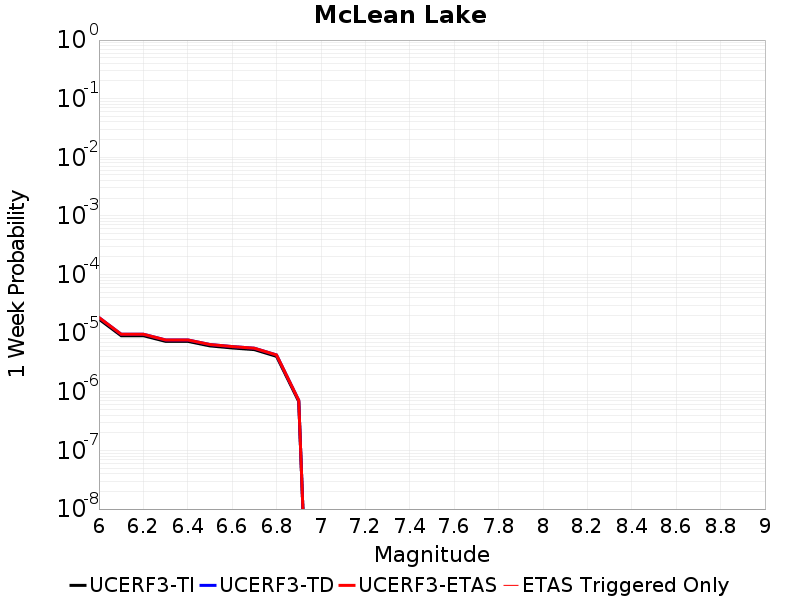 |  | 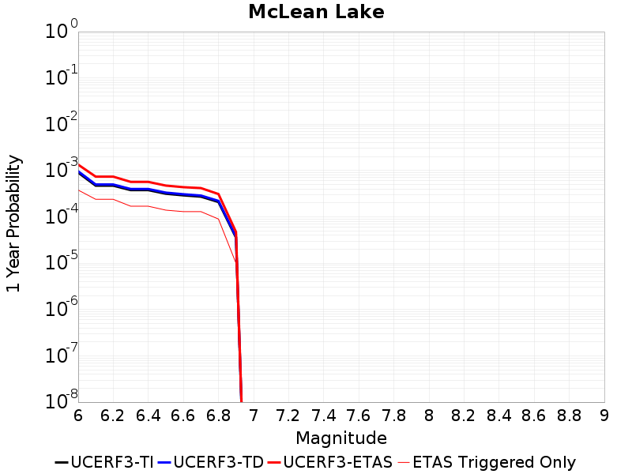 | 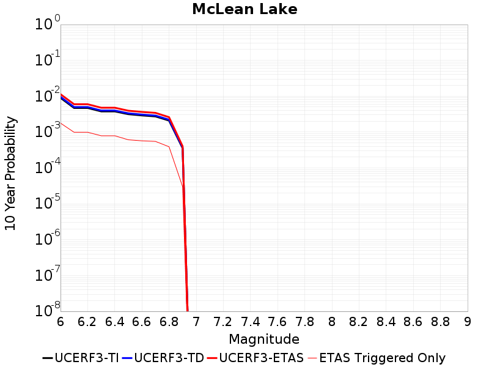 |

| Magnitude | 1 wk TI Prob | 1 wk TD Prob | 1 wk ETAS Prob | 1 wk ETAS/TD Gain | 1 wk ETAS Triggered Only | 1 mo TI Prob | 1 mo TD Prob | 1 mo ETAS Prob | 1 mo ETAS/TD Gain | 1 mo ETAS Triggered Only | 1 yr TI Prob | 1 yr TD Prob | 1 yr ETAS Prob | 1 yr ETAS/TD Gain | 1 yr ETAS Triggered Only | 10 yr TI Prob | 10 yr TD Prob | 10 yr ETAS Prob | 10 yr ETAS/TD Gain | 10 yr ETAS Triggered Only |
|-----|-----|-----|-----|-----|-----|-----|-----|-----|-----|-----|-----|-----|-----|-----|-----|-----|-----|-----|-----|-----|
| 6.0 | 1.7360222E-5 | 1.8509198E-5 | 1.8509198E-5 | 1.0 | 0.0 | 7.439883E-5 | 7.9323E-5 | 1.09320616E-4 | 1.3781705 | 3.0E-5 | 9.0542925E-4 | 9.6537825E-4 | 0.0013450114 | 1.3932481 | 3.8E-4 | 0.009017491 | 0.009616692 | 0.0113795735 | 1.1833148 | 0.00178 |
| 6.1 | 9.062689E-6 | 9.595678E-6 | 9.595678E-6 | 1.0 | 0.0 | 3.8839516E-5 | 4.1123738E-5 | 6.112292E-5 | 1.4863172 | 2.0E-5 | 4.727685E-4 | 5.005754E-4 | 7.4045523E-4 | 1.4792082 | 2.4E-4 | 0.0047176396 | 0.004995362 | 0.005980416 | 1.1971939 | 9.9E-4 |
| 6.2 | 9.062689E-6 | 9.595678E-6 | 9.595678E-6 | 1.0 | 0.0 | 3.8839516E-5 | 4.1123738E-5 | 6.112292E-5 | 1.4863172 | 2.0E-5 | 4.727685E-4 | 5.005754E-4 | 7.4045523E-4 | 1.4792082 | 2.4E-4 | 0.0047176396 | 0.004995362 | 0.005980416 | 1.1971939 | 9.9E-4 |
| 6.3 | 7.2575485E-6 | 7.670404E-6 | 7.670404E-6 | 1.0 | 0.0 | 3.110341E-5 | 3.2872784E-5 | 5.287213E-5 | 1.608386 | 2.0E-5 | 3.786182E-4 | 4.0015977E-4 | 5.7009177E-4 | 1.4246603 | 1.7E-4 | 0.0037797375 | 0.0039950977 | 0.0047819414 | 1.1969523 | 7.9E-4 |
| 6.4 | 7.2575485E-6 | 7.670404E-6 | 7.670404E-6 | 1.0 | 0.0 | 3.110341E-5 | 3.2872784E-5 | 5.287213E-5 | 1.608386 | 2.0E-5 | 3.786182E-4 | 4.0015977E-4 | 5.7009177E-4 | 1.4246603 | 1.7E-4 | 0.0037797375 | 0.0039950977 | 0.0047819414 | 1.1969523 | 7.9E-4 |
| 6.5 | 6.06582E-6 | 6.406096E-6 | 6.406096E-6 | 1.0 | 0.0 | 2.5996113E-5 | 2.7454444E-5 | 4.7453894E-5 | 1.7284595 | 2.0E-5 | 3.164567E-4 | 3.3421308E-4 | 4.741663E-4 | 1.4187545 | 1.4E-4 | 0.0031600643 | 0.0033377437 | 0.003945708 | 1.1821482 | 6.1E-4 |
| 6.6 | 5.598744E-6 | 5.9123067E-6 | 5.9123067E-6 | 1.0 | 0.0 | 2.3994397E-5 | 2.5338248E-5 | 4.533774E-5 | 1.7893006 | 2.0E-5 | 2.9209262E-4 | 3.0845587E-4 | 4.384158E-4 | 1.4213241 | 1.3E-4 | 0.0029170897 | 0.003080907 | 0.003649151 | 1.1844405 | 5.7E-4 |
| 6.7 | 5.246996E-6 | 5.5410796E-6 | 5.5410796E-6 | 1.0 | 0.0 | 2.2486933E-5 | 2.3747303E-5 | 4.374683E-5 | 1.8421808 | 2.0E-5 | 2.73744E-4 | 2.890914E-4 | 4.1905383E-4 | 1.4495548 | 1.3E-4 | 0.0027340704 | 0.0028877778 | 0.0034361894 | 1.1899079 | 5.5E-4 |
| 6.8 | 4.02324E-6 | 4.2483725E-6 | 4.2483725E-6 | 1.0 | 0.0 | 1.7242342E-5 | 1.8207216E-5 | 2.8207034E-5 | 1.5492228 | 1.0E-5 | 2.099053E-4 | 2.2165627E-4 | 3.116363E-4 | 1.4059441 | 9.0E-5 | 0.0020970714 | 0.0022149368 | 0.002604073 | 1.1756873 | 3.9E-4 |
| 6.9 | 6.835972E-7 | 7.1419E-7 | 7.1419E-7 | 1.0 | 0.0 | 2.9296991E-6 | 3.0608126E-6 | 3.0608126E-6 | 1.0 | 0.0 | 3.56685E-5 | 3.7265076E-5 | 4.72647E-5 | 1.2683377 | 1.0E-5 | 3.5662777E-4 | 3.726195E-4 | 4.0260833E-4 | 1.080481 | 3.0E-5 |

## Goldstone Lake
*[(top)](#table-of-contents)*

| 1 Week | 1 Month | 1 Year | 10 Year |
|-----|-----|-----|-----|
|  | 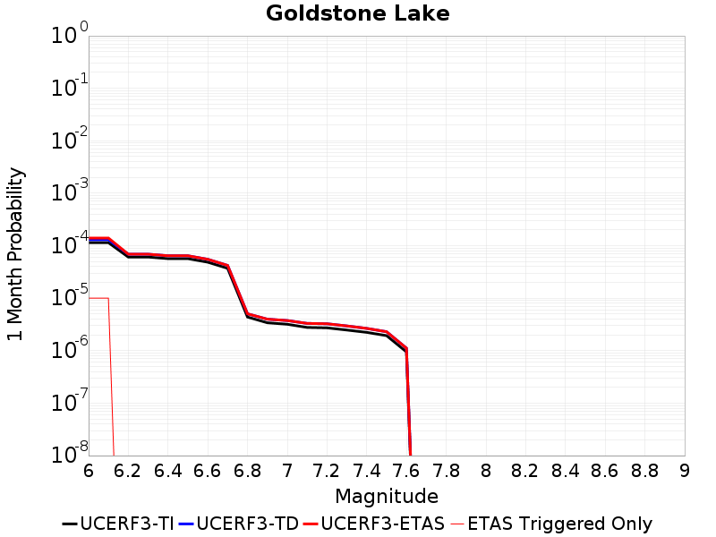 |  | 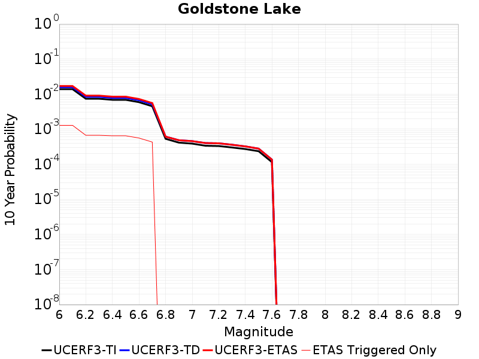 |

| Magnitude | 1 wk TI Prob | 1 wk TD Prob | 1 wk ETAS Prob | 1 wk ETAS/TD Gain | 1 wk ETAS Triggered Only | 1 mo TI Prob | 1 mo TD Prob | 1 mo ETAS Prob | 1 mo ETAS/TD Gain | 1 mo ETAS Triggered Only | 1 yr TI Prob | 1 yr TD Prob | 1 yr ETAS Prob | 1 yr ETAS/TD Gain | 1 yr ETAS Triggered Only | 10 yr TI Prob | 10 yr TD Prob | 10 yr ETAS Prob | 10 yr ETAS/TD Gain | 10 yr ETAS Triggered Only |
|-----|-----|-----|-----|-----|-----|-----|-----|-----|-----|-----|-----|-----|-----|-----|-----|-----|-----|-----|-----|-----|
| 6.0 | 2.671352E-5 | 3.0401892E-5 | 3.0401892E-5 | 1.0 | 0.0 | 1.1448149E-4 | 1.3028843E-4 | 1.4028713E-4 | 1.0767428 | 1.0E-5 | 0.001392921 | 0.001585304 | 0.0018448918 | 1.1637464 | 2.6E-4 | 0.013842222 | 0.015759483 | 0.017029153 | 1.0805655 | 0.00129 |
| 6.1 | 2.671352E-5 | 3.0401892E-5 | 3.0401892E-5 | 1.0 | 0.0 | 1.1448149E-4 | 1.3028843E-4 | 1.4028713E-4 | 1.0767428 | 1.0E-5 | 0.001392921 | 0.001585304 | 0.0018448918 | 1.1637464 | 2.6E-4 | 0.013842222 | 0.015759483 | 0.017029153 | 1.0805655 | 0.00129 |
| 6.2 | 1.4197047E-5 | 1.6109532E-5 | 1.6109532E-5 | 1.0 | 0.0 | 6.0843064E-5 | 6.903958E-5 | 6.903958E-5 | 1.0 | 0.0 | 7.4051257E-4 | 8.4033154E-4 | 9.7022235E-4 | 1.1545708 | 1.3E-4 | 0.007380498 | 0.008381252 | 0.009045636 | 1.0792704 | 6.7E-4 |
| 6.3 | 1.4197047E-5 | 1.6109532E-5 | 1.6109532E-5 | 1.0 | 0.0 | 6.0843064E-5 | 6.903958E-5 | 6.903958E-5 | 1.0 | 0.0 | 7.4051257E-4 | 8.4033154E-4 | 9.7022235E-4 | 1.1545708 | 1.3E-4 | 0.007380498 | 0.008381252 | 0.009045636 | 1.0792704 | 6.7E-4 |
| 6.4 | 1.3238931E-5 | 1.50208325E-5 | 1.50208325E-5 | 1.0 | 0.0 | 5.6737044E-5 | 6.437396E-5 | 6.437396E-5 | 1.0 | 0.0 | 6.9055456E-4 | 7.835693E-4 | 9.1346743E-4 | 1.1657774 | 1.3E-4 | 0.006884126 | 0.007817707 | 0.008462626 | 1.0824946 | 6.5E-4 |
| 6.5 | 1.3238931E-5 | 1.50208325E-5 | 1.50208325E-5 | 1.0 | 0.0 | 5.6737044E-5 | 6.437396E-5 | 6.437396E-5 | 1.0 | 0.0 | 6.9055456E-4 | 7.835693E-4 | 9.1346743E-4 | 1.1657774 | 1.3E-4 | 0.006884126 | 0.007817707 | 0.008462626 | 1.0824946 | 6.5E-4 |
| 6.6 | 1.1328278E-5 | 1.2865838E-5 | 1.2865838E-5 | 1.0 | 0.0 | 4.8548856E-5 | 5.513868E-5 | 5.513868E-5 | 1.0 | 0.0 | 5.90922E-4 | 6.712025E-4 | 7.811287E-4 | 1.163775 | 1.1E-4 | 0.0058935313 | 0.0067011574 | 0.0072574047 | 1.0830077 | 5.6E-4 |
| 6.7 | 8.651175E-6 | 9.832749E-6 | 9.832749E-6 | 1.0 | 0.0 | 3.707594E-5 | 4.2140186E-5 | 4.2140186E-5 | 1.0 | 0.0 | 4.5130608E-4 | 5.1302667E-4 | 6.1297533E-4 | 1.1948216 | 1.0E-4 | 0.0045039062 | 0.0051273163 | 0.0055551114 | 1.0834346 | 4.3E-4 |
| 6.8 | 1.0215377E-6 | 1.1764719E-6 | 1.1764719E-6 | 1.0 | 0.0 | 4.378012E-6 | 5.042013E-6 | 5.042013E-6 | 1.0 | 0.0 | 5.3300988E-5 | 6.13849E-5 | 6.13849E-5 | 1.0 | 0.0 | 5.3288206E-4 | 6.1369064E-4 | 6.1369064E-4 | 1.0 | 0.0 |
| 6.9 | 7.9360774E-7 | 9.292119E-7 | 9.292119E-7 | 1.0 | 0.0 | 3.4011714E-6 | 3.9823312E-6 | 3.9823312E-6 | 1.0 | 0.0 | 4.1408475E-5 | 4.8483875E-5 | 4.8483875E-5 | 1.0 | 0.0 | 4.140076E-4 | 4.8473995E-4 | 4.8473995E-4 | 1.0 | 0.0 |
| 7.0 | 7.4382757E-7 | 8.7557953E-7 | 8.7557953E-7 | 1.0 | 0.0 | 3.1878285E-6 | 3.7524785E-6 | 3.7524785E-6 | 1.0 | 0.0 | 3.8811122E-5 | 4.5685538E-5 | 4.5685538E-5 | 1.0 | 0.0 | 3.8804344E-4 | 4.5676812E-4 | 4.5676812E-4 | 1.0 | 0.0 |
| 7.1 | 6.4709513E-7 | 7.7193096E-7 | 7.7193096E-7 | 1.0 | 0.0 | 2.773262E-6 | 3.3082715E-6 | 3.3082715E-6 | 1.0 | 0.0 | 3.376394E-5 | 4.0277522E-5 | 4.0277522E-5 | 1.0 | 0.0 | 3.375881E-4 | 4.027082E-4 | 4.027082E-4 | 1.0 | 0.0 |
| 7.2 | 6.356704E-7 | 7.596311E-7 | 7.596311E-7 | 1.0 | 0.0 | 2.7242988E-6 | 3.255558E-6 | 3.255558E-6 | 1.0 | 0.0 | 3.3167835E-5 | 3.963576E-5 | 3.963576E-5 | 1.0 | 0.0 | 3.3162883E-4 | 3.9629286E-4 | 3.9629286E-4 | 1.0 | 0.0 |
| 7.3 | 5.7695723E-7 | 6.904331E-7 | 6.904331E-7 | 1.0 | 0.0 | 2.4726714E-6 | 2.958996E-6 | 2.958996E-6 | 1.0 | 0.0 | 3.0104358E-5 | 3.602524E-5 | 3.602524E-5 | 1.0 | 0.0 | 3.0100282E-4 | 3.6019975E-4 | 3.6019975E-4 | 1.0 | 0.0 |
| 7.4 | 5.209647E-7 | 6.2009514E-7 | 6.2009514E-7 | 1.0 | 0.0 | 2.232704E-6 | 2.6575483E-6 | 2.6575483E-6 | 1.0 | 0.0 | 2.718283E-5 | 3.2355227E-5 | 3.2355227E-5 | 1.0 | 0.0 | 2.7179506E-4 | 3.2351073E-4 | 3.2351073E-4 | 1.0 | 0.0 |
| 7.5 | 4.512955E-7 | 5.3560177E-7 | 5.3560177E-7 | 1.0 | 0.0 | 1.934122E-6 | 2.2954343E-6 | 2.2954343E-6 | 1.0 | 0.0 | 2.3547682E-5 | 2.794661E-5 | 2.794661E-5 | 1.0 | 0.0 | 2.3545188E-4 | 2.7943627E-4 | 2.7943627E-4 | 1.0 | 0.0 |
| 7.6 | 2.21172E-7 | 2.6045475E-7 | 2.6045475E-7 | 1.0 | 0.0 | 9.478797E-7 | 1.1162343E-6 | 1.1162343E-6 | 1.0 | 0.0 | 1.1540374E-5 | 1.3590096E-5 | 1.3590096E-5 | 1.0 | 0.0 | 1.1539775E-4 | 1.3589548E-4 | 1.3589548E-4 | 1.0 | 0.0 |

## Gravel Hills-Harper Lk
*[(top)](#table-of-contents)*

| 1 Week | 1 Month | 1 Year | 10 Year |
|-----|-----|-----|-----|
|  |  | 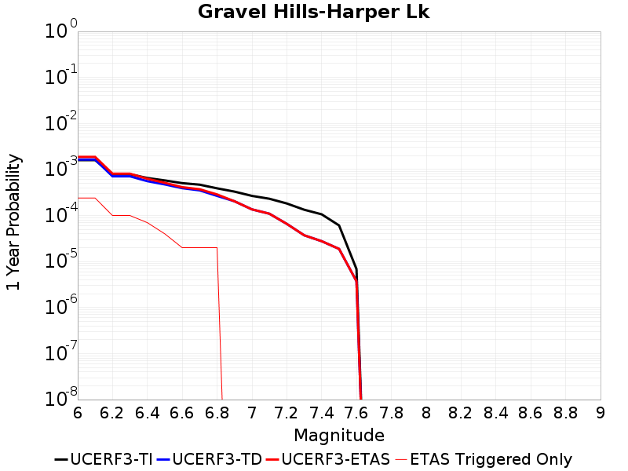 | 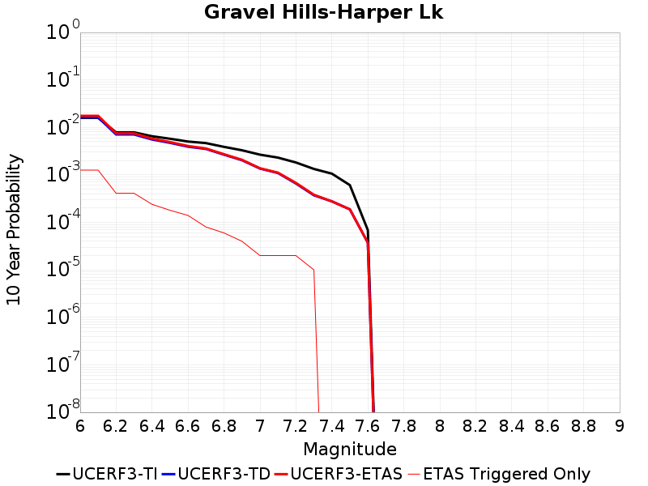 |

| Magnitude | 1 wk TI Prob | 1 wk TD Prob | 1 wk ETAS Prob | 1 wk ETAS/TD Gain | 1 wk ETAS Triggered Only | 1 mo TI Prob | 1 mo TD Prob | 1 mo ETAS Prob | 1 mo ETAS/TD Gain | 1 mo ETAS Triggered Only | 1 yr TI Prob | 1 yr TD Prob | 1 yr ETAS Prob | 1 yr ETAS/TD Gain | 1 yr ETAS Triggered Only | 10 yr TI Prob | 10 yr TD Prob | 10 yr ETAS Prob | 10 yr ETAS/TD Gain | 10 yr ETAS Triggered Only |
|-----|-----|-----|-----|-----|-----|-----|-----|-----|-----|-----|-----|-----|-----|-----|-----|-----|-----|-----|-----|-----|
| 6.0 | 3.0679566E-5 | 3.1490126E-5 | 3.1490126E-5 | 1.0 | 0.0 | 1.3147724E-4 | 1.3495193E-4 | 1.4495058E-4 | 1.0740905 | 1.0E-5 | 0.0015995599 | 0.001642019 | 0.0018816249 | 1.1459215 | 2.4E-4 | 0.015880952 | 0.016320474 | 0.01755991 | 1.0759436 | 0.00126 |
| 6.1 | 3.0679566E-5 | 3.1490126E-5 | 3.1490126E-5 | 1.0 | 0.0 | 1.3147724E-4 | 1.3495193E-4 | 1.4495058E-4 | 1.0740905 | 1.0E-5 | 0.0015995599 | 0.001642019 | 0.0018816249 | 1.1459215 | 2.4E-4 | 0.015880952 | 0.016320474 | 0.01755991 | 1.0759436 | 0.00126 |
| 6.2 | 1.514536E-5 | 1.3644166E-5 | 1.3644166E-5 | 1.0 | 0.0 | 6.490707E-5 | 5.8473754E-5 | 5.8473754E-5 | 1.0 | 0.0 | 7.8995706E-4 | 7.1169727E-4 | 8.1162615E-4 | 1.1404092 | 1.0E-4 | 0.007871548 | 0.007095384 | 0.007502475 | 1.057374 | 4.1E-4 |
| 6.3 | 1.514536E-5 | 1.3644166E-5 | 1.3644166E-5 | 1.0 | 0.0 | 6.490707E-5 | 5.8473754E-5 | 5.8473754E-5 | 1.0 | 0.0 | 7.8995706E-4 | 7.1169727E-4 | 8.1162615E-4 | 1.1404092 | 1.0E-4 | 0.007871548 | 0.007095384 | 0.007502475 | 1.057374 | 4.1E-4 |
| 6.4 | 1.2532521E-5 | 1.0696304E-5 | 1.0696304E-5 | 1.0 | 0.0 | 5.37097E-5 | 4.5840534E-5 | 4.5840534E-5 | 1.0 | 0.0 | 6.537194E-4 | 5.579714E-4 | 6.279324E-4 | 1.1253844 | 7.0E-5 | 0.0065179965 | 0.0055662952 | 0.0058049597 | 1.0428766 | 2.4E-4 |
| 6.5 | 1.1094058E-5 | 9.08911E-6 | 9.08911E-6 | 1.0 | 0.0 | 4.7545094E-5 | 3.8952767E-5 | 3.8952767E-5 | 1.0 | 0.0 | 5.787078E-4 | 4.741508E-4 | 5.1413185E-4 | 1.0843214 | 4.0E-5 | 0.0057720304 | 0.0047317995 | 0.0049109478 | 1.0378605 | 1.8E-4 |
| 6.6 | 9.688328E-6 | 7.5361345E-6 | 7.5361345E-6 | 1.0 | 0.0 | 4.1520743E-5 | 3.2297332E-5 | 3.2297332E-5 | 1.0 | 0.0 | 5.053978E-4 | 3.9315163E-4 | 4.1314377E-4 | 1.050851 | 2.0E-5 | 0.0050424994 | 0.0039248182 | 0.0040642684 | 1.0355304 | 1.4E-4 |
| 6.7 | 8.974824E-6 | 6.7533824E-6 | 6.7533824E-6 | 1.0 | 0.0 | 3.8462964E-5 | 2.8942759E-5 | 2.8942759E-5 | 1.0 | 0.0 | 4.6818596E-4 | 3.5232332E-4 | 3.7231628E-4 | 1.056746 | 2.0E-5 | 0.004672008 | 0.0035178687 | 0.003597587 | 1.0226611 | 8.0E-5 |
| 6.8 | 7.4780046E-6 | 5.1192364E-6 | 5.1192364E-6 | 1.0 | 0.0 | 3.20482E-5 | 2.1939408E-5 | 2.1939408E-5 | 1.0 | 0.0 | 3.9011694E-4 | 2.6708093E-4 | 2.8707559E-4 | 1.0748637 | 2.0E-5 | 0.0038943281 | 0.002667738 | 0.0027275777 | 1.022431 | 6.0E-5 |
| 6.9 | 6.3409307E-6 | 3.909928E-6 | 3.909928E-6 | 1.0 | 0.0 | 2.7175134E-5 | 1.6756734E-5 | 1.6756734E-5 | 1.0 | 0.0 | 3.3080703E-4 | 2.0399512E-4 | 2.0399512E-4 | 1.0 | 0.0 | 0.0033031502 | 0.0020381769 | 0.0020780955 | 1.0195854 | 4.0E-5 |
| 7.0 | 5.1239335E-6 | 2.607639E-6 | 2.607639E-6 | 1.0 | 0.0 | 2.195953E-5 | 1.117555E-5 | 1.117555E-5 | 1.0 | 0.0 | 2.6732447E-4 | 1.3605408E-4 | 1.3605408E-4 | 1.0 | 0.0 | 0.0026700313 | 0.001359733 | 0.0013797058 | 1.0146887 | 2.0E-5 |
| 7.1 | 4.438899E-6 | 2.1000099E-6 | 2.1000099E-6 | 1.0 | 0.0 | 1.9023713E-5 | 9.000012E-6 | 9.000012E-6 | 1.0 | 0.0 | 2.315891E-4 | 1.0956986E-4 | 1.0956986E-4 | 1.0 | 0.0 | 0.002313479 | 0.0010951803 | 0.0011151584 | 1.0182419 | 2.0E-5 |
| 7.2 | 3.50367E-6 | 1.2627795E-6 | 1.2627795E-6 | 1.0 | 0.0 | 1.5015643E-5 | 5.4119014E-6 | 5.4119014E-6 | 1.0 | 0.0 | 1.8280011E-4 | 6.588799E-5 | 6.588799E-5 | 1.0 | 0.0 | 0.0018264982 | 6.586928E-4 | 6.786796E-4 | 1.0303432 | 2.0E-5 |
| 7.3 | 2.561638E-6 | 7.1291726E-7 | 7.1291726E-7 | 1.0 | 0.0 | 1.0978401E-5 | 3.0553563E-6 | 3.0553563E-6 | 1.0 | 0.0 | 1.3365384E-4 | 3.7198348E-5 | 3.7198348E-5 | 1.0 | 0.0 | 0.0013357349 | 3.719232E-4 | 3.819195E-4 | 1.0268773 | 1.0E-5 |
| 7.4 | 2.0368864E-6 | 5.313401E-7 | 5.313401E-7 | 1.0 | 0.0 | 8.729483E-6 | 2.2771699E-6 | 2.2771699E-6 | 1.0 | 0.0 | 1.06276275E-4 | 2.7724196E-5 | 2.7724196E-5 | 1.0 | 0.0 | 0.0010622547 | 2.772079E-4 | 2.772079E-4 | 1.0 | 0.0 |
| 7.5 | 1.1681728E-6 | 3.6087533E-7 | 3.6087533E-7 | 1.0 | 0.0 | 5.0064455E-6 | 1.5466077E-6 | 1.5466077E-6 | 1.0 | 0.0 | 6.0951766E-5 | 1.882979E-5 | 1.882979E-5 | 1.0 | 0.0 | 6.093505E-4 | 1.8828241E-4 | 1.8828241E-4 | 1.0 | 0.0 |
| 7.6 | 1.3154387E-7 | 7.141621E-8 | 7.141621E-8 | 1.0 | 0.0 | 5.6375933E-7 | 3.0606947E-7 | 3.0606947E-7 | 1.0 | 0.0 | 6.863748E-6 | 3.7263908E-6 | 3.7263908E-6 | 1.0 | 0.0 | 6.863536E-5 | 3.7263442E-5 | 3.7263442E-5 | 1.0 | 0.0 |

## So Sierra Nevada
*[(top)](#table-of-contents)*

| 1 Week | 1 Month | 1 Year | 10 Year |
|-----|-----|-----|-----|
|  |  |  |  |

| Magnitude | 1 wk TI Prob | 1 wk TD Prob | 1 wk ETAS Prob | 1 wk ETAS/TD Gain | 1 wk ETAS Triggered Only | 1 mo TI Prob | 1 mo TD Prob | 1 mo ETAS Prob | 1 mo ETAS/TD Gain | 1 mo ETAS Triggered Only | 1 yr TI Prob | 1 yr TD Prob | 1 yr ETAS Prob | 1 yr ETAS/TD Gain | 1 yr ETAS Triggered Only | 10 yr TI Prob | 10 yr TD Prob | 10 yr ETAS Prob | 10 yr ETAS/TD Gain | 10 yr ETAS Triggered Only |
|-----|-----|-----|-----|-----|-----|-----|-----|-----|-----|-----|-----|-----|-----|-----|-----|-----|-----|-----|-----|-----|
| 6.0 | 1.15488665E-5 | 1.1083385E-5 | 2.1083275E-5 | 1.9022413 | 1.0E-5 | 4.9494203E-5 | 4.749943E-5 | 7.749801E-5 | 1.6315565 | 3.0E-5 | 6.024253E-4 | 5.781649E-4 | 7.980377E-4 | 1.3802943 | 2.2E-4 | 0.006007948 | 0.0057678767 | 0.007070321 | 1.2258099 | 0.00131 |
| 6.1 | 1.15488665E-5 | 1.1083385E-5 | 2.1083275E-5 | 1.9022413 | 1.0E-5 | 4.9494203E-5 | 4.749943E-5 | 7.749801E-5 | 1.6315565 | 3.0E-5 | 6.024253E-4 | 5.781649E-4 | 7.980377E-4 | 1.3802943 | 2.2E-4 | 0.006007948 | 0.0057678767 | 0.007070321 | 1.2258099 | 0.00131 |
| 6.2 | 1.15488665E-5 | 1.1083385E-5 | 2.1083275E-5 | 1.9022413 | 1.0E-5 | 4.9494203E-5 | 4.749943E-5 | 7.749801E-5 | 1.6315565 | 3.0E-5 | 6.024253E-4 | 5.781649E-4 | 7.980377E-4 | 1.3802943 | 2.2E-4 | 0.006007948 | 0.0057678767 | 0.007070321 | 1.2258099 | 0.00131 |
| 6.3 | 1.15488665E-5 | 1.1083385E-5 | 2.1083275E-5 | 1.9022413 | 1.0E-5 | 4.9494203E-5 | 4.749943E-5 | 7.749801E-5 | 1.6315565 | 3.0E-5 | 6.024253E-4 | 5.781649E-4 | 7.980377E-4 | 1.3802943 | 2.2E-4 | 0.006007948 | 0.0057678767 | 0.007070321 | 1.2258099 | 0.00131 |
| 6.4 | 1.15488665E-5 | 1.1083385E-5 | 2.1083275E-5 | 1.9022413 | 1.0E-5 | 4.9494203E-5 | 4.749943E-5 | 7.749801E-5 | 1.6315565 | 3.0E-5 | 6.024253E-4 | 5.781649E-4 | 7.980377E-4 | 1.3802943 | 2.2E-4 | 0.006007948 | 0.0057678767 | 0.007070321 | 1.2258099 | 0.00131 |
| 6.5 | 1.15488665E-5 | 1.1083385E-5 | 2.1083275E-5 | 1.9022413 | 1.0E-5 | 4.9494203E-5 | 4.749943E-5 | 7.749801E-5 | 1.6315565 | 3.0E-5 | 6.024253E-4 | 5.781649E-4 | 7.980377E-4 | 1.3802943 | 2.2E-4 | 0.006007948 | 0.0057678767 | 0.007070321 | 1.2258099 | 0.00131 |
| 6.6 | 7.587044E-6 | 6.9381917E-6 | 1.6938122E-5 | 2.4412878 | 1.0E-5 | 3.2515498E-5 | 2.9734785E-5 | 5.9733895E-5 | 2.0088894 | 3.0E-5 | 3.9580427E-4 | 3.619638E-4 | 5.219059E-4 | 1.4418732 | 1.6E-4 | 0.003951 | 0.0036140343 | 0.004341396 | 1.2012603 | 7.3E-4 |
| 6.7 | 7.587044E-6 | 6.9381917E-6 | 1.6938122E-5 | 2.4412878 | 1.0E-5 | 3.2515498E-5 | 2.9734785E-5 | 5.9733895E-5 | 2.0088894 | 3.0E-5 | 3.9580427E-4 | 3.619638E-4 | 5.219059E-4 | 1.4418732 | 1.6E-4 | 0.003951 | 0.0036140343 | 0.004341396 | 1.2012603 | 7.3E-4 |
| 6.8 | 5.9026956E-6 | 5.181483E-6 | 1.5181431E-5 | 2.9299395 | 1.0E-5 | 2.5297022E-5 | 2.2206174E-5 | 5.220551E-5 | 2.3509457 | 3.0E-5 | 3.0794772E-4 | 2.703278E-4 | 4.0029263E-4 | 1.4807676 | 1.3E-4 | 0.0030752132 | 0.0027001058 | 0.0032087287 | 1.1883715 | 5.1E-4 |
| 6.9 | 5.0118915E-6 | 4.2542815E-6 | 1.4254239E-5 | 3.350563 | 1.0E-5 | 2.1479358E-5 | 1.8232513E-5 | 3.823215E-5 | 2.0969214 | 2.0E-5 | 2.614798E-4 | 2.2195895E-4 | 3.11939E-4 | 1.4053904 | 9.0E-5 | 0.0026117235 | 0.0022174453 | 0.0026065805 | 1.1754881 | 3.9E-4 |
| 7.0 | 4.4924795E-6 | 3.7156415E-6 | 1.3715604E-5 | 3.6913154 | 1.0E-5 | 1.925334E-5 | 1.5924084E-5 | 3.5923767E-5 | 2.2559392 | 2.0E-5 | 2.3438422E-4 | 1.9385912E-4 | 2.8384165E-4 | 1.4641647 | 9.0E-5 | 0.0023413717 | 0.001936963 | 0.0022962657 | 1.185498 | 3.6E-4 |
| 7.1 | 3.9118436E-6 | 3.1135337E-6 | 1.3113503E-5 | 4.211775 | 1.0E-5 | 1.6764936E-5 | 1.33436515E-5 | 3.3343385E-5 | 2.49882 | 2.0E-5 | 2.0409399E-4 | 1.6244741E-4 | 2.4243441E-4 | 1.492387 | 8.0E-5 | 0.0020390663 | 0.0016233427 | 0.0018929044 | 1.1660534 | 2.7E-4 |
| 7.2 | 3.4200818E-6 | 2.606874E-6 | 1.2606848E-5 | 4.8360023 | 1.0E-5 | 1.4657411E-5 | 1.1172272E-5 | 3.1172047E-5 | 2.7901263 | 2.0E-5 | 1.7843937E-4 | 1.3601442E-4 | 2.060049E-4 | 1.5145813 | 7.0E-5 | 0.0017829615 | 0.0013593615 | 0.0015890489 | 1.1689671 | 2.3E-4 |
| 7.3 | 2.6593618E-6 | 1.8296516E-6 | 1.8296516E-6 | 1.0 | 0.0 | 1.13972155E-5 | 7.841342E-6 | 7.841342E-6 | 1.0 | 0.0 | 1.3875226E-4 | 9.546446E-5 | 1.2546159E-4 | 1.314223 | 3.0E-5 | 0.0013866565 | 9.542634E-4 | 0.001054168 | 1.1046928 | 1.0E-4 |
| 7.4 | 2.2577992E-6 | 1.4375543E-6 | 1.4375543E-6 | 1.0 | 0.0 | 9.676246E-6 | 6.1609335E-6 | 6.1609335E-6 | 1.0 | 0.0 | 1.1780193E-4 | 7.500704E-5 | 1.0500479E-4 | 1.3999325 | 3.0E-5 | 0.001177395 | 7.4984226E-4 | 8.397748E-4 | 1.1199353 | 9.0E-5 |
| 7.5 | 1.489319E-6 | 7.362588E-7 | 7.362588E-7 | 1.0 | 0.0 | 6.3827797E-6 | 3.1553911E-6 | 3.1553911E-6 | 1.0 | 0.0 | 7.770758E-5 | 3.8416212E-5 | 4.841583E-5 | 1.2602967 | 1.0E-5 | 7.7680405E-4 | 3.8409614E-4 | 4.240808E-4 | 1.1041006 | 4.0E-5 |
| 7.6 | 1.0680322E-6 | 4.66602E-7 | 4.66602E-7 | 1.0 | 0.0 | 4.577273E-6 | 1.9997212E-6 | 1.9997212E-6 | 1.0 | 0.0 | 5.5726876E-5 | 2.4346338E-5 | 2.4346338E-5 | 1.0 | 0.0 | 5.5712904E-4 | 2.4343697E-4 | 2.5343453E-4 | 1.0410684 | 1.0E-5 |
| 7.7 | 5.509146E-7 | 1.5612139E-7 | 1.5612139E-7 | 1.0 | 0.0 | 2.3610605E-6 | 6.690915E-7 | 6.690915E-7 | 1.0 | 0.0 | 2.8745531E-5 | 8.146159E-6 | 8.146159E-6 | 1.0 | 0.0 | 2.8741814E-4 | 8.1458726E-5 | 8.1458726E-5 | 1.0 | 0.0 |

## San Andreas (Mojave N)
*[(top)](#table-of-contents)*

| 1 Week | 1 Month | 1 Year | 10 Year |
|-----|-----|-----|-----|
| 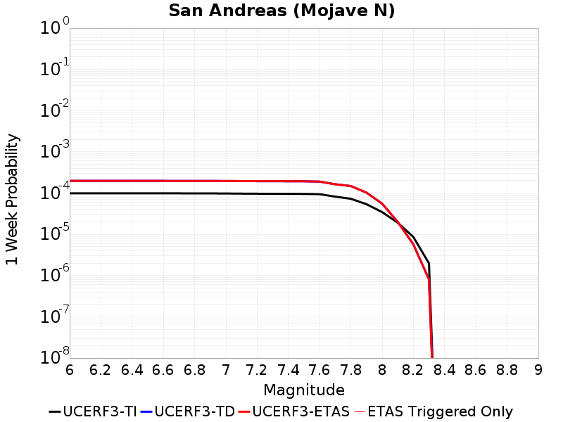 |  |  |  |

| Magnitude | 1 wk TI Prob | 1 wk TD Prob | 1 wk ETAS Prob | 1 wk ETAS/TD Gain | 1 wk ETAS Triggered Only | 1 mo TI Prob | 1 mo TD Prob | 1 mo ETAS Prob | 1 mo ETAS/TD Gain | 1 mo ETAS Triggered Only | 1 yr TI Prob | 1 yr TD Prob | 1 yr ETAS Prob | 1 yr ETAS/TD Gain | 1 yr ETAS Triggered Only | 10 yr TI Prob | 10 yr TD Prob | 10 yr ETAS Prob | 10 yr ETAS/TD Gain | 10 yr ETAS Triggered Only |
|-----|-----|-----|-----|-----|-----|-----|-----|-----|-----|-----|-----|-----|-----|-----|-----|-----|-----|-----|-----|-----|
| 6.0 | 9.877682E-5 | 1.9814262E-4 | 1.9814262E-4 | 1.0 | 0.0 | 4.2326056E-4 | 8.489065E-4 | 8.58898E-4 | 1.0117699 | 1.0E-5 | 0.0051410277 | 0.010286592 | 0.010583506 | 1.0288641 | 3.0E-4 | 0.05023708 | 0.10012938 | 0.10097526 | 1.0084479 | 9.4E-4 |
| 6.1 | 9.877682E-5 | 1.9814262E-4 | 1.9814262E-4 | 1.0 | 0.0 | 4.2326056E-4 | 8.489065E-4 | 8.58898E-4 | 1.0117699 | 1.0E-5 | 0.0051410277 | 0.010286592 | 0.010583506 | 1.0288641 | 3.0E-4 | 0.05023708 | 0.10012938 | 0.10097526 | 1.0084479 | 9.4E-4 |
| 6.2 | 9.877682E-5 | 1.9814262E-4 | 1.9814262E-4 | 1.0 | 0.0 | 4.2326056E-4 | 8.489065E-4 | 8.58898E-4 | 1.0117699 | 1.0E-5 | 0.0051410277 | 0.010286592 | 0.010583506 | 1.0288641 | 3.0E-4 | 0.05023708 | 0.10012938 | 0.10097526 | 1.0084479 | 9.4E-4 |
| 6.3 | 9.877682E-5 | 1.9814262E-4 | 1.9814262E-4 | 1.0 | 0.0 | 4.2326056E-4 | 8.489065E-4 | 8.58898E-4 | 1.0117699 | 1.0E-5 | 0.0051410277 | 0.010286592 | 0.010583506 | 1.0288641 | 3.0E-4 | 0.05023708 | 0.10012938 | 0.10097526 | 1.0084479 | 9.4E-4 |
| 6.4 | 9.877682E-5 | 1.9814262E-4 | 1.9814262E-4 | 1.0 | 0.0 | 4.2326056E-4 | 8.489065E-4 | 8.58898E-4 | 1.0117699 | 1.0E-5 | 0.0051410277 | 0.010286592 | 0.010583506 | 1.0288641 | 3.0E-4 | 0.05023708 | 0.10012938 | 0.10097526 | 1.0084479 | 9.4E-4 |
| 6.5 | 9.861474E-5 | 1.9787907E-4 | 1.9787907E-4 | 1.0 | 0.0 | 4.2256617E-4 | 8.477777E-4 | 8.577692E-4 | 1.0117855 | 1.0E-5 | 0.0051326132 | 0.010272979 | 0.0105698975 | 1.0289028 | 3.0E-4 | 0.050156746 | 0.10000667 | 0.10085266 | 1.0084593 | 9.4E-4 |
| 6.6 | 9.861474E-5 | 1.9787907E-4 | 1.9787907E-4 | 1.0 | 0.0 | 4.2256617E-4 | 8.477777E-4 | 8.577692E-4 | 1.0117855 | 1.0E-5 | 0.0051326132 | 0.010272979 | 0.0105698975 | 1.0289028 | 3.0E-4 | 0.050156746 | 0.10000667 | 0.10085266 | 1.0084593 | 9.4E-4 |
| 6.7 | 9.8552715E-5 | 1.977781E-4 | 1.977781E-4 | 1.0 | 0.0 | 4.223004E-4 | 8.4734533E-4 | 8.5733685E-4 | 1.0117916 | 1.0E-5 | 0.0051293927 | 0.010267764 | 0.010564684 | 1.0289177 | 3.0E-4 | 0.050125998 | 0.09995977 | 0.10080581 | 1.0084637 | 9.4E-4 |
| 6.8 | 9.8464974E-5 | 1.9762854E-4 | 1.9762854E-4 | 1.0 | 0.0 | 4.219245E-4 | 8.4670476E-4 | 8.566963E-4 | 1.0118005 | 1.0E-5 | 0.0051248376 | 0.010260039 | 0.010556961 | 1.0289396 | 3.0E-4 | 0.05008251 | 0.09988929 | 0.1007354 | 1.0084704 | 9.4E-4 |
| 6.9 | 9.825824E-5 | 1.9730644E-4 | 1.9730644E-4 | 1.0 | 0.0 | 4.2103877E-4 | 8.453251E-4 | 8.553167E-4 | 1.0118197 | 1.0E-5 | 0.0051141046 | 0.0102434 | 0.010540327 | 1.0289872 | 3.0E-4 | 0.049980022 | 0.099737786 | 0.10058403 | 1.0084847 | 9.4E-4 |
| 7.0 | 9.781462E-5 | 1.9661536E-4 | 1.9661536E-4 | 1.0 | 0.0 | 4.1913814E-4 | 8.423653E-4 | 8.523569E-4 | 1.0118613 | 1.0E-5 | 0.005091073 | 0.010207703 | 0.010504641 | 1.0290896 | 3.0E-4 | 0.04976007 | 0.099412784 | 0.10025934 | 1.0085155 | 9.4E-4 |
| 7.1 | 9.7121134E-5 | 1.956261E-4 | 1.956261E-4 | 1.0 | 0.0 | 4.1616702E-4 | 8.381284E-4 | 8.4812E-4 | 1.0119214 | 1.0E-5 | 0.005055068 | 0.0101566 | 0.010453553 | 1.0292374 | 3.0E-4 | 0.04941613 | 0.09894719 | 0.09979418 | 1.0085601 | 9.4E-4 |
| 7.2 | 9.663819E-5 | 1.9492937E-4 | 1.9492937E-4 | 1.0 | 0.0 | 4.1409794E-4 | 8.3514425E-4 | 8.4513595E-4 | 1.011964 | 1.0E-5 | 0.0050299936 | 0.010120607 | 0.01041757 | 1.0293425 | 3.0E-4 | 0.049176537 | 0.0986189 | 0.099466205 | 1.0085917 | 9.4E-4 |
| 7.3 | 9.6277574E-5 | 1.9444874E-4 | 1.9444874E-4 | 1.0 | 0.0 | 4.125529E-4 | 8.3308585E-4 | 8.430775E-4 | 1.0119935 | 1.0E-5 | 0.0050112694 | 0.010095778 | 0.010392749 | 1.0294154 | 3.0E-4 | 0.04899759 | 0.09839014 | 0.09923765 | 1.0086138 | 9.4E-4 |
| 7.4 | 9.593308E-5 | 1.9384027E-4 | 1.9384027E-4 | 1.0 | 0.0 | 4.1107697E-4 | 8.304797E-4 | 8.404714E-4 | 1.0120312 | 1.0E-5 | 0.0049933824 | 0.010064342 | 0.010361323 | 1.0295082 | 3.0E-4 | 0.04882661 | 0.098105654 | 0.09895343 | 1.0086415 | 9.4E-4 |
| 7.5 | 9.561707E-5 | 1.9329527E-4 | 1.9329527E-4 | 1.0 | 0.0 | 4.0972308E-4 | 8.2814554E-4 | 8.3813723E-4 | 1.0120652 | 1.0E-5 | 0.0049769743 | 0.010036185 | 0.010333175 | 1.0295918 | 3.0E-4 | 0.048669744 | 0.09784999 | 0.098698005 | 1.0086665 | 9.4E-4 |
| 7.6 | 9.418194E-5 | 1.8978454E-4 | 1.8978454E-4 | 1.0 | 0.0 | 4.0357444E-4 | 8.13109E-4 | 8.2310085E-4 | 1.0122885 | 1.0E-5 | 0.004902454 | 0.009854785 | 0.010151829 | 1.0301421 | 3.0E-4 | 0.047957025 | 0.09622038 | 0.097069934 | 1.0088292 | 9.4E-4 |
| 7.7 | 8.202141E-5 | 1.6392842E-4 | 1.6392842E-4 | 1.0 | 0.0 | 3.51473E-4 | 7.023612E-4 | 7.123542E-4 | 1.0142276 | 1.0E-5 | 0.00427079 | 0.008517781 | 0.008785482 | 1.0314283 | 2.7E-4 | 0.04189639 | 0.0838948 | 0.08468265 | 1.009391 | 8.6E-4 |
| 7.8 | 7.2859846E-5 | 1.4850749E-4 | 1.4850749E-4 | 1.0 | 0.0 | 3.1221908E-4 | 6.363055E-4 | 6.363055E-4 | 1.0 | 0.0 | 0.003794643 | 0.0077195456 | 0.007838619 | 1.015425 | 1.2E-4 | 0.037304975 | 0.07623158 | 0.07668423 | 1.0059378 | 4.9E-4 |
| 7.9 | 5.3874453E-5 | 1.0281038E-4 | 1.0281038E-4 | 1.0 | 0.0 | 2.3087008E-4 | 4.4054154E-4 | 4.4054154E-4 | 1.0 | 0.0 | 0.0028072202 | 0.0053504147 | 0.0053902008 | 1.007436 | 4.0E-5 | 0.02772022 | 0.053522013 | 0.053758632 | 1.004421 | 2.5E-4 |
| 8.0 | 3.468538E-5 | 5.5627166E-5 | 5.5627166E-5 | 1.0 | 0.0 | 1.4864317E-4 | 2.3838035E-4 | 2.3838035E-4 | 1.0 | 0.0 | 0.0018082283 | 0.0028984202 | 0.0028984202 | 1.0 | 0.0 | 0.017935853 | 0.029617619 | 0.029675841 | 1.0019659 | 6.0E-5 |
| 8.1 | 1.9152367E-5 | 2.00541E-5 | 2.00541E-5 | 1.0 | 0.0 | 8.207899E-5 | 8.594331E-5 | 8.594331E-5 | 1.0 | 0.0 | 9.988535E-4 | 0.0010458583 | 0.0010458583 | 1.0 | 0.0 | 0.009943757 | 0.011196967 | 0.011226632 | 1.0026493 | 3.0E-5 |
| 8.2 | 8.643924E-6 | 5.720392E-6 | 5.720392E-6 | 1.0 | 0.0 | 3.704486E-5 | 2.4515735E-5 | 2.4515735E-5 | 1.0 | 0.0 | 4.5092785E-4 | 2.9843827E-4 | 2.9843827E-4 | 1.0 | 0.0 | 0.0045001395 | 0.0033829338 | 0.0033829338 | 1.0 | 0.0 |
| 8.3 | 1.983087E-6 | 8.0695344E-7 | 8.0695344E-7 | 1.0 | 0.0 | 8.498917E-6 | 3.4583672E-6 | 3.4583672E-6 | 1.0 | 0.0 | 1.034694E-4 | 4.2104828E-5 | 4.2104828E-5 | 1.0 | 0.0 | 0.0010342124 | 4.95424E-4 | 4.95424E-4 | 1.0 | 0.0 |

## Nelson Lake
*[(top)](#table-of-contents)*

| 1 Week | 1 Month | 1 Year | 10 Year |
|-----|-----|-----|-----|
|  |  | 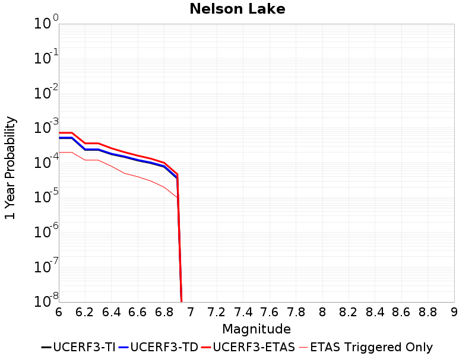 | 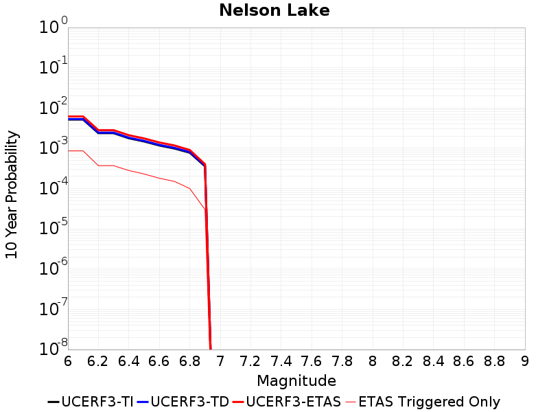 |

| Magnitude | 1 wk TI Prob | 1 wk TD Prob | 1 wk ETAS Prob | 1 wk ETAS/TD Gain | 1 wk ETAS Triggered Only | 1 mo TI Prob | 1 mo TD Prob | 1 mo ETAS Prob | 1 mo ETAS/TD Gain | 1 mo ETAS Triggered Only | 1 yr TI Prob | 1 yr TD Prob | 1 yr ETAS Prob | 1 yr ETAS/TD Gain | 1 yr ETAS Triggered Only | 10 yr TI Prob | 10 yr TD Prob | 10 yr ETAS Prob | 10 yr ETAS/TD Gain | 10 yr ETAS Triggered Only |
|-----|-----|-----|-----|-----|-----|-----|-----|-----|-----|-----|-----|-----|-----|-----|-----|-----|-----|-----|-----|-----|
| 6.0 | 9.913453E-6 | 1.0194038E-5 | 1.0194038E-5 | 1.0 | 0.0 | 4.2485535E-5 | 4.368806E-5 | 6.3687185E-5 | 1.457771 | 2.0E-5 | 5.1713863E-4 | 5.317826E-4 | 7.316763E-4 | 1.3758935 | 2.0E-4 | 0.0051593683 | 0.0053061293 | 0.0061615664 | 1.1612167 | 8.6E-4 |
| 6.1 | 9.913453E-6 | 1.0194038E-5 | 1.0194038E-5 | 1.0 | 0.0 | 4.2485535E-5 | 4.368806E-5 | 6.3687185E-5 | 1.457771 | 2.0E-5 | 5.1713863E-4 | 5.317826E-4 | 7.316763E-4 | 1.3758935 | 2.0E-4 | 0.0051593683 | 0.0053061293 | 0.0061615664 | 1.1612167 | 8.6E-4 |
| 6.2 | 4.5596407E-6 | 4.697189E-6 | 4.697189E-6 | 1.0 | 0.0 | 1.954117E-5 | 2.0130663E-5 | 3.013046E-5 | 1.4967446 | 1.0E-5 | 2.3788778E-4 | 2.4506453E-4 | 3.650351E-4 | 1.489547 | 1.2E-4 | 0.0023763329 | 0.002448069 | 0.002817163 | 1.1507696 | 3.7E-4 |
| 6.3 | 4.5596407E-6 | 4.697189E-6 | 4.697189E-6 | 1.0 | 0.0 | 1.954117E-5 | 2.0130663E-5 | 3.013046E-5 | 1.4967446 | 1.0E-5 | 2.3788778E-4 | 2.4506453E-4 | 3.650351E-4 | 1.489547 | 1.2E-4 | 0.0023763329 | 0.002448069 | 0.002817163 | 1.1507696 | 3.7E-4 |
| 6.4 | 3.4025713E-6 | 3.5105863E-6 | 3.5105863E-6 | 1.0 | 0.0 | 1.4582367E-5 | 1.5045288E-5 | 2.5045138E-5 | 1.66465 | 1.0E-5 | 1.7752586E-4 | 1.8316183E-4 | 2.6314717E-4 | 1.4366922 | 8.0E-5 | 0.001773841 | 0.0018301916 | 0.0021096792 | 1.1527095 | 2.8E-4 |
| 6.5 | 2.8352947E-6 | 2.928451E-6 | 2.928451E-6 | 1.0 | 0.0 | 1.2151207E-5 | 1.2550448E-5 | 2.2550323E-5 | 1.7967743 | 1.0E-5 | 1.479309E-4 | 1.5279175E-4 | 2.0278411E-4 | 1.3271928 | 5.0E-5 | 0.0014783246 | 0.0015269408 | 0.0017565896 | 1.150398 | 2.3E-4 |
| 6.6 | 2.251518E-6 | 2.329567E-6 | 2.329567E-6 | 1.0 | 0.0 | 9.649328E-6 | 9.9838235E-6 | 1.9983723E-5 | 2.0016103 | 1.0E-5 | 1.1747423E-4 | 1.215469E-4 | 1.6154203E-4 | 1.329051 | 4.0E-5 | 0.0011741214 | 0.001214866 | 0.0013946473 | 1.1479845 | 1.8E-4 |
| 6.7 | 1.8911853E-6 | 1.9595777E-6 | 1.9595777E-6 | 1.0 | 0.0 | 8.105055E-6 | 8.398167E-6 | 1.8398083E-5 | 2.190726 | 1.0E-5 | 9.867457E-5 | 1.0224347E-4 | 1.322404E-4 | 1.2933873 | 3.0E-5 | 9.863076E-4 | 0.0010220219 | 0.0011718685 | 1.1466179 | 1.5E-4 |
| 6.8 | 1.4874814E-6 | 1.5441944E-6 | 1.5441944E-6 | 1.0 | 0.0 | 6.374905E-6 | 6.6179623E-6 | 6.6179623E-6 | 1.0 | 0.0 | 7.76117E-5 | 8.057123E-5 | 1.0056962E-4 | 1.2482076 | 2.0E-5 | 7.75846E-4 | 8.054713E-4 | 9.0539077E-4 | 1.124051 | 1.0E-4 |
| 6.9 | 6.835972E-7 | 7.1419E-7 | 7.1419E-7 | 1.0 | 0.0 | 2.9296991E-6 | 3.0608126E-6 | 3.0608126E-6 | 1.0 | 0.0 | 3.56685E-5 | 3.7265076E-5 | 4.72647E-5 | 1.2683377 | 1.0E-5 | 3.5662777E-4 | 3.726195E-4 | 4.0260833E-4 | 1.080481 | 3.0E-5 |

## San Andreas (Mojave S)
*[(top)](#table-of-contents)*

| 1 Week | 1 Month | 1 Year | 10 Year |
|-----|-----|-----|-----|
|  |  | 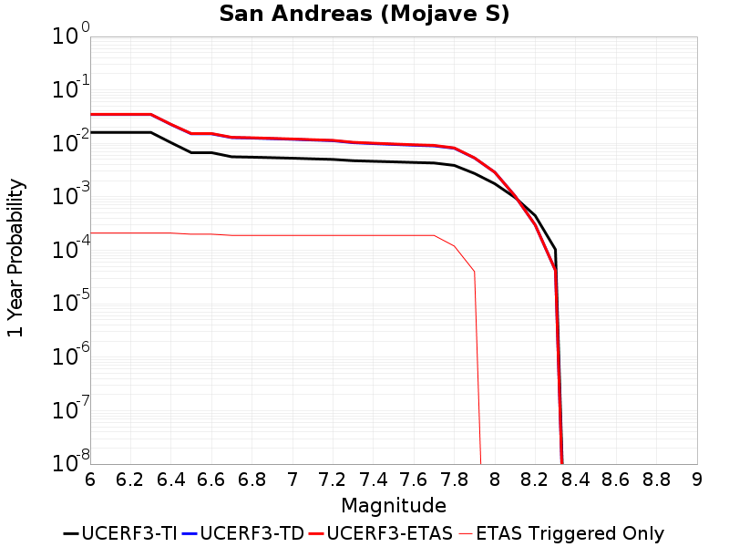 |  |

| Magnitude | 1 wk TI Prob | 1 wk TD Prob | 1 wk ETAS Prob | 1 wk ETAS/TD Gain | 1 wk ETAS Triggered Only | 1 mo TI Prob | 1 mo TD Prob | 1 mo ETAS Prob | 1 mo ETAS/TD Gain | 1 mo ETAS Triggered Only | 1 yr TI Prob | 1 yr TD Prob | 1 yr ETAS Prob | 1 yr ETAS/TD Gain | 1 yr ETAS Triggered Only | 10 yr TI Prob | 10 yr TD Prob | 10 yr ETAS Prob | 10 yr ETAS/TD Gain | 10 yr ETAS Triggered Only |
|-----|-----|-----|-----|-----|-----|-----|-----|-----|-----|-----|-----|-----|-----|-----|-----|-----|-----|-----|-----|-----|
| 6.0 | 3.1064058E-4 | 6.7920564E-4 | 6.7920564E-4 | 1.0 | 0.0 | 0.0013306376 | 0.0029077625 | 0.0029077625 | 1.0 | 0.0 | 0.016080605 | 0.034796517 | 0.034999207 | 1.005825 | 2.1E-4 | 0.1496549 | 0.2881656 | 0.28873506 | 1.0019761 | 8.0E-4 |
| 6.1 | 3.1064058E-4 | 6.7920564E-4 | 6.7920564E-4 | 1.0 | 0.0 | 0.0013306376 | 0.0029077625 | 0.0029077625 | 1.0 | 0.0 | 0.016080605 | 0.034796517 | 0.034999207 | 1.005825 | 2.1E-4 | 0.1496549 | 0.2881656 | 0.28873506 | 1.0019761 | 8.0E-4 |
| 6.2 | 3.1064058E-4 | 6.7920564E-4 | 6.7920564E-4 | 1.0 | 0.0 | 0.0013306376 | 0.0029077625 | 0.0029077625 | 1.0 | 0.0 | 0.016080605 | 0.034796517 | 0.034999207 | 1.005825 | 2.1E-4 | 0.1496549 | 0.2881656 | 0.28873506 | 1.0019761 | 8.0E-4 |
| 6.3 | 3.1064058E-4 | 6.7920564E-4 | 6.7920564E-4 | 1.0 | 0.0 | 0.0013306376 | 0.0029077625 | 0.0029077625 | 1.0 | 0.0 | 0.016080605 | 0.034796517 | 0.034999207 | 1.005825 | 2.1E-4 | 0.1496549 | 0.2881656 | 0.28873506 | 1.0019761 | 8.0E-4 |
| 6.4 | 1.9872203E-4 | 4.3617075E-4 | 4.3617075E-4 | 1.0 | 0.0 | 8.5138786E-4 | 0.0018679925 | 0.0018679925 | 1.0 | 0.0 | 0.010316478 | 0.022511829 | 0.022717101 | 1.0091184 | 2.1E-4 | 0.098504856 | 0.19858454 | 0.1991776 | 1.0029864 | 7.4E-4 |
| 6.5 | 1.291105E-4 | 2.9168322E-4 | 2.9168322E-4 | 1.0 | 0.0 | 5.5321335E-4 | 0.0012494748 | 0.0012494748 | 1.0 | 0.0 | 0.006714592 | 0.0151070915 | 0.01530407 | 1.0130389 | 2.0E-4 | 0.065152965 | 0.1397406 | 0.14034277 | 1.0043093 | 7.0E-4 |
| 6.6 | 1.291105E-4 | 2.9168322E-4 | 2.9168322E-4 | 1.0 | 0.0 | 5.5321335E-4 | 0.0012494748 | 0.0012494748 | 1.0 | 0.0 | 0.006714592 | 0.0151070915 | 0.01530407 | 1.0130389 | 2.0E-4 | 0.065152965 | 0.1397406 | 0.14034277 | 1.0043093 | 7.0E-4 |
| 6.7 | 1.08001186E-4 | 2.474324E-4 | 2.474324E-4 | 1.0 | 0.0 | 4.6278012E-4 | 0.0010599942 | 0.0010599942 | 1.0 | 0.0 | 0.0056198016 | 0.012829375 | 0.013016938 | 1.0146197 | 1.9E-4 | 0.054797906 | 0.12091607 | 0.12151385 | 1.0049437 | 6.8E-4 |
| 6.8 | 1.0624356E-4 | 2.4259728E-4 | 2.4259728E-4 | 1.0 | 0.0 | 4.5525006E-4 | 0.0010392889 | 0.0010392889 | 1.0 | 0.0 | 0.0055285925 | 0.012580218 | 0.012767827 | 1.0149131 | 1.9E-4 | 0.053930566 | 0.1188645 | 0.119463675 | 1.0050408 | 6.8E-4 |
| 6.9 | 1.0393785E-4 | 2.3628546E-4 | 2.3628546E-4 | 1.0 | 0.0 | 4.4537184E-4 | 0.0010122594 | 0.0010122594 | 1.0 | 0.0 | 0.0054089287 | 0.012254877 | 0.012442548 | 1.015314 | 1.9E-4 | 0.05279156 | 0.11615953 | 0.11676054 | 1.005174 | 6.8E-4 |
| 7.0 | 1.0155622E-4 | 2.2996303E-4 | 2.2996303E-4 | 1.0 | 0.0 | 4.3516833E-4 | 9.85184E-4 | 9.85184E-4 | 1.0 | 0.0 | 0.005285311 | 0.011928884 | 0.0121166175 | 1.0157378 | 1.9E-4 | 0.05161361 | 0.1134194 | 0.11402228 | 1.0053154 | 6.8E-4 |
| 7.1 | 9.885595E-5 | 2.228272E-4 | 2.228272E-4 | 1.0 | 0.0 | 4.2359953E-4 | 9.5462456E-4 | 9.5462456E-4 | 1.0 | 0.0 | 0.0051451353 | 0.011560825 | 0.011748629 | 1.0162448 | 1.9E-4 | 0.05027629 | 0.11030747 | 0.11090357 | 1.0054039 | 6.7E-4 |
| 7.2 | 9.6411415E-5 | 2.1643845E-4 | 2.1643845E-4 | 1.0 | 0.0 | 4.1312634E-4 | 9.2726387E-4 | 9.2726387E-4 | 1.0 | 0.0 | 0.005018219 | 0.0112311905 | 0.011419057 | 1.0167272 | 1.9E-4 | 0.049064007 | 0.10749152 | 0.10808951 | 1.005563 | 6.7E-4 |
| 7.3 | 9.1180635E-5 | 1.9861555E-4 | 1.9861555E-4 | 1.0 | 0.0 | 3.907156E-4 | 8.509319E-4 | 8.509319E-4 | 1.0 | 0.0 | 0.004746591 | 0.010311002 | 0.010499043 | 1.0182369 | 1.9E-4 | 0.046464786 | 0.09966229 | 0.10026552 | 1.0060527 | 6.7E-4 |
| 7.4 | 8.887388E-5 | 1.9105745E-4 | 1.9105745E-4 | 1.0 | 0.0 | 3.8083247E-4 | 8.1856083E-4 | 8.1856083E-4 | 1.0 | 0.0 | 0.0046267817 | 0.009920541 | 0.010108656 | 1.0189621 | 1.9E-4 | 0.045316286 | 0.09628068 | 0.096877135 | 1.006195 | 6.6E-4 |
| 7.5 | 8.6750515E-5 | 1.8433185E-4 | 1.8433185E-4 | 1.0 | 0.0 | 3.7173493E-4 | 7.897545E-4 | 7.897545E-4 | 1.0 | 0.0 | 0.004516484 | 0.009572961 | 0.009761143 | 1.0196576 | 1.9E-4 | 0.04425787 | 0.09323329 | 0.09383175 | 1.0064191 | 6.6E-4 |
| 7.6 | 8.453092E-5 | 1.7815903E-4 | 1.7815903E-4 | 1.0 | 0.0 | 3.6222505E-4 | 7.6331536E-4 | 7.6331536E-4 | 1.0 | 0.0 | 0.0044011753 | 0.009253844 | 0.009442086 | 1.020342 | 1.9E-4 | 0.04315024 | 0.09037682 | 0.09097716 | 1.0066427 | 6.6E-4 |
| 7.7 | 8.259102E-5 | 1.7333911E-4 | 1.7333911E-4 | 1.0 | 0.0 | 3.539135E-4 | 7.426705E-4 | 7.426705E-4 | 1.0 | 0.0 | 0.004300386 | 0.009004599 | 0.009192889 | 1.0209104 | 1.9E-4 | 0.042181134 | 0.08811439 | 0.08871623 | 1.0068302 | 6.6E-4 |
| 7.8 | 7.444844E-5 | 1.5623191E-4 | 1.5623191E-4 | 1.0 | 0.0 | 3.1902574E-4 | 6.693936E-4 | 6.693936E-4 | 1.0 | 0.0 | 0.0038772223 | 0.008119465 | 0.008238491 | 1.0146593 | 1.2E-4 | 0.03810269 | 0.07981244 | 0.08026333 | 1.0056494 | 4.9E-4 |
| 7.9 | 5.2586525E-5 | 1.0239285E-4 | 1.0239285E-4 | 1.0 | 0.0 | 2.2535135E-4 | 4.387527E-4 | 4.387527E-4 | 1.0 | 0.0 | 0.0027402006 | 0.0053287423 | 0.0053685294 | 1.0074664 | 4.0E-5 | 0.027066574 | 0.05328448 | 0.05351169 | 1.0042641 | 2.4E-4 |
| 8.0 | 3.379877E-5 | 5.542803E-5 | 5.542803E-5 | 1.0 | 0.0 | 1.4484383E-4 | 2.3752709E-4 | 2.3752709E-4 | 1.0 | 0.0 | 0.0017620471 | 0.0028880592 | 0.0028880592 | 1.0 | 0.0 | 0.017481409 | 0.029497681 | 0.029555911 | 1.0019741 | 6.0E-5 |
| 8.1 | 1.8668277E-5 | 1.995436E-5 | 1.995436E-5 | 1.0 | 0.0 | 8.000444E-5 | 8.551589E-5 | 8.551589E-5 | 1.0 | 0.0 | 9.736188E-4 | 0.0010406593 | 0.0010406593 | 1.0 | 0.0 | 0.009693642 | 0.0111358855 | 0.011165552 | 1.002664 | 3.0E-5 |
| 8.2 | 8.541571E-6 | 5.7055104E-6 | 5.7055104E-6 | 1.0 | 0.0 | 3.660622E-5 | 2.445196E-5 | 2.445196E-5 | 1.0 | 0.0 | 4.455896E-4 | 2.9766202E-4 | 2.9766202E-4 | 1.0 | 0.0 | 0.0044469717 | 0.0033745696 | 0.0033745696 | 1.0 | 0.0 |
| 8.3 | 1.983087E-6 | 8.0695344E-7 | 8.0695344E-7 | 1.0 | 0.0 | 8.498917E-6 | 3.4583672E-6 | 3.4583672E-6 | 1.0 | 0.0 | 1.034694E-4 | 4.2104828E-5 | 4.2104828E-5 | 1.0 | 0.0 | 0.0010342124 | 4.95424E-4 | 4.95424E-4 | 1.0 | 0.0 |

## Coyote Canyon
*[(top)](#table-of-contents)*

| 1 Week | 1 Month | 1 Year | 10 Year |
|-----|-----|-----|-----|
|  |  |  |  |

| Magnitude | 1 wk TI Prob | 1 wk TD Prob | 1 wk ETAS Prob | 1 wk ETAS/TD Gain | 1 wk ETAS Triggered Only | 1 mo TI Prob | 1 mo TD Prob | 1 mo ETAS Prob | 1 mo ETAS/TD Gain | 1 mo ETAS Triggered Only | 1 yr TI Prob | 1 yr TD Prob | 1 yr ETAS Prob | 1 yr ETAS/TD Gain | 1 yr ETAS Triggered Only | 10 yr TI Prob | 10 yr TD Prob | 10 yr ETAS Prob | 10 yr ETAS/TD Gain | 10 yr ETAS Triggered Only |
|-----|-----|-----|-----|-----|-----|-----|-----|-----|-----|-----|-----|-----|-----|-----|-----|-----|-----|-----|-----|-----|
| 6.0 | 3.5090034E-5 | 4.0402054E-5 | 4.0402054E-5 | 1.0 | 0.0 | 1.503772E-4 | 1.7314163E-4 | 1.7314163E-4 | 1.0 | 0.0 | 0.0018293047 | 0.002106219 | 0.002265882 | 1.0758055 | 1.6E-4 | 0.018143194 | 0.020888537 | 0.021554334 | 1.0318737 | 6.8E-4 |
| 6.1 | 3.5090034E-5 | 4.0402054E-5 | 4.0402054E-5 | 1.0 | 0.0 | 1.503772E-4 | 1.7314163E-4 | 1.7314163E-4 | 1.0 | 0.0 | 0.0018293047 | 0.002106219 | 0.002265882 | 1.0758055 | 1.6E-4 | 0.018143194 | 0.020888537 | 0.021554334 | 1.0318737 | 6.8E-4 |
| 6.2 | 1.841879E-5 | 2.1078567E-5 | 2.1078567E-5 | 1.0 | 0.0 | 7.8935285E-5 | 9.0334164E-5 | 9.0334164E-5 | 1.0 | 0.0 | 9.606133E-4 | 0.0010993658 | 0.0011692888 | 1.063603 | 7.0E-5 | 0.0095647145 | 0.010949376 | 0.011305435 | 1.0325186 | 3.6E-4 |
| 6.3 | 1.841879E-5 | 2.1078567E-5 | 2.1078567E-5 | 1.0 | 0.0 | 7.8935285E-5 | 9.0334164E-5 | 9.0334164E-5 | 1.0 | 0.0 | 9.606133E-4 | 0.0010993658 | 0.0011692888 | 1.063603 | 7.0E-5 | 0.0095647145 | 0.010949376 | 0.011305435 | 1.0325186 | 3.6E-4 |
| 6.4 | 1.712201E-5 | 1.9582569E-5 | 1.9582569E-5 | 1.0 | 0.0 | 7.337798E-5 | 8.3923165E-5 | 8.3923165E-5 | 1.0 | 0.0 | 8.930107E-4 | 0.0010213862 | 0.001081325 | 1.0586836 | 6.0E-5 | 0.008894307 | 0.010176855 | 0.010503497 | 1.0320965 | 3.3E-4 |
| 6.5 | 1.4744935E-5 | 1.6851824E-5 | 1.6851824E-5 | 1.0 | 0.0 | 6.3191044E-5 | 7.222063E-5 | 7.222063E-5 | 1.0 | 0.0 | 7.6907943E-4 | 8.7902514E-4 | 9.389724E-4 | 1.0681975 | 6.0E-5 | 0.007664232 | 0.008764694 | 0.00908189 | 1.0361902 | 3.2E-4 |
| 6.6 | 1.2017839E-5 | 1.3736204E-5 | 1.3736204E-5 | 1.0 | 0.0 | 5.150401E-5 | 5.886862E-5 | 5.886862E-5 | 1.0 | 0.0 | 6.268809E-4 | 7.165785E-4 | 7.565498E-4 | 1.0557808 | 4.0E-5 | 0.0062511545 | 0.007151387 | 0.007409528 | 1.0360966 | 2.6E-4 |
| 6.7 | 1.00956095E-5 | 1.1543731E-5 | 1.1543731E-5 | 1.0 | 0.0 | 4.326618E-5 | 4.947268E-5 | 4.947268E-5 | 1.0 | 0.0 | 5.266384E-4 | 6.0225057E-4 | 6.322325E-4 | 1.0497831 | 3.0E-5 | 0.005253921 | 0.0060147266 | 0.0062334035 | 1.0363569 | 2.2E-4 |

## Death Valley (So)
*[(top)](#table-of-contents)*

| 1 Week | 1 Month | 1 Year | 10 Year |
|-----|-----|-----|-----|
|  |  |  |  |

| Magnitude | 1 wk TI Prob | 1 wk TD Prob | 1 wk ETAS Prob | 1 wk ETAS/TD Gain | 1 wk ETAS Triggered Only | 1 mo TI Prob | 1 mo TD Prob | 1 mo ETAS Prob | 1 mo ETAS/TD Gain | 1 mo ETAS Triggered Only | 1 yr TI Prob | 1 yr TD Prob | 1 yr ETAS Prob | 1 yr ETAS/TD Gain | 1 yr ETAS Triggered Only | 10 yr TI Prob | 10 yr TD Prob | 10 yr ETAS Prob | 10 yr ETAS/TD Gain | 10 yr ETAS Triggered Only |
|-----|-----|-----|-----|-----|-----|-----|-----|-----|-----|-----|-----|-----|-----|-----|-----|-----|-----|-----|-----|-----|
| 6.0 | 2.0684236E-5 | 2.5665422E-5 | 3.5665165E-5 | 1.3896192 | 1.0E-5 | 8.864371E-5 | 1.0999013E-4 | 1.2998792E-4 | 1.1818146 | 2.0E-5 | 0.0010787029 | 0.0013383242 | 0.00149811 | 1.1193925 | 1.6E-4 | 0.010734817 | 0.013308491 | 0.014038642 | 1.0548636 | 7.4E-4 |
| 6.1 | 2.0684236E-5 | 2.5665422E-5 | 3.5665165E-5 | 1.3896192 | 1.0E-5 | 8.864371E-5 | 1.0999013E-4 | 1.2998792E-4 | 1.1818146 | 2.0E-5 | 0.0010787029 | 0.0013383242 | 0.00149811 | 1.1193925 | 1.6E-4 | 0.010734817 | 0.013308491 | 0.014038642 | 1.0548636 | 7.4E-4 |
| 6.2 | 2.0684236E-5 | 2.5665422E-5 | 3.5665165E-5 | 1.3896192 | 1.0E-5 | 8.864371E-5 | 1.0999013E-4 | 1.2998792E-4 | 1.1818146 | 2.0E-5 | 0.0010787029 | 0.0013383242 | 0.00149811 | 1.1193925 | 1.6E-4 | 0.010734817 | 0.013308491 | 0.014038642 | 1.0548636 | 7.4E-4 |
| 6.3 | 2.0240292E-5 | 2.5165114E-5 | 3.5164863E-5 | 1.3973655 | 1.0E-5 | 8.6741224E-5 | 1.0784613E-4 | 1.2784397E-4 | 1.1854295 | 2.0E-5 | 0.0010555626 | 0.0013122526 | 0.0014520688 | 1.1065468 | 1.4E-4 | 0.010505628 | 0.013050855 | 0.01374172 | 1.0529363 | 7.0E-4 |
| 6.4 | 2.0240292E-5 | 2.5165114E-5 | 3.5164863E-5 | 1.3973655 | 1.0E-5 | 8.6741224E-5 | 1.0784613E-4 | 1.2784397E-4 | 1.1854295 | 2.0E-5 | 0.0010555626 | 0.0013122526 | 0.0014520688 | 1.1065468 | 1.4E-4 | 0.010505628 | 0.013050855 | 0.01374172 | 1.0529363 | 7.0E-4 |
| 6.5 | 1.9962767E-5 | 2.4854136E-5 | 3.485389E-5 | 1.4023376 | 1.0E-5 | 8.55519E-5 | 1.0651347E-4 | 1.2651134E-4 | 1.1877496 | 2.0E-5 | 0.0010410968 | 0.0012960469 | 0.0014358654 | 1.1078808 | 1.4E-4 | 0.010362327 | 0.012890686 | 0.013561921 | 1.0520712 | 6.8E-4 |
| 6.6 | 1.8937297E-5 | 2.3349823E-5 | 3.334959E-5 | 1.4282588 | 1.0E-5 | 8.115732E-5 | 1.00066914E-4 | 1.2006491E-4 | 1.1998463 | 2.0E-5 | 9.876423E-4 | 0.0012176484 | 0.0013574779 | 1.1148357 | 1.4E-4 | 0.009832645 | 0.012115552 | 0.012728041 | 1.0505539 | 6.2E-4 |
| 6.7 | 1.8621096E-5 | 2.2949835E-5 | 3.2949607E-5 | 1.435723 | 1.0E-5 | 7.980225E-5 | 9.835281E-5 | 1.1835084E-4 | 1.2033296 | 2.0E-5 | 9.711593E-4 | 0.0011968022 | 0.0013366347 | 1.1168383 | 1.4E-4 | 0.009669261 | 0.01190936 | 0.012521977 | 1.0514399 | 6.2E-4 |
| 6.8 | 1.7830353E-5 | 2.1839784E-5 | 3.1839565E-5 | 1.45787 | 1.0E-5 | 7.641356E-5 | 9.359579E-5 | 1.1359392E-4 | 1.2136648 | 2.0E-5 | 9.29938E-4 | 0.0011389471 | 0.0012687991 | 1.1140105 | 1.3E-4 | 0.009260561 | 0.011337167 | 0.011920477 | 1.0514512 | 5.9E-4 |
| 6.9 | 1.3135183E-5 | 1.531884E-5 | 2.5318684E-5 | 1.652781 | 1.0E-5 | 5.6292425E-5 | 6.565055E-5 | 8.564923E-5 | 1.3046232 | 2.0E-5 | 6.8514474E-4 | 7.990088E-4 | 9.289049E-4 | 1.1625715 | 1.3E-4 | 0.006830362 | 0.007963139 | 0.008369874 | 1.0510772 | 4.1E-4 |
| 7.0 | 1.1507512E-5 | 1.3165718E-5 | 2.3165587E-5 | 1.7595384 | 1.0E-5 | 4.9316975E-5 | 5.6423316E-5 | 7.642219E-5 | 1.3544434 | 2.0E-5 | 6.002687E-4 | 6.867432E-4 | 8.0666074E-4 | 1.1746178 | 1.2E-4 | 0.0059864987 | 0.006847498 | 0.0071553756 | 1.044962 | 3.1E-4 |
| 7.1 | 9.715903E-6 | 1.0873526E-5 | 2.0873416E-5 | 1.919655 | 1.0E-5 | 4.1638916E-5 | 4.6600017E-5 | 6.659908E-5 | 1.4291644 | 2.0E-5 | 5.068359E-4 | 5.6721177E-4 | 6.571607E-4 | 1.1585809 | 9.0E-5 | 0.0050568148 | 0.0056581786 | 0.0058272164 | 1.029875 | 1.7E-4 |
| 7.2 | 9.233269E-6 | 1.0293934E-5 | 2.0293832E-5 | 1.9714359 | 1.0E-5 | 3.9570554E-5 | 4.411614E-5 | 6.411526E-5 | 1.4533288 | 2.0E-5 | 4.81665E-4 | 5.369858E-4 | 6.069483E-4 | 1.1302873 | 7.0E-5 | 0.0048062233 | 0.005357315 | 0.0054866187 | 1.0241358 | 1.3E-4 |
| 7.3 | 8.8041315E-6 | 9.8151495E-6 | 1.981505E-5 | 2.0188231 | 1.0E-5 | 3.7731446E-5 | 4.206427E-5 | 6.206343E-5 | 1.4754429 | 2.0E-5 | 4.592835E-4 | 5.1201636E-4 | 5.719856E-4 | 1.1171237 | 6.0E-5 | 0.0045833546 | 0.005108794 | 0.005208283 | 1.0194741 | 1.0E-4 |
| 7.4 | 8.708749E-6 | 9.714122E-6 | 1.9714025E-5 | 2.0294192 | 1.0E-5 | 3.7322676E-5 | 4.1631312E-5 | 6.163048E-5 | 1.4803877 | 2.0E-5 | 4.5430884E-4 | 5.067476E-4 | 5.667171E-4 | 1.1183422 | 6.0E-5 | 0.004533812 | 0.0050563468 | 0.0051558414 | 1.0196772 | 1.0E-4 |
| 7.5 | 8.612678E-6 | 9.611722E-6 | 1.9611625E-5 | 2.0403864 | 1.0E-5 | 3.6910955E-5 | 4.1192467E-5 | 6.119164E-5 | 1.4855057 | 2.0E-5 | 4.492982E-4 | 5.014071E-4 | 5.61377E-4 | 1.1196033 | 6.0E-5 | 0.004483909 | 0.005003184 | 0.0050927335 | 1.0178986 | 9.0E-5 |
| 7.6 | 8.319024E-6 | 9.290633E-6 | 1.929054E-5 | 2.0763428 | 1.0E-5 | 3.5652476E-5 | 3.9816416E-5 | 5.981562E-5 | 1.5022854 | 2.0E-5 | 4.3398244E-4 | 4.8466123E-4 | 5.34637E-4 | 1.1031148 | 5.0E-5 | 0.0043313587 | 0.004836467 | 0.0048961765 | 1.0123458 | 6.0E-5 |
| 7.7 | 7.4718328E-6 | 8.351252E-6 | 1.835117E-5 | 2.197415 | 1.0E-5 | 3.2021748E-5 | 3.5790614E-5 | 5.5789897E-5 | 1.5587857 | 2.0E-5 | 3.8979502E-4 | 4.3566764E-4 | 4.7565022E-4 | 1.0917732 | 4.0E-5 | 0.00389112 | 0.004348541 | 0.004398324 | 1.0114481 | 5.0E-5 |
| 7.8 | 3.4586725E-7 | 3.64951E-7 | 3.64951E-7 | 1.0 | 0.0 | 1.4822873E-6 | 1.5640749E-6 | 1.5640749E-6 | 1.0 | 0.0 | 1.80467E-5 | 1.9042449E-5 | 1.9042449E-5 | 1.0 | 0.0 | 1.8045233E-4 | 1.9040862E-4 | 1.9040862E-4 | 1.0 | 0.0 |
| 7.9 | 2.5591178E-9 | 2.670388E-9 | 2.670388E-9 | 1.0 | 0.0 | 1.0967647E-8 | 1.144452E-8 | 1.144452E-8 | 1.0 | 0.0 | 1.335311E-7 | 1.3933703E-7 | 1.3933703E-7 | 1.0 | 0.0 | 1.3353102E-6 | 1.3933703E-6 | 1.3933703E-6 | 1.0 | 0.0 |

## Lenwood-Lockhart-Old Woman Springs
*[(top)](#table-of-contents)*

| 1 Week | 1 Month | 1 Year | 10 Year |
|-----|-----|-----|-----|
| 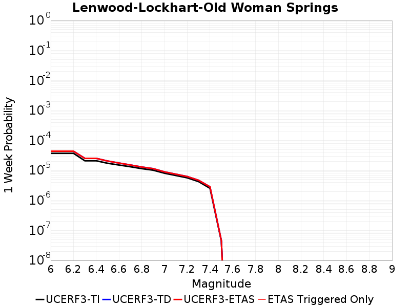 |  |  |  |

| Magnitude | 1 wk TI Prob | 1 wk TD Prob | 1 wk ETAS Prob | 1 wk ETAS/TD Gain | 1 wk ETAS Triggered Only | 1 mo TI Prob | 1 mo TD Prob | 1 mo ETAS Prob | 1 mo ETAS/TD Gain | 1 mo ETAS Triggered Only | 1 yr TI Prob | 1 yr TD Prob | 1 yr ETAS Prob | 1 yr ETAS/TD Gain | 1 yr ETAS Triggered Only | 10 yr TI Prob | 10 yr TD Prob | 10 yr ETAS Prob | 10 yr ETAS/TD Gain | 10 yr ETAS Triggered Only |
|-----|-----|-----|-----|-----|-----|-----|-----|-----|-----|-----|-----|-----|-----|-----|-----|-----|-----|-----|-----|-----|
| 6.0 | 3.744542E-5 | 4.398717E-5 | 4.398717E-5 | 1.0 | 0.0 | 1.604705E-4 | 1.8850378E-4 | 1.985019E-4 | 1.0530393 | 1.0E-5 | 0.0019519776 | 0.0022927902 | 0.0024723776 | 1.078327 | 1.8E-4 | 0.019349206 | 0.022709385 | 0.023276212 | 1.0249602 | 5.8E-4 |
| 6.1 | 3.744542E-5 | 4.398717E-5 | 4.398717E-5 | 1.0 | 0.0 | 1.604705E-4 | 1.8850378E-4 | 1.985019E-4 | 1.0530393 | 1.0E-5 | 0.0019519776 | 0.0022927902 | 0.0024723776 | 1.078327 | 1.8E-4 | 0.019349206 | 0.022709385 | 0.023276212 | 1.0249602 | 5.8E-4 |
| 6.2 | 3.744542E-5 | 4.398717E-5 | 4.398717E-5 | 1.0 | 0.0 | 1.604705E-4 | 1.8850378E-4 | 1.985019E-4 | 1.0530393 | 1.0E-5 | 0.0019519776 | 0.0022927902 | 0.0024723776 | 1.078327 | 1.8E-4 | 0.019349206 | 0.022709385 | 0.023276212 | 1.0249602 | 5.8E-4 |
| 6.3 | 2.1079984E-5 | 2.5364772E-5 | 2.5364772E-5 | 1.0 | 0.0 | 9.0339665E-5 | 1.08701744E-4 | 1.08701744E-4 | 1.0 | 0.0 | 0.0010993304 | 0.0013226602 | 0.0013925676 | 1.0528536 | 7.0E-5 | 0.010939079 | 0.013150097 | 0.013347467 | 1.015009 | 2.0E-4 |
| 6.4 | 2.1079984E-5 | 2.5364772E-5 | 2.5364772E-5 | 1.0 | 0.0 | 9.0339665E-5 | 1.08701744E-4 | 1.08701744E-4 | 1.0 | 0.0 | 0.0010993304 | 0.0013226602 | 0.0013925676 | 1.0528536 | 7.0E-5 | 0.010939079 | 0.013150097 | 0.013347467 | 1.015009 | 2.0E-4 |
| 6.5 | 1.7397282E-5 | 2.067194E-5 | 2.067194E-5 | 1.0 | 0.0 | 7.455765E-5 | 8.8591085E-5 | 8.8591085E-5 | 1.0 | 0.0 | 9.073613E-4 | 0.0010780744 | 0.0011280206 | 1.046329 | 5.0E-5 | 0.009036654 | 0.01072974 | 0.010848453 | 1.0110638 | 1.2E-4 |
| 6.6 | 1.52050325E-5 | 1.768824E-5 | 1.768824E-5 | 1.0 | 0.0 | 6.51628E-5 | 7.5804586E-5 | 7.5804586E-5 | 1.0 | 0.0 | 7.9306826E-4 | 9.22538E-4 | 9.525103E-4 | 1.032489 | 3.0E-5 | 0.007902439 | 0.009187945 | 0.009257303 | 1.0075487 | 7.0E-5 |
| 6.7 | 1.332523E-5 | 1.527208E-5 | 1.527208E-5 | 1.0 | 0.0 | 5.7106878E-5 | 6.5450164E-5 | 6.5450164E-5 | 1.0 | 0.0 | 6.950544E-4 | 7.9657027E-4 | 8.065623E-4 | 1.0125438 | 1.0E-5 | 0.006928845 | 0.007937781 | 0.007987384 | 1.006249 | 5.0E-5 |
| 6.8 | 1.1525329E-5 | 1.3038189E-5 | 1.3038189E-5 | 1.0 | 0.0 | 4.9393333E-5 | 5.587678E-5 | 5.587678E-5 | 1.0 | 0.0 | 6.011979E-4 | 6.800917E-4 | 6.900849E-4 | 1.0146939 | 1.0E-5 | 0.00599574 | 0.006780556 | 0.0068202848 | 1.0058593 | 4.0E-5 |
| 6.9 | 1.0253909E-5 | 1.1521104E-5 | 1.1521104E-5 | 1.0 | 0.0 | 4.3944583E-5 | 4.9375245E-5 | 4.9375245E-5 | 1.0 | 0.0 | 5.3489394E-4 | 6.009814E-4 | 6.1097543E-4 | 1.0166295 | 1.0E-5 | 0.0053360825 | 0.005993942 | 0.006003882 | 1.0016583 | 1.0E-5 |
| 7.0 | 8.104563E-6 | 8.997106E-6 | 8.997106E-6 | 1.0 | 0.0 | 3.4733377E-5 | 3.855847E-5 | 3.855847E-5 | 1.0 | 0.0 | 4.2279682E-4 | 4.693507E-4 | 4.693507E-4 | 1.0 | 0.0 | 0.0042199334 | 0.0046838424 | 0.0046838424 | 1.0 | 0.0 |
| 7.1 | 6.7986157E-6 | 7.5209527E-6 | 7.5209527E-6 | 1.0 | 0.0 | 2.91366E-5 | 3.2232267E-5 | 3.2232267E-5 | 1.0 | 0.0 | 3.5468035E-4 | 3.9235933E-4 | 3.9235933E-4 | 1.0 | 0.0 | 0.003541148 | 0.003916883 | 0.003916883 | 1.0 | 0.0 |
| 7.2 | 5.6893327E-6 | 6.284811E-6 | 6.284811E-6 | 1.0 | 0.0 | 2.4382627E-5 | 2.6934638E-5 | 2.6934638E-5 | 1.0 | 0.0 | 2.9681803E-4 | 3.2788186E-4 | 3.2788186E-4 | 1.0 | 0.0 | 0.002964219 | 0.00327418 | 0.00327418 | 1.0 | 0.0 |
| 7.3 | 4.253348E-6 | 4.7093167E-6 | 4.7093167E-6 | 1.0 | 0.0 | 1.8228506E-5 | 2.018264E-5 | 2.018264E-5 | 1.0 | 0.0 | 2.2190946E-4 | 2.4569777E-4 | 2.4569777E-4 | 1.0 | 0.0 | 0.00221688 | 0.0024544422 | 0.0024544422 | 1.0 | 0.0 |
| 7.4 | 2.5448119E-6 | 2.852476E-6 | 2.852476E-6 | 1.0 | 0.0 | 1.0906291E-5 | 1.2224849E-5 | 1.2224849E-5 | 1.0 | 0.0 | 1.3277601E-4 | 1.4882903E-4 | 1.4882903E-4 | 1.0 | 0.0 | 0.001326967 | 0.0014874557 | 0.0014874557 | 1.0 | 0.0 |
| 7.5 | 4.3706837E-8 | 4.5641556E-8 | 4.5641556E-8 | 1.0 | 0.0 | 1.8731501E-7 | 1.9560666E-7 | 1.9560666E-7 | 1.0 | 0.0 | 2.2805577E-6 | 2.381509E-6 | 2.381509E-6 | 1.0 | 0.0 | 2.2805343E-5 | 2.381489E-5 | 2.381489E-5 | 1.0 | 0.0 |

## Towne Pass
*[(top)](#table-of-contents)*

| 1 Week | 1 Month | 1 Year | 10 Year |
|-----|-----|-----|-----|
|  | 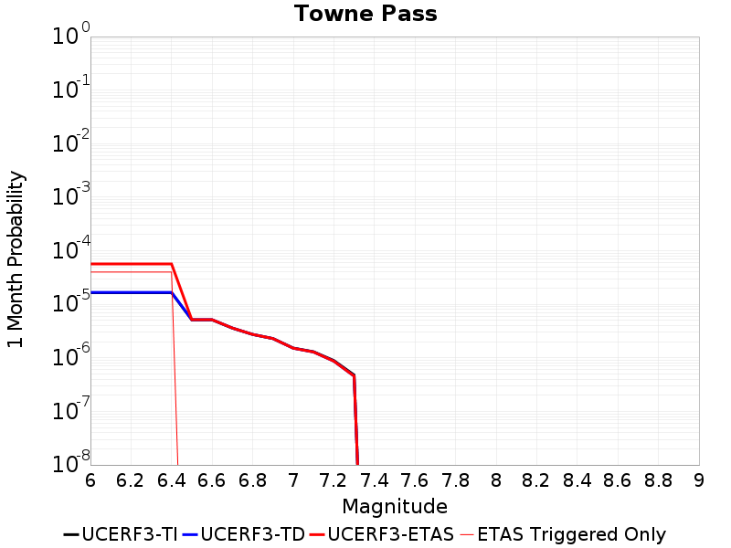 | 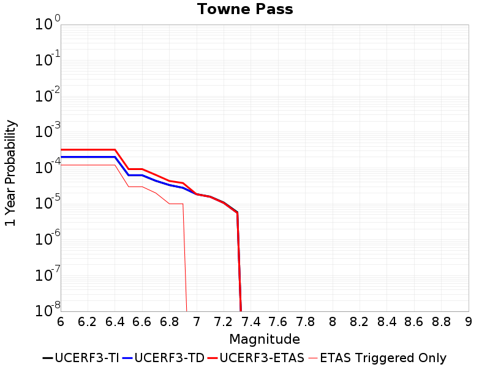 |  |

| Magnitude | 1 wk TI Prob | 1 wk TD Prob | 1 wk ETAS Prob | 1 wk ETAS/TD Gain | 1 wk ETAS Triggered Only | 1 mo TI Prob | 1 mo TD Prob | 1 mo ETAS Prob | 1 mo ETAS/TD Gain | 1 mo ETAS Triggered Only | 1 yr TI Prob | 1 yr TD Prob | 1 yr ETAS Prob | 1 yr ETAS/TD Gain | 1 yr ETAS Triggered Only | 10 yr TI Prob | 10 yr TD Prob | 10 yr ETAS Prob | 10 yr ETAS/TD Gain | 10 yr ETAS Triggered Only |
|-----|-----|-----|-----|-----|-----|-----|-----|-----|-----|-----|-----|-----|-----|-----|-----|-----|-----|-----|-----|-----|
| 6.0 | 3.849728E-6 | 3.8949242E-6 | 3.8949242E-6 | 1.0 | 0.0 | 1.649873E-5 | 1.669245E-5 | 5.669178E-5 | 3.396253 | 4.0E-5 | 2.0085352E-4 | 2.03216E-4 | 3.231916E-4 | 1.5903847 | 1.2E-4 | 0.0020067208 | 0.002030731 | 0.0025796138 | 1.2702885 | 5.5E-4 |
| 6.1 | 3.849728E-6 | 3.8949242E-6 | 3.8949242E-6 | 1.0 | 0.0 | 1.649873E-5 | 1.669245E-5 | 5.669178E-5 | 3.396253 | 4.0E-5 | 2.0085352E-4 | 2.03216E-4 | 3.231916E-4 | 1.5903847 | 1.2E-4 | 0.0020067208 | 0.002030731 | 0.0025796138 | 1.2702885 | 5.5E-4 |
| 6.2 | 3.849728E-6 | 3.8949242E-6 | 3.8949242E-6 | 1.0 | 0.0 | 1.649873E-5 | 1.669245E-5 | 5.669178E-5 | 3.396253 | 4.0E-5 | 2.0085352E-4 | 2.03216E-4 | 3.231916E-4 | 1.5903847 | 1.2E-4 | 0.0020067208 | 0.002030731 | 0.0025796138 | 1.2702885 | 5.5E-4 |
| 6.3 | 3.849728E-6 | 3.8949242E-6 | 3.8949242E-6 | 1.0 | 0.0 | 1.649873E-5 | 1.669245E-5 | 5.669178E-5 | 3.396253 | 4.0E-5 | 2.0085352E-4 | 2.03216E-4 | 3.231916E-4 | 1.5903847 | 1.2E-4 | 0.0020067208 | 0.002030731 | 0.0025796138 | 1.2702885 | 5.5E-4 |
| 6.4 | 3.849728E-6 | 3.8949242E-6 | 3.8949242E-6 | 1.0 | 0.0 | 1.649873E-5 | 1.669245E-5 | 5.669178E-5 | 3.396253 | 4.0E-5 | 2.0085352E-4 | 2.03216E-4 | 3.231916E-4 | 1.5903847 | 1.2E-4 | 0.0020067208 | 0.002030731 | 0.0025796138 | 1.2702885 | 5.5E-4 |
| 6.5 | 1.1953545E-6 | 1.203201E-6 | 1.203201E-6 | 1.0 | 0.0 | 5.1229376E-6 | 5.156566E-6 | 5.156566E-6 | 1.0 | 0.0 | 6.236998E-5 | 6.27795E-5 | 9.277762E-5 | 1.477833 | 3.0E-5 | 6.235248E-4 | 6.276294E-4 | 7.175729E-4 | 1.1433067 | 9.0E-5 |
| 6.6 | 1.1953545E-6 | 1.203201E-6 | 1.203201E-6 | 1.0 | 0.0 | 5.1229376E-6 | 5.156566E-6 | 5.156566E-6 | 1.0 | 0.0 | 6.236998E-5 | 6.27795E-5 | 9.277762E-5 | 1.477833 | 3.0E-5 | 6.235248E-4 | 6.276294E-4 | 7.175729E-4 | 1.1433067 | 9.0E-5 |
| 6.7 | 8.375951E-7 | 8.4118943E-7 | 8.4118943E-7 | 1.0 | 0.0 | 3.5896885E-6 | 3.6050928E-6 | 3.6050928E-6 | 1.0 | 0.0 | 4.370358E-5 | 4.389118E-5 | 6.38903E-5 | 1.4556524 | 2.0E-5 | 4.3694986E-4 | 4.3883082E-4 | 5.1879574E-4 | 1.1822226 | 8.0E-5 |
| 6.8 | 6.38041E-7 | 6.393236E-7 | 6.393236E-7 | 1.0 | 0.0 | 2.7344586E-6 | 2.7399556E-6 | 2.7399556E-6 | 1.0 | 0.0 | 3.3291526E-5 | 3.3358487E-5 | 4.3358155E-5 | 1.2997638 | 1.0E-5 | 3.3286537E-4 | 3.3353863E-4 | 3.935186E-4 | 1.1798292 | 6.0E-5 |
| 6.9 | 5.3460053E-7 | 5.3463344E-7 | 5.3463344E-7 | 1.0 | 0.0 | 2.2911431E-6 | 2.2912845E-6 | 2.2912845E-6 | 1.0 | 0.0 | 2.789431E-5 | 2.7896065E-5 | 3.7895785E-5 | 1.3584635 | 1.0E-5 | 2.789081E-4 | 2.7892896E-4 | 3.28915E-4 | 1.1792071 | 5.0E-5 |
| 7.0 | 3.557783E-7 | 3.5332684E-7 | 3.5332684E-7 | 1.0 | 0.0 | 1.5247632E-6 | 1.5142571E-6 | 1.5142571E-6 | 1.0 | 0.0 | 1.8563835E-5 | 1.8435932E-5 | 1.8435932E-5 | 1.0 | 0.0 | 1.8562283E-4 | 1.8434487E-4 | 2.243375E-4 | 1.2169446 | 4.0E-5 |
| 7.1 | 3.037942E-7 | 3.0009892E-7 | 3.0009892E-7 | 1.0 | 0.0 | 1.3019744E-6 | 1.2861376E-6 | 1.2861376E-6 | 1.0 | 0.0 | 1.5851423E-5 | 1.5658621E-5 | 1.5658621E-5 | 1.0 | 0.0 | 1.5850292E-4 | 1.5657592E-4 | 1.9656966E-4 | 1.2554271 | 4.0E-5 |
| 7.2 | 2.0808248E-7 | 2.0223936E-7 | 2.0223936E-7 | 1.0 | 0.0 | 8.917818E-7 | 8.6673987E-7 | 8.6673987E-7 | 1.0 | 0.0 | 1.0857389E-5 | 1.0552511E-5 | 1.0552511E-5 | 1.0 | 0.0 | 1.0856859E-4 | 1.05520565E-4 | 1.4551634E-4 | 1.379033 | 4.0E-5 |
| 7.3 | 1.1162073E-7 | 1.0640694E-7 | 1.0640694E-7 | 1.0 | 0.0 | 4.7837443E-7 | 4.5602968E-7 | 4.5602968E-7 | 1.0 | 0.0 | 5.8241935E-6 | 5.552149E-6 | 5.552149E-6 | 1.0 | 0.0 | 5.8240406E-5 | 5.5520304E-5 | 9.551808E-5 | 1.7204171 | 4.0E-5 |

## San Andreas (San Bernardino N)
*[(top)](#table-of-contents)*

| 1 Week | 1 Month | 1 Year | 10 Year |
|-----|-----|-----|-----|
|  |  |  |  |

| Magnitude | 1 wk TI Prob | 1 wk TD Prob | 1 wk ETAS Prob | 1 wk ETAS/TD Gain | 1 wk ETAS Triggered Only | 1 mo TI Prob | 1 mo TD Prob | 1 mo ETAS Prob | 1 mo ETAS/TD Gain | 1 mo ETAS Triggered Only | 1 yr TI Prob | 1 yr TD Prob | 1 yr ETAS Prob | 1 yr ETAS/TD Gain | 1 yr ETAS Triggered Only | 10 yr TI Prob | 10 yr TD Prob | 10 yr ETAS Prob | 10 yr ETAS/TD Gain | 10 yr ETAS Triggered Only |
|-----|-----|-----|-----|-----|-----|-----|-----|-----|-----|-----|-----|-----|-----|-----|-----|-----|-----|-----|-----|-----|
| 6.0 | 1.4273766E-4 | 3.1956067E-4 | 3.1956067E-4 | 1.0 | 0.0 | 6.115894E-4 | 0.0013688329 | 0.0013688329 | 1.0 | 0.0 | 0.0074207084 | 0.016539712 | 0.01661839 | 1.0047568 | 8.0E-5 | 0.07177748 | 0.1517199 | 0.15208465 | 1.0024042 | 4.3E-4 |
| 6.1 | 1.4273766E-4 | 3.1956067E-4 | 3.1956067E-4 | 1.0 | 0.0 | 6.115894E-4 | 0.0013688329 | 0.0013688329 | 1.0 | 0.0 | 0.0074207084 | 0.016539712 | 0.01661839 | 1.0047568 | 8.0E-5 | 0.07177748 | 0.1517199 | 0.15208465 | 1.0024042 | 4.3E-4 |
| 6.2 | 1.4273766E-4 | 3.1956067E-4 | 3.1956067E-4 | 1.0 | 0.0 | 6.115894E-4 | 0.0013688329 | 0.0013688329 | 1.0 | 0.0 | 0.0074207084 | 0.016539712 | 0.01661839 | 1.0047568 | 8.0E-5 | 0.07177748 | 0.1517199 | 0.15208465 | 1.0024042 | 4.3E-4 |
| 6.3 | 1.3730655E-4 | 3.0859158E-4 | 3.0859158E-4 | 1.0 | 0.0 | 5.883239E-4 | 0.0013218707 | 0.0013218707 | 1.0 | 0.0 | 0.0071393442 | 0.015976436 | 0.016055157 | 1.0049274 | 8.0E-5 | 0.06914291 | 0.14702179 | 0.14738858 | 1.0024947 | 4.3E-4 |
| 6.4 | 1.3730655E-4 | 3.0859158E-4 | 3.0859158E-4 | 1.0 | 0.0 | 5.883239E-4 | 0.0013218707 | 0.0013218707 | 1.0 | 0.0 | 0.0071393442 | 0.015976436 | 0.016055157 | 1.0049274 | 8.0E-5 | 0.06914291 | 0.14702179 | 0.14738858 | 1.0024947 | 4.3E-4 |
| 6.5 | 1.2942807E-4 | 2.9271044E-4 | 2.9271044E-4 | 1.0 | 0.0 | 5.545738E-4 | 0.0012538753 | 0.0012538753 | 1.0 | 0.0 | 0.0067310524 | 0.01516034 | 0.015239128 | 1.0051969 | 8.0E-5 | 0.06530788 | 0.14014821 | 0.14050935 | 1.0025768 | 4.2E-4 |
| 6.6 | 1.1125901E-4 | 2.570335E-4 | 2.570335E-4 | 1.0 | 0.0 | 4.767372E-4 | 0.0011011095 | 0.0011011095 | 1.0 | 0.0 | 0.005788839 | 0.013324249 | 0.013403183 | 1.0059241 | 8.0E-5 | 0.056403454 | 0.124444544 | 0.12480353 | 1.0028846 | 4.1E-4 |
| 6.7 | 1.02209575E-4 | 2.3835749E-4 | 2.3835749E-4 | 1.0 | 0.0 | 4.3796748E-4 | 0.0010211336 | 0.0010211336 | 1.0 | 0.0 | 0.0053192247 | 0.012361865 | 0.012440876 | 1.0063915 | 8.0E-5 | 0.051936906 | 0.11626914 | 0.11663147 | 1.0031163 | 4.1E-4 |
| 6.8 | 9.610582E-5 | 2.2357039E-4 | 2.2357039E-4 | 1.0 | 0.0 | 4.1181705E-4 | 9.5780764E-4 | 9.5780764E-4 | 1.0 | 0.0 | 0.0050023515 | 0.011599231 | 0.011678302 | 1.006817 | 8.0E-5 | 0.048912346 | 0.10963226 | 0.10999731 | 1.0033298 | 4.1E-4 |
| 6.9 | 9.3877505E-5 | 2.1811189E-4 | 2.1811189E-4 | 1.0 | 0.0 | 4.0227012E-4 | 9.3443104E-4 | 9.3443104E-4 | 1.0 | 0.0 | 0.0048866454 | 0.011317607 | 0.011396701 | 1.0069886 | 8.0E-5 | 0.04780577 | 0.107217394 | 0.10758343 | 1.003414 | 4.1E-4 |
| 7.0 | 9.1019785E-5 | 2.1136003E-4 | 2.1136003E-4 | 1.0 | 0.0 | 3.900265E-4 | 9.0551487E-4 | 9.0551487E-4 | 1.0 | 0.0 | 0.0047382377 | 0.010969147 | 0.011048269 | 1.0072132 | 8.0E-5 | 0.046384744 | 0.10418071 | 0.10454799 | 1.0035255 | 4.1E-4 |
| 7.1 | 8.771155E-5 | 2.030816E-4 | 2.030816E-4 | 1.0 | 0.0 | 3.758525E-4 | 8.700599E-4 | 8.700599E-4 | 1.0 | 0.0 | 0.0045664064 | 0.010541732 | 0.010620889 | 1.0075089 | 8.0E-5 | 0.044737056 | 0.10049167 | 0.100851476 | 1.0035805 | 4.0E-4 |
| 7.2 | 8.0830236E-5 | 1.8708571E-4 | 1.8708571E-4 | 1.0 | 0.0 | 3.4636928E-4 | 8.015497E-4 | 8.015497E-4 | 1.0 | 0.0 | 0.0042088944 | 0.009715311 | 0.009794534 | 1.0081544 | 8.0E-5 | 0.041300658 | 0.09320344 | 0.09356616 | 1.0038917 | 4.0E-4 |
| 7.3 | 7.7668235E-5 | 1.7646384E-4 | 1.7646384E-4 | 1.0 | 0.0 | 3.328214E-4 | 7.560545E-4 | 7.560545E-4 | 1.0 | 0.0 | 0.0040445733 | 0.009166197 | 0.009245464 | 1.0086477 | 8.0E-5 | 0.03971748 | 0.088453725 | 0.08881834 | 1.0041221 | 4.0E-4 |
| 7.4 | 7.520177E-5 | 1.68622E-4 | 1.68622E-4 | 1.0 | 0.0 | 3.2225347E-4 | 7.2246563E-4 | 7.2246563E-4 | 1.0 | 0.0 | 0.0039163795 | 0.008760614 | 0.008839914 | 1.0090518 | 8.0E-5 | 0.038480744 | 0.084892854 | 0.085249744 | 1.004204 | 3.9E-4 |
| 7.5 | 7.274697E-5 | 1.6145773E-4 | 1.6145773E-4 | 1.0 | 0.0 | 3.1173544E-4 | 6.917783E-4 | 6.917783E-4 | 1.0 | 0.0 | 0.003788775 | 0.008389936 | 0.008469265 | 1.0094552 | 8.0E-5 | 0.03724827 | 0.08159762 | 0.08194661 | 1.004277 | 3.8E-4 |
| 7.6 | 7.1185845E-5 | 1.5712997E-4 | 1.5712997E-4 | 1.0 | 0.0 | 3.0504653E-4 | 6.732404E-4 | 6.732404E-4 | 1.0 | 0.0 | 0.0037076178 | 0.008165952 | 0.008245299 | 1.0097167 | 8.0E-5 | 0.036463667 | 0.07957996 | 0.07992972 | 1.0043951 | 3.8E-4 |
| 7.7 | 6.709961E-5 | 1.461465E-4 | 1.461465E-4 | 1.0 | 0.0 | 2.8753807E-4 | 6.2619185E-4 | 6.2619185E-4 | 1.0 | 0.0 | 0.003495157 | 0.0075972765 | 0.0076766685 | 1.0104501 | 8.0E-5 | 0.034406938 | 0.07438594 | 0.074737675 | 1.0047284 | 3.8E-4 |
| 7.8 | 6.300812E-5 | 1.3483368E-4 | 1.3483368E-4 | 1.0 | 0.0 | 2.7000686E-4 | 5.7773065E-4 | 5.7773065E-4 | 1.0 | 0.0 | 0.0032823787 | 0.0070112166 | 0.007090656 | 1.0113302 | 8.0E-5 | 0.032343175 | 0.068984844 | 0.069329314 | 1.0049934 | 3.7E-4 |
| 7.9 | 4.983037E-5 | 9.945221E-5 | 9.945221E-5 | 1.0 | 0.0 | 2.1354125E-4 | 4.2615418E-4 | 4.2615418E-4 | 1.0 | 0.0 | 0.0025967648 | 0.005176095 | 0.005215888 | 1.0076878 | 4.0E-5 | 0.025666296 | 0.051679425 | 0.051907025 | 1.0044041 | 2.4E-4 |
| 8.0 | 3.2211527E-5 | 5.4613058E-5 | 5.4613058E-5 | 1.0 | 0.0 | 1.380421E-4 | 2.3403497E-4 | 2.3403497E-4 | 1.0 | 0.0 | 0.0016793669 | 0.0028456547 | 0.0028456547 | 1.0 | 0.0 | 0.016667323 | 0.028999029 | 0.029057289 | 1.002009 | 6.0E-5 |
| 8.1 | 1.743376E-5 | 1.9437472E-5 | 1.9437472E-5 | 1.0 | 0.0 | 7.471398E-5 | 8.3300794E-5 | 8.3300794E-5 | 1.0 | 0.0 | 9.0926304E-4 | 0.001013716 | 0.001013716 | 1.0 | 0.0 | 0.009055517 | 0.010802583 | 0.0108322585 | 1.002747 | 3.0E-5 |
| 8.2 | 7.831616E-6 | 5.3804897E-6 | 5.3804897E-6 | 1.0 | 0.0 | 3.3563636E-5 | 2.3059038E-5 | 2.3059038E-5 | 1.0 | 0.0 | 4.0856065E-4 | 2.807077E-4 | 2.807077E-4 | 1.0 | 0.0 | 0.004078103 | 0.0031643566 | 0.0031643566 | 1.0 | 0.0 |
| 8.3 | 1.983087E-6 | 8.0695344E-7 | 8.0695344E-7 | 1.0 | 0.0 | 8.498917E-6 | 3.4583672E-6 | 3.4583672E-6 | 1.0 | 0.0 | 1.034694E-4 | 4.2104828E-5 | 4.2104828E-5 | 1.0 | 0.0 | 0.0010342124 | 4.95424E-4 | 4.95424E-4 | 1.0 | 0.0 |

## Paradise
*[(top)](#table-of-contents)*

| 1 Week | 1 Month | 1 Year | 10 Year |
|-----|-----|-----|-----|
|  |  |  |  |

| Magnitude | 1 wk TI Prob | 1 wk TD Prob | 1 wk ETAS Prob | 1 wk ETAS/TD Gain | 1 wk ETAS Triggered Only | 1 mo TI Prob | 1 mo TD Prob | 1 mo ETAS Prob | 1 mo ETAS/TD Gain | 1 mo ETAS Triggered Only | 1 yr TI Prob | 1 yr TD Prob | 1 yr ETAS Prob | 1 yr ETAS/TD Gain | 1 yr ETAS Triggered Only | 10 yr TI Prob | 10 yr TD Prob | 10 yr ETAS Prob | 10 yr ETAS/TD Gain | 10 yr ETAS Triggered Only |
|-----|-----|-----|-----|-----|-----|-----|-----|-----|-----|-----|-----|-----|-----|-----|-----|-----|-----|-----|-----|-----|
| 6.0 | 1.4851273E-5 | 1.6704282E-5 | 1.6704282E-5 | 1.0 | 0.0 | 6.364676E-5 | 7.158795E-5 | 7.158795E-5 | 1.0 | 0.0 | 7.7462377E-4 | 8.712584E-4 | 9.312061E-4 | 1.0688059 | 6.0E-5 | 0.0077192914 | 0.008680808 | 0.009047597 | 1.0422528 | 3.7E-4 |
| 6.1 | 1.4851273E-5 | 1.6704282E-5 | 1.6704282E-5 | 1.0 | 0.0 | 6.364676E-5 | 7.158795E-5 | 7.158795E-5 | 1.0 | 0.0 | 7.7462377E-4 | 8.712584E-4 | 9.312061E-4 | 1.0688059 | 6.0E-5 | 0.0077192914 | 0.008680808 | 0.009047597 | 1.0422528 | 3.7E-4 |
| 6.2 | 1.4851273E-5 | 1.6704282E-5 | 1.6704282E-5 | 1.0 | 0.0 | 6.364676E-5 | 7.158795E-5 | 7.158795E-5 | 1.0 | 0.0 | 7.7462377E-4 | 8.712584E-4 | 9.312061E-4 | 1.0688059 | 6.0E-5 | 0.0077192914 | 0.008680808 | 0.009047597 | 1.0422528 | 3.7E-4 |
| 6.3 | 1.0426831E-5 | 1.1895631E-5 | 1.1895631E-5 | 1.0 | 0.0 | 4.4685654E-5 | 5.0980318E-5 | 5.0980318E-5 | 1.0 | 0.0 | 5.43912E-4 | 6.2051456E-4 | 6.5049593E-4 | 1.048317 | 3.0E-5 | 0.0054258266 | 0.006188428 | 0.0063971286 | 1.0337243 | 2.1E-4 |
| 6.4 | 1.0426831E-5 | 1.1895631E-5 | 1.1895631E-5 | 1.0 | 0.0 | 4.4685654E-5 | 5.0980318E-5 | 5.0980318E-5 | 1.0 | 0.0 | 5.43912E-4 | 6.2051456E-4 | 6.5049593E-4 | 1.048317 | 3.0E-5 | 0.0054258266 | 0.006188428 | 0.0063971286 | 1.0337243 | 2.1E-4 |
| 6.5 | 9.25027E-6 | 1.0626353E-5 | 1.0626353E-5 | 1.0 | 0.0 | 3.964341E-5 | 4.5540746E-5 | 4.5540746E-5 | 1.0 | 0.0 | 4.8255164E-4 | 5.5432244E-4 | 5.8430585E-4 | 1.0540901 | 3.0E-5 | 0.0048150513 | 0.0055298973 | 0.0056989575 | 1.0305719 | 1.7E-4 |
| 6.6 | 7.904275E-6 | 9.165145E-6 | 9.165145E-6 | 1.0 | 0.0 | 3.3875025E-5 | 3.9278624E-5 | 3.9278624E-5 | 1.0 | 0.0 | 4.1235037E-4 | 4.7811624E-4 | 4.8811146E-4 | 1.0209054 | 1.0E-5 | 0.0041158604 | 0.004771273 | 0.004890701 | 1.0250305 | 1.2E-4 |
| 6.7 | 7.2061953E-6 | 8.412505E-6 | 8.412505E-6 | 1.0 | 0.0 | 3.088333E-5 | 3.6053116E-5 | 3.6053116E-5 | 1.0 | 0.0 | 3.7593965E-4 | 4.3886193E-4 | 4.4885755E-4 | 1.0227762 | 1.0E-5 | 0.003753043 | 0.004380322 | 0.004469928 | 1.0204564 | 9.0E-5 |
| 6.8 | 6.6948724E-6 | 7.847163E-6 | 7.847163E-6 | 1.0 | 0.0 | 2.8691995E-5 | 3.3630287E-5 | 3.3630287E-5 | 1.0 | 0.0 | 3.4926904E-4 | 4.0937538E-4 | 4.193713E-4 | 1.0244174 | 1.0E-5 | 0.003487206 | 0.0040865703 | 0.0041463254 | 1.0146222 | 6.0E-5 |
| 6.9 | 6.0421025E-6 | 7.135293E-6 | 7.135293E-6 | 1.0 | 0.0 | 2.5894467E-5 | 3.057949E-5 | 3.057949E-5 | 1.0 | 0.0 | 3.1521954E-4 | 3.7224506E-4 | 3.8224136E-4 | 1.026854 | 1.0E-5 | 0.0031477278 | 0.0037165538 | 0.0037663681 | 1.0134033 | 5.0E-5 |
| 7.0 | 4.134091E-6 | 5.0841604E-6 | 5.0841604E-6 | 1.0 | 0.0 | 1.7717413E-5 | 2.1789085E-5 | 2.1789085E-5 | 1.0 | 0.0 | 2.1568815E-4 | 2.6525135E-4 | 2.752487E-4 | 1.03769 | 1.0E-5 | 0.0021547892 | 0.0026495007 | 0.0026694478 | 1.0075285 | 2.0E-5 |
| 7.1 | 3.7674888E-6 | 4.6355317E-6 | 4.6355317E-6 | 1.0 | 0.0 | 1.6146281E-5 | 1.9866422E-5 | 1.9866422E-5 | 1.0 | 0.0 | 1.9656324E-4 | 2.4184836E-4 | 2.4184836E-4 | 1.0 | 0.0 | 0.0019638946 | 0.0024160023 | 0.0024259782 | 1.004129 | 1.0E-5 |
| 7.2 | 3.4065345E-6 | 4.1601497E-6 | 4.1601497E-6 | 1.0 | 0.0 | 1.4599351E-5 | 1.7829101E-5 | 1.7829101E-5 | 1.0 | 0.0 | 1.777326E-4 | 2.1704918E-4 | 2.1704918E-4 | 1.0 | 0.0 | 0.0017759053 | 0.0021685201 | 0.0021784985 | 1.0046015 | 1.0E-5 |
| 7.3 | 2.9934936E-6 | 3.6322838E-6 | 3.6322838E-6 | 1.0 | 0.0 | 1.2829195E-5 | 1.5566846E-5 | 1.5566846E-5 | 1.0 | 0.0 | 1.5618425E-4 | 1.8951134E-4 | 1.8951134E-4 | 1.0 | 0.0 | 0.0015607453 | 0.0018936428 | 0.0019036238 | 1.0052708 | 1.0E-5 |
| 7.4 | 2.4049796E-6 | 2.890522E-6 | 2.890522E-6 | 1.0 | 0.0 | 1.0307015E-5 | 1.23879E-5 | 1.23879E-5 | 1.0 | 0.0 | 1.2548068E-4 | 1.5081369E-4 | 1.5081369E-4 | 1.0 | 0.0 | 0.0012540985 | 0.0015072549 | 0.0015172398 | 1.0066246 | 1.0E-5 |
| 7.5 | 1.2710091E-6 | 1.5144926E-6 | 1.5144926E-6 | 1.0 | 0.0 | 5.44717E-6 | 6.4906735E-6 | 6.4906735E-6 | 1.0 | 0.0 | 6.631728E-5 | 7.9022335E-5 | 7.9022335E-5 | 1.0 | 0.0 | 6.6297496E-4 | 7.900651E-4 | 8.000572E-4 | 1.0126472 | 1.0E-5 |
| 7.6 | 2.21172E-7 | 2.6045475E-7 | 2.6045475E-7 | 1.0 | 0.0 | 9.478797E-7 | 1.1162343E-6 | 1.1162343E-6 | 1.0 | 0.0 | 1.1540374E-5 | 1.3590096E-5 | 1.3590096E-5 | 1.0 | 0.0 | 1.1539775E-4 | 1.3589548E-4 | 1.3589548E-4 | 1.0 | 0.0 |

## Bicycle Lake
*[(top)](#table-of-contents)*

| 1 Week | 1 Month | 1 Year | 10 Year |
|-----|-----|-----|-----|
|  |  |  | 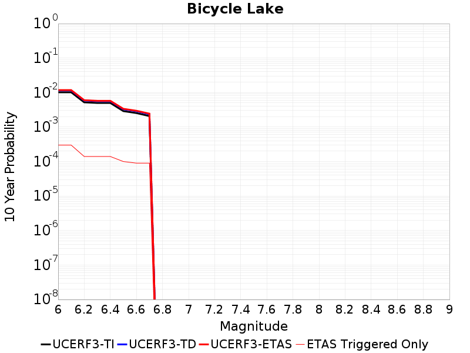 |

| Magnitude | 1 wk TI Prob | 1 wk TD Prob | 1 wk ETAS Prob | 1 wk ETAS/TD Gain | 1 wk ETAS Triggered Only | 1 mo TI Prob | 1 mo TD Prob | 1 mo ETAS Prob | 1 mo ETAS/TD Gain | 1 mo ETAS Triggered Only | 1 yr TI Prob | 1 yr TD Prob | 1 yr ETAS Prob | 1 yr ETAS/TD Gain | 1 yr ETAS Triggered Only | 10 yr TI Prob | 10 yr TD Prob | 10 yr ETAS Prob | 10 yr ETAS/TD Gain | 10 yr ETAS Triggered Only |
|-----|-----|-----|-----|-----|-----|-----|-----|-----|-----|-----|-----|-----|-----|-----|-----|-----|-----|-----|-----|-----|
| 6.0 | 1.9621975E-5 | 2.211441E-5 | 2.211441E-5 | 1.0 | 0.0 | 8.4091465E-5 | 9.4773364E-5 | 9.4773364E-5 | 1.0 | 0.0 | 0.0010233327 | 0.0011533902 | 0.0012133209 | 1.0519606 | 6.0E-5 | 0.01018633 | 0.011487371 | 0.011783925 | 1.0258156 | 3.0E-4 |
| 6.1 | 1.9621975E-5 | 2.211441E-5 | 2.211441E-5 | 1.0 | 0.0 | 8.4091465E-5 | 9.4773364E-5 | 9.4773364E-5 | 1.0 | 0.0 | 0.0010233327 | 0.0011533902 | 0.0012133209 | 1.0519606 | 6.0E-5 | 0.01018633 | 0.011487371 | 0.011783925 | 1.0258156 | 3.0E-4 |
| 6.2 | 9.9971285E-6 | 1.1264447E-5 | 1.1264447E-5 | 1.0 | 0.0 | 4.2844134E-5 | 4.82756E-5 | 4.82756E-5 | 1.0 | 0.0 | 5.2150246E-4 | 5.87649E-4 | 6.276255E-4 | 1.0680279 | 4.0E-5 | 0.0052028033 | 0.0058660638 | 0.0060052425 | 1.0237261 | 1.4E-4 |
| 6.3 | 9.589428E-6 | 1.0806807E-5 | 1.0806807E-5 | 1.0 | 0.0 | 4.10969E-5 | 4.631436E-5 | 4.631436E-5 | 1.0 | 0.0 | 5.002399E-4 | 5.637834E-4 | 6.037608E-4 | 1.0709093 | 4.0E-5 | 0.0049911533 | 0.0056286287 | 0.0057678404 | 1.0247328 | 1.4E-4 |
| 6.4 | 9.589428E-6 | 1.0806807E-5 | 1.0806807E-5 | 1.0 | 0.0 | 4.10969E-5 | 4.631436E-5 | 4.631436E-5 | 1.0 | 0.0 | 5.002399E-4 | 5.637834E-4 | 6.037608E-4 | 1.0709093 | 4.0E-5 | 0.0049911533 | 0.0056286287 | 0.0057678404 | 1.0247328 | 1.4E-4 |
| 6.5 | 5.557707E-6 | 6.2907175E-6 | 6.2907175E-6 | 1.0 | 0.0 | 2.3818526E-5 | 2.696009E-5 | 2.696009E-5 | 1.0 | 0.0 | 2.8995197E-4 | 3.2821659E-4 | 3.5820674E-4 | 1.0913731 | 3.0E-5 | 0.0028957394 | 0.0032799589 | 0.0033796309 | 1.0303882 | 1.0E-4 |
| 6.6 | 4.8742945E-6 | 5.517781E-6 | 5.517781E-6 | 1.0 | 0.0 | 2.0889667E-5 | 2.3647568E-5 | 2.3647568E-5 | 1.0 | 0.0 | 2.54302E-4 | 2.8789733E-4 | 3.0789158E-4 | 1.0694492 | 2.0E-5 | 0.002540112 | 0.0028778168 | 0.0029675576 | 1.0311837 | 9.0E-5 |
| 6.7 | 3.991108E-6 | 4.5196E-6 | 4.5196E-6 | 1.0 | 0.0 | 1.7104636E-5 | 1.9369716E-5 | 1.9369716E-5 | 1.0 | 0.0 | 2.0822904E-4 | 2.3582629E-4 | 2.5582156E-4 | 1.0847882 | 2.0E-5 | 0.0020803404 | 0.002358263 | 0.0024480508 | 1.0380737 | 9.0E-5 |

## San Andreas (Big Bend)
*[(top)](#table-of-contents)*

| 1 Week | 1 Month | 1 Year | 10 Year |
|-----|-----|-----|-----|
|  |  |  |  |

| Magnitude | 1 wk TI Prob | 1 wk TD Prob | 1 wk ETAS Prob | 1 wk ETAS/TD Gain | 1 wk ETAS Triggered Only | 1 mo TI Prob | 1 mo TD Prob | 1 mo ETAS Prob | 1 mo ETAS/TD Gain | 1 mo ETAS Triggered Only | 1 yr TI Prob | 1 yr TD Prob | 1 yr ETAS Prob | 1 yr ETAS/TD Gain | 1 yr ETAS Triggered Only | 10 yr TI Prob | 10 yr TD Prob | 10 yr ETAS Prob | 10 yr ETAS/TD Gain | 10 yr ETAS Triggered Only |
|-----|-----|-----|-----|-----|-----|-----|-----|-----|-----|-----|-----|-----|-----|-----|-----|-----|-----|-----|-----|-----|
| 6.0 | 1.0179969E-4 | 2.0476484E-4 | 2.0476484E-4 | 1.0 | 0.0 | 4.362114E-4 | 8.7726954E-4 | 8.872607E-4 | 1.011389 | 1.0E-5 | 0.0052979486 | 0.010628743 | 0.010668318 | 1.0037234 | 4.0E-5 | 0.051734097 | 0.103203334 | 0.103409596 | 1.0019987 | 2.3E-4 |
| 6.1 | 1.0179969E-4 | 2.0476484E-4 | 2.0476484E-4 | 1.0 | 0.0 | 4.362114E-4 | 8.7726954E-4 | 8.872607E-4 | 1.011389 | 1.0E-5 | 0.0052979486 | 0.010628743 | 0.010668318 | 1.0037234 | 4.0E-5 | 0.051734097 | 0.103203334 | 0.103409596 | 1.0019987 | 2.3E-4 |
| 6.2 | 1.0179969E-4 | 2.0476484E-4 | 2.0476484E-4 | 1.0 | 0.0 | 4.362114E-4 | 8.7726954E-4 | 8.872607E-4 | 1.011389 | 1.0E-5 | 0.0052979486 | 0.010628743 | 0.010668318 | 1.0037234 | 4.0E-5 | 0.051734097 | 0.103203334 | 0.103409596 | 1.0019987 | 2.3E-4 |
| 6.3 | 1.0179969E-4 | 2.0476484E-4 | 2.0476484E-4 | 1.0 | 0.0 | 4.362114E-4 | 8.7726954E-4 | 8.872607E-4 | 1.011389 | 1.0E-5 | 0.0052979486 | 0.010628743 | 0.010668318 | 1.0037234 | 4.0E-5 | 0.051734097 | 0.103203334 | 0.103409596 | 1.0019987 | 2.3E-4 |
| 6.4 | 9.1639464E-5 | 1.8826073E-4 | 1.8826073E-4 | 1.0 | 0.0 | 3.9268145E-4 | 8.065825E-4 | 8.1657444E-4 | 1.012388 | 1.0E-5 | 0.0047704205 | 0.00977605 | 0.009795855 | 1.0020258 | 2.0E-5 | 0.046693064 | 0.095515914 | 0.09565159 | 1.0014204 | 1.5E-4 |
| 6.5 | 9.1639464E-5 | 1.8826073E-4 | 1.8826073E-4 | 1.0 | 0.0 | 3.9268145E-4 | 8.065825E-4 | 8.1657444E-4 | 1.012388 | 1.0E-5 | 0.0047704205 | 0.00977605 | 0.009795855 | 1.0020258 | 2.0E-5 | 0.046693064 | 0.095515914 | 0.09565159 | 1.0014204 | 1.5E-4 |
| 6.6 | 9.042622E-5 | 1.863214E-4 | 1.863214E-4 | 1.0 | 0.0 | 3.8748336E-4 | 7.982761E-4 | 8.0826815E-4 | 1.012517 | 1.0E-5 | 0.0047074095 | 0.00967582 | 0.009695627 | 1.0020471 | 2.0E-5 | 0.046089325 | 0.09461072 | 0.09474653 | 1.0014354 | 1.5E-4 |
| 6.7 | 8.9836685E-5 | 1.8546147E-4 | 1.8546147E-4 | 1.0 | 0.0 | 3.8495753E-4 | 7.9459295E-4 | 8.04585E-4 | 1.012575 | 1.0E-5 | 0.00467679 | 0.009631375 | 0.009651182 | 1.0020566 | 2.0E-5 | 0.045795817 | 0.09420422 | 0.094331026 | 1.0013461 | 1.4E-4 |
| 6.8 | 8.9471854E-5 | 1.8492549E-4 | 1.8492549E-4 | 1.0 | 0.0 | 3.8339442E-4 | 7.9229736E-4 | 8.022894E-4 | 1.0126115 | 1.0E-5 | 0.004657841 | 0.009603672 | 0.00962348 | 1.0020626 | 2.0E-5 | 0.04561414 | 0.093950436 | 0.09406822 | 1.0012537 | 1.3E-4 |
| 6.9 | 8.858234E-5 | 1.8373888E-4 | 1.8373888E-4 | 1.0 | 0.0 | 3.7958333E-4 | 7.872149E-4 | 7.872149E-4 | 1.0 | 0.0 | 0.004611638 | 0.009542337 | 0.009552241 | 1.001038 | 1.0E-5 | 0.04517103 | 0.09338844 | 0.09349723 | 1.0011649 | 1.2E-4 |
| 7.0 | 8.7433385E-5 | 1.8211704E-4 | 1.8211704E-4 | 1.0 | 0.0 | 3.746607E-4 | 7.8026834E-4 | 7.8026834E-4 | 1.0 | 0.0 | 0.004551957 | 0.009458499 | 0.009468405 | 1.0010473 | 1.0E-5 | 0.044598386 | 0.09261951 | 0.09271025 | 1.0009797 | 1.0E-4 |
| 7.1 | 8.684964E-5 | 1.812304E-4 | 1.812304E-4 | 1.0 | 0.0 | 3.7215967E-4 | 7.7647076E-4 | 7.7647076E-4 | 1.0 | 0.0 | 0.0045216335 | 0.009412664 | 0.00942257 | 1.0010524 | 1.0E-5 | 0.04430731 | 0.09219891 | 0.09228061 | 1.0008862 | 9.0E-5 |
| 7.2 | 8.606521E-5 | 1.801303E-4 | 1.801303E-4 | 1.0 | 0.0 | 3.6879873E-4 | 7.7175885E-4 | 7.7175885E-4 | 1.0 | 0.0 | 0.0044808835 | 0.009355791 | 0.009365697 | 1.0010588 | 1.0E-5 | 0.043916024 | 0.091677964 | 0.09175971 | 1.0008917 | 9.0E-5 |
| 7.3 | 8.568266E-5 | 1.795431E-4 | 1.795431E-4 | 1.0 | 0.0 | 3.6715972E-4 | 7.6924375E-4 | 7.6924375E-4 | 1.0 | 0.0 | 0.0044610105 | 0.009325432 | 0.009335339 | 1.0010624 | 1.0E-5 | 0.043725148 | 0.091396146 | 0.09147792 | 1.0008947 | 9.0E-5 |
| 7.4 | 8.5432206E-5 | 1.7916429E-4 | 1.7916429E-4 | 1.0 | 0.0 | 3.6608664E-4 | 7.6762115E-4 | 7.6762115E-4 | 1.0 | 0.0 | 0.004447999 | 0.009305846 | 0.009315753 | 1.0010645 | 1.0E-5 | 0.043600157 | 0.09121446 | 0.09129625 | 1.0008967 | 9.0E-5 |
| 7.5 | 8.4791965E-5 | 1.7784143E-4 | 1.7784143E-4 | 1.0 | 0.0 | 3.633435E-4 | 7.6195516E-4 | 7.6195516E-4 | 1.0 | 0.0 | 0.0044147377 | 0.009237449 | 0.009247357 | 1.0010725 | 1.0E-5 | 0.043280575 | 0.090587355 | 0.0906692 | 1.0009035 | 9.0E-5 |
| 7.6 | 8.241105E-5 | 1.7223129E-4 | 1.7223129E-4 | 1.0 | 0.0 | 3.531424E-4 | 7.3792547E-4 | 7.3792547E-4 | 1.0 | 0.0 | 0.0042910352 | 0.008947328 | 0.008957238 | 1.0011077 | 1.0E-5 | 0.042091176 | 0.087940805 | 0.08802289 | 1.0009334 | 9.0E-5 |
| 7.7 | 7.00432E-5 | 1.4550141E-4 | 1.4550141E-4 | 1.0 | 0.0 | 3.001506E-4 | 6.234285E-4 | 6.234285E-4 | 1.0 | 0.0 | 0.0036482112 | 0.007563869 | 0.007573793 | 1.001312 | 1.0E-5 | 0.035888977 | 0.075076014 | 0.075150006 | 1.0009856 | 8.0E-5 |
| 7.8 | 6.415362E-5 | 1.328083E-4 | 1.328083E-4 | 1.0 | 0.0 | 2.749151E-4 | 5.690543E-4 | 5.690543E-4 | 1.0 | 0.0 | 0.0033419547 | 0.0069062593 | 0.00691619 | 1.0014379 | 1.0E-5 | 0.03292141 | 0.068668015 | 0.06873321 | 1.0009494 | 7.0E-5 |
| 7.9 | 4.939911E-5 | 9.5659256E-5 | 9.5659256E-5 | 1.0 | 0.0 | 2.116933E-4 | 4.0990382E-4 | 4.0990382E-4 | 1.0 | 0.0 | 0.0025743195 | 0.004979169 | 0.0049891192 | 1.0019984 | 1.0E-5 | 0.025447013 | 0.049965378 | 0.05000338 | 1.0007606 | 4.0E-5 |
| 8.0 | 3.344983E-5 | 5.357212E-5 | 5.357212E-5 | 1.0 | 0.0 | 1.4334853E-4 | 2.295746E-4 | 2.295746E-4 | 1.0 | 0.0 | 0.0017438711 | 0.00279149 | 0.00279149 | 1.0 | 0.0 | 0.017302496 | 0.028583236 | 0.028592952 | 1.0003399 | 1.0E-5 |
| 8.1 | 1.9104898E-5 | 1.9827079E-5 | 1.9827079E-5 | 1.0 | 0.0 | 8.1875565E-5 | 8.497043E-5 | 8.497043E-5 | 1.0 | 0.0 | 9.963791E-4 | 0.0010340246 | 0.0010340246 | 1.0 | 0.0 | 0.009919235 | 0.011092446 | 0.011092446 | 1.0 | 0.0 |
| 8.2 | 8.643924E-6 | 5.720392E-6 | 5.720392E-6 | 1.0 | 0.0 | 3.704486E-5 | 2.4515735E-5 | 2.4515735E-5 | 1.0 | 0.0 | 4.5092785E-4 | 2.9843827E-4 | 2.9843827E-4 | 1.0 | 0.0 | 0.0045001395 | 0.0033829338 | 0.0033829338 | 1.0 | 0.0 |
| 8.3 | 1.983087E-6 | 8.0695344E-7 | 8.0695344E-7 | 1.0 | 0.0 | 8.498917E-6 | 3.4583672E-6 | 3.4583672E-6 | 1.0 | 0.0 | 1.034694E-4 | 4.2104828E-5 | 4.2104828E-5 | 1.0 | 0.0 | 0.0010342124 | 4.95424E-4 | 4.95424E-4 | 1.0 | 0.0 |

## San Andreas (San Bernardino S)
*[(top)](#table-of-contents)*

| 1 Week | 1 Month | 1 Year | 10 Year |
|-----|-----|-----|-----|
| 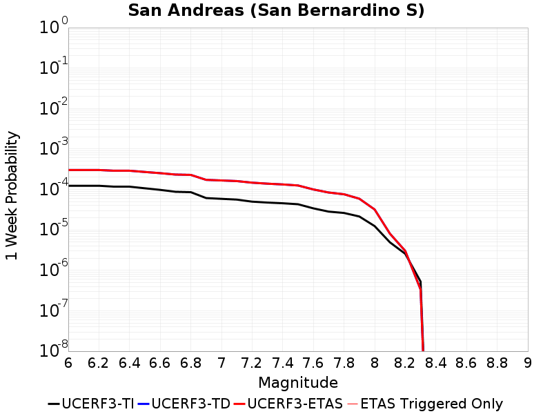 |  |  |  |

| Magnitude | 1 wk TI Prob | 1 wk TD Prob | 1 wk ETAS Prob | 1 wk ETAS/TD Gain | 1 wk ETAS Triggered Only | 1 mo TI Prob | 1 mo TD Prob | 1 mo ETAS Prob | 1 mo ETAS/TD Gain | 1 mo ETAS Triggered Only | 1 yr TI Prob | 1 yr TD Prob | 1 yr ETAS Prob | 1 yr ETAS/TD Gain | 1 yr ETAS Triggered Only | 10 yr TI Prob | 10 yr TD Prob | 10 yr ETAS Prob | 10 yr ETAS/TD Gain | 10 yr ETAS Triggered Only |
|-----|-----|-----|-----|-----|-----|-----|-----|-----|-----|-----|-----|-----|-----|-----|-----|-----|-----|-----|-----|-----|
| 6.0 | 1.2336002E-4 | 3.023633E-4 | 3.023633E-4 | 1.0 | 0.0 | 5.2857865E-4 | 0.0012952255 | 0.0012952255 | 1.0 | 0.0 | 0.006416472 | 0.01566035 | 0.01568988 | 1.0018857 | 3.0E-5 | 0.06234337 | 0.14365059 | 0.14384755 | 1.0013711 | 2.3E-4 |
| 6.1 | 1.2336002E-4 | 3.023633E-4 | 3.023633E-4 | 1.0 | 0.0 | 5.2857865E-4 | 0.0012952255 | 0.0012952255 | 1.0 | 0.0 | 0.006416472 | 0.01566035 | 0.01568988 | 1.0018857 | 3.0E-5 | 0.06234337 | 0.14365059 | 0.14384755 | 1.0013711 | 2.3E-4 |
| 6.2 | 1.2336002E-4 | 3.023633E-4 | 3.023633E-4 | 1.0 | 0.0 | 5.2857865E-4 | 0.0012952255 | 0.0012952255 | 1.0 | 0.0 | 0.006416472 | 0.01566035 | 0.01568988 | 1.0018857 | 3.0E-5 | 0.06234337 | 0.14365059 | 0.14384755 | 1.0013711 | 2.3E-4 |
| 6.3 | 1.1712257E-4 | 2.9022296E-4 | 2.9022296E-4 | 1.0 | 0.0 | 5.018573E-4 | 0.0012432457 | 0.0012432457 | 1.0 | 0.0 | 0.006093008 | 0.015036349 | 0.015065897 | 1.0019652 | 3.0E-5 | 0.059286322 | 0.13832058 | 0.13850154 | 1.0013082 | 2.1E-4 |
| 6.4 | 1.1712257E-4 | 2.9022296E-4 | 2.9022296E-4 | 1.0 | 0.0 | 5.018573E-4 | 0.0012432457 | 0.0012432457 | 1.0 | 0.0 | 0.006093008 | 0.015036349 | 0.015065897 | 1.0019652 | 3.0E-5 | 0.059286322 | 0.13832058 | 0.13850154 | 1.0013082 | 2.1E-4 |
| 6.5 | 1.0689076E-4 | 2.7031064E-4 | 2.7031064E-4 | 1.0 | 0.0 | 4.5802278E-4 | 0.0011579848 | 0.0011579848 | 1.0 | 0.0 | 0.0055621783 | 0.014011985 | 0.014041564 | 1.0021111 | 3.0E-5 | 0.05425003 | 0.12958024 | 0.12976304 | 1.0014106 | 2.1E-4 |
| 6.6 | 9.7648895E-5 | 2.5272107E-4 | 2.5272107E-4 | 1.0 | 0.0 | 4.1842813E-4 | 0.0010826645 | 0.0010826645 | 1.0 | 0.0 | 0.005082469 | 0.013106177 | 0.013135783 | 1.002259 | 3.0E-5 | 0.049677886 | 0.12172648 | 0.12191092 | 1.0015152 | 2.1E-4 |
| 6.7 | 8.757013E-5 | 2.3339094E-4 | 2.3339094E-4 | 1.0 | 0.0 | 3.7524657E-4 | 9.998858E-4 | 9.998858E-4 | 1.0 | 0.0 | 0.00455906 | 0.012109782 | 0.012139418 | 1.0024474 | 3.0E-5 | 0.04466656 | 0.113 | 0.1131774 | 1.0015699 | 2.0E-4 |
| 6.8 | 8.562978E-5 | 2.2897254E-4 | 2.2897254E-4 | 1.0 | 0.0 | 3.6693315E-4 | 9.809643E-4 | 9.809643E-4 | 1.0 | 0.0 | 0.004458263 | 0.011881938 | 0.011911582 | 1.0024948 | 3.0E-5 | 0.043698758 | 0.11100963 | 0.11118743 | 1.0016017 | 2.0E-4 |
| 6.9 | 6.124075E-5 | 1.7259951E-4 | 1.7259951E-4 | 1.0 | 0.0 | 2.6243398E-4 | 7.3950336E-4 | 7.3950336E-4 | 1.0 | 0.0 | 0.0031904527 | 0.008966496 | 0.008996228 | 1.0033158 | 3.0E-5 | 0.031450346 | 0.08502302 | 0.08520602 | 1.0021523 | 2.0E-4 |
| 7.0 | 5.8598747E-5 | 1.6686949E-4 | 1.6686949E-4 | 1.0 | 0.0 | 2.5111332E-4 | 7.1495975E-4 | 7.1495975E-4 | 1.0 | 0.0 | 0.0030530186 | 0.008670092 | 0.008699832 | 1.0034301 | 3.0E-5 | 0.03011414 | 0.08233458 | 0.08251811 | 1.0022291 | 2.0E-4 |
| 7.1 | 5.613814E-5 | 1.6103426E-4 | 1.6103426E-4 | 1.0 | 0.0 | 2.4056983E-4 | 6.899651E-4 | 6.899651E-4 | 1.0 | 0.0 | 0.0029250039 | 0.008368154 | 0.008397903 | 1.003555 | 3.0E-5 | 0.028868021 | 0.07962781 | 0.079811886 | 1.0023117 | 2.0E-4 |
| 7.2 | 4.991222E-5 | 1.4705292E-4 | 1.4705292E-4 | 1.0 | 0.0 | 2.1389198E-4 | 6.30075E-4 | 6.30075E-4 | 1.0 | 0.0 | 0.002601025 | 0.007644287 | 0.0076740575 | 1.0038944 | 3.0E-5 | 0.025707912 | 0.07305766 | 0.073233776 | 1.0024107 | 1.9E-4 |
| 7.3 | 4.7410045E-5 | 1.3895256E-4 | 1.3895256E-4 | 1.0 | 0.0 | 2.0317009E-4 | 5.9537543E-4 | 5.9537543E-4 | 1.0 | 0.0 | 0.0024707897 | 0.0072246916 | 0.007254475 | 1.0041224 | 3.0E-5 | 0.024434982 | 0.06932322 | 0.069500044 | 1.0025508 | 1.9E-4 |
| 7.4 | 4.5556746E-5 | 1.3300082E-4 | 1.3300082E-4 | 1.0 | 0.0 | 1.952286E-4 | 5.698793E-4 | 5.698793E-4 | 1.0 | 0.0 | 0.002374317 | 0.0069162888 | 0.0069460813 | 1.0043076 | 3.0E-5 | 0.023491086 | 0.06656075 | 0.06673811 | 1.0026646 | 1.9E-4 |
| 7.5 | 4.3084514E-5 | 1.2531577E-4 | 1.2531577E-4 | 1.0 | 0.0 | 1.8463485E-4 | 5.3695735E-4 | 5.3695735E-4 | 1.0 | 0.0 | 0.0022456115 | 0.006517933 | 0.0065477374 | 1.0045726 | 3.0E-5 | 0.022230545 | 0.062948115 | 0.06311679 | 1.0026795 | 1.8E-4 |
| 7.6 | 3.408608E-5 | 9.9956545E-5 | 9.9956545E-5 | 1.0 | 0.0 | 1.4607502E-4 | 4.2831496E-4 | 4.2831496E-4 | 1.0 | 0.0 | 0.0017770125 | 0.0052022925 | 0.005232136 | 1.0057367 | 3.0E-5 | 0.017628696 | 0.050726954 | 0.050888333 | 1.0031812 | 1.7E-4 |
| 7.7 | 2.8315713E-5 | 8.399201E-5 | 8.399201E-5 | 1.0 | 0.0 | 1.2134742E-4 | 3.5991613E-4 | 3.5991613E-4 | 1.0 | 0.0 | 0.0014764034 | 0.004373184 | 0.004403053 | 1.00683 | 3.0E-5 | 0.01466633 | 0.042940713 | 0.04310341 | 1.003789 | 1.7E-4 |
| 7.8 | 2.6222975E-5 | 7.6038144E-5 | 7.6038144E-5 | 1.0 | 0.0 | 1.1237934E-4 | 3.2583709E-4 | 3.2583709E-4 | 1.0 | 0.0 | 0.0013673597 | 0.0039598565 | 0.003989738 | 1.0075461 | 3.0E-5 | 0.013589768 | 0.039065488 | 0.039219238 | 1.0039357 | 1.6E-4 |
| 7.9 | 2.1469694E-5 | 5.9053848E-5 | 5.9053848E-5 | 1.0 | 0.0 | 9.200973E-5 | 2.530634E-4 | 2.530634E-4 | 1.0 | 0.0 | 0.0011196428 | 0.003076697 | 0.0031066046 | 1.0097207 | 3.0E-5 | 0.011140184 | 0.030683529 | 0.03080954 | 1.0041068 | 1.3E-4 |
| 8.0 | 1.2420249E-5 | 3.1975098E-5 | 3.1975098E-5 | 1.0 | 0.0 | 5.322855E-5 | 1.3702894E-4 | 1.3702894E-4 | 1.0 | 0.0 | 6.478649E-4 | 0.0016670517 | 0.0016670517 | 1.0 | 0.0 | 0.0064597935 | 0.016828103 | 0.016847767 | 1.0011685 | 2.0E-5 |
| 8.1 | 4.9197724E-6 | 8.065244E-6 | 8.065244E-6 | 1.0 | 0.0 | 2.1084568E-5 | 3.4564877E-5 | 3.4564877E-5 | 1.0 | 0.0 | 2.566744E-4 | 4.2074625E-4 | 4.2074625E-4 | 1.0 | 0.0 | 0.002563781 | 0.0045063063 | 0.0045063063 | 1.0 | 0.0 |
| 8.2 | 2.5634774E-6 | 3.0180324E-6 | 3.0180324E-6 | 1.0 | 0.0 | 1.0986286E-5 | 1.2934362E-5 | 1.2934362E-5 | 1.0 | 0.0 | 1.3374983E-4 | 1.5746451E-4 | 1.5746451E-4 | 1.0 | 0.0 | 0.0013366934 | 0.0017633983 | 0.0017633983 | 1.0 | 0.0 |
| 8.3 | 5.2850464E-7 | 3.3613586E-7 | 3.3613586E-7 | 1.0 | 0.0 | 2.2650179E-6 | 1.4405815E-6 | 1.4405815E-6 | 1.0 | 0.0 | 2.7576245E-5 | 1.7538952E-5 | 1.7538952E-5 | 1.0 | 0.0 | 2.7572823E-4 | 2.0728132E-4 | 2.0728132E-4 | 1.0 | 0.0 |

## Garlic Springs
*[(top)](#table-of-contents)*

| 1 Week | 1 Month | 1 Year | 10 Year |
|-----|-----|-----|-----|
| 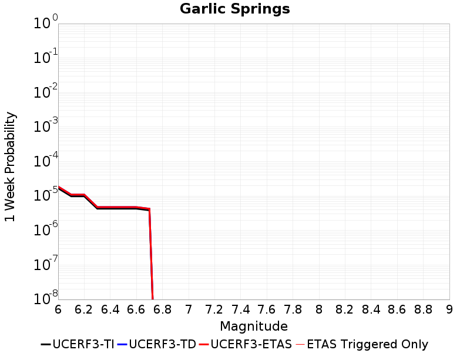 |  | 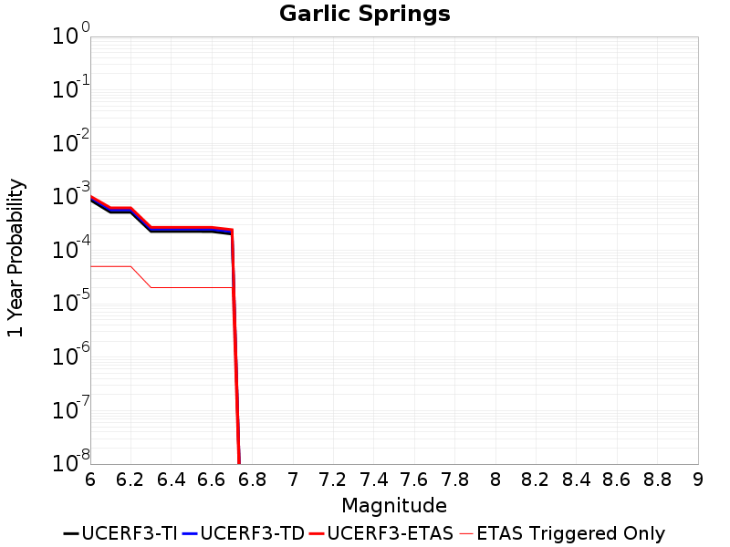 |  |

| Magnitude | 1 wk TI Prob | 1 wk TD Prob | 1 wk ETAS Prob | 1 wk ETAS/TD Gain | 1 wk ETAS Triggered Only | 1 mo TI Prob | 1 mo TD Prob | 1 mo ETAS Prob | 1 mo ETAS/TD Gain | 1 mo ETAS Triggered Only | 1 yr TI Prob | 1 yr TD Prob | 1 yr ETAS Prob | 1 yr ETAS/TD Gain | 1 yr ETAS Triggered Only | 10 yr TI Prob | 10 yr TD Prob | 10 yr ETAS Prob | 10 yr ETAS/TD Gain | 10 yr ETAS Triggered Only |
|-----|-----|-----|-----|-----|-----|-----|-----|-----|-----|-----|-----|-----|-----|-----|-----|-----|-----|-----|-----|-----|
| 6.0 | 1.6760017E-5 | 1.8790884E-5 | 1.8790884E-5 | 1.0 | 0.0 | 7.182667E-5 | 8.053054E-5 | 8.053054E-5 | 1.0 | 0.0 | 8.7413884E-4 | 9.801359E-4 | 0.0010300869 | 1.0509633 | 5.0E-5 | 0.008707083 | 0.009769693 | 0.0099776415 | 1.021285 | 2.1E-4 |
| 6.1 | 9.852767E-6 | 1.0981345E-5 | 1.0981345E-5 | 1.0 | 0.0 | 4.222546E-5 | 4.706246E-5 | 4.706246E-5 | 1.0 | 0.0 | 5.139737E-4 | 5.729059E-4 | 6.2287727E-4 | 1.0872244 | 5.0E-5 | 0.005127866 | 0.0057212575 | 0.0058604567 | 1.0243301 | 1.4E-4 |
| 6.2 | 9.852767E-6 | 1.0981345E-5 | 1.0981345E-5 | 1.0 | 0.0 | 4.222546E-5 | 4.706246E-5 | 4.706246E-5 | 1.0 | 0.0 | 5.139737E-4 | 5.729059E-4 | 6.2287727E-4 | 1.0872244 | 5.0E-5 | 0.005127866 | 0.0057212575 | 0.0058604567 | 1.0243301 | 1.4E-4 |
| 6.3 | 4.3167724E-6 | 4.781201E-6 | 4.781201E-6 | 1.0 | 0.0 | 1.8500323E-5 | 2.049083E-5 | 2.049083E-5 | 1.0 | 0.0 | 2.2521814E-4 | 2.4947035E-4 | 2.6946535E-4 | 1.0801499 | 2.0E-5 | 0.0022499003 | 0.0024941643 | 0.0025639897 | 1.0279955 | 7.0E-5 |
| 6.4 | 4.3167724E-6 | 4.781201E-6 | 4.781201E-6 | 1.0 | 0.0 | 1.8500323E-5 | 2.049083E-5 | 2.049083E-5 | 1.0 | 0.0 | 2.2521814E-4 | 2.4947035E-4 | 2.6946535E-4 | 1.0801499 | 2.0E-5 | 0.0022499003 | 0.0024941643 | 0.0025639897 | 1.0279955 | 7.0E-5 |
| 6.5 | 4.3167724E-6 | 4.781201E-6 | 4.781201E-6 | 1.0 | 0.0 | 1.8500323E-5 | 2.049083E-5 | 2.049083E-5 | 1.0 | 0.0 | 2.2521814E-4 | 2.4947035E-4 | 2.6946535E-4 | 1.0801499 | 2.0E-5 | 0.0022499003 | 0.0024941643 | 0.0025639897 | 1.0279955 | 7.0E-5 |
| 6.6 | 4.301311E-6 | 4.764058E-6 | 4.764058E-6 | 1.0 | 0.0 | 1.8434059E-5 | 2.0417361E-5 | 2.0417361E-5 | 1.0 | 0.0 | 2.2441156E-4 | 2.4857608E-4 | 2.685711E-4 | 1.0804383 | 2.0E-5 | 0.0022418506 | 0.0024852415 | 0.0025550677 | 1.0280963 | 7.0E-5 |
| 6.7 | 3.8599724E-6 | 4.273886E-6 | 4.273886E-6 | 1.0 | 0.0 | 1.6542634E-5 | 1.8316654E-5 | 1.8316654E-5 | 1.0 | 0.0 | 2.0138794E-4 | 2.2300526E-4 | 2.430008E-4 | 1.089664 | 2.0E-5 | 0.0020120554 | 0.0022300526 | 0.0022998967 | 1.0313194 | 7.0E-5 |

## Coyote Lake
*[(top)](#table-of-contents)*

| 1 Week | 1 Month | 1 Year | 10 Year |
|-----|-----|-----|-----|
|  |  |  | 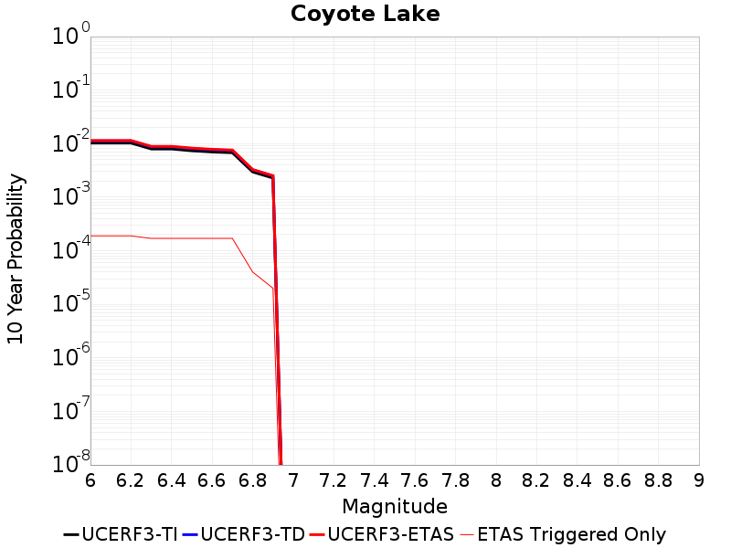 |

| Magnitude | 1 wk TI Prob | 1 wk TD Prob | 1 wk ETAS Prob | 1 wk ETAS/TD Gain | 1 wk ETAS Triggered Only | 1 mo TI Prob | 1 mo TD Prob | 1 mo ETAS Prob | 1 mo ETAS/TD Gain | 1 mo ETAS Triggered Only | 1 yr TI Prob | 1 yr TD Prob | 1 yr ETAS Prob | 1 yr ETAS/TD Gain | 1 yr ETAS Triggered Only | 10 yr TI Prob | 10 yr TD Prob | 10 yr ETAS Prob | 10 yr ETAS/TD Gain | 10 yr ETAS Triggered Only |
|-----|-----|-----|-----|-----|-----|-----|-----|-----|-----|-----|-----|-----|-----|-----|-----|-----|-----|-----|-----|-----|
| 6.0 | 1.980352E-5 | 2.171971E-5 | 2.171971E-5 | 1.0 | 0.0 | 8.486947E-5 | 9.308156E-5 | 1.0308063E-4 | 1.1074227 | 1.0E-5 | 0.0010327959 | 0.001132751 | 0.0011826943 | 1.0440903 | 5.0E-5 | 0.010280091 | 0.011276957 | 0.011464814 | 1.0166585 | 1.9E-4 |
| 6.1 | 1.980352E-5 | 2.171971E-5 | 2.171971E-5 | 1.0 | 0.0 | 8.486947E-5 | 9.308156E-5 | 1.0308063E-4 | 1.1074227 | 1.0E-5 | 0.0010327959 | 0.001132751 | 0.0011826943 | 1.0440903 | 5.0E-5 | 0.010280091 | 0.011276957 | 0.011464814 | 1.0166585 | 1.9E-4 |
| 6.2 | 1.980352E-5 | 2.171971E-5 | 2.171971E-5 | 1.0 | 0.0 | 8.486947E-5 | 9.308156E-5 | 1.0308063E-4 | 1.1074227 | 1.0E-5 | 0.0010327959 | 0.001132751 | 0.0011826943 | 1.0440903 | 5.0E-5 | 0.010280091 | 0.011276957 | 0.011464814 | 1.0166585 | 1.9E-4 |
| 6.3 | 1.5344787E-5 | 1.6830725E-5 | 1.6830725E-5 | 1.0 | 0.0 | 6.576172E-5 | 7.213003E-5 | 8.212931E-5 | 1.1386285 | 1.0E-5 | 8.003548E-4 | 8.7789056E-4 | 9.278467E-4 | 1.0569047 | 5.0E-5 | 0.007974784 | 0.0087502785 | 0.008918791 | 1.0192579 | 1.7E-4 |
| 6.4 | 1.5344787E-5 | 1.6830725E-5 | 1.6830725E-5 | 1.0 | 0.0 | 6.576172E-5 | 7.213003E-5 | 8.212931E-5 | 1.1386285 | 1.0E-5 | 8.003548E-4 | 8.7789056E-4 | 9.278467E-4 | 1.0569047 | 5.0E-5 | 0.007974784 | 0.0087502785 | 0.008918791 | 1.0192579 | 1.7E-4 |
| 6.5 | 1.4189697E-5 | 1.5567311E-5 | 1.5567311E-5 | 1.0 | 0.0 | 6.081157E-5 | 6.6715686E-5 | 7.671502E-5 | 1.1498798 | 1.0E-5 | 7.401293E-4 | 8.1202114E-4 | 8.6198054E-4 | 1.0615247 | 5.0E-5 | 0.0073766913 | 0.00809649 | 0.008265114 | 1.0208267 | 1.7E-4 |
| 6.6 | 1.3469301E-5 | 1.4780455E-5 | 1.4780455E-5 | 1.0 | 0.0 | 5.7724297E-5 | 6.334361E-5 | 7.334297E-5 | 1.1578591 | 1.0E-5 | 7.025667E-4 | 7.7099557E-4 | 8.20957E-4 | 1.0648012 | 5.0E-5 | 0.0070034964 | 0.007689119 | 0.007857812 | 1.0219392 | 1.7E-4 |
| 6.7 | 1.3027966E-5 | 1.4290288E-5 | 1.4290288E-5 | 1.0 | 0.0 | 5.5832945E-5 | 6.1242994E-5 | 7.124238E-5 | 1.163274 | 1.0E-5 | 6.7955407E-4 | 7.4543816E-4 | 7.954009E-4 | 1.0670246 | 5.0E-5 | 0.006774798 | 0.0074352613 | 0.007603997 | 1.022694 | 1.7E-4 |
| 6.8 | 5.695434E-6 | 6.2280096E-6 | 6.2280096E-6 | 1.0 | 0.0 | 2.4408775E-5 | 2.6691365E-5 | 2.6691365E-5 | 1.0 | 0.0 | 2.971363E-4 | 3.2494892E-4 | 3.3494568E-4 | 1.0307641 | 1.0E-5 | 0.0029673933 | 0.0032476822 | 0.0032875524 | 1.0122765 | 4.0E-5 |
| 6.9 | 4.385688E-6 | 4.7958215E-6 | 4.7958215E-6 | 1.0 | 0.0 | 1.879567E-5 | 2.055352E-5 | 2.055352E-5 | 1.0 | 0.0 | 2.2881327E-4 | 2.502391E-4 | 2.6023661E-4 | 1.0399518 | 1.0E-5 | 0.002285778 | 0.002502391 | 0.002522341 | 1.0079724 | 2.0E-5 |

## Death Valley (Black Mtns Frontal)
*[(top)](#table-of-contents)*

| 1 Week | 1 Month | 1 Year | 10 Year |
|-----|-----|-----|-----|
|  |  | 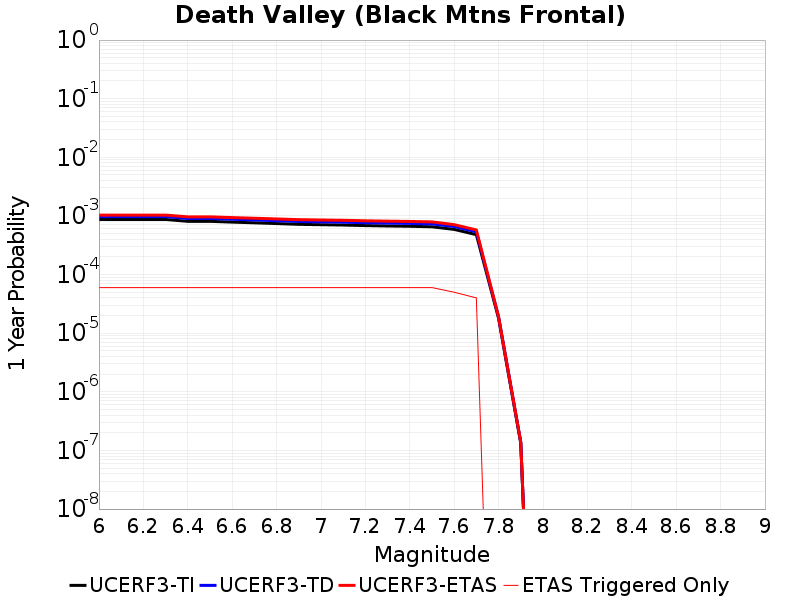 |  |

| Magnitude | 1 wk TI Prob | 1 wk TD Prob | 1 wk ETAS Prob | 1 wk ETAS/TD Gain | 1 wk ETAS Triggered Only | 1 mo TI Prob | 1 mo TD Prob | 1 mo ETAS Prob | 1 mo ETAS/TD Gain | 1 mo ETAS Triggered Only | 1 yr TI Prob | 1 yr TD Prob | 1 yr ETAS Prob | 1 yr ETAS/TD Gain | 1 yr ETAS Triggered Only | 10 yr TI Prob | 10 yr TD Prob | 10 yr ETAS Prob | 10 yr ETAS/TD Gain | 10 yr ETAS Triggered Only |
|-----|-----|-----|-----|-----|-----|-----|-----|-----|-----|-----|-----|-----|-----|-----|-----|-----|-----|-----|-----|-----|
| 6.0 | 1.6707214E-5 | 1.8683937E-5 | 2.8683751E-5 | 1.5352091 | 1.0E-5 | 7.160038E-5 | 8.007161E-5 | 1.0007E-4 | 1.2497565 | 2.0E-5 | 8.71386E-4 | 9.744434E-4 | 0.001034385 | 1.0615137 | 6.0E-5 | 0.00867977 | 0.009702561 | 0.009900621 | 1.0204132 | 2.0E-4 |
| 6.1 | 1.6707214E-5 | 1.8683937E-5 | 2.8683751E-5 | 1.5352091 | 1.0E-5 | 7.160038E-5 | 8.007161E-5 | 1.0007E-4 | 1.2497565 | 2.0E-5 | 8.71386E-4 | 9.744434E-4 | 0.001034385 | 1.0615137 | 6.0E-5 | 0.00867977 | 0.009702561 | 0.009900621 | 1.0204132 | 2.0E-4 |
| 6.2 | 1.6707214E-5 | 1.8683937E-5 | 2.8683751E-5 | 1.5352091 | 1.0E-5 | 7.160038E-5 | 8.007161E-5 | 1.0007E-4 | 1.2497565 | 2.0E-5 | 8.71386E-4 | 9.744434E-4 | 0.001034385 | 1.0615137 | 6.0E-5 | 0.00867977 | 0.009702561 | 0.009900621 | 1.0204132 | 2.0E-4 |
| 6.3 | 1.6707214E-5 | 1.8683937E-5 | 2.8683751E-5 | 1.5352091 | 1.0E-5 | 7.160038E-5 | 8.007161E-5 | 1.0007E-4 | 1.2497565 | 2.0E-5 | 8.71386E-4 | 9.744434E-4 | 0.001034385 | 1.0615137 | 6.0E-5 | 0.00867977 | 0.009702561 | 0.009900621 | 1.0204132 | 2.0E-4 |
| 6.4 | 1.5515609E-5 | 1.7350907E-5 | 2.7350734E-5 | 1.5763288 | 1.0E-5 | 6.649377E-5 | 7.435894E-5 | 9.4357456E-5 | 1.2689456 | 2.0E-5 | 8.0926094E-4 | 9.0495026E-4 | 9.6489594E-4 | 1.066242 | 6.0E-5 | 0.008063202 | 0.009013338 | 0.009171896 | 1.0175915 | 1.6E-4 |
| 6.5 | 1.5515609E-5 | 1.7350907E-5 | 2.7350734E-5 | 1.5763288 | 1.0E-5 | 6.649377E-5 | 7.435894E-5 | 9.4357456E-5 | 1.2689456 | 2.0E-5 | 8.0926094E-4 | 9.0495026E-4 | 9.6489594E-4 | 1.066242 | 6.0E-5 | 0.008063202 | 0.009013338 | 0.009171896 | 1.0175915 | 1.6E-4 |
| 6.6 | 1.5041828E-5 | 1.6821454E-5 | 2.6821286E-5 | 1.594469 | 1.0E-5 | 6.4463384E-5 | 7.208999E-5 | 9.208855E-5 | 1.277411 | 2.0E-5 | 7.8455906E-4 | 8.7734807E-4 | 9.3729544E-4 | 1.0683279 | 6.0E-5 | 0.00781795 | 0.0087395 | 0.008898102 | 1.0181477 | 1.6E-4 |
| 6.7 | 1.4634985E-5 | 1.6368005E-5 | 2.6367841E-5 | 1.610938 | 1.0E-5 | 6.271985E-5 | 7.014674E-5 | 9.014534E-5 | 1.2850966 | 2.0E-5 | 7.6334673E-4 | 8.537077E-4 | 9.136565E-4 | 1.0702217 | 6.0E-5 | 0.007607299 | 0.00850492 | 0.008653644 | 1.0174868 | 1.5E-4 |
| 6.8 | 1.4209158E-5 | 1.5893704E-5 | 2.5893545E-5 | 1.62917 | 1.0E-5 | 6.089497E-5 | 6.8114125E-5 | 8.811276E-5 | 1.2936049 | 2.0E-5 | 7.4114406E-4 | 8.289796E-4 | 8.889299E-4 | 1.0723182 | 6.0E-5 | 0.007386771 | 0.008259489 | 0.00840825 | 1.018011 | 1.5E-4 |
| 6.9 | 1.3780098E-5 | 1.5415915E-5 | 2.541576E-5 | 1.6486703 | 1.0E-5 | 5.9056227E-5 | 6.606656E-5 | 8.606524E-5 | 1.302705 | 2.0E-5 | 7.1877235E-4 | 8.0406904E-4 | 8.640208E-4 | 1.0745604 | 6.0E-5 | 0.0071645193 | 0.008012194 | 0.008151072 | 1.0173334 | 1.4E-4 |
| 7.0 | 1.3585064E-5 | 1.5199329E-5 | 2.5199177E-5 | 1.6579138 | 1.0E-5 | 5.8220405E-5 | 6.513839E-5 | 8.5137086E-5 | 1.3070186 | 2.0E-5 | 7.086029E-4 | 7.9277676E-4 | 8.527292E-4 | 1.0756234 | 6.0E-5 | 0.007063476 | 0.00790008 | 0.008029052 | 1.0163255 | 1.3E-4 |
| 7.1 | 1.3398601E-5 | 1.49923735E-5 | 2.4992223E-5 | 1.6669958 | 1.0E-5 | 5.742131E-5 | 6.425148E-5 | 8.425019E-5 | 1.3112569 | 2.0E-5 | 6.9888023E-4 | 7.8198645E-4 | 8.4193953E-4 | 1.0766677 | 6.0E-5 | 0.0069668638 | 0.0077929376 | 0.007921925 | 1.0165517 | 1.3E-4 |
| 7.2 | 1.3126312E-5 | 1.4690391E-5 | 2.4690244E-5 | 1.6807071 | 1.0E-5 | 5.6254412E-5 | 6.295733E-5 | 8.2956074E-5 | 1.3176554 | 2.0E-5 | 6.846822E-4 | 7.662414E-4 | 8.261954E-4 | 1.0782443 | 6.0E-5 | 0.006825765 | 0.007636579 | 0.007745739 | 1.0142944 | 1.1E-4 |
| 7.3 | 1.2922429E-5 | 1.4464467E-5 | 2.4464323E-5 | 1.6913394 | 1.0E-5 | 5.5380664E-5 | 6.1989136E-5 | 8.198789E-5 | 1.3226172 | 2.0E-5 | 6.74051E-4 | 7.544618E-4 | 8.144165E-4 | 1.0794669 | 6.0E-5 | 0.006720101 | 0.0075195865 | 0.0076287594 | 1.0145185 | 1.1E-4 |
| 7.4 | 1.2768878E-5 | 1.4294336E-5 | 2.4294193E-5 | 1.6995678 | 1.0E-5 | 5.4722615E-5 | 6.1260034E-5 | 8.125881E-5 | 1.3264571 | 2.0E-5 | 6.660441E-4 | 7.455911E-4 | 8.055464E-4 | 1.0804131 | 6.0E-5 | 0.0066405144 | 0.0074314764 | 0.007540659 | 1.014692 | 1.1E-4 |
| 7.5 | 1.2521929E-5 | 1.4022408E-5 | 2.4022269E-5 | 1.7131343 | 1.0E-5 | 5.366431E-5 | 6.0094684E-5 | 8.009348E-5 | 1.3327881 | 2.0E-5 | 6.531671E-4 | 7.314126E-4 | 7.913687E-4 | 1.0819731 | 6.0E-5 | 0.006512506 | 0.00729063 | 0.007389901 | 1.0136162 | 1.0E-4 |
| 7.6 | 1.1301089E-5 | 1.2657545E-5 | 2.265742E-5 | 1.7900326 | 1.0E-5 | 4.8432343E-5 | 5.4245524E-5 | 7.424444E-5 | 1.368674 | 2.0E-5 | 5.895042E-4 | 6.6024443E-4 | 7.1021146E-4 | 1.0756795 | 5.0E-5 | 0.0058794282 | 0.006583382 | 0.006652921 | 1.0105628 | 7.0E-5 |
| 7.7 | 9.189108E-6 | 1.0290991E-5 | 2.0290887E-5 | 1.9717138 | 1.0E-5 | 3.93813E-5 | 4.4103526E-5 | 6.410264E-5 | 1.4534584 | 2.0E-5 | 4.7936183E-4 | 5.368332E-4 | 5.768117E-4 | 1.074471 | 4.0E-5 | 0.004783291 | 0.005355876 | 0.0054155546 | 1.0111426 | 6.0E-5 |
| 7.8 | 3.4586725E-7 | 3.64951E-7 | 3.64951E-7 | 1.0 | 0.0 | 1.4822873E-6 | 1.5640749E-6 | 1.5640749E-6 | 1.0 | 0.0 | 1.80467E-5 | 1.9042449E-5 | 1.9042449E-5 | 1.0 | 0.0 | 1.8045233E-4 | 1.9040862E-4 | 1.9040862E-4 | 1.0 | 0.0 |
| 7.9 | 2.5591178E-9 | 2.670388E-9 | 2.670388E-9 | 1.0 | 0.0 | 1.0967647E-8 | 1.144452E-8 | 1.144452E-8 | 1.0 | 0.0 | 1.335311E-7 | 1.3933703E-7 | 1.3933703E-7 | 1.0 | 0.0 | 1.3353102E-6 | 1.3933703E-6 | 1.3933703E-6 | 1.0 | 0.0 |

## San Andreas (Parkfield)
*[(top)](#table-of-contents)*

| 1 Week | 1 Month | 1 Year | 10 Year |
|-----|-----|-----|-----|
|  |  | 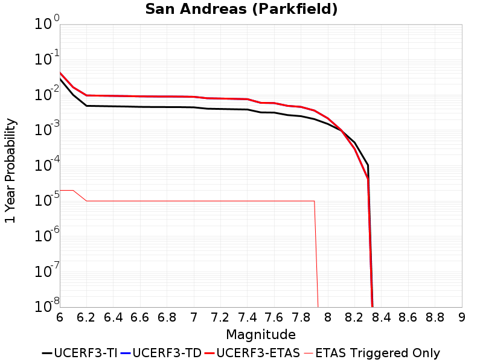 |  |

| Magnitude | 1 wk TI Prob | 1 wk TD Prob | 1 wk ETAS Prob | 1 wk ETAS/TD Gain | 1 wk ETAS Triggered Only | 1 mo TI Prob | 1 mo TD Prob | 1 mo ETAS Prob | 1 mo ETAS/TD Gain | 1 mo ETAS Triggered Only | 1 yr TI Prob | 1 yr TD Prob | 1 yr ETAS Prob | 1 yr ETAS/TD Gain | 1 yr ETAS Triggered Only | 10 yr TI Prob | 10 yr TD Prob | 10 yr ETAS Prob | 10 yr ETAS/TD Gain | 10 yr ETAS Triggered Only |
|-----|-----|-----|-----|-----|-----|-----|-----|-----|-----|-----|-----|-----|-----|-----|-----|-----|-----|-----|-----|-----|
| 6.0 | 5.556969E-4 | 8.2376174E-4 | 8.2376174E-4 | 1.0 | 0.0 | 0.0023793848 | 0.0035262627 | 0.0035262627 | 1.0 | 0.0 | 0.028586963 | 0.042410433 | 0.042429585 | 1.0004516 | 2.0E-5 | 0.25176284 | 0.34402987 | 0.34412172 | 1.0002669 | 1.4E-4 |
| 6.1 | 1.925858E-4 | 3.1579687E-4 | 3.1579687E-4 | 1.0 | 0.0 | 8.2510663E-4 | 0.0013528226 | 0.0013528226 | 1.0 | 0.0 | 0.0099994885 | 0.016415585 | 0.016435256 | 1.0011984 | 2.0E-5 | 0.095613256 | 0.15283868 | 0.15289798 | 1.000388 | 7.0E-5 |
| 6.2 | 9.4306815E-5 | 1.8606875E-4 | 1.8606875E-4 | 1.0 | 0.0 | 4.0410945E-4 | 7.9719507E-4 | 7.9719507E-4 | 1.0 | 0.0 | 0.0049089384 | 0.009662845 | 0.009672748 | 1.0010248 | 1.0E-5 | 0.048019063 | 0.093424805 | 0.093479194 | 1.0005822 | 6.0E-5 |
| 6.3 | 9.283051E-5 | 1.83019E-4 | 1.83019E-4 | 1.0 | 0.0 | 3.9778434E-4 | 7.841326E-4 | 7.841326E-4 | 1.0 | 0.0 | 0.0048322747 | 0.009505221 | 0.009515126 | 1.001042 | 1.0E-5 | 0.047285385 | 0.092074916 | 0.092129394 | 1.0005916 | 6.0E-5 |
| 6.4 | 9.138826E-5 | 1.8061696E-4 | 1.8061696E-4 | 1.0 | 0.0 | 3.916052E-4 | 7.7384425E-4 | 7.7384425E-4 | 1.0 | 0.0 | 0.0047573745 | 0.00938105 | 0.009390956 | 1.001056 | 1.0E-5 | 0.046568092 | 0.09097098 | 0.091025524 | 1.0005995 | 6.0E-5 |
| 6.5 | 9.000255E-5 | 1.7817624E-4 | 1.7817624E-4 | 1.0 | 0.0 | 3.8566816E-4 | 7.6339016E-4 | 7.6339016E-4 | 1.0 | 0.0 | 0.0046854047 | 0.009254871 | 0.009264778 | 1.0010705 | 1.0E-5 | 0.045878403 | 0.08984757 | 0.089902185 | 1.0006078 | 6.0E-5 |
| 6.6 | 8.8109264E-5 | 1.7494138E-4 | 1.7494138E-4 | 1.0 | 0.0 | 3.7755648E-4 | 7.495345E-4 | 7.495345E-4 | 1.0 | 0.0 | 0.0045870654 | 0.009087613 | 0.009097522 | 1.0010904 | 1.0E-5 | 0.04493529 | 0.08836465 | 0.08841935 | 1.000619 | 6.0E-5 |
| 6.7 | 8.738073E-5 | 1.7360221E-4 | 1.7360221E-4 | 1.0 | 0.0 | 3.7443507E-4 | 7.437985E-4 | 7.437985E-4 | 1.0 | 0.0 | 0.0045492216 | 0.009018409 | 0.009028319 | 1.0010989 | 1.0E-5 | 0.04457213 | 0.08776192 | 0.087816656 | 1.0006237 | 6.0E-5 |
| 6.8 | 8.710195E-5 | 1.730491E-4 | 1.730491E-4 | 1.0 | 0.0 | 3.7324068E-4 | 7.414294E-4 | 7.414294E-4 | 1.0 | 0.0 | 0.0045347405 | 0.008989813 | 0.008999723 | 1.0011023 | 1.0E-5 | 0.04443313 | 0.08750681 | 0.08756156 | 1.0006256 | 6.0E-5 |
| 6.9 | 8.6801556E-5 | 1.7245152E-4 | 1.7245152E-4 | 1.0 | 0.0 | 3.7195362E-4 | 7.3886977E-4 | 7.3886977E-4 | 1.0 | 0.0 | 0.0045191357 | 0.008958906 | 0.008968816 | 1.0011063 | 1.0E-5 | 0.044283327 | 0.08723045 | 0.08728522 | 1.0006279 | 6.0E-5 |
| 7.0 | 8.5571606E-5 | 1.6995132E-4 | 1.6995132E-4 | 1.0 | 0.0 | 3.6668387E-4 | 7.2816067E-4 | 7.2816067E-4 | 1.0 | 0.0 | 0.004455241 | 0.008829586 | 0.008839497 | 1.0011226 | 1.0E-5 | 0.043669727 | 0.08606862 | 0.08612346 | 1.0006372 | 6.0E-5 |
| 7.1 | 7.82589E-5 | 1.5463083E-4 | 1.5463083E-4 | 1.0 | 0.0 | 3.3535215E-4 | 6.6253607E-4 | 6.6253607E-4 | 1.0 | 0.0 | 0.0040752706 | 0.00803672 | 0.008046639 | 1.0012343 | 1.0E-5 | 0.040013418 | 0.07894397 | 0.078999236 | 1.0007 | 6.0E-5 |
| 7.2 | 7.690929E-5 | 1.519773E-4 | 1.519773E-4 | 1.0 | 0.0 | 3.2956956E-4 | 6.5116945E-4 | 6.5116945E-4 | 1.0 | 0.0 | 0.004005129 | 0.007899343 | 0.0079092635 | 1.0012559 | 1.0E-5 | 0.0393371 | 0.077708736 | 0.07776408 | 1.0007122 | 6.0E-5 |
| 7.3 | 7.5543794E-5 | 1.4890062E-4 | 1.4890062E-4 | 1.0 | 0.0 | 3.2371894E-4 | 6.3799025E-4 | 6.3799025E-4 | 1.0 | 0.0 | 0.003934157 | 0.007740036 | 0.0077499584 | 1.001282 | 1.0E-5 | 0.038652334 | 0.07625514 | 0.07631057 | 1.0007268 | 6.0E-5 |
| 7.4 | 7.4214564E-5 | 1.458662E-4 | 1.458662E-4 | 1.0 | 0.0 | 3.1802364E-4 | 6.2499184E-4 | 6.2499184E-4 | 1.0 | 0.0 | 0.003865065 | 0.007582892 | 0.0075928164 | 1.0013088 | 1.0E-5 | 0.03798529 | 0.07481309 | 0.074868605 | 1.000742 | 6.0E-5 |
| 7.5 | 6.149578E-5 | 1.1469953E-4 | 1.1469953E-4 | 1.0 | 0.0 | 2.6352672E-4 | 4.914769E-4 | 4.914769E-4 | 1.0 | 0.0 | 0.0032037178 | 0.005967348 | 0.005977288 | 1.0016658 | 1.0E-5 | 0.03157923 | 0.059840757 | 0.059897166 | 1.0009427 | 6.0E-5 |
| 7.6 | 6.0643448E-5 | 1.12960624E-4 | 1.12960624E-4 | 1.0 | 0.0 | 2.598746E-4 | 4.8402726E-4 | 4.8402726E-4 | 1.0 | 0.0 | 0.0031593828 | 0.0058771414 | 0.005887083 | 1.0016915 | 1.0E-5 | 0.031148417 | 0.058991924 | 0.059048384 | 1.0009571 | 6.0E-5 |
| 7.7 | 5.1652263E-5 | 9.423296E-5 | 9.423296E-5 | 1.0 | 0.0 | 2.2134806E-4 | 4.0379303E-4 | 4.0379303E-4 | 1.0 | 0.0 | 0.002691582 | 0.0049051093 | 0.0049150605 | 1.0020287 | 1.0E-5 | 0.026592141 | 0.049696762 | 0.049744274 | 1.000956 | 5.0E-5 |
| 7.8 | 4.8090482E-5 | 8.788537E-5 | 8.788537E-5 | 1.0 | 0.0 | 2.060858E-4 | 3.7659722E-4 | 3.7659722E-4 | 1.0 | 0.0 | 0.0025062072 | 0.0045754407 | 0.0045853946 | 1.0021756 | 1.0E-5 | 0.024781305 | 0.046373963 | 0.046421643 | 1.0010282 | 5.0E-5 |
| 7.9 | 3.970278E-5 | 6.928935E-5 | 6.928935E-5 | 1.0 | 0.0 | 1.7014367E-4 | 2.969206E-4 | 2.969206E-4 | 1.0 | 0.0 | 0.002069531 | 0.00360902 | 0.0036189838 | 1.0027609 | 1.0E-5 | 0.020503636 | 0.03673468 | 0.036763582 | 1.0007867 | 3.0E-5 |
| 8.0 | 2.8982335E-5 | 4.183548E-5 | 4.183548E-5 | 1.0 | 0.0 | 1.2420409E-4 | 1.792826E-4 | 1.792826E-4 | 1.0 | 0.0 | 0.0015111357 | 0.0021805817 | 0.0021805817 | 1.0 | 0.0 | 0.015009012 | 0.022578733 | 0.022588508 | 1.0004328 | 1.0E-5 |
| 8.1 | 1.8836186E-5 | 1.9324787E-5 | 1.9324787E-5 | 1.0 | 0.0 | 8.0724014E-5 | 8.281789E-5 | 8.281789E-5 | 1.0 | 0.0 | 9.823717E-4 | 0.001007842 | 0.001007842 | 1.0 | 0.0 | 0.009780403 | 0.0108258715 | 0.0108258715 | 1.0 | 0.0 |
| 8.2 | 8.643924E-6 | 5.720392E-6 | 5.720392E-6 | 1.0 | 0.0 | 3.704486E-5 | 2.4515735E-5 | 2.4515735E-5 | 1.0 | 0.0 | 4.5092785E-4 | 2.9843827E-4 | 2.9843827E-4 | 1.0 | 0.0 | 0.0045001395 | 0.0033829338 | 0.0033829338 | 1.0 | 0.0 |
| 8.3 | 1.983087E-6 | 8.0695344E-7 | 8.0695344E-7 | 1.0 | 0.0 | 8.498917E-6 | 3.4583672E-6 | 3.4583672E-6 | 1.0 | 0.0 | 1.034694E-4 | 4.2104828E-5 | 4.2104828E-5 | 1.0 | 0.0 | 0.0010342124 | 4.95424E-4 | 4.95424E-4 | 1.0 | 0.0 |

## Death Valley (No)
*[(top)](#table-of-contents)*

| 1 Week | 1 Month | 1 Year | 10 Year |
|-----|-----|-----|-----|
|  | 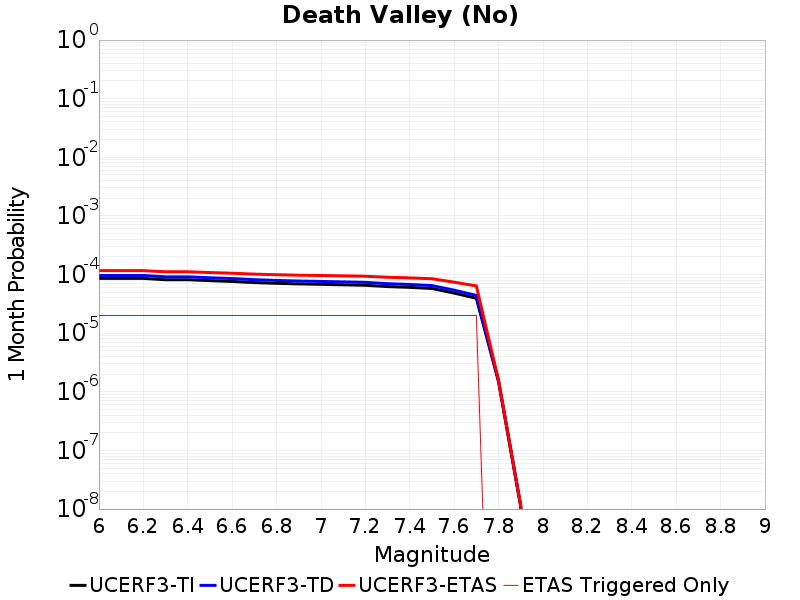 |  |  |

| Magnitude | 1 wk TI Prob | 1 wk TD Prob | 1 wk ETAS Prob | 1 wk ETAS/TD Gain | 1 wk ETAS Triggered Only | 1 mo TI Prob | 1 mo TD Prob | 1 mo ETAS Prob | 1 mo ETAS/TD Gain | 1 mo ETAS Triggered Only | 1 yr TI Prob | 1 yr TD Prob | 1 yr ETAS Prob | 1 yr ETAS/TD Gain | 1 yr ETAS Triggered Only | 10 yr TI Prob | 10 yr TD Prob | 10 yr ETAS Prob | 10 yr ETAS/TD Gain | 10 yr ETAS Triggered Only |
|-----|-----|-----|-----|-----|-----|-----|-----|-----|-----|-----|-----|-----|-----|-----|-----|-----|-----|-----|-----|-----|
| 6.0 | 2.0074807E-5 | 2.2517055E-5 | 3.251683E-5 | 1.4440978 | 1.0E-5 | 8.603206E-5 | 9.649814E-5 | 1.1649621E-4 | 1.2072378 | 2.0E-5 | 0.001046937 | 0.001174239 | 0.0012341685 | 1.051037 | 6.0E-5 | 0.010420183 | 0.01168126 | 0.011809741 | 1.010999 | 1.3E-4 |
| 6.1 | 2.0074807E-5 | 2.2517055E-5 | 3.251683E-5 | 1.4440978 | 1.0E-5 | 8.603206E-5 | 9.649814E-5 | 1.1649621E-4 | 1.2072378 | 2.0E-5 | 0.001046937 | 0.001174239 | 0.0012341685 | 1.051037 | 6.0E-5 | 0.010420183 | 0.01168126 | 0.011809741 | 1.010999 | 1.3E-4 |
| 6.2 | 2.0074807E-5 | 2.2517055E-5 | 3.251683E-5 | 1.4440978 | 1.0E-5 | 8.603206E-5 | 9.649814E-5 | 1.1649621E-4 | 1.2072378 | 2.0E-5 | 0.001046937 | 0.001174239 | 0.0012341685 | 1.051037 | 6.0E-5 | 0.010420183 | 0.01168126 | 0.011809741 | 1.010999 | 1.3E-4 |
| 6.3 | 1.9050609E-5 | 2.1352938E-5 | 3.1352723E-5 | 1.4683096 | 1.0E-5 | 8.164292E-5 | 9.150942E-5 | 1.11507594E-4 | 1.2185367 | 2.0E-5 | 9.935491E-4 | 0.0011135645 | 0.0011734978 | 1.053821 | 6.0E-5 | 0.009891188 | 0.011080671 | 0.011199342 | 1.0107096 | 1.2E-4 |
| 6.4 | 1.9050609E-5 | 2.1352938E-5 | 3.1352723E-5 | 1.4683096 | 1.0E-5 | 8.164292E-5 | 9.150942E-5 | 1.11507594E-4 | 1.2185367 | 2.0E-5 | 9.935491E-4 | 0.0011135645 | 0.0011734978 | 1.053821 | 6.0E-5 | 0.009891188 | 0.011080671 | 0.011199342 | 1.0107096 | 1.2E-4 |
| 6.5 | 1.8367004E-5 | 2.0576348E-5 | 3.0576142E-5 | 1.4859849 | 1.0E-5 | 7.8713354E-5 | 8.8181405E-5 | 1.0817964E-4 | 1.2267852 | 2.0E-5 | 9.5791375E-4 | 0.0010730864 | 0.001133022 | 1.0558535 | 6.0E-5 | 0.009537951 | 0.010679835 | 0.010798554 | 1.0111161 | 1.2E-4 |
| 6.6 | 1.779439E-5 | 1.9925721E-5 | 2.992552E-5 | 1.501854 | 1.0E-5 | 7.625944E-5 | 8.5393185E-5 | 1.0539148E-4 | 1.2341907 | 2.0E-5 | 9.280632E-4 | 0.0010391726 | 0.0010991102 | 1.0576782 | 6.0E-5 | 0.009241969 | 0.0103438925 | 0.010462651 | 1.011481 | 1.2E-4 |
| 6.7 | 1.7025437E-5 | 1.9057525E-5 | 2.9057333E-5 | 1.5247171 | 1.0E-5 | 7.296412E-5 | 8.167258E-5 | 1.0167095E-4 | 1.2448602 | 2.0E-5 | 8.87976E-4 | 9.939162E-4 | 0.0010538566 | 1.0603073 | 6.0E-5 | 0.008844362 | 0.00989543 | 0.0100142425 | 1.0120068 | 1.2E-4 |
| 6.8 | 1.6545107E-5 | 1.8526289E-5 | 2.8526105E-5 | 1.5397635 | 1.0E-5 | 7.090568E-5 | 7.9396E-5 | 9.939441E-5 | 1.2518818 | 2.0E-5 | 8.629347E-4 | 9.662238E-4 | 0.0010261658 | 1.0620375 | 6.0E-5 | 0.008595915 | 0.009620933 | 0.009739778 | 1.0123528 | 1.2E-4 |
| 6.9 | 1.615478E-5 | 1.8101096E-5 | 2.8100916E-5 | 1.5524427 | 1.0E-5 | 6.9232934E-5 | 7.757386E-5 | 9.757231E-5 | 1.2577988 | 2.0E-5 | 8.4258494E-4 | 9.440586E-4 | 0.0010040019 | 1.0634954 | 6.0E-5 | 0.008393973 | 0.009401176 | 0.009520048 | 1.0126444 | 1.2E-4 |
| 7.0 | 1.5894311E-5 | 1.7818904E-5 | 2.7818725E-5 | 1.5611918 | 1.0E-5 | 6.81167E-5 | 7.636453E-5 | 9.6363E-5 | 1.2618817 | 2.0E-5 | 8.2900526E-4 | 9.2934765E-4 | 9.892919E-4 | 1.0645014 | 6.0E-5 | 0.008259195 | 0.009255302 | 0.009374191 | 1.0128455 | 1.2E-4 |
| 7.1 | 1.5602263E-5 | 1.7496648E-5 | 2.7496473E-5 | 1.5715281 | 1.0E-5 | 6.6865134E-5 | 7.498351E-5 | 9.498201E-5 | 1.2667053 | 2.0E-5 | 8.137789E-4 | 9.12548E-4 | 9.724932E-4 | 1.0656899 | 6.0E-5 | 0.008108052 | 0.009088691 | 0.009207601 | 1.0130832 | 1.2E-4 |
| 7.2 | 1.5323829E-5 | 1.7183533E-5 | 2.7183361E-5 | 1.5819426 | 1.0E-5 | 6.56719E-5 | 7.364167E-5 | 9.364019E-5 | 1.2715653 | 2.0E-5 | 7.99262E-4 | 8.962246E-4 | 9.561708E-4 | 1.0668875 | 6.0E-5 | 0.007963934 | 0.00892678 | 0.009035798 | 1.0122125 | 1.1E-4 |
| 7.3 | 1.4556212E-5 | 1.631465E-5 | 2.6314487E-5 | 1.612936 | 1.0E-5 | 6.238227E-5 | 6.991809E-5 | 8.991669E-5 | 1.286029 | 2.0E-5 | 7.592395E-4 | 8.5092615E-4 | 9.108751E-4 | 1.0704514 | 6.0E-5 | 0.0075665074 | 0.008477325 | 0.008586392 | 1.0128658 | 1.1E-4 |
| 7.4 | 1.411725E-5 | 1.5819764E-5 | 2.5819607E-5 | 1.6321107 | 1.0E-5 | 6.0501097E-5 | 6.7797264E-5 | 8.77959E-5 | 1.2949772 | 2.0E-5 | 7.363519E-4 | 8.251249E-4 | 8.8507537E-4 | 1.0726563 | 6.0E-5 | 0.0073391674 | 0.008221248 | 0.008330343 | 1.01327 | 1.1E-4 |
| 7.5 | 1.3503312E-5 | 1.5137621E-5 | 2.513747E-5 | 1.6605958 | 1.0E-5 | 5.7870053E-5 | 6.487394E-5 | 8.487264E-5 | 1.3082702 | 2.0E-5 | 7.043401E-4 | 7.895598E-4 | 8.395203E-4 | 1.0632764 | 5.0E-5 | 0.007021119 | 0.007868172 | 0.007957463 | 1.0113485 | 9.0E-5 |
| 7.6 | 1.1279839E-5 | 1.263572E-5 | 2.2635593E-5 | 1.7913972 | 1.0E-5 | 4.834127E-5 | 5.415199E-5 | 7.415091E-5 | 1.3693109 | 2.0E-5 | 5.88396E-4 | 6.5910636E-4 | 7.090734E-4 | 1.0758103 | 5.0E-5 | 0.005868405 | 0.006572068 | 0.006641608 | 1.0105811 | 7.0E-5 |
| 7.7 | 9.189108E-6 | 1.0290991E-5 | 2.0290887E-5 | 1.9717138 | 1.0E-5 | 3.93813E-5 | 4.4103526E-5 | 6.410264E-5 | 1.4534584 | 2.0E-5 | 4.7936183E-4 | 5.368332E-4 | 5.768117E-4 | 1.074471 | 4.0E-5 | 0.004783291 | 0.005355876 | 0.0054155546 | 1.0111426 | 6.0E-5 |
| 7.8 | 3.4586725E-7 | 3.64951E-7 | 3.64951E-7 | 1.0 | 0.0 | 1.4822873E-6 | 1.5640749E-6 | 1.5640749E-6 | 1.0 | 0.0 | 1.80467E-5 | 1.9042449E-5 | 1.9042449E-5 | 1.0 | 0.0 | 1.8045233E-4 | 1.9040862E-4 | 1.9040862E-4 | 1.0 | 0.0 |
| 7.9 | 2.5591178E-9 | 2.670388E-9 | 2.670388E-9 | 1.0 | 0.0 | 1.0967647E-8 | 1.144452E-8 | 1.144452E-8 | 1.0 | 0.0 | 1.335311E-7 | 1.3933703E-7 | 1.3933703E-7 | 1.0 | 0.0 | 1.3353102E-6 | 1.3933703E-6 | 1.3933703E-6 | 1.0 | 0.0 |

## Helendale-So Lockhart
*[(top)](#table-of-contents)*

| 1 Week | 1 Month | 1 Year | 10 Year |
|-----|-----|-----|-----|
|  | 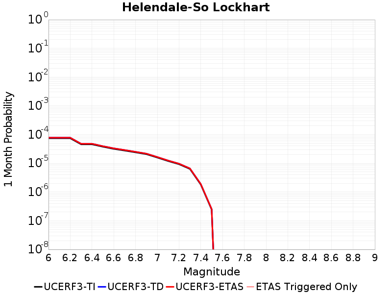 |  |  |

| Magnitude | 1 wk TI Prob | 1 wk TD Prob | 1 wk ETAS Prob | 1 wk ETAS/TD Gain | 1 wk ETAS Triggered Only | 1 mo TI Prob | 1 mo TD Prob | 1 mo ETAS Prob | 1 mo ETAS/TD Gain | 1 mo ETAS Triggered Only | 1 yr TI Prob | 1 yr TD Prob | 1 yr ETAS Prob | 1 yr ETAS/TD Gain | 1 yr ETAS Triggered Only | 10 yr TI Prob | 10 yr TD Prob | 10 yr ETAS Prob | 10 yr ETAS/TD Gain | 10 yr ETAS Triggered Only |
|-----|-----|-----|-----|-----|-----|-----|-----|-----|-----|-----|-----|-----|-----|-----|-----|-----|-----|-----|-----|-----|
| 6.0 | 1.7296055E-5 | 1.810899E-5 | 1.810899E-5 | 1.0 | 0.0 | 7.412385E-5 | 7.760777E-5 | 7.760777E-5 | 1.0 | 0.0 | 9.0208417E-4 | 9.444858E-4 | 9.744574E-4 | 1.0317333 | 3.0E-5 | 0.008984311 | 0.009406838 | 0.009515803 | 1.0115836 | 1.1E-4 |
| 6.1 | 1.7296055E-5 | 1.810899E-5 | 1.810899E-5 | 1.0 | 0.0 | 7.412385E-5 | 7.760777E-5 | 7.760777E-5 | 1.0 | 0.0 | 9.0208417E-4 | 9.444858E-4 | 9.744574E-4 | 1.0317333 | 3.0E-5 | 0.008984311 | 0.009406838 | 0.009515803 | 1.0115836 | 1.1E-4 |
| 6.2 | 1.7296055E-5 | 1.810899E-5 | 1.810899E-5 | 1.0 | 0.0 | 7.412385E-5 | 7.760777E-5 | 7.760777E-5 | 1.0 | 0.0 | 9.0208417E-4 | 9.444858E-4 | 9.744574E-4 | 1.0317333 | 3.0E-5 | 0.008984311 | 0.009406838 | 0.009515803 | 1.0115836 | 1.1E-4 |
| 6.3 | 1.0669118E-5 | 1.11384525E-5 | 1.11384525E-5 | 1.0 | 0.0 | 4.5723988E-5 | 4.7735364E-5 | 4.7735364E-5 | 1.0 | 0.0 | 5.5654737E-4 | 5.810259E-4 | 6.010143E-4 | 1.0344019 | 2.0E-5 | 0.0055515557 | 0.0057953643 | 0.0058749006 | 1.0137241 | 8.0E-5 |
| 6.4 | 1.0669118E-5 | 1.11384525E-5 | 1.11384525E-5 | 1.0 | 0.0 | 4.5723988E-5 | 4.7735364E-5 | 4.7735364E-5 | 1.0 | 0.0 | 5.5654737E-4 | 5.810259E-4 | 6.010143E-4 | 1.0344019 | 2.0E-5 | 0.0055515557 | 0.0057953643 | 0.0058749006 | 1.0137241 | 8.0E-5 |
| 6.5 | 8.790038E-6 | 9.172664E-6 | 9.172664E-6 | 1.0 | 0.0 | 3.767105E-5 | 3.9310835E-5 | 3.9310835E-5 | 1.0 | 0.0 | 4.585485E-4 | 4.7850583E-4 | 4.984963E-4 | 1.0417768 | 2.0E-5 | 0.0045760344 | 0.0047749197 | 0.0048445854 | 1.0145899 | 7.0E-5 |
| 6.6 | 7.396949E-6 | 7.717605E-6 | 7.717605E-6 | 1.0 | 0.0 | 3.1700827E-5 | 3.3075034E-5 | 3.3075034E-5 | 1.0 | 0.0 | 3.858892E-4 | 4.0261514E-4 | 4.226071E-4 | 1.0496552 | 2.0E-5 | 0.003852198 | 0.0040189642 | 0.004078723 | 1.0148692 | 6.0E-5 |
| 6.7 | 6.4600285E-6 | 6.739835E-6 | 6.739835E-6 | 1.0 | 0.0 | 2.7685543E-5 | 2.8884691E-5 | 2.8884691E-5 | 1.0 | 0.0 | 3.3701936E-4 | 3.5161513E-4 | 3.6161163E-4 | 1.0284302 | 1.0E-5 | 0.0033650869 | 0.0035106698 | 0.0035604944 | 1.0141923 | 5.0E-5 |
| 6.8 | 5.600104E-6 | 5.837538E-6 | 5.837538E-6 | 1.0 | 0.0 | 2.4000226E-5 | 2.5017784E-5 | 2.5017784E-5 | 1.0 | 0.0 | 2.9216358E-4 | 3.0454953E-4 | 3.145465E-4 | 1.0328254 | 1.0E-5 | 0.0029177975 | 0.003041383 | 0.0030812616 | 1.013112 | 4.0E-5 |
| 6.9 | 4.839122E-6 | 5.040806E-6 | 5.040806E-6 | 1.0 | 0.0 | 2.0738931E-5 | 2.160328E-5 | 2.160328E-5 | 1.0 | 0.0 | 2.5246723E-4 | 2.6298864E-4 | 2.72986E-4 | 1.0380144 | 1.0E-5 | 0.002521806 | 0.0026268219 | 0.0026367956 | 1.0037969 | 1.0E-5 |
| 7.0 | 3.6937633E-6 | 3.8461876E-6 | 3.8461876E-6 | 1.0 | 0.0 | 1.5830317E-5 | 1.648356E-5 | 1.648356E-5 | 1.0 | 0.0 | 1.9271708E-4 | 2.0066916E-4 | 2.0066916E-4 | 1.0 | 0.0 | 0.0019255003 | 0.0020049112 | 0.0020049112 | 1.0 | 0.0 |
| 7.1 | 2.7858857E-6 | 2.8985773E-6 | 2.8985773E-6 | 1.0 | 0.0 | 1.1939455E-5 | 1.2422416E-5 | 1.2422416E-5 | 1.0 | 0.0 | 1.4535317E-4 | 1.5123264E-4 | 1.5123264E-4 | 1.0 | 0.0 | 0.0014525814 | 0.0015113187 | 0.0015113187 | 1.0 | 0.0 |
| 7.2 | 2.1672065E-6 | 2.2545737E-6 | 2.2545737E-6 | 1.0 | 0.0 | 9.2879945E-6 | 9.6624235E-6 | 9.6624235E-6 | 1.0 | 0.0 | 1.1307546E-4 | 1.1763384E-4 | 1.1763384E-4 | 1.0 | 0.0 | 0.0011301794 | 0.001175734 | 0.001175734 | 1.0 | 0.0 |
| 7.3 | 1.4823496E-6 | 1.542597E-6 | 1.542597E-6 | 1.0 | 0.0 | 6.3529114E-6 | 6.6111143E-6 | 6.6111143E-6 | 1.0 | 0.0 | 7.734395E-5 | 8.0487494E-5 | 8.0487494E-5 | 1.0 | 0.0 | 7.731704E-4 | 8.0459856E-4 | 8.0459856E-4 | 1.0 | 0.0 |
| 7.4 | 4.2321457E-7 | 4.4120335E-7 | 4.4120335E-7 | 1.0 | 0.0 | 1.8137755E-6 | 1.8908704E-6 | 1.8908704E-6 | 1.0 | 0.0 | 2.2082493E-5 | 2.302115E-5 | 2.302115E-5 | 1.0 | 0.0 | 2.2080299E-4 | 2.3019218E-4 | 2.3019218E-4 | 1.0 | 0.0 |
| 7.5 | 5.6942316E-8 | 5.9431674E-8 | 5.9431674E-8 | 1.0 | 0.0 | 2.440385E-7 | 2.5470715E-7 | 2.5470715E-7 | 1.0 | 0.0 | 2.9711643E-6 | 3.101056E-6 | 3.101056E-6 | 1.0 | 0.0 | 2.9711247E-5 | 3.1010208E-5 | 3.1010208E-5 | 1.0 | 0.0 |

## San Andreas (Creeping Section) 2011 CFM
*[(top)](#table-of-contents)*

| 1 Week | 1 Month | 1 Year | 10 Year |
|-----|-----|-----|-----|
|  |  | 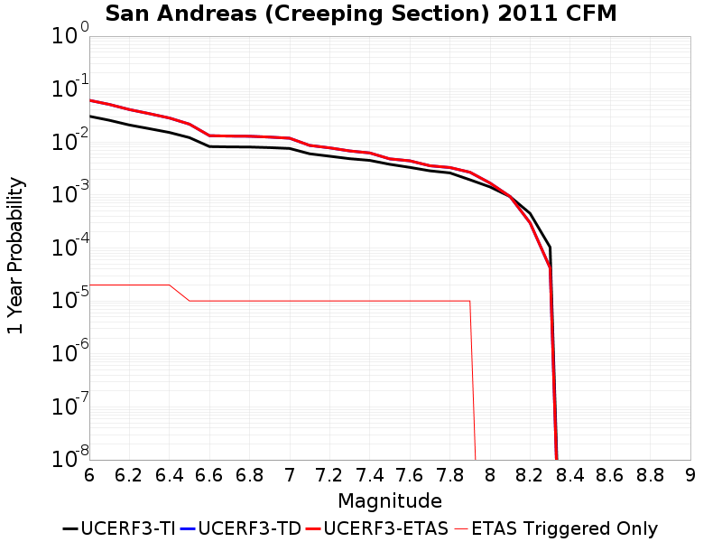 | 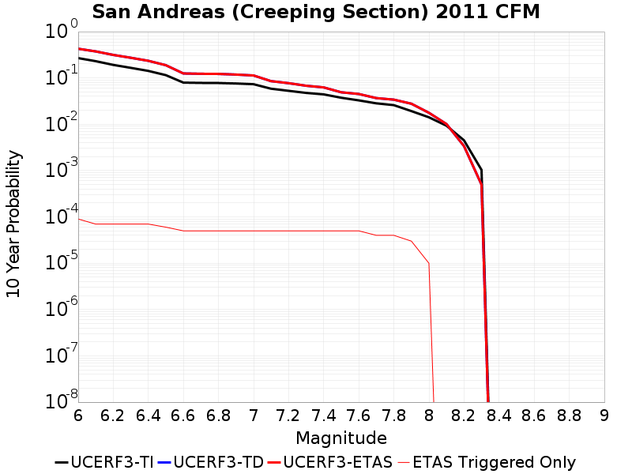 |

| Magnitude | 1 wk TI Prob | 1 wk TD Prob | 1 wk ETAS Prob | 1 wk ETAS/TD Gain | 1 wk ETAS Triggered Only | 1 mo TI Prob | 1 mo TD Prob | 1 mo ETAS Prob | 1 mo ETAS/TD Gain | 1 mo ETAS Triggered Only | 1 yr TI Prob | 1 yr TD Prob | 1 yr ETAS Prob | 1 yr ETAS/TD Gain | 1 yr ETAS Triggered Only | 10 yr TI Prob | 10 yr TD Prob | 10 yr ETAS Prob | 10 yr ETAS/TD Gain | 10 yr ETAS Triggered Only |
|-----|-----|-----|-----|-----|-----|-----|-----|-----|-----|-----|-----|-----|-----|-----|-----|-----|-----|-----|-----|-----|
| 6.0 | 5.986481E-4 | 0.0012330378 | 0.0012330378 | 1.0 | 0.0 | 0.0025631124 | 0.0052688755 | 0.0052688755 | 1.0 | 0.0 | 0.030762846 | 0.061472025 | 0.061490797 | 1.0003053 | 2.0E-5 | 0.26835477 | 0.42733684 | 0.4273884 | 1.0001206 | 9.0E-5 |
| 6.1 | 5.015945E-4 | 0.0010262572 | 0.0010262572 | 1.0 | 0.0 | 0.00214792 | 0.004386952 | 0.004386952 | 1.0 | 0.0 | 0.025839351 | 0.051469855 | 0.051488824 | 1.0003686 | 2.0E-5 | 0.23032776 | 0.37418926 | 0.37423307 | 1.0001171 | 7.0E-5 |
| 6.2 | 4.073338E-4 | 8.151223E-4 | 8.151223E-4 | 1.0 | 0.0 | 0.0017445484 | 0.0034859495 | 0.0034859495 | 1.0 | 0.0 | 0.021034058 | 0.0411535 | 0.04117268 | 1.000466 | 2.0E-5 | 0.19150782 | 0.3144795 | 0.31452748 | 1.0001526 | 7.0E-5 |
| 6.3 | 3.464099E-4 | 6.7830755E-4 | 6.7830755E-4 | 1.0 | 0.0 | 0.0014837692 | 0.002901784 | 0.002901784 | 1.0 | 0.0 | 0.017915873 | 0.034411505 | 0.034430817 | 1.0005612 | 2.0E-5 | 0.16538359 | 0.27285013 | 0.27290103 | 1.0001866 | 7.0E-5 |
| 6.4 | 2.935057E-4 | 5.5883126E-4 | 5.5883126E-4 | 1.0 | 0.0 | 0.0012572751 | 0.002391434 | 0.002391434 | 1.0 | 0.0 | 0.015200248 | 0.028488614 | 0.028508043 | 1.000682 | 2.0E-5 | 0.14201577 | 0.23460409 | 0.23465766 | 1.0002284 | 7.0E-5 |
| 6.5 | 2.3409708E-4 | 4.2533796E-4 | 4.2533796E-4 | 1.0 | 0.0 | 0.0010028875 | 0.0018208856 | 0.0018208856 | 1.0 | 0.0 | 0.012141965 | 0.021813188 | 0.021822968 | 1.0004485 | 1.0E-5 | 0.11499573 | 0.1885399 | 0.18858859 | 1.0002582 | 6.0E-5 |
| 6.6 | 1.5842178E-4 | 2.5508445E-4 | 2.5508445E-4 | 1.0 | 0.0 | 6.7877385E-4 | 0.0010927515 | 0.0010927515 | 1.0 | 0.0 | 0.0082328 | 0.013221698 | 0.013231566 | 1.0007464 | 1.0E-5 | 0.07934396 | 0.12498606 | 0.1250298 | 1.00035 | 5.0E-5 |
| 6.7 | 1.5616413E-4 | 2.5043852E-4 | 2.5043852E-4 | 1.0 | 0.0 | 6.691031E-4 | 0.0010728597 | 0.0010728597 | 1.0 | 0.0 | 0.0081159435 | 0.01298304 | 0.01299291 | 1.0007602 | 1.0E-5 | 0.0782586 | 0.12301299 | 0.12305684 | 1.0003564 | 5.0E-5 |
| 6.8 | 1.5538467E-4 | 2.4866703E-4 | 2.4866703E-4 | 1.0 | 0.0 | 6.6576427E-4 | 0.0010652745 | 0.0010652745 | 1.0 | 0.0 | 0.008075596 | 0.012891941 | 0.012901812 | 1.0007657 | 1.0E-5 | 0.07788358 | 0.12224166 | 0.122285545 | 1.000359 | 5.0E-5 |
| 6.9 | 1.5153569E-4 | 2.3972194E-4 | 2.3972194E-4 | 1.0 | 0.0 | 6.49277E-4 | 0.0010269773 | 0.0010269773 | 1.0 | 0.0 | 0.007876333 | 0.012432306 | 0.012442182 | 1.0007944 | 1.0E-5 | 0.07602952 | 0.118305504 | 0.11834959 | 1.0003726 | 5.0E-5 |
| 7.0 | 1.4588932E-4 | 2.282183E-4 | 2.282183E-4 | 1.0 | 0.0 | 6.250901E-4 | 9.777138E-4 | 9.777138E-4 | 1.0 | 0.0 | 0.0075839474 | 0.011839211 | 0.011849092 | 1.0008347 | 1.0E-5 | 0.073302895 | 0.11313199 | 0.11317634 | 1.000392 | 5.0E-5 |
| 7.1 | 1.1565079E-4 | 1.6649594E-4 | 1.6649594E-4 | 1.0 | 0.0 | 4.955521E-4 | 7.133598E-4 | 7.133598E-4 | 1.0 | 0.0 | 0.006016669 | 0.008650781 | 0.008660694 | 1.001146 | 1.0E-5 | 0.058563538 | 0.08531388 | 0.08535961 | 1.0005361 | 5.0E-5 |
| 7.2 | 1.0393792E-4 | 1.4960559E-4 | 1.4960559E-4 | 1.0 | 0.0 | 4.4537216E-4 | 6.4101006E-4 | 6.4101006E-4 | 1.0 | 0.0 | 0.005408933 | 0.0077765477 | 0.00778647 | 1.0012759 | 1.0E-5 | 0.052791595 | 0.07717693 | 0.07722307 | 1.0005978 | 5.0E-5 |
| 7.3 | 9.332884E-5 | 1.3083998E-4 | 1.3083998E-4 | 1.0 | 0.0 | 3.999194E-4 | 5.6062295E-4 | 5.6062295E-4 | 1.0 | 0.0 | 0.0048581534 | 0.006804363 | 0.006814295 | 1.0014596 | 1.0E-5 | 0.047533102 | 0.067878805 | 0.067925416 | 1.0006866 | 5.0E-5 |
| 7.4 | 8.670252E-5 | 1.19891425E-4 | 1.19891425E-4 | 1.0 | 0.0 | 3.715293E-4 | 5.137198E-4 | 5.137198E-4 | 1.0 | 0.0 | 0.004513991 | 0.006236728 | 0.0062466655 | 1.0015934 | 1.0E-5 | 0.044233937 | 0.062477738 | 0.06252462 | 1.0007503 | 5.0E-5 |
| 7.5 | 7.3036405E-5 | 9.247403E-5 | 9.247403E-5 | 1.0 | 0.0 | 3.129756E-4 | 3.9625715E-4 | 3.9625715E-4 | 1.0 | 0.0 | 0.0038038217 | 0.0048137815 | 0.004823733 | 1.0020673 | 1.0E-5 | 0.03739367 | 0.04902852 | 0.04907607 | 1.0009698 | 5.0E-5 |
| 7.6 | 6.3935775E-5 | 8.4993095E-5 | 8.4993095E-5 | 1.0 | 0.0 | 2.7398168E-4 | 3.6420533E-4 | 3.6420533E-4 | 1.0 | 0.0 | 0.0033306254 | 0.0044252044 | 0.00443516 | 1.0022498 | 1.0E-5 | 0.032811474 | 0.045035202 | 0.045082953 | 1.0010602 | 5.0E-5 |
| 7.7 | 5.5050095E-5 | 6.855811E-5 | 6.855811E-5 | 1.0 | 0.0 | 2.3590765E-4 | 2.937874E-4 | 2.937874E-4 | 1.0 | 0.0 | 0.0028683927 | 0.0035709997 | 0.003580964 | 1.0027903 | 1.0E-5 | 0.0283165 | 0.03673521 | 0.03677374 | 1.0010489 | 4.0E-5 |
| 7.8 | 5.027131E-5 | 6.340296E-5 | 6.340296E-5 | 1.0 | 0.0 | 2.1543067E-4 | 2.7169866E-4 | 2.7169866E-4 | 1.0 | 0.0 | 0.0026197135 | 0.0033029174 | 0.0033128844 | 1.0030177 | 1.0E-5 | 0.025890453 | 0.033988472 | 0.03402711 | 1.0011369 | 4.0E-5 |
| 7.9 | 3.7271806E-5 | 5.1655177E-5 | 5.1655177E-5 | 1.0 | 0.0 | 1.5972654E-4 | 2.2136056E-4 | 2.2136056E-4 | 1.0 | 0.0 | 0.0019429359 | 0.002691736 | 0.002701709 | 1.003705 | 1.0E-5 | 0.019260362 | 0.027769573 | 0.02779874 | 1.0010504 | 3.0E-5 |
| 8.0 | 2.7310243E-5 | 3.2378095E-5 | 3.2378095E-5 | 1.0 | 0.0 | 1.17038646E-4 | 1.3875589E-4 | 1.3875589E-4 | 1.0 | 0.0 | 0.0014240141 | 0.0016880448 | 0.0016880448 | 1.0 | 0.0 | 0.014149235 | 0.017696379 | 0.017706202 | 1.000555 | 1.0E-5 |
| 8.1 | 1.7940547E-5 | 1.8012153E-5 | 1.8012153E-5 | 1.0 | 0.0 | 7.688579E-5 | 7.7192664E-5 | 7.7192664E-5 | 1.0 | 0.0 | 9.3568244E-4 | 9.3941606E-4 | 9.3941606E-4 | 1.0 | 0.0 | 0.009317525 | 0.01012036 | 0.01012036 | 1.0 | 0.0 |
| 8.2 | 8.643924E-6 | 5.720392E-6 | 5.720392E-6 | 1.0 | 0.0 | 3.704486E-5 | 2.4515735E-5 | 2.4515735E-5 | 1.0 | 0.0 | 4.5092785E-4 | 2.9843827E-4 | 2.9843827E-4 | 1.0 | 0.0 | 0.0045001395 | 0.0033829338 | 0.0033829338 | 1.0 | 0.0 |
| 8.3 | 1.983087E-6 | 8.0695344E-7 | 8.0695344E-7 | 1.0 | 0.0 | 8.498917E-6 | 3.4583672E-6 | 3.4583672E-6 | 1.0 | 0.0 | 1.034694E-4 | 4.2104828E-5 | 4.2104828E-5 | 1.0 | 0.0 | 0.0010342124 | 4.95424E-4 | 4.95424E-4 | 1.0 | 0.0 |

## White Wolf (Extension)
*[(top)](#table-of-contents)*

| 1 Week | 1 Month | 1 Year | 10 Year |
|-----|-----|-----|-----|
| 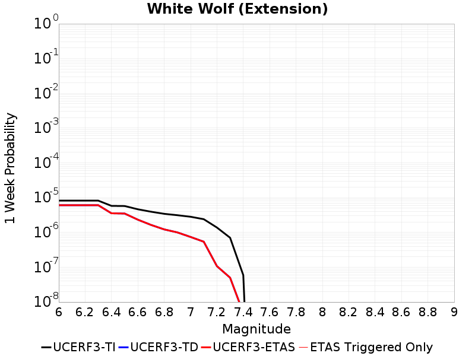 | 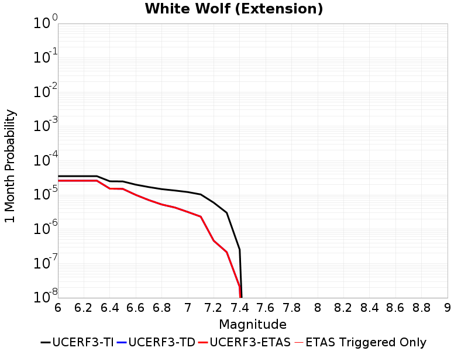 |  |  |

| Magnitude | 1 wk TI Prob | 1 wk TD Prob | 1 wk ETAS Prob | 1 wk ETAS/TD Gain | 1 wk ETAS Triggered Only | 1 mo TI Prob | 1 mo TD Prob | 1 mo ETAS Prob | 1 mo ETAS/TD Gain | 1 mo ETAS Triggered Only | 1 yr TI Prob | 1 yr TD Prob | 1 yr ETAS Prob | 1 yr ETAS/TD Gain | 1 yr ETAS Triggered Only | 10 yr TI Prob | 10 yr TD Prob | 10 yr ETAS Prob | 10 yr ETAS/TD Gain | 10 yr ETAS Triggered Only |
|-----|-----|-----|-----|-----|-----|-----|-----|-----|-----|-----|-----|-----|-----|-----|-----|-----|-----|-----|-----|-----|
| 6.0 | 8.222555E-6 | 6.068514E-6 | 6.068514E-6 | 1.0 | 0.0 | 3.5239045E-5 | 2.6007694E-5 | 2.6007694E-5 | 1.0 | 0.0 | 4.289509E-4 | 3.166043E-4 | 3.2660112E-4 | 1.0315752 | 1.0E-5 | 0.0042812387 | 0.0031621847 | 0.0032519002 | 1.0283713 | 9.0E-5 |
| 6.1 | 8.222555E-6 | 6.068514E-6 | 6.068514E-6 | 1.0 | 0.0 | 3.5239045E-5 | 2.6007694E-5 | 2.6007694E-5 | 1.0 | 0.0 | 4.289509E-4 | 3.166043E-4 | 3.2660112E-4 | 1.0315752 | 1.0E-5 | 0.0042812387 | 0.0031621847 | 0.0032519002 | 1.0283713 | 9.0E-5 |
| 6.2 | 8.222555E-6 | 6.068514E-6 | 6.068514E-6 | 1.0 | 0.0 | 3.5239045E-5 | 2.6007694E-5 | 2.6007694E-5 | 1.0 | 0.0 | 4.289509E-4 | 3.166043E-4 | 3.2660112E-4 | 1.0315752 | 1.0E-5 | 0.0042812387 | 0.0031621847 | 0.0032519002 | 1.0283713 | 9.0E-5 |
| 6.3 | 8.222555E-6 | 6.068514E-6 | 6.068514E-6 | 1.0 | 0.0 | 3.5239045E-5 | 2.6007694E-5 | 2.6007694E-5 | 1.0 | 0.0 | 4.289509E-4 | 3.166043E-4 | 3.2660112E-4 | 1.0315752 | 1.0E-5 | 0.0042812387 | 0.0031621847 | 0.0032519002 | 1.0283713 | 9.0E-5 |
| 6.4 | 5.821773E-6 | 3.5583182E-6 | 3.5583182E-6 | 1.0 | 0.0 | 2.4950215E-5 | 1.5249852E-5 | 1.5249852E-5 | 1.0 | 0.0 | 3.0372653E-4 | 1.8565224E-4 | 1.8565224E-4 | 1.0 | 0.0 | 0.0030331176 | 0.0018550798 | 0.0018950056 | 1.0215224 | 4.0E-5 |
| 6.5 | 5.766023E-6 | 3.5002374E-6 | 3.5002374E-6 | 1.0 | 0.0 | 2.4711293E-5 | 1.5000937E-5 | 1.5000937E-5 | 1.0 | 0.0 | 3.0081844E-4 | 1.826222E-4 | 1.826222E-4 | 1.0 | 0.0 | 0.0030041158 | 0.0018248295 | 0.0018647566 | 1.0218799 | 4.0E-5 |
| 6.6 | 4.643576E-6 | 2.3334667E-6 | 2.3334667E-6 | 1.0 | 0.0 | 1.9900888E-5 | 1.0000535E-5 | 1.0000535E-5 | 1.0 | 0.0 | 2.4226638E-4 | 1.2175014E-4 | 1.2175014E-4 | 1.0 | 0.0 | 0.0024200242 | 0.0012168769 | 0.0012368525 | 1.0164155 | 2.0E-5 |
| 6.7 | 3.9529173E-6 | 1.6490184E-6 | 1.6490184E-6 | 1.0 | 0.0 | 1.6940963E-5 | 7.0672036E-6 | 7.0672036E-6 | 1.0 | 0.0 | 2.0623671E-4 | 8.6039996E-5 | 8.6039996E-5 | 1.0 | 0.0 | 0.002060454 | 8.6008536E-4 | 8.800681E-4 | 1.0232335 | 2.0E-5 |
| 6.8 | 3.4377522E-6 | 1.2250762E-6 | 1.2250762E-6 | 1.0 | 0.0 | 1.473314E-5 | 5.2503165E-6 | 5.2503165E-6 | 1.0 | 0.0 | 1.7936122E-4 | 6.392082E-5 | 6.392082E-5 | 1.0 | 0.0 | 0.0017921652 | 6.3903345E-4 | 6.590207E-4 | 1.0312773 | 2.0E-5 |
| 6.9 | 3.1367306E-6 | 1.0038623E-6 | 1.0038623E-6 | 1.0 | 0.0 | 1.3443062E-5 | 4.3022605E-6 | 4.3022605E-6 | 1.0 | 0.0 | 1.63657E-4 | 5.237884E-5 | 5.237884E-5 | 1.0 | 0.0 | 0.0016353652 | 5.236726E-4 | 5.3366733E-4 | 1.0190859 | 1.0E-5 |
| 7.0 | 2.8298145E-6 | 7.432817E-7 | 7.432817E-7 | 1.0 | 0.0 | 1.2127721E-5 | 3.1854895E-6 | 3.1854895E-6 | 1.0 | 0.0 | 1.47645E-4 | 3.8782695E-5 | 3.8782695E-5 | 1.0 | 0.0 | 0.0014754693 | 3.8776424E-4 | 3.8776424E-4 | 1.0 | 0.0 |
| 7.1 | 2.4091064E-6 | 5.4260835E-7 | 5.4260835E-7 | 1.0 | 0.0 | 1.03247E-5 | 2.3254624E-6 | 2.3254624E-6 | 1.0 | 0.0 | 1.2569598E-4 | 2.8312179E-5 | 2.8312179E-5 | 1.0 | 0.0 | 0.001256249 | 2.8308976E-4 | 2.8308976E-4 | 1.0 | 0.0 |
| 7.2 | 1.3875518E-6 | 1.0758685E-7 | 1.0758685E-7 | 1.0 | 0.0 | 5.9466374E-6 | 4.6108644E-7 | 4.6108644E-7 | 1.0 | 0.0 | 7.23979E-5 | 5.613714E-6 | 5.613714E-6 | 1.0 | 0.0 | 7.2374323E-4 | 5.6135836E-5 | 5.6135836E-5 | 1.0 | 0.0 |
| 7.3 | 7.056077E-7 | 5.011259E-8 | 5.011259E-8 | 1.0 | 0.0 | 3.0240296E-6 | 2.1476822E-7 | 2.1476822E-7 | 1.0 | 0.0 | 3.681694E-5 | 2.6148005E-6 | 2.6148005E-6 | 1.0 | 0.0 | 3.681084E-4 | 2.6147743E-5 | 2.6147743E-5 | 1.0 | 0.0 |
| 7.4 | 5.9334678E-8 | 4.88022E-9 | 4.88022E-9 | 1.0 | 0.0 | 2.5429145E-7 | 2.0915227E-8 | 2.0915227E-8 | 1.0 | 0.0 | 3.095994E-6 | 2.5464288E-7 | 2.5464288E-7 | 1.0 | 0.0 | 3.095951E-5 | 2.546427E-6 | 2.546427E-6 | 1.0 | 0.0 |

## San Andreas (Carrizo) rev
*[(top)](#table-of-contents)*

| 1 Week | 1 Month | 1 Year | 10 Year |
|-----|-----|-----|-----|
|  |  |  | 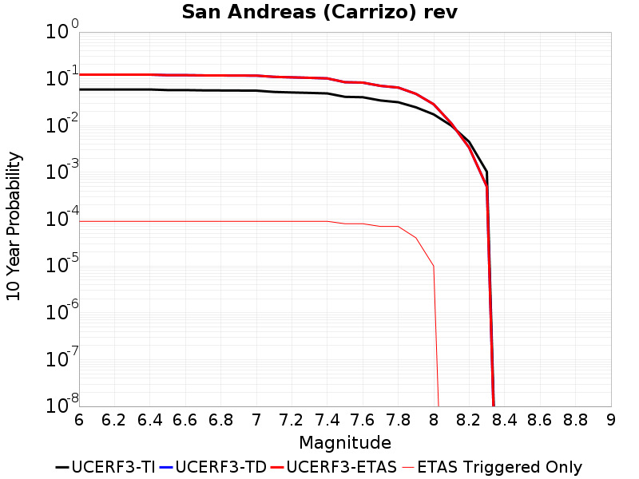 |

| Magnitude | 1 wk TI Prob | 1 wk TD Prob | 1 wk ETAS Prob | 1 wk ETAS/TD Gain | 1 wk ETAS Triggered Only | 1 mo TI Prob | 1 mo TD Prob | 1 mo ETAS Prob | 1 mo ETAS/TD Gain | 1 mo ETAS Triggered Only | 1 yr TI Prob | 1 yr TD Prob | 1 yr ETAS Prob | 1 yr ETAS/TD Gain | 1 yr ETAS Triggered Only | 10 yr TI Prob | 10 yr TD Prob | 10 yr ETAS Prob | 10 yr ETAS/TD Gain | 10 yr ETAS Triggered Only |
|-----|-----|-----|-----|-----|-----|-----|-----|-----|-----|-----|-----|-----|-----|-----|-----|-----|-----|-----|-----|-----|
| 6.0 | 1.1674632E-4 | 2.4777034E-4 | 2.4777034E-4 | 1.0 | 0.0 | 5.002454E-4 | 0.0010614424 | 0.0010614424 | 1.0 | 0.0 | 0.006073493 | 0.012846989 | 0.012856861 | 1.0007684 | 1.0E-5 | 0.0591016 | 0.12252375 | 0.12260272 | 1.0006446 | 9.0E-5 |
| 6.1 | 1.1674632E-4 | 2.4777034E-4 | 2.4777034E-4 | 1.0 | 0.0 | 5.002454E-4 | 0.0010614424 | 0.0010614424 | 1.0 | 0.0 | 0.006073493 | 0.012846989 | 0.012856861 | 1.0007684 | 1.0E-5 | 0.0591016 | 0.12252375 | 0.12260272 | 1.0006446 | 9.0E-5 |
| 6.2 | 1.1674632E-4 | 2.4777034E-4 | 2.4777034E-4 | 1.0 | 0.0 | 5.002454E-4 | 0.0010614424 | 0.0010614424 | 1.0 | 0.0 | 0.006073493 | 0.012846989 | 0.012856861 | 1.0007684 | 1.0E-5 | 0.0591016 | 0.12252375 | 0.12260272 | 1.0006446 | 9.0E-5 |
| 6.3 | 1.1674632E-4 | 2.4777034E-4 | 2.4777034E-4 | 1.0 | 0.0 | 5.002454E-4 | 0.0010614424 | 0.0010614424 | 1.0 | 0.0 | 0.006073493 | 0.012846989 | 0.012856861 | 1.0007684 | 1.0E-5 | 0.0591016 | 0.12252375 | 0.12260272 | 1.0006446 | 9.0E-5 |
| 6.4 | 1.1674632E-4 | 2.4777034E-4 | 2.4777034E-4 | 1.0 | 0.0 | 5.002454E-4 | 0.0010614424 | 0.0010614424 | 1.0 | 0.0 | 0.006073493 | 0.012846989 | 0.012856861 | 1.0007684 | 1.0E-5 | 0.0591016 | 0.12252375 | 0.12260272 | 1.0006446 | 9.0E-5 |
| 6.5 | 1.13136164E-4 | 2.4094999E-4 | 2.4094999E-4 | 1.0 | 0.0 | 4.847792E-4 | 0.0010322357 | 0.0010322357 | 1.0 | 0.0 | 0.0058862255 | 0.012495517 | 0.012505392 | 1.0007902 | 1.0E-5 | 0.057327334 | 0.119498394 | 0.11957764 | 1.0006632 | 9.0E-5 |
| 6.6 | 1.13136164E-4 | 2.4094999E-4 | 2.4094999E-4 | 1.0 | 0.0 | 4.847792E-4 | 0.0010322357 | 0.0010322357 | 1.0 | 0.0 | 0.0058862255 | 0.012495517 | 0.012505392 | 1.0007902 | 1.0E-5 | 0.057327334 | 0.119498394 | 0.11957764 | 1.0006632 | 9.0E-5 |
| 6.7 | 1.1149675E-4 | 2.3785295E-4 | 2.3785295E-4 | 1.0 | 0.0 | 4.777557E-4 | 0.0010189731 | 0.0010189731 | 1.0 | 0.0 | 0.0058011734 | 0.012335881 | 0.012345757 | 1.0008006 | 1.0E-5 | 0.05652051 | 0.11811972 | 0.11819909 | 1.000672 | 9.0E-5 |
| 6.8 | 1.1103589E-4 | 2.3686909E-4 | 2.3686909E-4 | 1.0 | 0.0 | 4.7578133E-4 | 0.0010147598 | 0.0010147598 | 1.0 | 0.0 | 0.005777263 | 0.012285165 | 0.012295041 | 1.000804 | 1.0E-5 | 0.056293584 | 0.11767892 | 0.117758326 | 1.0006748 | 9.0E-5 |
| 6.9 | 1.1053259E-4 | 2.3578692E-4 | 2.3578692E-4 | 1.0 | 0.0 | 4.7362508E-4 | 0.0010101255 | 0.0010101255 | 1.0 | 0.0 | 0.0057511497 | 0.012229377 | 0.012239255 | 1.0008078 | 1.0E-5 | 0.05604569 | 0.11719397 | 0.11727342 | 1.000678 | 9.0E-5 |
| 7.0 | 1.1005377E-4 | 2.3478967E-4 | 2.3478967E-4 | 1.0 | 0.0 | 4.7157376E-4 | 0.0010058549 | 0.0010058549 | 1.0 | 0.0 | 0.0057263062 | 0.012177965 | 0.012187843 | 1.0008111 | 1.0E-5 | 0.055809796 | 0.116746336 | 0.11682583 | 1.0006809 | 9.0E-5 |
| 7.1 | 1.0308142E-4 | 2.1980381E-4 | 2.1980381E-4 | 1.0 | 0.0 | 4.417027E-4 | 9.416773E-4 | 9.416773E-4 | 1.0 | 0.0 | 0.0053644776 | 0.011404981 | 0.011414867 | 1.0008668 | 1.0E-5 | 0.052368138 | 0.10996545 | 0.11004555 | 1.0007285 | 9.0E-5 |
| 7.2 | 1.0027479E-4 | 2.1384846E-4 | 2.1384846E-4 | 1.0 | 0.0 | 4.296783E-4 | 9.161725E-4 | 9.161725E-4 | 1.0 | 0.0 | 0.0052187922 | 0.011097663 | 0.011107553 | 1.0008911 | 1.0E-5 | 0.050979212 | 0.10726223 | 0.10734257 | 1.0007491 | 9.0E-5 |
| 7.3 | 9.816942E-5 | 2.0853993E-4 | 2.0853993E-4 | 1.0 | 0.0 | 4.2065824E-4 | 8.934374E-4 | 8.934374E-4 | 1.0 | 0.0 | 0.005109493 | 0.010823647 | 0.010833538 | 1.0009139 | 1.0E-5 | 0.049935985 | 0.1048256 | 0.104906164 | 1.0007685 | 9.0E-5 |
| 7.4 | 9.5634205E-5 | 2.0215633E-4 | 2.0215633E-4 | 1.0 | 0.0 | 4.0979648E-4 | 8.660975E-4 | 8.660975E-4 | 1.0 | 0.0 | 0.0049778637 | 0.010494029 | 0.010503924 | 1.000943 | 1.0E-5 | 0.048678253 | 0.101893 | 0.10197383 | 1.0007933 | 9.0E-5 |
| 7.5 | 8.052417E-5 | 1.6485459E-4 | 1.6485459E-4 | 1.0 | 0.0 | 3.4505792E-4 | 7.063285E-4 | 7.063285E-4 | 1.0 | 0.0 | 0.0041929903 | 0.008565728 | 0.0085756425 | 1.0011574 | 1.0E-5 | 0.04114753 | 0.084472455 | 0.084545694 | 1.000867 | 8.0E-5 |
| 7.6 | 7.897024E-5 | 1.6134117E-4 | 1.6134117E-4 | 1.0 | 0.0 | 3.384E-4 | 6.912791E-4 | 6.912791E-4 | 1.0 | 0.0 | 0.0041122385 | 0.008383926 | 0.008393843 | 1.0011828 | 1.0E-5 | 0.040369697 | 0.082797065 | 0.08287044 | 1.0008862 | 8.0E-5 |
| 7.7 | 6.707427E-5 | 1.3608106E-4 | 1.3608106E-4 | 1.0 | 0.0 | 2.8742946E-4 | 5.8307423E-4 | 5.8307423E-4 | 1.0 | 0.0 | 0.003493839 | 0.0070758574 | 0.0070857867 | 1.0014032 | 1.0E-5 | 0.034394164 | 0.07055473 | 0.07061979 | 1.0009221 | 7.0E-5 |
| 7.8 | 6.147705E-5 | 1.249811E-4 | 1.249811E-4 | 1.0 | 0.0 | 2.6344648E-4 | 5.355234E-4 | 5.355234E-4 | 1.0 | 0.0 | 0.0032027436 | 0.0065005324 | 0.0065104677 | 1.0015284 | 1.0E-5 | 0.031569764 | 0.06488657 | 0.06495203 | 1.0010087 | 7.0E-5 |
| 7.9 | 4.7636717E-5 | 9.0974936E-5 | 9.0974936E-5 | 1.0 | 0.0 | 2.0414138E-4 | 3.8983434E-4 | 3.8983434E-4 | 1.0 | 0.0 | 0.0024825884 | 0.0047359127 | 0.0047458652 | 1.0021015 | 1.0E-5 | 0.024550365 | 0.04765 | 0.04768809 | 1.0007994 | 4.0E-5 |
| 8.0 | 3.3554235E-5 | 5.3482952E-5 | 5.3482952E-5 | 1.0 | 0.0 | 1.4379594E-4 | 2.2919253E-4 | 2.2919253E-4 | 1.0 | 0.0 | 0.0017493097 | 0.0027868503 | 0.0027868503 | 1.0 | 0.0 | 0.017356034 | 0.028542778 | 0.028552491 | 1.0003403 | 1.0E-5 |
| 8.1 | 1.9175432E-5 | 1.9839963E-5 | 1.9839963E-5 | 1.0 | 0.0 | 8.217783E-5 | 8.502565E-5 | 8.502565E-5 | 1.0 | 0.0 | 0.0010000558 | 0.0010346964 | 0.0010346964 | 1.0 | 0.0 | 0.009955673 | 0.011101277 | 0.011101277 | 1.0 | 0.0 |
| 8.2 | 8.643924E-6 | 5.720392E-6 | 5.720392E-6 | 1.0 | 0.0 | 3.704486E-5 | 2.4515735E-5 | 2.4515735E-5 | 1.0 | 0.0 | 4.5092785E-4 | 2.9843827E-4 | 2.9843827E-4 | 1.0 | 0.0 | 0.0045001395 | 0.0033829338 | 0.0033829338 | 1.0 | 0.0 |
| 8.3 | 1.983087E-6 | 8.0695344E-7 | 8.0695344E-7 | 1.0 | 0.0 | 8.498917E-6 | 3.4583672E-6 | 3.4583672E-6 | 1.0 | 0.0 | 1.034694E-4 | 4.2104828E-5 | 4.2104828E-5 | 1.0 | 0.0 | 0.0010342124 | 4.95424E-4 | 4.95424E-4 | 1.0 | 0.0 |

## Cady
*[(top)](#table-of-contents)*

| 1 Week | 1 Month | 1 Year | 10 Year |
|-----|-----|-----|-----|
|  | 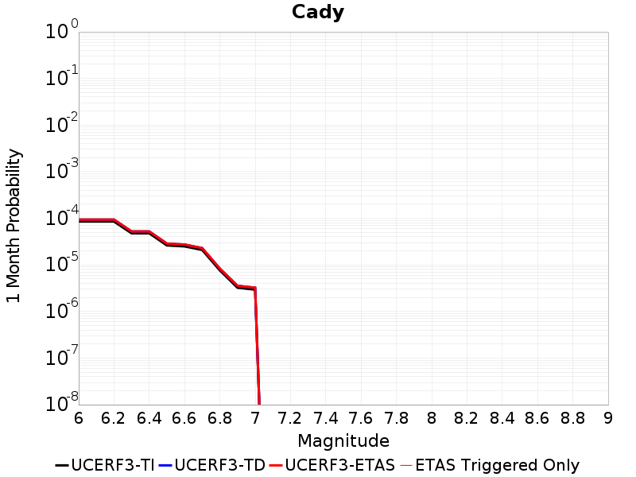 |  |  |

| Magnitude | 1 wk TI Prob | 1 wk TD Prob | 1 wk ETAS Prob | 1 wk ETAS/TD Gain | 1 wk ETAS Triggered Only | 1 mo TI Prob | 1 mo TD Prob | 1 mo ETAS Prob | 1 mo ETAS/TD Gain | 1 mo ETAS Triggered Only | 1 yr TI Prob | 1 yr TD Prob | 1 yr ETAS Prob | 1 yr ETAS/TD Gain | 1 yr ETAS Triggered Only | 10 yr TI Prob | 10 yr TD Prob | 10 yr ETAS Prob | 10 yr ETAS/TD Gain | 10 yr ETAS Triggered Only |
|-----|-----|-----|-----|-----|-----|-----|-----|-----|-----|-----|-----|-----|-----|-----|-----|-----|-----|-----|-----|-----|
| 6.0 | 1.9892565E-5 | 2.1872162E-5 | 2.1872162E-5 | 1.0 | 0.0 | 8.525106E-5 | 9.373498E-5 | 9.373498E-5 | 1.0 | 0.0 | 0.0010374374 | 0.001140717 | 0.0011706827 | 1.0262692 | 3.0E-5 | 0.010326075 | 0.011357643 | 0.01144662 | 1.0078342 | 9.0E-5 |
| 6.1 | 1.9892565E-5 | 2.1872162E-5 | 2.1872162E-5 | 1.0 | 0.0 | 8.525106E-5 | 9.373498E-5 | 9.373498E-5 | 1.0 | 0.0 | 0.0010374374 | 0.001140717 | 0.0011706827 | 1.0262692 | 3.0E-5 | 0.010326075 | 0.011357643 | 0.01144662 | 1.0078342 | 9.0E-5 |
| 6.2 | 1.9892565E-5 | 2.1872162E-5 | 2.1872162E-5 | 1.0 | 0.0 | 8.525106E-5 | 9.373498E-5 | 9.373498E-5 | 1.0 | 0.0 | 0.0010374374 | 0.001140717 | 0.0011706827 | 1.0262692 | 3.0E-5 | 0.010326075 | 0.011357643 | 0.01144662 | 1.0078342 | 9.0E-5 |
| 6.3 | 1.1117327E-5 | 1.2183796E-5 | 1.2183796E-5 | 1.0 | 0.0 | 4.764482E-5 | 5.22154E-5 | 5.22154E-5 | 1.0 | 0.0 | 5.7992124E-4 | 6.3556863E-4 | 6.6554954E-4 | 1.0471718 | 3.0E-5 | 0.0057841022 | 0.006340619 | 0.0064002387 | 1.0094028 | 6.0E-5 |
| 6.4 | 1.1117327E-5 | 1.2183796E-5 | 1.2183796E-5 | 1.0 | 0.0 | 4.764482E-5 | 5.22154E-5 | 5.22154E-5 | 1.0 | 0.0 | 5.7992124E-4 | 6.3556863E-4 | 6.6554954E-4 | 1.0471718 | 3.0E-5 | 0.0057841022 | 0.006340619 | 0.0064002387 | 1.0094028 | 6.0E-5 |
| 6.5 | 6.103093E-6 | 6.675888E-6 | 6.675888E-6 | 1.0 | 0.0 | 2.615585E-5 | 2.8610706E-5 | 2.8610706E-5 | 1.0 | 0.0 | 3.1840094E-4 | 3.4829226E-4 | 3.5828876E-4 | 1.0287015 | 1.0E-5 | 0.0031794512 | 0.0034786994 | 0.0034986297 | 1.0057293 | 2.0E-5 |
| 6.6 | 5.817237E-6 | 6.3693897E-6 | 6.3693897E-6 | 1.0 | 0.0 | 2.4930776E-5 | 2.7297168E-5 | 2.7297168E-5 | 1.0 | 0.0 | 3.034899E-4 | 3.323048E-4 | 3.4230147E-4 | 1.0300828 | 1.0E-5 | 0.0030307577 | 0.0033193026 | 0.0033392361 | 1.0060054 | 2.0E-5 |
| 6.7 | 4.8846314E-6 | 5.3436675E-6 | 5.3436675E-6 | 1.0 | 0.0 | 2.0933967E-5 | 2.2901299E-5 | 2.2901299E-5 | 1.0 | 0.0 | 2.5484123E-4 | 2.7879942E-4 | 2.8879664E-4 | 1.035858 | 1.0E-5 | 0.0025454918 | 0.0027856533 | 0.0028055976 | 1.0071596 | 2.0E-5 |
| 6.8 | 1.7788773E-6 | 1.941E-6 | 1.941E-6 | 1.0 | 0.0 | 7.6237375E-6 | 8.318553E-6 | 8.318553E-6 | 1.0 | 0.0 | 9.281505E-5 | 1.01275255E-4 | 1.01275255E-4 | 1.0 | 0.0 | 9.2776294E-4 | 0.0010124458 | 0.0010124458 | 1.0 | 0.0 |
| 6.9 | 7.5455404E-7 | 8.302227E-7 | 8.302227E-7 | 1.0 | 0.0 | 3.233799E-6 | 3.5580942E-6 | 3.5580942E-6 | 1.0 | 0.0 | 3.937079E-5 | 4.3319273E-5 | 4.3319273E-5 | 1.0 | 0.0 | 3.9363815E-4 | 4.3314128E-4 | 4.3314128E-4 | 1.0 | 0.0 |
| 7.0 | 6.8578805E-7 | 7.5464897E-7 | 7.5464897E-7 | 1.0 | 0.0 | 2.9390883E-6 | 3.2342077E-6 | 3.2342077E-6 | 1.0 | 0.0 | 3.578281E-5 | 3.9376097E-5 | 3.9376097E-5 | 1.0 | 0.0 | 3.577705E-4 | 3.9372372E-4 | 3.9372372E-4 | 1.0 | 0.0 |

## San Andreas (San Gorgonio Pass-Garnet HIll)
*[(top)](#table-of-contents)*

| 1 Week | 1 Month | 1 Year | 10 Year |
|-----|-----|-----|-----|
| 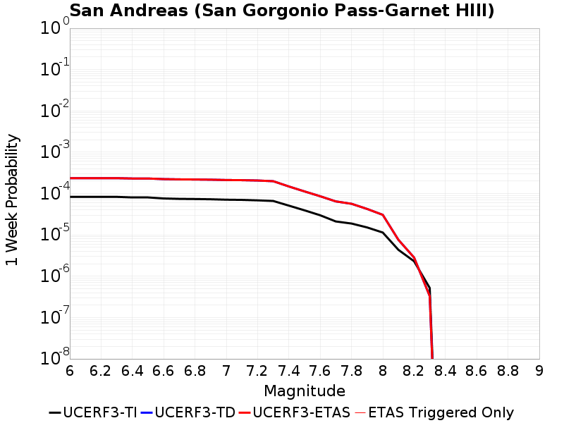 |  | 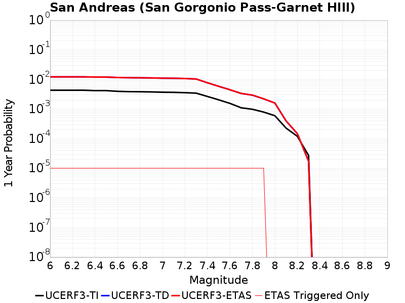 |  |

| Magnitude | 1 wk TI Prob | 1 wk TD Prob | 1 wk ETAS Prob | 1 wk ETAS/TD Gain | 1 wk ETAS Triggered Only | 1 mo TI Prob | 1 mo TD Prob | 1 mo ETAS Prob | 1 mo ETAS/TD Gain | 1 mo ETAS Triggered Only | 1 yr TI Prob | 1 yr TD Prob | 1 yr ETAS Prob | 1 yr ETAS/TD Gain | 1 yr ETAS Triggered Only | 10 yr TI Prob | 10 yr TD Prob | 10 yr ETAS Prob | 10 yr ETAS/TD Gain | 10 yr ETAS Triggered Only |
|-----|-----|-----|-----|-----|-----|-----|-----|-----|-----|-----|-----|-----|-----|-----|-----|-----|-----|-----|-----|-----|
| 6.0 | 8.31567E-5 | 2.3580097E-4 | 2.3580097E-4 | 1.0 | 0.0 | 3.5633717E-4 | 0.0010101842 | 0.0010101842 | 1.0 | 0.0 | 0.004329778 | 0.012229518 | 0.012239396 | 1.0008076 | 1.0E-5 | 0.042463828 | 0.1133845 | 0.113464296 | 1.0007038 | 9.0E-5 |
| 6.1 | 8.31567E-5 | 2.3580097E-4 | 2.3580097E-4 | 1.0 | 0.0 | 3.5633717E-4 | 0.0010101842 | 0.0010101842 | 1.0 | 0.0 | 0.004329778 | 0.012229518 | 0.012239396 | 1.0008076 | 1.0E-5 | 0.042463828 | 0.1133845 | 0.113464296 | 1.0007038 | 9.0E-5 |
| 6.2 | 8.31567E-5 | 2.3580097E-4 | 2.3580097E-4 | 1.0 | 0.0 | 3.5633717E-4 | 0.0010101842 | 0.0010101842 | 1.0 | 0.0 | 0.004329778 | 0.012229518 | 0.012239396 | 1.0008076 | 1.0E-5 | 0.042463828 | 0.1133845 | 0.113464296 | 1.0007038 | 9.0E-5 |
| 6.3 | 8.31567E-5 | 2.3580097E-4 | 2.3580097E-4 | 1.0 | 0.0 | 3.5633717E-4 | 0.0010101842 | 0.0010101842 | 1.0 | 0.0 | 0.004329778 | 0.012229518 | 0.012239396 | 1.0008076 | 1.0E-5 | 0.042463828 | 0.1133845 | 0.113464296 | 1.0007038 | 9.0E-5 |
| 6.4 | 8.059055E-5 | 2.3136578E-4 | 2.3136578E-4 | 1.0 | 0.0 | 3.4534236E-4 | 9.911908E-4 | 9.911908E-4 | 1.0 | 0.0 | 0.0041964394 | 0.012001184 | 0.012011064 | 1.0008233 | 1.0E-5 | 0.041180745 | 0.111362815 | 0.11144279 | 1.0007181 | 9.0E-5 |
| 6.5 | 8.059055E-5 | 2.3136578E-4 | 2.3136578E-4 | 1.0 | 0.0 | 3.4534236E-4 | 9.911908E-4 | 9.911908E-4 | 1.0 | 0.0 | 0.0041964394 | 0.012001184 | 0.012011064 | 1.0008233 | 1.0E-5 | 0.041180745 | 0.111362815 | 0.11144279 | 1.0007181 | 9.0E-5 |
| 6.6 | 7.619237E-5 | 2.237948E-4 | 2.237948E-4 | 1.0 | 0.0 | 3.2649786E-4 | 9.587703E-4 | 9.587703E-4 | 1.0 | 0.0 | 0.0039678677 | 0.011611108 | 0.011620991 | 1.0008513 | 1.0E-5 | 0.03897764 | 0.107895434 | 0.10797572 | 1.0007441 | 9.0E-5 |
| 6.7 | 7.440636E-5 | 2.2054884E-4 | 2.2054884E-4 | 1.0 | 0.0 | 3.188454E-4 | 9.448692E-4 | 9.448692E-4 | 1.0 | 0.0 | 0.0038750346 | 0.011443648 | 0.011453534 | 1.0008638 | 1.0E-5 | 0.038081564 | 0.106403045 | 0.10648347 | 1.0007558 | 9.0E-5 |
| 6.8 | 7.3735864E-5 | 2.1901458E-4 | 2.1901458E-4 | 1.0 | 0.0 | 3.1597257E-4 | 9.3829853E-4 | 9.3829853E-4 | 1.0 | 0.0 | 0.0038401815 | 0.011364489 | 0.011374376 | 1.00087 | 1.0E-5 | 0.03774495 | 0.10570262 | 0.105783105 | 1.0007614 | 9.0E-5 |
| 6.9 | 7.27575E-5 | 2.1669969E-4 | 2.1669969E-4 | 1.0 | 0.0 | 3.117806E-4 | 9.2838466E-4 | 9.2838466E-4 | 1.0 | 0.0 | 0.003789323 | 0.01124504 | 0.011254928 | 1.0008793 | 1.0E-5 | 0.037253562 | 0.10464942 | 0.10473 | 1.00077 | 9.0E-5 |
| 7.0 | 7.102591E-5 | 2.125316E-4 | 2.125316E-4 | 1.0 | 0.0 | 3.0436125E-4 | 9.10534E-4 | 9.10534E-4 | 1.0 | 0.0 | 0.003699303 | 0.011029927 | 0.011039817 | 1.0008966 | 1.0E-5 | 0.03638325 | 0.10275041 | 0.10283116 | 1.000786 | 9.0E-5 |
| 7.1 | 7.028513E-5 | 2.1088231E-4 | 2.1088231E-4 | 1.0 | 0.0 | 3.0118722E-4 | 9.0347056E-4 | 9.0347056E-4 | 1.0 | 0.0 | 0.0036607897 | 0.010944797 | 0.010954687 | 1.0009037 | 1.0E-5 | 0.036010686 | 0.10199142 | 0.10207225 | 1.0007924 | 9.0E-5 |
| 7.2 | 6.8498244E-5 | 2.0695193E-4 | 2.0695193E-4 | 1.0 | 0.0 | 2.9353087E-4 | 8.866376E-4 | 8.866376E-4 | 1.0 | 0.0 | 0.003567883 | 0.010741892 | 0.010751785 | 1.0009209 | 1.0E-5 | 0.035111405 | 0.10018119 | 0.10025318 | 1.0007186 | 8.0E-5 |
| 7.3 | 6.622592E-5 | 1.9919628E-4 | 1.9919628E-4 | 1.0 | 0.0 | 2.8379448E-4 | 8.534212E-4 | 8.534212E-4 | 1.0 | 0.0 | 0.0034497243 | 0.010341391 | 0.010351287 | 1.000957 | 1.0E-5 | 0.033966612 | 0.096668966 | 0.09674124 | 1.0007476 | 8.0E-5 |
| 7.4 | 5.1050705E-5 | 1.4846865E-4 | 1.4846865E-4 | 1.0 | 0.0 | 2.1877038E-4 | 6.3613994E-4 | 6.3613994E-4 | 1.0 | 0.0 | 0.002660276 | 0.007717696 | 0.007727619 | 1.0012857 | 1.0E-5 | 0.02628654 | 0.0735437 | 0.073617816 | 1.0010078 | 8.0E-5 |
| 7.5 | 3.9302922E-5 | 1.12648E-4 | 1.12648E-4 | 1.0 | 0.0 | 1.6843023E-4 | 4.8268813E-4 | 4.8268813E-4 | 1.0 | 0.0 | 0.0020487092 | 0.0058609634 | 0.005870905 | 1.0016962 | 1.0E-5 | 0.020299247 | 0.05660555 | 0.056671586 | 1.0011666 | 7.0E-5 |
| 7.6 | 2.9851626E-5 | 8.614597E-5 | 8.614597E-5 | 1.0 | 0.0 | 1.2792926E-4 | 3.691449E-4 | 3.691449E-4 | 1.0 | 0.0 | 0.0015564259 | 0.0044851033 | 0.0044950587 | 1.0022196 | 1.0E-5 | 0.0154556995 | 0.04372877 | 0.043786146 | 1.0013121 | 6.0E-5 |
| 7.7 | 2.1135214E-5 | 6.459308E-5 | 6.459308E-5 | 1.0 | 0.0 | 9.0576345E-5 | 2.7679812E-4 | 2.7679812E-4 | 1.0 | 0.0 | 0.0011022091 | 0.003364815 | 0.0033747815 | 1.0029619 | 1.0E-5 | 0.010967582 | 0.03306191 | 0.033119924 | 1.0017548 | 6.0E-5 |
| 7.8 | 1.883379E-5 | 5.6615936E-5 | 5.6615936E-5 | 1.0 | 0.0 | 8.0713755E-5 | 2.4261717E-4 | 2.4261717E-4 | 1.0 | 0.0 | 9.822468E-4 | 0.0029498662 | 0.0029598367 | 1.00338 | 1.0E-5 | 0.0097791655 | 0.029137034 | 0.029195286 | 1.0019993 | 6.0E-5 |
| 7.9 | 1.5156185E-5 | 4.2461565E-5 | 4.2461565E-5 | 1.0 | 0.0 | 6.495346E-5 | 1.8196544E-4 | 1.8196544E-4 | 1.0 | 0.0 | 7.9052144E-4 | 0.0022131796 | 0.0022231576 | 1.0045084 | 1.0E-5 | 0.007877152 | 0.022127772 | 0.022186445 | 1.0026516 | 6.0E-5 |
| 8.0 | 1.1405907E-5 | 3.0580428E-5 | 3.0580428E-5 | 1.0 | 0.0 | 4.8881542E-5 | 1.3105241E-4 | 1.3105241E-4 | 1.0 | 0.0 | 5.9497025E-4 | 0.0015943963 | 0.0015943963 | 1.0 | 0.0 | 0.005933798 | 0.016053911 | 0.01607359 | 1.0012258 | 2.0E-5 |
| 8.1 | 4.3511436E-6 | 7.590074E-6 | 7.590074E-6 | 1.0 | 0.0 | 1.8647626E-5 | 3.2528485E-5 | 3.2528485E-5 | 1.0 | 0.0 | 2.2701119E-4 | 3.9596247E-4 | 3.9596247E-4 | 1.0 | 0.0 | 0.0022677942 | 0.004226364 | 0.004226364 | 1.0 | 0.0 |
| 8.2 | 2.3042528E-6 | 2.8349307E-6 | 2.8349307E-6 | 1.0 | 0.0 | 9.875332E-6 | 1.2149646E-5 | 1.2149646E-5 | 1.0 | 0.0 | 1.2022553E-4 | 1.4791195E-4 | 1.4791195E-4 | 1.0 | 0.0 | 0.0012016051 | 0.0016512348 | 0.0016512348 | 1.0 | 0.0 |
| 8.3 | 5.202968E-7 | 3.3099755E-7 | 3.3099755E-7 | 1.0 | 0.0 | 2.2298414E-6 | 1.4185603E-6 | 1.4185603E-6 | 1.0 | 0.0 | 2.714798E-5 | 1.7270848E-5 | 1.7270848E-5 | 1.0 | 0.0 | 2.7144665E-4 | 2.0408236E-4 | 2.0408236E-4 | 1.0 | 0.0 |

## San Andreas (Cholame) rev
*[(top)](#table-of-contents)*

| 1 Week | 1 Month | 1 Year | 10 Year |
|-----|-----|-----|-----|
|  |  |  |  |

| Magnitude | 1 wk TI Prob | 1 wk TD Prob | 1 wk ETAS Prob | 1 wk ETAS/TD Gain | 1 wk ETAS Triggered Only | 1 mo TI Prob | 1 mo TD Prob | 1 mo ETAS Prob | 1 mo ETAS/TD Gain | 1 mo ETAS Triggered Only | 1 yr TI Prob | 1 yr TD Prob | 1 yr ETAS Prob | 1 yr ETAS/TD Gain | 1 yr ETAS Triggered Only | 10 yr TI Prob | 10 yr TD Prob | 10 yr ETAS Prob | 10 yr ETAS/TD Gain | 10 yr ETAS Triggered Only |
|-----|-----|-----|-----|-----|-----|-----|-----|-----|-----|-----|-----|-----|-----|-----|-----|-----|-----|-----|-----|-----|
| 6.0 | 1.2302514E-4 | 2.566321E-4 | 2.566321E-4 | 1.0 | 0.0 | 5.27144E-4 | 0.0010993899 | 0.0010993899 | 1.0 | 0.0 | 0.0063991086 | 0.013303452 | 0.013313319 | 1.0007417 | 1.0E-5 | 0.06217949 | 0.12627402 | 0.12634392 | 1.0005535 | 8.0E-5 |
| 6.1 | 1.2302514E-4 | 2.566321E-4 | 2.566321E-4 | 1.0 | 0.0 | 5.27144E-4 | 0.0010993899 | 0.0010993899 | 1.0 | 0.0 | 0.0063991086 | 0.013303452 | 0.013313319 | 1.0007417 | 1.0E-5 | 0.06217949 | 0.12627402 | 0.12634392 | 1.0005535 | 8.0E-5 |
| 6.2 | 1.2203569E-4 | 2.547943E-4 | 2.547943E-4 | 1.0 | 0.0 | 5.2290526E-4 | 0.0010915202 | 0.0010915202 | 1.0 | 0.0 | 0.006347804 | 0.013208804 | 0.013218671 | 1.0007471 | 1.0E-5 | 0.061695136 | 0.12545887 | 0.12552883 | 1.0005577 | 8.0E-5 |
| 6.3 | 1.2142645E-4 | 2.5365056E-4 | 2.5365056E-4 | 1.0 | 0.0 | 5.202953E-4 | 0.0010866227 | 0.0010866227 | 1.0 | 0.0 | 0.006316212 | 0.013149898 | 0.013159766 | 1.0007504 | 1.0E-5 | 0.06139677 | 0.124951854 | 0.12502186 | 1.0005603 | 8.0E-5 |
| 6.4 | 1.1865206E-4 | 2.486777E-4 | 2.486777E-4 | 1.0 | 0.0 | 5.0840975E-4 | 0.0010653279 | 0.0010653279 | 1.0 | 0.0 | 0.006172335 | 0.012893728 | 0.012903599 | 1.0007656 | 1.0E-5 | 0.060036868 | 0.12274194 | 0.122812115 | 1.0005717 | 8.0E-5 |
| 6.5 | 1.17443946E-4 | 2.4659175E-4 | 2.4659175E-4 | 1.0 | 0.0 | 5.032341E-4 | 0.0010563954 | 0.0010563954 | 1.0 | 0.0 | 0.006109677 | 0.012786252 | 0.012796124 | 1.0007721 | 1.0E-5 | 0.059444077 | 0.12180818 | 0.12187843 | 1.0005767 | 8.0E-5 |
| 6.6 | 1.13579066E-4 | 2.3962704E-4 | 2.3962704E-4 | 1.0 | 0.0 | 4.866766E-4 | 0.0010265703 | 0.0010265703 | 1.0 | 0.0 | 0.0059092017 | 0.012427329 | 0.012437205 | 1.0007946 | 1.0E-5 | 0.057545185 | 0.11870865 | 0.11877915 | 1.0005939 | 8.0E-5 |
| 6.7 | 1.1271412E-4 | 2.3805945E-4 | 2.3805945E-4 | 1.0 | 0.0 | 4.829711E-4 | 0.0010198574 | 0.0010198574 | 1.0 | 0.0 | 0.005864331 | 0.0123465285 | 0.012356405 | 1.0007999 | 1.0E-5 | 0.057119697 | 0.11801006 | 0.11808062 | 1.000598 | 8.0E-5 |
| 6.8 | 1.1217975E-4 | 2.369328E-4 | 2.369328E-4 | 1.0 | 0.0 | 4.8068175E-4 | 0.0010150326 | 0.0010150326 | 1.0 | 0.0 | 0.005836608 | 0.012288451 | 0.012298329 | 1.0008038 | 1.0E-5 | 0.056856725 | 0.11750561 | 0.11757621 | 1.0006008 | 8.0E-5 |
| 6.9 | 1.1146753E-4 | 2.354083E-4 | 2.354083E-4 | 1.0 | 0.0 | 4.7763053E-4 | 0.0010085042 | 0.0010085042 | 1.0 | 0.0 | 0.0057996577 | 0.012209862 | 0.012219739 | 1.000809 | 1.0E-5 | 0.056506127 | 0.11682323 | 0.11689389 | 1.0006047 | 8.0E-5 |
| 7.0 | 1.0965793E-4 | 2.3160594E-4 | 2.3160594E-4 | 1.0 | 0.0 | 4.698779E-4 | 9.922208E-4 | 9.922208E-4 | 1.0 | 0.0 | 0.005705768 | 0.012013814 | 0.012023695 | 1.0008224 | 1.0E-5 | 0.055614736 | 0.115115695 | 0.11518648 | 1.000615 | 8.0E-5 |
| 7.1 | 9.927982E-5 | 2.0962935E-4 | 2.0962935E-4 | 1.0 | 0.0 | 4.2541555E-4 | 8.9810323E-4 | 8.9810323E-4 | 1.0 | 0.0 | 0.0051671406 | 0.010879893 | 0.0108897835 | 1.0009091 | 1.0E-5 | 0.05048634 | 0.10518405 | 0.10525563 | 1.0006806 | 8.0E-5 |
| 7.2 | 9.696786E-5 | 2.0464217E-4 | 2.0464217E-4 | 1.0 | 0.0 | 4.1551032E-4 | 8.7674416E-4 | 8.7674416E-4 | 1.0 | 0.0 | 0.00504711 | 0.01062241 | 0.010632304 | 1.0009314 | 1.0E-5 | 0.04934009 | 0.102912046 | 0.10298382 | 1.0006974 | 8.0E-5 |
| 7.3 | 9.4727984E-5 | 1.9886611E-4 | 1.9886611E-4 | 1.0 | 0.0 | 4.0591392E-4 | 8.5200596E-4 | 8.5200596E-4 | 1.0 | 0.0 | 0.0049308087 | 0.010324116 | 0.010334012 | 1.0009586 | 1.0E-5 | 0.048228268 | 0.10026012 | 0.1003321 | 1.0007179 | 8.0E-5 |
| 7.4 | 9.220358E-5 | 1.9249327E-4 | 1.9249327E-4 | 1.0 | 0.0 | 3.9509835E-4 | 8.247113E-4 | 8.247113E-4 | 1.0 | 0.0 | 0.004799717 | 0.0099948915 | 0.010004791 | 1.0009905 | 1.0E-5 | 0.046973653 | 0.09731896 | 0.09739118 | 1.0007421 | 8.0E-5 |
| 7.5 | 7.71631E-5 | 1.5533592E-4 | 1.5533592E-4 | 1.0 | 0.0 | 3.306571E-4 | 6.655557E-4 | 6.655557E-4 | 1.0 | 0.0 | 0.0040183207 | 0.00807311 | 0.00808303 | 1.0012287 | 1.0E-5 | 0.03946433 | 0.07988021 | 0.07994461 | 1.0008063 | 7.0E-5 |
| 7.6 | 7.5634416E-5 | 1.5188521E-4 | 1.5188521E-4 | 1.0 | 0.0 | 3.241072E-4 | 6.507744E-4 | 6.507744E-4 | 1.0 | 0.0 | 0.0039388672 | 0.007894466 | 0.007904387 | 1.0012567 | 1.0E-5 | 0.038697794 | 0.07822682 | 0.07829134 | 1.0008248 | 7.0E-5 |
| 7.7 | 6.3783E-5 | 1.2673659E-4 | 1.2673659E-4 | 1.0 | 0.0 | 2.7332708E-4 | 5.430438E-4 | 5.430438E-4 | 1.0 | 0.0 | 0.0033226798 | 0.006591544 | 0.006601478 | 1.001507 | 1.0E-5 | 0.032734364 | 0.06597854 | 0.066034585 | 1.0008494 | 6.0E-5 |
| 7.8 | 5.863422E-5 | 1.1702475E-4 | 1.1702475E-4 | 1.0 | 0.0 | 2.512653E-4 | 5.014383E-4 | 5.014383E-4 | 1.0 | 0.0 | 0.003054864 | 0.006087944 | 0.0060978835 | 1.0016326 | 1.0E-5 | 0.030132094 | 0.06097262 | 0.06102896 | 1.000924 | 6.0E-5 |
| 7.9 | 4.595283E-5 | 8.6363645E-5 | 8.6363645E-5 | 1.0 | 0.0 | 1.9692584E-4 | 3.700774E-4 | 3.700774E-4 | 1.0 | 0.0 | 0.0023949358 | 0.0044963914 | 0.0045063463 | 1.002214 | 1.0E-5 | 0.023692891 | 0.04535128 | 0.04538947 | 1.000842 | 4.0E-5 |
| 8.0 | 3.2950178E-5 | 5.2093124E-5 | 5.2093124E-5 | 1.0 | 0.0 | 1.412074E-4 | 2.2323715E-4 | 2.2323715E-4 | 1.0 | 0.0 | 0.0017178444 | 0.0027145266 | 0.0027145266 | 1.0 | 0.0 | 0.017046256 | 0.027830182 | 0.027839903 | 1.0003493 | 1.0E-5 |
| 8.1 | 1.9177472E-5 | 1.9840145E-5 | 1.9840145E-5 | 1.0 | 0.0 | 8.218658E-5 | 8.5026426E-5 | 8.5026426E-5 | 1.0 | 0.0 | 0.0010001622 | 0.0010347058 | 0.0010347058 | 1.0 | 0.0 | 0.009956728 | 0.0111014005 | 0.0111014005 | 1.0 | 0.0 |
| 8.2 | 8.643924E-6 | 5.720392E-6 | 5.720392E-6 | 1.0 | 0.0 | 3.704486E-5 | 2.4515735E-5 | 2.4515735E-5 | 1.0 | 0.0 | 4.5092785E-4 | 2.9843827E-4 | 2.9843827E-4 | 1.0 | 0.0 | 0.0045001395 | 0.0033829338 | 0.0033829338 | 1.0 | 0.0 |
| 8.3 | 1.983087E-6 | 8.0695344E-7 | 8.0695344E-7 | 1.0 | 0.0 | 8.498917E-6 | 3.4583672E-6 | 3.4583672E-6 | 1.0 | 0.0 | 1.034694E-4 | 4.2104828E-5 | 4.2104828E-5 | 1.0 | 0.0 | 0.0010342124 | 4.95424E-4 | 4.95424E-4 | 1.0 | 0.0 |

## Santa Rosa Island
*[(top)](#table-of-contents)*

| 1 Week | 1 Month | 1 Year | 10 Year |
|-----|-----|-----|-----|
|  |  |  |  |

| Magnitude | 1 wk TI Prob | 1 wk TD Prob | 1 wk ETAS Prob | 1 wk ETAS/TD Gain | 1 wk ETAS Triggered Only | 1 mo TI Prob | 1 mo TD Prob | 1 mo ETAS Prob | 1 mo ETAS/TD Gain | 1 mo ETAS Triggered Only | 1 yr TI Prob | 1 yr TD Prob | 1 yr ETAS Prob | 1 yr ETAS/TD Gain | 1 yr ETAS Triggered Only | 10 yr TI Prob | 10 yr TD Prob | 10 yr ETAS Prob | 10 yr ETAS/TD Gain | 10 yr ETAS Triggered Only |
|-----|-----|-----|-----|-----|-----|-----|-----|-----|-----|-----|-----|-----|-----|-----|-----|-----|-----|-----|-----|-----|
| 6.0 | 4.1143165E-5 | 4.7133664E-5 | 4.7133664E-5 | 1.0 | 0.0 | 1.7631594E-4 | 2.019869E-4 | 2.019869E-4 | 1.0 | 0.0 | 0.002144533 | 0.0024566136 | 0.0024665892 | 1.0040606 | 1.0E-5 | 0.021239553 | 0.024315253 | 0.02438355 | 1.0028088 | 7.0E-5 |
| 6.1 | 2.1061249E-5 | 2.3884813E-5 | 2.3884813E-5 | 1.0 | 0.0 | 9.0259375E-5 | 1.02359634E-4 | 1.02359634E-4 | 1.0 | 0.0 | 0.0010983539 | 0.0012455451 | 0.0012555326 | 1.0080186 | 1.0E-5 | 0.01092941 | 0.012388687 | 0.012418315 | 1.0023916 | 3.0E-5 |
| 6.2 | 2.1061249E-5 | 2.3884813E-5 | 2.3884813E-5 | 1.0 | 0.0 | 9.0259375E-5 | 1.02359634E-4 | 1.02359634E-4 | 1.0 | 0.0 | 0.0010983539 | 0.0012455451 | 0.0012555326 | 1.0080186 | 1.0E-5 | 0.01092941 | 0.012388687 | 0.012418315 | 1.0023916 | 3.0E-5 |
| 6.3 | 1.5158236E-5 | 1.7087912E-5 | 1.7087912E-5 | 1.0 | 0.0 | 6.496225E-5 | 7.3231924E-5 | 7.3231924E-5 | 1.0 | 0.0 | 7.906284E-4 | 8.9124596E-4 | 9.012371E-4 | 1.0112102 | 1.0E-5 | 0.007878214 | 0.008877971 | 0.0088977935 | 1.0022328 | 2.0E-5 |
| 6.4 | 1.2341918E-5 | 1.3863526E-5 | 1.3863526E-5 | 1.0 | 0.0 | 5.2892858E-5 | 5.9413804E-5 | 5.9413804E-5 | 1.0 | 0.0 | 6.437803E-4 | 7.231311E-4 | 7.3312386E-4 | 1.0138187 | 1.0E-5 | 0.006419184 | 0.007208619 | 0.0072185467 | 1.0013772 | 1.0E-5 |
| 6.5 | 9.061158E-6 | 1.0124417E-5 | 1.0124417E-5 | 1.0 | 0.0 | 3.883296E-5 | 4.3389668E-5 | 4.3389668E-5 | 1.0 | 0.0 | 4.726887E-4 | 5.2814645E-4 | 5.381412E-4 | 1.0189241 | 1.0E-5 | 0.004716845 | 0.005269452 | 0.005279399 | 1.0018877 | 1.0E-5 |
| 6.6 | 7.5461685E-6 | 8.406701E-6 | 8.406701E-6 | 1.0 | 0.0 | 3.2340322E-5 | 3.6028247E-5 | 3.6028247E-5 | 1.0 | 0.0 | 3.936723E-4 | 4.3855992E-4 | 4.4855554E-4 | 1.0227919 | 1.0E-5 | 0.003929756 | 0.004377375 | 0.004387331 | 1.0022745 | 1.0E-5 |
| 6.7 | 5.5023775E-6 | 6.091452E-6 | 6.091452E-6 | 1.0 | 0.0 | 2.3581404E-5 | 2.610598E-5 | 2.610598E-5 | 1.0 | 0.0 | 2.8706578E-4 | 3.177972E-4 | 3.177972E-4 | 1.0 | 0.0 | 0.0028669522 | 0.0031737497 | 0.0031737497 | 1.0 | 0.0 |
| 6.8 | 3.7351679E-6 | 4.0855407E-6 | 4.0855407E-6 | 1.0 | 0.0 | 1.6007763E-5 | 1.7509357E-5 | 1.7509357E-5 | 1.0 | 0.0 | 1.948771E-4 | 2.1315807E-4 | 2.1315807E-4 | 1.0 | 0.0 | 0.0019470629 | 0.0021297818 | 0.0021297818 | 1.0 | 0.0 |
| 6.9 | 2.456366E-6 | 2.6304338E-6 | 2.6304338E-6 | 1.0 | 0.0 | 1.0527241E-5 | 1.1273239E-5 | 1.1273239E-5 | 1.0 | 0.0 | 1.2816161E-4 | 1.3724307E-4 | 1.3724307E-4 | 1.0 | 0.0 | 0.0012808773 | 0.001371586 | 0.001371586 | 1.0 | 0.0 |
| 7.0 | 2.3245157E-6 | 2.4838403E-6 | 2.4838403E-6 | 1.0 | 0.0 | 9.962172E-6 | 1.0644986E-5 | 1.0644986E-5 | 1.0 | 0.0 | 1.2128269E-4 | 1.2959502E-4 | 1.2959502E-4 | 1.0 | 0.0 | 0.0012121652 | 0.0012951967 | 0.0012951967 | 1.0 | 0.0 |
| 7.1 | 2.2248344E-6 | 2.3742446E-6 | 2.3742446E-6 | 1.0 | 0.0 | 9.53497E-6 | 1.0175294E-5 | 1.0175294E-5 | 1.0 | 0.0 | 1.1608207E-4 | 1.2387718E-4 | 1.2387718E-4 | 1.0 | 0.0 | 0.0011602144 | 0.0012380832 | 0.0012380832 | 1.0 | 0.0 |
| 7.2 | 2.1350402E-6 | 2.2770994E-6 | 2.2770994E-6 | 1.0 | 0.0 | 9.150141E-6 | 9.758961E-6 | 9.758961E-6 | 1.0 | 0.0 | 1.1139726E-4 | 1.18808886E-4 | 1.18808886E-4 | 1.0 | 0.0 | 0.0011134144 | 0.0011874556 | 0.0011874556 | 1.0 | 0.0 |
| 7.3 | 1.9793572E-6 | 2.1095857E-6 | 2.1095857E-6 | 1.0 | 0.0 | 8.482932E-6 | 9.04105E-6 | 9.04105E-6 | 1.0 | 0.0 | 1.032748E-4 | 1.10069246E-4 | 1.10069246E-4 | 1.0 | 0.0 | 0.0010322682 | 0.0011001491 | 0.0011001491 | 1.0 | 0.0 |
| 7.4 | 1.6951194E-6 | 1.8053074E-6 | 1.8053074E-6 | 1.0 | 0.0 | 7.264777E-6 | 7.737009E-6 | 7.737009E-6 | 1.0 | 0.0 | 8.844508E-5 | 9.419402E-5 | 9.419402E-5 | 1.0 | 0.0 | 8.840988E-4 | 9.415427E-4 | 9.415427E-4 | 1.0 | 0.0 |
| 7.5 | 8.987207E-7 | 9.5157577E-7 | 9.5157577E-7 | 1.0 | 0.0 | 3.8516546E-6 | 4.0781756E-6 | 4.0781756E-6 | 1.0 | 0.0 | 4.6892885E-5 | 4.965067E-5 | 4.965067E-5 | 1.0 | 0.0 | 4.688299E-4 | 4.963969E-4 | 4.963969E-4 | 1.0 | 0.0 |
| 7.6 | 3.8783037E-7 | 4.0541417E-7 | 4.0541417E-7 | 1.0 | 0.0 | 1.6621291E-6 | 1.7374882E-6 | 1.7374882E-6 | 1.0 | 0.0 | 2.0236233E-5 | 2.1153719E-5 | 2.1153719E-5 | 1.0 | 0.0 | 2.023439E-4 | 2.1151772E-4 | 2.1151772E-4 | 1.0 | 0.0 |
| 7.7 | 6.181804E-8 | 6.3405096E-8 | 6.3405096E-8 | 1.0 | 0.0 | 2.6493444E-7 | 2.717361E-7 | 2.717361E-7 | 1.0 | 0.0 | 3.225572E-6 | 3.308382E-6 | 3.308382E-6 | 1.0 | 0.0 | 3.225525E-5 | 3.308333E-5 | 3.308333E-5 | 1.0 | 0.0 |
| 7.8 | 1.3704449E-9 | 1.3965797E-9 | 1.3965797E-9 | 1.0 | 0.0 | 5.873335E-9 | 5.985341E-9 | 5.985341E-9 | 1.0 | 0.0 | 7.1507856E-8 | 7.287153E-8 | 7.287153E-8 | 1.0 | 0.0 | 7.1507833E-7 | 7.287151E-7 | 7.287151E-7 | 1.0 | 0.0 |

## San Jacinto (San Bernardino)
*[(top)](#table-of-contents)*

| 1 Week | 1 Month | 1 Year | 10 Year |
|-----|-----|-----|-----|
|  | 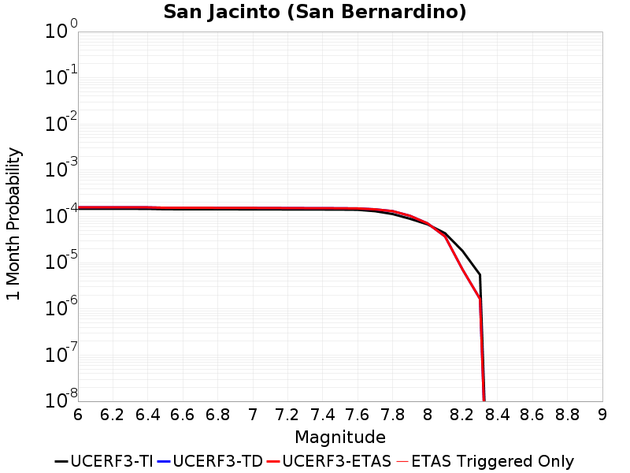 |  |  |

| Magnitude | 1 wk TI Prob | 1 wk TD Prob | 1 wk ETAS Prob | 1 wk ETAS/TD Gain | 1 wk ETAS Triggered Only | 1 mo TI Prob | 1 mo TD Prob | 1 mo ETAS Prob | 1 mo ETAS/TD Gain | 1 mo ETAS Triggered Only | 1 yr TI Prob | 1 yr TD Prob | 1 yr ETAS Prob | 1 yr ETAS/TD Gain | 1 yr ETAS Triggered Only | 10 yr TI Prob | 10 yr TD Prob | 10 yr ETAS Prob | 10 yr ETAS/TD Gain | 10 yr ETAS Triggered Only |
|-----|-----|-----|-----|-----|-----|-----|-----|-----|-----|-----|-----|-----|-----|-----|-----|-----|-----|-----|-----|-----|
| 6.0 | 3.409352E-5 | 3.677021E-5 | 3.677021E-5 | 1.0 | 0.0 | 1.461069E-4 | 1.575771E-4 | 1.575771E-4 | 1.0 | 0.0 | 0.0017774 | 0.0019168147 | 0.0019267955 | 1.005207 | 1.0E-5 | 0.01763251 | 0.01975018 | 0.019818798 | 1.0034742 | 7.0E-5 |
| 6.1 | 3.409352E-5 | 3.677021E-5 | 3.677021E-5 | 1.0 | 0.0 | 1.461069E-4 | 1.575771E-4 | 1.575771E-4 | 1.0 | 0.0 | 0.0017774 | 0.0019168147 | 0.0019267955 | 1.005207 | 1.0E-5 | 0.01763251 | 0.01975018 | 0.019818798 | 1.0034742 | 7.0E-5 |
| 6.2 | 3.409352E-5 | 3.677021E-5 | 3.677021E-5 | 1.0 | 0.0 | 1.461069E-4 | 1.575771E-4 | 1.575771E-4 | 1.0 | 0.0 | 0.0017774 | 0.0019168147 | 0.0019267955 | 1.005207 | 1.0E-5 | 0.01763251 | 0.01975018 | 0.019818798 | 1.0034742 | 7.0E-5 |
| 6.3 | 3.409352E-5 | 3.677021E-5 | 3.677021E-5 | 1.0 | 0.0 | 1.461069E-4 | 1.575771E-4 | 1.575771E-4 | 1.0 | 0.0 | 0.0017774 | 0.0019168147 | 0.0019267955 | 1.005207 | 1.0E-5 | 0.01763251 | 0.01975018 | 0.019818798 | 1.0034742 | 7.0E-5 |
| 6.4 | 3.400795E-5 | 3.6662706E-5 | 3.6662706E-5 | 1.0 | 0.0 | 1.4574021E-4 | 1.5711643E-4 | 1.5711643E-4 | 1.0 | 0.0 | 0.0017729428 | 0.001911216 | 0.0019211968 | 1.0052223 | 1.0E-5 | 0.017588645 | 0.019695198 | 0.01976382 | 1.0034841 | 7.0E-5 |
| 6.5 | 3.341482E-5 | 3.5922214E-5 | 3.5922214E-5 | 1.0 | 0.0 | 1.4319851E-4 | 1.5394327E-4 | 1.5394327E-4 | 1.0 | 0.0 | 0.0017420477 | 0.0018726495 | 0.0018826309 | 1.0053301 | 1.0E-5 | 0.017284546 | 0.019316323 | 0.01938497 | 1.0035539 | 7.0E-5 |
| 6.6 | 3.3364955E-5 | 3.585933E-5 | 3.585933E-5 | 1.0 | 0.0 | 1.4298483E-4 | 1.5367381E-4 | 1.5367381E-4 | 1.0 | 0.0 | 0.0017394501 | 0.0018693745 | 0.0018793559 | 1.0053394 | 1.0E-5 | 0.017258976 | 0.01928415 | 0.0193528 | 1.00356 | 7.0E-5 |
| 6.7 | 3.335922E-5 | 3.584909E-5 | 3.584909E-5 | 1.0 | 0.0 | 1.4296026E-4 | 1.5362992E-4 | 1.5362992E-4 | 1.0 | 0.0 | 0.0017391514 | 0.0018688411 | 0.0018788223 | 1.0053409 | 1.0E-5 | 0.017256035 | 0.019278934 | 0.019347584 | 1.0035609 | 7.0E-5 |
| 6.8 | 3.327683E-5 | 3.5742978E-5 | 3.5742978E-5 | 1.0 | 0.0 | 1.4260718E-4 | 1.531752E-4 | 1.531752E-4 | 1.0 | 0.0 | 0.0017348597 | 0.0018633143 | 0.0018732958 | 1.0053568 | 1.0E-5 | 0.017213784 | 0.019224636 | 0.01929329 | 1.0035712 | 7.0E-5 |
| 6.9 | 3.3235785E-5 | 3.5683817E-5 | 3.5683817E-5 | 1.0 | 0.0 | 1.4243131E-4 | 1.529217E-4 | 1.529217E-4 | 1.0 | 0.0 | 0.0017327217 | 0.0018602331 | 0.0018702146 | 1.0053657 | 1.0E-5 | 0.017192734 | 0.01919446 | 0.019263117 | 1.0035769 | 7.0E-5 |
| 7.0 | 3.3197095E-5 | 3.5623616E-5 | 3.5623616E-5 | 1.0 | 0.0 | 1.422655E-4 | 1.5266372E-4 | 1.5266372E-4 | 1.0 | 0.0 | 0.0017307063 | 0.0018570977 | 0.0018670791 | 1.0053748 | 1.0E-5 | 0.017172894 | 0.019163784 | 0.01923244 | 1.0035827 | 7.0E-5 |
| 7.1 | 3.3129716E-5 | 3.5503534E-5 | 3.5503534E-5 | 1.0 | 0.0 | 1.4197677E-4 | 1.5214914E-4 | 1.5214914E-4 | 1.0 | 0.0 | 0.0017271966 | 0.0018508433 | 0.0018608248 | 1.0053929 | 1.0E-5 | 0.017138338 | 0.019102743 | 0.019171406 | 1.0035944 | 7.0E-5 |
| 7.2 | 3.3034008E-5 | 3.5370726E-5 | 3.5370726E-5 | 1.0 | 0.0 | 1.4156665E-4 | 1.5158002E-4 | 1.5158002E-4 | 1.0 | 0.0 | 0.0017222111 | 0.0018439261 | 0.0018539077 | 1.0054132 | 1.0E-5 | 0.017089253 | 0.019035047 | 0.019103713 | 1.0036074 | 7.0E-5 |
| 7.3 | 3.2956614E-5 | 3.5237903E-5 | 3.5237903E-5 | 1.0 | 0.0 | 1.4123498E-4 | 1.5101086E-4 | 1.5101086E-4 | 1.0 | 0.0 | 0.0017181796 | 0.0018370082 | 0.0018469898 | 1.0054337 | 1.0E-5 | 0.017049557 | 0.018967532 | 0.019036205 | 1.0036205 | 7.0E-5 |
| 7.4 | 3.2915937E-5 | 3.5159173E-5 | 3.5159173E-5 | 1.0 | 0.0 | 1.4106068E-4 | 1.5067348E-4 | 1.5067348E-4 | 1.0 | 0.0 | 0.0017160608 | 0.0018329077 | 0.0018428894 | 1.0054458 | 1.0E-5 | 0.017028693 | 0.018927602 | 0.018996278 | 1.0036283 | 7.0E-5 |
| 7.5 | 3.281791E-5 | 3.5023477E-5 | 3.5023477E-5 | 1.0 | 0.0 | 1.406406E-4 | 1.5009199E-4 | 1.5009199E-4 | 1.0 | 0.0 | 0.0017109542 | 0.0018258399 | 0.0018358217 | 1.0054669 | 1.0E-5 | 0.016978411 | 0.018858224 | 0.018926904 | 1.003642 | 7.0E-5 |
| 7.6 | 3.2521442E-5 | 3.4746965E-5 | 3.4746965E-5 | 1.0 | 0.0 | 1.3937015E-4 | 1.4890709E-4 | 1.4890709E-4 | 1.0 | 0.0 | 0.0016955109 | 0.0018114377 | 0.0018214195 | 1.0055104 | 1.0E-5 | 0.016826328 | 0.018715162 | 0.01878385 | 1.0036703 | 7.0E-5 |
| 7.7 | 3.0287873E-5 | 3.3222244E-5 | 3.3222244E-5 | 1.0 | 0.0 | 1.297987E-4 | 1.4237329E-4 | 1.4237329E-4 | 1.0 | 0.0 | 0.0015791537 | 0.0017320178 | 0.0017420005 | 1.0057636 | 1.0E-5 | 0.01567979 | 0.01792196 | 0.017990706 | 1.0038358 | 7.0E-5 |
| 7.8 | 2.6316151E-5 | 3.0403417E-5 | 3.0403417E-5 | 1.0 | 0.0 | 1.1277862E-4 | 1.3029385E-4 | 1.3029385E-4 | 1.0 | 0.0 | 0.0013722149 | 0.0015851744 | 0.0015951585 | 1.0062984 | 1.0E-5 | 0.013637724 | 0.016449068 | 0.016517917 | 1.0041856 | 7.0E-5 |
| 7.9 | 2.0761147E-5 | 2.4058363E-5 | 2.4058363E-5 | 1.0 | 0.0 | 8.897331E-5 | 1.0310319E-4 | 1.0310319E-4 | 1.0 | 0.0 | 0.0010827117 | 0.0012545595 | 0.0012545595 | 1.0 | 0.0 | 0.010774517 | 0.01312423 | 0.013163705 | 1.0030078 | 4.0E-5 |
| 8.0 | 1.5738568E-5 | 1.6515442E-5 | 1.6515442E-5 | 1.0 | 0.0 | 6.744926E-5 | 7.077855E-5 | 7.077855E-5 | 1.0 | 0.0 | 8.2088535E-4 | 8.6138886E-4 | 8.6138886E-4 | 1.0 | 0.0 | 0.008178596 | 0.009119743 | 0.009159378 | 1.0043461 | 4.0E-5 |
| 8.1 | 1.0105832E-5 | 8.611422E-6 | 8.611422E-6 | 1.0 | 0.0 | 4.3309992E-5 | 3.6905578E-5 | 3.6905578E-5 | 1.0 | 0.0 | 5.2717153E-4 | 4.492333E-4 | 4.492333E-4 | 1.0 | 0.0 | 0.005259227 | 0.004828326 | 0.0048581813 | 1.0061834 | 3.0E-5 |
| 8.2 | 4.189207E-6 | 1.6604972E-6 | 1.6604972E-6 | 1.0 | 0.0 | 1.7953622E-5 | 7.1163977E-6 | 7.1163977E-6 | 1.0 | 0.0 | 2.1856341E-4 | 8.663873E-5 | 8.663873E-5 | 1.0 | 0.0 | 0.0021834858 | 0.0010034738 | 0.0010034738 | 1.0 | 0.0 |
| 8.3 | 1.2758221E-6 | 3.8322906E-7 | 3.8322906E-7 | 1.0 | 0.0 | 5.4677976E-6 | 1.6424093E-6 | 1.6424093E-6 | 1.0 | 0.0 | 6.65684E-5 | 1.9996154E-5 | 1.9996154E-5 | 1.0 | 0.0 | 6.6548464E-4 | 2.402614E-4 | 2.402614E-4 | 1.0 | 0.0 |

## Cleghorn Lake
*[(top)](#table-of-contents)*

| 1 Week | 1 Month | 1 Year | 10 Year |
|-----|-----|-----|-----|
|  |  |  | 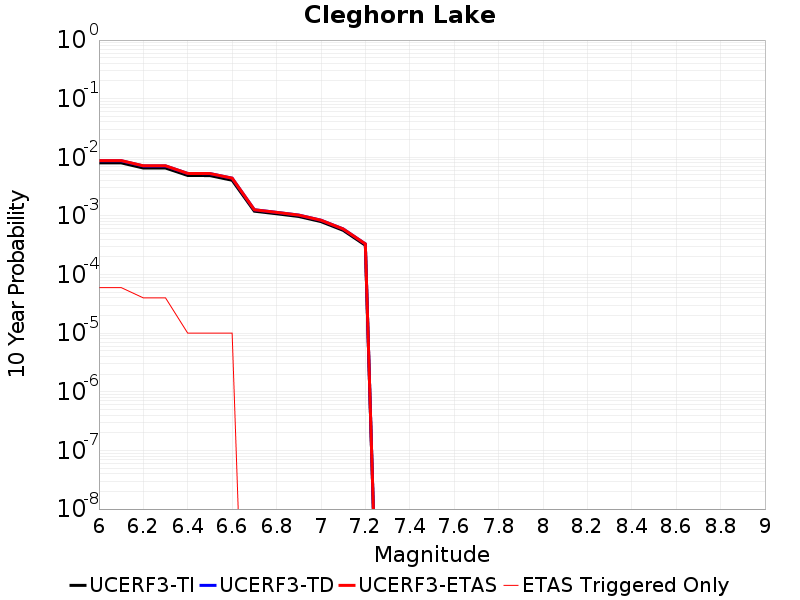 |

| Magnitude | 1 wk TI Prob | 1 wk TD Prob | 1 wk ETAS Prob | 1 wk ETAS/TD Gain | 1 wk ETAS Triggered Only | 1 mo TI Prob | 1 mo TD Prob | 1 mo ETAS Prob | 1 mo ETAS/TD Gain | 1 mo ETAS Triggered Only | 1 yr TI Prob | 1 yr TD Prob | 1 yr ETAS Prob | 1 yr ETAS/TD Gain | 1 yr ETAS Triggered Only | 10 yr TI Prob | 10 yr TD Prob | 10 yr ETAS Prob | 10 yr ETAS/TD Gain | 10 yr ETAS Triggered Only |
|-----|-----|-----|-----|-----|-----|-----|-----|-----|-----|-----|-----|-----|-----|-----|-----|-----|-----|-----|-----|-----|
| 6.0 | 1.5467183E-5 | 1.6803186E-5 | 1.6803186E-5 | 1.0 | 0.0 | 6.6286244E-5 | 7.201197E-5 | 7.201197E-5 | 1.0 | 0.0 | 8.067362E-4 | 8.7644806E-4 | 8.964305E-4 | 1.0227994 | 2.0E-5 | 0.008038137 | 0.0087353485 | 0.008794824 | 1.0068086 | 6.0E-5 |
| 6.1 | 1.5467183E-5 | 1.6803186E-5 | 1.6803186E-5 | 1.0 | 0.0 | 6.6286244E-5 | 7.201197E-5 | 7.201197E-5 | 1.0 | 0.0 | 8.067362E-4 | 8.7644806E-4 | 8.964305E-4 | 1.0227994 | 2.0E-5 | 0.008038137 | 0.0087353485 | 0.008794824 | 1.0068086 | 6.0E-5 |
| 6.2 | 1.2624631E-5 | 1.3688688E-5 | 1.3688688E-5 | 1.0 | 0.0 | 5.410444E-5 | 5.8664762E-5 | 5.8664762E-5 | 1.0 | 0.0 | 6.585225E-4 | 7.140582E-4 | 7.2405103E-4 | 1.0139945 | 1.0E-5 | 0.0065657445 | 0.007122439 | 0.0071621537 | 1.005576 | 4.0E-5 |
| 6.3 | 1.2624631E-5 | 1.3688688E-5 | 1.3688688E-5 | 1.0 | 0.0 | 5.410444E-5 | 5.8664762E-5 | 5.8664762E-5 | 1.0 | 0.0 | 6.585225E-4 | 7.140582E-4 | 7.2405103E-4 | 1.0139945 | 1.0E-5 | 0.0065657445 | 0.007122439 | 0.0071621537 | 1.005576 | 4.0E-5 |
| 6.4 | 9.417684E-6 | 1.0175189E-5 | 1.0175189E-5 | 1.0 | 0.0 | 4.036088E-5 | 4.360746E-5 | 4.360746E-5 | 1.0 | 0.0 | 4.912829E-4 | 5.308326E-4 | 5.308326E-4 | 1.0 | 0.0 | 0.004901982 | 0.005299687 | 0.005309634 | 1.001877 | 1.0E-5 |
| 6.5 | 9.368219E-6 | 1.0122596E-5 | 1.0122596E-5 | 1.0 | 0.0 | 4.014889E-5 | 4.3382064E-5 | 4.3382064E-5 | 1.0 | 0.0 | 4.8870314E-4 | 5.2808976E-4 | 5.2808976E-4 | 1.0 | 0.0 | 0.004876298 | 0.0052723885 | 0.005282336 | 1.0018867 | 1.0E-5 |
| 6.6 | 7.803798E-6 | 8.446135E-6 | 8.446135E-6 | 1.0 | 0.0 | 3.3444423E-5 | 3.6197445E-5 | 3.6197445E-5 | 1.0 | 0.0 | 4.0710976E-4 | 4.4065472E-4 | 4.4065472E-4 | 1.0 | 0.0 | 0.0040636472 | 0.0044017313 | 0.004411687 | 1.0022619 | 1.0E-5 |
| 6.7 | 2.3108669E-6 | 2.444708E-6 | 2.444708E-6 | 1.0 | 0.0 | 9.903678E-6 | 1.0477279E-5 | 1.0477279E-5 | 1.0 | 0.0 | 1.205706E-4 | 1.2755359E-4 | 1.2755359E-4 | 1.0 | 0.0 | 0.001205052 | 0.0012748224 | 0.0012748224 | 1.0 | 0.0 |
| 6.8 | 2.0882828E-6 | 2.207057E-6 | 2.207057E-6 | 1.0 | 0.0 | 8.949753E-6 | 9.458782E-6 | 9.458782E-6 | 1.0 | 0.0 | 1.08957785E-4 | 1.1515476E-4 | 1.1515476E-4 | 1.0 | 0.0 | 0.0010890438 | 0.0011509678 | 0.0011509678 | 1.0 | 0.0 |
| 6.9 | 1.876935E-6 | 1.9817337E-6 | 1.9817337E-6 | 1.0 | 0.0 | 8.043982E-6 | 8.493118E-6 | 8.493118E-6 | 1.0 | 0.0 | 9.7931086E-5 | 1.0339897E-4 | 1.0339897E-4 | 1.0 | 0.0 | 9.788794E-4 | 0.0010335246 | 0.0010335246 | 1.0 | 0.0 |
| 7.0 | 1.5357559E-6 | 1.6208347E-6 | 1.6208347E-6 | 1.0 | 0.0 | 6.5817944E-6 | 6.9464168E-6 | 6.9464168E-6 | 1.0 | 0.0 | 8.01304E-5 | 8.4569474E-5 | 8.4569474E-5 | 1.0 | 0.0 | 8.010151E-4 | 8.4538537E-4 | 8.4538537E-4 | 1.0 | 0.0 |
| 7.1 | 1.0905424E-6 | 1.1501498E-6 | 1.1501498E-6 | 1.0 | 0.0 | 4.6737446E-6 | 4.929205E-6 | 4.929205E-6 | 1.0 | 0.0 | 5.6901354E-5 | 6.0011516E-5 | 6.0011516E-5 | 1.0 | 0.0 | 5.6886784E-4 | 5.999629E-4 | 5.999629E-4 | 1.0 | 0.0 |
| 7.2 | 6.06668E-7 | 6.389374E-7 | 6.389374E-7 | 1.0 | 0.0 | 2.600003E-6 | 2.7383007E-6 | 2.7383007E-6 | 1.0 | 0.0 | 3.1654577E-5 | 3.3338372E-5 | 3.3338372E-5 | 1.0 | 0.0 | 3.1650066E-4 | 3.3334055E-4 | 3.3334055E-4 | 1.0 | 0.0 |

## Death Valley (Fish Lake Valley)
*[(top)](#table-of-contents)*

| 1 Week | 1 Month | 1 Year | 10 Year |
|-----|-----|-----|-----|
|  |  | 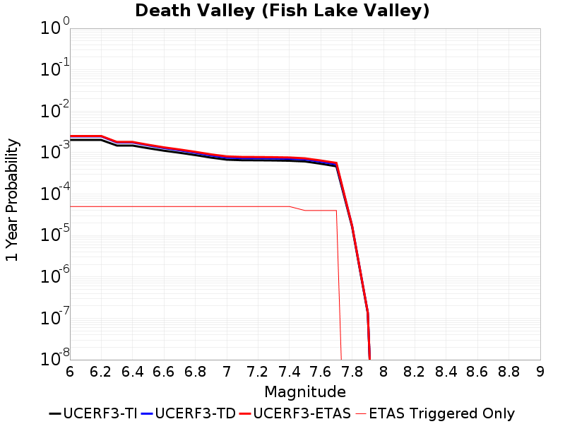 | 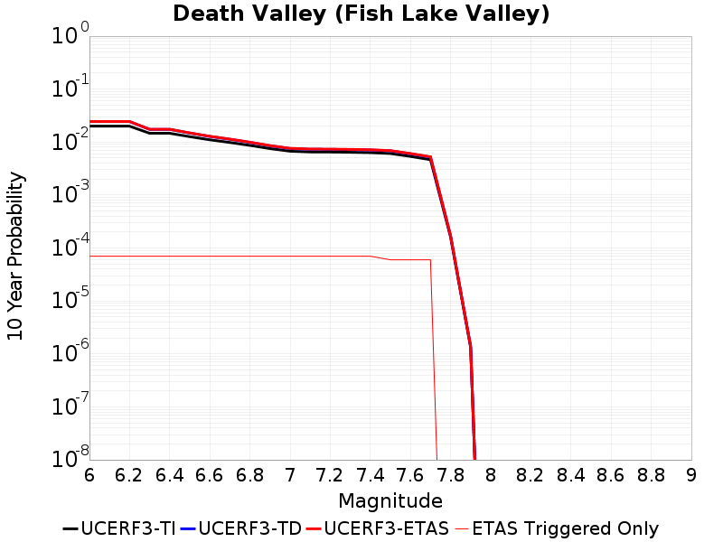 |

| Magnitude | 1 wk TI Prob | 1 wk TD Prob | 1 wk ETAS Prob | 1 wk ETAS/TD Gain | 1 wk ETAS Triggered Only | 1 mo TI Prob | 1 mo TD Prob | 1 mo ETAS Prob | 1 mo ETAS/TD Gain | 1 mo ETAS Triggered Only | 1 yr TI Prob | 1 yr TD Prob | 1 yr ETAS Prob | 1 yr ETAS/TD Gain | 1 yr ETAS Triggered Only | 10 yr TI Prob | 10 yr TD Prob | 10 yr ETAS Prob | 10 yr ETAS/TD Gain | 10 yr ETAS Triggered Only |
|-----|-----|-----|-----|-----|-----|-----|-----|-----|-----|-----|-----|-----|-----|-----|-----|-----|-----|-----|-----|-----|
| 6.0 | 3.872328E-5 | 4.733071E-5 | 5.7330235E-5 | 1.2112694 | 1.0E-5 | 1.6594635E-4 | 2.0283183E-4 | 2.2282777E-4 | 1.0985838 | 2.0E-5 | 0.0020185246 | 0.0024669436 | 0.00251682 | 1.020218 | 5.0E-5 | 0.02000288 | 0.02442133 | 0.02448962 | 1.0027963 | 7.0E-5 |
| 6.1 | 3.872328E-5 | 4.733071E-5 | 5.7330235E-5 | 1.2112694 | 1.0E-5 | 1.6594635E-4 | 2.0283183E-4 | 2.2282777E-4 | 1.0985838 | 2.0E-5 | 0.0020185246 | 0.0024669436 | 0.00251682 | 1.020218 | 5.0E-5 | 0.02000288 | 0.02442133 | 0.02448962 | 1.0027963 | 7.0E-5 |
| 6.2 | 3.872328E-5 | 4.733071E-5 | 5.7330235E-5 | 1.2112694 | 1.0E-5 | 1.6594635E-4 | 2.0283183E-4 | 2.2282777E-4 | 1.0985838 | 2.0E-5 | 0.0020185246 | 0.0024669436 | 0.00251682 | 1.020218 | 5.0E-5 | 0.02000288 | 0.02442133 | 0.02448962 | 1.0027963 | 7.0E-5 |
| 6.3 | 2.8356371E-5 | 3.3648917E-5 | 4.3648583E-5 | 1.2971764 | 1.0E-5 | 1.2152165E-4 | 1.4420213E-4 | 1.6419924E-4 | 1.1386743 | 2.0E-5 | 0.0014785219 | 0.0017543172 | 0.0018042295 | 1.0284511 | 5.0E-5 | 0.014687235 | 0.017411854 | 0.017480634 | 1.0039502 | 7.0E-5 |
| 6.4 | 2.8356371E-5 | 3.3648917E-5 | 4.3648583E-5 | 1.2971764 | 1.0E-5 | 1.2152165E-4 | 1.4420213E-4 | 1.6419924E-4 | 1.1386743 | 2.0E-5 | 0.0014785219 | 0.0017543172 | 0.0018042295 | 1.0284511 | 5.0E-5 | 0.014687235 | 0.017411854 | 0.017480634 | 1.0039502 | 7.0E-5 |
| 6.5 | 2.4448687E-5 | 2.8638204E-5 | 3.8637918E-5 | 1.3491739 | 1.0E-5 | 1.0477588E-4 | 1.2272967E-4 | 1.4272722E-4 | 1.1629398 | 2.0E-5 | 0.0012748998 | 0.0014932564 | 0.0015431817 | 1.0334339 | 5.0E-5 | 0.012676105 | 0.014837119 | 0.01490608 | 1.0046479 | 7.0E-5 |
| 6.6 | 2.1298161E-5 | 2.4684543E-5 | 3.4684297E-5 | 1.4051018 | 1.0E-5 | 9.127464E-5 | 1.057868E-4 | 1.2578467E-4 | 1.1890395 | 2.0E-5 | 0.0011107022 | 0.0012872263 | 0.001337162 | 1.0387932 | 5.0E-5 | 0.011051672 | 0.012801137 | 0.012870241 | 1.0053983 | 7.0E-5 |
| 6.7 | 1.8959729E-5 | 2.1801377E-5 | 3.180116E-5 | 1.4586766 | 1.0E-5 | 8.125345E-5 | 9.343128E-5 | 1.1342941E-4 | 1.2140411 | 2.0E-5 | 9.888117E-4 | 0.0011369578 | 0.001186901 | 1.043927 | 5.0E-5 | 0.009844234 | 0.011314076 | 0.011383284 | 1.006117 | 7.0E-5 |
| 6.8 | 1.6691629E-5 | 1.9034955E-5 | 2.9034765E-5 | 1.5253392 | 1.0E-5 | 7.153359E-5 | 8.157593E-5 | 1.0157429E-4 | 1.2451503 | 2.0E-5 | 8.7057345E-4 | 9.927512E-4 | 0.0010427017 | 1.0503151 | 5.0E-5 | 0.008671708 | 0.009884926 | 0.009954234 | 1.0070115 | 7.0E-5 |
| 6.9 | 1.450505E-5 | 1.6402837E-5 | 2.6402673E-5 | 1.6096407 | 1.0E-5 | 6.216302E-5 | 7.0296024E-5 | 9.029462E-5 | 1.2844911 | 2.0E-5 | 7.5657194E-4 | 8.555268E-4 | 9.054841E-4 | 1.0583935 | 5.0E-5 | 0.007540013 | 0.008523267 | 0.00859267 | 1.0081428 | 7.0E-5 |
| 7.0 | 1.2940855E-5 | 1.4549152E-5 | 2.4549006E-5 | 1.6873152 | 1.0E-5 | 5.545963E-5 | 6.2352054E-5 | 8.235081E-5 | 1.3207393 | 2.0E-5 | 6.750118E-4 | 7.5887766E-4 | 8.088397E-4 | 1.0658368 | 5.0E-5 | 0.006729651 | 0.0075634806 | 0.0076329513 | 1.009185 | 7.0E-5 |
| 7.1 | 1.2544658E-5 | 1.408893E-5 | 2.408879E-5 | 1.7097671 | 1.0E-5 | 5.3761712E-5 | 6.037976E-5 | 8.037855E-5 | 1.3312168 | 2.0E-5 | 6.5435225E-4 | 7.3488127E-4 | 7.848445E-4 | 1.0679882 | 5.0E-5 | 0.006524288 | 0.0073251054 | 0.0073945927 | 1.0094862 | 7.0E-5 |
| 7.2 | 1.2489416E-5 | 1.4026345E-5 | 2.4026205E-5 | 1.7129341 | 1.0E-5 | 5.3524967E-5 | 6.0111553E-5 | 8.011035E-5 | 1.3326948 | 2.0E-5 | 6.514716E-4 | 7.31618E-4 | 7.8158145E-4 | 1.0682917 | 5.0E-5 | 0.006495651 | 0.007292688 | 0.0073621776 | 1.0095286 | 7.0E-5 |
| 7.3 | 1.2368307E-5 | 1.3890379E-5 | 2.389024E-5 | 1.7199128 | 1.0E-5 | 5.3005948E-5 | 5.952887E-5 | 7.952768E-5 | 1.3359514 | 2.0E-5 | 6.451563E-4 | 7.2452857E-4 | 7.7449234E-4 | 1.0689604 | 5.0E-5 | 0.0064328653 | 0.0072222566 | 0.007291751 | 1.0096222 | 7.0E-5 |
| 7.4 | 1.2161707E-5 | 1.3658256E-5 | 2.365812E-5 | 1.7321479 | 1.0E-5 | 5.212056E-5 | 5.85341E-5 | 7.853293E-5 | 1.3416612 | 2.0E-5 | 6.3438306E-4 | 7.124253E-4 | 7.623896E-4 | 1.0701329 | 5.0E-5 | 0.006325751 | 0.0071020033 | 0.0071715065 | 1.0097864 | 7.0E-5 |
| 7.5 | 1.1707948E-5 | 1.3155564E-5 | 2.3155433E-5 | 1.7601247 | 1.0E-5 | 5.0175953E-5 | 5.6379802E-5 | 7.6378674E-5 | 1.354717 | 2.0E-5 | 6.10721E-4 | 6.862135E-4 | 7.2618603E-4 | 1.0582509 | 4.0E-5 | 0.0060904534 | 0.0068415296 | 0.0069011194 | 1.00871 | 6.0E-5 |
| 7.6 | 1.0319538E-5 | 1.158842E-5 | 2.1588305E-5 | 1.8629204 | 1.0E-5 | 4.4225842E-5 | 4.9663744E-5 | 6.9662754E-5 | 1.4026883 | 2.0E-5 | 5.383166E-4 | 6.0449354E-4 | 6.4446934E-4 | 1.0661311 | 4.0E-5 | 0.0053701443 | 0.0060290247 | 0.006088663 | 1.0098919 | 6.0E-5 |
| 7.7 | 8.937764E-6 | 1.0030351E-5 | 2.0030251E-5 | 1.996964 | 1.0E-5 | 3.830414E-5 | 4.2986543E-5 | 6.298568E-5 | 1.4652419 | 2.0E-5 | 4.6625308E-4 | 5.2324054E-4 | 5.632196E-4 | 1.0764067 | 4.0E-5 | 0.0046527605 | 0.0052205957 | 0.0052802823 | 1.0114329 | 6.0E-5 |
| 7.8 | 3.108007E-7 | 3.2858193E-7 | 3.2858193E-7 | 1.0 | 0.0 | 1.3320023E-6 | 1.4082076E-6 | 1.4082076E-6 | 1.0 | 0.0 | 1.6217007E-5 | 1.7144795E-5 | 1.7144795E-5 | 1.0 | 0.0 | 1.6215823E-4 | 1.7143511E-4 | 1.7143511E-4 | 1.0 | 0.0 |
| 7.9 | 2.5591178E-9 | 2.670388E-9 | 2.670388E-9 | 1.0 | 0.0 | 1.0967647E-8 | 1.144452E-8 | 1.144452E-8 | 1.0 | 0.0 | 1.335311E-7 | 1.3933703E-7 | 1.3933703E-7 | 1.0 | 0.0 | 1.3353102E-6 | 1.3933703E-6 | 1.3933703E-6 | 1.0 | 0.0 |

## San Andreas (North Branch Mill Creek)
*[(top)](#table-of-contents)*

| 1 Week | 1 Month | 1 Year | 10 Year |
|-----|-----|-----|-----|
|  |  |  |  |

| Magnitude | 1 wk TI Prob | 1 wk TD Prob | 1 wk ETAS Prob | 1 wk ETAS/TD Gain | 1 wk ETAS Triggered Only | 1 mo TI Prob | 1 mo TD Prob | 1 mo ETAS Prob | 1 mo ETAS/TD Gain | 1 mo ETAS Triggered Only | 1 yr TI Prob | 1 yr TD Prob | 1 yr ETAS Prob | 1 yr ETAS/TD Gain | 1 yr ETAS Triggered Only | 10 yr TI Prob | 10 yr TD Prob | 10 yr ETAS Prob | 10 yr ETAS/TD Gain | 10 yr ETAS Triggered Only |
|-----|-----|-----|-----|-----|-----|-----|-----|-----|-----|-----|-----|-----|-----|-----|-----|-----|-----|-----|-----|-----|
| 6.0 | 1.3461156E-5 | 2.3825793E-5 | 2.3825793E-5 | 1.0 | 0.0 | 5.7689394E-5 | 1.0210656E-4 | 1.0210656E-4 | 1.0 | 0.0 | 7.02142E-4 | 0.0012424418 | 0.001262417 | 1.0160773 | 2.0E-5 | 0.0069992766 | 0.0123976385 | 0.012456895 | 1.0047796 | 6.0E-5 |
| 6.1 | 1.3461156E-5 | 2.3825793E-5 | 2.3825793E-5 | 1.0 | 0.0 | 5.7689394E-5 | 1.0210656E-4 | 1.0210656E-4 | 1.0 | 0.0 | 7.02142E-4 | 0.0012424418 | 0.001262417 | 1.0160773 | 2.0E-5 | 0.0069992766 | 0.0123976385 | 0.012456895 | 1.0047796 | 6.0E-5 |
| 6.2 | 1.3461156E-5 | 2.3825793E-5 | 2.3825793E-5 | 1.0 | 0.0 | 5.7689394E-5 | 1.0210656E-4 | 1.0210656E-4 | 1.0 | 0.0 | 7.02142E-4 | 0.0012424418 | 0.001262417 | 1.0160773 | 2.0E-5 | 0.0069992766 | 0.0123976385 | 0.012456895 | 1.0047796 | 6.0E-5 |
| 6.3 | 1.3461156E-5 | 2.3825793E-5 | 2.3825793E-5 | 1.0 | 0.0 | 5.7689394E-5 | 1.0210656E-4 | 1.0210656E-4 | 1.0 | 0.0 | 7.02142E-4 | 0.0012424418 | 0.001262417 | 1.0160773 | 2.0E-5 | 0.0069992766 | 0.0123976385 | 0.012456895 | 1.0047796 | 6.0E-5 |
| 6.4 | 1.3461156E-5 | 2.3825793E-5 | 2.3825793E-5 | 1.0 | 0.0 | 5.7689394E-5 | 1.0210656E-4 | 1.0210656E-4 | 1.0 | 0.0 | 7.02142E-4 | 0.0012424418 | 0.001262417 | 1.0160773 | 2.0E-5 | 0.0069992766 | 0.0123976385 | 0.012456895 | 1.0047796 | 6.0E-5 |
| 6.5 | 1.3450706E-5 | 2.381475E-5 | 2.381475E-5 | 1.0 | 0.0 | 5.764461E-5 | 1.0205923E-4 | 1.0205923E-4 | 1.0 | 0.0 | 7.0159714E-4 | 0.0012418663 | 0.0012618414 | 1.0160848 | 2.0E-5 | 0.006993862 | 0.012391947 | 0.012451204 | 1.0047818 | 6.0E-5 |
| 6.6 | 1.3074523E-5 | 2.3428911E-5 | 2.3428911E-5 | 1.0 | 0.0 | 5.6032466E-5 | 1.0040577E-4 | 1.0040577E-4 | 1.0 | 0.0 | 6.8198174E-4 | 0.0012217581 | 0.0012417337 | 1.0163499 | 2.0E-5 | 0.006798926 | 0.012193084 | 0.012252352 | 1.0048609 | 6.0E-5 |
| 6.7 | 1.3050216E-5 | 2.3404185E-5 | 2.3404185E-5 | 1.0 | 0.0 | 5.59283E-5 | 1.0029981E-4 | 1.0029981E-4 | 1.0 | 0.0 | 6.8071426E-4 | 0.0012204695 | 0.0012404451 | 1.0163671 | 2.0E-5 | 0.0067863287 | 0.012180339 | 0.012239608 | 1.004866 | 6.0E-5 |
| 6.8 | 1.29049395E-5 | 2.3252527E-5 | 2.3252527E-5 | 1.0 | 0.0 | 5.530571E-5 | 9.96499E-5 | 9.96499E-5 | 1.0 | 0.0 | 6.73139E-4 | 0.0012125656 | 0.0012325414 | 1.016474 | 2.0E-5 | 0.0067110364 | 0.012102163 | 0.012161437 | 1.0048978 | 6.0E-5 |
| 6.9 | 1.2867369E-5 | 2.3211882E-5 | 2.3211882E-5 | 1.0 | 0.0 | 5.51447E-5 | 9.947572E-5 | 9.947572E-5 | 1.0 | 0.0 | 6.711799E-4 | 0.0012104473 | 0.001230423 | 1.0165029 | 2.0E-5 | 0.006691564 | 0.0120812105 | 0.012140485 | 1.0049064 | 6.0E-5 |
| 7.0 | 1.2495996E-5 | 2.2609755E-5 | 2.2609755E-5 | 1.0 | 0.0 | 5.3553173E-5 | 9.689536E-5 | 9.689536E-5 | 1.0 | 0.0 | 6.518148E-4 | 0.0011790656 | 0.001199042 | 1.0169426 | 2.0E-5 | 0.0064990623 | 0.011770729 | 0.011830023 | 1.0050374 | 6.0E-5 |
| 7.1 | 1.2452067E-5 | 2.2554726E-5 | 2.2554726E-5 | 1.0 | 0.0 | 5.3364907E-5 | 9.665955E-5 | 9.665955E-5 | 1.0 | 0.0 | 6.4952404E-4 | 0.0011761975 | 0.0011961741 | 1.016984 | 2.0E-5 | 0.0064762887 | 0.011742353 | 0.011801649 | 1.0050497 | 6.0E-5 |
| 7.2 | 1.2002777E-5 | 2.1931586E-5 | 2.1931586E-5 | 1.0 | 0.0 | 5.143946E-5 | 9.398914E-5 | 9.398914E-5 | 1.0 | 0.0 | 6.2609545E-4 | 0.0011437198 | 0.0011636969 | 1.0174668 | 2.0E-5 | 0.006243344 | 0.011420933 | 0.011480248 | 1.0051935 | 6.0E-5 |
| 7.3 | 1.1923425E-5 | 2.1801052E-5 | 2.1801052E-5 | 1.0 | 0.0 | 5.109939E-5 | 9.342975E-5 | 9.342975E-5 | 1.0 | 0.0 | 6.219575E-4 | 0.0011369163 | 0.0011568936 | 1.0175714 | 2.0E-5 | 0.0062021962 | 0.01135362 | 0.011412939 | 1.0052247 | 6.0E-5 |
| 7.4 | 1.16105175E-5 | 2.1171598E-5 | 2.1171598E-5 | 1.0 | 0.0 | 4.975841E-5 | 9.0732276E-5 | 9.0732276E-5 | 1.0 | 0.0 | 6.0564023E-4 | 0.0011041083 | 0.0011240862 | 1.0180942 | 2.0E-5 | 0.006039923 | 0.011029519 | 0.011088857 | 1.0053799 | 6.0E-5 |
| 7.5 | 1.1037265E-5 | 1.9859961E-5 | 1.9859961E-5 | 1.0 | 0.0 | 4.7301706E-5 | 8.511135E-5 | 8.511135E-5 | 1.0 | 0.0 | 5.757461E-4 | 0.0010357404 | 0.0010557196 | 1.0192899 | 2.0E-5 | 0.005742567 | 0.010351929 | 0.010411307 | 1.005736 | 6.0E-5 |
| 7.6 | 1.0720915E-5 | 1.9297922E-5 | 1.9297922E-5 | 1.0 | 0.0 | 4.5945973E-5 | 8.270277E-5 | 8.270277E-5 | 1.0 | 0.0 | 5.592486E-4 | 0.0010064433 | 0.0010264232 | 1.0198519 | 2.0E-5 | 0.005578433 | 0.010061659 | 0.010121055 | 1.0059032 | 6.0E-5 |
| 7.7 | 9.276279E-6 | 1.672929E-5 | 1.672929E-5 | 1.0 | 0.0 | 3.9754876E-5 | 7.1694994E-5 | 7.1694994E-5 | 1.0 | 0.0 | 4.839081E-4 | 8.725387E-4 | 8.9252123E-4 | 1.0229017 | 2.0E-5 | 0.0048285574 | 0.008733804 | 0.0087932795 | 1.0068098 | 6.0E-5 |
| 7.8 | 5.8346777E-6 | 1.1388812E-5 | 1.1388812E-5 | 1.0 | 0.0 | 2.5005522E-5 | 4.880828E-5 | 4.880828E-5 | 1.0 | 0.0 | 3.043997E-4 | 5.940789E-4 | 6.14067E-4 | 1.0336455 | 2.0E-5 | 0.0030398308 | 0.0059671695 | 0.0060268114 | 1.009995 | 6.0E-5 |
| 7.9 | 4.690204E-6 | 8.703913E-6 | 8.703913E-6 | 1.0 | 0.0 | 2.0100719E-5 | 3.7301954E-5 | 3.7301954E-5 | 1.0 | 0.0 | 2.4469878E-4 | 4.5405675E-4 | 4.6405222E-4 | 1.0220137 | 1.0E-5 | 0.002444295 | 0.0045710113 | 0.004620783 | 1.0108885 | 5.0E-5 |
| 8.0 | 2.9570454E-6 | 4.966106E-6 | 4.966106E-6 | 1.0 | 0.0 | 1.267299E-5 | 2.1283138E-5 | 2.1283138E-5 | 1.0 | 0.0 | 1.5428272E-4 | 2.5909144E-4 | 2.5909144E-4 | 1.0 | 0.0 | 0.0015417566 | 0.0026116483 | 0.0026116483 | 1.0 | 0.0 |
| 8.1 | 1.6376824E-6 | 2.2594836E-6 | 2.2594836E-6 | 1.0 | 0.0 | 7.01862E-6 | 9.683466E-6 | 9.683466E-6 | 1.0 | 0.0 | 8.544835E-5 | 1.1788983E-4 | 1.1788983E-4 | 1.0 | 0.0 | 8.54155E-4 | 0.0011932268 | 0.0011932268 | 1.0 | 0.0 |
| 8.2 | 6.9631557E-7 | 4.7311187E-7 | 4.7311187E-7 | 1.0 | 0.0 | 2.984206E-6 | 2.0276207E-6 | 2.0276207E-6 | 1.0 | 0.0 | 3.63321E-5 | 2.4686004E-5 | 2.4686004E-5 | 1.0 | 0.0 | 3.6326164E-4 | 2.5551114E-4 | 2.5551114E-4 | 1.0 | 0.0 |
| 8.3 | 1.7876137E-7 | 8.758867E-8 | 8.758867E-8 | 1.0 | 0.0 | 7.661199E-7 | 3.7537995E-7 | 3.7537995E-7 | 1.0 | 0.0 | 9.32747E-6 | 4.570242E-6 | 4.570242E-6 | 1.0 | 0.0 | 9.3270784E-5 | 4.7952577E-5 | 4.7952577E-5 | 1.0 | 0.0 |

## Mission Ridge-Arroyo Parida-Santa Ana
*[(top)](#table-of-contents)*

| 1 Week | 1 Month | 1 Year | 10 Year |
|-----|-----|-----|-----|
|  |  |  |  |

| Magnitude | 1 wk TI Prob | 1 wk TD Prob | 1 wk ETAS Prob | 1 wk ETAS/TD Gain | 1 wk ETAS Triggered Only | 1 mo TI Prob | 1 mo TD Prob | 1 mo ETAS Prob | 1 mo ETAS/TD Gain | 1 mo ETAS Triggered Only | 1 yr TI Prob | 1 yr TD Prob | 1 yr ETAS Prob | 1 yr ETAS/TD Gain | 1 yr ETAS Triggered Only | 10 yr TI Prob | 10 yr TD Prob | 10 yr ETAS Prob | 10 yr ETAS/TD Gain | 10 yr ETAS Triggered Only |
|-----|-----|-----|-----|-----|-----|-----|-----|-----|-----|-----|-----|-----|-----|-----|-----|-----|-----|-----|-----|-----|
| 6.0 | 4.169034E-5 | 4.7198497E-5 | 4.7198497E-5 | 1.0 | 0.0 | 1.7866064E-4 | 2.0226845E-4 | 2.0226845E-4 | 1.0 | 0.0 | 0.0021730233 | 0.0024606716 | 0.0024806224 | 1.0081079 | 2.0E-5 | 0.021518968 | 0.024416143 | 0.024474679 | 1.0023974 | 6.0E-5 |
| 6.1 | 1.73813E-5 | 1.6869535E-5 | 1.6869535E-5 | 1.0 | 0.0 | 7.4489166E-5 | 7.229606E-5 | 7.229606E-5 | 1.0 | 0.0 | 9.065282E-4 | 8.7985984E-4 | 8.89851E-4 | 1.0113554 | 1.0E-5 | 0.009028391 | 0.008764882 | 0.008784707 | 1.0022619 | 2.0E-5 |
| 6.2 | 1.4622182E-5 | 1.3685529E-5 | 1.3685529E-5 | 1.0 | 0.0 | 6.2664985E-5 | 5.8650967E-5 | 5.8650967E-5 | 1.0 | 0.0 | 7.6267915E-4 | 7.138455E-4 | 7.2383834E-4 | 1.0139986 | 1.0E-5 | 0.007600669 | 0.0071159434 | 0.007135801 | 1.0027906 | 2.0E-5 |
| 6.3 | 1.3552434E-5 | 1.24935905E-5 | 1.24935905E-5 | 1.0 | 0.0 | 5.8080568E-5 | 5.354288E-5 | 5.354288E-5 | 1.0 | 0.0 | 7.069015E-4 | 6.5169274E-4 | 6.6168624E-4 | 1.0153346 | 1.0E-5 | 0.00704657 | 0.006498155 | 0.006518025 | 1.0030578 | 2.0E-5 |
| 6.4 | 1.30977305E-5 | 1.19902115E-5 | 1.19902115E-5 | 1.0 | 0.0 | 5.613192E-5 | 5.1385625E-5 | 5.1385625E-5 | 1.0 | 0.0 | 6.831918E-4 | 6.254434E-4 | 6.3543714E-4 | 1.0159787 | 1.0E-5 | 0.006810953 | 0.0062371525 | 0.006257028 | 1.0031866 | 2.0E-5 |
| 6.5 | 1.225205E-5 | 1.1059277E-5 | 1.1059277E-5 | 1.0 | 0.0 | 5.2507727E-5 | 4.7396057E-5 | 4.7396057E-5 | 1.0 | 0.0 | 6.3909404E-4 | 5.7689694E-4 | 5.8689114E-4 | 1.0173241 | 1.0E-5 | 0.006372592 | 0.0057542785 | 0.005774163 | 1.0034556 | 2.0E-5 |
| 6.6 | 1.1352241E-5 | 1.0073427E-5 | 1.0073427E-5 | 1.0 | 0.0 | 4.8651553E-5 | 4.3171127E-5 | 4.3171127E-5 | 1.0 | 0.0 | 5.921717E-4 | 5.254838E-4 | 5.254838E-4 | 1.0 | 0.0 | 0.0059059616 | 0.005242634 | 0.0052525816 | 1.0018975 | 1.0E-5 |
| 6.7 | 1.0864116E-5 | 9.526507E-6 | 9.526507E-6 | 1.0 | 0.0 | 4.6559664E-5 | 4.0827257E-5 | 4.0827257E-5 | 1.0 | 0.0 | 5.667165E-4 | 4.969605E-4 | 4.969605E-4 | 1.0 | 0.0 | 0.005652734 | 0.004958701 | 0.004968651 | 1.0020066 | 1.0E-5 |
| 6.8 | 1.0666365E-5 | 9.309124E-6 | 9.309124E-6 | 1.0 | 0.0 | 4.571219E-5 | 3.9895647E-5 | 3.9895647E-5 | 1.0 | 0.0 | 5.564038E-4 | 4.8562326E-4 | 4.8562326E-4 | 1.0 | 0.0 | 0.005550127 | 0.004845828 | 0.0048557795 | 1.0020536 | 1.0E-5 |
| 6.9 | 1.0038665E-5 | 8.600828E-6 | 8.600828E-6 | 1.0 | 0.0 | 4.302214E-5 | 3.686018E-5 | 3.686018E-5 | 1.0 | 0.0 | 5.236687E-4 | 4.4868208E-4 | 4.4868208E-4 | 1.0 | 0.0 | 0.005224364 | 0.004477948 | 0.0044879033 | 1.0022231 | 1.0E-5 |
| 7.0 | 9.5379955E-6 | 8.033365E-6 | 8.033365E-6 | 1.0 | 0.0 | 4.0876483E-5 | 3.442826E-5 | 3.442826E-5 | 1.0 | 0.0 | 4.975576E-4 | 4.1908518E-4 | 4.1908518E-4 | 1.0 | 0.0 | 0.00496445 | 0.004183123 | 0.004193081 | 1.0023806 | 1.0E-5 |
| 7.1 | 9.207389E-6 | 7.660333E-6 | 7.660333E-6 | 1.0 | 0.0 | 3.945964E-5 | 3.2829594E-5 | 3.2829594E-5 | 1.0 | 0.0 | 4.803152E-4 | 3.9962868E-4 | 3.9962868E-4 | 1.0 | 0.0 | 0.004792784 | 0.003989272 | 0.003999232 | 1.0024967 | 1.0E-5 |
| 7.2 | 7.638091E-6 | 5.937345E-6 | 5.937345E-6 | 1.0 | 0.0 | 3.2734264E-5 | 2.5445519E-5 | 2.5445519E-5 | 1.0 | 0.0 | 3.984668E-4 | 3.0975547E-4 | 3.0975547E-4 | 1.0 | 0.0 | 0.0039775306 | 0.0030932687 | 0.0031032376 | 1.0032228 | 1.0E-5 |
| 7.3 | 7.2500147E-6 | 5.602023E-6 | 5.602023E-6 | 1.0 | 0.0 | 3.1071122E-5 | 2.400845E-5 | 2.400845E-5 | 1.0 | 0.0 | 3.7822526E-4 | 2.9226398E-4 | 2.9226398E-4 | 1.0 | 0.0 | 0.0037758215 | 0.0029188262 | 0.0029287972 | 1.0034161 | 1.0E-5 |
| 7.4 | 6.3899715E-6 | 4.9236746E-6 | 4.9236746E-6 | 1.0 | 0.0 | 2.7385306E-5 | 2.1101292E-5 | 2.1101292E-5 | 1.0 | 0.0 | 3.3336508E-4 | 2.5687815E-4 | 2.5687815E-4 | 1.0 | 0.0 | 0.0033286542 | 0.0025658314 | 0.0025658314 | 1.0 | 0.0 |
| 7.5 | 5.379025E-6 | 4.0882155E-6 | 4.0882155E-6 | 1.0 | 0.0 | 2.305276E-5 | 1.7520806E-5 | 1.7520806E-5 | 1.0 | 0.0 | 2.806312E-4 | 2.1329505E-4 | 2.1329505E-4 | 1.0 | 0.0 | 0.0028027708 | 0.0021309145 | 0.0021309145 | 1.0 | 0.0 |
| 7.6 | 4.1270696E-6 | 3.0913627E-6 | 3.0913627E-6 | 1.0 | 0.0 | 1.768732E-5 | 1.324863E-5 | 1.324863E-5 | 1.0 | 0.0 | 2.1532185E-4 | 1.6129021E-4 | 1.6129021E-4 | 1.0 | 0.0 | 0.0021511333 | 0.0016117396 | 0.0016117396 | 1.0 | 0.0 |
| 7.7 | 2.5406805E-6 | 1.8301796E-6 | 1.8301796E-6 | 1.0 | 0.0 | 1.0888585E-5 | 7.843603E-6 | 7.843603E-6 | 1.0 | 0.0 | 1.3256045E-4 | 9.549175E-5 | 9.549175E-5 | 1.0 | 0.0 | 0.0013248142 | 9.545134E-4 | 9.545134E-4 | 1.0 | 0.0 |
| 7.8 | 4.8608285E-7 | 3.5130253E-7 | 3.5130253E-7 | 1.0 | 0.0 | 2.0832106E-6 | 1.5055814E-6 | 1.5055814E-6 | 1.0 | 0.0 | 2.5362791E-5 | 1.8330302E-5 | 1.8330302E-5 | 1.0 | 0.0 | 2.5359896E-4 | 1.8328801E-4 | 1.8328801E-4 | 1.0 | 0.0 |
| 7.9 | 2.0472514E-8 | 1.2704998E-8 | 1.2704998E-8 | 1.0 | 0.0 | 8.7739345E-8 | 5.444999E-8 | 5.444999E-8 | 1.0 | 0.0 | 1.068226E-6 | 6.629284E-7 | 6.629284E-7 | 1.0 | 0.0 | 1.0682209E-5 | 6.6292655E-6 | 6.6292655E-6 | 1.0 | 0.0 |
| 8.0 | 4.443582E-9 | 2.038671E-9 | 2.038671E-9 | 1.0 | 0.0 | 1.9043922E-8 | 8.737163E-9 | 8.737163E-9 | 1.0 | 0.0 | 2.3185973E-7 | 1.0637495E-7 | 1.0637495E-7 | 1.0 | 0.0 | 2.3185949E-6 | 1.0637491E-6 | 1.0637491E-6 | 1.0 | 0.0 |

## Calico-Hidalgo
*[(top)](#table-of-contents)*

| 1 Week | 1 Month | 1 Year | 10 Year |
|-----|-----|-----|-----|
|  | 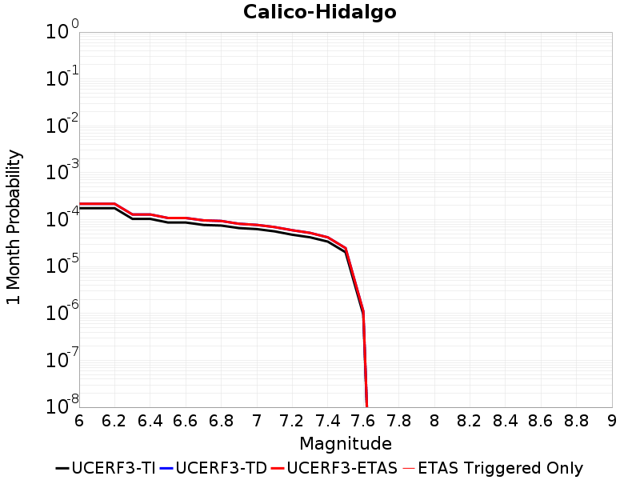 |  |  |

| Magnitude | 1 wk TI Prob | 1 wk TD Prob | 1 wk ETAS Prob | 1 wk ETAS/TD Gain | 1 wk ETAS Triggered Only | 1 mo TI Prob | 1 mo TD Prob | 1 mo ETAS Prob | 1 mo ETAS/TD Gain | 1 mo ETAS Triggered Only | 1 yr TI Prob | 1 yr TD Prob | 1 yr ETAS Prob | 1 yr ETAS/TD Gain | 1 yr ETAS Triggered Only | 10 yr TI Prob | 10 yr TD Prob | 10 yr ETAS Prob | 10 yr ETAS/TD Gain | 10 yr ETAS Triggered Only |
|-----|-----|-----|-----|-----|-----|-----|-----|-----|-----|-----|-----|-----|-----|-----|-----|-----|-----|-----|-----|-----|
| 6.0 | 4.0906612E-5 | 5.0753013E-5 | 5.0753013E-5 | 1.0 | 0.0 | 1.7530227E-4 | 2.1749707E-4 | 2.1749707E-4 | 1.0 | 0.0 | 0.0021322158 | 0.002645209 | 0.0026751296 | 1.0113113 | 3.0E-5 | 0.02111873 | 0.026177589 | 0.026236018 | 1.0022321 | 6.0E-5 |
| 6.1 | 4.0906612E-5 | 5.0753013E-5 | 5.0753013E-5 | 1.0 | 0.0 | 1.7530227E-4 | 2.1749707E-4 | 2.1749707E-4 | 1.0 | 0.0 | 0.0021322158 | 0.002645209 | 0.0026751296 | 1.0113113 | 3.0E-5 | 0.02111873 | 0.026177589 | 0.026236018 | 1.0022321 | 6.0E-5 |
| 6.2 | 4.0906612E-5 | 5.0753013E-5 | 5.0753013E-5 | 1.0 | 0.0 | 1.7530227E-4 | 2.1749707E-4 | 2.1749707E-4 | 1.0 | 0.0 | 0.0021322158 | 0.002645209 | 0.0026751296 | 1.0113113 | 3.0E-5 | 0.02111873 | 0.026177589 | 0.026236018 | 1.0022321 | 6.0E-5 |
| 6.3 | 2.4242801E-5 | 3.0111738E-5 | 3.0111738E-5 | 1.0 | 0.0 | 1.0389358E-4 | 1.2904411E-4 | 1.2904411E-4 | 1.0 | 0.0 | 0.0012641704 | 0.0015700132 | 0.0015999662 | 1.0190781 | 3.0E-5 | 0.01257003 | 0.0155929 | 0.01564212 | 1.0031565 | 5.0E-5 |
| 6.4 | 2.4242801E-5 | 3.0111738E-5 | 3.0111738E-5 | 1.0 | 0.0 | 1.0389358E-4 | 1.2904411E-4 | 1.2904411E-4 | 1.0 | 0.0 | 0.0012641704 | 0.0015700132 | 0.0015999662 | 1.0190781 | 3.0E-5 | 0.01257003 | 0.0155929 | 0.01564212 | 1.0031565 | 5.0E-5 |
| 6.5 | 2.0286952E-5 | 2.5331392E-5 | 2.5331392E-5 | 1.0 | 0.0 | 8.694118E-5 | 1.0855869E-4 | 1.0855869E-4 | 1.0 | 0.0 | 0.0010579949 | 0.0013209179 | 0.0013408914 | 1.015121 | 2.0E-5 | 0.010529719 | 0.0131326 | 0.013172075 | 1.0030059 | 4.0E-5 |
| 6.6 | 2.0269223E-5 | 2.5312333E-5 | 2.5312333E-5 | 1.0 | 0.0 | 8.6865206E-5 | 1.0847701E-4 | 1.0847701E-4 | 1.0 | 0.0 | 0.0010570707 | 0.0013199246 | 0.0013398982 | 1.0151324 | 2.0E-5 | 0.010520565 | 0.013122786 | 0.013162261 | 1.0030081 | 4.0E-5 |
| 6.7 | 1.799852E-5 | 2.2554063E-5 | 2.2554063E-5 | 1.0 | 0.0 | 7.713423E-5 | 9.665677E-5 | 9.665677E-5 | 1.0 | 0.0 | 9.3870464E-4 | 0.0011761754 | 0.001196152 | 1.0169842 | 2.0E-5 | 0.009347493 | 0.011701117 | 0.011740649 | 1.0033785 | 4.0E-5 |
| 6.8 | 1.7458793E-5 | 2.185517E-5 | 2.185517E-5 | 1.0 | 0.0 | 7.4821255E-5 | 9.3661736E-5 | 9.3661736E-5 | 1.0 | 0.0 | 9.10568E-4 | 0.0011397495 | 0.0011597268 | 1.0175277 | 2.0E-5 | 0.009068459 | 0.0113406265 | 0.011380173 | 1.0034871 | 4.0E-5 |
| 6.9 | 1.542884E-5 | 1.9037352E-5 | 1.9037352E-5 | 1.0 | 0.0 | 6.612192E-5 | 8.158618E-5 | 8.158618E-5 | 1.0 | 0.0 | 8.04737E-4 | 9.928723E-4 | 0.0010028624 | 1.0100617 | 1.0E-5 | 0.008018291 | 0.009885762 | 0.0099154655 | 1.0030047 | 3.0E-5 |
| 7.0 | 1.468253E-5 | 1.8041446E-5 | 1.8041446E-5 | 1.0 | 0.0 | 6.292361E-5 | 7.731827E-5 | 7.731827E-5 | 1.0 | 0.0 | 7.658257E-4 | 9.409564E-4 | 9.50947E-4 | 1.0106175 | 1.0E-5 | 0.0076319184 | 0.00937109 | 0.009400808 | 1.0031713 | 3.0E-5 |
| 7.1 | 1.3139281E-5 | 1.6210786E-5 | 1.6210786E-5 | 1.0 | 0.0 | 5.6309986E-5 | 6.947302E-5 | 6.947302E-5 | 1.0 | 0.0 | 6.853584E-4 | 8.455183E-4 | 8.455183E-4 | 1.0 | 0.0 | 0.0068324856 | 0.008424312 | 0.008444143 | 1.002354 | 2.0E-5 |
| 7.2 | 1.1127404E-5 | 1.3875313E-5 | 1.3875313E-5 | 1.0 | 0.0 | 4.7688E-5 | 5.946433E-5 | 5.946433E-5 | 1.0 | 0.0 | 5.8044674E-4 | 7.2374864E-4 | 7.2374864E-4 | 1.0 | 0.0 | 0.0057893298 | 0.0072150244 | 0.0072249523 | 1.001376 | 1.0E-5 |
| 7.3 | 9.808154E-6 | 1.2182455E-5 | 1.2182455E-5 | 1.0 | 0.0 | 4.2034266E-5 | 5.2209536E-5 | 5.2209536E-5 | 1.0 | 0.0 | 5.11647E-4 | 6.3547643E-4 | 6.3547643E-4 | 1.0 | 0.0 | 0.0051047057 | 0.006337669 | 0.006347606 | 1.0015678 | 1.0E-5 |
| 7.4 | 7.942452E-6 | 9.795878E-6 | 9.795878E-6 | 1.0 | 0.0 | 3.4038632E-5 | 4.1981715E-5 | 4.1981715E-5 | 1.0 | 0.0 | 4.1434157E-4 | 5.11017E-4 | 5.11017E-4 | 1.0 | 0.0 | 0.0041356985 | 0.005099361 | 0.0051093097 | 1.001951 | 1.0E-5 |
| 7.5 | 4.7121216E-6 | 5.7751163E-6 | 5.7751163E-6 | 1.0 | 0.0 | 2.019465E-5 | 2.4750307E-5 | 2.4750307E-5 | 1.0 | 0.0 | 2.4584212E-4 | 3.0130098E-4 | 3.0130098E-4 | 1.0 | 0.0 | 0.0024557032 | 0.0030096776 | 0.0030196474 | 1.0033126 | 1.0E-5 |
| 7.6 | 2.21172E-7 | 2.6045475E-7 | 2.6045475E-7 | 1.0 | 0.0 | 9.478797E-7 | 1.1162343E-6 | 1.1162343E-6 | 1.0 | 0.0 | 1.1540374E-5 | 1.3590096E-5 | 1.3590096E-5 | 1.0 | 0.0 | 1.1539775E-4 | 1.3589548E-4 | 1.3589548E-4 | 1.0 | 0.0 |

## Big Pine (Central)
*[(top)](#table-of-contents)*

| 1 Week | 1 Month | 1 Year | 10 Year |
|-----|-----|-----|-----|
| 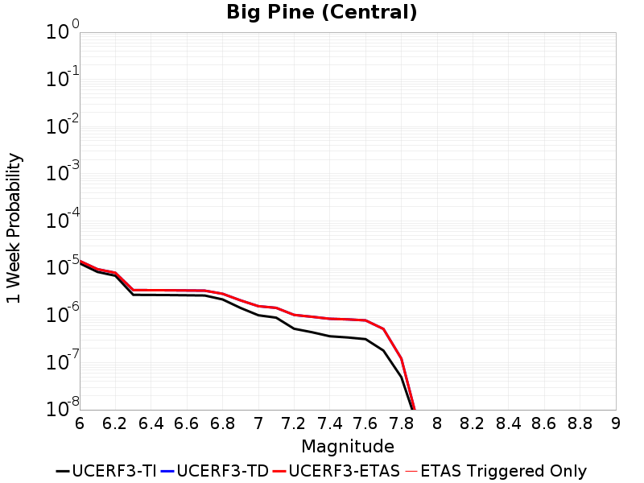 |  | 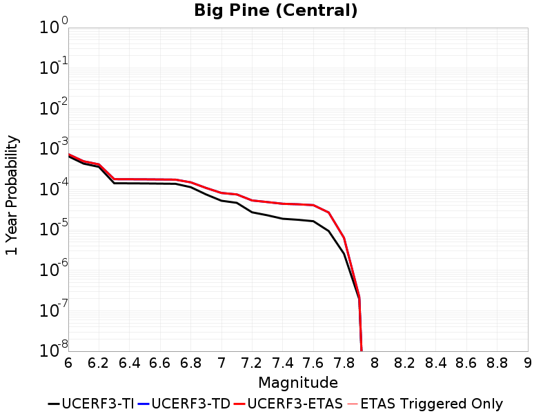 | 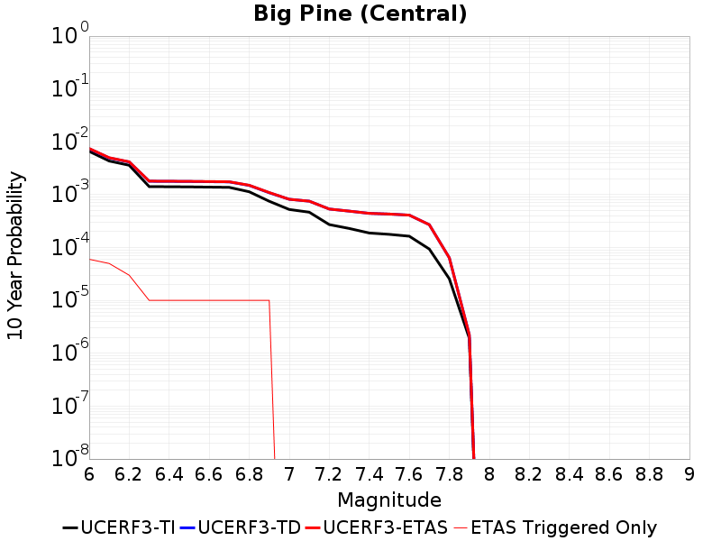 |

| Magnitude | 1 wk TI Prob | 1 wk TD Prob | 1 wk ETAS Prob | 1 wk ETAS/TD Gain | 1 wk ETAS Triggered Only | 1 mo TI Prob | 1 mo TD Prob | 1 mo ETAS Prob | 1 mo ETAS/TD Gain | 1 mo ETAS Triggered Only | 1 yr TI Prob | 1 yr TD Prob | 1 yr ETAS Prob | 1 yr ETAS/TD Gain | 1 yr ETAS Triggered Only | 10 yr TI Prob | 10 yr TD Prob | 10 yr ETAS Prob | 10 yr ETAS/TD Gain | 10 yr ETAS Triggered Only |
|-----|-----|-----|-----|-----|-----|-----|-----|-----|-----|-----|-----|-----|-----|-----|-----|-----|-----|-----|-----|-----|
| 6.0 | 1.2706755E-5 | 1.427325E-5 | 1.427325E-5 | 1.0 | 0.0 | 5.4456385E-5 | 6.116984E-5 | 6.116984E-5 | 1.0 | 0.0 | 6.628048E-4 | 7.4452494E-4 | 7.4452494E-4 | 1.0 | 0.0 | 0.006608314 | 0.007425221 | 0.0074847755 | 1.0080205 | 6.0E-5 |
| 6.1 | 8.342579E-6 | 9.530948E-6 | 9.530948E-6 | 1.0 | 0.0 | 3.5753423E-5 | 4.0846404E-5 | 4.0846404E-5 | 1.0 | 0.0 | 4.3521097E-4 | 4.972132E-4 | 4.972132E-4 | 1.0 | 0.0 | 0.0043435963 | 0.0049644476 | 0.0050141993 | 1.0100216 | 5.0E-5 |
| 6.2 | 6.923899E-6 | 7.986489E-6 | 7.986489E-6 | 1.0 | 0.0 | 2.9673516E-5 | 3.422747E-5 | 3.422747E-5 | 1.0 | 0.0 | 3.6121515E-4 | 4.1665902E-4 | 4.1665902E-4 | 1.0 | 0.0 | 0.003606286 | 0.004161971 | 0.004191846 | 1.0071781 | 3.0E-5 |
| 6.3 | 2.728396E-6 | 3.441296E-6 | 3.441296E-6 | 1.0 | 0.0 | 1.1693074E-5 | 1.4748333E-5 | 1.4748333E-5 | 1.0 | 0.0 | 1.4235388E-4 | 1.7954703E-4 | 1.7954703E-4 | 1.0 | 0.0 | 0.0014226272 | 0.0017954092 | 0.0018053913 | 1.0055598 | 1.0E-5 |
| 6.4 | 2.7136944E-6 | 3.425583E-6 | 3.425583E-6 | 1.0 | 0.0 | 1.1630066E-5 | 1.4680992E-5 | 1.4680992E-5 | 1.0 | 0.0 | 1.4158686E-4 | 1.7872728E-4 | 1.7872728E-4 | 1.0 | 0.0 | 0.0014149669 | 0.0017872249 | 0.001797207 | 1.0055853 | 1.0E-5 |
| 6.5 | 2.6971882E-6 | 3.4079203E-6 | 3.4079203E-6 | 1.0 | 0.0 | 1.1559327E-5 | 1.4605296E-5 | 1.4605296E-5 | 1.0 | 0.0 | 1.4072572E-4 | 1.7780584E-4 | 1.7780584E-4 | 1.0 | 0.0 | 0.0014063664 | 0.0017780253 | 0.0017880074 | 1.0056142 | 1.0E-5 |
| 6.6 | 2.669092E-6 | 3.3779284E-6 | 3.3779284E-6 | 1.0 | 0.0 | 1.1438916E-5 | 1.447676E-5 | 1.447676E-5 | 1.0 | 0.0 | 1.3925991E-4 | 1.7624117E-4 | 1.7624117E-4 | 1.0 | 0.0 | 0.0013917267 | 0.0017624034 | 0.0017723858 | 1.0056641 | 1.0E-5 |
| 6.7 | 2.6408059E-6 | 3.3479428E-6 | 3.3479428E-6 | 1.0 | 0.0 | 1.1317691E-5 | 1.4348252E-5 | 1.4348252E-5 | 1.0 | 0.0 | 1.3778417E-4 | 1.7467684E-4 | 1.7467684E-4 | 1.0 | 0.0 | 0.0013769877 | 0.0017467848 | 0.0017567673 | 1.0057148 | 1.0E-5 |
| 6.8 | 2.1786943E-6 | 2.8713075E-6 | 2.8713075E-6 | 1.0 | 0.0 | 9.337228E-6 | 1.230555E-5 | 1.230555E-5 | 1.0 | 0.0 | 1.1367482E-4 | 1.498105E-4 | 1.498105E-4 | 1.0 | 0.0 | 0.0011361669 | 0.001498471 | 0.0015084561 | 1.0066634 | 1.0E-5 |
| 6.9 | 1.4411696E-6 | 2.0846273E-6 | 2.0846273E-6 | 1.0 | 0.0 | 6.1764263E-6 | 8.934088E-6 | 8.934088E-6 | 1.0 | 0.0 | 7.51954E-5 | 1.08767366E-4 | 1.08767366E-4 | 1.0 | 0.0 | 7.5169955E-4 | 0.0010884725 | 0.0010984617 | 1.0091772 | 1.0E-5 |
| 7.0 | 1.0073411E-6 | 1.5686663E-6 | 1.5686663E-6 | 1.0 | 0.0 | 4.317169E-6 | 6.7228393E-6 | 6.7228393E-6 | 1.0 | 0.0 | 5.2560266E-5 | 8.184765E-5 | 8.184765E-5 | 1.0 | 0.0 | 5.2547833E-4 | 8.194949E-4 | 8.194949E-4 | 1.0 | 0.0 |
| 7.1 | 8.947104E-7 | 1.4444506E-6 | 1.4444506E-6 | 1.0 | 0.0 | 3.834468E-6 | 6.190489E-6 | 6.190489E-6 | 1.0 | 0.0 | 4.6683643E-5 | 7.536675E-5 | 7.536675E-5 | 1.0 | 0.0 | 4.6673836E-4 | 7.547315E-4 | 7.547315E-4 | 1.0 | 0.0 |
| 7.2 | 5.215166E-7 | 1.0244202E-6 | 1.0244202E-6 | 1.0 | 0.0 | 2.2350691E-6 | 4.390365E-6 | 4.390365E-6 | 1.0 | 0.0 | 2.7211627E-5 | 5.345143E-5 | 5.345143E-5 | 1.0 | 0.0 | 2.7208295E-4 | 5.356951E-4 | 5.356951E-4 | 1.0 | 0.0 |
| 7.3 | 4.4024807E-7 | 9.3481725E-7 | 9.3481725E-7 | 1.0 | 0.0 | 1.8867761E-6 | 4.0063537E-6 | 4.0063537E-6 | 1.0 | 0.0 | 2.2971257E-5 | 4.877631E-5 | 4.877631E-5 | 1.0 | 0.0 | 2.2968883E-4 | 4.889659E-4 | 4.889659E-4 | 1.0 | 0.0 |
| 7.4 | 3.6130905E-7 | 8.483124E-7 | 8.483124E-7 | 1.0 | 0.0 | 1.5484665E-6 | 3.6356198E-6 | 3.6356198E-6 | 1.0 | 0.0 | 1.8852415E-5 | 4.426281E-5 | 4.426281E-5 | 1.0 | 0.0 | 1.8850817E-4 | 4.438402E-4 | 4.438402E-4 | 1.0 | 0.0 |
| 7.5 | 3.408184E-7 | 8.2300255E-7 | 8.2300255E-7 | 1.0 | 0.0 | 1.4606494E-6 | 3.5271491E-6 | 3.5271491E-6 | 1.0 | 0.0 | 1.7783263E-5 | 4.2942233E-5 | 4.2942233E-5 | 1.0 | 0.0 | 1.778184E-4 | 4.3061902E-4 | 4.3061902E-4 | 1.0 | 0.0 |
| 7.6 | 3.1428627E-7 | 7.8491576E-7 | 7.8491576E-7 | 1.0 | 0.0 | 1.3469405E-6 | 3.3639205E-6 | 3.3639205E-6 | 1.0 | 0.0 | 1.6398877E-5 | 4.0955E-5 | 4.0955E-5 | 1.0 | 0.0 | 1.6397667E-4 | 4.1072522E-4 | 4.1072522E-4 | 1.0 | 0.0 |
| 7.7 | 1.7972785E-7 | 5.167715E-7 | 5.167715E-7 | 1.0 | 0.0 | 7.70262E-7 | 2.214733E-6 | 2.214733E-6 | 1.0 | 0.0 | 9.377899E-6 | 2.6964053E-5 | 2.6964053E-5 | 1.0 | 0.0 | 9.377503E-5 | 2.708658E-4 | 2.708658E-4 | 1.0 | 0.0 |
| 7.8 | 4.9230927E-8 | 1.2193068E-7 | 1.2193068E-7 | 1.0 | 0.0 | 2.1098968E-7 | 5.2255996E-7 | 5.2255996E-7 | 1.0 | 0.0 | 2.5687964E-6 | 6.362151E-6 | 6.362151E-6 | 1.0 | 0.0 | 2.5687666E-5 | 6.4058084E-5 | 6.4058084E-5 | 1.0 | 0.0 |
| 7.9 | 3.6805972E-9 | 4.190074E-9 | 4.190074E-9 | 1.0 | 0.0 | 1.5773987E-8 | 1.7957458E-8 | 1.7957458E-8 | 1.0 | 0.0 | 1.9204828E-7 | 2.1863204E-7 | 2.1863204E-7 | 1.0 | 0.0 | 1.920481E-6 | 2.234222E-6 | 2.234222E-6 | 1.0 | 0.0 |

## San Jacinto (Stepovers Combined)
*[(top)](#table-of-contents)*

| 1 Week | 1 Month | 1 Year | 10 Year |
|-----|-----|-----|-----|
|  |  |  | 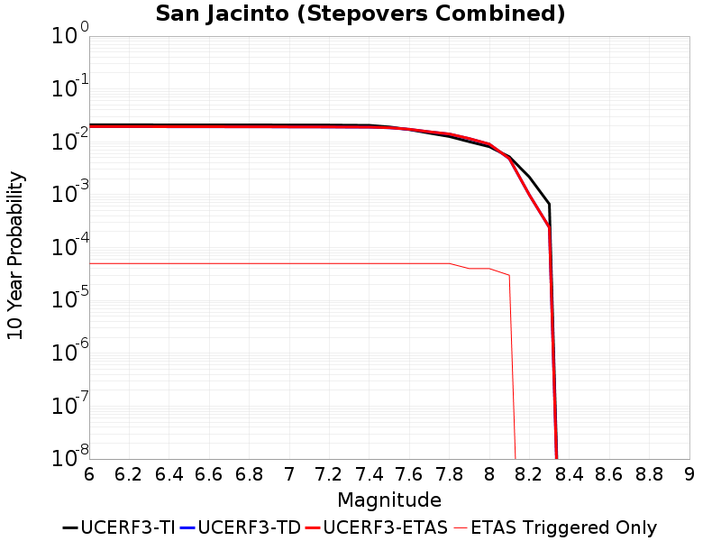 |

| Magnitude | 1 wk TI Prob | 1 wk TD Prob | 1 wk ETAS Prob | 1 wk ETAS/TD Gain | 1 wk ETAS Triggered Only | 1 mo TI Prob | 1 mo TD Prob | 1 mo ETAS Prob | 1 mo ETAS/TD Gain | 1 mo ETAS Triggered Only | 1 yr TI Prob | 1 yr TD Prob | 1 yr ETAS Prob | 1 yr ETAS/TD Gain | 1 yr ETAS Triggered Only | 10 yr TI Prob | 10 yr TD Prob | 10 yr ETAS Prob | 10 yr ETAS/TD Gain | 10 yr ETAS Triggered Only |
|-----|-----|-----|-----|-----|-----|-----|-----|-----|-----|-----|-----|-----|-----|-----|-----|-----|-----|-----|-----|-----|
| 6.0 | 4.0667746E-5 | 3.6000656E-5 | 3.6000656E-5 | 1.0 | 0.0 | 1.742787E-4 | 1.5427939E-4 | 1.5427939E-4 | 1.0 | 0.0 | 0.0021197782 | 0.0018767345 | 0.0018767345 | 1.0 | 0.0 | 0.020996714 | 0.019363586 | 0.019412618 | 1.0025321 | 5.0E-5 |
| 6.1 | 4.0667746E-5 | 3.6000656E-5 | 3.6000656E-5 | 1.0 | 0.0 | 1.742787E-4 | 1.5427939E-4 | 1.5427939E-4 | 1.0 | 0.0 | 0.0021197782 | 0.0018767345 | 0.0018767345 | 1.0 | 0.0 | 0.020996714 | 0.019363586 | 0.019412618 | 1.0025321 | 5.0E-5 |
| 6.2 | 4.0667746E-5 | 3.6000656E-5 | 3.6000656E-5 | 1.0 | 0.0 | 1.742787E-4 | 1.5427939E-4 | 1.5427939E-4 | 1.0 | 0.0 | 0.0021197782 | 0.0018767345 | 0.0018767345 | 1.0 | 0.0 | 0.020996714 | 0.019363586 | 0.019412618 | 1.0025321 | 5.0E-5 |
| 6.3 | 4.0667746E-5 | 3.6000656E-5 | 3.6000656E-5 | 1.0 | 0.0 | 1.742787E-4 | 1.5427939E-4 | 1.5427939E-4 | 1.0 | 0.0 | 0.0021197782 | 0.0018767345 | 0.0018767345 | 1.0 | 0.0 | 0.020996714 | 0.019363586 | 0.019412618 | 1.0025321 | 5.0E-5 |
| 6.4 | 4.0577226E-5 | 3.587227E-5 | 3.587227E-5 | 1.0 | 0.0 | 1.738908E-4 | 1.5372926E-4 | 1.5372926E-4 | 1.0 | 0.0 | 0.0021150648 | 0.0018700493 | 0.0018700493 | 1.0 | 0.0 | 0.020950472 | 0.019298032 | 0.019347068 | 1.002541 | 5.0E-5 |
| 6.5 | 4.0577226E-5 | 3.587227E-5 | 3.587227E-5 | 1.0 | 0.0 | 1.738908E-4 | 1.5372926E-4 | 1.5372926E-4 | 1.0 | 0.0 | 0.0021150648 | 0.0018700493 | 0.0018700493 | 1.0 | 0.0 | 0.020950472 | 0.019298032 | 0.019347068 | 1.002541 | 5.0E-5 |
| 6.6 | 4.053861E-5 | 3.5817488E-5 | 3.5817488E-5 | 1.0 | 0.0 | 1.7372532E-4 | 1.5349449E-4 | 1.5349449E-4 | 1.0 | 0.0 | 0.0021130538 | 0.0018671965 | 0.0018671965 | 1.0 | 0.0 | 0.020930743 | 0.019270059 | 0.019319095 | 1.0025446 | 5.0E-5 |
| 6.7 | 4.0516545E-5 | 3.578649E-5 | 3.578649E-5 | 1.0 | 0.0 | 1.7363077E-4 | 1.5336167E-4 | 1.5336167E-4 | 1.0 | 0.0 | 0.002111905 | 0.0018655824 | 0.0018655824 | 1.0 | 0.0 | 0.020919468 | 0.019254226 | 0.019303264 | 1.0025468 | 5.0E-5 |
| 6.8 | 4.049434E-5 | 3.5757876E-5 | 3.5757876E-5 | 1.0 | 0.0 | 1.7353562E-4 | 1.5323905E-4 | 1.5323905E-4 | 1.0 | 0.0 | 0.0021107488 | 0.0018640921 | 0.0018640921 | 1.0 | 0.0 | 0.020908125 | 0.019239554 | 0.019288592 | 1.0025488 | 5.0E-5 |
| 6.9 | 4.046386E-5 | 3.5720263E-5 | 3.5720263E-5 | 1.0 | 0.0 | 1.73405E-4 | 1.5307788E-4 | 1.5307788E-4 | 1.0 | 0.0 | 0.0021091616 | 0.0018621333 | 0.0018621333 | 1.0 | 0.0 | 0.020892553 | 0.019220248 | 0.019269286 | 1.0025514 | 5.0E-5 |
| 7.0 | 4.036382E-5 | 3.5600257E-5 | 3.5600257E-5 | 1.0 | 0.0 | 1.7297632E-4 | 1.5256362E-4 | 1.5256362E-4 | 1.0 | 0.0 | 0.0021039525 | 0.0018558829 | 0.0018558829 | 1.0 | 0.0 | 0.02084144 | 0.019158585 | 0.019207628 | 1.0025598 | 5.0E-5 |
| 7.1 | 4.0343282E-5 | 3.557862E-5 | 3.557862E-5 | 1.0 | 0.0 | 1.7288832E-4 | 1.5247092E-4 | 1.5247092E-4 | 1.0 | 0.0 | 0.002102883 | 0.0018547563 | 0.0018547563 | 1.0 | 0.0 | 0.020830948 | 0.019147418 | 0.01919646 | 1.0025613 | 5.0E-5 |
| 7.2 | 4.0257353E-5 | 3.5482717E-5 | 3.5482717E-5 | 1.0 | 0.0 | 1.725201E-4 | 1.5205995E-4 | 1.5205995E-4 | 1.0 | 0.0 | 0.0020984085 | 0.0018497612 | 0.0018497612 | 1.0 | 0.0 | 0.020787042 | 0.019097969 | 0.019147014 | 1.0025681 | 5.0E-5 |
| 7.3 | 3.9940667E-5 | 3.5307607E-5 | 3.5307607E-5 | 1.0 | 0.0 | 1.7116306E-4 | 1.5130955E-4 | 1.5130955E-4 | 1.0 | 0.0 | 0.0020819185 | 0.0018406406 | 0.0018406406 | 1.0 | 0.0 | 0.020625217 | 0.01900517 | 0.01905422 | 1.0025809 | 5.0E-5 |
| 7.4 | 3.9721202E-5 | 3.5191588E-5 | 3.5191588E-5 | 1.0 | 0.0 | 1.7022261E-4 | 1.5081238E-4 | 1.5081238E-4 | 1.0 | 0.0 | 0.0020704903 | 0.0018345978 | 0.0018345978 | 1.0 | 0.0 | 0.020513052 | 0.018943572 | 0.018992625 | 1.0025895 | 5.0E-5 |
| 7.5 | 3.7036873E-5 | 3.424528E-5 | 3.424528E-5 | 1.0 | 0.0 | 1.5871979E-4 | 1.4675724E-4 | 1.4675724E-4 | 1.0 | 0.0 | 0.0019307006 | 0.0017853081 | 0.0017853081 | 1.0 | 0.0 | 0.019140124 | 0.018438024 | 0.018487101 | 1.0026618 | 5.0E-5 |
| 7.6 | 3.2940967E-5 | 3.1998497E-5 | 3.1998497E-5 | 1.0 | 0.0 | 1.4116794E-4 | 1.3712923E-4 | 1.3712923E-4 | 1.0 | 0.0 | 0.0017173645 | 0.0016682721 | 0.0016682721 | 1.0 | 0.0 | 0.01704153 | 0.017256945 | 0.017306084 | 1.0028474 | 5.0E-5 |
| 7.7 | 2.8236149E-5 | 2.8546741E-5 | 2.8546741E-5 | 1.0 | 0.0 | 1.2100645E-4 | 1.2233744E-4 | 1.2233744E-4 | 1.0 | 0.0 | 0.0014722579 | 0.0014884418 | 0.0014884418 | 1.0 | 0.0 | 0.014625421 | 0.015459326 | 0.015508553 | 1.0031843 | 5.0E-5 |
| 7.8 | 2.4329287E-5 | 2.5842688E-5 | 2.5842688E-5 | 1.0 | 0.0 | 1.042642E-4 | 1.1074968E-4 | 1.1074968E-4 | 1.0 | 0.0 | 0.0012686774 | 0.0013475443 | 0.0013475443 | 1.0 | 0.0 | 0.012614589 | 0.014043008 | 0.014092306 | 1.0035105 | 5.0E-5 |
| 7.9 | 1.9370926E-5 | 2.0988491E-5 | 2.0988491E-5 | 1.0 | 0.0 | 8.301561E-5 | 8.994758E-5 | 8.994758E-5 | 1.0 | 0.0 | 0.0010102465 | 0.0010945625 | 0.0010945625 | 1.0 | 0.0 | 0.0100566605 | 0.011495837 | 0.011535376 | 1.0034395 | 4.0E-5 |
| 8.0 | 1.5583017E-5 | 1.6362332E-5 | 1.6362332E-5 | 1.0 | 0.0 | 6.6782646E-5 | 7.01224E-5 | 7.01224E-5 | 1.0 | 0.0 | 8.127754E-4 | 8.5340656E-4 | 8.5340656E-4 | 1.0 | 0.0 | 0.008098091 | 0.009032462 | 0.0090721 | 1.0043885 | 4.0E-5 |
| 8.1 | 1.0024873E-5 | 8.57113E-6 | 8.57113E-6 | 1.0 | 0.0 | 4.2963035E-5 | 3.67329E-5 | 3.67329E-5 | 1.0 | 0.0 | 5.229494E-4 | 4.4713184E-4 | 4.4713184E-4 | 1.0 | 0.0 | 0.0052172043 | 0.004803254 | 0.0048331097 | 1.0062158 | 3.0E-5 |
| 8.2 | 4.142796E-6 | 1.6419949E-6 | 1.6419949E-6 | 1.0 | 0.0 | 1.775472E-5 | 7.0371025E-6 | 7.0371025E-6 | 1.0 | 0.0 | 2.1614227E-4 | 8.567338E-5 | 8.567338E-5 | 1.0 | 0.0 | 0.0021593217 | 9.917261E-4 | 9.917261E-4 | 1.0 | 0.0 |
| 8.3 | 1.2750878E-6 | 3.8292913E-7 | 3.8292913E-7 | 1.0 | 0.0 | 5.4646503E-6 | 1.6411238E-6 | 1.6411238E-6 | 1.0 | 0.0 | 6.653009E-5 | 1.9980505E-5 | 1.9980505E-5 | 1.0 | 0.0 | 6.6510175E-4 | 2.400832E-4 | 2.400832E-4 | 1.0 | 0.0 |

## Big Pine (East)
*[(top)](#table-of-contents)*

| 1 Week | 1 Month | 1 Year | 10 Year |
|-----|-----|-----|-----|
| 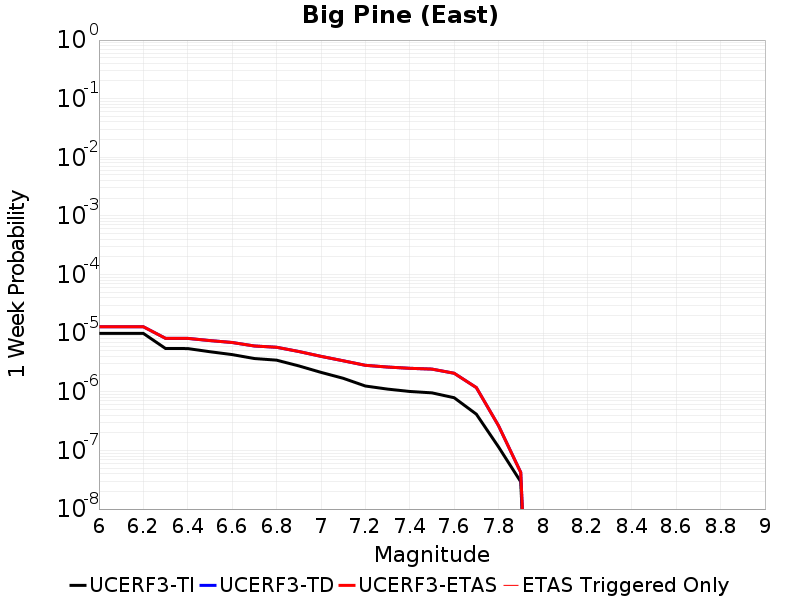 | 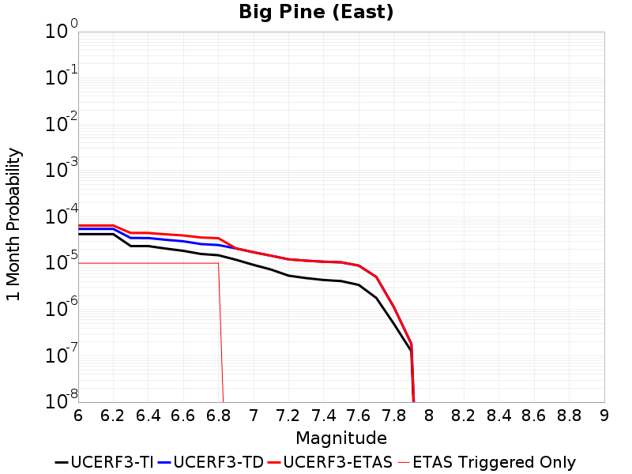 |  |  |

| Magnitude | 1 wk TI Prob | 1 wk TD Prob | 1 wk ETAS Prob | 1 wk ETAS/TD Gain | 1 wk ETAS Triggered Only | 1 mo TI Prob | 1 mo TD Prob | 1 mo ETAS Prob | 1 mo ETAS/TD Gain | 1 mo ETAS Triggered Only | 1 yr TI Prob | 1 yr TD Prob | 1 yr ETAS Prob | 1 yr ETAS/TD Gain | 1 yr ETAS Triggered Only | 10 yr TI Prob | 10 yr TD Prob | 10 yr ETAS Prob | 10 yr ETAS/TD Gain | 10 yr ETAS Triggered Only |
|-----|-----|-----|-----|-----|-----|-----|-----|-----|-----|-----|-----|-----|-----|-----|-----|-----|-----|-----|-----|-----|
| 6.0 | 9.916913E-6 | 1.2875606E-5 | 1.2875606E-5 | 1.0 | 0.0 | 4.250036E-5 | 5.518013E-5 | 6.517958E-5 | 1.1812147 | 1.0E-5 | 5.173191E-4 | 6.7163317E-4 | 6.8162644E-4 | 1.0148791 | 1.0E-5 | 0.0051611643 | 0.0067004296 | 0.0067500942 | 1.0074122 | 5.0E-5 |
| 6.1 | 9.916913E-6 | 1.2875606E-5 | 1.2875606E-5 | 1.0 | 0.0 | 4.250036E-5 | 5.518013E-5 | 6.517958E-5 | 1.1812147 | 1.0E-5 | 5.173191E-4 | 6.7163317E-4 | 6.8162644E-4 | 1.0148791 | 1.0E-5 | 0.0051611643 | 0.0067004296 | 0.0067500942 | 1.0074122 | 5.0E-5 |
| 6.2 | 9.916913E-6 | 1.2875606E-5 | 1.2875606E-5 | 1.0 | 0.0 | 4.250036E-5 | 5.518013E-5 | 6.517958E-5 | 1.1812147 | 1.0E-5 | 5.173191E-4 | 6.7163317E-4 | 6.8162644E-4 | 1.0148791 | 1.0E-5 | 0.0051611643 | 0.0067004296 | 0.0067500942 | 1.0074122 | 5.0E-5 |
| 6.3 | 5.479711E-6 | 8.169815E-6 | 8.169815E-6 | 1.0 | 0.0 | 2.3484265E-5 | 3.5013043E-5 | 4.5012694E-5 | 1.2855978 | 1.0E-5 | 2.858834E-4 | 4.2620365E-4 | 4.361994E-4 | 1.023453 | 1.0E-5 | 0.0028551589 | 0.0042563905 | 0.0042962204 | 1.0093577 | 4.0E-5 |
| 6.4 | 5.465009E-6 | 8.154103E-6 | 8.154103E-6 | 1.0 | 0.0 | 2.3421257E-5 | 3.4945704E-5 | 4.4945355E-5 | 1.2861482 | 1.0E-5 | 2.851165E-4 | 4.253841E-4 | 4.3537986E-4 | 1.0234982 | 1.0E-5 | 0.0028475097 | 0.0042482265 | 0.0042880564 | 1.0093757 | 4.0E-5 |
| 6.5 | 4.826767E-6 | 7.4789177E-6 | 7.4789177E-6 | 1.0 | 0.0 | 2.068598E-5 | 3.205213E-5 | 4.2051808E-5 | 1.3119818 | 1.0E-5 | 2.518227E-4 | 3.9016758E-4 | 4.0016367E-4 | 1.02562 | 1.0E-5 | 0.0025153751 | 0.0038973116 | 0.003937156 | 1.0102235 | 4.0E-5 |
| 6.6 | 4.3146847E-6 | 6.9386706E-6 | 6.9386706E-6 | 1.0 | 0.0 | 1.8491375E-5 | 2.9736835E-5 | 3.9736537E-5 | 1.3362733 | 1.0E-5 | 2.2510924E-4 | 3.619883E-4 | 3.7198467E-4 | 1.0276152 | 1.0E-5 | 0.0022488134 | 0.0036164399 | 0.0036562954 | 1.0110207 | 4.0E-5 |
| 6.7 | 3.6968106E-6 | 6.048608E-6 | 6.048608E-6 | 1.0 | 0.0 | 1.5843378E-5 | 2.5922356E-5 | 3.5922098E-5 | 1.3857574 | 1.0E-5 | 1.9287605E-4 | 3.1556052E-4 | 3.2555737E-4 | 1.0316796 | 1.0E-5 | 0.0019270873 | 0.0031534869 | 0.0031833923 | 1.0094833 | 3.0E-5 |
| 6.8 | 3.4671132E-6 | 5.7538723E-6 | 5.7538723E-6 | 1.0 | 0.0 | 1.4858972E-5 | 2.4659228E-5 | 3.465898E-5 | 1.4055177 | 1.0E-5 | 1.8089297E-4 | 3.001862E-4 | 3.101832E-4 | 1.0333027 | 1.0E-5 | 0.0018074579 | 0.0030001607 | 0.0030201008 | 1.0066463 | 2.0E-5 |
| 6.9 | 2.7686972E-6 | 4.8729585E-6 | 4.8729585E-6 | 1.0 | 0.0 | 1.1865792E-5 | 2.0883945E-5 | 2.0883945E-5 | 1.0 | 0.0 | 1.4445644E-4 | 2.542331E-4 | 2.542331E-4 | 1.0 | 0.0 | 0.0014436257 | 0.0025417076 | 0.0025516823 | 1.0039244 | 1.0E-5 |
| 7.0 | 2.1472624E-6 | 4.0284153E-6 | 4.0284153E-6 | 1.0 | 0.0 | 9.20252E-6 | 1.7264527E-5 | 1.7264527E-5 | 1.0 | 0.0 | 1.12034926E-4 | 2.1017587E-4 | 2.1017587E-4 | 1.0 | 0.0 | 0.0011197845 | 0.0021020013 | 0.0021020013 | 1.0 | 0.0 |
| 7.1 | 1.7018335E-6 | 3.3843623E-6 | 3.3843623E-6 | 1.0 | 0.0 | 7.293552E-6 | 1.4504331E-5 | 1.4504331E-5 | 1.0 | 0.0 | 8.879537E-5 | 1.7657629E-4 | 1.7657629E-4 | 1.0 | 0.0 | 8.87599E-4 | 0.0017665509 | 0.0017665509 | 1.0 | 0.0 |
| 7.2 | 1.25603E-6 | 2.8317857E-6 | 2.8317857E-6 | 1.0 | 0.0 | 5.3829745E-6 | 1.2136169E-5 | 1.2136169E-5 | 1.0 | 0.0 | 6.553574E-5 | 1.4774807E-4 | 1.4774807E-4 | 1.0 | 0.0 | 6.551642E-4 | 0.0014786676 | 0.0014786676 | 1.0 | 0.0 |
| 7.3 | 1.112297E-6 | 2.6455587E-6 | 2.6455587E-6 | 1.0 | 0.0 | 4.7669787E-6 | 1.1338061E-5 | 1.1338061E-5 | 1.0 | 0.0 | 5.803642E-5 | 1.3803237E-4 | 1.3803237E-4 | 1.0 | 0.0 | 5.802127E-4 | 0.0013814498 | 0.0013814498 | 1.0 | 0.0 |
| 7.4 | 1.0137181E-6 | 2.5172103E-6 | 2.5172103E-6 | 1.0 | 0.0 | 4.3444993E-6 | 1.0788001E-5 | 1.0788001E-5 | 1.0 | 0.0 | 5.2892992E-5 | 1.3133622E-4 | 1.3133622E-4 | 1.0 | 0.0 | 5.288041E-4 | 0.0013143566 | 0.0013143566 | 1.0 | 0.0 |
| 7.5 | 9.598608E-7 | 2.4398664E-6 | 2.4398664E-6 | 1.0 | 0.0 | 4.1136827E-6 | 1.045653E-5 | 1.045653E-5 | 1.0 | 0.0 | 5.0082934E-5 | 1.2730103E-4 | 1.2730103E-4 | 1.0 | 0.0 | 5.007165E-4 | 0.0012738593 | 0.0012738593 | 1.0 | 0.0 |
| 7.6 | 7.929459E-7 | 2.073768E-6 | 2.073768E-6 | 1.0 | 0.0 | 3.3983351E-6 | 8.887549E-6 | 8.887549E-6 | 1.0 | 0.0 | 4.1373947E-5 | 1.0820071E-4 | 1.0820071E-4 | 1.0 | 0.0 | 4.1366243E-4 | 0.0010832248 | 0.0010832248 | 1.0 | 0.0 |
| 7.7 | 4.155788E-7 | 1.1810921E-6 | 1.1810921E-6 | 1.0 | 0.0 | 1.7810507E-6 | 5.0618137E-6 | 5.0618137E-6 | 1.0 | 0.0 | 2.1684076E-5 | 6.162588E-5 | 6.162588E-5 | 1.0 | 0.0 | 2.1681961E-4 | 6.1903655E-4 | 6.1903655E-4 | 1.0 | 0.0 |
| 7.8 | 1.14666925E-7 | 2.6379908E-7 | 2.6379908E-7 | 1.0 | 0.0 | 4.914296E-7 | 1.130567E-6 | 1.130567E-6 | 1.0 | 0.0 | 5.9831386E-6 | 1.376457E-5 | 1.376457E-5 | 1.0 | 0.0 | 5.9829777E-5 | 1.3872598E-4 | 1.3872598E-4 | 1.0 | 0.0 |
| 7.9 | 2.9231824E-8 | 4.223242E-8 | 4.223242E-8 | 1.0 | 0.0 | 1.2527924E-7 | 1.8099605E-7 | 1.8099605E-7 | 1.0 | 0.0 | 1.5252737E-6 | 2.203625E-6 | 2.203625E-6 | 1.0 | 0.0 | 1.5252632E-5 | 2.2366086E-5 | 2.2366086E-5 | 1.0 | 0.0 |

## Lake Isabella (Seismicity)
*[(top)](#table-of-contents)*

| 1 Week | 1 Month | 1 Year | 10 Year |
|-----|-----|-----|-----|
| 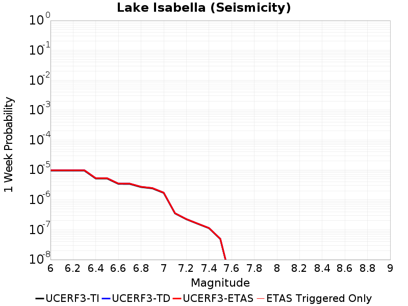 | 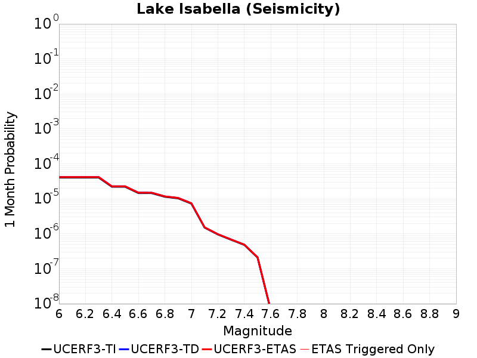 | 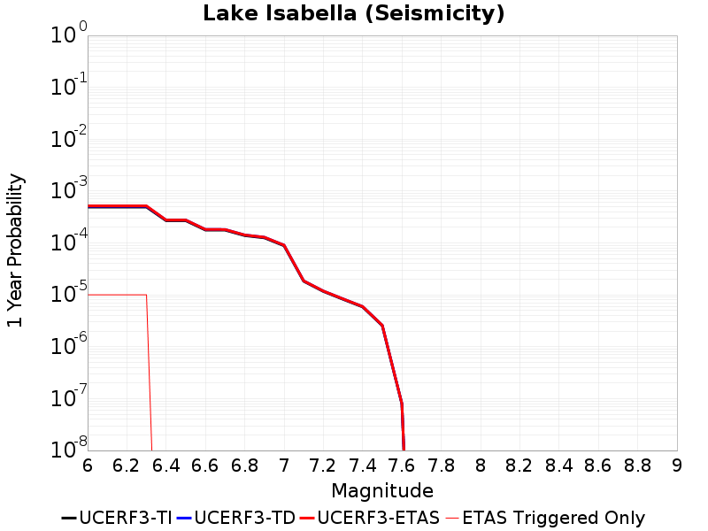 | 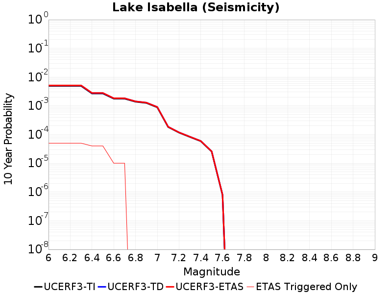 |

| Magnitude | 1 wk TI Prob | 1 wk TD Prob | 1 wk ETAS Prob | 1 wk ETAS/TD Gain | 1 wk ETAS Triggered Only | 1 mo TI Prob | 1 mo TD Prob | 1 mo ETAS Prob | 1 mo ETAS/TD Gain | 1 mo ETAS Triggered Only | 1 yr TI Prob | 1 yr TD Prob | 1 yr ETAS Prob | 1 yr ETAS/TD Gain | 1 yr ETAS Triggered Only | 10 yr TI Prob | 10 yr TD Prob | 10 yr ETAS Prob | 10 yr ETAS/TD Gain | 10 yr ETAS Triggered Only |
|-----|-----|-----|-----|-----|-----|-----|-----|-----|-----|-----|-----|-----|-----|-----|-----|-----|-----|-----|-----|-----|
| 6.0 | 9.431637E-6 | 9.743641E-6 | 9.743641E-6 | 1.0 | 0.0 | 4.0420677E-5 | 4.175787E-5 | 4.175787E-5 | 1.0 | 0.0 | 4.920106E-4 | 5.0829654E-4 | 5.1829143E-4 | 1.0196636 | 1.0E-5 | 0.004909227 | 0.0050726323 | 0.005122379 | 1.0098069 | 5.0E-5 |
| 6.1 | 9.431637E-6 | 9.743641E-6 | 9.743641E-6 | 1.0 | 0.0 | 4.0420677E-5 | 4.175787E-5 | 4.175787E-5 | 1.0 | 0.0 | 4.920106E-4 | 5.0829654E-4 | 5.1829143E-4 | 1.0196636 | 1.0E-5 | 0.004909227 | 0.0050726323 | 0.005122379 | 1.0098069 | 5.0E-5 |
| 6.2 | 9.431637E-6 | 9.743641E-6 | 9.743641E-6 | 1.0 | 0.0 | 4.0420677E-5 | 4.175787E-5 | 4.175787E-5 | 1.0 | 0.0 | 4.920106E-4 | 5.0829654E-4 | 5.1829143E-4 | 1.0196636 | 1.0E-5 | 0.004909227 | 0.0050726323 | 0.005122379 | 1.0098069 | 5.0E-5 |
| 6.3 | 9.431637E-6 | 9.743641E-6 | 9.743641E-6 | 1.0 | 0.0 | 4.0420677E-5 | 4.175787E-5 | 4.175787E-5 | 1.0 | 0.0 | 4.920106E-4 | 5.0829654E-4 | 5.1829143E-4 | 1.0196636 | 1.0E-5 | 0.004909227 | 0.0050726323 | 0.005122379 | 1.0098069 | 5.0E-5 |
| 6.4 | 5.144063E-6 | 5.301075E-6 | 5.301075E-6 | 1.0 | 0.0 | 2.2045799E-5 | 2.2718714E-5 | 2.2718714E-5 | 1.0 | 0.0 | 2.6837454E-4 | 2.765687E-4 | 2.765687E-4 | 1.0 | 0.0 | 0.0026805066 | 0.0027625856 | 0.0028024751 | 1.0144392 | 4.0E-5 |
| 6.5 | 5.144063E-6 | 5.301075E-6 | 5.301075E-6 | 1.0 | 0.0 | 2.2045799E-5 | 2.2718714E-5 | 2.2718714E-5 | 1.0 | 0.0 | 2.6837454E-4 | 2.765687E-4 | 2.765687E-4 | 1.0 | 0.0 | 0.0026805066 | 0.0027625856 | 0.0028024751 | 1.0144392 | 4.0E-5 |
| 6.6 | 3.4009804E-6 | 3.4994114E-6 | 3.4994114E-6 | 1.0 | 0.0 | 1.4575549E-5 | 1.49974E-5 | 1.49974E-5 | 1.0 | 0.0 | 1.7744285E-4 | 1.8257965E-4 | 1.8257965E-4 | 1.0 | 0.0 | 0.0017730123 | 0.0018244543 | 0.0018344361 | 1.0054711 | 1.0E-5 |
| 6.7 | 3.3880428E-6 | 3.486277E-6 | 3.486277E-6 | 1.0 | 0.0 | 1.4520103E-5 | 1.494111E-5 | 1.494111E-5 | 1.0 | 0.0 | 1.767679E-4 | 1.8189443E-4 | 1.8189443E-4 | 1.0 | 0.0 | 0.0017662736 | 0.0018176133 | 0.001827595 | 1.0054917 | 1.0E-5 |
| 6.8 | 2.6582E-6 | 2.7341828E-6 | 2.7341828E-6 | 1.0 | 0.0 | 1.1392236E-5 | 1.1717881E-5 | 1.1717881E-5 | 1.0 | 0.0 | 1.3869164E-4 | 1.426572E-4 | 1.426572E-4 | 1.0 | 0.0 | 0.0013860512 | 0.0014257884 | 0.0014257884 | 1.0 | 0.0 |
| 6.9 | 2.406011E-6 | 2.4747656E-6 | 2.4747656E-6 | 1.0 | 0.0 | 1.0311434E-5 | 1.0606102E-5 | 1.0606102E-5 | 1.0 | 0.0 | 1.2553448E-4 | 1.2912296E-4 | 1.2912296E-4 | 1.0 | 0.0 | 0.0012546359 | 0.001290609 | 0.001290609 | 1.0 | 0.0 |
| 7.0 | 1.6953097E-6 | 1.7432416E-6 | 1.7432416E-6 | 1.0 | 0.0 | 7.265593E-6 | 7.4710197E-6 | 7.4710197E-6 | 1.0 | 0.0 | 8.8455E-5 | 9.095691E-5 | 9.095691E-5 | 1.0 | 0.0 | 8.84198E-4 | 9.0929965E-4 | 9.0929965E-4 | 1.0 | 0.0 |
| 7.1 | 3.5013824E-7 | 3.5719265E-7 | 3.5719265E-7 | 1.0 | 0.0 | 1.5005916E-6 | 1.5308248E-6 | 1.5308248E-6 | 1.0 | 0.0 | 1.826955E-5 | 1.8637635E-5 | 1.8637635E-5 | 1.0 | 0.0 | 1.8268047E-4 | 1.8636097E-4 | 1.8636097E-4 | 1.0 | 0.0 |
| 7.2 | 2.2321095E-7 | 2.2753292E-7 | 2.2753292E-7 | 1.0 | 0.0 | 9.56618E-7 | 9.751408E-7 | 9.751408E-7 | 1.0 | 0.0 | 1.1646762E-5 | 1.1872275E-5 | 1.1872275E-5 | 1.0 | 0.0 | 1.1646151E-4 | 1.187165E-4 | 1.187165E-4 | 1.0 | 0.0 |
| 7.3 | 1.5760406E-7 | 1.6062825E-7 | 1.6062825E-7 | 1.0 | 0.0 | 6.7544585E-7 | 6.8840654E-7 | 6.8840654E-7 | 1.0 | 0.0 | 8.223522E-6 | 8.381318E-6 | 8.381318E-6 | 1.0 | 0.0 | 8.2232174E-5 | 8.381008E-5 | 8.381008E-5 | 1.0 | 0.0 |
| 7.4 | 1.1216497E-7 | 1.1433068E-7 | 1.1433068E-7 | 1.0 | 0.0 | 4.8070694E-7 | 4.8998857E-7 | 4.8998857E-7 | 1.0 | 0.0 | 5.852591E-6 | 5.965595E-6 | 5.965595E-6 | 1.0 | 0.0 | 5.8524372E-5 | 5.965439E-5 | 5.965439E-5 | 1.0 | 0.0 |
| 7.5 | 4.885185E-8 | 4.9793663E-8 | 4.9793663E-8 | 1.0 | 0.0 | 2.0936506E-7 | 2.1340139E-7 | 2.1340139E-7 | 1.0 | 0.0 | 2.5490165E-6 | 2.598159E-6 | 2.598159E-6 | 1.0 | 0.0 | 2.5489873E-5 | 2.5981304E-5 | 2.5981304E-5 | 1.0 | 0.0 |
| 7.6 | 1.504641E-9 | 1.5319619E-9 | 1.5319619E-9 | 1.0 | 0.0 | 6.4484613E-9 | 6.565551E-9 | 6.565551E-9 | 1.0 | 0.0 | 7.851001E-8 | 7.993558E-8 | 7.993558E-8 | 1.0 | 0.0 | 7.8509987E-7 | 7.9935586E-7 | 7.9935586E-7 | 1.0 | 0.0 |

## Cleghorn Pass
*[(top)](#table-of-contents)*

| 1 Week | 1 Month | 1 Year | 10 Year |
|-----|-----|-----|-----|
|  |  |  |  |

| Magnitude | 1 wk TI Prob | 1 wk TD Prob | 1 wk ETAS Prob | 1 wk ETAS/TD Gain | 1 wk ETAS Triggered Only | 1 mo TI Prob | 1 mo TD Prob | 1 mo ETAS Prob | 1 mo ETAS/TD Gain | 1 mo ETAS Triggered Only | 1 yr TI Prob | 1 yr TD Prob | 1 yr ETAS Prob | 1 yr ETAS/TD Gain | 1 yr ETAS Triggered Only | 10 yr TI Prob | 10 yr TD Prob | 10 yr ETAS Prob | 10 yr ETAS/TD Gain | 10 yr ETAS Triggered Only |
|-----|-----|-----|-----|-----|-----|-----|-----|-----|-----|-----|-----|-----|-----|-----|-----|-----|-----|-----|-----|-----|
| 6.0 | 1.0522846E-5 | 1.1044016E-5 | 1.1044016E-5 | 1.0 | 0.0 | 4.509713E-5 | 4.7330934E-5 | 4.7330934E-5 | 1.0 | 0.0 | 5.4891926E-4 | 5.7615445E-4 | 5.961429E-4 | 1.0346929 | 2.0E-5 | 0.0054756533 | 0.005751776 | 0.005791546 | 1.0069144 | 4.0E-5 |
| 6.1 | 1.0522846E-5 | 1.1044016E-5 | 1.1044016E-5 | 1.0 | 0.0 | 4.509713E-5 | 4.7330934E-5 | 4.7330934E-5 | 1.0 | 0.0 | 5.4891926E-4 | 5.7615445E-4 | 5.961429E-4 | 1.0346929 | 2.0E-5 | 0.0054756533 | 0.005751776 | 0.005791546 | 1.0069144 | 4.0E-5 |
| 6.2 | 2.1045846E-6 | 2.2088777E-6 | 2.2088777E-6 | 1.0 | 0.0 | 9.019617E-6 | 9.466608E-6 | 9.466608E-6 | 1.0 | 0.0 | 1.098083E-4 | 1.1525406E-4 | 1.1525406E-4 | 1.0 | 0.0 | 0.0010975406 | 0.0011523545 | 0.001162343 | 1.0086678 | 1.0E-5 |
| 6.3 | 2.1045846E-6 | 2.2088777E-6 | 2.2088777E-6 | 1.0 | 0.0 | 9.019617E-6 | 9.466608E-6 | 9.466608E-6 | 1.0 | 0.0 | 1.098083E-4 | 1.1525406E-4 | 1.1525406E-4 | 1.0 | 0.0 | 0.0010975406 | 0.0011523545 | 0.001162343 | 1.0086678 | 1.0E-5 |
| 6.4 | 1.7259927E-6 | 1.8114303E-6 | 1.8114303E-6 | 1.0 | 0.0 | 7.3970905E-6 | 7.763272E-6 | 7.763272E-6 | 1.0 | 0.0 | 9.005586E-5 | 9.451784E-5 | 9.451784E-5 | 1.0 | 0.0 | 9.001937E-4 | 9.4517844E-4 | 9.4517844E-4 | 1.0 | 0.0 |

## San Jacinto (San Jacinto Valley) rev
*[(top)](#table-of-contents)*

| 1 Week | 1 Month | 1 Year | 10 Year |
|-----|-----|-----|-----|
| 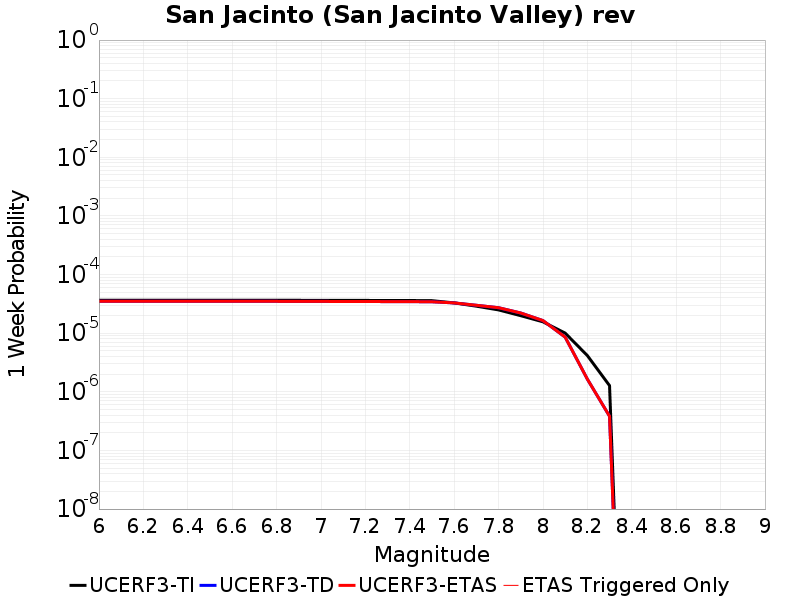 |  |  | 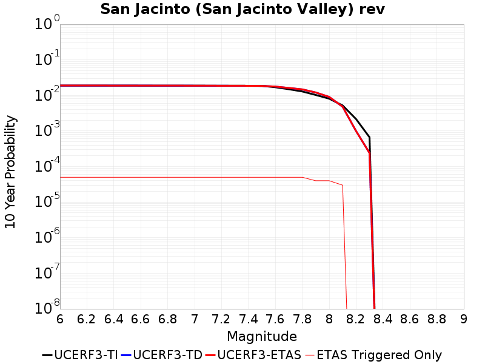 |

| Magnitude | 1 wk TI Prob | 1 wk TD Prob | 1 wk ETAS Prob | 1 wk ETAS/TD Gain | 1 wk ETAS Triggered Only | 1 mo TI Prob | 1 mo TD Prob | 1 mo ETAS Prob | 1 mo ETAS/TD Gain | 1 mo ETAS Triggered Only | 1 yr TI Prob | 1 yr TD Prob | 1 yr ETAS Prob | 1 yr ETAS/TD Gain | 1 yr ETAS Triggered Only | 10 yr TI Prob | 10 yr TD Prob | 10 yr ETAS Prob | 10 yr ETAS/TD Gain | 10 yr ETAS Triggered Only |
|-----|-----|-----|-----|-----|-----|-----|-----|-----|-----|-----|-----|-----|-----|-----|-----|-----|-----|-----|-----|-----|
| 6.0 | 3.652694E-5 | 3.513422E-5 | 3.513422E-5 | 1.0 | 0.0 | 1.5653463E-4 | 1.5056656E-4 | 1.5056656E-4 | 1.0 | 0.0 | 0.0019041431 | 0.0018316084 | 0.0018316084 | 1.0 | 0.0 | 0.018879099 | 0.018904194 | 0.018953249 | 1.002595 | 5.0E-5 |
| 6.1 | 3.652694E-5 | 3.513422E-5 | 3.513422E-5 | 1.0 | 0.0 | 1.5653463E-4 | 1.5056656E-4 | 1.5056656E-4 | 1.0 | 0.0 | 0.0019041431 | 0.0018316084 | 0.0018316084 | 1.0 | 0.0 | 0.018879099 | 0.018904194 | 0.018953249 | 1.002595 | 5.0E-5 |
| 6.2 | 3.652694E-5 | 3.513422E-5 | 3.513422E-5 | 1.0 | 0.0 | 1.5653463E-4 | 1.5056656E-4 | 1.5056656E-4 | 1.0 | 0.0 | 0.0019041431 | 0.0018316084 | 0.0018316084 | 1.0 | 0.0 | 0.018879099 | 0.018904194 | 0.018953249 | 1.002595 | 5.0E-5 |
| 6.3 | 3.652694E-5 | 3.513422E-5 | 3.513422E-5 | 1.0 | 0.0 | 1.5653463E-4 | 1.5056656E-4 | 1.5056656E-4 | 1.0 | 0.0 | 0.0019041431 | 0.0018316084 | 0.0018316084 | 1.0 | 0.0 | 0.018879099 | 0.018904194 | 0.018953249 | 1.002595 | 5.0E-5 |
| 6.4 | 3.646941E-5 | 3.505563E-5 | 3.505563E-5 | 1.0 | 0.0 | 1.5628811E-4 | 1.5022978E-4 | 1.5022978E-4 | 1.0 | 0.0 | 0.0019011468 | 0.0018275154 | 0.0018275154 | 1.0 | 0.0 | 0.018849645 | 0.018864008 | 0.018913064 | 1.0026006 | 5.0E-5 |
| 6.5 | 3.646941E-5 | 3.505563E-5 | 3.505563E-5 | 1.0 | 0.0 | 1.5628811E-4 | 1.5022978E-4 | 1.5022978E-4 | 1.0 | 0.0 | 0.0019011468 | 0.0018275154 | 0.0018275154 | 1.0 | 0.0 | 0.018849645 | 0.018864008 | 0.018913064 | 1.0026006 | 5.0E-5 |
| 6.6 | 3.6442503E-5 | 3.501894E-5 | 3.501894E-5 | 1.0 | 0.0 | 1.561728E-4 | 1.5007256E-4 | 1.5007256E-4 | 1.0 | 0.0 | 0.0018997455 | 0.0018256046 | 0.0018256046 | 1.0 | 0.0 | 0.018835869 | 0.018845245 | 0.018894304 | 1.0026032 | 5.0E-5 |
| 6.7 | 3.6432113E-5 | 3.5004483E-5 | 3.5004483E-5 | 1.0 | 0.0 | 1.5612828E-4 | 1.5001062E-4 | 1.5001062E-4 | 1.0 | 0.0 | 0.0018992044 | 0.0018248517 | 0.0018248517 | 1.0 | 0.0 | 0.018830549 | 0.018837856 | 0.018886914 | 1.0026042 | 5.0E-5 |
| 6.8 | 3.6409598E-5 | 3.497347E-5 | 3.497347E-5 | 1.0 | 0.0 | 1.560318E-4 | 1.498777E-4 | 1.498777E-4 | 1.0 | 0.0 | 0.0018980318 | 0.0018232364 | 0.0018232364 | 1.0 | 0.0 | 0.018819023 | 0.018821979 | 0.01887104 | 1.0026065 | 5.0E-5 |
| 6.9 | 3.638078E-5 | 3.49338E-5 | 3.49338E-5 | 1.0 | 0.0 | 1.5590832E-4 | 1.4970772E-4 | 1.4970772E-4 | 1.0 | 0.0 | 0.0018965311 | 0.0018211702 | 0.0018211702 | 1.0 | 0.0 | 0.018804269 | 0.018801674 | 0.018850734 | 1.0026094 | 5.0E-5 |
| 7.0 | 3.6294874E-5 | 3.4815548E-5 | 3.4815548E-5 | 1.0 | 0.0 | 1.5554018E-4 | 1.4920098E-4 | 1.4920098E-4 | 1.0 | 0.0 | 0.0018920569 | 0.0018150111 | 0.0018150111 | 1.0 | 0.0 | 0.018760284 | 0.018741142 | 0.018790204 | 1.002618 | 5.0E-5 |
| 7.1 | 3.6260717E-5 | 3.4771754E-5 | 3.4771754E-5 | 1.0 | 0.0 | 1.5539382E-4 | 1.4901331E-4 | 1.4901331E-4 | 1.0 | 0.0 | 0.001890278 | 0.0018127301 | 0.0018127301 | 1.0 | 0.0 | 0.018742796 | 0.018718712 | 0.018767776 | 1.0026212 | 5.0E-5 |
| 7.2 | 3.6210204E-5 | 3.4705747E-5 | 3.4705747E-5 | 1.0 | 0.0 | 1.5517735E-4 | 1.4873045E-4 | 1.4873045E-4 | 1.0 | 0.0 | 0.001887647 | 0.001809292 | 0.001809292 | 1.0 | 0.0 | 0.01871693 | 0.018684898 | 0.018733963 | 1.002626 | 5.0E-5 |
| 7.3 | 3.6119454E-5 | 3.4593377E-5 | 3.4593377E-5 | 1.0 | 0.0 | 1.5478847E-4 | 1.4824892E-4 | 1.4824892E-4 | 1.0 | 0.0 | 0.0018829206 | 0.001803439 | 0.001803439 | 1.0 | 0.0 | 0.018670462 | 0.018627137 | 0.018676205 | 1.0026343 | 5.0E-5 |
| 7.4 | 3.607848E-5 | 3.454053E-5 | 3.454053E-5 | 1.0 | 0.0 | 1.5461289E-4 | 1.4802247E-4 | 1.4802247E-4 | 1.0 | 0.0 | 0.0018807866 | 0.0018006866 | 0.0018006866 | 1.0 | 0.0 | 0.018649481 | 0.018599968 | 0.018649038 | 1.0026382 | 5.0E-5 |
| 7.5 | 3.5856774E-5 | 3.4348297E-5 | 3.4348297E-5 | 1.0 | 0.0 | 1.5366284E-4 | 1.4719869E-4 | 1.4719869E-4 | 1.0 | 0.0 | 0.0018692396 | 0.0017906737 | 0.0017906737 | 1.0 | 0.0 | 0.018535944 | 0.018500065 | 0.01854914 | 1.0026526 | 5.0E-5 |
| 7.6 | 3.286655E-5 | 3.285265E-5 | 3.285265E-5 | 1.0 | 0.0 | 1.4084904E-4 | 1.4078949E-4 | 1.4078949E-4 | 1.0 | 0.0 | 0.001713488 | 0.0017127664 | 0.0017127664 | 1.0 | 0.0 | 0.017003361 | 0.017710283 | 0.017759398 | 1.0027732 | 5.0E-5 |
| 7.7 | 2.8882527E-5 | 2.9930963E-5 | 2.9930963E-5 | 1.0 | 0.0 | 1.237764E-4 | 1.2826925E-4 | 1.2826925E-4 | 1.0 | 0.0 | 0.0015059357 | 0.0015605607 | 0.0015605607 | 1.0 | 0.0 | 0.014957713 | 0.016189875 | 0.016239066 | 1.0030384 | 5.0E-5 |
| 7.8 | 2.4950225E-5 | 2.719378E-5 | 2.719378E-5 | 1.0 | 0.0 | 1.0692515E-4 | 1.1653957E-4 | 1.1653957E-4 | 1.0 | 0.0 | 0.0013010362 | 0.0014179468 | 0.0014179468 | 1.0 | 0.0 | 0.012934455 | 0.014757393 | 0.014806654 | 1.0033381 | 5.0E-5 |
| 7.9 | 1.9881603E-5 | 2.2100905E-5 | 2.2100905E-5 | 1.0 | 0.0 | 8.520408E-5 | 9.4714735E-5 | 9.4714735E-5 | 1.0 | 0.0 | 0.001036866 | 0.0011525427 | 0.0011525427 | 1.0 | 0.0 | 0.010320415 | 0.012086063 | 0.012125579 | 1.0032696 | 4.0E-5 |
| 8.0 | 1.563292E-5 | 1.6415248E-5 | 1.6415248E-5 | 1.0 | 0.0 | 6.6996516E-5 | 7.034917E-5 | 7.034917E-5 | 1.0 | 0.0 | 8.153773E-4 | 8.561653E-4 | 8.561653E-4 | 1.0 | 0.0 | 0.00812392 | 0.009062224 | 0.009101862 | 1.0043739 | 4.0E-5 |
| 8.1 | 1.0045313E-5 | 8.581058E-6 | 8.581058E-6 | 1.0 | 0.0 | 4.305063E-5 | 3.6775447E-5 | 3.6775447E-5 | 1.0 | 0.0 | 5.2401534E-4 | 4.4764965E-4 | 4.4764965E-4 | 1.0 | 0.0 | 0.0052278144 | 0.0048092552 | 0.0048391107 | 1.006208 | 3.0E-5 |
| 8.2 | 4.1554413E-6 | 1.6468243E-6 | 1.6468243E-6 | 1.0 | 0.0 | 1.7808914E-5 | 7.0578E-6 | 7.0578E-6 | 1.0 | 0.0 | 2.1680194E-4 | 8.5925356E-5 | 8.5925356E-5 | 1.0 | 0.0 | 0.0021659054 | 9.947094E-4 | 9.947094E-4 | 1.0 | 0.0 |
| 8.3 | 1.2758221E-6 | 3.8322906E-7 | 3.8322906E-7 | 1.0 | 0.0 | 5.4677976E-6 | 1.6424093E-6 | 1.6424093E-6 | 1.0 | 0.0 | 6.65684E-5 | 1.9996154E-5 | 1.9996154E-5 | 1.0 | 0.0 | 6.6548464E-4 | 2.402614E-4 | 2.402614E-4 | 1.0 | 0.0 |

## Scodie Lineament
*[(top)](#table-of-contents)*

| 1 Week | 1 Month | 1 Year | 10 Year |
|-----|-----|-----|-----|
|  |  |  |  |

| Magnitude | 1 wk TI Prob | 1 wk TD Prob | 1 wk ETAS Prob | 1 wk ETAS/TD Gain | 1 wk ETAS Triggered Only | 1 mo TI Prob | 1 mo TD Prob | 1 mo ETAS Prob | 1 mo ETAS/TD Gain | 1 mo ETAS Triggered Only | 1 yr TI Prob | 1 yr TD Prob | 1 yr ETAS Prob | 1 yr ETAS/TD Gain | 1 yr ETAS Triggered Only | 10 yr TI Prob | 10 yr TD Prob | 10 yr ETAS Prob | 10 yr ETAS/TD Gain | 10 yr ETAS Triggered Only |
|-----|-----|-----|-----|-----|-----|-----|-----|-----|-----|-----|-----|-----|-----|-----|-----|-----|-----|-----|-----|-----|
| 6.0 | 3.2919327E-6 | 3.0140086E-6 | 3.0140086E-6 | 1.0 | 0.0 | 1.4108206E-5 | 1.2917134E-5 | 1.2917134E-5 | 1.0 | 0.0 | 1.7175387E-4 | 1.5725793E-4 | 1.7725478E-4 | 1.1271596 | 2.0E-5 | 0.0017162118 | 0.0015717782 | 0.0016216997 | 1.031761 | 5.0E-5 |
| 6.1 | 1.8663811E-6 | 1.5494693E-6 | 1.5494693E-6 | 1.0 | 0.0 | 7.998751E-6 | 6.6405682E-6 | 6.6405682E-6 | 1.0 | 0.0 | 9.738045E-5 | 8.084642E-5 | 8.084642E-5 | 1.0 | 0.0 | 9.7337784E-4 | 8.082189E-4 | 8.082189E-4 | 1.0 | 0.0 |
| 6.2 | 1.8663811E-6 | 1.5494693E-6 | 1.5494693E-6 | 1.0 | 0.0 | 7.998751E-6 | 6.6405682E-6 | 6.6405682E-6 | 1.0 | 0.0 | 9.738045E-5 | 8.084642E-5 | 8.084642E-5 | 1.0 | 0.0 | 9.7337784E-4 | 8.082189E-4 | 8.082189E-4 | 1.0 | 0.0 |
| 6.3 | 1.8663811E-6 | 1.5494693E-6 | 1.5494693E-6 | 1.0 | 0.0 | 7.998751E-6 | 6.6405682E-6 | 6.6405682E-6 | 1.0 | 0.0 | 9.738045E-5 | 8.084642E-5 | 8.084642E-5 | 1.0 | 0.0 | 9.7337784E-4 | 8.082189E-4 | 8.082189E-4 | 1.0 | 0.0 |
| 6.4 | 1.8663811E-6 | 1.5494693E-6 | 1.5494693E-6 | 1.0 | 0.0 | 7.998751E-6 | 6.6405682E-6 | 6.6405682E-6 | 1.0 | 0.0 | 9.738045E-5 | 8.084642E-5 | 8.084642E-5 | 1.0 | 0.0 | 9.7337784E-4 | 8.082189E-4 | 8.082189E-4 | 1.0 | 0.0 |
| 6.5 | 1.8106311E-6 | 1.4913883E-6 | 1.4913883E-6 | 1.0 | 0.0 | 7.759824E-6 | 6.3916514E-6 | 6.3916514E-6 | 1.0 | 0.0 | 9.447177E-5 | 7.781607E-5 | 7.781607E-5 | 1.0 | 0.0 | 9.4431615E-4 | 7.779369E-4 | 7.779369E-4 | 1.0 | 0.0 |
| 6.6 | 1.2414679E-6 | 9.0001777E-7 | 9.0001777E-7 | 1.0 | 0.0 | 5.320566E-6 | 3.857214E-6 | 3.857214E-6 | 1.0 | 0.0 | 6.477596E-5 | 4.6960653E-5 | 4.6960653E-5 | 1.0 | 0.0 | 6.475708E-4 | 4.6951594E-4 | 4.6951594E-4 | 1.0 | 0.0 |
| 6.7 | 1.1062215E-6 | 7.5966034E-7 | 7.5966034E-7 | 1.0 | 0.0 | 4.7409408E-6 | 3.2556836E-6 | 3.2556836E-6 | 1.0 | 0.0 | 5.7719422E-5 | 3.9637296E-5 | 3.9637296E-5 | 1.0 | 0.0 | 5.770443E-4 | 3.9630927E-4 | 3.9630927E-4 | 1.0 | 0.0 |
| 6.8 | 1.0006736E-6 | 6.502442E-7 | 6.502442E-7 | 1.0 | 0.0 | 4.288594E-6 | 2.7867582E-6 | 2.7867582E-6 | 1.0 | 0.0 | 5.221238E-5 | 3.3928314E-5 | 3.3928314E-5 | 1.0 | 0.0 | 5.220012E-4 | 3.3923742E-4 | 3.3923742E-4 | 1.0 | 0.0 |
| 6.9 | 9.167364E-7 | 5.6334807E-7 | 5.6334807E-7 | 1.0 | 0.0 | 3.9288643E-6 | 2.4143471E-6 | 2.4143471E-6 | 1.0 | 0.0 | 4.7832873E-5 | 2.9394336E-5 | 2.9394336E-5 | 1.0 | 0.0 | 4.782258E-4 | 2.9391015E-4 | 2.9391015E-4 | 1.0 | 0.0 |
| 7.0 | 7.6987664E-7 | 4.1149204E-7 | 4.1149204E-7 | 1.0 | 0.0 | 3.2994672E-6 | 1.7635364E-6 | 1.7635364E-6 | 1.0 | 0.0 | 4.0170275E-5 | 2.1470883E-5 | 2.1470883E-5 | 1.0 | 0.0 | 4.0163012E-4 | 2.1469194E-4 | 2.1469194E-4 | 1.0 | 0.0 |
| 7.1 | 7.1038727E-7 | 3.5225636E-7 | 3.5225636E-7 | 1.0 | 0.0 | 3.0445133E-6 | 1.5096695E-6 | 1.5096695E-6 | 1.0 | 0.0 | 3.706632E-5 | 1.8380106E-5 | 1.8380106E-5 | 1.0 | 0.0 | 3.7060137E-4 | 1.8378937E-4 | 1.8378937E-4 | 1.0 | 0.0 |
| 7.2 | 2.0799602E-7 | 3.1224726E-8 | 3.1224726E-8 | 1.0 | 0.0 | 8.914113E-7 | 1.3382025E-7 | 1.3382025E-7 | 1.0 | 0.0 | 1.0852878E-5 | 1.6292604E-6 | 1.6292604E-6 | 1.0 | 0.0 | 1.08523476E-4 | 1.6292492E-5 | 1.6292492E-5 | 1.0 | 0.0 |
| 7.3 | 1.5048182E-7 | 1.5972722E-8 | 1.5972722E-8 | 1.0 | 0.0 | 6.449219E-7 | 6.8454526E-8 | 6.8454526E-8 | 1.0 | 0.0 | 7.851896E-6 | 8.3343355E-7 | 8.3343355E-7 | 1.0 | 0.0 | 7.851618E-5 | 8.334307E-6 | 8.334307E-6 | 1.0 | 0.0 |
| 7.4 | 5.9334678E-8 | 4.88022E-9 | 4.88022E-9 | 1.0 | 0.0 | 2.5429145E-7 | 2.0915227E-8 | 2.0915227E-8 | 1.0 | 0.0 | 3.095994E-6 | 2.5464288E-7 | 2.5464288E-7 | 1.0 | 0.0 | 3.095951E-5 | 2.546427E-6 | 2.546427E-6 | 1.0 | 0.0 |

## San Jacinto (Borrego)
*[(top)](#table-of-contents)*

| 1 Week | 1 Month | 1 Year | 10 Year |
|-----|-----|-----|-----|
|  |  | 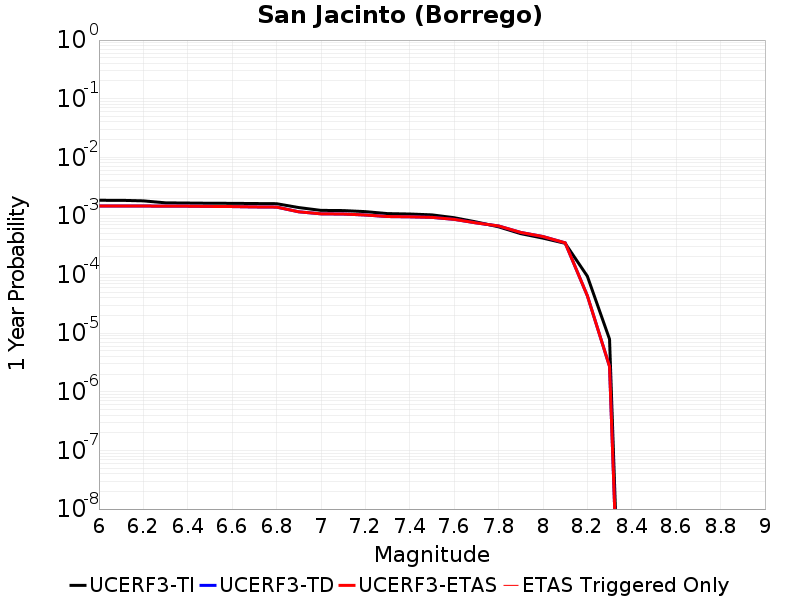 | 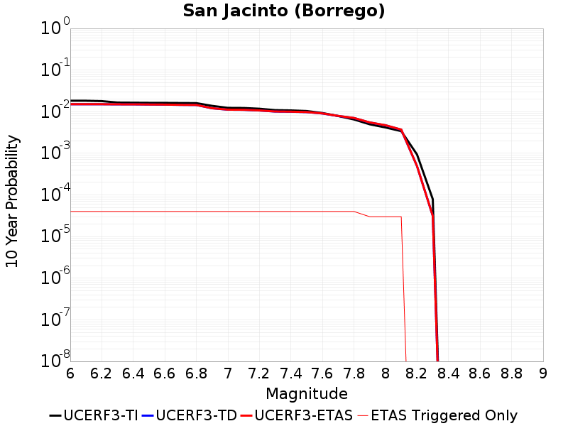 |

| Magnitude | 1 wk TI Prob | 1 wk TD Prob | 1 wk ETAS Prob | 1 wk ETAS/TD Gain | 1 wk ETAS Triggered Only | 1 mo TI Prob | 1 mo TD Prob | 1 mo ETAS Prob | 1 mo ETAS/TD Gain | 1 mo ETAS Triggered Only | 1 yr TI Prob | 1 yr TD Prob | 1 yr ETAS Prob | 1 yr ETAS/TD Gain | 1 yr ETAS Triggered Only | 10 yr TI Prob | 10 yr TD Prob | 10 yr ETAS Prob | 10 yr ETAS/TD Gain | 10 yr ETAS Triggered Only |
|-----|-----|-----|-----|-----|-----|-----|-----|-----|-----|-----|-----|-----|-----|-----|-----|-----|-----|-----|-----|-----|
| 6.0 | 3.543992E-5 | 2.8321128E-5 | 2.8321128E-5 | 1.0 | 0.0 | 1.5187653E-4 | 1.21370686E-4 | 1.21370686E-4 | 1.0 | 0.0 | 0.0018475284 | 0.0014766989 | 0.0014766989 | 1.0 | 0.0 | 0.018322436 | 0.015073583 | 0.015112981 | 1.0026137 | 4.0E-5 |
| 6.1 | 3.542281E-5 | 2.8321128E-5 | 2.8321128E-5 | 1.0 | 0.0 | 1.5180321E-4 | 1.21370686E-4 | 1.21370686E-4 | 1.0 | 0.0 | 0.0018466372 | 0.0014766989 | 0.0014766989 | 1.0 | 0.0 | 0.018313672 | 0.015073583 | 0.015112981 | 1.0026137 | 4.0E-5 |
| 6.2 | 3.4688688E-5 | 2.8321128E-5 | 2.8321128E-5 | 1.0 | 0.0 | 1.4865733E-4 | 1.21370686E-4 | 1.21370686E-4 | 1.0 | 0.0 | 0.0018084005 | 0.0014766989 | 0.0014766989 | 1.0 | 0.0 | 0.017937548 | 0.015073583 | 0.01511298 | 1.0026137 | 4.0E-5 |
| 6.3 | 3.2087122E-5 | 2.816628E-5 | 2.816628E-5 | 1.0 | 0.0 | 1.3750899E-4 | 1.2070711E-4 | 1.2070711E-4 | 1.0 | 0.0 | 0.0016728862 | 0.0014686307 | 0.0014686307 | 1.0 | 0.0 | 0.016603488 | 0.014994659 | 0.01503406 | 1.0026276 | 4.0E-5 |
| 6.4 | 3.1828724E-5 | 2.8133185E-5 | 2.8133185E-5 | 1.0 | 0.0 | 1.364017E-4 | 1.20565295E-4 | 1.20565295E-4 | 1.0 | 0.0 | 0.0016594254 | 0.0014669064 | 0.0014669064 | 1.0 | 0.0 | 0.016470885 | 0.014977821 | 0.015017222 | 1.0026306 | 4.0E-5 |
| 6.5 | 3.1563577E-5 | 2.787205E-5 | 2.787205E-5 | 1.0 | 0.0 | 1.3526545E-4 | 1.19446246E-4 | 1.19446246E-4 | 1.0 | 0.0 | 0.0016456128 | 0.0014533002 | 0.0014533002 | 1.0 | 0.0 | 0.0163348 | 0.014844843 | 0.014884249 | 1.0026546 | 4.0E-5 |
| 6.6 | 3.1467625E-5 | 2.7715632E-5 | 2.7715632E-5 | 1.0 | 0.0 | 1.3485427E-4 | 1.1877594E-4 | 1.1877594E-4 | 1.0 | 0.0 | 0.0016406142 | 0.0014451501 | 0.0014451501 | 1.0 | 0.0 | 0.016285548 | 0.0147648975 | 0.014804306 | 1.0026691 | 4.0E-5 |
| 6.7 | 3.1223695E-5 | 2.7332944E-5 | 2.7332944E-5 | 1.0 | 0.0 | 1.3380898E-4 | 1.17136E-4 | 1.17136E-4 | 1.0 | 0.0 | 0.0016279068 | 0.00142521 | 0.00142521 | 1.0 | 0.0 | 0.01616033 | 0.014569119 | 0.014608536 | 1.0027056 | 4.0E-5 |
| 6.8 | 3.1015585E-5 | 2.7153184E-5 | 2.7153184E-5 | 1.0 | 0.0 | 1.3291716E-4 | 1.1636567E-4 | 1.1636567E-4 | 1.0 | 0.0 | 0.001617065 | 0.0014158436 | 0.0014158436 | 1.0 | 0.0 | 0.016053487 | 0.014476031 | 0.014515452 | 1.0027232 | 4.0E-5 |
| 6.9 | 2.6641965E-5 | 2.2553984E-5 | 2.2553984E-5 | 1.0 | 0.0 | 1.1417485E-4 | 9.6656375E-5 | 9.6656375E-5 | 1.0 | 0.0 | 0.0013891924 | 0.0011761601 | 0.0011761601 | 1.0 | 0.0 | 0.0138054015 | 0.0120751485 | 0.0121146655 | 1.0032725 | 4.0E-5 |
| 7.0 | 2.3854353E-5 | 2.0836793E-5 | 2.0836793E-5 | 1.0 | 0.0 | 1.02228936E-4 | 8.92975E-5 | 8.92975E-5 | 1.0 | 0.0 | 0.0012439266 | 0.0010866574 | 0.0010866574 | 1.0 | 0.0 | 0.012369866 | 0.011169487 | 0.01120904 | 1.0035412 | 4.0E-5 |
| 7.1 | 2.3672901E-5 | 2.0672938E-5 | 2.0672938E-5 | 1.0 | 0.0 | 1.0145135E-4 | 8.859531E-5 | 8.859531E-5 | 1.0 | 0.0 | 0.0012344702 | 0.0010781168 | 0.0010781168 | 1.0 | 0.0 | 0.0122763505 | 0.011084524 | 0.011124081 | 1.0035686 | 4.0E-5 |
| 7.2 | 2.2717244E-5 | 1.9897636E-5 | 1.9897636E-5 | 1.0 | 0.0 | 9.735599E-5 | 8.5272804E-5 | 8.5272804E-5 | 1.0 | 0.0 | 0.0011846646 | 0.0010377043 | 0.0010377043 | 1.0 | 0.0 | 0.01178369 | 0.0106807295 | 0.010720302 | 1.003705 | 4.0E-5 |
| 7.3 | 2.1016205E-5 | 1.8734847E-5 | 1.8734847E-5 | 1.0 | 0.0 | 9.006634E-5 | 8.028974E-5 | 8.028974E-5 | 1.0 | 0.0 | 0.001096006 | 9.770914E-4 | 9.770914E-4 | 1.0 | 0.0 | 0.010906163 | 0.010074173 | 0.01011377 | 1.0039306 | 4.0E-5 |
| 7.4 | 2.0683625E-5 | 1.8536444E-5 | 1.8536444E-5 | 1.0 | 0.0 | 8.86411E-5 | 7.9439495E-5 | 7.9439495E-5 | 1.0 | 0.0 | 0.001078671 | 9.667488E-4 | 9.667488E-4 | 1.0 | 0.0 | 0.010734501 | 0.009970425 | 0.010010026 | 1.0039718 | 4.0E-5 |
| 7.5 | 1.9993966E-5 | 1.8128492E-5 | 1.8128492E-5 | 1.0 | 0.0 | 8.568561E-5 | 7.7691235E-5 | 7.7691235E-5 | 1.0 | 0.0 | 0.001042723 | 9.454824E-4 | 9.454824E-4 | 1.0 | 0.0 | 0.010378438 | 0.009755845 | 0.009795455 | 1.0040601 | 4.0E-5 |
| 7.6 | 1.788966E-5 | 1.6768776E-5 | 1.6768776E-5 | 1.0 | 0.0 | 7.666772E-5 | 7.186421E-5 | 7.186421E-5 | 1.0 | 0.0 | 9.3302975E-4 | 8.7459735E-4 | 8.7459735E-4 | 1.0 | 0.0 | 0.00929122 | 0.009041103 | 0.009080741 | 1.0043843 | 4.0E-5 |
| 7.7 | 1.5125781E-5 | 1.4560682E-5 | 1.4560682E-5 | 1.0 | 0.0 | 6.4823165E-5 | 6.2401436E-5 | 6.2401436E-5 | 1.0 | 0.0 | 7.889362E-4 | 7.594735E-4 | 7.594735E-4 | 1.0 | 0.0 | 0.007861412 | 0.007883738 | 0.007923422 | 1.0050337 | 4.0E-5 |
| 7.8 | 1.250089E-5 | 1.2940593E-5 | 1.2940593E-5 | 1.0 | 0.0 | 5.3574146E-5 | 5.5458506E-5 | 5.5458506E-5 | 1.0 | 0.0 | 6.5207E-4 | 6.749988E-4 | 6.749988E-4 | 1.0 | 0.0 | 0.006501599 | 0.007030765 | 0.0070704836 | 1.0056493 | 4.0E-5 |
| 7.9 | 9.561E-6 | 1.00254165E-5 | 1.00254165E-5 | 1.0 | 0.0 | 4.0975072E-5 | 4.2965363E-5 | 4.2965363E-5 | 1.0 | 0.0 | 4.987573E-4 | 5.229784E-4 | 5.229784E-4 | 1.0 | 0.0 | 0.0049763937 | 0.0054951767 | 0.005525012 | 1.0054294 | 3.0E-5 |
| 8.0 | 8.01699E-6 | 8.539051E-6 | 8.539051E-6 | 1.0 | 0.0 | 3.4358076E-5 | 3.6595426E-5 | 3.6595426E-5 | 1.0 | 0.0 | 4.1822926E-4 | 4.4545878E-4 | 4.4545878E-4 | 1.0 | 0.0 | 0.0041744304 | 0.004703084 | 0.004732943 | 1.0063488 | 3.0E-5 |
| 8.1 | 6.541947E-6 | 6.66087E-6 | 6.66087E-6 | 1.0 | 0.0 | 2.8036617E-5 | 2.8546277E-5 | 2.8546277E-5 | 1.0 | 0.0 | 3.4129233E-4 | 3.4749604E-4 | 3.4749604E-4 | 1.0 | 0.0 | 0.0034076865 | 0.003686061 | 0.0037159503 | 1.0081087 | 3.0E-5 |
| 8.2 | 1.7968189E-6 | 8.352351E-7 | 8.352351E-7 | 1.0 | 0.0 | 7.70063E-6 | 3.5795742E-6 | 3.5795742E-6 | 1.0 | 0.0 | 9.3751136E-5 | 4.358047E-5 | 4.358047E-5 | 1.0 | 0.0 | 9.371159E-4 | 4.9264746E-4 | 4.9264746E-4 | 1.0 | 0.0 |
| 8.3 | 1.5167889E-7 | 5.192881E-8 | 5.192881E-8 | 1.0 | 0.0 | 6.500522E-7 | 2.2255203E-7 | 2.2255203E-7 | 1.0 | 0.0 | 7.9143565E-6 | 2.7095682E-6 | 2.7095682E-6 | 1.0 | 0.0 | 7.914075E-5 | 3.1391468E-5 | 3.1391468E-5 | 1.0 | 0.0 |

## Pleito
*[(top)](#table-of-contents)*

| 1 Week | 1 Month | 1 Year | 10 Year |
|-----|-----|-----|-----|
|  |  |  | 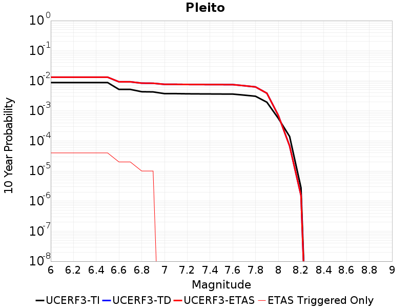 |

| Magnitude | 1 wk TI Prob | 1 wk TD Prob | 1 wk ETAS Prob | 1 wk ETAS/TD Gain | 1 wk ETAS Triggered Only | 1 mo TI Prob | 1 mo TD Prob | 1 mo ETAS Prob | 1 mo ETAS/TD Gain | 1 mo ETAS Triggered Only | 1 yr TI Prob | 1 yr TD Prob | 1 yr ETAS Prob | 1 yr ETAS/TD Gain | 1 yr ETAS Triggered Only | 10 yr TI Prob | 10 yr TD Prob | 10 yr ETAS Prob | 10 yr ETAS/TD Gain | 10 yr ETAS Triggered Only |
|-----|-----|-----|-----|-----|-----|-----|-----|-----|-----|-----|-----|-----|-----|-----|-----|-----|-----|-----|-----|-----|
| 6.0 | 1.6763008E-5 | 2.508057E-5 | 2.508057E-5 | 1.0 | 0.0 | 7.183948E-5 | 1.07484135E-4 | 1.07484135E-4 | 1.0 | 0.0 | 8.742947E-4 | 0.0013079059 | 0.0013079059 | 1.0 | 0.0 | 0.00870863 | 0.013113959 | 0.013153435 | 1.0030102 | 4.0E-5 |
| 6.1 | 1.6763008E-5 | 2.508057E-5 | 2.508057E-5 | 1.0 | 0.0 | 7.183948E-5 | 1.07484135E-4 | 1.07484135E-4 | 1.0 | 0.0 | 8.742947E-4 | 0.0013079059 | 0.0013079059 | 1.0 | 0.0 | 0.00870863 | 0.013113959 | 0.013153435 | 1.0030102 | 4.0E-5 |
| 6.2 | 1.6763008E-5 | 2.508057E-5 | 2.508057E-5 | 1.0 | 0.0 | 7.183948E-5 | 1.07484135E-4 | 1.07484135E-4 | 1.0 | 0.0 | 8.742947E-4 | 0.0013079059 | 0.0013079059 | 1.0 | 0.0 | 0.00870863 | 0.013113959 | 0.013153435 | 1.0030102 | 4.0E-5 |
| 6.3 | 1.6763008E-5 | 2.508057E-5 | 2.508057E-5 | 1.0 | 0.0 | 7.183948E-5 | 1.07484135E-4 | 1.07484135E-4 | 1.0 | 0.0 | 8.742947E-4 | 0.0013079059 | 0.0013079059 | 1.0 | 0.0 | 0.00870863 | 0.013113959 | 0.013153435 | 1.0030102 | 4.0E-5 |
| 6.4 | 1.6763008E-5 | 2.508057E-5 | 2.508057E-5 | 1.0 | 0.0 | 7.183948E-5 | 1.07484135E-4 | 1.07484135E-4 | 1.0 | 0.0 | 8.742947E-4 | 0.0013079059 | 0.0013079059 | 1.0 | 0.0 | 0.00870863 | 0.013113959 | 0.013153435 | 1.0030102 | 4.0E-5 |
| 6.5 | 1.6763008E-5 | 2.508057E-5 | 2.508057E-5 | 1.0 | 0.0 | 7.183948E-5 | 1.07484135E-4 | 1.07484135E-4 | 1.0 | 0.0 | 8.742947E-4 | 0.0013079059 | 0.0013079059 | 1.0 | 0.0 | 0.00870863 | 0.013113959 | 0.013153435 | 1.0030102 | 4.0E-5 |
| 6.6 | 9.910213E-6 | 1.7526589E-5 | 1.7526589E-5 | 1.0 | 0.0 | 4.247165E-5 | 7.511181E-5 | 7.511181E-5 | 1.0 | 0.0 | 5.169696E-4 | 9.141064E-4 | 9.141064E-4 | 1.0 | 0.0 | 0.0051576863 | 0.009208929 | 0.0092287455 | 1.0021518 | 2.0E-5 |
| 6.7 | 9.910213E-6 | 1.7526589E-5 | 1.7526589E-5 | 1.0 | 0.0 | 4.247165E-5 | 7.511181E-5 | 7.511181E-5 | 1.0 | 0.0 | 5.169696E-4 | 9.141064E-4 | 9.141064E-4 | 1.0 | 0.0 | 0.0051576863 | 0.009208929 | 0.0092287455 | 1.0021518 | 2.0E-5 |
| 6.8 | 8.300162E-6 | 1.5785321E-5 | 1.5785321E-5 | 1.0 | 0.0 | 3.557164E-5 | 6.7649635E-5 | 6.7649635E-5 | 1.0 | 0.0 | 4.3299864E-4 | 8.233245E-4 | 8.233245E-4 | 1.0 | 0.0 | 0.004321559 | 0.008308056 | 0.0083179725 | 1.0011936 | 1.0E-5 |
| 6.9 | 8.183114E-6 | 1.5656396E-5 | 1.5656396E-5 | 1.0 | 0.0 | 3.5070017E-5 | 6.709713E-5 | 6.709713E-5 | 1.0 | 0.0 | 4.2689382E-4 | 8.166028E-4 | 8.166028E-4 | 1.0 | 0.0 | 0.0042607468 | 0.008241339 | 0.008251256 | 1.0012034 | 1.0E-5 |
| 7.0 | 7.1748823E-6 | 1.44395135E-5 | 1.44395135E-5 | 1.0 | 0.0 | 3.0749135E-5 | 6.1882165E-5 | 6.1882165E-5 | 1.0 | 0.0 | 3.743064E-4 | 7.5315544E-4 | 7.5315544E-4 | 1.0 | 0.0 | 0.0037367654 | 0.00761071 | 0.00761071 | 1.0 | 0.0 |
| 7.1 | 7.1671807E-6 | 1.4429841E-5 | 1.4429841E-5 | 1.0 | 0.0 | 3.0716128E-5 | 6.1840714E-5 | 6.1840714E-5 | 1.0 | 0.0 | 3.7390468E-4 | 7.526512E-4 | 7.526512E-4 | 1.0 | 0.0 | 0.0037327618 | 0.0076057017 | 0.0076057017 | 1.0 | 0.0 |
| 7.2 | 7.0649667E-6 | 1.4276122E-5 | 1.4276122E-5 | 1.0 | 0.0 | 3.0278077E-5 | 6.118195E-5 | 6.118195E-5 | 1.0 | 0.0 | 3.6857324E-4 | 7.4463617E-4 | 7.4463617E-4 | 1.0 | 0.0 | 0.0036796255 | 0.0075259507 | 0.0075259507 | 1.0 | 0.0 |
| 7.3 | 7.02082E-6 | 1.4218989E-5 | 1.4218989E-5 | 1.0 | 0.0 | 3.008888E-5 | 6.0937105E-5 | 6.0937105E-5 | 1.0 | 0.0 | 3.6627054E-4 | 7.416572E-4 | 7.416572E-4 | 1.0 | 0.0 | 0.0036566744 | 0.0074961544 | 0.0074961544 | 1.0 | 0.0 |
| 7.4 | 6.987146E-6 | 1.417822E-5 | 1.417822E-5 | 1.0 | 0.0 | 2.9944567E-5 | 6.0762388E-5 | 6.0762388E-5 | 1.0 | 0.0 | 3.6451413E-4 | 7.395315E-4 | 7.395315E-4 | 1.0 | 0.0 | 0.0036391679 | 0.007474922 | 0.007474922 | 1.0 | 0.0 |
| 7.5 | 6.9494554E-6 | 1.4134873E-5 | 1.4134873E-5 | 1.0 | 0.0 | 2.9783041E-5 | 6.057662E-5 | 6.057662E-5 | 1.0 | 0.0 | 3.625482E-4 | 7.3727133E-4 | 7.3727133E-4 | 1.0 | 0.0 | 0.0036195726 | 0.007452423 | 0.007452423 | 1.0 | 0.0 |
| 7.6 | 6.92694E-6 | 1.4093517E-5 | 1.4093517E-5 | 1.0 | 0.0 | 2.9686547E-5 | 6.039939E-5 | 6.039939E-5 | 1.0 | 0.0 | 3.6137376E-4 | 7.35115E-4 | 7.35115E-4 | 1.0 | 0.0 | 0.0036078666 | 0.0074309404 | 0.0074309404 | 1.0 | 0.0 |
| 7.7 | 6.395867E-6 | 1.2959594E-5 | 1.2959594E-5 | 1.0 | 0.0 | 2.741057E-5 | 5.5539935E-5 | 5.5539935E-5 | 1.0 | 0.0 | 3.336726E-4 | 6.7598926E-4 | 6.7598926E-4 | 1.0 | 0.0 | 0.0033317201 | 0.0068431324 | 0.0068431324 | 1.0 | 0.0 |
| 7.8 | 5.8664327E-6 | 1.1802055E-5 | 1.1802055E-5 | 1.0 | 0.0 | 2.5141611E-5 | 5.057926E-5 | 5.057926E-5 | 1.0 | 0.0 | 3.060561E-4 | 6.156287E-4 | 6.156287E-4 | 1.0 | 0.0 | 0.0030563495 | 0.006235906 | 0.006235906 | 1.0 | 0.0 |
| 7.9 | 3.7167474E-6 | 7.2754083E-6 | 7.2754083E-6 | 1.0 | 0.0 | 1.592882E-5 | 3.117995E-5 | 3.117995E-5 | 1.0 | 0.0 | 1.9391612E-4 | 3.7954992E-4 | 3.7954992E-4 | 1.0 | 0.0 | 0.0019374699 | 0.0038495727 | 0.0038495727 | 1.0 | 0.0 |
| 8.0 | 1.0903841E-6 | 1.3234967E-6 | 1.3234967E-6 | 1.0 | 0.0 | 4.6730665E-6 | 5.6721165E-6 | 5.6721165E-6 | 1.0 | 0.0 | 5.68931E-5 | 6.9055845E-5 | 6.9055845E-5 | 1.0 | 0.0 | 5.6878536E-4 | 7.1290275E-4 | 7.1290275E-4 | 1.0 | 0.0 |
| 8.1 | 2.6894583E-7 | 1.1660921E-7 | 1.1660921E-7 | 1.0 | 0.0 | 1.1526245E-6 | 4.9975364E-7 | 4.9975364E-7 | 1.0 | 0.0 | 1.4033113E-5 | 6.084484E-6 | 6.084484E-6 | 1.0 | 0.0 | 1.4032227E-4 | 6.7918336E-5 | 6.7918336E-5 | 1.0 | 0.0 |
| 8.2 | 5.2967013E-9 | 2.600038E-9 | 2.600038E-9 | 1.0 | 0.0 | 2.2700148E-8 | 1.1143019E-8 | 1.1143019E-8 | 1.0 | 0.0 | 2.7637427E-7 | 1.3566624E-7 | 1.3566624E-7 | 1.0 | 0.0 | 2.7637393E-6 | 1.5385024E-6 | 1.5385024E-6 | 1.0 | 0.0 |

## Santa Ynez (East)
*[(top)](#table-of-contents)*

| 1 Week | 1 Month | 1 Year | 10 Year |
|-----|-----|-----|-----|
|  |  |  |  |

| Magnitude | 1 wk TI Prob | 1 wk TD Prob | 1 wk ETAS Prob | 1 wk ETAS/TD Gain | 1 wk ETAS Triggered Only | 1 mo TI Prob | 1 mo TD Prob | 1 mo ETAS Prob | 1 mo ETAS/TD Gain | 1 mo ETAS Triggered Only | 1 yr TI Prob | 1 yr TD Prob | 1 yr ETAS Prob | 1 yr ETAS/TD Gain | 1 yr ETAS Triggered Only | 10 yr TI Prob | 10 yr TD Prob | 10 yr ETAS Prob | 10 yr ETAS/TD Gain | 10 yr ETAS Triggered Only |
|-----|-----|-----|-----|-----|-----|-----|-----|-----|-----|-----|-----|-----|-----|-----|-----|-----|-----|-----|-----|-----|
| 6.0 | 3.2269712E-5 | 3.679126E-5 | 3.679126E-5 | 1.0 | 0.0 | 1.3829143E-4 | 1.5767064E-4 | 1.5767064E-4 | 1.0 | 0.0 | 0.0016823979 | 0.0019185337 | 0.0019285146 | 1.0052023 | 1.0E-5 | 0.016697178 | 0.019077288 | 0.019106716 | 1.0015426 | 3.0E-5 |
| 6.1 | 3.2269712E-5 | 3.679126E-5 | 3.679126E-5 | 1.0 | 0.0 | 1.3829143E-4 | 1.5767064E-4 | 1.5767064E-4 | 1.0 | 0.0 | 0.0016823979 | 0.0019185337 | 0.0019285146 | 1.0052023 | 1.0E-5 | 0.016697178 | 0.019077288 | 0.019106716 | 1.0015426 | 3.0E-5 |
| 6.2 | 3.2269712E-5 | 3.679126E-5 | 3.679126E-5 | 1.0 | 0.0 | 1.3829143E-4 | 1.5767064E-4 | 1.5767064E-4 | 1.0 | 0.0 | 0.0016823979 | 0.0019185337 | 0.0019285146 | 1.0052023 | 1.0E-5 | 0.016697178 | 0.019077288 | 0.019106716 | 1.0015426 | 3.0E-5 |
| 6.3 | 3.2269712E-5 | 3.679126E-5 | 3.679126E-5 | 1.0 | 0.0 | 1.3829143E-4 | 1.5767064E-4 | 1.5767064E-4 | 1.0 | 0.0 | 0.0016823979 | 0.0019185337 | 0.0019285146 | 1.0052023 | 1.0E-5 | 0.016697178 | 0.019077288 | 0.019106716 | 1.0015426 | 3.0E-5 |
| 6.4 | 1.4404779E-5 | 1.4859139E-5 | 1.4859139E-5 | 1.0 | 0.0 | 6.1733306E-5 | 6.36805E-5 | 6.36805E-5 | 1.0 | 0.0 | 7.513438E-4 | 7.7503937E-4 | 7.850316E-4 | 1.0128926 | 1.0E-5 | 0.0074880854 | 0.007723915 | 0.0077338377 | 1.0012847 | 1.0E-5 |
| 6.5 | 1.4404779E-5 | 1.4859139E-5 | 1.4859139E-5 | 1.0 | 0.0 | 6.1733306E-5 | 6.36805E-5 | 6.36805E-5 | 1.0 | 0.0 | 7.513438E-4 | 7.7503937E-4 | 7.850316E-4 | 1.0128926 | 1.0E-5 | 0.0074880854 | 0.007723915 | 0.0077338377 | 1.0012847 | 1.0E-5 |
| 6.6 | 1.280208E-5 | 1.3020026E-5 | 1.3020026E-5 | 1.0 | 0.0 | 5.4864904E-5 | 5.5798926E-5 | 5.5798926E-5 | 1.0 | 0.0 | 6.6777546E-4 | 6.7914196E-4 | 6.8913517E-4 | 1.0147145 | 1.0E-5 | 0.006657724 | 0.006770876 | 0.006780808 | 1.0014669 | 1.0E-5 |
| 6.7 | 1.2457027E-5 | 1.263628E-5 | 1.263628E-5 | 1.0 | 0.0 | 5.3386164E-5 | 5.415437E-5 | 5.415437E-5 | 1.0 | 0.0 | 6.497827E-4 | 6.591317E-4 | 6.691251E-4 | 1.0151615 | 1.0E-5 | 0.00647886 | 0.006571965 | 0.0065818992 | 1.0015116 | 1.0E-5 |
| 6.8 | 1.2095134E-5 | 1.2238484E-5 | 1.2238484E-5 | 1.0 | 0.0 | 5.1835254E-5 | 5.24496E-5 | 5.24496E-5 | 1.0 | 0.0 | 6.309115E-4 | 6.383884E-4 | 6.48382E-4 | 1.0156544 | 1.0E-5 | 0.0062912325 | 0.0063657337 | 0.00637567 | 1.0015609 | 1.0E-5 |
| 6.9 | 1.1104036E-5 | 1.1164353E-5 | 1.1164353E-5 | 1.0 | 0.0 | 4.758786E-5 | 4.7846355E-5 | 4.7846355E-5 | 1.0 | 0.0 | 5.7922816E-4 | 5.823749E-4 | 5.923691E-4 | 1.017161 | 1.0E-5 | 0.005777207 | 0.0058086333 | 0.005818575 | 1.0017116 | 1.0E-5 |
| 7.0 | 1.0577444E-5 | 1.0588351E-5 | 1.0588351E-5 | 1.0 | 0.0 | 4.5331115E-5 | 4.5377867E-5 | 4.5377867E-5 | 1.0 | 0.0 | 5.5176654E-4 | 5.523367E-4 | 5.623312E-4 | 1.0180949 | 1.0E-5 | 0.0055039856 | 0.0055097775 | 0.005519722 | 1.001805 | 1.0E-5 |
| 7.1 | 1.0021775E-5 | 9.987351E-6 | 9.987351E-6 | 1.0 | 0.0 | 4.294976E-5 | 4.280224E-5 | 4.280224E-5 | 1.0 | 0.0 | 5.2278786E-4 | 5.2099384E-4 | 5.309886E-4 | 1.0191841 | 1.0E-5 | 0.0052155964 | 0.005197857 | 0.0052078054 | 1.0019139 | 1.0E-5 |
| 7.2 | 8.874109E-6 | 8.754515E-6 | 8.754515E-6 | 1.0 | 0.0 | 3.8031343E-5 | 3.7518817E-5 | 3.7518817E-5 | 1.0 | 0.0 | 4.629332E-4 | 4.5669696E-4 | 4.6669238E-4 | 1.0218863 | 1.0E-5 | 0.0046197 | 0.004557702 | 0.0045676567 | 1.002184 | 1.0E-5 |
| 7.3 | 7.5504267E-6 | 7.5099324E-6 | 7.5099324E-6 | 1.0 | 0.0 | 3.235857E-5 | 3.2185035E-5 | 3.2185035E-5 | 1.0 | 0.0 | 3.9389438E-4 | 3.9178334E-4 | 4.0177943E-4 | 1.0255144 | 1.0E-5 | 0.0039319694 | 0.0039110337 | 0.0039209942 | 1.0025469 | 1.0E-5 |
| 7.4 | 6.309394E-6 | 6.187131E-6 | 6.187131E-6 | 1.0 | 0.0 | 2.703998E-5 | 2.6516012E-5 | 2.6516012E-5 | 1.0 | 0.0 | 3.2916202E-4 | 3.2278558E-4 | 3.3278234E-4 | 1.0309703 | 1.0E-5 | 0.003286749 | 0.0032232648 | 0.0032332325 | 1.0030924 | 1.0E-5 |
| 7.5 | 4.6103073E-6 | 4.4435087E-6 | 4.4435087E-6 | 1.0 | 0.0 | 1.975831E-5 | 1.9043475E-5 | 1.9043475E-5 | 1.0 | 0.0 | 2.4053088E-4 | 2.3183033E-4 | 2.3183033E-4 | 1.0 | 0.0 | 0.002402707 | 0.0023159543 | 0.0023159543 | 1.0 | 0.0 |
| 7.6 | 1.2858658E-6 | 1.3012636E-6 | 1.3012636E-6 | 1.0 | 0.0 | 5.5108417E-6 | 5.576833E-6 | 5.576833E-6 | 1.0 | 0.0 | 6.7092435E-5 | 6.789589E-5 | 6.789589E-5 | 1.0 | 0.0 | 6.707218E-4 | 6.7875837E-4 | 6.7875837E-4 | 1.0 | 0.0 |
| 7.7 | 5.3302307E-7 | 5.613993E-7 | 5.613993E-7 | 1.0 | 0.0 | 2.2843826E-6 | 2.405995E-6 | 2.405995E-6 | 1.0 | 0.0 | 2.7812002E-5 | 2.929263E-5 | 2.929263E-5 | 1.0 | 0.0 | 2.7808524E-4 | 2.928913E-4 | 2.928913E-4 | 1.0 | 0.0 |
| 7.8 | 4.613933E-8 | 4.8042327E-8 | 4.8042327E-8 | 1.0 | 0.0 | 1.9773998E-7 | 2.0589567E-7 | 2.0589567E-7 | 1.0 | 0.0 | 2.4074816E-6 | 2.506777E-6 | 2.506777E-6 | 1.0 | 0.0 | 2.4074554E-5 | 2.5067498E-5 | 2.5067498E-5 | 1.0 | 0.0 |

## San Andreas (Coachella) rev
*[(top)](#table-of-contents)*

| 1 Week | 1 Month | 1 Year | 10 Year |
|-----|-----|-----|-----|
|  | 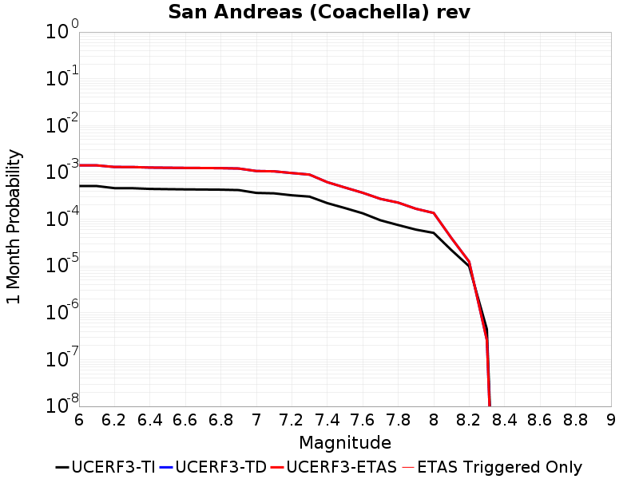 |  | 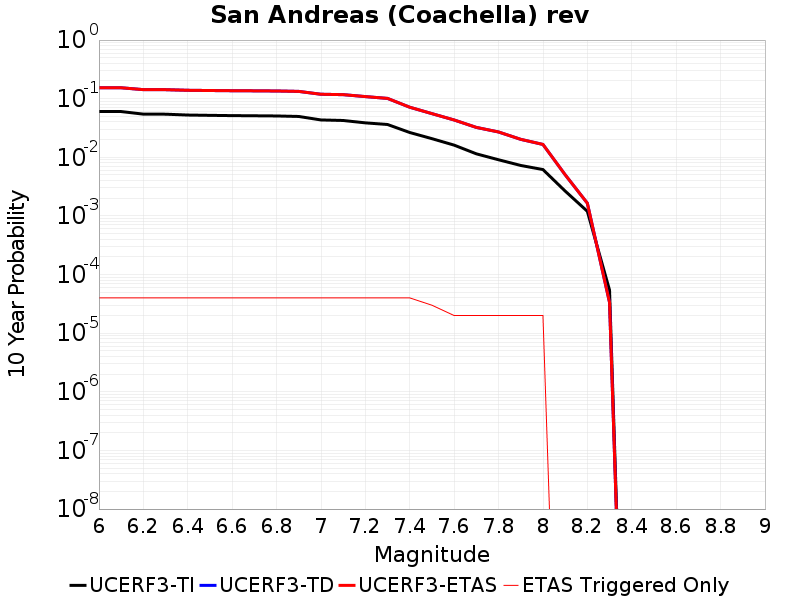 |

| Magnitude | 1 wk TI Prob | 1 wk TD Prob | 1 wk ETAS Prob | 1 wk ETAS/TD Gain | 1 wk ETAS Triggered Only | 1 mo TI Prob | 1 mo TD Prob | 1 mo ETAS Prob | 1 mo ETAS/TD Gain | 1 mo ETAS Triggered Only | 1 yr TI Prob | 1 yr TD Prob | 1 yr ETAS Prob | 1 yr ETAS/TD Gain | 1 yr ETAS Triggered Only | 10 yr TI Prob | 10 yr TD Prob | 10 yr ETAS Prob | 10 yr ETAS/TD Gain | 10 yr ETAS Triggered Only |
|-----|-----|-----|-----|-----|-----|-----|-----|-----|-----|-----|-----|-----|-----|-----|-----|-----|-----|-----|-----|-----|
| 6.0 | 1.1925945E-4 | 3.2953007E-4 | 3.2953007E-4 | 1.0 | 0.0 | 5.110118E-4 | 0.0014115121 | 0.0014115121 | 1.0 | 0.0 | 0.0062038354 | 0.017051103 | 0.017051103 | 1.0 | 0.0 | 0.060334753 | 0.15351754 | 0.15355141 | 1.0002205 | 4.0E-5 |
| 6.1 | 1.1925945E-4 | 3.2953007E-4 | 3.2953007E-4 | 1.0 | 0.0 | 5.110118E-4 | 0.0014115121 | 0.0014115121 | 1.0 | 0.0 | 0.0062038354 | 0.017051103 | 0.017051103 | 1.0 | 0.0 | 0.060334753 | 0.15351754 | 0.15355141 | 1.0002205 | 4.0E-5 |
| 6.2 | 1.07432395E-4 | 3.0452333E-4 | 3.0452333E-4 | 1.0 | 0.0 | 4.603433E-4 | 0.0013044513 | 0.0013044513 | 1.0 | 0.0 | 0.005590286 | 0.015767159 | 0.015767159 | 1.0 | 0.0 | 0.05451731 | 0.14268927 | 0.14272358 | 1.0002403 | 4.0E-5 |
| 6.3 | 1.0718766E-4 | 3.0397627E-4 | 3.0397627E-4 | 1.0 | 0.0 | 4.592948E-4 | 0.0013021091 | 0.0013021091 | 1.0 | 0.0 | 0.005577586 | 0.015739055 | 0.015739055 | 1.0 | 0.0 | 0.054396555 | 0.14245772 | 0.14249203 | 1.0002408 | 4.0E-5 |
| 6.4 | 1.0355944E-4 | 2.96054E-4 | 2.96054E-4 | 1.0 | 0.0 | 4.4375064E-4 | 0.0012681899 | 0.0012681899 | 1.0 | 0.0 | 0.0053892885 | 0.015331973 | 0.015331973 | 1.0 | 0.0 | 0.052604496 | 0.13901836 | 0.1390528 | 1.0002477 | 4.0E-5 |
| 6.5 | 1.0227914E-4 | 2.9324729E-4 | 2.9324729E-4 | 1.0 | 0.0 | 4.382655E-4 | 0.0012561727 | 0.0012561727 | 1.0 | 0.0 | 0.0053228354 | 0.015187713 | 0.015187713 | 1.0 | 0.0 | 0.051971316 | 0.13780382 | 0.1378383 | 1.0002502 | 4.0E-5 |
| 6.6 | 1.0116757E-4 | 2.9090382E-4 | 2.9090382E-4 | 1.0 | 0.0 | 4.3350324E-4 | 0.0012461389 | 0.0012461389 | 1.0 | 0.0 | 0.0052651367 | 0.015067247 | 0.015067247 | 1.0 | 0.0 | 0.051421247 | 0.13678269 | 0.13681722 | 1.0002525 | 4.0E-5 |
| 6.7 | 1.0050676E-4 | 2.894888E-4 | 2.894888E-4 | 1.0 | 0.0 | 4.3067214E-4 | 0.0012400803 | 0.0012400803 | 1.0 | 0.0 | 0.005230834 | 0.014994501 | 0.014994501 | 1.0 | 0.0 | 0.051094085 | 0.13616765 | 0.1362022 | 1.0002538 | 4.0E-5 |
| 6.8 | 9.976819E-5 | 2.8752023E-4 | 2.8752023E-4 | 1.0 | 0.0 | 4.2750788E-4 | 0.0012316516 | 0.0012316516 | 1.0 | 0.0 | 0.0051924936 | 0.014893289 | 0.014893289 | 1.0 | 0.0 | 0.050728295 | 0.1353182 | 0.13535279 | 1.0002556 | 4.0E-5 |
| 6.9 | 9.77719E-5 | 2.8247162E-4 | 2.8247162E-4 | 1.0 | 0.0 | 4.1895514E-4 | 0.0012100349 | 0.0012100349 | 1.0 | 0.0 | 0.0050888555 | 0.014633672 | 0.014633672 | 1.0 | 0.0 | 0.049738888 | 0.13314201 | 0.13317668 | 1.0002605 | 4.0E-5 |
| 7.0 | 8.500761E-5 | 2.4968444E-4 | 2.4968444E-4 | 1.0 | 0.0 | 3.6426744E-4 | 0.0010696406 | 0.0010696406 | 1.0 | 0.0 | 0.0044259406 | 0.012945901 | 0.012945901 | 1.0 | 0.0 | 0.04338823 | 0.11896884 | 0.11900408 | 1.0002962 | 4.0E-5 |
| 7.1 | 8.319876E-5 | 2.4568624E-4 | 2.4568624E-4 | 1.0 | 0.0 | 3.5651738E-4 | 0.0010525194 | 0.0010525194 | 1.0 | 0.0 | 0.004331963 | 0.012739907 | 0.012739907 | 1.0 | 0.0 | 0.042484846 | 0.11718058 | 0.117215894 | 1.0003014 | 4.0E-5 |
| 7.2 | 7.563917E-5 | 2.2610376E-4 | 2.2610376E-4 | 1.0 | 0.0 | 3.2412758E-4 | 9.6865935E-4 | 9.6865935E-4 | 1.0 | 0.0 | 0.0039391145 | 0.011730356 | 0.011730356 | 1.0 | 0.0 | 0.03870018 | 0.10856822 | 0.10860388 | 1.0003284 | 4.0E-5 |
| 7.3 | 7.082985E-5 | 2.0918297E-4 | 2.0918297E-4 | 1.0 | 0.0 | 3.0352117E-4 | 8.961934E-4 | 8.961934E-4 | 1.0 | 0.0 | 0.0036891096 | 0.010857202 | 0.010857202 | 1.0 | 0.0 | 0.03628465 | 0.10106474 | 0.1011007 | 1.0003558 | 4.0E-5 |
| 7.4 | 5.146215E-5 | 1.4423163E-4 | 1.4423163E-4 | 1.0 | 0.0 | 2.2053342E-4 | 6.1799E-4 | 6.1799E-4 | 1.0 | 0.0 | 0.0026816884 | 0.0074982634 | 0.0074982634 | 1.0 | 0.0 | 0.02649557 | 0.071501166 | 0.07153831 | 1.0005194 | 4.0E-5 |
| 7.5 | 4.0285166E-5 | 1.1068907E-4 | 1.1068907E-4 | 1.0 | 0.0 | 1.7263928E-4 | 4.742958E-4 | 4.742958E-4 | 1.0 | 0.0 | 0.002099857 | 0.005759333 | 0.005759333 | 1.0 | 0.0 | 0.020801254 | 0.055578 | 0.05560633 | 1.0005097 | 3.0E-5 |
| 7.6 | 3.1168736E-5 | 8.551627E-5 | 8.551627E-5 | 1.0 | 0.0 | 1.3357346E-4 | 3.6644694E-4 | 3.6644694E-4 | 1.0 | 0.0 | 0.0016250437 | 0.004452392 | 0.004452392 | 1.0 | 0.0 | 0.016132116 | 0.043317996 | 0.04333713 | 1.0004417 | 2.0E-5 |
| 7.7 | 2.2100989E-5 | 6.338018E-5 | 6.338018E-5 | 1.0 | 0.0 | 9.4715084E-5 | 2.716011E-4 | 2.716011E-4 | 1.0 | 0.0 | 0.001152546 | 0.0033017362 | 0.0033017362 | 1.0 | 0.0 | 0.011465867 | 0.032350995 | 0.032370348 | 1.0005982 | 2.0E-5 |
| 7.8 | 1.7484861E-5 | 5.268087E-5 | 5.268087E-5 | 1.0 | 0.0 | 7.493296E-5 | 2.2575563E-4 | 2.2575563E-4 | 1.0 | 0.0 | 9.1192697E-4 | 0.0027451133 | 0.0027451133 | 1.0 | 0.0 | 0.009081938 | 0.027043452 | 0.027062912 | 1.0007195 | 2.0E-5 |
| 7.9 | 1.3967285E-5 | 3.8948772E-5 | 3.8948772E-5 | 1.0 | 0.0 | 5.985842E-5 | 1.6691264E-4 | 1.6691264E-4 | 1.0 | 0.0 | 7.2853256E-4 | 0.0020302685 | 0.0020302685 | 1.0 | 0.0 | 0.0072614877 | 0.020244837 | 0.020264432 | 1.0009679 | 2.0E-5 |
| 8.0 | 1.1887396E-5 | 3.1689902E-5 | 3.1689902E-5 | 1.0 | 0.0 | 5.094499E-5 | 1.358068E-4 | 1.358068E-4 | 1.0 | 0.0 | 6.200787E-4 | 0.0016521948 | 0.0016521948 | 1.0 | 0.0 | 0.006183513 | 0.016570112 | 0.01658978 | 1.001187 | 2.0E-5 |
| 8.1 | 5.100864E-6 | 9.22974E-6 | 9.22974E-6 | 1.0 | 0.0 | 2.1860664E-5 | 3.9555427E-5 | 3.9555427E-5 | 1.0 | 0.0 | 2.6612106E-4 | 4.8148105E-4 | 4.8148105E-4 | 1.0 | 0.0 | 0.002658026 | 0.005045214 | 0.005045214 | 1.0 | 0.0 |
| 8.2 | 2.3004484E-6 | 2.8885313E-6 | 2.8885313E-6 | 1.0 | 0.0 | 9.859027E-6 | 1.2379361E-5 | 1.2379361E-5 | 1.0 | 0.0 | 1.2002704E-4 | 1.5070834E-4 | 1.5070834E-4 | 1.0 | 0.0 | 0.0011996223 | 0.0016501055 | 0.0016501055 | 1.0 | 0.0 |
| 8.3 | 1.0424446E-7 | 6.0919206E-8 | 6.0919206E-8 | 1.0 | 0.0 | 4.4676187E-7 | 2.610823E-7 | 2.610823E-7 | 1.0 | 0.0 | 5.439312E-6 | 3.1786726E-6 | 3.1786726E-6 | 1.0 | 0.0 | 5.4391792E-5 | 3.3377073E-5 | 3.3377073E-5 | 1.0 | 0.0 |

## Elsinore (Glen Ivy) rev
*[(top)](#table-of-contents)*

| 1 Week | 1 Month | 1 Year | 10 Year |
|-----|-----|-----|-----|
|  |  |  | 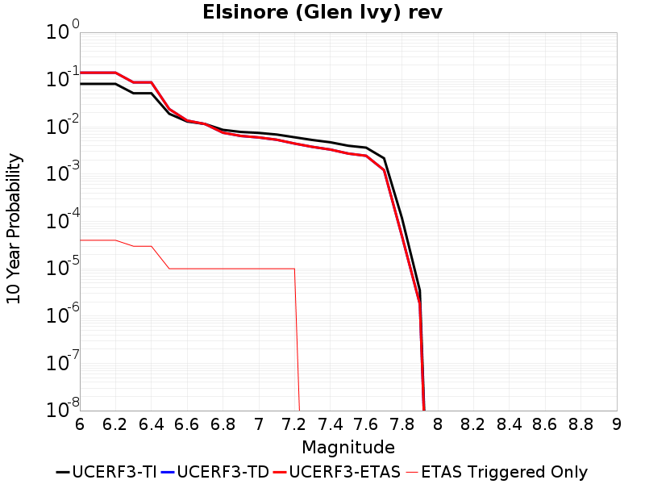 |

| Magnitude | 1 wk TI Prob | 1 wk TD Prob | 1 wk ETAS Prob | 1 wk ETAS/TD Gain | 1 wk ETAS Triggered Only | 1 mo TI Prob | 1 mo TD Prob | 1 mo ETAS Prob | 1 mo ETAS/TD Gain | 1 mo ETAS Triggered Only | 1 yr TI Prob | 1 yr TD Prob | 1 yr ETAS Prob | 1 yr ETAS/TD Gain | 1 yr ETAS Triggered Only | 10 yr TI Prob | 10 yr TD Prob | 10 yr ETAS Prob | 10 yr ETAS/TD Gain | 10 yr ETAS Triggered Only |
|-----|-----|-----|-----|-----|-----|-----|-----|-----|-----|-----|-----|-----|-----|-----|-----|-----|-----|-----|-----|-----|
| 6.0 | 1.6204086E-4 | 2.9454276E-4 | 2.9454276E-4 | 1.0 | 0.0 | 6.94276E-4 | 0.0012618599 | 0.0012618599 | 1.0 | 0.0 | 0.008420097 | 0.01527619 | 0.01527619 | 1.0 | 0.0 | 0.081081145 | 0.13987046 | 0.13990487 | 1.0002459 | 4.0E-5 |
| 6.1 | 1.6204086E-4 | 2.9454276E-4 | 2.9454276E-4 | 1.0 | 0.0 | 6.94276E-4 | 0.0012618599 | 0.0012618599 | 1.0 | 0.0 | 0.008420097 | 0.01527619 | 0.01527619 | 1.0 | 0.0 | 0.081081145 | 0.13987046 | 0.13990487 | 1.0002459 | 4.0E-5 |
| 6.2 | 1.6204086E-4 | 2.9454276E-4 | 2.9454276E-4 | 1.0 | 0.0 | 6.94276E-4 | 0.0012618599 | 0.0012618599 | 1.0 | 0.0 | 0.008420097 | 0.01527619 | 0.01527619 | 1.0 | 0.0 | 0.081081145 | 0.13987046 | 0.13990487 | 1.0002459 | 4.0E-5 |
| 6.3 | 1.0111737E-4 | 1.7751029E-4 | 1.7751029E-4 | 1.0 | 0.0 | 4.332882E-4 | 7.606538E-4 | 7.606538E-4 | 1.0 | 0.0 | 0.005262531 | 0.009242437 | 0.009242437 | 1.0 | 0.0 | 0.0513964 | 0.08719855 | 0.08722594 | 1.000314 | 3.0E-5 |
| 6.4 | 1.0111737E-4 | 1.7751029E-4 | 1.7751029E-4 | 1.0 | 0.0 | 4.332882E-4 | 7.606538E-4 | 7.606538E-4 | 1.0 | 0.0 | 0.005262531 | 0.009242437 | 0.009242437 | 1.0 | 0.0 | 0.0513964 | 0.08719855 | 0.08722594 | 1.000314 | 3.0E-5 |
| 6.5 | 3.6624708E-5 | 4.6507746E-5 | 4.6507746E-5 | 1.0 | 0.0 | 1.569536E-4 | 1.9930566E-4 | 1.9930566E-4 | 1.0 | 0.0 | 0.001909235 | 0.002424208 | 0.002424208 | 1.0 | 0.0 | 0.01892915 | 0.023826623 | 0.023836385 | 1.0004097 | 1.0E-5 |
| 6.6 | 2.5051324E-5 | 2.62198E-5 | 2.62198E-5 | 1.0 | 0.0 | 1.073584E-4 | 1.1236598E-4 | 1.1236598E-4 | 1.0 | 0.0 | 0.0013063047 | 0.0013672421 | 0.0013672421 | 1.0 | 0.0 | 0.012986525 | 0.013599688 | 0.013609553 | 1.0007253 | 1.0E-5 |
| 6.7 | 2.2189772E-5 | 2.2130213E-5 | 2.2130213E-5 | 1.0 | 0.0 | 9.509556E-5 | 9.484053E-5 | 9.484053E-5 | 1.0 | 0.0 | 0.0011571734 | 0.0011541083 | 0.0011541083 | 1.0 | 0.0 | 0.011511663 | 0.011493176 | 0.011503061 | 1.0008601 | 1.0E-5 |
| 6.8 | 1.6654378E-5 | 1.4471975E-5 | 1.4471975E-5 | 1.0 | 0.0 | 7.137396E-5 | 6.20213E-5 | 6.20213E-5 | 1.0 | 0.0 | 8.686314E-4 | 7.5485295E-4 | 7.5485295E-4 | 1.0 | 0.0 | 0.008652439 | 0.0075281765 | 0.007538101 | 1.0013183 | 1.0E-5 |
| 6.9 | 1.5042909E-5 | 1.2361269E-5 | 1.2361269E-5 | 1.0 | 0.0 | 6.446802E-5 | 5.2975807E-5 | 5.2975807E-5 | 1.0 | 0.0 | 7.8461546E-4 | 6.4479274E-4 | 6.4479274E-4 | 1.0 | 0.0 | 0.007818509 | 0.0064332937 | 0.0064432295 | 1.0015444 | 1.0E-5 |
| 7.0 | 1.4361385E-5 | 1.1478549E-5 | 1.1478549E-5 | 1.0 | 0.0 | 6.154734E-5 | 4.9192873E-5 | 4.9192873E-5 | 1.0 | 0.0 | 7.490812E-4 | 5.9876154E-4 | 5.9876154E-4 | 1.0 | 0.0 | 0.007465612 | 0.005975328 | 0.0059852684 | 1.0016636 | 1.0E-5 |
| 7.1 | 1.3265571E-5 | 1.0269493E-5 | 1.0269493E-5 | 1.0 | 0.0 | 5.6851208E-5 | 4.4011384E-5 | 4.4011384E-5 | 1.0 | 0.0 | 6.919436E-4 | 5.3570943E-4 | 5.3570943E-4 | 1.0 | 0.0 | 0.006897931 | 0.005347544 | 0.0053574904 | 1.00186 | 1.0E-5 |
| 7.2 | 1.1596403E-5 | 8.525888E-6 | 8.525888E-6 | 1.0 | 0.0 | 4.9697923E-5 | 3.6539015E-5 | 3.6539015E-5 | 1.0 | 0.0 | 6.049042E-4 | 4.447734E-4 | 4.447734E-4 | 1.0 | 0.0 | 0.006032603 | 0.0044402895 | 0.0044502453 | 1.0022421 | 1.0E-5 |
| 7.3 | 1.0150827E-5 | 7.2564567E-6 | 7.2564567E-6 | 1.0 | 0.0 | 4.3502816E-5 | 3.1098738E-5 | 3.1098738E-5 | 1.0 | 0.0 | 5.2951806E-4 | 3.785628E-4 | 3.785628E-4 | 1.0 | 0.0 | 0.005282581 | 0.0037795876 | 0.0037795876 | 1.0 | 0.0 |
| 7.4 | 9.080705E-6 | 6.367299E-6 | 6.367299E-6 | 1.0 | 0.0 | 3.8916725E-5 | 2.7288148E-5 | 2.7288148E-5 | 1.0 | 0.0 | 4.7370812E-4 | 3.3218393E-4 | 3.3218393E-4 | 1.0 | 0.0 | 0.004726996 | 0.003317025 | 0.003317025 | 1.0 | 0.0 |
| 7.5 | 7.671649E-6 | 5.2380174E-6 | 5.2380174E-6 | 1.0 | 0.0 | 3.287808E-5 | 2.244846E-5 | 2.244846E-5 | 1.0 | 0.0 | 4.0021708E-4 | 2.7327696E-4 | 2.7327696E-4 | 1.0 | 0.0 | 0.0039949706 | 0.0027295346 | 0.0027295346 | 1.0 | 0.0 |
| 7.6 | 6.990086E-6 | 4.698524E-6 | 4.698524E-6 | 1.0 | 0.0 | 2.9957167E-5 | 2.0136384E-5 | 2.0136384E-5 | 1.0 | 0.0 | 3.6466747E-4 | 2.4513406E-4 | 2.4513406E-4 | 1.0 | 0.0 | 0.0036406964 | 0.0024487535 | 0.0024487535 | 1.0 | 0.0 |
| 7.7 | 4.163505E-6 | 2.3357957E-6 | 2.3357957E-6 | 1.0 | 0.0 | 1.7843471E-5 | 1.0010519E-5 | 1.0010519E-5 | 1.0 | 0.0 | 2.172226E-4 | 1.21872E-4 | 1.21872E-4 | 1.0 | 0.0 | 0.0021701038 | 0.001218125 | 0.001218125 | 1.0 | 0.0 |
| 7.8 | 2.2692414E-7 | 9.406634E-8 | 9.406634E-8 | 1.0 | 0.0 | 9.725317E-7 | 4.031414E-7 | 4.031414E-7 | 1.0 | 0.0 | 1.1840509E-5 | 4.9082387E-6 | 4.9082387E-6 | 1.0 | 0.0 | 1.1839878E-4 | 4.908163E-5 | 4.908163E-5 | 1.0 | 0.0 |
| 7.9 | 6.676829E-9 | 3.4455256E-9 | 3.4455256E-9 | 1.0 | 0.0 | 2.861498E-8 | 1.4766538E-8 | 1.4766538E-8 | 1.0 | 0.0 | 3.4838732E-7 | 1.7978259E-7 | 1.7978259E-7 | 1.0 | 0.0 | 3.4838679E-6 | 1.7978246E-6 | 1.7978246E-6 | 1.0 | 0.0 |

## Lost Hills
*[(top)](#table-of-contents)*

| 1 Week | 1 Month | 1 Year | 10 Year |
|-----|-----|-----|-----|
|  |  |  |  |

| Magnitude | 1 wk TI Prob | 1 wk TD Prob | 1 wk ETAS Prob | 1 wk ETAS/TD Gain | 1 wk ETAS Triggered Only | 1 mo TI Prob | 1 mo TD Prob | 1 mo ETAS Prob | 1 mo ETAS/TD Gain | 1 mo ETAS Triggered Only | 1 yr TI Prob | 1 yr TD Prob | 1 yr ETAS Prob | 1 yr ETAS/TD Gain | 1 yr ETAS Triggered Only | 10 yr TI Prob | 10 yr TD Prob | 10 yr ETAS Prob | 10 yr ETAS/TD Gain | 10 yr ETAS Triggered Only |
|-----|-----|-----|-----|-----|-----|-----|-----|-----|-----|-----|-----|-----|-----|-----|-----|-----|-----|-----|-----|-----|
| 6.0 | 2.233523E-5 | 2.512594E-5 | 3.512569E-5 | 1.397985 | 1.0E-5 | 9.571891E-5 | 1.0767911E-4 | 1.17678035E-4 | 1.0928586 | 1.0E-5 | 0.0011647546 | 0.0013103731 | 0.00132036 | 1.0076214 | 1.0E-5 | 0.011586686 | 0.013043089 | 0.013082567 | 1.0030267 | 4.0E-5 |
| 6.1 | 2.233523E-5 | 2.512594E-5 | 3.512569E-5 | 1.397985 | 1.0E-5 | 9.571891E-5 | 1.0767911E-4 | 1.17678035E-4 | 1.0928586 | 1.0E-5 | 0.0011647546 | 0.0013103731 | 0.00132036 | 1.0076214 | 1.0E-5 | 0.011586686 | 0.013043089 | 0.013082567 | 1.0030267 | 4.0E-5 |
| 6.2 | 2.233523E-5 | 2.512594E-5 | 3.512569E-5 | 1.397985 | 1.0E-5 | 9.571891E-5 | 1.0767911E-4 | 1.17678035E-4 | 1.0928586 | 1.0E-5 | 0.0011647546 | 0.0013103731 | 0.00132036 | 1.0076214 | 1.0E-5 | 0.011586686 | 0.013043089 | 0.013082567 | 1.0030267 | 4.0E-5 |
| 6.3 | 2.233523E-5 | 2.512594E-5 | 3.512569E-5 | 1.397985 | 1.0E-5 | 9.571891E-5 | 1.0767911E-4 | 1.17678035E-4 | 1.0928586 | 1.0E-5 | 0.0011647546 | 0.0013103731 | 0.00132036 | 1.0076214 | 1.0E-5 | 0.011586686 | 0.013043089 | 0.013082567 | 1.0030267 | 4.0E-5 |
| 6.4 | 1.2288092E-5 | 1.3791512E-5 | 1.3791512E-5 | 1.0 | 0.0 | 5.2662188E-5 | 5.910567E-5 | 5.910567E-5 | 1.0 | 0.0 | 6.409735E-4 | 7.194679E-4 | 7.194679E-4 | 1.0 | 0.0 | 0.006391279 | 0.0071806065 | 0.0072004627 | 1.0027653 | 2.0E-5 |
| 6.5 | 1.2288092E-5 | 1.3791512E-5 | 1.3791512E-5 | 1.0 | 0.0 | 5.2662188E-5 | 5.910567E-5 | 5.910567E-5 | 1.0 | 0.0 | 6.409735E-4 | 7.194679E-4 | 7.194679E-4 | 1.0 | 0.0 | 0.006391279 | 0.0071806065 | 0.0072004627 | 1.0027653 | 2.0E-5 |
| 6.6 | 8.58281E-6 | 9.6411E-6 | 9.6411E-6 | 1.0 | 0.0 | 3.6782953E-5 | 4.1318817E-5 | 4.1318817E-5 | 1.0 | 0.0 | 4.4774043E-4 | 5.030238E-4 | 5.030238E-4 | 1.0 | 0.0 | 0.0044683935 | 0.0050270245 | 0.005046924 | 1.0039585 | 2.0E-5 |
| 6.7 | 7.205685E-6 | 8.094458E-6 | 8.094458E-6 | 1.0 | 0.0 | 3.088114E-5 | 3.4690533E-5 | 3.4690533E-5 | 1.0 | 0.0 | 3.7591302E-4 | 4.2235726E-4 | 4.2235726E-4 | 1.0 | 0.0 | 0.0037527776 | 0.0042235726 | 0.0042335303 | 1.0023577 | 1.0E-5 |

## Red Mountain
*[(top)](#table-of-contents)*

| 1 Week | 1 Month | 1 Year | 10 Year |
|-----|-----|-----|-----|
|  | 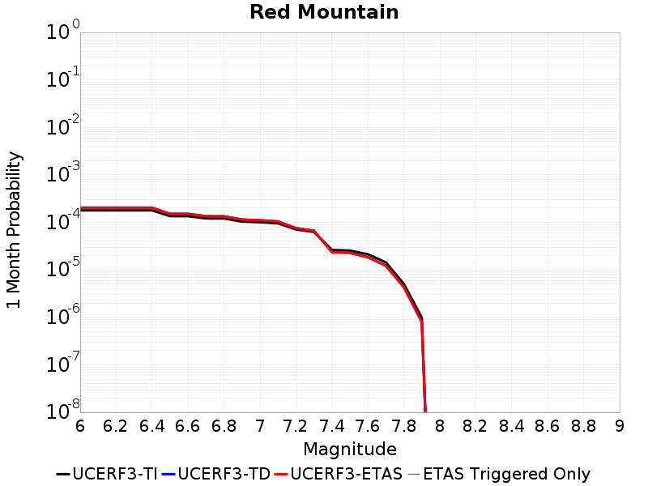 |  |  |

| Magnitude | 1 wk TI Prob | 1 wk TD Prob | 1 wk ETAS Prob | 1 wk ETAS/TD Gain | 1 wk ETAS Triggered Only | 1 mo TI Prob | 1 mo TD Prob | 1 mo ETAS Prob | 1 mo ETAS/TD Gain | 1 mo ETAS Triggered Only | 1 yr TI Prob | 1 yr TD Prob | 1 yr ETAS Prob | 1 yr ETAS/TD Gain | 1 yr ETAS Triggered Only | 10 yr TI Prob | 10 yr TD Prob | 10 yr ETAS Prob | 10 yr ETAS/TD Gain | 10 yr ETAS Triggered Only |
|-----|-----|-----|-----|-----|-----|-----|-----|-----|-----|-----|-----|-----|-----|-----|-----|-----|-----|-----|-----|-----|
| 6.0 | 4.1810763E-5 | 4.7640686E-5 | 4.7640686E-5 | 1.0 | 0.0 | 1.7917668E-4 | 2.0415933E-4 | 2.0415933E-4 | 1.0 | 0.0 | 0.0021792934 | 0.0024829712 | 0.0024829712 | 1.0 | 0.0 | 0.021580452 | 0.024569932 | 0.024608951 | 1.001588 | 4.0E-5 |
| 6.1 | 4.1810763E-5 | 4.7640686E-5 | 4.7640686E-5 | 1.0 | 0.0 | 1.7917668E-4 | 2.0415933E-4 | 2.0415933E-4 | 1.0 | 0.0 | 0.0021792934 | 0.0024829712 | 0.0024829712 | 1.0 | 0.0 | 0.021580452 | 0.024569932 | 0.024608951 | 1.001588 | 4.0E-5 |
| 6.2 | 4.1810763E-5 | 4.7640686E-5 | 4.7640686E-5 | 1.0 | 0.0 | 1.7917668E-4 | 2.0415933E-4 | 2.0415933E-4 | 1.0 | 0.0 | 0.0021792934 | 0.0024829712 | 0.0024829712 | 1.0 | 0.0 | 0.021580452 | 0.024569932 | 0.024608951 | 1.001588 | 4.0E-5 |
| 6.3 | 4.1810763E-5 | 4.7640686E-5 | 4.7640686E-5 | 1.0 | 0.0 | 1.7917668E-4 | 2.0415933E-4 | 2.0415933E-4 | 1.0 | 0.0 | 0.0021792934 | 0.0024829712 | 0.0024829712 | 1.0 | 0.0 | 0.021580452 | 0.024569932 | 0.024608951 | 1.001588 | 4.0E-5 |
| 6.4 | 4.1810763E-5 | 4.7640686E-5 | 4.7640686E-5 | 1.0 | 0.0 | 1.7917668E-4 | 2.0415933E-4 | 2.0415933E-4 | 1.0 | 0.0 | 0.0021792934 | 0.0024829712 | 0.0024829712 | 1.0 | 0.0 | 0.021580452 | 0.024569932 | 0.024608951 | 1.001588 | 4.0E-5 |
| 6.5 | 3.154503E-5 | 3.539589E-5 | 3.539589E-5 | 1.0 | 0.0 | 1.3518598E-4 | 1.5168838E-4 | 1.5168838E-4 | 1.0 | 0.0 | 0.0016446467 | 0.0018453338 | 0.0018453338 | 1.0 | 0.0 | 0.01632528 | 0.018309774 | 0.018349042 | 1.0021446 | 4.0E-5 |
| 6.6 | 3.1535834E-5 | 3.5385263E-5 | 3.5385263E-5 | 1.0 | 0.0 | 1.3514658E-4 | 1.5164283E-4 | 1.5164283E-4 | 1.0 | 0.0 | 0.0016441676 | 0.0018447803 | 0.0018447803 | 1.0 | 0.0 | 0.01632056 | 0.01830433 | 0.018343598 | 1.0021453 | 4.0E-5 |
| 6.7 | 2.8267326E-5 | 3.150097E-5 | 3.150097E-5 | 1.0 | 0.0 | 1.2114006E-4 | 1.3499765E-4 | 1.3499765E-4 | 1.0 | 0.0 | 0.0014738824 | 0.0016424425 | 0.0016424425 | 1.0 | 0.0 | 0.014641452 | 0.01631182 | 0.016351167 | 1.0024122 | 4.0E-5 |
| 6.8 | 2.8212884E-5 | 3.14388E-5 | 3.14388E-5 | 1.0 | 0.0 | 1.20906756E-4 | 1.3473125E-4 | 1.3473125E-4 | 1.0 | 0.0 | 0.0014710457 | 0.0016392039 | 0.0016392039 | 1.0 | 0.0 | 0.014613459 | 0.016279908 | 0.016319258 | 1.002417 | 4.0E-5 |
| 6.9 | 2.4227871E-5 | 2.6733307E-5 | 2.6733307E-5 | 1.0 | 0.0 | 1.03829596E-4 | 1.1456671E-4 | 1.1456671E-4 | 1.0 | 0.0 | 0.0012633923 | 0.0013940333 | 0.0013940333 | 1.0 | 0.0 | 0.012562336 | 0.013860592 | 0.013900037 | 1.0028459 | 4.0E-5 |
| 7.0 | 2.348524E-5 | 2.5861153E-5 | 2.5861153E-5 | 1.0 | 0.0 | 1.0064714E-4 | 1.1082923E-4 | 1.1082923E-4 | 1.0 | 0.0 | 0.0012246901 | 0.0013485864 | 0.0013485864 | 1.0 | 0.0 | 0.012179627 | 0.013411678 | 0.013451141 | 1.0029424 | 4.0E-5 |
| 7.1 | 2.2311642E-5 | 2.4486762E-5 | 2.4486762E-5 | 1.0 | 0.0 | 9.561782E-5 | 1.0493946E-4 | 1.0493946E-4 | 1.0 | 0.0 | 0.0011635252 | 0.0012769642 | 0.0012769642 | 1.0 | 0.0 | 0.01157452 | 0.012703799 | 0.0127432905 | 1.0031086 | 4.0E-5 |
| 7.2 | 1.6533986E-5 | 1.7686858E-5 | 1.7686858E-5 | 1.0 | 0.0 | 7.085802E-5 | 7.579897E-5 | 7.579897E-5 | 1.0 | 0.0 | 8.623549E-4 | 9.2252536E-4 | 9.2252536E-4 | 1.0 | 0.0 | 0.008590161 | 0.00919325 | 0.0092328815 | 1.004311 | 4.0E-5 |
| 7.3 | 1.4703092E-5 | 1.5574007E-5 | 1.5574007E-5 | 1.0 | 0.0 | 6.301173E-5 | 6.674438E-5 | 6.674438E-5 | 1.0 | 0.0 | 7.668978E-4 | 8.1237167E-4 | 8.1237167E-4 | 1.0 | 0.0 | 0.0076425658 | 0.008100108 | 0.008129865 | 1.0036737 | 3.0E-5 |
| 7.4 | 6.1331984E-6 | 5.5327E-6 | 5.5327E-6 | 1.0 | 0.0 | 2.6284872E-5 | 2.371136E-5 | 2.371136E-5 | 1.0 | 0.0 | 3.199713E-4 | 2.886481E-4 | 2.886481E-4 | 1.0 | 0.0 | 0.0031951098 | 0.0028827863 | 0.0028827863 | 1.0 | 0.0 |
| 7.5 | 5.954766E-6 | 5.3422286E-6 | 5.3422286E-6 | 1.0 | 0.0 | 2.5520176E-5 | 2.2895067E-5 | 2.2895067E-5 | 1.0 | 0.0 | 3.1066386E-4 | 2.787123E-4 | 2.787123E-4 | 1.0 | 0.0 | 0.003102299 | 0.0027836815 | 0.0027836815 | 1.0 | 0.0 |
| 7.6 | 4.9726646E-6 | 4.318508E-6 | 4.318508E-6 | 1.0 | 0.0 | 2.1311245E-5 | 1.8507762E-5 | 1.8507762E-5 | 1.0 | 0.0 | 2.5943352E-4 | 2.2530905E-4 | 2.2530905E-4 | 1.0 | 0.0 | 0.0025913084 | 0.002250841 | 0.002250841 | 1.0 | 0.0 |
| 7.7 | 3.3613894E-6 | 2.8550448E-6 | 2.8550448E-6 | 1.0 | 0.0 | 1.4405875E-5 | 1.2235851E-5 | 1.2235851E-5 | 1.0 | 0.0 | 1.7537741E-4 | 1.4896157E-4 | 1.4896157E-4 | 1.0 | 0.0 | 0.0017523908 | 0.0014886435 | 0.0014886435 | 1.0 | 0.0 |
| 7.8 | 1.1828961E-6 | 1.0130932E-6 | 1.0130932E-6 | 1.0 | 0.0 | 5.069545E-6 | 4.341821E-6 | 4.341821E-6 | 1.0 | 0.0 | 6.171996E-5 | 5.2860418E-5 | 5.2860418E-5 | 1.0 | 0.0 | 6.170282E-4 | 5.284814E-4 | 5.284814E-4 | 1.0 | 0.0 |
| 7.9 | 2.2967266E-7 | 1.8626636E-7 | 1.8626636E-7 | 1.0 | 0.0 | 9.843111E-7 | 7.982842E-7 | 7.982842E-7 | 1.0 | 0.0 | 1.19839215E-5 | 9.71907E-6 | 9.71907E-6 | 1.0 | 0.0 | 1.1983275E-4 | 9.7186734E-5 | 9.7186734E-5 | 1.0 | 0.0 |

## San Jacinto (Coyote Creek)
*[(top)](#table-of-contents)*

| 1 Week | 1 Month | 1 Year | 10 Year |
|-----|-----|-----|-----|
| 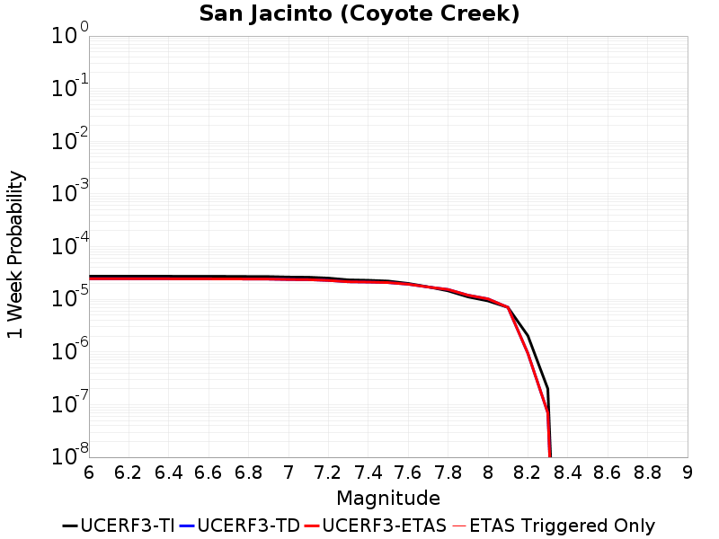 |  |  |  |

| Magnitude | 1 wk TI Prob | 1 wk TD Prob | 1 wk ETAS Prob | 1 wk ETAS/TD Gain | 1 wk ETAS Triggered Only | 1 mo TI Prob | 1 mo TD Prob | 1 mo ETAS Prob | 1 mo ETAS/TD Gain | 1 mo ETAS Triggered Only | 1 yr TI Prob | 1 yr TD Prob | 1 yr ETAS Prob | 1 yr ETAS/TD Gain | 1 yr ETAS Triggered Only | 10 yr TI Prob | 10 yr TD Prob | 10 yr ETAS Prob | 10 yr ETAS/TD Gain | 10 yr ETAS Triggered Only |
|-----|-----|-----|-----|-----|-----|-----|-----|-----|-----|-----|-----|-----|-----|-----|-----|-----|-----|-----|-----|-----|
| 6.0 | 2.7374346E-5 | 2.4564206E-5 | 2.4564206E-5 | 1.0 | 0.0 | 1.1731335E-4 | 1.05270934E-4 | 1.05270934E-4 | 1.0 | 0.0 | 0.0014273542 | 0.0012809228 | 0.0012809228 | 1.0 | 0.0 | 0.01418221 | 0.013146271 | 0.013185745 | 1.0030026 | 4.0E-5 |
| 6.1 | 2.7374346E-5 | 2.4564206E-5 | 2.4564206E-5 | 1.0 | 0.0 | 1.1731335E-4 | 1.05270934E-4 | 1.05270934E-4 | 1.0 | 0.0 | 0.0014273542 | 0.0012809228 | 0.0012809228 | 1.0 | 0.0 | 0.01418221 | 0.013146271 | 0.013185745 | 1.0030026 | 4.0E-5 |
| 6.2 | 2.7374346E-5 | 2.4564206E-5 | 2.4564206E-5 | 1.0 | 0.0 | 1.1731335E-4 | 1.05270934E-4 | 1.05270934E-4 | 1.0 | 0.0 | 0.0014273542 | 0.0012809228 | 0.0012809228 | 1.0 | 0.0 | 0.01418221 | 0.013146271 | 0.013185745 | 1.0030026 | 4.0E-5 |
| 6.3 | 2.7374346E-5 | 2.4564206E-5 | 2.4564206E-5 | 1.0 | 0.0 | 1.1731335E-4 | 1.05270934E-4 | 1.05270934E-4 | 1.0 | 0.0 | 0.0014273542 | 0.0012809228 | 0.0012809228 | 1.0 | 0.0 | 0.01418221 | 0.013146271 | 0.013185745 | 1.0030026 | 4.0E-5 |
| 6.4 | 2.7374346E-5 | 2.4564206E-5 | 2.4564206E-5 | 1.0 | 0.0 | 1.1731335E-4 | 1.05270934E-4 | 1.05270934E-4 | 1.0 | 0.0 | 0.0014273542 | 0.0012809228 | 0.0012809228 | 1.0 | 0.0 | 0.01418221 | 0.013146271 | 0.013185745 | 1.0030026 | 4.0E-5 |
| 6.5 | 2.7282445E-5 | 2.4450115E-5 | 2.4450115E-5 | 1.0 | 0.0 | 1.16919524E-4 | 1.0478202E-4 | 1.0478202E-4 | 1.0 | 0.0 | 0.0014225657 | 0.0012749771 | 0.0012749771 | 1.0 | 0.0 | 0.014134934 | 0.013087525 | 0.013127002 | 1.0030164 | 4.0E-5 |
| 6.6 | 2.7282445E-5 | 2.4450115E-5 | 2.4450115E-5 | 1.0 | 0.0 | 1.16919524E-4 | 1.0478202E-4 | 1.0478202E-4 | 1.0 | 0.0 | 0.0014225657 | 0.0012749771 | 0.0012749771 | 1.0 | 0.0 | 0.014134934 | 0.013087525 | 0.013127002 | 1.0030164 | 4.0E-5 |
| 6.7 | 2.7216198E-5 | 2.4375126E-5 | 2.4375126E-5 | 1.0 | 0.0 | 1.1663563E-4 | 1.04460654E-4 | 1.04460654E-4 | 1.0 | 0.0 | 0.0014191137 | 0.0012710692 | 0.0012710692 | 1.0 | 0.0 | 0.014100855 | 0.013048888 | 0.013088366 | 1.0030254 | 4.0E-5 |
| 6.8 | 2.7078617E-5 | 2.4292118E-5 | 2.4292118E-5 | 1.0 | 0.0 | 1.1604605E-4 | 1.0410493E-4 | 1.0410493E-4 | 1.0 | 0.0 | 0.001411945 | 0.0012667433 | 0.0012667433 | 1.0 | 0.0 | 0.014030075 | 0.013005928 | 0.013045409 | 1.0030355 | 4.0E-5 |
| 6.9 | 2.6982952E-5 | 2.4211397E-5 | 2.4211397E-5 | 1.0 | 0.0 | 1.15636096E-4 | 1.0375901E-4 | 1.0375901E-4 | 1.0 | 0.0 | 0.0014069602 | 0.0012625366 | 0.0012625366 | 1.0 | 0.0 | 0.013980856 | 0.012964092 | 0.013003574 | 1.0030454 | 4.0E-5 |
| 7.0 | 2.6449972E-5 | 2.3787543E-5 | 2.3787543E-5 | 1.0 | 0.0 | 1.1335209E-4 | 1.0194264E-4 | 1.0194264E-4 | 1.0 | 0.0 | 0.001379188 | 0.0012404476 | 0.0012404476 | 1.0 | 0.0 | 0.0137065975 | 0.012745072 | 0.012784563 | 1.0030985 | 4.0E-5 |
| 7.1 | 2.6257849E-5 | 2.3613182E-5 | 2.3613182E-5 | 1.0 | 0.0 | 1.1252879E-4 | 1.01195445E-4 | 1.01195445E-4 | 1.0 | 0.0 | 0.0013691769 | 0.0012313608 | 0.0012313608 | 1.0 | 0.0 | 0.013607717 | 0.012654776 | 0.012694269 | 1.0031209 | 4.0E-5 |
| 7.2 | 2.5270041E-5 | 2.2805121E-5 | 2.2805121E-5 | 1.0 | 0.0 | 1.0829568E-4 | 9.773258E-5 | 9.773258E-5 | 1.0 | 0.0 | 0.0013177024 | 0.0011892471 | 0.0011892471 | 1.0 | 0.0 | 0.013099162 | 0.012234599 | 0.01227411 | 1.0032294 | 4.0E-5 |
| 7.3 | 2.339701E-5 | 2.1531772E-5 | 2.1531772E-5 | 1.0 | 0.0 | 1.0026905E-4 | 9.2275775E-5 | 9.2275775E-5 | 1.0 | 0.0 | 0.001220092 | 0.0011228807 | 0.0011228807 | 1.0 | 0.0 | 0.012134149 | 0.011570941 | 0.011610478 | 1.0034169 | 4.0E-5 |
| 7.4 | 2.296333E-5 | 2.1260788E-5 | 2.1260788E-5 | 1.0 | 0.0 | 9.841056E-5 | 9.111449E-5 | 9.111449E-5 | 1.0 | 0.0 | 0.0011974899 | 0.0011087565 | 0.0011087565 | 1.0 | 0.0 | 0.011910575 | 0.011429372 | 0.011468915 | 1.0034598 | 4.0E-5 |
| 7.5 | 2.2188895E-5 | 2.0779871E-5 | 2.0779871E-5 | 1.0 | 0.0 | 9.50918E-5 | 8.905356E-5 | 8.905356E-5 | 1.0 | 0.0 | 0.0011571277 | 0.0010836899 | 0.0010836899 | 1.0 | 0.0 | 0.011511209 | 0.011177055 | 0.011216607 | 1.0035387 | 4.0E-5 |
| 7.6 | 2.0013189E-5 | 1.9352994E-5 | 1.9352994E-5 | 1.0 | 0.0 | 8.5767984E-5 | 8.293877E-5 | 8.293877E-5 | 1.0 | 0.0 | 0.001043725 | 0.0010093136 | 0.0010093136 | 1.0 | 0.0 | 0.010388365 | 0.010428374 | 0.010467957 | 1.0037957 | 4.0E-5 |
| 7.7 | 1.7230794E-5 | 1.7124046E-5 | 1.7124046E-5 | 1.0 | 0.0 | 7.384417E-5 | 7.338671E-5 | 7.338671E-5 | 1.0 | 0.0 | 8.986819E-4 | 8.931178E-4 | 8.931178E-4 | 1.0 | 0.0 | 0.008950562 | 0.009261803 | 0.009301432 | 1.0042788 | 4.0E-5 |
| 7.8 | 1.4478809E-5 | 1.5356436E-5 | 1.5356436E-5 | 1.0 | 0.0 | 6.205057E-5 | 6.581164E-5 | 6.581164E-5 | 1.0 | 0.0 | 7.552038E-4 | 8.0096285E-4 | 8.0096285E-4 | 1.0 | 0.0 | 0.0075264242 | 0.008332899 | 0.008372566 | 1.0047603 | 4.0E-5 |
| 7.9 | 1.1114467E-5 | 1.1964677E-5 | 1.1964677E-5 | 1.0 | 0.0 | 4.7632562E-5 | 5.127618E-5 | 5.127618E-5 | 1.0 | 0.0 | 5.797721E-4 | 6.241093E-4 | 6.241093E-4 | 1.0 | 0.0 | 0.0057826187 | 0.0065483693 | 0.0065781726 | 1.0045513 | 3.0E-5 |
| 8.0 | 9.327402E-6 | 1.0188329E-5 | 1.0188329E-5 | 1.0 | 0.0 | 3.9973966E-5 | 4.366354E-5 | 4.366354E-5 | 1.0 | 0.0 | 4.8657437E-4 | 5.314745E-4 | 5.314745E-4 | 1.0 | 0.0 | 0.0048551033 | 0.0056022652 | 0.0056320974 | 1.005325 | 3.0E-5 |
| 8.1 | 7.0235833E-6 | 7.039671E-6 | 7.039671E-6 | 1.0 | 0.0 | 3.0100724E-5 | 3.0169673E-5 | 3.0169673E-5 | 1.0 | 0.0 | 3.664147E-4 | 3.672544E-4 | 3.672544E-4 | 1.0 | 0.0 | 0.003658111 | 0.0039002788 | 0.0039301617 | 1.0076617 | 3.0E-5 |
| 8.2 | 2.0358202E-6 | 9.4279153E-7 | 9.4279153E-7 | 1.0 | 0.0 | 8.724915E-6 | 4.040529E-6 | 4.040529E-6 | 1.0 | 0.0 | 1.06220665E-4 | 4.9192353E-5 | 4.9192353E-5 | 1.0 | 0.0 | 0.001061699 | 5.5694726E-4 | 5.5694726E-4 | 1.0 | 0.0 |
| 8.3 | 2.0051264E-7 | 7.011973E-8 | 7.011973E-8 | 1.0 | 0.0 | 8.5933965E-7 | 3.005131E-7 | 3.005131E-7 | 1.0 | 0.0 | 1.046241E-5 | 3.6587414E-6 | 3.6587414E-6 | 1.0 | 0.0 | 1.0461917E-4 | 4.2407413E-5 | 4.2407413E-5 | 1.0 | 0.0 |

## Ludlow
*[(top)](#table-of-contents)*

| 1 Week | 1 Month | 1 Year | 10 Year |
|-----|-----|-----|-----|
|  | 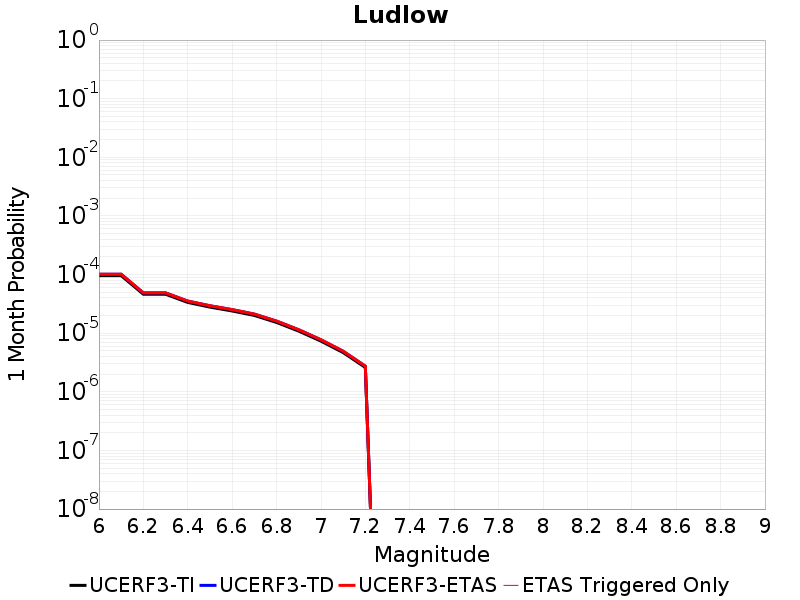 |  |  |

| Magnitude | 1 wk TI Prob | 1 wk TD Prob | 1 wk ETAS Prob | 1 wk ETAS/TD Gain | 1 wk ETAS Triggered Only | 1 mo TI Prob | 1 mo TD Prob | 1 mo ETAS Prob | 1 mo ETAS/TD Gain | 1 mo ETAS Triggered Only | 1 yr TI Prob | 1 yr TD Prob | 1 yr ETAS Prob | 1 yr ETAS/TD Gain | 1 yr ETAS Triggered Only | 10 yr TI Prob | 10 yr TD Prob | 10 yr ETAS Prob | 10 yr ETAS/TD Gain | 10 yr ETAS Triggered Only |
|-----|-----|-----|-----|-----|-----|-----|-----|-----|-----|-----|-----|-----|-----|-----|-----|-----|-----|-----|-----|-----|
| 6.0 | 2.2407607E-5 | 2.3665454E-5 | 2.3665454E-5 | 1.0 | 0.0 | 9.602906E-5 | 1.01419675E-4 | 1.01419675E-4 | 1.0 | 0.0 | 0.0011685267 | 0.0012341293 | 0.0012341293 | 1.0 | 0.0 | 0.011624013 | 0.012277272 | 0.01231678 | 1.003218 | 4.0E-5 |
| 6.1 | 2.2407607E-5 | 2.3665454E-5 | 2.3665454E-5 | 1.0 | 0.0 | 9.602906E-5 | 1.01419675E-4 | 1.01419675E-4 | 1.0 | 0.0 | 0.0011685267 | 0.0012341293 | 0.0012341293 | 1.0 | 0.0 | 0.011624013 | 0.012277272 | 0.01231678 | 1.003218 | 4.0E-5 |
| 6.2 | 1.0781252E-5 | 1.1369492E-5 | 1.1369492E-5 | 1.0 | 0.0 | 4.620455E-5 | 4.872551E-5 | 4.872551E-5 | 1.0 | 0.0 | 5.623952E-4 | 5.9307565E-4 | 5.9307565E-4 | 1.0 | 0.0 | 0.00560974 | 0.0059153475 | 0.0059352294 | 1.003361 | 2.0E-5 |
| 6.3 | 1.0781252E-5 | 1.1369492E-5 | 1.1369492E-5 | 1.0 | 0.0 | 4.620455E-5 | 4.872551E-5 | 4.872551E-5 | 1.0 | 0.0 | 5.623952E-4 | 5.9307565E-4 | 5.9307565E-4 | 1.0 | 0.0 | 0.00560974 | 0.0059153475 | 0.0059352294 | 1.003361 | 2.0E-5 |
| 6.4 | 7.814439E-6 | 8.240502E-6 | 8.240502E-6 | 1.0 | 0.0 | 3.3490025E-5 | 3.5315967E-5 | 3.5315967E-5 | 1.0 | 0.0 | 4.0766477E-4 | 4.298885E-4 | 4.298885E-4 | 1.0 | 0.0 | 0.0040691774 | 0.004290716 | 0.0043006726 | 1.0023206 | 1.0E-5 |
| 6.5 | 6.4986366E-6 | 6.853228E-6 | 6.853228E-6 | 1.0 | 0.0 | 2.7851002E-5 | 2.9370653E-5 | 2.9370653E-5 | 1.0 | 0.0 | 3.390332E-4 | 3.5752993E-4 | 3.5752993E-4 | 1.0 | 0.0 | 0.003385164 | 0.0035696437 | 0.003579608 | 1.0027914 | 1.0E-5 |
| 6.6 | 5.582177E-6 | 5.8879973E-6 | 5.8879973E-6 | 1.0 | 0.0 | 2.3923398E-5 | 2.5234032E-5 | 2.5234032E-5 | 1.0 | 0.0 | 2.9122844E-4 | 3.0718176E-4 | 3.0718176E-4 | 1.0 | 0.0 | 0.0029084706 | 0.0030676448 | 0.0030676448 | 1.0 | 0.0 |
| 6.7 | 4.6858763E-6 | 4.9420955E-6 | 4.9420955E-6 | 1.0 | 0.0 | 2.0082172E-5 | 2.118024E-5 | 2.118024E-5 | 1.0 | 0.0 | 2.4447302E-4 | 2.5783948E-4 | 2.5783948E-4 | 1.0 | 0.0 | 0.0024420423 | 0.0025754597 | 0.0025754597 | 1.0 | 0.0 |
| 6.8 | 3.5584908E-6 | 3.7532864E-6 | 3.7532864E-6 | 1.0 | 0.0 | 1.5250586E-5 | 1.6085416E-5 | 1.6085416E-5 | 1.0 | 0.0 | 1.8566006E-4 | 1.9582275E-4 | 1.9582275E-4 | 1.0 | 0.0 | 0.0018550502 | 0.0019565432 | 0.0019565432 | 1.0 | 0.0 |
| 6.9 | 2.532834E-6 | 2.6719088E-6 | 2.6719088E-6 | 1.0 | 0.0 | 1.0854958E-5 | 1.14509885E-5 | 1.14509885E-5 | 1.0 | 0.0 | 1.3215111E-4 | 1.3940714E-4 | 1.3940714E-4 | 1.0 | 0.0 | 0.0013207254 | 0.0013932246 | 0.0013932246 | 1.0 | 0.0 |
| 7.0 | 1.7083285E-6 | 1.8025573E-6 | 1.8025573E-6 | 1.0 | 0.0 | 7.3213873E-6 | 7.725223E-6 | 7.725223E-6 | 1.0 | 0.0 | 8.913424E-5 | 9.405071E-5 | 9.405071E-5 | 1.0 | 0.0 | 8.9098496E-4 | 9.4012555E-4 | 9.4012555E-4 | 1.0 | 0.0 |
| 7.1 | 1.0905424E-6 | 1.1501498E-6 | 1.1501498E-6 | 1.0 | 0.0 | 4.6737446E-6 | 4.929205E-6 | 4.929205E-6 | 1.0 | 0.0 | 5.6901354E-5 | 6.0011516E-5 | 6.0011516E-5 | 1.0 | 0.0 | 5.6886784E-4 | 5.999629E-4 | 5.999629E-4 | 1.0 | 0.0 |
| 7.2 | 6.06668E-7 | 6.389374E-7 | 6.389374E-7 | 1.0 | 0.0 | 2.600003E-6 | 2.7383007E-6 | 2.7383007E-6 | 1.0 | 0.0 | 3.1654577E-5 | 3.3338372E-5 | 3.3338372E-5 | 1.0 | 0.0 | 3.1650066E-4 | 3.3334055E-4 | 3.3334055E-4 | 1.0 | 0.0 |

## Sierra Nevada  (No Extension)
*[(top)](#table-of-contents)*

| 1 Week | 1 Month | 1 Year | 10 Year |
|-----|-----|-----|-----|
|  |  |  |  |

| Magnitude | 1 wk TI Prob | 1 wk TD Prob | 1 wk ETAS Prob | 1 wk ETAS/TD Gain | 1 wk ETAS Triggered Only | 1 mo TI Prob | 1 mo TD Prob | 1 mo ETAS Prob | 1 mo ETAS/TD Gain | 1 mo ETAS Triggered Only | 1 yr TI Prob | 1 yr TD Prob | 1 yr ETAS Prob | 1 yr ETAS/TD Gain | 1 yr ETAS Triggered Only | 10 yr TI Prob | 10 yr TD Prob | 10 yr ETAS Prob | 10 yr ETAS/TD Gain | 10 yr ETAS Triggered Only |
|-----|-----|-----|-----|-----|-----|-----|-----|-----|-----|-----|-----|-----|-----|-----|-----|-----|-----|-----|-----|-----|
| 6.0 | 7.7690465E-6 | 6.9792363E-6 | 6.9792363E-6 | 1.0 | 0.0 | 3.329549E-5 | 2.9910872E-5 | 2.9910872E-5 | 1.0 | 0.0 | 4.0529718E-4 | 3.6413988E-4 | 3.7413626E-4 | 1.027452 | 1.0E-5 | 0.004045588 | 0.0036389504 | 0.0036788047 | 1.0109522 | 4.0E-5 |
| 6.1 | 7.7690465E-6 | 6.9792363E-6 | 6.9792363E-6 | 1.0 | 0.0 | 3.329549E-5 | 2.9910872E-5 | 2.9910872E-5 | 1.0 | 0.0 | 4.0529718E-4 | 3.6413988E-4 | 3.7413626E-4 | 1.027452 | 1.0E-5 | 0.004045588 | 0.0036389504 | 0.0036788047 | 1.0109522 | 4.0E-5 |
| 6.2 | 7.7690465E-6 | 6.9792363E-6 | 6.9792363E-6 | 1.0 | 0.0 | 3.329549E-5 | 2.9910872E-5 | 2.9910872E-5 | 1.0 | 0.0 | 4.0529718E-4 | 3.6413988E-4 | 3.7413626E-4 | 1.027452 | 1.0E-5 | 0.004045588 | 0.0036389504 | 0.0036788047 | 1.0109522 | 4.0E-5 |
| 6.3 | 7.7690465E-6 | 6.9792363E-6 | 6.9792363E-6 | 1.0 | 0.0 | 3.329549E-5 | 2.9910872E-5 | 2.9910872E-5 | 1.0 | 0.0 | 4.0529718E-4 | 3.6413988E-4 | 3.7413626E-4 | 1.027452 | 1.0E-5 | 0.004045588 | 0.0036389504 | 0.0036788047 | 1.0109522 | 4.0E-5 |
| 6.4 | 7.7690465E-6 | 6.9792363E-6 | 6.9792363E-6 | 1.0 | 0.0 | 3.329549E-5 | 2.9910872E-5 | 2.9910872E-5 | 1.0 | 0.0 | 4.0529718E-4 | 3.6413988E-4 | 3.7413626E-4 | 1.027452 | 1.0E-5 | 0.004045588 | 0.0036389504 | 0.0036788047 | 1.0109522 | 4.0E-5 |
| 6.5 | 7.7690465E-6 | 6.9792363E-6 | 6.9792363E-6 | 1.0 | 0.0 | 3.329549E-5 | 2.9910872E-5 | 2.9910872E-5 | 1.0 | 0.0 | 4.0529718E-4 | 3.6413988E-4 | 3.7413626E-4 | 1.027452 | 1.0E-5 | 0.004045588 | 0.0036389504 | 0.0036788047 | 1.0109522 | 4.0E-5 |
| 6.6 | 2.653E-6 | 1.6161714E-6 | 1.6161714E-6 | 1.0 | 0.0 | 1.136995E-5 | 6.9264306E-6 | 6.9264306E-6 | 1.0 | 0.0 | 1.3842035E-4 | 8.4326064E-5 | 9.4325216E-5 | 1.1185772 | 1.0E-5 | 0.0013833415 | 8.429441E-4 | 8.829104E-4 | 1.0474128 | 4.0E-5 |
| 6.7 | 2.5902466E-6 | 1.5514927E-6 | 1.5514927E-6 | 1.0 | 0.0 | 1.11010095E-5 | 6.6492375E-6 | 6.6492375E-6 | 1.0 | 0.0 | 1.351464E-4 | 8.095149E-5 | 9.095068E-5 | 1.1235207 | 1.0E-5 | 0.0013506424 | 8.09223E-4 | 8.4919063E-4 | 1.0493901 | 4.0E-5 |
| 6.8 | 2.5853892E-6 | 1.5482871E-6 | 1.5482871E-6 | 1.0 | 0.0 | 1.1080193E-5 | 6.635499E-6 | 6.635499E-6 | 1.0 | 0.0 | 1.34893E-4 | 8.078424E-5 | 9.078343E-5 | 1.1237766 | 1.0E-5 | 0.0013481114 | 8.075517E-4 | 8.4751943E-4 | 1.0494925 | 4.0E-5 |
| 6.9 | 2.458257E-6 | 1.4233334E-6 | 1.4233334E-6 | 1.0 | 0.0 | 1.0535345E-5 | 6.0999864E-6 | 6.0999864E-6 | 1.0 | 0.0 | 1.2826028E-4 | 7.426482E-5 | 8.426408E-5 | 1.1346432 | 1.0E-5 | 0.0012818627 | 7.42402E-4 | 7.823723E-4 | 1.0538392 | 4.0E-5 |
| 7.0 | 2.4341468E-6 | 1.4002835E-6 | 1.4002835E-6 | 1.0 | 0.0 | 1.0432016E-5 | 6.0012017E-6 | 6.0012017E-6 | 1.0 | 0.0 | 1.270024E-4 | 7.30622E-5 | 8.3061466E-5 | 1.1368597 | 1.0E-5 | 0.0012692984 | 7.303837E-4 | 7.7035447E-4 | 1.0547258 | 4.0E-5 |
| 7.1 | 2.3652476E-6 | 1.335197E-6 | 1.335197E-6 | 1.0 | 0.0 | 1.0136736E-5 | 5.72226E-6 | 5.72226E-6 | 1.0 | 0.0 | 1.2340778E-4 | 6.966631E-5 | 7.966561E-5 | 1.1435314 | 1.0E-5 | 0.0012333926 | 6.964464E-4 | 7.3641853E-4 | 1.0573944 | 4.0E-5 |
| 7.2 | 2.272158E-6 | 1.2514583E-6 | 1.2514583E-6 | 1.0 | 0.0 | 9.737784E-6 | 5.363382E-6 | 5.363382E-6 | 1.0 | 0.0 | 1.1855107E-4 | 6.529723E-5 | 7.529658E-5 | 1.1531359 | 1.0E-5 | 0.0011848784 | 6.52782E-4 | 6.9275586E-4 | 1.0612361 | 4.0E-5 |
| 7.3 | 2.1382127E-6 | 1.143102E-6 | 1.143102E-6 | 1.0 | 0.0 | 9.163737E-6 | 4.8989996E-6 | 4.8989996E-6 | 1.0 | 0.0 | 1.1156279E-4 | 5.96437E-5 | 6.96431E-5 | 1.1676522 | 1.0E-5 | 0.001115068 | 5.9627806E-4 | 6.362542E-4 | 1.0670428 | 4.0E-5 |
| 7.4 | 1.9048055E-6 | 9.585896E-7 | 9.585896E-7 | 1.0 | 0.0 | 8.163426E-6 | 4.1082344E-6 | 4.1082344E-6 | 1.0 | 0.0 | 9.9385186E-5 | 5.0016613E-5 | 6.001611E-5 | 1.1999235 | 1.0E-5 | 9.934074E-4 | 5.000543E-4 | 5.4003426E-4 | 1.0799513 | 4.0E-5 |
| 7.5 | 1.5373403E-6 | 7.5690207E-7 | 7.5690207E-7 | 1.0 | 0.0 | 6.5885843E-6 | 3.243862E-6 | 3.243862E-6 | 1.0 | 0.0 | 8.021306E-5 | 3.949331E-5 | 4.9492915E-5 | 1.2531974 | 1.0E-5 | 8.0184115E-4 | 3.9486337E-4 | 4.3484758E-4 | 1.1012609 | 4.0E-5 |
| 7.6 | 1.0680322E-6 | 4.66602E-7 | 4.66602E-7 | 1.0 | 0.0 | 4.577273E-6 | 1.9997212E-6 | 1.9997212E-6 | 1.0 | 0.0 | 5.5726876E-5 | 2.4346338E-5 | 2.4346338E-5 | 1.0 | 0.0 | 5.5712904E-4 | 2.4343697E-4 | 2.5343453E-4 | 1.0410684 | 1.0E-5 |
| 7.7 | 5.509146E-7 | 1.5612139E-7 | 1.5612139E-7 | 1.0 | 0.0 | 2.3610605E-6 | 6.690915E-7 | 6.690915E-7 | 1.0 | 0.0 | 2.8745531E-5 | 8.146159E-6 | 8.146159E-6 | 1.0 | 0.0 | 2.8741814E-4 | 8.1458726E-5 | 8.1458726E-5 | 1.0 | 0.0 |

## San Jacinto (Anza) rev
*[(top)](#table-of-contents)*

| 1 Week | 1 Month | 1 Year | 10 Year |
|-----|-----|-----|-----|
|  | 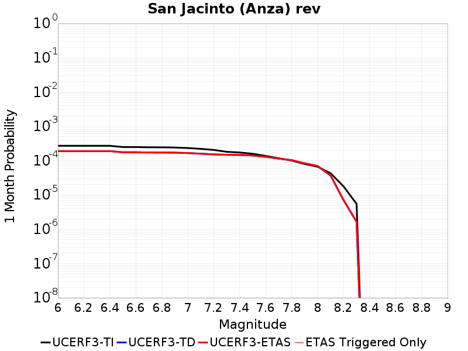 |  |  |

| Magnitude | 1 wk TI Prob | 1 wk TD Prob | 1 wk ETAS Prob | 1 wk ETAS/TD Gain | 1 wk ETAS Triggered Only | 1 mo TI Prob | 1 mo TD Prob | 1 mo ETAS Prob | 1 mo ETAS/TD Gain | 1 mo ETAS Triggered Only | 1 yr TI Prob | 1 yr TD Prob | 1 yr ETAS Prob | 1 yr ETAS/TD Gain | 1 yr ETAS Triggered Only | 10 yr TI Prob | 10 yr TD Prob | 10 yr ETAS Prob | 10 yr ETAS/TD Gain | 10 yr ETAS Triggered Only |
|-----|-----|-----|-----|-----|-----|-----|-----|-----|-----|-----|-----|-----|-----|-----|-----|-----|-----|-----|-----|-----|
| 6.0 | 6.3015636E-5 | 4.414791E-5 | 4.414791E-5 | 1.0 | 0.0 | 2.7003905E-4 | 1.8919168E-4 | 1.8919168E-4 | 1.0 | 0.0 | 0.0032827691 | 0.0023009877 | 0.0023009877 | 1.0 | 0.0 | 0.032346968 | 0.023731563 | 0.023770614 | 1.0016456 | 4.0E-5 |
| 6.1 | 6.3015636E-5 | 4.414791E-5 | 4.414791E-5 | 1.0 | 0.0 | 2.7003905E-4 | 1.8919168E-4 | 1.8919168E-4 | 1.0 | 0.0 | 0.0032827691 | 0.0023009877 | 0.0023009877 | 1.0 | 0.0 | 0.032346968 | 0.023731563 | 0.023770614 | 1.0016456 | 4.0E-5 |
| 6.2 | 6.3015636E-5 | 4.414791E-5 | 4.414791E-5 | 1.0 | 0.0 | 2.7003905E-4 | 1.8919168E-4 | 1.8919168E-4 | 1.0 | 0.0 | 0.0032827691 | 0.0023009877 | 0.0023009877 | 1.0 | 0.0 | 0.032346968 | 0.023731563 | 0.023770614 | 1.0016456 | 4.0E-5 |
| 6.3 | 6.3015636E-5 | 4.414791E-5 | 4.414791E-5 | 1.0 | 0.0 | 2.7003905E-4 | 1.8919168E-4 | 1.8919168E-4 | 1.0 | 0.0 | 0.0032827691 | 0.0023009877 | 0.0023009877 | 1.0 | 0.0 | 0.032346968 | 0.023731563 | 0.023770614 | 1.0016456 | 4.0E-5 |
| 6.4 | 6.3015636E-5 | 4.414791E-5 | 4.414791E-5 | 1.0 | 0.0 | 2.7003905E-4 | 1.8919168E-4 | 1.8919168E-4 | 1.0 | 0.0 | 0.0032827691 | 0.0023009877 | 0.0023009877 | 1.0 | 0.0 | 0.032346968 | 0.023731563 | 0.023770614 | 1.0016456 | 4.0E-5 |
| 6.5 | 5.811017E-5 | 4.088563E-5 | 4.088563E-5 | 1.0 | 0.0 | 2.4901982E-4 | 1.752124E-4 | 1.752124E-4 | 1.0 | 0.0 | 0.0030276014 | 0.0021311296 | 0.0021311296 | 1.0 | 0.0 | 0.02986684 | 0.022009874 | 0.022048993 | 1.0017774 | 4.0E-5 |
| 6.6 | 5.811017E-5 | 4.088563E-5 | 4.088563E-5 | 1.0 | 0.0 | 2.4901982E-4 | 1.752124E-4 | 1.752124E-4 | 1.0 | 0.0 | 0.0030276014 | 0.0021311296 | 0.0021311296 | 1.0 | 0.0 | 0.02986684 | 0.022009874 | 0.022048993 | 1.0017774 | 4.0E-5 |
| 6.7 | 5.712442E-5 | 4.0299907E-5 | 4.0299907E-5 | 1.0 | 0.0 | 2.4479596E-4 | 1.7270248E-4 | 1.7270248E-4 | 1.0 | 0.0 | 0.0029763177 | 0.0021006307 | 0.0021006307 | 1.0 | 0.0 | 0.029367693 | 0.021697659 | 0.021736791 | 1.0018035 | 4.0E-5 |
| 6.8 | 5.6967532E-5 | 4.015475E-5 | 4.015475E-5 | 1.0 | 0.0 | 2.4412372E-4 | 1.7208046E-4 | 1.7208046E-4 | 1.0 | 0.0 | 0.0029681553 | 0.0020930723 | 0.0020930723 | 1.0 | 0.0 | 0.029288229 | 0.02162112 | 0.021660253 | 1.0018101 | 4.0E-5 |
| 6.9 | 5.6211324E-5 | 3.985392E-5 | 3.985392E-5 | 1.0 | 0.0 | 2.4088343E-4 | 1.7079136E-4 | 1.7079136E-4 | 1.0 | 0.0 | 0.0029288116 | 0.0020774072 | 0.0020774072 | 1.0 | 0.0 | 0.028905109 | 0.021457616 | 0.021496758 | 1.0018241 | 4.0E-5 |
| 7.0 | 5.4383527E-5 | 3.869747E-5 | 3.869747E-5 | 1.0 | 0.0 | 2.3305144E-4 | 1.6583578E-4 | 1.6583578E-4 | 1.0 | 0.0 | 0.0028337094 | 0.002017186 | 0.002017186 | 1.0 | 0.0 | 0.027978465 | 0.020836622 | 0.020875787 | 1.0018797 | 4.0E-5 |
| 7.1 | 5.1393665E-5 | 3.7133177E-5 | 3.7133177E-5 | 1.0 | 0.0 | 2.2023996E-4 | 1.591325E-4 | 1.591325E-4 | 1.0 | 0.0 | 0.0026781242 | 0.0019357208 | 0.0019357208 | 1.0 | 0.0 | 0.026460782 | 0.019998562 | 0.020037763 | 1.0019602 | 4.0E-5 |
| 7.2 | 4.785222E-5 | 3.5454996E-5 | 3.5454996E-5 | 1.0 | 0.0 | 2.0506482E-4 | 1.5194116E-4 | 1.5194116E-4 | 1.0 | 0.0 | 0.0024938055 | 0.0018483177 | 0.0018483177 | 1.0 | 0.0 | 0.024660049 | 0.019101208 | 0.019140445 | 1.0020541 | 4.0E-5 |
| 7.3 | 4.2143256E-5 | 3.4530472E-5 | 3.4530472E-5 | 1.0 | 0.0 | 1.8060145E-4 | 1.4797937E-4 | 1.4797937E-4 | 1.0 | 0.0 | 0.002196605 | 0.0018001634 | 0.0018001634 | 1.0 | 0.0 | 0.02175019 | 0.01859791 | 0.018637165 | 1.0021108 | 4.0E-5 |
| 7.4 | 4.0264713E-5 | 3.4162196E-5 | 3.4162196E-5 | 1.0 | 0.0 | 1.7255165E-4 | 1.4640122E-4 | 1.4640122E-4 | 1.0 | 0.0 | 0.002098792 | 0.0017809812 | 0.0017809812 | 1.0 | 0.0 | 0.020790804 | 0.018399114 | 0.018438378 | 1.002134 | 4.0E-5 |
| 7.5 | 3.694492E-5 | 3.286005E-5 | 3.286005E-5 | 1.0 | 0.0 | 1.5832575E-4 | 1.408212E-4 | 1.408212E-4 | 1.0 | 0.0 | 0.0019259118 | 0.001713153 | 0.001713153 | 1.0 | 0.0 | 0.01909306 | 0.017707266 | 0.017746557 | 1.002219 | 4.0E-5 |
| 7.6 | 3.200565E-5 | 3.01448E-5 | 3.01448E-5 | 1.0 | 0.0 | 1.3715986E-4 | 1.2918562E-4 | 1.2918562E-4 | 1.0 | 0.0 | 0.001668642 | 0.0015717024 | 0.0015717024 | 1.0 | 0.0 | 0.01656168 | 0.016279664 | 0.016319014 | 1.0024171 | 4.0E-5 |
| 7.7 | 2.731642E-5 | 2.6715921E-5 | 2.6715921E-5 | 1.0 | 0.0 | 1.1706512E-4 | 1.14491784E-4 | 1.14491784E-4 | 1.0 | 0.0 | 0.001424336 | 0.0013930472 | 0.0013930472 | 1.0 | 0.0 | 0.014152412 | 0.01449201 | 0.014531431 | 1.0027201 | 4.0E-5 |
| 7.8 | 2.3466424E-5 | 2.4101359E-5 | 2.4101359E-5 | 1.0 | 0.0 | 1.0056651E-4 | 1.0328745E-4 | 1.0328745E-4 | 1.0 | 0.0 | 0.0012237094 | 0.0012568001 | 0.0012568001 | 1.0 | 0.0 | 0.012169928 | 0.0131207565 | 0.013160232 | 1.0030086 | 4.0E-5 |
| 7.9 | 1.8611925E-5 | 1.9440196E-5 | 1.9440196E-5 | 1.0 | 0.0 | 7.9762955E-5 | 8.331247E-5 | 8.331247E-5 | 1.0 | 0.0 | 9.7068126E-4 | 0.0010138581 | 0.0010138581 | 1.0 | 0.0 | 0.0096645225 | 0.010673146 | 0.010702825 | 1.0027808 | 3.0E-5 |
| 8.0 | 1.5460775E-5 | 1.6212858E-5 | 1.6212858E-5 | 1.0 | 0.0 | 6.6258784E-5 | 6.948184E-5 | 6.948184E-5 | 1.0 | 0.0 | 8.0640207E-4 | 8.456137E-4 | 8.456137E-4 | 1.0 | 0.0 | 0.008034821 | 0.008951497 | 0.008981229 | 1.0033214 | 3.0E-5 |
| 8.1 | 9.983884E-6 | 8.54749E-6 | 8.54749E-6 | 1.0 | 0.0 | 4.2787375E-5 | 3.663159E-5 | 3.663159E-5 | 1.0 | 0.0 | 5.2081177E-4 | 4.4589888E-4 | 4.4589888E-4 | 1.0 | 0.0 | 0.0051959283 | 0.004789205 | 0.004819061 | 1.006234 | 3.0E-5 |
| 8.2 | 4.1226E-6 | 1.6334959E-6 | 1.6334959E-6 | 1.0 | 0.0 | 1.7668166E-5 | 7.000678E-6 | 7.000678E-6 | 1.0 | 0.0 | 2.1508869E-4 | 8.5229956E-5 | 8.5229956E-5 | 1.0 | 0.0 | 0.0021488064 | 9.864903E-4 | 9.864903E-4 | 1.0 | 0.0 |
| 8.3 | 1.2750878E-6 | 3.8292913E-7 | 3.8292913E-7 | 1.0 | 0.0 | 5.4646503E-6 | 1.6411238E-6 | 1.6411238E-6 | 1.0 | 0.0 | 6.653009E-5 | 1.9980505E-5 | 1.9980505E-5 | 1.0 | 0.0 | 6.6510175E-4 | 2.400832E-4 | 2.400832E-4 | 1.0 | 0.0 |

## Red Pass
*[(top)](#table-of-contents)*

| 1 Week | 1 Month | 1 Year | 10 Year |
|-----|-----|-----|-----|
| 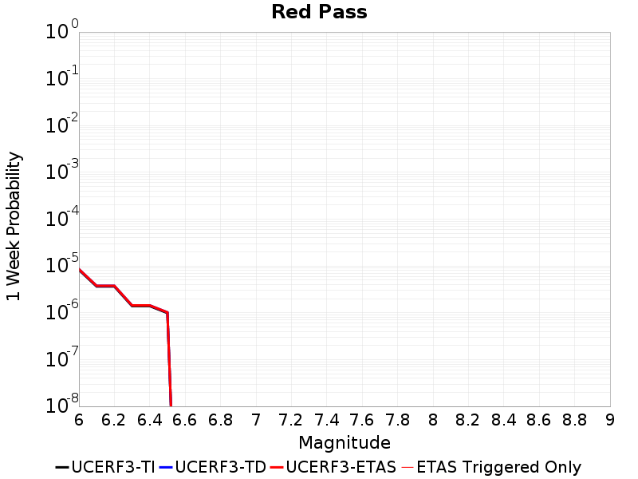 | 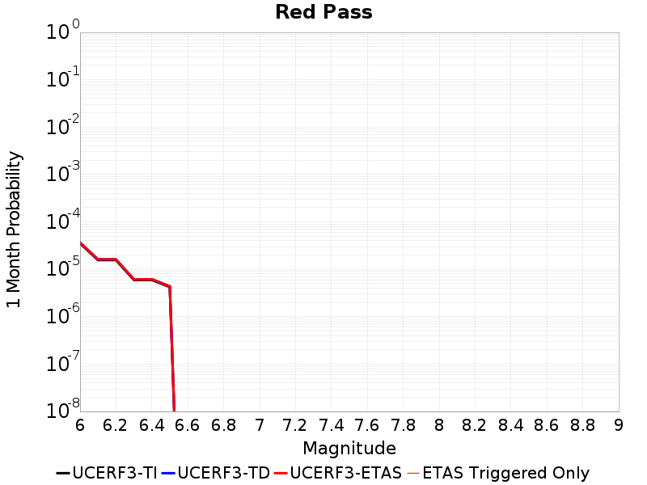 |  |  |

| Magnitude | 1 wk TI Prob | 1 wk TD Prob | 1 wk ETAS Prob | 1 wk ETAS/TD Gain | 1 wk ETAS Triggered Only | 1 mo TI Prob | 1 mo TD Prob | 1 mo ETAS Prob | 1 mo ETAS/TD Gain | 1 mo ETAS Triggered Only | 1 yr TI Prob | 1 yr TD Prob | 1 yr ETAS Prob | 1 yr ETAS/TD Gain | 1 yr ETAS Triggered Only | 10 yr TI Prob | 10 yr TD Prob | 10 yr ETAS Prob | 10 yr ETAS/TD Gain | 10 yr ETAS Triggered Only |
|-----|-----|-----|-----|-----|-----|-----|-----|-----|-----|-----|-----|-----|-----|-----|-----|-----|-----|-----|-----|-----|
| 6.0 | 8.258278E-6 | 8.553149E-6 | 8.553149E-6 | 1.0 | 0.0 | 3.539214E-5 | 3.665594E-5 | 3.665594E-5 | 1.0 | 0.0 | 4.308141E-4 | 4.4621257E-4 | 4.4621257E-4 | 1.0 | 0.0 | 0.0042997985 | 0.0044549243 | 0.004484791 | 1.0067041 | 3.0E-5 |
| 6.1 | 3.649988E-6 | 3.7761213E-6 | 3.7761213E-6 | 1.0 | 0.0 | 1.5642712E-5 | 1.6183303E-5 | 1.6183303E-5 | 1.0 | 0.0 | 1.9043336E-4 | 1.9701866E-4 | 1.9701866E-4 | 1.0 | 0.0 | 0.0019027026 | 0.0019689074 | 0.0019689074 | 1.0 | 0.0 |
| 6.2 | 3.649988E-6 | 3.7761213E-6 | 3.7761213E-6 | 1.0 | 0.0 | 1.5642712E-5 | 1.6183303E-5 | 1.6183303E-5 | 1.0 | 0.0 | 1.9043336E-4 | 1.9701866E-4 | 1.9701866E-4 | 1.0 | 0.0 | 0.0019027026 | 0.0019689074 | 0.0019689074 | 1.0 | 0.0 |
| 6.3 | 1.3924937E-6 | 1.4414292E-6 | 1.4414292E-6 | 1.0 | 0.0 | 5.9678164E-6 | 6.1775468E-6 | 6.1775468E-6 | 1.0 | 0.0 | 7.265574E-5 | 7.521045E-5 | 7.521045E-5 | 1.0 | 0.0 | 7.263199E-4 | 7.519888E-4 | 7.519888E-4 | 1.0 | 0.0 |
| 6.4 | 1.3924937E-6 | 1.4414292E-6 | 1.4414292E-6 | 1.0 | 0.0 | 5.9678164E-6 | 6.1775468E-6 | 6.1775468E-6 | 1.0 | 0.0 | 7.265574E-5 | 7.521045E-5 | 7.521045E-5 | 1.0 | 0.0 | 7.263199E-4 | 7.519888E-4 | 7.519888E-4 | 1.0 | 0.0 |
| 6.5 | 9.876812E-7 | 1.022413E-6 | 1.022413E-6 | 1.0 | 0.0 | 4.2329125E-6 | 4.38177E-6 | 4.38177E-6 | 1.0 | 0.0 | 5.153449E-5 | 5.3348052E-5 | 5.3348052E-5 | 1.0 | 0.0 | 5.1522546E-4 | 5.334805E-4 | 5.334805E-4 | 1.0 | 0.0 |

## Camp Rock 2011
*[(top)](#table-of-contents)*

| 1 Week | 1 Month | 1 Year | 10 Year |
|-----|-----|-----|-----|
|  |  |  | 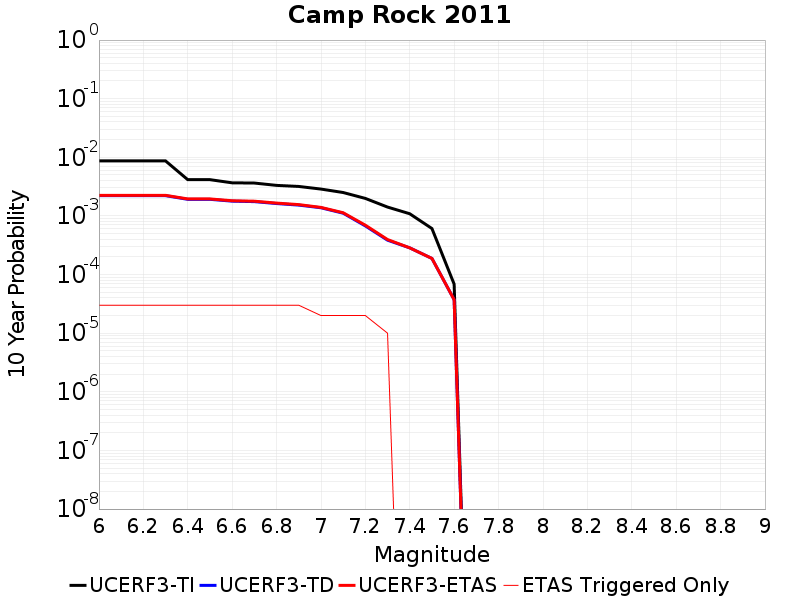 |

| Magnitude | 1 wk TI Prob | 1 wk TD Prob | 1 wk ETAS Prob | 1 wk ETAS/TD Gain | 1 wk ETAS Triggered Only | 1 mo TI Prob | 1 mo TD Prob | 1 mo ETAS Prob | 1 mo ETAS/TD Gain | 1 mo ETAS Triggered Only | 1 yr TI Prob | 1 yr TD Prob | 1 yr ETAS Prob | 1 yr ETAS/TD Gain | 1 yr ETAS Triggered Only | 10 yr TI Prob | 10 yr TD Prob | 10 yr ETAS Prob | 10 yr ETAS/TD Gain | 10 yr ETAS Triggered Only |
|-----|-----|-----|-----|-----|-----|-----|-----|-----|-----|-----|-----|-----|-----|-----|-----|-----|-----|-----|-----|-----|
| 6.0 | 1.6710783E-5 | 4.2531124E-6 | 4.2531124E-6 | 1.0 | 0.0 | 7.161568E-5 | 1.82275E-5 | 1.82275E-5 | 1.0 | 0.0 | 8.7157206E-4 | 2.2189775E-4 | 2.2189775E-4 | 1.0 | 0.0 | 0.008681616 | 0.0022168146 | 0.0022467482 | 1.013503 | 3.0E-5 |
| 6.1 | 1.6710783E-5 | 4.2531124E-6 | 4.2531124E-6 | 1.0 | 0.0 | 7.161568E-5 | 1.82275E-5 | 1.82275E-5 | 1.0 | 0.0 | 8.7157206E-4 | 2.2189775E-4 | 2.2189775E-4 | 1.0 | 0.0 | 0.008681616 | 0.0022168146 | 0.0022467482 | 1.013503 | 3.0E-5 |
| 6.2 | 1.6710783E-5 | 4.2531124E-6 | 4.2531124E-6 | 1.0 | 0.0 | 7.161568E-5 | 1.82275E-5 | 1.82275E-5 | 1.0 | 0.0 | 8.7157206E-4 | 2.2189775E-4 | 2.2189775E-4 | 1.0 | 0.0 | 0.008681616 | 0.0022168146 | 0.0022467482 | 1.013503 | 3.0E-5 |
| 6.3 | 1.6710783E-5 | 4.2531124E-6 | 4.2531124E-6 | 1.0 | 0.0 | 7.161568E-5 | 1.82275E-5 | 1.82275E-5 | 1.0 | 0.0 | 8.7157206E-4 | 2.2189775E-4 | 2.2189775E-4 | 1.0 | 0.0 | 0.008681616 | 0.0022168146 | 0.0022467482 | 1.013503 | 3.0E-5 |
| 6.4 | 7.982846E-6 | 3.6845165E-6 | 3.6845165E-6 | 1.0 | 0.0 | 3.421175E-5 | 1.579069E-5 | 1.579069E-5 | 1.0 | 0.0 | 4.1644843E-4 | 1.9223505E-4 | 1.9223505E-4 | 1.0 | 0.0 | 0.0041566887 | 0.0019207225 | 0.0019506649 | 1.0155891 | 3.0E-5 |
| 6.5 | 7.982846E-6 | 3.6845165E-6 | 3.6845165E-6 | 1.0 | 0.0 | 3.421175E-5 | 1.579069E-5 | 1.579069E-5 | 1.0 | 0.0 | 4.1644843E-4 | 1.9223505E-4 | 1.9223505E-4 | 1.0 | 0.0 | 0.0041566887 | 0.0019207225 | 0.0019506649 | 1.0155891 | 3.0E-5 |
| 6.6 | 7.048869E-6 | 3.426705E-6 | 3.426705E-6 | 1.0 | 0.0 | 3.0209088E-5 | 1.4685797E-5 | 1.4685797E-5 | 1.0 | 0.0 | 3.677336E-4 | 1.7878524E-4 | 1.7878524E-4 | 1.0 | 0.0 | 0.0036712566 | 0.0017864457 | 0.0018163921 | 1.0167631 | 3.0E-5 |
| 6.7 | 6.987307E-6 | 3.36466E-6 | 3.36466E-6 | 1.0 | 0.0 | 2.9945259E-5 | 1.4419894E-5 | 1.4419894E-5 | 1.0 | 0.0 | 3.6452254E-4 | 1.7554837E-4 | 1.7554837E-4 | 1.0 | 0.0 | 0.0036392517 | 0.0017541281 | 0.0017840755 | 1.0170726 | 3.0E-5 |
| 6.8 | 6.3737602E-6 | 3.120208E-6 | 3.120208E-6 | 1.0 | 0.0 | 2.731583E-5 | 1.3372252E-5 | 1.3372252E-5 | 1.0 | 0.0 | 3.3251947E-4 | 1.627953E-4 | 1.627953E-4 | 1.0 | 0.0 | 0.0033202237 | 0.0016267891 | 0.0016567403 | 1.0184113 | 3.0E-5 |
| 6.9 | 6.112211E-6 | 2.9353282E-6 | 2.9353282E-6 | 1.0 | 0.0 | 2.6194928E-5 | 1.257992E-5 | 1.257992E-5 | 1.0 | 0.0 | 3.1887658E-4 | 1.5315003E-4 | 1.5315003E-4 | 1.0 | 0.0 | 0.003184194 | 0.0015304727 | 0.0015604268 | 1.0195718 | 3.0E-5 |
| 7.0 | 5.5140117E-6 | 2.6437856E-6 | 2.6437856E-6 | 1.0 | 0.0 | 2.3631264E-5 | 1.1330462E-5 | 1.1330462E-5 | 1.0 | 0.0 | 2.8767265E-4 | 1.379399E-4 | 1.379399E-4 | 1.0 | 0.0 | 0.0028730053 | 0.0013785681 | 0.0013985406 | 1.0144879 | 2.0E-5 |
| 7.1 | 4.8151105E-6 | 2.1358867E-6 | 2.1358867E-6 | 1.0 | 0.0 | 2.0636026E-5 | 9.153769E-6 | 9.153769E-6 | 1.0 | 0.0 | 2.5121463E-4 | 1.1144166E-4 | 1.1144166E-4 | 1.0 | 0.0 | 0.0025093083 | 0.0011138797 | 0.0011338574 | 1.0179353 | 2.0E-5 |
| 7.2 | 3.818335E-6 | 1.2950203E-6 | 1.2950203E-6 | 1.0 | 0.0 | 1.6364189E-5 | 5.5500755E-6 | 5.5500755E-6 | 1.0 | 0.0 | 1.9921579E-4 | 6.757016E-5 | 6.757016E-5 | 1.0 | 0.0 | 0.0019903728 | 6.755044E-4 | 6.9549086E-4 | 1.0295875 | 2.0E-5 |
| 7.3 | 2.7166698E-6 | 7.3941584E-7 | 7.3941584E-7 | 1.0 | 0.0 | 1.1642818E-5 | 3.1689212E-6 | 3.1689212E-6 | 1.0 | 0.0 | 1.4174209E-4 | 3.8580954E-5 | 3.8580954E-5 | 1.0 | 0.0 | 0.0014165172 | 3.8574456E-4 | 3.957407E-4 | 1.0259138 | 1.0E-5 |
| 7.4 | 2.0893426E-6 | 5.470577E-7 | 5.470577E-7 | 1.0 | 0.0 | 8.954295E-6 | 2.344531E-6 | 2.344531E-6 | 1.0 | 0.0 | 1.0901308E-4 | 2.8544295E-5 | 2.8544295E-5 | 1.0 | 0.0 | 0.0010895962 | 2.8540683E-4 | 2.8540683E-4 | 1.0 | 0.0 |
| 7.5 | 1.1681728E-6 | 3.6087533E-7 | 3.6087533E-7 | 1.0 | 0.0 | 5.0064455E-6 | 1.5466077E-6 | 1.5466077E-6 | 1.0 | 0.0 | 6.0951766E-5 | 1.882979E-5 | 1.882979E-5 | 1.0 | 0.0 | 6.093505E-4 | 1.8828241E-4 | 1.8828241E-4 | 1.0 | 0.0 |
| 7.6 | 1.3154387E-7 | 7.141621E-8 | 7.141621E-8 | 1.0 | 0.0 | 5.6375933E-7 | 3.0606947E-7 | 3.0606947E-7 | 1.0 | 0.0 | 6.863748E-6 | 3.7263908E-6 | 3.7263908E-6 | 1.0 | 0.0 | 6.863536E-5 | 3.7263442E-5 | 3.7263442E-5 | 1.0 | 0.0 |

## Palos Verdes
*[(top)](#table-of-contents)*

| 1 Week | 1 Month | 1 Year | 10 Year |
|-----|-----|-----|-----|
|  |  |  |  |

| Magnitude | 1 wk TI Prob | 1 wk TD Prob | 1 wk ETAS Prob | 1 wk ETAS/TD Gain | 1 wk ETAS Triggered Only | 1 mo TI Prob | 1 mo TD Prob | 1 mo ETAS Prob | 1 mo ETAS/TD Gain | 1 mo ETAS Triggered Only | 1 yr TI Prob | 1 yr TD Prob | 1 yr ETAS Prob | 1 yr ETAS/TD Gain | 1 yr ETAS Triggered Only | 10 yr TI Prob | 10 yr TD Prob | 10 yr ETAS Prob | 10 yr ETAS/TD Gain | 10 yr ETAS Triggered Only |
|-----|-----|-----|-----|-----|-----|-----|-----|-----|-----|-----|-----|-----|-----|-----|-----|-----|-----|-----|-----|-----|
| 6.0 | 6.126063E-5 | 7.634066E-5 | 7.634066E-5 | 1.0 | 0.0 | 2.6251914E-4 | 3.2713648E-4 | 3.2713648E-4 | 1.0 | 0.0 | 0.0031914865 | 0.0039761513 | 0.0039861114 | 1.002505 | 1.0E-5 | 0.031460393 | 0.03910665 | 0.039135475 | 1.0007372 | 3.0E-5 |
| 6.1 | 6.126063E-5 | 7.634066E-5 | 7.634066E-5 | 1.0 | 0.0 | 2.6251914E-4 | 3.2713648E-4 | 3.2713648E-4 | 1.0 | 0.0 | 0.0031914865 | 0.0039761513 | 0.0039861114 | 1.002505 | 1.0E-5 | 0.031460393 | 0.03910665 | 0.039135475 | 1.0007372 | 3.0E-5 |
| 6.2 | 6.126063E-5 | 7.634066E-5 | 7.634066E-5 | 1.0 | 0.0 | 2.6251914E-4 | 3.2713648E-4 | 3.2713648E-4 | 1.0 | 0.0 | 0.0031914865 | 0.0039761513 | 0.0039861114 | 1.002505 | 1.0E-5 | 0.031460393 | 0.03910665 | 0.039135475 | 1.0007372 | 3.0E-5 |
| 6.3 | 4.0838047E-5 | 4.9816612E-5 | 4.9816612E-5 | 1.0 | 0.0 | 1.7500846E-4 | 2.1348346E-4 | 2.1348346E-4 | 1.0 | 0.0 | 0.0021286458 | 0.0025962745 | 0.0026062485 | 1.0038416 | 1.0E-5 | 0.021083709 | 0.025681108 | 0.025710339 | 1.0011382 | 3.0E-5 |
| 6.4 | 4.0838047E-5 | 4.9816612E-5 | 4.9816612E-5 | 1.0 | 0.0 | 1.7500846E-4 | 2.1348346E-4 | 2.1348346E-4 | 1.0 | 0.0 | 0.0021286458 | 0.0025962745 | 0.0026062485 | 1.0038416 | 1.0E-5 | 0.021083709 | 0.025681108 | 0.025710339 | 1.0011382 | 3.0E-5 |
| 6.5 | 3.0512005E-5 | 3.660697E-5 | 3.660697E-5 | 1.0 | 0.0 | 1.3075917E-4 | 1.5687822E-4 | 1.5687822E-4 | 1.0 | 0.0 | 0.0015908304 | 0.0019084351 | 0.001918416 | 1.00523 | 1.0E-5 | 0.015794903 | 0.018932411 | 0.018961843 | 1.0015546 | 3.0E-5 |
| 6.6 | 2.9255087E-5 | 3.519872E-5 | 3.519872E-5 | 1.0 | 0.0 | 1.2537291E-4 | 1.5084357E-4 | 1.5084357E-4 | 1.0 | 0.0 | 0.0015253464 | 0.001835087 | 0.0018450686 | 1.0054393 | 1.0E-5 | 0.015149189 | 0.018210962 | 0.018240416 | 1.0016173 | 3.0E-5 |
| 6.7 | 2.287198E-5 | 2.7280961E-5 | 2.7280961E-5 | 1.0 | 0.0 | 9.801909E-5 | 1.1691369E-4 | 1.1691369E-4 | 1.0 | 0.0 | 0.001192729 | 0.0014225866 | 0.0014325724 | 1.0070194 | 1.0E-5 | 0.011863477 | 0.014144056 | 0.014163773 | 1.001394 | 2.0E-5 |
| 6.8 | 2.1325764E-5 | 2.5462563E-5 | 2.5462563E-5 | 1.0 | 0.0 | 9.139293E-5 | 1.0912121E-4 | 1.0912121E-4 | 1.0 | 0.0 | 0.001112141 | 0.0013278315 | 0.0013378182 | 1.007521 | 1.0E-5 | 0.011065915 | 0.013208035 | 0.013227772 | 1.0014943 | 2.0E-5 |
| 6.9 | 1.9009392E-5 | 2.2640434E-5 | 2.2640434E-5 | 1.0 | 0.0 | 8.1466285E-5 | 9.702731E-5 | 9.702731E-5 | 1.0 | 0.0 | 9.914007E-4 | 0.001180755 | 0.0011907431 | 1.0084592 | 1.0E-5 | 0.009869894 | 0.01175352 | 0.011773285 | 1.0016816 | 2.0E-5 |
| 7.0 | 1.7098473E-5 | 2.034338E-5 | 2.034338E-5 | 1.0 | 0.0 | 7.3277115E-5 | 8.718348E-5 | 8.718348E-5 | 1.0 | 0.0 | 8.917837E-4 | 0.0010610274 | 0.0010710168 | 1.0094148 | 1.0E-5 | 0.008882134 | 0.010568073 | 0.010587862 | 1.0018725 | 2.0E-5 |
| 7.1 | 1.5982785E-5 | 1.9017229E-5 | 1.9017229E-5 | 1.0 | 0.0 | 6.849585E-5 | 8.1500344E-5 | 8.1500344E-5 | 1.0 | 0.0 | 8.336179E-4 | 9.918999E-4 | 0.0010018899 | 1.0100716 | 1.0E-5 | 0.008304977 | 0.009883111 | 0.009902913 | 1.0020037 | 2.0E-5 |
| 7.2 | 1.4468002E-5 | 1.721761E-5 | 1.721761E-5 | 1.0 | 0.0 | 6.200425E-5 | 7.378814E-5 | 7.378814E-5 | 1.0 | 0.0 | 7.546402E-4 | 8.9808455E-4 | 9.0807554E-4 | 1.0111248 | 1.0E-5 | 0.007520827 | 0.008952842 | 0.008972663 | 1.002214 | 2.0E-5 |
| 7.3 | 5.288233E-6 | 6.210522E-6 | 6.210522E-6 | 1.0 | 0.0 | 2.2663658E-5 | 2.6616448E-5 | 2.6616448E-5 | 1.0 | 0.0 | 2.7589512E-4 | 3.2404205E-4 | 3.2404205E-4 | 1.0 | 0.0 | 0.0027555283 | 0.003239127 | 0.003239127 | 1.0 | 0.0 |
| 7.4 | 8.279556E-7 | 8.409159E-7 | 8.409159E-7 | 1.0 | 0.0 | 3.5483763E-6 | 3.6039207E-6 | 3.6039207E-6 | 1.0 | 0.0 | 4.3200624E-5 | 4.3876924E-5 | 4.3876924E-5 | 1.0 | 0.0 | 4.3192226E-4 | 4.3868984E-4 | 4.3868984E-4 | 1.0 | 0.0 |
| 7.5 | 6.559831E-7 | 6.667907E-7 | 6.667907E-7 | 1.0 | 0.0 | 2.8113532E-6 | 2.8576715E-6 | 2.8576715E-6 | 1.0 | 0.0 | 3.4227687E-5 | 3.4791665E-5 | 3.4791665E-5 | 1.0 | 0.0 | 3.4222414E-4 | 3.478688E-4 | 3.478688E-4 | 1.0 | 0.0 |
| 7.6 | 3.5018968E-7 | 3.5623825E-7 | 3.5623825E-7 | 1.0 | 0.0 | 1.500812E-6 | 1.5267348E-6 | 1.5267348E-6 | 1.0 | 0.0 | 1.8272232E-5 | 1.8587883E-5 | 1.8587883E-5 | 1.0 | 0.0 | 1.8270731E-4 | 1.8586789E-4 | 1.8586789E-4 | 1.0 | 0.0 |
| 7.7 | 1.1986104E-7 | 1.2199719E-7 | 1.2199719E-7 | 1.0 | 0.0 | 5.1369005E-7 | 5.2284497E-7 | 5.2284497E-7 | 1.0 | 0.0 | 6.2541585E-6 | 6.3656194E-6 | 6.3656194E-6 | 1.0 | 0.0 | 6.2539824E-5 | 6.3654414E-5 | 6.3654414E-5 | 1.0 | 0.0 |
| 7.8 | 3.0445005E-8 | 3.103127E-8 | 3.103127E-8 | 1.0 | 0.0 | 1.3047858E-7 | 1.3299116E-7 | 1.3299116E-7 | 1.0 | 0.0 | 1.5885756E-6 | 1.6191664E-6 | 1.6191664E-6 | 1.0 | 0.0 | 1.5885644E-5 | 1.6191567E-5 | 1.6191567E-5 | 1.0 | 0.0 |

## Dry Mountain
*[(top)](#table-of-contents)*

| 1 Week | 1 Month | 1 Year | 10 Year |
|-----|-----|-----|-----|
| 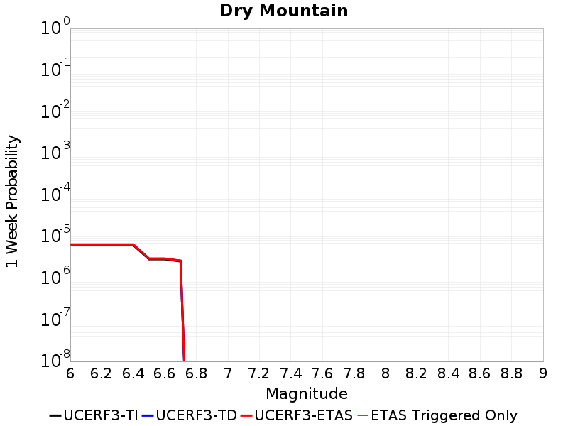 | 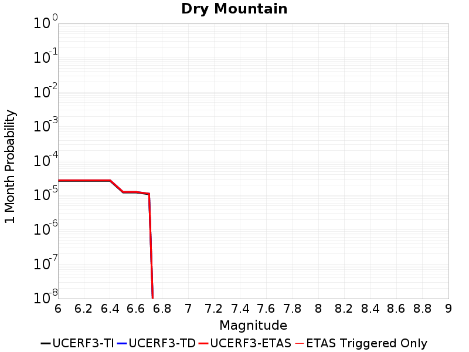 |  | 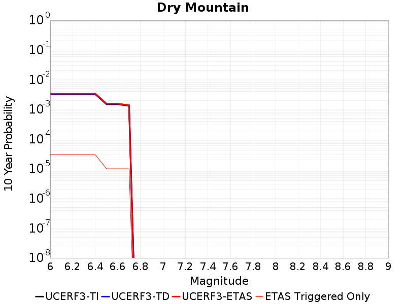 |

| Magnitude | 1 wk TI Prob | 1 wk TD Prob | 1 wk ETAS Prob | 1 wk ETAS/TD Gain | 1 wk ETAS Triggered Only | 1 mo TI Prob | 1 mo TD Prob | 1 mo ETAS Prob | 1 mo ETAS/TD Gain | 1 mo ETAS Triggered Only | 1 yr TI Prob | 1 yr TD Prob | 1 yr ETAS Prob | 1 yr ETAS/TD Gain | 1 yr ETAS Triggered Only | 10 yr TI Prob | 10 yr TD Prob | 10 yr ETAS Prob | 10 yr ETAS/TD Gain | 10 yr ETAS Triggered Only |
|-----|-----|-----|-----|-----|-----|-----|-----|-----|-----|-----|-----|-----|-----|-----|-----|-----|-----|-----|-----|-----|
| 6.0 | 6.222801E-6 | 6.440773E-6 | 6.440773E-6 | 1.0 | 0.0 | 2.6668875E-5 | 2.7603111E-5 | 2.7603111E-5 | 1.0 | 0.0 | 3.2464517E-4 | 3.3603198E-4 | 3.3603198E-4 | 1.0 | 0.0 | 0.0032417132 | 0.0033568013 | 0.0033867008 | 1.0089071 | 3.0E-5 |
| 6.1 | 6.222801E-6 | 6.440773E-6 | 6.440773E-6 | 1.0 | 0.0 | 2.6668875E-5 | 2.7603111E-5 | 2.7603111E-5 | 1.0 | 0.0 | 3.2464517E-4 | 3.3603198E-4 | 3.3603198E-4 | 1.0 | 0.0 | 0.0032417132 | 0.0033568013 | 0.0033867008 | 1.0089071 | 3.0E-5 |
| 6.2 | 6.222801E-6 | 6.440773E-6 | 6.440773E-6 | 1.0 | 0.0 | 2.6668875E-5 | 2.7603111E-5 | 2.7603111E-5 | 1.0 | 0.0 | 3.2464517E-4 | 3.3603198E-4 | 3.3603198E-4 | 1.0 | 0.0 | 0.0032417132 | 0.0033568013 | 0.0033867008 | 1.0089071 | 3.0E-5 |
| 6.3 | 6.222801E-6 | 6.440773E-6 | 6.440773E-6 | 1.0 | 0.0 | 2.6668875E-5 | 2.7603111E-5 | 2.7603111E-5 | 1.0 | 0.0 | 3.2464517E-4 | 3.3603198E-4 | 3.3603198E-4 | 1.0 | 0.0 | 0.0032417132 | 0.0033568013 | 0.0033867008 | 1.0089071 | 3.0E-5 |
| 6.4 | 6.222801E-6 | 6.440773E-6 | 6.440773E-6 | 1.0 | 0.0 | 2.6668875E-5 | 2.7603111E-5 | 2.7603111E-5 | 1.0 | 0.0 | 3.2464517E-4 | 3.3603198E-4 | 3.3603198E-4 | 1.0 | 0.0 | 0.0032417132 | 0.0033568013 | 0.0033867008 | 1.0089071 | 3.0E-5 |
| 6.5 | 2.8528623E-6 | 2.9528067E-6 | 2.9528067E-6 | 1.0 | 0.0 | 1.22264955E-5 | 1.2654873E-5 | 1.2654873E-5 | 1.0 | 0.0 | 1.4884741E-4 | 1.5407089E-4 | 1.5407089E-4 | 1.0 | 0.0 | 0.0014874774 | 0.0015404945 | 0.0015504791 | 1.0064814 | 1.0E-5 |
| 6.6 | 2.8528623E-6 | 2.9528067E-6 | 2.9528067E-6 | 1.0 | 0.0 | 1.22264955E-5 | 1.2654873E-5 | 1.2654873E-5 | 1.0 | 0.0 | 1.4884741E-4 | 1.5407089E-4 | 1.5407089E-4 | 1.0 | 0.0 | 0.0014874774 | 0.0015404945 | 0.0015504791 | 1.0064814 | 1.0E-5 |
| 6.7 | 2.541E-6 | 2.6299258E-6 | 2.6299258E-6 | 1.0 | 0.0 | 1.0889954E-5 | 1.127111E-5 | 1.127111E-5 | 1.0 | 0.0 | 1.3257713E-4 | 1.3722577E-4 | 1.3722577E-4 | 1.0 | 0.0 | 0.0013249806 | 0.0013722577 | 0.0013822439 | 1.0072773 | 1.0E-5 |

## Manix-Afton Hills
*[(top)](#table-of-contents)*

| 1 Week | 1 Month | 1 Year | 10 Year |
|-----|-----|-----|-----|
|  |  |  |  |

| Magnitude | 1 wk TI Prob | 1 wk TD Prob | 1 wk ETAS Prob | 1 wk ETAS/TD Gain | 1 wk ETAS Triggered Only | 1 mo TI Prob | 1 mo TD Prob | 1 mo ETAS Prob | 1 mo ETAS/TD Gain | 1 mo ETAS Triggered Only | 1 yr TI Prob | 1 yr TD Prob | 1 yr ETAS Prob | 1 yr ETAS/TD Gain | 1 yr ETAS Triggered Only | 10 yr TI Prob | 10 yr TD Prob | 10 yr ETAS Prob | 10 yr ETAS/TD Gain | 10 yr ETAS Triggered Only |
|-----|-----|-----|-----|-----|-----|-----|-----|-----|-----|-----|-----|-----|-----|-----|-----|-----|-----|-----|-----|-----|
| 6.0 | 1.3783202E-5 | 1.4717254E-5 | 1.4717254E-5 | 1.0 | 0.0 | 5.906953E-5 | 6.307252E-5 | 6.307252E-5 | 1.0 | 0.0 | 7.189342E-4 | 7.6765486E-4 | 7.6765486E-4 | 1.0 | 0.0 | 0.0071661277 | 0.007651789 | 0.007671636 | 1.0025938 | 2.0E-5 |
| 6.1 | 1.3783202E-5 | 1.4717254E-5 | 1.4717254E-5 | 1.0 | 0.0 | 5.906953E-5 | 6.307252E-5 | 6.307252E-5 | 1.0 | 0.0 | 7.189342E-4 | 7.6765486E-4 | 7.6765486E-4 | 1.0 | 0.0 | 0.0071661277 | 0.007651789 | 0.007671636 | 1.0025938 | 2.0E-5 |
| 6.2 | 1.3783202E-5 | 1.4717254E-5 | 1.4717254E-5 | 1.0 | 0.0 | 5.906953E-5 | 6.307252E-5 | 6.307252E-5 | 1.0 | 0.0 | 7.189342E-4 | 7.6765486E-4 | 7.6765486E-4 | 1.0 | 0.0 | 0.0071661277 | 0.007651789 | 0.007671636 | 1.0025938 | 2.0E-5 |
| 6.3 | 1.10494875E-5 | 1.1798077E-5 | 1.1798077E-5 | 1.0 | 0.0 | 4.7354086E-5 | 5.0562267E-5 | 5.0562267E-5 | 1.0 | 0.0 | 5.763835E-4 | 6.154321E-4 | 6.154321E-4 | 1.0 | 0.0 | 0.005748908 | 0.006138319 | 0.0061482578 | 1.0016191 | 1.0E-5 |
| 6.4 | 1.10494875E-5 | 1.1798077E-5 | 1.1798077E-5 | 1.0 | 0.0 | 4.7354086E-5 | 5.0562267E-5 | 5.0562267E-5 | 1.0 | 0.0 | 5.763835E-4 | 6.154321E-4 | 6.154321E-4 | 1.0 | 0.0 | 0.005748908 | 0.006138319 | 0.0061482578 | 1.0016191 | 1.0E-5 |
| 6.5 | 9.788949E-6 | 1.0458744E-5 | 1.0458744E-5 | 1.0 | 0.0 | 4.1951964E-5 | 4.4822475E-5 | 4.4822475E-5 | 1.0 | 0.0 | 5.1064545E-4 | 5.455863E-4 | 5.455863E-4 | 1.0 | 0.0 | 0.0050947363 | 0.0054433956 | 0.005453341 | 1.0018271 | 1.0E-5 |
| 6.6 | 8.810006E-6 | 9.417645E-6 | 9.417645E-6 | 1.0 | 0.0 | 3.775662E-5 | 4.0360763E-5 | 4.0360763E-5 | 1.0 | 0.0 | 4.5958988E-4 | 4.9129035E-4 | 4.9129035E-4 | 1.0 | 0.0 | 0.0045864056 | 0.004902926 | 0.0049128765 | 1.0020297 | 1.0E-5 |
| 6.7 | 8.80128E-6 | 9.40812E-6 | 9.40812E-6 | 1.0 | 0.0 | 3.7719226E-5 | 4.0319937E-5 | 4.0319937E-5 | 1.0 | 0.0 | 4.591348E-4 | 4.907936E-4 | 4.907936E-4 | 1.0 | 0.0 | 0.004581874 | 0.0048979796 | 0.0049079307 | 1.0020317 | 1.0E-5 |
| 6.8 | 6.8994877E-6 | 7.383278E-6 | 7.383278E-6 | 1.0 | 0.0 | 2.9568899E-5 | 3.164228E-5 | 3.164228E-5 | 1.0 | 0.0 | 3.5994186E-4 | 3.8518486E-4 | 3.8518486E-4 | 1.0 | 0.0 | 0.003593594 | 0.003845978 | 0.0038559395 | 1.0025901 | 1.0E-5 |
| 6.9 | 4.9328037E-6 | 5.2732125E-6 | 5.2732125E-6 | 1.0 | 0.0 | 2.1140417E-5 | 2.259932E-5 | 2.259932E-5 | 1.0 | 0.0 | 2.5735417E-4 | 2.7511816E-4 | 2.7511816E-4 | 1.0 | 0.0 | 0.0025705635 | 0.0027483813 | 0.002758354 | 1.0036285 | 1.0E-5 |
| 7.0 | 3.347973E-6 | 3.591647E-6 | 3.591647E-6 | 1.0 | 0.0 | 1.4348378E-5 | 1.5392707E-5 | 1.5392707E-5 | 1.0 | 0.0 | 1.746775E-4 | 1.8739418E-4 | 1.8739418E-4 | 1.0 | 0.0 | 0.0017454025 | 0.0018727646 | 0.0018827459 | 1.0053297 | 1.0E-5 |
| 7.1 | 1.2073567E-6 | 1.2940552E-6 | 1.2940552E-6 | 1.0 | 0.0 | 5.1743755E-6 | 5.5459486E-6 | 5.5459486E-6 | 1.0 | 0.0 | 6.29962E-5 | 6.752146E-5 | 6.752146E-5 | 1.0 | 0.0 | 6.297835E-4 | 6.751698E-4 | 6.85163E-4 | 1.0148011 | 1.0E-5 |

## Channel Islands Thrust
*[(top)](#table-of-contents)*

| 1 Week | 1 Month | 1 Year | 10 Year |
|-----|-----|-----|-----|
|  | 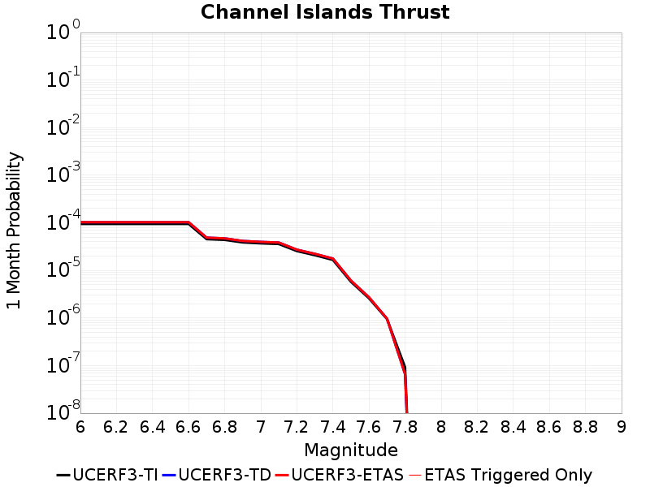 |  |  |

| Magnitude | 1 wk TI Prob | 1 wk TD Prob | 1 wk ETAS Prob | 1 wk ETAS/TD Gain | 1 wk ETAS Triggered Only | 1 mo TI Prob | 1 mo TD Prob | 1 mo ETAS Prob | 1 mo ETAS/TD Gain | 1 mo ETAS Triggered Only | 1 yr TI Prob | 1 yr TD Prob | 1 yr ETAS Prob | 1 yr ETAS/TD Gain | 1 yr ETAS Triggered Only | 10 yr TI Prob | 10 yr TD Prob | 10 yr ETAS Prob | 10 yr ETAS/TD Gain | 10 yr ETAS Triggered Only |
|-----|-----|-----|-----|-----|-----|-----|-----|-----|-----|-----|-----|-----|-----|-----|-----|-----|-----|-----|-----|-----|
| 6.0 | 2.2156251E-5 | 2.4105197E-5 | 2.4105197E-5 | 1.0 | 0.0 | 9.495191E-5 | 1.033045E-4 | 1.033045E-4 | 1.0 | 0.0 | 0.0011554264 | 0.0012571132 | 0.0012671007 | 1.0079447 | 1.0E-5 | 0.011494373 | 0.012510623 | 0.012530373 | 1.0015787 | 2.0E-5 |
| 6.1 | 2.2156251E-5 | 2.4105197E-5 | 2.4105197E-5 | 1.0 | 0.0 | 9.495191E-5 | 1.033045E-4 | 1.033045E-4 | 1.0 | 0.0 | 0.0011554264 | 0.0012571132 | 0.0012671007 | 1.0079447 | 1.0E-5 | 0.011494373 | 0.012510623 | 0.012530373 | 1.0015787 | 2.0E-5 |
| 6.2 | 2.2156251E-5 | 2.4105197E-5 | 2.4105197E-5 | 1.0 | 0.0 | 9.495191E-5 | 1.033045E-4 | 1.033045E-4 | 1.0 | 0.0 | 0.0011554264 | 0.0012571132 | 0.0012671007 | 1.0079447 | 1.0E-5 | 0.011494373 | 0.012510623 | 0.012530373 | 1.0015787 | 2.0E-5 |
| 6.3 | 2.2156251E-5 | 2.4105197E-5 | 2.4105197E-5 | 1.0 | 0.0 | 9.495191E-5 | 1.033045E-4 | 1.033045E-4 | 1.0 | 0.0 | 0.0011554264 | 0.0012571132 | 0.0012671007 | 1.0079447 | 1.0E-5 | 0.011494373 | 0.012510623 | 0.012530373 | 1.0015787 | 2.0E-5 |
| 6.4 | 2.2156251E-5 | 2.4105197E-5 | 2.4105197E-5 | 1.0 | 0.0 | 9.495191E-5 | 1.033045E-4 | 1.033045E-4 | 1.0 | 0.0 | 0.0011554264 | 0.0012571132 | 0.0012671007 | 1.0079447 | 1.0E-5 | 0.011494373 | 0.012510623 | 0.012530373 | 1.0015787 | 2.0E-5 |
| 6.5 | 2.2156251E-5 | 2.4105197E-5 | 2.4105197E-5 | 1.0 | 0.0 | 9.495191E-5 | 1.033045E-4 | 1.033045E-4 | 1.0 | 0.0 | 0.0011554264 | 0.0012571132 | 0.0012671007 | 1.0079447 | 1.0E-5 | 0.011494373 | 0.012510623 | 0.012530373 | 1.0015787 | 2.0E-5 |
| 6.6 | 2.2156251E-5 | 2.4105197E-5 | 2.4105197E-5 | 1.0 | 0.0 | 9.495191E-5 | 1.033045E-4 | 1.033045E-4 | 1.0 | 0.0 | 0.0011554264 | 0.0012571132 | 0.0012671007 | 1.0079447 | 1.0E-5 | 0.011494373 | 0.012510623 | 0.012530373 | 1.0015787 | 2.0E-5 |
| 6.7 | 1.0601296E-5 | 1.1384805E-5 | 1.1384805E-5 | 1.0 | 0.0 | 4.5433335E-5 | 4.8791135E-5 | 4.8791135E-5 | 1.0 | 0.0 | 5.5301044E-4 | 5.93875E-4 | 5.93875E-4 | 1.0 | 0.0 | 0.005516363 | 0.0059233825 | 0.0059333234 | 1.0016782 | 1.0E-5 |
| 6.8 | 1.0246747E-5 | 1.100174E-5 | 1.100174E-5 | 1.0 | 0.0 | 4.391389E-5 | 4.7149486E-5 | 4.7149486E-5 | 1.0 | 0.0 | 5.345204E-4 | 5.738986E-4 | 5.738986E-4 | 1.0 | 0.0 | 0.0053323656 | 0.005724656 | 0.0057345987 | 1.0017369 | 1.0E-5 |
| 6.9 | 9.049551E-6 | 9.704043E-6 | 9.704043E-6 | 1.0 | 0.0 | 3.878322E-5 | 4.1588115E-5 | 4.1588115E-5 | 1.0 | 0.0 | 4.7208337E-4 | 5.062218E-4 | 5.062218E-4 | 1.0 | 0.0 | 0.0047108172 | 0.0050511044 | 0.0050610537 | 1.0019698 | 1.0E-5 |
| 7.0 | 8.6542195E-6 | 9.278803E-6 | 9.278803E-6 | 1.0 | 0.0 | 3.7088983E-5 | 3.9765717E-5 | 3.9765717E-5 | 1.0 | 0.0 | 4.5146482E-4 | 4.840441E-4 | 4.840441E-4 | 1.0 | 0.0 | 0.004505487 | 0.0048303106 | 0.0048402622 | 1.0020603 | 1.0E-5 |
| 7.1 | 8.391028E-6 | 8.997002E-6 | 8.997002E-6 | 1.0 | 0.0 | 3.5961057E-5 | 3.855803E-5 | 3.855803E-5 | 1.0 | 0.0 | 4.3773788E-4 | 4.69347E-4 | 4.69347E-4 | 1.0 | 0.0 | 0.004368766 | 0.004683968 | 0.004693921 | 1.0021249 | 1.0E-5 |
| 7.2 | 5.965188E-6 | 6.3744583E-6 | 6.3744583E-6 | 1.0 | 0.0 | 2.556484E-5 | 2.7318823E-5 | 2.7318823E-5 | 1.0 | 0.0 | 3.1120746E-4 | 3.3255646E-4 | 3.3255646E-4 | 1.0 | 0.0 | 0.00310772 | 0.0033206462 | 0.003330613 | 1.0030015 | 1.0E-5 |
| 7.3 | 4.877518E-6 | 5.208249E-6 | 5.208249E-6 | 1.0 | 0.0 | 2.0903482E-5 | 2.232088E-5 | 2.232088E-5 | 1.0 | 0.0 | 2.5447016E-4 | 2.717233E-4 | 2.717233E-4 | 1.0 | 0.0 | 0.0025417898 | 0.0027139566 | 0.0027239295 | 1.0036746 | 1.0E-5 |
| 7.4 | 3.8829853E-6 | 4.1436424E-6 | 4.1436424E-6 | 1.0 | 0.0 | 1.664126E-5 | 1.775835E-5 | 1.775835E-5 | 1.0 | 0.0 | 2.0258849E-4 | 2.1618686E-4 | 2.1618686E-4 | 1.0 | 0.0 | 0.002024039 | 0.0021598074 | 0.0021697858 | 1.0046201 | 1.0E-5 |
| 7.5 | 1.3489616E-6 | 1.4283704E-6 | 1.4283704E-6 | 1.0 | 0.0 | 5.7812517E-6 | 6.1215733E-6 | 6.1215733E-6 | 1.0 | 0.0 | 7.038446E-5 | 7.452765E-5 | 7.452765E-5 | 1.0 | 0.0 | 7.036218E-4 | 7.450305E-4 | 7.5502304E-4 | 1.0134122 | 1.0E-5 |
| 7.6 | 6.058192E-7 | 6.3563016E-7 | 6.3563016E-7 | 1.0 | 0.0 | 2.5963652E-6 | 2.7241265E-6 | 2.7241265E-6 | 1.0 | 0.0 | 3.161029E-5 | 3.316575E-5 | 3.316575E-5 | 1.0 | 0.0 | 3.1605794E-4 | 3.3160963E-4 | 3.4160633E-4 | 1.0301459 | 1.0E-5 |
| 7.7 | 2.2170494E-7 | 2.2616172E-7 | 2.2616172E-7 | 1.0 | 0.0 | 9.5016367E-7 | 9.692642E-7 | 9.692642E-7 | 1.0 | 0.0 | 1.1568181E-5 | 1.1800739E-5 | 1.1800739E-5 | 1.0 | 0.0 | 1.1567579E-4 | 1.1800224E-4 | 1.2800106E-4 | 1.0847342 | 1.0E-5 |
| 7.8 | 2.1613102E-8 | 1.5471455E-8 | 1.5471455E-8 | 1.0 | 0.0 | 9.262757E-8 | 6.6306235E-8 | 6.6306235E-8 | 1.0 | 0.0 | 1.1277401E-6 | 8.072782E-7 | 8.072782E-7 | 1.0 | 0.0 | 1.1277344E-5 | 8.0727605E-6 | 8.0727605E-6 | 1.0 | 0.0 |

## Oak Ridge (Onshore)
*[(top)](#table-of-contents)*

| 1 Week | 1 Month | 1 Year | 10 Year |
|-----|-----|-----|-----|
| 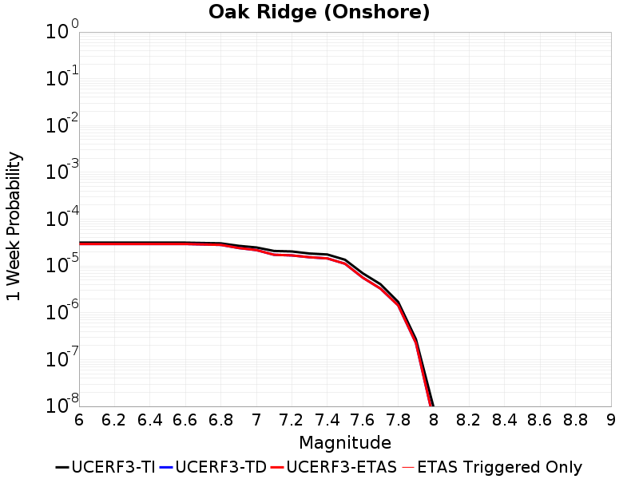 |  |  |  |

| Magnitude | 1 wk TI Prob | 1 wk TD Prob | 1 wk ETAS Prob | 1 wk ETAS/TD Gain | 1 wk ETAS Triggered Only | 1 mo TI Prob | 1 mo TD Prob | 1 mo ETAS Prob | 1 mo ETAS/TD Gain | 1 mo ETAS Triggered Only | 1 yr TI Prob | 1 yr TD Prob | 1 yr ETAS Prob | 1 yr ETAS/TD Gain | 1 yr ETAS Triggered Only | 10 yr TI Prob | 10 yr TD Prob | 10 yr ETAS Prob | 10 yr ETAS/TD Gain | 10 yr ETAS Triggered Only |
|-----|-----|-----|-----|-----|-----|-----|-----|-----|-----|-----|-----|-----|-----|-----|-----|-----|-----|-----|-----|-----|
| 6.0 | 3.155064E-5 | 2.9559864E-5 | 2.9559864E-5 | 1.0 | 0.0 | 1.3521002E-4 | 1.266792E-4 | 1.266792E-4 | 1.0 | 0.0 | 0.001644939 | 0.0015412662 | 0.0015412662 | 1.0 | 0.0 | 0.01632816 | 0.015310144 | 0.015329838 | 1.0012863 | 2.0E-5 |
| 6.1 | 3.155064E-5 | 2.9559864E-5 | 2.9559864E-5 | 1.0 | 0.0 | 1.3521002E-4 | 1.266792E-4 | 1.266792E-4 | 1.0 | 0.0 | 0.001644939 | 0.0015412662 | 0.0015412662 | 1.0 | 0.0 | 0.01632816 | 0.015310144 | 0.015329838 | 1.0012863 | 2.0E-5 |
| 6.2 | 3.155064E-5 | 2.9559864E-5 | 2.9559864E-5 | 1.0 | 0.0 | 1.3521002E-4 | 1.266792E-4 | 1.266792E-4 | 1.0 | 0.0 | 0.001644939 | 0.0015412662 | 0.0015412662 | 1.0 | 0.0 | 0.01632816 | 0.015310144 | 0.015329838 | 1.0012863 | 2.0E-5 |
| 6.3 | 3.155064E-5 | 2.9559864E-5 | 2.9559864E-5 | 1.0 | 0.0 | 1.3521002E-4 | 1.266792E-4 | 1.266792E-4 | 1.0 | 0.0 | 0.001644939 | 0.0015412662 | 0.0015412662 | 1.0 | 0.0 | 0.01632816 | 0.015310144 | 0.015329838 | 1.0012863 | 2.0E-5 |
| 6.4 | 3.155064E-5 | 2.9559864E-5 | 2.9559864E-5 | 1.0 | 0.0 | 1.3521002E-4 | 1.266792E-4 | 1.266792E-4 | 1.0 | 0.0 | 0.001644939 | 0.0015412662 | 0.0015412662 | 1.0 | 0.0 | 0.01632816 | 0.015310144 | 0.015329838 | 1.0012863 | 2.0E-5 |
| 6.5 | 3.155064E-5 | 2.9559864E-5 | 2.9559864E-5 | 1.0 | 0.0 | 1.3521002E-4 | 1.266792E-4 | 1.266792E-4 | 1.0 | 0.0 | 0.001644939 | 0.0015412662 | 0.0015412662 | 1.0 | 0.0 | 0.01632816 | 0.015310144 | 0.015329838 | 1.0012863 | 2.0E-5 |
| 6.6 | 3.155064E-5 | 2.9559864E-5 | 2.9559864E-5 | 1.0 | 0.0 | 1.3521002E-4 | 1.266792E-4 | 1.266792E-4 | 1.0 | 0.0 | 0.001644939 | 0.0015412662 | 0.0015412662 | 1.0 | 0.0 | 0.01632816 | 0.015310144 | 0.015329838 | 1.0012863 | 2.0E-5 |
| 6.7 | 3.098897E-5 | 2.8897333E-5 | 2.8897333E-5 | 1.0 | 0.0 | 1.328031E-4 | 1.2384004E-4 | 1.2384004E-4 | 1.0 | 0.0 | 0.0016156785 | 0.0015067476 | 0.0015067476 | 1.0 | 0.0 | 0.016039822 | 0.014969628 | 0.014989329 | 1.0013161 | 2.0E-5 |
| 6.8 | 3.0449872E-5 | 2.8271914E-5 | 2.8271914E-5 | 1.0 | 0.0 | 1.3049292E-4 | 1.2115992E-4 | 1.2115992E-4 | 1.0 | 0.0 | 0.0015875935 | 0.0014741612 | 0.0014741612 | 1.0 | 0.0 | 0.015762992 | 0.014648064 | 0.014667771 | 1.0013454 | 2.0E-5 |
| 6.9 | 2.697928E-5 | 2.424835E-5 | 2.424835E-5 | 1.0 | 0.0 | 1.15620365E-4 | 1.0391748E-4 | 1.0391748E-4 | 1.0 | 0.0 | 0.0014067689 | 0.0012644826 | 0.0012644826 | 1.0 | 0.0 | 0.0139789665 | 0.0125754615 | 0.012585335 | 1.0007852 | 1.0E-5 |
| 7.0 | 2.4893961E-5 | 2.188845E-5 | 2.188845E-5 | 1.0 | 0.0 | 1.0668404E-4 | 9.380437E-5 | 9.380437E-5 | 1.0 | 0.0 | 0.0012981043 | 0.0011414876 | 0.0011414876 | 1.0 | 0.0 | 0.012905477 | 0.011358395 | 0.011358395 | 1.0 | 0.0 |
| 7.1 | 2.0945363E-5 | 1.7376839E-5 | 1.7376839E-5 | 1.0 | 0.0 | 8.976275E-5 | 7.447007E-5 | 7.447007E-5 | 1.0 | 0.0 | 0.0010923136 | 9.0630073E-4 | 9.0630073E-4 | 1.0 | 0.0 | 0.0108696 | 0.009026845 | 0.009026845 | 1.0 | 0.0 |
| 7.2 | 2.0439404E-5 | 1.683132E-5 | 1.683132E-5 | 1.0 | 0.0 | 8.7594504E-5 | 7.2132265E-5 | 7.2132265E-5 | 1.0 | 0.0 | 0.0010659413 | 8.7786117E-4 | 8.7786117E-4 | 1.0 | 0.0 | 0.010608427 | 0.008744717 | 0.008744717 | 1.0 | 0.0 |
| 7.3 | 1.8463334E-5 | 1.5400748E-5 | 1.5400748E-5 | 1.0 | 0.0 | 7.912617E-5 | 6.6001565E-5 | 6.6001565E-5 | 1.0 | 0.0 | 9.6293533E-4 | 8.0327713E-4 | 8.0327713E-4 | 1.0 | 0.0 | 0.009587734 | 0.008004463 | 0.008004463 | 1.0 | 0.0 |
| 7.4 | 1.763139E-5 | 1.4534627E-5 | 1.4534627E-5 | 1.0 | 0.0 | 7.556091E-5 | 6.228979E-5 | 6.228979E-5 | 1.0 | 0.0 | 9.1956573E-4 | 7.581183E-4 | 7.581183E-4 | 1.0 | 0.0 | 0.009157699 | 0.007555986 | 0.007555986 | 1.0 | 0.0 |
| 7.5 | 1.3594944E-5 | 1.1177812E-5 | 1.1177812E-5 | 1.0 | 0.0 | 5.8262744E-5 | 4.7904043E-5 | 4.7904043E-5 | 1.0 | 0.0 | 7.0911803E-4 | 5.830782E-4 | 5.830782E-4 | 1.0 | 0.0 | 0.007068595 | 0.0058157817 | 0.0058157817 | 1.0 | 0.0 |
| 7.6 | 6.9889534E-6 | 5.640359E-6 | 5.640359E-6 | 1.0 | 0.0 | 2.9952313E-5 | 2.4172745E-5 | 2.4172745E-5 | 1.0 | 0.0 | 3.646084E-4 | 2.9426385E-4 | 2.9426385E-4 | 1.0 | 0.0 | 0.0036401073 | 0.002938786 | 0.002938786 | 1.0 | 0.0 |
| 7.7 | 4.0824193E-6 | 3.285867E-6 | 3.285867E-6 | 1.0 | 0.0 | 1.7495966E-5 | 1.4082212E-5 | 1.4082212E-5 | 1.0 | 0.0 | 2.1299256E-4 | 1.7143758E-4 | 1.7143758E-4 | 1.0 | 0.0 | 0.0021278851 | 0.0017130667 | 0.0017130667 | 1.0 | 0.0 |
| 7.8 | 1.7023609E-6 | 1.4378917E-6 | 1.4378917E-6 | 1.0 | 0.0 | 7.295812E-6 | 6.162378E-6 | 6.162378E-6 | 1.0 | 0.0 | 8.882289E-5 | 7.50244E-5 | 7.50244E-5 | 1.0 | 0.0 | 8.8787393E-4 | 7.4999355E-4 | 7.4999355E-4 | 1.0 | 0.0 |
| 7.9 | 2.721225E-7 | 2.2627627E-7 | 2.2627627E-7 | 1.0 | 0.0 | 1.1662388E-6 | 9.697551E-7 | 9.697551E-7 | 1.0 | 0.0 | 1.4198865E-5 | 1.1806707E-5 | 1.1806707E-5 | 1.0 | 0.0 | 1.4197957E-4 | 1.1806108E-4 | 1.1806108E-4 | 1.0 | 0.0 |
| 8.0 | 9.364255E-9 | 5.132577E-9 | 5.132577E-9 | 1.0 | 0.0 | 4.0132523E-8 | 2.1996758E-8 | 2.1996758E-8 | 1.0 | 0.0 | 4.8861335E-7 | 2.678105E-7 | 2.678105E-7 | 1.0 | 0.0 | 4.8861225E-6 | 2.678102E-6 | 2.678102E-6 | 1.0 | 0.0 |

## Great Valley 09 (Laguna Seca)
*[(top)](#table-of-contents)*

| 1 Week | 1 Month | 1 Year | 10 Year |
|-----|-----|-----|-----|
|  |  | 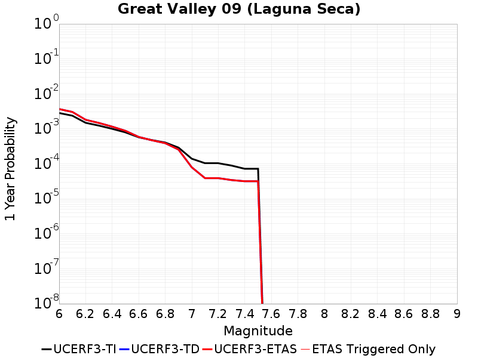 | 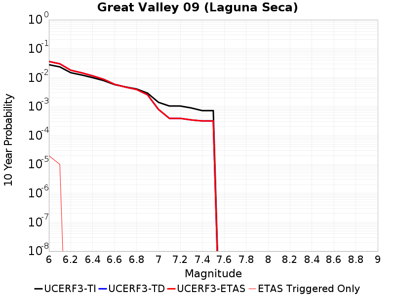 |

| Magnitude | 1 wk TI Prob | 1 wk TD Prob | 1 wk ETAS Prob | 1 wk ETAS/TD Gain | 1 wk ETAS Triggered Only | 1 mo TI Prob | 1 mo TD Prob | 1 mo ETAS Prob | 1 mo ETAS/TD Gain | 1 mo ETAS Triggered Only | 1 yr TI Prob | 1 yr TD Prob | 1 yr ETAS Prob | 1 yr ETAS/TD Gain | 1 yr ETAS Triggered Only | 10 yr TI Prob | 10 yr TD Prob | 10 yr ETAS Prob | 10 yr ETAS/TD Gain | 10 yr ETAS Triggered Only |
|-----|-----|-----|-----|-----|-----|-----|-----|-----|-----|-----|-----|-----|-----|-----|-----|-----|-----|-----|-----|-----|
| 6.0 | 5.4353277E-5 | 7.063632E-5 | 7.063632E-5 | 1.0 | 0.0 | 2.3292181E-4 | 3.0269055E-4 | 3.0269055E-4 | 1.0 | 0.0 | 0.0028321352 | 0.0036790557 | 0.0036790557 | 1.0 | 0.0 | 0.02796312 | 0.036182955 | 0.036202233 | 1.0005327 | 2.0E-5 |
| 6.1 | 4.5578287E-5 | 5.8329213E-5 | 5.8329213E-5 | 1.0 | 0.0 | 1.953209E-4 | 2.499577E-4 | 2.499577E-4 | 1.0 | 0.0 | 0.0023754383 | 0.0030389957 | 0.0030389957 | 1.0 | 0.0 | 0.023502063 | 0.029973958 | 0.029983658 | 1.0003237 | 1.0E-5 |
| 6.2 | 2.8536782E-5 | 3.479434E-5 | 3.479434E-5 | 1.0 | 0.0 | 1.2229476E-4 | 1.4911048E-4 | 1.4911048E-4 | 1.0 | 0.0 | 0.0014879217 | 0.0018138902 | 0.0018138902 | 1.0 | 0.0 | 0.014779986 | 0.017987756 | 0.017987756 | 1.0 | 0.0 |
| 6.3 | 2.3698774E-5 | 2.8258217E-5 | 2.8258217E-5 | 1.0 | 0.0 | 1.01562226E-4 | 1.2110132E-4 | 1.2110132E-4 | 1.0 | 0.0 | 0.0012358186 | 0.0014733992 | 0.0014733992 | 1.0 | 0.0 | 0.012289686 | 0.014634381 | 0.014634381 | 1.0 | 0.0 |
| 6.4 | 1.9191197E-5 | 2.2155504E-5 | 2.2155504E-5 | 1.0 | 0.0 | 8.2245395E-5 | 9.4948926E-5 | 9.4948926E-5 | 1.0 | 0.0 | 0.0010008777 | 0.0011553937 | 0.0011553937 | 1.0 | 0.0 | 0.009963818 | 0.011493738 | 0.011493738 | 1.0 | 0.0 |
| 6.5 | 1.5203241E-5 | 1.6823375E-5 | 1.6823375E-5 | 1.0 | 0.0 | 6.5155116E-5 | 7.209836E-5 | 7.209836E-5 | 1.0 | 0.0 | 7.9297484E-4 | 8.7745994E-4 | 8.7745994E-4 | 1.0 | 0.0 | 0.007901512 | 0.008741017 | 0.008741017 | 1.0 | 0.0 |
| 6.6 | 1.0984925E-5 | 1.1254303E-5 | 1.1254303E-5 | 1.0 | 0.0 | 4.70774E-5 | 4.8231857E-5 | 4.8231857E-5 | 1.0 | 0.0 | 5.730166E-4 | 5.8706856E-4 | 5.8706856E-4 | 1.0 | 0.0 | 0.005715413 | 0.005855567 | 0.005855567 | 1.0 | 0.0 |
| 6.7 | 9.134616E-6 | 9.028833E-6 | 9.028833E-6 | 1.0 | 0.0 | 3.9147766E-5 | 3.8694438E-5 | 3.8694438E-5 | 1.0 | 0.0 | 4.7651984E-4 | 4.7100533E-4 | 4.7100533E-4 | 1.0 | 0.0 | 0.004754993 | 0.004700316 | 0.004700316 | 1.0 | 0.0 |
| 6.8 | 7.785589E-6 | 7.4592995E-6 | 7.4592995E-6 | 1.0 | 0.0 | 3.3366385E-5 | 3.1968048E-5 | 3.1968048E-5 | 1.0 | 0.0 | 4.0616E-4 | 3.8914348E-4 | 3.8914348E-4 | 1.0 | 0.0 | 0.0040541845 | 0.003884825 | 0.003884825 | 1.0 | 0.0 |
| 6.9 | 5.579095E-6 | 4.903351E-6 | 4.903351E-6 | 1.0 | 0.0 | 2.3910188E-5 | 2.1014199E-5 | 2.1014199E-5 | 1.0 | 0.0 | 2.9106764E-4 | 2.5581924E-4 | 2.5581924E-4 | 1.0 | 0.0 | 0.002906867 | 0.002555385 | 0.002555385 | 1.0 | 0.0 |
| 7.0 | 2.6816688E-6 | 1.5229923E-6 | 1.5229923E-6 | 1.0 | 0.0 | 1.1492816E-5 | 6.5270942E-6 | 6.5270942E-6 | 1.0 | 0.0 | 1.3991605E-4 | 7.946456E-5 | 7.946456E-5 | 1.0 | 0.0 | 0.0013982799 | 7.943702E-4 | 7.943702E-4 | 1.0 | 0.0 |
| 7.1 | 1.9951021E-6 | 7.4613195E-7 | 7.4613195E-7 | 1.0 | 0.0 | 8.55041E-6 | 3.1977045E-6 | 3.1977045E-6 | 1.0 | 0.0 | 1.0409627E-4 | 3.89314E-5 | 3.89314E-5 | 1.0 | 0.0 | 0.0010404752 | 3.8924994E-4 | 3.8924994E-4 | 1.0 | 0.0 |
| 7.2 | 1.9951021E-6 | 7.4613195E-7 | 7.4613195E-7 | 1.0 | 0.0 | 8.55041E-6 | 3.1977045E-6 | 3.1977045E-6 | 1.0 | 0.0 | 1.0409627E-4 | 3.89314E-5 | 3.89314E-5 | 1.0 | 0.0 | 0.0010404752 | 3.8924994E-4 | 3.8924994E-4 | 1.0 | 0.0 |
| 7.3 | 1.7087556E-6 | 6.5846945E-7 | 6.5846945E-7 | 1.0 | 0.0 | 7.3232177E-6 | 2.822009E-6 | 2.822009E-6 | 1.0 | 0.0 | 8.915652E-5 | 3.435746E-5 | 3.435746E-5 | 1.0 | 0.0 | 8.9120766E-4 | 3.4352555E-4 | 3.4352555E-4 | 1.0 | 0.0 |
| 7.4 | 1.3804846E-6 | 6.078403E-7 | 6.078403E-7 | 1.0 | 0.0 | 5.916349E-6 | 2.6050277E-6 | 2.6050277E-6 | 1.0 | 0.0 | 7.2029165E-5 | 3.171579E-5 | 3.171579E-5 | 1.0 | 0.0 | 7.200583E-4 | 3.1711665E-4 | 3.1711665E-4 | 1.0 | 0.0 |
| 7.5 | 1.3804846E-6 | 6.078403E-7 | 6.078403E-7 | 1.0 | 0.0 | 5.916349E-6 | 2.6050277E-6 | 2.6050277E-6 | 1.0 | 0.0 | 7.2029165E-5 | 3.171579E-5 | 3.171579E-5 | 1.0 | 0.0 | 7.200583E-4 | 3.1711665E-4 | 3.1711665E-4 | 1.0 | 0.0 |

## Gillem - Big Crack 2011 CFM
*[(top)](#table-of-contents)*

| 1 Week | 1 Month | 1 Year | 10 Year |
|-----|-----|-----|-----|
| 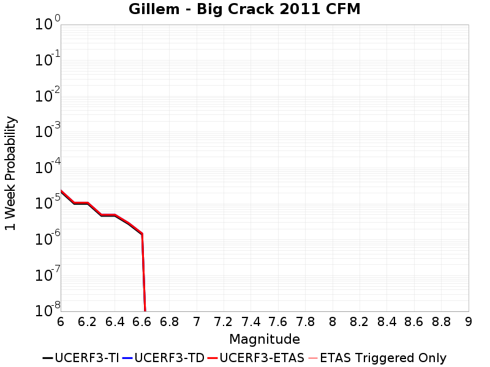 | 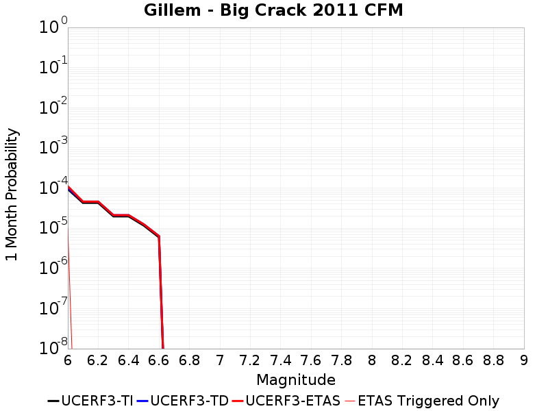 | 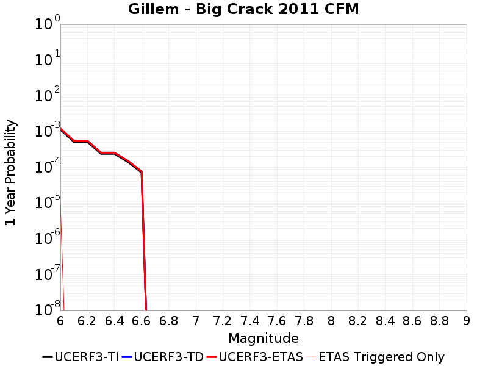 | 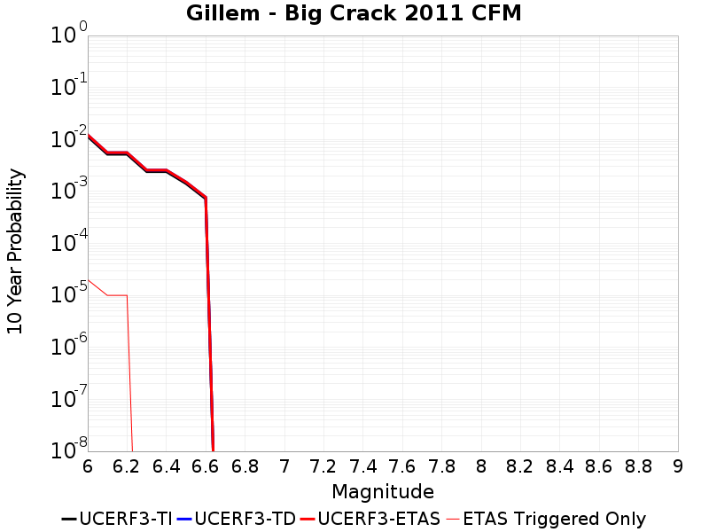 |

| Magnitude | 1 wk TI Prob | 1 wk TD Prob | 1 wk ETAS Prob | 1 wk ETAS/TD Gain | 1 wk ETAS Triggered Only | 1 mo TI Prob | 1 mo TD Prob | 1 mo ETAS Prob | 1 mo ETAS/TD Gain | 1 mo ETAS Triggered Only | 1 yr TI Prob | 1 yr TD Prob | 1 yr ETAS Prob | 1 yr ETAS/TD Gain | 1 yr ETAS Triggered Only | 10 yr TI Prob | 10 yr TD Prob | 10 yr ETAS Prob | 10 yr ETAS/TD Gain | 10 yr ETAS Triggered Only |
|-----|-----|-----|-----|-----|-----|-----|-----|-----|-----|-----|-----|-----|-----|-----|-----|-----|-----|-----|-----|-----|
| 6.0 | 2.196852E-5 | 2.3615408E-5 | 2.3615408E-5 | 1.0 | 0.0 | 9.4147406E-5 | 1.0120547E-4 | 1.11204456E-4 | 1.0987989 | 1.0E-5 | 0.0011456419 | 0.0012315691 | 0.0012415568 | 1.0081097 | 1.0E-5 | 0.011397537 | 0.012256308 | 0.012276063 | 1.0016118 | 2.0E-5 |
| 6.1 | 9.992795E-6 | 1.0716679E-5 | 1.0716679E-5 | 1.0 | 0.0 | 4.2825563E-5 | 4.5927918E-5 | 4.5927918E-5 | 1.0 | 0.0 | 5.2127644E-4 | 5.590473E-4 | 5.590473E-4 | 1.0 | 0.0 | 0.0052005537 | 0.0055782213 | 0.0055881655 | 1.0017827 | 1.0E-5 |
| 6.2 | 9.992795E-6 | 1.0716679E-5 | 1.0716679E-5 | 1.0 | 0.0 | 4.2825563E-5 | 4.5927918E-5 | 4.5927918E-5 | 1.0 | 0.0 | 5.2127644E-4 | 5.590473E-4 | 5.590473E-4 | 1.0 | 0.0 | 0.0052005537 | 0.0055782213 | 0.0055881655 | 1.0017827 | 1.0E-5 |
| 6.3 | 4.6127884E-6 | 4.9448527E-6 | 4.9448527E-6 | 1.0 | 0.0 | 1.9768944E-5 | 2.119208E-5 | 2.119208E-5 | 1.0 | 0.0 | 2.406603E-4 | 2.5798747E-4 | 2.5798747E-4 | 1.0 | 0.0 | 0.0024039985 | 0.0025773183 | 0.0025773183 | 1.0 | 0.0 |
| 6.4 | 4.6127884E-6 | 4.9448527E-6 | 4.9448527E-6 | 1.0 | 0.0 | 1.9768944E-5 | 2.119208E-5 | 2.119208E-5 | 1.0 | 0.0 | 2.406603E-4 | 2.5798747E-4 | 2.5798747E-4 | 1.0 | 0.0 | 0.0024039985 | 0.0025773183 | 0.0025773183 | 1.0 | 0.0 |
| 6.5 | 2.716712E-6 | 2.9124055E-6 | 2.9124055E-6 | 1.0 | 0.0 | 1.1643E-5 | 1.2481692E-5 | 1.2481692E-5 | 1.0 | 0.0 | 1.417443E-4 | 1.5195642E-4 | 1.5195642E-4 | 1.0 | 0.0 | 0.0014165393 | 0.0015187635 | 0.0015187635 | 1.0 | 0.0 |
| 6.6 | 1.3818255E-6 | 1.4827368E-6 | 1.4827368E-6 | 1.0 | 0.0 | 5.922096E-6 | 6.3545776E-6 | 6.3545776E-6 | 1.0 | 0.0 | 7.209913E-5 | 7.736547E-5 | 7.736547E-5 | 1.0 | 0.0 | 7.2075747E-4 | 7.735064E-4 | 7.735064E-4 | 1.0 | 0.0 |

## Santa Ynez (West)
*[(top)](#table-of-contents)*

| 1 Week | 1 Month | 1 Year | 10 Year |
|-----|-----|-----|-----|
|  |  |  |  |

| Magnitude | 1 wk TI Prob | 1 wk TD Prob | 1 wk ETAS Prob | 1 wk ETAS/TD Gain | 1 wk ETAS Triggered Only | 1 mo TI Prob | 1 mo TD Prob | 1 mo ETAS Prob | 1 mo ETAS/TD Gain | 1 mo ETAS Triggered Only | 1 yr TI Prob | 1 yr TD Prob | 1 yr ETAS Prob | 1 yr ETAS/TD Gain | 1 yr ETAS Triggered Only | 10 yr TI Prob | 10 yr TD Prob | 10 yr ETAS Prob | 10 yr ETAS/TD Gain | 10 yr ETAS Triggered Only |
|-----|-----|-----|-----|-----|-----|-----|-----|-----|-----|-----|-----|-----|-----|-----|-----|-----|-----|-----|-----|-----|
| 6.0 | 4.7352758E-5 | 5.5034863E-5 | 5.5034863E-5 | 1.0 | 0.0 | 2.0292461E-4 | 2.3584405E-4 | 2.3584405E-4 | 1.0 | 0.0 | 0.0024678076 | 0.002867892 | 0.002867892 | 1.0 | 0.0 | 0.024405818 | 0.028336914 | 0.028356347 | 1.0006858 | 2.0E-5 |
| 6.1 | 4.7352758E-5 | 5.5034863E-5 | 5.5034863E-5 | 1.0 | 0.0 | 2.0292461E-4 | 2.3584405E-4 | 2.3584405E-4 | 1.0 | 0.0 | 0.0024678076 | 0.002867892 | 0.002867892 | 1.0 | 0.0 | 0.024405818 | 0.028336914 | 0.028336914 | 1.0 | 0.0 |
| 6.2 | 3.0415853E-5 | 3.3957494E-5 | 3.3957494E-5 | 1.0 | 0.0 | 1.3034715E-4 | 1.4552422E-4 | 1.4552422E-4 | 1.0 | 0.0 | 0.0015858212 | 0.001770352 | 0.001770352 | 1.0 | 0.0 | 0.015745522 | 0.017566428 | 0.017566428 | 1.0 | 0.0 |
| 6.3 | 3.0415853E-5 | 3.3957494E-5 | 3.3957494E-5 | 1.0 | 0.0 | 1.3034715E-4 | 1.4552422E-4 | 1.4552422E-4 | 1.0 | 0.0 | 0.0015858212 | 0.001770352 | 0.001770352 | 1.0 | 0.0 | 0.015745522 | 0.017566428 | 0.017566428 | 1.0 | 0.0 |
| 6.4 | 2.5452082E-5 | 2.7936892E-5 | 2.7936892E-5 | 1.0 | 0.0 | 1.09075794E-4 | 1.1972415E-4 | 1.1972415E-4 | 1.0 | 0.0 | 0.0013271887 | 0.0014566856 | 0.0014566856 | 1.0 | 0.0 | 0.013192902 | 0.014473541 | 0.014473541 | 1.0 | 0.0 |
| 6.5 | 2.3143784E-5 | 2.5149124E-5 | 2.5149124E-5 | 1.0 | 0.0 | 9.9183875E-5 | 1.0777759E-4 | 1.0777759E-4 | 1.0 | 0.0 | 0.0012068948 | 0.0013114167 | 0.0013114167 | 1.0 | 0.0 | 0.012003611 | 0.013038446 | 0.013038446 | 1.0 | 0.0 |
| 6.6 | 1.9118515E-5 | 2.0369685E-5 | 2.0369685E-5 | 1.0 | 0.0 | 8.193392E-5 | 8.7295775E-5 | 8.7295775E-5 | 1.0 | 0.0 | 9.97089E-4 | 0.0010623158 | 0.0010623158 | 1.0 | 0.0 | 0.00992627 | 0.010573289 | 0.010573289 | 1.0 | 0.0 |
| 6.7 | 1.722807E-5 | 1.8159373E-5 | 1.8159373E-5 | 1.0 | 0.0 | 7.3832496E-5 | 7.782359E-5 | 7.782359E-5 | 1.0 | 0.0 | 8.985399E-4 | 9.47096E-4 | 9.47096E-4 | 1.0 | 0.0 | 0.008949154 | 0.009431244 | 0.009431244 | 1.0 | 0.0 |
| 6.8 | 1.5317364E-5 | 1.593726E-5 | 1.593726E-5 | 1.0 | 0.0 | 6.56442E-5 | 6.8300775E-5 | 6.8300775E-5 | 1.0 | 0.0 | 7.98925E-4 | 8.31249E-4 | 8.31249E-4 | 1.0 | 0.0 | 0.007960589 | 0.008281886 | 0.008281886 | 1.0 | 0.0 |
| 6.9 | 1.3071226E-5 | 1.3337862E-5 | 1.3337862E-5 | 1.0 | 0.0 | 5.6018336E-5 | 5.7161025E-5 | 5.7161025E-5 | 1.0 | 0.0 | 6.8180985E-4 | 6.957155E-4 | 6.957155E-4 | 1.0 | 0.0 | 0.0067972173 | 0.006935636 | 0.006935636 | 1.0 | 0.0 |
| 7.0 | 1.1836986E-5 | 1.19398655E-5 | 1.19398655E-5 | 1.0 | 0.0 | 5.0728955E-5 | 5.1169856E-5 | 5.1169856E-5 | 1.0 | 0.0 | 6.1745E-4 | 6.228166E-4 | 6.228166E-4 | 1.0 | 0.0 | 0.006157372 | 0.0062109046 | 0.0062109046 | 1.0 | 0.0 |
| 7.1 | 1.0597169E-5 | 1.0548223E-5 | 1.0548223E-5 | 1.0 | 0.0 | 4.541565E-5 | 4.5205892E-5 | 4.5205892E-5 | 1.0 | 0.0 | 5.5279525E-4 | 5.502439E-4 | 5.502439E-4 | 1.0 | 0.0 | 0.0055142213 | 0.005488946 | 0.005488946 | 1.0 | 0.0 |
| 7.2 | 9.59113E-6 | 9.464644E-6 | 9.464644E-6 | 1.0 | 0.0 | 4.11042E-5 | 4.0562136E-5 | 4.0562136E-5 | 1.0 | 0.0 | 5.0032866E-4 | 4.9373315E-4 | 4.9373315E-4 | 1.0 | 0.0 | 0.004992037 | 0.0049264813 | 0.0049264813 | 1.0 | 0.0 |
| 7.3 | 8.586084E-6 | 8.3845825E-6 | 8.3845825E-6 | 1.0 | 0.0 | 3.679698E-5 | 3.5933434E-5 | 3.5933434E-5 | 1.0 | 0.0 | 4.4791115E-4 | 4.3740278E-4 | 4.3740278E-4 | 1.0 | 0.0 | 0.004470094 | 0.0043655303 | 0.0043655303 | 1.0 | 0.0 |
| 7.4 | 7.2622997E-6 | 6.955822E-6 | 6.955822E-6 | 1.0 | 0.0 | 3.112377E-5 | 2.981033E-5 | 2.981033E-5 | 1.0 | 0.0 | 3.78866E-4 | 3.6288128E-4 | 3.6288128E-4 | 1.0 | 0.0 | 0.0037822074 | 0.0036229878 | 0.0036229878 | 1.0 | 0.0 |
| 7.5 | 5.627296E-6 | 5.2545906E-6 | 5.2545906E-6 | 1.0 | 0.0 | 2.411676E-5 | 2.2519484E-5 | 2.2519484E-5 | 1.0 | 0.0 | 2.9358198E-4 | 2.741409E-4 | 2.741409E-4 | 1.0 | 0.0 | 0.0029319443 | 0.0027380995 | 0.0027380995 | 1.0 | 0.0 |
| 7.6 | 2.265244E-6 | 2.0616912E-6 | 2.0616912E-6 | 1.0 | 0.0 | 9.708152E-6 | 8.83579E-6 | 8.83579E-6 | 1.0 | 0.0 | 1.18190335E-4 | 1.0757052E-4 | 1.0757052E-4 | 1.0 | 0.0 | 0.001181275 | 0.0010751932 | 0.0010751932 | 1.0 | 0.0 |
| 7.7 | 1.3099874E-6 | 1.1020863E-6 | 1.1020863E-6 | 1.0 | 0.0 | 5.61422E-6 | 4.723219E-6 | 4.723219E-6 | 1.0 | 0.0 | 6.8350986E-5 | 5.7503697E-5 | 5.7503697E-5 | 1.0 | 0.0 | 6.832996E-4 | 5.748906E-4 | 5.748906E-4 | 1.0 | 0.0 |
| 7.8 | 7.903951E-7 | 6.07374E-7 | 6.07374E-7 | 1.0 | 0.0 | 3.3874032E-6 | 2.6030289E-6 | 2.6030289E-6 | 1.0 | 0.0 | 4.1240855E-5 | 3.1691427E-5 | 3.1691427E-5 | 1.0 | 0.0 | 4.12332E-4 | 3.1687043E-4 | 3.1687043E-4 | 1.0 | 0.0 |
| 7.9 | 7.0753297E-9 | 5.0916187E-9 | 5.0916187E-9 | 1.0 | 0.0 | 3.032284E-8 | 2.1821224E-8 | 2.1821224E-8 | 1.0 | 0.0 | 3.6918053E-7 | 2.6567338E-7 | 2.6567338E-7 | 1.0 | 0.0 | 3.691799E-6 | 2.6567316E-6 | 2.6567316E-6 | 1.0 | 0.0 |

## San Gabriel
*[(top)](#table-of-contents)*

| 1 Week | 1 Month | 1 Year | 10 Year |
|-----|-----|-----|-----|
|  |  |  |  |

| Magnitude | 1 wk TI Prob | 1 wk TD Prob | 1 wk ETAS Prob | 1 wk ETAS/TD Gain | 1 wk ETAS Triggered Only | 1 mo TI Prob | 1 mo TD Prob | 1 mo ETAS Prob | 1 mo ETAS/TD Gain | 1 mo ETAS Triggered Only | 1 yr TI Prob | 1 yr TD Prob | 1 yr ETAS Prob | 1 yr ETAS/TD Gain | 1 yr ETAS Triggered Only | 10 yr TI Prob | 10 yr TD Prob | 10 yr ETAS Prob | 10 yr ETAS/TD Gain | 10 yr ETAS Triggered Only |
|-----|-----|-----|-----|-----|-----|-----|-----|-----|-----|-----|-----|-----|-----|-----|-----|-----|-----|-----|-----|-----|
| 6.0 | 1.083775E-5 | 1.2086562E-5 | 1.2086562E-5 | 1.0 | 0.0 | 4.6446676E-5 | 5.1798586E-5 | 5.1798586E-5 | 1.0 | 0.0 | 5.653415E-4 | 6.304766E-4 | 6.304766E-4 | 1.0 | 0.0 | 0.0056390543 | 0.0062987185 | 0.0063185925 | 1.0031552 | 2.0E-5 |
| 6.1 | 1.083775E-5 | 1.2086562E-5 | 1.2086562E-5 | 1.0 | 0.0 | 4.6446676E-5 | 5.1798586E-5 | 5.1798586E-5 | 1.0 | 0.0 | 5.653415E-4 | 6.304766E-4 | 6.304766E-4 | 1.0 | 0.0 | 0.0056390543 | 0.0062987185 | 0.0063185925 | 1.0031552 | 2.0E-5 |
| 6.2 | 1.083775E-5 | 1.2086562E-5 | 1.2086562E-5 | 1.0 | 0.0 | 4.6446676E-5 | 5.1798586E-5 | 5.1798586E-5 | 1.0 | 0.0 | 5.653415E-4 | 6.304766E-4 | 6.304766E-4 | 1.0 | 0.0 | 0.0056390543 | 0.0062987185 | 0.0063185925 | 1.0031552 | 2.0E-5 |
| 6.3 | 1.083775E-5 | 1.2086562E-5 | 1.2086562E-5 | 1.0 | 0.0 | 4.6446676E-5 | 5.1798586E-5 | 5.1798586E-5 | 1.0 | 0.0 | 5.653415E-4 | 6.304766E-4 | 6.304766E-4 | 1.0 | 0.0 | 0.0056390543 | 0.0062987185 | 0.0063185925 | 1.0031552 | 2.0E-5 |
| 6.4 | 1.083775E-5 | 1.2086562E-5 | 1.2086562E-5 | 1.0 | 0.0 | 4.6446676E-5 | 5.1798586E-5 | 5.1798586E-5 | 1.0 | 0.0 | 5.653415E-4 | 6.304766E-4 | 6.304766E-4 | 1.0 | 0.0 | 0.0056390543 | 0.0062987185 | 0.0063185925 | 1.0031552 | 2.0E-5 |
| 6.5 | 6.7317824E-6 | 7.817271E-6 | 7.817271E-6 | 1.0 | 0.0 | 2.8850178E-5 | 3.350216E-5 | 3.350216E-5 | 1.0 | 0.0 | 3.511943E-4 | 4.0781355E-4 | 4.0781355E-4 | 1.0 | 0.0 | 0.003506398 | 0.0040814904 | 0.0040914495 | 1.0024401 | 1.0E-5 |
| 6.6 | 6.7317824E-6 | 7.817271E-6 | 7.817271E-6 | 1.0 | 0.0 | 2.8850178E-5 | 3.350216E-5 | 3.350216E-5 | 1.0 | 0.0 | 3.511943E-4 | 4.0781355E-4 | 4.0781355E-4 | 1.0 | 0.0 | 0.003506398 | 0.0040814904 | 0.0040914495 | 1.0024401 | 1.0E-5 |
| 6.7 | 6.274881E-6 | 7.3460997E-6 | 7.3460997E-6 | 1.0 | 0.0 | 2.6892068E-5 | 3.148291E-5 | 3.148291E-5 | 1.0 | 0.0 | 3.2736175E-4 | 3.83238E-4 | 3.83238E-4 | 1.0 | 0.0 | 0.0032687993 | 0.0038366024 | 0.003846564 | 1.0025965 | 1.0E-5 |
| 6.8 | 5.996209E-6 | 7.058765E-6 | 7.058765E-6 | 1.0 | 0.0 | 2.5697784E-5 | 3.0251504E-5 | 3.0251504E-5 | 1.0 | 0.0 | 3.128256E-4 | 3.6825077E-4 | 3.6825077E-4 | 1.0 | 0.0 | 0.003123856 | 0.0036872346 | 0.0036971977 | 1.0027021 | 1.0E-5 |
| 6.9 | 5.686331E-6 | 6.7234155E-6 | 6.7234155E-6 | 1.0 | 0.0 | 2.4369761E-5 | 2.8814326E-5 | 2.8814326E-5 | 1.0 | 0.0 | 2.9666146E-4 | 3.5075887E-4 | 3.5075887E-4 | 1.0 | 0.0 | 0.0029626573 | 0.0035128798 | 0.0035228448 | 1.0028367 | 1.0E-5 |
| 7.0 | 5.2329838E-6 | 6.247045E-6 | 6.247045E-6 | 1.0 | 0.0 | 2.242688E-5 | 2.677278E-5 | 2.677278E-5 | 1.0 | 0.0 | 2.7301308E-4 | 3.259106E-4 | 3.259106E-4 | 1.0 | 0.0 | 0.002726779 | 0.0032651415 | 0.003275109 | 1.0030527 | 1.0E-5 |
| 7.1 | 5.135671E-6 | 6.136911E-6 | 6.136911E-6 | 1.0 | 0.0 | 2.2009834E-5 | 2.6300786E-5 | 2.6300786E-5 | 1.0 | 0.0 | 2.6793676E-4 | 3.201658E-4 | 3.201658E-4 | 1.0 | 0.0 | 0.0026761394 | 0.0032078607 | 0.0032178287 | 1.0031073 | 1.0E-5 |
| 7.2 | 4.989062E-6 | 5.969846E-6 | 5.969846E-6 | 1.0 | 0.0 | 2.1381518E-5 | 2.5584808E-5 | 2.5584808E-5 | 1.0 | 0.0 | 2.6028889E-4 | 3.114513E-4 | 3.114513E-4 | 1.0 | 0.0 | 0.0025998424 | 0.003120963 | 0.0031309319 | 1.0031941 | 1.0E-5 |
| 7.3 | 4.8219395E-6 | 5.801005E-6 | 5.801005E-6 | 1.0 | 0.0 | 2.0665291E-5 | 2.4861218E-5 | 2.4861218E-5 | 1.0 | 0.0 | 2.5157086E-4 | 3.0264407E-4 | 3.0264407E-4 | 1.0 | 0.0 | 0.0025128627 | 0.0030331346 | 0.0030431044 | 1.003287 | 1.0E-5 |
| 7.4 | 4.7118383E-6 | 5.6892045E-6 | 5.6892045E-6 | 1.0 | 0.0 | 2.0193436E-5 | 2.4382083E-5 | 2.4382083E-5 | 1.0 | 0.0 | 2.4582737E-4 | 2.9681218E-4 | 2.9681218E-4 | 1.0 | 0.0 | 0.002455556 | 0.0029749721 | 0.0029849424 | 1.0033513 | 1.0E-5 |
| 7.5 | 4.5506545E-6 | 5.534053E-6 | 5.534053E-6 | 1.0 | 0.0 | 1.9502659E-5 | 2.3717159E-5 | 2.3717159E-5 | 1.0 | 0.0 | 2.37419E-4 | 2.887189E-4 | 2.887189E-4 | 1.0 | 0.0 | 0.002371655 | 0.0028942518 | 0.0029042228 | 1.0034451 | 1.0E-5 |
| 7.6 | 4.343636E-6 | 5.326105E-6 | 5.326105E-6 | 1.0 | 0.0 | 1.861545E-5 | 2.282597E-5 | 2.282597E-5 | 1.0 | 0.0 | 2.2661954E-4 | 2.7787153E-4 | 2.7787153E-4 | 1.0 | 0.0 | 0.0022638857 | 0.0027860466 | 0.0027960187 | 1.0035793 | 1.0E-5 |
| 7.7 | 2.936235E-6 | 2.8094455E-6 | 2.8094455E-6 | 1.0 | 0.0 | 1.2583803E-5 | 1.2040425E-5 | 1.2040425E-5 | 1.0 | 0.0 | 1.5319703E-4 | 1.4658234E-4 | 1.4658234E-4 | 1.0 | 0.0 | 0.0015309147 | 0.0014723362 | 0.0014823215 | 1.0067819 | 1.0E-5 |
| 7.8 | 1.4541639E-6 | 9.3891805E-7 | 9.3891805E-7 | 1.0 | 0.0 | 6.232116E-6 | 4.0239283E-6 | 4.0239283E-6 | 1.0 | 0.0 | 7.587337E-5 | 4.8990227E-5 | 4.8990227E-5 | 1.0 | 0.0 | 7.584747E-4 | 4.948797E-4 | 5.0487474E-4 | 1.0201969 | 1.0E-5 |
| 7.9 | 8.098958E-7 | 2.5195348E-7 | 2.5195348E-7 | 1.0 | 0.0 | 3.4709774E-6 | 1.0798001E-6 | 1.0798001E-6 | 1.0 | 0.0 | 4.225833E-5 | 1.3146488E-5 | 1.3146488E-5 | 1.0 | 0.0 | 4.2250296E-4 | 1.3470913E-4 | 1.447078E-4 | 1.074224 | 1.0E-5 |
| 8.0 | 5.2473234E-7 | 8.15357E-8 | 8.15357E-8 | 1.0 | 0.0 | 2.248851E-6 | 3.4943866E-7 | 3.4943866E-7 | 1.0 | 0.0 | 2.7379416E-5 | 4.2544075E-6 | 4.2544075E-6 | 1.0 | 0.0 | 2.7376044E-4 | 4.4784338E-5 | 4.4784338E-5 | 1.0 | 0.0 |
| 8.1 | 3.3162388E-7 | 4.4133294E-8 | 4.4133294E-8 | 1.0 | 0.0 | 1.4212444E-6 | 1.8914268E-7 | 1.8914268E-7 | 1.0 | 0.0 | 1.7303513E-5 | 2.3028097E-6 | 2.3028097E-6 | 1.0 | 0.0 | 1.7302166E-4 | 2.4409776E-5 | 2.4409776E-5 | 1.0 | 0.0 |
| 8.2 | 1.0235345E-7 | 1.4881358E-8 | 1.4881358E-8 | 1.0 | 0.0 | 4.3865757E-7 | 6.377725E-8 | 6.377725E-8 | 1.0 | 0.0 | 5.340643E-6 | 7.764877E-7 | 7.764877E-7 | 1.0 | 0.0 | 5.3405143E-5 | 8.392585E-6 | 8.392585E-6 | 1.0 | 0.0 |

## Great Valley 03 Mysterious Ridge
*[(top)](#table-of-contents)*

| 1 Week | 1 Month | 1 Year | 10 Year |
|-----|-----|-----|-----|
|  | 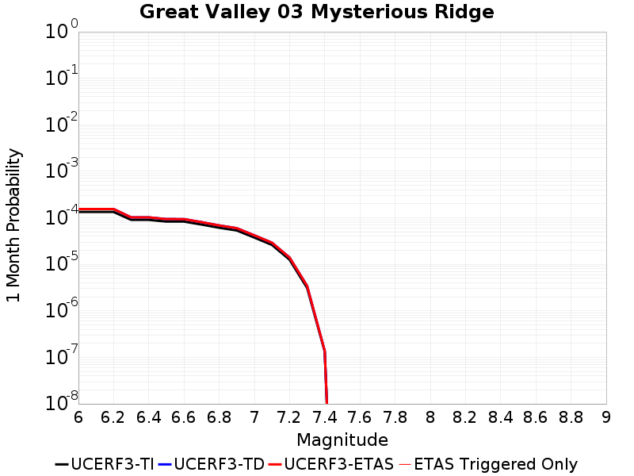 | 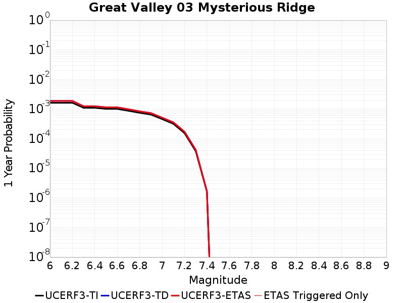 | 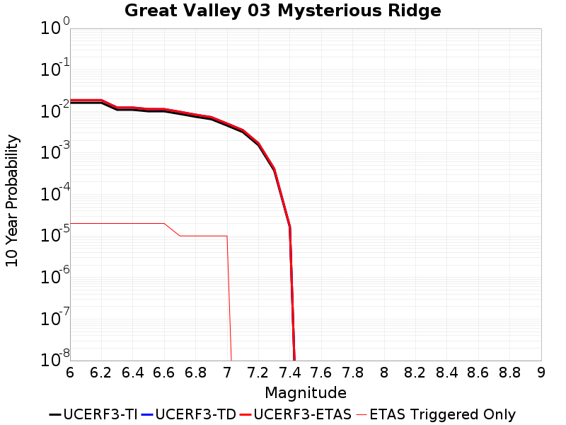 |

| Magnitude | 1 wk TI Prob | 1 wk TD Prob | 1 wk ETAS Prob | 1 wk ETAS/TD Gain | 1 wk ETAS Triggered Only | 1 mo TI Prob | 1 mo TD Prob | 1 mo ETAS Prob | 1 mo ETAS/TD Gain | 1 mo ETAS Triggered Only | 1 yr TI Prob | 1 yr TD Prob | 1 yr ETAS Prob | 1 yr ETAS/TD Gain | 1 yr ETAS Triggered Only | 10 yr TI Prob | 10 yr TD Prob | 10 yr ETAS Prob | 10 yr ETAS/TD Gain | 10 yr ETAS Triggered Only |
|-----|-----|-----|-----|-----|-----|-----|-----|-----|-----|-----|-----|-----|-----|-----|-----|-----|-----|-----|-----|-----|
| 6.0 | 3.1182444E-5 | 3.606929E-5 | 3.606929E-5 | 1.0 | 0.0 | 1.336322E-4 | 1.5457456E-4 | 1.5457456E-4 | 1.0 | 0.0 | 0.0016257578 | 0.0018805076 | 0.0018805076 | 1.0 | 0.0 | 0.016139153 | 0.018664723 | 0.01868435 | 1.0010515 | 2.0E-5 |
| 6.1 | 3.1182444E-5 | 3.606929E-5 | 3.606929E-5 | 1.0 | 0.0 | 1.336322E-4 | 1.5457456E-4 | 1.5457456E-4 | 1.0 | 0.0 | 0.0016257578 | 0.0018805076 | 0.0018805076 | 1.0 | 0.0 | 0.016139153 | 0.018664723 | 0.01868435 | 1.0010515 | 2.0E-5 |
| 6.2 | 3.1182444E-5 | 3.606929E-5 | 3.606929E-5 | 1.0 | 0.0 | 1.336322E-4 | 1.5457456E-4 | 1.5457456E-4 | 1.0 | 0.0 | 0.0016257578 | 0.0018805076 | 0.0018805076 | 1.0 | 0.0 | 0.016139153 | 0.018664723 | 0.01868435 | 1.0010515 | 2.0E-5 |
| 6.3 | 2.106934E-5 | 2.3869989E-5 | 2.3869989E-5 | 1.0 | 0.0 | 9.0294045E-5 | 1.02296115E-4 | 1.02296115E-4 | 1.0 | 0.0 | 0.0010987755 | 0.0012447748 | 0.0012447748 | 1.0 | 0.0 | 0.010933585 | 0.012381277 | 0.0124010295 | 1.0015954 | 2.0E-5 |
| 6.4 | 2.106934E-5 | 2.3869989E-5 | 2.3869989E-5 | 1.0 | 0.0 | 9.0294045E-5 | 1.02296115E-4 | 1.02296115E-4 | 1.0 | 0.0 | 0.0010987755 | 0.0012447748 | 0.0012447748 | 1.0 | 0.0 | 0.010933585 | 0.012381277 | 0.0124010295 | 1.0015954 | 2.0E-5 |
| 6.5 | 1.9389783E-5 | 2.190258E-5 | 2.190258E-5 | 1.0 | 0.0 | 8.309642E-5 | 9.3864975E-5 | 9.3864975E-5 | 1.0 | 0.0 | 0.0010112294 | 0.0011422348 | 0.0011422348 | 1.0 | 0.0 | 0.010066401 | 0.011366518 | 0.01138629 | 1.0017395 | 2.0E-5 |
| 6.6 | 1.9370193E-5 | 2.1882497E-5 | 2.1882497E-5 | 1.0 | 0.0 | 8.301247E-5 | 9.3778915E-5 | 9.3778915E-5 | 1.0 | 0.0 | 0.0010102082 | 0.0011411881 | 0.0011411881 | 1.0 | 0.0 | 0.010056281 | 0.011356158 | 0.011375931 | 1.0017412 | 2.0E-5 |
| 6.7 | 1.6723505E-5 | 1.8813847E-5 | 1.8813847E-5 | 1.0 | 0.0 | 7.16702E-5 | 8.062839E-5 | 8.062839E-5 | 1.0 | 0.0 | 8.722353E-4 | 9.812282E-4 | 9.812282E-4 | 1.0 | 0.0 | 0.008688197 | 0.00977097 | 0.009780872 | 1.0010134 | 1.0E-5 |
| 6.8 | 1.426937E-5 | 1.6009295E-5 | 1.6009295E-5 | 1.0 | 0.0 | 6.115301E-5 | 6.860954E-5 | 6.860954E-5 | 1.0 | 0.0 | 7.4428355E-4 | 8.350155E-4 | 8.350155E-4 | 1.0 | 0.0 | 0.007417957 | 0.008320261 | 0.0083301775 | 1.0011919 | 1.0E-5 |
| 6.9 | 1.2469891E-5 | 1.39673075E-5 | 1.39673075E-5 | 1.0 | 0.0 | 5.3441294E-5 | 5.9858583E-5 | 5.9858583E-5 | 1.0 | 0.0 | 6.504535E-4 | 7.285467E-4 | 7.285467E-4 | 1.0 | 0.0 | 0.006485529 | 0.0072628087 | 0.007272736 | 1.0013669 | 1.0E-5 |
| 7.0 | 8.7746275E-6 | 9.7988095E-6 | 9.7988095E-6 | 1.0 | 0.0 | 3.7605005E-5 | 4.1994263E-5 | 4.1994263E-5 | 1.0 | 0.0 | 4.5774475E-4 | 5.111676E-4 | 5.111676E-4 | 1.0 | 0.0 | 0.00456803 | 0.0051006516 | 0.005110601 | 1.0019505 | 1.0E-5 |
| 7.1 | 6.1067153E-6 | 6.8186428E-6 | 6.8186428E-6 | 1.0 | 0.0 | 2.6171374E-5 | 2.922246E-5 | 2.922246E-5 | 1.0 | 0.0 | 3.1858988E-4 | 3.5573094E-4 | 3.5573094E-4 | 1.0 | 0.0 | 0.0031813353 | 0.0035521667 | 0.0035521667 | 1.0 | 0.0 |
| 7.2 | 2.939283E-6 | 3.2764326E-6 | 3.2764326E-6 | 1.0 | 0.0 | 1.2596866E-5 | 1.4041788E-5 | 1.4041788E-5 | 1.0 | 0.0 | 1.5335606E-4 | 1.7094711E-4 | 1.7094711E-4 | 1.0 | 0.0 | 0.0015325027 | 0.0017083284 | 0.0017083284 | 1.0 | 0.0 |
| 7.3 | 7.2387763E-7 | 8.013846E-7 | 8.013846E-7 | 1.0 | 0.0 | 3.102329E-6 | 3.4345037E-6 | 3.4345037E-6 | 1.0 | 0.0 | 3.77702E-5 | 4.181474E-5 | 4.181474E-5 | 1.0 | 0.0 | 3.7763783E-4 | 4.1811375E-4 | 4.1811375E-4 | 1.0 | 0.0 |
| 7.4 | 3.112171E-8 | 3.207443E-8 | 3.207443E-8 | 1.0 | 0.0 | 1.3337875E-7 | 1.3746183E-7 | 1.3746183E-7 | 1.0 | 0.0 | 1.6238852E-6 | 1.6735966E-6 | 1.6735966E-6 | 1.0 | 0.0 | 1.6238733E-5 | 1.6735848E-5 | 1.6735848E-5 | 1.0 | 0.0 |

## Mono Lake 2011 CFM
*[(top)](#table-of-contents)*

| 1 Week | 1 Month | 1 Year | 10 Year |
|-----|-----|-----|-----|
|  |  |  | 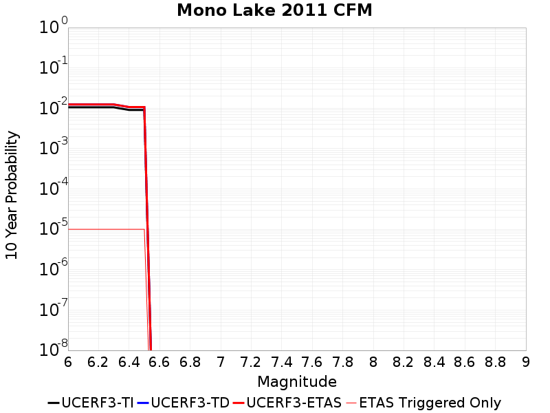 |

| Magnitude | 1 wk TI Prob | 1 wk TD Prob | 1 wk ETAS Prob | 1 wk ETAS/TD Gain | 1 wk ETAS Triggered Only | 1 mo TI Prob | 1 mo TD Prob | 1 mo ETAS Prob | 1 mo ETAS/TD Gain | 1 mo ETAS Triggered Only | 1 yr TI Prob | 1 yr TD Prob | 1 yr ETAS Prob | 1 yr ETAS/TD Gain | 1 yr ETAS Triggered Only | 10 yr TI Prob | 10 yr TD Prob | 10 yr ETAS Prob | 10 yr ETAS/TD Gain | 10 yr ETAS Triggered Only |
|-----|-----|-----|-----|-----|-----|-----|-----|-----|-----|-----|-----|-----|-----|-----|-----|-----|-----|-----|-----|-----|
| 6.0 | 2.0341662E-5 | 2.3853567E-5 | 2.3853567E-5 | 1.0 | 0.0 | 8.717564E-5 | 1.0222856E-4 | 1.0222856E-4 | 1.0 | 0.0 | 0.0010608466 | 0.0012444542 | 0.0012444542 | 1.0 | 0.0 | 0.010557966 | 0.012427034 | 0.01243691 | 1.0007946 | 1.0E-5 |
| 6.1 | 2.0341662E-5 | 2.3853567E-5 | 2.3853567E-5 | 1.0 | 0.0 | 8.717564E-5 | 1.0222856E-4 | 1.0222856E-4 | 1.0 | 0.0 | 0.0010608466 | 0.0012444542 | 0.0012444542 | 1.0 | 0.0 | 0.010557966 | 0.012427034 | 0.01243691 | 1.0007946 | 1.0E-5 |
| 6.2 | 2.0341662E-5 | 2.3853567E-5 | 2.3853567E-5 | 1.0 | 0.0 | 8.717564E-5 | 1.0222856E-4 | 1.0222856E-4 | 1.0 | 0.0 | 0.0010608466 | 0.0012444542 | 0.0012444542 | 1.0 | 0.0 | 0.010557966 | 0.012427034 | 0.01243691 | 1.0007946 | 1.0E-5 |
| 6.3 | 2.0341662E-5 | 2.3853567E-5 | 2.3853567E-5 | 1.0 | 0.0 | 8.717564E-5 | 1.0222856E-4 | 1.0222856E-4 | 1.0 | 0.0 | 0.0010608466 | 0.0012444542 | 0.0012444542 | 1.0 | 0.0 | 0.010557966 | 0.012427034 | 0.01243691 | 1.0007946 | 1.0E-5 |
| 6.4 | 1.749821E-5 | 2.0512787E-5 | 2.0512787E-5 | 1.0 | 0.0 | 7.499018E-5 | 8.7911925E-5 | 8.7911925E-5 | 1.0 | 0.0 | 9.1262296E-4 | 0.0010703274 | 0.0010703274 | 1.0 | 0.0 | 0.009088841 | 0.010703227 | 0.01071312 | 1.0009243 | 1.0E-5 |
| 6.5 | 1.749821E-5 | 2.0512787E-5 | 2.0512787E-5 | 1.0 | 0.0 | 7.499018E-5 | 8.7911925E-5 | 8.7911925E-5 | 1.0 | 0.0 | 9.1262296E-4 | 0.0010703274 | 0.0010703274 | 1.0 | 0.0 | 0.009088841 | 0.010703227 | 0.01071312 | 1.0009243 | 1.0E-5 |

## Kern Canyon (South Kern) 2011
*[(top)](#table-of-contents)*

| 1 Week | 1 Month | 1 Year | 10 Year |
|-----|-----|-----|-----|
|  |  |  |  |

| Magnitude | 1 wk TI Prob | 1 wk TD Prob | 1 wk ETAS Prob | 1 wk ETAS/TD Gain | 1 wk ETAS Triggered Only | 1 mo TI Prob | 1 mo TD Prob | 1 mo ETAS Prob | 1 mo ETAS/TD Gain | 1 mo ETAS Triggered Only | 1 yr TI Prob | 1 yr TD Prob | 1 yr ETAS Prob | 1 yr ETAS/TD Gain | 1 yr ETAS Triggered Only | 10 yr TI Prob | 10 yr TD Prob | 10 yr ETAS Prob | 10 yr ETAS/TD Gain | 10 yr ETAS Triggered Only |
|-----|-----|-----|-----|-----|-----|-----|-----|-----|-----|-----|-----|-----|-----|-----|-----|-----|-----|-----|-----|-----|
| 6.0 | 4.105075E-6 | 4.114207E-6 | 4.114207E-6 | 1.0 | 0.0 | 1.7593058E-5 | 1.76322E-5 | 1.76322E-5 | 1.0 | 0.0 | 2.1417443E-4 | 2.1465153E-4 | 2.1465153E-4 | 1.0 | 0.0 | 0.0021396813 | 0.002144506 | 0.002164463 | 1.0093062 | 2.0E-5 |
| 6.1 | 4.105075E-6 | 4.114207E-6 | 4.114207E-6 | 1.0 | 0.0 | 1.7593058E-5 | 1.76322E-5 | 1.76322E-5 | 1.0 | 0.0 | 2.1417443E-4 | 2.1465153E-4 | 2.1465153E-4 | 1.0 | 0.0 | 0.0021396813 | 0.002144506 | 0.002164463 | 1.0093062 | 2.0E-5 |
| 6.2 | 4.105075E-6 | 4.114207E-6 | 4.114207E-6 | 1.0 | 0.0 | 1.7593058E-5 | 1.76322E-5 | 1.76322E-5 | 1.0 | 0.0 | 2.1417443E-4 | 2.1465153E-4 | 2.1465153E-4 | 1.0 | 0.0 | 0.0021396813 | 0.002144506 | 0.002164463 | 1.0093062 | 2.0E-5 |
| 6.3 | 4.105075E-6 | 4.114207E-6 | 4.114207E-6 | 1.0 | 0.0 | 1.7593058E-5 | 1.76322E-5 | 1.76322E-5 | 1.0 | 0.0 | 2.1417443E-4 | 2.1465153E-4 | 2.1465153E-4 | 1.0 | 0.0 | 0.0021396813 | 0.002144506 | 0.002164463 | 1.0093062 | 2.0E-5 |
| 6.4 | 4.105075E-6 | 4.114207E-6 | 4.114207E-6 | 1.0 | 0.0 | 1.7593058E-5 | 1.76322E-5 | 1.76322E-5 | 1.0 | 0.0 | 2.1417443E-4 | 2.1465153E-4 | 2.1465153E-4 | 1.0 | 0.0 | 0.0021396813 | 0.002144506 | 0.002164463 | 1.0093062 | 2.0E-5 |
| 6.5 | 2.9849807E-6 | 2.9735056E-6 | 2.9735056E-6 | 1.0 | 0.0 | 1.2792712E-5 | 1.2743534E-5 | 1.2743534E-5 | 1.0 | 0.0 | 1.5574014E-4 | 1.5514164E-4 | 1.5514164E-4 | 1.0 | 0.0 | 0.0015563103 | 0.0015503485 | 0.0015703174 | 1.0128803 | 2.0E-5 |
| 6.6 | 2.9849807E-6 | 2.9735056E-6 | 2.9735056E-6 | 1.0 | 0.0 | 1.2792712E-5 | 1.2743534E-5 | 1.2743534E-5 | 1.0 | 0.0 | 1.5574014E-4 | 1.5514164E-4 | 1.5514164E-4 | 1.0 | 0.0 | 0.0015563103 | 0.0015503485 | 0.0015703174 | 1.0128803 | 2.0E-5 |
| 6.7 | 2.6756725E-6 | 2.6585362E-6 | 2.6585362E-6 | 1.0 | 0.0 | 1.1467117E-5 | 1.1393678E-5 | 1.1393678E-5 | 1.0 | 0.0 | 1.396032E-4 | 1.3870929E-4 | 1.3870929E-4 | 1.0 | 0.0 | 0.0013951553 | 0.0013862381 | 0.0014062104 | 1.0144075 | 2.0E-5 |
| 6.8 | 2.3283721E-6 | 2.3050554E-6 | 2.3050554E-6 | 1.0 | 0.0 | 9.9787E-6 | 9.878772E-6 | 9.878772E-6 | 1.0 | 0.0 | 1.214839E-4 | 1.2026748E-4 | 1.2026748E-4 | 1.0 | 0.0 | 0.001214175 | 0.0012020314 | 0.0012120194 | 1.0083092 | 1.0E-5 |
| 6.9 | 2.0972677E-6 | 2.0698922E-6 | 2.0698922E-6 | 1.0 | 0.0 | 8.988259E-6 | 8.870937E-6 | 8.870937E-6 | 1.0 | 0.0 | 1.0942656E-4 | 1.0799836E-4 | 1.0799836E-4 | 1.0 | 0.0 | 0.0010937268 | 0.0010794646 | 0.0010894538 | 1.0092539 | 1.0E-5 |
| 7.0 | 1.7132242E-6 | 1.6789111E-6 | 1.6789111E-6 | 1.0 | 0.0 | 7.3423685E-6 | 7.1953136E-6 | 7.1953136E-6 | 1.0 | 0.0 | 8.938967E-5 | 8.759946E-5 | 8.759946E-5 | 1.0 | 0.0 | 8.935372E-4 | 8.756531E-4 | 8.856444E-4 | 1.01141 | 1.0E-5 |
| 7.1 | 1.4215541E-6 | 1.3817482E-6 | 1.3817482E-6 | 1.0 | 0.0 | 6.0923603E-6 | 5.9217646E-6 | 5.9217646E-6 | 1.0 | 0.0 | 7.417196E-5 | 7.209513E-5 | 7.209513E-5 | 1.0 | 0.0 | 7.414721E-4 | 7.207201E-4 | 7.3071284E-4 | 1.013865 | 1.0E-5 |
| 7.2 | 9.097853E-7 | 8.604909E-7 | 8.604909E-7 | 1.0 | 0.0 | 3.899074E-6 | 3.687813E-6 | 3.687813E-6 | 1.0 | 0.0 | 4.7470192E-5 | 4.489821E-5 | 4.489821E-5 | 1.0 | 0.0 | 4.7460053E-4 | 4.4889248E-4 | 4.5888798E-4 | 1.0222671 | 1.0E-5 |
| 7.3 | 6.144169E-7 | 5.628989E-7 | 5.628989E-7 | 1.0 | 0.0 | 2.6332125E-6 | 2.4124215E-6 | 2.4124215E-6 | 1.0 | 0.0 | 3.205889E-5 | 2.9370842E-5 | 2.9370842E-5 | 1.0 | 0.0 | 3.2054266E-4 | 2.936701E-4 | 3.0366718E-4 | 1.0340418 | 1.0E-5 |
| 7.4 | 4.049844E-7 | 3.5733652E-7 | 3.5733652E-7 | 1.0 | 0.0 | 1.7356463E-6 | 1.5314414E-6 | 1.5314414E-6 | 1.0 | 0.0 | 2.1131287E-5 | 1.8645142E-5 | 1.8645142E-5 | 1.0 | 0.0 | 2.1129279E-4 | 1.8643602E-4 | 1.8643602E-4 | 1.0 | 0.0 |
| 7.5 | 1.9871162E-7 | 1.5833245E-7 | 1.5833245E-7 | 1.0 | 0.0 | 8.5162094E-7 | 6.7856746E-7 | 6.7856746E-7 | 1.0 | 0.0 | 1.0368436E-5 | 8.261529E-6 | 8.261529E-6 | 1.0 | 0.0 | 1.0367952E-4 | 8.26123E-5 | 8.26123E-5 | 1.0 | 0.0 |
| 7.6 | 2.572245E-8 | 1.7356268E-8 | 1.7356268E-8 | 1.0 | 0.0 | 1.10239064E-7 | 7.4384E-8 | 7.4384E-8 | 1.0 | 0.0 | 1.3421597E-6 | 9.0562486E-7 | 9.0562486E-7 | 1.0 | 0.0 | 1.3421517E-5 | 9.056217E-6 | 9.056217E-6 | 1.0 | 0.0 |

## Oceanic - West Huasna
*[(top)](#table-of-contents)*

| 1 Week | 1 Month | 1 Year | 10 Year |
|-----|-----|-----|-----|
|  |  |  | 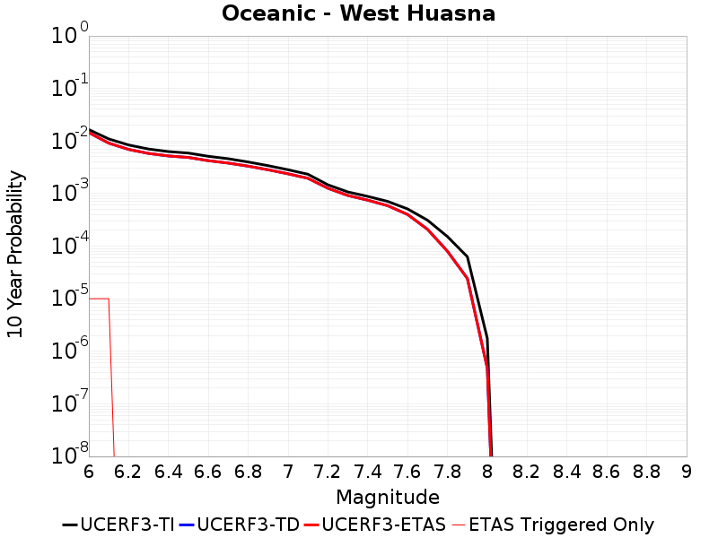 |

| Magnitude | 1 wk TI Prob | 1 wk TD Prob | 1 wk ETAS Prob | 1 wk ETAS/TD Gain | 1 wk ETAS Triggered Only | 1 mo TI Prob | 1 mo TD Prob | 1 mo ETAS Prob | 1 mo ETAS/TD Gain | 1 mo ETAS Triggered Only | 1 yr TI Prob | 1 yr TD Prob | 1 yr ETAS Prob | 1 yr ETAS/TD Gain | 1 yr ETAS Triggered Only | 10 yr TI Prob | 10 yr TD Prob | 10 yr ETAS Prob | 10 yr ETAS/TD Gain | 10 yr ETAS Triggered Only |
|-----|-----|-----|-----|-----|-----|-----|-----|-----|-----|-----|-----|-----|-----|-----|-----|-----|-----|-----|-----|-----|
| 6.0 | 3.195567E-5 | 2.7941567E-5 | 2.7941567E-5 | 1.0 | 0.0 | 1.3694567E-4 | 1.1974432E-4 | 1.1974432E-4 | 1.0 | 0.0 | 0.0016660384 | 0.0014569553 | 0.0014669407 | 1.0068536 | 1.0E-5 | 0.016536033 | 0.014478592 | 0.014488447 | 1.0006807 | 1.0E-5 |
| 6.1 | 2.1156782E-5 | 1.7582734E-5 | 1.7582734E-5 | 1.0 | 0.0 | 9.066878E-5 | 7.535245E-5 | 7.535245E-5 | 1.0 | 0.0 | 0.0011033333 | 9.1703935E-4 | 9.2703017E-4 | 1.0108947 | 1.0E-5 | 0.010978713 | 0.009133561 | 0.009143469 | 1.0010848 | 1.0E-5 |
| 6.2 | 1.6195117E-5 | 1.3333366E-5 | 1.3333366E-5 | 1.0 | 0.0 | 6.9405796E-5 | 5.7141762E-5 | 5.7141762E-5 | 1.0 | 0.0 | 8.44688E-4 | 6.954815E-4 | 6.954815E-4 | 1.0 | 0.0 | 0.008414844 | 0.006933343 | 0.006933343 | 1.0 | 0.0 |
| 6.3 | 1.3559345E-5 | 1.1184007E-5 | 1.1184007E-5 | 1.0 | 0.0 | 5.811018E-5 | 4.7930585E-5 | 4.7930585E-5 | 1.0 | 0.0 | 7.072618E-4 | 5.8339955E-4 | 5.8339955E-4 | 1.0 | 0.0 | 0.0070501505 | 0.0058187987 | 0.0058187987 | 1.0 | 0.0 |
| 6.4 | 1.2120619E-5 | 1.0005153E-5 | 1.0005153E-5 | 1.0 | 0.0 | 5.1944477E-5 | 4.2878524E-5 | 4.2878524E-5 | 1.0 | 0.0 | 6.322405E-4 | 5.219215E-4 | 5.219215E-4 | 1.0 | 0.0 | 0.006304447 | 0.0052070245 | 0.0052070245 | 1.0 | 0.0 |
| 6.5 | 1.13511915E-5 | 9.371334E-6 | 9.371334E-6 | 1.0 | 0.0 | 4.8647056E-5 | 4.0162246E-5 | 4.0162246E-5 | 1.0 | 0.0 | 5.9211696E-4 | 4.8886606E-4 | 4.8886606E-4 | 1.0 | 0.0 | 0.0059054173 | 0.0048779654 | 0.0048779654 | 1.0 | 0.0 |
| 6.6 | 9.850605E-6 | 8.13872E-6 | 8.13872E-6 | 1.0 | 0.0 | 4.2216197E-5 | 3.4879762E-5 | 3.4879762E-5 | 1.0 | 0.0 | 5.1386096E-4 | 4.2457858E-4 | 4.2457858E-4 | 1.0 | 0.0 | 0.0051267436 | 0.0042377063 | 0.0042377063 | 1.0 | 0.0 |
| 6.7 | 8.8558645E-6 | 7.321446E-6 | 7.321446E-6 | 1.0 | 0.0 | 3.7953152E-5 | 3.1377247E-5 | 3.1377247E-5 | 1.0 | 0.0 | 4.6198163E-4 | 3.8195122E-4 | 3.8195122E-4 | 1.0 | 0.0 | 0.004610224 | 0.003812973 | 0.003812973 | 1.0 | 0.0 |
| 6.8 | 7.67136E-6 | 6.3944417E-6 | 6.3944417E-6 | 1.0 | 0.0 | 3.2876844E-5 | 2.7404463E-5 | 2.7404463E-5 | 1.0 | 0.0 | 4.0020206E-4 | 3.335984E-4 | 3.335984E-4 | 1.0 | 0.0 | 0.003994821 | 0.0033309974 | 0.0033309974 | 1.0 | 0.0 |
| 6.9 | 6.534529E-6 | 5.46071E-6 | 5.46071E-6 | 1.0 | 0.0 | 2.8004823E-5 | 2.3402834E-5 | 2.3402834E-5 | 1.0 | 0.0 | 3.4090536E-4 | 2.848924E-4 | 2.848924E-4 | 1.0 | 0.0 | 0.0034038287 | 0.0028452883 | 0.0028452883 | 1.0 | 0.0 |
| 7.0 | 5.460525E-6 | 4.571979E-6 | 4.571979E-6 | 1.0 | 0.0 | 2.3402039E-5 | 1.9594048E-5 | 1.9594048E-5 | 1.0 | 0.0 | 2.8488258E-4 | 2.3853155E-4 | 2.3853155E-4 | 1.0 | 0.0 | 0.0028451765 | 0.002382769 | 0.002382769 | 1.0 | 0.0 |
| 7.1 | 4.4825083E-6 | 3.754203E-6 | 3.754203E-6 | 1.0 | 0.0 | 1.9210609E-5 | 1.6089343E-5 | 1.6089343E-5 | 1.0 | 0.0 | 2.3386406E-4 | 1.9587023E-4 | 1.9587023E-4 | 1.0 | 0.0 | 0.002336181 | 0.0019569881 | 0.0019569881 | 1.0 | 0.0 |
| 7.2 | 2.821708E-6 | 2.4264953E-6 | 2.4264953E-6 | 1.0 | 0.0 | 1.2092979E-5 | 1.0399223E-5 | 1.0399223E-5 | 1.0 | 0.0 | 1.4722206E-4 | 1.266032E-4 | 1.266032E-4 | 1.0 | 0.0 | 0.0014712457 | 0.0012653132 | 0.0012653132 | 1.0 | 0.0 |
| 7.3 | 2.0644757E-6 | 1.7701681E-6 | 1.7701681E-6 | 1.0 | 0.0 | 8.847723E-6 | 7.5864123E-6 | 7.5864123E-6 | 1.0 | 0.0 | 1.0771569E-4 | 9.236066E-5 | 9.236066E-5 | 1.0 | 0.0 | 0.001076635 | 9.232245E-4 | 9.232245E-4 | 1.0 | 0.0 |
| 7.4 | 1.6980367E-6 | 1.439308E-6 | 1.439308E-6 | 1.0 | 0.0 | 7.27728E-6 | 6.168448E-6 | 6.168448E-6 | 1.0 | 0.0 | 8.8597284E-5 | 7.509827E-5 | 7.509827E-5 | 1.0 | 0.0 | 8.8561967E-4 | 7.5073057E-4 | 7.5073057E-4 | 1.0 | 0.0 |
| 7.5 | 1.3637683E-6 | 1.1314766E-6 | 1.1314766E-6 | 1.0 | 0.0 | 5.844708E-6 | 4.8491765E-6 | 4.8491765E-6 | 1.0 | 0.0 | 7.1156996E-5 | 5.9037124E-5 | 5.9037124E-5 | 1.0 | 0.0 | 7.1134215E-4 | 5.9021596E-4 | 5.9021596E-4 | 1.0 | 0.0 |
| 7.6 | 9.802994E-7 | 7.6886687E-7 | 7.6886687E-7 | 1.0 | 0.0 | 4.2012766E-6 | 3.2951393E-6 | 3.2951393E-6 | 1.0 | 0.0 | 5.1149345E-5 | 4.0117586E-5 | 4.0117586E-5 | 1.0 | 0.0 | 5.113757E-4 | 4.011049E-4 | 4.011049E-4 | 1.0 | 0.0 |
| 7.7 | 5.986191E-7 | 4.014429E-7 | 4.014429E-7 | 1.0 | 0.0 | 2.5655079E-6 | 1.7204684E-6 | 1.7204684E-6 | 1.0 | 0.0 | 3.1234613E-5 | 2.0946502E-5 | 2.0946502E-5 | 1.0 | 0.0 | 3.123022E-4 | 2.0944665E-4 | 2.0944665E-4 | 1.0 | 0.0 |
| 7.8 | 2.9189815E-7 | 1.5362666E-7 | 1.5362666E-7 | 1.0 | 0.0 | 1.2509914E-6 | 6.5839976E-7 | 6.5839976E-7 | 1.0 | 0.0 | 1.5230714E-5 | 8.015987E-6 | 8.015987E-6 | 1.0 | 0.0 | 1.522967E-4 | 8.015833E-5 | 8.015833E-5 | 1.0 | 0.0 |
| 7.9 | 1.2057845E-7 | 4.6627527E-8 | 4.6627527E-8 | 1.0 | 0.0 | 5.1676466E-7 | 1.9983224E-7 | 1.9983224E-7 | 1.0 | 0.0 | 6.2915915E-6 | 2.4329547E-6 | 2.4329547E-6 | 1.0 | 0.0 | 6.2914136E-5 | 2.4330622E-5 | 2.4330622E-5 | 1.0 | 0.0 |
| 8.0 | 3.3806387E-9 | 9.167537E-10 | 9.167537E-10 | 1.0 | 0.0 | 1.4488451E-8 | 3.928945E-9 | 3.928945E-9 | 1.0 | 0.0 | 1.7639688E-7 | 4.7834902E-8 | 4.7834902E-8 | 1.0 | 0.0 | 1.7639674E-6 | 4.7953085E-7 | 4.7953085E-7 | 1.0 | 0.0 |

## Deep Springs
*[(top)](#table-of-contents)*

| 1 Week | 1 Month | 1 Year | 10 Year |
|-----|-----|-----|-----|
| 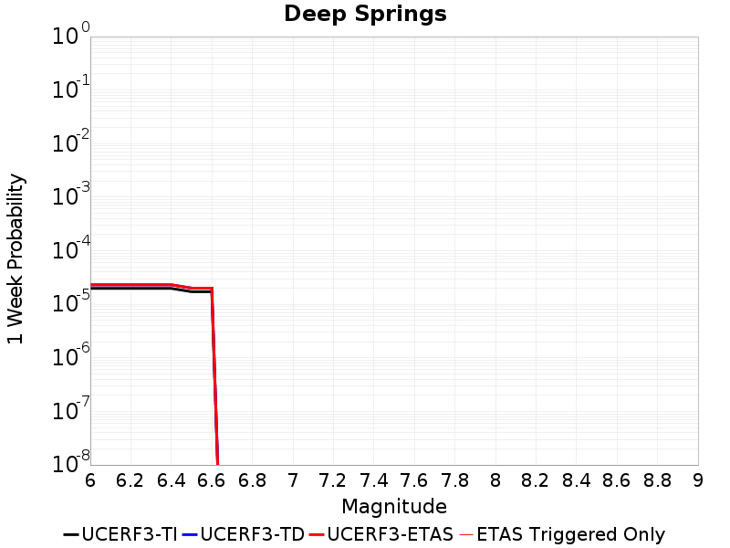 |  | 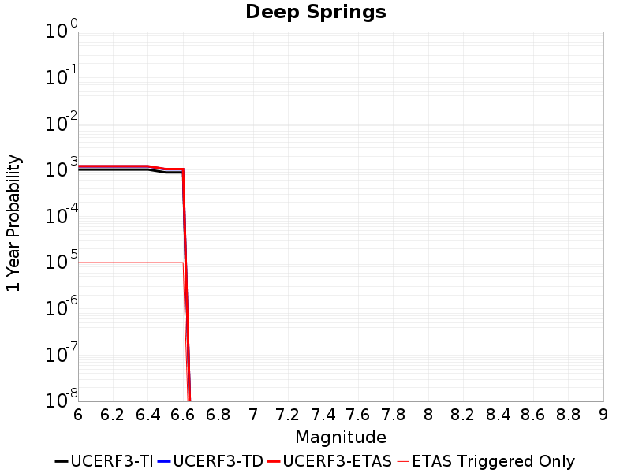 |  |

| Magnitude | 1 wk TI Prob | 1 wk TD Prob | 1 wk ETAS Prob | 1 wk ETAS/TD Gain | 1 wk ETAS Triggered Only | 1 mo TI Prob | 1 mo TD Prob | 1 mo ETAS Prob | 1 mo ETAS/TD Gain | 1 mo ETAS Triggered Only | 1 yr TI Prob | 1 yr TD Prob | 1 yr ETAS Prob | 1 yr ETAS/TD Gain | 1 yr ETAS Triggered Only | 10 yr TI Prob | 10 yr TD Prob | 10 yr ETAS Prob | 10 yr ETAS/TD Gain | 10 yr ETAS Triggered Only |
|-----|-----|-----|-----|-----|-----|-----|-----|-----|-----|-----|-----|-----|-----|-----|-----|-----|-----|-----|-----|-----|
| 6.0 | 1.9810619E-5 | 2.3136452E-5 | 2.3136452E-5 | 1.0 | 0.0 | 8.489989E-5 | 9.9155324E-5 | 9.9155324E-5 | 1.0 | 0.0 | 0.001033166 | 0.0012070562 | 0.0012170442 | 1.0082747 | 1.0E-5 | 0.010283757 | 0.012054879 | 0.012074638 | 1.0016391 | 2.0E-5 |
| 6.1 | 1.9810619E-5 | 2.3136452E-5 | 2.3136452E-5 | 1.0 | 0.0 | 8.489989E-5 | 9.9155324E-5 | 9.9155324E-5 | 1.0 | 0.0 | 0.001033166 | 0.0012070562 | 0.0012170442 | 1.0082747 | 1.0E-5 | 0.010283757 | 0.012054879 | 0.012074638 | 1.0016391 | 2.0E-5 |
| 6.2 | 1.9810619E-5 | 2.3136452E-5 | 2.3136452E-5 | 1.0 | 0.0 | 8.489989E-5 | 9.9155324E-5 | 9.9155324E-5 | 1.0 | 0.0 | 0.001033166 | 0.0012070562 | 0.0012170442 | 1.0082747 | 1.0E-5 | 0.010283757 | 0.012054879 | 0.012074638 | 1.0016391 | 2.0E-5 |
| 6.3 | 1.9810619E-5 | 2.3136452E-5 | 2.3136452E-5 | 1.0 | 0.0 | 8.489989E-5 | 9.9155324E-5 | 9.9155324E-5 | 1.0 | 0.0 | 0.001033166 | 0.0012070562 | 0.0012170442 | 1.0082747 | 1.0E-5 | 0.010283757 | 0.012054879 | 0.012074638 | 1.0016391 | 2.0E-5 |
| 6.4 | 1.9810619E-5 | 2.3136452E-5 | 2.3136452E-5 | 1.0 | 0.0 | 8.489989E-5 | 9.9155324E-5 | 9.9155324E-5 | 1.0 | 0.0 | 0.001033166 | 0.0012070562 | 0.0012170442 | 1.0082747 | 1.0E-5 | 0.010283757 | 0.012054879 | 0.012074638 | 1.0016391 | 2.0E-5 |
| 6.5 | 1.7190405E-5 | 2.0071282E-5 | 2.0071282E-5 | 1.0 | 0.0 | 7.367108E-5 | 8.601978E-5 | 8.601978E-5 | 1.0 | 0.0 | 8.9657627E-4 | 0.0010472906 | 0.0010572802 | 1.0095384 | 1.0E-5 | 0.008929676 | 0.010472872 | 0.010492663 | 1.0018897 | 2.0E-5 |
| 6.6 | 1.7190405E-5 | 2.0071282E-5 | 2.0071282E-5 | 1.0 | 0.0 | 7.367108E-5 | 8.601978E-5 | 8.601978E-5 | 1.0 | 0.0 | 8.9657627E-4 | 0.0010472906 | 0.0010572802 | 1.0095384 | 1.0E-5 | 0.008929676 | 0.010472872 | 0.010492663 | 1.0018897 | 2.0E-5 |

## Imperial
*[(top)](#table-of-contents)*

| 1 Week | 1 Month | 1 Year | 10 Year |
|-----|-----|-----|-----|
|  |  |  | 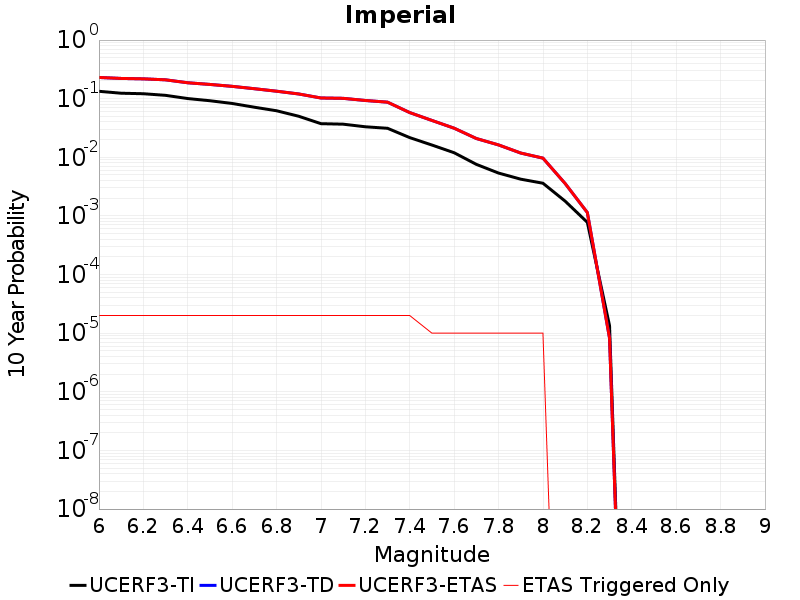 |

| Magnitude | 1 wk TI Prob | 1 wk TD Prob | 1 wk ETAS Prob | 1 wk ETAS/TD Gain | 1 wk ETAS Triggered Only | 1 mo TI Prob | 1 mo TD Prob | 1 mo ETAS Prob | 1 mo ETAS/TD Gain | 1 mo ETAS Triggered Only | 1 yr TI Prob | 1 yr TD Prob | 1 yr ETAS Prob | 1 yr ETAS/TD Gain | 1 yr ETAS Triggered Only | 10 yr TI Prob | 10 yr TD Prob | 10 yr ETAS Prob | 10 yr ETAS/TD Gain | 10 yr ETAS Triggered Only |
|-----|-----|-----|-----|-----|-----|-----|-----|-----|-----|-----|-----|-----|-----|-----|-----|-----|-----|-----|-----|-----|
| 6.0 | 2.7496446E-4 | 5.121476E-4 | 5.121476E-4 | 1.0 | 0.0 | 0.0011778869 | 0.002193112 | 0.002193112 | 1.0 | 0.0 | 0.0142467655 | 0.026379708 | 0.026379708 | 1.0 | 0.0 | 0.13367249 | 0.23023452 | 0.23024991 | 1.0000669 | 2.0E-5 |
| 6.1 | 2.5356023E-4 | 4.924154E-4 | 4.924154E-4 | 1.0 | 0.0 | 0.001086234 | 0.0021086836 | 0.0021086836 | 1.0 | 0.0 | 0.013144928 | 0.02538301 | 0.02538301 | 1.0 | 0.0 | 0.123940155 | 0.22145467 | 0.22147024 | 1.0000703 | 2.0E-5 |
| 6.2 | 2.4820742E-4 | 4.832627E-4 | 4.832627E-4 | 1.0 | 0.0 | 0.0010633124 | 0.0020695203 | 0.0020695203 | 1.0 | 0.0 | 0.01286919 | 0.024917817 | 0.024917817 | 1.0 | 0.0 | 0.12148927 | 0.21793985 | 0.21795548 | 1.0000718 | 2.0E-5 |
| 6.3 | 2.3205351E-4 | 4.6409148E-4 | 4.6409148E-4 | 1.0 | 0.0 | 9.94136E-4 | 0.0019874847 | 0.0019874847 | 1.0 | 0.0 | 0.012036599 | 0.023936277 | 0.023936277 | 1.0 | 0.0 | 0.11405133 | 0.20974228 | 0.20975807 | 1.0000753 | 2.0E-5 |
| 6.4 | 2.0304754E-4 | 4.037765E-4 | 4.037765E-4 | 1.0 | 0.0 | 8.6991355E-4 | 0.0017293381 | 0.0017293381 | 1.0 | 0.0 | 0.010539869 | 0.020862686 | 0.020862686 | 1.0 | 0.0 | 0.100537635 | 0.18687572 | 0.18689197 | 1.000087 | 2.0E-5 |
| 6.5 | 1.854992E-4 | 3.7457555E-4 | 3.7457555E-4 | 1.0 | 0.0 | 7.9475436E-4 | 0.0016043489 | 0.0016043489 | 1.0 | 0.0 | 0.009633281 | 0.019365394 | 0.019365394 | 1.0 | 0.0 | 0.0922623 | 0.17502274 | 0.17503925 | 1.0000943 | 2.0E-5 |
| 6.6 | 1.6586106E-4 | 3.4461723E-4 | 3.4461723E-4 | 1.0 | 0.0 | 7.106394E-4 | 0.0014761054 | 0.0014761054 | 1.0 | 0.0 | 0.008617763 | 0.01782876 | 0.01782876 | 1.0 | 0.0 | 0.08291132 | 0.16237622 | 0.16239297 | 1.0001031 | 2.0E-5 |
| 6.7 | 1.4224656E-4 | 3.1141273E-4 | 3.1141273E-4 | 1.0 | 0.0 | 6.094856E-4 | 0.0013339517 | 0.0013339517 | 1.0 | 0.0 | 0.0073952693 | 0.016123023 | 0.016123023 | 1.0 | 0.0 | 0.07153955 | 0.14793338 | 0.14795041 | 1.0001152 | 2.0E-5 |
| 6.8 | 1.2317259E-4 | 2.8101998E-4 | 2.8101998E-4 | 1.0 | 0.0 | 5.2777573E-4 | 0.0012038217 | 0.0012038217 | 1.0 | 0.0 | 0.0064067547 | 0.014559461 | 0.014559461 | 1.0 | 0.0 | 0.06225166 | 0.13418454 | 0.13420185 | 1.0001291 | 2.0E-5 |
| 6.9 | 9.859898E-5 | 2.5243504E-4 | 2.5243504E-4 | 1.0 | 0.0 | 4.2249862E-4 | 0.0010814203 | 0.0010814203 | 1.0 | 0.0 | 0.0051317946 | 0.013087791 | 0.013087791 | 1.0 | 0.0 | 0.05014893 | 0.120339625 | 0.12035722 | 1.0001462 | 2.0E-5 |
| 7.0 | 7.3191884E-5 | 2.1433798E-4 | 2.1433798E-4 | 1.0 | 0.0 | 3.136418E-4 | 9.182712E-4 | 9.182712E-4 | 1.0 | 0.0 | 0.003811904 | 0.011123338 | 0.011123338 | 1.0 | 0.0 | 0.037471764 | 0.10275141 | 0.10276936 | 1.0001746 | 2.0E-5 |
| 7.1 | 7.1760296E-5 | 2.1132702E-4 | 2.1132702E-4 | 1.0 | 0.0 | 3.0750787E-4 | 9.0537604E-4 | 9.0537604E-4 | 1.0 | 0.0 | 0.003737482 | 0.01096793 | 0.01096793 | 1.0 | 0.0 | 0.03675245 | 0.10137896 | 0.10139693 | 1.0001773 | 2.0E-5 |
| 7.2 | 6.46614E-5 | 1.9294681E-4 | 1.9294681E-4 | 1.0 | 0.0 | 2.7709085E-4 | 8.266559E-4 | 8.266559E-4 | 1.0 | 0.0 | 0.0033683628 | 0.010018722 | 0.010018722 | 1.0 | 0.0 | 0.033177625 | 0.09316614 | 0.09318428 | 1.0001947 | 2.0E-5 |
| 7.3 | 6.088115E-5 | 1.795889E-4 | 1.795889E-4 | 1.0 | 0.0 | 2.6089314E-4 | 7.694426E-4 | 7.694426E-4 | 1.0 | 0.0 | 0.0031717476 | 0.009328309 | 0.009328309 | 1.0 | 0.0 | 0.031268585 | 0.087191306 | 0.08720956 | 1.0002093 | 2.0E-5 |
| 7.4 | 4.199346E-5 | 1.1622166E-4 | 1.1622166E-4 | 1.0 | 0.0 | 1.7995955E-4 | 4.979986E-4 | 4.979986E-4 | 1.0 | 0.0 | 0.0021888057 | 0.0060464493 | 0.0060464493 | 1.0 | 0.0 | 0.02167372 | 0.057934035 | 0.057952873 | 1.0003252 | 2.0E-5 |
| 7.5 | 3.130448E-5 | 8.423437E-5 | 8.423437E-5 | 1.0 | 0.0 | 1.3415517E-4 | 3.6095484E-4 | 3.6095484E-4 | 1.0 | 0.0 | 0.0016321153 | 0.0043858304 | 0.0043858304 | 1.0 | 0.0 | 0.016201803 | 0.04253894 | 0.042548515 | 1.0002251 | 1.0E-5 |
| 7.6 | 2.3074248E-5 | 6.161126E-5 | 6.161126E-5 | 1.0 | 0.0 | 9.888588E-5 | 2.6402166E-4 | 2.6402166E-4 | 1.0 | 0.0 | 0.0012032706 | 0.0032097492 | 0.0032097492 | 1.0 | 0.0 | 0.011967761 | 0.031376056 | 0.031385742 | 1.0003088 | 1.0E-5 |
| 7.7 | 1.45864815E-5 | 4.076125E-5 | 4.076125E-5 | 1.0 | 0.0 | 6.2511994E-5 | 1.746794E-4 | 1.746794E-4 | 1.0 | 0.0 | 7.608177E-4 | 0.002124653 | 0.002124653 | 1.0 | 0.0 | 0.007582182 | 0.020919673 | 0.020929465 | 1.000468 | 1.0E-5 |
| 7.8 | 1.0352979E-5 | 3.150186E-5 | 3.150186E-5 | 1.0 | 0.0 | 4.4369157E-5 | 1.35001E-4 | 1.35001E-4 | 1.0 | 0.0 | 5.400606E-4 | 0.0016424004 | 0.0016424004 | 1.0 | 0.0 | 0.0053875 | 0.016265176 | 0.016275015 | 1.0006049 | 1.0E-5 |
| 7.9 | 8.137906E-6 | 2.2584334E-5 | 2.2584334E-5 | 1.0 | 0.0 | 3.4876273E-5 | 9.678642E-5 | 9.678642E-5 | 1.0 | 0.0 | 4.2453592E-4 | 0.0011777387 | 0.0011777387 | 1.0 | 0.0 | 0.004237258 | 0.011820301 | 0.011830184 | 1.000836 | 1.0E-5 |
| 8.0 | 6.93792E-6 | 1.8383591E-5 | 1.8383591E-5 | 1.0 | 0.0 | 2.9733603E-5 | 7.878444E-5 | 7.878444E-5 | 1.0 | 0.0 | 3.6194647E-4 | 9.5877924E-4 | 9.5877924E-4 | 1.0 | 0.0 | 0.0036135751 | 0.009677091 | 0.009686993 | 1.0010234 | 1.0E-5 |
| 8.1 | 3.4286315E-6 | 6.555515E-6 | 6.555515E-6 | 1.0 | 0.0 | 1.4694053E-5 | 2.8094762E-5 | 2.8094762E-5 | 1.0 | 0.0 | 1.7888541E-4 | 3.420002E-4 | 3.420002E-4 | 1.0 | 0.0 | 0.0017874148 | 0.0035729152 | 0.0035729152 | 1.0 | 0.0 |
| 8.2 | 1.4906886E-6 | 2.004337E-6 | 2.004337E-6 | 1.0 | 0.0 | 6.3886496E-6 | 8.589987E-6 | 8.589987E-6 | 1.0 | 0.0 | 7.7779034E-5 | 1.0457811E-4 | 1.0457811E-4 | 1.0 | 0.0 | 7.775182E-4 | 0.0011421936 | 0.0011421936 | 1.0 | 0.0 |
| 8.3 | 2.5758007E-8 | 1.5188665E-8 | 1.5188665E-8 | 1.0 | 0.0 | 1.10391454E-7 | 6.509428E-8 | 6.509428E-8 | 1.0 | 0.0 | 1.3440151E-6 | 7.9252277E-7 | 7.9252277E-7 | 1.0 | 0.0 | 1.344007E-5 | 8.253448E-6 | 8.253448E-6 | 1.0 | 0.0 |

## Ventura-Pitas Point
*[(top)](#table-of-contents)*

| 1 Week | 1 Month | 1 Year | 10 Year |
|-----|-----|-----|-----|
| 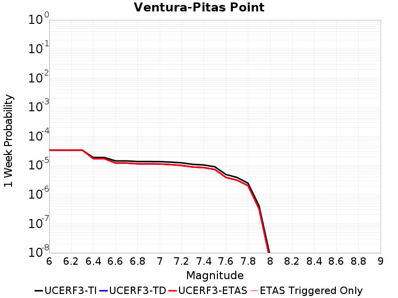 | 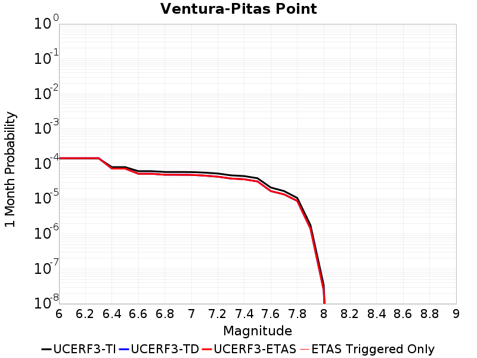 |  | 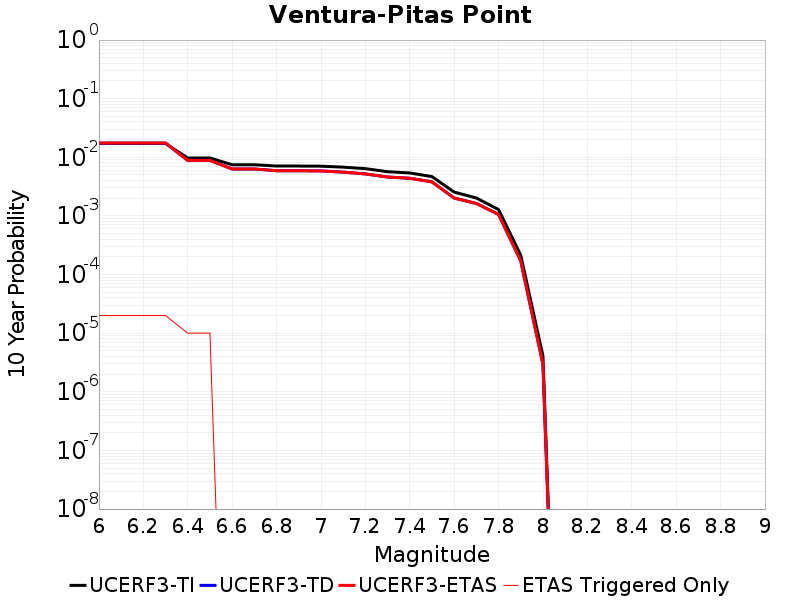 |

| Magnitude | 1 wk TI Prob | 1 wk TD Prob | 1 wk ETAS Prob | 1 wk ETAS/TD Gain | 1 wk ETAS Triggered Only | 1 mo TI Prob | 1 mo TD Prob | 1 mo ETAS Prob | 1 mo ETAS/TD Gain | 1 mo ETAS Triggered Only | 1 yr TI Prob | 1 yr TD Prob | 1 yr ETAS Prob | 1 yr ETAS/TD Gain | 1 yr ETAS Triggered Only | 10 yr TI Prob | 10 yr TD Prob | 10 yr ETAS Prob | 10 yr ETAS/TD Gain | 10 yr ETAS Triggered Only |
|-----|-----|-----|-----|-----|-----|-----|-----|-----|-----|-----|-----|-----|-----|-----|-----|-----|-----|-----|-----|-----|
| 6.0 | 3.3179622E-5 | 3.37779E-5 | 3.37779E-5 | 1.0 | 0.0 | 1.4219063E-4 | 1.4475583E-4 | 1.4475583E-4 | 1.0 | 0.0 | 0.0017297962 | 0.0017612347 | 0.0017612347 | 1.0 | 0.0 | 0.017163932 | 0.017498372 | 0.017518021 | 1.001123 | 2.0E-5 |
| 6.1 | 3.3179622E-5 | 3.37779E-5 | 3.37779E-5 | 1.0 | 0.0 | 1.4219063E-4 | 1.4475583E-4 | 1.4475583E-4 | 1.0 | 0.0 | 0.0017297962 | 0.0017612347 | 0.0017612347 | 1.0 | 0.0 | 0.017163932 | 0.017498372 | 0.017518021 | 1.001123 | 2.0E-5 |
| 6.2 | 3.3179622E-5 | 3.37779E-5 | 3.37779E-5 | 1.0 | 0.0 | 1.4219063E-4 | 1.4475583E-4 | 1.4475583E-4 | 1.0 | 0.0 | 0.0017297962 | 0.0017612347 | 0.0017612347 | 1.0 | 0.0 | 0.017163932 | 0.017498372 | 0.017518021 | 1.001123 | 2.0E-5 |
| 6.3 | 3.3179622E-5 | 3.37779E-5 | 3.37779E-5 | 1.0 | 0.0 | 1.4219063E-4 | 1.4475583E-4 | 1.4475583E-4 | 1.0 | 0.0 | 0.0017297962 | 0.0017612347 | 0.0017612347 | 1.0 | 0.0 | 0.017163932 | 0.017498372 | 0.017518021 | 1.001123 | 2.0E-5 |
| 6.4 | 1.8754668E-5 | 1.7045762E-5 | 1.7045762E-5 | 1.0 | 0.0 | 8.037467E-5 | 7.305135E-5 | 7.305135E-5 | 1.0 | 0.0 | 9.781223E-4 | 8.8906044E-4 | 8.8906044E-4 | 1.0 | 0.0 | 0.009738282 | 0.008857405 | 0.008867316 | 1.001119 | 1.0E-5 |
| 6.5 | 1.8754668E-5 | 1.7045762E-5 | 1.7045762E-5 | 1.0 | 0.0 | 8.037467E-5 | 7.305135E-5 | 7.305135E-5 | 1.0 | 0.0 | 9.781223E-4 | 8.8906044E-4 | 8.8906044E-4 | 1.0 | 0.0 | 0.009738282 | 0.008857405 | 0.008867316 | 1.001119 | 1.0E-5 |
| 6.6 | 1.4361558E-5 | 1.2144932E-5 | 1.2144932E-5 | 1.0 | 0.0 | 6.154808E-5 | 5.2048683E-5 | 5.2048683E-5 | 1.0 | 0.0 | 7.490902E-4 | 6.335108E-4 | 6.335108E-4 | 1.0 | 0.0 | 0.0074657016 | 0.0063173342 | 0.0063173342 | 1.0 | 0.0 |
| 6.7 | 1.4361558E-5 | 1.2144932E-5 | 1.2144932E-5 | 1.0 | 0.0 | 6.154808E-5 | 5.2048683E-5 | 5.2048683E-5 | 1.0 | 0.0 | 7.490902E-4 | 6.335108E-4 | 6.335108E-4 | 1.0 | 0.0 | 0.0074657016 | 0.0063173342 | 0.0063173342 | 1.0 | 0.0 |
| 6.8 | 1.3663846E-5 | 1.136652E-5 | 1.136652E-5 | 1.0 | 0.0 | 5.8558027E-5 | 4.8712758E-5 | 4.8712758E-5 | 1.0 | 0.0 | 7.127108E-4 | 5.929184E-4 | 5.929184E-4 | 1.0 | 0.0 | 0.007104293 | 0.005913609 | 0.005913609 | 1.0 | 0.0 |
| 6.9 | 1.3644157E-5 | 1.1344606E-5 | 1.1344606E-5 | 1.0 | 0.0 | 5.8473648E-5 | 4.8618844E-5 | 4.8618844E-5 | 1.0 | 0.0 | 7.116841E-4 | 5.917756E-4 | 5.917756E-4 | 1.0 | 0.0 | 0.007094092 | 0.005902242 | 0.005902242 | 1.0 | 0.0 |
| 7.0 | 1.3568845E-5 | 1.1264104E-5 | 1.1264104E-5 | 1.0 | 0.0 | 5.8150898E-5 | 4.8273847E-5 | 4.8273847E-5 | 1.0 | 0.0 | 7.077572E-4 | 5.875775E-4 | 5.875775E-4 | 1.0 | 0.0 | 0.007055073 | 0.0058604837 | 0.0058604837 | 1.0 | 0.0 |
| 7.1 | 1.306572E-5 | 1.074001E-5 | 1.074001E-5 | 1.0 | 0.0 | 5.599474E-5 | 4.6027813E-5 | 4.6027813E-5 | 1.0 | 0.0 | 6.815227E-4 | 5.602464E-4 | 5.602464E-4 | 1.0 | 0.0 | 0.0067943637 | 0.0055885734 | 0.0055885734 | 1.0 | 0.0 |
| 7.2 | 1.232604E-5 | 1.0011716E-5 | 1.0011716E-5 | 1.0 | 0.0 | 5.2824813E-5 | 4.290666E-5 | 4.290666E-5 | 1.0 | 0.0 | 6.429523E-4 | 5.2226515E-4 | 5.2226515E-4 | 1.0 | 0.0 | 0.0064109527 | 0.005210598 | 0.005210598 | 1.0 | 0.0 |
| 7.3 | 1.0917261E-5 | 8.857776E-6 | 8.857776E-6 | 1.0 | 0.0 | 4.678742E-5 | 3.7961356E-5 | 3.7961356E-5 | 1.0 | 0.0 | 5.69488E-4 | 4.6208306E-4 | 4.6208306E-4 | 1.0 | 0.0 | 0.0056803077 | 0.0046114163 | 0.0046114163 | 1.0 | 0.0 |
| 7.4 | 1.039959E-5 | 8.4369585E-6 | 8.4369585E-6 | 1.0 | 0.0 | 4.456891E-5 | 3.61579E-5 | 3.61579E-5 | 1.0 | 0.0 | 5.424914E-4 | 4.4013507E-4 | 4.4013507E-4 | 1.0 | 0.0 | 0.0054116896 | 0.0043928237 | 0.0043928237 | 1.0 | 0.0 |
| 7.5 | 9.015877E-6 | 7.309641E-6 | 7.309641E-6 | 1.0 | 0.0 | 3.86389E-5 | 3.1326665E-5 | 3.1326665E-5 | 1.0 | 0.0 | 4.7032707E-4 | 3.8133684E-4 | 3.8133684E-4 | 1.0 | 0.0 | 0.004693329 | 0.0038069966 | 0.0038069966 | 1.0 | 0.0 |
| 7.6 | 4.900162E-6 | 3.876749E-6 | 3.876749E-6 | 1.0 | 0.0 | 2.1000526E-5 | 1.6614533E-5 | 1.6614533E-5 | 1.0 | 0.0 | 2.556514E-4 | 2.0226328E-4 | 2.0226328E-4 | 1.0 | 0.0 | 0.0025535747 | 0.0020208056 | 0.0020208056 | 1.0 | 0.0 |
| 7.7 | 3.8850626E-6 | 3.1288707E-6 | 3.1288707E-6 | 1.0 | 0.0 | 1.6650163E-5 | 1.3409377E-5 | 1.3409377E-5 | 1.0 | 0.0 | 2.0269687E-4 | 1.6324702E-4 | 1.6324702E-4 | 1.0 | 0.0 | 0.002025121 | 0.0016312804 | 0.0016312804 | 1.0 | 0.0 |
| 7.8 | 2.4654719E-6 | 2.0311193E-6 | 2.0311193E-6 | 1.0 | 0.0 | 1.0566265E-5 | 8.704767E-6 | 8.704767E-6 | 1.0 | 0.0 | 1.2863669E-4 | 1.0597544E-4 | 1.0597544E-4 | 1.0 | 0.0 | 0.0012856225 | 0.0010592537 | 0.0010592537 | 1.0 | 0.0 |
| 7.9 | 4.095894E-7 | 3.2778968E-7 | 3.2778968E-7 | 1.0 | 0.0 | 1.7553821E-6 | 1.4048122E-6 | 1.4048122E-6 | 1.0 | 0.0 | 2.1371567E-5 | 1.7103457E-5 | 1.7103457E-5 | 1.0 | 0.0 | 2.1369511E-4 | 1.7102172E-4 | 1.7102172E-4 | 1.0 | 0.0 |
| 8.0 | 7.791402E-9 | 5.6860814E-9 | 5.6860814E-9 | 1.0 | 0.0 | 3.3391725E-8 | 2.436892E-8 | 2.436892E-8 | 1.0 | 0.0 | 4.0654416E-7 | 2.9669158E-7 | 2.9669158E-7 | 1.0 | 0.0 | 4.065434E-6 | 2.9669138E-6 | 2.9669138E-6 | 1.0 | 0.0 |

## San Clemente
*[(top)](#table-of-contents)*

| 1 Week | 1 Month | 1 Year | 10 Year |
|-----|-----|-----|-----|
| 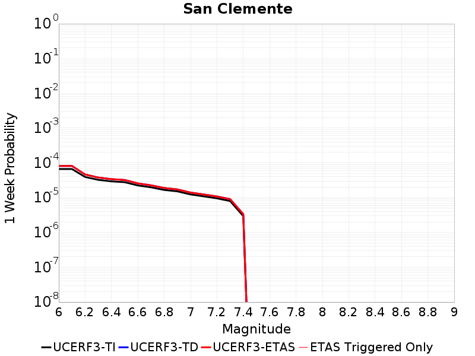 | 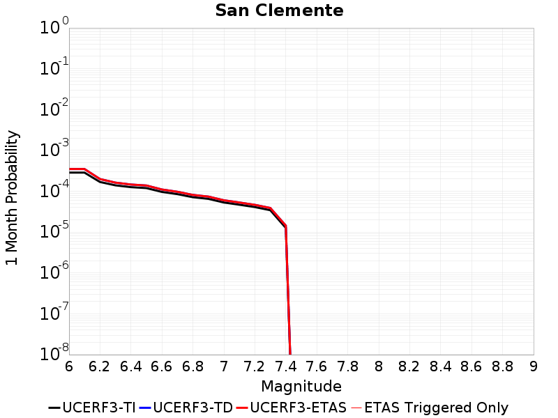 |  |  |

| Magnitude | 1 wk TI Prob | 1 wk TD Prob | 1 wk ETAS Prob | 1 wk ETAS/TD Gain | 1 wk ETAS Triggered Only | 1 mo TI Prob | 1 mo TD Prob | 1 mo ETAS Prob | 1 mo ETAS/TD Gain | 1 mo ETAS Triggered Only | 1 yr TI Prob | 1 yr TD Prob | 1 yr ETAS Prob | 1 yr ETAS/TD Gain | 1 yr ETAS Triggered Only | 10 yr TI Prob | 10 yr TD Prob | 10 yr ETAS Prob | 10 yr ETAS/TD Gain | 10 yr ETAS Triggered Only |
|-----|-----|-----|-----|-----|-----|-----|-----|-----|-----|-----|-----|-----|-----|-----|-----|-----|-----|-----|-----|-----|
| 6.0 | 6.681379E-5 | 8.175105E-5 | 8.175105E-5 | 1.0 | 0.0 | 2.8631336E-4 | 3.503175E-4 | 3.503175E-4 | 1.0 | 0.0 | 0.003480294 | 0.0042572627 | 0.0042572627 | 1.0 | 0.0 | 0.03426291 | 0.041812204 | 0.041831367 | 1.0004584 | 2.0E-5 |
| 6.1 | 6.681379E-5 | 8.175105E-5 | 8.175105E-5 | 1.0 | 0.0 | 2.8631336E-4 | 3.503175E-4 | 3.503175E-4 | 1.0 | 0.0 | 0.003480294 | 0.0042572627 | 0.0042572627 | 1.0 | 0.0 | 0.03426291 | 0.041812204 | 0.041812204 | 1.0 | 0.0 |
| 6.2 | 3.9400576E-5 | 4.6504476E-5 | 4.6504476E-5 | 1.0 | 0.0 | 1.6884868E-4 | 1.9928995E-4 | 1.9928995E-4 | 1.0 | 0.0 | 0.0020537945 | 0.0024237097 | 0.0024237097 | 1.0 | 0.0 | 0.020349167 | 0.023979392 | 0.023979392 | 1.0 | 0.0 |
| 6.3 | 3.2590255E-5 | 3.7967977E-5 | 3.7967977E-5 | 1.0 | 0.0 | 1.3966505E-4 | 1.6270994E-4 | 1.6270994E-4 | 1.0 | 0.0 | 0.0016990956 | 0.0019792244 | 0.0019792244 | 1.0 | 0.0 | 0.01686163 | 0.019619757 | 0.019619757 | 1.0 | 0.0 |
| 6.4 | 2.9454652E-5 | 3.413135E-5 | 3.413135E-5 | 1.0 | 0.0 | 1.2622811E-4 | 1.4626916E-4 | 1.4626916E-4 | 1.0 | 0.0 | 0.0015357438 | 0.0017793986 | 0.0017793986 | 1.0 | 0.0 | 0.015251739 | 0.017654683 | 0.017654683 | 1.0 | 0.0 |
| 6.5 | 2.790836E-5 | 3.227878E-5 | 3.227878E-5 | 1.0 | 0.0 | 1.1960178E-4 | 1.3833043E-4 | 1.3833043E-4 | 1.0 | 0.0 | 0.001455179 | 0.0016828974 | 0.0016828974 | 1.0 | 0.0 | 0.014456868 | 0.01670455 | 0.01670455 | 1.0 | 0.0 |
| 6.6 | 2.2492153E-5 | 2.5786048E-5 | 2.5786048E-5 | 1.0 | 0.0 | 9.639138E-5 | 1.1050704E-4 | 1.1050704E-4 | 1.0 | 0.0 | 0.0011729331 | 0.0013446076 | 0.0013446076 | 1.0 | 0.0 | 0.011667615 | 0.013366438 | 0.013366438 | 1.0 | 0.0 |
| 6.7 | 1.9862755E-5 | 2.2686345E-5 | 2.2686345E-5 | 1.0 | 0.0 | 8.512331E-5 | 9.722363E-5 | 9.722363E-5 | 1.0 | 0.0 | 0.0010358836 | 0.0011830662 | 0.0011830662 | 1.0 | 0.0 | 0.010310682 | 0.011768975 | 0.011768975 | 1.0 | 0.0 |
| 6.8 | 1.6697575E-5 | 1.8993827E-5 | 1.8993827E-5 | 1.0 | 0.0 | 7.155907E-5 | 8.139963E-5 | 8.139963E-5 | 1.0 | 0.0 | 8.7088346E-4 | 9.905993E-4 | 9.905993E-4 | 1.0 | 0.0 | 0.008674784 | 0.009862866 | 0.009862866 | 1.0 | 0.0 |
| 6.9 | 1.5218415E-5 | 1.7283872E-5 | 1.7283872E-5 | 1.0 | 0.0 | 6.522015E-5 | 7.4071686E-5 | 7.4071686E-5 | 1.0 | 0.0 | 7.93766E-4 | 9.0145844E-4 | 9.0145844E-4 | 1.0 | 0.0 | 0.007909367 | 0.008978965 | 0.008978965 | 1.0 | 0.0 |
| 7.0 | 1.2392958E-5 | 1.4044558E-5 | 1.4044558E-5 | 1.0 | 0.0 | 5.3111595E-5 | 6.018962E-5 | 6.018962E-5 | 1.0 | 0.0 | 6.4644177E-4 | 7.3256984E-4 | 7.3256984E-4 | 1.0 | 0.0 | 0.0064456454 | 0.0073023373 | 0.0073023373 | 1.0 | 0.0 |
| 7.1 | 1.0934128E-5 | 1.2385274E-5 | 1.2385274E-5 | 1.0 | 0.0 | 4.6859706E-5 | 5.307871E-5 | 5.307871E-5 | 1.0 | 0.0 | 5.7036756E-4 | 6.46049E-4 | 6.46049E-4 | 1.0 | 0.0 | 0.0056890585 | 0.006442456 | 0.006442456 | 1.0 | 0.0 |
| 7.2 | 9.5798805E-6 | 1.0853836E-5 | 1.0853836E-5 | 1.0 | 0.0 | 4.1055984E-5 | 4.651565E-5 | 4.651565E-5 | 1.0 | 0.0 | 4.9974193E-4 | 5.661881E-4 | 5.661881E-4 | 1.0 | 0.0 | 0.0049861963 | 0.005648181 | 0.005648181 | 1.0 | 0.0 |
| 7.3 | 8.0167365E-6 | 9.091433E-6 | 9.091433E-6 | 1.0 | 0.0 | 3.4356988E-5 | 3.8962742E-5 | 3.8962742E-5 | 1.0 | 0.0 | 4.1821605E-4 | 4.7427518E-4 | 4.7427518E-4 | 1.0 | 0.0 | 0.0041742986 | 0.004733334 | 0.004733334 | 1.0 | 0.0 |
| 7.4 | 2.9581017E-6 | 3.365235E-6 | 3.365235E-6 | 1.0 | 0.0 | 1.2677518E-5 | 1.4422384E-5 | 1.4422384E-5 | 1.0 | 0.0 | 1.5433785E-4 | 1.7558344E-4 | 1.7558344E-4 | 1.0 | 0.0 | 0.001542307 | 0.0017549429 | 0.0017549429 | 1.0 | 0.0 |

## Owens Valley
*[(top)](#table-of-contents)*

| 1 Week | 1 Month | 1 Year | 10 Year |
|-----|-----|-----|-----|
| 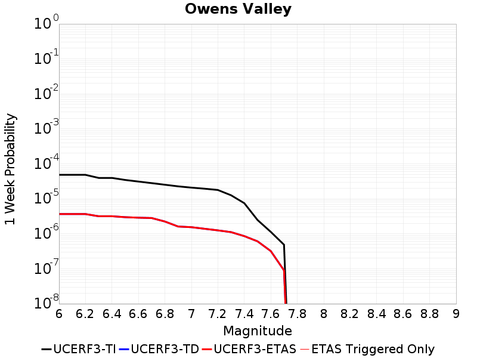 |  |  | 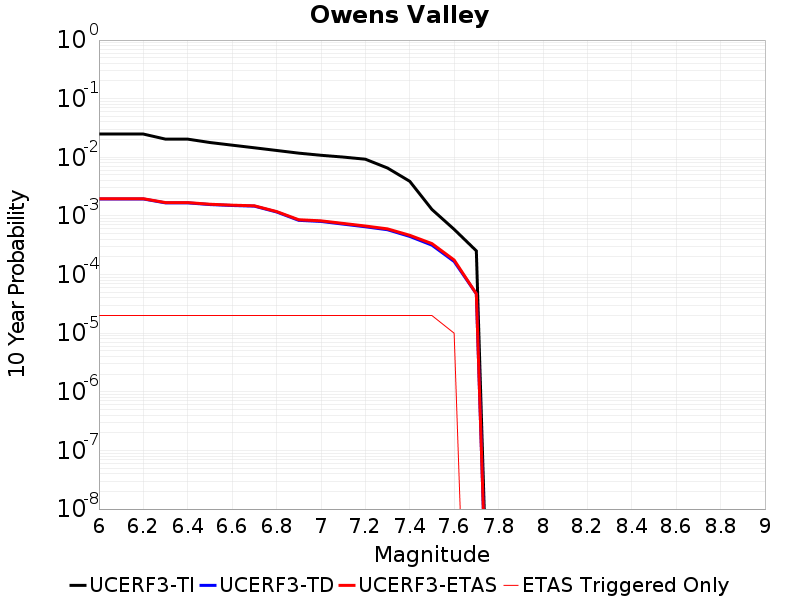 |

| Magnitude | 1 wk TI Prob | 1 wk TD Prob | 1 wk ETAS Prob | 1 wk ETAS/TD Gain | 1 wk ETAS Triggered Only | 1 mo TI Prob | 1 mo TD Prob | 1 mo ETAS Prob | 1 mo ETAS/TD Gain | 1 mo ETAS Triggered Only | 1 yr TI Prob | 1 yr TD Prob | 1 yr ETAS Prob | 1 yr ETAS/TD Gain | 1 yr ETAS Triggered Only | 10 yr TI Prob | 10 yr TD Prob | 10 yr ETAS Prob | 10 yr ETAS/TD Gain | 10 yr ETAS Triggered Only |
|-----|-----|-----|-----|-----|-----|-----|-----|-----|-----|-----|-----|-----|-----|-----|-----|-----|-----|-----|-----|-----|
| 6.0 | 4.83821E-5 | 3.6599401E-6 | 3.6599401E-6 | 1.0 | 0.0 | 2.0733538E-4 | 1.568537E-5 | 1.568537E-5 | 1.0 | 0.0 | 0.002521386 | 1.9095365E-4 | 1.9095365E-4 | 1.0 | 0.0 | 0.024929691 | 0.001946982 | 0.001966943 | 1.0102524 | 2.0E-5 |
| 6.1 | 4.83821E-5 | 3.6599401E-6 | 3.6599401E-6 | 1.0 | 0.0 | 2.0733538E-4 | 1.568537E-5 | 1.568537E-5 | 1.0 | 0.0 | 0.002521386 | 1.9095365E-4 | 1.9095365E-4 | 1.0 | 0.0 | 0.024929691 | 0.001946982 | 0.001966943 | 1.0102524 | 2.0E-5 |
| 6.2 | 4.83821E-5 | 3.6599401E-6 | 3.6599401E-6 | 1.0 | 0.0 | 2.0733538E-4 | 1.568537E-5 | 1.568537E-5 | 1.0 | 0.0 | 0.002521386 | 1.9095365E-4 | 1.9095365E-4 | 1.0 | 0.0 | 0.024929691 | 0.001946982 | 0.001966943 | 1.0102524 | 2.0E-5 |
| 6.3 | 3.953008E-5 | 3.1740867E-6 | 3.1740867E-6 | 1.0 | 0.0 | 1.6940363E-4 | 1.3603162E-5 | 1.3603162E-5 | 1.0 | 0.0 | 0.002060538 | 1.6560665E-4 | 1.6560665E-4 | 1.0 | 0.0 | 0.020415364 | 0.0016695461 | 0.0016895127 | 1.0119593 | 2.0E-5 |
| 6.4 | 3.953008E-5 | 3.1740867E-6 | 3.1740867E-6 | 1.0 | 0.0 | 1.6940363E-4 | 1.3603162E-5 | 1.3603162E-5 | 1.0 | 0.0 | 0.002060538 | 1.6560665E-4 | 1.6560665E-4 | 1.0 | 0.0 | 0.020415364 | 0.0016695461 | 0.0016895127 | 1.0119593 | 2.0E-5 |
| 6.5 | 3.457342E-5 | 2.9840126E-6 | 2.9840126E-6 | 1.0 | 0.0 | 1.4816338E-4 | 1.2788566E-5 | 1.2788566E-5 | 1.0 | 0.0 | 0.0018023965 | 1.5569037E-4 | 1.5569037E-4 | 1.0 | 0.0 | 0.017878477 | 0.001563291 | 0.0015832597 | 1.0127735 | 2.0E-5 |
| 6.6 | 3.1127765E-5 | 2.883786E-6 | 2.883786E-6 | 1.0 | 0.0 | 1.3339789E-4 | 1.2359028E-5 | 1.2359028E-5 | 1.0 | 0.0 | 0.0016229092 | 1.5046146E-4 | 1.5046146E-4 | 1.0 | 0.0 | 0.016111081 | 0.001506695 | 0.001526665 | 1.013254 | 2.0E-5 |
| 6.7 | 2.806885E-5 | 2.8174009E-6 | 2.8174009E-6 | 1.0 | 0.0 | 1.2028952E-4 | 1.20745235E-5 | 1.20745235E-5 | 1.0 | 0.0 | 0.001463541 | 1.4699809E-4 | 1.4699809E-4 | 1.0 | 0.0 | 0.014539397 | 0.0014694001 | 0.0014893707 | 1.013591 | 2.0E-5 |
| 6.8 | 2.524524E-5 | 2.2414056E-6 | 2.2414056E-6 | 1.0 | 0.0 | 1.0818939E-4 | 9.60599E-6 | 9.60599E-6 | 1.0 | 0.0 | 0.0013164099 | 1.1694696E-4 | 1.1694696E-4 | 1.0 | 0.0 | 0.01308639 | 0.0011691423 | 0.001189119 | 1.0170865 | 2.0E-5 |
| 6.9 | 2.2704568E-5 | 1.6126208E-6 | 1.6126208E-6 | 1.0 | 0.0 | 9.730166E-5 | 6.911214E-6 | 6.911214E-6 | 1.0 | 0.0 | 0.0011840039 | 8.41408E-5 | 8.41408E-5 | 1.0 | 0.0 | 0.011777153 | 8.413088E-4 | 8.6129195E-4 | 1.0237525 | 2.0E-5 |
| 7.0 | 2.0871712E-5 | 1.5437604E-6 | 1.5437604E-6 | 1.0 | 0.0 | 8.944713E-5 | 6.616099E-6 | 6.616099E-6 | 1.0 | 0.0 | 0.0010884746 | 8.0548045E-5 | 8.0548045E-5 | 1.0 | 0.0 | 0.010831586 | 8.053637E-4 | 8.253476E-4 | 1.0248135 | 2.0E-5 |
| 7.1 | 1.944928E-5 | 1.3900075E-6 | 1.3900075E-6 | 1.0 | 0.0 | 8.335139E-5 | 5.957161E-6 | 5.957161E-6 | 1.0 | 0.0 | 0.0010143308 | 7.252603E-5 | 7.252603E-5 | 1.0 | 0.0 | 0.010097133 | 7.2518445E-4 | 7.4516993E-4 | 1.0275592 | 2.0E-5 |
| 7.2 | 1.7876306E-5 | 1.2520597E-6 | 1.2520597E-6 | 1.0 | 0.0 | 7.6610486E-5 | 5.365959E-6 | 5.365959E-6 | 1.0 | 0.0 | 9.3233347E-4 | 6.5328604E-5 | 6.5328604E-5 | 1.0 | 0.0 | 0.009284316 | 6.532222E-4 | 6.7320914E-4 | 1.0305974 | 2.0E-5 |
| 7.3 | 1.2618672E-5 | 1.1144334E-6 | 1.1144334E-6 | 1.0 | 0.0 | 5.40789E-5 | 4.7761346E-6 | 4.7761346E-6 | 1.0 | 0.0 | 6.582117E-4 | 5.8147893E-5 | 5.8147893E-5 | 1.0 | 0.0 | 0.0065626553 | 5.814501E-4 | 6.014385E-4 | 1.0343767 | 2.0E-5 |
| 7.4 | 7.4874442E-6 | 8.5731745E-7 | 8.5731745E-7 | 1.0 | 0.0 | 3.208865E-5 | 3.6742126E-6 | 3.6742126E-6 | 1.0 | 0.0 | 3.906093E-4 | 4.4732624E-5 | 4.4732624E-5 | 1.0 | 0.0 | 0.003899234 | 4.4732072E-4 | 4.6731177E-4 | 1.0446906 | 2.0E-5 |
| 7.5 | 2.4734156E-6 | 6.084875E-7 | 6.084875E-7 | 1.0 | 0.0 | 1.060031E-5 | 2.6078008E-6 | 2.6078008E-6 | 1.0 | 0.0 | 1.2905113E-4 | 3.1749514E-5 | 3.1749514E-5 | 1.0 | 0.0 | 0.0012897621 | 3.1745012E-4 | 3.3744378E-4 | 1.0629821 | 2.0E-5 |
| 7.6 | 1.1328841E-6 | 3.2045926E-7 | 3.2045926E-7 | 1.0 | 0.0 | 4.8552088E-6 | 1.3733961E-6 | 1.3733961E-6 | 1.0 | 0.0 | 5.9110564E-5 | 1.6720971E-5 | 1.6720971E-5 | 1.0 | 0.0 | 5.9094845E-4 | 1.6719733E-4 | 1.7719566E-4 | 1.0597996 | 1.0E-5 |
| 7.7 | 4.8613185E-7 | 8.9954696E-8 | 8.9954696E-8 | 1.0 | 0.0 | 2.0834207E-6 | 3.8552008E-7 | 3.8552008E-7 | 1.0 | 0.0 | 2.536535E-5 | 4.6936975E-6 | 4.6936975E-6 | 1.0 | 0.0 | 2.5362454E-4 | 4.6936053E-5 | 4.6936053E-5 | 1.0 | 0.0 |

## Cerro Prieto
*[(top)](#table-of-contents)*

| 1 Week | 1 Month | 1 Year | 10 Year |
|-----|-----|-----|-----|
| 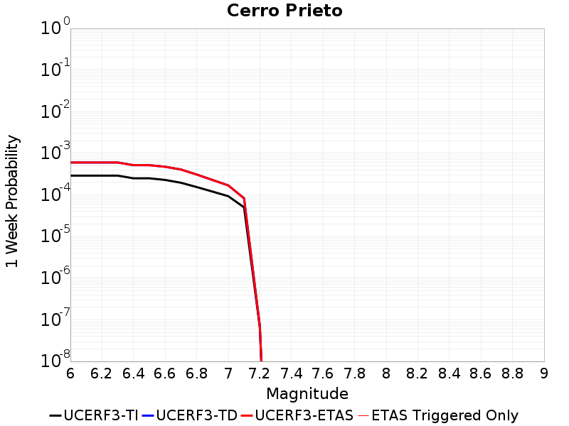 | 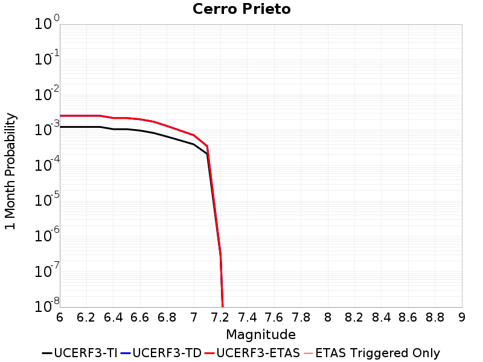 | 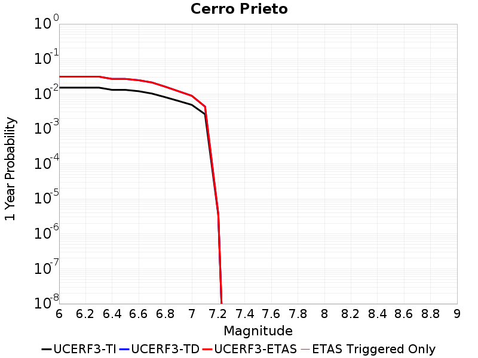 | 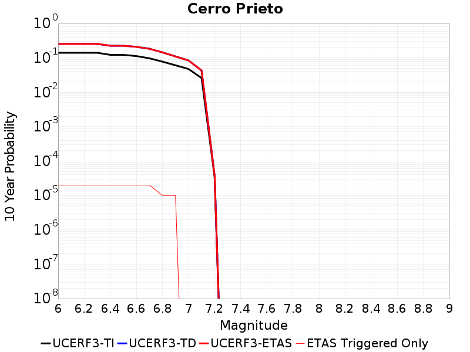 |

| Magnitude | 1 wk TI Prob | 1 wk TD Prob | 1 wk ETAS Prob | 1 wk ETAS/TD Gain | 1 wk ETAS Triggered Only | 1 mo TI Prob | 1 mo TD Prob | 1 mo ETAS Prob | 1 mo ETAS/TD Gain | 1 mo ETAS Triggered Only | 1 yr TI Prob | 1 yr TD Prob | 1 yr ETAS Prob | 1 yr ETAS/TD Gain | 1 yr ETAS Triggered Only | 10 yr TI Prob | 10 yr TD Prob | 10 yr ETAS Prob | 10 yr ETAS/TD Gain | 10 yr ETAS Triggered Only |
|-----|-----|-----|-----|-----|-----|-----|-----|-----|-----|-----|-----|-----|-----|-----|-----|-----|-----|-----|-----|-----|
| 6.0 | 2.9101528E-4 | 6.01596E-4 | 6.01596E-4 | 1.0 | 0.0 | 0.0012466122 | 0.0025759668 | 0.0025759668 | 1.0 | 0.0 | 0.015072231 | 0.031017603 | 0.031017603 | 1.0 | 0.0 | 0.14089979 | 0.25543952 | 0.25545442 | 1.0000583 | 2.0E-5 |
| 6.1 | 2.9101528E-4 | 6.01596E-4 | 6.01596E-4 | 1.0 | 0.0 | 0.0012466122 | 0.0025759668 | 0.0025759668 | 1.0 | 0.0 | 0.015072231 | 0.031017603 | 0.031017603 | 1.0 | 0.0 | 0.14089979 | 0.25543952 | 0.25545442 | 1.0000583 | 2.0E-5 |
| 6.2 | 2.9101528E-4 | 6.01596E-4 | 6.01596E-4 | 1.0 | 0.0 | 0.0012466122 | 0.0025759668 | 0.0025759668 | 1.0 | 0.0 | 0.015072231 | 0.031017603 | 0.031017603 | 1.0 | 0.0 | 0.14089979 | 0.25543952 | 0.25545442 | 1.0000583 | 2.0E-5 |
| 6.3 | 2.9101528E-4 | 6.01596E-4 | 6.01596E-4 | 1.0 | 0.0 | 0.0012466122 | 0.0025759668 | 0.0025759668 | 1.0 | 0.0 | 0.015072231 | 0.031017603 | 0.031017603 | 1.0 | 0.0 | 0.14089979 | 0.25543952 | 0.25545442 | 1.0000583 | 2.0E-5 |
| 6.4 | 2.508648E-4 | 5.1884144E-4 | 5.1884144E-4 | 1.0 | 0.0 | 0.0010746918 | 0.0022219133 | 0.0022219133 | 1.0 | 0.0 | 0.013006088 | 0.026697433 | 0.026697433 | 1.0 | 0.0 | 0.12270685 | 0.2257945 | 0.22580999 | 1.0000685 | 2.0E-5 |
| 6.5 | 2.508648E-4 | 5.1884144E-4 | 5.1884144E-4 | 1.0 | 0.0 | 0.0010746918 | 0.0022219133 | 0.0022219133 | 1.0 | 0.0 | 0.013006088 | 0.026697433 | 0.026697433 | 1.0 | 0.0 | 0.12270685 | 0.2257945 | 0.22580999 | 1.0000685 | 2.0E-5 |
| 6.6 | 2.294914E-4 | 4.758817E-4 | 4.758817E-4 | 1.0 | 0.0 | 9.831638E-4 | 0.0020380898 | 0.0020380898 | 1.0 | 0.0 | 0.011904482 | 0.024527654 | 0.024527654 | 1.0 | 0.0 | 0.11286586 | 0.20998515 | 0.21000096 | 1.0000752 | 2.0E-5 |
| 6.7 | 1.9621674E-4 | 4.0865623E-4 | 4.0865623E-4 | 1.0 | 0.0 | 8.4065786E-4 | 0.0017503698 | 0.0017503698 | 1.0 | 0.0 | 0.010187071 | 0.021134313 | 0.021134313 | 1.0 | 0.0 | 0.09732539 | 0.18423703 | 0.18425335 | 1.0000886 | 2.0E-5 |
| 6.8 | 1.5476145E-4 | 3.0934007E-4 | 3.0934007E-4 | 1.0 | 0.0 | 6.6309475E-4 | 0.001325174 | 0.001325174 | 1.0 | 0.0 | 0.008043335 | 0.016022775 | 0.016022775 | 1.0 | 0.0 | 0.07758363 | 0.14451642 | 0.14452498 | 1.0000592 | 1.0E-5 |
| 6.9 | 1.20509176E-4 | 2.2882696E-4 | 2.2882696E-4 | 1.0 | 0.0 | 5.1636563E-4 | 9.803833E-4 | 9.803833E-4 | 1.0 | 0.0 | 0.006268645 | 0.011886057 | 0.011886057 | 1.0 | 0.0 | 0.060947374 | 0.11042889 | 0.11043779 | 1.0000806 | 1.0E-5 |
| 7.0 | 9.3269155E-5 | 1.6956481E-4 | 1.6956481E-4 | 1.0 | 0.0 | 3.9966372E-4 | 7.265482E-4 | 7.265482E-4 | 1.0 | 0.0 | 0.0048550544 | 0.008817708 | 0.008817708 | 1.0 | 0.0 | 0.04750344 | 0.08402472 | 0.08402472 | 1.0 | 0.0 |
| 7.1 | 5.029709E-5 | 8.308812E-5 | 8.308812E-5 | 1.0 | 0.0 | 2.1554115E-4 | 3.5606322E-4 | 3.5606322E-4 | 1.0 | 0.0 | 0.0026210553 | 0.0043299785 | 0.0043299785 | 1.0 | 0.0 | 0.025903556 | 0.042864565 | 0.042864565 | 1.0 | 0.0 |
| 7.2 | 6.5445185E-8 | 7.0883964E-8 | 7.0883964E-8 | 1.0 | 0.0 | 2.8047933E-7 | 3.037884E-7 | 3.037884E-7 | 1.0 | 0.0 | 3.4148304E-6 | 3.698624E-6 | 3.698624E-6 | 1.0 | 0.0 | 3.414778E-5 | 3.698624E-5 | 3.698624E-5 | 1.0 | 0.0 |

## Baker
*[(top)](#table-of-contents)*

| 1 Week | 1 Month | 1 Year | 10 Year |
|-----|-----|-----|-----|
|  | 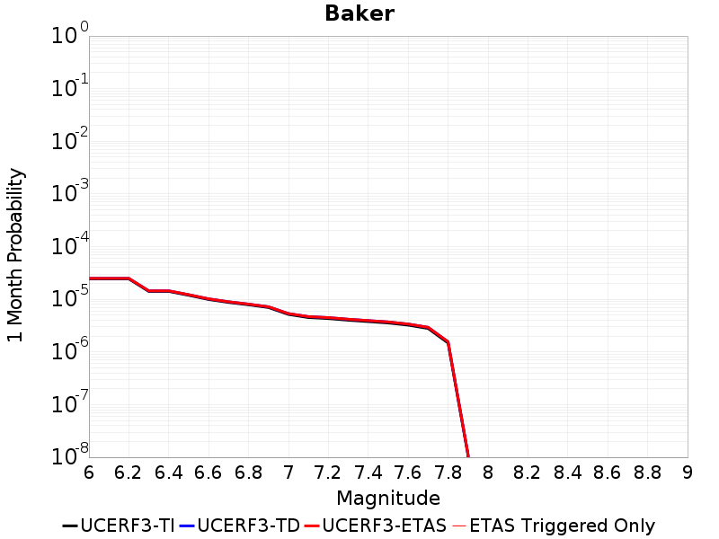 | 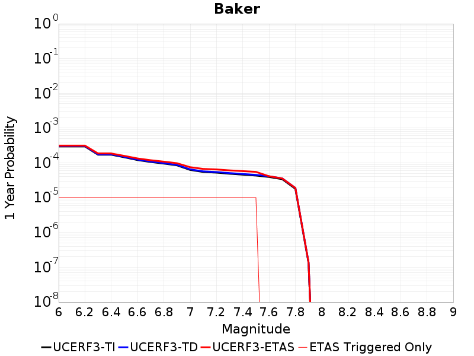 |  |

| Magnitude | 1 wk TI Prob | 1 wk TD Prob | 1 wk ETAS Prob | 1 wk ETAS/TD Gain | 1 wk ETAS Triggered Only | 1 mo TI Prob | 1 mo TD Prob | 1 mo ETAS Prob | 1 mo ETAS/TD Gain | 1 mo ETAS Triggered Only | 1 yr TI Prob | 1 yr TD Prob | 1 yr ETAS Prob | 1 yr ETAS/TD Gain | 1 yr ETAS Triggered Only | 10 yr TI Prob | 10 yr TD Prob | 10 yr ETAS Prob | 10 yr ETAS/TD Gain | 10 yr ETAS Triggered Only |
|-----|-----|-----|-----|-----|-----|-----|-----|-----|-----|-----|-----|-----|-----|-----|-----|-----|-----|-----|-----|-----|
| 6.0 | 5.695525E-6 | 5.835729E-6 | 5.835729E-6 | 1.0 | 0.0 | 2.4409164E-5 | 2.501005E-5 | 2.501005E-5 | 1.0 | 0.0 | 2.9714106E-4 | 3.044588E-4 | 3.1445577E-4 | 1.0328351 | 1.0E-5 | 0.0029674405 | 0.003040813 | 0.003060752 | 1.0065572 | 2.0E-5 |
| 6.1 | 5.695525E-6 | 5.835729E-6 | 5.835729E-6 | 1.0 | 0.0 | 2.4409164E-5 | 2.501005E-5 | 2.501005E-5 | 1.0 | 0.0 | 2.9714106E-4 | 3.044588E-4 | 3.1445577E-4 | 1.0328351 | 1.0E-5 | 0.0029674405 | 0.003040813 | 0.003060752 | 1.0065572 | 2.0E-5 |
| 6.2 | 5.695525E-6 | 5.835729E-6 | 5.835729E-6 | 1.0 | 0.0 | 2.4409164E-5 | 2.501005E-5 | 2.501005E-5 | 1.0 | 0.0 | 2.9714106E-4 | 3.044588E-4 | 3.1445577E-4 | 1.0328351 | 1.0E-5 | 0.0029674405 | 0.003040813 | 0.003060752 | 1.0065572 | 2.0E-5 |
| 6.3 | 3.2995713E-6 | 3.3842075E-6 | 3.3842075E-6 | 1.0 | 0.0 | 1.4140943E-5 | 1.4503668E-5 | 1.4503668E-5 | 1.0 | 0.0 | 1.7215237E-4 | 1.7656833E-4 | 1.8656657E-4 | 1.0566252 | 1.0E-5 | 0.0017201907 | 0.0017643275 | 0.0017743099 | 1.0056579 | 1.0E-5 |
| 6.4 | 3.2995713E-6 | 3.3842075E-6 | 3.3842075E-6 | 1.0 | 0.0 | 1.4140943E-5 | 1.4503668E-5 | 1.4503668E-5 | 1.0 | 0.0 | 1.7215237E-4 | 1.7656833E-4 | 1.8656657E-4 | 1.0566252 | 1.0E-5 | 0.0017201907 | 0.0017643275 | 0.0017743099 | 1.0056579 | 1.0E-5 |
| 6.5 | 2.782202E-6 | 2.8563145E-6 | 2.8563145E-6 | 1.0 | 0.0 | 1.1923668E-5 | 1.2241292E-5 | 1.2241292E-5 | 1.0 | 0.0 | 1.4516099E-4 | 1.4902787E-4 | 1.5902639E-4 | 1.0670916 | 1.0E-5 | 0.001450662 | 0.001489312 | 0.0014992972 | 1.0067046 | 1.0E-5 |
| 6.6 | 2.3163404E-6 | 2.3813366E-6 | 2.3813366E-6 | 1.0 | 0.0 | 9.927136E-6 | 1.020569E-5 | 1.020569E-5 | 1.0 | 0.0 | 1.20856166E-4 | 1.242474E-4 | 1.3424615E-4 | 1.0804746 | 1.0E-5 | 0.0012079047 | 0.0012417994 | 0.0012517871 | 1.0080428 | 1.0E-5 |
| 6.7 | 2.037056E-6 | 2.0968846E-6 | 2.0968846E-6 | 1.0 | 0.0 | 8.7302105E-6 | 8.986619E-6 | 8.986619E-6 | 1.0 | 0.0 | 1.0628513E-4 | 1.0940675E-4 | 1.1940565E-4 | 1.091392 | 1.0E-5 | 0.0010623431 | 0.001093545 | 0.001103534 | 1.0091345 | 1.0E-5 |
| 6.8 | 1.8356744E-6 | 1.8918902E-6 | 1.8918902E-6 | 1.0 | 0.0 | 7.867153E-6 | 8.108076E-6 | 8.108076E-6 | 1.0 | 0.0 | 9.577837E-5 | 9.87115E-5 | 1.0871051E-4 | 1.1012954 | 1.0E-5 | 9.57371E-4 | 9.866905E-4 | 9.966806E-4 | 1.0101249 | 1.0E-5 |
| 6.9 | 1.6310546E-6 | 1.6835453E-6 | 1.6835453E-6 | 1.0 | 0.0 | 6.9902153E-6 | 7.2151747E-6 | 7.2151747E-6 | 1.0 | 0.0 | 8.510255E-5 | 8.784133E-5 | 9.784045E-5 | 1.1138316 | 1.0E-5 | 8.5069967E-4 | 8.780773E-4 | 8.880685E-4 | 1.0113785 | 1.0E-5 |
| 7.0 | 1.2058036E-6 | 1.2511599E-6 | 1.2511599E-6 | 1.0 | 0.0 | 5.1677193E-6 | 5.362103E-6 | 5.362103E-6 | 1.0 | 0.0 | 6.291517E-5 | 6.528167E-5 | 7.5281016E-5 | 1.1531724 | 1.0E-5 | 6.289736E-4 | 6.5262726E-4 | 6.626207E-4 | 1.0153127 | 1.0E-5 |
| 7.1 | 1.052382E-6 | 1.0954398E-6 | 1.0954398E-6 | 1.0 | 0.0 | 4.5102006E-6 | 4.6947334E-6 | 4.6947334E-6 | 1.0 | 0.0 | 5.491031E-5 | 5.715689E-5 | 6.715632E-5 | 1.174947 | 1.0E-5 | 5.4896745E-4 | 5.714228E-4 | 5.8141706E-4 | 1.0174901 | 1.0E-5 |
| 7.2 | 1.0067454E-6 | 1.0490452E-6 | 1.0490452E-6 | 1.0 | 0.0 | 4.3146156E-6 | 4.4959E-6 | 4.4959E-6 | 1.0 | 0.0 | 5.252918E-5 | 5.473622E-5 | 6.473567E-5 | 1.1826844 | 1.0E-5 | 5.251676E-4 | 5.4722826E-4 | 5.5722275E-4 | 1.0182639 | 1.0E-5 |
| 7.3 | 9.3596316E-7 | 9.770388E-7 | 9.770388E-7 | 1.0 | 0.0 | 4.0112645E-6 | 4.1873022E-6 | 4.1873022E-6 | 1.0 | 0.0 | 4.8836053E-5 | 5.0979223E-5 | 6.0978713E-5 | 1.1961484 | 1.0E-5 | 4.8825322E-4 | 5.0967606E-4 | 5.1967095E-4 | 1.0196103 | 1.0E-5 |
| 7.4 | 8.8117395E-7 | 9.21025E-7 | 9.21025E-7 | 1.0 | 0.0 | 3.7764542E-6 | 3.9472443E-6 | 3.9472443E-6 | 1.0 | 0.0 | 4.5977362E-5 | 4.8056645E-5 | 5.8056165E-5 | 1.2080778 | 1.0E-5 | 4.596785E-4 | 4.804633E-4 | 4.904585E-4 | 1.0208032 | 1.0E-5 |
| 7.5 | 8.292386E-7 | 8.677095E-7 | 8.677095E-7 | 1.0 | 0.0 | 3.5538749E-6 | 3.7187497E-6 | 3.7187497E-6 | 1.0 | 0.0 | 4.326757E-5 | 4.5274843E-5 | 5.527439E-5 | 1.2208632 | 1.0E-5 | 4.3259145E-4 | 4.5265694E-4 | 4.6265242E-4 | 1.0220817 | 1.0E-5 |
| 7.6 | 7.553842E-7 | 7.9168314E-7 | 7.9168314E-7 | 1.0 | 0.0 | 3.2373566E-6 | 3.3929232E-6 | 3.3929232E-6 | 1.0 | 0.0 | 3.9414106E-5 | 4.1308063E-5 | 4.1308063E-5 | 1.0 | 0.0 | 3.9407116E-4 | 4.1300457E-4 | 4.1300457E-4 | 1.0 | 0.0 |
| 7.7 | 6.5285366E-7 | 6.8549224E-7 | 6.8549224E-7 | 1.0 | 0.0 | 2.797941E-6 | 2.9378207E-6 | 2.9378207E-6 | 1.0 | 0.0 | 3.40644E-5 | 3.5767385E-5 | 3.5767385E-5 | 1.0 | 0.0 | 3.405918E-4 | 3.5761695E-4 | 3.5761695E-4 | 1.0 | 0.0 |
| 7.8 | 3.4586725E-7 | 3.64951E-7 | 3.64951E-7 | 1.0 | 0.0 | 1.4822873E-6 | 1.5640749E-6 | 1.5640749E-6 | 1.0 | 0.0 | 1.80467E-5 | 1.9042449E-5 | 1.9042449E-5 | 1.0 | 0.0 | 1.8045233E-4 | 1.9040862E-4 | 1.9040862E-4 | 1.0 | 0.0 |
| 7.9 | 2.5591178E-9 | 2.670388E-9 | 2.670388E-9 | 1.0 | 0.0 | 1.0967647E-8 | 1.144452E-8 | 1.144452E-8 | 1.0 | 0.0 | 1.335311E-7 | 1.3933703E-7 | 1.3933703E-7 | 1.0 | 0.0 | 1.3353102E-6 | 1.3933703E-6 | 1.3933703E-6 | 1.0 | 0.0 |

## Simi-Santa Rosa
*[(top)](#table-of-contents)*

| 1 Week | 1 Month | 1 Year | 10 Year |
|-----|-----|-----|-----|
|  |  |  |  |

| Magnitude | 1 wk TI Prob | 1 wk TD Prob | 1 wk ETAS Prob | 1 wk ETAS/TD Gain | 1 wk ETAS Triggered Only | 1 mo TI Prob | 1 mo TD Prob | 1 mo ETAS Prob | 1 mo ETAS/TD Gain | 1 mo ETAS Triggered Only | 1 yr TI Prob | 1 yr TD Prob | 1 yr ETAS Prob | 1 yr ETAS/TD Gain | 1 yr ETAS Triggered Only | 10 yr TI Prob | 10 yr TD Prob | 10 yr ETAS Prob | 10 yr ETAS/TD Gain | 10 yr ETAS Triggered Only |
|-----|-----|-----|-----|-----|-----|-----|-----|-----|-----|-----|-----|-----|-----|-----|-----|-----|-----|-----|-----|-----|
| 6.0 | 2.198912E-5 | 2.2293836E-5 | 2.2293836E-5 | 1.0 | 0.0 | 9.4235686E-5 | 9.5541756E-5 | 9.5541756E-5 | 1.0 | 0.0 | 0.0011467156 | 0.0011626441 | 0.0011626441 | 1.0 | 0.0 | 0.011408163 | 0.01157007 | 0.011589838 | 1.0017086 | 2.0E-5 |
| 6.1 | 2.198912E-5 | 2.2293836E-5 | 2.2293836E-5 | 1.0 | 0.0 | 9.4235686E-5 | 9.5541756E-5 | 9.5541756E-5 | 1.0 | 0.0 | 0.0011467156 | 0.0011626441 | 0.0011626441 | 1.0 | 0.0 | 0.011408163 | 0.01157007 | 0.011589838 | 1.0017086 | 2.0E-5 |
| 6.2 | 1.69983E-5 | 1.668265E-5 | 1.668265E-5 | 1.0 | 0.0 | 7.284782E-5 | 7.1495284E-5 | 7.1495284E-5 | 1.0 | 0.0 | 8.865613E-4 | 8.7013666E-4 | 8.7013666E-4 | 1.0 | 0.0 | 0.008830327 | 0.008670222 | 0.008690049 | 1.0022868 | 2.0E-5 |
| 6.3 | 1.69983E-5 | 1.668265E-5 | 1.668265E-5 | 1.0 | 0.0 | 7.284782E-5 | 7.1495284E-5 | 7.1495284E-5 | 1.0 | 0.0 | 8.865613E-4 | 8.7013666E-4 | 8.7013666E-4 | 1.0 | 0.0 | 0.008830327 | 0.008670222 | 0.008690049 | 1.0022868 | 2.0E-5 |
| 6.4 | 1.4666188E-5 | 1.4064655E-5 | 1.4064655E-5 | 1.0 | 0.0 | 6.285358E-5 | 6.0275845E-5 | 6.0275845E-5 | 1.0 | 0.0 | 7.6497364E-4 | 7.3363626E-4 | 7.3363626E-4 | 1.0 | 0.0 | 0.0076234564 | 0.007314623 | 0.0073344763 | 1.0027143 | 2.0E-5 |
| 6.5 | 1.4666188E-5 | 1.4064655E-5 | 1.4064655E-5 | 1.0 | 0.0 | 6.285358E-5 | 6.0275845E-5 | 6.0275845E-5 | 1.0 | 0.0 | 7.6497364E-4 | 7.3363626E-4 | 7.3363626E-4 | 1.0 | 0.0 | 0.0076234564 | 0.007314623 | 0.0073344763 | 1.0027143 | 2.0E-5 |
| 6.6 | 1.4377586E-5 | 1.3741456E-5 | 1.3741456E-5 | 1.0 | 0.0 | 6.1616774E-5 | 5.8890768E-5 | 5.8890768E-5 | 1.0 | 0.0 | 7.4992597E-4 | 7.167841E-4 | 7.167841E-4 | 1.0 | 0.0 | 0.007474003 | 0.0071471944 | 0.0071670515 | 1.0027783 | 2.0E-5 |
| 6.7 | 1.3881404E-5 | 1.321903E-5 | 1.321903E-5 | 1.0 | 0.0 | 5.9490372E-5 | 5.6651897E-5 | 5.6651897E-5 | 1.0 | 0.0 | 7.240546E-4 | 6.895433E-4 | 6.895433E-4 | 1.0 | 0.0 | 0.007217 | 0.0068764915 | 0.006896354 | 1.0028884 | 2.0E-5 |
| 6.8 | 1.0176516E-5 | 9.162444E-6 | 9.162444E-6 | 1.0 | 0.0 | 4.3612912E-5 | 3.926712E-5 | 3.926712E-5 | 1.0 | 0.0 | 5.308578E-4 | 4.7798894E-4 | 4.7798894E-4 | 1.0 | 0.0 | 0.0052959146 | 0.0047712447 | 0.004791149 | 1.0041717 | 2.0E-5 |
| 6.9 | 9.699797E-6 | 8.782633E-6 | 8.782633E-6 | 1.0 | 0.0 | 4.15699E-5 | 3.7639405E-5 | 3.7639405E-5 | 1.0 | 0.0 | 5.05996E-4 | 4.581799E-4 | 4.581799E-4 | 1.0 | 0.0 | 0.005048454 | 0.004573973 | 0.004593882 | 1.0043526 | 2.0E-5 |
| 7.0 | 7.4049476E-6 | 6.5652143E-6 | 6.5652143E-6 | 1.0 | 0.0 | 3.1735104E-5 | 2.8136401E-5 | 2.8136401E-5 | 1.0 | 0.0 | 3.8630638E-4 | 3.425195E-4 | 3.425195E-4 | 1.0 | 0.0 | 0.0038563553 | 0.0034211602 | 0.003431126 | 1.002913 | 1.0E-5 |
| 7.1 | 3.873439E-6 | 2.7620413E-6 | 2.7620413E-6 | 1.0 | 0.0 | 1.6600346E-5 | 1.1837267E-5 | 1.1837267E-5 | 1.0 | 0.0 | 2.0209046E-4 | 1.4410944E-4 | 1.4410944E-4 | 1.0 | 0.0 | 0.0020190678 | 0.0014401835 | 0.0014501691 | 1.0069336 | 1.0E-5 |
| 7.2 | 3.417706E-6 | 2.369909E-6 | 2.369909E-6 | 1.0 | 0.0 | 1.4647229E-5 | 1.0156715E-5 | 1.0156715E-5 | 1.0 | 0.0 | 1.7831543E-4 | 1.236512E-4 | 1.236512E-4 | 1.0 | 0.0 | 0.0017817242 | 0.0012358464 | 0.001245834 | 1.0080817 | 1.0E-5 |
| 7.3 | 1.90225E-6 | 1.4089771E-6 | 1.4089771E-6 | 1.0 | 0.0 | 8.152474E-6 | 6.0384596E-6 | 6.0384596E-6 | 1.0 | 0.0 | 9.9251854E-5 | 7.351579E-5 | 7.351579E-5 | 1.0 | 0.0 | 9.920754E-4 | 7.3491695E-4 | 7.449096E-4 | 1.013597 | 1.0E-5 |
| 7.4 | 1.5170556E-6 | 1.1039168E-6 | 1.1039168E-6 | 1.0 | 0.0 | 6.5016507E-6 | 4.731063E-6 | 4.731063E-6 | 1.0 | 0.0 | 7.915472E-5 | 5.7599183E-5 | 5.7599183E-5 | 1.0 | 0.0 | 7.9126534E-4 | 5.758437E-4 | 5.758437E-4 | 1.0 | 0.0 |
| 7.5 | 1.178732E-6 | 8.5477546E-7 | 8.5477546E-7 | 1.0 | 0.0 | 5.0516987E-6 | 3.6633182E-6 | 3.6633182E-6 | 1.0 | 0.0 | 6.1502695E-5 | 4.4599998E-5 | 4.4599998E-5 | 1.0 | 0.0 | 6.148568E-4 | 4.459114E-4 | 4.459114E-4 | 1.0 | 0.0 |
| 7.6 | 6.8722386E-7 | 4.804436E-7 | 4.804436E-7 | 1.0 | 0.0 | 2.9452417E-6 | 2.0590423E-6 | 2.0590423E-6 | 1.0 | 0.0 | 3.5857727E-5 | 2.5068553E-5 | 2.5068553E-5 | 1.0 | 0.0 | 3.5851944E-4 | 2.5065738E-4 | 2.5065738E-4 | 1.0 | 0.0 |
| 7.7 | 5.5126515E-7 | 3.6838952E-7 | 3.6838952E-7 | 1.0 | 0.0 | 2.3625628E-6 | 1.5788113E-6 | 1.5788113E-6 | 1.0 | 0.0 | 2.8763823E-5 | 1.922186E-5 | 1.922186E-5 | 1.0 | 0.0 | 2.87601E-4 | 1.9220207E-4 | 1.9220207E-4 | 1.0 | 0.0 |
| 7.8 | 3.3860243E-7 | 2.014677E-7 | 2.014677E-7 | 1.0 | 0.0 | 1.4511525E-6 | 8.634327E-7 | 8.634327E-7 | 1.0 | 0.0 | 1.7667637E-5 | 1.0512243E-5 | 1.0512243E-5 | 1.0 | 0.0 | 1.7666233E-4 | 1.0511751E-4 | 1.0511751E-4 | 1.0 | 0.0 |
| 7.9 | 2.7955386E-7 | 1.4712246E-7 | 1.4712246E-7 | 1.0 | 0.0 | 1.1980875E-6 | 6.305247E-7 | 6.305247E-7 | 1.0 | 0.0 | 1.4586617E-5 | 7.676612E-6 | 7.676612E-6 | 1.0 | 0.0 | 1.458566E-4 | 7.676351E-5 | 7.676351E-5 | 1.0 | 0.0 |
| 8.0 | 5.6259015E-8 | 3.3438347E-8 | 3.3438347E-8 | 1.0 | 0.0 | 2.4111003E-7 | 1.433072E-7 | 1.433072E-7 | 1.0 | 0.0 | 2.9355108E-6 | 1.744764E-6 | 1.744764E-6 | 1.0 | 0.0 | 2.935472E-5 | 1.7447515E-5 | 1.7447515E-5 | 1.0 | 0.0 |

## Whittier alt 1
*[(top)](#table-of-contents)*

| 1 Week | 1 Month | 1 Year | 10 Year |
|-----|-----|-----|-----|
|  | 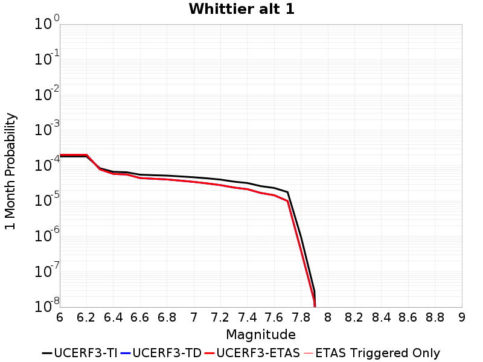 |  |  |

| Magnitude | 1 wk TI Prob | 1 wk TD Prob | 1 wk ETAS Prob | 1 wk ETAS/TD Gain | 1 wk ETAS Triggered Only | 1 mo TI Prob | 1 mo TD Prob | 1 mo ETAS Prob | 1 mo ETAS/TD Gain | 1 mo ETAS Triggered Only | 1 yr TI Prob | 1 yr TD Prob | 1 yr ETAS Prob | 1 yr ETAS/TD Gain | 1 yr ETAS Triggered Only | 10 yr TI Prob | 10 yr TD Prob | 10 yr ETAS Prob | 10 yr ETAS/TD Gain | 10 yr ETAS Triggered Only |
|-----|-----|-----|-----|-----|-----|-----|-----|-----|-----|-----|-----|-----|-----|-----|-----|-----|-----|-----|-----|-----|
| 6.0 | 4.2554693E-5 | 4.7309753E-5 | 4.7309753E-5 | 1.0 | 0.0 | 1.8236451E-4 | 2.0274213E-4 | 2.0274213E-4 | 1.0 | 0.0 | 0.002218027 | 0.0024659135 | 0.0024659135 | 1.0 | 0.0 | 0.02196019 | 0.0244197 | 0.024439212 | 1.0007991 | 2.0E-5 |
| 6.1 | 4.2554693E-5 | 4.7309753E-5 | 4.7309753E-5 | 1.0 | 0.0 | 1.8236451E-4 | 2.0274213E-4 | 2.0274213E-4 | 1.0 | 0.0 | 0.002218027 | 0.0024659135 | 0.0024659135 | 1.0 | 0.0 | 0.02196019 | 0.0244197 | 0.024439212 | 1.0007991 | 2.0E-5 |
| 6.2 | 4.2554693E-5 | 4.7309753E-5 | 4.7309753E-5 | 1.0 | 0.0 | 1.8236451E-4 | 2.0274213E-4 | 2.0274213E-4 | 1.0 | 0.0 | 0.002218027 | 0.0024659135 | 0.0024659135 | 1.0 | 0.0 | 0.02196019 | 0.0244197 | 0.024439212 | 1.0007991 | 2.0E-5 |
| 6.3 | 1.9617712E-5 | 1.8300894E-5 | 1.8300894E-5 | 1.0 | 0.0 | 8.40732E-5 | 7.843016E-5 | 7.843016E-5 | 1.0 | 0.0 | 0.0010231105 | 9.544879E-4 | 9.544879E-4 | 1.0 | 0.0 | 0.01018413 | 0.009507262 | 0.009527072 | 1.0020837 | 2.0E-5 |
| 6.4 | 1.5611336E-5 | 1.3631922E-5 | 1.3631922E-5 | 1.0 | 0.0 | 6.690401E-5 | 5.842125E-5 | 5.842125E-5 | 1.0 | 0.0 | 8.142519E-4 | 7.110526E-4 | 7.110526E-4 | 1.0 | 0.0 | 0.008112748 | 0.007089829 | 0.0070997584 | 1.0014005 | 1.0E-5 |
| 6.5 | 1.5150166E-5 | 1.31282795E-5 | 1.31282795E-5 | 1.0 | 0.0 | 6.492767E-5 | 5.6262874E-5 | 5.6262874E-5 | 1.0 | 0.0 | 7.9020765E-4 | 6.847911E-4 | 6.847911E-4 | 1.0 | 0.0 | 0.007874036 | 0.0068288487 | 0.0068288487 | 1.0 | 0.0 |
| 6.6 | 1.295588E-5 | 1.04036935E-5 | 1.04036935E-5 | 1.0 | 0.0 | 5.552402E-5 | 4.4586508E-5 | 4.4586508E-5 | 1.0 | 0.0 | 6.7579525E-4 | 5.427075E-4 | 5.427075E-4 | 1.0 | 0.0 | 0.006737438 | 0.0054154424 | 0.0054154424 | 1.0 | 0.0 |
| 6.7 | 1.2542085E-5 | 9.921762E-6 | 9.921762E-6 | 1.0 | 0.0 | 5.3750682E-5 | 4.252116E-5 | 4.252116E-5 | 1.0 | 0.0 | 6.542181E-4 | 5.17574E-4 | 5.17574E-4 | 1.0 | 0.0 | 0.006522954 | 0.0051652617 | 0.0051652617 | 1.0 | 0.0 |
| 6.8 | 1.2195878E-5 | 9.517074E-6 | 9.517074E-6 | 1.0 | 0.0 | 5.2267E-5 | 4.0786832E-5 | 4.0786832E-5 | 1.0 | 0.0 | 6.36165E-4 | 4.964684E-4 | 4.964684E-4 | 1.0 | 0.0 | 0.0063434686 | 0.004955103 | 0.004955103 | 1.0 | 0.0 |
| 6.9 | 1.1580298E-5 | 8.793203E-6 | 8.793203E-6 | 1.0 | 0.0 | 4.9628903E-5 | 3.7684622E-5 | 3.7684622E-5 | 1.0 | 0.0 | 6.040644E-4 | 4.5871534E-4 | 4.5871534E-4 | 1.0 | 0.0 | 0.00602425 | 0.0045790724 | 0.0045790724 | 1.0 | 0.0 |
| 7.0 | 1.0964795E-5 | 8.102919E-6 | 8.102919E-6 | 1.0 | 0.0 | 4.6991136E-5 | 3.472634E-5 | 3.472634E-5 | 1.0 | 0.0 | 5.7196687E-4 | 4.2271274E-4 | 4.2271274E-4 | 1.0 | 0.0 | 0.0057049696 | 0.0042203944 | 0.0042203944 | 1.0 | 0.0 |
| 7.1 | 1.0230601E-5 | 7.3438646E-6 | 7.3438646E-6 | 1.0 | 0.0 | 4.3844695E-5 | 3.1473333E-5 | 3.1473333E-5 | 1.0 | 0.0 | 5.336784E-4 | 3.8312178E-4 | 3.8312178E-4 | 1.0 | 0.0 | 0.005323986 | 0.003825815 | 0.003825815 | 1.0 | 0.0 |
| 7.2 | 9.40865E-6 | 6.5591103E-6 | 6.5591103E-6 | 1.0 | 0.0 | 4.032216E-5 | 2.8110177E-5 | 2.8110177E-5 | 1.0 | 0.0 | 4.908117E-4 | 3.4218887E-4 | 3.4218887E-4 | 1.0 | 0.0 | 0.0048972913 | 0.00341774 | 0.00341774 | 1.0 | 0.0 |
| 7.3 | 8.237384E-6 | 5.6114923E-6 | 5.6114923E-6 | 1.0 | 0.0 | 3.5302593E-5 | 2.4049037E-5 | 2.4049037E-5 | 1.0 | 0.0 | 4.2972428E-4 | 2.9275875E-4 | 2.9275875E-4 | 1.0 | 0.0 | 0.0042889426 | 0.002924065 | 0.002924065 | 1.0 | 0.0 |
| 7.4 | 7.5316966E-6 | 5.039616E-6 | 5.039616E-6 | 1.0 | 0.0 | 3.2278298E-5 | 2.1598182E-5 | 2.1598182E-5 | 1.0 | 0.0 | 3.9291743E-4 | 2.6292715E-4 | 2.6292715E-4 | 1.0 | 0.0 | 0.0039222343 | 0.0026262726 | 0.0026262726 | 1.0 | 0.0 |
| 7.5 | 6.149649E-6 | 3.9434226E-6 | 3.9434226E-6 | 1.0 | 0.0 | 2.6355372E-5 | 1.6900278E-5 | 1.6900278E-5 | 1.0 | 0.0 | 3.208294E-4 | 2.0574236E-4 | 2.0574236E-4 | 1.0 | 0.0 | 0.003203666 | 0.0020556084 | 0.0020556084 | 1.0 | 0.0 |
| 7.6 | 5.457711E-6 | 3.4035963E-6 | 3.4035963E-6 | 1.0 | 0.0 | 2.338998E-5 | 1.4586764E-5 | 1.4586764E-5 | 1.0 | 0.0 | 2.8473578E-4 | 1.7758021E-4 | 1.7758021E-4 | 1.0 | 0.0 | 0.0028437122 | 0.0017744642 | 0.0017744642 | 1.0 | 0.0 |
| 7.7 | 4.1676276E-6 | 2.3394575E-6 | 2.3394575E-6 | 1.0 | 0.0 | 1.7861139E-5 | 1.0026212E-5 | 1.0026212E-5 | 1.0 | 0.0 | 2.1743766E-4 | 1.2206304E-4 | 1.2206304E-4 | 1.0 | 0.0 | 0.0021722503 | 0.0012200334 | 0.0012200334 | 1.0 | 0.0 |
| 7.8 | 2.2692414E-7 | 9.406634E-8 | 9.406634E-8 | 1.0 | 0.0 | 9.725317E-7 | 4.031414E-7 | 4.031414E-7 | 1.0 | 0.0 | 1.1840509E-5 | 4.9082387E-6 | 4.9082387E-6 | 1.0 | 0.0 | 1.1839878E-4 | 4.908163E-5 | 4.908163E-5 | 1.0 | 0.0 |
| 7.9 | 6.676829E-9 | 3.4455256E-9 | 3.4455256E-9 | 1.0 | 0.0 | 2.861498E-8 | 1.4766538E-8 | 1.4766538E-8 | 1.0 | 0.0 | 3.4838732E-7 | 1.7978259E-7 | 1.7978259E-7 | 1.0 | 0.0 | 3.4838679E-6 | 1.7978246E-6 | 1.7978246E-6 | 1.0 | 0.0 |

## Chino alt 1
*[(top)](#table-of-contents)*

| 1 Week | 1 Month | 1 Year | 10 Year |
|-----|-----|-----|-----|
| 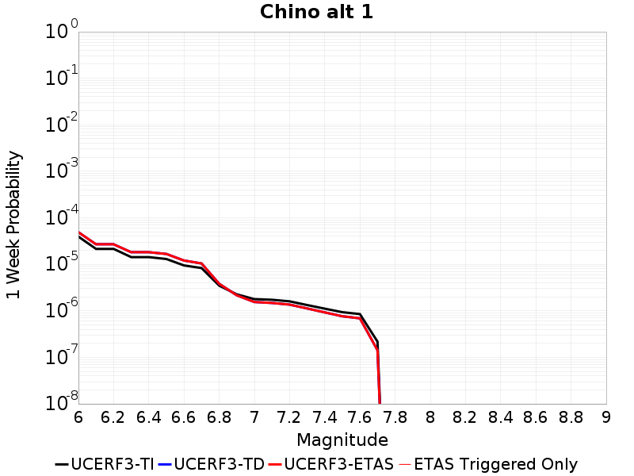 | 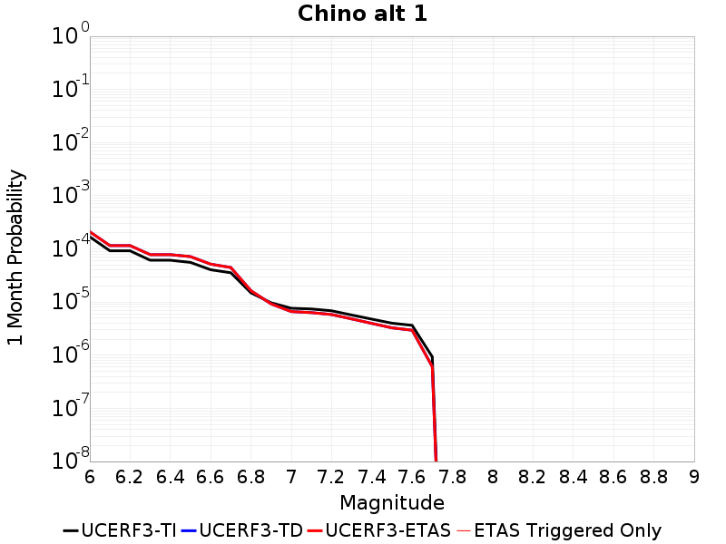 | 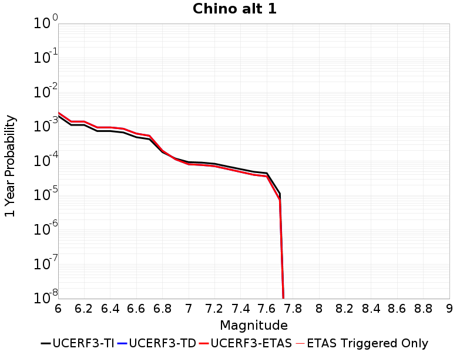 | 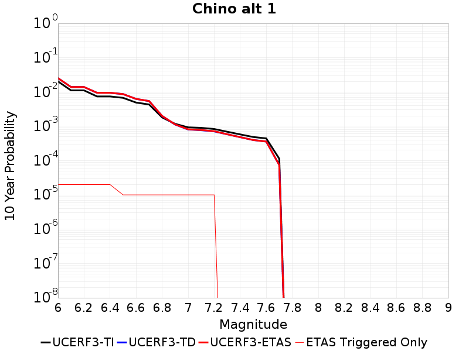 |

| Magnitude | 1 wk TI Prob | 1 wk TD Prob | 1 wk ETAS Prob | 1 wk ETAS/TD Gain | 1 wk ETAS Triggered Only | 1 mo TI Prob | 1 mo TD Prob | 1 mo ETAS Prob | 1 mo ETAS/TD Gain | 1 mo ETAS Triggered Only | 1 yr TI Prob | 1 yr TD Prob | 1 yr ETAS Prob | 1 yr ETAS/TD Gain | 1 yr ETAS Triggered Only | 10 yr TI Prob | 10 yr TD Prob | 10 yr ETAS Prob | 10 yr ETAS/TD Gain | 10 yr ETAS Triggered Only |
|-----|-----|-----|-----|-----|-----|-----|-----|-----|-----|-----|-----|-----|-----|-----|-----|-----|-----|-----|-----|-----|
| 6.0 | 3.939946E-5 | 4.90608E-5 | 4.90608E-5 | 1.0 | 0.0 | 1.6884391E-4 | 2.1024616E-4 | 2.1024616E-4 | 1.0 | 0.0 | 0.0020537362 | 0.0025572556 | 0.0025572556 | 1.0 | 0.0 | 0.020348595 | 0.02533355 | 0.025353042 | 1.0007695 | 2.0E-5 |
| 6.1 | 2.1505624E-5 | 2.6959764E-5 | 2.6959764E-5 | 1.0 | 0.0 | 9.2163704E-5 | 1.155373E-4 | 1.155373E-4 | 1.0 | 0.0 | 0.0011215154 | 0.0014058693 | 0.0014058693 | 1.0 | 0.0 | 0.011158722 | 0.013984968 | 0.014004688 | 1.0014101 | 2.0E-5 |
| 6.2 | 2.1505624E-5 | 2.6959764E-5 | 2.6959764E-5 | 1.0 | 0.0 | 9.2163704E-5 | 1.155373E-4 | 1.155373E-4 | 1.0 | 0.0 | 0.0011215154 | 0.0014058693 | 0.0014058693 | 1.0 | 0.0 | 0.011158722 | 0.013984968 | 0.014004688 | 1.0014101 | 2.0E-5 |
| 6.3 | 1.4290785E-5 | 1.8234527E-5 | 1.8234527E-5 | 1.0 | 0.0 | 6.1244784E-5 | 7.814589E-5 | 7.814589E-5 | 1.0 | 0.0 | 7.454001E-4 | 9.510564E-4 | 9.510564E-4 | 1.0 | 0.0 | 0.007429048 | 0.009478634 | 0.009498445 | 1.00209 | 2.0E-5 |
| 6.4 | 1.4290785E-5 | 1.8234527E-5 | 1.8234527E-5 | 1.0 | 0.0 | 6.1244784E-5 | 7.814589E-5 | 7.814589E-5 | 1.0 | 0.0 | 7.454001E-4 | 9.510564E-4 | 9.510564E-4 | 1.0 | 0.0 | 0.007429048 | 0.009478634 | 0.009498445 | 1.00209 | 2.0E-5 |
| 6.5 | 1.3017944E-5 | 1.671971E-5 | 1.671971E-5 | 1.0 | 0.0 | 5.5789995E-5 | 7.165418E-5 | 7.165418E-5 | 1.0 | 0.0 | 6.790315E-4 | 8.720846E-4 | 8.720846E-4 | 1.0 | 0.0 | 0.0067696036 | 0.008695235 | 0.008705148 | 1.00114 | 1.0E-5 |
| 6.6 | 9.470016E-6 | 1.2079407E-5 | 1.2079407E-5 | 1.0 | 0.0 | 4.058515E-5 | 5.1768053E-5 | 5.1768053E-5 | 1.0 | 0.0 | 4.940122E-4 | 6.301279E-4 | 6.301279E-4 | 1.0 | 0.0 | 0.004929154 | 0.0062908707 | 0.006300808 | 1.0015796 | 1.0E-5 |
| 6.7 | 8.314155E-6 | 1.0437906E-5 | 1.0437906E-5 | 1.0 | 0.0 | 3.5631605E-5 | 4.47333E-5 | 4.47333E-5 | 1.0 | 0.0 | 4.3372845E-4 | 5.445242E-4 | 5.445242E-4 | 1.0 | 0.0 | 0.004328829 | 0.0054397658 | 0.0054497113 | 1.0018283 | 1.0E-5 |
| 6.8 | 3.4856364E-6 | 3.822871E-6 | 3.822871E-6 | 1.0 | 0.0 | 1.4938357E-5 | 1.6383641E-5 | 1.6383641E-5 | 1.0 | 0.0 | 1.8185932E-4 | 1.9945466E-4 | 1.9945466E-4 | 1.0 | 0.0 | 0.0018171056 | 0.001994471 | 0.0020044511 | 1.0050038 | 1.0E-5 |
| 6.9 | 2.2645952E-6 | 2.1589776E-6 | 2.1589776E-6 | 1.0 | 0.0 | 9.705372E-6 | 9.25273E-6 | 9.25273E-6 | 1.0 | 0.0 | 1.18156495E-4 | 1.1264638E-4 | 1.1264638E-4 | 1.0 | 0.0 | 0.0011809369 | 0.001126492 | 0.0011364807 | 1.0088671 | 1.0E-5 |
| 7.0 | 1.7864003E-6 | 1.5479603E-6 | 1.5479603E-6 | 1.0 | 0.0 | 7.655979E-6 | 6.634099E-6 | 6.634099E-6 | 1.0 | 0.0 | 9.3207556E-5 | 8.0767226E-5 | 8.0767226E-5 | 1.0 | 0.0 | 9.316847E-4 | 8.0784934E-4 | 8.178412E-4 | 1.0123686 | 1.0E-5 |
| 7.1 | 1.7315456E-6 | 1.4781317E-6 | 1.4781317E-6 | 1.0 | 0.0 | 7.420889E-6 | 6.334835E-6 | 6.334835E-6 | 1.0 | 0.0 | 9.034557E-5 | 7.712394E-5 | 7.712394E-5 | 1.0 | 0.0 | 9.0308854E-4 | 7.714316E-4 | 7.814239E-4 | 1.0129529 | 1.0E-5 |
| 7.2 | 1.6008337E-6 | 1.3618943E-6 | 1.3618943E-6 | 1.0 | 0.0 | 6.860698E-6 | 5.836677E-6 | 5.836677E-6 | 1.0 | 0.0 | 8.352579E-5 | 7.105928E-5 | 7.105928E-5 | 1.0 | 0.0 | 8.34944E-4 | 7.1081356E-4 | 7.208065E-4 | 1.0140584 | 1.0E-5 |
| 7.3 | 1.3320939E-6 | 1.1256097E-6 | 1.1256097E-6 | 1.0 | 0.0 | 5.7089615E-6 | 4.8240327E-6 | 4.8240327E-6 | 1.0 | 0.0 | 6.9504385E-5 | 5.8731064E-5 | 5.8731064E-5 | 1.0 | 0.0 | 6.9482654E-4 | 5.873174E-4 | 5.873174E-4 | 1.0 | 0.0 |
| 7.4 | 1.114294E-6 | 9.2625214E-7 | 9.2625214E-7 | 1.0 | 0.0 | 4.775537E-6 | 3.969646E-6 | 3.969646E-6 | 1.0 | 0.0 | 5.8140613E-5 | 4.832941E-5 | 4.832941E-5 | 1.0 | 0.0 | 5.81254E-4 | 4.8320545E-4 | 4.8320545E-4 | 1.0 | 0.0 |
| 7.5 | 9.354081E-7 | 7.6448373E-7 | 7.6448373E-7 | 1.0 | 0.0 | 4.0088858E-6 | 3.2763548E-6 | 3.2763548E-6 | 1.0 | 0.0 | 4.8807087E-5 | 3.9888924E-5 | 3.9888924E-5 | 1.0 | 0.0 | 4.879637E-4 | 3.9882105E-4 | 3.9882105E-4 | 1.0 | 0.0 |
| 7.6 | 8.521771E-7 | 6.9004744E-7 | 6.9004744E-7 | 1.0 | 0.0 | 3.6521824E-6 | 2.9573432E-6 | 2.9573432E-6 | 1.0 | 0.0 | 4.4464414E-5 | 3.600509E-5 | 3.600509E-5 | 1.0 | 0.0 | 4.4455516E-4 | 3.5999576E-4 | 3.5999576E-4 | 1.0 | 0.0 |
| 7.7 | 2.1803626E-7 | 1.4237517E-7 | 1.4237517E-7 | 1.0 | 0.0 | 9.344408E-7 | 6.101792E-7 | 6.101792E-7 | 1.0 | 0.0 | 1.1376757E-5 | 7.4289164E-6 | 7.4289164E-6 | 1.0 | 0.0 | 1.13761744E-4 | 7.4287644E-5 | 7.4287644E-5 | 1.0 | 0.0 |

## White Mountains
*[(top)](#table-of-contents)*

| 1 Week | 1 Month | 1 Year | 10 Year |
|-----|-----|-----|-----|
| 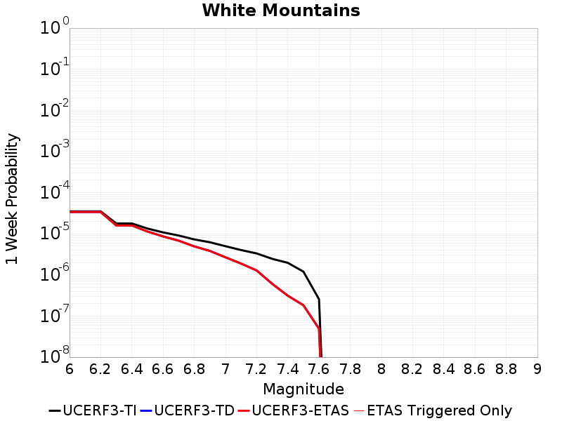 |  |  |  |

| Magnitude | 1 wk TI Prob | 1 wk TD Prob | 1 wk ETAS Prob | 1 wk ETAS/TD Gain | 1 wk ETAS Triggered Only | 1 mo TI Prob | 1 mo TD Prob | 1 mo ETAS Prob | 1 mo ETAS/TD Gain | 1 mo ETAS Triggered Only | 1 yr TI Prob | 1 yr TD Prob | 1 yr ETAS Prob | 1 yr ETAS/TD Gain | 1 yr ETAS Triggered Only | 10 yr TI Prob | 10 yr TD Prob | 10 yr ETAS Prob | 10 yr ETAS/TD Gain | 10 yr ETAS Triggered Only |
|-----|-----|-----|-----|-----|-----|-----|-----|-----|-----|-----|-----|-----|-----|-----|-----|-----|-----|-----|-----|-----|
| 6.0 | 3.503579E-5 | 3.380188E-5 | 3.380188E-5 | 1.0 | 0.0 | 1.5014476E-4 | 1.4485784E-4 | 1.4485784E-4 | 1.0 | 0.0 | 0.0018264796 | 0.0017623384 | 0.0017623384 | 1.0 | 0.0 | 0.018115403 | 0.017495975 | 0.017515624 | 1.0011231 | 2.0E-5 |
| 6.1 | 3.503579E-5 | 3.380188E-5 | 3.380188E-5 | 1.0 | 0.0 | 1.5014476E-4 | 1.4485784E-4 | 1.4485784E-4 | 1.0 | 0.0 | 0.0018264796 | 0.0017623384 | 0.0017623384 | 1.0 | 0.0 | 0.018115403 | 0.017495975 | 0.017515624 | 1.0011231 | 2.0E-5 |
| 6.2 | 3.503579E-5 | 3.380188E-5 | 3.380188E-5 | 1.0 | 0.0 | 1.5014476E-4 | 1.4485784E-4 | 1.4485784E-4 | 1.0 | 0.0 | 0.0018264796 | 0.0017623384 | 0.0017623384 | 1.0 | 0.0 | 0.018115403 | 0.017495975 | 0.017515624 | 1.0011231 | 2.0E-5 |
| 6.3 | 1.7818425E-5 | 1.5923955E-5 | 1.5923955E-5 | 1.0 | 0.0 | 7.636245E-5 | 6.824382E-5 | 6.824382E-5 | 1.0 | 0.0 | 9.293162E-4 | 8.305661E-4 | 8.305661E-4 | 1.0 | 0.0 | 0.009254395 | 0.008276079 | 0.008276079 | 1.0 | 0.0 |
| 6.4 | 1.7818425E-5 | 1.5923955E-5 | 1.5923955E-5 | 1.0 | 0.0 | 7.636245E-5 | 6.824382E-5 | 6.824382E-5 | 1.0 | 0.0 | 9.293162E-4 | 8.305661E-4 | 8.305661E-4 | 1.0 | 0.0 | 0.009254395 | 0.008276079 | 0.008276079 | 1.0 | 0.0 |
| 6.5 | 1.3397557E-5 | 1.13418455E-5 | 1.13418455E-5 | 1.0 | 0.0 | 5.741684E-5 | 4.8607046E-5 | 4.8607046E-5 | 1.0 | 0.0 | 6.988258E-4 | 5.9163704E-4 | 5.9163704E-4 | 1.0 | 0.0 | 0.006966323 | 0.0059013255 | 0.0059013255 | 1.0 | 0.0 |
| 6.6 | 1.0818695E-5 | 8.629568E-6 | 8.629568E-6 | 1.0 | 0.0 | 4.6365014E-5 | 3.698336E-5 | 3.698336E-5 | 1.0 | 0.0 | 5.6434784E-4 | 4.5018378E-4 | 4.5018378E-4 | 1.0 | 0.0 | 0.005629168 | 0.004493155 | 0.004493155 | 1.0 | 0.0 |
| 6.7 | 9.067908E-6 | 6.8057825E-6 | 6.8057825E-6 | 1.0 | 0.0 | 3.8861883E-5 | 2.9167331E-5 | 2.9167331E-5 | 1.0 | 0.0 | 4.7304068E-4 | 3.550576E-4 | 3.550576E-4 | 1.0 | 0.0 | 0.00472035 | 0.0035452205 | 0.0035452205 | 1.0 | 0.0 |
| 6.8 | 7.295947E-6 | 4.9388386E-6 | 4.9388386E-6 | 1.0 | 0.0 | 3.126797E-5 | 2.1166286E-5 | 2.1166286E-5 | 1.0 | 0.0 | 3.8062103E-4 | 2.5767018E-4 | 2.5767018E-4 | 1.0 | 0.0 | 0.0037996976 | 0.0025738273 | 0.0025738273 | 1.0 | 0.0 |
| 6.9 | 6.2243444E-6 | 3.8342364E-6 | 3.8342364E-6 | 1.0 | 0.0 | 2.6675489E-5 | 1.6432341E-5 | 1.6432341E-5 | 1.0 | 0.0 | 3.2472567E-4 | 2.000459E-4 | 2.000459E-4 | 1.0 | 0.0 | 0.0032425157 | 0.0019987111 | 0.0019987111 | 1.0 | 0.0 |
| 7.0 | 4.9878413E-6 | 2.6812766E-6 | 2.6812766E-6 | 1.0 | 0.0 | 2.1376287E-5 | 1.1491136E-5 | 1.1491136E-5 | 1.0 | 0.0 | 2.602252E-4 | 1.3989587E-4 | 1.3989587E-4 | 1.0 | 0.0 | 0.002599207 | 0.0013981042 | 0.0013981042 | 1.0 | 0.0 |
| 7.1 | 4.0252844E-6 | 1.887332E-6 | 1.887332E-6 | 1.0 | 0.0 | 1.7251105E-5 | 8.088541E-6 | 8.088541E-6 | 1.0 | 0.0 | 2.1001195E-4 | 9.847367E-5 | 9.847367E-5 | 1.0 | 0.0 | 0.0020981359 | 9.843131E-4 | 9.843131E-4 | 1.0 | 0.0 |
| 7.2 | 3.3284066E-6 | 1.2833011E-6 | 1.2833011E-6 | 1.0 | 0.0 | 1.4264522E-5 | 5.499851E-6 | 5.499851E-6 | 1.0 | 0.0 | 1.736567E-4 | 6.695873E-5 | 6.695873E-5 | 1.0 | 0.0 | 0.0017352107 | 6.693956E-4 | 6.693956E-4 | 1.0 | 0.0 |
| 7.3 | 2.458226E-6 | 6.0696317E-7 | 6.0696317E-7 | 1.0 | 0.0 | 1.0535211E-5 | 2.6012683E-6 | 2.6012683E-6 | 1.0 | 0.0 | 1.2825865E-4 | 3.167002E-5 | 3.167002E-5 | 1.0 | 0.0 | 0.0012818464 | 3.166588E-4 | 3.166588E-4 | 1.0 | 0.0 |
| 7.4 | 1.965953E-6 | 3.1195836E-7 | 3.1195836E-7 | 1.0 | 0.0 | 8.425486E-6 | 1.3369637E-6 | 1.3369637E-6 | 1.0 | 0.0 | 1.0257547E-4 | 1.6277414E-5 | 1.6277414E-5 | 1.0 | 0.0 | 0.0010252813 | 1.6276234E-4 | 1.6276234E-4 | 1.0 | 0.0 |
| 7.5 | 1.2014192E-6 | 1.8317854E-7 | 1.8317854E-7 | 1.0 | 0.0 | 5.148929E-6 | 7.8505064E-7 | 7.8505064E-7 | 1.0 | 0.0 | 6.2686406E-5 | 9.557951E-6 | 9.557951E-6 | 1.0 | 0.0 | 6.266873E-4 | 9.557547E-5 | 9.557547E-5 | 1.0 | 0.0 |
| 7.6 | 2.5612175E-7 | 4.9141487E-8 | 4.9141487E-8 | 1.0 | 0.0 | 1.0976642E-6 | 2.1060636E-7 | 2.1060636E-7 | 1.0 | 0.0 | 1.3363979E-5 | 2.5641298E-6 | 2.5641298E-6 | 1.0 | 0.0 | 1.3363175E-4 | 2.5641039E-5 | 2.5641039E-5 | 1.0 | 0.0 |

## Brawley (Seismic Zone) alt 1
*[(top)](#table-of-contents)*

| 1 Week | 1 Month | 1 Year | 10 Year |
|-----|-----|-----|-----|
| 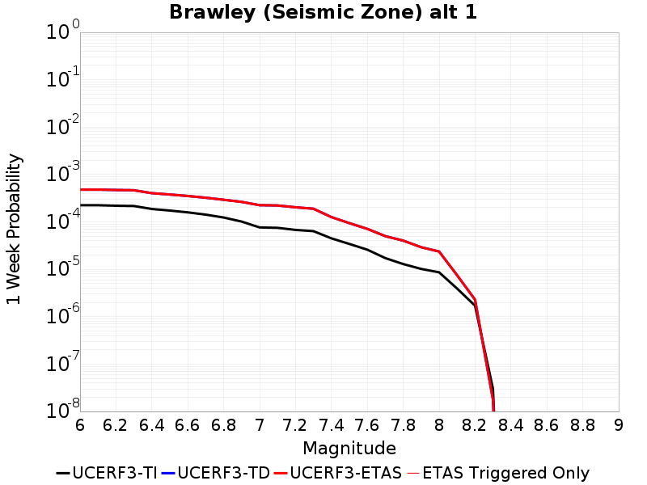 | 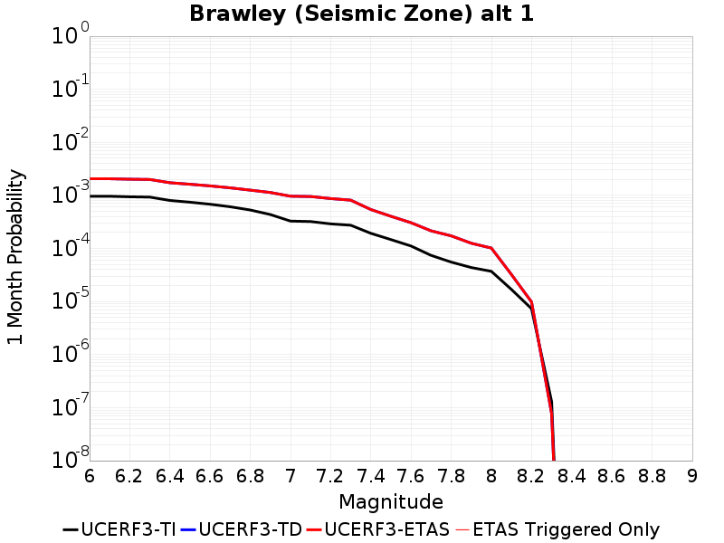 |  |  |

| Magnitude | 1 wk TI Prob | 1 wk TD Prob | 1 wk ETAS Prob | 1 wk ETAS/TD Gain | 1 wk ETAS Triggered Only | 1 mo TI Prob | 1 mo TD Prob | 1 mo ETAS Prob | 1 mo ETAS/TD Gain | 1 mo ETAS Triggered Only | 1 yr TI Prob | 1 yr TD Prob | 1 yr ETAS Prob | 1 yr ETAS/TD Gain | 1 yr ETAS Triggered Only | 10 yr TI Prob | 10 yr TD Prob | 10 yr ETAS Prob | 10 yr ETAS/TD Gain | 10 yr ETAS Triggered Only |
|-----|-----|-----|-----|-----|-----|-----|-----|-----|-----|-----|-----|-----|-----|-----|-----|-----|-----|-----|-----|-----|
| 6.0 | 2.2521618E-4 | 4.810958E-4 | 4.810958E-4 | 1.0 | 0.0 | 9.6485513E-4 | 0.0020602474 | 0.0020602474 | 1.0 | 0.0 | 0.011683988 | 0.024788922 | 0.024788922 | 1.0 | 0.0 | 0.11088423 | 0.21512087 | 0.21513657 | 1.000073 | 2.0E-5 |
| 6.1 | 2.2521618E-4 | 4.810958E-4 | 4.810958E-4 | 1.0 | 0.0 | 9.6485513E-4 | 0.0020602474 | 0.0020602474 | 1.0 | 0.0 | 0.011683988 | 0.024788922 | 0.024788922 | 1.0 | 0.0 | 0.11088423 | 0.21512087 | 0.21513657 | 1.000073 | 2.0E-5 |
| 6.2 | 2.198148E-4 | 4.718349E-4 | 4.718349E-4 | 1.0 | 0.0 | 9.417233E-4 | 0.0020206196 | 0.0020206196 | 1.0 | 0.0 | 0.011405343 | 0.02431794 | 0.02431794 | 1.0 | 0.0 | 0.10837428 | 0.21153513 | 0.21155089 | 1.0000745 | 2.0E-5 |
| 6.3 | 2.1704129E-4 | 4.6617136E-4 | 4.6617136E-4 | 1.0 | 0.0 | 9.298453E-4 | 0.0019963847 | 0.0019963847 | 1.0 | 0.0 | 0.011262234 | 0.024029868 | 0.024029868 | 1.0 | 0.0 | 0.107082725 | 0.20942496 | 0.20944077 | 1.0000755 | 2.0E-5 |
| 6.4 | 1.876142E-4 | 4.0491705E-4 | 4.0491705E-4 | 1.0 | 0.0 | 8.038131E-4 | 0.0017342194 | 0.0017342194 | 1.0 | 0.0 | 0.00974259 | 0.020908557 | 0.020908557 | 1.0 | 0.0 | 0.093263686 | 0.18617135 | 0.18618762 | 1.0000874 | 2.0E-5 |
| 6.5 | 1.7390939E-4 | 3.7906948E-4 | 3.7906948E-4 | 1.0 | 0.0 | 7.45113E-4 | 0.0016235845 | 0.0016235845 | 1.0 | 0.0 | 0.009034078 | 0.019588985 | 0.019588985 | 1.0 | 0.0 | 0.086755216 | 0.1759626 | 0.17597908 | 1.0000937 | 2.0E-5 |
| 6.6 | 1.591791E-4 | 3.5299142E-4 | 3.5299142E-4 | 1.0 | 0.0 | 6.8201777E-4 | 0.0015119537 | 0.0015119537 | 1.0 | 0.0 | 0.008271996 | 0.018255698 | 0.018255698 | 1.0 | 0.0 | 0.07970774 | 0.16531952 | 0.1653362 | 1.000101 | 2.0E-5 |
| 6.7 | 1.4268003E-4 | 3.243912E-4 | 3.243912E-4 | 1.0 | 0.0 | 6.1134255E-4 | 0.0013895158 | 0.0013895158 | 1.0 | 0.0 | 0.007417723 | 0.01678929 | 0.01678929 | 1.0 | 0.0 | 0.07174956 | 0.15338585 | 0.15340278 | 1.0001104 | 2.0E-5 |
| 6.8 | 1.239713E-4 | 2.9372177E-4 | 2.9372177E-4 | 1.0 | 0.0 | 5.3119735E-4 | 0.0012582066 | 0.0012582066 | 1.0 | 0.0 | 0.0064481674 | 0.015212543 | 0.015212543 | 1.0 | 0.0 | 0.06264243 | 0.13963675 | 0.13965397 | 1.0001233 | 2.0E-5 |
| 6.9 | 1.0180238E-4 | 2.6496823E-4 | 2.6496823E-4 | 1.0 | 0.0 | 4.3622297E-4 | 0.0011350883 | 0.0011350883 | 1.0 | 0.0 | 0.005298089 | 0.013733151 | 0.013733151 | 1.0 | 0.0 | 0.05173543 | 0.12594128 | 0.12595876 | 1.0001388 | 2.0E-5 |
| 7.0 | 7.6619996E-5 | 2.2580258E-4 | 2.2580258E-4 | 1.0 | 0.0 | 3.283301E-4 | 9.673697E-4 | 9.673697E-4 | 1.0 | 0.0 | 0.0039900932 | 0.011714844 | 0.011714844 | 1.0 | 0.0 | 0.039192066 | 0.108006604 | 0.10802444 | 1.0001652 | 2.0E-5 |
| 7.1 | 7.5127435E-5 | 2.2260945E-4 | 2.2260945E-4 | 1.0 | 0.0 | 3.2193496E-4 | 9.5369486E-4 | 9.5369486E-4 | 1.0 | 0.0 | 0.0039125155 | 0.01155013 | 0.01155013 | 1.0 | 0.0 | 0.038443442 | 0.10656175 | 0.106579624 | 1.0001677 | 2.0E-5 |
| 7.2 | 6.788582E-5 | 2.0382067E-4 | 2.0382067E-4 | 1.0 | 0.0 | 2.9090676E-4 | 8.7322784E-4 | 8.7322784E-4 | 1.0 | 0.0 | 0.0035360386 | 0.010580373 | 0.010580373 | 1.0 | 0.0 | 0.034803 | 0.0982125 | 0.09823053 | 1.0001836 | 2.0E-5 |
| 7.3 | 6.399602E-5 | 1.9005415E-4 | 1.9005415E-4 | 1.0 | 0.0 | 2.7423984E-4 | 8.1426644E-4 | 8.1426644E-4 | 1.0 | 0.0 | 0.0033337586 | 0.00986923 | 0.00986923 | 1.0 | 0.0 | 0.03284188 | 0.09208185 | 0.09210001 | 1.0001972 | 2.0E-5 |
| 7.4 | 4.506759E-5 | 1.2654759E-4 | 1.2654759E-4 | 1.0 | 0.0 | 1.9313251E-4 | 5.422349E-4 | 5.422349E-4 | 1.0 | 0.0 | 0.0023488526 | 0.006581905 | 0.006581905 | 1.0 | 0.0 | 0.023241805 | 0.06291466 | 0.06293341 | 1.0002979 | 2.0E-5 |
| 7.5 | 3.43289E-5 | 9.4392664E-5 | 9.4392664E-5 | 1.0 | 0.0 | 1.4711556E-4 | 4.0447759E-4 | 4.0447759E-4 | 1.0 | 0.0 | 0.0017896603 | 0.004913458 | 0.004913458 | 1.0 | 0.0 | 0.01775316 | 0.04752007 | 0.047529597 | 1.0002004 | 1.0E-5 |
| 7.6 | 2.5980507E-5 | 7.14336E-5 | 7.14336E-5 | 1.0 | 0.0 | 1.1134028E-4 | 3.0610818E-4 | 3.0610818E-4 | 1.0 | 0.0 | 0.001354725 | 0.003720523 | 0.003720523 | 1.0 | 0.0 | 0.013464959 | 0.03624902 | 0.036258657 | 1.0002658 | 1.0E-5 |
| 7.7 | 1.7292105E-5 | 5.0178547E-5 | 5.0178547E-5 | 1.0 | 0.0 | 7.4106916E-5 | 2.1503323E-4 | 2.1503323E-4 | 1.0 | 0.0 | 9.018782E-4 | 0.002614892 | 0.002614892 | 1.0 | 0.0 | 0.008982267 | 0.025641214 | 0.025650958 | 1.00038 | 1.0E-5 |
| 7.8 | 1.2927471E-5 | 4.036446E-5 | 4.036446E-5 | 1.0 | 0.0 | 5.5402274E-5 | 1.7297908E-4 | 1.7297908E-4 | 1.0 | 0.0 | 6.743139E-4 | 0.0021039888 | 0.0021039888 | 1.0 | 0.0 | 0.0067227143 | 0.020737577 | 0.02074737 | 1.0004722 | 1.0E-5 |
| 7.9 | 1.0200774E-5 | 2.9288696E-5 | 2.9288696E-5 | 1.0 | 0.0 | 4.371687E-5 | 1.2551695E-4 | 1.2551695E-4 | 1.0 | 0.0 | 5.321229E-4 | 0.0015270987 | 0.0015270987 | 1.0 | 0.0 | 0.005308505 | 0.015242375 | 0.015252222 | 1.0006461 | 1.0E-5 |
| 8.0 | 8.650396E-6 | 2.3743263E-5 | 2.3743263E-5 | 1.0 | 0.0 | 3.70726E-5 | 1.0175288E-4 | 1.0175288E-4 | 1.0 | 0.0 | 4.5126543E-4 | 0.0012381382 | 0.0012381382 | 1.0 | 0.0 | 0.0045035016 | 0.012427801 | 0.012437677 | 1.0007946 | 1.0E-5 |
| 8.1 | 3.9368224E-6 | 7.5288813E-6 | 7.5288813E-6 | 1.0 | 0.0 | 1.6871985E-5 | 3.2266234E-5 | 3.2266234E-5 | 1.0 | 0.0 | 2.0539707E-4 | 3.9277074E-4 | 3.9277074E-4 | 1.0 | 0.0 | 0.0020520731 | 0.0041004857 | 0.0041004857 | 1.0 | 0.0 |
| 8.2 | 1.7101195E-6 | 2.295273E-6 | 2.295273E-6 | 1.0 | 0.0 | 7.329063E-6 | 9.836846E-6 | 9.836846E-6 | 1.0 | 0.0 | 8.922769E-5 | 1.1975706E-4 | 1.1975706E-4 | 1.0 | 0.0 | 8.9191867E-4 | 0.0013063303 | 0.0013063303 | 1.0 | 0.0 |
| 8.3 | 3.0346666E-8 | 1.8028471E-8 | 1.8028471E-8 | 1.0 | 0.0 | 1.3005713E-7 | 7.726487E-8 | 7.726487E-8 | 1.0 | 0.0 | 1.5834444E-6 | 9.406997E-7 | 9.406997E-7 | 1.0 | 0.0 | 1.5834332E-5 | 9.799245E-6 | 9.799245E-6 | 1.0 | 0.0 |

## San Diego Trough south
*[(top)](#table-of-contents)*

| 1 Week | 1 Month | 1 Year | 10 Year |
|-----|-----|-----|-----|
|  |  | 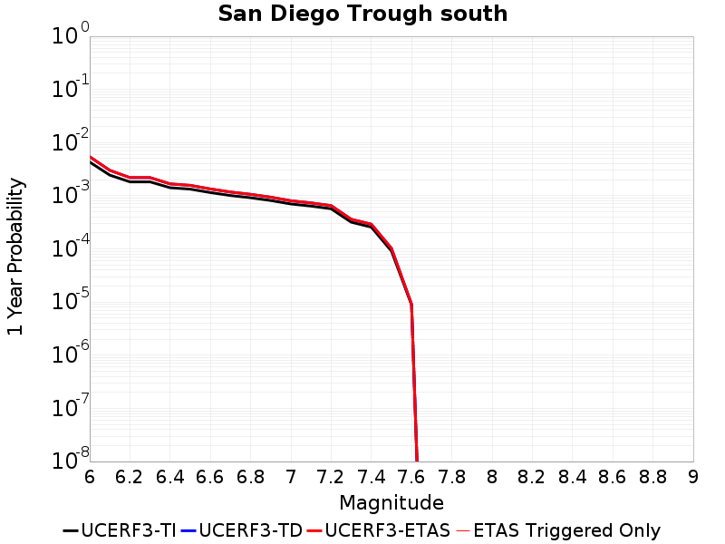 | 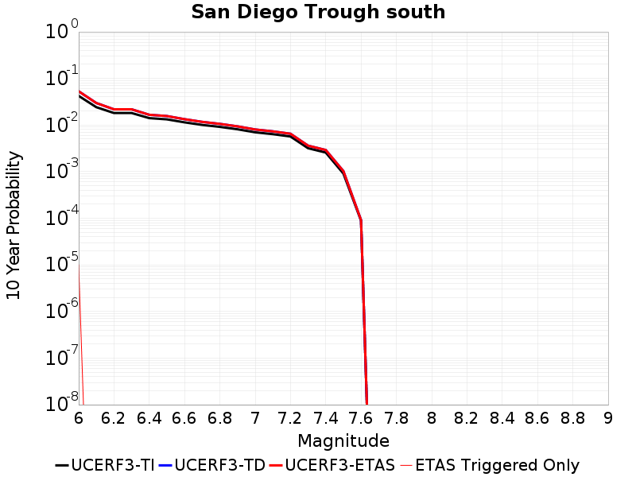 |

| Magnitude | 1 wk TI Prob | 1 wk TD Prob | 1 wk ETAS Prob | 1 wk ETAS/TD Gain | 1 wk ETAS Triggered Only | 1 mo TI Prob | 1 mo TD Prob | 1 mo ETAS Prob | 1 mo ETAS/TD Gain | 1 mo ETAS Triggered Only | 1 yr TI Prob | 1 yr TD Prob | 1 yr ETAS Prob | 1 yr ETAS/TD Gain | 1 yr ETAS Triggered Only | 10 yr TI Prob | 10 yr TD Prob | 10 yr ETAS Prob | 10 yr ETAS/TD Gain | 10 yr ETAS Triggered Only |
|-----|-----|-----|-----|-----|-----|-----|-----|-----|-----|-----|-----|-----|-----|-----|-----|-----|-----|-----|-----|-----|
| 6.0 | 8.279495E-5 | 1.04417435E-4 | 1.04417435E-4 | 1.0 | 0.0 | 3.5478722E-4 | 4.4743152E-4 | 4.4743152E-4 | 1.0 | 0.0 | 0.004310982 | 0.0054343375 | 0.0054343375 | 1.0 | 0.0 | 0.042283054 | 0.05307238 | 0.05308185 | 1.0001785 | 1.0E-5 |
| 6.1 | 4.6961468E-5 | 5.7811365E-5 | 5.7811365E-5 | 1.0 | 0.0 | 2.0124791E-4 | 2.4774042E-4 | 2.4774042E-4 | 1.0 | 0.0 | 0.00244744 | 0.0030121228 | 0.0030121228 | 1.0 | 0.0 | 0.024206603 | 0.02972055 | 0.02972055 | 1.0 | 0.0 |
| 6.2 | 3.5079658E-5 | 4.2195425E-5 | 4.2195425E-5 | 1.0 | 0.0 | 1.5033272E-4 | 1.8082526E-4 | 1.8082526E-4 | 1.0 | 0.0 | 0.0018287642 | 0.002199342 | 0.002199342 | 1.0 | 0.0 | 0.018137876 | 0.021778082 | 0.021778082 | 1.0 | 0.0 |
| 6.3 | 3.5079658E-5 | 4.2195425E-5 | 4.2195425E-5 | 1.0 | 0.0 | 1.5033272E-4 | 1.8082526E-4 | 1.8082526E-4 | 1.0 | 0.0 | 0.0018287642 | 0.002199342 | 0.002199342 | 1.0 | 0.0 | 0.018137876 | 0.021778082 | 0.021778082 | 1.0 | 0.0 |
| 6.4 | 2.7196904E-5 | 3.212325E-5 | 3.212325E-5 | 1.0 | 0.0 | 1.16552954E-4 | 1.3766391E-4 | 1.3766391E-4 | 1.0 | 0.0 | 0.0014181085 | 0.0016747809 | 0.0016747809 | 1.0 | 0.0 | 0.014090929 | 0.016623175 | 0.016623175 | 1.0 | 0.0 |
| 6.5 | 2.5584688E-5 | 3.0134888E-5 | 3.0134888E-5 | 1.0 | 0.0 | 1.0964406E-4 | 1.2914321E-4 | 1.2914321E-4 | 1.0 | 0.0 | 0.0013340989 | 0.001571196 | 0.001571196 | 1.0 | 0.0 | 0.013261181 | 0.015602406 | 0.015602406 | 1.0 | 0.0 |
| 6.6 | 2.2034688E-5 | 2.5769818E-5 | 2.5769818E-5 | 1.0 | 0.0 | 9.443096E-5 | 1.10437446E-4 | 1.10437446E-4 | 1.0 | 0.0 | 0.0011490905 | 0.001343754 | 0.001343754 | 1.0 | 0.0 | 0.011431668 | 0.013357279 | 0.013357279 | 1.0 | 0.0 |
| 6.7 | 1.9394853E-5 | 2.2564642E-5 | 2.2564642E-5 | 1.0 | 0.0 | 8.311815E-5 | 9.670205E-5 | 9.670205E-5 | 1.0 | 0.0 | 0.0010114936 | 0.0011767169 | 0.0011767169 | 1.0 | 0.0 | 0.01006902 | 0.011705567 | 0.011705567 | 1.0 | 0.0 |
| 6.8 | 1.7615313E-5 | 2.0423364E-5 | 2.0423364E-5 | 1.0 | 0.0 | 7.549201E-5 | 8.752579E-5 | 8.752579E-5 | 1.0 | 0.0 | 9.1872766E-4 | 0.0010651099 | 0.0010651099 | 1.0 | 0.0 | 0.009149387 | 0.010600618 | 0.010600618 | 1.0 | 0.0 |
| 6.9 | 1.5621423E-5 | 1.8043442E-5 | 1.8043442E-5 | 1.0 | 0.0 | 6.6947236E-5 | 7.732677E-5 | 7.732677E-5 | 1.0 | 0.0 | 8.147778E-4 | 9.410503E-4 | 9.410503E-4 | 1.0 | 0.0 | 0.008117969 | 0.009371099 | 0.009371099 | 1.0 | 0.0 |
| 7.0 | 1.3444376E-5 | 1.5462454E-5 | 1.5462454E-5 | 1.0 | 0.0 | 5.7617483E-5 | 6.6265995E-5 | 6.6265995E-5 | 1.0 | 0.0 | 7.0126704E-4 | 8.064926E-4 | 8.064926E-4 | 1.0 | 0.0 | 0.006990582 | 0.008035991 | 0.008035991 | 1.0 | 0.0 |
| 7.1 | 1.2268361E-5 | 1.4085946E-5 | 1.4085946E-5 | 1.0 | 0.0 | 5.2577634E-5 | 6.0366954E-5 | 6.0366954E-5 | 1.0 | 0.0 | 6.399447E-4 | 7.347225E-4 | 7.347225E-4 | 1.0 | 0.0 | 0.0063810493 | 0.0073232395 | 0.0073232395 | 1.0 | 0.0 |
| 7.2 | 1.0922655E-5 | 1.2524937E-5 | 1.2524937E-5 | 1.0 | 0.0 | 4.681054E-5 | 5.367721E-5 | 5.367721E-5 | 1.0 | 0.0 | 5.697693E-4 | 6.533266E-4 | 6.533266E-4 | 1.0 | 0.0 | 0.0056831064 | 0.00651434 | 0.00651434 | 1.0 | 0.0 |
| 7.3 | 6.1106753E-6 | 6.9347197E-6 | 6.9347197E-6 | 1.0 | 0.0 | 2.6188345E-5 | 2.9719891E-5 | 2.9719891E-5 | 1.0 | 0.0 | 3.1879646E-4 | 3.6178002E-4 | 3.6178002E-4 | 1.0 | 0.0 | 0.0031833951 | 0.0036119558 | 0.0036119558 | 1.0 | 0.0 |
| 7.4 | 4.933187E-6 | 5.5942014E-6 | 5.5942014E-6 | 1.0 | 0.0 | 2.114206E-5 | 2.3974932E-5 | 2.3974932E-5 | 1.0 | 0.0 | 2.5737417E-4 | 2.918561E-4 | 2.918561E-4 | 1.0 | 0.0 | 0.002570763 | 0.002914769 | 0.002914769 | 1.0 | 0.0 |
| 7.5 | 1.7489613E-6 | 1.9712431E-6 | 1.9712431E-6 | 1.0 | 0.0 | 7.495527E-6 | 8.448159E-6 | 8.448159E-6 | 1.0 | 0.0 | 9.125422E-5 | 1.028517E-4 | 1.028517E-4 | 1.0 | 0.0 | 9.1216754E-4 | 0.001028063 | 0.001028063 | 1.0 | 0.0 |
| 7.6 | 1.6988751E-7 | 1.7537317E-7 | 1.7537317E-7 | 1.0 | 0.0 | 7.2808916E-7 | 7.5159915E-7 | 7.5159915E-7 | 1.0 | 0.0 | 8.864449E-6 | 9.150683E-6 | 9.150683E-6 | 1.0 | 0.0 | 8.8640954E-5 | 9.150326E-5 | 9.150326E-5 | 1.0 | 0.0 |

## Northridge Hills
*[(top)](#table-of-contents)*

| 1 Week | 1 Month | 1 Year | 10 Year |
|-----|-----|-----|-----|
| 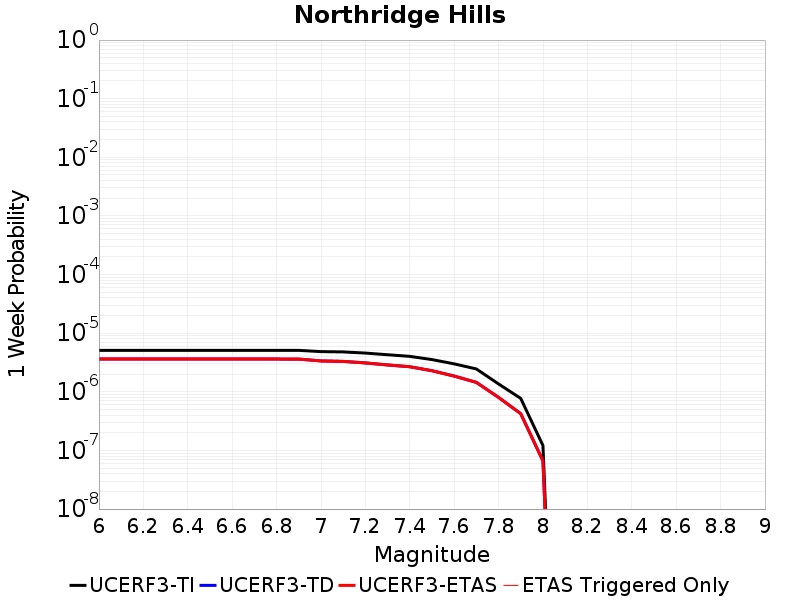 | 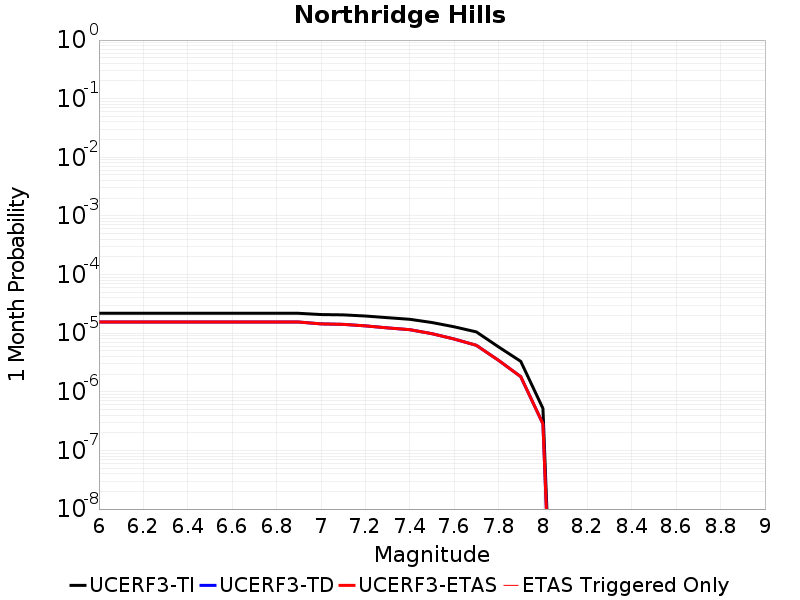 | 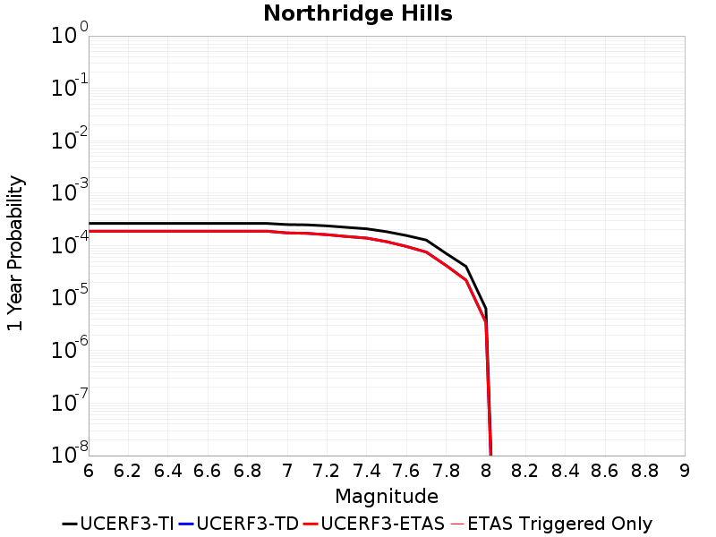 | 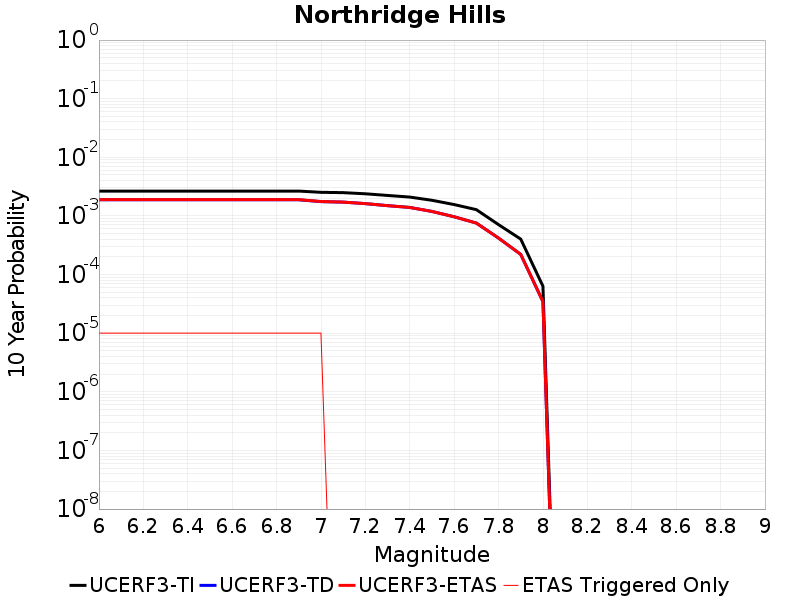 |

| Magnitude | 1 wk TI Prob | 1 wk TD Prob | 1 wk ETAS Prob | 1 wk ETAS/TD Gain | 1 wk ETAS Triggered Only | 1 mo TI Prob | 1 mo TD Prob | 1 mo ETAS Prob | 1 mo ETAS/TD Gain | 1 mo ETAS Triggered Only | 1 yr TI Prob | 1 yr TD Prob | 1 yr ETAS Prob | 1 yr ETAS/TD Gain | 1 yr ETAS Triggered Only | 10 yr TI Prob | 10 yr TD Prob | 10 yr ETAS Prob | 10 yr ETAS/TD Gain | 10 yr ETAS Triggered Only |
|-----|-----|-----|-----|-----|-----|-----|-----|-----|-----|-----|-----|-----|-----|-----|-----|-----|-----|-----|-----|-----|
| 6.0 | 5.095982E-6 | 3.619637E-6 | 3.619637E-6 | 1.0 | 0.0 | 2.183974E-5 | 1.5512638E-5 | 1.5512638E-5 | 1.0 | 0.0 | 2.658664E-4 | 1.8885011E-4 | 1.8885011E-4 | 1.0 | 0.0 | 0.0026554854 | 0.0018869088 | 0.0018968899 | 1.0052897 | 1.0E-5 |
| 6.1 | 5.095982E-6 | 3.619637E-6 | 3.619637E-6 | 1.0 | 0.0 | 2.183974E-5 | 1.5512638E-5 | 1.5512638E-5 | 1.0 | 0.0 | 2.658664E-4 | 1.8885011E-4 | 1.8885011E-4 | 1.0 | 0.0 | 0.0026554854 | 0.0018869088 | 0.0018968899 | 1.0052897 | 1.0E-5 |
| 6.2 | 5.095982E-6 | 3.619637E-6 | 3.619637E-6 | 1.0 | 0.0 | 2.183974E-5 | 1.5512638E-5 | 1.5512638E-5 | 1.0 | 0.0 | 2.658664E-4 | 1.8885011E-4 | 1.8885011E-4 | 1.0 | 0.0 | 0.0026554854 | 0.0018869088 | 0.0018968899 | 1.0052897 | 1.0E-5 |
| 6.3 | 5.095982E-6 | 3.619637E-6 | 3.619637E-6 | 1.0 | 0.0 | 2.183974E-5 | 1.5512638E-5 | 1.5512638E-5 | 1.0 | 0.0 | 2.658664E-4 | 1.8885011E-4 | 1.8885011E-4 | 1.0 | 0.0 | 0.0026554854 | 0.0018869088 | 0.0018968899 | 1.0052897 | 1.0E-5 |
| 6.4 | 5.095982E-6 | 3.619637E-6 | 3.619637E-6 | 1.0 | 0.0 | 2.183974E-5 | 1.5512638E-5 | 1.5512638E-5 | 1.0 | 0.0 | 2.658664E-4 | 1.8885011E-4 | 1.8885011E-4 | 1.0 | 0.0 | 0.0026554854 | 0.0018869088 | 0.0018968899 | 1.0052897 | 1.0E-5 |
| 6.5 | 5.095982E-6 | 3.619637E-6 | 3.619637E-6 | 1.0 | 0.0 | 2.183974E-5 | 1.5512638E-5 | 1.5512638E-5 | 1.0 | 0.0 | 2.658664E-4 | 1.8885011E-4 | 1.8885011E-4 | 1.0 | 0.0 | 0.0026554854 | 0.0018869088 | 0.0018968899 | 1.0052897 | 1.0E-5 |
| 6.6 | 5.095982E-6 | 3.619637E-6 | 3.619637E-6 | 1.0 | 0.0 | 2.183974E-5 | 1.5512638E-5 | 1.5512638E-5 | 1.0 | 0.0 | 2.658664E-4 | 1.8885011E-4 | 1.8885011E-4 | 1.0 | 0.0 | 0.0026554854 | 0.0018869088 | 0.0018968899 | 1.0052897 | 1.0E-5 |
| 6.7 | 5.095982E-6 | 3.619637E-6 | 3.619637E-6 | 1.0 | 0.0 | 2.183974E-5 | 1.5512638E-5 | 1.5512638E-5 | 1.0 | 0.0 | 2.658664E-4 | 1.8885011E-4 | 1.8885011E-4 | 1.0 | 0.0 | 0.0026554854 | 0.0018869088 | 0.0018968899 | 1.0052897 | 1.0E-5 |
| 6.8 | 5.095982E-6 | 3.619637E-6 | 3.619637E-6 | 1.0 | 0.0 | 2.183974E-5 | 1.5512638E-5 | 1.5512638E-5 | 1.0 | 0.0 | 2.658664E-4 | 1.8885011E-4 | 1.8885011E-4 | 1.0 | 0.0 | 0.0026554854 | 0.0018869088 | 0.0018968899 | 1.0052897 | 1.0E-5 |
| 6.9 | 5.0942654E-6 | 3.6178515E-6 | 3.6178515E-6 | 1.0 | 0.0 | 2.1832384E-5 | 1.5504986E-5 | 1.5504986E-5 | 1.0 | 0.0 | 2.6577685E-4 | 1.8875697E-4 | 1.8875697E-4 | 1.0 | 0.0 | 0.002654592 | 0.0018859789 | 0.0018959601 | 1.0052923 | 1.0E-5 |
| 7.0 | 4.851143E-6 | 3.3630913E-6 | 3.3630913E-6 | 1.0 | 0.0 | 2.0790447E-5 | 1.4413168E-5 | 1.4413168E-5 | 1.0 | 0.0 | 2.5309427E-4 | 1.7546624E-4 | 1.7546624E-4 | 1.0 | 0.0 | 0.0025280623 | 0.0017532813 | 0.0017632638 | 1.0056936 | 1.0E-5 |
| 7.1 | 4.7910607E-6 | 3.3013534E-6 | 3.3013534E-6 | 1.0 | 0.0 | 2.0532956E-5 | 1.4148582E-5 | 1.4148582E-5 | 1.0 | 0.0 | 2.4996005E-4 | 1.722454E-4 | 1.722454E-4 | 1.0 | 0.0 | 0.0024967908 | 0.0017211231 | 0.0017211231 | 1.0 | 0.0 |
| 7.2 | 4.580079E-6 | 3.1110712E-6 | 3.1110712E-6 | 1.0 | 0.0 | 1.9628762E-5 | 1.3333095E-5 | 1.3333095E-5 | 1.0 | 0.0 | 2.3895396E-4 | 1.6231836E-4 | 1.6231836E-4 | 1.0 | 0.0 | 0.0023869718 | 0.0016220015 | 0.0016220015 | 1.0 | 0.0 |
| 7.3 | 4.290062E-6 | 2.872412E-6 | 2.872412E-6 | 1.0 | 0.0 | 1.838585E-5 | 1.2310279E-5 | 1.2310279E-5 | 1.0 | 0.0 | 2.2382473E-4 | 1.4986737E-4 | 1.4986737E-4 | 1.0 | 0.0 | 0.0022359942 | 0.001497666 | 0.001497666 | 1.0 | 0.0 |
| 7.4 | 4.0259683E-6 | 2.6779855E-6 | 2.6779855E-6 | 1.0 | 0.0 | 1.7254037E-5 | 1.147703E-5 | 1.147703E-5 | 1.0 | 0.0 | 2.1004764E-4 | 1.3972391E-4 | 1.3972391E-4 | 1.0 | 0.0 | 0.002098492 | 0.0013963635 | 0.0013963635 | 1.0 | 0.0 |
| 7.5 | 3.5477108E-6 | 2.289098E-6 | 2.289098E-6 | 1.0 | 0.0 | 1.5204386E-5 | 9.810382E-6 | 9.810382E-6 | 1.0 | 0.0 | 1.8509767E-4 | 1.1943487E-4 | 1.1943487E-4 | 1.0 | 0.0 | 0.0018494357 | 0.0011937084 | 0.0011937084 | 1.0 | 0.0 |
| 7.6 | 2.9990608E-6 | 1.8563808E-6 | 1.8563808E-6 | 1.0 | 0.0 | 1.2853055E-5 | 7.955893E-6 | 7.955893E-6 | 1.0 | 0.0 | 1.564747E-4 | 9.68587E-5 | 9.68587E-5 | 1.0 | 0.0 | 0.0015636457 | 9.6816564E-4 | 9.6816564E-4 | 1.0 | 0.0 |
| 7.7 | 2.4542855E-6 | 1.4493424E-6 | 1.4493424E-6 | 1.0 | 0.0 | 1.05183235E-5 | 6.2114527E-6 | 6.2114527E-6 | 1.0 | 0.0 | 1.2805307E-4 | 7.562182E-5 | 7.562182E-5 | 1.0 | 0.0 | 0.001279793 | 7.559614E-4 | 7.559614E-4 | 1.0 | 0.0 |
| 7.8 | 1.3623128E-6 | 8.0344677E-7 | 8.0344677E-7 | 1.0 | 0.0 | 5.8384703E-6 | 3.4433388E-6 | 3.4433388E-6 | 1.0 | 0.0 | 7.108106E-5 | 4.1921845E-5 | 4.1921845E-5 | 1.0 | 0.0 | 7.1058323E-4 | 4.1913957E-4 | 4.1913957E-4 | 1.0 | 0.0 |
| 7.9 | 7.716622E-7 | 4.2314093E-7 | 4.2314093E-7 | 1.0 | 0.0 | 3.3071194E-6 | 1.8134599E-6 | 1.8134599E-6 | 1.0 | 0.0 | 4.0263436E-5 | 2.2078651E-5 | 2.2078651E-5 | 1.0 | 0.0 | 4.0256142E-4 | 2.2076469E-4 | 2.2076469E-4 | 1.0 | 0.0 |
| 8.0 | 1.2117711E-7 | 6.638389E-8 | 6.638389E-8 | 1.0 | 0.0 | 5.1933034E-7 | 2.8450236E-7 | 2.8450236E-7 | 1.0 | 0.0 | 6.3228285E-6 | 3.463811E-6 | 3.463811E-6 | 1.0 | 0.0 | 6.3226486E-5 | 3.463759E-5 | 3.463759E-5 | 1.0 | 0.0 |

## San Jacinto (Clark) rev
*[(top)](#table-of-contents)*

| 1 Week | 1 Month | 1 Year | 10 Year |
|-----|-----|-----|-----|
| 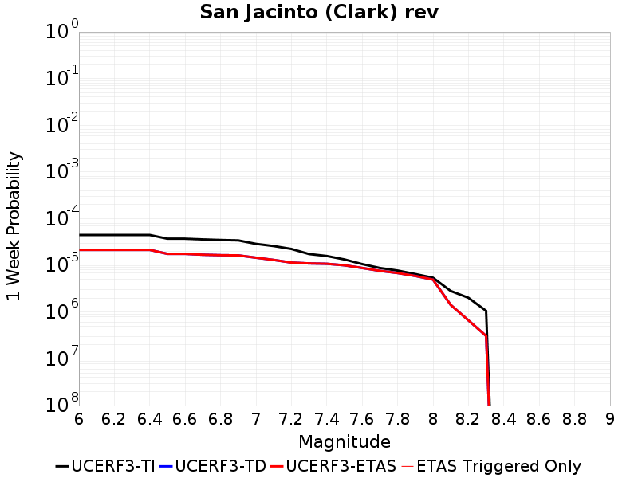 | 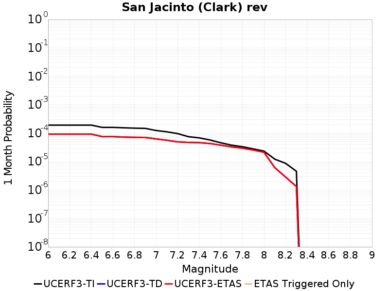 | 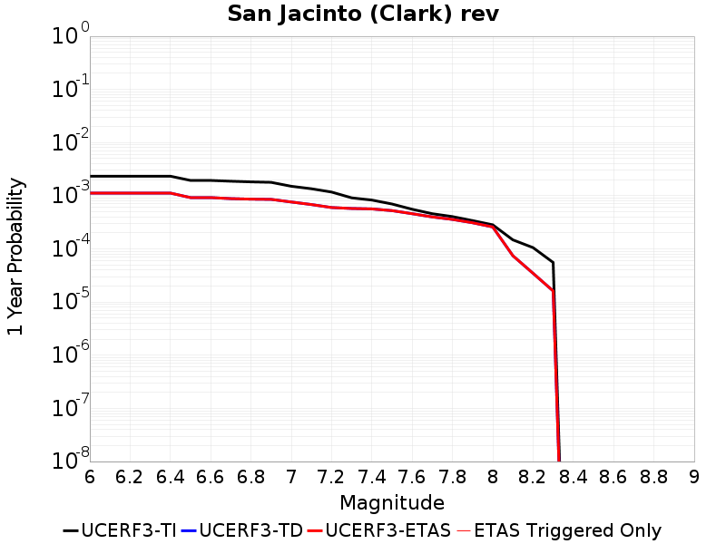 |  |

| Magnitude | 1 wk TI Prob | 1 wk TD Prob | 1 wk ETAS Prob | 1 wk ETAS/TD Gain | 1 wk ETAS Triggered Only | 1 mo TI Prob | 1 mo TD Prob | 1 mo ETAS Prob | 1 mo ETAS/TD Gain | 1 mo ETAS Triggered Only | 1 yr TI Prob | 1 yr TD Prob | 1 yr ETAS Prob | 1 yr ETAS/TD Gain | 1 yr ETAS Triggered Only | 10 yr TI Prob | 10 yr TD Prob | 10 yr ETAS Prob | 10 yr ETAS/TD Gain | 10 yr ETAS Triggered Only |
|-----|-----|-----|-----|-----|-----|-----|-----|-----|-----|-----|-----|-----|-----|-----|-----|-----|-----|-----|-----|-----|
| 6.0 | 4.482615E-5 | 2.1561054E-5 | 2.1561054E-5 | 1.0 | 0.0 | 1.9209793E-4 | 9.24013E-5 | 9.24013E-5 | 1.0 | 0.0 | 0.0023362834 | 0.0011244147 | 0.0011244147 | 1.0 | 0.0 | 0.02311874 | 0.011710931 | 0.011720813 | 1.0008439 | 1.0E-5 |
| 6.1 | 4.482615E-5 | 2.1561054E-5 | 2.1561054E-5 | 1.0 | 0.0 | 1.9209793E-4 | 9.24013E-5 | 9.24013E-5 | 1.0 | 0.0 | 0.0023362834 | 0.0011244147 | 0.0011244147 | 1.0 | 0.0 | 0.02311874 | 0.011710931 | 0.011720813 | 1.0008439 | 1.0E-5 |
| 6.2 | 4.482615E-5 | 2.1561054E-5 | 2.1561054E-5 | 1.0 | 0.0 | 1.9209793E-4 | 9.24013E-5 | 9.24013E-5 | 1.0 | 0.0 | 0.0023362834 | 0.0011244147 | 0.0011244147 | 1.0 | 0.0 | 0.02311874 | 0.011710931 | 0.011720813 | 1.0008439 | 1.0E-5 |
| 6.3 | 4.482615E-5 | 2.1561054E-5 | 2.1561054E-5 | 1.0 | 0.0 | 1.9209793E-4 | 9.24013E-5 | 9.24013E-5 | 1.0 | 0.0 | 0.0023362834 | 0.0011244147 | 0.0011244147 | 1.0 | 0.0 | 0.02311874 | 0.011710931 | 0.011720813 | 1.0008439 | 1.0E-5 |
| 6.4 | 4.482615E-5 | 2.1561054E-5 | 2.1561054E-5 | 1.0 | 0.0 | 1.9209793E-4 | 9.24013E-5 | 9.24013E-5 | 1.0 | 0.0 | 0.0023362834 | 0.0011244147 | 0.0011244147 | 1.0 | 0.0 | 0.02311874 | 0.011710931 | 0.011720813 | 1.0008439 | 1.0E-5 |
| 6.5 | 3.7294863E-5 | 1.772003E-5 | 1.772003E-5 | 1.0 | 0.0 | 1.5982533E-4 | 7.594081E-5 | 7.594081E-5 | 1.0 | 0.0 | 0.0019441366 | 9.241918E-4 | 9.241918E-4 | 1.0 | 0.0 | 0.01927216 | 0.009678579 | 0.009678579 | 1.0 | 0.0 |
| 6.6 | 3.7294863E-5 | 1.772003E-5 | 1.772003E-5 | 1.0 | 0.0 | 1.5982533E-4 | 7.594081E-5 | 7.594081E-5 | 1.0 | 0.0 | 0.0019441366 | 9.241918E-4 | 9.241918E-4 | 1.0 | 0.0 | 0.01927216 | 0.009678579 | 0.009678579 | 1.0 | 0.0 |
| 6.7 | 3.6039248E-5 | 1.695996E-5 | 1.695996E-5 | 1.0 | 0.0 | 1.5444479E-4 | 7.268354E-5 | 7.268354E-5 | 1.0 | 0.0 | 0.0018787434 | 8.8456715E-4 | 8.8456715E-4 | 1.0 | 0.0 | 0.01862939 | 0.009280761 | 0.009280761 | 1.0 | 0.0 |
| 6.8 | 3.5031844E-5 | 1.6582824E-5 | 1.6582824E-5 | 1.0 | 0.0 | 1.5012783E-4 | 7.1067334E-5 | 7.1067334E-5 | 1.0 | 0.0 | 0.0018262739 | 8.6490554E-4 | 8.6490554E-4 | 1.0 | 0.0 | 0.01811338 | 0.009077013 | 0.009077013 | 1.0 | 0.0 |
| 6.9 | 3.435112E-5 | 1.6410107E-5 | 1.6410107E-5 | 1.0 | 0.0 | 1.4721078E-4 | 7.032716E-5 | 7.032716E-5 | 1.0 | 0.0 | 0.0017908178 | 8.55901E-4 | 8.55901E-4 | 1.0 | 0.0 | 0.017764548 | 0.00898224 | 0.00898224 | 1.0 | 0.0 |
| 7.0 | 2.8959772E-5 | 1.465294E-5 | 1.465294E-5 | 1.0 | 0.0 | 1.241074E-4 | 6.279682E-5 | 6.279682E-5 | 1.0 | 0.0 | 0.0015099603 | 7.64286E-4 | 7.64286E-4 | 1.0 | 0.0 | 0.014997416 | 0.008032056 | 0.008032056 | 1.0 | 0.0 |
| 7.1 | 2.6002877E-5 | 1.3118152E-5 | 1.3118152E-5 | 1.0 | 0.0 | 1.11436144E-4 | 5.6219455E-5 | 5.6219455E-5 | 1.0 | 0.0 | 0.0013558907 | 6.842591E-4 | 6.842591E-4 | 1.0 | 0.0 | 0.013476475 | 0.007198615 | 0.007198615 | 1.0 | 0.0 |
| 7.2 | 2.2544838E-5 | 1.1522085E-5 | 1.1522085E-5 | 1.0 | 0.0 | 9.661716E-5 | 4.9379436E-5 | 4.9379436E-5 | 1.0 | 0.0 | 0.001175679 | 6.0103025E-4 | 6.0103025E-4 | 1.0 | 0.0 | 0.011694785 | 0.0063326457 | 0.0063326457 | 1.0 | 0.0 |
| 7.3 | 1.75334E-5 | 1.1054936E-5 | 1.1054936E-5 | 1.0 | 0.0 | 7.514098E-5 | 4.7377445E-5 | 4.7377445E-5 | 1.0 | 0.0 | 9.144575E-4 | 5.766692E-4 | 5.766692E-4 | 1.0 | 0.0 | 0.009107036 | 0.0060632555 | 0.0060632555 | 1.0 | 0.0 |
| 7.4 | 1.5924552E-5 | 1.08493E-5 | 1.08493E-5 | 1.0 | 0.0 | 6.82463E-5 | 4.649618E-5 | 4.649618E-5 | 1.0 | 0.0 | 8.305819E-4 | 5.659454E-4 | 5.659454E-4 | 1.0 | 0.0 | 0.008274844 | 0.0059475778 | 0.0059475778 | 1.0 | 0.0 |
| 7.5 | 1.3428931E-5 | 1.0077494E-5 | 1.0077494E-5 | 1.0 | 0.0 | 5.7551293E-5 | 4.318855E-5 | 4.318855E-5 | 1.0 | 0.0 | 7.004617E-4 | 5.2569486E-4 | 5.2569486E-4 | 1.0 | 0.0 | 0.006982579 | 0.0055266065 | 0.0055266065 | 1.0 | 0.0 |
| 7.6 | 1.0688787E-5 | 8.822858E-6 | 8.822858E-6 | 1.0 | 0.0 | 4.5808283E-5 | 3.7811704E-5 | 3.7811704E-5 | 1.0 | 0.0 | 5.5757316E-4 | 4.6026072E-4 | 4.6026072E-4 | 1.0 | 0.0 | 0.005561762 | 0.0048523843 | 0.0048523843 | 1.0 | 0.0 |
| 7.7 | 8.81236E-6 | 7.669052E-6 | 7.669052E-6 | 1.0 | 0.0 | 3.776671E-5 | 3.2866952E-5 | 3.2866952E-5 | 1.0 | 0.0 | 4.597127E-4 | 4.000819E-4 | 4.000819E-4 | 1.0 | 0.0 | 0.0045876284 | 0.0042418996 | 0.0042418996 | 1.0 | 0.0 |
| 7.8 | 7.780431E-6 | 6.886415E-6 | 6.886415E-6 | 1.0 | 0.0 | 3.3344273E-5 | 2.9512874E-5 | 2.9512874E-5 | 1.0 | 0.0 | 4.0589093E-4 | 3.592602E-4 | 3.592602E-4 | 1.0 | 0.0 | 0.0040515037 | 0.0038241835 | 0.0038241835 | 1.0 | 0.0 |
| 7.9 | 6.5437994E-6 | 5.9573176E-6 | 5.9573176E-6 | 1.0 | 0.0 | 2.8044553E-5 | 2.5531113E-5 | 2.5531113E-5 | 1.0 | 0.0 | 3.4138895E-4 | 3.1079713E-4 | 3.1079713E-4 | 1.0 | 0.0 | 0.0034086495 | 0.0033291464 | 0.0033291464 | 1.0 | 0.0 |
| 8.0 | 5.4488164E-6 | 4.970032E-6 | 4.970032E-6 | 1.0 | 0.0 | 2.3351862E-5 | 2.1299964E-5 | 2.1299964E-5 | 1.0 | 0.0 | 2.8427184E-4 | 2.5929636E-4 | 2.5929636E-4 | 1.0 | 0.0 | 0.0028390845 | 0.0027949226 | 0.0027949226 | 1.0 | 0.0 |
| 8.1 | 2.8397242E-6 | 1.429198E-6 | 1.429198E-6 | 1.0 | 0.0 | 1.217019E-5 | 6.1251203E-6 | 6.1251203E-6 | 1.0 | 0.0 | 1.4816198E-4 | 7.45708E-5 | 7.45708E-5 | 1.0 | 0.0 | 0.0014806325 | 8.4651203E-4 | 8.4651203E-4 | 1.0 | 0.0 |
| 8.2 | 2.030244E-6 | 6.679036E-7 | 6.679036E-7 | 1.0 | 0.0 | 8.701017E-6 | 2.8624409E-6 | 2.8624409E-6 | 1.0 | 0.0 | 1.05929736E-4 | 3.4849665E-5 | 3.4849665E-5 | 1.0 | 0.0 | 0.0010587925 | 4.157993E-4 | 4.157993E-4 | 1.0 | 0.0 |
| 8.3 | 1.0659804E-6 | 3.1012272E-7 | 3.1012272E-7 | 1.0 | 0.0 | 4.568479E-6 | 1.3290967E-6 | 1.3290967E-6 | 1.0 | 0.0 | 5.5619817E-5 | 1.6181637E-5 | 1.6181637E-5 | 1.0 | 0.0 | 5.5605895E-4 | 1.9605068E-4 | 1.9605068E-4 | 1.0 | 0.0 |

## Hunting Creek - Berryessa 2011 CFM
*[(top)](#table-of-contents)*

| 1 Week | 1 Month | 1 Year | 10 Year |
|-----|-----|-----|-----|
| 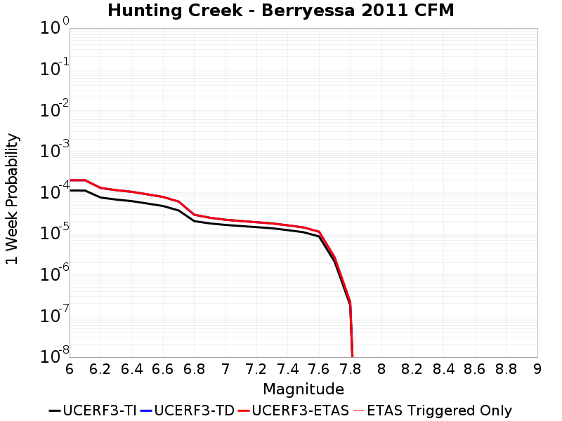 | 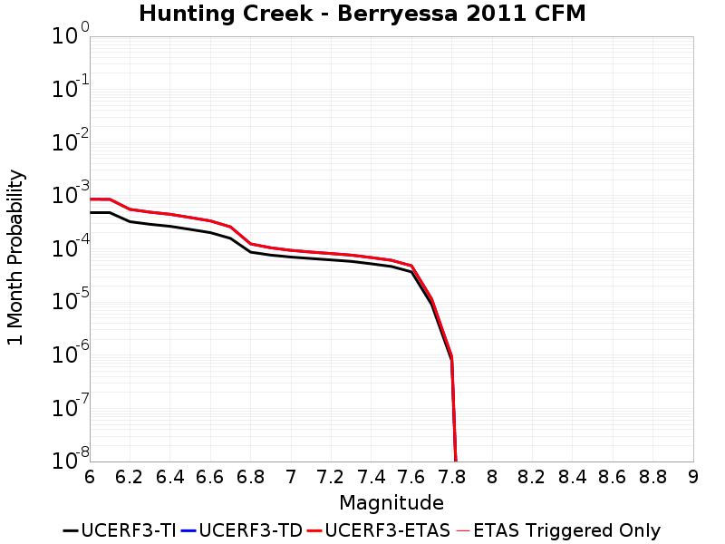 | 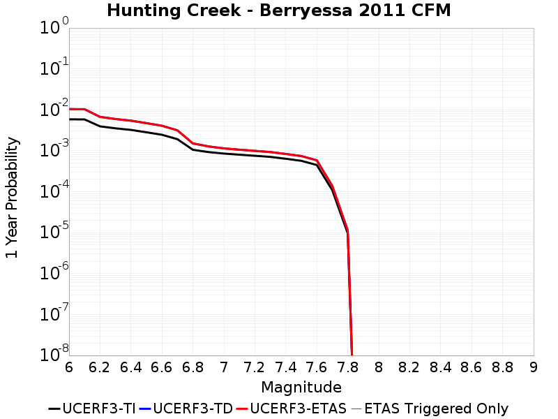 | 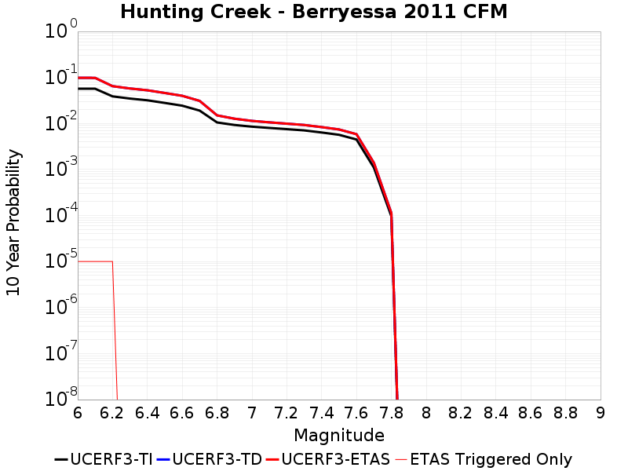 |

| Magnitude | 1 wk TI Prob | 1 wk TD Prob | 1 wk ETAS Prob | 1 wk ETAS/TD Gain | 1 wk ETAS Triggered Only | 1 mo TI Prob | 1 mo TD Prob | 1 mo ETAS Prob | 1 mo ETAS/TD Gain | 1 mo ETAS Triggered Only | 1 yr TI Prob | 1 yr TD Prob | 1 yr ETAS Prob | 1 yr ETAS/TD Gain | 1 yr ETAS Triggered Only | 10 yr TI Prob | 10 yr TD Prob | 10 yr ETAS Prob | 10 yr ETAS/TD Gain | 10 yr ETAS Triggered Only |
|-----|-----|-----|-----|-----|-----|-----|-----|-----|-----|-----|-----|-----|-----|-----|-----|-----|-----|-----|-----|-----|
| 6.0 | 1.1270982E-4 | 2.00761E-4 | 2.00761E-4 | 1.0 | 0.0 | 4.8295266E-4 | 8.6003327E-4 | 8.6003327E-4 | 1.0 | 0.0 | 0.0058641075 | 0.010410852 | 0.010410852 | 1.0 | 0.0 | 0.057117578 | 0.09824912 | 0.09825814 | 1.0000918 | 1.0E-5 |
| 6.1 | 1.1239393E-4 | 2.0024112E-4 | 2.0024112E-4 | 1.0 | 0.0 | 4.8159933E-4 | 8.578068E-4 | 8.578068E-4 | 1.0 | 0.0 | 0.0058477195 | 0.010384028 | 0.010384028 | 1.0 | 0.0 | 0.056962132 | 0.09800707 | 0.09801608 | 1.000092 | 1.0E-5 |
| 6.2 | 7.596265E-5 | 1.2967284E-4 | 1.2967284E-4 | 1.0 | 0.0 | 3.2551357E-4 | 5.556048E-4 | 5.556048E-4 | 1.0 | 0.0 | 0.0039559277 | 0.00673877 | 0.00673877 | 1.0 | 0.0 | 0.038862433 | 0.064745955 | 0.064755306 | 1.0001445 | 1.0E-5 |
| 6.3 | 6.78794E-5 | 1.14783965E-4 | 1.14783965E-4 | 1.0 | 0.0 | 2.9087928E-4 | 4.9182953E-4 | 4.9182953E-4 | 1.0 | 0.0 | 0.003535705 | 0.0059683346 | 0.0059683346 | 1.0 | 0.0 | 0.034799766 | 0.057606094 | 0.057606094 | 1.0 | 0.0 |
| 6.4 | 6.2165134E-5 | 1.04631814E-4 | 1.04631814E-4 | 1.0 | 0.0 | 2.6639478E-4 | 4.4833624E-4 | 4.4833624E-4 | 1.0 | 0.0 | 0.0032385332 | 0.005442161 | 0.005442161 | 1.0 | 0.0 | 0.03191742 | 0.05268385 | 0.05268385 | 1.0 | 0.0 |
| 6.5 | 5.4368087E-5 | 9.0949936E-5 | 9.0949936E-5 | 1.0 | 0.0 | 2.3298527E-4 | 3.897186E-4 | 3.897186E-4 | 1.0 | 0.0 | 0.0028329059 | 0.004732498 | 0.004732498 | 1.0 | 0.0 | 0.027970633 | 0.045996655 | 0.045996655 | 1.0 | 0.0 |
| 6.6 | 4.729947E-5 | 7.867899E-5 | 7.867899E-5 | 1.0 | 0.0 | 2.0269625E-4 | 3.371507E-4 | 3.371507E-4 | 1.0 | 0.0 | 0.002465034 | 0.004095628 | 0.004095628 | 1.0 | 0.0 | 0.02437869 | 0.039951596 | 0.039951596 | 1.0 | 0.0 |
| 6.7 | 3.6875328E-5 | 6.0617167E-5 | 6.0617167E-5 | 1.0 | 0.0 | 1.5802756E-4 | 2.597644E-4 | 2.597644E-4 | 1.0 | 0.0 | 0.0019222875 | 0.003157371 | 0.003157371 | 1.0 | 0.0 | 0.019057442 | 0.030977027 | 0.030977027 | 1.0 | 0.0 |
| 6.8 | 2.0292036E-5 | 2.9048044E-5 | 2.9048044E-5 | 1.0 | 0.0 | 8.6962966E-5 | 1.244856E-4 | 1.244856E-4 | 1.0 | 0.0 | 0.0010582599 | 0.0015145446 | 0.0015145446 | 1.0 | 0.0 | 0.010532344 | 0.015014484 | 0.015014484 | 1.0 | 0.0 |
| 6.9 | 1.7871042E-5 | 2.453207E-5 | 2.453207E-5 | 1.0 | 0.0 | 7.658793E-5 | 1.051332E-4 | 1.051332E-4 | 1.0 | 0.0 | 9.320591E-4 | 0.0012792443 | 0.0012792443 | 1.0 | 0.0 | 0.009281595 | 0.012709939 | 0.012709939 | 1.0 | 0.0 |
| 7.0 | 1.6415532E-5 | 2.1948123E-5 | 2.1948123E-5 | 1.0 | 0.0 | 7.035038E-5 | 9.406E-5 | 9.406E-5 | 1.0 | 0.0 | 8.561793E-4 | 0.00114458 | 0.00114458 | 1.0 | 0.0 | 0.008528882 | 0.01138614 | 0.01138614 | 1.0 | 0.0 |
| 7.1 | 1.5409885E-5 | 2.0386766E-5 | 2.0386766E-5 | 1.0 | 0.0 | 6.6040695E-5 | 8.736894E-5 | 8.736894E-5 | 1.0 | 0.0 | 8.0374884E-4 | 0.0010632004 | 0.0010632004 | 1.0 | 0.0 | 0.00800848 | 0.010581593 | 0.010581593 | 1.0 | 0.0 |
| 7.2 | 1.4497423E-5 | 1.9093375E-5 | 1.9093375E-5 | 1.0 | 0.0 | 6.213033E-5 | 8.1826205E-5 | 8.1826205E-5 | 1.0 | 0.0 | 7.5617427E-4 | 9.957819E-4 | 9.957819E-4 | 1.0 | 0.0 | 0.0075360634 | 0.009913886 | 0.009913886 | 1.0 | 0.0 |
| 7.3 | 1.3615175E-5 | 1.7857967E-5 | 1.7857967E-5 | 1.0 | 0.0 | 5.8349444E-5 | 7.653191E-5 | 7.653191E-5 | 1.0 | 0.0 | 7.101729E-4 | 9.3138067E-4 | 9.3138067E-4 | 1.0 | 0.0 | 0.0070790765 | 0.009275307 | 0.009275307 | 1.0 | 0.0 |
| 7.4 | 1.2252825E-5 | 1.605422E-5 | 1.605422E-5 | 1.0 | 0.0 | 5.251105E-5 | 6.8802E-5 | 6.8802E-5 | 1.0 | 0.0 | 6.391345E-4 | 8.3734526E-4 | 8.3734526E-4 | 1.0 | 0.0 | 0.0063729943 | 0.008342403 | 0.008342403 | 1.0 | 0.0 |
| 7.5 | 1.0913301E-5 | 1.426435E-5 | 1.426435E-5 | 1.0 | 0.0 | 4.6770452E-5 | 6.113151E-5 | 6.113151E-5 | 1.0 | 0.0 | 5.6928146E-4 | 7.4402476E-4 | 7.4402476E-4 | 1.0 | 0.0 | 0.0056782532 | 0.007415868 | 0.007415868 | 1.0 | 0.0 |
| 7.6 | 8.623192E-6 | 1.1252946E-5 | 1.1252946E-5 | 1.0 | 0.0 | 3.6956015E-5 | 4.8226037E-5 | 4.8226037E-5 | 1.0 | 0.0 | 4.4984656E-4 | 5.869964E-4 | 5.869964E-4 | 1.0 | 0.0 | 0.00448937 | 0.005854808 | 0.005854808 | 1.0 | 0.0 |
| 7.7 | 2.0993634E-6 | 2.6670668E-6 | 2.6670668E-6 | 1.0 | 0.0 | 8.997241E-6 | 1.14302375E-5 | 1.14302375E-5 | 1.0 | 0.0 | 1.09535904E-4 | 1.3915432E-4 | 1.3915432E-4 | 1.0 | 0.0 | 0.0010948193 | 0.0013906547 | 0.0013906547 | 1.0 | 0.0 |
| 7.8 | 1.8428308E-7 | 2.1743737E-7 | 2.1743737E-7 | 1.0 | 0.0 | 7.897844E-7 | 9.318741E-7 | 9.318741E-7 | 1.0 | 0.0 | 9.615583E-6 | 1.1345513E-5 | 1.1345513E-5 | 1.0 | 0.0 | 9.615166E-5 | 1.13442286E-4 | 1.13442286E-4 | 1.0 | 0.0 |

## Channel Islands Western Deep Ramp
*[(top)](#table-of-contents)*

| 1 Week | 1 Month | 1 Year | 10 Year |
|-----|-----|-----|-----|
| 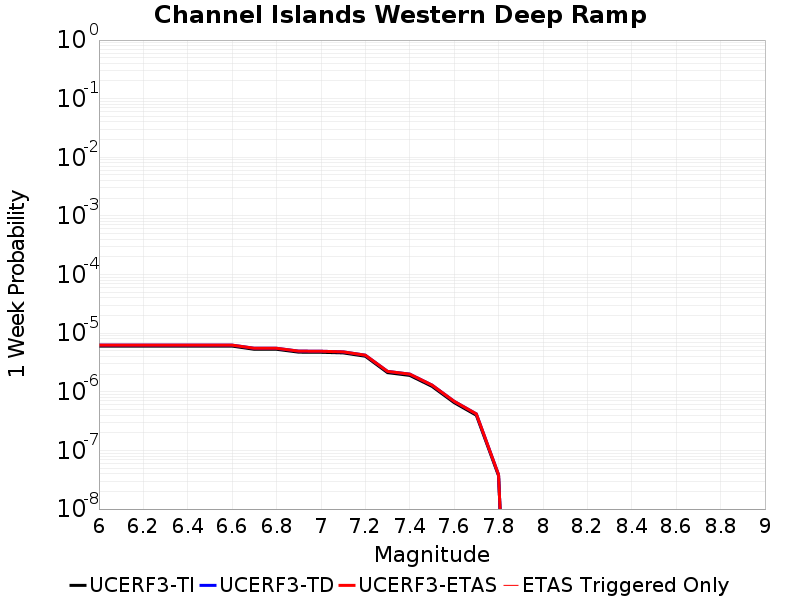 | 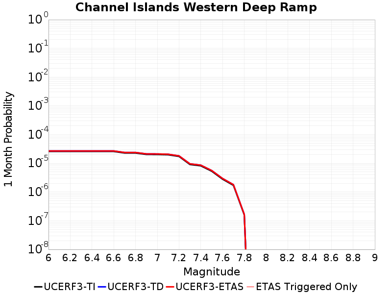 | 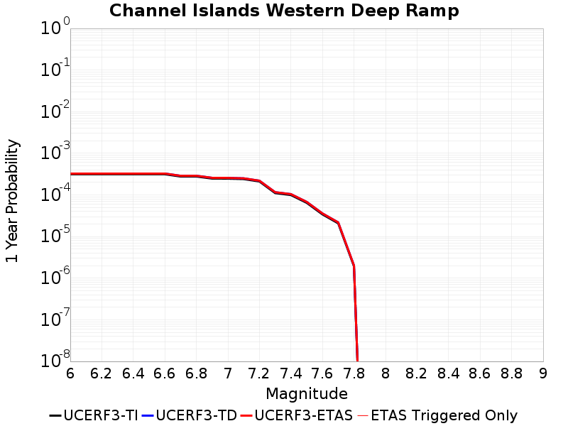 | 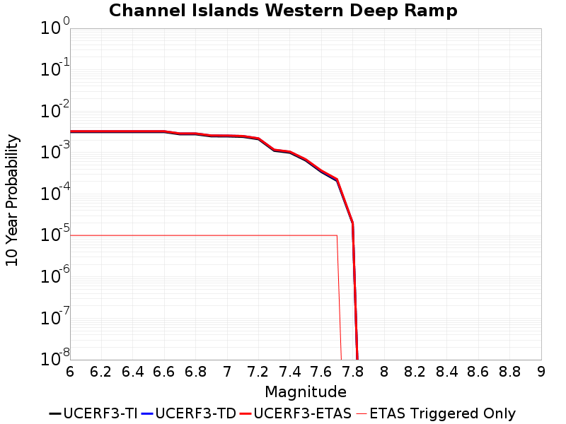 |

| Magnitude | 1 wk TI Prob | 1 wk TD Prob | 1 wk ETAS Prob | 1 wk ETAS/TD Gain | 1 wk ETAS Triggered Only | 1 mo TI Prob | 1 mo TD Prob | 1 mo ETAS Prob | 1 mo ETAS/TD Gain | 1 mo ETAS Triggered Only | 1 yr TI Prob | 1 yr TD Prob | 1 yr ETAS Prob | 1 yr ETAS/TD Gain | 1 yr ETAS Triggered Only | 10 yr TI Prob | 10 yr TD Prob | 10 yr ETAS Prob | 10 yr ETAS/TD Gain | 10 yr ETAS Triggered Only |
|-----|-----|-----|-----|-----|-----|-----|-----|-----|-----|-----|-----|-----|-----|-----|-----|-----|-----|-----|-----|-----|
| 6.0 | 6.0213506E-6 | 6.256379E-6 | 6.256379E-6 | 1.0 | 0.0 | 2.5805533E-5 | 2.6812802E-5 | 2.6812802E-5 | 1.0 | 0.0 | 3.1413708E-4 | 3.2640144E-4 | 3.2640144E-4 | 1.0 | 0.0 | 0.0031369338 | 0.003259662 | 0.0032696296 | 1.0030578 | 1.0E-5 |
| 6.1 | 6.0213506E-6 | 6.256379E-6 | 6.256379E-6 | 1.0 | 0.0 | 2.5805533E-5 | 2.6812802E-5 | 2.6812802E-5 | 1.0 | 0.0 | 3.1413708E-4 | 3.2640144E-4 | 3.2640144E-4 | 1.0 | 0.0 | 0.0031369338 | 0.003259662 | 0.0032696296 | 1.0030578 | 1.0E-5 |
| 6.2 | 6.0213506E-6 | 6.256379E-6 | 6.256379E-6 | 1.0 | 0.0 | 2.5805533E-5 | 2.6812802E-5 | 2.6812802E-5 | 1.0 | 0.0 | 3.1413708E-4 | 3.2640144E-4 | 3.2640144E-4 | 1.0 | 0.0 | 0.0031369338 | 0.003259662 | 0.0032696296 | 1.0030578 | 1.0E-5 |
| 6.3 | 6.0213506E-6 | 6.256379E-6 | 6.256379E-6 | 1.0 | 0.0 | 2.5805533E-5 | 2.6812802E-5 | 2.6812802E-5 | 1.0 | 0.0 | 3.1413708E-4 | 3.2640144E-4 | 3.2640144E-4 | 1.0 | 0.0 | 0.0031369338 | 0.003259662 | 0.0032696296 | 1.0030578 | 1.0E-5 |
| 6.4 | 6.0213506E-6 | 6.256379E-6 | 6.256379E-6 | 1.0 | 0.0 | 2.5805533E-5 | 2.6812802E-5 | 2.6812802E-5 | 1.0 | 0.0 | 3.1413708E-4 | 3.2640144E-4 | 3.2640144E-4 | 1.0 | 0.0 | 0.0031369338 | 0.003259662 | 0.0032696296 | 1.0030578 | 1.0E-5 |
| 6.5 | 6.0213506E-6 | 6.256379E-6 | 6.256379E-6 | 1.0 | 0.0 | 2.5805533E-5 | 2.6812802E-5 | 2.6812802E-5 | 1.0 | 0.0 | 3.1413708E-4 | 3.2640144E-4 | 3.2640144E-4 | 1.0 | 0.0 | 0.0031369338 | 0.003259662 | 0.0032696296 | 1.0030578 | 1.0E-5 |
| 6.6 | 6.0213506E-6 | 6.256379E-6 | 6.256379E-6 | 1.0 | 0.0 | 2.5805533E-5 | 2.6812802E-5 | 2.6812802E-5 | 1.0 | 0.0 | 3.1413708E-4 | 3.2640144E-4 | 3.2640144E-4 | 1.0 | 0.0 | 0.0031369338 | 0.003259662 | 0.0032696296 | 1.0030578 | 1.0E-5 |
| 6.7 | 5.313309E-6 | 5.5266128E-6 | 5.5266128E-6 | 1.0 | 0.0 | 2.2771126E-5 | 2.3685292E-5 | 2.3685292E-5 | 1.0 | 0.0 | 2.772032E-4 | 2.8833435E-4 | 2.8833435E-4 | 1.0 | 0.0 | 0.0027685766 | 0.0028800059 | 0.002889977 | 1.0034622 | 1.0E-5 |
| 6.8 | 5.313309E-6 | 5.5266128E-6 | 5.5266128E-6 | 1.0 | 0.0 | 2.2771126E-5 | 2.3685292E-5 | 2.3685292E-5 | 1.0 | 0.0 | 2.772032E-4 | 2.8833435E-4 | 2.8833435E-4 | 1.0 | 0.0 | 0.0027685766 | 0.0028800059 | 0.002889977 | 1.0034622 | 1.0E-5 |
| 6.9 | 4.744377E-6 | 4.940695E-6 | 4.940695E-6 | 1.0 | 0.0 | 2.0332885E-5 | 2.1174255E-5 | 2.1174255E-5 | 1.0 | 0.0 | 2.4752476E-4 | 2.577698E-4 | 2.577698E-4 | 1.0 | 0.0 | 0.0024724922 | 0.0025750757 | 0.00258505 | 1.0038733 | 1.0E-5 |
| 7.0 | 4.722209E-6 | 4.9177324E-6 | 4.9177324E-6 | 1.0 | 0.0 | 2.0237881E-5 | 2.1075846E-5 | 2.1075846E-5 | 1.0 | 0.0 | 2.4636835E-4 | 2.5657195E-4 | 2.5657195E-4 | 1.0 | 0.0 | 0.002460954 | 0.002563125 | 0.0025730992 | 1.0038915 | 1.0E-5 |
| 7.1 | 4.611174E-6 | 4.8026423E-6 | 4.8026423E-6 | 1.0 | 0.0 | 1.9762025E-5 | 2.058261E-5 | 2.058261E-5 | 1.0 | 0.0 | 2.4057609E-4 | 2.505682E-4 | 2.505682E-4 | 1.0 | 0.0 | 0.002403158 | 0.002503224 | 0.0025131989 | 1.0039848 | 1.0E-5 |
| 7.2 | 4.043994E-6 | 4.2131164E-6 | 4.2131164E-6 | 1.0 | 0.0 | 1.7331287E-5 | 1.805611E-5 | 1.805611E-5 | 1.0 | 0.0 | 2.10988E-4 | 2.1981452E-4 | 2.1981452E-4 | 1.0 | 0.0 | 0.002107878 | 0.002196322 | 0.0022063 | 1.0045431 | 1.0E-5 |
| 7.3 | 2.1233036E-6 | 2.2304828E-6 | 2.2304828E-6 | 1.0 | 0.0 | 9.099841E-6 | 9.559177E-6 | 9.559177E-6 | 1.0 | 0.0 | 1.1078493E-4 | 1.1637682E-4 | 1.1637682E-4 | 1.0 | 0.0 | 0.0011072971 | 0.0011631643 | 0.0011731527 | 1.0085872 | 1.0E-5 |
| 7.4 | 1.9051884E-6 | 2.0021264E-6 | 2.0021264E-6 | 1.0 | 0.0 | 8.165067E-6 | 8.580513E-6 | 8.580513E-6 | 1.0 | 0.0 | 9.940516E-5 | 1.0446279E-4 | 1.0446279E-4 | 1.0 | 0.0 | 9.93607E-4 | 0.0010441422 | 0.0010541318 | 1.0095673 | 1.0E-5 |
| 7.5 | 1.2408497E-6 | 1.3042959E-6 | 1.3042959E-6 | 1.0 | 0.0 | 5.317916E-6 | 5.5898277E-6 | 5.5898277E-6 | 1.0 | 0.0 | 6.4743705E-5 | 6.805405E-5 | 6.805405E-5 | 1.0 | 0.0 | 6.4724847E-4 | 6.803342E-4 | 6.9032743E-4 | 1.0146886 | 1.0E-5 |
| 7.6 | 6.5440025E-7 | 6.888962E-7 | 6.888962E-7 | 1.0 | 0.0 | 2.8045695E-6 | 2.952409E-6 | 2.952409E-6 | 1.0 | 0.0 | 3.4145098E-5 | 3.5945E-5 | 3.5945E-5 | 1.0 | 0.0 | 3.4139853E-4 | 3.5939328E-4 | 3.693897E-4 | 1.0278146 | 1.0E-5 |
| 7.7 | 3.985963E-7 | 4.1944338E-7 | 4.1944338E-7 | 1.0 | 0.0 | 1.7082689E-6 | 1.7976133E-6 | 1.7976133E-6 | 1.0 | 0.0 | 2.0797976E-5 | 2.1885735E-5 | 2.1885735E-5 | 1.0 | 0.0 | 2.0796029E-4 | 2.1883697E-4 | 2.2883478E-4 | 1.0456861 | 1.0E-5 |
| 7.8 | 3.706329E-8 | 3.8601684E-8 | 3.8601684E-8 | 1.0 | 0.0 | 1.5884267E-7 | 1.6543576E-7 | 1.6543576E-7 | 1.0 | 0.0 | 1.9339077E-6 | 2.0141788E-6 | 2.0141788E-6 | 1.0 | 0.0 | 1.933891E-5 | 2.0141617E-5 | 2.0141617E-5 | 1.0 | 0.0 |

## San Gabriel (Extension)
*[(top)](#table-of-contents)*

| 1 Week | 1 Month | 1 Year | 10 Year |
|-----|-----|-----|-----|
| 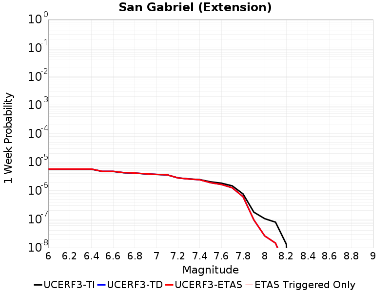 | 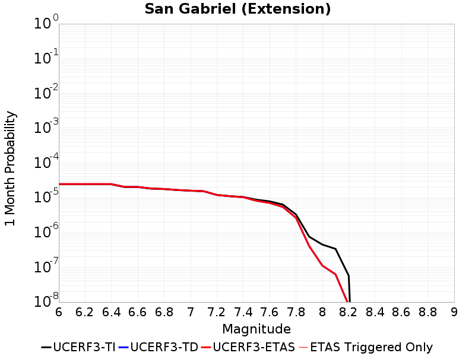 | 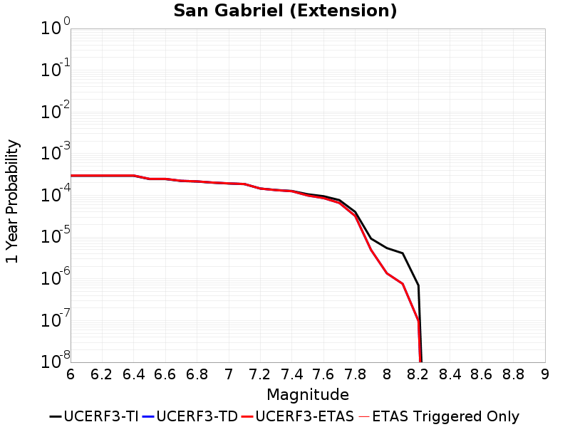 | 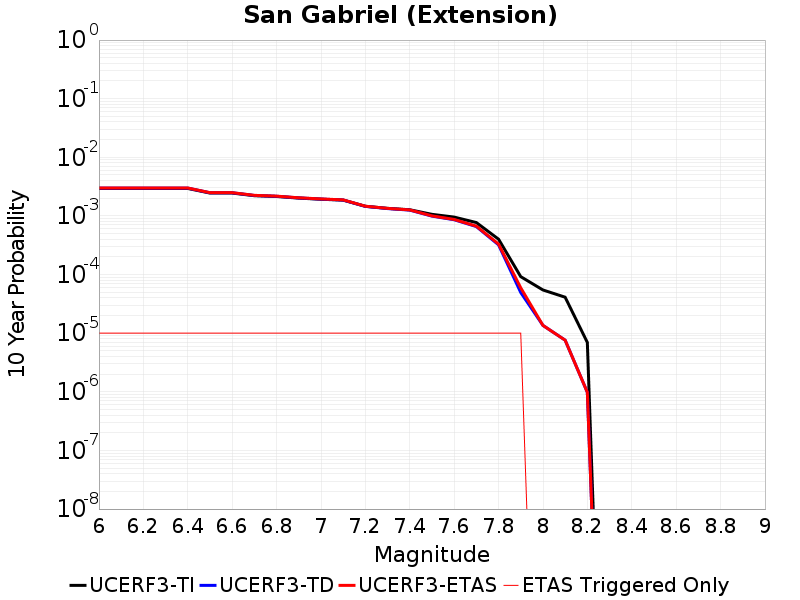 |

| Magnitude | 1 wk TI Prob | 1 wk TD Prob | 1 wk ETAS Prob | 1 wk ETAS/TD Gain | 1 wk ETAS Triggered Only | 1 mo TI Prob | 1 mo TD Prob | 1 mo ETAS Prob | 1 mo ETAS/TD Gain | 1 mo ETAS Triggered Only | 1 yr TI Prob | 1 yr TD Prob | 1 yr ETAS Prob | 1 yr ETAS/TD Gain | 1 yr ETAS Triggered Only | 10 yr TI Prob | 10 yr TD Prob | 10 yr ETAS Prob | 10 yr ETAS/TD Gain | 10 yr ETAS Triggered Only |
|-----|-----|-----|-----|-----|-----|-----|-----|-----|-----|-----|-----|-----|-----|-----|-----|-----|-----|-----|-----|-----|
| 6.0 | 5.6486106E-6 | 5.7323173E-6 | 5.7323173E-6 | 1.0 | 0.0 | 2.4208108E-5 | 2.456685E-5 | 2.456685E-5 | 1.0 | 0.0 | 2.9469383E-4 | 2.9906162E-4 | 2.9906162E-4 | 1.0 | 0.0 | 0.0029430336 | 0.0029867224 | 0.0029966927 | 1.0033381 | 1.0E-5 |
| 6.1 | 5.6486106E-6 | 5.7323173E-6 | 5.7323173E-6 | 1.0 | 0.0 | 2.4208108E-5 | 2.456685E-5 | 2.456685E-5 | 1.0 | 0.0 | 2.9469383E-4 | 2.9906162E-4 | 2.9906162E-4 | 1.0 | 0.0 | 0.0029430336 | 0.0029867224 | 0.0029966927 | 1.0033381 | 1.0E-5 |
| 6.2 | 5.6486106E-6 | 5.7323173E-6 | 5.7323173E-6 | 1.0 | 0.0 | 2.4208108E-5 | 2.456685E-5 | 2.456685E-5 | 1.0 | 0.0 | 2.9469383E-4 | 2.9906162E-4 | 2.9906162E-4 | 1.0 | 0.0 | 0.0029430336 | 0.0029867224 | 0.0029966927 | 1.0033381 | 1.0E-5 |
| 6.3 | 5.6486106E-6 | 5.7323173E-6 | 5.7323173E-6 | 1.0 | 0.0 | 2.4208108E-5 | 2.456685E-5 | 2.456685E-5 | 1.0 | 0.0 | 2.9469383E-4 | 2.9906162E-4 | 2.9906162E-4 | 1.0 | 0.0 | 0.0029430336 | 0.0029867224 | 0.0029966927 | 1.0033381 | 1.0E-5 |
| 6.4 | 5.6486106E-6 | 5.7323173E-6 | 5.7323173E-6 | 1.0 | 0.0 | 2.4208108E-5 | 2.456685E-5 | 2.456685E-5 | 1.0 | 0.0 | 2.9469383E-4 | 2.9906162E-4 | 2.9906162E-4 | 1.0 | 0.0 | 0.0029430336 | 0.0029867224 | 0.0029966927 | 1.0033381 | 1.0E-5 |
| 6.5 | 4.7134554E-6 | 4.769566E-6 | 4.769566E-6 | 1.0 | 0.0 | 2.0200367E-5 | 2.0440842E-5 | 2.0440842E-5 | 1.0 | 0.0 | 2.459117E-4 | 2.4883967E-4 | 2.4883967E-4 | 1.0 | 0.0 | 0.0024563975 | 0.0024856993 | 0.0024956744 | 1.0040131 | 1.0E-5 |
| 6.6 | 4.7134554E-6 | 4.769566E-6 | 4.769566E-6 | 1.0 | 0.0 | 2.0200367E-5 | 2.0440842E-5 | 2.0440842E-5 | 1.0 | 0.0 | 2.459117E-4 | 2.4883967E-4 | 2.4883967E-4 | 1.0 | 0.0 | 0.0024563975 | 0.0024856993 | 0.0024956744 | 1.0040131 | 1.0E-5 |
| 6.7 | 4.2468837E-6 | 4.2892966E-6 | 4.2892966E-6 | 1.0 | 0.0 | 1.8200803E-5 | 1.8382574E-5 | 1.8382574E-5 | 1.0 | 0.0 | 2.2157225E-4 | 2.2378558E-4 | 2.2378558E-4 | 1.0 | 0.0 | 0.0022135144 | 0.0022356785 | 0.0022456562 | 1.004463 | 1.0E-5 |
| 6.8 | 4.1180615E-6 | 4.156662E-6 | 4.156662E-6 | 1.0 | 0.0 | 1.7648716E-5 | 1.7814147E-5 | 1.7814147E-5 | 1.0 | 0.0 | 2.1485193E-4 | 2.1686638E-4 | 2.1686638E-4 | 1.0 | 0.0 | 0.0021464431 | 0.002166623 | 0.0021766014 | 1.0046055 | 1.0E-5 |
| 6.9 | 3.863861E-6 | 3.8949293E-6 | 3.8949293E-6 | 1.0 | 0.0 | 1.65593E-5 | 1.6692451E-5 | 1.6692451E-5 | 1.0 | 0.0 | 2.0159081E-4 | 2.0321233E-4 | 2.0321233E-4 | 1.0 | 0.0 | 0.0020140803 | 0.002030337 | 0.0020403166 | 1.0049152 | 1.0E-5 |
| 7.0 | 3.6947372E-6 | 3.7207967E-6 | 3.7207967E-6 | 1.0 | 0.0 | 1.5834492E-5 | 1.5946178E-5 | 1.5946178E-5 | 1.0 | 0.0 | 1.9276788E-4 | 1.941281E-4 | 1.941281E-4 | 1.0 | 0.0 | 0.0019260074 | 0.0019396559 | 0.0019496364 | 1.0051455 | 1.0E-5 |
| 7.1 | 3.5686835E-6 | 3.5879677E-6 | 3.5879677E-6 | 1.0 | 0.0 | 1.5294268E-5 | 1.5376918E-5 | 1.5376918E-5 | 1.0 | 0.0 | 1.861918E-4 | 1.8719856E-4 | 1.8719856E-4 | 1.0 | 0.0 | 0.0018603588 | 0.0018704787 | 0.0018804601 | 1.0053362 | 1.0E-5 |
| 7.2 | 2.8023446E-6 | 2.791648E-6 | 2.791648E-6 | 1.0 | 0.0 | 1.2009994E-5 | 1.1964152E-5 | 1.1964152E-5 | 1.0 | 0.0 | 1.4621185E-4 | 1.4565392E-4 | 1.4565392E-4 | 1.0 | 0.0 | 0.001461157 | 0.0014555996 | 0.0014655851 | 1.00686 | 1.0E-5 |
| 7.3 | 2.5843012E-6 | 2.5606819E-6 | 2.5606819E-6 | 1.0 | 0.0 | 1.1075529E-5 | 1.0974306E-5 | 1.0974306E-5 | 1.0 | 0.0 | 1.3483623E-4 | 1.3360407E-4 | 1.3360407E-4 | 1.0 | 0.0 | 0.0013475444 | 0.0013352515 | 0.0013452382 | 1.0074792 | 1.0E-5 |
| 7.4 | 2.4464468E-6 | 2.4111807E-6 | 2.4111807E-6 | 1.0 | 0.0 | 1.04847295E-5 | 1.0333591E-5 | 1.0333591E-5 | 1.0 | 0.0 | 1.276441E-4 | 1.258043E-4 | 1.258043E-4 | 1.0 | 0.0 | 0.0012757082 | 0.0012573446 | 0.0012673321 | 1.0079433 | 1.0E-5 |
| 7.5 | 2.0420266E-6 | 1.9039159E-6 | 1.9039159E-6 | 1.0 | 0.0 | 8.751514E-6 | 8.159614E-6 | 8.159614E-6 | 1.0 | 0.0 | 1.0654447E-4 | 9.933881E-5 | 9.933881E-5 | 1.0 | 0.0 | 0.001064934 | 9.929516E-4 | 0.0010029416 | 1.010061 | 1.0E-5 |
| 7.6 | 1.8326596E-6 | 1.6518848E-6 | 1.6518848E-6 | 1.0 | 0.0 | 7.854232E-6 | 7.0794867E-6 | 7.0794867E-6 | 1.0 | 0.0 | 9.562107E-5 | 8.618937E-5 | 8.618937E-5 | 1.0 | 0.0 | 9.5579936E-4 | 8.6156547E-4 | 8.7155687E-4 | 1.0115968 | 1.0E-5 |
| 7.7 | 1.4786998E-6 | 1.2634745E-6 | 1.2634745E-6 | 1.0 | 0.0 | 6.3372695E-6 | 5.4148795E-6 | 5.4148795E-6 | 1.0 | 0.0 | 7.715353E-5 | 6.592417E-5 | 6.592417E-5 | 1.0 | 0.0 | 7.7126746E-4 | 6.590522E-4 | 6.6904566E-4 | 1.0151633 | 1.0E-5 |
| 7.8 | 7.6975533E-7 | 6.161365E-7 | 6.161365E-7 | 1.0 | 0.0 | 3.2989474E-6 | 2.6405824E-6 | 2.6405824E-6 | 1.0 | 0.0 | 4.0163945E-5 | 3.214862E-5 | 3.214862E-5 | 1.0 | 0.0 | 4.0156685E-4 | 3.2144398E-4 | 3.3144077E-4 | 1.0310997 | 1.0E-5 |
| 7.9 | 1.7645915E-7 | 9.462831E-8 | 9.462831E-8 | 1.0 | 0.0 | 7.562533E-7 | 4.0554983E-7 | 4.0554983E-7 | 1.0 | 0.0 | 9.207345E-6 | 4.937558E-6 | 4.937558E-6 | 1.0 | 0.0 | 9.206964E-5 | 4.9378774E-5 | 5.937828E-5 | 1.2025062 | 1.0E-5 |
| 8.0 | 1.0463461E-7 | 2.6010454E-8 | 2.6010454E-8 | 1.0 | 0.0 | 4.4843398E-7 | 1.1147337E-7 | 1.1147337E-7 | 1.0 | 0.0 | 5.45967E-6 | 1.3571874E-6 | 1.3571874E-6 | 1.0 | 0.0 | 5.459536E-5 | 1.3576074E-5 | 1.3576074E-5 | 1.0 | 0.0 |
| 8.1 | 7.875717E-8 | 1.4561177E-8 | 1.4561177E-8 | 1.0 | 0.0 | 3.3753068E-7 | 6.240504E-8 | 6.240504E-8 | 1.0 | 0.0 | 4.109428E-6 | 7.5978113E-7 | 7.5978113E-7 | 1.0 | 0.0 | 4.109352E-5 | 7.6020674E-6 | 7.6020674E-6 | 1.0 | 0.0 |
| 8.2 | 1.33163E-8 | 1.8754358E-9 | 1.8754358E-9 | 1.0 | 0.0 | 5.7069855E-8 | 8.037581E-9 | 8.037581E-9 | 1.0 | 0.0 | 6.9482525E-7 | 9.785755E-8 | 9.785755E-8 | 1.0 | 0.0 | 6.9482307E-6 | 9.806329E-7 | 9.806329E-7 | 1.0 | 0.0 |

## Del Valle
*[(top)](#table-of-contents)*

| 1 Week | 1 Month | 1 Year | 10 Year |
|-----|-----|-----|-----|
| 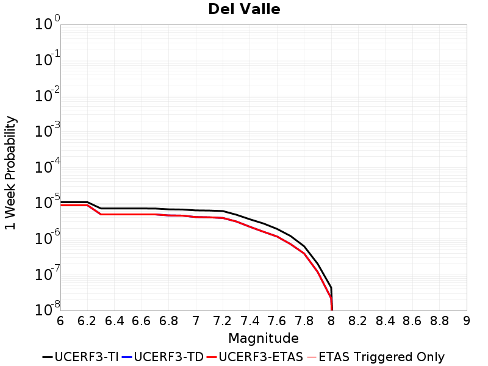 | 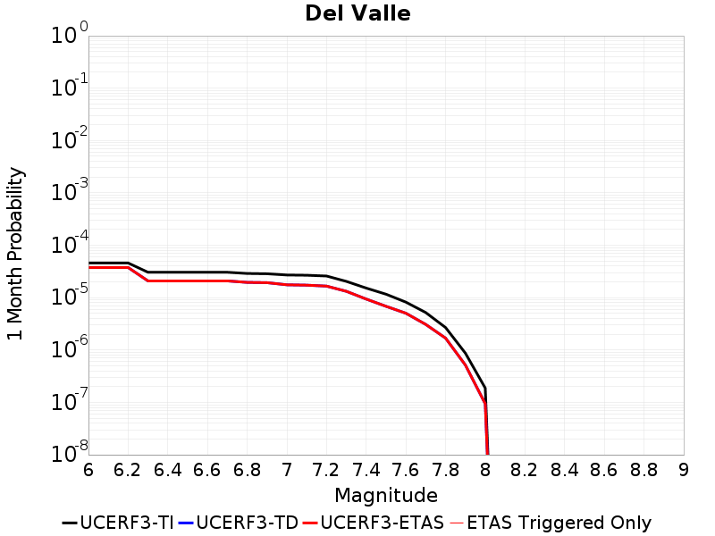 | 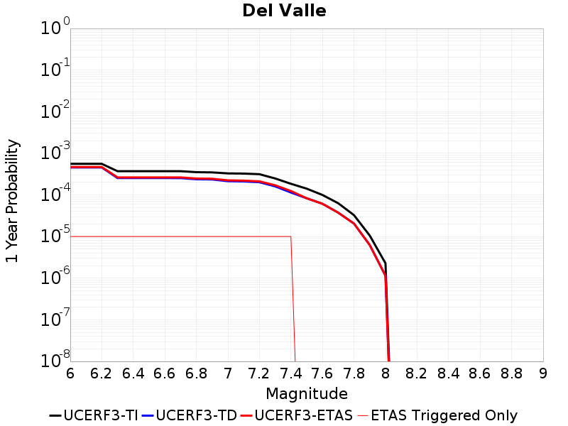 |  |

| Magnitude | 1 wk TI Prob | 1 wk TD Prob | 1 wk ETAS Prob | 1 wk ETAS/TD Gain | 1 wk ETAS Triggered Only | 1 mo TI Prob | 1 mo TD Prob | 1 mo ETAS Prob | 1 mo ETAS/TD Gain | 1 mo ETAS Triggered Only | 1 yr TI Prob | 1 yr TD Prob | 1 yr ETAS Prob | 1 yr ETAS/TD Gain | 1 yr ETAS Triggered Only | 10 yr TI Prob | 10 yr TD Prob | 10 yr ETAS Prob | 10 yr ETAS/TD Gain | 10 yr ETAS Triggered Only |
|-----|-----|-----|-----|-----|-----|-----|-----|-----|-----|-----|-----|-----|-----|-----|-----|-----|-----|-----|-----|-----|
| 6.0 | 1.0716125E-5 | 8.77696E-6 | 8.77696E-6 | 1.0 | 0.0 | 4.592544E-5 | 3.7615115E-5 | 3.7615115E-5 | 1.0 | 0.0 | 5.589988E-4 | 4.5788757E-4 | 4.67883E-4 | 1.0218294 | 1.0E-5 | 0.0055759475 | 0.004571355 | 0.0045813094 | 1.0021775 | 1.0E-5 |
| 6.1 | 1.0716125E-5 | 8.77696E-6 | 8.77696E-6 | 1.0 | 0.0 | 4.592544E-5 | 3.7615115E-5 | 3.7615115E-5 | 1.0 | 0.0 | 5.589988E-4 | 4.5788757E-4 | 4.67883E-4 | 1.0218294 | 1.0E-5 | 0.0055759475 | 0.004571355 | 0.0045813094 | 1.0021775 | 1.0E-5 |
| 6.2 | 1.0716125E-5 | 8.77696E-6 | 8.77696E-6 | 1.0 | 0.0 | 4.592544E-5 | 3.7615115E-5 | 3.7615115E-5 | 1.0 | 0.0 | 5.589988E-4 | 4.5788757E-4 | 4.67883E-4 | 1.0218294 | 1.0E-5 | 0.0055759475 | 0.004571355 | 0.0045813094 | 1.0021775 | 1.0E-5 |
| 6.3 | 7.1293784E-6 | 4.8727707E-6 | 4.8727707E-6 | 1.0 | 0.0 | 3.055412E-5 | 2.0883139E-5 | 2.0883139E-5 | 1.0 | 0.0 | 3.7193293E-4 | 2.542233E-4 | 2.6422075E-4 | 1.0393255 | 1.0E-5 | 0.0037131102 | 0.0025393676 | 0.002549342 | 1.003928 | 1.0E-5 |
| 6.4 | 7.1293784E-6 | 4.8727707E-6 | 4.8727707E-6 | 1.0 | 0.0 | 3.055412E-5 | 2.0883139E-5 | 2.0883139E-5 | 1.0 | 0.0 | 3.7193293E-4 | 2.542233E-4 | 2.6422075E-4 | 1.0393255 | 1.0E-5 | 0.0037131102 | 0.0025393676 | 0.002549342 | 1.003928 | 1.0E-5 |
| 6.5 | 7.1293784E-6 | 4.8727707E-6 | 4.8727707E-6 | 1.0 | 0.0 | 3.055412E-5 | 2.0883139E-5 | 2.0883139E-5 | 1.0 | 0.0 | 3.7193293E-4 | 2.542233E-4 | 2.6422075E-4 | 1.0393255 | 1.0E-5 | 0.0037131102 | 0.0025393676 | 0.002549342 | 1.003928 | 1.0E-5 |
| 6.6 | 7.1293784E-6 | 4.8727707E-6 | 4.8727707E-6 | 1.0 | 0.0 | 3.055412E-5 | 2.0883139E-5 | 2.0883139E-5 | 1.0 | 0.0 | 3.7193293E-4 | 2.542233E-4 | 2.6422075E-4 | 1.0393255 | 1.0E-5 | 0.0037131102 | 0.0025393676 | 0.002549342 | 1.003928 | 1.0E-5 |
| 6.7 | 7.12272E-6 | 4.870143E-6 | 4.870143E-6 | 1.0 | 0.0 | 3.0525585E-5 | 2.087188E-5 | 2.087188E-5 | 1.0 | 0.0 | 3.7158563E-4 | 2.5408625E-4 | 2.640837E-4 | 1.0393467 | 1.0E-5 | 0.003709649 | 0.002538 | 0.0025479747 | 1.0039301 | 1.0E-5 |
| 6.8 | 6.7558703E-6 | 4.5660595E-6 | 4.5660595E-6 | 1.0 | 0.0 | 2.895341E-5 | 1.9568683E-5 | 1.9568683E-5 | 1.0 | 0.0 | 3.5245073E-4 | 2.3822329E-4 | 2.4822092E-4 | 1.0419674 | 1.0E-5 | 0.0035189227 | 0.0023797115 | 0.0023896876 | 1.0041922 | 1.0E-5 |
| 6.9 | 6.6700386E-6 | 4.5090705E-6 | 4.5090705E-6 | 1.0 | 0.0 | 2.8585566E-5 | 1.9324447E-5 | 1.9324447E-5 | 1.0 | 0.0 | 3.479737E-4 | 2.3525038E-4 | 2.4524803E-4 | 1.0424979 | 1.0E-5 | 0.003474293 | 0.0023500454 | 0.002360022 | 1.0042453 | 1.0E-5 |
| 7.0 | 6.3181424E-6 | 4.10484E-6 | 4.10484E-6 | 1.0 | 0.0 | 2.7077473E-5 | 1.7592058E-5 | 1.7592058E-5 | 1.0 | 0.0 | 3.2961834E-4 | 2.1416266E-4 | 2.2416053E-4 | 1.0466834 | 1.0E-5 | 0.0032912986 | 0.0021395744 | 0.002149553 | 1.0046638 | 1.0E-5 |
| 7.1 | 6.248759E-6 | 4.039949E-6 | 4.039949E-6 | 1.0 | 0.0 | 2.678012E-5 | 1.7313954E-5 | 1.7313954E-5 | 1.0 | 0.0 | 3.2599916E-4 | 2.1077742E-4 | 2.2077531E-4 | 1.0474334 | 1.0E-5 | 0.0032552136 | 0.0021057862 | 0.0021157654 | 1.0047388 | 1.0E-5 |
| 7.2 | 6.0411944E-6 | 3.875492E-6 | 3.875492E-6 | 1.0 | 0.0 | 2.5890577E-5 | 1.6609149E-5 | 1.6609149E-5 | 1.0 | 0.0 | 3.1517216E-4 | 2.0219803E-4 | 2.1219601E-4 | 1.0494465 | 1.0E-5 | 0.0031472554 | 0.002020151 | 0.0020301307 | 1.0049402 | 1.0E-5 |
| 7.3 | 4.7691183E-6 | 3.082439E-6 | 3.082439E-6 | 1.0 | 0.0 | 2.0438918E-5 | 1.3210387E-5 | 1.3210387E-5 | 1.0 | 0.0 | 2.488154E-4 | 1.608248E-4 | 1.708232E-4 | 1.0621694 | 1.0E-5 | 0.00248537 | 0.0016070881 | 0.001617072 | 1.0062125 | 1.0E-5 |
| 7.4 | 3.5524722E-6 | 2.1922965E-6 | 2.1922965E-6 | 1.0 | 0.0 | 1.5224792E-5 | 9.395523E-6 | 9.395523E-6 | 1.0 | 0.0 | 1.8534607E-4 | 1.1438457E-4 | 1.2438343E-4 | 1.0874144 | 1.0E-5 | 0.0018519156 | 0.0011432652 | 0.0011532538 | 1.0087368 | 1.0E-5 |
| 7.5 | 2.7133442E-6 | 1.5939332E-6 | 1.5939332E-6 | 1.0 | 0.0 | 1.1628566E-5 | 6.8311247E-6 | 6.8311247E-6 | 1.0 | 0.0 | 1.415686E-4 | 8.316579E-5 | 8.316579E-5 | 1.0 | 0.0 | 0.0014147845 | 8.313486E-4 | 8.313486E-4 | 1.0 | 0.0 |
| 7.6 | 1.915338E-6 | 1.1754976E-6 | 1.1754976E-6 | 1.0 | 0.0 | 8.208566E-6 | 5.0378367E-6 | 5.0378367E-6 | 1.0 | 0.0 | 9.993471E-5 | 6.133394E-5 | 6.133394E-5 | 1.0 | 0.0 | 9.988978E-4 | 6.1317114E-4 | 6.1317114E-4 | 1.0 | 0.0 |
| 7.7 | 1.2120448E-6 | 7.19146E-7 | 7.19146E-7 | 1.0 | 0.0 | 5.194467E-6 | 3.0820506E-6 | 3.0820506E-6 | 1.0 | 0.0 | 6.3240805E-5 | 3.7523325E-5 | 3.7523325E-5 | 1.0 | 0.0 | 6.322281E-4 | 3.7517026E-4 | 3.7517026E-4 | 1.0 | 0.0 |
| 7.8 | 6.272381E-7 | 3.9386424E-7 | 3.9386424E-7 | 1.0 | 0.0 | 2.6881603E-6 | 1.6879885E-6 | 1.6879885E-6 | 1.0 | 0.0 | 3.272786E-5 | 2.0551068E-5 | 2.0551068E-5 | 1.0 | 0.0 | 3.272304E-4 | 2.0549183E-4 | 2.0549183E-4 | 1.0 | 0.0 |
| 7.9 | 2.0292627E-7 | 1.2022726E-7 | 1.2022726E-7 | 1.0 | 0.0 | 8.6968373E-7 | 5.1525956E-7 | 5.1525956E-7 | 1.0 | 0.0 | 1.0588348E-5 | 6.273267E-6 | 6.273267E-6 | 1.0 | 0.0 | 1.0587843E-4 | 6.273092E-5 | 6.273092E-5 | 1.0 | 0.0 |
| 8.0 | 4.374492E-8 | 2.195304E-8 | 2.195304E-8 | 1.0 | 0.0 | 1.8747821E-7 | 9.4084456E-8 | 9.4084456E-8 | 1.0 | 0.0 | 2.2825448E-6 | 1.1454777E-6 | 1.1454777E-6 | 1.0 | 0.0 | 2.2825214E-5 | 1.1454722E-5 | 1.1454722E-5 | 1.0 | 0.0 |

## San Gregorio (North) 2011 CFM
*[(top)](#table-of-contents)*

| 1 Week | 1 Month | 1 Year | 10 Year |
|-----|-----|-----|-----|
| 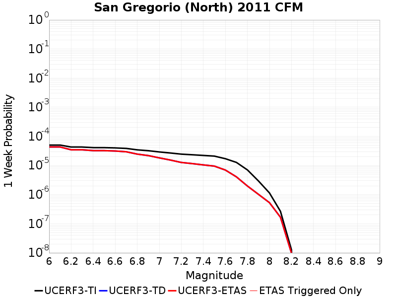 | 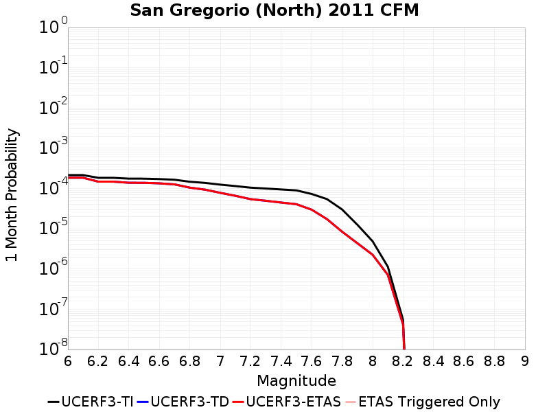 | 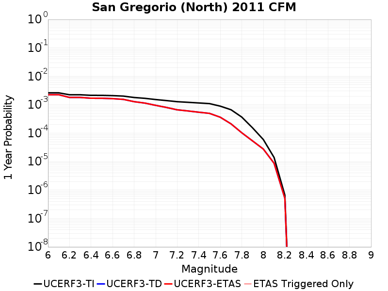 | 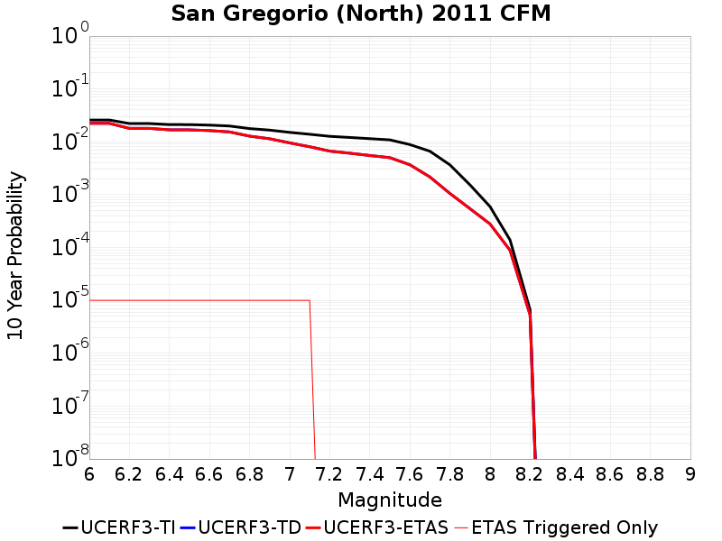 |

| Magnitude | 1 wk TI Prob | 1 wk TD Prob | 1 wk ETAS Prob | 1 wk ETAS/TD Gain | 1 wk ETAS Triggered Only | 1 mo TI Prob | 1 mo TD Prob | 1 mo ETAS Prob | 1 mo ETAS/TD Gain | 1 mo ETAS Triggered Only | 1 yr TI Prob | 1 yr TD Prob | 1 yr ETAS Prob | 1 yr ETAS/TD Gain | 1 yr ETAS Triggered Only | 10 yr TI Prob | 10 yr TD Prob | 10 yr ETAS Prob | 10 yr ETAS/TD Gain | 10 yr ETAS Triggered Only |
|-----|-----|-----|-----|-----|-----|-----|-----|-----|-----|-----|-----|-----|-----|-----|-----|-----|-----|-----|-----|-----|
| 6.0 | 5.0283932E-5 | 4.3212378E-5 | 4.3212378E-5 | 1.0 | 0.0 | 2.1548476E-4 | 1.8518287E-4 | 1.8518287E-4 | 1.0 | 0.0 | 0.0026203706 | 0.0022522847 | 0.0022522847 | 1.0 | 0.0 | 0.02589687 | 0.02237847 | 0.022388248 | 1.0004369 | 1.0E-5 |
| 6.1 | 5.0283932E-5 | 4.3212378E-5 | 4.3212378E-5 | 1.0 | 0.0 | 2.1548476E-4 | 1.8518287E-4 | 1.8518287E-4 | 1.0 | 0.0 | 0.0026203706 | 0.0022522847 | 0.0022522847 | 1.0 | 0.0 | 0.02589687 | 0.02237847 | 0.022388248 | 1.0004369 | 1.0E-5 |
| 6.2 | 4.2998647E-5 | 3.458157E-5 | 3.458157E-5 | 1.0 | 0.0 | 1.842669E-4 | 1.4819839E-4 | 1.4819839E-4 | 1.0 | 0.0 | 0.0022411412 | 0.0018028348 | 0.0018028348 | 1.0 | 0.0 | 0.022186736 | 0.01796034 | 0.017970162 | 1.0005468 | 1.0E-5 |
| 6.3 | 4.2998647E-5 | 3.458157E-5 | 3.458157E-5 | 1.0 | 0.0 | 1.842669E-4 | 1.4819839E-4 | 1.4819839E-4 | 1.0 | 0.0 | 0.0022411412 | 0.0018028348 | 0.0018028348 | 1.0 | 0.0 | 0.022186736 | 0.01796034 | 0.017970162 | 1.0005468 | 1.0E-5 |
| 6.4 | 4.1101295E-5 | 3.2462915E-5 | 3.2462915E-5 | 1.0 | 0.0 | 1.7613651E-4 | 1.3911944E-4 | 1.3911944E-4 | 1.0 | 0.0 | 0.0021423528 | 0.0016924767 | 0.0016924767 | 1.0 | 0.0 | 0.02121817 | 0.016874183 | 0.016884014 | 1.0005826 | 1.0E-5 |
| 6.5 | 4.1032585E-5 | 3.238085E-5 | 3.238085E-5 | 1.0 | 0.0 | 1.7584208E-4 | 1.3876778E-4 | 1.3876778E-4 | 1.0 | 0.0 | 0.0021387753 | 0.0016882017 | 0.0016882017 | 1.0 | 0.0 | 0.021183075 | 0.016832087 | 0.016841918 | 1.0005841 | 1.0E-5 |
| 6.6 | 4.011629E-5 | 3.140079E-5 | 3.140079E-5 | 1.0 | 0.0 | 1.7191563E-4 | 1.3456795E-4 | 1.3456795E-4 | 1.0 | 0.0 | 0.0020910634 | 0.0016371473 | 0.0016371473 | 1.0 | 0.0 | 0.020714961 | 0.016327629 | 0.016337465 | 1.0006025 | 1.0E-5 |
| 6.7 | 3.8583938E-5 | 2.95849E-5 | 2.95849E-5 | 1.0 | 0.0 | 1.6534925E-4 | 1.2678634E-4 | 1.2678634E-4 | 1.0 | 0.0 | 0.0020112682 | 0.001542545 | 0.001542545 | 1.0 | 0.0 | 0.019931622 | 0.015393911 | 0.015403758 | 1.0006396 | 1.0E-5 |
| 6.8 | 3.44341E-5 | 2.4574209E-5 | 2.4574209E-5 | 1.0 | 0.0 | 1.4756636E-4 | 1.0531384E-4 | 1.0531384E-4 | 1.0 | 0.0 | 0.0017951399 | 0.0012814524 | 0.0012814524 | 1.0 | 0.0 | 0.017807078 | 0.01281537 | 0.012825242 | 1.0007703 | 1.0E-5 |
| 6.9 | 3.221199E-5 | 2.1893806E-5 | 2.1893806E-5 | 1.0 | 0.0 | 1.3804408E-4 | 9.382727E-5 | 9.382727E-5 | 1.0 | 0.0 | 0.0016793909 | 0.0011417567 | 0.0011417567 | 1.0 | 0.0 | 0.01666756 | 0.011433 | 0.011442886 | 1.0008646 | 1.0E-5 |
| 7.0 | 2.9186718E-5 | 1.8255068E-5 | 1.8255068E-5 | 1.0 | 0.0 | 1.2507994E-4 | 7.823369E-5 | 7.823369E-5 | 1.0 | 0.0 | 0.0015217843 | 9.520834E-4 | 9.520834E-4 | 1.0 | 0.0 | 0.015114053 | 0.0095536485 | 0.009563553 | 1.0010368 | 1.0E-5 |
| 7.1 | 2.6840138E-5 | 1.5387826E-5 | 1.5387826E-5 | 1.0 | 0.0 | 1.1502409E-4 | 6.594617E-5 | 6.594617E-5 | 1.0 | 0.0 | 0.0013995186 | 8.026009E-4 | 8.026009E-4 | 1.0 | 0.0 | 0.013907375 | 0.008070315 | 0.008080234 | 1.0012292 | 1.0E-5 |
| 7.2 | 2.453002E-5 | 1.27069E-5 | 1.27069E-5 | 1.0 | 0.0 | 1.05124425E-4 | 5.445701E-5 | 5.445701E-5 | 1.0 | 0.0 | 0.0012791384 | 6.6281296E-4 | 6.6281296E-4 | 1.0 | 0.0 | 0.012718005 | 0.0066807973 | 0.0066807973 | 1.0 | 0.0 |
| 7.3 | 2.3330727E-5 | 1.1586714E-5 | 1.1586714E-5 | 1.0 | 0.0 | 9.9985E-5 | 4.9656403E-5 | 4.9656403E-5 | 1.0 | 0.0 | 0.0012166376 | 6.043995E-4 | 6.043995E-4 | 1.0 | 0.0 | 0.012099981 | 0.006098662 | 0.006098662 | 1.0 | 0.0 |
| 7.4 | 2.2136466E-5 | 1.0464675E-5 | 1.0464675E-5 | 1.0 | 0.0 | 9.486712E-5 | 4.484784E-5 | 4.484784E-5 | 1.0 | 0.0 | 0.0011543952 | 5.458859E-4 | 5.458859E-4 | 1.0 | 0.0 | 0.011484168 | 0.0055151097 | 0.0055151097 | 1.0 | 0.0 |
| 7.5 | 2.0994974E-5 | 9.519394E-6 | 9.519394E-6 | 1.0 | 0.0 | 8.997535E-5 | 4.0796764E-5 | 4.0796764E-5 | 1.0 | 0.0 | 0.0010948994 | 4.9658766E-4 | 4.9658766E-4 | 1.0 | 0.0 | 0.010895205 | 0.0050226506 | 0.0050226506 | 1.0 | 0.0 |
| 7.6 | 1.7091823E-5 | 6.9676994E-6 | 6.9676994E-6 | 1.0 | 0.0 | 7.3248615E-5 | 2.9861227E-5 | 2.9861227E-5 | 1.0 | 0.0 | 8.9143694E-4 | 3.634999E-4 | 3.634999E-4 | 1.0 | 0.0 | 0.008878695 | 0.0036881396 | 0.0036881396 | 1.0 | 0.0 |
| 7.7 | 1.2772179E-5 | 4.0725677E-6 | 4.0725677E-6 | 1.0 | 0.0 | 5.473676E-5 | 1.7453745E-5 | 1.7453745E-5 | 1.0 | 0.0 | 6.6621625E-4 | 2.1247866E-4 | 2.1247866E-4 | 1.0 | 0.0 | 0.006642225 | 0.0021650523 | 0.0021650523 | 1.0 | 0.0 |
| 7.8 | 7.041923E-6 | 1.9740748E-6 | 1.9740748E-6 | 1.0 | 0.0 | 3.017932E-5 | 8.460293E-6 | 8.460293E-6 | 1.0 | 0.0 | 3.6737128E-4 | 1.02999205E-4 | 1.02999205E-4 | 1.0 | 0.0 | 0.0036676454 | 0.001056128 | 0.001056128 | 1.0 | 0.0 |
| 7.9 | 2.946768E-6 | 1.0229858E-6 | 1.0229858E-6 | 1.0 | 0.0 | 1.2628945E-5 | 4.384217E-6 | 4.384217E-6 | 1.0 | 0.0 | 1.5374656E-4 | 5.3376534E-5 | 5.3376534E-5 | 1.0 | 0.0 | 0.0015364023 | 5.4442685E-4 | 5.4442685E-4 | 1.0 | 0.0 |
| 8.0 | 1.1433375E-6 | 5.294027E-7 | 5.294027E-7 | 1.0 | 0.0 | 4.9000087E-6 | 2.2688669E-6 | 2.2688669E-6 | 1.0 | 0.0 | 5.965597E-5 | 2.7623102E-5 | 2.7623102E-5 | 1.0 | 0.0 | 5.963996E-4 | 2.79901E-4 | 2.79901E-4 | 1.0 | 0.0 |
| 8.1 | 2.6675295E-7 | 1.6715614E-7 | 1.6715614E-7 | 1.0 | 0.0 | 1.1432264E-6 | 7.163833E-7 | 7.163833E-7 | 1.0 | 0.0 | 1.3918692E-5 | 8.721931E-6 | 8.721931E-6 | 1.0 | 0.0 | 1.391782E-4 | 8.861949E-5 | 8.861949E-5 | 1.0 | 0.0 |
| 8.2 | 1.2704569E-8 | 9.814172E-9 | 9.814172E-9 | 1.0 | 0.0 | 5.444815E-8 | 4.2060734E-8 | 4.2060734E-8 | 1.0 | 0.0 | 6.629061E-7 | 5.1208934E-7 | 5.1208934E-7 | 1.0 | 0.0 | 6.629041E-6 | 5.316462E-6 | 5.316462E-6 | 1.0 | 0.0 |

## San Cayetano
*[(top)](#table-of-contents)*

| 1 Week | 1 Month | 1 Year | 10 Year |
|-----|-----|-----|-----|
|  |  |  |  |

| Magnitude | 1 wk TI Prob | 1 wk TD Prob | 1 wk ETAS Prob | 1 wk ETAS/TD Gain | 1 wk ETAS Triggered Only | 1 mo TI Prob | 1 mo TD Prob | 1 mo ETAS Prob | 1 mo ETAS/TD Gain | 1 mo ETAS Triggered Only | 1 yr TI Prob | 1 yr TD Prob | 1 yr ETAS Prob | 1 yr ETAS/TD Gain | 1 yr ETAS Triggered Only | 10 yr TI Prob | 10 yr TD Prob | 10 yr ETAS Prob | 10 yr ETAS/TD Gain | 10 yr ETAS Triggered Only |
|-----|-----|-----|-----|-----|-----|-----|-----|-----|-----|-----|-----|-----|-----|-----|-----|-----|-----|-----|-----|-----|
| 6.0 | 2.3476267E-5 | 1.8202052E-5 | 1.8202052E-5 | 1.0 | 0.0 | 1.0060869E-4 | 7.800648E-5 | 7.800648E-5 | 1.0 | 0.0 | 0.0012242225 | 9.493188E-4 | 9.593093E-4 | 1.0105239 | 1.0E-5 | 0.012175002 | 0.009453385 | 0.009463291 | 1.0010478 | 1.0E-5 |
| 6.1 | 2.3476267E-5 | 1.8202052E-5 | 1.8202052E-5 | 1.0 | 0.0 | 1.0060869E-4 | 7.800648E-5 | 7.800648E-5 | 1.0 | 0.0 | 0.0012242225 | 9.493188E-4 | 9.593093E-4 | 1.0105239 | 1.0E-5 | 0.012175002 | 0.009453385 | 0.009463291 | 1.0010478 | 1.0E-5 |
| 6.2 | 2.3476267E-5 | 1.8202052E-5 | 1.8202052E-5 | 1.0 | 0.0 | 1.0060869E-4 | 7.800648E-5 | 7.800648E-5 | 1.0 | 0.0 | 0.0012242225 | 9.493188E-4 | 9.593093E-4 | 1.0105239 | 1.0E-5 | 0.012175002 | 0.009453385 | 0.009463291 | 1.0010478 | 1.0E-5 |
| 6.3 | 2.3476267E-5 | 1.8202052E-5 | 1.8202052E-5 | 1.0 | 0.0 | 1.0060869E-4 | 7.800648E-5 | 7.800648E-5 | 1.0 | 0.0 | 0.0012242225 | 9.493188E-4 | 9.593093E-4 | 1.0105239 | 1.0E-5 | 0.012175002 | 0.009453385 | 0.009463291 | 1.0010478 | 1.0E-5 |
| 6.4 | 2.3476267E-5 | 1.8202052E-5 | 1.8202052E-5 | 1.0 | 0.0 | 1.0060869E-4 | 7.800648E-5 | 7.800648E-5 | 1.0 | 0.0 | 0.0012242225 | 9.493188E-4 | 9.593093E-4 | 1.0105239 | 1.0E-5 | 0.012175002 | 0.009453385 | 0.009463291 | 1.0010478 | 1.0E-5 |
| 6.5 | 2.3476267E-5 | 1.8202052E-5 | 1.8202052E-5 | 1.0 | 0.0 | 1.0060869E-4 | 7.800648E-5 | 7.800648E-5 | 1.0 | 0.0 | 0.0012242225 | 9.493188E-4 | 9.593093E-4 | 1.0105239 | 1.0E-5 | 0.012175002 | 0.009453385 | 0.009463291 | 1.0010478 | 1.0E-5 |
| 6.6 | 2.3476267E-5 | 1.8202052E-5 | 1.8202052E-5 | 1.0 | 0.0 | 1.0060869E-4 | 7.800648E-5 | 7.800648E-5 | 1.0 | 0.0 | 0.0012242225 | 9.493188E-4 | 9.593093E-4 | 1.0105239 | 1.0E-5 | 0.012175002 | 0.009453385 | 0.009463291 | 1.0010478 | 1.0E-5 |
| 6.7 | 2.3476267E-5 | 1.8202052E-5 | 1.8202052E-5 | 1.0 | 0.0 | 1.0060869E-4 | 7.800648E-5 | 7.800648E-5 | 1.0 | 0.0 | 0.0012242225 | 9.493188E-4 | 9.593093E-4 | 1.0105239 | 1.0E-5 | 0.012175002 | 0.009453385 | 0.009463291 | 1.0010478 | 1.0E-5 |
| 6.8 | 2.3241924E-5 | 1.7969465E-5 | 1.7969465E-5 | 1.0 | 0.0 | 9.960445E-5 | 7.700974E-5 | 7.700974E-5 | 1.0 | 0.0 | 0.0012120095 | 9.371939E-4 | 9.4718457E-4 | 1.0106602 | 1.0E-5 | 0.012054204 | 0.009333093 | 0.009342999 | 1.0010614 | 1.0E-5 |
| 6.9 | 2.2761007E-5 | 1.7464425E-5 | 1.7464425E-5 | 1.0 | 0.0 | 9.7543525E-5 | 7.4845404E-5 | 7.4845404E-5 | 1.0 | 0.0 | 0.0011869454 | 9.108653E-4 | 9.208562E-4 | 1.0109686 | 1.0E-5 | 0.011806256 | 0.009071972 | 0.0090818815 | 1.0010923 | 1.0E-5 |
| 7.0 | 2.240283E-5 | 1.7097873E-5 | 1.7097873E-5 | 1.0 | 0.0 | 9.600859E-5 | 7.3274554E-5 | 7.3274554E-5 | 1.0 | 0.0 | 0.0011682777 | 8.9175603E-4 | 9.017471E-4 | 1.0112039 | 1.0E-5 | 0.011621549 | 0.008882412 | 0.008892324 | 1.0011158 | 1.0E-5 |
| 7.1 | 2.1871154E-5 | 1.6615108E-5 | 1.6615108E-5 | 1.0 | 0.0 | 9.373015E-5 | 7.120568E-5 | 7.120568E-5 | 1.0 | 0.0 | 0.0011405671 | 8.665877E-4 | 8.76579E-4 | 1.0115296 | 1.0E-5 | 0.011347309 | 0.008632707 | 0.008642621 | 1.0011483 | 1.0E-5 |
| 7.2 | 2.0714133E-5 | 1.5590434E-5 | 1.5590434E-5 | 1.0 | 0.0 | 8.8771834E-5 | 6.681445E-5 | 6.681445E-5 | 1.0 | 0.0 | 0.0010802611 | 8.131656E-4 | 8.231575E-4 | 1.0122876 | 1.0E-5 | 0.010750249 | 0.008102497 | 0.008112417 | 1.0012242 | 1.0E-5 |
| 7.3 | 1.8408395E-5 | 1.4019088E-5 | 1.4019088E-5 | 1.0 | 0.0 | 7.8890735E-5 | 6.0080438E-5 | 6.0080438E-5 | 1.0 | 0.0 | 9.600714E-4 | 7.312368E-4 | 7.412295E-4 | 1.0136654 | 1.0E-5 | 0.009559342 | 0.0072888685 | 0.0072987955 | 1.001362 | 1.0E-5 |
| 7.4 | 1.6856795E-5 | 1.287033E-5 | 1.287033E-5 | 1.0 | 0.0 | 7.2241404E-5 | 5.5157405E-5 | 5.5157405E-5 | 1.0 | 0.0 | 8.7918417E-4 | 6.7133736E-4 | 6.813306E-4 | 1.0148857 | 1.0E-5 | 0.00875714 | 0.006693634 | 0.006703567 | 1.0014839 | 1.0E-5 |
| 7.5 | 1.2822778E-5 | 9.593989E-6 | 9.593989E-6 | 1.0 | 0.0 | 5.495361E-5 | 4.1116455E-5 | 4.1116455E-5 | 1.0 | 0.0 | 6.688548E-4 | 5.004794E-4 | 5.004794E-4 | 1.0 | 0.0 | 0.006668452 | 0.004993721 | 0.004993721 | 1.0 | 0.0 |
| 7.6 | 5.6272684E-6 | 3.859174E-6 | 3.859174E-6 | 1.0 | 0.0 | 2.4116642E-5 | 1.6539214E-5 | 1.6539214E-5 | 1.0 | 0.0 | 2.9358055E-4 | 2.0134641E-4 | 2.0134641E-4 | 1.0 | 0.0 | 0.0029319301 | 0.0020116507 | 0.0020116507 | 1.0 | 0.0 |
| 7.7 | 3.5261346E-6 | 2.3435823E-6 | 2.3435823E-6 | 1.0 | 0.0 | 1.5111918E-5 | 1.0043886E-5 | 1.0043886E-5 | 1.0 | 0.0 | 1.8397206E-4 | 1.2227752E-4 | 1.2227752E-4 | 1.0 | 0.0 | 0.0018381984 | 0.0012221098 | 0.0012221098 | 1.0 | 0.0 |
| 7.8 | 1.4826929E-6 | 1.0574947E-6 | 1.0574947E-6 | 1.0 | 0.0 | 6.354383E-6 | 4.5321126E-6 | 4.5321126E-6 | 1.0 | 0.0 | 7.736187E-5 | 5.5177094E-5 | 5.5177094E-5 | 1.0 | 0.0 | 7.733494E-4 | 5.51636E-4 | 5.51636E-4 | 1.0 | 0.0 |
| 7.9 | 2.7568166E-7 | 1.6998305E-7 | 1.6998305E-7 | 1.0 | 0.0 | 1.1814923E-6 | 7.284986E-7 | 7.284986E-7 | 1.0 | 0.0 | 1.4384574E-5 | 8.869434E-6 | 8.869434E-6 | 1.0 | 0.0 | 1.4383643E-4 | 8.869084E-5 | 8.869084E-5 | 1.0 | 0.0 |
| 8.0 | 5.407832E-8 | 2.6953959E-8 | 2.6953959E-8 | 1.0 | 0.0 | 2.3176422E-7 | 1.1551696E-7 | 1.1551696E-7 | 1.0 | 0.0 | 2.8217257E-6 | 1.406418E-6 | 1.406418E-6 | 1.0 | 0.0 | 2.8216898E-5 | 1.4064096E-5 | 1.4064096E-5 | 1.0 | 0.0 |

## Santa Cruz Island
*[(top)](#table-of-contents)*

| 1 Week | 1 Month | 1 Year | 10 Year |
|-----|-----|-----|-----|
|  |  | 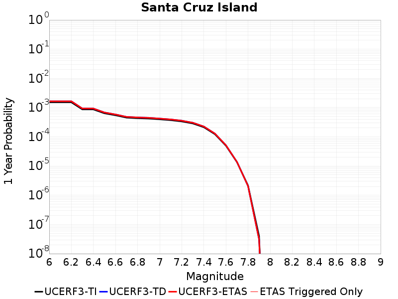 | 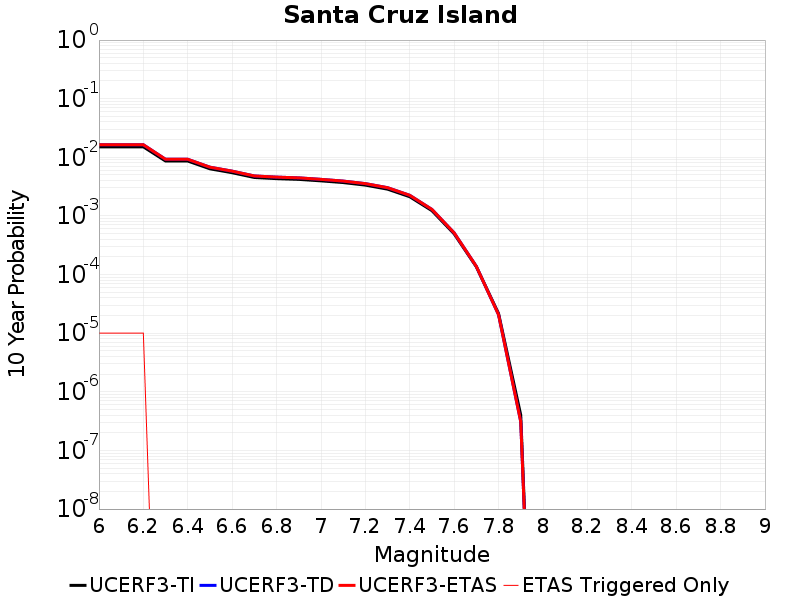 |

| Magnitude | 1 wk TI Prob | 1 wk TD Prob | 1 wk ETAS Prob | 1 wk ETAS/TD Gain | 1 wk ETAS Triggered Only | 1 mo TI Prob | 1 mo TD Prob | 1 mo ETAS Prob | 1 mo ETAS/TD Gain | 1 mo ETAS Triggered Only | 1 yr TI Prob | 1 yr TD Prob | 1 yr ETAS Prob | 1 yr ETAS/TD Gain | 1 yr ETAS Triggered Only | 10 yr TI Prob | 10 yr TD Prob | 10 yr ETAS Prob | 10 yr ETAS/TD Gain | 10 yr ETAS Triggered Only |
|-----|-----|-----|-----|-----|-----|-----|-----|-----|-----|-----|-----|-----|-----|-----|-----|-----|-----|-----|-----|-----|
| 6.0 | 2.9164563E-5 | 3.1616266E-5 | 3.1616266E-5 | 1.0 | 0.0 | 1.2498499E-4 | 1.3549201E-4 | 1.3549201E-4 | 1.0 | 0.0 | 0.0015206301 | 0.0016485034 | 0.0016485034 | 1.0 | 0.0 | 0.015102667 | 0.016376497 | 0.016386334 | 1.0006006 | 1.0E-5 |
| 6.1 | 2.9164563E-5 | 3.1616266E-5 | 3.1616266E-5 | 1.0 | 0.0 | 1.2498499E-4 | 1.3549201E-4 | 1.3549201E-4 | 1.0 | 0.0 | 0.0015206301 | 0.0016485034 | 0.0016485034 | 1.0 | 0.0 | 0.015102667 | 0.016376497 | 0.016386334 | 1.0006006 | 1.0E-5 |
| 6.2 | 2.9164563E-5 | 3.1616266E-5 | 3.1616266E-5 | 1.0 | 0.0 | 1.2498499E-4 | 1.3549201E-4 | 1.3549201E-4 | 1.0 | 0.0 | 0.0015206301 | 0.0016485034 | 0.0016485034 | 1.0 | 0.0 | 0.015102667 | 0.016376497 | 0.016386334 | 1.0006006 | 1.0E-5 |
| 6.3 | 1.6635553E-5 | 1.7812199E-5 | 1.7812199E-5 | 1.0 | 0.0 | 7.1293274E-5 | 7.633586E-5 | 7.633586E-5 | 1.0 | 0.0 | 8.6765E-4 | 9.2901115E-4 | 9.2901115E-4 | 1.0 | 0.0 | 0.008642701 | 0.009253149 | 0.009253149 | 1.0 | 0.0 |
| 6.4 | 1.6635553E-5 | 1.7812199E-5 | 1.7812199E-5 | 1.0 | 0.0 | 7.1293274E-5 | 7.633586E-5 | 7.633586E-5 | 1.0 | 0.0 | 8.6765E-4 | 9.2901115E-4 | 9.2901115E-4 | 1.0 | 0.0 | 0.008642701 | 0.009253149 | 0.009253149 | 1.0 | 0.0 |
| 6.5 | 1.2238748E-5 | 1.3048382E-5 | 1.3048382E-5 | 1.0 | 0.0 | 5.2450723E-5 | 5.592046E-5 | 5.592046E-5 | 1.0 | 0.0 | 6.3840044E-4 | 6.8062264E-4 | 6.8062264E-4 | 1.0 | 0.0 | 0.0063656955 | 0.0067857797 | 0.0067857797 | 1.0 | 0.0 |
| 6.6 | 1.0489767E-5 | 1.1161102E-5 | 1.1161102E-5 | 1.0 | 0.0 | 4.495537E-5 | 4.7832425E-5 | 4.7832425E-5 | 1.0 | 0.0 | 5.4719415E-4 | 5.822064E-4 | 5.822064E-4 | 1.0 | 0.0 | 0.005458487 | 0.0058070524 | 0.0058070524 | 1.0 | 0.0 |
| 6.7 | 8.699222E-6 | 9.240386E-6 | 9.240386E-6 | 1.0 | 0.0 | 3.7281847E-5 | 3.9601055E-5 | 3.9601055E-5 | 1.0 | 0.0 | 4.5381195E-4 | 4.8203673E-4 | 4.8203673E-4 | 1.0 | 0.0 | 0.0045288634 | 0.0048099793 | 0.0048099793 | 1.0 | 0.0 |
| 6.8 | 8.307732E-6 | 8.820319E-6 | 8.820319E-6 | 1.0 | 0.0 | 3.560408E-5 | 3.780082E-5 | 3.780082E-5 | 1.0 | 0.0 | 4.3339343E-4 | 4.601282E-4 | 4.601282E-4 | 1.0 | 0.0 | 0.004325492 | 0.0045918087 | 0.0045918087 | 1.0 | 0.0 |
| 6.9 | 8.073121E-6 | 8.568237E-6 | 8.568237E-6 | 1.0 | 0.0 | 3.459863E-5 | 3.6720503E-5 | 3.6720503E-5 | 1.0 | 0.0 | 4.2115687E-4 | 4.4698082E-4 | 4.4698082E-4 | 1.0 | 0.0 | 0.004203596 | 0.0044608694 | 0.0044608694 | 1.0 | 0.0 |
| 7.0 | 7.617019E-6 | 8.077732E-6 | 8.077732E-6 | 1.0 | 0.0 | 3.264396E-5 | 3.4618395E-5 | 3.4618395E-5 | 1.0 | 0.0 | 3.9736772E-4 | 4.2139782E-4 | 4.2139782E-4 | 1.0 | 0.0 | 0.003966579 | 0.0042060353 | 0.0042060353 | 1.0 | 0.0 |
| 7.1 | 7.1224836E-6 | 7.548626E-6 | 7.548626E-6 | 1.0 | 0.0 | 3.052457E-5 | 3.2350854E-5 | 3.2350854E-5 | 1.0 | 0.0 | 3.715733E-4 | 3.9380084E-4 | 3.9380084E-4 | 1.0 | 0.0 | 0.003709526 | 0.003931073 | 0.003931073 | 1.0 | 0.0 |
| 7.2 | 6.441115E-6 | 6.8299773E-6 | 6.8299773E-6 | 1.0 | 0.0 | 2.7604487E-5 | 2.9271003E-5 | 2.9271003E-5 | 1.0 | 0.0 | 3.360328E-4 | 3.5631642E-4 | 3.5631642E-4 | 1.0 | 0.0 | 0.0033552512 | 0.0035574797 | 0.0035574797 | 1.0 | 0.0 |
| 7.3 | 5.494274E-6 | 5.8221867E-6 | 5.8221867E-6 | 1.0 | 0.0 | 2.3546674E-5 | 2.495199E-5 | 2.495199E-5 | 1.0 | 0.0 | 2.8664304E-4 | 3.0374835E-4 | 3.0374835E-4 | 1.0 | 0.0 | 0.002862736 | 0.0030333549 | 0.0030333549 | 1.0 | 0.0 |
| 7.4 | 4.0802624E-6 | 4.3138266E-6 | 4.3138266E-6 | 1.0 | 0.0 | 1.7486722E-5 | 1.8487697E-5 | 1.8487697E-5 | 1.0 | 0.0 | 2.1288003E-4 | 2.2506453E-4 | 2.2506453E-4 | 1.0 | 0.0 | 0.0021267622 | 0.002248375 | 0.002248375 | 1.0 | 0.0 |
| 7.5 | 2.3584746E-6 | 2.4761146E-6 | 2.4761146E-6 | 1.0 | 0.0 | 1.0107709E-5 | 1.0611877E-5 | 1.0611877E-5 | 1.0 | 0.0 | 1.2305441E-4 | 1.2919199E-4 | 1.2919199E-4 | 1.0 | 0.0 | 0.0012298629 | 0.0012911739 | 0.0012911739 | 1.0 | 0.0 |
| 7.6 | 9.4981914E-7 | 9.863637E-7 | 9.863637E-7 | 1.0 | 0.0 | 4.0706473E-6 | 4.2272663E-6 | 4.2272663E-6 | 1.0 | 0.0 | 4.9559E-5 | 5.1465766E-5 | 5.1465766E-5 | 1.0 | 0.0 | 4.954795E-4 | 5.145398E-4 | 5.145398E-4 | 1.0 | 0.0 |
| 7.7 | 2.6013532E-7 | 2.6422043E-7 | 2.6422043E-7 | 1.0 | 0.0 | 1.1148652E-6 | 1.1323729E-6 | 1.1323729E-6 | 1.0 | 0.0 | 1.3573399E-5 | 1.3786553E-5 | 1.3786553E-5 | 1.0 | 0.0 | 1.357257E-4 | 1.3785705E-4 | 1.3785705E-4 | 1.0 | 0.0 |
| 7.8 | 4.1522263E-8 | 3.9662993E-8 | 3.9662993E-8 | 1.0 | 0.0 | 1.7795254E-7 | 1.6998425E-7 | 1.6998425E-7 | 1.0 | 0.0 | 2.16657E-6 | 2.0695563E-6 | 2.0695563E-6 | 1.0 | 0.0 | 2.1665488E-5 | 2.0695392E-5 | 2.0695392E-5 | 1.0 | 0.0 |
| 7.9 | 7.7242046E-10 | 5.948949E-10 | 5.948949E-10 | 1.0 | 0.0 | 3.3103735E-9 | 2.54955E-9 | 2.54955E-9 | 1.0 | 0.0 | 4.0303796E-8 | 3.104077E-8 | 3.104077E-8 | 1.0 | 0.0 | 4.030379E-7 | 3.1040764E-7 | 3.1040764E-7 | 1.0 | 0.0 |

## Independence rev 2011
*[(top)](#table-of-contents)*

| 1 Week | 1 Month | 1 Year | 10 Year |
|-----|-----|-----|-----|
|  | 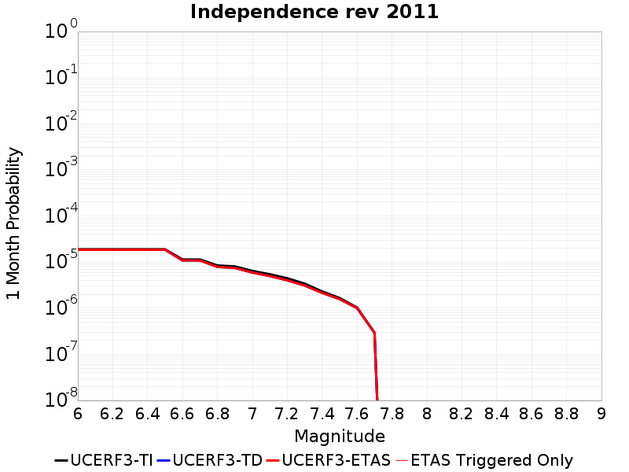 |  |  |

| Magnitude | 1 wk TI Prob | 1 wk TD Prob | 1 wk ETAS Prob | 1 wk ETAS/TD Gain | 1 wk ETAS Triggered Only | 1 mo TI Prob | 1 mo TD Prob | 1 mo ETAS Prob | 1 mo ETAS/TD Gain | 1 mo ETAS Triggered Only | 1 yr TI Prob | 1 yr TD Prob | 1 yr ETAS Prob | 1 yr ETAS/TD Gain | 1 yr ETAS Triggered Only | 10 yr TI Prob | 10 yr TD Prob | 10 yr ETAS Prob | 10 yr ETAS/TD Gain | 10 yr ETAS Triggered Only |
|-----|-----|-----|-----|-----|-----|-----|-----|-----|-----|-----|-----|-----|-----|-----|-----|-----|-----|-----|-----|-----|
| 6.0 | 4.422171E-6 | 4.327082E-6 | 4.327082E-6 | 1.0 | 0.0 | 1.8952025E-5 | 1.854452E-5 | 1.854452E-5 | 1.0 | 0.0 | 2.3071647E-4 | 2.2575914E-4 | 2.3575689E-4 | 1.0442849 | 1.0E-5 | 0.0023047708 | 0.0022555916 | 0.002265569 | 1.0044234 | 1.0E-5 |
| 6.1 | 4.422171E-6 | 4.327082E-6 | 4.327082E-6 | 1.0 | 0.0 | 1.8952025E-5 | 1.854452E-5 | 1.854452E-5 | 1.0 | 0.0 | 2.3071647E-4 | 2.2575914E-4 | 2.3575689E-4 | 1.0442849 | 1.0E-5 | 0.0023047708 | 0.0022555916 | 0.002265569 | 1.0044234 | 1.0E-5 |
| 6.2 | 4.422171E-6 | 4.327082E-6 | 4.327082E-6 | 1.0 | 0.0 | 1.8952025E-5 | 1.854452E-5 | 1.854452E-5 | 1.0 | 0.0 | 2.3071647E-4 | 2.2575914E-4 | 2.3575689E-4 | 1.0442849 | 1.0E-5 | 0.0023047708 | 0.0022555916 | 0.002265569 | 1.0044234 | 1.0E-5 |
| 6.3 | 4.422171E-6 | 4.327082E-6 | 4.327082E-6 | 1.0 | 0.0 | 1.8952025E-5 | 1.854452E-5 | 1.854452E-5 | 1.0 | 0.0 | 2.3071647E-4 | 2.2575914E-4 | 2.3575689E-4 | 1.0442849 | 1.0E-5 | 0.0023047708 | 0.0022555916 | 0.002265569 | 1.0044234 | 1.0E-5 |
| 6.4 | 4.422171E-6 | 4.327082E-6 | 4.327082E-6 | 1.0 | 0.0 | 1.8952025E-5 | 1.854452E-5 | 1.854452E-5 | 1.0 | 0.0 | 2.3071647E-4 | 2.2575914E-4 | 2.3575689E-4 | 1.0442849 | 1.0E-5 | 0.0023047708 | 0.0022555916 | 0.002265569 | 1.0044234 | 1.0E-5 |
| 6.5 | 4.422171E-6 | 4.327082E-6 | 4.327082E-6 | 1.0 | 0.0 | 1.8952025E-5 | 1.854452E-5 | 1.854452E-5 | 1.0 | 0.0 | 2.3071647E-4 | 2.2575914E-4 | 2.3575689E-4 | 1.0442849 | 1.0E-5 | 0.0023047708 | 0.0022555916 | 0.002265569 | 1.0044234 | 1.0E-5 |
| 6.6 | 2.663744E-6 | 2.532614E-6 | 2.532614E-6 | 1.0 | 0.0 | 1.1415996E-5 | 1.0854017E-5 | 1.0854017E-5 | 1.0 | 0.0 | 1.3898089E-4 | 1.3214014E-4 | 1.4213882E-4 | 1.0756673 | 1.0E-5 | 0.0013889399 | 0.001320664 | 0.0013306508 | 1.0075619 | 1.0E-5 |
| 6.7 | 2.663744E-6 | 2.532614E-6 | 2.532614E-6 | 1.0 | 0.0 | 1.1415996E-5 | 1.0854017E-5 | 1.0854017E-5 | 1.0 | 0.0 | 1.3898089E-4 | 1.3214014E-4 | 1.4213882E-4 | 1.0756673 | 1.0E-5 | 0.0013889399 | 0.001320664 | 0.0013306508 | 1.0075619 | 1.0E-5 |
| 6.8 | 1.9716529E-6 | 1.8327958E-6 | 1.8327958E-6 | 1.0 | 0.0 | 8.449913E-6 | 7.854816E-6 | 7.854816E-6 | 1.0 | 0.0 | 1.0287284E-4 | 9.562832E-5 | 1.0562736E-4 | 1.1045616 | 1.0E-5 | 0.0010282523 | 9.558846E-4 | 9.6587505E-4 | 1.0104516 | 1.0E-5 |
| 6.9 | 1.8788617E-6 | 1.7435158E-6 | 1.7435158E-6 | 1.0 | 0.0 | 8.0522395E-6 | 7.4721897E-6 | 7.4721897E-6 | 1.0 | 0.0 | 9.80316E-5 | 9.0970236E-5 | 1.0096932E-4 | 1.1099161 | 1.0E-5 | 9.798837E-4 | 9.09342E-4 | 9.193329E-4 | 1.0109869 | 1.0E-5 |
| 7.0 | 1.5045488E-6 | 1.3853778E-6 | 1.3853778E-6 | 1.0 | 0.0 | 6.44805E-6 | 5.93732E-6 | 5.93732E-6 | 1.0 | 0.0 | 7.8502184E-5 | 7.228453E-5 | 8.2283805E-5 | 1.1383322 | 1.0E-5 | 7.8474457E-4 | 7.2261534E-4 | 7.326081E-4 | 1.0138286 | 1.0E-5 |
| 7.1 | 1.272341E-6 | 1.1628823E-6 | 1.1628823E-6 | 1.0 | 0.0 | 5.4528787E-6 | 4.983772E-6 | 4.983772E-6 | 1.0 | 0.0 | 6.6386776E-5 | 6.0675768E-5 | 7.067516E-5 | 1.1648004 | 1.0E-5 | 6.636695E-4 | 6.0659525E-4 | 6.1658915E-4 | 1.0164754 | 1.0E-5 |
| 7.2 | 1.0416892E-6 | 9.4130866E-7 | 9.4130866E-7 | 1.0 | 0.0 | 4.464375E-6 | 4.034174E-6 | 4.034174E-6 | 1.0 | 0.0 | 5.4352407E-5 | 4.9114977E-5 | 5.9114485E-5 | 1.2035939 | 1.0E-5 | 5.4339116E-4 | 4.910431E-4 | 5.0103816E-4 | 1.0203549 | 1.0E-5 |
| 7.3 | 7.9450155E-7 | 7.237398E-7 | 7.237398E-7 | 1.0 | 0.0 | 3.4050022E-6 | 3.1017382E-6 | 3.1017382E-6 | 1.0 | 0.0 | 4.1455114E-5 | 3.776302E-5 | 4.776264E-5 | 1.2647994 | 1.0E-5 | 4.144738E-4 | 3.7756716E-4 | 3.8756337E-4 | 1.0264753 | 1.0E-5 |
| 7.4 | 5.3893444E-7 | 5.0210053E-7 | 5.0210053E-7 | 1.0 | 0.0 | 2.309717E-6 | 2.1518576E-6 | 2.1518576E-6 | 1.0 | 0.0 | 2.8120441E-5 | 2.6198557E-5 | 3.6198297E-5 | 1.3816904 | 1.0E-5 | 2.8116882E-4 | 2.6195514E-4 | 2.719525E-4 | 1.0381645 | 1.0E-5 |
| 7.5 | 3.8852085E-7 | 3.683532E-7 | 3.683532E-7 | 1.0 | 0.0 | 1.6650882E-6 | 1.5786557E-6 | 1.5786557E-6 | 1.0 | 0.0 | 2.027226E-5 | 1.9219966E-5 | 2.9219773E-5 | 1.5202823 | 1.0E-5 | 2.0270412E-4 | 1.9218324E-4 | 2.0218133E-4 | 1.0520236 | 1.0E-5 |
| 7.6 | 2.414929E-7 | 2.3462657E-7 | 2.3462657E-7 | 1.0 | 0.0 | 1.0349692E-6 | 1.005542E-6 | 1.005542E-6 | 1.0 | 0.0 | 1.2600677E-5 | 1.2242407E-5 | 1.2242407E-5 | 1.0 | 0.0 | 1.2599962E-4 | 1.2241745E-4 | 1.2241745E-4 | 1.0 | 0.0 |
| 7.7 | 6.8298014E-8 | 6.860045E-8 | 6.860045E-8 | 1.0 | 0.0 | 2.9270575E-7 | 2.940019E-7 | 2.940019E-7 | 1.0 | 0.0 | 3.5636867E-6 | 3.5794678E-6 | 3.5794678E-6 | 1.0 | 0.0 | 3.5636294E-5 | 3.579415E-5 | 3.579415E-5 | 1.0 | 0.0 |

## Mad River (alt1)
*[(top)](#table-of-contents)*

| 1 Week | 1 Month | 1 Year | 10 Year |
|-----|-----|-----|-----|
| 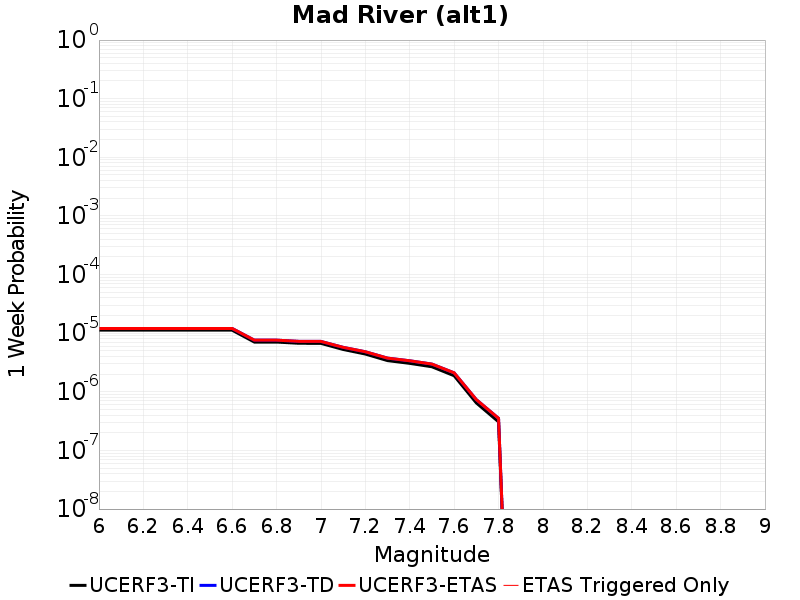 | 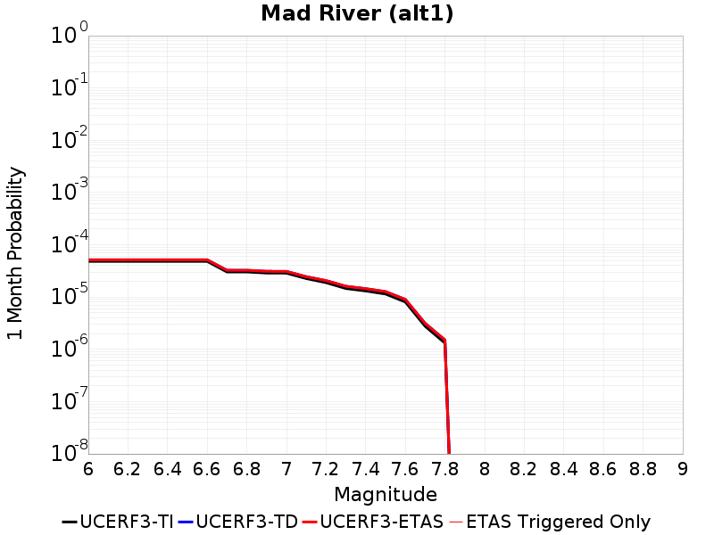 | 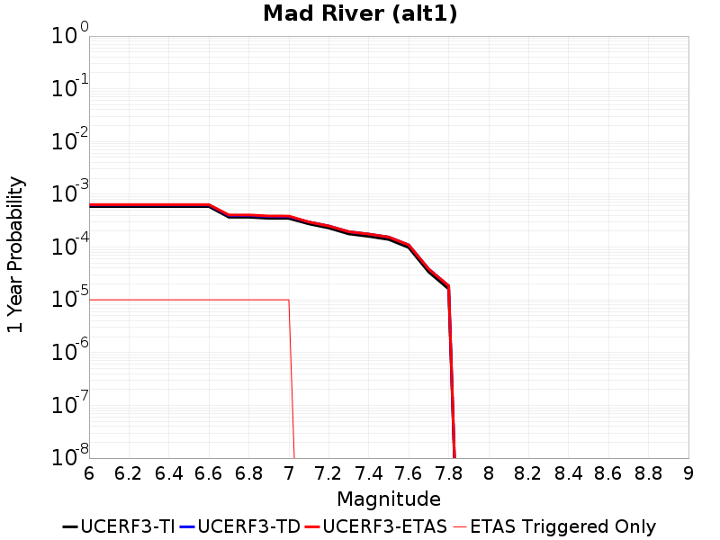 | 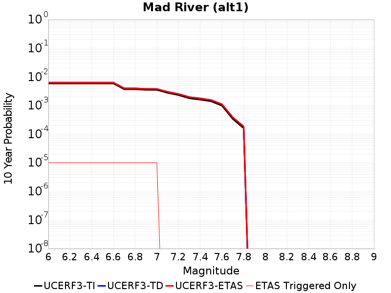 |

| Magnitude | 1 wk TI Prob | 1 wk TD Prob | 1 wk ETAS Prob | 1 wk ETAS/TD Gain | 1 wk ETAS Triggered Only | 1 mo TI Prob | 1 mo TD Prob | 1 mo ETAS Prob | 1 mo ETAS/TD Gain | 1 mo ETAS Triggered Only | 1 yr TI Prob | 1 yr TD Prob | 1 yr ETAS Prob | 1 yr ETAS/TD Gain | 1 yr ETAS Triggered Only | 10 yr TI Prob | 10 yr TD Prob | 10 yr ETAS Prob | 10 yr ETAS/TD Gain | 10 yr ETAS Triggered Only |
|-----|-----|-----|-----|-----|-----|-----|-----|-----|-----|-----|-----|-----|-----|-----|-----|-----|-----|-----|-----|-----|
| 6.0 | 1.1255216E-5 | 1.2044925E-5 | 1.2044925E-5 | 1.0 | 0.0 | 4.8235746E-5 | 5.1620165E-5 | 5.1620165E-5 | 1.0 | 0.0 | 5.87112E-4 | 6.2830874E-4 | 6.383025E-4 | 1.0159057 | 1.0E-5 | 0.0058556325 | 0.006266763 | 0.0062767 | 1.0015857 | 1.0E-5 |
| 6.1 | 1.1255216E-5 | 1.2044925E-5 | 1.2044925E-5 | 1.0 | 0.0 | 4.8235746E-5 | 5.1620165E-5 | 5.1620165E-5 | 1.0 | 0.0 | 5.87112E-4 | 6.2830874E-4 | 6.383025E-4 | 1.0159057 | 1.0E-5 | 0.0058556325 | 0.006266763 | 0.0062767 | 1.0015857 | 1.0E-5 |
| 6.2 | 1.1255216E-5 | 1.2044925E-5 | 1.2044925E-5 | 1.0 | 0.0 | 4.8235746E-5 | 5.1620165E-5 | 5.1620165E-5 | 1.0 | 0.0 | 5.87112E-4 | 6.2830874E-4 | 6.383025E-4 | 1.0159057 | 1.0E-5 | 0.0058556325 | 0.006266763 | 0.0062767 | 1.0015857 | 1.0E-5 |
| 6.3 | 1.1255216E-5 | 1.2044925E-5 | 1.2044925E-5 | 1.0 | 0.0 | 4.8235746E-5 | 5.1620165E-5 | 5.1620165E-5 | 1.0 | 0.0 | 5.87112E-4 | 6.2830874E-4 | 6.383025E-4 | 1.0159057 | 1.0E-5 | 0.0058556325 | 0.006266763 | 0.0062767 | 1.0015857 | 1.0E-5 |
| 6.4 | 1.1255216E-5 | 1.2044925E-5 | 1.2044925E-5 | 1.0 | 0.0 | 4.8235746E-5 | 5.1620165E-5 | 5.1620165E-5 | 1.0 | 0.0 | 5.87112E-4 | 6.2830874E-4 | 6.383025E-4 | 1.0159057 | 1.0E-5 | 0.0058556325 | 0.006266763 | 0.0062767 | 1.0015857 | 1.0E-5 |
| 6.5 | 1.1255216E-5 | 1.2044925E-5 | 1.2044925E-5 | 1.0 | 0.0 | 4.8235746E-5 | 5.1620165E-5 | 5.1620165E-5 | 1.0 | 0.0 | 5.87112E-4 | 6.2830874E-4 | 6.383025E-4 | 1.0159057 | 1.0E-5 | 0.0058556325 | 0.006266763 | 0.0062767 | 1.0015857 | 1.0E-5 |
| 6.6 | 1.1255216E-5 | 1.2044925E-5 | 1.2044925E-5 | 1.0 | 0.0 | 4.8235746E-5 | 5.1620165E-5 | 5.1620165E-5 | 1.0 | 0.0 | 5.87112E-4 | 6.2830874E-4 | 6.383025E-4 | 1.0159057 | 1.0E-5 | 0.0058556325 | 0.006266763 | 0.0062767 | 1.0015857 | 1.0E-5 |
| 6.7 | 7.0564884E-6 | 7.6091533E-6 | 7.6091533E-6 | 1.0 | 0.0 | 3.0241743E-5 | 3.2610264E-5 | 3.2610264E-5 | 1.0 | 0.0 | 3.68131E-4 | 3.969598E-4 | 4.0695583E-4 | 1.0251814 | 1.0E-5 | 0.0036752177 | 0.0039627296 | 0.00397269 | 1.0025135 | 1.0E-5 |
| 6.8 | 7.0564884E-6 | 7.6091533E-6 | 7.6091533E-6 | 1.0 | 0.0 | 3.0241743E-5 | 3.2610264E-5 | 3.2610264E-5 | 1.0 | 0.0 | 3.68131E-4 | 3.969598E-4 | 4.0695583E-4 | 1.0251814 | 1.0E-5 | 0.0036752177 | 0.0039627296 | 0.00397269 | 1.0025135 | 1.0E-5 |
| 6.9 | 6.727494E-6 | 7.2608796E-6 | 7.2608796E-6 | 1.0 | 0.0 | 2.8831799E-5 | 3.1117695E-5 | 3.1117695E-5 | 1.0 | 0.0 | 3.509706E-4 | 3.787942E-4 | 3.8879045E-4 | 1.0263896 | 1.0E-5 | 0.003504168 | 0.0037817012 | 0.0037916636 | 1.0026343 | 1.0E-5 |
| 7.0 | 6.7021124E-6 | 7.233708E-6 | 7.233708E-6 | 1.0 | 0.0 | 2.8723021E-5 | 3.1001247E-5 | 3.1001247E-5 | 1.0 | 0.0 | 3.4964667E-4 | 3.7737697E-4 | 3.873732E-4 | 1.0264887 | 1.0E-5 | 0.0034909705 | 0.0037675768 | 0.0037775391 | 1.0026442 | 1.0E-5 |
| 7.1 | 5.2784667E-6 | 5.7353373E-6 | 5.7353373E-6 | 1.0 | 0.0 | 2.2621804E-5 | 2.4579791E-5 | 2.4579791E-5 | 1.0 | 0.0 | 2.7538565E-4 | 2.9921878E-4 | 2.9921878E-4 | 1.0 | 0.0 | 0.0027504463 | 0.0029882512 | 0.0029882512 | 1.0 | 0.0 |
| 7.2 | 4.4085446E-6 | 4.8223656E-6 | 4.8223656E-6 | 1.0 | 0.0 | 1.8893625E-5 | 2.066712E-5 | 2.066712E-5 | 1.0 | 0.0 | 2.3000561E-4 | 2.515935E-4 | 2.515935E-4 | 1.0 | 0.0 | 0.0022976769 | 0.0025131276 | 0.0025131276 | 1.0 | 0.0 |
| 7.3 | 3.4060627E-6 | 3.7555697E-6 | 3.7555697E-6 | 1.0 | 0.0 | 1.459733E-5 | 1.60952E-5 | 1.60952E-5 | 1.0 | 0.0 | 1.77708E-4 | 1.9594168E-4 | 1.9594168E-4 | 1.0 | 0.0 | 0.0017756595 | 0.0019577127 | 0.0019577127 | 1.0 | 0.0 |
| 7.4 | 3.0570902E-6 | 3.3825322E-6 | 3.3825322E-6 | 1.0 | 0.0 | 1.310175E-5 | 1.4496488E-5 | 1.4496488E-5 | 1.0 | 0.0 | 1.5950213E-4 | 1.7648065E-4 | 1.7648065E-4 | 1.0 | 0.0 | 0.0015938769 | 0.0017634267 | 0.0017634267 | 1.0 | 0.0 |
| 7.5 | 2.674048E-6 | 2.971316E-6 | 2.971316E-6 | 1.0 | 0.0 | 1.1460155E-5 | 1.2734151E-5 | 1.2734151E-5 | 1.0 | 0.0 | 1.3951845E-4 | 1.5502745E-4 | 1.5502745E-4 | 1.0 | 0.0 | 0.0013943089 | 0.0015492127 | 0.0015492127 | 1.0 | 0.0 |
| 7.6 | 1.8806261E-6 | 2.10617E-6 | 2.10617E-6 | 1.0 | 0.0 | 8.059801E-6 | 9.026413E-6 | 9.026413E-6 | 1.0 | 0.0 | 9.812366E-5 | 1.0989116E-4 | 1.0989116E-4 | 1.0 | 0.0 | 9.808034E-4 | 0.0010983807 | 0.0010983807 | 1.0 | 0.0 |
| 7.7 | 6.461283E-7 | 7.3470073E-7 | 7.3470073E-7 | 1.0 | 0.0 | 2.7691183E-6 | 3.1487136E-6 | 3.1487136E-6 | 1.0 | 0.0 | 3.371349E-5 | 3.833493E-5 | 3.833493E-5 | 1.0 | 0.0 | 3.370838E-4 | 3.832847E-4 | 3.832847E-4 | 1.0 | 0.0 |
| 7.8 | 3.0785324E-7 | 3.5322145E-7 | 3.5322145E-7 | 1.0 | 0.0 | 1.3193703E-6 | 1.5138054E-6 | 1.5138054E-6 | 1.0 | 0.0 | 1.6063215E-5 | 1.843043E-5 | 1.843043E-5 | 1.0 | 0.0 | 1.6062055E-4 | 1.8428966E-4 | 1.8428966E-4 | 1.0 | 0.0 |

## Rinconada 2011 CFM
*[(top)](#table-of-contents)*

| 1 Week | 1 Month | 1 Year | 10 Year |
|-----|-----|-----|-----|
|  |  |  | 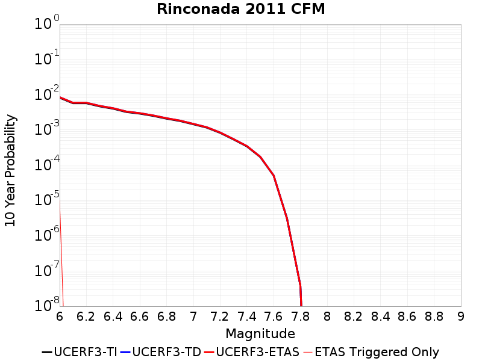 |

| Magnitude | 1 wk TI Prob | 1 wk TD Prob | 1 wk ETAS Prob | 1 wk ETAS/TD Gain | 1 wk ETAS Triggered Only | 1 mo TI Prob | 1 mo TD Prob | 1 mo ETAS Prob | 1 mo ETAS/TD Gain | 1 mo ETAS Triggered Only | 1 yr TI Prob | 1 yr TD Prob | 1 yr ETAS Prob | 1 yr ETAS/TD Gain | 1 yr ETAS Triggered Only | 10 yr TI Prob | 10 yr TD Prob | 10 yr ETAS Prob | 10 yr ETAS/TD Gain | 10 yr ETAS Triggered Only |
|-----|-----|-----|-----|-----|-----|-----|-----|-----|-----|-----|-----|-----|-----|-----|-----|-----|-----|-----|-----|-----|
| 6.0 | 1.5752368E-5 | 1.6278083E-5 | 1.6278083E-5 | 1.0 | 0.0 | 6.75084E-5 | 6.9761365E-5 | 6.9761365E-5 | 1.0 | 0.0 | 8.2160486E-4 | 8.490168E-4 | 8.490168E-4 | 1.0 | 0.0 | 0.008185739 | 0.008458112 | 0.008468028 | 1.0011723 | 1.0E-5 |
| 6.1 | 1.0966133E-5 | 1.1325334E-5 | 1.1325334E-5 | 1.0 | 0.0 | 4.6996865E-5 | 4.8536243E-5 | 4.8536243E-5 | 1.0 | 0.0 | 5.720366E-4 | 5.907693E-4 | 5.907693E-4 | 1.0 | 0.0 | 0.0057056635 | 0.005892084 | 0.005892084 | 1.0 | 0.0 |
| 6.2 | 1.0966133E-5 | 1.1325334E-5 | 1.1325334E-5 | 1.0 | 0.0 | 4.6996865E-5 | 4.8536243E-5 | 4.8536243E-5 | 1.0 | 0.0 | 5.720366E-4 | 5.907693E-4 | 5.907693E-4 | 1.0 | 0.0 | 0.0057056635 | 0.005892084 | 0.005892084 | 1.0 | 0.0 |
| 6.3 | 8.926149E-6 | 9.214625E-6 | 9.214625E-6 | 1.0 | 0.0 | 3.8254362E-5 | 3.9490653E-5 | 3.9490653E-5 | 1.0 | 0.0 | 4.6564735E-4 | 4.8069292E-4 | 4.8069292E-4 | 1.0 | 0.0 | 0.0046467283 | 0.0047965767 | 0.0047965767 | 1.0 | 0.0 |
| 6.4 | 7.676955E-6 | 7.921764E-6 | 7.921764E-6 | 1.0 | 0.0 | 3.290082E-5 | 3.394998E-5 | 3.394998E-5 | 1.0 | 0.0 | 4.0049385E-4 | 4.1326278E-4 | 4.1326278E-4 | 1.0 | 0.0 | 0.0039977287 | 0.004124969 | 0.004124969 | 1.0 | 0.0 |
| 6.5 | 6.1671026E-6 | 6.3601988E-6 | 6.3601988E-6 | 1.0 | 0.0 | 2.6430173E-5 | 2.7257709E-5 | 2.7257709E-5 | 1.0 | 0.0 | 3.2173982E-4 | 3.3181216E-4 | 3.3181216E-4 | 1.0 | 0.0 | 0.003212744 | 0.0033131794 | 0.0033131794 | 1.0 | 0.0 |
| 6.6 | 5.553456E-6 | 5.7259244E-6 | 5.7259244E-6 | 1.0 | 0.0 | 2.3800309E-5 | 2.4539446E-5 | 2.4539446E-5 | 1.0 | 0.0 | 2.897302E-4 | 2.9872684E-4 | 2.9872684E-4 | 1.0 | 0.0 | 0.0028935277 | 0.0029832616 | 0.0029832616 | 1.0 | 0.0 |
| 6.7 | 4.787857E-6 | 4.934255E-6 | 4.934255E-6 | 1.0 | 0.0 | 2.0519226E-5 | 2.1146636E-5 | 2.1146636E-5 | 1.0 | 0.0 | 2.4979294E-4 | 2.574299E-4 | 2.574299E-4 | 1.0 | 0.0 | 0.0024951235 | 0.0025713227 | 0.0025713227 | 1.0 | 0.0 |
| 6.8 | 3.9955166E-6 | 4.1142443E-6 | 4.1142443E-6 | 1.0 | 0.0 | 1.7123532E-5 | 1.7632357E-5 | 1.7632357E-5 | 1.0 | 0.0 | 2.0845905E-4 | 2.1465283E-4 | 2.1465283E-4 | 1.0 | 0.0 | 0.002082636 | 0.0021444585 | 0.0021444585 | 1.0 | 0.0 |
| 6.9 | 3.4250072E-6 | 3.5230821E-6 | 3.5230821E-6 | 1.0 | 0.0 | 1.46785205E-5 | 1.5098836E-5 | 1.5098836E-5 | 1.0 | 0.0 | 1.7869633E-4 | 1.8381284E-4 | 1.8381284E-4 | 1.0 | 0.0 | 0.001785527 | 0.0018366105 | 0.0018366105 | 1.0 | 0.0 |
| 7.0 | 2.7712713E-6 | 2.847194E-6 | 2.847194E-6 | 1.0 | 0.0 | 1.1876823E-5 | 1.2202203E-5 | 1.2202203E-5 | 1.0 | 0.0 | 1.4459073E-4 | 1.4855171E-4 | 1.4855171E-4 | 1.0 | 0.0 | 0.0014449668 | 0.0014845256 | 0.0014845256 | 1.0 | 0.0 |
| 7.1 | 2.227358E-6 | 2.286083E-6 | 2.286083E-6 | 1.0 | 0.0 | 9.545785E-6 | 9.797462E-6 | 9.797462E-6 | 1.0 | 0.0 | 1.16213734E-4 | 1.1927757E-4 | 1.1927757E-4 | 1.0 | 0.0 | 0.0011615298 | 0.0011921366 | 0.0011921366 | 1.0 | 0.0 |
| 7.2 | 1.581796E-6 | 1.6211621E-6 | 1.6211621E-6 | 1.0 | 0.0 | 6.779108E-6 | 6.947819E-6 | 6.947819E-6 | 1.0 | 0.0 | 8.253252E-5 | 8.458642E-5 | 8.458642E-5 | 1.0 | 0.0 | 8.250187E-4 | 8.455428E-4 | 8.455428E-4 | 1.0 | 0.0 |
| 7.3 | 1.0306567E-6 | 1.0548118E-6 | 1.0548118E-6 | 1.0 | 0.0 | 4.4170924E-6 | 4.5206143E-6 | 4.5206143E-6 | 1.0 | 0.0 | 5.3776774E-5 | 5.5037093E-5 | 5.5037093E-5 | 1.0 | 0.0 | 5.376376E-4 | 5.5023486E-4 | 5.5023486E-4 | 1.0 | 0.0 |
| 7.4 | 6.535541E-7 | 6.6837924E-7 | 6.6837924E-7 | 1.0 | 0.0 | 2.800943E-6 | 2.8644793E-6 | 2.8644793E-6 | 1.0 | 0.0 | 3.4100947E-5 | 3.487448E-5 | 3.487448E-5 | 1.0 | 0.0 | 3.4095717E-4 | 3.486902E-4 | 3.486902E-4 | 1.0 | 0.0 |
| 7.5 | 3.2656962E-7 | 3.3322016E-7 | 3.3322016E-7 | 1.0 | 0.0 | 1.3995833E-6 | 1.4280856E-6 | 1.4280856E-6 | 1.0 | 0.0 | 1.7039794E-5 | 1.7386805E-5 | 1.7386805E-5 | 1.0 | 0.0 | 1.7038487E-4 | 1.7385448E-4 | 1.7385448E-4 | 1.0 | 0.0 |
| 7.6 | 9.754343E-8 | 9.822533E-8 | 9.822533E-8 | 1.0 | 0.0 | 4.180432E-7 | 4.209656E-7 | 4.209656E-7 | 1.0 | 0.0 | 5.089664E-6 | 5.125244E-6 | 5.125244E-6 | 1.0 | 0.0 | 5.0895473E-5 | 5.125127E-5 | 5.125127E-5 | 1.0 | 0.0 |
| 7.7 | 6.0001453E-9 | 5.850215E-9 | 5.850215E-9 | 1.0 | 0.0 | 2.5714908E-8 | 2.507235E-8 | 2.507235E-8 | 1.0 | 0.0 | 3.1307894E-7 | 3.052558E-7 | 3.052558E-7 | 1.0 | 0.0 | 3.1307852E-6 | 3.0525541E-6 | 3.0525541E-6 | 1.0 | 0.0 |
| 7.8 | 7.400003E-11 | 7.465861E-11 | 7.465861E-11 | 1.0 | 0.0 | 3.171432E-10 | 3.1996528E-10 | 3.1996528E-10 | 1.0 | 0.0 | 3.861218E-9 | 3.895577E-9 | 3.895577E-9 | 1.0 | 0.0 | 3.861218E-8 | 3.8955772E-8 | 3.8955772E-8 | 1.0 | 0.0 |

## San Jacinto (Lytle Creek connector)
*[(top)](#table-of-contents)*

| 1 Week | 1 Month | 1 Year | 10 Year |
|-----|-----|-----|-----|
|  |  | 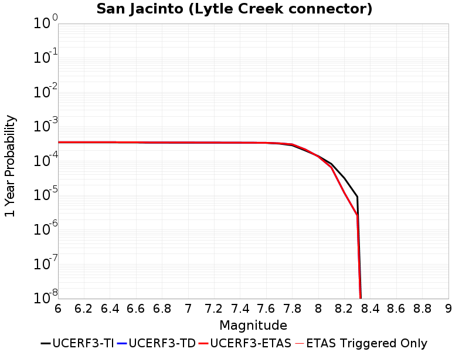 |  |

| Magnitude | 1 wk TI Prob | 1 wk TD Prob | 1 wk ETAS Prob | 1 wk ETAS/TD Gain | 1 wk ETAS Triggered Only | 1 mo TI Prob | 1 mo TD Prob | 1 mo ETAS Prob | 1 mo ETAS/TD Gain | 1 mo ETAS Triggered Only | 1 yr TI Prob | 1 yr TD Prob | 1 yr ETAS Prob | 1 yr ETAS/TD Gain | 1 yr ETAS Triggered Only | 10 yr TI Prob | 10 yr TD Prob | 10 yr ETAS Prob | 10 yr ETAS/TD Gain | 10 yr ETAS Triggered Only |
|-----|-----|-----|-----|-----|-----|-----|-----|-----|-----|-----|-----|-----|-----|-----|-----|-----|-----|-----|-----|-----|
| 6.0 | 6.693995E-6 | 6.7881215E-6 | 6.7881215E-6 | 1.0 | 0.0 | 2.8688235E-5 | 2.9091625E-5 | 2.9091625E-5 | 1.0 | 0.0 | 3.492233E-4 | 3.5413305E-4 | 3.5413305E-4 | 1.0 | 0.0 | 0.00348675 | 0.0036156522 | 0.003625616 | 1.0027558 | 1.0E-5 |
| 6.1 | 6.693995E-6 | 6.7881215E-6 | 6.7881215E-6 | 1.0 | 0.0 | 2.8688235E-5 | 2.9091625E-5 | 2.9091625E-5 | 1.0 | 0.0 | 3.492233E-4 | 3.5413305E-4 | 3.5413305E-4 | 1.0 | 0.0 | 0.00348675 | 0.0036156522 | 0.003625616 | 1.0027558 | 1.0E-5 |
| 6.2 | 6.693995E-6 | 6.7881215E-6 | 6.7881215E-6 | 1.0 | 0.0 | 2.8688235E-5 | 2.9091625E-5 | 2.9091625E-5 | 1.0 | 0.0 | 3.492233E-4 | 3.5413305E-4 | 3.5413305E-4 | 1.0 | 0.0 | 0.00348675 | 0.0036156522 | 0.003625616 | 1.0027558 | 1.0E-5 |
| 6.3 | 6.693995E-6 | 6.7881215E-6 | 6.7881215E-6 | 1.0 | 0.0 | 2.8688235E-5 | 2.9091625E-5 | 2.9091625E-5 | 1.0 | 0.0 | 3.492233E-4 | 3.5413305E-4 | 3.5413305E-4 | 1.0 | 0.0 | 0.00348675 | 0.0036156522 | 0.003625616 | 1.0027558 | 1.0E-5 |
| 6.4 | 6.693995E-6 | 6.7881215E-6 | 6.7881215E-6 | 1.0 | 0.0 | 2.8688235E-5 | 2.9091625E-5 | 2.9091625E-5 | 1.0 | 0.0 | 3.492233E-4 | 3.5413305E-4 | 3.5413305E-4 | 1.0 | 0.0 | 0.00348675 | 0.0036156522 | 0.003625616 | 1.0027558 | 1.0E-5 |
| 6.5 | 6.6561875E-6 | 6.7483265E-6 | 6.7483265E-6 | 1.0 | 0.0 | 2.8526205E-5 | 2.8921078E-5 | 2.8921078E-5 | 1.0 | 0.0 | 3.472512E-4 | 3.5205734E-4 | 3.5205734E-4 | 1.0 | 0.0 | 0.0034670907 | 0.0035949624 | 0.0036049264 | 1.0027716 | 1.0E-5 |
| 6.6 | 6.6561875E-6 | 6.7483265E-6 | 6.7483265E-6 | 1.0 | 0.0 | 2.8526205E-5 | 2.8921078E-5 | 2.8921078E-5 | 1.0 | 0.0 | 3.472512E-4 | 3.5205734E-4 | 3.5205734E-4 | 1.0 | 0.0 | 0.0034670907 | 0.0035949624 | 0.0036049264 | 1.0027716 | 1.0E-5 |
| 6.7 | 6.5802237E-6 | 6.667473E-6 | 6.667473E-6 | 1.0 | 0.0 | 2.8200653E-5 | 2.8574572E-5 | 2.8574572E-5 | 1.0 | 0.0 | 3.4328885E-4 | 3.4783996E-4 | 3.4783996E-4 | 1.0 | 0.0 | 0.0034275902 | 0.0035529237 | 0.0035628884 | 1.0028046 | 1.0E-5 |
| 6.8 | 6.575632E-6 | 6.6619555E-6 | 6.6619555E-6 | 1.0 | 0.0 | 2.8180975E-5 | 2.8550925E-5 | 2.8550925E-5 | 1.0 | 0.0 | 3.4304935E-4 | 3.4755215E-4 | 3.4755215E-4 | 1.0 | 0.0 | 0.0034252026 | 0.003550055 | 0.0035600194 | 1.0028069 | 1.0E-5 |
| 6.9 | 6.570433E-6 | 6.653331E-6 | 6.653331E-6 | 1.0 | 0.0 | 2.8158694E-5 | 2.8513965E-5 | 2.8513965E-5 | 1.0 | 0.0 | 3.4277816E-4 | 3.471023E-4 | 3.471023E-4 | 1.0 | 0.0 | 0.0034224992 | 0.003545571 | 0.0035555356 | 1.0028105 | 1.0E-5 |
| 7.0 | 6.5643826E-6 | 6.643431E-6 | 6.643431E-6 | 1.0 | 0.0 | 2.8132765E-5 | 2.8471535E-5 | 2.8471535E-5 | 1.0 | 0.0 | 3.424626E-4 | 3.4658588E-4 | 3.4658588E-4 | 1.0 | 0.0 | 0.0034193532 | 0.0035404232 | 0.003550388 | 1.0028145 | 1.0E-5 |
| 7.1 | 6.557402E-6 | 6.632121E-6 | 6.632121E-6 | 1.0 | 0.0 | 2.8102848E-5 | 2.8423065E-5 | 2.8423065E-5 | 1.0 | 0.0 | 3.4209844E-4 | 3.4599594E-4 | 3.4599594E-4 | 1.0 | 0.0 | 0.0034157229 | 0.0035345436 | 0.0035445082 | 1.0028192 | 1.0E-5 |
| 7.2 | 6.546394E-6 | 6.6140447E-6 | 6.6140447E-6 | 1.0 | 0.0 | 2.8055672E-5 | 2.8345597E-5 | 2.8345597E-5 | 1.0 | 0.0 | 3.4152428E-4 | 3.4505306E-4 | 3.4505306E-4 | 1.0 | 0.0 | 0.0034099987 | 0.0035251498 | 0.0035351145 | 1.0028268 | 1.0E-5 |
| 7.3 | 6.5364216E-6 | 6.5947484E-6 | 6.5947484E-6 | 1.0 | 0.0 | 2.8012933E-5 | 2.8262903E-5 | 2.8262903E-5 | 1.0 | 0.0 | 3.4100408E-4 | 3.4404657E-4 | 3.4404657E-4 | 1.0 | 0.0 | 0.003404813 | 0.0035151325 | 0.0035250972 | 1.0028348 | 1.0E-5 |
| 7.4 | 6.5269523E-6 | 6.575743E-6 | 6.575743E-6 | 1.0 | 0.0 | 2.7972354E-5 | 2.8181452E-5 | 2.8181452E-5 | 1.0 | 0.0 | 3.4051016E-4 | 3.4305523E-4 | 3.4305523E-4 | 1.0 | 0.0 | 0.0033998888 | 0.0035052495 | 0.0035152144 | 1.0028429 | 1.0E-5 |
| 7.5 | 6.5111835E-6 | 6.551918E-6 | 6.551918E-6 | 1.0 | 0.0 | 2.7904773E-5 | 2.8079347E-5 | 2.8079347E-5 | 1.0 | 0.0 | 3.3968766E-4 | 3.418125E-4 | 3.418125E-4 | 1.0 | 0.0 | 0.0033916887 | 0.0034928753 | 0.0035028404 | 1.0028529 | 1.0E-5 |
| 7.6 | 6.4768806E-6 | 6.510872E-6 | 6.510872E-6 | 1.0 | 0.0 | 2.7757764E-5 | 2.790344E-5 | 2.790344E-5 | 1.0 | 0.0 | 3.3789838E-4 | 3.3967147E-4 | 3.3967147E-4 | 1.0 | 0.0 | 0.0033738504 | 0.0034715317 | 0.003481497 | 1.0028706 | 1.0E-5 |
| 7.7 | 6.1655364E-6 | 6.302346E-6 | 6.302346E-6 | 1.0 | 0.0 | 2.642346E-5 | 2.7009773E-5 | 2.7009773E-5 | 1.0 | 0.0 | 3.2165812E-4 | 3.2879444E-4 | 3.2879444E-4 | 1.0 | 0.0 | 0.0032119295 | 0.0033626487 | 0.003372615 | 1.0029639 | 1.0E-5 |
| 7.8 | 5.5043524E-6 | 5.8597075E-6 | 5.8597075E-6 | 1.0 | 0.0 | 2.3589868E-5 | 2.511279E-5 | 2.511279E-5 | 1.0 | 0.0 | 2.871688E-4 | 3.0570538E-4 | 3.0570538E-4 | 1.0 | 0.0 | 0.0028679797 | 0.0031308525 | 0.0031408214 | 1.003184 | 1.0E-5 |
| 7.9 | 3.889249E-6 | 4.176384E-6 | 4.176384E-6 | 1.0 | 0.0 | 1.6668104E-5 | 1.7898667E-5 | 1.7898667E-5 | 1.0 | 0.0 | 2.0291525E-4 | 2.1789451E-4 | 2.1789451E-4 | 1.0 | 0.0 | 0.0020273007 | 0.0022463568 | 0.0022563343 | 1.0044416 | 1.0E-5 |
| 8.0 | 2.668535E-6 | 2.6003556E-6 | 2.6003556E-6 | 1.0 | 0.0 | 1.1436528E-5 | 1.1144333E-5 | 1.1144333E-5 | 1.0 | 0.0 | 1.3923083E-4 | 1.3567384E-4 | 1.3567384E-4 | 1.0 | 0.0 | 0.0013914363 | 0.0014122499 | 0.0014222357 | 1.0070709 | 1.0E-5 |
| 8.1 | 1.5911459E-6 | 1.2553121E-6 | 1.2553121E-6 | 1.0 | 0.0 | 6.8191785E-6 | 5.3798976E-6 | 5.3798976E-6 | 1.0 | 0.0 | 8.3020335E-5 | 6.549831E-5 | 6.549831E-5 | 1.0 | 0.0 | 8.298933E-4 | 6.8903755E-4 | 6.9903064E-4 | 1.014503 | 1.0E-5 |
| 8.2 | 6.1294963E-7 | 2.2901226E-7 | 2.2901226E-7 | 1.0 | 0.0 | 2.6269242E-6 | 9.814808E-7 | 9.814808E-7 | 1.0 | 0.0 | 3.1982334E-5 | 1.19494625E-5 | 1.19494625E-5 | 1.0 | 0.0 | 3.1977732E-4 | 1.3396716E-4 | 1.3396716E-4 | 1.0 | 0.0 |
| 8.3 | 1.762871E-7 | 5.028352E-8 | 5.028352E-8 | 1.0 | 0.0 | 7.5551594E-7 | 2.1550079E-7 | 2.1550079E-7 | 1.0 | 0.0 | 9.1983675E-6 | 2.623719E-6 | 2.623719E-6 | 1.0 | 0.0 | 9.197987E-5 | 3.0256875E-5 | 3.0256875E-5 | 1.0 | 0.0 |

## Great Valley 08 (Quinto)
*[(top)](#table-of-contents)*

| 1 Week | 1 Month | 1 Year | 10 Year |
|-----|-----|-----|-----|
| 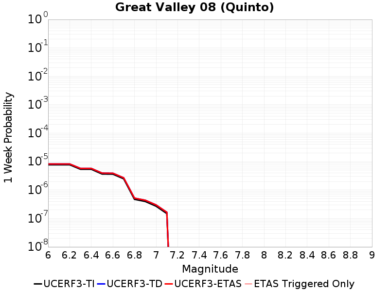 | 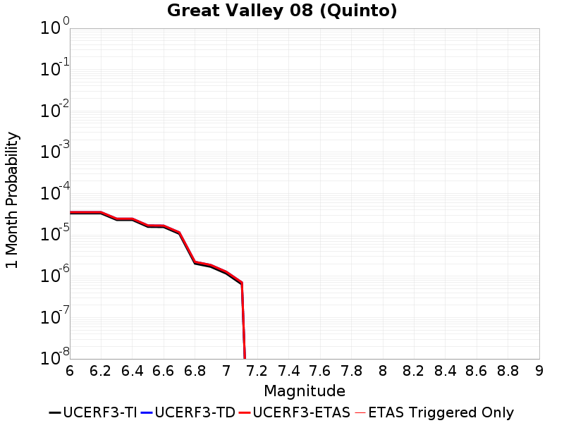 | 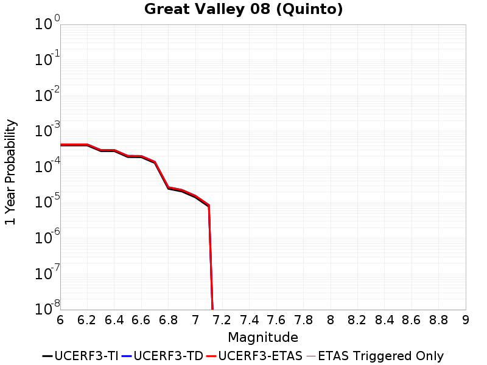 | 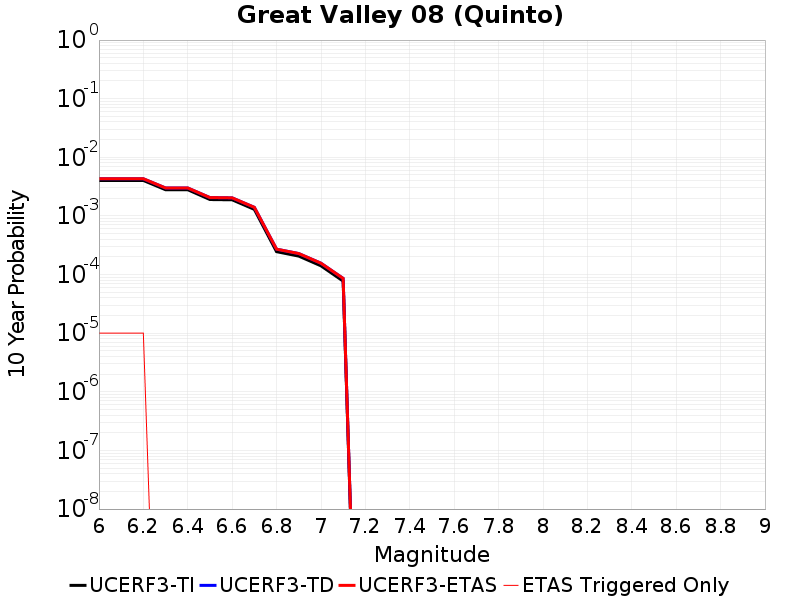 |

| Magnitude | 1 wk TI Prob | 1 wk TD Prob | 1 wk ETAS Prob | 1 wk ETAS/TD Gain | 1 wk ETAS Triggered Only | 1 mo TI Prob | 1 mo TD Prob | 1 mo ETAS Prob | 1 mo ETAS/TD Gain | 1 mo ETAS Triggered Only | 1 yr TI Prob | 1 yr TD Prob | 1 yr ETAS Prob | 1 yr ETAS/TD Gain | 1 yr ETAS Triggered Only | 10 yr TI Prob | 10 yr TD Prob | 10 yr ETAS Prob | 10 yr ETAS/TD Gain | 10 yr ETAS Triggered Only |
|-----|-----|-----|-----|-----|-----|-----|-----|-----|-----|-----|-----|-----|-----|-----|-----|-----|-----|-----|-----|-----|
| 6.0 | 7.737697E-6 | 8.256461E-6 | 8.256461E-6 | 1.0 | 0.0 | 3.3161137E-5 | 3.5384463E-5 | 3.5384463E-5 | 1.0 | 0.0 | 4.0366207E-4 | 4.307395E-4 | 4.307395E-4 | 1.0 | 0.0 | 0.004029296 | 0.0043009007 | 0.004310858 | 1.002315 | 1.0E-5 |
| 6.1 | 7.737697E-6 | 8.256461E-6 | 8.256461E-6 | 1.0 | 0.0 | 3.3161137E-5 | 3.5384463E-5 | 3.5384463E-5 | 1.0 | 0.0 | 4.0366207E-4 | 4.307395E-4 | 4.307395E-4 | 1.0 | 0.0 | 0.004029296 | 0.0043009007 | 0.004310858 | 1.002315 | 1.0E-5 |
| 6.2 | 7.737697E-6 | 8.256461E-6 | 8.256461E-6 | 1.0 | 0.0 | 3.3161137E-5 | 3.5384463E-5 | 3.5384463E-5 | 1.0 | 0.0 | 4.0366207E-4 | 4.307395E-4 | 4.307395E-4 | 1.0 | 0.0 | 0.004029296 | 0.0043009007 | 0.004310858 | 1.002315 | 1.0E-5 |
| 6.3 | 5.374012E-6 | 5.753084E-6 | 5.753084E-6 | 1.0 | 0.0 | 2.3031276E-5 | 2.4655905E-5 | 2.4655905E-5 | 1.0 | 0.0 | 2.803697E-4 | 3.0015546E-4 | 3.0015546E-4 | 1.0 | 0.0 | 0.0028001624 | 0.0029985947 | 0.0029985947 | 1.0 | 0.0 |
| 6.4 | 5.374012E-6 | 5.753084E-6 | 5.753084E-6 | 1.0 | 0.0 | 2.3031276E-5 | 2.4655905E-5 | 2.4655905E-5 | 1.0 | 0.0 | 2.803697E-4 | 3.0015546E-4 | 3.0015546E-4 | 1.0 | 0.0 | 0.0028001624 | 0.0029985947 | 0.0029985947 | 1.0 | 0.0 |
| 6.5 | 3.65427E-6 | 3.94325E-6 | 3.94325E-6 | 1.0 | 0.0 | 1.5661062E-5 | 1.6899572E-5 | 1.6899572E-5 | 1.0 | 0.0 | 1.9065675E-4 | 2.0573993E-4 | 2.0573993E-4 | 1.0 | 0.0 | 0.0019049325 | 0.0020561868 | 0.0020561868 | 1.0 | 0.0 |
| 6.6 | 3.6143538E-6 | 3.900417E-6 | 3.900417E-6 | 1.0 | 0.0 | 1.5489995E-5 | 1.6716005E-5 | 1.6716005E-5 | 1.0 | 0.0 | 1.8857437E-4 | 2.0350542E-4 | 2.0350542E-4 | 1.0 | 0.0 | 0.0018841444 | 0.0020338828 | 0.0020338828 | 1.0 | 0.0 |
| 6.7 | 2.4821015E-6 | 2.687077E-6 | 2.687077E-6 | 1.0 | 0.0 | 1.0637535E-5 | 1.1516026E-5 | 1.1516026E-5 | 1.0 | 0.0 | 1.2950429E-4 | 1.4020425E-4 | 1.4020425E-4 | 1.0 | 0.0 | 0.0012942884 | 0.0014017135 | 0.0014017135 | 1.0 | 0.0 |
| 6.8 | 4.7110538E-7 | 5.1963235E-7 | 5.1963235E-7 | 1.0 | 0.0 | 2.0190216E-6 | 2.226994E-6 | 2.226994E-6 | 1.0 | 0.0 | 2.458131E-5 | 2.7113332E-5 | 2.7113332E-5 | 1.0 | 0.0 | 2.457859E-4 | 2.7110206E-4 | 2.7110206E-4 | 1.0 | 0.0 |
| 6.9 | 3.958685E-7 | 4.37317E-7 | 4.37317E-7 | 1.0 | 0.0 | 1.6965782E-6 | 1.8742145E-6 | 1.8742145E-6 | 1.0 | 0.0 | 2.0655643E-5 | 2.2818338E-5 | 2.2818338E-5 | 1.0 | 0.0 | 2.0653724E-4 | 2.2816157E-4 | 2.2816157E-4 | 1.0 | 0.0 |
| 7.0 | 2.70294E-7 | 2.9939895E-7 | 2.9939895E-7 | 1.0 | 0.0 | 1.1584025E-6 | 1.2831377E-6 | 1.2831377E-6 | 1.0 | 0.0 | 1.4103458E-5 | 1.5622103E-5 | 1.5622103E-5 | 1.0 | 0.0 | 1.4102564E-4 | 1.5621133E-4 | 1.5621133E-4 | 1.0 | 0.0 |
| 7.1 | 1.4828602E-7 | 1.6480429E-7 | 1.6480429E-7 | 1.0 | 0.0 | 6.3551136E-7 | 7.063039E-7 | 7.063039E-7 | 1.0 | 0.0 | 7.737323E-6 | 8.599225E-6 | 8.599225E-6 | 1.0 | 0.0 | 7.737054E-5 | 8.598972E-5 | 8.598972E-5 | 1.0 | 0.0 |

## Coronado Bank alt1
*[(top)](#table-of-contents)*

| 1 Week | 1 Month | 1 Year | 10 Year |
|-----|-----|-----|-----|
| 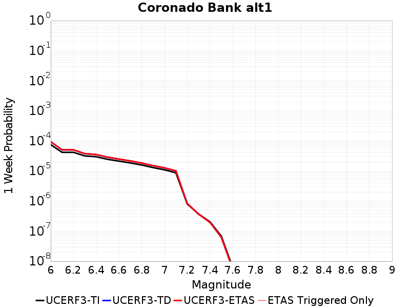 | 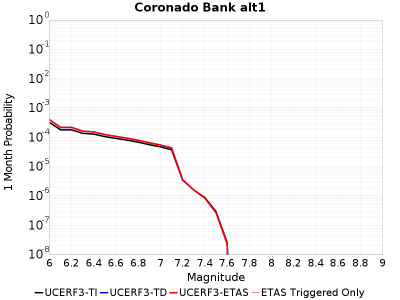 |  |  |

| Magnitude | 1 wk TI Prob | 1 wk TD Prob | 1 wk ETAS Prob | 1 wk ETAS/TD Gain | 1 wk ETAS Triggered Only | 1 mo TI Prob | 1 mo TD Prob | 1 mo ETAS Prob | 1 mo ETAS/TD Gain | 1 mo ETAS Triggered Only | 1 yr TI Prob | 1 yr TD Prob | 1 yr ETAS Prob | 1 yr ETAS/TD Gain | 1 yr ETAS Triggered Only | 10 yr TI Prob | 10 yr TD Prob | 10 yr ETAS Prob | 10 yr ETAS/TD Gain | 10 yr ETAS Triggered Only |
|-----|-----|-----|-----|-----|-----|-----|-----|-----|-----|-----|-----|-----|-----|-----|-----|-----|-----|-----|-----|-----|
| 6.0 | 7.533492E-5 | 9.409372E-5 | 9.409372E-5 | 1.0 | 0.0 | 3.22824E-4 | 4.031999E-4 | 4.031999E-4 | 1.0 | 0.0 | 0.0039233007 | 0.00489854 | 0.0049084914 | 1.0020314 | 1.0E-5 | 0.03854755 | 0.04797469 | 0.047984213 | 1.0001985 | 1.0E-5 |
| 6.1 | 4.1807285E-5 | 5.055868E-5 | 5.055868E-5 | 1.0 | 0.0 | 1.7916178E-4 | 2.1666242E-4 | 2.1666242E-4 | 1.0 | 0.0 | 0.0021791123 | 0.0026347502 | 0.002644724 | 1.0037854 | 1.0E-5 | 0.021578677 | 0.026044372 | 0.026054112 | 1.000374 | 1.0E-5 |
| 6.2 | 4.1807285E-5 | 5.055868E-5 | 5.055868E-5 | 1.0 | 0.0 | 1.7916178E-4 | 2.1666242E-4 | 2.1666242E-4 | 1.0 | 0.0 | 0.0021791123 | 0.0026347502 | 0.002644724 | 1.0037854 | 1.0E-5 | 0.021578677 | 0.026044372 | 0.026054112 | 1.000374 | 1.0E-5 |
| 6.3 | 3.1793104E-5 | 3.77552E-5 | 3.77552E-5 | 1.0 | 0.0 | 1.3624904E-4 | 1.6179816E-4 | 1.6179816E-4 | 1.0 | 0.0 | 0.0016575698 | 0.0019681451 | 0.0019781254 | 1.0050709 | 1.0E-5 | 0.016452603 | 0.019511031 | 0.019520836 | 1.0005026 | 1.0E-5 |
| 6.4 | 2.9878007E-5 | 3.5376346E-5 | 3.5376346E-5 | 1.0 | 0.0 | 1.2804232E-4 | 1.516043E-4 | 1.516043E-4 | 1.0 | 0.0 | 0.0015578003 | 0.001844252 | 0.0018542336 | 1.0054122 | 1.0E-5 | 0.015469253 | 0.018293228 | 0.018303046 | 1.0005367 | 1.0E-5 |
| 6.5 | 2.4512565E-5 | 2.8795506E-5 | 2.8795506E-5 | 1.0 | 0.0 | 1.0504962E-4 | 1.2340363E-4 | 1.2340363E-4 | 1.0 | 0.0 | 0.0012782287 | 0.0015014303 | 0.0015114152 | 1.0066503 | 1.0E-5 | 0.012709012 | 0.014915831 | 0.014925683 | 1.0006604 | 1.0E-5 |
| 6.6 | 2.1317413E-5 | 2.4933093E-5 | 2.4933093E-5 | 1.0 | 0.0 | 9.135714E-5 | 1.0685186E-4 | 1.0685186E-4 | 1.0 | 0.0 | 0.0011117056 | 0.0013001673 | 0.0013101543 | 1.0076814 | 1.0E-5 | 0.011061605 | 0.012928019 | 0.012937889 | 1.0007635 | 1.0E-5 |
| 6.7 | 1.8585655E-5 | 2.1657273E-5 | 2.1657273E-5 | 1.0 | 0.0 | 7.9650374E-5 | 9.28137E-5 | 9.28137E-5 | 1.0 | 0.0 | 9.6931186E-4 | 0.0011294415 | 0.0011294415 | 1.0 | 0.0 | 0.0096509475 | 0.01123918 | 0.01123918 | 1.0 | 0.0 |
| 6.8 | 1.5862879E-5 | 1.8438233E-5 | 1.8438233E-5 | 1.0 | 0.0 | 6.798199E-5 | 7.901872E-5 | 7.901872E-5 | 1.0 | 0.0 | 8.273665E-4 | 9.6164754E-4 | 9.6164754E-4 | 1.0 | 0.0 | 0.008242928 | 0.009576849 | 0.009576849 | 1.0 | 0.0 |
| 6.9 | 1.3021509E-5 | 1.5110497E-5 | 1.5110497E-5 | 1.0 | 0.0 | 5.5805274E-5 | 6.475777E-5 | 6.475777E-5 | 1.0 | 0.0 | 6.792174E-4 | 7.8815874E-4 | 7.8815874E-4 | 1.0 | 0.0 | 0.006771452 | 0.007855462 | 0.007855462 | 1.0 | 0.0 |
| 7.0 | 1.0974371E-5 | 1.2732959E-5 | 1.2732959E-5 | 1.0 | 0.0 | 4.7032172E-5 | 5.456878E-5 | 5.456878E-5 | 1.0 | 0.0 | 5.7246623E-4 | 6.6419E-4 | 6.6419E-4 | 1.0 | 0.0 | 0.0057099373 | 0.0066238022 | 0.0066238022 | 1.0 | 0.0 |
| 7.1 | 8.766221E-6 | 1.0174172E-5 | 1.0174172E-5 | 1.0 | 0.0 | 3.7568978E-5 | 4.360296E-5 | 4.360296E-5 | 1.0 | 0.0 | 4.573063E-4 | 5.30754E-4 | 5.30754E-4 | 1.0 | 0.0 | 0.0045636636 | 0.005296567 | 0.005296567 | 1.0 | 0.0 |
| 7.2 | 8.026024E-7 | 8.3353615E-7 | 8.3353615E-7 | 1.0 | 0.0 | 3.43972E-6 | 3.5722928E-6 | 3.5722928E-6 | 1.0 | 0.0 | 4.1877785E-5 | 4.3491807E-5 | 4.3491807E-5 | 1.0 | 0.0 | 4.1869894E-4 | 4.3483404E-4 | 4.3483404E-4 | 1.0 | 0.0 |
| 7.3 | 3.7293114E-7 | 3.7014098E-7 | 3.7014098E-7 | 1.0 | 0.0 | 1.5982754E-6 | 1.5863175E-6 | 1.5863175E-6 | 1.0 | 0.0 | 1.9458828E-5 | 1.9313246E-5 | 1.9313246E-5 | 1.0 | 0.0 | 1.9457124E-4 | 1.9311573E-4 | 1.9311573E-4 | 1.0 | 0.0 |
| 7.4 | 2.0557036E-7 | 1.9681188E-7 | 1.9681188E-7 | 1.0 | 0.0 | 8.810155E-7 | 8.4347926E-7 | 8.4347926E-7 | 1.0 | 0.0 | 1.0726311E-5 | 1.0269312E-5 | 1.0269312E-5 | 1.0 | 0.0 | 1.0725793E-4 | 1.02688406E-4 | 1.02688406E-4 | 1.0 | 0.0 |
| 7.5 | 6.845446E-8 | 6.2812816E-8 | 6.2812816E-8 | 1.0 | 0.0 | 2.9337625E-7 | 2.6919776E-7 | 2.6919776E-7 | 1.0 | 0.0 | 3.5718497E-6 | 3.2774778E-6 | 3.2774778E-6 | 1.0 | 0.0 | 3.5717923E-5 | 3.2774304E-5 | 3.2774304E-5 | 1.0 | 0.0 |
| 7.6 | 6.0975145E-9 | 5.532413E-9 | 5.532413E-9 | 1.0 | 0.0 | 2.6132206E-8 | 2.3710342E-8 | 2.3710342E-8 | 1.0 | 0.0 | 3.1815955E-7 | 2.886734E-7 | 2.886734E-7 | 1.0 | 0.0 | 3.181591E-6 | 2.8867312E-6 | 2.8867312E-6 | 1.0 | 0.0 |

## Johnson Valley (No) 2011 rev
*[(top)](#table-of-contents)*

| 1 Week | 1 Month | 1 Year | 10 Year |
|-----|-----|-----|-----|
| 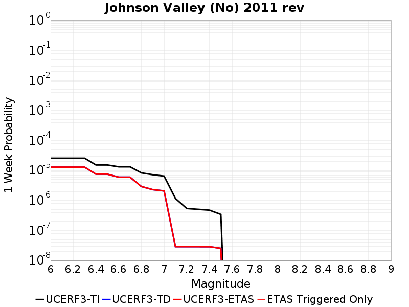 | 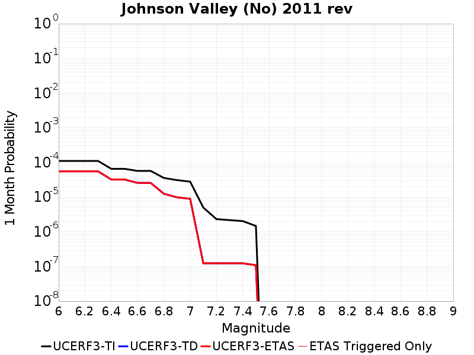 | 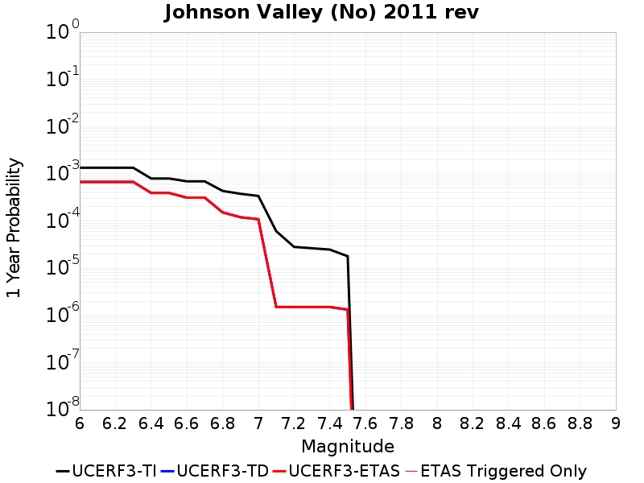 | 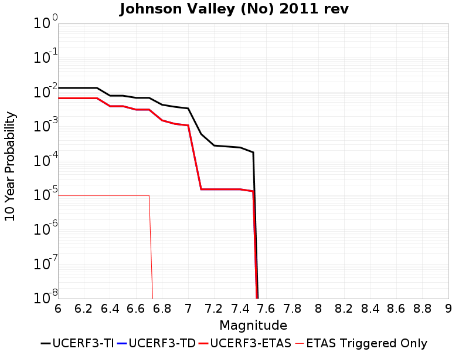 |

| Magnitude | 1 wk TI Prob | 1 wk TD Prob | 1 wk ETAS Prob | 1 wk ETAS/TD Gain | 1 wk ETAS Triggered Only | 1 mo TI Prob | 1 mo TD Prob | 1 mo ETAS Prob | 1 mo ETAS/TD Gain | 1 mo ETAS Triggered Only | 1 yr TI Prob | 1 yr TD Prob | 1 yr ETAS Prob | 1 yr ETAS/TD Gain | 1 yr ETAS Triggered Only | 10 yr TI Prob | 10 yr TD Prob | 10 yr ETAS Prob | 10 yr ETAS/TD Gain | 10 yr ETAS Triggered Only |
|-----|-----|-----|-----|-----|-----|-----|-----|-----|-----|-----|-----|-----|-----|-----|-----|-----|-----|-----|-----|-----|
| 6.0 | 2.577707E-5 | 1.2910928E-5 | 1.2910928E-5 | 1.0 | 0.0 | 1.1046848E-4 | 5.53316E-5 | 5.53316E-5 | 1.0 | 0.0 | 0.0013441239 | 6.734937E-4 | 6.734937E-4 | 1.0 | 0.0 | 0.013360229 | 0.0067184414 | 0.006728374 | 1.0014784 | 1.0E-5 |
| 6.1 | 2.577707E-5 | 1.2910928E-5 | 1.2910928E-5 | 1.0 | 0.0 | 1.1046848E-4 | 5.53316E-5 | 5.53316E-5 | 1.0 | 0.0 | 0.0013441239 | 6.734937E-4 | 6.734937E-4 | 1.0 | 0.0 | 0.013360229 | 0.0067184414 | 0.006728374 | 1.0014784 | 1.0E-5 |
| 6.2 | 2.577707E-5 | 1.2910928E-5 | 1.2910928E-5 | 1.0 | 0.0 | 1.1046848E-4 | 5.53316E-5 | 5.53316E-5 | 1.0 | 0.0 | 0.0013441239 | 6.734937E-4 | 6.734937E-4 | 1.0 | 0.0 | 0.013360229 | 0.0067184414 | 0.006728374 | 1.0014784 | 1.0E-5 |
| 6.3 | 2.577707E-5 | 1.2910928E-5 | 1.2910928E-5 | 1.0 | 0.0 | 1.1046848E-4 | 5.53316E-5 | 5.53316E-5 | 1.0 | 0.0 | 0.0013441239 | 6.734937E-4 | 6.734937E-4 | 1.0 | 0.0 | 0.013360229 | 0.0067184414 | 0.006728374 | 1.0014784 | 1.0E-5 |
| 6.4 | 1.5296591E-5 | 7.5432044E-6 | 7.5432044E-6 | 1.0 | 0.0 | 6.555518E-5 | 3.2327724E-5 | 3.2327724E-5 | 1.0 | 0.0 | 7.97842E-4 | 3.9353775E-4 | 3.9353775E-4 | 1.0 | 0.0 | 0.007949836 | 0.003930253 | 0.0039402135 | 1.0025344 | 1.0E-5 |
| 6.5 | 1.5296591E-5 | 7.5432044E-6 | 7.5432044E-6 | 1.0 | 0.0 | 6.555518E-5 | 3.2327724E-5 | 3.2327724E-5 | 1.0 | 0.0 | 7.97842E-4 | 3.9353775E-4 | 3.9353775E-4 | 1.0 | 0.0 | 0.007949836 | 0.003930253 | 0.0039402135 | 1.0025344 | 1.0E-5 |
| 6.6 | 1.3289383E-5 | 5.9971703E-6 | 5.9971703E-6 | 1.0 | 0.0 | 5.6953253E-5 | 2.5702E-5 | 2.5702E-5 | 1.0 | 0.0 | 6.9318525E-4 | 3.128939E-4 | 3.128939E-4 | 1.0 | 0.0 | 0.0069102696 | 0.003126201 | 0.0031361696 | 1.0031887 | 1.0E-5 |
| 6.7 | 1.3289383E-5 | 5.9971703E-6 | 5.9971703E-6 | 1.0 | 0.0 | 5.6953253E-5 | 2.5702E-5 | 2.5702E-5 | 1.0 | 0.0 | 6.9318525E-4 | 3.128939E-4 | 3.128939E-4 | 1.0 | 0.0 | 0.0069102696 | 0.003126201 | 0.0031361696 | 1.0031887 | 1.0E-5 |
| 6.8 | 8.330789E-6 | 2.9245919E-6 | 2.9245919E-6 | 1.0 | 0.0 | 3.570289E-5 | 1.25339375E-5 | 1.25339375E-5 | 1.0 | 0.0 | 4.34596E-4 | 1.5259572E-4 | 1.5259572E-4 | 1.0 | 0.0 | 0.0043374705 | 0.0015254708 | 0.0015254708 | 1.0 | 0.0 |
| 6.9 | 7.2359003E-6 | 2.3043915E-6 | 2.3043915E-6 | 1.0 | 0.0 | 3.1010633E-5 | 9.8759565E-6 | 9.8759565E-6 | 1.0 | 0.0 | 3.7748902E-4 | 1.2023848E-4 | 1.2023848E-4 | 1.0 | 0.0 | 0.0037684843 | 0.0012022584 | 0.0012022584 | 1.0 | 0.0 |
| 7.0 | 6.5149957E-6 | 2.0912946E-6 | 2.0912946E-6 | 1.0 | 0.0 | 2.792111E-5 | 8.962691E-6 | 8.962691E-6 | 1.0 | 0.0 | 3.398865E-4 | 1.0912061E-4 | 1.0912061E-4 | 1.0 | 0.0 | 0.003393671 | 0.0010911914 | 0.0010911914 | 1.0 | 0.0 |
| 7.1 | 1.1662233E-6 | 2.8879754E-8 | 2.8879754E-8 | 1.0 | 0.0 | 4.9980904E-6 | 1.2377036E-7 | 1.2377036E-7 | 1.0 | 0.0 | 6.0850052E-5 | 1.5069033E-6 | 1.5069033E-6 | 1.0 | 0.0 | 6.083339E-4 | 1.50689475E-5 | 1.50689475E-5 | 1.0 | 0.0 |
| 7.2 | 5.413881E-7 | 2.8879754E-8 | 2.8879754E-8 | 1.0 | 0.0 | 2.3202326E-6 | 1.2377036E-7 | 1.2377036E-7 | 1.0 | 0.0 | 2.8248465E-5 | 1.5069033E-6 | 1.5069033E-6 | 1.0 | 0.0 | 2.8244875E-4 | 1.50689475E-5 | 1.50689475E-5 | 1.0 | 0.0 |
| 7.3 | 5.076821E-7 | 2.8879754E-8 | 2.8879754E-8 | 1.0 | 0.0 | 2.1757785E-6 | 1.2377036E-7 | 1.2377036E-7 | 1.0 | 0.0 | 2.648978E-5 | 1.5069033E-6 | 1.5069033E-6 | 1.0 | 0.0 | 2.6486625E-4 | 1.50689475E-5 | 1.50689475E-5 | 1.0 | 0.0 |
| 7.4 | 4.7568687E-7 | 2.8861564E-8 | 2.8861564E-8 | 1.0 | 0.0 | 2.0386565E-6 | 1.2369242E-7 | 1.2369242E-7 | 1.0 | 0.0 | 2.482036E-5 | 1.5059543E-6 | 1.5059543E-6 | 1.0 | 0.0 | 2.4817587E-4 | 1.5059457E-5 | 1.5059457E-5 | 1.0 | 0.0 |
| 7.5 | 3.435626E-7 | 2.5423384E-8 | 2.5423384E-8 | 1.0 | 0.0 | 1.4724103E-6 | 1.0895736E-7 | 1.0895736E-7 | 1.0 | 0.0 | 1.7926448E-5 | 1.3265552E-6 | 1.3265552E-6 | 1.0 | 0.0 | 1.7925001E-4 | 1.3265489E-5 | 1.3265489E-5 | 1.0 | 0.0 |

## Elsinore (Temecula) rev
*[(top)](#table-of-contents)*

| 1 Week | 1 Month | 1 Year | 10 Year |
|-----|-----|-----|-----|
| 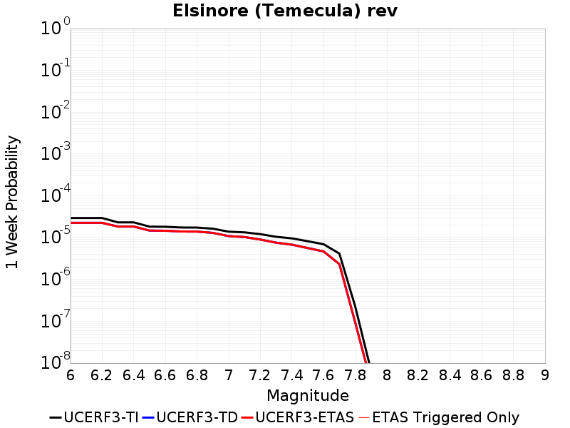 | 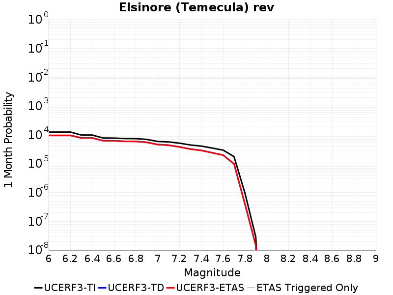 | 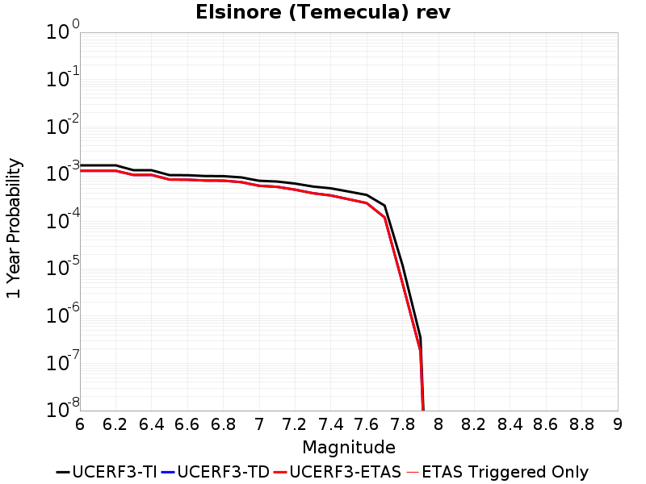 | 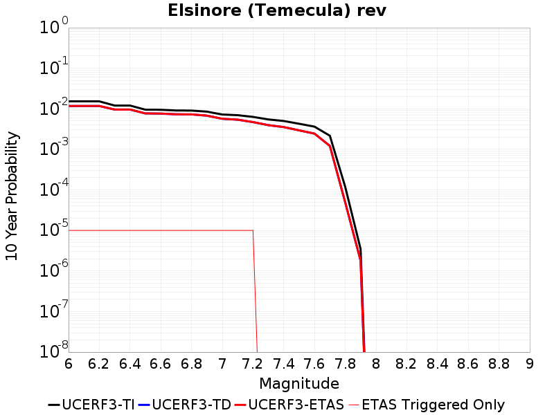 |

| Magnitude | 1 wk TI Prob | 1 wk TD Prob | 1 wk ETAS Prob | 1 wk ETAS/TD Gain | 1 wk ETAS Triggered Only | 1 mo TI Prob | 1 mo TD Prob | 1 mo ETAS Prob | 1 mo ETAS/TD Gain | 1 mo ETAS Triggered Only | 1 yr TI Prob | 1 yr TD Prob | 1 yr ETAS Prob | 1 yr ETAS/TD Gain | 1 yr ETAS Triggered Only | 10 yr TI Prob | 10 yr TD Prob | 10 yr ETAS Prob | 10 yr ETAS/TD Gain | 10 yr ETAS Triggered Only |
|-----|-----|-----|-----|-----|-----|-----|-----|-----|-----|-----|-----|-----|-----|-----|-----|-----|-----|-----|-----|-----|
| 6.0 | 2.9514995E-5 | 2.260033E-5 | 2.260033E-5 | 1.0 | 0.0 | 1.264867E-4 | 9.685509E-5 | 9.685509E-5 | 1.0 | 0.0 | 0.0015388876 | 0.0011785949 | 0.0011785949 | 1.0 | 0.0 | 0.015282745 | 0.011740437 | 0.011750319 | 1.0008417 | 1.0E-5 |
| 6.1 | 2.9514995E-5 | 2.260033E-5 | 2.260033E-5 | 1.0 | 0.0 | 1.264867E-4 | 9.685509E-5 | 9.685509E-5 | 1.0 | 0.0 | 0.0015388876 | 0.0011785949 | 0.0011785949 | 1.0 | 0.0 | 0.015282745 | 0.011740437 | 0.011750319 | 1.0008417 | 1.0E-5 |
| 6.2 | 2.9514995E-5 | 2.260033E-5 | 2.260033E-5 | 1.0 | 0.0 | 1.264867E-4 | 9.685509E-5 | 9.685509E-5 | 1.0 | 0.0 | 0.0015388876 | 0.0011785949 | 0.0011785949 | 1.0 | 0.0 | 0.015282745 | 0.011740437 | 0.011750319 | 1.0008417 | 1.0E-5 |
| 6.3 | 2.3223649E-5 | 1.845694E-5 | 1.845694E-5 | 1.0 | 0.0 | 9.952613E-5 | 7.909887E-5 | 7.909887E-5 | 1.0 | 0.0 | 0.001211057 | 9.6262054E-4 | 9.6262054E-4 | 1.0 | 0.0 | 0.012044783 | 0.009596786 | 0.00960669 | 1.001032 | 1.0E-5 |
| 6.4 | 2.3223649E-5 | 1.845694E-5 | 1.845694E-5 | 1.0 | 0.0 | 9.952613E-5 | 7.909887E-5 | 7.909887E-5 | 1.0 | 0.0 | 0.001211057 | 9.6262054E-4 | 9.6262054E-4 | 1.0 | 0.0 | 0.012044783 | 0.009596786 | 0.00960669 | 1.001032 | 1.0E-5 |
| 6.5 | 1.8338875E-5 | 1.4784445E-5 | 1.4784445E-5 | 1.0 | 0.0 | 7.8592806E-5 | 6.3360414E-5 | 6.3360414E-5 | 1.0 | 0.0 | 9.5644733E-4 | 7.711488E-4 | 7.711488E-4 | 1.0 | 0.0 | 0.009523412 | 0.0076915985 | 0.0077015217 | 1.0012901 | 1.0E-5 |
| 6.6 | 1.8223333E-5 | 1.4646839E-5 | 1.4646839E-5 | 1.0 | 0.0 | 7.809766E-5 | 6.2770705E-5 | 6.2770705E-5 | 1.0 | 0.0 | 9.504242E-4 | 7.6397415E-4 | 7.6397415E-4 | 1.0 | 0.0 | 0.009463696 | 0.007620345 | 0.007630269 | 1.0013022 | 1.0E-5 |
| 6.7 | 1.7512752E-5 | 1.4058104E-5 | 1.4058104E-5 | 1.0 | 0.0 | 7.505249E-5 | 6.0247672E-5 | 6.0247672E-5 | 1.0 | 0.0 | 9.13381E-4 | 7.332772E-4 | 7.332772E-4 | 1.0 | 0.0 | 0.00909636 | 0.0073148212 | 0.007324748 | 1.0013571 | 1.0E-5 |
| 6.8 | 1.7417142E-5 | 1.3981831E-5 | 1.3981831E-5 | 1.0 | 0.0 | 7.4642754E-5 | 5.9920803E-5 | 5.9920803E-5 | 1.0 | 0.0 | 9.083966E-4 | 7.293002E-4 | 7.293002E-4 | 1.0 | 0.0 | 0.009046922 | 0.0072752526 | 0.0072851796 | 1.0013645 | 1.0E-5 |
| 6.9 | 1.6402591E-5 | 1.30176695E-5 | 1.30176695E-5 | 1.0 | 0.0 | 7.0294926E-5 | 5.5788863E-5 | 5.5788863E-5 | 1.0 | 0.0 | 8.5550465E-4 | 6.790254E-4 | 6.790254E-4 | 1.0 | 0.0 | 0.008522186 | 0.0067749554 | 0.0067848875 | 1.001466 | 1.0E-5 |
| 7.0 | 1.3912486E-5 | 1.0903951E-5 | 1.0903951E-5 | 1.0 | 0.0 | 5.9623577E-5 | 4.6730398E-5 | 4.6730398E-5 | 1.0 | 0.0 | 7.2567526E-4 | 5.6879676E-4 | 5.6879676E-4 | 1.0 | 0.0 | 0.0072331014 | 0.0056771175 | 0.0056870608 | 1.0017514 | 1.0E-5 |
| 7.1 | 1.3405147E-5 | 1.0351917E-5 | 1.0351917E-5 | 1.0 | 0.0 | 5.7449364E-5 | 4.436462E-5 | 4.436462E-5 | 1.0 | 0.0 | 6.9922156E-4 | 5.4000795E-4 | 5.4000795E-4 | 1.0 | 0.0 | 0.0069702556 | 0.0053902916 | 0.005400238 | 1.0018452 | 1.0E-5 |
| 7.2 | 1.21402E-5 | 9.018287E-6 | 9.018287E-6 | 1.0 | 0.0 | 5.202839E-5 | 3.864924E-5 | 3.864924E-5 | 1.0 | 0.0 | 6.332616E-4 | 4.7045466E-4 | 4.7045466E-4 | 1.0 | 0.0 | 0.0063146 | 0.004696055 | 0.004706008 | 1.0021194 | 1.0E-5 |
| 7.3 | 1.05047775E-5 | 7.589956E-6 | 7.589956E-6 | 1.0 | 0.0 | 4.5019697E-5 | 3.2527987E-5 | 3.2527987E-5 | 1.0 | 0.0 | 5.4797693E-4 | 3.9595773E-4 | 3.9595773E-4 | 1.0 | 0.0 | 0.005466277 | 0.0039529335 | 0.0039529335 | 1.0 | 0.0 |
| 7.4 | 9.624483E-6 | 6.802371E-6 | 6.802371E-6 | 1.0 | 0.0 | 4.124713E-5 | 2.9152701E-5 | 2.9152701E-5 | 1.0 | 0.0 | 5.0206814E-4 | 3.5487773E-4 | 3.5487773E-4 | 1.0 | 0.0 | 0.005009353 | 0.0035432645 | 0.0035432645 | 1.0 | 0.0 |
| 7.5 | 8.215151E-6 | 5.648392E-6 | 5.648392E-6 | 1.0 | 0.0 | 3.5207315E-5 | 2.4207175E-5 | 2.4207175E-5 | 1.0 | 0.0 | 4.2856473E-4 | 2.946838E-4 | 2.946838E-4 | 1.0 | 0.0 | 0.004277392 | 0.0029430587 | 0.0029430587 | 1.0 | 0.0 |
| 7.6 | 6.975058E-6 | 4.6870136E-6 | 4.6870136E-6 | 1.0 | 0.0 | 2.9892764E-5 | 2.0087053E-5 | 2.0087053E-5 | 1.0 | 0.0 | 3.6388362E-4 | 2.4453358E-4 | 2.4453358E-4 | 1.0 | 0.0 | 0.0036328835 | 0.002442762 | 0.002442762 | 1.0 | 0.0 |
| 7.7 | 4.159604E-6 | 2.333251E-6 | 2.333251E-6 | 1.0 | 0.0 | 1.7826753E-5 | 9.999612E-6 | 9.999612E-6 | 1.0 | 0.0 | 2.1701909E-4 | 1.2173923E-4 | 1.2173923E-4 | 1.0 | 0.0 | 0.0021680726 | 0.0012167988 | 0.0012167988 | 1.0 | 0.0 |
| 7.8 | 2.2692414E-7 | 9.406634E-8 | 9.406634E-8 | 1.0 | 0.0 | 9.725317E-7 | 4.031414E-7 | 4.031414E-7 | 1.0 | 0.0 | 1.1840509E-5 | 4.9082387E-6 | 4.9082387E-6 | 1.0 | 0.0 | 1.1839878E-4 | 4.908163E-5 | 4.908163E-5 | 1.0 | 0.0 |
| 7.9 | 6.676829E-9 | 3.4455256E-9 | 3.4455256E-9 | 1.0 | 0.0 | 2.861498E-8 | 1.4766538E-8 | 1.4766538E-8 | 1.0 | 0.0 | 3.4838732E-7 | 1.7978259E-7 | 1.7978259E-7 | 1.0 | 0.0 | 3.4838679E-6 | 1.7978246E-6 | 1.7978246E-6 | 1.0 | 0.0 |

## Malibu Coast (Extension) alt 1
*[(top)](#table-of-contents)*

| 1 Week | 1 Month | 1 Year | 10 Year |
|-----|-----|-----|-----|
|  |  | 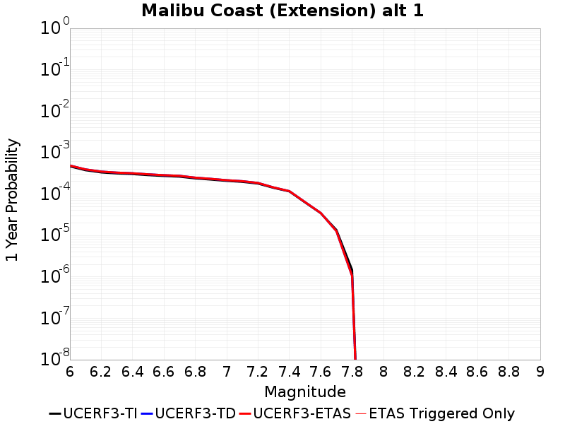 |  |

| Magnitude | 1 wk TI Prob | 1 wk TD Prob | 1 wk ETAS Prob | 1 wk ETAS/TD Gain | 1 wk ETAS Triggered Only | 1 mo TI Prob | 1 mo TD Prob | 1 mo ETAS Prob | 1 mo ETAS/TD Gain | 1 mo ETAS Triggered Only | 1 yr TI Prob | 1 yr TD Prob | 1 yr ETAS Prob | 1 yr ETAS/TD Gain | 1 yr ETAS Triggered Only | 10 yr TI Prob | 10 yr TD Prob | 10 yr ETAS Prob | 10 yr ETAS/TD Gain | 10 yr ETAS Triggered Only |
|-----|-----|-----|-----|-----|-----|-----|-----|-----|-----|-----|-----|-----|-----|-----|-----|-----|-----|-----|-----|-----|
| 6.0 | 8.930738E-6 | 9.332674E-6 | 9.332674E-6 | 1.0 | 0.0 | 3.827403E-5 | 3.9996572E-5 | 3.9996572E-5 | 1.0 | 0.0 | 4.6588664E-4 | 4.8685118E-4 | 4.8685118E-4 | 1.0 | 0.0 | 0.0046491115 | 0.0048580286 | 0.0048679803 | 1.0020485 | 1.0E-5 |
| 6.1 | 7.199952E-6 | 7.5332546E-6 | 7.5332546E-6 | 1.0 | 0.0 | 3.0856572E-5 | 3.228498E-5 | 3.228498E-5 | 1.0 | 0.0 | 3.75614E-4 | 3.9299933E-4 | 3.9299933E-4 | 1.0 | 0.0 | 0.0037497976 | 0.0039231097 | 0.00393307 | 1.002539 | 1.0E-5 |
| 6.2 | 6.3721413E-6 | 6.669518E-6 | 6.669518E-6 | 1.0 | 0.0 | 2.7308892E-5 | 2.8583338E-5 | 2.8583338E-5 | 1.0 | 0.0 | 3.3243504E-4 | 3.4794692E-4 | 3.4794692E-4 | 1.0 | 0.0 | 0.0033193815 | 0.0034740614 | 0.0034840268 | 1.0028685 | 1.0E-5 |
| 6.3 | 6.016345E-6 | 6.2977815E-6 | 6.2977815E-6 | 1.0 | 0.0 | 2.578408E-5 | 2.6990216E-5 | 2.6990216E-5 | 1.0 | 0.0 | 3.1387596E-4 | 3.2855666E-4 | 3.2855666E-4 | 1.0 | 0.0 | 0.00313433 | 0.0032807451 | 0.0032907124 | 1.003038 | 1.0E-5 |
| 6.4 | 5.8104883E-6 | 6.0821044E-6 | 6.0821044E-6 | 1.0 | 0.0 | 2.4901856E-5 | 2.6065904E-5 | 2.6065904E-5 | 1.0 | 0.0 | 3.031379E-4 | 3.173065E-4 | 3.173065E-4 | 1.0 | 0.0 | 0.0030272473 | 0.003168569 | 0.0031785371 | 1.003146 | 1.0E-5 |
| 6.5 | 5.476925E-6 | 5.7299517E-6 | 5.7299517E-6 | 1.0 | 0.0 | 2.3472323E-5 | 2.4556706E-5 | 2.4556706E-5 | 1.0 | 0.0 | 2.8573806E-4 | 2.9893717E-4 | 2.9893717E-4 | 1.0 | 0.0 | 0.0028537093 | 0.0029853825 | 0.0029953527 | 1.0033396 | 1.0E-5 |
| 6.6 | 5.222387E-6 | 5.4609236E-6 | 5.4609236E-6 | 1.0 | 0.0 | 2.2381464E-5 | 2.340375E-5 | 2.340375E-5 | 1.0 | 0.0 | 2.7246025E-4 | 2.8490368E-4 | 2.8490368E-4 | 1.0 | 0.0 | 0.0027212645 | 0.0028454151 | 0.0028553866 | 1.0035044 | 1.0E-5 |
| 6.7 | 5.0337076E-6 | 5.261376E-6 | 5.261376E-6 | 1.0 | 0.0 | 2.1572854E-5 | 2.2548562E-5 | 2.2548562E-5 | 1.0 | 0.0 | 2.6261783E-4 | 2.7449444E-4 | 2.7449444E-4 | 1.0 | 0.0 | 0.002623077 | 0.0027415839 | 0.0027515565 | 1.0036376 | 1.0E-5 |
| 6.8 | 4.5675624E-6 | 4.7607605E-6 | 4.7607605E-6 | 1.0 | 0.0 | 1.9575122E-5 | 2.0403102E-5 | 2.0403102E-5 | 1.0 | 0.0 | 2.3830103E-4 | 2.4837963E-4 | 2.4837963E-4 | 1.0 | 0.0 | 0.0023804565 | 0.0024810398 | 0.0024910152 | 1.0040206 | 1.0E-5 |
| 6.9 | 4.2802412E-6 | 4.453936E-6 | 4.453936E-6 | 1.0 | 0.0 | 1.8343762E-5 | 1.9088158E-5 | 1.9088158E-5 | 1.0 | 0.0 | 2.2331243E-4 | 2.3237371E-4 | 2.3237371E-4 | 1.0 | 0.0 | 0.0022308815 | 0.002321324 | 0.0023313009 | 1.0042979 | 1.0E-5 |
| 7.0 | 3.9794063E-6 | 4.131874E-6 | 4.131874E-6 | 1.0 | 0.0 | 1.7054486E-5 | 1.7707913E-5 | 1.7707913E-5 | 1.0 | 0.0 | 2.0761859E-4 | 2.1557264E-4 | 2.1557264E-4 | 1.0 | 0.0 | 0.0020742472 | 0.0021536488 | 0.0021636272 | 1.0046333 | 1.0E-5 |
| 7.1 | 3.7730424E-6 | 3.9129095E-6 | 3.9129095E-6 | 1.0 | 0.0 | 1.6170083E-5 | 1.6769505E-5 | 1.6769505E-5 | 1.0 | 0.0 | 1.9685295E-4 | 2.041497E-4 | 2.041497E-4 | 1.0 | 0.0 | 0.0019667868 | 0.0020396346 | 0.0020496142 | 1.0048928 | 1.0E-5 |
| 7.2 | 3.424985E-6 | 3.5428848E-6 | 3.5428848E-6 | 1.0 | 0.0 | 1.4678424E-5 | 1.5183704E-5 | 1.5183704E-5 | 1.0 | 0.0 | 1.7869516E-4 | 1.8484604E-4 | 1.8484604E-4 | 1.0 | 0.0 | 0.0017855153 | 0.0018469349 | 0.0018569165 | 1.0054044 | 1.0E-5 |
| 7.3 | 2.6966375E-6 | 2.7608448E-6 | 2.7608448E-6 | 1.0 | 0.0 | 1.15569665E-5 | 1.1832139E-5 | 1.1832139E-5 | 1.0 | 0.0 | 1.4069698E-4 | 1.440468E-4 | 1.440468E-4 | 1.0 | 0.0 | 0.0014060794 | 0.0014395384 | 0.0014495241 | 1.0069367 | 1.0E-5 |
| 7.4 | 2.215957E-6 | 2.2503623E-6 | 2.2503623E-6 | 1.0 | 0.0 | 9.496924E-6 | 9.644375E-6 | 9.644375E-6 | 1.0 | 0.0 | 1.1561892E-4 | 1.1741397E-4 | 1.1741397E-4 | 1.0 | 0.0 | 0.0011555878 | 0.001173523 | 0.0011835113 | 1.0085113 | 1.0E-5 |
| 7.5 | 1.2040218E-6 | 1.222426E-6 | 1.222426E-6 | 1.0 | 0.0 | 5.160083E-6 | 5.2389582E-6 | 5.2389582E-6 | 1.0 | 0.0 | 6.2822204E-5 | 6.378246E-5 | 6.378246E-5 | 1.0 | 0.0 | 6.280445E-4 | 6.3764345E-4 | 6.4763706E-4 | 1.0156728 | 1.0E-5 |
| 7.6 | 6.6157446E-7 | 6.681725E-7 | 6.681725E-7 | 1.0 | 0.0 | 2.835316E-6 | 2.8635934E-6 | 2.8635934E-6 | 1.0 | 0.0 | 3.4519428E-5 | 3.4863708E-5 | 3.4863708E-5 | 1.0 | 0.0 | 3.4514067E-4 | 3.485839E-4 | 3.5858044E-4 | 1.0286775 | 1.0E-5 |
| 7.7 | 2.6012302E-7 | 2.4367156E-7 | 2.4367156E-7 | 1.0 | 0.0 | 1.1148124E-6 | 1.0443064E-6 | 1.0443064E-6 | 1.0 | 0.0 | 1.3572758E-5 | 1.2714367E-5 | 1.2714367E-5 | 1.0 | 0.0 | 1.3571928E-4 | 1.2713746E-4 | 1.3713619E-4 | 1.078645 | 1.0E-5 |
| 7.8 | 2.8323132E-8 | 2.02754E-8 | 2.02754E-8 | 1.0 | 0.0 | 1.2138484E-7 | 8.689456E-8 | 8.689456E-8 | 1.0 | 0.0 | 1.4778595E-6 | 1.0579408E-6 | 1.0579408E-6 | 1.0 | 0.0 | 1.4778497E-5 | 1.0579366E-5 | 1.0579366E-5 | 1.0 | 0.0 |

## Reliz 2011 CFM
*[(top)](#table-of-contents)*

| 1 Week | 1 Month | 1 Year | 10 Year |
|-----|-----|-----|-----|
|  | 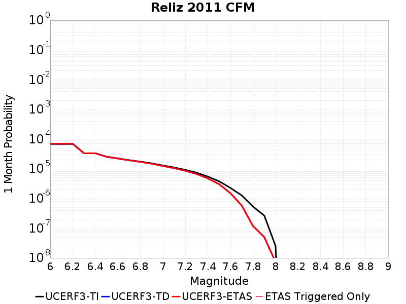 | 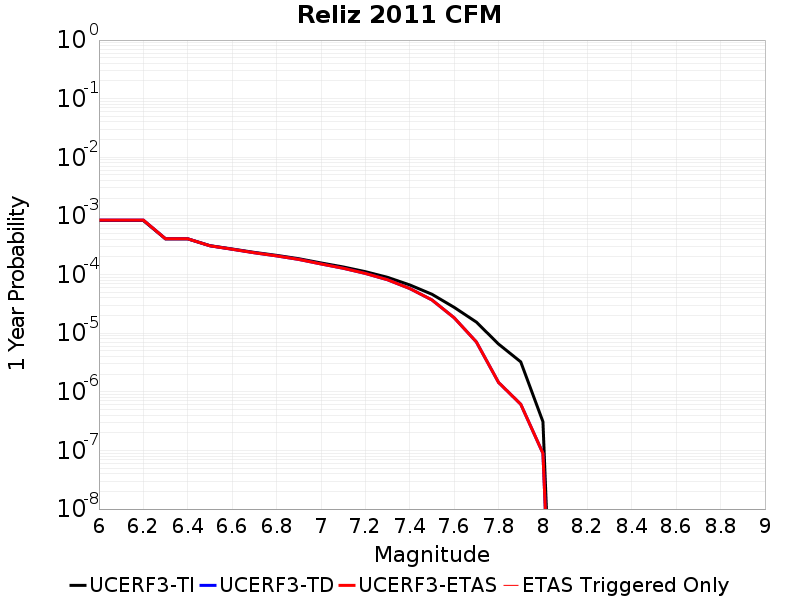 | 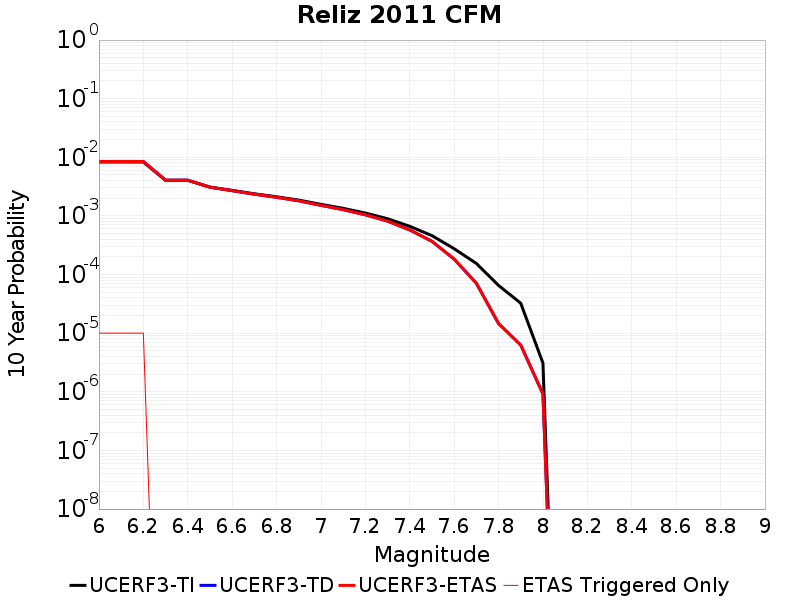 |

| Magnitude | 1 wk TI Prob | 1 wk TD Prob | 1 wk ETAS Prob | 1 wk ETAS/TD Gain | 1 wk ETAS Triggered Only | 1 mo TI Prob | 1 mo TD Prob | 1 mo ETAS Prob | 1 mo ETAS/TD Gain | 1 mo ETAS Triggered Only | 1 yr TI Prob | 1 yr TD Prob | 1 yr ETAS Prob | 1 yr ETAS/TD Gain | 1 yr ETAS Triggered Only | 10 yr TI Prob | 10 yr TD Prob | 10 yr ETAS Prob | 10 yr ETAS/TD Gain | 10 yr ETAS Triggered Only |
|-----|-----|-----|-----|-----|-----|-----|-----|-----|-----|-----|-----|-----|-----|-----|-----|-----|-----|-----|-----|-----|
| 6.0 | 1.6002472E-5 | 1.6287322E-5 | 1.6287322E-5 | 1.0 | 0.0 | 6.8580215E-5 | 6.980105E-5 | 6.980105E-5 | 1.0 | 0.0 | 8.3464425E-4 | 8.4951625E-4 | 8.4951625E-4 | 1.0 | 0.0 | 0.008315164 | 0.008464891 | 0.008474807 | 1.0011714 | 1.0E-5 |
| 6.1 | 1.6002472E-5 | 1.6287322E-5 | 1.6287322E-5 | 1.0 | 0.0 | 6.8580215E-5 | 6.980105E-5 | 6.980105E-5 | 1.0 | 0.0 | 8.3464425E-4 | 8.4951625E-4 | 8.4951625E-4 | 1.0 | 0.0 | 0.008315164 | 0.008464891 | 0.008474807 | 1.0011714 | 1.0E-5 |
| 6.2 | 1.6002472E-5 | 1.6287322E-5 | 1.6287322E-5 | 1.0 | 0.0 | 6.8580215E-5 | 6.980105E-5 | 6.980105E-5 | 1.0 | 0.0 | 8.3464425E-4 | 8.4951625E-4 | 8.4951625E-4 | 1.0 | 0.0 | 0.008315164 | 0.008464891 | 0.008474807 | 1.0011714 | 1.0E-5 |
| 6.3 | 7.792404E-6 | 7.8065905E-6 | 7.8065905E-6 | 1.0 | 0.0 | 3.339559E-5 | 3.3456392E-5 | 3.3456392E-5 | 1.0 | 0.0 | 4.0651546E-4 | 4.0725622E-4 | 4.0725622E-4 | 1.0 | 0.0 | 0.0040577264 | 0.0040653814 | 0.0040653814 | 1.0 | 0.0 |
| 6.4 | 7.792404E-6 | 7.8065905E-6 | 7.8065905E-6 | 1.0 | 0.0 | 3.339559E-5 | 3.3456392E-5 | 3.3456392E-5 | 1.0 | 0.0 | 4.0651546E-4 | 4.0725622E-4 | 4.0725622E-4 | 1.0 | 0.0 | 0.0040577264 | 0.0040653814 | 0.0040653814 | 1.0 | 0.0 |
| 6.5 | 5.9659374E-6 | 5.9312165E-6 | 5.9312165E-6 | 1.0 | 0.0 | 2.5568053E-5 | 2.5419253E-5 | 2.5419253E-5 | 1.0 | 0.0 | 3.1124658E-4 | 3.0943568E-4 | 3.0943568E-4 | 1.0 | 0.0 | 0.00310811 | 0.003090272 | 0.003090272 | 1.0 | 0.0 |
| 6.6 | 5.2350692E-6 | 5.181344E-6 | 5.181344E-6 | 1.0 | 0.0 | 2.2435817E-5 | 2.2205571E-5 | 2.2205571E-5 | 1.0 | 0.0 | 2.7312184E-4 | 2.7031943E-4 | 2.7031943E-4 | 1.0 | 0.0 | 0.002727864 | 0.0027001223 | 0.0027001223 | 1.0 | 0.0 |
| 6.7 | 4.580206E-6 | 4.5083634E-6 | 4.5083634E-6 | 1.0 | 0.0 | 1.9629308E-5 | 1.9321415E-5 | 1.9321415E-5 | 1.0 | 0.0 | 2.389606E-4 | 2.352129E-4 | 2.352129E-4 | 1.0 | 0.0 | 0.002387038 | 0.0023498472 | 0.0023498472 | 1.0 | 0.0 |
| 6.8 | 4.0765017E-6 | 3.9903903E-6 | 3.9903903E-6 | 1.0 | 0.0 | 1.7470604E-5 | 1.7101562E-5 | 1.7101562E-5 | 1.0 | 0.0 | 2.1268385E-4 | 2.0819165E-4 | 2.0819165E-4 | 1.0 | 0.0 | 0.002124804 | 0.0020801702 | 0.0020801702 | 1.0 | 0.0 |
| 6.9 | 3.5752896E-6 | 3.4745765E-6 | 3.4745765E-6 | 1.0 | 0.0 | 1.532258E-5 | 1.4890958E-5 | 1.4890958E-5 | 1.0 | 0.0 | 1.8653645E-4 | 1.8128235E-4 | 1.8128235E-4 | 1.0 | 0.0 | 0.0018637994 | 0.001811547 | 0.001811547 | 1.0 | 0.0 |
| 7.0 | 3.0259848E-6 | 2.9099028E-6 | 2.9099028E-6 | 1.0 | 0.0 | 1.2968442E-5 | 1.2470953E-5 | 1.2470953E-5 | 1.0 | 0.0 | 1.5787935E-4 | 1.5182329E-4 | 1.5182329E-4 | 1.0 | 0.0 | 0.0015776722 | 0.0015173968 | 0.0015173968 | 1.0 | 0.0 |
| 7.1 | 2.5861116E-6 | 2.4570454E-6 | 2.4570454E-6 | 1.0 | 0.0 | 1.1083288E-5 | 1.0530152E-5 | 1.0530152E-5 | 1.0 | 0.0 | 1.3493067E-4 | 1.2819708E-4 | 1.2819708E-4 | 1.0 | 0.0 | 0.0013484878 | 0.0012814318 | 0.0012814318 | 1.0 | 0.0 |
| 7.2 | 2.1482588E-6 | 2.0050245E-6 | 2.0050245E-6 | 1.0 | 0.0 | 9.20679E-6 | 8.592933E-6 | 8.592933E-6 | 1.0 | 0.0 | 1.12086906E-4 | 1.04613944E-4 | 1.04613944E-4 | 1.0 | 0.0 | 0.0011203039 | 0.0010458472 | 0.0010458472 | 1.0 | 0.0 |
| 7.3 | 1.7194744E-6 | 1.5628252E-6 | 1.5628252E-6 | 1.0 | 0.0 | 7.3691554E-6 | 6.697805E-6 | 6.697805E-6 | 1.0 | 0.0 | 8.971577E-5 | 8.154273E-5 | 8.154273E-5 | 1.0 | 0.0 | 8.967956E-4 | 8.15328E-4 | 8.15328E-4 | 1.0 | 0.0 |
| 7.4 | 1.2755178E-6 | 1.107242E-6 | 1.107242E-6 | 1.0 | 0.0 | 5.4664933E-6 | 4.7453145E-6 | 4.7453145E-6 | 1.0 | 0.0 | 6.655252E-5 | 5.7772675E-5 | 5.7772675E-5 | 1.0 | 0.0 | 6.6532596E-4 | 5.777763E-4 | 5.777763E-4 | 1.0 | 0.0 |
| 7.5 | 8.8463224E-7 | 7.0731915E-7 | 7.0731915E-7 | 1.0 | 0.0 | 3.7912755E-6 | 3.0313643E-6 | 3.0313643E-6 | 1.0 | 0.0 | 4.6157802E-5 | 3.6906236E-5 | 3.6906236E-5 | 1.0 | 0.0 | 4.6148215E-4 | 3.6920066E-4 | 3.6920066E-4 | 1.0 | 0.0 |
| 7.6 | 5.291355E-7 | 3.5144583E-7 | 3.5144583E-7 | 1.0 | 0.0 | 2.2677216E-6 | 1.5061955E-6 | 1.5061955E-6 | 1.0 | 0.0 | 2.760916E-5 | 1.8337776E-5 | 1.8337776E-5 | 1.0 | 0.0 | 2.760573E-4 | 1.8356109E-4 | 1.8356109E-4 | 1.0 | 0.0 |
| 7.7 | 2.9663357E-7 | 1.3608374E-7 | 1.3608374E-7 | 1.0 | 0.0 | 1.2712861E-6 | 5.8321586E-7 | 5.8321586E-7 | 1.0 | 0.0 | 1.5477797E-5 | 7.1006302E-6 | 7.1006302E-6 | 1.0 | 0.0 | 1.547672E-4 | 7.1193965E-5 | 7.1193965E-5 | 1.0 | 0.0 |
| 7.8 | 1.2509386E-7 | 2.7698032E-8 | 2.7698032E-8 | 1.0 | 0.0 | 5.3611643E-7 | 1.1870584E-7 | 1.1870584E-7 | 1.0 | 0.0 | 6.527198E-6 | 1.4452427E-6 | 1.4452427E-6 | 1.0 | 0.0 | 6.527006E-5 | 1.4613587E-5 | 1.4613587E-5 | 1.0 | 0.0 |
| 7.9 | 6.213493E-8 | 1.17695125E-8 | 1.17695125E-8 | 1.0 | 0.0 | 2.6629255E-7 | 5.0440764E-8 | 5.0440764E-8 | 1.0 | 0.0 | 3.242107E-6 | 6.141161E-7 | 6.141161E-7 | 1.0 | 0.0 | 3.2420594E-5 | 6.2765866E-6 | 6.2765866E-6 | 1.0 | 0.0 |
| 8.0 | 5.92383E-9 | 1.7097116E-9 | 1.7097116E-9 | 1.0 | 0.0 | 2.5387841E-8 | 7.3273356E-9 | 7.3273356E-9 | 1.0 | 0.0 | 3.0909692E-7 | 8.92103E-8 | 8.92103E-8 | 1.0 | 0.0 | 3.090965E-6 | 9.172455E-7 | 9.172455E-7 | 1.0 | 0.0 |

## Northridge
*[(top)](#table-of-contents)*

| 1 Week | 1 Month | 1 Year | 10 Year |
|-----|-----|-----|-----|
| 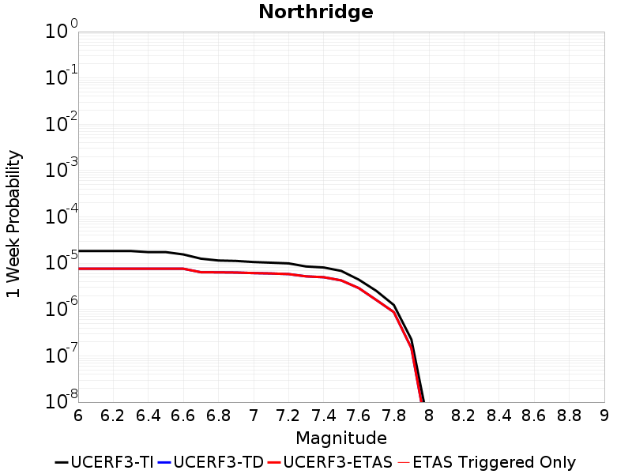 | 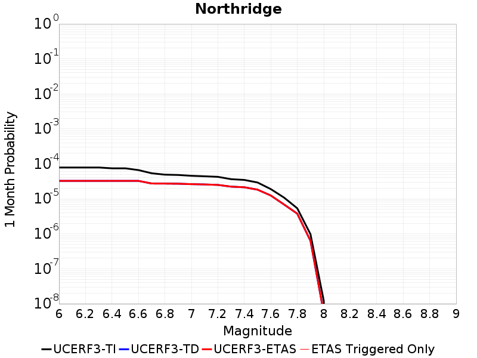 | 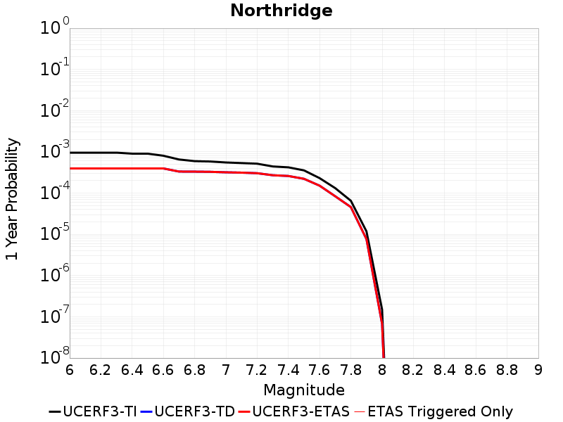 | 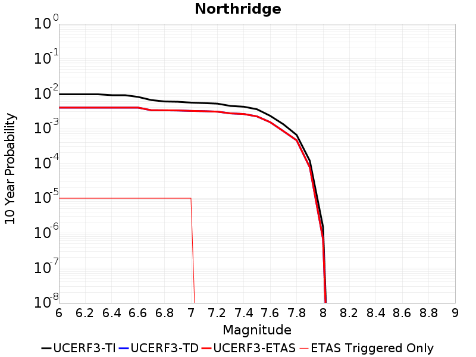 |

| Magnitude | 1 wk TI Prob | 1 wk TD Prob | 1 wk ETAS Prob | 1 wk ETAS/TD Gain | 1 wk ETAS Triggered Only | 1 mo TI Prob | 1 mo TD Prob | 1 mo ETAS Prob | 1 mo ETAS/TD Gain | 1 mo ETAS Triggered Only | 1 yr TI Prob | 1 yr TD Prob | 1 yr ETAS Prob | 1 yr ETAS/TD Gain | 1 yr ETAS Triggered Only | 10 yr TI Prob | 10 yr TD Prob | 10 yr ETAS Prob | 10 yr ETAS/TD Gain | 10 yr ETAS Triggered Only |
|-----|-----|-----|-----|-----|-----|-----|-----|-----|-----|-----|-----|-----|-----|-----|-----|-----|-----|-----|-----|-----|
| 6.0 | 1.8340852E-5 | 7.596559E-6 | 7.596559E-6 | 1.0 | 0.0 | 7.860128E-5 | 3.2556287E-5 | 3.2556287E-5 | 1.0 | 0.0 | 9.565505E-4 | 3.963029E-4 | 3.963029E-4 | 1.0 | 0.0 | 0.009524435 | 0.0039561857 | 0.0039661457 | 1.0025177 | 1.0E-5 |
| 6.1 | 1.8340852E-5 | 7.596559E-6 | 7.596559E-6 | 1.0 | 0.0 | 7.860128E-5 | 3.2556287E-5 | 3.2556287E-5 | 1.0 | 0.0 | 9.565505E-4 | 3.963029E-4 | 3.963029E-4 | 1.0 | 0.0 | 0.009524435 | 0.0039561857 | 0.0039661457 | 1.0025177 | 1.0E-5 |
| 6.2 | 1.8340852E-5 | 7.596559E-6 | 7.596559E-6 | 1.0 | 0.0 | 7.860128E-5 | 3.2556287E-5 | 3.2556287E-5 | 1.0 | 0.0 | 9.565505E-4 | 3.963029E-4 | 3.963029E-4 | 1.0 | 0.0 | 0.009524435 | 0.0039561857 | 0.0039661457 | 1.0025177 | 1.0E-5 |
| 6.3 | 1.8340852E-5 | 7.596559E-6 | 7.596559E-6 | 1.0 | 0.0 | 7.860128E-5 | 3.2556287E-5 | 3.2556287E-5 | 1.0 | 0.0 | 9.565505E-4 | 3.963029E-4 | 3.963029E-4 | 1.0 | 0.0 | 0.009524435 | 0.0039561857 | 0.0039661457 | 1.0025177 | 1.0E-5 |
| 6.4 | 1.7361892E-5 | 7.596559E-6 | 7.596559E-6 | 1.0 | 0.0 | 7.440598E-5 | 3.2556287E-5 | 3.2556287E-5 | 1.0 | 0.0 | 9.055163E-4 | 3.963029E-4 | 3.963029E-4 | 1.0 | 0.0 | 0.009018354 | 0.0039561857 | 0.0039661457 | 1.0025177 | 1.0E-5 |
| 6.5 | 1.7361892E-5 | 7.596559E-6 | 7.596559E-6 | 1.0 | 0.0 | 7.440598E-5 | 3.2556287E-5 | 3.2556287E-5 | 1.0 | 0.0 | 9.055163E-4 | 3.963029E-4 | 3.963029E-4 | 1.0 | 0.0 | 0.009018354 | 0.0039561857 | 0.0039661457 | 1.0025177 | 1.0E-5 |
| 6.6 | 1.5458201E-5 | 7.596559E-6 | 7.596559E-6 | 1.0 | 0.0 | 6.624775E-5 | 3.2556287E-5 | 3.2556287E-5 | 1.0 | 0.0 | 8.0626784E-4 | 3.963029E-4 | 3.963029E-4 | 1.0 | 0.0 | 0.008033488 | 0.0039561857 | 0.0039661457 | 1.0025177 | 1.0E-5 |
| 6.7 | 1.2538368E-5 | 6.38875E-6 | 6.38875E-6 | 1.0 | 0.0 | 5.3734755E-5 | 2.7380072E-5 | 2.7380072E-5 | 1.0 | 0.0 | 6.5402425E-4 | 3.3330184E-4 | 3.3330184E-4 | 1.0 | 0.0 | 0.0065210275 | 0.0033280682 | 0.003338035 | 1.0029948 | 1.0E-5 |
| 6.8 | 1.1438097E-5 | 6.3573398E-6 | 6.3573398E-6 | 1.0 | 0.0 | 4.9019498E-5 | 2.724546E-5 | 2.724546E-5 | 1.0 | 0.0 | 5.9664896E-4 | 3.316634E-4 | 3.316634E-4 | 1.0 | 0.0 | 0.005950495 | 0.003311733 | 0.0033217 | 1.0030096 | 1.0E-5 |
| 6.9 | 1.1204891E-5 | 6.2937092E-6 | 6.2937092E-6 | 1.0 | 0.0 | 4.8020076E-5 | 2.6972764E-5 | 2.6972764E-5 | 1.0 | 0.0 | 5.8448757E-4 | 3.2834435E-4 | 3.2834435E-4 | 1.0 | 0.0 | 0.0058295266 | 0.0032786406 | 0.0032886078 | 1.0030401 | 1.0E-5 |
| 7.0 | 1.061046E-5 | 6.1222036E-6 | 6.1222036E-6 | 1.0 | 0.0 | 4.5472607E-5 | 2.6237754E-5 | 2.6237754E-5 | 1.0 | 0.0 | 5.534883E-4 | 3.1939827E-4 | 3.1939827E-4 | 1.0 | 0.0 | 0.0055211177 | 0.003189439 | 0.0031994071 | 1.0031253 | 1.0E-5 |
| 7.1 | 1.0266979E-5 | 6.010987E-6 | 6.010987E-6 | 1.0 | 0.0 | 4.40006E-5 | 2.5761121E-5 | 2.5761121E-5 | 1.0 | 0.0 | 5.355756E-4 | 3.1359695E-4 | 3.1359695E-4 | 1.0 | 0.0 | 0.0053428668 | 0.0031315906 | 0.0031315906 | 1.0 | 0.0 |
| 7.2 | 9.91273E-6 | 5.8265605E-6 | 5.8265605E-6 | 1.0 | 0.0 | 4.248244E-5 | 2.4970737E-5 | 2.4970737E-5 | 1.0 | 0.0 | 5.171009E-4 | 3.0397673E-4 | 3.0397673E-4 | 1.0 | 0.0 | 0.0051589934 | 0.0030356548 | 0.0030356548 | 1.0 | 0.0 |
| 7.3 | 8.4959265E-6 | 5.1990996E-6 | 5.1990996E-6 | 1.0 | 0.0 | 3.6410605E-5 | 2.2281665E-5 | 2.2281665E-5 | 1.0 | 0.0 | 4.4320893E-4 | 2.7124575E-4 | 2.7124575E-4 | 1.0 | 0.0 | 0.00442326 | 0.0027091736 | 0.0027091736 | 1.0 | 0.0 |
| 7.4 | 8.0847185E-6 | 4.9876567E-6 | 4.9876567E-6 | 1.0 | 0.0 | 3.4648332E-5 | 2.1375497E-5 | 2.1375497E-5 | 1.0 | 0.0 | 4.2176177E-4 | 2.6021583E-4 | 2.6021583E-4 | 1.0 | 0.0 | 0.0042096223 | 0.0025991376 | 0.0025991376 | 1.0 | 0.0 |
| 7.5 | 6.8220684E-6 | 4.257515E-6 | 4.257515E-6 | 1.0 | 0.0 | 2.9237108E-5 | 1.8246365E-5 | 1.8246365E-5 | 1.0 | 0.0 | 3.5590364E-4 | 2.2212706E-4 | 2.2212706E-4 | 1.0 | 0.0 | 0.0035533418 | 0.0022190714 | 0.0022190714 | 1.0 | 0.0 |
| 7.6 | 4.4224143E-6 | 2.9024925E-6 | 2.9024925E-6 | 1.0 | 0.0 | 1.8953066E-5 | 1.24391945E-5 | 1.24391945E-5 | 1.0 | 0.0 | 2.3072914E-4 | 1.5143678E-4 | 1.5143678E-4 | 1.0 | 0.0 | 0.0023048974 | 0.0015133475 | 0.0015133475 | 1.0 | 0.0 |
| 7.7 | 2.5297056E-6 | 1.6061351E-6 | 1.6061351E-6 | 1.0 | 0.0 | 1.0841551E-5 | 6.8834183E-6 | 6.8834183E-6 | 1.0 | 0.0 | 1.319879E-4 | 8.380244E-5 | 8.380244E-5 | 1.0 | 0.0 | 0.0013190953 | 8.3771313E-4 | 8.3771313E-4 | 1.0 | 0.0 |
| 7.8 | 1.2508156E-6 | 8.7876344E-7 | 8.7876344E-7 | 1.0 | 0.0 | 5.3606273E-6 | 3.7661239E-6 | 3.7661239E-6 | 1.0 | 0.0 | 6.526368E-5 | 4.5851604E-5 | 4.5851604E-5 | 1.0 | 0.0 | 6.524452E-4 | 4.5842276E-4 | 4.5842276E-4 | 1.0 | 0.0 |
| 7.9 | 2.262199E-7 | 1.467571E-7 | 1.467571E-7 | 1.0 | 0.0 | 9.695135E-7 | 6.2895884E-7 | 6.2895884E-7 | 1.0 | 0.0 | 1.1803763E-5 | 7.657548E-6 | 7.657548E-6 | 1.0 | 0.0 | 1.1803136E-4 | 7.657292E-5 | 7.657292E-5 | 1.0 | 0.0 |
| 8.0 | 2.865362E-9 | 1.2792079E-9 | 1.2792079E-9 | 1.0 | 0.0 | 1.2280123E-8 | 5.4823195E-9 | 5.4823195E-9 | 1.0 | 0.0 | 1.4951048E-7 | 6.674724E-8 | 6.674724E-8 | 1.0 | 0.0 | 1.4951038E-6 | 6.6747236E-7 | 6.6747236E-7 | 1.0 | 0.0 |

## Elsinore (Stepovers Combined)
*[(top)](#table-of-contents)*

| 1 Week | 1 Month | 1 Year | 10 Year |
|-----|-----|-----|-----|
|  | 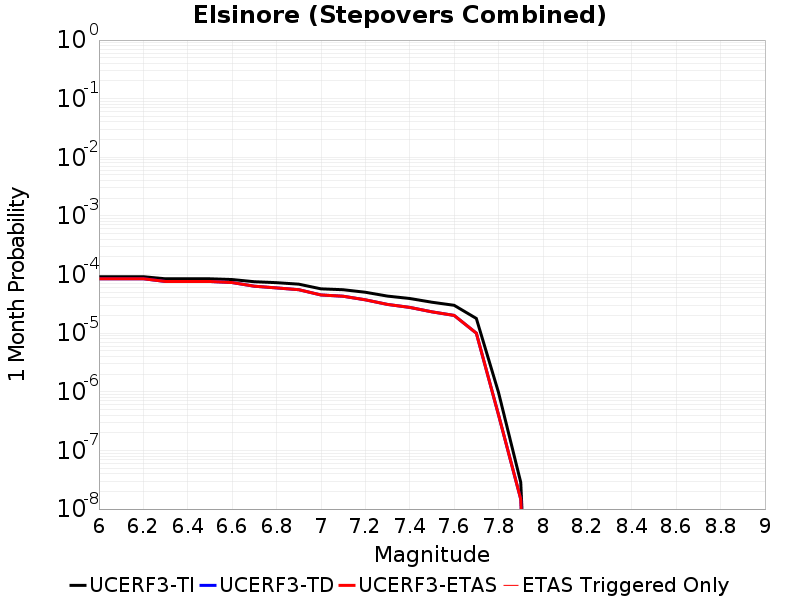 | 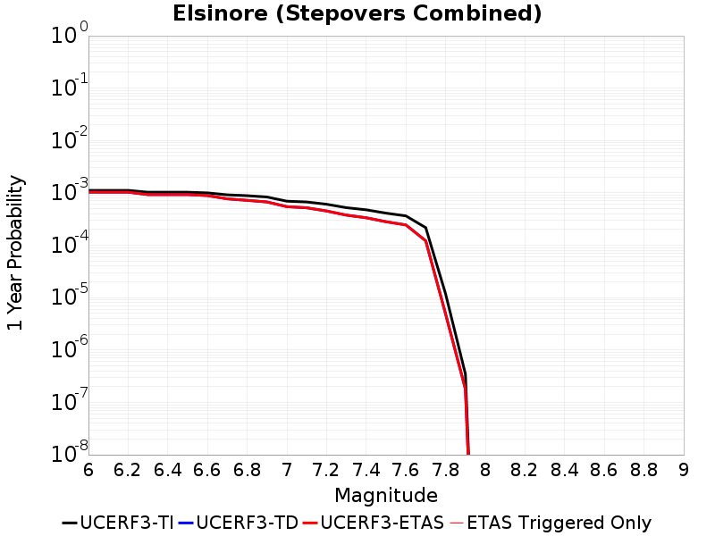 | 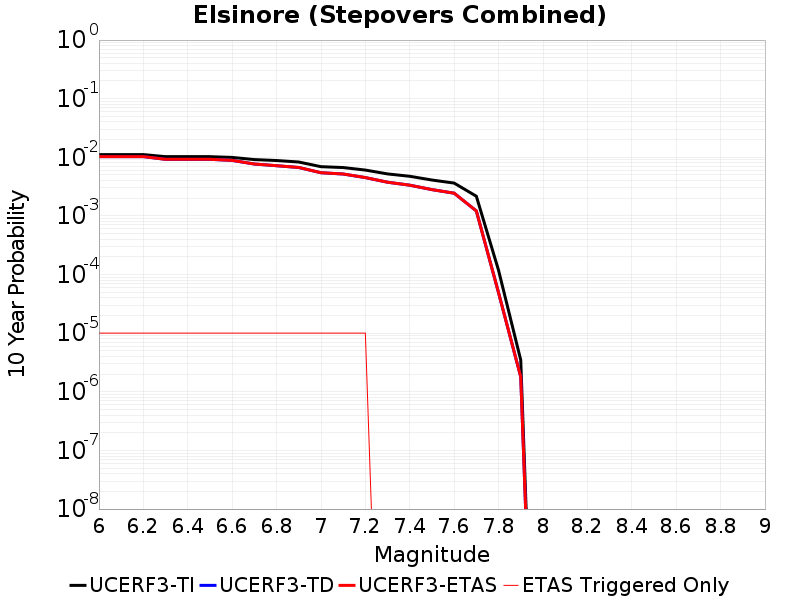 |

| Magnitude | 1 wk TI Prob | 1 wk TD Prob | 1 wk ETAS Prob | 1 wk ETAS/TD Gain | 1 wk ETAS Triggered Only | 1 mo TI Prob | 1 mo TD Prob | 1 mo ETAS Prob | 1 mo ETAS/TD Gain | 1 mo ETAS Triggered Only | 1 yr TI Prob | 1 yr TD Prob | 1 yr ETAS Prob | 1 yr ETAS/TD Gain | 1 yr ETAS Triggered Only | 10 yr TI Prob | 10 yr TD Prob | 10 yr ETAS Prob | 10 yr ETAS/TD Gain | 10 yr ETAS Triggered Only |
|-----|-----|-----|-----|-----|-----|-----|-----|-----|-----|-----|-----|-----|-----|-----|-----|-----|-----|-----|-----|-----|
| 6.0 | 2.144392E-5 | 1.9800807E-5 | 1.9800807E-5 | 1.0 | 0.0 | 9.189928E-5 | 8.4857886E-5 | 8.4857886E-5 | 1.0 | 0.0 | 0.0011182994 | 0.0010326747 | 0.0010326747 | 1.0 | 0.0 | 0.011126885 | 0.010285203 | 0.0102951005 | 1.0009623 | 1.0E-5 |
| 6.1 | 2.144392E-5 | 1.9800807E-5 | 1.9800807E-5 | 1.0 | 0.0 | 9.189928E-5 | 8.4857886E-5 | 8.4857886E-5 | 1.0 | 0.0 | 0.0011182994 | 0.0010326747 | 0.0010326747 | 1.0 | 0.0 | 0.011126885 | 0.010285203 | 0.0102951005 | 1.0009623 | 1.0E-5 |
| 6.2 | 2.144392E-5 | 1.9800807E-5 | 1.9800807E-5 | 1.0 | 0.0 | 9.189928E-5 | 8.4857886E-5 | 8.4857886E-5 | 1.0 | 0.0 | 0.0011182994 | 0.0010326747 | 0.0010326747 | 1.0 | 0.0 | 0.011126885 | 0.010285203 | 0.0102951005 | 1.0009623 | 1.0E-5 |
| 6.3 | 1.9751555E-5 | 1.7779645E-5 | 1.7779645E-5 | 1.0 | 0.0 | 8.4646774E-5 | 7.619627E-5 | 7.619627E-5 | 1.0 | 0.0 | 0.0010300872 | 9.2730945E-4 | 9.2730945E-4 | 1.0 | 0.0 | 0.010253254 | 0.009240333 | 0.00925024 | 1.0010722 | 1.0E-5 |
| 6.4 | 1.9751555E-5 | 1.7779645E-5 | 1.7779645E-5 | 1.0 | 0.0 | 8.4646774E-5 | 7.619627E-5 | 7.619627E-5 | 1.0 | 0.0 | 0.0010300872 | 9.2730945E-4 | 9.2730945E-4 | 1.0 | 0.0 | 0.010253254 | 0.009240333 | 0.00925024 | 1.0010722 | 1.0E-5 |
| 6.5 | 1.9751555E-5 | 1.7779645E-5 | 1.7779645E-5 | 1.0 | 0.0 | 8.4646774E-5 | 7.619627E-5 | 7.619627E-5 | 1.0 | 0.0 | 0.0010300872 | 9.2730945E-4 | 9.2730945E-4 | 1.0 | 0.0 | 0.010253254 | 0.009240333 | 0.00925024 | 1.0010722 | 1.0E-5 |
| 6.6 | 1.9188685E-5 | 1.7040193E-5 | 1.7040193E-5 | 1.0 | 0.0 | 8.2234634E-5 | 7.302745E-5 | 7.302745E-5 | 1.0 | 0.0 | 0.0010007467 | 8.8876276E-4 | 8.8876276E-4 | 1.0 | 0.0 | 0.00996252 | 0.008858212 | 0.008868123 | 1.0011189 | 1.0E-5 |
| 6.7 | 1.7608272E-5 | 1.4764934E-5 | 1.4764934E-5 | 1.0 | 0.0 | 7.546184E-5 | 6.3276806E-5 | 6.3276806E-5 | 1.0 | 0.0 | 9.183606E-4 | 7.7013264E-4 | 7.7013264E-4 | 1.0 | 0.0 | 0.009145746 | 0.007681118 | 0.007691041 | 1.0012919 | 1.0E-5 |
| 6.8 | 1.697165E-5 | 1.3813544E-5 | 1.3813544E-5 | 1.0 | 0.0 | 7.273361E-5 | 5.9199607E-5 | 5.9199607E-5 | 1.0 | 0.0 | 8.8517193E-4 | 7.2052557E-4 | 7.2052557E-4 | 1.0 | 0.0 | 0.008816543 | 0.007187857 | 0.0071977847 | 1.0013813 | 1.0E-5 |
| 6.9 | 1.600365E-5 | 1.2875347E-5 | 1.2875347E-5 | 1.0 | 0.0 | 6.858527E-5 | 5.5178938E-5 | 5.5178938E-5 | 1.0 | 0.0 | 8.347058E-4 | 6.716043E-4 | 6.716043E-4 | 1.0 | 0.0 | 0.008315775 | 0.006701317 | 0.00671125 | 1.0014822 | 1.0E-5 |
| 7.0 | 1.3314581E-5 | 1.0472468E-5 | 1.0472468E-5 | 1.0 | 0.0 | 5.7061243E-5 | 4.488125E-5 | 4.488125E-5 | 1.0 | 0.0 | 6.944992E-4 | 5.462949E-4 | 5.462949E-4 | 1.0 | 0.0 | 0.006923327 | 0.00545323 | 0.0054631755 | 1.0018238 | 1.0E-5 |
| 7.1 | 1.2865345E-5 | 9.961203E-6 | 9.961203E-6 | 1.0 | 0.0 | 5.5136024E-5 | 4.269019E-5 | 4.269019E-5 | 1.0 | 0.0 | 6.710743E-4 | 5.1963166E-4 | 5.1963166E-4 | 1.0 | 0.0 | 0.0066905143 | 0.0051875026 | 0.0051974505 | 1.0019177 | 1.0E-5 |
| 7.2 | 1.1650051E-5 | 8.654623E-6 | 8.654623E-6 | 1.0 | 0.0 | 4.9927836E-5 | 3.7090726E-5 | 3.7090726E-5 | 1.0 | 0.0 | 6.0770183E-4 | 4.514878E-4 | 4.514878E-4 | 1.0 | 0.0 | 0.0060604266 | 0.004507171 | 0.0045171264 | 1.0022087 | 1.0E-5 |
| 7.3 | 1.0008533E-5 | 7.2184853E-6 | 7.2184853E-6 | 1.0 | 0.0 | 4.2893007E-5 | 3.0936008E-5 | 3.0936008E-5 | 1.0 | 0.0 | 5.220972E-4 | 3.7658223E-4 | 3.7658223E-4 | 1.0 | 0.0 | 0.005208723 | 0.00375985 | 0.00375985 | 1.0 | 0.0 |
| 7.4 | 9.116759E-6 | 6.4248156E-6 | 6.4248156E-6 | 1.0 | 0.0 | 3.907124E-5 | 2.7534641E-5 | 2.7534641E-5 | 1.0 | 0.0 | 4.7558855E-4 | 3.3518407E-4 | 3.3518407E-4 | 1.0 | 0.0 | 0.00474572 | 0.0033469375 | 0.0033469375 | 1.0 | 0.0 |
| 7.5 | 7.870524E-6 | 5.395083E-6 | 5.395083E-6 | 1.0 | 0.0 | 3.3730383E-5 | 2.3121587E-5 | 2.3121587E-5 | 1.0 | 0.0 | 4.1059E-4 | 2.8147022E-4 | 2.8147022E-4 | 1.0 | 0.0 | 0.0040983222 | 0.0028112645 | 0.0028112645 | 1.0 | 0.0 |
| 7.6 | 6.9774537E-6 | 4.688577E-6 | 4.688577E-6 | 1.0 | 0.0 | 2.990303E-5 | 2.0093754E-5 | 2.0093754E-5 | 1.0 | 0.0 | 3.640086E-4 | 2.4461516E-4 | 2.4461516E-4 | 1.0 | 0.0 | 0.003634129 | 0.0024435758 | 0.0024435758 | 1.0 | 0.0 |
| 7.7 | 4.1616954E-6 | 2.3346001E-6 | 2.3346001E-6 | 1.0 | 0.0 | 1.7835715E-5 | 1.0005395E-5 | 1.0005395E-5 | 1.0 | 0.0 | 2.171282E-4 | 1.2180962E-4 | 1.2180962E-4 | 1.0 | 0.0 | 0.0021691616 | 0.0012175019 | 0.0012175019 | 1.0 | 0.0 |
| 7.8 | 2.2692414E-7 | 9.406634E-8 | 9.406634E-8 | 1.0 | 0.0 | 9.725317E-7 | 4.031414E-7 | 4.031414E-7 | 1.0 | 0.0 | 1.1840509E-5 | 4.9082387E-6 | 4.9082387E-6 | 1.0 | 0.0 | 1.1839878E-4 | 4.908163E-5 | 4.908163E-5 | 1.0 | 0.0 |
| 7.9 | 6.676829E-9 | 3.4455256E-9 | 3.4455256E-9 | 1.0 | 0.0 | 2.861498E-8 | 1.4766538E-8 | 1.4766538E-8 | 1.0 | 0.0 | 3.4838732E-7 | 1.7978259E-7 | 1.7978259E-7 | 1.0 | 0.0 | 3.4838679E-6 | 1.7978246E-6 | 1.7978246E-6 | 1.0 | 0.0 |

## Santa Cruz Catalina Ridge alt1
*[(top)](#table-of-contents)*

| 1 Week | 1 Month | 1 Year | 10 Year |
|-----|-----|-----|-----|
|  |  |  | 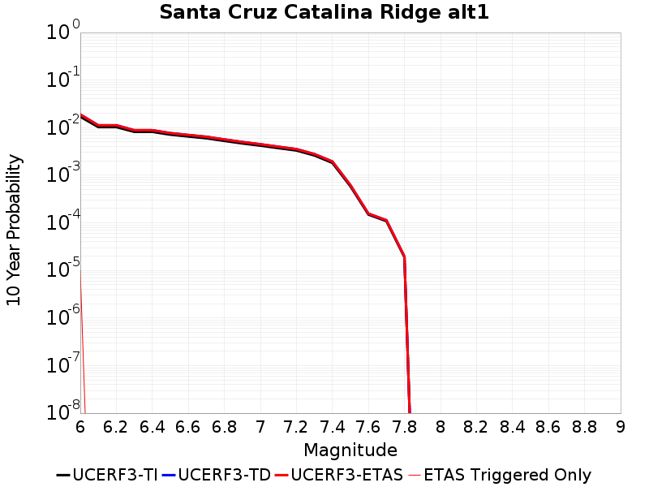 |

| Magnitude | 1 wk TI Prob | 1 wk TD Prob | 1 wk ETAS Prob | 1 wk ETAS/TD Gain | 1 wk ETAS Triggered Only | 1 mo TI Prob | 1 mo TD Prob | 1 mo ETAS Prob | 1 mo ETAS/TD Gain | 1 mo ETAS Triggered Only | 1 yr TI Prob | 1 yr TD Prob | 1 yr ETAS Prob | 1 yr ETAS/TD Gain | 1 yr ETAS Triggered Only | 10 yr TI Prob | 10 yr TD Prob | 10 yr ETAS Prob | 10 yr ETAS/TD Gain | 10 yr ETAS Triggered Only |
|-----|-----|-----|-----|-----|-----|-----|-----|-----|-----|-----|-----|-----|-----|-----|-----|-----|-----|-----|-----|-----|
| 6.0 | 3.2833184E-5 | 3.658456E-5 | 3.658456E-5 | 1.0 | 0.0 | 1.4070606E-4 | 1.567825E-4 | 1.567825E-4 | 1.0 | 0.0 | 0.00171175 | 0.0019073223 | 0.0019073223 | 1.0 | 0.0 | 0.016986247 | 0.01892646 | 0.01893627 | 1.0005183 | 1.0E-5 |
| 6.1 | 1.9835548E-5 | 2.1671982E-5 | 2.1671982E-5 | 1.0 | 0.0 | 8.500672E-5 | 9.287673E-5 | 9.287673E-5 | 1.0 | 0.0 | 0.0010344655 | 0.0011302078 | 0.0011302078 | 1.0 | 0.0 | 0.010296632 | 0.011246736 | 0.011246736 | 1.0 | 0.0 |
| 6.2 | 1.9835548E-5 | 2.1671982E-5 | 2.1671982E-5 | 1.0 | 0.0 | 8.500672E-5 | 9.287673E-5 | 9.287673E-5 | 1.0 | 0.0 | 0.0010344655 | 0.0011302078 | 0.0011302078 | 1.0 | 0.0 | 0.010296632 | 0.011246736 | 0.011246736 | 1.0 | 0.0 |
| 6.3 | 1.5728183E-5 | 1.7042776E-5 | 1.7042776E-5 | 1.0 | 0.0 | 6.7404755E-5 | 7.3038456E-5 | 7.3038456E-5 | 1.0 | 0.0 | 8.2034385E-4 | 8.888865E-4 | 8.888865E-4 | 1.0 | 0.0 | 0.008173222 | 0.008853992 | 0.008853992 | 1.0 | 0.0 |
| 6.4 | 1.5728183E-5 | 1.7042776E-5 | 1.7042776E-5 | 1.0 | 0.0 | 6.7404755E-5 | 7.3038456E-5 | 7.3038456E-5 | 1.0 | 0.0 | 8.2034385E-4 | 8.888865E-4 | 8.888865E-4 | 1.0 | 0.0 | 0.008173222 | 0.008853992 | 0.008853992 | 1.0 | 0.0 |
| 6.5 | 1.3707734E-5 | 1.4801832E-5 | 1.4801832E-5 | 1.0 | 0.0 | 5.8746107E-5 | 6.34349E-5 | 6.34349E-5 | 1.0 | 0.0 | 7.1499916E-4 | 7.7204977E-4 | 7.7204977E-4 | 1.0 | 0.0 | 0.0071270303 | 0.0076940753 | 0.0076940753 | 1.0 | 0.0 |
| 6.6 | 1.2539813E-5 | 1.3516732E-5 | 1.3516732E-5 | 1.0 | 0.0 | 5.3740947E-5 | 5.792758E-5 | 5.792758E-5 | 1.0 | 0.0 | 6.540996E-4 | 7.0504274E-4 | 7.0504274E-4 | 1.0 | 0.0 | 0.0065217763 | 0.007028363 | 0.007028363 | 1.0 | 0.0 |
| 6.7 | 1.1504083E-5 | 1.2383226E-5 | 1.2383226E-5 | 1.0 | 0.0 | 4.930228E-5 | 5.30699E-5 | 5.30699E-5 | 1.0 | 0.0 | 6.0008996E-4 | 6.4593647E-4 | 6.4593647E-4 | 1.0 | 0.0 | 0.005984721 | 0.0064408192 | 0.0064408192 | 1.0 | 0.0 |
| 6.8 | 1.012739E-5 | 1.0882083E-5 | 1.0882083E-5 | 1.0 | 0.0 | 4.340238E-5 | 4.6636676E-5 | 4.6636676E-5 | 1.0 | 0.0 | 5.282958E-4 | 5.676551E-4 | 5.676551E-4 | 1.0 | 0.0 | 0.0052704164 | 0.0056622205 | 0.0056622205 | 1.0 | 0.0 |
| 6.9 | 8.9607865E-6 | 9.6134445E-6 | 9.6134445E-6 | 1.0 | 0.0 | 3.8402806E-5 | 4.119983E-5 | 4.119983E-5 | 1.0 | 0.0 | 4.6745385E-4 | 5.014936E-4 | 5.014936E-4 | 1.0 | 0.0 | 0.0046647177 | 0.005003738 | 0.005003738 | 1.0 | 0.0 |
| 7.0 | 8.046829E-6 | 8.623565E-6 | 8.623565E-6 | 1.0 | 0.0 | 3.4485955E-5 | 3.6957616E-5 | 3.6957616E-5 | 1.0 | 0.0 | 4.1978562E-4 | 4.498669E-4 | 4.498669E-4 | 1.0 | 0.0 | 0.004189935 | 0.004489653 | 0.004489653 | 1.0 | 0.0 |
| 7.1 | 7.136131E-6 | 7.640996E-6 | 7.640996E-6 | 1.0 | 0.0 | 3.0583058E-5 | 3.274672E-5 | 3.274672E-5 | 1.0 | 0.0 | 3.7228514E-4 | 3.986191E-4 | 3.986191E-4 | 1.0 | 0.0 | 0.0037166206 | 0.003979117 | 0.003979117 | 1.0 | 0.0 |
| 7.2 | 6.362014E-6 | 6.807907E-6 | 6.807907E-6 | 1.0 | 0.0 | 2.726549E-5 | 2.9176423E-5 | 2.9176423E-5 | 1.0 | 0.0 | 3.3190678E-4 | 3.5516568E-4 | 3.5516568E-4 | 1.0 | 0.0 | 0.0033141149 | 0.0035460491 | 0.0035460491 | 1.0 | 0.0 |
| 7.3 | 5.004101E-6 | 5.354029E-6 | 5.354029E-6 | 1.0 | 0.0 | 2.1445969E-5 | 2.2945638E-5 | 2.2945638E-5 | 1.0 | 0.0 | 2.6107338E-4 | 2.7932788E-4 | 2.7932788E-4 | 1.0 | 0.0 | 0.002607669 | 0.0027898226 | 0.0027898226 | 1.0 | 0.0 |
| 7.4 | 3.4901443E-6 | 3.733663E-6 | 3.733663E-6 | 1.0 | 0.0 | 1.4957676E-5 | 1.6001317E-5 | 1.6001317E-5 | 1.0 | 0.0 | 1.8209449E-4 | 1.9479901E-4 | 1.9479901E-4 | 1.0 | 0.0 | 0.0018194534 | 0.0019463211 | 0.0019463211 | 1.0 | 0.0 |
| 7.5 | 1.1215045E-6 | 1.189836E-6 | 1.189836E-6 | 1.0 | 0.0 | 4.806439E-6 | 5.099287E-6 | 5.099287E-6 | 1.0 | 0.0 | 5.851682E-5 | 6.208209E-5 | 6.208209E-5 | 1.0 | 0.0 | 5.850142E-4 | 6.206505E-4 | 6.206505E-4 | 1.0 | 0.0 |
| 7.6 | 2.8599047E-7 | 2.99608E-7 | 2.99608E-7 | 1.0 | 0.0 | 1.2256729E-6 | 1.2840336E-6 | 1.2840336E-6 | 1.0 | 0.0 | 1.4922465E-5 | 1.5632999E-5 | 1.5632999E-5 | 1.0 | 0.0 | 1.4921463E-4 | 1.5631913E-4 | 1.5631913E-4 | 1.0 | 0.0 |
| 7.7 | 2.0781519E-7 | 2.1750584E-7 | 2.1750584E-7 | 1.0 | 0.0 | 8.906362E-7 | 9.3216755E-7 | 9.3216755E-7 | 1.0 | 0.0 | 1.08434415E-5 | 1.1349081E-5 | 1.1349081E-5 | 1.0 | 0.0 | 1.0842913E-4 | 1.1348512E-4 | 1.1348512E-4 | 1.0 | 0.0 |
| 7.8 | 3.614776E-8 | 3.765068E-8 | 3.765068E-8 | 1.0 | 0.0 | 1.5491896E-7 | 1.6136003E-7 | 1.6136003E-7 | 1.0 | 0.0 | 1.8861368E-6 | 1.9645568E-6 | 1.9645568E-6 | 1.0 | 0.0 | 1.8861208E-5 | 1.9645406E-5 | 1.9645406E-5 | 1.0 | 0.0 |

## Maacama 2011 CFM
*[(top)](#table-of-contents)*

| 1 Week | 1 Month | 1 Year | 10 Year |
|-----|-----|-----|-----|
| 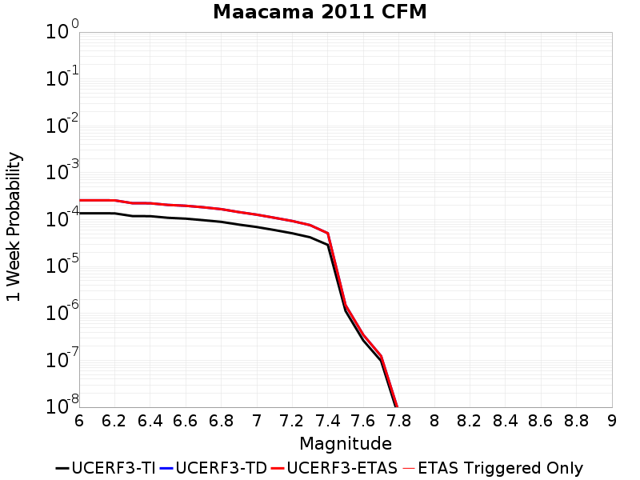 | 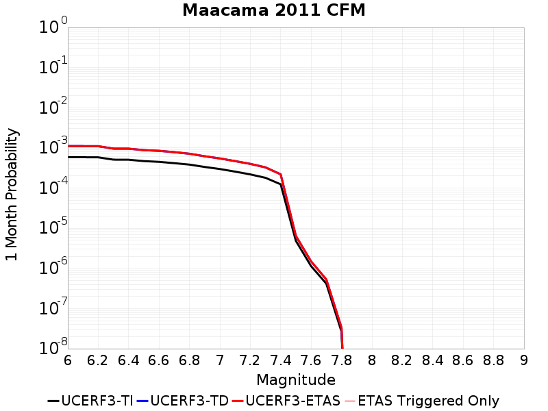 | 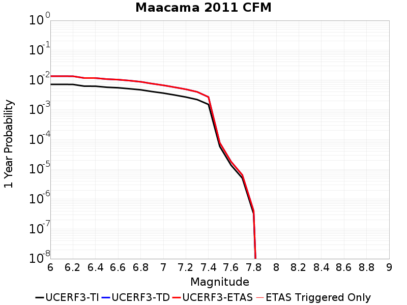 | 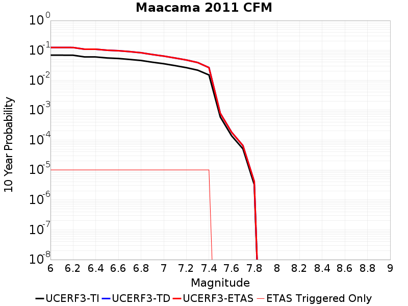 |

| Magnitude | 1 wk TI Prob | 1 wk TD Prob | 1 wk ETAS Prob | 1 wk ETAS/TD Gain | 1 wk ETAS Triggered Only | 1 mo TI Prob | 1 mo TD Prob | 1 mo ETAS Prob | 1 mo ETAS/TD Gain | 1 mo ETAS Triggered Only | 1 yr TI Prob | 1 yr TD Prob | 1 yr ETAS Prob | 1 yr ETAS/TD Gain | 1 yr ETAS Triggered Only | 10 yr TI Prob | 10 yr TD Prob | 10 yr ETAS Prob | 10 yr ETAS/TD Gain | 10 yr ETAS Triggered Only |
|-----|-----|-----|-----|-----|-----|-----|-----|-----|-----|-----|-----|-----|-----|-----|-----|-----|-----|-----|-----|-----|
| 6.0 | 1.368203E-4 | 2.5884158E-4 | 2.5884158E-4 | 1.0 | 0.0 | 5.862409E-4 | 0.0011087408 | 0.0011087408 | 1.0 | 0.0 | 0.0071141496 | 0.013397876 | 0.013397876 | 1.0 | 0.0 | 0.06890667 | 0.12458845 | 0.12459721 | 1.0000702 | 1.0E-5 |
| 6.1 | 1.368203E-4 | 2.5884158E-4 | 2.5884158E-4 | 1.0 | 0.0 | 5.862409E-4 | 0.0011087408 | 0.0011087408 | 1.0 | 0.0 | 0.0071141496 | 0.013397876 | 0.013397876 | 1.0 | 0.0 | 0.06890667 | 0.12458845 | 0.12459721 | 1.0000702 | 1.0E-5 |
| 6.2 | 1.360743E-4 | 2.575853E-4 | 2.575853E-4 | 1.0 | 0.0 | 5.8304524E-4 | 0.001103362 | 0.001103362 | 1.0 | 0.0 | 0.007075496 | 0.0133332675 | 0.0133332675 | 1.0 | 0.0 | 0.06854413 | 0.12402175 | 0.124030516 | 1.0000706 | 1.0E-5 |
| 6.3 | 1.1917239E-4 | 2.2447082E-4 | 2.2447082E-4 | 1.0 | 0.0 | 5.1063887E-4 | 9.61577E-4 | 9.61577E-4 | 1.0 | 0.0 | 0.0061993203 | 0.011631655 | 0.011631655 | 1.0 | 0.0 | 0.060292065 | 0.10922364 | 0.10923255 | 1.0000815 | 1.0E-5 |
| 6.4 | 1.1859289E-4 | 2.235043E-4 | 2.235043E-4 | 1.0 | 0.0 | 5.0815626E-4 | 9.5743797E-4 | 9.5743797E-4 | 1.0 | 0.0 | 0.006169266 | 0.011581851 | 0.011581851 | 1.0 | 0.0 | 0.06000784 | 0.10877962 | 0.10878853 | 1.0000819 | 1.0E-5 |
| 6.5 | 1.09512424E-4 | 2.0600545E-4 | 2.0600545E-4 | 1.0 | 0.0 | 4.6925453E-4 | 8.825246E-4 | 8.825246E-4 | 1.0 | 0.0 | 0.005698218 | 0.010681679 | 0.010681679 | 1.0 | 0.0 | 0.055543028 | 0.10086132 | 0.10087031 | 1.0000892 | 1.0E-5 |
| 6.6 | 1.0502928E-4 | 1.9756368E-4 | 1.9756368E-4 | 1.0 | 0.0 | 4.500478E-4 | 8.46371E-4 | 8.46371E-4 | 1.0 | 0.0 | 0.0054655746 | 0.01024694 | 0.01024694 | 1.0 | 0.0 | 0.053330887 | 0.09700828 | 0.09701731 | 1.0000931 | 1.0E-5 |
| 6.7 | 9.739358E-5 | 1.8337078E-4 | 1.8337078E-4 | 1.0 | 0.0 | 4.173343E-4 | 7.8559614E-4 | 7.8559614E-4 | 1.0 | 0.0 | 0.0050692135 | 0.009515467 | 0.009515467 | 1.0 | 0.0 | 0.049551267 | 0.09047086 | 0.09047995 | 1.0001005 | 1.0E-5 |
| 6.8 | 8.969524E-5 | 1.6730186E-4 | 1.6730186E-4 | 1.0 | 0.0 | 3.8435153E-4 | 7.167796E-4 | 7.167796E-4 | 1.0 | 0.0 | 0.0046694432 | 0.008686205 | 0.008686205 | 1.0 | 0.0 | 0.045725387 | 0.082980625 | 0.08298979 | 1.0001105 | 1.0E-5 |
| 6.9 | 7.838291E-5 | 1.4482462E-4 | 1.4482462E-4 | 1.0 | 0.0 | 3.358835E-4 | 6.205059E-4 | 6.205059E-4 | 1.0 | 0.0 | 0.0040817154 | 0.0075245886 | 0.0075245886 | 1.0 | 0.0 | 0.04007554 | 0.07234813 | 0.07235741 | 1.0001283 | 1.0E-5 |
| 7.0 | 6.961957E-5 | 1.2765471E-4 | 1.2765471E-4 | 1.0 | 0.0 | 2.9833548E-4 | 5.4696196E-4 | 5.4696196E-4 | 1.0 | 0.0 | 0.0036261857 | 0.0066363085 | 0.0066363085 | 1.0 | 0.0 | 0.035675827 | 0.06414118 | 0.064150535 | 1.0001459 | 1.0E-5 |
| 7.1 | 5.999398E-5 | 1.0956015E-4 | 1.0956015E-4 | 1.0 | 0.0 | 2.570917E-4 | 4.6944953E-4 | 4.6944953E-4 | 1.0 | 0.0 | 0.0031255994 | 0.005699027 | 0.005699027 | 1.0 | 0.0 | 0.030820016 | 0.055380598 | 0.055390045 | 1.0001706 | 1.0E-5 |
| 7.2 | 5.116532E-5 | 9.350219E-5 | 9.350219E-5 | 1.0 | 0.0 | 2.1926152E-4 | 4.0065777E-4 | 4.0065777E-4 | 1.0 | 0.0 | 0.002666241 | 0.004866322 | 0.004866322 | 1.0 | 0.0 | 0.026344774 | 0.047519717 | 0.04752924 | 1.0002004 | 1.0E-5 |
| 7.3 | 4.2087835E-5 | 7.653427E-5 | 7.653427E-5 | 1.0 | 0.0 | 1.8036396E-4 | 3.2795963E-4 | 3.2795963E-4 | 1.0 | 0.0 | 0.0021937196 | 0.0039851028 | 0.0039851028 | 1.0 | 0.0 | 0.0217219 | 0.039082617 | 0.039092224 | 1.0002458 | 1.0E-5 |
| 7.4 | 2.8991652E-5 | 5.1398703E-5 | 5.1398703E-5 | 1.0 | 0.0 | 1.2424402E-4 | 2.2026095E-4 | 2.2026095E-4 | 1.0 | 0.0 | 0.0015116213 | 0.0026783103 | 0.0026783103 | 1.0 | 0.0 | 0.015013801 | 0.026448945 | 0.026458679 | 1.0003681 | 1.0E-5 |
| 7.5 | 1.1292299E-6 | 1.499089E-6 | 1.499089E-6 | 1.0 | 0.0 | 4.8395473E-6 | 6.4246583E-6 | 6.4246583E-6 | 1.0 | 0.0 | 5.8919897E-5 | 7.821866E-5 | 7.821866E-5 | 1.0 | 0.0 | 5.890428E-4 | 7.8259525E-4 | 7.8259525E-4 | 1.0 | 0.0 |
| 7.6 | 2.6535366E-7 | 3.4880995E-7 | 3.4880995E-7 | 1.0 | 0.0 | 1.1372296E-6 | 1.4948989E-6 | 1.4948989E-6 | 1.0 | 0.0 | 1.3845682E-5 | 1.8200244E-5 | 1.8200244E-5 | 1.0 | 0.0 | 1.3844819E-4 | 1.824951E-4 | 1.824951E-4 | 1.0 | 0.0 |
| 7.7 | 9.727789E-8 | 1.2376688E-7 | 1.2376688E-7 | 1.0 | 0.0 | 4.1690518E-7 | 5.3042936E-7 | 5.3042936E-7 | 1.0 | 0.0 | 5.0758085E-6 | 6.457958E-6 | 6.457958E-6 | 1.0 | 0.0 | 5.0756928E-5 | 6.494785E-5 | 6.494785E-5 | 1.0 | 0.0 |
| 7.8 | 6.1939325E-9 | 7.778671E-9 | 7.778671E-9 | 1.0 | 0.0 | 2.6545425E-8 | 3.3337162E-8 | 3.3337162E-8 | 1.0 | 0.0 | 3.231905E-7 | 4.0587986E-7 | 4.0587986E-7 | 1.0 | 0.0 | 3.2319003E-6 | 4.095379E-6 | 4.095379E-6 | 1.0 | 0.0 |

## Swain Ravine - Spenceville
*[(top)](#table-of-contents)*

| 1 Week | 1 Month | 1 Year | 10 Year |
|-----|-----|-----|-----|
| 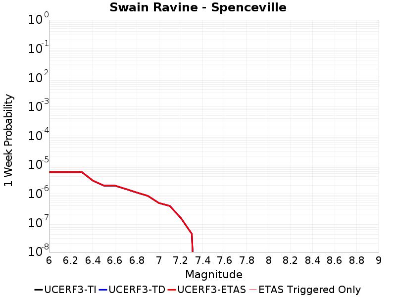 | 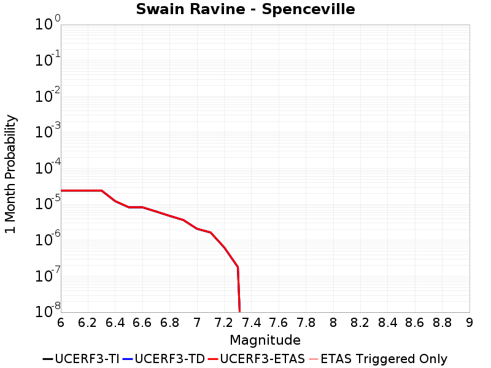 | 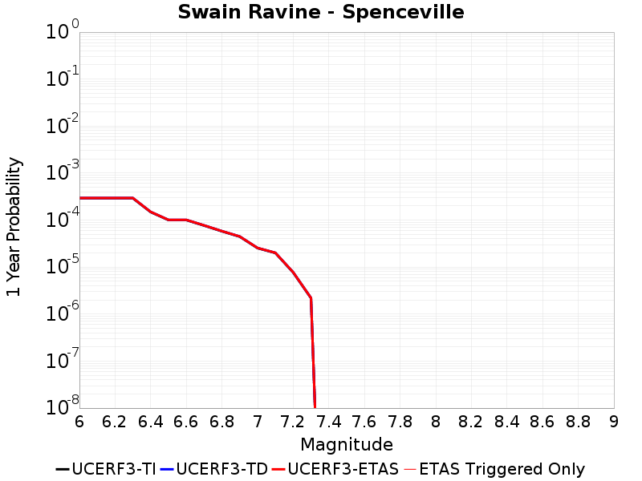 | 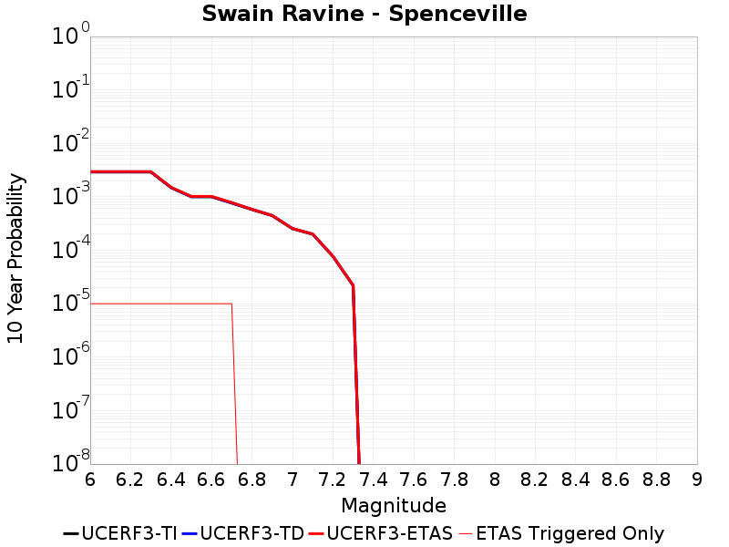 |

| Magnitude | 1 wk TI Prob | 1 wk TD Prob | 1 wk ETAS Prob | 1 wk ETAS/TD Gain | 1 wk ETAS Triggered Only | 1 mo TI Prob | 1 mo TD Prob | 1 mo ETAS Prob | 1 mo ETAS/TD Gain | 1 mo ETAS Triggered Only | 1 yr TI Prob | 1 yr TD Prob | 1 yr ETAS Prob | 1 yr ETAS/TD Gain | 1 yr ETAS Triggered Only | 10 yr TI Prob | 10 yr TD Prob | 10 yr ETAS Prob | 10 yr ETAS/TD Gain | 10 yr ETAS Triggered Only |
|-----|-----|-----|-----|-----|-----|-----|-----|-----|-----|-----|-----|-----|-----|-----|-----|-----|-----|-----|-----|-----|
| 6.0 | 5.596169E-6 | 5.6642193E-6 | 5.6642193E-6 | 1.0 | 0.0 | 2.398336E-5 | 2.4275016E-5 | 2.4275016E-5 | 1.0 | 0.0 | 2.9195828E-4 | 2.9551095E-4 | 2.9551095E-4 | 1.0 | 0.0 | 0.00291575 | 0.0029514492 | 0.0029614198 | 1.0033782 | 1.0E-5 |
| 6.1 | 5.596169E-6 | 5.6642193E-6 | 5.6642193E-6 | 1.0 | 0.0 | 2.398336E-5 | 2.4275016E-5 | 2.4275016E-5 | 1.0 | 0.0 | 2.9195828E-4 | 2.9551095E-4 | 2.9551095E-4 | 1.0 | 0.0 | 0.00291575 | 0.0029514492 | 0.0029614198 | 1.0033782 | 1.0E-5 |
| 6.2 | 5.596169E-6 | 5.6642193E-6 | 5.6642193E-6 | 1.0 | 0.0 | 2.398336E-5 | 2.4275016E-5 | 2.4275016E-5 | 1.0 | 0.0 | 2.9195828E-4 | 2.9551095E-4 | 2.9551095E-4 | 1.0 | 0.0 | 0.00291575 | 0.0029514492 | 0.0029614198 | 1.0033782 | 1.0E-5 |
| 6.3 | 5.596169E-6 | 5.6642193E-6 | 5.6642193E-6 | 1.0 | 0.0 | 2.398336E-5 | 2.4275016E-5 | 2.4275016E-5 | 1.0 | 0.0 | 2.9195828E-4 | 2.9551095E-4 | 2.9551095E-4 | 1.0 | 0.0 | 0.00291575 | 0.0029514492 | 0.0029614198 | 1.0033782 | 1.0E-5 |
| 6.4 | 2.8426775E-6 | 2.8743416E-6 | 2.8743416E-6 | 1.0 | 0.0 | 1.2182847E-5 | 1.2318551E-5 | 1.2318551E-5 | 1.0 | 0.0 | 1.4831607E-4 | 1.4996841E-4 | 1.4996841E-4 | 1.0 | 0.0 | 0.0014821711 | 0.0014987106 | 0.0015086957 | 1.0066624 | 1.0E-5 |
| 6.5 | 1.9210793E-6 | 1.9415422E-6 | 1.9415422E-6 | 1.0 | 0.0 | 8.233172E-6 | 8.32087E-6 | 8.32087E-6 | 1.0 | 0.0 | 1.0023425E-4 | 1.01302016E-4 | 1.01302016E-4 | 1.0 | 0.0 | 0.0010018905 | 0.0010125719 | 0.0010225617 | 1.0098659 | 1.0E-5 |
| 6.6 | 1.9210793E-6 | 1.9415422E-6 | 1.9415422E-6 | 1.0 | 0.0 | 8.233172E-6 | 8.32087E-6 | 8.32087E-6 | 1.0 | 0.0 | 1.0023425E-4 | 1.01302016E-4 | 1.01302016E-4 | 1.0 | 0.0 | 0.0010018905 | 0.0010125719 | 0.0010225617 | 1.0098659 | 1.0E-5 |
| 6.7 | 1.4667394E-6 | 1.4819884E-6 | 1.4819884E-6 | 1.0 | 0.0 | 6.286011E-6 | 6.351364E-6 | 6.351364E-6 | 1.0 | 0.0 | 7.65295E-5 | 7.732519E-5 | 7.732519E-5 | 1.0 | 0.0 | 7.6503144E-4 | 7.729906E-4 | 7.8298285E-4 | 1.0129268 | 1.0E-5 |
| 6.8 | 1.1076943E-6 | 1.1190241E-6 | 1.1190241E-6 | 1.0 | 0.0 | 4.747252E-6 | 4.7958088E-6 | 4.7958088E-6 | 1.0 | 0.0 | 5.7796264E-5 | 5.8387453E-5 | 5.8387453E-5 | 1.0 | 0.0 | 5.778124E-4 | 5.837256E-4 | 5.837256E-4 | 1.0 | 0.0 |
| 6.9 | 8.514296E-7 | 8.6006327E-7 | 8.6006327E-7 | 1.0 | 0.0 | 3.648979E-6 | 3.6859806E-6 | 3.6859806E-6 | 1.0 | 0.0 | 4.442541E-5 | 4.4875917E-5 | 4.4875917E-5 | 1.0 | 0.0 | 4.441653E-4 | 4.486714E-4 | 4.486714E-4 | 1.0 | 0.0 |
| 7.0 | 4.8544706E-7 | 4.9036066E-7 | 4.9036066E-7 | 1.0 | 0.0 | 2.0804857E-6 | 2.101544E-6 | 2.101544E-6 | 1.0 | 0.0 | 2.532962E-5 | 2.5586012E-5 | 2.5586012E-5 | 1.0 | 0.0 | 2.5326732E-4 | 2.5583195E-4 | 2.5583195E-4 | 1.0 | 0.0 |
| 7.1 | 3.829186E-7 | 3.868121E-7 | 3.868121E-7 | 1.0 | 0.0 | 1.6410787E-6 | 1.6577651E-6 | 1.6577651E-6 | 1.0 | 0.0 | 1.997995E-5 | 2.0183115E-5 | 2.0183115E-5 | 1.0 | 0.0 | 1.9978154E-4 | 2.0181388E-4 | 2.0181388E-4 | 1.0 | 0.0 |
| 7.2 | 1.4726595E-7 | 1.4880396E-7 | 1.4880396E-7 | 1.0 | 0.0 | 6.3113964E-7 | 6.3773115E-7 | 6.3773115E-7 | 1.0 | 0.0 | 7.684098E-6 | 7.764354E-6 | 7.764354E-6 | 1.0 | 0.0 | 7.6838325E-5 | 7.7641365E-5 | 7.7641365E-5 | 1.0 | 0.0 |
| 7.3 | 4.1880604E-8 | 4.232709E-8 | 4.232709E-8 | 1.0 | 0.0 | 1.7948828E-7 | 1.8140182E-7 | 1.8140182E-7 | 1.0 | 0.0 | 2.1852677E-6 | 2.2085671E-6 | 2.2085671E-6 | 1.0 | 0.0 | 2.1852462E-5 | 2.2085671E-5 | 2.2085671E-5 | 1.0 | 0.0 |

## Fickle Hill (alt1)
*[(top)](#table-of-contents)*

| 1 Week | 1 Month | 1 Year | 10 Year |
|-----|-----|-----|-----|
|  | 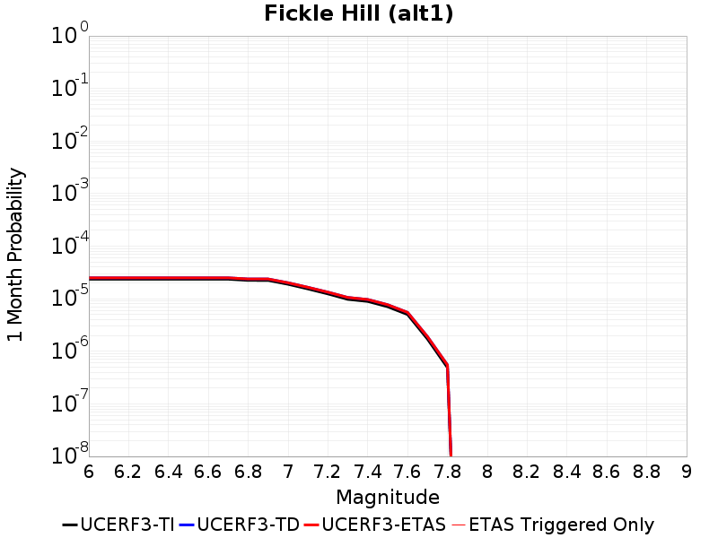 | 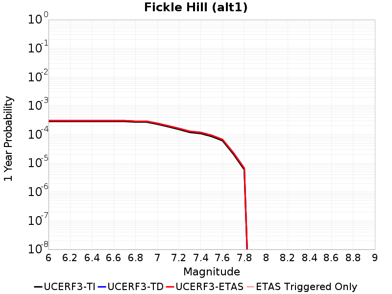 | 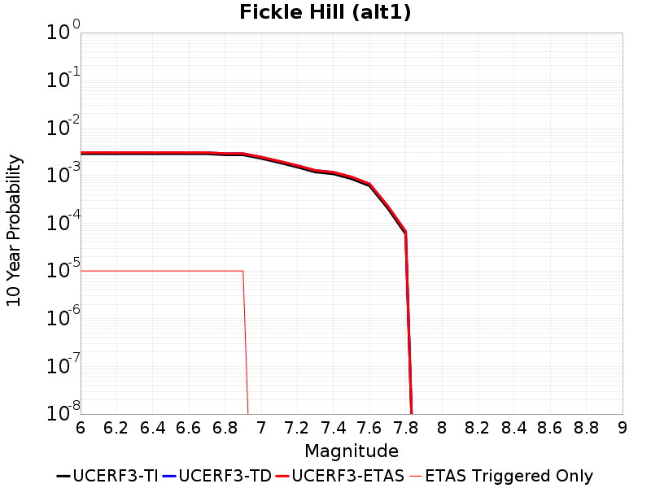 |

| Magnitude | 1 wk TI Prob | 1 wk TD Prob | 1 wk ETAS Prob | 1 wk ETAS/TD Gain | 1 wk ETAS Triggered Only | 1 mo TI Prob | 1 mo TD Prob | 1 mo ETAS Prob | 1 mo ETAS/TD Gain | 1 mo ETAS Triggered Only | 1 yr TI Prob | 1 yr TD Prob | 1 yr ETAS Prob | 1 yr ETAS/TD Gain | 1 yr ETAS Triggered Only | 10 yr TI Prob | 10 yr TD Prob | 10 yr ETAS Prob | 10 yr ETAS/TD Gain | 10 yr ETAS Triggered Only |
|-----|-----|-----|-----|-----|-----|-----|-----|-----|-----|-----|-----|-----|-----|-----|-----|-----|-----|-----|-----|-----|
| 6.0 | 5.491893E-6 | 5.829226E-6 | 5.829226E-6 | 1.0 | 0.0 | 2.3536471E-5 | 2.4982171E-5 | 2.4982171E-5 | 1.0 | 0.0 | 2.8651886E-4 | 3.0411774E-4 | 3.0411774E-4 | 1.0 | 0.0 | 0.0028614972 | 0.0030372401 | 0.0030472097 | 1.0032824 | 1.0E-5 |
| 6.1 | 5.491893E-6 | 5.829226E-6 | 5.829226E-6 | 1.0 | 0.0 | 2.3536471E-5 | 2.4982171E-5 | 2.4982171E-5 | 1.0 | 0.0 | 2.8651886E-4 | 3.0411774E-4 | 3.0411774E-4 | 1.0 | 0.0 | 0.0028614972 | 0.0030372401 | 0.0030472097 | 1.0032824 | 1.0E-5 |
| 6.2 | 5.491893E-6 | 5.829226E-6 | 5.829226E-6 | 1.0 | 0.0 | 2.3536471E-5 | 2.4982171E-5 | 2.4982171E-5 | 1.0 | 0.0 | 2.8651886E-4 | 3.0411774E-4 | 3.0411774E-4 | 1.0 | 0.0 | 0.0028614972 | 0.0030372401 | 0.0030472097 | 1.0032824 | 1.0E-5 |
| 6.3 | 5.491893E-6 | 5.829226E-6 | 5.829226E-6 | 1.0 | 0.0 | 2.3536471E-5 | 2.4982171E-5 | 2.4982171E-5 | 1.0 | 0.0 | 2.8651886E-4 | 3.0411774E-4 | 3.0411774E-4 | 1.0 | 0.0 | 0.0028614972 | 0.0030372401 | 0.0030472097 | 1.0032824 | 1.0E-5 |
| 6.4 | 5.491893E-6 | 5.829226E-6 | 5.829226E-6 | 1.0 | 0.0 | 2.3536471E-5 | 2.4982171E-5 | 2.4982171E-5 | 1.0 | 0.0 | 2.8651886E-4 | 3.0411774E-4 | 3.0411774E-4 | 1.0 | 0.0 | 0.0028614972 | 0.0030372401 | 0.0030472097 | 1.0032824 | 1.0E-5 |
| 6.5 | 5.491893E-6 | 5.829226E-6 | 5.829226E-6 | 1.0 | 0.0 | 2.3536471E-5 | 2.4982171E-5 | 2.4982171E-5 | 1.0 | 0.0 | 2.8651886E-4 | 3.0411774E-4 | 3.0411774E-4 | 1.0 | 0.0 | 0.0028614972 | 0.0030372401 | 0.0030472097 | 1.0032824 | 1.0E-5 |
| 6.6 | 5.491893E-6 | 5.829226E-6 | 5.829226E-6 | 1.0 | 0.0 | 2.3536471E-5 | 2.4982171E-5 | 2.4982171E-5 | 1.0 | 0.0 | 2.8651886E-4 | 3.0411774E-4 | 3.0411774E-4 | 1.0 | 0.0 | 0.0028614972 | 0.0030372401 | 0.0030472097 | 1.0032824 | 1.0E-5 |
| 6.7 | 5.491893E-6 | 5.829226E-6 | 5.829226E-6 | 1.0 | 0.0 | 2.3536471E-5 | 2.4982171E-5 | 2.4982171E-5 | 1.0 | 0.0 | 2.8651886E-4 | 3.0411774E-4 | 3.0411774E-4 | 1.0 | 0.0 | 0.0028614972 | 0.0030372401 | 0.0030472097 | 1.0032824 | 1.0E-5 |
| 6.8 | 5.2207747E-6 | 5.5478895E-6 | 5.5478895E-6 | 1.0 | 0.0 | 2.2374557E-5 | 2.3776463E-5 | 2.3776463E-5 | 1.0 | 0.0 | 2.7237617E-4 | 2.894422E-4 | 2.894422E-4 | 1.0 | 0.0 | 0.0027204256 | 0.0028908704 | 0.0029008414 | 1.0034492 | 1.0E-5 |
| 6.9 | 5.2186956E-6 | 5.545709E-6 | 5.545709E-6 | 1.0 | 0.0 | 2.2365646E-5 | 2.376712E-5 | 2.376712E-5 | 1.0 | 0.0 | 2.722677E-4 | 2.8932845E-4 | 2.8932845E-4 | 1.0 | 0.0 | 0.0027193436 | 0.002889736 | 0.002899707 | 1.0034505 | 1.0E-5 |
| 7.0 | 4.403045E-6 | 4.7004532E-6 | 4.7004532E-6 | 1.0 | 0.0 | 1.8870056E-5 | 2.0144651E-5 | 2.0144651E-5 | 1.0 | 0.0 | 2.297187E-4 | 2.4523484E-4 | 2.4523484E-4 | 1.0 | 0.0 | 0.0022948137 | 0.0024497726 | 0.0024497726 | 1.0 | 0.0 |
| 7.1 | 3.5911396E-6 | 3.8496764E-6 | 3.8496764E-6 | 1.0 | 0.0 | 1.5390508E-5 | 1.6498514E-5 | 1.6498514E-5 | 1.0 | 0.0 | 1.8736332E-4 | 2.0085163E-4 | 2.0085163E-4 | 1.0 | 0.0 | 0.0018720542 | 0.0020067745 | 0.0020067745 | 1.0 | 0.0 |
| 7.2 | 2.888171E-6 | 3.1156799E-6 | 3.1156799E-6 | 1.0 | 0.0 | 1.2377816E-5 | 1.33528465E-5 | 1.33528465E-5 | 1.0 | 0.0 | 1.5068949E-4 | 1.6255902E-4 | 1.6255902E-4 | 1.0 | 0.0 | 0.0015058735 | 0.001624426 | 0.001624426 | 1.0 | 0.0 |
| 7.3 | 2.275019E-6 | 2.4688234E-6 | 2.4688234E-6 | 1.0 | 0.0 | 9.750045E-6 | 1.0580629E-5 | 1.0580629E-5 | 1.0 | 0.0 | 1.1870033E-4 | 1.2881169E-4 | 1.2881169E-4 | 1.0 | 0.0 | 0.0011863695 | 0.0012873842 | 0.0012873842 | 1.0 | 0.0 |
| 7.4 | 2.076662E-6 | 2.2588379E-6 | 2.2588379E-6 | 1.0 | 0.0 | 8.8999495E-6 | 9.680699E-6 | 9.680699E-6 | 1.0 | 0.0 | 1.08351494E-4 | 1.1785627E-4 | 1.1785627E-4 | 1.0 | 0.0 | 0.0010829868 | 0.0011779508 | 0.0011779508 | 1.0 | 0.0 |
| 7.5 | 1.6450799E-6 | 1.7964325E-6 | 1.7964325E-6 | 1.0 | 0.0 | 7.0503233E-6 | 7.698974E-6 | 7.698974E-6 | 1.0 | 0.0 | 8.5834305E-5 | 9.3731054E-5 | 9.3731054E-5 | 1.0 | 0.0 | 8.580116E-4 | 9.369229E-4 | 9.369229E-4 | 1.0 | 0.0 |
| 7.6 | 1.168891E-6 | 1.2837314E-6 | 1.2837314E-6 | 1.0 | 0.0 | 5.009523E-6 | 5.501695E-6 | 5.501695E-6 | 1.0 | 0.0 | 6.098924E-5 | 6.6981134E-5 | 6.6981134E-5 | 1.0 | 0.0 | 6.09725E-4 | 6.6961505E-4 | 6.6961505E-4 | 1.0 | 0.0 |
| 7.7 | 3.9871026E-7 | 4.430184E-7 | 4.430184E-7 | 1.0 | 0.0 | 1.708757E-6 | 1.898649E-6 | 1.898649E-6 | 1.0 | 0.0 | 2.0803918E-5 | 2.3115814E-5 | 2.3115814E-5 | 1.0 | 0.0 | 2.0801972E-4 | 2.3113494E-4 | 2.3113494E-4 | 1.0 | 0.0 |
| 7.8 | 1.14295965E-7 | 1.2863778E-7 | 1.2863778E-7 | 1.0 | 0.0 | 4.8983975E-7 | 5.5130465E-7 | 5.5130465E-7 | 1.0 | 0.0 | 5.9637828E-6 | 6.7121155E-6 | 6.7121155E-6 | 1.0 | 0.0 | 5.9636226E-5 | 6.7119276E-5 | 6.7119276E-5 | 1.0 | 0.0 |

## Pinto Mtn
*[(top)](#table-of-contents)*

| 1 Week | 1 Month | 1 Year | 10 Year |
|-----|-----|-----|-----|
| 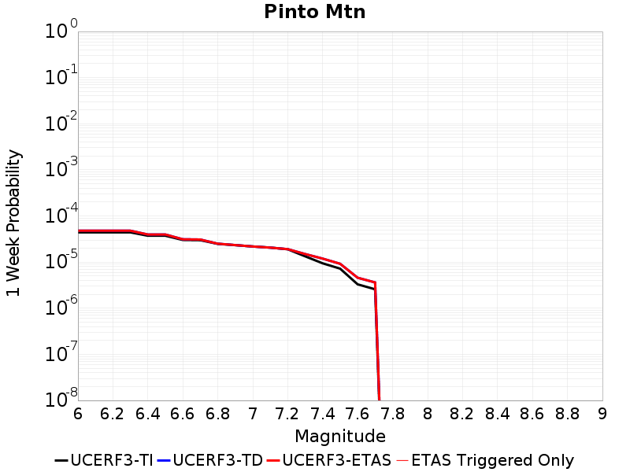 |  | 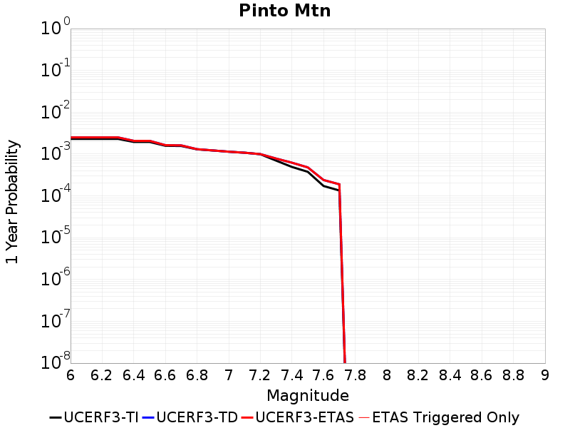 | 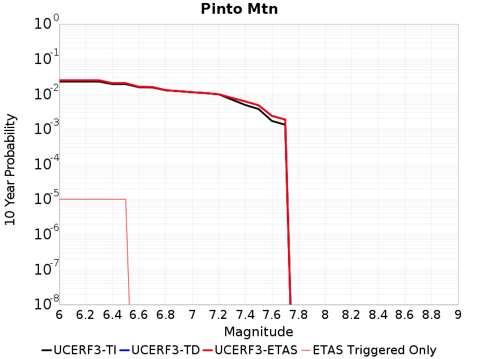 |

| Magnitude | 1 wk TI Prob | 1 wk TD Prob | 1 wk ETAS Prob | 1 wk ETAS/TD Gain | 1 wk ETAS Triggered Only | 1 mo TI Prob | 1 mo TD Prob | 1 mo ETAS Prob | 1 mo ETAS/TD Gain | 1 mo ETAS Triggered Only | 1 yr TI Prob | 1 yr TD Prob | 1 yr ETAS Prob | 1 yr ETAS/TD Gain | 1 yr ETAS Triggered Only | 10 yr TI Prob | 10 yr TD Prob | 10 yr ETAS Prob | 10 yr ETAS/TD Gain | 10 yr ETAS Triggered Only |
|-----|-----|-----|-----|-----|-----|-----|-----|-----|-----|-----|-----|-----|-----|-----|-----|-----|-----|-----|-----|-----|
| 6.0 | 4.4194956E-5 | 4.7929712E-5 | 4.7929712E-5 | 1.0 | 0.0 | 1.893932E-4 | 2.0539778E-4 | 2.0539778E-4 | 1.0 | 0.0 | 0.0023034236 | 0.002498014 | 0.002498014 | 1.0 | 0.0 | 0.022796938 | 0.024716908 | 0.02472666 | 1.0003946 | 1.0E-5 |
| 6.1 | 4.4194956E-5 | 4.7929712E-5 | 4.7929712E-5 | 1.0 | 0.0 | 1.893932E-4 | 2.0539778E-4 | 2.0539778E-4 | 1.0 | 0.0 | 0.0023034236 | 0.002498014 | 0.002498014 | 1.0 | 0.0 | 0.022796938 | 0.024716908 | 0.02472666 | 1.0003946 | 1.0E-5 |
| 6.2 | 4.4194956E-5 | 4.7929712E-5 | 4.7929712E-5 | 1.0 | 0.0 | 1.893932E-4 | 2.0539778E-4 | 2.0539778E-4 | 1.0 | 0.0 | 0.0023034236 | 0.002498014 | 0.002498014 | 1.0 | 0.0 | 0.022796938 | 0.024716908 | 0.02472666 | 1.0003946 | 1.0E-5 |
| 6.3 | 4.4194956E-5 | 4.7929712E-5 | 4.7929712E-5 | 1.0 | 0.0 | 1.893932E-4 | 2.0539778E-4 | 2.0539778E-4 | 1.0 | 0.0 | 0.0023034236 | 0.002498014 | 0.002498014 | 1.0 | 0.0 | 0.022796938 | 0.024716908 | 0.02472666 | 1.0003946 | 1.0E-5 |
| 6.4 | 3.729929E-5 | 3.9669212E-5 | 3.9669212E-5 | 1.0 | 0.0 | 1.5984432E-4 | 1.7000035E-4 | 1.7000035E-4 | 1.0 | 0.0 | 0.0019443673 | 0.0020678828 | 0.0020678828 | 1.0 | 0.0 | 0.019274427 | 0.02049646 | 0.020506253 | 1.0004779 | 1.0E-5 |
| 6.5 | 3.729929E-5 | 3.9669212E-5 | 3.9669212E-5 | 1.0 | 0.0 | 1.5984432E-4 | 1.7000035E-4 | 1.7000035E-4 | 1.0 | 0.0 | 0.0019443673 | 0.0020678828 | 0.0020678828 | 1.0 | 0.0 | 0.019274427 | 0.02049646 | 0.020506253 | 1.0004779 | 1.0E-5 |
| 6.6 | 3.0204548E-5 | 3.1261727E-5 | 3.1261727E-5 | 1.0 | 0.0 | 1.2944164E-4 | 1.3397215E-4 | 1.3397215E-4 | 1.0 | 0.0 | 0.0015748127 | 0.0016299252 | 0.0016299252 | 1.0 | 0.0 | 0.015636992 | 0.016183587 | 0.016183587 | 1.0 | 0.0 |
| 6.7 | 2.9857754E-5 | 3.0870804E-5 | 3.0870804E-5 | 1.0 | 0.0 | 1.2795553E-4 | 1.3229693E-4 | 1.3229693E-4 | 1.0 | 0.0 | 0.0015567453 | 0.0016095599 | 0.0016095599 | 1.0 | 0.0 | 0.015458848 | 0.015982874 | 0.015982874 | 1.0 | 0.0 |
| 6.8 | 2.4819734E-5 | 2.5059964E-5 | 2.5059964E-5 | 1.0 | 0.0 | 1.0636595E-4 | 1.0739554E-4 | 1.0739554E-4 | 1.0 | 0.0 | 0.0012942362 | 0.0013067782 | 0.0013067782 | 1.0 | 0.0 | 0.012867244 | 0.012993313 | 0.012993313 | 1.0 | 0.0 |
| 6.9 | 2.331124E-5 | 2.3387114E-5 | 2.3387114E-5 | 1.0 | 0.0 | 9.990149E-5 | 1.0022675E-4 | 1.0022675E-4 | 1.0 | 0.0 | 0.001215622 | 0.001219598 | 0.001219598 | 1.0 | 0.0 | 0.012089936 | 0.012131248 | 0.012131248 | 1.0 | 0.0 |
| 7.0 | 2.1818534E-5 | 2.1809301E-5 | 2.1809301E-5 | 1.0 | 0.0 | 9.3504656E-5 | 9.346519E-5 | 9.346519E-5 | 1.0 | 0.0 | 0.0011378246 | 0.0011373645 | 0.0011373645 | 1.0 | 0.0 | 0.011320163 | 0.011317545 | 0.011317545 | 1.0 | 0.0 |
| 7.1 | 2.066081E-5 | 2.0588048E-5 | 2.0588048E-5 | 1.0 | 0.0 | 8.854332E-5 | 8.8231616E-5 | 8.8231616E-5 | 1.0 | 0.0 | 0.0010774818 | 0.0010737102 | 0.0010737102 | 1.0 | 0.0 | 0.010722724 | 0.010687282 | 0.010687282 | 1.0 | 0.0 |
| 7.2 | 1.8990233E-5 | 1.9100435E-5 | 1.9100435E-5 | 1.0 | 0.0 | 8.138417E-5 | 8.1856546E-5 | 8.1856546E-5 | 1.0 | 0.0 | 9.904018E-4 | 9.961672E-4 | 9.961672E-4 | 1.0 | 0.0 | 0.009859995 | 0.009919022 | 0.009919022 | 1.0 | 0.0 |
| 7.3 | 1.3335872E-5 | 1.4949494E-5 | 1.4949494E-5 | 1.0 | 0.0 | 5.7152483E-5 | 6.406775E-5 | 6.406775E-5 | 1.0 | 0.0 | 6.956093E-4 | 7.7975856E-4 | 7.7975856E-4 | 1.0 | 0.0 | 0.006934359 | 0.0077715293 | 0.0077715293 | 1.0 | 0.0 |
| 7.4 | 9.414066E-6 | 1.1901204E-5 | 1.1901204E-5 | 1.0 | 0.0 | 4.0345374E-5 | 5.1004212E-5 | 5.1004212E-5 | 1.0 | 0.0 | 4.910942E-4 | 6.2080886E-4 | 6.2080886E-4 | 1.0 | 0.0 | 0.0049001034 | 0.006191698 | 0.006191698 | 1.0 | 0.0 |
| 7.5 | 7.2101157E-6 | 9.197483E-6 | 9.197483E-6 | 1.0 | 0.0 | 3.090013E-5 | 3.9417235E-5 | 3.9417235E-5 | 1.0 | 0.0 | 3.7614413E-4 | 4.7980697E-4 | 4.7980697E-4 | 1.0 | 0.0 | 0.0037550807 | 0.004788489 | 0.004788489 | 1.0 | 0.0 |
| 7.6 | 3.296375E-6 | 4.5832144E-6 | 4.5832144E-6 | 1.0 | 0.0 | 1.4127245E-5 | 1.9642208E-5 | 1.9642208E-5 | 1.0 | 0.0 | 1.7198564E-4 | 2.3911905E-4 | 2.3911905E-4 | 1.0 | 0.0 | 0.0017185259 | 0.0023887577 | 0.0023887577 | 1.0 | 0.0 |
| 7.7 | 2.5741092E-6 | 3.6197712E-6 | 3.6197712E-6 | 1.0 | 0.0 | 1.103185E-5 | 1.551322E-5 | 1.551322E-5 | 1.0 | 0.0 | 1.3430449E-4 | 1.8885844E-4 | 1.8885844E-4 | 1.0 | 0.0 | 0.0013422335 | 0.0018871119 | 0.0018871119 | 1.0 | 0.0 |

## Ozena
*[(top)](#table-of-contents)*

| 1 Week | 1 Month | 1 Year | 10 Year |
|-----|-----|-----|-----|
| 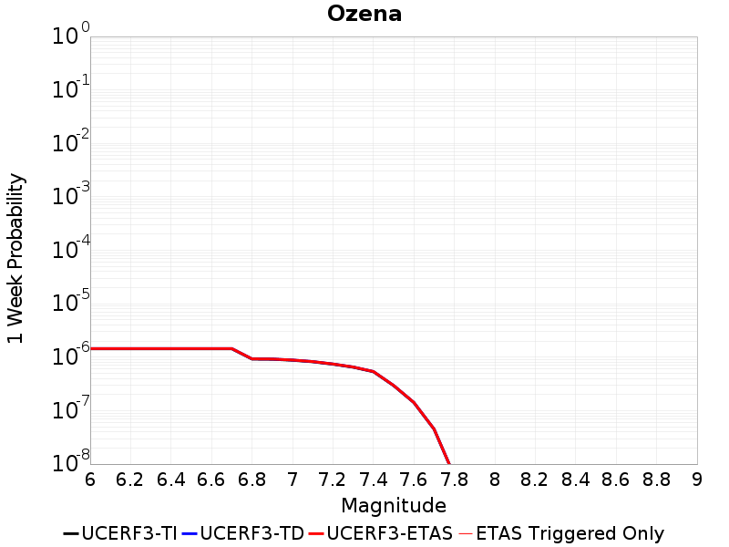 |  | 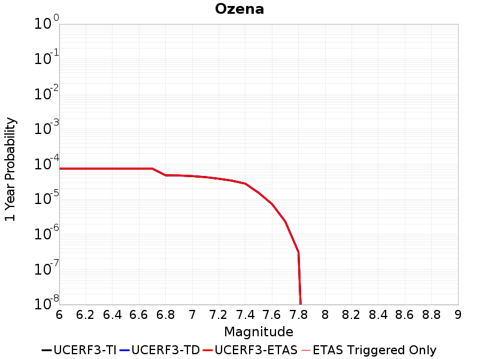 | 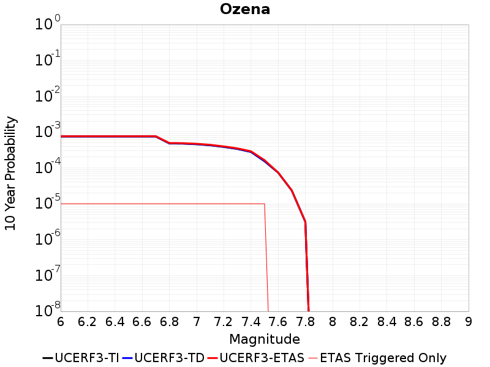 |

| Magnitude | 1 wk TI Prob | 1 wk TD Prob | 1 wk ETAS Prob | 1 wk ETAS/TD Gain | 1 wk ETAS Triggered Only | 1 mo TI Prob | 1 mo TD Prob | 1 mo ETAS Prob | 1 mo ETAS/TD Gain | 1 mo ETAS Triggered Only | 1 yr TI Prob | 1 yr TD Prob | 1 yr ETAS Prob | 1 yr ETAS/TD Gain | 1 yr ETAS Triggered Only | 10 yr TI Prob | 10 yr TD Prob | 10 yr ETAS Prob | 10 yr ETAS/TD Gain | 10 yr ETAS Triggered Only |
|-----|-----|-----|-----|-----|-----|-----|-----|-----|-----|-----|-----|-----|-----|-----|-----|-----|-----|-----|-----|-----|
| 6.0 | 1.4377547E-6 | 1.4514637E-6 | 1.4514637E-6 | 1.0 | 0.0 | 6.161791E-6 | 6.2205454E-6 | 6.2205454E-6 | 1.0 | 0.0 | 7.5017226E-5 | 7.573278E-5 | 7.573278E-5 | 1.0 | 0.0 | 7.4991904E-4 | 7.5709634E-4 | 7.670888E-4 | 1.0131984 | 1.0E-5 |
| 6.1 | 1.4377547E-6 | 1.4514637E-6 | 1.4514637E-6 | 1.0 | 0.0 | 6.161791E-6 | 6.2205454E-6 | 6.2205454E-6 | 1.0 | 0.0 | 7.5017226E-5 | 7.573278E-5 | 7.573278E-5 | 1.0 | 0.0 | 7.4991904E-4 | 7.5709634E-4 | 7.670888E-4 | 1.0131984 | 1.0E-5 |
| 6.2 | 1.4377547E-6 | 1.4514637E-6 | 1.4514637E-6 | 1.0 | 0.0 | 6.161791E-6 | 6.2205454E-6 | 6.2205454E-6 | 1.0 | 0.0 | 7.5017226E-5 | 7.573278E-5 | 7.573278E-5 | 1.0 | 0.0 | 7.4991904E-4 | 7.5709634E-4 | 7.670888E-4 | 1.0131984 | 1.0E-5 |
| 6.3 | 1.4377547E-6 | 1.4514637E-6 | 1.4514637E-6 | 1.0 | 0.0 | 6.161791E-6 | 6.2205454E-6 | 6.2205454E-6 | 1.0 | 0.0 | 7.5017226E-5 | 7.573278E-5 | 7.573278E-5 | 1.0 | 0.0 | 7.4991904E-4 | 7.5709634E-4 | 7.670888E-4 | 1.0131984 | 1.0E-5 |
| 6.4 | 1.4377547E-6 | 1.4514637E-6 | 1.4514637E-6 | 1.0 | 0.0 | 6.161791E-6 | 6.2205454E-6 | 6.2205454E-6 | 1.0 | 0.0 | 7.5017226E-5 | 7.573278E-5 | 7.573278E-5 | 1.0 | 0.0 | 7.4991904E-4 | 7.5709634E-4 | 7.670888E-4 | 1.0131984 | 1.0E-5 |
| 6.5 | 1.4377547E-6 | 1.4514637E-6 | 1.4514637E-6 | 1.0 | 0.0 | 6.161791E-6 | 6.2205454E-6 | 6.2205454E-6 | 1.0 | 0.0 | 7.5017226E-5 | 7.573278E-5 | 7.573278E-5 | 1.0 | 0.0 | 7.4991904E-4 | 7.5709634E-4 | 7.670888E-4 | 1.0131984 | 1.0E-5 |
| 6.6 | 1.4377547E-6 | 1.4514637E-6 | 1.4514637E-6 | 1.0 | 0.0 | 6.161791E-6 | 6.2205454E-6 | 6.2205454E-6 | 1.0 | 0.0 | 7.5017226E-5 | 7.573278E-5 | 7.573278E-5 | 1.0 | 0.0 | 7.4991904E-4 | 7.5709634E-4 | 7.670888E-4 | 1.0131984 | 1.0E-5 |
| 6.7 | 1.4377547E-6 | 1.4514637E-6 | 1.4514637E-6 | 1.0 | 0.0 | 6.161791E-6 | 6.2205454E-6 | 6.2205454E-6 | 1.0 | 0.0 | 7.5017226E-5 | 7.573278E-5 | 7.573278E-5 | 1.0 | 0.0 | 7.4991904E-4 | 7.5709634E-4 | 7.670888E-4 | 1.0131984 | 1.0E-5 |
| 6.8 | 9.223257E-7 | 9.318216E-7 | 9.318216E-7 | 1.0 | 0.0 | 3.9528186E-6 | 3.9935153E-6 | 3.9935153E-6 | 1.0 | 0.0 | 4.81245E-5 | 4.8620004E-5 | 4.8620004E-5 | 1.0 | 0.0 | 4.811408E-4 | 4.860977E-4 | 4.9609283E-4 | 1.020562 | 1.0E-5 |
| 6.9 | 9.141515E-7 | 9.23596E-7 | 9.23596E-7 | 1.0 | 0.0 | 3.917786E-6 | 3.958263E-6 | 3.958263E-6 | 1.0 | 0.0 | 4.7698002E-5 | 4.8190825E-5 | 4.8190825E-5 | 1.0 | 0.0 | 4.7687767E-4 | 4.8180777E-4 | 4.9180293E-4 | 1.0207452 | 1.0E-5 |
| 7.0 | 8.767648E-7 | 8.859148E-7 | 8.859148E-7 | 1.0 | 0.0 | 3.757558E-6 | 3.7967725E-6 | 3.7967725E-6 | 1.0 | 0.0 | 4.5747307E-5 | 4.6224763E-5 | 4.6224763E-5 | 1.0 | 0.0 | 4.5737892E-4 | 4.621554E-4 | 4.721508E-4 | 1.0216278 | 1.0E-5 |
| 7.1 | 8.199402E-7 | 8.2859384E-7 | 8.2859384E-7 | 1.0 | 0.0 | 3.5140247E-6 | 3.5511118E-6 | 3.5511118E-6 | 1.0 | 0.0 | 4.2782412E-5 | 4.3233966E-5 | 4.3233966E-5 | 1.0 | 0.0 | 4.2774176E-4 | 4.322593E-4 | 4.4225497E-4 | 1.0231242 | 1.0E-5 |
| 7.2 | 7.38705E-7 | 7.464747E-7 | 7.464747E-7 | 1.0 | 0.0 | 3.1658747E-6 | 3.1991738E-6 | 3.1991738E-6 | 1.0 | 0.0 | 3.8543843E-5 | 3.8949278E-5 | 3.8949278E-5 | 1.0 | 0.0 | 3.853716E-4 | 3.8942802E-4 | 3.9942414E-4 | 1.0256687 | 1.0E-5 |
| 7.3 | 6.490017E-7 | 6.5582276E-7 | 6.5582276E-7 | 1.0 | 0.0 | 2.7814328E-6 | 2.810666E-6 | 2.810666E-6 | 1.0 | 0.0 | 3.386342E-5 | 3.4219356E-5 | 3.4219356E-5 | 1.0 | 0.0 | 3.3858258E-4 | 3.4214422E-4 | 3.521408E-4 | 1.0292175 | 1.0E-5 |
| 7.4 | 5.346736E-7 | 5.4026094E-7 | 5.4026094E-7 | 1.0 | 0.0 | 2.291456E-6 | 2.315402E-6 | 2.315402E-6 | 1.0 | 0.0 | 2.789812E-5 | 2.8189686E-5 | 2.8189686E-5 | 1.0 | 0.0 | 2.789462E-4 | 2.8186417E-4 | 2.9186133E-4 | 1.0354681 | 1.0E-5 |
| 7.5 | 2.939325E-7 | 2.9667768E-7 | 2.9667768E-7 | 1.0 | 0.0 | 1.25971E-6 | 1.2714753E-6 | 1.2714753E-6 | 1.0 | 0.0 | 1.5336862E-5 | 1.5480118E-5 | 1.5480118E-5 | 1.0 | 0.0 | 1.5335804E-4 | 1.5479201E-4 | 1.6479047E-4 | 1.0645928 | 1.0E-5 |
| 7.6 | 1.4151905E-7 | 1.42539E-7 | 1.42539E-7 | 1.0 | 0.0 | 6.065101E-7 | 6.108813E-7 | 6.108813E-7 | 1.0 | 0.0 | 7.3842357E-6 | 7.4374548E-6 | 7.4374548E-6 | 1.0 | 0.0 | 7.38399E-5 | 7.437213E-5 | 7.437213E-5 | 1.0 | 0.0 |
| 7.7 | 4.4957577E-8 | 4.5254087E-8 | 4.5254087E-8 | 1.0 | 0.0 | 1.9267533E-7 | 1.9394606E-7 | 1.9394606E-7 | 1.0 | 0.0 | 2.3458194E-6 | 2.3612909E-6 | 2.3612909E-6 | 1.0 | 0.0 | 2.3457947E-5 | 2.3612667E-5 | 2.3612667E-5 | 1.0 | 0.0 |
| 7.8 | 5.9993255E-9 | 6.0415597E-9 | 6.0415597E-9 | 1.0 | 0.0 | 2.5711394E-8 | 2.58924E-8 | 2.58924E-8 | 1.0 | 0.0 | 3.1303617E-7 | 3.1523993E-7 | 3.1523993E-7 | 1.0 | 0.0 | 3.1303573E-6 | 3.1523957E-6 | 3.1523957E-6 | 1.0 | 0.0 |

## Superstition Hills
*[(top)](#table-of-contents)*

| 1 Week | 1 Month | 1 Year | 10 Year |
|-----|-----|-----|-----|
|  | 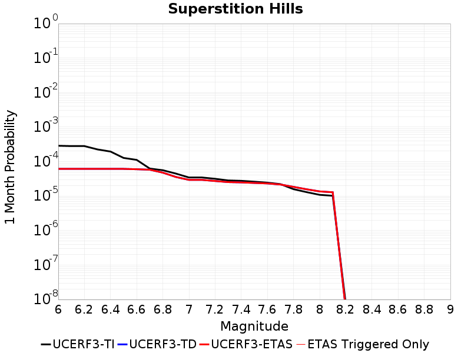 | 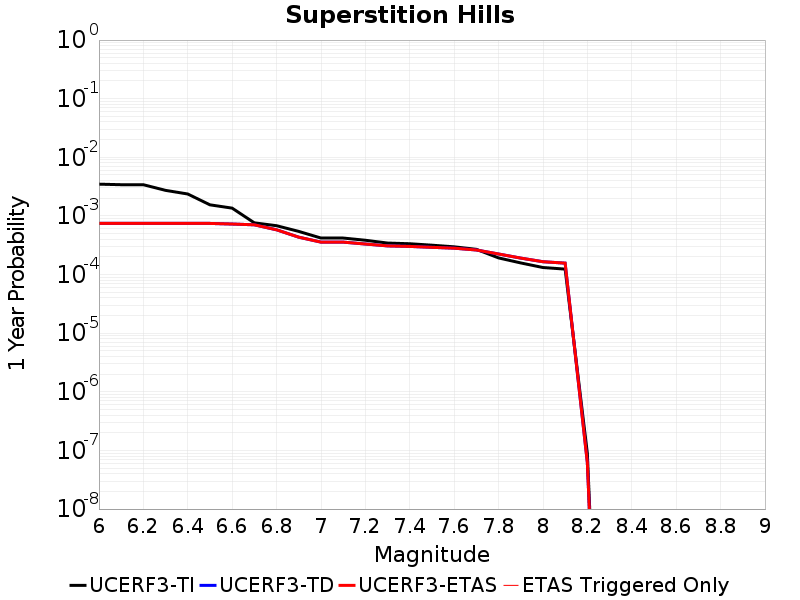 |  |

| Magnitude | 1 wk TI Prob | 1 wk TD Prob | 1 wk ETAS Prob | 1 wk ETAS/TD Gain | 1 wk ETAS Triggered Only | 1 mo TI Prob | 1 mo TD Prob | 1 mo ETAS Prob | 1 mo ETAS/TD Gain | 1 mo ETAS Triggered Only | 1 yr TI Prob | 1 yr TD Prob | 1 yr ETAS Prob | 1 yr ETAS/TD Gain | 1 yr ETAS Triggered Only | 10 yr TI Prob | 10 yr TD Prob | 10 yr ETAS Prob | 10 yr ETAS/TD Gain | 10 yr ETAS Triggered Only |
|-----|-----|-----|-----|-----|-----|-----|-----|-----|-----|-----|-----|-----|-----|-----|-----|-----|-----|-----|-----|-----|
| 6.0 | 6.6865185E-5 | 1.4286814E-5 | 1.4286814E-5 | 1.0 | 0.0 | 2.8653358E-4 | 6.122786E-5 | 6.122786E-5 | 1.0 | 0.0 | 0.0034829667 | 7.4521056E-4 | 7.4521056E-4 | 1.0 | 0.0 | 0.03428881 | 0.0075985123 | 0.0076084365 | 1.001306 | 1.0E-5 |
| 6.1 | 6.544851E-5 | 1.4286814E-5 | 1.4286814E-5 | 1.0 | 0.0 | 2.8046346E-4 | 6.122786E-5 | 6.122786E-5 | 1.0 | 0.0 | 0.0034092965 | 7.4521056E-4 | 7.4521056E-4 | 1.0 | 0.0 | 0.033574644 | 0.0075985114 | 0.0076084356 | 1.001306 | 1.0E-5 |
| 6.2 | 6.544851E-5 | 1.4286814E-5 | 1.4286814E-5 | 1.0 | 0.0 | 2.8046346E-4 | 6.122786E-5 | 6.122786E-5 | 1.0 | 0.0 | 0.0034092965 | 7.4521056E-4 | 7.4521056E-4 | 1.0 | 0.0 | 0.033574644 | 0.0075985114 | 0.0076084356 | 1.001306 | 1.0E-5 |
| 6.3 | 5.2402065E-5 | 1.4286812E-5 | 1.4286812E-5 | 1.0 | 0.0 | 2.2456095E-4 | 6.122785E-5 | 6.122785E-5 | 1.0 | 0.0 | 0.0027306017 | 7.452105E-4 | 7.452105E-4 | 1.0 | 0.0 | 0.02697292 | 0.0075985044 | 0.0076084286 | 1.001306 | 1.0E-5 |
| 6.4 | 4.542238E-5 | 1.4286812E-5 | 1.4286812E-5 | 1.0 | 0.0 | 1.9465282E-4 | 6.1227845E-5 | 6.1227845E-5 | 1.0 | 0.0 | 0.0023673223 | 7.4521045E-4 | 7.4521045E-4 | 1.0 | 0.0 | 0.023422617 | 0.0075985002 | 0.0076084244 | 1.001306 | 1.0E-5 |
| 6.5 | 2.9672969E-5 | 1.4286809E-5 | 1.4286809E-5 | 1.0 | 0.0 | 1.2716366E-4 | 6.122784E-5 | 6.122784E-5 | 1.0 | 0.0 | 0.0015471181 | 7.4521033E-4 | 7.4521033E-4 | 1.0 | 0.0 | 0.015363912 | 0.007598493 | 0.0076084165 | 1.001306 | 1.0E-5 |
| 6.6 | 2.6056105E-5 | 1.3951536E-5 | 1.3951536E-5 | 1.0 | 0.0 | 1.1166424E-4 | 5.979102E-5 | 5.979102E-5 | 1.0 | 0.0 | 0.0013586642 | 7.277287E-4 | 7.277287E-4 | 1.0 | 0.0 | 0.013503874 | 0.0074224244 | 0.0074323504 | 1.0013373 | 1.0E-5 |
| 6.7 | 1.4611248E-5 | 1.3530637E-5 | 1.3530637E-5 | 1.0 | 0.0 | 6.261813E-5 | 5.798725E-5 | 5.798725E-5 | 1.0 | 0.0 | 7.6210906E-4 | 7.0578215E-4 | 7.0578215E-4 | 1.0 | 0.0 | 0.0075950073 | 0.007203165 | 0.007213093 | 1.0013783 | 1.0E-5 |
| 6.8 | 1.30607E-5 | 1.1119592E-5 | 1.1119592E-5 | 1.0 | 0.0 | 5.597323E-5 | 4.7654576E-5 | 4.7654576E-5 | 1.0 | 0.0 | 6.8126095E-4 | 5.800488E-4 | 5.800488E-4 | 1.0 | 0.0 | 0.006791762 | 0.005948094 | 0.005958035 | 1.0016712 | 1.0E-5 |
| 6.9 | 1.0443096E-5 | 8.323414E-6 | 8.323414E-6 | 1.0 | 0.0 | 4.4755358E-5 | 3.56713E-5 | 3.56713E-5 | 1.0 | 0.0 | 5.447602E-4 | 4.342139E-4 | 4.342139E-4 | 1.0 | 0.0 | 0.005434267 | 0.0044761556 | 0.004486111 | 1.0022241 | 1.0E-5 |
| 7.0 | 8.045912E-6 | 6.8563377E-6 | 6.8563377E-6 | 1.0 | 0.0 | 3.4482026E-5 | 2.9383978E-5 | 2.9383978E-5 | 1.0 | 0.0 | 4.197378E-4 | 3.5769228E-4 | 3.5769228E-4 | 1.0 | 0.0 | 0.0041894587 | 0.0036941844 | 0.0037041474 | 1.002697 | 1.0E-5 |
| 7.1 | 8.045912E-6 | 6.8563377E-6 | 6.8563377E-6 | 1.0 | 0.0 | 3.4482026E-5 | 2.9383978E-5 | 2.9383978E-5 | 1.0 | 0.0 | 4.197378E-4 | 3.5769228E-4 | 3.5769228E-4 | 1.0 | 0.0 | 0.0041894587 | 0.0036941844 | 0.0037041474 | 1.002697 | 1.0E-5 |
| 7.2 | 7.375506E-6 | 6.3611515E-6 | 6.3611515E-6 | 1.0 | 0.0 | 3.1608928E-5 | 2.7261798E-5 | 2.7261798E-5 | 1.0 | 0.0 | 3.8477074E-4 | 3.3186274E-4 | 3.3186274E-4 | 1.0 | 0.0 | 0.003841052 | 0.0034337125 | 0.0034436781 | 1.0029023 | 1.0E-5 |
| 7.3 | 6.6063913E-6 | 5.911736E-6 | 5.911736E-6 | 1.0 | 0.0 | 2.8312797E-5 | 2.5335768E-5 | 2.5335768E-5 | 1.0 | 0.0 | 3.446538E-4 | 3.0842007E-4 | 3.0842007E-4 | 1.0 | 0.0 | 0.0034411973 | 0.0031970285 | 0.0032069965 | 1.0031179 | 1.0E-5 |
| 7.4 | 6.4313126E-6 | 5.7927873E-6 | 5.7927873E-6 | 1.0 | 0.0 | 2.7562477E-5 | 2.4825998E-5 | 2.4825998E-5 | 1.0 | 0.0 | 3.355215E-4 | 3.0221534E-4 | 3.0221534E-4 | 1.0 | 0.0 | 0.0033501536 | 0.0031345878 | 0.0031445564 | 1.0031803 | 1.0E-5 |
| 7.5 | 6.0742927E-6 | 5.5872456E-6 | 5.5872456E-6 | 1.0 | 0.0 | 2.6032423E-5 | 2.3945122E-5 | 2.3945122E-5 | 1.0 | 0.0 | 3.1689866E-4 | 2.9149358E-4 | 2.9149358E-4 | 1.0 | 0.0 | 0.0031644711 | 0.0030257064 | 0.003035676 | 1.0032951 | 1.0E-5 |
| 7.6 | 5.6987187E-6 | 5.404021E-6 | 5.404021E-6 | 1.0 | 0.0 | 2.4422852E-5 | 2.315989E-5 | 2.315989E-5 | 1.0 | 0.0 | 2.9730765E-4 | 2.8193585E-4 | 2.8193585E-4 | 1.0 | 0.0 | 0.002969102 | 0.0029282009 | 0.0029381716 | 1.0034051 | 1.0E-5 |
| 7.7 | 5.1658035E-6 | 5.0327417E-6 | 5.0327417E-6 | 1.0 | 0.0 | 2.2138971E-5 | 2.1568718E-5 | 2.1568718E-5 | 1.0 | 0.0 | 2.6950863E-4 | 2.6256812E-4 | 2.6256812E-4 | 1.0 | 0.0 | 0.00269182 | 0.0027320771 | 0.0027420497 | 1.0036502 | 1.0E-5 |
| 7.8 | 3.6864697E-6 | 4.2994907E-6 | 4.2994907E-6 | 1.0 | 0.0 | 1.579906E-5 | 1.8426263E-5 | 1.8426263E-5 | 1.0 | 0.0 | 1.9233658E-4 | 2.2431713E-4 | 2.2431713E-4 | 1.0 | 0.0 | 0.0019217018 | 0.0023430735 | 0.00235305 | 1.0042579 | 1.0E-5 |
| 7.9 | 3.0265903E-6 | 3.6593137E-6 | 3.6593137E-6 | 1.0 | 0.0 | 1.2971037E-5 | 1.568268E-5 | 1.568268E-5 | 1.0 | 0.0 | 1.5791094E-4 | 1.9092039E-4 | 1.9092039E-4 | 1.0 | 0.0 | 0.0015779877 | 0.0020034339 | 0.0020034339 | 1.0 | 0.0 |
| 8.0 | 2.5271493E-6 | 3.1747181E-6 | 3.1747181E-6 | 1.0 | 0.0 | 1.0830595E-5 | 1.3605866E-5 | 1.3605866E-5 | 1.0 | 0.0 | 1.3185451E-4 | 1.6563927E-4 | 1.6563927E-4 | 1.0 | 0.0 | 0.0013177631 | 0.0017433445 | 0.0017433445 | 1.0 | 0.0 |
| 8.1 | 2.3749135E-6 | 3.0016727E-6 | 3.0016727E-6 | 1.0 | 0.0 | 1.0178161E-5 | 1.28642505E-5 | 1.28642505E-5 | 1.0 | 0.0 | 1.2391206E-4 | 1.5661144E-4 | 1.5661144E-4 | 1.0 | 0.0 | 0.0012384299 | 0.0016489906 | 0.0016489906 | 1.0 | 0.0 |
| 8.2 | 1.7186406E-9 | 1.185221E-9 | 1.185221E-9 | 1.0 | 0.0 | 7.3656024E-9 | 5.079519E-9 | 5.079519E-9 | 1.0 | 0.0 | 8.9676206E-8 | 6.1843146E-8 | 6.1843146E-8 | 1.0 | 0.0 | 8.9676166E-7 | 6.611366E-7 | 6.611366E-7 | 1.0 | 0.0 |

## San Luis Range 2011 CFM
*[(top)](#table-of-contents)*

| 1 Week | 1 Month | 1 Year | 10 Year |
|-----|-----|-----|-----|
| 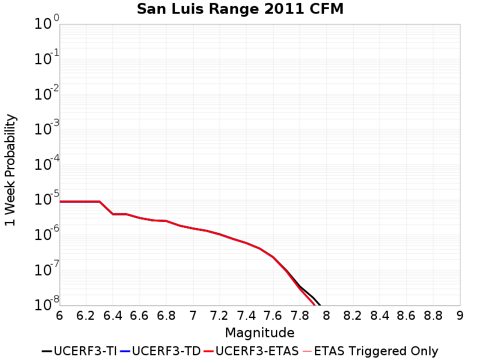 | 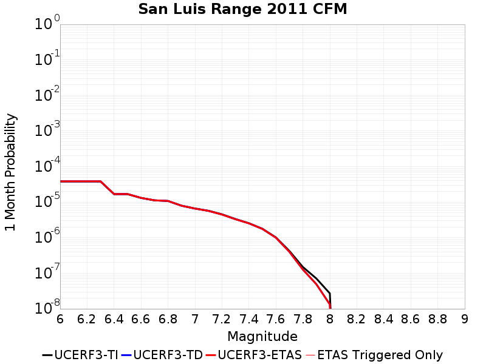 | 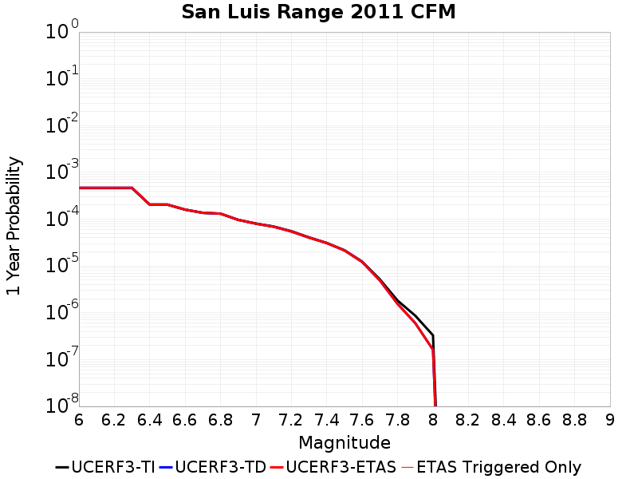 | 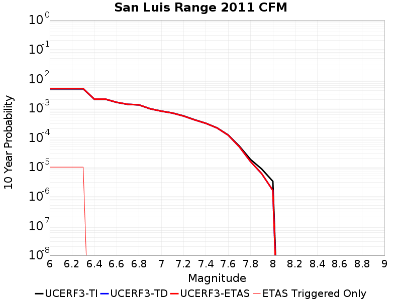 |

| Magnitude | 1 wk TI Prob | 1 wk TD Prob | 1 wk ETAS Prob | 1 wk ETAS/TD Gain | 1 wk ETAS Triggered Only | 1 mo TI Prob | 1 mo TD Prob | 1 mo ETAS Prob | 1 mo ETAS/TD Gain | 1 mo ETAS Triggered Only | 1 yr TI Prob | 1 yr TD Prob | 1 yr ETAS Prob | 1 yr ETAS/TD Gain | 1 yr ETAS Triggered Only | 10 yr TI Prob | 10 yr TD Prob | 10 yr ETAS Prob | 10 yr ETAS/TD Gain | 10 yr ETAS Triggered Only |
|-----|-----|-----|-----|-----|-----|-----|-----|-----|-----|-----|-----|-----|-----|-----|-----|-----|-----|-----|-----|-----|
| 6.0 | 8.8368415E-6 | 8.966569E-6 | 8.966569E-6 | 1.0 | 0.0 | 3.787163E-5 | 3.842763E-5 | 3.842763E-5 | 1.0 | 0.0 | 4.609895E-4 | 4.677639E-4 | 4.677639E-4 | 1.0 | 0.0 | 0.0046003438 | 0.0046685757 | 0.004678529 | 1.0021319 | 1.0E-5 |
| 6.1 | 8.8368415E-6 | 8.966569E-6 | 8.966569E-6 | 1.0 | 0.0 | 3.787163E-5 | 3.842763E-5 | 3.842763E-5 | 1.0 | 0.0 | 4.609895E-4 | 4.677639E-4 | 4.677639E-4 | 1.0 | 0.0 | 0.0046003438 | 0.0046685757 | 0.004678529 | 1.0021319 | 1.0E-5 |
| 6.2 | 8.8368415E-6 | 8.966569E-6 | 8.966569E-6 | 1.0 | 0.0 | 3.787163E-5 | 3.842763E-5 | 3.842763E-5 | 1.0 | 0.0 | 4.609895E-4 | 4.677639E-4 | 4.677639E-4 | 1.0 | 0.0 | 0.0046003438 | 0.0046685757 | 0.004678529 | 1.0021319 | 1.0E-5 |
| 6.3 | 8.8368415E-6 | 8.966569E-6 | 8.966569E-6 | 1.0 | 0.0 | 3.787163E-5 | 3.842763E-5 | 3.842763E-5 | 1.0 | 0.0 | 4.609895E-4 | 4.677639E-4 | 4.677639E-4 | 1.0 | 0.0 | 0.0046003438 | 0.0046685757 | 0.004678529 | 1.0021319 | 1.0E-5 |
| 6.4 | 3.9094193E-6 | 3.941705E-6 | 3.941705E-6 | 1.0 | 0.0 | 1.6754546E-5 | 1.6892915E-5 | 1.6892915E-5 | 1.0 | 0.0 | 2.039675E-4 | 2.056521E-4 | 2.056521E-4 | 1.0 | 0.0 | 0.0020378039 | 0.0020546466 | 0.0020546466 | 1.0 | 0.0 |
| 6.5 | 3.9094193E-6 | 3.941705E-6 | 3.941705E-6 | 1.0 | 0.0 | 1.6754546E-5 | 1.6892915E-5 | 1.6892915E-5 | 1.0 | 0.0 | 2.039675E-4 | 2.056521E-4 | 2.056521E-4 | 1.0 | 0.0 | 0.0020378039 | 0.0020546466 | 0.0020546466 | 1.0 | 0.0 |
| 6.6 | 3.0587726E-6 | 3.075795E-6 | 3.075795E-6 | 1.0 | 0.0 | 1.3108959E-5 | 1.31819115E-5 | 1.31819115E-5 | 1.0 | 0.0 | 1.595899E-4 | 1.6047807E-4 | 1.6047807E-4 | 1.0 | 0.0 | 0.0015947534 | 0.0016036339 | 0.0016036339 | 1.0 | 0.0 |
| 6.7 | 2.6160574E-6 | 2.625486E-6 | 2.625486E-6 | 1.0 | 0.0 | 1.1211626E-5 | 1.1252036E-5 | 1.1252036E-5 | 1.0 | 0.0 | 1.3649299E-4 | 1.3698498E-4 | 1.3698498E-4 | 1.0 | 0.0 | 0.0013640919 | 0.0013690116 | 0.0013690116 | 1.0 | 0.0 |
| 6.8 | 2.5110312E-6 | 2.5184866E-6 | 2.5184866E-6 | 1.0 | 0.0 | 1.0761518E-5 | 1.0793469E-5 | 1.0793469E-5 | 1.0 | 0.0 | 1.310136E-4 | 1.3140263E-4 | 1.3140263E-4 | 1.0 | 0.0 | 0.0013093639 | 0.0013132552 | 0.0013132552 | 1.0 | 0.0 |
| 6.9 | 1.8564405E-6 | 1.8527635E-6 | 1.8527635E-6 | 1.0 | 0.0 | 7.95615E-6 | 7.940391E-6 | 7.940391E-6 | 1.0 | 0.0 | 9.686181E-5 | 9.6669995E-5 | 9.6669995E-5 | 1.0 | 0.0 | 9.68196E-4 | 9.6628146E-4 | 9.6628146E-4 | 1.0 | 0.0 |
| 7.0 | 1.546127E-6 | 1.5371972E-6 | 1.5371972E-6 | 1.0 | 0.0 | 6.626242E-6 | 6.5879717E-6 | 6.5879717E-6 | 1.0 | 0.0 | 8.06715E-5 | 8.020561E-5 | 8.020561E-5 | 1.0 | 0.0 | 8.0642226E-4 | 8.0176734E-4 | 8.0176734E-4 | 1.0 | 0.0 |
| 7.1 | 1.3368208E-6 | 1.32375E-6 | 1.32375E-6 | 1.0 | 0.0 | 5.7292195E-6 | 5.673202E-6 | 5.673202E-6 | 1.0 | 0.0 | 6.975101E-5 | 6.906905E-5 | 6.906905E-5 | 1.0 | 0.0 | 6.972912E-4 | 6.904763E-4 | 6.904763E-4 | 1.0 | 0.0 |
| 7.2 | 1.0623363E-6 | 1.0456205E-6 | 1.0456205E-6 | 1.0 | 0.0 | 4.5528623E-6 | 4.4812227E-6 | 4.4812227E-6 | 1.0 | 0.0 | 5.5429686E-5 | 5.4557524E-5 | 5.4557524E-5 | 1.0 | 0.0 | 5.5415864E-4 | 5.454416E-4 | 5.454416E-4 | 1.0 | 0.0 |
| 7.3 | 7.831679E-7 | 7.728894E-7 | 7.728894E-7 | 1.0 | 0.0 | 3.3564295E-6 | 3.312379E-6 | 3.312379E-6 | 1.0 | 0.0 | 4.086376E-5 | 4.0327468E-5 | 4.0327468E-5 | 1.0 | 0.0 | 4.0856248E-4 | 4.0320164E-4 | 4.0320164E-4 | 1.0 | 0.0 |
| 7.4 | 5.9558846E-7 | 5.9119134E-7 | 5.9119134E-7 | 1.0 | 0.0 | 2.5525194E-6 | 2.5336747E-6 | 2.5336747E-6 | 1.0 | 0.0 | 3.107648E-5 | 3.084705E-5 | 3.084705E-5 | 1.0 | 0.0 | 3.1072134E-4 | 3.0842779E-4 | 3.0842779E-4 | 1.0 | 0.0 |
| 7.5 | 4.1616502E-7 | 4.1206735E-7 | 4.1206735E-7 | 1.0 | 0.0 | 1.7835631E-6 | 1.7660017E-6 | 1.7660017E-6 | 1.0 | 0.0 | 2.1714664E-5 | 2.1500859E-5 | 2.1500859E-5 | 1.0 | 0.0 | 2.1712543E-4 | 2.1498784E-4 | 2.1498784E-4 | 1.0 | 0.0 |
| 7.6 | 2.3816014E-7 | 2.338397E-7 | 2.338397E-7 | 1.0 | 0.0 | 1.0206859E-6 | 1.0021697E-6 | 1.0021697E-6 | 1.0 | 0.0 | 1.242678E-5 | 1.2201348E-5 | 1.2201348E-5 | 1.0 | 0.0 | 1.2426086E-4 | 1.220068E-4 | 1.220068E-4 | 1.0 | 0.0 |
| 7.7 | 9.918777E-8 | 9.392105E-8 | 9.392105E-8 | 1.0 | 0.0 | 4.2509038E-7 | 4.0251874E-7 | 4.0251874E-7 | 1.0 | 0.0 | 5.1754632E-6 | 4.9006544E-6 | 4.9006544E-6 | 1.0 | 0.0 | 5.1753424E-5 | 4.900547E-5 | 4.900547E-5 | 1.0 | 0.0 |
| 7.8 | 3.4982556E-8 | 2.9730192E-8 | 2.9730192E-8 | 1.0 | 0.0 | 1.4992524E-7 | 1.2741509E-7 | 1.2741509E-7 | 1.0 | 0.0 | 1.8253382E-6 | 1.5512776E-6 | 1.5512776E-6 | 1.0 | 0.0 | 1.8253233E-5 | 1.5512669E-5 | 1.5512669E-5 | 1.0 | 0.0 |
| 7.9 | 1.6624908E-8 | 1.1515987E-8 | 1.1515987E-8 | 1.0 | 0.0 | 7.12496E-8 | 4.9354227E-8 | 4.9354227E-8 | 1.0 | 0.0 | 8.6746354E-7 | 6.008875E-7 | 6.008875E-7 | 1.0 | 0.0 | 8.674601E-6 | 6.0088596E-6 | 6.0088596E-6 | 1.0 | 0.0 |
| 8.0 | 6.3352315E-9 | 3.1125E-9 | 3.1125E-9 | 1.0 | 0.0 | 2.715099E-8 | 1.3339287E-8 | 1.3339287E-8 | 1.0 | 0.0 | 3.3056327E-7 | 1.6240581E-7 | 1.6240581E-7 | 1.0 | 0.0 | 3.3056278E-6 | 1.6240568E-6 | 1.6240568E-6 | 1.0 | 0.0 |

## Round Valley
*[(top)](#table-of-contents)*

| 1 Week | 1 Month | 1 Year | 10 Year |
|-----|-----|-----|-----|
| 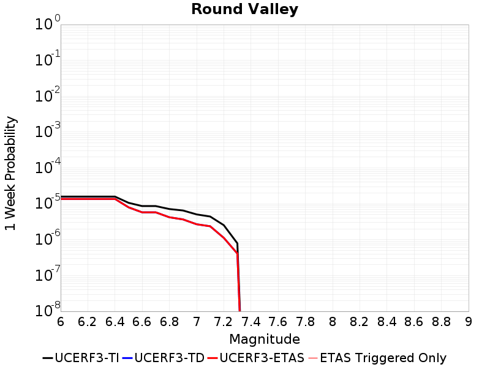 | 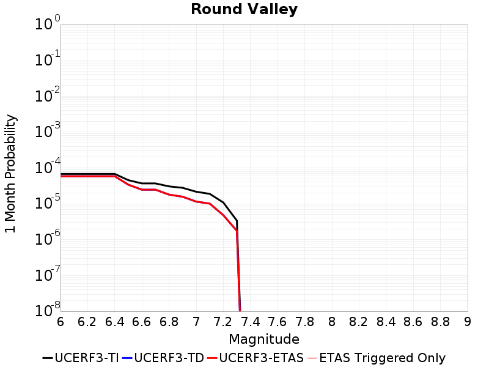 | 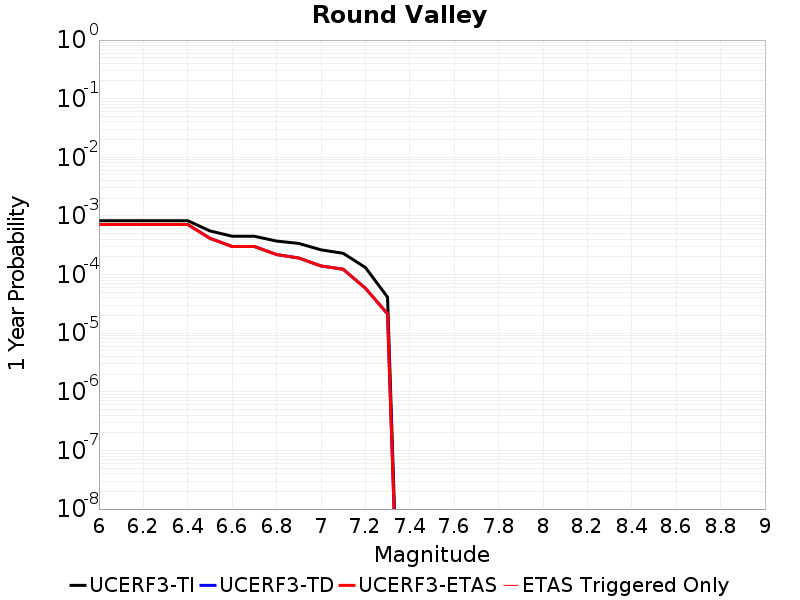 | 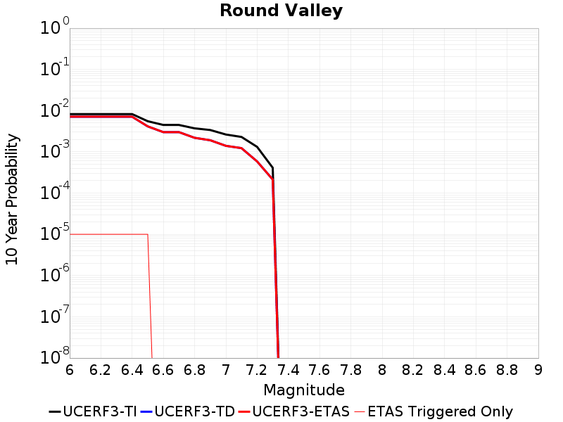 |

| Magnitude | 1 wk TI Prob | 1 wk TD Prob | 1 wk ETAS Prob | 1 wk ETAS/TD Gain | 1 wk ETAS Triggered Only | 1 mo TI Prob | 1 mo TD Prob | 1 mo ETAS Prob | 1 mo ETAS/TD Gain | 1 mo ETAS Triggered Only | 1 yr TI Prob | 1 yr TD Prob | 1 yr ETAS Prob | 1 yr ETAS/TD Gain | 1 yr ETAS Triggered Only | 10 yr TI Prob | 10 yr TD Prob | 10 yr ETAS Prob | 10 yr ETAS/TD Gain | 10 yr ETAS Triggered Only |
|-----|-----|-----|-----|-----|-----|-----|-----|-----|-----|-----|-----|-----|-----|-----|-----|-----|-----|-----|-----|-----|
| 6.0 | 1.588152E-5 | 1.3682079E-5 | 1.3682079E-5 | 1.0 | 0.0 | 6.806188E-5 | 5.8636386E-5 | 5.8636386E-5 | 1.0 | 0.0 | 8.283384E-4 | 7.1370363E-4 | 7.1370363E-4 | 1.0 | 0.0 | 0.008252576 | 0.0071180076 | 0.0071279365 | 1.0013949 | 1.0E-5 |
| 6.1 | 1.588152E-5 | 1.3682079E-5 | 1.3682079E-5 | 1.0 | 0.0 | 6.806188E-5 | 5.8636386E-5 | 5.8636386E-5 | 1.0 | 0.0 | 8.283384E-4 | 7.1370363E-4 | 7.1370363E-4 | 1.0 | 0.0 | 0.008252576 | 0.0071180076 | 0.0071279365 | 1.0013949 | 1.0E-5 |
| 6.2 | 1.588152E-5 | 1.3682079E-5 | 1.3682079E-5 | 1.0 | 0.0 | 6.806188E-5 | 5.8636386E-5 | 5.8636386E-5 | 1.0 | 0.0 | 8.283384E-4 | 7.1370363E-4 | 7.1370363E-4 | 1.0 | 0.0 | 0.008252576 | 0.0071180076 | 0.0071279365 | 1.0013949 | 1.0E-5 |
| 6.3 | 1.588152E-5 | 1.3682079E-5 | 1.3682079E-5 | 1.0 | 0.0 | 6.806188E-5 | 5.8636386E-5 | 5.8636386E-5 | 1.0 | 0.0 | 8.283384E-4 | 7.1370363E-4 | 7.1370363E-4 | 1.0 | 0.0 | 0.008252576 | 0.0071180076 | 0.0071279365 | 1.0013949 | 1.0E-5 |
| 6.4 | 1.588152E-5 | 1.3682079E-5 | 1.3682079E-5 | 1.0 | 0.0 | 6.806188E-5 | 5.8636386E-5 | 5.8636386E-5 | 1.0 | 0.0 | 8.283384E-4 | 7.1370363E-4 | 7.1370363E-4 | 1.0 | 0.0 | 0.008252576 | 0.0071180076 | 0.0071279365 | 1.0013949 | 1.0E-5 |
| 6.5 | 1.0646776E-5 | 7.961121E-6 | 7.961121E-6 | 1.0 | 0.0 | 4.5628243E-5 | 3.411869E-5 | 3.411869E-5 | 1.0 | 0.0 | 5.553823E-4 | 4.153243E-4 | 4.153243E-4 | 1.0 | 0.0 | 0.005539963 | 0.004146311 | 0.004156269 | 1.0024018 | 1.0E-5 |
| 6.6 | 8.632956E-6 | 5.7756765E-6 | 5.7756765E-6 | 1.0 | 0.0 | 3.6997862E-5 | 2.4752686E-5 | 2.4752686E-5 | 1.0 | 0.0 | 4.5035584E-4 | 3.013261E-4 | 3.013261E-4 | 1.0 | 0.0 | 0.0044944426 | 0.003009554 | 0.003009554 | 1.0 | 0.0 |
| 6.7 | 8.632956E-6 | 5.7756765E-6 | 5.7756765E-6 | 1.0 | 0.0 | 3.6997862E-5 | 2.4752686E-5 | 2.4752686E-5 | 1.0 | 0.0 | 4.5035584E-4 | 3.013261E-4 | 3.013261E-4 | 1.0 | 0.0 | 0.0044944426 | 0.003009554 | 0.003009554 | 1.0 | 0.0 |
| 6.8 | 7.143895E-6 | 4.20797E-6 | 4.20797E-6 | 1.0 | 0.0 | 3.0616335E-5 | 1.8034041E-5 | 1.8034041E-5 | 1.0 | 0.0 | 3.726901E-4 | 2.1954402E-4 | 2.1954402E-4 | 1.0 | 0.0 | 0.0037206567 | 0.0021934365 | 0.0021934365 | 1.0 | 0.0 |
| 6.9 | 6.5120694E-6 | 3.6702218E-6 | 3.6702218E-6 | 1.0 | 0.0 | 2.790857E-5 | 1.5729436E-5 | 1.5729436E-5 | 1.0 | 0.0 | 3.3973387E-4 | 1.9149056E-4 | 1.9149056E-4 | 1.0 | 0.0 | 0.0033921495 | 0.001913405 | 0.001913405 | 1.0 | 0.0 |
| 7.0 | 5.0614435E-6 | 2.6884813E-6 | 2.6884813E-6 | 1.0 | 0.0 | 2.169172E-5 | 1.1522018E-5 | 1.1522018E-5 | 1.0 | 0.0 | 2.6406467E-4 | 1.4027258E-4 | 1.4027258E-4 | 1.0 | 0.0 | 0.0026375111 | 0.0014019419 | 0.0014019419 | 1.0 | 0.0 |
| 7.1 | 4.41728E-6 | 2.361838E-6 | 2.361838E-6 | 1.0 | 0.0 | 1.8931061E-5 | 1.01221285E-5 | 1.01221285E-5 | 1.0 | 0.0 | 2.304613E-4 | 1.2323093E-4 | 1.2323093E-4 | 1.0 | 0.0 | 0.0023022245 | 0.0012317228 | 0.0012317228 | 1.0 | 0.0 |
| 7.2 | 2.535495E-6 | 1.1238862E-6 | 1.1238862E-6 | 1.0 | 0.0 | 1.0866362E-5 | 4.8166494E-6 | 4.8166494E-6 | 1.0 | 0.0 | 1.3228992E-4 | 5.864165E-5 | 5.864165E-5 | 1.0 | 0.0 | 0.0013221119 | 5.863132E-4 | 5.863132E-4 | 1.0 | 0.0 |
| 7.3 | 7.900015E-7 | 4.0942362E-7 | 4.0942362E-7 | 1.0 | 0.0 | 3.3857161E-6 | 1.7546726E-6 | 1.7546726E-6 | 1.0 | 0.0 | 4.1220315E-5 | 2.136314E-5 | 2.136314E-5 | 1.0 | 0.0 | 4.121267E-4 | 2.1363139E-4 | 2.1363139E-4 | 1.0 | 0.0 |

## Ortigalita (North)
*[(top)](#table-of-contents)*

| 1 Week | 1 Month | 1 Year | 10 Year |
|-----|-----|-----|-----|
| 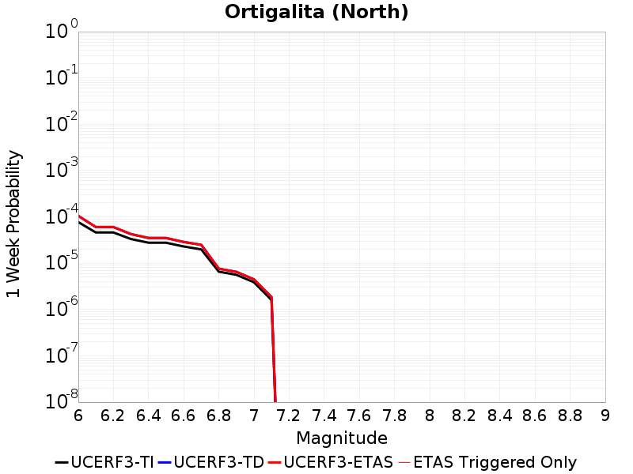 | 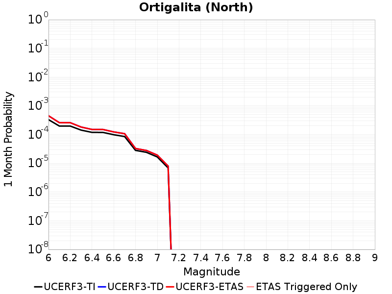 | 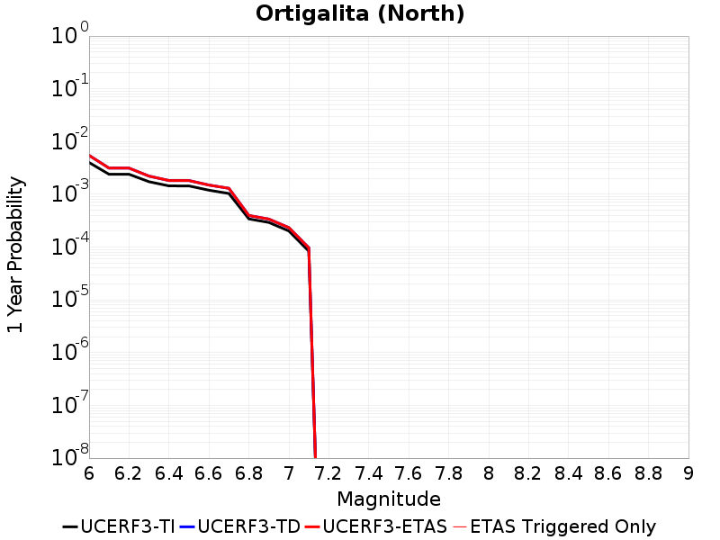 | 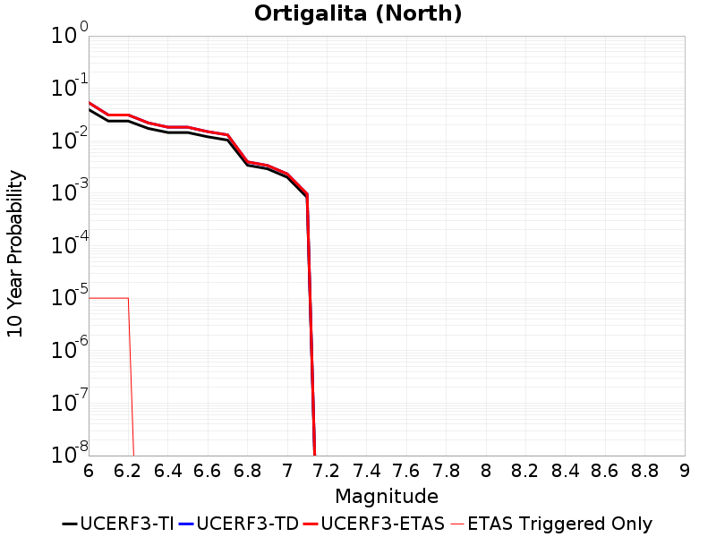 |

| Magnitude | 1 wk TI Prob | 1 wk TD Prob | 1 wk ETAS Prob | 1 wk ETAS/TD Gain | 1 wk ETAS Triggered Only | 1 mo TI Prob | 1 mo TD Prob | 1 mo ETAS Prob | 1 mo ETAS/TD Gain | 1 mo ETAS Triggered Only | 1 yr TI Prob | 1 yr TD Prob | 1 yr ETAS Prob | 1 yr ETAS/TD Gain | 1 yr ETAS Triggered Only | 10 yr TI Prob | 10 yr TD Prob | 10 yr ETAS Prob | 10 yr ETAS/TD Gain | 10 yr ETAS Triggered Only |
|-----|-----|-----|-----|-----|-----|-----|-----|-----|-----|-----|-----|-----|-----|-----|-----|-----|-----|-----|-----|-----|
| 6.0 | 7.711876E-5 | 1.052723E-4 | 1.052723E-4 | 1.0 | 0.0 | 3.3046713E-4 | 4.5109657E-4 | 4.5109657E-4 | 1.0 | 0.0 | 0.004016016 | 0.0054793456 | 0.0054793456 | 1.0 | 0.0 | 0.039442103 | 0.05356165 | 0.053571116 | 1.0001767 | 1.0E-5 |
| 6.1 | 4.607858E-5 | 6.035227E-5 | 6.035227E-5 | 1.0 | 0.0 | 1.9746469E-4 | 2.5862944E-4 | 2.5862944E-4 | 1.0 | 0.0 | 0.0024014818 | 0.0031445615 | 0.0031445615 | 1.0 | 0.0 | 0.023756953 | 0.031031456 | 0.031041145 | 1.0003122 | 1.0E-5 |
| 6.2 | 4.607858E-5 | 6.035227E-5 | 6.035227E-5 | 1.0 | 0.0 | 1.9746469E-4 | 2.5862944E-4 | 2.5862944E-4 | 1.0 | 0.0 | 0.0024014818 | 0.0031445615 | 0.0031445615 | 1.0 | 0.0 | 0.023756953 | 0.031031456 | 0.031041145 | 1.0003122 | 1.0E-5 |
| 6.3 | 3.327423E-5 | 4.2549404E-5 | 4.2549404E-5 | 1.0 | 0.0 | 1.4259605E-4 | 1.823433E-4 | 1.823433E-4 | 1.0 | 0.0 | 0.0017347244 | 0.002218013 | 0.002218013 | 1.0 | 0.0 | 0.017212452 | 0.02198291 | 0.02198291 | 1.0 | 0.0 |
| 6.4 | 2.7732503E-5 | 3.505694E-5 | 3.505694E-5 | 1.0 | 0.0 | 1.1884817E-4 | 1.5023659E-4 | 1.5023659E-4 | 1.0 | 0.0 | 0.001446016 | 0.0018278301 | 0.0018278301 | 1.0 | 0.0 | 0.014366428 | 0.018150905 | 0.018150905 | 1.0 | 0.0 |
| 6.5 | 2.7689714E-5 | 3.50067E-5 | 3.50067E-5 | 1.0 | 0.0 | 1.186648E-4 | 1.500213E-4 | 1.500213E-4 | 1.0 | 0.0 | 0.0014437864 | 0.0018252133 | 0.0018252133 | 1.0 | 0.0 | 0.014344421 | 0.018125165 | 0.018125165 | 1.0 | 0.0 |
| 6.6 | 2.2976905E-5 | 2.876421E-5 | 2.876421E-5 | 1.0 | 0.0 | 9.846873E-5 | 1.2327069E-4 | 1.2327069E-4 | 1.0 | 0.0 | 0.0011981975 | 0.001500026 | 0.001500026 | 1.0 | 0.0 | 0.011917574 | 0.014922347 | 0.014922347 | 1.0 | 0.0 |
| 6.7 | 1.9871539E-5 | 2.4945084E-5 | 2.4945084E-5 | 1.0 | 0.0 | 8.516096E-5 | 1.0690453E-4 | 1.0690453E-4 | 1.0 | 0.0 | 0.0010363415 | 0.0013010275 | 0.0013010275 | 1.0 | 0.0 | 0.010315218 | 0.012957822 | 0.012957822 | 1.0 | 0.0 |
| 6.8 | 6.5640475E-6 | 7.613007E-6 | 7.613007E-6 | 1.0 | 0.0 | 2.813133E-5 | 3.262678E-5 | 3.262678E-5 | 1.0 | 0.0 | 3.424451E-4 | 3.9716152E-4 | 3.9716152E-4 | 1.0 | 0.0 | 0.0034191788 | 0.003964805 | 0.003964805 | 1.0 | 0.0 |
| 6.9 | 5.6219683E-6 | 6.5081713E-6 | 6.5081713E-6 | 1.0 | 0.0 | 2.4093928E-5 | 2.7891878E-5 | 2.7891878E-5 | 1.0 | 0.0 | 2.933041E-4 | 3.395333E-4 | 3.395333E-4 | 1.0 | 0.0 | 0.0029291727 | 0.003390403 | 0.003390403 | 1.0 | 0.0 |
| 7.0 | 3.875591E-6 | 4.4891412E-6 | 4.4891412E-6 | 1.0 | 0.0 | 1.6609569E-5 | 1.9239047E-5 | 1.9239047E-5 | 1.0 | 0.0 | 2.0220275E-4 | 2.3421233E-4 | 2.3421233E-4 | 1.0 | 0.0 | 0.0020201886 | 0.0023398637 | 0.0023398637 | 1.0 | 0.0 |
| 7.1 | 1.6017933E-6 | 1.8588836E-6 | 1.8588836E-6 | 1.0 | 0.0 | 6.8648105E-6 | 7.966626E-6 | 7.966626E-6 | 1.0 | 0.0 | 8.357586E-5 | 9.699042E-5 | 9.699042E-5 | 1.0 | 0.0 | 8.3544437E-4 | 9.695858E-4 | 9.695858E-4 | 1.0 | 0.0 |

## Sisar
*[(top)](#table-of-contents)*

| 1 Week | 1 Month | 1 Year | 10 Year |
|-----|-----|-----|-----|
| 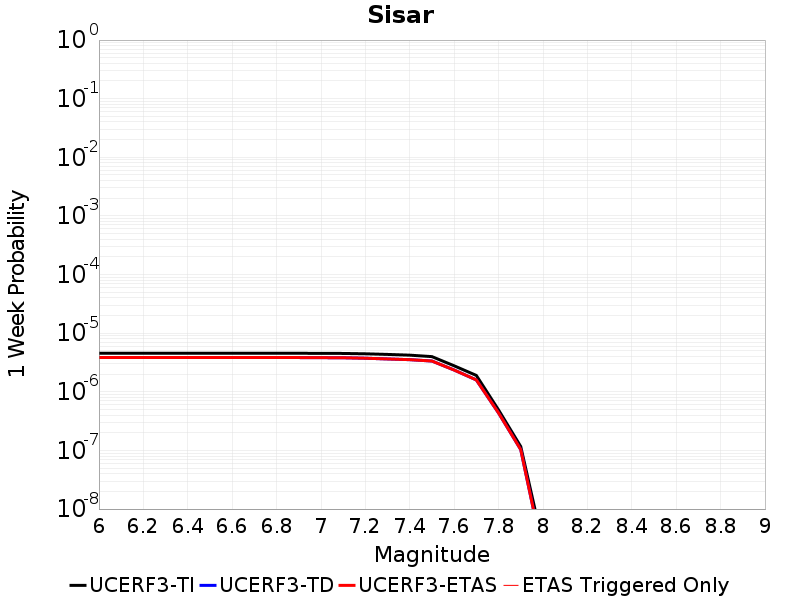 | 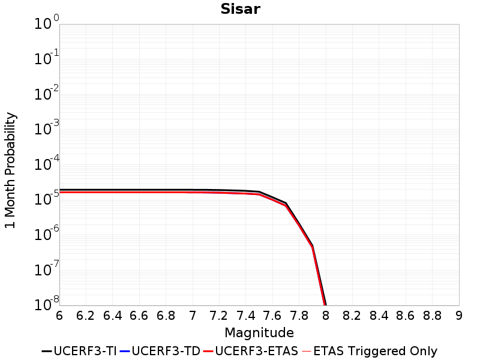 | 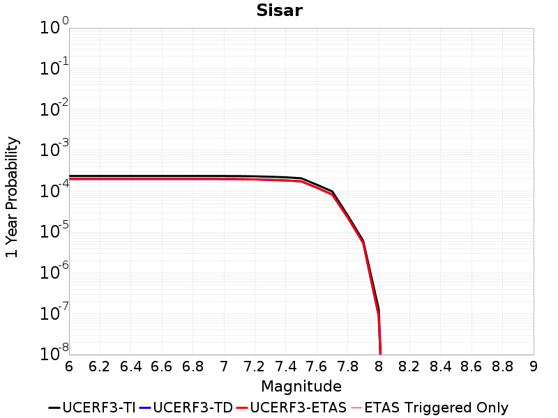 | 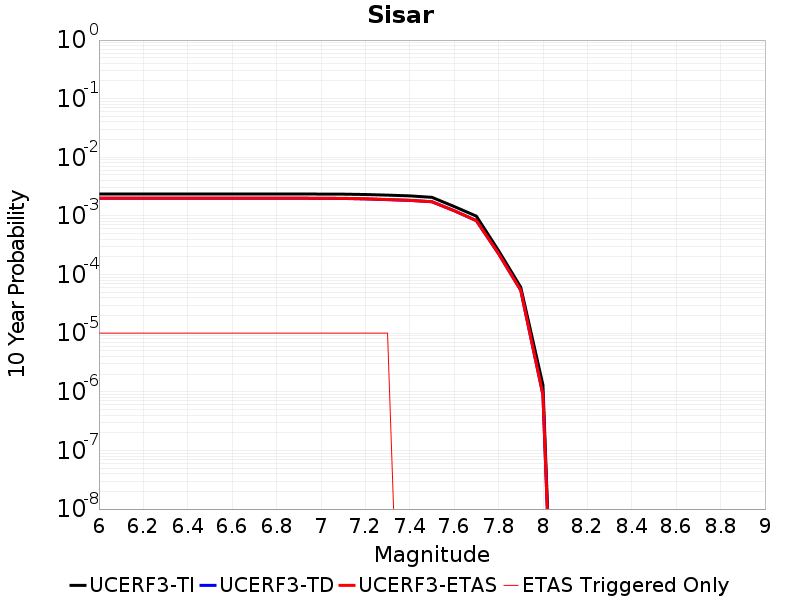 |

| Magnitude | 1 wk TI Prob | 1 wk TD Prob | 1 wk ETAS Prob | 1 wk ETAS/TD Gain | 1 wk ETAS Triggered Only | 1 mo TI Prob | 1 mo TD Prob | 1 mo ETAS Prob | 1 mo ETAS/TD Gain | 1 mo ETAS Triggered Only | 1 yr TI Prob | 1 yr TD Prob | 1 yr ETAS Prob | 1 yr ETAS/TD Gain | 1 yr ETAS Triggered Only | 10 yr TI Prob | 10 yr TD Prob | 10 yr ETAS Prob | 10 yr ETAS/TD Gain | 10 yr ETAS Triggered Only |
|-----|-----|-----|-----|-----|-----|-----|-----|-----|-----|-----|-----|-----|-----|-----|-----|-----|-----|-----|-----|-----|
| 6.0 | 4.544193E-6 | 3.841777E-6 | 3.841777E-6 | 1.0 | 0.0 | 1.9474966E-5 | 1.6464657E-5 | 1.6464657E-5 | 1.0 | 0.0 | 2.3708193E-4 | 2.0043908E-4 | 2.0043908E-4 | 1.0 | 0.0 | 0.0023682916 | 0.0020026169 | 0.0020125967 | 1.0049834 | 1.0E-5 |
| 6.1 | 4.544193E-6 | 3.841777E-6 | 3.841777E-6 | 1.0 | 0.0 | 1.9474966E-5 | 1.6464657E-5 | 1.6464657E-5 | 1.0 | 0.0 | 2.3708193E-4 | 2.0043908E-4 | 2.0043908E-4 | 1.0 | 0.0 | 0.0023682916 | 0.0020026169 | 0.0020125967 | 1.0049834 | 1.0E-5 |
| 6.2 | 4.544193E-6 | 3.841777E-6 | 3.841777E-6 | 1.0 | 0.0 | 1.9474966E-5 | 1.6464657E-5 | 1.6464657E-5 | 1.0 | 0.0 | 2.3708193E-4 | 2.0043908E-4 | 2.0043908E-4 | 1.0 | 0.0 | 0.0023682916 | 0.0020026169 | 0.0020125967 | 1.0049834 | 1.0E-5 |
| 6.3 | 4.544193E-6 | 3.841777E-6 | 3.841777E-6 | 1.0 | 0.0 | 1.9474966E-5 | 1.6464657E-5 | 1.6464657E-5 | 1.0 | 0.0 | 2.3708193E-4 | 2.0043908E-4 | 2.0043908E-4 | 1.0 | 0.0 | 0.0023682916 | 0.0020026169 | 0.0020125967 | 1.0049834 | 1.0E-5 |
| 6.4 | 4.544193E-6 | 3.841777E-6 | 3.841777E-6 | 1.0 | 0.0 | 1.9474966E-5 | 1.6464657E-5 | 1.6464657E-5 | 1.0 | 0.0 | 2.3708193E-4 | 2.0043908E-4 | 2.0043908E-4 | 1.0 | 0.0 | 0.0023682916 | 0.0020026169 | 0.0020125967 | 1.0049834 | 1.0E-5 |
| 6.5 | 4.544193E-6 | 3.841777E-6 | 3.841777E-6 | 1.0 | 0.0 | 1.9474966E-5 | 1.6464657E-5 | 1.6464657E-5 | 1.0 | 0.0 | 2.3708193E-4 | 2.0043908E-4 | 2.0043908E-4 | 1.0 | 0.0 | 0.0023682916 | 0.0020026169 | 0.0020125967 | 1.0049834 | 1.0E-5 |
| 6.6 | 4.544193E-6 | 3.841777E-6 | 3.841777E-6 | 1.0 | 0.0 | 1.9474966E-5 | 1.6464657E-5 | 1.6464657E-5 | 1.0 | 0.0 | 2.3708193E-4 | 2.0043908E-4 | 2.0043908E-4 | 1.0 | 0.0 | 0.0023682916 | 0.0020026169 | 0.0020125967 | 1.0049834 | 1.0E-5 |
| 6.7 | 4.544193E-6 | 3.841777E-6 | 3.841777E-6 | 1.0 | 0.0 | 1.9474966E-5 | 1.6464657E-5 | 1.6464657E-5 | 1.0 | 0.0 | 2.3708193E-4 | 2.0043908E-4 | 2.0043908E-4 | 1.0 | 0.0 | 0.0023682916 | 0.0020026169 | 0.0020125967 | 1.0049834 | 1.0E-5 |
| 6.8 | 4.544193E-6 | 3.841777E-6 | 3.841777E-6 | 1.0 | 0.0 | 1.9474966E-5 | 1.6464657E-5 | 1.6464657E-5 | 1.0 | 0.0 | 2.3708193E-4 | 2.0043908E-4 | 2.0043908E-4 | 1.0 | 0.0 | 0.0023682916 | 0.0020026169 | 0.0020125967 | 1.0049834 | 1.0E-5 |
| 6.9 | 4.542225E-6 | 3.8397384E-6 | 3.8397384E-6 | 1.0 | 0.0 | 1.9466532E-5 | 1.645592E-5 | 1.645592E-5 | 1.0 | 0.0 | 2.3697925E-4 | 2.0033274E-4 | 2.0033274E-4 | 1.0 | 0.0 | 0.002367267 | 0.0020015552 | 0.0020115352 | 1.0049862 | 1.0E-5 |
| 7.0 | 4.5278484E-6 | 3.824799E-6 | 3.824799E-6 | 1.0 | 0.0 | 1.940492E-5 | 1.6391894E-5 | 1.6391894E-5 | 1.0 | 0.0 | 2.3622929E-4 | 1.9955337E-4 | 1.9955337E-4 | 1.0 | 0.0 | 0.0023597833 | 0.0019937756 | 0.0020037557 | 1.0050056 | 1.0E-5 |
| 7.1 | 4.5132488E-6 | 3.8095823E-6 | 3.8095823E-6 | 1.0 | 0.0 | 1.9342351E-5 | 1.6326681E-5 | 1.6326681E-5 | 1.0 | 0.0 | 2.3546767E-4 | 1.9875955E-4 | 1.9875955E-4 | 1.0 | 0.0 | 0.0023521832 | 0.0019858517 | 0.0019958317 | 1.0050256 | 1.0E-5 |
| 7.2 | 4.448859E-6 | 3.7420223E-6 | 3.7420223E-6 | 1.0 | 0.0 | 1.9066398E-5 | 1.6037142E-5 | 1.6037142E-5 | 1.0 | 0.0 | 2.3210866E-4 | 1.9523504E-4 | 1.9523504E-4 | 1.0 | 0.0 | 0.0023186638 | 0.0019506689 | 0.0019606494 | 1.0051165 | 1.0E-5 |
| 7.3 | 4.3424366E-6 | 3.6358176E-6 | 3.6358176E-6 | 1.0 | 0.0 | 1.861031E-5 | 1.5581983E-5 | 1.5581983E-5 | 1.0 | 0.0 | 2.2655698E-4 | 1.8969447E-4 | 1.8969447E-4 | 1.0 | 0.0 | 0.0022632615 | 0.001895359 | 0.00190534 | 1.0052661 | 1.0E-5 |
| 7.4 | 4.218641E-6 | 3.5351054E-6 | 3.5351054E-6 | 1.0 | 0.0 | 1.8079765E-5 | 1.51503655E-5 | 1.51503655E-5 | 1.0 | 0.0 | 2.2009891E-4 | 1.8444042E-4 | 1.8444042E-4 | 1.0 | 0.0 | 0.0021988105 | 0.0018429068 | 0.0018429068 | 1.0 | 0.0 |
| 7.5 | 3.983779E-6 | 3.3494657E-6 | 3.3494657E-6 | 1.0 | 0.0 | 1.7073227E-5 | 1.4354776E-5 | 1.4354776E-5 | 1.0 | 0.0 | 2.0784672E-4 | 1.7475571E-4 | 1.7475571E-4 | 1.0 | 0.0 | 0.0020765243 | 0.001746216 | 0.001746216 | 1.0 | 0.0 |
| 7.6 | 2.777393E-6 | 2.353282E-6 | 2.353282E-6 | 1.0 | 0.0 | 1.1903058E-5 | 1.0085457E-5 | 1.0085457E-5 | 1.0 | 0.0 | 1.449101E-4 | 1.2278359E-4 | 1.2278359E-4 | 1.0 | 0.0 | 0.0014481564 | 0.0012271652 | 0.0012271652 | 1.0 | 0.0 |
| 7.7 | 1.9028433E-6 | 1.5945005E-6 | 1.5945005E-6 | 1.0 | 0.0 | 8.155017E-6 | 6.8335557E-6 | 6.8335557E-6 | 1.0 | 0.0 | 9.928281E-5 | 8.319542E-5 | 8.319542E-5 | 1.0 | 0.0 | 9.923846E-4 | 8.316474E-4 | 8.316474E-4 | 1.0 | 0.0 |
| 7.8 | 4.9095956E-7 | 4.3598473E-7 | 4.3598473E-7 | 1.0 | 0.0 | 2.1041105E-6 | 1.8685047E-6 | 1.8685047E-6 | 1.0 | 0.0 | 2.5617246E-5 | 2.2748809E-5 | 2.2748809E-5 | 1.0 | 0.0 | 2.5614293E-4 | 2.2746497E-4 | 2.2746497E-4 | 1.0 | 0.0 |
| 7.9 | 1.16657894E-7 | 1.0339413E-7 | 1.0339413E-7 | 1.0 | 0.0 | 4.999623E-7 | 4.431176E-7 | 4.431176E-7 | 1.0 | 0.0 | 6.087024E-6 | 5.394944E-6 | 5.394944E-6 | 1.0 | 0.0 | 6.0868573E-5 | 5.394816E-5 | 5.394816E-5 | 1.0 | 0.0 |
| 8.0 | 2.5100346E-9 | 1.7092077E-9 | 1.7092077E-9 | 1.0 | 0.0 | 1.0757291E-8 | 7.3251756E-9 | 7.3251756E-9 | 1.0 | 0.0 | 1.3097001E-7 | 8.9184006E-8 | 8.9184006E-8 | 1.0 | 0.0 | 1.3096993E-6 | 8.9183976E-7 | 8.9183976E-7 | 1.0 | 0.0 |

## San Jacinto (Superstition Mtn)
*[(top)](#table-of-contents)*

| 1 Week | 1 Month | 1 Year | 10 Year |
|-----|-----|-----|-----|
|  | 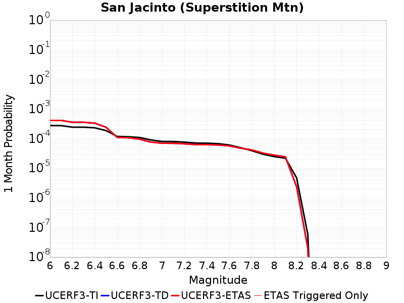 |  | 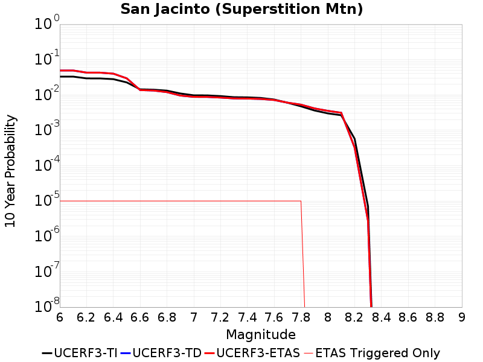 |

| Magnitude | 1 wk TI Prob | 1 wk TD Prob | 1 wk ETAS Prob | 1 wk ETAS/TD Gain | 1 wk ETAS Triggered Only | 1 mo TI Prob | 1 mo TD Prob | 1 mo ETAS Prob | 1 mo ETAS/TD Gain | 1 mo ETAS Triggered Only | 1 yr TI Prob | 1 yr TD Prob | 1 yr ETAS Prob | 1 yr ETAS/TD Gain | 1 yr ETAS Triggered Only | 10 yr TI Prob | 10 yr TD Prob | 10 yr ETAS Prob | 10 yr ETAS/TD Gain | 10 yr ETAS Triggered Only |
|-----|-----|-----|-----|-----|-----|-----|-----|-----|-----|-----|-----|-----|-----|-----|-----|-----|-----|-----|-----|-----|
| 6.0 | 6.4193904E-5 | 9.637681E-5 | 9.637681E-5 | 1.0 | 0.0 | 2.7508775E-4 | 4.1298586E-4 | 4.1298586E-4 | 1.0 | 0.0 | 0.0033440501 | 0.005017896 | 0.005017896 | 1.0 | 0.0 | 0.03294174 | 0.049009122 | 0.049018633 | 1.0001941 | 1.0E-5 |
| 6.1 | 6.4193904E-5 | 9.637681E-5 | 9.637681E-5 | 1.0 | 0.0 | 2.7508775E-4 | 4.1298586E-4 | 4.1298586E-4 | 1.0 | 0.0 | 0.0033440501 | 0.005017896 | 0.005017896 | 1.0 | 0.0 | 0.03294174 | 0.049009122 | 0.049018633 | 1.0001941 | 1.0E-5 |
| 6.2 | 5.7023593E-5 | 8.350325E-5 | 8.350325E-5 | 1.0 | 0.0 | 2.4436394E-4 | 3.5783084E-4 | 3.5783084E-4 | 1.0 | 0.0 | 0.002971072 | 0.004349535 | 0.004349535 | 1.0 | 0.0 | 0.029316625 | 0.042682726 | 0.0426923 | 1.0002242 | 1.0E-5 |
| 6.3 | 5.6940098E-5 | 8.334841E-5 | 8.334841E-5 | 1.0 | 0.0 | 2.4400617E-4 | 3.5716745E-4 | 3.5716745E-4 | 1.0 | 0.0 | 0.002966728 | 0.00434149 | 0.00434149 | 1.0 | 0.0 | 0.029274331 | 0.042606015 | 0.04261559 | 1.0002247 | 1.0E-5 |
| 6.4 | 5.4171585E-5 | 7.783392E-5 | 7.783392E-5 | 1.0 | 0.0 | 2.3214328E-4 | 3.3354064E-4 | 3.3354064E-4 | 1.0 | 0.0 | 0.0028226813 | 0.0040549473 | 0.0040549473 | 1.0 | 0.0 | 0.02787096 | 0.039891623 | 0.039901223 | 1.0002407 | 1.0E-5 |
| 6.5 | 4.375144E-5 | 5.6735564E-5 | 5.6735564E-5 | 1.0 | 0.0 | 1.874927E-4 | 2.431364E-4 | 2.431364E-4 | 1.0 | 0.0 | 0.0022803338 | 0.002957344 | 0.002957344 | 1.0 | 0.0 | 0.022570757 | 0.029396893 | 0.0294066 | 1.0003302 | 1.0E-5 |
| 6.6 | 2.772192E-5 | 2.5787414E-5 | 2.5787414E-5 | 1.0 | 0.0 | 1.1880282E-4 | 1.1051292E-4 | 1.1051292E-4 | 1.0 | 0.0 | 0.0014454646 | 0.0013446838 | 0.0013446838 | 1.0 | 0.0 | 0.014360986 | 0.013695766 | 0.013705629 | 1.0007201 | 1.0E-5 |
| 6.7 | 2.7124124E-5 | 2.4996956E-5 | 2.4996956E-5 | 1.0 | 0.0 | 1.1624106E-4 | 1.07125525E-4 | 1.07125525E-4 | 1.0 | 0.0 | 0.0014143161 | 0.0013034922 | 0.0013034922 | 1.0 | 0.0 | 0.014053487 | 0.013288638 | 0.013298504 | 1.0007426 | 1.0E-5 |
| 6.8 | 2.5475807E-5 | 2.2454939E-5 | 2.2454939E-5 | 1.0 | 0.0 | 1.0917746E-4 | 9.623197E-5 | 9.623197E-5 | 1.0 | 0.0 | 0.001328425 | 0.0011710066 | 0.0011710066 | 1.0 | 0.0 | 0.0132051185 | 0.011973263 | 0.011983143 | 1.0008252 | 1.0E-5 |
| 6.9 | 2.1162023E-5 | 1.7895165E-5 | 1.7895165E-5 | 1.0 | 0.0 | 9.069123E-5 | 7.669133E-5 | 7.669133E-5 | 1.0 | 0.0 | 0.0011036064 | 9.3332084E-4 | 9.3332084E-4 | 1.0 | 0.0 | 0.010981417 | 0.009586802 | 0.009596706 | 1.0010331 | 1.0E-5 |
| 7.0 | 1.8754288E-5 | 1.6418977E-5 | 1.6418977E-5 | 1.0 | 0.0 | 8.037304E-5 | 7.036516E-5 | 7.036516E-5 | 1.0 | 0.0 | 9.781026E-4 | 8.5636164E-4 | 8.5636164E-4 | 1.0 | 0.0 | 0.009738087 | 0.008804081 | 0.008813993 | 1.0011258 | 1.0E-5 |
| 7.1 | 1.8678527E-5 | 1.6343874E-5 | 1.6343874E-5 | 1.0 | 0.0 | 8.0048376E-5 | 7.004331E-5 | 7.004331E-5 | 1.0 | 0.0 | 9.7415317E-4 | 8.5244613E-4 | 8.5244613E-4 | 1.0 | 0.0 | 0.009698939 | 0.008764935 | 0.008774847 | 1.0011309 | 1.0E-5 |
| 7.2 | 1.7804578E-5 | 1.5635851E-5 | 1.5635851E-5 | 1.0 | 0.0 | 7.6303106E-5 | 6.700908E-5 | 6.700908E-5 | 1.0 | 0.0 | 9.285943E-4 | 8.1553246E-4 | 8.1553246E-4 | 1.0 | 0.0 | 0.009247236 | 0.008395105 | 0.00840502 | 1.0011811 | 1.0E-5 |
| 7.3 | 1.6583685E-5 | 1.4782148E-5 | 1.4782148E-5 | 1.0 | 0.0 | 7.1070994E-5 | 6.335053E-5 | 6.335053E-5 | 1.0 | 0.0 | 8.649459E-4 | 7.7102194E-4 | 7.7102194E-4 | 1.0 | 0.0 | 0.00861587 | 0.007949018 | 0.007958938 | 1.001248 | 1.0E-5 |
| 7.4 | 1.6387552E-5 | 1.4646572E-5 | 1.4646572E-5 | 1.0 | 0.0 | 7.023047E-5 | 6.2769526E-5 | 6.2769526E-5 | 1.0 | 0.0 | 8.5472054E-4 | 7.639531E-4 | 7.639531E-4 | 1.0 | 0.0 | 0.008514405 | 0.007878153 | 0.007888073 | 1.0012593 | 1.0E-5 |
| 7.5 | 1.5790754E-5 | 1.4284835E-5 | 1.4284835E-5 | 1.0 | 0.0 | 6.767291E-5 | 6.1219296E-5 | 6.1219296E-5 | 1.0 | 0.0 | 8.236062E-4 | 7.4509205E-4 | 7.4509205E-4 | 1.0 | 0.0 | 0.008205604 | 0.0076874867 | 0.0076974095 | 1.0012908 | 1.0E-5 |
| 7.6 | 1.4248672E-5 | 1.3295038E-5 | 1.3295038E-5 | 1.0 | 0.0 | 6.106431E-5 | 5.69775E-5 | 5.69775E-5 | 1.0 | 0.0 | 7.432043E-4 | 6.93482E-4 | 6.93482E-4 | 1.0 | 0.0 | 0.007407237 | 0.0071655596 | 0.007175488 | 1.0013856 | 1.0E-5 |
| 7.7 | 1.15449975E-5 | 1.1133893E-5 | 1.1133893E-5 | 1.0 | 0.0 | 4.947762E-5 | 4.7715817E-5 | 4.7715817E-5 | 1.0 | 0.0 | 6.022235E-4 | 5.80786E-4 | 5.80786E-4 | 1.0 | 0.0 | 0.006005941 | 0.0060306187 | 0.006040558 | 1.0016482 | 1.0E-5 |
| 7.8 | 9.1391985E-6 | 9.735549E-6 | 9.735549E-6 | 1.0 | 0.0 | 3.9167408E-5 | 4.1723117E-5 | 4.1723117E-5 | 1.0 | 0.0 | 4.767588E-4 | 5.078612E-4 | 5.078612E-4 | 1.0 | 0.0 | 0.0047573727 | 0.005292748 | 0.005302695 | 1.0018793 | 1.0E-5 |
| 7.9 | 6.973017E-6 | 7.5786043E-6 | 7.5786043E-6 | 1.0 | 0.0 | 2.9884017E-5 | 3.247933E-5 | 3.247933E-5 | 1.0 | 0.0 | 3.6377716E-4 | 3.9536465E-4 | 3.9536465E-4 | 1.0 | 0.0 | 0.0036318225 | 0.0041551413 | 0.0041551413 | 1.0 | 0.0 |
| 8.0 | 5.7638235E-6 | 6.4396554E-6 | 6.4396554E-6 | 1.0 | 0.0 | 2.4701867E-5 | 2.7598235E-5 | 2.7598235E-5 | 1.0 | 0.0 | 3.0070372E-4 | 3.3595721E-4 | 3.3595721E-4 | 1.0 | 0.0 | 0.0030029714 | 0.0035481185 | 0.0035481185 | 1.0 | 0.0 |
| 8.1 | 5.1124434E-6 | 5.659407E-6 | 5.659407E-6 | 1.0 | 0.0 | 2.1910288E-5 | 2.425438E-5 | 2.425438E-5 | 1.0 | 0.0 | 2.6672508E-4 | 2.9525757E-4 | 2.9525757E-4 | 1.0 | 0.0 | 0.0026640517 | 0.003126674 | 0.003126674 | 1.0 | 0.0 |
| 8.2 | 1.1075938E-6 | 5.565437E-7 | 5.565437E-7 | 1.0 | 0.0 | 4.7468216E-6 | 2.385185E-6 | 2.385185E-6 | 1.0 | 0.0 | 5.779102E-5 | 2.9039265E-5 | 2.9039265E-5 | 1.0 | 0.0 | 5.777599E-4 | 3.2625083E-4 | 3.2625083E-4 | 1.0 | 0.0 |
| 8.3 | 1.3584393E-8 | 4.6895208E-9 | 4.6895208E-9 | 1.0 | 0.0 | 5.8218827E-8 | 2.0097946E-8 | 2.0097946E-8 | 1.0 | 0.0 | 7.0881396E-7 | 2.446925E-7 | 2.446925E-7 | 1.0 | 0.0 | 7.0881174E-6 | 2.7381727E-6 | 2.7381727E-6 | 1.0 | 0.0 |

## Puente Hills
*[(top)](#table-of-contents)*

| 1 Week | 1 Month | 1 Year | 10 Year |
|-----|-----|-----|-----|
| 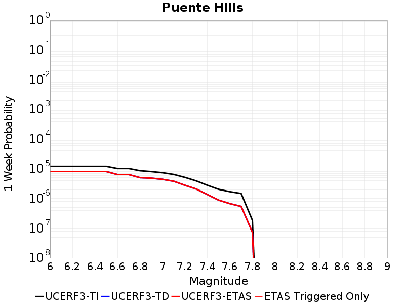 | 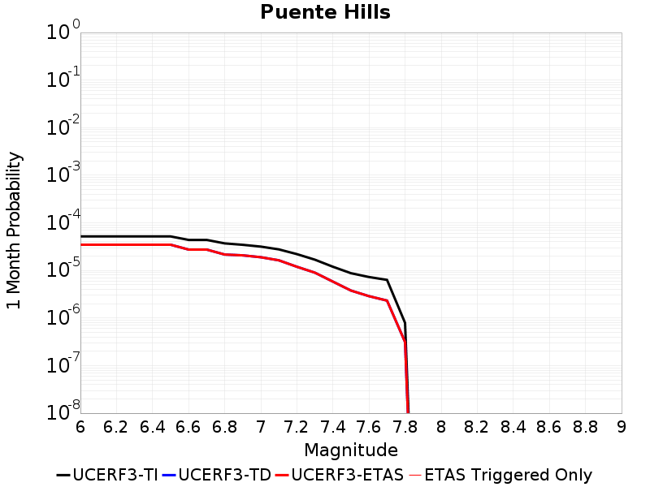 | 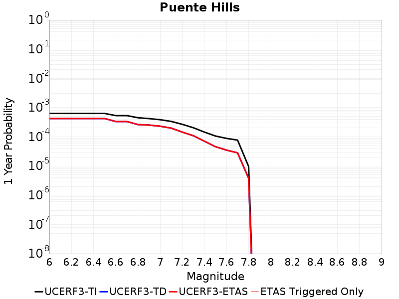 |  |

| Magnitude | 1 wk TI Prob | 1 wk TD Prob | 1 wk ETAS Prob | 1 wk ETAS/TD Gain | 1 wk ETAS Triggered Only | 1 mo TI Prob | 1 mo TD Prob | 1 mo ETAS Prob | 1 mo ETAS/TD Gain | 1 mo ETAS Triggered Only | 1 yr TI Prob | 1 yr TD Prob | 1 yr ETAS Prob | 1 yr ETAS/TD Gain | 1 yr ETAS Triggered Only | 10 yr TI Prob | 10 yr TD Prob | 10 yr ETAS Prob | 10 yr ETAS/TD Gain | 10 yr ETAS Triggered Only |
|-----|-----|-----|-----|-----|-----|-----|-----|-----|-----|-----|-----|-----|-----|-----|-----|-----|-----|-----|-----|-----|
| 6.0 | 1.2101656E-5 | 8.106869E-6 | 8.106869E-6 | 1.0 | 0.0 | 5.1863204E-5 | 3.4743294E-5 | 3.4743294E-5 | 1.0 | 0.0 | 6.312516E-4 | 4.2292316E-4 | 4.2292316E-4 | 1.0 | 0.0 | 0.0062946146 | 0.004221744 | 0.0042317016 | 1.0023587 | 1.0E-5 |
| 6.1 | 1.2101656E-5 | 8.106869E-6 | 8.106869E-6 | 1.0 | 0.0 | 5.1863204E-5 | 3.4743294E-5 | 3.4743294E-5 | 1.0 | 0.0 | 6.312516E-4 | 4.2292316E-4 | 4.2292316E-4 | 1.0 | 0.0 | 0.0062946146 | 0.004221744 | 0.0042317016 | 1.0023587 | 1.0E-5 |
| 6.2 | 1.2101656E-5 | 8.106869E-6 | 8.106869E-6 | 1.0 | 0.0 | 5.1863204E-5 | 3.4743294E-5 | 3.4743294E-5 | 1.0 | 0.0 | 6.312516E-4 | 4.2292316E-4 | 4.2292316E-4 | 1.0 | 0.0 | 0.0062946146 | 0.004221744 | 0.0042317016 | 1.0023587 | 1.0E-5 |
| 6.3 | 1.2101656E-5 | 8.106869E-6 | 8.106869E-6 | 1.0 | 0.0 | 5.1863204E-5 | 3.4743294E-5 | 3.4743294E-5 | 1.0 | 0.0 | 6.312516E-4 | 4.2292316E-4 | 4.2292316E-4 | 1.0 | 0.0 | 0.0062946146 | 0.004221744 | 0.0042317016 | 1.0023587 | 1.0E-5 |
| 6.4 | 1.2101656E-5 | 8.106869E-6 | 8.106869E-6 | 1.0 | 0.0 | 5.1863204E-5 | 3.4743294E-5 | 3.4743294E-5 | 1.0 | 0.0 | 6.312516E-4 | 4.2292316E-4 | 4.2292316E-4 | 1.0 | 0.0 | 0.0062946146 | 0.004221744 | 0.0042317016 | 1.0023587 | 1.0E-5 |
| 6.5 | 1.2101656E-5 | 8.106869E-6 | 8.106869E-6 | 1.0 | 0.0 | 5.1863204E-5 | 3.4743294E-5 | 3.4743294E-5 | 1.0 | 0.0 | 6.312516E-4 | 4.2292316E-4 | 4.2292316E-4 | 1.0 | 0.0 | 0.0062946146 | 0.004221744 | 0.0042317016 | 1.0023587 | 1.0E-5 |
| 6.6 | 1.0222488E-5 | 6.4066376E-6 | 6.4066376E-6 | 1.0 | 0.0 | 4.3809923E-5 | 2.7456743E-5 | 2.7456743E-5 | 1.0 | 0.0 | 5.332553E-4 | 3.3423703E-4 | 3.3423703E-4 | 1.0 | 0.0 | 0.0053197746 | 0.0033375889 | 0.0033375889 | 1.0 | 0.0 |
| 6.7 | 1.0222488E-5 | 6.4066376E-6 | 6.4066376E-6 | 1.0 | 0.0 | 4.3809923E-5 | 2.7456743E-5 | 2.7456743E-5 | 1.0 | 0.0 | 5.332553E-4 | 3.3423703E-4 | 3.3423703E-4 | 1.0 | 0.0 | 0.0053197746 | 0.0033375889 | 0.0033375889 | 1.0 | 0.0 |
| 6.8 | 8.6367845E-6 | 5.0349377E-6 | 5.0349377E-6 | 1.0 | 0.0 | 3.7014266E-5 | 2.157813E-5 | 2.157813E-5 | 1.0 | 0.0 | 4.505555E-4 | 2.6268262E-4 | 2.6268262E-4 | 1.0 | 0.0 | 0.004496431 | 0.0026237774 | 0.0026237774 | 1.0 | 0.0 |
| 6.9 | 8.066481E-6 | 4.8427073E-6 | 4.8427073E-6 | 1.0 | 0.0 | 3.4570177E-5 | 2.0754298E-5 | 2.0754298E-5 | 1.0 | 0.0 | 4.2081063E-4 | 2.526548E-4 | 2.526548E-4 | 1.0 | 0.0 | 0.0042001465 | 0.0025237296 | 0.0025237296 | 1.0 | 0.0 |
| 7.0 | 7.393828E-6 | 4.423614E-6 | 4.423614E-6 | 1.0 | 0.0 | 3.168745E-5 | 1.895821E-5 | 1.895821E-5 | 1.0 | 0.0 | 3.857264E-4 | 2.3079221E-4 | 2.3079221E-4 | 1.0 | 0.0 | 0.0038505755 | 0.0023055708 | 0.0023055708 | 1.0 | 0.0 |
| 7.1 | 6.4660953E-6 | 3.8098397E-6 | 3.8098397E-6 | 1.0 | 0.0 | 2.7711543E-5 | 1.6327784E-5 | 1.6327784E-5 | 1.0 | 0.0 | 3.373358E-4 | 1.9877299E-4 | 1.9877299E-4 | 1.0 | 0.0 | 0.0033682417 | 0.0019859879 | 0.0019859879 | 1.0 | 0.0 |
| 7.2 | 5.143232E-6 | 2.790794E-6 | 2.790794E-6 | 1.0 | 0.0 | 2.2042237E-5 | 1.1960492E-5 | 1.1960492E-5 | 1.0 | 0.0 | 2.6833118E-4 | 1.4560936E-4 | 1.4560936E-4 | 1.0 | 0.0 | 0.002680074 | 0.0014551493 | 0.0014551493 | 1.0 | 0.0 |
| 7.3 | 3.928255E-6 | 2.0951265E-6 | 2.0951265E-6 | 1.0 | 0.0 | 1.683527E-5 | 8.979083E-6 | 8.979083E-6 | 1.0 | 0.0 | 2.0495013E-4 | 1.0931492E-4 | 1.0931492E-4 | 1.0 | 0.0 | 0.002047612 | 0.0010926181 | 0.0010926181 | 1.0 | 0.0 |
| 7.4 | 2.7894434E-6 | 1.3579694E-6 | 1.3579694E-6 | 1.0 | 0.0 | 1.1954703E-5 | 5.819856E-6 | 5.819856E-6 | 1.0 | 0.0 | 1.4553878E-4 | 7.085449E-5 | 7.085449E-5 | 1.0 | 0.0 | 0.001454435 | 7.083234E-4 | 7.083234E-4 | 1.0 | 0.0 |
| 7.5 | 2.041735E-6 | 8.813832E-7 | 8.813832E-7 | 1.0 | 0.0 | 8.750263E-6 | 3.7773514E-6 | 3.7773514E-6 | 1.0 | 0.0 | 1.06529245E-4 | 4.5988316E-5 | 4.5988316E-5 | 1.0 | 0.0 | 0.0010647819 | 4.5979136E-4 | 4.5979136E-4 | 1.0 | 0.0 |
| 7.6 | 1.6959062E-6 | 6.7193025E-7 | 6.7193025E-7 | 1.0 | 0.0 | 7.268149E-6 | 2.879698E-6 | 2.879698E-6 | 1.0 | 0.0 | 8.848612E-5 | 3.5059787E-5 | 3.5059787E-5 | 1.0 | 0.0 | 8.84509E-4 | 3.5054548E-4 | 3.5054548E-4 | 1.0 | 0.0 |
| 7.7 | 1.4767965E-6 | 5.4228036E-7 | 5.4228036E-7 | 1.0 | 0.0 | 6.3291122E-6 | 2.3240568E-6 | 2.3240568E-6 | 1.0 | 0.0 | 7.705422E-5 | 2.8295051E-5 | 2.8295051E-5 | 1.0 | 0.0 | 7.702751E-4 | 2.8291706E-4 | 2.8291706E-4 | 1.0 | 0.0 |
| 7.8 | 1.8432911E-7 | 7.2990176E-8 | 7.2990176E-8 | 1.0 | 0.0 | 7.8998164E-7 | 3.1281502E-7 | 3.1281502E-7 | 1.0 | 0.0 | 9.617985E-6 | 3.8085195E-6 | 3.8085195E-6 | 1.0 | 0.0 | 9.617568E-5 | 3.8084872E-5 | 3.8084872E-5 | 1.0 | 0.0 |

## Kern Canyon (North Kern) 2011
*[(top)](#table-of-contents)*

| 1 Week | 1 Month | 1 Year | 10 Year |
|-----|-----|-----|-----|
| 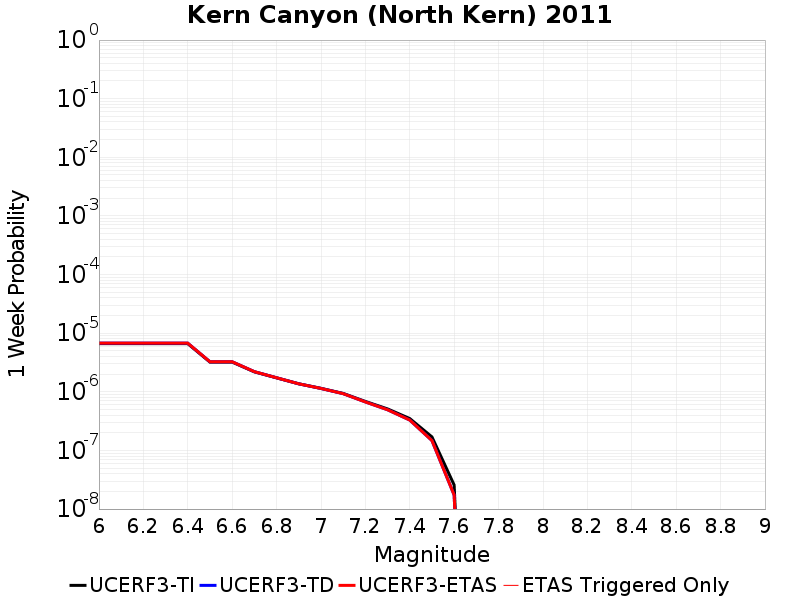 |  |  |  |

| Magnitude | 1 wk TI Prob | 1 wk TD Prob | 1 wk ETAS Prob | 1 wk ETAS/TD Gain | 1 wk ETAS Triggered Only | 1 mo TI Prob | 1 mo TD Prob | 1 mo ETAS Prob | 1 mo ETAS/TD Gain | 1 mo ETAS Triggered Only | 1 yr TI Prob | 1 yr TD Prob | 1 yr ETAS Prob | 1 yr ETAS/TD Gain | 1 yr ETAS Triggered Only | 10 yr TI Prob | 10 yr TD Prob | 10 yr ETAS Prob | 10 yr ETAS/TD Gain | 10 yr ETAS Triggered Only |
|-----|-----|-----|-----|-----|-----|-----|-----|-----|-----|-----|-----|-----|-----|-----|-----|-----|-----|-----|-----|-----|
| 6.0 | 6.6264497E-6 | 6.7583333E-6 | 6.7583333E-6 | 1.0 | 0.0 | 2.8398761E-5 | 2.8964008E-5 | 2.8964008E-5 | 1.0 | 0.0 | 3.4570007E-4 | 3.5258775E-4 | 3.5258775E-4 | 1.0 | 0.0 | 0.0034516277 | 0.0035210722 | 0.003531037 | 1.00283 | 1.0E-5 |
| 6.1 | 6.6264497E-6 | 6.7583333E-6 | 6.7583333E-6 | 1.0 | 0.0 | 2.8398761E-5 | 2.8964008E-5 | 2.8964008E-5 | 1.0 | 0.0 | 3.4570007E-4 | 3.5258775E-4 | 3.5258775E-4 | 1.0 | 0.0 | 0.0034516277 | 0.0035210722 | 0.003531037 | 1.00283 | 1.0E-5 |
| 6.2 | 6.6264497E-6 | 6.7583333E-6 | 6.7583333E-6 | 1.0 | 0.0 | 2.8398761E-5 | 2.8964008E-5 | 2.8964008E-5 | 1.0 | 0.0 | 3.4570007E-4 | 3.5258775E-4 | 3.5258775E-4 | 1.0 | 0.0 | 0.0034516277 | 0.0035210722 | 0.003531037 | 1.00283 | 1.0E-5 |
| 6.3 | 6.6264497E-6 | 6.7583333E-6 | 6.7583333E-6 | 1.0 | 0.0 | 2.8398761E-5 | 2.8964008E-5 | 2.8964008E-5 | 1.0 | 0.0 | 3.4570007E-4 | 3.5258775E-4 | 3.5258775E-4 | 1.0 | 0.0 | 0.0034516277 | 0.0035210722 | 0.003531037 | 1.00283 | 1.0E-5 |
| 6.4 | 6.6264497E-6 | 6.7583333E-6 | 6.7583333E-6 | 1.0 | 0.0 | 2.8398761E-5 | 2.8964008E-5 | 2.8964008E-5 | 1.0 | 0.0 | 3.4570007E-4 | 3.5258775E-4 | 3.5258775E-4 | 1.0 | 0.0 | 0.0034516277 | 0.0035210722 | 0.003531037 | 1.00283 | 1.0E-5 |
| 6.5 | 3.2162225E-6 | 3.2575203E-6 | 3.2575203E-6 | 1.0 | 0.0 | 1.3783738E-5 | 1.3960731E-5 | 1.3960731E-5 | 1.0 | 0.0 | 1.6780409E-4 | 1.6995946E-4 | 1.6995946E-4 | 1.0 | 0.0 | 0.0016767744 | 0.0016983744 | 0.0017083575 | 1.005878 | 1.0E-5 |
| 6.6 | 3.2162225E-6 | 3.2575203E-6 | 3.2575203E-6 | 1.0 | 0.0 | 1.3783738E-5 | 1.3960731E-5 | 1.3960731E-5 | 1.0 | 0.0 | 1.6780409E-4 | 1.6995946E-4 | 1.6995946E-4 | 1.0 | 0.0 | 0.0016767744 | 0.0016983744 | 0.0017083575 | 1.005878 | 1.0E-5 |
| 6.7 | 2.1908265E-6 | 2.2073948E-6 | 2.2073948E-6 | 1.0 | 0.0 | 9.389223E-6 | 9.46023E-6 | 9.46023E-6 | 1.0 | 0.0 | 1.1430779E-4 | 1.1517241E-4 | 1.1517241E-4 | 1.0 | 0.0 | 0.0011424901 | 0.0011511466 | 0.001161135 | 1.008677 | 1.0E-5 |
| 6.8 | 1.7303895E-6 | 1.7367611E-6 | 1.7367611E-6 | 1.0 | 0.0 | 7.415934E-6 | 7.443241E-6 | 7.443241E-6 | 1.0 | 0.0 | 9.028525E-5 | 9.061779E-5 | 9.061779E-5 | 1.0 | 0.0 | 9.024858E-4 | 9.0581813E-4 | 9.1580907E-4 | 1.0110297 | 1.0E-5 |
| 6.9 | 1.3700314E-6 | 1.369024E-6 | 1.369024E-6 | 1.0 | 0.0 | 5.87155E-6 | 5.8672326E-6 | 5.8672326E-6 | 1.0 | 0.0 | 7.148377E-5 | 7.143126E-5 | 7.143126E-5 | 1.0 | 0.0 | 7.146078E-4 | 7.1408757E-4 | 7.240804E-4 | 1.0139939 | 1.0E-5 |
| 7.0 | 1.1467797E-6 | 1.1415153E-6 | 1.1415153E-6 | 1.0 | 0.0 | 4.9147607E-6 | 4.8921997E-6 | 4.8921997E-6 | 1.0 | 0.0 | 5.983557E-5 | 5.9560934E-5 | 5.9560934E-5 | 1.0 | 0.0 | 5.981946E-4 | 5.954529E-4 | 6.054469E-4 | 1.016784 | 1.0E-5 |
| 7.1 | 9.3952065E-7 | 9.303796E-7 | 9.303796E-7 | 1.0 | 0.0 | 4.026511E-6 | 3.9873353E-6 | 3.9873353E-6 | 1.0 | 0.0 | 4.9021666E-5 | 4.854474E-5 | 4.854474E-5 | 1.0 | 0.0 | 4.901085E-4 | 4.8534316E-4 | 4.953383E-4 | 1.020594 | 1.0E-5 |
| 7.2 | 6.858055E-7 | 6.7201137E-7 | 6.7201137E-7 | 1.0 | 0.0 | 2.939163E-6 | 2.8800457E-6 | 2.8800457E-6 | 1.0 | 0.0 | 3.5783723E-5 | 3.5064E-5 | 3.5064E-5 | 1.0 | 0.0 | 3.5777962E-4 | 3.5058556E-4 | 3.6058205E-4 | 1.0285137 | 1.0E-5 |
| 7.3 | 5.1101983E-7 | 4.9399097E-7 | 4.9399097E-7 | 1.0 | 0.0 | 2.1900833E-6 | 2.1171024E-6 | 2.1171024E-6 | 1.0 | 0.0 | 2.6663936E-5 | 2.5775424E-5 | 2.5775424E-5 | 1.0 | 0.0 | 2.6660739E-4 | 2.577248E-4 | 2.6772224E-4 | 1.0387911 | 1.0E-5 |
| 7.4 | 3.4999414E-7 | 3.3000146E-7 | 3.3000146E-7 | 1.0 | 0.0 | 1.499974E-6 | 1.4142911E-6 | 1.4142911E-6 | 1.0 | 0.0 | 1.8262032E-5 | 1.7218861E-5 | 1.7218861E-5 | 1.0 | 0.0 | 1.826053E-4 | 1.7217551E-4 | 1.7217551E-4 | 1.0 | 0.0 |
| 7.5 | 1.7021522E-7 | 1.4752187E-7 | 1.4752187E-7 | 1.0 | 0.0 | 7.2949354E-7 | 6.3223644E-7 | 6.3223644E-7 | 1.0 | 0.0 | 8.881548E-6 | 7.697453E-6 | 7.697453E-6 | 1.0 | 0.0 | 8.8811925E-5 | 7.697194E-5 | 7.697194E-5 | 1.0 | 0.0 |
| 7.6 | 2.572245E-8 | 1.7356268E-8 | 1.7356268E-8 | 1.0 | 0.0 | 1.10239064E-7 | 7.4384E-8 | 7.4384E-8 | 1.0 | 0.0 | 1.3421597E-6 | 9.0562486E-7 | 9.0562486E-7 | 1.0 | 0.0 | 1.3421517E-5 | 9.056217E-6 | 9.056217E-6 | 1.0 | 0.0 |

## Mission Hills 2011
*[(top)](#table-of-contents)*

| 1 Week | 1 Month | 1 Year | 10 Year |
|-----|-----|-----|-----|
| 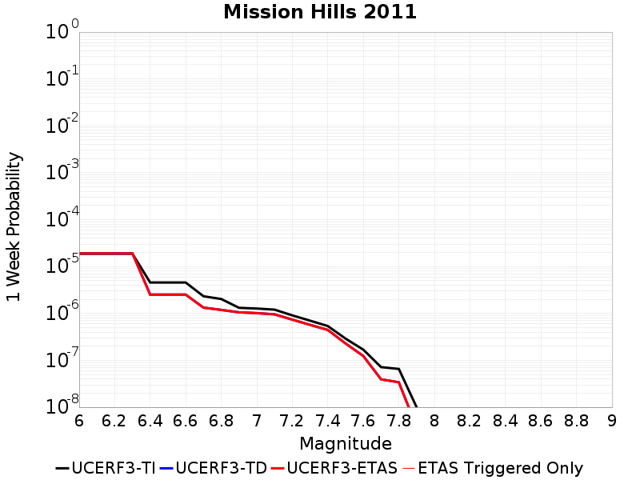 | 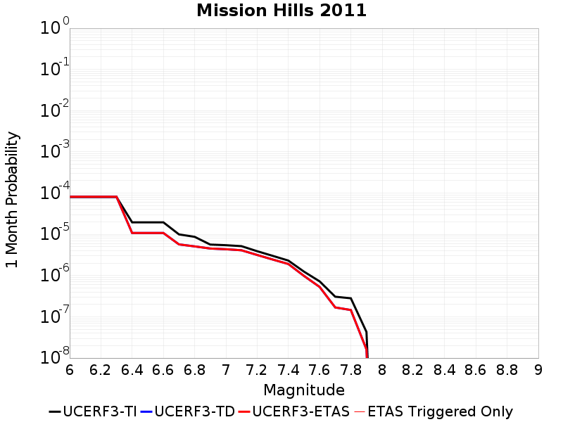 | 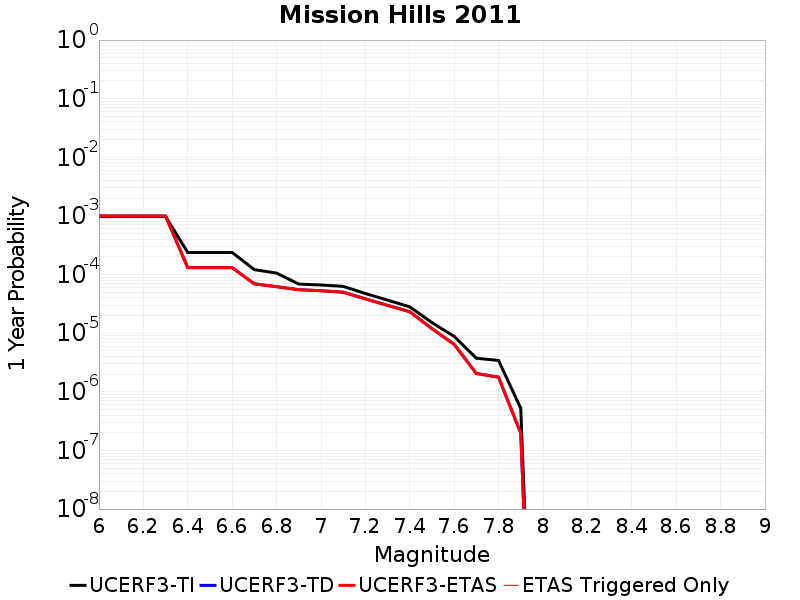 |  |

| Magnitude | 1 wk TI Prob | 1 wk TD Prob | 1 wk ETAS Prob | 1 wk ETAS/TD Gain | 1 wk ETAS Triggered Only | 1 mo TI Prob | 1 mo TD Prob | 1 mo ETAS Prob | 1 mo ETAS/TD Gain | 1 mo ETAS Triggered Only | 1 yr TI Prob | 1 yr TD Prob | 1 yr ETAS Prob | 1 yr ETAS/TD Gain | 1 yr ETAS Triggered Only | 10 yr TI Prob | 10 yr TD Prob | 10 yr ETAS Prob | 10 yr ETAS/TD Gain | 10 yr ETAS Triggered Only |
|-----|-----|-----|-----|-----|-----|-----|-----|-----|-----|-----|-----|-----|-----|-----|-----|-----|-----|-----|-----|-----|
| 6.0 | 1.8765717E-5 | 1.9074167E-5 | 1.9074167E-5 | 1.0 | 0.0 | 8.0422025E-5 | 8.1745806E-5 | 8.1745806E-5 | 1.0 | 0.0 | 9.786983E-4 | 9.951446E-4 | 9.951446E-4 | 1.0 | 0.0 | 0.009743992 | 0.009940616 | 0.009950517 | 1.000996 | 1.0E-5 |
| 6.1 | 1.8765717E-5 | 1.9074167E-5 | 1.9074167E-5 | 1.0 | 0.0 | 8.0422025E-5 | 8.1745806E-5 | 8.1745806E-5 | 1.0 | 0.0 | 9.786983E-4 | 9.951446E-4 | 9.951446E-4 | 1.0 | 0.0 | 0.009743992 | 0.009940616 | 0.009950517 | 1.000996 | 1.0E-5 |
| 6.2 | 1.8765717E-5 | 1.9074167E-5 | 1.9074167E-5 | 1.0 | 0.0 | 8.0422025E-5 | 8.1745806E-5 | 8.1745806E-5 | 1.0 | 0.0 | 9.786983E-4 | 9.951446E-4 | 9.951446E-4 | 1.0 | 0.0 | 0.009743992 | 0.009940616 | 0.009950517 | 1.000996 | 1.0E-5 |
| 6.3 | 1.8765717E-5 | 1.9074167E-5 | 1.9074167E-5 | 1.0 | 0.0 | 8.0422025E-5 | 8.1745806E-5 | 8.1745806E-5 | 1.0 | 0.0 | 9.786983E-4 | 9.951446E-4 | 9.951446E-4 | 1.0 | 0.0 | 0.009743992 | 0.009940616 | 0.009950517 | 1.000996 | 1.0E-5 |
| 6.4 | 4.566357E-6 | 2.5174186E-6 | 2.5174186E-6 | 1.0 | 0.0 | 1.9569954E-5 | 1.0788903E-5 | 1.0788903E-5 | 1.0 | 0.0 | 2.3823815E-4 | 1.3134879E-4 | 1.3134879E-4 | 1.0 | 0.0 | 0.002379829 | 0.0013128902 | 0.0013128902 | 1.0 | 0.0 |
| 6.5 | 4.566357E-6 | 2.5174186E-6 | 2.5174186E-6 | 1.0 | 0.0 | 1.9569954E-5 | 1.0788903E-5 | 1.0788903E-5 | 1.0 | 0.0 | 2.3823815E-4 | 1.3134879E-4 | 1.3134879E-4 | 1.0 | 0.0 | 0.002379829 | 0.0013128902 | 0.0013128902 | 1.0 | 0.0 |
| 6.6 | 4.566357E-6 | 2.5174186E-6 | 2.5174186E-6 | 1.0 | 0.0 | 1.9569954E-5 | 1.0788903E-5 | 1.0788903E-5 | 1.0 | 0.0 | 2.3823815E-4 | 1.3134879E-4 | 1.3134879E-4 | 1.0 | 0.0 | 0.002379829 | 0.0013128902 | 0.0013128902 | 1.0 | 0.0 |
| 6.7 | 2.3266773E-6 | 1.3308211E-6 | 1.3308211E-6 | 1.0 | 0.0 | 9.971435E-6 | 5.7035068E-6 | 5.7035068E-6 | 1.0 | 0.0 | 1.2139547E-4 | 6.943804E-5 | 6.943804E-5 | 1.0 | 0.0 | 0.0012132917 | 6.941696E-4 | 6.941696E-4 | 1.0 | 0.0 |
| 6.8 | 2.032735E-6 | 1.1905016E-6 | 1.1905016E-6 | 1.0 | 0.0 | 8.711692E-6 | 5.10214E-6 | 5.10214E-6 | 1.0 | 0.0 | 1.06059684E-4 | 6.211684E-5 | 6.211684E-5 | 1.0 | 0.0 | 0.0010600908 | 6.209996E-4 | 6.209996E-4 | 1.0 | 0.0 |
| 6.9 | 1.3186259E-6 | 1.0570445E-6 | 1.0570445E-6 | 1.0 | 0.0 | 5.6512413E-6 | 4.530183E-6 | 4.530183E-6 | 1.0 | 0.0 | 6.8801695E-5 | 5.5153614E-5 | 5.5153614E-5 | 1.0 | 0.0 | 6.8780396E-4 | 5.514022E-4 | 5.514022E-4 | 1.0 | 0.0 |
| 7.0 | 1.2726016E-6 | 1.0167605E-6 | 1.0167605E-6 | 1.0 | 0.0 | 5.4539955E-6 | 4.357538E-6 | 4.357538E-6 | 1.0 | 0.0 | 6.6400375E-5 | 5.305176E-5 | 5.305176E-5 | 1.0 | 0.0 | 6.6380535E-4 | 5.303938E-4 | 5.303938E-4 | 1.0 | 0.0 |
| 7.1 | 1.2063913E-6 | 9.578374E-7 | 9.578374E-7 | 1.0 | 0.0 | 5.170238E-6 | 4.105011E-6 | 4.105011E-6 | 1.0 | 0.0 | 6.294583E-5 | 4.997739E-5 | 4.997739E-5 | 1.0 | 0.0 | 6.2928005E-4 | 4.9966405E-4 | 4.9966405E-4 | 1.0 | 0.0 |
| 7.2 | 9.105806E-7 | 7.383977E-7 | 7.383977E-7 | 1.0 | 0.0 | 3.9024826E-6 | 3.164558E-6 | 3.164558E-6 | 1.0 | 0.0 | 4.7511687E-5 | 3.8527825E-5 | 3.8527825E-5 | 1.0 | 0.0 | 4.7501532E-4 | 3.8521303E-4 | 3.8521303E-4 | 1.0 | 0.0 |
| 7.3 | 7.020432E-7 | 5.716869E-7 | 5.716869E-7 | 1.0 | 0.0 | 3.0087533E-6 | 2.4500844E-6 | 2.4500844E-6 | 1.0 | 0.0 | 3.6630954E-5 | 2.9829383E-5 | 2.9829383E-5 | 1.0 | 0.0 | 3.6624918E-4 | 2.982551E-4 | 2.982551E-4 | 1.0 | 0.0 |
| 7.4 | 5.3900635E-7 | 4.4540954E-7 | 4.4540954E-7 | 1.0 | 0.0 | 2.3100251E-6 | 1.9088966E-6 | 1.9088966E-6 | 1.0 | 0.0 | 2.8124194E-5 | 2.3240582E-5 | 2.3240582E-5 | 1.0 | 0.0 | 2.8120633E-4 | 2.3238272E-4 | 2.3238272E-4 | 1.0 | 0.0 |
| 7.5 | 2.907075E-7 | 2.2922261E-7 | 2.2922261E-7 | 1.0 | 0.0 | 1.2458887E-6 | 9.823822E-7 | 9.823822E-7 | 1.0 | 0.0 | 1.5168589E-5 | 1.1960439E-5 | 1.1960439E-5 | 1.0 | 0.0 | 1.5167553E-4 | 1.1959814E-4 | 1.1959814E-4 | 1.0 | 0.0 |
| 7.6 | 1.6903675E-7 | 1.2383015E-7 | 1.2383015E-7 | 1.0 | 0.0 | 7.2444305E-7 | 5.3070056E-7 | 5.3070056E-7 | 1.0 | 0.0 | 8.820059E-6 | 6.4612614E-6 | 6.4612614E-6 | 1.0 | 0.0 | 8.8197085E-5 | 6.461086E-5 | 6.461086E-5 | 1.0 | 0.0 |
| 7.7 | 7.168073E-8 | 3.9381522E-8 | 3.9381522E-8 | 1.0 | 0.0 | 3.072031E-7 | 1.6877793E-7 | 1.6877793E-7 | 1.0 | 0.0 | 3.7401915E-6 | 2.0548696E-6 | 2.0548696E-6 | 1.0 | 0.0 | 3.7401285E-5 | 2.0548518E-5 | 2.0548518E-5 | 1.0 | 0.0 |
| 7.8 | 6.564101E-8 | 3.4066442E-8 | 3.4066442E-8 | 1.0 | 0.0 | 2.813186E-7 | 1.4599902E-7 | 1.4599902E-7 | 1.0 | 0.0 | 3.4250486E-6 | 1.7775368E-6 | 1.7775368E-6 | 1.0 | 0.0 | 3.424996E-5 | 1.7775237E-5 | 1.7775237E-5 | 1.0 | 0.0 |
| 7.9 | 1.0029074E-8 | 3.7767416E-9 | 3.7767416E-9 | 1.0 | 0.0 | 4.2981743E-8 | 1.6186036E-8 | 1.6186036E-8 | 1.0 | 0.0 | 5.2330256E-7 | 1.9706496E-7 | 1.9706496E-7 | 1.0 | 0.0 | 5.2330133E-6 | 1.970649E-6 | 1.970649E-6 | 1.0 | 0.0 |

## Tin Mountain
*[(top)](#table-of-contents)*

| 1 Week | 1 Month | 1 Year | 10 Year |
|-----|-----|-----|-----|
|  |  |  |  |

| Magnitude | 1 wk TI Prob | 1 wk TD Prob | 1 wk ETAS Prob | 1 wk ETAS/TD Gain | 1 wk ETAS Triggered Only | 1 mo TI Prob | 1 mo TD Prob | 1 mo ETAS Prob | 1 mo ETAS/TD Gain | 1 mo ETAS Triggered Only | 1 yr TI Prob | 1 yr TD Prob | 1 yr ETAS Prob | 1 yr ETAS/TD Gain | 1 yr ETAS Triggered Only | 10 yr TI Prob | 10 yr TD Prob | 10 yr ETAS Prob | 10 yr ETAS/TD Gain | 10 yr ETAS Triggered Only |
|-----|-----|-----|-----|-----|-----|-----|-----|-----|-----|-----|-----|-----|-----|-----|-----|-----|-----|-----|-----|-----|
| 6.0 | 4.083776E-6 | 4.1821604E-6 | 4.1821604E-6 | 1.0 | 0.0 | 1.750178E-5 | 1.7923441E-5 | 1.7923441E-5 | 1.0 | 0.0 | 2.1306332E-4 | 2.1819977E-4 | 2.1819977E-4 | 1.0 | 0.0 | 0.0021285915 | 0.0021802213 | 0.0021901994 | 1.0045767 | 1.0E-5 |
| 6.1 | 4.083776E-6 | 4.1821604E-6 | 4.1821604E-6 | 1.0 | 0.0 | 1.750178E-5 | 1.7923441E-5 | 1.7923441E-5 | 1.0 | 0.0 | 2.1306332E-4 | 2.1819977E-4 | 2.1819977E-4 | 1.0 | 0.0 | 0.0021285915 | 0.0021802213 | 0.0021901994 | 1.0045767 | 1.0E-5 |
| 6.2 | 4.083776E-6 | 4.1821604E-6 | 4.1821604E-6 | 1.0 | 0.0 | 1.750178E-5 | 1.7923441E-5 | 1.7923441E-5 | 1.0 | 0.0 | 2.1306332E-4 | 2.1819977E-4 | 2.1819977E-4 | 1.0 | 0.0 | 0.0021285915 | 0.0021802213 | 0.0021901994 | 1.0045767 | 1.0E-5 |
| 6.3 | 4.083776E-6 | 4.1821604E-6 | 4.1821604E-6 | 1.0 | 0.0 | 1.750178E-5 | 1.7923441E-5 | 1.7923441E-5 | 1.0 | 0.0 | 2.1306332E-4 | 2.1819977E-4 | 2.1819977E-4 | 1.0 | 0.0 | 0.0021285915 | 0.0021802213 | 0.0021901994 | 1.0045767 | 1.0E-5 |
| 6.4 | 4.083776E-6 | 4.1821604E-6 | 4.1821604E-6 | 1.0 | 0.0 | 1.750178E-5 | 1.7923441E-5 | 1.7923441E-5 | 1.0 | 0.0 | 2.1306332E-4 | 2.1819977E-4 | 2.1819977E-4 | 1.0 | 0.0 | 0.0021285915 | 0.0021802213 | 0.0021901994 | 1.0045767 | 1.0E-5 |
| 6.5 | 2.3143427E-6 | 2.3735336E-6 | 2.3735336E-6 | 1.0 | 0.0 | 9.9185745E-6 | 1.0172251E-5 | 1.0172251E-5 | 1.0 | 0.0 | 1.2075195E-4 | 1.2384089E-4 | 1.2384089E-4 | 1.0 | 0.0 | 0.0012068636 | 0.0012377948 | 0.0012377948 | 1.0 | 0.0 |
| 6.6 | 2.3143427E-6 | 2.3735336E-6 | 2.3735336E-6 | 1.0 | 0.0 | 9.9185745E-6 | 1.0172251E-5 | 1.0172251E-5 | 1.0 | 0.0 | 1.2075195E-4 | 1.2384089E-4 | 1.2384089E-4 | 1.0 | 0.0 | 0.0012068636 | 0.0012377948 | 0.0012377948 | 1.0 | 0.0 |
| 6.7 | 1.7029532E-6 | 1.750092E-6 | 1.750092E-6 | 1.0 | 0.0 | 7.2983503E-6 | 7.5003754E-6 | 7.5003754E-6 | 1.0 | 0.0 | 8.885379E-5 | 9.1313785E-5 | 9.1313785E-5 | 1.0 | 0.0 | 8.881827E-4 | 9.128153E-4 | 9.128153E-4 | 1.0 | 0.0 |
| 6.8 | 1.2914646E-6 | 1.3301853E-6 | 1.3301853E-6 | 1.0 | 0.0 | 5.534837E-6 | 5.700784E-6 | 5.700784E-6 | 1.0 | 0.0 | 6.738455E-5 | 6.940528E-5 | 6.940528E-5 | 1.0 | 0.0 | 6.736412E-4 | 6.938794E-4 | 6.938794E-4 | 1.0 | 0.0 |
| 6.9 | 5.8708974E-7 | 6.11859E-7 | 6.11859E-7 | 1.0 | 0.0 | 2.5160964E-6 | 2.6222503E-6 | 2.6222503E-6 | 1.0 | 0.0 | 3.0633044E-5 | 3.1925472E-5 | 3.1925472E-5 | 1.0 | 0.0 | 3.0628822E-4 | 3.19213E-4 | 3.19213E-4 | 1.0 | 0.0 |
| 7.0 | 4.6248786E-7 | 4.833362E-7 | 4.833362E-7 | 1.0 | 0.0 | 1.9820893E-6 | 2.0714394E-6 | 2.0714394E-6 | 1.0 | 0.0 | 2.413167E-5 | 2.521952E-5 | 2.521952E-5 | 1.0 | 0.0 | 2.412905E-4 | 2.5217028E-4 | 2.5217028E-4 | 1.0 | 0.0 |
| 7.1 | 3.804606E-7 | 3.9883363E-7 | 3.9883363E-7 | 1.0 | 0.0 | 1.6305444E-6 | 1.709286E-6 | 1.709286E-6 | 1.0 | 0.0 | 1.9851697E-5 | 2.0810394E-5 | 2.0810394E-5 | 1.0 | 0.0 | 1.9849923E-4 | 2.080878E-4 | 2.080878E-4 | 1.0 | 0.0 |
| 7.2 | 3.5864858E-7 | 3.7628283E-7 | 3.7628283E-7 | 1.0 | 0.0 | 1.5370645E-6 | 1.61264E-6 | 1.61264E-6 | 1.0 | 0.0 | 1.87136E-5 | 1.9633748E-5 | 1.9633748E-5 | 1.0 | 0.0 | 1.8712023E-4 | 1.9632345E-4 | 1.9632345E-4 | 1.0 | 0.0 |
| 7.3 | 3.342063E-7 | 3.5074183E-7 | 3.5074183E-7 | 1.0 | 0.0 | 1.4323119E-6 | 1.5031786E-6 | 1.5031786E-6 | 1.0 | 0.0 | 1.7438259E-5 | 1.830108E-5 | 1.830108E-5 | 1.0 | 0.0 | 1.743689E-4 | 1.8299904E-4 | 1.8299904E-4 | 1.0 | 0.0 |
| 7.4 | 2.971242E-7 | 3.117529E-7 | 3.117529E-7 | 1.0 | 0.0 | 1.2733886E-6 | 1.3360834E-6 | 1.3360834E-6 | 1.0 | 0.0 | 1.5503398E-5 | 1.6266727E-5 | 1.6266727E-5 | 1.0 | 0.0 | 1.5502315E-4 | 1.6265865E-4 | 1.6265865E-4 | 1.0 | 0.0 |
| 7.5 | 1.4326713E-7 | 1.5016988E-7 | 1.5016988E-7 | 1.0 | 0.0 | 6.140018E-7 | 6.4358517E-7 | 6.4358517E-7 | 1.0 | 0.0 | 7.4754466E-6 | 7.83565E-6 | 7.83565E-6 | 1.0 | 0.0 | 7.475195E-5 | 7.83565E-5 | 7.83565E-5 | 1.0 | 0.0 |

## Pine Mtn
*[(top)](#table-of-contents)*

| 1 Week | 1 Month | 1 Year | 10 Year |
|-----|-----|-----|-----|
| 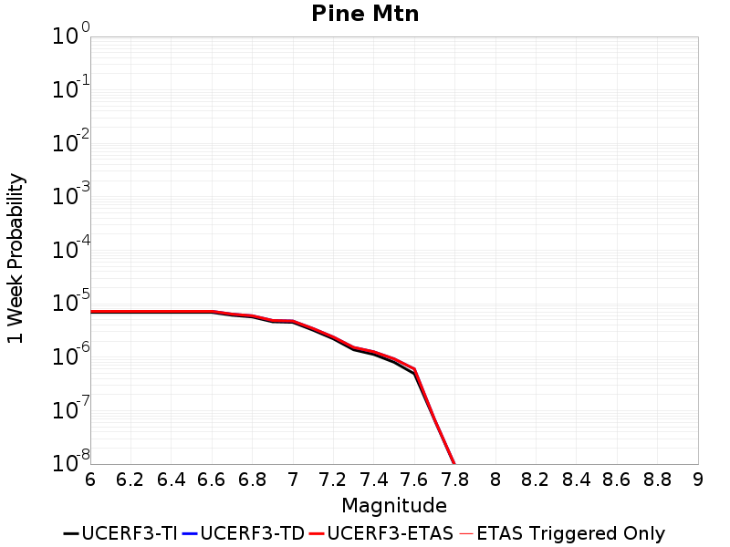 | 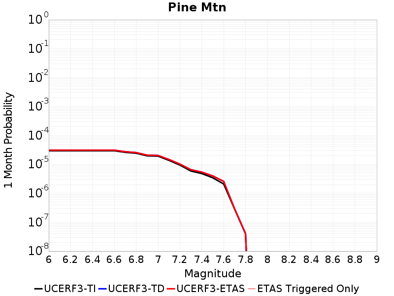 |  | 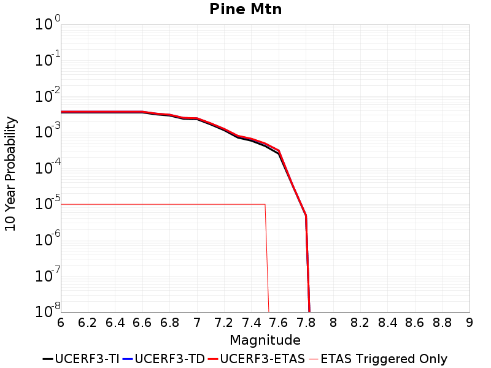 |

| Magnitude | 1 wk TI Prob | 1 wk TD Prob | 1 wk ETAS Prob | 1 wk ETAS/TD Gain | 1 wk ETAS Triggered Only | 1 mo TI Prob | 1 mo TD Prob | 1 mo ETAS Prob | 1 mo ETAS/TD Gain | 1 mo ETAS Triggered Only | 1 yr TI Prob | 1 yr TD Prob | 1 yr ETAS Prob | 1 yr ETAS/TD Gain | 1 yr ETAS Triggered Only | 10 yr TI Prob | 10 yr TD Prob | 10 yr ETAS Prob | 10 yr ETAS/TD Gain | 10 yr ETAS Triggered Only |
|-----|-----|-----|-----|-----|-----|-----|-----|-----|-----|-----|-----|-----|-----|-----|-----|-----|-----|-----|-----|-----|
| 6.0 | 6.894797E-6 | 7.2302523E-6 | 7.2302523E-6 | 1.0 | 0.0 | 2.9548795E-5 | 3.0986444E-5 | 3.0986444E-5 | 1.0 | 0.0 | 3.596972E-4 | 3.7719763E-4 | 3.7719763E-4 | 1.0 | 0.0 | 0.0035911554 | 0.0037658717 | 0.003775834 | 1.0026454 | 1.0E-5 |
| 6.1 | 6.894797E-6 | 7.2302523E-6 | 7.2302523E-6 | 1.0 | 0.0 | 2.9548795E-5 | 3.0986444E-5 | 3.0986444E-5 | 1.0 | 0.0 | 3.596972E-4 | 3.7719763E-4 | 3.7719763E-4 | 1.0 | 0.0 | 0.0035911554 | 0.0037658717 | 0.003775834 | 1.0026454 | 1.0E-5 |
| 6.2 | 6.894797E-6 | 7.2302523E-6 | 7.2302523E-6 | 1.0 | 0.0 | 2.9548795E-5 | 3.0986444E-5 | 3.0986444E-5 | 1.0 | 0.0 | 3.596972E-4 | 3.7719763E-4 | 3.7719763E-4 | 1.0 | 0.0 | 0.0035911554 | 0.0037658717 | 0.003775834 | 1.0026454 | 1.0E-5 |
| 6.3 | 6.894797E-6 | 7.2302523E-6 | 7.2302523E-6 | 1.0 | 0.0 | 2.9548795E-5 | 3.0986444E-5 | 3.0986444E-5 | 1.0 | 0.0 | 3.596972E-4 | 3.7719763E-4 | 3.7719763E-4 | 1.0 | 0.0 | 0.0035911554 | 0.0037658717 | 0.003775834 | 1.0026454 | 1.0E-5 |
| 6.4 | 6.894797E-6 | 7.2302523E-6 | 7.2302523E-6 | 1.0 | 0.0 | 2.9548795E-5 | 3.0986444E-5 | 3.0986444E-5 | 1.0 | 0.0 | 3.596972E-4 | 3.7719763E-4 | 3.7719763E-4 | 1.0 | 0.0 | 0.0035911554 | 0.0037658717 | 0.003775834 | 1.0026454 | 1.0E-5 |
| 6.5 | 6.894797E-6 | 7.2302523E-6 | 7.2302523E-6 | 1.0 | 0.0 | 2.9548795E-5 | 3.0986444E-5 | 3.0986444E-5 | 1.0 | 0.0 | 3.596972E-4 | 3.7719763E-4 | 3.7719763E-4 | 1.0 | 0.0 | 0.0035911554 | 0.0037658717 | 0.003775834 | 1.0026454 | 1.0E-5 |
| 6.6 | 6.894797E-6 | 7.2302523E-6 | 7.2302523E-6 | 1.0 | 0.0 | 2.9548795E-5 | 3.0986444E-5 | 3.0986444E-5 | 1.0 | 0.0 | 3.596972E-4 | 3.7719763E-4 | 3.7719763E-4 | 1.0 | 0.0 | 0.0035911554 | 0.0037658717 | 0.003775834 | 1.0026454 | 1.0E-5 |
| 6.7 | 6.0867933E-6 | 6.401775E-6 | 6.401775E-6 | 1.0 | 0.0 | 2.6085996E-5 | 2.74359E-5 | 2.74359E-5 | 1.0 | 0.0 | 3.1755073E-4 | 3.339831E-4 | 3.339831E-4 | 1.0 | 0.0 | 0.0031709734 | 0.003335031 | 0.0033449975 | 1.0029885 | 1.0E-5 |
| 6.8 | 5.6530425E-6 | 5.9551758E-6 | 5.9551758E-6 | 1.0 | 0.0 | 2.42271E-5 | 2.5521942E-5 | 2.5521942E-5 | 1.0 | 0.0 | 2.94925E-4 | 3.106874E-4 | 3.106874E-4 | 1.0 | 0.0 | 0.002945339 | 0.0031027354 | 0.0031127043 | 1.0032129 | 1.0E-5 |
| 6.9 | 4.6015225E-6 | 4.8681877E-6 | 4.8681877E-6 | 1.0 | 0.0 | 1.9720663E-5 | 2.0863503E-5 | 2.0863503E-5 | 1.0 | 0.0 | 2.4007261E-4 | 2.53985E-4 | 2.53985E-4 | 1.0 | 0.0 | 0.0023981342 | 0.0025370915 | 0.0025470662 | 1.0039315 | 1.0E-5 |
| 7.0 | 4.4875965E-6 | 4.751811E-6 | 4.751811E-6 | 1.0 | 0.0 | 1.9232413E-5 | 2.0364754E-5 | 2.0364754E-5 | 1.0 | 0.0 | 2.3412947E-4 | 2.4791414E-4 | 2.4791414E-4 | 1.0 | 0.0 | 0.0023388295 | 0.0024765197 | 0.0024864948 | 1.004028 | 1.0E-5 |
| 7.1 | 3.203907E-6 | 3.4335283E-6 | 3.4335283E-6 | 1.0 | 0.0 | 1.3730958E-5 | 1.4715041E-5 | 1.4715041E-5 | 1.0 | 0.0 | 1.6716159E-4 | 1.7914157E-4 | 1.7914157E-4 | 1.0 | 0.0 | 0.0016703589 | 0.0017900378 | 0.00180002 | 1.0055765 | 1.0E-5 |
| 7.2 | 2.2060601E-6 | 2.3818473E-6 | 2.3818473E-6 | 1.0 | 0.0 | 9.4545085E-6 | 1.0207879E-5 | 1.0207879E-5 | 1.0 | 0.0 | 1.15102564E-4 | 1.242743E-4 | 1.242743E-4 | 1.0 | 0.0 | 0.0011504296 | 0.0012420929 | 0.0012520805 | 1.0080409 | 1.0E-5 |
| 7.3 | 1.3765207E-6 | 1.5246744E-6 | 1.5246744E-6 | 1.0 | 0.0 | 5.899361E-6 | 6.5343033E-6 | 6.5343033E-6 | 1.0 | 0.0 | 7.182235E-5 | 7.955233E-5 | 7.955233E-5 | 1.0 | 0.0 | 7.1799144E-4 | 7.952477E-4 | 8.052397E-4 | 1.0125647 | 1.0E-5 |
| 7.4 | 1.1245983E-6 | 1.2614319E-6 | 1.2614319E-6 | 1.0 | 0.0 | 4.819698E-6 | 5.4061256E-6 | 5.4061256E-6 | 1.0 | 0.0 | 5.8678244E-5 | 6.581768E-5 | 6.581768E-5 | 1.0 | 0.0 | 5.866275E-4 | 6.5799017E-4 | 6.679836E-4 | 1.0151877 | 1.0E-5 |
| 7.5 | 8.031682E-7 | 9.302388E-7 | 9.302388E-7 | 1.0 | 0.0 | 3.4421448E-6 | 3.986732E-6 | 3.986732E-6 | 1.0 | 0.0 | 4.1907308E-5 | 4.853745E-5 | 4.853745E-5 | 1.0 | 0.0 | 4.1899405E-4 | 4.852753E-4 | 4.952704E-4 | 1.0205969 | 1.0E-5 |
| 7.6 | 4.8953444E-7 | 6.0255695E-7 | 6.0255695E-7 | 1.0 | 0.0 | 2.098003E-6 | 2.5823847E-6 | 2.5823847E-6 | 1.0 | 0.0 | 2.5542888E-5 | 3.144013E-5 | 3.144013E-5 | 1.0 | 0.0 | 2.5539953E-4 | 3.1436174E-4 | 3.1436174E-4 | 1.0 | 0.0 |
| 7.7 | 6.634529E-8 | 6.789817E-8 | 6.789817E-8 | 1.0 | 0.0 | 2.843369E-7 | 2.9099212E-7 | 2.9099212E-7 | 1.0 | 0.0 | 3.4617963E-6 | 3.5428238E-6 | 3.5428238E-6 | 1.0 | 0.0 | 3.4617424E-5 | 3.542772E-5 | 3.542772E-5 | 1.0 | 0.0 |
| 7.8 | 9.235578E-9 | 9.490208E-9 | 9.490208E-9 | 1.0 | 0.0 | 3.9581046E-8 | 4.067232E-8 | 4.067232E-8 | 1.0 | 0.0 | 4.818991E-7 | 4.9518536E-7 | 4.9518536E-7 | 1.0 | 0.0 | 4.8189804E-6 | 4.9518444E-6 | 4.9518444E-6 | 1.0 | 0.0 |

## Concord 2011 CFM
*[(top)](#table-of-contents)*

| 1 Week | 1 Month | 1 Year | 10 Year |
|-----|-----|-----|-----|
|  | 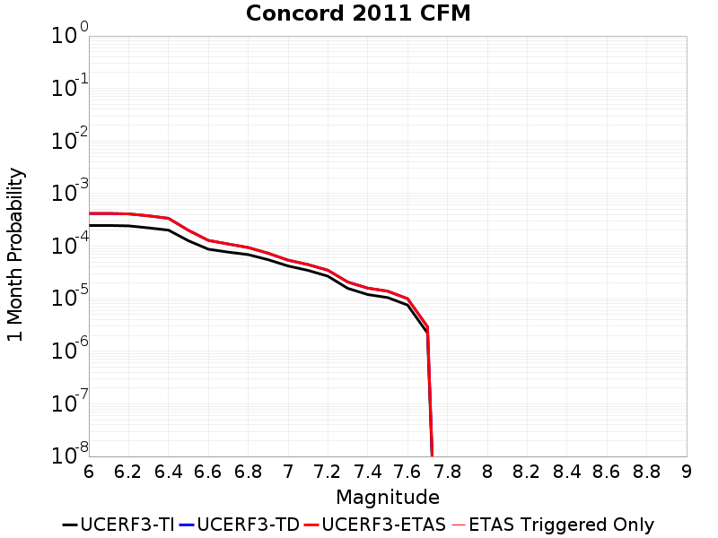 |  |  |

| Magnitude | 1 wk TI Prob | 1 wk TD Prob | 1 wk ETAS Prob | 1 wk ETAS/TD Gain | 1 wk ETAS Triggered Only | 1 mo TI Prob | 1 mo TD Prob | 1 mo ETAS Prob | 1 mo ETAS/TD Gain | 1 mo ETAS Triggered Only | 1 yr TI Prob | 1 yr TD Prob | 1 yr ETAS Prob | 1 yr ETAS/TD Gain | 1 yr ETAS Triggered Only | 10 yr TI Prob | 10 yr TD Prob | 10 yr ETAS Prob | 10 yr ETAS/TD Gain | 10 yr ETAS Triggered Only |
|-----|-----|-----|-----|-----|-----|-----|-----|-----|-----|-----|-----|-----|-----|-----|-----|-----|-----|-----|-----|-----|
| 6.0 | 5.7865112E-5 | 9.7751334E-5 | 9.7751334E-5 | 1.0 | 0.0 | 2.4796976E-4 | 4.188718E-4 | 4.188718E-4 | 1.0 | 0.0 | 0.0030148525 | 0.0050883456 | 0.0050883456 | 1.0 | 0.0 | 0.029742775 | 0.04931373 | 0.04932324 | 1.0001928 | 1.0E-5 |
| 6.1 | 5.7865112E-5 | 9.7751334E-5 | 9.7751334E-5 | 1.0 | 0.0 | 2.4796976E-4 | 4.188718E-4 | 4.188718E-4 | 1.0 | 0.0 | 0.0030148525 | 0.0050883456 | 0.0050883456 | 1.0 | 0.0 | 0.029742775 | 0.04931373 | 0.04932324 | 1.0001928 | 1.0E-5 |
| 6.2 | 5.6789337E-5 | 9.595019E-5 | 9.595019E-5 | 1.0 | 0.0 | 2.4336016E-4 | 4.1115505E-4 | 4.1115505E-4 | 1.0 | 0.0 | 0.0029588845 | 0.0049948823 | 0.0049948823 | 1.0 | 0.0 | 0.029197963 | 0.0484286 | 0.048438113 | 1.0001965 | 1.0E-5 |
| 6.3 | 5.203322E-5 | 8.8175955E-5 | 8.8175955E-5 | 1.0 | 0.0 | 2.2298045E-4 | 3.7784662E-4 | 3.7784662E-4 | 1.0 | 0.0 | 0.0027114071 | 0.004591364 | 0.004591364 | 1.0 | 0.0 | 0.026785625 | 0.044591505 | 0.044591505 | 1.0 | 0.0 |
| 6.4 | 4.7120942E-5 | 7.907785E-5 | 7.907785E-5 | 1.0 | 0.0 | 2.0193127E-4 | 3.3886524E-4 | 3.3886524E-4 | 1.0 | 0.0 | 0.0024557412 | 0.0041186255 | 0.0041186255 | 1.0 | 0.0 | 0.024287801 | 0.040103357 | 0.040103357 | 1.0 | 0.0 |
| 6.5 | 2.9598437E-5 | 4.6765443E-5 | 4.6765443E-5 | 1.0 | 0.0 | 1.2684427E-4 | 2.0040912E-4 | 2.0040912E-4 | 1.0 | 0.0 | 0.001543235 | 0.0024374614 | 0.0024374614 | 1.0 | 0.0 | 0.015325619 | 0.023954552 | 0.023954552 | 1.0 | 0.0 |
| 6.6 | 2.0443718E-5 | 3.0065265E-5 | 3.0065265E-5 | 1.0 | 0.0 | 8.7613E-5 | 1.2884497E-4 | 1.2884497E-4 | 1.0 | 0.0 | 0.0010661662 | 0.0015675952 | 0.0015675952 | 1.0 | 0.0 | 0.010610655 | 0.015508379 | 0.015508379 | 1.0 | 0.0 |
| 6.7 | 1.798539E-5 | 2.5637015E-5 | 2.5637015E-5 | 1.0 | 0.0 | 7.7077966E-5 | 1.09868415E-4 | 1.09868415E-4 | 1.0 | 0.0 | 9.380202E-4 | 0.0013368488 | 0.0013368488 | 1.0 | 0.0 | 0.009340706 | 0.013258079 | 0.013258079 | 1.0 | 0.0 |
| 6.8 | 1.613555E-5 | 2.2016533E-5 | 2.2016533E-5 | 1.0 | 0.0 | 6.915052E-5 | 9.4353236E-5 | 9.4353236E-5 | 1.0 | 0.0 | 8.4158237E-4 | 0.0011481593 | 0.0011481593 | 1.0 | 0.0 | 0.008384023 | 0.0114081735 | 0.0114081735 | 1.0 | 0.0 |
| 6.9 | 1.2916435E-5 | 1.7129034E-5 | 1.7129034E-5 | 1.0 | 0.0 | 5.5354973E-5 | 7.340811E-5 | 7.340811E-5 | 1.0 | 0.0 | 6.7373837E-4 | 8.933832E-4 | 8.933832E-4 | 1.0 | 0.0 | 0.006716994 | 0.008891859 | 0.008891859 | 1.0 | 0.0 |
| 7.0 | 9.81129E-6 | 1.2657739E-5 | 1.2657739E-5 | 1.0 | 0.0 | 4.2047708E-5 | 5.4246335E-5 | 5.4246335E-5 | 1.0 | 0.0 | 5.118106E-4 | 6.602506E-4 | 6.602506E-4 | 1.0 | 0.0 | 0.005106334 | 0.00658358 | 0.00658358 | 1.0 | 0.0 |
| 7.1 | 8.0889195E-6 | 1.0438658E-5 | 1.0438658E-5 | 1.0 | 0.0 | 3.4666336E-5 | 4.4736345E-5 | 4.4736345E-5 | 1.0 | 0.0 | 4.219809E-4 | 5.4453E-4 | 5.4453E-4 | 1.0 | 0.0 | 0.004211805 | 0.0054323147 | 0.0054323147 | 1.0 | 0.0 |
| 7.2 | 6.267438E-6 | 8.13381E-6 | 8.13381E-6 | 1.0 | 0.0 | 2.6860173E-5 | 3.4858724E-5 | 3.4858724E-5 | 1.0 | 0.0 | 3.2697353E-4 | 4.2432305E-4 | 4.2432305E-4 | 1.0 | 0.0 | 0.0032649285 | 0.004235569 | 0.004235569 | 1.0 | 0.0 |
| 7.3 | 3.6761196E-6 | 4.8486254E-6 | 4.8486254E-6 | 1.0 | 0.0 | 1.5754704E-5 | 2.077966E-5 | 2.077966E-5 | 1.0 | 0.0 | 1.9179663E-4 | 2.5296322E-4 | 2.5296322E-4 | 1.0 | 0.0 | 0.0019163118 | 0.0025271834 | 0.0025271834 | 1.0 | 0.0 |
| 7.4 | 2.8044356E-6 | 3.716827E-6 | 3.716827E-6 | 1.0 | 0.0 | 1.2018954E-5 | 1.5929163E-5 | 1.5929163E-5 | 1.0 | 0.0 | 1.4632095E-4 | 1.9392041E-4 | 1.9392041E-4 | 1.0 | 0.0 | 0.0014622464 | 0.0019378407 | 0.0019378407 | 1.0 | 0.0 |
| 7.5 | 2.4578699E-6 | 3.2510154E-6 | 3.2510154E-6 | 1.0 | 0.0 | 1.0533685E-5 | 1.39328495E-5 | 1.39328495E-5 | 1.0 | 0.0 | 1.2824008E-4 | 1.6961935E-4 | 1.6961935E-4 | 1.0 | 0.0 | 0.0012816609 | 0.0016952117 | 0.0016952117 | 1.0 | 0.0 |
| 7.6 | 1.7713267E-6 | 2.340343E-6 | 2.340343E-6 | 1.0 | 0.0 | 7.591378E-6 | 1.0030003E-5 | 1.0030003E-5 | 1.0 | 0.0 | 9.2421105E-5 | 1.2210854E-4 | 1.2210854E-4 | 1.0 | 0.0 | 9.2382677E-4 | 0.0012206361 | 0.0012206361 | 1.0 | 0.0 |
| 7.7 | 5.1912366E-7 | 6.836403E-7 | 6.836403E-7 | 1.0 | 0.0 | 2.2248137E-6 | 2.9298837E-6 | 2.9298837E-6 | 1.0 | 0.0 | 2.708677E-5 | 3.5670764E-5 | 3.5670764E-5 | 1.0 | 0.0 | 2.708347E-4 | 3.5665676E-4 | 3.5665676E-4 | 1.0 | 0.0 |

## Hollywood
*[(top)](#table-of-contents)*

| 1 Week | 1 Month | 1 Year | 10 Year |
|-----|-----|-----|-----|
|  |  |  |  |

| Magnitude | 1 wk TI Prob | 1 wk TD Prob | 1 wk ETAS Prob | 1 wk ETAS/TD Gain | 1 wk ETAS Triggered Only | 1 mo TI Prob | 1 mo TD Prob | 1 mo ETAS Prob | 1 mo ETAS/TD Gain | 1 mo ETAS Triggered Only | 1 yr TI Prob | 1 yr TD Prob | 1 yr ETAS Prob | 1 yr ETAS/TD Gain | 1 yr ETAS Triggered Only | 10 yr TI Prob | 10 yr TD Prob | 10 yr ETAS Prob | 10 yr ETAS/TD Gain | 10 yr ETAS Triggered Only |
|-----|-----|-----|-----|-----|-----|-----|-----|-----|-----|-----|-----|-----|-----|-----|-----|-----|-----|-----|-----|-----|
| 6.0 | 1.24487615E-5 | 1.2600646E-5 | 1.2600646E-5 | 1.0 | 0.0 | 5.3350745E-5 | 5.4001677E-5 | 5.4001677E-5 | 1.0 | 0.0 | 6.4935174E-4 | 6.572768E-4 | 6.572768E-4 | 1.0 | 0.0 | 0.0064745755 | 0.006553816 | 0.0065637506 | 1.0015159 | 1.0E-5 |
| 6.1 | 1.24487615E-5 | 1.2600646E-5 | 1.2600646E-5 | 1.0 | 0.0 | 5.3350745E-5 | 5.4001677E-5 | 5.4001677E-5 | 1.0 | 0.0 | 6.4935174E-4 | 6.572768E-4 | 6.572768E-4 | 1.0 | 0.0 | 0.0064745755 | 0.006553816 | 0.0065637506 | 1.0015159 | 1.0E-5 |
| 6.2 | 1.24487615E-5 | 1.2600646E-5 | 1.2600646E-5 | 1.0 | 0.0 | 5.3350745E-5 | 5.4001677E-5 | 5.4001677E-5 | 1.0 | 0.0 | 6.4935174E-4 | 6.572768E-4 | 6.572768E-4 | 1.0 | 0.0 | 0.0064745755 | 0.006553816 | 0.0065637506 | 1.0015159 | 1.0E-5 |
| 6.3 | 1.24487615E-5 | 1.2600646E-5 | 1.2600646E-5 | 1.0 | 0.0 | 5.3350745E-5 | 5.4001677E-5 | 5.4001677E-5 | 1.0 | 0.0 | 6.4935174E-4 | 6.572768E-4 | 6.572768E-4 | 1.0 | 0.0 | 0.0064745755 | 0.006553816 | 0.0065637506 | 1.0015159 | 1.0E-5 |
| 6.4 | 1.2431024E-5 | 1.25812485E-5 | 1.25812485E-5 | 1.0 | 0.0 | 5.327473E-5 | 5.391855E-5 | 5.391855E-5 | 1.0 | 0.0 | 6.4842677E-4 | 6.5626524E-4 | 6.5626524E-4 | 1.0 | 0.0 | 0.0064653796 | 0.0065437607 | 0.0065536955 | 1.0015181 | 1.0E-5 |
| 6.5 | 1.1242222E-5 | 1.1324769E-5 | 1.1324769E-5 | 1.0 | 0.0 | 4.8180063E-5 | 4.8533835E-5 | 4.8533835E-5 | 1.0 | 0.0 | 5.864344E-4 | 5.907419E-4 | 5.907419E-4 | 1.0 | 0.0 | 0.0058488925 | 0.005892003 | 0.005901944 | 1.0016872 | 1.0E-5 |
| 6.6 | 1.1234066E-5 | 1.1315878E-5 | 1.1315878E-5 | 1.0 | 0.0 | 4.8145106E-5 | 4.849573E-5 | 4.849573E-5 | 1.0 | 0.0 | 5.86009E-4 | 5.9027824E-4 | 5.9027824E-4 | 1.0 | 0.0 | 0.005844661 | 0.005887391 | 0.005897332 | 1.0016886 | 1.0E-5 |
| 6.7 | 1.12294E-5 | 1.1310617E-5 | 1.1310617E-5 | 1.0 | 0.0 | 4.812511E-5 | 4.8473186E-5 | 4.8473186E-5 | 1.0 | 0.0 | 5.857657E-4 | 5.900039E-4 | 5.900039E-4 | 1.0 | 0.0 | 0.0058422405 | 0.005884662 | 0.005894603 | 1.0016893 | 1.0E-5 |
| 6.8 | 1.0252819E-5 | 1.0224649E-5 | 1.0224649E-5 | 1.0 | 0.0 | 4.3939912E-5 | 4.38192E-5 | 4.38192E-5 | 1.0 | 0.0 | 5.3483713E-4 | 5.333703E-4 | 5.333703E-4 | 1.0 | 0.0 | 0.005335517 | 0.005321128 | 0.005331075 | 1.0018693 | 1.0E-5 |
| 6.9 | 9.252289E-6 | 9.115767E-6 | 9.115767E-6 | 1.0 | 0.0 | 3.9652066E-5 | 3.9067E-5 | 3.9067E-5 | 1.0 | 0.0 | 4.8265693E-4 | 4.7553855E-4 | 4.7553855E-4 | 1.0 | 0.0 | 0.0048161 | 0.0047453833 | 0.004755336 | 1.0020974 | 1.0E-5 |
| 7.0 | 8.474604E-6 | 8.2632105E-6 | 8.2632105E-6 | 1.0 | 0.0 | 3.6319227E-5 | 3.5413286E-5 | 3.5413286E-5 | 1.0 | 0.0 | 4.4209688E-4 | 4.310729E-4 | 4.310729E-4 | 1.0 | 0.0 | 0.004412184 | 0.004302518 | 0.0043124747 | 1.0023142 | 1.0E-5 |
| 7.1 | 6.643643E-6 | 6.2721583E-6 | 6.2721583E-6 | 1.0 | 0.0 | 2.8472443E-5 | 2.6880405E-5 | 2.6880405E-5 | 1.0 | 0.0 | 3.4659685E-4 | 3.2722022E-4 | 3.2722022E-4 | 1.0 | 0.0 | 0.0034605677 | 0.00326743 | 0.0032773972 | 1.0030506 | 1.0E-5 |
| 7.2 | 5.549002E-6 | 5.1118895E-6 | 5.1118895E-6 | 1.0 | 0.0 | 2.378122E-5 | 2.1907914E-5 | 2.1907914E-5 | 1.0 | 0.0 | 2.8949787E-4 | 2.6669636E-4 | 2.6669636E-4 | 1.0 | 0.0 | 0.0028912104 | 0.0026637795 | 0.0026737528 | 1.003744 | 1.0E-5 |
| 7.3 | 4.3059727E-6 | 3.962535E-6 | 3.962535E-6 | 1.0 | 0.0 | 1.8454039E-5 | 1.6982183E-5 | 1.6982183E-5 | 1.0 | 0.0 | 2.2465475E-4 | 2.0673855E-4 | 2.0673855E-4 | 1.0 | 0.0 | 0.0022442779 | 0.0020654723 | 0.0020754517 | 1.0048316 | 1.0E-5 |
| 7.4 | 2.8550733E-6 | 2.7034166E-6 | 2.7034166E-6 | 1.0 | 0.0 | 1.2235971E-5 | 1.158602E-5 | 1.158602E-5 | 1.0 | 0.0 | 1.4896276E-4 | 1.4105071E-4 | 1.4105071E-4 | 1.0 | 0.0 | 0.0014886294 | 0.0014096169 | 0.0014196029 | 1.0070841 | 1.0E-5 |
| 7.5 | 1.9927045E-6 | 1.8992466E-6 | 1.8992466E-6 | 1.0 | 0.0 | 8.540134E-6 | 8.139603E-6 | 8.139603E-6 | 1.0 | 0.0 | 1.0397117E-4 | 9.9095196E-5 | 9.9095196E-5 | 1.0 | 0.0 | 0.0010392254 | 9.905137E-4 | 0.0010005038 | 1.0100858 | 1.0E-5 |
| 7.6 | 1.345084E-6 | 1.222695E-6 | 1.222695E-6 | 1.0 | 0.0 | 5.764633E-6 | 5.240111E-6 | 5.240111E-6 | 1.0 | 0.0 | 7.018215E-5 | 6.3796506E-5 | 6.3796506E-5 | 1.0 | 0.0 | 7.0159987E-4 | 6.3778384E-4 | 6.477775E-4 | 1.0156693 | 1.0E-5 |
| 7.7 | 7.6835164E-7 | 6.2858936E-7 | 6.2858936E-7 | 1.0 | 0.0 | 3.2929315E-6 | 2.6939517E-6 | 2.6939517E-6 | 1.0 | 0.0 | 4.00907E-5 | 3.2798383E-5 | 3.2798383E-5 | 1.0 | 0.0 | 4.0083472E-4 | 3.279369E-4 | 3.3793363E-4 | 1.0304837 | 1.0E-5 |
| 7.8 | 3.6562128E-7 | 2.4601985E-7 | 2.4601985E-7 | 1.0 | 0.0 | 1.5669474E-6 | 1.0543704E-6 | 1.0543704E-6 | 1.0 | 0.0 | 1.9077417E-5 | 1.2836887E-5 | 1.2836887E-5 | 1.0 | 0.0 | 1.907578E-4 | 1.2836183E-4 | 1.2836183E-4 | 1.0 | 0.0 |
| 7.9 | 7.5024424E-8 | 5.3959624E-8 | 5.3959624E-8 | 1.0 | 0.0 | 3.215332E-7 | 2.3125551E-7 | 2.3125551E-7 | 1.0 | 0.0 | 3.91466E-6 | 2.8155337E-6 | 2.8155337E-6 | 1.0 | 0.0 | 3.9145907E-5 | 2.815511E-5 | 2.815511E-5 | 1.0 | 0.0 |

## Santa Monica alt 1
*[(top)](#table-of-contents)*

| 1 Week | 1 Month | 1 Year | 10 Year |
|-----|-----|-----|-----|
| 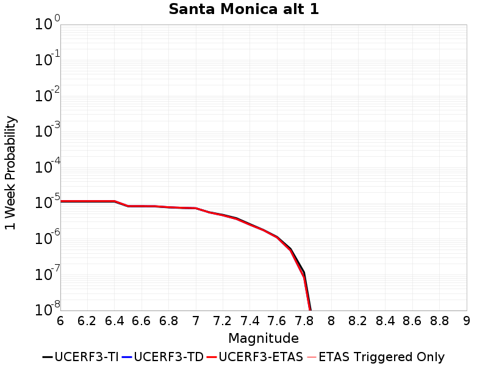 | 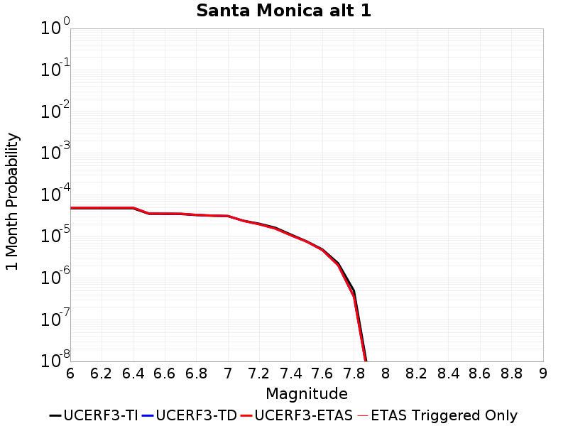 | 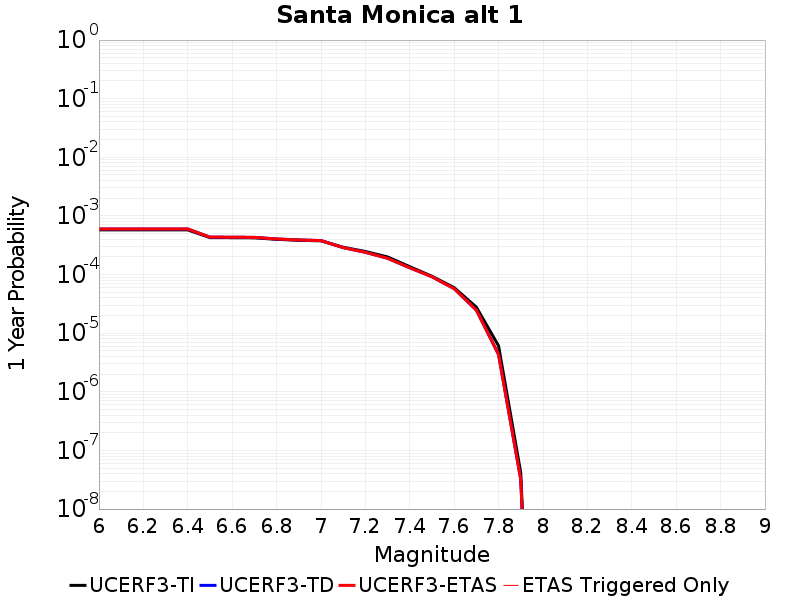 | 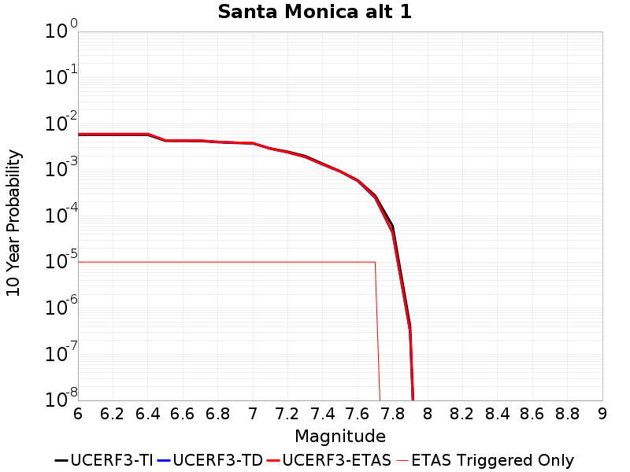 |

| Magnitude | 1 wk TI Prob | 1 wk TD Prob | 1 wk ETAS Prob | 1 wk ETAS/TD Gain | 1 wk ETAS Triggered Only | 1 mo TI Prob | 1 mo TD Prob | 1 mo ETAS Prob | 1 mo ETAS/TD Gain | 1 mo ETAS Triggered Only | 1 yr TI Prob | 1 yr TD Prob | 1 yr ETAS Prob | 1 yr ETAS/TD Gain | 1 yr ETAS Triggered Only | 10 yr TI Prob | 10 yr TD Prob | 10 yr ETAS Prob | 10 yr ETAS/TD Gain | 10 yr ETAS Triggered Only |
|-----|-----|-----|-----|-----|-----|-----|-----|-----|-----|-----|-----|-----|-----|-----|-----|-----|-----|-----|-----|-----|
| 6.0 | 1.1066008E-5 | 1.1486328E-5 | 1.1486328E-5 | 1.0 | 0.0 | 4.742488E-5 | 4.922627E-5 | 4.922627E-5 | 1.0 | 0.0 | 5.7724497E-4 | 5.9917895E-4 | 5.9917895E-4 | 1.0 | 0.0 | 0.005757478 | 0.005977023 | 0.0059869634 | 1.0016631 | 1.0E-5 |
| 6.1 | 1.1066008E-5 | 1.1486328E-5 | 1.1486328E-5 | 1.0 | 0.0 | 4.742488E-5 | 4.922627E-5 | 4.922627E-5 | 1.0 | 0.0 | 5.7724497E-4 | 5.9917895E-4 | 5.9917895E-4 | 1.0 | 0.0 | 0.005757478 | 0.005977023 | 0.0059869634 | 1.0016631 | 1.0E-5 |
| 6.2 | 1.1066008E-5 | 1.1486328E-5 | 1.1486328E-5 | 1.0 | 0.0 | 4.742488E-5 | 4.922627E-5 | 4.922627E-5 | 1.0 | 0.0 | 5.7724497E-4 | 5.9917895E-4 | 5.9917895E-4 | 1.0 | 0.0 | 0.005757478 | 0.005977023 | 0.0059869634 | 1.0016631 | 1.0E-5 |
| 6.3 | 1.1066008E-5 | 1.1486328E-5 | 1.1486328E-5 | 1.0 | 0.0 | 4.742488E-5 | 4.922627E-5 | 4.922627E-5 | 1.0 | 0.0 | 5.7724497E-4 | 5.9917895E-4 | 5.9917895E-4 | 1.0 | 0.0 | 0.005757478 | 0.005977023 | 0.0059869634 | 1.0016631 | 1.0E-5 |
| 6.4 | 1.1066008E-5 | 1.1486328E-5 | 1.1486328E-5 | 1.0 | 0.0 | 4.742488E-5 | 4.922627E-5 | 4.922627E-5 | 1.0 | 0.0 | 5.7724497E-4 | 5.9917895E-4 | 5.9917895E-4 | 1.0 | 0.0 | 0.005757478 | 0.005977023 | 0.0059869634 | 1.0016631 | 1.0E-5 |
| 6.5 | 8.183544E-6 | 8.339671E-6 | 8.339671E-6 | 1.0 | 0.0 | 3.5071862E-5 | 3.5740963E-5 | 3.5740963E-5 | 1.0 | 0.0 | 4.2691626E-4 | 4.3506094E-4 | 4.3506094E-4 | 1.0 | 0.0 | 0.0042609703 | 0.004342258 | 0.0043522147 | 1.002293 | 1.0E-5 |
| 6.6 | 8.1543285E-6 | 8.307868E-6 | 8.307868E-6 | 1.0 | 0.0 | 3.4946657E-5 | 3.560467E-5 | 3.560467E-5 | 1.0 | 0.0 | 4.2539247E-4 | 4.3340222E-4 | 4.3340222E-4 | 1.0 | 0.0 | 0.0042457907 | 0.0043257354 | 0.004335692 | 1.0023017 | 1.0E-5 |
| 6.7 | 8.110878E-6 | 8.261243E-6 | 8.261243E-6 | 1.0 | 0.0 | 3.4760444E-5 | 3.5404853E-5 | 3.5404853E-5 | 1.0 | 0.0 | 4.231262E-4 | 4.3097045E-4 | 4.3097045E-4 | 1.0 | 0.0 | 0.0042232145 | 0.004301512 | 0.004311469 | 1.0023148 | 1.0E-5 |
| 6.8 | 7.644036E-6 | 7.754997E-6 | 7.754997E-6 | 1.0 | 0.0 | 3.275974E-5 | 3.3235283E-5 | 3.3235283E-5 | 1.0 | 0.0 | 3.9877684E-4 | 4.0456586E-4 | 4.0456586E-4 | 1.0 | 0.0 | 0.00398062 | 0.00403844 | 0.0040483996 | 1.0024662 | 1.0E-5 |
| 6.9 | 7.3698293E-6 | 7.4595127E-6 | 7.4595127E-6 | 1.0 | 0.0 | 3.15846E-5 | 3.1968957E-5 | 3.1968957E-5 | 1.0 | 0.0 | 3.8447464E-4 | 3.8915392E-4 | 3.8915392E-4 | 1.0 | 0.0 | 0.0038381014 | 0.0038848685 | 0.0038948297 | 1.0025641 | 1.0E-5 |
| 7.0 | 7.209872E-6 | 7.2893517E-6 | 7.2893517E-6 | 1.0 | 0.0 | 3.0899086E-5 | 3.1239713E-5 | 3.1239713E-5 | 1.0 | 0.0 | 3.7613141E-4 | 3.8027854E-4 | 3.8027854E-4 | 1.0 | 0.0 | 0.0037549543 | 0.0037964208 | 0.0038063829 | 1.002624 | 1.0E-5 |
| 7.1 | 5.603456E-6 | 5.526558E-6 | 5.526558E-6 | 1.0 | 0.0 | 2.4014591E-5 | 2.3685037E-5 | 2.3685037E-5 | 1.0 | 0.0 | 2.923384E-4 | 2.8832757E-4 | 2.8832757E-4 | 1.0 | 0.0 | 0.0029195412 | 0.0028795765 | 0.0028895477 | 1.0034628 | 1.0E-5 |
| 7.2 | 4.7483613E-6 | 4.593269E-6 | 4.593269E-6 | 1.0 | 0.0 | 2.0349962E-5 | 1.968529E-5 | 1.968529E-5 | 1.0 | 0.0 | 2.4773262E-4 | 2.3964219E-4 | 2.3964219E-4 | 1.0 | 0.0 | 0.0024745662 | 0.002393852 | 0.0024038278 | 1.0041673 | 1.0E-5 |
| 7.3 | 3.829015E-6 | 3.635927E-6 | 3.635927E-6 | 1.0 | 0.0 | 1.6409962E-5 | 1.5582451E-5 | 1.5582451E-5 | 1.0 | 0.0 | 1.9977297E-4 | 1.8969992E-4 | 1.8969992E-4 | 1.0 | 0.0 | 0.0019959346 | 0.0018953887 | 0.0019053698 | 1.005266 | 1.0E-5 |
| 7.4 | 2.610755E-6 | 2.5008076E-6 | 2.5008076E-6 | 1.0 | 0.0 | 1.1188902E-5 | 1.0717703E-5 | 1.0717703E-5 | 1.0 | 0.0 | 1.3621636E-4 | 1.3048026E-4 | 1.3048026E-4 | 1.0 | 0.0 | 0.001361329 | 0.0013040409 | 0.0013140279 | 1.0076585 | 1.0E-5 |
| 7.5 | 1.792146E-6 | 1.7592723E-6 | 1.7592723E-6 | 1.0 | 0.0 | 7.680603E-6 | 7.5397165E-6 | 7.5397165E-6 | 1.0 | 0.0 | 9.3507326E-5 | 9.1792215E-5 | 9.1792215E-5 | 1.0 | 0.0 | 9.3467993E-4 | 9.1754616E-4 | 9.27537E-4 | 1.0108886 | 1.0E-5 |
| 7.6 | 1.1473018E-6 | 1.10346E-6 | 1.10346E-6 | 1.0 | 0.0 | 4.9169985E-6 | 4.729106E-6 | 4.729106E-6 | 1.0 | 0.0 | 5.986281E-5 | 5.7575362E-5 | 5.7575362E-5 | 1.0 | 0.0 | 5.984669E-4 | 5.7560613E-4 | 5.856003E-4 | 1.017363 | 1.0E-5 |
| 7.7 | 5.330919E-7 | 4.748309E-7 | 4.748309E-7 | 1.0 | 0.0 | 2.2846775E-6 | 2.034988E-6 | 2.034988E-6 | 1.0 | 0.0 | 2.7815593E-5 | 2.477571E-5 | 2.477571E-5 | 1.0 | 0.0 | 2.7812112E-4 | 2.477306E-4 | 2.5772813E-4 | 1.0403564 | 1.0E-5 |
| 7.8 | 1.1668574E-7 | 8.3118394E-8 | 8.3118394E-8 | 1.0 | 0.0 | 5.000816E-7 | 3.5622162E-7 | 3.5622162E-7 | 1.0 | 0.0 | 6.0884768E-6 | 4.33699E-6 | 4.33699E-6 | 1.0 | 0.0 | 6.08831E-5 | 4.3369084E-5 | 4.3369084E-5 | 1.0 | 0.0 |
| 7.9 | 8.007447E-10 | 6.1634164E-10 | 6.1634164E-10 | 1.0 | 0.0 | 3.4317629E-9 | 2.6414644E-9 | 2.6414644E-9 | 1.0 | 0.0 | 4.1781714E-8 | 3.215983E-8 | 3.215983E-8 | 1.0 | 0.0 | 4.1781706E-7 | 3.2159826E-7 | 3.2159826E-7 | 1.0 | 0.0 |

## Elmore Ranch
*[(top)](#table-of-contents)*

| 1 Week | 1 Month | 1 Year | 10 Year |
|-----|-----|-----|-----|
| 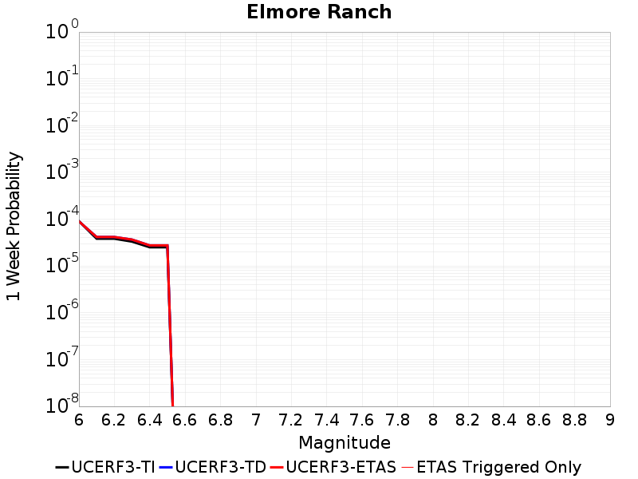 | 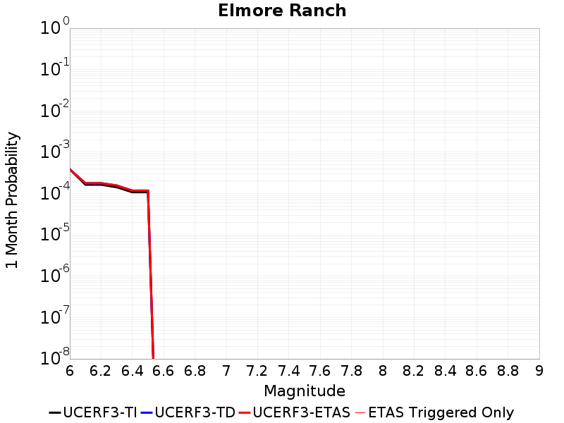 | 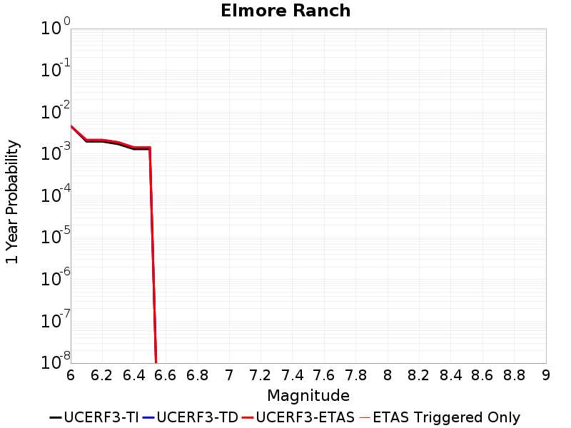 | 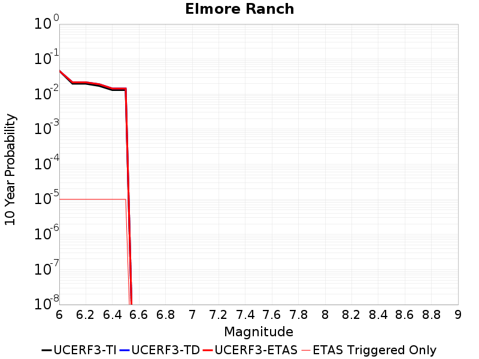 |

| Magnitude | 1 wk TI Prob | 1 wk TD Prob | 1 wk ETAS Prob | 1 wk ETAS/TD Gain | 1 wk ETAS Triggered Only | 1 mo TI Prob | 1 mo TD Prob | 1 mo ETAS Prob | 1 mo ETAS/TD Gain | 1 mo ETAS Triggered Only | 1 yr TI Prob | 1 yr TD Prob | 1 yr ETAS Prob | 1 yr ETAS/TD Gain | 1 yr ETAS Triggered Only | 10 yr TI Prob | 10 yr TD Prob | 10 yr ETAS Prob | 10 yr ETAS/TD Gain | 10 yr ETAS Triggered Only |
|-----|-----|-----|-----|-----|-----|-----|-----|-----|-----|-----|-----|-----|-----|-----|-----|-----|-----|-----|-----|-----|
| 6.0 | 9.102099E-5 | 8.97981E-5 | 8.97981E-5 | 1.0 | 0.0 | 3.9003167E-4 | 3.847984E-4 | 3.847984E-4 | 1.0 | 0.0 | 0.0047383 | 0.0046755625 | 0.0046755625 | 1.0 | 0.0 | 0.046385348 | 0.0459951 | 0.04600464 | 1.0002074 | 1.0E-5 |
| 6.1 | 3.8306698E-5 | 4.162678E-5 | 4.162678E-5 | 1.0 | 0.0 | 1.6416123E-4 | 1.7839132E-4 | 1.7839132E-4 | 1.0 | 0.0 | 0.0019968306 | 0.0021701928 | 0.0021701928 | 1.0 | 0.0 | 0.019789828 | 0.021694792 | 0.021704575 | 1.000451 | 1.0E-5 |
| 6.2 | 3.8306698E-5 | 4.162678E-5 | 4.162678E-5 | 1.0 | 0.0 | 1.6416123E-4 | 1.7839132E-4 | 1.7839132E-4 | 1.0 | 0.0 | 0.0019968306 | 0.0021701928 | 0.0021701928 | 1.0 | 0.0 | 0.019789828 | 0.021694792 | 0.021704575 | 1.000451 | 1.0E-5 |
| 6.3 | 3.3197924E-5 | 3.6664707E-5 | 3.6664707E-5 | 1.0 | 0.0 | 1.4226905E-4 | 1.5712804E-4 | 1.5712804E-4 | 1.0 | 0.0 | 0.0017307495 | 0.0019118986 | 0.0019118986 | 1.0 | 0.0 | 0.017173318 | 0.01914715 | 0.019156959 | 1.0005122 | 1.0E-5 |
| 6.4 | 2.5148964E-5 | 2.7506028E-5 | 2.7506028E-5 | 1.0 | 0.0 | 1.0777682E-4 | 1.1788132E-4 | 1.1788132E-4 | 1.0 | 0.0 | 0.0013113929 | 0.0014349109 | 0.0014349109 | 1.0 | 0.0 | 0.01303681 | 0.014409314 | 0.01441917 | 1.000684 | 1.0E-5 |
| 6.5 | 2.5148964E-5 | 2.7506028E-5 | 2.7506028E-5 | 1.0 | 0.0 | 1.0777682E-4 | 1.1788132E-4 | 1.1788132E-4 | 1.0 | 0.0 | 0.0013113929 | 0.0014349109 | 0.0014349109 | 1.0 | 0.0 | 0.01303681 | 0.014409314 | 0.01441917 | 1.000684 | 1.0E-5 |

## Elysian Park (Upper)
*[(top)](#table-of-contents)*

| 1 Week | 1 Month | 1 Year | 10 Year |
|-----|-----|-----|-----|
|  |  | 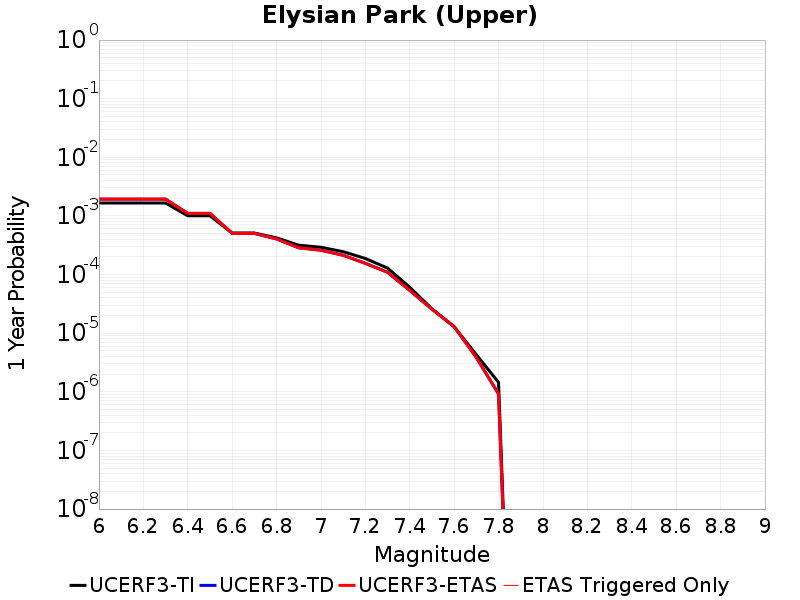 |  |

| Magnitude | 1 wk TI Prob | 1 wk TD Prob | 1 wk ETAS Prob | 1 wk ETAS/TD Gain | 1 wk ETAS Triggered Only | 1 mo TI Prob | 1 mo TD Prob | 1 mo ETAS Prob | 1 mo ETAS/TD Gain | 1 mo ETAS Triggered Only | 1 yr TI Prob | 1 yr TD Prob | 1 yr ETAS Prob | 1 yr ETAS/TD Gain | 1 yr ETAS Triggered Only | 10 yr TI Prob | 10 yr TD Prob | 10 yr ETAS Prob | 10 yr ETAS/TD Gain | 10 yr ETAS Triggered Only |
|-----|-----|-----|-----|-----|-----|-----|-----|-----|-----|-----|-----|-----|-----|-----|-----|-----|-----|-----|-----|-----|
| 6.0 | 3.1876025E-5 | 3.7081987E-5 | 3.7081987E-5 | 1.0 | 0.0 | 1.3660437E-4 | 1.5891586E-4 | 1.5891586E-4 | 1.0 | 0.0 | 0.0016618895 | 0.001933559 | 0.001933559 | 1.0 | 0.0 | 0.016495159 | 0.019213878 | 0.019223684 | 1.0005105 | 1.0E-5 |
| 6.1 | 3.1876025E-5 | 3.7081987E-5 | 3.7081987E-5 | 1.0 | 0.0 | 1.3660437E-4 | 1.5891586E-4 | 1.5891586E-4 | 1.0 | 0.0 | 0.0016618895 | 0.001933559 | 0.001933559 | 1.0 | 0.0 | 0.016495159 | 0.019213878 | 0.019223684 | 1.0005105 | 1.0E-5 |
| 6.2 | 3.1876025E-5 | 3.7081987E-5 | 3.7081987E-5 | 1.0 | 0.0 | 1.3660437E-4 | 1.5891586E-4 | 1.5891586E-4 | 1.0 | 0.0 | 0.0016618895 | 0.001933559 | 0.001933559 | 1.0 | 0.0 | 0.016495159 | 0.019213878 | 0.019223684 | 1.0005105 | 1.0E-5 |
| 6.3 | 3.1876025E-5 | 3.7081987E-5 | 3.7081987E-5 | 1.0 | 0.0 | 1.3660437E-4 | 1.5891586E-4 | 1.5891586E-4 | 1.0 | 0.0 | 0.0016618895 | 0.001933559 | 0.001933559 | 1.0 | 0.0 | 0.016495159 | 0.019213878 | 0.019223684 | 1.0005105 | 1.0E-5 |
| 6.4 | 1.9273462E-5 | 2.1224307E-5 | 2.1224307E-5 | 1.0 | 0.0 | 8.259794E-5 | 9.0959125E-5 | 9.0959125E-5 | 1.0 | 0.0 | 0.001005166 | 0.0011070364 | 0.0011070364 | 1.0 | 0.0 | 0.010006315 | 0.011032058 | 0.011041948 | 1.0008965 | 1.0E-5 |
| 6.5 | 1.9273462E-5 | 2.1224307E-5 | 2.1224307E-5 | 1.0 | 0.0 | 8.259794E-5 | 9.0959125E-5 | 9.0959125E-5 | 1.0 | 0.0 | 0.001005166 | 0.0011070364 | 0.0011070364 | 1.0 | 0.0 | 0.010006315 | 0.011032058 | 0.011041948 | 1.0008965 | 1.0E-5 |
| 6.6 | 9.813258E-6 | 9.671772E-6 | 9.671772E-6 | 1.0 | 0.0 | 4.205614E-5 | 4.1449835E-5 | 4.1449835E-5 | 1.0 | 0.0 | 5.119132E-4 | 5.0454214E-4 | 5.0454214E-4 | 1.0 | 0.0 | 0.005107356 | 0.005034691 | 0.005044641 | 1.0019763 | 1.0E-5 |
| 6.7 | 9.801478E-6 | 9.659338E-6 | 9.659338E-6 | 1.0 | 0.0 | 4.2005657E-5 | 4.1396543E-5 | 4.1396543E-5 | 1.0 | 0.0 | 5.112989E-4 | 5.0389365E-4 | 5.0389365E-4 | 1.0 | 0.0 | 0.0051012407 | 0.0050282353 | 0.005038185 | 1.0019788 | 1.0E-5 |
| 6.8 | 8.102489E-6 | 7.777921E-6 | 7.777921E-6 | 1.0 | 0.0 | 3.4724493E-5 | 3.3333552E-5 | 3.3333552E-5 | 1.0 | 0.0 | 4.2268867E-4 | 4.057654E-4 | 4.057654E-4 | 1.0 | 0.0 | 0.004218856 | 0.00405074 | 0.0040606996 | 1.0024587 | 1.0E-5 |
| 6.9 | 6.08275E-6 | 5.484452E-6 | 5.484452E-6 | 1.0 | 0.0 | 2.6068668E-5 | 2.3504585E-5 | 2.3504585E-5 | 1.0 | 0.0 | 3.173398E-4 | 2.8613152E-4 | 2.8613152E-4 | 1.0 | 0.0 | 0.0031688702 | 0.0028577088 | 0.0028676803 | 1.0034893 | 1.0E-5 |
| 7.0 | 5.5995934E-6 | 4.9855034E-6 | 4.9855034E-6 | 1.0 | 0.0 | 2.3998036E-5 | 2.1366273E-5 | 2.1366273E-5 | 1.0 | 0.0 | 2.9213692E-4 | 2.60104E-4 | 2.60104E-4 | 1.0 | 0.0 | 0.0029175316 | 0.0025980629 | 0.0026080369 | 1.003839 | 1.0E-5 |
| 7.1 | 4.709881E-6 | 4.0896425E-6 | 4.0896425E-6 | 1.0 | 0.0 | 2.0185047E-5 | 1.7526923E-5 | 1.7526923E-5 | 1.0 | 0.0 | 2.4572524E-4 | 2.1336981E-4 | 2.1336981E-4 | 1.0 | 0.0 | 0.002454537 | 0.002131691 | 0.0021416696 | 1.0046811 | 1.0E-5 |
| 7.2 | 3.6063436E-6 | 2.9795772E-6 | 2.9795772E-6 | 1.0 | 0.0 | 1.5455667E-5 | 1.2769555E-5 | 1.2769555E-5 | 1.0 | 0.0 | 1.881565E-4 | 1.5545834E-4 | 1.5545834E-4 | 1.0 | 0.0 | 0.0018799726 | 0.0015535073 | 0.0015634918 | 1.006427 | 1.0E-5 |
| 7.3 | 2.471135E-6 | 2.096647E-6 | 2.096647E-6 | 1.0 | 0.0 | 1.0590536E-5 | 8.985599E-6 | 8.985599E-6 | 1.0 | 0.0 | 1.2893214E-4 | 1.0939425E-4 | 1.0939425E-4 | 1.0 | 0.0 | 0.0012885736 | 0.0010934112 | 0.0011034003 | 1.0091357 | 1.0E-5 |
| 7.4 | 1.163943E-6 | 1.0282042E-6 | 1.0282042E-6 | 1.0 | 0.0 | 4.988318E-6 | 4.4065823E-6 | 4.4065823E-6 | 1.0 | 0.0 | 6.0731076E-5 | 5.364885E-5 | 5.364885E-5 | 1.0 | 0.0 | 6.071448E-4 | 5.3636194E-4 | 5.463566E-4 | 1.0186341 | 1.0E-5 |
| 7.5 | 4.99459E-7 | 4.920604E-7 | 4.920604E-7 | 1.0 | 0.0 | 2.140537E-6 | 2.1088285E-6 | 2.1088285E-6 | 1.0 | 0.0 | 2.6060725E-5 | 2.56747E-5 | 2.56747E-5 | 1.0 | 0.0 | 2.605767E-4 | 2.5671892E-4 | 2.6671635E-4 | 1.038943 | 1.0E-5 |
| 7.6 | 2.4667852E-7 | 2.4794204E-7 | 2.4794204E-7 | 1.0 | 0.0 | 1.0571932E-6 | 1.0626082E-6 | 1.0626082E-6 | 1.0 | 0.0 | 1.2871251E-5 | 1.2937183E-5 | 1.2937183E-5 | 1.0 | 0.0 | 1.2870505E-4 | 1.2936466E-4 | 1.3936337E-4 | 1.0772909 | 1.0E-5 |
| 7.7 | 8.2312795E-8 | 7.3950545E-8 | 7.3950545E-8 | 1.0 | 0.0 | 3.527691E-7 | 3.1693088E-7 | 3.1693088E-7 | 1.0 | 0.0 | 4.294955E-6 | 3.8586277E-6 | 3.8586277E-6 | 1.0 | 0.0 | 4.2948723E-5 | 3.8585724E-5 | 4.8585338E-5 | 1.2591532 | 1.0E-5 |
| 7.8 | 2.7819295E-8 | 1.7626805E-8 | 1.7626805E-8 | 1.0 | 0.0 | 1.1922555E-7 | 7.554345E-8 | 7.554345E-8 | 1.0 | 0.0 | 1.45157E-6 | 9.1974124E-7 | 9.1974124E-7 | 1.0 | 0.0 | 1.45156055E-5 | 9.197389E-6 | 9.197389E-6 | 1.0 | 0.0 |

## Blue Cut
*[(top)](#table-of-contents)*

| 1 Week | 1 Month | 1 Year | 10 Year |
|-----|-----|-----|-----|
| 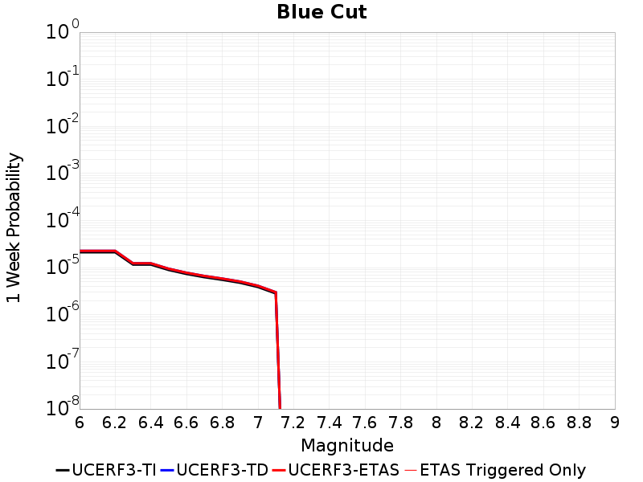 | 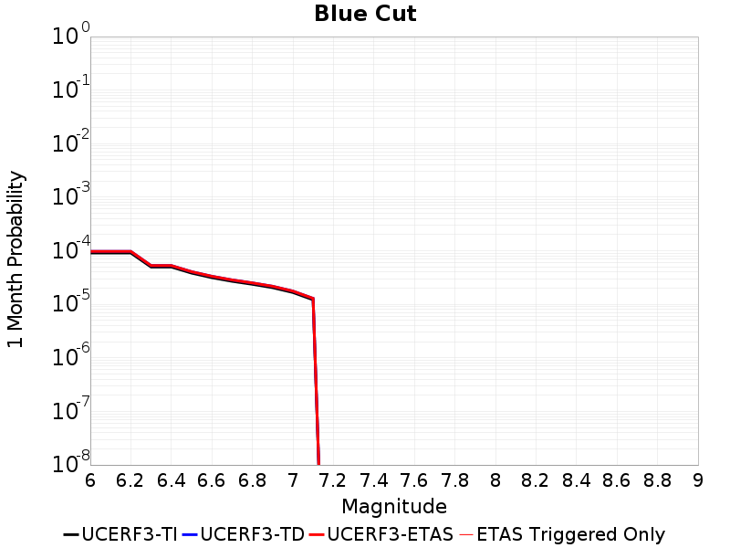 | 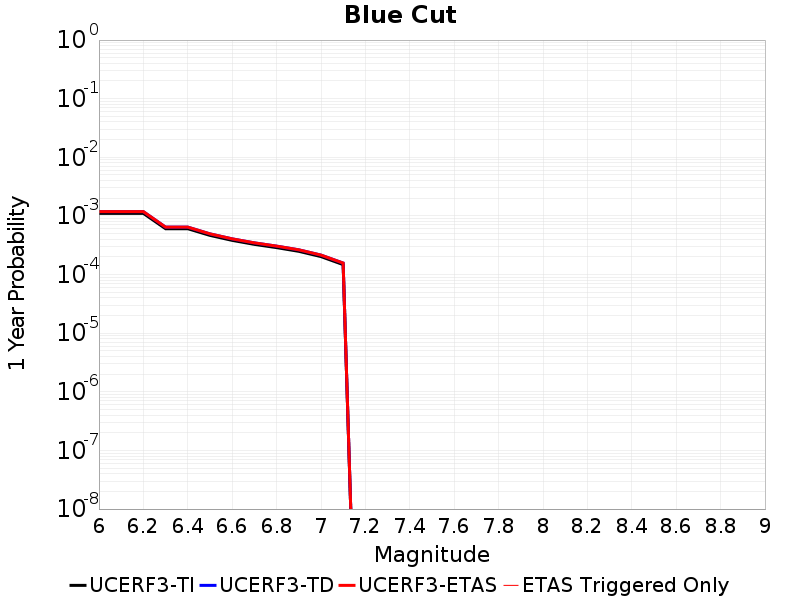 | 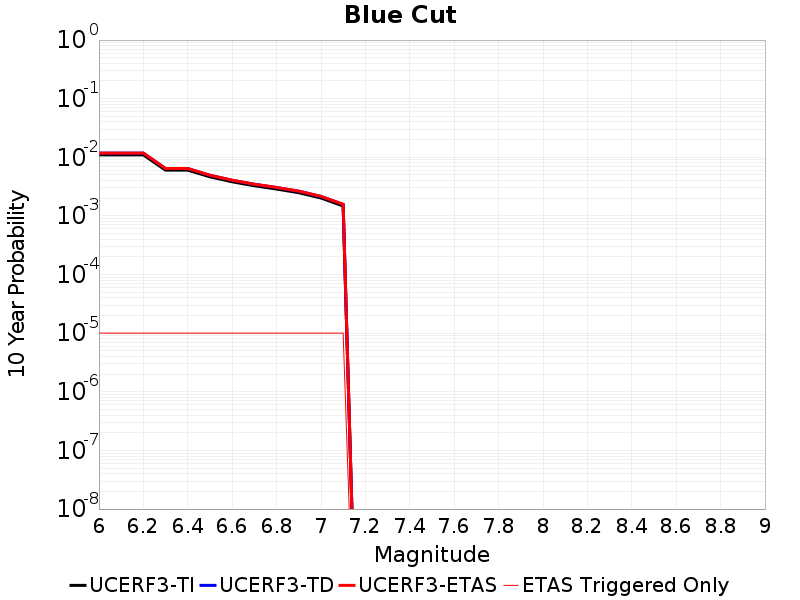 |

| Magnitude | 1 wk TI Prob | 1 wk TD Prob | 1 wk ETAS Prob | 1 wk ETAS/TD Gain | 1 wk ETAS Triggered Only | 1 mo TI Prob | 1 mo TD Prob | 1 mo ETAS Prob | 1 mo ETAS/TD Gain | 1 mo ETAS Triggered Only | 1 yr TI Prob | 1 yr TD Prob | 1 yr ETAS Prob | 1 yr ETAS/TD Gain | 1 yr ETAS Triggered Only | 10 yr TI Prob | 10 yr TD Prob | 10 yr ETAS Prob | 10 yr ETAS/TD Gain | 10 yr ETAS Triggered Only |
|-----|-----|-----|-----|-----|-----|-----|-----|-----|-----|-----|-----|-----|-----|-----|-----|-----|-----|-----|-----|-----|
| 6.0 | 2.1227985E-5 | 2.2729508E-5 | 2.2729508E-5 | 1.0 | 0.0 | 9.097391E-5 | 9.740887E-5 | 9.740887E-5 | 1.0 | 0.0 | 0.0011070445 | 0.0011853658 | 0.0011853658 | 1.0 | 0.0 | 0.011015458 | 0.01179628 | 0.011806162 | 1.0008377 | 1.0E-5 |
| 6.1 | 2.1227985E-5 | 2.2729508E-5 | 2.2729508E-5 | 1.0 | 0.0 | 9.097391E-5 | 9.740887E-5 | 9.740887E-5 | 1.0 | 0.0 | 0.0011070445 | 0.0011853658 | 0.0011853658 | 1.0 | 0.0 | 0.011015458 | 0.01179628 | 0.011806162 | 1.0008377 | 1.0E-5 |
| 6.2 | 2.1227985E-5 | 2.2729508E-5 | 2.2729508E-5 | 1.0 | 0.0 | 9.097391E-5 | 9.740887E-5 | 9.740887E-5 | 1.0 | 0.0 | 0.0011070445 | 0.0011853658 | 0.0011853658 | 1.0 | 0.0 | 0.011015458 | 0.01179628 | 0.011806162 | 1.0008377 | 1.0E-5 |
| 6.3 | 1.1613981E-5 | 1.2358431E-5 | 1.2358431E-5 | 1.0 | 0.0 | 4.9773254E-5 | 5.29637E-5 | 5.29637E-5 | 1.0 | 0.0 | 6.0582085E-4 | 6.4465473E-4 | 6.4465473E-4 | 1.0 | 0.0 | 0.0060417196 | 0.0064290953 | 0.006439031 | 1.0015454 | 1.0E-5 |
| 6.4 | 1.1613981E-5 | 1.2358431E-5 | 1.2358431E-5 | 1.0 | 0.0 | 4.9773254E-5 | 5.29637E-5 | 5.29637E-5 | 1.0 | 0.0 | 6.0582085E-4 | 6.4465473E-4 | 6.4465473E-4 | 1.0 | 0.0 | 0.0060417196 | 0.0064290953 | 0.006439031 | 1.0015454 | 1.0E-5 |
| 6.5 | 8.931326E-6 | 9.485229E-6 | 9.485229E-6 | 1.0 | 0.0 | 3.8276554E-5 | 4.06504E-5 | 4.06504E-5 | 1.0 | 0.0 | 4.6591737E-4 | 4.948154E-4 | 4.948154E-4 | 1.0 | 0.0 | 0.0046494175 | 0.0049380464 | 0.004947997 | 1.0020151 | 1.0E-5 |
| 6.6 | 7.345353E-6 | 7.793211E-6 | 7.793211E-6 | 1.0 | 0.0 | 3.1479703E-5 | 3.339909E-5 | 3.339909E-5 | 1.0 | 0.0 | 3.83198E-4 | 4.0656608E-4 | 4.0656608E-4 | 1.0 | 0.0 | 0.0038253788 | 0.004059015 | 0.0040689744 | 1.0024537 | 1.0E-5 |
| 6.7 | 6.2775666E-6 | 6.657636E-6 | 6.657636E-6 | 1.0 | 0.0 | 2.690358E-5 | 2.8532455E-5 | 2.8532455E-5 | 1.0 | 0.0 | 3.2750185E-4 | 3.4733478E-4 | 3.4733478E-4 | 1.0 | 0.0 | 0.0032701963 | 0.0034686606 | 0.003478626 | 1.002873 | 1.0E-5 |
| 6.8 | 5.5234095E-6 | 5.8572955E-6 | 5.8572955E-6 | 1.0 | 0.0 | 2.367154E-5 | 2.5102494E-5 | 2.5102494E-5 | 1.0 | 0.0 | 2.8816288E-4 | 3.0558728E-4 | 3.0558728E-4 | 1.0 | 0.0 | 0.002877895 | 0.0030523874 | 0.003062357 | 1.0032661 | 1.0E-5 |
| 6.9 | 4.7780054E-6 | 5.0673134E-6 | 5.0673134E-6 | 1.0 | 0.0 | 2.0477004E-5 | 2.1716916E-5 | 2.1716916E-5 | 1.0 | 0.0 | 2.4927902E-4 | 2.643784E-4 | 2.643784E-4 | 1.0 | 0.0 | 0.0024899957 | 0.0026413316 | 0.0026513054 | 1.003776 | 1.0E-5 |
| 7.0 | 3.883171E-6 | 4.1200374E-6 | 4.1200374E-6 | 1.0 | 0.0 | 1.6642054E-5 | 1.7657223E-5 | 1.7657223E-5 | 1.0 | 0.0 | 2.0259817E-4 | 2.1496238E-4 | 2.1496238E-4 | 1.0 | 0.0 | 0.0020241356 | 0.0021482205 | 0.0021581992 | 1.004645 | 1.0E-5 |
| 7.1 | 2.8358215E-6 | 3.0108622E-6 | 3.0108622E-6 | 1.0 | 0.0 | 1.2153464E-5 | 1.2903669E-5 | 1.2903669E-5 | 1.0 | 0.0 | 1.4795837E-4 | 1.5709743E-4 | 1.5709743E-4 | 1.0 | 0.0 | 0.001478599 | 0.0015705094 | 0.0015804936 | 1.0063573 | 1.0E-5 |

## Great Valley 02
*[(top)](#table-of-contents)*

| 1 Week | 1 Month | 1 Year | 10 Year |
|-----|-----|-----|-----|
| 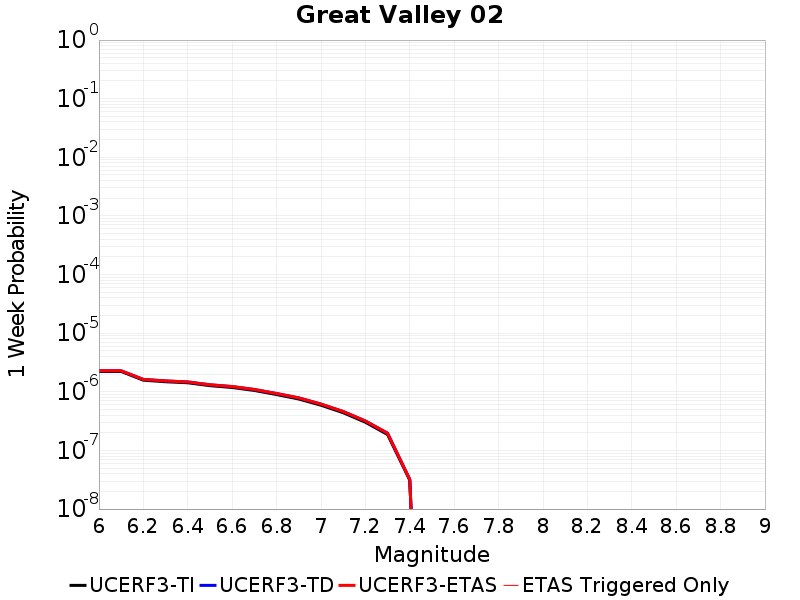 | 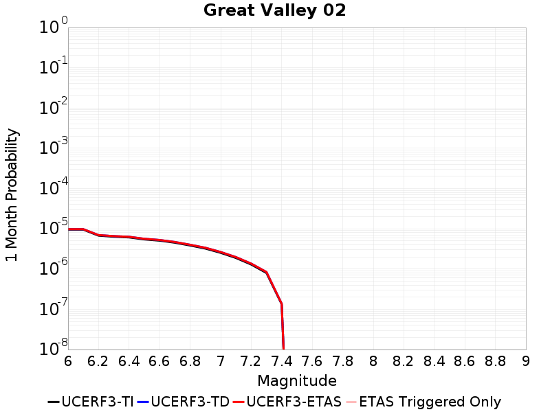 | 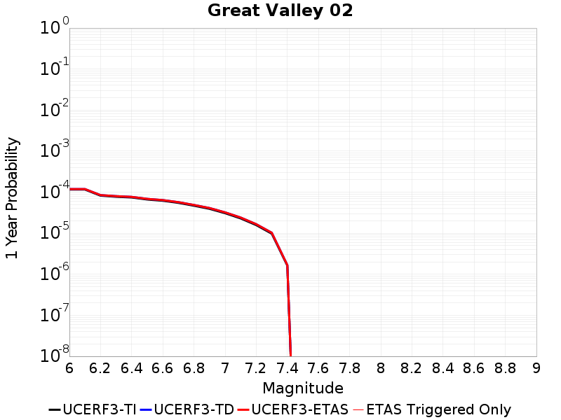 | 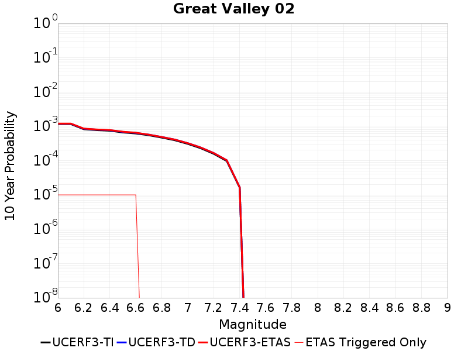 |

| Magnitude | 1 wk TI Prob | 1 wk TD Prob | 1 wk ETAS Prob | 1 wk ETAS/TD Gain | 1 wk ETAS Triggered Only | 1 mo TI Prob | 1 mo TD Prob | 1 mo ETAS Prob | 1 mo ETAS/TD Gain | 1 mo ETAS Triggered Only | 1 yr TI Prob | 1 yr TD Prob | 1 yr ETAS Prob | 1 yr ETAS/TD Gain | 1 yr ETAS Triggered Only | 10 yr TI Prob | 10 yr TD Prob | 10 yr ETAS Prob | 10 yr ETAS/TD Gain | 10 yr ETAS Triggered Only |
|-----|-----|-----|-----|-----|-----|-----|-----|-----|-----|-----|-----|-----|-----|-----|-----|-----|-----|-----|-----|-----|
| 6.0 | 2.2243487E-6 | 2.2821387E-6 | 2.2821387E-6 | 1.0 | 0.0 | 9.532888E-6 | 9.7805605E-6 | 9.7805605E-6 | 1.0 | 0.0 | 1.1605673E-4 | 1.1907232E-4 | 1.1907232E-4 | 1.0 | 0.0 | 0.0011599615 | 0.0011901351 | 0.0012001232 | 1.0083925 | 1.0E-5 |
| 6.1 | 2.2243487E-6 | 2.2821387E-6 | 2.2821387E-6 | 1.0 | 0.0 | 9.532888E-6 | 9.7805605E-6 | 9.7805605E-6 | 1.0 | 0.0 | 1.1605673E-4 | 1.1907232E-4 | 1.1907232E-4 | 1.0 | 0.0 | 0.0011599615 | 0.0011901351 | 0.0012001232 | 1.0083925 | 1.0E-5 |
| 6.2 | 1.5787732E-6 | 1.6275676E-6 | 1.6275676E-6 | 1.0 | 0.0 | 6.7661535E-6 | 6.9752714E-6 | 6.9752714E-6 | 1.0 | 0.0 | 8.2374805E-5 | 8.492067E-5 | 8.492067E-5 | 1.0 | 0.0 | 8.2344277E-4 | 8.488869E-4 | 8.588784E-4 | 1.0117701 | 1.0E-5 |
| 6.3 | 1.4850314E-6 | 1.532602E-6 | 1.532602E-6 | 1.0 | 0.0 | 6.3644047E-6 | 6.568278E-6 | 6.568278E-6 | 1.0 | 0.0 | 7.748387E-5 | 7.996589E-5 | 7.996589E-5 | 1.0 | 0.0 | 7.745686E-4 | 7.99375E-4 | 8.09367E-4 | 1.0124998 | 1.0E-5 |
| 6.4 | 1.4266972E-6 | 1.4737383E-6 | 1.4737383E-6 | 1.0 | 0.0 | 6.114402E-6 | 6.316006E-6 | 6.316006E-6 | 1.0 | 0.0 | 7.44403E-5 | 7.689469E-5 | 7.689469E-5 | 1.0 | 0.0 | 7.441537E-4 | 7.686843E-4 | 7.7867665E-4 | 1.0129993 | 1.0E-5 |
| 6.5 | 1.2728015E-6 | 1.3174136E-6 | 1.3174136E-6 | 1.0 | 0.0 | 5.4548523E-6 | 5.6460467E-6 | 5.6460467E-6 | 1.0 | 0.0 | 6.64108E-5 | 6.8738475E-5 | 6.8738475E-5 | 1.0 | 0.0 | 6.639096E-4 | 6.8717473E-4 | 6.971679E-4 | 1.0145423 | 1.0E-5 |
| 6.6 | 1.1857247E-6 | 1.2292203E-6 | 1.2292203E-6 | 1.0 | 0.0 | 5.0816675E-6 | 5.2680766E-6 | 5.2680766E-6 | 1.0 | 0.0 | 6.186755E-5 | 6.413697E-5 | 6.413697E-5 | 1.0 | 0.0 | 6.1850325E-4 | 6.41187E-4 | 6.511806E-4 | 1.015586 | 1.0E-5 |
| 6.7 | 1.0550715E-6 | 1.0955952E-6 | 1.0955952E-6 | 1.0 | 0.0 | 4.521727E-6 | 4.6953996E-6 | 4.6953996E-6 | 1.0 | 0.0 | 5.5050637E-5 | 5.7165013E-5 | 5.7165013E-5 | 1.0 | 0.0 | 5.5037E-4 | 5.7150517E-4 | 5.7150517E-4 | 1.0 | 0.0 |
| 6.8 | 8.9881183E-7 | 9.3579484E-7 | 9.3579484E-7 | 1.0 | 0.0 | 3.8520448E-6 | 4.0105433E-6 | 4.0105433E-6 | 1.0 | 0.0 | 4.689764E-5 | 4.882729E-5 | 4.882729E-5 | 1.0 | 0.0 | 4.688774E-4 | 4.8816734E-4 | 4.8816734E-4 | 1.0 | 0.0 |
| 6.9 | 7.5417256E-7 | 7.873229E-7 | 7.873229E-7 | 1.0 | 0.0 | 3.232164E-6 | 3.3742367E-6 | 3.3742367E-6 | 1.0 | 0.0 | 3.9350885E-5 | 4.1080573E-5 | 4.1080573E-5 | 1.0 | 0.0 | 3.934392E-4 | 4.107312E-4 | 4.107312E-4 | 1.0 | 0.0 |
| 7.0 | 5.909726E-7 | 6.179693E-7 | 6.179693E-7 | 1.0 | 0.0 | 2.5327372E-6 | 2.6484372E-6 | 2.6484372E-6 | 1.0 | 0.0 | 3.083564E-5 | 3.2244254E-5 | 3.2244254E-5 | 1.0 | 0.0 | 3.083136E-4 | 3.2239678E-4 | 3.2239678E-4 | 1.0 | 0.0 |
| 7.1 | 4.4054178E-7 | 4.6184707E-7 | 4.6184707E-7 | 1.0 | 0.0 | 1.8880348E-6 | 1.979343E-6 | 1.979343E-6 | 1.0 | 0.0 | 2.2986582E-5 | 2.4098243E-5 | 2.4098243E-5 | 1.0 | 0.0 | 2.2984203E-4 | 2.4095703E-4 | 2.4095703E-4 | 1.0 | 0.0 |
| 7.2 | 3.029834E-7 | 3.1831954E-7 | 3.1831954E-7 | 1.0 | 0.0 | 1.2984997E-6 | 1.3642258E-6 | 1.3642258E-6 | 1.0 | 0.0 | 1.5809119E-5 | 1.6609327E-5 | 1.6609327E-5 | 1.0 | 0.0 | 1.5807994E-4 | 1.6608131E-4 | 1.6608131E-4 | 1.0 | 0.0 |
| 7.3 | 1.8700909E-7 | 1.9686595E-7 | 1.9686595E-7 | 1.0 | 0.0 | 8.0146725E-7 | 8.43711E-7 | 8.43711E-7 | 1.0 | 0.0 | 9.75782E-6 | 1.0272136E-5 | 1.0272136E-5 | 1.0 | 0.0 | 9.757392E-5 | 1.02716884E-4 | 1.02716884E-4 | 1.0 | 0.0 |
| 7.4 | 3.112171E-8 | 3.207443E-8 | 3.207443E-8 | 1.0 | 0.0 | 1.3337875E-7 | 1.3746183E-7 | 1.3746183E-7 | 1.0 | 0.0 | 1.6238852E-6 | 1.6735966E-6 | 1.6735966E-6 | 1.0 | 0.0 | 1.6238733E-5 | 1.6735848E-5 | 1.6735848E-5 | 1.0 | 0.0 |

## Sierra Madre
*[(top)](#table-of-contents)*

| 1 Week | 1 Month | 1 Year | 10 Year |
|-----|-----|-----|-----|
|  |  |  |  |

| Magnitude | 1 wk TI Prob | 1 wk TD Prob | 1 wk ETAS Prob | 1 wk ETAS/TD Gain | 1 wk ETAS Triggered Only | 1 mo TI Prob | 1 mo TD Prob | 1 mo ETAS Prob | 1 mo ETAS/TD Gain | 1 mo ETAS Triggered Only | 1 yr TI Prob | 1 yr TD Prob | 1 yr ETAS Prob | 1 yr ETAS/TD Gain | 1 yr ETAS Triggered Only | 10 yr TI Prob | 10 yr TD Prob | 10 yr ETAS Prob | 10 yr ETAS/TD Gain | 10 yr ETAS Triggered Only |
|-----|-----|-----|-----|-----|-----|-----|-----|-----|-----|-----|-----|-----|-----|-----|-----|-----|-----|-----|-----|-----|
| 6.0 | 1.3379373E-5 | 1.1016224E-5 | 1.1016224E-5 | 1.0 | 0.0 | 5.7338908E-5 | 4.721154E-5 | 4.721154E-5 | 1.0 | 0.0 | 6.978776E-4 | 5.7465036E-4 | 5.7465036E-4 | 1.0 | 0.0 | 0.0069569005 | 0.0057319766 | 0.005741919 | 1.0017346 | 1.0E-5 |
| 6.1 | 1.3379373E-5 | 1.1016224E-5 | 1.1016224E-5 | 1.0 | 0.0 | 5.7338908E-5 | 4.721154E-5 | 4.721154E-5 | 1.0 | 0.0 | 6.978776E-4 | 5.7465036E-4 | 5.7465036E-4 | 1.0 | 0.0 | 0.0069569005 | 0.0057319766 | 0.005741919 | 1.0017346 | 1.0E-5 |
| 6.2 | 1.3379373E-5 | 1.1016224E-5 | 1.1016224E-5 | 1.0 | 0.0 | 5.7338908E-5 | 4.721154E-5 | 4.721154E-5 | 1.0 | 0.0 | 6.978776E-4 | 5.7465036E-4 | 5.7465036E-4 | 1.0 | 0.0 | 0.0069569005 | 0.0057319766 | 0.005741919 | 1.0017346 | 1.0E-5 |
| 6.3 | 1.3379373E-5 | 1.1016224E-5 | 1.1016224E-5 | 1.0 | 0.0 | 5.7338908E-5 | 4.721154E-5 | 4.721154E-5 | 1.0 | 0.0 | 6.978776E-4 | 5.7465036E-4 | 5.7465036E-4 | 1.0 | 0.0 | 0.0069569005 | 0.0057319766 | 0.005741919 | 1.0017346 | 1.0E-5 |
| 6.4 | 1.3379373E-5 | 1.1016224E-5 | 1.1016224E-5 | 1.0 | 0.0 | 5.7338908E-5 | 4.721154E-5 | 4.721154E-5 | 1.0 | 0.0 | 6.978776E-4 | 5.7465036E-4 | 5.7465036E-4 | 1.0 | 0.0 | 0.0069569005 | 0.0057319766 | 0.005741919 | 1.0017346 | 1.0E-5 |
| 6.5 | 1.26563245E-5 | 1.0245365E-5 | 1.0245365E-5 | 1.0 | 0.0 | 5.4240263E-5 | 4.3907974E-5 | 4.3907974E-5 | 1.0 | 0.0 | 6.601751E-4 | 5.3444953E-4 | 5.3444953E-4 | 1.0 | 0.0 | 0.006582173 | 0.0053319316 | 0.0053418786 | 1.0018655 | 1.0E-5 |
| 6.6 | 1.26563245E-5 | 1.0245365E-5 | 1.0245365E-5 | 1.0 | 0.0 | 5.4240263E-5 | 4.3907974E-5 | 4.3907974E-5 | 1.0 | 0.0 | 6.601751E-4 | 5.3444953E-4 | 5.3444953E-4 | 1.0 | 0.0 | 0.006582173 | 0.0053319316 | 0.0053418786 | 1.0018655 | 1.0E-5 |
| 6.7 | 1.2502474E-5 | 1.0081443E-5 | 1.0081443E-5 | 1.0 | 0.0 | 5.3580934E-5 | 4.3205473E-5 | 4.3205473E-5 | 1.0 | 0.0 | 6.521526E-4 | 5.2590074E-4 | 5.2590074E-4 | 1.0 | 0.0 | 0.0065024206 | 0.0052468493 | 0.0052468493 | 1.0 | 0.0 |
| 6.8 | 1.2454966E-5 | 1.0033688E-5 | 1.0033688E-5 | 1.0 | 0.0 | 5.3377335E-5 | 4.300082E-5 | 4.300082E-5 | 1.0 | 0.0 | 6.4967526E-4 | 5.234103E-4 | 5.234103E-4 | 1.0 | 0.0 | 0.006477792 | 0.0052220616 | 0.0052220616 | 1.0 | 0.0 |
| 6.9 | 1.2225574E-5 | 9.807413E-6 | 9.807413E-6 | 1.0 | 0.0 | 5.2394265E-5 | 4.2031097E-5 | 4.2031097E-5 | 1.0 | 0.0 | 6.3771347E-4 | 5.1160954E-4 | 5.1160954E-4 | 1.0 | 0.0 | 0.006358865 | 0.005104601 | 0.005104601 | 1.0 | 0.0 |
| 7.0 | 1.182946E-5 | 9.413764E-6 | 9.413764E-6 | 1.0 | 0.0 | 5.06967E-5 | 4.0344086E-5 | 4.0344086E-5 | 1.0 | 0.0 | 6.1705755E-4 | 4.910796E-4 | 4.910796E-4 | 1.0 | 0.0 | 0.006153469 | 0.0049002236 | 0.0049002236 | 1.0 | 0.0 |
| 7.1 | 1.14369095E-5 | 9.0003905E-6 | 9.0003905E-6 | 1.0 | 0.0 | 4.9014405E-5 | 3.8572536E-5 | 3.8572536E-5 | 1.0 | 0.0 | 5.9658696E-4 | 4.6952043E-4 | 4.6952043E-4 | 1.0 | 0.0 | 0.005949879 | 0.004685558 | 0.004685558 | 1.0 | 0.0 |
| 7.2 | 1.0836419E-5 | 8.413305E-6 | 8.413305E-6 | 1.0 | 0.0 | 4.644097E-5 | 3.605653E-5 | 3.605653E-5 | 1.0 | 0.0 | 5.652721E-4 | 4.3890072E-4 | 4.3890072E-4 | 1.0 | 0.0 | 0.0056383642 | 0.0043806043 | 0.0043806043 | 1.0 | 0.0 |
| 7.3 | 1.0403439E-5 | 8.034324E-6 | 8.034324E-6 | 1.0 | 0.0 | 4.4585406E-5 | 3.443237E-5 | 3.443237E-5 | 1.0 | 0.0 | 5.426921E-4 | 4.191344E-4 | 4.191344E-4 | 1.0 | 0.0 | 0.005413687 | 0.0041837017 | 0.0041837017 | 1.0 | 0.0 |
| 7.4 | 9.768864E-6 | 7.427532E-6 | 7.427532E-6 | 1.0 | 0.0 | 4.186589E-5 | 3.1831896E-5 | 3.1831896E-5 | 1.0 | 0.0 | 5.09598E-4 | 3.874853E-4 | 3.874853E-4 | 1.0 | 0.0 | 0.0050843097 | 0.0038683566 | 0.0038683566 | 1.0 | 0.0 |
| 7.5 | 8.687089E-6 | 6.4622755E-6 | 6.4622755E-6 | 1.0 | 0.0 | 3.722985E-5 | 2.7695176E-5 | 2.7695176E-5 | 1.0 | 0.0 | 4.5317915E-4 | 3.3713746E-4 | 3.3713746E-4 | 1.0 | 0.0 | 0.004522561 | 0.003366515 | 0.003366515 | 1.0 | 0.0 |
| 7.6 | 6.3506063E-6 | 4.4411468E-6 | 4.4411468E-6 | 1.0 | 0.0 | 2.72166E-5 | 1.9033349E-5 | 1.9033349E-5 | 1.0 | 0.0 | 3.3131172E-4 | 2.3170662E-4 | 2.3170662E-4 | 1.0 | 0.0 | 0.003308182 | 0.002314843 | 0.002314843 | 1.0 | 0.0 |
| 7.7 | 4.62223E-6 | 2.9430714E-6 | 2.9430714E-6 | 1.0 | 0.0 | 1.9809406E-5 | 1.2613102E-5 | 1.2613102E-5 | 1.0 | 0.0 | 2.4115283E-4 | 1.5355372E-4 | 1.5355372E-4 | 1.0 | 0.0 | 0.0024089129 | 0.0015346446 | 0.0015346446 | 1.0 | 0.0 |
| 7.8 | 3.2145008E-6 | 1.9564495E-6 | 1.9564495E-6 | 1.0 | 0.0 | 1.3776359E-5 | 8.384757E-6 | 8.384757E-6 | 1.0 | 0.0 | 1.6771426E-4 | 1.0207965E-4 | 1.0207965E-4 | 1.0 | 0.0 | 0.0016758774 | 0.0010204504 | 0.0010204504 | 1.0 | 0.0 |
| 7.9 | 1.0391769E-6 | 5.621177E-7 | 5.621177E-7 | 1.0 | 0.0 | 4.4536077E-6 | 2.4090737E-6 | 2.4090737E-6 | 1.0 | 0.0 | 5.4221324E-5 | 2.933008E-5 | 2.933008E-5 | 1.0 | 0.0 | 5.4208096E-4 | 2.932625E-4 | 2.932625E-4 | 1.0 | 0.0 |
| 8.0 | 1.210983E-7 | 6.630152E-8 | 6.630152E-8 | 1.0 | 0.0 | 5.1899264E-7 | 2.8414934E-7 | 2.8414934E-7 | 1.0 | 0.0 | 6.3187167E-6 | 3.4595128E-6 | 3.4595128E-6 | 1.0 | 0.0 | 6.318537E-5 | 3.4594606E-5 | 3.4594606E-5 | 1.0 | 0.0 |

## Calaveras (So) - Paicines extension 2011 CFM
*[(top)](#table-of-contents)*

| 1 Week | 1 Month | 1 Year | 10 Year |
|-----|-----|-----|-----|
| 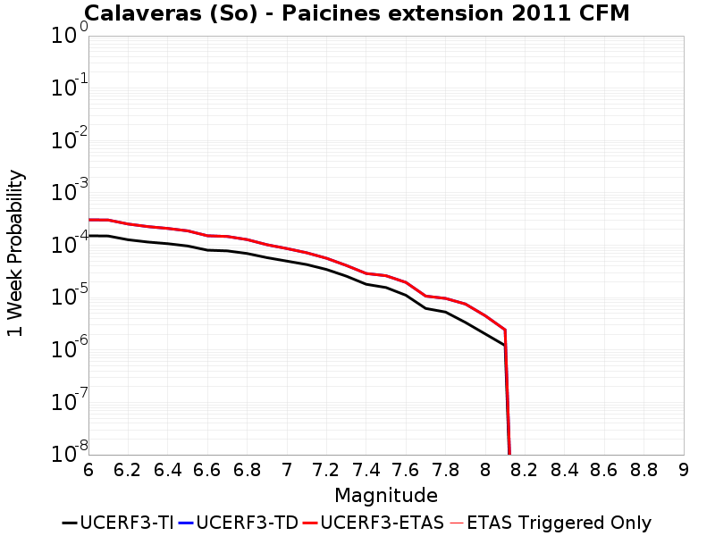 | 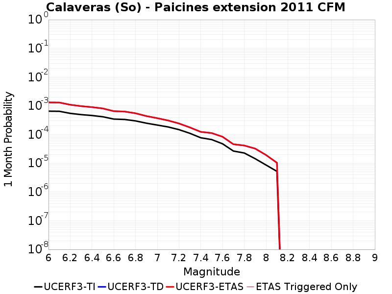 | 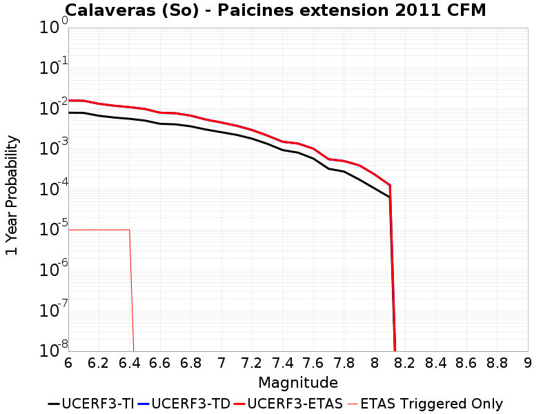 | 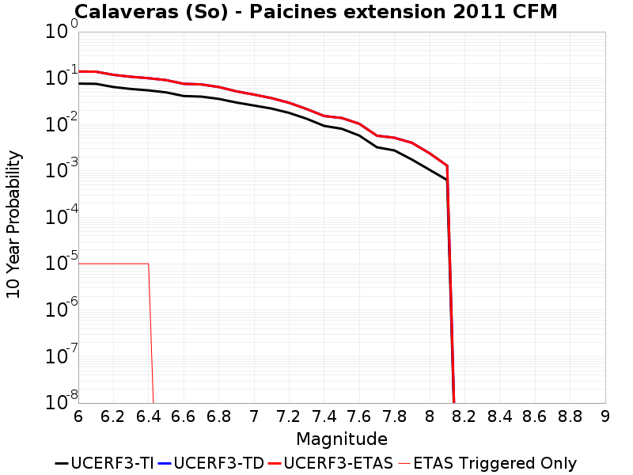 |

| Magnitude | 1 wk TI Prob | 1 wk TD Prob | 1 wk ETAS Prob | 1 wk ETAS/TD Gain | 1 wk ETAS Triggered Only | 1 mo TI Prob | 1 mo TD Prob | 1 mo ETAS Prob | 1 mo ETAS/TD Gain | 1 mo ETAS Triggered Only | 1 yr TI Prob | 1 yr TD Prob | 1 yr ETAS Prob | 1 yr ETAS/TD Gain | 1 yr ETAS Triggered Only | 10 yr TI Prob | 10 yr TD Prob | 10 yr ETAS Prob | 10 yr ETAS/TD Gain | 10 yr ETAS Triggered Only |
|-----|-----|-----|-----|-----|-----|-----|-----|-----|-----|-----|-----|-----|-----|-----|-----|-----|-----|-----|-----|-----|
| 6.0 | 1.5183659E-4 | 3.0646872E-4 | 3.0646872E-4 | 1.0 | 0.0 | 6.5056595E-4 | 0.0013122025 | 0.0013122025 | 1.0 | 0.0 | 0.007891912 | 0.01576052 | 0.015770363 | 1.0006245 | 1.0E-5 | 0.076174594 | 0.13900776 | 0.13901636 | 1.000062 | 1.0E-5 |
| 6.1 | 1.5024997E-4 | 3.0340443E-4 | 3.0340443E-4 | 1.0 | 0.0 | 6.437695E-4 | 0.001299085 | 0.001299085 | 1.0 | 0.0 | 0.0078097614 | 0.0156036075 | 0.015613452 | 1.0006309 | 1.0E-5 | 0.075409345 | 0.13767572 | 0.13768435 | 1.0000626 | 1.0E-5 |
| 6.2 | 1.2743923E-4 | 2.5435598E-4 | 2.5435598E-4 | 1.0 | 0.0 | 5.460538E-4 | 0.0010892253 | 0.0010892253 | 1.0 | 0.0 | 0.0066279583 | 0.01310954 | 0.013119408 | 1.0007528 | 1.0E-5 | 0.064337276 | 0.1177733 | 0.11778212 | 1.0000749 | 1.0E-5 |
| 6.3 | 1.1525114E-4 | 2.2720662E-4 | 2.2720662E-4 | 1.0 | 0.0 | 4.9383997E-4 | 9.73074E-4 | 9.73074E-4 | 1.0 | 0.0 | 0.0059959386 | 0.01173054 | 0.011740423 | 1.0008425 | 1.0E-5 | 0.058367174 | 0.10689363 | 0.10690256 | 1.0000836 | 1.0E-5 |
| 6.4 | 1.07200925E-4 | 2.0960819E-4 | 2.0960819E-4 | 1.0 | 0.0 | 4.5935164E-4 | 8.977794E-4 | 8.977794E-4 | 1.0 | 0.0 | 0.0055782744 | 0.01083512 | 0.010845012 | 1.0009129 | 1.0E-5 | 0.0544031 | 0.09971766 | 0.09972667 | 1.0000902 | 1.0E-5 |
| 6.5 | 9.69631E-5 | 1.8852386E-4 | 1.8852386E-4 | 1.0 | 0.0 | 4.1548995E-4 | 8.0752943E-4 | 8.0752943E-4 | 1.0 | 0.0 | 0.0050468626 | 0.009755825 | 0.009755825 | 1.0 | 0.0 | 0.04933773 | 0.09060468 | 0.09060468 | 1.0 | 0.0 |
| 6.6 | 8.0552316E-5 | 1.5188202E-4 | 1.5188202E-4 | 1.0 | 0.0 | 3.4517853E-4 | 6.507259E-4 | 6.507259E-4 | 1.0 | 0.0 | 0.0041944524 | 0.007887259 | 0.007887259 | 1.0 | 0.0 | 0.04116161 | 0.0753805 | 0.0753805 | 1.0 | 0.0 |
| 6.7 | 7.815757E-5 | 1.4727766E-4 | 1.4727766E-4 | 1.0 | 0.0 | 3.34918E-4 | 6.310072E-4 | 6.310072E-4 | 1.0 | 0.0 | 0.004070005 | 0.00764957 | 0.00764957 | 1.0 | 0.0 | 0.039962657 | 0.07322707 | 0.07322707 | 1.0 | 0.0 |
| 6.8 | 6.965264E-5 | 1.2831888E-4 | 1.2831888E-4 | 1.0 | 0.0 | 2.9847719E-4 | 5.4979936E-4 | 5.4979936E-4 | 1.0 | 0.0 | 0.0036279052 | 0.0066700033 | 0.0066700033 | 1.0 | 0.0 | 0.03569247 | 0.064294755 | 0.064294755 | 1.0 | 0.0 |
| 6.9 | 5.8000453E-5 | 1.02408965E-4 | 1.02408965E-4 | 1.0 | 0.0 | 2.4854968E-4 | 4.3882232E-4 | 4.3882232E-4 | 1.0 | 0.0 | 0.0030218933 | 0.0053296727 | 0.0053296727 | 1.0 | 0.0 | 0.029811295 | 0.051954605 | 0.051954605 | 1.0 | 0.0 |
| 7.0 | 4.9865852E-5 | 8.657321E-5 | 8.657321E-5 | 1.0 | 0.0 | 2.1369329E-4 | 3.7097573E-4 | 3.7097573E-4 | 1.0 | 0.0 | 0.0025986114 | 0.004507366 | 0.004507366 | 1.0 | 0.0 | 0.025684336 | 0.04420325 | 0.04420325 | 1.0 | 0.0 |
| 7.1 | 4.283875E-5 | 7.1914335E-5 | 7.1914335E-5 | 1.0 | 0.0 | 1.8358172E-4 | 3.081682E-4 | 3.081682E-4 | 1.0 | 0.0 | 0.0022328163 | 0.0037455505 | 0.0037455505 | 1.0 | 0.0 | 0.022105146 | 0.037114583 | 0.037114583 | 1.0 | 0.0 |
| 7.2 | 3.450115E-5 | 5.6521203E-5 | 5.6521203E-5 | 1.0 | 0.0 | 1.478537E-4 | 2.422114E-4 | 2.422114E-4 | 1.0 | 0.0 | 0.0017986323 | 0.0029449658 | 0.0029449658 | 1.0 | 0.0 | 0.017841442 | 0.029438734 | 0.029438734 | 1.0 | 0.0 |
| 7.3 | 2.5709045E-5 | 4.1179577E-5 | 4.1179577E-5 | 1.0 | 0.0 | 1.1017697E-4 | 1.7647205E-4 | 1.7647205E-4 | 1.0 | 0.0 | 0.0013405791 | 0.0021464475 | 0.0021464475 | 1.0 | 0.0 | 0.013325208 | 0.021586306 | 0.021586306 | 1.0 | 0.0 |
| 7.4 | 1.8003093E-5 | 2.892546E-5 | 2.892546E-5 | 1.0 | 0.0 | 7.715383E-5 | 1.2396037E-4 | 1.2396037E-4 | 1.0 | 0.0 | 9.3894306E-4 | 0.0015081752 | 0.0015081752 | 1.0 | 0.0 | 0.009349857 | 0.015254988 | 0.015254988 | 1.0 | 0.0 |
| 7.5 | 1.5595824E-5 | 2.6217138E-5 | 2.6217138E-5 | 1.0 | 0.0 | 6.683753E-5 | 1.1235433E-4 | 1.1235433E-4 | 1.0 | 0.0 | 8.134431E-4 | 0.0013670579 | 0.0013670579 | 1.0 | 0.0 | 0.008104719 | 0.0138449855 | 0.0138449855 | 1.0 | 0.0 |
| 7.6 | 1.1110309E-5 | 1.9560544E-5 | 1.9560544E-5 | 1.0 | 0.0 | 4.761474E-5 | 8.382822E-5 | 8.382822E-5 | 1.0 | 0.0 | 5.795553E-4 | 0.0010201321 | 0.0010201321 | 1.0 | 0.0 | 0.0057804612 | 0.010369691 | 0.010369691 | 1.0 | 0.0 |
| 7.7 | 6.2140443E-6 | 1.06982825E-5 | 1.06982825E-5 | 1.0 | 0.0 | 2.6631347E-5 | 4.5848978E-5 | 4.5848978E-5 | 1.0 | 0.0 | 3.241884E-4 | 5.5806845E-4 | 5.5806845E-4 | 1.0 | 0.0 | 0.0032371588 | 0.005747298 | 0.005747298 | 1.0 | 0.0 |
| 7.8 | 5.305533E-6 | 9.6667245E-6 | 9.6667245E-6 | 1.0 | 0.0 | 2.27378E-5 | 4.1428164E-5 | 4.1428164E-5 | 1.0 | 0.0 | 2.7679754E-4 | 5.0427124E-4 | 5.0427124E-4 | 1.0 | 0.0 | 0.0027645302 | 0.005187865 | 0.005187865 | 1.0 | 0.0 |
| 7.9 | 3.363505E-6 | 7.5586886E-6 | 7.5586886E-6 | 1.0 | 0.0 | 1.4414942E-5 | 3.239398E-5 | 3.239398E-5 | 1.0 | 0.0 | 1.7548777E-4 | 3.9432538E-4 | 3.9432538E-4 | 1.0 | 0.0 | 0.0017534926 | 0.0040322808 | 0.0040322808 | 1.0 | 0.0 |
| 8.0 | 2.0271132E-6 | 4.513141E-6 | 4.513141E-6 | 1.0 | 0.0 | 8.687599E-6 | 1.934189E-5 | 1.934189E-5 | 1.0 | 0.0 | 1.05766376E-4 | 2.3546211E-4 | 2.3546211E-4 | 1.0 | 0.0 | 0.0010571606 | 0.00239982 | 0.00239982 | 1.0 | 0.0 |
| 8.1 | 1.2206116E-6 | 2.4313608E-6 | 2.4313608E-6 | 1.0 | 0.0 | 5.2311816E-6 | 1.0420076E-5 | 1.0420076E-5 | 1.0 | 0.0 | 6.3687774E-5 | 1.2685708E-4 | 1.2685708E-4 | 1.0 | 0.0 | 6.366953E-4 | 0.0012984345 | 0.0012984345 | 1.0 | 0.0 |

## Great Valley 04a Trout Creek
*[(top)](#table-of-contents)*

| 1 Week | 1 Month | 1 Year | 10 Year |
|-----|-----|-----|-----|
| 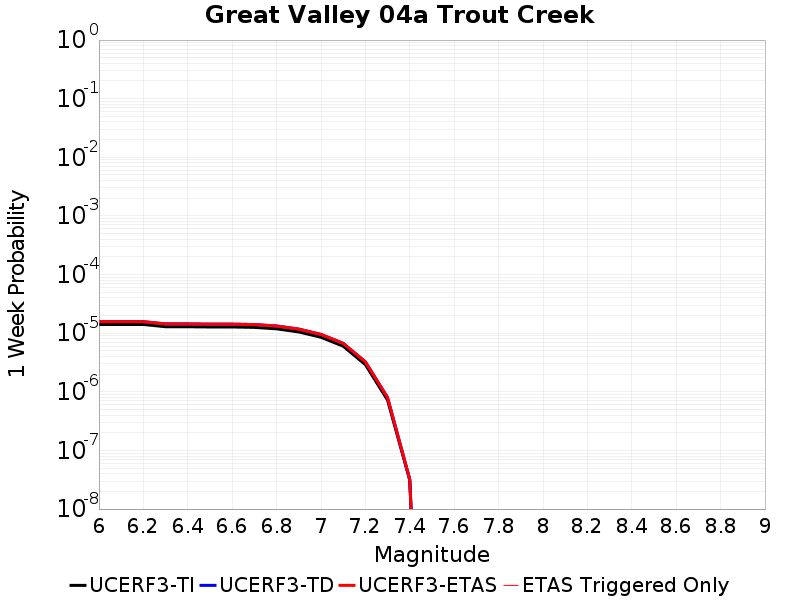 | 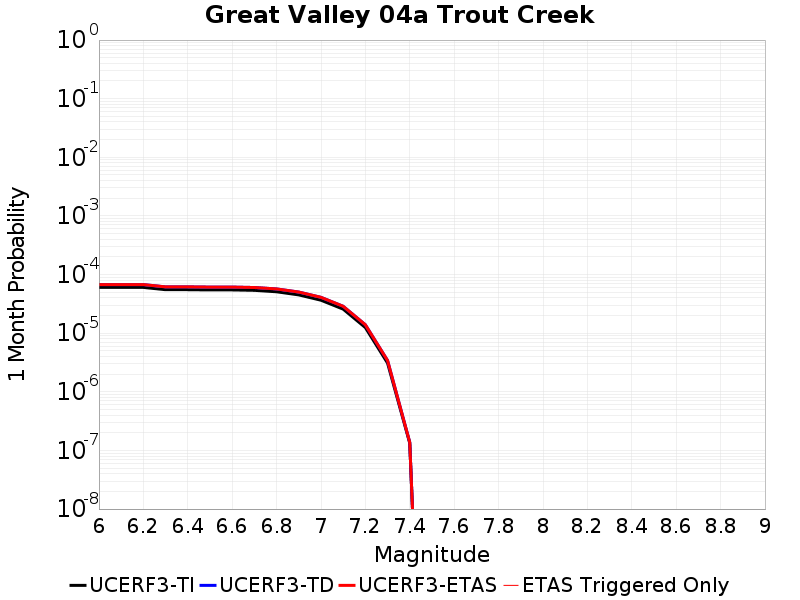 | 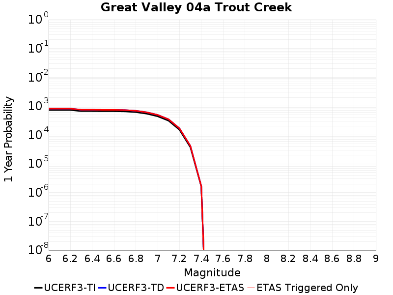 | 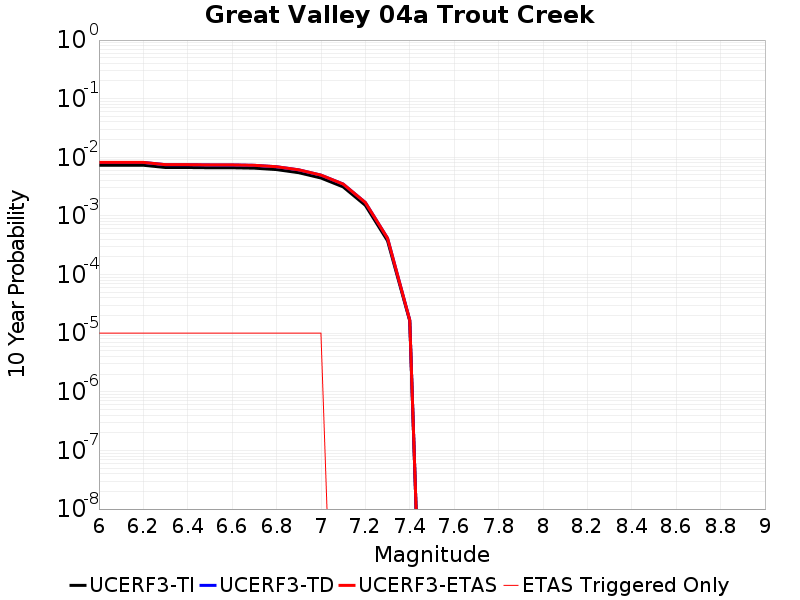 |

| Magnitude | 1 wk TI Prob | 1 wk TD Prob | 1 wk ETAS Prob | 1 wk ETAS/TD Gain | 1 wk ETAS Triggered Only | 1 mo TI Prob | 1 mo TD Prob | 1 mo ETAS Prob | 1 mo ETAS/TD Gain | 1 mo ETAS Triggered Only | 1 yr TI Prob | 1 yr TD Prob | 1 yr ETAS Prob | 1 yr ETAS/TD Gain | 1 yr ETAS Triggered Only | 10 yr TI Prob | 10 yr TD Prob | 10 yr ETAS Prob | 10 yr ETAS/TD Gain | 10 yr ETAS Triggered Only |
|-----|-----|-----|-----|-----|-----|-----|-----|-----|-----|-----|-----|-----|-----|-----|-----|-----|-----|-----|-----|-----|
| 6.0 | 1.4088538E-5 | 1.5730875E-5 | 1.5730875E-5 | 1.0 | 0.0 | 6.037805E-5 | 6.741636E-5 | 6.741636E-5 | 1.0 | 0.0 | 7.3485484E-4 | 8.2049763E-4 | 8.2049763E-4 | 1.0 | 0.0 | 0.007324295 | 0.008175969 | 0.008185887 | 1.0012131 | 1.0E-5 |
| 6.1 | 1.4088538E-5 | 1.5730875E-5 | 1.5730875E-5 | 1.0 | 0.0 | 6.037805E-5 | 6.741636E-5 | 6.741636E-5 | 1.0 | 0.0 | 7.3485484E-4 | 8.2049763E-4 | 8.2049763E-4 | 1.0 | 0.0 | 0.007324295 | 0.008175969 | 0.008185887 | 1.0012131 | 1.0E-5 |
| 6.2 | 1.4088538E-5 | 1.5730875E-5 | 1.5730875E-5 | 1.0 | 0.0 | 6.037805E-5 | 6.741636E-5 | 6.741636E-5 | 1.0 | 0.0 | 7.3485484E-4 | 8.2049763E-4 | 8.2049763E-4 | 1.0 | 0.0 | 0.007324295 | 0.008175969 | 0.008185887 | 1.0012131 | 1.0E-5 |
| 6.3 | 1.2882862E-5 | 1.4388988E-5 | 1.4388988E-5 | 1.0 | 0.0 | 5.5211098E-5 | 6.16657E-5 | 6.16657E-5 | 1.0 | 0.0 | 6.7198783E-4 | 7.505316E-4 | 7.505316E-4 | 1.0 | 0.0 | 0.0066995937 | 0.0074810334 | 0.0074909586 | 1.0013267 | 1.0E-5 |
| 6.4 | 1.2882862E-5 | 1.4388988E-5 | 1.4388988E-5 | 1.0 | 0.0 | 5.5211098E-5 | 6.16657E-5 | 6.16657E-5 | 1.0 | 0.0 | 6.7198783E-4 | 7.505316E-4 | 7.505316E-4 | 1.0 | 0.0 | 0.0066995937 | 0.0074810334 | 0.0074909586 | 1.0013267 | 1.0E-5 |
| 6.5 | 1.2762329E-5 | 1.4255457E-5 | 1.4255457E-5 | 1.0 | 0.0 | 5.469455E-5 | 6.1093444E-5 | 6.1093444E-5 | 1.0 | 0.0 | 6.657027E-4 | 7.435692E-4 | 7.435692E-4 | 1.0 | 0.0 | 0.00663712 | 0.007411874 | 0.0074218 | 1.0013392 | 1.0E-5 |
| 6.6 | 1.2762329E-5 | 1.4255457E-5 | 1.4255457E-5 | 1.0 | 0.0 | 5.469455E-5 | 6.1093444E-5 | 6.1093444E-5 | 1.0 | 0.0 | 6.657027E-4 | 7.435692E-4 | 7.435692E-4 | 1.0 | 0.0 | 0.00663712 | 0.007411874 | 0.0074218 | 1.0013392 | 1.0E-5 |
| 6.7 | 1.2557959E-5 | 1.4029545E-5 | 1.4029545E-5 | 1.0 | 0.0 | 5.3818712E-5 | 6.0125298E-5 | 6.0125298E-5 | 1.0 | 0.0 | 6.5504585E-4 | 7.3179E-4 | 7.3179E-4 | 1.0 | 0.0 | 0.006531183 | 0.007294858 | 0.007304785 | 1.0013608 | 1.0E-5 |
| 6.8 | 1.1871544E-5 | 1.3268463E-5 | 1.3268463E-5 | 1.0 | 0.0 | 5.0877054E-5 | 5.6863657E-5 | 5.6863657E-5 | 1.0 | 0.0 | 6.1925204E-4 | 6.9210515E-4 | 6.9210515E-4 | 1.0 | 0.0 | 0.0061752927 | 0.0069005154 | 0.0069104466 | 1.0014392 | 1.0E-5 |
| 6.9 | 1.0500373E-5 | 1.1739819E-5 | 1.1739819E-5 | 1.0 | 0.0 | 4.5000823E-5 | 5.0312585E-5 | 5.0312585E-5 | 1.0 | 0.0 | 5.4774724E-4 | 6.1239215E-4 | 6.1239215E-4 | 1.0 | 0.0 | 0.005463991 | 0.0061079133 | 0.006117852 | 1.0016272 | 1.0E-5 |
| 7.0 | 8.524332E-6 | 9.5405085E-6 | 9.5405085E-6 | 1.0 | 0.0 | 3.653234E-5 | 4.088729E-5 | 4.088729E-5 | 1.0 | 0.0 | 4.4469046E-4 | 4.9769646E-4 | 4.9769646E-4 | 1.0 | 0.0 | 0.0044380166 | 0.0049665505 | 0.0049765008 | 1.0020034 | 1.0E-5 |
| 7.1 | 6.006849E-6 | 6.716462E-6 | 6.716462E-6 | 1.0 | 0.0 | 2.5743384E-5 | 2.878455E-5 | 2.878455E-5 | 1.0 | 0.0 | 3.1338062E-4 | 3.5040113E-4 | 3.5040113E-4 | 1.0 | 0.0 | 0.0031293905 | 0.0034990378 | 0.0034990378 | 1.0 | 0.0 |
| 7.2 | 2.9122193E-6 | 3.248854E-6 | 3.248854E-6 | 1.0 | 0.0 | 1.248088E-5 | 1.3923595E-5 | 1.3923595E-5 | 1.0 | 0.0 | 1.5194413E-4 | 1.6950835E-4 | 1.6950835E-4 | 1.0 | 0.0 | 0.0015184027 | 0.0016939627 | 0.0016939627 | 1.0 | 0.0 |
| 7.3 | 7.2194007E-7 | 7.9941003E-7 | 7.9941003E-7 | 1.0 | 0.0 | 3.0940253E-6 | 3.426041E-6 | 3.426041E-6 | 1.0 | 0.0 | 3.7669106E-5 | 4.1711708E-5 | 4.1711708E-5 | 1.0 | 0.0 | 3.766272E-4 | 4.1708385E-4 | 4.1708385E-4 | 1.0 | 0.0 |
| 7.4 | 3.112171E-8 | 3.207443E-8 | 3.207443E-8 | 1.0 | 0.0 | 1.3337875E-7 | 1.3746183E-7 | 1.3746183E-7 | 1.0 | 0.0 | 1.6238852E-6 | 1.6735966E-6 | 1.6735966E-6 | 1.0 | 0.0 | 1.6238733E-5 | 1.6735848E-5 | 1.6735848E-5 | 1.0 | 0.0 |

## Hayward (So) 2011 CFM
*[(top)](#table-of-contents)*

| 1 Week | 1 Month | 1 Year | 10 Year |
|-----|-----|-----|-----|
| 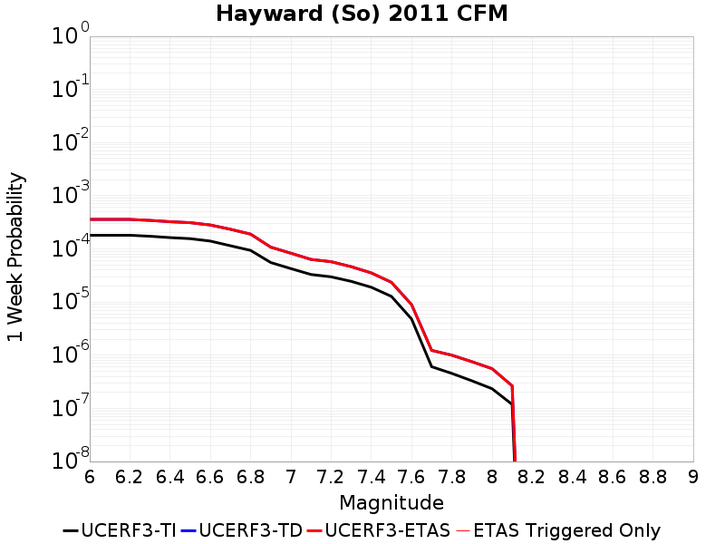 | 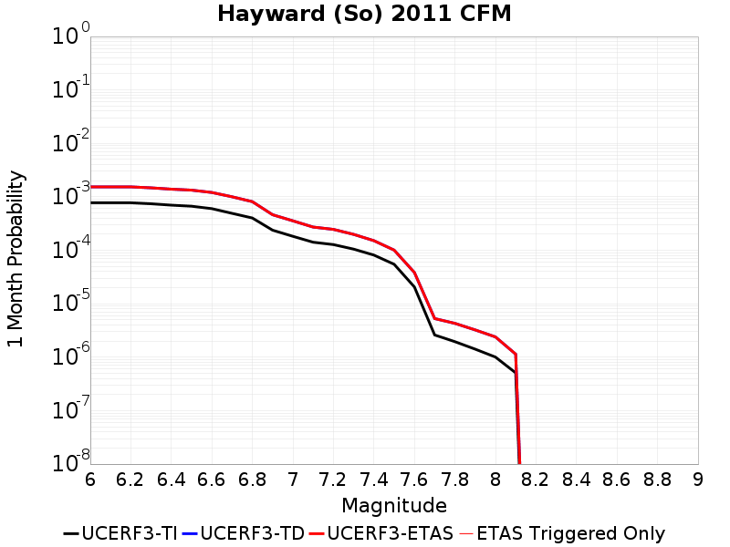 | 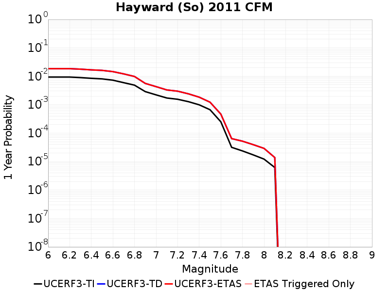 | 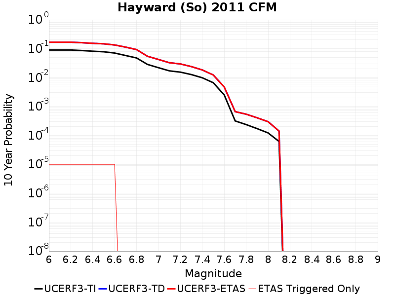 |

| Magnitude | 1 wk TI Prob | 1 wk TD Prob | 1 wk ETAS Prob | 1 wk ETAS/TD Gain | 1 wk ETAS Triggered Only | 1 mo TI Prob | 1 mo TD Prob | 1 mo ETAS Prob | 1 mo ETAS/TD Gain | 1 mo ETAS Triggered Only | 1 yr TI Prob | 1 yr TD Prob | 1 yr ETAS Prob | 1 yr ETAS/TD Gain | 1 yr ETAS Triggered Only | 10 yr TI Prob | 10 yr TD Prob | 10 yr ETAS Prob | 10 yr ETAS/TD Gain | 10 yr ETAS Triggered Only |
|-----|-----|-----|-----|-----|-----|-----|-----|-----|-----|-----|-----|-----|-----|-----|-----|-----|-----|-----|-----|-----|
| 6.0 | 1.8091932E-4 | 3.5890905E-4 | 3.5890905E-4 | 1.0 | 0.0 | 7.751381E-4 | 0.0015372848 | 0.0015372848 | 1.0 | 0.0 | 0.00939654 | 0.018558256 | 0.018558256 | 1.0 | 0.0 | 0.090090066 | 0.16734233 | 0.16735066 | 1.0000497 | 1.0E-5 |
| 6.1 | 1.8091932E-4 | 3.5890905E-4 | 3.5890905E-4 | 1.0 | 0.0 | 7.751381E-4 | 0.0015372848 | 0.0015372848 | 1.0 | 0.0 | 0.00939654 | 0.018558256 | 0.018558256 | 1.0 | 0.0 | 0.090090066 | 0.16734233 | 0.16735066 | 1.0000497 | 1.0E-5 |
| 6.2 | 1.8091932E-4 | 3.5890905E-4 | 3.5890905E-4 | 1.0 | 0.0 | 7.751381E-4 | 0.0015372848 | 0.0015372848 | 1.0 | 0.0 | 0.00939654 | 0.018558256 | 0.018558256 | 1.0 | 0.0 | 0.090090066 | 0.16734233 | 0.16735066 | 1.0000497 | 1.0E-5 |
| 6.3 | 1.7322872E-4 | 3.4443283E-4 | 3.4443283E-4 | 1.0 | 0.0 | 7.4219756E-4 | 0.0014753154 | 0.0014753154 | 1.0 | 0.0 | 0.0089988755 | 0.017816328 | 0.017816328 | 1.0 | 0.0 | 0.08643075 | 0.16127837 | 0.16128676 | 1.000052 | 1.0E-5 |
| 6.4 | 1.6334097E-4 | 3.2519788E-4 | 3.2519788E-4 | 1.0 | 0.0 | 6.998449E-4 | 0.0013929695 | 0.0013929695 | 1.0 | 0.0 | 0.008487372 | 0.016829558 | 0.016829558 | 1.0 | 0.0 | 0.081704415 | 0.15317175 | 0.15318021 | 1.0000553 | 1.0E-5 |
| 6.5 | 1.5600289E-4 | 3.1189882E-4 | 3.1189882E-4 | 1.0 | 0.0 | 6.684125E-4 | 0.001336033 | 0.001336033 | 1.0 | 0.0 | 0.008107598 | 0.016146794 | 0.016146794 | 1.0 | 0.0 | 0.078181036 | 0.14743517 | 0.1474437 | 1.0000578 | 1.0E-5 |
| 6.6 | 1.4046066E-4 | 2.8195232E-4 | 2.8195232E-4 | 1.0 | 0.0 | 6.018354E-4 | 0.0012078143 | 0.0012078143 | 1.0 | 0.0 | 0.0073027555 | 0.014607508 | 0.014607508 | 1.0 | 0.0 | 0.07067384 | 0.13452324 | 0.1345319 | 1.0000644 | 1.0E-5 |
| 6.7 | 1.14696966E-4 | 2.3417918E-4 | 2.3417918E-4 | 1.0 | 0.0 | 4.914658E-4 | 0.0010032442 | 0.0010032442 | 1.0 | 0.0 | 0.0059671924 | 0.012147167 | 0.012147167 | 1.0 | 0.0 | 0.058094822 | 0.11331325 | 0.11331325 | 1.0 | 0.0 |
| 6.8 | 9.3874296E-5 | 1.8983317E-4 | 1.8983317E-4 | 1.0 | 0.0 | 4.0225635E-4 | 8.133208E-4 | 8.133208E-4 | 1.0 | 0.0 | 0.0048864787 | 0.009857966 | 0.009857966 | 1.0 | 0.0 | 0.047804173 | 0.09311051 | 0.09311051 | 1.0 | 0.0 |
| 6.9 | 5.551852E-5 | 1.08068474E-4 | 1.08068474E-4 | 1.0 | 0.0 | 2.3791482E-4 | 4.63069E-4 | 4.63069E-4 | 1.0 | 0.0 | 0.0028927654 | 0.0056234114 | 0.0056234114 | 1.0 | 0.0 | 0.028553981 | 0.054599613 | 0.054599613 | 1.0 | 0.0 |
| 7.0 | 4.2662363E-5 | 8.309982E-5 | 8.309982E-5 | 1.0 | 0.0 | 1.8282588E-4 | 3.5609386E-4 | 3.5609386E-4 | 1.0 | 0.0 | 0.0022236328 | 0.0043268986 | 0.0043268986 | 1.0 | 0.0 | 0.022015138 | 0.04236025 | 0.04236025 | 1.0 | 0.0 |
| 7.1 | 3.305886E-5 | 6.354685E-5 | 6.354685E-5 | 1.0 | 0.0 | 1.4167312E-4 | 2.7231534E-4 | 2.7231534E-4 | 1.0 | 0.0 | 0.0017235056 | 0.003310418 | 0.003310418 | 1.0 | 0.0 | 0.017101998 | 0.032704026 | 0.032704026 | 1.0 | 0.0 |
| 7.2 | 2.9856887E-5 | 5.750887E-5 | 5.750887E-5 | 1.0 | 0.0 | 1.2795182E-4 | 2.464434E-4 | 2.464434E-4 | 1.0 | 0.0 | 0.0015567001 | 0.0029963371 | 0.0029963371 | 1.0 | 0.0 | 0.015458403 | 0.029690549 | 0.029690549 | 1.0 | 0.0 |
| 7.3 | 2.4559737E-5 | 4.6375222E-5 | 4.6375222E-5 | 1.0 | 0.0 | 1.0525176E-4 | 1.9873588E-4 | 1.9873588E-4 | 1.0 | 0.0 | 0.0012806869 | 0.0024169376 | 0.0024169376 | 1.0 | 0.0 | 0.012733313 | 0.024044376 | 0.024044376 | 1.0 | 0.0 |
| 7.4 | 1.9002231E-5 | 3.5346035E-5 | 3.5346035E-5 | 1.0 | 0.0 | 8.143559E-5 | 1.5147426E-4 | 1.5147426E-4 | 1.0 | 0.0 | 9.910273E-4 | 0.0018426492 | 0.0018426492 | 1.0 | 0.0 | 0.009866194 | 0.018404286 | 0.018404286 | 1.0 | 0.0 |
| 7.5 | 1.2783333E-5 | 2.3542898E-5 | 2.3542898E-5 | 1.0 | 0.0 | 5.4784563E-5 | 1.0089426E-4 | 1.0089426E-4 | 1.0 | 0.0 | 6.667979E-4 | 0.0012277013 | 0.0012277013 | 1.0 | 0.0 | 0.006648007 | 0.012315736 | 0.012315736 | 1.0 | 0.0 |
| 7.6 | 4.8149627E-6 | 8.97717E-6 | 8.97717E-6 | 1.0 | 0.0 | 2.063539E-5 | 3.8473027E-5 | 3.8473027E-5 | 1.0 | 0.0 | 2.5120692E-4 | 4.6830968E-4 | 4.6830968E-4 | 1.0 | 0.0 | 0.0025092314 | 0.0047263643 | 0.0047263643 | 1.0 | 0.0 |
| 7.7 | 6.0838227E-7 | 1.2327375E-6 | 1.2327375E-6 | 1.0 | 0.0 | 2.6073499E-6 | 5.28315E-6 | 5.28315E-6 | 1.0 | 0.0 | 3.174402E-5 | 6.4320455E-5 | 6.4320455E-5 | 1.0 | 0.0 | 3.1739488E-4 | 6.660629E-4 | 6.660629E-4 | 1.0 | 0.0 |
| 7.8 | 4.5542808E-7 | 1.0028242E-6 | 1.0028242E-6 | 1.0 | 0.0 | 1.9518332E-6 | 4.297811E-6 | 4.297811E-6 | 1.0 | 0.0 | 2.376331E-5 | 5.2324594E-5 | 5.2324594E-5 | 1.0 | 0.0 | 2.3760769E-4 | 5.435596E-4 | 5.435596E-4 | 1.0 | 0.0 |
| 7.9 | 3.3016747E-7 | 7.5592317E-7 | 7.5592317E-7 | 1.0 | 0.0 | 1.4150027E-6 | 3.2396665E-6 | 3.2396665E-6 | 1.0 | 0.0 | 1.7227521E-5 | 3.9442228E-5 | 3.9442228E-5 | 1.0 | 0.0 | 1.7226185E-4 | 4.0763814E-4 | 4.0763814E-4 | 1.0 | 0.0 |
| 8.0 | 2.347038E-7 | 5.5935266E-7 | 5.5935266E-7 | 1.0 | 0.0 | 1.0058731E-6 | 2.3972234E-6 | 2.3972234E-6 | 1.0 | 0.0 | 1.2246436E-5 | 2.9185807E-5 | 2.9185807E-5 | 1.0 | 0.0 | 1.2245761E-4 | 2.994193E-4 | 2.994193E-4 | 1.0 | 0.0 |
| 8.1 | 1.18822804E-7 | 2.6612017E-7 | 2.6612017E-7 | 1.0 | 0.0 | 5.092405E-7 | 1.1405145E-6 | 1.1405145E-6 | 1.0 | 0.0 | 6.1999854E-6 | 1.3885677E-5 | 1.3885677E-5 | 1.0 | 0.0 | 6.199812E-5 | 1.4188196E-4 | 1.4188196E-4 | 1.0 | 0.0 |

## Bullion Mountains
*[(top)](#table-of-contents)*

| 1 Week | 1 Month | 1 Year | 10 Year |
|-----|-----|-----|-----|
|  | 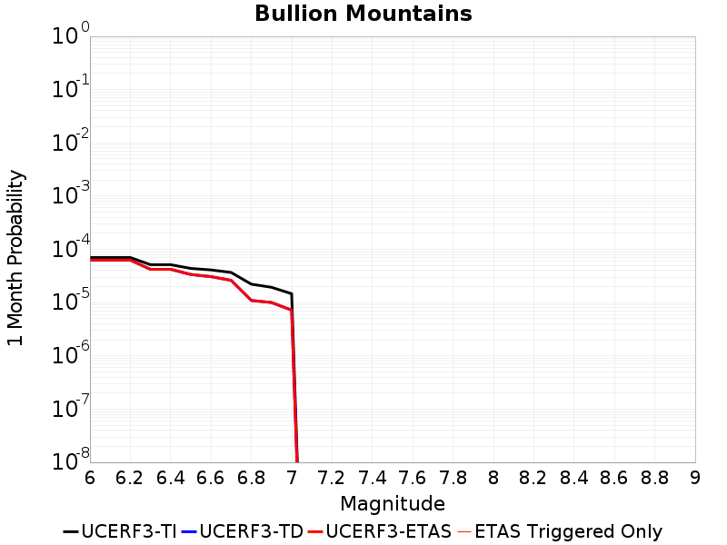 |  |  |

| Magnitude | 1 wk TI Prob | 1 wk TD Prob | 1 wk ETAS Prob | 1 wk ETAS/TD Gain | 1 wk ETAS Triggered Only | 1 mo TI Prob | 1 mo TD Prob | 1 mo ETAS Prob | 1 mo ETAS/TD Gain | 1 mo ETAS Triggered Only | 1 yr TI Prob | 1 yr TD Prob | 1 yr ETAS Prob | 1 yr ETAS/TD Gain | 1 yr ETAS Triggered Only | 10 yr TI Prob | 10 yr TD Prob | 10 yr ETAS Prob | 10 yr ETAS/TD Gain | 10 yr ETAS Triggered Only |
|-----|-----|-----|-----|-----|-----|-----|-----|-----|-----|-----|-----|-----|-----|-----|-----|-----|-----|-----|-----|-----|
| 6.0 | 1.6420427E-5 | 1.4702125E-5 | 1.4702125E-5 | 1.0 | 0.0 | 7.037136E-5 | 6.30078E-5 | 6.30078E-5 | 1.0 | 0.0 | 8.5643446E-4 | 7.668884E-4 | 7.668884E-4 | 1.0 | 0.0 | 0.008531413 | 0.007646218 | 0.0076561416 | 1.0012978 | 1.0E-5 |
| 6.1 | 1.6420427E-5 | 1.4702125E-5 | 1.4702125E-5 | 1.0 | 0.0 | 7.037136E-5 | 6.30078E-5 | 6.30078E-5 | 1.0 | 0.0 | 8.5643446E-4 | 7.668884E-4 | 7.668884E-4 | 1.0 | 0.0 | 0.008531413 | 0.007646218 | 0.0076561416 | 1.0012978 | 1.0E-5 |
| 6.2 | 1.6420427E-5 | 1.4702125E-5 | 1.4702125E-5 | 1.0 | 0.0 | 7.037136E-5 | 6.30078E-5 | 6.30078E-5 | 1.0 | 0.0 | 8.5643446E-4 | 7.668884E-4 | 7.668884E-4 | 1.0 | 0.0 | 0.008531413 | 0.007646218 | 0.0076561416 | 1.0012978 | 1.0E-5 |
| 6.3 | 1.2046778E-5 | 9.869239E-6 | 9.869239E-6 | 1.0 | 0.0 | 5.1628023E-5 | 4.2296182E-5 | 4.2296182E-5 | 1.0 | 0.0 | 6.283899E-4 | 5.148576E-4 | 5.148576E-4 | 1.0 | 0.0 | 0.0062661595 | 0.0051389323 | 0.0051488806 | 1.001936 | 1.0E-5 |
| 6.4 | 1.2046778E-5 | 9.869239E-6 | 9.869239E-6 | 1.0 | 0.0 | 5.1628023E-5 | 4.2296182E-5 | 4.2296182E-5 | 1.0 | 0.0 | 6.283899E-4 | 5.148576E-4 | 5.148576E-4 | 1.0 | 0.0 | 0.0062661595 | 0.0051389323 | 0.0051488806 | 1.001936 | 1.0E-5 |
| 6.5 | 1.0244343E-5 | 7.885128E-6 | 7.885128E-6 | 1.0 | 0.0 | 4.390359E-5 | 3.3793087E-5 | 3.3793087E-5 | 1.0 | 0.0 | 5.343951E-4 | 4.1137385E-4 | 4.1137385E-4 | 1.0 | 0.0 | 0.005331118 | 0.0041081575 | 0.004118116 | 1.0024242 | 1.0E-5 |
| 6.6 | 9.605408E-6 | 7.182736E-6 | 7.182736E-6 | 1.0 | 0.0 | 4.1165385E-5 | 3.0782907E-5 | 3.0782907E-5 | 1.0 | 0.0 | 5.010733E-4 | 3.747378E-4 | 3.747378E-4 | 1.0 | 0.0 | 0.00499945 | 0.0037430588 | 0.0037530214 | 1.0026616 | 1.0E-5 |
| 6.7 | 8.60418E-6 | 6.1285727E-6 | 6.1285727E-6 | 1.0 | 0.0 | 3.687454E-5 | 2.6265157E-5 | 2.6265157E-5 | 1.0 | 0.0 | 4.48855E-4 | 3.197509E-4 | 3.197509E-4 | 1.0 | 0.0 | 0.004479495 | 0.0031948227 | 0.0031948227 | 1.0 | 0.0 |
| 6.8 | 5.187994E-6 | 2.5655524E-6 | 2.5655524E-6 | 1.0 | 0.0 | 2.223407E-5 | 1.0995201E-5 | 1.0995201E-5 | 1.0 | 0.0 | 2.7066618E-4 | 1.3386234E-4 | 1.3386234E-4 | 1.0 | 0.0 | 0.0027033675 | 0.0013382094 | 0.0013382094 | 1.0 | 0.0 |
| 6.9 | 4.5302368E-6 | 2.3463795E-6 | 2.3463795E-6 | 1.0 | 0.0 | 1.9415156E-5 | 1.00558955E-5 | 1.00558955E-5 | 1.0 | 0.0 | 2.3635388E-4 | 1.2242762E-4 | 1.2242762E-4 | 1.0 | 0.0 | 0.0023610266 | 0.0012239916 | 0.0012239916 | 1.0 | 0.0 |
| 7.0 | 3.431668E-6 | 1.689825E-6 | 1.689825E-6 | 1.0 | 0.0 | 1.4707065E-5 | 7.242107E-6 | 7.242107E-6 | 1.0 | 0.0 | 1.7904381E-4 | 8.817266E-5 | 8.817266E-5 | 1.0 | 0.0 | 0.0017889962 | 8.8172656E-4 | 8.8172656E-4 | 1.0 | 0.0 |

## La Panza 2011
*[(top)](#table-of-contents)*

| 1 Week | 1 Month | 1 Year | 10 Year |
|-----|-----|-----|-----|
| 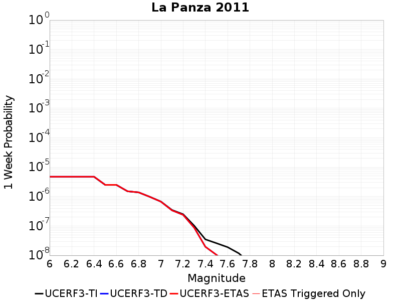 | 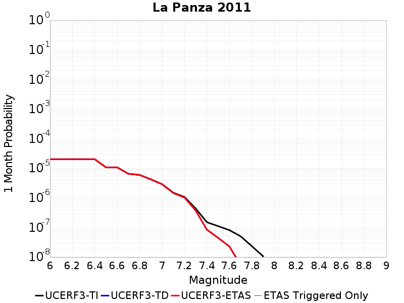 | 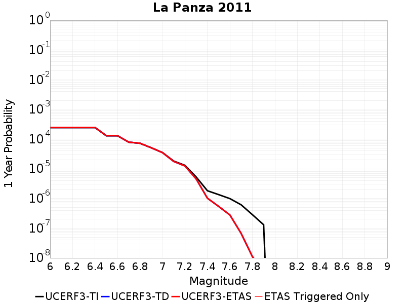 | 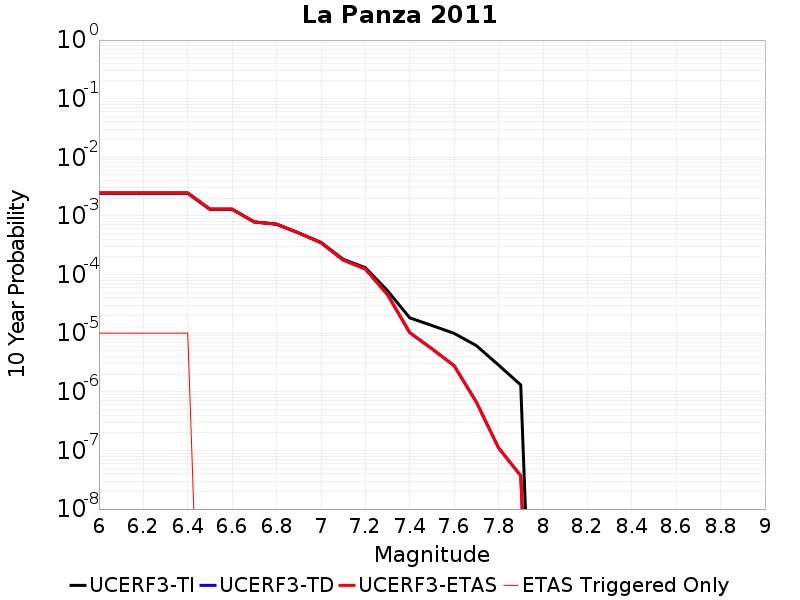 |

| Magnitude | 1 wk TI Prob | 1 wk TD Prob | 1 wk ETAS Prob | 1 wk ETAS/TD Gain | 1 wk ETAS Triggered Only | 1 mo TI Prob | 1 mo TD Prob | 1 mo ETAS Prob | 1 mo ETAS/TD Gain | 1 mo ETAS Triggered Only | 1 yr TI Prob | 1 yr TD Prob | 1 yr ETAS Prob | 1 yr ETAS/TD Gain | 1 yr ETAS Triggered Only | 10 yr TI Prob | 10 yr TD Prob | 10 yr ETAS Prob | 10 yr ETAS/TD Gain | 10 yr ETAS Triggered Only |
|-----|-----|-----|-----|-----|-----|-----|-----|-----|-----|-----|-----|-----|-----|-----|-----|-----|-----|-----|-----|-----|
| 6.0 | 4.6754544E-6 | 4.7185786E-6 | 4.7185786E-6 | 1.0 | 0.0 | 2.0037509E-5 | 2.0222335E-5 | 2.0222335E-5 | 1.0 | 0.0 | 2.4392935E-4 | 2.4618107E-4 | 2.4618107E-4 | 1.0 | 0.0 | 0.0024366176 | 0.002459278 | 0.0024692535 | 1.0040562 | 1.0E-5 |
| 6.1 | 4.6754544E-6 | 4.7185786E-6 | 4.7185786E-6 | 1.0 | 0.0 | 2.0037509E-5 | 2.0222335E-5 | 2.0222335E-5 | 1.0 | 0.0 | 2.4392935E-4 | 2.4618107E-4 | 2.4618107E-4 | 1.0 | 0.0 | 0.0024366176 | 0.002459278 | 0.0024692535 | 1.0040562 | 1.0E-5 |
| 6.2 | 4.6754544E-6 | 4.7185786E-6 | 4.7185786E-6 | 1.0 | 0.0 | 2.0037509E-5 | 2.0222335E-5 | 2.0222335E-5 | 1.0 | 0.0 | 2.4392935E-4 | 2.4618107E-4 | 2.4618107E-4 | 1.0 | 0.0 | 0.0024366176 | 0.002459278 | 0.0024692535 | 1.0040562 | 1.0E-5 |
| 6.3 | 4.6754544E-6 | 4.7185786E-6 | 4.7185786E-6 | 1.0 | 0.0 | 2.0037509E-5 | 2.0222335E-5 | 2.0222335E-5 | 1.0 | 0.0 | 2.4392935E-4 | 2.4618107E-4 | 2.4618107E-4 | 1.0 | 0.0 | 0.0024366176 | 0.002459278 | 0.0024692535 | 1.0040562 | 1.0E-5 |
| 6.4 | 4.6754544E-6 | 4.7185786E-6 | 4.7185786E-6 | 1.0 | 0.0 | 2.0037509E-5 | 2.0222335E-5 | 2.0222335E-5 | 1.0 | 0.0 | 2.4392935E-4 | 2.4618107E-4 | 2.4618107E-4 | 1.0 | 0.0 | 0.0024366176 | 0.002459278 | 0.0024692535 | 1.0040562 | 1.0E-5 |
| 6.5 | 2.485343E-6 | 2.5014217E-6 | 2.5014217E-6 | 1.0 | 0.0 | 1.0651426E-5 | 1.0720337E-5 | 1.0720337E-5 | 1.0 | 0.0 | 1.296734E-4 | 1.3051268E-4 | 1.3051268E-4 | 1.0 | 0.0 | 0.0012959775 | 0.0013043986 | 0.0013043986 | 1.0 | 0.0 |
| 6.6 | 2.485343E-6 | 2.5014217E-6 | 2.5014217E-6 | 1.0 | 0.0 | 1.0651426E-5 | 1.0720337E-5 | 1.0720337E-5 | 1.0 | 0.0 | 1.296734E-4 | 1.3051268E-4 | 1.3051268E-4 | 1.0 | 0.0 | 0.0012959775 | 0.0013043986 | 0.0013043986 | 1.0 | 0.0 |
| 6.7 | 1.5108508E-6 | 1.5153881E-6 | 1.5153881E-6 | 1.0 | 0.0 | 6.4750584E-6 | 6.494505E-6 | 6.494505E-6 | 1.0 | 0.0 | 7.8830984E-5 | 7.906784E-5 | 7.906784E-5 | 1.0 | 0.0 | 7.880303E-4 | 7.904079E-4 | 7.904079E-4 | 1.0 | 0.0 |
| 6.8 | 1.3865837E-6 | 1.3892492E-6 | 1.3892492E-6 | 1.0 | 0.0 | 5.942488E-6 | 5.953912E-6 | 5.953912E-6 | 1.0 | 0.0 | 7.234739E-5 | 7.248657E-5 | 7.248657E-5 | 1.0 | 0.0 | 7.232384E-4 | 7.2463905E-4 | 7.2463905E-4 | 1.0 | 0.0 |
| 6.9 | 9.826583E-7 | 9.803365E-7 | 9.803365E-7 | 1.0 | 0.0 | 4.2113857E-6 | 4.2014353E-6 | 4.2014353E-6 | 1.0 | 0.0 | 5.1272415E-5 | 5.115133E-5 | 5.115133E-5 | 1.0 | 0.0 | 5.126059E-4 | 5.114009E-4 | 5.114009E-4 | 1.0 | 0.0 |
| 7.0 | 6.7797646E-7 | 6.717046E-7 | 6.717046E-7 | 1.0 | 0.0 | 2.9056102E-6 | 2.878731E-6 | 2.878731E-6 | 1.0 | 0.0 | 3.537523E-5 | 3.504802E-5 | 3.504802E-5 | 1.0 | 0.0 | 3.5369597E-4 | 3.50428E-4 | 3.50428E-4 | 1.0 | 0.0 |
| 7.1 | 3.4979826E-7 | 3.393961E-7 | 3.393961E-7 | 1.0 | 0.0 | 1.4991346E-6 | 1.4545541E-6 | 1.4545541E-6 | 1.0 | 0.0 | 1.825181E-5 | 1.7709062E-5 | 1.7709062E-5 | 1.0 | 0.0 | 1.825031E-4 | 1.7707769E-4 | 1.7707769E-4 | 1.0 | 0.0 |
| 7.2 | 2.5088332E-7 | 2.389668E-7 | 2.389668E-7 | 1.0 | 0.0 | 1.0752137E-6 | 1.0241431E-6 | 1.0241431E-6 | 1.0 | 0.0 | 1.3090649E-5 | 1.24688795E-5 | 1.24688795E-5 | 1.0 | 0.0 | 1.3089878E-4 | 1.2468264E-4 | 1.2468264E-4 | 1.0 | 0.0 |
| 7.3 | 1.0159086E-7 | 8.7077694E-8 | 8.7077694E-8 | 1.0 | 0.0 | 4.3538932E-7 | 3.7319006E-7 | 3.7319006E-7 | 1.0 | 0.0 | 5.300852E-6 | 4.54358E-6 | 4.54358E-6 | 1.0 | 0.0 | 5.3007258E-5 | 4.543491E-5 | 4.543491E-5 | 1.0 | 0.0 |
| 7.4 | 3.5006252E-8 | 1.9606613E-8 | 1.9606613E-8 | 1.0 | 0.0 | 1.5002678E-7 | 8.4028336E-8 | 8.4028336E-8 | 1.0 | 0.0 | 1.8265745E-6 | 1.0230445E-6 | 1.0230445E-6 | 1.0 | 0.0 | 1.8265595E-5 | 1.0230401E-5 | 1.0230401E-5 | 1.0 | 0.0 |
| 7.5 | 2.592274E-8 | 1.03900275E-8 | 1.03900275E-8 | 1.0 | 0.0 | 1.1109746E-7 | 4.4528687E-8 | 4.4528687E-8 | 1.0 | 0.0 | 1.3526106E-6 | 5.4213666E-7 | 5.4213666E-7 | 1.0 | 0.0 | 1.3526024E-5 | 5.421354E-6 | 5.421354E-6 | 1.0 | 0.0 |
| 7.6 | 1.9016717E-8 | 5.341686E-9 | 5.341686E-9 | 1.0 | 0.0 | 8.150022E-8 | 2.2892939E-8 | 2.2892939E-8 | 1.0 | 0.0 | 9.922647E-7 | 2.787215E-7 | 2.787215E-7 | 1.0 | 0.0 | 9.922603E-6 | 2.7872115E-6 | 2.7872115E-6 | 1.0 | 0.0 |
| 7.7 | 1.17738495E-8 | 1.2818249E-9 | 1.2818249E-9 | 1.0 | 0.0 | 5.0459356E-8 | 5.4935336E-9 | 5.4935336E-9 | 1.0 | 0.0 | 6.1434247E-7 | 6.688377E-8 | 6.688377E-8 | 1.0 | 0.0 | 6.143408E-6 | 6.688375E-7 | 6.688375E-7 | 1.0 | 0.0 |
| 7.8 | 5.489079E-9 | 2.1213409E-10 | 2.1213409E-10 | 1.0 | 0.0 | 2.3524624E-8 | 9.091454E-10 | 9.091454E-10 | 1.0 | 0.0 | 2.8641225E-7 | 1.10688445E-8 | 1.10688445E-8 | 1.0 | 0.0 | 2.8641189E-6 | 1.1068843E-7 | 1.1068843E-7 | 1.0 | 0.0 |
| 7.9 | 2.5081048E-9 | 7.101986E-11 | 7.101986E-11 | 1.0 | 0.0 | 1.0749021E-8 | 3.043703E-10 | 3.043703E-10 | 1.0 | 0.0 | 1.3086932E-7 | 3.7057082E-9 | 3.7057082E-9 | 1.0 | 0.0 | 1.3086925E-6 | 3.705708E-8 | 3.705708E-8 | 1.0 | 0.0 |

## Cleghorn
*[(top)](#table-of-contents)*

| 1 Week | 1 Month | 1 Year | 10 Year |
|-----|-----|-----|-----|
|  | 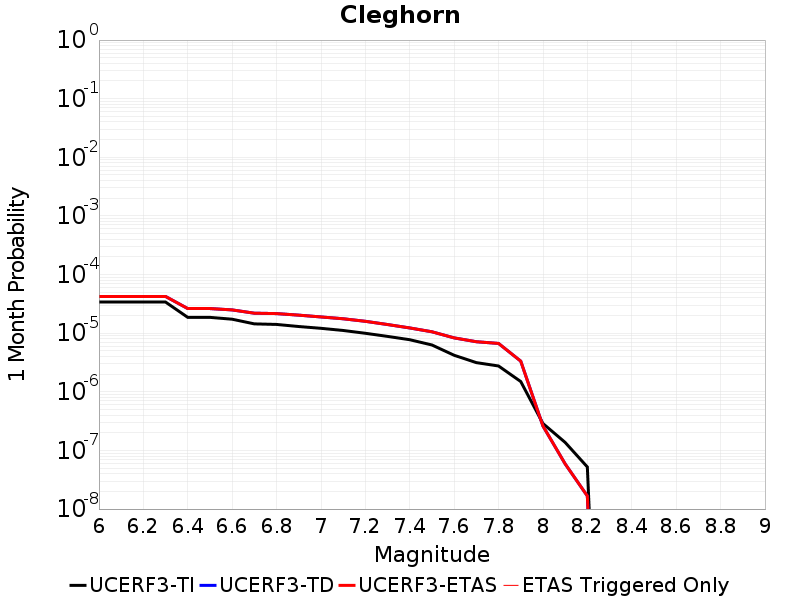 | 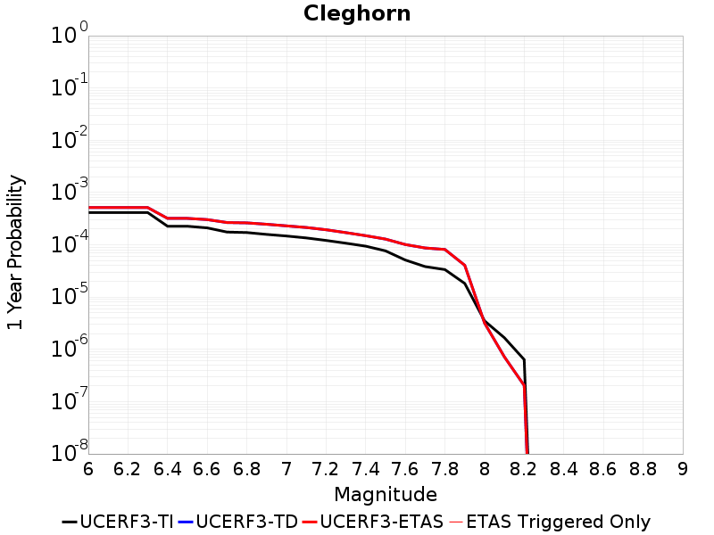 | 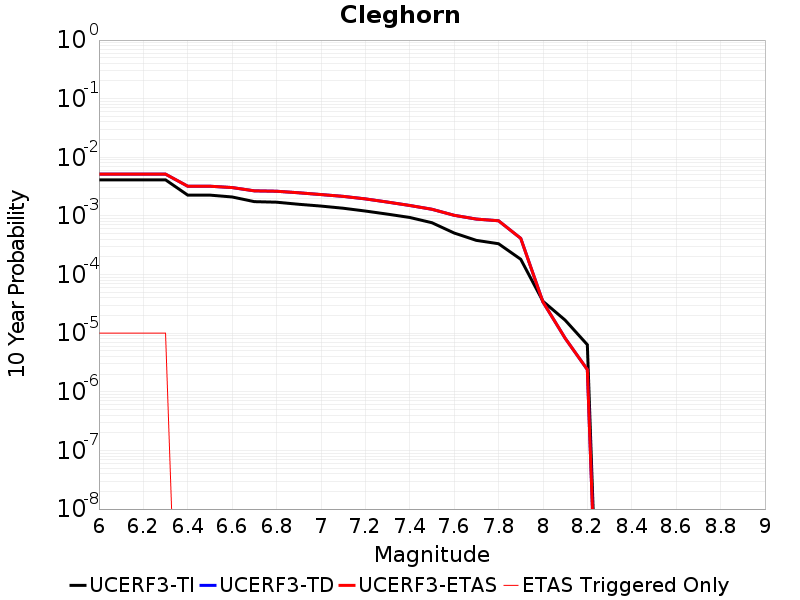 |

| Magnitude | 1 wk TI Prob | 1 wk TD Prob | 1 wk ETAS Prob | 1 wk ETAS/TD Gain | 1 wk ETAS Triggered Only | 1 mo TI Prob | 1 mo TD Prob | 1 mo ETAS Prob | 1 mo ETAS/TD Gain | 1 mo ETAS Triggered Only | 1 yr TI Prob | 1 yr TD Prob | 1 yr ETAS Prob | 1 yr ETAS/TD Gain | 1 yr ETAS Triggered Only | 10 yr TI Prob | 10 yr TD Prob | 10 yr ETAS Prob | 10 yr ETAS/TD Gain | 10 yr ETAS Triggered Only |
|-----|-----|-----|-----|-----|-----|-----|-----|-----|-----|-----|-----|-----|-----|-----|-----|-----|-----|-----|-----|-----|
| 6.0 | 7.9267165E-6 | 9.881208E-6 | 9.881208E-6 | 1.0 | 0.0 | 3.39712E-5 | 4.2347405E-5 | 4.2347405E-5 | 1.0 | 0.0 | 4.1352084E-4 | 5.154683E-4 | 5.154683E-4 | 1.0 | 0.0 | 0.004127522 | 0.005157085 | 0.0051670335 | 1.001929 | 1.0E-5 |
| 6.1 | 7.9267165E-6 | 9.881208E-6 | 9.881208E-6 | 1.0 | 0.0 | 3.39712E-5 | 4.2347405E-5 | 4.2347405E-5 | 1.0 | 0.0 | 4.1352084E-4 | 5.154683E-4 | 5.154683E-4 | 1.0 | 0.0 | 0.004127522 | 0.005157085 | 0.0051670335 | 1.001929 | 1.0E-5 |
| 6.2 | 7.9267165E-6 | 9.881208E-6 | 9.881208E-6 | 1.0 | 0.0 | 3.39712E-5 | 4.2347405E-5 | 4.2347405E-5 | 1.0 | 0.0 | 4.1352084E-4 | 5.154683E-4 | 5.154683E-4 | 1.0 | 0.0 | 0.004127522 | 0.005157085 | 0.0051670335 | 1.001929 | 1.0E-5 |
| 6.3 | 7.9267165E-6 | 9.881208E-6 | 9.881208E-6 | 1.0 | 0.0 | 3.39712E-5 | 4.2347405E-5 | 4.2347405E-5 | 1.0 | 0.0 | 4.1352084E-4 | 5.154683E-4 | 5.154683E-4 | 1.0 | 0.0 | 0.004127522 | 0.005157085 | 0.0051670335 | 1.001929 | 1.0E-5 |
| 6.4 | 4.3445207E-6 | 6.1400438E-6 | 6.1400438E-6 | 1.0 | 0.0 | 1.8619241E-5 | 2.6314214E-5 | 2.6314214E-5 | 1.0 | 0.0 | 2.2666567E-4 | 3.2032948E-4 | 3.2032948E-4 | 1.0 | 0.0 | 0.0022643462 | 0.0032121106 | 0.0032121106 | 1.0 | 0.0 |
| 6.5 | 4.3445207E-6 | 6.1400438E-6 | 6.1400438E-6 | 1.0 | 0.0 | 1.8619241E-5 | 2.6314214E-5 | 2.6314214E-5 | 1.0 | 0.0 | 2.2666567E-4 | 3.2032948E-4 | 3.2032948E-4 | 1.0 | 0.0 | 0.0022643462 | 0.0032121106 | 0.0032121106 | 1.0 | 0.0 |
| 6.6 | 4.040109E-6 | 5.822366E-6 | 5.822366E-6 | 1.0 | 0.0 | 1.7314638E-5 | 2.4952764E-5 | 2.4952764E-5 | 1.0 | 0.0 | 2.1078532E-4 | 3.0375848E-4 | 3.0375848E-4 | 1.0 | 0.0 | 0.002105855 | 0.00304686 | 0.00304686 | 1.0 | 0.0 |
| 6.7 | 3.3632055E-6 | 5.115674E-6 | 5.115674E-6 | 1.0 | 0.0 | 1.4413658E-5 | 2.1924134E-5 | 2.1924134E-5 | 1.0 | 0.0 | 1.7547216E-4 | 2.6689397E-4 | 2.6689397E-4 | 1.0 | 0.0 | 0.0017533366 | 0.0026791047 | 0.0026791047 | 1.0 | 0.0 |
| 6.8 | 3.2902772E-6 | 5.0375456E-6 | 5.0375456E-6 | 1.0 | 0.0 | 1.4101111E-5 | 2.1589305E-5 | 2.1589305E-5 | 1.0 | 0.0 | 1.716675E-4 | 2.628184E-4 | 2.628184E-4 | 1.0 | 0.0 | 0.0017153495 | 0.002638446 | 0.002638446 | 1.0 | 0.0 |
| 6.9 | 3.031547E-6 | 4.7388658E-6 | 4.7388658E-6 | 1.0 | 0.0 | 1.299228E-5 | 2.0309268E-5 | 2.0309268E-5 | 1.0 | 0.0 | 1.5816953E-4 | 2.4723756E-4 | 2.4723756E-4 | 1.0 | 0.0 | 0.00158057 | 0.002482993 | 0.002482993 | 1.0 | 0.0 |
| 7.0 | 2.8259715E-6 | 4.4172334E-6 | 4.4172334E-6 | 1.0 | 0.0 | 1.211125E-5 | 1.8930863E-5 | 1.8930863E-5 | 1.0 | 0.0 | 1.4744449E-4 | 2.3045912E-4 | 2.3045912E-4 | 1.0 | 0.0 | 0.001473467 | 0.0023155678 | 0.0023155678 | 1.0 | 0.0 |
| 7.1 | 2.5962665E-6 | 4.1118547E-6 | 4.1118547E-6 | 1.0 | 0.0 | 1.1126809E-5 | 1.7622117E-5 | 1.7622117E-5 | 1.0 | 0.0 | 1.3546048E-4 | 2.1452837E-4 | 2.1452837E-4 | 1.0 | 0.0 | 0.0013537793 | 0.0021565857 | 0.0021565857 | 1.0 | 0.0 |
| 7.2 | 2.3247253E-6 | 3.7215736E-6 | 3.7215736E-6 | 1.0 | 0.0 | 9.96307E-6 | 1.5949505E-5 | 1.5949505E-5 | 1.0 | 0.0 | 1.21293626E-4 | 1.9416811E-4 | 1.9416811E-4 | 1.0 | 0.0 | 0.0012122744 | 0.00195338 | 0.00195338 | 1.0 | 0.0 |
| 7.3 | 2.056928E-6 | 3.27846E-6 | 3.27846E-6 | 1.0 | 0.0 | 8.815376E-6 | 1.4050469E-5 | 1.4050469E-5 | 1.0 | 0.0 | 1.0732192E-4 | 1.7105119E-4 | 1.7105119E-4 | 1.0 | 0.0 | 0.001072701 | 0.0017226631 | 0.0017226631 | 1.0 | 0.0 |
| 7.4 | 1.8055999E-6 | 2.867015E-6 | 2.867015E-6 | 1.0 | 0.0 | 7.738263E-6 | 1.228715E-5 | 1.228715E-5 | 1.0 | 0.0 | 9.4209274E-5 | 1.4958592E-4 | 1.4958592E-4 | 1.0 | 0.0 | 9.4169343E-4 | 0.001508468 | 0.001508468 | 1.0 | 0.0 |
| 7.5 | 1.4683443E-6 | 2.4654016E-6 | 2.4654016E-6 | 1.0 | 0.0 | 6.292889E-6 | 1.0565965E-5 | 1.0565965E-5 | 1.0 | 0.0 | 7.661323E-5 | 1.2863312E-4 | 1.2863312E-4 | 1.0 | 0.0 | 7.658682E-4 | 0.001299252 | 0.001299252 | 1.0 | 0.0 |
| 7.6 | 9.804088E-7 | 1.940411E-6 | 1.940411E-6 | 1.0 | 0.0 | 4.201745E-6 | 8.316021E-6 | 8.316021E-6 | 1.0 | 0.0 | 5.1155046E-5 | 1.01242906E-4 | 1.01242906E-4 | 1.0 | 0.0 | 5.114327E-4 | 0.0010256657 | 0.0010256657 | 1.0 | 0.0 |
| 7.7 | 7.3434086E-7 | 1.6680544E-6 | 1.6680544E-6 | 1.0 | 0.0 | 3.1471714E-6 | 7.1487852E-6 | 7.1487852E-6 | 1.0 | 0.0 | 3.831614E-5 | 8.703301E-5 | 8.703301E-5 | 1.0 | 0.0 | 3.8309532E-4 | 8.8372943E-4 | 8.8372943E-4 | 1.0 | 0.0 |
| 7.8 | 6.434184E-7 | 1.5601769E-6 | 1.5601769E-6 | 1.0 | 0.0 | 2.7575045E-6 | 6.6864554E-6 | 6.6864554E-6 | 1.0 | 0.0 | 3.35721E-5 | 8.140458E-5 | 8.140458E-5 | 1.0 | 0.0 | 3.3567028E-4 | 8.271477E-4 | 8.271477E-4 | 1.0 | 0.0 |
| 7.9 | 3.4943926E-7 | 7.7826064E-7 | 7.7826064E-7 | 1.0 | 0.0 | 1.497596E-6 | 3.3353986E-6 | 3.3353986E-6 | 1.0 | 0.0 | 1.8233079E-5 | 4.060773E-5 | 4.060773E-5 | 1.0 | 0.0 | 1.8231584E-4 | 4.1457536E-4 | 4.1457536E-4 | 1.0 | 0.0 |
| 8.0 | 6.717524E-8 | 6.0927526E-8 | 6.0927526E-8 | 1.0 | 0.0 | 2.8789387E-7 | 2.6111795E-7 | 2.6111795E-7 | 1.0 | 0.0 | 3.505102E-6 | 3.1791064E-6 | 3.1791064E-6 | 1.0 | 0.0 | 3.5050467E-5 | 3.4089444E-5 | 3.4089444E-5 | 1.0 | 0.0 |
| 8.1 | 3.1984914E-8 | 1.3767275E-8 | 1.3767275E-8 | 1.0 | 0.0 | 1.370782E-7 | 5.900261E-8 | 5.900261E-8 | 1.0 | 0.0 | 1.6689258E-6 | 7.1835655E-7 | 7.1835655E-7 | 1.0 | 0.0 | 1.6689133E-5 | 8.20237E-6 | 8.20237E-6 | 1.0 | 0.0 |
| 8.2 | 1.21887656E-8 | 3.9000416E-9 | 3.9000416E-9 | 1.0 | 0.0 | 5.2237567E-8 | 1.6714463E-8 | 1.6714463E-8 | 1.0 | 0.0 | 6.359922E-7 | 2.0349857E-7 | 2.0349857E-7 | 1.0 | 0.0 | 6.3599036E-6 | 2.3913803E-6 | 2.3913803E-6 | 1.0 | 0.0 |

## Rose Canyon
*[(top)](#table-of-contents)*

| 1 Week | 1 Month | 1 Year | 10 Year |
|-----|-----|-----|-----|
|  |  | 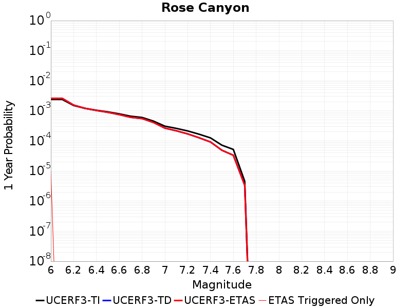 |  |

| Magnitude | 1 wk TI Prob | 1 wk TD Prob | 1 wk ETAS Prob | 1 wk ETAS/TD Gain | 1 wk ETAS Triggered Only | 1 mo TI Prob | 1 mo TD Prob | 1 mo ETAS Prob | 1 mo ETAS/TD Gain | 1 mo ETAS Triggered Only | 1 yr TI Prob | 1 yr TD Prob | 1 yr ETAS Prob | 1 yr ETAS/TD Gain | 1 yr ETAS Triggered Only | 10 yr TI Prob | 10 yr TD Prob | 10 yr ETAS Prob | 10 yr ETAS/TD Gain | 10 yr ETAS Triggered Only |
|-----|-----|-----|-----|-----|-----|-----|-----|-----|-----|-----|-----|-----|-----|-----|-----|-----|-----|-----|-----|-----|
| 6.0 | 4.5923203E-5 | 4.986487E-5 | 4.986487E-5 | 1.0 | 0.0 | 1.9679888E-4 | 2.1369044E-4 | 2.1369044E-4 | 1.0 | 0.0 | 0.0023933933 | 0.002598766 | 0.00260874 | 1.003838 | 1.0E-5 | 0.023677798 | 0.025703797 | 0.025713539 | 1.0003791 | 1.0E-5 |
| 6.1 | 4.5923203E-5 | 4.986487E-5 | 4.986487E-5 | 1.0 | 0.0 | 1.9679888E-4 | 2.1369044E-4 | 2.1369044E-4 | 1.0 | 0.0 | 0.0023933933 | 0.002598766 | 0.002598766 | 1.0 | 0.0 | 0.023677798 | 0.025703797 | 0.025703797 | 1.0 | 0.0 |
| 6.2 | 2.8844734E-5 | 2.97747E-5 | 2.97747E-5 | 1.0 | 0.0 | 1.2361443E-4 | 1.2759981E-4 | 1.2759981E-4 | 1.0 | 0.0 | 0.0015039665 | 0.0015524481 | 0.0015524481 | 1.0 | 0.0 | 0.0149382865 | 0.015433208 | 0.015433208 | 1.0 | 0.0 |
| 6.3 | 2.3171577E-5 | 2.3255212E-5 | 2.3255212E-5 | 1.0 | 0.0 | 9.9302975E-5 | 9.966146E-5 | 9.966146E-5 | 1.0 | 0.0 | 0.0012083431 | 0.0012127165 | 0.0012127165 | 1.0 | 0.0 | 0.012017938 | 0.012068564 | 0.012068564 | 1.0 | 0.0 |
| 6.4 | 2.0066604E-5 | 1.9731116E-5 | 1.9731116E-5 | 1.0 | 0.0 | 8.599689E-5 | 8.4559244E-5 | 8.4559244E-5 | 1.0 | 0.0 | 0.0010465092 | 0.0010290327 | 0.0010290327 | 1.0 | 0.0 | 0.010415946 | 0.010254983 | 0.010254983 | 1.0 | 0.0 |
| 6.5 | 1.776989E-5 | 1.7158349E-5 | 1.7158349E-5 | 1.0 | 0.0 | 7.615444E-5 | 7.353375E-5 | 7.353375E-5 | 1.0 | 0.0 | 9.267859E-4 | 8.949127E-4 | 8.949127E-4 | 1.0 | 0.0 | 0.009229303 | 0.008925494 | 0.008925494 | 1.0 | 0.0 |
| 6.6 | 1.5227364E-5 | 1.4364129E-5 | 1.4364129E-5 | 1.0 | 0.0 | 6.52585E-5 | 6.155913E-5 | 6.155913E-5 | 1.0 | 0.0 | 7.942326E-4 | 7.4922986E-4 | 7.4922986E-4 | 1.0 | 0.0 | 0.007914 | 0.007480319 | 0.007480319 | 1.0 | 0.0 |
| 6.7 | 1.2703898E-5 | 1.1687723E-5 | 1.1687723E-5 | 1.0 | 0.0 | 5.4444143E-5 | 5.0089304E-5 | 5.0089304E-5 | 1.0 | 0.0 | 6.626558E-4 | 6.096709E-4 | 6.096709E-4 | 1.0 | 0.0 | 0.006606833 | 0.0060966453 | 0.0060966453 | 1.0 | 0.0 |
| 6.8 | 1.1554917E-5 | 1.0621628E-5 | 1.0621628E-5 | 1.0 | 0.0 | 4.9520135E-5 | 4.552049E-5 | 4.552049E-5 | 1.0 | 0.0 | 6.0274085E-4 | 5.540751E-4 | 5.540751E-4 | 1.0 | 0.0 | 0.0060110865 | 0.00554823 | 0.00554823 | 1.0 | 0.0 |
| 6.9 | 8.732078E-6 | 7.88712E-6 | 7.88712E-6 | 1.0 | 0.0 | 3.7422655E-5 | 3.380152E-5 | 3.380152E-5 | 1.0 | 0.0 | 4.5552556E-4 | 4.1145875E-4 | 4.1145875E-4 | 1.0 | 0.0 | 0.0045459294 | 0.004123763 | 0.004123763 | 1.0 | 0.0 |
| 7.0 | 5.9337494E-6 | 5.111262E-6 | 5.111262E-6 | 1.0 | 0.0 | 2.5430107E-5 | 2.1905225E-5 | 2.1905225E-5 | 1.0 | 0.0 | 3.0956755E-4 | 2.666636E-4 | 2.666636E-4 | 1.0 | 0.0 | 0.0030913667 | 0.002663452 | 0.002663452 | 1.0 | 0.0 |
| 7.1 | 5.013409E-6 | 4.1805583E-6 | 4.1805583E-6 | 1.0 | 0.0 | 2.1485863E-5 | 1.7916556E-5 | 1.7916556E-5 | 1.0 | 0.0 | 2.6155898E-4 | 2.1811234E-4 | 2.1811234E-4 | 1.0 | 0.0 | 0.0026125133 | 0.0021789945 | 0.0021789945 | 1.0 | 0.0 |
| 7.2 | 4.120763E-6 | 3.284937E-6 | 3.284937E-6 | 1.0 | 0.0 | 1.7660293E-5 | 1.4078226E-5 | 1.4078226E-5 | 1.0 | 0.0 | 2.1499286E-4 | 1.7138901E-4 | 1.7138901E-4 | 1.0 | 0.0 | 0.0021478499 | 0.0017125779 | 0.0017125779 | 1.0 | 0.0 |
| 7.3 | 3.2081239E-6 | 2.4426397E-6 | 2.4426397E-6 | 1.0 | 0.0 | 1.374903E-5 | 1.0468414E-5 | 1.0468414E-5 | 1.0 | 0.0 | 1.6738157E-4 | 1.2744556E-4 | 1.2744556E-4 | 1.0 | 0.0 | 0.0016725556 | 0.0012737317 | 0.0012737317 | 1.0 | 0.0 |
| 7.4 | 2.4194755E-6 | 1.7695813E-6 | 1.7695813E-6 | 1.0 | 0.0 | 1.0369139E-5 | 7.5838984E-6 | 7.5838984E-6 | 1.0 | 0.0 | 1.2623696E-4 | 9.2330105E-5 | 9.2330105E-5 | 1.0 | 0.0 | 0.0012616527 | 9.229228E-4 | 9.229228E-4 | 1.0 | 0.0 |
| 7.5 | 1.3842889E-6 | 9.390828E-7 | 9.390828E-7 | 1.0 | 0.0 | 5.9326535E-6 | 4.0246346E-6 | 4.0246346E-6 | 1.0 | 0.0 | 7.222766E-5 | 4.8998856E-5 | 4.8998856E-5 | 1.0 | 0.0 | 7.220419E-4 | 4.8988406E-4 | 4.8988406E-4 | 1.0 | 0.0 |
| 7.6 | 1.0021575E-6 | 6.4154347E-7 | 6.4154347E-7 | 1.0 | 0.0 | 4.2949537E-6 | 2.749469E-6 | 2.749469E-6 | 1.0 | 0.0 | 5.2289808E-5 | 3.3474294E-5 | 3.3474294E-5 | 1.0 | 0.0 | 5.2277505E-4 | 3.3469466E-4 | 3.3469466E-4 | 1.0 | 0.0 |
| 7.7 | 8.7620116E-8 | 6.451519E-8 | 6.451519E-8 | 1.0 | 0.0 | 3.7551473E-7 | 2.7649364E-7 | 2.7649364E-7 | 1.0 | 0.0 | 4.5718825E-6 | 3.3663052E-6 | 3.3663052E-6 | 1.0 | 0.0 | 4.5717883E-5 | 3.366257E-5 | 3.366257E-5 | 1.0 | 0.0 |

## Malibu Coast alt 1
*[(top)](#table-of-contents)*

| 1 Week | 1 Month | 1 Year | 10 Year |
|-----|-----|-----|-----|
| 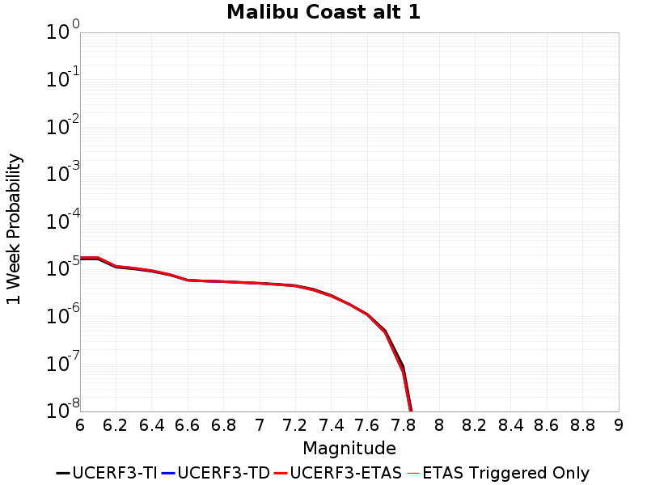 |  |  |  |

| Magnitude | 1 wk TI Prob | 1 wk TD Prob | 1 wk ETAS Prob | 1 wk ETAS/TD Gain | 1 wk ETAS Triggered Only | 1 mo TI Prob | 1 mo TD Prob | 1 mo ETAS Prob | 1 mo ETAS/TD Gain | 1 mo ETAS Triggered Only | 1 yr TI Prob | 1 yr TD Prob | 1 yr ETAS Prob | 1 yr ETAS/TD Gain | 1 yr ETAS Triggered Only | 10 yr TI Prob | 10 yr TD Prob | 10 yr ETAS Prob | 10 yr ETAS/TD Gain | 10 yr ETAS Triggered Only |
|-----|-----|-----|-----|-----|-----|-----|-----|-----|-----|-----|-----|-----|-----|-----|-----|-----|-----|-----|-----|-----|
| 6.0 | 1.6572556E-5 | 1.760768E-5 | 1.760768E-5 | 1.0 | 0.0 | 7.102331E-5 | 7.545941E-5 | 7.545941E-5 | 1.0 | 0.0 | 8.6436566E-4 | 9.1834995E-4 | 9.1834995E-4 | 1.0 | 0.0 | 0.0086101135 | 0.009147486 | 0.009157394 | 1.0010833 | 1.0E-5 |
| 6.1 | 1.6572556E-5 | 1.760768E-5 | 1.760768E-5 | 1.0 | 0.0 | 7.102331E-5 | 7.545941E-5 | 7.545941E-5 | 1.0 | 0.0 | 8.6436566E-4 | 9.1834995E-4 | 9.1834995E-4 | 1.0 | 0.0 | 0.0086101135 | 0.009147486 | 0.009157394 | 1.0010833 | 1.0E-5 |
| 6.2 | 1.1085717E-5 | 1.1562956E-5 | 1.1562956E-5 | 1.0 | 0.0 | 4.750935E-5 | 4.955461E-5 | 4.955461E-5 | 1.0 | 0.0 | 5.782728E-4 | 6.0316385E-4 | 6.0316385E-4 | 1.0 | 0.0 | 0.0057677035 | 0.0060156393 | 0.0060255793 | 1.0016524 | 1.0E-5 |
| 6.3 | 1.0208568E-5 | 1.0597445E-5 | 1.0597445E-5 | 1.0 | 0.0 | 4.375027E-5 | 4.5416848E-5 | 4.5416848E-5 | 1.0 | 0.0 | 5.325294E-4 | 5.5281277E-4 | 5.5281277E-4 | 1.0 | 0.0 | 0.0053125503 | 0.005514684 | 0.005524629 | 1.0018034 | 1.0E-5 |
| 6.4 | 9.0682315E-6 | 9.347099E-6 | 9.347099E-6 | 1.0 | 0.0 | 3.8863272E-5 | 4.0058392E-5 | 4.0058392E-5 | 1.0 | 0.0 | 4.730576E-4 | 4.8760383E-4 | 4.8760383E-4 | 1.0 | 0.0 | 0.0047205184 | 0.004865553 | 0.0048755044 | 1.0020453 | 1.0E-5 |
| 6.5 | 7.605796E-6 | 7.752155E-6 | 7.752155E-6 | 1.0 | 0.0 | 3.259586E-5 | 3.3223107E-5 | 3.3223107E-5 | 1.0 | 0.0 | 3.9678233E-4 | 4.0441757E-4 | 4.0441757E-4 | 1.0 | 0.0 | 0.0039607463 | 0.004036954 | 0.0040469137 | 1.0024672 | 1.0E-5 |
| 6.6 | 5.889873E-6 | 5.8820683E-6 | 5.8820683E-6 | 1.0 | 0.0 | 2.5242069E-5 | 2.5208621E-5 | 2.5208621E-5 | 1.0 | 0.0 | 3.0727885E-4 | 3.0687184E-4 | 3.0687184E-4 | 1.0 | 0.0 | 0.003068543 | 0.0030644936 | 0.003074463 | 1.0032532 | 1.0E-5 |
| 6.7 | 5.66586E-6 | 5.644079E-6 | 5.644079E-6 | 1.0 | 0.0 | 2.428203E-5 | 2.4188686E-5 | 2.4188686E-5 | 1.0 | 0.0 | 2.955936E-4 | 2.9445754E-4 | 2.9445754E-4 | 1.0 | 0.0 | 0.0029520073 | 0.002940686 | 0.0029506565 | 1.0033906 | 1.0E-5 |
| 6.8 | 5.521556E-6 | 5.4918128E-6 | 5.4918128E-6 | 1.0 | 0.0 | 2.3663597E-5 | 2.3536128E-5 | 2.3536128E-5 | 1.0 | 0.0 | 2.880662E-4 | 2.8651475E-4 | 2.8651475E-4 | 1.0 | 0.0 | 0.0028769306 | 0.0028614653 | 0.0028714368 | 1.0034847 | 1.0E-5 |
| 6.9 | 5.29752E-6 | 5.2522137E-6 | 5.2522137E-6 | 1.0 | 0.0 | 2.270346E-5 | 2.2509294E-5 | 2.2509294E-5 | 1.0 | 0.0 | 2.7637955E-4 | 2.7401626E-4 | 2.7401626E-4 | 1.0 | 0.0 | 0.0027603607 | 0.0027367943 | 0.0027467671 | 1.0036439 | 1.0E-5 |
| 7.0 | 5.106743E-6 | 5.0498847E-6 | 5.0498847E-6 | 1.0 | 0.0 | 2.1885859E-5 | 2.1642183E-5 | 2.1642183E-5 | 1.0 | 0.0 | 2.6642776E-4 | 2.634618E-4 | 2.634618E-4 | 1.0 | 0.0 | 0.0026610855 | 0.0026315043 | 0.0026414779 | 1.0037901 | 1.0E-5 |
| 7.1 | 4.8469647E-6 | 4.772462E-6 | 4.772462E-6 | 1.0 | 0.0 | 2.0772539E-5 | 2.0453248E-5 | 2.0453248E-5 | 1.0 | 0.0 | 2.528763E-4 | 2.489899E-4 | 2.489899E-4 | 1.0 | 0.0 | 0.0025258875 | 0.0024871174 | 0.0024970926 | 1.0040107 | 1.0E-5 |
| 7.2 | 4.545514E-6 | 4.4501435E-6 | 4.4501435E-6 | 1.0 | 0.0 | 1.9480629E-5 | 1.9071904E-5 | 1.9071904E-5 | 1.0 | 0.0 | 2.3715083E-4 | 2.3217575E-4 | 2.3217575E-4 | 1.0 | 0.0 | 0.0023689792 | 0.0023193392 | 0.002329316 | 1.0043015 | 1.0E-5 |
| 7.3 | 3.794097E-6 | 3.653503E-6 | 3.653503E-6 | 1.0 | 0.0 | 1.6260314E-5 | 1.5657775E-5 | 1.5657775E-5 | 1.0 | 0.0 | 1.9795135E-4 | 1.9061679E-4 | 1.9061679E-4 | 1.0 | 0.0 | 0.001977751 | 0.0019045376 | 0.0019145184 | 1.0052406 | 1.0E-5 |
| 7.4 | 2.808217E-6 | 2.7202957E-6 | 2.7202957E-6 | 1.0 | 0.0 | 1.203516E-5 | 1.1658358E-5 | 1.1658358E-5 | 1.0 | 0.0 | 1.4651821E-4 | 1.4193129E-4 | 1.4193129E-4 | 1.0 | 0.0 | 0.0014642165 | 0.001418409 | 0.0014283949 | 1.0070401 | 1.0E-5 |
| 7.5 | 1.83809E-6 | 1.8198613E-6 | 1.8198613E-6 | 1.0 | 0.0 | 7.877505E-6 | 7.799382E-6 | 7.799382E-6 | 1.0 | 0.0 | 9.59044E-5 | 9.495336E-5 | 9.495336E-5 | 1.0 | 0.0 | 9.5863023E-4 | 9.491299E-4 | 9.591204E-4 | 1.010526 | 1.0E-5 |
| 7.6 | 1.1292672E-6 | 1.1006354E-6 | 1.1006354E-6 | 1.0 | 0.0 | 4.839708E-6 | 4.717E-6 | 4.717E-6 | 1.0 | 0.0 | 5.8921847E-5 | 5.742798E-5 | 5.742798E-5 | 1.0 | 0.0 | 5.890623E-4 | 5.7413307E-4 | 5.841273E-4 | 1.0174075 | 1.0E-5 |
| 7.7 | 5.065272E-7 | 4.6116352E-7 | 4.6116352E-7 | 1.0 | 0.0 | 2.170829E-6 | 1.9764136E-6 | 1.9764136E-6 | 1.0 | 0.0 | 2.6429525E-5 | 2.4062583E-5 | 2.4062583E-5 | 1.0 | 0.0 | 2.642638E-4 | 2.406009E-4 | 2.5059847E-4 | 1.0415527 | 1.0E-5 |
| 7.8 | 8.952991E-8 | 6.717491E-8 | 6.717491E-8 | 1.0 | 0.0 | 3.8369956E-7 | 2.8789242E-7 | 2.8789242E-7 | 1.0 | 0.0 | 4.671532E-6 | 3.5050848E-6 | 3.5050848E-6 | 1.0 | 0.0 | 4.671434E-5 | 3.5050314E-5 | 3.5050314E-5 | 1.0 | 0.0 |
| 7.9 | 8.007447E-10 | 6.1634164E-10 | 6.1634164E-10 | 1.0 | 0.0 | 3.4317629E-9 | 2.6414644E-9 | 2.6414644E-9 | 1.0 | 0.0 | 4.1781714E-8 | 3.215983E-8 | 3.215983E-8 | 1.0 | 0.0 | 4.1781706E-7 | 3.2159826E-7 | 3.2159826E-7 | 1.0 | 0.0 |

