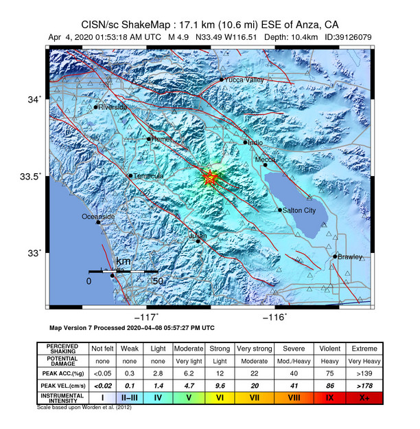
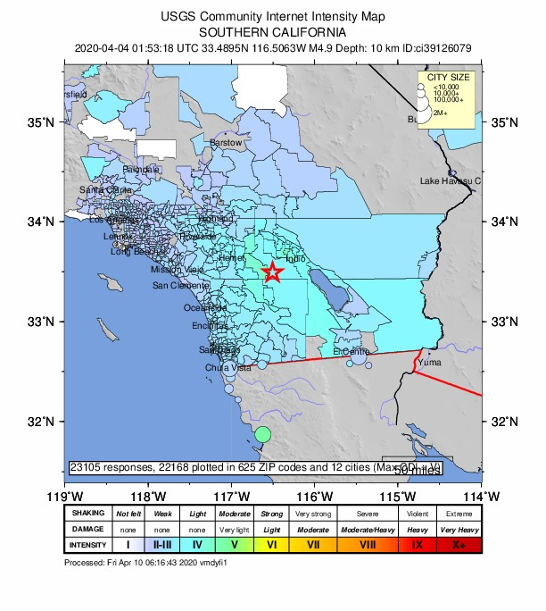
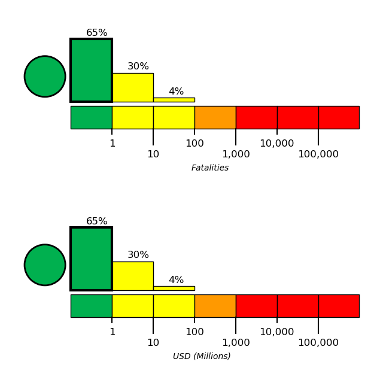
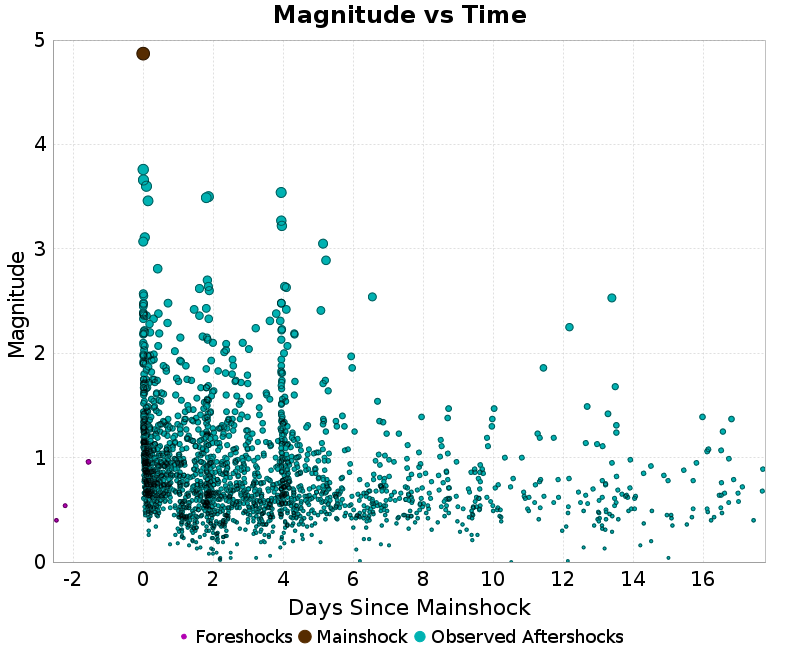
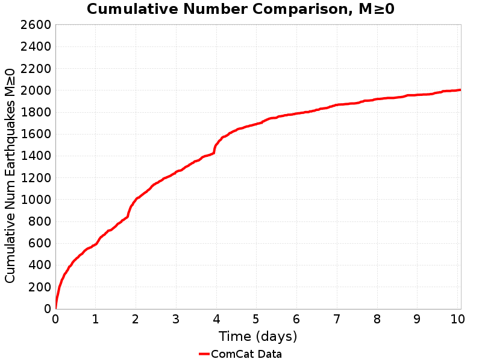
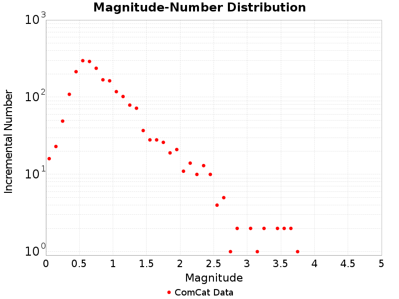
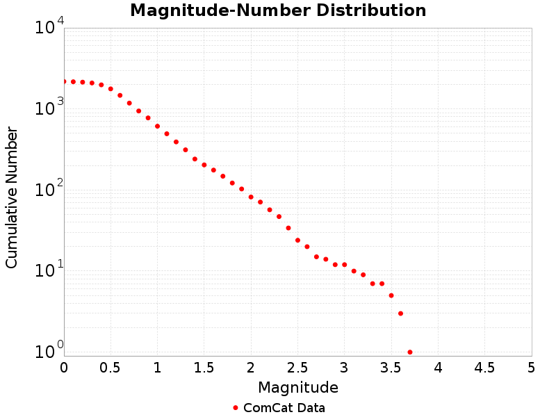

# 4.87, 17km ESE of Anza, CA

## Table Of Contents

* [Mainshock Details](#mainshock-details)
* [Sequence Details](#sequence-details)
  * [Magnitude vs Time Plot](#magnitude-vs-time-plot)
  * [Cumulative Number Plot](#cumulative-number-plot)
  * [Magnitude-Number Distributions](#magnitude-number-distributions)

## Mainshock Details
*[(top)](#table-of-contents)*

Information and plots in the section are taken from the [USGS event page](https://earthquake.usgs.gov/earthquakes/eventpage/ci39126079), accessed through ComCat.

| Field | Value |
|-----|-----|
| Magnitude | 4.87 (mw) |
| Time | Sat, 4 Apr 2020 01:53:18 UTC |
| Time (Local) | Fri, 3 Apr 2020 18:53:18 PDT |
| Location | 33.4895, -116.50633 |
| Depth | 10.45 km |
| Status | reviewed |

| [ShakeMap](https://earthquake.usgs.gov/earthquakes/eventpage/ci39126079/shakemap/) | [Did You Feel It?](https://earthquake.usgs.gov/earthquakes/eventpage/ci39126079/dyfi/) | [PAGER](https://earthquake.usgs.gov/earthquakes/eventpage/ci39126079/pager/) |
|-----|-----|-----|
|  |  |  |
## Sequence Details
*[(top)](#table-of-contents)*

These plots show the aftershock sequence. They were last updated at 2020/04/11 06:47:57 UTC, 7.2 days after the mainshock.

1874 M&ge;0 earthquakes within 10 km of the mainshock's epicenter.

|  | First Hour | First Day | First Week | To Date |
|-----|-----|-----|-----|-----|
| **M 0** | 104 | 590 | 1866 | 1874 |
| **M 1** | 88 | 255 | 573 | 573 |
| **M 2** | 22 | 38 | 85 | 85 |
| **M 3** | 3 | 6 | 12 | 12 |
### Magnitude vs Time Plot
*[(top)](#table-of-contents)*

This plot shows the magnitude vs time evolution of the sequence. The mainshock is ploted as brown a brown circle, foreshocks are plotted as green circles, and aftershocks are plotted as cyan circles.

### Cumulative Number Plot
*[(top)](#table-of-contents)*

This plot shows the cumulative number of M&ge;0 aftershocks as a function of time since the mainshock.

### Magnitude-Number Distributions
*[(top)](#table-of-contents)*

These plot shows the magnitude-number distrubtion of the aftershock sequence thus far. The left plot gives an incremental distribution (the count in each magnitude bin), and the right plot a cumulative distribution (the count in or above each magnitude bin). The y-axis is logarithmic.

| Incremental MND | Cumulative MND |
|-----|-----|
|  |  |

