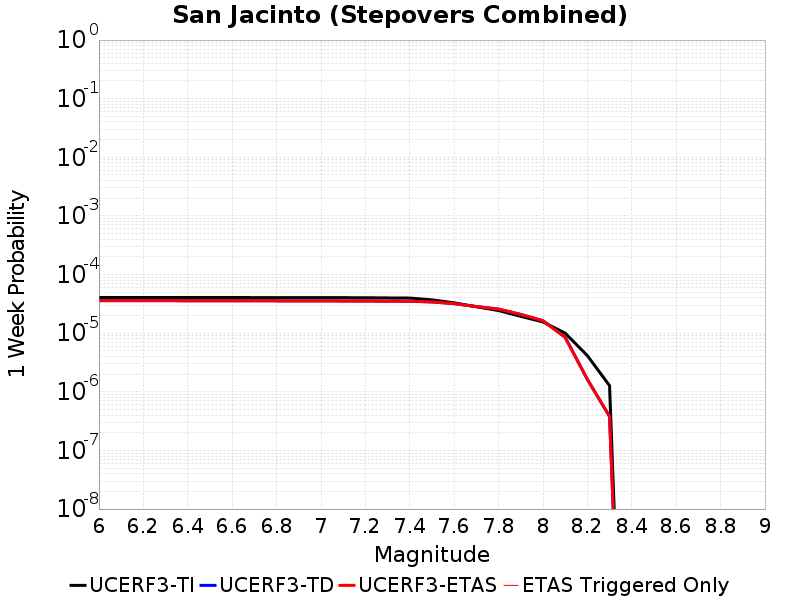
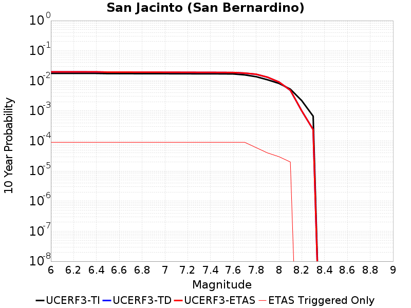
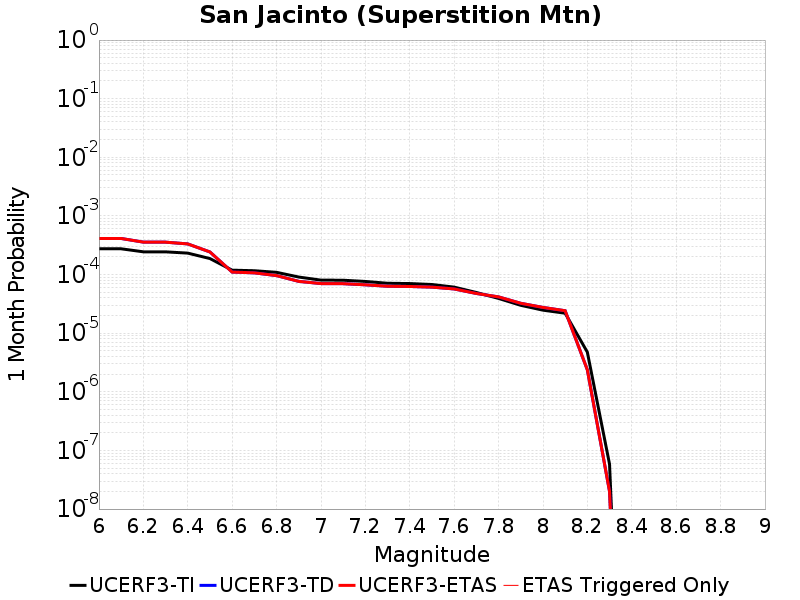
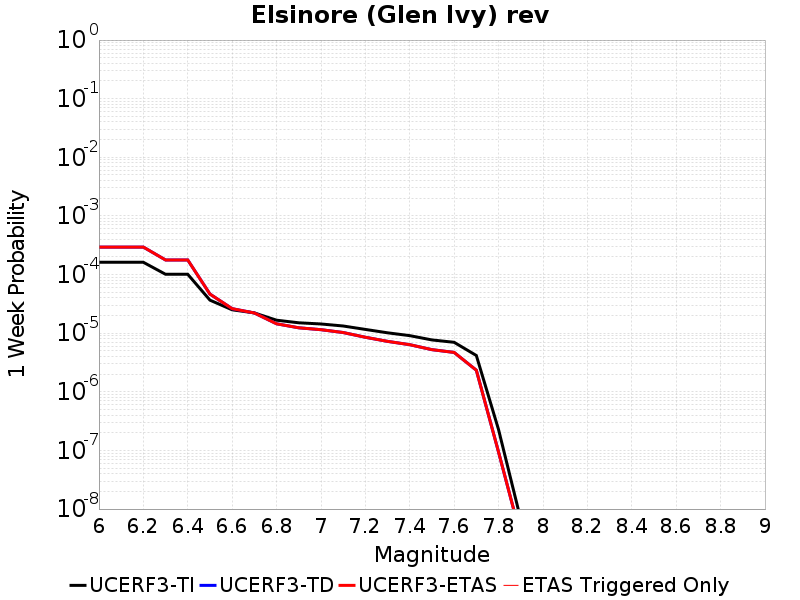

# Parent Section Magnitude-Probability Distributions

Only fault sections with at least one triggered aftershock are plotted. Sections are sorted by total supraseismogenic trigger rate (decreasing)

## Table Of Contents

* [San Jacinto (Anza) rev](#san-jacinto-anza-rev)
* [San Jacinto (Stepovers Combined)](#san-jacinto-stepovers-combined)
* [San Jacinto (Coyote Creek)](#san-jacinto-coyote-creek)
* [San Jacinto (San Bernardino)](#san-jacinto-san-bernardino)
* [San Jacinto (San Jacinto Valley) rev](#san-jacinto-san-jacinto-valley-rev)
* [San Andreas (Mojave S)](#san-andreas-mojave-s)
* [San Jacinto (Clark) rev](#san-jacinto-clark-rev)
* [San Andreas (San Bernardino N)](#san-andreas-san-bernardino-n)
* [San Jacinto (Borrego)](#san-jacinto-borrego)
* [San Jacinto (Superstition Mtn)](#san-jacinto-superstition-mtn)
* [San Andreas (Mojave N)](#san-andreas-mojave-n)
* [Superstition Hills](#superstition-hills)
* [San Andreas (Carrizo) rev](#san-andreas-carrizo-rev)
* [San Andreas (Big Bend)](#san-andreas-big-bend)
* [San Andreas (Coachella) rev](#san-andreas-coachella-rev)
* [Cucamonga](#cucamonga)
* [San Andreas (Cholame) rev](#san-andreas-cholame-rev)
* [Sierra Madre](#sierra-madre)
* [Sierra Madre (San Fernando)](#sierra-madre-san-fernando)
* [San Jacinto (Lytle Creek connector)](#san-jacinto-lytle-creek-connector)
* [Brawley (Seismic Zone) alt 1](#brawley-seismic-zone-alt-1)
* [San Andreas (Parkfield)](#san-andreas-parkfield)
* [San Andreas (San Gorgonio Pass-Garnet HIll)](#san-andreas-san-gorgonio-pass-garnet-hill)
* [Imperial](#imperial)
* [Elsinore (Glen Ivy) rev](#elsinore-glen-ivy-rev)
* [San Clemente](#san-clemente)
* [Laguna Salada](#laguna-salada)
* [Garlock (Central)](#garlock-central)
* [Garlock (East)](#garlock-east)
* [Raymond](#raymond)
* [Northridge Hills](#northridge-hills)
* [San Andreas (Creeping Section) 2011 CFM](#san-andreas-creeping-section-2011-cfm)
* [San Andreas (San Bernardino S)](#san-andreas-san-bernardino-s)
* [Garlock (West)](#garlock-west)
* [Holser alt 1](#holser-alt-1)

## San Jacinto (Anza) rev
*[(top)](#table-of-contents)*

| 1 Week | 1 Month | 1 Year | 10 Year |
|-----|-----|-----|-----|
|  |  |  |  |

| Magnitude | 1 wk TI Prob | 1 wk TD Prob | 1 wk ETAS Prob | 1 wk ETAS/TD Gain | 1 wk ETAS Triggered Only | 1 mo TI Prob | 1 mo TD Prob | 1 mo ETAS Prob | 1 mo ETAS/TD Gain | 1 mo ETAS Triggered Only | 1 yr TI Prob | 1 yr TD Prob | 1 yr ETAS Prob | 1 yr ETAS/TD Gain | 1 yr ETAS Triggered Only | 10 yr TI Prob | 10 yr TD Prob | 10 yr ETAS Prob | 10 yr ETAS/TD Gain | 10 yr ETAS Triggered Only |
|-----|-----|-----|-----|-----|-----|-----|-----|-----|-----|-----|-----|-----|-----|-----|-----|-----|-----|-----|-----|-----|
| 6.0 | 6.3015636E-5 | 4.4035587E-5 | 5.4035147E-5 | 1.227079 | 1.0E-5 | 2.7003905E-4 | 1.8871037E-4 | 1.9870848E-4 | 1.0529813 | 1.0E-5 | 0.0032827691 | 0.00229514 | 0.0023749564 | 1.0347762 | 8.0E-5 | 0.032346968 | 0.023671342 | 0.02387637 | 1.0086615 | 2.1E-4 |
| 6.1 | 6.3015636E-5 | 4.4035587E-5 | 5.4035147E-5 | 1.227079 | 1.0E-5 | 2.7003905E-4 | 1.8871037E-4 | 1.9870848E-4 | 1.0529813 | 1.0E-5 | 0.0032827691 | 0.00229514 | 0.0023749564 | 1.0347762 | 8.0E-5 | 0.032346968 | 0.023671342 | 0.02387637 | 1.0086615 | 2.1E-4 |
| 6.2 | 6.3015636E-5 | 4.4035587E-5 | 5.4035147E-5 | 1.227079 | 1.0E-5 | 2.7003905E-4 | 1.8871037E-4 | 1.9870848E-4 | 1.0529813 | 1.0E-5 | 0.0032827691 | 0.00229514 | 0.0023749564 | 1.0347762 | 8.0E-5 | 0.032346968 | 0.023671342 | 0.02387637 | 1.0086615 | 2.1E-4 |
| 6.3 | 6.3015636E-5 | 4.4035587E-5 | 5.4035147E-5 | 1.227079 | 1.0E-5 | 2.7003905E-4 | 1.8871037E-4 | 1.9870848E-4 | 1.0529813 | 1.0E-5 | 0.0032827691 | 0.00229514 | 0.0023749564 | 1.0347762 | 8.0E-5 | 0.032346968 | 0.023671342 | 0.02387637 | 1.0086615 | 2.1E-4 |
| 6.4 | 6.3015636E-5 | 4.4035587E-5 | 5.4035147E-5 | 1.227079 | 1.0E-5 | 2.7003905E-4 | 1.8871037E-4 | 1.9870848E-4 | 1.0529813 | 1.0E-5 | 0.0032827691 | 0.00229514 | 0.0023749564 | 1.0347762 | 8.0E-5 | 0.032346968 | 0.023671342 | 0.02387637 | 1.0086615 | 2.1E-4 |
| 6.5 | 5.811017E-5 | 4.0780807E-5 | 4.0780807E-5 | 1.0 | 0.0 | 2.4901982E-4 | 1.7476322E-4 | 1.7476322E-4 | 1.0 | 0.0 | 0.0030276014 | 0.0021256716 | 0.0021955227 | 1.0328608 | 7.0E-5 | 0.02986684 | 0.02195379 | 0.022100495 | 1.0066825 | 1.5E-4 |
| 6.6 | 5.811017E-5 | 4.0780807E-5 | 4.0780807E-5 | 1.0 | 0.0 | 2.4901982E-4 | 1.7476322E-4 | 1.7476322E-4 | 1.0 | 0.0 | 0.0030276014 | 0.0021256716 | 0.0021955227 | 1.0328608 | 7.0E-5 | 0.02986684 | 0.02195379 | 0.022100495 | 1.0066825 | 1.5E-4 |
| 6.7 | 5.712442E-5 | 4.019623E-5 | 4.019623E-5 | 1.0 | 0.0 | 2.4479596E-4 | 1.7225822E-4 | 1.7225822E-4 | 1.0 | 0.0 | 0.0029763177 | 0.0020952323 | 0.0021650856 | 1.0333391 | 7.0E-5 | 0.029367693 | 0.021640522 | 0.021787276 | 1.0067815 | 1.5E-4 |
| 6.8 | 5.6967532E-5 | 4.0051083E-5 | 4.0051083E-5 | 1.0 | 0.0 | 2.4412372E-4 | 1.7163623E-4 | 1.7163623E-4 | 1.0 | 0.0 | 0.0029681553 | 0.002087674 | 0.002157528 | 1.0334601 | 7.0E-5 | 0.029288229 | 0.021565437 | 0.021712203 | 1.0068055 | 1.5E-4 |
| 6.9 | 5.6211324E-5 | 3.9751427E-5 | 3.9751427E-5 | 1.0 | 0.0 | 2.4088343E-4 | 1.7035216E-4 | 1.7035216E-4 | 1.0 | 0.0 | 0.0029288116 | 0.0020720703 | 0.002131946 | 1.0288966 | 6.0E-5 | 0.028905109 | 0.021402542 | 0.021539545 | 1.0064013 | 1.4E-4 |
| 7.0 | 5.4383527E-5 | 3.8597012E-5 | 3.8597012E-5 | 1.0 | 0.0 | 2.3305144E-4 | 1.6540532E-4 | 1.6540532E-4 | 1.0 | 0.0 | 0.0028337094 | 0.0020119548 | 0.0020618541 | 1.0248015 | 5.0E-5 | 0.027978465 | 0.020787124 | 0.02091442 | 1.0061239 | 1.3E-4 |
| 7.1 | 5.1393665E-5 | 3.7037174E-5 | 3.7037174E-5 | 1.0 | 0.0 | 2.2023996E-4 | 1.5872112E-4 | 1.5872112E-4 | 1.0 | 0.0 | 0.0026781242 | 0.0019307212 | 0.0019806246 | 1.0258471 | 5.0E-5 | 0.026460782 | 0.019948108 | 0.020065716 | 1.0058956 | 1.2E-4 |
| 7.2 | 4.785222E-5 | 3.536401E-5 | 3.536401E-5 | 1.0 | 0.0 | 2.0506482E-4 | 1.5155126E-4 | 1.5155126E-4 | 1.0 | 0.0 | 0.0024938055 | 0.0018435786 | 0.0018835049 | 1.021657 | 4.0E-5 | 0.024660049 | 0.019053183 | 0.019161088 | 1.0056633 | 1.1E-4 |
| 7.3 | 4.2143256E-5 | 3.4440785E-5 | 3.4440785E-5 | 1.0 | 0.0 | 1.8060145E-4 | 1.4759504E-4 | 1.4759504E-4 | 1.0 | 0.0 | 0.002196605 | 0.001795492 | 0.0018354201 | 1.022238 | 4.0E-5 | 0.02175019 | 0.018552158 | 0.018660117 | 1.0058192 | 1.1E-4 |
| 7.4 | 4.0264713E-5 | 3.4073462E-5 | 3.4073462E-5 | 1.0 | 0.0 | 1.7255165E-4 | 1.4602096E-4 | 1.4602096E-4 | 1.0 | 0.0 | 0.002098792 | 0.001776359 | 0.001816288 | 1.022478 | 4.0E-5 | 0.020790804 | 0.01835386 | 0.018461842 | 1.0058833 | 1.1E-4 |
| 7.5 | 3.694492E-5 | 3.2773263E-5 | 3.2773263E-5 | 1.0 | 0.0 | 1.5832575E-4 | 1.404493E-4 | 1.404493E-4 | 1.0 | 0.0 | 0.0019259118 | 0.0017086322 | 0.0017485638 | 1.0233705 | 4.0E-5 | 0.01909306 | 0.017663 | 0.017761234 | 1.0055616 | 1.0E-4 |
| 7.6 | 3.200565E-5 | 3.0060806E-5 | 3.0060806E-5 | 1.0 | 0.0 | 1.3715986E-4 | 1.2882568E-4 | 1.2882568E-4 | 1.0 | 0.0 | 0.001668642 | 0.0015673265 | 0.0015972794 | 1.0191109 | 3.0E-5 | 0.01656168 | 0.016236873 | 0.016325412 | 1.005453 | 9.0E-5 |
| 7.7 | 2.731642E-5 | 2.663423E-5 | 2.663423E-5 | 1.0 | 0.0 | 1.1706512E-4 | 1.1414171E-4 | 1.1414171E-4 | 1.0 | 0.0 | 0.001424336 | 0.0013887906 | 0.0014187489 | 1.0215715 | 3.0E-5 | 0.014152412 | 0.014450027 | 0.014538727 | 1.0061383 | 9.0E-5 |
| 7.8 | 2.3466424E-5 | 2.4023006E-5 | 2.4023006E-5 | 1.0 | 0.0 | 1.0056651E-4 | 1.0295168E-4 | 1.0295168E-4 | 1.0 | 0.0 | 0.0012237094 | 0.0012527169 | 0.0012726918 | 1.0159453 | 2.0E-5 | 0.012169928 | 0.013080105 | 0.013139321 | 1.0045271 | 6.0E-5 |
| 7.9 | 1.8611925E-5 | 1.936964E-5 | 1.936964E-5 | 1.0 | 0.0 | 7.9762955E-5 | 8.3010105E-5 | 8.3010105E-5 | 1.0 | 0.0 | 9.7068126E-4 | 0.0010101802 | 0.00102017 | 1.0098892 | 1.0E-5 | 0.0096645225 | 0.010636372 | 0.010675946 | 1.0037206 | 4.0E-5 |
| 8.0 | 1.5460775E-5 | 1.6150332E-5 | 1.6150332E-5 | 1.0 | 0.0 | 6.6258784E-5 | 6.921388E-5 | 6.921388E-5 | 1.0 | 0.0 | 8.0640207E-4 | 8.423539E-4 | 8.523455E-4 | 1.0118614 | 1.0E-5 | 0.008034821 | 0.00891881 | 0.008948542 | 1.0033337 | 3.0E-5 |
| 8.1 | 9.983884E-6 | 8.5109805E-6 | 8.5109805E-6 | 1.0 | 0.0 | 4.2787375E-5 | 3.6475125E-5 | 3.6475125E-5 | 1.0 | 0.0 | 5.2081177E-4 | 4.439947E-4 | 4.5399024E-4 | 1.0225128 | 1.0E-5 | 0.0051959283 | 0.004769881 | 0.004789785 | 1.0041729 | 2.0E-5 |
| 8.2 | 4.1226E-6 | 1.6226534E-6 | 1.6226534E-6 | 1.0 | 0.0 | 1.7668166E-5 | 6.95421E-6 | 6.95421E-6 | 1.0 | 0.0 | 2.1508869E-4 | 8.466425E-5 | 8.466425E-5 | 1.0 | 0.0 | 0.0021488064 | 9.803338E-4 | 9.803338E-4 | 1.0 | 0.0 |
| 8.3 | 1.2750878E-6 | 3.7994337E-7 | 3.7994337E-7 | 1.0 | 0.0 | 5.4646503E-6 | 1.6283278E-6 | 1.6283278E-6 | 1.0 | 0.0 | 6.653009E-5 | 1.9824716E-5 | 1.9824716E-5 | 1.0 | 0.0 | 6.6510175E-4 | 2.383506E-4 | 2.383506E-4 | 1.0 | 0.0 |

## San Jacinto (Stepovers Combined)
*[(top)](#table-of-contents)*

| 1 Week | 1 Month | 1 Year | 10 Year |
|-----|-----|-----|-----|
|  |  |  |  |

| Magnitude | 1 wk TI Prob | 1 wk TD Prob | 1 wk ETAS Prob | 1 wk ETAS/TD Gain | 1 wk ETAS Triggered Only | 1 mo TI Prob | 1 mo TD Prob | 1 mo ETAS Prob | 1 mo ETAS/TD Gain | 1 mo ETAS Triggered Only | 1 yr TI Prob | 1 yr TD Prob | 1 yr ETAS Prob | 1 yr ETAS/TD Gain | 1 yr ETAS Triggered Only | 10 yr TI Prob | 10 yr TD Prob | 10 yr ETAS Prob | 10 yr ETAS/TD Gain | 10 yr ETAS Triggered Only |
|-----|-----|-----|-----|-----|-----|-----|-----|-----|-----|-----|-----|-----|-----|-----|-----|-----|-----|-----|-----|-----|
| 6.0 | 4.0667746E-5 | 3.5906836E-5 | 3.5906836E-5 | 1.0 | 0.0 | 1.742787E-4 | 1.5387736E-4 | 1.5387736E-4 | 1.0 | 0.0 | 0.0021197782 | 0.0018718482 | 0.0019117733 | 1.0213293 | 4.0E-5 | 0.020996714 | 0.019315898 | 0.019423774 | 1.0055848 | 1.1E-4 |
| 6.1 | 4.0667746E-5 | 3.5906836E-5 | 3.5906836E-5 | 1.0 | 0.0 | 1.742787E-4 | 1.5387736E-4 | 1.5387736E-4 | 1.0 | 0.0 | 0.0021197782 | 0.0018718482 | 0.0019117733 | 1.0213293 | 4.0E-5 | 0.020996714 | 0.019315898 | 0.019423774 | 1.0055848 | 1.1E-4 |
| 6.2 | 4.0667746E-5 | 3.5906836E-5 | 3.5906836E-5 | 1.0 | 0.0 | 1.742787E-4 | 1.5387736E-4 | 1.5387736E-4 | 1.0 | 0.0 | 0.0021197782 | 0.0018718482 | 0.0019117733 | 1.0213293 | 4.0E-5 | 0.020996714 | 0.019315898 | 0.019423774 | 1.0055848 | 1.1E-4 |
| 6.3 | 4.0667746E-5 | 3.5906836E-5 | 3.5906836E-5 | 1.0 | 0.0 | 1.742787E-4 | 1.5387736E-4 | 1.5387736E-4 | 1.0 | 0.0 | 0.0021197782 | 0.0018718482 | 0.0019117733 | 1.0213293 | 4.0E-5 | 0.020996714 | 0.019315898 | 0.019423774 | 1.0055848 | 1.1E-4 |
| 6.4 | 4.0577226E-5 | 3.5778492E-5 | 3.5778492E-5 | 1.0 | 0.0 | 1.738908E-4 | 1.5332739E-4 | 1.5332739E-4 | 1.0 | 0.0 | 0.0021150648 | 0.0018651651 | 0.0019050904 | 1.0214058 | 4.0E-5 | 0.020950472 | 0.019250363 | 0.019358246 | 1.0056041 | 1.1E-4 |
| 6.5 | 4.0577226E-5 | 3.5778492E-5 | 3.5778492E-5 | 1.0 | 0.0 | 1.738908E-4 | 1.5332739E-4 | 1.5332739E-4 | 1.0 | 0.0 | 0.0021150648 | 0.0018651651 | 0.0019050904 | 1.0214058 | 4.0E-5 | 0.020950472 | 0.019250363 | 0.019358246 | 1.0056041 | 1.1E-4 |
| 6.6 | 4.053861E-5 | 3.5723722E-5 | 3.5723722E-5 | 1.0 | 0.0 | 1.7372532E-4 | 1.5309271E-4 | 1.5309271E-4 | 1.0 | 0.0 | 0.0021130538 | 0.0018623131 | 0.0019022387 | 1.0214387 | 4.0E-5 | 0.020930743 | 0.019222395 | 0.019330282 | 1.0056125 | 1.1E-4 |
| 6.7 | 4.0516545E-5 | 3.5692738E-5 | 3.5692738E-5 | 1.0 | 0.0 | 1.7363077E-4 | 1.5295992E-4 | 1.5295992E-4 | 1.0 | 0.0 | 0.002111905 | 0.0018606996 | 0.0019006252 | 1.0214573 | 4.0E-5 | 0.020919468 | 0.019206567 | 0.019314455 | 1.0056173 | 1.1E-4 |
| 6.8 | 4.049434E-5 | 3.5664132E-5 | 3.5664132E-5 | 1.0 | 0.0 | 1.7353562E-4 | 1.5283734E-4 | 1.5283734E-4 | 1.0 | 0.0 | 0.0021107488 | 0.0018592096 | 0.0018991353 | 1.0214745 | 4.0E-5 | 0.020908125 | 0.019191898 | 0.019299788 | 1.0056216 | 1.1E-4 |
| 6.9 | 4.046386E-5 | 3.5626534E-5 | 3.5626534E-5 | 1.0 | 0.0 | 1.73405E-4 | 1.5267624E-4 | 1.5267624E-4 | 1.0 | 0.0 | 0.0021091616 | 0.0018572515 | 0.0018971772 | 1.0214972 | 4.0E-5 | 0.020892553 | 0.019172598 | 0.019280488 | 1.0056274 | 1.1E-4 |
| 7.0 | 4.036382E-5 | 3.550657E-5 | 3.550657E-5 | 1.0 | 0.0 | 1.7297632E-4 | 1.5216217E-4 | 1.5216217E-4 | 1.0 | 0.0 | 0.0021039525 | 0.0018510036 | 0.0018909295 | 1.0215698 | 4.0E-5 | 0.02084144 | 0.019110959 | 0.019218856 | 1.0056459 | 1.1E-4 |
| 7.1 | 4.0343282E-5 | 3.548495E-5 | 3.548495E-5 | 1.0 | 0.0 | 1.7288832E-4 | 1.5206951E-4 | 1.5206951E-4 | 1.0 | 0.0 | 0.002102883 | 0.0018498773 | 0.0018898033 | 1.0215831 | 4.0E-5 | 0.020830948 | 0.019099802 | 0.019207701 | 1.0056492 | 1.1E-4 |
| 7.2 | 4.0257353E-5 | 3.5389086E-5 | 3.5389086E-5 | 1.0 | 0.0 | 1.725201E-4 | 1.516587E-4 | 1.516587E-4 | 1.0 | 0.0 | 0.0020984085 | 0.0018448844 | 0.0018848106 | 1.0216416 | 4.0E-5 | 0.020787042 | 0.01905037 | 0.019158276 | 1.0056641 | 1.1E-4 |
| 7.3 | 3.9940667E-5 | 3.5214198E-5 | 3.5214198E-5 | 1.0 | 0.0 | 1.7116306E-4 | 1.5090928E-4 | 1.5090928E-4 | 1.0 | 0.0 | 0.0020819185 | 0.0018357754 | 0.0018757021 | 1.0217491 | 4.0E-5 | 0.020625217 | 0.018957688 | 0.019065604 | 1.0056924 | 1.1E-4 |
| 7.4 | 3.9721202E-5 | 3.509835E-5 | 3.509835E-5 | 1.0 | 0.0 | 1.7022261E-4 | 1.5041284E-4 | 1.5041284E-4 | 1.0 | 0.0 | 0.0020704903 | 0.0018297415 | 0.0018696684 | 1.021821 | 4.0E-5 | 0.020513052 | 0.018896174 | 0.019004095 | 1.0057113 | 1.1E-4 |
| 7.5 | 3.7036873E-5 | 3.4153654E-5 | 3.4153654E-5 | 1.0 | 0.0 | 1.5871979E-4 | 1.463646E-4 | 1.463646E-4 | 1.0 | 0.0 | 0.0019307006 | 0.0017805357 | 0.0018204645 | 1.0224252 | 4.0E-5 | 0.019140124 | 0.01839146 | 0.018489622 | 1.0053374 | 1.0E-4 |
| 7.6 | 3.2940967E-5 | 3.1909207E-5 | 3.1909207E-5 | 1.0 | 0.0 | 1.4116794E-4 | 1.3674659E-4 | 1.3674659E-4 | 1.0 | 0.0 | 0.0017173645 | 0.0016636206 | 0.0016935706 | 1.018003 | 3.0E-5 | 0.01704153 | 0.0172116 | 0.01730005 | 1.005139 | 9.0E-5 |
| 7.7 | 2.8236149E-5 | 2.8459763E-5 | 2.8459763E-5 | 1.0 | 0.0 | 1.2100645E-4 | 1.2196472E-4 | 1.2196472E-4 | 1.0 | 0.0 | 0.0014722579 | 0.00148391 | 0.0015138655 | 1.0201869 | 3.0E-5 | 0.014625421 | 0.015414788 | 0.015503401 | 1.0057485 | 9.0E-5 |
| 7.8 | 2.4329287E-5 | 2.5759196E-5 | 2.5759196E-5 | 1.0 | 0.0 | 1.042642E-4 | 1.1039189E-4 | 1.1039189E-4 | 1.0 | 0.0 | 0.0012686774 | 0.0013431936 | 0.0013631666 | 1.0148699 | 2.0E-5 | 0.012614589 | 0.013999854 | 0.014059015 | 1.0042257 | 6.0E-5 |
| 7.9 | 1.9370926E-5 | 2.0913272E-5 | 2.0913272E-5 | 1.0 | 0.0 | 8.301561E-5 | 8.962523E-5 | 8.962523E-5 | 1.0 | 0.0 | 0.0010102465 | 0.0010906418 | 0.0011006308 | 1.009159 | 1.0E-5 | 0.0100566605 | 0.0114567885 | 0.011496331 | 1.0034513 | 4.0E-5 |
| 8.0 | 1.5583017E-5 | 1.6299235E-5 | 1.6299235E-5 | 1.0 | 0.0 | 6.6782646E-5 | 6.9852E-5 | 6.9852E-5 | 1.0 | 0.0 | 8.127754E-4 | 8.50117E-4 | 8.6010847E-4 | 1.0117531 | 1.0E-5 | 0.008098091 | 0.00899949 | 0.00902922 | 1.0033035 | 3.0E-5 |
| 8.1 | 1.0024873E-5 | 8.53443E-6 | 8.53443E-6 | 1.0 | 0.0 | 4.2963035E-5 | 3.6575617E-5 | 3.6575617E-5 | 1.0 | 0.0 | 5.229494E-4 | 4.452177E-4 | 4.5521325E-4 | 1.0224509 | 1.0E-5 | 0.0052172043 | 0.0047838236 | 0.004803728 | 1.0041608 | 2.0E-5 |
| 8.2 | 4.142796E-6 | 1.6310777E-6 | 1.6310777E-6 | 1.0 | 0.0 | 1.775472E-5 | 6.990314E-6 | 6.990314E-6 | 1.0 | 0.0 | 2.1614227E-4 | 8.5103784E-5 | 8.5103784E-5 | 1.0 | 0.0 | 0.0021593217 | 9.855258E-4 | 9.855258E-4 | 1.0 | 0.0 |
| 8.3 | 1.2750878E-6 | 3.7994337E-7 | 3.7994337E-7 | 1.0 | 0.0 | 5.4646503E-6 | 1.6283278E-6 | 1.6283278E-6 | 1.0 | 0.0 | 6.653009E-5 | 1.9824716E-5 | 1.9824716E-5 | 1.0 | 0.0 | 6.6510175E-4 | 2.383506E-4 | 2.383506E-4 | 1.0 | 0.0 |

## San Jacinto (Coyote Creek)
*[(top)](#table-of-contents)*

| 1 Week | 1 Month | 1 Year | 10 Year |
|-----|-----|-----|-----|
|  |  |  |  |

| Magnitude | 1 wk TI Prob | 1 wk TD Prob | 1 wk ETAS Prob | 1 wk ETAS/TD Gain | 1 wk ETAS Triggered Only | 1 mo TI Prob | 1 mo TD Prob | 1 mo ETAS Prob | 1 mo ETAS/TD Gain | 1 mo ETAS Triggered Only | 1 yr TI Prob | 1 yr TD Prob | 1 yr ETAS Prob | 1 yr ETAS/TD Gain | 1 yr ETAS Triggered Only | 10 yr TI Prob | 10 yr TD Prob | 10 yr ETAS Prob | 10 yr ETAS/TD Gain | 10 yr ETAS Triggered Only |
|-----|-----|-----|-----|-----|-----|-----|-----|-----|-----|-----|-----|-----|-----|-----|-----|-----|-----|-----|-----|-----|
| 6.0 | 2.7374346E-5 | 2.4511995E-5 | 2.4511995E-5 | 1.0 | 0.0 | 1.1731335E-4 | 1.050472E-4 | 1.050472E-4 | 1.0 | 0.0 | 0.0014273542 | 0.0012782019 | 0.0013181508 | 1.0312539 | 4.0E-5 | 0.01418221 | 0.013119824 | 0.0132086435 | 1.0067699 | 9.0E-5 |
| 6.1 | 2.7374346E-5 | 2.4511995E-5 | 2.4511995E-5 | 1.0 | 0.0 | 1.1731335E-4 | 1.050472E-4 | 1.050472E-4 | 1.0 | 0.0 | 0.0014273542 | 0.0012782019 | 0.0013181508 | 1.0312539 | 4.0E-5 | 0.01418221 | 0.013119824 | 0.0132086435 | 1.0067699 | 9.0E-5 |
| 6.2 | 2.7374346E-5 | 2.4511995E-5 | 2.4511995E-5 | 1.0 | 0.0 | 1.1731335E-4 | 1.050472E-4 | 1.050472E-4 | 1.0 | 0.0 | 0.0014273542 | 0.0012782019 | 0.0013181508 | 1.0312539 | 4.0E-5 | 0.01418221 | 0.013119824 | 0.0132086435 | 1.0067699 | 9.0E-5 |
| 6.3 | 2.7374346E-5 | 2.4511995E-5 | 2.4511995E-5 | 1.0 | 0.0 | 1.1731335E-4 | 1.050472E-4 | 1.050472E-4 | 1.0 | 0.0 | 0.0014273542 | 0.0012782019 | 0.0013181508 | 1.0312539 | 4.0E-5 | 0.01418221 | 0.013119824 | 0.0132086435 | 1.0067699 | 9.0E-5 |
| 6.4 | 2.7374346E-5 | 2.4511995E-5 | 2.4511995E-5 | 1.0 | 0.0 | 1.1731335E-4 | 1.050472E-4 | 1.050472E-4 | 1.0 | 0.0 | 0.0014273542 | 0.0012782019 | 0.0013181508 | 1.0312539 | 4.0E-5 | 0.01418221 | 0.013119824 | 0.0132086435 | 1.0067699 | 9.0E-5 |
| 6.5 | 2.7282445E-5 | 2.4397928E-5 | 2.4397928E-5 | 1.0 | 0.0 | 1.16919524E-4 | 1.0455838E-4 | 1.0455838E-4 | 1.0 | 0.0 | 0.0014225657 | 0.0012722575 | 0.0013122066 | 1.0314002 | 4.0E-5 | 0.014134934 | 0.0130610885 | 0.0131499125 | 1.0068007 | 9.0E-5 |
| 6.6 | 2.7282445E-5 | 2.4397928E-5 | 2.4397928E-5 | 1.0 | 0.0 | 1.16919524E-4 | 1.0455838E-4 | 1.0455838E-4 | 1.0 | 0.0 | 0.0014225657 | 0.0012722575 | 0.0013122066 | 1.0314002 | 4.0E-5 | 0.014134934 | 0.0130610885 | 0.0131499125 | 1.0068007 | 9.0E-5 |
| 6.7 | 2.7216198E-5 | 2.4322953E-5 | 2.4322953E-5 | 1.0 | 0.0 | 1.1663563E-4 | 1.0423708E-4 | 1.0423708E-4 | 1.0 | 0.0 | 0.0014191137 | 0.0012683503 | 0.0013082996 | 1.031497 | 4.0E-5 | 0.014100855 | 0.013022455 | 0.013111284 | 1.0068212 | 9.0E-5 |
| 6.8 | 2.7078617E-5 | 2.4239976E-5 | 2.4239976E-5 | 1.0 | 0.0 | 1.1604605E-4 | 1.03881495E-4 | 1.03881495E-4 | 1.0 | 0.0 | 0.001411945 | 0.0012640262 | 0.0013039756 | 1.0316049 | 4.0E-5 | 0.014030075 | 0.012979501 | 0.013068333 | 1.006844 | 9.0E-5 |
| 6.9 | 2.6982952E-5 | 2.4159286E-5 | 2.4159286E-5 | 1.0 | 0.0 | 1.15636096E-4 | 1.03535705E-4 | 1.03535705E-4 | 1.0 | 0.0 | 0.0014069602 | 0.001259821 | 0.0012897832 | 1.0237828 | 3.0E-5 | 0.013980856 | 0.0129377 | 0.013016665 | 1.0061035 | 8.0E-5 |
| 7.0 | 2.6449972E-5 | 2.3735549E-5 | 2.3735549E-5 | 1.0 | 0.0 | 1.1335209E-4 | 1.0171982E-4 | 1.0171982E-4 | 1.0 | 0.0 | 0.001379188 | 0.001237738 | 0.0012677008 | 1.0242077 | 3.0E-5 | 0.0137065975 | 0.012718721 | 0.012797704 | 1.00621 | 8.0E-5 |
| 7.1 | 2.6257849E-5 | 2.3561242E-5 | 2.3561242E-5 | 1.0 | 0.0 | 1.1252879E-4 | 1.0097286E-4 | 1.0097286E-4 | 1.0 | 0.0 | 0.0013691769 | 0.001228654 | 0.001258617 | 1.024387 | 3.0E-5 | 0.013607717 | 0.012628398 | 0.012707388 | 1.0062549 | 8.0E-5 |
| 7.2 | 2.5270041E-5 | 2.2753584E-5 | 2.2753584E-5 | 1.0 | 0.0 | 1.0829568E-4 | 9.751172E-5 | 9.751172E-5 | 1.0 | 0.0 | 0.0013177024 | 0.0011865611 | 0.0012165254 | 1.0252532 | 3.0E-5 | 0.013099162 | 0.012208221 | 0.012287244 | 1.006473 | 8.0E-5 |
| 7.3 | 2.339701E-5 | 2.14809E-5 | 2.14809E-5 | 1.0 | 0.0 | 1.0026905E-4 | 9.2057766E-5 | 9.2057766E-5 | 1.0 | 0.0 | 0.001220092 | 0.0011202291 | 0.0011501956 | 1.0267502 | 3.0E-5 | 0.012134149 | 0.011545058 | 0.011624135 | 1.0068494 | 8.0E-5 |
| 7.4 | 2.296333E-5 | 2.1210102E-5 | 2.1210102E-5 | 1.0 | 0.0 | 9.841056E-5 | 9.089729E-5 | 9.089729E-5 | 1.0 | 0.0 | 0.0011974899 | 0.0011061147 | 0.0011360815 | 1.027092 | 3.0E-5 | 0.011910575 | 0.011403587 | 0.011482675 | 1.0069354 | 8.0E-5 |
| 7.5 | 2.2188895E-5 | 2.0729598E-5 | 2.0729598E-5 | 1.0 | 0.0 | 9.50918E-5 | 8.883812E-5 | 8.883812E-5 | 1.0 | 0.0 | 0.0011571277 | 0.0010810695 | 0.0011110371 | 1.0277203 | 3.0E-5 | 0.011511209 | 0.011151463 | 0.01123057 | 1.0070939 | 8.0E-5 |
| 7.6 | 2.0013189E-5 | 1.9303834E-5 | 1.9303834E-5 | 1.0 | 0.0 | 8.5767984E-5 | 8.2728104E-5 | 8.2728104E-5 | 1.0 | 0.0 | 0.001043725 | 0.0010067511 | 0.0010267309 | 1.0198458 | 2.0E-5 | 0.010388365 | 0.010403389 | 0.010472661 | 1.0066586 | 7.0E-5 |
| 7.7 | 1.7230794E-5 | 1.7076178E-5 | 1.7076178E-5 | 1.0 | 0.0 | 7.384417E-5 | 7.3181574E-5 | 7.3181574E-5 | 1.0 | 0.0 | 8.986819E-4 | 8.906223E-4 | 9.106045E-4 | 1.0224363 | 2.0E-5 | 0.008950562 | 0.009237292 | 0.009306646 | 1.0075079 | 7.0E-5 |
| 7.8 | 1.4478809E-5 | 1.5310288E-5 | 1.5310288E-5 | 1.0 | 0.0 | 6.205057E-5 | 6.561387E-5 | 6.561387E-5 | 1.0 | 0.0 | 7.552038E-4 | 7.985568E-4 | 8.085488E-4 | 1.0125126 | 1.0E-5 | 0.0075264242 | 0.008308868 | 0.008348535 | 1.0047741 | 4.0E-5 |
| 7.9 | 1.1114467E-5 | 1.1923671E-5 | 1.1923671E-5 | 1.0 | 0.0 | 4.7632562E-5 | 5.110045E-5 | 5.110045E-5 | 1.0 | 0.0 | 5.797721E-4 | 6.21971E-4 | 6.3196477E-4 | 1.0160679 | 1.0E-5 | 0.0057826187 | 0.006527065 | 0.006556869 | 1.0045662 | 3.0E-5 |
| 8.0 | 9.327402E-6 | 1.0151092E-5 | 1.0151092E-5 | 1.0 | 0.0 | 3.9973966E-5 | 4.3503962E-5 | 4.3503962E-5 | 1.0 | 0.0 | 4.8657437E-4 | 5.2953255E-4 | 5.395273E-4 | 1.0188745 | 1.0E-5 | 0.0048551033 | 0.005582901 | 0.005612734 | 1.0053436 | 3.0E-5 |
| 8.1 | 7.0235833E-6 | 7.012114E-6 | 7.012114E-6 | 1.0 | 0.0 | 3.0100724E-5 | 3.0051573E-5 | 3.0051573E-5 | 1.0 | 0.0 | 3.664147E-4 | 3.6581702E-4 | 3.7581337E-4 | 1.0273261 | 1.0E-5 | 0.003658111 | 0.0038859264 | 0.0039058486 | 1.0051268 | 2.0E-5 |
| 8.2 | 2.0358202E-6 | 9.3717813E-7 | 9.3717813E-7 | 1.0 | 0.0 | 8.724915E-6 | 4.016472E-6 | 4.016472E-6 | 1.0 | 0.0 | 1.06220665E-4 | 4.889947E-5 | 4.889947E-5 | 1.0 | 0.0 | 0.001061699 | 5.538053E-4 | 5.538053E-4 | 1.0 | 0.0 |
| 8.3 | 2.0051264E-7 | 6.9638396E-8 | 6.9638396E-8 | 1.0 | 0.0 | 8.5933965E-7 | 2.9845023E-7 | 2.9845023E-7 | 1.0 | 0.0 | 1.046241E-5 | 3.633626E-6 | 3.633626E-6 | 1.0 | 0.0 | 1.0461917E-4 | 4.213717E-5 | 4.213717E-5 | 1.0 | 0.0 |

## San Jacinto (San Bernardino)
*[(top)](#table-of-contents)*

| 1 Week | 1 Month | 1 Year | 10 Year |
|-----|-----|-----|-----|
|  |  |  |  |

| Magnitude | 1 wk TI Prob | 1 wk TD Prob | 1 wk ETAS Prob | 1 wk ETAS/TD Gain | 1 wk ETAS Triggered Only | 1 mo TI Prob | 1 mo TD Prob | 1 mo ETAS Prob | 1 mo ETAS/TD Gain | 1 mo ETAS Triggered Only | 1 yr TI Prob | 1 yr TD Prob | 1 yr ETAS Prob | 1 yr ETAS/TD Gain | 1 yr ETAS Triggered Only | 10 yr TI Prob | 10 yr TD Prob | 10 yr ETAS Prob | 10 yr ETAS/TD Gain | 10 yr ETAS Triggered Only |
|-----|-----|-----|-----|-----|-----|-----|-----|-----|-----|-----|-----|-----|-----|-----|-----|-----|-----|-----|-----|-----|
| 6.0 | 3.409352E-5 | 3.666696E-5 | 3.666696E-5 | 1.0 | 0.0 | 1.461069E-4 | 1.5713467E-4 | 1.5713467E-4 | 1.0 | 0.0 | 0.0017774 | 0.0019114374 | 0.0019413801 | 1.015665 | 3.0E-5 | 0.01763251 | 0.019698415 | 0.019786643 | 1.0044789 | 9.0E-5 |
| 6.1 | 3.409352E-5 | 3.666696E-5 | 3.666696E-5 | 1.0 | 0.0 | 1.461069E-4 | 1.5713467E-4 | 1.5713467E-4 | 1.0 | 0.0 | 0.0017774 | 0.0019114374 | 0.0019413801 | 1.015665 | 3.0E-5 | 0.01763251 | 0.019698415 | 0.019786643 | 1.0044789 | 9.0E-5 |
| 6.2 | 3.409352E-5 | 3.666696E-5 | 3.666696E-5 | 1.0 | 0.0 | 1.461069E-4 | 1.5713467E-4 | 1.5713467E-4 | 1.0 | 0.0 | 0.0017774 | 0.0019114374 | 0.0019413801 | 1.015665 | 3.0E-5 | 0.01763251 | 0.019698415 | 0.019786643 | 1.0044789 | 9.0E-5 |
| 6.3 | 3.409352E-5 | 3.666696E-5 | 3.666696E-5 | 1.0 | 0.0 | 1.461069E-4 | 1.5713467E-4 | 1.5713467E-4 | 1.0 | 0.0 | 0.0017774 | 0.0019114374 | 0.0019413801 | 1.015665 | 3.0E-5 | 0.01763251 | 0.019698415 | 0.019786643 | 1.0044789 | 9.0E-5 |
| 6.4 | 3.400795E-5 | 3.655948E-5 | 3.655948E-5 | 1.0 | 0.0 | 1.4574021E-4 | 1.5667408E-4 | 1.5667408E-4 | 1.0 | 0.0 | 0.0017729428 | 0.0019058398 | 0.0019357826 | 1.0157111 | 3.0E-5 | 0.017588645 | 0.019643443 | 0.019731674 | 1.0044917 | 9.0E-5 |
| 6.5 | 3.341482E-5 | 3.5819143E-5 | 3.5819143E-5 | 1.0 | 0.0 | 1.4319851E-4 | 1.5350158E-4 | 1.5350158E-4 | 1.0 | 0.0 | 0.0017420477 | 0.0018672812 | 0.0018972252 | 1.0160362 | 3.0E-5 | 0.017284546 | 0.019264625 | 0.01935289 | 1.0045818 | 9.0E-5 |
| 6.6 | 3.3364955E-5 | 3.5756275E-5 | 3.5756275E-5 | 1.0 | 0.0 | 1.4298483E-4 | 1.5323218E-4 | 1.5323218E-4 | 1.0 | 0.0 | 0.0017394501 | 0.0018640069 | 0.001893951 | 1.0160644 | 3.0E-5 | 0.017258976 | 0.019232458 | 0.019320726 | 1.0045896 | 9.0E-5 |
| 6.7 | 3.335922E-5 | 3.5746034E-5 | 3.5746034E-5 | 1.0 | 0.0 | 1.4296026E-4 | 1.531883E-4 | 1.531883E-4 | 1.0 | 0.0 | 0.0017391514 | 0.0018634736 | 0.0018934177 | 1.0160689 | 3.0E-5 | 0.017256035 | 0.019227244 | 0.019315515 | 1.0045909 | 9.0E-5 |
| 6.8 | 3.327683E-5 | 3.5639943E-5 | 3.5639943E-5 | 1.0 | 0.0 | 1.4260718E-4 | 1.5273369E-4 | 1.5273369E-4 | 1.0 | 0.0 | 0.0017348597 | 0.001857948 | 0.0018878924 | 1.0161169 | 3.0E-5 | 0.017213784 | 0.019172957 | 0.019261232 | 1.0046041 | 9.0E-5 |
| 6.9 | 3.3235785E-5 | 3.55808E-5 | 3.55808E-5 | 1.0 | 0.0 | 1.4243131E-4 | 1.5248024E-4 | 1.5248024E-4 | 1.0 | 0.0 | 0.0017327217 | 0.0018548677 | 0.001884812 | 1.0161437 | 3.0E-5 | 0.017192734 | 0.019142788 | 0.019231064 | 1.0046115 | 9.0E-5 |
| 7.0 | 3.3197095E-5 | 3.5520618E-5 | 3.5520618E-5 | 1.0 | 0.0 | 1.422655E-4 | 1.5222235E-4 | 1.5222235E-4 | 1.0 | 0.0 | 0.0017307063 | 0.0018517331 | 0.0018816775 | 1.0161711 | 3.0E-5 | 0.017172894 | 0.019112118 | 0.019200398 | 1.004619 | 9.0E-5 |
| 7.1 | 3.3129716E-5 | 3.540057E-5 | 3.540057E-5 | 1.0 | 0.0 | 1.4197677E-4 | 1.5170792E-4 | 1.5170792E-4 | 1.0 | 0.0 | 0.0017271966 | 0.0018454808 | 0.0018754253 | 1.0162259 | 3.0E-5 | 0.017138338 | 0.019051094 | 0.01913938 | 1.0046341 | 9.0E-5 |
| 7.2 | 3.3034008E-5 | 3.5267796E-5 | 3.5267796E-5 | 1.0 | 0.0 | 1.4156665E-4 | 1.5113896E-4 | 1.5113896E-4 | 1.0 | 0.0 | 0.0017222111 | 0.0018385652 | 0.00186851 | 1.0162871 | 3.0E-5 | 0.017089253 | 0.018983407 | 0.0190717 | 1.004651 | 9.0E-5 |
| 7.3 | 3.2956614E-5 | 3.5135035E-5 | 3.5135035E-5 | 1.0 | 0.0 | 1.4123498E-4 | 1.5057003E-4 | 1.5057003E-4 | 1.0 | 0.0 | 0.0017181796 | 0.0018316503 | 0.0018615953 | 1.0163487 | 3.0E-5 | 0.017049557 | 0.018915923 | 0.01900422 | 1.0046679 | 9.0E-5 |
| 7.4 | 3.2915937E-5 | 3.5056353E-5 | 3.5056353E-5 | 1.0 | 0.0 | 1.4106068E-4 | 1.5023287E-4 | 1.5023287E-4 | 1.0 | 0.0 | 0.0017160608 | 0.0018275521 | 0.0018574973 | 1.0163854 | 3.0E-5 | 0.017028693 | 0.01887601 | 0.018964313 | 1.004678 | 9.0E-5 |
| 7.5 | 3.281791E-5 | 3.492073E-5 | 3.492073E-5 | 1.0 | 0.0 | 1.406406E-4 | 1.4965168E-4 | 1.4965168E-4 | 1.0 | 0.0 | 0.0017109542 | 0.0018204881 | 0.0018504335 | 1.0164491 | 3.0E-5 | 0.016978411 | 0.018806664 | 0.01889497 | 1.0046955 | 9.0E-5 |
| 7.6 | 3.2521442E-5 | 3.4644403E-5 | 3.4644403E-5 | 1.0 | 0.0 | 1.3937015E-4 | 1.4846757E-4 | 1.4846757E-4 | 1.0 | 0.0 | 0.0016955109 | 0.0018060955 | 0.0018360412 | 1.0165805 | 3.0E-5 | 0.016826328 | 0.018663704 | 0.018752024 | 1.0047323 | 9.0E-5 |
| 7.7 | 3.0287873E-5 | 3.312088E-5 | 3.312088E-5 | 1.0 | 0.0 | 1.297987E-4 | 1.419389E-4 | 1.419389E-4 | 1.0 | 0.0 | 0.0015791537 | 0.0017267376 | 0.0017566858 | 1.0173438 | 3.0E-5 | 0.01567979 | 0.017870916 | 0.017959308 | 1.0049461 | 9.0E-5 |
| 7.8 | 2.6316151E-5 | 3.0305795E-5 | 3.0305795E-5 | 1.0 | 0.0 | 1.1277862E-4 | 1.2987552E-4 | 1.2987552E-4 | 1.0 | 0.0 | 0.0013722149 | 0.0015800885 | 0.001600057 | 1.0126375 | 2.0E-5 | 0.013637724 | 0.016399525 | 0.016458541 | 1.0035987 | 6.0E-5 |
| 7.9 | 2.0761147E-5 | 2.3973316E-5 | 2.3973316E-5 | 1.0 | 0.0 | 8.897331E-5 | 1.0273875E-4 | 1.0273875E-4 | 1.0 | 0.0 | 0.0010827117 | 0.0012501273 | 0.0012601148 | 1.0079892 | 1.0E-5 | 0.010774517 | 0.013080557 | 0.013120034 | 1.003018 | 4.0E-5 |
| 8.0 | 1.5738568E-5 | 1.6451544E-5 | 1.6451544E-5 | 1.0 | 0.0 | 6.744926E-5 | 7.050472E-5 | 7.050472E-5 | 1.0 | 0.0 | 8.2088535E-4 | 8.5805764E-4 | 8.6804904E-4 | 1.0116442 | 1.0E-5 | 0.008178596 | 0.009086351 | 0.009116079 | 1.0032717 | 3.0E-5 |
| 8.1 | 1.0105832E-5 | 8.574419E-6 | 8.574419E-6 | 1.0 | 0.0 | 4.3309992E-5 | 3.674699E-5 | 3.674699E-5 | 1.0 | 0.0 | 5.2717153E-4 | 4.4730332E-4 | 4.5729885E-4 | 1.0223461 | 1.0E-5 | 0.005259227 | 0.0048087225 | 0.0048286263 | 1.0041391 | 2.0E-5 |
| 8.2 | 4.189207E-6 | 1.6494309E-6 | 1.6494309E-6 | 1.0 | 0.0 | 1.7953622E-5 | 7.0689707E-6 | 7.0689707E-6 | 1.0 | 0.0 | 2.1856341E-4 | 8.606135E-5 | 8.606135E-5 | 1.0 | 0.0 | 0.0021834858 | 9.971869E-4 | 9.971869E-4 | 1.0 | 0.0 |
| 8.3 | 1.2758221E-6 | 3.802414E-7 | 3.802414E-7 | 1.0 | 0.0 | 5.4677976E-6 | 1.629605E-6 | 1.629605E-6 | 1.0 | 0.0 | 6.65684E-5 | 1.9840265E-5 | 1.9840265E-5 | 1.0 | 0.0 | 6.6548464E-4 | 2.3852772E-4 | 2.3852772E-4 | 1.0 | 0.0 |

## San Jacinto (San Jacinto Valley) rev
*[(top)](#table-of-contents)*

| 1 Week | 1 Month | 1 Year | 10 Year |
|-----|-----|-----|-----|
|  |  |  |  |

| Magnitude | 1 wk TI Prob | 1 wk TD Prob | 1 wk ETAS Prob | 1 wk ETAS/TD Gain | 1 wk ETAS Triggered Only | 1 mo TI Prob | 1 mo TD Prob | 1 mo ETAS Prob | 1 mo ETAS/TD Gain | 1 mo ETAS Triggered Only | 1 yr TI Prob | 1 yr TD Prob | 1 yr ETAS Prob | 1 yr ETAS/TD Gain | 1 yr ETAS Triggered Only | 10 yr TI Prob | 10 yr TD Prob | 10 yr ETAS Prob | 10 yr ETAS/TD Gain | 10 yr ETAS Triggered Only |
|-----|-----|-----|-----|-----|-----|-----|-----|-----|-----|-----|-----|-----|-----|-----|-----|-----|-----|-----|-----|-----|
| 6.0 | 3.652694E-5 | 3.503903E-5 | 3.503903E-5 | 1.0 | 0.0 | 1.5653463E-4 | 1.5015864E-4 | 1.5015864E-4 | 1.0 | 0.0 | 0.0019041431 | 0.0018266502 | 0.0018565954 | 1.0163935 | 3.0E-5 | 0.018879099 | 0.018855896 | 0.018944198 | 1.004683 | 9.0E-5 |
| 6.1 | 3.652694E-5 | 3.503903E-5 | 3.503903E-5 | 1.0 | 0.0 | 1.5653463E-4 | 1.5015864E-4 | 1.5015864E-4 | 1.0 | 0.0 | 0.0019041431 | 0.0018266502 | 0.0018565954 | 1.0163935 | 3.0E-5 | 0.018879099 | 0.018855896 | 0.018944198 | 1.004683 | 9.0E-5 |
| 6.2 | 3.652694E-5 | 3.503903E-5 | 3.503903E-5 | 1.0 | 0.0 | 1.5653463E-4 | 1.5015864E-4 | 1.5015864E-4 | 1.0 | 0.0 | 0.0019041431 | 0.0018266502 | 0.0018565954 | 1.0163935 | 3.0E-5 | 0.018879099 | 0.018855896 | 0.018944198 | 1.004683 | 9.0E-5 |
| 6.3 | 3.652694E-5 | 3.503903E-5 | 3.503903E-5 | 1.0 | 0.0 | 1.5653463E-4 | 1.5015864E-4 | 1.5015864E-4 | 1.0 | 0.0 | 0.0019041431 | 0.0018266502 | 0.0018565954 | 1.0163935 | 3.0E-5 | 0.018879099 | 0.018855896 | 0.018944198 | 1.004683 | 9.0E-5 |
| 6.4 | 3.646941E-5 | 3.496046E-5 | 3.496046E-5 | 1.0 | 0.0 | 1.5628811E-4 | 1.4982195E-4 | 1.4982195E-4 | 1.0 | 0.0 | 0.0019011468 | 0.0018225585 | 0.0018525037 | 1.0164304 | 3.0E-5 | 0.018849645 | 0.018815719 | 0.018904025 | 1.0046933 | 9.0E-5 |
| 6.5 | 3.646941E-5 | 3.496046E-5 | 3.496046E-5 | 1.0 | 0.0 | 1.5628811E-4 | 1.4982195E-4 | 1.4982195E-4 | 1.0 | 0.0 | 0.0019011468 | 0.0018225585 | 0.0018525037 | 1.0164304 | 3.0E-5 | 0.018849645 | 0.018815719 | 0.018904025 | 1.0046933 | 9.0E-5 |
| 6.6 | 3.6442503E-5 | 3.492378E-5 | 3.492378E-5 | 1.0 | 0.0 | 1.561728E-4 | 1.4966477E-4 | 1.4966477E-4 | 1.0 | 0.0 | 0.0018997455 | 0.0018206482 | 0.0018505935 | 1.0164477 | 3.0E-5 | 0.018835869 | 0.01879696 | 0.018885268 | 1.004698 | 9.0E-5 |
| 6.7 | 3.6432113E-5 | 3.4909328E-5 | 3.4909328E-5 | 1.0 | 0.0 | 1.5612828E-4 | 1.4960284E-4 | 1.4960284E-4 | 1.0 | 0.0 | 0.0018992044 | 0.0018198955 | 0.0018498409 | 1.0164545 | 3.0E-5 | 0.018830549 | 0.018789573 | 0.01887788 | 1.0047 | 9.0E-5 |
| 6.8 | 3.6409598E-5 | 3.4878325E-5 | 3.4878325E-5 | 1.0 | 0.0 | 1.560318E-4 | 1.4946998E-4 | 1.4946998E-4 | 1.0 | 0.0 | 0.0018980318 | 0.0018182806 | 0.0018482261 | 1.0164691 | 3.0E-5 | 0.018819023 | 0.018773701 | 0.01886201 | 1.004704 | 9.0E-5 |
| 6.9 | 3.638078E-5 | 3.4838667E-5 | 3.4838667E-5 | 1.0 | 0.0 | 1.5590832E-4 | 1.4930005E-4 | 1.4930005E-4 | 1.0 | 0.0 | 0.0018965311 | 0.0018162151 | 0.0018461606 | 1.0164878 | 3.0E-5 | 0.018804269 | 0.018753402 | 0.018841714 | 1.0047091 | 9.0E-5 |
| 7.0 | 3.6294874E-5 | 3.472045E-5 | 3.472045E-5 | 1.0 | 0.0 | 1.5554018E-4 | 1.4879346E-4 | 1.4879346E-4 | 1.0 | 0.0 | 0.0018920569 | 0.0018100579 | 0.0018400036 | 1.0165441 | 3.0E-5 | 0.018760284 | 0.018692885 | 0.018781202 | 1.0047246 | 9.0E-5 |
| 7.1 | 3.6260717E-5 | 3.467667E-5 | 3.467667E-5 | 1.0 | 0.0 | 1.5539382E-4 | 1.4860585E-4 | 1.4860585E-4 | 1.0 | 0.0 | 0.001890278 | 0.0018077774 | 0.0018377232 | 1.016565 | 3.0E-5 | 0.018742796 | 0.018670466 | 0.018758785 | 1.0047305 | 9.0E-5 |
| 7.2 | 3.6210204E-5 | 3.461068E-5 | 3.461068E-5 | 1.0 | 0.0 | 1.5517735E-4 | 1.4832306E-4 | 1.4832306E-4 | 1.0 | 0.0 | 0.001887647 | 0.0018043402 | 0.001834286 | 1.0165966 | 3.0E-5 | 0.01871693 | 0.018636659 | 0.018724982 | 1.0047392 | 9.0E-5 |
| 7.3 | 3.6119454E-5 | 3.4498356E-5 | 3.4498356E-5 | 1.0 | 0.0 | 1.5478847E-4 | 1.4784173E-4 | 1.4784173E-4 | 1.0 | 0.0 | 0.0018829206 | 0.0017984897 | 0.0018284358 | 1.0166507 | 3.0E-5 | 0.018670462 | 0.018578924 | 0.018667253 | 1.0047542 | 9.0E-5 |
| 7.4 | 3.607848E-5 | 3.4445544E-5 | 3.4445544E-5 | 1.0 | 0.0 | 1.5461289E-4 | 1.4761541E-4 | 1.4761541E-4 | 1.0 | 0.0 | 0.0018807866 | 0.0017957389 | 0.001825685 | 1.0166762 | 3.0E-5 | 0.018649481 | 0.01855177 | 0.018640101 | 1.0047613 | 9.0E-5 |
| 7.5 | 3.5856774E-5 | 3.425345E-5 | 3.425345E-5 | 1.0 | 0.0 | 1.5366284E-4 | 1.4679226E-4 | 1.4679226E-4 | 1.0 | 0.0 | 0.0018692396 | 0.0017857334 | 0.0018156798 | 1.0167698 | 3.0E-5 | 0.018535944 | 0.01845194 | 0.01854028 | 1.0047876 | 9.0E-5 |
| 7.6 | 3.286655E-5 | 3.27596E-5 | 3.27596E-5 | 1.0 | 0.0 | 1.4084904E-4 | 1.4039074E-4 | 1.4039074E-4 | 1.0 | 0.0 | 0.001713488 | 0.0017079193 | 0.0017378681 | 1.0175352 | 3.0E-5 | 0.017003361 | 0.017663073 | 0.017751483 | 1.0050054 | 9.0E-5 |
| 7.7 | 2.8882527E-5 | 2.9839857E-5 | 2.9839857E-5 | 1.0 | 0.0 | 1.237764E-4 | 1.2787884E-4 | 1.2787884E-4 | 1.0 | 0.0 | 0.0015059357 | 0.0015558141 | 0.0015857674 | 1.0192525 | 3.0E-5 | 0.014957713 | 0.016143378 | 0.016231924 | 1.005485 | 9.0E-5 |
| 7.8 | 2.4950225E-5 | 2.7106209E-5 | 2.7106209E-5 | 1.0 | 0.0 | 1.0692515E-4 | 1.161643E-4 | 1.161643E-4 | 1.0 | 0.0 | 0.0013010362 | 0.0014133838 | 0.0014333555 | 1.0141305 | 2.0E-5 | 0.012934455 | 0.014712299 | 0.014771417 | 1.0040182 | 6.0E-5 |
| 7.9 | 1.9881603E-5 | 2.2022256E-5 | 2.2022256E-5 | 1.0 | 0.0 | 8.520408E-5 | 9.437768E-5 | 9.437768E-5 | 1.0 | 0.0 | 0.001036866 | 0.0011484434 | 0.001158432 | 1.0086974 | 1.0E-5 | 0.010320415 | 0.012045381 | 0.012084899 | 1.0032808 | 4.0E-5 |
| 8.0 | 1.563292E-5 | 1.6351893E-5 | 1.6351893E-5 | 1.0 | 0.0 | 6.6996516E-5 | 7.007766E-5 | 7.007766E-5 | 1.0 | 0.0 | 8.153773E-4 | 8.528622E-4 | 8.628537E-4 | 1.0117152 | 1.0E-5 | 0.00812392 | 0.009029118 | 0.009058847 | 1.0032926 | 3.0E-5 |
| 8.1 | 1.0045313E-5 | 8.544286E-6 | 8.544286E-6 | 1.0 | 0.0 | 4.305063E-5 | 3.661786E-5 | 3.661786E-5 | 1.0 | 0.0 | 5.2401534E-4 | 4.4573177E-4 | 4.5572734E-4 | 1.022425 | 1.0E-5 | 0.0052278144 | 0.004789785 | 0.0048096892 | 1.0041555 | 2.0E-5 |
| 8.2 | 4.1554413E-6 | 1.6358697E-6 | 1.6358697E-6 | 1.0 | 0.0 | 1.7808914E-5 | 7.0108513E-6 | 7.0108513E-6 | 1.0 | 0.0 | 2.1680194E-4 | 8.53538E-5 | 8.53538E-5 | 1.0 | 0.0 | 0.0021659054 | 9.884879E-4 | 9.884879E-4 | 1.0 | 0.0 |
| 8.3 | 1.2758221E-6 | 3.802414E-7 | 3.802414E-7 | 1.0 | 0.0 | 5.4677976E-6 | 1.629605E-6 | 1.629605E-6 | 1.0 | 0.0 | 6.65684E-5 | 1.9840265E-5 | 1.9840265E-5 | 1.0 | 0.0 | 6.6548464E-4 | 2.3852772E-4 | 2.3852772E-4 | 1.0 | 0.0 |

## San Andreas (Mojave S)
*[(top)](#table-of-contents)*

| 1 Week | 1 Month | 1 Year | 10 Year |
|-----|-----|-----|-----|
|  |  |  |  |

| Magnitude | 1 wk TI Prob | 1 wk TD Prob | 1 wk ETAS Prob | 1 wk ETAS/TD Gain | 1 wk ETAS Triggered Only | 1 mo TI Prob | 1 mo TD Prob | 1 mo ETAS Prob | 1 mo ETAS/TD Gain | 1 mo ETAS Triggered Only | 1 yr TI Prob | 1 yr TD Prob | 1 yr ETAS Prob | 1 yr ETAS/TD Gain | 1 yr ETAS Triggered Only | 10 yr TI Prob | 10 yr TD Prob | 10 yr ETAS Prob | 10 yr ETAS/TD Gain | 10 yr ETAS Triggered Only |
|-----|-----|-----|-----|-----|-----|-----|-----|-----|-----|-----|-----|-----|-----|-----|-----|-----|-----|-----|-----|-----|
| 6.0 | 3.1064058E-4 | 6.7859126E-4 | 6.7859126E-4 | 1.0 | 0.0 | 0.0013306376 | 0.0029051355 | 0.0029051355 | 1.0 | 0.0 | 0.016080605 | 0.034923747 | 0.034952696 | 1.000829 | 3.0E-5 | 0.1496549 | 0.2880549 | 0.28810474 | 1.000173 | 7.0E-5 |
| 6.1 | 3.1064058E-4 | 6.7859126E-4 | 6.7859126E-4 | 1.0 | 0.0 | 0.0013306376 | 0.0029051355 | 0.0029051355 | 1.0 | 0.0 | 0.016080605 | 0.034923747 | 0.034952696 | 1.000829 | 3.0E-5 | 0.1496549 | 0.2880549 | 0.28810474 | 1.000173 | 7.0E-5 |
| 6.2 | 3.1064058E-4 | 6.7859126E-4 | 6.7859126E-4 | 1.0 | 0.0 | 0.0013306376 | 0.0029051355 | 0.0029051355 | 1.0 | 0.0 | 0.016080605 | 0.034923747 | 0.034952696 | 1.000829 | 3.0E-5 | 0.1496549 | 0.2880549 | 0.28810474 | 1.000173 | 7.0E-5 |
| 6.3 | 3.1064058E-4 | 6.7859126E-4 | 6.7859126E-4 | 1.0 | 0.0 | 0.0013306376 | 0.0029051355 | 0.0029051355 | 1.0 | 0.0 | 0.016080605 | 0.034923747 | 0.034952696 | 1.000829 | 3.0E-5 | 0.1496549 | 0.2880549 | 0.28810474 | 1.000173 | 7.0E-5 |
| 6.4 | 1.9872203E-4 | 4.3558647E-4 | 4.3558647E-4 | 1.0 | 0.0 | 8.5138786E-4 | 0.0018654919 | 0.0018654919 | 1.0 | 0.0 | 0.010316478 | 0.022482013 | 0.022501564 | 1.0008696 | 2.0E-5 | 0.098504856 | 0.19841394 | 0.19846204 | 1.0002424 | 6.0E-5 |
| 6.5 | 1.291105E-4 | 2.911277E-4 | 2.911277E-4 | 1.0 | 0.0 | 5.5321335E-4 | 0.0012470963 | 0.0012470963 | 1.0 | 0.0 | 0.006714592 | 0.015078535 | 0.015098234 | 1.0013064 | 2.0E-5 | 0.065152965 | 0.1395079 | 0.13955954 | 1.00037 | 6.0E-5 |
| 6.6 | 1.291105E-4 | 2.911277E-4 | 2.911277E-4 | 1.0 | 0.0 | 5.5321335E-4 | 0.0012470963 | 0.0012470963 | 1.0 | 0.0 | 0.006714592 | 0.015078535 | 0.015098234 | 1.0013064 | 2.0E-5 | 0.065152965 | 0.1395079 | 0.13955954 | 1.00037 | 6.0E-5 |
| 6.7 | 1.08001186E-4 | 2.4688581E-4 | 2.4688581E-4 | 1.0 | 0.0 | 4.6278012E-4 | 0.0010576536 | 0.0010576536 | 1.0 | 0.0 | 0.0056198016 | 0.012801214 | 0.012811086 | 1.0007712 | 1.0E-5 | 0.054797906 | 0.120688245 | 0.12073221 | 1.0003643 | 5.0E-5 |
| 6.8 | 1.0624356E-4 | 2.420523E-4 | 2.420523E-4 | 1.0 | 0.0 | 4.5525006E-4 | 0.001036955 | 0.001036955 | 1.0 | 0.0 | 0.0055285925 | 0.012552131 | 0.012562005 | 1.0007867 | 1.0E-5 | 0.053930566 | 0.11863673 | 0.11868079 | 1.0003715 | 5.0E-5 |
| 6.9 | 1.0393785E-4 | 2.3574282E-4 | 2.3574282E-4 | 1.0 | 0.0 | 4.4537184E-4 | 0.0010099356 | 0.0010099356 | 1.0 | 0.0 | 0.0054089287 | 0.012226902 | 0.01223678 | 1.0008079 | 1.0E-5 | 0.05279156 | 0.115927644 | 0.11597185 | 1.0003814 | 5.0E-5 |
| 7.0 | 1.0155622E-4 | 2.2942257E-4 | 2.2942257E-4 | 1.0 | 0.0 | 4.3516833E-4 | 9.828695E-4 | 9.828695E-4 | 1.0 | 0.0 | 0.005285311 | 0.011901013 | 0.011910894 | 1.0008303 | 1.0E-5 | 0.05161361 | 0.11318877 | 0.11323311 | 1.0003917 | 5.0E-5 |
| 7.1 | 9.885595E-5 | 2.2228935E-4 | 2.2228935E-4 | 1.0 | 0.0 | 4.2359953E-4 | 9.5232116E-4 | 9.5232116E-4 | 1.0 | 0.0 | 0.0051451353 | 0.011533079 | 0.011542963 | 1.0008571 | 1.0E-5 | 0.05027629 | 0.11007227 | 0.11011677 | 1.0004042 | 5.0E-5 |
| 7.2 | 9.6411415E-5 | 2.1590274E-4 | 2.1590274E-4 | 1.0 | 0.0 | 4.1312634E-4 | 9.249696E-4 | 9.249696E-4 | 1.0 | 0.0 | 0.005018219 | 0.011203545 | 0.011213433 | 1.0008826 | 1.0E-5 | 0.049064007 | 0.1072647 | 0.107309334 | 1.0004162 | 5.0E-5 |
| 7.3 | 9.1180635E-5 | 1.9809524E-4 | 1.9809524E-4 | 1.0 | 0.0 | 3.907156E-4 | 8.4870344E-4 | 8.4870344E-4 | 1.0 | 0.0 | 0.004746591 | 0.010284128 | 0.010294025 | 1.0009624 | 1.0E-5 | 0.046464786 | 0.099425614 | 0.099470645 | 1.0004529 | 5.0E-5 |
| 7.4 | 8.887388E-5 | 1.9054217E-4 | 1.9054217E-4 | 1.0 | 0.0 | 3.8083247E-4 | 8.1635383E-4 | 8.1635383E-4 | 1.0 | 0.0 | 0.0046267817 | 0.009893916 | 0.0099038165 | 1.0010008 | 1.0E-5 | 0.045316286 | 0.09605435 | 0.096099555 | 1.0004705 | 5.0E-5 |
| 7.5 | 8.6750515E-5 | 1.8382195E-4 | 1.8382195E-4 | 1.0 | 0.0 | 3.7173493E-4 | 7.8757055E-4 | 7.8757055E-4 | 1.0 | 0.0 | 0.004516484 | 0.009546605 | 0.00955651 | 1.0010375 | 1.0E-5 | 0.04425787 | 0.093009934 | 0.093055286 | 1.0004876 | 5.0E-5 |
| 7.6 | 8.453092E-5 | 1.7765515E-4 | 1.7765515E-4 | 1.0 | 0.0 | 3.6222505E-4 | 7.6115713E-4 | 7.6115713E-4 | 1.0 | 0.0 | 0.0044011753 | 0.009227791 | 0.009237698 | 1.0010737 | 1.0E-5 | 0.04315024 | 0.090156585 | 0.09020208 | 1.0005046 | 5.0E-5 |
| 7.7 | 8.259102E-5 | 1.7284094E-4 | 1.7284094E-4 | 1.0 | 0.0 | 3.539135E-4 | 7.4053666E-4 | 7.4053666E-4 | 1.0 | 0.0 | 0.004300386 | 0.008978834 | 0.008988745 | 1.0011038 | 1.0E-5 | 0.042181134 | 0.08789538 | 0.08794098 | 1.0005188 | 5.0E-5 |
| 7.8 | 7.444844E-5 | 1.557775E-4 | 1.557775E-4 | 1.0 | 0.0 | 3.1902574E-4 | 6.674471E-4 | 6.674471E-4 | 1.0 | 0.0 | 0.0038772223 | 0.008095943 | 0.008105862 | 1.0012252 | 1.0E-5 | 0.03810269 | 0.07961144 | 0.07965746 | 1.000578 | 5.0E-5 |
| 7.9 | 5.2586525E-5 | 1.020812E-4 | 1.020812E-4 | 1.0 | 0.0 | 2.2535135E-4 | 4.374175E-4 | 4.374175E-4 | 1.0 | 0.0 | 0.0027402006 | 0.0053125657 | 0.0053225127 | 1.0018723 | 1.0E-5 | 0.027066574 | 0.053141765 | 0.053179637 | 1.0007128 | 4.0E-5 |
| 8.0 | 3.379877E-5 | 5.524728E-5 | 5.524728E-5 | 1.0 | 0.0 | 1.4484383E-4 | 2.3675257E-4 | 2.3675257E-4 | 1.0 | 0.0 | 0.0017620471 | 0.0028786545 | 0.0028886257 | 1.0034639 | 1.0E-5 | 0.017481409 | 0.029409563 | 0.02943868 | 1.00099 | 3.0E-5 |
| 8.1 | 1.8668277E-5 | 1.9869121E-5 | 1.9869121E-5 | 1.0 | 0.0 | 8.000444E-5 | 8.51506E-5 | 8.51506E-5 | 1.0 | 0.0 | 9.736188E-4 | 0.0010362162 | 0.0010462058 | 1.0096405 | 1.0E-5 | 0.009693642 | 0.011091573 | 0.011111351 | 1.0017831 | 2.0E-5 |
| 8.2 | 8.541571E-6 | 5.6728604E-6 | 5.6728604E-6 | 1.0 | 0.0 | 3.660622E-5 | 2.4312034E-5 | 2.4312034E-5 | 1.0 | 0.0 | 4.455896E-4 | 2.959589E-4 | 2.959589E-4 | 1.0 | 0.0 | 0.0044469717 | 0.0033567077 | 0.0033567077 | 1.0 | 0.0 |
| 8.3 | 1.983087E-6 | 8.014061E-7 | 8.014061E-7 | 1.0 | 0.0 | 8.498917E-6 | 3.434593E-6 | 3.434593E-6 | 1.0 | 0.0 | 1.034694E-4 | 4.1815387E-5 | 4.1815387E-5 | 1.0 | 0.0 | 0.0010342124 | 4.9225666E-4 | 4.9225666E-4 | 1.0 | 0.0 |

## San Jacinto (Clark) rev
*[(top)](#table-of-contents)*

| 1 Week | 1 Month | 1 Year | 10 Year |
|-----|-----|-----|-----|
|  |  |  |  |

| Magnitude | 1 wk TI Prob | 1 wk TD Prob | 1 wk ETAS Prob | 1 wk ETAS/TD Gain | 1 wk ETAS Triggered Only | 1 mo TI Prob | 1 mo TD Prob | 1 mo ETAS Prob | 1 mo ETAS/TD Gain | 1 mo ETAS Triggered Only | 1 yr TI Prob | 1 yr TD Prob | 1 yr ETAS Prob | 1 yr ETAS/TD Gain | 1 yr ETAS Triggered Only | 10 yr TI Prob | 10 yr TD Prob | 10 yr ETAS Prob | 10 yr ETAS/TD Gain | 10 yr ETAS Triggered Only |
|-----|-----|-----|-----|-----|-----|-----|-----|-----|-----|-----|-----|-----|-----|-----|-----|-----|-----|-----|-----|-----|
| 6.0 | 4.482615E-5 | 2.1506206E-5 | 2.1506206E-5 | 1.0 | 0.0 | 1.9209793E-4 | 9.216625E-5 | 9.216625E-5 | 1.0 | 0.0 | 0.0023362834 | 0.0011215559 | 0.001161511 | 1.0356247 | 4.0E-5 | 0.02311874 | 0.0117033385 | 0.011782402 | 1.0067557 | 8.0E-5 |
| 6.1 | 4.482615E-5 | 2.1506206E-5 | 2.1506206E-5 | 1.0 | 0.0 | 1.9209793E-4 | 9.216625E-5 | 9.216625E-5 | 1.0 | 0.0 | 0.0023362834 | 0.0011215559 | 0.001161511 | 1.0356247 | 4.0E-5 | 0.02311874 | 0.0117033385 | 0.011782402 | 1.0067557 | 8.0E-5 |
| 6.2 | 4.482615E-5 | 2.1506206E-5 | 2.1506206E-5 | 1.0 | 0.0 | 1.9209793E-4 | 9.216625E-5 | 9.216625E-5 | 1.0 | 0.0 | 0.0023362834 | 0.0011215559 | 0.001161511 | 1.0356247 | 4.0E-5 | 0.02311874 | 0.0117033385 | 0.011782402 | 1.0067557 | 8.0E-5 |
| 6.3 | 4.482615E-5 | 2.1506206E-5 | 2.1506206E-5 | 1.0 | 0.0 | 1.9209793E-4 | 9.216625E-5 | 9.216625E-5 | 1.0 | 0.0 | 0.0023362834 | 0.0011215559 | 0.001161511 | 1.0356247 | 4.0E-5 | 0.02311874 | 0.0117033385 | 0.011782402 | 1.0067557 | 8.0E-5 |
| 6.4 | 4.482615E-5 | 2.1506206E-5 | 2.1506206E-5 | 1.0 | 0.0 | 1.9209793E-4 | 9.216625E-5 | 9.216625E-5 | 1.0 | 0.0 | 0.0023362834 | 0.0011215559 | 0.001161511 | 1.0356247 | 4.0E-5 | 0.02311874 | 0.0117033385 | 0.011782402 | 1.0067557 | 8.0E-5 |
| 6.5 | 3.7294863E-5 | 1.7673607E-5 | 1.7673607E-5 | 1.0 | 0.0 | 1.5982533E-4 | 7.574186E-5 | 7.574186E-5 | 1.0 | 0.0 | 0.0019441366 | 9.217716E-4 | 9.51744E-4 | 1.032516 | 3.0E-5 | 0.01927216 | 0.009650106 | 0.0097194305 | 1.0071838 | 7.0E-5 |
| 6.6 | 3.7294863E-5 | 1.7673607E-5 | 1.7673607E-5 | 1.0 | 0.0 | 1.5982533E-4 | 7.574186E-5 | 7.574186E-5 | 1.0 | 0.0 | 0.0019441366 | 9.217716E-4 | 9.51744E-4 | 1.032516 | 3.0E-5 | 0.01927216 | 0.009650106 | 0.0097194305 | 1.0071838 | 7.0E-5 |
| 6.7 | 3.6039248E-5 | 1.6914892E-5 | 1.6914892E-5 | 1.0 | 0.0 | 1.5444479E-4 | 7.24904E-5 | 7.24904E-5 | 1.0 | 0.0 | 0.0018787434 | 8.8221754E-4 | 9.121911E-4 | 1.0339752 | 3.0E-5 | 0.01862939 | 0.009249008 | 0.009308453 | 1.0064272 | 6.0E-5 |
| 6.8 | 3.5031844E-5 | 1.6537788E-5 | 1.6537788E-5 | 1.0 | 0.0 | 1.5012783E-4 | 7.087433E-5 | 7.087433E-5 | 1.0 | 0.0 | 0.0018262739 | 8.625576E-4 | 8.925317E-4 | 1.0347503 | 3.0E-5 | 0.01811338 | 0.009046747 | 0.009106205 | 1.0065722 | 6.0E-5 |
| 6.9 | 3.435112E-5 | 1.6365177E-5 | 1.6365177E-5 | 1.0 | 0.0 | 1.4721078E-4 | 7.013461E-5 | 7.013461E-5 | 1.0 | 0.0 | 0.0017908178 | 8.5355854E-4 | 8.835329E-4 | 1.035117 | 3.0E-5 | 0.017764548 | 0.008954412 | 0.009013875 | 1.0066406 | 6.0E-5 |
| 7.0 | 2.8959772E-5 | 1.4609524E-5 | 1.4609524E-5 | 1.0 | 0.0 | 1.241074E-4 | 6.261076E-5 | 6.261076E-5 | 1.0 | 0.0 | 0.0015099603 | 7.620223E-4 | 7.82007E-4 | 1.0262259 | 2.0E-5 | 0.014997416 | 0.008011045 | 0.008060644 | 1.0061914 | 5.0E-5 |
| 7.1 | 2.6002877E-5 | 1.3079172E-5 | 1.3079172E-5 | 1.0 | 0.0 | 1.11436144E-4 | 5.6052406E-5 | 5.6052406E-5 | 1.0 | 0.0 | 0.0013558907 | 6.822265E-4 | 7.0221286E-4 | 1.0292958 | 2.0E-5 | 0.013476475 | 0.007176634 | 0.007216347 | 1.0055337 | 4.0E-5 |
| 7.2 | 2.2544838E-5 | 1.14880695E-5 | 1.14880695E-5 | 1.0 | 0.0 | 9.661716E-5 | 4.9233662E-5 | 4.9233662E-5 | 1.0 | 0.0 | 0.001175679 | 5.992565E-4 | 6.0925045E-4 | 1.0166774 | 1.0E-5 | 0.011694785 | 0.006313128 | 0.0063429386 | 1.004722 | 3.0E-5 |
| 7.3 | 1.75334E-5 | 1.1021922E-5 | 1.1021922E-5 | 1.0 | 0.0 | 7.514098E-5 | 4.723596E-5 | 4.723596E-5 | 1.0 | 0.0 | 9.144575E-4 | 5.749475E-4 | 5.8494176E-4 | 1.0173829 | 1.0E-5 | 0.009107036 | 0.006045752 | 0.006075571 | 1.0049322 | 3.0E-5 |
| 7.4 | 1.5924552E-5 | 1.0817099E-5 | 1.0817099E-5 | 1.0 | 0.0 | 6.82463E-5 | 4.635818E-5 | 4.635818E-5 | 1.0 | 0.0 | 8.305819E-4 | 5.6426605E-4 | 5.742604E-4 | 1.0177121 | 1.0E-5 | 0.008274844 | 0.0059305127 | 0.0059603346 | 1.0050286 | 3.0E-5 |
| 7.5 | 1.3428931E-5 | 1.0046813E-5 | 1.0046813E-5 | 1.0 | 0.0 | 5.7551293E-5 | 4.3057065E-5 | 4.3057065E-5 | 1.0 | 0.0 | 7.004617E-4 | 5.240948E-4 | 5.340896E-4 | 1.0190705 | 1.0E-5 | 0.006982579 | 0.0055103586 | 0.0055302484 | 1.0036095 | 2.0E-5 |
| 7.6 | 1.0688787E-5 | 8.793836E-6 | 8.793836E-6 | 1.0 | 0.0 | 4.5808283E-5 | 3.768733E-5 | 3.768733E-5 | 1.0 | 0.0 | 5.5757316E-4 | 4.587471E-4 | 4.687425E-4 | 1.0217885 | 1.0E-5 | 0.005561762 | 0.004837043 | 0.0048569464 | 1.0041147 | 2.0E-5 |
| 7.7 | 8.81236E-6 | 7.641004E-6 | 7.641004E-6 | 1.0 | 0.0 | 3.776671E-5 | 3.274675E-5 | 3.274675E-5 | 1.0 | 0.0 | 4.597127E-4 | 3.9861895E-4 | 4.0861496E-4 | 1.0250766 | 1.0E-5 | 0.0045876284 | 0.0042269244 | 0.00424684 | 1.0047116 | 2.0E-5 |
| 7.8 | 7.780431E-6 | 6.859901E-6 | 6.859901E-6 | 1.0 | 0.0 | 3.3344273E-5 | 2.9399247E-5 | 2.9399247E-5 | 1.0 | 0.0 | 4.0589093E-4 | 3.5787723E-4 | 3.6787364E-4 | 1.0279325 | 1.0E-5 | 0.0040515037 | 0.0038100716 | 0.0038299954 | 1.0052292 | 2.0E-5 |
| 7.9 | 6.5437994E-6 | 5.932652E-6 | 5.932652E-6 | 1.0 | 0.0 | 2.8044553E-5 | 2.5425406E-5 | 2.5425406E-5 | 1.0 | 0.0 | 3.4138895E-4 | 3.0951053E-4 | 3.0951053E-4 | 1.0 | 0.0 | 0.0034086495 | 0.003315945 | 0.0033259117 | 1.0030057 | 1.0E-5 |
| 8.0 | 5.4488164E-6 | 4.9483274E-6 | 4.9483274E-6 | 1.0 | 0.0 | 2.3351862E-5 | 2.1206946E-5 | 2.1206946E-5 | 1.0 | 0.0 | 2.8427184E-4 | 2.5816413E-4 | 2.5816413E-4 | 1.0 | 0.0 | 0.0028390845 | 0.0027832664 | 0.0027832664 | 1.0 | 0.0 |
| 8.1 | 2.8397242E-6 | 1.420687E-6 | 1.420687E-6 | 1.0 | 0.0 | 1.217019E-5 | 6.0886446E-6 | 6.0886446E-6 | 1.0 | 0.0 | 1.4816198E-4 | 7.4126736E-5 | 7.4126736E-5 | 1.0 | 0.0 | 0.0014806325 | 8.417515E-4 | 8.417515E-4 | 1.0 | 0.0 |
| 8.2 | 2.030244E-6 | 6.6283843E-7 | 6.6283843E-7 | 1.0 | 0.0 | 8.701017E-6 | 2.840733E-6 | 2.840733E-6 | 1.0 | 0.0 | 1.05929736E-4 | 3.458538E-5 | 3.458538E-5 | 1.0 | 0.0 | 0.0010587925 | 4.128753E-4 | 4.128753E-4 | 1.0 | 0.0 |
| 8.3 | 1.0659804E-6 | 3.0763883E-7 | 3.0763883E-7 | 1.0 | 0.0 | 4.568479E-6 | 1.3184515E-6 | 1.3184515E-6 | 1.0 | 0.0 | 5.5619817E-5 | 1.6052032E-5 | 1.6052032E-5 | 1.0 | 0.0 | 5.5605895E-4 | 1.9459995E-4 | 1.9459995E-4 | 1.0 | 0.0 |

## San Andreas (San Bernardino N)
*[(top)](#table-of-contents)*

| 1 Week | 1 Month | 1 Year | 10 Year |
|-----|-----|-----|-----|
|  |  |  |  |

| Magnitude | 1 wk TI Prob | 1 wk TD Prob | 1 wk ETAS Prob | 1 wk ETAS/TD Gain | 1 wk ETAS Triggered Only | 1 mo TI Prob | 1 mo TD Prob | 1 mo ETAS Prob | 1 mo ETAS/TD Gain | 1 mo ETAS Triggered Only | 1 yr TI Prob | 1 yr TD Prob | 1 yr ETAS Prob | 1 yr ETAS/TD Gain | 1 yr ETAS Triggered Only | 10 yr TI Prob | 10 yr TD Prob | 10 yr ETAS Prob | 10 yr ETAS/TD Gain | 10 yr ETAS Triggered Only |
|-----|-----|-----|-----|-----|-----|-----|-----|-----|-----|-----|-----|-----|-----|-----|-----|-----|-----|-----|-----|-----|
| 6.0 | 1.4273766E-4 | 3.1909553E-4 | 3.1909553E-4 | 1.0 | 0.0 | 6.115894E-4 | 0.0013668416 | 0.0013668416 | 1.0 | 0.0 | 0.0074207084 | 0.016515834 | 0.016535504 | 1.0011909 | 2.0E-5 | 0.07177748 | 0.15141772 | 0.15146862 | 1.0003363 | 6.0E-5 |
| 6.1 | 1.4273766E-4 | 3.1909553E-4 | 3.1909553E-4 | 1.0 | 0.0 | 6.115894E-4 | 0.0013668416 | 0.0013668416 | 1.0 | 0.0 | 0.0074207084 | 0.016515834 | 0.016535504 | 1.0011909 | 2.0E-5 | 0.07177748 | 0.15141772 | 0.15146862 | 1.0003363 | 6.0E-5 |
| 6.2 | 1.4273766E-4 | 3.1909553E-4 | 3.1909553E-4 | 1.0 | 0.0 | 6.115894E-4 | 0.0013668416 | 0.0013668416 | 1.0 | 0.0 | 0.0074207084 | 0.016515834 | 0.016535504 | 1.0011909 | 2.0E-5 | 0.07177748 | 0.15141772 | 0.15146862 | 1.0003363 | 6.0E-5 |
| 6.3 | 1.3730655E-4 | 3.0812906E-4 | 3.0812906E-4 | 1.0 | 0.0 | 5.883239E-4 | 0.0013198905 | 0.0013198905 | 1.0 | 0.0 | 0.0071393442 | 0.01595268 | 0.015972361 | 1.0012337 | 2.0E-5 | 0.06914291 | 0.14671205 | 0.14676325 | 1.0003489 | 6.0E-5 |
| 6.4 | 1.3730655E-4 | 3.0812906E-4 | 3.0812906E-4 | 1.0 | 0.0 | 5.883239E-4 | 0.0013198905 | 0.0013198905 | 1.0 | 0.0 | 0.0071393442 | 0.01595268 | 0.015972361 | 1.0012337 | 2.0E-5 | 0.06914291 | 0.14671205 | 0.14676325 | 1.0003489 | 6.0E-5 |
| 6.5 | 1.2942807E-4 | 2.9225068E-4 | 2.9225068E-4 | 1.0 | 0.0 | 5.545738E-4 | 0.0012519069 | 0.0012519069 | 1.0 | 0.0 | 0.0067310524 | 0.015136707 | 0.015156404 | 1.0013013 | 2.0E-5 | 0.06530788 | 0.1398724 | 0.13992402 | 1.000369 | 6.0E-5 |
| 6.6 | 1.1125901E-4 | 2.5658152E-4 | 2.5658152E-4 | 1.0 | 0.0 | 4.767372E-4 | 0.001099174 | 0.001099174 | 1.0 | 0.0 | 0.005788839 | 0.013300972 | 0.013320706 | 1.0014837 | 2.0E-5 | 0.056403454 | 0.12417409 | 0.12422664 | 1.0004232 | 6.0E-5 |
| 6.7 | 1.02209575E-4 | 2.379089E-4 | 2.379089E-4 | 1.0 | 0.0 | 4.3796748E-4 | 0.0010192125 | 0.0010192125 | 1.0 | 0.0 | 0.0053192247 | 0.012338742 | 0.012348618 | 1.0008005 | 1.0E-5 | 0.051936906 | 0.115988605 | 0.11603281 | 1.0003811 | 5.0E-5 |
| 6.8 | 9.610582E-5 | 2.2312725E-4 | 2.2312725E-4 | 1.0 | 0.0 | 4.1181705E-4 | 9.559099E-4 | 9.559099E-4 | 1.0 | 0.0 | 0.0050023515 | 0.011576371 | 0.011586255 | 1.0008538 | 1.0E-5 | 0.048912346 | 0.10939306 | 0.10943759 | 1.0004071 | 5.0E-5 |
| 6.9 | 9.3877505E-5 | 2.1767082E-4 | 2.1767082E-4 | 1.0 | 0.0 | 4.0227012E-4 | 9.325421E-4 | 9.325421E-4 | 1.0 | 0.0 | 0.0048866454 | 0.011294847 | 0.011304734 | 1.0008754 | 1.0E-5 | 0.04780577 | 0.106975615 | 0.10702027 | 1.0004174 | 5.0E-5 |
| 7.0 | 9.1019785E-5 | 2.1092128E-4 | 2.1092128E-4 | 1.0 | 0.0 | 3.900265E-4 | 9.036358E-4 | 9.036358E-4 | 1.0 | 0.0 | 0.0047382377 | 0.010946499 | 0.01095639 | 1.0009035 | 1.0E-5 | 0.046384744 | 0.10394676 | 0.10399157 | 1.0004311 | 5.0E-5 |
| 7.1 | 8.771155E-5 | 2.0264603E-4 | 2.0264603E-4 | 1.0 | 0.0 | 3.758525E-4 | 8.6819445E-4 | 8.6819445E-4 | 1.0 | 0.0 | 0.0045664064 | 0.010519241 | 0.010529135 | 1.0009407 | 1.0E-5 | 0.044737056 | 0.10025566 | 0.10030065 | 1.0004487 | 5.0E-5 |
| 7.2 | 8.0830236E-5 | 1.8665617E-4 | 1.8665617E-4 | 1.0 | 0.0 | 3.4636928E-4 | 7.9970993E-4 | 7.9970993E-4 | 1.0 | 0.0 | 0.0042088944 | 0.009693112 | 0.009703015 | 1.0010216 | 1.0E-5 | 0.041300658 | 0.09300746 | 0.093052804 | 1.0004876 | 5.0E-5 |
| 7.3 | 7.7668235E-5 | 1.7604232E-4 | 1.7604232E-4 | 1.0 | 0.0 | 3.328214E-4 | 7.54249E-4 | 7.54249E-4 | 1.0 | 0.0 | 0.0040445733 | 0.009144399 | 0.009154309 | 1.0010836 | 1.0E-5 | 0.03971748 | 0.088264 | 0.08830959 | 1.0005165 | 5.0E-5 |
| 7.4 | 7.520177E-5 | 1.682054E-4 | 1.682054E-4 | 1.0 | 0.0 | 3.2225347E-4 | 7.2068116E-4 | 7.2068116E-4 | 1.0 | 0.0 | 0.0039163795 | 0.0087390635 | 0.008748976 | 1.0011343 | 1.0E-5 | 0.038480744 | 0.08471326 | 0.08475903 | 1.0005403 | 5.0E-5 |
| 7.5 | 7.274697E-5 | 1.6104648E-4 | 1.6104648E-4 | 1.0 | 0.0 | 3.1173544E-4 | 6.900167E-4 | 6.900167E-4 | 1.0 | 0.0 | 0.003788775 | 0.008368653 | 0.00837857 | 1.0011849 | 1.0E-5 | 0.03724827 | 0.08142092 | 0.081466846 | 1.0005641 | 5.0E-5 |
| 7.6 | 7.1185845E-5 | 1.5672232E-4 | 1.5672232E-4 | 1.0 | 0.0 | 3.0504653E-4 | 6.714942E-4 | 6.714942E-4 | 1.0 | 0.0 | 0.0037076178 | 0.008144851 | 0.008154769 | 1.0012177 | 1.0E-5 | 0.036463667 | 0.07940267 | 0.0794487 | 1.0005797 | 5.0E-5 |
| 7.7 | 6.709961E-5 | 1.4574877E-4 | 1.4574877E-4 | 1.0 | 0.0 | 2.8753807E-4 | 6.244881E-4 | 6.244881E-4 | 1.0 | 0.0 | 0.003495157 | 0.007576678 | 0.007586602 | 1.0013099 | 1.0E-5 | 0.034406938 | 0.074210845 | 0.074257135 | 1.0006237 | 5.0E-5 |
| 7.8 | 6.300812E-5 | 1.3445626E-4 | 1.3445626E-4 | 1.0 | 0.0 | 2.7000686E-4 | 5.761139E-4 | 5.761139E-4 | 1.0 | 0.0 | 0.0032823787 | 0.006991659 | 0.007001589 | 1.0014203 | 1.0E-5 | 0.032343175 | 0.06881717 | 0.06886373 | 1.0006765 | 5.0E-5 |
| 7.9 | 4.983037E-5 | 9.9154735E-5 | 9.9154735E-5 | 1.0 | 0.0 | 2.1354125E-4 | 4.2487966E-4 | 4.2487966E-4 | 1.0 | 0.0 | 0.0025967648 | 0.005160651 | 0.0051705996 | 1.0019277 | 1.0E-5 | 0.025666296 | 0.051543728 | 0.051581666 | 1.000736 | 4.0E-5 |
| 8.0 | 3.2211527E-5 | 5.4438067E-5 | 5.4438067E-5 | 1.0 | 0.0 | 1.380421E-4 | 2.3328514E-4 | 2.3328514E-4 | 1.0 | 0.0 | 0.0016793669 | 0.0028365494 | 0.0028465209 | 1.0035154 | 1.0E-5 | 0.016667323 | 0.028914222 | 0.028943354 | 1.0010076 | 3.0E-5 |
| 8.1 | 1.743376E-5 | 1.9356263E-5 | 1.9356263E-5 | 1.0 | 0.0 | 7.471398E-5 | 8.295278E-5 | 8.295278E-5 | 1.0 | 0.0 | 9.0926304E-4 | 0.0010094828 | 0.0010194727 | 1.009896 | 1.0E-5 | 0.009055517 | 0.01076064 | 0.010780425 | 1.0018387 | 2.0E-5 |
| 8.2 | 7.831616E-6 | 5.3502813E-6 | 5.3502813E-6 | 1.0 | 0.0 | 3.3563636E-5 | 2.2929577E-5 | 2.2929577E-5 | 1.0 | 0.0 | 4.0856065E-4 | 2.791319E-4 | 2.791319E-4 | 1.0 | 0.0 | 0.004078103 | 0.00314795 | 0.00314795 | 1.0 | 0.0 |
| 8.3 | 1.983087E-6 | 8.014061E-7 | 8.014061E-7 | 1.0 | 0.0 | 8.498917E-6 | 3.434593E-6 | 3.434593E-6 | 1.0 | 0.0 | 1.034694E-4 | 4.1815387E-5 | 4.1815387E-5 | 1.0 | 0.0 | 0.0010342124 | 4.9225666E-4 | 4.9225666E-4 | 1.0 | 0.0 |

## San Jacinto (Borrego)
*[(top)](#table-of-contents)*

| 1 Week | 1 Month | 1 Year | 10 Year |
|-----|-----|-----|-----|
|  |  |  |  |

| Magnitude | 1 wk TI Prob | 1 wk TD Prob | 1 wk ETAS Prob | 1 wk ETAS/TD Gain | 1 wk ETAS Triggered Only | 1 mo TI Prob | 1 mo TD Prob | 1 mo ETAS Prob | 1 mo ETAS/TD Gain | 1 mo ETAS Triggered Only | 1 yr TI Prob | 1 yr TD Prob | 1 yr ETAS Prob | 1 yr ETAS/TD Gain | 1 yr ETAS Triggered Only | 10 yr TI Prob | 10 yr TD Prob | 10 yr ETAS Prob | 10 yr ETAS/TD Gain | 10 yr ETAS Triggered Only |
|-----|-----|-----|-----|-----|-----|-----|-----|-----|-----|-----|-----|-----|-----|-----|-----|-----|-----|-----|-----|-----|
| 6.0 | 3.543992E-5 | 2.8272147E-5 | 2.8272147E-5 | 1.0 | 0.0 | 1.5187653E-4 | 1.2116078E-4 | 1.2116078E-4 | 1.0 | 0.0 | 0.0018475284 | 0.0014741467 | 0.0014941173 | 1.0135472 | 2.0E-5 | 0.018322436 | 0.015049713 | 0.01510881 | 1.0039268 | 6.0E-5 |
| 6.1 | 3.542281E-5 | 2.8272147E-5 | 2.8272147E-5 | 1.0 | 0.0 | 1.5180321E-4 | 1.2116078E-4 | 1.2116078E-4 | 1.0 | 0.0 | 0.0018466372 | 0.0014741467 | 0.0014941173 | 1.0135472 | 2.0E-5 | 0.018313672 | 0.015049713 | 0.01510881 | 1.0039268 | 6.0E-5 |
| 6.2 | 3.4688688E-5 | 2.8272147E-5 | 2.8272147E-5 | 1.0 | 0.0 | 1.4865733E-4 | 1.2116078E-4 | 1.2116078E-4 | 1.0 | 0.0 | 0.0018084005 | 0.0014741467 | 0.0014941172 | 1.0135472 | 2.0E-5 | 0.017937548 | 0.015049713 | 0.01510881 | 1.0039268 | 6.0E-5 |
| 6.3 | 3.2087122E-5 | 2.8117298E-5 | 2.8117298E-5 | 1.0 | 0.0 | 1.3750899E-4 | 1.20497214E-4 | 1.20497214E-4 | 1.0 | 0.0 | 0.0016728862 | 0.0014660787 | 0.0014860493 | 1.0136218 | 2.0E-5 | 0.016603488 | 0.014970787 | 0.015029889 | 1.0039479 | 6.0E-5 |
| 6.4 | 3.1828724E-5 | 2.8084221E-5 | 2.8084221E-5 | 1.0 | 0.0 | 1.364017E-4 | 1.20355464E-4 | 1.20355464E-4 | 1.0 | 0.0 | 0.0016594254 | 0.0014643552 | 0.0014843259 | 1.0136379 | 2.0E-5 | 0.016470885 | 0.014953957 | 0.01501306 | 1.0039523 | 6.0E-5 |
| 6.5 | 3.1563577E-5 | 2.782321E-5 | 2.782321E-5 | 1.0 | 0.0 | 1.3526545E-4 | 1.19236945E-4 | 1.19236945E-4 | 1.0 | 0.0 | 0.0016456128 | 0.0014507554 | 0.0014707264 | 1.0137659 | 2.0E-5 | 0.0163348 | 0.014819706 | 0.014878817 | 1.0039886 | 6.0E-5 |
| 6.6 | 3.1467625E-5 | 2.766684E-5 | 2.766684E-5 | 1.0 | 0.0 | 1.3485427E-4 | 1.1856685E-4 | 1.1856685E-4 | 1.0 | 0.0 | 0.0016406142 | 0.0014426078 | 0.001462579 | 1.0138438 | 2.0E-5 | 0.016285548 | 0.014739605 | 0.01479872 | 1.0040107 | 6.0E-5 |
| 6.7 | 3.1223695E-5 | 2.7284244E-5 | 2.7284244E-5 | 1.0 | 0.0 | 1.3380898E-4 | 1.169273E-4 | 1.169273E-4 | 1.0 | 0.0 | 0.0016279068 | 0.0014226725 | 0.001442644 | 1.0140381 | 2.0E-5 | 0.01616033 | 0.014543556 | 0.014602683 | 1.0040655 | 6.0E-5 |
| 6.8 | 3.1015585E-5 | 2.7104568E-5 | 2.7104568E-5 | 1.0 | 0.0 | 1.3291716E-4 | 1.1615733E-4 | 1.1615733E-4 | 1.0 | 0.0 | 0.001617065 | 0.0014133103 | 0.001433282 | 1.0141312 | 2.0E-5 | 0.016053487 | 0.0144504765 | 0.014509609 | 1.0040921 | 6.0E-5 |
| 6.9 | 2.6641965E-5 | 2.2508159E-5 | 2.2508159E-5 | 1.0 | 0.0 | 1.1417485E-4 | 9.645999E-5 | 9.645999E-5 | 1.0 | 0.0 | 0.0013891924 | 0.0011737717 | 0.0011937482 | 1.017019 | 2.0E-5 | 0.0138054015 | 0.012051966 | 0.012111243 | 1.0049185 | 6.0E-5 |
| 7.0 | 2.3854353E-5 | 2.0792624E-5 | 2.0792624E-5 | 1.0 | 0.0 | 1.02228936E-4 | 8.9108216E-5 | 8.9108216E-5 | 1.0 | 0.0 | 0.0012439266 | 0.0010843552 | 0.0011043336 | 1.0184242 | 2.0E-5 | 0.012369866 | 0.01114724 | 0.011206572 | 1.0053225 | 6.0E-5 |
| 7.1 | 2.3672901E-5 | 2.0628817E-5 | 2.0628817E-5 | 1.0 | 0.0 | 1.0145135E-4 | 8.840623E-5 | 8.840623E-5 | 1.0 | 0.0 | 0.0012344702 | 0.001075817 | 0.0010957954 | 1.0185705 | 2.0E-5 | 0.0122763505 | 0.011062251 | 0.011121588 | 1.0053638 | 6.0E-5 |
| 7.2 | 2.2717244E-5 | 1.9853896E-5 | 1.9853896E-5 | 1.0 | 0.0 | 9.735599E-5 | 8.508537E-5 | 8.508537E-5 | 1.0 | 0.0 | 0.0011846646 | 0.0010354244 | 0.0010554037 | 1.0192957 | 2.0E-5 | 0.01178369 | 0.010658447 | 0.010717807 | 1.0055693 | 6.0E-5 |
| 7.3 | 2.1016205E-5 | 1.8691697E-5 | 1.8691697E-5 | 1.0 | 0.0 | 9.006634E-5 | 8.010482E-5 | 8.010482E-5 | 1.0 | 0.0 | 0.001096006 | 9.7484194E-4 | 9.948225E-4 | 1.0204961 | 2.0E-5 | 0.010906163 | 0.010052261 | 0.010111658 | 1.0059088 | 6.0E-5 |
| 7.4 | 2.0683625E-5 | 1.8493425E-5 | 1.8493425E-5 | 1.0 | 0.0 | 8.86411E-5 | 7.925514E-5 | 7.925514E-5 | 1.0 | 0.0 | 0.001078671 | 9.6450624E-4 | 9.844869E-4 | 1.020716 | 2.0E-5 | 0.010734501 | 0.009948582 | 0.010007986 | 1.005971 | 6.0E-5 |
| 7.5 | 1.9993966E-5 | 1.8085846E-5 | 1.8085846E-5 | 1.0 | 0.0 | 8.568561E-5 | 7.750848E-5 | 7.750848E-5 | 1.0 | 0.0 | 0.001042723 | 9.432592E-4 | 9.632404E-4 | 1.0211831 | 2.0E-5 | 0.010378438 | 0.009734173 | 0.009793589 | 1.0061039 | 6.0E-5 |
| 7.6 | 1.788966E-5 | 1.6727212E-5 | 1.6727212E-5 | 1.0 | 0.0 | 7.666772E-5 | 7.168609E-5 | 7.168609E-5 | 1.0 | 0.0 | 9.3302975E-4 | 8.7243045E-4 | 8.8242174E-4 | 1.0114522 | 1.0E-5 | 0.00929122 | 0.009020028 | 0.009069577 | 1.0054932 | 5.0E-5 |
| 7.7 | 1.5125781E-5 | 1.45203885E-5 | 1.45203885E-5 | 1.0 | 0.0 | 6.4823165E-5 | 6.2228755E-5 | 6.2228755E-5 | 1.0 | 0.0 | 7.889362E-4 | 7.573726E-4 | 7.6736504E-4 | 1.0131935 | 1.0E-5 | 0.007861412 | 0.007863135 | 0.007912742 | 1.0063088 | 5.0E-5 |
| 7.8 | 1.250089E-5 | 1.2901806E-5 | 1.2901806E-5 | 1.0 | 0.0 | 5.3574146E-5 | 5.5292287E-5 | 5.5292287E-5 | 1.0 | 0.0 | 6.5207E-4 | 6.7297637E-4 | 6.8296964E-4 | 1.0148493 | 1.0E-5 | 0.006501599 | 0.0070105516 | 0.0070403414 | 1.0042492 | 3.0E-5 |
| 7.9 | 9.561E-6 | 9.990968E-6 | 9.990968E-6 | 1.0 | 0.0 | 4.0975072E-5 | 4.2817734E-5 | 4.2817734E-5 | 1.0 | 0.0 | 4.987573E-4 | 5.211818E-4 | 5.3117657E-4 | 1.0191772 | 1.0E-5 | 0.0049763937 | 0.005477288 | 0.005497178 | 1.0036315 | 2.0E-5 |
| 8.0 | 8.01699E-6 | 8.5076135E-6 | 8.5076135E-6 | 1.0 | 0.0 | 3.4358076E-5 | 3.6460697E-5 | 3.6460697E-5 | 1.0 | 0.0 | 4.1822926E-4 | 4.438191E-4 | 4.5381466E-4 | 1.0225217 | 1.0E-5 | 0.0041744304 | 0.0046867407 | 0.004706647 | 1.0042473 | 2.0E-5 |
| 8.1 | 6.541947E-6 | 6.63507E-6 | 6.63507E-6 | 1.0 | 0.0 | 2.8036617E-5 | 2.8435707E-5 | 2.8435707E-5 | 1.0 | 0.0 | 3.4129233E-4 | 3.4615028E-4 | 3.561468E-4 | 1.0288792 | 1.0E-5 | 0.0034076865 | 0.0036726496 | 0.0036925762 | 1.0054257 | 2.0E-5 |
| 8.2 | 1.7968189E-6 | 8.3030386E-7 | 8.3030386E-7 | 1.0 | 0.0 | 7.70063E-6 | 3.5584403E-6 | 3.5584403E-6 | 1.0 | 0.0 | 9.3751136E-5 | 4.3323176E-5 | 4.3323176E-5 | 1.0 | 0.0 | 9.371159E-4 | 4.8989104E-4 | 4.8989104E-4 | 1.0 | 0.0 |
| 8.3 | 1.5167889E-7 | 5.1571952E-8 | 5.1571952E-8 | 1.0 | 0.0 | 6.500522E-7 | 2.2102263E-7 | 2.2102263E-7 | 1.0 | 0.0 | 7.9143565E-6 | 2.6909477E-6 | 2.6909477E-6 | 1.0 | 0.0 | 7.914075E-5 | 3.1191918E-5 | 3.1191918E-5 | 1.0 | 0.0 |

## San Jacinto (Superstition Mtn)
*[(top)](#table-of-contents)*

| 1 Week | 1 Month | 1 Year | 10 Year |
|-----|-----|-----|-----|
|  |  |  |  |

| Magnitude | 1 wk TI Prob | 1 wk TD Prob | 1 wk ETAS Prob | 1 wk ETAS/TD Gain | 1 wk ETAS Triggered Only | 1 mo TI Prob | 1 mo TD Prob | 1 mo ETAS Prob | 1 mo ETAS/TD Gain | 1 mo ETAS Triggered Only | 1 yr TI Prob | 1 yr TD Prob | 1 yr ETAS Prob | 1 yr ETAS/TD Gain | 1 yr ETAS Triggered Only | 10 yr TI Prob | 10 yr TD Prob | 10 yr ETAS Prob | 10 yr ETAS/TD Gain | 10 yr ETAS Triggered Only |
|-----|-----|-----|-----|-----|-----|-----|-----|-----|-----|-----|-----|-----|-----|-----|-----|-----|-----|-----|-----|-----|
| 6.0 | 6.4193904E-5 | 9.63305E-5 | 9.63305E-5 | 1.0 | 0.0 | 2.7508775E-4 | 4.1278618E-4 | 4.1278618E-4 | 1.0 | 0.0 | 0.0033440501 | 0.0050155055 | 0.0050254553 | 1.0019838 | 1.0E-5 | 0.03294174 | 0.04899079 | 0.04903834 | 1.0009706 | 5.0E-5 |
| 6.1 | 6.4193904E-5 | 9.63305E-5 | 9.63305E-5 | 1.0 | 0.0 | 2.7508775E-4 | 4.1278618E-4 | 4.1278618E-4 | 1.0 | 0.0 | 0.0033440501 | 0.0050155055 | 0.0050254553 | 1.0019838 | 1.0E-5 | 0.03294174 | 0.04899079 | 0.04903834 | 1.0009706 | 5.0E-5 |
| 6.2 | 5.7023593E-5 | 8.346004E-5 | 8.346004E-5 | 1.0 | 0.0 | 2.4436394E-4 | 3.576463E-4 | 3.576463E-4 | 1.0 | 0.0 | 0.002971072 | 0.004347297 | 0.0043572537 | 1.0022902 | 1.0E-5 | 0.029316625 | 0.042665653 | 0.04271352 | 1.0011219 | 5.0E-5 |
| 6.3 | 5.6940098E-5 | 8.33052E-5 | 8.33052E-5 | 1.0 | 0.0 | 2.4400617E-4 | 3.569829E-4 | 3.569829E-4 | 1.0 | 0.0 | 0.002966728 | 0.004339252 | 0.004349209 | 1.0022945 | 1.0E-5 | 0.029274331 | 0.04258894 | 0.04263681 | 1.001124 | 5.0E-5 |
| 6.4 | 5.4171585E-5 | 7.779137E-5 | 7.779137E-5 | 1.0 | 0.0 | 2.3214328E-4 | 3.333583E-4 | 3.333583E-4 | 1.0 | 0.0 | 0.0028226813 | 0.004052735 | 0.0040626945 | 1.0024575 | 1.0E-5 | 0.02787096 | 0.039874956 | 0.03992296 | 1.0012039 | 5.0E-5 |
| 6.5 | 4.375144E-5 | 5.6694313E-5 | 5.6694313E-5 | 1.0 | 0.0 | 1.874927E-4 | 2.4295964E-4 | 2.4295964E-4 | 1.0 | 0.0 | 0.0022803338 | 0.0029551978 | 0.0029651683 | 1.0033739 | 1.0E-5 | 0.022570757 | 0.029378153 | 0.029426685 | 1.001652 | 5.0E-5 |
| 6.6 | 2.772192E-5 | 2.5748268E-5 | 2.5748268E-5 | 1.0 | 0.0 | 1.1880282E-4 | 1.10345165E-4 | 1.10345165E-4 | 1.0 | 0.0 | 0.0014454646 | 0.001342644 | 0.0013526306 | 1.007438 | 1.0E-5 | 0.014360986 | 0.013675894 | 0.01372521 | 1.0036061 | 5.0E-5 |
| 6.7 | 2.7124124E-5 | 2.4957992E-5 | 2.4957992E-5 | 1.0 | 0.0 | 1.1624106E-4 | 1.0695855E-4 | 1.0695855E-4 | 1.0 | 0.0 | 0.0014143161 | 0.0013014617 | 0.0013114488 | 1.0076736 | 1.0E-5 | 0.014053487 | 0.013268606 | 0.013317943 | 1.0037183 | 5.0E-5 |
| 6.8 | 2.5475807E-5 | 2.2416954E-5 | 2.2416954E-5 | 1.0 | 0.0 | 1.0917746E-4 | 9.60692E-5 | 9.60692E-5 | 1.0 | 0.0 | 0.001328425 | 0.001169027 | 0.0011790153 | 1.0085441 | 1.0E-5 | 0.0132051185 | 0.011953311 | 0.012002713 | 1.004133 | 5.0E-5 |
| 6.9 | 2.1162023E-5 | 1.7859964E-5 | 1.7859964E-5 | 1.0 | 0.0 | 9.069123E-5 | 7.654048E-5 | 7.654048E-5 | 1.0 | 0.0 | 0.0011036064 | 9.314858E-4 | 9.4147644E-4 | 1.0107255 | 1.0E-5 | 0.010981417 | 0.009569217 | 0.009618739 | 1.0051751 | 5.0E-5 |
| 7.0 | 1.8754288E-5 | 1.638537E-5 | 1.638537E-5 | 1.0 | 0.0 | 8.037304E-5 | 7.022113E-5 | 7.022113E-5 | 1.0 | 0.0 | 9.781026E-4 | 8.546095E-4 | 8.646009E-4 | 1.0116912 | 1.0E-5 | 0.009738087 | 0.008787423 | 0.008836985 | 1.0056399 | 5.0E-5 |
| 7.1 | 1.8678527E-5 | 1.63103E-5 | 1.63103E-5 | 1.0 | 0.0 | 8.0048376E-5 | 6.989942E-5 | 6.989942E-5 | 1.0 | 0.0 | 9.7415317E-4 | 8.506957E-4 | 8.6068717E-4 | 1.0117451 | 1.0E-5 | 0.009698939 | 0.008748246 | 0.0087978095 | 1.0056654 | 5.0E-5 |
| 7.2 | 1.7804578E-5 | 1.5602647E-5 | 1.5602647E-5 | 1.0 | 0.0 | 7.6303106E-5 | 6.6866785E-5 | 6.6866785E-5 | 1.0 | 0.0 | 9.285943E-4 | 8.1380137E-4 | 8.2379323E-4 | 1.012278 | 1.0E-5 | 0.009247236 | 0.008378394 | 0.008427975 | 1.0059178 | 5.0E-5 |
| 7.3 | 1.6583685E-5 | 1.474933E-5 | 1.474933E-5 | 1.0 | 0.0 | 7.1070994E-5 | 6.3209896E-5 | 6.3209896E-5 | 1.0 | 0.0 | 8.649459E-4 | 7.693108E-4 | 7.7930314E-4 | 1.0129887 | 1.0E-5 | 0.00861587 | 0.0079325205 | 0.007982124 | 1.0062531 | 5.0E-5 |
| 7.4 | 1.6387552E-5 | 1.461382E-5 | 1.461382E-5 | 1.0 | 0.0 | 7.023047E-5 | 6.2629166E-5 | 6.2629166E-5 | 1.0 | 0.0 | 8.5472054E-4 | 7.622454E-4 | 7.722377E-4 | 1.0131091 | 1.0E-5 | 0.008514405 | 0.007861699 | 0.007911306 | 1.00631 | 5.0E-5 |
| 7.5 | 1.5790754E-5 | 1.4252412E-5 | 1.4252412E-5 | 1.0 | 0.0 | 6.767291E-5 | 6.108035E-5 | 6.108035E-5 | 1.0 | 0.0 | 8.236062E-4 | 7.434015E-4 | 7.533941E-4 | 1.0134417 | 1.0E-5 | 0.008205604 | 0.007671184 | 0.0077208 | 1.0064679 | 5.0E-5 |
| 7.6 | 1.4248672E-5 | 1.3263462E-5 | 1.3263462E-5 | 1.0 | 0.0 | 6.106431E-5 | 5.6842182E-5 | 5.6842182E-5 | 1.0 | 0.0 | 7.432043E-4 | 6.918356E-4 | 7.018287E-4 | 1.0144444 | 1.0E-5 | 0.007407237 | 0.0071497536 | 0.0071993964 | 1.0069432 | 5.0E-5 |
| 7.7 | 1.15449975E-5 | 1.11035715E-5 | 1.11035715E-5 | 1.0 | 0.0 | 4.947762E-5 | 4.7585872E-5 | 4.7585872E-5 | 1.0 | 0.0 | 6.022235E-4 | 5.792048E-4 | 5.89199E-4 | 1.0172551 | 1.0E-5 | 0.006005941 | 0.006015244 | 0.006064943 | 1.0082622 | 5.0E-5 |
| 7.8 | 9.1391985E-6 | 9.706433E-6 | 9.706433E-6 | 1.0 | 0.0 | 3.9167408E-5 | 4.1598338E-5 | 4.1598338E-5 | 1.0 | 0.0 | 4.767588E-4 | 5.063427E-4 | 5.1633763E-4 | 1.0197395 | 1.0E-5 | 0.0047573727 | 0.00527762 | 0.0053074616 | 1.0056543 | 3.0E-5 |
| 7.9 | 6.973017E-6 | 7.5526186E-6 | 7.5526186E-6 | 1.0 | 0.0 | 2.9884017E-5 | 3.2367967E-5 | 3.2367967E-5 | 1.0 | 0.0 | 3.6377716E-4 | 3.9400932E-4 | 4.0400538E-4 | 1.0253701 | 1.0E-5 | 0.0036318225 | 0.004141732 | 0.0041616494 | 1.0048089 | 2.0E-5 |
| 8.0 | 5.7638235E-6 | 6.415895E-6 | 6.415895E-6 | 1.0 | 0.0 | 2.4701867E-5 | 2.7496406E-5 | 2.7496406E-5 | 1.0 | 0.0 | 3.0070372E-4 | 3.3471783E-4 | 3.447145E-4 | 1.0298659 | 1.0E-5 | 0.0030029714 | 0.0035358 | 0.0035557293 | 1.0056365 | 2.0E-5 |
| 8.1 | 5.1124434E-6 | 5.637731E-6 | 5.637731E-6 | 1.0 | 0.0 | 2.1910288E-5 | 2.4161485E-5 | 2.4161485E-5 | 1.0 | 0.0 | 2.6672508E-4 | 2.941269E-4 | 3.0412394E-4 | 1.033989 | 1.0E-5 | 0.0026640517 | 0.003115464 | 0.0031354018 | 1.0063996 | 2.0E-5 |
| 8.2 | 1.1075938E-6 | 5.5338546E-7 | 5.5338546E-7 | 1.0 | 0.0 | 4.7468216E-6 | 2.37165E-6 | 2.37165E-6 | 1.0 | 0.0 | 5.779102E-5 | 2.8874478E-5 | 2.8874478E-5 | 1.0 | 0.0 | 5.777599E-4 | 3.2448897E-4 | 3.2448897E-4 | 1.0 | 0.0 |
| 8.3 | 1.3584393E-8 | 4.6591726E-9 | 4.6591726E-9 | 1.0 | 0.0 | 5.8218827E-8 | 1.9967882E-8 | 1.9967882E-8 | 1.0 | 0.0 | 7.0881396E-7 | 2.4310896E-7 | 2.4310896E-7 | 1.0 | 0.0 | 7.0881174E-6 | 2.7211518E-6 | 2.7211518E-6 | 1.0 | 0.0 |

## San Andreas (Mojave N)
*[(top)](#table-of-contents)*

| 1 Week | 1 Month | 1 Year | 10 Year |
|-----|-----|-----|-----|
|  |  |  |  |

| Magnitude | 1 wk TI Prob | 1 wk TD Prob | 1 wk ETAS Prob | 1 wk ETAS/TD Gain | 1 wk ETAS Triggered Only | 1 mo TI Prob | 1 mo TD Prob | 1 mo ETAS Prob | 1 mo ETAS/TD Gain | 1 mo ETAS Triggered Only | 1 yr TI Prob | 1 yr TD Prob | 1 yr ETAS Prob | 1 yr ETAS/TD Gain | 1 yr ETAS Triggered Only | 10 yr TI Prob | 10 yr TD Prob | 10 yr ETAS Prob | 10 yr ETAS/TD Gain | 10 yr ETAS Triggered Only |
|-----|-----|-----|-----|-----|-----|-----|-----|-----|-----|-----|-----|-----|-----|-----|-----|-----|-----|-----|-----|-----|
| 6.0 | 9.877682E-5 | 1.9758852E-4 | 1.9758852E-4 | 1.0 | 0.0 | 4.2326056E-4 | 8.4653334E-4 | 8.4653334E-4 | 1.0 | 0.0 | 0.0051410277 | 0.0102579715 | 0.01026787 | 1.0009649 | 1.0E-5 | 0.05023708 | 0.099882446 | 0.09991845 | 1.0003605 | 4.0E-5 |
| 6.1 | 9.877682E-5 | 1.9758852E-4 | 1.9758852E-4 | 1.0 | 0.0 | 4.2326056E-4 | 8.4653334E-4 | 8.4653334E-4 | 1.0 | 0.0 | 0.0051410277 | 0.0102579715 | 0.01026787 | 1.0009649 | 1.0E-5 | 0.05023708 | 0.099882446 | 0.09991845 | 1.0003605 | 4.0E-5 |
| 6.2 | 9.877682E-5 | 1.9758852E-4 | 1.9758852E-4 | 1.0 | 0.0 | 4.2326056E-4 | 8.4653334E-4 | 8.4653334E-4 | 1.0 | 0.0 | 0.0051410277 | 0.0102579715 | 0.01026787 | 1.0009649 | 1.0E-5 | 0.05023708 | 0.099882446 | 0.09991845 | 1.0003605 | 4.0E-5 |
| 6.3 | 9.877682E-5 | 1.9758852E-4 | 1.9758852E-4 | 1.0 | 0.0 | 4.2326056E-4 | 8.4653334E-4 | 8.4653334E-4 | 1.0 | 0.0 | 0.0051410277 | 0.0102579715 | 0.01026787 | 1.0009649 | 1.0E-5 | 0.05023708 | 0.099882446 | 0.09991845 | 1.0003605 | 4.0E-5 |
| 6.4 | 9.877682E-5 | 1.9758852E-4 | 1.9758852E-4 | 1.0 | 0.0 | 4.2326056E-4 | 8.4653334E-4 | 8.4653334E-4 | 1.0 | 0.0 | 0.0051410277 | 0.0102579715 | 0.01026787 | 1.0009649 | 1.0E-5 | 0.05023708 | 0.099882446 | 0.09991845 | 1.0003605 | 4.0E-5 |
| 6.5 | 9.861474E-5 | 1.9732512E-4 | 1.9732512E-4 | 1.0 | 0.0 | 4.2256617E-4 | 8.454052E-4 | 8.454052E-4 | 1.0 | 0.0 | 0.0051326132 | 0.010244366 | 0.010254263 | 1.0009662 | 1.0E-5 | 0.050156746 | 0.09976009 | 0.0997961 | 1.000361 | 4.0E-5 |
| 6.6 | 9.861474E-5 | 1.9732512E-4 | 1.9732512E-4 | 1.0 | 0.0 | 4.2256617E-4 | 8.454052E-4 | 8.454052E-4 | 1.0 | 0.0 | 0.0051326132 | 0.010244366 | 0.010254263 | 1.0009662 | 1.0E-5 | 0.050156746 | 0.09976009 | 0.0997961 | 1.000361 | 4.0E-5 |
| 6.7 | 9.8552715E-5 | 1.9722423E-4 | 1.9722423E-4 | 1.0 | 0.0 | 4.223004E-4 | 8.449731E-4 | 8.449731E-4 | 1.0 | 0.0 | 0.0051293927 | 0.010239154 | 0.010249051 | 1.0009667 | 1.0E-5 | 0.050125998 | 0.09971321 | 0.099749215 | 1.0003612 | 4.0E-5 |
| 6.8 | 9.8464974E-5 | 1.9707483E-4 | 1.9707483E-4 | 1.0 | 0.0 | 4.219245E-4 | 8.443332E-4 | 8.443332E-4 | 1.0 | 0.0 | 0.0051248376 | 0.010231437 | 0.010241334 | 1.0009674 | 1.0E-5 | 0.05008251 | 0.09964278 | 0.0996788 | 1.0003614 | 4.0E-5 |
| 6.9 | 9.825824E-5 | 1.9675304E-4 | 1.9675304E-4 | 1.0 | 0.0 | 4.2103877E-4 | 8.42955E-4 | 8.42955E-4 | 1.0 | 0.0 | 0.0051141046 | 0.010214815 | 0.010224713 | 1.0009689 | 1.0E-5 | 0.049980022 | 0.09949093 | 0.09952695 | 1.000362 | 4.0E-5 |
| 7.0 | 9.781462E-5 | 1.9606261E-4 | 1.9606261E-4 | 1.0 | 0.0 | 4.1913814E-4 | 8.3999796E-4 | 8.3999796E-4 | 1.0 | 0.0 | 0.005091073 | 0.010179149 | 0.010189048 | 1.0009724 | 1.0E-5 | 0.04976007 | 0.09916606 | 0.09920209 | 1.0003633 | 4.0E-5 |
| 7.1 | 9.7121134E-5 | 1.9507417E-4 | 1.9507417E-4 | 1.0 | 0.0 | 4.1616702E-4 | 8.357645E-4 | 8.357645E-4 | 1.0 | 0.0 | 0.005055068 | 0.010128087 | 0.010137986 | 1.0009774 | 1.0E-5 | 0.04941613 | 0.09870095 | 0.098737 | 1.0003653 | 4.0E-5 |
| 7.2 | 9.663819E-5 | 1.9437808E-4 | 1.9437808E-4 | 1.0 | 0.0 | 4.1409794E-4 | 8.327831E-4 | 8.327831E-4 | 1.0 | 0.0 | 0.0050299936 | 0.010092126 | 0.010102025 | 1.0009809 | 1.0E-5 | 0.049176537 | 0.09837285 | 0.09840891 | 1.0003666 | 4.0E-5 |
| 7.3 | 9.6277574E-5 | 1.9389822E-4 | 1.9389822E-4 | 1.0 | 0.0 | 4.125529E-4 | 8.307279E-4 | 8.307279E-4 | 1.0 | 0.0 | 0.0050112694 | 0.010067336 | 0.010077235 | 1.0009834 | 1.0E-5 | 0.04899759 | 0.09814442 | 0.098180495 | 1.0003675 | 4.0E-5 |
| 7.4 | 9.593308E-5 | 1.9329054E-4 | 1.9329054E-4 | 1.0 | 0.0 | 4.1107697E-4 | 8.281252E-4 | 8.281252E-4 | 1.0 | 0.0 | 0.0049933824 | 0.01003594 | 0.01004584 | 1.0009865 | 1.0E-5 | 0.04882661 | 0.09786085 | 0.09789693 | 1.0003687 | 4.0E-5 |
| 7.5 | 9.561707E-5 | 1.9274629E-4 | 1.9274629E-4 | 1.0 | 0.0 | 4.0972308E-4 | 8.257942E-4 | 8.257942E-4 | 1.0 | 0.0 | 0.0049769743 | 0.010007821 | 0.010017721 | 1.0009892 | 1.0E-5 | 0.048669744 | 0.09760554 | 0.09764163 | 1.0003698 | 4.0E-5 |
| 7.6 | 9.418194E-5 | 1.8923954E-4 | 1.8923954E-4 | 1.0 | 0.0 | 4.0357444E-4 | 8.1077474E-4 | 8.1077474E-4 | 1.0 | 0.0 | 0.004902454 | 0.009826622 | 0.009836524 | 1.0010077 | 1.0E-5 | 0.047957025 | 0.09597925 | 0.096015416 | 1.0003767 | 4.0E-5 |
| 7.7 | 8.202141E-5 | 1.6343115E-4 | 1.6343115E-4 | 1.0 | 0.0 | 3.51473E-4 | 7.0023123E-4 | 7.0023123E-4 | 1.0 | 0.0 | 0.00427079 | 0.008492051 | 0.008501966 | 1.0011675 | 1.0E-5 | 0.04189639 | 0.083674505 | 0.08371116 | 1.0004381 | 4.0E-5 |
| 7.8 | 7.2859846E-5 | 1.4805977E-4 | 1.4805977E-4 | 1.0 | 0.0 | 3.1221908E-4 | 6.343876E-4 | 6.343876E-4 | 1.0 | 0.0 | 0.003794643 | 0.0076963603 | 0.0077062836 | 1.0012894 | 1.0E-5 | 0.037304975 | 0.07603259 | 0.07606955 | 1.0004861 | 4.0E-5 |
| 7.9 | 5.3874453E-5 | 1.0249542E-4 | 1.0249542E-4 | 1.0 | 0.0 | 2.3087008E-4 | 4.3919214E-4 | 4.3919214E-4 | 1.0 | 0.0 | 0.0028072202 | 0.005334066 | 0.005344013 | 1.0018648 | 1.0E-5 | 0.02772022 | 0.053377554 | 0.053415418 | 1.0007094 | 4.0E-5 |
| 8.0 | 3.468538E-5 | 5.544468E-5 | 5.544468E-5 | 1.0 | 0.0 | 1.4864317E-4 | 2.3759843E-4 | 2.3759843E-4 | 1.0 | 0.0 | 0.0018082283 | 0.0028889256 | 0.0028988966 | 1.0034515 | 1.0E-5 | 0.017935853 | 0.029528541 | 0.029557656 | 1.000986 | 3.0E-5 |
| 8.1 | 1.9152367E-5 | 1.9968013E-5 | 1.9968013E-5 | 1.0 | 0.0 | 8.207899E-5 | 8.557439E-5 | 8.557439E-5 | 1.0 | 0.0 | 9.988535E-4 | 0.001041371 | 0.0010513605 | 1.0095928 | 1.0E-5 | 0.009943757 | 0.011152179 | 0.011171956 | 1.0017734 | 2.0E-5 |
| 8.2 | 8.643924E-6 | 5.687625E-6 | 5.687625E-6 | 1.0 | 0.0 | 3.704486E-5 | 2.437531E-5 | 2.437531E-5 | 1.0 | 0.0 | 4.5092785E-4 | 2.9672906E-4 | 2.9672906E-4 | 1.0 | 0.0 | 0.0045001395 | 0.0033650082 | 0.0033650082 | 1.0 | 0.0 |
| 8.3 | 1.983087E-6 | 8.014061E-7 | 8.014061E-7 | 1.0 | 0.0 | 8.498917E-6 | 3.434593E-6 | 3.434593E-6 | 1.0 | 0.0 | 1.034694E-4 | 4.1815387E-5 | 4.1815387E-5 | 1.0 | 0.0 | 0.0010342124 | 4.9225666E-4 | 4.9225666E-4 | 1.0 | 0.0 |

## Superstition Hills
*[(top)](#table-of-contents)*

| 1 Week | 1 Month | 1 Year | 10 Year |
|-----|-----|-----|-----|
|  |  |  |  |

| Magnitude | 1 wk TI Prob | 1 wk TD Prob | 1 wk ETAS Prob | 1 wk ETAS/TD Gain | 1 wk ETAS Triggered Only | 1 mo TI Prob | 1 mo TD Prob | 1 mo ETAS Prob | 1 mo ETAS/TD Gain | 1 mo ETAS Triggered Only | 1 yr TI Prob | 1 yr TD Prob | 1 yr ETAS Prob | 1 yr ETAS/TD Gain | 1 yr ETAS Triggered Only | 10 yr TI Prob | 10 yr TD Prob | 10 yr ETAS Prob | 10 yr ETAS/TD Gain | 10 yr ETAS Triggered Only |
|-----|-----|-----|-----|-----|-----|-----|-----|-----|-----|-----|-----|-----|-----|-----|-----|-----|-----|-----|-----|-----|
| 6.0 | 6.6865185E-5 | 1.4267174E-5 | 1.4267174E-5 | 1.0 | 0.0 | 2.8653358E-4 | 6.114369E-5 | 6.114369E-5 | 1.0 | 0.0 | 0.0034829667 | 7.441865E-4 | 7.541791E-4 | 1.0134275 | 1.0E-5 | 0.03428881 | 0.0075876983 | 0.007627395 | 1.0052317 | 4.0E-5 |
| 6.1 | 6.544851E-5 | 1.4267174E-5 | 1.4267174E-5 | 1.0 | 0.0 | 2.8046346E-4 | 6.114369E-5 | 6.114369E-5 | 1.0 | 0.0 | 0.0034092965 | 7.441865E-4 | 7.541791E-4 | 1.0134275 | 1.0E-5 | 0.033574644 | 0.0075876974 | 0.007627394 | 1.0052317 | 4.0E-5 |
| 6.2 | 6.544851E-5 | 1.4267174E-5 | 1.4267174E-5 | 1.0 | 0.0 | 2.8046346E-4 | 6.114369E-5 | 6.114369E-5 | 1.0 | 0.0 | 0.0034092965 | 7.441865E-4 | 7.541791E-4 | 1.0134275 | 1.0E-5 | 0.033574644 | 0.0075876974 | 0.007627394 | 1.0052317 | 4.0E-5 |
| 6.3 | 5.2402065E-5 | 1.4267173E-5 | 1.4267173E-5 | 1.0 | 0.0 | 2.2456095E-4 | 6.1143684E-5 | 6.1143684E-5 | 1.0 | 0.0 | 0.0027306017 | 7.4418646E-4 | 7.54179E-4 | 1.0134275 | 1.0E-5 | 0.02697292 | 0.0075876904 | 0.007627387 | 1.0052317 | 4.0E-5 |
| 6.4 | 4.542238E-5 | 1.4267172E-5 | 1.4267172E-5 | 1.0 | 0.0 | 1.9465282E-4 | 6.1143684E-5 | 6.1143684E-5 | 1.0 | 0.0 | 0.0023673223 | 7.441864E-4 | 7.5417897E-4 | 1.0134275 | 1.0E-5 | 0.023422617 | 0.007587687 | 0.0076273833 | 1.0052317 | 4.0E-5 |
| 6.5 | 2.9672969E-5 | 1.4267171E-5 | 1.4267171E-5 | 1.0 | 0.0 | 1.2716366E-4 | 6.114368E-5 | 6.114368E-5 | 1.0 | 0.0 | 0.0015471181 | 7.4418634E-4 | 7.541789E-4 | 1.0134275 | 1.0E-5 | 0.015363912 | 0.007587679 | 0.0076273754 | 1.0052317 | 4.0E-5 |
| 6.6 | 2.6056105E-5 | 1.3932031E-5 | 1.3932031E-5 | 1.0 | 0.0 | 1.1166424E-4 | 5.970743E-5 | 5.970743E-5 | 1.0 | 0.0 | 0.0013586642 | 7.2671165E-4 | 7.367044E-4 | 1.0137507 | 1.0E-5 | 0.013503874 | 0.007411697 | 0.0074514006 | 1.0053569 | 4.0E-5 |
| 6.7 | 1.4611248E-5 | 1.3511223E-5 | 1.3511223E-5 | 1.0 | 0.0 | 6.261813E-5 | 5.7904046E-5 | 5.7904046E-5 | 1.0 | 0.0 | 7.6210906E-4 | 7.047698E-4 | 7.147628E-4 | 1.014179 | 1.0E-5 | 0.0075950073 | 0.0071925507 | 0.0072322628 | 1.0055213 | 4.0E-5 |
| 6.8 | 1.30607E-5 | 1.1101098E-5 | 1.1101098E-5 | 1.0 | 0.0 | 5.597323E-5 | 4.7575315E-5 | 4.7575315E-5 | 1.0 | 0.0 | 6.8126095E-4 | 5.790843E-4 | 5.890785E-4 | 1.0172586 | 1.0E-5 | 0.006791762 | 0.0059375637 | 0.005977326 | 1.0066968 | 4.0E-5 |
| 6.9 | 1.0443096E-5 | 8.306514E-6 | 8.306514E-6 | 1.0 | 0.0 | 4.4755358E-5 | 3.5598874E-5 | 3.5598874E-5 | 1.0 | 0.0 | 5.447602E-4 | 4.333325E-4 | 4.4332814E-4 | 1.023067 | 1.0E-5 | 0.005434267 | 0.0044675763 | 0.0045073973 | 1.0089134 | 4.0E-5 |
| 7.0 | 8.045912E-6 | 6.8410254E-6 | 6.8410254E-6 | 1.0 | 0.0 | 3.4482026E-5 | 2.9318357E-5 | 2.9318357E-5 | 1.0 | 0.0 | 4.197378E-4 | 3.5689358E-4 | 3.6689002E-4 | 1.0280095 | 1.0E-5 | 0.0041894587 | 0.0036865412 | 0.0037263937 | 1.0108103 | 4.0E-5 |
| 7.1 | 8.045912E-6 | 6.8410254E-6 | 6.8410254E-6 | 1.0 | 0.0 | 3.4482026E-5 | 2.9318357E-5 | 2.9318357E-5 | 1.0 | 0.0 | 4.197378E-4 | 3.5689358E-4 | 3.6689002E-4 | 1.0280095 | 1.0E-5 | 0.0041894587 | 0.0036865412 | 0.0037263937 | 1.0108103 | 4.0E-5 |
| 7.2 | 7.375506E-6 | 6.3461453E-6 | 6.3461453E-6 | 1.0 | 0.0 | 3.1608928E-5 | 2.7197488E-5 | 2.7197488E-5 | 1.0 | 0.0 | 3.8477074E-4 | 3.3108E-4 | 3.4107667E-4 | 1.0301942 | 1.0E-5 | 0.003841052 | 0.0034260189 | 0.0034658818 | 1.0116353 | 4.0E-5 |
| 7.3 | 6.6063913E-6 | 5.89699E-6 | 5.89699E-6 | 1.0 | 0.0 | 2.8312797E-5 | 2.5272573E-5 | 2.5272573E-5 | 1.0 | 0.0 | 3.446538E-4 | 3.076509E-4 | 3.176478E-4 | 1.0324944 | 1.0E-5 | 0.0034411973 | 0.0031894925 | 0.003229365 | 1.0125011 | 4.0E-5 |
| 7.4 | 6.4313126E-6 | 5.778095E-6 | 5.778095E-6 | 1.0 | 0.0 | 2.7562477E-5 | 2.4763032E-5 | 2.4763032E-5 | 1.0 | 0.0 | 3.355215E-4 | 3.0144895E-4 | 3.114459E-4 | 1.0331631 | 1.0E-5 | 0.0033501536 | 0.0031270804 | 0.0031669554 | 1.0127515 | 4.0E-5 |
| 7.5 | 6.0742927E-6 | 5.5727355E-6 | 5.5727355E-6 | 1.0 | 0.0 | 2.6032423E-5 | 2.3882938E-5 | 2.3882938E-5 | 1.0 | 0.0 | 3.1689866E-4 | 2.9073667E-4 | 3.0073375E-4 | 1.0343854 | 1.0E-5 | 0.0031644711 | 0.0030183105 | 0.00305819 | 1.0132124 | 4.0E-5 |
| 7.6 | 5.6987187E-6 | 5.3897097E-6 | 5.3897097E-6 | 1.0 | 0.0 | 2.4422852E-5 | 2.3098555E-5 | 2.3098555E-5 | 1.0 | 0.0 | 2.9730765E-4 | 2.811893E-4 | 2.9118647E-4 | 1.0355532 | 1.0E-5 | 0.002969102 | 0.0029209352 | 0.0029608184 | 1.0136542 | 4.0E-5 |
| 7.7 | 5.1658035E-6 | 5.0186713E-6 | 5.0186713E-6 | 1.0 | 0.0 | 2.2138971E-5 | 2.1508418E-5 | 2.1508418E-5 | 1.0 | 0.0 | 2.6950863E-4 | 2.6183415E-4 | 2.7183155E-4 | 1.0381821 | 1.0E-5 | 0.00269182 | 0.0027249067 | 0.0027647978 | 1.0146394 | 4.0E-5 |
| 7.8 | 3.6864697E-6 | 4.285965E-6 | 4.285965E-6 | 1.0 | 0.0 | 1.579906E-5 | 1.8368295E-5 | 1.8368295E-5 | 1.0 | 0.0 | 1.9233658E-4 | 2.2361153E-4 | 2.3360929E-4 | 1.0447104 | 1.0E-5 | 0.0019217018 | 0.002336235 | 0.002366165 | 1.0128112 | 3.0E-5 |
| 7.9 | 3.0265903E-6 | 3.6467934E-6 | 3.6467934E-6 | 1.0 | 0.0 | 1.2971037E-5 | 1.5629024E-5 | 1.5629024E-5 | 1.0 | 0.0 | 1.5791094E-4 | 1.9026721E-4 | 2.002653E-4 | 1.0525477 | 1.0E-5 | 0.0015779877 | 0.0019972152 | 0.0020171753 | 1.0099939 | 2.0E-5 |
| 8.0 | 2.5271493E-6 | 3.1632544E-6 | 3.1632544E-6 | 1.0 | 0.0 | 1.0830595E-5 | 1.3556737E-5 | 1.3556737E-5 | 1.0 | 0.0 | 1.3185451E-4 | 1.6504122E-4 | 1.7503956E-4 | 1.060581 | 1.0E-5 | 0.0013177631 | 0.0017376463 | 0.0017576115 | 1.0114899 | 2.0E-5 |
| 8.1 | 2.3749135E-6 | 2.990724E-6 | 2.990724E-6 | 1.0 | 0.0 | 1.0178161E-5 | 1.2817328E-5 | 1.2817328E-5 | 1.0 | 0.0 | 1.2391206E-4 | 1.5604023E-4 | 1.6603866E-4 | 1.0640761 | 1.0E-5 | 0.0012384299 | 0.0016435417 | 0.0016635088 | 1.0121489 | 2.0E-5 |
| 8.2 | 1.7186406E-9 | 1.1795203E-9 | 1.1795203E-9 | 1.0 | 0.0 | 7.3656024E-9 | 5.0550866E-9 | 5.0550866E-9 | 1.0 | 0.0 | 8.9676206E-8 | 6.154568E-8 | 6.154568E-8 | 1.0 | 0.0 | 8.9676166E-7 | 6.5808297E-7 | 6.5808297E-7 | 1.0 | 0.0 |

## San Andreas (Carrizo) rev
*[(top)](#table-of-contents)*

| 1 Week | 1 Month | 1 Year | 10 Year |
|-----|-----|-----|-----|
|  |  |  |  |

| Magnitude | 1 wk TI Prob | 1 wk TD Prob | 1 wk ETAS Prob | 1 wk ETAS/TD Gain | 1 wk ETAS Triggered Only | 1 mo TI Prob | 1 mo TD Prob | 1 mo ETAS Prob | 1 mo ETAS/TD Gain | 1 mo ETAS Triggered Only | 1 yr TI Prob | 1 yr TD Prob | 1 yr ETAS Prob | 1 yr ETAS/TD Gain | 1 yr ETAS Triggered Only | 10 yr TI Prob | 10 yr TD Prob | 10 yr ETAS Prob | 10 yr ETAS/TD Gain | 10 yr ETAS Triggered Only |
|-----|-----|-----|-----|-----|-----|-----|-----|-----|-----|-----|-----|-----|-----|-----|-----|-----|-----|-----|-----|-----|
| 6.0 | 1.1674632E-4 | 2.471628E-4 | 2.471628E-4 | 1.0 | 0.0 | 5.002454E-4 | 0.0010588408 | 0.0010588408 | 1.0 | 0.0 | 0.006073493 | 0.012815686 | 0.012825558 | 1.0007703 | 1.0E-5 | 0.0591016 | 0.12228446 | 0.122310795 | 1.0002153 | 3.0E-5 |
| 6.1 | 1.1674632E-4 | 2.471628E-4 | 2.471628E-4 | 1.0 | 0.0 | 5.002454E-4 | 0.0010588408 | 0.0010588408 | 1.0 | 0.0 | 0.006073493 | 0.012815686 | 0.012825558 | 1.0007703 | 1.0E-5 | 0.0591016 | 0.12228446 | 0.122310795 | 1.0002153 | 3.0E-5 |
| 6.2 | 1.1674632E-4 | 2.471628E-4 | 2.471628E-4 | 1.0 | 0.0 | 5.002454E-4 | 0.0010588408 | 0.0010588408 | 1.0 | 0.0 | 0.006073493 | 0.012815686 | 0.012825558 | 1.0007703 | 1.0E-5 | 0.0591016 | 0.12228446 | 0.122310795 | 1.0002153 | 3.0E-5 |
| 6.3 | 1.1674632E-4 | 2.471628E-4 | 2.471628E-4 | 1.0 | 0.0 | 5.002454E-4 | 0.0010588408 | 0.0010588408 | 1.0 | 0.0 | 0.006073493 | 0.012815686 | 0.012825558 | 1.0007703 | 1.0E-5 | 0.0591016 | 0.12228446 | 0.122310795 | 1.0002153 | 3.0E-5 |
| 6.4 | 1.1674632E-4 | 2.471628E-4 | 2.471628E-4 | 1.0 | 0.0 | 5.002454E-4 | 0.0010588408 | 0.0010588408 | 1.0 | 0.0 | 0.006073493 | 0.012815686 | 0.012825558 | 1.0007703 | 1.0E-5 | 0.0591016 | 0.12228446 | 0.122310795 | 1.0002153 | 3.0E-5 |
| 6.5 | 1.13136164E-4 | 2.4034531E-4 | 2.4034531E-4 | 1.0 | 0.0 | 4.847792E-4 | 0.0010296463 | 0.0010296463 | 1.0 | 0.0 | 0.0058862255 | 0.012464351 | 0.012474226 | 1.0007923 | 1.0E-5 | 0.057327334 | 0.11925918 | 0.1192856 | 1.0002216 | 3.0E-5 |
| 6.6 | 1.13136164E-4 | 2.4034531E-4 | 2.4034531E-4 | 1.0 | 0.0 | 4.847792E-4 | 0.0010296463 | 0.0010296463 | 1.0 | 0.0 | 0.0058862255 | 0.012464351 | 0.012474226 | 1.0007923 | 1.0E-5 | 0.057327334 | 0.11925918 | 0.1192856 | 1.0002216 | 3.0E-5 |
| 6.7 | 1.1149675E-4 | 2.372499E-4 | 2.372499E-4 | 1.0 | 0.0 | 4.777557E-4 | 0.0010163906 | 0.0010163906 | 1.0 | 0.0 | 0.0058011734 | 0.012304795 | 0.012314672 | 1.0008026 | 1.0E-5 | 0.05652051 | 0.11787679 | 0.117903255 | 1.0002245 | 3.0E-5 |
| 6.8 | 1.1103589E-4 | 2.3626685E-4 | 2.3626685E-4 | 1.0 | 0.0 | 4.7578133E-4 | 0.0010121808 | 0.0010121808 | 1.0 | 0.0 | 0.005777263 | 0.012254117 | 0.012263995 | 1.0008061 | 1.0E-5 | 0.056293584 | 0.11743643 | 0.1174629 | 1.0002254 | 3.0E-5 |
| 6.9 | 1.1053259E-4 | 2.3518546E-4 | 2.3518546E-4 | 1.0 | 0.0 | 4.7362508E-4 | 0.0010075499 | 0.0010075499 | 1.0 | 0.0 | 0.0057511497 | 0.012198369 | 0.012208248 | 1.0008098 | 1.0E-5 | 0.05604569 | 0.11695153 | 0.11697802 | 1.0002265 | 3.0E-5 |
| 7.0 | 1.1005377E-4 | 2.3418911E-4 | 2.3418911E-4 | 1.0 | 0.0 | 4.7157376E-4 | 0.0010032831 | 0.0010032831 | 1.0 | 0.0 | 0.0057263062 | 0.012147001 | 0.0121568795 | 1.0008132 | 1.0E-5 | 0.055809796 | 0.116502374 | 0.116528876 | 1.0002275 | 3.0E-5 |
| 7.1 | 1.0308142E-4 | 2.1921383E-4 | 2.1921383E-4 | 1.0 | 0.0 | 4.417027E-4 | 9.391507E-4 | 9.391507E-4 | 1.0 | 0.0 | 0.0053644776 | 0.011374541 | 0.011384427 | 1.0008692 | 1.0E-5 | 0.052368138 | 0.10973917 | 0.10976587 | 1.0002434 | 3.0E-5 |
| 7.2 | 1.0027479E-4 | 2.1326324E-4 | 2.1326324E-4 | 1.0 | 0.0 | 4.296783E-4 | 9.136662E-4 | 9.136662E-4 | 1.0 | 0.0 | 0.0052187922 | 0.011067458 | 0.011077348 | 1.0008936 | 1.0E-5 | 0.050979212 | 0.107032984 | 0.10705977 | 1.0002503 | 3.0E-5 |
| 7.3 | 9.816942E-5 | 2.0796256E-4 | 2.0796256E-4 | 1.0 | 0.0 | 4.2065824E-4 | 8.909647E-4 | 8.909647E-4 | 1.0 | 0.0 | 0.005109493 | 0.01079384 | 0.010803731 | 1.0009165 | 1.0E-5 | 0.049935985 | 0.104600035 | 0.1046269 | 1.0002568 | 3.0E-5 |
| 7.4 | 9.5634205E-5 | 2.0159144E-4 | 2.0159144E-4 | 1.0 | 0.0 | 4.0979648E-4 | 8.636782E-4 | 8.636782E-4 | 1.0 | 0.0 | 0.0049778637 | 0.010464856 | 0.010474752 | 1.0009456 | 1.0E-5 | 0.048678253 | 0.10165985 | 0.1016868 | 1.0002651 | 3.0E-5 |
| 7.5 | 8.052417E-5 | 1.6435665E-4 | 1.6435665E-4 | 1.0 | 0.0 | 3.4505792E-4 | 7.041957E-4 | 7.041957E-4 | 1.0 | 0.0 | 0.0041929903 | 0.008539964 | 0.008549879 | 1.001161 | 1.0E-5 | 0.04114753 | 0.08424769 | 0.08427517 | 1.000326 | 3.0E-5 |
| 7.6 | 7.897024E-5 | 1.6084877E-4 | 1.6084877E-4 | 1.0 | 0.0 | 3.384E-4 | 6.891699E-4 | 6.891699E-4 | 1.0 | 0.0 | 0.0041122385 | 0.008358444 | 0.00836836 | 1.0011864 | 1.0E-5 | 0.040369697 | 0.08257535 | 0.08260287 | 1.0003333 | 3.0E-5 |
| 7.7 | 6.707427E-5 | 1.3563795E-4 | 1.3563795E-4 | 1.0 | 0.0 | 2.8742946E-4 | 5.81176E-4 | 5.81176E-4 | 1.0 | 0.0 | 0.003493839 | 0.0070528965 | 0.007062826 | 1.0014079 | 1.0E-5 | 0.034394164 | 0.070355885 | 0.07038377 | 1.0003964 | 3.0E-5 |
| 7.8 | 6.147705E-5 | 1.2457937E-4 | 1.2457937E-4 | 1.0 | 0.0 | 2.6344648E-4 | 5.338024E-4 | 5.338024E-4 | 1.0 | 0.0 | 0.0032027436 | 0.0064797043 | 0.006489639 | 1.0015333 | 1.0E-5 | 0.031569764 | 0.06470602 | 0.06473408 | 1.0004337 | 3.0E-5 |
| 7.9 | 4.7636717E-5 | 9.0683956E-5 | 9.0683956E-5 | 1.0 | 0.0 | 2.0414138E-4 | 3.8858765E-4 | 3.8858765E-4 | 1.0 | 0.0 | 0.0024825884 | 0.0047208 | 0.0047307527 | 1.0021083 | 1.0E-5 | 0.024550365 | 0.047515508 | 0.04754408 | 1.0006014 | 3.0E-5 |
| 8.0 | 3.3554235E-5 | 5.330352E-5 | 5.330352E-5 | 1.0 | 0.0 | 1.4379594E-4 | 2.2842367E-4 | 2.2842367E-4 | 1.0 | 0.0 | 0.0017493097 | 0.0027775131 | 0.0027874855 | 1.0035903 | 1.0E-5 | 0.017356034 | 0.028454956 | 0.028484102 | 1.0010242 | 3.0E-5 |
| 8.1 | 1.9175432E-5 | 1.9753503E-5 | 1.9753503E-5 | 1.0 | 0.0 | 8.217783E-5 | 8.465513E-5 | 8.465513E-5 | 1.0 | 0.0 | 0.0010000558 | 0.0010301895 | 0.0010401792 | 1.009697 | 1.0E-5 | 0.009955673 | 0.011056204 | 0.011075984 | 1.001789 | 2.0E-5 |
| 8.2 | 8.643924E-6 | 5.687625E-6 | 5.687625E-6 | 1.0 | 0.0 | 3.704486E-5 | 2.437531E-5 | 2.437531E-5 | 1.0 | 0.0 | 4.5092785E-4 | 2.9672906E-4 | 2.9672906E-4 | 1.0 | 0.0 | 0.0045001395 | 0.0033650082 | 0.0033650082 | 1.0 | 0.0 |
| 8.3 | 1.983087E-6 | 8.014061E-7 | 8.014061E-7 | 1.0 | 0.0 | 8.498917E-6 | 3.434593E-6 | 3.434593E-6 | 1.0 | 0.0 | 1.034694E-4 | 4.1815387E-5 | 4.1815387E-5 | 1.0 | 0.0 | 0.0010342124 | 4.9225666E-4 | 4.9225666E-4 | 1.0 | 0.0 |

## San Andreas (Big Bend)
*[(top)](#table-of-contents)*

| 1 Week | 1 Month | 1 Year | 10 Year |
|-----|-----|-----|-----|
|  |  |  |  |

| Magnitude | 1 wk TI Prob | 1 wk TD Prob | 1 wk ETAS Prob | 1 wk ETAS/TD Gain | 1 wk ETAS Triggered Only | 1 mo TI Prob | 1 mo TD Prob | 1 mo ETAS Prob | 1 mo ETAS/TD Gain | 1 mo ETAS Triggered Only | 1 yr TI Prob | 1 yr TD Prob | 1 yr ETAS Prob | 1 yr ETAS/TD Gain | 1 yr ETAS Triggered Only | 10 yr TI Prob | 10 yr TD Prob | 10 yr ETAS Prob | 10 yr ETAS/TD Gain | 10 yr ETAS Triggered Only |
|-----|-----|-----|-----|-----|-----|-----|-----|-----|-----|-----|-----|-----|-----|-----|-----|-----|-----|-----|-----|-----|
| 6.0 | 1.0179969E-4 | 2.0422593E-4 | 2.0422593E-4 | 1.0 | 0.0 | 4.362114E-4 | 8.7496144E-4 | 8.7496144E-4 | 1.0 | 0.0 | 0.0052979486 | 0.010600916 | 0.01061081 | 1.0009333 | 1.0E-5 | 0.051734097 | 0.10296538 | 0.10299229 | 1.0002613 | 3.0E-5 |
| 6.1 | 1.0179969E-4 | 2.0422593E-4 | 2.0422593E-4 | 1.0 | 0.0 | 4.362114E-4 | 8.7496144E-4 | 8.7496144E-4 | 1.0 | 0.0 | 0.0052979486 | 0.010600916 | 0.01061081 | 1.0009333 | 1.0E-5 | 0.051734097 | 0.10296538 | 0.10299229 | 1.0002613 | 3.0E-5 |
| 6.2 | 1.0179969E-4 | 2.0422593E-4 | 2.0422593E-4 | 1.0 | 0.0 | 4.362114E-4 | 8.7496144E-4 | 8.7496144E-4 | 1.0 | 0.0 | 0.0052979486 | 0.010600916 | 0.01061081 | 1.0009333 | 1.0E-5 | 0.051734097 | 0.10296538 | 0.10299229 | 1.0002613 | 3.0E-5 |
| 6.3 | 1.0179969E-4 | 2.0422593E-4 | 2.0422593E-4 | 1.0 | 0.0 | 4.362114E-4 | 8.7496144E-4 | 8.7496144E-4 | 1.0 | 0.0 | 0.0052979486 | 0.010600916 | 0.01061081 | 1.0009333 | 1.0E-5 | 0.051734097 | 0.10296538 | 0.10299229 | 1.0002613 | 3.0E-5 |
| 6.4 | 9.1639464E-5 | 1.8773129E-4 | 1.8773129E-4 | 1.0 | 0.0 | 3.9268145E-4 | 8.043148E-4 | 8.043148E-4 | 1.0 | 0.0 | 0.0047704205 | 0.009748688 | 0.009758591 | 1.0010158 | 1.0E-5 | 0.046693064 | 0.095279925 | 0.09530707 | 1.0002849 | 3.0E-5 |
| 6.5 | 9.1639464E-5 | 1.8773129E-4 | 1.8773129E-4 | 1.0 | 0.0 | 3.9268145E-4 | 8.043148E-4 | 8.043148E-4 | 1.0 | 0.0 | 0.0047704205 | 0.009748688 | 0.009758591 | 1.0010158 | 1.0E-5 | 0.046693064 | 0.095279925 | 0.09530707 | 1.0002849 | 3.0E-5 |
| 6.6 | 9.042622E-5 | 1.8579315E-4 | 1.8579315E-4 | 1.0 | 0.0 | 3.8748336E-4 | 7.9601357E-4 | 7.9601357E-4 | 1.0 | 0.0 | 0.0047074095 | 0.009648518 | 0.009658421 | 1.0010264 | 1.0E-5 | 0.046089325 | 0.094374776 | 0.09440195 | 1.0002879 | 3.0E-5 |
| 6.7 | 8.9836685E-5 | 1.849336E-4 | 1.849336E-4 | 1.0 | 0.0 | 3.8495753E-4 | 7.9233205E-4 | 7.9233205E-4 | 1.0 | 0.0 | 0.00467679 | 0.009604091 | 0.0096139945 | 1.0010313 | 1.0E-5 | 0.045795817 | 0.09396835 | 0.093995534 | 1.0002892 | 3.0E-5 |
| 6.8 | 8.9471854E-5 | 1.8439814E-4 | 1.8439814E-4 | 1.0 | 0.0 | 3.8339442E-4 | 7.900386E-4 | 7.900386E-4 | 1.0 | 0.0 | 0.004657841 | 0.009576414 | 0.009586318 | 1.0010343 | 1.0E-5 | 0.04561414 | 0.09371461 | 0.0937418 | 1.0002902 | 3.0E-5 |
| 6.9 | 8.858234E-5 | 1.8321243E-4 | 1.8321243E-4 | 1.0 | 0.0 | 3.7958333E-4 | 7.8496005E-4 | 7.8496005E-4 | 1.0 | 0.0 | 0.004611638 | 0.009515123 | 0.009525028 | 1.0010409 | 1.0E-5 | 0.04517103 | 0.09315248 | 0.09317969 | 1.0002921 | 3.0E-5 |
| 7.0 | 8.7433385E-5 | 1.8159194E-4 | 1.8159194E-4 | 1.0 | 0.0 | 3.746607E-4 | 7.7801925E-4 | 7.7801925E-4 | 1.0 | 0.0 | 0.004551957 | 0.009431354 | 0.009441259 | 1.0010502 | 1.0E-5 | 0.044598386 | 0.09238408 | 0.09241131 | 1.0002947 | 3.0E-5 |
| 7.1 | 8.684964E-5 | 1.8070609E-4 | 1.8070609E-4 | 1.0 | 0.0 | 3.7215967E-4 | 7.7422505E-4 | 7.7422505E-4 | 1.0 | 0.0 | 0.0045216335 | 0.009385558 | 0.009395464 | 1.0010555 | 1.0E-5 | 0.04430731 | 0.09196389 | 0.091991134 | 1.0002962 | 3.0E-5 |
| 7.2 | 8.606521E-5 | 1.7960688E-4 | 1.7960688E-4 | 1.0 | 0.0 | 3.6879873E-4 | 7.6951686E-4 | 7.6951686E-4 | 1.0 | 0.0 | 0.0044808835 | 0.009328729 | 0.009338636 | 1.0010619 | 1.0E-5 | 0.043916024 | 0.09144281 | 0.09147007 | 1.000298 | 3.0E-5 |
| 7.3 | 8.568266E-5 | 1.7902063E-4 | 1.7902063E-4 | 1.0 | 0.0 | 3.6715972E-4 | 7.670059E-4 | 7.670059E-4 | 1.0 | 0.0 | 0.0044610105 | 0.009298419 | 0.009308326 | 1.0010655 | 1.0E-5 | 0.043725148 | 0.09116149 | 0.09118876 | 1.0002991 | 3.0E-5 |
| 7.4 | 8.5432206E-5 | 1.7864245E-4 | 1.7864245E-4 | 1.0 | 0.0 | 3.6608664E-4 | 7.6538604E-4 | 7.6538604E-4 | 1.0 | 0.0 | 0.004447999 | 0.0092788655 | 0.009288773 | 1.0010678 | 1.0E-5 | 0.043600157 | 0.0909802 | 0.09100747 | 1.0002997 | 3.0E-5 |
| 7.5 | 8.4791965E-5 | 1.7732166E-4 | 1.7732166E-4 | 1.0 | 0.0 | 3.633435E-4 | 7.5972883E-4 | 7.5972883E-4 | 1.0 | 0.0 | 0.0044147377 | 0.0092105735 | 0.009220482 | 1.0010757 | 1.0E-5 | 0.043280575 | 0.09035317 | 0.09038045 | 1.0003021 | 3.0E-5 |
| 7.6 | 8.241105E-5 | 1.7171912E-4 | 1.7171912E-4 | 1.0 | 0.0 | 3.531424E-4 | 7.357317E-4 | 7.357317E-4 | 1.0 | 0.0 | 0.0042910352 | 0.008920837 | 0.008930747 | 1.001111 | 1.0E-5 | 0.042091176 | 0.08771273 | 0.0877401 | 1.000312 | 3.0E-5 |
| 7.7 | 7.00432E-5 | 1.4503993E-4 | 1.4503993E-4 | 1.0 | 0.0 | 3.001506E-4 | 6.214517E-4 | 6.214517E-4 | 1.0 | 0.0 | 0.0036482112 | 0.007539968 | 0.0075498926 | 1.0013163 | 1.0E-5 | 0.035888977 | 0.074870214 | 0.07489797 | 1.0003707 | 3.0E-5 |
| 7.8 | 6.415362E-5 | 1.3239146E-4 | 1.3239146E-4 | 1.0 | 0.0 | 2.749151E-4 | 5.6726864E-4 | 5.6726864E-4 | 1.0 | 0.0 | 0.0033419547 | 0.0068846564 | 0.0068945875 | 1.0014426 | 1.0E-5 | 0.03292141 | 0.068481766 | 0.068509705 | 1.000408 | 3.0E-5 |
| 7.9 | 4.939911E-5 | 9.5358824E-5 | 9.5358824E-5 | 1.0 | 0.0 | 2.116933E-4 | 4.0861667E-4 | 4.0861667E-4 | 1.0 | 0.0 | 0.0025743195 | 0.0049635693 | 0.0049735196 | 1.0020046 | 1.0E-5 | 0.025447013 | 0.04982714 | 0.049855646 | 1.0005721 | 3.0E-5 |
| 8.0 | 3.344983E-5 | 5.339275E-5 | 5.339275E-5 | 1.0 | 0.0 | 1.4334853E-4 | 2.28806E-4 | 2.28806E-4 | 1.0 | 0.0 | 0.0017438711 | 0.0027821562 | 0.0027921286 | 1.0035844 | 1.0E-5 | 0.017302496 | 0.028495492 | 0.028524637 | 1.0010228 | 3.0E-5 |
| 8.1 | 1.9104898E-5 | 1.974074E-5 | 1.974074E-5 | 1.0 | 0.0 | 8.1875565E-5 | 8.460043E-5 | 8.460043E-5 | 1.0 | 0.0 | 9.963791E-4 | 0.0010295243 | 0.001039514 | 1.0097033 | 1.0E-5 | 0.009919235 | 0.011047446 | 0.011067225 | 1.0017904 | 2.0E-5 |
| 8.2 | 8.643924E-6 | 5.687625E-6 | 5.687625E-6 | 1.0 | 0.0 | 3.704486E-5 | 2.437531E-5 | 2.437531E-5 | 1.0 | 0.0 | 4.5092785E-4 | 2.9672906E-4 | 2.9672906E-4 | 1.0 | 0.0 | 0.0045001395 | 0.0033650082 | 0.0033650082 | 1.0 | 0.0 |
| 8.3 | 1.983087E-6 | 8.014061E-7 | 8.014061E-7 | 1.0 | 0.0 | 8.498917E-6 | 3.434593E-6 | 3.434593E-6 | 1.0 | 0.0 | 1.034694E-4 | 4.1815387E-5 | 4.1815387E-5 | 1.0 | 0.0 | 0.0010342124 | 4.9225666E-4 | 4.9225666E-4 | 1.0 | 0.0 |

## San Andreas (Coachella) rev
*[(top)](#table-of-contents)*

| 1 Week | 1 Month | 1 Year | 10 Year |
|-----|-----|-----|-----|
|  |  |  |  |

| Magnitude | 1 wk TI Prob | 1 wk TD Prob | 1 wk ETAS Prob | 1 wk ETAS/TD Gain | 1 wk ETAS Triggered Only | 1 mo TI Prob | 1 mo TD Prob | 1 mo ETAS Prob | 1 mo ETAS/TD Gain | 1 mo ETAS Triggered Only | 1 yr TI Prob | 1 yr TD Prob | 1 yr ETAS Prob | 1 yr ETAS/TD Gain | 1 yr ETAS Triggered Only | 10 yr TI Prob | 10 yr TD Prob | 10 yr ETAS Prob | 10 yr ETAS/TD Gain | 10 yr ETAS Triggered Only |
|-----|-----|-----|-----|-----|-----|-----|-----|-----|-----|-----|-----|-----|-----|-----|-----|-----|-----|-----|-----|-----|
| 6.0 | 1.1925945E-4 | 3.2920955E-4 | 3.2920955E-4 | 1.0 | 0.0 | 5.110118E-4 | 0.00141014 | 0.00141014 | 1.0 | 0.0 | 0.0062038354 | 0.017034657 | 0.017054316 | 1.0011541 | 2.0E-5 | 0.060334753 | 0.15340024 | 0.15342565 | 1.0001656 | 3.0E-5 |
| 6.1 | 1.1925945E-4 | 3.2920955E-4 | 3.2920955E-4 | 1.0 | 0.0 | 5.110118E-4 | 0.00141014 | 0.00141014 | 1.0 | 0.0 | 0.0062038354 | 0.017034657 | 0.017054316 | 1.0011541 | 2.0E-5 | 0.060334753 | 0.15340024 | 0.15342565 | 1.0001656 | 3.0E-5 |
| 6.2 | 1.07432395E-4 | 3.042035E-4 | 3.042035E-4 | 1.0 | 0.0 | 4.603433E-4 | 0.001303082 | 0.001303082 | 1.0 | 0.0 | 0.005590286 | 0.015750729 | 0.01576057 | 1.0006249 | 1.0E-5 | 0.05451731 | 0.14257444 | 0.1425916 | 1.0001203 | 2.0E-5 |
| 6.3 | 1.0718766E-4 | 3.0365647E-4 | 3.0365647E-4 | 1.0 | 0.0 | 4.592948E-4 | 0.0013007398 | 0.0013007398 | 1.0 | 0.0 | 0.005577586 | 0.015722625 | 0.015732467 | 1.000626 | 1.0E-5 | 0.054396555 | 0.14234284 | 0.14236 | 1.0001205 | 2.0E-5 |
| 6.4 | 1.0355944E-4 | 2.957347E-4 | 2.957347E-4 | 1.0 | 0.0 | 4.4375064E-4 | 0.0012668228 | 0.0012668228 | 1.0 | 0.0 | 0.0053892885 | 0.015315561 | 0.0153254075 | 1.0006429 | 1.0E-5 | 0.052604496 | 0.13889608 | 0.1389133 | 1.000124 | 2.0E-5 |
| 6.5 | 1.0227914E-4 | 2.9292813E-4 | 2.9292813E-4 | 1.0 | 0.0 | 4.382655E-4 | 0.0012548062 | 0.0012548062 | 1.0 | 0.0 | 0.0053228354 | 0.015171307 | 0.015181155 | 1.0006491 | 1.0E-5 | 0.051971316 | 0.13767849 | 0.13769573 | 1.0001253 | 2.0E-5 |
| 6.6 | 1.0116757E-4 | 2.9058478E-4 | 2.9058478E-4 | 1.0 | 0.0 | 4.3350324E-4 | 0.0012447729 | 0.0012447729 | 1.0 | 0.0 | 0.0052651367 | 0.015050844 | 0.015050844 | 1.0 | 0.0 | 0.051421247 | 0.13665725 | 0.13666588 | 1.0000632 | 1.0E-5 |
| 6.7 | 1.0050676E-4 | 2.8916984E-4 | 2.8916984E-4 | 1.0 | 0.0 | 4.3067214E-4 | 0.0012387147 | 0.0012387147 | 1.0 | 0.0 | 0.005230834 | 0.014978102 | 0.014978102 | 1.0 | 0.0 | 0.051094085 | 0.13604221 | 0.13605085 | 1.0000635 | 1.0E-5 |
| 6.8 | 9.976819E-5 | 2.872016E-4 | 2.872016E-4 | 1.0 | 0.0 | 4.2750788E-4 | 0.0012302874 | 0.0012302874 | 1.0 | 0.0 | 0.0051924936 | 0.014876906 | 0.014876906 | 1.0 | 0.0 | 0.050728295 | 0.135193 | 0.13520166 | 1.000064 | 1.0E-5 |
| 6.9 | 9.77719E-5 | 2.8215497E-4 | 2.8215497E-4 | 1.0 | 0.0 | 4.1895514E-4 | 0.001208679 | 0.001208679 | 1.0 | 0.0 | 0.0050888555 | 0.014617384 | 0.014617384 | 1.0 | 0.0 | 0.049738888 | 0.13301753 | 0.1330262 | 1.0000652 | 1.0E-5 |
| 7.0 | 8.500761E-5 | 2.4938298E-4 | 2.4938298E-4 | 1.0 | 0.0 | 3.6426744E-4 | 0.0010683497 | 0.0010683497 | 1.0 | 0.0 | 0.0044259406 | 0.012930369 | 0.012930369 | 1.0 | 0.0 | 0.04338823 | 0.11884778 | 0.118856594 | 1.0000741 | 1.0E-5 |
| 7.1 | 8.319876E-5 | 2.4538772E-4 | 2.4538772E-4 | 1.0 | 0.0 | 3.5651738E-4 | 0.0010512411 | 0.0010512411 | 1.0 | 0.0 | 0.004331963 | 0.012724524 | 0.012724524 | 1.0 | 0.0 | 0.042484846 | 0.11706056 | 0.117069386 | 1.0000755 | 1.0E-5 |
| 7.2 | 7.563917E-5 | 2.2581307E-4 | 2.2581307E-4 | 1.0 | 0.0 | 3.2412758E-4 | 9.6741447E-4 | 9.6741447E-4 | 1.0 | 0.0 | 0.0039391145 | 0.011715362 | 0.011715362 | 1.0 | 0.0 | 0.03870018 | 0.10845072 | 0.10845963 | 1.0000823 | 1.0E-5 |
| 7.3 | 7.082985E-5 | 2.0890204E-4 | 2.0890204E-4 | 1.0 | 0.0 | 3.0352117E-4 | 8.949902E-4 | 8.949902E-4 | 1.0 | 0.0 | 0.0036891096 | 0.010842699 | 0.010842699 | 1.0 | 0.0 | 0.03628465 | 0.10095233 | 0.10096132 | 1.000089 | 1.0E-5 |
| 7.4 | 5.146215E-5 | 1.4400642E-4 | 1.4400642E-4 | 1.0 | 0.0 | 2.2053342E-4 | 6.1702525E-4 | 6.1702525E-4 | 1.0 | 0.0 | 0.0026816884 | 0.0074865986 | 0.0074865986 | 1.0 | 0.0 | 0.02649557 | 0.07140491 | 0.0714142 | 1.00013 | 1.0E-5 |
| 7.5 | 4.0285166E-5 | 1.1051619E-4 | 1.1051619E-4 | 1.0 | 0.0 | 1.7263928E-4 | 4.7355518E-4 | 4.7355518E-4 | 1.0 | 0.0 | 0.002099857 | 0.005750363 | 0.005750363 | 1.0 | 0.0 | 0.020801254 | 0.0554996 | 0.055509046 | 1.0001702 | 1.0E-5 |
| 7.6 | 3.1168736E-5 | 8.536481E-5 | 8.536481E-5 | 1.0 | 0.0 | 1.3357346E-4 | 3.65798E-4 | 3.65798E-4 | 1.0 | 0.0 | 0.0016250437 | 0.0044445232 | 0.0044445232 | 1.0 | 0.0 | 0.016132116 | 0.04324957 | 0.04325914 | 1.0002213 | 1.0E-5 |
| 7.7 | 2.2100989E-5 | 6.3247004E-5 | 6.3247004E-5 | 1.0 | 0.0 | 9.4715084E-5 | 2.7103047E-4 | 2.7103047E-4 | 1.0 | 0.0 | 0.001152546 | 0.0032948095 | 0.0032948095 | 1.0 | 0.0 | 0.011465867 | 0.03229025 | 0.03229993 | 1.0002997 | 1.0E-5 |
| 7.8 | 1.7484861E-5 | 5.2561893E-5 | 5.2561893E-5 | 1.0 | 0.0 | 7.493296E-5 | 2.252458E-4 | 2.252458E-4 | 1.0 | 0.0 | 9.1192697E-4 | 0.002738922 | 0.002738922 | 1.0 | 0.0 | 0.009081938 | 0.026988972 | 0.0269987 | 1.0003605 | 1.0E-5 |
| 7.9 | 1.3967285E-5 | 3.885124E-5 | 3.885124E-5 | 1.0 | 0.0 | 5.985842E-5 | 1.664947E-4 | 1.664947E-4 | 1.0 | 0.0 | 7.2853256E-4 | 0.0020251896 | 0.0020251896 | 1.0 | 0.0 | 0.0072614877 | 0.020199895 | 0.020199895 | 1.0 | 0.0 |
| 8.0 | 1.1887396E-5 | 3.160607E-5 | 3.160607E-5 | 1.0 | 0.0 | 5.094499E-5 | 1.3544755E-4 | 1.3544755E-4 | 1.0 | 0.0 | 6.200787E-4 | 0.0016478277 | 0.0016478277 | 1.0 | 0.0 | 0.006183513 | 0.016531048 | 0.016531048 | 1.0 | 0.0 |
| 8.1 | 5.100864E-6 | 9.195645E-6 | 9.195645E-6 | 1.0 | 0.0 | 2.1860664E-5 | 3.9409315E-5 | 3.9409315E-5 | 1.0 | 0.0 | 2.6612106E-4 | 4.797029E-4 | 4.797029E-4 | 1.0 | 0.0 | 0.002658026 | 0.0050282516 | 0.0050282516 | 1.0 | 0.0 |
| 8.2 | 2.3004484E-6 | 2.8748168E-6 | 2.8748168E-6 | 1.0 | 0.0 | 9.859027E-6 | 1.23205855E-5 | 1.23205855E-5 | 1.0 | 0.0 | 1.2002704E-4 | 1.4999283E-4 | 1.4999283E-4 | 1.0 | 0.0 | 0.0011996223 | 0.0016430098 | 0.0016430098 | 1.0 | 0.0 |
| 8.3 | 1.0424446E-7 | 6.053591E-8 | 6.053591E-8 | 1.0 | 0.0 | 4.4676187E-7 | 2.594396E-7 | 2.594396E-7 | 1.0 | 0.0 | 5.439312E-6 | 3.1586728E-6 | 3.1586728E-6 | 1.0 | 0.0 | 5.4391792E-5 | 3.317704E-5 | 3.317704E-5 | 1.0 | 0.0 |

## Cucamonga
*[(top)](#table-of-contents)*

| 1 Week | 1 Month | 1 Year | 10 Year |
|-----|-----|-----|-----|
|  |  |  |  |

| Magnitude | 1 wk TI Prob | 1 wk TD Prob | 1 wk ETAS Prob | 1 wk ETAS/TD Gain | 1 wk ETAS Triggered Only | 1 mo TI Prob | 1 mo TD Prob | 1 mo ETAS Prob | 1 mo ETAS/TD Gain | 1 mo ETAS Triggered Only | 1 yr TI Prob | 1 yr TD Prob | 1 yr ETAS Prob | 1 yr ETAS/TD Gain | 1 yr ETAS Triggered Only | 10 yr TI Prob | 10 yr TD Prob | 10 yr ETAS Prob | 10 yr ETAS/TD Gain | 10 yr ETAS Triggered Only |
|-----|-----|-----|-----|-----|-----|-----|-----|-----|-----|-----|-----|-----|-----|-----|-----|-----|-----|-----|-----|-----|
| 6.0 | 1.1848348E-5 | 1.1765748E-5 | 1.1765748E-5 | 1.0 | 0.0 | 5.0777642E-5 | 5.0423678E-5 | 5.0423678E-5 | 1.0 | 0.0 | 6.180424E-4 | 6.13738E-4 | 6.337258E-4 | 1.0325671 | 2.0E-5 | 0.0061632637 | 0.0061214794 | 0.0061512957 | 1.0048708 | 3.0E-5 |
| 6.1 | 1.1848348E-5 | 1.1765748E-5 | 1.1765748E-5 | 1.0 | 0.0 | 5.0777642E-5 | 5.0423678E-5 | 5.0423678E-5 | 1.0 | 0.0 | 6.180424E-4 | 6.13738E-4 | 6.337258E-4 | 1.0325671 | 2.0E-5 | 0.0061632637 | 0.0061214794 | 0.0061512957 | 1.0048708 | 3.0E-5 |
| 6.2 | 1.1848348E-5 | 1.1765748E-5 | 1.1765748E-5 | 1.0 | 0.0 | 5.0777642E-5 | 5.0423678E-5 | 5.0423678E-5 | 1.0 | 0.0 | 6.180424E-4 | 6.13738E-4 | 6.337258E-4 | 1.0325671 | 2.0E-5 | 0.0061632637 | 0.0061214794 | 0.0061512957 | 1.0048708 | 3.0E-5 |
| 6.3 | 1.1848348E-5 | 1.1765748E-5 | 1.1765748E-5 | 1.0 | 0.0 | 5.0777642E-5 | 5.0423678E-5 | 5.0423678E-5 | 1.0 | 0.0 | 6.180424E-4 | 6.13738E-4 | 6.337258E-4 | 1.0325671 | 2.0E-5 | 0.0061632637 | 0.0061214794 | 0.0061512957 | 1.0048708 | 3.0E-5 |
| 6.4 | 1.1848348E-5 | 1.1765748E-5 | 1.1765748E-5 | 1.0 | 0.0 | 5.0777642E-5 | 5.0423678E-5 | 5.0423678E-5 | 1.0 | 0.0 | 6.180424E-4 | 6.13738E-4 | 6.337258E-4 | 1.0325671 | 2.0E-5 | 0.0061632637 | 0.0061214794 | 0.0061512957 | 1.0048708 | 3.0E-5 |
| 6.5 | 1.16988695E-5 | 1.1604713E-5 | 1.1604713E-5 | 1.0 | 0.0 | 5.013705E-5 | 4.973355E-5 | 4.973355E-5 | 1.0 | 0.0 | 6.102476E-4 | 6.0534046E-4 | 6.2532834E-4 | 1.0330193 | 2.0E-5 | 0.006085745 | 0.0060379603 | 0.0060677794 | 1.0049386 | 3.0E-5 |
| 6.6 | 1.16988695E-5 | 1.1604713E-5 | 1.1604713E-5 | 1.0 | 0.0 | 5.013705E-5 | 4.973355E-5 | 4.973355E-5 | 1.0 | 0.0 | 6.102476E-4 | 6.0534046E-4 | 6.2532834E-4 | 1.0330193 | 2.0E-5 | 0.006085745 | 0.0060379603 | 0.0060677794 | 1.0049386 | 3.0E-5 |
| 6.7 | 1.1397107E-5 | 1.114292E-5 | 1.114292E-5 | 1.0 | 0.0 | 4.884383E-5 | 4.775451E-5 | 4.775451E-5 | 1.0 | 0.0 | 5.9451134E-4 | 5.812586E-4 | 6.0124695E-4 | 1.0343881 | 2.0E-5 | 0.005929234 | 0.005798407 | 0.005828233 | 1.0051439 | 3.0E-5 |
| 6.8 | 1.058387E-5 | 9.809725E-6 | 9.809725E-6 | 1.0 | 0.0 | 4.5358654E-5 | 4.204101E-5 | 4.204101E-5 | 1.0 | 0.0 | 5.521017E-4 | 5.117302E-4 | 5.3172E-4 | 1.0390631 | 2.0E-5 | 0.00550732 | 0.0051063998 | 0.0051362463 | 1.005845 | 3.0E-5 |
| 6.9 | 9.690046E-6 | 8.602089E-6 | 8.602089E-6 | 1.0 | 0.0 | 4.1528107E-5 | 3.6865575E-5 | 3.6865575E-5 | 1.0 | 0.0 | 5.054874E-4 | 4.4874634E-4 | 4.687374E-4 | 1.0445486 | 2.0E-5 | 0.005043391 | 0.0044792094 | 0.004509075 | 1.0066676 | 3.0E-5 |
| 7.0 | 9.381461E-6 | 8.209143E-6 | 8.209143E-6 | 1.0 | 0.0 | 4.020564E-5 | 3.518157E-5 | 3.518157E-5 | 1.0 | 0.0 | 4.893937E-4 | 4.2825178E-4 | 4.482432E-4 | 1.0466815 | 2.0E-5 | 0.0048831734 | 0.004275068 | 0.00430494 | 1.0069875 | 3.0E-5 |
| 7.1 | 8.946492E-6 | 7.803514E-6 | 7.803514E-6 | 1.0 | 0.0 | 3.8341543E-5 | 3.3443204E-5 | 3.3443204E-5 | 1.0 | 0.0 | 4.667083E-4 | 4.0709524E-4 | 4.270871E-4 | 1.0491085 | 2.0E-5 | 0.0046572937 | 0.0040642996 | 0.0040941774 | 1.0073514 | 3.0E-5 |
| 7.2 | 8.251016E-6 | 6.99553E-6 | 6.99553E-6 | 1.0 | 0.0 | 3.5361016E-5 | 2.9980498E-5 | 2.9980498E-5 | 1.0 | 0.0 | 4.3043532E-4 | 3.6495167E-4 | 3.8494437E-4 | 1.0547818 | 2.0E-5 | 0.0042960253 | 0.0036443241 | 0.003674215 | 1.008202 | 3.0E-5 |
| 7.3 | 7.717881E-6 | 6.505992E-6 | 6.505992E-6 | 1.0 | 0.0 | 3.3076216E-5 | 2.7882528E-5 | 2.7882528E-5 | 1.0 | 0.0 | 4.026285E-4 | 3.394171E-4 | 3.5941033E-4 | 1.0589045 | 2.0E-5 | 0.004018998 | 0.0033897874 | 0.0034196856 | 1.00882 | 3.0E-5 |
| 7.4 | 7.275623E-6 | 6.050904E-6 | 6.050904E-6 | 1.0 | 0.0 | 3.118087E-5 | 2.593219E-5 | 2.593219E-5 | 1.0 | 0.0 | 3.7956095E-4 | 3.156789E-4 | 3.3567258E-4 | 1.0633355 | 2.0E-5 | 0.0037891332 | 0.0031531046 | 0.00318301 | 1.0094844 | 3.0E-5 |
| 7.5 | 6.5109502E-6 | 5.1174384E-6 | 5.1174384E-6 | 1.0 | 0.0 | 2.7903774E-5 | 2.1931695E-5 | 2.1931695E-5 | 1.0 | 0.0 | 3.3967546E-4 | 2.669858E-4 | 2.8698047E-4 | 1.0748904 | 2.0E-5 | 0.0033915674 | 0.0026674366 | 0.0026973565 | 1.0112168 | 3.0E-5 |
| 7.6 | 5.4495326E-6 | 3.923634E-6 | 3.923634E-6 | 1.0 | 0.0 | 2.335493E-5 | 1.6815466E-5 | 1.6815466E-5 | 1.0 | 0.0 | 2.8430918E-4 | 2.0470913E-4 | 2.2470503E-4 | 1.0976796 | 2.0E-5 | 0.0028394572 | 0.0020459865 | 0.0020759252 | 1.0146328 | 3.0E-5 |
| 7.7 | 4.7997164E-6 | 3.213851E-6 | 3.213851E-6 | 1.0 | 0.0 | 2.057005E-5 | 1.3773574E-5 | 1.3773574E-5 | 1.0 | 0.0 | 2.504116E-4 | 1.676804E-4 | 1.8767704E-4 | 1.1192545 | 2.0E-5 | 0.002501296 | 0.0016763333 | 0.001706283 | 1.0178663 | 3.0E-5 |
| 7.8 | 3.3941733E-6 | 2.0712691E-6 | 2.0712691E-6 | 1.0 | 0.0 | 1.4546376E-5 | 8.8768375E-6 | 8.8768375E-6 | 1.0 | 0.0 | 1.7708774E-4 | 1.08070155E-4 | 1.18069074E-4 | 1.0925225 | 1.0E-5 | 0.0017694668 | 0.0010803073 | 0.0011002857 | 1.0184933 | 2.0E-5 |
| 7.9 | 9.750552E-7 | 5.1718246E-7 | 5.1718246E-7 | 1.0 | 0.0 | 4.178801E-6 | 2.2164945E-6 | 2.2164945E-6 | 1.0 | 0.0 | 5.0875715E-5 | 2.698549E-5 | 2.698549E-5 | 1.0 | 0.0 | 5.086407E-4 | 2.6982254E-4 | 2.7981985E-4 | 1.0370514 | 1.0E-5 |
| 8.0 | 1.133857E-7 | 6.067672E-8 | 6.067672E-8 | 1.0 | 0.0 | 4.8593864E-7 | 2.6004304E-7 | 2.6004304E-7 | 1.0 | 0.0 | 5.9162867E-6 | 3.1660195E-6 | 3.1660195E-6 | 1.0 | 0.0 | 5.916129E-5 | 3.165976E-5 | 3.165976E-5 | 1.0 | 0.0 |

## San Andreas (Cholame) rev
*[(top)](#table-of-contents)*

| 1 Week | 1 Month | 1 Year | 10 Year |
|-----|-----|-----|-----|
|  |  |  |  |

| Magnitude | 1 wk TI Prob | 1 wk TD Prob | 1 wk ETAS Prob | 1 wk ETAS/TD Gain | 1 wk ETAS Triggered Only | 1 mo TI Prob | 1 mo TD Prob | 1 mo ETAS Prob | 1 mo ETAS/TD Gain | 1 mo ETAS Triggered Only | 1 yr TI Prob | 1 yr TD Prob | 1 yr ETAS Prob | 1 yr ETAS/TD Gain | 1 yr ETAS Triggered Only | 10 yr TI Prob | 10 yr TD Prob | 10 yr ETAS Prob | 10 yr ETAS/TD Gain | 10 yr ETAS Triggered Only |
|-----|-----|-----|-----|-----|-----|-----|-----|-----|-----|-----|-----|-----|-----|-----|-----|-----|-----|-----|-----|-----|
| 6.0 | 1.2302514E-4 | 2.5601414E-4 | 2.5601414E-4 | 1.0 | 0.0 | 5.27144E-4 | 0.0010967439 | 0.0010967439 | 1.0 | 0.0 | 0.0063991086 | 0.013271627 | 0.013281494 | 1.0007435 | 1.0E-5 | 0.06217949 | 0.12608126 | 0.12610747 | 1.0002079 | 3.0E-5 |
| 6.1 | 1.2302514E-4 | 2.5601414E-4 | 2.5601414E-4 | 1.0 | 0.0 | 5.27144E-4 | 0.0010967439 | 0.0010967439 | 1.0 | 0.0 | 0.0063991086 | 0.013271627 | 0.013281494 | 1.0007435 | 1.0E-5 | 0.06217949 | 0.12608126 | 0.12610747 | 1.0002079 | 3.0E-5 |
| 6.2 | 1.2203569E-4 | 2.5417723E-4 | 2.5417723E-4 | 1.0 | 0.0 | 5.2290526E-4 | 0.0010888779 | 0.0010888779 | 1.0 | 0.0 | 0.006347804 | 0.013177021 | 0.01318689 | 1.0007489 | 1.0E-5 | 0.061695136 | 0.12526527 | 0.12529151 | 1.0002095 | 3.0E-5 |
| 6.3 | 1.2142645E-4 | 2.5303397E-4 | 2.5303397E-4 | 1.0 | 0.0 | 5.202953E-4 | 0.0010839823 | 0.0010839823 | 1.0 | 0.0 | 0.006316212 | 0.013118138 | 0.013128007 | 1.0007523 | 1.0E-5 | 0.06139677 | 0.12475855 | 0.124784805 | 1.0002105 | 3.0E-5 |
| 6.4 | 1.1865206E-4 | 2.4806557E-4 | 2.4806557E-4 | 1.0 | 0.0 | 5.0840975E-4 | 0.0010627066 | 0.0010627066 | 1.0 | 0.0 | 0.006172335 | 0.01286219 | 0.012872062 | 1.0007675 | 1.0E-5 | 0.060036868 | 0.12253886 | 0.12256518 | 1.0002148 | 3.0E-5 |
| 6.5 | 1.17443946E-4 | 2.45982E-4 | 2.45982E-4 | 1.0 | 0.0 | 5.032341E-4 | 0.0010537843 | 0.0010537843 | 1.0 | 0.0 | 0.006109677 | 0.012754834 | 0.012764706 | 1.000774 | 1.0E-5 | 0.059444077 | 0.121611655 | 0.12163801 | 1.0002167 | 3.0E-5 |
| 6.6 | 1.13579066E-4 | 2.3902464E-4 | 2.3902464E-4 | 1.0 | 0.0 | 4.866766E-4 | 0.0010239907 | 0.0010239907 | 1.0 | 0.0 | 0.0059092017 | 0.012396279 | 0.012406155 | 1.0007967 | 1.0E-5 | 0.057545185 | 0.11850843 | 0.11853488 | 1.0002232 | 3.0E-5 |
| 6.7 | 1.1271412E-4 | 2.3745846E-4 | 2.3745846E-4 | 1.0 | 0.0 | 4.829711E-4 | 0.0010172838 | 0.0010172838 | 1.0 | 0.0 | 0.005864331 | 0.012315547 | 0.012325425 | 1.000802 | 1.0E-5 | 0.057119697 | 0.117809765 | 0.11783623 | 1.0002246 | 3.0E-5 |
| 6.8 | 1.1217975E-4 | 2.3633342E-4 | 2.3633342E-4 | 1.0 | 0.0 | 4.8068175E-4 | 0.0010124659 | 0.0010124659 | 1.0 | 0.0 | 0.005836608 | 0.012257553 | 0.012267429 | 1.0008059 | 1.0E-5 | 0.056856725 | 0.11730512 | 0.1173316 | 1.0002258 | 3.0E-5 |
| 6.9 | 1.1146753E-4 | 2.3481059E-4 | 2.3481059E-4 | 1.0 | 0.0 | 4.7763053E-4 | 0.0010059446 | 0.0010059446 | 1.0 | 0.0 | 0.0057996577 | 0.012179045 | 0.012188924 | 1.0008111 | 1.0E-5 | 0.056506127 | 0.116623014 | 0.116649516 | 1.0002272 | 3.0E-5 |
| 7.0 | 1.0965793E-4 | 2.3101325E-4 | 2.3101325E-4 | 1.0 | 0.0 | 4.698779E-4 | 9.896827E-4 | 9.896827E-4 | 1.0 | 0.0 | 0.005705768 | 0.011983252 | 0.0119931325 | 1.0008245 | 1.0E-5 | 0.055614736 | 0.11491492 | 0.11494146 | 1.000231 | 3.0E-5 |
| 7.1 | 9.927982E-5 | 2.0906264E-4 | 2.0906264E-4 | 1.0 | 0.0 | 4.2541555E-4 | 8.956761E-4 | 8.956761E-4 | 1.0 | 0.0 | 0.0051671406 | 0.010850636 | 0.010860528 | 1.0009116 | 1.0E-5 | 0.05048634 | 0.10496179 | 0.104988635 | 1.0002558 | 3.0E-5 |
| 7.2 | 9.696786E-5 | 2.0407907E-4 | 2.0407907E-4 | 1.0 | 0.0 | 4.1551032E-4 | 8.7433244E-4 | 8.7433244E-4 | 1.0 | 0.0 | 0.00504711 | 0.010593333 | 0.010603227 | 1.000934 | 1.0E-5 | 0.04934009 | 0.10269221 | 0.10271913 | 1.0002621 | 3.0E-5 |
| 7.3 | 9.4727984E-5 | 1.9831177E-4 | 1.9831177E-4 | 1.0 | 0.0 | 4.0591392E-4 | 8.4963173E-4 | 8.4963173E-4 | 1.0 | 0.0 | 0.0049308087 | 0.010295482 | 0.0103053795 | 1.0009613 | 1.0E-5 | 0.048228268 | 0.10004415 | 0.100071155 | 1.0002699 | 3.0E-5 |
| 7.4 | 9.220358E-5 | 1.9195136E-4 | 1.9195136E-4 | 1.0 | 0.0 | 3.9509835E-4 | 8.223903E-4 | 8.223903E-4 | 1.0 | 0.0 | 0.004799717 | 0.009966892 | 0.009976792 | 1.0009934 | 1.0E-5 | 0.046973653 | 0.09709525 | 0.097122334 | 1.000279 | 3.0E-5 |
| 7.5 | 7.71631E-5 | 1.548608E-4 | 1.548608E-4 | 1.0 | 0.0 | 3.306571E-4 | 6.635205E-4 | 6.635205E-4 | 1.0 | 0.0 | 0.0040183207 | 0.008048515 | 0.008058434 | 1.0012325 | 1.0E-5 | 0.03946433 | 0.07966506 | 0.07969266 | 1.0003465 | 3.0E-5 |
| 7.6 | 7.5634416E-5 | 1.5141556E-4 | 1.5141556E-4 | 1.0 | 0.0 | 3.241072E-4 | 6.487626E-4 | 6.487626E-4 | 1.0 | 0.0 | 0.0039388672 | 0.00787015 | 0.00788007 | 1.0012606 | 1.0E-5 | 0.038697794 | 0.07801472 | 0.07804238 | 1.0003545 | 3.0E-5 |
| 7.7 | 6.3783E-5 | 1.263161E-4 | 1.263161E-4 | 1.0 | 0.0 | 2.7332708E-4 | 5.412424E-4 | 5.412424E-4 | 1.0 | 0.0 | 0.0033226798 | 0.0065697446 | 0.006579679 | 1.0015122 | 1.0E-5 | 0.032734364 | 0.06578933 | 0.065817356 | 1.000426 | 3.0E-5 |
| 7.8 | 5.863422E-5 | 1.16642026E-4 | 1.16642026E-4 | 1.0 | 0.0 | 2.512653E-4 | 4.997987E-4 | 4.997987E-4 | 1.0 | 0.0 | 0.003054864 | 0.0060680932 | 0.006078033 | 1.0016379 | 1.0E-5 | 0.030132094 | 0.060801104 | 0.060829278 | 1.0004634 | 3.0E-5 |
| 7.9 | 4.595283E-5 | 8.608293E-5 | 8.608293E-5 | 1.0 | 0.0 | 1.9692584E-4 | 3.6887472E-4 | 3.6887472E-4 | 1.0 | 0.0 | 0.0023949358 | 0.0044818087 | 0.0044917637 | 1.0022212 | 1.0E-5 | 0.023692891 | 0.045221288 | 0.04524993 | 1.0006334 | 3.0E-5 |
| 8.0 | 3.2950178E-5 | 5.1917094E-5 | 5.1917094E-5 | 1.0 | 0.0 | 1.412074E-4 | 2.2248286E-4 | 2.2248286E-4 | 1.0 | 0.0 | 0.0017178444 | 0.002705366 | 0.002715339 | 1.0036863 | 1.0E-5 | 0.017046256 | 0.02774397 | 0.027773136 | 1.0010513 | 3.0E-5 |
| 8.1 | 1.9177472E-5 | 1.9753683E-5 | 1.9753683E-5 | 1.0 | 0.0 | 8.218658E-5 | 8.46559E-5 | 8.46559E-5 | 1.0 | 0.0 | 0.0010001622 | 0.0010301989 | 0.0010401886 | 1.0096968 | 1.0E-5 | 0.009956728 | 0.011056326 | 0.011076106 | 1.001789 | 2.0E-5 |
| 8.2 | 8.643924E-6 | 5.687625E-6 | 5.687625E-6 | 1.0 | 0.0 | 3.704486E-5 | 2.437531E-5 | 2.437531E-5 | 1.0 | 0.0 | 4.5092785E-4 | 2.9672906E-4 | 2.9672906E-4 | 1.0 | 0.0 | 0.0045001395 | 0.0033650082 | 0.0033650082 | 1.0 | 0.0 |
| 8.3 | 1.983087E-6 | 8.014061E-7 | 8.014061E-7 | 1.0 | 0.0 | 8.498917E-6 | 3.434593E-6 | 3.434593E-6 | 1.0 | 0.0 | 1.034694E-4 | 4.1815387E-5 | 4.1815387E-5 | 1.0 | 0.0 | 0.0010342124 | 4.9225666E-4 | 4.9225666E-4 | 1.0 | 0.0 |

## Sierra Madre
*[(top)](#table-of-contents)*

| 1 Week | 1 Month | 1 Year | 10 Year |
|-----|-----|-----|-----|
|  |  |  |  |

| Magnitude | 1 wk TI Prob | 1 wk TD Prob | 1 wk ETAS Prob | 1 wk ETAS/TD Gain | 1 wk ETAS Triggered Only | 1 mo TI Prob | 1 mo TD Prob | 1 mo ETAS Prob | 1 mo ETAS/TD Gain | 1 mo ETAS Triggered Only | 1 yr TI Prob | 1 yr TD Prob | 1 yr ETAS Prob | 1 yr ETAS/TD Gain | 1 yr ETAS Triggered Only | 10 yr TI Prob | 10 yr TD Prob | 10 yr ETAS Prob | 10 yr ETAS/TD Gain | 10 yr ETAS Triggered Only |
|-----|-----|-----|-----|-----|-----|-----|-----|-----|-----|-----|-----|-----|-----|-----|-----|-----|-----|-----|-----|-----|
| 6.0 | 1.3379373E-5 | 1.1014049E-5 | 1.1014049E-5 | 1.0 | 0.0 | 5.7338908E-5 | 4.7202222E-5 | 4.7202222E-5 | 1.0 | 0.0 | 6.978776E-4 | 5.7453697E-4 | 5.945255E-4 | 1.0347906 | 2.0E-5 | 0.0069569005 | 0.0057307286 | 0.0057605566 | 1.0052049 | 3.0E-5 |
| 6.1 | 1.3379373E-5 | 1.1014049E-5 | 1.1014049E-5 | 1.0 | 0.0 | 5.7338908E-5 | 4.7202222E-5 | 4.7202222E-5 | 1.0 | 0.0 | 6.978776E-4 | 5.7453697E-4 | 5.945255E-4 | 1.0347906 | 2.0E-5 | 0.0069569005 | 0.0057307286 | 0.0057605566 | 1.0052049 | 3.0E-5 |
| 6.2 | 1.3379373E-5 | 1.1014049E-5 | 1.1014049E-5 | 1.0 | 0.0 | 5.7338908E-5 | 4.7202222E-5 | 4.7202222E-5 | 1.0 | 0.0 | 6.978776E-4 | 5.7453697E-4 | 5.945255E-4 | 1.0347906 | 2.0E-5 | 0.0069569005 | 0.0057307286 | 0.0057605566 | 1.0052049 | 3.0E-5 |
| 6.3 | 1.3379373E-5 | 1.1014049E-5 | 1.1014049E-5 | 1.0 | 0.0 | 5.7338908E-5 | 4.7202222E-5 | 4.7202222E-5 | 1.0 | 0.0 | 6.978776E-4 | 5.7453697E-4 | 5.945255E-4 | 1.0347906 | 2.0E-5 | 0.0069569005 | 0.0057307286 | 0.0057605566 | 1.0052049 | 3.0E-5 |
| 6.4 | 1.3379373E-5 | 1.1014049E-5 | 1.1014049E-5 | 1.0 | 0.0 | 5.7338908E-5 | 4.7202222E-5 | 4.7202222E-5 | 1.0 | 0.0 | 6.978776E-4 | 5.7453697E-4 | 5.945255E-4 | 1.0347906 | 2.0E-5 | 0.0069569005 | 0.0057307286 | 0.0057605566 | 1.0052049 | 3.0E-5 |
| 6.5 | 1.26563245E-5 | 1.0243234E-5 | 1.0243234E-5 | 1.0 | 0.0 | 5.4240263E-5 | 4.389884E-5 | 4.389884E-5 | 1.0 | 0.0 | 6.601751E-4 | 5.343384E-4 | 5.5432774E-4 | 1.0374094 | 2.0E-5 | 0.006582173 | 0.0053307055 | 0.0053605456 | 1.0055978 | 3.0E-5 |
| 6.6 | 1.26563245E-5 | 1.0243234E-5 | 1.0243234E-5 | 1.0 | 0.0 | 5.4240263E-5 | 4.389884E-5 | 4.389884E-5 | 1.0 | 0.0 | 6.601751E-4 | 5.343384E-4 | 5.5432774E-4 | 1.0374094 | 2.0E-5 | 0.006582173 | 0.0053307055 | 0.0053605456 | 1.0055978 | 3.0E-5 |
| 6.7 | 1.2502474E-5 | 1.007932E-5 | 1.007932E-5 | 1.0 | 0.0 | 5.3580934E-5 | 4.3196378E-5 | 4.3196378E-5 | 1.0 | 0.0 | 6.521526E-4 | 5.257901E-4 | 5.457796E-4 | 1.038018 | 2.0E-5 | 0.0065024206 | 0.005245628 | 0.0052754707 | 1.005689 | 3.0E-5 |
| 6.8 | 1.2454966E-5 | 1.0031569E-5 | 1.0031569E-5 | 1.0 | 0.0 | 5.3377335E-5 | 4.2991738E-5 | 4.2991738E-5 | 1.0 | 0.0 | 6.4967526E-4 | 5.2329974E-4 | 5.432893E-4 | 1.0381991 | 2.0E-5 | 0.006477792 | 0.0052208416 | 0.005250685 | 1.0057162 | 3.0E-5 |
| 6.9 | 1.2225574E-5 | 9.805306E-6 | 9.805306E-6 | 1.0 | 0.0 | 5.2394265E-5 | 4.2022068E-5 | 4.2022068E-5 | 1.0 | 0.0 | 6.3771347E-4 | 5.1149965E-4 | 5.314894E-4 | 1.0390807 | 2.0E-5 | 0.006358865 | 0.0051033874 | 0.005133234 | 1.0058484 | 3.0E-5 |
| 7.0 | 1.182946E-5 | 9.4116795E-6 | 9.4116795E-6 | 1.0 | 0.0 | 5.06967E-5 | 4.033515E-5 | 4.033515E-5 | 1.0 | 0.0 | 6.1705755E-4 | 4.9097085E-4 | 5.10961E-4 | 1.0407156 | 2.0E-5 | 0.006153469 | 0.004899021 | 0.004928874 | 1.0060936 | 3.0E-5 |
| 7.1 | 1.14369095E-5 | 8.998358E-6 | 8.998358E-6 | 1.0 | 0.0 | 4.9014405E-5 | 3.8563827E-5 | 3.8563827E-5 | 1.0 | 0.0 | 5.9658696E-4 | 4.6941443E-4 | 4.89405E-4 | 1.0425863 | 2.0E-5 | 0.005949879 | 0.004684382 | 0.0047142417 | 1.0063742 | 3.0E-5 |
| 7.2 | 1.0836419E-5 | 8.411331E-6 | 8.411331E-6 | 1.0 | 0.0 | 4.644097E-5 | 3.6048066E-5 | 3.6048066E-5 | 1.0 | 0.0 | 5.652721E-4 | 4.3879775E-4 | 4.5878897E-4 | 1.045559 | 2.0E-5 | 0.0056383642 | 0.0043794583 | 0.004409327 | 1.0068202 | 3.0E-5 |
| 7.3 | 1.0403439E-5 | 8.032383E-6 | 8.032383E-6 | 1.0 | 0.0 | 4.4585406E-5 | 3.442405E-5 | 3.442405E-5 | 1.0 | 0.0 | 5.426921E-4 | 4.190331E-4 | 4.3902473E-4 | 1.0477089 | 2.0E-5 | 0.005413687 | 0.004182573 | 0.0042124474 | 1.0071427 | 3.0E-5 |
| 7.4 | 9.768864E-6 | 7.4256477E-6 | 7.4256477E-6 | 1.0 | 0.0 | 4.186589E-5 | 3.182382E-5 | 3.182382E-5 | 1.0 | 0.0 | 5.09598E-4 | 3.8738703E-4 | 4.0737927E-4 | 1.051608 | 2.0E-5 | 0.0050843097 | 0.0038672567 | 0.0038971407 | 1.0077274 | 3.0E-5 |
| 7.5 | 8.687089E-6 | 6.460619E-6 | 6.460619E-6 | 1.0 | 0.0 | 3.722985E-5 | 2.7688076E-5 | 2.7688076E-5 | 1.0 | 0.0 | 4.5317915E-4 | 3.3705105E-4 | 3.570443E-4 | 1.0593182 | 2.0E-5 | 0.004522561 | 0.0033655334 | 0.0033954324 | 1.0088838 | 3.0E-5 |
| 7.6 | 6.3506063E-6 | 4.439667E-6 | 4.439667E-6 | 1.0 | 0.0 | 2.72166E-5 | 1.9027006E-5 | 1.9027006E-5 | 1.0 | 0.0 | 3.3131172E-4 | 2.3162944E-4 | 2.516248E-4 | 1.0863248 | 2.0E-5 | 0.003308182 | 0.0023139524 | 0.0023438828 | 1.0129348 | 3.0E-5 |
| 7.7 | 4.62223E-6 | 2.9416838E-6 | 2.9416838E-6 | 1.0 | 0.0 | 1.9809406E-5 | 1.2607155E-5 | 1.2607155E-5 | 1.0 | 0.0 | 2.4115283E-4 | 1.5348132E-4 | 1.7347826E-4 | 1.130289 | 2.0E-5 | 0.0024089129 | 0.0015338018 | 0.0015637558 | 1.0195292 | 3.0E-5 |
| 7.8 | 3.2145008E-6 | 1.9554554E-6 | 1.9554554E-6 | 1.0 | 0.0 | 1.3776359E-5 | 8.380496E-6 | 8.380496E-6 | 1.0 | 0.0 | 1.6771426E-4 | 1.02027785E-4 | 1.1202676E-4 | 1.0980026 | 1.0E-5 | 0.0016758774 | 0.0010197993 | 0.0010397789 | 1.0195917 | 2.0E-5 |
| 7.9 | 1.0391769E-6 | 5.6188196E-7 | 5.6188196E-7 | 1.0 | 0.0 | 4.4536077E-6 | 2.4080634E-6 | 2.4080634E-6 | 1.0 | 0.0 | 5.4221324E-5 | 2.9317782E-5 | 2.9317782E-5 | 1.0 | 0.0 | 5.4208096E-4 | 2.9313957E-4 | 3.0313662E-4 | 1.0341034 | 1.0E-5 |
| 8.0 | 1.210983E-7 | 6.62803E-8 | 6.62803E-8 | 1.0 | 0.0 | 5.1899264E-7 | 2.840584E-7 | 2.840584E-7 | 1.0 | 0.0 | 6.3187167E-6 | 3.4584057E-6 | 3.4584057E-6 | 1.0 | 0.0 | 6.318537E-5 | 3.4583536E-5 | 3.4583536E-5 | 1.0 | 0.0 |

## Sierra Madre (San Fernando)
*[(top)](#table-of-contents)*

| 1 Week | 1 Month | 1 Year | 10 Year |
|-----|-----|-----|-----|
|  |  |  |  |

| Magnitude | 1 wk TI Prob | 1 wk TD Prob | 1 wk ETAS Prob | 1 wk ETAS/TD Gain | 1 wk ETAS Triggered Only | 1 mo TI Prob | 1 mo TD Prob | 1 mo ETAS Prob | 1 mo ETAS/TD Gain | 1 mo ETAS Triggered Only | 1 yr TI Prob | 1 yr TD Prob | 1 yr ETAS Prob | 1 yr ETAS/TD Gain | 1 yr ETAS Triggered Only | 10 yr TI Prob | 10 yr TD Prob | 10 yr ETAS Prob | 10 yr ETAS/TD Gain | 10 yr ETAS Triggered Only |
|-----|-----|-----|-----|-----|-----|-----|-----|-----|-----|-----|-----|-----|-----|-----|-----|-----|-----|-----|-----|-----|
| 6.0 | 1.0346413E-5 | 6.29363E-6 | 6.29363E-6 | 1.0 | 0.0 | 4.4341014E-5 | 2.6972428E-5 | 2.6972428E-5 | 1.0 | 0.0 | 5.3971814E-4 | 3.2834092E-4 | 3.3833765E-4 | 1.0304462 | 1.0E-5 | 0.0053840918 | 0.0032786708 | 0.003298605 | 1.00608 | 2.0E-5 |
| 6.1 | 1.0346413E-5 | 6.29363E-6 | 6.29363E-6 | 1.0 | 0.0 | 4.4341014E-5 | 2.6972428E-5 | 2.6972428E-5 | 1.0 | 0.0 | 5.3971814E-4 | 3.2834092E-4 | 3.3833765E-4 | 1.0304462 | 1.0E-5 | 0.0053840918 | 0.0032786708 | 0.003298605 | 1.00608 | 2.0E-5 |
| 6.2 | 1.0346413E-5 | 6.29363E-6 | 6.29363E-6 | 1.0 | 0.0 | 4.4341014E-5 | 2.6972428E-5 | 2.6972428E-5 | 1.0 | 0.0 | 5.3971814E-4 | 3.2834092E-4 | 3.3833765E-4 | 1.0304462 | 1.0E-5 | 0.0053840918 | 0.0032786708 | 0.003298605 | 1.00608 | 2.0E-5 |
| 6.3 | 1.0346413E-5 | 6.29363E-6 | 6.29363E-6 | 1.0 | 0.0 | 4.4341014E-5 | 2.6972428E-5 | 2.6972428E-5 | 1.0 | 0.0 | 5.3971814E-4 | 3.2834092E-4 | 3.3833765E-4 | 1.0304462 | 1.0E-5 | 0.0053840918 | 0.0032786708 | 0.003298605 | 1.00608 | 2.0E-5 |
| 6.4 | 1.0249558E-5 | 6.29363E-6 | 6.29363E-6 | 1.0 | 0.0 | 4.392594E-5 | 2.6972428E-5 | 2.6972428E-5 | 1.0 | 0.0 | 5.3466705E-4 | 3.2834092E-4 | 3.3833765E-4 | 1.0304462 | 1.0E-5 | 0.0053338245 | 0.0032786708 | 0.003298605 | 1.00608 | 2.0E-5 |
| 6.5 | 1.0249558E-5 | 6.29363E-6 | 6.29363E-6 | 1.0 | 0.0 | 4.392594E-5 | 2.6972428E-5 | 2.6972428E-5 | 1.0 | 0.0 | 5.3466705E-4 | 3.2834092E-4 | 3.3833765E-4 | 1.0304462 | 1.0E-5 | 0.0053338245 | 0.0032786708 | 0.003298605 | 1.00608 | 2.0E-5 |
| 6.6 | 9.9035515E-6 | 6.29363E-6 | 6.29363E-6 | 1.0 | 0.0 | 4.2443102E-5 | 2.6972428E-5 | 2.6972428E-5 | 1.0 | 0.0 | 5.166222E-4 | 3.2834092E-4 | 3.3833765E-4 | 1.0304462 | 1.0E-5 | 0.0051542283 | 0.0032786708 | 0.003298605 | 1.00608 | 2.0E-5 |
| 6.7 | 9.87217E-6 | 6.281037E-6 | 6.281037E-6 | 1.0 | 0.0 | 4.2308613E-5 | 2.6918458E-5 | 2.6918458E-5 | 1.0 | 0.0 | 5.149856E-4 | 3.2768404E-4 | 3.3768077E-4 | 1.0305072 | 1.0E-5 | 0.005137938 | 0.0032721213 | 0.0032920558 | 1.0060922 | 2.0E-5 |
| 6.8 | 9.4359175E-6 | 6.184875E-6 | 6.184875E-6 | 1.0 | 0.0 | 4.043902E-5 | 2.6506345E-5 | 2.6506345E-5 | 1.0 | 0.0 | 4.9223384E-4 | 3.2266806E-4 | 3.3266481E-4 | 1.0309817 | 1.0E-5 | 0.0049114493 | 0.0032221072 | 0.0032420426 | 1.0061871 | 2.0E-5 |
| 6.9 | 8.700447E-6 | 6.045782E-6 | 6.045782E-6 | 1.0 | 0.0 | 3.72871E-5 | 2.5910242E-5 | 2.5910242E-5 | 1.0 | 0.0 | 4.5387587E-4 | 3.1541262E-4 | 3.2540946E-4 | 1.0316945 | 1.0E-5 | 0.0045295 | 0.003149759 | 0.003169696 | 1.0063297 | 2.0E-5 |
| 7.0 | 8.648878E-6 | 6.0206507E-6 | 6.0206507E-6 | 1.0 | 0.0 | 3.7066096E-5 | 2.580254E-5 | 2.580254E-5 | 1.0 | 0.0 | 4.5118626E-4 | 3.1410172E-4 | 3.2409857E-4 | 1.0318269 | 1.0E-5 | 0.004502713 | 0.0031366872 | 0.0031566245 | 1.0063561 | 2.0E-5 |
| 7.1 | 8.505786E-6 | 5.930241E-6 | 5.930241E-6 | 1.0 | 0.0 | 3.645286E-5 | 2.5415078E-5 | 2.5415078E-5 | 1.0 | 0.0 | 4.437232E-4 | 3.093857E-4 | 3.193826E-4 | 1.0323122 | 1.0E-5 | 0.0044283825 | 0.003089659 | 0.0031095971 | 1.0064532 | 2.0E-5 |
| 7.2 | 8.139752E-6 | 5.704374E-6 | 5.704374E-6 | 1.0 | 0.0 | 3.4884186E-5 | 2.4447094E-5 | 2.4447094E-5 | 1.0 | 0.0 | 4.246322E-4 | 2.9760378E-4 | 3.076008E-4 | 1.0335917 | 1.0E-5 | 0.004238217 | 0.0029721584 | 0.002992099 | 1.0067091 | 2.0E-5 |
| 7.3 | 7.8816E-6 | 5.5573864E-6 | 5.5573864E-6 | 1.0 | 0.0 | 3.3777847E-5 | 2.381716E-5 | 2.381716E-5 | 1.0 | 0.0 | 4.111677E-4 | 2.8993638E-4 | 2.9993348E-4 | 1.0344803 | 1.0E-5 | 0.004104078 | 0.0028956868 | 0.002915629 | 1.0068868 | 2.0E-5 |
| 7.4 | 7.5810603E-6 | 5.3615595E-6 | 5.3615595E-6 | 1.0 | 0.0 | 3.2489854E-5 | 2.2977916E-5 | 2.2977916E-5 | 1.0 | 0.0 | 3.9549218E-4 | 2.7972125E-4 | 2.8971845E-4 | 1.0357399 | 1.0E-5 | 0.0039478904 | 0.0027937968 | 0.0028137409 | 1.0071387 | 2.0E-5 |
| 7.5 | 6.349153E-6 | 4.412519E-6 | 4.412519E-6 | 1.0 | 0.0 | 2.7210372E-5 | 1.8910663E-5 | 1.8910663E-5 | 1.0 | 0.0 | 3.312359E-4 | 2.3021382E-4 | 2.4021152E-4 | 1.0434278 | 1.0E-5 | 0.0033074263 | 0.0022998354 | 0.0023197895 | 1.0086763 | 2.0E-5 |
| 7.6 | 4.430576E-6 | 2.8951383E-6 | 2.8951383E-6 | 1.0 | 0.0 | 1.8988047E-5 | 1.2407678E-5 | 1.2407678E-5 | 1.0 | 0.0 | 2.3115493E-4 | 1.5105323E-4 | 1.6105172E-4 | 1.0661918 | 1.0E-5 | 0.0023091463 | 0.0015095281 | 0.0015294979 | 1.0132291 | 2.0E-5 |
| 7.7 | 3.005066E-6 | 1.7551987E-6 | 1.7551987E-6 | 1.0 | 0.0 | 1.2878791E-5 | 7.5222583E-6 | 7.5222583E-6 | 1.0 | 0.0 | 1.56788E-4 | 9.1579655E-5 | 1.0157874E-4 | 1.1091845 | 1.0E-5 | 0.0015667742 | 9.1542036E-4 | 9.3540206E-4 | 1.0218279 | 2.0E-5 |
| 7.8 | 1.8459098E-6 | 1.0610419E-6 | 1.0610419E-6 | 1.0 | 0.0 | 7.911018E-6 | 4.5473143E-6 | 4.5473143E-6 | 1.0 | 0.0 | 9.631238E-5 | 5.5362154E-5 | 6.53616E-5 | 1.1806188 | 1.0E-5 | 9.627065E-4 | 5.534841E-4 | 5.73473E-4 | 1.0361147 | 2.0E-5 |
| 7.9 | 9.839262E-7 | 5.248843E-7 | 5.248843E-7 | 1.0 | 0.0 | 4.2168194E-6 | 2.2495021E-6 | 2.2495021E-6 | 1.0 | 0.0 | 5.1338568E-5 | 2.7387348E-5 | 2.7387348E-5 | 1.0 | 0.0 | 5.132671E-4 | 2.7384E-4 | 2.8383726E-4 | 1.0365077 | 1.0E-5 |
| 8.0 | 1.210983E-7 | 6.62803E-8 | 6.62803E-8 | 1.0 | 0.0 | 5.1899264E-7 | 2.840584E-7 | 2.840584E-7 | 1.0 | 0.0 | 6.3187167E-6 | 3.4584057E-6 | 3.4584057E-6 | 1.0 | 0.0 | 6.318537E-5 | 3.4583536E-5 | 3.4583536E-5 | 1.0 | 0.0 |

## San Jacinto (Lytle Creek connector)
*[(top)](#table-of-contents)*

| 1 Week | 1 Month | 1 Year | 10 Year |
|-----|-----|-----|-----|
|  |  |  |  |

| Magnitude | 1 wk TI Prob | 1 wk TD Prob | 1 wk ETAS Prob | 1 wk ETAS/TD Gain | 1 wk ETAS Triggered Only | 1 mo TI Prob | 1 mo TD Prob | 1 mo ETAS Prob | 1 mo ETAS/TD Gain | 1 mo ETAS Triggered Only | 1 yr TI Prob | 1 yr TD Prob | 1 yr ETAS Prob | 1 yr ETAS/TD Gain | 1 yr ETAS Triggered Only | 10 yr TI Prob | 10 yr TD Prob | 10 yr ETAS Prob | 10 yr ETAS/TD Gain | 10 yr ETAS Triggered Only |
|-----|-----|-----|-----|-----|-----|-----|-----|-----|-----|-----|-----|-----|-----|-----|-----|-----|-----|-----|-----|-----|
| 6.0 | 6.693995E-6 | 6.770057E-6 | 6.770057E-6 | 1.0 | 0.0 | 2.8688235E-5 | 2.9014207E-5 | 2.9014207E-5 | 1.0 | 0.0 | 3.492233E-4 | 3.5319082E-4 | 3.6318728E-4 | 1.0283033 | 1.0E-5 | 0.00348675 | 0.0036065278 | 0.0036264558 | 1.0055255 | 2.0E-5 |
| 6.1 | 6.693995E-6 | 6.770057E-6 | 6.770057E-6 | 1.0 | 0.0 | 2.8688235E-5 | 2.9014207E-5 | 2.9014207E-5 | 1.0 | 0.0 | 3.492233E-4 | 3.5319082E-4 | 3.6318728E-4 | 1.0283033 | 1.0E-5 | 0.00348675 | 0.0036065278 | 0.0036264558 | 1.0055255 | 2.0E-5 |
| 6.2 | 6.693995E-6 | 6.770057E-6 | 6.770057E-6 | 1.0 | 0.0 | 2.8688235E-5 | 2.9014207E-5 | 2.9014207E-5 | 1.0 | 0.0 | 3.492233E-4 | 3.5319082E-4 | 3.6318728E-4 | 1.0283033 | 1.0E-5 | 0.00348675 | 0.0036065278 | 0.0036264558 | 1.0055255 | 2.0E-5 |
| 6.3 | 6.693995E-6 | 6.770057E-6 | 6.770057E-6 | 1.0 | 0.0 | 2.8688235E-5 | 2.9014207E-5 | 2.9014207E-5 | 1.0 | 0.0 | 3.492233E-4 | 3.5319082E-4 | 3.6318728E-4 | 1.0283033 | 1.0E-5 | 0.00348675 | 0.0036065278 | 0.0036264558 | 1.0055255 | 2.0E-5 |
| 6.4 | 6.693995E-6 | 6.770057E-6 | 6.770057E-6 | 1.0 | 0.0 | 2.8688235E-5 | 2.9014207E-5 | 2.9014207E-5 | 1.0 | 0.0 | 3.492233E-4 | 3.5319082E-4 | 3.6318728E-4 | 1.0283033 | 1.0E-5 | 0.00348675 | 0.0036065278 | 0.0036264558 | 1.0055255 | 2.0E-5 |
| 6.5 | 6.6561875E-6 | 6.730264E-6 | 6.730264E-6 | 1.0 | 0.0 | 2.8526205E-5 | 2.884367E-5 | 2.884367E-5 | 1.0 | 0.0 | 3.472512E-4 | 3.511152E-4 | 3.6111166E-4 | 1.0284706 | 1.0E-5 | 0.0034670907 | 0.0035858387 | 0.003605767 | 1.0055575 | 2.0E-5 |
| 6.6 | 6.6561875E-6 | 6.730264E-6 | 6.730264E-6 | 1.0 | 0.0 | 2.8526205E-5 | 2.884367E-5 | 2.884367E-5 | 1.0 | 0.0 | 3.472512E-4 | 3.511152E-4 | 3.6111166E-4 | 1.0284706 | 1.0E-5 | 0.0034670907 | 0.0035858387 | 0.003605767 | 1.0055575 | 2.0E-5 |
| 6.7 | 6.5802237E-6 | 6.6494144E-6 | 6.6494144E-6 | 1.0 | 0.0 | 2.8200653E-5 | 2.8497181E-5 | 2.8497181E-5 | 1.0 | 0.0 | 3.4328885E-4 | 3.46898E-4 | 3.5689454E-4 | 1.0288169 | 1.0E-5 | 0.0034275902 | 0.003543802 | 0.0035637312 | 1.0056237 | 2.0E-5 |
| 6.8 | 6.575632E-6 | 6.643898E-6 | 6.643898E-6 | 1.0 | 0.0 | 2.8180975E-5 | 2.8473538E-5 | 2.8473538E-5 | 1.0 | 0.0 | 3.4304935E-4 | 3.4661026E-4 | 3.566068E-4 | 1.0288409 | 1.0E-5 | 0.0034252026 | 0.0035409336 | 0.003560863 | 1.0056282 | 2.0E-5 |
| 6.9 | 6.570433E-6 | 6.6352763E-6 | 6.6352763E-6 | 1.0 | 0.0 | 2.8158694E-5 | 2.8436589E-5 | 2.8436589E-5 | 1.0 | 0.0 | 3.4277816E-4 | 3.4616055E-4 | 3.5615708E-4 | 1.0288783 | 1.0E-5 | 0.0034224992 | 0.003536451 | 0.00355638 | 1.0056354 | 2.0E-5 |
| 7.0 | 6.5643826E-6 | 6.625379E-6 | 6.625379E-6 | 1.0 | 0.0 | 2.8132765E-5 | 2.8394172E-5 | 2.8394172E-5 | 1.0 | 0.0 | 3.424626E-4 | 3.4564428E-4 | 3.5564083E-4 | 1.0289215 | 1.0E-5 | 0.0034193532 | 0.0035313047 | 0.003551234 | 1.0056436 | 2.0E-5 |
| 7.1 | 6.557402E-6 | 6.614072E-6 | 6.614072E-6 | 1.0 | 0.0 | 2.8102848E-5 | 2.8345714E-5 | 2.8345714E-5 | 1.0 | 0.0 | 3.4209844E-4 | 3.450545E-4 | 3.5505104E-4 | 1.028971 | 1.0E-5 | 0.0034157229 | 0.0035254268 | 0.0035453564 | 1.005653 | 2.0E-5 |
| 7.2 | 6.546394E-6 | 6.5960016E-6 | 6.5960016E-6 | 1.0 | 0.0 | 2.8055672E-5 | 2.8268272E-5 | 2.8268272E-5 | 1.0 | 0.0 | 3.4152428E-4 | 3.4411193E-4 | 3.541085E-4 | 1.0290504 | 1.0E-5 | 0.0034099987 | 0.0035160356 | 0.0035359652 | 1.0056683 | 2.0E-5 |
| 7.3 | 6.5364216E-6 | 6.5767167E-6 | 6.5767167E-6 | 1.0 | 0.0 | 2.8012933E-5 | 2.8185625E-5 | 2.8185625E-5 | 1.0 | 0.0 | 3.4100408E-4 | 3.4310602E-4 | 3.531026E-4 | 1.0291355 | 1.0E-5 | 0.003404813 | 0.0035060241 | 0.003525954 | 1.0056845 | 2.0E-5 |
| 7.4 | 6.5269523E-6 | 6.5577233E-6 | 6.5577233E-6 | 1.0 | 0.0 | 2.7972354E-5 | 2.8104227E-5 | 2.8104227E-5 | 1.0 | 0.0 | 3.4051016E-4 | 3.421153E-4 | 3.5211188E-4 | 1.0292199 | 1.0E-5 | 0.0033998888 | 0.003496174 | 0.003516104 | 1.0057006 | 2.0E-5 |
| 7.5 | 6.5111835E-6 | 6.533912E-6 | 6.533912E-6 | 1.0 | 0.0 | 2.7904773E-5 | 2.800218E-5 | 2.800218E-5 | 1.0 | 0.0 | 3.3968766E-4 | 3.4087326E-4 | 3.5086987E-4 | 1.0293264 | 1.0E-5 | 0.0033916887 | 0.0034838007 | 0.003503731 | 1.0057209 | 2.0E-5 |
| 7.6 | 6.4768806E-6 | 6.4928877E-6 | 6.4928877E-6 | 1.0 | 0.0 | 2.7757764E-5 | 2.7826365E-5 | 2.7826365E-5 | 1.0 | 0.0 | 3.3789838E-4 | 3.387334E-4 | 3.4873E-4 | 1.0295117 | 1.0E-5 | 0.0033738504 | 0.0034624648 | 0.0034823956 | 1.0057563 | 2.0E-5 |
| 7.7 | 6.1655364E-6 | 6.284509E-6 | 6.284509E-6 | 1.0 | 0.0 | 2.642346E-5 | 2.6933332E-5 | 2.6933332E-5 | 1.0 | 0.0 | 3.2165812E-4 | 3.2786405E-4 | 3.3786075E-4 | 1.0304904 | 1.0E-5 | 0.0032119295 | 0.0033536265 | 0.0033735596 | 1.0059437 | 2.0E-5 |
| 7.8 | 5.5043524E-6 | 5.842382E-6 | 5.842382E-6 | 1.0 | 0.0 | 2.3589868E-5 | 2.503854E-5 | 2.503854E-5 | 1.0 | 0.0 | 2.871688E-4 | 3.0480165E-4 | 3.0480165E-4 | 1.0 | 0.0 | 0.0028679797 | 0.0031220883 | 0.0031220883 | 1.0 | 0.0 |
| 7.9 | 3.889249E-6 | 4.162375E-6 | 4.162375E-6 | 1.0 | 0.0 | 1.6668104E-5 | 1.7838627E-5 | 1.7838627E-5 | 1.0 | 0.0 | 2.0291525E-4 | 2.1716369E-4 | 2.1716369E-4 | 1.0 | 0.0 | 0.0020273007 | 0.0022390946 | 0.0022390946 | 1.0 | 0.0 |
| 8.0 | 2.668535E-6 | 2.590772E-6 | 2.590772E-6 | 1.0 | 0.0 | 1.1436528E-5 | 1.1103261E-5 | 1.1103261E-5 | 1.0 | 0.0 | 1.3923083E-4 | 1.3517386E-4 | 1.3517386E-4 | 1.0 | 0.0 | 0.0013914363 | 0.0014072238 | 0.0014072238 | 1.0 | 0.0 |
| 8.1 | 1.5911459E-6 | 1.2502803E-6 | 1.2502803E-6 | 1.0 | 0.0 | 6.8191785E-6 | 5.358333E-6 | 5.358333E-6 | 1.0 | 0.0 | 8.3020335E-5 | 6.523578E-5 | 6.523578E-5 | 1.0 | 0.0 | 8.298933E-4 | 6.863277E-4 | 6.863277E-4 | 1.0 | 0.0 |
| 8.2 | 6.1294963E-7 | 2.2748794E-7 | 2.2748794E-7 | 1.0 | 0.0 | 2.6269242E-6 | 9.74948E-7 | 9.74948E-7 | 1.0 | 0.0 | 3.1982334E-5 | 1.1869927E-5 | 1.1869927E-5 | 1.0 | 0.0 | 3.1977732E-4 | 1.3311225E-4 | 1.3311225E-4 | 1.0 | 0.0 |
| 8.3 | 1.762871E-7 | 4.989872E-8 | 4.989872E-8 | 1.0 | 0.0 | 7.5551594E-7 | 2.1385164E-7 | 2.1385164E-7 | 1.0 | 0.0 | 9.1983675E-6 | 2.6036407E-6 | 2.6036407E-6 | 1.0 | 0.0 | 9.197987E-5 | 3.0039395E-5 | 3.0039395E-5 | 1.0 | 0.0 |

## Brawley (Seismic Zone) alt 1
*[(top)](#table-of-contents)*

| 1 Week | 1 Month | 1 Year | 10 Year |
|-----|-----|-----|-----|
|  |  |  |  |

| Magnitude | 1 wk TI Prob | 1 wk TD Prob | 1 wk ETAS Prob | 1 wk ETAS/TD Gain | 1 wk ETAS Triggered Only | 1 mo TI Prob | 1 mo TD Prob | 1 mo ETAS Prob | 1 mo ETAS/TD Gain | 1 mo ETAS Triggered Only | 1 yr TI Prob | 1 yr TD Prob | 1 yr ETAS Prob | 1 yr ETAS/TD Gain | 1 yr ETAS Triggered Only | 10 yr TI Prob | 10 yr TD Prob | 10 yr ETAS Prob | 10 yr ETAS/TD Gain | 10 yr ETAS Triggered Only |
|-----|-----|-----|-----|-----|-----|-----|-----|-----|-----|-----|-----|-----|-----|-----|-----|-----|-----|-----|-----|-----|
| 6.0 | 2.2521618E-4 | 4.8049112E-4 | 4.8049112E-4 | 1.0 | 0.0 | 9.6485513E-4 | 0.00205766 | 0.00205766 | 1.0 | 0.0 | 0.011683988 | 0.024762789 | 0.024762789 | 1.0 | 0.0 | 0.11088423 | 0.21492854 | 0.21494423 | 1.0000731 | 2.0E-5 |
| 6.1 | 2.2521618E-4 | 4.8049112E-4 | 4.8049112E-4 | 1.0 | 0.0 | 9.6485513E-4 | 0.00205766 | 0.00205766 | 1.0 | 0.0 | 0.011683988 | 0.024762789 | 0.024762789 | 1.0 | 0.0 | 0.11088423 | 0.21492854 | 0.21494423 | 1.0000731 | 2.0E-5 |
| 6.2 | 2.198148E-4 | 4.7124483E-4 | 4.7124483E-4 | 1.0 | 0.0 | 9.417233E-4 | 0.0020180945 | 0.0020180945 | 1.0 | 0.0 | 0.011405343 | 0.024292344 | 0.024292344 | 1.0 | 0.0 | 0.10837428 | 0.21134609 | 0.21136186 | 1.0000746 | 2.0E-5 |
| 6.3 | 2.1704129E-4 | 4.6558323E-4 | 4.6558323E-4 | 1.0 | 0.0 | 9.298453E-4 | 0.0019938678 | 0.0019938678 | 1.0 | 0.0 | 0.011262234 | 0.024004487 | 0.024004487 | 1.0 | 0.0 | 0.107082725 | 0.20923562 | 0.20925143 | 1.0000756 | 2.0E-5 |
| 6.4 | 1.876142E-4 | 4.0434525E-4 | 4.0434525E-4 | 1.0 | 0.0 | 8.038131E-4 | 0.001731772 | 0.001731772 | 1.0 | 0.0 | 0.00974259 | 0.02088365 | 0.02088365 | 1.0 | 0.0 | 0.093263686 | 0.1859814 | 0.18599768 | 1.0000875 | 2.0E-5 |
| 6.5 | 1.7390939E-4 | 3.785179E-4 | 3.785179E-4 | 1.0 | 0.0 | 7.45113E-4 | 0.0016212235 | 0.0016212235 | 1.0 | 0.0 | 0.009034078 | 0.019564599 | 0.019564599 | 1.0 | 0.0 | 0.086755216 | 0.17577673 | 0.17579322 | 1.0000938 | 2.0E-5 |
| 6.6 | 1.591791E-4 | 3.5246648E-4 | 3.5246648E-4 | 1.0 | 0.0 | 6.8201777E-4 | 0.0015097064 | 0.0015097064 | 1.0 | 0.0 | 0.008271996 | 0.018230412 | 0.018230412 | 1.0 | 0.0 | 0.07970774 | 0.16514045 | 0.16515715 | 1.0001011 | 2.0E-5 |
| 6.7 | 1.4268003E-4 | 3.2389612E-4 | 3.2389612E-4 | 1.0 | 0.0 | 6.1134255E-4 | 0.0013873961 | 0.0013873961 | 1.0 | 0.0 | 0.007417723 | 0.016764572 | 0.016764572 | 1.0 | 0.0 | 0.07174956 | 0.15320456 | 0.1532215 | 1.0001105 | 2.0E-5 |
| 6.8 | 1.239713E-4 | 2.932966E-4 | 2.932966E-4 | 1.0 | 0.0 | 5.3119735E-4 | 0.0012563862 | 0.0012563862 | 1.0 | 0.0 | 0.0064481674 | 0.015190686 | 0.015190686 | 1.0 | 0.0 | 0.06264243 | 0.13947329 | 0.1394905 | 1.0001234 | 2.0E-5 |
| 6.9 | 1.0180238E-4 | 2.6463057E-4 | 2.6463057E-4 | 1.0 | 0.0 | 4.3622297E-4 | 0.0011336424 | 0.0011336424 | 1.0 | 0.0 | 0.005298089 | 0.013715768 | 0.013715768 | 1.0 | 0.0 | 0.05173543 | 0.12580848 | 0.12581722 | 1.0000695 | 1.0E-5 |
| 7.0 | 7.6619996E-5 | 2.2553696E-4 | 2.2553696E-4 | 1.0 | 0.0 | 3.283301E-4 | 9.6623215E-4 | 9.6623215E-4 | 1.0 | 0.0 | 0.0039900932 | 0.011701142 | 0.011701142 | 1.0 | 0.0 | 0.039192066 | 0.10789968 | 0.1079086 | 1.0000827 | 1.0E-5 |
| 7.1 | 7.5127435E-5 | 2.2234667E-4 | 2.2234667E-4 | 1.0 | 0.0 | 3.2193496E-4 | 9.5256954E-4 | 9.5256954E-4 | 1.0 | 0.0 | 0.0039125155 | 0.011536573 | 0.011536573 | 1.0 | 0.0 | 0.038443442 | 0.106455885 | 0.10646482 | 1.0000839 | 1.0E-5 |
| 7.2 | 6.788582E-5 | 2.035656E-4 | 2.035656E-4 | 1.0 | 0.0 | 2.9090676E-4 | 8.721354E-4 | 8.721354E-4 | 1.0 | 0.0 | 0.0035360386 | 0.0105672 | 0.0105672 | 1.0 | 0.0 | 0.034803 | 0.098109275 | 0.09811829 | 1.0000919 | 1.0E-5 |
| 7.3 | 6.399602E-5 | 1.8980796E-4 | 1.8980796E-4 | 1.0 | 0.0 | 2.7423984E-4 | 8.13212E-4 | 8.13212E-4 | 1.0 | 0.0 | 0.0033337586 | 0.009856507 | 0.009856507 | 1.0 | 0.0 | 0.03284188 | 0.09198346 | 0.09199254 | 1.0000987 | 1.0E-5 |
| 7.4 | 4.506759E-5 | 1.2635652E-4 | 1.2635652E-4 | 1.0 | 0.0 | 1.9313251E-4 | 5.414164E-4 | 5.414164E-4 | 1.0 | 0.0 | 0.0023488526 | 0.0065719993 | 0.0065719993 | 1.0 | 0.0 | 0.023241805 | 0.062832855 | 0.06284223 | 1.0001491 | 1.0E-5 |
| 7.5 | 3.43289E-5 | 9.425338E-5 | 9.425338E-5 | 1.0 | 0.0 | 1.4711556E-4 | 4.0388087E-4 | 4.0388087E-4 | 1.0 | 0.0 | 0.0017896603 | 0.004906226 | 0.004906226 | 1.0 | 0.0 | 0.01775316 | 0.047456417 | 0.047465943 | 1.0002007 | 1.0E-5 |
| 7.6 | 2.5980507E-5 | 7.131203E-5 | 7.131203E-5 | 1.0 | 0.0 | 1.1134028E-4 | 3.0558734E-4 | 3.0558734E-4 | 1.0 | 0.0 | 0.001354725 | 0.0037142031 | 0.0037142031 | 1.0 | 0.0 | 0.013464959 | 0.0361938 | 0.03620344 | 1.0002663 | 1.0E-5 |
| 7.7 | 1.7292105E-5 | 5.007482E-5 | 5.007482E-5 | 1.0 | 0.0 | 7.4106916E-5 | 2.1458876E-4 | 2.1458876E-4 | 1.0 | 0.0 | 9.018782E-4 | 0.0026094937 | 0.0026094937 | 1.0 | 0.0 | 0.008982267 | 0.025593685 | 0.025603428 | 1.0003808 | 1.0E-5 |
| 7.8 | 1.2927471E-5 | 4.0273913E-5 | 4.0273913E-5 | 1.0 | 0.0 | 5.5402274E-5 | 1.7259108E-4 | 1.7259108E-4 | 1.0 | 0.0 | 6.743139E-4 | 0.002099274 | 0.002099274 | 1.0 | 0.0 | 0.0067227143 | 0.020695964 | 0.020705756 | 1.0004731 | 1.0E-5 |
| 7.9 | 1.0200774E-5 | 2.9215402E-5 | 2.9215402E-5 | 1.0 | 0.0 | 4.371687E-5 | 1.2520286E-4 | 1.2520286E-4 | 1.0 | 0.0 | 5.321229E-4 | 0.00152328 | 0.00152328 | 1.0 | 0.0 | 0.005308505 | 0.015208684 | 0.015208684 | 1.0 | 0.0 |
| 8.0 | 8.650396E-6 | 2.3680352E-5 | 2.3680352E-5 | 1.0 | 0.0 | 3.70726E-5 | 1.01483274E-4 | 1.01483274E-4 | 1.0 | 0.0 | 4.5126543E-4 | 0.0012348595 | 0.0012348595 | 1.0 | 0.0 | 0.0045035016 | 0.0123985335 | 0.0123985335 | 1.0 | 0.0 |
| 8.1 | 3.9368224E-6 | 7.501731E-6 | 7.501731E-6 | 1.0 | 0.0 | 1.6871985E-5 | 3.214988E-5 | 3.214988E-5 | 1.0 | 0.0 | 2.0539707E-4 | 3.913546E-4 | 3.913546E-4 | 1.0 | 0.0 | 0.0020520731 | 0.004087076 | 0.004087076 | 1.0 | 0.0 |
| 8.2 | 1.7101195E-6 | 2.2846473E-6 | 2.2846473E-6 | 1.0 | 0.0 | 7.329063E-6 | 9.791309E-6 | 9.791309E-6 | 1.0 | 0.0 | 8.922769E-5 | 1.192027E-4 | 1.192027E-4 | 1.0 | 0.0 | 8.9191867E-4 | 0.0013008978 | 0.0013008978 | 1.0 | 0.0 |
| 8.3 | 3.0346666E-8 | 1.7914402E-8 | 1.7914402E-8 | 1.0 | 0.0 | 1.3005713E-7 | 7.677601E-8 | 7.677601E-8 | 1.0 | 0.0 | 1.5834444E-6 | 9.3474785E-7 | 9.3474785E-7 | 1.0 | 0.0 | 1.5834332E-5 | 9.7400425E-6 | 9.7400425E-6 | 1.0 | 0.0 |

## San Andreas (Parkfield)
*[(top)](#table-of-contents)*

| 1 Week | 1 Month | 1 Year | 10 Year |
|-----|-----|-----|-----|
|  |  |  |  |

| Magnitude | 1 wk TI Prob | 1 wk TD Prob | 1 wk ETAS Prob | 1 wk ETAS/TD Gain | 1 wk ETAS Triggered Only | 1 mo TI Prob | 1 mo TD Prob | 1 mo ETAS Prob | 1 mo ETAS/TD Gain | 1 mo ETAS Triggered Only | 1 yr TI Prob | 1 yr TD Prob | 1 yr ETAS Prob | 1 yr ETAS/TD Gain | 1 yr ETAS Triggered Only | 10 yr TI Prob | 10 yr TD Prob | 10 yr ETAS Prob | 10 yr ETAS/TD Gain | 10 yr ETAS Triggered Only |
|-----|-----|-----|-----|-----|-----|-----|-----|-----|-----|-----|-----|-----|-----|-----|-----|-----|-----|-----|-----|-----|
| 6.0 | 5.556969E-4 | 8.1781857E-4 | 8.1781857E-4 | 1.0 | 0.0 | 0.0023793848 | 0.0035008495 | 0.0035008495 | 1.0 | 0.0 | 0.028586963 | 0.0421303 | 0.042139877 | 1.0002273 | 1.0E-5 | 0.25176284 | 0.343088 | 0.34310114 | 1.0000383 | 2.0E-5 |
| 6.1 | 1.925858E-4 | 3.140977E-4 | 3.140977E-4 | 1.0 | 0.0 | 8.2510663E-4 | 0.0013455459 | 0.0013455459 | 1.0 | 0.0 | 0.0099994885 | 0.016331896 | 0.016341733 | 1.0006022 | 1.0E-5 | 0.095613256 | 0.15243863 | 0.15245558 | 1.0001112 | 2.0E-5 |
| 6.2 | 9.4306815E-5 | 1.8558161E-4 | 1.8558161E-4 | 1.0 | 0.0 | 4.0410945E-4 | 7.9510856E-4 | 7.9510856E-4 | 1.0 | 0.0 | 0.0049089384 | 0.009637693 | 0.009647597 | 1.0010276 | 1.0E-5 | 0.048019063 | 0.093227275 | 0.09324541 | 1.0001945 | 2.0E-5 |
| 6.3 | 9.283051E-5 | 1.8253327E-4 | 1.8253327E-4 | 1.0 | 0.0 | 3.9778434E-4 | 7.820522E-4 | 7.820522E-4 | 1.0 | 0.0 | 0.0048322747 | 0.00948013 | 0.0094900355 | 1.0010449 | 1.0E-5 | 0.047285385 | 0.09187754 | 0.0918957 | 1.0001976 | 2.0E-5 |
| 6.4 | 9.138826E-5 | 1.8013483E-4 | 1.8013483E-4 | 1.0 | 0.0 | 3.916052E-4 | 7.7177916E-4 | 7.7177916E-4 | 1.0 | 0.0 | 0.0047573745 | 0.009356132 | 0.009366038 | 1.0010588 | 1.0E-5 | 0.046568092 | 0.09076956 | 0.09078774 | 1.0002004 | 2.0E-5 |
| 6.5 | 9.000255E-5 | 1.776968E-4 | 1.776968E-4 | 1.0 | 0.0 | 3.8566816E-4 | 7.613366E-4 | 7.613366E-4 | 1.0 | 0.0 | 0.0046854047 | 0.009230096 | 0.009240003 | 1.0010734 | 1.0E-5 | 0.045878403 | 0.08965303 | 0.08967123 | 1.0002031 | 2.0E-5 |
| 6.6 | 8.8109264E-5 | 1.7446809E-4 | 1.7446809E-4 | 1.0 | 0.0 | 3.7755648E-4 | 7.475073E-4 | 7.475073E-4 | 1.0 | 0.0 | 0.0045870654 | 0.009063152 | 0.009073061 | 1.0010934 | 1.0E-5 | 0.04493529 | 0.08817209 | 0.08819033 | 1.0002068 | 2.0E-5 |
| 6.7 | 8.738073E-5 | 1.731302E-4 | 1.731302E-4 | 1.0 | 0.0 | 3.7443507E-4 | 7.417768E-4 | 7.417768E-4 | 1.0 | 0.0 | 0.0045492216 | 0.008993998 | 0.009003908 | 1.0011019 | 1.0E-5 | 0.04457213 | 0.08757027 | 0.08758852 | 1.0002084 | 2.0E-5 |
| 6.8 | 8.710195E-5 | 1.7257842E-4 | 1.7257842E-4 | 1.0 | 0.0 | 3.7324068E-4 | 7.394134E-4 | 7.394134E-4 | 1.0 | 0.0 | 0.0045347405 | 0.008965468 | 0.008975379 | 1.0011054 | 1.0E-5 | 0.04443313 | 0.08731551 | 0.08733376 | 1.0002091 | 2.0E-5 |
| 6.9 | 8.6801556E-5 | 1.7198188E-4 | 1.7198188E-4 | 1.0 | 0.0 | 3.7195362E-4 | 7.3685823E-4 | 7.3685823E-4 | 1.0 | 0.0 | 0.0045191357 | 0.008934615 | 0.008944526 | 1.0011092 | 1.0E-5 | 0.044283327 | 0.087039456 | 0.08705772 | 1.0002098 | 2.0E-5 |
| 7.0 | 8.5571606E-5 | 1.6948549E-4 | 1.6948549E-4 | 1.0 | 0.0 | 3.6668387E-4 | 7.2616537E-4 | 7.2616537E-4 | 1.0 | 0.0 | 0.004455241 | 0.008805489 | 0.008815401 | 1.0011257 | 1.0E-5 | 0.043669727 | 0.08587901 | 0.08589729 | 1.0002129 | 2.0E-5 |
| 7.1 | 7.82589E-5 | 1.5418354E-4 | 1.5418354E-4 | 1.0 | 0.0 | 3.3535215E-4 | 6.6062E-4 | 6.6062E-4 | 1.0 | 0.0 | 0.0040752706 | 0.008013563 | 0.008023484 | 1.0012379 | 1.0E-5 | 0.040013418 | 0.07875642 | 0.07877485 | 1.0002339 | 2.0E-5 |
| 7.2 | 7.690929E-5 | 1.5153259E-4 | 1.5153259E-4 | 1.0 | 0.0 | 3.2956956E-4 | 6.492645E-4 | 6.492645E-4 | 1.0 | 0.0 | 0.004005129 | 0.007876317 | 0.007886238 | 1.0012597 | 1.0E-5 | 0.0393371 | 0.07752195 | 0.077540405 | 1.000238 | 2.0E-5 |
| 7.3 | 7.5543794E-5 | 1.4846087E-4 | 1.4846087E-4 | 1.0 | 0.0 | 3.2371894E-4 | 6.361064E-4 | 6.361064E-4 | 1.0 | 0.0 | 0.003934157 | 0.007717263 | 0.0077271857 | 1.0012858 | 1.0E-5 | 0.038652334 | 0.0760742 | 0.076092675 | 1.000243 | 2.0E-5 |
| 7.4 | 7.4214564E-5 | 1.4543234E-4 | 1.4543234E-4 | 1.0 | 0.0 | 3.1802364E-4 | 6.2313327E-4 | 6.2313327E-4 | 1.0 | 0.0 | 0.003865065 | 0.0075604212 | 0.007570346 | 1.0013127 | 1.0E-5 | 0.03798529 | 0.07463432 | 0.07465283 | 1.000248 | 2.0E-5 |
| 7.5 | 6.149578E-5 | 1.1432619E-4 | 1.1432619E-4 | 1.0 | 0.0 | 2.6352672E-4 | 4.898775E-4 | 4.898775E-4 | 1.0 | 0.0 | 0.0032037178 | 0.0059479815 | 0.005957922 | 1.0016712 | 1.0E-5 | 0.03157923 | 0.059669632 | 0.059688438 | 1.0003152 | 2.0E-5 |
| 7.6 | 6.0643448E-5 | 1.1259058E-4 | 1.1259058E-4 | 1.0 | 0.0 | 2.598746E-4 | 4.8244192E-4 | 4.8244192E-4 | 1.0 | 0.0 | 0.0031593828 | 0.0058579436 | 0.005867885 | 1.0016971 | 1.0E-5 | 0.031148417 | 0.058822073 | 0.058840897 | 1.00032 | 2.0E-5 |
| 7.7 | 5.1652263E-5 | 9.390114E-5 | 9.390114E-5 | 1.0 | 0.0 | 2.2134806E-4 | 4.023714E-4 | 4.023714E-4 | 1.0 | 0.0 | 0.002691582 | 0.004887879 | 0.0048978296 | 1.0020359 | 1.0E-5 | 0.026592141 | 0.04954236 | 0.04956137 | 1.0003837 | 2.0E-5 |
| 7.8 | 4.8090482E-5 | 8.757967E-5 | 8.757967E-5 | 1.0 | 0.0 | 2.060858E-4 | 3.7528746E-4 | 3.7528746E-4 | 1.0 | 0.0 | 0.0025062072 | 0.0045595607 | 0.004569515 | 1.0021832 | 1.0E-5 | 0.024781305 | 0.046232767 | 0.04625184 | 1.0004126 | 2.0E-5 |
| 7.9 | 3.970278E-5 | 6.905104E-5 | 6.905104E-5 | 1.0 | 0.0 | 1.7014367E-4 | 2.958995E-4 | 2.958995E-4 | 1.0 | 0.0 | 0.002069531 | 0.003596629 | 0.003606593 | 1.0027704 | 1.0E-5 | 0.020503636 | 0.036622137 | 0.036641404 | 1.0005261 | 2.0E-5 |
| 8.0 | 2.8982335E-5 | 4.1683892E-5 | 4.1683892E-5 | 1.0 | 0.0 | 1.2420409E-4 | 1.7863302E-4 | 1.7863302E-4 | 1.0 | 0.0 | 0.0015111357 | 0.0021726892 | 0.0021826674 | 1.0045925 | 1.0E-5 | 0.015009012 | 0.022503164 | 0.022522714 | 1.0008688 | 2.0E-5 |
| 8.1 | 1.8836186E-5 | 1.9239948E-5 | 1.9239948E-5 | 1.0 | 0.0 | 8.0724014E-5 | 8.245431E-5 | 8.245431E-5 | 1.0 | 0.0 | 9.823717E-4 | 0.0010034195 | 0.0010134095 | 1.0099559 | 1.0E-5 | 0.009780403 | 0.010781287 | 0.010801072 | 1.0018351 | 2.0E-5 |
| 8.2 | 8.643924E-6 | 5.687625E-6 | 5.687625E-6 | 1.0 | 0.0 | 3.704486E-5 | 2.437531E-5 | 2.437531E-5 | 1.0 | 0.0 | 4.5092785E-4 | 2.9672906E-4 | 2.9672906E-4 | 1.0 | 0.0 | 0.0045001395 | 0.0033650082 | 0.0033650082 | 1.0 | 0.0 |
| 8.3 | 1.983087E-6 | 8.014061E-7 | 8.014061E-7 | 1.0 | 0.0 | 8.498917E-6 | 3.434593E-6 | 3.434593E-6 | 1.0 | 0.0 | 1.034694E-4 | 4.1815387E-5 | 4.1815387E-5 | 1.0 | 0.0 | 0.0010342124 | 4.9225666E-4 | 4.9225666E-4 | 1.0 | 0.0 |

## San Andreas (San Gorgonio Pass-Garnet HIll)
*[(top)](#table-of-contents)*

| 1 Week | 1 Month | 1 Year | 10 Year |
|-----|-----|-----|-----|
|  |  |  |  |

| Magnitude | 1 wk TI Prob | 1 wk TD Prob | 1 wk ETAS Prob | 1 wk ETAS/TD Gain | 1 wk ETAS Triggered Only | 1 mo TI Prob | 1 mo TD Prob | 1 mo ETAS Prob | 1 mo ETAS/TD Gain | 1 mo ETAS Triggered Only | 1 yr TI Prob | 1 yr TD Prob | 1 yr ETAS Prob | 1 yr ETAS/TD Gain | 1 yr ETAS Triggered Only | 10 yr TI Prob | 10 yr TD Prob | 10 yr ETAS Prob | 10 yr ETAS/TD Gain | 10 yr ETAS Triggered Only |
|-----|-----|-----|-----|-----|-----|-----|-----|-----|-----|-----|-----|-----|-----|-----|-----|-----|-----|-----|-----|-----|
| 6.0 | 8.31567E-5 | 2.3550956E-4 | 2.3550956E-4 | 1.0 | 0.0 | 3.5633717E-4 | 0.0010089341 | 0.0010089341 | 1.0 | 0.0 | 0.004329778 | 0.012214479 | 0.012224358 | 1.0008087 | 1.0E-5 | 0.042463828 | 0.11326814 | 0.11328587 | 1.0001565 | 2.0E-5 |
| 6.1 | 8.31567E-5 | 2.3550956E-4 | 2.3550956E-4 | 1.0 | 0.0 | 3.5633717E-4 | 0.0010089341 | 0.0010089341 | 1.0 | 0.0 | 0.004329778 | 0.012214479 | 0.012224358 | 1.0008087 | 1.0E-5 | 0.042463828 | 0.11326814 | 0.11328587 | 1.0001565 | 2.0E-5 |
| 6.2 | 8.31567E-5 | 2.3550956E-4 | 2.3550956E-4 | 1.0 | 0.0 | 3.5633717E-4 | 0.0010089341 | 0.0010089341 | 1.0 | 0.0 | 0.004329778 | 0.012214479 | 0.012224358 | 1.0008087 | 1.0E-5 | 0.042463828 | 0.11326814 | 0.11328587 | 1.0001565 | 2.0E-5 |
| 6.3 | 8.31567E-5 | 2.3550956E-4 | 2.3550956E-4 | 1.0 | 0.0 | 3.5633717E-4 | 0.0010089341 | 0.0010089341 | 1.0 | 0.0 | 0.004329778 | 0.012214479 | 0.012224358 | 1.0008087 | 1.0E-5 | 0.042463828 | 0.11326814 | 0.11328587 | 1.0001565 | 2.0E-5 |
| 6.4 | 8.059055E-5 | 2.3107564E-4 | 2.3107564E-4 | 1.0 | 0.0 | 3.4534236E-4 | 9.899465E-4 | 9.899465E-4 | 1.0 | 0.0 | 0.0041964394 | 0.011986217 | 0.011996098 | 1.0008243 | 1.0E-5 | 0.041180745 | 0.11124682 | 0.111264594 | 1.0001597 | 2.0E-5 |
| 6.5 | 8.059055E-5 | 2.3107564E-4 | 2.3107564E-4 | 1.0 | 0.0 | 3.4534236E-4 | 9.899465E-4 | 9.899465E-4 | 1.0 | 0.0 | 0.0041964394 | 0.011986217 | 0.011996098 | 1.0008243 | 1.0E-5 | 0.041180745 | 0.11124682 | 0.111264594 | 1.0001597 | 2.0E-5 |
| 6.6 | 7.619237E-5 | 2.2350675E-4 | 2.2350675E-4 | 1.0 | 0.0 | 3.2649786E-4 | 9.5753674E-4 | 9.5753674E-4 | 1.0 | 0.0 | 0.0039678677 | 0.0115962485 | 0.0115962485 | 1.0 | 0.0 | 0.03897764 | 0.10778016 | 0.107789084 | 1.0000827 | 1.0E-5 |
| 6.7 | 7.440636E-5 | 2.2026134E-4 | 2.2026134E-4 | 1.0 | 0.0 | 3.188454E-4 | 9.436379E-4 | 9.436379E-4 | 1.0 | 0.0 | 0.0038750346 | 0.011428813 | 0.011428813 | 1.0 | 0.0 | 0.038081564 | 0.10628821 | 0.10629715 | 1.000084 | 1.0E-5 |
| 6.8 | 7.3735864E-5 | 2.1872738E-4 | 2.1872738E-4 | 1.0 | 0.0 | 3.1597257E-4 | 9.370686E-4 | 9.370686E-4 | 1.0 | 0.0 | 0.0038401815 | 0.01134967 | 0.01134967 | 1.0 | 0.0 | 0.03774495 | 0.105588 | 0.105596945 | 1.0000848 | 1.0E-5 |
| 6.9 | 7.27575E-5 | 2.164129E-4 | 2.164129E-4 | 1.0 | 0.0 | 3.117806E-4 | 9.271564E-4 | 9.271564E-4 | 1.0 | 0.0 | 0.003789323 | 0.01123024 | 0.01123024 | 1.0 | 0.0 | 0.037253562 | 0.10453486 | 0.10454381 | 1.0000857 | 1.0E-5 |
| 7.0 | 7.102591E-5 | 2.1224582E-4 | 2.1224582E-4 | 1.0 | 0.0 | 3.0436125E-4 | 9.0931007E-4 | 9.0931007E-4 | 1.0 | 0.0 | 0.003699303 | 0.011015176 | 0.011015176 | 1.0 | 0.0 | 0.03638325 | 0.10263493 | 0.1026439 | 1.0000874 | 1.0E-5 |
| 7.1 | 7.028513E-5 | 2.1059699E-4 | 2.1059699E-4 | 1.0 | 0.0 | 3.0118722E-4 | 9.022486E-4 | 9.022486E-4 | 1.0 | 0.0 | 0.0036607897 | 0.010930069 | 0.010930069 | 1.0 | 0.0 | 0.036010686 | 0.10187645 | 0.10188543 | 1.0000882 | 1.0E-5 |
| 7.2 | 6.8498244E-5 | 2.0666781E-4 | 2.0666781E-4 | 1.0 | 0.0 | 2.9353087E-4 | 8.8542077E-4 | 8.8542077E-4 | 1.0 | 0.0 | 0.003567883 | 0.010727223 | 0.010727223 | 1.0 | 0.0 | 0.035111405 | 0.100066476 | 0.100075476 | 1.0000899 | 1.0E-5 |
| 7.3 | 6.622592E-5 | 1.9891547E-4 | 1.9891547E-4 | 1.0 | 0.0 | 2.8379448E-4 | 8.5221854E-4 | 8.5221854E-4 | 1.0 | 0.0 | 0.0034497243 | 0.010326886 | 0.010326886 | 1.0 | 0.0 | 0.033966612 | 0.096555255 | 0.09656429 | 1.0000936 | 1.0E-5 |
| 7.4 | 5.1050705E-5 | 1.4823234E-4 | 1.4823234E-4 | 1.0 | 0.0 | 2.1877038E-4 | 6.3512765E-4 | 6.3512765E-4 | 1.0 | 0.0 | 0.002660276 | 0.0077054584 | 0.0077054584 | 1.0 | 0.0 | 0.02628654 | 0.073442064 | 0.073451325 | 1.0001261 | 1.0E-5 |
| 7.5 | 3.9302922E-5 | 1.12465044E-4 | 1.12465044E-4 | 1.0 | 0.0 | 1.6843023E-4 | 4.8190434E-4 | 4.8190434E-4 | 1.0 | 0.0 | 0.0020487092 | 0.0058514723 | 0.0058514723 | 1.0 | 0.0 | 0.020299247 | 0.056523442 | 0.056532875 | 1.0001669 | 1.0E-5 |
| 7.6 | 2.9851626E-5 | 8.598535E-5 | 8.598535E-5 | 1.0 | 0.0 | 1.2792926E-4 | 3.6845673E-4 | 3.6845673E-4 | 1.0 | 0.0 | 0.0015564259 | 0.0044767596 | 0.0044767596 | 1.0 | 0.0 | 0.0154556995 | 0.043656766 | 0.04366633 | 1.0002191 | 1.0E-5 |
| 7.7 | 2.1135214E-5 | 6.445041E-5 | 6.445041E-5 | 1.0 | 0.0 | 9.0576345E-5 | 2.7618682E-4 | 2.7618682E-4 | 1.0 | 0.0 | 0.0011022091 | 0.0033573955 | 0.0033573955 | 1.0 | 0.0 | 0.010967582 | 0.032997392 | 0.033007063 | 1.000293 | 1.0E-5 |
| 7.8 | 1.883379E-5 | 5.6485034E-5 | 5.6485034E-5 | 1.0 | 0.0 | 8.0713755E-5 | 2.4205627E-4 | 2.4205627E-4 | 1.0 | 0.0 | 9.822468E-4 | 0.0029430557 | 0.0029430557 | 1.0 | 0.0 | 0.0097791655 | 0.029077573 | 0.029087283 | 1.0003339 | 1.0E-5 |
| 7.9 | 1.5156185E-5 | 4.235375E-5 | 4.235375E-5 | 1.0 | 0.0 | 6.495346E-5 | 1.8150343E-4 | 1.8150343E-4 | 1.0 | 0.0 | 7.9052144E-4 | 0.0022075663 | 0.0022075663 | 1.0 | 0.0 | 0.007877152 | 0.02207854 | 0.02207854 | 1.0 | 0.0 |
| 8.0 | 1.1405907E-5 | 3.0499006E-5 | 3.0499006E-5 | 1.0 | 0.0 | 4.8881542E-5 | 1.3070348E-4 | 1.3070348E-4 | 1.0 | 0.0 | 5.9497025E-4 | 0.0015901544 | 0.0015901544 | 1.0 | 0.0 | 0.005933798 | 0.016016314 | 0.016016314 | 1.0 | 0.0 |
| 8.1 | 4.3511436E-6 | 7.5608514E-6 | 7.5608514E-6 | 1.0 | 0.0 | 1.8647626E-5 | 3.2403248E-5 | 3.2403248E-5 | 1.0 | 0.0 | 2.2701119E-4 | 3.9443825E-4 | 3.9443825E-4 | 1.0 | 0.0 | 0.0022677942 | 0.0042119 | 0.0042119 | 1.0 | 0.0 |
| 8.2 | 2.3042528E-6 | 2.8213428E-6 | 2.8213428E-6 | 1.0 | 0.0 | 9.875332E-6 | 1.2091414E-5 | 1.2091414E-5 | 1.0 | 0.0 | 1.2022553E-4 | 1.4720307E-4 | 1.4720307E-4 | 1.0 | 0.0 | 0.0012016051 | 0.0016441083 | 0.0016441083 | 1.0 | 0.0 |
| 8.3 | 5.202968E-7 | 3.2903E-7 | 3.2903E-7 | 1.0 | 0.0 | 2.2298414E-6 | 1.4101279E-6 | 1.4101279E-6 | 1.0 | 0.0 | 2.714798E-5 | 1.7168186E-5 | 1.7168186E-5 | 1.0 | 0.0 | 2.7144665E-4 | 2.0296335E-4 | 2.0296335E-4 | 1.0 | 0.0 |

## Imperial
*[(top)](#table-of-contents)*

| 1 Week | 1 Month | 1 Year | 10 Year |
|-----|-----|-----|-----|
|  |  |  |  |

| Magnitude | 1 wk TI Prob | 1 wk TD Prob | 1 wk ETAS Prob | 1 wk ETAS/TD Gain | 1 wk ETAS Triggered Only | 1 mo TI Prob | 1 mo TD Prob | 1 mo ETAS Prob | 1 mo ETAS/TD Gain | 1 mo ETAS Triggered Only | 1 yr TI Prob | 1 yr TD Prob | 1 yr ETAS Prob | 1 yr ETAS/TD Gain | 1 yr ETAS Triggered Only | 10 yr TI Prob | 10 yr TD Prob | 10 yr ETAS Prob | 10 yr ETAS/TD Gain | 10 yr ETAS Triggered Only |
|-----|-----|-----|-----|-----|-----|-----|-----|-----|-----|-----|-----|-----|-----|-----|-----|-----|-----|-----|-----|-----|
| 6.0 | 2.7496446E-4 | 5.112989E-4 | 5.112989E-4 | 1.0 | 0.0 | 0.0011778869 | 0.0021894807 | 0.0021894807 | 1.0 | 0.0 | 0.0142467655 | 0.026340825 | 0.026340825 | 1.0 | 0.0 | 0.13367249 | 0.22996749 | 0.2299829 | 1.000067 | 2.0E-5 |
| 6.1 | 2.5356023E-4 | 4.9167377E-4 | 4.9167377E-4 | 1.0 | 0.0 | 0.001086234 | 0.0021055103 | 0.0021055103 | 1.0 | 0.0 | 0.013144928 | 0.025340242 | 0.025340242 | 1.0 | 0.0 | 0.123940155 | 0.22121066 | 0.22122625 | 1.0000705 | 2.0E-5 |
| 6.2 | 2.4820742E-4 | 4.8253566E-4 | 4.8253566E-4 | 1.0 | 0.0 | 0.0010633124 | 0.0020664094 | 0.0020664094 | 1.0 | 0.0 | 0.01286919 | 0.02487558 | 0.02487558 | 1.0 | 0.0 | 0.12148927 | 0.21769886 | 0.2177145 | 1.0000719 | 2.0E-5 |
| 6.3 | 2.3205351E-4 | 4.6343522E-4 | 4.6343522E-4 | 1.0 | 0.0 | 9.94136E-4 | 0.0019846763 | 0.0019846763 | 1.0 | 0.0 | 0.012036599 | 0.023897724 | 0.023897724 | 1.0 | 0.0 | 0.11405133 | 0.20951657 | 0.20953238 | 1.0000755 | 2.0E-5 |
| 6.4 | 2.0304754E-4 | 4.0313654E-4 | 4.0313654E-4 | 1.0 | 0.0 | 8.6991355E-4 | 0.001726599 | 0.001726599 | 1.0 | 0.0 | 0.010539869 | 0.020824565 | 0.020824565 | 1.0 | 0.0 | 0.100537635 | 0.18664849 | 0.18666476 | 1.0000871 | 2.0E-5 |
| 6.5 | 1.854992E-4 | 3.7397677E-4 | 3.7397677E-4 | 1.0 | 0.0 | 7.9475436E-4 | 0.0016017858 | 0.0016017858 | 1.0 | 0.0 | 0.009633281 | 0.019329142 | 0.019329142 | 1.0 | 0.0 | 0.0922623 | 0.17481378 | 0.17483029 | 1.0000944 | 2.0E-5 |
| 6.6 | 1.6586106E-4 | 3.4406455E-4 | 3.4406455E-4 | 1.0 | 0.0 | 7.106394E-4 | 0.0014737395 | 0.0014737395 | 1.0 | 0.0 | 0.008617763 | 0.017802026 | 0.017802026 | 1.0 | 0.0 | 0.08291132 | 0.16219057 | 0.16220734 | 1.0001034 | 2.0E-5 |
| 6.7 | 1.4224656E-4 | 3.109256E-4 | 3.109256E-4 | 1.0 | 0.0 | 6.094856E-4 | 0.0013318661 | 0.0013318661 | 1.0 | 0.0 | 0.0073952693 | 0.016098699 | 0.016098699 | 1.0 | 0.0 | 0.07153955 | 0.14774953 | 0.14776656 | 1.0001154 | 2.0E-5 |
| 6.8 | 1.2317259E-4 | 2.8060484E-4 | 2.8060484E-4 | 1.0 | 0.0 | 5.2777573E-4 | 0.0012020443 | 0.0012020443 | 1.0 | 0.0 | 0.0064067547 | 0.014538105 | 0.014538105 | 1.0 | 0.0 | 0.06225166 | 0.13401969 | 0.13403702 | 1.0001292 | 2.0E-5 |
| 6.9 | 9.859898E-5 | 2.5211473E-4 | 2.5211473E-4 | 1.0 | 0.0 | 4.2249862E-4 | 0.0010800486 | 0.0010800486 | 1.0 | 0.0 | 0.0051317946 | 0.01307129 | 0.01307129 | 1.0 | 0.0 | 0.05014893 | 0.12021294 | 0.12022174 | 1.0000732 | 1.0E-5 |
| 7.0 | 7.3191884E-5 | 2.1409077E-4 | 2.1409077E-4 | 1.0 | 0.0 | 3.136418E-4 | 9.1721246E-4 | 9.1721246E-4 | 1.0 | 0.0 | 0.003811904 | 0.011110579 | 0.011110579 | 1.0 | 0.0 | 0.037471764 | 0.10265155 | 0.10266053 | 1.0000874 | 1.0E-5 |
| 7.1 | 7.1760296E-5 | 2.1108263E-4 | 2.1108263E-4 | 1.0 | 0.0 | 3.0750787E-4 | 9.043294E-4 | 9.043294E-4 | 1.0 | 0.0 | 0.003737482 | 0.010955315 | 0.010955315 | 1.0 | 0.0 | 0.03675245 | 0.10128018 | 0.10128917 | 1.0000887 | 1.0E-5 |
| 7.2 | 6.46614E-5 | 1.9271008E-4 | 1.9271008E-4 | 1.0 | 0.0 | 2.7709085E-4 | 8.25642E-4 | 8.25642E-4 | 1.0 | 0.0 | 0.0033683628 | 0.01000649 | 0.01000649 | 1.0 | 0.0 | 0.033177625 | 0.093070105 | 0.09307917 | 1.0000974 | 1.0E-5 |
| 7.3 | 6.088115E-5 | 1.793609E-4 | 1.793609E-4 | 1.0 | 0.0 | 2.6089314E-4 | 7.6846604E-4 | 7.6846604E-4 | 1.0 | 0.0 | 0.0031717476 | 0.00931652 | 0.00931652 | 1.0 | 0.0 | 0.031268585 | 0.08710014 | 0.087109275 | 1.0001048 | 1.0E-5 |
| 7.4 | 4.199346E-5 | 1.16048715E-4 | 1.16048715E-4 | 1.0 | 0.0 | 1.7995955E-4 | 4.9725774E-4 | 4.9725774E-4 | 1.0 | 0.0 | 0.0021888057 | 0.0060374783 | 0.0060374783 | 1.0 | 0.0 | 0.02167372 | 0.057859767 | 0.05786919 | 1.0001628 | 1.0E-5 |
| 7.5 | 3.130448E-5 | 8.411316E-5 | 8.411316E-5 | 1.0 | 0.0 | 1.3415517E-4 | 3.6043552E-4 | 3.6043552E-4 | 1.0 | 0.0 | 0.0016321153 | 0.0043795328 | 0.0043795328 | 1.0 | 0.0 | 0.016201803 | 0.04248303 | 0.042492606 | 1.0002254 | 1.0E-5 |
| 7.6 | 2.3074248E-5 | 6.150764E-5 | 6.150764E-5 | 1.0 | 0.0 | 9.888588E-5 | 2.6357768E-4 | 2.6357768E-4 | 1.0 | 0.0 | 0.0012032706 | 0.0032043594 | 0.0032043594 | 1.0 | 0.0 | 0.011967761 | 0.031328637 | 0.031338323 | 1.0003092 | 1.0E-5 |
| 7.7 | 1.45864815E-5 | 4.0675295E-5 | 4.0675295E-5 | 1.0 | 0.0 | 6.2511994E-5 | 1.7431108E-4 | 1.7431108E-4 | 1.0 | 0.0 | 7.608177E-4 | 0.0021201773 | 0.0021201773 | 1.0 | 0.0 | 0.007582182 | 0.020879995 | 0.020889785 | 1.000469 | 1.0E-5 |
| 7.8 | 1.0352979E-5 | 3.142851E-5 | 3.142851E-5 | 1.0 | 0.0 | 4.4369157E-5 | 1.3468668E-4 | 1.3468668E-4 | 1.0 | 0.0 | 5.400606E-4 | 0.0016385793 | 0.0016385793 | 1.0 | 0.0 | 0.0053875 | 0.016231226 | 0.016241064 | 1.0006061 | 1.0E-5 |
| 7.9 | 8.137906E-6 | 2.2525295E-5 | 2.2525295E-5 | 1.0 | 0.0 | 3.4876273E-5 | 9.653341E-5 | 9.653341E-5 | 1.0 | 0.0 | 4.2453592E-4 | 0.0011746616 | 0.0011746616 | 1.0 | 0.0 | 0.004237258 | 0.011793067 | 0.011793067 | 1.0 | 0.0 |
| 8.0 | 6.93792E-6 | 1.8332757E-5 | 1.8332757E-5 | 1.0 | 0.0 | 2.9733603E-5 | 7.85666E-5 | 7.85666E-5 | 1.0 | 0.0 | 3.6194647E-4 | 9.561293E-4 | 9.561293E-4 | 1.0 | 0.0 | 0.0036135751 | 0.0096533345 | 0.0096533345 | 1.0 | 0.0 |
| 8.1 | 3.4286315E-6 | 6.5316967E-6 | 6.5316967E-6 | 1.0 | 0.0 | 1.4694053E-5 | 2.7992686E-5 | 2.7992686E-5 | 1.0 | 0.0 | 1.7888541E-4 | 3.4075778E-4 | 3.4075778E-4 | 1.0 | 0.0 | 0.0017874148 | 0.0035611636 | 0.0035611636 | 1.0 | 0.0 |
| 8.2 | 1.4906886E-6 | 1.9950078E-6 | 1.9950078E-6 | 1.0 | 0.0 | 6.3886496E-6 | 8.550006E-6 | 8.550006E-6 | 1.0 | 0.0 | 7.7779034E-5 | 1.0409138E-4 | 1.0409138E-4 | 1.0 | 0.0 | 7.775182E-4 | 0.0011374336 | 0.0011374336 | 1.0 | 0.0 |
| 8.3 | 2.5758007E-8 | 1.5091882E-8 | 1.5091882E-8 | 1.0 | 0.0 | 1.10391454E-7 | 6.467949E-8 | 6.467949E-8 | 1.0 | 0.0 | 1.3440151E-6 | 7.874728E-7 | 7.874728E-7 | 1.0 | 0.0 | 1.344007E-5 | 8.203237E-6 | 8.203237E-6 | 1.0 | 0.0 |

## Elsinore (Glen Ivy) rev
*[(top)](#table-of-contents)*

| 1 Week | 1 Month | 1 Year | 10 Year |
|-----|-----|-----|-----|
|  |  |  |  |

| Magnitude | 1 wk TI Prob | 1 wk TD Prob | 1 wk ETAS Prob | 1 wk ETAS/TD Gain | 1 wk ETAS Triggered Only | 1 mo TI Prob | 1 mo TD Prob | 1 mo ETAS Prob | 1 mo ETAS/TD Gain | 1 mo ETAS Triggered Only | 1 yr TI Prob | 1 yr TD Prob | 1 yr ETAS Prob | 1 yr ETAS/TD Gain | 1 yr ETAS Triggered Only | 10 yr TI Prob | 10 yr TD Prob | 10 yr ETAS Prob | 10 yr ETAS/TD Gain | 10 yr ETAS Triggered Only |
|-----|-----|-----|-----|-----|-----|-----|-----|-----|-----|-----|-----|-----|-----|-----|-----|-----|-----|-----|-----|-----|
| 6.0 | 1.6204086E-4 | 2.9445623E-4 | 2.9445623E-4 | 1.0 | 0.0 | 6.94276E-4 | 0.0012614884 | 0.0012614884 | 1.0 | 0.0 | 0.008420097 | 0.015271734 | 0.015271734 | 1.0 | 0.0 | 0.081081145 | 0.14003459 | 0.14004318 | 1.0000614 | 1.0E-5 |
| 6.1 | 1.6204086E-4 | 2.9445623E-4 | 2.9445623E-4 | 1.0 | 0.0 | 6.94276E-4 | 0.0012614884 | 0.0012614884 | 1.0 | 0.0 | 0.008420097 | 0.015271734 | 0.015271734 | 1.0 | 0.0 | 0.081081145 | 0.14003459 | 0.14004318 | 1.0000614 | 1.0E-5 |
| 6.2 | 1.6204086E-4 | 2.9445623E-4 | 2.9445623E-4 | 1.0 | 0.0 | 6.94276E-4 | 0.0012614884 | 0.0012614884 | 1.0 | 0.0 | 0.008420097 | 0.015271734 | 0.015271734 | 1.0 | 0.0 | 0.081081145 | 0.14003459 | 0.14004318 | 1.0000614 | 1.0E-5 |
| 6.3 | 1.0111737E-4 | 1.774806E-4 | 1.774806E-4 | 1.0 | 0.0 | 4.332882E-4 | 7.605267E-4 | 7.605267E-4 | 1.0 | 0.0 | 0.005262531 | 0.009240897 | 0.009240897 | 1.0 | 0.0 | 0.0513964 | 0.08718311 | 0.08719224 | 1.0001047 | 1.0E-5 |
| 6.4 | 1.0111737E-4 | 1.774806E-4 | 1.774806E-4 | 1.0 | 0.0 | 4.332882E-4 | 7.605267E-4 | 7.605267E-4 | 1.0 | 0.0 | 0.005262531 | 0.009240897 | 0.009240897 | 1.0 | 0.0 | 0.0513964 | 0.08718311 | 0.08719224 | 1.0001047 | 1.0E-5 |
| 6.5 | 3.6624708E-5 | 4.649234E-5 | 4.649234E-5 | 1.0 | 0.0 | 1.569536E-4 | 1.9923972E-4 | 1.9923972E-4 | 1.0 | 0.0 | 0.001909235 | 0.0024234063 | 0.0024234063 | 1.0 | 0.0 | 0.01892915 | 0.023819553 | 0.023819553 | 1.0 | 0.0 |
| 6.6 | 2.5051324E-5 | 2.6210368E-5 | 2.6210368E-5 | 1.0 | 0.0 | 1.073584E-4 | 1.12325564E-4 | 1.12325564E-4 | 1.0 | 0.0 | 0.0013063047 | 0.0013667506 | 0.0013667506 | 1.0 | 0.0 | 0.012986525 | 0.01359594 | 0.01359594 | 1.0 | 0.0 |
| 6.7 | 2.2189772E-5 | 2.2121905E-5 | 2.2121905E-5 | 1.0 | 0.0 | 9.509556E-5 | 9.480493E-5 | 9.480493E-5 | 1.0 | 0.0 | 0.0011571734 | 0.0011536754 | 0.0011536754 | 1.0 | 0.0 | 0.011511663 | 0.011489911 | 0.011489911 | 1.0 | 0.0 |
| 6.8 | 1.6654378E-5 | 1.4466851E-5 | 1.4466851E-5 | 1.0 | 0.0 | 7.137396E-5 | 6.1999344E-5 | 6.1999344E-5 | 1.0 | 0.0 | 8.686314E-4 | 7.545858E-4 | 7.545858E-4 | 1.0 | 0.0 | 0.008652439 | 0.0075254207 | 0.0075254207 | 1.0 | 0.0 |
| 6.9 | 1.5042909E-5 | 1.2356699E-5 | 1.2356699E-5 | 1.0 | 0.0 | 6.446802E-5 | 5.295622E-5 | 5.295622E-5 | 1.0 | 0.0 | 7.8461546E-4 | 6.4455444E-4 | 6.4455444E-4 | 1.0 | 0.0 | 0.007818509 | 0.0064309835 | 0.0064309835 | 1.0 | 0.0 |
| 7.0 | 1.4361385E-5 | 1.147426E-5 | 1.147426E-5 | 1.0 | 0.0 | 6.154734E-5 | 4.917449E-5 | 4.917449E-5 | 1.0 | 0.0 | 7.490812E-4 | 5.9853785E-4 | 5.9853785E-4 | 1.0 | 0.0 | 0.007465612 | 0.005973222 | 0.005973222 | 1.0 | 0.0 |
| 7.1 | 1.3265571E-5 | 1.0265551E-5 | 1.0265551E-5 | 1.0 | 0.0 | 5.6851208E-5 | 4.3994492E-5 | 4.3994492E-5 | 1.0 | 0.0 | 6.919436E-4 | 5.3550384E-4 | 5.3550384E-4 | 1.0 | 0.0 | 0.006897931 | 0.005345353 | 0.005345353 | 1.0 | 0.0 |
| 7.2 | 1.1596403E-5 | 8.522451E-6 | 8.522451E-6 | 1.0 | 0.0 | 4.9697923E-5 | 3.652429E-5 | 3.652429E-5 | 1.0 | 0.0 | 6.049042E-4 | 4.4459416E-4 | 4.4459416E-4 | 1.0 | 0.0 | 0.006032603 | 0.0044384035 | 0.0044384035 | 1.0 | 0.0 |
| 7.3 | 1.0150827E-5 | 7.2535736E-6 | 7.2535736E-6 | 1.0 | 0.0 | 4.3502816E-5 | 3.1086383E-5 | 3.1086383E-5 | 1.0 | 0.0 | 5.2951806E-4 | 3.7841243E-4 | 3.7841243E-4 | 1.0 | 0.0 | 0.005282581 | 0.0037780881 | 0.0037780881 | 1.0 | 0.0 |
| 7.4 | 9.080705E-6 | 6.3655566E-6 | 6.3655566E-6 | 1.0 | 0.0 | 3.8916725E-5 | 2.728068E-5 | 2.728068E-5 | 1.0 | 0.0 | 4.7370812E-4 | 3.32093E-4 | 3.32093E-4 | 1.0 | 0.0 | 0.004726996 | 0.0033161212 | 0.0033161212 | 1.0 | 0.0 |
| 7.5 | 7.671649E-6 | 5.236603E-6 | 5.236603E-6 | 1.0 | 0.0 | 3.287808E-5 | 2.24424E-5 | 2.24424E-5 | 1.0 | 0.0 | 4.0021708E-4 | 2.7320322E-4 | 2.7320322E-4 | 1.0 | 0.0 | 0.0039949706 | 0.002728799 | 0.002728799 | 1.0 | 0.0 |
| 7.6 | 6.990086E-6 | 4.697279E-6 | 4.697279E-6 | 1.0 | 0.0 | 2.9957167E-5 | 2.0131047E-5 | 2.0131047E-5 | 1.0 | 0.0 | 3.6466747E-4 | 2.4506912E-4 | 2.4506912E-4 | 1.0 | 0.0 | 0.0036406964 | 0.0024481053 | 0.0024481053 | 1.0 | 0.0 |
| 7.7 | 4.163505E-6 | 2.3350533E-6 | 2.3350533E-6 | 1.0 | 0.0 | 1.7843471E-5 | 1.0007338E-5 | 1.0007338E-5 | 1.0 | 0.0 | 2.172226E-4 | 1.2183326E-4 | 1.2183326E-4 | 1.0 | 0.0 | 0.0021701038 | 0.001217738 | 0.001217738 | 1.0 | 0.0 |
| 7.8 | 2.2692414E-7 | 9.403926E-8 | 9.403926E-8 | 1.0 | 0.0 | 9.725317E-7 | 4.0302535E-7 | 4.0302535E-7 | 1.0 | 0.0 | 1.1840509E-5 | 4.906826E-6 | 4.906826E-6 | 1.0 | 0.0 | 1.1839878E-4 | 4.9067505E-5 | 4.9067505E-5 | 1.0 | 0.0 |
| 7.9 | 6.676829E-9 | 3.4447414E-9 | 3.4447414E-9 | 1.0 | 0.0 | 2.861498E-8 | 1.4763176E-8 | 1.4763176E-8 | 1.0 | 0.0 | 3.4838732E-7 | 1.7974165E-7 | 1.7974165E-7 | 1.0 | 0.0 | 3.4838679E-6 | 1.7974153E-6 | 1.7974153E-6 | 1.0 | 0.0 |

## San Clemente
*[(top)](#table-of-contents)*

| 1 Week | 1 Month | 1 Year | 10 Year |
|-----|-----|-----|-----|
|  |  |  |  |

| Magnitude | 1 wk TI Prob | 1 wk TD Prob | 1 wk ETAS Prob | 1 wk ETAS/TD Gain | 1 wk ETAS Triggered Only | 1 mo TI Prob | 1 mo TD Prob | 1 mo ETAS Prob | 1 mo ETAS/TD Gain | 1 mo ETAS Triggered Only | 1 yr TI Prob | 1 yr TD Prob | 1 yr ETAS Prob | 1 yr ETAS/TD Gain | 1 yr ETAS Triggered Only | 10 yr TI Prob | 10 yr TD Prob | 10 yr ETAS Prob | 10 yr ETAS/TD Gain | 10 yr ETAS Triggered Only |
|-----|-----|-----|-----|-----|-----|-----|-----|-----|-----|-----|-----|-----|-----|-----|-----|-----|-----|-----|-----|-----|
| 6.0 | 6.681379E-5 | 8.173527E-5 | 8.173527E-5 | 1.0 | 0.0 | 2.8631336E-4 | 3.5025025E-4 | 3.5025025E-4 | 1.0 | 0.0 | 0.003480294 | 0.0042564604 | 0.0042564604 | 1.0 | 0.0 | 0.03426291 | 0.041804507 | 0.04181409 | 1.0002292 | 1.0E-5 |
| 6.1 | 6.681379E-5 | 8.173527E-5 | 8.173527E-5 | 1.0 | 0.0 | 2.8631336E-4 | 3.5025025E-4 | 3.5025025E-4 | 1.0 | 0.0 | 0.003480294 | 0.0042564604 | 0.0042564604 | 1.0 | 0.0 | 0.03426291 | 0.041804507 | 0.04181409 | 1.0002292 | 1.0E-5 |
| 6.2 | 3.9400576E-5 | 4.6497367E-5 | 4.6497367E-5 | 1.0 | 0.0 | 1.6884868E-4 | 1.9925955E-4 | 1.9925955E-4 | 1.0 | 0.0 | 0.0020537945 | 0.0024233381 | 0.0024233381 | 1.0 | 0.0 | 0.020349167 | 0.023975763 | 0.023975763 | 1.0 | 0.0 |
| 6.3 | 3.2590255E-5 | 3.7962673E-5 | 3.7962673E-5 | 1.0 | 0.0 | 1.3966505E-4 | 1.6268718E-4 | 1.6268718E-4 | 1.0 | 0.0 | 0.0016990956 | 0.001978947 | 0.001978947 | 1.0 | 0.0 | 0.01686163 | 0.019617036 | 0.019617036 | 1.0 | 0.0 |
| 6.4 | 2.9454652E-5 | 3.412675E-5 | 3.412675E-5 | 1.0 | 0.0 | 1.2622811E-4 | 1.4624945E-4 | 1.4624945E-4 | 1.0 | 0.0 | 0.0015357438 | 0.0017791591 | 0.0017791591 | 1.0 | 0.0 | 0.015251739 | 0.017652325 | 0.017652325 | 1.0 | 0.0 |
| 6.5 | 2.790836E-5 | 3.227449E-5 | 3.227449E-5 | 1.0 | 0.0 | 1.1960178E-4 | 1.3831204E-4 | 1.3831204E-4 | 1.0 | 0.0 | 0.001455179 | 0.001682674 | 0.001682674 | 1.0 | 0.0 | 0.014456868 | 0.01670235 | 0.01670235 | 1.0 | 0.0 |
| 6.6 | 2.2492153E-5 | 2.5782852E-5 | 2.5782852E-5 | 1.0 | 0.0 | 9.639138E-5 | 1.1049334E-4 | 1.1049334E-4 | 1.0 | 0.0 | 0.0011729331 | 0.001344441 | 0.001344441 | 1.0 | 0.0 | 0.011667615 | 0.013364792 | 0.013364792 | 1.0 | 0.0 |
| 6.7 | 1.9862755E-5 | 2.2683616E-5 | 2.2683616E-5 | 1.0 | 0.0 | 8.512331E-5 | 9.721194E-5 | 9.721194E-5 | 1.0 | 0.0 | 0.0010358836 | 0.001182924 | 0.001182924 | 1.0 | 0.0 | 0.010310682 | 0.011767568 | 0.011767568 | 1.0 | 0.0 |
| 6.8 | 1.6697575E-5 | 1.899162E-5 | 1.899162E-5 | 1.0 | 0.0 | 7.155907E-5 | 8.139017E-5 | 8.139017E-5 | 1.0 | 0.0 | 8.7088346E-4 | 9.904843E-4 | 9.904843E-4 | 1.0 | 0.0 | 0.008674784 | 0.009861725 | 0.009861725 | 1.0 | 0.0 |
| 6.9 | 1.5218415E-5 | 1.7281889E-5 | 1.7281889E-5 | 1.0 | 0.0 | 6.522015E-5 | 7.406319E-5 | 7.406319E-5 | 1.0 | 0.0 | 7.93766E-4 | 9.013551E-4 | 9.013551E-4 | 1.0 | 0.0 | 0.007909367 | 0.00897794 | 0.00897794 | 1.0 | 0.0 |
| 7.0 | 1.2392958E-5 | 1.4042977E-5 | 1.4042977E-5 | 1.0 | 0.0 | 5.3111595E-5 | 6.0182843E-5 | 6.0182843E-5 | 1.0 | 0.0 | 6.4644177E-4 | 7.324874E-4 | 7.324874E-4 | 1.0 | 0.0 | 0.0064456454 | 0.007301518 | 0.007301518 | 1.0 | 0.0 |
| 7.1 | 1.0934128E-5 | 1.2383886E-5 | 1.2383886E-5 | 1.0 | 0.0 | 4.6859706E-5 | 5.307276E-5 | 5.307276E-5 | 1.0 | 0.0 | 5.7036756E-4 | 6.4597663E-4 | 6.4597663E-4 | 1.0 | 0.0 | 0.0056890585 | 0.0064417366 | 0.0064417366 | 1.0 | 0.0 |
| 7.2 | 9.5798805E-6 | 1.0852617E-5 | 1.0852617E-5 | 1.0 | 0.0 | 4.1055984E-5 | 4.6510428E-5 | 4.6510428E-5 | 1.0 | 0.0 | 4.9974193E-4 | 5.661245E-4 | 5.661245E-4 | 1.0 | 0.0 | 0.0049861963 | 0.0056475485 | 0.0056475485 | 1.0 | 0.0 |
| 7.3 | 8.0167365E-6 | 9.090403E-6 | 9.090403E-6 | 1.0 | 0.0 | 3.4356988E-5 | 3.895833E-5 | 3.895833E-5 | 1.0 | 0.0 | 4.1821605E-4 | 4.742215E-4 | 4.742215E-4 | 1.0 | 0.0 | 0.0041742986 | 0.0047327993 | 0.0047327993 | 1.0 | 0.0 |
| 7.4 | 2.9581017E-6 | 3.364844E-6 | 3.364844E-6 | 1.0 | 0.0 | 1.2677518E-5 | 1.4420708E-5 | 1.4420708E-5 | 1.0 | 0.0 | 1.5433785E-4 | 1.7556304E-4 | 1.7556304E-4 | 1.0 | 0.0 | 0.001542307 | 0.0017547392 | 0.0017547392 | 1.0 | 0.0 |

## Laguna Salada
*[(top)](#table-of-contents)*

| 1 Week | 1 Month | 1 Year | 10 Year |
|-----|-----|-----|-----|
|  |  |  |  |

| Magnitude | 1 wk TI Prob | 1 wk TD Prob | 1 wk ETAS Prob | 1 wk ETAS/TD Gain | 1 wk ETAS Triggered Only | 1 mo TI Prob | 1 mo TD Prob | 1 mo ETAS Prob | 1 mo ETAS/TD Gain | 1 mo ETAS Triggered Only | 1 yr TI Prob | 1 yr TD Prob | 1 yr ETAS Prob | 1 yr ETAS/TD Gain | 1 yr ETAS Triggered Only | 10 yr TI Prob | 10 yr TD Prob | 10 yr ETAS Prob | 10 yr ETAS/TD Gain | 10 yr ETAS Triggered Only |
|-----|-----|-----|-----|-----|-----|-----|-----|-----|-----|-----|-----|-----|-----|-----|-----|-----|-----|-----|-----|-----|
| 6.0 | 4.6465593E-5 | 4.6446847E-5 | 4.6446847E-5 | 1.0 | 0.0 | 1.9912305E-4 | 1.9904239E-4 | 1.9904239E-4 | 1.0 | 0.0 | 0.0024216278 | 0.0024207216 | 0.0024207216 | 1.0 | 0.0 | 0.02395408 | 0.024055772 | 0.02406553 | 1.0004057 | 1.0E-5 |
| 6.1 | 3.982297E-5 | 3.7329257E-5 | 3.7329257E-5 | 1.0 | 0.0 | 1.706587E-4 | 1.5997264E-4 | 1.5997264E-4 | 1.0 | 0.0 | 0.0020757897 | 0.001946019 | 0.001946019 | 1.0 | 0.0 | 0.020565065 | 0.019403847 | 0.019403847 | 1.0 | 0.0 |
| 6.2 | 3.6067784E-5 | 3.2679767E-5 | 3.2679767E-5 | 1.0 | 0.0 | 1.5456705E-4 | 1.4004893E-4 | 1.4004893E-4 | 1.0 | 0.0 | 0.0018802295 | 0.001703853 | 0.001703853 | 1.0 | 0.0 | 0.018644003 | 0.01701319 | 0.01701319 | 1.0 | 0.0 |
| 6.3 | 3.2859112E-5 | 2.8920611E-5 | 2.8920611E-5 | 1.0 | 0.0 | 1.4081717E-4 | 1.2394016E-4 | 1.2394016E-4 | 1.0 | 0.0 | 0.0017131006 | 0.0015080167 | 0.0015080167 | 1.0 | 0.0 | 0.016999546 | 0.015078797 | 0.015078797 | 1.0 | 0.0 |
| 6.4 | 2.9132116E-5 | 2.4915813E-5 | 2.4915813E-5 | 1.0 | 0.0 | 1.2484594E-4 | 1.067782E-4 | 1.067782E-4 | 1.0 | 0.0 | 0.0015189396 | 0.0012993373 | 0.0012993373 | 1.0 | 0.0 | 0.015085992 | 0.013030245 | 0.013030245 | 1.0 | 0.0 |
| 6.5 | 2.7075037E-5 | 2.288451E-5 | 2.288451E-5 | 1.0 | 0.0 | 1.1603071E-4 | 9.807329E-5 | 9.807329E-5 | 1.0 | 0.0 | 0.0014117584 | 0.0011934767 | 0.0011934767 | 1.0 | 0.0 | 0.014028233 | 0.011979344 | 0.011979344 | 1.0 | 0.0 |
| 6.6 | 2.2367465E-5 | 1.8618985E-5 | 1.8618985E-5 | 1.0 | 0.0 | 9.5857045E-5 | 7.979367E-5 | 7.979367E-5 | 1.0 | 0.0 | 0.0011664346 | 9.711375E-4 | 9.711375E-4 | 1.0 | 0.0 | 0.011603311 | 0.0097622555 | 0.0097622555 | 1.0 | 0.0 |
| 6.7 | 1.9458053E-5 | 1.5956084E-5 | 1.5956084E-5 | 1.0 | 0.0 | 8.338899E-5 | 6.838188E-5 | 6.838188E-5 | 1.0 | 0.0 | 0.001014788 | 8.323119E-4 | 8.323119E-4 | 1.0 | 0.0 | 0.010101665 | 0.0083825635 | 0.0083825635 | 1.0 | 0.0 |
| 6.8 | 1.0767866E-5 | 9.192443E-6 | 9.192443E-6 | 1.0 | 0.0 | 4.614718E-5 | 3.9395974E-5 | 3.9395974E-5 | 1.0 | 0.0 | 5.6169706E-4 | 4.7960924E-4 | 4.7960924E-4 | 1.0 | 0.0 | 0.0056027942 | 0.004853427 | 0.004853427 | 1.0 | 0.0 |
| 6.9 | 2.1384765E-6 | 1.7922187E-6 | 1.7922187E-6 | 1.0 | 0.0 | 9.164866E-6 | 7.6809165E-6 | 7.6809165E-6 | 1.0 | 0.0 | 1.1157654E-4 | 9.351154E-5 | 9.351154E-5 | 1.0 | 0.0 | 0.0011152053 | 9.347602E-4 | 9.347602E-4 | 1.0 | 0.0 |
| 7.0 | 2.0952946E-6 | 1.7501479E-6 | 1.7501479E-6 | 1.0 | 0.0 | 8.979802E-6 | 7.5006146E-6 | 7.5006146E-6 | 1.0 | 0.0 | 1.0932361E-4 | 9.131654E-5 | 9.131654E-5 | 1.0 | 0.0 | 0.0010926984 | 9.1282843E-4 | 9.1282843E-4 | 1.0 | 0.0 |
| 7.1 | 1.7887576E-6 | 1.4508009E-6 | 1.4508009E-6 | 1.0 | 0.0 | 7.666081E-6 | 6.217705E-6 | 6.217705E-6 | 1.0 | 0.0 | 9.333054E-5 | 7.569824E-5 | 7.569824E-5 | 1.0 | 0.0 | 9.329135E-4 | 7.5675495E-4 | 7.5675495E-4 | 1.0 | 0.0 |
| 7.2 | 9.723109E-7 | 7.140907E-7 | 7.140907E-7 | 1.0 | 0.0 | 4.16704E-6 | 3.060386E-6 | 3.060386E-6 | 1.0 | 0.0 | 5.073253E-5 | 3.7259728E-5 | 3.7259728E-5 | 1.0 | 0.0 | 5.072095E-4 | 3.725511E-4 | 3.725511E-4 | 1.0 | 0.0 |

## Garlock (Central)
*[(top)](#table-of-contents)*

| 1 Week | 1 Month | 1 Year | 10 Year |
|-----|-----|-----|-----|
|  |  |  |  |

| Magnitude | 1 wk TI Prob | 1 wk TD Prob | 1 wk ETAS Prob | 1 wk ETAS/TD Gain | 1 wk ETAS Triggered Only | 1 mo TI Prob | 1 mo TD Prob | 1 mo ETAS Prob | 1 mo ETAS/TD Gain | 1 mo ETAS Triggered Only | 1 yr TI Prob | 1 yr TD Prob | 1 yr ETAS Prob | 1 yr ETAS/TD Gain | 1 yr ETAS Triggered Only | 10 yr TI Prob | 10 yr TD Prob | 10 yr ETAS Prob | 10 yr ETAS/TD Gain | 10 yr ETAS Triggered Only |
|-----|-----|-----|-----|-----|-----|-----|-----|-----|-----|-----|-----|-----|-----|-----|-----|-----|-----|-----|-----|-----|
| 6.0 | 5.5131142E-5 | 7.051157E-5 | 7.051157E-5 | 1.0 | 0.0 | 2.3625491E-4 | 3.0215777E-4 | 3.0215777E-4 | 1.0 | 0.0 | 0.0028726095 | 0.0036726298 | 0.0036726298 | 1.0 | 0.0 | 0.028357591 | 0.036178775 | 0.036188416 | 1.0002664 | 1.0E-5 |
| 6.1 | 5.5131142E-5 | 7.051157E-5 | 7.051157E-5 | 1.0 | 0.0 | 2.3625491E-4 | 3.0215777E-4 | 3.0215777E-4 | 1.0 | 0.0 | 0.0028726095 | 0.0036726298 | 0.0036726298 | 1.0 | 0.0 | 0.028357591 | 0.036178775 | 0.036188416 | 1.0002664 | 1.0E-5 |
| 6.2 | 4.216245E-5 | 5.1902436E-5 | 5.1902436E-5 | 1.0 | 0.0 | 1.806837E-4 | 2.2242022E-4 | 2.2242022E-4 | 1.0 | 0.0 | 0.0021976046 | 0.0027046348 | 0.0027046348 | 1.0 | 0.0 | 0.021759989 | 0.026785444 | 0.026795177 | 1.0003633 | 1.0E-5 |
| 6.3 | 4.216245E-5 | 5.1902436E-5 | 5.1902436E-5 | 1.0 | 0.0 | 1.806837E-4 | 2.2242022E-4 | 2.2242022E-4 | 1.0 | 0.0 | 0.0021976046 | 0.0027046348 | 0.0027046348 | 1.0 | 0.0 | 0.021759989 | 0.026785444 | 0.026795177 | 1.0003633 | 1.0E-5 |
| 6.4 | 3.6858168E-5 | 4.43425E-5 | 4.43425E-5 | 1.0 | 0.0 | 1.5795401E-4 | 1.9002559E-4 | 1.9002559E-4 | 1.0 | 0.0 | 0.0019213937 | 0.0023111321 | 0.0023111321 | 1.0 | 0.0 | 0.019048655 | 0.022945601 | 0.022955371 | 1.0004258 | 1.0E-5 |
| 6.5 | 3.39199E-5 | 4.024574E-5 | 4.024574E-5 | 1.0 | 0.0 | 1.453629E-4 | 1.7247046E-4 | 1.7247046E-4 | 1.0 | 0.0 | 0.0017683565 | 0.0020978274 | 0.0020978274 | 1.0 | 0.0 | 0.017543508 | 0.020874633 | 0.020884424 | 1.0004691 | 1.0E-5 |
| 6.6 | 3.3571985E-5 | 3.969906E-5 | 3.969906E-5 | 1.0 | 0.0 | 1.4387199E-4 | 1.7012787E-4 | 1.7012787E-4 | 1.0 | 0.0 | 0.0017502342 | 0.0020693608 | 0.0020693608 | 1.0 | 0.0 | 0.017365133 | 0.020595498 | 0.020605292 | 1.0004755 | 1.0E-5 |
| 6.7 | 3.2580007E-5 | 3.831407E-5 | 3.831407E-5 | 1.0 | 0.0 | 1.3962112E-4 | 1.6419294E-4 | 1.6419294E-4 | 1.0 | 0.0 | 0.0016985617 | 0.0019972378 | 0.0019972378 | 1.0 | 0.0 | 0.016856372 | 0.019883875 | 0.019893676 | 1.0004929 | 1.0E-5 |
| 6.8 | 3.2185937E-5 | 3.7739683E-5 | 3.7739683E-5 | 1.0 | 0.0 | 1.3793244E-4 | 1.6173159E-4 | 1.6173159E-4 | 1.0 | 0.0 | 0.0016780337 | 0.0019673253 | 0.0019673253 | 1.0 | 0.0 | 0.016654192 | 0.01958972 | 0.019599525 | 1.0005004 | 1.0E-5 |
| 6.9 | 3.165394E-5 | 3.6942623E-5 | 3.6942623E-5 | 1.0 | 0.0 | 1.3565269E-4 | 1.5831605E-4 | 1.5831605E-4 | 1.0 | 0.0 | 0.0016503202 | 0.0019258152 | 0.0019258152 | 1.0 | 0.0 | 0.01638118 | 0.01918255 | 0.019192358 | 1.0005113 | 1.0E-5 |
| 7.0 | 3.0903822E-5 | 3.5844925E-5 | 3.5844925E-5 | 1.0 | 0.0 | 1.3243823E-4 | 1.5361217E-4 | 1.5361217E-4 | 1.0 | 0.0 | 0.0016112428 | 0.0018686453 | 0.0018686453 | 1.0 | 0.0 | 0.015996104 | 0.0186233 | 0.018633114 | 1.0005269 | 1.0E-5 |
| 7.1 | 3.0069863E-5 | 3.4609384E-5 | 3.4609384E-5 | 1.0 | 0.0 | 1.2886449E-4 | 1.4831762E-4 | 1.4831762E-4 | 1.0 | 0.0 | 0.0015677959 | 0.0018042926 | 0.0018042926 | 1.0 | 0.0 | 0.01556781 | 0.017990194 | 0.018000014 | 1.0005459 | 1.0E-5 |
| 7.2 | 2.7957109E-5 | 3.148945E-5 | 3.148945E-5 | 1.0 | 0.0 | 1.1981068E-4 | 1.3494791E-4 | 1.3494791E-4 | 1.0 | 0.0 | 0.0014577188 | 0.0016417722 | 0.0016417722 | 1.0 | 0.0 | 0.014481937 | 0.01638954 | 0.016399376 | 1.0006001 | 1.0E-5 |
| 7.3 | 2.4519275E-5 | 2.6910613E-5 | 2.6910613E-5 | 1.0 | 0.0 | 1.0507837E-4 | 1.15326184E-4 | 1.15326184E-4 | 1.0 | 0.0 | 0.0012785783 | 0.0014032066 | 0.0014032066 | 1.0 | 0.0 | 0.012712469 | 0.014027863 | 0.014037723 | 1.0007029 | 1.0E-5 |
| 7.4 | 2.3225532E-5 | 2.5390962E-5 | 2.5390962E-5 | 1.0 | 0.0 | 9.95342E-5 | 1.08813954E-4 | 1.08813954E-4 | 1.0 | 0.0 | 0.0012111551 | 0.0013240193 | 0.0013240193 | 1.0 | 0.0 | 0.012045753 | 0.013243336 | 0.0132532045 | 1.000745 | 1.0E-5 |
| 7.5 | 2.097765E-5 | 2.2665881E-5 | 2.2665881E-5 | 1.0 | 0.0 | 8.9901114E-5 | 9.713594E-5 | 9.713594E-5 | 1.0 | 0.0 | 0.0010939965 | 0.0011820004 | 0.0011820004 | 1.0 | 0.0 | 0.010886264 | 0.011833523 | 0.011843406 | 1.0008351 | 1.0E-5 |
| 7.6 | 1.511254E-5 | 1.6158454E-5 | 1.6158454E-5 | 1.0 | 0.0 | 6.476642E-5 | 6.924872E-5 | 6.924872E-5 | 1.0 | 0.0 | 7.882459E-4 | 8.4278494E-4 | 8.4278494E-4 | 1.0 | 0.0 | 0.007854558 | 0.008469435 | 0.00847935 | 1.0011708 | 1.0E-5 |
| 7.7 | 9.934069E-6 | 1.08334225E-5 | 1.08334225E-5 | 1.0 | 0.0 | 4.2573887E-5 | 4.642813E-5 | 4.642813E-5 | 1.0 | 0.0 | 5.182138E-4 | 5.651163E-4 | 5.651163E-4 | 1.0 | 0.0 | 0.00517007 | 0.005707655 | 0.0057175984 | 1.001742 | 1.0E-5 |
| 7.8 | 6.7562896E-6 | 8.554512E-6 | 8.554512E-6 | 1.0 | 0.0 | 2.8955206E-5 | 3.6661677E-5 | 3.6661677E-5 | 1.0 | 0.0 | 3.5247262E-4 | 4.4626466E-4 | 4.4626466E-4 | 1.0 | 0.0 | 0.0035191406 | 0.004511837 | 0.004521792 | 1.0022064 | 1.0E-5 |
| 7.9 | 3.975453E-6 | 5.4471357E-6 | 5.4471357E-6 | 1.0 | 0.0 | 1.7037546E-5 | 2.3344659E-5 | 2.3344659E-5 | 1.0 | 0.0 | 2.0741238E-4 | 2.8418424E-4 | 2.8418424E-4 | 1.0 | 0.0 | 0.002072189 | 0.0028730177 | 0.002882989 | 1.0034707 | 1.0E-5 |
| 8.0 | 1.6729537E-6 | 2.1035794E-6 | 2.1035794E-6 | 1.0 | 0.0 | 7.169782E-6 | 9.01531E-6 | 9.01531E-6 | 1.0 | 0.0 | 8.7288594E-5 | 1.097559E-4 | 1.097559E-4 | 1.0 | 0.0 | 8.7254314E-4 | 0.0011102649 | 0.0011102649 | 1.0 | 0.0 |
| 8.1 | 3.6733252E-7 | 3.1862763E-7 | 3.1862763E-7 | 1.0 | 0.0 | 1.5742813E-6 | 1.3655463E-6 | 1.3655463E-6 | 1.0 | 0.0 | 1.9166706E-5 | 1.6625416E-5 | 1.6625416E-5 | 1.0 | 0.0 | 1.9165053E-4 | 1.6839142E-4 | 1.6839142E-4 | 1.0 | 0.0 |

## Garlock (East)
*[(top)](#table-of-contents)*

| 1 Week | 1 Month | 1 Year | 10 Year |
|-----|-----|-----|-----|
|  |  |  |  |

| Magnitude | 1 wk TI Prob | 1 wk TD Prob | 1 wk ETAS Prob | 1 wk ETAS/TD Gain | 1 wk ETAS Triggered Only | 1 mo TI Prob | 1 mo TD Prob | 1 mo ETAS Prob | 1 mo ETAS/TD Gain | 1 mo ETAS Triggered Only | 1 yr TI Prob | 1 yr TD Prob | 1 yr ETAS Prob | 1 yr ETAS/TD Gain | 1 yr ETAS Triggered Only | 10 yr TI Prob | 10 yr TD Prob | 10 yr ETAS Prob | 10 yr ETAS/TD Gain | 10 yr ETAS Triggered Only |
|-----|-----|-----|-----|-----|-----|-----|-----|-----|-----|-----|-----|-----|-----|-----|-----|-----|-----|-----|-----|-----|
| 6.0 | 4.5092507E-5 | 6.306517E-5 | 6.306517E-5 | 1.0 | 0.0 | 1.9323928E-4 | 2.7025383E-4 | 2.7025383E-4 | 1.0 | 0.0 | 0.0023501497 | 0.003285823 | 0.003285823 | 1.0 | 0.0 | 0.023254504 | 0.032416902 | 0.032426577 | 1.0002985 | 1.0E-5 |
| 6.1 | 4.5092507E-5 | 6.306517E-5 | 6.306517E-5 | 1.0 | 0.0 | 1.9323928E-4 | 2.7025383E-4 | 2.7025383E-4 | 1.0 | 0.0 | 0.0023501497 | 0.003285823 | 0.003285823 | 1.0 | 0.0 | 0.023254504 | 0.032416902 | 0.032426577 | 1.0002985 | 1.0E-5 |
| 6.2 | 2.6674514E-5 | 3.4644956E-5 | 3.4644956E-5 | 1.0 | 0.0 | 1.1431433E-4 | 1.4847012E-4 | 1.4847012E-4 | 1.0 | 0.0 | 0.0013908884 | 0.0018061583 | 0.0018061583 | 1.0 | 0.0 | 0.01382215 | 0.017943917 | 0.017953737 | 1.0005473 | 1.0E-5 |
| 6.3 | 2.6674514E-5 | 3.4644956E-5 | 3.4644956E-5 | 1.0 | 0.0 | 1.1431433E-4 | 1.4847012E-4 | 1.4847012E-4 | 1.0 | 0.0 | 0.0013908884 | 0.0018061583 | 0.0018061583 | 1.0 | 0.0 | 0.01382215 | 0.017943917 | 0.017953737 | 1.0005473 | 1.0E-5 |
| 6.4 | 2.5312667E-5 | 3.247167E-5 | 3.247167E-5 | 1.0 | 0.0 | 1.0847834E-4 | 1.3915705E-4 | 1.3915705E-4 | 1.0 | 0.0 | 0.0013199237 | 0.00169295 | 0.00169295 | 1.0 | 0.0 | 0.013121112 | 0.016842984 | 0.016852817 | 1.0005838 | 1.0E-5 |
| 6.5 | 2.5312667E-5 | 3.247167E-5 | 3.247167E-5 | 1.0 | 0.0 | 1.0847834E-4 | 1.3915705E-4 | 1.3915705E-4 | 1.0 | 0.0 | 0.0013199237 | 0.00169295 | 0.00169295 | 1.0 | 0.0 | 0.013121112 | 0.016842984 | 0.016852817 | 1.0005838 | 1.0E-5 |
| 6.6 | 2.246556E-5 | 2.8254846E-5 | 2.8254846E-5 | 1.0 | 0.0 | 9.627742E-5 | 1.2108671E-4 | 1.2108671E-4 | 1.0 | 0.0 | 0.0011715472 | 0.0014732574 | 0.0014732574 | 1.0 | 0.0 | 0.011653901 | 0.014678104 | 0.014687957 | 1.0006713 | 1.0E-5 |
| 6.7 | 2.2241198E-5 | 2.7923928E-5 | 2.7923928E-5 | 1.0 | 0.0 | 9.531594E-5 | 1.1966863E-4 | 1.1966863E-4 | 1.0 | 0.0 | 0.0011598538 | 0.0014560154 | 0.0014560154 | 1.0 | 0.0 | 0.011538187 | 0.014507413 | 0.014517268 | 1.0006793 | 1.0E-5 |
| 6.8 | 1.9528685E-5 | 2.4008716E-5 | 2.4008716E-5 | 1.0 | 0.0 | 8.369167E-5 | 1.02890546E-4 | 1.02890546E-4 | 1.0 | 0.0 | 0.0010184698 | 0.0012519923 | 0.0012519923 | 1.0 | 0.0 | 0.010138147 | 0.012492271 | 0.012502146 | 1.0007905 | 1.0E-5 |
| 6.9 | 1.3318621E-5 | 1.5288195E-5 | 1.5288195E-5 | 1.0 | 0.0 | 5.7078556E-5 | 6.551922E-5 | 6.551922E-5 | 1.0 | 0.0 | 6.9470983E-4 | 7.974103E-4 | 7.974103E-4 | 1.0 | 0.0 | 0.0069254204 | 0.007984939 | 0.007994859 | 1.0012424 | 1.0E-5 |
| 7.0 | 1.1760853E-5 | 1.319405E-5 | 1.319405E-5 | 1.0 | 0.0 | 5.0402683E-5 | 5.654473E-5 | 5.654473E-5 | 1.0 | 0.0 | 6.134799E-4 | 6.8821973E-4 | 6.8821973E-4 | 1.0 | 0.0 | 0.0061178906 | 0.006900065 | 0.006909996 | 1.0014392 | 1.0E-5 |
| 7.1 | 1.0064758E-5 | 1.0986278E-5 | 1.0986278E-5 | 1.0 | 0.0 | 4.3133965E-5 | 4.7083216E-5 | 4.7083216E-5 | 1.0 | 0.0 | 5.2502943E-4 | 5.730909E-4 | 5.730909E-4 | 1.0 | 0.0 | 0.005237907 | 0.005756302 | 0.005766244 | 1.0017272 | 1.0E-5 |
| 7.2 | 9.768808E-6 | 1.0581588E-5 | 1.0581588E-5 | 1.0 | 0.0 | 4.186565E-5 | 4.5348894E-5 | 4.5348894E-5 | 1.0 | 0.0 | 5.095951E-4 | 5.5198645E-4 | 5.5198645E-4 | 1.0 | 0.0 | 0.0050842804 | 0.0055461926 | 0.005556137 | 1.001793 | 1.0E-5 |
| 7.3 | 9.344516E-6 | 1.0025725E-5 | 1.0025725E-5 | 1.0 | 0.0 | 4.004731E-5 | 4.2966705E-5 | 4.2966705E-5 | 1.0 | 0.0 | 4.8746695E-4 | 5.229976E-4 | 5.229976E-4 | 1.0 | 0.0 | 0.0048639905 | 0.0052570696 | 0.005267017 | 1.0018922 | 1.0E-5 |
| 7.4 | 9.023491E-6 | 9.570326E-6 | 9.570326E-6 | 1.0 | 0.0 | 3.867153E-5 | 4.1015057E-5 | 4.1015057E-5 | 1.0 | 0.0 | 4.7072413E-4 | 4.992473E-4 | 4.992473E-4 | 1.0 | 0.0 | 0.004697283 | 0.0050197206 | 0.0050296704 | 1.0019821 | 1.0E-5 |
| 7.5 | 7.081253E-6 | 7.1586987E-6 | 7.1586987E-6 | 1.0 | 0.0 | 3.0347876E-5 | 3.067978E-5 | 3.067978E-5 | 1.0 | 0.0 | 3.6942272E-4 | 3.7346306E-4 | 3.7346306E-4 | 1.0 | 0.0 | 0.003688092 | 0.0037614438 | 0.0037714061 | 1.0026486 | 1.0E-5 |
| 7.6 | 6.116396E-6 | 6.0240086E-6 | 6.0240086E-6 | 1.0 | 0.0 | 2.6212863E-5 | 2.5816926E-5 | 2.5816926E-5 | 1.0 | 0.0 | 3.1909486E-4 | 3.14276E-4 | 3.14276E-4 | 1.0 | 0.0 | 0.0031863707 | 0.0031696528 | 0.0031796212 | 1.0031449 | 1.0E-5 |
| 7.7 | 4.797145E-6 | 4.8185343E-6 | 4.8185343E-6 | 1.0 | 0.0 | 2.055903E-5 | 2.0650697E-5 | 2.0650697E-5 | 1.0 | 0.0 | 2.5027743E-4 | 2.5139336E-4 | 2.5139336E-4 | 1.0 | 0.0 | 0.0024999576 | 0.0025412582 | 0.002551233 | 1.0039251 | 1.0E-5 |
| 7.8 | 3.4028885E-6 | 4.033221E-6 | 4.033221E-6 | 1.0 | 0.0 | 1.4583726E-5 | 1.728512E-5 | 1.728512E-5 | 1.0 | 0.0 | 1.775424E-4 | 2.104261E-4 | 2.104261E-4 | 1.0 | 0.0 | 0.0017740062 | 0.0021296828 | 0.0021396617 | 1.0046855 | 1.0E-5 |
| 7.9 | 2.5928412E-6 | 3.4188213E-6 | 3.4188213E-6 | 1.0 | 0.0 | 1.1112129E-5 | 1.465201E-5 | 1.465201E-5 | 1.0 | 0.0 | 1.3528178E-4 | 1.7837368E-4 | 1.7837368E-4 | 1.0 | 0.0 | 0.0013519945 | 0.001805293 | 0.0018152749 | 1.0055293 | 1.0E-5 |
| 8.0 | 1.3743648E-6 | 1.6945148E-6 | 1.6945148E-6 | 1.0 | 0.0 | 5.8901214E-6 | 7.262186E-6 | 7.262186E-6 | 1.0 | 0.0 | 7.1709874E-5 | 8.841356E-5 | 8.841356E-5 | 1.0 | 0.0 | 7.1686733E-4 | 8.9455687E-4 | 8.9455687E-4 | 1.0 | 0.0 |
| 8.1 | 3.6733252E-7 | 3.1862763E-7 | 3.1862763E-7 | 1.0 | 0.0 | 1.5742813E-6 | 1.3655463E-6 | 1.3655463E-6 | 1.0 | 0.0 | 1.9166706E-5 | 1.6625416E-5 | 1.6625416E-5 | 1.0 | 0.0 | 1.9165053E-4 | 1.6839142E-4 | 1.6839142E-4 | 1.0 | 0.0 |

## Raymond
*[(top)](#table-of-contents)*

| 1 Week | 1 Month | 1 Year | 10 Year |
|-----|-----|-----|-----|
|  |  |  |  |

| Magnitude | 1 wk TI Prob | 1 wk TD Prob | 1 wk ETAS Prob | 1 wk ETAS/TD Gain | 1 wk ETAS Triggered Only | 1 mo TI Prob | 1 mo TD Prob | 1 mo ETAS Prob | 1 mo ETAS/TD Gain | 1 mo ETAS Triggered Only | 1 yr TI Prob | 1 yr TD Prob | 1 yr ETAS Prob | 1 yr ETAS/TD Gain | 1 yr ETAS Triggered Only | 10 yr TI Prob | 10 yr TD Prob | 10 yr ETAS Prob | 10 yr ETAS/TD Gain | 10 yr ETAS Triggered Only |
|-----|-----|-----|-----|-----|-----|-----|-----|-----|-----|-----|-----|-----|-----|-----|-----|-----|-----|-----|-----|-----|
| 6.0 | 1.5157413E-5 | 1.5820373E-5 | 1.5820373E-5 | 1.0 | 0.0 | 6.4958724E-5 | 6.779998E-5 | 6.779998E-5 | 1.0 | 0.0 | 7.905855E-4 | 8.2517724E-4 | 8.35169E-4 | 1.0121086 | 1.0E-5 | 0.007877788 | 0.008223668 | 0.008233585 | 1.001206 | 1.0E-5 |
| 6.1 | 1.5157413E-5 | 1.5820373E-5 | 1.5820373E-5 | 1.0 | 0.0 | 6.4958724E-5 | 6.779998E-5 | 6.779998E-5 | 1.0 | 0.0 | 7.905855E-4 | 8.2517724E-4 | 8.35169E-4 | 1.0121086 | 1.0E-5 | 0.007877788 | 0.008223668 | 0.008233585 | 1.001206 | 1.0E-5 |
| 6.2 | 1.5157413E-5 | 1.5820373E-5 | 1.5820373E-5 | 1.0 | 0.0 | 6.4958724E-5 | 6.779998E-5 | 6.779998E-5 | 1.0 | 0.0 | 7.905855E-4 | 8.2517724E-4 | 8.35169E-4 | 1.0121086 | 1.0E-5 | 0.007877788 | 0.008223668 | 0.008233585 | 1.001206 | 1.0E-5 |
| 6.3 | 1.5157413E-5 | 1.5820373E-5 | 1.5820373E-5 | 1.0 | 0.0 | 6.4958724E-5 | 6.779998E-5 | 6.779998E-5 | 1.0 | 0.0 | 7.905855E-4 | 8.2517724E-4 | 8.35169E-4 | 1.0121086 | 1.0E-5 | 0.007877788 | 0.008223668 | 0.008233585 | 1.001206 | 1.0E-5 |
| 6.4 | 1.3941944E-5 | 1.4464099E-5 | 1.4464099E-5 | 1.0 | 0.0 | 5.9749822E-5 | 6.198765E-5 | 6.198765E-5 | 1.0 | 0.0 | 7.2721124E-4 | 7.5446174E-4 | 7.644542E-4 | 1.0132445 | 1.0E-5 | 0.007248361 | 0.0075213546 | 0.007531279 | 1.0013195 | 1.0E-5 |
| 6.5 | 1.3941944E-5 | 1.4464099E-5 | 1.4464099E-5 | 1.0 | 0.0 | 5.9749822E-5 | 6.198765E-5 | 6.198765E-5 | 1.0 | 0.0 | 7.2721124E-4 | 7.5446174E-4 | 7.644542E-4 | 1.0132445 | 1.0E-5 | 0.007248361 | 0.0075213546 | 0.007531279 | 1.0013195 | 1.0E-5 |
| 6.6 | 1.0542609E-5 | 1.0678228E-5 | 1.0678228E-5 | 1.0 | 0.0 | 4.5181827E-5 | 4.5763063E-5 | 4.5763063E-5 | 1.0 | 0.0 | 5.499499E-4 | 5.570283E-4 | 5.670227E-4 | 1.0179424 | 1.0E-5 | 0.005485909 | 0.0055568973 | 0.0055668415 | 1.0017896 | 1.0E-5 |
| 6.7 | 1.0542609E-5 | 1.0678228E-5 | 1.0678228E-5 | 1.0 | 0.0 | 4.5181827E-5 | 4.5763063E-5 | 4.5763063E-5 | 1.0 | 0.0 | 5.499499E-4 | 5.570283E-4 | 5.670227E-4 | 1.0179424 | 1.0E-5 | 0.005485909 | 0.0055568973 | 0.0055668415 | 1.0017896 | 1.0E-5 |
| 6.8 | 1.0079132E-5 | 1.0183579E-5 | 1.0183579E-5 | 1.0 | 0.0 | 4.3195567E-5 | 4.3643213E-5 | 4.3643213E-5 | 1.0 | 0.0 | 5.257791E-4 | 5.312319E-4 | 5.4122665E-4 | 1.0188142 | 1.0E-5 | 0.0052453685 | 0.005300185 | 0.005310132 | 1.0018767 | 1.0E-5 |
| 6.9 | 7.721598E-6 | 7.554206E-6 | 7.554206E-6 | 1.0 | 0.0 | 3.3092143E-5 | 3.2374774E-5 | 3.2374774E-5 | 1.0 | 0.0 | 4.0282236E-4 | 3.940928E-4 | 4.0408887E-4 | 1.0253648 | 1.0E-5 | 0.0040209293 | 0.003934087 | 0.003944048 | 1.0025319 | 1.0E-5 |
| 7.0 | 7.137566E-6 | 6.916291E-6 | 6.916291E-6 | 1.0 | 0.0 | 3.058921E-5 | 2.9640918E-5 | 2.9640918E-5 | 1.0 | 0.0 | 3.7236E-4 | 3.6081948E-4 | 3.708159E-4 | 1.0277047 | 1.0E-5 | 0.0037173668 | 0.003602469 | 0.003612433 | 1.0027659 | 1.0E-5 |
| 7.1 | 5.654976E-6 | 5.30377E-6 | 5.30377E-6 | 1.0 | 0.0 | 2.4235387E-5 | 2.2730246E-5 | 2.2730246E-5 | 1.0 | 0.0 | 2.9502588E-4 | 2.7670583E-4 | 2.8670306E-4 | 1.0361295 | 1.0E-5 | 0.0029463451 | 0.002763658 | 0.0027736304 | 1.0036083 | 1.0E-5 |
| 7.2 | 4.9358455E-6 | 4.5305405E-6 | 4.5305405E-6 | 1.0 | 0.0 | 2.1153453E-5 | 1.9416459E-5 | 1.9416459E-5 | 1.0 | 0.0 | 2.5751285E-4 | 2.3636987E-4 | 2.463675E-4 | 1.0422965 | 1.0E-5 | 0.0025721465 | 0.002361221 | 0.0023711973 | 1.0042251 | 1.0E-5 |
| 7.3 | 4.2368597E-6 | 3.8092035E-6 | 3.8092035E-6 | 1.0 | 0.0 | 1.8157843E-5 | 1.6325057E-5 | 1.6325057E-5 | 1.0 | 0.0 | 2.2104931E-4 | 1.9873954E-4 | 2.0873755E-4 | 1.0503072 | 1.0E-5 | 0.0022082955 | 0.001985651 | 0.0019956313 | 1.0050261 | 1.0E-5 |
| 7.4 | 3.4999923E-6 | 3.0469525E-6 | 3.0469525E-6 | 1.0 | 0.0 | 1.49998805E-5 | 1.3058303E-5 | 1.3058303E-5 | 1.0 | 0.0 | 1.8260824E-4 | 1.5897333E-4 | 1.6897173E-4 | 1.0628936 | 1.0E-5 | 0.0018245826 | 0.001588626 | 0.0015986101 | 1.0062847 | 1.0E-5 |
| 7.5 | 2.738017E-6 | 2.304691E-6 | 2.304691E-6 | 1.0 | 0.0 | 1.1734306E-5 | 9.87721E-6 | 9.87721E-6 | 1.0 | 0.0 | 1.428558E-4 | 1.20248464E-4 | 1.3024727E-4 | 1.0831511 | 1.0E-5 | 0.0014276401 | 0.0012018626 | 0.0012118506 | 1.0083104 | 1.0E-5 |
| 7.6 | 1.8186392E-6 | 1.444187E-6 | 1.444187E-6 | 1.0 | 0.0 | 7.794145E-6 | 6.1893584E-6 | 6.1893584E-6 | 1.0 | 0.0 | 9.488958E-5 | 7.535287E-5 | 8.535212E-5 | 1.1326989 | 1.0E-5 | 9.4849075E-4 | 7.53299E-4 | 7.6329143E-4 | 1.0132649 | 1.0E-5 |
| 7.7 | 1.0660348E-6 | 7.659096E-7 | 7.659096E-7 | 1.0 | 0.0 | 4.5687125E-6 | 3.2824657E-6 | 3.2824657E-6 | 1.0 | 0.0 | 5.5622655E-5 | 3.9963303E-5 | 4.9962902E-5 | 1.2502196 | 1.0E-5 | 5.5608735E-4 | 3.9958453E-4 | 4.0958053E-4 | 1.025016 | 1.0E-5 |
| 7.8 | 6.913602E-7 | 4.3333142E-7 | 4.3333142E-7 | 1.0 | 0.0 | 2.962969E-6 | 1.8571334E-6 | 1.8571334E-6 | 1.0 | 0.0 | 3.607355E-5 | 2.2610371E-5 | 2.2610371E-5 | 1.0 | 0.0 | 3.6067693E-4 | 2.2610286E-4 | 2.2610286E-4 | 1.0 | 0.0 |
| 7.9 | 7.425201E-8 | 5.3345833E-8 | 5.3345833E-8 | 1.0 | 0.0 | 3.1822285E-7 | 2.2862498E-7 | 2.2862498E-7 | 1.0 | 0.0 | 3.874356E-6 | 2.783507E-6 | 2.783507E-6 | 1.0 | 0.0 | 3.8742884E-5 | 2.783485E-5 | 2.783485E-5 | 1.0 | 0.0 |

## Northridge Hills
*[(top)](#table-of-contents)*

| 1 Week | 1 Month | 1 Year | 10 Year |
|-----|-----|-----|-----|
|  |  |  |  |

| Magnitude | 1 wk TI Prob | 1 wk TD Prob | 1 wk ETAS Prob | 1 wk ETAS/TD Gain | 1 wk ETAS Triggered Only | 1 mo TI Prob | 1 mo TD Prob | 1 mo ETAS Prob | 1 mo ETAS/TD Gain | 1 mo ETAS Triggered Only | 1 yr TI Prob | 1 yr TD Prob | 1 yr ETAS Prob | 1 yr ETAS/TD Gain | 1 yr ETAS Triggered Only | 10 yr TI Prob | 10 yr TD Prob | 10 yr ETAS Prob | 10 yr ETAS/TD Gain | 10 yr ETAS Triggered Only |
|-----|-----|-----|-----|-----|-----|-----|-----|-----|-----|-----|-----|-----|-----|-----|-----|-----|-----|-----|-----|-----|
| 6.0 | 5.095982E-6 | 3.6190747E-6 | 3.6190747E-6 | 1.0 | 0.0 | 2.183974E-5 | 1.5510228E-5 | 1.5510228E-5 | 1.0 | 0.0 | 2.658664E-4 | 1.8882078E-4 | 1.8882078E-4 | 1.0 | 0.0 | 0.0026554854 | 0.0018866159 | 0.0018965971 | 1.0052905 | 1.0E-5 |
| 6.1 | 5.095982E-6 | 3.6190747E-6 | 3.6190747E-6 | 1.0 | 0.0 | 2.183974E-5 | 1.5510228E-5 | 1.5510228E-5 | 1.0 | 0.0 | 2.658664E-4 | 1.8882078E-4 | 1.8882078E-4 | 1.0 | 0.0 | 0.0026554854 | 0.0018866159 | 0.0018965971 | 1.0052905 | 1.0E-5 |
| 6.2 | 5.095982E-6 | 3.6190747E-6 | 3.6190747E-6 | 1.0 | 0.0 | 2.183974E-5 | 1.5510228E-5 | 1.5510228E-5 | 1.0 | 0.0 | 2.658664E-4 | 1.8882078E-4 | 1.8882078E-4 | 1.0 | 0.0 | 0.0026554854 | 0.0018866159 | 0.0018965971 | 1.0052905 | 1.0E-5 |
| 6.3 | 5.095982E-6 | 3.6190747E-6 | 3.6190747E-6 | 1.0 | 0.0 | 2.183974E-5 | 1.5510228E-5 | 1.5510228E-5 | 1.0 | 0.0 | 2.658664E-4 | 1.8882078E-4 | 1.8882078E-4 | 1.0 | 0.0 | 0.0026554854 | 0.0018866159 | 0.0018965971 | 1.0052905 | 1.0E-5 |
| 6.4 | 5.095982E-6 | 3.6190747E-6 | 3.6190747E-6 | 1.0 | 0.0 | 2.183974E-5 | 1.5510228E-5 | 1.5510228E-5 | 1.0 | 0.0 | 2.658664E-4 | 1.8882078E-4 | 1.8882078E-4 | 1.0 | 0.0 | 0.0026554854 | 0.0018866159 | 0.0018965971 | 1.0052905 | 1.0E-5 |
| 6.5 | 5.095982E-6 | 3.6190747E-6 | 3.6190747E-6 | 1.0 | 0.0 | 2.183974E-5 | 1.5510228E-5 | 1.5510228E-5 | 1.0 | 0.0 | 2.658664E-4 | 1.8882078E-4 | 1.8882078E-4 | 1.0 | 0.0 | 0.0026554854 | 0.0018866159 | 0.0018965971 | 1.0052905 | 1.0E-5 |
| 6.6 | 5.095982E-6 | 3.6190747E-6 | 3.6190747E-6 | 1.0 | 0.0 | 2.183974E-5 | 1.5510228E-5 | 1.5510228E-5 | 1.0 | 0.0 | 2.658664E-4 | 1.8882078E-4 | 1.8882078E-4 | 1.0 | 0.0 | 0.0026554854 | 0.0018866159 | 0.0018965971 | 1.0052905 | 1.0E-5 |
| 6.7 | 5.095982E-6 | 3.6190747E-6 | 3.6190747E-6 | 1.0 | 0.0 | 2.183974E-5 | 1.5510228E-5 | 1.5510228E-5 | 1.0 | 0.0 | 2.658664E-4 | 1.8882078E-4 | 1.8882078E-4 | 1.0 | 0.0 | 0.0026554854 | 0.0018866159 | 0.0018965971 | 1.0052905 | 1.0E-5 |
| 6.8 | 5.095982E-6 | 3.6190747E-6 | 3.6190747E-6 | 1.0 | 0.0 | 2.183974E-5 | 1.5510228E-5 | 1.5510228E-5 | 1.0 | 0.0 | 2.658664E-4 | 1.8882078E-4 | 1.8882078E-4 | 1.0 | 0.0 | 0.0026554854 | 0.0018866159 | 0.0018965971 | 1.0052905 | 1.0E-5 |
| 6.9 | 5.0942654E-6 | 3.6172892E-6 | 3.6172892E-6 | 1.0 | 0.0 | 2.1832384E-5 | 1.5502577E-5 | 1.5502577E-5 | 1.0 | 0.0 | 2.6577685E-4 | 1.8872764E-4 | 1.8872764E-4 | 1.0 | 0.0 | 0.002654592 | 0.0018856861 | 0.0018956672 | 1.0052931 | 1.0E-5 |
| 7.0 | 4.851143E-6 | 3.3625392E-6 | 3.3625392E-6 | 1.0 | 0.0 | 2.0790447E-5 | 1.4410803E-5 | 1.4410803E-5 | 1.0 | 0.0 | 2.5309427E-4 | 1.7543744E-4 | 1.7543744E-4 | 1.0 | 0.0 | 0.0025280623 | 0.0017529938 | 0.0017629763 | 1.0056945 | 1.0E-5 |
| 7.1 | 4.7910607E-6 | 3.300804E-6 | 3.300804E-6 | 1.0 | 0.0 | 2.0532956E-5 | 1.4146227E-5 | 1.4146227E-5 | 1.0 | 0.0 | 2.4996005E-4 | 1.7221674E-4 | 1.7221674E-4 | 1.0 | 0.0 | 0.0024967908 | 0.0017208369 | 0.0017308197 | 1.0058011 | 1.0E-5 |
| 7.2 | 4.580079E-6 | 3.1105294E-6 | 3.1105294E-6 | 1.0 | 0.0 | 1.9628762E-5 | 1.3330773E-5 | 1.3330773E-5 | 1.0 | 0.0 | 2.3895396E-4 | 1.622901E-4 | 1.622901E-4 | 1.0 | 0.0 | 0.0023869718 | 0.0016217193 | 0.0016317031 | 1.0061563 | 1.0E-5 |
| 7.3 | 4.290062E-6 | 2.8718846E-6 | 2.8718846E-6 | 1.0 | 0.0 | 1.838585E-5 | 1.2308019E-5 | 1.2308019E-5 | 1.0 | 0.0 | 2.2382473E-4 | 1.4983985E-4 | 1.4983985E-4 | 1.0 | 0.0 | 0.0022359942 | 0.0014973911 | 0.0015073762 | 1.0066683 | 1.0E-5 |
| 7.4 | 4.0259683E-6 | 2.6775033E-6 | 2.6775033E-6 | 1.0 | 0.0 | 1.7254037E-5 | 1.1474964E-5 | 1.1474964E-5 | 1.0 | 0.0 | 2.1004764E-4 | 1.3969875E-4 | 1.3969875E-4 | 1.0 | 0.0 | 0.002098492 | 0.0013961123 | 0.0014060983 | 1.0071528 | 1.0E-5 |
| 7.5 | 3.5477108E-6 | 2.2886504E-6 | 2.2886504E-6 | 1.0 | 0.0 | 1.5204386E-5 | 9.808466E-6 | 9.808466E-6 | 1.0 | 0.0 | 1.8509767E-4 | 1.1941153E-4 | 1.1941153E-4 | 1.0 | 0.0 | 0.0018494357 | 0.0011934752 | 0.0012034633 | 1.0083688 | 1.0E-5 |
| 7.6 | 2.9990608E-6 | 1.8559609E-6 | 1.8559609E-6 | 1.0 | 0.0 | 1.2853055E-5 | 7.954094E-6 | 7.954094E-6 | 1.0 | 0.0 | 1.564747E-4 | 9.68368E-5 | 9.68368E-5 | 1.0 | 0.0 | 0.0015636457 | 9.679468E-4 | 9.779371E-4 | 1.0103211 | 1.0E-5 |
| 7.7 | 2.4542855E-6 | 1.4490057E-6 | 1.4490057E-6 | 1.0 | 0.0 | 1.05183235E-5 | 6.2100094E-6 | 6.2100094E-6 | 1.0 | 0.0 | 1.2805307E-4 | 7.560425E-5 | 7.560425E-5 | 1.0 | 0.0 | 0.001279793 | 7.5578585E-4 | 7.657783E-4 | 1.0132213 | 1.0E-5 |
| 7.8 | 1.3623128E-6 | 8.0324367E-7 | 8.0324367E-7 | 1.0 | 0.0 | 5.8384703E-6 | 3.4424684E-6 | 3.4424684E-6 | 1.0 | 0.0 | 7.108106E-5 | 4.1911248E-5 | 4.1911248E-5 | 1.0 | 0.0 | 7.1058323E-4 | 4.1903366E-4 | 4.2902946E-4 | 1.0238544 | 1.0E-5 |
| 7.9 | 7.716622E-7 | 4.2301372E-7 | 4.2301372E-7 | 1.0 | 0.0 | 3.3071194E-6 | 1.8129147E-6 | 1.8129147E-6 | 1.0 | 0.0 | 4.0263436E-5 | 2.2072014E-5 | 2.2072014E-5 | 1.0 | 0.0 | 4.0256142E-4 | 2.2069833E-4 | 2.3069613E-4 | 1.0453007 | 1.0E-5 |
| 8.0 | 1.2117711E-7 | 6.6362674E-8 | 6.6362674E-8 | 1.0 | 0.0 | 5.1933034E-7 | 2.844114E-7 | 2.844114E-7 | 1.0 | 0.0 | 6.3228285E-6 | 3.4627037E-6 | 3.4627037E-6 | 1.0 | 0.0 | 6.3226486E-5 | 3.4626515E-5 | 3.4626515E-5 | 1.0 | 0.0 |

## San Andreas (Creeping Section) 2011 CFM
*[(top)](#table-of-contents)*

| 1 Week | 1 Month | 1 Year | 10 Year |
|-----|-----|-----|-----|
|  |  |  |  |

| Magnitude | 1 wk TI Prob | 1 wk TD Prob | 1 wk ETAS Prob | 1 wk ETAS/TD Gain | 1 wk ETAS Triggered Only | 1 mo TI Prob | 1 mo TD Prob | 1 mo ETAS Prob | 1 mo ETAS/TD Gain | 1 mo ETAS Triggered Only | 1 yr TI Prob | 1 yr TD Prob | 1 yr ETAS Prob | 1 yr ETAS/TD Gain | 1 yr ETAS Triggered Only | 10 yr TI Prob | 10 yr TD Prob | 10 yr ETAS Prob | 10 yr ETAS/TD Gain | 10 yr ETAS Triggered Only |
|-----|-----|-----|-----|-----|-----|-----|-----|-----|-----|-----|-----|-----|-----|-----|-----|-----|-----|-----|-----|-----|
| 6.0 | 5.986481E-4 | 0.0012323073 | 0.0012323073 | 1.0 | 0.0 | 0.0025631124 | 0.005265824 | 0.005265824 | 1.0 | 0.0 | 0.030762846 | 0.06143811 | 0.061447494 | 1.0001527 | 1.0E-5 | 0.26835477 | 0.42715046 | 0.42715618 | 1.0000134 | 1.0E-5 |
| 6.1 | 5.015945E-4 | 0.0010256383 | 0.0010256383 | 1.0 | 0.0 | 0.00214792 | 0.00438441 | 0.00438441 | 1.0 | 0.0 | 0.025839351 | 0.05144073 | 0.05145022 | 1.0001844 | 1.0E-5 | 0.23032776 | 0.37401003 | 0.37401628 | 1.0000167 | 1.0E-5 |
| 6.2 | 4.073338E-4 | 8.145116E-4 | 8.145116E-4 | 1.0 | 0.0 | 0.0017445484 | 0.003483428 | 0.003483428 | 1.0 | 0.0 | 0.021034058 | 0.04112447 | 0.04113406 | 1.0002332 | 1.0E-5 | 0.19150782 | 0.31428528 | 0.31429216 | 1.0000218 | 1.0E-5 |
| 6.3 | 3.464099E-4 | 6.7771296E-4 | 6.7771296E-4 | 1.0 | 0.0 | 0.0014837692 | 0.0028992728 | 0.0028992728 | 1.0 | 0.0 | 0.017915873 | 0.03438223 | 0.034391887 | 1.0002809 | 1.0E-5 | 0.16538359 | 0.27264395 | 0.27265123 | 1.0000267 | 1.0E-5 |
| 6.4 | 2.935057E-4 | 5.58237E-4 | 5.58237E-4 | 1.0 | 0.0 | 0.0012572751 | 0.0023889176 | 0.0023889176 | 1.0 | 0.0 | 0.015200248 | 0.02845904 | 0.028468756 | 1.0003414 | 1.0E-5 | 0.14201577 | 0.23438644 | 0.2343941 | 1.0000327 | 1.0E-5 |
| 6.5 | 2.3409708E-4 | 4.2475213E-4 | 4.2475213E-4 | 1.0 | 0.0 | 0.0010028875 | 0.0018183719 | 0.0018183719 | 1.0 | 0.0 | 0.012141965 | 0.021783384 | 0.021793166 | 1.0004491 | 1.0E-5 | 0.11499573 | 0.18830894 | 0.18831706 | 1.0000432 | 1.0E-5 |
| 6.6 | 1.5842178E-4 | 2.545032E-4 | 2.545032E-4 | 1.0 | 0.0 | 6.7877385E-4 | 0.0010902635 | 0.0010902635 | 1.0 | 0.0 | 0.0082328 | 0.013191798 | 0.013201666 | 1.000748 | 1.0E-5 | 0.07934396 | 0.12473864 | 0.124747396 | 1.0000702 | 1.0E-5 |
| 6.7 | 1.5616413E-4 | 2.4985854E-4 | 2.4985854E-4 | 1.0 | 0.0 | 6.691031E-4 | 0.0010703783 | 0.0010703783 | 1.0 | 0.0 | 0.0081159435 | 0.012953195 | 0.012963065 | 1.000762 | 1.0E-5 | 0.0782586 | 0.122765586 | 0.122774355 | 1.0000714 | 1.0E-5 |
| 6.8 | 1.5538467E-4 | 2.480885E-4 | 2.480885E-4 | 1.0 | 0.0 | 6.6576427E-4 | 0.0010627994 | 0.0010627994 | 1.0 | 0.0 | 0.008075596 | 0.012862169 | 0.012872041 | 1.0007675 | 1.0E-5 | 0.07788358 | 0.12199453 | 0.12200331 | 1.000072 | 1.0E-5 |
| 6.9 | 1.5153569E-4 | 2.3914952E-4 | 2.3914952E-4 | 1.0 | 0.0 | 6.49277E-4 | 0.001024526 | 0.001024526 | 1.0 | 0.0 | 0.007876333 | 0.012402801 | 0.012412677 | 1.0007963 | 1.0E-5 | 0.07602952 | 0.118059315 | 0.11806814 | 1.0000747 | 1.0E-5 |
| 7.0 | 1.4588932E-4 | 2.276518E-4 | 2.276518E-4 | 1.0 | 0.0 | 6.250901E-4 | 9.752878E-4 | 9.752878E-4 | 1.0 | 0.0 | 0.0075839474 | 0.0118099945 | 0.011819876 | 1.0008367 | 1.0E-5 | 0.073302895 | 0.11288726 | 0.11289613 | 1.0000786 | 1.0E-5 |
| 7.1 | 1.1565079E-4 | 1.6600963E-4 | 1.6600963E-4 | 1.0 | 0.0 | 4.955521E-4 | 7.112767E-4 | 7.112767E-4 | 1.0 | 0.0 | 0.006016669 | 0.008625619 | 0.008635533 | 1.0011493 | 1.0E-5 | 0.058563538 | 0.085094646 | 0.085103795 | 1.0001075 | 1.0E-5 |
| 7.2 | 1.0393792E-4 | 1.4914664E-4 | 1.4914664E-4 | 1.0 | 0.0 | 4.4537216E-4 | 6.390441E-4 | 6.390441E-4 | 1.0 | 0.0 | 0.005408933 | 0.007752782 | 0.007762705 | 1.0012798 | 1.0E-5 | 0.052791595 | 0.07696673 | 0.076975964 | 1.0001199 | 1.0E-5 |
| 7.3 | 9.332884E-5 | 1.3044407E-4 | 1.3044407E-4 | 1.0 | 0.0 | 3.999194E-4 | 5.589269E-4 | 5.589269E-4 | 1.0 | 0.0 | 0.0048581534 | 0.006783842 | 0.006793774 | 1.0014641 | 1.0E-5 | 0.047533102 | 0.06769364 | 0.067702964 | 1.0001377 | 1.0E-5 |
| 7.4 | 8.670252E-5 | 1.19511315E-4 | 1.19511315E-4 | 1.0 | 0.0 | 3.715293E-4 | 5.1209144E-4 | 5.1209144E-4 | 1.0 | 0.0 | 0.004513991 | 0.006217015 | 0.0062269527 | 1.0015985 | 1.0E-5 | 0.044233937 | 0.06229807 | 0.06230745 | 1.0001506 | 1.0E-5 |
| 7.5 | 7.3036405E-5 | 9.215078E-5 | 9.215078E-5 | 1.0 | 0.0 | 3.129756E-4 | 3.9487224E-4 | 3.9487224E-4 | 1.0 | 0.0 | 0.0038038217 | 0.0047969944 | 0.0048069465 | 1.0020746 | 1.0E-5 | 0.03739367 | 0.048875175 | 0.048884686 | 1.0001945 | 1.0E-5 |
| 7.6 | 6.3935775E-5 | 8.469888E-5 | 8.469888E-5 | 1.0 | 0.0 | 2.7398168E-4 | 3.629448E-4 | 3.629448E-4 | 1.0 | 0.0 | 0.0033306254 | 0.004409919 | 0.004419875 | 1.0022576 | 1.0E-5 | 0.032811474 | 0.044895697 | 0.044905245 | 1.0002128 | 1.0E-5 |
| 7.7 | 5.5050095E-5 | 6.829799E-5 | 6.829799E-5 | 1.0 | 0.0 | 2.3590765E-4 | 2.9267283E-4 | 2.9267283E-4 | 1.0 | 0.0 | 0.0028683927 | 0.0035574741 | 0.0035674386 | 1.002801 | 1.0E-5 | 0.0283165 | 0.03660903 | 0.036618665 | 1.0002632 | 1.0E-5 |
| 7.8 | 5.027131E-5 | 6.316502E-5 | 6.316502E-5 | 1.0 | 0.0 | 2.1543067E-4 | 2.7067916E-4 | 2.7067916E-4 | 1.0 | 0.0 | 0.0026197135 | 0.0032905424 | 0.0033005094 | 1.003029 | 1.0E-5 | 0.025890453 | 0.033872504 | 0.033882163 | 1.0002853 | 1.0E-5 |
| 7.9 | 3.7271806E-5 | 5.1463652E-5 | 5.1463652E-5 | 1.0 | 0.0 | 1.5972654E-4 | 2.2053988E-4 | 2.2053988E-4 | 1.0 | 0.0 | 0.0019429359 | 0.002681769 | 0.002691742 | 1.0037189 | 1.0E-5 | 0.019260362 | 0.027675124 | 0.027684847 | 1.0003513 | 1.0E-5 |
| 8.0 | 2.7310243E-5 | 3.2251708E-5 | 3.2251708E-5 | 1.0 | 0.0 | 1.17038646E-4 | 1.3821428E-4 | 1.3821428E-4 | 1.0 | 0.0 | 0.0014240141 | 0.0016814609 | 0.0016914441 | 1.0059372 | 1.0E-5 | 0.014149235 | 0.017632274 | 0.017642098 | 1.0005572 | 1.0E-5 |
| 8.1 | 1.7940547E-5 | 1.7931729E-5 | 1.7931729E-5 | 1.0 | 0.0 | 7.688579E-5 | 7.6848E-5 | 7.6848E-5 | 1.0 | 0.0 | 9.3568244E-4 | 9.352234E-4 | 9.4521407E-4 | 1.0106826 | 1.0E-5 | 0.009317525 | 0.010078034 | 0.010087933 | 1.0009823 | 1.0E-5 |
| 8.2 | 8.643924E-6 | 5.687625E-6 | 5.687625E-6 | 1.0 | 0.0 | 3.704486E-5 | 2.437531E-5 | 2.437531E-5 | 1.0 | 0.0 | 4.5092785E-4 | 2.9672906E-4 | 2.9672906E-4 | 1.0 | 0.0 | 0.0045001395 | 0.0033650082 | 0.0033650082 | 1.0 | 0.0 |
| 8.3 | 1.983087E-6 | 8.014061E-7 | 8.014061E-7 | 1.0 | 0.0 | 8.498917E-6 | 3.434593E-6 | 3.434593E-6 | 1.0 | 0.0 | 1.034694E-4 | 4.1815387E-5 | 4.1815387E-5 | 1.0 | 0.0 | 0.0010342124 | 4.9225666E-4 | 4.9225666E-4 | 1.0 | 0.0 |

## San Andreas (San Bernardino S)
*[(top)](#table-of-contents)*

| 1 Week | 1 Month | 1 Year | 10 Year |
|-----|-----|-----|-----|
|  |  |  |  |

| Magnitude | 1 wk TI Prob | 1 wk TD Prob | 1 wk ETAS Prob | 1 wk ETAS/TD Gain | 1 wk ETAS Triggered Only | 1 mo TI Prob | 1 mo TD Prob | 1 mo ETAS Prob | 1 mo ETAS/TD Gain | 1 mo ETAS Triggered Only | 1 yr TI Prob | 1 yr TD Prob | 1 yr ETAS Prob | 1 yr ETAS/TD Gain | 1 yr ETAS Triggered Only | 10 yr TI Prob | 10 yr TD Prob | 10 yr ETAS Prob | 10 yr ETAS/TD Gain | 10 yr ETAS Triggered Only |
|-----|-----|-----|-----|-----|-----|-----|-----|-----|-----|-----|-----|-----|-----|-----|-----|-----|-----|-----|-----|-----|
| 6.0 | 1.2336002E-4 | 3.020345E-4 | 3.020345E-4 | 1.0 | 0.0 | 5.2857865E-4 | 0.0012938177 | 0.0012938177 | 1.0 | 0.0 | 0.006416472 | 0.015643448 | 0.015643448 | 1.0 | 0.0 | 0.06234337 | 0.14365126 | 0.14365982 | 1.0000596 | 1.0E-5 |
| 6.1 | 1.2336002E-4 | 3.020345E-4 | 3.020345E-4 | 1.0 | 0.0 | 5.2857865E-4 | 0.0012938177 | 0.0012938177 | 1.0 | 0.0 | 0.006416472 | 0.015643448 | 0.015643448 | 1.0 | 0.0 | 0.06234337 | 0.14365126 | 0.14365982 | 1.0000596 | 1.0E-5 |
| 6.2 | 1.2336002E-4 | 3.020345E-4 | 3.020345E-4 | 1.0 | 0.0 | 5.2857865E-4 | 0.0012938177 | 0.0012938177 | 1.0 | 0.0 | 0.006416472 | 0.015643448 | 0.015643448 | 1.0 | 0.0 | 0.06234337 | 0.14365126 | 0.14365982 | 1.0000596 | 1.0E-5 |
| 6.3 | 1.1712257E-4 | 2.8989697E-4 | 2.8989697E-4 | 1.0 | 0.0 | 5.018573E-4 | 0.0012418499 | 0.0012418499 | 1.0 | 0.0 | 0.006093008 | 0.015019583 | 0.015019583 | 1.0 | 0.0 | 0.059286322 | 0.13836545 | 0.13837406 | 1.0000622 | 1.0E-5 |
| 6.4 | 1.1712257E-4 | 2.8989697E-4 | 2.8989697E-4 | 1.0 | 0.0 | 5.018573E-4 | 0.0012418499 | 0.0012418499 | 1.0 | 0.0 | 0.006093008 | 0.015019583 | 0.015019583 | 1.0 | 0.0 | 0.059286322 | 0.13836545 | 0.13837406 | 1.0000622 | 1.0E-5 |
| 6.5 | 1.0689076E-4 | 2.6999123E-4 | 2.6999123E-4 | 1.0 | 0.0 | 4.5802278E-4 | 0.0011566171 | 0.0011566171 | 1.0 | 0.0 | 0.0055621783 | 0.013995539 | 0.013995539 | 1.0 | 0.0 | 0.05425003 | 0.12959214 | 0.12960084 | 1.0000671 | 1.0E-5 |
| 6.6 | 9.7648895E-5 | 2.5240643E-4 | 2.5240643E-4 | 1.0 | 0.0 | 4.1842813E-4 | 0.0010813171 | 0.0010813171 | 1.0 | 0.0 | 0.005082469 | 0.013089962 | 0.013089962 | 1.0 | 0.0 | 0.049677886 | 0.12174042 | 0.12174921 | 1.0000721 | 1.0E-5 |
| 6.7 | 8.757013E-5 | 2.3308076E-4 | 2.3308076E-4 | 1.0 | 0.0 | 3.7524657E-4 | 9.985575E-4 | 9.985575E-4 | 1.0 | 0.0 | 0.00455906 | 0.012093782 | 0.012093782 | 1.0 | 0.0 | 0.04466656 | 0.11308931 | 0.113098174 | 1.0000784 | 1.0E-5 |
| 6.8 | 8.562978E-5 | 2.2866427E-4 | 2.2866427E-4 | 1.0 | 0.0 | 3.6693315E-4 | 9.79644E-4 | 9.79644E-4 | 1.0 | 0.0 | 0.004458263 | 0.011866034 | 0.011866034 | 1.0 | 0.0 | 0.043698758 | 0.11109985 | 0.111108735 | 1.00008 | 1.0E-5 |
| 6.9 | 6.124075E-5 | 1.7233979E-4 | 1.7233979E-4 | 1.0 | 0.0 | 2.6243398E-4 | 7.3839084E-4 | 7.3839084E-4 | 1.0 | 0.0 | 0.0031904527 | 0.008953063 | 0.008953063 | 1.0 | 0.0 | 0.031450346 | 0.08486726 | 0.08487641 | 1.0001079 | 1.0E-5 |
| 7.0 | 5.8598747E-5 | 1.6661224E-4 | 1.6661224E-4 | 1.0 | 0.0 | 2.5111332E-4 | 7.138579E-4 | 7.138579E-4 | 1.0 | 0.0 | 0.0030530186 | 0.008656784 | 0.008656784 | 1.0 | 0.0 | 0.03011414 | 0.082181014 | 0.08219019 | 1.0001117 | 1.0E-5 |
| 7.1 | 5.613814E-5 | 1.6077943E-4 | 1.6077943E-4 | 1.0 | 0.0 | 2.4056983E-4 | 6.8887346E-4 | 6.8887346E-4 | 1.0 | 0.0 | 0.0029250039 | 0.008354966 | 0.008354966 | 1.0 | 0.0 | 0.028868021 | 0.07947284 | 0.07948205 | 1.0001159 | 1.0E-5 |
| 7.2 | 4.991222E-5 | 1.4680343E-4 | 1.4680343E-4 | 1.0 | 0.0 | 2.1389198E-4 | 6.2900624E-4 | 6.2900624E-4 | 1.0 | 0.0 | 0.002601025 | 0.007631366 | 0.007631366 | 1.0 | 0.0 | 0.025707912 | 0.07294098 | 0.07295025 | 1.0001271 | 1.0E-5 |
| 7.3 | 4.7410045E-5 | 1.3870889E-4 | 1.3870889E-4 | 1.0 | 0.0 | 2.0317009E-4 | 5.9433153E-4 | 5.9433153E-4 | 1.0 | 0.0 | 0.0024707897 | 0.0072120666 | 0.0072120666 | 1.0 | 0.0 | 0.024434982 | 0.06921262 | 0.06922193 | 1.0001345 | 1.0E-5 |
| 7.4 | 4.5556746E-5 | 1.3276079E-4 | 1.3276079E-4 | 1.0 | 0.0 | 1.952286E-4 | 5.688511E-4 | 5.688511E-4 | 1.0 | 0.0 | 0.002374317 | 0.006903849 | 0.006903849 | 1.0 | 0.0 | 0.023491086 | 0.06645829 | 0.06646763 | 1.0001404 | 1.0E-5 |
| 7.5 | 4.3084514E-5 | 1.2508075E-4 | 1.2508075E-4 | 1.0 | 0.0 | 1.8463485E-4 | 5.3595053E-4 | 5.3595053E-4 | 1.0 | 0.0 | 0.0022456115 | 0.0065057483 | 0.0065057483 | 1.0 | 0.0 | 0.022230545 | 0.062848575 | 0.06285794 | 1.0001491 | 1.0E-5 |
| 7.6 | 3.408608E-5 | 9.9740595E-5 | 9.9740595E-5 | 1.0 | 0.0 | 1.4607502E-4 | 4.2738975E-4 | 4.2738975E-4 | 1.0 | 0.0 | 0.0017770125 | 0.0051910817 | 0.0051910817 | 1.0 | 0.0 | 0.017628696 | 0.0506345 | 0.050643995 | 1.0001875 | 1.0E-5 |
| 7.7 | 2.8315713E-5 | 8.3789084E-5 | 8.3789084E-5 | 1.0 | 0.0 | 1.2134742E-4 | 3.590467E-4 | 3.590467E-4 | 1.0 | 0.0 | 0.0014764034 | 0.004362641 | 0.004362641 | 1.0 | 0.0 | 0.01466633 | 0.04285367 | 0.042863242 | 1.0002234 | 1.0E-5 |
| 7.8 | 2.6222975E-5 | 7.58483E-5 | 7.58483E-5 | 1.0 | 0.0 | 1.1237934E-4 | 3.2502366E-4 | 3.2502366E-4 | 1.0 | 0.0 | 0.0013673597 | 0.0039499896 | 0.0039499896 | 1.0 | 0.0 | 0.013589768 | 0.038983922 | 0.03899353 | 1.0002465 | 1.0E-5 |
| 7.9 | 2.1469694E-5 | 5.8895395E-5 | 5.8895395E-5 | 1.0 | 0.0 | 9.200973E-5 | 2.5238443E-4 | 2.5238443E-4 | 1.0 | 0.0 | 0.0011196428 | 0.003068454 | 0.003068454 | 1.0 | 0.0 | 0.011140184 | 0.030614762 | 0.030614762 | 1.0 | 0.0 |
| 8.0 | 1.2420249E-5 | 3.1886993E-5 | 3.1886993E-5 | 1.0 | 0.0 | 5.322855E-5 | 1.3665139E-4 | 1.3665139E-4 | 1.0 | 0.0 | 6.478649E-4 | 0.0016624621 | 0.0016624621 | 1.0 | 0.0 | 0.0064597935 | 0.016787529 | 0.016787529 | 1.0 | 0.0 |
| 8.1 | 4.9197724E-6 | 8.0330765E-6 | 8.0330765E-6 | 1.0 | 0.0 | 2.1084568E-5 | 3.4427016E-5 | 3.4427016E-5 | 1.0 | 0.0 | 2.566744E-4 | 4.1906844E-4 | 4.1906844E-4 | 1.0 | 0.0 | 0.002563781 | 0.004490245 | 0.004490245 | 1.0 | 0.0 |
| 8.2 | 2.5634774E-6 | 3.0032102E-6 | 3.0032102E-6 | 1.0 | 0.0 | 1.0986286E-5 | 1.2870838E-5 | 1.2870838E-5 | 1.0 | 0.0 | 1.3374983E-4 | 1.5669123E-4 | 1.5669123E-4 | 1.0 | 0.0 | 0.0013366934 | 0.0017555867 | 0.0017555867 | 1.0 | 0.0 |
| 8.3 | 5.2850464E-7 | 3.3413642E-7 | 3.3413642E-7 | 1.0 | 0.0 | 2.2650179E-6 | 1.4320125E-6 | 1.4320125E-6 | 1.0 | 0.0 | 2.7576245E-5 | 1.7434626E-5 | 1.7434626E-5 | 1.0 | 0.0 | 2.7572823E-4 | 2.0614474E-4 | 2.0614474E-4 | 1.0 | 0.0 |

## Garlock (West)
*[(top)](#table-of-contents)*

| 1 Week | 1 Month | 1 Year | 10 Year |
|-----|-----|-----|-----|
|  |  |  |  |

| Magnitude | 1 wk TI Prob | 1 wk TD Prob | 1 wk ETAS Prob | 1 wk ETAS/TD Gain | 1 wk ETAS Triggered Only | 1 mo TI Prob | 1 mo TD Prob | 1 mo ETAS Prob | 1 mo ETAS/TD Gain | 1 mo ETAS Triggered Only | 1 yr TI Prob | 1 yr TD Prob | 1 yr ETAS Prob | 1 yr ETAS/TD Gain | 1 yr ETAS Triggered Only | 10 yr TI Prob | 10 yr TD Prob | 10 yr ETAS Prob | 10 yr ETAS/TD Gain | 10 yr ETAS Triggered Only |
|-----|-----|-----|-----|-----|-----|-----|-----|-----|-----|-----|-----|-----|-----|-----|-----|-----|-----|-----|-----|-----|
| 6.0 | 2.5181727E-5 | 2.540398E-5 | 2.540398E-5 | 1.0 | 0.0 | 1.0791722E-4 | 1.0886967E-4 | 1.0886967E-4 | 1.0 | 0.0 | 0.0013131002 | 0.0013246859 | 0.0013246859 | 1.0 | 0.0 | 0.013053683 | 0.0132480655 | 0.013257933 | 1.0007448 | 1.0E-5 |
| 6.1 | 2.5077732E-5 | 2.5304984E-5 | 2.5304984E-5 | 1.0 | 0.0 | 1.0747157E-4 | 1.0844544E-4 | 1.0844544E-4 | 1.0 | 0.0 | 0.001307681 | 0.001319527 | 0.001319527 | 1.0 | 0.0 | 0.013000126 | 0.013197091 | 0.01320696 | 1.0007478 | 1.0E-5 |
| 6.2 | 2.494612E-5 | 2.5186508E-5 | 2.5186508E-5 | 1.0 | 0.0 | 1.0690756E-4 | 1.07937725E-4 | 1.07937725E-4 | 1.0 | 0.0 | 0.0013008224 | 0.0013133531 | 0.0013133531 | 1.0 | 0.0 | 0.012932341 | 0.013136083 | 0.013145952 | 1.0007513 | 1.0E-5 |
| 6.3 | 2.4733758E-5 | 2.5005682E-5 | 2.5005682E-5 | 1.0 | 0.0 | 1.0599751E-4 | 1.0716282E-4 | 1.0716282E-4 | 1.0 | 0.0 | 0.0012897556 | 0.0013039298 | 0.0013039298 | 1.0 | 0.0 | 0.012822957 | 0.013042962 | 0.013052831 | 1.0007567 | 1.0E-5 |
| 6.4 | 2.3237335E-5 | 2.3383569E-5 | 2.3383569E-5 | 1.0 | 0.0 | 9.958477E-5 | 1.0021146E-4 | 1.0021146E-4 | 1.0 | 0.0 | 0.0012117702 | 0.0012193945 | 0.0012193945 | 1.0 | 0.0 | 0.012051838 | 0.012207166 | 0.012217045 | 1.0008092 | 1.0E-5 |
| 6.5 | 2.2732203E-5 | 2.3197223E-5 | 2.3197223E-5 | 1.0 | 0.0 | 9.742009E-5 | 9.941289E-5 | 9.941289E-5 | 1.0 | 0.0 | 0.0011854442 | 0.0012096828 | 0.0012096828 | 1.0 | 0.0 | 0.011791403 | 0.0121111125 | 0.012120991 | 1.0008156 | 1.0E-5 |
| 6.6 | 2.1319436E-5 | 2.1975991E-5 | 2.1975991E-5 | 1.0 | 0.0 | 9.136581E-5 | 9.4179435E-5 | 9.4179435E-5 | 1.0 | 0.0 | 0.001111811 | 0.0011460339 | 0.0011460339 | 1.0 | 0.0 | 0.011062649 | 0.011481345 | 0.01149123 | 1.0008609 | 1.0E-5 |
| 6.7 | 1.970802E-5 | 2.0593874E-5 | 2.0593874E-5 | 1.0 | 0.0 | 8.446021E-5 | 8.8256485E-5 | 8.8256485E-5 | 1.0 | 0.0 | 0.001027818 | 0.0010739948 | 0.0010739948 | 1.0 | 0.0 | 0.010230771 | 0.010768117 | 0.01077801 | 1.0009186 | 1.0E-5 |
| 6.8 | 1.8744462E-5 | 2.009971E-5 | 2.009971E-5 | 1.0 | 0.0 | 8.033094E-5 | 8.613878E-5 | 8.613878E-5 | 1.0 | 0.0 | 9.775903E-4 | 0.0010482367 | 0.0010482367 | 1.0 | 0.0 | 0.009733009 | 0.010513003 | 0.010522897 | 1.0009412 | 1.0E-5 |
| 6.9 | 1.7559682E-5 | 1.9150417E-5 | 1.9150417E-5 | 1.0 | 0.0 | 7.5253614E-5 | 8.207064E-5 | 8.207064E-5 | 1.0 | 0.0 | 9.158276E-4 | 9.987535E-4 | 9.987535E-4 | 1.0 | 0.0 | 0.0091206245 | 0.01002251 | 0.01003241 | 1.0009878 | 1.0E-5 |
| 7.0 | 1.6794445E-5 | 1.841059E-5 | 1.841059E-5 | 1.0 | 0.0 | 7.197421E-5 | 7.890016E-5 | 7.890016E-5 | 1.0 | 0.0 | 8.759337E-4 | 9.601874E-4 | 9.601874E-4 | 1.0 | 0.0 | 0.008724891 | 0.009640047 | 0.00964995 | 1.0010273 | 1.0E-5 |
| 7.1 | 1.6337795E-5 | 1.791036E-5 | 1.791036E-5 | 1.0 | 0.0 | 7.0017246E-5 | 7.6756434E-5 | 7.6756434E-5 | 1.0 | 0.0 | 8.521265E-4 | 9.341103E-4 | 9.341103E-4 | 1.0 | 0.0 | 0.008488664 | 0.009381454 | 0.00939136 | 1.001056 | 1.0E-5 |
| 7.2 | 1.5780008E-5 | 1.7358267E-5 | 1.7358267E-5 | 1.0 | 0.0 | 6.762685E-5 | 7.439046E-5 | 7.439046E-5 | 1.0 | 0.0 | 8.2304585E-4 | 9.0532884E-4 | 9.0532884E-4 | 1.0 | 0.0 | 0.008200042 | 0.009095947 | 0.0091058565 | 1.0010893 | 1.0E-5 |
| 7.3 | 1.5058865E-5 | 1.6809949E-5 | 1.6809949E-5 | 1.0 | 0.0 | 6.45364E-5 | 7.204065E-5 | 7.204065E-5 | 1.0 | 0.0 | 7.854473E-4 | 8.7674323E-4 | 8.7674323E-4 | 1.0 | 0.0 | 0.00782677 | 0.008811959 | 0.008821871 | 1.0011249 | 1.0E-5 |
| 7.4 | 1.4887923E-5 | 1.6645326E-5 | 1.6645326E-5 | 1.0 | 0.0 | 6.380382E-5 | 7.133517E-5 | 7.133517E-5 | 1.0 | 0.0 | 7.7653467E-4 | 8.681608E-4 | 8.681608E-4 | 1.0 | 0.0 | 0.0077382675 | 0.00872647 | 0.008736382 | 1.001136 | 1.0E-5 |
| 7.5 | 1.4509299E-5 | 1.6235907E-5 | 1.6235907E-5 | 1.0 | 0.0 | 6.218123E-5 | 6.958061E-5 | 6.958061E-5 | 1.0 | 0.0 | 7.567935E-4 | 8.468159E-4 | 8.468159E-4 | 1.0 | 0.0 | 0.0075422134 | 0.008514038 | 0.008523953 | 1.0011646 | 1.0E-5 |
| 7.6 | 1.2756717E-5 | 1.42297695E-5 | 1.42297695E-5 | 1.0 | 0.0 | 5.4670498E-5 | 6.0983304E-5 | 6.0983304E-5 | 1.0 | 0.0 | 6.6541E-4 | 7.4221945E-4 | 7.4221945E-4 | 1.0 | 0.0 | 0.006634211 | 0.0074739642 | 0.0074838893 | 1.001328 | 1.0E-5 |
| 7.7 | 1.0328985E-5 | 1.1627814E-5 | 1.1627814E-5 | 1.0 | 0.0 | 4.4266326E-5 | 4.983254E-5 | 4.983254E-5 | 1.0 | 0.0 | 5.388092E-4 | 6.065427E-4 | 6.065427E-4 | 1.0 | 0.0 | 0.0053750467 | 0.0061248983 | 0.006134837 | 1.0016227 | 1.0E-5 |
| 7.8 | 7.0306583E-6 | 9.0334615E-6 | 9.0334615E-6 | 1.0 | 0.0 | 3.0131043E-5 | 3.871426E-5 | 3.871426E-5 | 1.0 | 0.0 | 3.667837E-4 | 4.7124436E-4 | 4.7124436E-4 | 1.0 | 0.0 | 0.003661789 | 0.0047644484 | 0.004774401 | 1.0020889 | 1.0E-5 |
| 7.9 | 4.060633E-6 | 5.543043E-6 | 5.543043E-6 | 1.0 | 0.0 | 1.7402595E-5 | 2.3755681E-5 | 2.3755681E-5 | 1.0 | 0.0 | 2.11856E-4 | 2.8918716E-4 | 2.8918716E-4 | 1.0 | 0.0 | 0.0021165414 | 0.0029243997 | 0.0029343704 | 1.0034095 | 1.0E-5 |
| 8.0 | 1.6729537E-6 | 2.1035794E-6 | 2.1035794E-6 | 1.0 | 0.0 | 7.169782E-6 | 9.01531E-6 | 9.01531E-6 | 1.0 | 0.0 | 8.7288594E-5 | 1.097559E-4 | 1.097559E-4 | 1.0 | 0.0 | 8.7254314E-4 | 0.0011102649 | 0.0011102649 | 1.0 | 0.0 |
| 8.1 | 3.6733252E-7 | 3.1862763E-7 | 3.1862763E-7 | 1.0 | 0.0 | 1.5742813E-6 | 1.3655463E-6 | 1.3655463E-6 | 1.0 | 0.0 | 1.9166706E-5 | 1.6625416E-5 | 1.6625416E-5 | 1.0 | 0.0 | 1.9165053E-4 | 1.6839142E-4 | 1.6839142E-4 | 1.0 | 0.0 |

## Holser alt 1
*[(top)](#table-of-contents)*

| 1 Week | 1 Month | 1 Year | 10 Year |
|-----|-----|-----|-----|
|  |  |  |  |

| Magnitude | 1 wk TI Prob | 1 wk TD Prob | 1 wk ETAS Prob | 1 wk ETAS/TD Gain | 1 wk ETAS Triggered Only | 1 mo TI Prob | 1 mo TD Prob | 1 mo ETAS Prob | 1 mo ETAS/TD Gain | 1 mo ETAS Triggered Only | 1 yr TI Prob | 1 yr TD Prob | 1 yr ETAS Prob | 1 yr ETAS/TD Gain | 1 yr ETAS Triggered Only | 10 yr TI Prob | 10 yr TD Prob | 10 yr ETAS Prob | 10 yr ETAS/TD Gain | 10 yr ETAS Triggered Only |
|-----|-----|-----|-----|-----|-----|-----|-----|-----|-----|-----|-----|-----|-----|-----|-----|-----|-----|-----|-----|-----|
| 6.0 | 6.2746653E-6 | 5.7924767E-6 | 5.7924767E-6 | 1.0 | 0.0 | 2.6891146E-5 | 2.4824729E-5 | 2.4824729E-5 | 1.0 | 0.0 | 3.273505E-4 | 3.0221068E-4 | 3.0221068E-4 | 1.0 | 0.0 | 0.0032686873 | 0.0030191306 | 0.0030291004 | 1.0033022 | 1.0E-5 |
| 6.1 | 6.2746653E-6 | 5.7924767E-6 | 5.7924767E-6 | 1.0 | 0.0 | 2.6891146E-5 | 2.4824729E-5 | 2.4824729E-5 | 1.0 | 0.0 | 3.273505E-4 | 3.0221068E-4 | 3.0221068E-4 | 1.0 | 0.0 | 0.0032686873 | 0.0030191306 | 0.0030291004 | 1.0033022 | 1.0E-5 |
| 6.2 | 6.2746653E-6 | 5.7924767E-6 | 5.7924767E-6 | 1.0 | 0.0 | 2.6891146E-5 | 2.4824729E-5 | 2.4824729E-5 | 1.0 | 0.0 | 3.273505E-4 | 3.0221068E-4 | 3.0221068E-4 | 1.0 | 0.0 | 0.0032686873 | 0.0030191306 | 0.0030291004 | 1.0033022 | 1.0E-5 |
| 6.3 | 6.2746653E-6 | 5.7924767E-6 | 5.7924767E-6 | 1.0 | 0.0 | 2.6891146E-5 | 2.4824729E-5 | 2.4824729E-5 | 1.0 | 0.0 | 3.273505E-4 | 3.0221068E-4 | 3.0221068E-4 | 1.0 | 0.0 | 0.0032686873 | 0.0030191306 | 0.0030291004 | 1.0033022 | 1.0E-5 |
| 6.4 | 6.2746653E-6 | 5.7924767E-6 | 5.7924767E-6 | 1.0 | 0.0 | 2.6891146E-5 | 2.4824729E-5 | 2.4824729E-5 | 1.0 | 0.0 | 3.273505E-4 | 3.0221068E-4 | 3.0221068E-4 | 1.0 | 0.0 | 0.0032686873 | 0.0030191306 | 0.0030291004 | 1.0033022 | 1.0E-5 |
| 6.5 | 6.2746653E-6 | 5.7924767E-6 | 5.7924767E-6 | 1.0 | 0.0 | 2.6891146E-5 | 2.4824729E-5 | 2.4824729E-5 | 1.0 | 0.0 | 3.273505E-4 | 3.0221068E-4 | 3.0221068E-4 | 1.0 | 0.0 | 0.0032686873 | 0.0030191306 | 0.0030291004 | 1.0033022 | 1.0E-5 |
| 6.6 | 3.375825E-6 | 2.7730318E-6 | 2.7730318E-6 | 1.0 | 0.0 | 1.4467741E-5 | 1.1884369E-5 | 1.1884369E-5 | 1.0 | 0.0 | 1.761305E-4 | 1.4468275E-4 | 1.4468275E-4 | 1.0 | 0.0 | 0.0017599097 | 0.0014459025 | 0.001455888 | 1.0069062 | 1.0E-5 |
| 6.7 | 3.375825E-6 | 2.7730318E-6 | 2.7730318E-6 | 1.0 | 0.0 | 1.4467741E-5 | 1.1884369E-5 | 1.1884369E-5 | 1.0 | 0.0 | 1.761305E-4 | 1.4468275E-4 | 1.4468275E-4 | 1.0 | 0.0 | 0.0017599097 | 0.0014459025 | 0.001455888 | 1.0069062 | 1.0E-5 |
| 6.8 | 3.366533E-6 | 2.7634296E-6 | 2.7634296E-6 | 1.0 | 0.0 | 1.4427919E-5 | 1.1843217E-5 | 1.1843217E-5 | 1.0 | 0.0 | 1.7564575E-4 | 1.441818E-4 | 1.441818E-4 | 1.0 | 0.0 | 0.0017550698 | 0.0014408994 | 0.0014508851 | 1.0069301 | 1.0E-5 |
| 6.9 | 3.253174E-6 | 2.645627E-6 | 2.645627E-6 | 1.0 | 0.0 | 1.39421E-5 | 1.1338354E-5 | 1.1338354E-5 | 1.0 | 0.0 | 1.6973184E-4 | 1.3803587E-4 | 1.3803587E-4 | 1.0 | 0.0 | 0.0016960226 | 0.0013795173 | 0.0013895034 | 1.0072389 | 1.0E-5 |
| 7.0 | 2.9336593E-6 | 2.313544E-6 | 2.313544E-6 | 1.0 | 0.0 | 1.2572766E-5 | 9.915151E-6 | 9.915151E-6 | 1.0 | 0.0 | 1.5306266E-4 | 1.207103E-4 | 1.207103E-4 | 1.0 | 0.0 | 0.0015295728 | 0.0012064498 | 0.0012164378 | 1.0082787 | 1.0E-5 |
| 7.1 | 2.9087812E-6 | 2.289387E-6 | 2.289387E-6 | 1.0 | 0.0 | 1.2466146E-5 | 9.8116225E-6 | 9.8116225E-6 | 1.0 | 0.0 | 1.5176475E-4 | 1.1944998E-4 | 1.1944998E-4 | 1.0 | 0.0 | 0.0015166114 | 0.0011938602 | 0.0012038483 | 1.0083662 | 1.0E-5 |
| 7.2 | 2.8674524E-6 | 2.249261E-6 | 2.249261E-6 | 1.0 | 0.0 | 1.2289024E-5 | 9.639653E-6 | 9.639653E-6 | 1.0 | 0.0 | 1.4960859E-4 | 1.1735649E-4 | 1.1735649E-4 | 1.0 | 0.0 | 0.0014950791 | 0.0011729475 | 0.0011829358 | 1.0085155 | 1.0E-5 |
| 7.3 | 2.8057775E-6 | 2.197111E-6 | 2.197111E-6 | 1.0 | 0.0 | 1.2024705E-5 | 9.416156E-6 | 9.416156E-6 | 1.0 | 0.0 | 1.4639096E-4 | 1.1463569E-4 | 1.1463569E-4 | 1.0 | 0.0 | 0.0014629456 | 0.0011457679 | 0.0011557563 | 1.0087178 | 1.0E-5 |
| 7.4 | 2.683666E-6 | 2.1108297E-6 | 2.1108297E-6 | 1.0 | 0.0 | 1.1501375E-5 | 9.046382E-6 | 9.046382E-6 | 1.0 | 0.0 | 1.4002025E-4 | 1.1013415E-4 | 1.1013415E-4 | 1.0 | 0.0 | 0.0013993206 | 0.0011007979 | 0.0011107869 | 1.0090743 | 1.0E-5 |
| 7.5 | 2.434495E-6 | 1.9209572E-6 | 1.9209572E-6 | 1.0 | 0.0 | 1.0433508E-5 | 8.232648E-6 | 8.232648E-6 | 1.0 | 0.0 | 1.2702055E-4 | 1.00227895E-4 | 1.00227895E-4 | 1.0 | 0.0 | 0.0012694797 | 0.0010018289 | 0.0010118189 | 1.0099717 | 1.0E-5 |
| 7.6 | 1.9914562E-6 | 1.5742351E-6 | 1.5742351E-6 | 1.0 | 0.0 | 8.534785E-6 | 6.746704E-6 | 6.746704E-6 | 1.0 | 0.0 | 1.03906044E-4 | 8.213804E-5 | 8.213804E-5 | 1.0 | 0.0 | 0.0010385747 | 8.2107837E-4 | 8.310702E-4 | 1.0121691 | 1.0E-5 |
| 7.7 | 1.5229501E-6 | 1.1903836E-6 | 1.1903836E-6 | 1.0 | 0.0 | 6.526913E-6 | 5.101634E-6 | 5.101634E-6 | 1.0 | 0.0 | 7.946226E-5 | 6.211064E-5 | 6.211064E-5 | 1.0 | 0.0 | 7.943385E-4 | 6.2093406E-4 | 6.3092785E-4 | 1.0160948 | 1.0E-5 |
| 7.8 | 6.3489426E-7 | 4.691934E-7 | 4.691934E-7 | 1.0 | 0.0 | 2.7209726E-6 | 2.0108273E-6 | 2.0108273E-6 | 1.0 | 0.0 | 3.312734E-5 | 2.448155E-5 | 2.448155E-5 | 1.0 | 0.0 | 3.31224E-4 | 2.447887E-4 | 2.5478625E-4 | 1.0408416 | 1.0E-5 |
| 7.9 | 1.5459432E-7 | 1.0203684E-7 | 1.0203684E-7 | 1.0 | 0.0 | 6.6254694E-7 | 4.3730068E-7 | 4.3730068E-7 | 1.0 | 0.0 | 8.066479E-6 | 5.324123E-6 | 5.324123E-6 | 1.0 | 0.0 | 8.066186E-5 | 5.323997E-5 | 6.323944E-5 | 1.1878188 | 1.0E-5 |
| 8.0 | 1.8307812E-8 | 9.710066E-9 | 9.710066E-9 | 1.0 | 0.0 | 7.846205E-8 | 4.1614566E-8 | 4.1614566E-8 | 1.0 | 0.0 | 9.55275E-7 | 5.066572E-7 | 5.066572E-7 | 1.0 | 0.0 | 9.552709E-6 | 5.0665612E-6 | 5.0665612E-6 | 1.0 | 0.0 |

