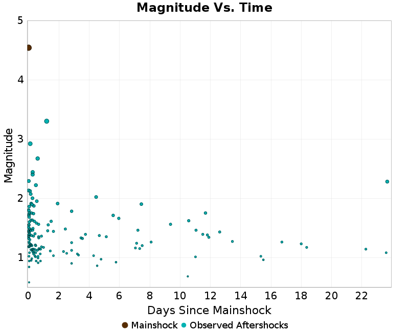

# 4.54, 17km SE of Ocotillo Wells, CA

## Table Of Contents

* [Mainshock Details](#mainshock-details)
  * [USGS Products](#usgs-products)
  * [Nearby Faults](#nearby-faults)
* [Sequence Details](#sequence-details)
  * [Magnitude Vs. Time Plot](#magnitude-vs-time-plot)
  * [Aftershock Locations](#aftershock-locations)
  * [Cumulative Number Plot](#cumulative-number-plot)
  * [Magnitude-Number Distributions (MNDs)](#magnitude-number-distributions-mnds)

## Mainshock Details
*[(top)](#table-of-contents)*

Information and plots in the section are taken from the [USGS event page](https://earthquake.usgs.gov/earthquakes/eventpage/ci38488354), accessed through ComCat.

| Field | Value |
|-----|-----|
| Magnitude | 4.54 (mw) |
| Time (UTC) | Sun, 10 May 2020 22:07:40 UTC |
| Time (PDT) | Sun, 10 May 2020 15:07:40 PDT |
| Location | 33.018833, -116.0195 |
| Depth | 10.04 km |
| Status | reviewed |

### USGS Products
*[(top)](#table-of-contents)*

| 
**[ShakeMap](https://earthquake.usgs.gov/earthquakes/eventpage/ci38488354/shakemap/)**
 | 
**[Did You Feel It?](https://earthquake.usgs.gov/earthquakes/eventpage/ci38488354/dyfi/)**
 |
|-----|-----|
|  |  |
| 
**[PAGER](https://earthquake.usgs.gov/earthquakes/eventpage/ci38488354/pager/)**
 | 
**[Moment Tensor](https://earthquake.usgs.gov/earthquakes/eventpage/ci38488354/moment-tensor/)**
 |
|  |  |

### Nearby Faults
*[(top)](#table-of-contents)*

2 UCERF3 fault sections are within 10km of this event's hypocenter:

* San Jacinto (Borrego): 1.55km
* San Jacinto (Superstition Mtn): 7.4km
## Sequence Details
*[(top)](#table-of-contents)*

These plots show the aftershock sequence, using data sourced from [ComCat](https://earthquake.usgs.gov/data/comcat/). They were last updated at 2020/05/11 00:59:50 UTC, 2.87 hours after the mainshock.

29 M&ge;0 earthquakes within 10 km of the mainshock's epicenter.

|  | First Hour | To Date |
|-----|-----|-----|
| **M 0** | 16 | 29 |
| **M 1** | 16 | 29 |
| **M 2** | 2 | 4 |
### Magnitude Vs. Time Plot
*[(top)](#table-of-contents)*

This plot shows the magnitude vs. time evolution of the sequence. The mainshock is ploted as a brown circle, and aftershocks are plotted as cyan circles.

### Aftershock Locations
*[(top)](#table-of-contents)*

Map view of the aftershock sequence, plotted as cyan circles. The mainshock  is plotted below as a brown circle, but may be obscured by aftershocks. Nearby UCERF3 fault traces are plotted in gray lines, and the region used to fetch aftershock data in a dashed dark gray line.

### Cumulative Number Plot
*[(top)](#table-of-contents)*

This plot shows the cumulative number of M&ge;0 aftershocks as a function of time since the mainshock.

### Magnitude-Number Distributions (MNDs)
*[(top)](#table-of-contents)*

These plot shows the magnitude-number distribution of the aftershock sequence thus far. The left plot gives an incremental distribution (the count in each magnitude bin), and the right plot a cumulative distribution (the count in or above each magnitude bin).

| Incremental MND | Cumulative MND |
|-----|-----|
|  |  |

