# Parent Section Magnitude-Probability Distributions

Only fault sections with at least one triggered aftershock are plotted. Sections are sorted by total supraseismogenic trigger rate (decreasing)

## Table Of Contents

* [San Jacinto (Superstition Mtn)](#san-jacinto-superstition-mtn)
* [Superstition Hills](#superstition-hills)
* [Elsinore (Coyote Mountains)](#elsinore-coyote-mountains)
* [San Jacinto (Borrego)](#san-jacinto-borrego)
* [Laguna Salada](#laguna-salada)
* [Elmore Ranch](#elmore-ranch)
* [San Andreas (Coachella) rev](#san-andreas-coachella-rev)
* [San Andreas (San Gorgonio Pass-Garnet HIll)](#san-andreas-san-gorgonio-pass-garnet-hill)
* [Brawley (Seismic Zone) alt 1](#brawley-seismic-zone-alt-1)
* [Imperial](#imperial)

## San Jacinto (Superstition Mtn)
*[(top)](#table-of-contents)*

| 1 Week | 1 Month | 1 Year | 10 Year |
|-----|-----|-----|-----|
|  |  |  | 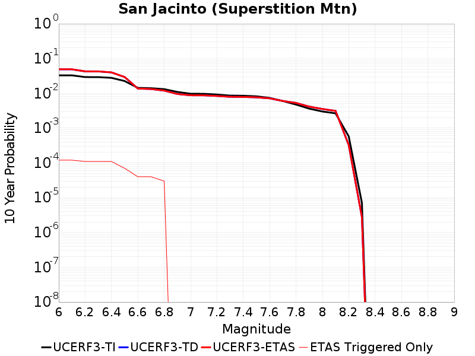 |

| Magnitude | 1 wk TI Prob | 1 wk TD Prob | 1 wk ETAS Prob | 1 wk ETAS/TD Gain | 1 wk ETAS Triggered Only | 1 mo TI Prob | 1 mo TD Prob | 1 mo ETAS Prob | 1 mo ETAS/TD Gain | 1 mo ETAS Triggered Only | 1 yr TI Prob | 1 yr TD Prob | 1 yr ETAS Prob | 1 yr ETAS/TD Gain | 1 yr ETAS Triggered Only | 10 yr TI Prob | 10 yr TD Prob | 10 yr ETAS Prob | 10 yr ETAS/TD Gain | 10 yr ETAS Triggered Only |
|-----|-----|-----|-----|-----|-----|-----|-----|-----|-----|-----|-----|-----|-----|-----|-----|-----|-----|-----|-----|-----|
| 6.0 | 6.4193904E-5 | 9.638298E-5 | 9.638298E-5 | 1.0 | 0.0 | 2.7508775E-4 | 4.1301054E-4 | 4.2300642E-4 | 1.0242025 | 1.0E-5 | 0.0033440501 | 0.005018208 | 0.0050679576 | 1.0099137 | 5.0E-5 | 0.03294174 | 0.04901459 | 0.04912871 | 1.0023283 | 1.2E-4 |
| 6.1 | 6.4193904E-5 | 9.638298E-5 | 9.638298E-5 | 1.0 | 0.0 | 2.7508775E-4 | 4.1301054E-4 | 4.2300642E-4 | 1.0242025 | 1.0E-5 | 0.0033440501 | 0.005018208 | 0.0050679576 | 1.0099137 | 5.0E-5 | 0.03294174 | 0.04901459 | 0.04912871 | 1.0023283 | 1.2E-4 |
| 6.2 | 5.7023593E-5 | 8.350885E-5 | 8.350885E-5 | 1.0 | 0.0 | 2.4436394E-4 | 3.57855E-4 | 3.678514E-4 | 1.0279343 | 1.0E-5 | 0.002971072 | 0.0043498287 | 0.0043996116 | 1.0114447 | 5.0E-5 | 0.029316625 | 0.042688068 | 0.04279337 | 1.0024668 | 1.1E-4 |
| 6.3 | 5.6940098E-5 | 8.335401E-5 | 8.335401E-5 | 1.0 | 0.0 | 2.4400617E-4 | 3.571916E-4 | 3.67188E-4 | 1.0279862 | 1.0E-5 | 0.002966728 | 0.004341784 | 0.004391567 | 1.011466 | 5.0E-5 | 0.029274331 | 0.042611357 | 0.04271667 | 1.0024714 | 1.1E-4 |
| 6.4 | 5.4171585E-5 | 7.783951E-5 | 7.783951E-5 | 1.0 | 0.0 | 2.3214328E-4 | 3.335646E-4 | 3.4356123E-4 | 1.0299692 | 1.0E-5 | 0.0028226813 | 0.0040552374 | 0.0041050347 | 1.0122797 | 5.0E-5 | 0.02787096 | 0.03989722 | 0.040002827 | 1.002647 | 1.1E-4 |
| 6.5 | 4.375144E-5 | 5.6741024E-5 | 5.6741024E-5 | 1.0 | 0.0 | 1.874927E-4 | 2.431598E-4 | 2.431598E-4 | 1.0 | 0.0 | 0.0022803338 | 0.0029576283 | 0.0029775691 | 1.0067421 | 2.0E-5 | 0.022570757 | 0.029401936 | 0.029469877 | 1.0023108 | 7.0E-5 |
| 6.6 | 2.772192E-5 | 2.579261E-5 | 2.579261E-5 | 1.0 | 0.0 | 1.1880282E-4 | 1.1053518E-4 | 1.1053518E-4 | 1.0 | 0.0 | 0.0014454646 | 0.0013449546 | 0.0013449546 | 1.0 | 0.0 | 0.014360986 | 0.013699079 | 0.013738531 | 1.0028799 | 4.0E-5 |
| 6.7 | 2.7124124E-5 | 2.5002128E-5 | 2.5002128E-5 | 1.0 | 0.0 | 1.1624106E-4 | 1.0714769E-4 | 1.0714769E-4 | 1.0 | 0.0 | 0.0014143161 | 0.0013037617 | 0.0013037617 | 1.0 | 0.0 | 0.014053487 | 0.013291781 | 0.013331249 | 1.0029694 | 4.0E-5 |
| 6.8 | 2.5475807E-5 | 2.2459983E-5 | 2.2459983E-5 | 1.0 | 0.0 | 1.0917746E-4 | 9.6253585E-5 | 9.6253585E-5 | 1.0 | 0.0 | 0.001328425 | 0.0011712696 | 0.0011712696 | 1.0 | 0.0 | 0.0132051185 | 0.011976923 | 0.012006563 | 1.0024748 | 3.0E-5 |
| 6.9 | 2.1162023E-5 | 1.7899752E-5 | 1.7899752E-5 | 1.0 | 0.0 | 9.069123E-5 | 7.6710996E-5 | 7.6710996E-5 | 1.0 | 0.0 | 0.0011036064 | 9.3356E-4 | 9.3356E-4 | 1.0 | 0.0 | 0.010981417 | 0.009589778 | 0.009589778 | 1.0 | 0.0 |
| 7.0 | 1.8754288E-5 | 1.6423335E-5 | 1.6423335E-5 | 1.0 | 0.0 | 8.037304E-5 | 7.038384E-5 | 7.038384E-5 | 1.0 | 0.0 | 9.781026E-4 | 8.565888E-4 | 8.565888E-4 | 1.0 | 0.0 | 0.009738087 | 0.008806886 | 0.008806886 | 1.0 | 0.0 |
| 7.1 | 1.8678527E-5 | 1.634823E-5 | 1.634823E-5 | 1.0 | 0.0 | 8.0048376E-5 | 7.006197E-5 | 7.006197E-5 | 1.0 | 0.0 | 9.7415317E-4 | 8.526732E-4 | 8.526732E-4 | 1.0 | 0.0 | 0.009698939 | 0.0087677445 | 0.0087677445 | 1.0 | 0.0 |
| 7.2 | 1.7804578E-5 | 1.5640162E-5 | 1.5640162E-5 | 1.0 | 0.0 | 7.6303106E-5 | 6.7027555E-5 | 6.7027555E-5 | 1.0 | 0.0 | 9.285943E-4 | 8.1575726E-4 | 8.1575726E-4 | 1.0 | 0.0 | 0.009247236 | 0.00839782 | 0.00839782 | 1.0 | 0.0 |
| 7.3 | 1.6583685E-5 | 1.4786407E-5 | 1.4786407E-5 | 1.0 | 0.0 | 7.1070994E-5 | 6.336879E-5 | 6.336879E-5 | 1.0 | 0.0 | 8.649459E-4 | 7.7124394E-4 | 7.7124394E-4 | 1.0 | 0.0 | 0.00861587 | 0.007951719 | 0.007951719 | 1.0 | 0.0 |
| 7.4 | 1.6387552E-5 | 1.4650823E-5 | 1.4650823E-5 | 1.0 | 0.0 | 7.023047E-5 | 6.278774E-5 | 6.278774E-5 | 1.0 | 0.0 | 8.5472054E-4 | 7.641747E-4 | 7.641747E-4 | 1.0 | 0.0 | 0.008514405 | 0.007880857 | 0.007880857 | 1.0 | 0.0 |
| 7.5 | 1.5790754E-5 | 1.4289041E-5 | 1.4289041E-5 | 1.0 | 0.0 | 6.767291E-5 | 6.123732E-5 | 6.123732E-5 | 1.0 | 0.0 | 8.236062E-4 | 7.453114E-4 | 7.453114E-4 | 1.0 | 0.0 | 0.008205604 | 0.007690157 | 0.007690157 | 1.0 | 0.0 |
| 7.6 | 1.4248672E-5 | 1.3299142E-5 | 1.3299142E-5 | 1.0 | 0.0 | 6.106431E-5 | 5.6995086E-5 | 5.6995086E-5 | 1.0 | 0.0 | 7.432043E-4 | 6.93696E-4 | 6.93696E-4 | 1.0 | 0.0 | 0.007407237 | 0.00716815 | 0.00716815 | 1.0 | 0.0 |
| 7.7 | 1.15449975E-5 | 1.1137832E-5 | 1.1137832E-5 | 1.0 | 0.0 | 4.947762E-5 | 4.7732698E-5 | 4.7732698E-5 | 1.0 | 0.0 | 6.022235E-4 | 5.8099144E-4 | 5.8099144E-4 | 1.0 | 0.0 | 0.006005941 | 0.006032949 | 0.006032949 | 1.0 | 0.0 |
| 7.8 | 9.1391985E-6 | 9.7393295E-6 | 9.7393295E-6 | 1.0 | 0.0 | 3.9167408E-5 | 4.173932E-5 | 4.173932E-5 | 1.0 | 0.0 | 4.767588E-4 | 5.0805835E-4 | 5.0805835E-4 | 1.0 | 0.0 | 0.0047573727 | 0.005294923 | 0.005294923 | 1.0 | 0.0 |
| 7.9 | 6.973017E-6 | 7.581959E-6 | 7.581959E-6 | 1.0 | 0.0 | 2.9884017E-5 | 3.2493706E-5 | 3.2493706E-5 | 1.0 | 0.0 | 3.6377716E-4 | 3.9553962E-4 | 3.9553962E-4 | 1.0 | 0.0 | 0.0036318225 | 0.0041570086 | 0.0041570086 | 1.0 | 0.0 |
| 8.0 | 5.7638235E-6 | 6.4427263E-6 | 6.4427263E-6 | 1.0 | 0.0 | 2.4701867E-5 | 2.7611395E-5 | 2.7611395E-5 | 1.0 | 0.0 | 3.0070372E-4 | 3.361174E-4 | 3.361174E-4 | 1.0 | 0.0 | 0.0030029714 | 0.0035498717 | 0.0035498717 | 1.0 | 0.0 |
| 8.1 | 5.1124434E-6 | 5.662201E-6 | 5.662201E-6 | 1.0 | 0.0 | 2.1910288E-5 | 2.4266354E-5 | 2.4266354E-5 | 1.0 | 0.0 | 2.6672508E-4 | 2.9540333E-4 | 2.9540333E-4 | 1.0 | 0.0 | 0.0026640517 | 0.0031282948 | 0.0031282948 | 1.0 | 0.0 |
| 8.2 | 1.1075938E-6 | 5.56968E-7 | 5.56968E-7 | 1.0 | 0.0 | 4.7468216E-6 | 2.3870039E-6 | 2.3870039E-6 | 1.0 | 0.0 | 5.779102E-5 | 2.9061408E-5 | 2.9061408E-5 | 1.0 | 0.0 | 5.777599E-4 | 3.2646468E-4 | 3.2646468E-4 | 1.0 | 0.0 |
| 8.3 | 1.3584393E-8 | 4.6942072E-9 | 4.6942072E-9 | 1.0 | 0.0 | 5.8218827E-8 | 2.0118032E-8 | 2.0118032E-8 | 1.0 | 0.0 | 7.0881396E-7 | 2.4493704E-7 | 2.4493704E-7 | 1.0 | 0.0 | 7.0881174E-6 | 2.7385972E-6 | 2.7385972E-6 | 1.0 | 0.0 |

## Superstition Hills
*[(top)](#table-of-contents)*

| 1 Week | 1 Month | 1 Year | 10 Year |
|-----|-----|-----|-----|
|  | 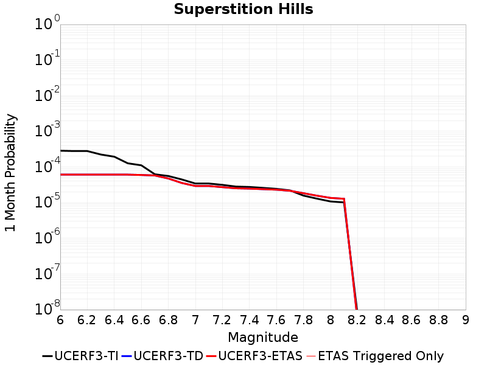 |  |  |

| Magnitude | 1 wk TI Prob | 1 wk TD Prob | 1 wk ETAS Prob | 1 wk ETAS/TD Gain | 1 wk ETAS Triggered Only | 1 mo TI Prob | 1 mo TD Prob | 1 mo ETAS Prob | 1 mo ETAS/TD Gain | 1 mo ETAS Triggered Only | 1 yr TI Prob | 1 yr TD Prob | 1 yr ETAS Prob | 1 yr ETAS/TD Gain | 1 yr ETAS Triggered Only | 10 yr TI Prob | 10 yr TD Prob | 10 yr ETAS Prob | 10 yr ETAS/TD Gain | 10 yr ETAS Triggered Only |
|-----|-----|-----|-----|-----|-----|-----|-----|-----|-----|-----|-----|-----|-----|-----|-----|-----|-----|-----|-----|-----|
| 6.0 | 6.6865185E-5 | 1.4289482E-5 | 1.4289482E-5 | 1.0 | 0.0 | 2.8653358E-4 | 6.123929E-5 | 6.123929E-5 | 1.0 | 0.0 | 0.0034829667 | 7.453497E-4 | 7.453497E-4 | 1.0 | 0.0 | 0.03428881 | 0.0076001287 | 0.0076398244 | 1.005223 | 4.0E-5 |
| 6.1 | 6.544851E-5 | 1.4289482E-5 | 1.4289482E-5 | 1.0 | 0.0 | 2.8046346E-4 | 6.123929E-5 | 6.123929E-5 | 1.0 | 0.0 | 0.0034092965 | 7.453497E-4 | 7.453497E-4 | 1.0 | 0.0 | 0.033574644 | 0.0076001277 | 0.0076398235 | 1.005223 | 4.0E-5 |
| 6.2 | 6.544851E-5 | 1.4289482E-5 | 1.4289482E-5 | 1.0 | 0.0 | 2.8046346E-4 | 6.123929E-5 | 6.123929E-5 | 1.0 | 0.0 | 0.0034092965 | 7.453497E-4 | 7.453497E-4 | 1.0 | 0.0 | 0.033574644 | 0.0076001277 | 0.0076398235 | 1.005223 | 4.0E-5 |
| 6.3 | 5.2402065E-5 | 1.42894805E-5 | 1.42894805E-5 | 1.0 | 0.0 | 2.2456095E-4 | 6.123928E-5 | 6.123928E-5 | 1.0 | 0.0 | 0.0027306017 | 7.453496E-4 | 7.453496E-4 | 1.0 | 0.0 | 0.02697292 | 0.0076001207 | 0.0076398165 | 1.005223 | 4.0E-5 |
| 6.4 | 4.542238E-5 | 1.428948E-5 | 1.428948E-5 | 1.0 | 0.0 | 1.9465282E-4 | 6.123928E-5 | 6.123928E-5 | 1.0 | 0.0 | 0.0023673223 | 7.4534956E-4 | 7.4534956E-4 | 1.0 | 0.0 | 0.023422617 | 0.0076001165 | 0.007639813 | 1.005223 | 4.0E-5 |
| 6.5 | 2.9672969E-5 | 1.4289478E-5 | 1.4289478E-5 | 1.0 | 0.0 | 1.2716366E-4 | 6.1239276E-5 | 6.1239276E-5 | 1.0 | 0.0 | 0.0015471181 | 7.4534945E-4 | 7.4534945E-4 | 1.0 | 0.0 | 0.015363912 | 0.0076001086 | 0.007639805 | 1.005223 | 4.0E-5 |
| 6.6 | 2.6056105E-5 | 1.3954187E-5 | 1.3954187E-5 | 1.0 | 0.0 | 1.1166424E-4 | 5.980238E-5 | 5.980238E-5 | 1.0 | 0.0 | 0.0013586642 | 7.2786695E-4 | 7.2786695E-4 | 1.0 | 0.0 | 0.013503874 | 0.0074239536 | 0.007463657 | 1.005348 | 4.0E-5 |
| 6.7 | 1.4611248E-5 | 1.3533273E-5 | 1.3533273E-5 | 1.0 | 0.0 | 6.261813E-5 | 5.7998543E-5 | 5.7998543E-5 | 1.0 | 0.0 | 7.6210906E-4 | 7.059196E-4 | 7.059196E-4 | 1.0 | 0.0 | 0.0075950073 | 0.0072047086 | 0.0072444207 | 1.0055119 | 4.0E-5 |
| 6.8 | 1.30607E-5 | 1.1122107E-5 | 1.1122107E-5 | 1.0 | 0.0 | 5.597323E-5 | 4.766535E-5 | 4.766535E-5 | 1.0 | 0.0 | 6.8126095E-4 | 5.8017997E-4 | 5.8017997E-4 | 1.0 | 0.0 | 0.006791762 | 0.0059501696 | 0.005979991 | 1.0050119 | 3.0E-5 |
| 6.9 | 1.0443096E-5 | 8.325606E-6 | 8.325606E-6 | 1.0 | 0.0 | 4.4755358E-5 | 3.5680696E-5 | 3.5680696E-5 | 1.0 | 0.0 | 5.447602E-4 | 4.343283E-4 | 4.343283E-4 | 1.0 | 0.0 | 0.005434267 | 0.0044776234 | 0.0044776234 | 1.0 | 0.0 |
| 7.0 | 8.045912E-6 | 6.8583013E-6 | 6.8583013E-6 | 1.0 | 0.0 | 3.4482026E-5 | 2.9392395E-5 | 2.9392395E-5 | 1.0 | 0.0 | 4.197378E-4 | 3.577947E-4 | 3.577947E-4 | 1.0 | 0.0 | 0.0041894587 | 0.0036954794 | 0.0036954794 | 1.0 | 0.0 |
| 7.1 | 8.045912E-6 | 6.8583013E-6 | 6.8583013E-6 | 1.0 | 0.0 | 3.4482026E-5 | 2.9392395E-5 | 2.9392395E-5 | 1.0 | 0.0 | 4.197378E-4 | 3.577947E-4 | 3.577947E-4 | 1.0 | 0.0 | 0.0041894587 | 0.0036954794 | 0.0036954794 | 1.0 | 0.0 |
| 7.2 | 7.375506E-6 | 6.363076E-6 | 6.363076E-6 | 1.0 | 0.0 | 3.1608928E-5 | 2.7270045E-5 | 2.7270045E-5 | 1.0 | 0.0 | 3.8477074E-4 | 3.319631E-4 | 3.319631E-4 | 1.0 | 0.0 | 0.003841052 | 0.0034349547 | 0.0034349547 | 1.0 | 0.0 |
| 7.3 | 6.6063913E-6 | 5.9136332E-6 | 5.9136332E-6 | 1.0 | 0.0 | 2.8312797E-5 | 2.53439E-5 | 2.53439E-5 | 1.0 | 0.0 | 3.446538E-4 | 3.0851903E-4 | 3.0851903E-4 | 1.0 | 0.0 | 0.0034411973 | 0.0031982542 | 0.0031982542 | 1.0 | 0.0 |
| 7.4 | 6.4313126E-6 | 5.794679E-6 | 5.794679E-6 | 1.0 | 0.0 | 2.7562477E-5 | 2.4834108E-5 | 2.4834108E-5 | 1.0 | 0.0 | 3.355215E-4 | 3.0231403E-4 | 3.0231403E-4 | 1.0 | 0.0 | 0.0033501536 | 0.0031358104 | 0.0031358104 | 1.0 | 0.0 |
| 7.5 | 6.0742927E-6 | 5.5891105E-6 | 5.5891105E-6 | 1.0 | 0.0 | 2.6032423E-5 | 2.3953115E-5 | 2.3953115E-5 | 1.0 | 0.0 | 3.1689866E-4 | 2.9159084E-4 | 2.9159084E-4 | 1.0 | 0.0 | 0.0031644711 | 0.003026925 | 0.003026925 | 1.0 | 0.0 |
| 7.6 | 5.6987187E-6 | 5.4058605E-6 | 5.4058605E-6 | 1.0 | 0.0 | 2.4422852E-5 | 2.3167771E-5 | 2.3167771E-5 | 1.0 | 0.0 | 2.9730765E-4 | 2.820318E-4 | 2.820318E-4 | 1.0 | 0.0 | 0.002969102 | 0.0029294216 | 0.0029294216 | 1.0 | 0.0 |
| 7.7 | 5.1658035E-6 | 5.0345516E-6 | 5.0345516E-6 | 1.0 | 0.0 | 2.2138971E-5 | 2.1576474E-5 | 2.1576474E-5 | 1.0 | 0.0 | 2.6950863E-4 | 2.6266254E-4 | 2.6266254E-4 | 1.0 | 0.0 | 0.00269182 | 0.0027332145 | 0.0027332145 | 1.0 | 0.0 |
| 7.8 | 3.6864697E-6 | 4.3012124E-6 | 4.3012124E-6 | 1.0 | 0.0 | 1.579906E-5 | 1.843364E-5 | 1.843364E-5 | 1.0 | 0.0 | 1.9233658E-4 | 2.2440695E-4 | 2.2440695E-4 | 1.0 | 0.0 | 0.0019217018 | 0.0023441645 | 0.0023441645 | 1.0 | 0.0 |
| 7.9 | 3.0265903E-6 | 3.6608844E-6 | 3.6608844E-6 | 1.0 | 0.0 | 1.2971037E-5 | 1.5689413E-5 | 1.5689413E-5 | 1.0 | 0.0 | 1.5791094E-4 | 1.9100233E-4 | 1.9100233E-4 | 1.0 | 0.0 | 0.0015779877 | 0.0020044385 | 0.0020044385 | 1.0 | 0.0 |
| 8.0 | 2.5271493E-6 | 3.1761554E-6 | 3.1761554E-6 | 1.0 | 0.0 | 1.0830595E-5 | 1.3612026E-5 | 1.3612026E-5 | 1.0 | 0.0 | 1.3185451E-4 | 1.6571426E-4 | 1.6571426E-4 | 1.0 | 0.0 | 0.0013177631 | 0.0017443164 | 0.0017443164 | 1.0 | 0.0 |
| 8.1 | 2.3749135E-6 | 3.0030471E-6 | 3.0030471E-6 | 1.0 | 0.0 | 1.0178161E-5 | 1.2870141E-5 | 1.2870141E-5 | 1.0 | 0.0 | 1.2391206E-4 | 1.5668315E-4 | 1.5668315E-4 | 1.0 | 0.0 | 0.0012384299 | 0.0016499175 | 0.0016499175 | 1.0 | 0.0 |
| 8.2 | 1.7186406E-9 | 1.1860065E-9 | 1.1860065E-9 | 1.0 | 0.0 | 7.3656024E-9 | 5.0828852E-9 | 5.0828852E-9 | 1.0 | 0.0 | 8.9676206E-8 | 6.188412E-8 | 6.188412E-8 | 1.0 | 0.0 | 8.9676166E-7 | 6.615813E-7 | 6.615813E-7 | 1.0 | 0.0 |

## Elsinore (Coyote Mountains)
*[(top)](#table-of-contents)*

| 1 Week | 1 Month | 1 Year | 10 Year |
|-----|-----|-----|-----|
|  |  |  | 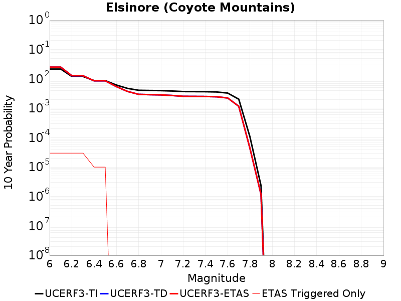 |

| Magnitude | 1 wk TI Prob | 1 wk TD Prob | 1 wk ETAS Prob | 1 wk ETAS/TD Gain | 1 wk ETAS Triggered Only | 1 mo TI Prob | 1 mo TD Prob | 1 mo ETAS Prob | 1 mo ETAS/TD Gain | 1 mo ETAS Triggered Only | 1 yr TI Prob | 1 yr TD Prob | 1 yr ETAS Prob | 1 yr ETAS/TD Gain | 1 yr ETAS Triggered Only | 10 yr TI Prob | 10 yr TD Prob | 10 yr ETAS Prob | 10 yr ETAS/TD Gain | 10 yr ETAS Triggered Only |
|-----|-----|-----|-----|-----|-----|-----|-----|-----|-----|-----|-----|-----|-----|-----|-----|-----|-----|-----|-----|-----|
| 6.0 | 4.20513E-5 | 4.8710794E-5 | 4.8710794E-5 | 1.0 | 0.0 | 1.8020741E-4 | 2.0874711E-4 | 2.0874711E-4 | 1.0 | 0.0 | 0.0021918174 | 0.0025390622 | 0.0025390622 | 1.0 | 0.0 | 0.021703249 | 0.025151778 | 0.025181023 | 1.0011628 | 3.0E-5 |
| 6.1 | 4.20513E-5 | 4.8710794E-5 | 4.8710794E-5 | 1.0 | 0.0 | 1.8020741E-4 | 2.0874711E-4 | 2.0874711E-4 | 1.0 | 0.0 | 0.0021918174 | 0.0025390622 | 0.0025390622 | 1.0 | 0.0 | 0.021703249 | 0.025151778 | 0.025181023 | 1.0011628 | 3.0E-5 |
| 6.2 | 2.3413893E-5 | 2.4733201E-5 | 2.4733201E-5 | 1.0 | 0.0 | 1.0034139E-4 | 1.0599567E-4 | 1.0599567E-4 | 1.0 | 0.0 | 0.0012209718 | 0.0012898229 | 0.0012898229 | 1.0 | 0.0 | 0.012142851 | 0.0128320325 | 0.012861648 | 1.0023079 | 3.0E-5 |
| 6.3 | 2.3413893E-5 | 2.4733201E-5 | 2.4733201E-5 | 1.0 | 0.0 | 1.0034139E-4 | 1.0599567E-4 | 1.0599567E-4 | 1.0 | 0.0 | 0.0012209718 | 0.0012898229 | 0.0012898229 | 1.0 | 0.0 | 0.012142851 | 0.0128320325 | 0.012861648 | 1.0023079 | 3.0E-5 |
| 6.4 | 1.6894814E-5 | 1.6593429E-5 | 1.6593429E-5 | 1.0 | 0.0 | 7.240433E-5 | 7.1112976E-5 | 7.1112976E-5 | 1.0 | 0.0 | 8.811662E-4 | 8.65494E-4 | 8.65494E-4 | 1.0 | 0.0 | 0.0087768035 | 0.008624891 | 0.008634805 | 1.0011494 | 1.0E-5 |
| 6.5 | 1.6894814E-5 | 1.6593429E-5 | 1.6593429E-5 | 1.0 | 0.0 | 7.240433E-5 | 7.1112976E-5 | 7.1112976E-5 | 1.0 | 0.0 | 8.811662E-4 | 8.65494E-4 | 8.65494E-4 | 1.0 | 0.0 | 0.0087768035 | 0.008624891 | 0.008634805 | 1.0011494 | 1.0E-5 |
| 6.6 | 1.1910969E-5 | 1.0547691E-5 | 1.0547691E-5 | 1.0 | 0.0 | 5.1046012E-5 | 4.5203684E-5 | 4.5203684E-5 | 1.0 | 0.0 | 6.21308E-4 | 5.5022916E-4 | 5.5022916E-4 | 1.0 | 0.0 | 0.0061957375 | 0.00548997 | 0.00548997 | 1.0 | 0.0 |
| 6.7 | 9.1486E-6 | 7.2154958E-6 | 7.2154958E-6 | 1.0 | 0.0 | 3.9207694E-5 | 3.092321E-5 | 3.092321E-5 | 1.0 | 0.0 | 4.7724912E-4 | 3.7642886E-4 | 3.7642886E-4 | 1.0 | 0.0 | 0.0047622547 | 0.0037582929 | 0.0037582929 | 1.0 | 0.0 |
| 6.8 | 7.90441E-6 | 5.739939E-6 | 5.739939E-6 | 1.0 | 0.0 | 3.3875604E-5 | 2.4599512E-5 | 2.4599512E-5 | 1.0 | 0.0 | 4.1235742E-4 | 2.994592E-4 | 2.994592E-4 | 1.0 | 0.0 | 0.0041159308 | 0.0029906859 | 0.0029906859 | 1.0 | 0.0 |
| 6.9 | 7.77015E-6 | 5.593812E-6 | 5.593812E-6 | 1.0 | 0.0 | 3.3300217E-5 | 2.3973267E-5 | 2.3973267E-5 | 1.0 | 0.0 | 4.0535472E-4 | 2.918367E-4 | 2.918367E-4 | 1.0 | 0.0 | 0.004046161 | 0.0029146622 | 0.0029146622 | 1.0 | 0.0 |
| 7.0 | 7.675798E-6 | 5.4906095E-6 | 5.4906095E-6 | 1.0 | 0.0 | 3.289586E-5 | 2.353098E-5 | 2.353098E-5 | 1.0 | 0.0 | 4.004335E-4 | 2.864533E-4 | 2.864533E-4 | 1.0 | 0.0 | 0.003997127 | 0.0028609675 | 0.0028609675 | 1.0 | 0.0 |
| 7.1 | 7.447814E-6 | 5.2493865E-6 | 5.2493865E-6 | 1.0 | 0.0 | 3.191881E-5 | 2.2497183E-5 | 2.2497183E-5 | 1.0 | 0.0 | 3.8854225E-4 | 2.7387004E-4 | 2.7387004E-4 | 1.0 | 0.0 | 0.003878636 | 0.0027354502 | 0.0027354502 | 1.0 | 0.0 |
| 7.2 | 7.128185E-6 | 4.9159926E-6 | 4.9159926E-6 | 1.0 | 0.0 | 3.0549007E-5 | 2.1068377E-5 | 2.1068377E-5 | 1.0 | 0.0 | 3.7187067E-4 | 2.564785E-4 | 2.564785E-4 | 1.0 | 0.0 | 0.00371249 | 0.0025619438 | 0.0025619438 | 1.0 | 0.0 |
| 7.3 | 7.0913875E-6 | 4.884651E-6 | 4.884651E-6 | 1.0 | 0.0 | 3.0391306E-5 | 2.0934058E-5 | 2.0934058E-5 | 1.0 | 0.0 | 3.6995133E-4 | 2.5484353E-4 | 2.5484353E-4 | 1.0 | 0.0 | 0.0036933604 | 0.0025456317 | 0.0025456317 | 1.0 | 0.0 |
| 7.4 | 7.051521E-6 | 4.848488E-6 | 4.848488E-6 | 1.0 | 0.0 | 3.0220453E-5 | 2.0779076E-5 | 2.0779076E-5 | 1.0 | 0.0 | 3.6787192E-4 | 2.5295708E-4 | 2.5295708E-4 | 1.0 | 0.0 | 0.0036726352 | 0.0025268102 | 0.0025268102 | 1.0 | 0.0 |
| 7.5 | 6.910666E-6 | 4.7438525E-6 | 4.7438525E-6 | 1.0 | 0.0 | 2.9616802E-5 | 2.0330644E-5 | 2.0330644E-5 | 1.0 | 0.0 | 3.605249E-4 | 2.4749865E-4 | 2.4749865E-4 | 1.0 | 0.0 | 0.0035994058 | 0.0024723487 | 0.0024723487 | 1.0 | 0.0 |
| 7.6 | 6.341753E-6 | 4.3164464E-6 | 4.3164464E-6 | 1.0 | 0.0 | 2.7178658E-5 | 1.8498931E-5 | 1.8498931E-5 | 1.0 | 0.0 | 3.3084993E-4 | 2.2520238E-4 | 2.2520238E-4 | 1.0 | 0.0 | 0.0033035777 | 0.0022498574 | 0.0022498574 | 1.0 | 0.0 |
| 7.7 | 3.9205916E-6 | 2.2499603E-6 | 2.2499603E-6 | 1.0 | 0.0 | 1.6802427E-5 | 9.642656E-6 | 9.642656E-6 | 1.0 | 0.0 | 2.0455034E-4 | 1.17393756E-4 | 1.17393756E-4 | 1.0 | 0.0 | 0.0020436216 | 0.0011733908 | 0.0011733908 | 1.0 | 0.0 |
| 7.8 | 2.0846227E-7 | 8.5061856E-8 | 8.5061856E-8 | 1.0 | 0.0 | 8.9340944E-7 | 3.6455077E-7 | 3.6455077E-7 | 1.0 | 0.0 | 1.0877206E-5 | 4.4384E-6 | 4.4384E-6 | 1.0 | 0.0 | 1.0876673E-4 | 4.4383443E-5 | 4.4383443E-5 | 1.0 | 0.0 |
| 7.9 | 4.4969806E-9 | 2.2730335E-9 | 2.2730335E-9 | 1.0 | 0.0 | 1.9272775E-8 | 9.741572E-9 | 9.741572E-9 | 1.0 | 0.0 | 2.3464601E-7 | 1.1860364E-7 | 1.1860364E-7 | 1.0 | 0.0 | 2.3464577E-6 | 1.1860359E-6 | 1.1860359E-6 | 1.0 | 0.0 |

## San Jacinto (Borrego)
*[(top)](#table-of-contents)*

| 1 Week | 1 Month | 1 Year | 10 Year |
|-----|-----|-----|-----|
| 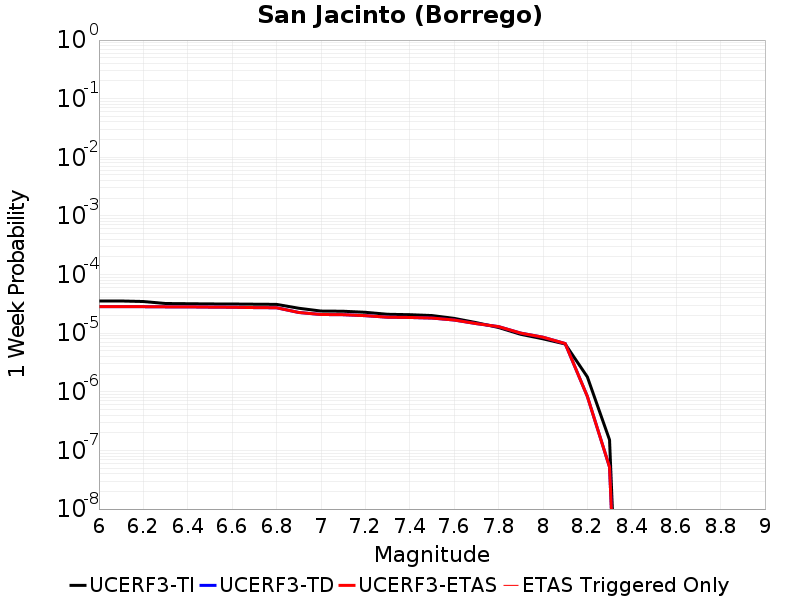 | 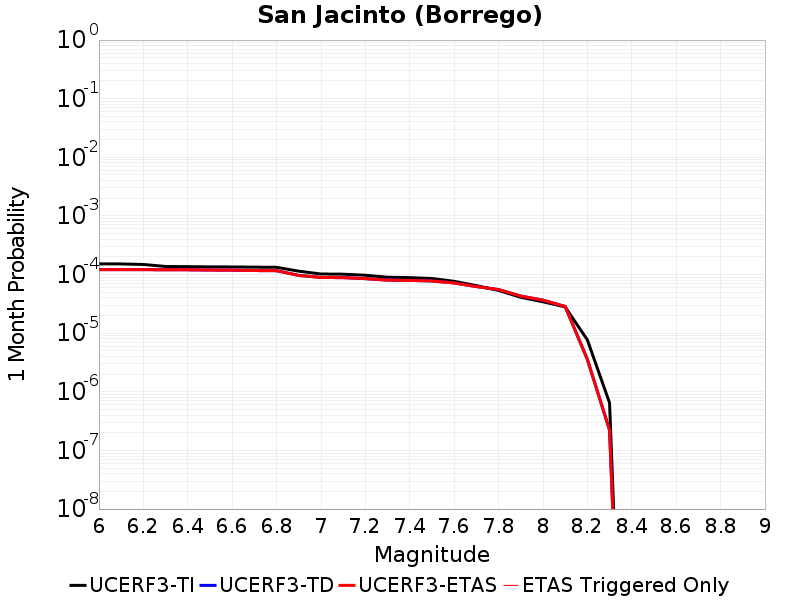 |  |  |

| Magnitude | 1 wk TI Prob | 1 wk TD Prob | 1 wk ETAS Prob | 1 wk ETAS/TD Gain | 1 wk ETAS Triggered Only | 1 mo TI Prob | 1 mo TD Prob | 1 mo ETAS Prob | 1 mo ETAS/TD Gain | 1 mo ETAS Triggered Only | 1 yr TI Prob | 1 yr TD Prob | 1 yr ETAS Prob | 1 yr ETAS/TD Gain | 1 yr ETAS Triggered Only | 10 yr TI Prob | 10 yr TD Prob | 10 yr ETAS Prob | 10 yr ETAS/TD Gain | 10 yr ETAS Triggered Only |
|-----|-----|-----|-----|-----|-----|-----|-----|-----|-----|-----|-----|-----|-----|-----|-----|-----|-----|-----|-----|-----|
| 6.0 | 3.543992E-5 | 2.8327653E-5 | 2.8327653E-5 | 1.0 | 0.0 | 1.5187653E-4 | 1.2139865E-4 | 1.2139865E-4 | 1.0 | 0.0 | 0.0018475284 | 0.0014770388 | 0.0014770388 | 1.0 | 0.0 | 0.018322436 | 0.0150782745 | 0.015107822 | 1.0019596 | 3.0E-5 |
| 6.1 | 3.542281E-5 | 2.8327653E-5 | 2.8327653E-5 | 1.0 | 0.0 | 1.5180321E-4 | 1.2139865E-4 | 1.2139865E-4 | 1.0 | 0.0 | 0.0018466372 | 0.0014770388 | 0.0014770388 | 1.0 | 0.0 | 0.018313672 | 0.0150782745 | 0.015107822 | 1.0019596 | 3.0E-5 |
| 6.2 | 3.4688688E-5 | 2.8327653E-5 | 2.8327653E-5 | 1.0 | 0.0 | 1.4865733E-4 | 1.2139865E-4 | 1.2139865E-4 | 1.0 | 0.0 | 0.0018084005 | 0.0014770388 | 0.0014770388 | 1.0 | 0.0 | 0.017937548 | 0.015078274 | 0.015107822 | 1.0019596 | 3.0E-5 |
| 6.3 | 3.2087122E-5 | 2.8172806E-5 | 2.8172806E-5 | 1.0 | 0.0 | 1.3750899E-4 | 1.2073508E-4 | 1.2073508E-4 | 1.0 | 0.0 | 0.0016728862 | 0.0014689708 | 0.0014689708 | 1.0 | 0.0 | 0.016603488 | 0.0149993505 | 0.0150289005 | 1.00197 | 3.0E-5 |
| 6.4 | 3.1828724E-5 | 2.813971E-5 | 2.813971E-5 | 1.0 | 0.0 | 1.364017E-4 | 1.2059326E-4 | 1.2059326E-4 | 1.0 | 0.0 | 0.0016594254 | 0.0014672464 | 0.0014672464 | 1.0 | 0.0 | 0.016470885 | 0.014982511 | 0.015012062 | 1.0019723 | 3.0E-5 |
| 6.5 | 3.1563577E-5 | 2.7878572E-5 | 2.7878572E-5 | 1.0 | 0.0 | 1.3526545E-4 | 1.1947419E-4 | 1.1947419E-4 | 1.0 | 0.0 | 0.0016456128 | 0.00145364 | 0.00145364 | 1.0 | 0.0 | 0.0163348 | 0.0148495305 | 0.014879085 | 1.0019903 | 3.0E-5 |
| 6.6 | 3.1467625E-5 | 2.7722152E-5 | 2.7722152E-5 | 1.0 | 0.0 | 1.3485427E-4 | 1.1880388E-4 | 1.1880388E-4 | 1.0 | 0.0 | 0.0016406142 | 0.0014454898 | 0.0014454898 | 1.0 | 0.0 | 0.016285548 | 0.0147695765 | 0.014799134 | 1.0020012 | 3.0E-5 |
| 6.7 | 3.1223695E-5 | 2.7339454E-5 | 2.7339454E-5 | 1.0 | 0.0 | 1.3380898E-4 | 1.171639E-4 | 1.171639E-4 | 1.0 | 0.0 | 0.0016279068 | 0.0014255494 | 0.0014255494 | 1.0 | 0.0 | 0.01616033 | 0.014573614 | 0.014603177 | 1.0020285 | 3.0E-5 |
| 6.8 | 3.1015585E-5 | 2.7159687E-5 | 2.7159687E-5 | 1.0 | 0.0 | 1.3291716E-4 | 1.1639354E-4 | 1.1639354E-4 | 1.0 | 0.0 | 0.001617065 | 0.0014161824 | 0.0014161824 | 1.0 | 0.0 | 0.016053487 | 0.014480513 | 0.014510078 | 1.0020417 | 3.0E-5 |
| 6.9 | 2.6641965E-5 | 2.2560029E-5 | 2.2560029E-5 | 1.0 | 0.0 | 1.1417485E-4 | 9.668228E-5 | 9.668228E-5 | 1.0 | 0.0 | 0.0013891924 | 0.0011764751 | 0.0011764751 | 1.0 | 0.0 | 0.0138054015 | 0.012078946 | 0.012078946 | 1.0 | 0.0 |
| 7.0 | 2.3854353E-5 | 2.08426E-5 | 2.08426E-5 | 1.0 | 0.0 | 1.02228936E-4 | 8.932239E-5 | 8.932239E-5 | 1.0 | 0.0 | 0.0012439266 | 0.0010869602 | 0.0010869602 | 1.0 | 0.0 | 0.012369866 | 0.011173079 | 0.011173079 | 1.0 | 0.0 |
| 7.1 | 2.3672901E-5 | 2.067874E-5 | 2.067874E-5 | 1.0 | 0.0 | 1.0145135E-4 | 8.862018E-5 | 8.862018E-5 | 1.0 | 0.0 | 0.0012344702 | 0.0010784193 | 0.0010784193 | 1.0 | 0.0 | 0.0122763505 | 0.011088127 | 0.011088127 | 1.0 | 0.0 |
| 7.2 | 2.2717244E-5 | 1.9903393E-5 | 1.9903393E-5 | 1.0 | 0.0 | 9.735599E-5 | 8.529748E-5 | 8.529748E-5 | 1.0 | 0.0 | 0.0011846646 | 0.0010380044 | 0.0010380044 | 1.0 | 0.0 | 0.01178369 | 0.010684238 | 0.010684238 | 1.0 | 0.0 |
| 7.3 | 2.1016205E-5 | 1.8740504E-5 | 1.8740504E-5 | 1.0 | 0.0 | 9.006634E-5 | 8.0313985E-5 | 8.0313985E-5 | 1.0 | 0.0 | 0.001096006 | 9.773863E-4 | 9.773863E-4 | 1.0 | 0.0 | 0.010906163 | 0.010077559 | 0.010077559 | 1.0 | 0.0 |
| 7.4 | 2.0683625E-5 | 1.8542085E-5 | 1.8542085E-5 | 1.0 | 0.0 | 8.86411E-5 | 7.946367E-5 | 7.946367E-5 | 1.0 | 0.0 | 0.001078671 | 9.6704287E-4 | 9.6704287E-4 | 1.0 | 0.0 | 0.010734501 | 0.009973805 | 0.009973805 | 1.0 | 0.0 |
| 7.5 | 1.9993966E-5 | 1.8134084E-5 | 1.8134084E-5 | 1.0 | 0.0 | 8.568561E-5 | 7.7715194E-5 | 7.7715194E-5 | 1.0 | 0.0 | 0.001042723 | 9.4577385E-4 | 9.4577385E-4 | 1.0 | 0.0 | 0.010378438 | 0.009759193 | 0.009759193 | 1.0 | 0.0 |
| 7.6 | 1.788966E-5 | 1.6774226E-5 | 1.6774226E-5 | 1.0 | 0.0 | 7.666772E-5 | 7.188757E-5 | 7.188757E-5 | 1.0 | 0.0 | 9.3302975E-4 | 8.7488146E-4 | 8.7488146E-4 | 1.0 | 0.0 | 0.00929122 | 0.009044339 | 0.009044339 | 1.0 | 0.0 |
| 7.7 | 1.5125781E-5 | 1.45659615E-5 | 1.45659615E-5 | 1.0 | 0.0 | 6.4823165E-5 | 6.242406E-5 | 6.242406E-5 | 1.0 | 0.0 | 7.889362E-4 | 7.5974874E-4 | 7.5974874E-4 | 1.0 | 0.0 | 0.007861412 | 0.007886742 | 0.007886742 | 1.0 | 0.0 |
| 7.8 | 1.250089E-5 | 1.29456685E-5 | 1.29456685E-5 | 1.0 | 0.0 | 5.3574146E-5 | 5.548026E-5 | 5.548026E-5 | 1.0 | 0.0 | 6.5207E-4 | 6.7526347E-4 | 6.7526347E-4 | 1.0 | 0.0 | 0.006501599 | 0.007033625 | 0.007033625 | 1.0 | 0.0 |
| 7.9 | 9.561E-6 | 1.0029917E-5 | 1.0029917E-5 | 1.0 | 0.0 | 4.0975072E-5 | 4.298465E-5 | 4.298465E-5 | 1.0 | 0.0 | 4.987573E-4 | 5.2321306E-4 | 5.2321306E-4 | 1.0 | 0.0 | 0.0049763937 | 0.0054976223 | 0.0054976223 | 1.0 | 0.0 |
| 8.0 | 8.01699E-6 | 8.543162E-6 | 8.543162E-6 | 1.0 | 0.0 | 3.4358076E-5 | 3.661304E-5 | 3.661304E-5 | 1.0 | 0.0 | 4.1822926E-4 | 4.4567315E-4 | 4.4567315E-4 | 1.0 | 0.0 | 0.0041744304 | 0.004705367 | 0.004705367 | 1.0 | 0.0 |
| 8.1 | 6.541947E-6 | 6.6642415E-6 | 6.6642415E-6 | 1.0 | 0.0 | 2.8036617E-5 | 2.8560726E-5 | 2.8560726E-5 | 1.0 | 0.0 | 3.4129233E-4 | 3.4767188E-4 | 3.4767188E-4 | 1.0 | 0.0 | 0.0034076865 | 0.0036879145 | 0.0036879145 | 1.0 | 0.0 |
| 8.2 | 1.7968189E-6 | 8.358903E-7 | 8.358903E-7 | 1.0 | 0.0 | 7.70063E-6 | 3.5823823E-6 | 3.5823823E-6 | 1.0 | 0.0 | 9.3751136E-5 | 4.361466E-5 | 4.361466E-5 | 1.0 | 0.0 | 9.371159E-4 | 4.930076E-4 | 4.930076E-4 | 1.0 | 0.0 |
| 8.3 | 1.5167889E-7 | 5.1975654E-8 | 5.1975654E-8 | 1.0 | 0.0 | 6.500522E-7 | 2.2275279E-7 | 2.2275279E-7 | 1.0 | 0.0 | 7.9143565E-6 | 2.7120122E-6 | 2.7120122E-6 | 1.0 | 0.0 | 7.914075E-5 | 3.1420364E-5 | 3.1420364E-5 | 1.0 | 0.0 |

## Laguna Salada
*[(top)](#table-of-contents)*

| 1 Week | 1 Month | 1 Year | 10 Year |
|-----|-----|-----|-----|
| 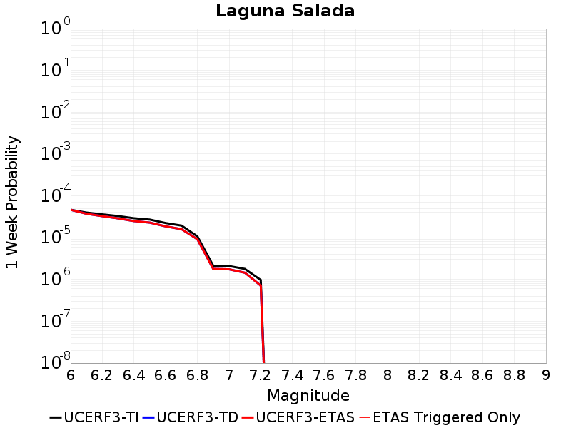 | 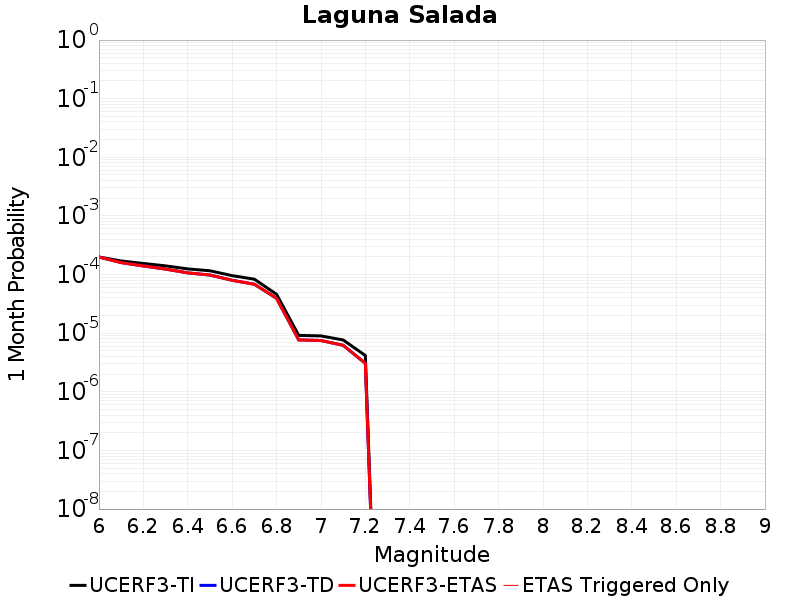 | 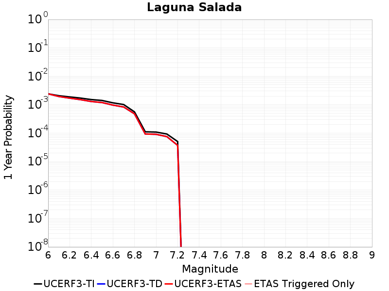 |  |

| Magnitude | 1 wk TI Prob | 1 wk TD Prob | 1 wk ETAS Prob | 1 wk ETAS/TD Gain | 1 wk ETAS Triggered Only | 1 mo TI Prob | 1 mo TD Prob | 1 mo ETAS Prob | 1 mo ETAS/TD Gain | 1 mo ETAS Triggered Only | 1 yr TI Prob | 1 yr TD Prob | 1 yr ETAS Prob | 1 yr ETAS/TD Gain | 1 yr ETAS Triggered Only | 10 yr TI Prob | 10 yr TD Prob | 10 yr ETAS Prob | 10 yr ETAS/TD Gain | 10 yr ETAS Triggered Only |
|-----|-----|-----|-----|-----|-----|-----|-----|-----|-----|-----|-----|-----|-----|-----|-----|-----|-----|-----|-----|-----|
| 6.0 | 4.6465593E-5 | 4.6465586E-5 | 4.6465586E-5 | 1.0 | 0.0 | 1.9912305E-4 | 1.9912374E-4 | 1.9912374E-4 | 1.0 | 0.0 | 0.0024216278 | 0.0024217058 | 0.0024217058 | 1.0 | 0.0 | 0.02395408 | 0.024041234 | 0.024050994 | 1.0004059 | 1.0E-5 |
| 6.1 | 3.982297E-5 | 3.734486E-5 | 3.734486E-5 | 1.0 | 0.0 | 1.706587E-4 | 1.6004028E-4 | 1.6004028E-4 | 1.0 | 0.0 | 0.0020757897 | 0.0019468413 | 0.0019468413 | 1.0 | 0.0 | 0.020565065 | 0.019387858 | 0.019387858 | 1.0 | 0.0 |
| 6.2 | 3.6067784E-5 | 3.2694585E-5 | 3.2694585E-5 | 1.0 | 0.0 | 1.5456705E-4 | 1.4011275E-4 | 1.4011275E-4 | 1.0 | 0.0 | 0.0018802295 | 0.0017046309 | 0.0017046309 | 1.0 | 0.0 | 0.018644003 | 0.016996827 | 0.016996827 | 1.0 | 0.0 |
| 6.3 | 3.2859112E-5 | 2.8934677E-5 | 2.8934677E-5 | 1.0 | 0.0 | 1.4081717E-4 | 1.2400043E-4 | 1.2400043E-4 | 1.0 | 0.0 | 0.0017131006 | 0.0015087527 | 0.0015087527 | 1.0 | 0.0 | 0.016999546 | 0.015061946 | 0.015061946 | 1.0 | 0.0 |
| 6.4 | 2.9132116E-5 | 2.4929155E-5 | 2.4929155E-5 | 1.0 | 0.0 | 1.2484594E-4 | 1.06835374E-4 | 1.06835374E-4 | 1.0 | 0.0 | 0.0015189396 | 0.0013000334 | 0.0013000334 | 1.0 | 0.0 | 0.015085992 | 0.012990001 | 0.012990001 | 1.0 | 0.0 |
| 6.5 | 2.7075037E-5 | 2.289705E-5 | 2.289705E-5 | 1.0 | 0.0 | 1.1603071E-4 | 9.812702E-5 | 9.812702E-5 | 1.0 | 0.0 | 0.0014117584 | 0.0011941304 | 0.0011941304 | 1.0 | 0.0 | 0.014028233 | 0.011938641 | 0.011938641 | 1.0 | 0.0 |
| 6.6 | 2.2367465E-5 | 1.862997E-5 | 1.862997E-5 | 1.0 | 0.0 | 9.5857045E-5 | 7.984075E-5 | 7.984075E-5 | 1.0 | 0.0 | 0.0011664346 | 9.717102E-4 | 9.717102E-4 | 1.0 | 0.0 | 0.011603311 | 0.009730159 | 0.009730159 | 1.0 | 0.0 |
| 6.7 | 1.9458053E-5 | 1.5966778E-5 | 1.5966778E-5 | 1.0 | 0.0 | 8.338899E-5 | 6.8427704E-5 | 6.8427704E-5 | 1.0 | 0.0 | 0.001014788 | 8.3286955E-4 | 8.3286955E-4 | 1.0 | 0.0 | 0.010101665 | 0.00835023 | 0.00835023 | 1.0 | 0.0 |
| 6.8 | 1.0767866E-5 | 9.196693E-6 | 9.196693E-6 | 1.0 | 0.0 | 4.614718E-5 | 3.9414193E-5 | 3.9414193E-5 | 1.0 | 0.0 | 5.6169706E-4 | 4.79831E-4 | 4.79831E-4 | 1.0 | 0.0 | 0.0056027942 | 0.004815493 | 0.004815493 | 1.0 | 0.0 |
| 6.9 | 2.1384765E-6 | 1.7923359E-6 | 1.7923359E-6 | 1.0 | 0.0 | 9.164866E-6 | 7.681419E-6 | 7.681419E-6 | 1.0 | 0.0 | 1.1157654E-4 | 9.351766E-5 | 9.351766E-5 | 1.0 | 0.0 | 0.0011152053 | 9.348213E-4 | 9.348213E-4 | 1.0 | 0.0 |
| 7.0 | 2.0952946E-6 | 1.7502636E-6 | 1.7502636E-6 | 1.0 | 0.0 | 8.979802E-6 | 7.5011103E-6 | 7.5011103E-6 | 1.0 | 0.0 | 1.0932361E-4 | 9.132258E-5 | 9.132258E-5 | 1.0 | 0.0 | 0.0010926984 | 9.1288873E-4 | 9.1288873E-4 | 1.0 | 0.0 |
| 7.1 | 1.7887576E-6 | 1.4509052E-6 | 1.4509052E-6 | 1.0 | 0.0 | 7.666081E-6 | 6.218152E-6 | 6.218152E-6 | 1.0 | 0.0 | 9.333054E-5 | 7.570368E-5 | 7.570368E-5 | 1.0 | 0.0 | 9.329135E-4 | 7.568093E-4 | 7.568093E-4 | 1.0 | 0.0 |
| 7.2 | 9.723109E-7 | 7.1416025E-7 | 7.1416025E-7 | 1.0 | 0.0 | 4.16704E-6 | 3.060684E-6 | 3.060684E-6 | 1.0 | 0.0 | 5.073253E-5 | 3.726336E-5 | 3.726336E-5 | 1.0 | 0.0 | 5.072095E-4 | 3.7258738E-4 | 3.7258738E-4 | 1.0 | 0.0 |

## Elmore Ranch
*[(top)](#table-of-contents)*

| 1 Week | 1 Month | 1 Year | 10 Year |
|-----|-----|-----|-----|
|  |  |  |  |

| Magnitude | 1 wk TI Prob | 1 wk TD Prob | 1 wk ETAS Prob | 1 wk ETAS/TD Gain | 1 wk ETAS Triggered Only | 1 mo TI Prob | 1 mo TD Prob | 1 mo ETAS Prob | 1 mo ETAS/TD Gain | 1 mo ETAS Triggered Only | 1 yr TI Prob | 1 yr TD Prob | 1 yr ETAS Prob | 1 yr ETAS/TD Gain | 1 yr ETAS Triggered Only | 10 yr TI Prob | 10 yr TD Prob | 10 yr ETAS Prob | 10 yr ETAS/TD Gain | 10 yr ETAS Triggered Only |
|-----|-----|-----|-----|-----|-----|-----|-----|-----|-----|-----|-----|-----|-----|-----|-----|-----|-----|-----|-----|-----|
| 6.0 | 9.102099E-5 | 8.980646E-5 | 8.980646E-5 | 1.0 | 0.0 | 3.9003167E-4 | 3.8483492E-4 | 3.8483492E-4 | 1.0 | 0.0 | 0.0047383 | 0.0046759914 | 0.004685945 | 1.0021286 | 1.0E-5 | 0.046385348 | 0.04596816 | 0.0459777 | 1.0002075 | 1.0E-5 |
| 6.1 | 3.8306698E-5 | 4.163297E-5 | 4.163297E-5 | 1.0 | 0.0 | 1.6416123E-4 | 1.7841604E-4 | 1.7841604E-4 | 1.0 | 0.0 | 0.0019968306 | 0.0021705062 | 0.0021705062 | 1.0 | 0.0 | 0.019789828 | 0.021666083 | 0.021666083 | 1.0 | 0.0 |
| 6.2 | 3.8306698E-5 | 4.163297E-5 | 4.163297E-5 | 1.0 | 0.0 | 1.6416123E-4 | 1.7841604E-4 | 1.7841604E-4 | 1.0 | 0.0 | 0.0019968306 | 0.0021705062 | 0.0021705062 | 1.0 | 0.0 | 0.019789828 | 0.021666083 | 0.021666083 | 1.0 | 0.0 |
| 6.3 | 3.3197924E-5 | 3.6670644E-5 | 3.6670644E-5 | 1.0 | 0.0 | 1.4226905E-4 | 1.5715242E-4 | 1.5715242E-4 | 1.0 | 0.0 | 0.0017307495 | 0.0019122025 | 0.0019122025 | 1.0 | 0.0 | 0.017173318 | 0.019118281 | 0.019118281 | 1.0 | 0.0 |
| 6.4 | 2.5148964E-5 | 2.7506028E-5 | 2.7506028E-5 | 1.0 | 0.0 | 1.0777682E-4 | 1.1788132E-4 | 1.1788132E-4 | 1.0 | 0.0 | 0.0013113929 | 0.0014349109 | 0.0014349109 | 1.0 | 0.0 | 0.01303681 | 0.014409314 | 0.014409314 | 1.0 | 0.0 |
| 6.5 | 2.5148964E-5 | 2.7506028E-5 | 2.7506028E-5 | 1.0 | 0.0 | 1.0777682E-4 | 1.1788132E-4 | 1.1788132E-4 | 1.0 | 0.0 | 0.0013113929 | 0.0014349109 | 0.0014349109 | 1.0 | 0.0 | 0.01303681 | 0.014409314 | 0.014409314 | 1.0 | 0.0 |

## San Andreas (Coachella) rev
*[(top)](#table-of-contents)*

| 1 Week | 1 Month | 1 Year | 10 Year |
|-----|-----|-----|-----|
|  |  |  |  |

| Magnitude | 1 wk TI Prob | 1 wk TD Prob | 1 wk ETAS Prob | 1 wk ETAS/TD Gain | 1 wk ETAS Triggered Only | 1 mo TI Prob | 1 mo TD Prob | 1 mo ETAS Prob | 1 mo ETAS/TD Gain | 1 mo ETAS Triggered Only | 1 yr TI Prob | 1 yr TD Prob | 1 yr ETAS Prob | 1 yr ETAS/TD Gain | 1 yr ETAS Triggered Only | 10 yr TI Prob | 10 yr TD Prob | 10 yr ETAS Prob | 10 yr ETAS/TD Gain | 10 yr ETAS Triggered Only |
|-----|-----|-----|-----|-----|-----|-----|-----|-----|-----|-----|-----|-----|-----|-----|-----|-----|-----|-----|-----|-----|
| 6.0 | 1.1925945E-4 | 3.2956785E-4 | 3.2956785E-4 | 1.0 | 0.0 | 5.110118E-4 | 0.0014116738 | 0.0014216597 | 1.0070738 | 1.0E-5 | 0.0062038354 | 0.017053042 | 0.01706287 | 1.0005764 | 1.0E-5 | 0.060334753 | 0.15352024 | 0.1535287 | 1.0000552 | 1.0E-5 |
| 6.1 | 1.1925945E-4 | 3.2956785E-4 | 3.2956785E-4 | 1.0 | 0.0 | 5.110118E-4 | 0.0014116738 | 0.0014216597 | 1.0070738 | 1.0E-5 | 0.0062038354 | 0.017053042 | 0.01706287 | 1.0005764 | 1.0E-5 | 0.060334753 | 0.15352024 | 0.1535287 | 1.0000552 | 1.0E-5 |
| 6.2 | 1.07432395E-4 | 3.0456108E-4 | 3.0456108E-4 | 1.0 | 0.0 | 4.603433E-4 | 0.0013046128 | 0.0013145999 | 1.0076551 | 1.0E-5 | 0.005590286 | 0.015769098 | 0.01577894 | 1.0006242 | 1.0E-5 | 0.05451731 | 0.14269665 | 0.14270522 | 1.0000601 | 1.0E-5 |
| 6.3 | 1.0718766E-4 | 3.04014E-4 | 3.04014E-4 | 1.0 | 0.0 | 4.592948E-4 | 0.0013022707 | 0.0013122577 | 1.0076689 | 1.0E-5 | 0.005577586 | 0.015740996 | 0.015750838 | 1.0006253 | 1.0E-5 | 0.054396555 | 0.14246507 | 0.14247364 | 1.0000602 | 1.0E-5 |
| 6.4 | 1.0355944E-4 | 2.9609166E-4 | 2.9609166E-4 | 1.0 | 0.0 | 4.4375064E-4 | 0.0012683511 | 0.0012783384 | 1.0078743 | 1.0E-5 | 0.0053892885 | 0.015333908 | 0.015343755 | 1.0006422 | 1.0E-5 | 0.052604496 | 0.13902685 | 0.13903546 | 1.0000619 | 1.0E-5 |
| 6.5 | 1.0227914E-4 | 2.9328492E-4 | 2.9328492E-4 | 1.0 | 0.0 | 4.382655E-4 | 0.0012563339 | 0.0012663213 | 1.0079497 | 1.0E-5 | 0.0053228354 | 0.015189648 | 0.015199496 | 1.0006484 | 1.0E-5 | 0.051971316 | 0.13781235 | 0.13782096 | 1.0000626 | 1.0E-5 |
| 6.6 | 1.0116757E-4 | 2.9094145E-4 | 2.9094145E-4 | 1.0 | 0.0 | 4.3350324E-4 | 0.0012463001 | 0.0012562876 | 1.0080137 | 1.0E-5 | 0.0052651367 | 0.015069181 | 0.015079031 | 1.0006536 | 1.0E-5 | 0.051421247 | 0.13679153 | 0.13680017 | 1.0000631 | 1.0E-5 |
| 6.7 | 1.0050676E-4 | 2.8952642E-4 | 2.8952642E-4 | 1.0 | 0.0 | 4.3067214E-4 | 0.0012402413 | 0.001250229 | 1.008053 | 1.0E-5 | 0.005230834 | 0.0149964355 | 0.015006285 | 1.0006568 | 1.0E-5 | 0.051094085 | 0.13617672 | 0.13618535 | 1.0000634 | 1.0E-5 |
| 6.8 | 9.976819E-5 | 2.875578E-4 | 2.875578E-4 | 1.0 | 0.0 | 4.2750788E-4 | 0.0012318125 | 0.0012418001 | 1.0081081 | 1.0E-5 | 0.0051924936 | 0.014895221 | 0.014905073 | 1.0006614 | 1.0E-5 | 0.050728295 | 0.1353269 | 0.13533555 | 1.0000639 | 1.0E-5 |
| 6.9 | 9.77719E-5 | 2.8250896E-4 | 2.8250896E-4 | 1.0 | 0.0 | 4.1895514E-4 | 0.0012101948 | 0.0012201827 | 1.0082531 | 1.0E-5 | 0.0050888555 | 0.014635592 | 0.014645446 | 1.0006733 | 1.0E-5 | 0.049738888 | 0.13315046 | 0.13315912 | 1.0000651 | 1.0E-5 |
| 7.0 | 8.500761E-5 | 2.4971974E-4 | 2.4971974E-4 | 1.0 | 0.0 | 3.6426744E-4 | 0.0010697917 | 0.0010797811 | 1.0093377 | 1.0E-5 | 0.0044259406 | 0.01294772 | 0.01295759 | 1.0007623 | 1.0E-5 | 0.04338823 | 0.118980914 | 0.11898972 | 1.000074 | 1.0E-5 |
| 7.1 | 8.319876E-5 | 2.4572114E-4 | 2.4572114E-4 | 1.0 | 0.0 | 3.5651738E-4 | 0.0010526688 | 0.0010626583 | 1.0094897 | 1.0E-5 | 0.004331963 | 0.0127417045 | 0.0127515765 | 1.0007749 | 1.0E-5 | 0.042484846 | 0.117192656 | 0.11720148 | 1.0000753 | 1.0E-5 |
| 7.2 | 7.563917E-5 | 2.2613756E-4 | 2.2613756E-4 | 1.0 | 0.0 | 3.2412758E-4 | 9.688041E-4 | 9.787944E-4 | 1.010312 | 1.0E-5 | 0.0039391145 | 0.0117321 | 0.011741983 | 1.0008423 | 1.0E-5 | 0.03870018 | 0.10858036 | 0.10858928 | 1.0000821 | 1.0E-5 |
| 7.3 | 7.082985E-5 | 2.0921524E-4 | 2.0921524E-4 | 1.0 | 0.0 | 3.0352117E-4 | 8.9633156E-4 | 9.063226E-4 | 1.0111465 | 1.0E-5 | 0.0036891096 | 0.010858868 | 0.01086876 | 1.0009109 | 1.0E-5 | 0.03628465 | 0.101079114 | 0.1010881 | 1.0000889 | 1.0E-5 |
| 7.4 | 5.146215E-5 | 1.4425832E-4 | 1.4425832E-4 | 1.0 | 0.0 | 2.2053342E-4 | 6.1810436E-4 | 6.1810436E-4 | 1.0 | 0.0 | 0.0026816884 | 0.007499646 | 0.007499646 | 1.0 | 0.0 | 0.02649557 | 0.07150915 | 0.07150915 | 1.0 | 0.0 |
| 7.5 | 4.0285166E-5 | 1.1071271E-4 | 1.1071271E-4 | 1.0 | 0.0 | 1.7263928E-4 | 4.743971E-4 | 4.743971E-4 | 1.0 | 0.0 | 0.002099857 | 0.0057605593 | 0.0057605593 | 1.0 | 0.0 | 0.020801254 | 0.055586956 | 0.055586956 | 1.0 | 0.0 |
| 7.6 | 3.1168736E-5 | 8.553716E-5 | 8.553716E-5 | 1.0 | 0.0 | 1.3357346E-4 | 3.6653646E-4 | 3.6653646E-4 | 1.0 | 0.0 | 0.0016250437 | 0.0044534774 | 0.0044534774 | 1.0 | 0.0 | 0.016132116 | 0.043327074 | 0.043327074 | 1.0 | 0.0 |
| 7.7 | 2.2100989E-5 | 6.339853E-5 | 6.339853E-5 | 1.0 | 0.0 | 9.4715084E-5 | 2.7167972E-4 | 2.7167972E-4 | 1.0 | 0.0 | 0.001152546 | 0.0033026903 | 0.0033026903 | 1.0 | 0.0 | 0.011465867 | 0.032359045 | 0.032359045 | 1.0 | 0.0 |
| 7.8 | 1.7484861E-5 | 5.2697378E-5 | 5.2697378E-5 | 1.0 | 0.0 | 7.493296E-5 | 2.2582637E-4 | 2.2582637E-4 | 1.0 | 0.0 | 9.1192697E-4 | 0.0027459725 | 0.0027459725 | 1.0 | 0.0 | 0.009081938 | 0.027050456 | 0.027050456 | 1.0 | 0.0 |
| 7.9 | 1.3967285E-5 | 3.8962386E-5 | 3.8962386E-5 | 1.0 | 0.0 | 5.985842E-5 | 1.6697097E-4 | 1.6697097E-4 | 1.0 | 0.0 | 7.2853256E-4 | 0.0020309775 | 0.0020309775 | 1.0 | 0.0 | 0.0072614877 | 0.020251188 | 0.020251188 | 1.0 | 0.0 |
| 8.0 | 1.1887396E-5 | 3.170167E-5 | 3.170167E-5 | 1.0 | 0.0 | 5.094499E-5 | 1.3585723E-4 | 1.3585723E-4 | 1.0 | 0.0 | 6.200787E-4 | 0.0016528078 | 0.0016528078 | 1.0 | 0.0 | 0.006183513 | 0.016575586 | 0.016575586 | 1.0 | 0.0 |
| 8.1 | 5.100864E-6 | 9.23482E-6 | 9.23482E-6 | 1.0 | 0.0 | 2.1860664E-5 | 3.95772E-5 | 3.95772E-5 | 1.0 | 0.0 | 2.6612106E-4 | 4.81746E-4 | 4.81746E-4 | 1.0 | 0.0 | 0.002658026 | 0.005047838 | 0.005047838 | 1.0 | 0.0 |
| 8.2 | 2.3004484E-6 | 2.8905245E-6 | 2.8905245E-6 | 1.0 | 0.0 | 9.859027E-6 | 1.2387903E-5 | 1.2387903E-5 | 1.0 | 0.0 | 1.2002704E-4 | 1.5081231E-4 | 1.5081231E-4 | 1.0 | 0.0 | 0.0011996223 | 0.0016511178 | 0.0016511178 | 1.0 | 0.0 |
| 8.3 | 1.0424446E-7 | 6.096976E-8 | 6.096976E-8 | 1.0 | 0.0 | 4.4676187E-7 | 2.6129894E-7 | 2.6129894E-7 | 1.0 | 0.0 | 5.439312E-6 | 3.1813101E-6 | 3.1813101E-6 | 1.0 | 0.0 | 5.4391792E-5 | 3.3408738E-5 | 3.3408738E-5 | 1.0 | 0.0 |

## San Andreas (San Gorgonio Pass-Garnet HIll)
*[(top)](#table-of-contents)*

| 1 Week | 1 Month | 1 Year | 10 Year |
|-----|-----|-----|-----|
|  | 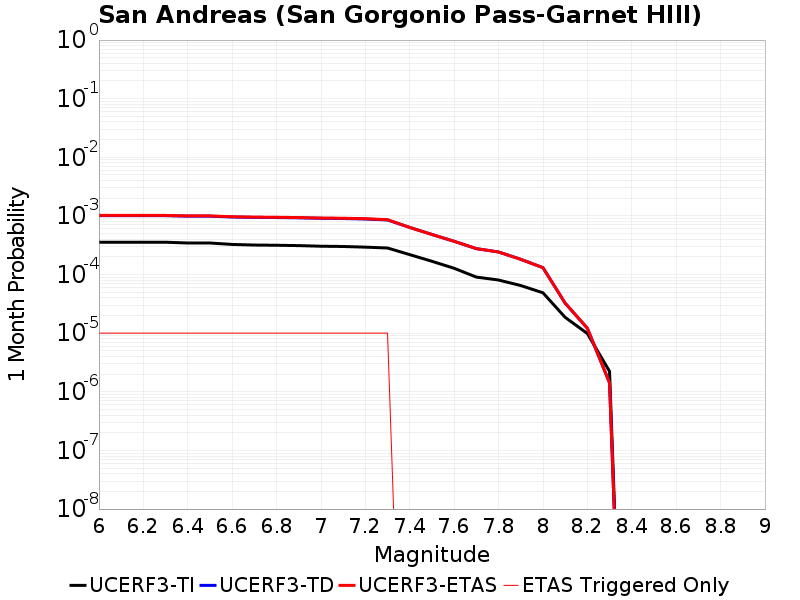 | 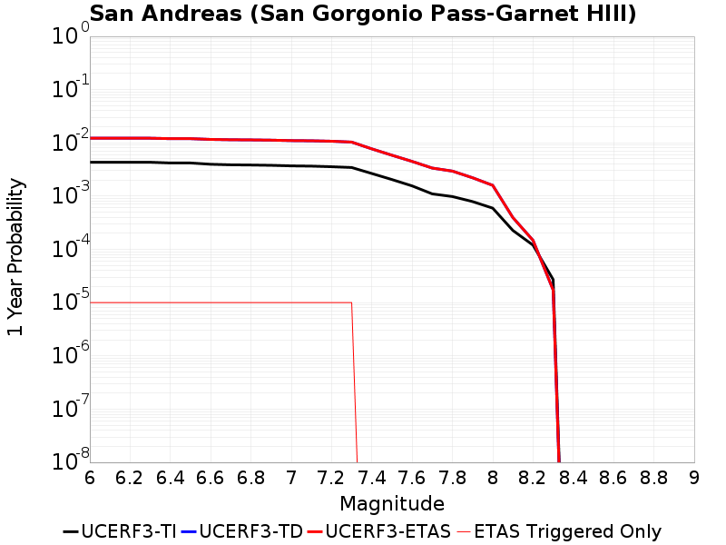 |  |

| Magnitude | 1 wk TI Prob | 1 wk TD Prob | 1 wk ETAS Prob | 1 wk ETAS/TD Gain | 1 wk ETAS Triggered Only | 1 mo TI Prob | 1 mo TD Prob | 1 mo ETAS Prob | 1 mo ETAS/TD Gain | 1 mo ETAS Triggered Only | 1 yr TI Prob | 1 yr TD Prob | 1 yr ETAS Prob | 1 yr ETAS/TD Gain | 1 yr ETAS Triggered Only | 10 yr TI Prob | 10 yr TD Prob | 10 yr ETAS Prob | 10 yr ETAS/TD Gain | 10 yr ETAS Triggered Only |
|-----|-----|-----|-----|-----|-----|-----|-----|-----|-----|-----|-----|-----|-----|-----|-----|-----|-----|-----|-----|-----|
| 6.0 | 8.31567E-5 | 2.3583532E-4 | 2.3583532E-4 | 1.0 | 0.0 | 3.5633717E-4 | 0.0010103292 | 0.0010203191 | 1.0098878 | 1.0E-5 | 0.004329778 | 0.012231264 | 0.012241142 | 1.0008075 | 1.0E-5 | 0.042463828 | 0.11339949 | 0.11340836 | 1.0000782 | 1.0E-5 |
| 6.1 | 8.31567E-5 | 2.3583532E-4 | 2.3583532E-4 | 1.0 | 0.0 | 3.5633717E-4 | 0.0010103292 | 0.0010203191 | 1.0098878 | 1.0E-5 | 0.004329778 | 0.012231264 | 0.012241142 | 1.0008075 | 1.0E-5 | 0.042463828 | 0.11339949 | 0.11340836 | 1.0000782 | 1.0E-5 |
| 6.2 | 8.31567E-5 | 2.3583532E-4 | 2.3583532E-4 | 1.0 | 0.0 | 3.5633717E-4 | 0.0010103292 | 0.0010203191 | 1.0098878 | 1.0E-5 | 0.004329778 | 0.012231264 | 0.012241142 | 1.0008075 | 1.0E-5 | 0.042463828 | 0.11339949 | 0.11340836 | 1.0000782 | 1.0E-5 |
| 6.3 | 8.31567E-5 | 2.3583532E-4 | 2.3583532E-4 | 1.0 | 0.0 | 3.5633717E-4 | 0.0010103292 | 0.0010203191 | 1.0098878 | 1.0E-5 | 0.004329778 | 0.012231264 | 0.012241142 | 1.0008075 | 1.0E-5 | 0.042463828 | 0.11339949 | 0.11340836 | 1.0000782 | 1.0E-5 |
| 6.4 | 8.059055E-5 | 2.3139971E-4 | 2.3139971E-4 | 1.0 | 0.0 | 3.4534236E-4 | 9.913341E-4 | 0.0010013242 | 1.0100775 | 1.0E-5 | 0.0041964394 | 0.01200292 | 0.012012799 | 1.0008231 | 1.0E-5 | 0.041180745 | 0.11137776 | 0.11138664 | 1.0000798 | 1.0E-5 |
| 6.5 | 8.059055E-5 | 2.3139971E-4 | 2.3139971E-4 | 1.0 | 0.0 | 3.4534236E-4 | 9.913341E-4 | 0.0010013242 | 1.0100775 | 1.0E-5 | 0.0041964394 | 0.01200292 | 0.012012799 | 1.0008231 | 1.0E-5 | 0.041180745 | 0.11137776 | 0.11138664 | 1.0000798 | 1.0E-5 |
| 6.6 | 7.619237E-5 | 2.2382817E-4 | 2.2382817E-4 | 1.0 | 0.0 | 3.2649786E-4 | 9.589132E-4 | 9.689036E-4 | 1.0104184 | 1.0E-5 | 0.0039678677 | 0.011612829 | 0.011622713 | 1.0008512 | 1.0E-5 | 0.03897764 | 0.10791028 | 0.1079192 | 1.0000826 | 1.0E-5 |
| 6.7 | 7.440636E-5 | 2.2058212E-4 | 2.2058212E-4 | 1.0 | 0.0 | 3.188454E-4 | 9.4501174E-4 | 9.5500227E-4 | 1.0105718 | 1.0E-5 | 0.0038750346 | 0.011445365 | 0.01145525 | 1.0008637 | 1.0E-5 | 0.038081564 | 0.10641829 | 0.10642722 | 1.0000839 | 1.0E-5 |
| 6.8 | 7.3735864E-5 | 2.190478E-4 | 2.190478E-4 | 1.0 | 0.0 | 3.1597257E-4 | 9.3844085E-4 | 9.4843144E-4 | 1.010646 | 1.0E-5 | 0.0038401815 | 0.011366203 | 0.01137609 | 1.0008698 | 1.0E-5 | 0.03774495 | 0.10571788 | 0.10572683 | 1.0000846 | 1.0E-5 |
| 6.9 | 7.27575E-5 | 2.1673285E-4 | 2.1673285E-4 | 1.0 | 0.0 | 3.117806E-4 | 9.2852674E-4 | 9.3851745E-4 | 1.0107597 | 1.0E-5 | 0.003789323 | 0.011246752 | 0.01125664 | 1.0008792 | 1.0E-5 | 0.037253562 | 0.10466473 | 0.104673676 | 1.0000856 | 1.0E-5 |
| 7.0 | 7.102591E-5 | 2.1256453E-4 | 2.1256453E-4 | 1.0 | 0.0 | 3.0436125E-4 | 9.1067504E-4 | 9.20666E-4 | 1.0109708 | 1.0E-5 | 0.003699303 | 0.011031627 | 0.011041516 | 1.0008965 | 1.0E-5 | 0.03638325 | 0.10276456 | 0.10277353 | 1.0000873 | 1.0E-5 |
| 7.1 | 7.028513E-5 | 2.1091517E-4 | 2.1091517E-4 | 1.0 | 0.0 | 3.0118722E-4 | 9.036113E-4 | 9.1360224E-4 | 1.0110567 | 1.0E-5 | 0.0036607897 | 0.010946494 | 0.010956384 | 1.0009035 | 1.0E-5 | 0.036010686 | 0.10200569 | 0.102014676 | 1.000088 | 1.0E-5 |
| 7.2 | 6.8498244E-5 | 2.0698464E-4 | 2.0698464E-4 | 1.0 | 0.0 | 2.9353087E-4 | 8.8677765E-4 | 8.967688E-4 | 1.0112668 | 1.0E-5 | 0.003567883 | 0.010743581 | 0.010753473 | 1.0009208 | 1.0E-5 | 0.035111405 | 0.100195274 | 0.100204274 | 1.0000898 | 1.0E-5 |
| 7.3 | 6.622592E-5 | 1.9922851E-4 | 1.9922851E-4 | 1.0 | 0.0 | 2.8379448E-4 | 8.535593E-4 | 8.6355075E-4 | 1.0117056 | 1.0E-5 | 0.0034497243 | 0.010343056 | 0.010352952 | 1.0009568 | 1.0E-5 | 0.033966612 | 0.09668351 | 0.09669254 | 1.0000935 | 1.0E-5 |
| 7.4 | 5.1050705E-5 | 1.4849665E-4 | 1.4849665E-4 | 1.0 | 0.0 | 2.1877038E-4 | 6.362599E-4 | 6.362599E-4 | 1.0 | 0.0 | 0.002660276 | 0.0077191466 | 0.0077191466 | 1.0 | 0.0 | 0.02628654 | 0.07355468 | 0.07355468 | 1.0 | 0.0 |
| 7.5 | 3.9302922E-5 | 1.1267292E-4 | 1.1267292E-4 | 1.0 | 0.0 | 1.6843023E-4 | 4.827949E-4 | 4.827949E-4 | 1.0 | 0.0 | 0.0020487092 | 0.0058622565 | 0.0058622565 | 1.0 | 0.0 | 0.020299247 | 0.0566149 | 0.0566149 | 1.0 | 0.0 |
| 7.6 | 2.9851626E-5 | 8.616802E-5 | 8.616802E-5 | 1.0 | 0.0 | 1.2792926E-4 | 3.6923937E-4 | 3.6923937E-4 | 1.0 | 0.0 | 0.0015564259 | 0.004486249 | 0.004486249 | 1.0 | 0.0 | 0.0154556995 | 0.04373825 | 0.04373825 | 1.0 | 0.0 |
| 7.7 | 2.1135214E-5 | 6.461262E-5 | 6.461262E-5 | 1.0 | 0.0 | 9.0576345E-5 | 2.7688185E-4 | 2.7688185E-4 | 1.0 | 0.0 | 0.0011022091 | 0.0033658314 | 0.0033658314 | 1.0 | 0.0 | 0.010967582 | 0.03307038 | 0.03307038 | 1.0 | 0.0 |
| 7.8 | 1.883379E-5 | 5.663399E-5 | 5.663399E-5 | 1.0 | 0.0 | 8.0713755E-5 | 2.4269454E-4 | 2.4269454E-4 | 1.0 | 0.0 | 9.822468E-4 | 0.0029508057 | 0.0029508057 | 1.0 | 0.0 | 0.0097791655 | 0.02914476 | 0.02914476 | 1.0 | 0.0 |
| 7.9 | 1.5156185E-5 | 4.247648E-5 | 4.247648E-5 | 1.0 | 0.0 | 6.495346E-5 | 1.8202935E-4 | 1.8202935E-4 | 1.0 | 0.0 | 7.9052144E-4 | 0.0022139563 | 0.0022139563 | 1.0 | 0.0 | 0.007877152 | 0.022134786 | 0.022134786 | 1.0 | 0.0 |
| 8.0 | 1.1405907E-5 | 3.0591822E-5 | 3.0591822E-5 | 1.0 | 0.0 | 4.8881542E-5 | 1.3110122E-4 | 1.3110122E-4 | 1.0 | 0.0 | 5.9497025E-4 | 0.0015949898 | 0.0015949898 | 1.0 | 0.0 | 0.005933798 | 0.01605923 | 0.01605923 | 1.0 | 0.0 |
| 8.1 | 4.3511436E-6 | 7.59452E-6 | 7.59452E-6 | 1.0 | 0.0 | 1.8647626E-5 | 3.2547538E-5 | 3.2547538E-5 | 1.0 | 0.0 | 2.2701119E-4 | 3.9619434E-4 | 3.9619434E-4 | 1.0 | 0.0 | 0.0022677942 | 0.004228509 | 0.004228509 | 1.0 | 0.0 |
| 8.2 | 2.3042528E-6 | 2.836923E-6 | 2.836923E-6 | 1.0 | 0.0 | 9.875332E-6 | 1.2158185E-5 | 1.2158185E-5 | 1.0 | 0.0 | 1.2022553E-4 | 1.480159E-4 | 1.480159E-4 | 1.0 | 0.0 | 0.0012016051 | 0.0016522577 | 0.0016522577 | 1.0 | 0.0 |
| 8.3 | 5.202968E-7 | 3.3127148E-7 | 3.3127148E-7 | 1.0 | 0.0 | 2.2298414E-6 | 1.4197342E-6 | 1.4197342E-6 | 1.0 | 0.0 | 2.714798E-5 | 1.7285141E-5 | 1.7285141E-5 | 1.0 | 0.0 | 2.7144665E-4 | 2.0423022E-4 | 2.0423022E-4 | 1.0 | 0.0 |

## Brawley (Seismic Zone) alt 1
*[(top)](#table-of-contents)*

| 1 Week | 1 Month | 1 Year | 10 Year |
|-----|-----|-----|-----|
|  |  |  | 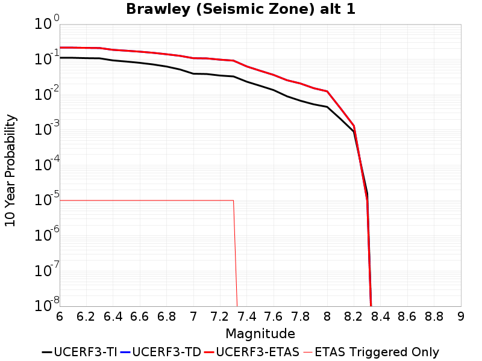 |

| Magnitude | 1 wk TI Prob | 1 wk TD Prob | 1 wk ETAS Prob | 1 wk ETAS/TD Gain | 1 wk ETAS Triggered Only | 1 mo TI Prob | 1 mo TD Prob | 1 mo ETAS Prob | 1 mo ETAS/TD Gain | 1 mo ETAS Triggered Only | 1 yr TI Prob | 1 yr TD Prob | 1 yr ETAS Prob | 1 yr ETAS/TD Gain | 1 yr ETAS Triggered Only | 10 yr TI Prob | 10 yr TD Prob | 10 yr ETAS Prob | 10 yr ETAS/TD Gain | 10 yr ETAS Triggered Only |
|-----|-----|-----|-----|-----|-----|-----|-----|-----|-----|-----|-----|-----|-----|-----|-----|-----|-----|-----|-----|-----|
| 6.0 | 2.2521618E-4 | 4.8117034E-4 | 4.8117034E-4 | 1.0 | 0.0 | 9.6485513E-4 | 0.0020605663 | 0.002070546 | 1.004843 | 1.0E-5 | 0.011683988 | 0.024792409 | 0.02480216 | 1.0003934 | 1.0E-5 | 0.11088423 | 0.2151458 | 0.21515363 | 1.0000365 | 1.0E-5 |
| 6.1 | 2.2521618E-4 | 4.8117034E-4 | 4.8117034E-4 | 1.0 | 0.0 | 9.6485513E-4 | 0.0020605663 | 0.002070546 | 1.004843 | 1.0E-5 | 0.011683988 | 0.024792409 | 0.02480216 | 1.0003934 | 1.0E-5 | 0.11088423 | 0.2151458 | 0.21515363 | 1.0000365 | 1.0E-5 |
| 6.2 | 2.198148E-4 | 4.7190776E-4 | 4.7190776E-4 | 1.0 | 0.0 | 9.417233E-4 | 0.0020209313 | 0.0020309112 | 1.0049382 | 1.0E-5 | 0.011405343 | 0.024321217 | 0.024330974 | 1.0004011 | 1.0E-5 | 0.10837428 | 0.21155992 | 0.21156782 | 1.0000373 | 1.0E-5 |
| 6.3 | 2.1704129E-4 | 4.6624395E-4 | 4.6624395E-4 | 1.0 | 0.0 | 9.298453E-4 | 0.0019966953 | 0.0020066753 | 1.0049983 | 1.0E-5 | 0.011262234 | 0.02403305 | 0.024042808 | 1.0004061 | 1.0E-5 | 0.107082725 | 0.20944974 | 0.20945764 | 1.0000378 | 1.0E-5 |
| 6.4 | 1.876142E-4 | 4.0498763E-4 | 4.0498763E-4 | 1.0 | 0.0 | 8.038131E-4 | 0.0017345214 | 0.0017445041 | 1.0057553 | 1.0E-5 | 0.00974259 | 0.02091115 | 0.020920942 | 1.0004683 | 1.0E-5 | 0.093263686 | 0.18619715 | 0.18620528 | 1.0000437 | 1.0E-5 |
| 6.5 | 1.7390939E-4 | 3.7913767E-4 | 3.7913767E-4 | 1.0 | 0.0 | 7.45113E-4 | 0.0016238763 | 0.00163386 | 1.0061481 | 1.0E-5 | 0.009034078 | 0.01959099 | 0.019600794 | 1.0005004 | 1.0E-5 | 0.086755216 | 0.17598797 | 0.17599621 | 1.0000468 | 1.0E-5 |
| 6.6 | 1.591791E-4 | 3.5305636E-4 | 3.5305636E-4 | 1.0 | 0.0 | 6.8201777E-4 | 0.0015122315 | 0.0015222165 | 1.0066028 | 1.0E-5 | 0.008271996 | 0.018255569 | 0.018265387 | 1.0005378 | 1.0E-5 | 0.07970774 | 0.16534503 | 0.16535337 | 1.0000504 | 1.0E-5 |
| 6.7 | 1.4268003E-4 | 3.2445215E-4 | 3.2445215E-4 | 1.0 | 0.0 | 6.1134255E-4 | 0.0013897767 | 0.0013997628 | 1.0071855 | 1.0E-5 | 0.007417723 | 0.016789028 | 0.01679886 | 1.0005857 | 1.0E-5 | 0.07174956 | 0.15340981 | 0.15341827 | 1.0000552 | 1.0E-5 |
| 6.8 | 1.239713E-4 | 2.9377246E-4 | 2.9377246E-4 | 1.0 | 0.0 | 5.3119735E-4 | 0.0012584237 | 0.0012684112 | 1.0079365 | 1.0E-5 | 0.0064481674 | 0.01521515 | 0.015224998 | 1.0006472 | 1.0E-5 | 0.06264243 | 0.13965948 | 0.13966808 | 1.0000616 | 1.0E-5 |
| 6.9 | 1.0180238E-4 | 2.6500807E-4 | 2.6500807E-4 | 1.0 | 0.0 | 4.3622297E-4 | 0.0011352588 | 0.0011452475 | 1.0087986 | 1.0E-5 | 0.005298089 | 0.013735202 | 0.013745065 | 1.000718 | 1.0E-5 | 0.05173543 | 0.12595873 | 0.12596747 | 1.0000694 | 1.0E-5 |
| 7.0 | 7.6619996E-5 | 2.2583349E-4 | 2.2583349E-4 | 1.0 | 0.0 | 3.283301E-4 | 9.67502E-4 | 9.774923E-4 | 1.0103259 | 1.0E-5 | 0.0039900932 | 0.0117164375 | 0.011726321 | 1.0008435 | 1.0E-5 | 0.039192066 | 0.1080172 | 0.10802612 | 1.0000826 | 1.0E-5 |
| 7.1 | 7.5127435E-5 | 2.2263994E-4 | 2.2263994E-4 | 1.0 | 0.0 | 3.2193496E-4 | 9.538255E-4 | 9.6381595E-4 | 1.0104741 | 1.0E-5 | 0.0039125155 | 0.011551703 | 0.011561587 | 1.0008557 | 1.0E-5 | 0.038443442 | 0.10657227 | 0.1065812 | 1.0000838 | 1.0E-5 |
| 7.2 | 6.788582E-5 | 2.0385011E-4 | 2.0385011E-4 | 1.0 | 0.0 | 2.9090676E-4 | 8.733539E-4 | 8.8334514E-4 | 1.0114402 | 1.0E-5 | 0.0035360386 | 0.010581892 | 0.010591786 | 1.000935 | 1.0E-5 | 0.034803 | 0.098223045 | 0.09823206 | 1.0000918 | 1.0E-5 |
| 7.3 | 6.399602E-5 | 1.9008217E-4 | 1.9008217E-4 | 1.0 | 0.0 | 2.7423984E-4 | 8.1438647E-4 | 8.2437834E-4 | 1.0122691 | 1.0E-5 | 0.0033337586 | 0.009870678 | 0.009880579 | 1.0010031 | 1.0E-5 | 0.03284188 | 0.09209458 | 0.09210365 | 1.0000986 | 1.0E-5 |
| 7.4 | 4.506759E-5 | 1.2657008E-4 | 1.2657008E-4 | 1.0 | 0.0 | 1.9313251E-4 | 5.423313E-4 | 5.423313E-4 | 1.0 | 0.0 | 0.0023488526 | 0.0065830713 | 0.0065830713 | 1.0 | 0.0 | 0.023241805 | 0.0629208 | 0.0629208 | 1.0 | 0.0 |
| 7.5 | 3.43289E-5 | 9.4412164E-5 | 9.4412164E-5 | 1.0 | 0.0 | 1.4711556E-4 | 4.0456114E-4 | 4.0456114E-4 | 1.0 | 0.0 | 0.0017896603 | 0.004914471 | 0.004914471 | 1.0 | 0.0 | 0.01775316 | 0.047527257 | 0.047527257 | 1.0 | 0.0 |
| 7.6 | 2.5980507E-5 | 7.145047E-5 | 7.145047E-5 | 1.0 | 0.0 | 1.1134028E-4 | 3.061805E-4 | 3.061805E-4 | 1.0 | 0.0 | 0.001354725 | 0.0037214006 | 0.0037214006 | 1.0 | 0.0 | 0.013464959 | 0.036256365 | 0.036256365 | 1.0 | 0.0 |
| 7.7 | 1.7292105E-5 | 5.019294E-5 | 5.019294E-5 | 1.0 | 0.0 | 7.4106916E-5 | 2.1509489E-4 | 2.1509489E-4 | 1.0 | 0.0 | 9.018782E-4 | 0.002615641 | 0.002615641 | 1.0 | 0.0 | 0.008982267 | 0.025647512 | 0.025647512 | 1.0 | 0.0 |
| 7.8 | 1.2927471E-5 | 4.037715E-5 | 4.037715E-5 | 1.0 | 0.0 | 5.5402274E-5 | 1.7303346E-4 | 1.7303346E-4 | 1.0 | 0.0 | 6.743139E-4 | 0.0021046496 | 0.0021046496 | 1.0 | 0.0 | 0.0067227143 | 0.02074283 | 0.02074283 | 1.0 | 0.0 |
| 7.9 | 1.0200774E-5 | 2.929904E-5 | 2.929904E-5 | 1.0 | 0.0 | 4.371687E-5 | 1.2556127E-4 | 1.2556127E-4 | 1.0 | 0.0 | 5.321229E-4 | 0.0015276377 | 0.0015276377 | 1.0 | 0.0 | 0.005308505 | 0.015247199 | 0.015247199 | 1.0 | 0.0 |
| 8.0 | 8.650396E-6 | 2.3752207E-5 | 2.3752207E-5 | 1.0 | 0.0 | 3.70726E-5 | 1.0179121E-4 | 1.0179121E-4 | 1.0 | 0.0 | 4.5126543E-4 | 0.0012386042 | 0.0012386042 | 1.0 | 0.0 | 0.0045035016 | 0.012431906 | 0.012431906 | 1.0 | 0.0 |
| 8.1 | 3.9368224E-6 | 7.533042E-6 | 7.533042E-6 | 1.0 | 0.0 | 1.6871985E-5 | 3.2284068E-5 | 3.2284068E-5 | 1.0 | 0.0 | 2.0539707E-4 | 3.9298777E-4 | 3.9298777E-4 | 1.0 | 0.0 | 0.0020520731 | 0.004102692 | 0.004102692 | 1.0 | 0.0 |
| 8.2 | 1.7101195E-6 | 2.296859E-6 | 2.296859E-6 | 1.0 | 0.0 | 7.329063E-6 | 9.843645E-6 | 9.843645E-6 | 1.0 | 0.0 | 8.922769E-5 | 1.1983982E-4 | 1.1983982E-4 | 1.0 | 0.0 | 8.9191867E-4 | 0.0013071392 | 0.0013071392 | 1.0 | 0.0 |
| 8.3 | 3.0346666E-8 | 1.8043824E-8 | 1.8043824E-8 | 1.0 | 0.0 | 1.3005713E-7 | 7.7330675E-8 | 7.7330675E-8 | 1.0 | 0.0 | 1.5834444E-6 | 9.415009E-7 | 9.415009E-7 | 1.0 | 0.0 | 1.5834332E-5 | 9.810533E-6 | 9.810533E-6 | 1.0 | 0.0 |

## Imperial
*[(top)](#table-of-contents)*

| 1 Week | 1 Month | 1 Year | 10 Year |
|-----|-----|-----|-----|
|  |  |  |  |

| Magnitude | 1 wk TI Prob | 1 wk TD Prob | 1 wk ETAS Prob | 1 wk ETAS/TD Gain | 1 wk ETAS Triggered Only | 1 mo TI Prob | 1 mo TD Prob | 1 mo ETAS Prob | 1 mo ETAS/TD Gain | 1 mo ETAS Triggered Only | 1 yr TI Prob | 1 yr TD Prob | 1 yr ETAS Prob | 1 yr ETAS/TD Gain | 1 yr ETAS Triggered Only | 10 yr TI Prob | 10 yr TD Prob | 10 yr ETAS Prob | 10 yr ETAS/TD Gain | 10 yr ETAS Triggered Only |
|-----|-----|-----|-----|-----|-----|-----|-----|-----|-----|-----|-----|-----|-----|-----|-----|-----|-----|-----|-----|-----|
| 6.0 | 2.7496446E-4 | 5.122463E-4 | 5.122463E-4 | 1.0 | 0.0 | 0.0011778869 | 0.002193534 | 0.002203512 | 1.0045489 | 1.0E-5 | 0.0142467655 | 0.026386885 | 0.026396621 | 1.000369 | 1.0E-5 | 0.13367249 | 0.23027873 | 0.23028642 | 1.0000334 | 1.0E-5 |
| 6.1 | 2.5356023E-4 | 4.925116E-4 | 4.925116E-4 | 1.0 | 0.0 | 0.001086234 | 0.0021090955 | 0.0021190743 | 1.0047314 | 1.0E-5 | 0.013144928 | 0.025370076 | 0.025379822 | 1.0003842 | 1.0E-5 | 0.123940155 | 0.22150026 | 0.22150804 | 1.0000352 | 1.0E-5 |
| 6.2 | 2.4820742E-4 | 4.8335726E-4 | 4.8335726E-4 | 1.0 | 0.0 | 0.0010633124 | 0.002069925 | 0.0020799043 | 1.0048211 | 1.0E-5 | 0.01286919 | 0.024904666 | 0.024914417 | 1.0003915 | 1.0E-5 | 0.12148927 | 0.21798542 | 0.21799324 | 1.0000359 | 1.0E-5 |
| 6.3 | 2.3205351E-4 | 4.641857E-4 | 4.641857E-4 | 1.0 | 0.0 | 9.94136E-4 | 0.0019878878 | 0.001997868 | 1.0050205 | 1.0E-5 | 0.012036599 | 0.023923011 | 0.023932774 | 1.000408 | 1.0E-5 | 0.11405133 | 0.20976277 | 0.20977068 | 1.0000377 | 1.0E-5 |
| 6.4 | 2.0304754E-4 | 4.038687E-4 | 4.038687E-4 | 1.0 | 0.0 | 8.6991355E-4 | 0.0017297327 | 0.0017397155 | 1.0057713 | 1.0E-5 | 0.010539869 | 0.02084878 | 0.020858573 | 1.0004697 | 1.0E-5 | 0.100537635 | 0.18689714 | 0.18690526 | 1.0000435 | 1.0E-5 |
| 6.5 | 1.854992E-4 | 3.7465832E-4 | 3.7465832E-4 | 1.0 | 0.0 | 7.9475436E-4 | 0.0016047031 | 0.0016146871 | 1.0062217 | 1.0E-5 | 0.009633281 | 0.019358682 | 0.019368486 | 1.0005065 | 1.0E-5 | 0.0922623 | 0.17504941 | 0.17505765 | 1.0000471 | 1.0E-5 |
| 6.6 | 1.6586106E-4 | 3.446878E-4 | 3.446878E-4 | 1.0 | 0.0 | 7.106394E-4 | 0.0014764075 | 0.0014863928 | 1.0067632 | 1.0E-5 | 0.008617763 | 0.017828923 | 0.017838744 | 1.0005509 | 1.0E-5 | 0.08291132 | 0.16241015 | 0.16241853 | 1.0000516 | 1.0E-5 |
| 6.7 | 1.4224656E-4 | 3.1147408E-4 | 3.1147408E-4 | 1.0 | 0.0 | 6.094856E-4 | 0.0013342145 | 0.0013442012 | 1.007485 | 1.0E-5 | 0.0073952693 | 0.016122783 | 0.016132621 | 1.0006102 | 1.0E-5 | 0.07153955 | 0.14795479 | 0.14796332 | 1.0000576 | 1.0E-5 |
| 6.8 | 1.2317259E-4 | 2.8107112E-4 | 2.8107112E-4 | 1.0 | 0.0 | 5.2777573E-4 | 0.0012040407 | 0.0012140287 | 1.0082954 | 1.0E-5 | 0.0064067547 | 0.014562091 | 0.014571945 | 1.0006768 | 1.0E-5 | 0.06225166 | 0.13420464 | 0.1342133 | 1.0000645 | 1.0E-5 |
| 6.9 | 9.859898E-5 | 2.524718E-4 | 2.524718E-4 | 1.0 | 0.0 | 4.2249862E-4 | 0.0010815776 | 0.0010915669 | 1.0092357 | 1.0E-5 | 0.0051317946 | 0.013089685 | 0.013099554 | 1.000754 | 1.0E-5 | 0.05014893 | 0.12035593 | 0.12036472 | 1.0000731 | 1.0E-5 |
| 7.0 | 7.3191884E-5 | 2.143658E-4 | 2.143658E-4 | 1.0 | 0.0 | 3.136418E-4 | 9.1839035E-4 | 9.2838117E-4 | 1.0108786 | 1.0E-5 | 0.003811904 | 0.011124774 | 0.011134663 | 1.000889 | 1.0E-5 | 0.037471764 | 0.102760784 | 0.102769755 | 1.0000873 | 1.0E-5 |
| 7.1 | 7.1760296E-5 | 2.1135443E-4 | 2.1135443E-4 | 1.0 | 0.0 | 3.0750787E-4 | 9.0549345E-4 | 9.154844E-4 | 1.0110337 | 1.0E-5 | 0.003737482 | 0.010969345 | 0.010979236 | 1.0009016 | 1.0E-5 | 0.03675245 | 0.10138823 | 0.10139722 | 1.0000886 | 1.0E-5 |
| 7.2 | 6.46614E-5 | 1.9297317E-4 | 1.9297317E-4 | 1.0 | 0.0 | 2.7709085E-4 | 8.267688E-4 | 8.3676056E-4 | 1.0120853 | 1.0E-5 | 0.0033683628 | 0.010020084 | 0.010029984 | 1.000988 | 1.0E-5 | 0.033177625 | 0.09317544 | 0.093184516 | 1.0000973 | 1.0E-5 |
| 7.3 | 6.088115E-5 | 1.7961387E-4 | 1.7961387E-4 | 1.0 | 0.0 | 2.6089314E-4 | 7.695495E-4 | 7.7954185E-4 | 1.0129846 | 1.0E-5 | 0.0031717476 | 0.0093296 | 0.009339507 | 1.0010619 | 1.0E-5 | 0.031268585 | 0.08720281 | 0.08721194 | 1.0001047 | 1.0E-5 |
| 7.4 | 4.199346E-5 | 1.16241106E-4 | 1.16241106E-4 | 1.0 | 0.0 | 1.7995955E-4 | 4.9808196E-4 | 4.9808196E-4 | 1.0 | 0.0 | 0.0021888057 | 0.0060474584 | 0.0060474584 | 1.0 | 0.0 | 0.02167372 | 0.05793889 | 0.05793889 | 1.0 | 0.0 |
| 7.5 | 3.130448E-5 | 8.425084E-5 | 8.425084E-5 | 1.0 | 0.0 | 1.3415517E-4 | 3.6102536E-4 | 3.6102536E-4 | 1.0 | 0.0 | 0.0016321153 | 0.004386686 | 0.004386686 | 1.0 | 0.0 | 0.016201803 | 0.042544838 | 0.042544838 | 1.0 | 0.0 |
| 7.6 | 2.3074248E-5 | 6.162511E-5 | 6.162511E-5 | 1.0 | 0.0 | 9.888588E-5 | 2.6408103E-4 | 2.6408103E-4 | 1.0 | 0.0 | 0.0012032706 | 0.0032104698 | 0.0032104698 | 1.0 | 0.0 | 0.011967761 | 0.031382095 | 0.031382095 | 1.0 | 0.0 |
| 7.7 | 1.45864815E-5 | 4.0772633E-5 | 4.0772633E-5 | 1.0 | 0.0 | 6.2511994E-5 | 1.747282E-4 | 1.747282E-4 | 1.0 | 0.0 | 7.608177E-4 | 0.0021252458 | 0.0021252458 | 1.0 | 0.0 | 0.007582182 | 0.020924654 | 0.020924654 | 1.0 | 0.0 |
| 7.8 | 1.0352979E-5 | 3.151162E-5 | 3.151162E-5 | 1.0 | 0.0 | 4.4369157E-5 | 1.3504282E-4 | 1.3504282E-4 | 1.0 | 0.0 | 5.400606E-4 | 0.0016429088 | 0.0016429088 | 1.0 | 0.0 | 0.0053875 | 0.016269123 | 0.016269123 | 1.0 | 0.0 |
| 7.9 | 8.137906E-6 | 2.259216E-5 | 2.259216E-5 | 1.0 | 0.0 | 3.4876273E-5 | 9.681995E-5 | 9.681995E-5 | 1.0 | 0.0 | 4.2453592E-4 | 0.0011781465 | 0.0011781465 | 1.0 | 0.0 | 0.004237258 | 0.011824037 | 0.011824037 | 1.0 | 0.0 |
| 8.0 | 6.93792E-6 | 1.8390307E-5 | 1.8390307E-5 | 1.0 | 0.0 | 2.9733603E-5 | 7.8813224E-5 | 7.8813224E-5 | 1.0 | 0.0 | 3.6194647E-4 | 9.5912936E-4 | 9.5912936E-4 | 1.0 | 0.0 | 0.0036135751 | 0.009680239 | 0.009680239 | 1.0 | 0.0 |
| 8.1 | 3.4286315E-6 | 6.5586255E-6 | 6.5586255E-6 | 1.0 | 0.0 | 1.4694053E-5 | 2.8108094E-5 | 2.8108094E-5 | 1.0 | 0.0 | 1.7888541E-4 | 3.4216244E-4 | 3.4216244E-4 | 1.0 | 0.0 | 0.0017874148 | 0.0035746046 | 0.0035746046 | 1.0 | 0.0 |
| 8.2 | 1.4906886E-6 | 2.005565E-6 | 2.005565E-6 | 1.0 | 0.0 | 6.3886496E-6 | 8.595251E-6 | 8.595251E-6 | 1.0 | 0.0 | 7.7779034E-5 | 1.0464218E-4 | 1.0464218E-4 | 1.0 | 0.0 | 7.775182E-4 | 0.0011428333 | 0.0011428333 | 1.0 | 0.0 |
| 8.3 | 2.5758007E-8 | 1.5201573E-8 | 1.5201573E-8 | 1.0 | 0.0 | 1.10391454E-7 | 6.51496E-8 | 6.51496E-8 | 1.0 | 0.0 | 1.3440151E-6 | 7.9319636E-7 | 7.9319636E-7 | 1.0 | 0.0 | 1.344007E-5 | 8.263047E-6 | 8.263047E-6 | 1.0 | 0.0 |

