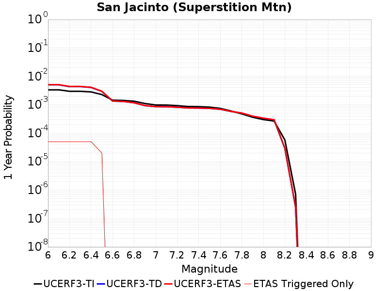
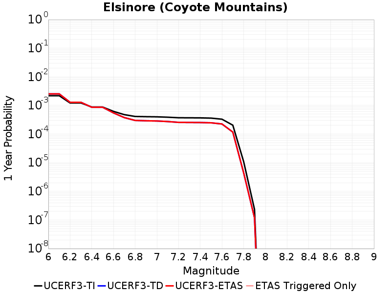
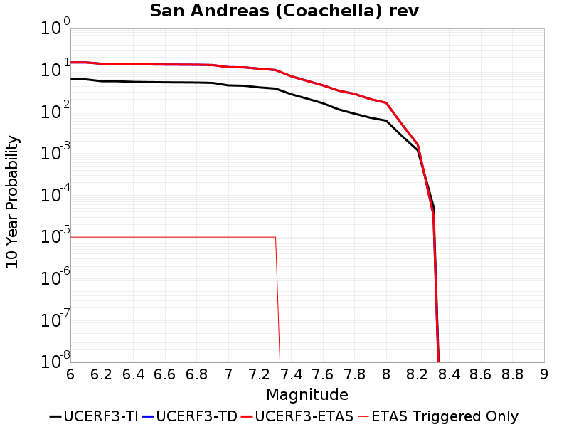
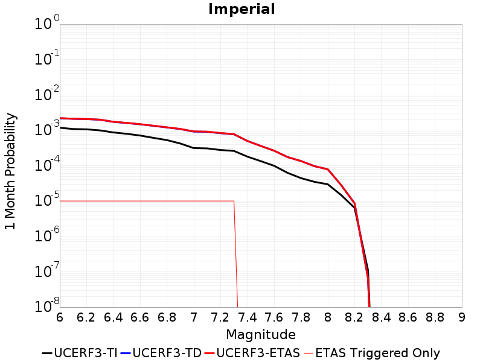
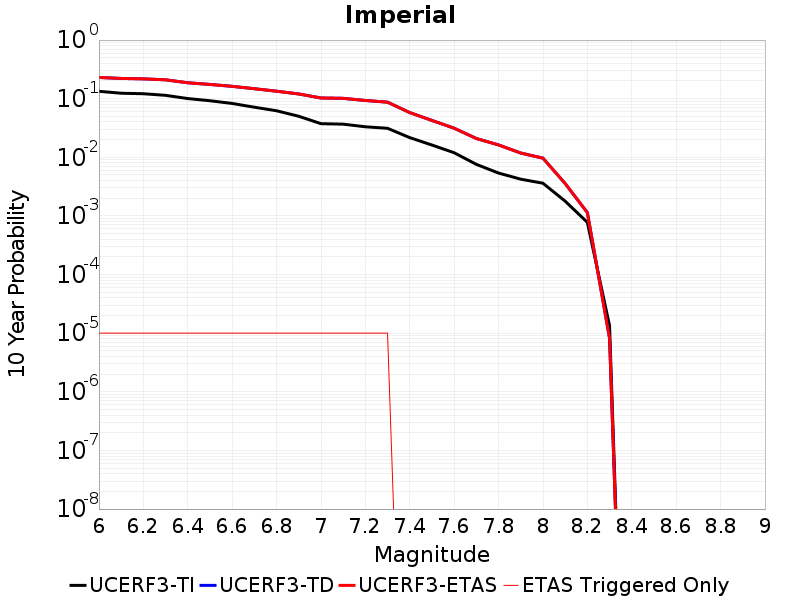
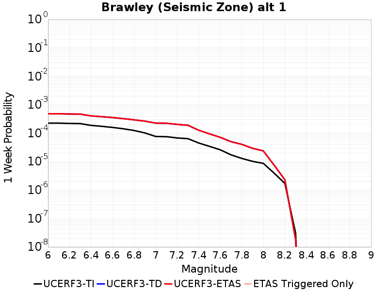
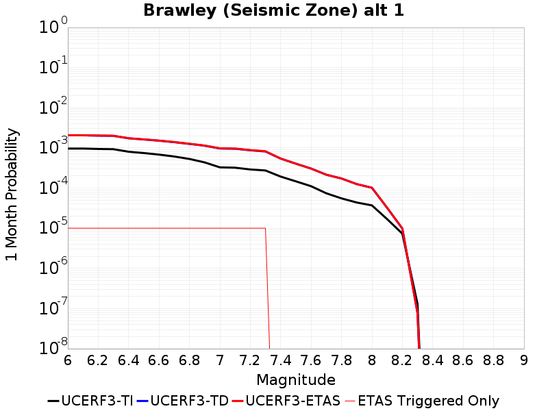
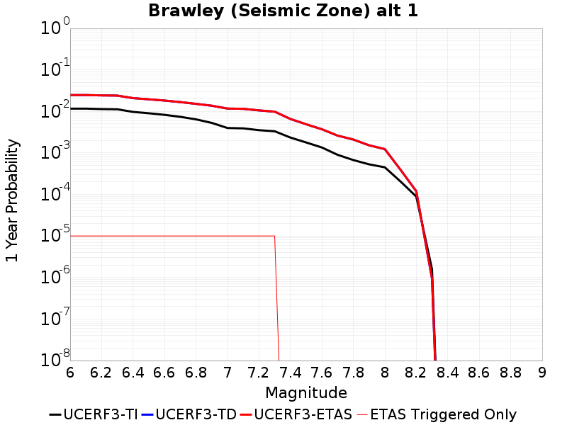
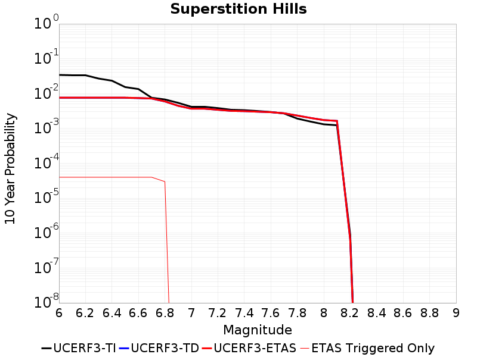
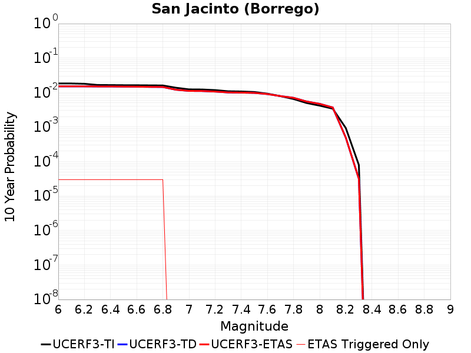

# Parent Section Magnitude-Probability Distributions

Only fault sections with at least one triggered aftershock are plotted. Sections are sorted by total supraseismogenic trigger rate (decreasing)

## Table Of Contents

* [San Jacinto (Superstition Mtn)](#san-jacinto-superstition-mtn)
* [Elsinore (Coyote Mountains)](#elsinore-coyote-mountains)
* [San Andreas (Coachella) rev](#san-andreas-coachella-rev)
* [Imperial](#imperial)
* [Brawley (Seismic Zone) alt 1](#brawley-seismic-zone-alt-1)
* [Superstition Hills](#superstition-hills)
* [San Jacinto (Borrego)](#san-jacinto-borrego)

## San Jacinto (Superstition Mtn)
*[(top)](#table-of-contents)*

| 1 Week | 1 Month | 1 Year | 10 Year |
|-----|-----|-----|-----|
|  |  |  |  |

| Magnitude | 1 wk TI Prob | 1 wk TD Prob | 1 wk ETAS Prob | 1 wk ETAS/TD Gain | 1 wk ETAS Triggered Only | 1 mo TI Prob | 1 mo TD Prob | 1 mo ETAS Prob | 1 mo ETAS/TD Gain | 1 mo ETAS Triggered Only | 1 yr TI Prob | 1 yr TD Prob | 1 yr ETAS Prob | 1 yr ETAS/TD Gain | 1 yr ETAS Triggered Only | 10 yr TI Prob | 10 yr TD Prob | 10 yr ETAS Prob | 10 yr ETAS/TD Gain | 10 yr ETAS Triggered Only |
|-----|-----|-----|-----|-----|-----|-----|-----|-----|-----|-----|-----|-----|-----|-----|-----|-----|-----|-----|-----|-----|
| 6.0 | 6.4193904E-5 | 9.637066E-5 | 9.637066E-5 | 1.0 | 0.0 | 2.7508775E-4 | 4.1296045E-4 | 4.2295633E-4 | 1.0242054 | 1.0E-5 | 0.0033440501 | 0.0050175884 | 0.005067338 | 1.009915 | 5.0E-5 | 0.03294174 | 0.04900655 | 0.04911116 | 1.0021346 | 1.1E-4 |
| 6.1 | 6.4193904E-5 | 9.637066E-5 | 9.637066E-5 | 1.0 | 0.0 | 2.7508775E-4 | 4.1296045E-4 | 4.2295633E-4 | 1.0242054 | 1.0E-5 | 0.0033440501 | 0.0050175884 | 0.005067338 | 1.009915 | 5.0E-5 | 0.03294174 | 0.04900655 | 0.04911116 | 1.0021346 | 1.1E-4 |
| 6.2 | 5.7023593E-5 | 8.349766E-5 | 8.349766E-5 | 1.0 | 0.0 | 2.4436394E-4 | 3.578071E-4 | 3.678035E-4 | 1.027938 | 1.0E-5 | 0.002971072 | 0.0043492457 | 0.004399028 | 1.0114462 | 5.0E-5 | 0.029316625 | 0.0426803 | 0.042785607 | 1.0024673 | 1.1E-4 |
| 6.3 | 5.6940098E-5 | 8.334283E-5 | 8.334283E-5 | 1.0 | 0.0 | 2.4400617E-4 | 3.5714367E-4 | 3.671401E-4 | 1.02799 | 1.0E-5 | 0.002966728 | 0.004341201 | 0.004390984 | 1.0114676 | 5.0E-5 | 0.029274331 | 0.042603593 | 0.042708907 | 1.0024719 | 1.1E-4 |
| 6.4 | 5.4171585E-5 | 7.7828416E-5 | 7.7828416E-5 | 1.0 | 0.0 | 2.3214328E-4 | 3.3351703E-4 | 3.3351703E-4 | 1.0 | 0.0 | 0.0028226813 | 0.004054661 | 0.0040944987 | 1.0098252 | 4.0E-5 | 0.02787096 | 0.039889544 | 0.039985556 | 1.002407 | 1.0E-4 |
| 6.5 | 4.375144E-5 | 5.6730267E-5 | 5.6730267E-5 | 1.0 | 0.0 | 1.874927E-4 | 2.431137E-4 | 2.431137E-4 | 1.0 | 0.0 | 0.0022803338 | 0.0029570686 | 0.0029570686 | 1.0 | 0.0 | 0.022570757 | 0.029392077 | 0.029401783 | 1.0003302 | 1.0E-5 |
| 6.6 | 2.772192E-5 | 2.5782265E-5 | 2.5782265E-5 | 1.0 | 0.0 | 1.1880282E-4 | 1.1049085E-4 | 1.1049085E-4 | 1.0 | 0.0 | 0.0014454646 | 0.0013444156 | 0.0013444156 | 1.0 | 0.0 | 0.014360986 | 0.013692831 | 0.013702694 | 1.0007203 | 1.0E-5 |
| 6.7 | 2.7124124E-5 | 2.499183E-5 | 2.499183E-5 | 1.0 | 0.0 | 1.1624106E-4 | 1.0710356E-4 | 1.0710356E-4 | 1.0 | 0.0 | 0.0014143161 | 0.0013032252 | 0.0013032252 | 1.0 | 0.0 | 0.014053487 | 0.013285697 | 0.013295565 | 1.0007427 | 1.0E-5 |
| 6.8 | 2.5475807E-5 | 2.2449965E-5 | 2.2449965E-5 | 1.0 | 0.0 | 1.0917746E-4 | 9.621066E-5 | 9.621066E-5 | 1.0 | 0.0 | 0.001328425 | 0.0011707474 | 0.0011707474 | 1.0 | 0.0 | 0.0132051185 | 0.011970294 | 0.011980173 | 1.0008254 | 1.0E-5 |
| 6.9 | 2.1162023E-5 | 1.7890488E-5 | 1.7890488E-5 | 1.0 | 0.0 | 9.069123E-5 | 7.667129E-5 | 7.667129E-5 | 1.0 | 0.0 | 0.0011036064 | 9.3307707E-4 | 9.3307707E-4 | 1.0 | 0.0 | 0.010981417 | 0.009584746 | 0.009584746 | 1.0 | 0.0 |
| 7.0 | 1.8754288E-5 | 1.6414551E-5 | 1.6414551E-5 | 1.0 | 0.0 | 8.037304E-5 | 7.03462E-5 | 7.03462E-5 | 1.0 | 0.0 | 9.781026E-4 | 8.561309E-4 | 8.561309E-4 | 1.0 | 0.0 | 0.009738087 | 0.008802059 | 0.008802059 | 1.0 | 0.0 |
| 7.1 | 1.8678527E-5 | 1.6339452E-5 | 1.6339452E-5 | 1.0 | 0.0 | 8.0048376E-5 | 7.0024354E-5 | 7.0024354E-5 | 1.0 | 0.0 | 9.7415317E-4 | 8.5221557E-4 | 8.5221557E-4 | 1.0 | 0.0 | 0.009698939 | 0.008762905 | 0.008762905 | 1.0 | 0.0 |
| 7.2 | 1.7804578E-5 | 1.5631485E-5 | 1.5631485E-5 | 1.0 | 0.0 | 7.6303106E-5 | 6.699037E-5 | 6.699037E-5 | 1.0 | 0.0 | 9.285943E-4 | 8.1530487E-4 | 8.1530487E-4 | 1.0 | 0.0 | 0.009247236 | 0.008392946 | 0.008392946 | 1.0 | 0.0 |
| 7.3 | 1.6583685E-5 | 1.47778355E-5 | 1.47778355E-5 | 1.0 | 0.0 | 7.1070994E-5 | 6.333205E-5 | 6.333205E-5 | 1.0 | 0.0 | 8.649459E-4 | 7.70797E-4 | 7.70797E-4 | 1.0 | 0.0 | 0.00861587 | 0.007946912 | 0.007946912 | 1.0 | 0.0 |
| 7.4 | 1.6387552E-5 | 1.4642266E-5 | 1.4642266E-5 | 1.0 | 0.0 | 7.023047E-5 | 6.2751074E-5 | 6.2751074E-5 | 1.0 | 0.0 | 8.5472054E-4 | 7.637286E-4 | 7.637286E-4 | 1.0 | 0.0 | 0.008514405 | 0.007876074 | 0.007876074 | 1.0 | 0.0 |
| 7.5 | 1.5790754E-5 | 1.42805775E-5 | 1.42805775E-5 | 1.0 | 0.0 | 6.767291E-5 | 6.120105E-5 | 6.120105E-5 | 1.0 | 0.0 | 8.236062E-4 | 7.4487005E-4 | 7.4487005E-4 | 1.0 | 0.0 | 0.008205604 | 0.0076853987 | 0.0076853987 | 1.0 | 0.0 |
| 7.6 | 1.4248672E-5 | 1.3290889E-5 | 1.3290889E-5 | 1.0 | 0.0 | 6.106431E-5 | 5.695972E-5 | 5.695972E-5 | 1.0 | 0.0 | 7.432043E-4 | 6.932657E-4 | 6.932657E-4 | 1.0 | 0.0 | 0.007407237 | 0.007163603 | 0.007163603 | 1.0 | 0.0 |
| 7.7 | 1.15449975E-5 | 1.1129912E-5 | 1.1129912E-5 | 1.0 | 0.0 | 4.947762E-5 | 4.7698755E-5 | 4.7698755E-5 | 1.0 | 0.0 | 6.022235E-4 | 5.805784E-4 | 5.805784E-4 | 1.0 | 0.0 | 0.006005941 | 0.006028634 | 0.006028634 | 1.0 | 0.0 |
| 7.8 | 9.1391985E-6 | 9.731708E-6 | 9.731708E-6 | 1.0 | 0.0 | 3.9167408E-5 | 4.170666E-5 | 4.170666E-5 | 1.0 | 0.0 | 4.767588E-4 | 5.0766085E-4 | 5.0766085E-4 | 1.0 | 0.0 | 0.0047573727 | 0.0052907914 | 0.0052907914 | 1.0 | 0.0 |
| 7.9 | 6.973017E-6 | 7.575184E-6 | 7.575184E-6 | 1.0 | 0.0 | 2.9884017E-5 | 3.2464675E-5 | 3.2464675E-5 | 1.0 | 0.0 | 3.6377716E-4 | 3.9518627E-4 | 3.9518627E-4 | 1.0 | 0.0 | 0.0036318225 | 0.0041534384 | 0.0041534384 | 1.0 | 0.0 |
| 8.0 | 5.7638235E-6 | 6.4365277E-6 | 6.4365277E-6 | 1.0 | 0.0 | 2.4701867E-5 | 2.758483E-5 | 2.758483E-5 | 1.0 | 0.0 | 3.0070372E-4 | 3.357941E-4 | 3.357941E-4 | 1.0 | 0.0 | 0.0030029714 | 0.0035465676 | 0.0035465676 | 1.0 | 0.0 |
| 8.1 | 5.1124434E-6 | 5.656545E-6 | 5.656545E-6 | 1.0 | 0.0 | 2.1910288E-5 | 2.4242114E-5 | 2.4242114E-5 | 1.0 | 0.0 | 2.6672508E-4 | 2.9510827E-4 | 2.9510827E-4 | 1.0 | 0.0 | 0.0026640517 | 0.0031253197 | 0.0031253197 | 1.0 | 0.0 |
| 8.2 | 1.1075938E-6 | 5.561417E-7 | 5.561417E-7 | 1.0 | 0.0 | 4.7468216E-6 | 2.3834623E-6 | 2.3834623E-6 | 1.0 | 0.0 | 5.779102E-5 | 2.901829E-5 | 2.901829E-5 | 1.0 | 0.0 | 5.777599E-4 | 3.2599093E-4 | 3.2599093E-4 | 1.0 | 0.0 |
| 8.3 | 1.3584393E-8 | 4.6860302E-9 | 4.6860302E-9 | 1.0 | 0.0 | 5.8218827E-8 | 2.0082986E-8 | 2.0082986E-8 | 1.0 | 0.0 | 7.0881396E-7 | 2.4451035E-7 | 2.4451035E-7 | 1.0 | 0.0 | 7.0881174E-6 | 2.7361236E-6 | 2.7361236E-6 | 1.0 | 0.0 |

## Elsinore (Coyote Mountains)
*[(top)](#table-of-contents)*

| 1 Week | 1 Month | 1 Year | 10 Year |
|-----|-----|-----|-----|
|  |  |  |  |

| Magnitude | 1 wk TI Prob | 1 wk TD Prob | 1 wk ETAS Prob | 1 wk ETAS/TD Gain | 1 wk ETAS Triggered Only | 1 mo TI Prob | 1 mo TD Prob | 1 mo ETAS Prob | 1 mo ETAS/TD Gain | 1 mo ETAS Triggered Only | 1 yr TI Prob | 1 yr TD Prob | 1 yr ETAS Prob | 1 yr ETAS/TD Gain | 1 yr ETAS Triggered Only | 10 yr TI Prob | 10 yr TD Prob | 10 yr ETAS Prob | 10 yr ETAS/TD Gain | 10 yr ETAS Triggered Only |
|-----|-----|-----|-----|-----|-----|-----|-----|-----|-----|-----|-----|-----|-----|-----|-----|-----|-----|-----|-----|-----|
| 6.0 | 4.20513E-5 | 4.8707956E-5 | 4.8707956E-5 | 1.0 | 0.0 | 1.8020741E-4 | 2.0873494E-4 | 2.1873286E-4 | 1.0478977 | 1.0E-5 | 0.0021918174 | 0.002538918 | 0.0025788166 | 1.0157148 | 4.0E-5 | 0.021703249 | 0.025150374 | 0.025189368 | 1.0015504 | 4.0E-5 |
| 6.1 | 4.20513E-5 | 4.8707956E-5 | 4.8707956E-5 | 1.0 | 0.0 | 1.8020741E-4 | 2.0873494E-4 | 2.1873286E-4 | 1.0478977 | 1.0E-5 | 0.0021918174 | 0.002538918 | 0.0025788166 | 1.0157148 | 4.0E-5 | 0.021703249 | 0.025150374 | 0.025189368 | 1.0015504 | 4.0E-5 |
| 6.2 | 2.3413893E-5 | 2.473193E-5 | 2.473193E-5 | 1.0 | 0.0 | 1.0034139E-4 | 1.0599022E-4 | 1.1598916E-4 | 1.0943383 | 1.0E-5 | 0.0012209718 | 0.0012897572 | 0.0013197184 | 1.0232302 | 3.0E-5 | 0.012142851 | 0.012831384 | 0.012860999 | 1.002308 | 3.0E-5 |
| 6.3 | 2.3413893E-5 | 2.473193E-5 | 2.473193E-5 | 1.0 | 0.0 | 1.0034139E-4 | 1.0599022E-4 | 1.1598916E-4 | 1.0943383 | 1.0E-5 | 0.0012209718 | 0.0012897572 | 0.0013197184 | 1.0232302 | 3.0E-5 | 0.012142851 | 0.012831384 | 0.012860999 | 1.002308 | 3.0E-5 |
| 6.4 | 1.6894814E-5 | 1.6592614E-5 | 1.6592614E-5 | 1.0 | 0.0 | 7.240433E-5 | 7.110948E-5 | 7.110948E-5 | 1.0 | 0.0 | 8.811662E-4 | 8.654517E-4 | 8.854344E-4 | 1.0230893 | 2.0E-5 | 0.0087768035 | 0.008624471 | 0.008644299 | 1.002299 | 2.0E-5 |
| 6.5 | 1.6894814E-5 | 1.6592614E-5 | 1.6592614E-5 | 1.0 | 0.0 | 7.240433E-5 | 7.110948E-5 | 7.110948E-5 | 1.0 | 0.0 | 8.811662E-4 | 8.654517E-4 | 8.854344E-4 | 1.0230893 | 2.0E-5 | 0.0087768035 | 0.008624471 | 0.008644299 | 1.002299 | 2.0E-5 |
| 6.6 | 1.1910969E-5 | 1.0547167E-5 | 1.0547167E-5 | 1.0 | 0.0 | 5.1046012E-5 | 4.520144E-5 | 4.520144E-5 | 1.0 | 0.0 | 6.21308E-4 | 5.5020186E-4 | 5.7019084E-4 | 1.0363303 | 2.0E-5 | 0.0061957375 | 0.0054896986 | 0.005509589 | 1.0036231 | 2.0E-5 |
| 6.7 | 9.1486E-6 | 7.215126E-6 | 7.215126E-6 | 1.0 | 0.0 | 3.9207694E-5 | 3.0921623E-5 | 3.0921623E-5 | 1.0 | 0.0 | 4.7724912E-4 | 3.7640956E-4 | 3.7640956E-4 | 1.0 | 0.0 | 0.0047622547 | 0.0037581006 | 0.0037581006 | 1.0 | 0.0 |
| 6.8 | 7.90441E-6 | 5.7396305E-6 | 5.7396305E-6 | 1.0 | 0.0 | 3.3875604E-5 | 2.4598192E-5 | 2.4598192E-5 | 1.0 | 0.0 | 4.1235742E-4 | 2.994431E-4 | 2.994431E-4 | 1.0 | 0.0 | 0.0041159308 | 0.0029905254 | 0.0029905254 | 1.0 | 0.0 |
| 6.9 | 7.77015E-6 | 5.5935066E-6 | 5.5935066E-6 | 1.0 | 0.0 | 3.3300217E-5 | 2.3971957E-5 | 2.3971957E-5 | 1.0 | 0.0 | 4.0535472E-4 | 2.9182076E-4 | 2.9182076E-4 | 1.0 | 0.0 | 0.004046161 | 0.0029145032 | 0.0029145032 | 1.0 | 0.0 |
| 7.0 | 7.675798E-6 | 5.4903066E-6 | 5.4903066E-6 | 1.0 | 0.0 | 3.289586E-5 | 2.352968E-5 | 2.352968E-5 | 1.0 | 0.0 | 4.004335E-4 | 2.8643745E-4 | 2.8643745E-4 | 1.0 | 0.0 | 0.003997127 | 0.0028608097 | 0.0028608097 | 1.0 | 0.0 |
| 7.1 | 7.447814E-6 | 5.2490896E-6 | 5.2490896E-6 | 1.0 | 0.0 | 3.191881E-5 | 2.249591E-5 | 2.249591E-5 | 1.0 | 0.0 | 3.8854225E-4 | 2.7385453E-4 | 2.7385453E-4 | 1.0 | 0.0 | 0.003878636 | 0.0027352956 | 0.0027352956 | 1.0 | 0.0 |
| 7.2 | 7.128185E-6 | 4.915697E-6 | 4.915697E-6 | 1.0 | 0.0 | 3.0549007E-5 | 2.106711E-5 | 2.106711E-5 | 1.0 | 0.0 | 3.7187067E-4 | 2.5646304E-4 | 2.5646304E-4 | 1.0 | 0.0 | 0.00371249 | 0.0025617897 | 0.0025617897 | 1.0 | 0.0 |
| 7.3 | 7.0913875E-6 | 4.884356E-6 | 4.884356E-6 | 1.0 | 0.0 | 3.0391306E-5 | 2.0932792E-5 | 2.0932792E-5 | 1.0 | 0.0 | 3.6995133E-4 | 2.5482813E-4 | 2.5482813E-4 | 1.0 | 0.0 | 0.0036933604 | 0.002545478 | 0.002545478 | 1.0 | 0.0 |
| 7.4 | 7.051521E-6 | 4.8481934E-6 | 4.8481934E-6 | 1.0 | 0.0 | 3.0220453E-5 | 2.0777814E-5 | 2.0777814E-5 | 1.0 | 0.0 | 3.6787192E-4 | 2.529417E-4 | 2.529417E-4 | 1.0 | 0.0 | 0.0036726352 | 0.0025266567 | 0.0025266567 | 1.0 | 0.0 |
| 7.5 | 6.910666E-6 | 4.743562E-6 | 4.743562E-6 | 1.0 | 0.0 | 2.9616802E-5 | 2.03294E-5 | 2.03294E-5 | 1.0 | 0.0 | 3.605249E-4 | 2.4748352E-4 | 2.4748352E-4 | 1.0 | 0.0 | 0.0035994058 | 0.0024721976 | 0.0024721976 | 1.0 | 0.0 |
| 7.6 | 6.341753E-6 | 4.3161763E-6 | 4.3161763E-6 | 1.0 | 0.0 | 2.7178658E-5 | 1.8497774E-5 | 1.8497774E-5 | 1.0 | 0.0 | 3.3084993E-4 | 2.2518828E-4 | 2.2518828E-4 | 1.0 | 0.0 | 0.0033035777 | 0.0022497168 | 0.0022497168 | 1.0 | 0.0 |
| 7.7 | 3.9205916E-6 | 2.249813E-6 | 2.249813E-6 | 1.0 | 0.0 | 1.6802427E-5 | 9.6420235E-6 | 9.6420235E-6 | 1.0 | 0.0 | 2.0455034E-4 | 1.17386066E-4 | 1.17386066E-4 | 1.0 | 0.0 | 0.0020436216 | 0.0011733138 | 0.0011733138 | 1.0 | 0.0 |
| 7.8 | 2.0846227E-7 | 8.505803E-8 | 8.505803E-8 | 1.0 | 0.0 | 8.9340944E-7 | 3.645344E-7 | 3.645344E-7 | 1.0 | 0.0 | 1.0877206E-5 | 4.4382004E-6 | 4.4382004E-6 | 1.0 | 0.0 | 1.0876673E-4 | 4.438145E-5 | 4.438145E-5 | 1.0 | 0.0 |
| 7.9 | 4.4969806E-9 | 2.2729365E-9 | 2.2729365E-9 | 1.0 | 0.0 | 1.9272775E-8 | 9.741156E-9 | 9.741156E-9 | 1.0 | 0.0 | 2.3464601E-7 | 1.1859857E-7 | 1.1859857E-7 | 1.0 | 0.0 | 2.3464577E-6 | 1.1859852E-6 | 1.1859852E-6 | 1.0 | 0.0 |

## San Andreas (Coachella) rev
*[(top)](#table-of-contents)*

| 1 Week | 1 Month | 1 Year | 10 Year |
|-----|-----|-----|-----|
|  |  |  |  |

| Magnitude | 1 wk TI Prob | 1 wk TD Prob | 1 wk ETAS Prob | 1 wk ETAS/TD Gain | 1 wk ETAS Triggered Only | 1 mo TI Prob | 1 mo TD Prob | 1 mo ETAS Prob | 1 mo ETAS/TD Gain | 1 mo ETAS Triggered Only | 1 yr TI Prob | 1 yr TD Prob | 1 yr ETAS Prob | 1 yr ETAS/TD Gain | 1 yr ETAS Triggered Only | 10 yr TI Prob | 10 yr TD Prob | 10 yr ETAS Prob | 10 yr ETAS/TD Gain | 10 yr ETAS Triggered Only |
|-----|-----|-----|-----|-----|-----|-----|-----|-----|-----|-----|-----|-----|-----|-----|-----|-----|-----|-----|-----|-----|
| 6.0 | 1.1925945E-4 | 3.294935E-4 | 3.294935E-4 | 1.0 | 0.0 | 5.110118E-4 | 0.0014113556 | 0.0014113556 | 1.0 | 0.0 | 0.0062038354 | 0.017049227 | 0.017059056 | 1.0005765 | 1.0E-5 | 0.060334753 | 0.15351272 | 0.15352964 | 1.0001103 | 2.0E-5 |
| 6.1 | 1.1925945E-4 | 3.294935E-4 | 3.294935E-4 | 1.0 | 0.0 | 5.110118E-4 | 0.0014113556 | 0.0014113556 | 1.0 | 0.0 | 0.0062038354 | 0.017049227 | 0.017059056 | 1.0005765 | 1.0E-5 | 0.060334753 | 0.15351272 | 0.15352964 | 1.0001103 | 2.0E-5 |
| 6.2 | 1.07432395E-4 | 3.0448684E-4 | 3.0448684E-4 | 1.0 | 0.0 | 4.603433E-4 | 0.001304295 | 0.001304295 | 1.0 | 0.0 | 0.005590286 | 0.015765285 | 0.015775127 | 1.0006243 | 1.0E-5 | 0.05451731 | 0.14268811 | 0.14270525 | 1.0001202 | 2.0E-5 |
| 6.3 | 1.0718766E-4 | 3.039398E-4 | 3.039398E-4 | 1.0 | 0.0 | 4.592948E-4 | 0.0013019529 | 0.0013019529 | 1.0 | 0.0 | 0.005577586 | 0.015737182 | 0.015747024 | 1.0006255 | 1.0E-5 | 0.054396555 | 0.14245658 | 0.14247373 | 1.0001204 | 2.0E-5 |
| 6.4 | 1.0355944E-4 | 2.9601762E-4 | 2.9601762E-4 | 1.0 | 0.0 | 4.4375064E-4 | 0.0012680341 | 0.0012680341 | 1.0 | 0.0 | 0.0053892885 | 0.015330102 | 0.015339949 | 1.0006423 | 1.0E-5 | 0.052604496 | 0.1390094 | 0.13902661 | 1.0001239 | 2.0E-5 |
| 6.5 | 1.0227914E-4 | 2.9321093E-4 | 2.9321093E-4 | 1.0 | 0.0 | 4.382655E-4 | 0.0012560171 | 0.0012560171 | 1.0 | 0.0 | 0.0053228354 | 0.015185845 | 0.015195693 | 1.0006485 | 1.0E-5 | 0.051971316 | 0.1377898 | 0.13780706 | 1.0001252 | 2.0E-5 |
| 6.6 | 1.0116757E-4 | 2.908675E-4 | 2.908675E-4 | 1.0 | 0.0 | 4.3350324E-4 | 0.0012459834 | 0.0012459834 | 1.0 | 0.0 | 0.0052651367 | 0.015065379 | 0.015075228 | 1.0006537 | 1.0E-5 | 0.051421247 | 0.13676903 | 0.1367863 | 1.0001262 | 2.0E-5 |
| 6.7 | 1.0050676E-4 | 2.894525E-4 | 2.894525E-4 | 1.0 | 0.0 | 4.3067214E-4 | 0.0012399248 | 0.0012399248 | 1.0 | 0.0 | 0.005230834 | 0.014992634 | 0.015002484 | 1.000657 | 1.0E-5 | 0.051094085 | 0.1361531 | 0.13617037 | 1.0001268 | 2.0E-5 |
| 6.8 | 9.976819E-5 | 2.8748397E-4 | 2.8748397E-4 | 1.0 | 0.0 | 4.2750788E-4 | 0.0012314963 | 0.0012314963 | 1.0 | 0.0 | 0.0051924936 | 0.014891424 | 0.014901276 | 1.0006615 | 1.0E-5 | 0.050728295 | 0.13530381 | 0.13532111 | 1.0001278 | 2.0E-5 |
| 6.9 | 9.77719E-5 | 2.8243565E-4 | 2.8243565E-4 | 1.0 | 0.0 | 4.1895514E-4 | 0.0012098809 | 0.0012098809 | 1.0 | 0.0 | 0.0050888555 | 0.014631822 | 0.014641675 | 1.0006734 | 1.0E-5 | 0.049738888 | 0.13312832 | 0.13314566 | 1.0001302 | 2.0E-5 |
| 7.0 | 8.500761E-5 | 2.4965024E-4 | 2.4965024E-4 | 1.0 | 0.0 | 3.6426744E-4 | 0.0010694942 | 0.0010694942 | 1.0 | 0.0 | 0.0044259406 | 0.012944139 | 0.012944139 | 1.0 | 0.0 | 0.04338823 | 0.11895649 | 0.1189653 | 1.000074 | 1.0E-5 |
| 7.1 | 8.319876E-5 | 2.456524E-4 | 2.456524E-4 | 1.0 | 0.0 | 3.5651738E-4 | 0.0010523745 | 0.0010523745 | 1.0 | 0.0 | 0.004331963 | 0.012738163 | 0.012738163 | 1.0 | 0.0 | 0.042484846 | 0.117168434 | 0.11717726 | 1.0000753 | 1.0E-5 |
| 7.2 | 7.563917E-5 | 2.2607093E-4 | 2.2607093E-4 | 1.0 | 0.0 | 3.2412758E-4 | 9.685188E-4 | 9.685188E-4 | 1.0 | 0.0 | 0.0039391145 | 0.011728663 | 0.011728663 | 1.0 | 0.0 | 0.03870018 | 0.10855676 | 0.10856568 | 1.0000821 | 1.0E-5 |
| 7.3 | 7.082985E-5 | 2.0915143E-4 | 2.0915143E-4 | 1.0 | 0.0 | 3.0352117E-4 | 8.9605834E-4 | 8.9605834E-4 | 1.0 | 0.0 | 0.0036891096 | 0.010855574 | 0.010855574 | 1.0 | 0.0 | 0.03628465 | 0.101053886 | 0.101053886 | 1.0 | 0.0 |
| 7.4 | 5.146215E-5 | 1.4420596E-4 | 1.4420596E-4 | 1.0 | 0.0 | 2.2053342E-4 | 6.1788E-4 | 6.1788E-4 | 1.0 | 0.0 | 0.0026816884 | 0.007496934 | 0.007496934 | 1.0 | 0.0 | 0.02649557 | 0.07149111 | 0.07149111 | 1.0 | 0.0 |
| 7.5 | 4.0285166E-5 | 1.10666835E-4 | 1.10666835E-4 | 1.0 | 0.0 | 1.7263928E-4 | 4.7420055E-4 | 4.7420055E-4 | 1.0 | 0.0 | 0.002099857 | 0.0057581794 | 0.0057581794 | 1.0 | 0.0 | 0.020801254 | 0.055566642 | 0.055566642 | 1.0 | 0.0 |
| 7.6 | 3.1168736E-5 | 8.549645E-5 | 8.549645E-5 | 1.0 | 0.0 | 1.3357346E-4 | 3.6636204E-4 | 3.6636204E-4 | 1.0 | 0.0 | 0.0016250437 | 0.0044513624 | 0.0044513624 | 1.0 | 0.0 | 0.016132116 | 0.04330833 | 0.04330833 | 1.0 | 0.0 |
| 7.7 | 2.2100989E-5 | 6.336273E-5 | 6.336273E-5 | 1.0 | 0.0 | 9.4715084E-5 | 2.715263E-4 | 2.715263E-4 | 1.0 | 0.0 | 0.001152546 | 0.0033008284 | 0.0033008284 | 1.0 | 0.0 | 0.011465867 | 0.032342635 | 0.032342635 | 1.0 | 0.0 |
| 7.8 | 1.7484861E-5 | 5.2665266E-5 | 5.2665266E-5 | 1.0 | 0.0 | 7.493296E-5 | 2.2568877E-4 | 2.2568877E-4 | 1.0 | 0.0 | 9.1192697E-4 | 0.0027443015 | 0.0027443015 | 1.0 | 0.0 | 0.009081938 | 0.027035737 | 0.027035737 | 1.0 | 0.0 |
| 7.9 | 1.3967285E-5 | 3.893604E-5 | 3.893604E-5 | 1.0 | 0.0 | 5.985842E-5 | 1.6685808E-4 | 1.6685808E-4 | 1.0 | 0.0 | 7.2853256E-4 | 0.0020296054 | 0.0020296054 | 1.0 | 0.0 | 0.0072614877 | 0.02023883 | 0.02023883 | 1.0 | 0.0 |
| 8.0 | 1.1887396E-5 | 3.167896E-5 | 3.167896E-5 | 1.0 | 0.0 | 5.094499E-5 | 1.3575991E-4 | 1.3575991E-4 | 1.0 | 0.0 | 6.200787E-4 | 0.0016516247 | 0.0016516247 | 1.0 | 0.0 | 0.006183513 | 0.016564773 | 0.016564773 | 1.0 | 0.0 |
| 8.1 | 5.100864E-6 | 9.225274E-6 | 9.225274E-6 | 1.0 | 0.0 | 2.1860664E-5 | 3.953629E-5 | 3.953629E-5 | 1.0 | 0.0 | 2.6612106E-4 | 4.8124816E-4 | 4.8124816E-4 | 1.0 | 0.0 | 0.002658026 | 0.005042873 | 0.005042873 | 1.0 | 0.0 |
| 8.2 | 2.3004484E-6 | 2.886722E-6 | 2.886722E-6 | 1.0 | 0.0 | 9.859027E-6 | 1.2371608E-5 | 1.2371608E-5 | 1.0 | 0.0 | 1.2002704E-4 | 1.5061395E-4 | 1.5061395E-4 | 1.0 | 0.0 | 0.0011996223 | 0.0016490922 | 0.0016490922 | 1.0 | 0.0 |
| 8.3 | 1.0424446E-7 | 6.086761E-8 | 6.086761E-8 | 1.0 | 0.0 | 4.4676187E-7 | 2.6086116E-7 | 2.6086116E-7 | 1.0 | 0.0 | 5.439312E-6 | 3.1759805E-6 | 3.1759805E-6 | 1.0 | 0.0 | 5.4391792E-5 | 3.3354077E-5 | 3.3354077E-5 | 1.0 | 0.0 |

## Imperial
*[(top)](#table-of-contents)*

| 1 Week | 1 Month | 1 Year | 10 Year |
|-----|-----|-----|-----|
|  |  |  |  |

| Magnitude | 1 wk TI Prob | 1 wk TD Prob | 1 wk ETAS Prob | 1 wk ETAS/TD Gain | 1 wk ETAS Triggered Only | 1 mo TI Prob | 1 mo TD Prob | 1 mo ETAS Prob | 1 mo ETAS/TD Gain | 1 mo ETAS Triggered Only | 1 yr TI Prob | 1 yr TD Prob | 1 yr ETAS Prob | 1 yr ETAS/TD Gain | 1 yr ETAS Triggered Only | 10 yr TI Prob | 10 yr TD Prob | 10 yr ETAS Prob | 10 yr ETAS/TD Gain | 10 yr ETAS Triggered Only |
|-----|-----|-----|-----|-----|-----|-----|-----|-----|-----|-----|-----|-----|-----|-----|-----|-----|-----|-----|-----|-----|
| 6.0 | 2.7496446E-4 | 5.120394E-4 | 5.120394E-4 | 1.0 | 0.0 | 0.0011778869 | 0.002192649 | 0.002192649 | 1.0 | 0.0 | 0.0142467655 | 0.026366523 | 0.02637626 | 1.0003693 | 1.0E-5 | 0.13367249 | 0.2302201 | 0.2302355 | 1.0000669 | 2.0E-5 |
| 6.1 | 2.5356023E-4 | 4.923239E-4 | 4.923239E-4 | 1.0 | 0.0 | 0.001086234 | 0.0021082922 | 0.0021082922 | 1.0 | 0.0 | 0.013144928 | 0.025361389 | 0.025371136 | 1.0003843 | 1.0E-5 | 0.123940155 | 0.2214283 | 0.22144388 | 1.0000703 | 2.0E-5 |
| 6.2 | 2.4820742E-4 | 4.8317286E-4 | 4.8317286E-4 | 1.0 | 0.0 | 0.0010633124 | 0.002069136 | 0.002069136 | 1.0 | 0.0 | 0.01286919 | 0.02489616 | 0.02490591 | 1.0003917 | 1.0E-5 | 0.12148927 | 0.21791403 | 0.21792968 | 1.0000718 | 2.0E-5 |
| 6.3 | 2.3205351E-4 | 4.6402108E-4 | 4.6402108E-4 | 1.0 | 0.0 | 9.94136E-4 | 0.0019871835 | 0.0019871835 | 1.0 | 0.0 | 0.012036599 | 0.023918718 | 0.023928478 | 1.000408 | 1.0E-5 | 0.11405133 | 0.20970081 | 0.20971662 | 1.0000753 | 2.0E-5 |
| 6.4 | 2.0304754E-4 | 4.037081E-4 | 4.037081E-4 | 1.0 | 0.0 | 8.6991355E-4 | 0.0017290454 | 0.0017290454 | 1.0 | 0.0 | 0.010539869 | 0.020845981 | 0.020855773 | 1.0004697 | 1.0E-5 | 0.100537635 | 0.18683474 | 0.18685101 | 1.000087 | 2.0E-5 |
| 6.5 | 1.854992E-4 | 3.7450966E-4 | 3.7450966E-4 | 1.0 | 0.0 | 7.9475436E-4 | 0.0016040668 | 0.0016040668 | 1.0 | 0.0 | 0.009633281 | 0.01935635 | 0.019366156 | 1.0005066 | 1.0E-5 | 0.0922623 | 0.17499046 | 0.17500696 | 1.0000943 | 2.0E-5 |
| 6.6 | 1.6586106E-4 | 3.445552E-4 | 3.445552E-4 | 1.0 | 0.0 | 7.106394E-4 | 0.00147584 | 0.00147584 | 1.0 | 0.0 | 0.008617763 | 0.017817473 | 0.017827295 | 1.0005512 | 1.0E-5 | 0.08291132 | 0.16235594 | 0.1623727 | 1.0001032 | 2.0E-5 |
| 6.7 | 1.4224656E-4 | 3.113552E-4 | 3.113552E-4 | 1.0 | 0.0 | 6.094856E-4 | 0.0013337054 | 0.0013337054 | 1.0 | 0.0 | 0.0073952693 | 0.016119441 | 0.01612928 | 1.0006104 | 1.0E-5 | 0.07153955 | 0.1479135 | 0.14793055 | 1.0001152 | 2.0E-5 |
| 6.8 | 1.2317259E-4 | 2.8097237E-4 | 2.8097237E-4 | 1.0 | 0.0 | 5.2777573E-4 | 0.0012036179 | 0.0012036179 | 1.0 | 0.0 | 0.0064067547 | 0.014557011 | 0.014566866 | 1.000677 | 1.0E-5 | 0.06225166 | 0.13416266 | 0.13418 | 1.0001291 | 2.0E-5 |
| 6.9 | 9.859898E-5 | 2.5239808E-4 | 2.5239808E-4 | 1.0 | 0.0 | 4.2249862E-4 | 0.0010812619 | 0.0010812619 | 1.0 | 0.0 | 0.0051317946 | 0.013085886 | 0.013095755 | 1.0007542 | 1.0E-5 | 0.05014893 | 0.12032619 | 0.12034379 | 1.0001463 | 2.0E-5 |
| 7.0 | 7.3191884E-5 | 2.1431048E-4 | 2.1431048E-4 | 1.0 | 0.0 | 3.136418E-4 | 9.181534E-4 | 9.181534E-4 | 1.0 | 0.0 | 0.003811904 | 0.011121918 | 0.011121918 | 1.0 | 0.0 | 0.037471764 | 0.10274174 | 0.10275071 | 1.0000874 | 1.0E-5 |
| 7.1 | 7.1760296E-5 | 2.1129985E-4 | 2.1129985E-4 | 1.0 | 0.0 | 3.0750787E-4 | 9.0525975E-4 | 9.0525975E-4 | 1.0 | 0.0 | 0.003737482 | 0.010966528 | 0.010966528 | 1.0 | 0.0 | 0.03675245 | 0.10136947 | 0.101378456 | 1.0000887 | 1.0E-5 |
| 7.2 | 6.46614E-5 | 1.9292065E-4 | 1.9292065E-4 | 1.0 | 0.0 | 2.7709085E-4 | 8.2654384E-4 | 8.2654384E-4 | 1.0 | 0.0 | 0.0033683628 | 0.01001737 | 0.01001737 | 1.0 | 0.0 | 0.033177625 | 0.09315737 | 0.09316645 | 1.0000974 | 1.0E-5 |
| 7.3 | 6.088115E-5 | 1.795639E-4 | 1.795639E-4 | 1.0 | 0.0 | 2.6089314E-4 | 7.693355E-4 | 7.693355E-4 | 1.0 | 0.0 | 0.0031717476 | 0.009327016 | 0.009327016 | 1.0 | 0.0 | 0.031268585 | 0.087183036 | 0.087183036 | 1.0 | 0.0 |
| 7.4 | 4.199346E-5 | 1.1620246E-4 | 1.1620246E-4 | 1.0 | 0.0 | 1.7995955E-4 | 4.9791636E-4 | 4.9791636E-4 | 1.0 | 0.0 | 0.0021888057 | 0.0060454533 | 0.0060454533 | 1.0 | 0.0 | 0.02167372 | 0.05792661 | 0.05792661 | 1.0 | 0.0 |
| 7.5 | 3.130448E-5 | 8.421854E-5 | 8.421854E-5 | 1.0 | 0.0 | 1.3415517E-4 | 3.6088697E-4 | 3.6088697E-4 | 1.0 | 0.0 | 0.0016321153 | 0.0043850075 | 0.0043850075 | 1.0 | 0.0 | 0.016201803 | 0.042530324 | 0.042530324 | 1.0 | 0.0 |
| 7.6 | 2.3074248E-5 | 6.159766E-5 | 6.159766E-5 | 1.0 | 0.0 | 9.888588E-5 | 2.6396342E-4 | 2.6396342E-4 | 1.0 | 0.0 | 0.0012032706 | 0.0032090421 | 0.0032090421 | 1.0 | 0.0 | 0.011967761 | 0.031369276 | 0.031369276 | 1.0 | 0.0 |
| 7.7 | 1.45864815E-5 | 4.0749943E-5 | 4.0749943E-5 | 1.0 | 0.0 | 6.2511994E-5 | 1.7463096E-4 | 1.7463096E-4 | 1.0 | 0.0 | 7.608177E-4 | 0.0021240641 | 0.0021240641 | 1.0 | 0.0 | 0.007582182 | 0.0209142 | 0.0209142 | 1.0 | 0.0 |
| 7.8 | 1.0352979E-5 | 3.14922E-5 | 3.14922E-5 | 1.0 | 0.0 | 4.4369157E-5 | 1.349596E-4 | 1.349596E-4 | 1.0 | 0.0 | 5.400606E-4 | 0.0016418971 | 0.0016418971 | 1.0 | 0.0 | 0.0053875 | 0.01626025 | 0.01626025 | 1.0 | 0.0 |
| 7.9 | 8.137906E-6 | 2.2576574E-5 | 2.2576574E-5 | 1.0 | 0.0 | 3.4876273E-5 | 9.675317E-5 | 9.675317E-5 | 1.0 | 0.0 | 4.2453592E-4 | 0.0011773342 | 0.0011773342 | 1.0 | 0.0 | 0.004237258 | 0.011816741 | 0.011816741 | 1.0 | 0.0 |
| 8.0 | 6.93792E-6 | 1.8376913E-5 | 1.8376913E-5 | 1.0 | 0.0 | 2.9733603E-5 | 7.875583E-5 | 7.875583E-5 | 1.0 | 0.0 | 3.6194647E-4 | 9.584312E-4 | 9.584312E-4 | 1.0 | 0.0 | 0.0036135751 | 0.009673806 | 0.009673806 | 1.0 | 0.0 |
| 8.1 | 3.4286315E-6 | 6.5523973E-6 | 6.5523973E-6 | 1.0 | 0.0 | 1.4694053E-5 | 2.8081402E-5 | 2.8081402E-5 | 1.0 | 0.0 | 1.7888541E-4 | 3.4183756E-4 | 3.4183756E-4 | 1.0 | 0.0 | 0.0017874148 | 0.0035713078 | 0.0035713078 | 1.0 | 0.0 |
| 8.2 | 1.4906886E-6 | 2.0031039E-6 | 2.0031039E-6 | 1.0 | 0.0 | 6.3886496E-6 | 8.584702E-6 | 8.584702E-6 | 1.0 | 0.0 | 7.7779034E-5 | 1.04513776E-4 | 1.04513776E-4 | 1.0 | 0.0 | 7.775182E-4 | 0.0011415251 | 0.0011415251 | 1.0 | 0.0 |
| 8.3 | 2.5758007E-8 | 1.5175175E-8 | 1.5175175E-8 | 1.0 | 0.0 | 1.10391454E-7 | 6.503646E-8 | 6.503646E-8 | 1.0 | 0.0 | 1.3440151E-6 | 7.9181893E-7 | 7.9181893E-7 | 1.0 | 0.0 | 1.344007E-5 | 8.249464E-6 | 8.249464E-6 | 1.0 | 0.0 |

## Brawley (Seismic Zone) alt 1
*[(top)](#table-of-contents)*

| 1 Week | 1 Month | 1 Year | 10 Year |
|-----|-----|-----|-----|
|  |  |  |  |

| Magnitude | 1 wk TI Prob | 1 wk TD Prob | 1 wk ETAS Prob | 1 wk ETAS/TD Gain | 1 wk ETAS Triggered Only | 1 mo TI Prob | 1 mo TD Prob | 1 mo ETAS Prob | 1 mo ETAS/TD Gain | 1 mo ETAS Triggered Only | 1 yr TI Prob | 1 yr TD Prob | 1 yr ETAS Prob | 1 yr ETAS/TD Gain | 1 yr ETAS Triggered Only | 10 yr TI Prob | 10 yr TD Prob | 10 yr ETAS Prob | 10 yr ETAS/TD Gain | 10 yr ETAS Triggered Only |
|-----|-----|-----|-----|-----|-----|-----|-----|-----|-----|-----|-----|-----|-----|-----|-----|-----|-----|-----|-----|-----|
| 6.0 | 2.2521618E-4 | 4.8102313E-4 | 4.8102313E-4 | 1.0 | 0.0 | 9.6485513E-4 | 0.0020599365 | 0.0020599365 | 1.0 | 0.0 | 0.011683988 | 0.024787357 | 0.024797108 | 1.0003934 | 1.0E-5 | 0.11088423 | 0.2150985 | 0.2151142 | 1.000073 | 2.0E-5 |
| 6.1 | 2.2521618E-4 | 4.8102313E-4 | 4.8102313E-4 | 1.0 | 0.0 | 9.6485513E-4 | 0.0020599365 | 0.0020599365 | 1.0 | 0.0 | 0.011683988 | 0.024787357 | 0.024797108 | 1.0003934 | 1.0E-5 | 0.11088423 | 0.2150985 | 0.2151142 | 1.000073 | 2.0E-5 |
| 6.2 | 2.198148E-4 | 4.717639E-4 | 4.717639E-4 | 1.0 | 0.0 | 9.417233E-4 | 0.0020203157 | 0.0020203157 | 1.0 | 0.0 | 0.011405343 | 0.024316346 | 0.024326103 | 1.0004013 | 1.0E-5 | 0.10837428 | 0.21151336 | 0.21152914 | 1.0000745 | 2.0E-5 |
| 6.3 | 2.1704129E-4 | 4.661006E-4 | 4.661006E-4 | 1.0 | 0.0 | 9.298453E-4 | 0.0019960818 | 0.0019960818 | 1.0 | 0.0 | 0.011262234 | 0.024028115 | 0.024037875 | 1.0004061 | 1.0E-5 | 0.107082725 | 0.20940319 | 0.209419 | 1.0000755 | 2.0E-5 |
| 6.4 | 1.876142E-4 | 4.048483E-4 | 4.048483E-4 | 1.0 | 0.0 | 8.038131E-4 | 0.0017339251 | 0.0017339251 | 1.0 | 0.0 | 0.00974259 | 0.02090771 | 0.0209175 | 1.0004683 | 1.0E-5 | 0.093263686 | 0.18615057 | 0.18616684 | 1.0000874 | 2.0E-5 |
| 6.5 | 1.7390939E-4 | 3.7900315E-4 | 3.7900315E-4 | 1.0 | 0.0 | 7.45113E-4 | 0.0016233006 | 0.0016233006 | 1.0 | 0.0 | 0.009034078 | 0.019587936 | 0.01959774 | 1.0005006 | 1.0E-5 | 0.086755216 | 0.17594273 | 0.17595921 | 1.0000937 | 2.0E-5 |
| 6.6 | 1.591791E-4 | 3.5292847E-4 | 3.5292847E-4 | 1.0 | 0.0 | 6.8201777E-4 | 0.0015116843 | 0.0015116843 | 1.0 | 0.0 | 0.008271996 | 0.018252395 | 0.018262213 | 1.0005379 | 1.0E-5 | 0.07970774 | 0.16530144 | 0.16531815 | 1.000101 | 2.0E-5 |
| 6.7 | 1.4268003E-4 | 3.2433253E-4 | 3.2433253E-4 | 1.0 | 0.0 | 6.1134255E-4 | 0.0013892646 | 0.0013892646 | 1.0 | 0.0 | 0.007417723 | 0.016785651 | 0.016795484 | 1.0005858 | 1.0E-5 | 0.07174956 | 0.15336838 | 0.15338531 | 1.0001104 | 2.0E-5 |
| 6.8 | 1.239713E-4 | 2.9367235E-4 | 2.9367235E-4 | 1.0 | 0.0 | 5.3119735E-4 | 0.001257995 | 0.001257995 | 1.0 | 0.0 | 0.0064481674 | 0.015210004 | 0.015219851 | 1.0006474 | 1.0E-5 | 0.06264243 | 0.13961698 | 0.13963419 | 1.0001233 | 2.0E-5 |
| 6.9 | 1.0180238E-4 | 2.6492943E-4 | 2.6492943E-4 | 1.0 | 0.0 | 4.3622297E-4 | 0.0011349221 | 0.0011349221 | 1.0 | 0.0 | 0.005298089 | 0.013731155 | 0.013741017 | 1.0007182 | 1.0E-5 | 0.05173543 | 0.1259266 | 0.12594408 | 1.0001389 | 2.0E-5 |
| 7.0 | 7.6619996E-5 | 2.257727E-4 | 2.257727E-4 | 1.0 | 0.0 | 3.283301E-4 | 9.672417E-4 | 9.672417E-4 | 1.0 | 0.0 | 0.0039900932 | 0.011713303 | 0.011713303 | 1.0 | 0.0 | 0.039192066 | 0.10799585 | 0.10800477 | 1.0000826 | 1.0E-5 |
| 7.1 | 7.5127435E-5 | 2.2257991E-4 | 2.2257991E-4 | 1.0 | 0.0 | 3.2193496E-4 | 9.535684E-4 | 9.535684E-4 | 1.0 | 0.0 | 0.0039125155 | 0.011548606 | 0.011548606 | 1.0 | 0.0 | 0.038443442 | 0.106551185 | 0.10656012 | 1.0000838 | 1.0E-5 |
| 7.2 | 6.788582E-5 | 2.0379214E-4 | 2.0379214E-4 | 1.0 | 0.0 | 2.9090676E-4 | 8.731056E-4 | 8.731056E-4 | 1.0 | 0.0 | 0.0035360386 | 0.010578899 | 0.010578899 | 1.0 | 0.0 | 0.034803 | 0.09820263 | 0.098211646 | 1.0000918 | 1.0E-5 |
| 7.3 | 6.399602E-5 | 1.900268E-4 | 1.900268E-4 | 1.0 | 0.0 | 2.7423984E-4 | 8.141493E-4 | 8.141493E-4 | 1.0 | 0.0 | 0.0033337586 | 0.009867816 | 0.009867816 | 1.0 | 0.0 | 0.03284188 | 0.092072494 | 0.092072494 | 1.0 | 0.0 |
| 7.4 | 4.506759E-5 | 1.2652604E-4 | 1.2652604E-4 | 1.0 | 0.0 | 1.9313251E-4 | 5.421426E-4 | 5.421426E-4 | 1.0 | 0.0 | 0.0023488526 | 0.0065807872 | 0.0065807872 | 1.0 | 0.0 | 0.023241805 | 0.06290611 | 0.06290611 | 1.0 | 0.0 |
| 7.5 | 3.43289E-5 | 9.437448E-5 | 9.437448E-5 | 1.0 | 0.0 | 1.4711556E-4 | 4.0439967E-4 | 4.0439967E-4 | 1.0 | 0.0 | 0.0017896603 | 0.0049125142 | 0.0049125142 | 1.0 | 0.0 | 0.01775316 | 0.047510322 | 0.047510322 | 1.0 | 0.0 |
| 7.6 | 2.5980507E-5 | 7.141768E-5 | 7.141768E-5 | 1.0 | 0.0 | 1.1134028E-4 | 3.0604E-4 | 3.0604E-4 | 1.0 | 0.0 | 0.001354725 | 0.0037196954 | 0.0037196954 | 1.0 | 0.0 | 0.013464959 | 0.036241096 | 0.036241096 | 1.0 | 0.0 |
| 7.7 | 1.7292105E-5 | 5.016494E-5 | 5.016494E-5 | 1.0 | 0.0 | 7.4106916E-5 | 2.1497492E-4 | 2.1497492E-4 | 1.0 | 0.0 | 9.018782E-4 | 0.002614184 | 0.002614184 | 1.0 | 0.0 | 0.008982267 | 0.025634589 | 0.025634589 | 1.0 | 0.0 |
| 7.8 | 1.2927471E-5 | 4.0352574E-5 | 4.0352574E-5 | 1.0 | 0.0 | 5.5402274E-5 | 1.7292815E-4 | 1.7292815E-4 | 1.0 | 0.0 | 6.743139E-4 | 0.00210337 | 0.00210337 | 1.0 | 0.0 | 0.0067227143 | 0.020731527 | 0.020731527 | 1.0 | 0.0 |
| 7.9 | 1.0200774E-5 | 2.9279108E-5 | 2.9279108E-5 | 1.0 | 0.0 | 4.371687E-5 | 1.2547587E-4 | 1.2547587E-4 | 1.0 | 0.0 | 5.321229E-4 | 0.0015265993 | 0.0015265993 | 1.0 | 0.0 | 0.005308505 | 0.015237861 | 0.015237861 | 1.0 | 0.0 |
| 8.0 | 8.650396E-6 | 2.3735036E-5 | 2.3735036E-5 | 1.0 | 0.0 | 3.70726E-5 | 1.01717626E-4 | 1.01717626E-4 | 1.0 | 0.0 | 4.5126543E-4 | 0.0012377094 | 0.0012377094 | 1.0 | 0.0 | 0.0045035016 | 0.012423755 | 0.012423755 | 1.0 | 0.0 |
| 8.1 | 3.9368224E-6 | 7.5253342E-6 | 7.5253342E-6 | 1.0 | 0.0 | 1.6871985E-5 | 3.2251035E-5 | 3.2251035E-5 | 1.0 | 0.0 | 2.0539707E-4 | 3.9258573E-4 | 3.9258573E-4 | 1.0 | 0.0 | 0.0020520731 | 0.0040986207 | 0.0040986207 | 1.0 | 0.0 |
| 8.2 | 1.7101195E-6 | 2.2938714E-6 | 2.2938714E-6 | 1.0 | 0.0 | 7.329063E-6 | 9.83084E-6 | 9.83084E-6 | 1.0 | 0.0 | 8.922769E-5 | 1.1968394E-4 | 1.1968394E-4 | 1.0 | 0.0 | 8.9191867E-4 | 0.0013055558 | 0.0013055558 | 1.0 | 0.0 |
| 8.3 | 3.0346666E-8 | 1.8012814E-8 | 1.8012814E-8 | 1.0 | 0.0 | 1.3005713E-7 | 7.7197775E-8 | 7.7197775E-8 | 1.0 | 0.0 | 1.5834444E-6 | 9.398828E-7 | 9.398828E-7 | 1.0 | 0.0 | 1.5834332E-5 | 9.79418E-6 | 9.79418E-6 | 1.0 | 0.0 |

## Superstition Hills
*[(top)](#table-of-contents)*

| 1 Week | 1 Month | 1 Year | 10 Year |
|-----|-----|-----|-----|
|  |  |  |  |

| Magnitude | 1 wk TI Prob | 1 wk TD Prob | 1 wk ETAS Prob | 1 wk ETAS/TD Gain | 1 wk ETAS Triggered Only | 1 mo TI Prob | 1 mo TD Prob | 1 mo ETAS Prob | 1 mo ETAS/TD Gain | 1 mo ETAS Triggered Only | 1 yr TI Prob | 1 yr TD Prob | 1 yr ETAS Prob | 1 yr ETAS/TD Gain | 1 yr ETAS Triggered Only | 10 yr TI Prob | 10 yr TD Prob | 10 yr ETAS Prob | 10 yr ETAS/TD Gain | 10 yr ETAS Triggered Only |
|-----|-----|-----|-----|-----|-----|-----|-----|-----|-----|-----|-----|-----|-----|-----|-----|-----|-----|-----|-----|-----|
| 6.0 | 6.6865185E-5 | 1.4284168E-5 | 1.4284168E-5 | 1.0 | 0.0 | 2.8653358E-4 | 6.121652E-5 | 6.121652E-5 | 1.0 | 0.0 | 0.0034829667 | 7.450726E-4 | 7.450726E-4 | 1.0 | 0.0 | 0.03428881 | 0.007596758 | 0.007606682 | 1.0013063 | 1.0E-5 |
| 6.1 | 6.544851E-5 | 1.4284168E-5 | 1.4284168E-5 | 1.0 | 0.0 | 2.8046346E-4 | 6.121652E-5 | 6.121652E-5 | 1.0 | 0.0 | 0.0034092965 | 7.450726E-4 | 7.450726E-4 | 1.0 | 0.0 | 0.033574644 | 0.0075967573 | 0.0076066814 | 1.0013063 | 1.0E-5 |
| 6.2 | 6.544851E-5 | 1.4284168E-5 | 1.4284168E-5 | 1.0 | 0.0 | 2.8046346E-4 | 6.121652E-5 | 6.121652E-5 | 1.0 | 0.0 | 0.0034092965 | 7.450726E-4 | 7.450726E-4 | 1.0 | 0.0 | 0.033574644 | 0.0075967573 | 0.0076066814 | 1.0013063 | 1.0E-5 |
| 6.3 | 5.2402065E-5 | 1.4284166E-5 | 1.4284166E-5 | 1.0 | 0.0 | 2.2456095E-4 | 6.121651E-5 | 6.121651E-5 | 1.0 | 0.0 | 0.0027306017 | 7.450725E-4 | 7.450725E-4 | 1.0 | 0.0 | 0.02697292 | 0.0075967503 | 0.0076066745 | 1.0013063 | 1.0E-5 |
| 6.4 | 4.542238E-5 | 1.4284165E-5 | 1.4284165E-5 | 1.0 | 0.0 | 1.9465282E-4 | 6.121651E-5 | 6.121651E-5 | 1.0 | 0.0 | 0.0023673223 | 7.450725E-4 | 7.450725E-4 | 1.0 | 0.0 | 0.023422617 | 0.007596746 | 0.0076066703 | 1.0013063 | 1.0E-5 |
| 6.5 | 2.9672969E-5 | 1.4284164E-5 | 1.4284164E-5 | 1.0 | 0.0 | 1.2716366E-4 | 6.12165E-5 | 6.12165E-5 | 1.0 | 0.0 | 0.0015471181 | 7.450724E-4 | 7.450724E-4 | 1.0 | 0.0 | 0.015363912 | 0.007596738 | 0.0076066623 | 1.0013063 | 1.0E-5 |
| 6.6 | 2.6056105E-5 | 1.3948902E-5 | 1.3948902E-5 | 1.0 | 0.0 | 1.1166424E-4 | 5.977973E-5 | 5.977973E-5 | 1.0 | 0.0 | 0.0013586642 | 7.275914E-4 | 7.275914E-4 | 1.0 | 0.0 | 0.013503874 | 0.007420693 | 0.0074306186 | 1.0013375 | 1.0E-5 |
| 6.7 | 1.4611248E-5 | 1.3528018E-5 | 1.3528018E-5 | 1.0 | 0.0 | 6.261813E-5 | 5.7976024E-5 | 5.7976024E-5 | 1.0 | 0.0 | 7.6210906E-4 | 7.0564554E-4 | 7.0564554E-4 | 1.0 | 0.0 | 0.0075950073 | 0.007201459 | 0.0072113867 | 1.0013787 | 1.0E-5 |
| 6.8 | 1.30607E-5 | 1.11171175E-5 | 1.11171175E-5 | 1.0 | 0.0 | 5.597323E-5 | 4.764397E-5 | 4.764397E-5 | 1.0 | 0.0 | 6.8126095E-4 | 5.799198E-4 | 5.799198E-4 | 1.0 | 0.0 | 0.006791762 | 0.005946344 | 0.0059562847 | 1.0016717 | 1.0E-5 |
| 6.9 | 1.0443096E-5 | 8.32108E-6 | 8.32108E-6 | 1.0 | 0.0 | 4.4755358E-5 | 3.5661295E-5 | 3.5661295E-5 | 1.0 | 0.0 | 5.447602E-4 | 4.340922E-4 | 4.340922E-4 | 1.0 | 0.0 | 0.005434267 | 0.0044753733 | 0.0044753733 | 1.0 | 0.0 |
| 7.0 | 8.045912E-6 | 6.854253E-6 | 6.854253E-6 | 1.0 | 0.0 | 3.4482026E-5 | 2.9375047E-5 | 2.9375047E-5 | 1.0 | 0.0 | 4.197378E-4 | 3.5758357E-4 | 3.5758357E-4 | 1.0 | 0.0 | 0.0041894587 | 0.0036934381 | 0.0036934381 | 1.0 | 0.0 |
| 7.1 | 8.045912E-6 | 6.854253E-6 | 6.854253E-6 | 1.0 | 0.0 | 3.4482026E-5 | 2.9375047E-5 | 2.9375047E-5 | 1.0 | 0.0 | 4.197378E-4 | 3.5758357E-4 | 3.5758357E-4 | 1.0 | 0.0 | 0.0041894587 | 0.0036934381 | 0.0036934381 | 1.0 | 0.0 |
| 7.2 | 7.375506E-6 | 6.3591115E-6 | 6.3591115E-6 | 1.0 | 0.0 | 3.1608928E-5 | 2.7253054E-5 | 2.7253054E-5 | 1.0 | 0.0 | 3.8477074E-4 | 3.317563E-4 | 3.317563E-4 | 1.0 | 0.0 | 0.003841052 | 0.0034328587 | 0.0034328587 | 1.0 | 0.0 |
| 7.3 | 6.6063913E-6 | 5.909733E-6 | 5.909733E-6 | 1.0 | 0.0 | 2.8312797E-5 | 2.5327185E-5 | 2.5327185E-5 | 1.0 | 0.0 | 3.446538E-4 | 3.083156E-4 | 3.083156E-4 | 1.0 | 0.0 | 0.0034411973 | 0.003196217 | 0.003196217 | 1.0 | 0.0 |
| 7.4 | 6.4313126E-6 | 5.79079E-6 | 5.79079E-6 | 1.0 | 0.0 | 2.7562477E-5 | 2.481744E-5 | 2.481744E-5 | 1.0 | 0.0 | 3.355215E-4 | 3.0211115E-4 | 3.0211115E-4 | 1.0 | 0.0 | 0.0033501536 | 0.0031337983 | 0.0031337983 | 1.0 | 0.0 |
| 7.5 | 6.0742927E-6 | 5.585274E-6 | 5.585274E-6 | 1.0 | 0.0 | 2.6032423E-5 | 2.3936673E-5 | 2.3936673E-5 | 1.0 | 0.0 | 3.1689866E-4 | 2.9139072E-4 | 2.9139072E-4 | 1.0 | 0.0 | 0.0031644711 | 0.003024929 | 0.003024929 | 1.0 | 0.0 |
| 7.6 | 5.6987187E-6 | 5.4020766E-6 | 5.4020766E-6 | 1.0 | 0.0 | 2.4422852E-5 | 2.3151555E-5 | 2.3151555E-5 | 1.0 | 0.0 | 2.9730765E-4 | 2.818344E-4 | 2.818344E-4 | 1.0 | 0.0 | 0.002969102 | 0.0029274467 | 0.0029274467 | 1.0 | 0.0 |
| 7.7 | 5.1658035E-6 | 5.030823E-6 | 5.030823E-6 | 1.0 | 0.0 | 2.2138971E-5 | 2.1560496E-5 | 2.1560496E-5 | 1.0 | 0.0 | 2.6950863E-4 | 2.6246803E-4 | 2.6246803E-4 | 1.0 | 0.0 | 0.00269182 | 0.0027313803 | 0.0027313803 | 1.0 | 0.0 |
| 7.8 | 3.6864697E-6 | 4.2976585E-6 | 4.2976585E-6 | 1.0 | 0.0 | 1.579906E-5 | 1.841841E-5 | 1.841841E-5 | 1.0 | 0.0 | 1.9233658E-4 | 2.2422156E-4 | 2.2422156E-4 | 1.0 | 0.0 | 0.0019217018 | 0.0023423496 | 0.0023423496 | 1.0 | 0.0 |
| 7.9 | 3.0265903E-6 | 3.6575948E-6 | 3.6575948E-6 | 1.0 | 0.0 | 1.2971037E-5 | 1.5675314E-5 | 1.5675314E-5 | 1.0 | 0.0 | 1.5791094E-4 | 1.908307E-4 | 1.908307E-4 | 1.0 | 0.0 | 0.0015779877 | 0.0020028388 | 0.0020028388 | 1.0 | 0.0 |
| 8.0 | 2.5271493E-6 | 3.1731445E-6 | 3.1731445E-6 | 1.0 | 0.0 | 1.0830595E-5 | 1.3599122E-5 | 1.3599122E-5 | 1.0 | 0.0 | 1.3185451E-4 | 1.6555717E-4 | 1.6555717E-4 | 1.0 | 0.0 | 0.0013177631 | 0.0017428151 | 0.0017428151 | 1.0 | 0.0 |
| 8.1 | 2.3749135E-6 | 3.000161E-6 | 3.000161E-6 | 1.0 | 0.0 | 1.0178161E-5 | 1.2857772E-5 | 1.2857772E-5 | 1.0 | 0.0 | 1.2391206E-4 | 1.5653257E-4 | 1.5653257E-4 | 1.0 | 0.0 | 0.0012384299 | 0.0016485187 | 0.0016485187 | 1.0 | 0.0 |
| 8.2 | 1.7186406E-9 | 1.1844902E-9 | 1.1844902E-9 | 1.0 | 0.0 | 7.3656024E-9 | 5.0763864E-9 | 5.0763864E-9 | 1.0 | 0.0 | 8.9676206E-8 | 6.1805004E-8 | 6.1805004E-8 | 1.0 | 0.0 | 8.9676166E-7 | 6.606112E-7 | 6.606112E-7 | 1.0 | 0.0 |

## San Jacinto (Borrego)
*[(top)](#table-of-contents)*

| 1 Week | 1 Month | 1 Year | 10 Year |
|-----|-----|-----|-----|
|  |  |  |  |

| Magnitude | 1 wk TI Prob | 1 wk TD Prob | 1 wk ETAS Prob | 1 wk ETAS/TD Gain | 1 wk ETAS Triggered Only | 1 mo TI Prob | 1 mo TD Prob | 1 mo ETAS Prob | 1 mo ETAS/TD Gain | 1 mo ETAS Triggered Only | 1 yr TI Prob | 1 yr TD Prob | 1 yr ETAS Prob | 1 yr ETAS/TD Gain | 1 yr ETAS Triggered Only | 10 yr TI Prob | 10 yr TD Prob | 10 yr ETAS Prob | 10 yr ETAS/TD Gain | 10 yr ETAS Triggered Only |
|-----|-----|-----|-----|-----|-----|-----|-----|-----|-----|-----|-----|-----|-----|-----|-----|-----|-----|-----|-----|-----|
| 6.0 | 3.543992E-5 | 2.8314702E-5 | 2.8314702E-5 | 1.0 | 0.0 | 1.5187653E-4 | 1.2134315E-4 | 1.2134315E-4 | 1.0 | 0.0 | 0.0018475284 | 0.0014763641 | 0.0014763641 | 1.0 | 0.0 | 0.018322436 | 0.015070078 | 0.015079927 | 1.0006536 | 1.0E-5 |
| 6.1 | 3.542281E-5 | 2.8314702E-5 | 2.8314702E-5 | 1.0 | 0.0 | 1.5180321E-4 | 1.2134315E-4 | 1.2134315E-4 | 1.0 | 0.0 | 0.0018466372 | 0.0014763641 | 0.0014763641 | 1.0 | 0.0 | 0.018313672 | 0.015070078 | 0.015079927 | 1.0006536 | 1.0E-5 |
| 6.2 | 3.4688688E-5 | 2.8314702E-5 | 2.8314702E-5 | 1.0 | 0.0 | 1.4865733E-4 | 1.21343146E-4 | 1.21343146E-4 | 1.0 | 0.0 | 0.0018084005 | 0.0014763641 | 0.0014763641 | 1.0 | 0.0 | 0.017937548 | 0.015070077 | 0.015079927 | 1.0006536 | 1.0E-5 |
| 6.3 | 3.2087122E-5 | 2.8159855E-5 | 2.8159855E-5 | 1.0 | 0.0 | 1.3750899E-4 | 1.2067958E-4 | 1.2067958E-4 | 1.0 | 0.0 | 0.0016728862 | 0.0014682959 | 0.0014682959 | 1.0 | 0.0 | 0.016603488 | 0.014991153 | 0.015001003 | 1.0006571 | 1.0E-5 |
| 6.4 | 3.1828724E-5 | 2.812676E-5 | 2.812676E-5 | 1.0 | 0.0 | 1.364017E-4 | 1.20537756E-4 | 1.20537756E-4 | 1.0 | 0.0 | 0.0016594254 | 0.0014665716 | 0.0014665716 | 1.0 | 0.0 | 0.016470885 | 0.014974314 | 0.014984164 | 1.0006578 | 1.0E-5 |
| 6.5 | 3.1563577E-5 | 2.7865628E-5 | 2.7865628E-5 | 1.0 | 0.0 | 1.3526545E-4 | 1.1941873E-4 | 1.1941873E-4 | 1.0 | 0.0 | 0.0016456128 | 0.0014529657 | 0.0014529657 | 1.0 | 0.0 | 0.0163348 | 0.014841335 | 0.014851186 | 1.0006638 | 1.0E-5 |
| 6.6 | 3.1467625E-5 | 2.7709213E-5 | 2.7709213E-5 | 1.0 | 0.0 | 1.3485427E-4 | 1.1874844E-4 | 1.1874844E-4 | 1.0 | 0.0 | 0.0016406142 | 0.0014448158 | 0.0014448158 | 1.0 | 0.0 | 0.016285548 | 0.014761395 | 0.014771247 | 1.0006675 | 1.0E-5 |
| 6.7 | 3.1223695E-5 | 2.7326534E-5 | 2.7326534E-5 | 1.0 | 0.0 | 1.3380898E-4 | 1.1710853E-4 | 1.1710853E-4 | 1.0 | 0.0 | 0.0016279068 | 0.0014248762 | 0.0014248762 | 1.0 | 0.0 | 0.01616033 | 0.014565584 | 0.014575439 | 1.0006765 | 1.0E-5 |
| 6.8 | 3.1015585E-5 | 2.7146785E-5 | 2.7146785E-5 | 1.0 | 0.0 | 1.3291716E-4 | 1.1633825E-4 | 1.1633825E-4 | 1.0 | 0.0 | 0.001617065 | 0.0014155101 | 0.0014155101 | 1.0 | 0.0 | 0.016053487 | 0.014472513 | 0.014482369 | 1.0006809 | 1.0E-5 |
| 6.9 | 2.6641965E-5 | 2.2547883E-5 | 2.2547883E-5 | 1.0 | 0.0 | 1.1417485E-4 | 9.663023E-5 | 9.663023E-5 | 1.0 | 0.0 | 0.0013891924 | 0.0011758421 | 0.0011758421 | 1.0 | 0.0 | 0.0138054015 | 0.012072542 | 0.012072542 | 1.0 | 0.0 |
| 7.0 | 2.3854353E-5 | 2.0830956E-5 | 2.0830956E-5 | 1.0 | 0.0 | 1.02228936E-4 | 8.9272486E-5 | 8.9272486E-5 | 1.0 | 0.0 | 0.0012439266 | 0.0010863532 | 0.0010863532 | 1.0 | 0.0 | 0.012369866 | 0.011166861 | 0.011166861 | 1.0 | 0.0 |
| 7.1 | 2.3672901E-5 | 2.0667107E-5 | 2.0667107E-5 | 1.0 | 0.0 | 1.0145135E-4 | 8.857032E-5 | 8.857032E-5 | 1.0 | 0.0 | 0.0012344702 | 0.0010778129 | 0.0010778129 | 1.0 | 0.0 | 0.0122763505 | 0.011081883 | 0.011081883 | 1.0 | 0.0 |
| 7.2 | 2.2717244E-5 | 1.9891862E-5 | 1.9891862E-5 | 1.0 | 0.0 | 9.735599E-5 | 8.5248066E-5 | 8.5248066E-5 | 1.0 | 0.0 | 0.0011846646 | 0.0010374034 | 0.0010374034 | 1.0 | 0.0 | 0.01178369 | 0.010677967 | 0.010677967 | 1.0 | 0.0 |
| 7.3 | 2.1016205E-5 | 1.8729143E-5 | 1.8729143E-5 | 1.0 | 0.0 | 9.006634E-5 | 8.02653E-5 | 8.02653E-5 | 1.0 | 0.0 | 0.001096006 | 9.76794E-4 | 9.76794E-4 | 1.0 | 0.0 | 0.010906163 | 0.010071508 | 0.010071508 | 1.0 | 0.0 |
| 7.4 | 2.0683625E-5 | 1.8530756E-5 | 1.8530756E-5 | 1.0 | 0.0 | 8.86411E-5 | 7.941512E-5 | 7.941512E-5 | 1.0 | 0.0 | 0.001078671 | 9.6645235E-4 | 9.6645235E-4 | 1.0 | 0.0 | 0.010734501 | 0.009967783 | 0.009967783 | 1.0 | 0.0 |
| 7.5 | 1.9993966E-5 | 1.812286E-5 | 1.812286E-5 | 1.0 | 0.0 | 8.568561E-5 | 7.76671E-5 | 7.76671E-5 | 1.0 | 0.0 | 0.001042723 | 9.451888E-4 | 9.451888E-4 | 1.0 | 0.0 | 0.010378438 | 0.0097531965 | 0.0097531965 | 1.0 | 0.0 |
| 7.6 | 1.788966E-5 | 1.676329E-5 | 1.676329E-5 | 1.0 | 0.0 | 7.666772E-5 | 7.18407E-5 | 7.18407E-5 | 1.0 | 0.0 | 9.3302975E-4 | 8.743113E-4 | 8.743113E-4 | 1.0 | 0.0 | 0.00929122 | 0.009038521 | 0.009038521 | 1.0 | 0.0 |
| 7.7 | 1.5125781E-5 | 1.4555365E-5 | 1.4555365E-5 | 1.0 | 0.0 | 6.4823165E-5 | 6.237865E-5 | 6.237865E-5 | 1.0 | 0.0 | 7.889362E-4 | 7.5919623E-4 | 7.5919623E-4 | 1.0 | 0.0 | 0.007861412 | 0.0078811515 | 0.0078811515 | 1.0 | 0.0 |
| 7.8 | 1.250089E-5 | 1.2935455E-5 | 1.2935455E-5 | 1.0 | 0.0 | 5.3574146E-5 | 5.5436492E-5 | 5.5436492E-5 | 1.0 | 0.0 | 6.5207E-4 | 6.747309E-4 | 6.747309E-4 | 1.0 | 0.0 | 0.006501599 | 0.0070282295 | 0.0070282295 | 1.0 | 0.0 |
| 7.9 | 9.561E-6 | 1.0020858E-5 | 1.0020858E-5 | 1.0 | 0.0 | 4.0975072E-5 | 4.294583E-5 | 4.294583E-5 | 1.0 | 0.0 | 4.987573E-4 | 5.2274065E-4 | 5.2274065E-4 | 1.0 | 0.0 | 0.0049763937 | 0.0054929946 | 0.0054929946 | 1.0 | 0.0 |
| 8.0 | 8.01699E-6 | 8.53489E-6 | 8.53489E-6 | 1.0 | 0.0 | 3.4358076E-5 | 3.6577592E-5 | 3.6577592E-5 | 1.0 | 0.0 | 4.1822926E-4 | 4.4524172E-4 | 4.4524172E-4 | 1.0 | 0.0 | 0.0041744304 | 0.0047011217 | 0.0047011217 | 1.0 | 0.0 |
| 8.1 | 6.541947E-6 | 6.657464E-6 | 6.657464E-6 | 1.0 | 0.0 | 2.8036617E-5 | 2.853168E-5 | 2.853168E-5 | 1.0 | 0.0 | 3.4129233E-4 | 3.4731836E-4 | 3.4731836E-4 | 1.0 | 0.0 | 0.0034076865 | 0.0036844662 | 0.0036844662 | 1.0 | 0.0 |
| 8.2 | 1.7968189E-6 | 8.345957E-7 | 8.345957E-7 | 1.0 | 0.0 | 7.70063E-6 | 3.576834E-6 | 3.576834E-6 | 1.0 | 0.0 | 9.3751136E-5 | 4.354711E-5 | 4.354711E-5 | 1.0 | 0.0 | 9.371159E-4 | 4.9226213E-4 | 4.9226213E-4 | 1.0 | 0.0 |
| 8.3 | 1.5167889E-7 | 5.188068E-8 | 5.188068E-8 | 1.0 | 0.0 | 6.500522E-7 | 2.2234575E-7 | 2.2234575E-7 | 1.0 | 0.0 | 7.9143565E-6 | 2.7070566E-6 | 2.7070566E-6 | 1.0 | 0.0 | 7.914075E-5 | 3.1369513E-5 | 3.1369513E-5 | 1.0 | 0.0 |

