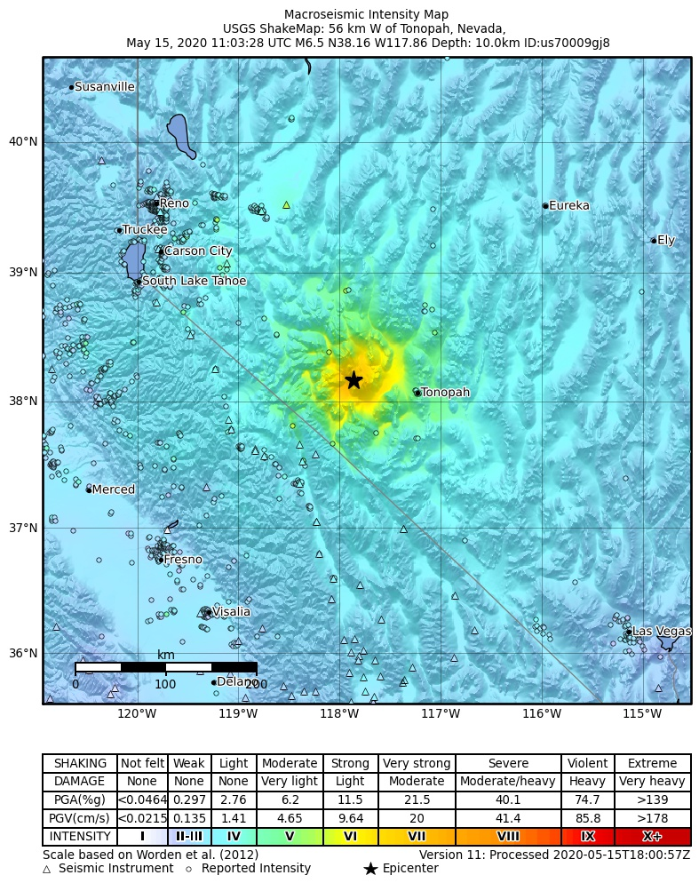
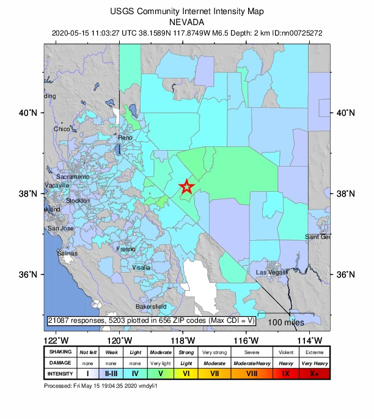
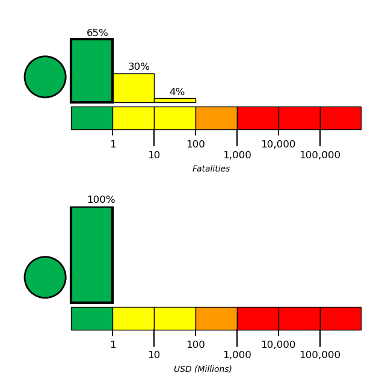
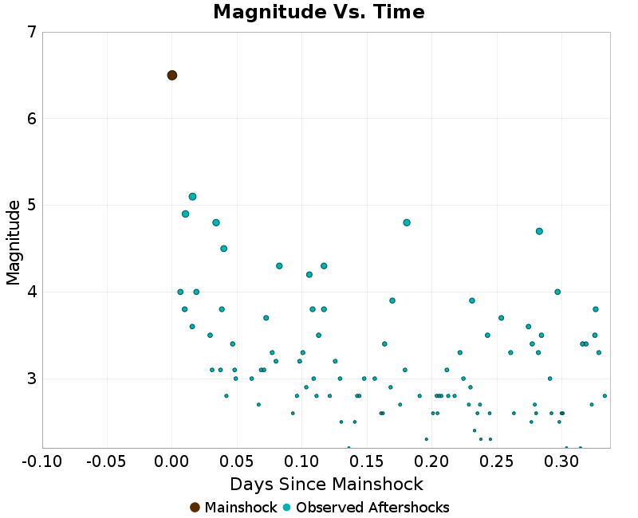
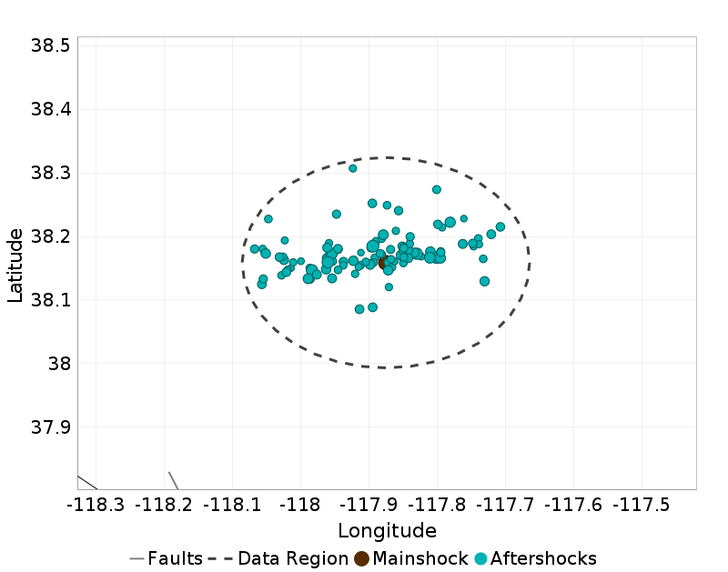
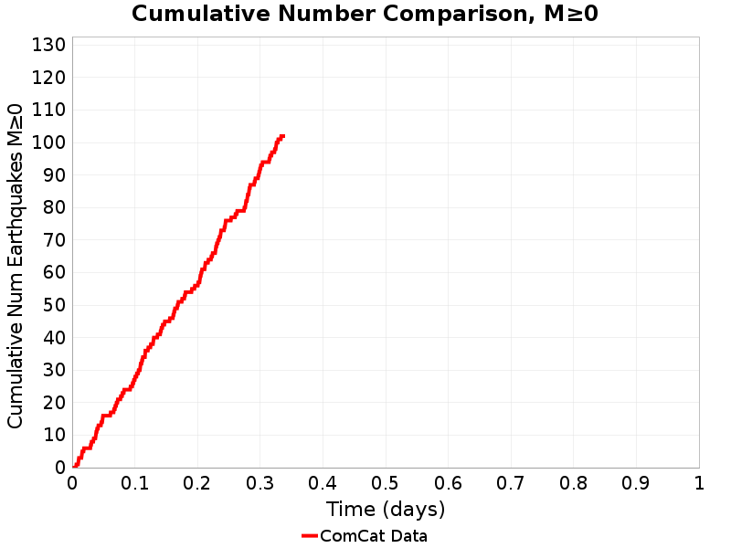
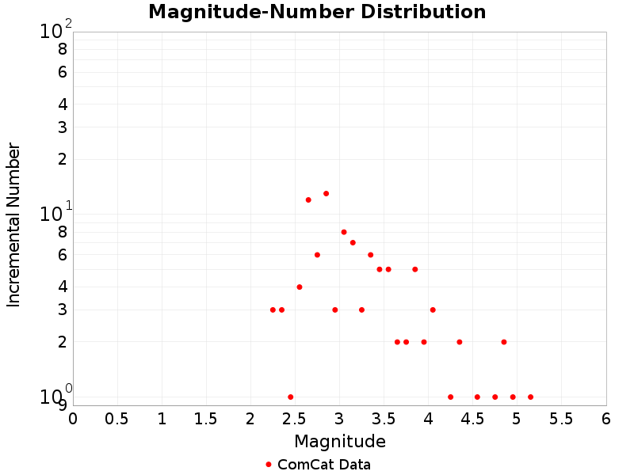
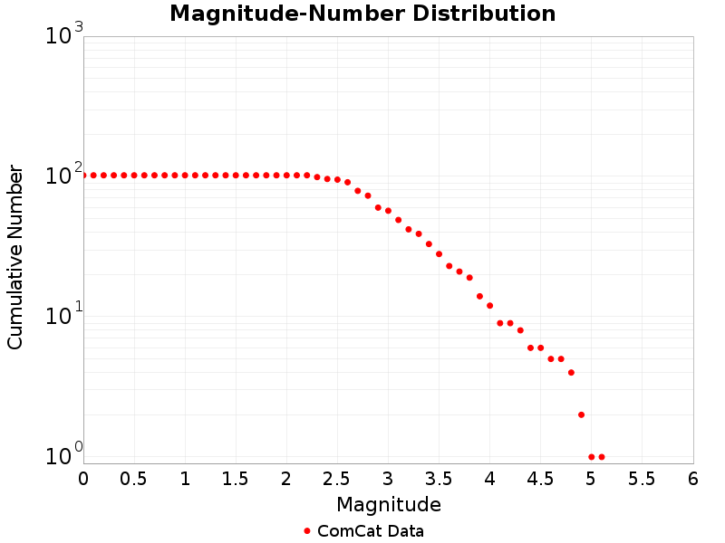

# 6.5, 56km W of Tonopah, Nevada

## Table Of Contents

* [Mainshock Details](#mainshock-details)
  * [USGS Products](#usgs-products)
  * [Nearby Faults](#nearby-faults)
* [Sequence Details](#sequence-details)
  * [Magnitude Vs. Time Plot](#magnitude-vs-time-plot)
  * [Aftershock Locations](#aftershock-locations)
  * [Cumulative Number Plot](#cumulative-number-plot)
  * [Magnitude-Number Distributions (MNDs)](#magnitude-number-distributions-mnds)

## Mainshock Details
*[(top)](#table-of-contents)*

Information and plots in the section are taken from the [USGS event page](https://earthquake.usgs.gov/earthquakes/eventpage/nn00725272), accessed through ComCat.

| Field | Value |
|-----|-----|
| Magnitude | 6.5 (ml) |
| Time (UTC) | Fri, 15 May 2020 11:03:27 UTC |
| Time (PDT) | Fri, 15 May 2020 04:03:27 PDT |
| Location | 38.1589, -117.8749 |
| Depth | 2.8 km |
| Status | reviewed |

### USGS Products
*[(top)](#table-of-contents)*

| 
**[ShakeMap](https://earthquake.usgs.gov/earthquakes/eventpage/nn00725272/shakemap/)**
 | 
**[Did You Feel It?](https://earthquake.usgs.gov/earthquakes/eventpage/nn00725272/dyfi/)**
 | 
**[PAGER](https://earthquake.usgs.gov/earthquakes/eventpage/nn00725272/pager/)**
 |
|-----|-----|-----|
|  |  |  |

### Nearby Faults
*[(top)](#table-of-contents)*

No UCERF3 fault sections are within 10km of this event's hypocenter.

## Sequence Details
*[(top)](#table-of-contents)*

These plots show the aftershock sequence, using data sourced from [ComCat](https://earthquake.usgs.gov/data/comcat/). They were last updated at 2020/05/15 19:08:36 UTC, 8.09 hours after the mainshock.

102 M&ge;0 earthquakes within 18.41 km of the mainshock's epicenter.

|  | First Hour | To Date |
|-----|-----|-----|
| **M 0** | 12 | 102 |
| **M 1** | 12 | 102 |
| **M 2** | 12 | 102 |
| **M 3** | 12 | 57 |
| **M 4** | 6 | 12 |
| **M 5** | 1 | 1 |
### Magnitude Vs. Time Plot
*[(top)](#table-of-contents)*

This plot shows the magnitude vs. time evolution of the sequence. The mainshock is ploted as a brown circle, and aftershocks are plotted as cyan circles.

### Aftershock Locations
*[(top)](#table-of-contents)*

Map view of the aftershock sequence, plotted as cyan circles. The mainshock  is plotted below as a brown circle, but may be obscured by aftershocks. Nearby UCERF3 fault traces are plotted in gray lines, and the region used to fetch aftershock data in a dashed dark gray line.

### Cumulative Number Plot
*[(top)](#table-of-contents)*

This plot shows the cumulative number of M&ge;0 aftershocks as a function of time since the mainshock.

### Magnitude-Number Distributions (MNDs)
*[(top)](#table-of-contents)*

These plot shows the magnitude-number distribution of the aftershock sequence thus far. The left plot gives an incremental distribution (the count in each magnitude bin), and the right plot a cumulative distribution (the count in or above each magnitude bin).

| Incremental MND | Cumulative MND |
|-----|-----|
|  |  |

