# 5.53, 17km S of Searles Valley, CA

## Table Of Contents

* [Mainshock Details](#mainshock-details)
  * [USGS Products](#usgs-products)
  * [Nearby Faults](#nearby-faults)
* [Sequence Details](#sequence-details)
  * [Magnitude Vs. Time Plot](#magnitude-vs-time-plot)
  * [Aftershock Locations](#aftershock-locations)
  * [Cumulative Number Plot](#cumulative-number-plot)
  * [Magnitude-Number Distributions (MNDs)](#magnitude-number-distributions-mnds)
* [UCERF3-ETAS Forecast](#ucerf3-etas-forecast)
  * [ETAS Forecasted Magnitude Vs. Time](#etas-forecasted-magnitude-vs-time)
  * [ETAS Spatial Distribution Forecast](#etas-spatial-distribution-forecast)
  * [ETAS Fault Trigger Probabilities](#etas-fault-trigger-probabilities)

## Mainshock Details
*[(top)](#table-of-contents)*

Information and plots in the section are taken from the [USGS event page](https://earthquake.usgs.gov/earthquakes/eventpage/ci39462536), accessed through ComCat.

| Field | Value |
|-----|-----|
| Magnitude | 5.53 (mw) |
| Time (UTC) | Thu, 4 Jun 2020 01:32:11 UTC |
| Time (PDT) | Wed, 3 Jun 2020 18:32:11 PDT |
| Location | 35.614834, -117.42817 |
| Depth | 8.44 km |
| Status | reviewed |

### USGS Products
*[(top)](#table-of-contents)*

| 
**[ShakeMap](https://earthquake.usgs.gov/earthquakes/eventpage/ci39462536/shakemap/)**
 | 
**[Did You Feel It?](https://earthquake.usgs.gov/earthquakes/eventpage/ci39462536/dyfi/)**
 |
|-----|-----|
| 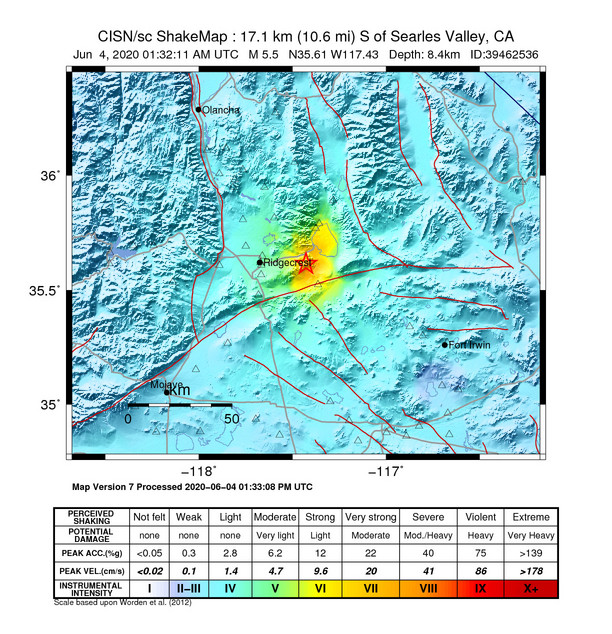 | 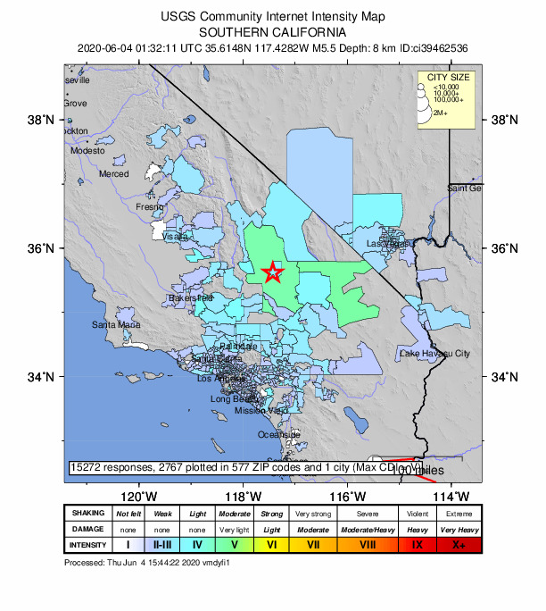 |
| 
**[PAGER](https://earthquake.usgs.gov/earthquakes/eventpage/ci39462536/pager/)**
 | 
**[Moment Tensor](https://earthquake.usgs.gov/earthquakes/eventpage/ci39462536/moment-tensor/)**
 |
| 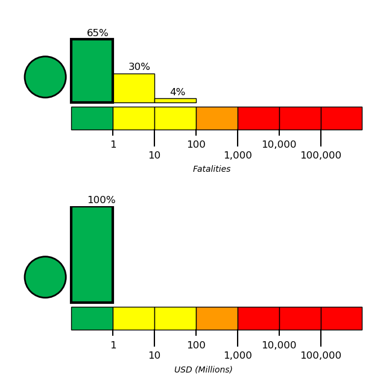 |  |

### Nearby Faults
*[(top)](#table-of-contents)*

1 UCERF3 fault section is within 10km of this event's hypocenter:

* Tank Canyon: 9.91km
## Sequence Details
*[(top)](#table-of-contents)*

These plots show the aftershock sequence, using data sourced from [ComCat](https://earthquake.usgs.gov/data/comcat/). They were last updated at 2020/06/04 06:43:30 UTC, 5.19 hours after the mainshock.

25 M&ge;2 earthquakes within 10 km of the mainshock's epicenter.

|  | First Hour | To Date |
|-----|-----|-----|
| **M 2** | 14 | 25 |
| **M 3** | 3 | 6 |
### Magnitude Vs. Time Plot
*[(top)](#table-of-contents)*

This plot shows the magnitude vs. time evolution of the sequence. The mainshock is ploted as a brown circle, foreshocks are plotted as magenta circles, and aftershocks are plotted as cyan circles.

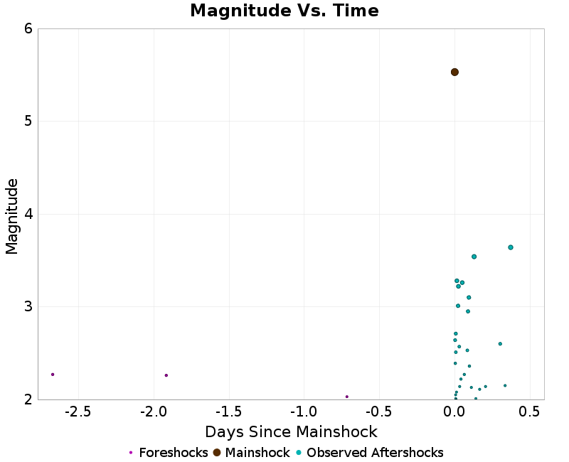

### Aftershock Locations
*[(top)](#table-of-contents)*

Map view of the aftershock sequence, plotted as cyan circles. The mainshock  and foreshocks are plotted below in brown and magenta circles respectively, but may be obscured by aftershocks. Nearby UCERF3 fault traces are plotted in gray lines, and the region used to fetch aftershock data in a dashed dark gray line.

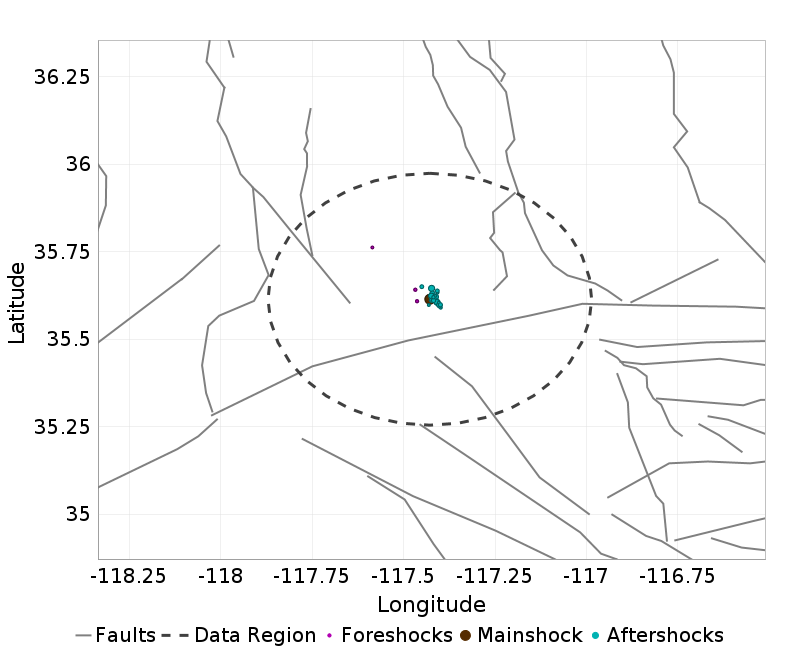

### Cumulative Number Plot
*[(top)](#table-of-contents)*

This plot shows the cumulative number of M&ge;2 aftershocks as a function of time since the mainshock.

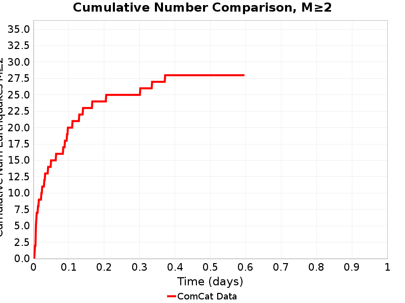

### Magnitude-Number Distributions (MNDs)
*[(top)](#table-of-contents)*

These plot shows the magnitude-number distribution of the aftershock sequence thus far. The left plot gives an incremental distribution (the count in each magnitude bin), and the right plot a cumulative distribution (the count in or above each magnitude bin).

| Incremental MND | Cumulative MND |
|-----|-----|
| 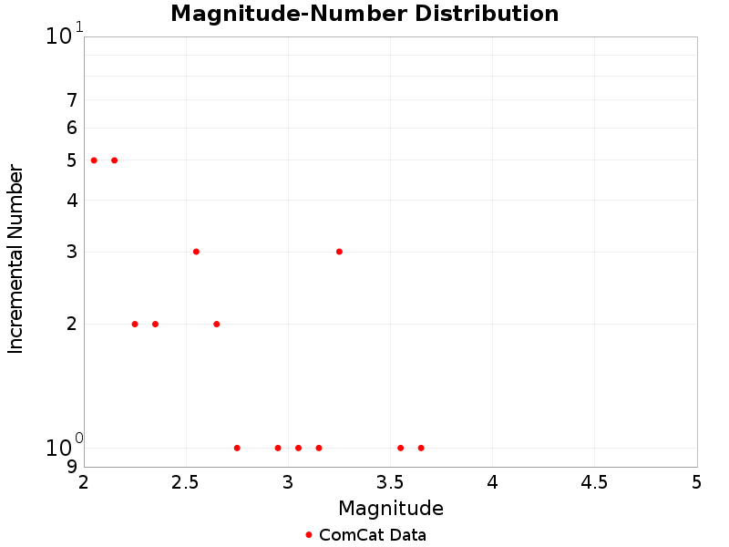 |  |

## UCERF3-ETAS Forecast
*[(top)](#table-of-contents)*

This section gives results from the UCERF3-ETAS short-term forecasting model. This model is described in [Field et al. (2017)](http://bssa.geoscienceworld.org/lookup/doi/10.1785/0120160173), and computes probabilities of this sequence triggering subsequent aftershocks, including events on known faults.

Probabilities are inherantly time-dependent. Those stated here are for time periods beginning the instant when this report was generated, 2020/06/03 23:43:30 PDT. The model has not been updated with any observed aftershocks and may be out of date, especially if large aftershock have occurred subsequently or a significant amount of time has passed since the mainshock.

Results are summarized below and should be considered preliminary. The exact timing, size, location, or number of aftershocks cannot be predicted, and all probabilities are uncertain.

This table gives forecasted one week and one month probabilities for events triggered by this sequence; it does not include the long-term probability of such events.

|  | 1 Week | 1 Month |
|-----|-----|-----|
| **M&ge;3** | 99.952% | 100.000% |
| **M&ge;4** | 54.857% | 79.048% |
| **M&ge;5** | 7.667% | 14.905% |
| **M&ge;6** | 1.000% | 1.571% |
| **M&ge;7** | 0.238% | 0.286% |
| **M&ge;8** | <0.001% | <0.001% |

### ETAS Forecasted Magnitude Vs. Time
*[(top)](#table-of-contents)*

These plots show the show the magnitude versus time probability function since simulation start. Observed event data lie on top, with those input to the simulation plotted as magenta circles and those that occurred after the simulation start time as cyan circles. Time is relative to the mainshock (M5.53, ci39462536, plotted as a brown circle). Probabilities are only shown above the minimum simulated magnitude, M=2.5.

| One Week | One Month |
|-----|-----|
|  | 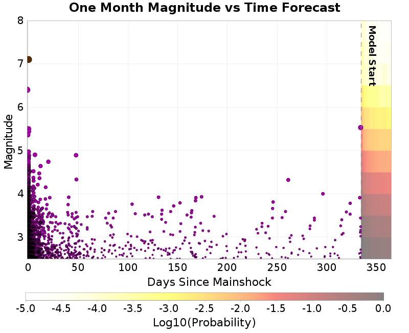 |

### ETAS Spatial Distribution Forecast
*[(top)](#table-of-contents)*

These plots show the predicted spatial distribution of aftershocks above the given magnitude threshold and for the given time period. The 'Current' plot shows the forecasted spatial distribution to date, along with as any observed aftershocks overlaid with cyan circles. Observed aftershocks will be included in the week/month plots as well if the forecasted time window has elapsed.

|  | Forecast: 1 Week | Forecast: 1 Month |
|-----|-----|-----|
| **M&ge;3** | 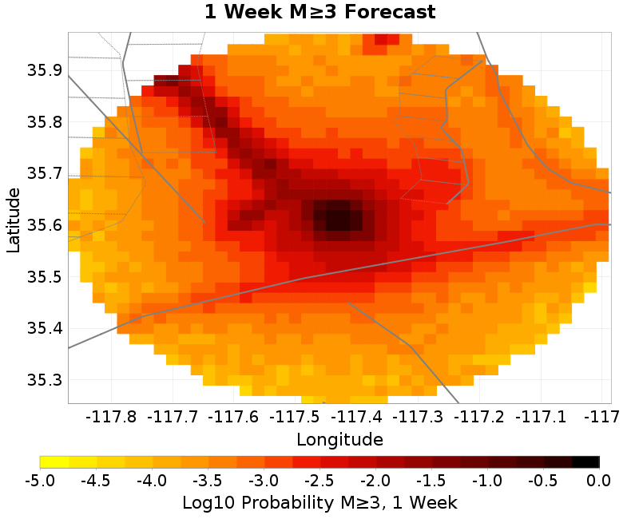 | 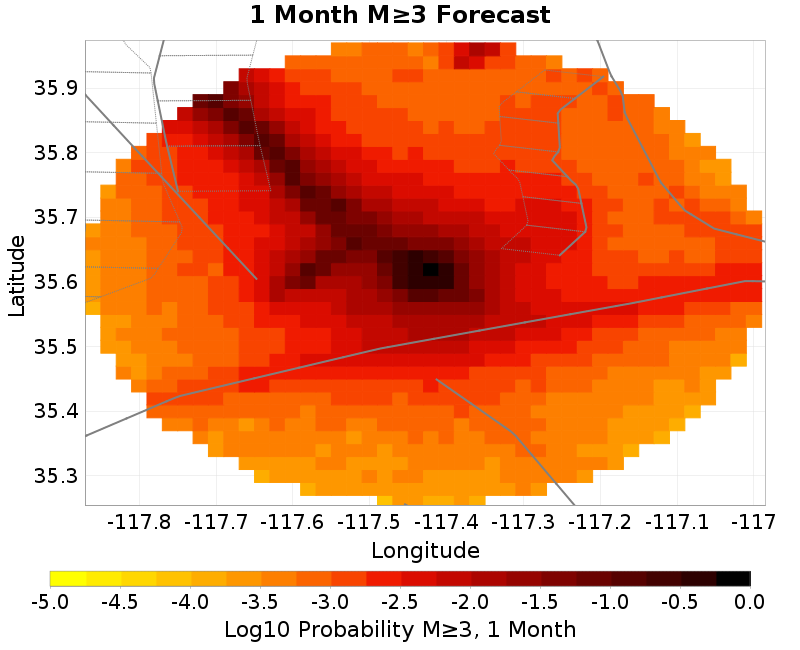 |
| **M&ge;5** | 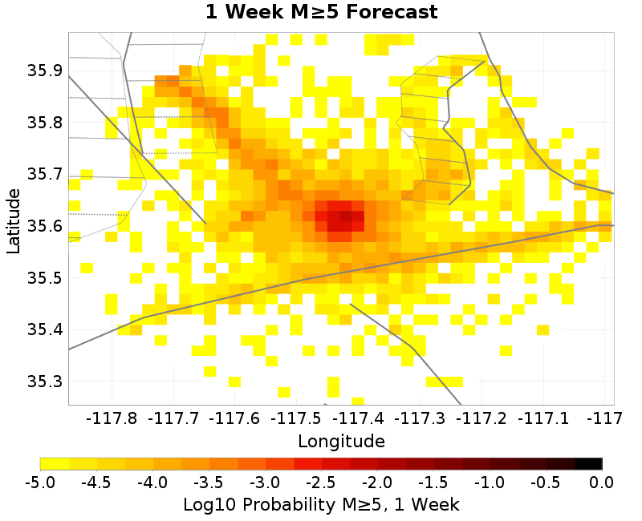 | 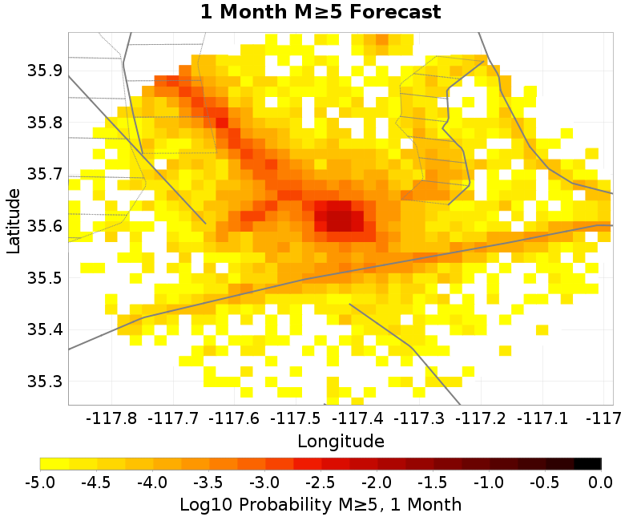 |

### ETAS Fault Trigger Probabilities
*[(top)](#table-of-contents)*

The table below summarizes the probabilities of this sequence triggering large supra-seismogenic aftershocks on nearby known active faults.

| Fault Section | 1 wk supra-seis prob | 1 mo supra-seis prob | 1 wk M&ge;7 prob | 1 mo M&ge;7 prob |
|-----|-----|-----|-----|-----|
| **Garlock (Central)** | 0.333% | 0.524% | 0.190% | 0.238% |
| **Tank Canyon** | 0.048% | 0.143% | <0.001% | <0.001% |
| **Little Lake** | <0.001% | 0.048% | <0.001% | <0.001% |
| **Owl Lake** | 0.048% | 0.048% | <0.001% | <0.001% |
| **Airport Lake** | <0.001% | <0.001% | <0.001% | <0.001% |
| **Panamint Valley** | 0.143% | 0.190% | 0.143% | 0.190% |
| **Hunter Mountain-Saline Valley** | 0.095% | 0.143% | 0.095% | 0.143% |
| **Garlock (East)** | 0.048% | 0.048% | 0.048% | 0.048% |
| **McLean Lake** | 0.048% | 0.095% | <0.001% | <0.001% |
| **Ash Hill** | <0.001% | <0.001% | <0.001% | <0.001% |
