# Parent Section Magnitude-Probability Distributions

Only fault sections with at least one triggered aftershock are plotted. Sections are sorted by total supraseismogenic trigger rate (decreasing)

## Table Of Contents

* [Garlock (Central)](#garlock-central)
* [Tank Canyon](#tank-canyon)
* [Little Lake](#little-lake)
* [Owl Lake](#owl-lake)
* [Airport Lake](#airport-lake)
* [Panamint Valley](#panamint-valley)
* [Garlock (East)](#garlock-east)
* [Ash Hill](#ash-hill)
* [Blackwater](#blackwater)
* [Hunter Mountain-Saline Valley](#hunter-mountain-saline-valley)
* [Garlock (West)](#garlock-west)
* [McLean Lake](#mclean-lake)
* [Gravel Hills-Harper Lk](#gravel-hills-harper-lk)
* [Goldstone Lake](#goldstone-lake)
* [So Sierra Nevada](#so-sierra-nevada)
* [Death Valley (So)](#death-valley-so)
* [Coyote Canyon](#coyote-canyon)
* [San Andreas (Mojave S)](#san-andreas-mojave-s)
* [Nelson Lake](#nelson-lake)
* [San Andreas (Mojave N)](#san-andreas-mojave-n)
* [Lenwood-Lockhart-Old Woman Springs](#lenwood-lockhart-old-woman-springs)
* [Towne Pass](#towne-pass)
* [Bicycle Lake](#bicycle-lake)
* [Paradise](#paradise)
* [San Andreas (San Bernardino N)](#san-andreas-san-bernardino-n)
* [Garlic Springs](#garlic-springs)
* [Death Valley (Black Mtns Frontal)](#death-valley-black-mtns-frontal)
* [San Andreas (San Bernardino S)](#san-andreas-san-bernardino-s)
* [Coyote Lake](#coyote-lake)
* [Death Valley (No)](#death-valley-no)
* [Helendale-So Lockhart](#helendale-so-lockhart)
* [San Andreas (Parkfield)](#san-andreas-parkfield)
* [Sierra Nevada  (No Extension)](#sierra-nevada--no-extension)
* [San Andreas (Big Bend)](#san-andreas-big-bend)
* [Red Pass](#red-pass)
* [Cady](#cady)
* [Death Valley (Fish Lake Valley)](#death-valley-fish-lake-valley)
* [Ludlow](#ludlow)
* [Elsinore (Glen Ivy) rev](#elsinore-glen-ivy-rev)
* [San Andreas (San Gorgonio Pass-Garnet HIll)](#san-andreas-san-gorgonio-pass-garnet-hill)
* [San Andreas (Carrizo) rev](#san-andreas-carrizo-rev)
* [San Andreas (Cholame) rev](#san-andreas-cholame-rev)
* [San Jacinto (San Bernardino)](#san-jacinto-san-bernardino)
* [San Andreas (Creeping Section) 2011 CFM](#san-andreas-creeping-section-2011-cfm)
* [Pinto Mtn](#pinto-mtn)
* [Owens Valley](#owens-valley)
* [San Andreas (North Branch Mill Creek)](#san-andreas-north-branch-mill-creek)
* [Calico-Hidalgo](#calico-hidalgo)
* [Scodie Lineament](#scodie-lineament)
* [Baker](#baker)
* [San Andreas (Coachella) rev](#san-andreas-coachella-rev)
* [White Wolf (Extension)](#white-wolf-extension)
* [Manix-Afton Hills](#manix-afton-hills)
* [Cleghorn Lake](#cleghorn-lake)
* [Brawley (Seismic Zone) alt 1](#brawley-seismic-zone-alt-1)
* [Santa Rosa Island](#santa-rosa-island)
* [Santa Ynez (East)](#santa-ynez-east)
* [Cleghorn Pass](#cleghorn-pass)
* [Kern Canyon (North Kern) 2011](#kern-canyon-north-kern-2011)
* [Deep Springs](#deep-springs)
* [White Mountains](#white-mountains)
* [Lake Isabella (Seismicity)](#lake-isabella-seismicity)
* [Lost Hills](#lost-hills)
* [South Klamath Lake East](#south-klamath-lake-east)
* [Rose Canyon](#rose-canyon)
* [Independence rev 2011](#independence-rev-2011)
* [Big Pine (East)](#big-pine-east)
* [Imperial](#imperial)
* [Mission Ridge-Arroyo Parida-Santa Ana](#mission-ridge-arroyo-parida-santa-ana)
* [Chino alt 1](#chino-alt-1)
* [San Clemente](#san-clemente)
* [Mission Creek](#mission-creek)
* [Santa Cruz Island](#santa-cruz-island)
* [San Diego Trough north alt1](#san-diego-trough-north-alt1)
* [Santa Ynez (West)](#santa-ynez-west)
* [San Jacinto (Anza) rev](#san-jacinto-anza-rev)
* [Oceanic - West Huasna](#oceanic---west-huasna)
* [San Jacinto (San Jacinto Valley) rev](#san-jacinto-san-jacinto-valley-rev)
* [San Jacinto (Stepovers Combined)](#san-jacinto-stepovers-combined)
* [Blue Cut](#blue-cut)
* [Camp Rock 2011](#camp-rock-2011)
* [Calaveras (So) - Paicines extension 2011 CFM](#calaveras-so---paicines-extension-2011-cfm)
* [Pleito](#pleito)
* [Tin Mountain](#tin-mountain)
* [Ortigalita (North)](#ortigalita-north)
* [Hunting Creek - Berryessa 2011 CFM](#hunting-creek---berryessa-2011-cfm)
* [Green Valley 2011 CFM](#green-valley-2011-cfm)
* [Ventura-Pitas Point](#ventura-pitas-point)
* [Newport-Inglewood (Offshore)](#newport-inglewood-offshore)
* [Pine Mtn](#pine-mtn)
* [San Andreas (Santa Cruz Mts) 2011 CFM](#san-andreas-santa-cruz-mts-2011-cfm)
* [Kern Canyon (Lake Isabella) 2011](#kern-canyon-lake-isabella-2011)
* [North Frontal  (East)](#north-frontal--east)
* [Gillem - Big Crack 2011 CFM](#gillem---big-crack-2011-cfm)
* [Mission Hills 2011](#mission-hills-2011)
* [Red Mountain](#red-mountain)
* [Fontana (Seismicity)](#fontana-seismicity)
* [Las Positas](#las-positas)
* [North Frontal  (West)](#north-frontal--west)
* [Northridge Hills](#northridge-hills)
* [Great Valley 08 (Quinto)](#great-valley-08-quinto)
* [San Jacinto (Superstition Mtn)](#san-jacinto-superstition-mtn)
* [San Diego Trough south](#san-diego-trough-south)
* [Hosgri](#hosgri)
* [Elsinore (Stepovers Combined)](#elsinore-stepovers-combined)
* [Simi-Santa Rosa](#simi-santa-rosa)
* [San Andreas (Peninsula) 2011 CFM](#san-andreas-peninsula-2011-cfm)
* [Hayward (No) 2011 CFM](#hayward-no-2011-cfm)
* [Surprise Valley 2011 CFM](#surprise-valley-2011-cfm)
* [San Gabriel](#san-gabriel)
* [Palos Verdes](#palos-verdes)
* [Elysian Park (Upper)](#elysian-park-upper)
* [Hayward (So) 2011 CFM](#hayward-so-2011-cfm)
* [San Jacinto (Clark) rev](#san-jacinto-clark-rev)
* [Rinconada 2011 CFM](#rinconada-2011-cfm)
* [Calaveras (Central) 2011 CFM](#calaveras-central-2011-cfm)
* [Redondo Canyon alt 1](#redondo-canyon-alt-1)
* [Channel Islands Thrust](#channel-islands-thrust)
* [Calaveras (So) 2011 CFM](#calaveras-so-2011-cfm)
* [Great Valley 09 (Laguna Seca)](#great-valley-09-laguna-seca)
* [Rodgers Creek - Healdsburg 2011 CFM](#rodgers-creek---healdsburg-2011-cfm)
* [Kern Canyon (South Kern) 2011](#kern-canyon-south-kern-2011)
* [Dry Mountain](#dry-mountain)
* [Santa Ynez River](#santa-ynez-river)
* [Big Lagoon - Bald Mtn 2011 CFM](#big-lagoon---bald-mtn-2011-cfm)
* [Honey Lake 2011 CFM](#honey-lake-2011-cfm)
* [Coronado Bank alt1](#coronado-bank-alt1)
* [Elsinore (Coyote Mountains)](#elsinore-coyote-mountains)
* [Big Pine (Central)](#big-pine-central)
* [South Klamath Lake West](#south-klamath-lake-west)
* [Robinson Creek](#robinson-creek)
* [Pisgah-Bullion Mtn-Mesquite Lk](#pisgah-bullion-mtn-mesquite-lk)

## Garlock (Central)
*[(top)](#table-of-contents)*

| 1 Week | 1 Month | 1 Year | 10 Year |
|-----|-----|-----|-----|
|  |  |  |  |

| Magnitude | 1 wk TI Prob | 1 wk TD Prob | 1 wk ETAS Prob | 1 wk ETAS/TD Gain | 1 wk ETAS Triggered Only | 1 mo TI Prob | 1 mo TD Prob | 1 mo ETAS Prob | 1 mo ETAS/TD Gain | 1 mo ETAS Triggered Only | 1 yr TI Prob | 1 yr TD Prob | 1 yr ETAS Prob | 1 yr ETAS/TD Gain | 1 yr ETAS Triggered Only | 10 yr TI Prob | 10 yr TD Prob | 10 yr ETAS Prob | 10 yr ETAS/TD Gain | 10 yr ETAS Triggered Only |
|-----|-----|-----|-----|-----|-----|-----|-----|-----|-----|-----|-----|-----|-----|-----|-----|-----|-----|-----|-----|-----|
| 6.0 | 5.5131142E-5 | 7.0560076E-5 | 0.0023204014 | 32.88547 | 0.00225 | 2.3625491E-4 | 3.0236563E-4 | 0.00442112 | 14.621767 | 0.00412 | 0.0028726095 | 0.0036751523 | 0.017354693 | 4.7221694 | 0.01373 | 0.028357591 | 0.03627742 | 0.06991134 | 1.9271308 | 0.0349 |
| 6.1 | 5.5131142E-5 | 7.0560076E-5 | 0.0023204014 | 32.88547 | 0.00225 | 2.3625491E-4 | 3.0236563E-4 | 0.00442112 | 14.621767 | 0.00412 | 0.0028726095 | 0.0036751523 | 0.017354693 | 4.7221694 | 0.01373 | 0.028357591 | 0.03627742 | 0.06991134 | 1.9271308 | 0.0349 |
| 6.2 | 4.216245E-5 | 5.194599E-5 | 0.0014418738 | 27.757172 | 0.00139 | 1.806837E-4 | 2.2260686E-4 | 0.0027920348 | 12.542447 | 0.00257 | 0.0021976046 | 0.0027069016 | 0.011183893 | 4.1316214 | 0.0085 | 0.021759989 | 0.026871903 | 0.04811529 | 1.7905427 | 0.02183 |
| 6.3 | 4.216245E-5 | 5.194599E-5 | 0.0014418738 | 27.757172 | 0.00139 | 1.806837E-4 | 2.2260686E-4 | 0.0027920348 | 12.542447 | 0.00257 | 0.0021976046 | 0.0027069016 | 0.011183893 | 4.1316214 | 0.0085 | 0.021759989 | 0.026871903 | 0.04811529 | 1.7905427 | 0.02183 |
| 6.4 | 3.6858168E-5 | 4.4384105E-5 | 0.0010943376 | 24.656067 | 0.00105 | 1.5795401E-4 | 1.9020386E-4 | 0.002149831 | 11.3027725 | 0.00196 | 0.0019213937 | 0.002313298 | 0.008888054 | 3.8421566 | 0.00659 | 0.019048655 | 0.023013769 | 0.039622534 | 1.7216882 | 0.017 |
| 6.5 | 3.39199E-5 | 4.0287192E-5 | 9.5025054E-4 | 23.586914 | 9.1E-4 | 1.453629E-4 | 1.7264808E-4 | 0.001922346 | 11.134476 | 0.00175 | 0.0017683565 | 0.002099986 | 0.008067428 | 3.841658 | 0.00598 | 0.017543508 | 0.020901926 | 0.035970245 | 1.7209058 | 0.01539 |
| 6.6 | 3.3571985E-5 | 3.97404E-5 | 9.4970426E-4 | 23.897701 | 9.1E-4 | 1.4387199E-4 | 1.7030501E-4 | 0.0019100087 | 11.215223 | 0.00174 | 0.0017502342 | 0.0020715136 | 0.008029147 | 3.8759809 | 0.00597 | 0.017365133 | 0.02062037 | 0.035663642 | 1.7295345 | 0.01536 |
| 6.7 | 3.2580007E-5 | 3.8355218E-5 | 9.283211E-4 | 24.203255 | 8.9E-4 | 1.3962112E-4 | 1.6436927E-4 | 0.0018540915 | 11.280038 | 0.00169 | 0.0016985617 | 0.0019993805 | 0.007817724 | 3.910073 | 0.00583 | 0.016856372 | 0.019910553 | 0.034425676 | 1.7290167 | 0.01481 |
| 6.8 | 3.2185937E-5 | 3.778067E-5 | 9.1774744E-4 | 24.291456 | 8.8E-4 | 1.3793244E-4 | 1.6190723E-4 | 0.0018416352 | 11.374633 | 0.00168 | 0.0016780337 | 0.0019694597 | 0.0076482533 | 3.8834271 | 0.00569 | 0.016654192 | 0.019616548 | 0.03384191 | 1.7251716 | 0.01451 |
| 6.9 | 3.165394E-5 | 3.6983427E-5 | 8.569531E-4 | 23.171274 | 8.2E-4 | 1.3565269E-4 | 1.5849089E-4 | 0.0017682357 | 11.156703 | 0.00161 | 0.0016503202 | 0.0019279403 | 0.0074173366 | 3.8472855 | 0.0055 | 0.01638118 | 0.01920905 | 0.033077434 | 1.7219714 | 0.01414 |
| 7.0 | 3.0903822E-5 | 3.5885547E-5 | 8.3585683E-4 | 23.292297 | 8.0E-4 | 1.3243823E-4 | 1.5378626E-4 | 0.0017135463 | 11.142389 | 0.00156 | 0.0016112428 | 0.0018707612 | 0.0072307154 | 3.8651195 | 0.00537 | 0.015996104 | 0.018644974 | 0.032168046 | 1.7252932 | 0.01378 |
| 7.1 | 3.0069863E-5 | 3.4649693E-5 | 8.146227E-4 | 23.510242 | 7.8E-4 | 1.2886449E-4 | 1.4849035E-4 | 0.0016282706 | 10.965498 | 0.00148 | 0.0015677959 | 0.0018063921 | 0.0068871975 | 3.8126814 | 0.00509 | 0.01556781 | 0.018011529 | 0.030934498 | 1.7174832 | 0.01316 |
| 7.2 | 2.7957109E-5 | 3.1528914E-5 | 6.915081E-4 | 21.932505 | 6.6E-4 | 1.1981068E-4 | 1.3511704E-4 | 0.0014149441 | 10.471989 | 0.00128 | 0.0014577188 | 0.0016438282 | 0.005956727 | 3.6236918 | 0.00432 | 0.014481937 | 0.01640993 | 0.027406467 | 1.6701148 | 0.01118 |
| 7.3 | 2.4519275E-5 | 2.6947864E-5 | 4.5693628E-4 | 16.956308 | 4.3E-4 | 1.0507837E-4 | 1.1548581E-4 | 9.553888E-4 | 8.27278 | 8.4E-4 | 0.0012785783 | 0.0014051477 | 0.004400932 | 3.132007 | 0.003 | 0.012712469 | 0.014047351 | 0.02177722 | 1.5502723 | 0.00784 |
| 7.4 | 2.3225532E-5 | 2.5427498E-5 | 3.8541833E-4 | 15.157541 | 3.6E-4 | 9.95342E-5 | 1.08970526E-4 | 8.588888E-4 | 7.881845 | 7.5E-4 | 0.0012111551 | 0.0013259231 | 0.0040622903 | 3.0637448 | 0.00274 | 0.012045753 | 0.013262591 | 0.020228958 | 1.5252644 | 0.00706 |
| 7.5 | 2.097765E-5 | 2.2700748E-5 | 2.926946E-4 | 12.893612 | 2.7E-4 | 8.9901114E-5 | 9.728535E-5 | 6.5723085E-4 | 6.755702 | 5.6E-4 | 0.0010939965 | 0.0011838175 | 0.0032813314 | 2.7718222 | 0.0021 | 0.010886264 | 0.011851718 | 0.017316177 | 1.461069 | 0.00553 |
| 7.6 | 1.511254E-5 | 1.6189204E-5 | 1.6618677E-4 | 10.265284 | 1.5E-4 | 6.476642E-5 | 6.9380505E-5 | 3.993576E-4 | 5.756049 | 3.3E-4 | 7.882459E-4 | 8.4438815E-4 | 0.0020833411 | 2.467279 | 0.00124 | 0.007854558 | 0.008485545 | 0.011460088 | 1.3505424 | 0.003 |
| 7.7 | 9.934069E-6 | 1.0861863E-5 | 5.086143E-5 | 4.6825695 | 4.0E-5 | 4.2573887E-5 | 4.6550016E-5 | 1.16546755E-4 | 2.5036888 | 7.0E-5 | 5.182138E-4 | 5.665994E-4 | 9.1640116E-4 | 1.6173704 | 3.5E-4 | 0.00517007 | 0.0057224585 | 0.0064781094 | 1.13205 | 7.6E-4 |
| 7.8 | 6.7562896E-6 | 8.577809E-6 | 2.8577637E-5 | 3.3315778 | 2.0E-5 | 2.8955206E-5 | 3.676152E-5 | 7.676005E-5 | 2.0880542 | 4.0E-5 | 3.5247262E-4 | 4.4747978E-4 | 6.873724E-4 | 1.536097 | 2.4E-4 | 0.0035191406 | 0.004523953 | 0.00506151 | 1.1188246 | 5.4E-4 |
| 7.9 | 3.975453E-6 | 5.4609377E-6 | 5.4609377E-6 | 1.0 | 0.0 | 1.7037546E-5 | 2.3403809E-5 | 3.3403576E-5 | 1.4272709 | 1.0E-5 | 2.0741238E-4 | 2.849042E-4 | 4.0487002E-4 | 1.4210742 | 1.2E-4 | 0.002072189 | 0.0028800794 | 0.0031393305 | 1.0900153 | 2.6E-4 |
| 8.0 | 1.6729537E-6 | 2.1083472E-6 | 2.1083472E-6 | 1.0 | 0.0 | 7.169782E-6 | 9.0357435E-6 | 9.0357435E-6 | 1.0 | 0.0 | 8.7288594E-5 | 1.1000465E-4 | 1.4000136E-4 | 1.2726858 | 3.0E-5 | 8.7254314E-4 | 0.0011128251 | 0.0011627695 | 1.0448806 | 5.0E-5 |
| 8.1 | 3.6733252E-7 | 3.1931708E-7 | 3.1931708E-7 | 1.0 | 0.0 | 1.5742813E-6 | 1.3685012E-6 | 1.3685012E-6 | 1.0 | 0.0 | 1.9166706E-5 | 1.6661392E-5 | 1.6661392E-5 | 1.0 | 0.0 | 1.9165053E-4 | 1.6867582E-4 | 1.6867582E-4 | 1.0 | 0.0 |

## Tank Canyon
*[(top)](#table-of-contents)*

| 1 Week | 1 Month | 1 Year | 10 Year |
|-----|-----|-----|-----|
|  |  |  |  |

| Magnitude | 1 wk TI Prob | 1 wk TD Prob | 1 wk ETAS Prob | 1 wk ETAS/TD Gain | 1 wk ETAS Triggered Only | 1 mo TI Prob | 1 mo TD Prob | 1 mo ETAS Prob | 1 mo ETAS/TD Gain | 1 mo ETAS Triggered Only | 1 yr TI Prob | 1 yr TD Prob | 1 yr ETAS Prob | 1 yr ETAS/TD Gain | 1 yr ETAS Triggered Only | 10 yr TI Prob | 10 yr TD Prob | 10 yr ETAS Prob | 10 yr ETAS/TD Gain | 10 yr ETAS Triggered Only |
|-----|-----|-----|-----|-----|-----|-----|-----|-----|-----|-----|-----|-----|-----|-----|-----|-----|-----|-----|-----|-----|
| 6.0 | 4.8284557E-5 | 5.8038884E-5 | 0.0012279709 | 21.15773 | 0.00117 | 2.0691741E-4 | 2.487177E-4 | 0.0023881854 | 9.601992 | 0.00214 | 0.0025163088 | 0.0030245995 | 0.010751159 | 3.5545728 | 0.00775 | 0.02488006 | 0.029901445 | 0.052747265 | 1.7640374 | 0.02355 |
| 6.1 | 1.7796336E-5 | 2.089674E-5 | 2.808913E-4 | 13.441873 | 2.6E-4 | 7.626778E-5 | 8.955459E-5 | 7.694937E-4 | 8.592454 | 6.8E-4 | 9.281647E-4 | 0.0010898198 | 0.003746921 | 3.4381104 | 0.00266 | 0.009242975 | 0.010848804 | 0.019137891 | 1.7640554 | 0.00838 |
| 6.2 | 1.7796336E-5 | 2.089674E-5 | 2.808913E-4 | 13.441873 | 2.6E-4 | 7.626778E-5 | 8.955459E-5 | 7.694937E-4 | 8.592454 | 6.8E-4 | 9.281647E-4 | 0.0010898198 | 0.003746921 | 3.4381104 | 0.00266 | 0.009242975 | 0.010848804 | 0.019137891 | 1.7640554 | 0.00838 |
| 6.3 | 1.3515912E-5 | 1.577669E-5 | 1.9577386E-4 | 12.409058 | 1.8E-4 | 5.792405E-5 | 6.761276E-5 | 5.37581E-4 | 7.95088 | 4.7E-4 | 7.049971E-4 | 8.228982E-4 | 0.0027613018 | 3.3555813 | 0.00194 | 0.007027647 | 0.00820108 | 0.01417171 | 1.7280296 | 0.00602 |
| 6.4 | 1.0870146E-5 | 1.2631416E-5 | 1.2263002E-4 | 9.708336 | 1.1E-4 | 4.658551E-5 | 5.4133612E-5 | 3.8411576E-4 | 7.095698 | 3.3E-4 | 5.67031E-4 | 6.588952E-4 | 0.002017999 | 3.0627012 | 0.00136 | 0.005655863 | 0.0065713837 | 0.011151089 | 1.6969166 | 0.00461 |
| 6.5 | 7.964826E-6 | 9.205648E-6 | 8.9204914E-5 | 9.690237 | 8.0E-5 | 3.4134522E-5 | 3.9452243E-5 | 2.6944318E-4 | 6.8296037 | 2.3E-4 | 4.1550855E-4 | 4.8023576E-4 | 0.0013798035 | 2.8731797 | 9.0E-4 | 0.0041473247 | 0.0047932332 | 0.007918183 | 1.6519501 | 0.00314 |
| 6.6 | 6.6317E-6 | 7.62004E-6 | 7.761951E-5 | 10.1862335 | 7.0E-5 | 2.8421264E-5 | 3.2656957E-5 | 2.026514E-4 | 6.205459 | 1.7E-4 | 3.4597394E-4 | 3.9753498E-4 | 0.0010872607 | 2.7350063 | 6.9E-4 | 0.0034543579 | 0.003969343 | 0.0063598165 | 1.6022341 | 0.0024 |
| 6.7 | 4.793663E-6 | 5.4360894E-6 | 5.543582E-5 | 10.197739 | 5.0E-5 | 2.0544108E-5 | 2.3297343E-5 | 1.0329548E-4 | 4.433788 | 8.0E-5 | 2.500958E-4 | 2.836126E-4 | 6.235162E-4 | 2.1984782 | 3.4E-4 | 0.0024981452 | 0.0028331492 | 0.004249126 | 1.499789 | 0.00142 |
| 6.8 | 4.382823E-6 | 4.974086E-6 | 5.4973836E-5 | 11.052048 | 5.0E-5 | 1.8783392E-5 | 2.1317363E-5 | 1.0131566E-4 | 4.7527294 | 8.0E-5 | 2.286638E-4 | 2.5951225E-4 | 5.694318E-4 | 2.1942387 | 3.1E-4 | 0.0022842865 | 0.0025927222 | 0.0038893516 | 1.5001035 | 0.0013 |
| 6.9 | 2.729601E-6 | 3.076833E-6 | 3.307674E-5 | 10.750256 | 3.0E-5 | 1.1698237E-5 | 1.3186367E-5 | 5.318584E-5 | 4.033396 | 4.0E-5 | 1.4241673E-4 | 1.6053343E-4 | 2.7051577E-4 | 1.6851056 | 1.1E-4 | 0.001423255 | 0.001604217 | 0.0021932705 | 1.3671907 | 5.9E-4 |
| 7.0 | 1.8987357E-6 | 2.129422E-6 | 1.2129401E-5 | 5.6960998 | 1.0E-5 | 8.137413E-6 | 9.126067E-6 | 1.9125975E-5 | 2.0957522 | 1.0E-5 | 9.90685E-5 | 1.111049E-4 | 1.5110045E-4 | 1.3599801 | 4.0E-5 | 9.902435E-4 | 0.0011105622 | 0.0013702735 | 1.2338556 | 2.6E-4 |
| 7.1 | 1.4928986E-6 | 1.6653829E-6 | 1.1665366E-5 | 7.0046153 | 1.0E-5 | 6.398121E-6 | 7.1373393E-6 | 1.7137269E-5 | 2.4010725 | 1.0E-5 | 7.789434E-5 | 8.689423E-5 | 1.1689162E-4 | 1.3452173 | 3.0E-5 | 7.786704E-4 | 8.686604E-4 | 0.0010085388 | 1.1610277 | 1.4E-4 |
| 7.2 | 1.069082E-6 | 1.1833508E-6 | 1.1833508E-6 | 1.0 | 0.0 | 4.581772E-6 | 5.0714966E-6 | 5.0714966E-6 | 1.0 | 0.0 | 5.5781646E-5 | 6.174426E-5 | 7.1743634E-5 | 1.1619484 | 1.0E-5 | 5.576765E-4 | 6.1732327E-4 | 6.7728624E-4 | 1.0971338 | 6.0E-5 |
| 7.3 | 8.776551E-7 | 9.774099E-7 | 9.774099E-7 | 1.0 | 0.0 | 3.7613736E-6 | 4.1888957E-6 | 4.1888957E-6 | 1.0 | 0.0 | 4.579376E-5 | 5.099913E-5 | 6.099862E-5 | 1.1960717 | 1.0E-5 | 4.5784327E-4 | 5.099253E-4 | 5.598998E-4 | 1.0980036 | 5.0E-5 |
| 7.4 | 7.55721E-7 | 8.51226E-7 | 8.51226E-7 | 1.0 | 0.0 | 3.2388E-6 | 3.6481092E-6 | 3.6481092E-6 | 1.0 | 0.0 | 3.9431678E-5 | 4.441534E-5 | 5.4414897E-5 | 1.2251375 | 1.0E-5 | 3.942468E-4 | 4.4411552E-4 | 4.8409775E-4 | 1.0900266 | 4.0E-5 |
| 7.5 | 5.587665E-7 | 6.307093E-7 | 6.307093E-7 | 1.0 | 0.0 | 2.3947114E-6 | 2.7030396E-6 | 2.7030396E-6 | 1.0 | 0.0 | 2.915522E-5 | 3.290951E-5 | 4.2909178E-5 | 1.3038535 | 1.0E-5 | 2.9151395E-4 | 3.2909508E-4 | 3.590852E-4 | 1.0911291 | 3.0E-5 |

## Little Lake
*[(top)](#table-of-contents)*

| 1 Week | 1 Month | 1 Year | 10 Year |
|-----|-----|-----|-----|
| 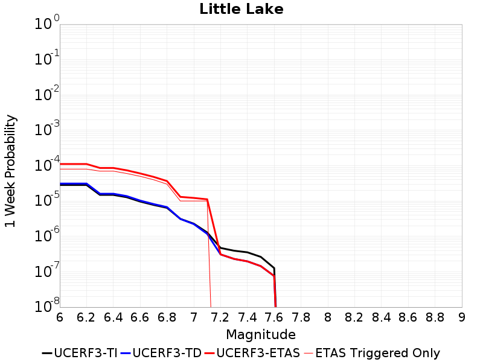 |  |  | 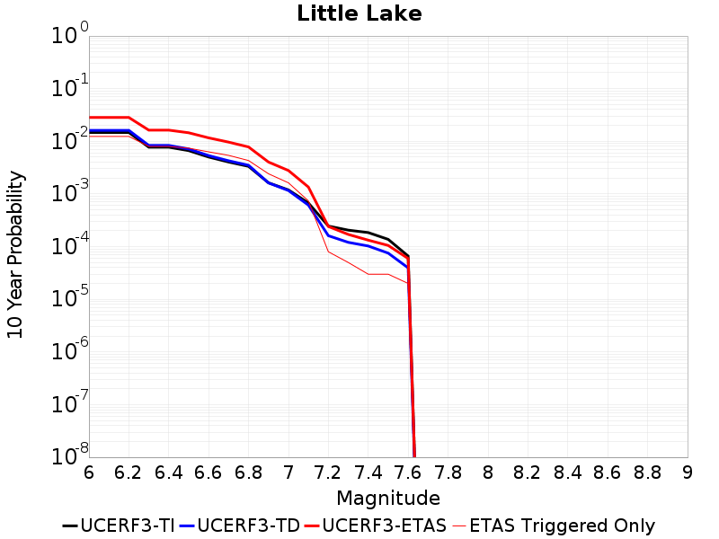 |

| Magnitude | 1 wk TI Prob | 1 wk TD Prob | 1 wk ETAS Prob | 1 wk ETAS/TD Gain | 1 wk ETAS Triggered Only | 1 mo TI Prob | 1 mo TD Prob | 1 mo ETAS Prob | 1 mo ETAS/TD Gain | 1 mo ETAS Triggered Only | 1 yr TI Prob | 1 yr TD Prob | 1 yr ETAS Prob | 1 yr ETAS/TD Gain | 1 yr ETAS Triggered Only | 10 yr TI Prob | 10 yr TD Prob | 10 yr ETAS Prob | 10 yr ETAS/TD Gain | 10 yr ETAS Triggered Only |
|-----|-----|-----|-----|-----|-----|-----|-----|-----|-----|-----|-----|-----|-----|-----|-----|-----|-----|-----|-----|-----|
| 6.0 | 2.8424427E-5 | 3.122671E-5 | 1.1122421E-4 | 3.5618293 | 8.0E-5 | 1.2181328E-4 | 1.3382264E-4 | 5.637651E-4 | 4.212778 | 4.3E-4 | 0.0014820677 | 0.0016282063 | 0.005212361 | 3.2012901 | 0.00359 | 0.014722223 | 0.016176198 | 0.028365774 | 1.7535502 | 0.01239 |
| 6.1 | 2.8424427E-5 | 3.122671E-5 | 1.1122421E-4 | 3.5618293 | 8.0E-5 | 1.2181328E-4 | 1.3382264E-4 | 5.637651E-4 | 4.212778 | 4.3E-4 | 0.0014820677 | 0.0016282063 | 0.005212361 | 3.2012901 | 0.00359 | 0.014722223 | 0.016176198 | 0.028365774 | 1.7535502 | 0.01239 |
| 6.2 | 2.8424427E-5 | 3.122671E-5 | 1.1122421E-4 | 3.5618293 | 8.0E-5 | 1.2181328E-4 | 1.3382264E-4 | 5.637651E-4 | 4.212778 | 4.3E-4 | 0.0014820677 | 0.0016282063 | 0.005212361 | 3.2012901 | 0.00359 | 0.014722223 | 0.016176198 | 0.028365774 | 1.7535502 | 0.01239 |
| 6.3 | 1.48860645E-5 | 1.6091137E-5 | 8.609001E-5 | 5.350151 | 7.0E-5 | 6.379586E-5 | 6.896035E-5 | 3.889383E-4 | 5.6400275 | 3.2E-4 | 7.7643775E-4 | 8.392971E-4 | 0.0030774171 | 3.66666 | 0.00224 | 0.007737305 | 0.008364095 | 0.016307099 | 1.9496548 | 0.00801 |
| 6.4 | 1.48860645E-5 | 1.6091137E-5 | 8.609001E-5 | 5.350151 | 7.0E-5 | 6.379586E-5 | 6.896035E-5 | 3.889383E-4 | 5.6400275 | 3.2E-4 | 7.7643775E-4 | 8.392971E-4 | 0.0030774171 | 3.66666 | 0.00224 | 0.007737305 | 0.008364095 | 0.016307099 | 1.9496548 | 0.00801 |
| 6.5 | 1.2797581E-5 | 1.3773713E-5 | 7.3772884E-5 | 5.356064 | 6.0E-5 | 5.4845623E-5 | 5.9029007E-5 | 3.590113E-4 | 6.081947 | 3.0E-4 | 6.675408E-4 | 7.1846694E-4 | 0.0027570012 | 3.8373392 | 0.00204 | 0.006655392 | 0.007163995 | 0.0145308385 | 2.028315 | 0.00742 |
| 6.6 | 9.661896E-6 | 1.0294789E-5 | 6.0294275E-5 | 5.856776 | 5.0E-5 | 4.1407468E-5 | 4.411987E-5 | 2.9410885E-4 | 6.666131 | 2.5E-4 | 5.040193E-4 | 5.370433E-4 | 0.0022761088 | 4.238222 | 0.00174 | 0.005028777 | 0.0053590615 | 0.011635246 | 2.171135 | 0.00631 |
| 6.7 | 7.767871E-6 | 8.204071E-6 | 4.8203743E-5 | 5.875589 | 4.0E-5 | 3.329045E-5 | 3.5159905E-5 | 2.6515182E-4 | 7.541312 | 2.3E-4 | 4.0523586E-4 | 4.280015E-4 | 0.0019573467 | 4.5732236 | 0.00153 | 0.004044977 | 0.0042731254 | 0.009660007 | 2.2606423 | 0.00541 |
| 6.8 | 6.4235196E-6 | 6.739298E-6 | 3.6739097E-5 | 5.4514723 | 3.0E-5 | 2.752908E-5 | 2.8882458E-5 | 1.6887841E-4 | 5.847093 | 1.4E-4 | 3.35115E-4 | 3.5160003E-4 | 0.0014512133 | 4.1274548 | 0.0011 | 0.003346101 | 0.0035116994 | 0.007816529 | 2.2258537 | 0.00432 |
| 6.9 | 3.1283696E-6 | 3.1134343E-6 | 1.3113403E-5 | 4.2118773 | 1.0E-5 | 1.3407229E-5 | 1.334323E-5 | 7.334243E-5 | 5.4966025 | 6.0E-5 | 1.6322079E-4 | 1.6244322E-4 | 8.023393E-4 | 4.939198 | 6.4E-4 | 0.0016310095 | 0.0016233933 | 0.0040394645 | 2.4882848 | 0.00242 |
| 7.0 | 2.290603E-6 | 2.2296294E-6 | 1.2229607E-5 | 5.48504 | 1.0E-5 | 9.816834E-6 | 9.555525E-6 | 3.9555238E-5 | 4.139515 | 3.0E-5 | 1.19513395E-4 | 1.1633335E-4 | 4.7629146E-4 | 4.0941954 | 3.6E-4 | 0.0011944914 | 0.0011628268 | 0.0027909314 | 2.4001265 | 0.00163 |
| 7.1 | 1.293693E-6 | 1.1782688E-6 | 1.1178257E-5 | 9.487018 | 1.0E-5 | 5.5443866E-6 | 5.049718E-6 | 1.5049667E-5 | 2.9802988 | 1.0E-5 | 6.750081E-5 | 6.147927E-5 | 2.2146944E-4 | 3.602343 | 1.6E-4 | 6.7480316E-4 | 6.1469123E-4 | 0.0013542364 | 2.2031164 | 7.4E-4 |
| 7.2 | 4.715842E-7 | 3.0945364E-7 | 3.0945364E-7 | 1.0 | 0.0 | 2.0210737E-6 | 1.3262292E-6 | 1.3262292E-6 | 1.0 | 0.0 | 2.4606294E-5 | 1.6146727E-5 | 1.6146727E-5 | 1.0 | 0.0 | 2.460357E-4 | 1.6145608E-4 | 2.4144315E-4 | 1.4954108 | 8.0E-5 |
| 7.3 | 3.9430947E-7 | 2.3122716E-7 | 2.3122716E-7 | 1.0 | 0.0 | 1.6898966E-6 | 9.909731E-7 | 9.909731E-7 | 1.0 | 0.0 | 2.0574296E-5 | 1.2065032E-5 | 1.2065032E-5 | 1.0 | 0.0 | 2.0572392E-4 | 1.2064385E-4 | 1.7063781E-4 | 1.4143931 | 5.0E-5 |
| 7.4 | 3.547123E-7 | 1.9702522E-7 | 1.9702522E-7 | 1.0 | 0.0 | 1.5201948E-6 | 8.443935E-7 | 8.443935E-7 | 1.0 | 0.0 | 1.8508214E-5 | 1.0280443E-5 | 1.0280443E-5 | 1.0 | 0.0 | 1.8506673E-4 | 1.0279974E-4 | 1.3279666E-4 | 1.2917995 | 3.0E-5 |
| 7.5 | 2.6354266E-7 | 1.4439435E-7 | 1.4439435E-7 | 1.0 | 0.0 | 1.129468E-6 | 6.1883276E-7 | 6.1883276E-7 | 1.0 | 0.0 | 1.3751187E-5 | 7.5342637E-6 | 7.5342637E-6 | 1.0 | 0.0 | 1.3750336E-4 | 7.534013E-5 | 1.0533787E-4 | 1.3981642 | 3.0E-5 |
| 7.6 | 1.269913E-7 | 7.579441E-8 | 7.579441E-8 | 1.0 | 0.0 | 5.4424834E-7 | 3.2483317E-7 | 3.2483317E-7 | 1.0 | 0.0 | 6.6262032E-6 | 3.9548368E-6 | 3.9548368E-6 | 1.0 | 0.0 | 6.626006E-5 | 3.95477E-5 | 5.954691E-5 | 1.5056984 | 2.0E-5 |

## Owl Lake
*[(top)](#table-of-contents)*

| 1 Week | 1 Month | 1 Year | 10 Year |
|-----|-----|-----|-----|
|  | 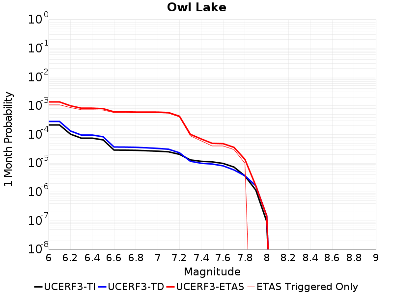 |  |  |

| Magnitude | 1 wk TI Prob | 1 wk TD Prob | 1 wk ETAS Prob | 1 wk ETAS/TD Gain | 1 wk ETAS Triggered Only | 1 mo TI Prob | 1 mo TD Prob | 1 mo ETAS Prob | 1 mo ETAS/TD Gain | 1 mo ETAS Triggered Only | 1 yr TI Prob | 1 yr TD Prob | 1 yr ETAS Prob | 1 yr ETAS/TD Gain | 1 yr ETAS Triggered Only | 10 yr TI Prob | 10 yr TD Prob | 10 yr ETAS Prob | 10 yr ETAS/TD Gain | 10 yr ETAS Triggered Only |
|-----|-----|-----|-----|-----|-----|-----|-----|-----|-----|-----|-----|-----|-----|-----|-----|-----|-----|-----|-----|-----|
| 6.0 | 5.0320643E-5 | 6.652025E-5 | 6.8647903E-4 | 10.319849 | 6.2E-4 | 2.1564208E-4 | 2.8506192E-4 | 0.001364754 | 4.7875705 | 0.00108 | 0.0026222812 | 0.003465963 | 0.007412238 | 2.1385796 | 0.00396 | 0.02591553 | 0.034222543 | 0.044314917 | 1.2949042 | 0.01045 |
| 6.1 | 5.0320643E-5 | 6.652025E-5 | 6.8647903E-4 | 10.319849 | 6.2E-4 | 2.1564208E-4 | 2.8506192E-4 | 0.001364754 | 4.7875705 | 0.00108 | 0.0026222812 | 0.003465963 | 0.007412238 | 2.1385796 | 0.00396 | 0.02591553 | 0.034222543 | 0.044314917 | 1.2949042 | 0.01045 |
| 6.2 | 2.4125871E-5 | 3.1069227E-5 | 5.310537E-4 | 17.092594 | 5.0E-4 | 1.0339249E-4 | 1.3314816E-4 | 0.0010030323 | 7.5332046 | 8.7E-4 | 0.0012580766 | 0.0016200467 | 0.0046651056 | 2.8796117 | 0.00305 | 0.012509781 | 0.016116267 | 0.023908626 | 1.483509 | 0.00792 |
| 6.3 | 1.7433485E-5 | 2.2428852E-5 | 4.5241922E-4 | 20.171303 | 4.3E-4 | 7.471279E-5 | 9.612101E-5 | 8.260508E-4 | 8.5938635 | 7.3E-4 | 9.0924866E-4 | 0.0011697842 | 0.0038366609 | 3.279802 | 0.00267 | 0.009055373 | 0.011666986 | 0.018486483 | 1.5845124 | 0.0069 |
| 6.4 | 1.7433485E-5 | 2.2428852E-5 | 4.5241922E-4 | 20.171303 | 4.3E-4 | 7.471279E-5 | 9.612101E-5 | 8.260508E-4 | 8.5938635 | 7.3E-4 | 9.0924866E-4 | 0.0011697842 | 0.0038366609 | 3.279802 | 0.00267 | 0.009055373 | 0.011666986 | 0.018486483 | 1.5845124 | 0.0069 |
| 6.5 | 1.5182742E-5 | 1.9497296E-5 | 4.294893E-4 | 22.028147 | 4.1E-4 | 6.506727E-5 | 8.355802E-5 | 7.934987E-4 | 9.49638 | 7.1E-4 | 7.919061E-4 | 0.0010169816 | 0.0035344188 | 3.475401 | 0.00252 | 0.0078909 | 0.010153854 | 0.01655816 | 1.6307265 | 0.00647 |
| 6.6 | 6.7271576E-6 | 8.596381E-6 | 3.3859356E-4 | 39.387917 | 3.3E-4 | 2.8830356E-5 | 3.6841146E-5 | 6.168198E-4 | 16.742687 | 5.8E-4 | 3.5095305E-4 | 4.4845435E-4 | 0.002417571 | 5.3908963 | 0.00197 | 0.0035039932 | 0.0044934424 | 0.009311694 | 2.0722852 | 0.00484 |
| 6.7 | 6.682835E-6 | 8.528765E-6 | 3.3852595E-4 | 39.69226 | 3.3E-4 | 2.8640408E-5 | 3.655137E-5 | 6.165302E-4 | 16.867498 | 5.8E-4 | 3.4864116E-4 | 4.4492775E-4 | 0.0024140512 | 5.4257154 | 0.00197 | 0.003480947 | 0.0044583124 | 0.009276735 | 2.0807726 | 0.00484 |
| 6.8 | 6.5774975E-6 | 8.37505E-6 | 3.2837238E-4 | 39.208405 | 3.2E-4 | 2.8188972E-5 | 3.589261E-5 | 6.0587213E-4 | 16.880136 | 5.7E-4 | 3.4314668E-4 | 4.369106E-4 | 0.0023960543 | 5.4840837 | 0.00196 | 0.0034261728 | 0.004378356 | 0.0091872085 | 2.0983238 | 0.00483 |
| 6.9 | 6.363419E-6 | 8.04774E-6 | 3.2804516E-4 | 40.762394 | 3.2E-4 | 2.727151E-5 | 3.448989E-5 | 6.0447026E-4 | 17.52601 | 5.7E-4 | 3.3198006E-4 | 4.1983917E-4 | 0.0023690204 | 5.642686 | 0.00195 | 0.0033148455 | 0.0042081326 | 0.008987933 | 2.1358485 | 0.0048 |
| 7.0 | 6.1342453E-6 | 7.679324E-6 | 3.2767685E-4 | 42.670013 | 3.2E-4 | 2.6289357E-5 | 3.2911004E-5 | 6.0289225E-4 | 18.318865 | 5.7E-4 | 3.2002592E-4 | 4.0062336E-4 | 0.002349842 | 5.8654647 | 0.00195 | 0.0031956544 | 0.0040164907 | 0.008767332 | 2.182834 | 0.00477 |
| 7.1 | 5.842926E-6 | 7.1889594E-6 | 3.2718666E-4 | 45.512383 | 3.2E-4 | 2.504087E-5 | 3.0809493E-5 | 5.8079255E-4 | 18.851091 | 5.5E-4 | 3.0482994E-4 | 3.7504648E-4 | 0.0022043602 | 5.8775654 | 0.00183 | 0.0030441214 | 0.0037613914 | 0.008234503 | 2.1892173 | 0.00449 |
| 7.2 | 4.77173E-6 | 5.3971403E-6 | 2.4539584E-4 | 45.467754 | 2.4E-4 | 2.045011E-5 | 2.313042E-5 | 4.3312093E-4 | 18.725166 | 4.1E-4 | 2.4895166E-4 | 2.8158055E-4 | 0.0015312285 | 5.437977 | 0.00125 | 0.0024867293 | 0.0028286693 | 0.0058800136 | 2.0787208 | 0.00306 |
| 7.3 | 3.0494948E-6 | 2.7404785E-6 | 5.2740343E-5 | 19.244938 | 5.0E-5 | 1.3069198E-5 | 1.1744856E-5 | 1.017438E-4 | 8.662839 | 9.0E-5 | 1.5910587E-4 | 1.429844E-4 | 4.3294294E-4 | 3.0279033 | 2.9E-4 | 0.0015899199 | 0.0014387873 | 0.0021877082 | 1.5205224 | 7.5E-4 |
| 7.4 | 2.7263884E-6 | 2.333802E-6 | 4.2333708E-5 | 18.139374 | 4.0E-5 | 1.1684469E-5 | 1.00019715E-5 | 7.000137E-5 | 6.9987574 | 6.0E-5 | 1.4224913E-4 | 1.21767305E-4 | 3.4174052E-4 | 2.8065047 | 2.2E-4 | 0.0014215811 | 0.0012258044 | 0.0017851179 | 1.4562829 | 5.6E-4 |
| 7.5 | 2.6090431E-6 | 2.1932274E-6 | 4.219314E-5 | 19.237923 | 4.0E-5 | 1.1181565E-5 | 9.399512E-6 | 4.9399136E-5 | 5.2555 | 4.0E-5 | 1.3612706E-4 | 1.14433155E-4 | 2.844137E-4 | 2.4854136 | 1.7E-4 | 0.001360437 | 0.0011523301 | 0.0016018116 | 1.390063 | 4.5E-4 |
| 7.6 | 2.3008756E-6 | 1.8974829E-6 | 4.189741E-5 | 22.080519 | 4.0E-5 | 9.860858E-6 | 8.132044E-6 | 4.813172E-5 | 5.918772 | 4.0E-5 | 1.20049335E-4 | 9.900323E-5 | 2.4898836E-4 | 2.5149522 | 1.5E-4 | 0.001199845 | 9.978019E-4 | 0.0013374626 | 1.340409 | 3.4E-4 |
| 7.7 | 1.7184348E-6 | 1.3640184E-6 | 3.136398E-5 | 22.993807 | 3.0E-5 | 7.3646997E-6 | 5.8457804E-6 | 3.5845605E-5 | 6.1318765 | 3.0E-5 | 8.966153E-5 | 7.11701E-5 | 1.7116297E-4 | 2.4049845 | 1.0E-4 | 8.962536E-4 | 7.19345E-4 | 9.29194E-4 | 1.2917222 | 2.1E-4 |
| 7.8 | 8.4612907E-7 | 8.561784E-7 | 1.085617E-5 | 12.679798 | 1.0E-5 | 3.6262625E-6 | 3.6693311E-6 | 1.3669294E-5 | 3.7252824 | 1.0E-5 | 4.4148852E-5 | 4.4673212E-5 | 1.0467053E-4 | 2.3430266 | 6.0E-5 | 4.414008E-4 | 4.520157E-4 | 5.7196146E-4 | 1.2653575 | 1.2E-4 |
| 7.9 | 2.716738E-7 | 3.8321843E-7 | 3.8321843E-7 | 1.0 | 0.0 | 1.1643157E-6 | 1.6423637E-6 | 1.6423637E-6 | 1.0 | 0.0 | 1.4175452E-5 | 1.9995607E-5 | 2.9995406E-5 | 1.5000999 | 1.0E-5 | 1.4174548E-4 | 2.0157038E-4 | 2.4156232E-4 | 1.1984018 | 4.0E-5 |
| 8.0 | 2.1995428E-8 | 3.4402756E-8 | 3.4402756E-8 | 1.0 | 0.0 | 9.426611E-8 | 1.4744039E-7 | 1.4744039E-7 | 1.0 | 0.0 | 1.1476893E-6 | 1.795086E-6 | 1.1795068E-5 | 6.570754 | 1.0E-5 | 1.14768345E-5 | 1.8153385E-5 | 2.8153203E-5 | 1.5508515 | 1.0E-5 |

## Airport Lake
*[(top)](#table-of-contents)*

| 1 Week | 1 Month | 1 Year | 10 Year |
|-----|-----|-----|-----|
|  |  | 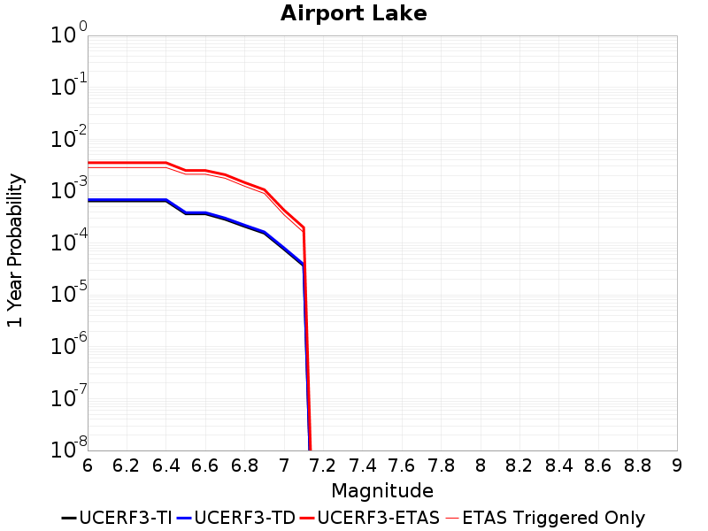 |  |

| Magnitude | 1 wk TI Prob | 1 wk TD Prob | 1 wk ETAS Prob | 1 wk ETAS/TD Gain | 1 wk ETAS Triggered Only | 1 mo TI Prob | 1 mo TD Prob | 1 mo ETAS Prob | 1 mo ETAS/TD Gain | 1 mo ETAS Triggered Only | 1 yr TI Prob | 1 yr TD Prob | 1 yr ETAS Prob | 1 yr ETAS/TD Gain | 1 yr ETAS Triggered Only | 10 yr TI Prob | 10 yr TD Prob | 10 yr ETAS Prob | 10 yr ETAS/TD Gain | 10 yr ETAS Triggered Only |
|-----|-----|-----|-----|-----|-----|-----|-----|-----|-----|-----|-----|-----|-----|-----|-----|-----|-----|-----|-----|-----|
| 6.0 | 1.2387061E-5 | 1.3107962E-5 | 1.0310678E-4 | 7.865966 | 9.0E-5 | 5.3086325E-5 | 5.6175933E-5 | 4.2615514E-4 | 7.5860806 | 3.7E-4 | 6.461343E-4 | 6.837558E-4 | 0.003521814 | 5.1506896 | 0.00284 | 0.0064425888 | 0.006819332 | 0.016661752 | 2.4433115 | 0.00991 |
| 6.1 | 1.2387061E-5 | 1.3107962E-5 | 1.0310678E-4 | 7.865966 | 9.0E-5 | 5.3086325E-5 | 5.6175933E-5 | 4.2615514E-4 | 7.5860806 | 3.7E-4 | 6.461343E-4 | 6.837558E-4 | 0.003521814 | 5.1506896 | 0.00284 | 0.0064425888 | 0.006819332 | 0.016661752 | 2.4433115 | 0.00991 |
| 6.2 | 1.2387061E-5 | 1.3107962E-5 | 1.0310678E-4 | 7.865966 | 9.0E-5 | 5.3086325E-5 | 5.6175933E-5 | 4.2615514E-4 | 7.5860806 | 3.7E-4 | 6.461343E-4 | 6.837558E-4 | 0.003521814 | 5.1506896 | 0.00284 | 0.0064425888 | 0.006819332 | 0.016661752 | 2.4433115 | 0.00991 |
| 6.3 | 1.2387061E-5 | 1.3107962E-5 | 1.0310678E-4 | 7.865966 | 9.0E-5 | 5.3086325E-5 | 5.6175933E-5 | 4.2615514E-4 | 7.5860806 | 3.7E-4 | 6.461343E-4 | 6.837558E-4 | 0.003521814 | 5.1506896 | 0.00284 | 0.0064425888 | 0.006819332 | 0.016661752 | 2.4433115 | 0.00991 |
| 6.4 | 1.2387061E-5 | 1.3107962E-5 | 1.0310678E-4 | 7.865966 | 9.0E-5 | 5.3086325E-5 | 5.6175933E-5 | 4.2615514E-4 | 7.5860806 | 3.7E-4 | 6.461343E-4 | 6.837558E-4 | 0.003521814 | 5.1506896 | 0.00284 | 0.0064425888 | 0.006819332 | 0.016661752 | 2.4433115 | 0.00991 |
| 6.5 | 6.9922594E-6 | 7.3875553E-6 | 7.738704E-5 | 10.475325 | 7.0E-5 | 2.996648E-5 | 3.16606E-5 | 3.2165143E-4 | 10.15936 | 2.9E-4 | 3.6478083E-4 | 3.8540503E-4 | 0.0024945918 | 6.47265 | 0.00211 | 0.003641826 | 0.003847904 | 0.01096043 | 2.8484156 | 0.00714 |
| 6.6 | 6.9922594E-6 | 7.3875553E-6 | 7.738704E-5 | 10.475325 | 7.0E-5 | 2.996648E-5 | 3.16606E-5 | 3.2165143E-4 | 10.15936 | 2.9E-4 | 3.6478083E-4 | 3.8540503E-4 | 0.0024945918 | 6.47265 | 0.00211 | 0.003641826 | 0.003847904 | 0.01096043 | 2.8484156 | 0.00714 |
| 6.7 | 5.477277E-6 | 5.788137E-6 | 7.5787735E-5 | 13.093631 | 7.0E-5 | 2.3473833E-5 | 2.4806088E-5 | 2.8479964E-4 | 11.481038 | 2.6E-4 | 2.8575645E-4 | 3.0197616E-4 | 0.0020714416 | 6.8596196 | 0.00177 | 0.0028538927 | 0.0030160423 | 0.0090278555 | 2.9932787 | 0.00603 |
| 6.8 | 3.9950432E-6 | 4.2205875E-6 | 3.4220462E-5 | 8.1079855 | 3.0E-5 | 1.7121502E-5 | 1.8088122E-5 | 1.4808578E-4 | 8.186907 | 1.3E-4 | 2.0843433E-4 | 2.2020338E-4 | 0.0014599303 | 6.6299176 | 0.00124 | 0.0020823893 | 0.0022001232 | 0.0066403328 | 3.0181642 | 0.00445 |
| 6.9 | 2.95695E-6 | 3.1241366E-6 | 1.3124105E-5 | 4.2008743 | 1.0E-5 | 1.2672582E-5 | 1.3389101E-5 | 9.338803E-5 | 6.9749293 | 8.0E-5 | 1.5427776E-4 | 1.6300238E-4 | 0.0010628557 | 6.520492 | 9.0E-4 | 0.001541707 | 0.0016290507 | 0.004783903 | 2.93662 | 0.00316 |
| 7.0 | 1.456072E-6 | 1.5413806E-6 | 1.1541365E-5 | 7.4876804 | 1.0E-5 | 6.2402937E-6 | 6.6059056E-6 | 3.6605707E-5 | 5.541361 | 3.0E-5 | 7.597293E-5 | 8.042494E-5 | 4.303968E-4 | 5.351534 | 3.5E-4 | 7.594696E-4 | 8.040573E-4 | 0.0023228351 | 2.8888924 | 0.00152 |
| 7.1 | 6.995192E-7 | 7.411753E-7 | 1.0741168E-5 | 14.492075 | 1.0E-5 | 2.997936E-6 | 3.1764655E-6 | 1.3176434E-5 | 4.1481433 | 1.0E-5 | 3.649926E-5 | 3.867347E-5 | 1.9866729E-4 | 5.1370435 | 1.6E-4 | 3.6493264E-4 | 3.867347E-4 | 0.0010364833 | 2.6800888 | 6.5E-4 |

## Panamint Valley
*[(top)](#table-of-contents)*

| 1 Week | 1 Month | 1 Year | 10 Year |
|-----|-----|-----|-----|
|  | 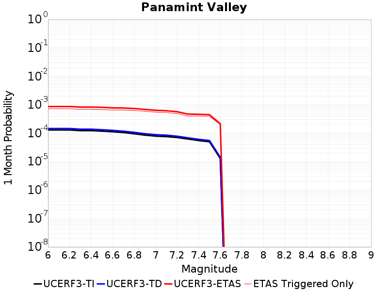 | 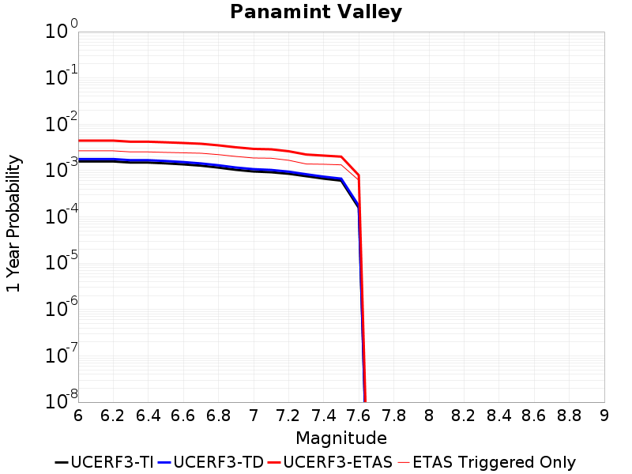 |  |

| Magnitude | 1 wk TI Prob | 1 wk TD Prob | 1 wk ETAS Prob | 1 wk ETAS/TD Gain | 1 wk ETAS Triggered Only | 1 mo TI Prob | 1 mo TD Prob | 1 mo ETAS Prob | 1 mo ETAS/TD Gain | 1 mo ETAS Triggered Only | 1 yr TI Prob | 1 yr TD Prob | 1 yr ETAS Prob | 1 yr ETAS/TD Gain | 1 yr ETAS Triggered Only | 10 yr TI Prob | 10 yr TD Prob | 10 yr ETAS Prob | 10 yr ETAS/TD Gain | 10 yr ETAS Triggered Only |
|-----|-----|-----|-----|-----|-----|-----|-----|-----|-----|-----|-----|-----|-----|-----|-----|-----|-----|-----|-----|-----|
| 6.0 | 3.0211835E-5 | 3.402762E-5 | 4.1401468E-4 | 12.167019 | 3.8E-4 | 1.2947287E-4 | 1.4582467E-4 | 8.657197E-4 | 5.936716 | 7.2E-4 | 0.0015751923 | 0.0017739992 | 0.0044392627 | 2.502404 | 0.00267 | 0.015640736 | 0.017604709 | 0.025788061 | 1.4648389 | 0.00833 |
| 6.1 | 3.0211835E-5 | 3.402762E-5 | 4.1401468E-4 | 12.167019 | 3.8E-4 | 1.2947287E-4 | 1.4582467E-4 | 8.657197E-4 | 5.936716 | 7.2E-4 | 0.0015751923 | 0.0017739992 | 0.0044392627 | 2.502404 | 0.00267 | 0.015640736 | 0.017604709 | 0.025788061 | 1.4648389 | 0.00833 |
| 6.2 | 3.0211835E-5 | 3.402762E-5 | 4.1401468E-4 | 12.167019 | 3.8E-4 | 1.2947287E-4 | 1.4582467E-4 | 8.657197E-4 | 5.936716 | 7.2E-4 | 0.0015751923 | 0.0017739992 | 0.0044392627 | 2.502404 | 0.00267 | 0.015640736 | 0.017604709 | 0.025788061 | 1.4648389 | 0.00833 |
| 6.3 | 2.8573924E-5 | 3.2143627E-5 | 4.0213173E-4 | 12.510465 | 3.7E-4 | 1.2245393E-4 | 1.3775128E-4 | 8.2765624E-4 | 6.0083375 | 6.9E-4 | 0.001489857 | 0.0016758597 | 0.00420162 | 2.507143 | 0.00253 | 0.01479908 | 0.016638162 | 0.024495222 | 1.4722314 | 0.00799 |
| 6.4 | 2.8573924E-5 | 3.2143627E-5 | 4.0213173E-4 | 12.510465 | 3.7E-4 | 1.2245393E-4 | 1.3775128E-4 | 8.2765624E-4 | 6.0083375 | 6.9E-4 | 0.001489857 | 0.0016758597 | 0.00420162 | 2.507143 | 0.00253 | 0.01479908 | 0.016638162 | 0.024495222 | 1.4722314 | 0.00799 |
| 6.5 | 2.7468774E-5 | 3.08679E-5 | 3.908568E-4 | 12.66224 | 3.6E-4 | 1.1771801E-4 | 1.3228445E-4 | 8.121945E-4 | 6.1397576 | 6.8E-4 | 0.0014322745 | 0.0016094008 | 0.0040754257 | 2.5322626 | 0.00247 | 0.014230782 | 0.015983293 | 0.023668462 | 1.4808252 | 0.00781 |
| 6.6 | 2.6135967E-5 | 2.9289971E-5 | 3.7927972E-4 | 12.949133 | 3.5E-4 | 1.1200648E-4 | 1.2552255E-4 | 7.7544095E-4 | 6.177702 | 6.5E-4 | 0.0013628257 | 0.0015271924 | 0.0039434964 | 2.5821872 | 0.00242 | 0.013544982 | 0.015172775 | 0.022667311 | 1.4939462 | 0.00761 |
| 6.7 | 2.4498746E-5 | 2.7376993E-5 | 3.7736743E-4 | 13.784107 | 3.5E-4 | 1.04990395E-4 | 1.1732484E-4 | 7.6724857E-4 | 6.539524 | 6.5E-4 | 0.0012775084 | 0.001427519 | 0.0037941358 | 2.6578531 | 0.00237 | 0.012701893 | 0.014189085 | 0.021346072 | 1.5044008 | 0.00726 |
| 6.8 | 2.2244329E-5 | 2.4968698E-5 | 3.649602E-4 | 14.616709 | 3.4E-4 | 9.532935E-5 | 1.07004445E-4 | 7.3693704E-4 | 6.886976 | 6.3E-4 | 0.0011600169 | 0.0013020224 | 0.003509145 | 2.6951494 | 0.00221 | 0.011539802 | 0.012949135 | 0.019591987 | 1.5129958 | 0.00673 |
| 6.9 | 1.9902658E-5 | 2.2320994E-5 | 3.4231384E-4 | 15.335959 | 3.2E-4 | 8.529431E-5 | 9.5658E-5 | 6.8560155E-4 | 7.1672163 | 5.9E-4 | 0.0010379635 | 0.0011640325 | 0.003181681 | 2.733327 | 0.00202 | 0.010331288 | 0.011583854 | 0.017494584 | 1.5102558 | 0.00598 |
| 7.0 | 1.8353881E-5 | 2.0594869E-5 | 3.105889E-4 | 15.080888 | 2.9E-4 | 7.865712E-5 | 8.826084E-5 | 6.382123E-4 | 7.2309794 | 5.5E-4 | 9.5722964E-4 | 0.0010740637 | 0.0029420552 | 2.7391813 | 0.00187 | 0.009531168 | 0.010693184 | 0.016124478 | 1.5079212 | 0.00549 |
| 7.1 | 1.7667631E-5 | 1.9799749E-5 | 2.997942E-4 | 15.1413145 | 2.8E-4 | 7.571623E-5 | 8.4853404E-5 | 6.148084E-4 | 7.2455363 | 5.3E-4 | 9.2145515E-4 | 0.0010326182 | 0.0028807078 | 2.7897124 | 0.00185 | 0.009176437 | 0.010282616 | 0.015508324 | 1.508208 | 0.00528 |
| 7.2 | 1.6381597E-5 | 1.818283E-5 | 2.681783E-4 | 14.748983 | 2.5E-4 | 7.020495E-5 | 7.792419E-5 | 5.67886E-4 | 7.287673 | 4.9E-4 | 8.544101E-4 | 9.4833144E-4 | 0.0026167477 | 2.7593176 | 0.00167 | 0.008511325 | 0.00944704 | 0.014112544 | 1.4938588 | 0.00471 |
| 7.3 | 1.4520491E-5 | 1.5986703E-5 | 2.2598334E-4 | 14.135708 | 2.1E-4 | 6.222919E-5 | 6.851273E-5 | 4.6848532E-4 | 6.837931 | 4.0E-4 | 7.57377E-4 | 8.338395E-4 | 0.0022226805 | 2.6655974 | 0.00139 | 0.0075480095 | 0.008309906 | 0.01216758 | 1.464226 | 0.00389 |
| 7.4 | 1.2852287E-5 | 1.4163095E-5 | 2.2416012E-4 | 15.827057 | 2.1E-4 | 5.5080065E-5 | 6.0697657E-5 | 4.606734E-4 | 7.58964 | 4.0E-4 | 6.7039346E-4 | 7.387593E-4 | 0.0021077471 | 2.8530905 | 0.00137 | 0.0066837464 | 0.007365636 | 0.011088015 | 1.505371 | 0.00375 |
| 7.5 | 1.1637851E-5 | 1.285381E-5 | 2.2285111E-4 | 17.337358 | 2.1E-4 | 4.987555E-5 | 5.5086683E-5 | 4.450652E-4 | 8.079361 | 3.9E-4 | 6.070656E-4 | 6.704897E-4 | 0.001999598 | 2.9822948 | 0.00133 | 0.006054099 | 0.006687253 | 0.010332711 | 1.5451354 | 0.00367 |
| 7.6 | 3.0068115E-6 | 3.339613E-6 | 8.333934E-5 | 24.954792 | 8.0E-5 | 1.2886271E-5 | 1.431259E-5 | 2.1430972E-4 | 14.973512 | 2.0E-4 | 1.5687906E-4 | 1.7424916E-4 | 7.9414115E-4 | 4.5575037 | 6.2E-4 | 0.0015676835 | 0.0017423071 | 0.0033195543 | 1.9052637 | 0.00158 |

## Garlock (East)
*[(top)](#table-of-contents)*

| 1 Week | 1 Month | 1 Year | 10 Year |
|-----|-----|-----|-----|
| 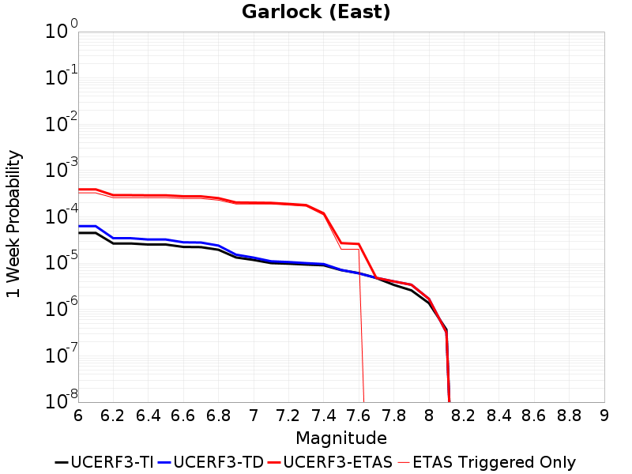 | 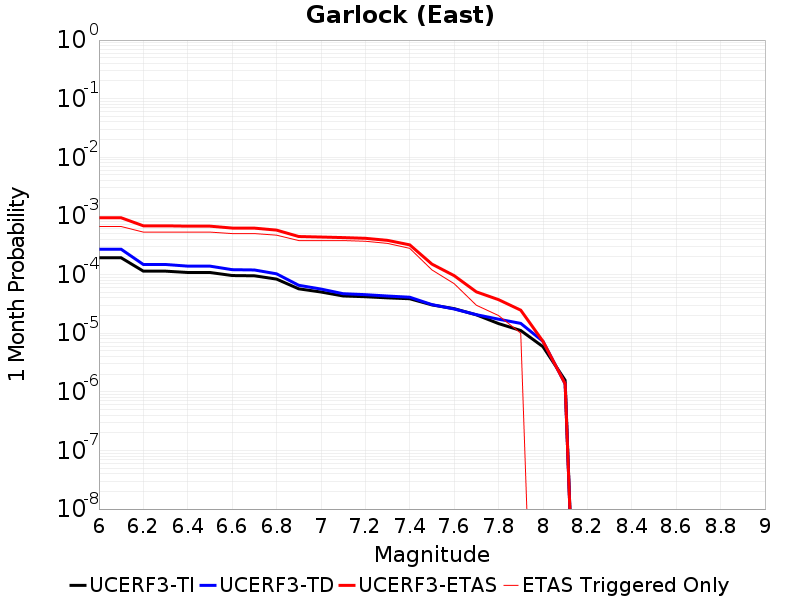 |  |  |

| Magnitude | 1 wk TI Prob | 1 wk TD Prob | 1 wk ETAS Prob | 1 wk ETAS/TD Gain | 1 wk ETAS Triggered Only | 1 mo TI Prob | 1 mo TD Prob | 1 mo ETAS Prob | 1 mo ETAS/TD Gain | 1 mo ETAS Triggered Only | 1 yr TI Prob | 1 yr TD Prob | 1 yr ETAS Prob | 1 yr ETAS/TD Gain | 1 yr ETAS Triggered Only | 10 yr TI Prob | 10 yr TD Prob | 10 yr ETAS Prob | 10 yr ETAS/TD Gain | 10 yr ETAS Triggered Only |
|-----|-----|-----|-----|-----|-----|-----|-----|-----|-----|-----|-----|-----|-----|-----|-----|-----|-----|-----|-----|-----|
| 6.0 | 4.5092507E-5 | 6.3096944E-5 | 3.9307613E-4 | 6.229717 | 3.3E-4 | 1.9323928E-4 | 2.7038998E-4 | 9.302115E-4 | 3.4402587 | 6.6E-4 | 0.0023501497 | 0.003287476 | 0.0058789286 | 1.7882804 | 0.0026 | 0.023254504 | 0.03239247 | 0.039359245 | 1.215074 | 0.0072 |
| 6.1 | 4.5092507E-5 | 6.3096944E-5 | 3.9307613E-4 | 6.229717 | 3.3E-4 | 1.9323928E-4 | 2.7038998E-4 | 9.302115E-4 | 3.4402587 | 6.6E-4 | 0.0023501497 | 0.003287476 | 0.0058789286 | 1.7882804 | 0.0026 | 0.023254504 | 0.03239247 | 0.039359245 | 1.215074 | 0.0072 |
| 6.2 | 2.6674514E-5 | 3.4665652E-5 | 2.9465664E-4 | 8.49996 | 2.6E-4 | 1.1431433E-4 | 1.485588E-4 | 6.784801E-4 | 4.567081 | 5.3E-4 | 0.0013908884 | 0.0018072362 | 0.0037137843 | 2.0549524 | 0.00191 | 0.01382215 | 0.017979443 | 0.022997567 | 1.2791035 | 0.00511 |
| 6.3 | 2.6674514E-5 | 3.4665652E-5 | 2.9465664E-4 | 8.49996 | 2.6E-4 | 1.1431433E-4 | 1.485588E-4 | 6.784801E-4 | 4.567081 | 5.3E-4 | 0.0013908884 | 0.0018072362 | 0.0037137843 | 2.0549524 | 0.00191 | 0.01382215 | 0.017979443 | 0.022997567 | 1.2791035 | 0.00511 |
| 6.4 | 2.5312667E-5 | 3.2492186E-5 | 2.9248375E-4 | 9.001664 | 2.6E-4 | 1.0847834E-4 | 1.3924495E-4 | 6.6917116E-4 | 4.805712 | 5.3E-4 | 0.0013199237 | 0.0016940186 | 0.0035808168 | 2.1138003 | 0.00189 | 0.013121112 | 0.016849 | 0.021804081 | 1.2940875 | 0.00504 |
| 6.5 | 2.5312667E-5 | 3.2492186E-5 | 2.9248375E-4 | 9.001664 | 2.6E-4 | 1.0847834E-4 | 1.3924495E-4 | 6.6917116E-4 | 4.805712 | 5.3E-4 | 0.0013199237 | 0.0016940186 | 0.0035808168 | 2.1138003 | 0.00189 | 0.013121112 | 0.016849 | 0.021804081 | 1.2940875 | 0.00504 |
| 6.6 | 2.246556E-5 | 2.8275075E-5 | 2.78268E-4 | 9.841459 | 2.5E-4 | 9.627742E-5 | 1.211734E-4 | 6.211128E-4 | 5.1258183 | 5.0E-4 | 0.0011715472 | 0.0014743115 | 0.0032616723 | 2.212336 | 0.00179 | 0.011653901 | 0.014686464 | 0.019386409 | 1.3200189 | 0.00477 |
| 6.7 | 2.2241198E-5 | 2.7944085E-5 | 2.779371E-4 | 9.946187 | 2.5E-4 | 9.531594E-5 | 1.19755E-4 | 6.196951E-4 | 5.174691 | 5.0E-4 | 0.0011598538 | 0.0014570657 | 0.0032344721 | 2.2198534 | 0.00178 | 0.011538187 | 0.014516954 | 0.019207854 | 1.3231325 | 0.00476 |
| 6.8 | 1.9528685E-5 | 2.402766E-5 | 2.5402213E-4 | 10.572071 | 2.3E-4 | 8.369167E-5 | 1.0297174E-4 | 5.7292334E-4 | 5.5638895 | 4.7E-4 | 0.0010184698 | 0.0012529796 | 0.0029508495 | 2.3550658 | 0.0017 | 0.010138147 | 0.01250341 | 0.016907645 | 1.3522427 | 0.00446 |
| 6.9 | 1.3318621E-5 | 1.5303869E-5 | 2.0530097E-4 | 13.41497 | 1.9E-4 | 5.7078556E-5 | 6.55864E-5 | 4.4556148E-4 | 6.7935047 | 3.8E-4 | 6.9470983E-4 | 7.9822756E-4 | 0.0023070222 | 2.890181 | 0.00151 | 0.0069254204 | 0.007994512 | 0.011853414 | 1.4826938 | 0.00389 |
| 7.0 | 1.1760853E-5 | 1.3209209E-5 | 2.032067E-4 | 15.383715 | 1.9E-4 | 5.0402683E-5 | 5.6609697E-5 | 4.365882E-4 | 7.712251 | 3.8E-4 | 6.134799E-4 | 6.8901014E-4 | 0.0021679904 | 3.146529 | 0.00148 | 0.0061178906 | 0.006909441 | 0.010633531 | 1.5389856 | 0.00375 |
| 7.1 | 1.0064758E-5 | 1.1000971E-5 | 2.0099888E-4 | 18.271011 | 1.9E-4 | 4.3133965E-5 | 4.7146186E-5 | 4.2712828E-4 | 9.059656 | 3.8E-4 | 5.2502943E-4 | 5.738572E-4 | 0.0020230252 | 3.525311 | 0.00145 | 0.005237907 | 0.0057637417 | 0.009203799 | 1.5968444 | 0.00346 |
| 7.2 | 9.768808E-6 | 1.0596179E-5 | 1.9059428E-4 | 17.987076 | 1.8E-4 | 4.186565E-5 | 4.5411423E-5 | 4.1539464E-4 | 9.14736 | 3.7E-4 | 5.095951E-4 | 5.5274734E-4 | 0.0019719624 | 3.5675657 | 0.00142 | 0.0050842804 | 0.0055535794 | 0.0089247525 | 1.6070272 | 0.00339 |
| 7.3 | 9.344516E-6 | 1.0040037E-5 | 1.8003833E-4 | 17.93204 | 1.7E-4 | 4.004731E-5 | 4.3028038E-5 | 3.8301342E-4 | 8.9014845 | 3.4E-4 | 4.8746695E-4 | 5.237439E-4 | 0.0018230631 | 3.480829 | 0.0013 | 0.0048639905 | 0.005264359 | 0.008338092 | 1.583876 | 0.00309 |
| 7.4 | 9.023491E-6 | 9.5843525E-6 | 1.19583296E-4 | 12.47693 | 1.1E-4 | 3.867153E-5 | 4.107517E-5 | 3.2106368E-4 | 7.81649 | 2.8E-4 | 4.7072413E-4 | 4.9997884E-4 | 0.0016494038 | 3.2989473 | 0.00115 | 0.004697283 | 0.0050267936 | 0.007693322 | 1.530463 | 0.00268 |
| 7.5 | 7.081253E-6 | 7.171201E-6 | 2.7171058E-5 | 3.788913 | 2.0E-5 | 3.0347876E-5 | 3.073336E-5 | 1.5072967E-4 | 4.904432 | 1.2E-4 | 3.6942272E-4 | 3.741152E-4 | 9.039169E-4 | 2.416146 | 5.3E-4 | 0.003688092 | 0.0037674687 | 0.005002797 | 1.3278935 | 0.00124 |
| 7.6 | 6.116396E-6 | 6.0358902E-6 | 2.603577E-5 | 4.313493 | 2.0E-5 | 2.6212863E-5 | 2.5867846E-5 | 9.586604E-5 | 3.7059922 | 7.0E-5 | 3.1909486E-4 | 3.148958E-4 | 6.8477925E-4 | 2.1746218 | 3.7E-4 | 0.0031863707 | 0.0031754863 | 0.003933073 | 1.2385734 | 7.6E-4 |
| 7.7 | 4.797145E-6 | 4.829737E-6 | 4.829737E-6 | 1.0 | 0.0 | 2.055903E-5 | 2.069871E-5 | 5.0698087E-5 | 2.4493358 | 3.0E-5 | 2.5027743E-4 | 2.5197776E-4 | 4.3193242E-4 | 1.7141687 | 1.8E-4 | 0.0024999576 | 0.0025470017 | 0.0028761614 | 1.1292341 | 3.3E-4 |
| 7.8 | 3.4028885E-6 | 4.0432406E-6 | 4.0432406E-6 | 1.0 | 0.0 | 1.4583726E-5 | 1.7328059E-5 | 3.7327714E-5 | 2.1541774 | 2.0E-5 | 1.775424E-4 | 2.1094877E-4 | 3.3092347E-4 | 1.5687385 | 1.2E-4 | 0.0017740062 | 0.0021349585 | 0.0023744463 | 1.1121744 | 2.4E-4 |
| 7.9 | 2.5928412E-6 | 3.4272855E-6 | 3.4272855E-6 | 1.0 | 0.0 | 1.1112129E-5 | 1.4688284E-5 | 2.4688137E-5 | 1.6808047 | 1.0E-5 | 1.3528178E-4 | 1.7881524E-4 | 2.5880095E-4 | 1.4473091 | 8.0E-5 | 0.0013519945 | 0.0018097161 | 0.0019694266 | 1.0882517 | 1.6E-4 |
| 8.0 | 1.3743648E-6 | 1.698326E-6 | 1.698326E-6 | 1.0 | 0.0 | 5.8901214E-6 | 7.2785197E-6 | 7.2785197E-6 | 1.0 | 0.0 | 7.1709874E-5 | 8.86124E-5 | 9.861152E-5 | 1.112841 | 1.0E-5 | 7.1686733E-4 | 8.9660304E-4 | 9.2657615E-4 | 1.0334296 | 3.0E-5 |
| 8.1 | 3.6733252E-7 | 3.1931708E-7 | 3.1931708E-7 | 1.0 | 0.0 | 1.5742813E-6 | 1.3685012E-6 | 1.3685012E-6 | 1.0 | 0.0 | 1.9166706E-5 | 1.6661392E-5 | 1.6661392E-5 | 1.0 | 0.0 | 1.9165053E-4 | 1.6867582E-4 | 1.6867582E-4 | 1.0 | 0.0 |

## Ash Hill
*[(top)](#table-of-contents)*

| 1 Week | 1 Month | 1 Year | 10 Year |
|-----|-----|-----|-----|
|  |  |  |  |

| Magnitude | 1 wk TI Prob | 1 wk TD Prob | 1 wk ETAS Prob | 1 wk ETAS/TD Gain | 1 wk ETAS Triggered Only | 1 mo TI Prob | 1 mo TD Prob | 1 mo ETAS Prob | 1 mo ETAS/TD Gain | 1 mo ETAS Triggered Only | 1 yr TI Prob | 1 yr TD Prob | 1 yr ETAS Prob | 1 yr ETAS/TD Gain | 1 yr ETAS Triggered Only | 10 yr TI Prob | 10 yr TD Prob | 10 yr ETAS Prob | 10 yr ETAS/TD Gain | 10 yr ETAS Triggered Only |
|-----|-----|-----|-----|-----|-----|-----|-----|-----|-----|-----|-----|-----|-----|-----|-----|-----|-----|-----|-----|-----|
| 6.0 | 2.1545662E-5 | 2.3205708E-5 | 1.3320315E-4 | 5.740103 | 1.1E-4 | 9.2335285E-5 | 9.94497E-5 | 3.8942086E-4 | 3.915757 | 2.9E-4 | 0.0011236023 | 0.0012102076 | 0.0026384771 | 2.1801853 | 0.00143 | 0.011179381 | 0.012044163 | 0.016450446 | 1.3658439 | 0.00446 |
| 6.1 | 2.1545662E-5 | 2.3205708E-5 | 1.3320315E-4 | 5.740103 | 1.1E-4 | 9.2335285E-5 | 9.94497E-5 | 3.8942086E-4 | 3.915757 | 2.9E-4 | 0.0011236023 | 0.0012102076 | 0.0026384771 | 2.1801853 | 0.00143 | 0.011179381 | 0.012044163 | 0.016450446 | 1.3658439 | 0.00446 |
| 6.2 | 2.1545662E-5 | 2.3205708E-5 | 1.3320315E-4 | 5.740103 | 1.1E-4 | 9.2335285E-5 | 9.94497E-5 | 3.8942086E-4 | 3.915757 | 2.9E-4 | 0.0011236023 | 0.0012102076 | 0.0026384771 | 2.1801853 | 0.00143 | 0.011179381 | 0.012044163 | 0.016450446 | 1.3658439 | 0.00446 |
| 6.3 | 1.0025529E-5 | 1.0751838E-5 | 4.0751514E-5 | 3.7901905 | 3.0E-5 | 4.2965847E-5 | 4.6078567E-5 | 1.060758E-4 | 2.3020637 | 6.0E-5 | 5.229836E-4 | 5.608754E-4 | 0.0010306118 | 1.8375058 | 4.7E-4 | 0.005217545 | 0.005595912 | 0.0071173506 | 1.2718838 | 0.00153 |
| 6.4 | 1.0025529E-5 | 1.0751838E-5 | 4.0751514E-5 | 3.7901905 | 3.0E-5 | 4.2965847E-5 | 4.6078567E-5 | 1.060758E-4 | 2.3020637 | 6.0E-5 | 5.229836E-4 | 5.608754E-4 | 0.0010306118 | 1.8375058 | 4.7E-4 | 0.005217545 | 0.005595912 | 0.0071173506 | 1.2718838 | 0.00153 |
| 6.5 | 6.9617327E-6 | 7.4599952E-6 | 2.7459846E-5 | 3.6809468 | 2.0E-5 | 2.9835655E-5 | 3.1971067E-5 | 7.1969785E-5 | 2.2510912 | 4.0E-5 | 3.6318856E-4 | 3.8918687E-4 | 6.590818E-4 | 1.6934841 | 2.7E-4 | 0.0036259557 | 0.0038859083 | 0.0048621 | 1.2512133 | 9.8E-4 |
| 6.6 | 4.9919777E-6 | 5.349097E-6 | 1.5349044E-5 | 2.8694644 | 1.0E-5 | 2.1394015E-5 | 2.2924538E-5 | 4.292408E-5 | 1.8724076 | 2.0E-5 | 2.60441E-4 | 2.790772E-4 | 4.5902698E-4 | 1.6448028 | 1.8E-4 | 0.0026013597 | 0.0027879267 | 0.0035358358 | 1.2682672 | 7.5E-4 |
| 6.7 | 3.6630722E-6 | 3.9264005E-6 | 3.9264005E-6 | 1.0 | 0.0 | 1.5698786E-5 | 1.6827355E-5 | 2.6827187E-5 | 1.5942605 | 1.0E-5 | 1.9111596E-4 | 2.0485952E-4 | 3.348329E-4 | 1.6344512 | 1.3E-4 | 0.0019095168 | 0.0020472703 | 0.0026360624 | 1.2875986 | 5.9E-4 |
| 6.8 | 2.5599613E-6 | 2.7461826E-6 | 2.7461826E-6 | 1.0 | 0.0 | 1.0971216E-5 | 1.1769329E-5 | 1.1769329E-5 | 1.0 | 0.0 | 1.3356637E-4 | 1.432871E-4 | 2.3327422E-4 | 1.6280196 | 9.0E-5 | 0.0013348613 | 0.0014324326 | 0.001851831 | 1.2927876 | 4.2E-4 |
| 6.9 | 1.7684905E-6 | 1.8977438E-6 | 1.8977438E-6 | 1.0 | 0.0 | 7.579223E-6 | 8.133188E-6 | 8.133188E-6 | 1.0 | 0.0 | 9.2273134E-5 | 9.902156E-5 | 1.6901463E-4 | 1.7068467 | 7.0E-5 | 9.223483E-4 | 9.902156E-4 | 0.0012499582 | 1.2623091 | 2.6E-4 |

## Blackwater
*[(top)](#table-of-contents)*

| 1 Week | 1 Month | 1 Year | 10 Year |
|-----|-----|-----|-----|
|  | 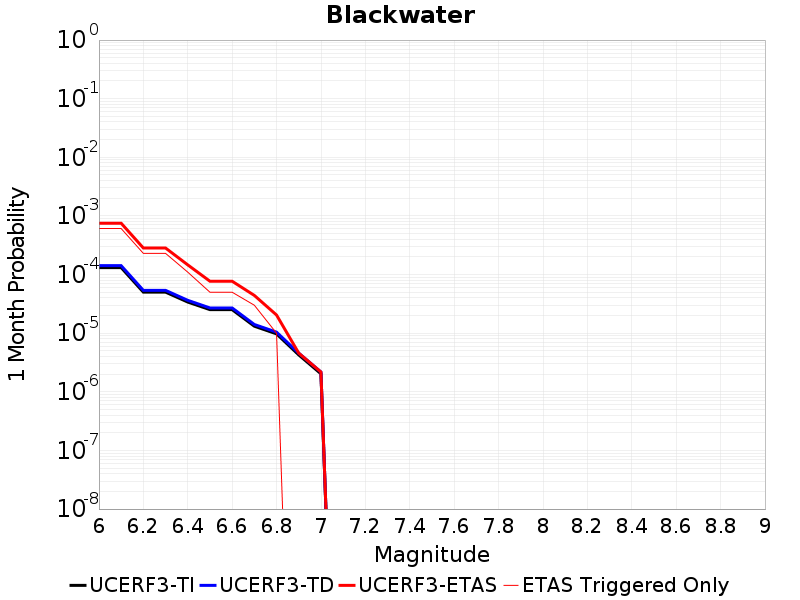 |  |  |

| Magnitude | 1 wk TI Prob | 1 wk TD Prob | 1 wk ETAS Prob | 1 wk ETAS/TD Gain | 1 wk ETAS Triggered Only | 1 mo TI Prob | 1 mo TD Prob | 1 mo ETAS Prob | 1 mo ETAS/TD Gain | 1 mo ETAS Triggered Only | 1 yr TI Prob | 1 yr TD Prob | 1 yr ETAS Prob | 1 yr ETAS/TD Gain | 1 yr ETAS Triggered Only | 10 yr TI Prob | 10 yr TD Prob | 10 yr ETAS Prob | 10 yr ETAS/TD Gain | 10 yr ETAS Triggered Only |
|-----|-----|-----|-----|-----|-----|-----|-----|-----|-----|-----|-----|-----|-----|-----|-----|-----|-----|-----|-----|-----|
| 6.0 | 3.0708583E-5 | 3.311219E-5 | 3.0310324E-4 | 9.153827 | 2.7E-4 | 1.3160157E-4 | 1.4190243E-4 | 7.5181585E-4 | 5.298118 | 6.1E-4 | 0.0016010714 | 0.0017264298 | 0.0033236674 | 1.925168 | 0.0016 | 0.015895851 | 0.01714403 | 0.02089854 | 1.2189981 | 0.00382 |
| 6.1 | 3.0708583E-5 | 3.311219E-5 | 3.0310324E-4 | 9.153827 | 2.7E-4 | 1.3160157E-4 | 1.4190243E-4 | 7.5181585E-4 | 5.298118 | 6.1E-4 | 0.0016010714 | 0.0017264298 | 0.0033236674 | 1.925168 | 0.0016 | 0.015895851 | 0.01714403 | 0.02089854 | 1.2189981 | 0.00382 |
| 6.2 | 1.1707779E-5 | 1.2550815E-5 | 8.254994E-5 | 6.577257 | 7.0E-5 | 5.017523E-5 | 5.378815E-5 | 2.837758E-4 | 5.2758045 | 2.3E-4 | 6.107122E-4 | 6.5468356E-4 | 0.0012343039 | 1.8853441 | 5.8E-4 | 0.006090366 | 0.0065285214 | 0.007988924 | 1.2236959 | 0.00147 |
| 6.3 | 1.1707779E-5 | 1.2550815E-5 | 8.254994E-5 | 6.577257 | 7.0E-5 | 5.017523E-5 | 5.378815E-5 | 2.837758E-4 | 5.2758045 | 2.3E-4 | 6.107122E-4 | 6.5468356E-4 | 0.0012343039 | 1.8853441 | 5.8E-4 | 0.006090366 | 0.0065285214 | 0.007988924 | 1.2236959 | 0.00147 |
| 6.4 | 7.929244E-6 | 8.483835E-6 | 3.848358E-5 | 4.536107 | 3.0E-5 | 3.3982033E-5 | 3.6358808E-5 | 1.4635481E-4 | 4.025292 | 1.1E-4 | 4.136527E-4 | 4.425826E-4 | 7.924277E-4 | 1.7904629 | 3.5E-4 | 0.0041288356 | 0.0044174176 | 0.005343309 | 1.2096002 | 9.3E-4 |
| 6.5 | 5.8832115E-6 | 6.2887198E-6 | 2.6288593E-5 | 4.1802773 | 2.0E-5 | 2.521352E-5 | 2.6951393E-5 | 7.695005E-5 | 2.8551416 | 5.0E-5 | 3.0693135E-4 | 3.2808635E-4 | 5.580109E-4 | 1.700805 | 2.3E-4 | 0.0030650778 | 0.0032762734 | 0.0039540455 | 1.2068729 | 6.8E-4 |
| 6.6 | 5.8832115E-6 | 6.2887198E-6 | 2.6288593E-5 | 4.1802773 | 2.0E-5 | 2.521352E-5 | 2.6951393E-5 | 7.695005E-5 | 2.8551416 | 5.0E-5 | 3.0693135E-4 | 3.2808635E-4 | 5.580109E-4 | 1.700805 | 2.3E-4 | 0.0030650778 | 0.0032762734 | 0.0039540455 | 1.2068729 | 6.8E-4 |
| 6.7 | 3.0715053E-6 | 3.2828884E-6 | 2.3282822E-5 | 7.092176 | 2.0E-5 | 1.3163528E-5 | 1.4069453E-5 | 4.406903E-5 | 3.132249 | 3.0E-5 | 1.6025416E-4 | 1.7128329E-4 | 3.0126103E-4 | 1.7588465 | 1.3E-4 | 0.0016013865 | 0.0017116274 | 0.0020510454 | 1.1983013 | 3.4E-4 |
| 6.8 | 2.2722281E-6 | 2.4298145E-6 | 2.4298145E-6 | 1.0 | 0.0 | 9.738084E-6 | 1.0413454E-5 | 2.041335E-5 | 1.9602861 | 1.0E-5 | 1.1855473E-4 | 1.2677735E-4 | 2.067672E-4 | 1.6309476 | 8.0E-5 | 0.001184915 | 0.0012671405 | 0.0014868617 | 1.1733992 | 2.2E-4 |
| 6.9 | 9.952399E-7 | 1.0658247E-6 | 1.0658247E-6 | 1.0 | 0.0 | 4.265307E-6 | 4.5678153E-6 | 4.5678153E-6 | 1.0 | 0.0 | 5.1928873E-5 | 5.5612247E-5 | 7.561113E-5 | 1.3596131 | 2.0E-5 | 5.191674E-4 | 5.56034E-4 | 6.5597834E-4 | 1.1797451 | 1.0E-4 |
| 7.0 | 4.7385504E-7 | 5.077848E-7 | 5.077848E-7 | 1.0 | 0.0 | 2.0308057E-6 | 2.1762207E-6 | 2.1762207E-6 | 1.0 | 0.0 | 2.4724779E-5 | 2.6495487E-5 | 4.6494955E-5 | 1.7548256 | 2.0E-5 | 2.4722028E-4 | 2.6495487E-4 | 3.1494163E-4 | 1.1886613 | 5.0E-5 |

## Hunter Mountain-Saline Valley
*[(top)](#table-of-contents)*

| 1 Week | 1 Month | 1 Year | 10 Year |
|-----|-----|-----|-----|
|  |  |  | 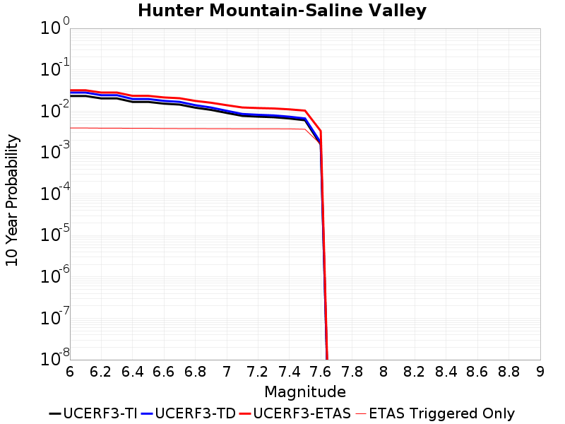 |

| Magnitude | 1 wk TI Prob | 1 wk TD Prob | 1 wk ETAS Prob | 1 wk ETAS/TD Gain | 1 wk ETAS Triggered Only | 1 mo TI Prob | 1 mo TD Prob | 1 mo ETAS Prob | 1 mo ETAS/TD Gain | 1 mo ETAS Triggered Only | 1 yr TI Prob | 1 yr TD Prob | 1 yr ETAS Prob | 1 yr ETAS/TD Gain | 1 yr ETAS Triggered Only | 10 yr TI Prob | 10 yr TD Prob | 10 yr ETAS Prob | 10 yr ETAS/TD Gain | 10 yr ETAS Triggered Only |
|-----|-----|-----|-----|-----|-----|-----|-----|-----|-----|-----|-----|-----|-----|-----|-----|-----|-----|-----|-----|-----|
| 6.0 | 4.5103672E-5 | 5.465123E-5 | 2.6463976E-4 | 4.8423386 | 2.1E-4 | 1.9328714E-4 | 2.3419943E-4 | 6.3410576E-4 | 2.7075462 | 4.0E-4 | 0.002350731 | 0.0028478263 | 0.004233868 | 1.4867015 | 0.00139 | 0.023260195 | 0.028133363 | 0.03194308 | 1.1354164 | 0.00392 |
| 6.1 | 4.5103672E-5 | 5.465123E-5 | 2.6463976E-4 | 4.8423386 | 2.1E-4 | 1.9328714E-4 | 2.3419943E-4 | 6.3410576E-4 | 2.7075462 | 4.0E-4 | 0.002350731 | 0.0028478263 | 0.004233868 | 1.4867015 | 0.00139 | 0.023260195 | 0.028133363 | 0.03194308 | 1.1354164 | 0.00392 |
| 6.2 | 3.9363465E-5 | 4.7130838E-5 | 2.5712093E-4 | 5.4554715 | 2.1E-4 | 1.6868966E-4 | 2.0197454E-4 | 6.0189376E-4 | 2.9800477 | 4.0E-4 | 0.002051862 | 0.0024564 | 0.0038330103 | 1.5604178 | 0.00138 | 0.020330196 | 0.024307946 | 0.028103389 | 1.15614 | 0.00389 |
| 6.3 | 3.9363465E-5 | 4.7130838E-5 | 2.5712093E-4 | 5.4554715 | 2.1E-4 | 1.6868966E-4 | 2.0197454E-4 | 6.0189376E-4 | 2.9800477 | 4.0E-4 | 0.002051862 | 0.0024564 | 0.0038330103 | 1.5604178 | 0.00138 | 0.020330196 | 0.024307946 | 0.028103389 | 1.15614 | 0.00389 |
| 6.4 | 3.2311684E-5 | 3.8002818E-5 | 2.4799485E-4 | 6.5256963 | 2.1E-4 | 1.384713E-4 | 1.6285946E-4 | 5.6279433E-4 | 3.4557054 | 4.0E-4 | 0.0016845843 | 0.00198108 | 0.0033483661 | 1.690172 | 0.00137 | 0.016718714 | 0.019642679 | 0.023417056 | 1.1921518 | 0.00385 |
| 6.5 | 3.2311684E-5 | 3.8002818E-5 | 2.4799485E-4 | 6.5256963 | 2.1E-4 | 1.384713E-4 | 1.6285946E-4 | 5.6279433E-4 | 3.4557054 | 4.0E-4 | 0.0016845843 | 0.00198108 | 0.0033483661 | 1.690172 | 0.00137 | 0.016718714 | 0.019642679 | 0.023417056 | 1.1921518 | 0.00385 |
| 6.6 | 2.9305844E-5 | 3.422767E-5 | 2.442205E-4 | 7.135177 | 2.1E-4 | 1.2559042E-4 | 1.4668211E-4 | 5.466234E-4 | 3.7265854 | 4.0E-4 | 0.0015279909 | 0.0017844538 | 0.003152009 | 1.766372 | 0.00137 | 0.015175272 | 0.017708872 | 0.0214514 | 1.2113364 | 0.00381 |
| 6.7 | 2.7826512E-5 | 3.2387263E-5 | 2.4238047E-4 | 7.4838204 | 2.1E-4 | 1.19251024E-4 | 1.3879551E-4 | 5.3874E-4 | 3.8815374 | 4.0E-4 | 0.0014509142 | 0.001688586 | 0.0030462896 | 1.8040476 | 0.00136 | 0.014414776 | 0.016764956 | 0.020501249 | 1.2228633 | 0.0038 |
| 6.8 | 2.3389874E-5 | 2.6901538E-5 | 2.368959E-4 | 8.806035 | 2.1E-4 | 1.0023846E-4 | 1.1528748E-4 | 5.1524135E-4 | 4.4691873 | 4.0E-4 | 0.00121972 | 0.0014027688 | 0.002760861 | 1.9681512 | 0.00136 | 0.01213047 | 0.013945061 | 0.01768221 | 1.2679908 | 0.00379 |
| 6.9 | 2.069209E-5 | 2.3600209E-5 | 2.3359526E-4 | 9.898016 | 2.1E-4 | 8.867737E-5 | 1.0114004E-4 | 5.0109957E-4 | 4.9545126 | 4.0E-4 | 0.0010791123 | 0.0012307205 | 0.0025890467 | 2.1036837 | 0.00136 | 0.010738871 | 0.012243782 | 0.0159775 | 1.3049481 | 0.00378 |
| 7.0 | 1.7462342E-5 | 1.9658253E-5 | 2.2965412E-4 | 11.682325 | 2.1E-4 | 7.483646E-5 | 8.424707E-5 | 4.8421338E-4 | 5.74754 | 4.0E-4 | 9.1075303E-4 | 0.0010252481 | 0.0023838538 | 2.3251483 | 0.00136 | 0.009070295 | 0.010208514 | 0.013940028 | 1.3655297 | 0.00377 |
| 7.1 | 1.4807709E-5 | 1.6462358E-5 | 2.264589E-4 | 13.756165 | 2.1E-4 | 6.3460066E-5 | 7.055115E-5 | 4.7052294E-4 | 6.6692457 | 4.0E-4 | 7.723524E-4 | 8.5863826E-4 | 0.0022174704 | 2.5825434 | 0.00136 | 0.007696735 | 0.008555891 | 0.012273806 | 1.4345444 | 0.00375 |
| 7.2 | 1.4180048E-5 | 1.5718077E-5 | 2.2571477E-4 | 14.360204 | 2.1E-4 | 6.077022E-5 | 6.7361536E-5 | 4.6733458E-4 | 6.937707 | 4.0E-4 | 7.396263E-4 | 8.1983436E-4 | 0.0021787195 | 2.6575117 | 0.00136 | 0.0073716943 | 0.008170747 | 0.011890107 | 1.4552044 | 0.00375 |
| 7.3 | 1.3730402E-5 | 1.5191215E-5 | 2.2518802E-4 | 14.823568 | 2.1E-4 | 5.8843252E-5 | 6.5103675E-5 | 4.6507764E-4 | 7.1436462 | 4.0E-4 | 7.161811E-4 | 7.923651E-4 | 0.0021512874 | 2.7150204 | 0.00136 | 0.007138774 | 0.007898029 | 0.011618411 | 1.471052 | 0.00375 |
| 7.4 | 1.2810095E-5 | 1.41268465E-5 | 2.2412388E-4 | 15.865104 | 2.1E-4 | 5.489925E-5 | 6.0542312E-5 | 4.605181E-4 | 7.6065497 | 4.0E-4 | 6.681934E-4 | 7.3686923E-4 | 0.0020958672 | 2.8442864 | 0.00136 | 0.006661878 | 0.007346851 | 0.011059374 | 1.5053216 | 0.00374 |
| 7.5 | 1.1595659E-5 | 1.2817561E-5 | 2.2281487E-4 | 17.383562 | 2.1E-4 | 4.9694736E-5 | 5.4931334E-5 | 4.449099E-4 | 8.099382 | 3.9E-4 | 6.0486543E-4 | 6.685995E-4 | 0.0019877169 | 2.972956 | 0.00132 | 0.006032217 | 0.006668455 | 0.010304049 | 1.5451927 | 0.00366 |
| 7.6 | 2.997694E-6 | 3.3317156E-6 | 8.333145E-5 | 25.011574 | 8.0E-5 | 1.28471975E-5 | 1.4278744E-5 | 2.1427589E-4 | 15.006635 | 2.0E-4 | 1.564034E-4 | 1.7383715E-4 | 7.937294E-4 | 4.5659366 | 6.2E-4 | 0.0015629337 | 0.0017382051 | 0.0033154588 | 1.9074037 | 0.00158 |

## Garlock (West)
*[(top)](#table-of-contents)*

| 1 Week | 1 Month | 1 Year | 10 Year |
|-----|-----|-----|-----|
|  | 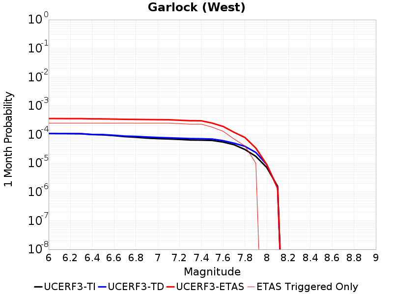 |  |  |

| Magnitude | 1 wk TI Prob | 1 wk TD Prob | 1 wk ETAS Prob | 1 wk ETAS/TD Gain | 1 wk ETAS Triggered Only | 1 mo TI Prob | 1 mo TD Prob | 1 mo ETAS Prob | 1 mo ETAS/TD Gain | 1 mo ETAS Triggered Only | 1 yr TI Prob | 1 yr TD Prob | 1 yr ETAS Prob | 1 yr ETAS/TD Gain | 1 yr ETAS Triggered Only | 10 yr TI Prob | 10 yr TD Prob | 10 yr ETAS Prob | 10 yr ETAS/TD Gain | 10 yr ETAS Triggered Only |
|-----|-----|-----|-----|-----|-----|-----|-----|-----|-----|-----|-----|-----|-----|-----|-----|-----|-----|-----|-----|-----|
| 6.0 | 2.5181727E-5 | 2.5448939E-5 | 1.054469E-4 | 4.14347 | 8.0E-5 | 1.0791722E-4 | 1.0906234E-4 | 3.5903507E-4 | 3.292017 | 2.5E-4 | 0.0013131002 | 0.0013270286 | 0.0023356883 | 1.7600889 | 0.00101 | 0.013053683 | 0.0132706575 | 0.015806552 | 1.1910903 | 0.00257 |
| 6.1 | 2.5077732E-5 | 2.5349935E-5 | 1.05347906E-4 | 4.1557465 | 8.0E-5 | 1.0747157E-4 | 1.0863807E-4 | 3.586109E-4 | 3.300969 | 2.5E-4 | 0.001307681 | 0.0013218696 | 0.0023305344 | 1.7630594 | 0.00101 | 0.013000126 | 0.013219682 | 0.015755707 | 1.1918371 | 0.00257 |
| 6.2 | 2.494612E-5 | 2.5231444E-5 | 1.05229425E-4 | 4.170567 | 8.0E-5 | 1.0690756E-4 | 1.081303E-4 | 3.5810328E-4 | 3.3117754 | 2.5E-4 | 0.0013008224 | 0.0013156948 | 0.002324366 | 1.7666452 | 0.00101 | 0.012932341 | 0.013158667 | 0.01569485 | 1.1927385 | 0.00257 |
| 6.3 | 2.4733758E-5 | 2.5050496E-5 | 1.0504849E-4 | 4.1934695 | 8.0E-5 | 1.0599751E-4 | 1.0735487E-4 | 3.5732804E-4 | 3.3284752 | 2.5E-4 | 0.0012897556 | 0.0013062654 | 0.002314946 | 1.7721866 | 0.00101 | 0.012822957 | 0.013065485 | 0.015601907 | 1.1941315 | 0.00257 |
| 6.4 | 2.3237335E-5 | 2.3427247E-5 | 1.0342537E-4 | 4.414747 | 8.0E-5 | 9.958477E-5 | 1.0039864E-4 | 3.5037354E-4 | 3.4898236 | 2.5E-4 | 0.0012117702 | 0.0012216709 | 0.0022204493 | 1.8175511 | 0.001 | 0.012051838 | 0.012229123 | 0.014738061 | 1.2051609 | 0.00254 |
| 6.5 | 2.2732203E-5 | 2.324089E-5 | 1.0323903E-4 | 4.442129 | 8.0E-5 | 9.742009E-5 | 9.960002E-5 | 3.4957513E-4 | 3.5097895 | 2.5E-4 | 0.0011854442 | 0.0012119586 | 0.0022107465 | 1.8241107 | 0.001 | 0.011791403 | 0.012133065 | 0.014642247 | 1.2068052 | 0.00254 |
| 6.6 | 2.1319436E-5 | 2.2018492E-5 | 1.0201673E-4 | 4.6332297 | 8.0E-5 | 9.136581E-5 | 9.436157E-5 | 3.4433798E-4 | 3.6491337 | 2.5E-4 | 0.001111811 | 0.0011482489 | 0.0021471006 | 1.8698913 | 0.001 | 0.011062649 | 0.011502709 | 0.0140134925 | 1.2182776 | 0.00254 |
| 6.7 | 1.970802E-5 | 2.0632551E-5 | 1.006309E-4 | 4.8772883 | 8.0E-5 | 8.446021E-5 | 8.842224E-5 | 3.3840013E-4 | 3.8270931 | 2.5E-4 | 0.001027818 | 0.0010760108 | 0.0020749348 | 1.9283587 | 0.001 | 0.010230771 | 0.010787524 | 0.013290232 | 1.2320002 | 0.00253 |
| 6.8 | 1.8744462E-5 | 2.0137257E-5 | 1.0013564E-4 | 4.972656 | 8.0E-5 | 8.033094E-5 | 8.629968E-5 | 3.362781E-4 | 3.896632 | 2.5E-4 | 9.775903E-4 | 0.0010501939 | 0.0020491437 | 1.9512051 | 0.001 | 0.009733009 | 0.010531827 | 0.013035181 | 1.2376943 | 0.00253 |
| 6.9 | 1.7559682E-5 | 1.918773E-5 | 9.9186196E-5 | 5.169251 | 8.0E-5 | 7.5253614E-5 | 8.2230545E-5 | 3.3220998E-4 | 4.039983 | 2.5E-4 | 9.158276E-4 | 0.0010006985 | 0.0019996979 | 1.998302 | 0.001 | 0.0091206245 | 0.010041477 | 0.012546073 | 1.2494249 | 0.00253 |
| 7.0 | 1.6794445E-5 | 1.8447652E-5 | 9.844617E-5 | 5.3365154 | 8.0E-5 | 7.197421E-5 | 7.905898E-5 | 3.290392E-4 | 4.1619463 | 2.5E-4 | 8.759337E-4 | 9.6211943E-4 | 0.0019611572 | 2.038372 | 0.001 | 0.008724891 | 0.009658911 | 0.012154571 | 1.258379 | 0.00252 |
| 7.1 | 1.6337795E-5 | 1.7947235E-5 | 9.79458E-5 | 5.457431 | 8.0E-5 | 7.0017246E-5 | 7.691446E-5 | 3.2689524E-4 | 4.250114 | 2.5E-4 | 8.521265E-4 | 9.360327E-4 | 0.0019350966 | 2.0673387 | 0.001 | 0.008488664 | 0.009400203 | 0.011896514 | 1.2655593 | 0.00252 |
| 7.2 | 1.5780008E-5 | 1.7395014E-5 | 9.7393626E-5 | 5.598939 | 8.0E-5 | 6.762685E-5 | 7.4547934E-5 | 3.1453004E-4 | 4.219165 | 2.4E-4 | 8.2304585E-4 | 9.072445E-4 | 0.0018963463 | 2.0902262 | 9.9E-4 | 0.008200042 | 0.009114642 | 0.011591855 | 1.271784 | 0.0025 |
| 7.3 | 1.5058865E-5 | 1.6846432E-5 | 9.6845084E-5 | 5.7487 | 8.0E-5 | 6.45364E-5 | 7.219701E-5 | 3.021804E-4 | 4.1854978 | 2.3E-4 | 7.854473E-4 | 8.786453E-4 | 0.0018577842 | 2.1143734 | 9.8E-4 | 0.00782677 | 0.008830524 | 0.011288624 | 1.2783641 | 0.00248 |
| 7.4 | 1.4887923E-5 | 1.6681694E-5 | 9.668036E-5 | 5.795596 | 8.0E-5 | 6.380382E-5 | 7.149102E-5 | 3.014746E-4 | 4.216957 | 2.3E-4 | 7.7653467E-4 | 8.7005686E-4 | 0.0018192303 | 2.0909326 | 9.5E-4 | 0.0077382675 | 0.0087450985 | 0.011114197 | 1.270906 | 0.00239 |
| 7.5 | 1.4509299E-5 | 1.6272028E-5 | 8.627089E-5 | 5.301791 | 7.0E-5 | 6.218123E-5 | 6.9735404E-5 | 2.4972286E-4 | 3.5810053 | 1.8E-4 | 7.567935E-4 | 8.48699E-4 | 0.0016979777 | 2.0006828 | 8.5E-4 | 0.0075422134 | 0.008532574 | 0.0106444 | 1.2475016 | 0.00213 |
| 7.6 | 1.2756717E-5 | 1.4262631E-5 | 8.4261635E-5 | 5.9078603 | 7.0E-5 | 5.4670498E-5 | 6.1124134E-5 | 1.9111618E-4 | 3.1266894 | 1.3E-4 | 6.6541E-4 | 7.439329E-4 | 0.0013634717 | 1.8327885 | 6.2E-4 | 0.006634211 | 0.0074909073 | 0.008910195 | 1.1894681 | 0.00143 |
| 7.7 | 1.0328985E-5 | 1.16585425E-5 | 5.1658077E-5 | 4.4309206 | 4.0E-5 | 4.4266326E-5 | 4.996423E-5 | 1.1996073E-4 | 2.4009323 | 7.0E-5 | 5.388092E-4 | 6.081451E-4 | 9.5793227E-4 | 1.5751705 | 3.5E-4 | 0.0053750467 | 0.0061408286 | 0.0068961615 | 1.1230018 | 7.6E-4 |
| 7.8 | 7.0306583E-6 | 9.058178E-6 | 2.9057997E-5 | 3.2079294 | 2.0E-5 | 3.0131043E-5 | 3.8820188E-5 | 7.881864E-5 | 2.0303516 | 4.0E-5 | 3.667837E-4 | 4.7253346E-4 | 7.1242003E-4 | 1.5076605 | 2.4E-4 | 0.003661789 | 0.0047772904 | 0.0053147106 | 1.1124948 | 5.4E-4 |
| 7.9 | 4.060633E-6 | 5.557106E-6 | 5.557106E-6 | 1.0 | 0.0 | 1.7402595E-5 | 2.381595E-5 | 3.381571E-5 | 1.4198767 | 1.0E-5 | 2.11856E-4 | 2.8992072E-4 | 4.0988592E-4 | 1.4137863 | 1.2E-4 | 0.0021165414 | 0.002931598 | 0.003190836 | 1.0884289 | 2.6E-4 |
| 8.0 | 1.6729537E-6 | 2.1083472E-6 | 2.1083472E-6 | 1.0 | 0.0 | 7.169782E-6 | 9.0357435E-6 | 9.0357435E-6 | 1.0 | 0.0 | 8.7288594E-5 | 1.1000465E-4 | 1.4000136E-4 | 1.2726858 | 3.0E-5 | 8.7254314E-4 | 0.0011128251 | 0.0011627695 | 1.0448806 | 5.0E-5 |
| 8.1 | 3.6733252E-7 | 3.1931708E-7 | 3.1931708E-7 | 1.0 | 0.0 | 1.5742813E-6 | 1.3685012E-6 | 1.3685012E-6 | 1.0 | 0.0 | 1.9166706E-5 | 1.6661392E-5 | 1.6661392E-5 | 1.0 | 0.0 | 1.9165053E-4 | 1.6867582E-4 | 1.6867582E-4 | 1.0 | 0.0 |

## McLean Lake
*[(top)](#table-of-contents)*

| 1 Week | 1 Month | 1 Year | 10 Year |
|-----|-----|-----|-----|
|  |  |  |  |

| Magnitude | 1 wk TI Prob | 1 wk TD Prob | 1 wk ETAS Prob | 1 wk ETAS/TD Gain | 1 wk ETAS Triggered Only | 1 mo TI Prob | 1 mo TD Prob | 1 mo ETAS Prob | 1 mo ETAS/TD Gain | 1 mo ETAS Triggered Only | 1 yr TI Prob | 1 yr TD Prob | 1 yr ETAS Prob | 1 yr ETAS/TD Gain | 1 yr ETAS Triggered Only | 10 yr TI Prob | 10 yr TD Prob | 10 yr ETAS Prob | 10 yr ETAS/TD Gain | 10 yr ETAS Triggered Only |
|-----|-----|-----|-----|-----|-----|-----|-----|-----|-----|-----|-----|-----|-----|-----|-----|-----|-----|-----|-----|-----|
| 6.0 | 1.7360222E-5 | 1.8509354E-5 | 6.850843E-5 | 3.7012868 | 5.0E-5 | 7.439883E-5 | 7.932367E-5 | 2.1931257E-4 | 2.764781 | 1.4E-4 | 9.0542925E-4 | 9.653864E-4 | 0.0015847879 | 1.6416099 | 6.2E-4 | 0.009017491 | 0.009616773 | 0.011637154 | 1.2100893 | 0.00204 |
| 6.1 | 9.062689E-6 | 9.595751E-6 | 2.959556E-5 | 3.084236 | 2.0E-5 | 3.8839516E-5 | 4.1124047E-5 | 9.112199E-5 | 2.2157836 | 5.0E-5 | 4.727685E-4 | 5.0057913E-4 | 7.9043396E-4 | 1.579039 | 2.9E-4 | 0.0047176396 | 0.004995399 | 0.006020254 | 1.2051597 | 0.00103 |
| 6.2 | 9.062689E-6 | 9.595751E-6 | 2.959556E-5 | 3.084236 | 2.0E-5 | 3.8839516E-5 | 4.1124047E-5 | 9.112199E-5 | 2.2157836 | 5.0E-5 | 4.727685E-4 | 5.0057913E-4 | 7.9043396E-4 | 1.579039 | 2.9E-4 | 0.0047176396 | 0.004995399 | 0.006020254 | 1.2051597 | 0.00103 |
| 6.3 | 7.2575485E-6 | 7.670459E-6 | 1.7670383E-5 | 2.3036928 | 1.0E-5 | 3.110341E-5 | 3.2873024E-5 | 7.2871706E-5 | 2.2167633 | 4.0E-5 | 3.786182E-4 | 4.0016268E-4 | 6.5006263E-4 | 1.6244959 | 2.5E-4 | 0.0037797375 | 0.0039951266 | 0.004861651 | 1.2168953 | 8.7E-4 |
| 6.4 | 7.2575485E-6 | 7.670459E-6 | 1.7670383E-5 | 2.3036928 | 1.0E-5 | 3.110341E-5 | 3.2873024E-5 | 7.2871706E-5 | 2.2167633 | 4.0E-5 | 3.786182E-4 | 4.0016268E-4 | 6.5006263E-4 | 1.6244959 | 2.5E-4 | 0.0037797375 | 0.0039951266 | 0.004861651 | 1.2168953 | 8.7E-4 |
| 6.5 | 6.06582E-6 | 6.406142E-6 | 1.6406078E-5 | 2.560992 | 1.0E-5 | 2.5996113E-5 | 2.7454642E-5 | 5.7453817E-5 | 2.0926814 | 3.0E-5 | 3.164567E-4 | 3.3421547E-4 | 5.0415867E-4 | 1.5084839 | 1.7E-4 | 0.0031600643 | 0.0033377674 | 0.0039955648 | 1.1970769 | 6.6E-4 |
| 6.6 | 5.598744E-6 | 5.912349E-6 | 1.591229E-5 | 2.6913652 | 1.0E-5 | 2.3994397E-5 | 2.5338428E-5 | 5.5337667E-5 | 2.1839423 | 3.0E-5 | 2.9209262E-4 | 3.0845808E-4 | 4.7840565E-4 | 1.5509584 | 1.7E-4 | 0.0029170897 | 0.0030809292 | 0.0037089882 | 1.2038537 | 6.3E-4 |
| 6.7 | 5.246996E-6 | 5.541119E-6 | 1.5541063E-5 | 2.8046796 | 1.0E-5 | 2.2486933E-5 | 2.3747472E-5 | 5.374676E-5 | 2.2632623 | 3.0E-5 | 2.73744E-4 | 2.8909347E-4 | 4.5904433E-4 | 1.5878751 | 1.7E-4 | 0.0027340704 | 0.0028877985 | 0.0034561523 | 1.1968122 | 5.7E-4 |
| 6.8 | 4.02324E-6 | 4.2484025E-6 | 1.42483605E-5 | 3.3538158 | 1.0E-5 | 1.7242342E-5 | 1.8207347E-5 | 4.82068E-5 | 2.6476564 | 3.0E-5 | 2.099053E-4 | 2.2165786E-4 | 3.6162682E-4 | 1.631464 | 1.4E-4 | 0.0020970714 | 0.0022149526 | 0.0026539778 | 1.1982099 | 4.4E-4 |
| 6.9 | 6.835972E-7 | 7.141941E-7 | 7.141941E-7 | 1.0 | 0.0 | 2.9296991E-6 | 3.06083E-6 | 3.06083E-6 | 1.0 | 0.0 | 3.56685E-5 | 3.7265287E-5 | 7.7263794E-5 | 2.073345 | 4.0E-5 | 3.5662777E-4 | 3.7262167E-4 | 4.5259183E-4 | 1.214615 | 8.0E-5 |

## Gravel Hills-Harper Lk
*[(top)](#table-of-contents)*

| 1 Week | 1 Month | 1 Year | 10 Year |
|-----|-----|-----|-----|
|  |  |  |  |

| Magnitude | 1 wk TI Prob | 1 wk TD Prob | 1 wk ETAS Prob | 1 wk ETAS/TD Gain | 1 wk ETAS Triggered Only | 1 mo TI Prob | 1 mo TD Prob | 1 mo ETAS Prob | 1 mo ETAS/TD Gain | 1 mo ETAS Triggered Only | 1 yr TI Prob | 1 yr TD Prob | 1 yr ETAS Prob | 1 yr ETAS/TD Gain | 1 yr ETAS Triggered Only | 10 yr TI Prob | 10 yr TD Prob | 10 yr ETAS Prob | 10 yr ETAS/TD Gain | 10 yr ETAS Triggered Only |
|-----|-----|-----|-----|-----|-----|-----|-----|-----|-----|-----|-----|-----|-----|-----|-----|-----|-----|-----|-----|-----|
| 6.0 | 3.0679566E-5 | 3.1490654E-5 | 1.0148845E-4 | 3.2228117 | 7.0E-5 | 1.3147724E-4 | 1.3495419E-4 | 2.749353E-4 | 2.037249 | 1.4E-4 | 0.0015995599 | 0.0016420464 | 0.0022809955 | 1.3891176 | 6.4E-4 | 0.015880952 | 0.016320745 | 0.017973326 | 1.1012565 | 0.00168 |
| 6.1 | 3.0679566E-5 | 3.1490654E-5 | 1.0148845E-4 | 3.2228117 | 7.0E-5 | 1.3147724E-4 | 1.3495419E-4 | 2.749353E-4 | 2.037249 | 1.4E-4 | 0.0015995599 | 0.0016420464 | 0.0022809955 | 1.3891176 | 6.4E-4 | 0.015880952 | 0.016320745 | 0.017973326 | 1.1012565 | 0.00168 |
| 6.2 | 1.514536E-5 | 1.3644349E-5 | 2.3644212E-5 | 1.7328942 | 1.0E-5 | 6.490707E-5 | 5.8474536E-5 | 7.8473364E-5 | 1.3420092 | 2.0E-5 | 7.8995706E-4 | 7.117068E-4 | 9.015716E-4 | 1.2667738 | 1.9E-4 | 0.007871548 | 0.0070954785 | 0.007641576 | 1.0769641 | 5.5E-4 |
| 6.3 | 1.514536E-5 | 1.3644349E-5 | 2.3644212E-5 | 1.7328942 | 1.0E-5 | 6.490707E-5 | 5.8474536E-5 | 7.8473364E-5 | 1.3420092 | 2.0E-5 | 7.8995706E-4 | 7.117068E-4 | 9.015716E-4 | 1.2667738 | 1.9E-4 | 0.007871548 | 0.0070954785 | 0.007641576 | 1.0769641 | 5.5E-4 |
| 6.4 | 1.2532521E-5 | 1.0696439E-5 | 2.0696332E-5 | 1.9348806 | 1.0E-5 | 5.37097E-5 | 4.584111E-5 | 6.584019E-5 | 1.4362696 | 2.0E-5 | 6.537194E-4 | 5.579784E-4 | 6.979003E-4 | 1.2507658 | 1.4E-4 | 0.0065179965 | 0.005566365 | 0.0059740827 | 1.0732467 | 4.1E-4 |
| 6.5 | 1.1094058E-5 | 9.08922E-6 | 1.908913E-5 | 2.1001945 | 1.0E-5 | 4.7545094E-5 | 3.895324E-5 | 5.895246E-5 | 1.513416 | 2.0E-5 | 5.787078E-4 | 4.7415655E-4 | 5.841044E-4 | 1.2318809 | 1.1E-4 | 0.0057720304 | 0.0047318568 | 0.004990626 | 1.0546867 | 2.6E-4 |
| 6.6 | 9.688328E-6 | 7.5362236E-6 | 1.7536147E-5 | 2.3269145 | 1.0E-5 | 4.1520743E-5 | 3.2297714E-5 | 4.2297394E-5 | 1.3096094 | 1.0E-5 | 5.053978E-4 | 3.9315628E-4 | 4.831209E-4 | 1.2288266 | 9.0E-5 | 0.0050424994 | 0.0039248643 | 0.004104158 | 1.0456815 | 1.8E-4 |
| 6.7 | 8.974824E-6 | 6.753462E-6 | 6.753462E-6 | 1.0 | 0.0 | 3.8462964E-5 | 2.89431E-5 | 2.89431E-5 | 1.0 | 0.0 | 4.6818596E-4 | 3.5232745E-4 | 4.223028E-4 | 1.1986088 | 7.0E-5 | 0.004672008 | 0.00351791 | 0.0036574174 | 1.0396564 | 1.4E-4 |
| 6.8 | 7.4780046E-6 | 5.1192965E-6 | 5.1192965E-6 | 1.0 | 0.0 | 3.20482E-5 | 2.1939666E-5 | 2.1939666E-5 | 1.0 | 0.0 | 3.9011694E-4 | 2.6708408E-4 | 3.070734E-4 | 1.1497256 | 4.0E-5 | 0.0038943281 | 0.0026677693 | 0.0027475557 | 1.0299076 | 8.0E-5 |
| 6.9 | 6.3409307E-6 | 3.9099755E-6 | 3.9099755E-6 | 1.0 | 0.0 | 2.7175134E-5 | 1.6756936E-5 | 1.6756936E-5 | 1.0 | 0.0 | 3.3080703E-4 | 2.039976E-4 | 2.3399146E-4 | 1.1470306 | 3.0E-5 | 0.0033031502 | 0.0020382016 | 0.002108059 | 1.034274 | 7.0E-5 |
| 7.0 | 5.1239335E-6 | 2.607673E-6 | 2.607673E-6 | 1.0 | 0.0 | 2.195953E-5 | 1.1175694E-5 | 1.1175694E-5 | 1.0 | 0.0 | 2.6732447E-4 | 1.3605584E-4 | 1.5605312E-4 | 1.1469785 | 2.0E-5 | 0.0026700313 | 0.0013597507 | 0.0013797235 | 1.0146886 | 2.0E-5 |
| 7.1 | 4.438899E-6 | 2.1000394E-6 | 2.1000394E-6 | 1.0 | 0.0 | 1.9023713E-5 | 9.0001395E-6 | 9.0001395E-6 | 1.0 | 0.0 | 2.315891E-4 | 1.0957141E-4 | 1.19570315E-4 | 1.0912547 | 1.0E-5 | 0.002313479 | 0.0010951958 | 0.0011051848 | 1.0091208 | 1.0E-5 |
| 7.2 | 3.50367E-6 | 1.2627992E-6 | 1.2627992E-6 | 1.0 | 0.0 | 1.5015643E-5 | 5.411986E-6 | 5.411986E-6 | 1.0 | 0.0 | 1.8280011E-4 | 6.588902E-5 | 6.588902E-5 | 1.0 | 0.0 | 0.0018264982 | 6.5870304E-4 | 6.5870304E-4 | 1.0 | 0.0 |
| 7.3 | 2.561638E-6 | 7.1293107E-7 | 7.1293107E-7 | 1.0 | 0.0 | 1.0978401E-5 | 3.0554154E-6 | 3.0554154E-6 | 1.0 | 0.0 | 1.3365384E-4 | 3.7199068E-5 | 3.7199068E-5 | 1.0 | 0.0 | 0.0013357349 | 3.7193042E-4 | 3.7193042E-4 | 1.0 | 0.0 |
| 7.4 | 2.0368864E-6 | 5.3135176E-7 | 5.3135176E-7 | 1.0 | 0.0 | 8.729483E-6 | 2.27722E-6 | 2.27722E-6 | 1.0 | 0.0 | 1.06276275E-4 | 2.7724805E-5 | 2.7724805E-5 | 1.0 | 0.0 | 0.0010622547 | 2.77214E-4 | 2.77214E-4 | 1.0 | 0.0 |
| 7.5 | 1.1681728E-6 | 3.6088196E-7 | 3.6088196E-7 | 1.0 | 0.0 | 5.0064455E-6 | 1.5466361E-6 | 1.5466361E-6 | 1.0 | 0.0 | 6.0951766E-5 | 1.8830136E-5 | 1.8830136E-5 | 1.0 | 0.0 | 6.093505E-4 | 1.8828588E-4 | 1.8828588E-4 | 1.0 | 0.0 |
| 7.6 | 1.3154387E-7 | 7.1417645E-8 | 7.1417645E-8 | 1.0 | 0.0 | 5.6375933E-7 | 3.0607558E-7 | 3.0607558E-7 | 1.0 | 0.0 | 6.863748E-6 | 3.7264656E-6 | 3.7264656E-6 | 1.0 | 0.0 | 6.863536E-5 | 3.7264188E-5 | 3.7264188E-5 | 1.0 | 0.0 |

## Goldstone Lake
*[(top)](#table-of-contents)*

| 1 Week | 1 Month | 1 Year | 10 Year |
|-----|-----|-----|-----|
|  | 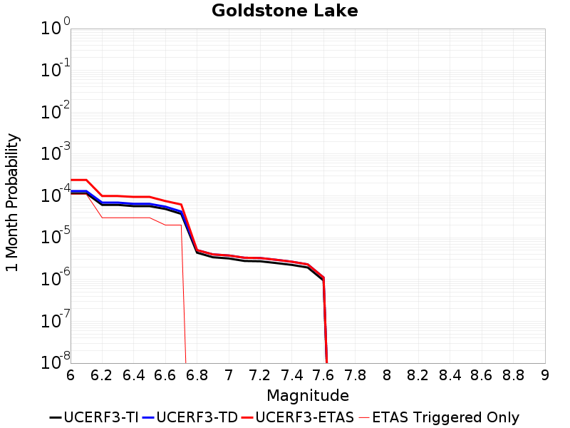 | 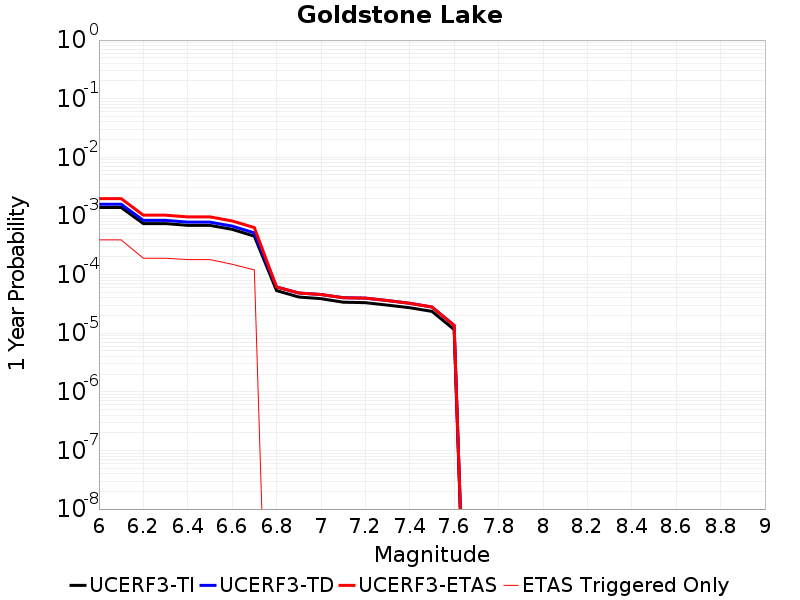 |  |

| Magnitude | 1 wk TI Prob | 1 wk TD Prob | 1 wk ETAS Prob | 1 wk ETAS/TD Gain | 1 wk ETAS Triggered Only | 1 mo TI Prob | 1 mo TD Prob | 1 mo ETAS Prob | 1 mo ETAS/TD Gain | 1 mo ETAS Triggered Only | 1 yr TI Prob | 1 yr TD Prob | 1 yr ETAS Prob | 1 yr ETAS/TD Gain | 1 yr ETAS Triggered Only | 10 yr TI Prob | 10 yr TD Prob | 10 yr ETAS Prob | 10 yr ETAS/TD Gain | 10 yr ETAS Triggered Only |
|-----|-----|-----|-----|-----|-----|-----|-----|-----|-----|-----|-----|-----|-----|-----|-----|-----|-----|-----|-----|-----|
| 6.0 | 2.671352E-5 | 3.0402412E-5 | 7.04012E-5 | 2.315645 | 4.0E-5 | 1.1448149E-4 | 1.3029066E-4 | 2.4027632E-4 | 1.8441561 | 1.1E-4 | 0.001392921 | 0.0015853312 | 0.0019747128 | 1.2456154 | 3.9E-4 | 0.013842222 | 0.015759751 | 0.017314851 | 1.0986754 | 0.00158 |
| 6.1 | 2.671352E-5 | 3.0402412E-5 | 7.04012E-5 | 2.315645 | 4.0E-5 | 1.1448149E-4 | 1.3029066E-4 | 2.4027632E-4 | 1.8441561 | 1.1E-4 | 0.001392921 | 0.0015853312 | 0.0019747128 | 1.2456154 | 3.9E-4 | 0.013842222 | 0.015759751 | 0.017314851 | 1.0986754 | 0.00158 |
| 6.2 | 1.4197047E-5 | 1.6109794E-5 | 2.6109634E-5 | 1.6207304 | 1.0E-5 | 6.0843064E-5 | 6.90407E-5 | 9.903863E-5 | 1.4344963 | 3.0E-5 | 7.4051257E-4 | 8.403452E-4 | 0.0010301855 | 1.2259076 | 1.9E-4 | 0.007380498 | 0.008381388 | 0.009204431 | 1.0981989 | 8.3E-4 |
| 6.3 | 1.4197047E-5 | 1.6109794E-5 | 2.6109634E-5 | 1.6207304 | 1.0E-5 | 6.0843064E-5 | 6.90407E-5 | 9.903863E-5 | 1.4344963 | 3.0E-5 | 7.4051257E-4 | 8.403452E-4 | 0.0010301855 | 1.2259076 | 1.9E-4 | 0.007380498 | 0.008381388 | 0.009204431 | 1.0981989 | 8.3E-4 |
| 6.4 | 1.3238931E-5 | 1.5021075E-5 | 2.5020925E-5 | 1.6657213 | 1.0E-5 | 5.6737044E-5 | 6.4375E-5 | 9.437307E-5 | 1.4659894 | 3.0E-5 | 6.9055456E-4 | 7.83582E-4 | 9.634409E-4 | 1.2295343 | 1.8E-4 | 0.006884126 | 0.007817833 | 0.008581813 | 1.0977228 | 7.7E-4 |
| 6.5 | 1.3238931E-5 | 1.5021075E-5 | 2.5020925E-5 | 1.6657213 | 1.0E-5 | 5.6737044E-5 | 6.4375E-5 | 9.437307E-5 | 1.4659894 | 3.0E-5 | 6.9055456E-4 | 7.83582E-4 | 9.634409E-4 | 1.2295343 | 1.8E-4 | 0.006884126 | 0.007817833 | 0.008581813 | 1.0977228 | 7.7E-4 |
| 6.6 | 1.1328278E-5 | 1.2866046E-5 | 2.2865917E-5 | 1.7772295 | 1.0E-5 | 4.8548856E-5 | 5.513957E-5 | 7.5138465E-5 | 1.3626959 | 2.0E-5 | 5.90922E-4 | 6.712133E-4 | 8.2111266E-4 | 1.2233258 | 1.5E-4 | 0.0058935313 | 0.0067012655 | 0.007277379 | 1.0859708 | 5.8E-4 |
| 6.7 | 8.651175E-6 | 9.832906E-6 | 1.9832807E-5 | 2.0169835 | 1.0E-5 | 3.707594E-5 | 4.214085E-5 | 6.214001E-5 | 1.4745789 | 2.0E-5 | 4.5130608E-4 | 5.130348E-4 | 6.329732E-4 | 1.2337823 | 1.2E-4 | 0.0045039062 | 0.005127398 | 0.005555193 | 1.0834332 | 4.3E-4 |
| 6.8 | 1.0215377E-6 | 1.1764791E-6 | 1.1764791E-6 | 1.0 | 0.0 | 4.378012E-6 | 5.0420444E-6 | 5.0420444E-6 | 1.0 | 0.0 | 5.3300988E-5 | 6.1385275E-5 | 6.1385275E-5 | 1.0 | 0.0 | 5.3288206E-4 | 6.136945E-4 | 6.2368833E-4 | 1.0162847 | 1.0E-5 |
| 6.9 | 7.9360774E-7 | 9.292166E-7 | 9.292166E-7 | 1.0 | 0.0 | 3.4011714E-6 | 3.9823512E-6 | 3.9823512E-6 | 1.0 | 0.0 | 4.1408475E-5 | 4.848412E-5 | 4.848412E-5 | 1.0 | 0.0 | 4.140076E-4 | 4.847424E-4 | 4.847424E-4 | 1.0 | 0.0 |
| 7.0 | 7.4382757E-7 | 8.755837E-7 | 8.755837E-7 | 1.0 | 0.0 | 3.1878285E-6 | 3.7524965E-6 | 3.7524965E-6 | 1.0 | 0.0 | 3.8811122E-5 | 4.5685752E-5 | 4.5685752E-5 | 1.0 | 0.0 | 3.8804344E-4 | 4.5677027E-4 | 4.5677027E-4 | 1.0 | 0.0 |
| 7.1 | 6.4709513E-7 | 7.7193414E-7 | 7.7193414E-7 | 1.0 | 0.0 | 2.773262E-6 | 3.3082854E-6 | 3.3082854E-6 | 1.0 | 0.0 | 3.376394E-5 | 4.027769E-5 | 4.027769E-5 | 1.0 | 0.0 | 3.375881E-4 | 4.0270988E-4 | 4.0270988E-4 | 1.0 | 0.0 |
| 7.2 | 6.356704E-7 | 7.596342E-7 | 7.596342E-7 | 1.0 | 0.0 | 2.7242988E-6 | 3.2555713E-6 | 3.2555713E-6 | 1.0 | 0.0 | 3.3167835E-5 | 3.963592E-5 | 3.963592E-5 | 1.0 | 0.0 | 3.3162883E-4 | 3.9629446E-4 | 3.9629446E-4 | 1.0 | 0.0 |
| 7.3 | 5.7695723E-7 | 6.904355E-7 | 6.904355E-7 | 1.0 | 0.0 | 2.4726714E-6 | 2.9590062E-6 | 2.9590062E-6 | 1.0 | 0.0 | 3.0104358E-5 | 3.6025365E-5 | 3.6025365E-5 | 1.0 | 0.0 | 3.0100282E-4 | 3.60201E-4 | 3.60201E-4 | 1.0 | 0.0 |
| 7.4 | 5.209647E-7 | 6.20097E-7 | 6.20097E-7 | 1.0 | 0.0 | 2.232704E-6 | 2.6575563E-6 | 2.6575563E-6 | 1.0 | 0.0 | 2.718283E-5 | 3.2355325E-5 | 3.2355325E-5 | 1.0 | 0.0 | 2.7179506E-4 | 3.235117E-4 | 3.235117E-4 | 1.0 | 0.0 |
| 7.5 | 4.512955E-7 | 5.356036E-7 | 5.356036E-7 | 1.0 | 0.0 | 1.934122E-6 | 2.2954423E-6 | 2.2954423E-6 | 1.0 | 0.0 | 2.3547682E-5 | 2.7946706E-5 | 2.7946706E-5 | 1.0 | 0.0 | 2.3545188E-4 | 2.7943723E-4 | 2.7943723E-4 | 1.0 | 0.0 |
| 7.6 | 2.21172E-7 | 2.6045635E-7 | 2.6045635E-7 | 1.0 | 0.0 | 9.478797E-7 | 1.1162413E-6 | 1.1162413E-6 | 1.0 | 0.0 | 1.1540374E-5 | 1.3590181E-5 | 1.3590181E-5 | 1.0 | 0.0 | 1.1539775E-4 | 1.358963E-4 | 1.358963E-4 | 1.0 | 0.0 |

## So Sierra Nevada
*[(top)](#table-of-contents)*

| 1 Week | 1 Month | 1 Year | 10 Year |
|-----|-----|-----|-----|
| 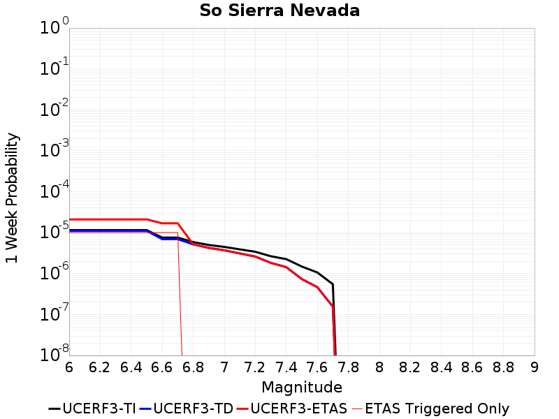 |  |  |  |

| Magnitude | 1 wk TI Prob | 1 wk TD Prob | 1 wk ETAS Prob | 1 wk ETAS/TD Gain | 1 wk ETAS Triggered Only | 1 mo TI Prob | 1 mo TD Prob | 1 mo ETAS Prob | 1 mo ETAS/TD Gain | 1 mo ETAS Triggered Only | 1 yr TI Prob | 1 yr TD Prob | 1 yr ETAS Prob | 1 yr ETAS/TD Gain | 1 yr ETAS Triggered Only | 10 yr TI Prob | 10 yr TD Prob | 10 yr ETAS Prob | 10 yr ETAS/TD Gain | 10 yr ETAS Triggered Only |
|-----|-----|-----|-----|-----|-----|-----|-----|-----|-----|-----|-----|-----|-----|-----|-----|-----|-----|-----|-----|-----|
| 6.0 | 1.15488665E-5 | 1.1083462E-5 | 2.1083351E-5 | 1.9022352 | 1.0E-5 | 4.9494203E-5 | 4.7499758E-5 | 7.7498335E-5 | 1.6315521 | 3.0E-5 | 6.024253E-4 | 5.781689E-4 | 0.0010079202 | 1.7432973 | 4.3E-4 | 0.006007948 | 0.0057679163 | 0.007050476 | 1.222361 | 0.00129 |
| 6.1 | 1.15488665E-5 | 1.1083462E-5 | 2.1083351E-5 | 1.9022352 | 1.0E-5 | 4.9494203E-5 | 4.7499758E-5 | 7.7498335E-5 | 1.6315521 | 3.0E-5 | 6.024253E-4 | 5.781689E-4 | 0.0010079202 | 1.7432973 | 4.3E-4 | 0.006007948 | 0.0057679163 | 0.007050476 | 1.222361 | 0.00129 |
| 6.2 | 1.15488665E-5 | 1.1083462E-5 | 2.1083351E-5 | 1.9022352 | 1.0E-5 | 4.9494203E-5 | 4.7499758E-5 | 7.7498335E-5 | 1.6315521 | 3.0E-5 | 6.024253E-4 | 5.781689E-4 | 0.0010079202 | 1.7432973 | 4.3E-4 | 0.006007948 | 0.0057679163 | 0.007050476 | 1.222361 | 0.00129 |
| 6.3 | 1.15488665E-5 | 1.1083462E-5 | 2.1083351E-5 | 1.9022352 | 1.0E-5 | 4.9494203E-5 | 4.7499758E-5 | 7.7498335E-5 | 1.6315521 | 3.0E-5 | 6.024253E-4 | 5.781689E-4 | 0.0010079202 | 1.7432973 | 4.3E-4 | 0.006007948 | 0.0057679163 | 0.007050476 | 1.222361 | 0.00129 |
| 6.4 | 1.15488665E-5 | 1.1083462E-5 | 2.1083351E-5 | 1.9022352 | 1.0E-5 | 4.9494203E-5 | 4.7499758E-5 | 7.7498335E-5 | 1.6315521 | 3.0E-5 | 6.024253E-4 | 5.781689E-4 | 0.0010079202 | 1.7432973 | 4.3E-4 | 0.006007948 | 0.0057679163 | 0.007050476 | 1.222361 | 0.00129 |
| 6.5 | 1.15488665E-5 | 1.1083462E-5 | 2.1083351E-5 | 1.9022352 | 1.0E-5 | 4.9494203E-5 | 4.7499758E-5 | 7.7498335E-5 | 1.6315521 | 3.0E-5 | 6.024253E-4 | 5.781689E-4 | 0.0010079202 | 1.7432973 | 4.3E-4 | 0.006007948 | 0.0057679163 | 0.007050476 | 1.222361 | 0.00129 |
| 6.6 | 7.587044E-6 | 6.9382436E-6 | 1.6938175E-5 | 2.441277 | 1.0E-5 | 3.2515498E-5 | 2.9735007E-5 | 4.973441E-5 | 1.6725879 | 2.0E-5 | 3.9580427E-4 | 3.619665E-4 | 5.718905E-4 | 1.5799541 | 2.1E-4 | 0.003951 | 0.0036140613 | 0.004291604 | 1.187474 | 6.8E-4 |
| 6.7 | 7.587044E-6 | 6.9382436E-6 | 1.6938175E-5 | 2.441277 | 1.0E-5 | 3.2515498E-5 | 2.9735007E-5 | 4.973441E-5 | 1.6725879 | 2.0E-5 | 3.9580427E-4 | 3.619665E-4 | 5.718905E-4 | 1.5799541 | 2.1E-4 | 0.003951 | 0.0036140613 | 0.004291604 | 1.187474 | 6.8E-4 |
| 6.8 | 5.9026956E-6 | 5.1815255E-6 | 5.1815255E-6 | 1.0 | 0.0 | 2.5297022E-5 | 2.2206354E-5 | 3.220613E-5 | 1.4503115 | 1.0E-5 | 3.0794772E-4 | 2.7033E-4 | 4.3028675E-4 | 1.5917093 | 1.6E-4 | 0.0030752132 | 0.0027001277 | 0.0031788317 | 1.1772894 | 4.8E-4 |
| 6.9 | 5.0118915E-6 | 4.2543193E-6 | 4.2543193E-6 | 1.0 | 0.0 | 2.1479358E-5 | 1.8232673E-5 | 2.823249E-5 | 1.548456 | 1.0E-5 | 2.614798E-4 | 2.219609E-4 | 3.4193427E-4 | 1.5405158 | 1.2E-4 | 0.0026117235 | 0.0022174648 | 0.0026065998 | 1.1754866 | 3.9E-4 |
| 7.0 | 4.4924795E-6 | 3.7156763E-6 | 3.7156763E-6 | 1.0 | 0.0 | 1.925334E-5 | 1.5924234E-5 | 1.5924234E-5 | 1.0 | 0.0 | 2.3438422E-4 | 1.9386092E-4 | 2.5384928E-4 | 1.3094403 | 6.0E-5 | 0.0023413717 | 0.0019369811 | 0.0022663418 | 1.1700382 | 3.3E-4 |
| 7.1 | 3.9118436E-6 | 3.1135655E-6 | 3.1135655E-6 | 1.0 | 0.0 | 1.6764936E-5 | 1.3343787E-5 | 1.3343787E-5 | 1.0 | 0.0 | 2.0409399E-4 | 1.6244907E-4 | 1.9244419E-4 | 1.1846433 | 3.0E-5 | 0.0020390663 | 0.0016233593 | 0.0018929209 | 1.1660517 | 2.7E-4 |
| 7.2 | 3.4200818E-6 | 2.6069033E-6 | 2.6069033E-6 | 1.0 | 0.0 | 1.4657411E-5 | 1.11723975E-5 | 1.11723975E-5 | 1.0 | 0.0 | 1.7843937E-4 | 1.3601595E-4 | 1.5601324E-4 | 1.1470215 | 2.0E-5 | 0.0017829615 | 0.0013593768 | 0.0015990505 | 1.1763115 | 2.4E-4 |
| 7.3 | 2.6593618E-6 | 1.8296772E-6 | 1.8296772E-6 | 1.0 | 0.0 | 1.13972155E-5 | 7.841452E-6 | 7.841452E-6 | 1.0 | 0.0 | 1.3875226E-4 | 9.546579E-5 | 1.0546483E-4 | 1.1047395 | 1.0E-5 | 0.0013866565 | 9.542767E-4 | 0.0011141241 | 1.1675062 | 1.6E-4 |
| 7.4 | 2.2577992E-6 | 1.4375776E-6 | 1.4375776E-6 | 1.0 | 0.0 | 9.676246E-6 | 6.161034E-6 | 6.161034E-6 | 1.0 | 0.0 | 1.1780193E-4 | 7.500826E-5 | 8.500751E-5 | 1.1333086 | 1.0E-5 | 0.001177395 | 7.498545E-4 | 8.5977203E-4 | 1.1465851 | 1.1E-4 |
| 7.5 | 1.489319E-6 | 7.3627734E-7 | 7.3627734E-7 | 1.0 | 0.0 | 6.3827797E-6 | 3.1554707E-6 | 3.1554707E-6 | 1.0 | 0.0 | 7.770758E-5 | 3.8417184E-5 | 3.8417184E-5 | 1.0 | 0.0 | 7.7680405E-4 | 3.8410584E-4 | 4.440828E-4 | 1.156147 | 6.0E-5 |
| 7.6 | 1.0680322E-6 | 4.666152E-7 | 4.666152E-7 | 1.0 | 0.0 | 4.577273E-6 | 1.9997779E-6 | 1.9997779E-6 | 1.0 | 0.0 | 5.5726876E-5 | 2.4347026E-5 | 2.4347026E-5 | 1.0 | 0.0 | 5.5712904E-4 | 2.4344385E-4 | 2.834341E-4 | 1.164269 | 4.0E-5 |
| 7.7 | 5.509146E-7 | 1.5612933E-7 | 1.5612933E-7 | 1.0 | 0.0 | 2.3610605E-6 | 6.6912554E-7 | 6.6912554E-7 | 1.0 | 0.0 | 2.8745531E-5 | 8.146574E-6 | 8.146574E-6 | 1.0 | 0.0 | 2.8741814E-4 | 8.146287E-5 | 9.1462054E-5 | 1.1227453 | 1.0E-5 |

## Death Valley (So)
*[(top)](#table-of-contents)*

| 1 Week | 1 Month | 1 Year | 10 Year |
|-----|-----|-----|-----|
| 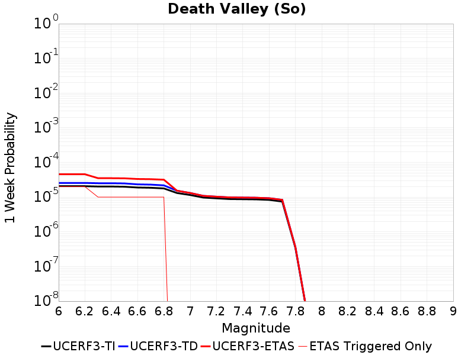 | 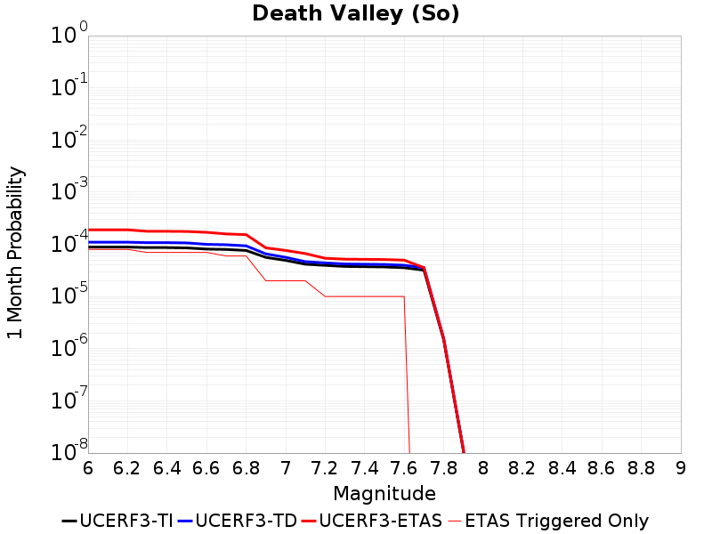 | 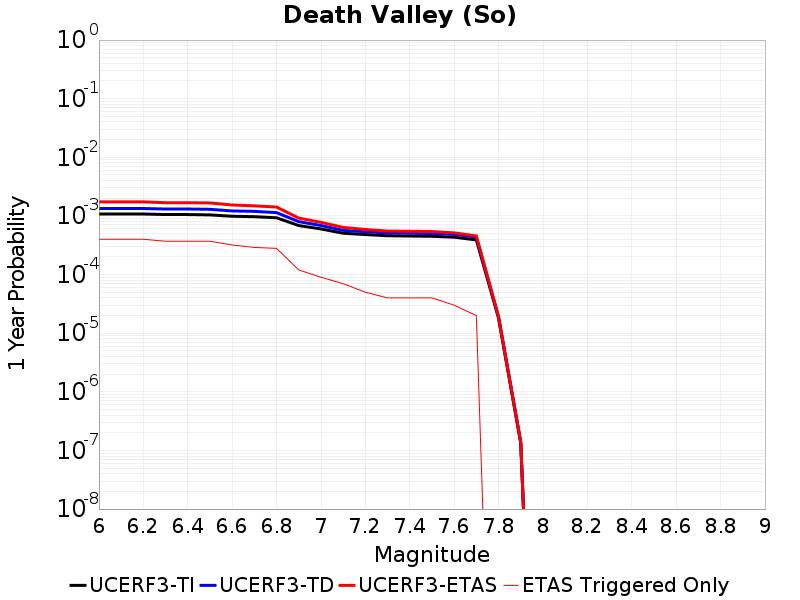 |  |

| Magnitude | 1 wk TI Prob | 1 wk TD Prob | 1 wk ETAS Prob | 1 wk ETAS/TD Gain | 1 wk ETAS Triggered Only | 1 mo TI Prob | 1 mo TD Prob | 1 mo ETAS Prob | 1 mo ETAS/TD Gain | 1 mo ETAS Triggered Only | 1 yr TI Prob | 1 yr TD Prob | 1 yr ETAS Prob | 1 yr ETAS/TD Gain | 1 yr ETAS Triggered Only | 10 yr TI Prob | 10 yr TD Prob | 10 yr ETAS Prob | 10 yr ETAS/TD Gain | 10 yr ETAS Triggered Only |
|-----|-----|-----|-----|-----|-----|-----|-----|-----|-----|-----|-----|-----|-----|-----|-----|-----|-----|-----|-----|-----|
| 6.0 | 2.0684236E-5 | 2.5666124E-5 | 4.5665613E-5 | 1.7792172 | 2.0E-5 | 8.864371E-5 | 1.0999313E-4 | 1.8998433E-4 | 1.7272382 | 8.0E-5 | 0.0010787029 | 0.0013383607 | 0.0017378253 | 1.2984731 | 4.0E-4 | 0.010734817 | 0.013305875 | 0.014489908 | 1.0889857 | 0.0012 |
| 6.1 | 2.0684236E-5 | 2.5666124E-5 | 4.5665613E-5 | 1.7792172 | 2.0E-5 | 8.864371E-5 | 1.0999313E-4 | 1.8998433E-4 | 1.7272382 | 8.0E-5 | 0.0010787029 | 0.0013383607 | 0.0017378253 | 1.2984731 | 4.0E-4 | 0.010734817 | 0.013305875 | 0.014489908 | 1.0889857 | 0.0012 |
| 6.2 | 2.0684236E-5 | 2.5666124E-5 | 4.5665613E-5 | 1.7792172 | 2.0E-5 | 8.864371E-5 | 1.0999313E-4 | 1.8998433E-4 | 1.7272382 | 8.0E-5 | 0.0010787029 | 0.0013383607 | 0.0017378253 | 1.2984731 | 4.0E-4 | 0.010734817 | 0.013305875 | 0.014489908 | 1.0889857 | 0.0012 |
| 6.3 | 2.0240292E-5 | 2.5165808E-5 | 3.5165558E-5 | 1.3973546 | 1.0E-5 | 8.6741224E-5 | 1.078491E-4 | 1.7784155E-4 | 1.648985 | 7.0E-5 | 0.0010555626 | 0.0013122887 | 0.0016818031 | 1.2815801 | 3.7E-4 | 0.010505628 | 0.013048234 | 0.014173359 | 1.0862281 | 0.00114 |
| 6.4 | 2.0240292E-5 | 2.5165808E-5 | 3.5165558E-5 | 1.3973546 | 1.0E-5 | 8.6741224E-5 | 1.078491E-4 | 1.7784155E-4 | 1.648985 | 7.0E-5 | 0.0010555626 | 0.0013122887 | 0.0016818031 | 1.2815801 | 3.7E-4 | 0.010505628 | 0.013048234 | 0.014173359 | 1.0862281 | 0.00114 |
| 6.5 | 1.9962767E-5 | 2.4854826E-5 | 3.4854576E-5 | 1.4023263 | 1.0E-5 | 8.55519E-5 | 1.06516425E-4 | 1.7650897E-4 | 1.6571057 | 7.0E-5 | 0.0010410968 | 0.0012960827 | 0.0016656033 | 1.2851056 | 3.7E-4 | 0.010362327 | 0.012888063 | 0.0140133705 | 1.0873139 | 0.00114 |
| 6.6 | 1.8937297E-5 | 2.3350483E-5 | 3.335025E-5 | 1.4282466 | 1.0E-5 | 8.115732E-5 | 1.0006974E-4 | 1.7006273E-4 | 1.6994421 | 7.0E-5 | 9.876423E-4 | 0.0012176827 | 0.0015372931 | 1.2624742 | 3.2E-4 | 0.009832645 | 0.012112815 | 0.013159975 | 1.0864506 | 0.00106 |
| 6.7 | 1.8621096E-5 | 2.295049E-5 | 3.295026E-5 | 1.4357105 | 1.0E-5 | 7.980225E-5 | 9.835562E-5 | 1.583497E-4 | 1.6099713 | 6.0E-5 | 9.711593E-4 | 0.0011968364 | 0.0014864893 | 1.2420155 | 2.9E-4 | 0.009669261 | 0.0119066 | 0.012884812 | 1.0821571 | 9.9E-4 |
| 6.8 | 1.7830353E-5 | 2.1840395E-5 | 3.1840176E-5 | 1.4578571 | 1.0E-5 | 7.641356E-5 | 9.359841E-5 | 1.535928E-4 | 1.6409765 | 6.0E-5 | 9.29938E-4 | 0.001138979 | 0.0014186602 | 1.2455542 | 2.8E-4 | 0.009260561 | 0.011334638 | 0.0122639835 | 1.0819917 | 9.4E-4 |
| 6.9 | 1.3135183E-5 | 1.5319123E-5 | 1.5319123E-5 | 1.0 | 0.0 | 5.6292425E-5 | 6.565177E-5 | 8.5650456E-5 | 1.3046176 | 2.0E-5 | 6.8514474E-4 | 7.9902366E-4 | 9.189278E-4 | 1.1500633 | 1.2E-4 | 0.006830362 | 0.007963003 | 0.008568145 | 1.0759943 | 6.1E-4 |
| 7.0 | 1.1507512E-5 | 1.3165924E-5 | 1.3165924E-5 | 1.0 | 0.0 | 4.9316975E-5 | 5.6424204E-5 | 7.642307E-5 | 1.3544378 | 2.0E-5 | 6.002687E-4 | 6.8675395E-4 | 7.766921E-4 | 1.1309613 | 9.0E-5 | 0.0059864987 | 0.006847581 | 0.007324294 | 1.0696177 | 4.8E-4 |
| 7.1 | 9.715903E-6 | 1.0873695E-5 | 1.0873695E-5 | 1.0 | 0.0 | 4.1638916E-5 | 4.660074E-5 | 6.659981E-5 | 1.4291577 | 2.0E-5 | 5.068359E-4 | 5.6722056E-4 | 6.3718087E-4 | 1.1233388 | 7.0E-5 | 0.0050568148 | 0.005658272 | 0.0058969143 | 1.0421758 | 2.4E-4 |
| 7.2 | 9.233269E-6 | 1.029409E-5 | 1.029409E-5 | 1.0 | 0.0 | 3.9570554E-5 | 4.411681E-5 | 5.4116368E-5 | 1.226661 | 1.0E-5 | 4.81665E-4 | 5.36994E-4 | 5.8696716E-4 | 1.0930609 | 5.0E-5 | 0.0048062233 | 0.0053573963 | 0.005536432 | 1.0334184 | 1.8E-4 |
| 7.3 | 8.8041315E-6 | 9.815294E-6 | 9.815294E-6 | 1.0 | 0.0 | 3.7731446E-5 | 4.206489E-5 | 5.2064468E-5 | 1.237718 | 1.0E-5 | 4.592835E-4 | 5.120239E-4 | 5.520034E-4 | 1.0780814 | 4.0E-5 | 0.0045833546 | 0.005108869 | 0.0052780006 | 1.0331055 | 1.7E-4 |
| 7.4 | 8.708749E-6 | 9.714266E-6 | 9.714266E-6 | 1.0 | 0.0 | 3.7322676E-5 | 4.1631927E-5 | 5.1631512E-5 | 1.2401903 | 1.0E-5 | 4.5430884E-4 | 5.06755E-4 | 5.467348E-4 | 1.0788935 | 4.0E-5 | 0.004533812 | 0.0050564217 | 0.005225562 | 1.0334506 | 1.7E-4 |
| 7.5 | 8.612678E-6 | 9.611865E-6 | 9.611865E-6 | 1.0 | 0.0 | 3.6910955E-5 | 4.1193078E-5 | 5.1192666E-5 | 1.2427492 | 1.0E-5 | 4.492982E-4 | 5.014145E-4 | 5.4139446E-4 | 1.0797343 | 4.0E-5 | 0.004483909 | 0.005003258 | 0.0051724077 | 1.0338079 | 1.7E-4 |
| 7.6 | 8.319024E-6 | 9.290772E-6 | 9.290772E-6 | 1.0 | 0.0 | 3.5652476E-5 | 3.9817012E-5 | 4.9816616E-5 | 1.2511389 | 1.0E-5 | 4.3398244E-4 | 4.846685E-4 | 5.14654E-4 | 1.061868 | 3.0E-5 | 0.0043313587 | 0.0048365393 | 0.004975862 | 1.0288063 | 1.4E-4 |
| 7.7 | 7.4718328E-6 | 8.351379E-6 | 8.351379E-6 | 1.0 | 0.0 | 3.2021748E-5 | 3.5791152E-5 | 3.5791152E-5 | 1.0 | 0.0 | 3.8979502E-4 | 4.356742E-4 | 4.5566552E-4 | 1.0458858 | 2.0E-5 | 0.00389112 | 0.004348607 | 0.0044382154 | 1.0206063 | 9.0E-5 |
| 7.8 | 3.4586725E-7 | 3.649536E-7 | 3.649536E-7 | 1.0 | 0.0 | 1.4822873E-6 | 1.5640859E-6 | 1.5640859E-6 | 1.0 | 0.0 | 1.80467E-5 | 1.9042584E-5 | 1.9042584E-5 | 1.0 | 0.0 | 1.8045233E-4 | 1.9040996E-4 | 1.9040996E-4 | 1.0 | 0.0 |
| 7.9 | 2.5591178E-9 | 2.670403E-9 | 2.670403E-9 | 1.0 | 0.0 | 1.0967647E-8 | 1.1444584E-8 | 1.1444584E-8 | 1.0 | 0.0 | 1.335311E-7 | 1.3933781E-7 | 1.3933781E-7 | 1.0 | 0.0 | 1.3353102E-6 | 1.393378E-6 | 1.393378E-6 | 1.0 | 0.0 |

## Coyote Canyon
*[(top)](#table-of-contents)*

| 1 Week | 1 Month | 1 Year | 10 Year |
|-----|-----|-----|-----|
|  |  |  |  |

| Magnitude | 1 wk TI Prob | 1 wk TD Prob | 1 wk ETAS Prob | 1 wk ETAS/TD Gain | 1 wk ETAS Triggered Only | 1 mo TI Prob | 1 mo TD Prob | 1 mo ETAS Prob | 1 mo ETAS/TD Gain | 1 mo ETAS Triggered Only | 1 yr TI Prob | 1 yr TD Prob | 1 yr ETAS Prob | 1 yr ETAS/TD Gain | 1 yr ETAS Triggered Only | 10 yr TI Prob | 10 yr TD Prob | 10 yr ETAS Prob | 10 yr ETAS/TD Gain | 10 yr ETAS Triggered Only |
|-----|-----|-----|-----|-----|-----|-----|-----|-----|-----|-----|-----|-----|-----|-----|-----|-----|-----|-----|-----|-----|
| 6.0 | 3.5090034E-5 | 4.0402836E-5 | 5.0402432E-5 | 1.2474973 | 1.0E-5 | 1.503772E-4 | 1.7314497E-4 | 2.3313459E-4 | 1.3464704 | 6.0E-5 | 0.0018293047 | 0.0021062598 | 0.0024156068 | 1.1468704 | 3.1E-4 | 0.018143194 | 0.020888938 | 0.021858258 | 1.0464035 | 9.9E-4 |
| 6.1 | 3.5090034E-5 | 4.0402836E-5 | 5.0402432E-5 | 1.2474973 | 1.0E-5 | 1.503772E-4 | 1.7314497E-4 | 2.3313459E-4 | 1.3464704 | 6.0E-5 | 0.0018293047 | 0.0021062598 | 0.0024156068 | 1.1468704 | 3.1E-4 | 0.018143194 | 0.020888938 | 0.021858258 | 1.0464035 | 9.9E-4 |
| 6.2 | 1.841879E-5 | 2.1078955E-5 | 2.1078955E-5 | 1.0 | 0.0 | 7.8935285E-5 | 9.033583E-5 | 1.10334026E-4 | 1.2213761 | 2.0E-5 | 9.606133E-4 | 0.001099386 | 0.0012092651 | 1.0999459 | 1.1E-4 | 0.0095647145 | 0.010949577 | 0.011384759 | 1.0397443 | 4.4E-4 |
| 6.3 | 1.841879E-5 | 2.1078955E-5 | 2.1078955E-5 | 1.0 | 0.0 | 7.8935285E-5 | 9.033583E-5 | 1.10334026E-4 | 1.2213761 | 2.0E-5 | 9.606133E-4 | 0.001099386 | 0.0012092651 | 1.0999459 | 1.1E-4 | 0.0095647145 | 0.010949577 | 0.011384759 | 1.0397443 | 4.4E-4 |
| 6.4 | 1.712201E-5 | 1.9582929E-5 | 1.9582929E-5 | 1.0 | 0.0 | 7.337798E-5 | 8.39247E-5 | 9.392387E-5 | 1.1191444 | 1.0E-5 | 8.930107E-4 | 0.001021405 | 0.001121303 | 1.0978043 | 1.0E-4 | 0.008894307 | 0.010177041 | 0.010592767 | 1.0408493 | 4.2E-4 |
| 6.5 | 1.4744935E-5 | 1.6852131E-5 | 1.6852131E-5 | 1.0 | 0.0 | 6.3191044E-5 | 7.222195E-5 | 8.222123E-5 | 1.138452 | 1.0E-5 | 7.6907943E-4 | 8.790412E-4 | 9.689621E-4 | 1.1022943 | 9.0E-5 | 0.007664232 | 0.008764855 | 0.009151435 | 1.0441059 | 3.9E-4 |
| 6.6 | 1.2017839E-5 | 1.3736455E-5 | 1.3736455E-5 | 1.0 | 0.0 | 5.150401E-5 | 5.8869693E-5 | 6.886911E-5 | 1.1698567 | 1.0E-5 | 6.268809E-4 | 7.1659154E-4 | 7.8654144E-4 | 1.0976146 | 7.0E-5 | 0.0062511545 | 0.0071515176 | 0.0074593006 | 1.0430374 | 3.1E-4 |
| 6.7 | 1.00956095E-5 | 1.1543942E-5 | 1.1543942E-5 | 1.0 | 0.0 | 4.326618E-5 | 4.947359E-5 | 5.9473095E-5 | 1.202118 | 1.0E-5 | 5.266384E-4 | 6.022616E-4 | 6.7221944E-4 | 1.1161586 | 7.0E-5 | 0.005253921 | 0.006014837 | 0.0062434534 | 1.0380088 | 2.3E-4 |

## San Andreas (Mojave S)
*[(top)](#table-of-contents)*

| 1 Week | 1 Month | 1 Year | 10 Year |
|-----|-----|-----|-----|
|  |  |  | 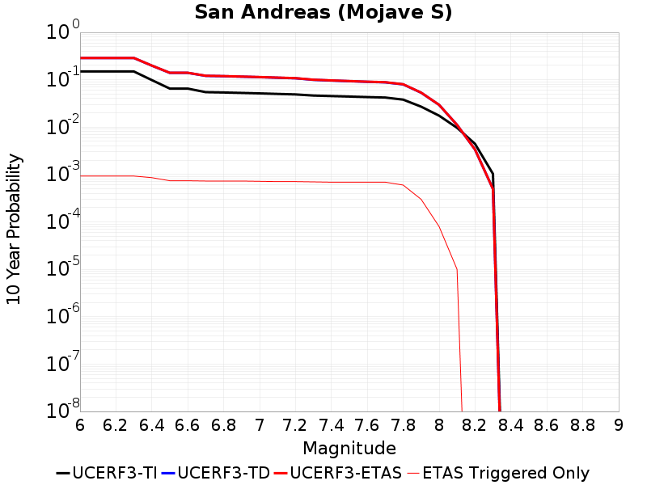 |

| Magnitude | 1 wk TI Prob | 1 wk TD Prob | 1 wk ETAS Prob | 1 wk ETAS/TD Gain | 1 wk ETAS Triggered Only | 1 mo TI Prob | 1 mo TD Prob | 1 mo ETAS Prob | 1 mo ETAS/TD Gain | 1 mo ETAS Triggered Only | 1 yr TI Prob | 1 yr TD Prob | 1 yr ETAS Prob | 1 yr ETAS/TD Gain | 1 yr ETAS Triggered Only | 10 yr TI Prob | 10 yr TD Prob | 10 yr ETAS Prob | 10 yr ETAS/TD Gain | 10 yr ETAS Triggered Only |
|-----|-----|-----|-----|-----|-----|-----|-----|-----|-----|-----|-----|-----|-----|-----|-----|-----|-----|-----|-----|-----|
| 6.0 | 3.1064058E-4 | 6.793063E-4 | 7.192791E-4 | 1.0588436 | 4.0E-5 | 0.0013306376 | 0.0029081928 | 0.0029779894 | 1.0239999 | 7.0E-5 | 0.016080605 | 0.03495979 | 0.035326503 | 1.0104896 | 3.8E-4 | 0.1496549 | 0.28809673 | 0.28875878 | 1.0022981 | 9.3E-4 |
| 6.1 | 3.1064058E-4 | 6.793063E-4 | 7.192791E-4 | 1.0588436 | 4.0E-5 | 0.0013306376 | 0.0029081928 | 0.0029779894 | 1.0239999 | 7.0E-5 | 0.016080605 | 0.03495979 | 0.035326503 | 1.0104896 | 3.8E-4 | 0.1496549 | 0.28809673 | 0.28875878 | 1.0022981 | 9.3E-4 |
| 6.2 | 3.1064058E-4 | 6.793063E-4 | 7.192791E-4 | 1.0588436 | 4.0E-5 | 0.0013306376 | 0.0029081928 | 0.0029779894 | 1.0239999 | 7.0E-5 | 0.016080605 | 0.03495979 | 0.035326503 | 1.0104896 | 3.8E-4 | 0.1496549 | 0.28809673 | 0.28875878 | 1.0022981 | 9.3E-4 |
| 6.3 | 3.1064058E-4 | 6.793063E-4 | 7.192791E-4 | 1.0588436 | 4.0E-5 | 0.0013306376 | 0.0029081928 | 0.0029779894 | 1.0239999 | 7.0E-5 | 0.016080605 | 0.03495979 | 0.035326503 | 1.0104896 | 3.8E-4 | 0.1496549 | 0.28809673 | 0.28875878 | 1.0022981 | 9.3E-4 |
| 6.4 | 1.9872203E-4 | 4.3626537E-4 | 4.7624792E-4 | 1.0916473 | 4.0E-5 | 8.5138786E-4 | 0.0018683973 | 0.0019282852 | 1.0320531 | 6.0E-5 | 0.010316478 | 0.022516659 | 0.022858776 | 1.015194 | 3.5E-4 | 0.098504856 | 0.19871844 | 0.19940755 | 1.0034677 | 8.6E-4 |
| 6.5 | 1.291105E-4 | 2.9177117E-4 | 3.217624E-4 | 1.1027904 | 3.0E-5 | 5.5321335E-4 | 0.0012498514 | 0.0012997888 | 1.0399548 | 5.0E-5 | 0.006714592 | 0.015111613 | 0.015416929 | 1.0202041 | 3.1E-4 | 0.065152965 | 0.13981695 | 0.14045349 | 1.0045526 | 7.4E-4 |
| 6.6 | 1.291105E-4 | 2.9177117E-4 | 3.217624E-4 | 1.1027904 | 3.0E-5 | 5.5321335E-4 | 0.0012498514 | 0.0012997888 | 1.0399548 | 5.0E-5 | 0.006714592 | 0.015111613 | 0.015416929 | 1.0202041 | 3.1E-4 | 0.065152965 | 0.13981695 | 0.14045349 | 1.0045526 | 7.4E-4 |
| 6.7 | 1.08001186E-4 | 2.4751993E-4 | 2.775125E-4 | 1.1211723 | 3.0E-5 | 4.6278012E-4 | 0.001060369 | 0.001110316 | 1.0471034 | 5.0E-5 | 0.0056198016 | 0.012833885 | 0.013139906 | 1.0238448 | 3.1E-4 | 0.054797906 | 0.12096636 | 0.121608056 | 1.0053047 | 7.3E-4 |
| 6.8 | 1.0624356E-4 | 2.4268478E-4 | 2.7267748E-4 | 1.1235871 | 3.0E-5 | 4.5525006E-4 | 0.0010396636 | 0.0010896116 | 1.0480425 | 5.0E-5 | 0.0055285925 | 0.012584726 | 0.012890825 | 1.024323 | 3.1E-4 | 0.053930566 | 0.118915126 | 0.11955832 | 1.0054089 | 7.3E-4 |
| 6.9 | 1.0393785E-4 | 2.3637267E-4 | 2.663656E-4 | 1.1268883 | 3.0E-5 | 4.4537184E-4 | 0.0010126329 | 0.0010625822 | 1.0493262 | 5.0E-5 | 0.0054089287 | 0.0122593725 | 0.012565572 | 1.0249767 | 3.1E-4 | 0.05279156 | 0.116208166 | 0.116853334 | 1.0055518 | 7.3E-4 |
| 7.0 | 1.0155622E-4 | 2.300502E-4 | 2.6004328E-4 | 1.1303763 | 3.0E-5 | 4.3516833E-4 | 9.855573E-4 | 0.001035508 | 1.0506827 | 5.0E-5 | 0.005285311 | 0.011933379 | 0.01223968 | 1.0256675 | 3.1E-4 | 0.05161361 | 0.11346092 | 0.114099234 | 1.0056258 | 7.2E-4 |
| 7.1 | 9.885595E-5 | 2.2291364E-4 | 2.5290696E-4 | 1.1345513 | 3.0E-5 | 4.2359953E-4 | 9.5499476E-4 | 0.001004947 | 1.0523063 | 5.0E-5 | 0.0051451353 | 0.011565285 | 0.011871699 | 1.0264944 | 3.1E-4 | 0.05027629 | 0.11034004 | 0.1109717 | 1.0057247 | 7.1E-4 |
| 7.2 | 9.6411415E-5 | 2.165243E-4 | 2.465178E-4 | 1.1385226 | 3.0E-5 | 4.1312634E-4 | 9.2763157E-4 | 9.775852E-4 | 1.0538507 | 5.0E-5 | 0.005018219 | 0.011235621 | 0.011542138 | 1.0272808 | 3.1E-4 | 0.049064007 | 0.10753106 | 0.10816472 | 1.0058928 | 7.1E-4 |
| 7.3 | 9.1180635E-5 | 1.9869937E-4 | 2.2869342E-4 | 1.1509519 | 3.0E-5 | 3.907156E-4 | 8.5129094E-4 | 9.0124836E-4 | 1.0586843 | 5.0E-5 | 0.004746591 | 0.010315332 | 0.010612237 | 1.028783 | 3.0E-4 | 0.046464786 | 0.09968504 | 0.100315265 | 1.0063221 | 7.0E-4 |
| 7.4 | 8.887388E-5 | 1.9113958E-4 | 2.2113384E-4 | 1.1569234 | 3.0E-5 | 3.8083247E-4 | 8.189125E-4 | 8.688716E-4 | 1.0610065 | 5.0E-5 | 0.0046267817 | 0.009924784 | 0.010221807 | 1.0299274 | 3.0E-4 | 0.045316286 | 0.096309975 | 0.09693352 | 1.0064744 | 6.9E-4 |
| 7.5 | 8.6750515E-5 | 1.8441306E-4 | 2.1440754E-4 | 1.1626483 | 3.0E-5 | 3.7173493E-4 | 7.901024E-4 | 8.400629E-4 | 1.0632329 | 5.0E-5 | 0.004516484 | 0.00957716 | 0.009874286 | 1.0310246 | 3.0E-4 | 0.04425787 | 0.09326214 | 0.09388779 | 1.0067085 | 6.9E-4 |
| 7.6 | 8.453092E-5 | 1.7823855E-4 | 2.0823319E-4 | 1.1682838 | 3.0E-5 | 3.6222505E-4 | 7.6365593E-4 | 8.136177E-4 | 1.0654246 | 5.0E-5 | 0.0044011753 | 0.0092579555 | 0.009555178 | 1.0321046 | 3.0E-4 | 0.04315024 | 0.090409964 | 0.09103758 | 1.0069419 | 6.9E-4 |
| 7.7 | 8.259102E-5 | 1.7341782E-4 | 2.0341262E-4 | 1.1729625 | 3.0E-5 | 3.539135E-4 | 7.430076E-4 | 7.929704E-4 | 1.067244 | 5.0E-5 | 0.004300386 | 0.009008669 | 0.009305967 | 1.0330013 | 3.0E-4 | 0.042181134 | 0.08814585 | 0.08877503 | 1.0071379 | 6.9E-4 |
| 7.8 | 7.444844E-5 | 1.5630384E-4 | 1.763007E-4 | 1.1279359 | 2.0E-5 | 3.1902574E-4 | 6.6970167E-4 | 7.0967484E-4 | 1.0596881 | 4.0E-5 | 0.0038772223 | 0.008123187 | 0.008381076 | 1.0317471 | 2.6E-4 | 0.03810269 | 0.07984329 | 0.080395386 | 1.0069147 | 6.0E-4 |
| 7.9 | 5.2586525E-5 | 1.02440616E-4 | 1.02440616E-4 | 1.0 | 0.0 | 2.2535135E-4 | 4.3895736E-4 | 4.4895298E-4 | 1.0227712 | 1.0E-5 | 0.0027402006 | 0.005331222 | 0.0054704756 | 1.0261204 | 1.4E-4 | 0.027066574 | 0.05330955 | 0.053593554 | 1.0053275 | 3.0E-4 |
| 8.0 | 3.379877E-5 | 5.545589E-5 | 5.545589E-5 | 1.0 | 0.0 | 1.4484383E-4 | 2.3764647E-4 | 2.3764647E-4 | 1.0 | 0.0 | 0.0017620471 | 0.0028895088 | 0.0029293932 | 1.0138031 | 4.0E-5 | 0.017481409 | 0.029511489 | 0.029589128 | 1.0026308 | 8.0E-5 |
| 8.1 | 1.8668277E-5 | 1.9967689E-5 | 1.9967689E-5 | 1.0 | 0.0 | 8.000444E-5 | 8.557301E-5 | 8.557301E-5 | 1.0 | 0.0 | 9.736188E-4 | 0.0010413541 | 0.0010513436 | 1.0095929 | 1.0E-5 | 0.009693642 | 0.01114315 | 0.011153039 | 1.0008874 | 1.0E-5 |
| 8.2 | 8.541571E-6 | 5.7106076E-6 | 5.7106076E-6 | 1.0 | 0.0 | 3.660622E-5 | 2.4473802E-5 | 2.4473802E-5 | 1.0 | 0.0 | 4.455896E-4 | 2.979279E-4 | 2.979279E-4 | 1.0 | 0.0 | 0.0044469717 | 0.0033774085 | 0.0033774085 | 1.0 | 0.0 |
| 8.3 | 1.983087E-6 | 8.077986E-7 | 8.077986E-7 | 1.0 | 0.0 | 8.498917E-6 | 3.4619893E-6 | 3.4619893E-6 | 1.0 | 0.0 | 1.034694E-4 | 4.2148924E-5 | 4.2148924E-5 | 1.0 | 0.0 | 0.0010342124 | 4.9595156E-4 | 4.9595156E-4 | 1.0 | 0.0 |

## Nelson Lake
*[(top)](#table-of-contents)*

| 1 Week | 1 Month | 1 Year | 10 Year |
|-----|-----|-----|-----|
| 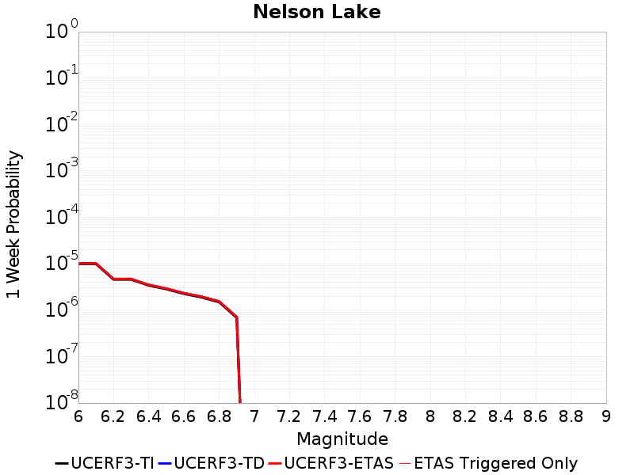 |  |  |  |

| Magnitude | 1 wk TI Prob | 1 wk TD Prob | 1 wk ETAS Prob | 1 wk ETAS/TD Gain | 1 wk ETAS Triggered Only | 1 mo TI Prob | 1 mo TD Prob | 1 mo ETAS Prob | 1 mo ETAS/TD Gain | 1 mo ETAS Triggered Only | 1 yr TI Prob | 1 yr TD Prob | 1 yr ETAS Prob | 1 yr ETAS/TD Gain | 1 yr ETAS Triggered Only | 10 yr TI Prob | 10 yr TD Prob | 10 yr ETAS Prob | 10 yr ETAS/TD Gain | 10 yr ETAS Triggered Only |
|-----|-----|-----|-----|-----|-----|-----|-----|-----|-----|-----|-----|-----|-----|-----|-----|-----|-----|-----|-----|-----|
| 6.0 | 9.913453E-6 | 1.0194075E-5 | 1.0194075E-5 | 1.0 | 0.0 | 4.2485535E-5 | 4.368822E-5 | 4.368822E-5 | 1.0 | 0.0 | 5.1713863E-4 | 5.317846E-4 | 6.8170484E-4 | 1.2819191 | 1.5E-4 | 0.0051593683 | 0.0053061484 | 0.0061615855 | 1.1612161 | 8.6E-4 |
| 6.1 | 9.913453E-6 | 1.0194075E-5 | 1.0194075E-5 | 1.0 | 0.0 | 4.2485535E-5 | 4.368822E-5 | 4.368822E-5 | 1.0 | 0.0 | 5.1713863E-4 | 5.317846E-4 | 6.8170484E-4 | 1.2819191 | 1.5E-4 | 0.0051593683 | 0.0053061484 | 0.0061615855 | 1.1612161 | 8.6E-4 |
| 6.2 | 4.5596407E-6 | 4.6972073E-6 | 4.6972073E-6 | 1.0 | 0.0 | 1.954117E-5 | 2.013074E-5 | 2.013074E-5 | 1.0 | 0.0 | 2.3788778E-4 | 2.4506546E-4 | 3.2504587E-4 | 1.3263634 | 8.0E-5 | 0.0023763329 | 0.0024480782 | 0.0028171726 | 1.150769 | 3.7E-4 |
| 6.3 | 4.5596407E-6 | 4.6972073E-6 | 4.6972073E-6 | 1.0 | 0.0 | 1.954117E-5 | 2.013074E-5 | 2.013074E-5 | 1.0 | 0.0 | 2.3788778E-4 | 2.4506546E-4 | 3.2504587E-4 | 1.3263634 | 8.0E-5 | 0.0023763329 | 0.0024480782 | 0.0028171726 | 1.150769 | 3.7E-4 |
| 6.4 | 3.4025713E-6 | 3.5106007E-6 | 3.5106007E-6 | 1.0 | 0.0 | 1.4582367E-5 | 1.5045349E-5 | 1.5045349E-5 | 1.0 | 0.0 | 1.7752586E-4 | 1.8316257E-4 | 2.331534E-4 | 1.2729316 | 5.0E-5 | 0.001773841 | 0.001830199 | 0.002099705 | 1.147255 | 2.7E-4 |
| 6.5 | 2.8352947E-6 | 2.9284633E-6 | 2.9284633E-6 | 1.0 | 0.0 | 1.2151207E-5 | 1.2550501E-5 | 1.2550501E-5 | 1.0 | 0.0 | 1.479309E-4 | 1.5279239E-4 | 2.0278475E-4 | 1.3271915 | 5.0E-5 | 0.0014783246 | 0.0015269472 | 0.0017466113 | 1.1438583 | 2.2E-4 |
| 6.6 | 2.251518E-6 | 2.3295772E-6 | 2.3295772E-6 | 1.0 | 0.0 | 9.649328E-6 | 9.983868E-6 | 9.983868E-6 | 1.0 | 0.0 | 1.1747423E-4 | 1.2154744E-4 | 1.6154257E-4 | 1.3290496 | 4.0E-5 | 0.0011741214 | 0.0012148714 | 0.0013646891 | 1.1233199 | 1.5E-4 |
| 6.7 | 1.8911853E-6 | 1.9595868E-6 | 1.9595868E-6 | 1.0 | 0.0 | 8.105055E-6 | 8.398206E-6 | 8.398206E-6 | 1.0 | 0.0 | 9.867457E-5 | 1.0224395E-4 | 1.4223985E-4 | 1.3911812 | 4.0E-5 | 9.863076E-4 | 0.0010220265 | 0.0011618835 | 1.1368427 | 1.4E-4 |
| 6.8 | 1.4874814E-6 | 1.544202E-6 | 1.544202E-6 | 1.0 | 0.0 | 6.374905E-6 | 6.6179946E-6 | 6.6179946E-6 | 1.0 | 0.0 | 7.76117E-5 | 8.0571626E-5 | 1.205684E-4 | 1.4964128 | 4.0E-5 | 7.75846E-4 | 8.054752E-4 | 9.353705E-4 | 1.1612654 | 1.3E-4 |
| 6.9 | 6.835972E-7 | 7.141941E-7 | 7.141941E-7 | 1.0 | 0.0 | 2.9296991E-6 | 3.06083E-6 | 3.06083E-6 | 1.0 | 0.0 | 3.56685E-5 | 3.7265287E-5 | 7.7263794E-5 | 2.073345 | 4.0E-5 | 3.5662777E-4 | 3.7262167E-4 | 4.5259183E-4 | 1.214615 | 8.0E-5 |

## San Andreas (Mojave N)
*[(top)](#table-of-contents)*

| 1 Week | 1 Month | 1 Year | 10 Year |
|-----|-----|-----|-----|
|  |  |  | 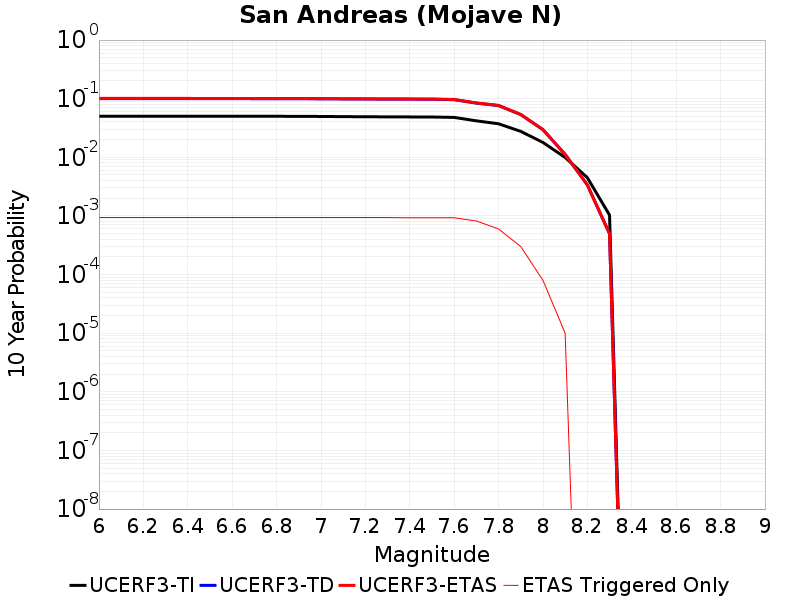 |

| Magnitude | 1 wk TI Prob | 1 wk TD Prob | 1 wk ETAS Prob | 1 wk ETAS/TD Gain | 1 wk ETAS Triggered Only | 1 mo TI Prob | 1 mo TD Prob | 1 mo ETAS Prob | 1 mo ETAS/TD Gain | 1 mo ETAS Triggered Only | 1 yr TI Prob | 1 yr TD Prob | 1 yr ETAS Prob | 1 yr ETAS/TD Gain | 1 yr ETAS Triggered Only | 10 yr TI Prob | 10 yr TD Prob | 10 yr ETAS Prob | 10 yr ETAS/TD Gain | 10 yr ETAS Triggered Only |
|-----|-----|-----|-----|-----|-----|-----|-----|-----|-----|-----|-----|-----|-----|-----|-----|-----|-----|-----|-----|-----|
| 6.0 | 9.877682E-5 | 1.982287E-4 | 2.3822079E-4 | 1.2017471 | 4.0E-5 | 4.2326056E-4 | 8.492752E-4 | 9.292073E-4 | 1.094118 | 8.0E-5 | 0.0051410277 | 0.010291039 | 0.010686923 | 1.0384687 | 4.0E-4 | 0.05023708 | 0.10016033 | 0.10100618 | 1.0084449 | 9.4E-4 |
| 6.1 | 9.877682E-5 | 1.982287E-4 | 2.3822079E-4 | 1.2017471 | 4.0E-5 | 4.2326056E-4 | 8.492752E-4 | 9.292073E-4 | 1.094118 | 8.0E-5 | 0.0051410277 | 0.010291039 | 0.010686923 | 1.0384687 | 4.0E-4 | 0.05023708 | 0.10016033 | 0.10100618 | 1.0084449 | 9.4E-4 |
| 6.2 | 9.877682E-5 | 1.982287E-4 | 2.3822079E-4 | 1.2017471 | 4.0E-5 | 4.2326056E-4 | 8.492752E-4 | 9.292073E-4 | 1.094118 | 8.0E-5 | 0.0051410277 | 0.010291039 | 0.010686923 | 1.0384687 | 4.0E-4 | 0.05023708 | 0.10016033 | 0.10100618 | 1.0084449 | 9.4E-4 |
| 6.3 | 9.877682E-5 | 1.982287E-4 | 2.3822079E-4 | 1.2017471 | 4.0E-5 | 4.2326056E-4 | 8.492752E-4 | 9.292073E-4 | 1.094118 | 8.0E-5 | 0.0051410277 | 0.010291039 | 0.010686923 | 1.0384687 | 4.0E-4 | 0.05023708 | 0.10016033 | 0.10100618 | 1.0084449 | 9.4E-4 |
| 6.4 | 9.877682E-5 | 1.982287E-4 | 2.3822079E-4 | 1.2017471 | 4.0E-5 | 4.2326056E-4 | 8.492752E-4 | 9.292073E-4 | 1.094118 | 8.0E-5 | 0.0051410277 | 0.010291039 | 0.010686923 | 1.0384687 | 4.0E-4 | 0.05023708 | 0.10016033 | 0.10100618 | 1.0084449 | 9.4E-4 |
| 6.5 | 9.861474E-5 | 1.9796513E-4 | 2.3795721E-4 | 1.2020158 | 4.0E-5 | 4.2256617E-4 | 8.481463E-4 | 9.280784E-4 | 1.0942434 | 8.0E-5 | 0.0051326132 | 0.010277424 | 0.010673313 | 1.0385202 | 4.0E-4 | 0.050156746 | 0.100037925 | 0.10088389 | 1.0084565 | 9.4E-4 |
| 6.6 | 9.861474E-5 | 1.9796513E-4 | 2.3795721E-4 | 1.2020158 | 4.0E-5 | 4.2256617E-4 | 8.481463E-4 | 9.280784E-4 | 1.0942434 | 8.0E-5 | 0.0051326132 | 0.010277424 | 0.010673313 | 1.0385202 | 4.0E-4 | 0.050156746 | 0.100037925 | 0.10088389 | 1.0084565 | 9.4E-4 |
| 6.7 | 9.8552715E-5 | 1.9786417E-4 | 2.3785625E-4 | 1.2021189 | 4.0E-5 | 4.223004E-4 | 8.477139E-4 | 9.2764606E-4 | 1.0942914 | 8.0E-5 | 0.0051293927 | 0.0102722095 | 0.010668101 | 1.03854 | 4.0E-4 | 0.050125998 | 0.09999103 | 0.100837044 | 1.0084609 | 9.4E-4 |
| 6.8 | 9.8464974E-5 | 1.9771454E-4 | 2.3770663E-4 | 1.2022718 | 4.0E-5 | 4.219245E-4 | 8.4707304E-4 | 9.270053E-4 | 1.0943629 | 8.0E-5 | 0.0051248376 | 0.0102644805 | 0.0106603755 | 1.0385693 | 4.0E-4 | 0.05008251 | 0.09992087 | 0.10076694 | 1.0084674 | 9.4E-4 |
| 6.9 | 9.825824E-5 | 1.9739234E-4 | 2.3738443E-4 | 1.2026021 | 4.0E-5 | 4.2103877E-4 | 8.4569305E-4 | 9.2562544E-4 | 1.094517 | 8.0E-5 | 0.0051141046 | 0.010247838 | 0.010643738 | 1.0386326 | 4.0E-4 | 0.049980022 | 0.099769495 | 0.10061571 | 1.0084817 | 9.4E-4 |
| 7.0 | 9.781462E-5 | 1.9670119E-4 | 2.3669332E-4 | 1.2033142 | 4.0E-5 | 4.1913814E-4 | 8.427329E-4 | 9.226655E-4 | 1.0948492 | 8.0E-5 | 0.005091073 | 0.010212136 | 0.010608052 | 1.0387691 | 4.0E-4 | 0.04976007 | 0.09944418 | 0.1002907 | 1.0085125 | 9.4E-4 |
| 7.1 | 9.7121134E-5 | 1.9571178E-4 | 2.3570395E-4 | 1.2043421 | 4.0E-5 | 4.1616702E-4 | 8.384953E-4 | 9.1842824E-4 | 1.095329 | 8.0E-5 | 0.005055068 | 0.010161026 | 0.010556961 | 1.0389661 | 4.0E-4 | 0.04941613 | 0.09897849 | 0.09982545 | 1.008557 | 9.4E-4 |
| 7.2 | 9.663819E-5 | 1.9501493E-4 | 2.3500713E-4 | 1.2050725 | 4.0E-5 | 4.1409794E-4 | 8.355108E-4 | 9.1544393E-4 | 1.0956699 | 8.0E-5 | 0.0050299936 | 0.010125028 | 0.010520978 | 1.039106 | 4.0E-4 | 0.049176537 | 0.098650284 | 0.09949756 | 1.0085886 | 9.4E-4 |
| 7.3 | 9.6277574E-5 | 1.945342E-4 | 2.3452641E-4 | 1.2055794 | 4.0E-5 | 4.125529E-4 | 8.3345175E-4 | 9.1338507E-4 | 1.0959064 | 8.0E-5 | 0.0050112694 | 0.010100191 | 0.010496152 | 1.0392032 | 4.0E-4 | 0.04899759 | 0.09842154 | 0.09926902 | 1.0086107 | 9.4E-4 |
| 7.4 | 9.593308E-5 | 1.9392562E-4 | 2.3391786E-4 | 1.2062247 | 4.0E-5 | 4.1107697E-4 | 8.3084527E-4 | 9.1077876E-4 | 1.0962075 | 8.0E-5 | 0.0049933824 | 0.010068751 | 0.010464724 | 1.0393269 | 4.0E-4 | 0.04882661 | 0.098137 | 0.09897573 | 1.0085466 | 9.3E-4 |
| 7.5 | 9.561707E-5 | 1.9338053E-4 | 2.3337279E-4 | 1.2068061 | 4.0E-5 | 4.0972308E-4 | 8.285106E-4 | 9.0844434E-4 | 1.0964788 | 8.0E-5 | 0.0049769743 | 0.01004059 | 0.010436574 | 1.0394382 | 4.0E-4 | 0.048669744 | 0.09788116 | 0.098720126 | 1.0085713 | 9.3E-4 |
| 7.6 | 9.418194E-5 | 1.8986835E-4 | 2.2986076E-4 | 1.2106323 | 4.0E-5 | 4.0357444E-4 | 8.134679E-4 | 8.9340284E-4 | 1.0982643 | 8.0E-5 | 0.004902454 | 0.009859116 | 0.010255172 | 1.0401716 | 4.0E-4 | 0.047957025 | 0.096256316 | 0.0970968 | 1.0087317 | 9.3E-4 |
| 7.7 | 8.202141E-5 | 1.6400687E-4 | 2.040003E-4 | 1.2438523 | 4.0E-5 | 3.51473E-4 | 7.0269726E-4 | 7.726481E-4 | 1.0995462 | 7.0E-5 | 0.00427079 | 0.00852184 | 0.008888687 | 1.0430479 | 3.7E-4 | 0.04189639 | 0.08392728 | 0.08467846 | 1.0089504 | 8.2E-4 |
| 7.8 | 7.2859846E-5 | 1.4857842E-4 | 1.6857545E-4 | 1.1345891 | 2.0E-5 | 3.1221908E-4 | 6.366093E-4 | 6.7658385E-4 | 1.0627929 | 4.0E-5 | 0.003794643 | 0.0077232183 | 0.00798121 | 1.0334047 | 2.6E-4 | 0.037304975 | 0.07626243 | 0.07681667 | 1.0072676 | 6.0E-4 |
| 7.9 | 5.3874453E-5 | 1.0285866E-4 | 1.0285866E-4 | 1.0 | 0.0 | 2.3087008E-4 | 4.4074838E-4 | 4.5074397E-4 | 1.0226787 | 1.0E-5 | 0.0028072202 | 0.005352921 | 0.0054921713 | 1.026014 | 1.4E-4 | 0.02772022 | 0.05354732 | 0.053831253 | 1.0053025 | 3.0E-4 |
| 8.0 | 3.468538E-5 | 5.56553E-5 | 5.56553E-5 | 1.0 | 0.0 | 1.4864317E-4 | 2.385009E-4 | 2.385009E-4 | 1.0 | 0.0 | 0.0018082283 | 0.002899884 | 0.002939768 | 1.0137537 | 4.0E-5 | 0.017935853 | 0.029631538 | 0.029709168 | 1.0026199 | 8.0E-5 |
| 8.1 | 1.9152367E-5 | 2.0067564E-5 | 2.0067564E-5 | 1.0 | 0.0 | 8.207899E-5 | 8.600101E-5 | 8.600101E-5 | 1.0 | 0.0 | 9.988535E-4 | 0.0010465601 | 0.0010565496 | 1.0095451 | 1.0E-5 | 0.009943757 | 0.01120429 | 0.011214178 | 1.0008825 | 1.0E-5 |
| 8.2 | 8.643924E-6 | 5.725507E-6 | 5.725507E-6 | 1.0 | 0.0 | 3.704486E-5 | 2.4537656E-5 | 2.4537656E-5 | 1.0 | 0.0 | 4.5092785E-4 | 2.987051E-4 | 2.987051E-4 | 1.0 | 0.0 | 0.0045001395 | 0.0033857818 | 0.0033857818 | 1.0 | 0.0 |
| 8.3 | 1.983087E-6 | 8.077986E-7 | 8.077986E-7 | 1.0 | 0.0 | 8.498917E-6 | 3.4619893E-6 | 3.4619893E-6 | 1.0 | 0.0 | 1.034694E-4 | 4.2148924E-5 | 4.2148924E-5 | 1.0 | 0.0 | 0.0010342124 | 4.9595156E-4 | 4.9595156E-4 | 1.0 | 0.0 |

## Lenwood-Lockhart-Old Woman Springs
*[(top)](#table-of-contents)*

| 1 Week | 1 Month | 1 Year | 10 Year |
|-----|-----|-----|-----|
|  | 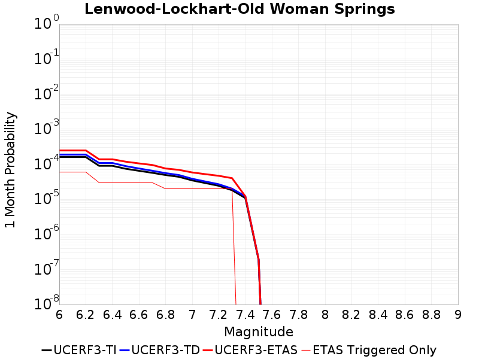 | 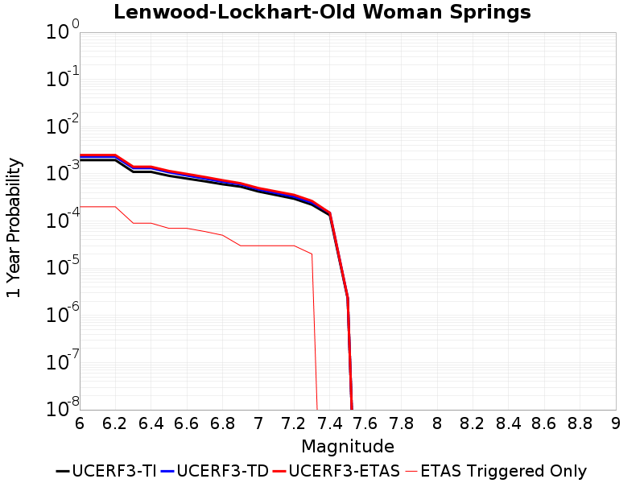 |  |

| Magnitude | 1 wk TI Prob | 1 wk TD Prob | 1 wk ETAS Prob | 1 wk ETAS/TD Gain | 1 wk ETAS Triggered Only | 1 mo TI Prob | 1 mo TD Prob | 1 mo ETAS Prob | 1 mo ETAS/TD Gain | 1 mo ETAS Triggered Only | 1 yr TI Prob | 1 yr TD Prob | 1 yr ETAS Prob | 1 yr ETAS/TD Gain | 1 yr ETAS Triggered Only | 10 yr TI Prob | 10 yr TD Prob | 10 yr ETAS Prob | 10 yr ETAS/TD Gain | 10 yr ETAS Triggered Only |
|-----|-----|-----|-----|-----|-----|-----|-----|-----|-----|-----|-----|-----|-----|-----|-----|-----|-----|-----|-----|-----|
| 6.0 | 3.744542E-5 | 4.3987537E-5 | 7.3986215E-5 | 1.6819814 | 3.0E-5 | 1.604705E-4 | 1.8850536E-4 | 2.4849403E-4 | 1.3182334 | 6.0E-5 | 0.0019519776 | 0.0022928093 | 0.0024923508 | 1.0870292 | 2.0E-4 | 0.019349206 | 0.02270957 | 0.023422994 | 1.031415 | 7.3E-4 |
| 6.1 | 3.744542E-5 | 4.3987537E-5 | 7.3986215E-5 | 1.6819814 | 3.0E-5 | 1.604705E-4 | 1.8850536E-4 | 2.4849403E-4 | 1.3182334 | 6.0E-5 | 0.0019519776 | 0.0022928093 | 0.0024923508 | 1.0870292 | 2.0E-4 | 0.019349206 | 0.02270957 | 0.023422994 | 1.031415 | 7.3E-4 |
| 6.2 | 3.744542E-5 | 4.3987537E-5 | 7.3986215E-5 | 1.6819814 | 3.0E-5 | 1.604705E-4 | 1.8850536E-4 | 2.4849403E-4 | 1.3182334 | 6.0E-5 | 0.0019519776 | 0.0022928093 | 0.0024923508 | 1.0870292 | 2.0E-4 | 0.019349206 | 0.02270957 | 0.023422994 | 1.031415 | 7.3E-4 |
| 6.3 | 2.1079984E-5 | 2.5364867E-5 | 3.5364614E-5 | 1.3942361 | 1.0E-5 | 9.0339665E-5 | 1.0870216E-4 | 1.3869889E-4 | 1.2759535 | 3.0E-5 | 0.0010993304 | 0.0013226653 | 0.0014125463 | 1.0679544 | 9.0E-5 | 0.010939079 | 0.013150146 | 0.013406727 | 1.0195117 | 2.6E-4 |
| 6.4 | 2.1079984E-5 | 2.5364867E-5 | 3.5364614E-5 | 1.3942361 | 1.0E-5 | 9.0339665E-5 | 1.0870216E-4 | 1.3869889E-4 | 1.2759535 | 3.0E-5 | 0.0010993304 | 0.0013226653 | 0.0014125463 | 1.0679544 | 9.0E-5 | 0.010939079 | 0.013150146 | 0.013406727 | 1.0195117 | 2.6E-4 |
| 6.5 | 1.7397282E-5 | 2.067201E-5 | 3.0671803E-5 | 1.4837359 | 1.0E-5 | 7.455765E-5 | 8.859138E-5 | 1.1858873E-4 | 1.3386034 | 3.0E-5 | 9.073613E-4 | 0.0010780782 | 0.0011480027 | 1.0648603 | 7.0E-5 | 0.009036654 | 0.010729777 | 0.010917738 | 1.0175177 | 1.9E-4 |
| 6.6 | 1.52050325E-5 | 1.76883E-5 | 2.7688124E-5 | 1.5653354 | 1.0E-5 | 6.51628E-5 | 7.580485E-5 | 1.05802574E-4 | 1.3957231 | 3.0E-5 | 7.9306826E-4 | 9.2254113E-4 | 9.924766E-4 | 1.0758073 | 7.0E-5 | 0.007902439 | 0.009187977 | 0.009366323 | 1.0194108 | 1.8E-4 |
| 6.7 | 1.332523E-5 | 1.5272131E-5 | 2.5271978E-5 | 1.6547774 | 1.0E-5 | 5.7106878E-5 | 6.545038E-5 | 9.544842E-5 | 1.4583324 | 3.0E-5 | 6.950544E-4 | 7.9657295E-4 | 8.5652515E-4 | 1.0752627 | 6.0E-5 | 0.006928845 | 0.007937808 | 0.008066775 | 1.0162473 | 1.3E-4 |
| 6.8 | 1.1525329E-5 | 1.30382305E-5 | 2.30381E-5 | 1.7669653 | 1.0E-5 | 4.9393333E-5 | 5.5876957E-5 | 7.587584E-5 | 1.3579093 | 2.0E-5 | 6.011979E-4 | 6.800938E-4 | 7.3005987E-4 | 1.0734693 | 5.0E-5 | 0.00599574 | 0.0067805774 | 0.006869967 | 1.0131832 | 9.0E-5 |
| 6.9 | 1.0253909E-5 | 1.152114E-5 | 2.1521024E-5 | 1.8679597 | 1.0E-5 | 4.3944583E-5 | 4.9375398E-5 | 6.937441E-5 | 1.40504 | 2.0E-5 | 5.3489394E-4 | 6.009833E-4 | 6.309652E-4 | 1.0498883 | 3.0E-5 | 0.0053360825 | 0.00599396 | 0.0060536005 | 1.00995 | 6.0E-5 |
| 7.0 | 8.104563E-6 | 8.997132E-6 | 1.8997041E-5 | 2.1114554 | 1.0E-5 | 3.4733377E-5 | 3.8558577E-5 | 5.8557805E-5 | 1.5186713 | 2.0E-5 | 4.2279682E-4 | 4.6935197E-4 | 4.993379E-4 | 1.063888 | 3.0E-5 | 0.0042199334 | 0.0046838555 | 0.0047137146 | 1.006375 | 3.0E-5 |
| 7.1 | 6.7986157E-6 | 7.5209714E-6 | 1.7520895E-5 | 2.3296056 | 1.0E-5 | 2.91366E-5 | 3.2232347E-5 | 5.2231702E-5 | 1.6204747 | 2.0E-5 | 3.5468035E-4 | 3.9236032E-4 | 4.2234853E-4 | 1.0764303 | 3.0E-5 | 0.003541148 | 0.003916892 | 0.0039467746 | 1.0076292 | 3.0E-5 |
| 7.2 | 5.6893327E-6 | 6.284825E-6 | 1.6284763E-5 | 2.5911243 | 1.0E-5 | 2.4382627E-5 | 2.6934697E-5 | 4.6934158E-5 | 1.7425166 | 2.0E-5 | 2.9681803E-4 | 3.2788256E-4 | 3.5787275E-4 | 1.0914662 | 3.0E-5 | 0.002964219 | 0.003274187 | 0.0033040887 | 1.0091326 | 3.0E-5 |
| 7.3 | 4.253348E-6 | 4.709324E-6 | 1.4709277E-5 | 3.123437 | 1.0E-5 | 1.8228506E-5 | 2.0182672E-5 | 4.018227E-5 | 1.9909291 | 2.0E-5 | 2.2190946E-4 | 2.4569815E-4 | 2.6569323E-4 | 1.0813807 | 2.0E-5 | 0.00221688 | 0.0024544462 | 0.002474397 | 1.0081285 | 2.0E-5 |
| 7.4 | 2.5448119E-6 | 2.8524778E-6 | 2.8524778E-6 | 1.0 | 0.0 | 1.0906291E-5 | 1.22248575E-5 | 1.22248575E-5 | 1.0 | 0.0 | 1.3277601E-4 | 1.4882912E-4 | 1.4882912E-4 | 1.0 | 0.0 | 0.001326967 | 0.0014874567 | 0.0014874567 | 1.0 | 0.0 |
| 7.5 | 4.3706837E-8 | 4.5641816E-8 | 4.5641816E-8 | 1.0 | 0.0 | 1.8731501E-7 | 1.9560777E-7 | 1.9560777E-7 | 1.0 | 0.0 | 2.2805577E-6 | 2.3815226E-6 | 2.3815226E-6 | 1.0 | 0.0 | 2.2805343E-5 | 2.3815024E-5 | 2.3815024E-5 | 1.0 | 0.0 |

## Towne Pass
*[(top)](#table-of-contents)*

| 1 Week | 1 Month | 1 Year | 10 Year |
|-----|-----|-----|-----|
|  |  | 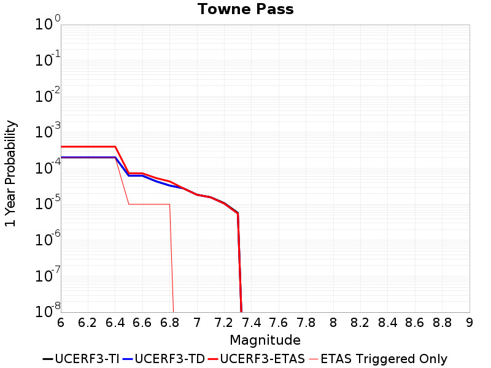 | 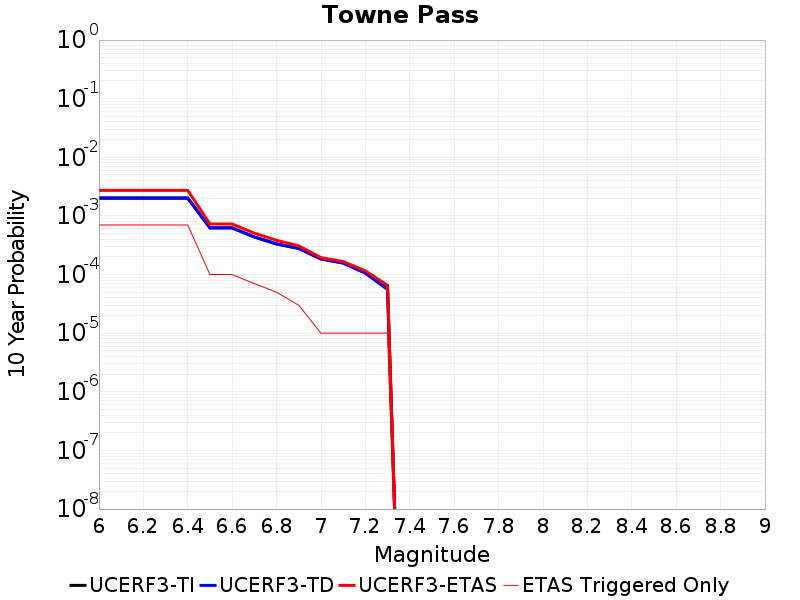 |

| Magnitude | 1 wk TI Prob | 1 wk TD Prob | 1 wk ETAS Prob | 1 wk ETAS/TD Gain | 1 wk ETAS Triggered Only | 1 mo TI Prob | 1 mo TD Prob | 1 mo ETAS Prob | 1 mo ETAS/TD Gain | 1 mo ETAS Triggered Only | 1 yr TI Prob | 1 yr TD Prob | 1 yr ETAS Prob | 1 yr ETAS/TD Gain | 1 yr ETAS Triggered Only | 10 yr TI Prob | 10 yr TD Prob | 10 yr ETAS Prob | 10 yr ETAS/TD Gain | 10 yr ETAS Triggered Only |
|-----|-----|-----|-----|-----|-----|-----|-----|-----|-----|-----|-----|-----|-----|-----|-----|-----|-----|-----|-----|-----|
| 6.0 | 3.849728E-6 | 3.894932E-6 | 4.3894775E-5 | 11.269716 | 4.0E-5 | 1.649873E-5 | 1.6692482E-5 | 7.669148E-5 | 4.5943723 | 6.0E-5 | 2.0085352E-4 | 2.032164E-4 | 4.0317574E-4 | 1.9839725 | 2.0E-4 | 0.0020067208 | 0.002030735 | 0.0027293134 | 1.3440028 | 7.0E-4 |
| 6.1 | 3.849728E-6 | 3.894932E-6 | 4.3894775E-5 | 11.269716 | 4.0E-5 | 1.649873E-5 | 1.6692482E-5 | 7.669148E-5 | 4.5943723 | 6.0E-5 | 2.0085352E-4 | 2.032164E-4 | 4.0317574E-4 | 1.9839725 | 2.0E-4 | 0.0020067208 | 0.002030735 | 0.0027293134 | 1.3440028 | 7.0E-4 |
| 6.2 | 3.849728E-6 | 3.894932E-6 | 4.3894775E-5 | 11.269716 | 4.0E-5 | 1.649873E-5 | 1.6692482E-5 | 7.669148E-5 | 4.5943723 | 6.0E-5 | 2.0085352E-4 | 2.032164E-4 | 4.0317574E-4 | 1.9839725 | 2.0E-4 | 0.0020067208 | 0.002030735 | 0.0027293134 | 1.3440028 | 7.0E-4 |
| 6.3 | 3.849728E-6 | 3.894932E-6 | 4.3894775E-5 | 11.269716 | 4.0E-5 | 1.649873E-5 | 1.6692482E-5 | 7.669148E-5 | 4.5943723 | 6.0E-5 | 2.0085352E-4 | 2.032164E-4 | 4.0317574E-4 | 1.9839725 | 2.0E-4 | 0.0020067208 | 0.002030735 | 0.0027293134 | 1.3440028 | 7.0E-4 |
| 6.4 | 3.849728E-6 | 3.894932E-6 | 4.3894775E-5 | 11.269716 | 4.0E-5 | 1.649873E-5 | 1.6692482E-5 | 7.669148E-5 | 4.5943723 | 6.0E-5 | 2.0085352E-4 | 2.032164E-4 | 4.0317574E-4 | 1.9839725 | 2.0E-4 | 0.0020067208 | 0.002030735 | 0.0027293134 | 1.3440028 | 7.0E-4 |
| 6.5 | 1.1953545E-6 | 1.203204E-6 | 1.203204E-6 | 1.0 | 0.0 | 5.1229376E-6 | 5.1565785E-6 | 5.1565785E-6 | 1.0 | 0.0 | 6.236998E-5 | 6.2779654E-5 | 7.2779025E-5 | 1.1592773 | 1.0E-5 | 6.235248E-4 | 6.276309E-4 | 7.275682E-4 | 1.1592293 | 1.0E-4 |
| 6.6 | 1.1953545E-6 | 1.203204E-6 | 1.203204E-6 | 1.0 | 0.0 | 5.1229376E-6 | 5.1565785E-6 | 5.1565785E-6 | 1.0 | 0.0 | 6.236998E-5 | 6.2779654E-5 | 7.2779025E-5 | 1.1592773 | 1.0E-5 | 6.235248E-4 | 6.276309E-4 | 7.275682E-4 | 1.1592293 | 1.0E-4 |
| 6.7 | 8.375951E-7 | 8.411918E-7 | 8.411918E-7 | 1.0 | 0.0 | 3.5896885E-6 | 3.605103E-6 | 3.605103E-6 | 1.0 | 0.0 | 4.370358E-5 | 4.3891305E-5 | 5.3890868E-5 | 1.2278255 | 1.0E-5 | 4.3694986E-4 | 4.3883207E-4 | 5.088014E-4 | 1.1594443 | 7.0E-5 |
| 6.8 | 6.38041E-7 | 6.393257E-7 | 6.393257E-7 | 1.0 | 0.0 | 2.7344586E-6 | 2.7399647E-6 | 2.7399647E-6 | 1.0 | 0.0 | 3.3291526E-5 | 3.3358596E-5 | 4.3358265E-5 | 1.2997628 | 1.0E-5 | 3.3286537E-4 | 3.335397E-4 | 3.8352303E-4 | 1.1498572 | 5.0E-5 |
| 6.9 | 5.3460053E-7 | 5.346354E-7 | 5.346354E-7 | 1.0 | 0.0 | 2.2911431E-6 | 2.2912927E-6 | 2.2912927E-6 | 1.0 | 0.0 | 2.789431E-5 | 2.7896165E-5 | 2.7896165E-5 | 1.0 | 0.0 | 2.789081E-4 | 2.7892995E-4 | 3.089216E-4 | 1.1075239 | 3.0E-5 |
| 7.0 | 3.557783E-7 | 3.5332846E-7 | 3.5332846E-7 | 1.0 | 0.0 | 1.5247632E-6 | 1.514264E-6 | 1.514264E-6 | 1.0 | 0.0 | 1.8563835E-5 | 1.8436018E-5 | 1.8436018E-5 | 1.0 | 0.0 | 1.8562283E-4 | 1.8434571E-4 | 1.9434387E-4 | 1.0542359 | 1.0E-5 |
| 7.1 | 3.037942E-7 | 3.0010037E-7 | 3.0010037E-7 | 1.0 | 0.0 | 1.3019744E-6 | 1.2861439E-6 | 1.2861439E-6 | 1.0 | 0.0 | 1.5851423E-5 | 1.5658696E-5 | 1.5658696E-5 | 1.0 | 0.0 | 1.5850292E-4 | 1.5657667E-4 | 1.665751E-4 | 1.0638565 | 1.0E-5 |
| 7.2 | 2.0808248E-7 | 2.0224056E-7 | 2.0224056E-7 | 1.0 | 0.0 | 8.917818E-7 | 8.66745E-7 | 8.66745E-7 | 1.0 | 0.0 | 1.0857389E-5 | 1.0552573E-5 | 1.0552573E-5 | 1.0 | 0.0 | 1.0856859E-4 | 1.0552119E-4 | 1.1552013E-4 | 1.0947577 | 1.0E-5 |
| 7.3 | 1.1162073E-7 | 1.0640794E-7 | 1.0640794E-7 | 1.0 | 0.0 | 4.7837443E-7 | 4.5603397E-7 | 4.5603397E-7 | 1.0 | 0.0 | 5.8241935E-6 | 5.5522014E-6 | 5.5522014E-6 | 1.0 | 0.0 | 5.8240406E-5 | 5.5520828E-5 | 6.5520275E-5 | 1.1801026 | 1.0E-5 |

## Bicycle Lake
*[(top)](#table-of-contents)*

| 1 Week | 1 Month | 1 Year | 10 Year |
|-----|-----|-----|-----|
|  |  | 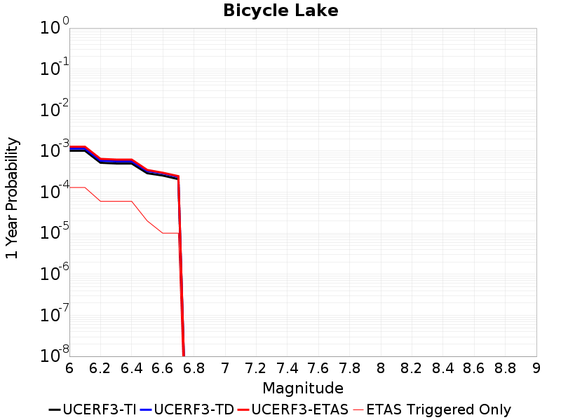 | 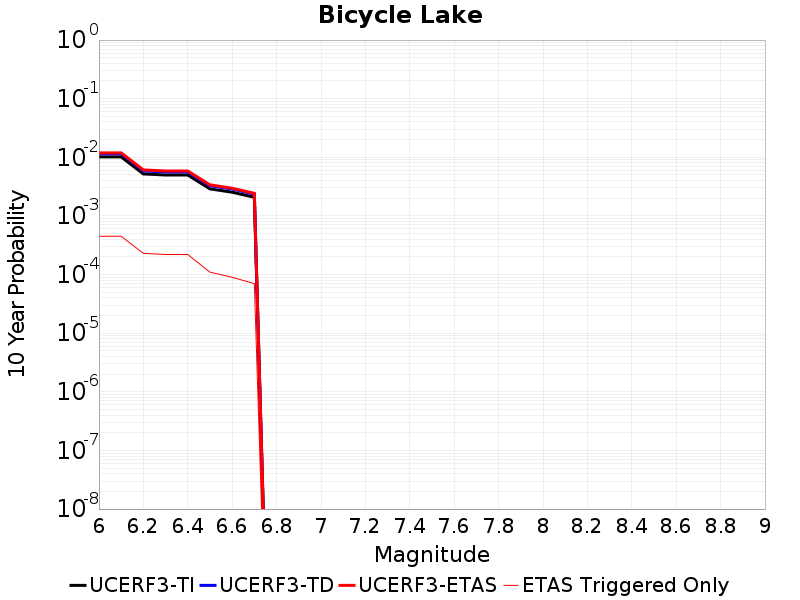 |

| Magnitude | 1 wk TI Prob | 1 wk TD Prob | 1 wk ETAS Prob | 1 wk ETAS/TD Gain | 1 wk ETAS Triggered Only | 1 mo TI Prob | 1 mo TD Prob | 1 mo ETAS Prob | 1 mo ETAS/TD Gain | 1 mo ETAS Triggered Only | 1 yr TI Prob | 1 yr TD Prob | 1 yr ETAS Prob | 1 yr ETAS/TD Gain | 1 yr ETAS Triggered Only | 10 yr TI Prob | 10 yr TD Prob | 10 yr ETAS Prob | 10 yr ETAS/TD Gain | 10 yr ETAS Triggered Only |
|-----|-----|-----|-----|-----|-----|-----|-----|-----|-----|-----|-----|-----|-----|-----|-----|-----|-----|-----|-----|-----|
| 6.0 | 1.9621975E-5 | 2.211477E-5 | 2.211477E-5 | 1.0 | 0.0 | 8.4091465E-5 | 9.47749E-5 | 1.1477301E-4 | 1.2110063 | 2.0E-5 | 0.0010233327 | 0.0011534088 | 0.0012832589 | 1.1125793 | 1.3E-4 | 0.01018633 | 0.011487558 | 0.011932388 | 1.0387229 | 4.5E-4 |
| 6.1 | 1.9621975E-5 | 2.211477E-5 | 2.211477E-5 | 1.0 | 0.0 | 8.4091465E-5 | 9.47749E-5 | 1.1477301E-4 | 1.2110063 | 2.0E-5 | 0.0010233327 | 0.0011534088 | 0.0012832589 | 1.1125793 | 1.3E-4 | 0.01018633 | 0.011487558 | 0.011932388 | 1.0387229 | 4.5E-4 |
| 6.2 | 9.9971285E-6 | 1.1264629E-5 | 1.1264629E-5 | 1.0 | 0.0 | 4.2844134E-5 | 4.8276383E-5 | 5.82759E-5 | 1.2071307 | 1.0E-5 | 5.2150246E-4 | 5.8765855E-4 | 6.4762327E-4 | 1.10204 | 6.0E-5 | 0.0052028033 | 0.0058661588 | 0.0060948096 | 1.038978 | 2.3E-4 |
| 6.3 | 9.589428E-6 | 1.0806983E-5 | 1.0806983E-5 | 1.0 | 0.0 | 4.10969E-5 | 4.6315112E-5 | 5.6314646E-5 | 1.2159022 | 1.0E-5 | 5.002399E-4 | 5.6379254E-4 | 6.237587E-4 | 1.1063621 | 6.0E-5 | 0.0049911533 | 0.00562872 | 0.0058474815 | 1.0388652 | 2.2E-4 |
| 6.4 | 9.589428E-6 | 1.0806983E-5 | 1.0806983E-5 | 1.0 | 0.0 | 4.10969E-5 | 4.6315112E-5 | 5.6314646E-5 | 1.2159022 | 1.0E-5 | 5.002399E-4 | 5.6379254E-4 | 6.237587E-4 | 1.1063621 | 6.0E-5 | 0.0049911533 | 0.00562872 | 0.0058474815 | 1.0388652 | 2.2E-4 |
| 6.5 | 5.557707E-6 | 6.2908234E-6 | 6.2908234E-6 | 1.0 | 0.0 | 2.3818526E-5 | 2.6960544E-5 | 2.6960544E-5 | 1.0 | 0.0 | 2.8995197E-4 | 3.2822212E-4 | 3.4821554E-4 | 1.0609144 | 2.0E-5 | 0.0028957394 | 0.003280014 | 0.0033896533 | 1.0334264 | 1.1E-4 |
| 6.6 | 4.8742945E-6 | 5.5178743E-6 | 5.5178743E-6 | 1.0 | 0.0 | 2.0889667E-5 | 2.3647966E-5 | 2.3647966E-5 | 1.0 | 0.0 | 2.54302E-4 | 2.879022E-4 | 2.978993E-4 | 1.034724 | 1.0E-5 | 0.002540112 | 0.0028778652 | 0.0029676063 | 1.0311831 | 9.0E-5 |
| 6.7 | 3.991108E-6 | 4.5196766E-6 | 4.5196766E-6 | 1.0 | 0.0 | 1.7104636E-5 | 1.9370043E-5 | 1.9370043E-5 | 1.0 | 0.0 | 2.0822904E-4 | 2.3583027E-4 | 2.4582792E-4 | 1.0423933 | 1.0E-5 | 0.0020803404 | 0.0023583027 | 0.0024281377 | 1.0296124 | 7.0E-5 |

## Paradise
*[(top)](#table-of-contents)*

| 1 Week | 1 Month | 1 Year | 10 Year |
|-----|-----|-----|-----|
|  | 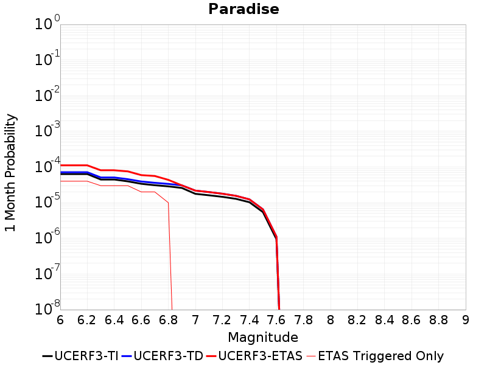 | 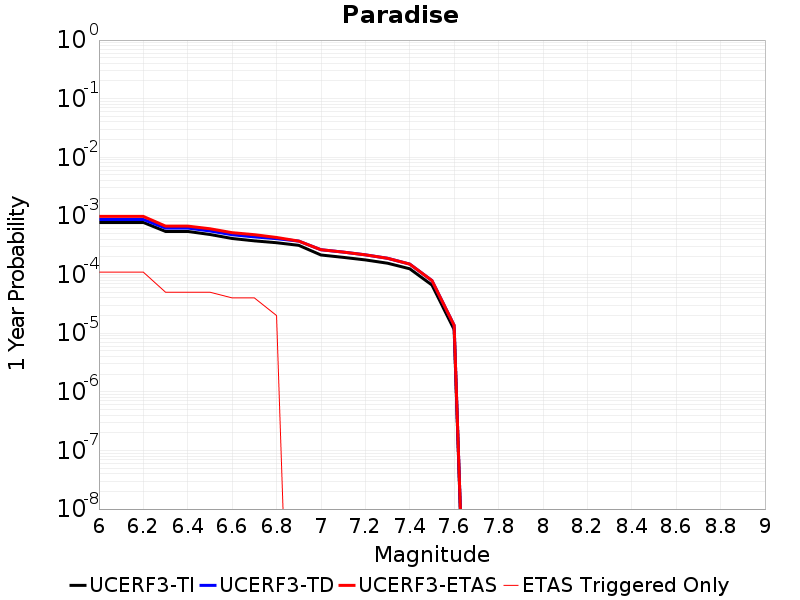 |  |

| Magnitude | 1 wk TI Prob | 1 wk TD Prob | 1 wk ETAS Prob | 1 wk ETAS/TD Gain | 1 wk ETAS Triggered Only | 1 mo TI Prob | 1 mo TD Prob | 1 mo ETAS Prob | 1 mo ETAS/TD Gain | 1 mo ETAS Triggered Only | 1 yr TI Prob | 1 yr TD Prob | 1 yr ETAS Prob | 1 yr ETAS/TD Gain | 1 yr ETAS Triggered Only | 10 yr TI Prob | 10 yr TD Prob | 10 yr ETAS Prob | 10 yr ETAS/TD Gain | 10 yr ETAS Triggered Only |
|-----|-----|-----|-----|-----|-----|-----|-----|-----|-----|-----|-----|-----|-----|-----|-----|-----|-----|-----|-----|-----|
| 6.0 | 1.4851273E-5 | 1.6704435E-5 | 2.6704267E-5 | 1.5986334 | 1.0E-5 | 6.364676E-5 | 7.15886E-5 | 1.1158574E-4 | 1.5587082 | 4.0E-5 | 7.7462377E-4 | 8.712663E-4 | 9.811705E-4 | 1.126143 | 1.1E-4 | 0.0077192914 | 0.008680887 | 0.009146807 | 1.053672 | 4.7E-4 |
| 6.1 | 1.4851273E-5 | 1.6704435E-5 | 2.6704267E-5 | 1.5986334 | 1.0E-5 | 6.364676E-5 | 7.15886E-5 | 1.1158574E-4 | 1.5587082 | 4.0E-5 | 7.7462377E-4 | 8.712663E-4 | 9.811705E-4 | 1.126143 | 1.1E-4 | 0.0077192914 | 0.008680887 | 0.009146807 | 1.053672 | 4.7E-4 |
| 6.2 | 1.4851273E-5 | 1.6704435E-5 | 2.6704267E-5 | 1.5986334 | 1.0E-5 | 6.364676E-5 | 7.15886E-5 | 1.1158574E-4 | 1.5587082 | 4.0E-5 | 7.7462377E-4 | 8.712663E-4 | 9.811705E-4 | 1.126143 | 1.1E-4 | 0.0077192914 | 0.008680887 | 0.009146807 | 1.053672 | 4.7E-4 |
| 6.3 | 1.0426831E-5 | 1.189573E-5 | 1.189573E-5 | 1.0 | 0.0 | 4.4685654E-5 | 5.0980736E-5 | 8.097921E-5 | 1.5884275 | 3.0E-5 | 5.43912E-4 | 6.205196E-4 | 6.7048863E-4 | 1.0805277 | 5.0E-5 | 0.0054258266 | 0.006188479 | 0.0064269938 | 1.0385418 | 2.4E-4 |
| 6.4 | 1.0426831E-5 | 1.189573E-5 | 1.189573E-5 | 1.0 | 0.0 | 4.4685654E-5 | 5.0980736E-5 | 8.097921E-5 | 1.5884275 | 3.0E-5 | 5.43912E-4 | 6.205196E-4 | 6.7048863E-4 | 1.0805277 | 5.0E-5 | 0.0054258266 | 0.006188479 | 0.0064269938 | 1.0385418 | 2.4E-4 |
| 6.5 | 9.25027E-6 | 1.0626439E-5 | 1.0626439E-5 | 1.0 | 0.0 | 3.964341E-5 | 4.5541114E-5 | 7.553975E-5 | 1.6587155 | 3.0E-5 | 4.8255164E-4 | 5.543269E-4 | 6.042992E-4 | 1.0901495 | 5.0E-5 | 0.0048150513 | 0.0055299415 | 0.0057586697 | 1.0413618 | 2.3E-4 |
| 6.6 | 7.904275E-6 | 9.165215E-6 | 9.165215E-6 | 1.0 | 0.0 | 3.3875025E-5 | 3.927892E-5 | 5.9278136E-5 | 1.509159 | 2.0E-5 | 4.1235037E-4 | 4.7811985E-4 | 5.1810074E-4 | 1.083621 | 4.0E-5 | 0.0041158604 | 0.004771309 | 0.00486088 | 1.0187727 | 9.0E-5 |
| 6.7 | 7.2061953E-6 | 8.412567E-6 | 8.412567E-6 | 1.0 | 0.0 | 3.088333E-5 | 3.6053378E-5 | 5.6052657E-5 | 1.554713 | 2.0E-5 | 3.7593965E-4 | 4.3886516E-4 | 4.788476E-4 | 1.0911041 | 4.0E-5 | 0.003753043 | 0.004380354 | 0.0044600037 | 1.0181834 | 8.0E-5 |
| 6.8 | 6.6948724E-6 | 7.84722E-6 | 7.84722E-6 | 1.0 | 0.0 | 2.8691995E-5 | 3.363053E-5 | 4.3630193E-5 | 1.2973388 | 1.0E-5 | 3.4926904E-4 | 4.0937835E-4 | 4.2937015E-4 | 1.0488346 | 2.0E-5 | 0.003487206 | 0.0040866 | 0.0041363956 | 1.0121851 | 5.0E-5 |
| 6.9 | 6.0421025E-6 | 7.135343E-6 | 7.135343E-6 | 1.0 | 0.0 | 2.5894467E-5 | 3.0579704E-5 | 3.0579704E-5 | 1.0 | 0.0 | 3.1521954E-4 | 3.7224765E-4 | 3.7224765E-4 | 1.0 | 0.0 | 0.0031477278 | 0.0037165799 | 0.0037365055 | 1.0053613 | 2.0E-5 |
| 7.0 | 4.134091E-6 | 5.084193E-6 | 5.084193E-6 | 1.0 | 0.0 | 1.7717413E-5 | 2.1789227E-5 | 2.1789227E-5 | 1.0 | 0.0 | 2.1568815E-4 | 2.6525307E-4 | 2.6525307E-4 | 1.0 | 0.0 | 0.0021547892 | 0.002649518 | 0.0026594915 | 1.0037643 | 1.0E-5 |
| 7.1 | 3.7674888E-6 | 4.63556E-6 | 4.63556E-6 | 1.0 | 0.0 | 1.6146281E-5 | 1.9866544E-5 | 1.9866544E-5 | 1.0 | 0.0 | 1.9656324E-4 | 2.4184985E-4 | 2.4184985E-4 | 1.0 | 0.0 | 0.0019638946 | 0.0024160172 | 0.002425993 | 1.004129 | 1.0E-5 |
| 7.2 | 3.4065345E-6 | 4.1601743E-6 | 4.1601743E-6 | 1.0 | 0.0 | 1.4599351E-5 | 1.7829205E-5 | 1.7829205E-5 | 1.0 | 0.0 | 1.777326E-4 | 2.1705044E-4 | 2.1705044E-4 | 1.0 | 0.0 | 0.0017759053 | 0.0021685327 | 0.0021685327 | 1.0 | 0.0 |
| 7.3 | 2.9934936E-6 | 3.632301E-6 | 3.632301E-6 | 1.0 | 0.0 | 1.2829195E-5 | 1.556692E-5 | 1.556692E-5 | 1.0 | 0.0 | 1.5618425E-4 | 1.8951224E-4 | 1.8951224E-4 | 1.0 | 0.0 | 0.0015607453 | 0.0018936518 | 0.0018936518 | 1.0 | 0.0 |
| 7.4 | 2.4049796E-6 | 2.8905301E-6 | 2.8905301E-6 | 1.0 | 0.0 | 1.0307015E-5 | 1.2387935E-5 | 1.2387935E-5 | 1.0 | 0.0 | 1.2548068E-4 | 1.5081411E-4 | 1.5081411E-4 | 1.0 | 0.0 | 0.0012540985 | 0.0015072592 | 0.0015072592 | 1.0 | 0.0 |
| 7.5 | 1.2710091E-6 | 1.5144946E-6 | 1.5144946E-6 | 1.0 | 0.0 | 5.44717E-6 | 6.4906817E-6 | 6.4906817E-6 | 1.0 | 0.0 | 6.631728E-5 | 7.902244E-5 | 7.902244E-5 | 1.0 | 0.0 | 6.6297496E-4 | 7.900661E-4 | 7.900661E-4 | 1.0 | 0.0 |
| 7.6 | 2.21172E-7 | 2.6045635E-7 | 2.6045635E-7 | 1.0 | 0.0 | 9.478797E-7 | 1.1162413E-6 | 1.1162413E-6 | 1.0 | 0.0 | 1.1540374E-5 | 1.3590181E-5 | 1.3590181E-5 | 1.0 | 0.0 | 1.1539775E-4 | 1.358963E-4 | 1.358963E-4 | 1.0 | 0.0 |

## San Andreas (San Bernardino N)
*[(top)](#table-of-contents)*

| 1 Week | 1 Month | 1 Year | 10 Year |
|-----|-----|-----|-----|
|  |  | 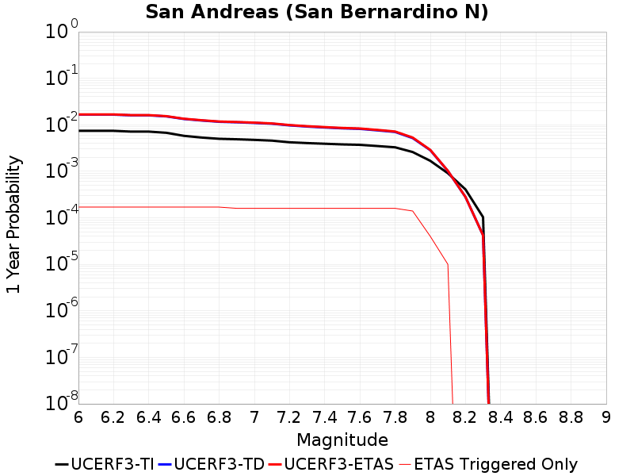 |  |

| Magnitude | 1 wk TI Prob | 1 wk TD Prob | 1 wk ETAS Prob | 1 wk ETAS/TD Gain | 1 wk ETAS Triggered Only | 1 mo TI Prob | 1 mo TD Prob | 1 mo ETAS Prob | 1 mo ETAS/TD Gain | 1 mo ETAS Triggered Only | 1 yr TI Prob | 1 yr TD Prob | 1 yr ETAS Prob | 1 yr ETAS/TD Gain | 1 yr ETAS Triggered Only | 10 yr TI Prob | 10 yr TD Prob | 10 yr ETAS Prob | 10 yr ETAS/TD Gain | 10 yr ETAS Triggered Only |
|-----|-----|-----|-----|-----|-----|-----|-----|-----|-----|-----|-----|-----|-----|-----|-----|-----|-----|-----|-----|-----|
| 6.0 | 1.4273766E-4 | 3.1963526E-4 | 3.2963205E-4 | 1.0312756 | 1.0E-5 | 6.115894E-4 | 0.0013691522 | 0.0013891248 | 1.0145875 | 2.0E-5 | 0.0074207084 | 0.01654354 | 0.016710728 | 1.010106 | 1.7E-4 | 0.07177748 | 0.15180883 | 0.15219052 | 1.0025142 | 4.5E-4 |
| 6.1 | 1.4273766E-4 | 3.1963526E-4 | 3.2963205E-4 | 1.0312756 | 1.0E-5 | 6.115894E-4 | 0.0013691522 | 0.0013891248 | 1.0145875 | 2.0E-5 | 0.0074207084 | 0.01654354 | 0.016710728 | 1.010106 | 1.7E-4 | 0.07177748 | 0.15180883 | 0.15219052 | 1.0025142 | 4.5E-4 |
| 6.2 | 1.4273766E-4 | 3.1963526E-4 | 3.2963205E-4 | 1.0312756 | 1.0E-5 | 6.115894E-4 | 0.0013691522 | 0.0013891248 | 1.0145875 | 2.0E-5 | 0.0074207084 | 0.01654354 | 0.016710728 | 1.010106 | 1.7E-4 | 0.07177748 | 0.15180883 | 0.15219052 | 1.0025142 | 4.5E-4 |
| 6.3 | 1.3730655E-4 | 3.0866562E-4 | 3.1866253E-4 | 1.0323875 | 1.0E-5 | 5.883239E-4 | 0.0013221877 | 0.0013421613 | 1.0151064 | 2.0E-5 | 0.0071393442 | 0.01598024 | 0.016147522 | 1.0104681 | 1.7E-4 | 0.06914291 | 0.14711048 | 0.14749427 | 1.0026089 | 4.5E-4 |
| 6.4 | 1.3730655E-4 | 3.0866562E-4 | 3.1866253E-4 | 1.0323875 | 1.0E-5 | 5.883239E-4 | 0.0013221877 | 0.0013421613 | 1.0151064 | 2.0E-5 | 0.0071393442 | 0.01598024 | 0.016147522 | 1.0104681 | 1.7E-4 | 0.06914291 | 0.14711048 | 0.14749427 | 1.0026089 | 4.5E-4 |
| 6.5 | 1.2942807E-4 | 2.9278398E-4 | 3.0278106E-4 | 1.0341449 | 1.0E-5 | 5.545738E-4 | 0.0012541902 | 0.0012741652 | 1.0159266 | 2.0E-5 | 0.0067310524 | 0.015164121 | 0.015331543 | 1.0110407 | 1.7E-4 | 0.06530788 | 0.14024554 | 0.14063244 | 1.0027586 | 4.5E-4 |
| 6.6 | 1.1125901E-4 | 2.5710516E-4 | 2.671026E-4 | 1.0388846 | 1.0E-5 | 4.767372E-4 | 0.0011014162 | 0.0011213942 | 1.0181384 | 2.0E-5 | 0.005788839 | 0.013327938 | 0.013495672 | 1.0125852 | 1.7E-4 | 0.056403454 | 0.124495886 | 0.124889866 | 1.0031645 | 4.5E-4 |
| 6.7 | 1.02209575E-4 | 2.384291E-4 | 2.4842672E-4 | 1.0419312 | 1.0E-5 | 4.3796748E-4 | 0.0010214403 | 0.0010414198 | 1.0195602 | 2.0E-5 | 0.0053192247 | 0.012365556 | 0.012533454 | 1.0135778 | 1.7E-4 | 0.051936906 | 0.11626605 | 0.116663724 | 1.0034205 | 4.5E-4 |
| 6.8 | 9.610582E-5 | 2.2363858E-4 | 2.3363634E-4 | 1.044705 | 1.0E-5 | 4.1181705E-4 | 9.580997E-4 | 9.780806E-4 | 1.0208547 | 2.0E-5 | 0.0050023515 | 0.011602748 | 0.011770776 | 1.0144817 | 1.7E-4 | 0.048912346 | 0.10966026 | 0.11004311 | 1.0034912 | 4.3E-4 |
| 6.9 | 9.3877505E-5 | 2.1817975E-4 | 2.2817757E-4 | 1.0458238 | 1.0E-5 | 4.0227012E-4 | 9.3472167E-4 | 9.5470296E-4 | 1.0213767 | 2.0E-5 | 0.0048866454 | 0.011321108 | 0.011479297 | 1.0139729 | 1.6E-4 | 0.04780577 | 0.10724558 | 0.10762053 | 1.0034963 | 4.2E-4 |
| 7.0 | 9.1019785E-5 | 2.1142747E-4 | 2.2142535E-4 | 1.0472876 | 1.0E-5 | 3.900265E-4 | 9.0580364E-4 | 9.257855E-4 | 1.0220598 | 2.0E-5 | 0.0047382377 | 0.010972627 | 0.011130871 | 1.0144217 | 1.6E-4 | 0.046384744 | 0.104206584 | 0.10457386 | 1.0035245 | 4.1E-4 |
| 7.1 | 8.771155E-5 | 2.0314848E-4 | 2.1314646E-4 | 1.0492151 | 1.0E-5 | 3.758525E-4 | 8.703464E-4 | 8.90329E-4 | 1.0229594 | 2.0E-5 | 0.0045664064 | 0.010545187 | 0.010703499 | 1.0150127 | 1.6E-4 | 0.044737056 | 0.1005086 | 0.10087739 | 1.0036693 | 4.1E-4 |
| 7.2 | 8.0830236E-5 | 1.8715196E-4 | 1.9715009E-4 | 1.0534226 | 1.0E-5 | 3.4636928E-4 | 8.0183346E-4 | 8.2181743E-4 | 1.0249228 | 2.0E-5 | 0.0042088944 | 0.009718736 | 0.009877181 | 1.0163031 | 1.6E-4 | 0.041300658 | 0.09322659 | 0.093598366 | 1.0039879 | 4.1E-4 |
| 7.3 | 7.7668235E-5 | 1.7652927E-4 | 1.8652751E-4 | 1.0566379 | 1.0E-5 | 3.328214E-4 | 7.5633475E-4 | 7.7631965E-4 | 1.0264233 | 2.0E-5 | 0.0040445733 | 0.00916958 | 0.009328113 | 1.017289 | 1.6E-4 | 0.03971748 | 0.08847827 | 0.088851996 | 1.004224 | 4.1E-4 |
| 7.4 | 7.520177E-5 | 1.6868571E-4 | 1.7868403E-4 | 1.0592718 | 1.0E-5 | 3.2225347E-4 | 7.227385E-4 | 7.4272405E-4 | 1.0276525 | 2.0E-5 | 0.0039163795 | 0.00876391 | 0.008922508 | 1.0180967 | 1.6E-4 | 0.038480744 | 0.0849242 | 0.08529938 | 1.0044178 | 4.1E-4 |
| 7.5 | 7.274697E-5 | 1.6152054E-4 | 1.7151893E-4 | 1.0619017 | 1.0E-5 | 3.1173544E-4 | 6.920473E-4 | 7.120335E-4 | 1.0288798 | 2.0E-5 | 0.003788775 | 0.008393186 | 0.0085518425 | 1.0189031 | 1.6E-4 | 0.03724827 | 0.08162862 | 0.08200515 | 1.0046128 | 4.1E-4 |
| 7.6 | 7.1185845E-5 | 1.5719225E-4 | 1.6719068E-4 | 1.0636064 | 1.0E-5 | 3.0504653E-4 | 6.735072E-4 | 6.9349376E-4 | 1.0296752 | 2.0E-5 | 0.0037076178 | 0.008169175 | 0.008327869 | 1.0194259 | 1.6E-4 | 0.036463667 | 0.07961055 | 0.079987906 | 1.0047401 | 4.1E-4 |
| 7.7 | 6.709961E-5 | 1.4620727E-4 | 1.562058E-4 | 1.0683861 | 1.0E-5 | 2.8753807E-4 | 6.2645215E-4 | 6.464396E-4 | 1.0319058 | 2.0E-5 | 0.003495157 | 0.0076004234 | 0.0077592074 | 1.0208914 | 1.6E-4 | 0.034406938 | 0.07441443 | 0.07479392 | 1.0050997 | 4.1E-4 |
| 7.8 | 6.300812E-5 | 1.3489158E-4 | 1.4489023E-4 | 1.0741236 | 1.0E-5 | 2.7000686E-4 | 5.7797873E-4 | 5.979672E-4 | 1.0345833 | 2.0E-5 | 0.0032823787 | 0.0070142173 | 0.007173095 | 1.0226508 | 1.6E-4 | 0.032343175 | 0.06901159 | 0.06939329 | 1.0055311 | 4.1E-4 |
| 7.9 | 4.983037E-5 | 9.9497774E-5 | 9.9497774E-5 | 1.0 | 0.0 | 2.1354125E-4 | 4.2634935E-4 | 4.363451E-4 | 1.0234449 | 1.0E-5 | 0.0025967648 | 0.00517846 | 0.005317735 | 1.026895 | 1.4E-4 | 0.025666296 | 0.051703528 | 0.051988017 | 1.0055023 | 3.0E-4 |
| 8.0 | 3.2211527E-5 | 5.4639993E-5 | 5.4639993E-5 | 1.0 | 0.0 | 1.380421E-4 | 2.341504E-4 | 2.341504E-4 | 1.0 | 0.0 | 0.0016793669 | 0.0028470561 | 0.0028869424 | 1.0140096 | 4.0E-5 | 0.016667323 | 0.029012436 | 0.029090116 | 1.0026774 | 8.0E-5 |
| 8.1 | 1.743376E-5 | 1.9450172E-5 | 1.9450172E-5 | 1.0 | 0.0 | 7.471398E-5 | 8.335522E-5 | 8.335522E-5 | 1.0 | 0.0 | 9.0926304E-4 | 0.0010143779 | 0.0010243679 | 1.0098482 | 1.0E-5 | 0.009055517 | 0.010809486 | 0.010819378 | 1.0009152 | 1.0E-5 |
| 8.2 | 7.831616E-6 | 5.385197E-6 | 5.385197E-6 | 1.0 | 0.0 | 3.3563636E-5 | 2.307921E-5 | 2.307921E-5 | 1.0 | 0.0 | 4.0856065E-4 | 2.8095325E-4 | 2.8095325E-4 | 1.0 | 0.0 | 0.004078103 | 0.0031669848 | 0.0031669848 | 1.0 | 0.0 |
| 8.3 | 1.983087E-6 | 8.077986E-7 | 8.077986E-7 | 1.0 | 0.0 | 8.498917E-6 | 3.4619893E-6 | 3.4619893E-6 | 1.0 | 0.0 | 1.034694E-4 | 4.2148924E-5 | 4.2148924E-5 | 1.0 | 0.0 | 0.0010342124 | 4.9595156E-4 | 4.9595156E-4 | 1.0 | 0.0 |

## Garlic Springs
*[(top)](#table-of-contents)*

| 1 Week | 1 Month | 1 Year | 10 Year |
|-----|-----|-----|-----|
|  |  |  | 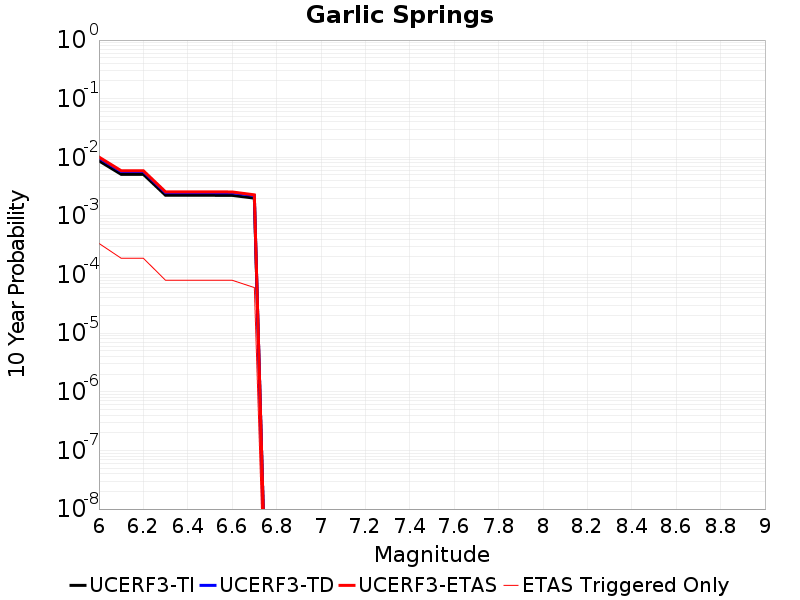 |

| Magnitude | 1 wk TI Prob | 1 wk TD Prob | 1 wk ETAS Prob | 1 wk ETAS/TD Gain | 1 wk ETAS Triggered Only | 1 mo TI Prob | 1 mo TD Prob | 1 mo ETAS Prob | 1 mo ETAS/TD Gain | 1 mo ETAS Triggered Only | 1 yr TI Prob | 1 yr TD Prob | 1 yr ETAS Prob | 1 yr ETAS/TD Gain | 1 yr ETAS Triggered Only | 10 yr TI Prob | 10 yr TD Prob | 10 yr ETAS Prob | 10 yr ETAS/TD Gain | 10 yr ETAS Triggered Only |
|-----|-----|-----|-----|-----|-----|-----|-----|-----|-----|-----|-----|-----|-----|-----|-----|-----|-----|-----|-----|-----|
| 6.0 | 1.6760017E-5 | 1.8791176E-5 | 1.8791176E-5 | 1.0 | 0.0 | 7.182667E-5 | 8.053178E-5 | 9.053098E-5 | 1.1241646 | 1.0E-5 | 8.7413884E-4 | 9.80151E-4 | 0.0010400922 | 1.0611551 | 6.0E-5 | 0.008707083 | 0.009769844 | 0.010106522 | 1.034461 | 3.4E-4 |
| 6.1 | 9.852767E-6 | 1.0981506E-5 | 1.0981506E-5 | 1.0 | 0.0 | 4.222546E-5 | 4.706315E-5 | 4.706315E-5 | 1.0 | 0.0 | 5.139737E-4 | 5.7291426E-4 | 5.929028E-4 | 1.0348892 | 2.0E-5 | 0.005127866 | 0.0057213414 | 0.005910254 | 1.033019 | 1.9E-4 |
| 6.2 | 9.852767E-6 | 1.0981506E-5 | 1.0981506E-5 | 1.0 | 0.0 | 4.222546E-5 | 4.706315E-5 | 4.706315E-5 | 1.0 | 0.0 | 5.139737E-4 | 5.7291426E-4 | 5.929028E-4 | 1.0348892 | 2.0E-5 | 0.005127866 | 0.0057213414 | 0.005910254 | 1.033019 | 1.9E-4 |
| 6.3 | 4.3167724E-6 | 4.7812664E-6 | 4.7812664E-6 | 1.0 | 0.0 | 1.8500323E-5 | 2.049111E-5 | 2.049111E-5 | 1.0 | 0.0 | 2.2521814E-4 | 2.494738E-4 | 2.494738E-4 | 1.0 | 0.0 | 0.0022499003 | 0.0024941985 | 0.002573999 | 1.0319945 | 8.0E-5 |
| 6.4 | 4.3167724E-6 | 4.7812664E-6 | 4.7812664E-6 | 1.0 | 0.0 | 1.8500323E-5 | 2.049111E-5 | 2.049111E-5 | 1.0 | 0.0 | 2.2521814E-4 | 2.494738E-4 | 2.494738E-4 | 1.0 | 0.0 | 0.0022499003 | 0.0024941985 | 0.002573999 | 1.0319945 | 8.0E-5 |
| 6.5 | 4.3167724E-6 | 4.7812664E-6 | 4.7812664E-6 | 1.0 | 0.0 | 1.8500323E-5 | 2.049111E-5 | 2.049111E-5 | 1.0 | 0.0 | 2.2521814E-4 | 2.494738E-4 | 2.494738E-4 | 1.0 | 0.0 | 0.0022499003 | 0.0024941985 | 0.002573999 | 1.0319945 | 8.0E-5 |
| 6.6 | 4.301311E-6 | 4.7641233E-6 | 4.7641233E-6 | 1.0 | 0.0 | 1.8434059E-5 | 2.0417641E-5 | 2.0417641E-5 | 1.0 | 0.0 | 2.2441156E-4 | 2.4857948E-4 | 2.4857948E-4 | 1.0 | 0.0 | 0.0022418506 | 0.0024852757 | 0.0025650768 | 1.0321096 | 8.0E-5 |
| 6.7 | 3.8599724E-6 | 4.273945E-6 | 4.273945E-6 | 1.0 | 0.0 | 1.6542634E-5 | 1.8316905E-5 | 1.8316905E-5 | 1.0 | 0.0 | 2.0138794E-4 | 2.2300832E-4 | 2.2300832E-4 | 1.0 | 0.0 | 0.0020120554 | 0.0022300833 | 0.0022899495 | 1.0268449 | 6.0E-5 |

## Death Valley (Black Mtns Frontal)
*[(top)](#table-of-contents)*

| 1 Week | 1 Month | 1 Year | 10 Year |
|-----|-----|-----|-----|
|  | 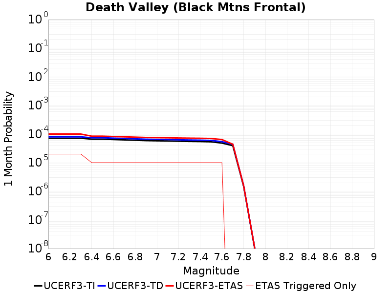 |  |  |

| Magnitude | 1 wk TI Prob | 1 wk TD Prob | 1 wk ETAS Prob | 1 wk ETAS/TD Gain | 1 wk ETAS Triggered Only | 1 mo TI Prob | 1 mo TD Prob | 1 mo ETAS Prob | 1 mo ETAS/TD Gain | 1 mo ETAS Triggered Only | 1 yr TI Prob | 1 yr TD Prob | 1 yr ETAS Prob | 1 yr ETAS/TD Gain | 1 yr ETAS Triggered Only | 10 yr TI Prob | 10 yr TD Prob | 10 yr ETAS Prob | 10 yr ETAS/TD Gain | 10 yr ETAS Triggered Only |
|-----|-----|-----|-----|-----|-----|-----|-----|-----|-----|-----|-----|-----|-----|-----|-----|-----|-----|-----|-----|-----|
| 6.0 | 1.6707214E-5 | 1.868422E-5 | 1.868422E-5 | 1.0 | 0.0 | 7.160038E-5 | 8.0072816E-5 | 1.00071215E-4 | 1.2497526 | 2.0E-5 | 8.71386E-4 | 9.744582E-4 | 0.0010743607 | 1.1025212 | 1.0E-4 | 0.00867977 | 0.009702708 | 0.010049311 | 1.0357224 | 3.5E-4 |
| 6.1 | 1.6707214E-5 | 1.868422E-5 | 1.868422E-5 | 1.0 | 0.0 | 7.160038E-5 | 8.0072816E-5 | 1.00071215E-4 | 1.2497526 | 2.0E-5 | 8.71386E-4 | 9.744582E-4 | 0.0010743607 | 1.1025212 | 1.0E-4 | 0.00867977 | 0.009702708 | 0.010049311 | 1.0357224 | 3.5E-4 |
| 6.2 | 1.6707214E-5 | 1.868422E-5 | 1.868422E-5 | 1.0 | 0.0 | 7.160038E-5 | 8.0072816E-5 | 1.00071215E-4 | 1.2497526 | 2.0E-5 | 8.71386E-4 | 9.744582E-4 | 0.0010743607 | 1.1025212 | 1.0E-4 | 0.00867977 | 0.009702708 | 0.010049311 | 1.0357224 | 3.5E-4 |
| 6.3 | 1.6707214E-5 | 1.868422E-5 | 1.868422E-5 | 1.0 | 0.0 | 7.160038E-5 | 8.0072816E-5 | 1.00071215E-4 | 1.2497526 | 2.0E-5 | 8.71386E-4 | 9.744582E-4 | 0.0010743607 | 1.1025212 | 1.0E-4 | 0.00867977 | 0.009702708 | 0.010049311 | 1.0357224 | 3.5E-4 |
| 6.4 | 1.5515609E-5 | 1.7351169E-5 | 1.7351169E-5 | 1.0 | 0.0 | 6.649377E-5 | 7.436007E-5 | 8.435933E-5 | 1.1344708 | 1.0E-5 | 8.0926094E-4 | 9.0496393E-4 | 9.848916E-4 | 1.0883213 | 8.0E-5 | 0.008063202 | 0.009013474 | 0.009320679 | 1.034083 | 3.1E-4 |
| 6.5 | 1.5515609E-5 | 1.7351169E-5 | 1.7351169E-5 | 1.0 | 0.0 | 6.649377E-5 | 7.436007E-5 | 8.435933E-5 | 1.1344708 | 1.0E-5 | 8.0926094E-4 | 9.0496393E-4 | 9.848916E-4 | 1.0883213 | 8.0E-5 | 0.008063202 | 0.009013474 | 0.009320679 | 1.034083 | 3.1E-4 |
| 6.6 | 1.5041828E-5 | 1.682171E-5 | 1.682171E-5 | 1.0 | 0.0 | 6.4463384E-5 | 7.209108E-5 | 8.209036E-5 | 1.1387035 | 1.0E-5 | 7.8455906E-4 | 8.773614E-4 | 9.473E-4 | 1.0797147 | 7.0E-5 | 0.00781795 | 0.008739633 | 0.009007272 | 1.0306238 | 2.7E-4 |
| 6.7 | 1.4634985E-5 | 1.6368254E-5 | 1.6368254E-5 | 1.0 | 0.0 | 6.271985E-5 | 7.0147806E-5 | 8.01471E-5 | 1.1425462 | 1.0E-5 | 7.6334673E-4 | 8.537207E-4 | 9.2366093E-4 | 1.0819241 | 7.0E-5 | 0.007607299 | 0.008505048 | 0.008772751 | 1.0314759 | 2.7E-4 |
| 6.8 | 1.4209158E-5 | 1.5893946E-5 | 1.5893946E-5 | 1.0 | 0.0 | 6.089497E-5 | 6.8115165E-5 | 7.8114484E-5 | 1.1468002 | 1.0E-5 | 7.4114406E-4 | 8.2899217E-4 | 8.9893414E-4 | 1.0843699 | 7.0E-5 | 0.007386771 | 0.008259614 | 0.0085174665 | 1.0312184 | 2.6E-4 |
| 6.9 | 1.3780098E-5 | 1.541615E-5 | 1.541615E-5 | 1.0 | 0.0 | 5.9056227E-5 | 6.6067565E-5 | 7.6066906E-5 | 1.1513501 | 1.0E-5 | 7.1877235E-4 | 8.0408127E-4 | 8.64033E-4 | 1.0745593 | 6.0E-5 | 0.0071645193 | 0.008012315 | 0.008250392 | 1.0297139 | 2.4E-4 |
| 7.0 | 1.3585064E-5 | 1.5199561E-5 | 1.5199561E-5 | 1.0 | 0.0 | 5.8220405E-5 | 6.513938E-5 | 7.513873E-5 | 1.153507 | 1.0E-5 | 7.086029E-4 | 7.9278887E-4 | 8.527413E-4 | 1.0756222 | 6.0E-5 | 0.007063476 | 0.007900199 | 0.008138303 | 1.030139 | 2.4E-4 |
| 7.1 | 1.3398601E-5 | 1.4992602E-5 | 1.4992602E-5 | 1.0 | 0.0 | 5.742131E-5 | 6.4252454E-5 | 7.425181E-5 | 1.155626 | 1.0E-5 | 6.9888023E-4 | 7.8199833E-4 | 8.419514E-4 | 1.0766665 | 6.0E-5 | 0.0069668638 | 0.007793056 | 0.008031186 | 1.0305567 | 2.4E-4 |
| 7.2 | 1.3126312E-5 | 1.4690616E-5 | 1.4690616E-5 | 1.0 | 0.0 | 5.6254412E-5 | 6.2958294E-5 | 7.2957664E-5 | 1.1588253 | 1.0E-5 | 6.846822E-4 | 7.662531E-4 | 8.262071E-4 | 1.0782431 | 6.0E-5 | 0.006825765 | 0.007636695 | 0.007835168 | 1.0259893 | 2.0E-4 |
| 7.3 | 1.2922429E-5 | 1.4464688E-5 | 1.4464688E-5 | 1.0 | 0.0 | 5.5380664E-5 | 6.199008E-5 | 7.198946E-5 | 1.1613061 | 1.0E-5 | 6.74051E-4 | 7.544733E-4 | 8.144281E-4 | 1.0794656 | 6.0E-5 | 0.006720101 | 0.007519701 | 0.007718197 | 1.0263968 | 2.0E-4 |
| 7.4 | 1.2768878E-5 | 1.42945555E-5 | 1.42945555E-5 | 1.0 | 0.0 | 5.4722615E-5 | 6.126097E-5 | 7.126036E-5 | 1.163226 | 1.0E-5 | 6.660441E-4 | 7.4560253E-4 | 7.9556525E-4 | 1.0670098 | 5.0E-5 | 0.0066405144 | 0.0074315895 | 0.0076201777 | 1.0253766 | 1.9E-4 |
| 7.5 | 1.2521929E-5 | 1.4022624E-5 | 1.4022624E-5 | 1.0 | 0.0 | 5.366431E-5 | 6.0095605E-5 | 7.0095004E-5 | 1.1663915 | 1.0E-5 | 6.531671E-4 | 7.314238E-4 | 7.8138727E-4 | 1.0683098 | 5.0E-5 | 0.006512506 | 0.007290742 | 0.0074793566 | 1.0258704 | 1.9E-4 |
| 7.6 | 1.1301089E-5 | 1.265774E-5 | 1.265774E-5 | 1.0 | 0.0 | 4.8432343E-5 | 5.4246357E-5 | 6.424582E-5 | 1.1843342 | 1.0E-5 | 5.895042E-4 | 6.602546E-4 | 6.9023477E-4 | 1.045407 | 3.0E-5 | 0.0058794282 | 0.006583483 | 0.006732495 | 1.0226343 | 1.5E-4 |
| 7.7 | 9.189108E-6 | 1.0291148E-5 | 1.0291148E-5 | 1.0 | 0.0 | 3.93813E-5 | 4.4104207E-5 | 4.4104207E-5 | 1.0 | 0.0 | 4.7936183E-4 | 5.3684146E-4 | 5.568307E-4 | 1.0372349 | 2.0E-5 | 0.004783291 | 0.005355958 | 0.0054454757 | 1.0167137 | 9.0E-5 |
| 7.8 | 3.4586725E-7 | 3.649536E-7 | 3.649536E-7 | 1.0 | 0.0 | 1.4822873E-6 | 1.5640859E-6 | 1.5640859E-6 | 1.0 | 0.0 | 1.80467E-5 | 1.9042584E-5 | 1.9042584E-5 | 1.0 | 0.0 | 1.8045233E-4 | 1.9040996E-4 | 1.9040996E-4 | 1.0 | 0.0 |
| 7.9 | 2.5591178E-9 | 2.670403E-9 | 2.670403E-9 | 1.0 | 0.0 | 1.0967647E-8 | 1.1444584E-8 | 1.1444584E-8 | 1.0 | 0.0 | 1.335311E-7 | 1.3933781E-7 | 1.3933781E-7 | 1.0 | 0.0 | 1.3353102E-6 | 1.393378E-6 | 1.393378E-6 | 1.0 | 0.0 |

## San Andreas (San Bernardino S)
*[(top)](#table-of-contents)*

| 1 Week | 1 Month | 1 Year | 10 Year |
|-----|-----|-----|-----|
|  |  |  | 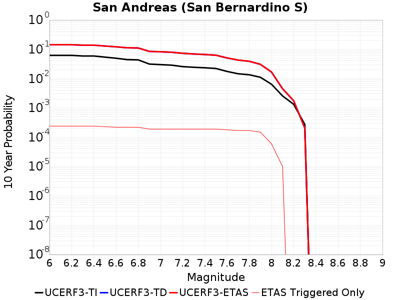 |

| Magnitude | 1 wk TI Prob | 1 wk TD Prob | 1 wk ETAS Prob | 1 wk ETAS/TD Gain | 1 wk ETAS Triggered Only | 1 mo TI Prob | 1 mo TD Prob | 1 mo ETAS Prob | 1 mo ETAS/TD Gain | 1 mo ETAS Triggered Only | 1 yr TI Prob | 1 yr TD Prob | 1 yr ETAS Prob | 1 yr ETAS/TD Gain | 1 yr ETAS Triggered Only | 10 yr TI Prob | 10 yr TD Prob | 10 yr ETAS Prob | 10 yr ETAS/TD Gain | 10 yr ETAS Triggered Only |
|-----|-----|-----|-----|-----|-----|-----|-----|-----|-----|-----|-----|-----|-----|-----|-----|-----|-----|-----|-----|-----|
| 6.0 | 1.2336002E-4 | 3.0240812E-4 | 3.0240812E-4 | 1.0 | 0.0 | 5.2857865E-4 | 0.0012954174 | 0.0013054045 | 1.0077095 | 1.0E-5 | 0.006416472 | 0.015662653 | 0.015751243 | 1.0056561 | 9.0E-5 | 0.06234337 | 0.14369297 | 0.14389849 | 1.0014303 | 2.4E-4 |
| 6.1 | 1.2336002E-4 | 3.0240812E-4 | 3.0240812E-4 | 1.0 | 0.0 | 5.2857865E-4 | 0.0012954174 | 0.0013054045 | 1.0077095 | 1.0E-5 | 0.006416472 | 0.015662653 | 0.015751243 | 1.0056561 | 9.0E-5 | 0.06234337 | 0.14369297 | 0.14389849 | 1.0014303 | 2.4E-4 |
| 6.2 | 1.2336002E-4 | 3.0240812E-4 | 3.0240812E-4 | 1.0 | 0.0 | 5.2857865E-4 | 0.0012954174 | 0.0013054045 | 1.0077095 | 1.0E-5 | 0.006416472 | 0.015662653 | 0.015751243 | 1.0056561 | 9.0E-5 | 0.06234337 | 0.14369297 | 0.14389849 | 1.0014303 | 2.4E-4 |
| 6.3 | 1.1712257E-4 | 2.902654E-4 | 2.902654E-4 | 1.0 | 0.0 | 5.018573E-4 | 0.0012434273 | 0.0012534149 | 1.0080323 | 1.0E-5 | 0.006093008 | 0.015038529 | 0.0151271755 | 1.0058947 | 9.0E-5 | 0.059286322 | 0.13840844 | 0.13861522 | 1.001494 | 2.4E-4 |
| 6.4 | 1.1712257E-4 | 2.902654E-4 | 2.902654E-4 | 1.0 | 0.0 | 5.018573E-4 | 0.0012434273 | 0.0012534149 | 1.0080323 | 1.0E-5 | 0.006093008 | 0.015038529 | 0.0151271755 | 1.0058947 | 9.0E-5 | 0.059286322 | 0.13840844 | 0.13861522 | 1.001494 | 2.4E-4 |
| 6.5 | 1.0689076E-4 | 2.7035305E-4 | 2.7035305E-4 | 1.0 | 0.0 | 4.5802278E-4 | 0.0011581664 | 0.0011681548 | 1.0086243 | 1.0E-5 | 0.0055621783 | 0.014014167 | 0.014102906 | 1.006332 | 9.0E-5 | 0.05425003 | 0.12963858 | 0.12983876 | 1.0015441 | 2.3E-4 |
| 6.6 | 9.7648895E-5 | 2.527623E-4 | 2.527623E-4 | 1.0 | 0.0 | 4.1842813E-4 | 0.001082841 | 0.0010928302 | 1.009225 | 1.0E-5 | 0.005082469 | 0.013108299 | 0.013197119 | 1.0067759 | 9.0E-5 | 0.049677886 | 0.1217467 | 0.12193991 | 1.001587 | 2.2E-4 |
| 6.7 | 8.757013E-5 | 2.3343206E-4 | 2.3343206E-4 | 1.0 | 0.0 | 3.7524657E-4 | 0.001000062 | 0.0010100519 | 1.0099894 | 1.0E-5 | 0.00455906 | 0.012111901 | 0.012200812 | 1.0073407 | 9.0E-5 | 0.04466656 | 0.11301835 | 0.11321349 | 1.0017266 | 2.2E-4 |
| 6.8 | 8.562978E-5 | 2.2901363E-4 | 2.2901363E-4 | 1.0 | 0.0 | 3.6693315E-4 | 9.811403E-4 | 9.911305E-4 | 1.0101823 | 1.0E-5 | 0.004458263 | 0.011884058 | 0.011972988 | 1.0074831 | 9.0E-5 | 0.043698758 | 0.11101896 | 0.11121454 | 1.0017617 | 2.2E-4 |
| 6.9 | 6.124075E-5 | 1.7264036E-4 | 1.7264036E-4 | 1.0 | 0.0 | 2.6243398E-4 | 7.396783E-4 | 7.496709E-4 | 1.0135094 | 1.0E-5 | 0.0031904527 | 0.008968608 | 0.009037981 | 1.007735 | 7.0E-5 | 0.031450346 | 0.08503498 | 0.085208826 | 1.0020443 | 1.9E-4 |
| 7.0 | 5.8598747E-5 | 1.669097E-4 | 1.669097E-4 | 1.0 | 0.0 | 2.5111332E-4 | 7.15132E-4 | 7.2512485E-4 | 1.0139735 | 1.0E-5 | 0.0030530186 | 0.008672172 | 0.008741565 | 1.0080018 | 7.0E-5 | 0.03011414 | 0.08234535 | 0.0825197 | 1.0021174 | 1.9E-4 |
| 7.1 | 5.613814E-5 | 1.6107399E-4 | 1.6107399E-4 | 1.0 | 0.0 | 2.4056983E-4 | 6.9013523E-4 | 7.001283E-4 | 1.0144799 | 1.0E-5 | 0.0029250039 | 0.0083702095 | 0.008439624 | 1.008293 | 7.0E-5 | 0.028868021 | 0.079633586 | 0.07980846 | 1.002196 | 1.9E-4 |
| 7.2 | 4.991222E-5 | 1.4709211E-4 | 1.4709211E-4 | 1.0 | 0.0 | 2.1389198E-4 | 6.3024287E-4 | 6.402366E-4 | 1.0158569 | 1.0E-5 | 0.002601025 | 0.007646316 | 0.007715781 | 1.0090847 | 7.0E-5 | 0.025707912 | 0.07306696 | 0.073243074 | 1.0024104 | 1.9E-4 |
| 7.3 | 4.7410045E-5 | 1.3899102E-4 | 1.3899102E-4 | 1.0 | 0.0 | 2.0317009E-4 | 5.9554016E-4 | 6.055342E-4 | 1.0167814 | 1.0E-5 | 0.0024707897 | 0.007226684 | 0.007296178 | 1.0096164 | 7.0E-5 | 0.024434982 | 0.06933328 | 0.06951011 | 1.0025504 | 1.9E-4 |
| 7.4 | 4.5556746E-5 | 1.3303797E-4 | 1.3303797E-4 | 1.0 | 0.0 | 1.952286E-4 | 5.7003845E-4 | 5.8003276E-4 | 1.0175327 | 1.0E-5 | 0.002374317 | 0.0069182143 | 0.00698773 | 1.0100483 | 7.0E-5 | 0.023491086 | 0.06657774 | 0.06675509 | 1.0026639 | 1.9E-4 |
| 7.5 | 4.3084514E-5 | 1.2535215E-4 | 1.2535215E-4 | 1.0 | 0.0 | 1.8463485E-4 | 5.3711317E-4 | 5.471078E-4 | 1.0186081 | 1.0E-5 | 0.0022456115 | 0.0065198187 | 0.0065893624 | 1.0106665 | 7.0E-5 | 0.022230545 | 0.06296481 | 0.06314284 | 1.0028275 | 1.9E-4 |
| 7.6 | 3.408608E-5 | 9.998986E-5 | 9.998986E-5 | 1.0 | 0.0 | 1.4607502E-4 | 4.284577E-4 | 4.384534E-4 | 1.0233295 | 1.0E-5 | 0.0017770125 | 0.005204022 | 0.005273658 | 1.0133811 | 7.0E-5 | 0.017628696 | 0.050743 | 0.050913867 | 1.0033673 | 1.8E-4 |
| 7.7 | 2.8315713E-5 | 8.402318E-5 | 8.402318E-5 | 1.0 | 0.0 | 1.2134742E-4 | 3.6004966E-4 | 3.7004607E-4 | 1.027764 | 1.0E-5 | 0.0014764034 | 0.004374803 | 0.004444497 | 1.0159308 | 7.0E-5 | 0.01466633 | 0.042956676 | 0.043119375 | 1.0037875 | 1.7E-4 |
| 7.8 | 2.6222975E-5 | 7.6067365E-5 | 7.6067365E-5 | 1.0 | 0.0 | 1.1237934E-4 | 3.259623E-4 | 3.3595902E-4 | 1.0306684 | 1.0E-5 | 0.0013673597 | 0.0039613754 | 0.0040310984 | 1.0176007 | 7.0E-5 | 0.013589768 | 0.039080452 | 0.03924381 | 1.00418 | 1.7E-4 |
| 7.9 | 2.1469694E-5 | 5.907815E-5 | 5.907815E-5 | 1.0 | 0.0 | 9.200973E-5 | 2.5316753E-4 | 2.6316498E-4 | 1.0394895 | 1.0E-5 | 0.0011196428 | 0.0030779613 | 0.0031477457 | 1.0226723 | 7.0E-5 | 0.011140184 | 0.030697716 | 0.03084311 | 1.0047363 | 1.5E-4 |
| 8.0 | 1.2420249E-5 | 3.1988864E-5 | 3.1988864E-5 | 1.0 | 0.0 | 5.322855E-5 | 1.3708793E-4 | 1.3708793E-4 | 1.0 | 0.0 | 6.478649E-4 | 0.0016677688 | 0.0016977187 | 1.0179582 | 3.0E-5 | 0.0064597935 | 0.016834715 | 0.016893705 | 1.003504 | 6.0E-5 |
| 8.1 | 4.9197724E-6 | 8.0706295E-6 | 8.0706295E-6 | 1.0 | 0.0 | 2.1084568E-5 | 3.4587956E-5 | 3.4587956E-5 | 1.0 | 0.0 | 2.566744E-4 | 4.2102713E-4 | 4.3102293E-4 | 1.0237415 | 1.0E-5 | 0.002563781 | 0.0045090504 | 0.0045190053 | 1.0022078 | 1.0E-5 |
| 8.2 | 2.5634774E-6 | 3.0204308E-6 | 3.0204308E-6 | 1.0 | 0.0 | 1.0986286E-5 | 1.294464E-5 | 1.294464E-5 | 1.0 | 0.0 | 1.3374983E-4 | 1.5758965E-4 | 1.5758965E-4 | 1.0 | 0.0 | 0.0013366934 | 0.0017646841 | 0.0017646841 | 1.0 | 0.0 |
| 8.3 | 5.2850464E-7 | 3.3644378E-7 | 3.3644378E-7 | 1.0 | 0.0 | 2.2650179E-6 | 1.4419011E-6 | 1.4419011E-6 | 1.0 | 0.0 | 2.7576245E-5 | 1.7555018E-5 | 1.7555018E-5 | 1.0 | 0.0 | 2.7572823E-4 | 2.0748317E-4 | 2.0748317E-4 | 1.0 | 0.0 |

## Coyote Lake
*[(top)](#table-of-contents)*

| 1 Week | 1 Month | 1 Year | 10 Year |
|-----|-----|-----|-----|
| 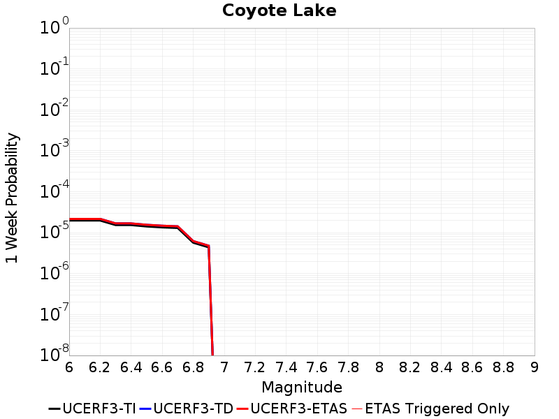 | 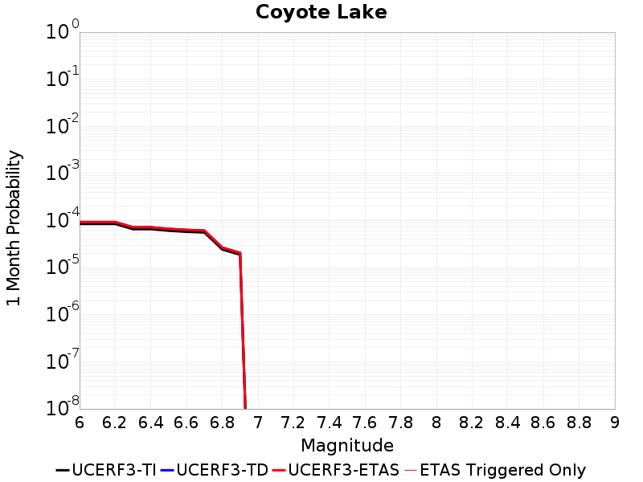 |  | 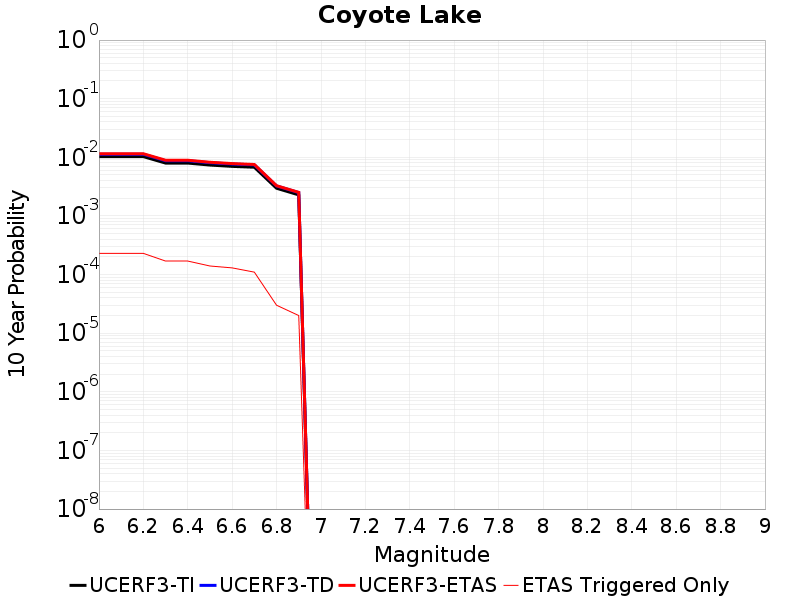 |

| Magnitude | 1 wk TI Prob | 1 wk TD Prob | 1 wk ETAS Prob | 1 wk ETAS/TD Gain | 1 wk ETAS Triggered Only | 1 mo TI Prob | 1 mo TD Prob | 1 mo ETAS Prob | 1 mo ETAS/TD Gain | 1 mo ETAS Triggered Only | 1 yr TI Prob | 1 yr TD Prob | 1 yr ETAS Prob | 1 yr ETAS/TD Gain | 1 yr ETAS Triggered Only | 10 yr TI Prob | 10 yr TD Prob | 10 yr ETAS Prob | 10 yr ETAS/TD Gain | 10 yr ETAS Triggered Only |
|-----|-----|-----|-----|-----|-----|-----|-----|-----|-----|-----|-----|-----|-----|-----|-----|-----|-----|-----|-----|-----|
| 6.0 | 1.980352E-5 | 2.171998E-5 | 2.171998E-5 | 1.0 | 0.0 | 8.486947E-5 | 9.308271E-5 | 9.308271E-5 | 1.0 | 0.0 | 0.0010327959 | 0.001132765 | 0.0011527423 | 1.017636 | 2.0E-5 | 0.010280091 | 0.011277095 | 0.011504502 | 1.0201653 | 2.3E-4 |
| 6.1 | 1.980352E-5 | 2.171998E-5 | 2.171998E-5 | 1.0 | 0.0 | 8.486947E-5 | 9.308271E-5 | 9.308271E-5 | 1.0 | 0.0 | 0.0010327959 | 0.001132765 | 0.0011527423 | 1.017636 | 2.0E-5 | 0.010280091 | 0.011277095 | 0.011504502 | 1.0201653 | 2.3E-4 |
| 6.2 | 1.980352E-5 | 2.171998E-5 | 2.171998E-5 | 1.0 | 0.0 | 8.486947E-5 | 9.308271E-5 | 9.308271E-5 | 1.0 | 0.0 | 0.0010327959 | 0.001132765 | 0.0011527423 | 1.017636 | 2.0E-5 | 0.010280091 | 0.011277095 | 0.011504502 | 1.0201653 | 2.3E-4 |
| 6.3 | 1.5344787E-5 | 1.6830933E-5 | 1.6830933E-5 | 1.0 | 0.0 | 6.576172E-5 | 7.2130926E-5 | 7.2130926E-5 | 1.0 | 0.0 | 8.003548E-4 | 8.7790145E-4 | 8.878927E-4 | 1.0113808 | 1.0E-5 | 0.007974784 | 0.008750387 | 0.008918899 | 1.0192577 | 1.7E-4 |
| 6.4 | 1.5344787E-5 | 1.6830933E-5 | 1.6830933E-5 | 1.0 | 0.0 | 6.576172E-5 | 7.2130926E-5 | 7.2130926E-5 | 1.0 | 0.0 | 8.003548E-4 | 8.7790145E-4 | 8.878927E-4 | 1.0113808 | 1.0E-5 | 0.007974784 | 0.008750387 | 0.008918899 | 1.0192577 | 1.7E-4 |
| 6.5 | 1.4189697E-5 | 1.5567504E-5 | 1.5567504E-5 | 1.0 | 0.0 | 6.081157E-5 | 6.6716515E-5 | 6.6716515E-5 | 1.0 | 0.0 | 7.401293E-4 | 8.120312E-4 | 8.220231E-4 | 1.0123048 | 1.0E-5 | 0.0073766913 | 0.008096591 | 0.008235457 | 1.0171512 | 1.4E-4 |
| 6.6 | 1.3469301E-5 | 1.4780639E-5 | 1.4780639E-5 | 1.0 | 0.0 | 5.7724297E-5 | 6.334439E-5 | 6.334439E-5 | 1.0 | 0.0 | 7.025667E-4 | 7.710052E-4 | 7.8099745E-4 | 1.0129601 | 1.0E-5 | 0.0070034964 | 0.007689214 | 0.007818215 | 1.0167768 | 1.3E-4 |
| 6.7 | 1.3027966E-5 | 1.4290465E-5 | 1.4290465E-5 | 1.0 | 0.0 | 5.5832945E-5 | 6.124375E-5 | 6.124375E-5 | 1.0 | 0.0 | 6.7955407E-4 | 7.4544735E-4 | 7.554399E-4 | 1.0134047 | 1.0E-5 | 0.006774798 | 0.007435353 | 0.007544535 | 1.0146842 | 1.1E-4 |
| 6.8 | 5.695434E-6 | 6.2280837E-6 | 6.2280837E-6 | 1.0 | 0.0 | 2.4408775E-5 | 2.6691683E-5 | 2.6691683E-5 | 1.0 | 0.0 | 2.971363E-4 | 3.2495282E-4 | 3.3494958E-4 | 1.0307637 | 1.0E-5 | 0.0029673933 | 0.003247721 | 0.0032776236 | 1.0092072 | 3.0E-5 |
| 6.9 | 4.385688E-6 | 4.795879E-6 | 4.795879E-6 | 1.0 | 0.0 | 1.879567E-5 | 2.0553765E-5 | 2.0553765E-5 | 1.0 | 0.0 | 2.2881327E-4 | 2.502421E-4 | 2.6023958E-4 | 1.0399513 | 1.0E-5 | 0.002285778 | 0.002502421 | 0.0025223708 | 1.0079722 | 2.0E-5 |

## Death Valley (No)
*[(top)](#table-of-contents)*

| 1 Week | 1 Month | 1 Year | 10 Year |
|-----|-----|-----|-----|
|  |  | 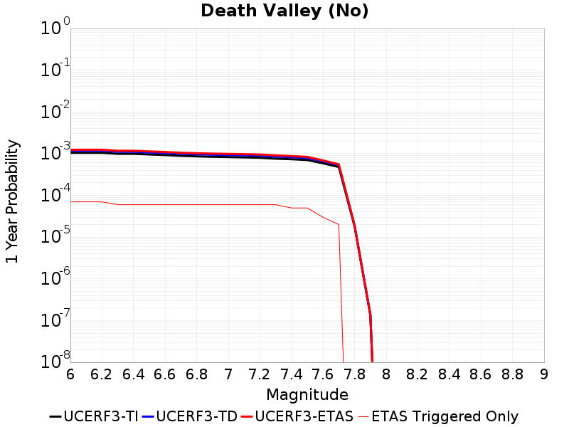 | 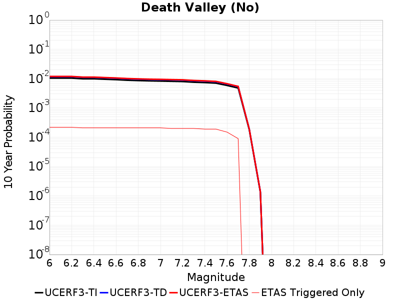 |

| Magnitude | 1 wk TI Prob | 1 wk TD Prob | 1 wk ETAS Prob | 1 wk ETAS/TD Gain | 1 wk ETAS Triggered Only | 1 mo TI Prob | 1 mo TD Prob | 1 mo ETAS Prob | 1 mo ETAS/TD Gain | 1 mo ETAS Triggered Only | 1 yr TI Prob | 1 yr TD Prob | 1 yr ETAS Prob | 1 yr ETAS/TD Gain | 1 yr ETAS Triggered Only | 10 yr TI Prob | 10 yr TD Prob | 10 yr ETAS Prob | 10 yr ETAS/TD Gain | 10 yr ETAS Triggered Only |
|-----|-----|-----|-----|-----|-----|-----|-----|-----|-----|-----|-----|-----|-----|-----|-----|-----|-----|-----|-----|-----|
| 6.0 | 2.0074807E-5 | 2.2517406E-5 | 3.2517182E-5 | 1.4440908 | 1.0E-5 | 8.603206E-5 | 9.649964E-5 | 1.16497715E-4 | 1.2072346 | 2.0E-5 | 0.001046937 | 0.0011742574 | 0.0012441751 | 1.0595422 | 7.0E-5 | 0.010420183 | 0.011681441 | 0.0118988715 | 1.0186133 | 2.2E-4 |
| 6.1 | 2.0074807E-5 | 2.2517406E-5 | 3.2517182E-5 | 1.4440908 | 1.0E-5 | 8.603206E-5 | 9.649964E-5 | 1.16497715E-4 | 1.2072346 | 2.0E-5 | 0.001046937 | 0.0011742574 | 0.0012441751 | 1.0595422 | 7.0E-5 | 0.010420183 | 0.011681441 | 0.0118988715 | 1.0186133 | 2.2E-4 |
| 6.2 | 2.0074807E-5 | 2.2517406E-5 | 3.2517182E-5 | 1.4440908 | 1.0E-5 | 8.603206E-5 | 9.649964E-5 | 1.16497715E-4 | 1.2072346 | 2.0E-5 | 0.001046937 | 0.0011742574 | 0.0012441751 | 1.0595422 | 7.0E-5 | 0.010420183 | 0.011681441 | 0.0118988715 | 1.0186133 | 2.2E-4 |
| 6.3 | 1.9050609E-5 | 2.135327E-5 | 2.135327E-5 | 1.0 | 0.0 | 8.164292E-5 | 9.151084E-5 | 1.01509926E-4 | 1.1092666 | 1.0E-5 | 9.935491E-4 | 0.0011135818 | 0.001173515 | 1.0538201 | 6.0E-5 | 0.009891188 | 0.011080842 | 0.011288515 | 1.0187416 | 2.1E-4 |
| 6.4 | 1.9050609E-5 | 2.135327E-5 | 2.135327E-5 | 1.0 | 0.0 | 8.164292E-5 | 9.151084E-5 | 1.01509926E-4 | 1.1092666 | 1.0E-5 | 9.935491E-4 | 0.0011135818 | 0.001173515 | 1.0538201 | 6.0E-5 | 0.009891188 | 0.011080842 | 0.011288515 | 1.0187416 | 2.1E-4 |
| 6.5 | 1.8367004E-5 | 2.0576665E-5 | 2.0576665E-5 | 1.0 | 0.0 | 7.8713354E-5 | 8.8182765E-5 | 9.818188E-5 | 1.1133908 | 1.0E-5 | 9.5791375E-4 | 0.0010731029 | 0.0011330385 | 1.0558527 | 6.0E-5 | 0.009537951 | 0.010679999 | 0.010887756 | 1.0194529 | 2.1E-4 |
| 6.6 | 1.779439E-5 | 1.9926027E-5 | 1.9926027E-5 | 1.0 | 0.0 | 7.625944E-5 | 8.53945E-5 | 9.539365E-5 | 1.1170936 | 1.0E-5 | 9.280632E-4 | 0.0010391886 | 0.0010991262 | 1.0576774 | 6.0E-5 | 0.009241969 | 0.010344051 | 0.010551879 | 1.0200915 | 2.1E-4 |
| 6.7 | 1.7025437E-5 | 1.9057816E-5 | 1.9057816E-5 | 1.0 | 0.0 | 7.296412E-5 | 8.167383E-5 | 9.167301E-5 | 1.1224282 | 1.0E-5 | 8.87976E-4 | 9.939314E-4 | 0.0010538718 | 1.0603063 | 6.0E-5 | 0.008844362 | 0.009895581 | 0.010103503 | 1.0210116 | 2.1E-4 |
| 6.8 | 1.6545107E-5 | 1.8526574E-5 | 1.8526574E-5 | 1.0 | 0.0 | 7.090568E-5 | 7.939722E-5 | 8.9396424E-5 | 1.125939 | 1.0E-5 | 8.629347E-4 | 9.662386E-4 | 0.0010261806 | 1.0620365 | 6.0E-5 | 0.008595915 | 0.00962108 | 0.009829059 | 1.021617 | 2.1E-4 |
| 6.9 | 1.615478E-5 | 1.8101377E-5 | 1.8101377E-5 | 1.0 | 0.0 | 6.9232934E-5 | 7.757506E-5 | 8.757428E-5 | 1.1288974 | 1.0E-5 | 8.4258494E-4 | 9.4407314E-4 | 0.0010040165 | 1.0634944 | 6.0E-5 | 0.008393973 | 0.0094013205 | 0.009609346 | 1.0221273 | 2.1E-4 |
| 7.0 | 1.5894311E-5 | 1.781918E-5 | 1.781918E-5 | 1.0 | 0.0 | 6.81167E-5 | 7.6365715E-5 | 8.636495E-5 | 1.1309388 | 1.0E-5 | 8.2900526E-4 | 9.293621E-4 | 9.893064E-4 | 1.0645005 | 6.0E-5 | 0.008259195 | 0.009255445 | 0.009463501 | 1.0224793 | 2.1E-4 |
| 7.1 | 1.5602263E-5 | 1.749692E-5 | 1.749692E-5 | 1.0 | 0.0 | 6.6865134E-5 | 7.498468E-5 | 8.498393E-5 | 1.1333506 | 1.0E-5 | 8.137789E-4 | 9.125622E-4 | 9.725074E-4 | 1.065689 | 6.0E-5 | 0.008108052 | 0.009088832 | 0.009287015 | 1.021805 | 2.0E-4 |
| 7.2 | 1.5323829E-5 | 1.71838E-5 | 1.71838E-5 | 1.0 | 0.0 | 6.56719E-5 | 7.364281E-5 | 8.364207E-5 | 1.1357806 | 1.0E-5 | 7.99262E-4 | 8.962385E-4 | 9.5618475E-4 | 1.0668864 | 6.0E-5 | 0.007963934 | 0.008926919 | 0.009125133 | 1.0222042 | 2.0E-4 |
| 7.3 | 1.4556212E-5 | 1.6314903E-5 | 1.6314903E-5 | 1.0 | 0.0 | 6.238227E-5 | 6.991917E-5 | 7.991847E-5 | 1.1430123 | 1.0E-5 | 7.592395E-4 | 8.509393E-4 | 9.1088825E-4 | 1.0704503 | 6.0E-5 | 0.0075665074 | 0.008477455 | 0.00867576 | 1.023392 | 2.0E-4 |
| 7.4 | 1.411725E-5 | 1.582001E-5 | 1.582001E-5 | 1.0 | 0.0 | 6.0501097E-5 | 6.779831E-5 | 7.779763E-5 | 1.1474863 | 1.0E-5 | 7.363519E-4 | 8.2513766E-4 | 8.7509636E-4 | 1.0605459 | 5.0E-5 | 0.0073391674 | 0.008221375 | 0.008409812 | 1.0229205 | 1.9E-4 |
| 7.5 | 1.3503312E-5 | 1.5137855E-5 | 1.5137855E-5 | 1.0 | 0.0 | 5.7870053E-5 | 6.487494E-5 | 7.48743E-5 | 1.1541327 | 1.0E-5 | 7.043401E-4 | 7.89572E-4 | 8.395325E-4 | 1.0632755 | 5.0E-5 | 0.007021119 | 0.007868294 | 0.008056798 | 1.0239575 | 1.9E-4 |
| 7.6 | 1.1279839E-5 | 1.2635914E-5 | 1.2635914E-5 | 1.0 | 0.0 | 4.834127E-5 | 5.4152824E-5 | 6.415228E-5 | 1.1846526 | 1.0E-5 | 5.88396E-4 | 6.591165E-4 | 6.8909675E-4 | 1.0454855 | 3.0E-5 | 0.005868405 | 0.0065721693 | 0.006721183 | 1.0226735 | 1.5E-4 |
| 7.7 | 9.189108E-6 | 1.0291148E-5 | 1.0291148E-5 | 1.0 | 0.0 | 3.93813E-5 | 4.4104207E-5 | 4.4104207E-5 | 1.0 | 0.0 | 4.7936183E-4 | 5.3684146E-4 | 5.568307E-4 | 1.0372349 | 2.0E-5 | 0.004783291 | 0.005355958 | 0.0054454757 | 1.0167137 | 9.0E-5 |
| 7.8 | 3.4586725E-7 | 3.649536E-7 | 3.649536E-7 | 1.0 | 0.0 | 1.4822873E-6 | 1.5640859E-6 | 1.5640859E-6 | 1.0 | 0.0 | 1.80467E-5 | 1.9042584E-5 | 1.9042584E-5 | 1.0 | 0.0 | 1.8045233E-4 | 1.9040996E-4 | 1.9040996E-4 | 1.0 | 0.0 |
| 7.9 | 2.5591178E-9 | 2.670403E-9 | 2.670403E-9 | 1.0 | 0.0 | 1.0967647E-8 | 1.1444584E-8 | 1.1444584E-8 | 1.0 | 0.0 | 1.335311E-7 | 1.3933781E-7 | 1.3933781E-7 | 1.0 | 0.0 | 1.3353102E-6 | 1.393378E-6 | 1.393378E-6 | 1.0 | 0.0 |

## Helendale-So Lockhart
*[(top)](#table-of-contents)*

| 1 Week | 1 Month | 1 Year | 10 Year |
|-----|-----|-----|-----|
|  |  |  | 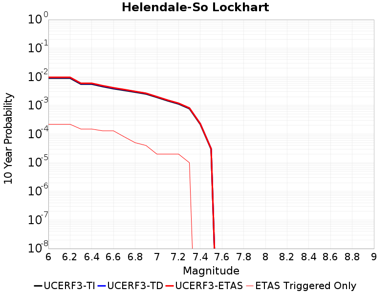 |

| Magnitude | 1 wk TI Prob | 1 wk TD Prob | 1 wk ETAS Prob | 1 wk ETAS/TD Gain | 1 wk ETAS Triggered Only | 1 mo TI Prob | 1 mo TD Prob | 1 mo ETAS Prob | 1 mo ETAS/TD Gain | 1 mo ETAS Triggered Only | 1 yr TI Prob | 1 yr TD Prob | 1 yr ETAS Prob | 1 yr ETAS/TD Gain | 1 yr ETAS Triggered Only | 10 yr TI Prob | 10 yr TD Prob | 10 yr ETAS Prob | 10 yr ETAS/TD Gain | 10 yr ETAS Triggered Only |
|-----|-----|-----|-----|-----|-----|-----|-----|-----|-----|-----|-----|-----|-----|-----|-----|-----|-----|-----|-----|-----|
| 6.0 | 1.7296055E-5 | 1.81091E-5 | 2.810892E-5 | 1.5521985 | 1.0E-5 | 7.412385E-5 | 7.760824E-5 | 9.760669E-5 | 1.2576846 | 2.0E-5 | 9.0208417E-4 | 9.444915E-4 | 0.0010344065 | 1.0951993 | 9.0E-5 | 0.008984311 | 0.009406894 | 0.009624825 | 1.0231671 | 2.2E-4 |
| 6.1 | 1.7296055E-5 | 1.81091E-5 | 2.810892E-5 | 1.5521985 | 1.0E-5 | 7.412385E-5 | 7.760824E-5 | 9.760669E-5 | 1.2576846 | 2.0E-5 | 9.0208417E-4 | 9.444915E-4 | 0.0010344065 | 1.0951993 | 9.0E-5 | 0.008984311 | 0.009406894 | 0.009624825 | 1.0231671 | 2.2E-4 |
| 6.2 | 1.7296055E-5 | 1.81091E-5 | 2.810892E-5 | 1.5521985 | 1.0E-5 | 7.412385E-5 | 7.760824E-5 | 9.760669E-5 | 1.2576846 | 2.0E-5 | 9.0208417E-4 | 9.444915E-4 | 0.0010344065 | 1.0951993 | 9.0E-5 | 0.008984311 | 0.009406894 | 0.009624825 | 1.0231671 | 2.2E-4 |
| 6.3 | 1.0669118E-5 | 1.1138514E-5 | 2.1138403E-5 | 1.8977758 | 1.0E-5 | 4.5723988E-5 | 4.7735633E-5 | 6.7734676E-5 | 1.4189543 | 2.0E-5 | 5.5654737E-4 | 5.8102916E-4 | 6.409943E-4 | 1.1032051 | 6.0E-5 | 0.0055515557 | 0.005795397 | 0.0059445277 | 1.0257326 | 1.5E-4 |
| 6.4 | 1.0669118E-5 | 1.1138514E-5 | 2.1138403E-5 | 1.8977758 | 1.0E-5 | 4.5723988E-5 | 4.7735633E-5 | 6.7734676E-5 | 1.4189543 | 2.0E-5 | 5.5654737E-4 | 5.8102916E-4 | 6.409943E-4 | 1.1032051 | 6.0E-5 | 0.0055515557 | 0.005795397 | 0.0059445277 | 1.0257326 | 1.5E-4 |
| 6.5 | 8.790038E-6 | 9.172715E-6 | 1.9172623E-5 | 2.0901797 | 1.0E-5 | 3.767105E-5 | 3.9311053E-5 | 5.9310267E-5 | 1.5087428 | 2.0E-5 | 4.585485E-4 | 4.785085E-4 | 5.1848934E-4 | 1.0835531 | 4.0E-5 | 0.0045760344 | 0.0047749463 | 0.0049043256 | 1.0270954 | 1.3E-4 |
| 6.6 | 7.396949E-6 | 7.717647E-6 | 1.771757E-5 | 2.2957218 | 1.0E-5 | 3.1700827E-5 | 3.3075215E-5 | 5.3074556E-5 | 1.6046624 | 2.0E-5 | 3.858892E-4 | 4.0261736E-4 | 4.4260125E-4 | 1.0993099 | 4.0E-5 | 0.003852198 | 0.0040189866 | 0.0041484637 | 1.0322164 | 1.3E-4 |
| 6.7 | 6.4600285E-6 | 6.7398723E-6 | 1.6739805E-5 | 2.4836977 | 1.0E-5 | 2.7685543E-5 | 2.8884851E-5 | 4.8884274E-5 | 1.6923845 | 2.0E-5 | 3.3701936E-4 | 3.5161708E-4 | 3.9160304E-4 | 1.11372 | 4.0E-5 | 0.0033650869 | 0.0035106894 | 0.0035904085 | 1.0227076 | 8.0E-5 |
| 6.8 | 5.600104E-6 | 5.8375695E-6 | 1.5837511E-5 | 2.7130318 | 1.0E-5 | 2.4000226E-5 | 2.5017918E-5 | 3.5017667E-5 | 1.3997035 | 1.0E-5 | 2.9216358E-4 | 3.0455118E-4 | 3.3454204E-4 | 1.0984756 | 3.0E-5 | 0.0029177975 | 0.0030413996 | 0.0030912475 | 1.0163898 | 5.0E-5 |
| 6.9 | 4.839122E-6 | 5.0408335E-6 | 1.5040783E-5 | 2.983789 | 1.0E-5 | 2.0738931E-5 | 2.1603395E-5 | 3.160318E-5 | 1.4628803 | 1.0E-5 | 2.5246723E-4 | 2.6299004E-4 | 2.8298478E-4 | 1.0760285 | 2.0E-5 | 0.002521806 | 0.0026268358 | 0.0026667307 | 1.0151875 | 4.0E-5 |
| 7.0 | 3.6937633E-6 | 3.846208E-6 | 1.3846169E-5 | 3.5999534 | 1.0E-5 | 1.5830317E-5 | 1.6483646E-5 | 2.6483482E-5 | 1.6066519 | 1.0E-5 | 1.9271708E-4 | 2.0067023E-4 | 2.206662E-4 | 1.099646 | 2.0E-5 | 0.0019255003 | 0.0020049217 | 0.0020248815 | 1.0099554 | 2.0E-5 |
| 7.1 | 2.7858857E-6 | 2.8985924E-6 | 1.2898563E-5 | 4.4499407 | 1.0E-5 | 1.1939455E-5 | 1.2422481E-5 | 2.2422357E-5 | 1.8049822 | 1.0E-5 | 1.4535317E-4 | 1.5123343E-4 | 1.712304E-4 | 1.1322259 | 2.0E-5 | 0.0014525814 | 0.0015113265 | 0.0015312963 | 1.0132134 | 2.0E-5 |
| 7.2 | 2.1672065E-6 | 2.2545853E-6 | 1.22545625E-5 | 5.4353957 | 1.0E-5 | 9.2879945E-6 | 9.6624735E-6 | 1.9662377E-5 | 2.0349216 | 1.0E-5 | 1.1307546E-4 | 1.17634445E-4 | 1.3763209E-4 | 1.1699982 | 2.0E-5 | 0.0011301794 | 0.00117574 | 0.0011957164 | 1.0169905 | 2.0E-5 |
| 7.3 | 1.4823496E-6 | 1.5426051E-6 | 1.154259E-5 | 7.4825306 | 1.0E-5 | 6.3529114E-6 | 6.611149E-6 | 1.6611082E-5 | 2.5125864 | 1.0E-5 | 7.734395E-5 | 8.048792E-5 | 9.048711E-5 | 1.1242323 | 1.0E-5 | 7.731704E-4 | 8.0460275E-4 | 8.145947E-4 | 1.0124185 | 1.0E-5 |
| 7.4 | 4.2321457E-7 | 4.4120574E-7 | 4.4120574E-7 | 1.0 | 0.0 | 1.8137755E-6 | 1.8908806E-6 | 1.8908806E-6 | 1.0 | 0.0 | 2.2082493E-5 | 2.3021275E-5 | 2.3021275E-5 | 1.0 | 0.0 | 2.2080299E-4 | 2.3019343E-4 | 2.3019343E-4 | 1.0 | 0.0 |
| 7.5 | 5.6942316E-8 | 5.9432008E-8 | 5.9432008E-8 | 1.0 | 0.0 | 2.440385E-7 | 2.547086E-7 | 2.547086E-7 | 1.0 | 0.0 | 2.9711643E-6 | 3.1010734E-6 | 3.1010734E-6 | 1.0 | 0.0 | 2.9711247E-5 | 3.101038E-5 | 3.101038E-5 | 1.0 | 0.0 |

## San Andreas (Parkfield)
*[(top)](#table-of-contents)*

| 1 Week | 1 Month | 1 Year | 10 Year |
|-----|-----|-----|-----|
|  |  | 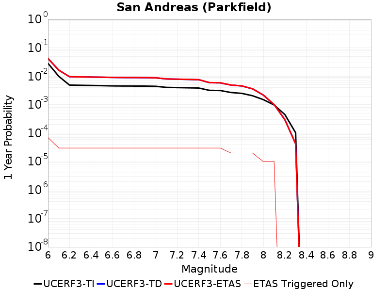 | 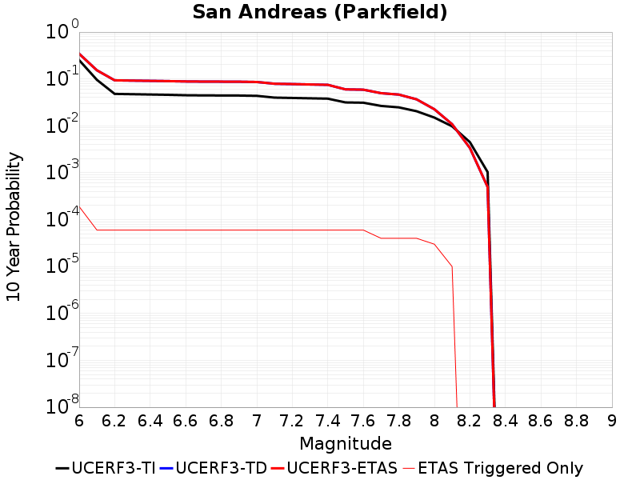 |

| Magnitude | 1 wk TI Prob | 1 wk TD Prob | 1 wk ETAS Prob | 1 wk ETAS/TD Gain | 1 wk ETAS Triggered Only | 1 mo TI Prob | 1 mo TD Prob | 1 mo ETAS Prob | 1 mo ETAS/TD Gain | 1 mo ETAS Triggered Only | 1 yr TI Prob | 1 yr TD Prob | 1 yr ETAS Prob | 1 yr ETAS/TD Gain | 1 yr ETAS Triggered Only | 10 yr TI Prob | 10 yr TD Prob | 10 yr ETAS Prob | 10 yr ETAS/TD Gain | 10 yr ETAS Triggered Only |
|-----|-----|-----|-----|-----|-----|-----|-----|-----|-----|-----|-----|-----|-----|-----|-----|-----|-----|-----|-----|-----|
| 6.0 | 5.556969E-4 | 8.2486455E-4 | 8.2486455E-4 | 1.0 | 0.0 | 0.0023793848 | 0.0035309785 | 0.0035309785 | 1.0 | 0.0 | 0.028586963 | 0.042370357 | 0.042437393 | 1.0015821 | 7.0E-5 | 0.25176284 | 0.34412807 | 0.34425268 | 1.0003622 | 1.9E-4 |
| 6.1 | 1.925858E-4 | 3.1600212E-4 | 3.1600212E-4 | 1.0 | 0.0 | 8.2510663E-4 | 0.0013537015 | 0.0013537015 | 1.0 | 0.0 | 0.0099994885 | 0.016425772 | 0.01645528 | 1.0017964 | 3.0E-5 | 0.095613256 | 0.15298522 | 0.15303604 | 1.0003322 | 6.0E-5 |
| 6.2 | 9.4306815E-5 | 1.8613963E-4 | 1.8613963E-4 | 1.0 | 0.0 | 4.0410945E-4 | 7.974986E-4 | 7.974986E-4 | 1.0 | 0.0 | 0.0049089384 | 0.0096665425 | 0.009696253 | 1.0030735 | 3.0E-5 | 0.048019063 | 0.093479864 | 0.09353426 | 1.0005819 | 6.0E-5 |
| 6.3 | 9.283051E-5 | 1.8308965E-4 | 1.8308965E-4 | 1.0 | 0.0 | 3.9778434E-4 | 7.844352E-4 | 7.844352E-4 | 1.0 | 0.0 | 0.0048322747 | 0.009508899 | 0.009538614 | 1.003125 | 3.0E-5 | 0.047285385 | 0.09213017 | 0.09218464 | 1.0005913 | 6.0E-5 |
| 6.4 | 9.138826E-5 | 1.806867E-4 | 1.806867E-4 | 1.0 | 0.0 | 3.916052E-4 | 7.74143E-4 | 7.74143E-4 | 1.0 | 0.0 | 0.0047573745 | 0.009384679 | 0.009414397 | 1.0031667 | 3.0E-5 | 0.046568092 | 0.09102595 | 0.09108049 | 1.0005991 | 6.0E-5 |
| 6.5 | 9.000255E-5 | 1.7824587E-4 | 1.7824587E-4 | 1.0 | 0.0 | 3.8566816E-4 | 7.636884E-4 | 7.636884E-4 | 1.0 | 0.0 | 0.0046854047 | 0.009258496 | 0.009288218 | 1.0032103 | 3.0E-5 | 0.045878403 | 0.089902274 | 0.08995688 | 1.0006074 | 6.0E-5 |
| 6.6 | 8.8109264E-5 | 1.750102E-4 | 1.750102E-4 | 1.0 | 0.0 | 3.7755648E-4 | 7.498293E-4 | 7.498293E-4 | 1.0 | 0.0 | 0.0045870654 | 0.009091191 | 0.009120919 | 1.0032699 | 3.0E-5 | 0.04493529 | 0.08841775 | 0.08847245 | 1.0006186 | 6.0E-5 |
| 6.7 | 8.738073E-5 | 1.7367082E-4 | 1.7367082E-4 | 1.0 | 0.0 | 3.7443507E-4 | 7.4409234E-4 | 7.4409234E-4 | 1.0 | 0.0 | 0.0045492216 | 0.009021957 | 0.009051687 | 1.0032952 | 3.0E-5 | 0.04457213 | 0.08781504 | 0.08786977 | 1.0006232 | 6.0E-5 |
| 6.8 | 8.710195E-5 | 1.7311762E-4 | 1.7311762E-4 | 1.0 | 0.0 | 3.7324068E-4 | 7.417229E-4 | 7.417229E-4 | 1.0 | 0.0 | 0.0045347405 | 0.0089933565 | 0.009023086 | 1.0033058 | 3.0E-5 | 0.04443313 | 0.087559655 | 0.087614395 | 1.0006253 | 6.0E-5 |
| 6.9 | 8.6801556E-5 | 1.725199E-4 | 1.725199E-4 | 1.0 | 0.0 | 3.7195362E-4 | 7.391627E-4 | 7.391627E-4 | 1.0 | 0.0 | 0.0045191357 | 0.008962443 | 0.008992174 | 1.0033174 | 3.0E-5 | 0.044283327 | 0.08728327 | 0.08733803 | 1.0006274 | 6.0E-5 |
| 7.0 | 8.5571606E-5 | 1.7001914E-4 | 1.7001914E-4 | 1.0 | 0.0 | 3.6668387E-4 | 7.284512E-4 | 7.284512E-4 | 1.0 | 0.0 | 0.004455241 | 0.0088330945 | 0.008862829 | 1.0033664 | 3.0E-5 | 0.043669727 | 0.08612159 | 0.08617642 | 1.0006367 | 6.0E-5 |
| 7.1 | 7.82589E-5 | 1.5469761E-4 | 1.5469761E-4 | 1.0 | 0.0 | 3.3535215E-4 | 6.6282204E-4 | 6.6282204E-4 | 1.0 | 0.0 | 0.0040752706 | 0.008040177 | 0.008069935 | 1.0037012 | 3.0E-5 | 0.040013418 | 0.078993075 | 0.079048336 | 1.0006995 | 6.0E-5 |
| 7.2 | 7.690929E-5 | 1.5204352E-4 | 1.5204352E-4 | 1.0 | 0.0 | 3.2956956E-4 | 6.514531E-4 | 6.514531E-4 | 1.0 | 0.0 | 0.004005129 | 0.007902771 | 0.007932534 | 1.0037662 | 3.0E-5 | 0.0393371 | 0.07775774 | 0.077813074 | 1.0007117 | 6.0E-5 |
| 7.3 | 7.5543794E-5 | 1.4896649E-4 | 1.4896649E-4 | 1.0 | 0.0 | 3.2371894E-4 | 6.382724E-4 | 6.382724E-4 | 1.0 | 0.0 | 0.003934157 | 0.0077434466 | 0.0077732145 | 1.0038443 | 3.0E-5 | 0.038652334 | 0.076304115 | 0.07635953 | 1.0007263 | 6.0E-5 |
| 7.4 | 7.4214564E-5 | 1.4593113E-4 | 1.4593113E-4 | 1.0 | 0.0 | 3.1802364E-4 | 6.2526995E-4 | 6.2526995E-4 | 1.0 | 0.0 | 0.003865065 | 0.007586255 | 0.0076160277 | 1.0039245 | 3.0E-5 | 0.03798529 | 0.07486174 | 0.07491725 | 1.0007415 | 6.0E-5 |
| 7.5 | 6.149578E-5 | 1.1475534E-4 | 1.1475534E-4 | 1.0 | 0.0 | 2.6352672E-4 | 4.91716E-4 | 4.91716E-4 | 1.0 | 0.0 | 0.0032037178 | 0.005970243 | 0.006000064 | 1.0049949 | 3.0E-5 | 0.03157923 | 0.05987081 | 0.059927218 | 1.0009421 | 6.0E-5 |
| 7.6 | 6.0643448E-5 | 1.1301593E-4 | 1.1301593E-4 | 1.0 | 0.0 | 2.598746E-4 | 4.842642E-4 | 4.842642E-4 | 1.0 | 0.0 | 0.0031593828 | 0.0058800103 | 0.005909834 | 1.005072 | 3.0E-5 | 0.031148417 | 0.05902192 | 0.05907838 | 1.0009565 | 6.0E-5 |
| 7.7 | 5.1652263E-5 | 9.428275E-5 | 9.428275E-5 | 1.0 | 0.0 | 2.2134806E-4 | 4.0400636E-4 | 4.0400636E-4 | 1.0 | 0.0 | 0.002691582 | 0.0049076946 | 0.0049275965 | 1.0040553 | 2.0E-5 | 0.026592141 | 0.049725797 | 0.04976381 | 1.0007644 | 4.0E-5 |
| 7.8 | 4.8090482E-5 | 8.793133E-5 | 8.793133E-5 | 1.0 | 0.0 | 2.060858E-4 | 3.7679417E-4 | 3.7679417E-4 | 1.0 | 0.0 | 0.0025062072 | 0.004577828 | 0.0045977365 | 1.0043489 | 2.0E-5 | 0.024781305 | 0.04640097 | 0.046439115 | 1.0008221 | 4.0E-5 |
| 7.9 | 3.970278E-5 | 6.932585E-5 | 6.932585E-5 | 1.0 | 0.0 | 1.7014367E-4 | 2.9707697E-4 | 2.9707697E-4 | 1.0 | 0.0 | 0.002069531 | 0.0036109174 | 0.003630845 | 1.0055188 | 2.0E-5 | 0.020503636 | 0.03675324 | 0.036791768 | 1.0010483 | 4.0E-5 |
| 8.0 | 2.8982335E-5 | 4.185899E-5 | 4.185899E-5 | 1.0 | 0.0 | 1.2420409E-4 | 1.7938335E-4 | 1.7938335E-4 | 1.0 | 0.0 | 0.0015111357 | 0.0021818061 | 0.0021917843 | 1.0045733 | 1.0E-5 | 0.015009012 | 0.022590166 | 0.02261949 | 1.0012981 | 3.0E-5 |
| 8.1 | 1.8836186E-5 | 1.9338062E-5 | 1.9338062E-5 | 1.0 | 0.0 | 8.0724014E-5 | 8.287477E-5 | 8.287477E-5 | 1.0 | 0.0 | 9.823717E-4 | 0.001008534 | 0.0010185239 | 1.0099053 | 1.0E-5 | 0.009780403 | 0.010832814 | 0.010842705 | 1.0009131 | 1.0E-5 |
| 8.2 | 8.643924E-6 | 5.725507E-6 | 5.725507E-6 | 1.0 | 0.0 | 3.704486E-5 | 2.4537656E-5 | 2.4537656E-5 | 1.0 | 0.0 | 4.5092785E-4 | 2.987051E-4 | 2.987051E-4 | 1.0 | 0.0 | 0.0045001395 | 0.0033857818 | 0.0033857818 | 1.0 | 0.0 |
| 8.3 | 1.983087E-6 | 8.077986E-7 | 8.077986E-7 | 1.0 | 0.0 | 8.498917E-6 | 3.4619893E-6 | 3.4619893E-6 | 1.0 | 0.0 | 1.034694E-4 | 4.2148924E-5 | 4.2148924E-5 | 1.0 | 0.0 | 0.0010342124 | 4.9595156E-4 | 4.9595156E-4 | 1.0 | 0.0 |

## Sierra Nevada  (No Extension)
*[(top)](#table-of-contents)*

| 1 Week | 1 Month | 1 Year | 10 Year |
|-----|-----|-----|-----|
| 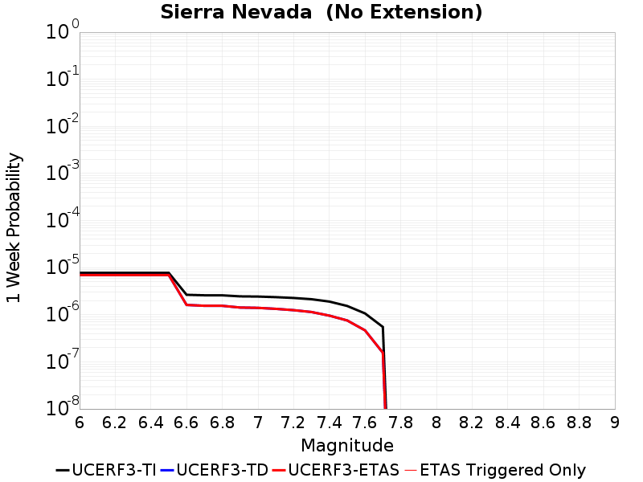 |  |  | 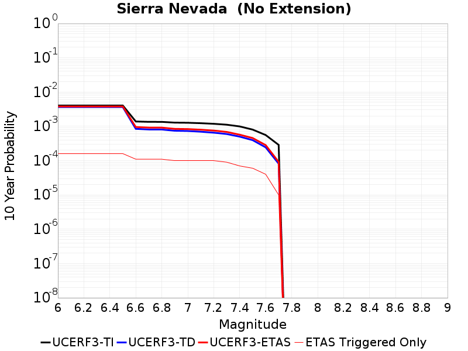 |

| Magnitude | 1 wk TI Prob | 1 wk TD Prob | 1 wk ETAS Prob | 1 wk ETAS/TD Gain | 1 wk ETAS Triggered Only | 1 mo TI Prob | 1 mo TD Prob | 1 mo ETAS Prob | 1 mo ETAS/TD Gain | 1 mo ETAS Triggered Only | 1 yr TI Prob | 1 yr TD Prob | 1 yr ETAS Prob | 1 yr ETAS/TD Gain | 1 yr ETAS Triggered Only | 10 yr TI Prob | 10 yr TD Prob | 10 yr ETAS Prob | 10 yr ETAS/TD Gain | 10 yr ETAS Triggered Only |
|-----|-----|-----|-----|-----|-----|-----|-----|-----|-----|-----|-----|-----|-----|-----|-----|-----|-----|-----|-----|-----|
| 6.0 | 7.7690465E-6 | 6.9792964E-6 | 6.9792964E-6 | 1.0 | 0.0 | 3.329549E-5 | 2.9911129E-5 | 2.9911129E-5 | 1.0 | 0.0 | 4.0529718E-4 | 3.6414302E-4 | 3.8413572E-4 | 1.0549035 | 2.0E-5 | 0.004045588 | 0.0036389816 | 0.0037983994 | 1.0438083 | 1.6E-4 |
| 6.1 | 7.7690465E-6 | 6.9792964E-6 | 6.9792964E-6 | 1.0 | 0.0 | 3.329549E-5 | 2.9911129E-5 | 2.9911129E-5 | 1.0 | 0.0 | 4.0529718E-4 | 3.6414302E-4 | 3.8413572E-4 | 1.0549035 | 2.0E-5 | 0.004045588 | 0.0036389816 | 0.0037983994 | 1.0438083 | 1.6E-4 |
| 6.2 | 7.7690465E-6 | 6.9792964E-6 | 6.9792964E-6 | 1.0 | 0.0 | 3.329549E-5 | 2.9911129E-5 | 2.9911129E-5 | 1.0 | 0.0 | 4.0529718E-4 | 3.6414302E-4 | 3.8413572E-4 | 1.0549035 | 2.0E-5 | 0.004045588 | 0.0036389816 | 0.0037983994 | 1.0438083 | 1.6E-4 |
| 6.3 | 7.7690465E-6 | 6.9792964E-6 | 6.9792964E-6 | 1.0 | 0.0 | 3.329549E-5 | 2.9911129E-5 | 2.9911129E-5 | 1.0 | 0.0 | 4.0529718E-4 | 3.6414302E-4 | 3.8413572E-4 | 1.0549035 | 2.0E-5 | 0.004045588 | 0.0036389816 | 0.0037983994 | 1.0438083 | 1.6E-4 |
| 6.4 | 7.7690465E-6 | 6.9792964E-6 | 6.9792964E-6 | 1.0 | 0.0 | 3.329549E-5 | 2.9911129E-5 | 2.9911129E-5 | 1.0 | 0.0 | 4.0529718E-4 | 3.6414302E-4 | 3.8413572E-4 | 1.0549035 | 2.0E-5 | 0.004045588 | 0.0036389816 | 0.0037983994 | 1.0438083 | 1.6E-4 |
| 6.5 | 7.7690465E-6 | 6.9792964E-6 | 6.9792964E-6 | 1.0 | 0.0 | 3.329549E-5 | 2.9911129E-5 | 2.9911129E-5 | 1.0 | 0.0 | 4.0529718E-4 | 3.6414302E-4 | 3.8413572E-4 | 1.0549035 | 2.0E-5 | 0.004045588 | 0.0036389816 | 0.0037983994 | 1.0438083 | 1.6E-4 |
| 6.6 | 2.653E-6 | 1.6161981E-6 | 1.6161981E-6 | 1.0 | 0.0 | 1.136995E-5 | 6.926545E-6 | 6.926545E-6 | 1.0 | 0.0 | 1.3842035E-4 | 8.432746E-5 | 8.432746E-5 | 1.0 | 0.0 | 0.0013833415 | 8.4295805E-4 | 9.528653E-4 | 1.1303829 | 1.1E-4 |
| 6.7 | 2.5902466E-6 | 1.5515192E-6 | 1.5515192E-6 | 1.0 | 0.0 | 1.11010095E-5 | 6.6493512E-6 | 6.6493512E-6 | 1.0 | 0.0 | 1.351464E-4 | 8.095287E-5 | 8.095287E-5 | 1.0 | 0.0 | 0.0013506424 | 8.092368E-4 | 9.191478E-4 | 1.1358205 | 1.1E-4 |
| 6.8 | 2.5853892E-6 | 1.5483134E-6 | 1.5483134E-6 | 1.0 | 0.0 | 1.1080193E-5 | 6.635612E-6 | 6.635612E-6 | 1.0 | 0.0 | 1.34893E-4 | 8.078561E-5 | 8.078561E-5 | 1.0 | 0.0 | 0.0013481114 | 8.075654E-4 | 9.174766E-4 | 1.1361018 | 1.1E-4 |
| 6.9 | 2.458257E-6 | 1.4233592E-6 | 1.4233592E-6 | 1.0 | 0.0 | 1.0535345E-5 | 6.1000965E-6 | 6.1000965E-6 | 1.0 | 0.0 | 1.2826028E-4 | 7.4266165E-5 | 7.4266165E-5 | 1.0 | 0.0 | 0.0012818627 | 7.4241543E-4 | 8.4234116E-4 | 1.1345955 | 1.0E-4 |
| 7.0 | 2.4341468E-6 | 1.4003092E-6 | 1.4003092E-6 | 1.0 | 0.0 | 1.0432016E-5 | 6.0013112E-6 | 6.0013112E-6 | 1.0 | 0.0 | 1.270024E-4 | 7.306354E-5 | 7.306354E-5 | 1.0 | 0.0 | 0.0012692984 | 7.3039706E-4 | 8.30324E-4 | 1.1368119 | 1.0E-4 |
| 7.1 | 2.3652476E-6 | 1.3352222E-6 | 1.3352222E-6 | 1.0 | 0.0 | 1.0136736E-5 | 5.7223688E-6 | 5.7223688E-6 | 1.0 | 0.0 | 1.2340778E-4 | 6.966763E-5 | 6.966763E-5 | 1.0 | 0.0 | 0.0012333926 | 6.964596E-4 | 7.9638994E-4 | 1.1434834 | 1.0E-4 |
| 7.2 | 2.272158E-6 | 1.2514831E-6 | 1.2514831E-6 | 1.0 | 0.0 | 9.737784E-6 | 5.3634885E-6 | 5.3634885E-6 | 1.0 | 0.0 | 1.1855107E-4 | 6.5298525E-5 | 6.5298525E-5 | 1.0 | 0.0 | 0.0011848784 | 6.527949E-4 | 7.5272965E-4 | 1.1530875 | 1.0E-4 |
| 7.3 | 2.1382127E-6 | 1.143126E-6 | 1.143126E-6 | 1.0 | 0.0 | 9.163737E-6 | 4.8991024E-6 | 4.8991024E-6 | 1.0 | 0.0 | 1.1156279E-4 | 5.964495E-5 | 5.964495E-5 | 1.0 | 0.0 | 0.001115068 | 5.962906E-4 | 6.8623695E-4 | 1.1508431 | 9.0E-5 |
| 7.4 | 1.9048055E-6 | 9.586123E-7 | 9.586123E-7 | 1.0 | 0.0 | 8.163426E-6 | 4.108332E-6 | 4.108332E-6 | 1.0 | 0.0 | 9.9385186E-5 | 5.0017803E-5 | 5.0017803E-5 | 1.0 | 0.0 | 9.934074E-4 | 5.0006615E-4 | 5.700311E-4 | 1.1399115 | 7.0E-5 |
| 7.5 | 1.5373403E-6 | 7.5692174E-7 | 7.5692174E-7 | 1.0 | 0.0 | 6.5885843E-6 | 3.2439461E-6 | 3.2439461E-6 | 1.0 | 0.0 | 8.021306E-5 | 3.9494334E-5 | 3.9494334E-5 | 1.0 | 0.0 | 8.0184115E-4 | 3.9487364E-4 | 4.5484994E-4 | 1.1518873 | 6.0E-5 |
| 7.6 | 1.0680322E-6 | 4.666152E-7 | 4.666152E-7 | 1.0 | 0.0 | 4.577273E-6 | 1.9997779E-6 | 1.9997779E-6 | 1.0 | 0.0 | 5.5726876E-5 | 2.4347026E-5 | 2.4347026E-5 | 1.0 | 0.0 | 5.5712904E-4 | 2.4344385E-4 | 2.834341E-4 | 1.164269 | 4.0E-5 |
| 7.7 | 5.509146E-7 | 1.5612933E-7 | 1.5612933E-7 | 1.0 | 0.0 | 2.3610605E-6 | 6.6912554E-7 | 6.6912554E-7 | 1.0 | 0.0 | 2.8745531E-5 | 8.146574E-6 | 8.146574E-6 | 1.0 | 0.0 | 2.8741814E-4 | 8.146287E-5 | 9.1462054E-5 | 1.1227453 | 1.0E-5 |

## San Andreas (Big Bend)
*[(top)](#table-of-contents)*

| 1 Week | 1 Month | 1 Year | 10 Year |
|-----|-----|-----|-----|
| 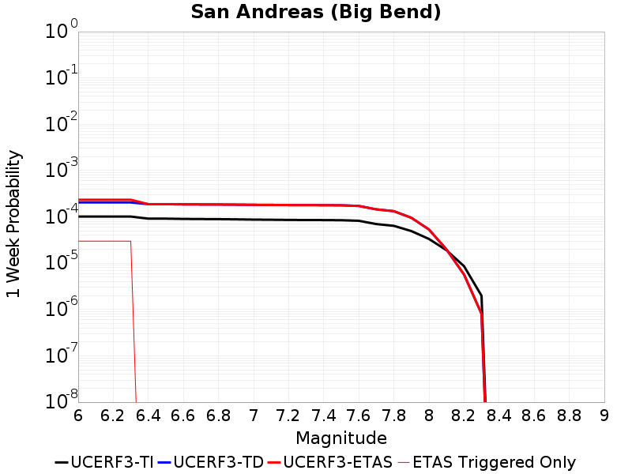 | 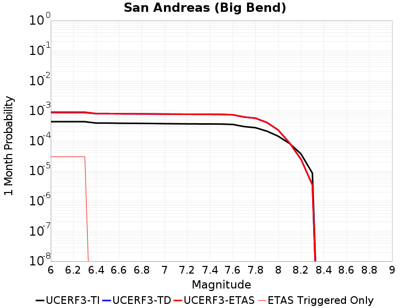 |  |  |

| Magnitude | 1 wk TI Prob | 1 wk TD Prob | 1 wk ETAS Prob | 1 wk ETAS/TD Gain | 1 wk ETAS Triggered Only | 1 mo TI Prob | 1 mo TD Prob | 1 mo ETAS Prob | 1 mo ETAS/TD Gain | 1 mo ETAS Triggered Only | 1 yr TI Prob | 1 yr TD Prob | 1 yr ETAS Prob | 1 yr ETAS/TD Gain | 1 yr ETAS Triggered Only | 10 yr TI Prob | 10 yr TD Prob | 10 yr ETAS Prob | 10 yr ETAS/TD Gain | 10 yr ETAS Triggered Only |
|-----|-----|-----|-----|-----|-----|-----|-----|-----|-----|-----|-----|-----|-----|-----|-----|-----|-----|-----|-----|-----|
| 6.0 | 1.0179969E-4 | 2.0484882E-4 | 2.3484266E-4 | 1.1464195 | 3.0E-5 | 4.362114E-4 | 8.7762915E-4 | 9.0760284E-4 | 1.034153 | 3.0E-5 | 0.0052979486 | 0.010633079 | 0.010712229 | 1.0074437 | 8.0E-5 | 0.051734097 | 0.10327723 | 0.103411734 | 1.0013024 | 1.5E-4 |
| 6.1 | 1.0179969E-4 | 2.0484882E-4 | 2.3484266E-4 | 1.1464195 | 3.0E-5 | 4.362114E-4 | 8.7762915E-4 | 9.0760284E-4 | 1.034153 | 3.0E-5 | 0.0052979486 | 0.010633079 | 0.010712229 | 1.0074437 | 8.0E-5 | 0.051734097 | 0.10327723 | 0.103411734 | 1.0013024 | 1.5E-4 |
| 6.2 | 1.0179969E-4 | 2.0484882E-4 | 2.3484266E-4 | 1.1464195 | 3.0E-5 | 4.362114E-4 | 8.7762915E-4 | 9.0760284E-4 | 1.034153 | 3.0E-5 | 0.0052979486 | 0.010633079 | 0.010712229 | 1.0074437 | 8.0E-5 | 0.051734097 | 0.10327723 | 0.103411734 | 1.0013024 | 1.5E-4 |
| 6.3 | 1.0179969E-4 | 2.0484882E-4 | 2.3484266E-4 | 1.1464195 | 3.0E-5 | 4.362114E-4 | 8.7762915E-4 | 9.0760284E-4 | 1.034153 | 3.0E-5 | 0.0052979486 | 0.010633079 | 0.010712229 | 1.0074437 | 8.0E-5 | 0.051734097 | 0.10327723 | 0.103411734 | 1.0013024 | 1.5E-4 |
| 6.4 | 9.1639464E-5 | 1.8834273E-4 | 1.8834273E-4 | 1.0 | 0.0 | 3.9268145E-4 | 8.069336E-4 | 8.069336E-4 | 1.0 | 0.0 | 0.0047704205 | 0.009780287 | 0.009829798 | 1.0050623 | 5.0E-5 | 0.046693064 | 0.0955438 | 0.09564329 | 1.0010413 | 1.1E-4 |
| 6.5 | 9.1639464E-5 | 1.8834273E-4 | 1.8834273E-4 | 1.0 | 0.0 | 3.9268145E-4 | 8.069336E-4 | 8.069336E-4 | 1.0 | 0.0 | 0.0047704205 | 0.009780287 | 0.009829798 | 1.0050623 | 5.0E-5 | 0.046693064 | 0.0955438 | 0.09564329 | 1.0010413 | 1.1E-4 |
| 6.6 | 9.042622E-5 | 1.8640338E-4 | 1.8640338E-4 | 1.0 | 0.0 | 3.8748336E-4 | 7.9862727E-4 | 7.9862727E-4 | 1.0 | 0.0 | 0.0047074095 | 0.009680058 | 0.009719671 | 1.0040922 | 4.0E-5 | 0.046089325 | 0.094638385 | 0.09472892 | 1.0009567 | 1.0E-4 |
| 6.7 | 8.9836685E-5 | 1.855434E-4 | 1.855434E-4 | 1.0 | 0.0 | 3.8495753E-4 | 7.9494383E-4 | 7.9494383E-4 | 1.0 | 0.0 | 0.00467679 | 0.009635609 | 0.00966532 | 1.0030835 | 3.0E-5 | 0.045795817 | 0.09423187 | 0.09431338 | 1.0008651 | 9.0E-5 |
| 6.8 | 8.9471854E-5 | 1.8500733E-4 | 1.8500733E-4 | 1.0 | 0.0 | 3.8339442E-4 | 7.926479E-4 | 7.926479E-4 | 1.0 | 0.0 | 0.004657841 | 0.009607902 | 0.009637614 | 1.0030924 | 3.0E-5 | 0.04561414 | 0.09397828 | 0.09405982 | 1.0008677 | 9.0E-5 |
| 6.9 | 8.858234E-5 | 1.838205E-4 | 1.838205E-4 | 1.0 | 0.0 | 3.7958333E-4 | 7.875645E-4 | 7.875645E-4 | 1.0 | 0.0 | 0.004611638 | 0.009546556 | 0.009576269 | 1.0031124 | 3.0E-5 | 0.04517103 | 0.09341683 | 0.09349843 | 1.0008734 | 9.0E-5 |
| 7.0 | 8.7433385E-5 | 1.821985E-4 | 1.821985E-4 | 1.0 | 0.0 | 3.746607E-4 | 7.806173E-4 | 7.806173E-4 | 1.0 | 0.0 | 0.004551957 | 0.0094627105 | 0.009492427 | 1.0031403 | 3.0E-5 | 0.044598386 | 0.09264792 | 0.092729576 | 1.0008814 | 9.0E-5 |
| 7.1 | 8.684964E-5 | 1.8131173E-4 | 1.8131173E-4 | 1.0 | 0.0 | 3.7215967E-4 | 7.7681907E-4 | 7.7681907E-4 | 1.0 | 0.0 | 0.0045216335 | 0.009416868 | 0.009446586 | 1.0031558 | 3.0E-5 | 0.04430731 | 0.09222735 | 0.09230904 | 1.0008858 | 9.0E-5 |
| 7.2 | 8.606521E-5 | 1.8021153E-4 | 1.8021153E-4 | 1.0 | 0.0 | 3.6879873E-4 | 7.721067E-4 | 7.721067E-4 | 1.0 | 0.0 | 0.0044808835 | 0.009359989 | 0.009389709 | 1.0031751 | 3.0E-5 | 0.043916024 | 0.09170604 | 0.091787785 | 1.0008914 | 9.0E-5 |
| 7.3 | 8.568266E-5 | 1.7962411E-4 | 1.7962411E-4 | 1.0 | 0.0 | 3.6715972E-4 | 7.695907E-4 | 7.695907E-4 | 1.0 | 0.0 | 0.0044610105 | 0.00932962 | 0.00935934 | 1.0031855 | 3.0E-5 | 0.043725148 | 0.09142451 | 0.09150628 | 1.0008944 | 9.0E-5 |
| 7.4 | 8.5432206E-5 | 1.792452E-4 | 1.792452E-4 | 1.0 | 0.0 | 3.6608664E-4 | 7.679677E-4 | 7.679677E-4 | 1.0 | 0.0 | 0.004447999 | 0.009310029 | 0.00933975 | 1.0031923 | 3.0E-5 | 0.043600157 | 0.09124279 | 0.09131549 | 1.0007968 | 8.0E-5 |
| 7.5 | 8.4791965E-5 | 1.7792212E-4 | 1.7792212E-4 | 1.0 | 0.0 | 3.633435E-4 | 7.6230074E-4 | 7.6230074E-4 | 1.0 | 0.0 | 0.0044147377 | 0.009241621 | 0.009271344 | 1.0032161 | 3.0E-5 | 0.043280575 | 0.09061601 | 0.090688765 | 1.0008029 | 8.0E-5 |
| 7.6 | 8.241105E-5 | 1.7231035E-4 | 1.7231035E-4 | 1.0 | 0.0 | 3.531424E-4 | 7.382641E-4 | 7.382641E-4 | 1.0 | 0.0 | 0.0042910352 | 0.008951416 | 0.008981148 | 1.0033214 | 3.0E-5 | 0.042091176 | 0.087974004 | 0.08804697 | 1.0008293 | 8.0E-5 |
| 7.7 | 7.00432E-5 | 1.4557448E-4 | 1.4557448E-4 | 1.0 | 0.0 | 3.001506E-4 | 6.237415E-4 | 6.237415E-4 | 1.0 | 0.0 | 0.0036482112 | 0.0075676534 | 0.007587502 | 1.0026228 | 2.0E-5 | 0.035888977 | 0.07510646 | 0.07516195 | 1.0007389 | 6.0E-5 |
| 7.8 | 6.415362E-5 | 1.3287459E-4 | 1.3287459E-4 | 1.0 | 0.0 | 2.749151E-4 | 5.6933827E-4 | 5.6933827E-4 | 1.0 | 0.0 | 0.0033419547 | 0.006909695 | 0.006929557 | 1.0028745 | 2.0E-5 | 0.03292141 | 0.06869707 | 0.06875295 | 1.0008134 | 6.0E-5 |
| 7.9 | 4.939911E-5 | 9.570533E-5 | 9.570533E-5 | 1.0 | 0.0 | 2.116933E-4 | 4.101012E-4 | 4.101012E-4 | 1.0 | 0.0 | 0.0025743195 | 0.004981561 | 0.0050014616 | 1.0039948 | 2.0E-5 | 0.025447013 | 0.049989615 | 0.050027616 | 1.0007602 | 4.0E-5 |
| 8.0 | 3.344983E-5 | 5.3599764E-5 | 5.3599764E-5 | 1.0 | 0.0 | 1.4334853E-4 | 2.2969306E-4 | 2.2969306E-4 | 1.0 | 0.0 | 0.0017438711 | 0.0027929286 | 0.0028029007 | 1.0035704 | 1.0E-5 | 0.017302496 | 0.02859682 | 0.028625963 | 1.0010191 | 3.0E-5 |
| 8.1 | 1.9104898E-5 | 1.9840516E-5 | 1.9840516E-5 | 1.0 | 0.0 | 8.1875565E-5 | 8.502801E-5 | 8.502801E-5 | 1.0 | 0.0 | 9.963791E-4 | 0.0010347251 | 0.0010447147 | 1.0096544 | 1.0E-5 | 0.009919235 | 0.011099832 | 0.011109721 | 1.000891 | 1.0E-5 |
| 8.2 | 8.643924E-6 | 5.725507E-6 | 5.725507E-6 | 1.0 | 0.0 | 3.704486E-5 | 2.4537656E-5 | 2.4537656E-5 | 1.0 | 0.0 | 4.5092785E-4 | 2.987051E-4 | 2.987051E-4 | 1.0 | 0.0 | 0.0045001395 | 0.0033857818 | 0.0033857818 | 1.0 | 0.0 |
| 8.3 | 1.983087E-6 | 8.077986E-7 | 8.077986E-7 | 1.0 | 0.0 | 8.498917E-6 | 3.4619893E-6 | 3.4619893E-6 | 1.0 | 0.0 | 1.034694E-4 | 4.2148924E-5 | 4.2148924E-5 | 1.0 | 0.0 | 0.0010342124 | 4.9595156E-4 | 4.9595156E-4 | 1.0 | 0.0 |

## Red Pass
*[(top)](#table-of-contents)*

| 1 Week | 1 Month | 1 Year | 10 Year |
|-----|-----|-----|-----|
|  | 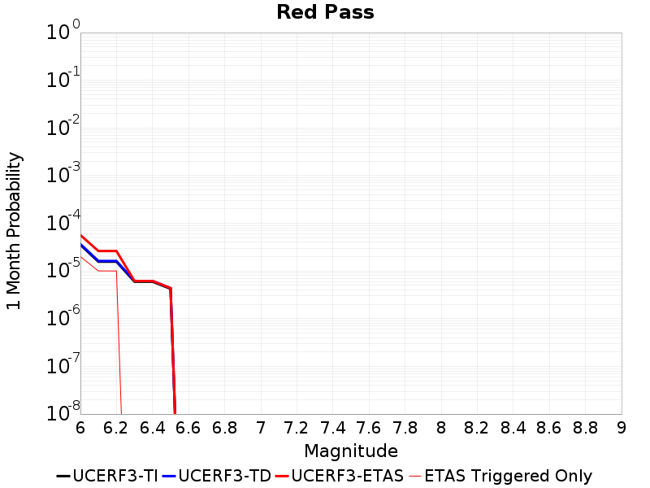 |  |  |

| Magnitude | 1 wk TI Prob | 1 wk TD Prob | 1 wk ETAS Prob | 1 wk ETAS/TD Gain | 1 wk ETAS Triggered Only | 1 mo TI Prob | 1 mo TD Prob | 1 mo ETAS Prob | 1 mo ETAS/TD Gain | 1 mo ETAS Triggered Only | 1 yr TI Prob | 1 yr TD Prob | 1 yr ETAS Prob | 1 yr ETAS/TD Gain | 1 yr ETAS Triggered Only | 10 yr TI Prob | 10 yr TD Prob | 10 yr ETAS Prob | 10 yr ETAS/TD Gain | 10 yr ETAS Triggered Only |
|-----|-----|-----|-----|-----|-----|-----|-----|-----|-----|-----|-----|-----|-----|-----|-----|-----|-----|-----|-----|-----|
| 6.0 | 8.258278E-6 | 8.553188E-6 | 1.8553103E-5 | 2.1691446 | 1.0E-5 | 3.539214E-5 | 3.6656107E-5 | 5.665537E-5 | 1.5455917 | 2.0E-5 | 4.308141E-4 | 4.4621457E-4 | 4.9619225E-4 | 1.1120037 | 5.0E-5 | 0.0042997985 | 0.0044549447 | 0.004594321 | 1.0312858 | 1.4E-4 |
| 6.1 | 3.649988E-6 | 3.7761379E-6 | 1.37761E-5 | 3.6481984 | 1.0E-5 | 1.5642712E-5 | 1.6183374E-5 | 2.6183212E-5 | 1.6179081 | 1.0E-5 | 1.9043336E-4 | 1.9701953E-4 | 2.3701166E-4 | 1.2029855 | 4.0E-5 | 0.0019027026 | 0.0019689163 | 0.0020687194 | 1.0506893 | 1.0E-4 |
| 6.2 | 3.649988E-6 | 3.7761379E-6 | 1.37761E-5 | 3.6481984 | 1.0E-5 | 1.5642712E-5 | 1.6183374E-5 | 2.6183212E-5 | 1.6179081 | 1.0E-5 | 1.9043336E-4 | 1.9701953E-4 | 2.3701166E-4 | 1.2029855 | 4.0E-5 | 0.0019027026 | 0.0019689163 | 0.0020687194 | 1.0506893 | 1.0E-4 |
| 6.3 | 1.3924937E-6 | 1.4414356E-6 | 1.4414356E-6 | 1.0 | 0.0 | 5.9678164E-6 | 6.1775745E-6 | 6.1775745E-6 | 1.0 | 0.0 | 7.265574E-5 | 7.521079E-5 | 8.5210035E-5 | 1.1329496 | 1.0E-5 | 7.263199E-4 | 7.5199216E-4 | 8.019546E-4 | 1.0664401 | 5.0E-5 |
| 6.4 | 1.3924937E-6 | 1.4414356E-6 | 1.4414356E-6 | 1.0 | 0.0 | 5.9678164E-6 | 6.1775745E-6 | 6.1775745E-6 | 1.0 | 0.0 | 7.265574E-5 | 7.521079E-5 | 8.5210035E-5 | 1.1329496 | 1.0E-5 | 7.263199E-4 | 7.5199216E-4 | 8.019546E-4 | 1.0664401 | 5.0E-5 |
| 6.5 | 9.876812E-7 | 1.0224176E-6 | 1.0224176E-6 | 1.0 | 0.0 | 4.2329125E-6 | 4.38179E-6 | 4.38179E-6 | 1.0 | 0.0 | 5.153449E-5 | 5.334829E-5 | 5.334829E-5 | 1.0 | 0.0 | 5.1522546E-4 | 5.3348293E-4 | 5.634669E-4 | 1.0562042 | 3.0E-5 |

## Cady
*[(top)](#table-of-contents)*

| 1 Week | 1 Month | 1 Year | 10 Year |
|-----|-----|-----|-----|
| 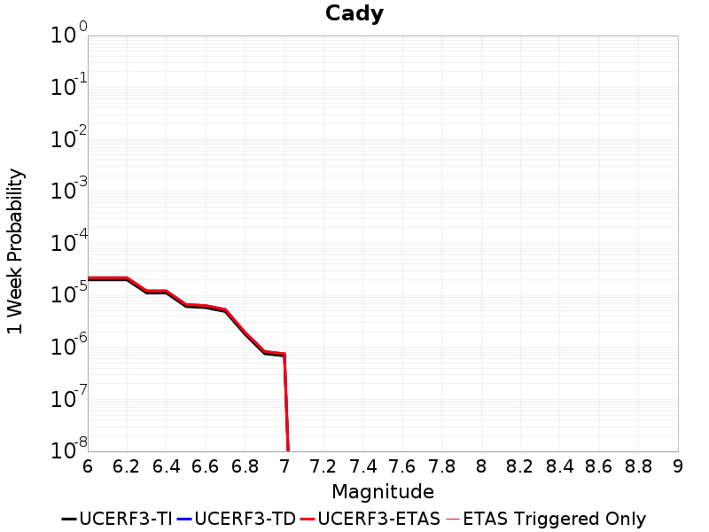 |  | 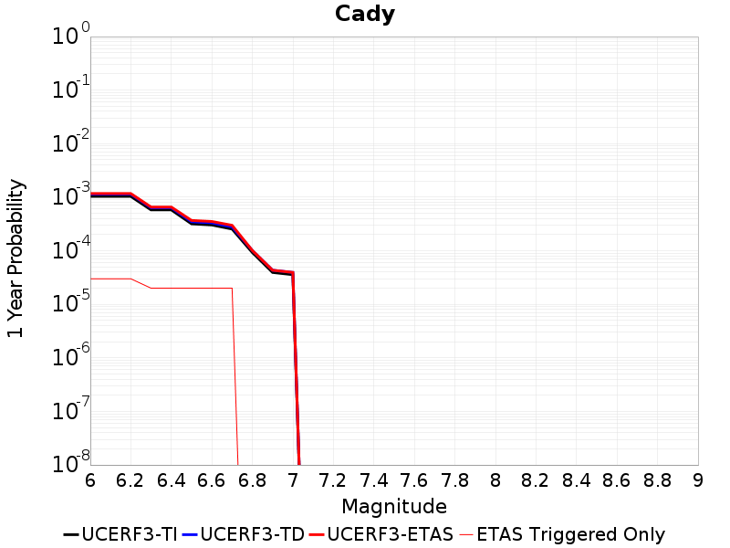 |  |

| Magnitude | 1 wk TI Prob | 1 wk TD Prob | 1 wk ETAS Prob | 1 wk ETAS/TD Gain | 1 wk ETAS Triggered Only | 1 mo TI Prob | 1 mo TD Prob | 1 mo ETAS Prob | 1 mo ETAS/TD Gain | 1 mo ETAS Triggered Only | 1 yr TI Prob | 1 yr TD Prob | 1 yr ETAS Prob | 1 yr ETAS/TD Gain | 1 yr ETAS Triggered Only | 10 yr TI Prob | 10 yr TD Prob | 10 yr ETAS Prob | 10 yr ETAS/TD Gain | 10 yr ETAS Triggered Only |
|-----|-----|-----|-----|-----|-----|-----|-----|-----|-----|-----|-----|-----|-----|-----|-----|-----|-----|-----|-----|-----|
| 6.0 | 1.9892565E-5 | 2.187244E-5 | 2.187244E-5 | 1.0 | 0.0 | 8.525106E-5 | 9.373617E-5 | 9.373617E-5 | 1.0 | 0.0 | 0.0010374374 | 0.0011407314 | 0.0011706972 | 1.026269 | 3.0E-5 | 0.010326075 | 0.011357786 | 0.011476424 | 1.0104455 | 1.2E-4 |
| 6.1 | 1.9892565E-5 | 2.187244E-5 | 2.187244E-5 | 1.0 | 0.0 | 8.525106E-5 | 9.373617E-5 | 9.373617E-5 | 1.0 | 0.0 | 0.0010374374 | 0.0011407314 | 0.0011706972 | 1.026269 | 3.0E-5 | 0.010326075 | 0.011357786 | 0.011476424 | 1.0104455 | 1.2E-4 |
| 6.2 | 1.9892565E-5 | 2.187244E-5 | 2.187244E-5 | 1.0 | 0.0 | 8.525106E-5 | 9.373617E-5 | 9.373617E-5 | 1.0 | 0.0 | 0.0010374374 | 0.0011407314 | 0.0011706972 | 1.026269 | 3.0E-5 | 0.010326075 | 0.011357786 | 0.011476424 | 1.0104455 | 1.2E-4 |
| 6.3 | 1.1117327E-5 | 1.2183946E-5 | 1.2183946E-5 | 1.0 | 0.0 | 4.764482E-5 | 5.221604E-5 | 5.221604E-5 | 1.0 | 0.0 | 5.7992124E-4 | 6.3557643E-4 | 6.555637E-4 | 1.0314475 | 2.0E-5 | 0.0057841022 | 0.0063406965 | 0.006430126 | 1.014104 | 9.0E-5 |
| 6.4 | 1.1117327E-5 | 1.2183946E-5 | 1.2183946E-5 | 1.0 | 0.0 | 4.764482E-5 | 5.221604E-5 | 5.221604E-5 | 1.0 | 0.0 | 5.7992124E-4 | 6.3557643E-4 | 6.555637E-4 | 1.0314475 | 2.0E-5 | 0.0057841022 | 0.0063406965 | 0.006430126 | 1.014104 | 9.0E-5 |
| 6.5 | 6.103093E-6 | 6.6759685E-6 | 6.6759685E-6 | 1.0 | 0.0 | 2.615585E-5 | 2.861105E-5 | 2.861105E-5 | 1.0 | 0.0 | 3.1840094E-4 | 3.4829642E-4 | 3.6828947E-4 | 1.0574024 | 2.0E-5 | 0.0031794512 | 0.003478741 | 0.0035484976 | 1.0200522 | 7.0E-5 |
| 6.6 | 5.817237E-6 | 6.369467E-6 | 6.369467E-6 | 1.0 | 0.0 | 2.4930776E-5 | 2.72975E-5 | 2.72975E-5 | 1.0 | 0.0 | 3.034899E-4 | 3.3230885E-4 | 3.523022E-4 | 1.0601649 | 2.0E-5 | 0.0030307577 | 0.0033193429 | 0.0033891103 | 1.0210185 | 7.0E-5 |
| 6.7 | 4.8846314E-6 | 5.3437316E-6 | 5.3437316E-6 | 1.0 | 0.0 | 2.0933967E-5 | 2.2901573E-5 | 2.2901573E-5 | 1.0 | 0.0 | 2.5484123E-4 | 2.7880276E-4 | 2.9879718E-4 | 1.0717154 | 2.0E-5 | 0.0025454918 | 0.0027856869 | 0.0028455197 | 1.0214787 | 6.0E-5 |
| 6.8 | 1.7788773E-6 | 1.9410224E-6 | 1.9410224E-6 | 1.0 | 0.0 | 7.6237375E-6 | 8.31865E-6 | 8.31865E-6 | 1.0 | 0.0 | 9.281505E-5 | 1.0127643E-4 | 1.0127643E-4 | 1.0 | 0.0 | 9.2776294E-4 | 0.0010124575 | 0.0010224475 | 1.009867 | 1.0E-5 |
| 6.9 | 7.5455404E-7 | 8.302333E-7 | 8.302333E-7 | 1.0 | 0.0 | 3.233799E-6 | 3.55814E-6 | 3.55814E-6 | 1.0 | 0.0 | 3.937079E-5 | 4.331983E-5 | 4.331983E-5 | 1.0 | 0.0 | 3.9363815E-4 | 4.3314684E-4 | 4.3314684E-4 | 1.0 | 0.0 |
| 7.0 | 6.8578805E-7 | 7.5465863E-7 | 7.5465863E-7 | 1.0 | 0.0 | 2.9390883E-6 | 3.234249E-6 | 3.234249E-6 | 1.0 | 0.0 | 3.578281E-5 | 3.9376602E-5 | 3.9376602E-5 | 1.0 | 0.0 | 3.577705E-4 | 3.9372878E-4 | 3.9372878E-4 | 1.0 | 0.0 |

## Death Valley (Fish Lake Valley)
*[(top)](#table-of-contents)*

| 1 Week | 1 Month | 1 Year | 10 Year |
|-----|-----|-----|-----|
| 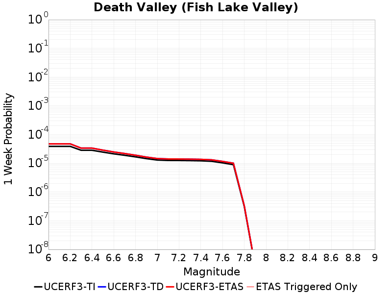 | 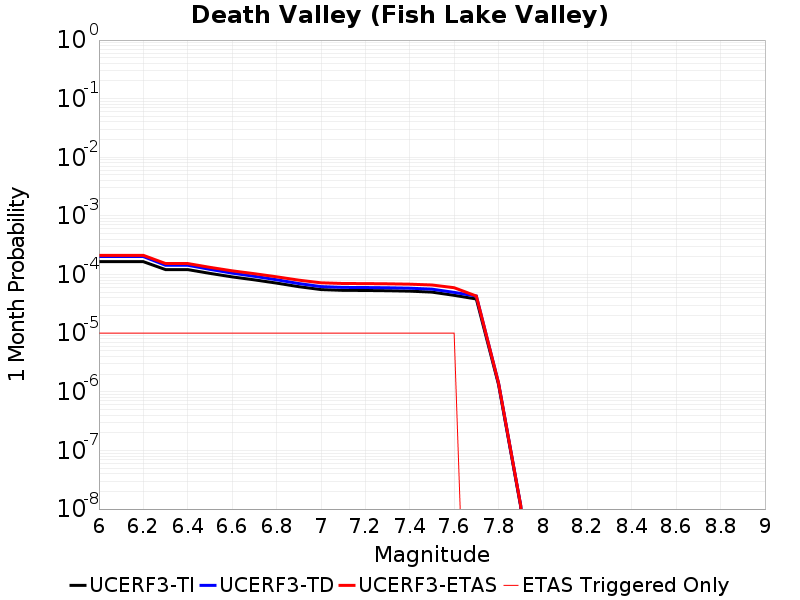 | 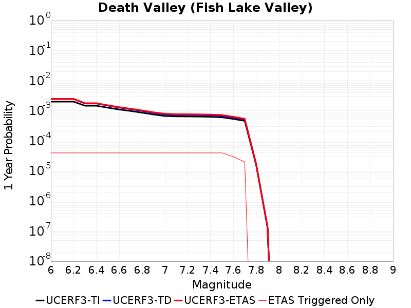 |  |

| Magnitude | 1 wk TI Prob | 1 wk TD Prob | 1 wk ETAS Prob | 1 wk ETAS/TD Gain | 1 wk ETAS Triggered Only | 1 mo TI Prob | 1 mo TD Prob | 1 mo ETAS Prob | 1 mo ETAS/TD Gain | 1 mo ETAS Triggered Only | 1 yr TI Prob | 1 yr TD Prob | 1 yr ETAS Prob | 1 yr ETAS/TD Gain | 1 yr ETAS Triggered Only | 10 yr TI Prob | 10 yr TD Prob | 10 yr ETAS Prob | 10 yr ETAS/TD Gain | 10 yr ETAS Triggered Only |
|-----|-----|-----|-----|-----|-----|-----|-----|-----|-----|-----|-----|-----|-----|-----|-----|-----|-----|-----|-----|-----|
| 6.0 | 3.872328E-5 | 4.733209E-5 | 4.733209E-5 | 1.0 | 0.0 | 1.6594635E-4 | 2.0283775E-4 | 2.1283572E-4 | 1.0492905 | 1.0E-5 | 0.0020185246 | 0.002467014 | 0.002506915 | 1.016174 | 4.0E-5 | 0.02000288 | 0.024422014 | 0.02454884 | 1.0051931 | 1.3E-4 |
| 6.1 | 3.872328E-5 | 4.733209E-5 | 4.733209E-5 | 1.0 | 0.0 | 1.6594635E-4 | 2.0283775E-4 | 2.1283572E-4 | 1.0492905 | 1.0E-5 | 0.0020185246 | 0.002467014 | 0.002506915 | 1.016174 | 4.0E-5 | 0.02000288 | 0.024422014 | 0.02454884 | 1.0051931 | 1.3E-4 |
| 6.2 | 3.872328E-5 | 4.733209E-5 | 4.733209E-5 | 1.0 | 0.0 | 1.6594635E-4 | 2.0283775E-4 | 2.1283572E-4 | 1.0492905 | 1.0E-5 | 0.0020185246 | 0.002467014 | 0.002506915 | 1.016174 | 4.0E-5 | 0.02000288 | 0.024422014 | 0.02454884 | 1.0051931 | 1.3E-4 |
| 6.3 | 2.8356371E-5 | 3.3649736E-5 | 3.3649736E-5 | 1.0 | 0.0 | 1.2152165E-4 | 1.4420564E-4 | 1.542042E-4 | 1.0693355 | 1.0E-5 | 0.0014785219 | 0.0017543593 | 0.0017942892 | 1.0227604 | 4.0E-5 | 0.014687235 | 0.017412268 | 0.017540004 | 1.007336 | 1.3E-4 |
| 6.4 | 2.8356371E-5 | 3.3649736E-5 | 3.3649736E-5 | 1.0 | 0.0 | 1.2152165E-4 | 1.4420564E-4 | 1.542042E-4 | 1.0693355 | 1.0E-5 | 0.0014785219 | 0.0017543593 | 0.0017942892 | 1.0227604 | 4.0E-5 | 0.014687235 | 0.017412268 | 0.017540004 | 1.007336 | 1.3E-4 |
| 6.5 | 2.4448687E-5 | 2.8638842E-5 | 2.8638842E-5 | 1.0 | 0.0 | 1.0477588E-4 | 1.2273241E-4 | 1.3273118E-4 | 1.0814681 | 1.0E-5 | 0.0012748998 | 0.0014932895 | 0.0015332297 | 1.0267465 | 4.0E-5 | 0.012676105 | 0.014837445 | 0.014965516 | 1.0086316 | 1.3E-4 |
| 6.6 | 2.1298161E-5 | 2.468505E-5 | 2.468505E-5 | 1.0 | 0.0 | 9.127464E-5 | 1.05788975E-4 | 1.15787916E-4 | 1.0945178 | 1.0E-5 | 0.0011107022 | 0.0012872528 | 0.0013272014 | 1.0310339 | 4.0E-5 | 0.011051672 | 0.012801398 | 0.012929734 | 1.0100251 | 1.3E-4 |
| 6.7 | 1.8959729E-5 | 2.18018E-5 | 2.18018E-5 | 1.0 | 0.0 | 8.125345E-5 | 9.343308E-5 | 1.0343215E-4 | 1.1070185 | 1.0E-5 | 9.888117E-4 | 0.0011369798 | 0.0011769343 | 1.0351409 | 4.0E-5 | 0.009844234 | 0.011314293 | 0.011442822 | 1.0113599 | 1.3E-4 |
| 6.8 | 1.6691629E-5 | 1.9035298E-5 | 1.9035298E-5 | 1.0 | 0.0 | 7.153359E-5 | 8.15774E-5 | 9.1576585E-5 | 1.122573 | 1.0E-5 | 8.7057345E-4 | 9.927691E-4 | 0.0010327294 | 1.0402514 | 4.0E-5 | 0.008671708 | 0.009885103 | 0.010013818 | 1.0130211 | 1.3E-4 |
| 6.9 | 1.450505E-5 | 1.6403112E-5 | 1.6403112E-5 | 1.0 | 0.0 | 6.216302E-5 | 7.02972E-5 | 8.02965E-5 | 1.1422431 | 1.0E-5 | 7.5657194E-4 | 8.555412E-4 | 8.95507E-4 | 1.0467141 | 4.0E-5 | 0.007540013 | 0.008523409 | 0.008652301 | 1.015122 | 1.3E-4 |
| 7.0 | 1.2940855E-5 | 1.4549384E-5 | 1.4549384E-5 | 1.0 | 0.0 | 5.545963E-5 | 6.235304E-5 | 7.235242E-5 | 1.1603671 | 1.0E-5 | 6.750118E-4 | 7.588897E-4 | 7.988594E-4 | 1.0526686 | 4.0E-5 | 0.006729651 | 0.007563601 | 0.0076926174 | 1.0170575 | 1.3E-4 |
| 7.1 | 1.2544658E-5 | 1.4089152E-5 | 1.4089152E-5 | 1.0 | 0.0 | 5.3761712E-5 | 6.0380713E-5 | 7.038011E-5 | 1.1656058 | 1.0E-5 | 6.5435225E-4 | 7.3489285E-4 | 7.7486347E-4 | 1.0543897 | 4.0E-5 | 0.006524288 | 0.007325221 | 0.007454268 | 1.0176169 | 1.3E-4 |
| 7.2 | 1.2489416E-5 | 1.4026566E-5 | 1.4026566E-5 | 1.0 | 0.0 | 5.3524967E-5 | 6.01125E-5 | 7.01119E-5 | 1.1663448 | 1.0E-5 | 6.514716E-4 | 7.3162955E-4 | 7.716003E-4 | 1.0546324 | 4.0E-5 | 0.006495651 | 0.0072928024 | 0.0074218544 | 1.0176958 | 1.3E-4 |
| 7.3 | 1.2368307E-5 | 1.3890598E-5 | 1.3890598E-5 | 1.0 | 0.0 | 5.3005948E-5 | 5.9529808E-5 | 6.952921E-5 | 1.167973 | 1.0E-5 | 6.451563E-4 | 7.2454E-4 | 7.64511E-4 | 1.0551674 | 4.0E-5 | 0.0064328653 | 0.00722237 | 0.007351431 | 1.0178696 | 1.3E-4 |
| 7.4 | 1.2161707E-5 | 1.3658471E-5 | 1.3658471E-5 | 1.0 | 0.0 | 5.212056E-5 | 5.8535024E-5 | 6.8534435E-5 | 1.1708279 | 1.0E-5 | 6.3438306E-4 | 7.124365E-4 | 7.52408E-4 | 1.0561054 | 4.0E-5 | 0.006325751 | 0.007102115 | 0.0072311917 | 1.0181744 | 1.3E-4 |
| 7.5 | 1.1707948E-5 | 1.3155773E-5 | 1.3155773E-5 | 1.0 | 0.0 | 5.0175953E-5 | 5.6380693E-5 | 6.638013E-5 | 1.1773556 | 1.0E-5 | 6.10721E-4 | 6.862244E-4 | 7.261969E-4 | 1.05825 | 4.0E-5 | 0.0060904534 | 0.0068416377 | 0.0069707483 | 1.0188713 | 1.3E-4 |
| 7.6 | 1.0319538E-5 | 1.1588603E-5 | 1.1588603E-5 | 1.0 | 0.0 | 4.4225842E-5 | 4.9664526E-5 | 5.9664028E-5 | 1.2013409 | 1.0E-5 | 5.383166E-4 | 6.0450303E-4 | 6.3448487E-4 | 1.0495975 | 3.0E-5 | 0.0053701443 | 0.0060291192 | 0.0061483956 | 1.0197834 | 1.2E-4 |
| 7.7 | 8.937764E-6 | 1.0030509E-5 | 1.0030509E-5 | 1.0 | 0.0 | 3.830414E-5 | 4.2987213E-5 | 4.2987213E-5 | 1.0 | 0.0 | 4.6625308E-4 | 5.232487E-4 | 5.4323825E-4 | 1.0382028 | 2.0E-5 | 0.0046527605 | 0.0052206772 | 0.005310207 | 1.0171491 | 9.0E-5 |
| 7.8 | 3.108007E-7 | 3.2858435E-7 | 3.2858435E-7 | 1.0 | 0.0 | 1.3320023E-6 | 1.4082179E-6 | 1.4082179E-6 | 1.0 | 0.0 | 1.6217007E-5 | 1.7144921E-5 | 1.7144921E-5 | 1.0 | 0.0 | 1.6215823E-4 | 1.7143638E-4 | 1.7143638E-4 | 1.0 | 0.0 |
| 7.9 | 2.5591178E-9 | 2.670403E-9 | 2.670403E-9 | 1.0 | 0.0 | 1.0967647E-8 | 1.1444584E-8 | 1.1444584E-8 | 1.0 | 0.0 | 1.335311E-7 | 1.3933781E-7 | 1.3933781E-7 | 1.0 | 0.0 | 1.3353102E-6 | 1.393378E-6 | 1.393378E-6 | 1.0 | 0.0 |

## Ludlow
*[(top)](#table-of-contents)*

| 1 Week | 1 Month | 1 Year | 10 Year |
|-----|-----|-----|-----|
|  | 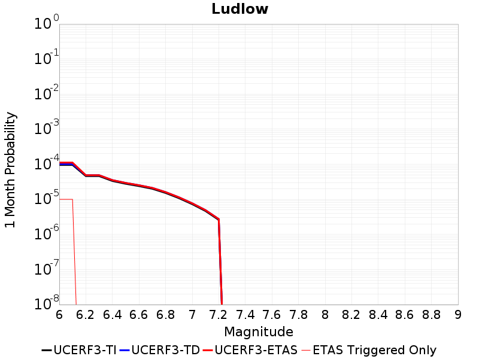 | 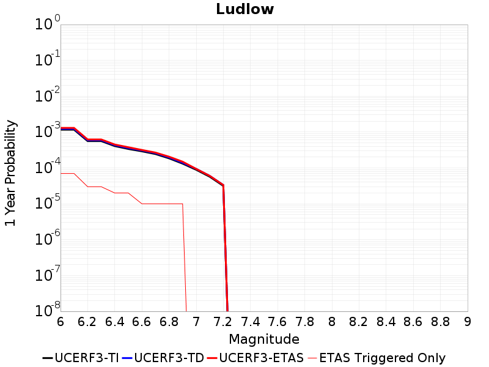 |  |

| Magnitude | 1 wk TI Prob | 1 wk TD Prob | 1 wk ETAS Prob | 1 wk ETAS/TD Gain | 1 wk ETAS Triggered Only | 1 mo TI Prob | 1 mo TD Prob | 1 mo ETAS Prob | 1 mo ETAS/TD Gain | 1 mo ETAS Triggered Only | 1 yr TI Prob | 1 yr TD Prob | 1 yr ETAS Prob | 1 yr ETAS/TD Gain | 1 yr ETAS Triggered Only | 10 yr TI Prob | 10 yr TD Prob | 10 yr ETAS Prob | 10 yr ETAS/TD Gain | 10 yr ETAS Triggered Only |
|-----|-----|-----|-----|-----|-----|-----|-----|-----|-----|-----|-----|-----|-----|-----|-----|-----|-----|-----|-----|-----|
| 6.0 | 2.2407607E-5 | 2.3665623E-5 | 3.3665387E-5 | 1.4225439 | 1.0E-5 | 9.602906E-5 | 1.014204E-4 | 1.11419395E-4 | 1.0985895 | 1.0E-5 | 0.0011685267 | 0.0012341382 | 0.0013040517 | 1.0566497 | 7.0E-5 | 0.011624013 | 0.012277359 | 0.012395886 | 1.009654 | 1.2E-4 |
| 6.1 | 2.2407607E-5 | 2.3665623E-5 | 3.3665387E-5 | 1.4225439 | 1.0E-5 | 9.602906E-5 | 1.014204E-4 | 1.11419395E-4 | 1.0985895 | 1.0E-5 | 0.0011685267 | 0.0012341382 | 0.0013040517 | 1.0566497 | 7.0E-5 | 0.011624013 | 0.012277359 | 0.012395886 | 1.009654 | 1.2E-4 |
| 6.2 | 1.0781252E-5 | 1.1369571E-5 | 1.1369571E-5 | 1.0 | 0.0 | 4.620455E-5 | 4.8725848E-5 | 4.8725848E-5 | 1.0 | 0.0 | 5.623952E-4 | 5.930798E-4 | 6.2306196E-4 | 1.0505534 | 3.0E-5 | 0.00560974 | 0.005915389 | 0.005955152 | 1.006722 | 4.0E-5 |
| 6.3 | 1.0781252E-5 | 1.1369571E-5 | 1.1369571E-5 | 1.0 | 0.0 | 4.620455E-5 | 4.8725848E-5 | 4.8725848E-5 | 1.0 | 0.0 | 5.623952E-4 | 5.930798E-4 | 6.2306196E-4 | 1.0505534 | 3.0E-5 | 0.00560974 | 0.005915389 | 0.005955152 | 1.006722 | 4.0E-5 |
| 6.4 | 7.814439E-6 | 8.2405595E-6 | 8.2405595E-6 | 1.0 | 0.0 | 3.3490025E-5 | 3.5316214E-5 | 3.5316214E-5 | 1.0 | 0.0 | 4.0766477E-4 | 4.298915E-4 | 4.4988288E-4 | 1.0465034 | 2.0E-5 | 0.0040691774 | 0.0042907456 | 0.004320617 | 1.0069618 | 3.0E-5 |
| 6.5 | 6.4986366E-6 | 6.853276E-6 | 6.853276E-6 | 1.0 | 0.0 | 2.7851002E-5 | 2.9370856E-5 | 2.9370856E-5 | 1.0 | 0.0 | 3.390332E-4 | 3.5753244E-4 | 3.7752528E-4 | 1.0559189 | 2.0E-5 | 0.003385164 | 0.0035696684 | 0.0035995613 | 1.0083741 | 3.0E-5 |
| 6.6 | 5.582177E-6 | 5.8880382E-6 | 5.8880382E-6 | 1.0 | 0.0 | 2.3923398E-5 | 2.523421E-5 | 2.523421E-5 | 1.0 | 0.0 | 2.9122844E-4 | 3.0718392E-4 | 3.1718085E-4 | 1.0325438 | 1.0E-5 | 0.0029084706 | 0.0030676664 | 0.0030776355 | 1.0032498 | 1.0E-5 |
| 6.7 | 4.6858763E-6 | 4.94213E-6 | 4.94213E-6 | 1.0 | 0.0 | 2.0082172E-5 | 2.1180389E-5 | 2.1180389E-5 | 1.0 | 0.0 | 2.4447302E-4 | 2.5784128E-4 | 2.6783868E-4 | 1.0387735 | 1.0E-5 | 0.0024420423 | 0.0025754776 | 0.0025854518 | 1.0038728 | 1.0E-5 |
| 6.8 | 3.5584908E-6 | 3.7533127E-6 | 3.7533127E-6 | 1.0 | 0.0 | 1.5250586E-5 | 1.6085529E-5 | 1.6085529E-5 | 1.0 | 0.0 | 1.8566006E-4 | 1.9582412E-4 | 2.0582216E-4 | 1.0510563 | 1.0E-5 | 0.0018550502 | 0.0019565567 | 0.0019665372 | 1.005101 | 1.0E-5 |
| 6.9 | 2.532834E-6 | 2.6719274E-6 | 2.6719274E-6 | 1.0 | 0.0 | 1.0854958E-5 | 1.1451069E-5 | 1.1451069E-5 | 1.0 | 0.0 | 1.3215111E-4 | 1.3940812E-4 | 1.4940673E-4 | 1.0717218 | 1.0E-5 | 0.0013207254 | 0.0013932344 | 0.0014032205 | 1.0071676 | 1.0E-5 |
| 7.0 | 1.7083285E-6 | 1.8025701E-6 | 1.8025701E-6 | 1.0 | 0.0 | 7.3213873E-6 | 7.725278E-6 | 7.725278E-6 | 1.0 | 0.0 | 8.913424E-5 | 9.405137E-5 | 9.405137E-5 | 1.0 | 0.0 | 8.9098496E-4 | 9.401322E-4 | 9.401322E-4 | 1.0 | 0.0 |
| 7.1 | 1.0905424E-6 | 1.1501579E-6 | 1.1501579E-6 | 1.0 | 0.0 | 4.6737446E-6 | 4.9292394E-6 | 4.9292394E-6 | 1.0 | 0.0 | 5.6901354E-5 | 6.0011935E-5 | 6.0011935E-5 | 1.0 | 0.0 | 5.6886784E-4 | 5.999671E-4 | 5.999671E-4 | 1.0 | 0.0 |
| 7.2 | 6.06668E-7 | 6.3894174E-7 | 6.3894174E-7 | 1.0 | 0.0 | 2.600003E-6 | 2.7383194E-6 | 2.7383194E-6 | 1.0 | 0.0 | 3.1654577E-5 | 3.3338598E-5 | 3.3338598E-5 | 1.0 | 0.0 | 3.1650066E-4 | 3.3334282E-4 | 3.3334282E-4 | 1.0 | 0.0 |

## Elsinore (Glen Ivy) rev
*[(top)](#table-of-contents)*

| 1 Week | 1 Month | 1 Year | 10 Year |
|-----|-----|-----|-----|
|  |  |  |  |

| Magnitude | 1 wk TI Prob | 1 wk TD Prob | 1 wk ETAS Prob | 1 wk ETAS/TD Gain | 1 wk ETAS Triggered Only | 1 mo TI Prob | 1 mo TD Prob | 1 mo ETAS Prob | 1 mo ETAS/TD Gain | 1 mo ETAS Triggered Only | 1 yr TI Prob | 1 yr TD Prob | 1 yr ETAS Prob | 1 yr ETAS/TD Gain | 1 yr ETAS Triggered Only | 10 yr TI Prob | 10 yr TD Prob | 10 yr ETAS Prob | 10 yr ETAS/TD Gain | 10 yr ETAS Triggered Only |
|-----|-----|-----|-----|-----|-----|-----|-----|-----|-----|-----|-----|-----|-----|-----|-----|-----|-----|-----|-----|-----|
| 6.0 | 1.6204086E-4 | 2.945512E-4 | 2.945512E-4 | 1.0 | 0.0 | 6.94276E-4 | 0.0012618649 | 0.0012818397 | 1.0158296 | 2.0E-5 | 0.008420097 | 0.015276377 | 0.0153157655 | 1.0025784 | 4.0E-5 | 0.081081145 | 0.14007331 | 0.1401421 | 1.0004911 | 8.0E-5 |
| 6.1 | 1.6204086E-4 | 2.945512E-4 | 2.945512E-4 | 1.0 | 0.0 | 6.94276E-4 | 0.0012618649 | 0.0012818397 | 1.0158296 | 2.0E-5 | 0.008420097 | 0.015276377 | 0.0153157655 | 1.0025784 | 4.0E-5 | 0.081081145 | 0.14007331 | 0.1401421 | 1.0004911 | 8.0E-5 |
| 6.2 | 1.6204086E-4 | 2.945512E-4 | 2.945512E-4 | 1.0 | 0.0 | 6.94276E-4 | 0.0012618649 | 0.0012818397 | 1.0158296 | 2.0E-5 | 0.008420097 | 0.015276377 | 0.0153157655 | 1.0025784 | 4.0E-5 | 0.081081145 | 0.14007331 | 0.1401421 | 1.0004911 | 8.0E-5 |
| 6.3 | 1.0111737E-4 | 1.7751142E-4 | 1.7751142E-4 | 1.0 | 0.0 | 4.332882E-4 | 7.6065876E-4 | 7.8064355E-4 | 1.026273 | 2.0E-5 | 0.005262531 | 0.009242497 | 0.009282127 | 1.0042878 | 4.0E-5 | 0.0513964 | 0.087199986 | 0.08727302 | 1.0008374 | 8.0E-5 |
| 6.4 | 1.0111737E-4 | 1.7751142E-4 | 1.7751142E-4 | 1.0 | 0.0 | 4.332882E-4 | 7.6065876E-4 | 7.8064355E-4 | 1.026273 | 2.0E-5 | 0.005262531 | 0.009242497 | 0.009282127 | 1.0042878 | 4.0E-5 | 0.0513964 | 0.087199986 | 0.08727302 | 1.0008374 | 8.0E-5 |
| 6.5 | 3.6624708E-5 | 4.6508885E-5 | 4.6508885E-5 | 1.0 | 0.0 | 1.569536E-4 | 1.9931061E-4 | 1.9931061E-4 | 1.0 | 0.0 | 0.001909235 | 0.0024242685 | 0.0024242685 | 1.0 | 0.0 | 0.01892915 | 0.023828164 | 0.023857448 | 1.001229 | 3.0E-5 |
| 6.6 | 2.5051324E-5 | 2.6220749E-5 | 2.6220749E-5 | 1.0 | 0.0 | 1.073584E-4 | 1.1237005E-4 | 1.1237005E-4 | 1.0 | 0.0 | 0.0013063047 | 0.0013672916 | 0.0013672916 | 1.0 | 0.0 | 0.012986525 | 0.013600815 | 0.013610679 | 1.0007253 | 1.0E-5 |
| 6.7 | 2.2189772E-5 | 2.2131002E-5 | 2.2131002E-5 | 1.0 | 0.0 | 9.509556E-5 | 9.4843905E-5 | 9.4843905E-5 | 1.0 | 0.0 | 0.0011571734 | 0.0011541494 | 0.0011541494 | 1.0 | 0.0 | 0.011511663 | 0.011494324 | 0.011494324 | 1.0 | 0.0 |
| 6.8 | 1.6654378E-5 | 1.4472571E-5 | 1.4472571E-5 | 1.0 | 0.0 | 7.137396E-5 | 6.202386E-5 | 6.202386E-5 | 1.0 | 0.0 | 8.686314E-4 | 7.5488404E-4 | 7.5488404E-4 | 1.0 | 0.0 | 0.008652439 | 0.0075284857 | 0.0075284857 | 1.0 | 0.0 |
| 6.9 | 1.5042909E-5 | 1.2361765E-5 | 1.2361765E-5 | 1.0 | 0.0 | 6.446802E-5 | 5.2977935E-5 | 5.2977935E-5 | 1.0 | 0.0 | 7.8461546E-4 | 6.448186E-4 | 6.448186E-4 | 1.0 | 0.0 | 0.007818509 | 0.006433673 | 0.006433673 | 1.0 | 0.0 |
| 7.0 | 1.4361385E-5 | 1.1479023E-5 | 1.1479023E-5 | 1.0 | 0.0 | 6.154734E-5 | 4.9194903E-5 | 4.9194903E-5 | 1.0 | 0.0 | 7.490812E-4 | 5.987863E-4 | 5.987863E-4 | 1.0 | 0.0 | 0.007465612 | 0.005975683 | 0.005975683 | 1.0 | 0.0 |
| 7.1 | 1.3265571E-5 | 1.0269899E-5 | 1.0269899E-5 | 1.0 | 0.0 | 5.6851208E-5 | 4.4013123E-5 | 4.4013123E-5 | 1.0 | 0.0 | 6.919436E-4 | 5.3573056E-4 | 5.3573056E-4 | 1.0 | 0.0 | 0.006897931 | 0.005347894 | 0.005347894 | 1.0 | 0.0 |
| 7.2 | 1.1596403E-5 | 8.5262145E-6 | 8.5262145E-6 | 1.0 | 0.0 | 4.9697923E-5 | 3.6540416E-5 | 3.6540416E-5 | 1.0 | 0.0 | 6.049042E-4 | 4.4479044E-4 | 4.4479044E-4 | 1.0 | 0.0 | 0.006032603 | 0.004440418 | 0.004440418 | 1.0 | 0.0 |
| 7.3 | 1.0150827E-5 | 7.2567245E-6 | 7.2567245E-6 | 1.0 | 0.0 | 4.3502816E-5 | 3.1099888E-5 | 3.1099888E-5 | 1.0 | 0.0 | 5.2951806E-4 | 3.7857678E-4 | 3.7857678E-4 | 1.0 | 0.0 | 0.005282581 | 0.0037796951 | 0.0037796951 | 1.0 | 0.0 |
| 7.4 | 9.080705E-6 | 6.3675266E-6 | 6.3675266E-6 | 1.0 | 0.0 | 3.8916725E-5 | 2.7289121E-5 | 2.7289121E-5 | 1.0 | 0.0 | 4.7370812E-4 | 3.3219578E-4 | 3.3219578E-4 | 1.0 | 0.0 | 0.004726996 | 0.003317143 | 0.003317143 | 1.0 | 0.0 |
| 7.5 | 7.671649E-6 | 5.2382E-6 | 5.2382E-6 | 1.0 | 0.0 | 3.287808E-5 | 2.2449243E-5 | 2.2449243E-5 | 1.0 | 0.0 | 4.0021708E-4 | 2.732865E-4 | 2.732865E-4 | 1.0 | 0.0 | 0.0039949706 | 0.00272963 | 0.00272963 | 1.0 | 0.0 |
| 7.6 | 6.990086E-6 | 4.698682E-6 | 4.698682E-6 | 1.0 | 0.0 | 2.9957167E-5 | 2.013706E-5 | 2.013706E-5 | 1.0 | 0.0 | 3.6466747E-4 | 2.451423E-4 | 2.451423E-4 | 1.0 | 0.0 | 0.0036406964 | 0.0024488356 | 0.0024488356 | 1.0 | 0.0 |
| 7.7 | 4.163505E-6 | 2.335895E-6 | 2.335895E-6 | 1.0 | 0.0 | 1.7843471E-5 | 1.0010945E-5 | 1.0010945E-5 | 1.0 | 0.0 | 2.172226E-4 | 1.2187718E-4 | 1.2187718E-4 | 1.0 | 0.0 | 0.0021701038 | 0.0012181768 | 0.0012181768 | 1.0 | 0.0 |
| 7.8 | 2.2692414E-7 | 9.406994E-8 | 9.406994E-8 | 1.0 | 0.0 | 9.725317E-7 | 4.0315683E-7 | 4.0315683E-7 | 1.0 | 0.0 | 1.1840509E-5 | 4.9084265E-6 | 4.9084265E-6 | 1.0 | 0.0 | 1.1839878E-4 | 4.9083512E-5 | 4.9083512E-5 | 1.0 | 0.0 |
| 7.9 | 6.676829E-9 | 3.4456322E-9 | 3.4456322E-9 | 1.0 | 0.0 | 2.861498E-8 | 1.4766996E-8 | 1.4766996E-8 | 1.0 | 0.0 | 3.4838732E-7 | 1.7978816E-7 | 1.7978816E-7 | 1.0 | 0.0 | 3.4838679E-6 | 1.7978803E-6 | 1.7978803E-6 | 1.0 | 0.0 |

## San Andreas (San Gorgonio Pass-Garnet HIll)
*[(top)](#table-of-contents)*

| 1 Week | 1 Month | 1 Year | 10 Year |
|-----|-----|-----|-----|
|  | 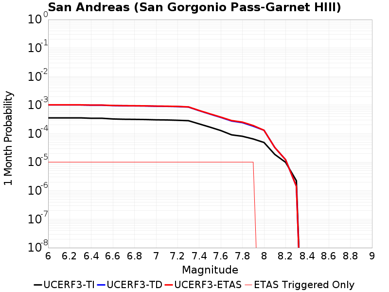 |  | 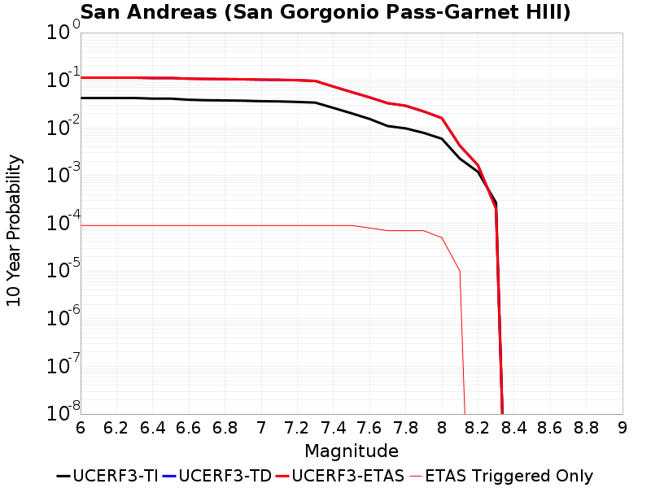 |

| Magnitude | 1 wk TI Prob | 1 wk TD Prob | 1 wk ETAS Prob | 1 wk ETAS/TD Gain | 1 wk ETAS Triggered Only | 1 mo TI Prob | 1 mo TD Prob | 1 mo ETAS Prob | 1 mo ETAS/TD Gain | 1 mo ETAS Triggered Only | 1 yr TI Prob | 1 yr TD Prob | 1 yr ETAS Prob | 1 yr ETAS/TD Gain | 1 yr ETAS Triggered Only | 10 yr TI Prob | 10 yr TD Prob | 10 yr ETAS Prob | 10 yr ETAS/TD Gain | 10 yr ETAS Triggered Only |
|-----|-----|-----|-----|-----|-----|-----|-----|-----|-----|-----|-----|-----|-----|-----|-----|-----|-----|-----|-----|-----|
| 6.0 | 8.31567E-5 | 2.3583963E-4 | 2.3583963E-4 | 1.0 | 0.0 | 3.5633717E-4 | 0.0010103473 | 0.0010203372 | 1.0098876 | 1.0E-5 | 0.004329778 | 0.012231482 | 0.012270994 | 1.0032302 | 4.0E-5 | 0.042463828 | 0.11340258 | 0.11348237 | 1.0007036 | 9.0E-5 |
| 6.1 | 8.31567E-5 | 2.3583963E-4 | 2.3583963E-4 | 1.0 | 0.0 | 3.5633717E-4 | 0.0010103473 | 0.0010203372 | 1.0098876 | 1.0E-5 | 0.004329778 | 0.012231482 | 0.012270994 | 1.0032302 | 4.0E-5 | 0.042463828 | 0.11340258 | 0.11348237 | 1.0007036 | 9.0E-5 |
| 6.2 | 8.31567E-5 | 2.3583963E-4 | 2.3583963E-4 | 1.0 | 0.0 | 3.5633717E-4 | 0.0010103473 | 0.0010203372 | 1.0098876 | 1.0E-5 | 0.004329778 | 0.012231482 | 0.012270994 | 1.0032302 | 4.0E-5 | 0.042463828 | 0.11340258 | 0.11348237 | 1.0007036 | 9.0E-5 |
| 6.3 | 8.31567E-5 | 2.3583963E-4 | 2.3583963E-4 | 1.0 | 0.0 | 3.5633717E-4 | 0.0010103473 | 0.0010203372 | 1.0098876 | 1.0E-5 | 0.004329778 | 0.012231482 | 0.012270994 | 1.0032302 | 4.0E-5 | 0.042463828 | 0.11340258 | 0.11348237 | 1.0007036 | 9.0E-5 |
| 6.4 | 8.059055E-5 | 2.3140394E-4 | 2.3140394E-4 | 1.0 | 0.0 | 3.4534236E-4 | 9.913519E-4 | 0.001001342 | 1.0100772 | 1.0E-5 | 0.0041964394 | 0.012003137 | 0.012042657 | 1.0032924 | 4.0E-5 | 0.041180745 | 0.111380845 | 0.11146082 | 1.000718 | 9.0E-5 |
| 6.5 | 8.059055E-5 | 2.3140394E-4 | 2.3140394E-4 | 1.0 | 0.0 | 3.4534236E-4 | 9.913519E-4 | 0.001001342 | 1.0100772 | 1.0E-5 | 0.0041964394 | 0.012003137 | 0.012042657 | 1.0032924 | 4.0E-5 | 0.041180745 | 0.111380845 | 0.11146082 | 1.000718 | 9.0E-5 |
| 6.6 | 7.619237E-5 | 2.2383234E-4 | 2.2383234E-4 | 1.0 | 0.0 | 3.2649786E-4 | 9.5893105E-4 | 9.6892146E-4 | 1.0104183 | 1.0E-5 | 0.0039678677 | 0.011613044 | 0.0116525795 | 1.0034044 | 4.0E-5 | 0.03897764 | 0.107913435 | 0.10799372 | 1.000744 | 9.0E-5 |
| 6.7 | 7.440636E-5 | 2.2058628E-4 | 2.2058628E-4 | 1.0 | 0.0 | 3.188454E-4 | 9.4502955E-4 | 9.550201E-4 | 1.0105717 | 1.0E-5 | 0.0038750346 | 0.011445579 | 0.011485121 | 1.0034548 | 4.0E-5 | 0.038081564 | 0.10642142 | 0.10650184 | 1.0007557 | 9.0E-5 |
| 6.8 | 7.3735864E-5 | 2.1905196E-4 | 2.1905196E-4 | 1.0 | 0.0 | 3.1597257E-4 | 9.3845866E-4 | 9.4844925E-4 | 1.0106457 | 1.0E-5 | 0.0038401815 | 0.011366419 | 0.011405963 | 1.0034791 | 4.0E-5 | 0.03774495 | 0.10572102 | 0.1058015 | 1.0007613 | 9.0E-5 |
| 6.9 | 7.27575E-5 | 2.1673701E-4 | 2.1673701E-4 | 1.0 | 0.0 | 3.117806E-4 | 9.2854456E-4 | 9.3853526E-4 | 1.0107596 | 1.0E-5 | 0.003789323 | 0.011246966 | 0.011286517 | 1.0035166 | 4.0E-5 | 0.037253562 | 0.104667746 | 0.10474832 | 1.0007699 | 9.0E-5 |
| 7.0 | 7.102591E-5 | 2.1256867E-4 | 2.1256867E-4 | 1.0 | 0.0 | 3.0436125E-4 | 9.1069285E-4 | 9.206837E-4 | 1.0109706 | 1.0E-5 | 0.003699303 | 0.011031841 | 0.0110714 | 1.0035858 | 4.0E-5 | 0.03638325 | 0.102767445 | 0.1028482 | 1.0007857 | 9.0E-5 |
| 7.1 | 7.028513E-5 | 2.1091932E-4 | 2.1091932E-4 | 1.0 | 0.0 | 3.0118722E-4 | 9.03629E-4 | 9.1362E-4 | 1.0110565 | 1.0E-5 | 0.0036607897 | 0.010946707 | 0.010986269 | 1.0036141 | 4.0E-5 | 0.036010686 | 0.10200856 | 0.10208938 | 1.0007923 | 9.0E-5 |
| 7.2 | 6.8498244E-5 | 2.0698876E-4 | 2.0698876E-4 | 1.0 | 0.0 | 2.9353087E-4 | 8.867953E-4 | 8.9678646E-4 | 1.0112666 | 1.0E-5 | 0.003567883 | 0.010743793 | 0.010783363 | 1.0036831 | 4.0E-5 | 0.035111405 | 0.10019813 | 0.100279115 | 1.0008082 | 9.0E-5 |
| 7.3 | 6.622592E-5 | 1.9923257E-4 | 1.9923257E-4 | 1.0 | 0.0 | 2.8379448E-4 | 8.535767E-4 | 8.6356816E-4 | 1.0117054 | 1.0E-5 | 0.0034497243 | 0.010343266 | 0.010382852 | 1.0038272 | 4.0E-5 | 0.033966612 | 0.096686386 | 0.09676769 | 1.0008409 | 9.0E-5 |
| 7.4 | 5.1050705E-5 | 1.4850027E-4 | 1.4850027E-4 | 1.0 | 0.0 | 2.1877038E-4 | 6.362754E-4 | 6.46269E-4 | 1.0157064 | 1.0E-5 | 0.002660276 | 0.0077193337 | 0.007759025 | 1.0051417 | 4.0E-5 | 0.02628654 | 0.07355793 | 0.07364131 | 1.0011336 | 9.0E-5 |
| 7.5 | 3.9302922E-5 | 1.1267607E-4 | 1.1267607E-4 | 1.0 | 0.0 | 1.6843023E-4 | 4.828084E-4 | 4.928036E-4 | 1.0207021 | 1.0E-5 | 0.0020487092 | 0.00586242 | 0.0059021856 | 1.0067831 | 4.0E-5 | 0.020299247 | 0.05661731 | 0.05670221 | 1.0014997 | 9.0E-5 |
| 7.6 | 2.9851626E-5 | 8.6170825E-5 | 8.6170825E-5 | 1.0 | 0.0 | 1.2792926E-4 | 3.692514E-4 | 3.792477E-4 | 1.0270718 | 1.0E-5 | 0.0015564259 | 0.004486395 | 0.0045262156 | 1.0088758 | 4.0E-5 | 0.0154556995 | 0.043740273 | 0.04381677 | 1.0017489 | 8.0E-5 |
| 7.7 | 2.1135214E-5 | 6.461516E-5 | 6.461516E-5 | 1.0 | 0.0 | 9.0576345E-5 | 2.7689277E-4 | 2.8689E-4 | 1.036105 | 1.0E-5 | 0.0011022091 | 0.0033659637 | 0.0034058292 | 1.0118437 | 4.0E-5 | 0.010967582 | 0.033071768 | 0.033139452 | 1.0020466 | 7.0E-5 |
| 7.8 | 1.883379E-5 | 5.6636312E-5 | 5.6636312E-5 | 1.0 | 0.0 | 8.0713755E-5 | 2.4270448E-4 | 2.5270207E-4 | 1.0411924 | 1.0E-5 | 9.822468E-4 | 0.0029509263 | 0.0029908083 | 1.0135151 | 4.0E-5 | 0.0097791655 | 0.029145982 | 0.029213943 | 1.0023317 | 7.0E-5 |
| 7.9 | 1.5156185E-5 | 4.2478383E-5 | 4.2478383E-5 | 1.0 | 0.0 | 6.495346E-5 | 1.8203752E-4 | 1.9203569E-4 | 1.0549238 | 1.0E-5 | 7.9052144E-4 | 0.0022140553 | 0.0022539669 | 1.0180264 | 4.0E-5 | 0.007877152 | 0.022135762 | 0.022204213 | 1.0030923 | 7.0E-5 |
| 8.0 | 1.1405907E-5 | 3.059325E-5 | 3.059325E-5 | 1.0 | 0.0 | 4.8881542E-5 | 1.3110736E-4 | 1.3110736E-4 | 1.0 | 0.0 | 5.9497025E-4 | 0.0015950643 | 0.0016250164 | 1.018778 | 3.0E-5 | 0.005933798 | 0.016060006 | 0.016109202 | 1.0030633 | 5.0E-5 |
| 8.1 | 4.3511436E-6 | 7.5950306E-6 | 7.5950306E-6 | 1.0 | 0.0 | 1.8647626E-5 | 3.2549728E-5 | 3.2549728E-5 | 1.0 | 0.0 | 2.2701119E-4 | 3.96221E-4 | 4.0621703E-4 | 1.0252284 | 1.0E-5 | 0.0022677942 | 0.004228862 | 0.0042388197 | 1.0023547 | 1.0E-5 |
| 8.2 | 2.3042528E-6 | 2.8371592E-6 | 2.8371592E-6 | 1.0 | 0.0 | 9.875332E-6 | 1.21591975E-5 | 1.21591975E-5 | 1.0 | 0.0 | 1.2022553E-4 | 1.4802822E-4 | 1.4802822E-4 | 1.0 | 0.0 | 0.0012016051 | 0.0016524162 | 0.0016524162 | 1.0 | 0.0 |
| 8.3 | 5.202968E-7 | 3.313018E-7 | 3.313018E-7 | 1.0 | 0.0 | 2.2298414E-6 | 1.4198641E-6 | 1.4198641E-6 | 1.0 | 0.0 | 2.714798E-5 | 1.7286722E-5 | 1.7286722E-5 | 1.0 | 0.0 | 2.7144665E-4 | 2.0426979E-4 | 2.0426979E-4 | 1.0 | 0.0 |

## San Andreas (Carrizo) rev
*[(top)](#table-of-contents)*

| 1 Week | 1 Month | 1 Year | 10 Year |
|-----|-----|-----|-----|
|  |  |  |  |

| Magnitude | 1 wk TI Prob | 1 wk TD Prob | 1 wk ETAS Prob | 1 wk ETAS/TD Gain | 1 wk ETAS Triggered Only | 1 mo TI Prob | 1 mo TD Prob | 1 mo ETAS Prob | 1 mo ETAS/TD Gain | 1 mo ETAS Triggered Only | 1 yr TI Prob | 1 yr TD Prob | 1 yr ETAS Prob | 1 yr ETAS/TD Gain | 1 yr ETAS Triggered Only | 10 yr TI Prob | 10 yr TD Prob | 10 yr ETAS Prob | 10 yr ETAS/TD Gain | 10 yr ETAS Triggered Only |
|-----|-----|-----|-----|-----|-----|-----|-----|-----|-----|-----|-----|-----|-----|-----|-----|-----|-----|-----|-----|-----|
| 6.0 | 1.1674632E-4 | 2.478593E-4 | 2.478593E-4 | 1.0 | 0.0 | 5.002454E-4 | 0.0010618235 | 0.0010618235 | 1.0 | 0.0 | 0.006073493 | 0.012851573 | 0.012881188 | 1.0023043 | 3.0E-5 | 0.0591016 | 0.12260797 | 0.12268694 | 1.0006441 | 9.0E-5 |
| 6.1 | 1.1674632E-4 | 2.478593E-4 | 2.478593E-4 | 1.0 | 0.0 | 5.002454E-4 | 0.0010618235 | 0.0010618235 | 1.0 | 0.0 | 0.006073493 | 0.012851573 | 0.012881188 | 1.0023043 | 3.0E-5 | 0.0591016 | 0.12260797 | 0.12268694 | 1.0006441 | 9.0E-5 |
| 6.2 | 1.1674632E-4 | 2.478593E-4 | 2.478593E-4 | 1.0 | 0.0 | 5.002454E-4 | 0.0010618235 | 0.0010618235 | 1.0 | 0.0 | 0.006073493 | 0.012851573 | 0.012881188 | 1.0023043 | 3.0E-5 | 0.0591016 | 0.12260797 | 0.12268694 | 1.0006441 | 9.0E-5 |
| 6.3 | 1.1674632E-4 | 2.478593E-4 | 2.478593E-4 | 1.0 | 0.0 | 5.002454E-4 | 0.0010618235 | 0.0010618235 | 1.0 | 0.0 | 0.006073493 | 0.012851573 | 0.012881188 | 1.0023043 | 3.0E-5 | 0.0591016 | 0.12260797 | 0.12268694 | 1.0006441 | 9.0E-5 |
| 6.4 | 1.1674632E-4 | 2.478593E-4 | 2.478593E-4 | 1.0 | 0.0 | 5.002454E-4 | 0.0010618235 | 0.0010618235 | 1.0 | 0.0 | 0.006073493 | 0.012851573 | 0.012881188 | 1.0023043 | 3.0E-5 | 0.0591016 | 0.12260797 | 0.12268694 | 1.0006441 | 9.0E-5 |
| 6.5 | 1.13136164E-4 | 2.4103893E-4 | 2.4103893E-4 | 1.0 | 0.0 | 4.847792E-4 | 0.0010326166 | 0.0010326166 | 1.0 | 0.0 | 0.0058862255 | 0.012500101 | 0.012529725 | 1.00237 | 3.0E-5 | 0.057327334 | 0.11957131 | 0.11965055 | 1.0006627 | 9.0E-5 |
| 6.6 | 1.13136164E-4 | 2.4103893E-4 | 2.4103893E-4 | 1.0 | 0.0 | 4.847792E-4 | 0.0010326166 | 0.0010326166 | 1.0 | 0.0 | 0.0058862255 | 0.012500101 | 0.012529725 | 1.00237 | 3.0E-5 | 0.057327334 | 0.11957131 | 0.11965055 | 1.0006627 | 9.0E-5 |
| 6.7 | 1.1149675E-4 | 2.379418E-4 | 2.379418E-4 | 1.0 | 0.0 | 4.777557E-4 | 0.0010193536 | 0.0010193536 | 1.0 | 0.0 | 0.0058011734 | 0.012340462 | 0.012370092 | 1.002401 | 3.0E-5 | 0.05652051 | 0.11819272 | 0.11827208 | 1.0006715 | 9.0E-5 |
| 6.8 | 1.1103589E-4 | 2.3695773E-4 | 2.3695773E-4 | 1.0 | 0.0 | 4.7578133E-4 | 0.0010151394 | 0.0010151394 | 1.0 | 0.0 | 0.005777263 | 0.012289735 | 0.0123193655 | 1.002411 | 3.0E-5 | 0.056293584 | 0.11775201 | 0.11783141 | 1.0006744 | 9.0E-5 |
| 6.9 | 1.1053259E-4 | 2.3587554E-4 | 2.3587554E-4 | 1.0 | 0.0 | 4.7362508E-4 | 0.0010105051 | 0.0010105051 | 1.0 | 0.0 | 0.0057511497 | 0.0122339465 | 0.012263579 | 1.0024222 | 3.0E-5 | 0.05604569 | 0.117266014 | 0.11734546 | 1.0006775 | 9.0E-5 |
| 7.0 | 1.1005377E-4 | 2.3487827E-4 | 2.3487827E-4 | 1.0 | 0.0 | 4.7157376E-4 | 0.0010062343 | 0.0010062343 | 1.0 | 0.0 | 0.0057263062 | 0.012182533 | 0.0122121675 | 1.0024326 | 3.0E-5 | 0.055809796 | 0.11681701 | 0.116896495 | 1.0006804 | 9.0E-5 |
| 7.1 | 1.0308142E-4 | 2.1989208E-4 | 2.1989208E-4 | 1.0 | 0.0 | 4.417027E-4 | 9.4205537E-4 | 9.4205537E-4 | 1.0 | 0.0 | 0.0053644776 | 0.011409536 | 0.011439194 | 1.0025994 | 3.0E-5 | 0.052368138 | 0.11003097 | 0.11011107 | 1.0007279 | 9.0E-5 |
| 7.2 | 1.0027479E-4 | 2.1393584E-4 | 2.1393584E-4 | 1.0 | 0.0 | 4.296783E-4 | 9.1654673E-4 | 9.1654673E-4 | 1.0 | 0.0 | 0.0052187922 | 0.0111021735 | 0.01113184 | 1.0026722 | 3.0E-5 | 0.050979212 | 0.10732673 | 0.107398145 | 1.0006654 | 8.0E-5 |
| 7.3 | 9.816942E-5 | 2.0862663E-4 | 2.0862663E-4 | 1.0 | 0.0 | 4.2065824E-4 | 8.938088E-4 | 8.938088E-4 | 1.0 | 0.0 | 0.005109493 | 0.010828123 | 0.010857798 | 1.0027406 | 3.0E-5 | 0.049935985 | 0.10489187 | 0.104963474 | 1.0006827 | 8.0E-5 |
| 7.4 | 9.5634205E-5 | 2.022421E-4 | 2.022421E-4 | 1.0 | 0.0 | 4.0979648E-4 | 8.6646486E-4 | 8.6646486E-4 | 1.0 | 0.0 | 0.0049778637 | 0.0104984585 | 0.010528144 | 1.0028275 | 3.0E-5 | 0.048678253 | 0.10194738 | 0.10201923 | 1.0007048 | 8.0E-5 |
| 7.5 | 8.052417E-5 | 1.6493122E-4 | 1.6493122E-4 | 1.0 | 0.0 | 3.4505792E-4 | 7.066568E-4 | 7.066568E-4 | 1.0 | 0.0 | 0.0041929903 | 0.008569693 | 0.008599436 | 1.0034707 | 3.0E-5 | 0.04114753 | 0.0845036 | 0.08457684 | 1.0008667 | 8.0E-5 |
| 7.6 | 7.897024E-5 | 1.6141728E-4 | 1.6141728E-4 | 1.0 | 0.0 | 3.384E-4 | 6.916051E-4 | 6.916051E-4 | 1.0 | 0.0 | 0.0041122385 | 0.008387864 | 0.008417612 | 1.0035466 | 3.0E-5 | 0.040369697 | 0.08282806 | 0.08290143 | 1.0008858 | 8.0E-5 |
| 7.7 | 6.707427E-5 | 1.3615133E-4 | 1.3615133E-4 | 1.0 | 0.0 | 2.8742946E-4 | 5.833753E-4 | 5.833753E-4 | 1.0 | 0.0 | 0.003493839 | 0.0070794984 | 0.007099357 | 1.0028051 | 2.0E-5 | 0.034394164 | 0.07058435 | 0.07064011 | 1.00079 | 6.0E-5 |
| 7.8 | 6.147705E-5 | 1.250451E-4 | 1.250451E-4 | 1.0 | 0.0 | 2.6344648E-4 | 5.3579756E-4 | 5.3579756E-4 | 1.0 | 0.0 | 0.0032027436 | 0.0065038507 | 0.006523721 | 1.0030551 | 2.0E-5 | 0.031569764 | 0.06491478 | 0.06497088 | 1.0008643 | 6.0E-5 |
| 7.9 | 4.7636717E-5 | 9.1019596E-5 | 9.1019596E-5 | 1.0 | 0.0 | 2.0414138E-4 | 3.9002567E-4 | 3.9002567E-4 | 1.0 | 0.0 | 0.0024825884 | 0.004738232 | 0.0047581373 | 1.0042009 | 2.0E-5 | 0.024550365 | 0.04767357 | 0.047711667 | 1.0007991 | 4.0E-5 |
| 8.0 | 3.3554235E-5 | 5.3510605E-5 | 5.3510605E-5 | 1.0 | 0.0 | 1.4379594E-4 | 2.2931102E-4 | 2.2931102E-4 | 1.0 | 0.0 | 0.0017493097 | 0.002788289 | 0.0027982611 | 1.0035764 | 1.0E-5 | 0.017356034 | 0.028556367 | 0.02858551 | 1.0010206 | 3.0E-5 |
| 8.1 | 1.9175432E-5 | 1.9853416E-5 | 1.9853416E-5 | 1.0 | 0.0 | 8.217783E-5 | 8.50833E-5 | 8.50833E-5 | 1.0 | 0.0 | 0.0010000558 | 0.0010353975 | 0.0010453872 | 1.0096481 | 1.0E-5 | 0.009955673 | 0.011108676 | 0.011118565 | 1.0008903 | 1.0E-5 |
| 8.2 | 8.643924E-6 | 5.725507E-6 | 5.725507E-6 | 1.0 | 0.0 | 3.704486E-5 | 2.4537656E-5 | 2.4537656E-5 | 1.0 | 0.0 | 4.5092785E-4 | 2.987051E-4 | 2.987051E-4 | 1.0 | 0.0 | 0.0045001395 | 0.0033857818 | 0.0033857818 | 1.0 | 0.0 |
| 8.3 | 1.983087E-6 | 8.077986E-7 | 8.077986E-7 | 1.0 | 0.0 | 8.498917E-6 | 3.4619893E-6 | 3.4619893E-6 | 1.0 | 0.0 | 1.034694E-4 | 4.2148924E-5 | 4.2148924E-5 | 1.0 | 0.0 | 0.0010342124 | 4.9595156E-4 | 4.9595156E-4 | 1.0 | 0.0 |

## San Andreas (Cholame) rev
*[(top)](#table-of-contents)*

| 1 Week | 1 Month | 1 Year | 10 Year |
|-----|-----|-----|-----|
| 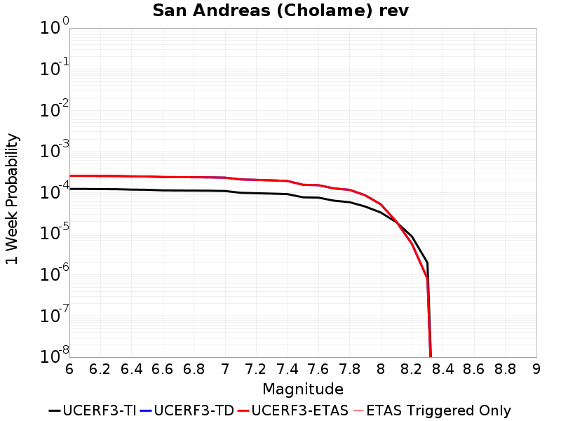 |  |  |  |

| Magnitude | 1 wk TI Prob | 1 wk TD Prob | 1 wk ETAS Prob | 1 wk ETAS/TD Gain | 1 wk ETAS Triggered Only | 1 mo TI Prob | 1 mo TD Prob | 1 mo ETAS Prob | 1 mo ETAS/TD Gain | 1 mo ETAS Triggered Only | 1 yr TI Prob | 1 yr TD Prob | 1 yr ETAS Prob | 1 yr ETAS/TD Gain | 1 yr ETAS Triggered Only | 10 yr TI Prob | 10 yr TD Prob | 10 yr ETAS Prob | 10 yr ETAS/TD Gain | 10 yr ETAS Triggered Only |
|-----|-----|-----|-----|-----|-----|-----|-----|-----|-----|-----|-----|-----|-----|-----|-----|-----|-----|-----|-----|-----|
| 6.0 | 1.2302514E-4 | 2.567217E-4 | 2.567217E-4 | 1.0 | 0.0 | 5.27144E-4 | 0.0010997736 | 0.0010997736 | 1.0 | 0.0 | 0.0063991086 | 0.013308066 | 0.013337666 | 1.0022243 | 3.0E-5 | 0.06217949 | 0.12634537 | 0.12641525 | 1.0005531 | 8.0E-5 |
| 6.1 | 1.2302514E-4 | 2.567217E-4 | 2.567217E-4 | 1.0 | 0.0 | 5.27144E-4 | 0.0010997736 | 0.0010997736 | 1.0 | 0.0 | 0.0063991086 | 0.013308066 | 0.013337666 | 1.0022243 | 3.0E-5 | 0.06217949 | 0.12634537 | 0.12641525 | 1.0005531 | 8.0E-5 |
| 6.2 | 1.2203569E-4 | 2.548836E-4 | 2.548836E-4 | 1.0 | 0.0 | 5.2290526E-4 | 0.0010919026 | 0.0010919026 | 1.0 | 0.0 | 0.006347804 | 0.0132134035 | 0.0132430075 | 1.0022404 | 3.0E-5 | 0.061695136 | 0.12553233 | 0.12560229 | 1.0005573 | 8.0E-5 |
| 6.3 | 1.2142645E-4 | 2.5373977E-4 | 2.5373977E-4 | 1.0 | 0.0 | 5.202953E-4 | 0.0010870046 | 0.0010870046 | 1.0 | 0.0 | 0.006316212 | 0.013154491 | 0.013184097 | 1.0022506 | 3.0E-5 | 0.06139677 | 0.12502706 | 0.12509707 | 1.0005598 | 8.0E-5 |
| 6.4 | 1.1865206E-4 | 2.4876592E-4 | 2.4876592E-4 | 1.0 | 0.0 | 5.0840975E-4 | 0.0010657058 | 0.0010657058 | 1.0 | 0.0 | 0.006172335 | 0.012898274 | 0.012927887 | 1.0022959 | 3.0E-5 | 0.060036868 | 0.12281855 | 0.12288872 | 1.0005714 | 8.0E-5 |
| 6.5 | 1.17443946E-4 | 2.466799E-4 | 2.466799E-4 | 1.0 | 0.0 | 5.032341E-4 | 0.0010567729 | 0.0010567729 | 1.0 | 0.0 | 0.006109677 | 0.012790795 | 0.0128204115 | 1.0023154 | 3.0E-5 | 0.059444077 | 0.12188456 | 0.121954806 | 1.0005764 | 8.0E-5 |
| 6.6 | 1.13579066E-4 | 2.3971386E-4 | 2.3971386E-4 | 1.0 | 0.0 | 4.866766E-4 | 0.0010269422 | 0.0010269422 | 1.0 | 0.0 | 0.0059092017 | 0.012431805 | 0.012461431 | 1.0023831 | 3.0E-5 | 0.057545185 | 0.1187907 | 0.118852384 | 1.0005193 | 7.0E-5 |
| 6.7 | 1.1271412E-4 | 2.38146E-4 | 2.38146E-4 | 1.0 | 0.0 | 4.829711E-4 | 0.001020228 | 0.001020228 | 1.0 | 0.0 | 0.005864331 | 0.01235099 | 0.0123806195 | 1.002399 | 3.0E-5 | 0.057119697 | 0.11809167 | 0.11815341 | 1.0005227 | 7.0E-5 |
| 6.8 | 1.1217975E-4 | 2.3701922E-4 | 2.3701922E-4 | 1.0 | 0.0 | 4.8068175E-4 | 0.0010154027 | 0.0010154027 | 1.0 | 0.0 | 0.005836608 | 0.012292908 | 0.0123225385 | 1.0024104 | 3.0E-5 | 0.056856725 | 0.11758638 | 0.11764815 | 1.0005254 | 7.0E-5 |
| 6.9 | 1.1146753E-4 | 2.3549459E-4 | 2.3549459E-4 | 1.0 | 0.0 | 4.7763053E-4 | 0.0010088737 | 0.0010088737 | 1.0 | 0.0 | 0.0057996577 | 0.01221431 | 0.012243943 | 1.0024261 | 3.0E-5 | 0.056506127 | 0.11690284 | 0.11696466 | 1.0005288 | 7.0E-5 |
| 7.0 | 1.0965793E-4 | 2.316917E-4 | 2.316917E-4 | 1.0 | 0.0 | 4.698779E-4 | 9.925881E-4 | 9.925881E-4 | 1.0 | 0.0 | 0.005705768 | 0.012018236 | 0.012047876 | 1.0024662 | 3.0E-5 | 0.055614736 | 0.11519421 | 0.115256146 | 1.0005376 | 7.0E-5 |
| 7.1 | 9.927982E-5 | 2.0971385E-4 | 2.0971385E-4 | 1.0 | 0.0 | 4.2541555E-4 | 8.984651E-4 | 8.984651E-4 | 1.0 | 0.0 | 0.0051671406 | 0.010884254 | 0.010913928 | 1.0027263 | 3.0E-5 | 0.05048634 | 0.105243675 | 0.105306305 | 1.0005951 | 7.0E-5 |
| 7.2 | 9.696786E-5 | 2.0472567E-4 | 2.0472567E-4 | 1.0 | 0.0 | 4.1551032E-4 | 8.7710173E-4 | 8.7710173E-4 | 1.0 | 0.0 | 0.00504711 | 0.010626721 | 0.010656402 | 1.0027931 | 3.0E-5 | 0.04934009 | 0.10297635 | 0.103039145 | 1.0006098 | 7.0E-5 |
| 7.3 | 9.4727984E-5 | 1.989489E-4 | 1.989489E-4 | 1.0 | 0.0 | 4.0591392E-4 | 8.523605E-4 | 8.523605E-4 | 1.0 | 0.0 | 0.0049308087 | 0.010328392 | 0.010358082 | 1.0028746 | 3.0E-5 | 0.048228268 | 0.1003258 | 0.10038878 | 1.0006278 | 7.0E-5 |
| 7.4 | 9.220358E-5 | 1.9257513E-4 | 1.9257513E-4 | 1.0 | 0.0 | 3.9509835E-4 | 8.2506187E-4 | 8.2506187E-4 | 1.0 | 0.0 | 0.004799717 | 0.009999121 | 0.0100288205 | 1.0029702 | 3.0E-5 | 0.046973653 | 0.097372614 | 0.0974358 | 1.0006489 | 7.0E-5 |
| 7.5 | 7.71631E-5 | 1.5540862E-4 | 1.5540862E-4 | 1.0 | 0.0 | 3.306571E-4 | 6.658671E-4 | 6.658671E-4 | 1.0 | 0.0 | 0.0040183207 | 0.008076874 | 0.008106631 | 1.0036843 | 3.0E-5 | 0.03946433 | 0.07991047 | 0.07997488 | 1.000806 | 7.0E-5 |
| 7.6 | 7.5634416E-5 | 1.519574E-4 | 1.519574E-4 | 1.0 | 0.0 | 3.241072E-4 | 6.5108365E-4 | 6.5108365E-4 | 1.0 | 0.0 | 0.0039388672 | 0.007898203 | 0.007927966 | 1.0037683 | 3.0E-5 | 0.038697794 | 0.07825704 | 0.07832156 | 1.0008245 | 7.0E-5 |
| 7.7 | 6.3783E-5 | 1.2680297E-4 | 1.2680297E-4 | 1.0 | 0.0 | 2.7332708E-4 | 5.4332823E-4 | 5.4332823E-4 | 1.0 | 0.0 | 0.0033226798 | 0.0065949857 | 0.006614854 | 1.0030127 | 2.0E-5 | 0.032734364 | 0.0660074 | 0.0660541 | 1.0007075 | 5.0E-5 |
| 7.8 | 5.863422E-5 | 1.1708562E-4 | 1.1708562E-4 | 1.0 | 0.0 | 2.512653E-4 | 5.0169905E-4 | 5.0169905E-4 | 1.0 | 0.0 | 0.003054864 | 0.0060911016 | 0.0061109797 | 1.0032635 | 2.0E-5 | 0.030132094 | 0.061000165 | 0.061047114 | 1.0007696 | 5.0E-5 |
| 7.9 | 4.595283E-5 | 8.640677E-5 | 8.640677E-5 | 1.0 | 0.0 | 1.9692584E-4 | 3.702622E-4 | 3.702622E-4 | 1.0 | 0.0 | 0.0023949358 | 0.0044986317 | 0.0045185415 | 1.0044258 | 2.0E-5 | 0.023692891 | 0.045374203 | 0.045412388 | 1.0008416 | 4.0E-5 |
| 8.0 | 3.2950178E-5 | 5.2120264E-5 | 5.2120264E-5 | 1.0 | 0.0 | 1.412074E-4 | 2.2335345E-4 | 2.2335345E-4 | 1.0 | 0.0 | 0.0017178444 | 0.002715939 | 0.0027259118 | 1.003672 | 1.0E-5 | 0.017046256 | 0.027843567 | 0.02787273 | 1.0010475 | 3.0E-5 |
| 8.1 | 1.9177472E-5 | 1.9853598E-5 | 1.9853598E-5 | 1.0 | 0.0 | 8.218658E-5 | 8.508408E-5 | 8.508408E-5 | 1.0 | 0.0 | 0.0010001622 | 0.0010354071 | 0.0010453967 | 1.0096481 | 1.0E-5 | 0.009956728 | 0.011108799 | 0.011118688 | 1.0008901 | 1.0E-5 |
| 8.2 | 8.643924E-6 | 5.725507E-6 | 5.725507E-6 | 1.0 | 0.0 | 3.704486E-5 | 2.4537656E-5 | 2.4537656E-5 | 1.0 | 0.0 | 4.5092785E-4 | 2.987051E-4 | 2.987051E-4 | 1.0 | 0.0 | 0.0045001395 | 0.0033857818 | 0.0033857818 | 1.0 | 0.0 |
| 8.3 | 1.983087E-6 | 8.077986E-7 | 8.077986E-7 | 1.0 | 0.0 | 8.498917E-6 | 3.4619893E-6 | 3.4619893E-6 | 1.0 | 0.0 | 1.034694E-4 | 4.2148924E-5 | 4.2148924E-5 | 1.0 | 0.0 | 0.0010342124 | 4.9595156E-4 | 4.9595156E-4 | 1.0 | 0.0 |

## San Jacinto (San Bernardino)
*[(top)](#table-of-contents)*

| 1 Week | 1 Month | 1 Year | 10 Year |
|-----|-----|-----|-----|
| 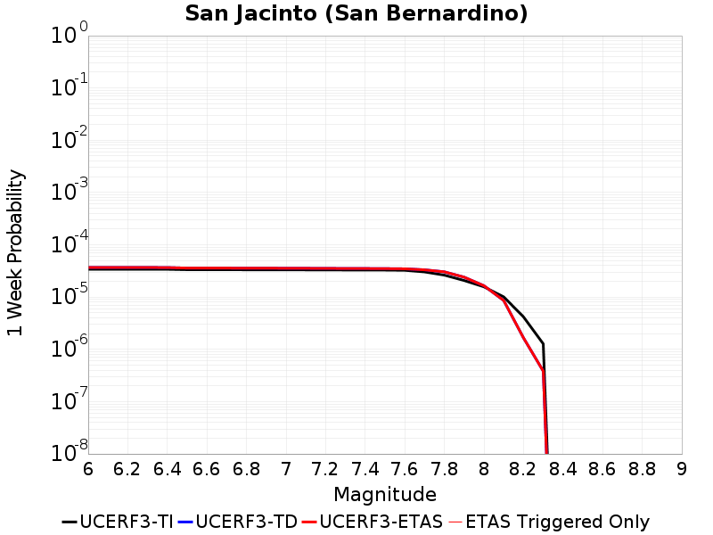 | 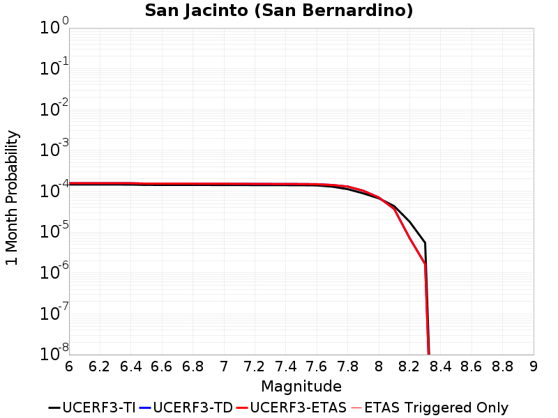 | 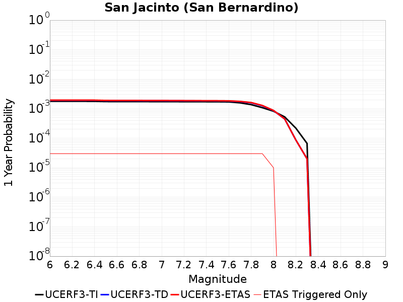 | 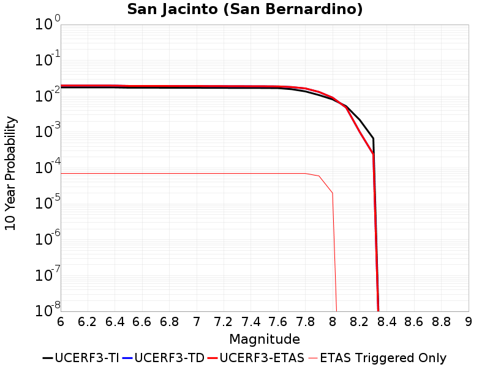 |

| Magnitude | 1 wk TI Prob | 1 wk TD Prob | 1 wk ETAS Prob | 1 wk ETAS/TD Gain | 1 wk ETAS Triggered Only | 1 mo TI Prob | 1 mo TD Prob | 1 mo ETAS Prob | 1 mo ETAS/TD Gain | 1 mo ETAS Triggered Only | 1 yr TI Prob | 1 yr TD Prob | 1 yr ETAS Prob | 1 yr ETAS/TD Gain | 1 yr ETAS Triggered Only | 10 yr TI Prob | 10 yr TD Prob | 10 yr ETAS Prob | 10 yr ETAS/TD Gain | 10 yr ETAS Triggered Only |
|-----|-----|-----|-----|-----|-----|-----|-----|-----|-----|-----|-----|-----|-----|-----|-----|-----|-----|-----|-----|-----|
| 6.0 | 3.409352E-5 | 3.678563E-5 | 3.678563E-5 | 1.0 | 0.0 | 1.461069E-4 | 1.576432E-4 | 1.576432E-4 | 1.0 | 0.0 | 0.0017774 | 0.0019176179 | 0.0019475603 | 1.0156144 | 3.0E-5 | 0.01763251 | 0.019758899 | 0.019827517 | 1.0034727 | 7.0E-5 |
| 6.1 | 3.409352E-5 | 3.678563E-5 | 3.678563E-5 | 1.0 | 0.0 | 1.461069E-4 | 1.576432E-4 | 1.576432E-4 | 1.0 | 0.0 | 0.0017774 | 0.0019176179 | 0.0019475603 | 1.0156144 | 3.0E-5 | 0.01763251 | 0.019758899 | 0.019827517 | 1.0034727 | 7.0E-5 |
| 6.2 | 3.409352E-5 | 3.678563E-5 | 3.678563E-5 | 1.0 | 0.0 | 1.461069E-4 | 1.576432E-4 | 1.576432E-4 | 1.0 | 0.0 | 0.0017774 | 0.0019176179 | 0.0019475603 | 1.0156144 | 3.0E-5 | 0.01763251 | 0.019758899 | 0.019827517 | 1.0034727 | 7.0E-5 |
| 6.3 | 3.409352E-5 | 3.678563E-5 | 3.678563E-5 | 1.0 | 0.0 | 1.461069E-4 | 1.576432E-4 | 1.576432E-4 | 1.0 | 0.0 | 0.0017774 | 0.0019176179 | 0.0019475603 | 1.0156144 | 3.0E-5 | 0.01763251 | 0.019758899 | 0.019827517 | 1.0034727 | 7.0E-5 |
| 6.4 | 3.400795E-5 | 3.6678124E-5 | 3.6678124E-5 | 1.0 | 0.0 | 1.4574021E-4 | 1.5718251E-4 | 1.5718251E-4 | 1.0 | 0.0 | 0.0017729428 | 0.0019120189 | 0.0019419616 | 1.0156602 | 3.0E-5 | 0.017588645 | 0.019703917 | 0.019772537 | 1.0034826 | 7.0E-5 |
| 6.5 | 3.341482E-5 | 3.593761E-5 | 3.593761E-5 | 1.0 | 0.0 | 1.4319851E-4 | 1.5400923E-4 | 1.5400923E-4 | 1.0 | 0.0 | 0.0017420477 | 0.0018734513 | 0.0019033952 | 1.0159832 | 3.0E-5 | 0.017284546 | 0.019325033 | 0.019393679 | 1.0035522 | 7.0E-5 |
| 6.6 | 3.3364955E-5 | 3.5874724E-5 | 3.5874724E-5 | 1.0 | 0.0 | 1.4298483E-4 | 1.5373978E-4 | 1.5373978E-4 | 1.0 | 0.0 | 0.0017394501 | 0.0018701762 | 0.00190012 | 1.0160112 | 3.0E-5 | 0.017258976 | 0.019292857 | 0.019361507 | 1.0035583 | 7.0E-5 |
| 6.7 | 3.335922E-5 | 3.5864483E-5 | 3.5864483E-5 | 1.0 | 0.0 | 1.4296026E-4 | 1.5369587E-4 | 1.5369587E-4 | 1.0 | 0.0 | 0.0017391514 | 0.0018696428 | 0.0018995866 | 1.0160159 | 3.0E-5 | 0.017256035 | 0.019287642 | 0.019356294 | 1.0035592 | 7.0E-5 |
| 6.8 | 3.327683E-5 | 3.5758367E-5 | 3.5758367E-5 | 1.0 | 0.0 | 1.4260718E-4 | 1.5324114E-4 | 1.5324114E-4 | 1.0 | 0.0 | 0.0017348597 | 0.0018641158 | 0.0018940599 | 1.0160635 | 3.0E-5 | 0.017213784 | 0.019233344 | 0.019301997 | 1.0035695 | 7.0E-5 |
| 6.9 | 3.3235785E-5 | 3.5699206E-5 | 3.5699206E-5 | 1.0 | 0.0 | 1.4243131E-4 | 1.5298763E-4 | 1.5298763E-4 | 1.0 | 0.0 | 0.0017327217 | 0.0018610345 | 0.0018909787 | 1.01609 | 3.0E-5 | 0.017192734 | 0.019203167 | 0.019271823 | 1.0035752 | 7.0E-5 |
| 7.0 | 3.3197095E-5 | 3.5639E-5 | 3.5639E-5 | 1.0 | 0.0 | 1.422655E-4 | 1.5272964E-4 | 1.5272964E-4 | 1.0 | 0.0 | 0.0017307063 | 0.0018578989 | 0.0018878431 | 1.0161172 | 3.0E-5 | 0.017172894 | 0.01917249 | 0.019241147 | 1.003581 | 7.0E-5 |
| 7.1 | 3.3129716E-5 | 3.551891E-5 | 3.551891E-5 | 1.0 | 0.0 | 1.4197677E-4 | 1.5221503E-4 | 1.5221503E-4 | 1.0 | 0.0 | 0.0017271966 | 0.0018516441 | 0.0018815886 | 1.0161718 | 3.0E-5 | 0.017138338 | 0.019111441 | 0.019180102 | 1.0035927 | 7.0E-5 |
| 7.2 | 3.3034008E-5 | 3.53861E-5 | 3.53861E-5 | 1.0 | 0.0 | 1.4156665E-4 | 1.516459E-4 | 1.516459E-4 | 1.0 | 0.0 | 0.0017222111 | 0.0018447269 | 0.0018746714 | 1.0162326 | 3.0E-5 | 0.017089253 | 0.019043738 | 0.019112404 | 1.0036057 | 7.0E-5 |
| 7.3 | 3.2956614E-5 | 3.5253266E-5 | 3.5253266E-5 | 1.0 | 0.0 | 1.4123498E-4 | 1.5107669E-4 | 1.5107669E-4 | 1.0 | 0.0 | 0.0017181796 | 0.0018378084 | 0.0018677532 | 1.0162938 | 3.0E-5 | 0.017049557 | 0.018976226 | 0.019044898 | 1.0036188 | 7.0E-5 |
| 7.4 | 3.2915937E-5 | 3.5174533E-5 | 3.5174533E-5 | 1.0 | 0.0 | 1.4106068E-4 | 1.5073929E-4 | 1.5073929E-4 | 1.0 | 0.0 | 0.0017160608 | 0.0018337074 | 0.0018636525 | 1.0163302 | 3.0E-5 | 0.017028693 | 0.018936303 | 0.019004978 | 1.0036266 | 7.0E-5 |
| 7.5 | 3.281791E-5 | 3.5038825E-5 | 3.5038825E-5 | 1.0 | 0.0 | 1.406406E-4 | 1.5015775E-4 | 1.5015775E-4 | 1.0 | 0.0 | 0.0017109542 | 0.0018266392 | 0.0018565845 | 1.0163937 | 3.0E-5 | 0.016978411 | 0.018866913 | 0.018935593 | 1.0036402 | 7.0E-5 |
| 7.6 | 3.2521442E-5 | 3.476228E-5 | 3.476228E-5 | 1.0 | 0.0 | 1.3937015E-4 | 1.489727E-4 | 1.489727E-4 | 1.0 | 0.0 | 0.0016955109 | 0.0018122353 | 0.001842181 | 1.0165242 | 3.0E-5 | 0.016826328 | 0.01872386 | 0.018792551 | 1.0036685 | 7.0E-5 |
| 7.7 | 3.0287873E-5 | 3.323741E-5 | 3.323741E-5 | 1.0 | 0.0 | 1.297987E-4 | 1.4243828E-4 | 1.4243828E-4 | 1.0 | 0.0 | 0.0015791537 | 0.0017328078 | 0.0017627558 | 1.017283 | 3.0E-5 | 0.01567979 | 0.01793039 | 0.017999135 | 1.003834 | 7.0E-5 |
| 7.8 | 2.6316151E-5 | 3.0418E-5 | 3.0418E-5 | 1.0 | 0.0 | 1.1277862E-4 | 1.3035635E-4 | 1.3035635E-4 | 1.0 | 0.0 | 0.0013722149 | 0.0015859341 | 0.0016158866 | 1.0188863 | 3.0E-5 | 0.013637724 | 0.016457167 | 0.016526015 | 1.0041834 | 7.0E-5 |
| 7.9 | 2.0761147E-5 | 2.407114E-5 | 2.407114E-5 | 1.0 | 0.0 | 8.897331E-5 | 1.0315795E-4 | 1.0315795E-4 | 1.0 | 0.0 | 0.0010827117 | 0.0012552254 | 0.0012851877 | 1.0238701 | 3.0E-5 | 0.010774517 | 0.013130917 | 0.01319013 | 1.0045093 | 6.0E-5 |
| 8.0 | 1.5738568E-5 | 1.6525137E-5 | 1.6525137E-5 | 1.0 | 0.0 | 6.744926E-5 | 7.082009E-5 | 7.082009E-5 | 1.0 | 0.0 | 8.2088535E-4 | 8.618943E-4 | 8.718856E-4 | 1.0115924 | 1.0E-5 | 0.008178596 | 0.009124867 | 0.009144684 | 1.0021718 | 2.0E-5 |
| 8.1 | 1.0105832E-5 | 8.616898E-6 | 8.616898E-6 | 1.0 | 0.0 | 4.3309992E-5 | 3.6929043E-5 | 3.6929043E-5 | 1.0 | 0.0 | 5.2717153E-4 | 4.495189E-4 | 4.495189E-4 | 1.0 | 0.0 | 0.005259227 | 0.004831489 | 0.004831489 | 1.0 | 0.0 |
| 8.2 | 4.189207E-6 | 1.6621549E-6 | 1.6621549E-6 | 1.0 | 0.0 | 1.7953622E-5 | 7.1235017E-6 | 7.1235017E-6 | 1.0 | 0.0 | 2.1856341E-4 | 8.672522E-5 | 8.672522E-5 | 1.0 | 0.0 | 0.0021834858 | 0.0010044811 | 0.0010044811 | 1.0 | 0.0 |
| 8.3 | 1.2758221E-6 | 3.8368213E-7 | 3.8368213E-7 | 1.0 | 0.0 | 5.4677976E-6 | 1.644351E-6 | 1.644351E-6 | 1.0 | 0.0 | 6.65684E-5 | 2.0019794E-5 | 2.0019794E-5 | 1.0 | 0.0 | 6.6548464E-4 | 2.4054009E-4 | 2.4054009E-4 | 1.0 | 0.0 |

## San Andreas (Creeping Section) 2011 CFM
*[(top)](#table-of-contents)*

| 1 Week | 1 Month | 1 Year | 10 Year |
|-----|-----|-----|-----|
|  |  | 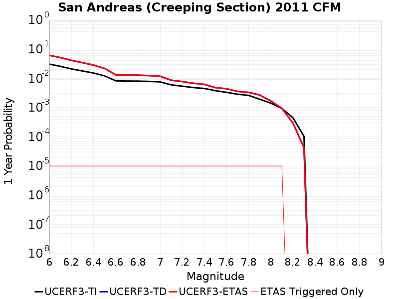 | 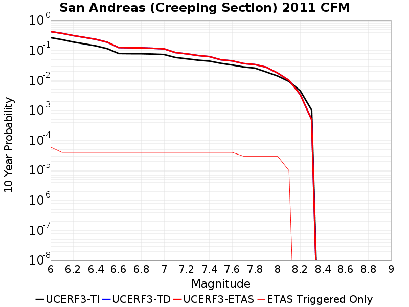 |

| Magnitude | 1 wk TI Prob | 1 wk TD Prob | 1 wk ETAS Prob | 1 wk ETAS/TD Gain | 1 wk ETAS Triggered Only | 1 mo TI Prob | 1 mo TD Prob | 1 mo ETAS Prob | 1 mo ETAS/TD Gain | 1 mo ETAS Triggered Only | 1 yr TI Prob | 1 yr TD Prob | 1 yr ETAS Prob | 1 yr ETAS/TD Gain | 1 yr ETAS Triggered Only | 10 yr TI Prob | 10 yr TD Prob | 10 yr ETAS Prob | 10 yr ETAS/TD Gain | 10 yr ETAS Triggered Only |
|-----|-----|-----|-----|-----|-----|-----|-----|-----|-----|-----|-----|-----|-----|-----|-----|-----|-----|-----|-----|-----|
| 6.0 | 5.986481E-4 | 0.0012331181 | 0.0012331181 | 1.0 | 0.0 | 0.0025631124 | 0.005269264 | 0.005269264 | 1.0 | 0.0 | 0.030762846 | 0.061476238 | 0.061485626 | 1.0001527 | 1.0E-5 | 0.26835477 | 0.4273664 | 0.42740077 | 1.0000803 | 6.0E-5 |
| 6.1 | 5.015945E-4 | 0.0010263138 | 0.0010263138 | 1.0 | 0.0 | 0.00214792 | 0.004387253 | 0.004387253 | 1.0 | 0.0 | 0.025839351 | 0.051473703 | 0.051483188 | 1.0001843 | 1.0E-5 | 0.23032776 | 0.37421766 | 0.3742427 | 1.0000669 | 4.0E-5 |
| 6.2 | 4.073338E-4 | 8.151907E-4 | 8.151907E-4 | 1.0 | 0.0 | 0.0017445484 | 0.0034862387 | 0.0034862387 | 1.0 | 0.0 | 0.021034058 | 0.041157316 | 0.041166905 | 1.0002329 | 1.0E-5 | 0.19150782 | 0.31451088 | 0.3145383 | 1.0000871 | 4.0E-5 |
| 6.3 | 3.464099E-4 | 6.78387E-4 | 6.78387E-4 | 1.0 | 0.0 | 0.0014837692 | 0.0029020836 | 0.0029020836 | 1.0 | 0.0 | 0.017915873 | 0.034415353 | 0.03442501 | 1.0002806 | 1.0E-5 | 0.16538359 | 0.2728836 | 0.27291268 | 1.0001066 | 4.0E-5 |
| 6.4 | 2.935057E-4 | 5.5891E-4 | 5.5891E-4 | 1.0 | 0.0 | 0.0012572751 | 0.0023917393 | 0.0023917393 | 1.0 | 0.0 | 0.015200248 | 0.028492497 | 0.028502213 | 1.0003409 | 1.0E-5 | 0.14201577 | 0.23463942 | 0.23467004 | 1.0001304 | 4.0E-5 |
| 6.5 | 2.3409708E-4 | 4.2542026E-4 | 4.2542026E-4 | 1.0 | 0.0 | 0.0010028875 | 0.0018211999 | 0.0018211999 | 1.0 | 0.0 | 0.012141965 | 0.0218171 | 0.021826882 | 1.0004483 | 1.0E-5 | 0.11499573 | 0.18857737 | 0.18860982 | 1.0001721 | 4.0E-5 |
| 6.6 | 1.5842178E-4 | 2.5515983E-4 | 2.5515983E-4 | 1.0 | 0.0 | 6.7877385E-4 | 0.0010930744 | 0.0010930744 | 1.0 | 0.0 | 0.0082328 | 0.013225602 | 0.013235469 | 1.0007461 | 1.0E-5 | 0.07934396 | 0.12502655 | 0.12506156 | 1.0002799 | 4.0E-5 |
| 6.7 | 1.5616413E-4 | 2.5051355E-4 | 2.5051355E-4 | 1.0 | 0.0 | 6.691031E-4 | 0.0010731819 | 0.0010731819 | 1.0 | 0.0 | 0.0081159435 | 0.012986915 | 0.012996785 | 1.00076 | 1.0E-5 | 0.0782586 | 0.123053566 | 0.12308864 | 1.000285 | 4.0E-5 |
| 6.8 | 1.5538467E-4 | 2.4874188E-4 | 2.4874188E-4 | 1.0 | 0.0 | 6.6576427E-4 | 0.0010655958 | 0.0010655958 | 1.0 | 0.0 | 0.008075596 | 0.012895813 | 0.012905684 | 1.0007654 | 1.0E-5 | 0.07788358 | 0.12228218 | 0.122317284 | 1.000287 | 4.0E-5 |
| 6.9 | 1.5153569E-4 | 2.3979644E-4 | 2.3979644E-4 | 1.0 | 0.0 | 6.49277E-4 | 0.0010272963 | 0.0010272963 | 1.0 | 0.0 | 0.007876333 | 0.012436146 | 0.012446022 | 1.000794 | 1.0E-5 | 0.07602952 | 0.11834599 | 0.11838126 | 1.000298 | 4.0E-5 |
| 7.0 | 1.4588932E-4 | 2.2829196E-4 | 2.2829196E-4 | 1.0 | 0.0 | 6.250901E-4 | 9.780293E-4 | 9.780293E-4 | 1.0 | 0.0 | 0.0075839474 | 0.01184301 | 0.011852892 | 1.0008343 | 1.0E-5 | 0.073302895 | 0.113172546 | 0.11320802 | 1.0003134 | 4.0E-5 |
| 7.1 | 1.1565079E-4 | 1.6656241E-4 | 1.6656241E-4 | 1.0 | 0.0 | 4.955521E-4 | 7.136445E-4 | 7.136445E-4 | 1.0 | 0.0 | 0.006016669 | 0.008654219 | 0.008664132 | 1.0011455 | 1.0E-5 | 0.058563538 | 0.085344575 | 0.08538116 | 1.0004287 | 4.0E-5 |
| 7.2 | 1.0393792E-4 | 1.4966894E-4 | 1.4966894E-4 | 1.0 | 0.0 | 4.4537216E-4 | 6.4128137E-4 | 6.4128137E-4 | 1.0 | 0.0 | 0.005408933 | 0.007779828 | 0.00778975 | 1.0012754 | 1.0E-5 | 0.052791595 | 0.07720695 | 0.07724386 | 1.000478 | 4.0E-5 |
| 7.3 | 9.332884E-5 | 1.3089874E-4 | 1.3089874E-4 | 1.0 | 0.0 | 3.999194E-4 | 5.6087464E-4 | 5.6087464E-4 | 1.0 | 0.0 | 0.0048581534 | 0.0068074088 | 0.0068173404 | 1.001459 | 1.0E-5 | 0.047533102 | 0.067906015 | 0.0679433 | 1.0005491 | 4.0E-5 |
| 7.4 | 8.670252E-5 | 1.19948294E-4 | 1.19948294E-4 | 1.0 | 0.0 | 3.715293E-4 | 5.1396346E-4 | 5.1396346E-4 | 1.0 | 0.0 | 0.004513991 | 0.006239677 | 0.0062496145 | 1.0015926 | 1.0E-5 | 0.044233937 | 0.062504545 | 0.06254204 | 1.0006 | 4.0E-5 |
| 7.5 | 7.3036405E-5 | 9.2521725E-5 | 9.2521725E-5 | 1.0 | 0.0 | 3.129756E-4 | 3.964615E-4 | 3.964615E-4 | 1.0 | 0.0 | 0.0038038217 | 0.0048162583 | 0.00482621 | 1.0020663 | 1.0E-5 | 0.03739367 | 0.049053084 | 0.049091123 | 1.0007755 | 4.0E-5 |
| 7.6 | 6.3935775E-5 | 8.503759E-5 | 8.503759E-5 | 1.0 | 0.0 | 2.7398168E-4 | 3.64396E-4 | 3.64396E-4 | 1.0 | 0.0 | 0.0033306254 | 0.004427516 | 0.0044374717 | 1.0022486 | 1.0E-5 | 0.032811474 | 0.045058113 | 0.04509631 | 1.0008477 | 4.0E-5 |
| 7.7 | 5.5050095E-5 | 6.8597954E-5 | 6.8597954E-5 | 1.0 | 0.0 | 2.3590765E-4 | 2.9395812E-4 | 2.9395812E-4 | 1.0 | 0.0 | 0.0028683927 | 0.0035730714 | 0.0035830357 | 1.0027887 | 1.0E-5 | 0.0283165 | 0.036754366 | 0.036783263 | 1.0007862 | 3.0E-5 |
| 7.8 | 5.027131E-5 | 6.343951E-5 | 6.343951E-5 | 1.0 | 0.0 | 2.1543067E-4 | 2.718553E-4 | 2.718553E-4 | 1.0 | 0.0 | 0.0026197135 | 0.0033048186 | 0.0033147857 | 1.0030159 | 1.0E-5 | 0.025890453 | 0.034005765 | 0.034034748 | 1.0008522 | 3.0E-5 |
| 7.9 | 3.7271806E-5 | 5.168471E-5 | 5.168471E-5 | 1.0 | 0.0 | 1.5972654E-4 | 2.214871E-4 | 2.214871E-4 | 1.0 | 0.0 | 0.0019429359 | 0.0026932731 | 0.0027032462 | 1.003703 | 1.0E-5 | 0.019260362 | 0.027783785 | 0.027812952 | 1.0010498 | 3.0E-5 |
| 8.0 | 2.7310243E-5 | 3.2397875E-5 | 3.2397875E-5 | 1.0 | 0.0 | 1.17038646E-4 | 1.3884065E-4 | 1.3884065E-4 | 1.0 | 0.0 | 0.0014240141 | 0.0016890753 | 0.0016990583 | 1.0059104 | 1.0E-5 | 0.014149235 | 0.017706279 | 0.017735748 | 1.0016643 | 3.0E-5 |
| 8.1 | 1.7940547E-5 | 1.8024813E-5 | 1.8024813E-5 | 1.0 | 0.0 | 7.688579E-5 | 7.7246914E-5 | 7.7246914E-5 | 1.0 | 0.0 | 9.3568244E-4 | 9.4007596E-4 | 9.5006655E-4 | 1.0106274 | 1.0E-5 | 0.009317525 | 0.010127008 | 0.010136907 | 1.0009775 | 1.0E-5 |
| 8.2 | 8.643924E-6 | 5.725507E-6 | 5.725507E-6 | 1.0 | 0.0 | 3.704486E-5 | 2.4537656E-5 | 2.4537656E-5 | 1.0 | 0.0 | 4.5092785E-4 | 2.987051E-4 | 2.987051E-4 | 1.0 | 0.0 | 0.0045001395 | 0.0033857818 | 0.0033857818 | 1.0 | 0.0 |
| 8.3 | 1.983087E-6 | 8.077986E-7 | 8.077986E-7 | 1.0 | 0.0 | 8.498917E-6 | 3.4619893E-6 | 3.4619893E-6 | 1.0 | 0.0 | 1.034694E-4 | 4.2148924E-5 | 4.2148924E-5 | 1.0 | 0.0 | 0.0010342124 | 4.9595156E-4 | 4.9595156E-4 | 1.0 | 0.0 |

## Pinto Mtn
*[(top)](#table-of-contents)*

| 1 Week | 1 Month | 1 Year | 10 Year |
|-----|-----|-----|-----|
| 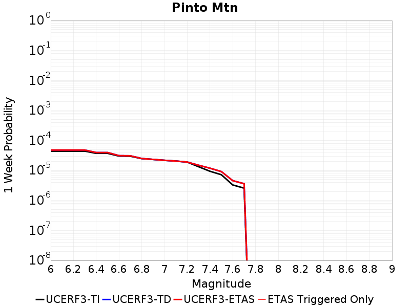 |  | 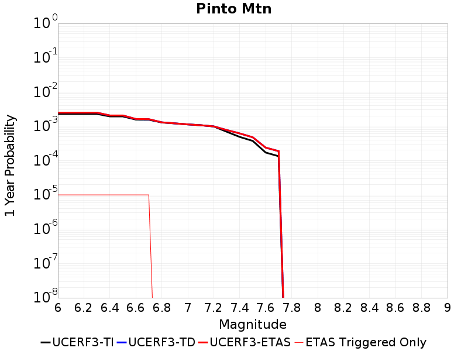 |  |

| Magnitude | 1 wk TI Prob | 1 wk TD Prob | 1 wk ETAS Prob | 1 wk ETAS/TD Gain | 1 wk ETAS Triggered Only | 1 mo TI Prob | 1 mo TD Prob | 1 mo ETAS Prob | 1 mo ETAS/TD Gain | 1 mo ETAS Triggered Only | 1 yr TI Prob | 1 yr TD Prob | 1 yr ETAS Prob | 1 yr ETAS/TD Gain | 1 yr ETAS Triggered Only | 10 yr TI Prob | 10 yr TD Prob | 10 yr ETAS Prob | 10 yr ETAS/TD Gain | 10 yr ETAS Triggered Only |
|-----|-----|-----|-----|-----|-----|-----|-----|-----|-----|-----|-----|-----|-----|-----|-----|-----|-----|-----|-----|-----|
| 6.0 | 4.4194956E-5 | 4.7931262E-5 | 4.7931262E-5 | 1.0 | 0.0 | 1.893932E-4 | 2.0540445E-4 | 2.0540445E-4 | 1.0 | 0.0 | 0.0023034236 | 0.002498095 | 0.0025080699 | 1.003993 | 1.0E-5 | 0.022796938 | 0.024717702 | 0.024776218 | 1.0023674 | 6.0E-5 |
| 6.1 | 4.4194956E-5 | 4.7931262E-5 | 4.7931262E-5 | 1.0 | 0.0 | 1.893932E-4 | 2.0540445E-4 | 2.0540445E-4 | 1.0 | 0.0 | 0.0023034236 | 0.002498095 | 0.0025080699 | 1.003993 | 1.0E-5 | 0.022796938 | 0.024717702 | 0.024776218 | 1.0023674 | 6.0E-5 |
| 6.2 | 4.4194956E-5 | 4.7931262E-5 | 4.7931262E-5 | 1.0 | 0.0 | 1.893932E-4 | 2.0540445E-4 | 2.0540445E-4 | 1.0 | 0.0 | 0.0023034236 | 0.002498095 | 0.0025080699 | 1.003993 | 1.0E-5 | 0.022796938 | 0.024717702 | 0.024776218 | 1.0023674 | 6.0E-5 |
| 6.3 | 4.4194956E-5 | 4.7931262E-5 | 4.7931262E-5 | 1.0 | 0.0 | 1.893932E-4 | 2.0540445E-4 | 2.0540445E-4 | 1.0 | 0.0 | 0.0023034236 | 0.002498095 | 0.0025080699 | 1.003993 | 1.0E-5 | 0.022796938 | 0.024717702 | 0.024776218 | 1.0023674 | 6.0E-5 |
| 6.4 | 3.729929E-5 | 3.9670558E-5 | 3.9670558E-5 | 1.0 | 0.0 | 1.5984432E-4 | 1.7000614E-4 | 1.7000614E-4 | 1.0 | 0.0 | 0.0019443673 | 0.002067953 | 0.0020779325 | 1.0048257 | 1.0E-5 | 0.019274427 | 0.020497149 | 0.02053633 | 1.0019115 | 4.0E-5 |
| 6.5 | 3.729929E-5 | 3.9670558E-5 | 3.9670558E-5 | 1.0 | 0.0 | 1.5984432E-4 | 1.7000614E-4 | 1.7000614E-4 | 1.0 | 0.0 | 0.0019443673 | 0.002067953 | 0.0020779325 | 1.0048257 | 1.0E-5 | 0.019274427 | 0.020497149 | 0.02053633 | 1.0019115 | 4.0E-5 |
| 6.6 | 3.0204548E-5 | 3.1262876E-5 | 3.1262876E-5 | 1.0 | 0.0 | 1.2944164E-4 | 1.3397708E-4 | 1.3397708E-4 | 1.0 | 0.0 | 0.0015748127 | 0.0016299852 | 0.001639969 | 1.006125 | 1.0E-5 | 0.015636992 | 0.016184177 | 0.016203854 | 1.0012158 | 2.0E-5 |
| 6.7 | 2.9857754E-5 | 3.087195E-5 | 3.087195E-5 | 1.0 | 0.0 | 1.2795553E-4 | 1.3230184E-4 | 1.3230184E-4 | 1.0 | 0.0 | 0.0015567453 | 0.0016096195 | 0.0016196034 | 1.0062027 | 1.0E-5 | 0.015458848 | 0.015983462 | 0.016003143 | 1.0012313 | 2.0E-5 |
| 6.8 | 2.4819734E-5 | 2.5060994E-5 | 2.5060994E-5 | 1.0 | 0.0 | 1.0636595E-4 | 1.0739996E-4 | 1.0739996E-4 | 1.0 | 0.0 | 0.0012942362 | 0.0013068318 | 0.0013068318 | 1.0 | 0.0 | 0.012867244 | 0.012993844 | 0.012993844 | 1.0 | 0.0 |
| 6.9 | 2.331124E-5 | 2.338812E-5 | 2.338812E-5 | 1.0 | 0.0 | 9.990149E-5 | 1.0023107E-4 | 1.0023107E-4 | 1.0 | 0.0 | 0.001215622 | 0.0012196505 | 0.0012196505 | 1.0 | 0.0 | 0.012089936 | 0.012131766 | 0.012131766 | 1.0 | 0.0 |
| 7.0 | 2.1818534E-5 | 2.1810289E-5 | 2.1810289E-5 | 1.0 | 0.0 | 9.3504656E-5 | 9.3469425E-5 | 9.3469425E-5 | 1.0 | 0.0 | 0.0011378246 | 0.0011374161 | 0.0011374161 | 1.0 | 0.0 | 0.011320163 | 0.011318054 | 0.011318054 | 1.0 | 0.0 |
| 7.1 | 2.066081E-5 | 2.0589017E-5 | 2.0589017E-5 | 1.0 | 0.0 | 8.854332E-5 | 8.823577E-5 | 8.823577E-5 | 1.0 | 0.0 | 0.0010774818 | 0.0010737607 | 0.0010737607 | 1.0 | 0.0 | 0.010722724 | 0.010687782 | 0.010687782 | 1.0 | 0.0 |
| 7.2 | 1.8990233E-5 | 1.9101382E-5 | 1.9101382E-5 | 1.0 | 0.0 | 8.138417E-5 | 8.1860606E-5 | 8.1860606E-5 | 1.0 | 0.0 | 9.904018E-4 | 9.962165E-4 | 9.962165E-4 | 1.0 | 0.0 | 0.009859995 | 0.009919512 | 0.009919512 | 1.0 | 0.0 |
| 7.3 | 1.3335872E-5 | 1.4950359E-5 | 1.4950359E-5 | 1.0 | 0.0 | 5.7152483E-5 | 6.407147E-5 | 6.407147E-5 | 1.0 | 0.0 | 6.956093E-4 | 7.798037E-4 | 7.798037E-4 | 1.0 | 0.0 | 0.006934359 | 0.0077719777 | 0.0077719777 | 1.0 | 0.0 |
| 7.4 | 9.414066E-6 | 1.1902035E-5 | 1.1902035E-5 | 1.0 | 0.0 | 4.0345374E-5 | 5.1007777E-5 | 5.1007777E-5 | 1.0 | 0.0 | 4.910942E-4 | 6.208522E-4 | 6.208522E-4 | 1.0 | 0.0 | 0.0049001034 | 0.006192129 | 0.006192129 | 1.0 | 0.0 |
| 7.5 | 7.2101157E-6 | 9.1983065E-6 | 9.1983065E-6 | 1.0 | 0.0 | 3.090013E-5 | 3.942076E-5 | 3.942076E-5 | 1.0 | 0.0 | 3.7614413E-4 | 4.798499E-4 | 4.798499E-4 | 1.0 | 0.0 | 0.0037550807 | 0.0047889166 | 0.0047889166 | 1.0 | 0.0 |
| 7.6 | 3.296375E-6 | 4.5839815E-6 | 4.5839815E-6 | 1.0 | 0.0 | 1.4127245E-5 | 1.9645495E-5 | 1.9645495E-5 | 1.0 | 0.0 | 1.7198564E-4 | 2.3915905E-4 | 2.3915905E-4 | 1.0 | 0.0 | 0.0017185259 | 0.002389157 | 0.002389157 | 1.0 | 0.0 |
| 7.7 | 2.5741092E-6 | 3.620492E-6 | 3.620492E-6 | 1.0 | 0.0 | 1.103185E-5 | 1.5516309E-5 | 1.5516309E-5 | 1.0 | 0.0 | 1.3430449E-4 | 1.8889603E-4 | 1.8889603E-4 | 1.0 | 0.0 | 0.0013422335 | 0.0018874872 | 0.0018874872 | 1.0 | 0.0 |

## Owens Valley
*[(top)](#table-of-contents)*

| 1 Week | 1 Month | 1 Year | 10 Year |
|-----|-----|-----|-----|
|  |  | 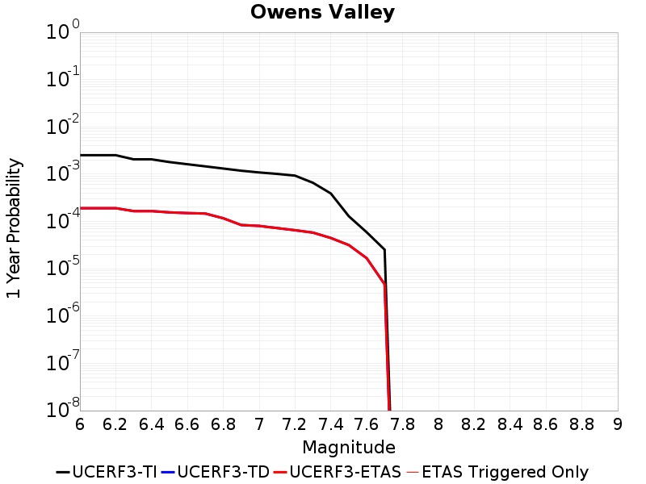 | 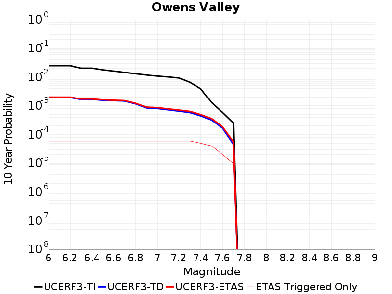 |

| Magnitude | 1 wk TI Prob | 1 wk TD Prob | 1 wk ETAS Prob | 1 wk ETAS/TD Gain | 1 wk ETAS Triggered Only | 1 mo TI Prob | 1 mo TD Prob | 1 mo ETAS Prob | 1 mo ETAS/TD Gain | 1 mo ETAS Triggered Only | 1 yr TI Prob | 1 yr TD Prob | 1 yr ETAS Prob | 1 yr ETAS/TD Gain | 1 yr ETAS Triggered Only | 10 yr TI Prob | 10 yr TD Prob | 10 yr ETAS Prob | 10 yr ETAS/TD Gain | 10 yr ETAS Triggered Only |
|-----|-----|-----|-----|-----|-----|-----|-----|-----|-----|-----|-----|-----|-----|-----|-----|-----|-----|-----|-----|-----|
| 6.0 | 4.83821E-5 | 3.6616984E-6 | 3.6616984E-6 | 1.0 | 0.0 | 2.0733538E-4 | 1.5692905E-5 | 1.5692905E-5 | 1.0 | 0.0 | 0.002521386 | 1.9104537E-4 | 1.9104537E-4 | 1.0 | 0.0 | 0.024929691 | 0.0019454908 | 0.002005374 | 1.0307806 | 6.0E-5 |
| 6.1 | 4.83821E-5 | 3.6616984E-6 | 3.6616984E-6 | 1.0 | 0.0 | 2.0733538E-4 | 1.5692905E-5 | 1.5692905E-5 | 1.0 | 0.0 | 0.002521386 | 1.9104537E-4 | 1.9104537E-4 | 1.0 | 0.0 | 0.024929691 | 0.0019454908 | 0.002005374 | 1.0307806 | 6.0E-5 |
| 6.2 | 4.83821E-5 | 3.6616984E-6 | 3.6616984E-6 | 1.0 | 0.0 | 2.0733538E-4 | 1.5692905E-5 | 1.5692905E-5 | 1.0 | 0.0 | 0.002521386 | 1.9104537E-4 | 1.9104537E-4 | 1.0 | 0.0 | 0.024929691 | 0.0019454908 | 0.002005374 | 1.0307806 | 6.0E-5 |
| 6.3 | 3.953008E-5 | 3.1758448E-6 | 3.1758448E-6 | 1.0 | 0.0 | 1.6940363E-4 | 1.3610696E-5 | 1.3610696E-5 | 1.0 | 0.0 | 0.002060538 | 1.6569838E-4 | 1.6569838E-4 | 1.0 | 0.0 | 0.020415364 | 0.0016680545 | 0.0017279545 | 1.03591 | 6.0E-5 |
| 6.4 | 3.953008E-5 | 3.1758448E-6 | 3.1758448E-6 | 1.0 | 0.0 | 1.6940363E-4 | 1.3610696E-5 | 1.3610696E-5 | 1.0 | 0.0 | 0.002060538 | 1.6569838E-4 | 1.6569838E-4 | 1.0 | 0.0 | 0.020415364 | 0.0016680545 | 0.0017279545 | 1.03591 | 6.0E-5 |
| 6.5 | 3.457342E-5 | 2.985556E-6 | 2.985556E-6 | 1.0 | 0.0 | 1.4816338E-4 | 1.2795181E-5 | 1.2795181E-5 | 1.0 | 0.0 | 0.0018023965 | 1.5577089E-4 | 1.5577089E-4 | 1.0 | 0.0 | 0.017878477 | 0.0015619518 | 0.0016218581 | 1.0383534 | 6.0E-5 |
| 6.6 | 3.1127765E-5 | 2.8839386E-6 | 2.8839386E-6 | 1.0 | 0.0 | 1.3339789E-4 | 1.2359683E-5 | 1.2359683E-5 | 1.0 | 0.0 | 0.0016229092 | 1.5046944E-4 | 1.5046944E-4 | 1.0 | 0.0 | 0.016111081 | 0.0015067492 | 0.0015666587 | 1.0397608 | 6.0E-5 |
| 6.7 | 2.806885E-5 | 2.8175534E-6 | 2.8175534E-6 | 1.0 | 0.0 | 1.2028952E-4 | 1.20751765E-5 | 1.20751765E-5 | 1.0 | 0.0 | 0.001463541 | 1.4700605E-4 | 1.4700605E-4 | 1.0 | 0.0 | 0.014539397 | 0.001469454 | 0.0015293658 | 1.0407715 | 6.0E-5 |
| 6.8 | 2.524524E-5 | 2.2415422E-6 | 2.2415422E-6 | 1.0 | 0.0 | 1.0818939E-4 | 9.606576E-6 | 9.606576E-6 | 1.0 | 0.0 | 0.0013164099 | 1.1695409E-4 | 1.1695409E-4 | 1.0 | 0.0 | 0.01308639 | 0.001169188 | 0.0012291177 | 1.0512576 | 6.0E-5 |
| 6.9 | 2.2704568E-5 | 1.6127175E-6 | 1.6127175E-6 | 1.0 | 0.0 | 9.730166E-5 | 6.911628E-6 | 6.911628E-6 | 1.0 | 0.0 | 0.0011840039 | 8.414584E-5 | 8.414584E-5 | 1.0 | 0.0 | 0.011777153 | 8.413341E-4 | 9.0128364E-4 | 1.0712553 | 6.0E-5 |
| 7.0 | 2.0871712E-5 | 1.5438525E-6 | 1.5438525E-6 | 1.0 | 0.0 | 8.944713E-5 | 6.616494E-6 | 6.616494E-6 | 1.0 | 0.0 | 0.0010884746 | 8.0552854E-5 | 8.0552854E-5 | 1.0 | 0.0 | 0.010831586 | 8.053868E-4 | 8.653385E-4 | 1.0744383 | 6.0E-5 |
| 7.1 | 1.944928E-5 | 1.3900889E-6 | 1.3900889E-6 | 1.0 | 0.0 | 8.335139E-5 | 5.9575104E-6 | 5.9575104E-6 | 1.0 | 0.0 | 0.0010143308 | 7.253028E-5 | 7.253028E-5 | 1.0 | 0.0 | 0.010097133 | 7.252022E-4 | 7.851587E-4 | 1.0826756 | 6.0E-5 |
| 7.2 | 1.7876306E-5 | 1.2521324E-6 | 1.2521324E-6 | 1.0 | 0.0 | 7.6610486E-5 | 5.3662707E-6 | 5.3662707E-6 | 1.0 | 0.0 | 9.3233347E-4 | 6.5332395E-5 | 6.5332395E-5 | 1.0 | 0.0 | 0.009284316 | 6.5322913E-4 | 7.1318995E-4 | 1.0917914 | 6.0E-5 |
| 7.3 | 1.2618672E-5 | 1.114502E-6 | 1.114502E-6 | 1.0 | 0.0 | 5.40789E-5 | 4.7764283E-6 | 4.7764283E-6 | 1.0 | 0.0 | 6.582117E-4 | 5.815147E-5 | 5.815147E-5 | 1.0 | 0.0 | 0.0065626553 | 5.814547E-4 | 6.4141984E-4 | 1.1031295 | 6.0E-5 |
| 7.4 | 7.4874442E-6 | 8.573754E-7 | 8.573754E-7 | 1.0 | 0.0 | 3.208865E-5 | 3.6744611E-6 | 3.6744611E-6 | 1.0 | 0.0 | 3.906093E-4 | 4.473565E-5 | 4.473565E-5 | 1.0 | 0.0 | 0.003899234 | 4.4731976E-4 | 4.972974E-4 | 1.1117269 | 5.0E-5 |
| 7.5 | 2.4734156E-6 | 6.0852403E-7 | 6.0852403E-7 | 1.0 | 0.0 | 1.060031E-5 | 2.6079574E-6 | 2.6079574E-6 | 1.0 | 0.0 | 1.2905113E-4 | 3.1751424E-5 | 3.1751424E-5 | 1.0 | 0.0 | 0.0012897621 | 3.1746918E-4 | 3.574565E-4 | 1.1259565 | 4.0E-5 |
| 7.6 | 1.1328841E-6 | 3.204758E-7 | 3.204758E-7 | 1.0 | 0.0 | 4.8552088E-6 | 1.373467E-6 | 1.373467E-6 | 1.0 | 0.0 | 5.9110564E-5 | 1.6721833E-5 | 1.6721833E-5 | 1.0 | 0.0 | 5.9094845E-4 | 1.6720594E-4 | 1.872026E-4 | 1.119593 | 2.0E-5 |
| 7.7 | 4.8613185E-7 | 8.996246E-8 | 8.996246E-8 | 1.0 | 0.0 | 2.0834207E-6 | 3.8555334E-7 | 3.8555334E-7 | 1.0 | 0.0 | 2.536535E-5 | 4.6941027E-6 | 4.6941027E-6 | 1.0 | 0.0 | 2.5362454E-4 | 4.6940102E-5 | 5.6939632E-5 | 1.2130275 | 1.0E-5 |

## San Andreas (North Branch Mill Creek)
*[(top)](#table-of-contents)*

| 1 Week | 1 Month | 1 Year | 10 Year |
|-----|-----|-----|-----|
|  | 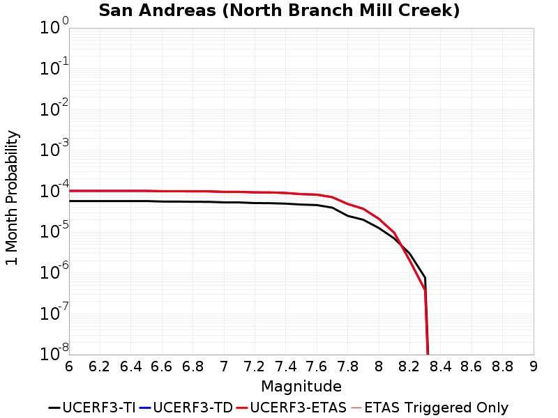 | 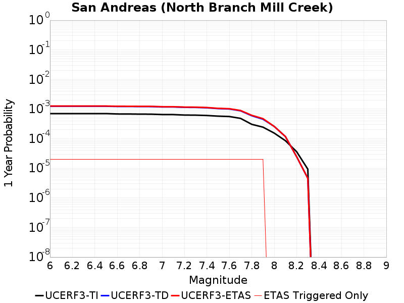 |  |

| Magnitude | 1 wk TI Prob | 1 wk TD Prob | 1 wk ETAS Prob | 1 wk ETAS/TD Gain | 1 wk ETAS Triggered Only | 1 mo TI Prob | 1 mo TD Prob | 1 mo ETAS Prob | 1 mo ETAS/TD Gain | 1 mo ETAS Triggered Only | 1 yr TI Prob | 1 yr TD Prob | 1 yr ETAS Prob | 1 yr ETAS/TD Gain | 1 yr ETAS Triggered Only | 10 yr TI Prob | 10 yr TD Prob | 10 yr ETAS Prob | 10 yr ETAS/TD Gain | 10 yr ETAS Triggered Only |
|-----|-----|-----|-----|-----|-----|-----|-----|-----|-----|-----|-----|-----|-----|-----|-----|-----|-----|-----|-----|-----|
| 6.0 | 1.3461156E-5 | 2.3832592E-5 | 2.3832592E-5 | 1.0 | 0.0 | 5.7689394E-5 | 1.021357E-4 | 1.021357E-4 | 1.0 | 0.0 | 7.02142E-4 | 0.0012427962 | 0.0012627713 | 1.0160728 | 2.0E-5 | 0.0069992766 | 0.01239826 | 0.012457516 | 1.0047793 | 6.0E-5 |
| 6.1 | 1.3461156E-5 | 2.3832592E-5 | 2.3832592E-5 | 1.0 | 0.0 | 5.7689394E-5 | 1.021357E-4 | 1.021357E-4 | 1.0 | 0.0 | 7.02142E-4 | 0.0012427962 | 0.0012627713 | 1.0160728 | 2.0E-5 | 0.0069992766 | 0.01239826 | 0.012457516 | 1.0047793 | 6.0E-5 |
| 6.2 | 1.3461156E-5 | 2.3832592E-5 | 2.3832592E-5 | 1.0 | 0.0 | 5.7689394E-5 | 1.021357E-4 | 1.021357E-4 | 1.0 | 0.0 | 7.02142E-4 | 0.0012427962 | 0.0012627713 | 1.0160728 | 2.0E-5 | 0.0069992766 | 0.01239826 | 0.012457516 | 1.0047793 | 6.0E-5 |
| 6.3 | 1.3461156E-5 | 2.3832592E-5 | 2.3832592E-5 | 1.0 | 0.0 | 5.7689394E-5 | 1.021357E-4 | 1.021357E-4 | 1.0 | 0.0 | 7.02142E-4 | 0.0012427962 | 0.0012627713 | 1.0160728 | 2.0E-5 | 0.0069992766 | 0.01239826 | 0.012457516 | 1.0047793 | 6.0E-5 |
| 6.4 | 1.3461156E-5 | 2.3832592E-5 | 2.3832592E-5 | 1.0 | 0.0 | 5.7689394E-5 | 1.021357E-4 | 1.021357E-4 | 1.0 | 0.0 | 7.02142E-4 | 0.0012427962 | 0.0012627713 | 1.0160728 | 2.0E-5 | 0.0069992766 | 0.01239826 | 0.012457516 | 1.0047793 | 6.0E-5 |
| 6.5 | 1.3450706E-5 | 2.3821549E-5 | 2.3821549E-5 | 1.0 | 0.0 | 5.764461E-5 | 1.0208837E-4 | 1.0208837E-4 | 1.0 | 0.0 | 7.0159714E-4 | 0.0012422206 | 0.0012621958 | 1.0160801 | 2.0E-5 | 0.006993862 | 0.012392568 | 0.012451825 | 1.0047816 | 6.0E-5 |
| 6.6 | 1.3074523E-5 | 2.3435708E-5 | 2.3435708E-5 | 1.0 | 0.0 | 5.6032466E-5 | 1.004349E-4 | 1.004349E-4 | 1.0 | 0.0 | 6.8198174E-4 | 0.0012221123 | 0.0012420878 | 1.0163451 | 2.0E-5 | 0.006798926 | 0.012193704 | 0.012252972 | 1.0048605 | 6.0E-5 |
| 6.7 | 1.3050216E-5 | 2.3410983E-5 | 2.3410983E-5 | 1.0 | 0.0 | 5.59283E-5 | 1.0032894E-4 | 1.0032894E-4 | 1.0 | 0.0 | 6.8071426E-4 | 0.0012208236 | 0.0012407992 | 1.0163624 | 2.0E-5 | 0.0067863287 | 0.012180959 | 0.012240228 | 1.0048658 | 6.0E-5 |
| 6.8 | 1.29049395E-5 | 2.3259325E-5 | 2.3259325E-5 | 1.0 | 0.0 | 5.530571E-5 | 9.9679026E-5 | 9.9679026E-5 | 1.0 | 0.0 | 6.73139E-4 | 0.0012129198 | 0.0012328955 | 1.0164691 | 2.0E-5 | 0.0067110364 | 0.012102783 | 0.012162057 | 1.0048976 | 6.0E-5 |
| 6.9 | 1.2867369E-5 | 2.3218676E-5 | 2.3218676E-5 | 1.0 | 0.0 | 5.51447E-5 | 9.950483E-5 | 9.950483E-5 | 1.0 | 0.0 | 6.711799E-4 | 0.0012108013 | 0.0012307771 | 1.016498 | 2.0E-5 | 0.006691564 | 0.012081829 | 0.012141104 | 1.0049062 | 6.0E-5 |
| 7.0 | 1.2495996E-5 | 2.2616465E-5 | 2.2616465E-5 | 1.0 | 0.0 | 5.3553173E-5 | 9.692412E-5 | 9.692412E-5 | 1.0 | 0.0 | 6.518148E-4 | 0.0011794153 | 0.0011993917 | 1.0169376 | 2.0E-5 | 0.0064990623 | 0.0117713045 | 0.011830598 | 1.0050372 | 6.0E-5 |
| 7.1 | 1.2452067E-5 | 2.2561435E-5 | 2.2561435E-5 | 1.0 | 0.0 | 5.3364907E-5 | 9.66883E-5 | 9.66883E-5 | 1.0 | 0.0 | 6.4952404E-4 | 0.0011765473 | 0.0011965237 | 1.0169789 | 2.0E-5 | 0.0064762887 | 0.011742928 | 0.0118022235 | 1.0050495 | 6.0E-5 |
| 7.2 | 1.2002777E-5 | 2.193828E-5 | 2.193828E-5 | 1.0 | 0.0 | 5.143946E-5 | 9.401783E-5 | 9.401783E-5 | 1.0 | 0.0 | 6.2609545E-4 | 0.0011440687 | 0.0011640459 | 1.0174614 | 2.0E-5 | 0.006243344 | 0.011421504 | 0.011480819 | 1.0051932 | 6.0E-5 |
| 7.3 | 1.1923425E-5 | 2.1807733E-5 | 2.1807733E-5 | 1.0 | 0.0 | 5.109939E-5 | 9.345838E-5 | 9.345838E-5 | 1.0 | 0.0 | 6.219575E-4 | 0.0011372645 | 0.0011572418 | 1.0175661 | 2.0E-5 | 0.0062021962 | 0.011354176 | 0.011413495 | 1.0052243 | 6.0E-5 |
| 7.4 | 1.16105175E-5 | 2.1178226E-5 | 2.1178226E-5 | 1.0 | 0.0 | 4.975841E-5 | 9.076068E-5 | 9.076068E-5 | 1.0 | 0.0 | 6.0564023E-4 | 0.0011044537 | 0.0011244316 | 1.0180885 | 2.0E-5 | 0.006039923 | 0.011030006 | 0.0110893445 | 1.0053797 | 6.0E-5 |
| 7.5 | 1.1037265E-5 | 1.9866284E-5 | 1.9866284E-5 | 1.0 | 0.0 | 4.7301706E-5 | 8.513845E-5 | 8.513845E-5 | 1.0 | 0.0 | 5.757461E-4 | 0.0010360699 | 0.0010560493 | 1.0192838 | 2.0E-5 | 0.005742567 | 0.010355044 | 0.010414423 | 1.0057343 | 6.0E-5 |
| 7.6 | 1.0720915E-5 | 1.9304167E-5 | 1.9304167E-5 | 1.0 | 0.0 | 4.5945973E-5 | 8.272953E-5 | 8.272953E-5 | 1.0 | 0.0 | 5.592486E-4 | 0.0010067688 | 0.0010267487 | 1.0198455 | 2.0E-5 | 0.005578433 | 0.010064734 | 0.01012413 | 1.0059015 | 6.0E-5 |
| 7.7 | 9.276279E-6 | 1.6735223E-5 | 1.6735223E-5 | 1.0 | 0.0 | 3.9754876E-5 | 7.172042E-5 | 7.172042E-5 | 1.0 | 0.0 | 4.839081E-4 | 8.72848E-4 | 8.928305E-4 | 1.0228935 | 2.0E-5 | 0.0048285574 | 0.008736883 | 0.008796359 | 1.0068074 | 6.0E-5 |
| 7.8 | 5.8346777E-6 | 1.1393643E-5 | 1.1393643E-5 | 1.0 | 0.0 | 2.5005522E-5 | 4.8828988E-5 | 4.8828988E-5 | 1.0 | 0.0 | 3.043997E-4 | 5.943309E-4 | 6.14319E-4 | 1.0336313 | 2.0E-5 | 0.0030398308 | 0.0059696934 | 0.0060293353 | 1.0099908 | 6.0E-5 |
| 7.9 | 4.690204E-6 | 8.707949E-6 | 8.707949E-6 | 1.0 | 0.0 | 2.0100719E-5 | 3.731925E-5 | 3.731925E-5 | 1.0 | 0.0 | 2.4469878E-4 | 4.5426722E-4 | 4.7425812E-4 | 1.044007 | 2.0E-5 | 0.002444295 | 0.0045730835 | 0.004632809 | 1.0130602 | 6.0E-5 |
| 8.0 | 2.9570454E-6 | 4.9685664E-6 | 4.9685664E-6 | 1.0 | 0.0 | 1.267299E-5 | 2.1293681E-5 | 2.1293681E-5 | 1.0 | 0.0 | 1.5428272E-4 | 2.5921976E-4 | 2.5921976E-4 | 1.0 | 0.0 | 0.0015417566 | 0.0026129594 | 0.0026129594 | 1.0 | 0.0 |
| 8.1 | 1.6376824E-6 | 2.2607687E-6 | 2.2607687E-6 | 1.0 | 0.0 | 7.01862E-6 | 9.688973E-6 | 9.688973E-6 | 1.0 | 0.0 | 8.544835E-5 | 1.1795688E-4 | 1.1795688E-4 | 1.0 | 0.0 | 8.54155E-4 | 0.0011940466 | 0.0011940466 | 1.0 | 0.0 |
| 8.2 | 6.9631557E-7 | 4.7352142E-7 | 4.7352142E-7 | 1.0 | 0.0 | 2.984206E-6 | 2.0293758E-6 | 2.0293758E-6 | 1.0 | 0.0 | 3.63321E-5 | 2.4707373E-5 | 2.4707373E-5 | 1.0 | 0.0 | 3.6326164E-4 | 2.5572424E-4 | 2.5572424E-4 | 1.0 | 0.0 |
| 8.3 | 1.7876137E-7 | 8.767287E-8 | 8.767287E-8 | 1.0 | 0.0 | 7.661199E-7 | 3.7574083E-7 | 3.7574083E-7 | 1.0 | 0.0 | 9.32747E-6 | 4.5746356E-6 | 4.5746356E-6 | 1.0 | 0.0 | 9.3270784E-5 | 4.7999703E-5 | 4.7999703E-5 | 1.0 | 0.0 |

## Calico-Hidalgo
*[(top)](#table-of-contents)*

| 1 Week | 1 Month | 1 Year | 10 Year |
|-----|-----|-----|-----|
|  | 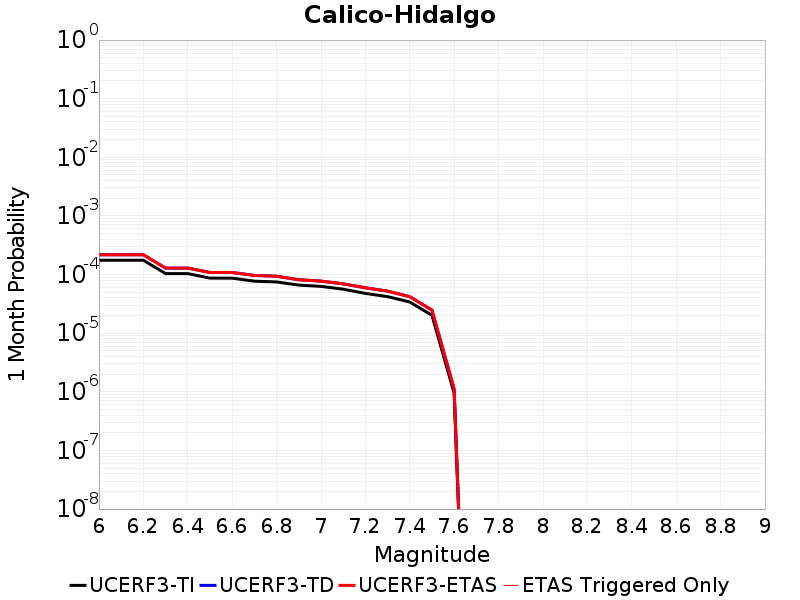 | 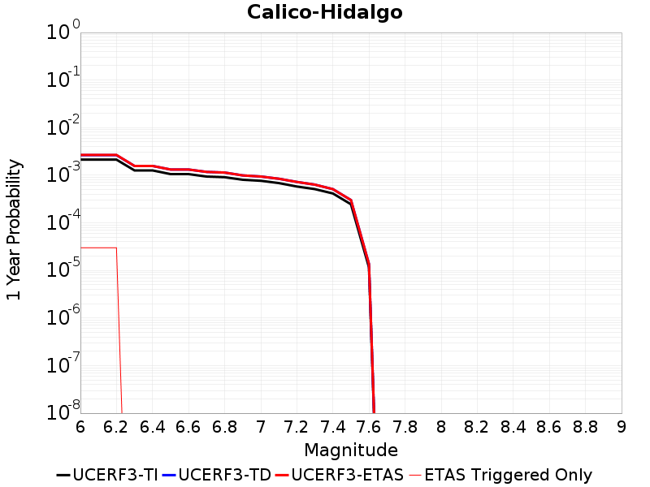 | 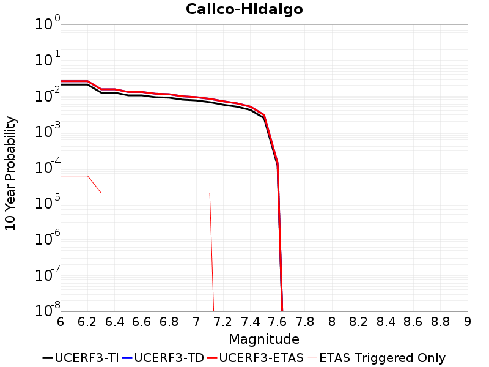 |

| Magnitude | 1 wk TI Prob | 1 wk TD Prob | 1 wk ETAS Prob | 1 wk ETAS/TD Gain | 1 wk ETAS Triggered Only | 1 mo TI Prob | 1 mo TD Prob | 1 mo ETAS Prob | 1 mo ETAS/TD Gain | 1 mo ETAS Triggered Only | 1 yr TI Prob | 1 yr TD Prob | 1 yr ETAS Prob | 1 yr ETAS/TD Gain | 1 yr ETAS Triggered Only | 10 yr TI Prob | 10 yr TD Prob | 10 yr ETAS Prob | 10 yr ETAS/TD Gain | 10 yr ETAS Triggered Only |
|-----|-----|-----|-----|-----|-----|-----|-----|-----|-----|-----|-----|-----|-----|-----|-----|-----|-----|-----|-----|-----|
| 6.0 | 4.0906612E-5 | 5.075389E-5 | 5.075389E-5 | 1.0 | 0.0 | 1.7530227E-4 | 2.1750083E-4 | 2.1750083E-4 | 1.0 | 0.0 | 0.0021322158 | 0.0026452544 | 0.002675175 | 1.011311 | 3.0E-5 | 0.02111873 | 0.026178034 | 0.026236463 | 1.002232 | 6.0E-5 |
| 6.1 | 4.0906612E-5 | 5.075389E-5 | 5.075389E-5 | 1.0 | 0.0 | 1.7530227E-4 | 2.1750083E-4 | 2.1750083E-4 | 1.0 | 0.0 | 0.0021322158 | 0.0026452544 | 0.002675175 | 1.011311 | 3.0E-5 | 0.02111873 | 0.026178034 | 0.026236463 | 1.002232 | 6.0E-5 |
| 6.2 | 4.0906612E-5 | 5.075389E-5 | 5.075389E-5 | 1.0 | 0.0 | 1.7530227E-4 | 2.1750083E-4 | 2.1750083E-4 | 1.0 | 0.0 | 0.0021322158 | 0.0026452544 | 0.002675175 | 1.011311 | 3.0E-5 | 0.02111873 | 0.026178034 | 0.026236463 | 1.002232 | 6.0E-5 |
| 6.3 | 2.4242801E-5 | 3.0112036E-5 | 3.0112036E-5 | 1.0 | 0.0 | 1.0389358E-4 | 1.290454E-4 | 1.290454E-4 | 1.0 | 0.0 | 0.0012641704 | 0.0015700288 | 0.0015700288 | 1.0 | 0.0 | 0.01257003 | 0.015593053 | 0.015612741 | 1.0012627 | 2.0E-5 |
| 6.4 | 2.4242801E-5 | 3.0112036E-5 | 3.0112036E-5 | 1.0 | 0.0 | 1.0389358E-4 | 1.290454E-4 | 1.290454E-4 | 1.0 | 0.0 | 0.0012641704 | 0.0015700288 | 0.0015700288 | 1.0 | 0.0 | 0.01257003 | 0.015593053 | 0.015612741 | 1.0012627 | 2.0E-5 |
| 6.5 | 2.0286952E-5 | 2.5331581E-5 | 2.5331581E-5 | 1.0 | 0.0 | 8.694118E-5 | 1.0855949E-4 | 1.0855949E-4 | 1.0 | 0.0 | 0.0010579949 | 0.0013209276 | 0.0013209276 | 1.0 | 0.0 | 0.010529719 | 0.013132697 | 0.0131524345 | 1.0015029 | 2.0E-5 |
| 6.6 | 2.0269223E-5 | 2.5312522E-5 | 2.5312522E-5 | 1.0 | 0.0 | 8.6865206E-5 | 1.0847782E-4 | 1.0847782E-4 | 1.0 | 0.0 | 0.0010570707 | 0.0013199344 | 0.0013199344 | 1.0 | 0.0 | 0.010520565 | 0.013122882 | 0.013142619 | 1.0015041 | 2.0E-5 |
| 6.7 | 1.799852E-5 | 2.2554208E-5 | 2.2554208E-5 | 1.0 | 0.0 | 7.713423E-5 | 9.665739E-5 | 9.665739E-5 | 1.0 | 0.0 | 9.3870464E-4 | 0.001176183 | 0.001176183 | 1.0 | 0.0 | 0.009347493 | 0.011701193 | 0.011720958 | 1.0016892 | 2.0E-5 |
| 6.8 | 1.7458793E-5 | 2.1855312E-5 | 2.1855312E-5 | 1.0 | 0.0 | 7.4821255E-5 | 9.366234E-5 | 9.366234E-5 | 1.0 | 0.0 | 9.10568E-4 | 0.0011397569 | 0.0011397569 | 1.0 | 0.0 | 0.009068459 | 0.0113407 | 0.011360473 | 1.0017436 | 2.0E-5 |
| 6.9 | 1.542884E-5 | 1.9037481E-5 | 1.9037481E-5 | 1.0 | 0.0 | 6.612192E-5 | 8.1586724E-5 | 8.1586724E-5 | 1.0 | 0.0 | 8.04737E-4 | 9.928789E-4 | 9.928789E-4 | 1.0 | 0.0 | 0.008018291 | 0.009885828 | 0.00990563 | 1.0020031 | 2.0E-5 |
| 7.0 | 1.468253E-5 | 1.8041568E-5 | 1.8041568E-5 | 1.0 | 0.0 | 6.292361E-5 | 7.7318786E-5 | 7.7318786E-5 | 1.0 | 0.0 | 7.658257E-4 | 9.409627E-4 | 9.409627E-4 | 1.0 | 0.0 | 0.0076319184 | 0.009371152 | 0.009390965 | 1.0021142 | 2.0E-5 |
| 7.1 | 1.3139281E-5 | 1.6210888E-5 | 1.6210888E-5 | 1.0 | 0.0 | 5.6309986E-5 | 6.9473455E-5 | 6.9473455E-5 | 1.0 | 0.0 | 6.853584E-4 | 8.455237E-4 | 8.455237E-4 | 1.0 | 0.0 | 0.0068324856 | 0.008424366 | 0.0084441975 | 1.002354 | 2.0E-5 |
| 7.2 | 1.1127404E-5 | 1.3875398E-5 | 1.3875398E-5 | 1.0 | 0.0 | 4.7688E-5 | 5.9464695E-5 | 5.9464695E-5 | 1.0 | 0.0 | 5.8044674E-4 | 7.2375307E-4 | 7.2375307E-4 | 1.0 | 0.0 | 0.0057893298 | 0.007215068 | 0.007215068 | 1.0 | 0.0 |
| 7.3 | 9.808154E-6 | 1.218253E-5 | 1.218253E-5 | 1.0 | 0.0 | 4.2034266E-5 | 5.2209856E-5 | 5.2209856E-5 | 1.0 | 0.0 | 5.11647E-4 | 6.3548033E-4 | 6.3548033E-4 | 1.0 | 0.0 | 0.0051047057 | 0.006337708 | 0.006337708 | 1.0 | 0.0 |
| 7.4 | 7.942452E-6 | 9.795942E-6 | 9.795942E-6 | 1.0 | 0.0 | 3.4038632E-5 | 4.1981988E-5 | 4.1981988E-5 | 1.0 | 0.0 | 4.1434157E-4 | 5.110203E-4 | 5.110203E-4 | 1.0 | 0.0 | 0.0041356985 | 0.005099394 | 0.005099394 | 1.0 | 0.0 |
| 7.5 | 4.7121216E-6 | 5.7751668E-6 | 5.7751668E-6 | 1.0 | 0.0 | 2.019465E-5 | 2.4750521E-5 | 2.4750521E-5 | 1.0 | 0.0 | 2.4584212E-4 | 3.013036E-4 | 3.013036E-4 | 1.0 | 0.0 | 0.0024557032 | 0.0030097037 | 0.0030097037 | 1.0 | 0.0 |
| 7.6 | 2.21172E-7 | 2.6045635E-7 | 2.6045635E-7 | 1.0 | 0.0 | 9.478797E-7 | 1.1162413E-6 | 1.1162413E-6 | 1.0 | 0.0 | 1.1540374E-5 | 1.3590181E-5 | 1.3590181E-5 | 1.0 | 0.0 | 1.1539775E-4 | 1.358963E-4 | 1.358963E-4 | 1.0 | 0.0 |

## Scodie Lineament
*[(top)](#table-of-contents)*

| 1 Week | 1 Month | 1 Year | 10 Year |
|-----|-----|-----|-----|
|  | 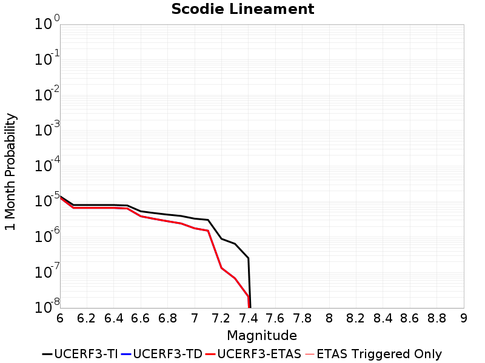 | 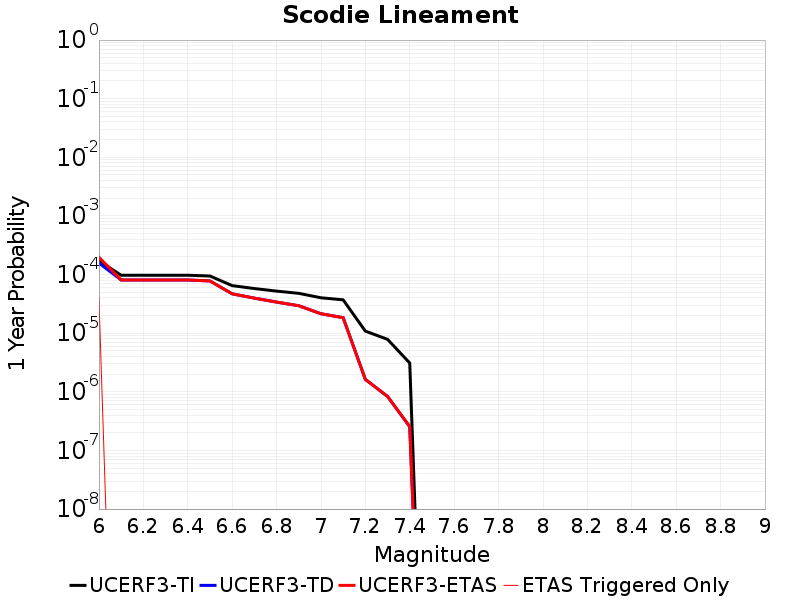 |  |

| Magnitude | 1 wk TI Prob | 1 wk TD Prob | 1 wk ETAS Prob | 1 wk ETAS/TD Gain | 1 wk ETAS Triggered Only | 1 mo TI Prob | 1 mo TD Prob | 1 mo ETAS Prob | 1 mo ETAS/TD Gain | 1 mo ETAS Triggered Only | 1 yr TI Prob | 1 yr TD Prob | 1 yr ETAS Prob | 1 yr ETAS/TD Gain | 1 yr ETAS Triggered Only | 10 yr TI Prob | 10 yr TD Prob | 10 yr ETAS Prob | 10 yr ETAS/TD Gain | 10 yr ETAS Triggered Only |
|-----|-----|-----|-----|-----|-----|-----|-----|-----|-----|-----|-----|-----|-----|-----|-----|-----|-----|-----|-----|-----|
| 6.0 | 3.2919327E-6 | 3.014024E-6 | 3.014024E-6 | 1.0 | 0.0 | 1.4108206E-5 | 1.29172E-5 | 1.29172E-5 | 1.0 | 0.0 | 1.7175387E-4 | 1.5725874E-4 | 1.9725245E-4 | 1.2543179 | 4.0E-5 | 0.0017162118 | 0.0015717862 | 0.0016316919 | 1.0381131 | 6.0E-5 |
| 6.1 | 1.8663811E-6 | 1.5494795E-6 | 1.5494795E-6 | 1.0 | 0.0 | 7.998751E-6 | 6.6406124E-6 | 6.6406124E-6 | 1.0 | 0.0 | 9.738045E-5 | 8.0846956E-5 | 8.0846956E-5 | 1.0 | 0.0 | 9.7337784E-4 | 8.0822426E-4 | 8.0822426E-4 | 1.0 | 0.0 |
| 6.2 | 1.8663811E-6 | 1.5494795E-6 | 1.5494795E-6 | 1.0 | 0.0 | 7.998751E-6 | 6.6406124E-6 | 6.6406124E-6 | 1.0 | 0.0 | 9.738045E-5 | 8.0846956E-5 | 8.0846956E-5 | 1.0 | 0.0 | 9.7337784E-4 | 8.0822426E-4 | 8.0822426E-4 | 1.0 | 0.0 |
| 6.3 | 1.8663811E-6 | 1.5494795E-6 | 1.5494795E-6 | 1.0 | 0.0 | 7.998751E-6 | 6.6406124E-6 | 6.6406124E-6 | 1.0 | 0.0 | 9.738045E-5 | 8.0846956E-5 | 8.0846956E-5 | 1.0 | 0.0 | 9.7337784E-4 | 8.0822426E-4 | 8.0822426E-4 | 1.0 | 0.0 |
| 6.4 | 1.8663811E-6 | 1.5494795E-6 | 1.5494795E-6 | 1.0 | 0.0 | 7.998751E-6 | 6.6406124E-6 | 6.6406124E-6 | 1.0 | 0.0 | 9.738045E-5 | 8.0846956E-5 | 8.0846956E-5 | 1.0 | 0.0 | 9.7337784E-4 | 8.0822426E-4 | 8.0822426E-4 | 1.0 | 0.0 |
| 6.5 | 1.8106311E-6 | 1.4913983E-6 | 1.4913983E-6 | 1.0 | 0.0 | 7.759824E-6 | 6.391694E-6 | 6.391694E-6 | 1.0 | 0.0 | 9.447177E-5 | 7.781659E-5 | 7.781659E-5 | 1.0 | 0.0 | 9.4431615E-4 | 7.779421E-4 | 7.779421E-4 | 1.0 | 0.0 |
| 6.6 | 1.2414679E-6 | 9.0002476E-7 | 9.0002476E-7 | 1.0 | 0.0 | 5.320566E-6 | 3.857244E-6 | 3.857244E-6 | 1.0 | 0.0 | 6.477596E-5 | 4.696102E-5 | 4.696102E-5 | 1.0 | 0.0 | 6.475708E-4 | 4.695196E-4 | 4.695196E-4 | 1.0 | 0.0 |
| 6.7 | 1.1062215E-6 | 7.596667E-7 | 7.596667E-7 | 1.0 | 0.0 | 4.7409408E-6 | 3.255711E-6 | 3.255711E-6 | 1.0 | 0.0 | 5.7719422E-5 | 3.963763E-5 | 3.963763E-5 | 1.0 | 0.0 | 5.770443E-4 | 3.963126E-4 | 3.963126E-4 | 1.0 | 0.0 |
| 6.8 | 1.0006736E-6 | 6.5025006E-7 | 6.5025006E-7 | 1.0 | 0.0 | 4.288594E-6 | 2.7867832E-6 | 2.7867832E-6 | 1.0 | 0.0 | 5.221238E-5 | 3.392862E-5 | 3.392862E-5 | 1.0 | 0.0 | 5.220012E-4 | 3.3924048E-4 | 3.3924048E-4 | 1.0 | 0.0 |
| 6.9 | 9.167364E-7 | 5.633535E-7 | 5.633535E-7 | 1.0 | 0.0 | 3.9288643E-6 | 2.4143703E-6 | 2.4143703E-6 | 1.0 | 0.0 | 4.7832873E-5 | 2.9394621E-5 | 2.9394621E-5 | 1.0 | 0.0 | 4.782258E-4 | 2.93913E-4 | 2.93913E-4 | 1.0 | 0.0 |
| 7.0 | 7.6987664E-7 | 4.1149684E-7 | 4.1149684E-7 | 1.0 | 0.0 | 3.2994672E-6 | 1.7635568E-6 | 1.7635568E-6 | 1.0 | 0.0 | 4.0170275E-5 | 2.1471133E-5 | 2.1471133E-5 | 1.0 | 0.0 | 4.0163012E-4 | 2.1469445E-4 | 2.1469445E-4 | 1.0 | 0.0 |
| 7.1 | 7.1038727E-7 | 3.5226094E-7 | 3.5226094E-7 | 1.0 | 0.0 | 3.0445133E-6 | 1.509689E-6 | 1.509689E-6 | 1.0 | 0.0 | 3.706632E-5 | 1.8380344E-5 | 1.8380344E-5 | 1.0 | 0.0 | 3.7060137E-4 | 1.8379174E-4 | 1.8379174E-4 | 1.0 | 0.0 |
| 7.2 | 2.0799602E-7 | 3.12255E-8 | 3.12255E-8 | 1.0 | 0.0 | 8.914113E-7 | 1.3382358E-7 | 1.3382358E-7 | 1.0 | 0.0 | 1.0852878E-5 | 1.6293009E-6 | 1.6293009E-6 | 1.0 | 0.0 | 1.08523476E-4 | 1.6292895E-5 | 1.6292895E-5 | 1.0 | 0.0 |
| 7.3 | 1.5048182E-7 | 1.5973221E-8 | 1.5973221E-8 | 1.0 | 0.0 | 6.449219E-7 | 6.845666E-8 | 6.845666E-8 | 1.0 | 0.0 | 7.851896E-6 | 8.334595E-7 | 8.334595E-7 | 1.0 | 0.0 | 7.851618E-5 | 8.334567E-6 | 8.334567E-6 | 1.0 | 0.0 |
| 7.4 | 5.9334678E-8 | 4.880312E-9 | 4.880312E-9 | 1.0 | 0.0 | 2.5429145E-7 | 2.0915623E-8 | 2.0915623E-8 | 1.0 | 0.0 | 3.095994E-6 | 2.546477E-7 | 2.546477E-7 | 1.0 | 0.0 | 3.095951E-5 | 2.5464751E-6 | 2.5464751E-6 | 1.0 | 0.0 |

## Baker
*[(top)](#table-of-contents)*

| 1 Week | 1 Month | 1 Year | 10 Year |
|-----|-----|-----|-----|
|  |  |  |  |

| Magnitude | 1 wk TI Prob | 1 wk TD Prob | 1 wk ETAS Prob | 1 wk ETAS/TD Gain | 1 wk ETAS Triggered Only | 1 mo TI Prob | 1 mo TD Prob | 1 mo ETAS Prob | 1 mo ETAS/TD Gain | 1 mo ETAS Triggered Only | 1 yr TI Prob | 1 yr TD Prob | 1 yr ETAS Prob | 1 yr ETAS/TD Gain | 1 yr ETAS Triggered Only | 10 yr TI Prob | 10 yr TD Prob | 10 yr ETAS Prob | 10 yr ETAS/TD Gain | 10 yr ETAS Triggered Only |
|-----|-----|-----|-----|-----|-----|-----|-----|-----|-----|-----|-----|-----|-----|-----|-----|-----|-----|-----|-----|-----|
| 6.0 | 5.695525E-6 | 5.8357473E-6 | 5.8357473E-6 | 1.0 | 0.0 | 2.4409164E-5 | 2.501013E-5 | 5.500938E-5 | 2.199484 | 3.0E-5 | 2.9714106E-4 | 3.044598E-4 | 3.4444762E-4 | 1.1313403 | 4.0E-5 | 0.0029674405 | 0.0030408225 | 0.0030906703 | 1.016393 | 5.0E-5 |
| 6.1 | 5.695525E-6 | 5.8357473E-6 | 5.8357473E-6 | 1.0 | 0.0 | 2.4409164E-5 | 2.501013E-5 | 5.500938E-5 | 2.199484 | 3.0E-5 | 2.9714106E-4 | 3.044598E-4 | 3.4444762E-4 | 1.1313403 | 4.0E-5 | 0.0029674405 | 0.0030408225 | 0.0030906703 | 1.016393 | 5.0E-5 |
| 6.2 | 5.695525E-6 | 5.8357473E-6 | 5.8357473E-6 | 1.0 | 0.0 | 2.4409164E-5 | 2.501013E-5 | 5.500938E-5 | 2.199484 | 3.0E-5 | 2.9714106E-4 | 3.044598E-4 | 3.4444762E-4 | 1.1313403 | 4.0E-5 | 0.0029674405 | 0.0030408225 | 0.0030906703 | 1.016393 | 5.0E-5 |
| 6.3 | 3.2995713E-6 | 3.3842186E-6 | 3.3842186E-6 | 1.0 | 0.0 | 1.4140943E-5 | 1.4503717E-5 | 2.4503572E-5 | 1.6894685 | 1.0E-5 | 1.7215237E-4 | 1.7656891E-4 | 1.9656538E-4 | 1.1132503 | 2.0E-5 | 0.0017201907 | 0.0017643333 | 0.0017942804 | 1.0169736 | 3.0E-5 |
| 6.4 | 3.2995713E-6 | 3.3842186E-6 | 3.3842186E-6 | 1.0 | 0.0 | 1.4140943E-5 | 1.4503717E-5 | 2.4503572E-5 | 1.6894685 | 1.0E-5 | 1.7215237E-4 | 1.7656891E-4 | 1.9656538E-4 | 1.1132503 | 2.0E-5 | 0.0017201907 | 0.0017643333 | 0.0017942804 | 1.0169736 | 3.0E-5 |
| 6.5 | 2.782202E-6 | 2.8563243E-6 | 2.8563243E-6 | 1.0 | 0.0 | 1.1923668E-5 | 1.2241335E-5 | 2.2241213E-5 | 1.8168944 | 1.0E-5 | 1.4516099E-4 | 1.4902839E-4 | 1.690254E-4 | 1.1341826 | 2.0E-5 | 0.001450662 | 0.0014893172 | 0.0015192726 | 1.0201135 | 3.0E-5 |
| 6.6 | 2.3163404E-6 | 2.3813452E-6 | 2.3813452E-6 | 1.0 | 0.0 | 9.927136E-6 | 1.02057265E-5 | 2.0205625E-5 | 1.979832 | 1.0E-5 | 1.20856166E-4 | 1.2424785E-4 | 1.4424536E-4 | 1.1609486 | 2.0E-5 | 0.0012079047 | 0.001241804 | 0.0012617791 | 1.0160856 | 2.0E-5 |
| 6.7 | 2.037056E-6 | 2.0968926E-6 | 2.0968926E-6 | 1.0 | 0.0 | 8.7302105E-6 | 8.986653E-6 | 1.8986562E-5 | 2.1127515 | 1.0E-5 | 1.0628513E-4 | 1.0940716E-4 | 1.2940497E-4 | 1.1827834 | 2.0E-5 | 0.0010623431 | 0.0010935492 | 0.0011135272 | 1.0182691 | 2.0E-5 |
| 6.8 | 1.8356744E-6 | 1.8918977E-6 | 1.8918977E-6 | 1.0 | 0.0 | 7.867153E-6 | 8.108109E-6 | 1.8108027E-5 | 2.2333233 | 1.0E-5 | 9.577837E-5 | 9.871189E-5 | 1.1870992E-4 | 1.2025899 | 2.0E-5 | 9.57371E-4 | 9.866944E-4 | 0.0010066747 | 1.0202497 | 2.0E-5 |
| 6.9 | 1.6310546E-6 | 1.6835522E-6 | 1.6835522E-6 | 1.0 | 0.0 | 6.9902153E-6 | 7.2152047E-6 | 1.7215132E-5 | 2.385952 | 1.0E-5 | 8.510255E-5 | 8.784169E-5 | 1.0783994E-4 | 1.2276623 | 2.0E-5 | 8.5069967E-4 | 8.7808096E-4 | 8.980634E-4 | 1.0227569 | 2.0E-5 |
| 7.0 | 1.2058036E-6 | 1.2511659E-6 | 1.2511659E-6 | 1.0 | 0.0 | 5.1677193E-6 | 5.362129E-6 | 1.5362075E-5 | 2.8649209 | 1.0E-5 | 6.291517E-5 | 6.528199E-5 | 8.528068E-5 | 1.3063432 | 2.0E-5 | 6.289736E-4 | 6.526304E-4 | 6.7261735E-4 | 1.0306252 | 2.0E-5 |
| 7.1 | 1.052382E-6 | 1.0954456E-6 | 1.0954456E-6 | 1.0 | 0.0 | 4.5102006E-6 | 4.6947584E-6 | 1.4694711E-5 | 3.1300251 | 1.0E-5 | 5.491031E-5 | 5.715719E-5 | 7.7156044E-5 | 1.3498923 | 2.0E-5 | 5.4896745E-4 | 5.714258E-4 | 5.9141434E-4 | 1.0349802 | 2.0E-5 |
| 7.2 | 1.0067454E-6 | 1.0490509E-6 | 1.0490509E-6 | 1.0 | 0.0 | 4.3146156E-6 | 4.4959247E-6 | 4.4959247E-6 | 1.0 | 0.0 | 5.252918E-5 | 5.4736516E-5 | 6.473597E-5 | 1.1826833 | 1.0E-5 | 5.251676E-4 | 5.4723123E-4 | 5.572257E-4 | 1.0182638 | 1.0E-5 |
| 7.3 | 9.3596316E-7 | 9.770442E-7 | 9.770442E-7 | 1.0 | 0.0 | 4.0112645E-6 | 4.187326E-6 | 4.187326E-6 | 1.0 | 0.0 | 4.8836053E-5 | 5.097951E-5 | 6.0979E-5 | 1.1961472 | 1.0E-5 | 4.8825322E-4 | 5.096789E-4 | 5.1967386E-4 | 1.0196102 | 1.0E-5 |
| 7.4 | 8.8117395E-7 | 9.210304E-7 | 9.210304E-7 | 1.0 | 0.0 | 3.7764542E-6 | 3.947267E-6 | 3.947267E-6 | 1.0 | 0.0 | 4.5977362E-5 | 4.8056925E-5 | 5.8056445E-5 | 1.2080766 | 1.0E-5 | 4.596785E-4 | 4.804661E-4 | 4.904613E-4 | 1.0208031 | 1.0E-5 |
| 7.5 | 8.292386E-7 | 8.677147E-7 | 8.677147E-7 | 1.0 | 0.0 | 3.5538749E-6 | 3.7187717E-6 | 3.7187717E-6 | 1.0 | 0.0 | 4.326757E-5 | 4.5275112E-5 | 5.527466E-5 | 1.2208619 | 1.0E-5 | 4.3259145E-4 | 4.5265965E-4 | 4.626551E-4 | 1.0220816 | 1.0E-5 |
| 7.6 | 7.553842E-7 | 7.91688E-7 | 7.91688E-7 | 1.0 | 0.0 | 3.2373566E-6 | 3.392944E-6 | 3.392944E-6 | 1.0 | 0.0 | 3.9414106E-5 | 4.1308318E-5 | 4.1308318E-5 | 1.0 | 0.0 | 3.9407116E-4 | 4.1300713E-4 | 4.1300713E-4 | 1.0 | 0.0 |
| 7.7 | 6.5285366E-7 | 6.854967E-7 | 6.854967E-7 | 1.0 | 0.0 | 2.797941E-6 | 2.9378396E-6 | 2.9378396E-6 | 1.0 | 0.0 | 3.40644E-5 | 3.5767618E-5 | 3.5767618E-5 | 1.0 | 0.0 | 3.405918E-4 | 3.5761925E-4 | 3.5761925E-4 | 1.0 | 0.0 |
| 7.8 | 3.4586725E-7 | 3.649536E-7 | 3.649536E-7 | 1.0 | 0.0 | 1.4822873E-6 | 1.5640859E-6 | 1.5640859E-6 | 1.0 | 0.0 | 1.80467E-5 | 1.9042584E-5 | 1.9042584E-5 | 1.0 | 0.0 | 1.8045233E-4 | 1.9040996E-4 | 1.9040996E-4 | 1.0 | 0.0 |
| 7.9 | 2.5591178E-9 | 2.670403E-9 | 2.670403E-9 | 1.0 | 0.0 | 1.0967647E-8 | 1.1444584E-8 | 1.1444584E-8 | 1.0 | 0.0 | 1.335311E-7 | 1.3933781E-7 | 1.3933781E-7 | 1.0 | 0.0 | 1.3353102E-6 | 1.393378E-6 | 1.393378E-6 | 1.0 | 0.0 |

## San Andreas (Coachella) rev
*[(top)](#table-of-contents)*

| 1 Week | 1 Month | 1 Year | 10 Year |
|-----|-----|-----|-----|
| 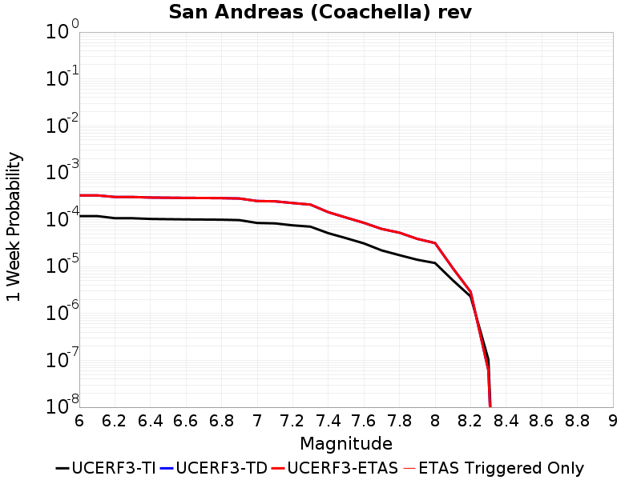 |  | 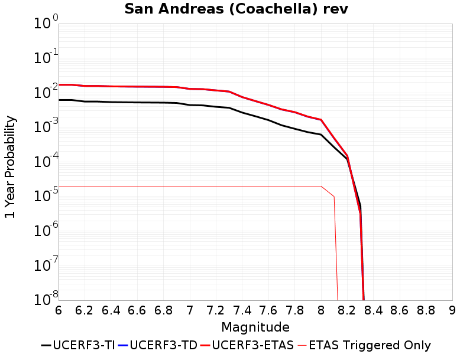 | 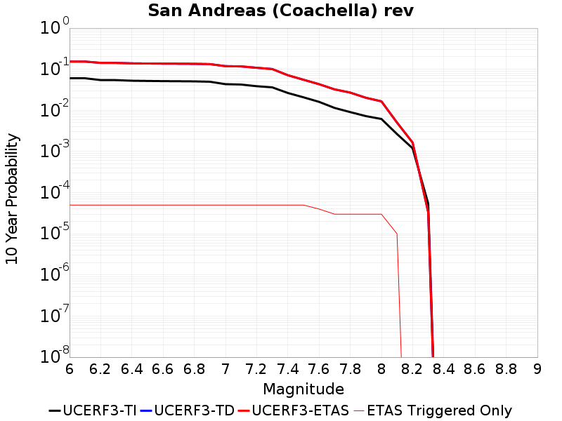 |

| Magnitude | 1 wk TI Prob | 1 wk TD Prob | 1 wk ETAS Prob | 1 wk ETAS/TD Gain | 1 wk ETAS Triggered Only | 1 mo TI Prob | 1 mo TD Prob | 1 mo ETAS Prob | 1 mo ETAS/TD Gain | 1 mo ETAS Triggered Only | 1 yr TI Prob | 1 yr TD Prob | 1 yr ETAS Prob | 1 yr ETAS/TD Gain | 1 yr ETAS Triggered Only | 10 yr TI Prob | 10 yr TD Prob | 10 yr ETAS Prob | 10 yr ETAS/TD Gain | 10 yr ETAS Triggered Only |
|-----|-----|-----|-----|-----|-----|-----|-----|-----|-----|-----|-----|-----|-----|-----|-----|-----|-----|-----|-----|-----|
| 6.0 | 1.1925945E-4 | 3.2957265E-4 | 3.2957265E-4 | 1.0 | 0.0 | 5.110118E-4 | 0.0014116945 | 0.0014116945 | 1.0 | 0.0 | 0.0062038354 | 0.017053287 | 0.017072946 | 1.0011528 | 2.0E-5 | 0.060334753 | 0.15351498 | 0.1535573 | 1.0002757 | 5.0E-5 |
| 6.1 | 1.1925945E-4 | 3.2957265E-4 | 3.2957265E-4 | 1.0 | 0.0 | 5.110118E-4 | 0.0014116945 | 0.0014116945 | 1.0 | 0.0 | 0.0062038354 | 0.017053287 | 0.017072946 | 1.0011528 | 2.0E-5 | 0.060334753 | 0.15351498 | 0.1535573 | 1.0002757 | 5.0E-5 |
| 6.2 | 1.07432395E-4 | 3.0456582E-4 | 3.0456582E-4 | 1.0 | 0.0 | 4.603433E-4 | 0.0013046332 | 0.0013046332 | 1.0 | 0.0 | 0.005590286 | 0.015769342 | 0.015789026 | 1.0012482 | 2.0E-5 | 0.05451731 | 0.14269674 | 0.14273961 | 1.0003004 | 5.0E-5 |
| 6.3 | 1.0718766E-4 | 3.0401876E-4 | 3.0401876E-4 | 1.0 | 0.0 | 4.592948E-4 | 0.001302291 | 0.001302291 | 1.0 | 0.0 | 0.005577586 | 0.015741238 | 0.015760925 | 1.0012505 | 2.0E-5 | 0.054396555 | 0.14246519 | 0.14250806 | 1.000301 | 5.0E-5 |
| 6.4 | 1.0355944E-4 | 2.960964E-4 | 2.960964E-4 | 1.0 | 0.0 | 4.4375064E-4 | 0.0012683715 | 0.0012683715 | 1.0 | 0.0 | 0.0053892885 | 0.015334152 | 0.015353845 | 1.0012842 | 2.0E-5 | 0.052604496 | 0.13902698 | 0.13907003 | 1.0003096 | 5.0E-5 |
| 6.5 | 1.0227914E-4 | 2.9328966E-4 | 2.9328966E-4 | 1.0 | 0.0 | 4.382655E-4 | 0.0012563542 | 0.0012563542 | 1.0 | 0.0 | 0.0053228354 | 0.015189892 | 0.015209588 | 1.0012966 | 2.0E-5 | 0.051971316 | 0.13781251 | 0.13785562 | 1.0003128 | 5.0E-5 |
| 6.6 | 1.0116757E-4 | 2.909462E-4 | 2.909462E-4 | 1.0 | 0.0 | 4.3350324E-4 | 0.0012463203 | 0.0012463203 | 1.0 | 0.0 | 0.0052651367 | 0.015069425 | 0.0150891235 | 1.0013072 | 2.0E-5 | 0.051421247 | 0.13679175 | 0.13683492 | 1.0003155 | 5.0E-5 |
| 6.7 | 1.0050676E-4 | 2.8953116E-4 | 2.8953116E-4 | 1.0 | 0.0 | 4.3067214E-4 | 0.0012402617 | 0.0012402617 | 1.0 | 0.0 | 0.005230834 | 0.014996679 | 0.015016379 | 1.0013137 | 2.0E-5 | 0.051094085 | 0.13617705 | 0.13622025 | 1.0003172 | 5.0E-5 |
| 6.8 | 9.976819E-5 | 2.8756252E-4 | 2.8756252E-4 | 1.0 | 0.0 | 4.2750788E-4 | 0.0012318328 | 0.0012318328 | 1.0 | 0.0 | 0.0051924936 | 0.014895465 | 0.014915166 | 1.0013227 | 2.0E-5 | 0.050728295 | 0.13532737 | 0.1353706 | 1.0003195 | 5.0E-5 |
| 6.9 | 9.77719E-5 | 2.8251365E-4 | 2.8251365E-4 | 1.0 | 0.0 | 4.1895514E-4 | 0.0012102149 | 0.0012102149 | 1.0 | 0.0 | 0.0050888555 | 0.014635833 | 0.014655541 | 1.0013465 | 2.0E-5 | 0.049738888 | 0.13315092 | 0.13319427 | 1.0003256 | 5.0E-5 |
| 7.0 | 8.500761E-5 | 2.497241E-4 | 2.497241E-4 | 1.0 | 0.0 | 3.6426744E-4 | 0.0010698105 | 0.0010698105 | 1.0 | 0.0 | 0.0044259406 | 0.012947943 | 0.012967684 | 1.0015247 | 2.0E-5 | 0.04338823 | 0.11898203 | 0.11902608 | 1.0003703 | 5.0E-5 |
| 7.1 | 8.319876E-5 | 2.4572542E-4 | 2.4572542E-4 | 1.0 | 0.0 | 3.5651738E-4 | 0.0010526872 | 0.0010526872 | 1.0 | 0.0 | 0.004331963 | 0.012741926 | 0.012761671 | 1.0015496 | 2.0E-5 | 0.042484846 | 0.11719375 | 0.11723789 | 1.0003767 | 5.0E-5 |
| 7.2 | 7.563917E-5 | 2.2614171E-4 | 2.2614171E-4 | 1.0 | 0.0 | 3.2412758E-4 | 9.6882187E-4 | 9.6882187E-4 | 1.0 | 0.0 | 0.0039391145 | 0.011732314 | 0.011752079 | 1.0016847 | 2.0E-5 | 0.03870018 | 0.10858208 | 0.10862665 | 1.0004104 | 5.0E-5 |
| 7.3 | 7.082985E-5 | 2.0921929E-4 | 2.0921929E-4 | 1.0 | 0.0 | 3.0352117E-4 | 8.963489E-4 | 8.963489E-4 | 1.0 | 0.0 | 0.0036891096 | 0.010859077 | 0.010878859 | 1.0018218 | 2.0E-5 | 0.03628465 | 0.10108072 | 0.101125665 | 1.0004447 | 5.0E-5 |
| 7.4 | 5.146215E-5 | 1.4426174E-4 | 1.4426174E-4 | 1.0 | 0.0 | 2.2053342E-4 | 6.18119E-4 | 6.18119E-4 | 1.0 | 0.0 | 0.0026816884 | 0.0074998233 | 0.0075196736 | 1.0026467 | 2.0E-5 | 0.02649557 | 0.07151221 | 0.07155863 | 1.0006492 | 5.0E-5 |
| 7.5 | 4.0285166E-5 | 1.10715686E-4 | 1.10715686E-4 | 1.0 | 0.0 | 1.7263928E-4 | 4.7440984E-4 | 4.7440984E-4 | 1.0 | 0.0 | 0.002099857 | 0.005760714 | 0.0057805986 | 1.0034518 | 2.0E-5 | 0.020801254 | 0.055589207 | 0.05563643 | 1.0008495 | 5.0E-5 |
| 7.6 | 3.1168736E-5 | 8.553982E-5 | 8.553982E-5 | 1.0 | 0.0 | 1.3357346E-4 | 3.6654784E-4 | 3.6654784E-4 | 1.0 | 0.0 | 0.0016250437 | 0.0044536153 | 0.004473526 | 1.0044707 | 2.0E-5 | 0.016132116 | 0.043328952 | 0.04336722 | 1.0008832 | 4.0E-5 |
| 7.7 | 2.2100989E-5 | 6.340091E-5 | 6.340091E-5 | 1.0 | 0.0 | 9.4715084E-5 | 2.7168993E-4 | 2.7168993E-4 | 1.0 | 0.0 | 0.001152546 | 0.0033028144 | 0.0033227485 | 1.0060354 | 2.0E-5 | 0.011465867 | 0.03236028 | 0.03238931 | 1.000897 | 3.0E-5 |
| 7.8 | 1.7484861E-5 | 5.269951E-5 | 5.269951E-5 | 1.0 | 0.0 | 7.493296E-5 | 2.258355E-4 | 2.258355E-4 | 1.0 | 0.0 | 9.1192697E-4 | 0.0027460833 | 0.0027660285 | 1.0072631 | 2.0E-5 | 0.009081938 | 0.027051505 | 0.027080692 | 1.001079 | 3.0E-5 |
| 7.9 | 1.3967285E-5 | 3.8964114E-5 | 3.8964114E-5 | 1.0 | 0.0 | 5.985842E-5 | 1.6697838E-4 | 1.6697838E-4 | 1.0 | 0.0 | 7.2853256E-4 | 0.0020310674 | 0.0020510268 | 1.009827 | 2.0E-5 | 0.0072614877 | 0.020252045 | 0.020281438 | 1.0014514 | 3.0E-5 |
| 8.0 | 1.1887396E-5 | 3.170315E-5 | 3.170315E-5 | 1.0 | 0.0 | 5.094499E-5 | 1.3586358E-4 | 1.3586358E-4 | 1.0 | 0.0 | 6.200787E-4 | 0.0016528851 | 0.001672852 | 1.0120801 | 2.0E-5 | 0.006183513 | 0.016576352 | 0.016605854 | 1.0017798 | 3.0E-5 |
| 8.1 | 5.100864E-6 | 9.235421E-6 | 9.235421E-6 | 1.0 | 0.0 | 2.1860664E-5 | 3.9579776E-5 | 3.9579776E-5 | 1.0 | 0.0 | 2.6612106E-4 | 4.8177736E-4 | 4.9177255E-4 | 1.0207465 | 1.0E-5 | 0.002658026 | 0.005048203 | 0.005058152 | 1.0019709 | 1.0E-5 |
| 8.2 | 2.3004484E-6 | 2.8907662E-6 | 2.8907662E-6 | 1.0 | 0.0 | 9.859027E-6 | 1.2388939E-5 | 1.2388939E-5 | 1.0 | 0.0 | 1.2002704E-4 | 1.5082493E-4 | 1.5082493E-4 | 1.0 | 0.0 | 0.0011996223 | 0.0016512597 | 0.0016512597 | 1.0 | 0.0 |
| 8.3 | 1.0424446E-7 | 6.0977555E-8 | 6.0977555E-8 | 1.0 | 0.0 | 4.4676187E-7 | 2.6133233E-7 | 2.6133233E-7 | 1.0 | 0.0 | 5.439312E-6 | 3.181717E-6 | 3.181717E-6 | 1.0 | 0.0 | 5.4391792E-5 | 3.3411765E-5 | 3.3411765E-5 | 1.0 | 0.0 |

## White Wolf (Extension)
*[(top)](#table-of-contents)*

| 1 Week | 1 Month | 1 Year | 10 Year |
|-----|-----|-----|-----|
|  | 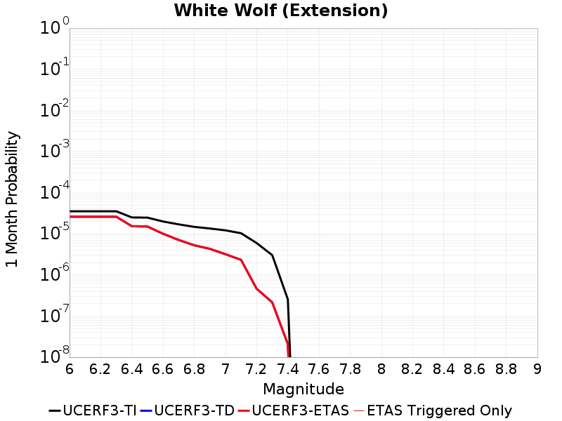 |  | 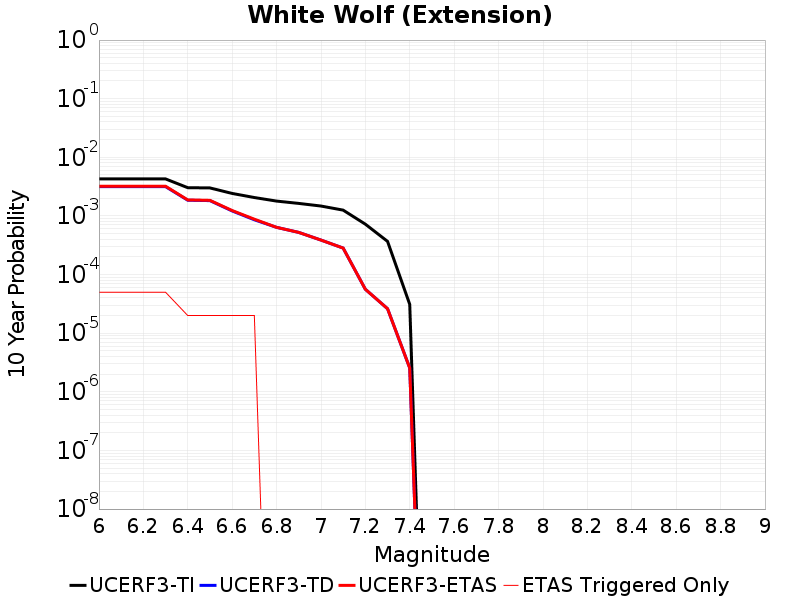 |

| Magnitude | 1 wk TI Prob | 1 wk TD Prob | 1 wk ETAS Prob | 1 wk ETAS/TD Gain | 1 wk ETAS Triggered Only | 1 mo TI Prob | 1 mo TD Prob | 1 mo ETAS Prob | 1 mo ETAS/TD Gain | 1 mo ETAS Triggered Only | 1 yr TI Prob | 1 yr TD Prob | 1 yr ETAS Prob | 1 yr ETAS/TD Gain | 1 yr ETAS Triggered Only | 10 yr TI Prob | 10 yr TD Prob | 10 yr ETAS Prob | 10 yr ETAS/TD Gain | 10 yr ETAS Triggered Only |
|-----|-----|-----|-----|-----|-----|-----|-----|-----|-----|-----|-----|-----|-----|-----|-----|-----|-----|-----|-----|-----|
| 6.0 | 8.222555E-6 | 6.0685543E-6 | 6.0685543E-6 | 1.0 | 0.0 | 3.5239045E-5 | 2.6007869E-5 | 2.6007869E-5 | 1.0 | 0.0 | 4.289509E-4 | 3.1660643E-4 | 3.2660324E-4 | 1.031575 | 1.0E-5 | 0.0042812387 | 0.003162206 | 0.0032120477 | 1.0157617 | 5.0E-5 |
| 6.1 | 8.222555E-6 | 6.0685543E-6 | 6.0685543E-6 | 1.0 | 0.0 | 3.5239045E-5 | 2.6007869E-5 | 2.6007869E-5 | 1.0 | 0.0 | 4.289509E-4 | 3.1660643E-4 | 3.2660324E-4 | 1.031575 | 1.0E-5 | 0.0042812387 | 0.003162206 | 0.0032120477 | 1.0157617 | 5.0E-5 |
| 6.2 | 8.222555E-6 | 6.0685543E-6 | 6.0685543E-6 | 1.0 | 0.0 | 3.5239045E-5 | 2.6007869E-5 | 2.6007869E-5 | 1.0 | 0.0 | 4.289509E-4 | 3.1660643E-4 | 3.2660324E-4 | 1.031575 | 1.0E-5 | 0.0042812387 | 0.003162206 | 0.0032120477 | 1.0157617 | 5.0E-5 |
| 6.3 | 8.222555E-6 | 6.0685543E-6 | 6.0685543E-6 | 1.0 | 0.0 | 3.5239045E-5 | 2.6007869E-5 | 2.6007869E-5 | 1.0 | 0.0 | 4.289509E-4 | 3.1660643E-4 | 3.2660324E-4 | 1.031575 | 1.0E-5 | 0.0042812387 | 0.003162206 | 0.0032120477 | 1.0157617 | 5.0E-5 |
| 6.4 | 5.821773E-6 | 3.5583444E-6 | 3.5583444E-6 | 1.0 | 0.0 | 2.4950215E-5 | 1.5249964E-5 | 1.5249964E-5 | 1.0 | 0.0 | 3.0372653E-4 | 1.856536E-4 | 1.9565174E-4 | 1.0538538 | 1.0E-5 | 0.0030331176 | 0.0018550934 | 0.0018750563 | 1.0107611 | 2.0E-5 |
| 6.5 | 5.766023E-6 | 3.5002631E-6 | 3.5002631E-6 | 1.0 | 0.0 | 2.4711293E-5 | 1.5001047E-5 | 1.5001047E-5 | 1.0 | 0.0 | 3.0081844E-4 | 1.8262355E-4 | 1.9262172E-4 | 1.0547475 | 1.0E-5 | 0.0030041158 | 0.0018248429 | 0.0018448065 | 1.0109398 | 2.0E-5 |
| 6.6 | 4.643576E-6 | 2.3334865E-6 | 2.3334865E-6 | 1.0 | 0.0 | 1.9900888E-5 | 1.000062E-5 | 1.000062E-5 | 1.0 | 0.0 | 2.4226638E-4 | 1.21751174E-4 | 1.3174996E-4 | 1.0821247 | 1.0E-5 | 0.0024200242 | 0.0012168871 | 0.0012368629 | 1.0164154 | 2.0E-5 |
| 6.7 | 3.9529173E-6 | 1.6490349E-6 | 1.6490349E-6 | 1.0 | 0.0 | 1.6940963E-5 | 7.067274E-6 | 7.067274E-6 | 1.0 | 0.0 | 2.0623671E-4 | 8.6040855E-5 | 9.603999E-5 | 1.1162139 | 1.0E-5 | 0.002060454 | 8.600939E-4 | 8.800767E-4 | 1.0232333 | 2.0E-5 |
| 6.8 | 3.4377522E-6 | 1.2250898E-6 | 1.2250898E-6 | 1.0 | 0.0 | 1.473314E-5 | 5.2503747E-6 | 5.2503747E-6 | 1.0 | 0.0 | 1.7936122E-4 | 6.392153E-5 | 6.392153E-5 | 1.0 | 0.0 | 0.0017921652 | 6.3904055E-4 | 6.3904055E-4 | 1.0 | 0.0 |
| 6.9 | 3.1367306E-6 | 1.0038744E-6 | 1.0038744E-6 | 1.0 | 0.0 | 1.3443062E-5 | 4.302312E-6 | 4.302312E-6 | 1.0 | 0.0 | 1.63657E-4 | 5.237947E-5 | 5.237947E-5 | 1.0 | 0.0 | 0.0016353652 | 5.236789E-4 | 5.236789E-4 | 1.0 | 0.0 |
| 7.0 | 2.8298145E-6 | 7.4329233E-7 | 7.4329233E-7 | 1.0 | 0.0 | 1.2127721E-5 | 3.185535E-6 | 3.185535E-6 | 1.0 | 0.0 | 1.47645E-4 | 3.8783248E-5 | 3.8783248E-5 | 1.0 | 0.0 | 0.0014754693 | 3.877698E-4 | 3.877698E-4 | 1.0 | 0.0 |
| 7.1 | 2.4091064E-6 | 5.4261795E-7 | 5.4261795E-7 | 1.0 | 0.0 | 1.03247E-5 | 2.3255038E-6 | 2.3255038E-6 | 1.0 | 0.0 | 1.2569598E-4 | 2.8312681E-5 | 2.8312681E-5 | 1.0 | 0.0 | 0.001256249 | 2.830948E-4 | 2.830948E-4 | 1.0 | 0.0 |
| 7.2 | 1.3875518E-6 | 1.07591774E-7 | 1.07591774E-7 | 1.0 | 0.0 | 5.9466374E-6 | 4.611075E-7 | 4.611075E-7 | 1.0 | 0.0 | 7.23979E-5 | 5.6139706E-6 | 5.6139706E-6 | 1.0 | 0.0 | 7.2374323E-4 | 5.6138404E-5 | 5.6138404E-5 | 1.0 | 0.0 |
| 7.3 | 7.056077E-7 | 5.0114572E-8 | 5.0114572E-8 | 1.0 | 0.0 | 3.0240296E-6 | 2.1477673E-7 | 2.1477673E-7 | 1.0 | 0.0 | 3.681694E-5 | 2.614904E-6 | 2.614904E-6 | 1.0 | 0.0 | 3.681084E-4 | 2.6148778E-5 | 2.6148778E-5 | 1.0 | 0.0 |
| 7.4 | 5.9334678E-8 | 4.880312E-9 | 4.880312E-9 | 1.0 | 0.0 | 2.5429145E-7 | 2.0915623E-8 | 2.0915623E-8 | 1.0 | 0.0 | 3.095994E-6 | 2.546477E-7 | 2.546477E-7 | 1.0 | 0.0 | 3.095951E-5 | 2.5464751E-6 | 2.5464751E-6 | 1.0 | 0.0 |

## Manix-Afton Hills
*[(top)](#table-of-contents)*

| 1 Week | 1 Month | 1 Year | 10 Year |
|-----|-----|-----|-----|
| 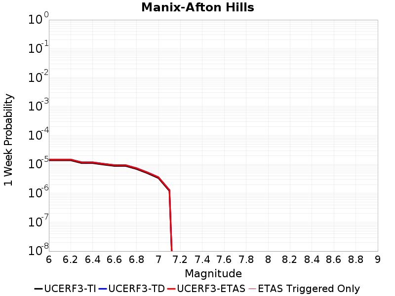 |  | 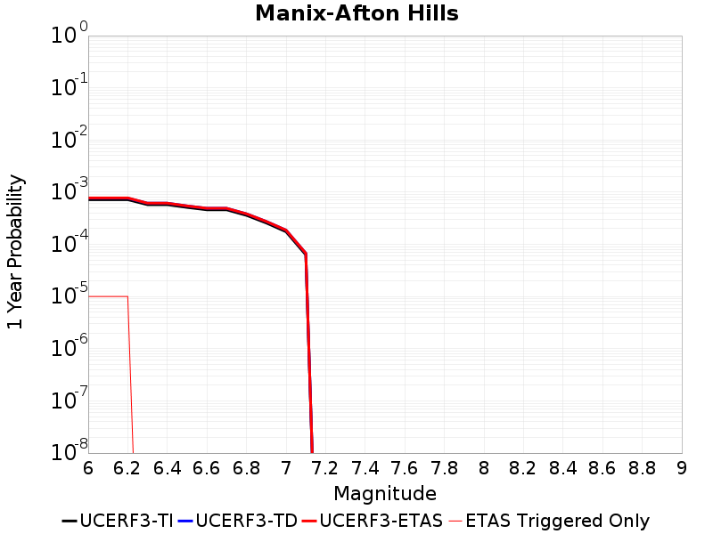 | 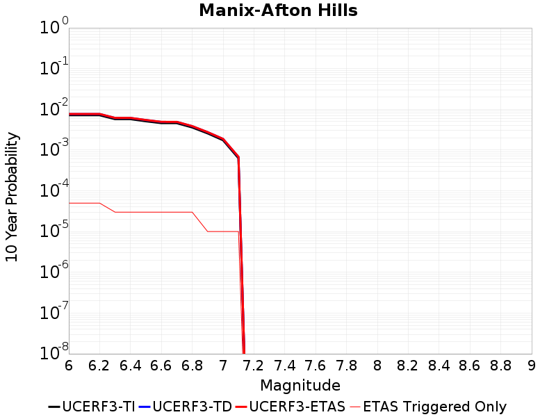 |

| Magnitude | 1 wk TI Prob | 1 wk TD Prob | 1 wk ETAS Prob | 1 wk ETAS/TD Gain | 1 wk ETAS Triggered Only | 1 mo TI Prob | 1 mo TD Prob | 1 mo ETAS Prob | 1 mo ETAS/TD Gain | 1 mo ETAS Triggered Only | 1 yr TI Prob | 1 yr TD Prob | 1 yr ETAS Prob | 1 yr ETAS/TD Gain | 1 yr ETAS Triggered Only | 10 yr TI Prob | 10 yr TD Prob | 10 yr ETAS Prob | 10 yr ETAS/TD Gain | 10 yr ETAS Triggered Only |
|-----|-----|-----|-----|-----|-----|-----|-----|-----|-----|-----|-----|-----|-----|-----|-----|-----|-----|-----|-----|-----|
| 6.0 | 1.3783202E-5 | 1.4717381E-5 | 1.4717381E-5 | 1.0 | 0.0 | 5.906953E-5 | 6.3073065E-5 | 6.3073065E-5 | 1.0 | 0.0 | 7.189342E-4 | 7.676615E-4 | 7.776538E-4 | 1.0130166 | 1.0E-5 | 0.0071661277 | 0.0076518552 | 0.007701473 | 1.0064844 | 5.0E-5 |
| 6.1 | 1.3783202E-5 | 1.4717381E-5 | 1.4717381E-5 | 1.0 | 0.0 | 5.906953E-5 | 6.3073065E-5 | 6.3073065E-5 | 1.0 | 0.0 | 7.189342E-4 | 7.676615E-4 | 7.776538E-4 | 1.0130166 | 1.0E-5 | 0.0071661277 | 0.0076518552 | 0.007701473 | 1.0064844 | 5.0E-5 |
| 6.2 | 1.3783202E-5 | 1.4717381E-5 | 1.4717381E-5 | 1.0 | 0.0 | 5.906953E-5 | 6.3073065E-5 | 6.3073065E-5 | 1.0 | 0.0 | 7.189342E-4 | 7.676615E-4 | 7.776538E-4 | 1.0130166 | 1.0E-5 | 0.0071661277 | 0.0076518552 | 0.007701473 | 1.0064844 | 5.0E-5 |
| 6.3 | 1.10494875E-5 | 1.179818E-5 | 1.179818E-5 | 1.0 | 0.0 | 4.7354086E-5 | 5.0562707E-5 | 5.0562707E-5 | 1.0 | 0.0 | 5.763835E-4 | 6.1543746E-4 | 6.1543746E-4 | 1.0 | 0.0 | 0.005748908 | 0.0061383722 | 0.006168188 | 1.0048573 | 3.0E-5 |
| 6.4 | 1.10494875E-5 | 1.179818E-5 | 1.179818E-5 | 1.0 | 0.0 | 4.7354086E-5 | 5.0562707E-5 | 5.0562707E-5 | 1.0 | 0.0 | 5.763835E-4 | 6.1543746E-4 | 6.1543746E-4 | 1.0 | 0.0 | 0.005748908 | 0.0061383722 | 0.006168188 | 1.0048573 | 3.0E-5 |
| 6.5 | 9.788949E-6 | 1.0458836E-5 | 1.0458836E-5 | 1.0 | 0.0 | 4.1951964E-5 | 4.4822867E-5 | 4.4822867E-5 | 1.0 | 0.0 | 5.1064545E-4 | 5.4559106E-4 | 5.4559106E-4 | 1.0 | 0.0 | 0.0050947363 | 0.0054434435 | 0.00547328 | 1.0054812 | 3.0E-5 |
| 6.6 | 8.810006E-6 | 9.4177285E-6 | 9.4177285E-6 | 1.0 | 0.0 | 3.775662E-5 | 4.036112E-5 | 4.036112E-5 | 1.0 | 0.0 | 4.5958988E-4 | 4.912947E-4 | 4.912947E-4 | 1.0 | 0.0 | 0.0045864056 | 0.0049029686 | 0.0049328217 | 1.0060887 | 3.0E-5 |
| 6.7 | 8.80128E-6 | 9.4082025E-6 | 9.4082025E-6 | 1.0 | 0.0 | 3.7719226E-5 | 4.0320294E-5 | 4.0320294E-5 | 1.0 | 0.0 | 4.591348E-4 | 4.907979E-4 | 4.907979E-4 | 1.0 | 0.0 | 0.004581874 | 0.004898023 | 0.004927876 | 1.0060949 | 3.0E-5 |
| 6.8 | 6.8994877E-6 | 7.3833444E-6 | 7.3833444E-6 | 1.0 | 0.0 | 2.9568899E-5 | 3.164257E-5 | 3.164257E-5 | 1.0 | 0.0 | 3.5994186E-4 | 3.8518832E-4 | 3.8518832E-4 | 1.0 | 0.0 | 0.003593594 | 0.0038460125 | 0.003875897 | 1.0077703 | 3.0E-5 |
| 6.9 | 4.9328037E-6 | 5.273259E-6 | 5.273259E-6 | 1.0 | 0.0 | 2.1140417E-5 | 2.259952E-5 | 2.259952E-5 | 1.0 | 0.0 | 2.5735417E-4 | 2.7512058E-4 | 2.7512058E-4 | 1.0 | 0.0 | 0.0025705635 | 0.0027484056 | 0.0027583782 | 1.0036285 | 1.0E-5 |
| 7.0 | 3.347973E-6 | 3.5916808E-6 | 3.5916808E-6 | 1.0 | 0.0 | 1.4348378E-5 | 1.539285E-5 | 1.539285E-5 | 1.0 | 0.0 | 1.746775E-4 | 1.8739593E-4 | 1.8739593E-4 | 1.0 | 0.0 | 0.0017454025 | 0.001872782 | 0.0018827633 | 1.0053296 | 1.0E-5 |
| 7.1 | 1.2073567E-6 | 1.2940671E-6 | 1.2940671E-6 | 1.0 | 0.0 | 5.1743755E-6 | 5.545999E-6 | 5.545999E-6 | 1.0 | 0.0 | 6.29962E-5 | 6.752209E-5 | 6.752209E-5 | 1.0 | 0.0 | 6.297835E-4 | 6.75176E-4 | 6.8516925E-4 | 1.0148009 | 1.0E-5 |

## Cleghorn Lake
*[(top)](#table-of-contents)*

| 1 Week | 1 Month | 1 Year | 10 Year |
|-----|-----|-----|-----|
|  |  | 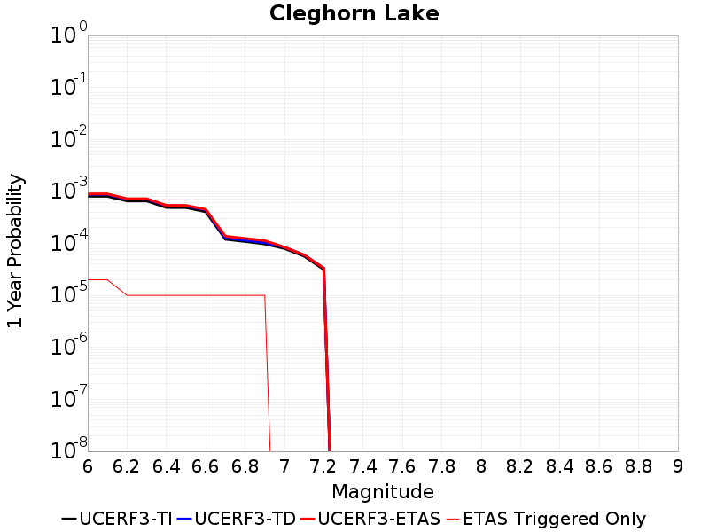 |  |

| Magnitude | 1 wk TI Prob | 1 wk TD Prob | 1 wk ETAS Prob | 1 wk ETAS/TD Gain | 1 wk ETAS Triggered Only | 1 mo TI Prob | 1 mo TD Prob | 1 mo ETAS Prob | 1 mo ETAS/TD Gain | 1 mo ETAS Triggered Only | 1 yr TI Prob | 1 yr TD Prob | 1 yr ETAS Prob | 1 yr ETAS/TD Gain | 1 yr ETAS Triggered Only | 10 yr TI Prob | 10 yr TD Prob | 10 yr ETAS Prob | 10 yr ETAS/TD Gain | 10 yr ETAS Triggered Only |
|-----|-----|-----|-----|-----|-----|-----|-----|-----|-----|-----|-----|-----|-----|-----|-----|-----|-----|-----|-----|-----|
| 6.0 | 1.5467183E-5 | 1.6803371E-5 | 2.6803204E-5 | 1.5951086 | 1.0E-5 | 6.6286244E-5 | 7.201277E-5 | 8.201205E-5 | 1.1388543 | 1.0E-5 | 8.067362E-4 | 8.764577E-4 | 8.9644024E-4 | 1.0227991 | 2.0E-5 | 0.008038137 | 0.008735444 | 0.0087850075 | 1.0056738 | 5.0E-5 |
| 6.1 | 1.5467183E-5 | 1.6803371E-5 | 2.6803204E-5 | 1.5951086 | 1.0E-5 | 6.6286244E-5 | 7.201277E-5 | 8.201205E-5 | 1.1388543 | 1.0E-5 | 8.067362E-4 | 8.764577E-4 | 8.9644024E-4 | 1.0227991 | 2.0E-5 | 0.008038137 | 0.008735444 | 0.0087850075 | 1.0056738 | 5.0E-5 |
| 6.2 | 1.2624631E-5 | 1.3688836E-5 | 1.3688836E-5 | 1.0 | 0.0 | 5.410444E-5 | 5.8665395E-5 | 5.8665395E-5 | 1.0 | 0.0 | 6.585225E-4 | 7.1406586E-4 | 7.240587E-4 | 1.0139943 | 1.0E-5 | 0.0065657445 | 0.0071225157 | 0.0071622306 | 1.005576 | 4.0E-5 |
| 6.3 | 1.2624631E-5 | 1.3688836E-5 | 1.3688836E-5 | 1.0 | 0.0 | 5.410444E-5 | 5.8665395E-5 | 5.8665395E-5 | 1.0 | 0.0 | 6.585225E-4 | 7.1406586E-4 | 7.240587E-4 | 1.0139943 | 1.0E-5 | 0.0065657445 | 0.0071225157 | 0.0071622306 | 1.005576 | 4.0E-5 |
| 6.4 | 9.417684E-6 | 1.0175295E-5 | 1.0175295E-5 | 1.0 | 0.0 | 4.036088E-5 | 4.360791E-5 | 4.360791E-5 | 1.0 | 0.0 | 4.912829E-4 | 5.308381E-4 | 5.4083276E-4 | 1.0188282 | 1.0E-5 | 0.004901982 | 0.0052997414 | 0.0053295824 | 1.0056306 | 3.0E-5 |
| 6.5 | 9.368219E-6 | 1.0122701E-5 | 1.0122701E-5 | 1.0 | 0.0 | 4.014889E-5 | 4.338251E-5 | 4.338251E-5 | 1.0 | 0.0 | 4.8870314E-4 | 5.2809523E-4 | 5.3808995E-4 | 1.018926 | 1.0E-5 | 0.004876298 | 0.005272443 | 0.005302285 | 1.0056599 | 3.0E-5 |
| 6.6 | 7.803798E-6 | 8.4462245E-6 | 8.4462245E-6 | 1.0 | 0.0 | 3.3444423E-5 | 3.6197827E-5 | 3.6197827E-5 | 1.0 | 0.0 | 4.0710976E-4 | 4.4065938E-4 | 4.5065497E-4 | 1.0226833 | 1.0E-5 | 0.0040636472 | 0.004401778 | 0.004431646 | 1.0067854 | 3.0E-5 |
| 6.7 | 2.3108669E-6 | 2.444726E-6 | 2.444726E-6 | 1.0 | 0.0 | 9.903678E-6 | 1.0477356E-5 | 1.0477356E-5 | 1.0 | 0.0 | 1.205706E-4 | 1.2755454E-4 | 1.3755326E-4 | 1.0783879 | 1.0E-5 | 0.001205052 | 0.0012748318 | 0.0012848191 | 1.0078342 | 1.0E-5 |
| 6.8 | 2.0882828E-6 | 2.207073E-6 | 2.207073E-6 | 1.0 | 0.0 | 8.949753E-6 | 9.458851E-6 | 9.458851E-6 | 1.0 | 0.0 | 1.08957785E-4 | 1.151556E-4 | 1.2515445E-4 | 1.0868291 | 1.0E-5 | 0.0010890438 | 0.0011509762 | 0.0011609646 | 1.0086783 | 1.0E-5 |
| 6.9 | 1.876935E-6 | 1.981748E-6 | 1.981748E-6 | 1.0 | 0.0 | 8.043982E-6 | 8.493179E-6 | 8.493179E-6 | 1.0 | 0.0 | 9.7931086E-5 | 1.033997E-4 | 1.1339867E-4 | 1.0967021 | 1.0E-5 | 9.788794E-4 | 0.001033532 | 0.0010435216 | 1.0096656 | 1.0E-5 |
| 7.0 | 1.5357559E-6 | 1.6208462E-6 | 1.6208462E-6 | 1.0 | 0.0 | 6.5817944E-6 | 6.9464663E-6 | 6.9464663E-6 | 1.0 | 0.0 | 8.01304E-5 | 8.457007E-5 | 8.457007E-5 | 1.0 | 0.0 | 8.010151E-4 | 8.453913E-4 | 8.453913E-4 | 1.0 | 0.0 |
| 7.1 | 1.0905424E-6 | 1.1501579E-6 | 1.1501579E-6 | 1.0 | 0.0 | 4.6737446E-6 | 4.9292394E-6 | 4.9292394E-6 | 1.0 | 0.0 | 5.6901354E-5 | 6.0011935E-5 | 6.0011935E-5 | 1.0 | 0.0 | 5.6886784E-4 | 5.999671E-4 | 5.999671E-4 | 1.0 | 0.0 |
| 7.2 | 6.06668E-7 | 6.3894174E-7 | 6.3894174E-7 | 1.0 | 0.0 | 2.600003E-6 | 2.7383194E-6 | 2.7383194E-6 | 1.0 | 0.0 | 3.1654577E-5 | 3.3338598E-5 | 3.3338598E-5 | 1.0 | 0.0 | 3.1650066E-4 | 3.3334282E-4 | 3.3334282E-4 | 1.0 | 0.0 |

## Brawley (Seismic Zone) alt 1
*[(top)](#table-of-contents)*

| 1 Week | 1 Month | 1 Year | 10 Year |
|-----|-----|-----|-----|
|  |  |  | 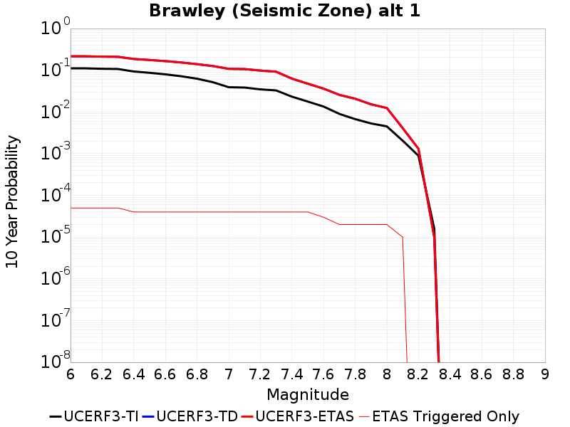 |

| Magnitude | 1 wk TI Prob | 1 wk TD Prob | 1 wk ETAS Prob | 1 wk ETAS/TD Gain | 1 wk ETAS Triggered Only | 1 mo TI Prob | 1 mo TD Prob | 1 mo ETAS Prob | 1 mo ETAS/TD Gain | 1 mo ETAS Triggered Only | 1 yr TI Prob | 1 yr TD Prob | 1 yr ETAS Prob | 1 yr ETAS/TD Gain | 1 yr ETAS Triggered Only | 10 yr TI Prob | 10 yr TD Prob | 10 yr ETAS Prob | 10 yr ETAS/TD Gain | 10 yr ETAS Triggered Only |
|-----|-----|-----|-----|-----|-----|-----|-----|-----|-----|-----|-----|-----|-----|-----|-----|-----|-----|-----|-----|-----|
| 6.0 | 2.2521618E-4 | 4.8117962E-4 | 4.8117962E-4 | 1.0 | 0.0 | 9.6485513E-4 | 0.0020606061 | 0.0020606061 | 1.0 | 0.0 | 0.011683988 | 0.024795061 | 0.024814565 | 1.0007867 | 2.0E-5 | 0.11088423 | 0.21515326 | 0.2151925 | 1.0001824 | 5.0E-5 |
| 6.1 | 2.2521618E-4 | 4.8117962E-4 | 4.8117962E-4 | 1.0 | 0.0 | 9.6485513E-4 | 0.0020606061 | 0.0020606061 | 1.0 | 0.0 | 0.011683988 | 0.024795061 | 0.024814565 | 1.0007867 | 2.0E-5 | 0.11088423 | 0.21515326 | 0.2151925 | 1.0001824 | 5.0E-5 |
| 6.2 | 2.198148E-4 | 4.7191686E-4 | 4.7191686E-4 | 1.0 | 0.0 | 9.417233E-4 | 0.0020209705 | 0.0020209705 | 1.0 | 0.0 | 0.011405343 | 0.024324173 | 0.024343686 | 1.0008023 | 2.0E-5 | 0.10837428 | 0.21156731 | 0.21160674 | 1.0001863 | 5.0E-5 |
| 6.3 | 2.1704129E-4 | 4.6625306E-4 | 4.6625306E-4 | 1.0 | 0.0 | 9.298453E-4 | 0.0019967342 | 0.0019967342 | 1.0 | 0.0 | 0.011262234 | 0.02403592 | 0.02405544 | 1.000812 | 2.0E-5 | 0.107082725 | 0.20945665 | 0.20949619 | 1.0001887 | 5.0E-5 |
| 6.4 | 1.876142E-4 | 4.049965E-4 | 4.049965E-4 | 1.0 | 0.0 | 8.038131E-4 | 0.0017345594 | 0.0017345594 | 1.0 | 0.0 | 0.00974259 | 0.02091253 | 0.020922322 | 1.0004681 | 1.0E-5 | 0.093263686 | 0.1862029 | 0.18623544 | 1.0001748 | 4.0E-5 |
| 6.5 | 1.7390939E-4 | 3.7914625E-4 | 3.7914625E-4 | 1.0 | 0.0 | 7.45113E-4 | 0.0016239132 | 0.0016239132 | 1.0 | 0.0 | 0.009034078 | 0.019591877 | 0.019601682 | 1.0005004 | 1.0E-5 | 0.086755216 | 0.17599362 | 0.17602658 | 1.0001873 | 4.0E-5 |
| 6.6 | 1.591791E-4 | 3.5306456E-4 | 3.5306456E-4 | 1.0 | 0.0 | 6.8201777E-4 | 0.0015122667 | 0.0015122667 | 1.0 | 0.0 | 0.008271996 | 0.01825697 | 0.018266788 | 1.0005378 | 1.0E-5 | 0.07970774 | 0.16535018 | 0.16538356 | 1.000202 | 4.0E-5 |
| 6.7 | 1.4268003E-4 | 3.244602E-4 | 3.244602E-4 | 1.0 | 0.0 | 6.1134255E-4 | 0.0013898112 | 0.0013898112 | 1.0 | 0.0 | 0.007417723 | 0.01679001 | 0.016799843 | 1.0005856 | 1.0E-5 | 0.07174956 | 0.15341455 | 0.15344842 | 1.0002208 | 4.0E-5 |
| 6.8 | 1.239713E-4 | 2.9377977E-4 | 2.9377977E-4 | 1.0 | 0.0 | 5.3119735E-4 | 0.001258455 | 0.001258455 | 1.0 | 0.0 | 0.0064481674 | 0.015215525 | 0.015225374 | 1.0006472 | 1.0E-5 | 0.06264243 | 0.1396604 | 0.13969481 | 1.0002464 | 4.0E-5 |
| 6.9 | 1.0180238E-4 | 2.650131E-4 | 2.650131E-4 | 1.0 | 0.0 | 4.3622297E-4 | 0.0011352804 | 0.0011352804 | 1.0 | 0.0 | 0.005298089 | 0.013735462 | 0.013745325 | 1.000718 | 1.0E-5 | 0.05173543 | 0.12595968 | 0.12599465 | 1.0002775 | 4.0E-5 |
| 7.0 | 7.6619996E-5 | 2.2583726E-4 | 2.2583726E-4 | 1.0 | 0.0 | 3.283301E-4 | 9.6751814E-4 | 9.6751814E-4 | 1.0 | 0.0 | 0.0039900932 | 0.011716632 | 0.011726515 | 1.0008435 | 1.0E-5 | 0.039192066 | 0.10801799 | 0.10805366 | 1.0003303 | 4.0E-5 |
| 7.1 | 7.5127435E-5 | 2.2264366E-4 | 2.2264366E-4 | 1.0 | 0.0 | 3.2193496E-4 | 9.5384143E-4 | 9.5384143E-4 | 1.0 | 0.0 | 0.0039125155 | 0.011551895 | 0.011561779 | 1.0008557 | 1.0E-5 | 0.038443442 | 0.10657306 | 0.1066088 | 1.0003353 | 4.0E-5 |
| 7.2 | 6.788582E-5 | 2.0385368E-4 | 2.0385368E-4 | 1.0 | 0.0 | 2.9090676E-4 | 8.7336916E-4 | 8.7336916E-4 | 1.0 | 0.0 | 0.0035360386 | 0.010582076 | 0.010591971 | 1.000935 | 1.0E-5 | 0.034803 | 0.09822449 | 0.09826056 | 1.0003673 | 4.0E-5 |
| 7.3 | 6.399602E-5 | 1.9008566E-4 | 1.9008566E-4 | 1.0 | 0.0 | 2.7423984E-4 | 8.1440137E-4 | 8.1440137E-4 | 1.0 | 0.0 | 0.0033337586 | 0.009870858 | 0.009880759 | 1.001003 | 1.0E-5 | 0.03284188 | 0.092095904 | 0.09213222 | 1.0003943 | 4.0E-5 |
| 7.4 | 4.506759E-5 | 1.2657295E-4 | 1.2657295E-4 | 1.0 | 0.0 | 1.9313251E-4 | 5.423436E-4 | 5.423436E-4 | 1.0 | 0.0 | 0.0023488526 | 0.00658322 | 0.0065931543 | 1.0015091 | 1.0E-5 | 0.023241805 | 0.062923566 | 0.06296105 | 1.0005957 | 4.0E-5 |
| 7.5 | 3.43289E-5 | 9.44146E-5 | 9.44146E-5 | 1.0 | 0.0 | 1.4711556E-4 | 4.0457156E-4 | 4.0457156E-4 | 1.0 | 0.0 | 0.0017896603 | 0.0049145976 | 0.0049245483 | 1.0020248 | 1.0E-5 | 0.01775316 | 0.04752927 | 0.047567368 | 1.0008016 | 4.0E-5 |
| 7.6 | 2.5980507E-5 | 7.14526E-5 | 7.14526E-5 | 1.0 | 0.0 | 1.1134028E-4 | 3.0618964E-4 | 3.0618964E-4 | 1.0 | 0.0 | 0.001354725 | 0.0037215112 | 0.003731474 | 1.0026771 | 1.0E-5 | 0.013464959 | 0.036258005 | 0.036286917 | 1.0007974 | 3.0E-5 |
| 7.7 | 1.7292105E-5 | 5.01948E-5 | 5.01948E-5 | 1.0 | 0.0 | 7.4106916E-5 | 2.1510287E-4 | 2.1510287E-4 | 1.0 | 0.0 | 9.018782E-4 | 0.0026157382 | 0.002625712 | 1.003813 | 1.0E-5 | 0.008982267 | 0.025648527 | 0.025668014 | 1.0007597 | 2.0E-5 |
| 7.8 | 1.2927471E-5 | 4.0378778E-5 | 4.0378778E-5 | 1.0 | 0.0 | 5.5402274E-5 | 1.7304045E-4 | 1.7304045E-4 | 1.0 | 0.0 | 6.743139E-4 | 0.0021047343 | 0.0021147134 | 1.0047412 | 1.0E-5 | 0.0067227143 | 0.020743664 | 0.02076325 | 1.0009441 | 2.0E-5 |
| 7.9 | 1.0200774E-5 | 2.9300338E-5 | 2.9300338E-5 | 1.0 | 0.0 | 4.371687E-5 | 1.2556683E-4 | 1.2556683E-4 | 1.0 | 0.0 | 5.321229E-4 | 0.0015277053 | 0.00153769 | 1.0065358 | 1.0E-5 | 0.005308505 | 0.015247896 | 0.015267592 | 1.0012916 | 2.0E-5 |
| 8.0 | 8.650396E-6 | 2.3753317E-5 | 2.3753317E-5 | 1.0 | 0.0 | 3.70726E-5 | 1.01795966E-4 | 1.01795966E-4 | 1.0 | 0.0 | 4.5126543E-4 | 0.001238662 | 0.0012486497 | 1.0080632 | 1.0E-5 | 0.0045035016 | 0.012432535 | 0.012452287 | 1.0015887 | 2.0E-5 |
| 8.1 | 3.9368224E-6 | 7.533524E-6 | 7.533524E-6 | 1.0 | 0.0 | 1.6871985E-5 | 3.228613E-5 | 3.228613E-5 | 1.0 | 0.0 | 2.0539707E-4 | 3.930129E-4 | 4.0300895E-4 | 1.0254345 | 1.0E-5 | 0.0020520731 | 0.0041029546 | 0.0041129137 | 1.0024272 | 1.0E-5 |
| 8.2 | 1.7101195E-6 | 2.297047E-6 | 2.297047E-6 | 1.0 | 0.0 | 7.329063E-6 | 9.844451E-6 | 9.844451E-6 | 1.0 | 0.0 | 8.922769E-5 | 1.19849625E-4 | 1.19849625E-4 | 1.0 | 0.0 | 8.9191867E-4 | 0.0013072533 | 0.0013072533 | 1.0 | 0.0 |
| 8.3 | 3.0346666E-8 | 1.8046213E-8 | 1.8046213E-8 | 1.0 | 0.0 | 1.3005713E-7 | 7.7340914E-8 | 7.7340914E-8 | 1.0 | 0.0 | 1.5834444E-6 | 9.416255E-7 | 9.416255E-7 | 1.0 | 0.0 | 1.5834332E-5 | 9.811313E-6 | 9.811313E-6 | 1.0 | 0.0 |

## Santa Rosa Island
*[(top)](#table-of-contents)*

| 1 Week | 1 Month | 1 Year | 10 Year |
|-----|-----|-----|-----|
| 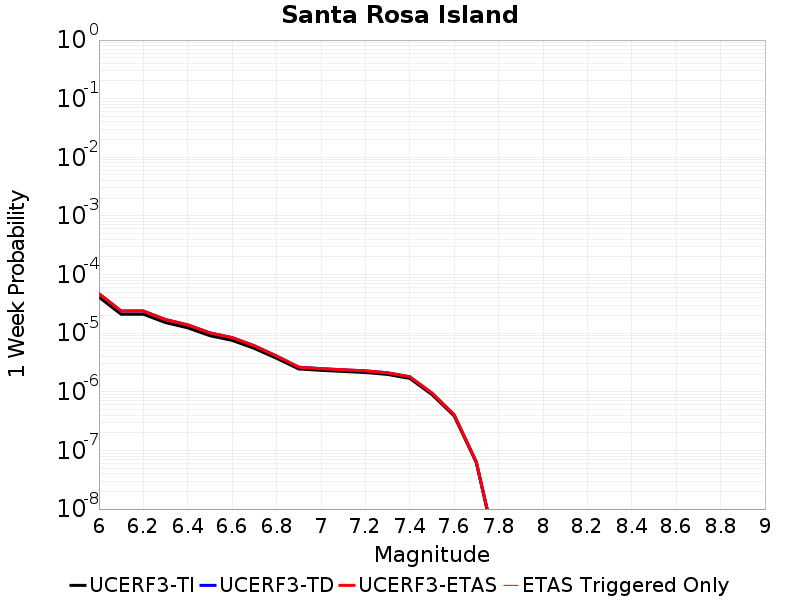 | 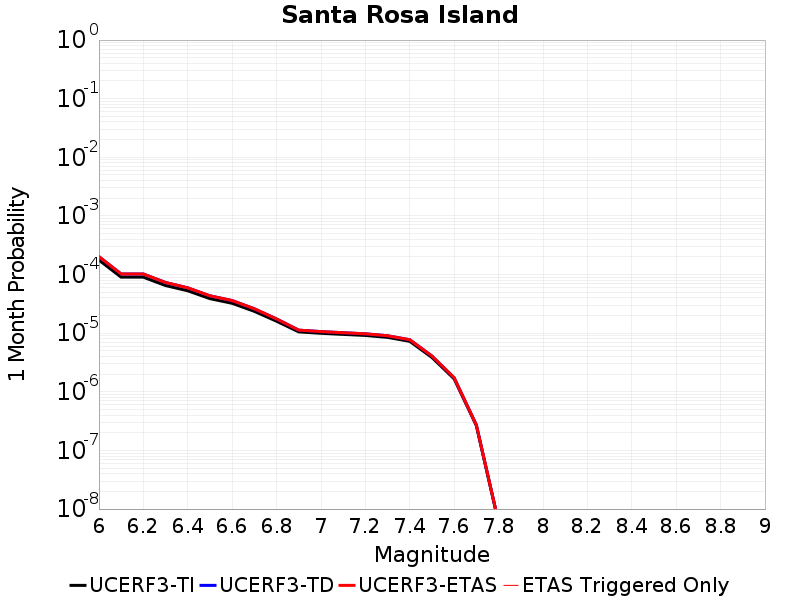 |  |  |

| Magnitude | 1 wk TI Prob | 1 wk TD Prob | 1 wk ETAS Prob | 1 wk ETAS/TD Gain | 1 wk ETAS Triggered Only | 1 mo TI Prob | 1 mo TD Prob | 1 mo ETAS Prob | 1 mo ETAS/TD Gain | 1 mo ETAS Triggered Only | 1 yr TI Prob | 1 yr TD Prob | 1 yr ETAS Prob | 1 yr ETAS/TD Gain | 1 yr ETAS Triggered Only | 10 yr TI Prob | 10 yr TD Prob | 10 yr ETAS Prob | 10 yr ETAS/TD Gain | 10 yr ETAS Triggered Only |
|-----|-----|-----|-----|-----|-----|-----|-----|-----|-----|-----|-----|-----|-----|-----|-----|-----|-----|-----|-----|-----|
| 6.0 | 4.1143165E-5 | 4.7134545E-5 | 4.7134545E-5 | 1.0 | 0.0 | 1.7631594E-4 | 2.0199067E-4 | 2.0199067E-4 | 1.0 | 0.0 | 0.002144533 | 0.0024566597 | 0.0024566597 | 1.0 | 0.0 | 0.021239553 | 0.024315702 | 0.024364486 | 1.0020063 | 5.0E-5 |
| 6.1 | 2.1061249E-5 | 2.3885224E-5 | 2.3885224E-5 | 1.0 | 0.0 | 9.0259375E-5 | 1.02361395E-4 | 1.02361395E-4 | 1.0 | 0.0 | 0.0010983539 | 0.0012455665 | 0.0012455665 | 1.0 | 0.0 | 0.01092941 | 0.012388899 | 0.012398775 | 1.0007972 | 1.0E-5 |
| 6.2 | 2.1061249E-5 | 2.3885224E-5 | 2.3885224E-5 | 1.0 | 0.0 | 9.0259375E-5 | 1.02361395E-4 | 1.02361395E-4 | 1.0 | 0.0 | 0.0010983539 | 0.0012455665 | 0.0012455665 | 1.0 | 0.0 | 0.01092941 | 0.012388899 | 0.012398775 | 1.0007972 | 1.0E-5 |
| 6.3 | 1.5158236E-5 | 1.7088192E-5 | 1.7088192E-5 | 1.0 | 0.0 | 6.496225E-5 | 7.323312E-5 | 7.323312E-5 | 1.0 | 0.0 | 7.906284E-4 | 8.912605E-4 | 8.912605E-4 | 1.0 | 0.0 | 0.007878214 | 0.008878116 | 0.008888027 | 1.0011164 | 1.0E-5 |
| 6.4 | 1.2341918E-5 | 1.3863745E-5 | 1.3863745E-5 | 1.0 | 0.0 | 5.2892858E-5 | 5.9414746E-5 | 5.9414746E-5 | 1.0 | 0.0 | 6.437803E-4 | 7.231426E-4 | 7.231426E-4 | 1.0 | 0.0 | 0.006419184 | 0.007208733 | 0.007218661 | 1.0013772 | 1.0E-5 |
| 6.5 | 9.061158E-6 | 1.012457E-5 | 1.012457E-5 | 1.0 | 0.0 | 3.883296E-5 | 4.3390322E-5 | 4.3390322E-5 | 1.0 | 0.0 | 4.726887E-4 | 5.281544E-4 | 5.281544E-4 | 1.0 | 0.0 | 0.004716845 | 0.005269531 | 0.0052794786 | 1.0018877 | 1.0E-5 |
| 6.6 | 7.5461685E-6 | 8.406825E-6 | 8.406825E-6 | 1.0 | 0.0 | 3.2340322E-5 | 3.6028778E-5 | 3.6028778E-5 | 1.0 | 0.0 | 3.936723E-4 | 4.3856638E-4 | 4.3856638E-4 | 1.0 | 0.0 | 0.003929756 | 0.004377439 | 0.004377439 | 1.0 | 0.0 |
| 6.7 | 5.5023775E-6 | 6.0915363E-6 | 6.0915363E-6 | 1.0 | 0.0 | 2.3581404E-5 | 2.6106341E-5 | 2.6106341E-5 | 1.0 | 0.0 | 2.8706578E-4 | 3.178016E-4 | 3.178016E-4 | 1.0 | 0.0 | 0.0028669522 | 0.0031737934 | 0.0031737934 | 1.0 | 0.0 |
| 6.8 | 3.7351679E-6 | 4.0855907E-6 | 4.0855907E-6 | 1.0 | 0.0 | 1.6007763E-5 | 1.750957E-5 | 1.750957E-5 | 1.0 | 0.0 | 1.948771E-4 | 2.1316066E-4 | 2.1316066E-4 | 1.0 | 0.0 | 0.0019470629 | 0.0021298076 | 0.0021298076 | 1.0 | 0.0 |
| 6.9 | 2.456366E-6 | 2.6304579E-6 | 2.6304579E-6 | 1.0 | 0.0 | 1.0527241E-5 | 1.1273342E-5 | 1.1273342E-5 | 1.0 | 0.0 | 1.2816161E-4 | 1.3724432E-4 | 1.3724432E-4 | 1.0 | 0.0 | 0.0012808773 | 0.0013715986 | 0.0013715986 | 1.0 | 0.0 |
| 7.0 | 2.3245157E-6 | 2.4838623E-6 | 2.4838623E-6 | 1.0 | 0.0 | 9.962172E-6 | 1.0645081E-5 | 1.0645081E-5 | 1.0 | 0.0 | 1.2128269E-4 | 1.2959617E-4 | 1.2959617E-4 | 1.0 | 0.0 | 0.0012121652 | 0.0012952082 | 0.0012952082 | 1.0 | 0.0 |
| 7.1 | 2.2248344E-6 | 2.3742653E-6 | 2.3742653E-6 | 1.0 | 0.0 | 9.53497E-6 | 1.0175382E-5 | 1.0175382E-5 | 1.0 | 0.0 | 1.1608207E-4 | 1.2387826E-4 | 1.2387826E-4 | 1.0 | 0.0 | 0.0011602144 | 0.0012380941 | 0.0012380941 | 1.0 | 0.0 |
| 7.2 | 2.1350402E-6 | 2.277119E-6 | 2.277119E-6 | 1.0 | 0.0 | 9.150141E-6 | 9.759045E-6 | 9.759045E-6 | 1.0 | 0.0 | 1.1139726E-4 | 1.1880991E-4 | 1.1880991E-4 | 1.0 | 0.0 | 0.0011134144 | 0.0011874659 | 0.0011874659 | 1.0 | 0.0 |
| 7.3 | 1.9793572E-6 | 2.1096037E-6 | 2.1096037E-6 | 1.0 | 0.0 | 8.482932E-6 | 9.041128E-6 | 9.041128E-6 | 1.0 | 0.0 | 1.032748E-4 | 1.10070185E-4 | 1.10070185E-4 | 1.0 | 0.0 | 0.0010322682 | 0.0011001584 | 0.0011001584 | 1.0 | 0.0 |
| 7.4 | 1.6951194E-6 | 1.8053227E-6 | 1.8053227E-6 | 1.0 | 0.0 | 7.264777E-6 | 7.737074E-6 | 7.737074E-6 | 1.0 | 0.0 | 8.844508E-5 | 9.4194824E-5 | 9.4194824E-5 | 1.0 | 0.0 | 8.840988E-4 | 9.415506E-4 | 9.415506E-4 | 1.0 | 0.0 |
| 7.5 | 8.987207E-7 | 9.515831E-7 | 9.515831E-7 | 1.0 | 0.0 | 3.8516546E-6 | 4.078207E-6 | 4.078207E-6 | 1.0 | 0.0 | 4.6892885E-5 | 4.965105E-5 | 4.965105E-5 | 1.0 | 0.0 | 4.688299E-4 | 4.9640075E-4 | 4.9640075E-4 | 1.0 | 0.0 |
| 7.6 | 3.8783037E-7 | 4.054167E-7 | 4.054167E-7 | 1.0 | 0.0 | 1.6621291E-6 | 1.737499E-6 | 1.737499E-6 | 1.0 | 0.0 | 2.0236233E-5 | 2.1153852E-5 | 2.1153852E-5 | 1.0 | 0.0 | 2.023439E-4 | 2.1151903E-4 | 2.1151903E-4 | 1.0 | 0.0 |
| 7.7 | 6.181804E-8 | 6.340542E-8 | 6.340542E-8 | 1.0 | 0.0 | 2.6493444E-7 | 2.717375E-7 | 2.717375E-7 | 1.0 | 0.0 | 3.225572E-6 | 3.308399E-6 | 3.308399E-6 | 1.0 | 0.0 | 3.225525E-5 | 3.3083506E-5 | 3.3083506E-5 | 1.0 | 0.0 |
| 7.8 | 1.3704449E-9 | 1.3965831E-9 | 1.3965831E-9 | 1.0 | 0.0 | 5.873335E-9 | 5.985356E-9 | 5.985356E-9 | 1.0 | 0.0 | 7.1507856E-8 | 7.287171E-8 | 7.287171E-8 | 1.0 | 0.0 | 7.1507833E-7 | 7.2871694E-7 | 7.2871694E-7 | 1.0 | 0.0 |

## Santa Ynez (East)
*[(top)](#table-of-contents)*

| 1 Week | 1 Month | 1 Year | 10 Year |
|-----|-----|-----|-----|
|  |  |  | 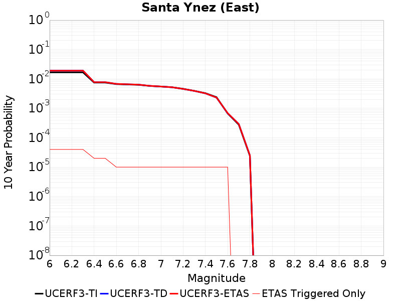 |

| Magnitude | 1 wk TI Prob | 1 wk TD Prob | 1 wk ETAS Prob | 1 wk ETAS/TD Gain | 1 wk ETAS Triggered Only | 1 mo TI Prob | 1 mo TD Prob | 1 mo ETAS Prob | 1 mo ETAS/TD Gain | 1 mo ETAS Triggered Only | 1 yr TI Prob | 1 yr TD Prob | 1 yr ETAS Prob | 1 yr ETAS/TD Gain | 1 yr ETAS Triggered Only | 10 yr TI Prob | 10 yr TD Prob | 10 yr ETAS Prob | 10 yr ETAS/TD Gain | 10 yr ETAS Triggered Only |
|-----|-----|-----|-----|-----|-----|-----|-----|-----|-----|-----|-----|-----|-----|-----|-----|-----|-----|-----|-----|-----|
| 6.0 | 3.2269712E-5 | 3.6792077E-5 | 3.6792077E-5 | 1.0 | 0.0 | 1.3829143E-4 | 1.5767409E-4 | 1.5767409E-4 | 1.0 | 0.0 | 0.0016823979 | 0.001918576 | 0.001918576 | 1.0 | 0.0 | 0.016697178 | 0.019077707 | 0.019116944 | 1.0020567 | 4.0E-5 |
| 6.1 | 3.2269712E-5 | 3.6792077E-5 | 3.6792077E-5 | 1.0 | 0.0 | 1.3829143E-4 | 1.5767409E-4 | 1.5767409E-4 | 1.0 | 0.0 | 0.0016823979 | 0.001918576 | 0.001918576 | 1.0 | 0.0 | 0.016697178 | 0.019077707 | 0.019116944 | 1.0020567 | 4.0E-5 |
| 6.2 | 3.2269712E-5 | 3.6792077E-5 | 3.6792077E-5 | 1.0 | 0.0 | 1.3829143E-4 | 1.5767409E-4 | 1.5767409E-4 | 1.0 | 0.0 | 0.0016823979 | 0.001918576 | 0.001918576 | 1.0 | 0.0 | 0.016697178 | 0.019077707 | 0.019116944 | 1.0020567 | 4.0E-5 |
| 6.3 | 3.2269712E-5 | 3.6792077E-5 | 3.6792077E-5 | 1.0 | 0.0 | 1.3829143E-4 | 1.5767409E-4 | 1.5767409E-4 | 1.0 | 0.0 | 0.0016823979 | 0.001918576 | 0.001918576 | 1.0 | 0.0 | 0.016697178 | 0.019077707 | 0.019116944 | 1.0020567 | 4.0E-5 |
| 6.4 | 1.4404779E-5 | 1.4859314E-5 | 1.4859314E-5 | 1.0 | 0.0 | 6.1733306E-5 | 6.368125E-5 | 6.368125E-5 | 1.0 | 0.0 | 7.513438E-4 | 7.750485E-4 | 7.750485E-4 | 1.0 | 0.0 | 0.0074880854 | 0.0077240057 | 0.0077438513 | 1.0025693 | 2.0E-5 |
| 6.5 | 1.4404779E-5 | 1.4859314E-5 | 1.4859314E-5 | 1.0 | 0.0 | 6.1733306E-5 | 6.368125E-5 | 6.368125E-5 | 1.0 | 0.0 | 7.513438E-4 | 7.750485E-4 | 7.750485E-4 | 1.0 | 0.0 | 0.0074880854 | 0.0077240057 | 0.0077438513 | 1.0025693 | 2.0E-5 |
| 6.6 | 1.280208E-5 | 1.3020167E-5 | 1.3020167E-5 | 1.0 | 0.0 | 5.4864904E-5 | 5.5799534E-5 | 5.5799534E-5 | 1.0 | 0.0 | 6.6777546E-4 | 6.7914935E-4 | 6.7914935E-4 | 1.0 | 0.0 | 0.006657724 | 0.006770949 | 0.006780881 | 1.0014669 | 1.0E-5 |
| 6.7 | 1.2457027E-5 | 1.2636416E-5 | 1.2636416E-5 | 1.0 | 0.0 | 5.3386164E-5 | 5.4154953E-5 | 5.4154953E-5 | 1.0 | 0.0 | 6.497827E-4 | 6.591388E-4 | 6.591388E-4 | 1.0 | 0.0 | 0.00647886 | 0.006572035 | 0.0065819696 | 1.0015116 | 1.0E-5 |
| 6.8 | 1.2095134E-5 | 1.2238614E-5 | 1.2238614E-5 | 1.0 | 0.0 | 5.1835254E-5 | 5.2450156E-5 | 5.2450156E-5 | 1.0 | 0.0 | 6.309115E-4 | 6.3839514E-4 | 6.3839514E-4 | 1.0 | 0.0 | 0.0062912325 | 0.006365801 | 0.0063757375 | 1.0015609 | 1.0E-5 |
| 6.9 | 1.1104036E-5 | 1.1164471E-5 | 1.1164471E-5 | 1.0 | 0.0 | 4.758786E-5 | 4.7846865E-5 | 4.7846865E-5 | 1.0 | 0.0 | 5.7922816E-4 | 5.8238115E-4 | 5.8238115E-4 | 1.0 | 0.0 | 0.005777207 | 0.005808695 | 0.005818637 | 1.0017116 | 1.0E-5 |
| 7.0 | 1.0577444E-5 | 1.0588463E-5 | 1.0588463E-5 | 1.0 | 0.0 | 4.5331115E-5 | 4.5378347E-5 | 4.5378347E-5 | 1.0 | 0.0 | 5.5176654E-4 | 5.523425E-4 | 5.523425E-4 | 1.0 | 0.0 | 0.0055039856 | 0.0055098357 | 0.0055197803 | 1.001805 | 1.0E-5 |
| 7.1 | 1.0021775E-5 | 9.987457E-6 | 9.987457E-6 | 1.0 | 0.0 | 4.294976E-5 | 4.2802694E-5 | 4.2802694E-5 | 1.0 | 0.0 | 5.2278786E-4 | 5.2099937E-4 | 5.2099937E-4 | 1.0 | 0.0 | 0.0052155964 | 0.005197912 | 0.00520786 | 1.0019139 | 1.0E-5 |
| 7.2 | 8.874109E-6 | 8.754608E-6 | 8.754608E-6 | 1.0 | 0.0 | 3.8031343E-5 | 3.7519214E-5 | 3.7519214E-5 | 1.0 | 0.0 | 4.629332E-4 | 4.567018E-4 | 4.567018E-4 | 1.0 | 0.0 | 0.0046197 | 0.0045577507 | 0.004567705 | 1.002184 | 1.0E-5 |
| 7.3 | 7.5504267E-6 | 7.51001E-6 | 7.51001E-6 | 1.0 | 0.0 | 3.235857E-5 | 3.2185366E-5 | 3.2185366E-5 | 1.0 | 0.0 | 3.9389438E-4 | 3.917874E-4 | 3.917874E-4 | 1.0 | 0.0 | 0.0039319694 | 0.0039110743 | 0.0039210347 | 1.0025468 | 1.0E-5 |
| 7.4 | 6.309394E-6 | 6.1871947E-6 | 6.1871947E-6 | 1.0 | 0.0 | 2.703998E-5 | 2.6516283E-5 | 2.6516283E-5 | 1.0 | 0.0 | 3.2916202E-4 | 3.227889E-4 | 3.227889E-4 | 1.0 | 0.0 | 0.003286749 | 0.003223298 | 0.0032332656 | 1.0030924 | 1.0E-5 |
| 7.5 | 4.6103073E-6 | 4.4435487E-6 | 4.4435487E-6 | 1.0 | 0.0 | 1.975831E-5 | 1.9043646E-5 | 1.9043646E-5 | 1.0 | 0.0 | 2.4053088E-4 | 2.3183241E-4 | 2.3183241E-4 | 1.0 | 0.0 | 0.002402707 | 0.0023159753 | 0.002325952 | 1.0043079 | 1.0E-5 |
| 7.6 | 1.2858658E-6 | 1.3012777E-6 | 1.3012777E-6 | 1.0 | 0.0 | 5.5108417E-6 | 5.576893E-6 | 5.576893E-6 | 1.0 | 0.0 | 6.7092435E-5 | 6.7896624E-5 | 6.7896624E-5 | 1.0 | 0.0 | 6.707218E-4 | 6.787657E-4 | 6.887589E-4 | 1.0147226 | 1.0E-5 |
| 7.7 | 5.3302307E-7 | 5.614031E-7 | 5.614031E-7 | 1.0 | 0.0 | 2.2843826E-6 | 2.4060114E-6 | 2.4060114E-6 | 1.0 | 0.0 | 2.7812002E-5 | 2.929283E-5 | 2.929283E-5 | 1.0 | 0.0 | 2.7808524E-4 | 2.928933E-4 | 2.928933E-4 | 1.0 | 0.0 |
| 7.8 | 4.613933E-8 | 4.8042583E-8 | 4.8042583E-8 | 1.0 | 0.0 | 1.9773998E-7 | 2.0589677E-7 | 2.0589677E-7 | 1.0 | 0.0 | 2.4074816E-6 | 2.5067902E-6 | 2.5067902E-6 | 1.0 | 0.0 | 2.4074554E-5 | 2.506763E-5 | 2.506763E-5 | 1.0 | 0.0 |

## Cleghorn Pass
*[(top)](#table-of-contents)*

| 1 Week | 1 Month | 1 Year | 10 Year |
|-----|-----|-----|-----|
|  |  |  |  |

| Magnitude | 1 wk TI Prob | 1 wk TD Prob | 1 wk ETAS Prob | 1 wk ETAS/TD Gain | 1 wk ETAS Triggered Only | 1 mo TI Prob | 1 mo TD Prob | 1 mo ETAS Prob | 1 mo ETAS/TD Gain | 1 mo ETAS Triggered Only | 1 yr TI Prob | 1 yr TD Prob | 1 yr ETAS Prob | 1 yr ETAS/TD Gain | 1 yr ETAS Triggered Only | 10 yr TI Prob | 10 yr TD Prob | 10 yr ETAS Prob | 10 yr ETAS/TD Gain | 10 yr ETAS Triggered Only |
|-----|-----|-----|-----|-----|-----|-----|-----|-----|-----|-----|-----|-----|-----|-----|-----|-----|-----|-----|-----|-----|
| 6.0 | 1.0522846E-5 | 1.1044086E-5 | 1.1044086E-5 | 1.0 | 0.0 | 4.509713E-5 | 4.7331236E-5 | 4.7331236E-5 | 1.0 | 0.0 | 5.4891926E-4 | 5.761581E-4 | 5.9614656E-4 | 1.0346926 | 2.0E-5 | 0.0054756533 | 0.0057518124 | 0.0058015245 | 1.0086429 | 5.0E-5 |
| 6.1 | 1.0522846E-5 | 1.1044086E-5 | 1.1044086E-5 | 1.0 | 0.0 | 4.509713E-5 | 4.7331236E-5 | 4.7331236E-5 | 1.0 | 0.0 | 5.4891926E-4 | 5.761581E-4 | 5.9614656E-4 | 1.0346926 | 2.0E-5 | 0.0054756533 | 0.0057518124 | 0.0058015245 | 1.0086429 | 5.0E-5 |
| 6.2 | 2.1045846E-6 | 2.2088916E-6 | 2.2088916E-6 | 1.0 | 0.0 | 9.019617E-6 | 9.4666675E-6 | 9.4666675E-6 | 1.0 | 0.0 | 1.098083E-4 | 1.15254785E-4 | 1.2525363E-4 | 1.0867543 | 1.0E-5 | 0.0010975406 | 0.0011523617 | 0.0011723387 | 1.0173357 | 2.0E-5 |
| 6.3 | 2.1045846E-6 | 2.2088916E-6 | 2.2088916E-6 | 1.0 | 0.0 | 9.019617E-6 | 9.4666675E-6 | 9.4666675E-6 | 1.0 | 0.0 | 1.098083E-4 | 1.15254785E-4 | 1.2525363E-4 | 1.0867543 | 1.0E-5 | 0.0010975406 | 0.0011523617 | 0.0011723387 | 1.0173357 | 2.0E-5 |
| 6.4 | 1.7259927E-6 | 1.8114417E-6 | 1.8114417E-6 | 1.0 | 0.0 | 7.3970905E-6 | 7.763321E-6 | 7.763321E-6 | 1.0 | 0.0 | 9.005586E-5 | 9.451844E-5 | 1.04517494E-4 | 1.1057894 | 1.0E-5 | 9.001937E-4 | 9.451844E-4 | 9.5517497E-4 | 1.0105699 | 1.0E-5 |

## Kern Canyon (North Kern) 2011
*[(top)](#table-of-contents)*

| 1 Week | 1 Month | 1 Year | 10 Year |
|-----|-----|-----|-----|
| 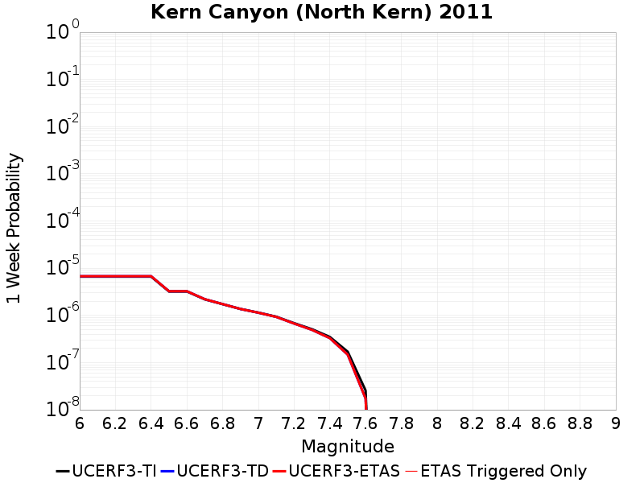 |  |  |  |

| Magnitude | 1 wk TI Prob | 1 wk TD Prob | 1 wk ETAS Prob | 1 wk ETAS/TD Gain | 1 wk ETAS Triggered Only | 1 mo TI Prob | 1 mo TD Prob | 1 mo ETAS Prob | 1 mo ETAS/TD Gain | 1 mo ETAS Triggered Only | 1 yr TI Prob | 1 yr TD Prob | 1 yr ETAS Prob | 1 yr ETAS/TD Gain | 1 yr ETAS Triggered Only | 10 yr TI Prob | 10 yr TD Prob | 10 yr ETAS Prob | 10 yr ETAS/TD Gain | 10 yr ETAS Triggered Only |
|-----|-----|-----|-----|-----|-----|-----|-----|-----|-----|-----|-----|-----|-----|-----|-----|-----|-----|-----|-----|-----|
| 6.0 | 6.6264497E-6 | 6.758354E-6 | 6.758354E-6 | 1.0 | 0.0 | 2.8398761E-5 | 2.89641E-5 | 2.89641E-5 | 1.0 | 0.0 | 3.4570007E-4 | 3.5258886E-4 | 3.5258886E-4 | 1.0 | 0.0 | 0.0034516277 | 0.0035210832 | 0.003570907 | 1.0141501 | 5.0E-5 |
| 6.1 | 6.6264497E-6 | 6.758354E-6 | 6.758354E-6 | 1.0 | 0.0 | 2.8398761E-5 | 2.89641E-5 | 2.89641E-5 | 1.0 | 0.0 | 3.4570007E-4 | 3.5258886E-4 | 3.5258886E-4 | 1.0 | 0.0 | 0.0034516277 | 0.0035210832 | 0.003570907 | 1.0141501 | 5.0E-5 |
| 6.2 | 6.6264497E-6 | 6.758354E-6 | 6.758354E-6 | 1.0 | 0.0 | 2.8398761E-5 | 2.89641E-5 | 2.89641E-5 | 1.0 | 0.0 | 3.4570007E-4 | 3.5258886E-4 | 3.5258886E-4 | 1.0 | 0.0 | 0.0034516277 | 0.0035210832 | 0.003570907 | 1.0141501 | 5.0E-5 |
| 6.3 | 6.6264497E-6 | 6.758354E-6 | 6.758354E-6 | 1.0 | 0.0 | 2.8398761E-5 | 2.89641E-5 | 2.89641E-5 | 1.0 | 0.0 | 3.4570007E-4 | 3.5258886E-4 | 3.5258886E-4 | 1.0 | 0.0 | 0.0034516277 | 0.0035210832 | 0.003570907 | 1.0141501 | 5.0E-5 |
| 6.4 | 6.6264497E-6 | 6.758354E-6 | 6.758354E-6 | 1.0 | 0.0 | 2.8398761E-5 | 2.89641E-5 | 2.89641E-5 | 1.0 | 0.0 | 3.4570007E-4 | 3.5258886E-4 | 3.5258886E-4 | 1.0 | 0.0 | 0.0034516277 | 0.0035210832 | 0.003570907 | 1.0141501 | 5.0E-5 |
| 6.5 | 3.2162225E-6 | 3.2575294E-6 | 3.2575294E-6 | 1.0 | 0.0 | 1.3783738E-5 | 1.396077E-5 | 1.396077E-5 | 1.0 | 0.0 | 1.6780409E-4 | 1.6995994E-4 | 1.6995994E-4 | 1.0 | 0.0 | 0.0016767744 | 0.0016983792 | 0.0017183452 | 1.011756 | 2.0E-5 |
| 6.6 | 3.2162225E-6 | 3.2575294E-6 | 3.2575294E-6 | 1.0 | 0.0 | 1.3783738E-5 | 1.396077E-5 | 1.396077E-5 | 1.0 | 0.0 | 1.6780409E-4 | 1.6995994E-4 | 1.6995994E-4 | 1.0 | 0.0 | 0.0016767744 | 0.0016983792 | 0.0017183452 | 1.011756 | 2.0E-5 |
| 6.7 | 2.1908265E-6 | 2.2074007E-6 | 2.2074007E-6 | 1.0 | 0.0 | 9.389223E-6 | 9.460255E-6 | 9.460255E-6 | 1.0 | 0.0 | 1.1430779E-4 | 1.1517271E-4 | 1.1517271E-4 | 1.0 | 0.0 | 0.0011424901 | 0.0011511496 | 0.0011511496 | 1.0 | 0.0 |
| 6.8 | 1.7303895E-6 | 1.7367656E-6 | 1.7367656E-6 | 1.0 | 0.0 | 7.415934E-6 | 7.4432605E-6 | 7.4432605E-6 | 1.0 | 0.0 | 9.028525E-5 | 9.061803E-5 | 9.061803E-5 | 1.0 | 0.0 | 9.024858E-4 | 9.058205E-4 | 9.058205E-4 | 1.0 | 0.0 |
| 6.9 | 1.3700314E-6 | 1.3690276E-6 | 1.3690276E-6 | 1.0 | 0.0 | 5.87155E-6 | 5.867248E-6 | 5.867248E-6 | 1.0 | 0.0 | 7.148377E-5 | 7.143145E-5 | 7.143145E-5 | 1.0 | 0.0 | 7.146078E-4 | 7.1408943E-4 | 7.1408943E-4 | 1.0 | 0.0 |
| 7.0 | 1.1467797E-6 | 1.1415184E-6 | 1.1415184E-6 | 1.0 | 0.0 | 4.9147607E-6 | 4.892213E-6 | 4.892213E-6 | 1.0 | 0.0 | 5.983557E-5 | 5.9561095E-5 | 5.9561095E-5 | 1.0 | 0.0 | 5.981946E-4 | 5.954545E-4 | 5.954545E-4 | 1.0 | 0.0 |
| 7.1 | 9.3952065E-7 | 9.3038216E-7 | 9.3038216E-7 | 1.0 | 0.0 | 4.026511E-6 | 3.987346E-6 | 3.987346E-6 | 1.0 | 0.0 | 4.9021666E-5 | 4.8544876E-5 | 4.8544876E-5 | 1.0 | 0.0 | 4.901085E-4 | 4.853445E-4 | 4.853445E-4 | 1.0 | 0.0 |
| 7.2 | 6.858055E-7 | 6.720133E-7 | 6.720133E-7 | 1.0 | 0.0 | 2.939163E-6 | 2.880054E-6 | 2.880054E-6 | 1.0 | 0.0 | 3.5783723E-5 | 3.5064102E-5 | 3.5064102E-5 | 1.0 | 0.0 | 3.5777962E-4 | 3.5058658E-4 | 3.5058658E-4 | 1.0 | 0.0 |
| 7.3 | 5.1101983E-7 | 4.939925E-7 | 4.939925E-7 | 1.0 | 0.0 | 2.1900833E-6 | 2.117109E-6 | 2.117109E-6 | 1.0 | 0.0 | 2.6663936E-5 | 2.5775504E-5 | 2.5775504E-5 | 1.0 | 0.0 | 2.6660739E-4 | 2.5772562E-4 | 2.5772562E-4 | 1.0 | 0.0 |
| 7.4 | 3.4999414E-7 | 3.300026E-7 | 3.300026E-7 | 1.0 | 0.0 | 1.499974E-6 | 1.414296E-6 | 1.414296E-6 | 1.0 | 0.0 | 1.8262032E-5 | 1.7218921E-5 | 1.7218921E-5 | 1.0 | 0.0 | 1.826053E-4 | 1.7217611E-4 | 1.7217611E-4 | 1.0 | 0.0 |
| 7.5 | 1.7021522E-7 | 1.4752257E-7 | 1.4752257E-7 | 1.0 | 0.0 | 7.2949354E-7 | 6.3223945E-7 | 6.3223945E-7 | 1.0 | 0.0 | 8.881548E-6 | 7.697488E-6 | 7.697488E-6 | 1.0 | 0.0 | 8.8811925E-5 | 7.6972305E-5 | 7.6972305E-5 | 1.0 | 0.0 |
| 7.6 | 2.572245E-8 | 1.7356326E-8 | 1.7356326E-8 | 1.0 | 0.0 | 1.10239064E-7 | 7.438425E-8 | 7.438425E-8 | 1.0 | 0.0 | 1.3421597E-6 | 9.05628E-7 | 9.05628E-7 | 1.0 | 0.0 | 1.3421517E-5 | 9.056248E-6 | 9.056248E-6 | 1.0 | 0.0 |

## Deep Springs
*[(top)](#table-of-contents)*

| 1 Week | 1 Month | 1 Year | 10 Year |
|-----|-----|-----|-----|
|  |  |  |  |

| Magnitude | 1 wk TI Prob | 1 wk TD Prob | 1 wk ETAS Prob | 1 wk ETAS/TD Gain | 1 wk ETAS Triggered Only | 1 mo TI Prob | 1 mo TD Prob | 1 mo ETAS Prob | 1 mo ETAS/TD Gain | 1 mo ETAS Triggered Only | 1 yr TI Prob | 1 yr TD Prob | 1 yr ETAS Prob | 1 yr ETAS/TD Gain | 1 yr ETAS Triggered Only | 10 yr TI Prob | 10 yr TD Prob | 10 yr ETAS Prob | 10 yr ETAS/TD Gain | 10 yr ETAS Triggered Only |
|-----|-----|-----|-----|-----|-----|-----|-----|-----|-----|-----|-----|-----|-----|-----|-----|-----|-----|-----|-----|-----|
| 6.0 | 1.9810619E-5 | 2.3136947E-5 | 2.3136947E-5 | 1.0 | 0.0 | 8.489989E-5 | 9.915745E-5 | 1.09156455E-4 | 1.1008397 | 1.0E-5 | 0.001033166 | 0.0012070821 | 0.001227058 | 1.0165489 | 2.0E-5 | 0.010283757 | 0.012055137 | 0.012094655 | 1.0032781 | 4.0E-5 |
| 6.1 | 1.9810619E-5 | 2.3136947E-5 | 2.3136947E-5 | 1.0 | 0.0 | 8.489989E-5 | 9.915745E-5 | 1.09156455E-4 | 1.1008397 | 1.0E-5 | 0.001033166 | 0.0012070821 | 0.001227058 | 1.0165489 | 2.0E-5 | 0.010283757 | 0.012055137 | 0.012094655 | 1.0032781 | 4.0E-5 |
| 6.2 | 1.9810619E-5 | 2.3136947E-5 | 2.3136947E-5 | 1.0 | 0.0 | 8.489989E-5 | 9.915745E-5 | 1.09156455E-4 | 1.1008397 | 1.0E-5 | 0.001033166 | 0.0012070821 | 0.001227058 | 1.0165489 | 2.0E-5 | 0.010283757 | 0.012055137 | 0.012094655 | 1.0032781 | 4.0E-5 |
| 6.3 | 1.9810619E-5 | 2.3136947E-5 | 2.3136947E-5 | 1.0 | 0.0 | 8.489989E-5 | 9.915745E-5 | 1.09156455E-4 | 1.1008397 | 1.0E-5 | 0.001033166 | 0.0012070821 | 0.001227058 | 1.0165489 | 2.0E-5 | 0.010283757 | 0.012055137 | 0.012094655 | 1.0032781 | 4.0E-5 |
| 6.4 | 1.9810619E-5 | 2.3136947E-5 | 2.3136947E-5 | 1.0 | 0.0 | 8.489989E-5 | 9.915745E-5 | 1.09156455E-4 | 1.1008397 | 1.0E-5 | 0.001033166 | 0.0012070821 | 0.001227058 | 1.0165489 | 2.0E-5 | 0.010283757 | 0.012055137 | 0.012094655 | 1.0032781 | 4.0E-5 |
| 6.5 | 1.7190405E-5 | 2.0071711E-5 | 2.0071711E-5 | 1.0 | 0.0 | 7.367108E-5 | 8.6021624E-5 | 9.602076E-5 | 1.1162398 | 1.0E-5 | 8.9657627E-4 | 0.0010473131 | 0.0010672922 | 1.0190765 | 2.0E-5 | 0.008929676 | 0.010473097 | 0.010512678 | 1.0037793 | 4.0E-5 |
| 6.6 | 1.7190405E-5 | 2.0071711E-5 | 2.0071711E-5 | 1.0 | 0.0 | 7.367108E-5 | 8.6021624E-5 | 9.602076E-5 | 1.1162398 | 1.0E-5 | 8.9657627E-4 | 0.0010473131 | 0.0010672922 | 1.0190765 | 2.0E-5 | 0.008929676 | 0.010473097 | 0.010512678 | 1.0037793 | 4.0E-5 |

## White Mountains
*[(top)](#table-of-contents)*

| 1 Week | 1 Month | 1 Year | 10 Year |
|-----|-----|-----|-----|
| 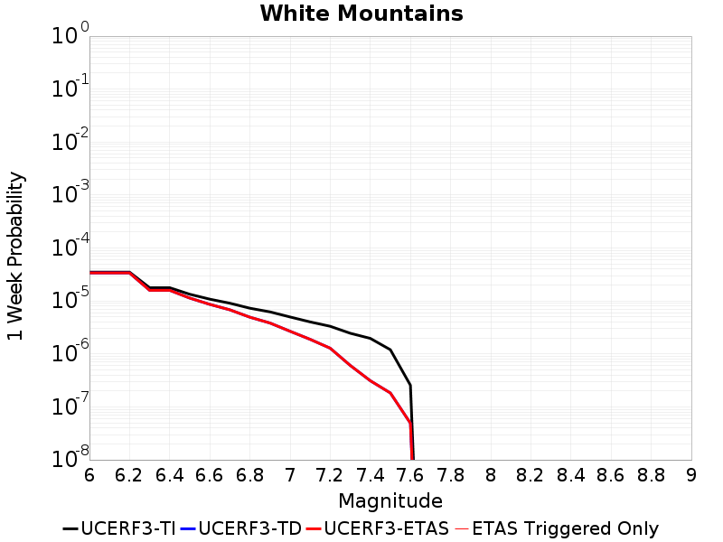 |  |  | 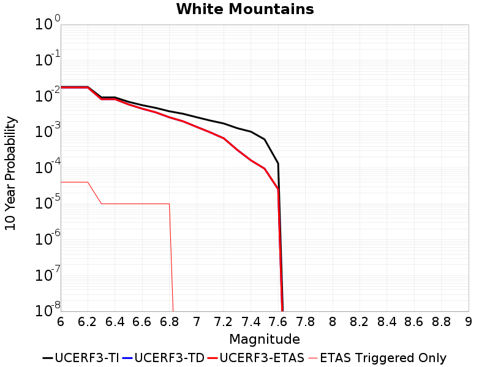 |

| Magnitude | 1 wk TI Prob | 1 wk TD Prob | 1 wk ETAS Prob | 1 wk ETAS/TD Gain | 1 wk ETAS Triggered Only | 1 mo TI Prob | 1 mo TD Prob | 1 mo ETAS Prob | 1 mo ETAS/TD Gain | 1 mo ETAS Triggered Only | 1 yr TI Prob | 1 yr TD Prob | 1 yr ETAS Prob | 1 yr ETAS/TD Gain | 1 yr ETAS Triggered Only | 10 yr TI Prob | 10 yr TD Prob | 10 yr ETAS Prob | 10 yr ETAS/TD Gain | 10 yr ETAS Triggered Only |
|-----|-----|-----|-----|-----|-----|-----|-----|-----|-----|-----|-----|-----|-----|-----|-----|-----|-----|-----|-----|-----|
| 6.0 | 3.503579E-5 | 3.3802255E-5 | 3.3802255E-5 | 1.0 | 0.0 | 1.5014476E-4 | 1.4485944E-4 | 1.4485944E-4 | 1.0 | 0.0 | 0.0018264796 | 0.0017623579 | 0.0017723403 | 1.0056642 | 1.0E-5 | 0.018115403 | 0.017496167 | 0.017535467 | 1.0022463 | 4.0E-5 |
| 6.1 | 3.503579E-5 | 3.3802255E-5 | 3.3802255E-5 | 1.0 | 0.0 | 1.5014476E-4 | 1.4485944E-4 | 1.4485944E-4 | 1.0 | 0.0 | 0.0018264796 | 0.0017623579 | 0.0017723403 | 1.0056642 | 1.0E-5 | 0.018115403 | 0.017496167 | 0.017535467 | 1.0022463 | 4.0E-5 |
| 6.2 | 3.503579E-5 | 3.3802255E-5 | 3.3802255E-5 | 1.0 | 0.0 | 1.5014476E-4 | 1.4485944E-4 | 1.4485944E-4 | 1.0 | 0.0 | 0.0018264796 | 0.0017623579 | 0.0017723403 | 1.0056642 | 1.0E-5 | 0.018115403 | 0.017496167 | 0.017535467 | 1.0022463 | 4.0E-5 |
| 6.3 | 1.7818425E-5 | 1.5924123E-5 | 1.5924123E-5 | 1.0 | 0.0 | 7.636245E-5 | 6.824454E-5 | 6.824454E-5 | 1.0 | 0.0 | 9.293162E-4 | 8.305748E-4 | 8.305748E-4 | 1.0 | 0.0 | 0.009254395 | 0.008276165 | 0.008286083 | 1.0011983 | 1.0E-5 |
| 6.4 | 1.7818425E-5 | 1.5924123E-5 | 1.5924123E-5 | 1.0 | 0.0 | 7.636245E-5 | 6.824454E-5 | 6.824454E-5 | 1.0 | 0.0 | 9.293162E-4 | 8.305748E-4 | 8.305748E-4 | 1.0 | 0.0 | 0.009254395 | 0.008276165 | 0.008286083 | 1.0011983 | 1.0E-5 |
| 6.5 | 1.3397557E-5 | 1.1341966E-5 | 1.1341966E-5 | 1.0 | 0.0 | 5.741684E-5 | 4.860756E-5 | 4.860756E-5 | 1.0 | 0.0 | 6.988258E-4 | 5.9164333E-4 | 5.9164333E-4 | 1.0 | 0.0 | 0.006966323 | 0.005901388 | 0.005911329 | 1.0016845 | 1.0E-5 |
| 6.6 | 1.0818695E-5 | 8.629661E-6 | 8.629661E-6 | 1.0 | 0.0 | 4.6365014E-5 | 3.6983765E-5 | 3.6983765E-5 | 1.0 | 0.0 | 5.6434784E-4 | 4.5018867E-4 | 4.5018867E-4 | 1.0 | 0.0 | 0.005629168 | 0.004493204 | 0.004503159 | 1.0022156 | 1.0E-5 |
| 6.7 | 9.067908E-6 | 6.8058603E-6 | 6.8058603E-6 | 1.0 | 0.0 | 3.8861883E-5 | 2.9167664E-5 | 2.9167664E-5 | 1.0 | 0.0 | 4.7304068E-4 | 3.5506164E-4 | 3.5506164E-4 | 1.0 | 0.0 | 0.00472035 | 0.003545261 | 0.0035552254 | 1.0028107 | 1.0E-5 |
| 6.8 | 7.295947E-6 | 4.938899E-6 | 4.938899E-6 | 1.0 | 0.0 | 3.126797E-5 | 2.1166545E-5 | 2.1166545E-5 | 1.0 | 0.0 | 3.8062103E-4 | 2.5767335E-4 | 2.5767335E-4 | 1.0 | 0.0 | 0.0037996976 | 0.0025738587 | 0.002583833 | 1.0038753 | 1.0E-5 |
| 6.9 | 6.2243444E-6 | 3.8342882E-6 | 3.8342882E-6 | 1.0 | 0.0 | 2.6675489E-5 | 1.6432563E-5 | 1.6432563E-5 | 1.0 | 0.0 | 3.2472567E-4 | 2.0004861E-4 | 2.0004861E-4 | 1.0 | 0.0 | 0.0032425157 | 0.0019987382 | 0.0019987382 | 1.0 | 0.0 |
| 7.0 | 4.9878413E-6 | 2.6813077E-6 | 2.6813077E-6 | 1.0 | 0.0 | 2.1376287E-5 | 1.149127E-5 | 1.149127E-5 | 1.0 | 0.0 | 2.602252E-4 | 1.3989749E-4 | 1.3989749E-4 | 1.0 | 0.0 | 0.002599207 | 0.0013981205 | 0.0013981205 | 1.0 | 0.0 |
| 7.1 | 4.0252844E-6 | 1.8873618E-6 | 1.8873618E-6 | 1.0 | 0.0 | 1.7251105E-5 | 8.088669E-6 | 8.088669E-6 | 1.0 | 0.0 | 2.1001195E-4 | 9.8475226E-5 | 9.8475226E-5 | 1.0 | 0.0 | 0.0020981359 | 9.843287E-4 | 9.843287E-4 | 1.0 | 0.0 |
| 7.2 | 3.3284066E-6 | 1.2833297E-6 | 1.2833297E-6 | 1.0 | 0.0 | 1.4264522E-5 | 5.499973E-6 | 5.499973E-6 | 1.0 | 0.0 | 1.736567E-4 | 6.6960216E-5 | 6.6960216E-5 | 1.0 | 0.0 | 0.0017352107 | 6.694105E-4 | 6.694105E-4 | 1.0 | 0.0 |
| 7.3 | 2.458226E-6 | 6.0698983E-7 | 6.0698983E-7 | 1.0 | 0.0 | 1.0535211E-5 | 2.6013827E-6 | 2.6013827E-6 | 1.0 | 0.0 | 1.2825865E-4 | 3.167141E-5 | 3.167141E-5 | 1.0 | 0.0 | 0.0012818464 | 3.1667273E-4 | 3.1667273E-4 | 1.0 | 0.0 |
| 7.4 | 1.965953E-6 | 3.1198212E-7 | 3.1198212E-7 | 1.0 | 0.0 | 8.425486E-6 | 1.3370656E-6 | 1.3370656E-6 | 1.0 | 0.0 | 1.0257547E-4 | 1.6278653E-5 | 1.6278653E-5 | 1.0 | 0.0 | 0.0010252813 | 1.6277474E-4 | 1.6277474E-4 | 1.0 | 0.0 |
| 7.5 | 1.2014192E-6 | 1.831956E-7 | 1.831956E-7 | 1.0 | 0.0 | 5.148929E-6 | 7.8512375E-7 | 7.8512375E-7 | 1.0 | 0.0 | 6.2686406E-5 | 9.55884E-6 | 9.55884E-6 | 1.0 | 0.0 | 6.266873E-4 | 9.558438E-5 | 9.558438E-5 | 1.0 | 0.0 |
| 7.6 | 2.5612175E-7 | 4.9145328E-8 | 4.9145328E-8 | 1.0 | 0.0 | 1.0976642E-6 | 2.1062282E-7 | 2.1062282E-7 | 1.0 | 0.0 | 1.3363979E-5 | 2.56433E-6 | 2.56433E-6 | 1.0 | 0.0 | 1.3363175E-4 | 2.5643043E-5 | 2.5643043E-5 | 1.0 | 0.0 |

## Lake Isabella (Seismicity)
*[(top)](#table-of-contents)*

| 1 Week | 1 Month | 1 Year | 10 Year |
|-----|-----|-----|-----|
|  |  | 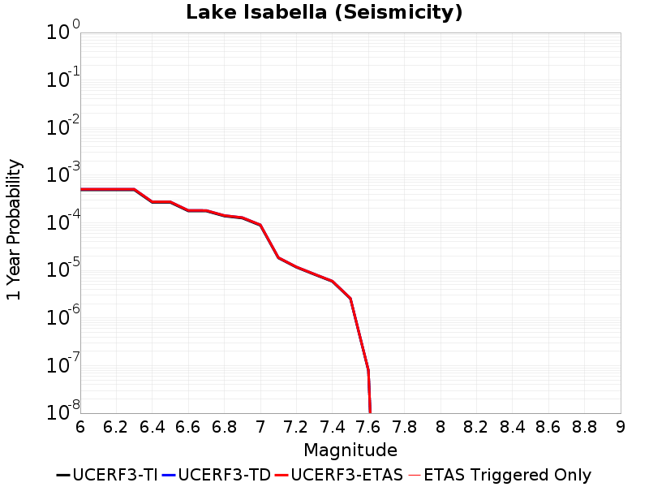 |  |

| Magnitude | 1 wk TI Prob | 1 wk TD Prob | 1 wk ETAS Prob | 1 wk ETAS/TD Gain | 1 wk ETAS Triggered Only | 1 mo TI Prob | 1 mo TD Prob | 1 mo ETAS Prob | 1 mo ETAS/TD Gain | 1 mo ETAS Triggered Only | 1 yr TI Prob | 1 yr TD Prob | 1 yr ETAS Prob | 1 yr ETAS/TD Gain | 1 yr ETAS Triggered Only | 10 yr TI Prob | 10 yr TD Prob | 10 yr ETAS Prob | 10 yr ETAS/TD Gain | 10 yr ETAS Triggered Only |
|-----|-----|-----|-----|-----|-----|-----|-----|-----|-----|-----|-----|-----|-----|-----|-----|-----|-----|-----|-----|-----|
| 6.0 | 9.431637E-6 | 9.743682E-6 | 9.743682E-6 | 1.0 | 0.0 | 4.0420677E-5 | 4.1758045E-5 | 4.1758045E-5 | 1.0 | 0.0 | 4.920106E-4 | 5.082987E-4 | 5.082987E-4 | 1.0 | 0.0 | 0.004909227 | 0.0050726538 | 0.005112451 | 1.0078454 | 4.0E-5 |
| 6.1 | 9.431637E-6 | 9.743682E-6 | 9.743682E-6 | 1.0 | 0.0 | 4.0420677E-5 | 4.1758045E-5 | 4.1758045E-5 | 1.0 | 0.0 | 4.920106E-4 | 5.082987E-4 | 5.082987E-4 | 1.0 | 0.0 | 0.004909227 | 0.0050726538 | 0.005112451 | 1.0078454 | 4.0E-5 |
| 6.2 | 9.431637E-6 | 9.743682E-6 | 9.743682E-6 | 1.0 | 0.0 | 4.0420677E-5 | 4.1758045E-5 | 4.1758045E-5 | 1.0 | 0.0 | 4.920106E-4 | 5.082987E-4 | 5.082987E-4 | 1.0 | 0.0 | 0.004909227 | 0.0050726538 | 0.005112451 | 1.0078454 | 4.0E-5 |
| 6.3 | 9.431637E-6 | 9.743682E-6 | 9.743682E-6 | 1.0 | 0.0 | 4.0420677E-5 | 4.1758045E-5 | 4.1758045E-5 | 1.0 | 0.0 | 4.920106E-4 | 5.082987E-4 | 5.082987E-4 | 1.0 | 0.0 | 0.004909227 | 0.0050726538 | 0.005112451 | 1.0078454 | 4.0E-5 |
| 6.4 | 5.144063E-6 | 5.301096E-6 | 5.301096E-6 | 1.0 | 0.0 | 2.2045799E-5 | 2.2718803E-5 | 2.2718803E-5 | 1.0 | 0.0 | 2.6837454E-4 | 2.7656977E-4 | 2.7656977E-4 | 1.0 | 0.0 | 0.0026805066 | 0.0027625964 | 0.0027725687 | 1.0036098 | 1.0E-5 |
| 6.5 | 5.144063E-6 | 5.301096E-6 | 5.301096E-6 | 1.0 | 0.0 | 2.2045799E-5 | 2.2718803E-5 | 2.2718803E-5 | 1.0 | 0.0 | 2.6837454E-4 | 2.7656977E-4 | 2.7656977E-4 | 1.0 | 0.0 | 0.0026805066 | 0.0027625964 | 0.0027725687 | 1.0036098 | 1.0E-5 |
| 6.6 | 3.4009804E-6 | 3.4994243E-6 | 3.4994243E-6 | 1.0 | 0.0 | 1.4575549E-5 | 1.4997456E-5 | 1.4997456E-5 | 1.0 | 0.0 | 1.7744285E-4 | 1.8258033E-4 | 1.8258033E-4 | 1.0 | 0.0 | 0.0017730123 | 0.001824461 | 0.0018344428 | 1.0054711 | 1.0E-5 |
| 6.7 | 3.3880428E-6 | 3.4862896E-6 | 3.4862896E-6 | 1.0 | 0.0 | 1.4520103E-5 | 1.4941165E-5 | 1.4941165E-5 | 1.0 | 0.0 | 1.767679E-4 | 1.818951E-4 | 1.818951E-4 | 1.0 | 0.0 | 0.0017662736 | 0.00181762 | 0.0018276018 | 1.0054917 | 1.0E-5 |
| 6.8 | 2.6582E-6 | 2.7341928E-6 | 2.7341928E-6 | 1.0 | 0.0 | 1.1392236E-5 | 1.1717923E-5 | 1.1717923E-5 | 1.0 | 0.0 | 1.3869164E-4 | 1.4265772E-4 | 1.4265772E-4 | 1.0 | 0.0 | 0.0013860512 | 0.0014257936 | 0.0014357794 | 1.0070037 | 1.0E-5 |
| 6.9 | 2.406011E-6 | 2.4747744E-6 | 2.4747744E-6 | 1.0 | 0.0 | 1.0311434E-5 | 1.0606141E-5 | 1.0606141E-5 | 1.0 | 0.0 | 1.2553448E-4 | 1.2912344E-4 | 1.2912344E-4 | 1.0 | 0.0 | 0.0012546359 | 0.0012906137 | 0.0013006008 | 1.0077382 | 1.0E-5 |
| 7.0 | 1.6953097E-6 | 1.7432478E-6 | 1.7432478E-6 | 1.0 | 0.0 | 7.265593E-6 | 7.4710465E-6 | 7.4710465E-6 | 1.0 | 0.0 | 8.8455E-5 | 9.095724E-5 | 9.095724E-5 | 1.0 | 0.0 | 8.84198E-4 | 9.0930297E-4 | 9.1929385E-4 | 1.0109874 | 1.0E-5 |
| 7.1 | 3.5013824E-7 | 3.5719356E-7 | 3.5719356E-7 | 1.0 | 0.0 | 1.5005916E-6 | 1.5308286E-6 | 1.5308286E-6 | 1.0 | 0.0 | 1.826955E-5 | 1.8637682E-5 | 1.8637682E-5 | 1.0 | 0.0 | 1.8268047E-4 | 1.8636145E-4 | 1.8636145E-4 | 1.0 | 0.0 |
| 7.2 | 2.2321095E-7 | 2.2753348E-7 | 2.2753348E-7 | 1.0 | 0.0 | 9.56618E-7 | 9.751432E-7 | 9.751432E-7 | 1.0 | 0.0 | 1.1646762E-5 | 1.1872304E-5 | 1.1872304E-5 | 1.0 | 0.0 | 1.1646151E-4 | 1.187168E-4 | 1.187168E-4 | 1.0 | 0.0 |
| 7.3 | 1.5760406E-7 | 1.6062863E-7 | 1.6062863E-7 | 1.0 | 0.0 | 6.7544585E-7 | 6.8840825E-7 | 6.8840825E-7 | 1.0 | 0.0 | 8.223522E-6 | 8.381339E-6 | 8.381339E-6 | 1.0 | 0.0 | 8.2232174E-5 | 8.381029E-5 | 8.381029E-5 | 1.0 | 0.0 |
| 7.4 | 1.1216497E-7 | 1.14330966E-7 | 1.14330966E-7 | 1.0 | 0.0 | 4.8070694E-7 | 4.8998976E-7 | 4.8998976E-7 | 1.0 | 0.0 | 5.852591E-6 | 5.9656095E-6 | 5.9656095E-6 | 1.0 | 0.0 | 5.8524372E-5 | 5.9654536E-5 | 5.9654536E-5 | 1.0 | 0.0 |
| 7.5 | 4.885185E-8 | 4.9793783E-8 | 4.9793783E-8 | 1.0 | 0.0 | 2.0936506E-7 | 2.1340192E-7 | 2.1340192E-7 | 1.0 | 0.0 | 2.5490165E-6 | 2.5981653E-6 | 2.5981653E-6 | 1.0 | 0.0 | 2.5489873E-5 | 2.5981368E-5 | 2.5981368E-5 | 1.0 | 0.0 |
| 7.6 | 1.504641E-9 | 1.5319654E-9 | 1.5319654E-9 | 1.0 | 0.0 | 6.4484613E-9 | 6.5655663E-9 | 6.5655663E-9 | 1.0 | 0.0 | 7.851001E-8 | 7.9935774E-8 | 7.9935774E-8 | 1.0 | 0.0 | 7.8509987E-7 | 7.993577E-7 | 7.993577E-7 | 1.0 | 0.0 |

## Lost Hills
*[(top)](#table-of-contents)*

| 1 Week | 1 Month | 1 Year | 10 Year |
|-----|-----|-----|-----|
|  |  |  |  |

| Magnitude | 1 wk TI Prob | 1 wk TD Prob | 1 wk ETAS Prob | 1 wk ETAS/TD Gain | 1 wk ETAS Triggered Only | 1 mo TI Prob | 1 mo TD Prob | 1 mo ETAS Prob | 1 mo ETAS/TD Gain | 1 mo ETAS Triggered Only | 1 yr TI Prob | 1 yr TD Prob | 1 yr ETAS Prob | 1 yr ETAS/TD Gain | 1 yr ETAS Triggered Only | 10 yr TI Prob | 10 yr TD Prob | 10 yr ETAS Prob | 10 yr ETAS/TD Gain | 10 yr ETAS Triggered Only |
|-----|-----|-----|-----|-----|-----|-----|-----|-----|-----|-----|-----|-----|-----|-----|-----|-----|-----|-----|-----|-----|
| 6.0 | 2.233523E-5 | 2.5126343E-5 | 3.512609E-5 | 1.3979787 | 1.0E-5 | 9.571891E-5 | 1.0768083E-4 | 1.1767975E-4 | 1.092857 | 1.0E-5 | 0.0011647546 | 0.001310394 | 0.0013303679 | 1.0152426 | 2.0E-5 | 0.011586686 | 0.013043296 | 0.013082774 | 1.0030267 | 4.0E-5 |
| 6.1 | 2.233523E-5 | 2.5126343E-5 | 3.512609E-5 | 1.3979787 | 1.0E-5 | 9.571891E-5 | 1.0768083E-4 | 1.1767975E-4 | 1.092857 | 1.0E-5 | 0.0011647546 | 0.001310394 | 0.0013303679 | 1.0152426 | 2.0E-5 | 0.011586686 | 0.013043296 | 0.013082774 | 1.0030267 | 4.0E-5 |
| 6.2 | 2.233523E-5 | 2.5126343E-5 | 3.512609E-5 | 1.3979787 | 1.0E-5 | 9.571891E-5 | 1.0768083E-4 | 1.1767975E-4 | 1.092857 | 1.0E-5 | 0.0011647546 | 0.001310394 | 0.0013303679 | 1.0152426 | 2.0E-5 | 0.011586686 | 0.013043296 | 0.013082774 | 1.0030267 | 4.0E-5 |
| 6.3 | 2.233523E-5 | 2.5126343E-5 | 3.512609E-5 | 1.3979787 | 1.0E-5 | 9.571891E-5 | 1.0768083E-4 | 1.1767975E-4 | 1.092857 | 1.0E-5 | 0.0011647546 | 0.001310394 | 0.0013303679 | 1.0152426 | 2.0E-5 | 0.011586686 | 0.013043296 | 0.013082774 | 1.0030267 | 4.0E-5 |
| 6.4 | 1.2288092E-5 | 1.3791728E-5 | 2.379159E-5 | 1.7250624 | 1.0E-5 | 5.2662188E-5 | 5.9106595E-5 | 6.9106005E-5 | 1.1691759 | 1.0E-5 | 6.409735E-4 | 7.194791E-4 | 7.294719E-4 | 1.013889 | 1.0E-5 | 0.006391279 | 0.0071807182 | 0.007210503 | 1.0041479 | 3.0E-5 |
| 6.5 | 1.2288092E-5 | 1.3791728E-5 | 2.379159E-5 | 1.7250624 | 1.0E-5 | 5.2662188E-5 | 5.9106595E-5 | 6.9106005E-5 | 1.1691759 | 1.0E-5 | 6.409735E-4 | 7.194791E-4 | 7.294719E-4 | 1.013889 | 1.0E-5 | 0.006391279 | 0.0071807182 | 0.007210503 | 1.0041479 | 3.0E-5 |
| 6.6 | 8.58281E-6 | 9.641252E-6 | 1.9641155E-5 | 2.0371997 | 1.0E-5 | 3.6782953E-5 | 4.1319465E-5 | 5.1319053E-5 | 1.2420067 | 1.0E-5 | 4.4774043E-4 | 5.030317E-4 | 5.1302667E-4 | 1.0198694 | 1.0E-5 | 0.0044683935 | 0.0050271037 | 0.005047003 | 1.0039585 | 2.0E-5 |
| 6.7 | 7.205685E-6 | 8.094586E-6 | 1.8094504E-5 | 2.2353837 | 1.0E-5 | 3.088114E-5 | 3.4691082E-5 | 4.4690732E-5 | 1.2882485 | 1.0E-5 | 3.7591302E-4 | 4.223639E-4 | 4.3235967E-4 | 1.0236663 | 1.0E-5 | 0.0037527776 | 0.004223639 | 0.0042435545 | 1.0047152 | 2.0E-5 |

## South Klamath Lake East
*[(top)](#table-of-contents)*

| 1 Week | 1 Month | 1 Year | 10 Year |
|-----|-----|-----|-----|
| 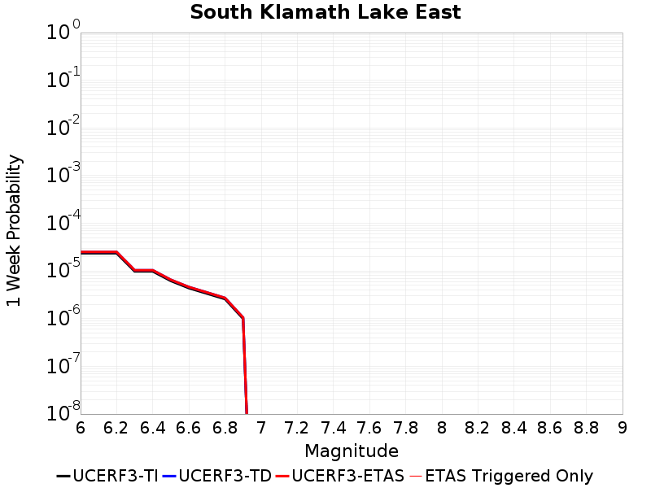 | 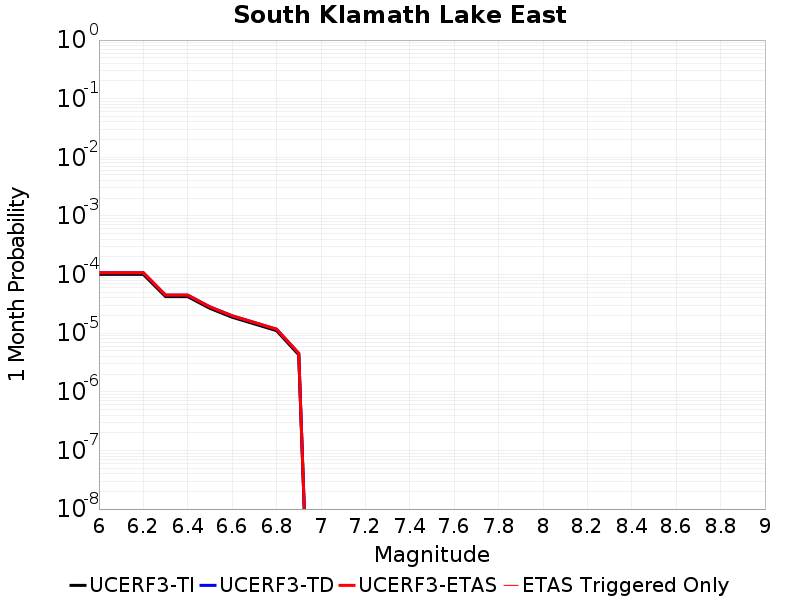 |  |  |

| Magnitude | 1 wk TI Prob | 1 wk TD Prob | 1 wk ETAS Prob | 1 wk ETAS/TD Gain | 1 wk ETAS Triggered Only | 1 mo TI Prob | 1 mo TD Prob | 1 mo ETAS Prob | 1 mo ETAS/TD Gain | 1 mo ETAS Triggered Only | 1 yr TI Prob | 1 yr TD Prob | 1 yr ETAS Prob | 1 yr ETAS/TD Gain | 1 yr ETAS Triggered Only | 10 yr TI Prob | 10 yr TD Prob | 10 yr ETAS Prob | 10 yr ETAS/TD Gain | 10 yr ETAS Triggered Only |
|-----|-----|-----|-----|-----|-----|-----|-----|-----|-----|-----|-----|-----|-----|-----|-----|-----|-----|-----|-----|-----|
| 6.0 | 2.3539369E-5 | 2.5057489E-5 | 2.5057489E-5 | 1.0 | 0.0 | 1.0087911E-4 | 1.0738529E-4 | 1.0738529E-4 | 1.0 | 0.0 | 0.0012275111 | 0.0013067151 | 0.0013067151 | 1.0 | 0.0 | 0.012207527 | 0.0129986685 | 0.013008539 | 1.0007594 | 1.0E-5 |
| 6.1 | 2.3539369E-5 | 2.5057489E-5 | 2.5057489E-5 | 1.0 | 0.0 | 1.0087911E-4 | 1.0738529E-4 | 1.0738529E-4 | 1.0 | 0.0 | 0.0012275111 | 0.0013067151 | 0.0013067151 | 1.0 | 0.0 | 0.012207527 | 0.0129986685 | 0.013008539 | 1.0007594 | 1.0E-5 |
| 6.2 | 2.3539369E-5 | 2.5057489E-5 | 2.5057489E-5 | 1.0 | 0.0 | 1.0087911E-4 | 1.0738529E-4 | 1.0738529E-4 | 1.0 | 0.0 | 0.0012275111 | 0.0013067151 | 0.0013067151 | 1.0 | 0.0 | 0.012207527 | 0.0129986685 | 0.013008539 | 1.0007594 | 1.0E-5 |
| 6.3 | 9.807823E-6 | 1.0399998E-5 | 1.0399998E-5 | 1.0 | 0.0 | 4.2032847E-5 | 4.457071E-5 | 4.457071E-5 | 1.0 | 0.0 | 5.1162974E-4 | 5.4252165E-4 | 5.4252165E-4 | 1.0 | 0.0 | 0.005104534 | 0.005412809 | 0.005422755 | 1.0018375 | 1.0E-5 |
| 6.4 | 9.807823E-6 | 1.0399998E-5 | 1.0399998E-5 | 1.0 | 0.0 | 4.2032847E-5 | 4.457071E-5 | 4.457071E-5 | 1.0 | 0.0 | 5.1162974E-4 | 5.4252165E-4 | 5.4252165E-4 | 1.0 | 0.0 | 0.005104534 | 0.005412809 | 0.005422755 | 1.0018375 | 1.0E-5 |
| 6.5 | 6.191981E-6 | 6.5532477E-6 | 6.5532477E-6 | 1.0 | 0.0 | 2.653679E-5 | 2.808506E-5 | 2.808506E-5 | 1.0 | 0.0 | 3.2303753E-4 | 3.4188476E-4 | 3.4188476E-4 | 1.0 | 0.0 | 0.0032256835 | 0.0034138663 | 0.0034238321 | 1.0029192 | 1.0E-5 |
| 6.6 | 4.3693776E-6 | 4.6182136E-6 | 4.6182136E-6 | 1.0 | 0.0 | 1.8725768E-5 | 1.97922E-5 | 1.97922E-5 | 1.0 | 0.0 | 2.2796239E-4 | 2.4094452E-4 | 2.4094452E-4 | 1.0 | 0.0 | 0.0022772867 | 0.0024069455 | 0.0024169213 | 1.0041447 | 1.0E-5 |
| 6.7 | 3.360834E-6 | 3.5525159E-6 | 3.5525159E-6 | 1.0 | 0.0 | 1.4403494E-5 | 1.5224984E-5 | 1.5224984E-5 | 1.0 | 0.0 | 1.7534842E-4 | 1.8534923E-4 | 1.8534923E-4 | 1.0 | 0.0 | 0.0017521014 | 0.0018520263 | 0.0018620078 | 1.0053895 | 1.0E-5 |
| 6.8 | 2.57873E-6 | 2.7261522E-6 | 2.7261522E-6 | 1.0 | 0.0 | 1.1051653E-5 | 1.168346E-5 | 1.168346E-5 | 1.0 | 0.0 | 1.3454557E-4 | 1.4223746E-4 | 1.4223746E-4 | 1.0 | 0.0 | 0.0013446413 | 0.0014215249 | 0.0014315107 | 1.0070246 | 1.0E-5 |
| 6.9 | 9.987825E-7 | 1.0570093E-6 | 1.0570093E-6 | 1.0 | 0.0 | 4.2804895E-6 | 4.5300335E-6 | 4.5300335E-6 | 1.0 | 0.0 | 5.211371E-5 | 5.515209E-5 | 5.515209E-5 | 1.0 | 0.0 | 5.210149E-4 | 5.5141625E-4 | 5.6141074E-4 | 1.0181252 | 1.0E-5 |

## Rose Canyon
*[(top)](#table-of-contents)*

| 1 Week | 1 Month | 1 Year | 10 Year |
|-----|-----|-----|-----|
| 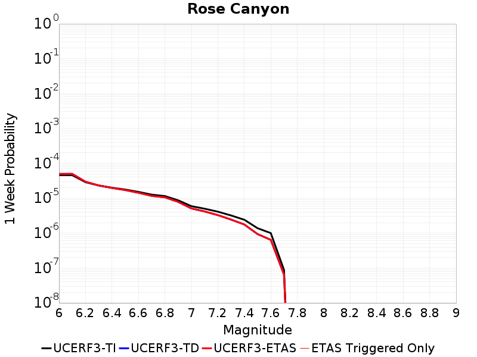 |  |  | 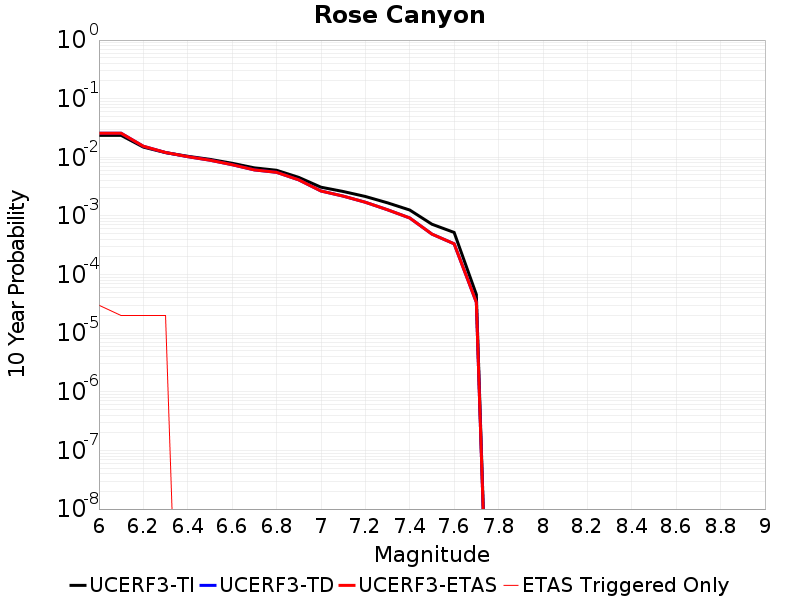 |

| Magnitude | 1 wk TI Prob | 1 wk TD Prob | 1 wk ETAS Prob | 1 wk ETAS/TD Gain | 1 wk ETAS Triggered Only | 1 mo TI Prob | 1 mo TD Prob | 1 mo ETAS Prob | 1 mo ETAS/TD Gain | 1 mo ETAS Triggered Only | 1 yr TI Prob | 1 yr TD Prob | 1 yr ETAS Prob | 1 yr ETAS/TD Gain | 1 yr ETAS Triggered Only | 10 yr TI Prob | 10 yr TD Prob | 10 yr ETAS Prob | 10 yr ETAS/TD Gain | 10 yr ETAS Triggered Only |
|-----|-----|-----|-----|-----|-----|-----|-----|-----|-----|-----|-----|-----|-----|-----|-----|-----|-----|-----|-----|-----|
| 6.0 | 4.5923203E-5 | 4.986606E-5 | 4.986606E-5 | 1.0 | 0.0 | 1.9679888E-4 | 2.136955E-4 | 2.136955E-4 | 1.0 | 0.0 | 0.0023933933 | 0.0025988258 | 0.0025988258 | 1.0 | 0.0 | 0.023677798 | 0.02571245 | 0.025741678 | 1.0011368 | 3.0E-5 |
| 6.1 | 4.5923203E-5 | 4.986606E-5 | 4.986606E-5 | 1.0 | 0.0 | 1.9679888E-4 | 2.136955E-4 | 2.136955E-4 | 1.0 | 0.0 | 0.0023933933 | 0.0025988258 | 0.0025988258 | 1.0 | 0.0 | 0.023677798 | 0.02571245 | 0.025731934 | 1.0007578 | 2.0E-5 |
| 6.2 | 2.8844734E-5 | 2.9775003E-5 | 2.9775003E-5 | 1.0 | 0.0 | 1.2361443E-4 | 1.276011E-4 | 1.276011E-4 | 1.0 | 0.0 | 0.0015039665 | 0.0015524637 | 0.0015524637 | 1.0 | 0.0 | 0.0149382865 | 0.015435185 | 0.015454876 | 1.0012758 | 2.0E-5 |
| 6.3 | 2.3171577E-5 | 2.3255334E-5 | 2.3255334E-5 | 1.0 | 0.0 | 9.9302975E-5 | 9.9661986E-5 | 9.9661986E-5 | 1.0 | 0.0 | 0.0012083431 | 0.0012127229 | 0.0012127229 | 1.0 | 0.0 | 0.012017938 | 0.012070458 | 0.012090217 | 1.001637 | 2.0E-5 |
| 6.4 | 2.0066604E-5 | 1.9731213E-5 | 1.9731213E-5 | 1.0 | 0.0 | 8.599689E-5 | 8.455966E-5 | 8.455966E-5 | 1.0 | 0.0 | 0.0010465092 | 0.0010290378 | 0.0010290378 | 1.0 | 0.0 | 0.010415946 | 0.010256887 | 0.010256887 | 1.0 | 0.0 |
| 6.5 | 1.776989E-5 | 1.7158436E-5 | 1.7158436E-5 | 1.0 | 0.0 | 7.615444E-5 | 7.3534124E-5 | 7.3534124E-5 | 1.0 | 0.0 | 9.267859E-4 | 8.9491723E-4 | 8.9491723E-4 | 1.0 | 0.0 | 0.009229303 | 0.0089273965 | 0.0089273965 | 1.0 | 0.0 |
| 6.6 | 1.5227364E-5 | 1.4364207E-5 | 1.4364207E-5 | 1.0 | 0.0 | 6.52585E-5 | 6.155947E-5 | 6.155947E-5 | 1.0 | 0.0 | 7.942326E-4 | 7.49234E-4 | 7.49234E-4 | 1.0 | 0.0 | 0.007914 | 0.0074816705 | 0.0074816705 | 1.0 | 0.0 |
| 6.7 | 1.2703898E-5 | 1.16878E-5 | 1.16878E-5 | 1.0 | 0.0 | 5.4444143E-5 | 5.0089635E-5 | 5.0089635E-5 | 1.0 | 0.0 | 6.626558E-4 | 6.096749E-4 | 6.096749E-4 | 1.0 | 0.0 | 0.006606833 | 0.006097887 | 0.006097887 | 1.0 | 0.0 |
| 6.8 | 1.1554917E-5 | 1.0621703E-5 | 1.0621703E-5 | 1.0 | 0.0 | 4.9520135E-5 | 4.5520814E-5 | 4.5520814E-5 | 1.0 | 0.0 | 6.0274085E-4 | 5.54079E-4 | 5.54079E-4 | 1.0 | 0.0 | 0.0060110865 | 0.005548664 | 0.005548664 | 1.0 | 0.0 |
| 6.9 | 8.732078E-6 | 7.887191E-6 | 7.887191E-6 | 1.0 | 0.0 | 3.7422655E-5 | 3.3801825E-5 | 3.3801825E-5 | 1.0 | 0.0 | 4.5552556E-4 | 4.1146245E-4 | 4.1146245E-4 | 1.0 | 0.0 | 0.0045459294 | 0.0041238 | 0.0041238 | 1.0 | 0.0 |
| 7.0 | 5.9337494E-6 | 5.1113097E-6 | 5.1113097E-6 | 1.0 | 0.0 | 2.5430107E-5 | 2.190543E-5 | 2.190543E-5 | 1.0 | 0.0 | 3.0956755E-4 | 2.666661E-4 | 2.666661E-4 | 1.0 | 0.0 | 0.0030913667 | 0.0026634769 | 0.0026634769 | 1.0 | 0.0 |
| 7.1 | 5.013409E-6 | 4.180596E-6 | 4.180596E-6 | 1.0 | 0.0 | 2.1485863E-5 | 1.7916718E-5 | 1.7916718E-5 | 1.0 | 0.0 | 2.6155898E-4 | 2.181143E-4 | 2.181143E-4 | 1.0 | 0.0 | 0.0026125133 | 0.002179014 | 0.002179014 | 1.0 | 0.0 |
| 7.2 | 4.120763E-6 | 3.2849682E-6 | 3.2849682E-6 | 1.0 | 0.0 | 1.7660293E-5 | 1.40783595E-5 | 1.40783595E-5 | 1.0 | 0.0 | 2.1499286E-4 | 1.7139064E-4 | 1.7139064E-4 | 1.0 | 0.0 | 0.0021478499 | 0.0017125941 | 0.0017125941 | 1.0 | 0.0 |
| 7.3 | 3.2081239E-6 | 2.4426654E-6 | 2.4426654E-6 | 1.0 | 0.0 | 1.374903E-5 | 1.0468524E-5 | 1.0468524E-5 | 1.0 | 0.0 | 1.6738157E-4 | 1.274469E-4 | 1.274469E-4 | 1.0 | 0.0 | 0.0016725556 | 0.0012737451 | 0.0012737451 | 1.0 | 0.0 |
| 7.4 | 2.4194755E-6 | 1.7695999E-6 | 1.7695999E-6 | 1.0 | 0.0 | 1.0369139E-5 | 7.5839775E-6 | 7.5839775E-6 | 1.0 | 0.0 | 1.2623696E-4 | 9.233107E-5 | 9.233107E-5 | 1.0 | 0.0 | 0.0012616527 | 9.2293246E-4 | 9.2293246E-4 | 1.0 | 0.0 |
| 7.5 | 1.3842889E-6 | 9.390914E-7 | 9.390914E-7 | 1.0 | 0.0 | 5.9326535E-6 | 4.0246714E-6 | 4.0246714E-6 | 1.0 | 0.0 | 7.222766E-5 | 4.899931E-5 | 4.899931E-5 | 1.0 | 0.0 | 7.220419E-4 | 4.898886E-4 | 4.898886E-4 | 1.0 | 0.0 |
| 7.6 | 1.0021575E-6 | 6.415481E-7 | 6.415481E-7 | 1.0 | 0.0 | 4.2949537E-6 | 2.7494893E-6 | 2.7494893E-6 | 1.0 | 0.0 | 5.2289808E-5 | 3.347454E-5 | 3.347454E-5 | 1.0 | 0.0 | 5.2277505E-4 | 3.346971E-4 | 3.346971E-4 | 1.0 | 0.0 |
| 7.7 | 8.7620116E-8 | 6.451535E-8 | 6.451535E-8 | 1.0 | 0.0 | 3.7551473E-7 | 2.7649432E-7 | 2.7649432E-7 | 1.0 | 0.0 | 4.5718825E-6 | 3.3663134E-6 | 3.3663134E-6 | 1.0 | 0.0 | 4.5717883E-5 | 3.3662654E-5 | 3.3662654E-5 | 1.0 | 0.0 |

## Independence rev 2011
*[(top)](#table-of-contents)*

| 1 Week | 1 Month | 1 Year | 10 Year |
|-----|-----|-----|-----|
| 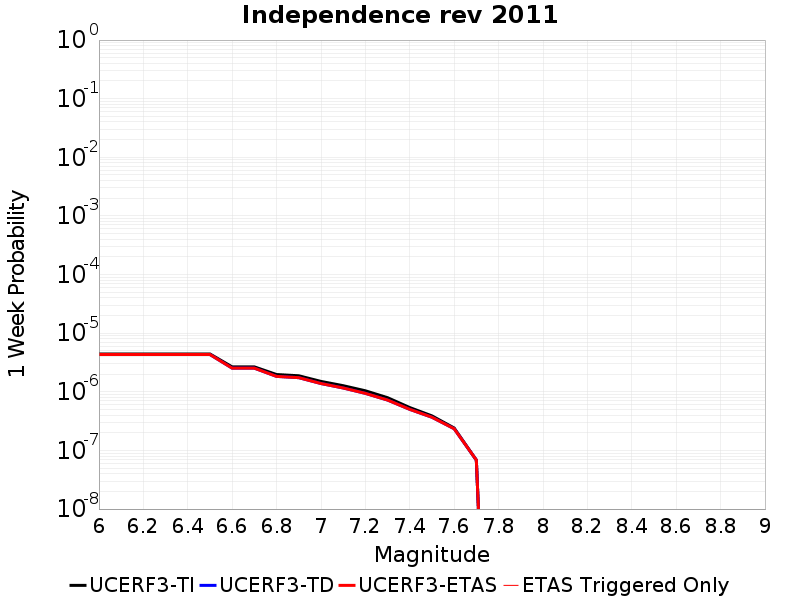 |  | 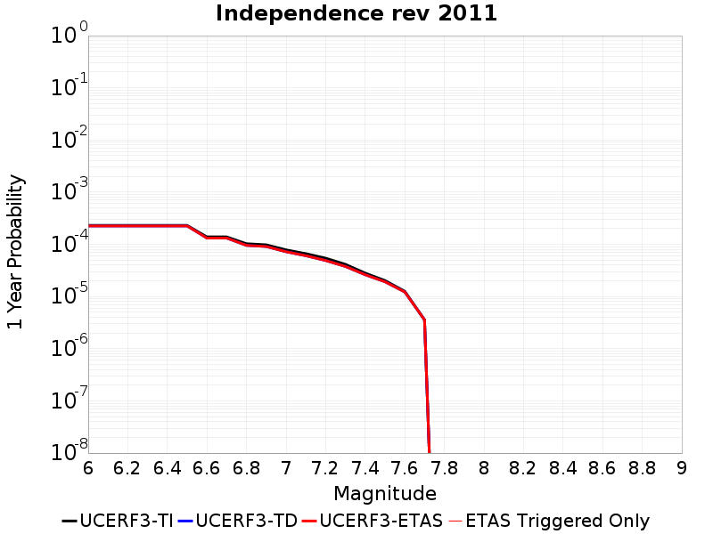 |  |

| Magnitude | 1 wk TI Prob | 1 wk TD Prob | 1 wk ETAS Prob | 1 wk ETAS/TD Gain | 1 wk ETAS Triggered Only | 1 mo TI Prob | 1 mo TD Prob | 1 mo ETAS Prob | 1 mo ETAS/TD Gain | 1 mo ETAS Triggered Only | 1 yr TI Prob | 1 yr TD Prob | 1 yr ETAS Prob | 1 yr ETAS/TD Gain | 1 yr ETAS Triggered Only | 10 yr TI Prob | 10 yr TD Prob | 10 yr ETAS Prob | 10 yr ETAS/TD Gain | 10 yr ETAS Triggered Only |
|-----|-----|-----|-----|-----|-----|-----|-----|-----|-----|-----|-----|-----|-----|-----|-----|-----|-----|-----|-----|-----|
| 6.0 | 4.422171E-6 | 4.3270998E-6 | 4.3270998E-6 | 1.0 | 0.0 | 1.8952025E-5 | 1.8544599E-5 | 1.8544599E-5 | 1.0 | 0.0 | 2.3071647E-4 | 2.2576009E-4 | 2.2576009E-4 | 1.0 | 0.0 | 0.0023047708 | 0.002255601 | 0.0022855334 | 1.0132703 | 3.0E-5 |
| 6.1 | 4.422171E-6 | 4.3270998E-6 | 4.3270998E-6 | 1.0 | 0.0 | 1.8952025E-5 | 1.8544599E-5 | 1.8544599E-5 | 1.0 | 0.0 | 2.3071647E-4 | 2.2576009E-4 | 2.2576009E-4 | 1.0 | 0.0 | 0.0023047708 | 0.002255601 | 0.0022855334 | 1.0132703 | 3.0E-5 |
| 6.2 | 4.422171E-6 | 4.3270998E-6 | 4.3270998E-6 | 1.0 | 0.0 | 1.8952025E-5 | 1.8544599E-5 | 1.8544599E-5 | 1.0 | 0.0 | 2.3071647E-4 | 2.2576009E-4 | 2.2576009E-4 | 1.0 | 0.0 | 0.0023047708 | 0.002255601 | 0.0022855334 | 1.0132703 | 3.0E-5 |
| 6.3 | 4.422171E-6 | 4.3270998E-6 | 4.3270998E-6 | 1.0 | 0.0 | 1.8952025E-5 | 1.8544599E-5 | 1.8544599E-5 | 1.0 | 0.0 | 2.3071647E-4 | 2.2576009E-4 | 2.2576009E-4 | 1.0 | 0.0 | 0.0023047708 | 0.002255601 | 0.0022855334 | 1.0132703 | 3.0E-5 |
| 6.4 | 4.422171E-6 | 4.3270998E-6 | 4.3270998E-6 | 1.0 | 0.0 | 1.8952025E-5 | 1.8544599E-5 | 1.8544599E-5 | 1.0 | 0.0 | 2.3071647E-4 | 2.2576009E-4 | 2.2576009E-4 | 1.0 | 0.0 | 0.0023047708 | 0.002255601 | 0.0022855334 | 1.0132703 | 3.0E-5 |
| 6.5 | 4.422171E-6 | 4.3270998E-6 | 4.3270998E-6 | 1.0 | 0.0 | 1.8952025E-5 | 1.8544599E-5 | 1.8544599E-5 | 1.0 | 0.0 | 2.3071647E-4 | 2.2576009E-4 | 2.2576009E-4 | 1.0 | 0.0 | 0.0023047708 | 0.002255601 | 0.0022855334 | 1.0132703 | 3.0E-5 |
| 6.6 | 2.663744E-6 | 2.5326271E-6 | 2.5326271E-6 | 1.0 | 0.0 | 1.1415996E-5 | 1.0854074E-5 | 1.0854074E-5 | 1.0 | 0.0 | 1.3898089E-4 | 1.3214083E-4 | 1.3214083E-4 | 1.0 | 0.0 | 0.0013889399 | 0.0013206708 | 0.0013506312 | 1.0226858 | 3.0E-5 |
| 6.7 | 2.663744E-6 | 2.5326271E-6 | 2.5326271E-6 | 1.0 | 0.0 | 1.1415996E-5 | 1.0854074E-5 | 1.0854074E-5 | 1.0 | 0.0 | 1.3898089E-4 | 1.3214083E-4 | 1.3214083E-4 | 1.0 | 0.0 | 0.0013889399 | 0.0013206708 | 0.0013506312 | 1.0226858 | 3.0E-5 |
| 6.8 | 1.9716529E-6 | 1.8328071E-6 | 1.8328071E-6 | 1.0 | 0.0 | 8.449913E-6 | 7.854865E-6 | 7.854865E-6 | 1.0 | 0.0 | 1.0287284E-4 | 9.5628915E-5 | 9.5628915E-5 | 1.0 | 0.0 | 0.0010282523 | 9.558905E-4 | 9.858619E-4 | 1.0313543 | 3.0E-5 |
| 6.9 | 1.8788617E-6 | 1.7435267E-6 | 1.7435267E-6 | 1.0 | 0.0 | 8.0522395E-6 | 7.4722366E-6 | 7.4722366E-6 | 1.0 | 0.0 | 9.80316E-5 | 9.09708E-5 | 9.09708E-5 | 1.0 | 0.0 | 9.798837E-4 | 9.0934767E-4 | 9.393204E-4 | 1.0329607 | 3.0E-5 |
| 7.0 | 1.5045488E-6 | 1.3853867E-6 | 1.3853867E-6 | 1.0 | 0.0 | 6.44805E-6 | 5.9373583E-6 | 5.9373583E-6 | 1.0 | 0.0 | 7.8502184E-5 | 7.2284995E-5 | 7.2284995E-5 | 1.0 | 0.0 | 7.8474457E-4 | 7.2261994E-4 | 7.525982E-4 | 1.0414855 | 3.0E-5 |
| 7.1 | 1.272341E-6 | 1.1628903E-6 | 1.1628903E-6 | 1.0 | 0.0 | 5.4528787E-6 | 4.983806E-6 | 4.983806E-6 | 1.0 | 0.0 | 6.6386776E-5 | 6.067618E-5 | 6.067618E-5 | 1.0 | 0.0 | 6.636695E-4 | 6.065993E-4 | 6.3658116E-4 | 1.0494261 | 3.0E-5 |
| 7.2 | 1.0416892E-6 | 9.4131553E-7 | 9.4131553E-7 | 1.0 | 0.0 | 4.464375E-6 | 4.0342034E-6 | 4.0342034E-6 | 1.0 | 0.0 | 5.4352407E-5 | 4.9115337E-5 | 4.9115337E-5 | 1.0 | 0.0 | 5.4339116E-4 | 4.910467E-4 | 5.2103197E-4 | 1.061064 | 3.0E-5 |
| 7.3 | 7.9450155E-7 | 7.237456E-7 | 7.237456E-7 | 1.0 | 0.0 | 3.4050022E-6 | 3.101763E-6 | 3.101763E-6 | 1.0 | 0.0 | 4.1455114E-5 | 3.7763322E-5 | 3.7763322E-5 | 1.0 | 0.0 | 4.144738E-4 | 3.7757016E-4 | 4.0755884E-4 | 1.0794255 | 3.0E-5 |
| 7.4 | 5.3893444E-7 | 5.021036E-7 | 5.021036E-7 | 1.0 | 0.0 | 2.309717E-6 | 2.1518708E-6 | 2.1518708E-6 | 1.0 | 0.0 | 2.8120441E-5 | 2.6198717E-5 | 2.6198717E-5 | 1.0 | 0.0 | 2.8116882E-4 | 2.6195674E-4 | 2.9194888E-4 | 1.1144928 | 3.0E-5 |
| 7.5 | 3.8852085E-7 | 3.683556E-7 | 3.683556E-7 | 1.0 | 0.0 | 1.6650882E-6 | 1.5786659E-6 | 1.5786659E-6 | 1.0 | 0.0 | 2.027226E-5 | 1.922009E-5 | 1.922009E-5 | 1.0 | 0.0 | 2.0270412E-4 | 1.9218448E-4 | 2.2217871E-4 | 1.15607 | 3.0E-5 |
| 7.6 | 2.414929E-7 | 2.3462768E-7 | 2.3462768E-7 | 1.0 | 0.0 | 1.0349692E-6 | 1.0055468E-6 | 1.0055468E-6 | 1.0 | 0.0 | 1.2600677E-5 | 1.2242464E-5 | 1.2242464E-5 | 1.0 | 0.0 | 1.2599962E-4 | 1.2241803E-4 | 1.5241436E-4 | 1.245032 | 3.0E-5 |
| 7.7 | 6.8298014E-8 | 6.860076E-8 | 6.860076E-8 | 1.0 | 0.0 | 2.9270575E-7 | 2.9400326E-7 | 2.9400326E-7 | 1.0 | 0.0 | 3.5636867E-6 | 3.5794842E-6 | 3.5794842E-6 | 1.0 | 0.0 | 3.5636294E-5 | 3.5794314E-5 | 3.5794314E-5 | 1.0 | 0.0 |

## Big Pine (East)
*[(top)](#table-of-contents)*

| 1 Week | 1 Month | 1 Year | 10 Year |
|-----|-----|-----|-----|
| 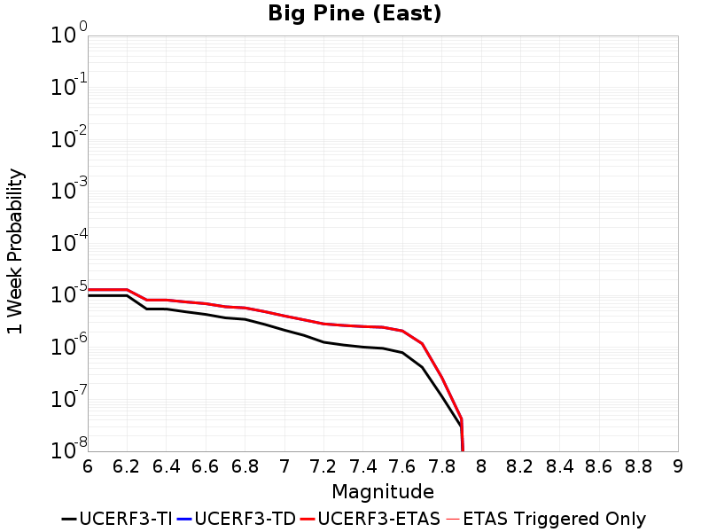 |  | 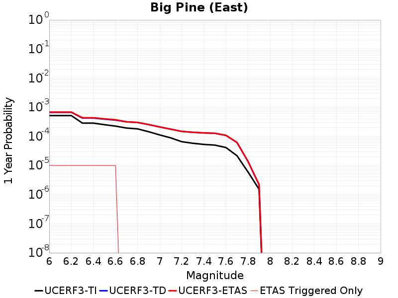 | 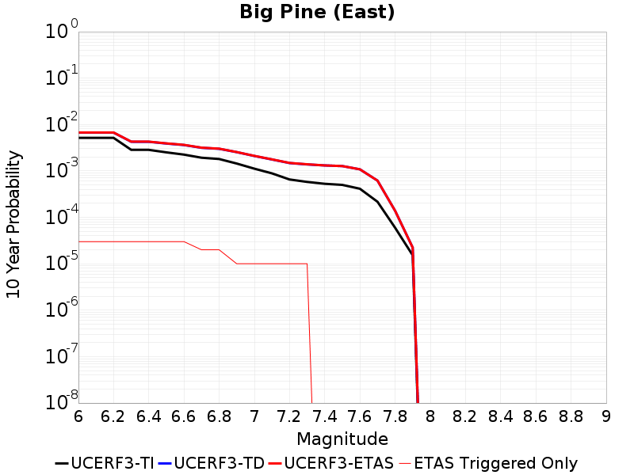 |

| Magnitude | 1 wk TI Prob | 1 wk TD Prob | 1 wk ETAS Prob | 1 wk ETAS/TD Gain | 1 wk ETAS Triggered Only | 1 mo TI Prob | 1 mo TD Prob | 1 mo ETAS Prob | 1 mo ETAS/TD Gain | 1 mo ETAS Triggered Only | 1 yr TI Prob | 1 yr TD Prob | 1 yr ETAS Prob | 1 yr ETAS/TD Gain | 1 yr ETAS Triggered Only | 10 yr TI Prob | 10 yr TD Prob | 10 yr ETAS Prob | 10 yr ETAS/TD Gain | 10 yr ETAS Triggered Only |
|-----|-----|-----|-----|-----|-----|-----|-----|-----|-----|-----|-----|-----|-----|-----|-----|-----|-----|-----|-----|-----|
| 6.0 | 9.916913E-6 | 1.2876862E-5 | 1.2876862E-5 | 1.0 | 0.0 | 4.250036E-5 | 5.5185505E-5 | 5.5185505E-5 | 1.0 | 0.0 | 5.173191E-4 | 6.7169854E-4 | 6.816918E-4 | 1.0148777 | 1.0E-5 | 0.0051611643 | 0.0067007444 | 0.0067305434 | 1.0044471 | 3.0E-5 |
| 6.1 | 9.916913E-6 | 1.2876862E-5 | 1.2876862E-5 | 1.0 | 0.0 | 4.250036E-5 | 5.5185505E-5 | 5.5185505E-5 | 1.0 | 0.0 | 5.173191E-4 | 6.7169854E-4 | 6.816918E-4 | 1.0148777 | 1.0E-5 | 0.0051611643 | 0.0067007444 | 0.0067305434 | 1.0044471 | 3.0E-5 |
| 6.2 | 9.916913E-6 | 1.2876862E-5 | 1.2876862E-5 | 1.0 | 0.0 | 4.250036E-5 | 5.5185505E-5 | 5.5185505E-5 | 1.0 | 0.0 | 5.173191E-4 | 6.7169854E-4 | 6.816918E-4 | 1.0148777 | 1.0E-5 | 0.0051611643 | 0.0067007444 | 0.0067305434 | 1.0044471 | 3.0E-5 |
| 6.3 | 5.479711E-6 | 8.171034E-6 | 8.171034E-6 | 1.0 | 0.0 | 2.3484265E-5 | 3.5018264E-5 | 3.5018264E-5 | 1.0 | 0.0 | 2.858834E-4 | 4.2626716E-4 | 4.362629E-4 | 1.0234494 | 1.0E-5 | 0.0028551589 | 0.004256687 | 0.0042865593 | 1.0070177 | 3.0E-5 |
| 6.4 | 5.465009E-6 | 8.155321E-6 | 8.155321E-6 | 1.0 | 0.0 | 2.3421257E-5 | 3.495092E-5 | 3.495092E-5 | 1.0 | 0.0 | 2.851165E-4 | 4.2544762E-4 | 4.3544336E-4 | 1.0234946 | 1.0E-5 | 0.0028475097 | 0.004248523 | 0.0042783953 | 1.0070313 | 3.0E-5 |
| 6.5 | 4.826767E-6 | 7.4801305E-6 | 7.4801305E-6 | 1.0 | 0.0 | 2.068598E-5 | 3.2057324E-5 | 3.2057324E-5 | 1.0 | 0.0 | 2.518227E-4 | 3.9023082E-4 | 4.002269E-4 | 1.0256158 | 1.0E-5 | 0.0025153751 | 0.0038976057 | 0.003927489 | 1.0076671 | 3.0E-5 |
| 6.6 | 4.3146847E-6 | 6.9398793E-6 | 6.9398793E-6 | 1.0 | 0.0 | 1.8491375E-5 | 2.9742016E-5 | 2.9742016E-5 | 1.0 | 0.0 | 2.2510924E-4 | 3.6205133E-4 | 3.720477E-4 | 1.0276104 | 1.0E-5 | 0.0022488134 | 0.003616732 | 0.0036466236 | 1.0082648 | 3.0E-5 |
| 6.7 | 3.6968106E-6 | 6.049753E-6 | 6.049753E-6 | 1.0 | 0.0 | 1.5843378E-5 | 2.5927264E-5 | 2.5927264E-5 | 1.0 | 0.0 | 1.9287605E-4 | 3.1562027E-4 | 3.1562027E-4 | 1.0 | 0.0 | 0.0019270873 | 0.003153746 | 0.0031736828 | 1.0063217 | 2.0E-5 |
| 6.8 | 3.4671132E-6 | 5.754992E-6 | 5.754992E-6 | 1.0 | 0.0 | 1.4858972E-5 | 2.4664027E-5 | 2.4664027E-5 | 1.0 | 0.0 | 1.8089297E-4 | 3.002446E-4 | 3.002446E-4 | 1.0 | 0.0 | 0.0018074579 | 0.0030004065 | 0.0030203466 | 1.0066458 | 2.0E-5 |
| 6.9 | 2.7686972E-6 | 4.8739917E-6 | 4.8739917E-6 | 1.0 | 0.0 | 1.1865792E-5 | 2.0888372E-5 | 2.0888372E-5 | 1.0 | 0.0 | 1.4445644E-4 | 2.54287E-4 | 2.54287E-4 | 1.0 | 0.0 | 0.0014436257 | 0.0025419085 | 0.0025518832 | 1.003924 | 1.0E-5 |
| 7.0 | 2.1472624E-6 | 4.0293567E-6 | 4.0293567E-6 | 1.0 | 0.0 | 9.20252E-6 | 1.7268561E-5 | 1.7268561E-5 | 1.0 | 0.0 | 1.12034926E-4 | 2.1022499E-4 | 2.1022499E-4 | 1.0 | 0.0 | 0.0011197845 | 0.0021021774 | 0.0021121562 | 1.0047469 | 1.0E-5 |
| 7.1 | 1.7018335E-6 | 3.385187E-6 | 3.385187E-6 | 1.0 | 0.0 | 7.293552E-6 | 1.4507866E-5 | 1.4507866E-5 | 1.0 | 0.0 | 8.879537E-5 | 1.7661932E-4 | 1.7661932E-4 | 1.0 | 0.0 | 8.87599E-4 | 0.0017666785 | 0.0017766609 | 1.0056503 | 1.0E-5 |
| 7.2 | 1.25603E-6 | 2.8325683E-6 | 2.8325683E-6 | 1.0 | 0.0 | 5.3829745E-6 | 1.2139523E-5 | 1.2139523E-5 | 1.0 | 0.0 | 6.553574E-5 | 1.477889E-4 | 1.477889E-4 | 1.0 | 0.0 | 6.551642E-4 | 0.0014787698 | 0.001488755 | 1.0067524 | 1.0E-5 |
| 7.3 | 1.112297E-6 | 2.6462997E-6 | 2.6462997E-6 | 1.0 | 0.0 | 4.7669787E-6 | 1.1341236E-5 | 1.1341236E-5 | 1.0 | 0.0 | 5.803642E-5 | 1.3807103E-4 | 1.3807103E-4 | 1.0 | 0.0 | 5.802127E-4 | 0.0013815482 | 0.0013915345 | 1.0072283 | 1.0E-5 |
| 7.4 | 1.0137181E-6 | 2.5179204E-6 | 2.5179204E-6 | 1.0 | 0.0 | 4.3444993E-6 | 1.0791044E-5 | 1.0791044E-5 | 1.0 | 0.0 | 5.2892992E-5 | 1.3137325E-4 | 1.3137325E-4 | 1.0 | 0.0 | 5.288041E-4 | 0.0013144207 | 0.0013144207 | 1.0 | 0.0 |
| 7.5 | 9.598608E-7 | 2.440555E-6 | 2.440555E-6 | 1.0 | 0.0 | 4.1136827E-6 | 1.0459481E-5 | 1.0459481E-5 | 1.0 | 0.0 | 5.0082934E-5 | 1.2733696E-4 | 1.2733696E-4 | 1.0 | 0.0 | 5.007165E-4 | 0.0012739133 | 0.0012739133 | 1.0 | 0.0 |
| 7.6 | 7.929459E-7 | 2.0743735E-6 | 2.0743735E-6 | 1.0 | 0.0 | 3.3983351E-6 | 8.890143E-6 | 8.890143E-6 | 1.0 | 0.0 | 4.1373947E-5 | 1.082323E-4 | 1.082323E-4 | 1.0 | 0.0 | 4.1366243E-4 | 0.0010833717 | 0.0010833717 | 1.0 | 0.0 |
| 7.7 | 4.155788E-7 | 1.1815278E-6 | 1.1815278E-6 | 1.0 | 0.0 | 1.7810507E-6 | 5.063681E-6 | 5.063681E-6 | 1.0 | 0.0 | 2.1684076E-5 | 6.1648614E-5 | 6.1648614E-5 | 1.0 | 0.0 | 2.1681961E-4 | 6.190813E-4 | 6.190813E-4 | 1.0 | 0.0 |
| 7.8 | 1.14666925E-7 | 2.6389804E-7 | 2.6389804E-7 | 1.0 | 0.0 | 4.914296E-7 | 1.1309911E-6 | 1.1309911E-6 | 1.0 | 0.0 | 5.9831386E-6 | 1.3769734E-5 | 1.3769734E-5 | 1.0 | 0.0 | 5.9829777E-5 | 1.3874464E-4 | 1.3874464E-4 | 1.0 | 0.0 |
| 7.9 | 2.9231824E-8 | 4.2248313E-8 | 4.2248313E-8 | 1.0 | 0.0 | 1.2527924E-7 | 1.810642E-7 | 1.810642E-7 | 1.0 | 0.0 | 1.5252737E-6 | 2.2044546E-6 | 2.2044546E-6 | 1.0 | 0.0 | 1.5252632E-5 | 2.2365633E-5 | 2.2365633E-5 | 1.0 | 0.0 |

## Imperial
*[(top)](#table-of-contents)*

| 1 Week | 1 Month | 1 Year | 10 Year |
|-----|-----|-----|-----|
|  | 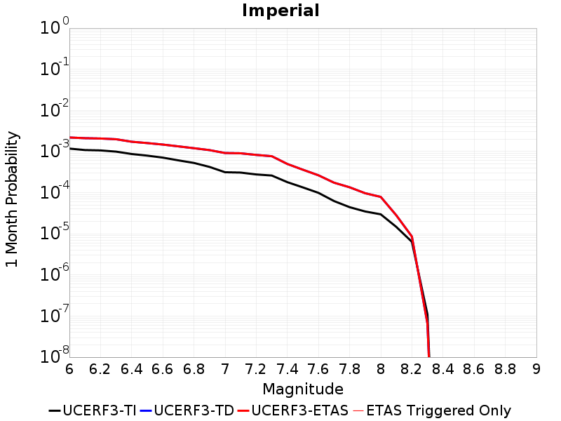 | 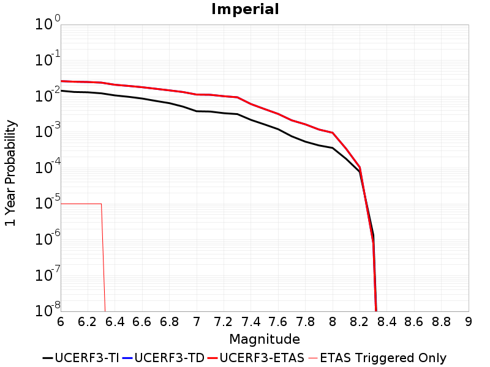 | 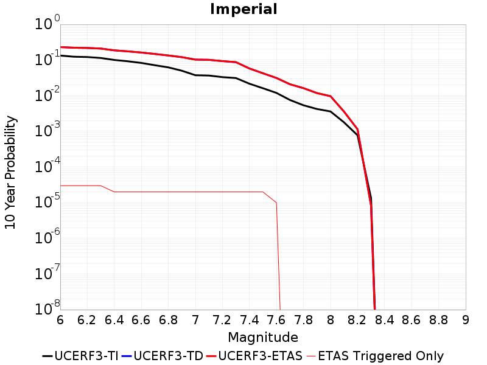 |

| Magnitude | 1 wk TI Prob | 1 wk TD Prob | 1 wk ETAS Prob | 1 wk ETAS/TD Gain | 1 wk ETAS Triggered Only | 1 mo TI Prob | 1 mo TD Prob | 1 mo ETAS Prob | 1 mo ETAS/TD Gain | 1 mo ETAS Triggered Only | 1 yr TI Prob | 1 yr TD Prob | 1 yr ETAS Prob | 1 yr ETAS/TD Gain | 1 yr ETAS Triggered Only | 10 yr TI Prob | 10 yr TD Prob | 10 yr ETAS Prob | 10 yr ETAS/TD Gain | 10 yr ETAS Triggered Only |
|-----|-----|-----|-----|-----|-----|-----|-----|-----|-----|-----|-----|-----|-----|-----|-----|-----|-----|-----|-----|-----|
| 6.0 | 2.7496446E-4 | 5.122553E-4 | 5.122553E-4 | 1.0 | 0.0 | 0.0011778869 | 0.0021935727 | 0.0021935727 | 1.0 | 0.0 | 0.0142467655 | 0.026389794 | 0.02639953 | 1.000369 | 1.0E-5 | 0.13367249 | 0.23030382 | 0.23032692 | 1.0001003 | 3.0E-5 |
| 6.1 | 2.5356023E-4 | 4.9252063E-4 | 4.9252063E-4 | 1.0 | 0.0 | 0.001086234 | 0.002109134 | 0.002109134 | 1.0 | 0.0 | 0.013144928 | 0.02537299 | 0.025382735 | 1.0003841 | 1.0E-5 | 0.123940155 | 0.2215077 | 0.22153105 | 1.0001054 | 3.0E-5 |
| 6.2 | 2.4820742E-4 | 4.833661E-4 | 4.833661E-4 | 1.0 | 0.0 | 0.0010633124 | 0.002069963 | 0.002069963 | 1.0 | 0.0 | 0.01286919 | 0.024907883 | 0.024917634 | 1.0003915 | 1.0E-5 | 0.12148927 | 0.21799277 | 0.21801624 | 1.0001076 | 3.0E-5 |
| 6.3 | 2.3205351E-4 | 4.641945E-4 | 4.641945E-4 | 1.0 | 0.0 | 9.94136E-4 | 0.0019879257 | 0.0019879257 | 1.0 | 0.0 | 0.012036599 | 0.023926146 | 0.023935908 | 1.0004079 | 1.0E-5 | 0.11405133 | 0.20976965 | 0.20979336 | 1.000113 | 3.0E-5 |
| 6.4 | 2.0304754E-4 | 4.0387732E-4 | 4.0387732E-4 | 1.0 | 0.0 | 8.6991355E-4 | 0.0017297696 | 0.0017297696 | 1.0 | 0.0 | 0.010539869 | 0.020850426 | 0.020850426 | 1.0 | 0.0 | 0.100537635 | 0.18690282 | 0.18691908 | 1.000087 | 2.0E-5 |
| 6.5 | 1.854992E-4 | 3.7466668E-4 | 3.7466668E-4 | 1.0 | 0.0 | 7.9475436E-4 | 0.0016047389 | 0.0016047389 | 1.0 | 0.0 | 0.009633281 | 0.019359555 | 0.019359555 | 1.0 | 0.0 | 0.0922623 | 0.175055 | 0.1750715 | 1.0000943 | 2.0E-5 |
| 6.6 | 1.6586106E-4 | 3.4469576E-4 | 3.4469576E-4 | 1.0 | 0.0 | 7.106394E-4 | 0.0014764416 | 0.0014764416 | 1.0 | 0.0 | 0.008617763 | 0.017830309 | 0.017830309 | 1.0 | 0.0 | 0.08291132 | 0.16241525 | 0.162432 | 1.0001031 | 2.0E-5 |
| 6.7 | 1.4224656E-4 | 3.1148188E-4 | 3.1148188E-4 | 1.0 | 0.0 | 6.094856E-4 | 0.0013342479 | 0.0013342479 | 1.0 | 0.0 | 0.0073952693 | 0.016123753 | 0.016123753 | 1.0 | 0.0 | 0.07153955 | 0.14795944 | 0.14797649 | 1.0001152 | 2.0E-5 |
| 6.8 | 1.2317259E-4 | 2.8107816E-4 | 2.8107816E-4 | 1.0 | 0.0 | 5.2777573E-4 | 0.0012040709 | 0.0012040709 | 1.0 | 0.0 | 0.0064067547 | 0.014562453 | 0.014562453 | 1.0 | 0.0 | 0.06225166 | 0.13420543 | 0.13422275 | 1.000129 | 2.0E-5 |
| 6.9 | 9.859898E-5 | 2.524765E-4 | 2.524765E-4 | 1.0 | 0.0 | 4.2249862E-4 | 0.0010815978 | 0.0010815978 | 1.0 | 0.0 | 0.0051317946 | 0.013089926 | 0.013089926 | 1.0 | 0.0 | 0.05014893 | 0.12035677 | 0.12037436 | 1.0001462 | 2.0E-5 |
| 7.0 | 7.3191884E-5 | 2.1436923E-4 | 2.1436923E-4 | 1.0 | 0.0 | 3.136418E-4 | 9.18405E-4 | 9.18405E-4 | 1.0 | 0.0 | 0.003811904 | 0.011124951 | 0.011124951 | 1.0 | 0.0 | 0.037471764 | 0.10276148 | 0.102779426 | 1.0001746 | 2.0E-5 |
| 7.1 | 7.1760296E-5 | 2.1135781E-4 | 2.1135781E-4 | 1.0 | 0.0 | 3.0750787E-4 | 9.0550794E-4 | 9.0550794E-4 | 1.0 | 0.0 | 0.003737482 | 0.01096952 | 0.01096952 | 1.0 | 0.0 | 0.03675245 | 0.101388946 | 0.10140692 | 1.0001773 | 2.0E-5 |
| 7.2 | 6.46614E-5 | 1.929764E-4 | 1.929764E-4 | 1.0 | 0.0 | 2.7709085E-4 | 8.267826E-4 | 8.267826E-4 | 1.0 | 0.0 | 0.0033683628 | 0.01002025 | 0.01002025 | 1.0 | 0.0 | 0.033177625 | 0.09317682 | 0.093194954 | 1.0001947 | 2.0E-5 |
| 7.3 | 6.088115E-5 | 1.79617E-4 | 1.79617E-4 | 1.0 | 0.0 | 2.6089314E-4 | 7.6956296E-4 | 7.6956296E-4 | 1.0 | 0.0 | 0.0031717476 | 0.009329762 | 0.009329762 | 1.0 | 0.0 | 0.031268585 | 0.08720407 | 0.08722232 | 1.0002093 | 2.0E-5 |
| 7.4 | 4.199346E-5 | 1.1624363E-4 | 1.1624363E-4 | 1.0 | 0.0 | 1.7995955E-4 | 4.980928E-4 | 4.980928E-4 | 1.0 | 0.0 | 0.0021888057 | 0.0060475892 | 0.0060475892 | 1.0 | 0.0 | 0.02167372 | 0.057941582 | 0.057960425 | 1.0003252 | 2.0E-5 |
| 7.5 | 3.130448E-5 | 8.4252926E-5 | 8.4252926E-5 | 1.0 | 0.0 | 1.3415517E-4 | 3.6103433E-4 | 3.6103433E-4 | 1.0 | 0.0 | 0.0016321153 | 0.0043867943 | 0.0043867943 | 1.0 | 0.0 | 0.016201803 | 0.04254677 | 0.04256592 | 1.00045 | 2.0E-5 |
| 7.6 | 2.3074248E-5 | 6.16269E-5 | 6.16269E-5 | 1.0 | 0.0 | 9.888588E-5 | 2.6408868E-4 | 2.6408868E-4 | 1.0 | 0.0 | 0.0012032706 | 0.0032105627 | 0.0032105627 | 1.0 | 0.0 | 0.011967761 | 0.031383656 | 0.03139334 | 1.0003086 | 1.0E-5 |
| 7.7 | 1.45864815E-5 | 4.077416E-5 | 4.077416E-5 | 1.0 | 0.0 | 6.2511994E-5 | 1.7473474E-4 | 1.7473474E-4 | 1.0 | 0.0 | 7.608177E-4 | 0.0021253254 | 0.0021253254 | 1.0 | 0.0 | 0.007582182 | 0.020925587 | 0.020925587 | 1.0 | 0.0 |
| 7.8 | 1.0352979E-5 | 3.1512925E-5 | 3.1512925E-5 | 1.0 | 0.0 | 4.4369157E-5 | 1.3504841E-4 | 1.3504841E-4 | 1.0 | 0.0 | 5.400606E-4 | 0.0016429769 | 0.0016429769 | 1.0 | 0.0 | 0.0053875 | 0.016269878 | 0.016269878 | 1.0 | 0.0 |
| 7.9 | 8.137906E-6 | 2.2593198E-5 | 2.2593198E-5 | 1.0 | 0.0 | 3.4876273E-5 | 9.68244E-5 | 9.68244E-5 | 1.0 | 0.0 | 4.2453592E-4 | 0.0011782006 | 0.0011782006 | 1.0 | 0.0 | 0.004237258 | 0.011824603 | 0.011824603 | 1.0 | 0.0 |
| 8.0 | 6.93792E-6 | 1.8391194E-5 | 1.8391194E-5 | 1.0 | 0.0 | 2.9733603E-5 | 7.881703E-5 | 7.881703E-5 | 1.0 | 0.0 | 3.6194647E-4 | 9.5917564E-4 | 9.5917564E-4 | 1.0 | 0.0 | 0.0036135751 | 0.009680745 | 0.009680745 | 1.0 | 0.0 |
| 8.1 | 3.4286315E-6 | 6.5590457E-6 | 6.5590457E-6 | 1.0 | 0.0 | 1.4694053E-5 | 2.8109893E-5 | 2.8109893E-5 | 1.0 | 0.0 | 1.7888541E-4 | 3.4218433E-4 | 3.4218433E-4 | 1.0 | 0.0 | 0.0017874148 | 0.003574828 | 0.003574828 | 1.0 | 0.0 |
| 8.2 | 1.4906886E-6 | 2.0057296E-6 | 2.0057296E-6 | 1.0 | 0.0 | 6.3886496E-6 | 8.5959555E-6 | 8.5959555E-6 | 1.0 | 0.0 | 7.7779034E-5 | 1.0465077E-4 | 1.0465077E-4 | 1.0 | 0.0 | 7.775182E-4 | 0.0011429297 | 0.0011429297 | 1.0 | 0.0 |
| 8.3 | 2.5758007E-8 | 1.5203643E-8 | 1.5203643E-8 | 1.0 | 0.0 | 1.10391454E-7 | 6.515847E-8 | 6.515847E-8 | 1.0 | 0.0 | 1.3440151E-6 | 7.933043E-7 | 7.933043E-7 | 1.0 | 0.0 | 1.344007E-5 | 8.264099E-6 | 8.264099E-6 | 1.0 | 0.0 |

## Mission Ridge-Arroyo Parida-Santa Ana
*[(top)](#table-of-contents)*

| 1 Week | 1 Month | 1 Year | 10 Year |
|-----|-----|-----|-----|
|  | 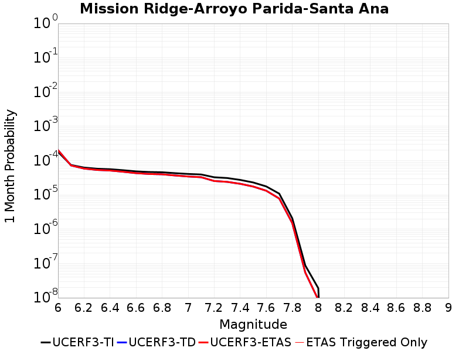 | 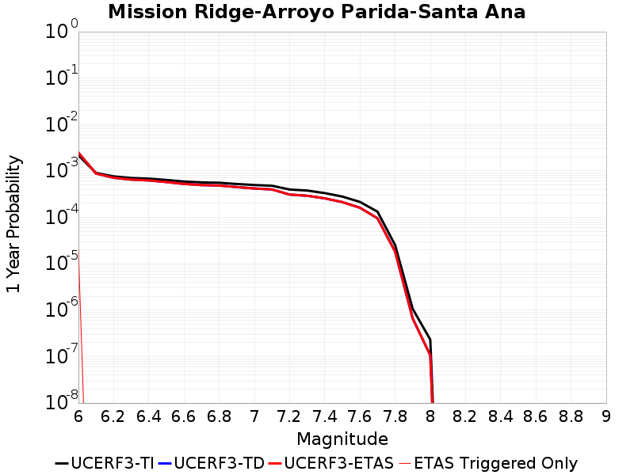 |  |

| Magnitude | 1 wk TI Prob | 1 wk TD Prob | 1 wk ETAS Prob | 1 wk ETAS/TD Gain | 1 wk ETAS Triggered Only | 1 mo TI Prob | 1 mo TD Prob | 1 mo ETAS Prob | 1 mo ETAS/TD Gain | 1 mo ETAS Triggered Only | 1 yr TI Prob | 1 yr TD Prob | 1 yr ETAS Prob | 1 yr ETAS/TD Gain | 1 yr ETAS Triggered Only | 10 yr TI Prob | 10 yr TD Prob | 10 yr ETAS Prob | 10 yr ETAS/TD Gain | 10 yr ETAS Triggered Only |
|-----|-----|-----|-----|-----|-----|-----|-----|-----|-----|-----|-----|-----|-----|-----|-----|-----|-----|-----|-----|-----|
| 6.0 | 4.169034E-5 | 4.7199777E-5 | 4.7199777E-5 | 1.0 | 0.0 | 1.7866064E-4 | 2.0227395E-4 | 2.0227395E-4 | 1.0 | 0.0 | 0.0021730233 | 0.0024607372 | 0.002480688 | 1.0081077 | 2.0E-5 | 0.021518968 | 0.024416879 | 0.024446145 | 1.0011986 | 3.0E-5 |
| 6.1 | 1.73813E-5 | 1.6869837E-5 | 1.6869837E-5 | 1.0 | 0.0 | 7.4489166E-5 | 7.2297364E-5 | 7.2297364E-5 | 1.0 | 0.0 | 9.065282E-4 | 8.798756E-4 | 8.798756E-4 | 1.0 | 0.0 | 0.009028391 | 0.008765129 | 0.008765129 | 1.0 | 0.0 |
| 6.2 | 1.4622182E-5 | 1.3685768E-5 | 1.3685768E-5 | 1.0 | 0.0 | 6.2664985E-5 | 5.8651993E-5 | 5.8651993E-5 | 1.0 | 0.0 | 7.6267915E-4 | 7.1385794E-4 | 7.1385794E-4 | 1.0 | 0.0 | 0.007600669 | 0.007116158 | 0.007116158 | 1.0 | 0.0 |
| 6.3 | 1.3552434E-5 | 1.2493812E-5 | 1.2493812E-5 | 1.0 | 0.0 | 5.8080568E-5 | 5.354383E-5 | 5.354383E-5 | 1.0 | 0.0 | 7.069015E-4 | 6.517043E-4 | 6.517043E-4 | 1.0 | 0.0 | 0.00704657 | 0.006498361 | 0.006498361 | 1.0 | 0.0 |
| 6.4 | 1.30977305E-5 | 1.1990426E-5 | 1.1990426E-5 | 1.0 | 0.0 | 5.613192E-5 | 5.1386545E-5 | 5.1386545E-5 | 1.0 | 0.0 | 6.831918E-4 | 6.2545465E-4 | 6.2545465E-4 | 1.0 | 0.0 | 0.006810953 | 0.0062373546 | 0.0062373546 | 1.0 | 0.0 |
| 6.5 | 1.225205E-5 | 1.105948E-5 | 1.105948E-5 | 1.0 | 0.0 | 5.2507727E-5 | 4.7396927E-5 | 4.7396927E-5 | 1.0 | 0.0 | 6.3909404E-4 | 5.769075E-4 | 5.769075E-4 | 1.0 | 0.0 | 0.006372592 | 0.0057544746 | 0.0057544746 | 1.0 | 0.0 |
| 6.6 | 1.1352241E-5 | 1.0073618E-5 | 1.0073618E-5 | 1.0 | 0.0 | 4.8651553E-5 | 4.317194E-5 | 4.317194E-5 | 1.0 | 0.0 | 5.921717E-4 | 5.2549376E-4 | 5.2549376E-4 | 1.0 | 0.0 | 0.0059059616 | 0.005242824 | 0.005242824 | 1.0 | 0.0 |
| 6.7 | 1.0864116E-5 | 9.526689E-6 | 9.526689E-6 | 1.0 | 0.0 | 4.6559664E-5 | 4.082804E-5 | 4.082804E-5 | 1.0 | 0.0 | 5.667165E-4 | 4.9697E-4 | 4.9697E-4 | 1.0 | 0.0 | 0.005652734 | 0.004958886 | 0.004958886 | 1.0 | 0.0 |
| 6.8 | 1.0666365E-5 | 9.309303E-6 | 9.309303E-6 | 1.0 | 0.0 | 4.571219E-5 | 3.9896415E-5 | 3.9896415E-5 | 1.0 | 0.0 | 5.564038E-4 | 4.856326E-4 | 4.856326E-4 | 1.0 | 0.0 | 0.005550127 | 0.0048460118 | 0.0048460118 | 1.0 | 0.0 |
| 6.9 | 1.0038665E-5 | 8.600996E-6 | 8.600996E-6 | 1.0 | 0.0 | 4.302214E-5 | 3.68609E-5 | 3.68609E-5 | 1.0 | 0.0 | 5.236687E-4 | 4.4869084E-4 | 4.4869084E-4 | 1.0 | 0.0 | 0.005224364 | 0.0044781263 | 0.0044781263 | 1.0 | 0.0 |
| 7.0 | 9.5379955E-6 | 8.033522E-6 | 8.033522E-6 | 1.0 | 0.0 | 4.0876483E-5 | 3.4428936E-5 | 3.4428936E-5 | 1.0 | 0.0 | 4.975576E-4 | 4.1909338E-4 | 4.1909338E-4 | 1.0 | 0.0 | 0.00496445 | 0.0041832956 | 0.0041832956 | 1.0 | 0.0 |
| 7.1 | 9.207389E-6 | 7.660484E-6 | 7.660484E-6 | 1.0 | 0.0 | 3.945964E-5 | 3.2830238E-5 | 3.2830238E-5 | 1.0 | 0.0 | 4.803152E-4 | 3.9963654E-4 | 3.9963654E-4 | 1.0 | 0.0 | 0.004792784 | 0.0039894413 | 0.0039894413 | 1.0 | 0.0 |
| 7.2 | 7.638091E-6 | 5.9374606E-6 | 5.9374606E-6 | 1.0 | 0.0 | 3.2734264E-5 | 2.5446014E-5 | 2.5446014E-5 | 1.0 | 0.0 | 3.984668E-4 | 3.097615E-4 | 3.097615E-4 | 1.0 | 0.0 | 0.0039775306 | 0.0030934198 | 0.0030934198 | 1.0 | 0.0 |
| 7.3 | 7.2500147E-6 | 5.602131E-6 | 5.602131E-6 | 1.0 | 0.0 | 3.1071122E-5 | 2.4008914E-5 | 2.4008914E-5 | 1.0 | 0.0 | 3.7822526E-4 | 2.9226963E-4 | 2.9226963E-4 | 1.0 | 0.0 | 0.0037758215 | 0.0029189736 | 0.0029189736 | 1.0 | 0.0 |
| 7.4 | 6.3899715E-6 | 4.9237756E-6 | 4.9237756E-6 | 1.0 | 0.0 | 2.7385306E-5 | 2.1101725E-5 | 2.1101725E-5 | 1.0 | 0.0 | 3.3336508E-4 | 2.5688342E-4 | 2.5688342E-4 | 1.0 | 0.0 | 0.0033286542 | 0.002565975 | 0.002565975 | 1.0 | 0.0 |
| 7.5 | 5.379025E-6 | 4.088302E-6 | 4.088302E-6 | 1.0 | 0.0 | 2.305276E-5 | 1.7521177E-5 | 1.7521177E-5 | 1.0 | 0.0 | 2.806312E-4 | 2.1329954E-4 | 2.1329954E-4 | 1.0 | 0.0 | 0.0028027708 | 0.0021309596 | 0.0021309596 | 1.0 | 0.0 |
| 7.6 | 4.1270696E-6 | 3.0914314E-6 | 3.0914314E-6 | 1.0 | 0.0 | 1.768732E-5 | 1.3248925E-5 | 1.3248925E-5 | 1.0 | 0.0 | 2.1532185E-4 | 1.6129379E-4 | 1.6129379E-4 | 1.0 | 0.0 | 0.0021511333 | 0.0016117754 | 0.0016117754 | 1.0 | 0.0 |
| 7.7 | 2.5406805E-6 | 1.8302163E-6 | 1.8302163E-6 | 1.0 | 0.0 | 1.0888585E-5 | 7.843761E-6 | 7.843761E-6 | 1.0 | 0.0 | 1.3256045E-4 | 9.549366E-5 | 9.549366E-5 | 1.0 | 0.0 | 0.0013248142 | 9.545325E-4 | 9.545325E-4 | 1.0 | 0.0 |
| 7.8 | 4.8608285E-7 | 3.5131137E-7 | 3.5131137E-7 | 1.0 | 0.0 | 2.0832106E-6 | 1.5056193E-6 | 1.5056193E-6 | 1.0 | 0.0 | 2.5362791E-5 | 1.8330762E-5 | 1.8330762E-5 | 1.0 | 0.0 | 2.5359896E-4 | 1.8329262E-4 | 1.8329262E-4 | 1.0 | 0.0 |
| 7.9 | 2.0472514E-8 | 1.2705254E-8 | 1.2705254E-8 | 1.0 | 0.0 | 8.7739345E-8 | 5.445109E-8 | 5.445109E-8 | 1.0 | 0.0 | 1.068226E-6 | 6.6294183E-7 | 6.6294183E-7 | 1.0 | 0.0 | 1.0682209E-5 | 6.629399E-6 | 6.629399E-6 | 1.0 | 0.0 |
| 8.0 | 4.443582E-9 | 2.0387692E-9 | 2.0387692E-9 | 1.0 | 0.0 | 1.9043922E-8 | 8.737582E-9 | 8.737582E-9 | 1.0 | 0.0 | 2.3185973E-7 | 1.0638006E-7 | 1.0638006E-7 | 1.0 | 0.0 | 2.3185949E-6 | 1.0638001E-6 | 1.0638001E-6 | 1.0 | 0.0 |

## Chino alt 1
*[(top)](#table-of-contents)*

| 1 Week | 1 Month | 1 Year | 10 Year |
|-----|-----|-----|-----|
| 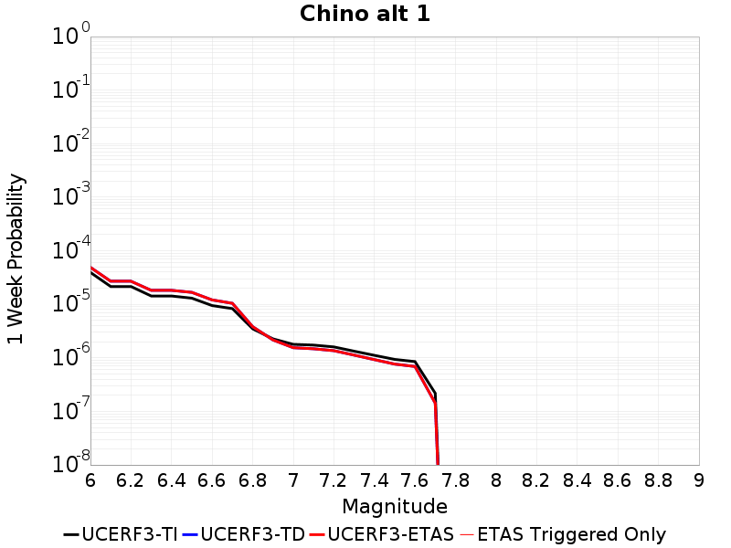 | 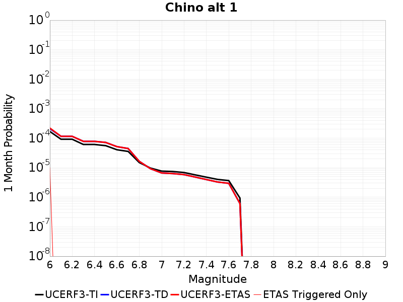 |  | 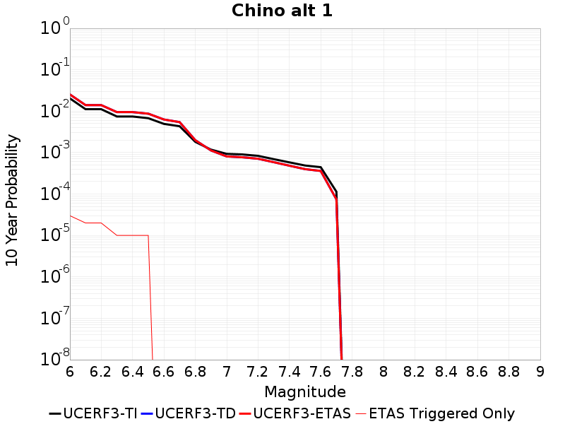 |

| Magnitude | 1 wk TI Prob | 1 wk TD Prob | 1 wk ETAS Prob | 1 wk ETAS/TD Gain | 1 wk ETAS Triggered Only | 1 mo TI Prob | 1 mo TD Prob | 1 mo ETAS Prob | 1 mo ETAS/TD Gain | 1 mo ETAS Triggered Only | 1 yr TI Prob | 1 yr TD Prob | 1 yr ETAS Prob | 1 yr ETAS/TD Gain | 1 yr ETAS Triggered Only | 10 yr TI Prob | 10 yr TD Prob | 10 yr ETAS Prob | 10 yr ETAS/TD Gain | 10 yr ETAS Triggered Only |
|-----|-----|-----|-----|-----|-----|-----|-----|-----|-----|-----|-----|-----|-----|-----|-----|-----|-----|-----|-----|-----|
| 6.0 | 3.939946E-5 | 4.906218E-5 | 4.906218E-5 | 1.0 | 0.0 | 1.6884391E-4 | 2.1025242E-4 | 2.2025032E-4 | 1.0475519 | 1.0E-5 | 0.0020537362 | 0.002557333 | 0.0025673073 | 1.0039003 | 1.0E-5 | 0.020348595 | 0.025335142 | 0.025364382 | 1.0011542 | 3.0E-5 |
| 6.1 | 2.1505624E-5 | 2.6960588E-5 | 2.6960588E-5 | 1.0 | 0.0 | 9.2163704E-5 | 1.15540824E-4 | 1.15540824E-4 | 1.0 | 0.0 | 0.0011215154 | 0.0014059123 | 0.0014059123 | 1.0 | 0.0 | 0.011158722 | 0.013986237 | 0.014005957 | 1.00141 | 2.0E-5 |
| 6.2 | 2.1505624E-5 | 2.6960588E-5 | 2.6960588E-5 | 1.0 | 0.0 | 9.2163704E-5 | 1.15540824E-4 | 1.15540824E-4 | 1.0 | 0.0 | 0.0011215154 | 0.0014059123 | 0.0014059123 | 1.0 | 0.0 | 0.011158722 | 0.013986237 | 0.014005957 | 1.00141 | 2.0E-5 |
| 6.3 | 1.4290785E-5 | 1.823512E-5 | 1.823512E-5 | 1.0 | 0.0 | 6.1244784E-5 | 7.814843E-5 | 7.814843E-5 | 1.0 | 0.0 | 7.454001E-4 | 9.5108734E-4 | 9.5108734E-4 | 1.0 | 0.0 | 0.007429048 | 0.009479789 | 0.009489695 | 1.0010449 | 1.0E-5 |
| 6.4 | 1.4290785E-5 | 1.823512E-5 | 1.823512E-5 | 1.0 | 0.0 | 6.1244784E-5 | 7.814843E-5 | 7.814843E-5 | 1.0 | 0.0 | 7.454001E-4 | 9.5108734E-4 | 9.5108734E-4 | 1.0 | 0.0 | 0.007429048 | 0.009479789 | 0.009489695 | 1.0010449 | 1.0E-5 |
| 6.5 | 1.3017944E-5 | 1.6720267E-5 | 1.6720267E-5 | 1.0 | 0.0 | 5.5789995E-5 | 7.165657E-5 | 7.165657E-5 | 1.0 | 0.0 | 6.790315E-4 | 8.721136E-4 | 8.721136E-4 | 1.0 | 0.0 | 0.0067696036 | 0.008696371 | 0.008706284 | 1.0011399 | 1.0E-5 |
| 6.6 | 9.470016E-6 | 1.2079786E-5 | 1.2079786E-5 | 1.0 | 0.0 | 4.058515E-5 | 5.1769675E-5 | 5.1769675E-5 | 1.0 | 0.0 | 4.940122E-4 | 6.301477E-4 | 6.301477E-4 | 1.0 | 0.0 | 0.004929154 | 0.006291565 | 0.006291565 | 1.0 | 0.0 |
| 6.7 | 8.314155E-6 | 1.0438215E-5 | 1.0438215E-5 | 1.0 | 0.0 | 3.5631605E-5 | 4.4734625E-5 | 4.4734625E-5 | 1.0 | 0.0 | 4.3372845E-4 | 5.445404E-4 | 5.445404E-4 | 1.0 | 0.0 | 0.004328829 | 0.0054404875 | 0.0054404875 | 1.0 | 0.0 |
| 6.8 | 3.4856364E-6 | 3.823025E-6 | 3.823025E-6 | 1.0 | 0.0 | 1.4938357E-5 | 1.6384301E-5 | 1.6384301E-5 | 1.0 | 0.0 | 1.8185932E-4 | 1.994627E-4 | 1.994627E-4 | 1.0 | 0.0 | 0.0018171056 | 0.0019944508 | 0.0019944508 | 1.0 | 0.0 |
| 6.9 | 2.2645952E-6 | 2.1590458E-6 | 2.1590458E-6 | 1.0 | 0.0 | 9.705372E-6 | 9.253023E-6 | 9.253023E-6 | 1.0 | 0.0 | 1.18156495E-4 | 1.1264994E-4 | 1.1264994E-4 | 1.0 | 0.0 | 0.0011809369 | 0.0011264752 | 0.0011264752 | 1.0 | 0.0 |
| 7.0 | 1.7864003E-6 | 1.5480211E-6 | 1.5480211E-6 | 1.0 | 0.0 | 7.655979E-6 | 6.6343596E-6 | 6.6343596E-6 | 1.0 | 0.0 | 9.3207556E-5 | 8.077039E-5 | 8.077039E-5 | 1.0 | 0.0 | 9.316847E-4 | 8.078289E-4 | 8.078289E-4 | 1.0 | 0.0 |
| 7.1 | 1.7315456E-6 | 1.4781898E-6 | 1.4781898E-6 | 1.0 | 0.0 | 7.420889E-6 | 6.335084E-6 | 6.335084E-6 | 1.0 | 0.0 | 9.034557E-5 | 7.712698E-5 | 7.712698E-5 | 1.0 | 0.0 | 9.0308854E-4 | 7.714149E-4 | 7.714149E-4 | 1.0 | 0.0 |
| 7.2 | 1.6008337E-6 | 1.3619482E-6 | 1.3619482E-6 | 1.0 | 0.0 | 6.860698E-6 | 5.836908E-6 | 5.836908E-6 | 1.0 | 0.0 | 8.352579E-5 | 7.1062095E-5 | 7.1062095E-5 | 1.0 | 0.0 | 8.34944E-4 | 7.107908E-4 | 7.107908E-4 | 1.0 | 0.0 |
| 7.3 | 1.3320939E-6 | 1.1256507E-6 | 1.1256507E-6 | 1.0 | 0.0 | 5.7089615E-6 | 4.8242086E-6 | 4.8242086E-6 | 1.0 | 0.0 | 6.9504385E-5 | 5.8733203E-5 | 5.8733203E-5 | 1.0 | 0.0 | 6.9482654E-4 | 5.873266E-4 | 5.873266E-4 | 1.0 | 0.0 |
| 7.4 | 1.114294E-6 | 9.262846E-7 | 9.262846E-7 | 1.0 | 0.0 | 4.775537E-6 | 3.969785E-6 | 3.969785E-6 | 1.0 | 0.0 | 5.8140613E-5 | 4.83311E-5 | 4.83311E-5 | 1.0 | 0.0 | 5.81254E-4 | 4.8322242E-4 | 4.8322242E-4 | 1.0 | 0.0 |
| 7.5 | 9.354081E-7 | 7.645097E-7 | 7.645097E-7 | 1.0 | 0.0 | 4.0088858E-6 | 3.2764663E-6 | 3.2764663E-6 | 1.0 | 0.0 | 4.8807087E-5 | 3.989028E-5 | 3.989028E-5 | 1.0 | 0.0 | 4.879637E-4 | 3.988346E-4 | 3.988346E-4 | 1.0 | 0.0 |
| 7.6 | 8.521771E-7 | 6.900716E-7 | 6.900716E-7 | 1.0 | 0.0 | 3.6521824E-6 | 2.9574467E-6 | 2.9574467E-6 | 1.0 | 0.0 | 4.4464414E-5 | 3.600635E-5 | 3.600635E-5 | 1.0 | 0.0 | 4.4455516E-4 | 3.6000836E-4 | 3.6000836E-4 | 1.0 | 0.0 |
| 7.7 | 2.1803626E-7 | 1.4238246E-7 | 1.4238246E-7 | 1.0 | 0.0 | 9.344408E-7 | 6.1021046E-7 | 6.1021046E-7 | 1.0 | 0.0 | 1.1376757E-5 | 7.429297E-6 | 7.429297E-6 | 1.0 | 0.0 | 1.13761744E-4 | 7.429145E-5 | 7.429145E-5 | 1.0 | 0.0 |

## San Clemente
*[(top)](#table-of-contents)*

| 1 Week | 1 Month | 1 Year | 10 Year |
|-----|-----|-----|-----|
|  | 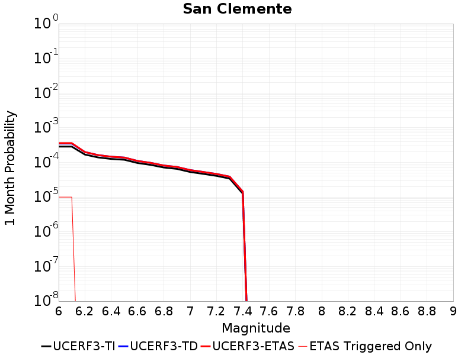 |  |  |

| Magnitude | 1 wk TI Prob | 1 wk TD Prob | 1 wk ETAS Prob | 1 wk ETAS/TD Gain | 1 wk ETAS Triggered Only | 1 mo TI Prob | 1 mo TD Prob | 1 mo ETAS Prob | 1 mo ETAS/TD Gain | 1 mo ETAS Triggered Only | 1 yr TI Prob | 1 yr TD Prob | 1 yr ETAS Prob | 1 yr ETAS/TD Gain | 1 yr ETAS Triggered Only | 10 yr TI Prob | 10 yr TD Prob | 10 yr ETAS Prob | 10 yr ETAS/TD Gain | 10 yr ETAS Triggered Only |
|-----|-----|-----|-----|-----|-----|-----|-----|-----|-----|-----|-----|-----|-----|-----|-----|-----|-----|-----|-----|-----|
| 6.0 | 6.681379E-5 | 8.1753446E-5 | 8.1753446E-5 | 1.0 | 0.0 | 2.8631336E-4 | 3.503269E-4 | 3.603234E-4 | 1.0285348 | 1.0E-5 | 0.003480294 | 0.0042573838 | 0.004277298 | 1.0046778 | 2.0E-5 | 0.03426291 | 0.041813366 | 0.04184211 | 1.0006875 | 3.0E-5 |
| 6.1 | 6.681379E-5 | 8.1753446E-5 | 8.1753446E-5 | 1.0 | 0.0 | 2.8631336E-4 | 3.503269E-4 | 3.603234E-4 | 1.0285348 | 1.0E-5 | 0.003480294 | 0.0042573838 | 0.004277298 | 1.0046778 | 2.0E-5 | 0.03426291 | 0.041813366 | 0.04183253 | 1.0004584 | 2.0E-5 |
| 6.2 | 3.9400576E-5 | 4.650556E-5 | 4.650556E-5 | 1.0 | 0.0 | 1.6884868E-4 | 1.9929455E-4 | 1.9929455E-4 | 1.0 | 0.0 | 0.0020537945 | 0.0024237658 | 0.0024237658 | 1.0 | 0.0 | 0.020349167 | 0.02397994 | 0.02397994 | 1.0 | 0.0 |
| 6.3 | 3.2590255E-5 | 3.7968784E-5 | 3.7968784E-5 | 1.0 | 0.0 | 1.3966505E-4 | 1.627134E-4 | 1.627134E-4 | 1.0 | 0.0 | 0.0016990956 | 0.0019792663 | 0.0019792663 | 1.0 | 0.0 | 0.01686163 | 0.019620169 | 0.019620169 | 1.0 | 0.0 |
| 6.4 | 2.9454652E-5 | 3.4132045E-5 | 3.4132045E-5 | 1.0 | 0.0 | 1.2622811E-4 | 1.4627214E-4 | 1.4627214E-4 | 1.0 | 0.0 | 0.0015357438 | 0.001779435 | 0.001779435 | 1.0 | 0.0 | 0.015251739 | 0.01765504 | 0.01765504 | 1.0 | 0.0 |
| 6.5 | 2.790836E-5 | 3.2279426E-5 | 3.2279426E-5 | 1.0 | 0.0 | 1.1960178E-4 | 1.3833321E-4 | 1.3833321E-4 | 1.0 | 0.0 | 0.001455179 | 0.0016829313 | 0.0016829313 | 1.0 | 0.0 | 0.014456868 | 0.016704883 | 0.016704883 | 1.0 | 0.0 |
| 6.6 | 2.2492153E-5 | 2.5786532E-5 | 2.5786532E-5 | 1.0 | 0.0 | 9.639138E-5 | 1.10509114E-4 | 1.10509114E-4 | 1.0 | 0.0 | 0.0011729331 | 0.0013446328 | 0.0013446328 | 1.0 | 0.0 | 0.011667615 | 0.013366688 | 0.013366688 | 1.0 | 0.0 |
| 6.7 | 1.9862755E-5 | 2.2686756E-5 | 2.2686756E-5 | 1.0 | 0.0 | 8.512331E-5 | 9.72254E-5 | 9.72254E-5 | 1.0 | 0.0 | 0.0010358836 | 0.0011830877 | 0.0011830877 | 1.0 | 0.0 | 0.010310682 | 0.011769189 | 0.011769189 | 1.0 | 0.0 |
| 6.8 | 1.6697575E-5 | 1.8994162E-5 | 1.8994162E-5 | 1.0 | 0.0 | 7.155907E-5 | 8.1401064E-5 | 8.1401064E-5 | 1.0 | 0.0 | 8.7088346E-4 | 9.906167E-4 | 9.906167E-4 | 1.0 | 0.0 | 0.008674784 | 0.009863039 | 0.009863039 | 1.0 | 0.0 |
| 6.9 | 1.5218415E-5 | 1.7284172E-5 | 1.7284172E-5 | 1.0 | 0.0 | 6.522015E-5 | 7.407297E-5 | 7.407297E-5 | 1.0 | 0.0 | 7.93766E-4 | 9.014741E-4 | 9.014741E-4 | 1.0 | 0.0 | 0.007909367 | 0.00897912 | 0.00897912 | 1.0 | 0.0 |
| 7.0 | 1.2392958E-5 | 1.4044797E-5 | 1.4044797E-5 | 1.0 | 0.0 | 5.3111595E-5 | 6.0190643E-5 | 6.0190643E-5 | 1.0 | 0.0 | 6.4644177E-4 | 7.325823E-4 | 7.325823E-4 | 1.0 | 0.0 | 0.0064456454 | 0.007302461 | 0.007302461 | 1.0 | 0.0 |
| 7.1 | 1.0934128E-5 | 1.2385484E-5 | 1.2385484E-5 | 1.0 | 0.0 | 4.6859706E-5 | 5.307961E-5 | 5.307961E-5 | 1.0 | 0.0 | 5.7036756E-4 | 6.460599E-4 | 6.460599E-4 | 1.0 | 0.0 | 0.0056890585 | 0.006442565 | 0.006442565 | 1.0 | 0.0 |
| 7.2 | 9.5798805E-6 | 1.085402E-5 | 1.085402E-5 | 1.0 | 0.0 | 4.1055984E-5 | 4.651644E-5 | 4.651644E-5 | 1.0 | 0.0 | 4.9974193E-4 | 5.6619773E-4 | 5.6619773E-4 | 1.0 | 0.0 | 0.0049861963 | 0.005648277 | 0.005648277 | 1.0 | 0.0 |
| 7.3 | 8.0167365E-6 | 9.091588E-6 | 9.091588E-6 | 1.0 | 0.0 | 3.4356988E-5 | 3.8963408E-5 | 3.8963408E-5 | 1.0 | 0.0 | 4.1821605E-4 | 4.742833E-4 | 4.742833E-4 | 1.0 | 0.0 | 0.0041742986 | 0.004733415 | 0.004733415 | 1.0 | 0.0 |
| 7.4 | 2.9581017E-6 | 3.365294E-6 | 3.365294E-6 | 1.0 | 0.0 | 1.2677518E-5 | 1.4422638E-5 | 1.4422638E-5 | 1.0 | 0.0 | 1.5433785E-4 | 1.7558652E-4 | 1.7558652E-4 | 1.0 | 0.0 | 0.001542307 | 0.0017549738 | 0.0017549738 | 1.0 | 0.0 |

## Mission Creek
*[(top)](#table-of-contents)*

| 1 Week | 1 Month | 1 Year | 10 Year |
|-----|-----|-----|-----|
| 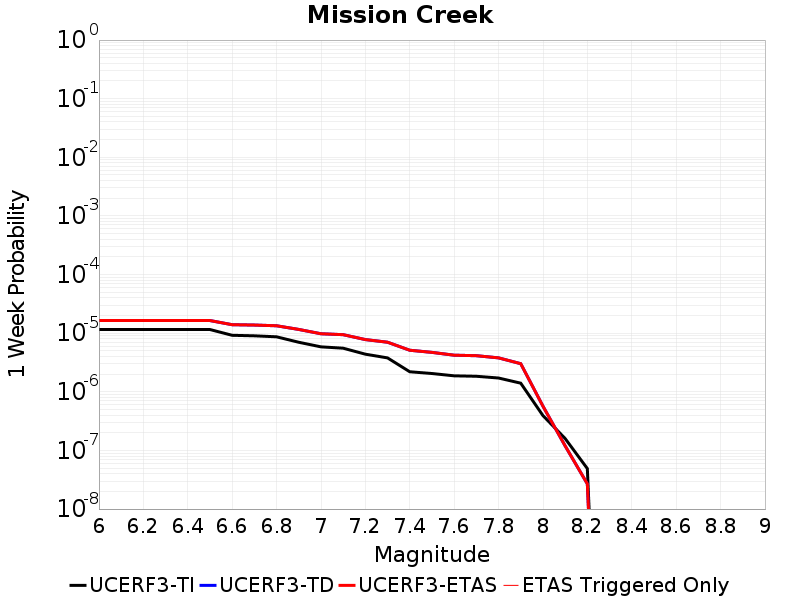 |  | 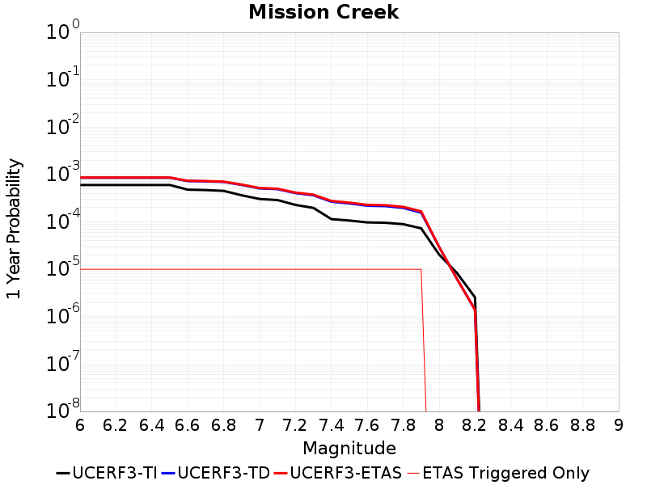 | 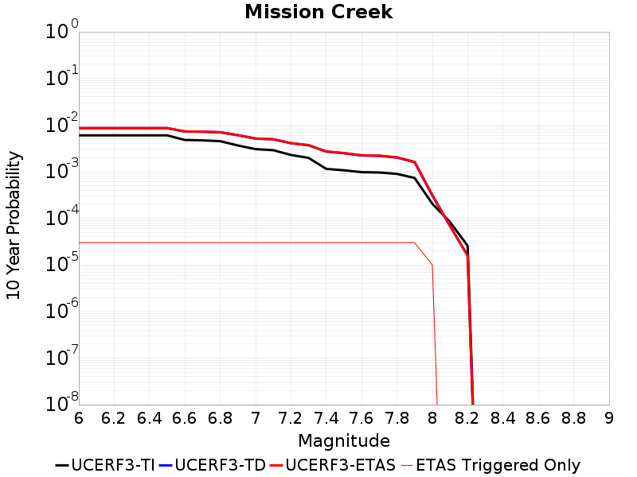 |

| Magnitude | 1 wk TI Prob | 1 wk TD Prob | 1 wk ETAS Prob | 1 wk ETAS/TD Gain | 1 wk ETAS Triggered Only | 1 mo TI Prob | 1 mo TD Prob | 1 mo ETAS Prob | 1 mo ETAS/TD Gain | 1 mo ETAS Triggered Only | 1 yr TI Prob | 1 yr TD Prob | 1 yr ETAS Prob | 1 yr ETAS/TD Gain | 1 yr ETAS Triggered Only | 10 yr TI Prob | 10 yr TD Prob | 10 yr ETAS Prob | 10 yr ETAS/TD Gain | 10 yr ETAS Triggered Only |
|-----|-----|-----|-----|-----|-----|-----|-----|-----|-----|-----|-----|-----|-----|-----|-----|-----|-----|-----|-----|-----|
| 6.0 | 1.1549387E-5 | 1.6435053E-5 | 1.6435053E-5 | 1.0 | 0.0 | 4.9496433E-5 | 7.043413E-5 | 7.043413E-5 | 1.0 | 0.0 | 6.0245243E-4 | 8.5721316E-4 | 8.6720457E-4 | 1.0116557 | 1.0E-5 | 0.006008218 | 0.008566825 | 0.008596567 | 1.0034719 | 3.0E-5 |
| 6.1 | 1.1549387E-5 | 1.6435053E-5 | 1.6435053E-5 | 1.0 | 0.0 | 4.9496433E-5 | 7.043413E-5 | 7.043413E-5 | 1.0 | 0.0 | 6.0245243E-4 | 8.5721316E-4 | 8.6720457E-4 | 1.0116557 | 1.0E-5 | 0.006008218 | 0.008566825 | 0.008596567 | 1.0034719 | 3.0E-5 |
| 6.2 | 1.1549387E-5 | 1.6435053E-5 | 1.6435053E-5 | 1.0 | 0.0 | 4.9496433E-5 | 7.043413E-5 | 7.043413E-5 | 1.0 | 0.0 | 6.0245243E-4 | 8.5721316E-4 | 8.6720457E-4 | 1.0116557 | 1.0E-5 | 0.006008218 | 0.008566825 | 0.008596567 | 1.0034719 | 3.0E-5 |
| 6.3 | 1.1549387E-5 | 1.6435053E-5 | 1.6435053E-5 | 1.0 | 0.0 | 4.9496433E-5 | 7.043413E-5 | 7.043413E-5 | 1.0 | 0.0 | 6.0245243E-4 | 8.5721316E-4 | 8.6720457E-4 | 1.0116557 | 1.0E-5 | 0.006008218 | 0.008566825 | 0.008596567 | 1.0034719 | 3.0E-5 |
| 6.4 | 1.1549387E-5 | 1.6435053E-5 | 1.6435053E-5 | 1.0 | 0.0 | 4.9496433E-5 | 7.043413E-5 | 7.043413E-5 | 1.0 | 0.0 | 6.0245243E-4 | 8.5721316E-4 | 8.6720457E-4 | 1.0116557 | 1.0E-5 | 0.006008218 | 0.008566825 | 0.008596567 | 1.0034719 | 3.0E-5 |
| 6.5 | 1.1549387E-5 | 1.6435053E-5 | 1.6435053E-5 | 1.0 | 0.0 | 4.9496433E-5 | 7.043413E-5 | 7.043413E-5 | 1.0 | 0.0 | 6.0245243E-4 | 8.5721316E-4 | 8.6720457E-4 | 1.0116557 | 1.0E-5 | 0.006008218 | 0.008566825 | 0.008596567 | 1.0034719 | 3.0E-5 |
| 6.6 | 9.202681E-6 | 1.395746E-5 | 1.395746E-5 | 1.0 | 0.0 | 3.9439463E-5 | 5.9816368E-5 | 5.9816368E-5 | 1.0 | 0.0 | 4.800697E-4 | 7.2803E-4 | 7.3802273E-4 | 1.0137256 | 1.0E-5 | 0.004790339 | 0.0072836303 | 0.007313412 | 1.0040889 | 3.0E-5 |
| 6.7 | 9.019164E-6 | 1.3763057E-5 | 1.3763057E-5 | 1.0 | 0.0 | 3.8652986E-5 | 5.898325E-5 | 5.898325E-5 | 1.0 | 0.0 | 4.7049852E-4 | 7.178935E-4 | 7.278863E-4 | 1.0139196 | 1.0E-5 | 0.004695036 | 0.007182923 | 0.0072127073 | 1.0041466 | 3.0E-5 |
| 6.8 | 8.673558E-6 | 1.338493E-5 | 1.338493E-5 | 1.0 | 0.0 | 3.717186E-5 | 5.7362777E-5 | 5.7362777E-5 | 1.0 | 0.0 | 4.524734E-4 | 6.9817685E-4 | 7.081699E-4 | 1.014313 | 1.0E-5 | 0.0045155324 | 0.006986999 | 0.0070167896 | 1.0042636 | 3.0E-5 |
| 6.9 | 7.002255E-6 | 1.1588302E-5 | 1.1588302E-5 | 1.0 | 0.0 | 3.000932E-5 | 4.9663246E-5 | 4.9663246E-5 | 1.0 | 0.0 | 3.653022E-4 | 6.044892E-4 | 6.1448314E-4 | 1.0165329 | 1.0E-5 | 0.0036470229 | 0.00605543 | 0.006085248 | 1.0049242 | 3.0E-5 |
| 7.0 | 5.84644E-6 | 9.779989E-6 | 9.779989E-6 | 1.0 | 0.0 | 2.5055931E-5 | 4.191359E-5 | 4.191359E-5 | 1.0 | 0.0 | 3.0501327E-4 | 5.1018305E-4 | 5.2017794E-4 | 1.0195909 | 1.0E-5 | 0.0030459496 | 0.0051168893 | 0.005146736 | 1.0058329 | 3.0E-5 |
| 7.1 | 5.54703E-6 | 9.434085E-6 | 9.434085E-6 | 1.0 | 0.0 | 2.377277E-5 | 4.043119E-5 | 4.043119E-5 | 1.0 | 0.0 | 2.8939504E-4 | 4.9214304E-4 | 5.021381E-4 | 1.0203093 | 1.0E-5 | 0.0028901845 | 0.004937296 | 0.0049671475 | 1.0060462 | 3.0E-5 |
| 7.2 | 4.384709E-6 | 7.7815375E-6 | 7.7815375E-6 | 1.0 | 0.0 | 1.8791474E-5 | 3.334904E-5 | 3.334904E-5 | 1.0 | 0.0 | 2.2876218E-4 | 4.059526E-4 | 4.1594854E-4 | 1.0246234 | 1.0E-5 | 0.0022852682 | 0.0040787854 | 0.004108663 | 1.0073252 | 3.0E-5 |
| 7.3 | 3.7888456E-6 | 7.0134497E-6 | 7.0134497E-6 | 1.0 | 0.0 | 1.623781E-5 | 3.0057314E-5 | 3.0057314E-5 | 1.0 | 0.0 | 1.9767738E-4 | 3.6588972E-4 | 3.7588604E-4 | 1.0273206 | 1.0E-5 | 0.0019750162 | 0.0036795388 | 0.0037094282 | 1.0081232 | 3.0E-5 |
| 7.4 | 2.1982462E-6 | 5.118875E-6 | 5.118875E-6 | 1.0 | 0.0 | 9.421021E-6 | 2.1937853E-5 | 2.1937853E-5 | 1.0 | 0.0 | 1.1469489E-4 | 2.670608E-4 | 2.7705813E-4 | 1.0374347 | 1.0E-5 | 0.0011463572 | 0.0026938498 | 0.002723769 | 1.0111065 | 3.0E-5 |
| 7.5 | 2.051923E-6 | 4.707522E-6 | 4.707522E-6 | 1.0 | 0.0 | 8.793926E-6 | 2.0174939E-5 | 2.0174939E-5 | 1.0 | 0.0 | 1.0706078E-4 | 2.4560234E-4 | 2.5559988E-4 | 1.0407063 | 1.0E-5 | 0.0010700922 | 0.0024800368 | 0.0025099625 | 1.0120666 | 3.0E-5 |
| 7.6 | 1.8733427E-6 | 4.2127235E-6 | 4.2127235E-6 | 1.0 | 0.0 | 8.028587E-6 | 1.8054405E-5 | 1.8054405E-5 | 1.0 | 0.0 | 9.774366E-5 | 2.1979031E-4 | 2.297881E-4 | 1.0454879 | 1.0E-5 | 9.770069E-4 | 0.0022229587 | 0.0022528921 | 1.0134655 | 3.0E-5 |
| 7.7 | 1.8411953E-6 | 4.131804E-6 | 4.131804E-6 | 1.0 | 0.0 | 7.890813E-6 | 1.7707613E-5 | 1.7707613E-5 | 1.0 | 0.0 | 9.606641E-5 | 2.1556893E-4 | 2.2556678E-4 | 1.0463789 | 1.0E-5 | 9.6024893E-4 | 0.0021809395 | 0.002210874 | 1.0137255 | 3.0E-5 |
| 7.8 | 1.7194251E-6 | 3.7930986E-6 | 3.7930986E-6 | 1.0 | 0.0 | 7.368944E-6 | 1.6256035E-5 | 1.6256035E-5 | 1.0 | 0.0 | 8.97132E-5 | 1.9789934E-4 | 2.0789736E-4 | 1.0505208 | 1.0E-5 | 8.967699E-4 | 0.0020038486 | 0.0020337885 | 1.0149412 | 3.0E-5 |
| 7.9 | 1.4035052E-6 | 3.0178157E-6 | 3.0178157E-6 | 1.0 | 0.0 | 6.0150082E-6 | 1.2933432E-5 | 1.2933432E-5 | 1.0 | 0.0 | 7.3230265E-5 | 1.5745322E-4 | 1.6745165E-4 | 1.0635009 | 1.0E-5 | 7.3206134E-4 | 0.0015971074 | 0.0016270595 | 1.018754 | 3.0E-5 |
| 8.0 | 3.9318823E-7 | 5.6935465E-7 | 5.6935465E-7 | 1.0 | 0.0 | 1.6850913E-6 | 2.440089E-6 | 2.440089E-6 | 1.0 | 0.0 | 2.0515794E-5 | 2.9707686E-5 | 2.9707686E-5 | 1.0 | 0.0 | 2.0513899E-4 | 3.0752967E-4 | 3.175266E-4 | 1.0325072 | 1.0E-5 |
| 8.1 | 1.596793E-7 | 1.1953784E-7 | 1.1953784E-7 | 1.0 | 0.0 | 6.8433974E-7 | 5.1230495E-7 | 5.1230495E-7 | 1.0 | 0.0 | 8.331805E-6 | 6.237295E-6 | 6.237295E-6 | 1.0 | 0.0 | 8.331492E-5 | 6.862021E-5 | 6.862021E-5 | 1.0 | 0.0 |
| 8.2 | 4.9003038E-8 | 2.6902443E-8 | 2.6902443E-8 | 1.0 | 0.0 | 2.10013E-7 | 1.1529618E-7 | 1.1529618E-7 | 1.0 | 0.0 | 2.5569052E-6 | 1.4037302E-6 | 1.4037302E-6 | 1.0 | 0.0 | 2.556876E-5 | 1.5763282E-5 | 1.5763282E-5 | 1.0 | 0.0 |

## Santa Cruz Island
*[(top)](#table-of-contents)*

| 1 Week | 1 Month | 1 Year | 10 Year |
|-----|-----|-----|-----|
|  |  |  | 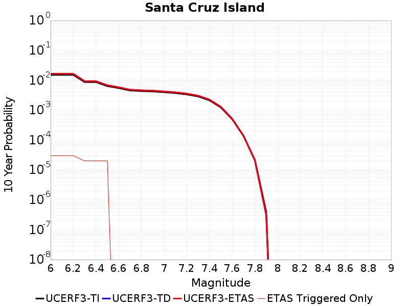 |

| Magnitude | 1 wk TI Prob | 1 wk TD Prob | 1 wk ETAS Prob | 1 wk ETAS/TD Gain | 1 wk ETAS Triggered Only | 1 mo TI Prob | 1 mo TD Prob | 1 mo ETAS Prob | 1 mo ETAS/TD Gain | 1 mo ETAS Triggered Only | 1 yr TI Prob | 1 yr TD Prob | 1 yr ETAS Prob | 1 yr ETAS/TD Gain | 1 yr ETAS Triggered Only | 10 yr TI Prob | 10 yr TD Prob | 10 yr ETAS Prob | 10 yr ETAS/TD Gain | 10 yr ETAS Triggered Only |
|-----|-----|-----|-----|-----|-----|-----|-----|-----|-----|-----|-----|-----|-----|-----|-----|-----|-----|-----|-----|-----|
| 6.0 | 2.9164563E-5 | 3.1616608E-5 | 3.1616608E-5 | 1.0 | 0.0 | 1.2498499E-4 | 1.3549348E-4 | 1.3549348E-4 | 1.0 | 0.0 | 0.0015206301 | 0.0016485212 | 0.0016585047 | 1.0060561 | 1.0E-5 | 0.015102667 | 0.016376674 | 0.016406182 | 1.0018018 | 3.0E-5 |
| 6.1 | 2.9164563E-5 | 3.1616608E-5 | 3.1616608E-5 | 1.0 | 0.0 | 1.2498499E-4 | 1.3549348E-4 | 1.3549348E-4 | 1.0 | 0.0 | 0.0015206301 | 0.0016485212 | 0.0016585047 | 1.0060561 | 1.0E-5 | 0.015102667 | 0.016376674 | 0.016406182 | 1.0018018 | 3.0E-5 |
| 6.2 | 2.9164563E-5 | 3.1616608E-5 | 3.1616608E-5 | 1.0 | 0.0 | 1.2498499E-4 | 1.3549348E-4 | 1.3549348E-4 | 1.0 | 0.0 | 0.0015206301 | 0.0016485212 | 0.0016585047 | 1.0060561 | 1.0E-5 | 0.015102667 | 0.016376674 | 0.016406182 | 1.0018018 | 3.0E-5 |
| 6.3 | 1.6635553E-5 | 1.7812361E-5 | 1.7812361E-5 | 1.0 | 0.0 | 7.1293274E-5 | 7.633656E-5 | 7.633656E-5 | 1.0 | 0.0 | 8.6765E-4 | 9.290196E-4 | 9.390103E-4 | 1.010754 | 1.0E-5 | 0.008642701 | 0.009253233 | 0.009273048 | 1.0021414 | 2.0E-5 |
| 6.4 | 1.6635553E-5 | 1.7812361E-5 | 1.7812361E-5 | 1.0 | 0.0 | 7.1293274E-5 | 7.633656E-5 | 7.633656E-5 | 1.0 | 0.0 | 8.6765E-4 | 9.290196E-4 | 9.390103E-4 | 1.010754 | 1.0E-5 | 0.008642701 | 0.009253233 | 0.009273048 | 1.0021414 | 2.0E-5 |
| 6.5 | 1.2238748E-5 | 1.3048493E-5 | 1.3048493E-5 | 1.0 | 0.0 | 5.2450723E-5 | 5.5920937E-5 | 5.5920937E-5 | 1.0 | 0.0 | 6.3840044E-4 | 6.806284E-4 | 6.906216E-4 | 1.0146823 | 1.0E-5 | 0.0063656955 | 0.0067858375 | 0.0068057016 | 1.0029273 | 2.0E-5 |
| 6.6 | 1.0489767E-5 | 1.11611935E-5 | 1.11611935E-5 | 1.0 | 0.0 | 4.495537E-5 | 4.7832822E-5 | 4.7832822E-5 | 1.0 | 0.0 | 5.4719415E-4 | 5.8221124E-4 | 5.8221124E-4 | 1.0 | 0.0 | 0.005458487 | 0.0058071003 | 0.0058071003 | 1.0 | 0.0 |
| 6.7 | 8.699222E-6 | 9.240461E-6 | 9.240461E-6 | 1.0 | 0.0 | 3.7281847E-5 | 3.9601375E-5 | 3.9601375E-5 | 1.0 | 0.0 | 4.5381195E-4 | 4.8204063E-4 | 4.8204063E-4 | 1.0 | 0.0 | 0.0045288634 | 0.004810018 | 0.004810018 | 1.0 | 0.0 |
| 6.8 | 8.307732E-6 | 8.82039E-6 | 8.82039E-6 | 1.0 | 0.0 | 3.560408E-5 | 3.7801125E-5 | 3.7801125E-5 | 1.0 | 0.0 | 4.3339343E-4 | 4.601319E-4 | 4.601319E-4 | 1.0 | 0.0 | 0.004325492 | 0.0045918454 | 0.0045918454 | 1.0 | 0.0 |
| 6.9 | 8.073121E-6 | 8.568306E-6 | 8.568306E-6 | 1.0 | 0.0 | 3.459863E-5 | 3.6720794E-5 | 3.6720794E-5 | 1.0 | 0.0 | 4.2115687E-4 | 4.4698437E-4 | 4.4698437E-4 | 1.0 | 0.0 | 0.004203596 | 0.0044609047 | 0.0044609047 | 1.0 | 0.0 |
| 7.0 | 7.617019E-6 | 8.077795E-6 | 8.077795E-6 | 1.0 | 0.0 | 3.264396E-5 | 3.4618668E-5 | 3.4618668E-5 | 1.0 | 0.0 | 3.9736772E-4 | 4.2140114E-4 | 4.2140114E-4 | 1.0 | 0.0 | 0.003966579 | 0.0042060683 | 0.0042060683 | 1.0 | 0.0 |
| 7.1 | 7.1224836E-6 | 7.5486846E-6 | 7.5486846E-6 | 1.0 | 0.0 | 3.052457E-5 | 3.2351105E-5 | 3.2351105E-5 | 1.0 | 0.0 | 3.715733E-4 | 3.938039E-4 | 3.938039E-4 | 1.0 | 0.0 | 0.003709526 | 0.0039311033 | 0.0039311033 | 1.0 | 0.0 |
| 7.2 | 6.441115E-6 | 6.830031E-6 | 6.830031E-6 | 1.0 | 0.0 | 2.7604487E-5 | 2.9271234E-5 | 2.9271234E-5 | 1.0 | 0.0 | 3.360328E-4 | 3.5631921E-4 | 3.5631921E-4 | 1.0 | 0.0 | 0.0033552512 | 0.0035575076 | 0.0035575076 | 1.0 | 0.0 |
| 7.3 | 5.494274E-6 | 5.822232E-6 | 5.822232E-6 | 1.0 | 0.0 | 2.3546674E-5 | 2.4952185E-5 | 2.4952185E-5 | 1.0 | 0.0 | 2.8664304E-4 | 3.037507E-4 | 3.037507E-4 | 1.0 | 0.0 | 0.002862736 | 0.0030333784 | 0.0030333784 | 1.0 | 0.0 |
| 7.4 | 4.0802624E-6 | 4.313859E-6 | 4.313859E-6 | 1.0 | 0.0 | 1.7486722E-5 | 1.8487837E-5 | 1.8487837E-5 | 1.0 | 0.0 | 2.1288003E-4 | 2.2506624E-4 | 2.2506624E-4 | 1.0 | 0.0 | 0.0021267622 | 0.002248392 | 0.002248392 | 1.0 | 0.0 |
| 7.5 | 2.3584746E-6 | 2.4761314E-6 | 2.4761314E-6 | 1.0 | 0.0 | 1.0107709E-5 | 1.0611949E-5 | 1.0611949E-5 | 1.0 | 0.0 | 1.2305441E-4 | 1.2919286E-4 | 1.2919286E-4 | 1.0 | 0.0 | 0.0012298629 | 0.0012911826 | 0.0012911826 | 1.0 | 0.0 |
| 7.6 | 9.4981914E-7 | 9.863694E-7 | 9.863694E-7 | 1.0 | 0.0 | 4.0706473E-6 | 4.2272904E-6 | 4.2272904E-6 | 1.0 | 0.0 | 4.9559E-5 | 5.146606E-5 | 5.146606E-5 | 1.0 | 0.0 | 4.954795E-4 | 5.1454274E-4 | 5.1454274E-4 | 1.0 | 0.0 |
| 7.7 | 2.6013532E-7 | 2.6422157E-7 | 2.6422157E-7 | 1.0 | 0.0 | 1.1148652E-6 | 1.1323777E-6 | 1.1323777E-6 | 1.0 | 0.0 | 1.3573399E-5 | 1.3786612E-5 | 1.3786612E-5 | 1.0 | 0.0 | 1.357257E-4 | 1.3785764E-4 | 1.3785764E-4 | 1.0 | 0.0 |
| 7.8 | 4.1522263E-8 | 3.9663107E-8 | 3.9663107E-8 | 1.0 | 0.0 | 1.7795254E-7 | 1.6998474E-7 | 1.6998474E-7 | 1.0 | 0.0 | 2.16657E-6 | 2.0695625E-6 | 2.0695625E-6 | 1.0 | 0.0 | 2.1665488E-5 | 2.0695454E-5 | 2.0695454E-5 | 1.0 | 0.0 |
| 7.9 | 7.7242046E-10 | 5.94895E-10 | 5.94895E-10 | 1.0 | 0.0 | 3.3103735E-9 | 2.54955E-9 | 2.54955E-9 | 1.0 | 0.0 | 4.0303796E-8 | 3.104077E-8 | 3.104077E-8 | 1.0 | 0.0 | 4.030379E-7 | 3.1040764E-7 | 3.1040764E-7 | 1.0 | 0.0 |

## San Diego Trough north alt1
*[(top)](#table-of-contents)*

| 1 Week | 1 Month | 1 Year | 10 Year |
|-----|-----|-----|-----|
| 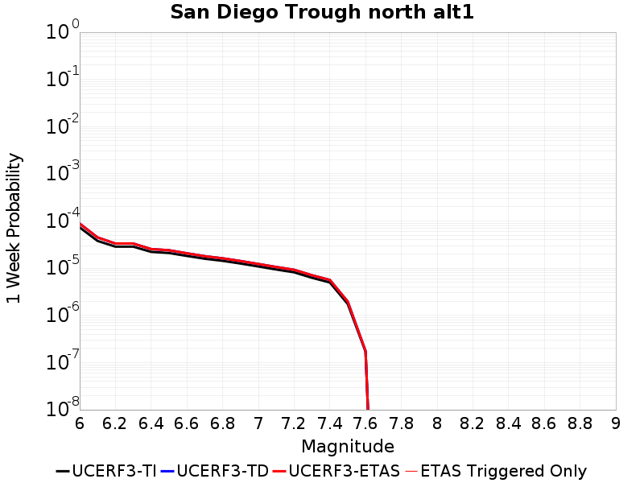 | 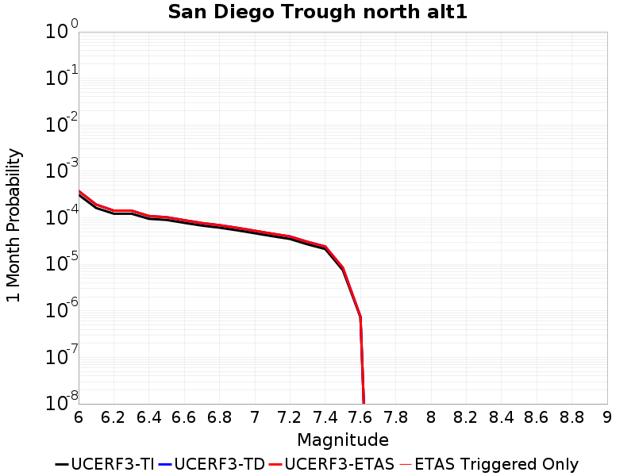 | 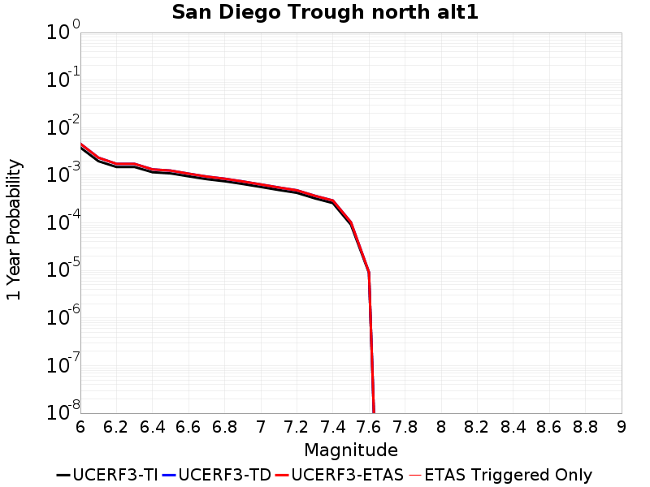 | 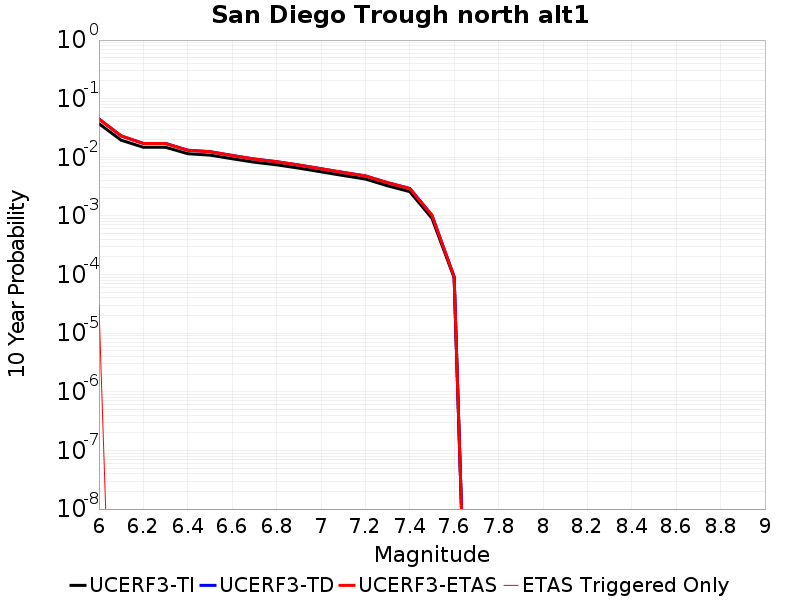 |

| Magnitude | 1 wk TI Prob | 1 wk TD Prob | 1 wk ETAS Prob | 1 wk ETAS/TD Gain | 1 wk ETAS Triggered Only | 1 mo TI Prob | 1 mo TD Prob | 1 mo ETAS Prob | 1 mo ETAS/TD Gain | 1 mo ETAS Triggered Only | 1 yr TI Prob | 1 yr TD Prob | 1 yr ETAS Prob | 1 yr ETAS/TD Gain | 1 yr ETAS Triggered Only | 10 yr TI Prob | 10 yr TD Prob | 10 yr ETAS Prob | 10 yr ETAS/TD Gain | 10 yr ETAS Triggered Only |
|-----|-----|-----|-----|-----|-----|-----|-----|-----|-----|-----|-----|-----|-----|-----|-----|-----|-----|-----|-----|-----|
| 6.0 | 7.329252E-5 | 8.832754E-5 | 8.832754E-5 | 1.0 | 0.0 | 3.14073E-4 | 3.7849476E-4 | 3.7849476E-4 | 1.0 | 0.0 | 0.0038171355 | 0.0045990013 | 0.0045990013 | 1.0 | 0.0 | 0.03752231 | 0.045102127 | 0.045130774 | 1.0006351 | 3.0E-5 |
| 6.1 | 3.7940346E-5 | 4.493771E-5 | 4.493771E-5 | 1.0 | 0.0 | 1.6259136E-4 | 1.9257641E-4 | 1.9257641E-4 | 1.0 | 0.0 | 0.0019777524 | 0.0023421776 | 0.0023421776 | 1.0 | 0.0 | 0.019602431 | 0.023183558 | 0.023183558 | 1.0 | 0.0 |
| 6.2 | 2.8645263E-5 | 3.333152E-5 | 3.333152E-5 | 1.0 | 0.0 | 1.2275964E-4 | 1.4284157E-4 | 1.4284157E-4 | 1.0 | 0.0 | 0.0014935739 | 0.001737731 | 0.001737731 | 1.0 | 0.0 | 0.0148357535 | 0.017244069 | 0.017244069 | 1.0 | 0.0 |
| 6.3 | 2.8645263E-5 | 3.333152E-5 | 3.333152E-5 | 1.0 | 0.0 | 1.2275964E-4 | 1.4284157E-4 | 1.4284157E-4 | 1.0 | 0.0 | 0.0014935739 | 0.001737731 | 0.001737731 | 1.0 | 0.0 | 0.0148357535 | 0.017244069 | 0.017244069 | 1.0 | 0.0 |
| 6.4 | 2.2204576E-5 | 2.5472165E-5 | 2.5472165E-5 | 1.0 | 0.0 | 9.5159E-5 | 1.091619E-4 | 1.091619E-4 | 1.0 | 0.0 | 0.001157945 | 0.0013282452 | 0.0013282452 | 1.0 | 0.0 | 0.011519298 | 0.013204231 | 0.013204231 | 1.0 | 0.0 |
| 6.5 | 2.1004838E-5 | 2.4046838E-5 | 2.4046838E-5 | 1.0 | 0.0 | 9.0017624E-5 | 1.0305385E-4 | 1.0305385E-4 | 1.0 | 0.0 | 0.0010954136 | 0.0012539673 | 0.0012539673 | 1.0 | 0.0 | 0.010900296 | 0.012469999 | 0.012469999 | 1.0 | 0.0 |
| 6.6 | 1.820557E-5 | 2.0722988E-5 | 2.0722988E-5 | 1.0 | 0.0 | 7.802154E-5 | 8.8809815E-5 | 8.8809815E-5 | 1.0 | 0.0 | 9.4949827E-4 | 0.0010807285 | 0.0010807285 | 1.0 | 0.0 | 0.009454516 | 0.010755399 | 0.010755399 | 1.0 | 0.0 |
| 6.7 | 1.5884485E-5 | 1.7998853E-5 | 1.7998853E-5 | 1.0 | 0.0 | 6.807459E-5 | 7.713568E-5 | 7.713568E-5 | 1.0 | 0.0 | 8.284929E-4 | 9.38725E-4 | 9.38725E-4 | 1.0 | 0.0 | 0.008254109 | 0.009347965 | 0.009347965 | 1.0 | 0.0 |
| 6.8 | 1.4331171E-5 | 1.6214579E-5 | 1.6214579E-5 | 1.0 | 0.0 | 6.141786E-5 | 6.948921E-5 | 6.948921E-5 | 1.0 | 0.0 | 7.4750587E-4 | 8.4570475E-4 | 8.4570475E-4 | 1.0 | 0.0 | 0.0074499645 | 0.008425131 | 0.008425131 | 1.0 | 0.0 |
| 6.9 | 1.2574203E-5 | 1.4217609E-5 | 1.4217609E-5 | 1.0 | 0.0 | 5.3888325E-5 | 6.0931194E-5 | 6.0931194E-5 | 1.0 | 0.0 | 6.558929E-4 | 7.415862E-4 | 7.415862E-4 | 1.0 | 0.0 | 0.0065396037 | 0.007391302 | 0.007391302 | 1.0 | 0.0 |
| 7.0 | 1.0883844E-5 | 1.2299398E-5 | 1.2299398E-5 | 1.0 | 0.0 | 4.664421E-5 | 5.2710646E-5 | 5.2710646E-5 | 1.0 | 0.0 | 5.677453E-4 | 6.4156414E-4 | 6.4156414E-4 | 1.0 | 0.0 | 0.00566297 | 0.0063972482 | 0.0063972482 | 1.0 | 0.0 |
| 7.1 | 9.393088E-6 | 1.061578E-5 | 1.061578E-5 | 1.0 | 0.0 | 4.025547E-5 | 4.5495413E-5 | 4.5495413E-5 | 1.0 | 0.0 | 4.900001E-4 | 5.537667E-4 | 5.537667E-4 | 1.0 | 0.0 | 0.0048892107 | 0.0055239643 | 0.0055239643 | 1.0 | 0.0 |
| 7.2 | 8.190791E-6 | 9.266343E-6 | 9.266343E-6 | 1.0 | 0.0 | 3.510292E-5 | 3.9712297E-5 | 3.9712297E-5 | 1.0 | 0.0 | 4.2729423E-4 | 4.8339064E-4 | 4.8339064E-4 | 1.0 | 0.0 | 0.0042647356 | 0.004823472 | 0.004823472 | 1.0 | 0.0 |
| 7.3 | 6.268162E-6 | 7.095652E-6 | 7.095652E-6 | 1.0 | 0.0 | 2.6863276E-5 | 3.0409585E-5 | 3.0409585E-5 | 1.0 | 0.0 | 3.2701128E-4 | 3.701742E-4 | 3.701742E-4 | 1.0 | 0.0 | 0.003265305 | 0.003695622 | 0.003695622 | 1.0 | 0.0 |
| 7.4 | 4.985186E-6 | 5.647434E-6 | 5.647434E-6 | 1.0 | 0.0 | 2.1364907E-5 | 2.4203067E-5 | 2.4203067E-5 | 1.0 | 0.0 | 2.600867E-4 | 2.946329E-4 | 2.946329E-4 | 1.0 | 0.0 | 0.002597825 | 0.002942464 | 0.002942464 | 1.0 | 0.0 |
| 7.5 | 1.7489613E-6 | 1.9712757E-6 | 1.9712757E-6 | 1.0 | 0.0 | 7.495527E-6 | 8.448298E-6 | 8.448298E-6 | 1.0 | 0.0 | 9.125422E-5 | 1.02853395E-4 | 1.02853395E-4 | 1.0 | 0.0 | 9.1216754E-4 | 0.00102808 | 0.00102808 | 1.0 | 0.0 |
| 7.6 | 1.6988751E-7 | 1.753739E-7 | 1.753739E-7 | 1.0 | 0.0 | 7.2808916E-7 | 7.516022E-7 | 7.516022E-7 | 1.0 | 0.0 | 8.864449E-6 | 9.150721E-6 | 9.150721E-6 | 1.0 | 0.0 | 8.8640954E-5 | 9.1503636E-5 | 9.1503636E-5 | 1.0 | 0.0 |

## Santa Ynez (West)
*[(top)](#table-of-contents)*

| 1 Week | 1 Month | 1 Year | 10 Year |
|-----|-----|-----|-----|
| 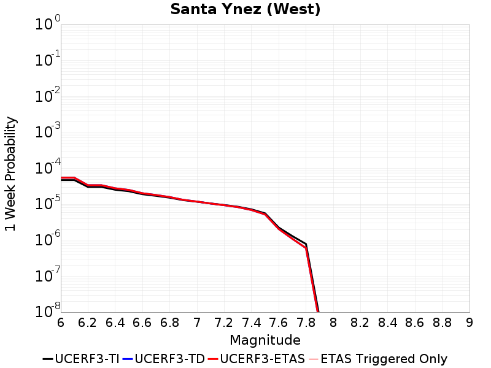 | 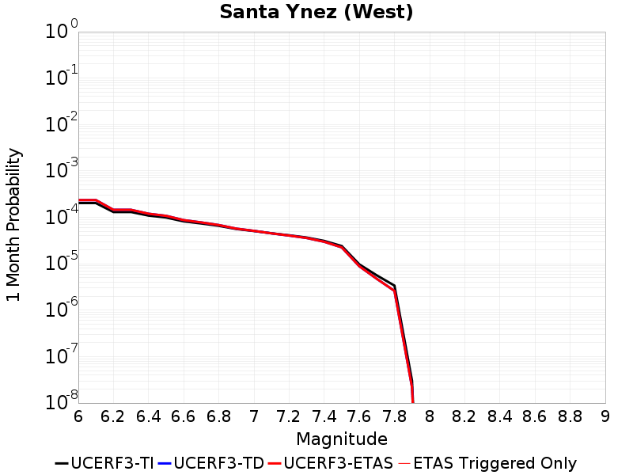 | 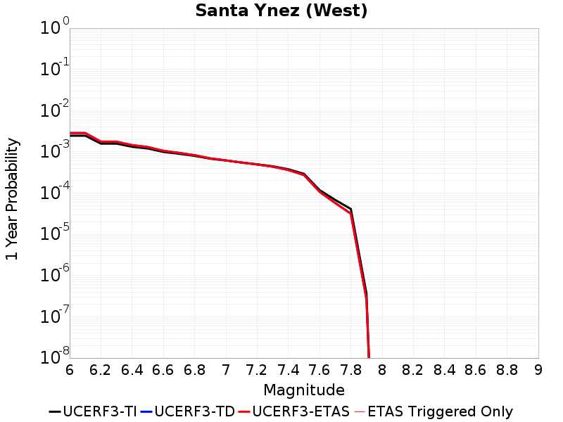 |  |

| Magnitude | 1 wk TI Prob | 1 wk TD Prob | 1 wk ETAS Prob | 1 wk ETAS/TD Gain | 1 wk ETAS Triggered Only | 1 mo TI Prob | 1 mo TD Prob | 1 mo ETAS Prob | 1 mo ETAS/TD Gain | 1 mo ETAS Triggered Only | 1 yr TI Prob | 1 yr TD Prob | 1 yr ETAS Prob | 1 yr ETAS/TD Gain | 1 yr ETAS Triggered Only | 10 yr TI Prob | 10 yr TD Prob | 10 yr ETAS Prob | 10 yr ETAS/TD Gain | 10 yr ETAS Triggered Only |
|-----|-----|-----|-----|-----|-----|-----|-----|-----|-----|-----|-----|-----|-----|-----|-----|-----|-----|-----|-----|-----|
| 6.0 | 4.7352758E-5 | 5.5036202E-5 | 5.5036202E-5 | 1.0 | 0.0 | 2.0292461E-4 | 2.3584977E-4 | 2.3584977E-4 | 1.0 | 0.0 | 0.0024678076 | 0.0028679606 | 0.0028679606 | 1.0 | 0.0 | 0.024405818 | 0.028337581 | 0.028366731 | 1.0010287 | 3.0E-5 |
| 6.1 | 4.7352758E-5 | 5.5036202E-5 | 5.5036202E-5 | 1.0 | 0.0 | 2.0292461E-4 | 2.3584977E-4 | 2.3584977E-4 | 1.0 | 0.0 | 0.0024678076 | 0.0028679606 | 0.0028679606 | 1.0 | 0.0 | 0.024405818 | 0.028337581 | 0.028366731 | 1.0010287 | 3.0E-5 |
| 6.2 | 3.0415853E-5 | 3.395816E-5 | 3.395816E-5 | 1.0 | 0.0 | 1.3034715E-4 | 1.4552707E-4 | 1.4552707E-4 | 1.0 | 0.0 | 0.0015858212 | 0.0017703865 | 0.0017703865 | 1.0 | 0.0 | 0.015745522 | 0.017566767 | 0.01759624 | 1.0016778 | 3.0E-5 |
| 6.3 | 3.0415853E-5 | 3.395816E-5 | 3.395816E-5 | 1.0 | 0.0 | 1.3034715E-4 | 1.4552707E-4 | 1.4552707E-4 | 1.0 | 0.0 | 0.0015858212 | 0.0017703865 | 0.0017703865 | 1.0 | 0.0 | 0.015745522 | 0.017566767 | 0.01759624 | 1.0016778 | 3.0E-5 |
| 6.4 | 2.5452082E-5 | 2.793739E-5 | 2.793739E-5 | 1.0 | 0.0 | 1.09075794E-4 | 1.1972629E-4 | 1.1972629E-4 | 1.0 | 0.0 | 0.0013271887 | 0.0014567116 | 0.0014567116 | 1.0 | 0.0 | 0.013192902 | 0.014473797 | 0.014503363 | 1.0020428 | 3.0E-5 |
| 6.5 | 2.3143784E-5 | 2.5149548E-5 | 2.5149548E-5 | 1.0 | 0.0 | 9.9183875E-5 | 1.0777941E-4 | 1.0777941E-4 | 1.0 | 0.0 | 0.0012068948 | 0.0013114389 | 0.0013114389 | 1.0 | 0.0 | 0.012003611 | 0.013038665 | 0.013068274 | 1.0022708 | 3.0E-5 |
| 6.6 | 1.9118515E-5 | 2.0369995E-5 | 2.0369995E-5 | 1.0 | 0.0 | 8.193392E-5 | 8.72971E-5 | 8.72971E-5 | 1.0 | 0.0 | 9.97089E-4 | 0.001062332 | 0.001062332 | 1.0 | 0.0 | 0.00992627 | 0.01057345 | 0.010603132 | 1.0028073 | 3.0E-5 |
| 6.7 | 1.722807E-5 | 1.8159633E-5 | 1.8159633E-5 | 1.0 | 0.0 | 7.3832496E-5 | 7.782471E-5 | 7.782471E-5 | 1.0 | 0.0 | 8.985399E-4 | 9.4710954E-4 | 9.4710954E-4 | 1.0 | 0.0 | 0.008949154 | 0.009431379 | 0.00945119 | 1.0021006 | 2.0E-5 |
| 6.8 | 1.5317364E-5 | 1.5937474E-5 | 1.5937474E-5 | 1.0 | 0.0 | 6.56442E-5 | 6.830169E-5 | 6.830169E-5 | 1.0 | 0.0 | 7.98925E-4 | 8.312602E-4 | 8.312602E-4 | 1.0 | 0.0 | 0.007960589 | 0.0082819965 | 0.008301831 | 1.0023949 | 2.0E-5 |
| 6.9 | 1.3071226E-5 | 1.3338024E-5 | 1.3338024E-5 | 1.0 | 0.0 | 5.6018336E-5 | 5.7161717E-5 | 5.7161717E-5 | 1.0 | 0.0 | 6.8180985E-4 | 6.957239E-4 | 6.957239E-4 | 1.0 | 0.0 | 0.0067972173 | 0.00693572 | 0.0069456506 | 1.0014318 | 1.0E-5 |
| 7.0 | 1.1836986E-5 | 1.1940003E-5 | 1.1940003E-5 | 1.0 | 0.0 | 5.0728955E-5 | 5.117045E-5 | 5.117045E-5 | 1.0 | 0.0 | 6.1745E-4 | 6.228238E-4 | 6.228238E-4 | 1.0 | 0.0 | 0.006157372 | 0.0062109763 | 0.006220914 | 1.0016 | 1.0E-5 |
| 7.1 | 1.0597169E-5 | 1.0548339E-5 | 1.0548339E-5 | 1.0 | 0.0 | 4.541565E-5 | 4.5206387E-5 | 4.5206387E-5 | 1.0 | 0.0 | 5.5279525E-4 | 5.5024994E-4 | 5.5024994E-4 | 1.0 | 0.0 | 0.0055142213 | 0.005489006 | 0.0054989513 | 1.0018119 | 1.0E-5 |
| 7.2 | 9.59113E-6 | 9.464749E-6 | 9.464749E-6 | 1.0 | 0.0 | 4.11042E-5 | 4.0562587E-5 | 4.0562587E-5 | 1.0 | 0.0 | 5.0032866E-4 | 4.937387E-4 | 4.937387E-4 | 1.0 | 0.0 | 0.004992037 | 0.0049265358 | 0.0049364865 | 1.0020199 | 1.0E-5 |
| 7.3 | 8.586084E-6 | 8.384677E-6 | 8.384677E-6 | 1.0 | 0.0 | 3.679698E-5 | 3.593384E-5 | 3.593384E-5 | 1.0 | 0.0 | 4.4791115E-4 | 4.3740773E-4 | 4.3740773E-4 | 1.0 | 0.0 | 0.004470094 | 0.004365579 | 0.0043755355 | 1.0022806 | 1.0E-5 |
| 7.4 | 7.2622997E-6 | 6.9559014E-6 | 6.9559014E-6 | 1.0 | 0.0 | 3.112377E-5 | 2.9810672E-5 | 2.9810672E-5 | 1.0 | 0.0 | 3.78866E-4 | 3.6288545E-4 | 3.6288545E-4 | 1.0 | 0.0 | 0.0037822074 | 0.0036230292 | 0.003632993 | 1.0027502 | 1.0E-5 |
| 7.5 | 5.627296E-6 | 5.254649E-6 | 5.254649E-6 | 1.0 | 0.0 | 2.411676E-5 | 2.2519735E-5 | 2.2519735E-5 | 1.0 | 0.0 | 2.9358198E-4 | 2.7414397E-4 | 2.7414397E-4 | 1.0 | 0.0 | 0.0029319443 | 0.00273813 | 0.0027481026 | 1.0036421 | 1.0E-5 |
| 7.6 | 2.265244E-6 | 2.0617238E-6 | 2.0617238E-6 | 1.0 | 0.0 | 9.708152E-6 | 8.835929E-6 | 8.835929E-6 | 1.0 | 0.0 | 1.18190335E-4 | 1.0757222E-4 | 1.0757222E-4 | 1.0 | 0.0 | 0.001181275 | 0.00107521 | 0.0010851993 | 1.0092905 | 1.0E-5 |
| 7.7 | 1.3099874E-6 | 1.102095E-6 | 1.102095E-6 | 1.0 | 0.0 | 5.61422E-6 | 4.7232556E-6 | 4.7232556E-6 | 1.0 | 0.0 | 6.8350986E-5 | 5.7504145E-5 | 5.7504145E-5 | 1.0 | 0.0 | 6.832996E-4 | 5.7489506E-4 | 5.7489506E-4 | 1.0 | 0.0 |
| 7.8 | 7.903951E-7 | 6.0737904E-7 | 6.0737904E-7 | 1.0 | 0.0 | 3.3874032E-6 | 2.6030505E-6 | 2.6030505E-6 | 1.0 | 0.0 | 4.1240855E-5 | 3.1691692E-5 | 3.1691692E-5 | 1.0 | 0.0 | 4.12332E-4 | 3.1687305E-4 | 3.1687305E-4 | 1.0 | 0.0 |
| 7.9 | 7.0753297E-9 | 5.09162E-9 | 5.09162E-9 | 1.0 | 0.0 | 3.032284E-8 | 2.1821227E-8 | 2.1821227E-8 | 1.0 | 0.0 | 3.6918053E-7 | 2.6567344E-7 | 2.6567344E-7 | 1.0 | 0.0 | 3.691799E-6 | 2.656732E-6 | 2.656732E-6 | 1.0 | 0.0 |

## San Jacinto (Anza) rev
*[(top)](#table-of-contents)*

| 1 Week | 1 Month | 1 Year | 10 Year |
|-----|-----|-----|-----|
| 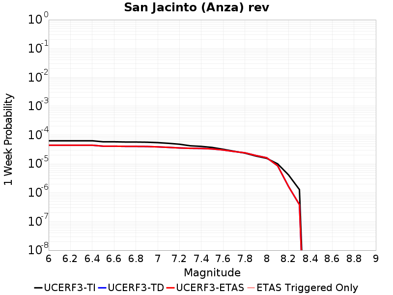 | 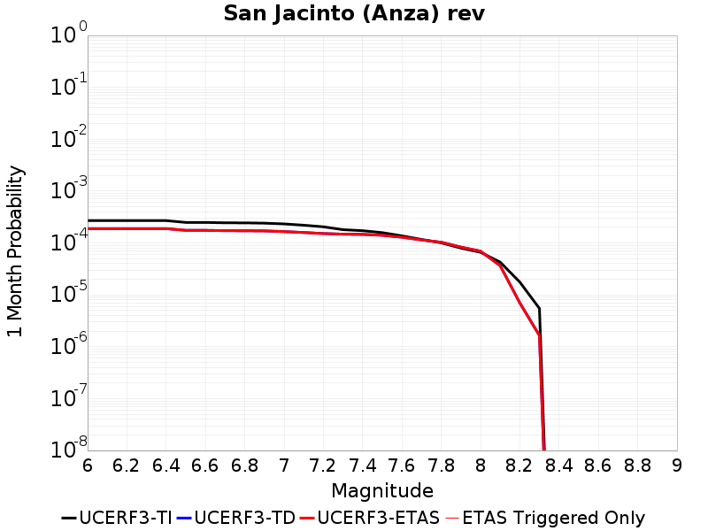 | 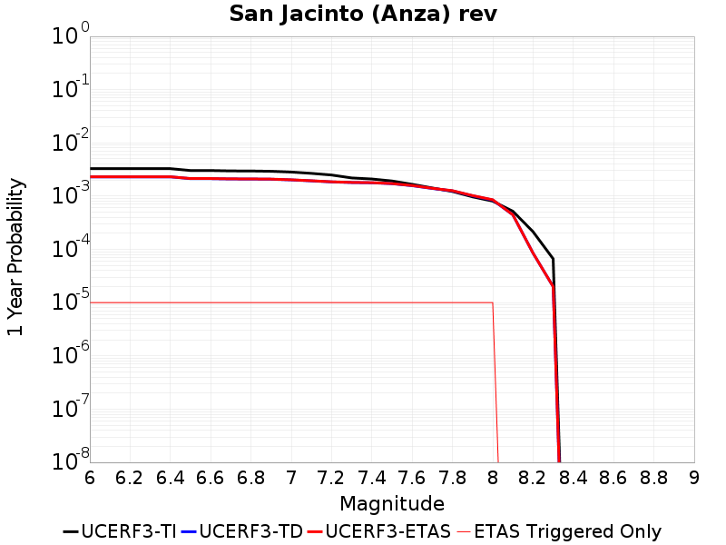 | 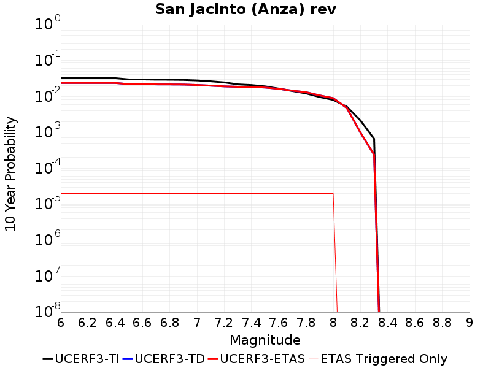 |

| Magnitude | 1 wk TI Prob | 1 wk TD Prob | 1 wk ETAS Prob | 1 wk ETAS/TD Gain | 1 wk ETAS Triggered Only | 1 mo TI Prob | 1 mo TD Prob | 1 mo ETAS Prob | 1 mo ETAS/TD Gain | 1 mo ETAS Triggered Only | 1 yr TI Prob | 1 yr TD Prob | 1 yr ETAS Prob | 1 yr ETAS/TD Gain | 1 yr ETAS Triggered Only | 10 yr TI Prob | 10 yr TD Prob | 10 yr ETAS Prob | 10 yr ETAS/TD Gain | 10 yr ETAS Triggered Only |
|-----|-----|-----|-----|-----|-----|-----|-----|-----|-----|-----|-----|-----|-----|-----|-----|-----|-----|-----|-----|-----|
| 6.0 | 6.3015636E-5 | 4.416499E-5 | 4.416499E-5 | 1.0 | 0.0 | 2.7003905E-4 | 1.8926486E-4 | 1.8926486E-4 | 1.0 | 0.0 | 0.0032827691 | 0.002301877 | 0.0023118537 | 1.0043343 | 1.0E-5 | 0.032346968 | 0.02374259 | 0.023762116 | 1.0008224 | 2.0E-5 |
| 6.1 | 6.3015636E-5 | 4.416499E-5 | 4.416499E-5 | 1.0 | 0.0 | 2.7003905E-4 | 1.8926486E-4 | 1.8926486E-4 | 1.0 | 0.0 | 0.0032827691 | 0.002301877 | 0.0023118537 | 1.0043343 | 1.0E-5 | 0.032346968 | 0.02374259 | 0.023762116 | 1.0008224 | 2.0E-5 |
| 6.2 | 6.3015636E-5 | 4.416499E-5 | 4.416499E-5 | 1.0 | 0.0 | 2.7003905E-4 | 1.8926486E-4 | 1.8926486E-4 | 1.0 | 0.0 | 0.0032827691 | 0.002301877 | 0.0023118537 | 1.0043343 | 1.0E-5 | 0.032346968 | 0.02374259 | 0.023762116 | 1.0008224 | 2.0E-5 |
| 6.3 | 6.3015636E-5 | 4.416499E-5 | 4.416499E-5 | 1.0 | 0.0 | 2.7003905E-4 | 1.8926486E-4 | 1.8926486E-4 | 1.0 | 0.0 | 0.0032827691 | 0.002301877 | 0.0023118537 | 1.0043343 | 1.0E-5 | 0.032346968 | 0.02374259 | 0.023762116 | 1.0008224 | 2.0E-5 |
| 6.4 | 6.3015636E-5 | 4.416499E-5 | 4.416499E-5 | 1.0 | 0.0 | 2.7003905E-4 | 1.8926486E-4 | 1.8926486E-4 | 1.0 | 0.0 | 0.0032827691 | 0.002301877 | 0.0023118537 | 1.0043343 | 1.0E-5 | 0.032346968 | 0.02374259 | 0.023762116 | 1.0008224 | 2.0E-5 |
| 6.5 | 5.811017E-5 | 4.090271E-5 | 4.090271E-5 | 1.0 | 0.0 | 2.4901982E-4 | 1.7528558E-4 | 1.7528558E-4 | 1.0 | 0.0 | 0.0030276014 | 0.002132019 | 0.0021419977 | 1.0046804 | 1.0E-5 | 0.02986684 | 0.02202092 | 0.022040479 | 1.0008882 | 2.0E-5 |
| 6.6 | 5.811017E-5 | 4.090271E-5 | 4.090271E-5 | 1.0 | 0.0 | 2.4901982E-4 | 1.7528558E-4 | 1.7528558E-4 | 1.0 | 0.0 | 0.0030276014 | 0.002132019 | 0.0021419977 | 1.0046804 | 1.0E-5 | 0.02986684 | 0.02202092 | 0.022040479 | 1.0008882 | 2.0E-5 |
| 6.7 | 5.712442E-5 | 4.0316983E-5 | 4.0316983E-5 | 1.0 | 0.0 | 2.4479596E-4 | 1.7277566E-4 | 1.7277566E-4 | 1.0 | 0.0 | 0.0029763177 | 0.00210152 | 0.002111499 | 1.0047485 | 1.0E-5 | 0.029367693 | 0.02170871 | 0.021728275 | 1.0009013 | 2.0E-5 |
| 6.8 | 5.6967532E-5 | 4.0171828E-5 | 4.0171828E-5 | 1.0 | 0.0 | 2.4412372E-4 | 1.7215365E-4 | 1.7215365E-4 | 1.0 | 0.0 | 0.0029681553 | 0.0020939615 | 0.0021039406 | 1.0047656 | 1.0E-5 | 0.029288229 | 0.02163217 | 0.021651737 | 1.0009046 | 2.0E-5 |
| 6.9 | 5.6211324E-5 | 3.9870993E-5 | 3.9870993E-5 | 1.0 | 0.0 | 2.4088343E-4 | 1.7086453E-4 | 1.7086453E-4 | 1.0 | 0.0 | 0.0029288116 | 0.0020782964 | 0.0020882755 | 1.0048016 | 1.0E-5 | 0.028905109 | 0.021468667 | 0.021488238 | 1.0009116 | 2.0E-5 |
| 7.0 | 5.4383527E-5 | 3.871274E-5 | 3.871274E-5 | 1.0 | 0.0 | 2.3305144E-4 | 1.6590122E-4 | 1.6590122E-4 | 1.0 | 0.0 | 0.0028337094 | 0.0020179811 | 0.002027961 | 1.0049454 | 1.0E-5 | 0.027978465 | 0.020852866 | 0.020872448 | 1.0009391 | 2.0E-5 |
| 7.1 | 5.1393665E-5 | 3.714844E-5 | 3.714844E-5 | 1.0 | 0.0 | 2.2023996E-4 | 1.5919791E-4 | 1.5919791E-4 | 1.0 | 0.0 | 0.0026781242 | 0.0019365158 | 0.0019464964 | 1.0051539 | 1.0E-5 | 0.026460782 | 0.020010289 | 0.02002989 | 1.0009795 | 2.0E-5 |
| 7.2 | 4.785222E-5 | 3.5470188E-5 | 3.5470188E-5 | 1.0 | 0.0 | 2.0506482E-4 | 1.5200625E-4 | 1.5200625E-4 | 1.0 | 0.0 | 0.0024938055 | 0.0018491088 | 0.0018590904 | 1.005398 | 1.0E-5 | 0.024660049 | 0.019108238 | 0.019127855 | 1.0010266 | 2.0E-5 |
| 7.3 | 4.2143256E-5 | 3.4543853E-5 | 3.4543853E-5 | 1.0 | 0.0 | 1.8060145E-4 | 1.480367E-4 | 1.480367E-4 | 1.0 | 0.0 | 0.002196605 | 0.0018008605 | 0.0018108425 | 1.0055429 | 1.0E-5 | 0.02175019 | 0.018605554 | 0.018625183 | 1.001055 | 2.0E-5 |
| 7.4 | 4.0264713E-5 | 3.417545E-5 | 3.417545E-5 | 1.0 | 0.0 | 1.7255165E-4 | 1.4645801E-4 | 1.4645801E-4 | 1.0 | 0.0 | 0.002098792 | 0.0017816714 | 0.0017916537 | 1.0056027 | 1.0E-5 | 0.020790804 | 0.01840671 | 0.018426342 | 1.0010666 | 2.0E-5 |
| 7.5 | 3.694492E-5 | 3.2873013E-5 | 3.2873013E-5 | 1.0 | 0.0 | 1.5832575E-4 | 1.4087676E-4 | 1.4087676E-4 | 1.0 | 0.0 | 0.0019259118 | 0.0017138283 | 0.0017238111 | 1.0058249 | 1.0E-5 | 0.01909306 | 0.017714705 | 0.01773435 | 1.001109 | 2.0E-5 |
| 7.6 | 3.200565E-5 | 3.015737E-5 | 3.015737E-5 | 1.0 | 0.0 | 1.3715986E-4 | 1.2923947E-4 | 1.2923947E-4 | 1.0 | 0.0 | 0.001668642 | 0.0015723571 | 0.0015823415 | 1.0063499 | 1.0E-5 | 0.01656168 | 0.016286867 | 0.01630654 | 1.001208 | 2.0E-5 |
| 7.7 | 2.731642E-5 | 2.6728172E-5 | 2.6728172E-5 | 1.0 | 0.0 | 1.1706512E-4 | 1.1454428E-4 | 1.1454428E-4 | 1.0 | 0.0 | 0.001424336 | 0.0013936856 | 0.0014036716 | 1.0071652 | 1.0E-5 | 0.014152412 | 0.014498716 | 0.014518426 | 1.0013595 | 2.0E-5 |
| 7.8 | 2.3466424E-5 | 2.411309E-5 | 2.411309E-5 | 1.0 | 0.0 | 1.0056651E-4 | 1.0333772E-4 | 1.0333772E-4 | 1.0 | 0.0 | 0.0012237094 | 0.0012574114 | 0.0012673989 | 1.0079428 | 1.0E-5 | 0.012169928 | 0.013127209 | 0.013146946 | 1.0015036 | 2.0E-5 |
| 7.9 | 1.8611925E-5 | 1.9450808E-5 | 1.9450808E-5 | 1.0 | 0.0 | 7.9762955E-5 | 8.335795E-5 | 8.335795E-5 | 1.0 | 0.0 | 9.7068126E-4 | 0.0010144112 | 0.001024401 | 1.0098479 | 1.0E-5 | 0.0096645225 | 0.010678795 | 0.010698582 | 1.0018529 | 2.0E-5 |
| 8.0 | 1.5460775E-5 | 1.6222342E-5 | 1.6222342E-5 | 1.0 | 0.0 | 6.6258784E-5 | 6.952247E-5 | 6.952247E-5 | 1.0 | 0.0 | 8.0640207E-4 | 8.461082E-4 | 8.560997E-4 | 1.0118089 | 1.0E-5 | 0.008034821 | 0.0089565 | 0.008976321 | 1.002213 | 2.0E-5 |
| 8.1 | 9.983884E-6 | 8.552897E-6 | 8.552897E-6 | 1.0 | 0.0 | 4.2787375E-5 | 3.665476E-5 | 3.665476E-5 | 1.0 | 0.0 | 5.2081177E-4 | 4.4618087E-4 | 4.4618087E-4 | 1.0 | 0.0 | 0.0051959283 | 0.0047923285 | 0.0047923285 | 1.0 | 0.0 |
| 8.2 | 4.1226E-6 | 1.6351207E-6 | 1.6351207E-6 | 1.0 | 0.0 | 1.7668166E-5 | 7.0076417E-6 | 7.0076417E-6 | 1.0 | 0.0 | 2.1508869E-4 | 8.531473E-5 | 8.531473E-5 | 1.0 | 0.0 | 0.0021488064 | 9.874793E-4 | 9.874793E-4 | 1.0 | 0.0 |
| 8.3 | 1.2750878E-6 | 3.833818E-7 | 3.833818E-7 | 1.0 | 0.0 | 5.4646503E-6 | 1.6430639E-6 | 1.6430639E-6 | 1.0 | 0.0 | 6.653009E-5 | 2.0004123E-5 | 2.0004123E-5 | 1.0 | 0.0 | 6.6510175E-4 | 2.4036168E-4 | 2.4036168E-4 | 1.0 | 0.0 |

## Oceanic - West Huasna
*[(top)](#table-of-contents)*

| 1 Week | 1 Month | 1 Year | 10 Year |
|-----|-----|-----|-----|
| 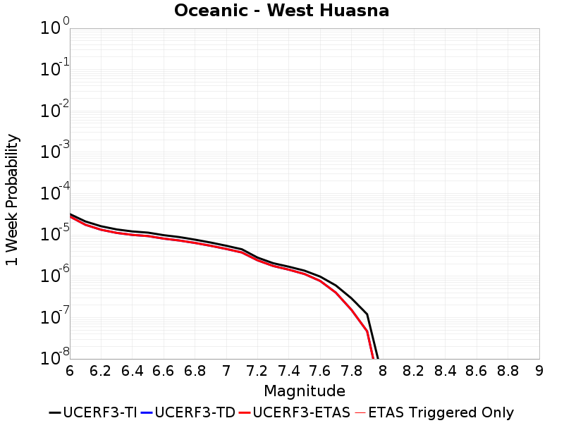 |  | 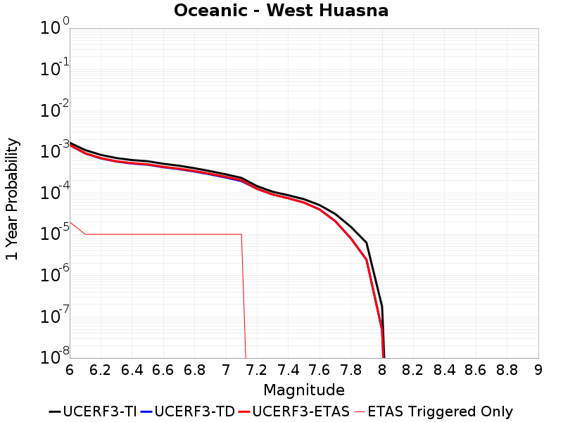 | 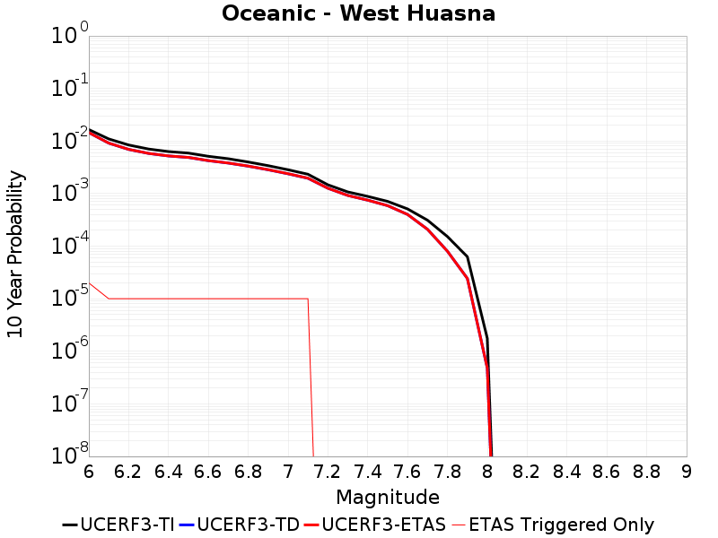 |

| Magnitude | 1 wk TI Prob | 1 wk TD Prob | 1 wk ETAS Prob | 1 wk ETAS/TD Gain | 1 wk ETAS Triggered Only | 1 mo TI Prob | 1 mo TD Prob | 1 mo ETAS Prob | 1 mo ETAS/TD Gain | 1 mo ETAS Triggered Only | 1 yr TI Prob | 1 yr TD Prob | 1 yr ETAS Prob | 1 yr ETAS/TD Gain | 1 yr ETAS Triggered Only | 10 yr TI Prob | 10 yr TD Prob | 10 yr ETAS Prob | 10 yr ETAS/TD Gain | 10 yr ETAS Triggered Only |
|-----|-----|-----|-----|-----|-----|-----|-----|-----|-----|-----|-----|-----|-----|-----|-----|-----|-----|-----|-----|-----|
| 6.0 | 3.195567E-5 | 2.7941891E-5 | 2.7941891E-5 | 1.0 | 0.0 | 1.3694567E-4 | 1.1974571E-4 | 1.1974571E-4 | 1.0 | 0.0 | 0.0016660384 | 0.0014569722 | 0.001476943 | 1.013707 | 2.0E-5 | 0.016536033 | 0.014478759 | 0.014498469 | 1.0013614 | 2.0E-5 |
| 6.1 | 2.1156782E-5 | 1.758295E-5 | 1.758295E-5 | 1.0 | 0.0 | 9.066878E-5 | 7.535338E-5 | 7.535338E-5 | 1.0 | 0.0 | 0.0011033333 | 9.1705064E-4 | 9.2704146E-4 | 1.0108945 | 1.0E-5 | 0.010978713 | 0.009133672 | 0.009143582 | 1.0010848 | 1.0E-5 |
| 6.2 | 1.6195117E-5 | 1.33335425E-5 | 1.33335425E-5 | 1.0 | 0.0 | 6.9405796E-5 | 5.714252E-5 | 5.714252E-5 | 1.0 | 0.0 | 8.44688E-4 | 6.954907E-4 | 7.054837E-4 | 1.0143683 | 1.0E-5 | 0.008414844 | 0.006933435 | 0.0069433656 | 1.0014323 | 1.0E-5 |
| 6.3 | 1.3559345E-5 | 1.1184165E-5 | 1.1184165E-5 | 1.0 | 0.0 | 5.811018E-5 | 4.793126E-5 | 4.793126E-5 | 1.0 | 0.0 | 7.072618E-4 | 5.8340776E-4 | 5.9340196E-4 | 1.0171306 | 1.0E-5 | 0.0070501505 | 0.0058188806 | 0.005828822 | 1.0017085 | 1.0E-5 |
| 6.4 | 1.2120619E-5 | 1.0005299E-5 | 1.0005299E-5 | 1.0 | 0.0 | 5.1944477E-5 | 4.2879154E-5 | 4.2879154E-5 | 1.0 | 0.0 | 6.322405E-4 | 5.219291E-4 | 5.3192396E-4 | 1.0191497 | 1.0E-5 | 0.006304447 | 0.005207101 | 0.005217049 | 1.0019104 | 1.0E-5 |
| 6.5 | 1.13511915E-5 | 9.371475E-6 | 9.371475E-6 | 1.0 | 0.0 | 4.8647056E-5 | 4.016285E-5 | 4.016285E-5 | 1.0 | 0.0 | 5.9211696E-4 | 4.8887345E-4 | 4.988686E-4 | 1.0204452 | 1.0E-5 | 0.0059054173 | 0.004878039 | 0.00488799 | 1.00204 | 1.0E-5 |
| 6.6 | 9.850605E-6 | 8.138852E-6 | 8.138852E-6 | 1.0 | 0.0 | 4.2216197E-5 | 3.4880326E-5 | 3.4880326E-5 | 1.0 | 0.0 | 5.1386096E-4 | 4.2458545E-4 | 4.345812E-4 | 1.0235424 | 1.0E-5 | 0.0051267436 | 0.0042377748 | 0.0042477325 | 1.0023497 | 1.0E-5 |
| 6.7 | 8.8558645E-6 | 7.3215724E-6 | 7.3215724E-6 | 1.0 | 0.0 | 3.7953152E-5 | 3.137779E-5 | 3.137779E-5 | 1.0 | 0.0 | 4.6198163E-4 | 3.819578E-4 | 3.9195397E-4 | 1.0261708 | 1.0E-5 | 0.004610224 | 0.0038130386 | 0.0038230005 | 1.0026126 | 1.0E-5 |
| 6.8 | 7.67136E-6 | 6.3945463E-6 | 6.3945463E-6 | 1.0 | 0.0 | 3.2876844E-5 | 2.740491E-5 | 2.740491E-5 | 1.0 | 0.0 | 4.0020206E-4 | 3.3360388E-4 | 3.4360052E-4 | 1.0299656 | 1.0E-5 | 0.003994821 | 0.0033310517 | 0.0033410185 | 1.002992 | 1.0E-5 |
| 6.9 | 6.534529E-6 | 5.4608045E-6 | 5.4608045E-6 | 1.0 | 0.0 | 2.8004823E-5 | 2.340324E-5 | 2.340324E-5 | 1.0 | 0.0 | 3.4090536E-4 | 2.848973E-4 | 2.9489445E-4 | 1.0350903 | 1.0E-5 | 0.0034038287 | 0.0028453376 | 0.002855309 | 1.0035045 | 1.0E-5 |
| 7.0 | 5.460525E-6 | 4.5720694E-6 | 4.5720694E-6 | 1.0 | 0.0 | 2.3402039E-5 | 1.9594436E-5 | 1.9594436E-5 | 1.0 | 0.0 | 2.8488258E-4 | 2.3853626E-4 | 2.4853388E-4 | 1.0419123 | 1.0E-5 | 0.0028451765 | 0.002382816 | 0.0023927924 | 1.0041867 | 1.0E-5 |
| 7.1 | 4.4825083E-6 | 3.7542814E-6 | 3.7542814E-6 | 1.0 | 0.0 | 1.9210609E-5 | 1.6089678E-5 | 1.6089678E-5 | 1.0 | 0.0 | 2.3386406E-4 | 1.9587432E-4 | 2.0587236E-4 | 1.0510432 | 1.0E-5 | 0.002336181 | 0.0019570289 | 0.0019670092 | 1.0050998 | 1.0E-5 |
| 7.2 | 2.821708E-6 | 2.4265703E-6 | 2.4265703E-6 | 1.0 | 0.0 | 1.2092979E-5 | 1.0399545E-5 | 1.0399545E-5 | 1.0 | 0.0 | 1.4722206E-4 | 1.2660712E-4 | 1.2660712E-4 | 1.0 | 0.0 | 0.0014712457 | 0.0012653524 | 0.0012653524 | 1.0 | 0.0 |
| 7.3 | 2.0644757E-6 | 1.7701947E-6 | 1.7701947E-6 | 1.0 | 0.0 | 8.847723E-6 | 7.5865264E-6 | 7.5865264E-6 | 1.0 | 0.0 | 1.0771569E-4 | 9.236205E-5 | 9.236205E-5 | 1.0 | 0.0 | 0.001076635 | 9.232384E-4 | 9.232384E-4 | 1.0 | 0.0 |
| 7.4 | 1.6980367E-6 | 1.4393333E-6 | 1.4393333E-6 | 1.0 | 0.0 | 7.27728E-6 | 6.168557E-6 | 6.168557E-6 | 1.0 | 0.0 | 8.8597284E-5 | 7.50996E-5 | 7.50996E-5 | 1.0 | 0.0 | 8.8561967E-4 | 7.5074384E-4 | 7.5074384E-4 | 1.0 | 0.0 |
| 7.5 | 1.3637683E-6 | 1.1315009E-6 | 1.1315009E-6 | 1.0 | 0.0 | 5.844708E-6 | 4.8492807E-6 | 4.8492807E-6 | 1.0 | 0.0 | 7.1156996E-5 | 5.9038393E-5 | 5.9038393E-5 | 1.0 | 0.0 | 7.1134215E-4 | 5.9022865E-4 | 5.9022865E-4 | 1.0 | 0.0 |
| 7.6 | 9.802994E-7 | 7.6889006E-7 | 7.6889006E-7 | 1.0 | 0.0 | 4.2012766E-6 | 3.295239E-6 | 3.295239E-6 | 1.0 | 0.0 | 5.1149345E-5 | 4.0118794E-5 | 4.0118794E-5 | 1.0 | 0.0 | 5.113757E-4 | 4.01117E-4 | 4.01117E-4 | 1.0 | 0.0 |
| 7.7 | 5.986191E-7 | 4.0146026E-7 | 4.0146026E-7 | 1.0 | 0.0 | 2.5655079E-6 | 1.7205427E-6 | 1.7205427E-6 | 1.0 | 0.0 | 3.1234613E-5 | 2.0947407E-5 | 2.0947407E-5 | 1.0 | 0.0 | 3.123022E-4 | 2.0945571E-4 | 2.0945571E-4 | 1.0 | 0.0 |
| 7.8 | 2.9189815E-7 | 1.536422E-7 | 1.536422E-7 | 1.0 | 0.0 | 1.2509914E-6 | 6.5846643E-7 | 6.5846643E-7 | 1.0 | 0.0 | 1.5230714E-5 | 8.016799E-6 | 8.016799E-6 | 1.0 | 0.0 | 1.522967E-4 | 8.016646E-5 | 8.016646E-5 | 1.0 | 0.0 |
| 7.9 | 1.2057845E-7 | 4.6636227E-8 | 4.6636227E-8 | 1.0 | 0.0 | 5.1676466E-7 | 1.9986953E-7 | 1.9986953E-7 | 1.0 | 0.0 | 6.2915915E-6 | 2.4334088E-6 | 2.4334088E-6 | 1.0 | 0.0 | 6.2914136E-5 | 2.433517E-5 | 2.433517E-5 | 1.0 | 0.0 |
| 8.0 | 3.3806387E-9 | 9.170813E-10 | 9.170813E-10 | 1.0 | 0.0 | 1.4488451E-8 | 3.9303467E-9 | 3.9303467E-9 | 1.0 | 0.0 | 1.7639688E-7 | 4.7851977E-8 | 4.7851977E-8 | 1.0 | 0.0 | 1.7639674E-6 | 4.7963204E-7 | 4.7963204E-7 | 1.0 | 0.0 |

## San Jacinto (San Jacinto Valley) rev
*[(top)](#table-of-contents)*

| 1 Week | 1 Month | 1 Year | 10 Year |
|-----|-----|-----|-----|
| 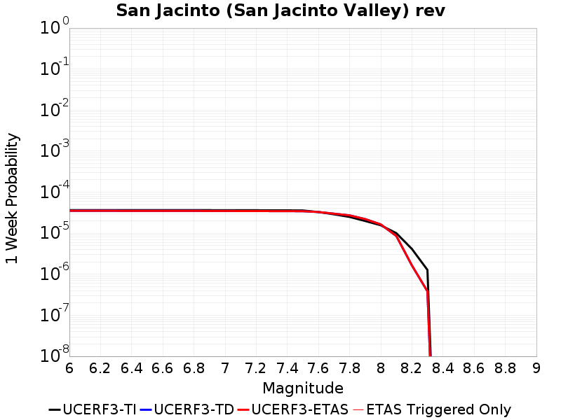 | 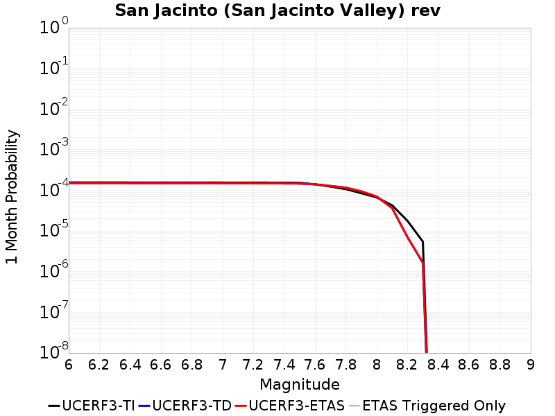 | 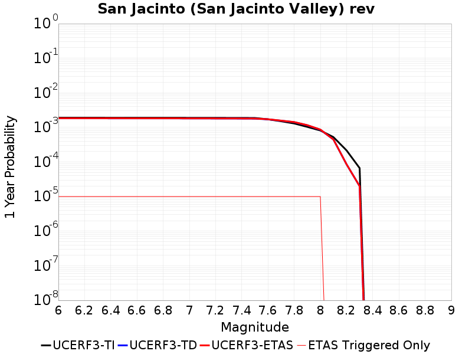 |  |

| Magnitude | 1 wk TI Prob | 1 wk TD Prob | 1 wk ETAS Prob | 1 wk ETAS/TD Gain | 1 wk ETAS Triggered Only | 1 mo TI Prob | 1 mo TD Prob | 1 mo ETAS Prob | 1 mo ETAS/TD Gain | 1 mo ETAS Triggered Only | 1 yr TI Prob | 1 yr TD Prob | 1 yr ETAS Prob | 1 yr ETAS/TD Gain | 1 yr ETAS Triggered Only | 10 yr TI Prob | 10 yr TD Prob | 10 yr ETAS Prob | 10 yr ETAS/TD Gain | 10 yr ETAS Triggered Only |
|-----|-----|-----|-----|-----|-----|-----|-----|-----|-----|-----|-----|-----|-----|-----|-----|-----|-----|-----|-----|-----|
| 6.0 | 3.652694E-5 | 3.5148434E-5 | 3.5148434E-5 | 1.0 | 0.0 | 1.5653463E-4 | 1.5062747E-4 | 1.5062747E-4 | 1.0 | 0.0 | 0.0019041431 | 0.0018323488 | 0.0018423304 | 1.0054475 | 1.0E-5 | 0.018879099 | 0.018912328 | 0.01893195 | 1.0010375 | 2.0E-5 |
| 6.1 | 3.652694E-5 | 3.5148434E-5 | 3.5148434E-5 | 1.0 | 0.0 | 1.5653463E-4 | 1.5062747E-4 | 1.5062747E-4 | 1.0 | 0.0 | 0.0019041431 | 0.0018323488 | 0.0018423304 | 1.0054475 | 1.0E-5 | 0.018879099 | 0.018912328 | 0.01893195 | 1.0010375 | 2.0E-5 |
| 6.2 | 3.652694E-5 | 3.5148434E-5 | 3.5148434E-5 | 1.0 | 0.0 | 1.5653463E-4 | 1.5062747E-4 | 1.5062747E-4 | 1.0 | 0.0 | 0.0019041431 | 0.0018323488 | 0.0018423304 | 1.0054475 | 1.0E-5 | 0.018879099 | 0.018912328 | 0.01893195 | 1.0010375 | 2.0E-5 |
| 6.3 | 3.652694E-5 | 3.5148434E-5 | 3.5148434E-5 | 1.0 | 0.0 | 1.5653463E-4 | 1.5062747E-4 | 1.5062747E-4 | 1.0 | 0.0 | 0.0019041431 | 0.0018323488 | 0.0018423304 | 1.0054475 | 1.0E-5 | 0.018879099 | 0.018912328 | 0.01893195 | 1.0010375 | 2.0E-5 |
| 6.4 | 3.646941E-5 | 3.5069843E-5 | 3.5069843E-5 | 1.0 | 0.0 | 1.5628811E-4 | 1.5029068E-4 | 1.5029068E-4 | 1.0 | 0.0 | 0.0019011468 | 0.0018282556 | 0.0018382373 | 1.0054597 | 1.0E-5 | 0.018849645 | 0.01887214 | 0.018891763 | 1.0010397 | 2.0E-5 |
| 6.5 | 3.646941E-5 | 3.5069843E-5 | 3.5069843E-5 | 1.0 | 0.0 | 1.5628811E-4 | 1.5029068E-4 | 1.5029068E-4 | 1.0 | 0.0 | 0.0019011468 | 0.0018282556 | 0.0018382373 | 1.0054597 | 1.0E-5 | 0.018849645 | 0.01887214 | 0.018891763 | 1.0010397 | 2.0E-5 |
| 6.6 | 3.6442503E-5 | 3.503315E-5 | 3.503315E-5 | 1.0 | 0.0 | 1.561728E-4 | 1.5013345E-4 | 1.5013345E-4 | 1.0 | 0.0 | 0.0018997455 | 0.0018263448 | 0.0018363264 | 1.0054654 | 1.0E-5 | 0.018835869 | 0.018853378 | 0.018873 | 1.0010408 | 2.0E-5 |
| 6.7 | 3.6432113E-5 | 3.5018693E-5 | 3.5018693E-5 | 1.0 | 0.0 | 1.5612828E-4 | 1.500715E-4 | 1.500715E-4 | 1.0 | 0.0 | 0.0018992044 | 0.0018255918 | 0.0018355736 | 1.0054677 | 1.0E-5 | 0.018830549 | 0.018845987 | 0.01886561 | 1.0010413 | 2.0E-5 |
| 6.8 | 3.6409598E-5 | 3.4987675E-5 | 3.4987675E-5 | 1.0 | 0.0 | 1.560318E-4 | 1.4993858E-4 | 1.4993858E-4 | 1.0 | 0.0 | 0.0018980318 | 0.0018239763 | 0.0018339581 | 1.0054725 | 1.0E-5 | 0.018819023 | 0.018830111 | 0.018849734 | 1.0010421 | 2.0E-5 |
| 6.9 | 3.638078E-5 | 3.4948007E-5 | 3.4948007E-5 | 1.0 | 0.0 | 1.5590832E-4 | 1.4976859E-4 | 1.4976859E-4 | 1.0 | 0.0 | 0.0018965311 | 0.0018219101 | 0.001831892 | 1.0054787 | 1.0E-5 | 0.018804269 | 0.018809805 | 0.01882943 | 1.0010433 | 2.0E-5 |
| 7.0 | 3.6294874E-5 | 3.4829747E-5 | 3.4829747E-5 | 1.0 | 0.0 | 1.5554018E-4 | 1.4926183E-4 | 1.4926183E-4 | 1.0 | 0.0 | 0.0018920569 | 0.0018157507 | 0.0018257325 | 1.0054973 | 1.0E-5 | 0.018760284 | 0.018749269 | 0.018768895 | 1.0010467 | 2.0E-5 |
| 7.1 | 3.6260717E-5 | 3.4785953E-5 | 3.4785953E-5 | 1.0 | 0.0 | 1.5539382E-4 | 1.4907416E-4 | 1.4907416E-4 | 1.0 | 0.0 | 0.001890278 | 0.0018134697 | 0.0018234515 | 1.0055043 | 1.0E-5 | 0.018742796 | 0.018726839 | 0.018746464 | 1.001048 | 2.0E-5 |
| 7.2 | 3.6210204E-5 | 3.4719942E-5 | 3.4719942E-5 | 1.0 | 0.0 | 1.5517735E-4 | 1.4879128E-4 | 1.4879128E-4 | 1.0 | 0.0 | 0.001887647 | 0.0018100314 | 0.0018200133 | 1.0055147 | 1.0E-5 | 0.01871693 | 0.018693019 | 0.018712645 | 1.0010499 | 2.0E-5 |
| 7.3 | 3.6119454E-5 | 3.4607565E-5 | 3.4607565E-5 | 1.0 | 0.0 | 1.5478847E-4 | 1.4830971E-4 | 1.4830971E-4 | 1.0 | 0.0 | 0.0018829206 | 0.001804178 | 0.00181416 | 1.0055327 | 1.0E-5 | 0.018670462 | 0.018635256 | 0.018654883 | 1.0010532 | 2.0E-5 |
| 7.4 | 3.607848E-5 | 3.4554716E-5 | 3.4554716E-5 | 1.0 | 0.0 | 1.5461289E-4 | 1.4808324E-4 | 1.4808324E-4 | 1.0 | 0.0 | 0.0018807866 | 0.0018014254 | 0.0018114074 | 1.0055412 | 1.0E-5 | 0.018649481 | 0.018608088 | 0.018627716 | 1.0010548 | 2.0E-5 |
| 7.5 | 3.5856774E-5 | 3.436246E-5 | 3.436246E-5 | 1.0 | 0.0 | 1.5366284E-4 | 1.4725939E-4 | 1.4725939E-4 | 1.0 | 0.0 | 0.0018692396 | 0.0017914113 | 0.0018013935 | 1.0055722 | 1.0E-5 | 0.018535944 | 0.01850817 | 0.0185278 | 1.0010606 | 2.0E-5 |
| 7.6 | 3.286655E-5 | 3.286656E-5 | 3.286656E-5 | 1.0 | 0.0 | 1.4084904E-4 | 1.408491E-4 | 1.408491E-4 | 1.0 | 0.0 | 0.001713488 | 0.0017134909 | 0.0017234738 | 1.005826 | 1.0E-5 | 0.017003361 | 0.017718248 | 0.017737893 | 1.0011088 | 2.0E-5 |
| 7.7 | 2.8882527E-5 | 2.9944596E-5 | 2.9944596E-5 | 1.0 | 0.0 | 1.237764E-4 | 1.2832768E-4 | 1.2832768E-4 | 1.0 | 0.0 | 0.0015059357 | 0.0015612709 | 0.0015712553 | 1.006395 | 1.0E-5 | 0.014957713 | 0.016197354 | 0.016217029 | 1.0012147 | 2.0E-5 |
| 7.8 | 2.4950225E-5 | 2.7206865E-5 | 2.7206865E-5 | 1.0 | 0.0 | 1.0692515E-4 | 1.1659564E-4 | 1.1659564E-4 | 1.0 | 0.0 | 0.0013010362 | 0.0014186285 | 0.0014286143 | 1.0070391 | 1.0E-5 | 0.012934455 | 0.014764559 | 0.014784264 | 1.0013345 | 2.0E-5 |
| 7.9 | 1.9881603E-5 | 2.2112707E-5 | 2.2112707E-5 | 1.0 | 0.0 | 8.520408E-5 | 9.47653E-5 | 9.47653E-5 | 1.0 | 0.0 | 0.001036866 | 0.0011531578 | 0.0011631462 | 1.0086619 | 1.0E-5 | 0.010320415 | 0.012092331 | 0.012112089 | 1.0016339 | 2.0E-5 |
| 8.0 | 1.563292E-5 | 1.6424854E-5 | 1.6424854E-5 | 1.0 | 0.0 | 6.6996516E-5 | 7.0390335E-5 | 7.0390335E-5 | 1.0 | 0.0 | 8.153773E-4 | 8.566661E-4 | 8.6665753E-4 | 1.0116632 | 1.0E-5 | 0.00812392 | 0.009067303 | 0.009087121 | 1.0021857 | 2.0E-5 |
| 8.1 | 1.0045313E-5 | 8.586499E-6 | 8.586499E-6 | 1.0 | 0.0 | 4.305063E-5 | 3.6798763E-5 | 3.6798763E-5 | 1.0 | 0.0 | 5.2401534E-4 | 4.4793342E-4 | 4.4793342E-4 | 1.0 | 0.0 | 0.0052278144 | 0.004812398 | 0.004812398 | 1.0 | 0.0 |
| 8.2 | 4.1554413E-6 | 1.6484648E-6 | 1.6484648E-6 | 1.0 | 0.0 | 1.7808914E-5 | 7.0648302E-6 | 7.0648302E-6 | 1.0 | 0.0 | 2.1680194E-4 | 8.601094E-5 | 8.601094E-5 | 1.0 | 0.0 | 0.0021659054 | 9.957078E-4 | 9.957078E-4 | 1.0 | 0.0 |
| 8.3 | 1.2758221E-6 | 3.8368213E-7 | 3.8368213E-7 | 1.0 | 0.0 | 5.4677976E-6 | 1.644351E-6 | 1.644351E-6 | 1.0 | 0.0 | 6.65684E-5 | 2.0019794E-5 | 2.0019794E-5 | 1.0 | 0.0 | 6.6548464E-4 | 2.4054009E-4 | 2.4054009E-4 | 1.0 | 0.0 |

## San Jacinto (Stepovers Combined)
*[(top)](#table-of-contents)*

| 1 Week | 1 Month | 1 Year | 10 Year |
|-----|-----|-----|-----|
| 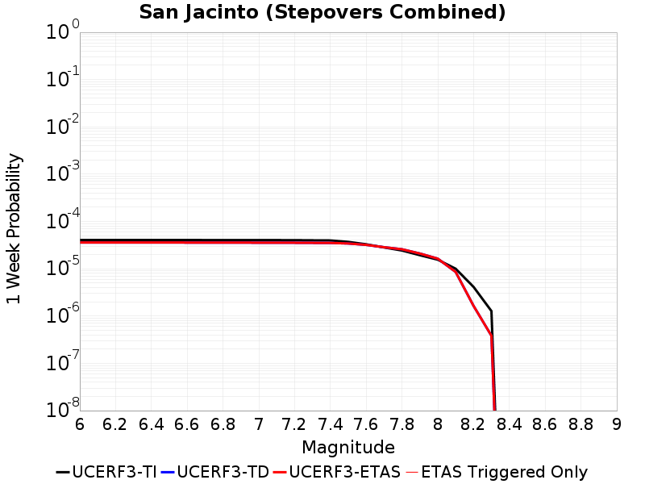 | 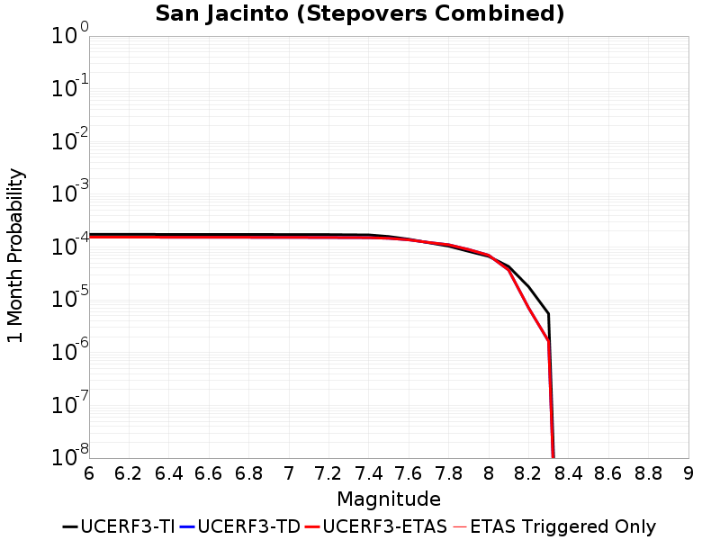 |  |  |

| Magnitude | 1 wk TI Prob | 1 wk TD Prob | 1 wk ETAS Prob | 1 wk ETAS/TD Gain | 1 wk ETAS Triggered Only | 1 mo TI Prob | 1 mo TD Prob | 1 mo ETAS Prob | 1 mo ETAS/TD Gain | 1 mo ETAS Triggered Only | 1 yr TI Prob | 1 yr TD Prob | 1 yr ETAS Prob | 1 yr ETAS/TD Gain | 1 yr ETAS Triggered Only | 10 yr TI Prob | 10 yr TD Prob | 10 yr ETAS Prob | 10 yr ETAS/TD Gain | 10 yr ETAS Triggered Only |
|-----|-----|-----|-----|-----|-----|-----|-----|-----|-----|-----|-----|-----|-----|-----|-----|-----|-----|-----|-----|-----|
| 6.0 | 4.0667746E-5 | 3.6014666E-5 | 3.6014666E-5 | 1.0 | 0.0 | 1.742787E-4 | 1.5433943E-4 | 1.5433943E-4 | 1.0 | 0.0 | 0.0021197782 | 0.0018774645 | 0.0018874457 | 1.0053164 | 1.0E-5 | 0.020996714 | 0.019371586 | 0.019391198 | 1.0010124 | 2.0E-5 |
| 6.1 | 4.0667746E-5 | 3.6014666E-5 | 3.6014666E-5 | 1.0 | 0.0 | 1.742787E-4 | 1.5433943E-4 | 1.5433943E-4 | 1.0 | 0.0 | 0.0021197782 | 0.0018774645 | 0.0018874457 | 1.0053164 | 1.0E-5 | 0.020996714 | 0.019371586 | 0.019391198 | 1.0010124 | 2.0E-5 |
| 6.2 | 4.0667746E-5 | 3.6014666E-5 | 3.6014666E-5 | 1.0 | 0.0 | 1.742787E-4 | 1.5433943E-4 | 1.5433943E-4 | 1.0 | 0.0 | 0.0021197782 | 0.0018774645 | 0.0018874457 | 1.0053164 | 1.0E-5 | 0.020996714 | 0.019371586 | 0.019391198 | 1.0010124 | 2.0E-5 |
| 6.3 | 4.0667746E-5 | 3.6014666E-5 | 3.6014666E-5 | 1.0 | 0.0 | 1.742787E-4 | 1.5433943E-4 | 1.5433943E-4 | 1.0 | 0.0 | 0.0021197782 | 0.0018774645 | 0.0018874457 | 1.0053164 | 1.0E-5 | 0.020996714 | 0.019371586 | 0.019391198 | 1.0010124 | 2.0E-5 |
| 6.4 | 4.0577226E-5 | 3.5886278E-5 | 3.5886278E-5 | 1.0 | 0.0 | 1.738908E-4 | 1.5378928E-4 | 1.5378928E-4 | 1.0 | 0.0 | 0.0021150648 | 0.0018707789 | 0.0018807602 | 1.0053353 | 1.0E-5 | 0.020950472 | 0.01930603 | 0.019325644 | 1.0010159 | 2.0E-5 |
| 6.5 | 4.0577226E-5 | 3.5886278E-5 | 3.5886278E-5 | 1.0 | 0.0 | 1.738908E-4 | 1.5378928E-4 | 1.5378928E-4 | 1.0 | 0.0 | 0.0021150648 | 0.0018707789 | 0.0018807602 | 1.0053353 | 1.0E-5 | 0.020950472 | 0.01930603 | 0.019325644 | 1.0010159 | 2.0E-5 |
| 6.6 | 4.053861E-5 | 3.583149E-5 | 3.583149E-5 | 1.0 | 0.0 | 1.7372532E-4 | 1.5355452E-4 | 1.5355452E-4 | 1.0 | 0.0 | 0.0021130538 | 0.001867926 | 0.0018779073 | 1.0053436 | 1.0E-5 | 0.020930743 | 0.019278055 | 0.019297669 | 1.0010175 | 2.0E-5 |
| 6.7 | 4.0516545E-5 | 3.5800495E-5 | 3.5800495E-5 | 1.0 | 0.0 | 1.7363077E-4 | 1.5342169E-4 | 1.5342169E-4 | 1.0 | 0.0 | 0.002111905 | 0.0018663119 | 0.0018762932 | 1.0053482 | 1.0E-5 | 0.020919468 | 0.019262223 | 0.019281836 | 1.0010183 | 2.0E-5 |
| 6.8 | 4.049434E-5 | 3.5771875E-5 | 3.5771875E-5 | 1.0 | 0.0 | 1.7353562E-4 | 1.5329906E-4 | 1.5329906E-4 | 1.0 | 0.0 | 0.0021107488 | 0.0018648214 | 0.0018748028 | 1.0053525 | 1.0E-5 | 0.020908125 | 0.01924755 | 0.019267164 | 1.0010191 | 2.0E-5 |
| 6.9 | 4.046386E-5 | 3.5734265E-5 | 3.5734265E-5 | 1.0 | 0.0 | 1.73405E-4 | 1.5313788E-4 | 1.5313788E-4 | 1.0 | 0.0 | 0.0021091616 | 0.0018628625 | 0.0018728438 | 1.0053581 | 1.0E-5 | 0.020892553 | 0.019228242 | 0.019247858 | 1.0010202 | 2.0E-5 |
| 7.0 | 4.036382E-5 | 3.561425E-5 | 3.561425E-5 | 1.0 | 0.0 | 1.7297632E-4 | 1.5262359E-4 | 1.5262359E-4 | 1.0 | 0.0 | 0.0021039525 | 0.0018566117 | 0.0018665931 | 1.0053761 | 1.0E-5 | 0.02084144 | 0.01916658 | 0.019186197 | 1.0010235 | 2.0E-5 |
| 7.1 | 4.0343282E-5 | 3.5592613E-5 | 3.5592613E-5 | 1.0 | 0.0 | 1.7288832E-4 | 1.5253088E-4 | 1.5253088E-4 | 1.0 | 0.0 | 0.002102883 | 0.0018554849 | 0.0018654664 | 1.0053794 | 1.0E-5 | 0.020830948 | 0.01915541 | 0.019175027 | 1.0010241 | 2.0E-5 |
| 7.2 | 4.0257353E-5 | 3.54967E-5 | 3.54967E-5 | 1.0 | 0.0 | 1.725201E-4 | 1.5211987E-4 | 1.5211987E-4 | 1.0 | 0.0 | 0.0020984085 | 0.0018504895 | 0.001860471 | 1.005394 | 1.0E-5 | 0.020787042 | 0.01910596 | 0.019125579 | 1.0010267 | 2.0E-5 |
| 7.3 | 3.9940667E-5 | 3.5321555E-5 | 3.5321555E-5 | 1.0 | 0.0 | 1.7116306E-4 | 1.5136933E-4 | 1.5136933E-4 | 1.0 | 0.0 | 0.0020819185 | 0.0018413672 | 0.0018513488 | 1.0054208 | 1.0E-5 | 0.020625217 | 0.019013142 | 0.019032761 | 1.0010319 | 2.0E-5 |
| 7.4 | 3.9721202E-5 | 3.520551E-5 | 3.520551E-5 | 1.0 | 0.0 | 1.7022261E-4 | 1.5087206E-4 | 1.5087206E-4 | 1.0 | 0.0 | 0.0020704903 | 0.001835323 | 0.0018453046 | 1.0054387 | 1.0E-5 | 0.020513052 | 0.018951537 | 0.018971158 | 1.0010353 | 2.0E-5 |
| 7.5 | 3.7036873E-5 | 3.425896E-5 | 3.425896E-5 | 1.0 | 0.0 | 1.5871979E-4 | 1.4681586E-4 | 1.4681586E-4 | 1.0 | 0.0 | 0.0019307006 | 0.0017860207 | 0.0017960028 | 1.005589 | 1.0E-5 | 0.019140124 | 0.018445874 | 0.018465506 | 1.0010643 | 2.0E-5 |
| 7.6 | 3.2940967E-5 | 3.2011852E-5 | 3.2011852E-5 | 1.0 | 0.0 | 1.4116794E-4 | 1.3718646E-4 | 1.3718646E-4 | 1.0 | 0.0 | 0.0017173645 | 0.0016689678 | 0.0016789511 | 1.0059817 | 1.0E-5 | 0.01704153 | 0.017264599 | 0.017284254 | 1.0011384 | 2.0E-5 |
| 7.7 | 2.8236149E-5 | 2.8559773E-5 | 2.8559773E-5 | 1.0 | 0.0 | 1.2100645E-4 | 1.2239329E-4 | 1.2239329E-4 | 1.0 | 0.0 | 0.0014722579 | 0.0014891209 | 0.001499106 | 1.0067054 | 1.0E-5 | 0.014625421 | 0.015466482 | 0.015486172 | 1.0012732 | 2.0E-5 |
| 7.8 | 2.4329287E-5 | 2.5855177E-5 | 2.5855177E-5 | 1.0 | 0.0 | 1.042642E-4 | 1.108032E-4 | 1.108032E-4 | 1.0 | 0.0 | 0.0012686774 | 0.001348195 | 0.0013581816 | 1.0074073 | 1.0E-5 | 0.012614589 | 0.014049854 | 0.014069574 | 1.0014035 | 2.0E-5 |
| 7.9 | 1.9370926E-5 | 2.0999794E-5 | 2.0999794E-5 | 1.0 | 0.0 | 8.301561E-5 | 8.9996014E-5 | 8.9996014E-5 | 1.0 | 0.0 | 0.0010102465 | 0.0010951515 | 0.0011051407 | 1.0091212 | 1.0E-5 | 0.0100566605 | 0.011501844 | 0.011521614 | 1.0017189 | 2.0E-5 |
| 8.0 | 1.5583017E-5 | 1.63719E-5 | 1.63719E-5 | 1.0 | 0.0 | 6.6782646E-5 | 7.0163405E-5 | 7.0163405E-5 | 1.0 | 0.0 | 8.127754E-4 | 8.539054E-4 | 8.6389686E-4 | 1.0117009 | 1.0E-5 | 0.008098091 | 0.009037521 | 0.00905734 | 1.002193 | 2.0E-5 |
| 8.1 | 1.0024873E-5 | 8.5765605E-6 | 8.5765605E-6 | 1.0 | 0.0 | 4.2963035E-5 | 3.675617E-5 | 3.675617E-5 | 1.0 | 0.0 | 5.229494E-4 | 4.4741505E-4 | 4.4741505E-4 | 1.0 | 0.0 | 0.0052172043 | 0.004806391 | 0.004806391 | 1.0 | 0.0 |
| 8.2 | 4.142796E-6 | 1.6436295E-6 | 1.6436295E-6 | 1.0 | 0.0 | 1.775472E-5 | 7.0441074E-6 | 7.0441074E-6 | 1.0 | 0.0 | 2.1614227E-4 | 8.5758664E-5 | 8.5758664E-5 | 1.0 | 0.0 | 0.0021593217 | 9.927212E-4 | 9.927212E-4 | 1.0 | 0.0 |
| 8.3 | 1.2750878E-6 | 3.833818E-7 | 3.833818E-7 | 1.0 | 0.0 | 5.4646503E-6 | 1.6430639E-6 | 1.6430639E-6 | 1.0 | 0.0 | 6.653009E-5 | 2.0004123E-5 | 2.0004123E-5 | 1.0 | 0.0 | 6.6510175E-4 | 2.4036168E-4 | 2.4036168E-4 | 1.0 | 0.0 |

## Blue Cut
*[(top)](#table-of-contents)*

| 1 Week | 1 Month | 1 Year | 10 Year |
|-----|-----|-----|-----|
| 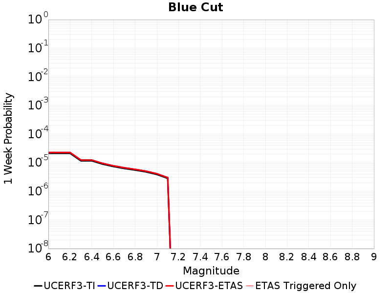 |  | 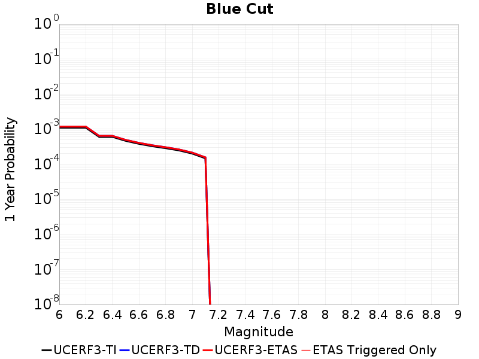 |  |

| Magnitude | 1 wk TI Prob | 1 wk TD Prob | 1 wk ETAS Prob | 1 wk ETAS/TD Gain | 1 wk ETAS Triggered Only | 1 mo TI Prob | 1 mo TD Prob | 1 mo ETAS Prob | 1 mo ETAS/TD Gain | 1 mo ETAS Triggered Only | 1 yr TI Prob | 1 yr TD Prob | 1 yr ETAS Prob | 1 yr ETAS/TD Gain | 1 yr ETAS Triggered Only | 10 yr TI Prob | 10 yr TD Prob | 10 yr ETAS Prob | 10 yr ETAS/TD Gain | 10 yr ETAS Triggered Only |
|-----|-----|-----|-----|-----|-----|-----|-----|-----|-----|-----|-----|-----|-----|-----|-----|-----|-----|-----|-----|-----|
| 6.0 | 2.1227985E-5 | 2.2729713E-5 | 2.2729713E-5 | 1.0 | 0.0 | 9.097391E-5 | 9.740975E-5 | 9.740975E-5 | 1.0 | 0.0 | 0.0011070445 | 0.0011853765 | 0.0011853765 | 1.0 | 0.0 | 0.011015458 | 0.011796386 | 0.01181615 | 1.0016755 | 2.0E-5 |
| 6.1 | 2.1227985E-5 | 2.2729713E-5 | 2.2729713E-5 | 1.0 | 0.0 | 9.097391E-5 | 9.740975E-5 | 9.740975E-5 | 1.0 | 0.0 | 0.0011070445 | 0.0011853765 | 0.0011853765 | 1.0 | 0.0 | 0.011015458 | 0.011796386 | 0.01181615 | 1.0016755 | 2.0E-5 |
| 6.2 | 2.1227985E-5 | 2.2729713E-5 | 2.2729713E-5 | 1.0 | 0.0 | 9.097391E-5 | 9.740975E-5 | 9.740975E-5 | 1.0 | 0.0 | 0.0011070445 | 0.0011853765 | 0.0011853765 | 1.0 | 0.0 | 0.011015458 | 0.011796386 | 0.01181615 | 1.0016755 | 2.0E-5 |
| 6.3 | 1.1613981E-5 | 1.2358532E-5 | 1.2358532E-5 | 1.0 | 0.0 | 4.9773254E-5 | 5.2964137E-5 | 5.2964137E-5 | 1.0 | 0.0 | 6.0582085E-4 | 6.4466003E-4 | 6.4466003E-4 | 1.0 | 0.0 | 0.0060417196 | 0.006429148 | 0.006429148 | 1.0 | 0.0 |
| 6.4 | 1.1613981E-5 | 1.2358532E-5 | 1.2358532E-5 | 1.0 | 0.0 | 4.9773254E-5 | 5.2964137E-5 | 5.2964137E-5 | 1.0 | 0.0 | 6.0582085E-4 | 6.4466003E-4 | 6.4466003E-4 | 1.0 | 0.0 | 0.0060417196 | 0.006429148 | 0.006429148 | 1.0 | 0.0 |
| 6.5 | 8.931326E-6 | 9.485305E-6 | 9.485305E-6 | 1.0 | 0.0 | 3.8276554E-5 | 4.0650724E-5 | 4.0650724E-5 | 1.0 | 0.0 | 4.6591737E-4 | 4.948193E-4 | 4.948193E-4 | 1.0 | 0.0 | 0.0046494175 | 0.0049380856 | 0.0049380856 | 1.0 | 0.0 |
| 6.6 | 7.345353E-6 | 7.793271E-6 | 7.793271E-6 | 1.0 | 0.0 | 3.1479703E-5 | 3.3399352E-5 | 3.3399352E-5 | 1.0 | 0.0 | 3.83198E-4 | 4.0656925E-4 | 4.0656925E-4 | 1.0 | 0.0 | 0.0038253788 | 0.0040590465 | 0.0040590465 | 1.0 | 0.0 |
| 6.7 | 6.2775666E-6 | 6.657687E-6 | 6.657687E-6 | 1.0 | 0.0 | 2.690358E-5 | 2.8532675E-5 | 2.8532675E-5 | 1.0 | 0.0 | 3.2750185E-4 | 3.4733748E-4 | 3.4733748E-4 | 1.0 | 0.0 | 0.0032701963 | 0.0034686874 | 0.0034686874 | 1.0 | 0.0 |
| 6.8 | 5.5234095E-6 | 5.8573405E-6 | 5.8573405E-6 | 1.0 | 0.0 | 2.367154E-5 | 2.5102689E-5 | 2.5102689E-5 | 1.0 | 0.0 | 2.8816288E-4 | 3.0558967E-4 | 3.0558967E-4 | 1.0 | 0.0 | 0.002877895 | 0.003052411 | 0.003052411 | 1.0 | 0.0 |
| 6.9 | 4.7780054E-6 | 5.0673525E-6 | 5.0673525E-6 | 1.0 | 0.0 | 2.0477004E-5 | 2.1717084E-5 | 2.1717084E-5 | 1.0 | 0.0 | 2.4927902E-4 | 2.6438048E-4 | 2.6438048E-4 | 1.0 | 0.0 | 0.0024899957 | 0.0026413521 | 0.0026413521 | 1.0 | 0.0 |
| 7.0 | 3.883171E-6 | 4.1200697E-6 | 4.1200697E-6 | 1.0 | 0.0 | 1.6642054E-5 | 1.765736E-5 | 1.765736E-5 | 1.0 | 0.0 | 2.0259817E-4 | 2.1496405E-4 | 2.1496405E-4 | 1.0 | 0.0 | 0.0020241356 | 0.0021482373 | 0.0021482373 | 1.0 | 0.0 |
| 7.1 | 2.8358215E-6 | 3.010886E-6 | 3.010886E-6 | 1.0 | 0.0 | 1.2153464E-5 | 1.2903771E-5 | 1.2903771E-5 | 1.0 | 0.0 | 1.4795837E-4 | 1.5709866E-4 | 1.5709866E-4 | 1.0 | 0.0 | 0.001478599 | 0.0015705217 | 0.0015705217 | 1.0 | 0.0 |

## Camp Rock 2011
*[(top)](#table-of-contents)*

| 1 Week | 1 Month | 1 Year | 10 Year |
|-----|-----|-----|-----|
| 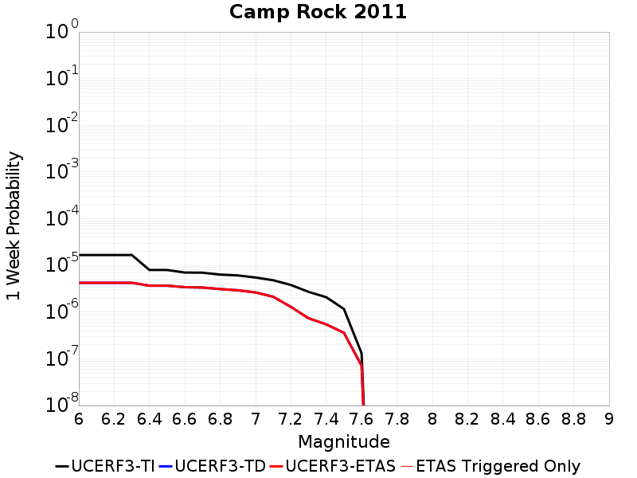 |  |  |  |

| Magnitude | 1 wk TI Prob | 1 wk TD Prob | 1 wk ETAS Prob | 1 wk ETAS/TD Gain | 1 wk ETAS Triggered Only | 1 mo TI Prob | 1 mo TD Prob | 1 mo ETAS Prob | 1 mo ETAS/TD Gain | 1 mo ETAS Triggered Only | 1 yr TI Prob | 1 yr TD Prob | 1 yr ETAS Prob | 1 yr ETAS/TD Gain | 1 yr ETAS Triggered Only | 10 yr TI Prob | 10 yr TD Prob | 10 yr ETAS Prob | 10 yr ETAS/TD Gain | 10 yr ETAS Triggered Only |
|-----|-----|-----|-----|-----|-----|-----|-----|-----|-----|-----|-----|-----|-----|-----|-----|-----|-----|-----|-----|-----|
| 6.0 | 1.6710783E-5 | 4.253155E-6 | 4.253155E-6 | 1.0 | 0.0 | 7.161568E-5 | 1.8227684E-5 | 1.8227684E-5 | 1.0 | 0.0 | 8.7157206E-4 | 2.2189997E-4 | 2.4189553E-4 | 1.0901107 | 2.0E-5 | 0.008681616 | 0.002216837 | 0.0022367926 | 1.0090019 | 2.0E-5 |
| 6.1 | 1.6710783E-5 | 4.253155E-6 | 4.253155E-6 | 1.0 | 0.0 | 7.161568E-5 | 1.8227684E-5 | 1.8227684E-5 | 1.0 | 0.0 | 8.7157206E-4 | 2.2189997E-4 | 2.4189553E-4 | 1.0901107 | 2.0E-5 | 0.008681616 | 0.002216837 | 0.0022367926 | 1.0090019 | 2.0E-5 |
| 6.2 | 1.6710783E-5 | 4.253155E-6 | 4.253155E-6 | 1.0 | 0.0 | 7.161568E-5 | 1.8227684E-5 | 1.8227684E-5 | 1.0 | 0.0 | 8.7157206E-4 | 2.2189997E-4 | 2.4189553E-4 | 1.0901107 | 2.0E-5 | 0.008681616 | 0.002216837 | 0.0022367926 | 1.0090019 | 2.0E-5 |
| 6.3 | 1.6710783E-5 | 4.253155E-6 | 4.253155E-6 | 1.0 | 0.0 | 7.161568E-5 | 1.8227684E-5 | 1.8227684E-5 | 1.0 | 0.0 | 8.7157206E-4 | 2.2189997E-4 | 2.4189553E-4 | 1.0901107 | 2.0E-5 | 0.008681616 | 0.002216837 | 0.0022367926 | 1.0090019 | 2.0E-5 |
| 6.4 | 7.982846E-6 | 3.684557E-6 | 3.684557E-6 | 1.0 | 0.0 | 3.421175E-5 | 1.5790865E-5 | 1.5790865E-5 | 1.0 | 0.0 | 4.1644843E-4 | 1.9223717E-4 | 2.1223332E-4 | 1.1040182 | 2.0E-5 | 0.0041566887 | 0.0019207436 | 0.0019407052 | 1.0103927 | 2.0E-5 |
| 6.5 | 7.982846E-6 | 3.684557E-6 | 3.684557E-6 | 1.0 | 0.0 | 3.421175E-5 | 1.5790865E-5 | 1.5790865E-5 | 1.0 | 0.0 | 4.1644843E-4 | 1.9223717E-4 | 2.1223332E-4 | 1.1040182 | 2.0E-5 | 0.0041566887 | 0.0019207436 | 0.0019407052 | 1.0103927 | 2.0E-5 |
| 6.6 | 7.048869E-6 | 3.4267441E-6 | 3.4267441E-6 | 1.0 | 0.0 | 3.0209088E-5 | 1.4685965E-5 | 1.4685965E-5 | 1.0 | 0.0 | 3.677336E-4 | 1.7878728E-4 | 1.987837E-4 | 1.1118448 | 2.0E-5 | 0.0036712566 | 0.001786466 | 0.0018064303 | 1.0111753 | 2.0E-5 |
| 6.7 | 6.987307E-6 | 3.3646986E-6 | 3.3646986E-6 | 1.0 | 0.0 | 2.9945259E-5 | 1.44200585E-5 | 1.44200585E-5 | 1.0 | 0.0 | 3.6452254E-4 | 1.7555038E-4 | 1.9554688E-4 | 1.1139075 | 2.0E-5 | 0.0036392517 | 0.0017541483 | 0.0017741132 | 1.0113815 | 2.0E-5 |
| 6.8 | 6.3737602E-6 | 3.1202458E-6 | 3.1202458E-6 | 1.0 | 0.0 | 2.731583E-5 | 1.3372414E-5 | 1.3372414E-5 | 1.0 | 0.0 | 3.3251947E-4 | 1.6279727E-4 | 1.8279401E-4 | 1.1228322 | 2.0E-5 | 0.0033202237 | 0.0016268088 | 0.0016467762 | 1.012274 | 2.0E-5 |
| 6.9 | 6.112211E-6 | 2.9353646E-6 | 2.9353646E-6 | 1.0 | 0.0 | 2.6194928E-5 | 1.2580074E-5 | 1.2580074E-5 | 1.0 | 0.0 | 3.1887658E-4 | 1.5315192E-4 | 1.7314886E-4 | 1.1305693 | 2.0E-5 | 0.003184194 | 0.0015304915 | 0.0015504609 | 1.0130477 | 2.0E-5 |
| 7.0 | 5.5140117E-6 | 2.6438208E-6 | 2.6438208E-6 | 1.0 | 0.0 | 2.3631264E-5 | 1.1330613E-5 | 1.1330613E-5 | 1.0 | 0.0 | 2.8767265E-4 | 1.3794174E-4 | 1.5793898E-4 | 1.1449687 | 2.0E-5 | 0.0028730053 | 0.0013785864 | 0.0013985588 | 1.0144876 | 2.0E-5 |
| 7.1 | 4.8151105E-6 | 2.1359176E-6 | 2.1359176E-6 | 1.0 | 0.0 | 2.0636026E-5 | 9.153901E-6 | 9.153901E-6 | 1.0 | 0.0 | 2.5121463E-4 | 1.11443274E-4 | 1.2144216E-4 | 1.0897218 | 1.0E-5 | 0.0025093083 | 0.0011138958 | 0.0011238847 | 1.0089675 | 1.0E-5 |
| 7.2 | 3.818335E-6 | 1.2950411E-6 | 1.2950411E-6 | 1.0 | 0.0 | 1.6364189E-5 | 5.5501646E-6 | 5.5501646E-6 | 1.0 | 0.0 | 1.9921579E-4 | 6.757124E-5 | 6.757124E-5 | 1.0 | 0.0 | 0.0019903728 | 6.755152E-4 | 6.755152E-4 | 1.0 | 0.0 |
| 7.3 | 2.7166698E-6 | 7.3943045E-7 | 7.3943045E-7 | 1.0 | 0.0 | 1.1642818E-5 | 3.168984E-6 | 3.168984E-6 | 1.0 | 0.0 | 1.4174209E-4 | 3.858172E-5 | 3.858172E-5 | 1.0 | 0.0 | 0.0014165172 | 3.857522E-4 | 3.857522E-4 | 1.0 | 0.0 |
| 7.4 | 2.0893426E-6 | 5.4707E-7 | 5.4707E-7 | 1.0 | 0.0 | 8.954295E-6 | 2.3445837E-6 | 2.3445837E-6 | 1.0 | 0.0 | 1.0901308E-4 | 2.8544939E-5 | 2.8544939E-5 | 1.0 | 0.0 | 0.0010895962 | 2.8541326E-4 | 2.8541326E-4 | 1.0 | 0.0 |
| 7.5 | 1.1681728E-6 | 3.6088196E-7 | 3.6088196E-7 | 1.0 | 0.0 | 5.0064455E-6 | 1.5466361E-6 | 1.5466361E-6 | 1.0 | 0.0 | 6.0951766E-5 | 1.8830136E-5 | 1.8830136E-5 | 1.0 | 0.0 | 6.093505E-4 | 1.8828588E-4 | 1.8828588E-4 | 1.0 | 0.0 |
| 7.6 | 1.3154387E-7 | 7.1417645E-8 | 7.1417645E-8 | 1.0 | 0.0 | 5.6375933E-7 | 3.0607558E-7 | 3.0607558E-7 | 1.0 | 0.0 | 6.863748E-6 | 3.7264656E-6 | 3.7264656E-6 | 1.0 | 0.0 | 6.863536E-5 | 3.7264188E-5 | 3.7264188E-5 | 1.0 | 0.0 |

## Calaveras (So) - Paicines extension 2011 CFM
*[(top)](#table-of-contents)*

| 1 Week | 1 Month | 1 Year | 10 Year |
|-----|-----|-----|-----|
|  |  |  |  |

| Magnitude | 1 wk TI Prob | 1 wk TD Prob | 1 wk ETAS Prob | 1 wk ETAS/TD Gain | 1 wk ETAS Triggered Only | 1 mo TI Prob | 1 mo TD Prob | 1 mo ETAS Prob | 1 mo ETAS/TD Gain | 1 mo ETAS Triggered Only | 1 yr TI Prob | 1 yr TD Prob | 1 yr ETAS Prob | 1 yr ETAS/TD Gain | 1 yr ETAS Triggered Only | 10 yr TI Prob | 10 yr TD Prob | 10 yr ETAS Prob | 10 yr ETAS/TD Gain | 10 yr ETAS Triggered Only |
|-----|-----|-----|-----|-----|-----|-----|-----|-----|-----|-----|-----|-----|-----|-----|-----|-----|-----|-----|-----|-----|
| 6.0 | 1.5183659E-4 | 3.0647567E-4 | 3.0647567E-4 | 1.0 | 0.0 | 6.5056595E-4 | 0.0013122628 | 0.0013122628 | 1.0 | 0.0 | 0.007891912 | 0.01576141 | 0.015771253 | 1.0006244 | 1.0E-5 | 0.076174594 | 0.13901503 | 0.13903224 | 1.0001239 | 2.0E-5 |
| 6.1 | 1.5024997E-4 | 3.0341095E-4 | 3.0341095E-4 | 1.0 | 0.0 | 6.437695E-4 | 0.0012991453 | 0.0012991453 | 1.0 | 0.0 | 0.0078097614 | 0.015604492 | 0.015614336 | 1.0006309 | 1.0E-5 | 0.075409345 | 0.13768296 | 0.1377002 | 1.0001253 | 2.0E-5 |
| 6.2 | 1.2743923E-4 | 2.5436244E-4 | 2.5436244E-4 | 1.0 | 0.0 | 5.460538E-4 | 0.0010892808 | 0.0010892808 | 1.0 | 0.0 | 0.0066279583 | 0.013110389 | 0.013120257 | 1.0007528 | 1.0E-5 | 0.064337276 | 0.11778046 | 0.117798105 | 1.0001498 | 2.0E-5 |
| 6.3 | 1.1525114E-4 | 2.2721461E-4 | 2.2721461E-4 | 1.0 | 0.0 | 4.9383997E-4 | 9.73134E-4 | 9.73134E-4 | 1.0 | 0.0 | 0.0059959386 | 0.011731391 | 0.011741273 | 1.0008425 | 1.0E-5 | 0.058367174 | 0.10690084 | 0.1069187 | 1.0001671 | 2.0E-5 |
| 6.4 | 1.07200925E-4 | 2.0962085E-4 | 2.0962085E-4 | 1.0 | 0.0 | 4.5935164E-4 | 8.978449E-4 | 8.978449E-4 | 1.0 | 0.0 | 0.0055782744 | 0.010835969 | 0.0108458605 | 1.0009129 | 1.0E-5 | 0.0544031 | 0.09972489 | 0.09974289 | 1.0001806 | 2.0E-5 |
| 6.5 | 9.69631E-5 | 1.8853677E-4 | 1.8853677E-4 | 1.0 | 0.0 | 4.1548995E-4 | 8.0758985E-4 | 8.0758985E-4 | 1.0 | 0.0 | 0.0050468626 | 0.009756645 | 0.009766547 | 1.001015 | 1.0E-5 | 0.04933773 | 0.09061177 | 0.09062086 | 1.0001004 | 1.0E-5 |
| 6.6 | 8.0552316E-5 | 1.5189793E-4 | 1.5189793E-4 | 1.0 | 0.0 | 3.4517853E-4 | 6.5079494E-4 | 6.5079494E-4 | 1.0 | 0.0 | 0.0041944524 | 0.007888081 | 0.007898002 | 1.0012578 | 1.0E-5 | 0.04116161 | 0.07538766 | 0.0753969 | 1.0001227 | 1.0E-5 |
| 6.7 | 7.815757E-5 | 1.4729344E-4 | 1.4729344E-4 | 1.0 | 0.0 | 3.34918E-4 | 6.310753E-4 | 6.310753E-4 | 1.0 | 0.0 | 0.004070005 | 0.007650382 | 0.0076603056 | 1.0012971 | 1.0E-5 | 0.039962657 | 0.07323417 | 0.07324344 | 1.0001266 | 1.0E-5 |
| 6.8 | 6.965264E-5 | 1.2833143E-4 | 1.2833143E-4 | 1.0 | 0.0 | 2.9847719E-4 | 5.4985913E-4 | 5.4985913E-4 | 1.0 | 0.0 | 0.0036279052 | 0.006670742 | 0.0066806753 | 1.001489 | 1.0E-5 | 0.03569247 | 0.06430129 | 0.06431065 | 1.0001456 | 1.0E-5 |
| 6.9 | 5.8000453E-5 | 1.02421654E-4 | 1.02421654E-4 | 1.0 | 0.0 | 2.4854968E-4 | 4.3887662E-4 | 4.3887662E-4 | 1.0 | 0.0 | 0.0030218933 | 0.0053303307 | 0.005340277 | 1.0018661 | 1.0E-5 | 0.029811295 | 0.051960483 | 0.051969964 | 1.0001825 | 1.0E-5 |
| 7.0 | 4.9865852E-5 | 8.65855E-5 | 8.65855E-5 | 1.0 | 0.0 | 2.1369329E-4 | 3.7102847E-4 | 3.7102847E-4 | 1.0 | 0.0 | 0.0025986114 | 0.0045080055 | 0.0045179604 | 1.0022082 | 1.0E-5 | 0.025684336 | 0.044208884 | 0.044218443 | 1.0002162 | 1.0E-5 |
| 7.1 | 4.283875E-5 | 7.1926064E-5 | 7.1926064E-5 | 1.0 | 0.0 | 1.8358172E-4 | 3.0821847E-4 | 3.0821847E-4 | 1.0 | 0.0 | 0.0022328163 | 0.0037461603 | 0.0037461603 | 1.0 | 0.0 | 0.022105146 | 0.03712013 | 0.03712013 | 1.0 | 0.0 |
| 7.2 | 3.450115E-5 | 5.653263E-5 | 5.653263E-5 | 1.0 | 0.0 | 1.478537E-4 | 2.4226037E-4 | 2.4226037E-4 | 1.0 | 0.0 | 0.0017986323 | 0.0029455605 | 0.0029455605 | 1.0 | 0.0 | 0.017841442 | 0.029444125 | 0.029444125 | 1.0 | 0.0 |
| 7.3 | 2.5709045E-5 | 4.1189705E-5 | 4.1189705E-5 | 1.0 | 0.0 | 1.1017697E-4 | 1.7651546E-4 | 1.7651546E-4 | 1.0 | 0.0 | 0.0013405791 | 0.002146975 | 0.002146975 | 1.0 | 0.0 | 0.013325208 | 0.021591669 | 0.021591669 | 1.0 | 0.0 |
| 7.4 | 1.8003093E-5 | 2.8934714E-5 | 2.8934714E-5 | 1.0 | 0.0 | 7.715383E-5 | 1.2400004E-4 | 1.2400004E-4 | 1.0 | 0.0 | 9.3894306E-4 | 0.0015086574 | 0.0015086574 | 1.0 | 0.0 | 0.009349857 | 0.015260146 | 0.015260146 | 1.0 | 0.0 |
| 7.5 | 1.5595824E-5 | 2.622598E-5 | 2.622598E-5 | 1.0 | 0.0 | 6.683753E-5 | 1.1239223E-4 | 1.1239223E-4 | 1.0 | 0.0 | 8.134431E-4 | 0.0013675187 | 0.0013675187 | 1.0 | 0.0 | 0.008104719 | 0.013849254 | 0.013849254 | 1.0 | 0.0 |
| 7.6 | 1.1110309E-5 | 1.9566836E-5 | 1.9566836E-5 | 1.0 | 0.0 | 4.761474E-5 | 8.385518E-5 | 8.385518E-5 | 1.0 | 0.0 | 5.795553E-4 | 0.00102046 | 0.00102046 | 1.0 | 0.0 | 0.0057804612 | 0.010372641 | 0.010372641 | 1.0 | 0.0 |
| 7.7 | 6.2140443E-6 | 1.0703547E-5 | 1.0703547E-5 | 1.0 | 0.0 | 2.6631347E-5 | 4.5871537E-5 | 4.5871537E-5 | 1.0 | 0.0 | 3.241884E-4 | 5.5834296E-4 | 5.5834296E-4 | 1.0 | 0.0 | 0.0032371588 | 0.0057497346 | 0.0057497346 | 1.0 | 0.0 |
| 7.8 | 5.305533E-6 | 9.671444E-6 | 9.671444E-6 | 1.0 | 0.0 | 2.27378E-5 | 4.1448387E-5 | 4.1448387E-5 | 1.0 | 0.0 | 2.7679754E-4 | 5.045174E-4 | 5.045174E-4 | 1.0 | 0.0 | 0.0027645302 | 0.00519003 | 0.00519003 | 1.0 | 0.0 |
| 7.9 | 3.363505E-6 | 7.5622006E-6 | 7.5622006E-6 | 1.0 | 0.0 | 1.4414942E-5 | 3.240903E-5 | 3.240903E-5 | 1.0 | 0.0 | 1.7548777E-4 | 3.9450856E-4 | 3.9450856E-4 | 1.0 | 0.0 | 0.0017534926 | 0.0040339255 | 0.0040339255 | 1.0 | 0.0 |
| 8.0 | 2.0271132E-6 | 4.51516E-6 | 4.51516E-6 | 1.0 | 0.0 | 8.687599E-6 | 1.9350542E-5 | 1.9350542E-5 | 1.0 | 0.0 | 1.05766376E-4 | 2.3556744E-4 | 2.3556744E-4 | 1.0 | 0.0 | 0.0010571606 | 0.0024007987 | 0.0024007987 | 1.0 | 0.0 |
| 8.1 | 1.2206116E-6 | 2.4324024E-6 | 2.4324024E-6 | 1.0 | 0.0 | 5.2311816E-6 | 1.042454E-5 | 1.042454E-5 | 1.0 | 0.0 | 6.3687774E-5 | 1.2691143E-4 | 1.2691143E-4 | 1.0 | 0.0 | 6.366953E-4 | 0.0012989505 | 0.0012989505 | 1.0 | 0.0 |

## Pleito
*[(top)](#table-of-contents)*

| 1 Week | 1 Month | 1 Year | 10 Year |
|-----|-----|-----|-----|
| 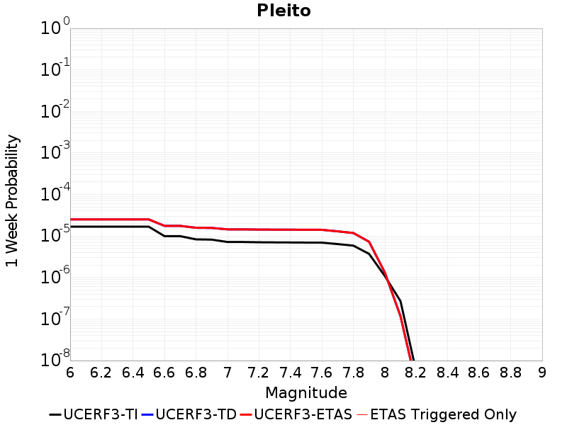 |  | 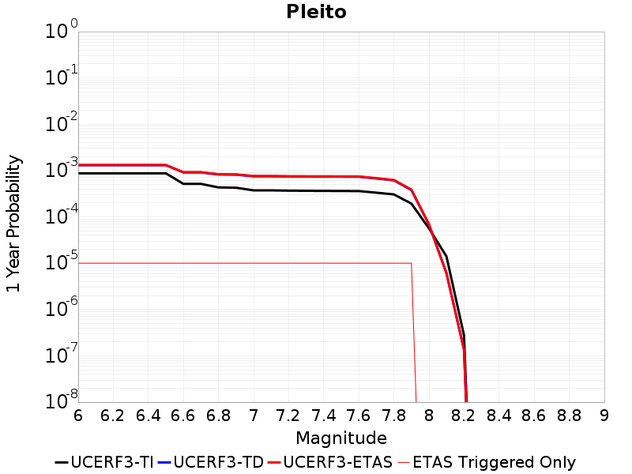 | 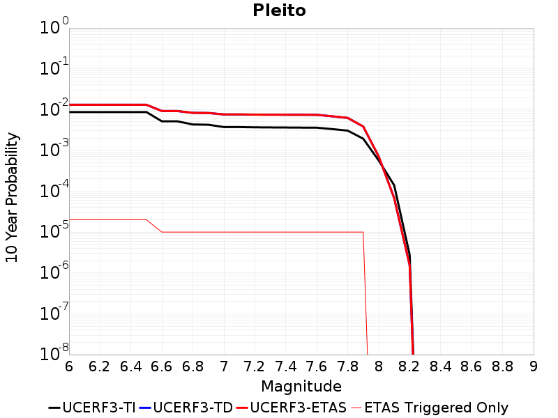 |

| Magnitude | 1 wk TI Prob | 1 wk TD Prob | 1 wk ETAS Prob | 1 wk ETAS/TD Gain | 1 wk ETAS Triggered Only | 1 mo TI Prob | 1 mo TD Prob | 1 mo ETAS Prob | 1 mo ETAS/TD Gain | 1 mo ETAS Triggered Only | 1 yr TI Prob | 1 yr TD Prob | 1 yr ETAS Prob | 1 yr ETAS/TD Gain | 1 yr ETAS Triggered Only | 10 yr TI Prob | 10 yr TD Prob | 10 yr ETAS Prob | 10 yr ETAS/TD Gain | 10 yr ETAS Triggered Only |
|-----|-----|-----|-----|-----|-----|-----|-----|-----|-----|-----|-----|-----|-----|-----|-----|-----|-----|-----|-----|-----|
| 6.0 | 1.6763008E-5 | 2.5087018E-5 | 2.5087018E-5 | 1.0 | 0.0 | 7.183948E-5 | 1.0751177E-4 | 1.0751177E-4 | 1.0 | 0.0 | 8.742947E-4 | 0.001308242 | 0.0013182289 | 1.0076338 | 1.0E-5 | 0.00870863 | 0.013117102 | 0.0131368395 | 1.0015048 | 2.0E-5 |
| 6.1 | 1.6763008E-5 | 2.5087018E-5 | 2.5087018E-5 | 1.0 | 0.0 | 7.183948E-5 | 1.0751177E-4 | 1.0751177E-4 | 1.0 | 0.0 | 8.742947E-4 | 0.001308242 | 0.0013182289 | 1.0076338 | 1.0E-5 | 0.00870863 | 0.013117102 | 0.0131368395 | 1.0015048 | 2.0E-5 |
| 6.2 | 1.6763008E-5 | 2.5087018E-5 | 2.5087018E-5 | 1.0 | 0.0 | 7.183948E-5 | 1.0751177E-4 | 1.0751177E-4 | 1.0 | 0.0 | 8.742947E-4 | 0.001308242 | 0.0013182289 | 1.0076338 | 1.0E-5 | 0.00870863 | 0.013117102 | 0.0131368395 | 1.0015048 | 2.0E-5 |
| 6.3 | 1.6763008E-5 | 2.5087018E-5 | 2.5087018E-5 | 1.0 | 0.0 | 7.183948E-5 | 1.0751177E-4 | 1.0751177E-4 | 1.0 | 0.0 | 8.742947E-4 | 0.001308242 | 0.0013182289 | 1.0076338 | 1.0E-5 | 0.00870863 | 0.013117102 | 0.0131368395 | 1.0015048 | 2.0E-5 |
| 6.4 | 1.6763008E-5 | 2.5087018E-5 | 2.5087018E-5 | 1.0 | 0.0 | 7.183948E-5 | 1.0751177E-4 | 1.0751177E-4 | 1.0 | 0.0 | 8.742947E-4 | 0.001308242 | 0.0013182289 | 1.0076338 | 1.0E-5 | 0.00870863 | 0.013117102 | 0.0131368395 | 1.0015048 | 2.0E-5 |
| 6.5 | 1.6763008E-5 | 2.5087018E-5 | 2.5087018E-5 | 1.0 | 0.0 | 7.183948E-5 | 1.0751177E-4 | 1.0751177E-4 | 1.0 | 0.0 | 8.742947E-4 | 0.001308242 | 0.0013182289 | 1.0076338 | 1.0E-5 | 0.00870863 | 0.013117102 | 0.0131368395 | 1.0015048 | 2.0E-5 |
| 6.6 | 9.910213E-6 | 1.7532939E-5 | 1.7532939E-5 | 1.0 | 0.0 | 4.247165E-5 | 7.5139025E-5 | 7.5139025E-5 | 1.0 | 0.0 | 5.169696E-4 | 9.144374E-4 | 9.244282E-4 | 1.0109257 | 1.0E-5 | 0.0051576863 | 0.009212034 | 0.009221941 | 1.0010755 | 1.0E-5 |
| 6.7 | 9.910213E-6 | 1.7532939E-5 | 1.7532939E-5 | 1.0 | 0.0 | 4.247165E-5 | 7.5139025E-5 | 7.5139025E-5 | 1.0 | 0.0 | 5.169696E-4 | 9.144374E-4 | 9.244282E-4 | 1.0109257 | 1.0E-5 | 0.0051576863 | 0.009212034 | 0.009221941 | 1.0010755 | 1.0E-5 |
| 6.8 | 8.300162E-6 | 1.5791653E-5 | 1.5791653E-5 | 1.0 | 0.0 | 3.557164E-5 | 6.767677E-5 | 6.767677E-5 | 1.0 | 0.0 | 4.3299864E-4 | 8.236546E-4 | 8.336464E-4 | 1.012131 | 1.0E-5 | 0.004321559 | 0.008311154 | 0.008321071 | 1.0011932 | 1.0E-5 |
| 6.9 | 8.183114E-6 | 1.5662725E-5 | 1.5662725E-5 | 1.0 | 0.0 | 3.5070017E-5 | 6.7124245E-5 | 6.7124245E-5 | 1.0 | 0.0 | 4.2689382E-4 | 8.169327E-4 | 8.269246E-4 | 1.0122309 | 1.0E-5 | 0.0042607468 | 0.008244435 | 0.008254353 | 1.001203 | 1.0E-5 |
| 7.0 | 7.1748823E-6 | 1.4445775E-5 | 1.4445775E-5 | 1.0 | 0.0 | 3.0749135E-5 | 6.1909E-5 | 6.1909E-5 | 1.0 | 0.0 | 3.743064E-4 | 7.5348193E-4 | 7.634744E-4 | 1.0132617 | 1.0E-5 | 0.0037367654 | 0.0076139397 | 0.0076238634 | 1.0013034 | 1.0E-5 |
| 7.1 | 7.1671807E-6 | 1.4436102E-5 | 1.4436102E-5 | 1.0 | 0.0 | 3.0716128E-5 | 6.186755E-5 | 6.186755E-5 | 1.0 | 0.0 | 3.7390468E-4 | 7.529776E-4 | 7.6297007E-4 | 1.0132706 | 1.0E-5 | 0.0037327618 | 0.007608931 | 0.0076188548 | 1.0013043 | 1.0E-5 |
| 7.2 | 7.0649667E-6 | 1.4282362E-5 | 1.4282362E-5 | 1.0 | 0.0 | 3.0278077E-5 | 6.120869E-5 | 6.120869E-5 | 1.0 | 0.0 | 3.6857324E-4 | 7.4496155E-4 | 7.549541E-4 | 1.0134135 | 1.0E-5 | 0.0036796255 | 0.0075291684 | 0.007539093 | 1.0013182 | 1.0E-5 |
| 7.3 | 7.02082E-6 | 1.42252175E-5 | 1.42252175E-5 | 1.0 | 0.0 | 3.008888E-5 | 6.0963794E-5 | 6.0963794E-5 | 1.0 | 0.0 | 3.6627054E-4 | 7.4198196E-4 | 7.519745E-4 | 1.0134674 | 1.0E-5 | 0.0036566744 | 0.0074993623 | 0.0075092874 | 1.0013235 | 1.0E-5 |
| 7.4 | 6.987146E-6 | 1.418444E-5 | 1.418444E-5 | 1.0 | 0.0 | 2.9944567E-5 | 6.0789047E-5 | 6.0789047E-5 | 1.0 | 0.0 | 3.6451413E-4 | 7.3985587E-4 | 7.4984843E-4 | 1.0135062 | 1.0E-5 | 0.0036391679 | 0.0074781296 | 0.0074880547 | 1.0013273 | 1.0E-5 |
| 7.5 | 6.9494554E-6 | 1.4141088E-5 | 1.4141088E-5 | 1.0 | 0.0 | 2.9783041E-5 | 6.060326E-5 | 6.060326E-5 | 1.0 | 0.0 | 3.625482E-4 | 7.3759543E-4 | 7.4758806E-4 | 1.0135475 | 1.0E-5 | 0.0036195726 | 0.007455629 | 0.0074655544 | 1.0013312 | 1.0E-5 |
| 7.6 | 6.92694E-6 | 1.4099724E-5 | 1.4099724E-5 | 1.0 | 0.0 | 2.9686547E-5 | 6.0425988E-5 | 6.0425988E-5 | 1.0 | 0.0 | 3.6137376E-4 | 7.354386E-4 | 7.454312E-4 | 1.0135874 | 1.0E-5 | 0.0036078666 | 0.0074341428 | 0.0074440683 | 1.0013351 | 1.0E-5 |
| 7.7 | 6.395867E-6 | 1.296554E-5 | 1.296554E-5 | 1.0 | 0.0 | 2.741057E-5 | 5.556542E-5 | 5.556542E-5 | 1.0 | 0.0 | 3.336726E-4 | 6.762993E-4 | 6.862926E-4 | 1.0147763 | 1.0E-5 | 0.0033317201 | 0.006846227 | 0.006856159 | 1.0014507 | 1.0E-5 |
| 7.8 | 5.8664327E-6 | 1.18074795E-5 | 1.18074795E-5 | 1.0 | 0.0 | 2.5141611E-5 | 5.0602503E-5 | 5.0602503E-5 | 1.0 | 0.0 | 3.060561E-4 | 6.1591156E-4 | 6.259054E-4 | 1.016226 | 1.0E-5 | 0.0030563495 | 0.0062388023 | 0.00624874 | 1.0015929 | 1.0E-5 |
| 7.9 | 3.7167474E-6 | 7.2786693E-6 | 7.2786693E-6 | 1.0 | 0.0 | 1.592882E-5 | 3.1193926E-5 | 3.1193926E-5 | 1.0 | 0.0 | 1.9391612E-4 | 3.7972003E-4 | 3.897162E-4 | 1.0263252 | 1.0E-5 | 0.0019374699 | 0.0038514743 | 0.003861436 | 1.0025864 | 1.0E-5 |
| 8.0 | 1.0903841E-6 | 1.3242327E-6 | 1.3242327E-6 | 1.0 | 0.0 | 4.6730665E-6 | 5.6752706E-6 | 5.6752706E-6 | 1.0 | 0.0 | 5.68931E-5 | 6.909425E-5 | 6.909425E-5 | 1.0 | 0.0 | 5.6878536E-4 | 7.1327225E-4 | 7.1327225E-4 | 1.0 | 0.0 |
| 8.1 | 2.6894583E-7 | 1.167346E-7 | 1.167346E-7 | 1.0 | 0.0 | 1.1526245E-6 | 5.0029104E-7 | 5.0029104E-7 | 1.0 | 0.0 | 1.4033113E-5 | 6.0910265E-6 | 6.0910265E-6 | 1.0 | 0.0 | 1.4032227E-4 | 6.7994035E-5 | 6.7994035E-5 | 1.0 | 0.0 |
| 8.2 | 5.2967013E-9 | 2.6029736E-9 | 2.6029736E-9 | 1.0 | 0.0 | 2.2700148E-8 | 1.11556E-8 | 1.11556E-8 | 1.0 | 0.0 | 2.7637427E-7 | 1.3581942E-7 | 1.3581942E-7 | 1.0 | 0.0 | 2.7637393E-6 | 1.5405719E-6 | 1.5405719E-6 | 1.0 | 0.0 |

## Tin Mountain
*[(top)](#table-of-contents)*

| 1 Week | 1 Month | 1 Year | 10 Year |
|-----|-----|-----|-----|
|  |  | 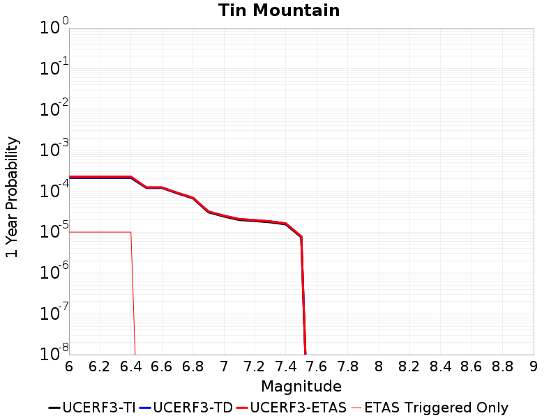 | 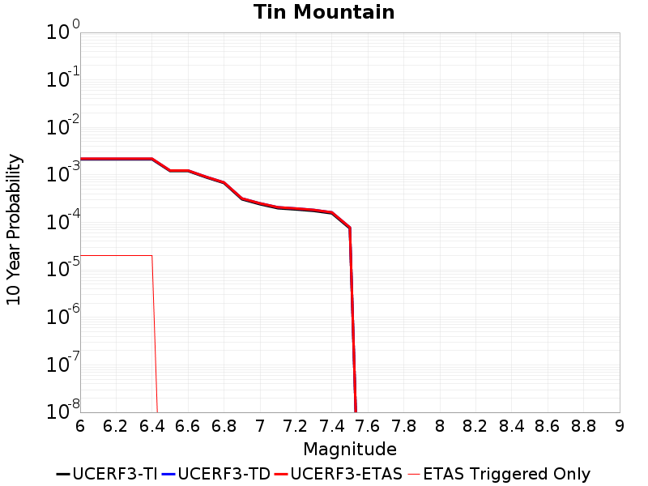 |

| Magnitude | 1 wk TI Prob | 1 wk TD Prob | 1 wk ETAS Prob | 1 wk ETAS/TD Gain | 1 wk ETAS Triggered Only | 1 mo TI Prob | 1 mo TD Prob | 1 mo ETAS Prob | 1 mo ETAS/TD Gain | 1 mo ETAS Triggered Only | 1 yr TI Prob | 1 yr TD Prob | 1 yr ETAS Prob | 1 yr ETAS/TD Gain | 1 yr ETAS Triggered Only | 10 yr TI Prob | 10 yr TD Prob | 10 yr ETAS Prob | 10 yr ETAS/TD Gain | 10 yr ETAS Triggered Only |
|-----|-----|-----|-----|-----|-----|-----|-----|-----|-----|-----|-----|-----|-----|-----|-----|-----|-----|-----|-----|-----|
| 6.0 | 4.083776E-6 | 4.182173E-6 | 4.182173E-6 | 1.0 | 0.0 | 1.750178E-5 | 1.7923498E-5 | 1.7923498E-5 | 1.0 | 0.0 | 2.1306332E-4 | 2.1820045E-4 | 2.2819826E-4 | 1.0458194 | 1.0E-5 | 0.0021285915 | 0.0021802278 | 0.0022001842 | 1.0091534 | 2.0E-5 |
| 6.1 | 4.083776E-6 | 4.182173E-6 | 4.182173E-6 | 1.0 | 0.0 | 1.750178E-5 | 1.7923498E-5 | 1.7923498E-5 | 1.0 | 0.0 | 2.1306332E-4 | 2.1820045E-4 | 2.2819826E-4 | 1.0458194 | 1.0E-5 | 0.0021285915 | 0.0021802278 | 0.0022001842 | 1.0091534 | 2.0E-5 |
| 6.2 | 4.083776E-6 | 4.182173E-6 | 4.182173E-6 | 1.0 | 0.0 | 1.750178E-5 | 1.7923498E-5 | 1.7923498E-5 | 1.0 | 0.0 | 2.1306332E-4 | 2.1820045E-4 | 2.2819826E-4 | 1.0458194 | 1.0E-5 | 0.0021285915 | 0.0021802278 | 0.0022001842 | 1.0091534 | 2.0E-5 |
| 6.3 | 4.083776E-6 | 4.182173E-6 | 4.182173E-6 | 1.0 | 0.0 | 1.750178E-5 | 1.7923498E-5 | 1.7923498E-5 | 1.0 | 0.0 | 2.1306332E-4 | 2.1820045E-4 | 2.2819826E-4 | 1.0458194 | 1.0E-5 | 0.0021285915 | 0.0021802278 | 0.0022001842 | 1.0091534 | 2.0E-5 |
| 6.4 | 4.083776E-6 | 4.182173E-6 | 4.182173E-6 | 1.0 | 0.0 | 1.750178E-5 | 1.7923498E-5 | 1.7923498E-5 | 1.0 | 0.0 | 2.1306332E-4 | 2.1820045E-4 | 2.2819826E-4 | 1.0458194 | 1.0E-5 | 0.0021285915 | 0.0021802278 | 0.0022001842 | 1.0091534 | 2.0E-5 |
| 6.5 | 2.3143427E-6 | 2.3735413E-6 | 2.3735413E-6 | 1.0 | 0.0 | 9.9185745E-6 | 1.0172284E-5 | 1.0172284E-5 | 1.0 | 0.0 | 1.2075195E-4 | 1.238413E-4 | 1.238413E-4 | 1.0 | 0.0 | 0.0012068636 | 0.0012377988 | 0.0012377988 | 1.0 | 0.0 |
| 6.6 | 2.3143427E-6 | 2.3735413E-6 | 2.3735413E-6 | 1.0 | 0.0 | 9.9185745E-6 | 1.0172284E-5 | 1.0172284E-5 | 1.0 | 0.0 | 1.2075195E-4 | 1.238413E-4 | 1.238413E-4 | 1.0 | 0.0 | 0.0012068636 | 0.0012377988 | 0.0012377988 | 1.0 | 0.0 |
| 6.7 | 1.7029532E-6 | 1.7500981E-6 | 1.7500981E-6 | 1.0 | 0.0 | 7.2983503E-6 | 7.5004023E-6 | 7.5004023E-6 | 1.0 | 0.0 | 8.885379E-5 | 9.1314105E-5 | 9.1314105E-5 | 1.0 | 0.0 | 8.881827E-4 | 9.1281853E-4 | 9.1281853E-4 | 1.0 | 0.0 |
| 6.8 | 1.2914646E-6 | 1.3301905E-6 | 1.3301905E-6 | 1.0 | 0.0 | 5.534837E-6 | 5.700806E-6 | 5.700806E-6 | 1.0 | 0.0 | 6.738455E-5 | 6.940555E-5 | 6.940555E-5 | 1.0 | 0.0 | 6.736412E-4 | 6.9388206E-4 | 6.9388206E-4 | 1.0 | 0.0 |
| 6.9 | 5.8708974E-7 | 6.118623E-7 | 6.118623E-7 | 1.0 | 0.0 | 2.5160964E-6 | 2.6222647E-6 | 2.6222647E-6 | 1.0 | 0.0 | 3.0633044E-5 | 3.1925647E-5 | 3.1925647E-5 | 1.0 | 0.0 | 3.0628822E-4 | 3.192147E-4 | 3.192147E-4 | 1.0 | 0.0 |
| 7.0 | 4.6248786E-7 | 4.8333897E-7 | 4.8333897E-7 | 1.0 | 0.0 | 1.9820893E-6 | 2.0714513E-6 | 2.0714513E-6 | 1.0 | 0.0 | 2.413167E-5 | 2.5219666E-5 | 2.5219666E-5 | 1.0 | 0.0 | 2.412905E-4 | 2.5217174E-4 | 2.5217174E-4 | 1.0 | 0.0 |
| 7.1 | 3.804606E-7 | 3.9883608E-7 | 3.9883608E-7 | 1.0 | 0.0 | 1.6305444E-6 | 1.7092966E-6 | 1.7092966E-6 | 1.0 | 0.0 | 1.9851697E-5 | 2.0810521E-5 | 2.0810521E-5 | 1.0 | 0.0 | 1.9849923E-4 | 2.0808908E-4 | 2.0808908E-4 | 1.0 | 0.0 |
| 7.2 | 3.5864858E-7 | 3.762852E-7 | 3.762852E-7 | 1.0 | 0.0 | 1.5370645E-6 | 1.6126501E-6 | 1.6126501E-6 | 1.0 | 0.0 | 1.87136E-5 | 1.9633871E-5 | 1.9633871E-5 | 1.0 | 0.0 | 1.8712023E-4 | 1.9632468E-4 | 1.9632468E-4 | 1.0 | 0.0 |
| 7.3 | 3.342063E-7 | 3.5074405E-7 | 3.5074405E-7 | 1.0 | 0.0 | 1.4323119E-6 | 1.5031882E-6 | 1.5031882E-6 | 1.0 | 0.0 | 1.7438259E-5 | 1.8301196E-5 | 1.8301196E-5 | 1.0 | 0.0 | 1.743689E-4 | 1.8300019E-4 | 1.8300019E-4 | 1.0 | 0.0 |
| 7.4 | 2.971242E-7 | 3.1175486E-7 | 3.1175486E-7 | 1.0 | 0.0 | 1.2733886E-6 | 1.3360918E-6 | 1.3360918E-6 | 1.0 | 0.0 | 1.5503398E-5 | 1.626683E-5 | 1.626683E-5 | 1.0 | 0.0 | 1.5502315E-4 | 1.6265968E-4 | 1.6265968E-4 | 1.0 | 0.0 |
| 7.5 | 1.4326713E-7 | 1.501708E-7 | 1.501708E-7 | 1.0 | 0.0 | 6.140018E-7 | 6.4358915E-7 | 6.4358915E-7 | 1.0 | 0.0 | 7.4754466E-6 | 7.835698E-6 | 7.835698E-6 | 1.0 | 0.0 | 7.475195E-5 | 7.835698E-5 | 7.835698E-5 | 1.0 | 0.0 |

## Ortigalita (North)
*[(top)](#table-of-contents)*

| 1 Week | 1 Month | 1 Year | 10 Year |
|-----|-----|-----|-----|
| 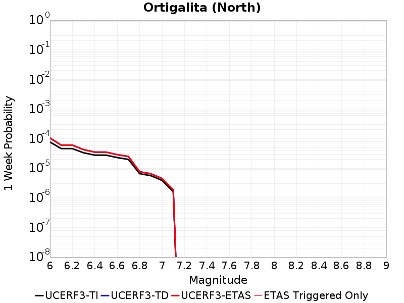 |  | 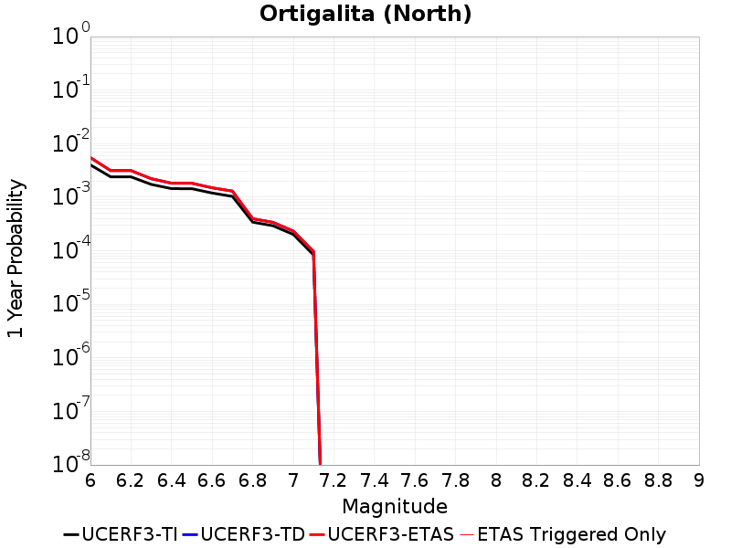 | 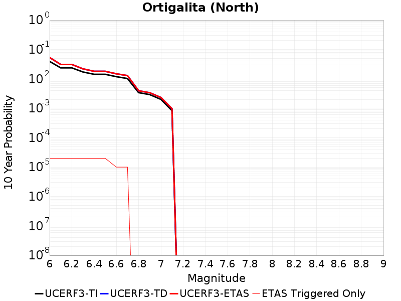 |

| Magnitude | 1 wk TI Prob | 1 wk TD Prob | 1 wk ETAS Prob | 1 wk ETAS/TD Gain | 1 wk ETAS Triggered Only | 1 mo TI Prob | 1 mo TD Prob | 1 mo ETAS Prob | 1 mo ETAS/TD Gain | 1 mo ETAS Triggered Only | 1 yr TI Prob | 1 yr TD Prob | 1 yr ETAS Prob | 1 yr ETAS/TD Gain | 1 yr ETAS Triggered Only | 10 yr TI Prob | 10 yr TD Prob | 10 yr ETAS Prob | 10 yr ETAS/TD Gain | 10 yr ETAS Triggered Only |
|-----|-----|-----|-----|-----|-----|-----|-----|-----|-----|-----|-----|-----|-----|-----|-----|-----|-----|-----|-----|-----|
| 6.0 | 7.711876E-5 | 1.05276784E-4 | 1.05276784E-4 | 1.0 | 0.0 | 3.3046713E-4 | 4.511127E-4 | 4.511127E-4 | 1.0 | 0.0 | 0.004016016 | 0.0054795765 | 0.0054795765 | 1.0 | 0.0 | 0.039442103 | 0.053563844 | 0.053582773 | 1.0003533 | 2.0E-5 |
| 6.1 | 4.607858E-5 | 6.0354734E-5 | 6.0354734E-5 | 1.0 | 0.0 | 1.9746469E-4 | 2.5863925E-4 | 2.5863925E-4 | 1.0 | 0.0 | 0.0024014818 | 0.003144682 | 0.003144682 | 1.0 | 0.0 | 0.023756953 | 0.031032618 | 0.031051997 | 1.0006245 | 2.0E-5 |
| 6.2 | 4.607858E-5 | 6.0354734E-5 | 6.0354734E-5 | 1.0 | 0.0 | 1.9746469E-4 | 2.5863925E-4 | 2.5863925E-4 | 1.0 | 0.0 | 0.0024014818 | 0.003144682 | 0.003144682 | 1.0 | 0.0 | 0.023756953 | 0.031032618 | 0.031051997 | 1.0006245 | 2.0E-5 |
| 6.3 | 3.327423E-5 | 4.255097E-5 | 4.255097E-5 | 1.0 | 0.0 | 1.4259605E-4 | 1.8234983E-4 | 1.8234983E-4 | 1.0 | 0.0 | 0.0017347244 | 0.0022180916 | 0.0022180916 | 1.0 | 0.0 | 0.017212452 | 0.021983681 | 0.02200324 | 1.0008898 | 2.0E-5 |
| 6.4 | 2.7732503E-5 | 3.5058165E-5 | 3.5058165E-5 | 1.0 | 0.0 | 1.1884817E-4 | 1.5024167E-4 | 1.5024167E-4 | 1.0 | 0.0 | 0.001446016 | 0.0018278925 | 0.0018278925 | 1.0 | 0.0 | 0.014366428 | 0.018151518 | 0.018171156 | 1.0010818 | 2.0E-5 |
| 6.5 | 2.7689714E-5 | 3.5007924E-5 | 3.5007924E-5 | 1.0 | 0.0 | 1.186648E-4 | 1.5002638E-4 | 1.5002638E-4 | 1.0 | 0.0 | 0.0014437864 | 0.0018252757 | 0.0018252757 | 1.0 | 0.0 | 0.014344421 | 0.018125778 | 0.018145416 | 1.0010834 | 2.0E-5 |
| 6.6 | 2.2976905E-5 | 2.8765173E-5 | 2.8765173E-5 | 1.0 | 0.0 | 9.846873E-5 | 1.2327476E-4 | 1.2327476E-4 | 1.0 | 0.0 | 0.0011981975 | 0.0015000755 | 0.0015000755 | 1.0 | 0.0 | 0.011917574 | 0.014922837 | 0.014932687 | 1.0006601 | 1.0E-5 |
| 6.7 | 1.9871539E-5 | 2.4945928E-5 | 2.4945928E-5 | 1.0 | 0.0 | 8.516096E-5 | 1.0690815E-4 | 1.0690815E-4 | 1.0 | 0.0 | 0.0010363415 | 0.0013010711 | 0.0013010711 | 1.0 | 0.0 | 0.010315218 | 0.012958255 | 0.012968125 | 1.0007617 | 1.0E-5 |
| 6.8 | 6.5640475E-6 | 7.613163E-6 | 7.613163E-6 | 1.0 | 0.0 | 2.813133E-5 | 3.262745E-5 | 3.262745E-5 | 1.0 | 0.0 | 3.424451E-4 | 3.9716964E-4 | 3.9716964E-4 | 1.0 | 0.0 | 0.0034191788 | 0.003964886 | 0.003964886 | 1.0 | 0.0 |
| 6.9 | 5.6219683E-6 | 6.5083022E-6 | 6.5083022E-6 | 1.0 | 0.0 | 2.4093928E-5 | 2.789244E-5 | 2.789244E-5 | 1.0 | 0.0 | 2.933041E-4 | 3.3954013E-4 | 3.3954013E-4 | 1.0 | 0.0 | 0.0029291727 | 0.0033904712 | 0.0033904712 | 1.0 | 0.0 |
| 7.0 | 3.875591E-6 | 4.489232E-6 | 4.489232E-6 | 1.0 | 0.0 | 1.6609569E-5 | 1.9239436E-5 | 1.9239436E-5 | 1.0 | 0.0 | 2.0220275E-4 | 2.3421706E-4 | 2.3421706E-4 | 1.0 | 0.0 | 0.0020201886 | 0.002339911 | 0.002339911 | 1.0 | 0.0 |
| 7.1 | 1.6017933E-6 | 1.8589218E-6 | 1.8589218E-6 | 1.0 | 0.0 | 6.8648105E-6 | 7.966789E-6 | 7.966789E-6 | 1.0 | 0.0 | 8.357586E-5 | 9.6992415E-5 | 9.6992415E-5 | 1.0 | 0.0 | 8.3544437E-4 | 9.696057E-4 | 9.696057E-4 | 1.0 | 0.0 |

## Hunting Creek - Berryessa 2011 CFM
*[(top)](#table-of-contents)*

| 1 Week | 1 Month | 1 Year | 10 Year |
|-----|-----|-----|-----|
|  |  |  |  |

| Magnitude | 1 wk TI Prob | 1 wk TD Prob | 1 wk ETAS Prob | 1 wk ETAS/TD Gain | 1 wk ETAS Triggered Only | 1 mo TI Prob | 1 mo TD Prob | 1 mo ETAS Prob | 1 mo ETAS/TD Gain | 1 mo ETAS Triggered Only | 1 yr TI Prob | 1 yr TD Prob | 1 yr ETAS Prob | 1 yr ETAS/TD Gain | 1 yr ETAS Triggered Only | 10 yr TI Prob | 10 yr TD Prob | 10 yr ETAS Prob | 10 yr ETAS/TD Gain | 10 yr ETAS Triggered Only |
|-----|-----|-----|-----|-----|-----|-----|-----|-----|-----|-----|-----|-----|-----|-----|-----|-----|-----|-----|-----|-----|
| 6.0 | 1.1270982E-4 | 2.0075063E-4 | 2.1074862E-4 | 1.049803 | 1.0E-5 | 4.8295266E-4 | 8.60083E-4 | 8.700744E-4 | 1.0116168 | 1.0E-5 | 0.0058641075 | 0.010411325 | 0.010421221 | 1.0009505 | 1.0E-5 | 0.057117578 | 0.098252736 | 0.09827077 | 1.0001836 | 2.0E-5 |
| 6.1 | 1.1239393E-4 | 2.0023074E-4 | 2.1022874E-4 | 1.0499324 | 1.0E-5 | 4.8159933E-4 | 8.5785636E-4 | 8.6784776E-4 | 1.011647 | 1.0E-5 | 0.0058477195 | 0.0103845 | 0.010394395 | 1.000953 | 1.0E-5 | 0.056962132 | 0.09801067 | 0.098028705 | 1.000184 | 2.0E-5 |
| 6.2 | 7.596265E-5 | 1.2968214E-4 | 1.3968084E-4 | 1.0771016 | 1.0E-5 | 3.2551357E-4 | 5.556356E-4 | 5.6563003E-4 | 1.0179874 | 1.0E-5 | 0.0039559277 | 0.00673911 | 0.006749043 | 1.0014739 | 1.0E-5 | 0.038862433 | 0.06474841 | 0.06475776 | 1.0001445 | 1.0E-5 |
| 6.3 | 6.78794E-5 | 1.1479129E-4 | 1.2479014E-4 | 1.0871047 | 1.0E-5 | 2.9087928E-4 | 4.9186003E-4 | 5.018551E-4 | 1.020321 | 1.0E-5 | 0.003535705 | 0.0059686387 | 0.005978579 | 1.0016655 | 1.0E-5 | 0.034799766 | 0.05760825 | 0.057617676 | 1.0001636 | 1.0E-5 |
| 6.4 | 6.2165134E-5 | 1.046383E-4 | 1.14637245E-4 | 1.0955573 | 1.0E-5 | 2.6639478E-4 | 4.483646E-4 | 4.583601E-4 | 1.0222933 | 1.0E-5 | 0.0032385332 | 0.005442445 | 0.0054523908 | 1.0018274 | 1.0E-5 | 0.03191742 | 0.052685868 | 0.05269534 | 1.0001798 | 1.0E-5 |
| 6.5 | 5.4368087E-5 | 9.095542E-5 | 1.0095451E-4 | 1.109934 | 1.0E-5 | 2.3298527E-4 | 3.897423E-4 | 3.9973838E-4 | 1.025648 | 1.0E-5 | 0.0028329059 | 0.0047327527 | 0.0047427053 | 1.002103 | 1.0E-5 | 0.027970633 | 0.04599881 | 0.046008352 | 1.0002074 | 1.0E-5 |
| 6.6 | 4.729947E-5 | 7.868493E-5 | 8.8684144E-5 | 1.1270791 | 1.0E-5 | 2.0269625E-4 | 3.371727E-4 | 3.4716935E-4 | 1.0296484 | 1.0E-5 | 0.002465034 | 0.0040958575 | 0.0041058166 | 1.0024315 | 1.0E-5 | 0.02437869 | 0.039953593 | 0.039963197 | 1.0002403 | 1.0E-5 |
| 6.7 | 3.6875328E-5 | 6.0621725E-5 | 7.062112E-5 | 1.1649474 | 1.0E-5 | 1.5802756E-4 | 2.5978396E-4 | 2.6978136E-4 | 1.0384835 | 1.0E-5 | 0.0019222875 | 0.0031575635 | 0.003167532 | 1.003157 | 1.0E-5 | 0.019057442 | 0.03097921 | 0.0309889 | 1.0003128 | 1.0E-5 |
| 6.8 | 2.0292036E-5 | 2.9050034E-5 | 2.9050034E-5 | 1.0 | 0.0 | 8.6962966E-5 | 1.2449412E-4 | 1.2449412E-4 | 1.0 | 0.0 | 0.0010582599 | 0.0015146487 | 0.0015146487 | 1.0 | 0.0 | 0.010532344 | 0.015015705 | 0.015015705 | 1.0 | 0.0 |
| 6.9 | 1.7871042E-5 | 2.4533E-5 | 2.4533E-5 | 1.0 | 0.0 | 7.658793E-5 | 1.05137195E-4 | 1.05137195E-4 | 1.0 | 0.0 | 9.320591E-4 | 0.001279293 | 0.001279293 | 1.0 | 0.0 | 0.009281595 | 0.012710554 | 0.012710554 | 1.0 | 0.0 |
| 7.0 | 1.6415532E-5 | 2.1948936E-5 | 2.1948936E-5 | 1.0 | 0.0 | 7.035038E-5 | 9.406348E-5 | 9.406348E-5 | 1.0 | 0.0 | 8.561793E-4 | 0.0011446222 | 0.0011446222 | 1.0 | 0.0 | 0.008528882 | 0.011386649 | 0.011386649 | 1.0 | 0.0 |
| 7.1 | 1.5409885E-5 | 2.0387552E-5 | 2.0387552E-5 | 1.0 | 0.0 | 6.6040695E-5 | 8.737231E-5 | 8.737231E-5 | 1.0 | 0.0 | 8.0374884E-4 | 0.0010632414 | 0.0010632414 | 1.0 | 0.0 | 0.00800848 | 0.010582076 | 0.010582076 | 1.0 | 0.0 |
| 7.2 | 1.4497423E-5 | 1.909413E-5 | 1.909413E-5 | 1.0 | 0.0 | 6.213033E-5 | 8.1829436E-5 | 8.1829436E-5 | 1.0 | 0.0 | 7.5617427E-4 | 9.958211E-4 | 9.958211E-4 | 1.0 | 0.0 | 0.0075360634 | 0.009914305 | 0.009914305 | 1.0 | 0.0 |
| 7.3 | 1.3615175E-5 | 1.7858702E-5 | 1.7858702E-5 | 1.0 | 0.0 | 5.8349444E-5 | 7.653506E-5 | 7.653506E-5 | 1.0 | 0.0 | 7.101729E-4 | 9.3141897E-4 | 9.3141897E-4 | 1.0 | 0.0 | 0.0070790765 | 0.009275761 | 0.009275761 | 1.0 | 0.0 |
| 7.4 | 1.2252825E-5 | 1.6054912E-5 | 1.6054912E-5 | 1.0 | 0.0 | 5.251105E-5 | 6.880496E-5 | 6.880496E-5 | 1.0 | 0.0 | 6.391345E-4 | 8.373813E-4 | 8.373813E-4 | 1.0 | 0.0 | 0.0063729943 | 0.008342828 | 0.008342828 | 1.0 | 0.0 |
| 7.5 | 1.0913301E-5 | 1.4265017E-5 | 1.4265017E-5 | 1.0 | 0.0 | 4.6770452E-5 | 6.113437E-5 | 6.113437E-5 | 1.0 | 0.0 | 5.6928146E-4 | 7.440595E-4 | 7.440595E-4 | 1.0 | 0.0 | 0.0056782532 | 0.007416284 | 0.007416284 | 1.0 | 0.0 |
| 7.6 | 8.623192E-6 | 1.1253546E-5 | 1.1253546E-5 | 1.0 | 0.0 | 3.6956015E-5 | 4.822861E-5 | 4.822861E-5 | 1.0 | 0.0 | 4.4984656E-4 | 5.870277E-4 | 5.870277E-4 | 1.0 | 0.0 | 0.00448937 | 0.0058552073 | 0.0058552073 | 1.0 | 0.0 |
| 7.7 | 2.0993634E-6 | 2.667464E-6 | 2.667464E-6 | 1.0 | 0.0 | 8.997241E-6 | 1.1431939E-5 | 1.1431939E-5 | 1.0 | 0.0 | 1.09535904E-4 | 1.3917504E-4 | 1.3917504E-4 | 1.0 | 0.0 | 0.0010948193 | 0.0013908598 | 0.0013908598 | 1.0 | 0.0 |
| 7.8 | 1.8428308E-7 | 2.1744101E-7 | 2.1744101E-7 | 1.0 | 0.0 | 7.897844E-7 | 9.3188976E-7 | 9.3188976E-7 | 1.0 | 0.0 | 9.615583E-6 | 1.1345703E-5 | 1.1345703E-5 | 1.0 | 0.0 | 9.615166E-5 | 1.13444185E-4 | 1.13444185E-4 | 1.0 | 0.0 |

## Green Valley 2011 CFM
*[(top)](#table-of-contents)*

| 1 Week | 1 Month | 1 Year | 10 Year |
|-----|-----|-----|-----|
| 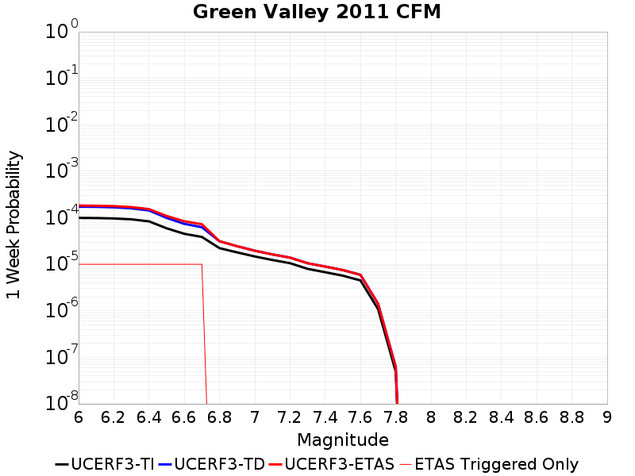 | 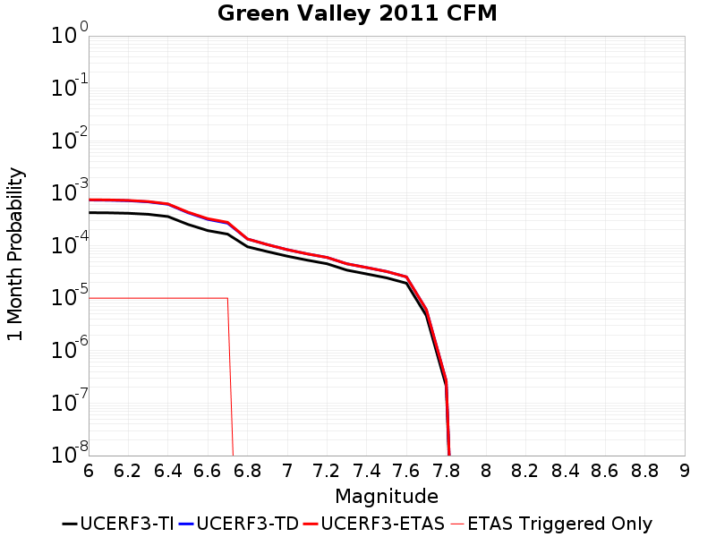 |  |  |

| Magnitude | 1 wk TI Prob | 1 wk TD Prob | 1 wk ETAS Prob | 1 wk ETAS/TD Gain | 1 wk ETAS Triggered Only | 1 mo TI Prob | 1 mo TD Prob | 1 mo ETAS Prob | 1 mo ETAS/TD Gain | 1 mo ETAS Triggered Only | 1 yr TI Prob | 1 yr TD Prob | 1 yr ETAS Prob | 1 yr ETAS/TD Gain | 1 yr ETAS Triggered Only | 10 yr TI Prob | 10 yr TD Prob | 10 yr ETAS Prob | 10 yr ETAS/TD Gain | 10 yr ETAS Triggered Only |
|-----|-----|-----|-----|-----|-----|-----|-----|-----|-----|-----|-----|-----|-----|-----|-----|-----|-----|-----|-----|-----|
| 6.0 | 9.9629346E-5 | 1.7340109E-4 | 1.8339934E-4 | 1.0576597 | 1.0E-5 | 4.2691303E-4 | 7.4293726E-4 | 7.5292983E-4 | 1.0134501 | 1.0E-5 | 0.0051852856 | 0.009006227 | 0.009016138 | 1.0011003 | 1.0E-5 | 0.050659515 | 0.08568307 | 0.085701354 | 1.0002134 | 2.0E-5 |
| 6.1 | 9.88615E-5 | 1.7186983E-4 | 1.8186812E-4 | 1.0581735 | 1.0E-5 | 4.2362334E-4 | 7.3637854E-4 | 7.4637117E-4 | 1.01357 | 1.0E-5 | 0.0051454236 | 0.008927037 | 0.008936947 | 1.0011102 | 1.0E-5 | 0.050279044 | 0.08496895 | 0.08498725 | 1.0002154 | 2.0E-5 |
| 6.2 | 9.696895E-5 | 1.6824974E-4 | 1.7824805E-4 | 1.0594255 | 1.0E-5 | 4.15515E-4 | 7.208736E-4 | 7.308664E-4 | 1.013862 | 1.0E-5 | 0.0050471667 | 0.00873988 | 0.008749793 | 1.0011342 | 1.0E-5 | 0.04934063 | 0.083273426 | 0.08329176 | 1.0002202 | 2.0E-5 |
| 6.3 | 9.275224E-5 | 1.6001724E-4 | 1.7001564E-4 | 1.0624833 | 1.0E-5 | 3.9744904E-4 | 6.8561017E-4 | 6.956033E-4 | 1.0145756 | 1.0E-5 | 0.0048282105 | 0.008313871 | 0.008323788 | 1.0011928 | 1.0E-5 | 0.047246475 | 0.07940167 | 0.07941087 | 1.000116 | 1.0E-5 |
| 6.4 | 8.391499E-5 | 1.4393918E-4 | 1.5393774E-4 | 1.0694637 | 1.0E-5 | 3.595861E-4 | 6.167383E-4 | 6.2673213E-4 | 1.0162044 | 1.0E-5 | 0.004369175 | 0.007481709 | 0.007491634 | 1.0013266 | 1.0E-5 | 0.04284265 | 0.071749546 | 0.07175883 | 1.0001293 | 1.0E-5 |
| 6.5 | 5.9519385E-5 | 9.956062E-5 | 1.09559616E-4 | 1.1004313 | 1.0E-5 | 2.5505814E-4 | 4.2661725E-4 | 4.36613E-4 | 1.0234302 | 1.0E-5 | 0.0031009112 | 0.0051804814 | 0.0051904293 | 1.0019203 | 1.0E-5 | 0.030579966 | 0.050256822 | 0.05026632 | 1.000189 | 1.0E-5 |
| 6.6 | 4.5361558E-5 | 7.421769E-5 | 8.4216954E-5 | 1.1347288 | 1.0E-5 | 1.9439218E-4 | 3.1803834E-4 | 3.2803515E-4 | 1.0314327 | 1.0E-5 | 0.0023641558 | 0.0038641845 | 0.003874146 | 1.0025779 | 1.0E-5 | 0.023391623 | 0.037761323 | 0.037770946 | 1.0002549 | 1.0E-5 |
| 6.7 | 3.8808106E-5 | 6.282361E-5 | 7.282298E-5 | 1.1591659 | 1.0E-5 | 1.6630985E-4 | 2.6921876E-4 | 2.7921607E-4 | 1.0371345 | 1.0E-5 | 0.0020229418 | 0.003272106 | 0.0032820734 | 1.0030462 | 1.0E-5 | 0.020046256 | 0.032093614 | 0.032103293 | 1.0003016 | 1.0E-5 |
| 6.8 | 2.2284667E-5 | 3.1361145E-5 | 3.1361145E-5 | 1.0 | 0.0 | 9.550222E-5 | 1.3439798E-4 | 1.3439798E-4 | 1.0 | 0.0 | 0.0011621192 | 0.0016350653 | 0.0016350653 | 1.0 | 0.0 | 0.011560607 | 0.01620435 | 0.01620435 | 1.0 | 0.0 |
| 6.9 | 1.8050168E-5 | 2.4510928E-5 | 2.4510928E-5 | 1.0 | 0.0 | 7.735557E-5 | 1.0504263E-4 | 1.0504263E-4 | 1.0 | 0.0 | 9.4139716E-4 | 0.0012781464 | 0.0012781464 | 1.0 | 0.0 | 0.009374191 | 0.012700232 | 0.012700232 | 1.0 | 0.0 |
| 7.0 | 1.4763166E-5 | 1.9624227E-5 | 1.9624227E-5 | 1.0 | 0.0 | 6.326917E-5 | 8.410112E-5 | 8.410112E-5 | 1.0 | 0.0 | 7.7002996E-4 | 0.0010234513 | 0.0010234513 | 1.0 | 0.0 | 0.007673672 | 0.010187142 | 0.010187142 | 1.0 | 0.0 |
| 7.1 | 1.2399713E-5 | 1.6338068E-5 | 1.6338068E-5 | 1.0 | 0.0 | 5.3140546E-5 | 7.0018425E-5 | 7.0018425E-5 | 1.0 | 0.0 | 6.467941E-4 | 8.521429E-4 | 8.521429E-4 | 1.0 | 0.0 | 0.006449148 | 0.008489148 | 0.008489148 | 1.0 | 0.0 |
| 7.2 | 1.0584195E-5 | 1.3954349E-5 | 1.3954349E-5 | 1.0 | 0.0 | 4.5360044E-5 | 5.980299E-5 | 5.980299E-5 | 1.0 | 0.0 | 5.521186E-4 | 7.278598E-4 | 7.278598E-4 | 1.0 | 0.0 | 0.0055074887 | 0.007255326 | 0.007255326 | 1.0 | 0.0 |
| 7.3 | 7.998173E-6 | 1.0562013E-5 | 1.0562013E-5 | 1.0 | 0.0 | 3.4277433E-5 | 4.526499E-5 | 4.526499E-5 | 1.0 | 0.0 | 4.1724785E-4 | 5.50963E-4 | 5.50963E-4 | 1.0 | 0.0 | 0.004164653 | 0.005496417 | 0.005496417 | 1.0 | 0.0 |
| 7.4 | 6.7571127E-6 | 8.948229E-6 | 8.948229E-6 | 1.0 | 0.0 | 2.8958733E-5 | 3.8348997E-5 | 3.8348997E-5 | 1.0 | 0.0 | 3.5251552E-4 | 4.6679995E-4 | 4.6679995E-4 | 1.0 | 0.0 | 0.0035195686 | 0.004658523 | 0.004658523 | 1.0 | 0.0 |
| 7.5 | 5.69878E-6 | 7.527813E-6 | 7.527813E-6 | 1.0 | 0.0 | 2.4423114E-5 | 3.226166E-5 | 3.226166E-5 | 1.0 | 0.0 | 2.9731085E-4 | 3.9271583E-4 | 3.9271583E-4 | 1.0 | 0.0 | 0.002969134 | 0.003920597 | 0.003920597 | 1.0 | 0.0 |
| 7.6 | 4.503664E-6 | 5.944921E-6 | 5.944921E-6 | 1.0 | 0.0 | 1.9301275E-5 | 2.5477988E-5 | 2.5477988E-5 | 1.0 | 0.0 | 2.3496768E-4 | 3.101512E-4 | 3.101512E-4 | 1.0 | 0.0 | 0.002347194 | 0.0030974303 | 0.0030974303 | 1.0 | 0.0 |
| 7.7 | 1.0873546E-6 | 1.4136857E-6 | 1.4136857E-6 | 1.0 | 0.0 | 4.6600826E-6 | 6.058639E-6 | 6.058639E-6 | 1.0 | 0.0 | 5.6735033E-5 | 7.376146E-5 | 7.376146E-5 | 1.0 | 0.0 | 5.672055E-4 | 7.3734636E-4 | 7.3734636E-4 | 1.0 | 0.0 |
| 7.8 | 4.9373917E-8 | 6.232808E-8 | 6.232808E-8 | 1.0 | 0.0 | 2.1160248E-7 | 2.6712033E-7 | 2.6712033E-7 | 1.0 | 0.0 | 2.5762572E-6 | 3.2521864E-6 | 3.2521864E-6 | 1.0 | 0.0 | 2.5762274E-5 | 3.251411E-5 | 3.251411E-5 | 1.0 | 0.0 |

## Ventura-Pitas Point
*[(top)](#table-of-contents)*

| 1 Week | 1 Month | 1 Year | 10 Year |
|-----|-----|-----|-----|
| 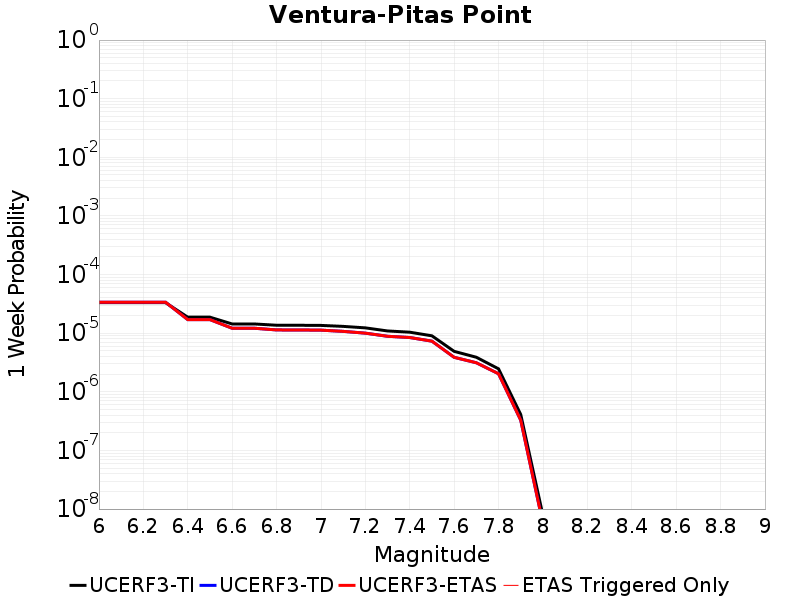 |  | 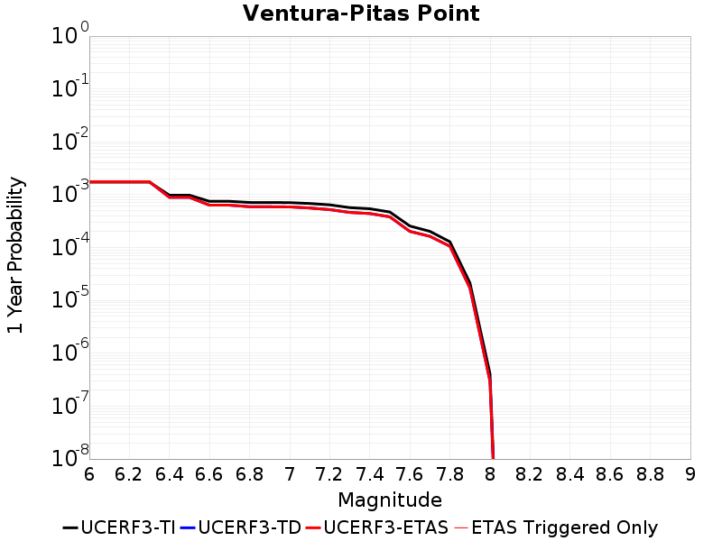 |  |

| Magnitude | 1 wk TI Prob | 1 wk TD Prob | 1 wk ETAS Prob | 1 wk ETAS/TD Gain | 1 wk ETAS Triggered Only | 1 mo TI Prob | 1 mo TD Prob | 1 mo ETAS Prob | 1 mo ETAS/TD Gain | 1 mo ETAS Triggered Only | 1 yr TI Prob | 1 yr TD Prob | 1 yr ETAS Prob | 1 yr ETAS/TD Gain | 1 yr ETAS Triggered Only | 10 yr TI Prob | 10 yr TD Prob | 10 yr ETAS Prob | 10 yr ETAS/TD Gain | 10 yr ETAS Triggered Only |
|-----|-----|-----|-----|-----|-----|-----|-----|-----|-----|-----|-----|-----|-----|-----|-----|-----|-----|-----|-----|-----|
| 6.0 | 3.3179622E-5 | 3.377858E-5 | 3.377858E-5 | 1.0 | 0.0 | 1.4219063E-4 | 1.4475876E-4 | 1.4475876E-4 | 1.0 | 0.0 | 0.0017297962 | 0.0017612703 | 0.0017612703 | 1.0 | 0.0 | 0.017163932 | 0.017498726 | 0.017518377 | 1.001123 | 2.0E-5 |
| 6.1 | 3.3179622E-5 | 3.377858E-5 | 3.377858E-5 | 1.0 | 0.0 | 1.4219063E-4 | 1.4475876E-4 | 1.4475876E-4 | 1.0 | 0.0 | 0.0017297962 | 0.0017612703 | 0.0017612703 | 1.0 | 0.0 | 0.017163932 | 0.017498726 | 0.017518377 | 1.001123 | 2.0E-5 |
| 6.2 | 3.3179622E-5 | 3.377858E-5 | 3.377858E-5 | 1.0 | 0.0 | 1.4219063E-4 | 1.4475876E-4 | 1.4475876E-4 | 1.0 | 0.0 | 0.0017297962 | 0.0017612703 | 0.0017612703 | 1.0 | 0.0 | 0.017163932 | 0.017498726 | 0.017518377 | 1.001123 | 2.0E-5 |
| 6.3 | 3.3179622E-5 | 3.377858E-5 | 3.377858E-5 | 1.0 | 0.0 | 1.4219063E-4 | 1.4475876E-4 | 1.4475876E-4 | 1.0 | 0.0 | 0.0017297962 | 0.0017612703 | 0.0017612703 | 1.0 | 0.0 | 0.017163932 | 0.017498726 | 0.017518377 | 1.001123 | 2.0E-5 |
| 6.4 | 1.8754668E-5 | 1.7046103E-5 | 1.7046103E-5 | 1.0 | 0.0 | 8.037467E-5 | 7.3052805E-5 | 7.3052805E-5 | 1.0 | 0.0 | 9.781223E-4 | 8.8907813E-4 | 8.8907813E-4 | 1.0 | 0.0 | 0.009738282 | 0.008857584 | 0.008867496 | 1.001119 | 1.0E-5 |
| 6.5 | 1.8754668E-5 | 1.7046103E-5 | 1.7046103E-5 | 1.0 | 0.0 | 8.037467E-5 | 7.3052805E-5 | 7.3052805E-5 | 1.0 | 0.0 | 9.781223E-4 | 8.8907813E-4 | 8.8907813E-4 | 1.0 | 0.0 | 0.009738282 | 0.008857584 | 0.008867496 | 1.001119 | 1.0E-5 |
| 6.6 | 1.4361558E-5 | 1.2145199E-5 | 1.2145199E-5 | 1.0 | 0.0 | 6.154808E-5 | 5.204983E-5 | 5.204983E-5 | 1.0 | 0.0 | 7.490902E-4 | 6.3352473E-4 | 6.3352473E-4 | 1.0 | 0.0 | 0.0074657016 | 0.0063174763 | 0.0063174763 | 1.0 | 0.0 |
| 6.7 | 1.4361558E-5 | 1.2145199E-5 | 1.2145199E-5 | 1.0 | 0.0 | 6.154808E-5 | 5.204983E-5 | 5.204983E-5 | 1.0 | 0.0 | 7.490902E-4 | 6.3352473E-4 | 6.3352473E-4 | 1.0 | 0.0 | 0.0074657016 | 0.0063174763 | 0.0063174763 | 1.0 | 0.0 |
| 6.8 | 1.3663846E-5 | 1.1366776E-5 | 1.1366776E-5 | 1.0 | 0.0 | 5.8558027E-5 | 4.8713853E-5 | 4.8713853E-5 | 1.0 | 0.0 | 7.127108E-4 | 5.9293176E-4 | 5.9293176E-4 | 1.0 | 0.0 | 0.007104293 | 0.0059137456 | 0.0059137456 | 1.0 | 0.0 |
| 6.9 | 1.3644157E-5 | 1.13448605E-5 | 1.13448605E-5 | 1.0 | 0.0 | 5.8473648E-5 | 4.861994E-5 | 4.861994E-5 | 1.0 | 0.0 | 7.116841E-4 | 5.917889E-4 | 5.917889E-4 | 1.0 | 0.0 | 0.007094092 | 0.005902378 | 0.005902378 | 1.0 | 0.0 |
| 7.0 | 1.3568845E-5 | 1.1264357E-5 | 1.1264357E-5 | 1.0 | 0.0 | 5.8150898E-5 | 4.8274935E-5 | 4.8274935E-5 | 1.0 | 0.0 | 7.077572E-4 | 5.875908E-4 | 5.875908E-4 | 1.0 | 0.0 | 0.007055073 | 0.005860619 | 0.005860619 | 1.0 | 0.0 |
| 7.1 | 1.306572E-5 | 1.07402575E-5 | 1.07402575E-5 | 1.0 | 0.0 | 5.599474E-5 | 4.6028872E-5 | 4.6028872E-5 | 1.0 | 0.0 | 6.815227E-4 | 5.6025933E-4 | 5.6025933E-4 | 1.0 | 0.0 | 0.0067943637 | 0.005588705 | 0.005588705 | 1.0 | 0.0 |
| 7.2 | 1.232604E-5 | 1.0011954E-5 | 1.0011954E-5 | 1.0 | 0.0 | 5.2824813E-5 | 4.290768E-5 | 4.290768E-5 | 1.0 | 0.0 | 6.429523E-4 | 5.2227755E-4 | 5.2227755E-4 | 1.0 | 0.0 | 0.0064109527 | 0.0052107247 | 0.0052107247 | 1.0 | 0.0 |
| 7.3 | 1.0917261E-5 | 8.857963E-6 | 8.857963E-6 | 1.0 | 0.0 | 4.678742E-5 | 3.7962156E-5 | 3.7962156E-5 | 1.0 | 0.0 | 5.69488E-4 | 4.6209278E-4 | 4.6209278E-4 | 1.0 | 0.0 | 0.0056803077 | 0.004611517 | 0.004611517 | 1.0 | 0.0 |
| 7.4 | 1.039959E-5 | 8.437139E-6 | 8.437139E-6 | 1.0 | 0.0 | 4.456891E-5 | 3.615867E-5 | 3.615867E-5 | 1.0 | 0.0 | 5.424914E-4 | 4.4014445E-4 | 4.4014445E-4 | 1.0 | 0.0 | 0.0054116896 | 0.00439292 | 0.00439292 | 1.0 | 0.0 |
| 7.5 | 9.015877E-6 | 7.309798E-6 | 7.309798E-6 | 1.0 | 0.0 | 3.86389E-5 | 3.1327338E-5 | 3.1327338E-5 | 1.0 | 0.0 | 4.7032707E-4 | 3.81345E-4 | 3.81345E-4 | 1.0 | 0.0 | 0.004693329 | 0.003807083 | 0.003807083 | 1.0 | 0.0 |
| 7.6 | 4.900162E-6 | 3.8768367E-6 | 3.8768367E-6 | 1.0 | 0.0 | 2.1000526E-5 | 1.661491E-5 | 1.661491E-5 | 1.0 | 0.0 | 2.556514E-4 | 2.0226787E-4 | 2.0226787E-4 | 1.0 | 0.0 | 0.0025535747 | 0.0020208515 | 0.0020208515 | 1.0 | 0.0 |
| 7.7 | 3.8850626E-6 | 3.1288994E-6 | 3.1288994E-6 | 1.0 | 0.0 | 1.6650163E-5 | 1.3409501E-5 | 1.3409501E-5 | 1.0 | 0.0 | 2.0269687E-4 | 1.6324852E-4 | 1.6324852E-4 | 1.0 | 0.0 | 0.002025121 | 0.0016312954 | 0.0016312954 | 1.0 | 0.0 |
| 7.8 | 2.4654719E-6 | 2.0311354E-6 | 2.0311354E-6 | 1.0 | 0.0 | 1.0566265E-5 | 8.704837E-6 | 8.704837E-6 | 1.0 | 0.0 | 1.2863669E-4 | 1.0597628E-4 | 1.0597628E-4 | 1.0 | 0.0 | 0.0012856225 | 0.0010592622 | 0.0010592622 | 1.0 | 0.0 |
| 7.9 | 4.095894E-7 | 3.277922E-7 | 3.277922E-7 | 1.0 | 0.0 | 1.7553821E-6 | 1.404823E-6 | 1.404823E-6 | 1.0 | 0.0 | 2.1371567E-5 | 1.710359E-5 | 1.710359E-5 | 1.0 | 0.0 | 2.1369511E-4 | 1.7102304E-4 | 1.7102304E-4 | 1.0 | 0.0 |
| 8.0 | 7.791402E-9 | 5.6861955E-9 | 5.6861955E-9 | 1.0 | 0.0 | 3.3391725E-8 | 2.436941E-8 | 2.436941E-8 | 1.0 | 0.0 | 4.0654416E-7 | 2.9669752E-7 | 2.9669752E-7 | 1.0 | 0.0 | 4.065434E-6 | 2.9669734E-6 | 2.9669734E-6 | 1.0 | 0.0 |

## Newport-Inglewood (Offshore)
*[(top)](#table-of-contents)*

| 1 Week | 1 Month | 1 Year | 10 Year |
|-----|-----|-----|-----|
|  | 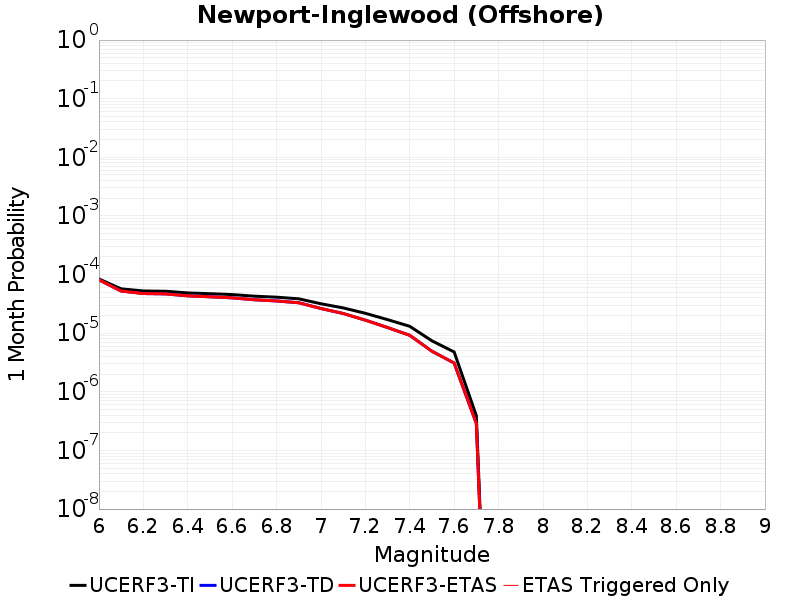 |  |  |

| Magnitude | 1 wk TI Prob | 1 wk TD Prob | 1 wk ETAS Prob | 1 wk ETAS/TD Gain | 1 wk ETAS Triggered Only | 1 mo TI Prob | 1 mo TD Prob | 1 mo ETAS Prob | 1 mo ETAS/TD Gain | 1 mo ETAS Triggered Only | 1 yr TI Prob | 1 yr TD Prob | 1 yr ETAS Prob | 1 yr ETAS/TD Gain | 1 yr ETAS Triggered Only | 10 yr TI Prob | 10 yr TD Prob | 10 yr ETAS Prob | 10 yr ETAS/TD Gain | 10 yr ETAS Triggered Only |
|-----|-----|-----|-----|-----|-----|-----|-----|-----|-----|-----|-----|-----|-----|-----|-----|-----|-----|-----|-----|-----|
| 6.0 | 1.9626508E-5 | 1.8975808E-5 | 1.8975808E-5 | 1.0 | 0.0 | 8.411089E-5 | 8.1322425E-5 | 8.1322425E-5 | 1.0 | 0.0 | 0.001023569 | 9.896634E-4 | 9.996535E-4 | 1.0100944 | 1.0E-5 | 0.010188672 | 0.009853905 | 0.009873708 | 1.0020096 | 2.0E-5 |
| 6.1 | 1.331886E-5 | 1.2225561E-5 | 1.2225561E-5 | 1.0 | 0.0 | 5.707958E-5 | 5.2394218E-5 | 5.2394218E-5 | 1.0 | 0.0 | 6.947222E-4 | 6.377144E-4 | 6.377144E-4 | 1.0 | 0.0 | 0.006925544 | 0.0063590216 | 0.006368958 | 1.0015626 | 1.0E-5 |
| 6.2 | 1.2250852E-5 | 1.1082996E-5 | 1.1082996E-5 | 1.0 | 0.0 | 5.2502597E-5 | 4.7497695E-5 | 4.7497695E-5 | 1.0 | 0.0 | 6.3903164E-4 | 5.78132E-4 | 5.78132E-4 | 1.0 | 0.0 | 0.006371971 | 0.005766401 | 0.0057763434 | 1.0017242 | 1.0E-5 |
| 6.3 | 1.2106258E-5 | 1.0925771E-5 | 1.0925771E-5 | 1.0 | 0.0 | 5.1882926E-5 | 4.6823898E-5 | 4.6823898E-5 | 1.0 | 0.0 | 6.3149154E-4 | 5.699328E-4 | 5.699328E-4 | 1.0 | 0.0 | 0.0062970007 | 0.005684829 | 0.005694772 | 1.001749 | 1.0E-5 |
| 6.4 | 1.1348758E-5 | 1.0115889E-5 | 1.0115889E-5 | 1.0 | 0.0 | 4.8636626E-5 | 4.3353095E-5 | 4.3353095E-5 | 1.0 | 0.0 | 5.919901E-4 | 5.276969E-4 | 5.276969E-4 | 1.0 | 0.0 | 0.005904155 | 0.0052645346 | 0.0052645346 | 1.0 | 0.0 |
| 6.5 | 1.100837E-5 | 9.749741E-6 | 9.749741E-6 | 1.0 | 0.0 | 4.7177873E-5 | 4.178394E-5 | 4.178394E-5 | 1.0 | 0.0 | 5.7423924E-4 | 5.086015E-4 | 5.086015E-4 | 1.0 | 0.0 | 0.005727576 | 0.0050744666 | 0.0050744666 | 1.0 | 0.0 |
| 6.6 | 1.0634696E-5 | 9.351702E-6 | 9.351702E-6 | 1.0 | 0.0 | 4.557647E-5 | 4.0078114E-5 | 4.0078114E-5 | 1.0 | 0.0 | 5.5475225E-4 | 4.878425E-4 | 4.878425E-4 | 1.0 | 0.0 | 0.0055336943 | 0.004867803 | 0.004867803 | 1.0 | 0.0 |
| 6.7 | 9.9780855E-6 | 8.673753E-6 | 8.673753E-6 | 1.0 | 0.0 | 4.276252E-5 | 3.71727E-5 | 3.71727E-5 | 1.0 | 0.0 | 5.205093E-4 | 4.5248435E-4 | 4.5248435E-4 | 1.0 | 0.0 | 0.0051929182 | 0.00451571 | 0.00451571 | 1.0 | 0.0 |
| 6.8 | 9.59546E-6 | 8.27863E-6 | 8.27863E-6 | 1.0 | 0.0 | 4.1122752E-5 | 3.5479363E-5 | 3.5479363E-5 | 1.0 | 0.0 | 5.0055445E-4 | 4.318763E-4 | 4.318763E-4 | 1.0 | 0.0 | 0.004994285 | 0.004310446 | 0.004310446 | 1.0 | 0.0 |
| 6.9 | 9.000614E-6 | 7.712204E-6 | 7.712204E-6 | 1.0 | 0.0 | 3.857349E-5 | 3.305189E-5 | 3.305189E-5 | 1.0 | 0.0 | 4.6953102E-4 | 4.0233307E-4 | 4.0233307E-4 | 1.0 | 0.0 | 0.004685402 | 0.0040161186 | 0.0040161186 | 1.0 | 0.0 |
| 7.0 | 7.4070194E-6 | 6.153165E-6 | 6.153165E-6 | 1.0 | 0.0 | 3.1743984E-5 | 2.6370442E-5 | 2.6370442E-5 | 1.0 | 0.0 | 3.8641447E-4 | 3.21013E-4 | 3.21013E-4 | 1.0 | 0.0 | 0.0038574322 | 0.0032055127 | 0.0032055127 | 1.0 | 0.0 |
| 7.1 | 6.299615E-6 | 5.060199E-6 | 5.060199E-6 | 1.0 | 0.0 | 2.699807E-5 | 2.1686388E-5 | 2.1686388E-5 | 1.0 | 0.0 | 3.2865192E-4 | 2.6399991E-4 | 2.6399991E-4 | 1.0 | 0.0 | 0.003281663 | 0.0026368776 | 0.0026368776 | 1.0 | 0.0 |
| 7.2 | 5.096653E-6 | 3.8959224E-6 | 3.8959224E-6 | 1.0 | 0.0 | 2.1842614E-5 | 1.6696704E-5 | 1.6696704E-5 | 1.0 | 0.0 | 2.6590136E-4 | 2.0326351E-4 | 2.0326351E-4 | 1.0 | 0.0 | 0.0026558342 | 0.002030787 | 0.002030787 | 1.0 | 0.0 |
| 7.3 | 3.9753018E-6 | 2.912337E-6 | 2.912337E-6 | 1.0 | 0.0 | 1.7036897E-5 | 1.2481385E-5 | 1.2481385E-5 | 1.0 | 0.0 | 2.0740448E-4 | 1.5195034E-4 | 1.5195034E-4 | 1.0 | 0.0 | 0.00207211 | 0.0015184727 | 0.0015184727 | 1.0 | 0.0 |
| 7.4 | 3.0568392E-6 | 2.1467988E-6 | 2.1467988E-6 | 1.0 | 0.0 | 1.3100675E-5 | 9.200534E-6 | 9.200534E-6 | 1.0 | 0.0 | 1.5948903E-4 | 1.12010806E-4 | 1.12010806E-4 | 1.0 | 0.0 | 0.0015937461 | 0.0011195499 | 0.0011195499 | 1.0 | 0.0 |
| 7.5 | 1.7279019E-6 | 1.148345E-6 | 1.148345E-6 | 1.0 | 0.0 | 7.405273E-6 | 4.921469E-6 | 4.921469E-6 | 1.0 | 0.0 | 9.015547E-5 | 5.9917278E-5 | 5.9917278E-5 | 1.0 | 0.0 | 9.01189E-4 | 5.9901515E-4 | 5.9901515E-4 | 1.0 | 0.0 |
| 7.6 | 1.1156416E-6 | 7.227356E-7 | 7.227356E-7 | 1.0 | 0.0 | 4.7813123E-6 | 3.0974347E-6 | 3.0974347E-6 | 1.0 | 0.0 | 5.821092E-5 | 3.7710637E-5 | 3.7710637E-5 | 1.0 | 0.0 | 5.8195676E-4 | 3.7704472E-4 | 3.7704472E-4 | 1.0 | 0.0 |
| 7.7 | 9.117973E-8 | 6.7364745E-8 | 6.7364745E-8 | 1.0 | 0.0 | 3.907702E-7 | 2.8870602E-7 | 2.8870602E-7 | 1.0 | 0.0 | 4.757617E-6 | 3.5149903E-6 | 3.5149903E-6 | 1.0 | 0.0 | 4.7575148E-5 | 3.5149376E-5 | 3.5149376E-5 | 1.0 | 0.0 |

## Pine Mtn
*[(top)](#table-of-contents)*

| 1 Week | 1 Month | 1 Year | 10 Year |
|-----|-----|-----|-----|
|  | 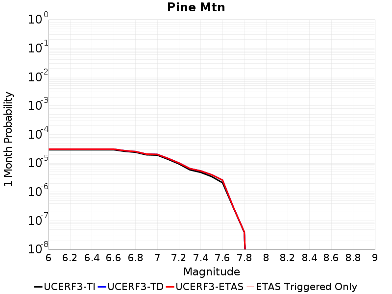 |  |  |

| Magnitude | 1 wk TI Prob | 1 wk TD Prob | 1 wk ETAS Prob | 1 wk ETAS/TD Gain | 1 wk ETAS Triggered Only | 1 mo TI Prob | 1 mo TD Prob | 1 mo ETAS Prob | 1 mo ETAS/TD Gain | 1 mo ETAS Triggered Only | 1 yr TI Prob | 1 yr TD Prob | 1 yr ETAS Prob | 1 yr ETAS/TD Gain | 1 yr ETAS Triggered Only | 10 yr TI Prob | 10 yr TD Prob | 10 yr ETAS Prob | 10 yr ETAS/TD Gain | 10 yr ETAS Triggered Only |
|-----|-----|-----|-----|-----|-----|-----|-----|-----|-----|-----|-----|-----|-----|-----|-----|-----|-----|-----|-----|-----|
| 6.0 | 6.894797E-6 | 7.230355E-6 | 7.230355E-6 | 1.0 | 0.0 | 2.9548795E-5 | 3.0986885E-5 | 3.0986885E-5 | 1.0 | 0.0 | 3.596972E-4 | 3.77203E-4 | 3.77203E-4 | 1.0 | 0.0 | 0.0035911554 | 0.003765925 | 0.0037858498 | 1.0052907 | 2.0E-5 |
| 6.1 | 6.894797E-6 | 7.230355E-6 | 7.230355E-6 | 1.0 | 0.0 | 2.9548795E-5 | 3.0986885E-5 | 3.0986885E-5 | 1.0 | 0.0 | 3.596972E-4 | 3.77203E-4 | 3.77203E-4 | 1.0 | 0.0 | 0.0035911554 | 0.003765925 | 0.0037858498 | 1.0052907 | 2.0E-5 |
| 6.2 | 6.894797E-6 | 7.230355E-6 | 7.230355E-6 | 1.0 | 0.0 | 2.9548795E-5 | 3.0986885E-5 | 3.0986885E-5 | 1.0 | 0.0 | 3.596972E-4 | 3.77203E-4 | 3.77203E-4 | 1.0 | 0.0 | 0.0035911554 | 0.003765925 | 0.0037858498 | 1.0052907 | 2.0E-5 |
| 6.3 | 6.894797E-6 | 7.230355E-6 | 7.230355E-6 | 1.0 | 0.0 | 2.9548795E-5 | 3.0986885E-5 | 3.0986885E-5 | 1.0 | 0.0 | 3.596972E-4 | 3.77203E-4 | 3.77203E-4 | 1.0 | 0.0 | 0.0035911554 | 0.003765925 | 0.0037858498 | 1.0052907 | 2.0E-5 |
| 6.4 | 6.894797E-6 | 7.230355E-6 | 7.230355E-6 | 1.0 | 0.0 | 2.9548795E-5 | 3.0986885E-5 | 3.0986885E-5 | 1.0 | 0.0 | 3.596972E-4 | 3.77203E-4 | 3.77203E-4 | 1.0 | 0.0 | 0.0035911554 | 0.003765925 | 0.0037858498 | 1.0052907 | 2.0E-5 |
| 6.5 | 6.894797E-6 | 7.230355E-6 | 7.230355E-6 | 1.0 | 0.0 | 2.9548795E-5 | 3.0986885E-5 | 3.0986885E-5 | 1.0 | 0.0 | 3.596972E-4 | 3.77203E-4 | 3.77203E-4 | 1.0 | 0.0 | 0.0035911554 | 0.003765925 | 0.0037858498 | 1.0052907 | 2.0E-5 |
| 6.6 | 6.894797E-6 | 7.230355E-6 | 7.230355E-6 | 1.0 | 0.0 | 2.9548795E-5 | 3.0986885E-5 | 3.0986885E-5 | 1.0 | 0.0 | 3.596972E-4 | 3.77203E-4 | 3.77203E-4 | 1.0 | 0.0 | 0.0035911554 | 0.003765925 | 0.0037858498 | 1.0052907 | 2.0E-5 |
| 6.7 | 6.0867933E-6 | 6.401875E-6 | 6.401875E-6 | 1.0 | 0.0 | 2.6085996E-5 | 2.743633E-5 | 2.743633E-5 | 1.0 | 0.0 | 3.1755073E-4 | 3.339883E-4 | 3.339883E-4 | 1.0 | 0.0 | 0.0031709734 | 0.003335083 | 0.0033550162 | 1.0059768 | 2.0E-5 |
| 6.8 | 5.6530425E-6 | 5.955274E-6 | 5.955274E-6 | 1.0 | 0.0 | 2.42271E-5 | 2.5522364E-5 | 2.5522364E-5 | 1.0 | 0.0 | 2.94925E-4 | 3.1069253E-4 | 3.1069253E-4 | 1.0 | 0.0 | 0.002945339 | 0.0031027866 | 0.0031227246 | 1.0064259 | 2.0E-5 |
| 6.9 | 4.6015225E-6 | 4.8682814E-6 | 4.8682814E-6 | 1.0 | 0.0 | 1.9720663E-5 | 2.0863905E-5 | 2.0863905E-5 | 1.0 | 0.0 | 2.4007261E-4 | 2.5398989E-4 | 2.5398989E-4 | 1.0 | 0.0 | 0.0023981342 | 0.0025371404 | 0.0025570896 | 1.0078629 | 2.0E-5 |
| 7.0 | 4.4875965E-6 | 4.7519047E-6 | 4.7519047E-6 | 1.0 | 0.0 | 1.9232413E-5 | 2.0365154E-5 | 2.0365154E-5 | 1.0 | 0.0 | 2.3412947E-4 | 2.47919E-4 | 2.47919E-4 | 1.0 | 0.0 | 0.0023388295 | 0.002476568 | 0.0024965187 | 1.0080557 | 2.0E-5 |
| 7.1 | 3.203907E-6 | 3.433617E-6 | 3.433617E-6 | 1.0 | 0.0 | 1.3730958E-5 | 1.4715422E-5 | 1.4715422E-5 | 1.0 | 0.0 | 1.6716159E-4 | 1.791462E-4 | 1.791462E-4 | 1.0 | 0.0 | 0.0016703589 | 0.0017900842 | 0.0018000662 | 1.0055764 | 1.0E-5 |
| 7.2 | 2.2060601E-6 | 2.381919E-6 | 2.381919E-6 | 1.0 | 0.0 | 9.4545085E-6 | 1.0208188E-5 | 1.0208188E-5 | 1.0 | 0.0 | 1.15102564E-4 | 1.2427806E-4 | 1.2427806E-4 | 1.0 | 0.0 | 0.0011504296 | 0.0012421304 | 0.001252118 | 1.0080407 | 1.0E-5 |
| 7.3 | 1.3765207E-6 | 1.5247391E-6 | 1.5247391E-6 | 1.0 | 0.0 | 5.899361E-6 | 6.5345803E-6 | 6.5345803E-6 | 1.0 | 0.0 | 7.182235E-5 | 7.9555706E-5 | 7.9555706E-5 | 1.0 | 0.0 | 7.1799144E-4 | 7.952814E-4 | 8.052735E-4 | 1.0125642 | 1.0E-5 |
| 7.4 | 1.1245983E-6 | 1.2614897E-6 | 1.2614897E-6 | 1.0 | 0.0 | 4.819698E-6 | 5.406374E-6 | 5.406374E-6 | 1.0 | 0.0 | 5.8678244E-5 | 6.58207E-5 | 6.58207E-5 | 1.0 | 0.0 | 5.866275E-4 | 6.5802044E-4 | 6.680138E-4 | 1.0151871 | 1.0E-5 |
| 7.5 | 8.031682E-7 | 9.3029286E-7 | 9.3029286E-7 | 1.0 | 0.0 | 3.4421448E-6 | 3.9869637E-6 | 3.9869637E-6 | 1.0 | 0.0 | 4.1907308E-5 | 4.854027E-5 | 4.854027E-5 | 1.0 | 0.0 | 4.1899405E-4 | 4.853035E-4 | 4.9529865E-4 | 1.0205957 | 1.0E-5 |
| 7.6 | 4.8953444E-7 | 6.026053E-7 | 6.026053E-7 | 1.0 | 0.0 | 2.098003E-6 | 2.582592E-6 | 2.582592E-6 | 1.0 | 0.0 | 2.5542888E-5 | 3.1442654E-5 | 3.1442654E-5 | 1.0 | 0.0 | 2.5539953E-4 | 3.1438697E-4 | 3.2438381E-4 | 1.0317979 | 1.0E-5 |
| 7.7 | 6.634529E-8 | 6.789838E-8 | 6.789838E-8 | 1.0 | 0.0 | 2.843369E-7 | 2.90993E-7 | 2.90993E-7 | 1.0 | 0.0 | 3.4617963E-6 | 3.5428345E-6 | 3.5428345E-6 | 1.0 | 0.0 | 3.4617424E-5 | 3.5427827E-5 | 3.5427827E-5 | 1.0 | 0.0 |
| 7.8 | 9.235578E-9 | 9.4902415E-9 | 9.4902415E-9 | 1.0 | 0.0 | 3.9581046E-8 | 4.067246E-8 | 4.067246E-8 | 1.0 | 0.0 | 4.818991E-7 | 4.951871E-7 | 4.951871E-7 | 1.0 | 0.0 | 4.8189804E-6 | 4.951862E-6 | 4.951862E-6 | 1.0 | 0.0 |

## San Andreas (Santa Cruz Mts) 2011 CFM
*[(top)](#table-of-contents)*

| 1 Week | 1 Month | 1 Year | 10 Year |
|-----|-----|-----|-----|
| 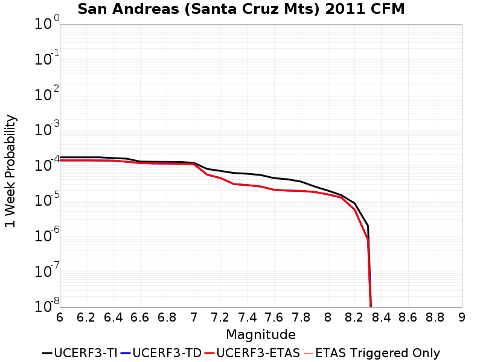 | 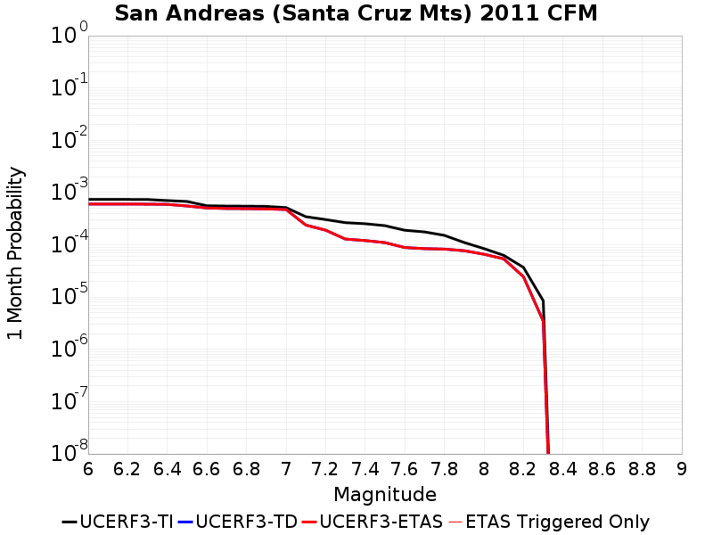 |  |  |

| Magnitude | 1 wk TI Prob | 1 wk TD Prob | 1 wk ETAS Prob | 1 wk ETAS/TD Gain | 1 wk ETAS Triggered Only | 1 mo TI Prob | 1 mo TD Prob | 1 mo ETAS Prob | 1 mo ETAS/TD Gain | 1 mo ETAS Triggered Only | 1 yr TI Prob | 1 yr TD Prob | 1 yr ETAS Prob | 1 yr ETAS/TD Gain | 1 yr ETAS Triggered Only | 10 yr TI Prob | 10 yr TD Prob | 10 yr ETAS Prob | 10 yr ETAS/TD Gain | 10 yr ETAS Triggered Only |
|-----|-----|-----|-----|-----|-----|-----|-----|-----|-----|-----|-----|-----|-----|-----|-----|-----|-----|-----|-----|-----|
| 6.0 | 1.7221631E-4 | 1.4072843E-4 | 1.4072843E-4 | 1.0 | 0.0 | 7.378611E-4 | 6.029845E-4 | 6.029845E-4 | 1.0 | 0.0 | 0.008946515 | 0.007317006 | 0.0073269326 | 1.0013567 | 1.0E-5 | 0.08594794 | 0.07189175 | 0.07191031 | 1.0002582 | 2.0E-5 |
| 6.1 | 1.7221631E-4 | 1.4072843E-4 | 1.4072843E-4 | 1.0 | 0.0 | 7.378611E-4 | 6.029845E-4 | 6.029845E-4 | 1.0 | 0.0 | 0.008946515 | 0.007317006 | 0.0073269326 | 1.0013567 | 1.0E-5 | 0.08594794 | 0.07189175 | 0.07191031 | 1.0002582 | 2.0E-5 |
| 6.2 | 1.7221631E-4 | 1.4072843E-4 | 1.4072843E-4 | 1.0 | 0.0 | 7.378611E-4 | 6.029845E-4 | 6.029845E-4 | 1.0 | 0.0 | 0.008946515 | 0.007317006 | 0.0073269326 | 1.0013567 | 1.0E-5 | 0.08594794 | 0.07189175 | 0.07191031 | 1.0002582 | 2.0E-5 |
| 6.3 | 1.716926E-4 | 1.3991636E-4 | 1.3991636E-4 | 1.0 | 0.0 | 7.3561794E-4 | 5.995058E-4 | 5.995058E-4 | 1.0 | 0.0 | 0.008919428 | 0.007274936 | 0.007284863 | 1.0013646 | 1.0E-5 | 0.08569809 | 0.07150154 | 0.071520105 | 1.0002598 | 2.0E-5 |
| 6.4 | 1.6392978E-4 | 1.386103E-4 | 1.386103E-4 | 1.0 | 0.0 | 7.02367E-4 | 5.939109E-4 | 5.939109E-4 | 1.0 | 0.0 | 0.008517839 | 0.00720727 | 0.0072171977 | 1.0013775 | 1.0E-5 | 0.08198654 | 0.0706948 | 0.070713386 | 1.0002629 | 2.0E-5 |
| 6.5 | 1.5742714E-4 | 1.291189E-4 | 1.291189E-4 | 1.0 | 0.0 | 6.745133E-4 | 5.5325107E-4 | 5.5325107E-4 | 1.0 | 0.0 | 0.00818132 | 0.006715344 | 0.0067252764 | 1.0014791 | 1.0E-5 | 0.078865945 | 0.06612848 | 0.066147156 | 1.0002824 | 2.0E-5 |
| 6.6 | 1.3038084E-4 | 1.18276366E-4 | 1.18276366E-4 | 1.0 | 0.0 | 5.5865536E-4 | 5.068016E-4 | 5.068016E-4 | 1.0 | 0.0 | 0.006780438 | 0.0061530825 | 0.006163021 | 1.0016152 | 1.0E-5 | 0.0657725 | 0.060459714 | 0.060478505 | 1.0003108 | 2.0E-5 |
| 6.7 | 1.2867592E-4 | 1.15524526E-4 | 1.15524526E-4 | 1.0 | 0.0 | 5.5135164E-4 | 4.950125E-4 | 4.950125E-4 | 1.0 | 0.0 | 0.0066920654 | 0.00601035 | 0.00602029 | 1.0016538 | 1.0E-5 | 0.06494093 | 0.05916485 | 0.059183665 | 1.000318 | 2.0E-5 |
| 6.8 | 1.2801298E-4 | 1.14896065E-4 | 1.14896065E-4 | 1.0 | 0.0 | 5.485117E-4 | 4.923201E-4 | 4.923201E-4 | 1.0 | 0.0 | 0.0066577005 | 0.0059777685 | 0.005987709 | 1.0016629 | 1.0E-5 | 0.06461738 | 0.05887721 | 0.058896035 | 1.0003197 | 2.0E-5 |
| 6.9 | 1.269149E-4 | 1.1330752E-4 | 1.1330752E-4 | 1.0 | 0.0 | 5.4380763E-4 | 4.8551458E-4 | 4.8551458E-4 | 1.0 | 0.0 | 0.006600777 | 0.0058953627 | 0.005905304 | 1.0016862 | 1.0E-5 | 0.06408122 | 0.05814553 | 0.058164366 | 1.000324 | 2.0E-5 |
| 7.0 | 1.2030331E-4 | 1.1056734E-4 | 1.1056734E-4 | 1.0 | 0.0 | 5.154837E-4 | 4.7377526E-4 | 4.7377526E-4 | 1.0 | 0.0 | 0.006257969 | 0.0057532 | 0.0057631424 | 1.0017282 | 1.0E-5 | 0.06084648 | 0.05679615 | 0.056815013 | 1.0003321 | 2.0E-5 |
| 7.1 | 8.049617E-5 | 5.568725E-5 | 5.568725E-5 | 1.0 | 0.0 | 3.4493793E-4 | 2.3863802E-4 | 2.3863802E-4 | 1.0 | 0.0 | 0.0041915346 | 0.0029015837 | 0.0029115546 | 1.0034364 | 1.0E-5 | 0.041133516 | 0.0304936 | 0.03051299 | 1.0006359 | 2.0E-5 |
| 7.2 | 7.093979E-5 | 4.4490018E-5 | 4.4490018E-5 | 1.0 | 0.0 | 3.0399222E-4 | 1.9065771E-4 | 1.9065771E-4 | 1.0 | 0.0 | 0.0036948253 | 0.0023188107 | 0.0023287875 | 1.0043025 | 1.0E-5 | 0.03633994 | 0.024723914 | 0.02474342 | 1.0007889 | 2.0E-5 |
| 7.3 | 6.193693E-5 | 3.0064886E-5 | 3.0064886E-5 | 1.0 | 0.0 | 2.6541698E-4 | 1.2884317E-4 | 1.2884317E-4 | 1.0 | 0.0 | 0.0032266637 | 0.0015675386 | 0.001577523 | 1.0063695 | 1.0E-5 | 0.031802133 | 0.017115148 | 0.017134806 | 1.0011486 | 2.0E-5 |
| 7.4 | 5.906492E-5 | 2.8130766E-5 | 2.8130766E-5 | 1.0 | 0.0 | 2.5311083E-4 | 1.2055486E-4 | 1.2055486E-4 | 1.0 | 0.0 | 0.0030772698 | 0.0014667688 | 0.0014767541 | 1.0068077 | 1.0E-5 | 0.030350044 | 0.016056849 | 0.016076528 | 1.0012256 | 2.0E-5 |
| 7.5 | 5.424296E-5 | 2.5698231E-5 | 2.5698231E-5 | 1.0 | 0.0 | 2.324491E-4 | 1.1013063E-4 | 1.1013063E-4 | 1.0 | 0.0 | 0.002826395 | 0.0013400171 | 0.0013500036 | 1.0074526 | 1.0E-5 | 0.027907165 | 0.014705121 | 0.014724826 | 1.00134 | 2.0E-5 |
| 7.6 | 4.43084E-5 | 2.0716525E-5 | 2.0716525E-5 | 1.0 | 0.0 | 1.8987931E-4 | 8.8782086E-5 | 8.8782086E-5 | 1.0 | 0.0 | 0.0023093296 | 0.0010803862 | 0.0010903754 | 1.009246 | 1.0E-5 | 0.022854783 | 0.011846984 | 0.011866747 | 1.0016682 | 2.0E-5 |
| 7.7 | 4.118098E-5 | 1.9713394E-5 | 1.9713394E-5 | 1.0 | 0.0 | 1.7647797E-4 | 8.448324E-5 | 8.448324E-5 | 1.0 | 0.0 | 0.002146502 | 0.0010280984 | 0.0010380881 | 1.0097167 | 1.0E-5 | 0.021258866 | 0.011286109 | 0.011305883 | 1.0017521 | 2.0E-5 |
| 7.8 | 3.5408906E-5 | 1.932171E-5 | 1.932171E-5 | 1.0 | 0.0 | 1.5174363E-4 | 8.28047E-5 | 8.28047E-5 | 1.0 | 0.0 | 0.0018459131 | 0.0010076811 | 0.0010176711 | 1.0099138 | 1.0E-5 | 0.018306552 | 0.011056051 | 0.011075829 | 1.001789 | 2.0E-5 |
| 7.9 | 2.5860836E-5 | 1.8004897E-5 | 1.8004897E-5 | 1.0 | 0.0 | 1.10827445E-4 | 7.716157E-5 | 7.716157E-5 | 1.0 | 0.0 | 0.001348489 | 9.390375E-4 | 9.4902806E-4 | 1.0106392 | 1.0E-5 | 0.013403354 | 0.010272438 | 0.010292232 | 1.0019269 | 2.0E-5 |
| 8.0 | 1.9777332E-5 | 1.5428004E-5 | 1.5428004E-5 | 1.0 | 0.0 | 8.4757245E-5 | 6.6118344E-5 | 6.6118344E-5 | 1.0 | 0.0 | 0.0010314309 | 8.0469373E-4 | 8.1468566E-4 | 1.0124171 | 1.0E-5 | 0.010266567 | 0.0088207945 | 0.008840618 | 1.0022473 | 2.0E-5 |
| 8.1 | 1.468494E-5 | 1.25899305E-5 | 1.25899305E-5 | 1.0 | 0.0 | 6.293394E-5 | 5.3955733E-5 | 5.3955733E-5 | 1.0 | 0.0 | 7.6595135E-4 | 6.567132E-4 | 6.6670665E-4 | 1.0152173 | 1.0E-5 | 0.0076331664 | 0.007226134 | 0.007236062 | 1.0013739 | 1.0E-5 |
| 8.2 | 8.63836E-6 | 5.719569E-6 | 5.719569E-6 | 1.0 | 0.0 | 3.7021015E-5 | 2.4512208E-5 | 2.4512208E-5 | 1.0 | 0.0 | 4.5063766E-4 | 2.9839537E-4 | 2.9839537E-4 | 1.0 | 0.0 | 0.004497249 | 0.003382694 | 0.003382694 | 1.0 | 0.0 |
| 8.3 | 1.983087E-6 | 8.077986E-7 | 8.077986E-7 | 1.0 | 0.0 | 8.498917E-6 | 3.4619893E-6 | 3.4619893E-6 | 1.0 | 0.0 | 1.034694E-4 | 4.2148924E-5 | 4.2148924E-5 | 1.0 | 0.0 | 0.0010342124 | 4.9595156E-4 | 4.9595156E-4 | 1.0 | 0.0 |

## Kern Canyon (Lake Isabella) 2011
*[(top)](#table-of-contents)*

| 1 Week | 1 Month | 1 Year | 10 Year |
|-----|-----|-----|-----|
|  |  |  | 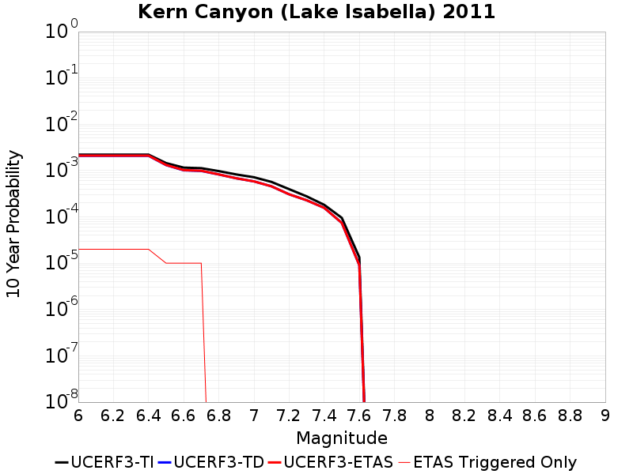 |

| Magnitude | 1 wk TI Prob | 1 wk TD Prob | 1 wk ETAS Prob | 1 wk ETAS/TD Gain | 1 wk ETAS Triggered Only | 1 mo TI Prob | 1 mo TD Prob | 1 mo ETAS Prob | 1 mo ETAS/TD Gain | 1 mo ETAS Triggered Only | 1 yr TI Prob | 1 yr TD Prob | 1 yr ETAS Prob | 1 yr ETAS/TD Gain | 1 yr ETAS Triggered Only | 10 yr TI Prob | 10 yr TD Prob | 10 yr ETAS Prob | 10 yr ETAS/TD Gain | 10 yr ETAS Triggered Only |
|-----|-----|-----|-----|-----|-----|-----|-----|-----|-----|-----|-----|-----|-----|-----|-----|-----|-----|-----|-----|-----|
| 6.0 | 4.2387383E-6 | 4.002208E-6 | 4.002208E-6 | 1.0 | 0.0 | 1.8165894E-5 | 1.7152217E-5 | 1.7152217E-5 | 1.0 | 0.0 | 2.2114732E-4 | 2.0881009E-4 | 2.0881009E-4 | 1.0 | 0.0 | 0.0022092736 | 0.002086323 | 0.0021062812 | 1.0095662 | 2.0E-5 |
| 6.1 | 4.2387383E-6 | 4.002208E-6 | 4.002208E-6 | 1.0 | 0.0 | 1.8165894E-5 | 1.7152217E-5 | 1.7152217E-5 | 1.0 | 0.0 | 2.2114732E-4 | 2.0881009E-4 | 2.0881009E-4 | 1.0 | 0.0 | 0.0022092736 | 0.002086323 | 0.0021062812 | 1.0095662 | 2.0E-5 |
| 6.2 | 4.2387383E-6 | 4.002208E-6 | 4.002208E-6 | 1.0 | 0.0 | 1.8165894E-5 | 1.7152217E-5 | 1.7152217E-5 | 1.0 | 0.0 | 2.2114732E-4 | 2.0881009E-4 | 2.0881009E-4 | 1.0 | 0.0 | 0.0022092736 | 0.002086323 | 0.0021062812 | 1.0095662 | 2.0E-5 |
| 6.3 | 4.2387383E-6 | 4.002208E-6 | 4.002208E-6 | 1.0 | 0.0 | 1.8165894E-5 | 1.7152217E-5 | 1.7152217E-5 | 1.0 | 0.0 | 2.2114732E-4 | 2.0881009E-4 | 2.0881009E-4 | 1.0 | 0.0 | 0.0022092736 | 0.002086323 | 0.0021062812 | 1.0095662 | 2.0E-5 |
| 6.4 | 4.2387383E-6 | 4.002208E-6 | 4.002208E-6 | 1.0 | 0.0 | 1.8165894E-5 | 1.7152217E-5 | 1.7152217E-5 | 1.0 | 0.0 | 2.2114732E-4 | 2.0881009E-4 | 2.0881009E-4 | 1.0 | 0.0 | 0.0022092736 | 0.002086323 | 0.0021062812 | 1.0095662 | 2.0E-5 |
| 6.5 | 2.7857532E-6 | 2.5182367E-6 | 2.5182367E-6 | 1.0 | 0.0 | 1.1938888E-5 | 1.07924E-5 | 1.07924E-5 | 1.0 | 0.0 | 1.4534626E-4 | 1.3138988E-4 | 1.3138988E-4 | 1.0 | 0.0 | 0.0014525123 | 0.0013131547 | 0.0013231416 | 1.0076052 | 1.0E-5 |
| 6.6 | 2.2233348E-6 | 1.94442E-6 | 1.94442E-6 | 1.0 | 0.0 | 9.528543E-6 | 8.333203E-6 | 8.333203E-6 | 1.0 | 0.0 | 1.1600384E-4 | 1.0145211E-4 | 1.0145211E-4 | 1.0 | 0.0 | 0.001159433 | 0.0010140665 | 0.0010240565 | 1.0098513 | 1.0E-5 |
| 6.7 | 2.1635126E-6 | 1.883795E-6 | 1.883795E-6 | 1.0 | 0.0 | 9.272164E-6 | 8.073383E-6 | 8.073383E-6 | 1.0 | 0.0 | 1.1288274E-4 | 9.828908E-5 | 9.828908E-5 | 1.0 | 0.0 | 0.0011282542 | 9.824643E-4 | 9.924545E-4 | 1.0101684 | 1.0E-5 |
| 6.8 | 1.8685711E-6 | 1.5833989E-6 | 1.5833989E-6 | 1.0 | 0.0 | 8.008137E-6 | 6.7859783E-6 | 6.7859783E-6 | 1.0 | 0.0 | 9.74947E-5 | 8.26162E-5 | 8.26162E-5 | 1.0 | 0.0 | 9.745194E-4 | 8.258598E-4 | 8.258598E-4 | 1.0 | 0.0 |
| 6.9 | 1.5815071E-6 | 1.3067114E-6 | 1.3067114E-6 | 1.0 | 0.0 | 6.77787E-6 | 5.60018E-6 | 5.60018E-6 | 1.0 | 0.0 | 8.251744E-5 | 6.818009E-5 | 6.818009E-5 | 1.0 | 0.0 | 8.248681E-4 | 6.8159436E-4 | 6.8159436E-4 | 1.0 | 0.0 |
| 7.0 | 1.3772564E-6 | 1.1212613E-6 | 1.1212613E-6 | 1.0 | 0.0 | 5.9025137E-6 | 4.805397E-6 | 4.805397E-6 | 1.0 | 0.0 | 7.186073E-5 | 5.850416E-5 | 5.850416E-5 | 1.0 | 0.0 | 7.18375E-4 | 5.848896E-4 | 5.848896E-4 | 1.0 | 0.0 |
| 7.1 | 1.0916998E-6 | 8.765223E-7 | 8.765223E-7 | 1.0 | 0.0 | 4.678705E-6 | 3.7565187E-6 | 3.7565187E-6 | 1.0 | 0.0 | 5.6961744E-5 | 4.573467E-5 | 4.573467E-5 | 1.0 | 0.0 | 5.6947145E-4 | 4.5725392E-4 | 4.5725392E-4 | 1.0 | 0.0 |
| 7.2 | 7.6277024E-7 | 5.902431E-7 | 5.902431E-7 | 1.0 | 0.0 | 3.2690114E-6 | 2.5296108E-6 | 2.5296108E-6 | 1.0 | 0.0 | 3.9799485E-5 | 3.0797582E-5 | 3.0797582E-5 | 1.0 | 0.0 | 3.9792358E-4 | 3.0793375E-4 | 3.0793375E-4 | 1.0 | 0.0 |
| 7.3 | 5.3265916E-7 | 4.3831392E-7 | 4.3831392E-7 | 1.0 | 0.0 | 2.282823E-6 | 1.878487E-6 | 1.878487E-6 | 1.0 | 0.0 | 2.7793016E-5 | 2.2870341E-5 | 2.2870341E-5 | 1.0 | 0.0 | 2.778954E-4 | 2.2868026E-4 | 2.2868026E-4 | 1.0 | 0.0 |
| 7.4 | 3.4946007E-7 | 3.007047E-7 | 3.007047E-7 | 1.0 | 0.0 | 1.497685E-6 | 1.2887338E-6 | 1.2887338E-6 | 1.0 | 0.0 | 1.8234163E-5 | 1.5690222E-5 | 1.5690222E-5 | 1.0 | 0.0 | 1.8232666E-4 | 1.5689137E-4 | 1.5689137E-4 | 1.0 | 0.0 |
| 7.5 | 1.8317026E-7 | 1.4247503E-7 | 1.4247503E-7 | 1.0 | 0.0 | 7.850152E-7 | 6.106071E-7 | 6.106071E-7 | 1.0 | 0.0 | 9.557518E-6 | 7.434117E-6 | 7.434117E-6 | 1.0 | 0.0 | 9.5571064E-5 | 7.4338765E-5 | 7.4338765E-5 | 1.0 | 0.0 |
| 7.6 | 2.572245E-8 | 1.7356326E-8 | 1.7356326E-8 | 1.0 | 0.0 | 1.10239064E-7 | 7.438425E-8 | 7.438425E-8 | 1.0 | 0.0 | 1.3421597E-6 | 9.05628E-7 | 9.05628E-7 | 1.0 | 0.0 | 1.3421517E-5 | 9.056248E-6 | 9.056248E-6 | 1.0 | 0.0 |

## North Frontal  (East)
*[(top)](#table-of-contents)*

| 1 Week | 1 Month | 1 Year | 10 Year |
|-----|-----|-----|-----|
|  | 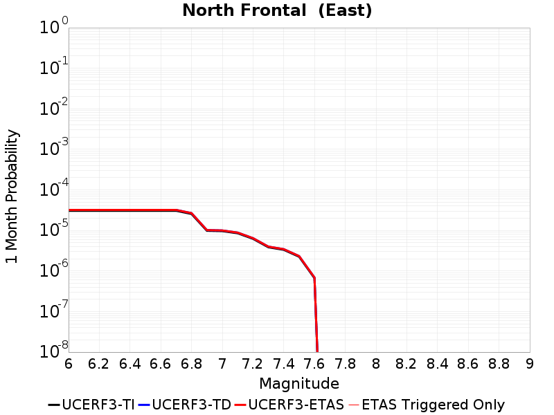 | 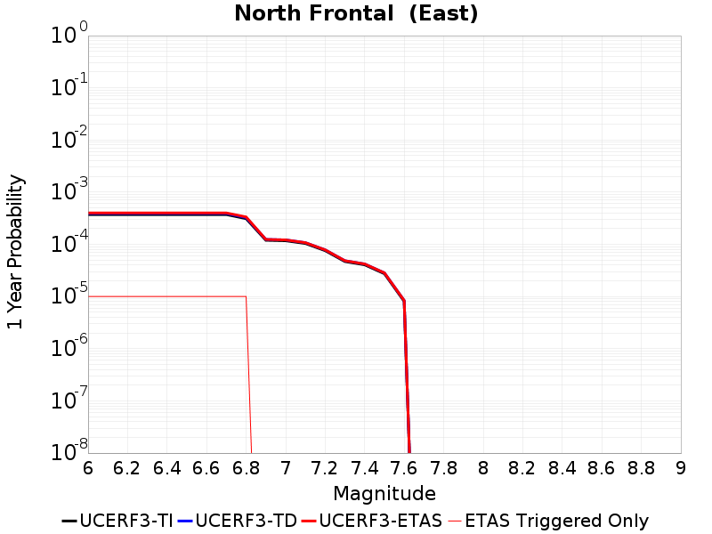 |  |

| Magnitude | 1 wk TI Prob | 1 wk TD Prob | 1 wk ETAS Prob | 1 wk ETAS/TD Gain | 1 wk ETAS Triggered Only | 1 mo TI Prob | 1 mo TD Prob | 1 mo ETAS Prob | 1 mo ETAS/TD Gain | 1 mo ETAS Triggered Only | 1 yr TI Prob | 1 yr TD Prob | 1 yr ETAS Prob | 1 yr ETAS/TD Gain | 1 yr ETAS Triggered Only | 10 yr TI Prob | 10 yr TD Prob | 10 yr ETAS Prob | 10 yr ETAS/TD Gain | 10 yr ETAS Triggered Only |
|-----|-----|-----|-----|-----|-----|-----|-----|-----|-----|-----|-----|-----|-----|-----|-----|-----|-----|-----|-----|-----|
| 6.0 | 7.135738E-6 | 7.4794475E-6 | 7.4794475E-6 | 1.0 | 0.0 | 3.0581377E-5 | 3.2054493E-5 | 3.2054493E-5 | 1.0 | 0.0 | 3.7226462E-4 | 3.9021354E-4 | 4.0020962E-4 | 1.025617 | 1.0E-5 | 0.0037164164 | 0.0038972425 | 0.0039171646 | 1.0051118 | 2.0E-5 |
| 6.1 | 7.135738E-6 | 7.4794475E-6 | 7.4794475E-6 | 1.0 | 0.0 | 3.0581377E-5 | 3.2054493E-5 | 3.2054493E-5 | 1.0 | 0.0 | 3.7226462E-4 | 3.9021354E-4 | 4.0020962E-4 | 1.025617 | 1.0E-5 | 0.0037164164 | 0.0038972425 | 0.0039171646 | 1.0051118 | 2.0E-5 |
| 6.2 | 7.135738E-6 | 7.4794475E-6 | 7.4794475E-6 | 1.0 | 0.0 | 3.0581377E-5 | 3.2054493E-5 | 3.2054493E-5 | 1.0 | 0.0 | 3.7226462E-4 | 3.9021354E-4 | 4.0020962E-4 | 1.025617 | 1.0E-5 | 0.0037164164 | 0.0038972425 | 0.0039171646 | 1.0051118 | 2.0E-5 |
| 6.3 | 7.135738E-6 | 7.4794475E-6 | 7.4794475E-6 | 1.0 | 0.0 | 3.0581377E-5 | 3.2054493E-5 | 3.2054493E-5 | 1.0 | 0.0 | 3.7226462E-4 | 3.9021354E-4 | 4.0020962E-4 | 1.025617 | 1.0E-5 | 0.0037164164 | 0.0038972425 | 0.0039171646 | 1.0051118 | 2.0E-5 |
| 6.4 | 7.135738E-6 | 7.4794475E-6 | 7.4794475E-6 | 1.0 | 0.0 | 3.0581377E-5 | 3.2054493E-5 | 3.2054493E-5 | 1.0 | 0.0 | 3.7226462E-4 | 3.9021354E-4 | 4.0020962E-4 | 1.025617 | 1.0E-5 | 0.0037164164 | 0.0038972425 | 0.0039171646 | 1.0051118 | 2.0E-5 |
| 6.5 | 7.135738E-6 | 7.4794475E-6 | 7.4794475E-6 | 1.0 | 0.0 | 3.0581377E-5 | 3.2054493E-5 | 3.2054493E-5 | 1.0 | 0.0 | 3.7226462E-4 | 3.9021354E-4 | 4.0020962E-4 | 1.025617 | 1.0E-5 | 0.0037164164 | 0.0038972425 | 0.0039171646 | 1.0051118 | 2.0E-5 |
| 6.6 | 7.135738E-6 | 7.4794475E-6 | 7.4794475E-6 | 1.0 | 0.0 | 3.0581377E-5 | 3.2054493E-5 | 3.2054493E-5 | 1.0 | 0.0 | 3.7226462E-4 | 3.9021354E-4 | 4.0020962E-4 | 1.025617 | 1.0E-5 | 0.0037164164 | 0.0038972425 | 0.0039171646 | 1.0051118 | 2.0E-5 |
| 6.7 | 7.135738E-6 | 7.4794475E-6 | 7.4794475E-6 | 1.0 | 0.0 | 3.0581377E-5 | 3.2054493E-5 | 3.2054493E-5 | 1.0 | 0.0 | 3.7226462E-4 | 3.9021354E-4 | 4.0020962E-4 | 1.025617 | 1.0E-5 | 0.0037164164 | 0.0038972425 | 0.0039171646 | 1.0051118 | 2.0E-5 |
| 6.8 | 5.959142E-6 | 6.2385266E-6 | 6.2385266E-6 | 1.0 | 0.0 | 2.553893E-5 | 2.673637E-5 | 2.673637E-5 | 1.0 | 0.0 | 3.108921E-4 | 3.2548478E-4 | 3.354815E-4 | 1.0307134 | 1.0E-5 | 0.0031045752 | 0.003251855 | 0.00327179 | 1.0061303 | 2.0E-5 |
| 6.9 | 2.2946929E-6 | 2.383039E-6 | 2.383039E-6 | 1.0 | 0.0 | 9.834361E-6 | 1.0212987E-5 | 1.0212987E-5 | 1.0 | 0.0 | 1.1972676E-4 | 1.2433648E-4 | 1.2433648E-4 | 1.0 | 0.0 | 0.0011966228 | 0.0012427157 | 0.0012527033 | 1.0080369 | 1.0E-5 |
| 7.0 | 2.2468673E-6 | 2.3327157E-6 | 2.3327157E-6 | 1.0 | 0.0 | 9.629396E-6 | 9.997317E-6 | 9.997317E-6 | 1.0 | 0.0 | 1.1723159E-4 | 1.21711004E-4 | 1.21711004E-4 | 1.0 | 0.0 | 0.0011716976 | 0.0012164898 | 0.0012264777 | 1.0082104 | 1.0E-5 |
| 7.1 | 1.9921076E-6 | 2.0650798E-6 | 2.0650798E-6 | 1.0 | 0.0 | 8.537577E-6 | 8.850315E-6 | 8.850315E-6 | 1.0 | 0.0 | 1.0394004E-4 | 1.07747685E-4 | 1.07747685E-4 | 1.0 | 0.0 | 0.0010389143 | 0.0010769973 | 0.0010869864 | 1.0092751 | 1.0E-5 |
| 7.2 | 1.4524545E-6 | 1.5048569E-6 | 1.5048569E-6 | 1.0 | 0.0 | 6.2247905E-6 | 6.449372E-6 | 6.449372E-6 | 1.0 | 0.0 | 7.5784184E-5 | 7.8518526E-5 | 7.8518526E-5 | 1.0 | 0.0 | 7.575835E-4 | 7.849323E-4 | 7.849323E-4 | 1.0 | 0.0 |
| 7.3 | 8.9802575E-7 | 9.310887E-7 | 9.310887E-7 | 1.0 | 0.0 | 3.848676E-6 | 3.990375E-6 | 3.990375E-6 | 1.0 | 0.0 | 4.685662E-5 | 4.8581845E-5 | 4.8581845E-5 | 1.0 | 0.0 | 4.6846745E-4 | 4.8572355E-4 | 4.8572355E-4 | 1.0 | 0.0 |
| 7.4 | 7.776139E-7 | 8.0623437E-7 | 8.0623437E-7 | 1.0 | 0.0 | 3.3326266E-6 | 3.4552863E-6 | 3.4552863E-6 | 1.0 | 0.0 | 4.0573974E-5 | 4.2067408E-5 | 4.2067408E-5 | 1.0 | 0.0 | 4.0566566E-4 | 4.206052E-4 | 4.206052E-4 | 1.0 | 0.0 |
| 7.5 | 5.244417E-7 | 5.442514E-7 | 5.442514E-7 | 1.0 | 0.0 | 2.2476054E-6 | 2.3325042E-6 | 2.3325042E-6 | 1.0 | 0.0 | 2.7364253E-5 | 2.8397935E-5 | 2.8397935E-5 | 1.0 | 0.0 | 2.7360884E-4 | 2.8394957E-4 | 2.8394957E-4 | 1.0 | 0.0 |
| 7.6 | 1.5489647E-7 | 1.6093455E-7 | 1.6093455E-7 | 1.0 | 0.0 | 6.6384183E-7 | 6.897194E-7 | 6.897194E-7 | 1.0 | 0.0 | 8.082245E-6 | 8.397322E-6 | 8.397322E-6 | 1.0 | 0.0 | 8.08195E-5 | 8.397204E-5 | 8.397204E-5 | 1.0 | 0.0 |

## Gillem - Big Crack 2011 CFM
*[(top)](#table-of-contents)*

| 1 Week | 1 Month | 1 Year | 10 Year |
|-----|-----|-----|-----|
|  |  | 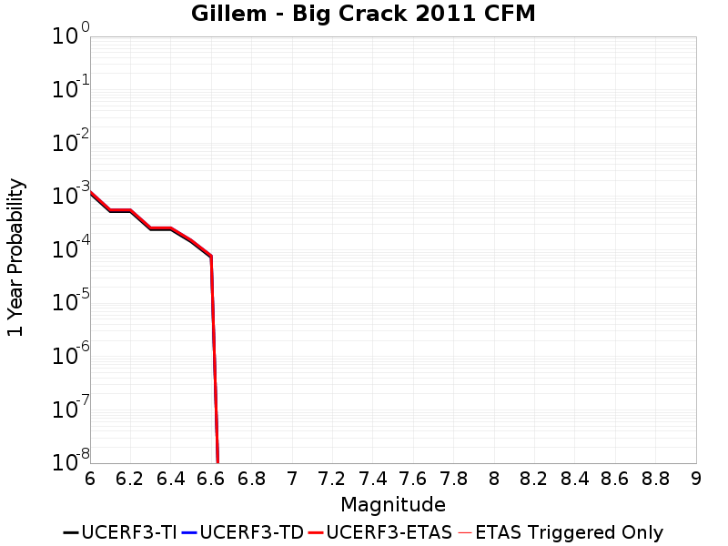 | 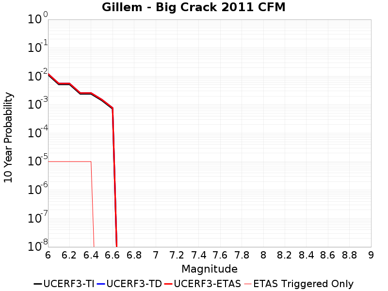 |

| Magnitude | 1 wk TI Prob | 1 wk TD Prob | 1 wk ETAS Prob | 1 wk ETAS/TD Gain | 1 wk ETAS Triggered Only | 1 mo TI Prob | 1 mo TD Prob | 1 mo ETAS Prob | 1 mo ETAS/TD Gain | 1 mo ETAS Triggered Only | 1 yr TI Prob | 1 yr TD Prob | 1 yr ETAS Prob | 1 yr ETAS/TD Gain | 1 yr ETAS Triggered Only | 10 yr TI Prob | 10 yr TD Prob | 10 yr ETAS Prob | 10 yr ETAS/TD Gain | 10 yr ETAS Triggered Only |
|-----|-----|-----|-----|-----|-----|-----|-----|-----|-----|-----|-----|-----|-----|-----|-----|-----|-----|-----|-----|-----|
| 6.0 | 2.196852E-5 | 2.3615636E-5 | 2.3615636E-5 | 1.0 | 0.0 | 9.4147406E-5 | 1.0120644E-4 | 1.0120644E-4 | 1.0 | 0.0 | 0.0011456419 | 0.0012315809 | 0.0012315809 | 1.0 | 0.0 | 0.011397537 | 0.012256425 | 0.0122663025 | 1.0008059 | 1.0E-5 |
| 6.1 | 9.992795E-6 | 1.0716778E-5 | 1.0716778E-5 | 1.0 | 0.0 | 4.2825563E-5 | 4.5928344E-5 | 4.5928344E-5 | 1.0 | 0.0 | 5.2127644E-4 | 5.5905245E-4 | 5.5905245E-4 | 1.0 | 0.0 | 0.0052005537 | 0.0055782725 | 0.0055882167 | 1.0017827 | 1.0E-5 |
| 6.2 | 9.992795E-6 | 1.0716778E-5 | 1.0716778E-5 | 1.0 | 0.0 | 4.2825563E-5 | 4.5928344E-5 | 4.5928344E-5 | 1.0 | 0.0 | 5.2127644E-4 | 5.5905245E-4 | 5.5905245E-4 | 1.0 | 0.0 | 0.0052005537 | 0.0055782725 | 0.0055882167 | 1.0017827 | 1.0E-5 |
| 6.3 | 4.6127884E-6 | 4.944898E-6 | 4.944898E-6 | 1.0 | 0.0 | 1.9768944E-5 | 2.1192274E-5 | 2.1192274E-5 | 1.0 | 0.0 | 2.406603E-4 | 2.5798986E-4 | 2.5798986E-4 | 1.0 | 0.0 | 0.0024039985 | 0.0025773419 | 0.002587316 | 1.00387 | 1.0E-5 |
| 6.4 | 4.6127884E-6 | 4.944898E-6 | 4.944898E-6 | 1.0 | 0.0 | 1.9768944E-5 | 2.1192274E-5 | 2.1192274E-5 | 1.0 | 0.0 | 2.406603E-4 | 2.5798986E-4 | 2.5798986E-4 | 1.0 | 0.0 | 0.0024039985 | 0.0025773419 | 0.002587316 | 1.00387 | 1.0E-5 |
| 6.5 | 2.716712E-6 | 2.9124321E-6 | 2.9124321E-6 | 1.0 | 0.0 | 1.1643E-5 | 1.2481806E-5 | 1.2481806E-5 | 1.0 | 0.0 | 1.417443E-4 | 1.5195782E-4 | 1.5195782E-4 | 1.0 | 0.0 | 0.0014165393 | 0.0015187775 | 0.0015187775 | 1.0 | 0.0 |
| 6.6 | 1.3818255E-6 | 1.4827506E-6 | 1.4827506E-6 | 1.0 | 0.0 | 5.922096E-6 | 6.354637E-6 | 6.354637E-6 | 1.0 | 0.0 | 7.209913E-5 | 7.7366196E-5 | 7.7366196E-5 | 1.0 | 0.0 | 7.2075747E-4 | 7.735136E-4 | 7.735136E-4 | 1.0 | 0.0 |

## Mission Hills 2011
*[(top)](#table-of-contents)*

| 1 Week | 1 Month | 1 Year | 10 Year |
|-----|-----|-----|-----|
| 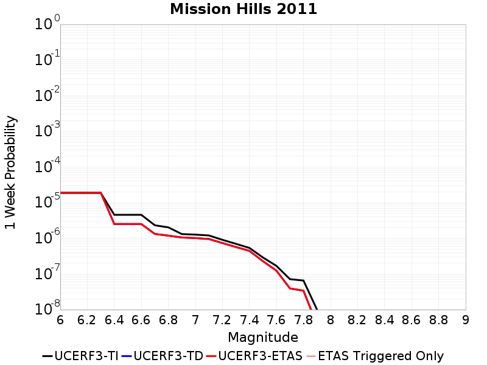 |  | 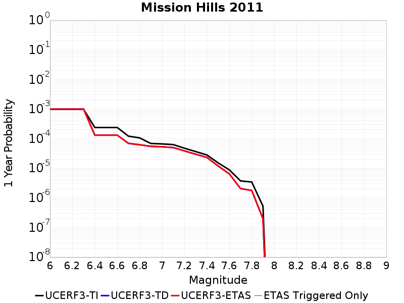 | 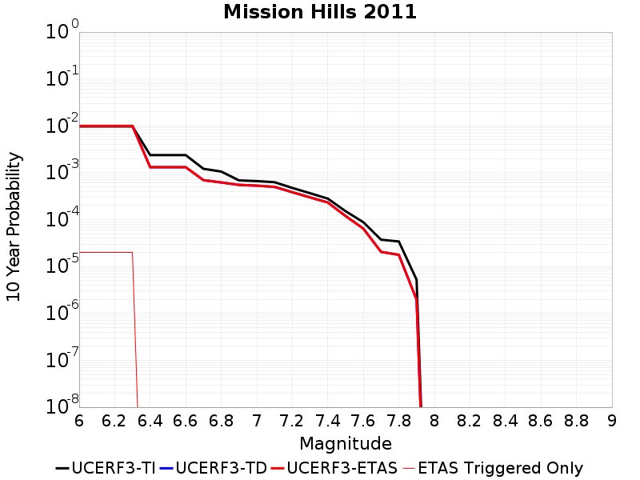 |

| Magnitude | 1 wk TI Prob | 1 wk TD Prob | 1 wk ETAS Prob | 1 wk ETAS/TD Gain | 1 wk ETAS Triggered Only | 1 mo TI Prob | 1 mo TD Prob | 1 mo ETAS Prob | 1 mo ETAS/TD Gain | 1 mo ETAS Triggered Only | 1 yr TI Prob | 1 yr TD Prob | 1 yr ETAS Prob | 1 yr ETAS/TD Gain | 1 yr ETAS Triggered Only | 10 yr TI Prob | 10 yr TD Prob | 10 yr ETAS Prob | 10 yr ETAS/TD Gain | 10 yr ETAS Triggered Only |
|-----|-----|-----|-----|-----|-----|-----|-----|-----|-----|-----|-----|-----|-----|-----|-----|-----|-----|-----|-----|-----|
| 6.0 | 1.8765717E-5 | 1.9074612E-5 | 1.9074612E-5 | 1.0 | 0.0 | 8.0422025E-5 | 8.174771E-5 | 8.174771E-5 | 1.0 | 0.0 | 9.786983E-4 | 9.951679E-4 | 9.951679E-4 | 1.0 | 0.0 | 0.009743992 | 0.009940848 | 0.009960649 | 1.0019919 | 2.0E-5 |
| 6.1 | 1.8765717E-5 | 1.9074612E-5 | 1.9074612E-5 | 1.0 | 0.0 | 8.0422025E-5 | 8.174771E-5 | 8.174771E-5 | 1.0 | 0.0 | 9.786983E-4 | 9.951679E-4 | 9.951679E-4 | 1.0 | 0.0 | 0.009743992 | 0.009940848 | 0.009960649 | 1.0019919 | 2.0E-5 |
| 6.2 | 1.8765717E-5 | 1.9074612E-5 | 1.9074612E-5 | 1.0 | 0.0 | 8.0422025E-5 | 8.174771E-5 | 8.174771E-5 | 1.0 | 0.0 | 9.786983E-4 | 9.951679E-4 | 9.951679E-4 | 1.0 | 0.0 | 0.009743992 | 0.009940848 | 0.009960649 | 1.0019919 | 2.0E-5 |
| 6.3 | 1.8765717E-5 | 1.9074612E-5 | 1.9074612E-5 | 1.0 | 0.0 | 8.0422025E-5 | 8.174771E-5 | 8.174771E-5 | 1.0 | 0.0 | 9.786983E-4 | 9.951679E-4 | 9.951679E-4 | 1.0 | 0.0 | 0.009743992 | 0.009940848 | 0.009960649 | 1.0019919 | 2.0E-5 |
| 6.4 | 4.566357E-6 | 2.5175134E-6 | 2.5175134E-6 | 1.0 | 0.0 | 1.9569954E-5 | 1.0789308E-5 | 1.0789308E-5 | 1.0 | 0.0 | 2.3823815E-4 | 1.3135374E-4 | 1.3135374E-4 | 1.0 | 0.0 | 0.002379829 | 0.0013129397 | 0.0013129397 | 1.0 | 0.0 |
| 6.5 | 4.566357E-6 | 2.5175134E-6 | 2.5175134E-6 | 1.0 | 0.0 | 1.9569954E-5 | 1.0789308E-5 | 1.0789308E-5 | 1.0 | 0.0 | 2.3823815E-4 | 1.3135374E-4 | 1.3135374E-4 | 1.0 | 0.0 | 0.002379829 | 0.0013129397 | 0.0013129397 | 1.0 | 0.0 |
| 6.6 | 4.566357E-6 | 2.5175134E-6 | 2.5175134E-6 | 1.0 | 0.0 | 1.9569954E-5 | 1.0789308E-5 | 1.0789308E-5 | 1.0 | 0.0 | 2.3823815E-4 | 1.3135374E-4 | 1.3135374E-4 | 1.0 | 0.0 | 0.002379829 | 0.0013129397 | 0.0013129397 | 1.0 | 0.0 |
| 6.7 | 2.3266773E-6 | 1.330903E-6 | 1.330903E-6 | 1.0 | 0.0 | 9.971435E-6 | 5.703858E-6 | 5.703858E-6 | 1.0 | 0.0 | 1.2139547E-4 | 6.944232E-5 | 6.944232E-5 | 1.0 | 0.0 | 0.0012132917 | 6.9421233E-4 | 6.9421233E-4 | 1.0 | 0.0 |
| 6.8 | 2.032735E-6 | 1.1905831E-6 | 1.1905831E-6 | 1.0 | 0.0 | 8.711692E-6 | 5.1024895E-6 | 5.1024895E-6 | 1.0 | 0.0 | 1.06059684E-4 | 6.2121086E-5 | 6.2121086E-5 | 1.0 | 0.0 | 0.0010600908 | 6.210421E-4 | 6.210421E-4 | 1.0 | 0.0 |
| 6.9 | 1.3186259E-6 | 1.0571144E-6 | 1.0571144E-6 | 1.0 | 0.0 | 5.6512413E-6 | 4.5304823E-6 | 4.5304823E-6 | 1.0 | 0.0 | 6.8801695E-5 | 5.515726E-5 | 5.515726E-5 | 1.0 | 0.0 | 6.8780396E-4 | 5.5143866E-4 | 5.5143866E-4 | 1.0 | 0.0 |
| 7.0 | 1.2726016E-6 | 1.0168302E-6 | 1.0168302E-6 | 1.0 | 0.0 | 5.4539955E-6 | 4.3578366E-6 | 4.3578366E-6 | 1.0 | 0.0 | 6.6400375E-5 | 5.3055395E-5 | 5.3055395E-5 | 1.0 | 0.0 | 6.6380535E-4 | 5.304301E-4 | 5.304301E-4 | 1.0 | 0.0 |
| 7.1 | 1.2063913E-6 | 9.579068E-7 | 9.579068E-7 | 1.0 | 0.0 | 5.170238E-6 | 4.105308E-6 | 4.105308E-6 | 1.0 | 0.0 | 6.294583E-5 | 4.998101E-5 | 4.998101E-5 | 1.0 | 0.0 | 6.2928005E-4 | 4.997002E-4 | 4.997002E-4 | 1.0 | 0.0 |
| 7.2 | 9.105806E-7 | 7.384634E-7 | 7.384634E-7 | 1.0 | 0.0 | 3.9024826E-6 | 3.1648394E-6 | 3.1648394E-6 | 1.0 | 0.0 | 4.7511687E-5 | 3.8531256E-5 | 3.8531256E-5 | 1.0 | 0.0 | 4.7501532E-4 | 3.852473E-4 | 3.852473E-4 | 1.0 | 0.0 |
| 7.3 | 7.020432E-7 | 5.717515E-7 | 5.717515E-7 | 1.0 | 0.0 | 3.0087533E-6 | 2.4503615E-6 | 2.4503615E-6 | 1.0 | 0.0 | 3.6630954E-5 | 2.9832756E-5 | 2.9832756E-5 | 1.0 | 0.0 | 3.6624918E-4 | 2.9828883E-4 | 2.9828883E-4 | 1.0 | 0.0 |
| 7.4 | 5.3900635E-7 | 4.454146E-7 | 4.454146E-7 | 1.0 | 0.0 | 2.3100251E-6 | 1.9089184E-6 | 1.9089184E-6 | 1.0 | 0.0 | 2.8124194E-5 | 2.3240846E-5 | 2.3240846E-5 | 1.0 | 0.0 | 2.8120633E-4 | 2.3238537E-4 | 2.3238537E-4 | 1.0 | 0.0 |
| 7.5 | 2.907075E-7 | 2.2922548E-7 | 2.2922548E-7 | 1.0 | 0.0 | 1.2458887E-6 | 9.823946E-7 | 9.823946E-7 | 1.0 | 0.0 | 1.5168589E-5 | 1.196059E-5 | 1.196059E-5 | 1.0 | 0.0 | 1.5167553E-4 | 1.19599645E-4 | 1.19599645E-4 | 1.0 | 0.0 |
| 7.6 | 1.6903675E-7 | 1.2383259E-7 | 1.2383259E-7 | 1.0 | 0.0 | 7.2444305E-7 | 5.30711E-7 | 5.30711E-7 | 1.0 | 0.0 | 8.820059E-6 | 6.4613887E-6 | 6.4613887E-6 | 1.0 | 0.0 | 8.8197085E-5 | 6.461213E-5 | 6.461213E-5 | 1.0 | 0.0 |
| 7.7 | 7.168073E-8 | 3.93831E-8 | 3.93831E-8 | 1.0 | 0.0 | 3.072031E-7 | 1.6878471E-7 | 1.6878471E-7 | 1.0 | 0.0 | 3.7401915E-6 | 2.054952E-6 | 2.054952E-6 | 1.0 | 0.0 | 3.7401285E-5 | 2.0549342E-5 | 2.0549342E-5 | 1.0 | 0.0 |
| 7.8 | 6.564101E-8 | 3.4067966E-8 | 3.4067966E-8 | 1.0 | 0.0 | 2.813186E-7 | 1.4600556E-7 | 1.4600556E-7 | 1.0 | 0.0 | 3.4250486E-6 | 1.7776165E-6 | 1.7776165E-6 | 1.0 | 0.0 | 3.424996E-5 | 1.7776034E-5 | 1.7776034E-5 | 1.0 | 0.0 |
| 7.9 | 1.0029074E-8 | 3.7771146E-9 | 3.7771146E-9 | 1.0 | 0.0 | 4.2981743E-8 | 1.6187634E-8 | 1.6187634E-8 | 1.0 | 0.0 | 5.2330256E-7 | 1.9708445E-7 | 1.9708445E-7 | 1.0 | 0.0 | 5.2330133E-6 | 1.9708439E-6 | 1.9708439E-6 | 1.0 | 0.0 |

## Red Mountain
*[(top)](#table-of-contents)*

| 1 Week | 1 Month | 1 Year | 10 Year |
|-----|-----|-----|-----|
|  |  | 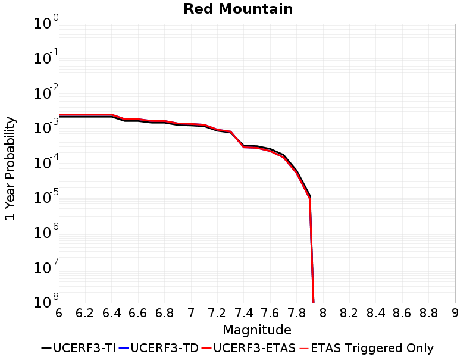 |  |

| Magnitude | 1 wk TI Prob | 1 wk TD Prob | 1 wk ETAS Prob | 1 wk ETAS/TD Gain | 1 wk ETAS Triggered Only | 1 mo TI Prob | 1 mo TD Prob | 1 mo ETAS Prob | 1 mo ETAS/TD Gain | 1 mo ETAS Triggered Only | 1 yr TI Prob | 1 yr TD Prob | 1 yr ETAS Prob | 1 yr ETAS/TD Gain | 1 yr ETAS Triggered Only | 10 yr TI Prob | 10 yr TD Prob | 10 yr ETAS Prob | 10 yr ETAS/TD Gain | 10 yr ETAS Triggered Only |
|-----|-----|-----|-----|-----|-----|-----|-----|-----|-----|-----|-----|-----|-----|-----|-----|-----|-----|-----|-----|-----|
| 6.0 | 4.1810763E-5 | 4.7641723E-5 | 4.7641723E-5 | 1.0 | 0.0 | 1.7917668E-4 | 2.0416376E-4 | 2.0416376E-4 | 1.0 | 0.0 | 0.0021792934 | 0.0024830252 | 0.0024830252 | 1.0 | 0.0 | 0.021580452 | 0.024570461 | 0.024580216 | 1.000397 | 1.0E-5 |
| 6.1 | 4.1810763E-5 | 4.7641723E-5 | 4.7641723E-5 | 1.0 | 0.0 | 1.7917668E-4 | 2.0416376E-4 | 2.0416376E-4 | 1.0 | 0.0 | 0.0021792934 | 0.0024830252 | 0.0024830252 | 1.0 | 0.0 | 0.021580452 | 0.024570461 | 0.024580216 | 1.000397 | 1.0E-5 |
| 6.2 | 4.1810763E-5 | 4.7641723E-5 | 4.7641723E-5 | 1.0 | 0.0 | 1.7917668E-4 | 2.0416376E-4 | 2.0416376E-4 | 1.0 | 0.0 | 0.0021792934 | 0.0024830252 | 0.0024830252 | 1.0 | 0.0 | 0.021580452 | 0.024570461 | 0.024580216 | 1.000397 | 1.0E-5 |
| 6.3 | 4.1810763E-5 | 4.7641723E-5 | 4.7641723E-5 | 1.0 | 0.0 | 1.7917668E-4 | 2.0416376E-4 | 2.0416376E-4 | 1.0 | 0.0 | 0.0021792934 | 0.0024830252 | 0.0024830252 | 1.0 | 0.0 | 0.021580452 | 0.024570461 | 0.024580216 | 1.000397 | 1.0E-5 |
| 6.4 | 4.1810763E-5 | 4.7641723E-5 | 4.7641723E-5 | 1.0 | 0.0 | 1.7917668E-4 | 2.0416376E-4 | 2.0416376E-4 | 1.0 | 0.0 | 0.0021792934 | 0.0024830252 | 0.0024830252 | 1.0 | 0.0 | 0.021580452 | 0.024570461 | 0.024580216 | 1.000397 | 1.0E-5 |
| 6.5 | 3.154503E-5 | 3.5396628E-5 | 3.5396628E-5 | 1.0 | 0.0 | 1.3518598E-4 | 1.5169152E-4 | 1.5169152E-4 | 1.0 | 0.0 | 0.0016446467 | 0.0018453723 | 0.0018453723 | 1.0 | 0.0 | 0.01632528 | 0.018310152 | 0.018319968 | 1.0005362 | 1.0E-5 |
| 6.6 | 3.1535834E-5 | 3.5385998E-5 | 3.5385998E-5 | 1.0 | 0.0 | 1.3514658E-4 | 1.5164599E-4 | 1.5164599E-4 | 1.0 | 0.0 | 0.0016441676 | 0.0018448187 | 0.0018448187 | 1.0 | 0.0 | 0.01632056 | 0.018304707 | 0.018314524 | 1.0005363 | 1.0E-5 |
| 6.7 | 2.8267326E-5 | 3.150161E-5 | 3.150161E-5 | 1.0 | 0.0 | 1.2114006E-4 | 1.350004E-4 | 1.350004E-4 | 1.0 | 0.0 | 0.0014738824 | 0.0016424761 | 0.0016424761 | 1.0 | 0.0 | 0.014641452 | 0.01631215 | 0.016321987 | 1.0006031 | 1.0E-5 |
| 6.8 | 2.8212884E-5 | 3.1439442E-5 | 3.1439442E-5 | 1.0 | 0.0 | 1.20906756E-4 | 1.34734E-4 | 1.34734E-4 | 1.0 | 0.0 | 0.0014710457 | 0.0016392373 | 0.0016392373 | 1.0 | 0.0 | 0.014613459 | 0.016280238 | 0.016290076 | 1.0006043 | 1.0E-5 |
| 6.9 | 2.4227871E-5 | 2.673384E-5 | 2.673384E-5 | 1.0 | 0.0 | 1.03829596E-4 | 1.14569E-4 | 1.14569E-4 | 1.0 | 0.0 | 0.0012633923 | 0.001394061 | 0.001394061 | 1.0 | 0.0 | 0.012562336 | 0.0138608655 | 0.013870727 | 1.0007114 | 1.0E-5 |
| 7.0 | 2.348524E-5 | 2.5861666E-5 | 2.5861666E-5 | 1.0 | 0.0 | 1.0064714E-4 | 1.10831425E-4 | 1.10831425E-4 | 1.0 | 0.0 | 0.0012246901 | 0.0013486132 | 0.0013486132 | 1.0 | 0.0 | 0.012179627 | 0.013411943 | 0.013421808 | 1.0007356 | 1.0E-5 |
| 7.1 | 2.2311642E-5 | 2.4487244E-5 | 2.4487244E-5 | 1.0 | 0.0 | 9.561782E-5 | 1.0494154E-4 | 1.0494154E-4 | 1.0 | 0.0 | 0.0011635252 | 0.0012769894 | 0.0012769894 | 1.0 | 0.0 | 0.01157452 | 0.012704047 | 0.01271392 | 1.0007771 | 1.0E-5 |
| 7.2 | 1.6533986E-5 | 1.7687185E-5 | 1.7687185E-5 | 1.0 | 0.0 | 7.085802E-5 | 7.580038E-5 | 7.580038E-5 | 1.0 | 0.0 | 8.623549E-4 | 9.2254253E-4 | 9.2254253E-4 | 1.0 | 0.0 | 0.008590161 | 0.0091934195 | 0.009203328 | 1.0010778 | 1.0E-5 |
| 7.3 | 1.4703092E-5 | 1.5574295E-5 | 1.5574295E-5 | 1.0 | 0.0 | 6.301173E-5 | 6.674562E-5 | 6.674562E-5 | 1.0 | 0.0 | 7.668978E-4 | 8.123866E-4 | 8.123866E-4 | 1.0 | 0.0 | 0.0076425658 | 0.008100257 | 0.008110176 | 1.0012245 | 1.0E-5 |
| 7.4 | 6.1331984E-6 | 5.5327664E-6 | 5.5327664E-6 | 1.0 | 0.0 | 2.6284872E-5 | 2.3711644E-5 | 2.3711644E-5 | 1.0 | 0.0 | 3.199713E-4 | 2.8865156E-4 | 2.8865156E-4 | 1.0 | 0.0 | 0.0031951098 | 0.0028828208 | 0.0028828208 | 1.0 | 0.0 |
| 7.5 | 5.954766E-6 | 5.3422928E-6 | 5.3422928E-6 | 1.0 | 0.0 | 2.5520176E-5 | 2.2895341E-5 | 2.2895341E-5 | 1.0 | 0.0 | 3.1066386E-4 | 2.7871566E-4 | 2.7871566E-4 | 1.0 | 0.0 | 0.003102299 | 0.002783715 | 0.002783715 | 1.0 | 0.0 |
| 7.6 | 4.9726646E-6 | 4.318562E-6 | 4.318562E-6 | 1.0 | 0.0 | 2.1311245E-5 | 1.8507992E-5 | 1.8507992E-5 | 1.0 | 0.0 | 2.5943352E-4 | 2.2531184E-4 | 2.2531184E-4 | 1.0 | 0.0 | 0.0025913084 | 0.0022508688 | 0.0022508688 | 1.0 | 0.0 |
| 7.7 | 3.3613894E-6 | 2.8550826E-6 | 2.8550826E-6 | 1.0 | 0.0 | 1.4405875E-5 | 1.22360125E-5 | 1.22360125E-5 | 1.0 | 0.0 | 1.7537741E-4 | 1.4896353E-4 | 1.4896353E-4 | 1.0 | 0.0 | 0.0017523908 | 0.0014886631 | 0.0014886631 | 1.0 | 0.0 |
| 7.8 | 1.1828961E-6 | 1.0131039E-6 | 1.0131039E-6 | 1.0 | 0.0 | 5.069545E-6 | 4.3418668E-6 | 4.3418668E-6 | 1.0 | 0.0 | 6.171996E-5 | 5.2860974E-5 | 5.2860974E-5 | 1.0 | 0.0 | 6.170282E-4 | 5.284869E-4 | 5.284869E-4 | 1.0 | 0.0 |
| 7.9 | 2.2967266E-7 | 1.8626764E-7 | 1.8626764E-7 | 1.0 | 0.0 | 9.843111E-7 | 7.9828965E-7 | 7.9828965E-7 | 1.0 | 0.0 | 1.19839215E-5 | 9.719136E-6 | 9.719136E-6 | 1.0 | 0.0 | 1.1983275E-4 | 9.7187396E-5 | 9.7187396E-5 | 1.0 | 0.0 |

## Fontana (Seismicity)
*[(top)](#table-of-contents)*

| 1 Week | 1 Month | 1 Year | 10 Year |
|-----|-----|-----|-----|
|  |  | 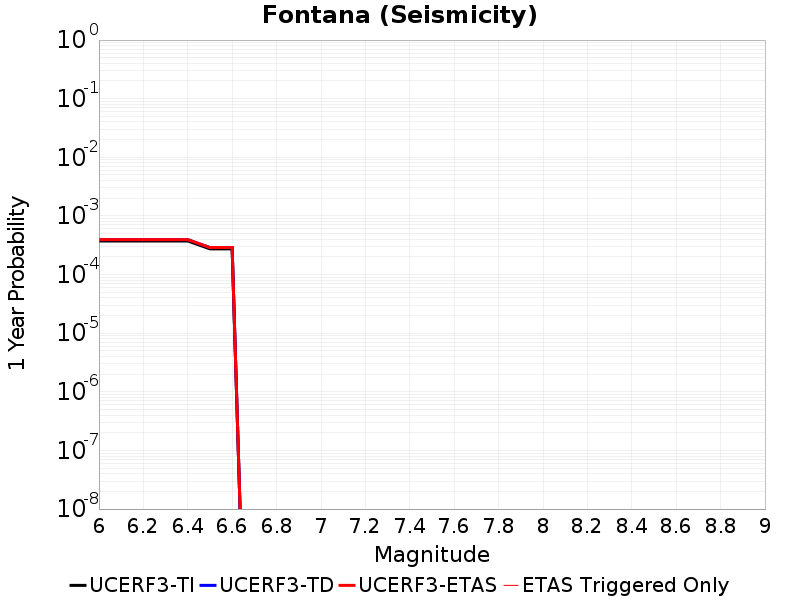 | 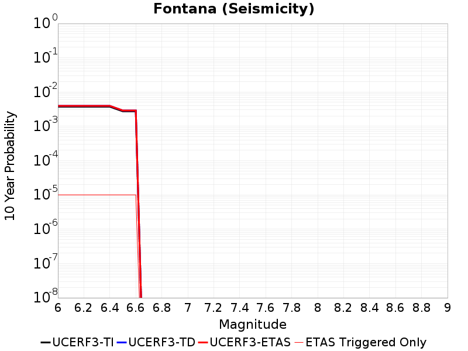 |

| Magnitude | 1 wk TI Prob | 1 wk TD Prob | 1 wk ETAS Prob | 1 wk ETAS/TD Gain | 1 wk ETAS Triggered Only | 1 mo TI Prob | 1 mo TD Prob | 1 mo ETAS Prob | 1 mo ETAS/TD Gain | 1 mo ETAS Triggered Only | 1 yr TI Prob | 1 yr TD Prob | 1 yr ETAS Prob | 1 yr ETAS/TD Gain | 1 yr ETAS Triggered Only | 10 yr TI Prob | 10 yr TD Prob | 10 yr ETAS Prob | 10 yr ETAS/TD Gain | 10 yr ETAS Triggered Only |
|-----|-----|-----|-----|-----|-----|-----|-----|-----|-----|-----|-----|-----|-----|-----|-----|-----|-----|-----|-----|-----|
| 6.0 | 7.1789214E-6 | 7.554489E-6 | 7.554489E-6 | 1.0 | 0.0 | 3.076644E-5 | 3.237621E-5 | 3.237621E-5 | 1.0 | 0.0 | 3.7451705E-4 | 3.9414986E-4 | 3.9414986E-4 | 1.0 | 0.0 | 0.003738865 | 0.00393851 | 0.0039484706 | 1.002529 | 1.0E-5 |
| 6.1 | 7.1789214E-6 | 7.554489E-6 | 7.554489E-6 | 1.0 | 0.0 | 3.076644E-5 | 3.237621E-5 | 3.237621E-5 | 1.0 | 0.0 | 3.7451705E-4 | 3.9414986E-4 | 3.9414986E-4 | 1.0 | 0.0 | 0.003738865 | 0.00393851 | 0.0039484706 | 1.002529 | 1.0E-5 |
| 6.2 | 7.1789214E-6 | 7.554489E-6 | 7.554489E-6 | 1.0 | 0.0 | 3.076644E-5 | 3.237621E-5 | 3.237621E-5 | 1.0 | 0.0 | 3.7451705E-4 | 3.9414986E-4 | 3.9414986E-4 | 1.0 | 0.0 | 0.003738865 | 0.00393851 | 0.0039484706 | 1.002529 | 1.0E-5 |
| 6.3 | 7.1789214E-6 | 7.554489E-6 | 7.554489E-6 | 1.0 | 0.0 | 3.076644E-5 | 3.237621E-5 | 3.237621E-5 | 1.0 | 0.0 | 3.7451705E-4 | 3.9414986E-4 | 3.9414986E-4 | 1.0 | 0.0 | 0.003738865 | 0.00393851 | 0.0039484706 | 1.002529 | 1.0E-5 |
| 6.4 | 7.1789214E-6 | 7.554489E-6 | 7.554489E-6 | 1.0 | 0.0 | 3.076644E-5 | 3.237621E-5 | 3.237621E-5 | 1.0 | 0.0 | 3.7451705E-4 | 3.9414986E-4 | 3.9414986E-4 | 1.0 | 0.0 | 0.003738865 | 0.00393851 | 0.0039484706 | 1.002529 | 1.0E-5 |
| 6.5 | 5.2611317E-6 | 5.5345363E-6 | 5.5345363E-6 | 1.0 | 0.0 | 2.2547512E-5 | 2.3719442E-5 | 2.3719442E-5 | 1.0 | 0.0 | 2.744814E-4 | 2.887842E-4 | 2.887842E-4 | 1.0 | 0.0 | 0.002741426 | 0.002887842 | 0.0028978132 | 1.0034528 | 1.0E-5 |
| 6.6 | 5.2611317E-6 | 5.5345363E-6 | 5.5345363E-6 | 1.0 | 0.0 | 2.2547512E-5 | 2.3719442E-5 | 2.3719442E-5 | 1.0 | 0.0 | 2.744814E-4 | 2.887842E-4 | 2.887842E-4 | 1.0 | 0.0 | 0.002741426 | 0.002887842 | 0.0028978132 | 1.0034528 | 1.0E-5 |

## Las Positas
*[(top)](#table-of-contents)*

| 1 Week | 1 Month | 1 Year | 10 Year |
|-----|-----|-----|-----|
|  | 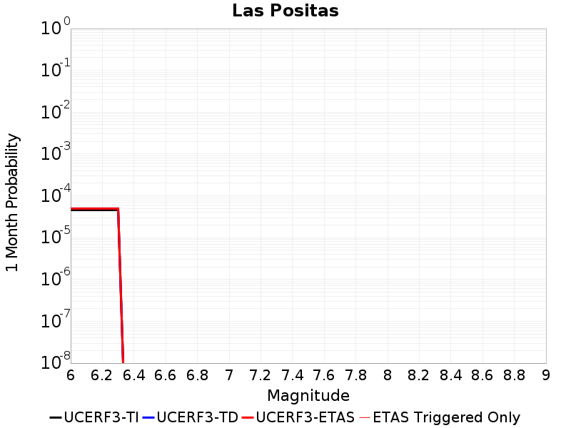 |  |  |

| Magnitude | 1 wk TI Prob | 1 wk TD Prob | 1 wk ETAS Prob | 1 wk ETAS/TD Gain | 1 wk ETAS Triggered Only | 1 mo TI Prob | 1 mo TD Prob | 1 mo ETAS Prob | 1 mo ETAS/TD Gain | 1 mo ETAS Triggered Only | 1 yr TI Prob | 1 yr TD Prob | 1 yr ETAS Prob | 1 yr ETAS/TD Gain | 1 yr ETAS Triggered Only | 10 yr TI Prob | 10 yr TD Prob | 10 yr ETAS Prob | 10 yr ETAS/TD Gain | 10 yr ETAS Triggered Only |
|-----|-----|-----|-----|-----|-----|-----|-----|-----|-----|-----|-----|-----|-----|-----|-----|-----|-----|-----|-----|-----|
| 6.0 | 1.0659424E-5 | 1.1597546E-5 | 1.1597546E-5 | 1.0 | 0.0 | 4.568245E-5 | 4.970377E-5 | 4.970377E-5 | 1.0 | 0.0 | 5.560419E-4 | 6.0514343E-4 | 6.0514343E-4 | 1.0 | 0.0 | 0.005546526 | 0.006051434 | 0.0060613737 | 1.0016425 | 1.0E-5 |
| 6.1 | 1.0659424E-5 | 1.1597546E-5 | 1.1597546E-5 | 1.0 | 0.0 | 4.568245E-5 | 4.970377E-5 | 4.970377E-5 | 1.0 | 0.0 | 5.560419E-4 | 6.0514343E-4 | 6.0514343E-4 | 1.0 | 0.0 | 0.005546526 | 0.006051434 | 0.0060613737 | 1.0016425 | 1.0E-5 |
| 6.2 | 1.0659424E-5 | 1.1597546E-5 | 1.1597546E-5 | 1.0 | 0.0 | 4.568245E-5 | 4.970377E-5 | 4.970377E-5 | 1.0 | 0.0 | 5.560419E-4 | 6.0514343E-4 | 6.0514343E-4 | 1.0 | 0.0 | 0.005546526 | 0.006051434 | 0.0060613737 | 1.0016425 | 1.0E-5 |
| 6.3 | 1.0659424E-5 | 1.1597546E-5 | 1.1597546E-5 | 1.0 | 0.0 | 4.568245E-5 | 4.970377E-5 | 4.970377E-5 | 1.0 | 0.0 | 5.560419E-4 | 6.0514343E-4 | 6.0514343E-4 | 1.0 | 0.0 | 0.005546526 | 0.006051434 | 0.0060613737 | 1.0016425 | 1.0E-5 |

## North Frontal  (West)
*[(top)](#table-of-contents)*

| 1 Week | 1 Month | 1 Year | 10 Year |
|-----|-----|-----|-----|
| 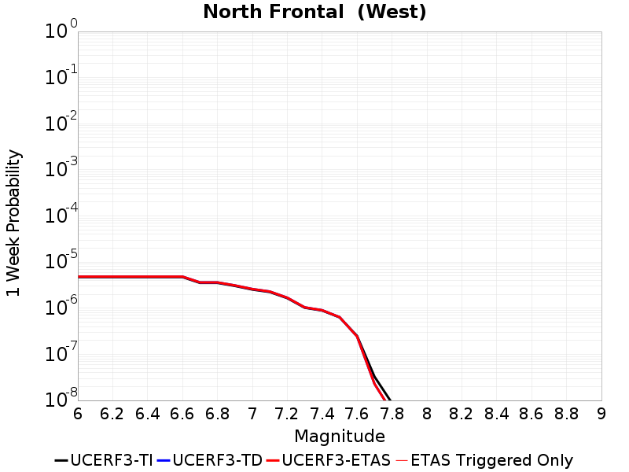 |  |  | 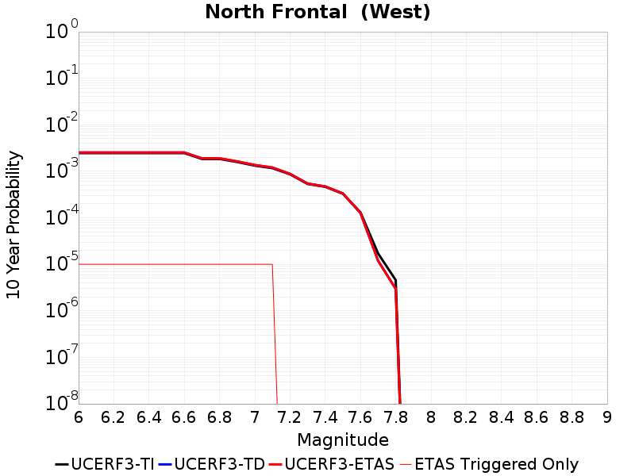 |

| Magnitude | 1 wk TI Prob | 1 wk TD Prob | 1 wk ETAS Prob | 1 wk ETAS/TD Gain | 1 wk ETAS Triggered Only | 1 mo TI Prob | 1 mo TD Prob | 1 mo ETAS Prob | 1 mo ETAS/TD Gain | 1 mo ETAS Triggered Only | 1 yr TI Prob | 1 yr TD Prob | 1 yr ETAS Prob | 1 yr ETAS/TD Gain | 1 yr ETAS Triggered Only | 10 yr TI Prob | 10 yr TD Prob | 10 yr ETAS Prob | 10 yr ETAS/TD Gain | 10 yr ETAS Triggered Only |
|-----|-----|-----|-----|-----|-----|-----|-----|-----|-----|-----|-----|-----|-----|-----|-----|-----|-----|-----|-----|-----|
| 6.0 | 4.7316266E-6 | 4.8535685E-6 | 4.8535685E-6 | 1.0 | 0.0 | 2.0278241E-5 | 2.080085E-5 | 2.080085E-5 | 1.0 | 0.0 | 2.4685962E-4 | 2.532224E-4 | 2.532224E-4 | 1.0 | 0.0 | 0.0024658558 | 0.0025294847 | 0.0025394594 | 1.0039433 | 1.0E-5 |
| 6.1 | 4.7316266E-6 | 4.8535685E-6 | 4.8535685E-6 | 1.0 | 0.0 | 2.0278241E-5 | 2.080085E-5 | 2.080085E-5 | 1.0 | 0.0 | 2.4685962E-4 | 2.532224E-4 | 2.532224E-4 | 1.0 | 0.0 | 0.0024658558 | 0.0025294847 | 0.0025394594 | 1.0039433 | 1.0E-5 |
| 6.2 | 4.7316266E-6 | 4.8535685E-6 | 4.8535685E-6 | 1.0 | 0.0 | 2.0278241E-5 | 2.080085E-5 | 2.080085E-5 | 1.0 | 0.0 | 2.4685962E-4 | 2.532224E-4 | 2.532224E-4 | 1.0 | 0.0 | 0.0024658558 | 0.0025294847 | 0.0025394594 | 1.0039433 | 1.0E-5 |
| 6.3 | 4.7316266E-6 | 4.8535685E-6 | 4.8535685E-6 | 1.0 | 0.0 | 2.0278241E-5 | 2.080085E-5 | 2.080085E-5 | 1.0 | 0.0 | 2.4685962E-4 | 2.532224E-4 | 2.532224E-4 | 1.0 | 0.0 | 0.0024658558 | 0.0025294847 | 0.0025394594 | 1.0039433 | 1.0E-5 |
| 6.4 | 4.7316266E-6 | 4.8535685E-6 | 4.8535685E-6 | 1.0 | 0.0 | 2.0278241E-5 | 2.080085E-5 | 2.080085E-5 | 1.0 | 0.0 | 2.4685962E-4 | 2.532224E-4 | 2.532224E-4 | 1.0 | 0.0 | 0.0024658558 | 0.0025294847 | 0.0025394594 | 1.0039433 | 1.0E-5 |
| 6.5 | 4.7316266E-6 | 4.8535685E-6 | 4.8535685E-6 | 1.0 | 0.0 | 2.0278241E-5 | 2.080085E-5 | 2.080085E-5 | 1.0 | 0.0 | 2.4685962E-4 | 2.532224E-4 | 2.532224E-4 | 1.0 | 0.0 | 0.0024658558 | 0.0025294847 | 0.0025394594 | 1.0039433 | 1.0E-5 |
| 6.6 | 4.7316266E-6 | 4.8535685E-6 | 4.8535685E-6 | 1.0 | 0.0 | 2.0278241E-5 | 2.080085E-5 | 2.080085E-5 | 1.0 | 0.0 | 2.4685962E-4 | 2.532224E-4 | 2.532224E-4 | 1.0 | 0.0 | 0.0024658558 | 0.0025294847 | 0.0025394594 | 1.0039433 | 1.0E-5 |
| 6.7 | 3.5382777E-6 | 3.631597E-6 | 3.631597E-6 | 1.0 | 0.0 | 1.516396E-5 | 1.5563899E-5 | 1.5563899E-5 | 1.0 | 0.0 | 1.8460557E-4 | 1.8947477E-4 | 1.8947477E-4 | 1.0 | 0.0 | 0.0018445229 | 0.0018932093 | 0.0019031904 | 1.005272 | 1.0E-5 |
| 6.8 | 3.5382777E-6 | 3.631597E-6 | 3.631597E-6 | 1.0 | 0.0 | 1.516396E-5 | 1.5563899E-5 | 1.5563899E-5 | 1.0 | 0.0 | 1.8460557E-4 | 1.8947477E-4 | 1.8947477E-4 | 1.0 | 0.0 | 0.0018445229 | 0.0018932093 | 0.0019031904 | 1.005272 | 1.0E-5 |
| 6.9 | 3.0428037E-6 | 3.1233894E-6 | 3.1233894E-6 | 1.0 | 0.0 | 1.30405215E-5 | 1.338589E-5 | 1.338589E-5 | 1.0 | 0.0 | 1.5875678E-4 | 1.629617E-4 | 1.629617E-4 | 1.0 | 0.0 | 0.0015864341 | 0.0016284892 | 0.0016384729 | 1.0061307 | 1.0E-5 |
| 7.0 | 2.538778E-6 | 2.606637E-6 | 2.606637E-6 | 1.0 | 0.0 | 1.0880432E-5 | 1.1171257E-5 | 1.1171257E-5 | 1.0 | 0.0 | 1.324612E-4 | 1.3600204E-4 | 1.3600204E-4 | 1.0 | 0.0 | 0.0013238228 | 0.0013592348 | 0.0013692213 | 1.0073471 | 1.0E-5 |
| 7.1 | 2.2418935E-6 | 2.301702E-6 | 2.301702E-6 | 1.0 | 0.0 | 9.60808E-6 | 9.864402E-6 | 9.864402E-6 | 1.0 | 0.0 | 1.1697209E-4 | 1.20092925E-4 | 1.20092925E-4 | 1.0 | 0.0 | 0.0011691054 | 0.0012003243 | 0.0012103122 | 1.008321 | 1.0E-5 |
| 7.2 | 1.6526745E-6 | 1.692852E-6 | 1.692852E-6 | 1.0 | 0.0 | 7.082872E-6 | 7.2550615E-6 | 7.2550615E-6 | 1.0 | 0.0 | 8.623055E-5 | 8.832705E-5 | 8.832705E-5 | 1.0 | 0.0 | 8.61971E-4 | 8.8294444E-4 | 8.8294444E-4 | 1.0 | 0.0 |
| 7.3 | 1.0246019E-6 | 1.0444609E-6 | 1.0444609E-6 | 1.0 | 0.0 | 4.391144E-6 | 4.4762537E-6 | 4.4762537E-6 | 1.0 | 0.0 | 5.3460866E-5 | 5.4497144E-5 | 5.4497144E-5 | 1.0 | 0.0 | 5.344801E-4 | 5.448493E-4 | 5.448493E-4 | 1.0 | 0.0 |
| 7.4 | 8.9045164E-7 | 9.058617E-7 | 9.058617E-7 | 1.0 | 0.0 | 3.8162157E-6 | 3.8822595E-6 | 3.8822595E-6 | 1.0 | 0.0 | 4.646144E-5 | 4.7265592E-5 | 4.7265592E-5 | 1.0 | 0.0 | 4.6451724E-4 | 4.725663E-4 | 4.725663E-4 | 1.0 | 0.0 |
| 7.5 | 6.3357E-7 | 6.404202E-7 | 6.404202E-7 | 1.0 | 0.0 | 2.7152971E-6 | 2.7446554E-6 | 2.7446554E-6 | 1.0 | 0.0 | 3.305824E-5 | 3.3415734E-5 | 3.3415734E-5 | 1.0 | 0.0 | 3.3053322E-4 | 3.341137E-4 | 3.341137E-4 | 1.0 | 0.0 |
| 7.6 | 2.5087024E-7 | 2.436694E-7 | 2.436694E-7 | 1.0 | 0.0 | 1.0751578E-6 | 1.0442972E-6 | 1.0442972E-6 | 1.0 | 0.0 | 1.3089967E-5 | 1.2714265E-5 | 1.2714265E-5 | 1.0 | 0.0 | 1.3089196E-4 | 1.2713743E-4 | 1.2713743E-4 | 1.0 | 0.0 |
| 7.7 | 3.282987E-8 | 2.2880588E-8 | 2.2880588E-8 | 1.0 | 0.0 | 1.4069944E-7 | 9.805966E-8 | 9.805966E-8 | 1.0 | 0.0 | 1.7130144E-6 | 1.1938757E-6 | 1.1938757E-6 | 1.0 | 0.0 | 1.7130013E-5 | 1.1938701E-5 | 1.1938701E-5 | 1.0 | 0.0 |
| 7.8 | 8.77499E-9 | 5.6845026E-9 | 5.6845026E-9 | 1.0 | 0.0 | 3.7607098E-8 | 2.4362153E-8 | 2.4362153E-8 | 1.0 | 0.0 | 4.578663E-7 | 2.966092E-7 | 2.966092E-7 | 1.0 | 0.0 | 4.5786537E-6 | 2.9660894E-6 | 2.9660894E-6 | 1.0 | 0.0 |

## Northridge Hills
*[(top)](#table-of-contents)*

| 1 Week | 1 Month | 1 Year | 10 Year |
|-----|-----|-----|-----|
|  |  |  | 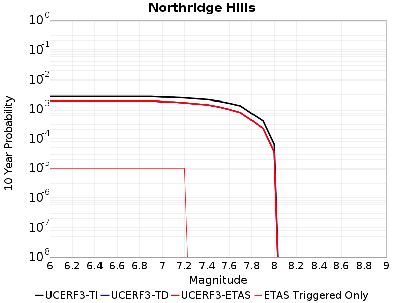 |

| Magnitude | 1 wk TI Prob | 1 wk TD Prob | 1 wk ETAS Prob | 1 wk ETAS/TD Gain | 1 wk ETAS Triggered Only | 1 mo TI Prob | 1 mo TD Prob | 1 mo ETAS Prob | 1 mo ETAS/TD Gain | 1 mo ETAS Triggered Only | 1 yr TI Prob | 1 yr TD Prob | 1 yr ETAS Prob | 1 yr ETAS/TD Gain | 1 yr ETAS Triggered Only | 10 yr TI Prob | 10 yr TD Prob | 10 yr ETAS Prob | 10 yr ETAS/TD Gain | 10 yr ETAS Triggered Only |
|-----|-----|-----|-----|-----|-----|-----|-----|-----|-----|-----|-----|-----|-----|-----|-----|-----|-----|-----|-----|-----|
| 6.0 | 5.095982E-6 | 3.6197248E-6 | 3.6197248E-6 | 1.0 | 0.0 | 2.183974E-5 | 1.5513015E-5 | 1.5513015E-5 | 1.0 | 0.0 | 2.658664E-4 | 1.8885471E-4 | 1.8885471E-4 | 1.0 | 0.0 | 0.0026554854 | 0.0018869545 | 0.0018969357 | 1.0052896 | 1.0E-5 |
| 6.1 | 5.095982E-6 | 3.6197248E-6 | 3.6197248E-6 | 1.0 | 0.0 | 2.183974E-5 | 1.5513015E-5 | 1.5513015E-5 | 1.0 | 0.0 | 2.658664E-4 | 1.8885471E-4 | 1.8885471E-4 | 1.0 | 0.0 | 0.0026554854 | 0.0018869545 | 0.0018969357 | 1.0052896 | 1.0E-5 |
| 6.2 | 5.095982E-6 | 3.6197248E-6 | 3.6197248E-6 | 1.0 | 0.0 | 2.183974E-5 | 1.5513015E-5 | 1.5513015E-5 | 1.0 | 0.0 | 2.658664E-4 | 1.8885471E-4 | 1.8885471E-4 | 1.0 | 0.0 | 0.0026554854 | 0.0018869545 | 0.0018969357 | 1.0052896 | 1.0E-5 |
| 6.3 | 5.095982E-6 | 3.6197248E-6 | 3.6197248E-6 | 1.0 | 0.0 | 2.183974E-5 | 1.5513015E-5 | 1.5513015E-5 | 1.0 | 0.0 | 2.658664E-4 | 1.8885471E-4 | 1.8885471E-4 | 1.0 | 0.0 | 0.0026554854 | 0.0018869545 | 0.0018969357 | 1.0052896 | 1.0E-5 |
| 6.4 | 5.095982E-6 | 3.6197248E-6 | 3.6197248E-6 | 1.0 | 0.0 | 2.183974E-5 | 1.5513015E-5 | 1.5513015E-5 | 1.0 | 0.0 | 2.658664E-4 | 1.8885471E-4 | 1.8885471E-4 | 1.0 | 0.0 | 0.0026554854 | 0.0018869545 | 0.0018969357 | 1.0052896 | 1.0E-5 |
| 6.5 | 5.095982E-6 | 3.6197248E-6 | 3.6197248E-6 | 1.0 | 0.0 | 2.183974E-5 | 1.5513015E-5 | 1.5513015E-5 | 1.0 | 0.0 | 2.658664E-4 | 1.8885471E-4 | 1.8885471E-4 | 1.0 | 0.0 | 0.0026554854 | 0.0018869545 | 0.0018969357 | 1.0052896 | 1.0E-5 |
| 6.6 | 5.095982E-6 | 3.6197248E-6 | 3.6197248E-6 | 1.0 | 0.0 | 2.183974E-5 | 1.5513015E-5 | 1.5513015E-5 | 1.0 | 0.0 | 2.658664E-4 | 1.8885471E-4 | 1.8885471E-4 | 1.0 | 0.0 | 0.0026554854 | 0.0018869545 | 0.0018969357 | 1.0052896 | 1.0E-5 |
| 6.7 | 5.095982E-6 | 3.6197248E-6 | 3.6197248E-6 | 1.0 | 0.0 | 2.183974E-5 | 1.5513015E-5 | 1.5513015E-5 | 1.0 | 0.0 | 2.658664E-4 | 1.8885471E-4 | 1.8885471E-4 | 1.0 | 0.0 | 0.0026554854 | 0.0018869545 | 0.0018969357 | 1.0052896 | 1.0E-5 |
| 6.8 | 5.095982E-6 | 3.6197248E-6 | 3.6197248E-6 | 1.0 | 0.0 | 2.183974E-5 | 1.5513015E-5 | 1.5513015E-5 | 1.0 | 0.0 | 2.658664E-4 | 1.8885471E-4 | 1.8885471E-4 | 1.0 | 0.0 | 0.0026554854 | 0.0018869545 | 0.0018969357 | 1.0052896 | 1.0E-5 |
| 6.9 | 5.0942654E-6 | 3.6179395E-6 | 3.6179395E-6 | 1.0 | 0.0 | 2.1832384E-5 | 1.5505362E-5 | 1.5505362E-5 | 1.0 | 0.0 | 2.6577685E-4 | 1.8876155E-4 | 1.8876155E-4 | 1.0 | 0.0 | 0.002654592 | 0.0018860247 | 0.0018960058 | 1.0052922 | 1.0E-5 |
| 7.0 | 4.851143E-6 | 3.3631775E-6 | 3.3631775E-6 | 1.0 | 0.0 | 2.0790447E-5 | 1.4413538E-5 | 1.4413538E-5 | 1.0 | 0.0 | 2.5309427E-4 | 1.7547073E-4 | 1.7547073E-4 | 1.0 | 0.0 | 0.0025280623 | 0.0017533263 | 0.0017633088 | 1.0056934 | 1.0E-5 |
| 7.1 | 4.7910607E-6 | 3.3014394E-6 | 3.3014394E-6 | 1.0 | 0.0 | 2.0532956E-5 | 1.414895E-5 | 1.414895E-5 | 1.0 | 0.0 | 2.4996005E-4 | 1.7224989E-4 | 1.7224989E-4 | 1.0 | 0.0 | 0.0024967908 | 0.0017211678 | 0.0017311507 | 1.0058 | 1.0E-5 |
| 7.2 | 4.580079E-6 | 3.111155E-6 | 3.111155E-6 | 1.0 | 0.0 | 1.9628762E-5 | 1.3333453E-5 | 1.3333453E-5 | 1.0 | 0.0 | 2.3895396E-4 | 1.6232273E-4 | 1.6232273E-4 | 1.0 | 0.0 | 0.0023869718 | 0.0016220452 | 0.001632029 | 1.006155 | 1.0E-5 |
| 7.3 | 4.290062E-6 | 2.8724937E-6 | 2.8724937E-6 | 1.0 | 0.0 | 1.838585E-5 | 1.2310629E-5 | 1.2310629E-5 | 1.0 | 0.0 | 2.2382473E-4 | 1.4987163E-4 | 1.4987163E-4 | 1.0 | 0.0 | 0.0022359942 | 0.0014977085 | 0.0014977085 | 1.0 | 0.0 |
| 7.4 | 4.0259683E-6 | 2.6780654E-6 | 2.6780654E-6 | 1.0 | 0.0 | 1.7254037E-5 | 1.1477373E-5 | 1.1477373E-5 | 1.0 | 0.0 | 2.1004764E-4 | 1.3972807E-4 | 1.3972807E-4 | 1.0 | 0.0 | 0.002098492 | 0.001396405 | 0.001396405 | 1.0 | 0.0 |
| 7.5 | 3.5477108E-6 | 2.289174E-6 | 2.289174E-6 | 1.0 | 0.0 | 1.5204386E-5 | 9.810709E-6 | 9.810709E-6 | 1.0 | 0.0 | 1.8509767E-4 | 1.1943885E-4 | 1.1943885E-4 | 1.0 | 0.0 | 0.0018494357 | 0.0011937482 | 0.0011937482 | 1.0 | 0.0 |
| 7.6 | 2.9990608E-6 | 1.8564484E-6 | 1.8564484E-6 | 1.0 | 0.0 | 1.2853055E-5 | 7.956183E-6 | 7.956183E-6 | 1.0 | 0.0 | 1.564747E-4 | 9.686223E-5 | 9.686223E-5 | 1.0 | 0.0 | 0.0015636457 | 9.6820097E-4 | 9.6820097E-4 | 1.0 | 0.0 |
| 7.7 | 2.4542855E-6 | 1.449402E-6 | 1.449402E-6 | 1.0 | 0.0 | 1.05183235E-5 | 6.2117083E-6 | 6.2117083E-6 | 1.0 | 0.0 | 1.2805307E-4 | 7.562493E-5 | 7.562493E-5 | 1.0 | 0.0 | 0.001279793 | 7.5599254E-4 | 7.5599254E-4 | 1.0 | 0.0 |
| 7.8 | 1.3623128E-6 | 8.0347735E-7 | 8.0347735E-7 | 1.0 | 0.0 | 5.8384703E-6 | 3.44347E-6 | 3.44347E-6 | 1.0 | 0.0 | 7.108106E-5 | 4.1923442E-5 | 4.1923442E-5 | 1.0 | 0.0 | 7.1058323E-4 | 4.1915555E-4 | 4.1915555E-4 | 1.0 | 0.0 |
| 7.9 | 7.716622E-7 | 4.2315966E-7 | 4.2315966E-7 | 1.0 | 0.0 | 3.3071194E-6 | 1.81354E-6 | 1.81354E-6 | 1.0 | 0.0 | 4.0263436E-5 | 2.2079628E-5 | 2.2079628E-5 | 1.0 | 0.0 | 4.0256142E-4 | 2.2077445E-4 | 2.2077445E-4 | 1.0 | 0.0 |
| 8.0 | 1.2117711E-7 | 6.638705E-8 | 6.638705E-8 | 1.0 | 0.0 | 5.1933034E-7 | 2.845159E-7 | 2.845159E-7 | 1.0 | 0.0 | 6.3228285E-6 | 3.4639759E-6 | 3.4639759E-6 | 1.0 | 0.0 | 6.3226486E-5 | 3.4639237E-5 | 3.4639237E-5 | 1.0 | 0.0 |

## Great Valley 08 (Quinto)
*[(top)](#table-of-contents)*

| 1 Week | 1 Month | 1 Year | 10 Year |
|-----|-----|-----|-----|
|  | 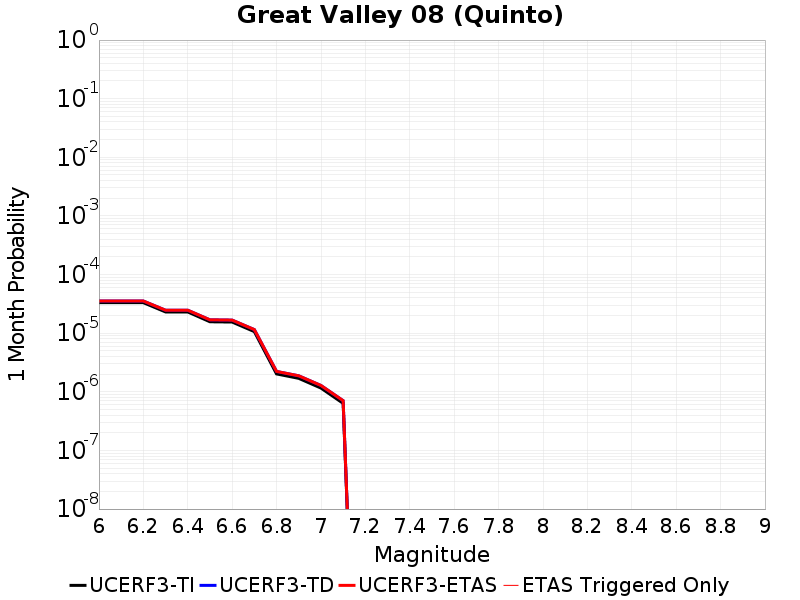 |  | 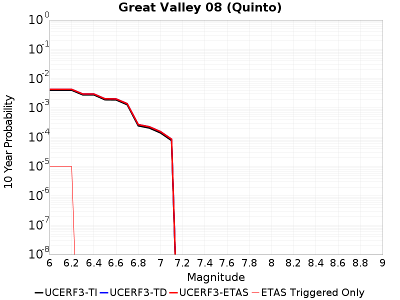 |

| Magnitude | 1 wk TI Prob | 1 wk TD Prob | 1 wk ETAS Prob | 1 wk ETAS/TD Gain | 1 wk ETAS Triggered Only | 1 mo TI Prob | 1 mo TD Prob | 1 mo ETAS Prob | 1 mo ETAS/TD Gain | 1 mo ETAS Triggered Only | 1 yr TI Prob | 1 yr TD Prob | 1 yr ETAS Prob | 1 yr ETAS/TD Gain | 1 yr ETAS Triggered Only | 10 yr TI Prob | 10 yr TD Prob | 10 yr ETAS Prob | 10 yr ETAS/TD Gain | 10 yr ETAS Triggered Only |
|-----|-----|-----|-----|-----|-----|-----|-----|-----|-----|-----|-----|-----|-----|-----|-----|-----|-----|-----|-----|-----|
| 6.0 | 7.737697E-6 | 8.256532E-6 | 8.256532E-6 | 1.0 | 0.0 | 3.3161137E-5 | 3.5384764E-5 | 3.5384764E-5 | 1.0 | 0.0 | 4.0366207E-4 | 4.307432E-4 | 4.307432E-4 | 1.0 | 0.0 | 0.004029296 | 0.0043009375 | 0.0043108948 | 1.002315 | 1.0E-5 |
| 6.1 | 7.737697E-6 | 8.256532E-6 | 8.256532E-6 | 1.0 | 0.0 | 3.3161137E-5 | 3.5384764E-5 | 3.5384764E-5 | 1.0 | 0.0 | 4.0366207E-4 | 4.307432E-4 | 4.307432E-4 | 1.0 | 0.0 | 0.004029296 | 0.0043009375 | 0.0043108948 | 1.002315 | 1.0E-5 |
| 6.2 | 7.737697E-6 | 8.256532E-6 | 8.256532E-6 | 1.0 | 0.0 | 3.3161137E-5 | 3.5384764E-5 | 3.5384764E-5 | 1.0 | 0.0 | 4.0366207E-4 | 4.307432E-4 | 4.307432E-4 | 1.0 | 0.0 | 0.004029296 | 0.0043009375 | 0.0043108948 | 1.002315 | 1.0E-5 |
| 6.3 | 5.374012E-6 | 5.753136E-6 | 5.753136E-6 | 1.0 | 0.0 | 2.3031276E-5 | 2.4656129E-5 | 2.4656129E-5 | 1.0 | 0.0 | 2.803697E-4 | 3.0015816E-4 | 3.0015816E-4 | 1.0 | 0.0 | 0.0028001624 | 0.0029986217 | 0.0029986217 | 1.0 | 0.0 |
| 6.4 | 5.374012E-6 | 5.753136E-6 | 5.753136E-6 | 1.0 | 0.0 | 2.3031276E-5 | 2.4656129E-5 | 2.4656129E-5 | 1.0 | 0.0 | 2.803697E-4 | 3.0015816E-4 | 3.0015816E-4 | 1.0 | 0.0 | 0.0028001624 | 0.0029986217 | 0.0029986217 | 1.0 | 0.0 |
| 6.5 | 3.65427E-6 | 3.9432894E-6 | 3.9432894E-6 | 1.0 | 0.0 | 1.5661062E-5 | 1.6899743E-5 | 1.6899743E-5 | 1.0 | 0.0 | 1.9065675E-4 | 2.05742E-4 | 2.05742E-4 | 1.0 | 0.0 | 0.0019049325 | 0.0020562075 | 0.0020562075 | 1.0 | 0.0 |
| 6.6 | 3.6143538E-6 | 3.9004567E-6 | 3.9004567E-6 | 1.0 | 0.0 | 1.5489995E-5 | 1.6716174E-5 | 1.6716174E-5 | 1.0 | 0.0 | 1.8857437E-4 | 2.0350749E-4 | 2.0350749E-4 | 1.0 | 0.0 | 0.0018841444 | 0.0020339033 | 0.0020339033 | 1.0 | 0.0 |
| 6.7 | 2.4821015E-6 | 2.6871055E-6 | 2.6871055E-6 | 1.0 | 0.0 | 1.0637535E-5 | 1.1516147E-5 | 1.1516147E-5 | 1.0 | 0.0 | 1.2950429E-4 | 1.4020574E-4 | 1.4020574E-4 | 1.0 | 0.0 | 0.0012942884 | 0.0014017283 | 0.0014017283 | 1.0 | 0.0 |
| 6.8 | 4.7110538E-7 | 5.196392E-7 | 5.196392E-7 | 1.0 | 0.0 | 2.0190216E-6 | 2.2270233E-6 | 2.2270233E-6 | 1.0 | 0.0 | 2.458131E-5 | 2.7113689E-5 | 2.7113689E-5 | 1.0 | 0.0 | 2.457859E-4 | 2.7110561E-4 | 2.7110561E-4 | 1.0 | 0.0 |
| 6.9 | 3.958685E-7 | 4.3732285E-7 | 4.3732285E-7 | 1.0 | 0.0 | 1.6965782E-6 | 1.8742395E-6 | 1.8742395E-6 | 1.0 | 0.0 | 2.0655643E-5 | 2.2818644E-5 | 2.2818644E-5 | 1.0 | 0.0 | 2.0653724E-4 | 2.2816463E-4 | 2.2816463E-4 | 1.0 | 0.0 |
| 7.0 | 2.70294E-7 | 2.9940304E-7 | 2.9940304E-7 | 1.0 | 0.0 | 1.1584025E-6 | 1.2831554E-6 | 1.2831554E-6 | 1.0 | 0.0 | 1.4103458E-5 | 1.5622318E-5 | 1.5622318E-5 | 1.0 | 0.0 | 1.4102564E-4 | 1.5621347E-4 | 1.5621347E-4 | 1.0 | 0.0 |
| 7.1 | 1.4828602E-7 | 1.6480664E-7 | 1.6480664E-7 | 1.0 | 0.0 | 6.3551136E-7 | 7.06314E-7 | 7.06314E-7 | 1.0 | 0.0 | 7.737323E-6 | 8.599347E-6 | 8.599347E-6 | 1.0 | 0.0 | 7.737054E-5 | 8.599095E-5 | 8.599095E-5 | 1.0 | 0.0 |

## San Jacinto (Superstition Mtn)
*[(top)](#table-of-contents)*

| 1 Week | 1 Month | 1 Year | 10 Year |
|-----|-----|-----|-----|
|  | 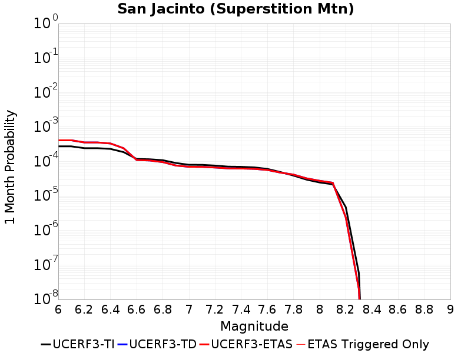 | 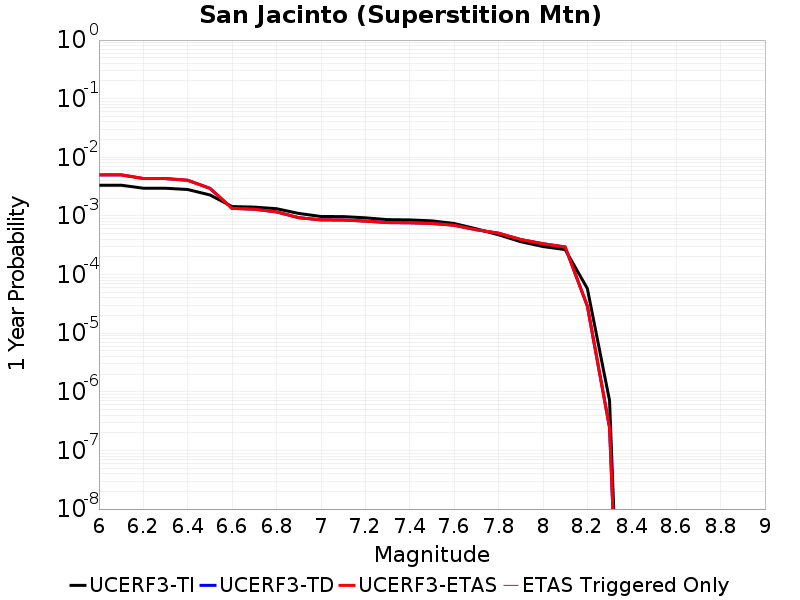 | 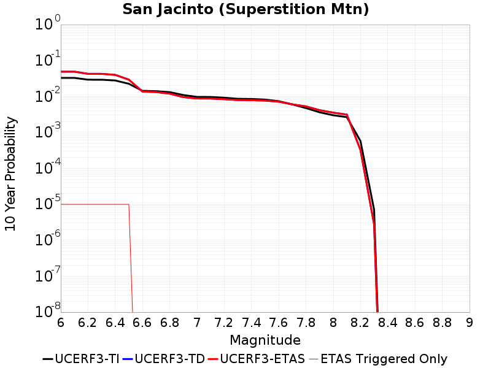 |

| Magnitude | 1 wk TI Prob | 1 wk TD Prob | 1 wk ETAS Prob | 1 wk ETAS/TD Gain | 1 wk ETAS Triggered Only | 1 mo TI Prob | 1 mo TD Prob | 1 mo ETAS Prob | 1 mo ETAS/TD Gain | 1 mo ETAS Triggered Only | 1 yr TI Prob | 1 yr TD Prob | 1 yr ETAS Prob | 1 yr ETAS/TD Gain | 1 yr ETAS Triggered Only | 10 yr TI Prob | 10 yr TD Prob | 10 yr ETAS Prob | 10 yr ETAS/TD Gain | 10 yr ETAS Triggered Only |
|-----|-----|-----|-----|-----|-----|-----|-----|-----|-----|-----|-----|-----|-----|-----|-----|-----|-----|-----|-----|-----|
| 6.0 | 6.4193904E-5 | 9.638381E-5 | 9.638381E-5 | 1.0 | 0.0 | 2.7508775E-4 | 4.130139E-4 | 4.130139E-4 | 1.0 | 0.0 | 0.0033440501 | 0.005018251 | 0.005018251 | 1.0 | 0.0 | 0.03294174 | 0.04901369 | 0.0490232 | 1.0001941 | 1.0E-5 |
| 6.1 | 6.4193904E-5 | 9.638381E-5 | 9.638381E-5 | 1.0 | 0.0 | 2.7508775E-4 | 4.130139E-4 | 4.130139E-4 | 1.0 | 0.0 | 0.0033440501 | 0.005018251 | 0.005018251 | 1.0 | 0.0 | 0.03294174 | 0.04901369 | 0.0490232 | 1.0001941 | 1.0E-5 |
| 6.2 | 5.7023593E-5 | 8.35096E-5 | 8.35096E-5 | 1.0 | 0.0 | 2.4436394E-4 | 3.578583E-4 | 3.578583E-4 | 1.0 | 0.0 | 0.002971072 | 0.004349869 | 0.004349869 | 1.0 | 0.0 | 0.029316625 | 0.042687137 | 0.042696707 | 1.0002242 | 1.0E-5 |
| 6.3 | 5.6940098E-5 | 8.335477E-5 | 8.335477E-5 | 1.0 | 0.0 | 2.4400617E-4 | 3.571949E-4 | 3.571949E-4 | 1.0 | 0.0 | 0.002966728 | 0.0043418244 | 0.0043418244 | 1.0 | 0.0 | 0.029274331 | 0.042610426 | 0.04262 | 1.0002247 | 1.0E-5 |
| 6.4 | 5.4171585E-5 | 7.7840275E-5 | 7.7840275E-5 | 1.0 | 0.0 | 2.3214328E-4 | 3.3356785E-4 | 3.3356785E-4 | 1.0 | 0.0 | 0.0028226813 | 0.004055277 | 0.004055277 | 1.0 | 0.0 | 0.02787096 | 0.039895773 | 0.039905373 | 1.0002407 | 1.0E-5 |
| 6.5 | 4.375144E-5 | 5.674177E-5 | 5.674177E-5 | 1.0 | 0.0 | 1.874927E-4 | 2.43163E-4 | 2.43163E-4 | 1.0 | 0.0 | 0.0022803338 | 0.0029576672 | 0.0029576672 | 1.0 | 0.0 | 0.022570757 | 0.029401079 | 0.029410783 | 1.0003301 | 1.0E-5 |
| 6.6 | 2.772192E-5 | 2.5793315E-5 | 2.5793315E-5 | 1.0 | 0.0 | 1.1880282E-4 | 1.105382E-4 | 1.105382E-4 | 1.0 | 0.0 | 0.0014454646 | 0.0013449914 | 0.0013449914 | 1.0 | 0.0 | 0.014360986 | 0.01369881 | 0.01369881 | 1.0 | 0.0 |
| 6.7 | 2.7124124E-5 | 2.5002832E-5 | 2.5002832E-5 | 1.0 | 0.0 | 1.1624106E-4 | 1.071507E-4 | 1.071507E-4 | 1.0 | 0.0 | 0.0014143161 | 0.0013037984 | 0.0013037984 | 1.0 | 0.0 | 0.014053487 | 0.013291538 | 0.013291538 | 1.0 | 0.0 |
| 6.8 | 2.5475807E-5 | 2.2460681E-5 | 2.2460681E-5 | 1.0 | 0.0 | 1.0917746E-4 | 9.625658E-5 | 9.625658E-5 | 1.0 | 0.0 | 0.001328425 | 0.0011713059 | 0.0011713059 | 1.0 | 0.0 | 0.0132051185 | 0.011976753 | 0.011976753 | 1.0 | 0.0 |
| 6.9 | 2.1162023E-5 | 1.7900304E-5 | 1.7900304E-5 | 1.0 | 0.0 | 9.069123E-5 | 7.671335E-5 | 7.671335E-5 | 1.0 | 0.0 | 0.0011036064 | 9.335888E-4 | 9.335888E-4 | 1.0 | 0.0 | 0.010981417 | 0.009590296 | 0.009590296 | 1.0 | 0.0 |
| 7.0 | 1.8754288E-5 | 1.642388E-5 | 1.642388E-5 | 1.0 | 0.0 | 8.037304E-5 | 7.038617E-5 | 7.038617E-5 | 1.0 | 0.0 | 9.781026E-4 | 8.566173E-4 | 8.566173E-4 | 1.0 | 0.0 | 0.009738087 | 0.008807325 | 0.008807325 | 1.0 | 0.0 |
| 7.1 | 1.8678527E-5 | 1.6348773E-5 | 1.6348773E-5 | 1.0 | 0.0 | 8.0048376E-5 | 7.00643E-5 | 7.00643E-5 | 1.0 | 0.0 | 9.7415317E-4 | 8.5270155E-4 | 8.5270155E-4 | 1.0 | 0.0 | 0.009698939 | 0.008768186 | 0.008768186 | 1.0 | 0.0 |
| 7.2 | 1.7804578E-5 | 1.56407E-5 | 1.56407E-5 | 1.0 | 0.0 | 7.6303106E-5 | 6.702986E-5 | 6.702986E-5 | 1.0 | 0.0 | 9.285943E-4 | 8.157853E-4 | 8.157853E-4 | 1.0 | 0.0 | 0.009247236 | 0.008398311 | 0.008398311 | 1.0 | 0.0 |
| 7.3 | 1.6583685E-5 | 1.4786945E-5 | 1.4786945E-5 | 1.0 | 0.0 | 7.1070994E-5 | 6.3371095E-5 | 6.3371095E-5 | 1.0 | 0.0 | 8.649459E-4 | 7.71272E-4 | 7.71272E-4 | 1.0 | 0.0 | 0.00861587 | 0.007952196 | 0.007952196 | 1.0 | 0.0 |
| 7.4 | 1.6387552E-5 | 1.465136E-5 | 1.465136E-5 | 1.0 | 0.0 | 7.023047E-5 | 6.2790044E-5 | 6.2790044E-5 | 1.0 | 0.0 | 8.5472054E-4 | 7.6420273E-4 | 7.6420273E-4 | 1.0 | 0.0 | 0.008514405 | 0.007881334 | 0.007881334 | 1.0 | 0.0 |
| 7.5 | 1.5790754E-5 | 1.4289578E-5 | 1.4289578E-5 | 1.0 | 0.0 | 6.767291E-5 | 6.123962E-5 | 6.123962E-5 | 1.0 | 0.0 | 8.236062E-4 | 7.453393E-4 | 7.453393E-4 | 1.0 | 0.0 | 0.008205604 | 0.0076906257 | 0.0076906257 | 1.0 | 0.0 |
| 7.6 | 1.4248672E-5 | 1.32996665E-5 | 1.32996665E-5 | 1.0 | 0.0 | 6.106431E-5 | 5.6997338E-5 | 5.6997338E-5 | 1.0 | 0.0 | 7.432043E-4 | 6.937234E-4 | 6.937234E-4 | 1.0 | 0.0 | 0.007407237 | 0.007168602 | 0.007168602 | 1.0 | 0.0 |
| 7.7 | 1.15449975E-5 | 1.1138337E-5 | 1.1138337E-5 | 1.0 | 0.0 | 4.947762E-5 | 4.7734862E-5 | 4.7734862E-5 | 1.0 | 0.0 | 6.022235E-4 | 5.8101775E-4 | 5.8101775E-4 | 1.0 | 0.0 | 0.006005941 | 0.006033388 | 0.006033388 | 1.0 | 0.0 |
| 7.8 | 9.1391985E-6 | 9.739814E-6 | 9.739814E-6 | 1.0 | 0.0 | 3.9167408E-5 | 4.1741398E-5 | 4.1741398E-5 | 1.0 | 0.0 | 4.767588E-4 | 5.080836E-4 | 5.080836E-4 | 1.0 | 0.0 | 0.0047573727 | 0.005295325 | 0.005295325 | 1.0 | 0.0 |
| 7.9 | 6.973017E-6 | 7.5823896E-6 | 7.5823896E-6 | 1.0 | 0.0 | 2.9884017E-5 | 3.2495554E-5 | 3.2495554E-5 | 1.0 | 0.0 | 3.6377716E-4 | 3.9556212E-4 | 3.9556212E-4 | 1.0 | 0.0 | 0.0036318225 | 0.0041573816 | 0.0041573816 | 1.0 | 0.0 |
| 8.0 | 5.7638235E-6 | 6.4431238E-6 | 6.4431238E-6 | 1.0 | 0.0 | 2.4701867E-5 | 2.7613098E-5 | 2.7613098E-5 | 1.0 | 0.0 | 3.0070372E-4 | 3.3613815E-4 | 3.3613815E-4 | 1.0 | 0.0 | 0.0030029714 | 0.0035501511 | 0.0035501511 | 1.0 | 0.0 |
| 8.1 | 5.1124434E-6 | 5.662553E-6 | 5.662553E-6 | 1.0 | 0.0 | 2.1910288E-5 | 2.4267862E-5 | 2.4267862E-5 | 1.0 | 0.0 | 2.6672508E-4 | 2.9542166E-4 | 2.9542166E-4 | 1.0 | 0.0 | 0.0026640517 | 0.0031285684 | 0.0031285684 | 1.0 | 0.0 |
| 8.2 | 1.1075938E-6 | 5.570251E-7 | 5.570251E-7 | 1.0 | 0.0 | 4.7468216E-6 | 2.3872483E-6 | 2.3872483E-6 | 1.0 | 0.0 | 5.779102E-5 | 2.9064384E-5 | 2.9064384E-5 | 1.0 | 0.0 | 5.777599E-4 | 3.2650522E-4 | 3.2650522E-4 | 1.0 | 0.0 |
| 8.3 | 1.3584393E-8 | 4.6942072E-9 | 4.6942072E-9 | 1.0 | 0.0 | 5.8218827E-8 | 2.0118032E-8 | 2.0118032E-8 | 1.0 | 0.0 | 7.0881396E-7 | 2.4493704E-7 | 2.4493704E-7 | 1.0 | 0.0 | 7.0881174E-6 | 2.740769E-6 | 2.740769E-6 | 1.0 | 0.0 |

## San Diego Trough south
*[(top)](#table-of-contents)*

| 1 Week | 1 Month | 1 Year | 10 Year |
|-----|-----|-----|-----|
|  | 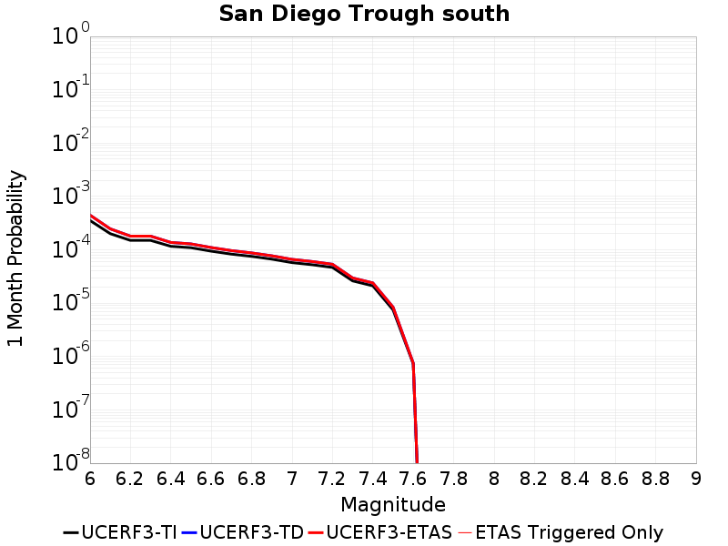 | 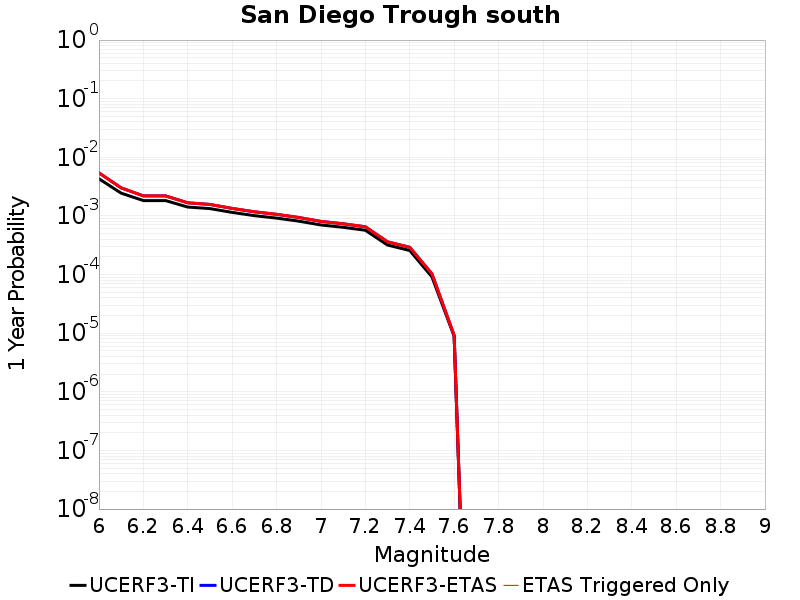 | 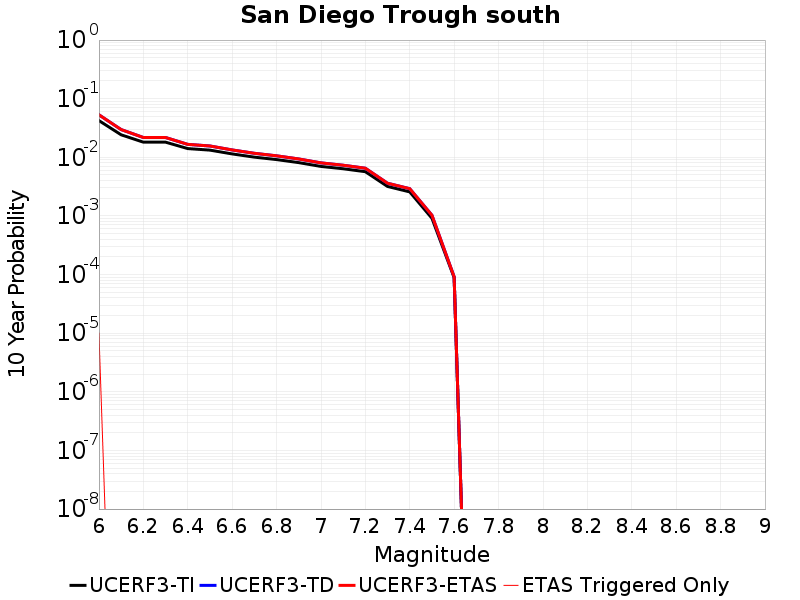 |

| Magnitude | 1 wk TI Prob | 1 wk TD Prob | 1 wk ETAS Prob | 1 wk ETAS/TD Gain | 1 wk ETAS Triggered Only | 1 mo TI Prob | 1 mo TD Prob | 1 mo ETAS Prob | 1 mo ETAS/TD Gain | 1 mo ETAS Triggered Only | 1 yr TI Prob | 1 yr TD Prob | 1 yr ETAS Prob | 1 yr ETAS/TD Gain | 1 yr ETAS Triggered Only | 10 yr TI Prob | 10 yr TD Prob | 10 yr ETAS Prob | 10 yr ETAS/TD Gain | 10 yr ETAS Triggered Only |
|-----|-----|-----|-----|-----|-----|-----|-----|-----|-----|-----|-----|-----|-----|-----|-----|-----|-----|-----|-----|-----|
| 6.0 | 8.279495E-5 | 1.04421124E-4 | 1.04421124E-4 | 1.0 | 0.0 | 3.5478722E-4 | 4.4744732E-4 | 4.4744732E-4 | 1.0 | 0.0 | 0.004310982 | 0.0054345136 | 0.0054345136 | 1.0 | 0.0 | 0.042283054 | 0.053074025 | 0.053083494 | 1.0001785 | 1.0E-5 |
| 6.1 | 4.6961468E-5 | 5.781314E-5 | 5.781314E-5 | 1.0 | 0.0 | 2.0124791E-4 | 2.4774804E-4 | 2.4774804E-4 | 1.0 | 0.0 | 0.00244744 | 0.0030122106 | 0.0030122106 | 1.0 | 0.0 | 0.024206603 | 0.029721398 | 0.029721398 | 1.0 | 0.0 |
| 6.2 | 3.5079658E-5 | 4.2196545E-5 | 4.2196545E-5 | 1.0 | 0.0 | 1.5033272E-4 | 1.8083006E-4 | 1.8083006E-4 | 1.0 | 0.0 | 0.0018287642 | 0.0021993993 | 0.0021993993 | 1.0 | 0.0 | 0.018137876 | 0.02177864 | 0.02177864 | 1.0 | 0.0 |
| 6.3 | 3.5079658E-5 | 4.2196545E-5 | 4.2196545E-5 | 1.0 | 0.0 | 1.5033272E-4 | 1.8083006E-4 | 1.8083006E-4 | 1.0 | 0.0 | 0.0018287642 | 0.0021993993 | 0.0021993993 | 1.0 | 0.0 | 0.018137876 | 0.02177864 | 0.02177864 | 1.0 | 0.0 |
| 6.4 | 2.7196904E-5 | 3.2124004E-5 | 3.2124004E-5 | 1.0 | 0.0 | 1.16552954E-4 | 1.3766714E-4 | 1.3766714E-4 | 1.0 | 0.0 | 0.0014181085 | 0.0016748199 | 0.0016748199 | 1.0 | 0.0 | 0.014090929 | 0.016623558 | 0.016623558 | 1.0 | 0.0 |
| 6.5 | 2.5584688E-5 | 3.0135581E-5 | 3.0135581E-5 | 1.0 | 0.0 | 1.0964406E-4 | 1.2914618E-4 | 1.2914618E-4 | 1.0 | 0.0 | 0.0013340989 | 0.0015712319 | 0.0015712319 | 1.0 | 0.0 | 0.013261181 | 0.01560276 | 0.01560276 | 1.0 | 0.0 |
| 6.6 | 2.2034688E-5 | 2.577038E-5 | 2.577038E-5 | 1.0 | 0.0 | 9.443096E-5 | 1.10439854E-4 | 1.10439854E-4 | 1.0 | 0.0 | 0.0011490905 | 0.0013437833 | 0.0013437833 | 1.0 | 0.0 | 0.011431668 | 0.013357568 | 0.013357568 | 1.0 | 0.0 |
| 6.7 | 1.9394853E-5 | 2.2565117E-5 | 2.2565117E-5 | 1.0 | 0.0 | 8.311815E-5 | 9.670409E-5 | 9.670409E-5 | 1.0 | 0.0 | 0.0010114936 | 0.0011767416 | 0.0011767416 | 1.0 | 0.0 | 0.01006902 | 0.011705812 | 0.011705812 | 1.0 | 0.0 |
| 6.8 | 1.7615313E-5 | 2.0423782E-5 | 2.0423782E-5 | 1.0 | 0.0 | 7.549201E-5 | 8.752758E-5 | 8.752758E-5 | 1.0 | 0.0 | 9.1872766E-4 | 0.0010651317 | 0.0010651317 | 1.0 | 0.0 | 0.009149387 | 0.010600834 | 0.010600834 | 1.0 | 0.0 |
| 6.9 | 1.5621423E-5 | 1.80438E-5 | 1.80438E-5 | 1.0 | 0.0 | 6.6947236E-5 | 7.73283E-5 | 7.73283E-5 | 1.0 | 0.0 | 8.147778E-4 | 9.41069E-4 | 9.41069E-4 | 1.0 | 0.0 | 0.008117969 | 0.009371284 | 0.009371284 | 1.0 | 0.0 |
| 7.0 | 1.3444376E-5 | 1.546275E-5 | 1.546275E-5 | 1.0 | 0.0 | 5.7617483E-5 | 6.626727E-5 | 6.626727E-5 | 1.0 | 0.0 | 7.0126704E-4 | 8.065081E-4 | 8.065081E-4 | 1.0 | 0.0 | 0.006990582 | 0.008036145 | 0.008036145 | 1.0 | 0.0 |
| 7.1 | 1.2268361E-5 | 1.4086213E-5 | 1.4086213E-5 | 1.0 | 0.0 | 5.2577634E-5 | 6.0368104E-5 | 6.0368104E-5 | 1.0 | 0.0 | 6.399447E-4 | 7.3473644E-4 | 7.3473644E-4 | 1.0 | 0.0 | 0.0063810493 | 0.007323378 | 0.007323378 | 1.0 | 0.0 |
| 7.2 | 1.0922655E-5 | 1.2525173E-5 | 1.2525173E-5 | 1.0 | 0.0 | 4.681054E-5 | 5.367822E-5 | 5.367822E-5 | 1.0 | 0.0 | 5.697693E-4 | 6.533389E-4 | 6.533389E-4 | 1.0 | 0.0 | 0.0056831064 | 0.0065144626 | 0.0065144626 | 1.0 | 0.0 |
| 7.3 | 6.1106753E-6 | 6.93484E-6 | 6.93484E-6 | 1.0 | 0.0 | 2.6188345E-5 | 2.9720406E-5 | 2.9720406E-5 | 1.0 | 0.0 | 3.1879646E-4 | 3.6178628E-4 | 3.6178628E-4 | 1.0 | 0.0 | 0.0031833951 | 0.0036120184 | 0.0036120184 | 1.0 | 0.0 |
| 7.4 | 4.933187E-6 | 5.594298E-6 | 5.594298E-6 | 1.0 | 0.0 | 2.114206E-5 | 2.3975344E-5 | 2.3975344E-5 | 1.0 | 0.0 | 2.5737417E-4 | 2.918611E-4 | 2.918611E-4 | 1.0 | 0.0 | 0.002570763 | 0.0029148192 | 0.0029148192 | 1.0 | 0.0 |
| 7.5 | 1.7489613E-6 | 1.9712757E-6 | 1.9712757E-6 | 1.0 | 0.0 | 7.495527E-6 | 8.448298E-6 | 8.448298E-6 | 1.0 | 0.0 | 9.125422E-5 | 1.02853395E-4 | 1.02853395E-4 | 1.0 | 0.0 | 9.1216754E-4 | 0.00102808 | 0.00102808 | 1.0 | 0.0 |
| 7.6 | 1.6988751E-7 | 1.753739E-7 | 1.753739E-7 | 1.0 | 0.0 | 7.2808916E-7 | 7.516022E-7 | 7.516022E-7 | 1.0 | 0.0 | 8.864449E-6 | 9.150721E-6 | 9.150721E-6 | 1.0 | 0.0 | 8.8640954E-5 | 9.1503636E-5 | 9.1503636E-5 | 1.0 | 0.0 |

## Hosgri
*[(top)](#table-of-contents)*

| 1 Week | 1 Month | 1 Year | 10 Year |
|-----|-----|-----|-----|
|  |  |  | 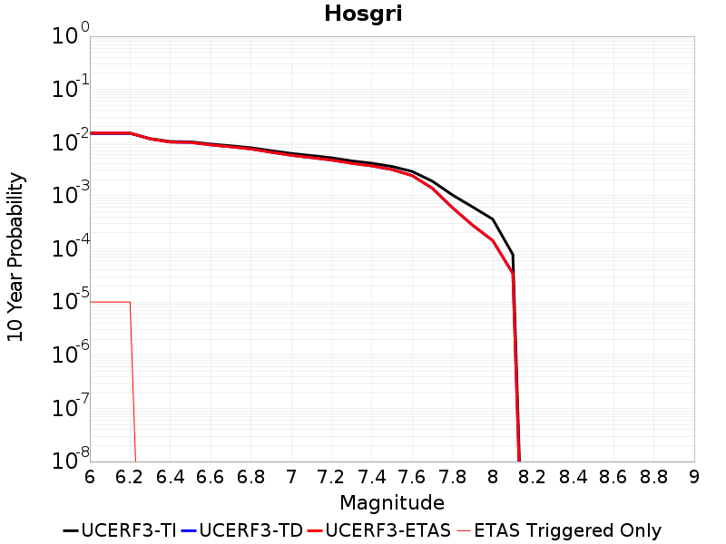 |

| Magnitude | 1 wk TI Prob | 1 wk TD Prob | 1 wk ETAS Prob | 1 wk ETAS/TD Gain | 1 wk ETAS Triggered Only | 1 mo TI Prob | 1 mo TD Prob | 1 mo ETAS Prob | 1 mo ETAS/TD Gain | 1 mo ETAS Triggered Only | 1 yr TI Prob | 1 yr TD Prob | 1 yr ETAS Prob | 1 yr ETAS/TD Gain | 1 yr ETAS Triggered Only | 10 yr TI Prob | 10 yr TD Prob | 10 yr ETAS Prob | 10 yr ETAS/TD Gain | 10 yr ETAS Triggered Only |
|-----|-----|-----|-----|-----|-----|-----|-----|-----|-----|-----|-----|-----|-----|-----|-----|-----|-----|-----|-----|-----|
| 6.0 | 2.883978E-5 | 2.9149558E-5 | 2.9149558E-5 | 1.0 | 0.0 | 1.235932E-4 | 1.2492084E-4 | 1.2492084E-4 | 1.0 | 0.0 | 0.0015037085 | 0.0015198775 | 0.0015198775 | 1.0 | 0.0 | 0.01493574 | 0.015098622 | 0.015108471 | 1.0006523 | 1.0E-5 |
| 6.1 | 2.883978E-5 | 2.9149558E-5 | 2.9149558E-5 | 1.0 | 0.0 | 1.235932E-4 | 1.2492084E-4 | 1.2492084E-4 | 1.0 | 0.0 | 0.0015037085 | 0.0015198775 | 0.0015198775 | 1.0 | 0.0 | 0.01493574 | 0.015098622 | 0.015108471 | 1.0006523 | 1.0E-5 |
| 6.2 | 2.883978E-5 | 2.9149558E-5 | 2.9149558E-5 | 1.0 | 0.0 | 1.235932E-4 | 1.2492084E-4 | 1.2492084E-4 | 1.0 | 0.0 | 0.0015037085 | 0.0015198775 | 0.0015198775 | 1.0 | 0.0 | 0.01493574 | 0.015098622 | 0.015108471 | 1.0006523 | 1.0E-5 |
| 6.3 | 2.2914428E-5 | 2.2659202E-5 | 2.2659202E-5 | 1.0 | 0.0 | 9.8200995E-5 | 9.710728E-5 | 9.710728E-5 | 1.0 | 0.0 | 0.0011949413 | 0.0011816449 | 0.0011816449 | 1.0 | 0.0 | 0.011885363 | 0.011755032 | 0.011755032 | 1.0 | 0.0 |
| 6.4 | 2.0195741E-5 | 1.9712232E-5 | 1.9712232E-5 | 1.0 | 0.0 | 8.65503E-5 | 8.447827E-5 | 8.447827E-5 | 1.0 | 0.0 | 0.0010532405 | 0.0010280396 | 0.0010280396 | 1.0 | 0.0 | 0.010482626 | 0.0102339 | 0.0102339 | 1.0 | 0.0 |
| 6.5 | 1.9924333E-5 | 1.9424535E-5 | 1.9424535E-5 | 1.0 | 0.0 | 8.53872E-5 | 8.3245366E-5 | 8.3245366E-5 | 1.0 | 0.0 | 0.0010390934 | 0.001013043 | 0.001013043 | 1.0 | 0.0 | 0.010342481 | 0.010085301 | 0.010085301 | 1.0 | 0.0 |
| 6.6 | 1.809694E-5 | 1.7472967E-5 | 1.7472967E-5 | 1.0 | 0.0 | 7.7556004E-5 | 7.4882E-5 | 7.4882E-5 | 1.0 | 0.0 | 9.438353E-4 | 9.1130834E-4 | 9.1130834E-4 | 1.0 | 0.0 | 0.009398366 | 0.00907667 | 0.00907667 | 1.0 | 0.0 |
| 6.7 | 1.675989E-5 | 1.6056823E-5 | 1.6056823E-5 | 1.0 | 0.0 | 7.182612E-5 | 6.8813155E-5 | 6.8813155E-5 | 1.0 | 0.0 | 8.7413215E-4 | 8.3747925E-4 | 8.3747925E-4 | 1.0 | 0.0 | 0.008707017 | 0.008344151 | 0.008344151 | 1.0 | 0.0 |
| 6.8 | 1.5401129E-5 | 1.4627542E-5 | 1.4627542E-5 | 1.0 | 0.0 | 6.6003166E-5 | 6.268797E-5 | 6.268797E-5 | 1.0 | 0.0 | 8.032922E-4 | 7.629596E-4 | 7.629596E-4 | 1.0 | 0.0 | 0.008003947 | 0.0076042796 | 0.0076042796 | 1.0 | 0.0 |
| 6.9 | 1.356559E-5 | 1.2702625E-5 | 1.2702625E-5 | 1.0 | 0.0 | 5.8136946E-5 | 5.443869E-5 | 5.443869E-5 | 1.0 | 0.0 | 7.0758746E-4 | 6.625899E-4 | 6.625899E-4 | 1.0 | 0.0 | 0.007053386 | 0.006606962 | 0.006606962 | 1.0 | 0.0 |
| 7.0 | 1.2030819E-5 | 1.1107911E-5 | 1.1107911E-5 | 1.0 | 0.0 | 5.155963E-5 | 4.7604462E-5 | 4.7604462E-5 | 1.0 | 0.0 | 6.275577E-4 | 5.794303E-4 | 5.794303E-4 | 1.0 | 0.0 | 0.006257884 | 0.005779969 | 0.005779969 | 1.0 | 0.0 |
| 7.1 | 1.0972698E-5 | 1.0033656E-5 | 1.0033656E-5 | 1.0 | 0.0 | 4.7025E-5 | 4.3000673E-5 | 4.3000673E-5 | 1.0 | 0.0 | 5.72379E-4 | 5.2340754E-4 | 5.2340754E-4 | 1.0 | 0.0 | 0.0057090693 | 0.0052225124 | 0.0052225124 | 1.0 | 0.0 |
| 7.2 | 9.961926E-6 | 9.045877E-6 | 9.045877E-6 | 1.0 | 0.0 | 4.2693267E-5 | 3.8767466E-5 | 3.8767466E-5 | 1.0 | 0.0 | 5.1966653E-4 | 4.7189175E-4 | 4.7189175E-4 | 1.0 | 0.0 | 0.00518453 | 0.0047096564 | 0.0047096564 | 1.0 | 0.0 |
| 7.3 | 8.700929E-6 | 7.838806E-6 | 7.838806E-6 | 1.0 | 0.0 | 3.7289166E-5 | 3.359445E-5 | 3.359445E-5 | 1.0 | 0.0 | 4.53901E-4 | 4.0893568E-4 | 4.0893568E-4 | 1.0 | 0.0 | 0.00452975 | 0.0040825843 | 0.0040825843 | 1.0 | 0.0 |
| 7.4 | 7.866285E-6 | 7.009164E-6 | 7.009164E-6 | 1.0 | 0.0 | 3.3712215E-5 | 3.003893E-5 | 3.003893E-5 | 1.0 | 0.0 | 4.103689E-4 | 3.6566262E-4 | 3.6566262E-4 | 1.0 | 0.0 | 0.004096119 | 0.0036513596 | 0.0036513596 | 1.0 | 0.0 |
| 7.5 | 6.8381305E-6 | 5.9697613E-6 | 5.9697613E-6 | 1.0 | 0.0 | 2.9305946E-5 | 2.558444E-5 | 2.558444E-5 | 1.0 | 0.0 | 3.5674145E-4 | 3.1144606E-4 | 3.1144606E-4 | 1.0 | 0.0 | 0.0035616932 | 0.0031108437 | 0.0031108437 | 1.0 | 0.0 |
| 7.6 | 5.503376E-6 | 4.6047853E-6 | 4.6047853E-6 | 1.0 | 0.0 | 2.3585684E-5 | 1.9734645E-5 | 1.9734645E-5 | 1.0 | 0.0 | 2.8711787E-4 | 2.4024284E-4 | 2.4024284E-4 | 1.0 | 0.0 | 0.002867472 | 0.002400577 | 0.002400577 | 1.0 | 0.0 |
| 7.7 | 3.6144982E-6 | 2.6607102E-6 | 2.6607102E-6 | 1.0 | 0.0 | 1.5490614E-5 | 1.1402994E-5 | 1.1402994E-5 | 1.0 | 0.0 | 1.8858191E-4 | 1.3882261E-4 | 1.3882261E-4 | 1.0 | 0.0 | 0.0018842196 | 0.0013881029 | 0.0013881029 | 1.0 | 0.0 |
| 7.8 | 1.9853494E-6 | 1.1430994E-6 | 1.1430994E-6 | 1.0 | 0.0 | 8.508612E-6 | 4.898988E-6 | 4.898988E-6 | 1.0 | 0.0 | 1.0358743E-4 | 5.964355E-5 | 5.964355E-5 | 1.0 | 0.0 | 0.0010353916 | 5.97018E-4 | 5.97018E-4 | 1.0 | 0.0 |
| 7.9 | 1.1818757E-6 | 5.348458E-7 | 5.348458E-7 | 1.0 | 0.0 | 5.0651715E-6 | 2.2921943E-6 | 2.2921943E-6 | 1.0 | 0.0 | 6.1666724E-5 | 2.7907108E-5 | 2.7907108E-5 | 1.0 | 0.0 | 6.1649614E-4 | 2.797356E-4 | 2.797356E-4 | 1.0 | 0.0 |
| 8.0 | 6.962958E-7 | 2.749888E-7 | 2.749888E-7 | 1.0 | 0.0 | 2.9841215E-6 | 1.1785228E-6 | 1.1785228E-6 | 1.0 | 0.0 | 3.6331072E-5 | 1.4348421E-5 | 1.4348421E-5 | 1.0 | 0.0 | 3.6325134E-4 | 1.4405003E-4 | 1.4405003E-4 | 1.0 | 0.0 |
| 8.1 | 1.5033264E-7 | 6.6048614E-8 | 6.6048614E-8 | 1.0 | 0.0 | 6.442826E-7 | 2.8306545E-7 | 2.8306545E-7 | 1.0 | 0.0 | 7.844113E-6 | 3.4463164E-6 | 3.4463164E-6 | 1.0 | 0.0 | 7.843835E-5 | 3.4478373E-5 | 3.4478373E-5 | 1.0 | 0.0 |

## Elsinore (Stepovers Combined)
*[(top)](#table-of-contents)*

| 1 Week | 1 Month | 1 Year | 10 Year |
|-----|-----|-----|-----|
|  |  |  | 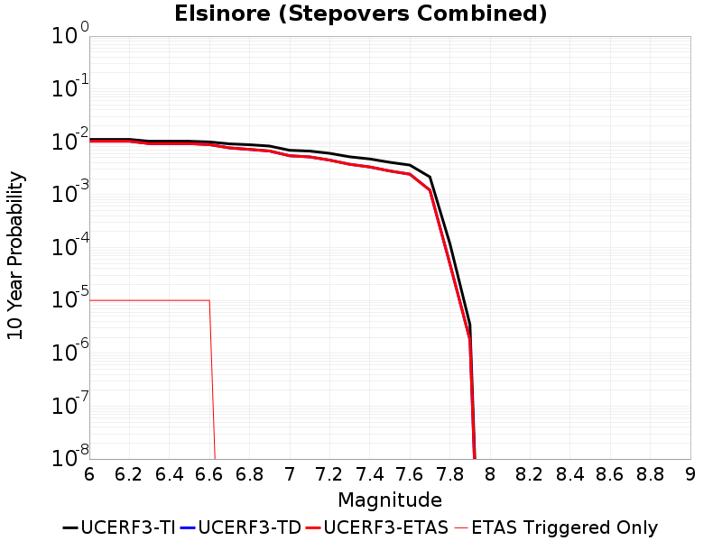 |

| Magnitude | 1 wk TI Prob | 1 wk TD Prob | 1 wk ETAS Prob | 1 wk ETAS/TD Gain | 1 wk ETAS Triggered Only | 1 mo TI Prob | 1 mo TD Prob | 1 mo ETAS Prob | 1 mo ETAS/TD Gain | 1 mo ETAS Triggered Only | 1 yr TI Prob | 1 yr TD Prob | 1 yr ETAS Prob | 1 yr ETAS/TD Gain | 1 yr ETAS Triggered Only | 10 yr TI Prob | 10 yr TD Prob | 10 yr ETAS Prob | 10 yr ETAS/TD Gain | 10 yr ETAS Triggered Only |
|-----|-----|-----|-----|-----|-----|-----|-----|-----|-----|-----|-----|-----|-----|-----|-----|-----|-----|-----|-----|-----|
| 6.0 | 2.144392E-5 | 1.9801442E-5 | 1.9801442E-5 | 1.0 | 0.0 | 9.189928E-5 | 8.486069E-5 | 8.486069E-5 | 1.0 | 0.0 | 0.0011182994 | 0.001032709 | 0.001032709 | 1.0 | 0.0 | 0.011126885 | 0.0102856755 | 0.010295573 | 1.0009623 | 1.0E-5 |
| 6.1 | 2.144392E-5 | 1.9801442E-5 | 1.9801442E-5 | 1.0 | 0.0 | 9.189928E-5 | 8.486069E-5 | 8.486069E-5 | 1.0 | 0.0 | 0.0011182994 | 0.001032709 | 0.001032709 | 1.0 | 0.0 | 0.011126885 | 0.0102856755 | 0.010295573 | 1.0009623 | 1.0E-5 |
| 6.2 | 2.144392E-5 | 1.9801442E-5 | 1.9801442E-5 | 1.0 | 0.0 | 9.189928E-5 | 8.486069E-5 | 8.486069E-5 | 1.0 | 0.0 | 0.0011182994 | 0.001032709 | 0.001032709 | 1.0 | 0.0 | 0.011126885 | 0.0102856755 | 0.010295573 | 1.0009623 | 1.0E-5 |
| 6.3 | 1.9751555E-5 | 1.7780232E-5 | 1.7780232E-5 | 1.0 | 0.0 | 8.4646774E-5 | 7.619886E-5 | 7.619886E-5 | 1.0 | 0.0 | 0.0010300872 | 9.2734117E-4 | 9.2734117E-4 | 1.0 | 0.0 | 0.010253254 | 0.00924078 | 0.009250687 | 1.0010722 | 1.0E-5 |
| 6.4 | 1.9751555E-5 | 1.7780232E-5 | 1.7780232E-5 | 1.0 | 0.0 | 8.4646774E-5 | 7.619886E-5 | 7.619886E-5 | 1.0 | 0.0 | 0.0010300872 | 9.2734117E-4 | 9.2734117E-4 | 1.0 | 0.0 | 0.010253254 | 0.00924078 | 0.009250687 | 1.0010722 | 1.0E-5 |
| 6.5 | 1.9751555E-5 | 1.7780232E-5 | 1.7780232E-5 | 1.0 | 0.0 | 8.4646774E-5 | 7.619886E-5 | 7.619886E-5 | 1.0 | 0.0 | 0.0010300872 | 9.2734117E-4 | 9.2734117E-4 | 1.0 | 0.0 | 0.010253254 | 0.00924078 | 0.009250687 | 1.0010722 | 1.0E-5 |
| 6.6 | 1.9188685E-5 | 1.7040773E-5 | 1.7040773E-5 | 1.0 | 0.0 | 8.2234634E-5 | 7.3029936E-5 | 7.3029936E-5 | 1.0 | 0.0 | 0.0010007467 | 8.88793E-4 | 8.88793E-4 | 1.0 | 0.0 | 0.00996252 | 0.008858645 | 0.0088685565 | 1.0011189 | 1.0E-5 |
| 6.7 | 1.7608272E-5 | 1.4765431E-5 | 1.4765431E-5 | 1.0 | 0.0 | 7.546184E-5 | 6.327894E-5 | 6.327894E-5 | 1.0 | 0.0 | 9.183606E-4 | 7.7015854E-4 | 7.7015854E-4 | 1.0 | 0.0 | 0.009145746 | 0.0076815356 | 0.0076815356 | 1.0 | 0.0 |
| 6.8 | 1.697165E-5 | 1.3814008E-5 | 1.3814008E-5 | 1.0 | 0.0 | 7.273361E-5 | 5.9201597E-5 | 5.9201597E-5 | 1.0 | 0.0 | 8.8517193E-4 | 7.205498E-4 | 7.205498E-4 | 1.0 | 0.0 | 0.008816543 | 0.007188179 | 0.007188179 | 1.0 | 0.0 |
| 6.9 | 1.600365E-5 | 1.2875764E-5 | 1.2875764E-5 | 1.0 | 0.0 | 6.858527E-5 | 5.518072E-5 | 5.518072E-5 | 1.0 | 0.0 | 8.347058E-4 | 6.7162595E-4 | 6.7162595E-4 | 1.0 | 0.0 | 0.008315775 | 0.006701624 | 0.006701624 | 1.0 | 0.0 |
| 7.0 | 1.3314581E-5 | 1.047288E-5 | 1.047288E-5 | 1.0 | 0.0 | 5.7061243E-5 | 4.4883014E-5 | 4.4883014E-5 | 1.0 | 0.0 | 6.944992E-4 | 5.463164E-4 | 5.463164E-4 | 1.0 | 0.0 | 0.006923327 | 0.0054535507 | 0.0054535507 | 1.0 | 0.0 |
| 7.1 | 1.2865345E-5 | 9.961584E-6 | 9.961584E-6 | 1.0 | 0.0 | 5.5136024E-5 | 4.2691816E-5 | 4.2691816E-5 | 1.0 | 0.0 | 6.710743E-4 | 5.1965145E-4 | 5.1965145E-4 | 1.0 | 0.0 | 0.0066905143 | 0.0051878393 | 0.0051878393 | 1.0 | 0.0 |
| 7.2 | 1.1650051E-5 | 8.6549435E-6 | 8.6549435E-6 | 1.0 | 0.0 | 4.9927836E-5 | 3.7092097E-5 | 3.7092097E-5 | 1.0 | 0.0 | 6.0770183E-4 | 4.515045E-4 | 4.515045E-4 | 1.0 | 0.0 | 0.0060604266 | 0.0045072963 | 0.0045072963 | 1.0 | 0.0 |
| 7.3 | 1.0008533E-5 | 7.2187468E-6 | 7.2187468E-6 | 1.0 | 0.0 | 4.2893007E-5 | 3.0937128E-5 | 3.0937128E-5 | 1.0 | 0.0 | 5.220972E-4 | 3.7659588E-4 | 3.7659588E-4 | 1.0 | 0.0 | 0.005208723 | 0.0037599544 | 0.0037599544 | 1.0 | 0.0 |
| 7.4 | 9.116759E-6 | 6.4250403E-6 | 6.4250403E-6 | 1.0 | 0.0 | 3.907124E-5 | 2.7535605E-5 | 2.7535605E-5 | 1.0 | 0.0 | 4.7558855E-4 | 3.351958E-4 | 3.351958E-4 | 1.0 | 0.0 | 0.00474572 | 0.0033470544 | 0.0033470544 | 1.0 | 0.0 |
| 7.5 | 7.870524E-6 | 5.3952663E-6 | 5.3952663E-6 | 1.0 | 0.0 | 3.3730383E-5 | 2.3122373E-5 | 2.3122373E-5 | 1.0 | 0.0 | 4.1059E-4 | 2.814798E-4 | 2.814798E-4 | 1.0 | 0.0 | 0.0040983222 | 0.0028113597 | 0.0028113597 | 1.0 | 0.0 |
| 7.6 | 6.9774537E-6 | 4.688735E-6 | 4.688735E-6 | 1.0 | 0.0 | 2.990303E-5 | 2.009443E-5 | 2.009443E-5 | 1.0 | 0.0 | 3.640086E-4 | 2.446234E-4 | 2.446234E-4 | 1.0 | 0.0 | 0.003634129 | 0.002443658 | 0.002443658 | 1.0 | 0.0 |
| 7.7 | 4.1616954E-6 | 2.3346995E-6 | 2.3346995E-6 | 1.0 | 0.0 | 1.7835715E-5 | 1.00058205E-5 | 1.00058205E-5 | 1.0 | 0.0 | 2.171282E-4 | 1.218148E-4 | 1.218148E-4 | 1.0 | 0.0 | 0.0021691616 | 0.0012175537 | 0.0012175537 | 1.0 | 0.0 |
| 7.8 | 2.2692414E-7 | 9.406994E-8 | 9.406994E-8 | 1.0 | 0.0 | 9.725317E-7 | 4.0315683E-7 | 4.0315683E-7 | 1.0 | 0.0 | 1.1840509E-5 | 4.9084265E-6 | 4.9084265E-6 | 1.0 | 0.0 | 1.1839878E-4 | 4.9083512E-5 | 4.9083512E-5 | 1.0 | 0.0 |
| 7.9 | 6.676829E-9 | 3.4456322E-9 | 3.4456322E-9 | 1.0 | 0.0 | 2.861498E-8 | 1.4766996E-8 | 1.4766996E-8 | 1.0 | 0.0 | 3.4838732E-7 | 1.7978816E-7 | 1.7978816E-7 | 1.0 | 0.0 | 3.4838679E-6 | 1.7978803E-6 | 1.7978803E-6 | 1.0 | 0.0 |

## Simi-Santa Rosa
*[(top)](#table-of-contents)*

| 1 Week | 1 Month | 1 Year | 10 Year |
|-----|-----|-----|-----|
|  | 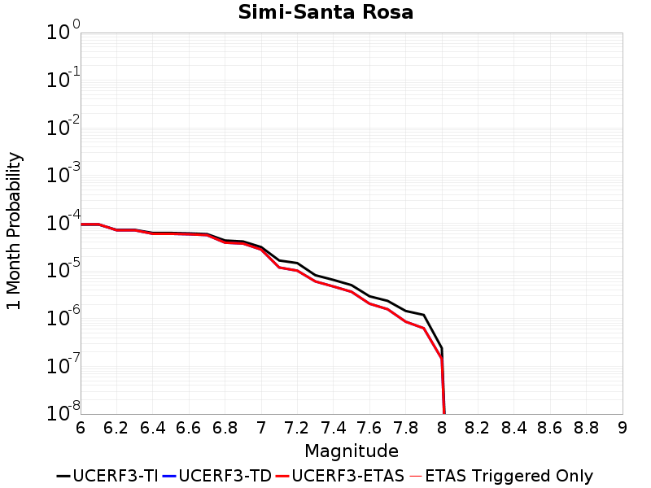 |  | 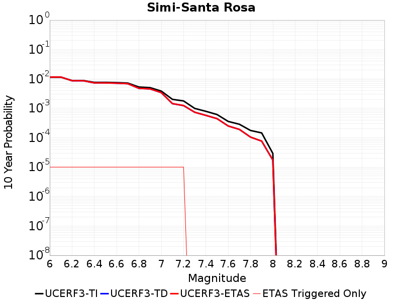 |

| Magnitude | 1 wk TI Prob | 1 wk TD Prob | 1 wk ETAS Prob | 1 wk ETAS/TD Gain | 1 wk ETAS Triggered Only | 1 mo TI Prob | 1 mo TD Prob | 1 mo ETAS Prob | 1 mo ETAS/TD Gain | 1 mo ETAS Triggered Only | 1 yr TI Prob | 1 yr TD Prob | 1 yr ETAS Prob | 1 yr ETAS/TD Gain | 1 yr ETAS Triggered Only | 10 yr TI Prob | 10 yr TD Prob | 10 yr ETAS Prob | 10 yr ETAS/TD Gain | 10 yr ETAS Triggered Only |
|-----|-----|-----|-----|-----|-----|-----|-----|-----|-----|-----|-----|-----|-----|-----|-----|-----|-----|-----|-----|-----|
| 6.0 | 2.198912E-5 | 2.2294213E-5 | 2.2294213E-5 | 1.0 | 0.0 | 9.4235686E-5 | 9.554337E-5 | 9.554337E-5 | 1.0 | 0.0 | 0.0011467156 | 0.0011626638 | 0.0011626638 | 1.0 | 0.0 | 0.011408163 | 0.011570264 | 0.011580149 | 1.0008543 | 1.0E-5 |
| 6.1 | 2.198912E-5 | 2.2294213E-5 | 2.2294213E-5 | 1.0 | 0.0 | 9.4235686E-5 | 9.554337E-5 | 9.554337E-5 | 1.0 | 0.0 | 0.0011467156 | 0.0011626638 | 0.0011626638 | 1.0 | 0.0 | 0.011408163 | 0.011570264 | 0.011580149 | 1.0008543 | 1.0E-5 |
| 6.2 | 1.69983E-5 | 1.668294E-5 | 1.668294E-5 | 1.0 | 0.0 | 7.284782E-5 | 7.149651E-5 | 7.149651E-5 | 1.0 | 0.0 | 8.865613E-4 | 8.701517E-4 | 8.701517E-4 | 1.0 | 0.0 | 0.008830327 | 0.008670371 | 0.008680284 | 1.0011433 | 1.0E-5 |
| 6.3 | 1.69983E-5 | 1.668294E-5 | 1.668294E-5 | 1.0 | 0.0 | 7.284782E-5 | 7.149651E-5 | 7.149651E-5 | 1.0 | 0.0 | 8.865613E-4 | 8.701517E-4 | 8.701517E-4 | 1.0 | 0.0 | 0.008830327 | 0.008670371 | 0.008680284 | 1.0011433 | 1.0E-5 |
| 6.4 | 1.4666188E-5 | 1.4064903E-5 | 1.4064903E-5 | 1.0 | 0.0 | 6.285358E-5 | 6.02769E-5 | 6.02769E-5 | 1.0 | 0.0 | 7.6497364E-4 | 7.336491E-4 | 7.336491E-4 | 1.0 | 0.0 | 0.0076234564 | 0.0073147505 | 0.0073246774 | 1.0013571 | 1.0E-5 |
| 6.5 | 1.4666188E-5 | 1.4064903E-5 | 1.4064903E-5 | 1.0 | 0.0 | 6.285358E-5 | 6.02769E-5 | 6.02769E-5 | 1.0 | 0.0 | 7.6497364E-4 | 7.336491E-4 | 7.336491E-4 | 1.0 | 0.0 | 0.0076234564 | 0.0073147505 | 0.0073246774 | 1.0013571 | 1.0E-5 |
| 6.6 | 1.4377586E-5 | 1.3741698E-5 | 1.3741698E-5 | 1.0 | 0.0 | 6.1616774E-5 | 5.8891805E-5 | 5.8891805E-5 | 1.0 | 0.0 | 7.4992597E-4 | 7.167967E-4 | 7.167967E-4 | 1.0 | 0.0 | 0.007474003 | 0.0071473196 | 0.0071572484 | 1.0013891 | 1.0E-5 |
| 6.7 | 1.3881404E-5 | 1.32192645E-5 | 1.32192645E-5 | 1.0 | 0.0 | 5.9490372E-5 | 5.6652898E-5 | 5.6652898E-5 | 1.0 | 0.0 | 7.240546E-4 | 6.895555E-4 | 6.895555E-4 | 1.0 | 0.0 | 0.007217 | 0.006876613 | 0.006886544 | 1.0014442 | 1.0E-5 |
| 6.8 | 1.0176516E-5 | 9.1626125E-6 | 9.1626125E-6 | 1.0 | 0.0 | 4.3612912E-5 | 3.926784E-5 | 3.926784E-5 | 1.0 | 0.0 | 5.308578E-4 | 4.779977E-4 | 4.779977E-4 | 1.0 | 0.0 | 0.0052959146 | 0.004771332 | 0.0047812844 | 1.0020858 | 1.0E-5 |
| 6.9 | 9.699797E-6 | 8.782793E-6 | 8.782793E-6 | 1.0 | 0.0 | 4.15699E-5 | 3.764009E-5 | 3.764009E-5 | 1.0 | 0.0 | 5.05996E-4 | 4.581882E-4 | 4.581882E-4 | 1.0 | 0.0 | 0.005048454 | 0.0045740562 | 0.00458401 | 1.0021763 | 1.0E-5 |
| 7.0 | 7.4049476E-6 | 6.565332E-6 | 6.565332E-6 | 1.0 | 0.0 | 3.1735104E-5 | 2.8136907E-5 | 2.8136907E-5 | 1.0 | 0.0 | 3.8630638E-4 | 3.4252566E-4 | 3.4252566E-4 | 1.0 | 0.0 | 0.0038563553 | 0.0034212216 | 0.0034311875 | 1.0029129 | 1.0E-5 |
| 7.1 | 3.873439E-6 | 2.76209E-6 | 2.76209E-6 | 1.0 | 0.0 | 1.6600346E-5 | 1.18374755E-5 | 1.18374755E-5 | 1.0 | 0.0 | 2.0209046E-4 | 1.4411197E-4 | 1.4411197E-4 | 1.0 | 0.0 | 0.0020190678 | 0.0014402088 | 0.0014501944 | 1.0069335 | 1.0E-5 |
| 7.2 | 3.417706E-6 | 2.3699529E-6 | 2.3699529E-6 | 1.0 | 0.0 | 1.4647229E-5 | 1.0156903E-5 | 1.0156903E-5 | 1.0 | 0.0 | 1.7831543E-4 | 1.236535E-4 | 1.236535E-4 | 1.0 | 0.0 | 0.0017817242 | 0.0012358692 | 0.0012458569 | 1.0080814 | 1.0E-5 |
| 7.3 | 1.90225E-6 | 1.4090028E-6 | 1.4090028E-6 | 1.0 | 0.0 | 8.152474E-6 | 6.0385696E-6 | 6.0385696E-6 | 1.0 | 0.0 | 9.9251854E-5 | 7.351713E-5 | 7.351713E-5 | 1.0 | 0.0 | 9.920754E-4 | 7.3493033E-4 | 7.3493033E-4 | 1.0 | 0.0 |
| 7.4 | 1.5170556E-6 | 1.1039391E-6 | 1.1039391E-6 | 1.0 | 0.0 | 6.5016507E-6 | 4.731159E-6 | 4.731159E-6 | 1.0 | 0.0 | 7.915472E-5 | 5.760035E-5 | 5.760035E-5 | 1.0 | 0.0 | 7.9126534E-4 | 5.758553E-4 | 5.758553E-4 | 1.0 | 0.0 |
| 7.5 | 1.178732E-6 | 8.5479616E-7 | 8.5479616E-7 | 1.0 | 0.0 | 5.0516987E-6 | 3.6634071E-6 | 3.6634071E-6 | 1.0 | 0.0 | 6.1502695E-5 | 4.4601078E-5 | 4.4601078E-5 | 1.0 | 0.0 | 6.148568E-4 | 4.4592223E-4 | 4.4592223E-4 | 1.0 | 0.0 |
| 7.6 | 6.8722386E-7 | 4.8046047E-7 | 4.8046047E-7 | 1.0 | 0.0 | 2.9452417E-6 | 2.0591146E-6 | 2.0591146E-6 | 1.0 | 0.0 | 3.5857727E-5 | 2.5069434E-5 | 2.5069434E-5 | 1.0 | 0.0 | 3.5851944E-4 | 2.506662E-4 | 2.506662E-4 | 1.0 | 0.0 |
| 7.7 | 5.5126515E-7 | 3.6840586E-7 | 3.6840586E-7 | 1.0 | 0.0 | 2.3625628E-6 | 1.5788812E-6 | 1.5788812E-6 | 1.0 | 0.0 | 2.8763823E-5 | 1.922271E-5 | 1.922271E-5 | 1.0 | 0.0 | 2.87601E-4 | 1.9221059E-4 | 1.9221059E-4 | 1.0 | 0.0 |
| 7.8 | 3.3860243E-7 | 2.0147655E-7 | 2.0147655E-7 | 1.0 | 0.0 | 1.4511525E-6 | 8.634707E-7 | 8.634707E-7 | 1.0 | 0.0 | 1.7667637E-5 | 1.0512706E-5 | 1.0512706E-5 | 1.0 | 0.0 | 1.7666233E-4 | 1.0512213E-4 | 1.0512213E-4 | 1.0 | 0.0 |
| 7.9 | 2.7955386E-7 | 1.4713E-7 | 1.4713E-7 | 1.0 | 0.0 | 1.1980875E-6 | 6.30557E-7 | 6.30557E-7 | 1.0 | 0.0 | 1.4586617E-5 | 7.677005E-6 | 7.677005E-6 | 1.0 | 0.0 | 1.458566E-4 | 7.6767436E-5 | 7.6767436E-5 | 1.0 | 0.0 |
| 8.0 | 5.6259015E-8 | 3.34395E-8 | 3.34395E-8 | 1.0 | 0.0 | 2.4111003E-7 | 1.4331212E-7 | 1.4331212E-7 | 1.0 | 0.0 | 2.9355108E-6 | 1.7448239E-6 | 1.7448239E-6 | 1.0 | 0.0 | 2.935472E-5 | 1.7448116E-5 | 1.7448116E-5 | 1.0 | 0.0 |

## San Andreas (Peninsula) 2011 CFM
*[(top)](#table-of-contents)*

| 1 Week | 1 Month | 1 Year | 10 Year |
|-----|-----|-----|-----|
| 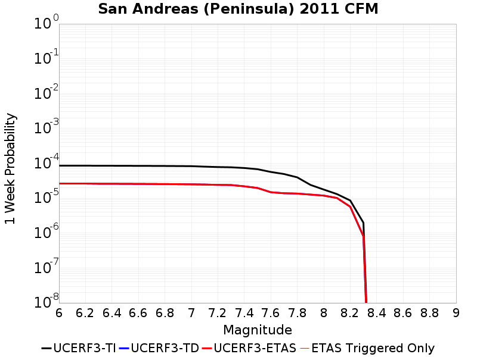 |  |  | 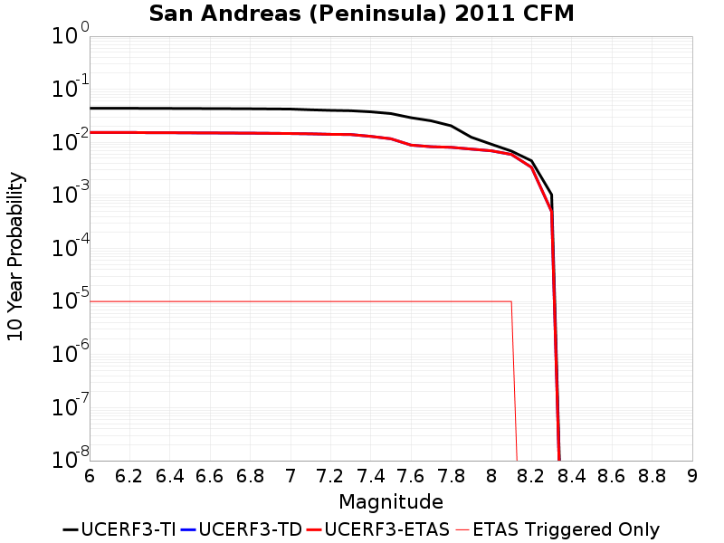 |

| Magnitude | 1 wk TI Prob | 1 wk TD Prob | 1 wk ETAS Prob | 1 wk ETAS/TD Gain | 1 wk ETAS Triggered Only | 1 mo TI Prob | 1 mo TD Prob | 1 mo ETAS Prob | 1 mo ETAS/TD Gain | 1 mo ETAS Triggered Only | 1 yr TI Prob | 1 yr TD Prob | 1 yr ETAS Prob | 1 yr ETAS/TD Gain | 1 yr ETAS Triggered Only | 10 yr TI Prob | 10 yr TD Prob | 10 yr ETAS Prob | 10 yr ETAS/TD Gain | 10 yr ETAS Triggered Only |
|-----|-----|-----|-----|-----|-----|-----|-----|-----|-----|-----|-----|-----|-----|-----|-----|-----|-----|-----|-----|-----|
| 6.0 | 8.6200685E-5 | 2.6332096E-5 | 2.6332096E-5 | 1.0 | 0.0 | 3.6937918E-4 | 1.12846974E-4 | 1.12846974E-4 | 1.0 | 0.0 | 0.0044879215 | 0.0013730477 | 0.001383034 | 1.0072731 | 1.0E-5 | 0.043983612 | 0.015386331 | 0.015396177 | 1.0006399 | 1.0E-5 |
| 6.1 | 8.6200685E-5 | 2.6332096E-5 | 2.6332096E-5 | 1.0 | 0.0 | 3.6937918E-4 | 1.12846974E-4 | 1.12846974E-4 | 1.0 | 0.0 | 0.0044879215 | 0.0013730477 | 0.001383034 | 1.0072731 | 1.0E-5 | 0.043983612 | 0.015386331 | 0.015396177 | 1.0006399 | 1.0E-5 |
| 6.2 | 8.6200685E-5 | 2.6332096E-5 | 2.6332096E-5 | 1.0 | 0.0 | 3.6937918E-4 | 1.12846974E-4 | 1.12846974E-4 | 1.0 | 0.0 | 0.0044879215 | 0.0013730477 | 0.001383034 | 1.0072731 | 1.0E-5 | 0.043983612 | 0.015386331 | 0.015396177 | 1.0006399 | 1.0E-5 |
| 6.3 | 8.551163E-5 | 2.6016049E-5 | 2.6016049E-5 | 1.0 | 0.0 | 3.6642692E-4 | 1.1149259E-4 | 1.1149259E-4 | 1.0 | 0.0 | 0.004452125 | 0.0013565789 | 0.0013665652 | 1.0073615 | 1.0E-5 | 0.043639794 | 0.015209466 | 0.015219314 | 1.0006475 | 1.0E-5 |
| 6.4 | 8.551163E-5 | 2.6016049E-5 | 2.6016049E-5 | 1.0 | 0.0 | 3.6642692E-4 | 1.1149259E-4 | 1.1149259E-4 | 1.0 | 0.0 | 0.004452125 | 0.0013565789 | 0.0013665652 | 1.0073615 | 1.0E-5 | 0.043639794 | 0.015209466 | 0.015219314 | 1.0006475 | 1.0E-5 |
| 6.5 | 8.511146E-5 | 2.5832931E-5 | 2.5832931E-5 | 1.0 | 0.0 | 3.647124E-4 | 1.1070787E-4 | 1.1070787E-4 | 1.0 | 0.0 | 0.004431336 | 0.0013470367 | 0.0013570231 | 1.0074137 | 1.0E-5 | 0.04344007 | 0.015107164 | 0.015117013 | 1.000652 | 1.0E-5 |
| 6.6 | 8.4985084E-5 | 2.5762276E-5 | 2.5762276E-5 | 1.0 | 0.0 | 3.6417096E-4 | 1.1040509E-4 | 1.1040509E-4 | 1.0 | 0.0 | 0.0044247704 | 0.0013433549 | 0.0013533415 | 1.007434 | 1.0E-5 | 0.043376986 | 0.0150684705 | 0.01507832 | 1.0006536 | 1.0E-5 |
| 6.7 | 8.462618E-5 | 2.5586914E-5 | 2.5586914E-5 | 1.0 | 0.0 | 3.6263323E-4 | 1.0965361E-4 | 1.0965361E-4 | 1.0 | 0.0 | 0.004406125 | 0.0013342168 | 0.0013442035 | 1.007485 | 1.0E-5 | 0.043197807 | 0.014971037 | 0.014980888 | 1.0006579 | 1.0E-5 |
| 6.8 | 8.42337E-5 | 2.547959E-5 | 2.547959E-5 | 1.0 | 0.0 | 3.6095164E-4 | 1.0919369E-4 | 1.0919369E-4 | 1.0 | 0.0 | 0.004385734 | 0.0013286241 | 0.0013386108 | 1.0075166 | 1.0E-5 | 0.043001823 | 0.014910164 | 0.014920015 | 1.0006607 | 1.0E-5 |
| 6.9 | 8.365989E-5 | 2.5279473E-5 | 2.5279473E-5 | 1.0 | 0.0 | 3.5849313E-4 | 1.08336106E-4 | 1.08336106E-4 | 1.0 | 0.0 | 0.004355922 | 0.0013181957 | 0.0013281825 | 1.0075761 | 1.0E-5 | 0.04271523 | 0.014800054 | 0.0148099065 | 1.0006657 | 1.0E-5 |
| 7.0 | 8.30936E-5 | 2.5036616E-5 | 2.5036616E-5 | 1.0 | 0.0 | 3.560668E-4 | 1.07295375E-4 | 1.07295375E-4 | 1.0 | 0.0 | 0.004326499 | 0.0013055401 | 0.0013155271 | 1.0076497 | 1.0E-5 | 0.042432297 | 0.014668808 | 0.014678662 | 1.0006717 | 1.0E-5 |
| 7.1 | 8.041264E-5 | 2.4713529E-5 | 2.4713529E-5 | 1.0 | 0.0 | 3.4458007E-4 | 1.0591083E-4 | 1.0591083E-4 | 1.0 | 0.0 | 0.0041871946 | 0.0012887034 | 0.0012986906 | 1.0077498 | 1.0E-5 | 0.041091725 | 0.014486081 | 0.014495936 | 1.0006803 | 1.0E-5 |
| 7.2 | 7.8427016E-5 | 2.4125187E-5 | 2.4125187E-5 | 1.0 | 0.0 | 3.3607247E-4 | 1.0338957E-4 | 1.0338957E-4 | 1.0 | 0.0 | 0.004084008 | 0.0012580429 | 0.0012680303 | 1.0079389 | 1.0E-5 | 0.040097635 | 0.014163305 | 0.014173163 | 1.0006961 | 1.0E-5 |
| 7.3 | 7.721087E-5 | 2.3905744E-5 | 2.3905744E-5 | 1.0 | 0.0 | 3.3086175E-4 | 1.0244917E-4 | 1.0244917E-4 | 1.0 | 0.0 | 0.004020803 | 0.0012466067 | 0.0012565942 | 1.0080118 | 1.0E-5 | 0.03948827 | 0.014044627 | 0.0140544865 | 1.000702 | 1.0E-5 |
| 7.4 | 7.3536525E-5 | 2.1958123E-5 | 2.1958123E-5 | 1.0 | 0.0 | 3.1511846E-4 | 9.4102856E-5 | 9.4102856E-5 | 1.0 | 0.0 | 0.0038298194 | 0.0011451015 | 0.00115509 | 1.0087229 | 1.0E-5 | 0.037644852 | 0.012969838 | 0.012979709 | 1.000761 | 1.0E-5 |
| 7.5 | 6.806207E-5 | 1.9675905E-5 | 1.9675905E-5 | 1.0 | 0.0 | 2.9166197E-4 | 8.4322586E-5 | 8.4322586E-5 | 1.0 | 0.0 | 0.0035452035 | 0.0010261451 | 0.0010361348 | 1.0097352 | 1.0E-5 | 0.034891766 | 0.011677509 | 0.011687392 | 1.0008464 | 1.0E-5 |
| 7.6 | 5.6731416E-5 | 1.4874105E-5 | 1.4874105E-5 | 1.0 | 0.0 | 2.43112E-4 | 6.374461E-5 | 6.374461E-5 | 1.0 | 0.0 | 0.0029558712 | 7.758144E-4 | 7.858066E-4 | 1.0128797 | 1.0E-5 | 0.02916862 | 0.0088784825 | 0.008888394 | 1.0011163 | 1.0E-5 |
| 7.7 | 4.946994E-5 | 1.3890131E-5 | 1.3890131E-5 | 1.0 | 0.0 | 2.1199681E-4 | 5.9527774E-5 | 5.9527774E-5 | 1.0 | 0.0 | 0.002578006 | 7.245098E-4 | 7.3450257E-4 | 1.0137924 | 1.0E-5 | 0.02548303 | 0.008270163 | 0.008280081 | 1.0011991 | 1.0E-5 |
| 7.8 | 3.9718198E-5 | 1.3601313E-5 | 1.3601313E-5 | 1.0 | 0.0 | 1.7020974E-4 | 5.829004E-5 | 5.829004E-5 | 1.0 | 0.0 | 0.0020703338 | 7.0945034E-4 | 7.1944325E-4 | 1.0140854 | 1.0E-5 | 0.020511515 | 0.008063734 | 0.008073652 | 1.0012301 | 1.0E-5 |
| 7.9 | 2.4115114E-5 | 1.2734049E-5 | 1.2734049E-5 | 1.0 | 0.0 | 1.0334639E-4 | 5.4573353E-5 | 5.4573353E-5 | 1.0 | 0.0 | 0.001257516 | 6.6422817E-4 | 6.7422155E-4 | 1.015045 | 1.0E-5 | 0.012504238 | 0.0074577127 | 0.007467638 | 1.0013309 | 1.0E-5 |
| 8.0 | 1.7756569E-5 | 1.1904279E-5 | 1.1904279E-5 | 1.0 | 0.0 | 7.6097356E-5 | 5.101734E-5 | 5.101734E-5 | 1.0 | 0.0 | 9.260915E-4 | 6.2095927E-4 | 6.3095306E-4 | 1.0160941 | 1.0E-5 | 0.009222416 | 0.0069254814 | 0.006935412 | 1.001434 | 1.0E-5 |
| 8.1 | 1.3159258E-5 | 1.0164196E-5 | 1.0164196E-5 | 1.0 | 0.0 | 5.6395602E-5 | 4.3560114E-5 | 4.3560114E-5 | 1.0 | 0.0 | 6.864001E-4 | 5.302155E-4 | 5.4021017E-4 | 1.0188502 | 1.0E-5 | 0.0068428386 | 0.005914624 | 0.005924565 | 1.0016807 | 1.0E-5 |
| 8.2 | 8.635426E-6 | 5.7173233E-6 | 5.7173233E-6 | 1.0 | 0.0 | 3.700844E-5 | 2.4502584E-5 | 2.4502584E-5 | 1.0 | 0.0 | 4.5048463E-4 | 2.9827823E-4 | 2.9827823E-4 | 1.0 | 0.0 | 0.004495725 | 0.003381454 | 0.003381454 | 1.0 | 0.0 |
| 8.3 | 1.983087E-6 | 8.077986E-7 | 8.077986E-7 | 1.0 | 0.0 | 8.498917E-6 | 3.4619893E-6 | 3.4619893E-6 | 1.0 | 0.0 | 1.034694E-4 | 4.2148924E-5 | 4.2148924E-5 | 1.0 | 0.0 | 0.0010342124 | 4.9595156E-4 | 4.9595156E-4 | 1.0 | 0.0 |

## Hayward (No) 2011 CFM
*[(top)](#table-of-contents)*

| 1 Week | 1 Month | 1 Year | 10 Year |
|-----|-----|-----|-----|
|  |  |  | 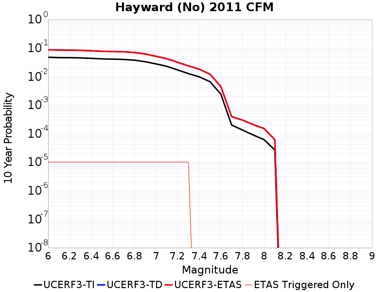 |

| Magnitude | 1 wk TI Prob | 1 wk TD Prob | 1 wk ETAS Prob | 1 wk ETAS/TD Gain | 1 wk ETAS Triggered Only | 1 mo TI Prob | 1 mo TD Prob | 1 mo ETAS Prob | 1 mo ETAS/TD Gain | 1 mo ETAS Triggered Only | 1 yr TI Prob | 1 yr TD Prob | 1 yr ETAS Prob | 1 yr ETAS/TD Gain | 1 yr ETAS Triggered Only | 10 yr TI Prob | 10 yr TD Prob | 10 yr ETAS Prob | 10 yr ETAS/TD Gain | 10 yr ETAS Triggered Only |
|-----|-----|-----|-----|-----|-----|-----|-----|-----|-----|-----|-----|-----|-----|-----|-----|-----|-----|-----|-----|-----|
| 6.0 | 9.3068506E-5 | 1.749158E-4 | 1.749158E-4 | 1.0 | 0.0 | 3.9880406E-4 | 7.4942404E-4 | 7.4942404E-4 | 1.0 | 0.0 | 0.0048446343 | 0.009085942 | 0.009085942 | 1.0 | 0.0 | 0.047403704 | 0.0868058 | 0.086814925 | 1.0001051 | 1.0E-5 |
| 6.1 | 9.055486E-5 | 1.7041895E-4 | 1.7041895E-4 | 1.0 | 0.0 | 3.880345E-4 | 7.301627E-4 | 7.301627E-4 | 1.0 | 0.0 | 0.0047140904 | 0.008853576 | 0.008853576 | 1.0 | 0.0 | 0.046153355 | 0.084695674 | 0.084704824 | 1.0001081 | 1.0E-5 |
| 6.2 | 9.006742E-5 | 1.6962292E-4 | 1.6962292E-4 | 1.0 | 0.0 | 3.859461E-4 | 7.267531E-4 | 7.267531E-4 | 1.0 | 0.0 | 0.0046887742 | 0.008812436 | 0.008812436 | 1.0 | 0.0 | 0.0459107 | 0.084319144 | 0.0843283 | 1.0001086 | 1.0E-5 |
| 6.3 | 8.8336754E-5 | 1.6641247E-4 | 1.6641247E-4 | 1.0 | 0.0 | 3.7853114E-4 | 7.13002E-4 | 7.13002E-4 | 1.0 | 0.0 | 0.004598882 | 0.008646409 | 0.008646409 | 1.0 | 0.0 | 0.04504866 | 0.08281117 | 0.08282034 | 1.0001107 | 1.0E-5 |
| 6.4 | 8.526157E-5 | 1.6066726E-4 | 1.6066726E-4 | 1.0 | 0.0 | 3.6535555E-4 | 6.8839284E-4 | 6.8839284E-4 | 1.0 | 0.0 | 0.0044391346 | 0.008349136 | 0.008349136 | 1.0 | 0.0 | 0.043514993 | 0.08009855 | 0.08010775 | 1.0001148 | 1.0E-5 |
| 6.5 | 8.152396E-5 | 1.5398485E-4 | 1.5398485E-4 | 1.0 | 0.0 | 3.493416E-4 | 6.597687E-4 | 6.597687E-4 | 1.0 | 0.0 | 0.0042449418 | 0.008003253 | 0.008003253 | 1.0 | 0.0 | 0.04164765 | 0.07692796 | 0.07693719 | 1.00012 | 1.0E-5 |
| 6.6 | 7.987405E-5 | 1.5101778E-4 | 1.5101778E-4 | 1.0 | 0.0 | 3.4227243E-4 | 6.4705923E-4 | 6.4705923E-4 | 1.0 | 0.0 | 0.0041592065 | 0.0078496495 | 0.0078496495 | 1.0 | 0.0 | 0.04082218 | 0.075516984 | 0.07552623 | 1.0001224 | 1.0E-5 |
| 6.7 | 7.777665E-5 | 1.4739475E-4 | 1.4739475E-4 | 1.0 | 0.0 | 3.332859E-4 | 6.3153956E-4 | 6.3153956E-4 | 1.0 | 0.0 | 0.004050208 | 0.0076620434 | 0.0076620434 | 1.0 | 0.0 | 0.039771806 | 0.073787056 | 0.07379632 | 1.0001255 | 1.0E-5 |
| 6.8 | 7.3284005E-5 | 1.3884889E-4 | 1.3884889E-4 | 1.0 | 0.0 | 3.140365E-4 | 5.949316E-4 | 5.949316E-4 | 1.0 | 0.0 | 0.0038166929 | 0.007219375 | 0.007219375 | 1.0 | 0.0 | 0.037518036 | 0.06967869 | 0.069687985 | 1.0001335 | 1.0E-5 |
| 6.9 | 6.458263E-5 | 1.2208067E-4 | 1.2208067E-4 | 1.0 | 0.0 | 2.7675333E-4 | 5.2309845E-4 | 5.2309845E-4 | 1.0 | 0.0 | 0.0033642664 | 0.0063502286 | 0.0063502286 | 1.0 | 0.0 | 0.033137884 | 0.061577715 | 0.0615871 | 1.0001523 | 1.0E-5 |
| 7.0 | 5.3853604E-5 | 1.00924924E-4 | 1.00924924E-4 | 1.0 | 0.0 | 2.3078074E-4 | 4.32464E-4 | 4.32464E-4 | 1.0 | 0.0 | 0.0028061352 | 0.0052526034 | 0.0052526034 | 1.0 | 0.0 | 0.027709642 | 0.05127403 | 0.05128352 | 1.000185 | 1.0E-5 |
| 7.1 | 4.4308683E-5 | 8.229218E-5 | 8.229218E-5 | 1.0 | 0.0 | 1.8988053E-4 | 3.526333E-4 | 3.526333E-4 | 1.0 | 0.0 | 0.0023093442 | 0.0042849006 | 0.0042849006 | 1.0 | 0.0 | 0.022854926 | 0.042103104 | 0.042112686 | 1.0002276 | 1.0E-5 |
| 7.2 | 3.295973E-5 | 6.128516E-5 | 6.128516E-5 | 1.0 | 0.0 | 1.4124835E-4 | 2.6262435E-4 | 2.6262435E-4 | 1.0 | 0.0 | 0.0017183421 | 0.0031927868 | 0.0031927868 | 1.0 | 0.0 | 0.017051157 | 0.03161736 | 0.031627044 | 1.0003062 | 1.0E-5 |
| 7.3 | 2.452256E-5 | 4.5572542E-5 | 4.5572542E-5 | 1.0 | 0.0 | 1.05092455E-4 | 1.9529635E-4 | 1.9529635E-4 | 1.0 | 0.0 | 0.0012787496 | 0.0023751543 | 0.0023751543 | 1.0 | 0.0 | 0.0127141625 | 0.023632577 | 0.02364234 | 1.0004132 | 1.0E-5 |
| 7.4 | 1.8829967E-5 | 3.4905603E-5 | 3.4905603E-5 | 1.0 | 0.0 | 8.069736E-5 | 1.4958692E-4 | 1.4958692E-4 | 1.0 | 0.0 | 9.820475E-4 | 0.0018197094 | 0.0018197094 | 1.0 | 0.0 | 0.009777189 | 0.018167837 | 0.018167837 | 1.0 | 0.0 |
| 7.5 | 1.26374125E-5 | 2.3125758E-5 | 2.3125758E-5 | 1.0 | 0.0 | 5.4159216E-5 | 9.9106655E-5 | 9.9106655E-5 | 1.0 | 0.0 | 6.5918895E-4 | 0.0012059616 | 0.0012059616 | 1.0 | 0.0 | 0.00657237 | 0.012090344 | 0.012090344 | 1.0 | 0.0 |
| 7.6 | 4.666429E-6 | 8.557441E-6 | 8.557441E-6 | 1.0 | 0.0 | 1.9998828E-5 | 3.667424E-5 | 3.667424E-5 | 1.0 | 0.0 | 2.4345852E-4 | 4.4641862E-4 | 4.4641862E-4 | 1.0 | 0.0 | 0.0024319198 | 0.0044987476 | 0.0044987476 | 1.0 | 0.0 |
| 7.7 | 3.8399318E-7 | 7.28764E-7 | 7.28764E-7 | 1.0 | 0.0 | 1.6456839E-6 | 3.1232705E-6 | 3.1232705E-6 | 1.0 | 0.0 | 2.003602E-5 | 3.802516E-5 | 3.802516E-5 | 1.0 | 0.0 | 2.0034213E-4 | 3.9363332E-4 | 3.9363332E-4 | 1.0 | 0.0 |
| 7.8 | 2.5637698E-7 | 5.498956E-7 | 5.498956E-7 | 1.0 | 0.0 | 1.098758E-6 | 2.3566934E-6 | 2.3566934E-6 | 1.0 | 0.0 | 1.3377297E-5 | 2.8692366E-5 | 2.8692366E-5 | 1.0 | 0.0 | 1.3376492E-4 | 2.988819E-4 | 2.988819E-4 | 1.0 | 0.0 |
| 7.9 | 1.7141245E-7 | 3.819359E-7 | 3.819359E-7 | 1.0 | 0.0 | 7.3462456E-7 | 1.6368672E-6 | 1.6368672E-6 | 1.0 | 0.0 | 8.944017E-6 | 1.9928677E-5 | 1.9928677E-5 | 1.0 | 0.0 | 8.943657E-5 | 2.0681812E-4 | 2.0681812E-4 | 1.0 | 0.0 |
| 8.0 | 1.1808895E-7 | 2.8141068E-7 | 2.8141068E-7 | 1.0 | 0.0 | 5.060954E-7 | 1.2060452E-6 | 1.2060452E-6 | 1.0 | 0.0 | 6.161694E-6 | 1.4683502E-5 | 1.4683502E-5 | 1.0 | 0.0 | 6.161523E-5 | 1.5118184E-4 | 1.5118184E-4 | 1.0 | 0.0 |
| 8.1 | 5.138535E-8 | 1.14715384E-7 | 1.14715384E-7 | 1.0 | 0.0 | 2.2022292E-7 | 4.9163725E-7 | 4.9163725E-7 | 1.0 | 0.0 | 2.6812106E-6 | 5.9856675E-6 | 5.9856675E-6 | 1.0 | 0.0 | 2.6811784E-5 | 6.134107E-5 | 6.134107E-5 | 1.0 | 0.0 |

## Surprise Valley 2011 CFM
*[(top)](#table-of-contents)*

| 1 Week | 1 Month | 1 Year | 10 Year |
|-----|-----|-----|-----|
|  | 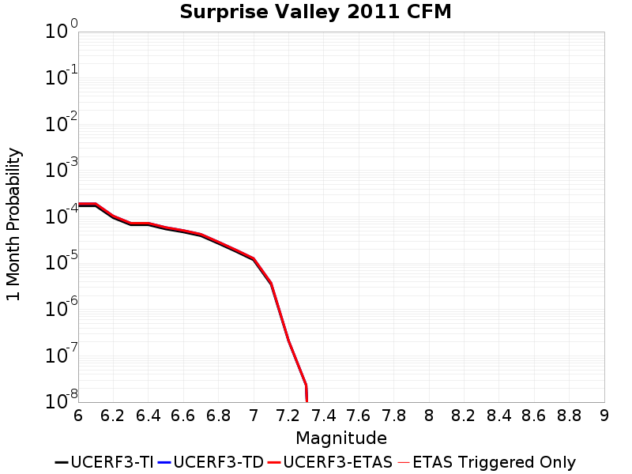 | 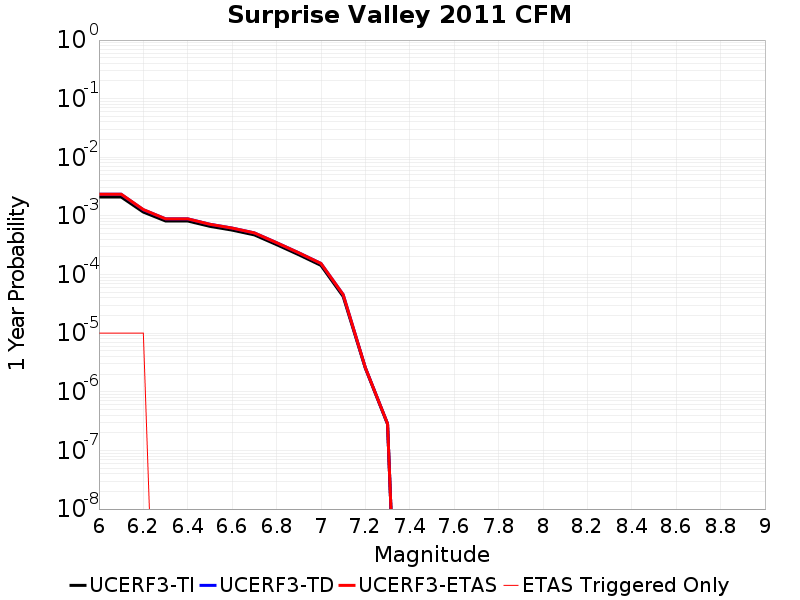 | 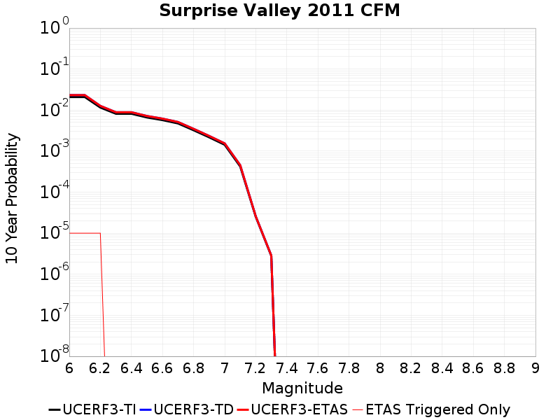 |

| Magnitude | 1 wk TI Prob | 1 wk TD Prob | 1 wk ETAS Prob | 1 wk ETAS/TD Gain | 1 wk ETAS Triggered Only | 1 mo TI Prob | 1 mo TD Prob | 1 mo ETAS Prob | 1 mo ETAS/TD Gain | 1 mo ETAS Triggered Only | 1 yr TI Prob | 1 yr TD Prob | 1 yr ETAS Prob | 1 yr ETAS/TD Gain | 1 yr ETAS Triggered Only | 10 yr TI Prob | 10 yr TD Prob | 10 yr ETAS Prob | 10 yr ETAS/TD Gain | 10 yr ETAS Triggered Only |
|-----|-----|-----|-----|-----|-----|-----|-----|-----|-----|-----|-----|-----|-----|-----|-----|-----|-----|-----|-----|-----|
| 6.0 | 4.0396248E-5 | 4.4882883E-5 | 4.4882883E-5 | 1.0 | 0.0 | 1.7311527E-4 | 1.9234222E-4 | 1.9234222E-4 | 1.0 | 0.0 | 0.002105641 | 0.0023394618 | 0.0023494384 | 1.0042645 | 1.0E-5 | 0.020858008 | 0.023170099 | 0.023179868 | 1.0004216 | 1.0E-5 |
| 6.1 | 4.0396248E-5 | 4.4882883E-5 | 4.4882883E-5 | 1.0 | 0.0 | 1.7311527E-4 | 1.9234222E-4 | 1.9234222E-4 | 1.0 | 0.0 | 0.002105641 | 0.0023394618 | 0.0023494384 | 1.0042645 | 1.0E-5 | 0.020858008 | 0.023170099 | 0.023179868 | 1.0004216 | 1.0E-5 |
| 6.2 | 2.2295266E-5 | 2.4415931E-5 | 2.4415931E-5 | 1.0 | 0.0 | 9.554764E-5 | 1.0463568E-4 | 1.0463568E-4 | 1.0 | 0.0 | 0.0011626717 | 0.0012732258 | 0.0012832129 | 1.0078441 | 1.0E-5 | 0.011566074 | 0.0126625495 | 0.012672422 | 1.0007797 | 1.0E-5 |
| 6.3 | 1.572643E-5 | 1.7106286E-5 | 1.7106286E-5 | 1.0 | 0.0 | 6.7397246E-5 | 7.331065E-5 | 7.331065E-5 | 1.0 | 0.0 | 8.202525E-4 | 8.922022E-4 | 8.922022E-4 | 1.0 | 0.0 | 0.008172315 | 0.0088873105 | 0.0088873105 | 1.0 | 0.0 |
| 6.4 | 1.5714395E-5 | 1.7094108E-5 | 1.7094108E-5 | 1.0 | 0.0 | 6.734567E-5 | 7.325846E-5 | 7.325846E-5 | 1.0 | 0.0 | 8.1962504E-4 | 8.9156727E-4 | 8.9156727E-4 | 1.0 | 0.0 | 0.008166086 | 0.008881012 | 0.008881012 | 1.0 | 0.0 |
| 6.5 | 1.2733495E-5 | 1.3808964E-5 | 1.3808964E-5 | 1.0 | 0.0 | 5.457098E-5 | 5.917997E-5 | 5.917997E-5 | 1.0 | 0.0 | 6.641992E-4 | 7.202846E-4 | 7.202846E-4 | 1.0 | 0.0 | 0.0066221743 | 0.0071801953 | 0.0071801953 | 1.0 | 0.0 |
| 6.6 | 1.0983784E-5 | 1.1892767E-5 | 1.1892767E-5 | 1.0 | 0.0 | 4.7072506E-5 | 5.096804E-5 | 5.096804E-5 | 1.0 | 0.0 | 5.7295704E-4 | 6.203645E-4 | 6.203645E-4 | 1.0 | 0.0 | 0.0057148207 | 0.0061868774 | 0.0061868774 | 1.0 | 0.0 |
| 6.7 | 9.104806E-6 | 9.844542E-6 | 9.844542E-6 | 1.0 | 0.0 | 3.902001E-5 | 4.219023E-5 | 4.219023E-5 | 1.0 | 0.0 | 4.7496508E-4 | 5.135489E-4 | 5.135489E-4 | 1.0 | 0.0 | 0.004739512 | 0.005124019 | 0.005124019 | 1.0 | 0.0 |
| 6.8 | 6.2162403E-6 | 6.707483E-6 | 6.707483E-6 | 1.0 | 0.0 | 2.6640759E-5 | 2.8746052E-5 | 2.8746052E-5 | 1.0 | 0.0 | 3.2430296E-4 | 3.499292E-4 | 3.499292E-4 | 1.0 | 0.0 | 0.003238301 | 0.0034940057 | 0.0034940057 | 1.0 | 0.0 |
| 6.9 | 4.1792696E-6 | 4.505454E-6 | 4.505454E-6 | 1.0 | 0.0 | 1.7911032E-5 | 1.9308955E-5 | 1.9308955E-5 | 1.0 | 0.0 | 2.1804498E-4 | 2.350627E-4 | 2.350627E-4 | 1.0 | 0.0 | 0.0021783116 | 0.002348294 | 0.002348294 | 1.0 | 0.0 |
| 7.0 | 2.7478413E-6 | 2.9637158E-6 | 2.9637158E-6 | 1.0 | 0.0 | 1.177641E-5 | 1.2701585E-5 | 1.2701585E-5 | 1.0 | 0.0 | 1.4336836E-4 | 1.5463206E-4 | 1.5463206E-4 | 1.0 | 0.0 | 0.001432759 | 0.0015453673 | 0.0015453673 | 1.0 | 0.0 |
| 7.1 | 8.128648E-7 | 8.729022E-7 | 8.729022E-7 | 1.0 | 0.0 | 3.4837017E-6 | 3.7410075E-6 | 3.7410075E-6 | 1.0 | 0.0 | 4.2413245E-5 | 4.5546414E-5 | 4.5546414E-5 | 1.0 | 0.0 | 4.2405148E-4 | 4.554297E-4 | 4.554297E-4 | 1.0 | 0.0 |
| 7.2 | 4.8641045E-8 | 4.9406967E-8 | 4.9406967E-8 | 1.0 | 0.0 | 2.084616E-7 | 2.1174412E-7 | 2.1174412E-7 | 1.0 | 0.0 | 2.538017E-6 | 2.5779818E-6 | 2.5779818E-6 | 1.0 | 0.0 | 2.537988E-5 | 2.5779531E-5 | 2.5779531E-5 | 1.0 | 0.0 |
| 7.3 | 5.3911844E-9 | 5.476359E-9 | 5.476359E-9 | 1.0 | 0.0 | 2.3105075E-8 | 2.347011E-8 | 2.347011E-8 | 1.0 | 0.0 | 2.8130427E-7 | 2.8574857E-7 | 2.8574857E-7 | 1.0 | 0.0 | 2.8130391E-6 | 2.8574837E-6 | 2.8574837E-6 | 1.0 | 0.0 |

## San Gabriel
*[(top)](#table-of-contents)*

| 1 Week | 1 Month | 1 Year | 10 Year |
|-----|-----|-----|-----|
| 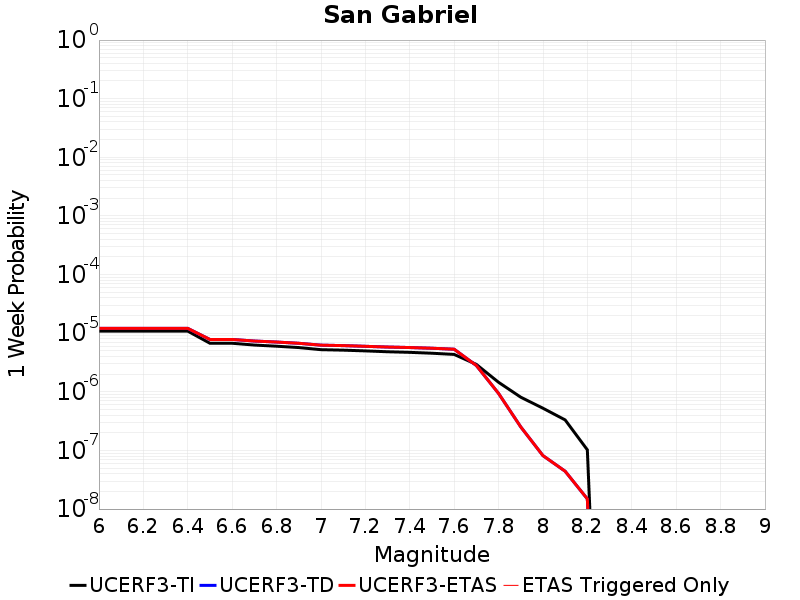 |  | 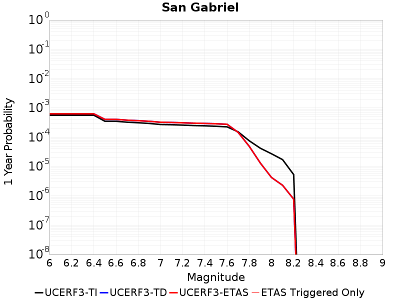 |  |

| Magnitude | 1 wk TI Prob | 1 wk TD Prob | 1 wk ETAS Prob | 1 wk ETAS/TD Gain | 1 wk ETAS Triggered Only | 1 mo TI Prob | 1 mo TD Prob | 1 mo ETAS Prob | 1 mo ETAS/TD Gain | 1 mo ETAS Triggered Only | 1 yr TI Prob | 1 yr TD Prob | 1 yr ETAS Prob | 1 yr ETAS/TD Gain | 1 yr ETAS Triggered Only | 10 yr TI Prob | 10 yr TD Prob | 10 yr ETAS Prob | 10 yr ETAS/TD Gain | 10 yr ETAS Triggered Only |
|-----|-----|-----|-----|-----|-----|-----|-----|-----|-----|-----|-----|-----|-----|-----|-----|-----|-----|-----|-----|-----|
| 6.0 | 1.083775E-5 | 1.208861E-5 | 1.208861E-5 | 1.0 | 0.0 | 4.6446676E-5 | 5.1807365E-5 | 5.1807365E-5 | 1.0 | 0.0 | 5.653415E-4 | 6.3058344E-4 | 6.3058344E-4 | 1.0 | 0.0 | 0.0056390543 | 0.006300381 | 0.0063103177 | 1.0015773 | 1.0E-5 |
| 6.1 | 1.083775E-5 | 1.208861E-5 | 1.208861E-5 | 1.0 | 0.0 | 4.6446676E-5 | 5.1807365E-5 | 5.1807365E-5 | 1.0 | 0.0 | 5.653415E-4 | 6.3058344E-4 | 6.3058344E-4 | 1.0 | 0.0 | 0.0056390543 | 0.006300381 | 0.0063103177 | 1.0015773 | 1.0E-5 |
| 6.2 | 1.083775E-5 | 1.208861E-5 | 1.208861E-5 | 1.0 | 0.0 | 4.6446676E-5 | 5.1807365E-5 | 5.1807365E-5 | 1.0 | 0.0 | 5.653415E-4 | 6.3058344E-4 | 6.3058344E-4 | 1.0 | 0.0 | 0.0056390543 | 0.006300381 | 0.0063103177 | 1.0015773 | 1.0E-5 |
| 6.3 | 1.083775E-5 | 1.208861E-5 | 1.208861E-5 | 1.0 | 0.0 | 4.6446676E-5 | 5.1807365E-5 | 5.1807365E-5 | 1.0 | 0.0 | 5.653415E-4 | 6.3058344E-4 | 6.3058344E-4 | 1.0 | 0.0 | 0.0056390543 | 0.006300381 | 0.0063103177 | 1.0015773 | 1.0E-5 |
| 6.4 | 1.083775E-5 | 1.208861E-5 | 1.208861E-5 | 1.0 | 0.0 | 4.6446676E-5 | 5.1807365E-5 | 5.1807365E-5 | 1.0 | 0.0 | 5.653415E-4 | 6.3058344E-4 | 6.3058344E-4 | 1.0 | 0.0 | 0.0056390543 | 0.006300381 | 0.0063103177 | 1.0015773 | 1.0E-5 |
| 6.5 | 6.7317824E-6 | 7.819297E-6 | 7.819297E-6 | 1.0 | 0.0 | 2.8850178E-5 | 3.351085E-5 | 3.351085E-5 | 1.0 | 0.0 | 3.511943E-4 | 4.0791926E-4 | 4.0791926E-4 | 1.0 | 0.0 | 0.003506398 | 0.004083145 | 0.004093104 | 1.0024391 | 1.0E-5 |
| 6.6 | 6.7317824E-6 | 7.819297E-6 | 7.819297E-6 | 1.0 | 0.0 | 2.8850178E-5 | 3.351085E-5 | 3.351085E-5 | 1.0 | 0.0 | 3.511943E-4 | 4.0791926E-4 | 4.0791926E-4 | 1.0 | 0.0 | 0.003506398 | 0.004083145 | 0.004093104 | 1.0024391 | 1.0E-5 |
| 6.7 | 6.274881E-6 | 7.3481247E-6 | 7.3481247E-6 | 1.0 | 0.0 | 2.6892068E-5 | 3.149159E-5 | 3.149159E-5 | 1.0 | 0.0 | 3.2736175E-4 | 3.833436E-4 | 3.833436E-4 | 1.0 | 0.0 | 0.0032687993 | 0.0038382565 | 0.0038482181 | 1.0025953 | 1.0E-5 |
| 6.8 | 5.996209E-6 | 7.0607884E-6 | 7.0607884E-6 | 1.0 | 0.0 | 2.5697784E-5 | 3.0260177E-5 | 3.0260177E-5 | 1.0 | 0.0 | 3.128256E-4 | 3.6835633E-4 | 3.6835633E-4 | 1.0 | 0.0 | 0.003123856 | 0.0036888882 | 0.0036988512 | 1.0027008 | 1.0E-5 |
| 6.9 | 5.686331E-6 | 6.725432E-6 | 6.725432E-6 | 1.0 | 0.0 | 2.4369761E-5 | 2.8822968E-5 | 2.8822968E-5 | 1.0 | 0.0 | 2.9666146E-4 | 3.5086405E-4 | 3.5086405E-4 | 1.0 | 0.0 | 0.0029626573 | 0.0035145301 | 0.0035244948 | 1.0028353 | 1.0E-5 |
| 7.0 | 5.2329838E-6 | 6.249058E-6 | 6.249058E-6 | 1.0 | 0.0 | 2.242688E-5 | 2.6781407E-5 | 2.6781407E-5 | 1.0 | 0.0 | 2.7301308E-4 | 3.260156E-4 | 3.260156E-4 | 1.0 | 0.0 | 0.002726779 | 0.0032667904 | 0.0032767577 | 1.0030512 | 1.0E-5 |
| 7.1 | 5.135671E-6 | 6.1389196E-6 | 6.1389196E-6 | 1.0 | 0.0 | 2.2009834E-5 | 2.6309395E-5 | 2.6309395E-5 | 1.0 | 0.0 | 2.6793676E-4 | 3.2027057E-4 | 3.2027057E-4 | 1.0 | 0.0 | 0.0026761394 | 0.0032095073 | 0.0032194753 | 1.0031058 | 1.0E-5 |
| 7.2 | 4.989062E-6 | 5.9718454E-6 | 5.9718454E-6 | 1.0 | 0.0 | 2.1381518E-5 | 2.5593376E-5 | 2.5593376E-5 | 1.0 | 0.0 | 2.6028889E-4 | 3.1155557E-4 | 3.1155557E-4 | 1.0 | 0.0 | 0.0025998424 | 0.0031226052 | 0.0031325738 | 1.0031924 | 1.0E-5 |
| 7.3 | 4.8219395E-6 | 5.802997E-6 | 5.802997E-6 | 1.0 | 0.0 | 2.0665291E-5 | 2.4869752E-5 | 2.4869752E-5 | 1.0 | 0.0 | 2.5157086E-4 | 3.0274794E-4 | 3.0274794E-4 | 1.0 | 0.0 | 0.0025128627 | 0.0030347726 | 0.0030347726 | 1.0 | 0.0 |
| 7.4 | 4.7118383E-6 | 5.6911895E-6 | 5.6911895E-6 | 1.0 | 0.0 | 2.0193436E-5 | 2.4390589E-5 | 2.4390589E-5 | 1.0 | 0.0 | 2.4582737E-4 | 2.969157E-4 | 2.969157E-4 | 1.0 | 0.0 | 0.002455556 | 0.0029766068 | 0.0029766068 | 1.0 | 0.0 |
| 7.5 | 4.5506545E-6 | 5.536028E-6 | 5.536028E-6 | 1.0 | 0.0 | 1.9502659E-5 | 2.3725623E-5 | 2.3725623E-5 | 1.0 | 0.0 | 2.37419E-4 | 2.8882193E-4 | 2.8882193E-4 | 1.0 | 0.0 | 0.002371655 | 0.0028958814 | 0.0028958814 | 1.0 | 0.0 |
| 7.6 | 4.343636E-6 | 5.328063E-6 | 5.328063E-6 | 1.0 | 0.0 | 1.861545E-5 | 2.283436E-5 | 2.283436E-5 | 1.0 | 0.0 | 2.2661954E-4 | 2.7797362E-4 | 2.7797362E-4 | 1.0 | 0.0 | 0.0022638857 | 0.0027876664 | 0.0027876664 | 1.0 | 0.0 |
| 7.7 | 2.936235E-6 | 2.810787E-6 | 2.810787E-6 | 1.0 | 0.0 | 1.2583803E-5 | 1.2046175E-5 | 1.2046175E-5 | 1.0 | 0.0 | 1.5319703E-4 | 1.4665234E-4 | 1.4665234E-4 | 1.0 | 0.0 | 0.0015309147 | 0.0014730524 | 0.0014730524 | 1.0 | 0.0 |
| 7.8 | 1.4541639E-6 | 9.3947057E-7 | 9.3947057E-7 | 1.0 | 0.0 | 6.232116E-6 | 4.026296E-6 | 4.026296E-6 | 1.0 | 0.0 | 7.587337E-5 | 4.9019054E-5 | 4.9019054E-5 | 1.0 | 0.0 | 7.584747E-4 | 4.9518066E-4 | 4.9518066E-4 | 1.0 | 0.0 |
| 7.9 | 8.098958E-7 | 2.5217145E-7 | 2.5217145E-7 | 1.0 | 0.0 | 3.4709774E-6 | 1.0807343E-6 | 1.0807343E-6 | 1.0 | 0.0 | 4.225833E-5 | 1.3157861E-5 | 1.3157861E-5 | 1.0 | 0.0 | 4.2250296E-4 | 1.348232E-4 | 1.348232E-4 | 1.0 | 0.0 |
| 8.0 | 5.2473234E-7 | 8.1635584E-8 | 8.1635584E-8 | 1.0 | 0.0 | 2.248851E-6 | 3.4986672E-7 | 3.4986672E-7 | 1.0 | 0.0 | 2.7379416E-5 | 4.259619E-6 | 4.259619E-6 | 1.0 | 0.0 | 2.7376044E-4 | 4.4839893E-5 | 4.4839893E-5 | 1.0 | 0.0 |
| 8.1 | 3.3162388E-7 | 4.4188766E-8 | 4.4188766E-8 | 1.0 | 0.0 | 1.4212444E-6 | 1.893804E-7 | 1.893804E-7 | 1.0 | 0.0 | 1.7303513E-5 | 2.305704E-6 | 2.305704E-6 | 1.0 | 0.0 | 1.7302166E-4 | 2.4440325E-5 | 2.4440325E-5 | 1.0 | 0.0 |
| 8.2 | 1.0235345E-7 | 1.4899397E-8 | 1.4899397E-8 | 1.0 | 0.0 | 4.3865757E-7 | 6.385456E-8 | 6.385456E-8 | 1.0 | 0.0 | 5.340643E-6 | 7.7742897E-7 | 7.7742897E-7 | 1.0 | 0.0 | 5.3405143E-5 | 8.401584E-6 | 8.401584E-6 | 1.0 | 0.0 |

## Palos Verdes
*[(top)](#table-of-contents)*

| 1 Week | 1 Month | 1 Year | 10 Year |
|-----|-----|-----|-----|
|  |  |  |  |

| Magnitude | 1 wk TI Prob | 1 wk TD Prob | 1 wk ETAS Prob | 1 wk ETAS/TD Gain | 1 wk ETAS Triggered Only | 1 mo TI Prob | 1 mo TD Prob | 1 mo ETAS Prob | 1 mo ETAS/TD Gain | 1 mo ETAS Triggered Only | 1 yr TI Prob | 1 yr TD Prob | 1 yr ETAS Prob | 1 yr ETAS/TD Gain | 1 yr ETAS Triggered Only | 10 yr TI Prob | 10 yr TD Prob | 10 yr ETAS Prob | 10 yr ETAS/TD Gain | 10 yr ETAS Triggered Only |
|-----|-----|-----|-----|-----|-----|-----|-----|-----|-----|-----|-----|-----|-----|-----|-----|-----|-----|-----|-----|-----|
| 6.0 | 6.126063E-5 | 7.634307E-5 | 7.634307E-5 | 1.0 | 0.0 | 2.6251914E-4 | 3.2714687E-4 | 3.2714687E-4 | 1.0 | 0.0 | 0.0031914865 | 0.003976275 | 0.003976275 | 1.0 | 0.0 | 0.031460393 | 0.03910784 | 0.03911745 | 1.0002457 | 1.0E-5 |
| 6.1 | 6.126063E-5 | 7.634307E-5 | 7.634307E-5 | 1.0 | 0.0 | 2.6251914E-4 | 3.2714687E-4 | 3.2714687E-4 | 1.0 | 0.0 | 0.0031914865 | 0.003976275 | 0.003976275 | 1.0 | 0.0 | 0.031460393 | 0.03910784 | 0.03911745 | 1.0002457 | 1.0E-5 |
| 6.2 | 6.126063E-5 | 7.634307E-5 | 7.634307E-5 | 1.0 | 0.0 | 2.6251914E-4 | 3.2714687E-4 | 3.2714687E-4 | 1.0 | 0.0 | 0.0031914865 | 0.003976275 | 0.003976275 | 1.0 | 0.0 | 0.031460393 | 0.03910784 | 0.03911745 | 1.0002457 | 1.0E-5 |
| 6.3 | 4.0838047E-5 | 4.9818005E-5 | 4.9818005E-5 | 1.0 | 0.0 | 1.7500846E-4 | 2.1348949E-4 | 2.1348949E-4 | 1.0 | 0.0 | 0.0021286458 | 0.0025963474 | 0.0025963474 | 1.0 | 0.0 | 0.021083709 | 0.02568182 | 0.025691563 | 1.0003793 | 1.0E-5 |
| 6.4 | 4.0838047E-5 | 4.9818005E-5 | 4.9818005E-5 | 1.0 | 0.0 | 1.7500846E-4 | 2.1348949E-4 | 2.1348949E-4 | 1.0 | 0.0 | 0.0021286458 | 0.0025963474 | 0.0025963474 | 1.0 | 0.0 | 0.021083709 | 0.02568182 | 0.025691563 | 1.0003793 | 1.0E-5 |
| 6.5 | 3.0512005E-5 | 3.660791E-5 | 3.660791E-5 | 1.0 | 0.0 | 1.3075917E-4 | 1.5688223E-4 | 1.5688223E-4 | 1.0 | 0.0 | 0.0015908304 | 0.0019084841 | 0.0019084841 | 1.0 | 0.0 | 0.015794903 | 0.018932892 | 0.018942703 | 1.0005182 | 1.0E-5 |
| 6.6 | 2.9255087E-5 | 3.5199642E-5 | 3.5199642E-5 | 1.0 | 0.0 | 1.2537291E-4 | 1.508475E-4 | 1.508475E-4 | 1.0 | 0.0 | 0.0015253464 | 0.0018351349 | 0.0018351349 | 1.0 | 0.0 | 0.015149189 | 0.018211434 | 0.018211434 | 1.0 | 0.0 |
| 6.7 | 2.287198E-5 | 2.728164E-5 | 2.728164E-5 | 1.0 | 0.0 | 9.801909E-5 | 1.1691659E-4 | 1.1691659E-4 | 1.0 | 0.0 | 0.001192729 | 0.0014226219 | 0.0014226219 | 1.0 | 0.0 | 0.011863477 | 0.014144404 | 0.014144404 | 1.0 | 0.0 |
| 6.8 | 2.1325764E-5 | 2.5463198E-5 | 2.5463198E-5 | 1.0 | 0.0 | 9.139293E-5 | 1.0912394E-4 | 1.0912394E-4 | 1.0 | 0.0 | 0.001112141 | 0.0013278647 | 0.0013278647 | 1.0 | 0.0 | 0.011065915 | 0.013208363 | 0.013208363 | 1.0 | 0.0 |
| 6.9 | 1.9009392E-5 | 2.264099E-5 | 2.264099E-5 | 1.0 | 0.0 | 8.1466285E-5 | 9.7029704E-5 | 9.7029704E-5 | 1.0 | 0.0 | 9.914007E-4 | 0.001180784 | 0.001180784 | 1.0 | 0.0 | 0.009869894 | 0.011753808 | 0.011753808 | 1.0 | 0.0 |
| 7.0 | 1.7098473E-5 | 2.0343876E-5 | 2.0343876E-5 | 1.0 | 0.0 | 7.3277115E-5 | 8.718561E-5 | 8.718561E-5 | 1.0 | 0.0 | 8.917837E-4 | 0.0010610534 | 0.0010610534 | 1.0 | 0.0 | 0.008882134 | 0.01056833 | 0.01056833 | 1.0 | 0.0 |
| 7.1 | 1.5982785E-5 | 1.9017694E-5 | 1.9017694E-5 | 1.0 | 0.0 | 6.849585E-5 | 8.150234E-5 | 8.150234E-5 | 1.0 | 0.0 | 8.336179E-4 | 9.919242E-4 | 9.919242E-4 | 1.0 | 0.0 | 0.008304977 | 0.009883353 | 0.009883353 | 1.0 | 0.0 |
| 7.2 | 1.4468002E-5 | 1.7218032E-5 | 1.7218032E-5 | 1.0 | 0.0 | 6.200425E-5 | 7.3789946E-5 | 7.3789946E-5 | 1.0 | 0.0 | 7.546402E-4 | 8.9810655E-4 | 8.9810655E-4 | 1.0 | 0.0 | 0.007520827 | 0.008953061 | 0.008953061 | 1.0 | 0.0 |
| 7.3 | 5.288233E-6 | 6.2106637E-6 | 6.2106637E-6 | 1.0 | 0.0 | 2.2663658E-5 | 2.6617055E-5 | 2.6617055E-5 | 1.0 | 0.0 | 2.7589512E-4 | 3.2404947E-4 | 3.2404947E-4 | 1.0 | 0.0 | 0.0027555283 | 0.0032392011 | 0.0032392011 | 1.0 | 0.0 |
| 7.4 | 8.279556E-7 | 8.409176E-7 | 8.409176E-7 | 1.0 | 0.0 | 3.5483763E-6 | 3.603928E-6 | 3.603928E-6 | 1.0 | 0.0 | 4.3200624E-5 | 4.387701E-5 | 4.387701E-5 | 1.0 | 0.0 | 4.3192226E-4 | 4.386907E-4 | 4.386907E-4 | 1.0 | 0.0 |
| 7.5 | 6.559831E-7 | 6.6679206E-7 | 6.6679206E-7 | 1.0 | 0.0 | 2.8113532E-6 | 2.8576776E-6 | 2.8576776E-6 | 1.0 | 0.0 | 3.4227687E-5 | 3.4791738E-5 | 3.4791738E-5 | 1.0 | 0.0 | 3.4222414E-4 | 3.4786953E-4 | 3.4786953E-4 | 1.0 | 0.0 |
| 7.6 | 3.5018968E-7 | 3.5623904E-7 | 3.5623904E-7 | 1.0 | 0.0 | 1.500812E-6 | 1.5267381E-6 | 1.5267381E-6 | 1.0 | 0.0 | 1.8272232E-5 | 1.8587925E-5 | 1.8587925E-5 | 1.0 | 0.0 | 1.8270731E-4 | 1.858683E-4 | 1.858683E-4 | 1.0 | 0.0 |
| 7.7 | 1.1986104E-7 | 1.2199746E-7 | 1.2199746E-7 | 1.0 | 0.0 | 5.1369005E-7 | 5.2284616E-7 | 5.2284616E-7 | 1.0 | 0.0 | 6.2541585E-6 | 6.365634E-6 | 6.365634E-6 | 1.0 | 0.0 | 6.2539824E-5 | 6.365455E-5 | 6.365455E-5 | 1.0 | 0.0 |
| 7.8 | 3.0445005E-8 | 3.1031348E-8 | 3.1031348E-8 | 1.0 | 0.0 | 1.3047858E-7 | 1.3299149E-7 | 1.3299149E-7 | 1.0 | 0.0 | 1.5885756E-6 | 1.6191703E-6 | 1.6191703E-6 | 1.0 | 0.0 | 1.5885644E-5 | 1.6191605E-5 | 1.6191605E-5 | 1.0 | 0.0 |

## Elysian Park (Upper)
*[(top)](#table-of-contents)*

| 1 Week | 1 Month | 1 Year | 10 Year |
|-----|-----|-----|-----|
|  | 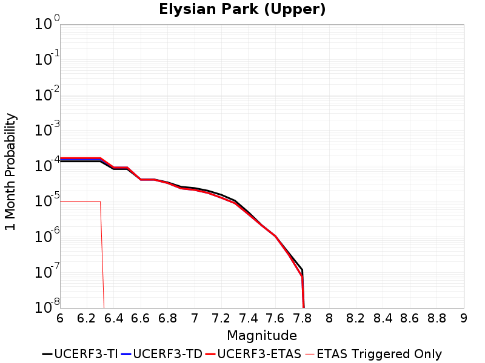 |  | 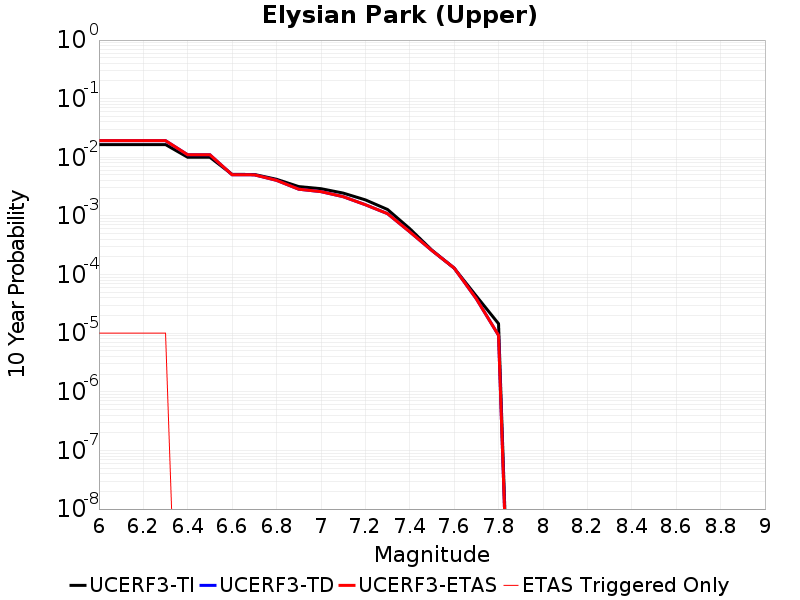 |

| Magnitude | 1 wk TI Prob | 1 wk TD Prob | 1 wk ETAS Prob | 1 wk ETAS/TD Gain | 1 wk ETAS Triggered Only | 1 mo TI Prob | 1 mo TD Prob | 1 mo ETAS Prob | 1 mo ETAS/TD Gain | 1 mo ETAS Triggered Only | 1 yr TI Prob | 1 yr TD Prob | 1 yr ETAS Prob | 1 yr ETAS/TD Gain | 1 yr ETAS Triggered Only | 10 yr TI Prob | 10 yr TD Prob | 10 yr ETAS Prob | 10 yr ETAS/TD Gain | 10 yr ETAS Triggered Only |
|-----|-----|-----|-----|-----|-----|-----|-----|-----|-----|-----|-----|-----|-----|-----|-----|-----|-----|-----|-----|-----|
| 6.0 | 3.1876025E-5 | 3.7082962E-5 | 4.708259E-5 | 1.2696556 | 1.0E-5 | 1.3660437E-4 | 1.5892004E-4 | 1.6891846E-4 | 1.0629147 | 1.0E-5 | 0.0016618895 | 0.0019336093 | 0.0019435899 | 1.0051616 | 1.0E-5 | 0.016495159 | 0.019214373 | 0.019224182 | 1.0005105 | 1.0E-5 |
| 6.1 | 3.1876025E-5 | 3.7082962E-5 | 4.708259E-5 | 1.2696556 | 1.0E-5 | 1.3660437E-4 | 1.5892004E-4 | 1.6891846E-4 | 1.0629147 | 1.0E-5 | 0.0016618895 | 0.0019336093 | 0.0019435899 | 1.0051616 | 1.0E-5 | 0.016495159 | 0.019214373 | 0.019224182 | 1.0005105 | 1.0E-5 |
| 6.2 | 3.1876025E-5 | 3.7082962E-5 | 4.708259E-5 | 1.2696556 | 1.0E-5 | 1.3660437E-4 | 1.5892004E-4 | 1.6891846E-4 | 1.0629147 | 1.0E-5 | 0.0016618895 | 0.0019336093 | 0.0019435899 | 1.0051616 | 1.0E-5 | 0.016495159 | 0.019214373 | 0.019224182 | 1.0005105 | 1.0E-5 |
| 6.3 | 3.1876025E-5 | 3.7082962E-5 | 4.708259E-5 | 1.2696556 | 1.0E-5 | 1.3660437E-4 | 1.5892004E-4 | 1.6891846E-4 | 1.0629147 | 1.0E-5 | 0.0016618895 | 0.0019336093 | 0.0019435899 | 1.0051616 | 1.0E-5 | 0.016495159 | 0.019214373 | 0.019224182 | 1.0005105 | 1.0E-5 |
| 6.4 | 1.9273462E-5 | 2.122476E-5 | 2.122476E-5 | 1.0 | 0.0 | 8.259794E-5 | 9.096106E-5 | 9.096106E-5 | 1.0 | 0.0 | 0.001005166 | 0.0011070599 | 0.0011070599 | 1.0 | 0.0 | 0.010006315 | 0.011032291 | 0.011032291 | 1.0 | 0.0 |
| 6.5 | 1.9273462E-5 | 2.122476E-5 | 2.122476E-5 | 1.0 | 0.0 | 8.259794E-5 | 9.096106E-5 | 9.096106E-5 | 1.0 | 0.0 | 0.001005166 | 0.0011070599 | 0.0011070599 | 1.0 | 0.0 | 0.010006315 | 0.011032291 | 0.011032291 | 1.0 | 0.0 |
| 6.6 | 9.813258E-6 | 9.671898E-6 | 9.671898E-6 | 1.0 | 0.0 | 4.205614E-5 | 4.1450374E-5 | 4.1450374E-5 | 1.0 | 0.0 | 5.119132E-4 | 5.045487E-4 | 5.045487E-4 | 1.0 | 0.0 | 0.005107356 | 0.0050347564 | 0.0050347564 | 1.0 | 0.0 |
| 6.7 | 9.801478E-6 | 9.659463E-6 | 9.659463E-6 | 1.0 | 0.0 | 4.2005657E-5 | 4.139708E-5 | 4.139708E-5 | 1.0 | 0.0 | 5.112989E-4 | 5.0390017E-4 | 5.0390017E-4 | 1.0 | 0.0 | 0.0051012407 | 0.0050283005 | 0.0050283005 | 1.0 | 0.0 |
| 6.8 | 8.102489E-6 | 7.778021E-6 | 7.778021E-6 | 1.0 | 0.0 | 3.4724493E-5 | 3.333398E-5 | 3.333398E-5 | 1.0 | 0.0 | 4.2268867E-4 | 4.057706E-4 | 4.057706E-4 | 1.0 | 0.0 | 0.004218856 | 0.0040507917 | 0.0040507917 | 1.0 | 0.0 |
| 6.9 | 6.08275E-6 | 5.4845113E-6 | 5.4845113E-6 | 1.0 | 0.0 | 2.6068668E-5 | 2.3504843E-5 | 2.3504843E-5 | 1.0 | 0.0 | 3.173398E-4 | 2.8613463E-4 | 2.8613463E-4 | 1.0 | 0.0 | 0.0031688702 | 0.00285774 | 0.00285774 | 1.0 | 0.0 |
| 7.0 | 5.5995934E-6 | 4.985558E-6 | 4.985558E-6 | 1.0 | 0.0 | 2.3998036E-5 | 2.1366506E-5 | 2.1366506E-5 | 1.0 | 0.0 | 2.9213692E-4 | 2.6010684E-4 | 2.6010684E-4 | 1.0 | 0.0 | 0.0029175316 | 0.0025980913 | 0.0025980913 | 1.0 | 0.0 |
| 7.1 | 4.709881E-6 | 4.0896857E-6 | 4.0896857E-6 | 1.0 | 0.0 | 2.0185047E-5 | 1.7527109E-5 | 1.7527109E-5 | 1.0 | 0.0 | 2.4572524E-4 | 2.1337207E-4 | 2.1337207E-4 | 1.0 | 0.0 | 0.002454537 | 0.0021317136 | 0.0021317136 | 1.0 | 0.0 |
| 7.2 | 3.6063436E-6 | 2.979608E-6 | 2.979608E-6 | 1.0 | 0.0 | 1.5455667E-5 | 1.2769687E-5 | 1.2769687E-5 | 1.0 | 0.0 | 1.881565E-4 | 1.5545996E-4 | 1.5545996E-4 | 1.0 | 0.0 | 0.0018799726 | 0.0015535232 | 0.0015535232 | 1.0 | 0.0 |
| 7.3 | 2.471135E-6 | 2.0966654E-6 | 2.0966654E-6 | 1.0 | 0.0 | 1.0590536E-5 | 8.9856785E-6 | 8.9856785E-6 | 1.0 | 0.0 | 1.2893214E-4 | 1.09395216E-4 | 1.09395216E-4 | 1.0 | 0.0 | 0.0012885736 | 0.0010934209 | 0.0010934209 | 1.0 | 0.0 |
| 7.4 | 1.163943E-6 | 1.0282135E-6 | 1.0282135E-6 | 1.0 | 0.0 | 4.988318E-6 | 4.406622E-6 | 4.406622E-6 | 1.0 | 0.0 | 6.0731076E-5 | 5.364933E-5 | 5.364933E-5 | 1.0 | 0.0 | 6.071448E-4 | 5.363668E-4 | 5.363668E-4 | 1.0 | 0.0 |
| 7.5 | 4.99459E-7 | 4.9206557E-7 | 4.9206557E-7 | 1.0 | 0.0 | 2.140537E-6 | 2.1088508E-6 | 2.1088508E-6 | 1.0 | 0.0 | 2.6060725E-5 | 2.5674974E-5 | 2.5674974E-5 | 1.0 | 0.0 | 2.605767E-4 | 2.5672163E-4 | 2.5672163E-4 | 1.0 | 0.0 |
| 7.6 | 2.4667852E-7 | 2.4794474E-7 | 2.4794474E-7 | 1.0 | 0.0 | 1.0571932E-6 | 1.06262E-6 | 1.06262E-6 | 1.0 | 0.0 | 1.2871251E-5 | 1.2937325E-5 | 1.2937325E-5 | 1.0 | 0.0 | 1.2870505E-4 | 1.2936608E-4 | 1.2936608E-4 | 1.0 | 0.0 |
| 7.7 | 8.2312795E-8 | 7.395178E-8 | 7.395178E-8 | 1.0 | 0.0 | 3.527691E-7 | 3.1693617E-7 | 3.1693617E-7 | 1.0 | 0.0 | 4.294955E-6 | 3.8586923E-6 | 3.8586923E-6 | 1.0 | 0.0 | 4.2948723E-5 | 3.8586368E-5 | 3.8586368E-5 | 1.0 | 0.0 |
| 7.8 | 2.7819295E-8 | 1.7627602E-8 | 1.7627602E-8 | 1.0 | 0.0 | 1.1922555E-7 | 7.5546865E-8 | 7.5546865E-8 | 1.0 | 0.0 | 1.45157E-6 | 9.1978285E-7 | 9.1978285E-7 | 1.0 | 0.0 | 1.45156055E-5 | 9.197805E-6 | 9.197805E-6 | 1.0 | 0.0 |

## Hayward (So) 2011 CFM
*[(top)](#table-of-contents)*

| 1 Week | 1 Month | 1 Year | 10 Year |
|-----|-----|-----|-----|
| 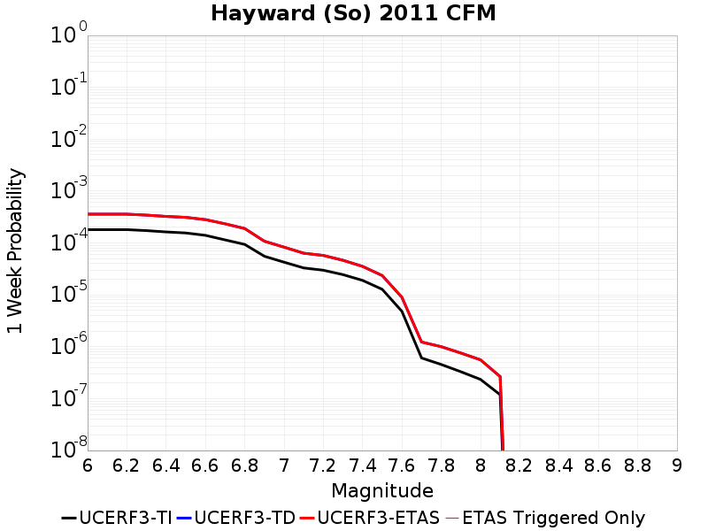 |  | 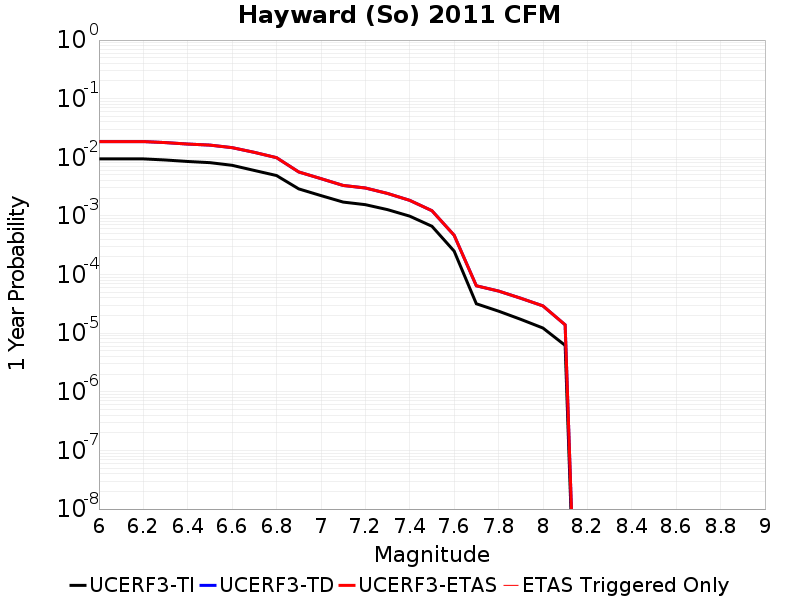 |  |

| Magnitude | 1 wk TI Prob | 1 wk TD Prob | 1 wk ETAS Prob | 1 wk ETAS/TD Gain | 1 wk ETAS Triggered Only | 1 mo TI Prob | 1 mo TD Prob | 1 mo ETAS Prob | 1 mo ETAS/TD Gain | 1 mo ETAS Triggered Only | 1 yr TI Prob | 1 yr TD Prob | 1 yr ETAS Prob | 1 yr ETAS/TD Gain | 1 yr ETAS Triggered Only | 10 yr TI Prob | 10 yr TD Prob | 10 yr ETAS Prob | 10 yr ETAS/TD Gain | 10 yr ETAS Triggered Only |
|-----|-----|-----|-----|-----|-----|-----|-----|-----|-----|-----|-----|-----|-----|-----|-----|-----|-----|-----|-----|-----|
| 6.0 | 1.8091932E-4 | 3.5895355E-4 | 3.5895355E-4 | 1.0 | 0.0 | 7.751381E-4 | 0.0015374754 | 0.0015374754 | 1.0 | 0.0 | 0.00939654 | 0.018560536 | 0.018560536 | 1.0 | 0.0 | 0.090090066 | 0.16745043 | 0.16745876 | 1.0000497 | 1.0E-5 |
| 6.1 | 1.8091932E-4 | 3.5895355E-4 | 3.5895355E-4 | 1.0 | 0.0 | 7.751381E-4 | 0.0015374754 | 0.0015374754 | 1.0 | 0.0 | 0.00939654 | 0.018560536 | 0.018560536 | 1.0 | 0.0 | 0.090090066 | 0.16745043 | 0.16745876 | 1.0000497 | 1.0E-5 |
| 6.2 | 1.8091932E-4 | 3.5895355E-4 | 3.5895355E-4 | 1.0 | 0.0 | 7.751381E-4 | 0.0015374754 | 0.0015374754 | 1.0 | 0.0 | 0.00939654 | 0.018560536 | 0.018560536 | 1.0 | 0.0 | 0.090090066 | 0.16745043 | 0.16745876 | 1.0000497 | 1.0E-5 |
| 6.3 | 1.7322872E-4 | 3.4447733E-4 | 3.4447733E-4 | 1.0 | 0.0 | 7.4219756E-4 | 0.0014755058 | 0.0014755058 | 1.0 | 0.0 | 0.0089988755 | 0.01781861 | 0.01781861 | 1.0 | 0.0 | 0.08643075 | 0.16138272 | 0.16139111 | 1.000052 | 1.0E-5 |
| 6.4 | 1.6334097E-4 | 3.252423E-4 | 3.252423E-4 | 1.0 | 0.0 | 6.998449E-4 | 0.0013931596 | 0.0013931596 | 1.0 | 0.0 | 0.008487372 | 0.016831836 | 0.016831836 | 1.0 | 0.0 | 0.081704415 | 0.15327708 | 0.15328556 | 1.0000552 | 1.0E-5 |
| 6.5 | 1.5600289E-4 | 3.1194303E-4 | 3.1194303E-4 | 1.0 | 0.0 | 6.684125E-4 | 0.0013362222 | 0.0013362222 | 1.0 | 0.0 | 0.008107598 | 0.016149063 | 0.016149063 | 1.0 | 0.0 | 0.078181036 | 0.14754114 | 0.14754966 | 1.0000578 | 1.0E-5 |
| 6.6 | 1.4046066E-4 | 2.8199627E-4 | 2.8199627E-4 | 1.0 | 0.0 | 6.018354E-4 | 0.0012080024 | 0.0012080024 | 1.0 | 0.0 | 0.0073027555 | 0.014609767 | 0.014609767 | 1.0 | 0.0 | 0.07067384 | 0.1345753 | 0.13458396 | 1.0000643 | 1.0E-5 |
| 6.7 | 1.14696966E-4 | 2.3422056E-4 | 2.3422056E-4 | 1.0 | 0.0 | 4.914658E-4 | 0.0010034214 | 0.0010034214 | 1.0 | 0.0 | 0.0059671924 | 0.0121493 | 0.0121493 | 1.0 | 0.0 | 0.058094822 | 0.11336377 | 0.11337264 | 1.0000782 | 1.0E-5 |
| 6.8 | 9.3874296E-5 | 1.8987284E-4 | 1.8987284E-4 | 1.0 | 0.0 | 4.0225635E-4 | 8.1349065E-4 | 8.1349065E-4 | 1.0 | 0.0 | 0.0048864787 | 0.0098600155 | 0.0098600155 | 1.0 | 0.0 | 0.047804173 | 0.09312322 | 0.09313229 | 1.0000974 | 1.0E-5 |
| 6.9 | 5.551852E-5 | 1.0810228E-4 | 1.0810228E-4 | 1.0 | 0.0 | 2.3791482E-4 | 4.6321383E-4 | 4.6321383E-4 | 1.0 | 0.0 | 0.0028927654 | 0.0056251655 | 0.0056251655 | 1.0 | 0.0 | 0.028553981 | 0.05460773 | 0.05461718 | 1.0001731 | 1.0E-5 |
| 7.0 | 4.2662363E-5 | 8.313017E-5 | 8.313017E-5 | 1.0 | 0.0 | 1.8282588E-4 | 3.5622393E-4 | 3.5622393E-4 | 1.0 | 0.0 | 0.0022236328 | 0.004328476 | 0.004328476 | 1.0 | 0.0 | 0.022015138 | 0.04237477 | 0.042384345 | 1.000226 | 1.0E-5 |
| 7.1 | 3.305886E-5 | 6.3575506E-5 | 6.3575506E-5 | 1.0 | 0.0 | 1.4167312E-4 | 2.724381E-4 | 2.724381E-4 | 1.0 | 0.0 | 0.0017235056 | 0.0033119079 | 0.0033119079 | 1.0 | 0.0 | 0.017101998 | 0.03271747 | 0.032727145 | 1.0002956 | 1.0E-5 |
| 7.2 | 2.9856887E-5 | 5.7537003E-5 | 5.7537003E-5 | 1.0 | 0.0 | 1.2795182E-4 | 2.4656393E-4 | 2.4656393E-4 | 1.0 | 0.0 | 0.0015567001 | 0.0029978007 | 0.0029978007 | 1.0 | 0.0 | 0.015458403 | 0.02970367 | 0.029713372 | 1.0003266 | 1.0E-5 |
| 7.3 | 2.4559737E-5 | 4.6402063E-5 | 4.6402063E-5 | 1.0 | 0.0 | 1.0525176E-4 | 1.988509E-4 | 1.988509E-4 | 1.0 | 0.0 | 0.0012806869 | 0.0024183348 | 0.0024183348 | 1.0 | 0.0 | 0.012733313 | 0.024056725 | 0.024066484 | 1.0004057 | 1.0E-5 |
| 7.4 | 1.9002231E-5 | 3.5365763E-5 | 3.5365763E-5 | 1.0 | 0.0 | 8.143559E-5 | 1.5155881E-4 | 1.5155881E-4 | 1.0 | 0.0 | 9.910273E-4 | 0.0018436768 | 0.0018436768 | 1.0 | 0.0 | 0.009866194 | 0.018412916 | 0.018412916 | 1.0 | 0.0 |
| 7.5 | 1.2783333E-5 | 2.354767E-5 | 2.354767E-5 | 1.0 | 0.0 | 5.4784563E-5 | 1.00914716E-4 | 1.00914716E-4 | 1.0 | 0.0 | 6.667979E-4 | 0.0012279501 | 0.0012279501 | 1.0 | 0.0 | 0.006648007 | 0.012317225 | 0.012317225 | 1.0 | 0.0 |
| 7.6 | 4.8149627E-6 | 8.978489E-6 | 8.978489E-6 | 1.0 | 0.0 | 2.063539E-5 | 3.8478676E-5 | 3.8478676E-5 | 1.0 | 0.0 | 2.5120692E-4 | 4.6837842E-4 | 4.6837842E-4 | 1.0 | 0.0 | 0.0025092314 | 0.0047269543 | 0.0047269543 | 1.0 | 0.0 |
| 7.7 | 6.0838227E-7 | 1.2332861E-6 | 1.2332861E-6 | 1.0 | 0.0 | 2.6073499E-6 | 5.285501E-6 | 5.285501E-6 | 1.0 | 0.0 | 3.174402E-5 | 6.434908E-5 | 6.434908E-5 | 1.0 | 0.0 | 3.1739488E-4 | 6.6632236E-4 | 6.6632236E-4 | 1.0 | 0.0 |
| 7.8 | 4.5542808E-7 | 1.003301E-6 | 1.003301E-6 | 1.0 | 0.0 | 1.9518332E-6 | 4.2998545E-6 | 4.2998545E-6 | 1.0 | 0.0 | 2.376331E-5 | 5.234947E-5 | 5.234947E-5 | 1.0 | 0.0 | 2.3760769E-4 | 5.4378517E-4 | 5.4378517E-4 | 1.0 | 0.0 |
| 7.9 | 3.3016747E-7 | 7.562755E-7 | 7.562755E-7 | 1.0 | 0.0 | 1.4150027E-6 | 3.2411767E-6 | 3.2411767E-6 | 1.0 | 0.0 | 1.7227521E-5 | 3.9460614E-5 | 3.9460614E-5 | 1.0 | 0.0 | 1.7226185E-4 | 4.0781198E-4 | 4.0781198E-4 | 1.0 | 0.0 |
| 8.0 | 2.347038E-7 | 5.596019E-7 | 5.596019E-7 | 1.0 | 0.0 | 1.0058731E-6 | 2.3982916E-6 | 2.3982916E-6 | 1.0 | 0.0 | 1.2246436E-5 | 2.919881E-5 | 2.919881E-5 | 1.0 | 0.0 | 1.2245761E-4 | 2.9954404E-4 | 2.9954404E-4 | 1.0 | 0.0 |
| 8.1 | 1.18822804E-7 | 2.6622905E-7 | 2.6622905E-7 | 1.0 | 0.0 | 5.092405E-7 | 1.1409812E-6 | 1.1409812E-6 | 1.0 | 0.0 | 6.1999854E-6 | 1.3891358E-5 | 1.3891358E-5 | 1.0 | 0.0 | 6.199812E-5 | 1.4194417E-4 | 1.4194417E-4 | 1.0 | 0.0 |

## San Jacinto (Clark) rev
*[(top)](#table-of-contents)*

| 1 Week | 1 Month | 1 Year | 10 Year |
|-----|-----|-----|-----|
|  |  |  |  |

| Magnitude | 1 wk TI Prob | 1 wk TD Prob | 1 wk ETAS Prob | 1 wk ETAS/TD Gain | 1 wk ETAS Triggered Only | 1 mo TI Prob | 1 mo TD Prob | 1 mo ETAS Prob | 1 mo ETAS/TD Gain | 1 mo ETAS Triggered Only | 1 yr TI Prob | 1 yr TD Prob | 1 yr ETAS Prob | 1 yr ETAS/TD Gain | 1 yr ETAS Triggered Only | 10 yr TI Prob | 10 yr TD Prob | 10 yr ETAS Prob | 10 yr ETAS/TD Gain | 10 yr ETAS Triggered Only |
|-----|-----|-----|-----|-----|-----|-----|-----|-----|-----|-----|-----|-----|-----|-----|-----|-----|-----|-----|-----|-----|
| 6.0 | 4.482615E-5 | 2.1573767E-5 | 2.1573767E-5 | 1.0 | 0.0 | 1.9209793E-4 | 9.2455775E-5 | 9.2455775E-5 | 1.0 | 0.0 | 0.0023362834 | 0.0011250774 | 0.001135066 | 1.0088782 | 1.0E-5 | 0.02311874 | 0.011699889 | 0.011709771 | 1.0008447 | 1.0E-5 |
| 6.1 | 4.482615E-5 | 2.1573767E-5 | 2.1573767E-5 | 1.0 | 0.0 | 1.9209793E-4 | 9.2455775E-5 | 9.2455775E-5 | 1.0 | 0.0 | 0.0023362834 | 0.0011250774 | 0.001135066 | 1.0088782 | 1.0E-5 | 0.02311874 | 0.011699889 | 0.011709771 | 1.0008447 | 1.0E-5 |
| 6.2 | 4.482615E-5 | 2.1573767E-5 | 2.1573767E-5 | 1.0 | 0.0 | 1.9209793E-4 | 9.2455775E-5 | 9.2455775E-5 | 1.0 | 0.0 | 0.0023362834 | 0.0011250774 | 0.001135066 | 1.0088782 | 1.0E-5 | 0.02311874 | 0.011699889 | 0.011709771 | 1.0008447 | 1.0E-5 |
| 6.3 | 4.482615E-5 | 2.1573767E-5 | 2.1573767E-5 | 1.0 | 0.0 | 1.9209793E-4 | 9.2455775E-5 | 9.2455775E-5 | 1.0 | 0.0 | 0.0023362834 | 0.0011250774 | 0.001135066 | 1.0088782 | 1.0E-5 | 0.02311874 | 0.011699889 | 0.011709771 | 1.0008447 | 1.0E-5 |
| 6.4 | 4.482615E-5 | 2.1573767E-5 | 2.1573767E-5 | 1.0 | 0.0 | 1.9209793E-4 | 9.2455775E-5 | 9.2455775E-5 | 1.0 | 0.0 | 0.0023362834 | 0.0011250774 | 0.001135066 | 1.0088782 | 1.0E-5 | 0.02311874 | 0.011699889 | 0.011709771 | 1.0008447 | 1.0E-5 |
| 6.5 | 3.7294863E-5 | 1.7728924E-5 | 1.7728924E-5 | 1.0 | 0.0 | 1.5982533E-4 | 7.597892E-5 | 7.597892E-5 | 1.0 | 0.0 | 0.0019441366 | 9.246554E-4 | 9.346461E-4 | 1.0108049 | 1.0E-5 | 0.01927216 | 0.009685521 | 0.009695425 | 1.0010225 | 1.0E-5 |
| 6.6 | 3.7294863E-5 | 1.7728924E-5 | 1.7728924E-5 | 1.0 | 0.0 | 1.5982533E-4 | 7.597892E-5 | 7.597892E-5 | 1.0 | 0.0 | 0.0019441366 | 9.246554E-4 | 9.346461E-4 | 1.0108049 | 1.0E-5 | 0.01927216 | 0.009685521 | 0.009695425 | 1.0010225 | 1.0E-5 |
| 6.7 | 3.6039248E-5 | 1.6968408E-5 | 1.6968408E-5 | 1.0 | 0.0 | 1.5444479E-4 | 7.271975E-5 | 7.271975E-5 | 1.0 | 0.0 | 0.0018787434 | 8.850076E-4 | 8.949988E-4 | 1.0112894 | 1.0E-5 | 0.01862939 | 0.00928894 | 0.009298847 | 1.0010666 | 1.0E-5 |
| 6.8 | 3.5031844E-5 | 1.6591272E-5 | 1.6591272E-5 | 1.0 | 0.0 | 1.5012783E-4 | 7.110354E-5 | 7.110354E-5 | 1.0 | 0.0 | 0.0018262739 | 8.6534594E-4 | 8.753373E-4 | 1.011546 | 1.0E-5 | 0.01811338 | 0.009082945 | 0.009092854 | 1.001091 | 1.0E-5 |
| 6.9 | 3.435112E-5 | 1.6418555E-5 | 1.6418555E-5 | 1.0 | 0.0 | 1.4721078E-4 | 7.036336E-5 | 7.036336E-5 | 1.0 | 0.0 | 0.0017908178 | 8.5634144E-4 | 8.663329E-4 | 1.0116676 | 1.0E-5 | 0.017764548 | 0.008988174 | 0.008998084 | 1.0011026 | 1.0E-5 |
| 7.0 | 2.8959772E-5 | 1.4659589E-5 | 1.4659589E-5 | 1.0 | 0.0 | 1.241074E-4 | 6.282532E-5 | 6.282532E-5 | 1.0 | 0.0 | 0.0015099603 | 7.6463266E-4 | 7.7462505E-4 | 1.0130682 | 1.0E-5 | 0.014997416 | 0.008043246 | 0.008053166 | 1.0012332 | 1.0E-5 |
| 7.1 | 2.6002877E-5 | 1.3124802E-5 | 1.3124802E-5 | 1.0 | 0.0 | 1.11436144E-4 | 5.624795E-5 | 5.624795E-5 | 1.0 | 0.0 | 0.0013558907 | 6.846058E-4 | 6.9459894E-4 | 1.0145969 | 1.0E-5 | 0.013476475 | 0.007205219 | 0.007215147 | 1.0013779 | 1.0E-5 |
| 7.2 | 2.2544838E-5 | 1.1528668E-5 | 1.1528668E-5 | 1.0 | 0.0 | 9.661716E-5 | 4.9407652E-5 | 4.9407652E-5 | 1.0 | 0.0 | 0.001175679 | 6.013736E-4 | 6.113676E-4 | 1.0166186 | 1.0E-5 | 0.011694785 | 0.0063344925 | 0.0063444288 | 1.0015687 | 1.0E-5 |
| 7.3 | 1.75334E-5 | 1.10598E-5 | 1.10598E-5 | 1.0 | 0.0 | 7.514098E-5 | 4.739829E-5 | 4.739829E-5 | 1.0 | 0.0 | 9.144575E-4 | 5.769228E-4 | 5.8691704E-4 | 1.0173234 | 1.0E-5 | 0.009107036 | 0.006065806 | 0.0060757454 | 1.0016385 | 1.0E-5 |
| 7.4 | 1.5924552E-5 | 1.0854059E-5 | 1.0854059E-5 | 1.0 | 0.0 | 6.82463E-5 | 4.6516576E-5 | 4.6516576E-5 | 1.0 | 0.0 | 8.305819E-4 | 5.6619354E-4 | 5.7618786E-4 | 1.0176518 | 1.0E-5 | 0.008274844 | 0.0059500695 | 0.00596001 | 1.0016706 | 1.0E-5 |
| 7.5 | 1.3428931E-5 | 1.0082027E-5 | 1.0082027E-5 | 1.0 | 0.0 | 5.7551293E-5 | 4.320798E-5 | 4.320798E-5 | 1.0 | 0.0 | 7.004617E-4 | 5.259313E-4 | 5.35926E-4 | 1.0190039 | 1.0E-5 | 0.006982579 | 0.005528974 | 0.0055389185 | 1.0017986 | 1.0E-5 |
| 7.6 | 1.0688787E-5 | 8.827157E-6 | 8.827157E-6 | 1.0 | 0.0 | 4.5808283E-5 | 3.7830127E-5 | 3.7830127E-5 | 1.0 | 0.0 | 5.5757316E-4 | 4.6048497E-4 | 4.7048036E-4 | 1.0217062 | 1.0E-5 | 0.005561762 | 0.004854633 | 0.0048645847 | 1.0020499 | 1.0E-5 |
| 7.7 | 8.81236E-6 | 7.673232E-6 | 7.673232E-6 | 1.0 | 0.0 | 3.776671E-5 | 3.2884866E-5 | 3.2884866E-5 | 1.0 | 0.0 | 4.597127E-4 | 4.002999E-4 | 4.102959E-4 | 1.0249712 | 1.0E-5 | 0.0045876284 | 0.0042438894 | 0.004253847 | 1.0023463 | 1.0E-5 |
| 7.8 | 7.780431E-6 | 6.890343E-6 | 6.890343E-6 | 1.0 | 0.0 | 3.3344273E-5 | 2.9529707E-5 | 2.9529707E-5 | 1.0 | 0.0 | 4.0589093E-4 | 3.5946508E-4 | 3.694615E-4 | 1.0278091 | 1.0E-5 | 0.0040515037 | 0.0038261146 | 0.0038360765 | 1.0026037 | 1.0E-5 |
| 7.9 | 6.5437994E-6 | 5.960999E-6 | 5.960999E-6 | 1.0 | 0.0 | 2.8044553E-5 | 2.554689E-5 | 2.554689E-5 | 1.0 | 0.0 | 3.4138895E-4 | 3.1098915E-4 | 3.2098606E-4 | 1.0321455 | 1.0E-5 | 0.0034086495 | 0.0033309404 | 0.0033409072 | 1.0029922 | 1.0E-5 |
| 8.0 | 5.4488164E-6 | 4.9733208E-6 | 4.9733208E-6 | 1.0 | 0.0 | 2.3351862E-5 | 2.1314057E-5 | 2.1314057E-5 | 1.0 | 0.0 | 2.8427184E-4 | 2.594679E-4 | 2.6946532E-4 | 1.0385305 | 1.0E-5 | 0.0028390845 | 0.0027964986 | 0.0028064705 | 1.0035659 | 1.0E-5 |
| 8.1 | 2.8397242E-6 | 1.4304753E-6 | 1.4304753E-6 | 1.0 | 0.0 | 1.217019E-5 | 6.130594E-6 | 6.130594E-6 | 1.0 | 0.0 | 1.4816198E-4 | 7.463744E-5 | 7.463744E-5 | 1.0 | 0.0 | 0.0014806325 | 8.472489E-4 | 8.472489E-4 | 1.0 | 0.0 |
| 8.2 | 2.030244E-6 | 6.6865596E-7 | 6.6865596E-7 | 1.0 | 0.0 | 8.701017E-6 | 2.8656652E-6 | 2.8656652E-6 | 1.0 | 0.0 | 1.05929736E-4 | 3.4888923E-5 | 3.4888923E-5 | 1.0 | 0.0 | 0.0010587925 | 4.1629458E-4 | 4.1629458E-4 | 1.0 | 0.0 |
| 8.3 | 1.0659804E-6 | 3.1050044E-7 | 3.1050044E-7 | 1.0 | 0.0 | 4.568479E-6 | 1.3307155E-6 | 1.3307155E-6 | 1.0 | 0.0 | 5.5619817E-5 | 1.6201344E-5 | 1.6201344E-5 | 1.0 | 0.0 | 5.5605895E-4 | 1.9628371E-4 | 1.9628371E-4 | 1.0 | 0.0 |

## Rinconada 2011 CFM
*[(top)](#table-of-contents)*

| 1 Week | 1 Month | 1 Year | 10 Year |
|-----|-----|-----|-----|
|  |  |  |  |

| Magnitude | 1 wk TI Prob | 1 wk TD Prob | 1 wk ETAS Prob | 1 wk ETAS/TD Gain | 1 wk ETAS Triggered Only | 1 mo TI Prob | 1 mo TD Prob | 1 mo ETAS Prob | 1 mo ETAS/TD Gain | 1 mo ETAS Triggered Only | 1 yr TI Prob | 1 yr TD Prob | 1 yr ETAS Prob | 1 yr ETAS/TD Gain | 1 yr ETAS Triggered Only | 10 yr TI Prob | 10 yr TD Prob | 10 yr ETAS Prob | 10 yr ETAS/TD Gain | 10 yr ETAS Triggered Only |
|-----|-----|-----|-----|-----|-----|-----|-----|-----|-----|-----|-----|-----|-----|-----|-----|-----|-----|-----|-----|-----|
| 6.0 | 1.5752368E-5 | 1.6278153E-5 | 1.6278153E-5 | 1.0 | 0.0 | 6.75084E-5 | 6.976166E-5 | 6.976166E-5 | 1.0 | 0.0 | 8.2160486E-4 | 8.4902043E-4 | 8.5901195E-4 | 1.0117682 | 1.0E-5 | 0.008185739 | 0.008458149 | 0.0084680645 | 1.0011723 | 1.0E-5 |
| 6.1 | 1.0966133E-5 | 1.1325381E-5 | 1.1325381E-5 | 1.0 | 0.0 | 4.6996865E-5 | 4.8536447E-5 | 4.8536447E-5 | 1.0 | 0.0 | 5.720366E-4 | 5.907718E-4 | 6.0076587E-4 | 1.016917 | 1.0E-5 | 0.0057056635 | 0.005892109 | 0.00590205 | 1.0016872 | 1.0E-5 |
| 6.2 | 1.0966133E-5 | 1.1325381E-5 | 1.1325381E-5 | 1.0 | 0.0 | 4.6996865E-5 | 4.8536447E-5 | 4.8536447E-5 | 1.0 | 0.0 | 5.720366E-4 | 5.907718E-4 | 6.0076587E-4 | 1.016917 | 1.0E-5 | 0.0057056635 | 0.005892109 | 0.00590205 | 1.0016872 | 1.0E-5 |
| 6.3 | 8.926149E-6 | 9.214663E-6 | 9.214663E-6 | 1.0 | 0.0 | 3.8254362E-5 | 3.9490817E-5 | 3.9490817E-5 | 1.0 | 0.0 | 4.6564735E-4 | 4.8069493E-4 | 4.906901E-4 | 1.0207932 | 1.0E-5 | 0.0046467283 | 0.0047965967 | 0.004806549 | 1.0020748 | 1.0E-5 |
| 6.4 | 7.676955E-6 | 7.921797E-6 | 7.921797E-6 | 1.0 | 0.0 | 3.290082E-5 | 3.395012E-5 | 3.395012E-5 | 1.0 | 0.0 | 4.0049385E-4 | 4.132645E-4 | 4.2326035E-4 | 1.0241876 | 1.0E-5 | 0.0039977287 | 0.004124986 | 0.0041349446 | 1.0024142 | 1.0E-5 |
| 6.5 | 6.1671026E-6 | 6.3602242E-6 | 6.3602242E-6 | 1.0 | 0.0 | 2.6430173E-5 | 2.725782E-5 | 2.725782E-5 | 1.0 | 0.0 | 3.2173982E-4 | 3.318135E-4 | 3.4181017E-4 | 1.0301274 | 1.0E-5 | 0.003212744 | 0.0033131926 | 0.0033231596 | 1.0030082 | 1.0E-5 |
| 6.6 | 5.553456E-6 | 5.7259476E-6 | 5.7259476E-6 | 1.0 | 0.0 | 2.3800309E-5 | 2.4539544E-5 | 2.4539544E-5 | 1.0 | 0.0 | 2.897302E-4 | 2.9872806E-4 | 3.0872508E-4 | 1.0334653 | 1.0E-5 | 0.0028935277 | 0.0029832737 | 0.0029932437 | 1.003342 | 1.0E-5 |
| 6.7 | 4.787857E-6 | 4.9342743E-6 | 4.9342743E-6 | 1.0 | 0.0 | 2.0519226E-5 | 2.114672E-5 | 2.114672E-5 | 1.0 | 0.0 | 2.4979294E-4 | 2.5743092E-4 | 2.6742835E-4 | 1.0388354 | 1.0E-5 | 0.0024951235 | 0.002571333 | 0.0025813074 | 1.0038791 | 1.0E-5 |
| 6.8 | 3.9955166E-6 | 4.1142603E-6 | 4.1142603E-6 | 1.0 | 0.0 | 1.7123532E-5 | 1.7632425E-5 | 1.7632425E-5 | 1.0 | 0.0 | 2.0845905E-4 | 2.1465366E-4 | 2.246515E-4 | 1.0465766 | 1.0E-5 | 0.002082636 | 0.0021444669 | 0.0021544455 | 1.0046532 | 1.0E-5 |
| 6.9 | 3.4250072E-6 | 3.5230953E-6 | 3.5230953E-6 | 1.0 | 0.0 | 1.46785205E-5 | 1.5098893E-5 | 1.5098893E-5 | 1.0 | 0.0 | 1.7869633E-4 | 1.8381354E-4 | 1.9381169E-4 | 1.0543929 | 1.0E-5 | 0.001785527 | 0.0018366174 | 0.001846599 | 1.0054348 | 1.0E-5 |
| 7.0 | 2.7712713E-6 | 2.8472043E-6 | 2.8472043E-6 | 1.0 | 0.0 | 1.1876823E-5 | 1.22022475E-5 | 1.22022475E-5 | 1.0 | 0.0 | 1.4459073E-4 | 1.4855224E-4 | 1.5855076E-4 | 1.0673064 | 1.0E-5 | 0.0014449668 | 0.001484531 | 0.0014945162 | 1.0067261 | 1.0E-5 |
| 7.1 | 2.227358E-6 | 2.2860909E-6 | 2.2860909E-6 | 1.0 | 0.0 | 9.545785E-6 | 9.797495E-6 | 9.797495E-6 | 1.0 | 0.0 | 1.16213734E-4 | 1.1927799E-4 | 1.292768E-4 | 1.0838277 | 1.0E-5 | 0.0011615298 | 0.0011921407 | 0.0012021288 | 1.0083783 | 1.0E-5 |
| 7.2 | 1.581796E-6 | 1.6211676E-6 | 1.6211676E-6 | 1.0 | 0.0 | 6.779108E-6 | 6.9478424E-6 | 6.9478424E-6 | 1.0 | 0.0 | 8.253252E-5 | 8.45867E-5 | 8.45867E-5 | 1.0 | 0.0 | 8.250187E-4 | 8.455456E-4 | 8.455456E-4 | 1.0 | 0.0 |
| 7.3 | 1.0306567E-6 | 1.0548154E-6 | 1.0548154E-6 | 1.0 | 0.0 | 4.4170924E-6 | 4.5206293E-6 | 4.5206293E-6 | 1.0 | 0.0 | 5.3776774E-5 | 5.503727E-5 | 5.503727E-5 | 1.0 | 0.0 | 5.376376E-4 | 5.5023667E-4 | 5.5023667E-4 | 1.0 | 0.0 |
| 7.4 | 6.535541E-7 | 6.6838146E-7 | 6.6838146E-7 | 1.0 | 0.0 | 2.800943E-6 | 2.8644888E-6 | 2.8644888E-6 | 1.0 | 0.0 | 3.4100947E-5 | 3.4874596E-5 | 3.4874596E-5 | 1.0 | 0.0 | 3.4095717E-4 | 3.4869133E-4 | 3.4869133E-4 | 1.0 | 0.0 |
| 7.5 | 3.2656962E-7 | 3.332213E-7 | 3.332213E-7 | 1.0 | 0.0 | 1.3995833E-6 | 1.4280905E-6 | 1.4280905E-6 | 1.0 | 0.0 | 1.7039794E-5 | 1.7386863E-5 | 1.7386863E-5 | 1.0 | 0.0 | 1.7038487E-4 | 1.7385506E-4 | 1.7385506E-4 | 1.0 | 0.0 |
| 7.6 | 9.754343E-8 | 9.8225684E-8 | 9.8225684E-8 | 1.0 | 0.0 | 4.180432E-7 | 4.2096713E-7 | 4.2096713E-7 | 1.0 | 0.0 | 5.089664E-6 | 5.1252628E-6 | 5.1252628E-6 | 1.0 | 0.0 | 5.0895473E-5 | 5.1251456E-5 | 5.1251456E-5 | 1.0 | 0.0 |
| 7.7 | 6.0001453E-9 | 5.8502714E-9 | 5.8502714E-9 | 1.0 | 0.0 | 2.5714908E-8 | 2.5072593E-8 | 2.5072593E-8 | 1.0 | 0.0 | 3.1307894E-7 | 3.0525877E-7 | 3.0525877E-7 | 1.0 | 0.0 | 3.1307852E-6 | 3.0525837E-6 | 3.0525837E-6 | 1.0 | 0.0 |
| 7.8 | 7.400003E-11 | 7.465861E-11 | 7.465861E-11 | 1.0 | 0.0 | 3.171432E-10 | 3.199656E-10 | 3.199656E-10 | 1.0 | 0.0 | 3.861218E-9 | 3.8955816E-9 | 3.8955816E-9 | 1.0 | 0.0 | 3.861218E-8 | 3.8955815E-8 | 3.8955815E-8 | 1.0 | 0.0 |

## Calaveras (Central) 2011 CFM
*[(top)](#table-of-contents)*

| 1 Week | 1 Month | 1 Year | 10 Year |
|-----|-----|-----|-----|
| 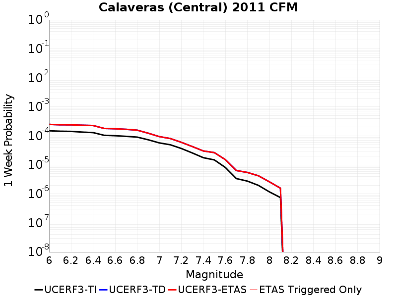 | 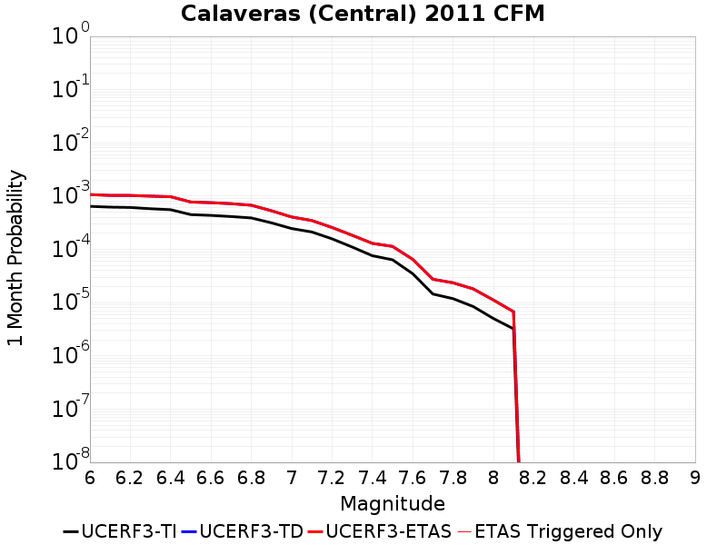 | 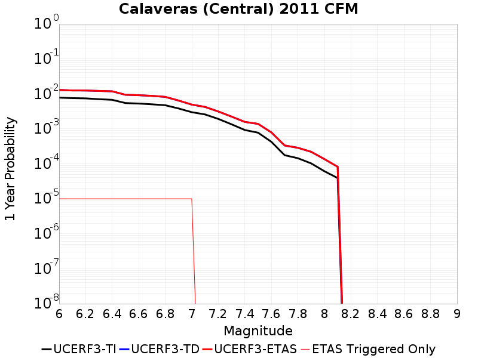 | 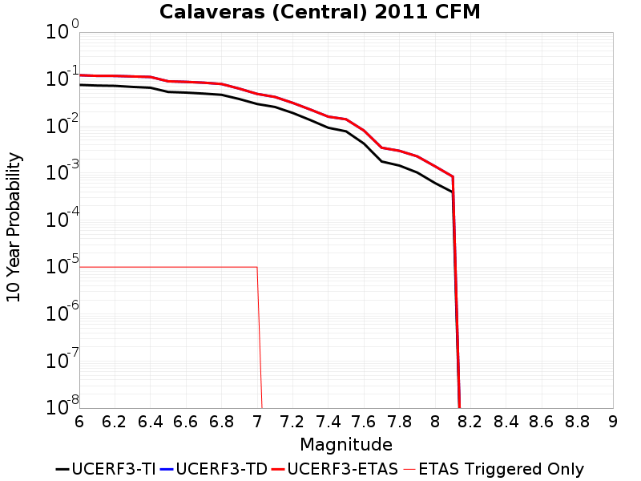 |

| Magnitude | 1 wk TI Prob | 1 wk TD Prob | 1 wk ETAS Prob | 1 wk ETAS/TD Gain | 1 wk ETAS Triggered Only | 1 mo TI Prob | 1 mo TD Prob | 1 mo ETAS Prob | 1 mo ETAS/TD Gain | 1 mo ETAS Triggered Only | 1 yr TI Prob | 1 yr TD Prob | 1 yr ETAS Prob | 1 yr ETAS/TD Gain | 1 yr ETAS Triggered Only | 10 yr TI Prob | 10 yr TD Prob | 10 yr ETAS Prob | 10 yr ETAS/TD Gain | 10 yr ETAS Triggered Only |
|-----|-----|-----|-----|-----|-----|-----|-----|-----|-----|-----|-----|-----|-----|-----|-----|-----|-----|-----|-----|-----|
| 6.0 | 1.5010907E-4 | 2.4956005E-4 | 2.4956005E-4 | 1.0 | 0.0 | 6.4316596E-4 | 0.0010690574 | 0.0010690574 | 1.0 | 0.0 | 0.0078024664 | 0.012929209 | 0.01293908 | 1.0007634 | 1.0E-5 | 0.07534136 | 0.12106505 | 0.12107384 | 1.0000726 | 1.0E-5 |
| 6.1 | 1.4521465E-4 | 2.4115761E-4 | 2.4115761E-4 | 1.0 | 0.0 | 6.222001E-4 | 0.0010330761 | 0.0010330761 | 1.0 | 0.0 | 0.0075490056 | 0.012497651 | 0.012507527 | 1.0007901 | 1.0E-5 | 0.07297657 | 0.117331885 | 0.117340714 | 1.0000752 | 1.0E-5 |
| 6.2 | 1.429998E-4 | 2.4044966E-4 | 2.4044966E-4 | 1.0 | 0.0 | 6.127123E-4 | 0.0010300449 | 0.0010300449 | 1.0 | 0.0 | 0.007434286 | 0.012461216 | 0.012471092 | 1.0007925 | 1.0E-5 | 0.07190444 | 0.11697548 | 0.11698431 | 1.0000755 | 1.0E-5 |
| 6.3 | 1.3536277E-4 | 2.337041E-4 | 2.337041E-4 | 1.0 | 0.0 | 5.799972E-4 | 0.0010011641 | 0.0010011641 | 1.0 | 0.0 | 0.0070386264 | 0.0121144755 | 0.012124354 | 1.0008155 | 1.0E-5 | 0.0681982 | 0.113862485 | 0.11387135 | 1.0000778 | 1.0E-5 |
| 6.4 | 1.2993296E-4 | 2.2788747E-4 | 2.2788747E-4 | 1.0 | 0.0 | 5.5673666E-4 | 9.762549E-4 | 9.762549E-4 | 1.0 | 0.0 | 0.006757223 | 0.0118146 | 0.011824482 | 1.0008364 | 1.0E-5 | 0.06555412 | 0.111119375 | 0.11112826 | 1.00008 | 1.0E-5 |
| 6.5 | 1.0498927E-4 | 1.8109573E-4 | 1.8109573E-4 | 1.0 | 0.0 | 4.498764E-4 | 7.758934E-4 | 7.758934E-4 | 1.0 | 0.0 | 0.005463498 | 0.0094054965 | 0.009415403 | 1.0010532 | 1.0E-5 | 0.053311124 | 0.08976877 | 0.08977787 | 1.0001014 | 1.0E-5 |
| 6.6 | 1.0157505E-4 | 1.759542E-4 | 1.759542E-4 | 1.0 | 0.0 | 4.35249E-4 | 7.5387146E-4 | 7.5387146E-4 | 1.0 | 0.0 | 0.0052862884 | 0.009139693 | 0.009149603 | 1.0010841 | 1.0E-5 | 0.05162293 | 0.08734036 | 0.08734949 | 1.0001045 | 1.0E-5 |
| 6.7 | 9.660386E-5 | 1.6852286E-4 | 1.6852286E-4 | 1.0 | 0.0 | 4.1395082E-4 | 7.220409E-4 | 7.220409E-4 | 1.0 | 0.0 | 0.0050282106 | 0.008755374 | 0.008765286 | 1.0011321 | 1.0E-5 | 0.049159497 | 0.08382158 | 0.083830744 | 1.0001093 | 1.0E-5 |
| 6.8 | 9.089927E-5 | 1.5761133E-4 | 1.5761133E-4 | 1.0 | 0.0 | 3.8951015E-4 | 6.753026E-4 | 6.753026E-4 | 1.0 | 0.0 | 0.0047319788 | 0.00819078 | 0.0082006985 | 1.0012109 | 1.0E-5 | 0.046324775 | 0.07868865 | 0.07869786 | 1.0001171 | 1.0E-5 |
| 6.9 | 7.353187E-5 | 1.2395153E-4 | 1.2395153E-4 | 1.0 | 0.0 | 3.150985E-4 | 5.311133E-4 | 5.311133E-4 | 1.0 | 0.0 | 0.0038295772 | 0.006447255 | 0.0064571905 | 1.001541 | 1.0E-5 | 0.037642512 | 0.06264923 | 0.0626586 | 1.0001496 | 1.0E-5 |
| 7.0 | 5.746064E-5 | 9.474866E-5 | 9.474866E-5 | 1.0 | 0.0 | 2.4623662E-4 | 4.0600286E-4 | 4.0600286E-4 | 1.0 | 0.0 | 0.0029938098 | 0.0049319537 | 0.0049419045 | 1.0020176 | 1.0E-5 | 0.02953797 | 0.04839327 | 0.048402783 | 1.0001967 | 1.0E-5 |
| 7.1 | 4.9557195E-5 | 8.12905E-5 | 8.12905E-5 | 1.0 | 0.0 | 2.123707E-4 | 3.4834168E-4 | 3.4834168E-4 | 1.0 | 0.0 | 0.0025825473 | 0.0042328765 | 0.0042328765 | 1.0 | 0.0 | 0.0255274 | 0.041738443 | 0.041738443 | 1.0 | 0.0 |
| 7.2 | 3.687595E-5 | 6.019157E-5 | 6.019157E-5 | 1.0 | 0.0 | 1.5803022E-4 | 2.5793855E-4 | 2.5793855E-4 | 1.0 | 0.0 | 0.0019223199 | 0.0031359093 | 0.0031359093 | 1.0 | 0.0 | 0.01905776 | 0.031205747 | 0.031205747 | 1.0 | 0.0 |
| 7.3 | 2.5846984E-5 | 4.2995165E-5 | 4.2995165E-5 | 1.0 | 0.0 | 1.1076809E-4 | 1.8425209E-4 | 1.8425209E-4 | 1.0 | 0.0 | 0.0013477671 | 0.002240979 | 0.002240979 | 1.0 | 0.0 | 0.013396223 | 0.022431426 | 0.022431426 | 1.0 | 0.0 |
| 7.4 | 1.7747854E-5 | 3.0285586E-5 | 3.0285586E-5 | 1.0 | 0.0 | 7.6060016E-5 | 1.2978892E-4 | 1.2978892E-4 | 1.0 | 0.0 | 9.2563726E-4 | 0.0015790378 | 0.0015790378 | 1.0 | 0.0 | 0.009217911 | 0.015879983 | 0.015879983 | 1.0 | 0.0 |
| 7.5 | 1.4883479E-5 | 2.6570251E-5 | 2.6570251E-5 | 1.0 | 0.0 | 6.378478E-5 | 1.1386755E-4 | 1.1386755E-4 | 1.0 | 0.0 | 7.76303E-4 | 0.0013854586 | 0.0013854586 | 1.0 | 0.0 | 0.0077359667 | 0.013962331 | 0.013962331 | 1.0 | 0.0 |
| 7.6 | 8.166975E-6 | 1.520099E-5 | 1.520099E-5 | 1.0 | 0.0 | 3.5000852E-5 | 6.514548E-5 | 6.514548E-5 | 1.0 | 0.0 | 4.2605202E-4 | 7.9285895E-4 | 7.9285895E-4 | 1.0 | 0.0 | 0.004252361 | 0.008056989 | 0.008056989 | 1.0 | 0.0 |
| 7.7 | 3.3858064E-6 | 6.415838E-6 | 6.415838E-6 | 1.0 | 0.0 | 1.4510518E-5 | 2.749616E-5 | 2.749616E-5 | 1.0 | 0.0 | 1.7665124E-4 | 3.347144E-4 | 3.347144E-4 | 1.0 | 0.0 | 0.0017651088 | 0.003467667 | 0.003467667 | 1.0 | 0.0 |
| 7.8 | 2.7721615E-6 | 5.505418E-6 | 5.505418E-6 | 1.0 | 0.0 | 1.1880637E-5 | 2.3594435E-5 | 2.3594435E-5 | 1.0 | 0.0 | 1.4463716E-4 | 2.8722445E-4 | 2.8722445E-4 | 1.0 | 0.0 | 0.0014454306 | 0.002975377 | 0.002975377 | 1.0 | 0.0 |
| 7.9 | 1.9736292E-6 | 4.2308175E-6 | 4.2308175E-6 | 1.0 | 0.0 | 8.4583835E-6 | 1.8131948E-5 | 1.8131948E-5 | 1.0 | 0.0 | 1.0297595E-4 | 2.2073416E-4 | 2.2073416E-4 | 1.0 | 0.0 | 0.0010292825 | 0.0022732797 | 0.0022732797 | 1.0 | 0.0 |
| 8.0 | 1.1767289E-6 | 2.6152854E-6 | 2.6152854E-6 | 1.0 | 0.0 | 5.0431145E-6 | 1.1208318E-5 | 1.1208318E-5 | 1.0 | 0.0 | 6.139818E-5 | 1.3645276E-4 | 1.3645276E-4 | 1.0 | 0.0 | 6.1381224E-4 | 0.0013956365 | 0.0013956365 | 1.0 | 0.0 |
| 8.1 | 7.5112825E-7 | 1.5780425E-6 | 1.5780425E-6 | 1.0 | 0.0 | 3.2191172E-6 | 6.7630217E-6 | 6.7630217E-6 | 1.0 | 0.0 | 3.9192048E-5 | 8.233671E-5 | 8.233671E-5 | 1.0 | 0.0 | 3.9185135E-4 | 8.4171875E-4 | 8.4171875E-4 | 1.0 | 0.0 |

## Redondo Canyon alt 1
*[(top)](#table-of-contents)*

| 1 Week | 1 Month | 1 Year | 10 Year |
|-----|-----|-----|-----|
|  | 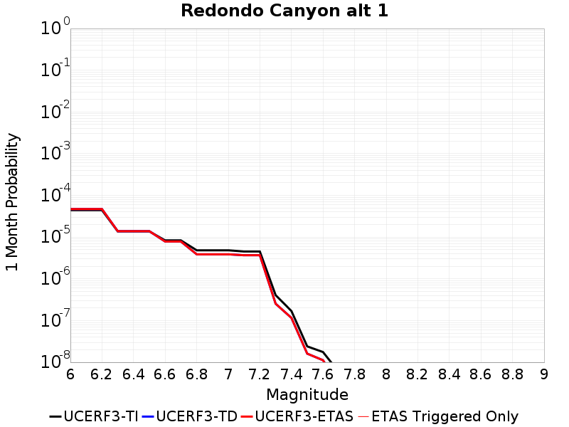 | 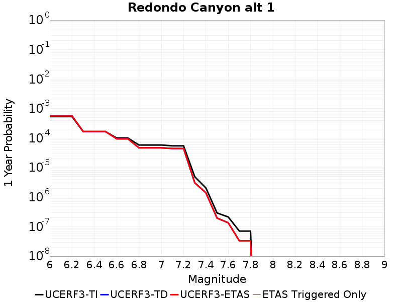 |  |

| Magnitude | 1 wk TI Prob | 1 wk TD Prob | 1 wk ETAS Prob | 1 wk ETAS/TD Gain | 1 wk ETAS Triggered Only | 1 mo TI Prob | 1 mo TD Prob | 1 mo ETAS Prob | 1 mo ETAS/TD Gain | 1 mo ETAS Triggered Only | 1 yr TI Prob | 1 yr TD Prob | 1 yr ETAS Prob | 1 yr ETAS/TD Gain | 1 yr ETAS Triggered Only | 10 yr TI Prob | 10 yr TD Prob | 10 yr ETAS Prob | 10 yr ETAS/TD Gain | 10 yr ETAS Triggered Only |
|-----|-----|-----|-----|-----|-----|-----|-----|-----|-----|-----|-----|-----|-----|-----|-----|-----|-----|-----|-----|-----|
| 6.0 | 1.0346246E-5 | 1.0988348E-5 | 1.0988348E-5 | 1.0 | 0.0 | 4.43403E-5 | 4.709251E-5 | 4.709251E-5 | 1.0 | 0.0 | 5.3970946E-4 | 5.732795E-4 | 5.732795E-4 | 1.0 | 0.0 | 0.0053840056 | 0.0057257535 | 0.0057356963 | 1.0017365 | 1.0E-5 |
| 6.1 | 1.0346246E-5 | 1.0988348E-5 | 1.0988348E-5 | 1.0 | 0.0 | 4.43403E-5 | 4.709251E-5 | 4.709251E-5 | 1.0 | 0.0 | 5.3970946E-4 | 5.732795E-4 | 5.732795E-4 | 1.0 | 0.0 | 0.0053840056 | 0.0057257535 | 0.0057356963 | 1.0017365 | 1.0E-5 |
| 6.2 | 1.0346246E-5 | 1.0988348E-5 | 1.0988348E-5 | 1.0 | 0.0 | 4.43403E-5 | 4.709251E-5 | 4.709251E-5 | 1.0 | 0.0 | 5.3970946E-4 | 5.732795E-4 | 5.732795E-4 | 1.0 | 0.0 | 0.0053840056 | 0.0057257535 | 0.0057356963 | 1.0017365 | 1.0E-5 |
| 6.3 | 3.2052794E-6 | 3.2389644E-6 | 3.2389644E-6 | 1.0 | 0.0 | 1.373684E-5 | 1.3881225E-5 | 1.3881225E-5 | 1.0 | 0.0 | 1.6723319E-4 | 1.6899478E-4 | 1.6899478E-4 | 1.0 | 0.0 | 0.001671074 | 0.0016890529 | 0.001699036 | 1.0059105 | 1.0E-5 |
| 6.4 | 3.2052794E-6 | 3.2389644E-6 | 3.2389644E-6 | 1.0 | 0.0 | 1.373684E-5 | 1.3881225E-5 | 1.3881225E-5 | 1.0 | 0.0 | 1.6723319E-4 | 1.6899478E-4 | 1.6899478E-4 | 1.0 | 0.0 | 0.001671074 | 0.0016890529 | 0.001699036 | 1.0059105 | 1.0E-5 |
| 6.5 | 3.2052794E-6 | 3.2389644E-6 | 3.2389644E-6 | 1.0 | 0.0 | 1.373684E-5 | 1.3881225E-5 | 1.3881225E-5 | 1.0 | 0.0 | 1.6723319E-4 | 1.6899478E-4 | 1.6899478E-4 | 1.0 | 0.0 | 0.001671074 | 0.0016890529 | 0.001699036 | 1.0059105 | 1.0E-5 |
| 6.6 | 1.948328E-6 | 1.8306478E-6 | 1.8306478E-6 | 1.0 | 0.0 | 8.349951E-6 | 7.845618E-6 | 7.845618E-6 | 1.0 | 0.0 | 1.016559E-4 | 9.551772E-5 | 9.551772E-5 | 1.0 | 0.0 | 0.0010160941 | 9.5491385E-4 | 9.5491385E-4 | 1.0 | 0.0 |
| 6.7 | 1.948328E-6 | 1.8306478E-6 | 1.8306478E-6 | 1.0 | 0.0 | 8.349951E-6 | 7.845618E-6 | 7.845618E-6 | 1.0 | 0.0 | 1.016559E-4 | 9.551772E-5 | 9.551772E-5 | 1.0 | 0.0 | 0.0010160941 | 9.5491385E-4 | 9.5491385E-4 | 1.0 | 0.0 |
| 6.8 | 1.1278219E-6 | 9.0433565E-7 | 9.0433565E-7 | 1.0 | 0.0 | 4.8335132E-6 | 3.8757207E-6 | 3.8757207E-6 | 1.0 | 0.0 | 5.8846435E-5 | 4.718631E-5 | 4.718631E-5 | 1.0 | 0.0 | 5.8830855E-4 | 4.71805E-4 | 4.71805E-4 | 1.0 | 0.0 |
| 6.9 | 1.1278219E-6 | 9.0433565E-7 | 9.0433565E-7 | 1.0 | 0.0 | 4.8335132E-6 | 3.8757207E-6 | 3.8757207E-6 | 1.0 | 0.0 | 5.8846435E-5 | 4.718631E-5 | 4.718631E-5 | 1.0 | 0.0 | 5.8830855E-4 | 4.71805E-4 | 4.71805E-4 | 1.0 | 0.0 |
| 7.0 | 1.1278219E-6 | 9.0433565E-7 | 9.0433565E-7 | 1.0 | 0.0 | 4.8335132E-6 | 3.8757207E-6 | 3.8757207E-6 | 1.0 | 0.0 | 5.8846435E-5 | 4.718631E-5 | 4.718631E-5 | 1.0 | 0.0 | 5.8830855E-4 | 4.71805E-4 | 4.71805E-4 | 1.0 | 0.0 |
| 7.1 | 1.0545139E-6 | 8.578761E-7 | 8.578761E-7 | 1.0 | 0.0 | 4.5193374E-6 | 3.6766091E-6 | 3.6766091E-6 | 1.0 | 0.0 | 5.5021545E-5 | 4.4762222E-5 | 4.4762222E-5 | 1.0 | 0.0 | 5.500792E-4 | 4.4757393E-4 | 4.4757393E-4 | 1.0 | 0.0 |
| 7.2 | 1.0545139E-6 | 8.578761E-7 | 8.578761E-7 | 1.0 | 0.0 | 4.5193374E-6 | 3.6766091E-6 | 3.6766091E-6 | 1.0 | 0.0 | 5.5021545E-5 | 4.4762222E-5 | 4.4762222E-5 | 1.0 | 0.0 | 5.500792E-4 | 4.4757393E-4 | 4.4757393E-4 | 1.0 | 0.0 |
| 7.3 | 9.505161E-8 | 5.905154E-8 | 5.905154E-8 | 1.0 | 0.0 | 4.0736398E-7 | 2.53078E-7 | 2.53078E-7 | 1.0 | 0.0 | 4.959645E-6 | 3.0812218E-6 | 3.0812218E-6 | 1.0 | 0.0 | 4.9595343E-5 | 3.081191E-5 | 3.081191E-5 | 1.0 | 0.0 |
| 7.4 | 3.9520785E-8 | 2.7054448E-8 | 2.7054448E-8 | 1.0 | 0.0 | 1.6937479E-7 | 1.1594763E-7 | 1.1594763E-7 | 1.0 | 0.0 | 2.062136E-6 | 1.4116617E-6 | 1.4116617E-6 | 1.0 | 0.0 | 2.062117E-5 | 1.4116554E-5 | 1.4116554E-5 | 1.0 | 0.0 |
| 7.5 | 5.6133214E-9 | 3.761205E-9 | 3.761205E-9 | 1.0 | 0.0 | 2.4057092E-8 | 1.611945E-8 | 1.611945E-8 | 1.0 | 0.0 | 2.9289507E-7 | 1.962543E-7 | 1.962543E-7 | 1.0 | 0.0 | 2.9289467E-6 | 1.9625415E-6 | 1.9625415E-6 | 1.0 | 0.0 |
| 7.6 | 4.1064334E-9 | 2.6143674E-9 | 2.6143674E-9 | 1.0 | 0.0 | 1.7599E-8 | 1.1204432E-8 | 1.1204432E-8 | 1.0 | 0.0 | 2.142678E-7 | 1.3641396E-7 | 1.3641396E-7 | 1.0 | 0.0 | 2.1426758E-6 | 1.3641388E-6 | 1.3641388E-6 | 1.0 | 0.0 |
| 7.7 | 1.361975E-9 | 6.374382E-10 | 6.374382E-10 | 1.0 | 0.0 | 5.8370353E-9 | 2.7318783E-9 | 2.7318783E-9 | 1.0 | 0.0 | 7.1065905E-8 | 3.3260616E-8 | 3.3260616E-8 | 1.0 | 0.0 | 7.106588E-7 | 3.3260613E-7 | 3.3260613E-7 | 1.0 | 0.0 |
| 7.8 | 1.361975E-9 | 6.374382E-10 | 6.374382E-10 | 1.0 | 0.0 | 5.8370353E-9 | 2.7318783E-9 | 2.7318783E-9 | 1.0 | 0.0 | 7.1065905E-8 | 3.3260616E-8 | 3.3260616E-8 | 1.0 | 0.0 | 7.106588E-7 | 3.3260613E-7 | 3.3260613E-7 | 1.0 | 0.0 |

## Channel Islands Thrust
*[(top)](#table-of-contents)*

| 1 Week | 1 Month | 1 Year | 10 Year |
|-----|-----|-----|-----|
|  | 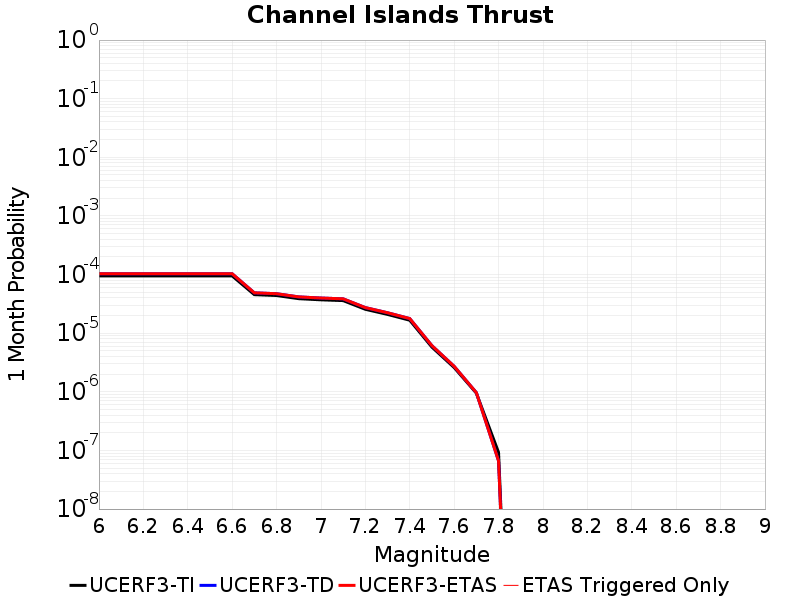 |  |  |

| Magnitude | 1 wk TI Prob | 1 wk TD Prob | 1 wk ETAS Prob | 1 wk ETAS/TD Gain | 1 wk ETAS Triggered Only | 1 mo TI Prob | 1 mo TD Prob | 1 mo ETAS Prob | 1 mo ETAS/TD Gain | 1 mo ETAS Triggered Only | 1 yr TI Prob | 1 yr TD Prob | 1 yr ETAS Prob | 1 yr ETAS/TD Gain | 1 yr ETAS Triggered Only | 10 yr TI Prob | 10 yr TD Prob | 10 yr ETAS Prob | 10 yr ETAS/TD Gain | 10 yr ETAS Triggered Only |
|-----|-----|-----|-----|-----|-----|-----|-----|-----|-----|-----|-----|-----|-----|-----|-----|-----|-----|-----|-----|-----|
| 6.0 | 2.2156251E-5 | 2.410547E-5 | 2.410547E-5 | 1.0 | 0.0 | 9.495191E-5 | 1.0330566E-4 | 1.0330566E-4 | 1.0 | 0.0 | 0.0011554264 | 0.0012571274 | 0.0012671149 | 1.0079446 | 1.0E-5 | 0.011494373 | 0.012510764 | 0.012520639 | 1.0007893 | 1.0E-5 |
| 6.1 | 2.2156251E-5 | 2.410547E-5 | 2.410547E-5 | 1.0 | 0.0 | 9.495191E-5 | 1.0330566E-4 | 1.0330566E-4 | 1.0 | 0.0 | 0.0011554264 | 0.0012571274 | 0.0012671149 | 1.0079446 | 1.0E-5 | 0.011494373 | 0.012510764 | 0.012520639 | 1.0007893 | 1.0E-5 |
| 6.2 | 2.2156251E-5 | 2.410547E-5 | 2.410547E-5 | 1.0 | 0.0 | 9.495191E-5 | 1.0330566E-4 | 1.0330566E-4 | 1.0 | 0.0 | 0.0011554264 | 0.0012571274 | 0.0012671149 | 1.0079446 | 1.0E-5 | 0.011494373 | 0.012510764 | 0.012520639 | 1.0007893 | 1.0E-5 |
| 6.3 | 2.2156251E-5 | 2.410547E-5 | 2.410547E-5 | 1.0 | 0.0 | 9.495191E-5 | 1.0330566E-4 | 1.0330566E-4 | 1.0 | 0.0 | 0.0011554264 | 0.0012571274 | 0.0012671149 | 1.0079446 | 1.0E-5 | 0.011494373 | 0.012510764 | 0.012520639 | 1.0007893 | 1.0E-5 |
| 6.4 | 2.2156251E-5 | 2.410547E-5 | 2.410547E-5 | 1.0 | 0.0 | 9.495191E-5 | 1.0330566E-4 | 1.0330566E-4 | 1.0 | 0.0 | 0.0011554264 | 0.0012571274 | 0.0012671149 | 1.0079446 | 1.0E-5 | 0.011494373 | 0.012510764 | 0.012520639 | 1.0007893 | 1.0E-5 |
| 6.5 | 2.2156251E-5 | 2.410547E-5 | 2.410547E-5 | 1.0 | 0.0 | 9.495191E-5 | 1.0330566E-4 | 1.0330566E-4 | 1.0 | 0.0 | 0.0011554264 | 0.0012571274 | 0.0012671149 | 1.0079446 | 1.0E-5 | 0.011494373 | 0.012510764 | 0.012520639 | 1.0007893 | 1.0E-5 |
| 6.6 | 2.2156251E-5 | 2.410547E-5 | 2.410547E-5 | 1.0 | 0.0 | 9.495191E-5 | 1.0330566E-4 | 1.0330566E-4 | 1.0 | 0.0 | 0.0011554264 | 0.0012571274 | 0.0012671149 | 1.0079446 | 1.0E-5 | 0.011494373 | 0.012510764 | 0.012520639 | 1.0007893 | 1.0E-5 |
| 6.7 | 1.0601296E-5 | 1.1384914E-5 | 1.1384914E-5 | 1.0 | 0.0 | 4.5433335E-5 | 4.87916E-5 | 4.87916E-5 | 1.0 | 0.0 | 5.5301044E-4 | 5.938807E-4 | 5.938807E-4 | 1.0 | 0.0 | 0.005516363 | 0.0059234393 | 0.0059234393 | 1.0 | 0.0 |
| 6.8 | 1.0246747E-5 | 1.10018445E-5 | 1.10018445E-5 | 1.0 | 0.0 | 4.391389E-5 | 4.7149937E-5 | 4.7149937E-5 | 1.0 | 0.0 | 5.345204E-4 | 5.739041E-4 | 5.739041E-4 | 1.0 | 0.0 | 0.0053323656 | 0.0057247104 | 0.0057247104 | 1.0 | 0.0 |
| 6.9 | 9.049551E-6 | 9.704134E-6 | 9.704134E-6 | 1.0 | 0.0 | 3.878322E-5 | 4.1588504E-5 | 4.1588504E-5 | 1.0 | 0.0 | 4.7208337E-4 | 5.0622656E-4 | 5.0622656E-4 | 1.0 | 0.0 | 0.0047108172 | 0.0050511514 | 0.0050511514 | 1.0 | 0.0 |
| 7.0 | 8.6542195E-6 | 9.27889E-6 | 9.27889E-6 | 1.0 | 0.0 | 3.7088983E-5 | 3.9766088E-5 | 3.9766088E-5 | 1.0 | 0.0 | 4.5146482E-4 | 4.8404865E-4 | 4.8404865E-4 | 1.0 | 0.0 | 0.004505487 | 0.0048303558 | 0.0048303558 | 1.0 | 0.0 |
| 7.1 | 8.391028E-6 | 8.997086E-6 | 8.997086E-6 | 1.0 | 0.0 | 3.5961057E-5 | 3.8558395E-5 | 3.8558395E-5 | 1.0 | 0.0 | 4.3773788E-4 | 4.693514E-4 | 4.693514E-4 | 1.0 | 0.0 | 0.004368766 | 0.004684012 | 0.004684012 | 1.0 | 0.0 |
| 7.2 | 5.965188E-6 | 6.3745156E-6 | 6.3745156E-6 | 1.0 | 0.0 | 2.556484E-5 | 2.7319069E-5 | 2.7319069E-5 | 1.0 | 0.0 | 3.1120746E-4 | 3.3255946E-4 | 3.3255946E-4 | 1.0 | 0.0 | 0.00310772 | 0.003320676 | 0.003320676 | 1.0 | 0.0 |
| 7.3 | 4.877518E-6 | 5.208296E-6 | 5.208296E-6 | 1.0 | 0.0 | 2.0903482E-5 | 2.2321079E-5 | 2.2321079E-5 | 1.0 | 0.0 | 2.5447016E-4 | 2.717257E-4 | 2.717257E-4 | 1.0 | 0.0 | 0.0025417898 | 0.0027139809 | 0.0027139809 | 1.0 | 0.0 |
| 7.4 | 3.8829853E-6 | 4.1436792E-6 | 4.1436792E-6 | 1.0 | 0.0 | 1.664126E-5 | 1.7758508E-5 | 1.7758508E-5 | 1.0 | 0.0 | 2.0258849E-4 | 2.161888E-4 | 2.161888E-4 | 1.0 | 0.0 | 0.002024039 | 0.0021598267 | 0.0021598267 | 1.0 | 0.0 |
| 7.5 | 1.3489616E-6 | 1.4283826E-6 | 1.4283826E-6 | 1.0 | 0.0 | 5.7812517E-6 | 6.121625E-6 | 6.121625E-6 | 1.0 | 0.0 | 7.038446E-5 | 7.452828E-5 | 7.452828E-5 | 1.0 | 0.0 | 7.036218E-4 | 7.450368E-4 | 7.450368E-4 | 1.0 | 0.0 |
| 7.6 | 6.058192E-7 | 6.356355E-7 | 6.356355E-7 | 1.0 | 0.0 | 2.5963652E-6 | 2.7241492E-6 | 2.7241492E-6 | 1.0 | 0.0 | 3.161029E-5 | 3.316603E-5 | 3.316603E-5 | 1.0 | 0.0 | 3.1605794E-4 | 3.3161242E-4 | 3.3161242E-4 | 1.0 | 0.0 |
| 7.7 | 2.2170494E-7 | 2.2616354E-7 | 2.2616354E-7 | 1.0 | 0.0 | 9.5016367E-7 | 9.692719E-7 | 9.692719E-7 | 1.0 | 0.0 | 1.1568181E-5 | 1.1800834E-5 | 1.1800834E-5 | 1.0 | 0.0 | 1.1567579E-4 | 1.1800318E-4 | 1.1800318E-4 | 1.0 | 0.0 |
| 7.8 | 2.1613102E-8 | 1.5471628E-8 | 1.5471628E-8 | 1.0 | 0.0 | 9.262757E-8 | 6.6306974E-8 | 6.6306974E-8 | 1.0 | 0.0 | 1.1277401E-6 | 8.0728717E-7 | 8.0728717E-7 | 1.0 | 0.0 | 1.1277344E-5 | 8.07285E-6 | 8.07285E-6 | 1.0 | 0.0 |

## Calaveras (So) 2011 CFM
*[(top)](#table-of-contents)*

| 1 Week | 1 Month | 1 Year | 10 Year |
|-----|-----|-----|-----|
|  |  | 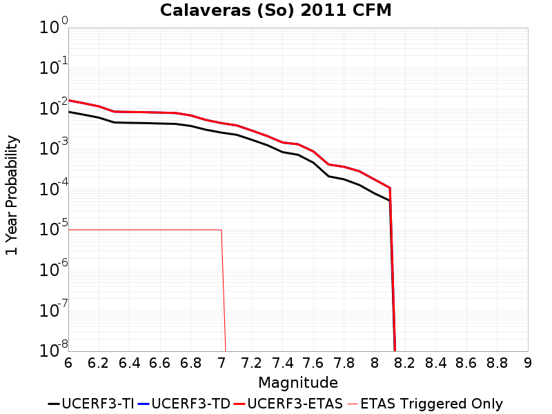 | 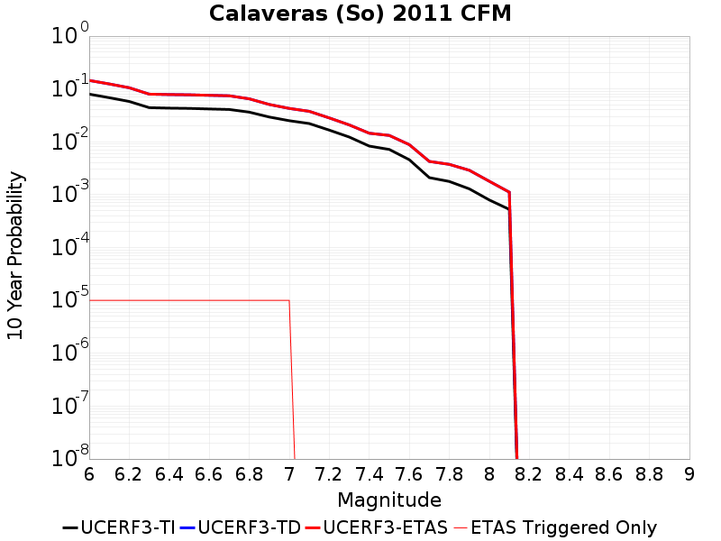 |

| Magnitude | 1 wk TI Prob | 1 wk TD Prob | 1 wk ETAS Prob | 1 wk ETAS/TD Gain | 1 wk ETAS Triggered Only | 1 mo TI Prob | 1 mo TD Prob | 1 mo ETAS Prob | 1 mo ETAS/TD Gain | 1 mo ETAS Triggered Only | 1 yr TI Prob | 1 yr TD Prob | 1 yr ETAS Prob | 1 yr ETAS/TD Gain | 1 yr ETAS Triggered Only | 10 yr TI Prob | 10 yr TD Prob | 10 yr ETAS Prob | 10 yr ETAS/TD Gain | 10 yr ETAS Triggered Only |
|-----|-----|-----|-----|-----|-----|-----|-----|-----|-----|-----|-----|-----|-----|-----|-----|-----|-----|-----|-----|-----|
| 6.0 | 1.5950744E-4 | 3.0853873E-4 | 3.0853873E-4 | 1.0 | 0.0 | 6.834242E-4 | 0.0013214491 | 0.0013214491 | 1.0 | 0.0 | 0.00828899 | 0.015930364 | 0.015940204 | 1.0006177 | 1.0E-5 | 0.079865426 | 0.14497623 | 0.14498478 | 1.000059 | 1.0E-5 |
| 6.1 | 1.3584697E-4 | 2.6168287E-4 | 2.6168287E-4 | 1.0 | 0.0 | 5.8207137E-4 | 0.001120847 | 0.001120847 | 1.0 | 0.0 | 0.007063716 | 0.013529202 | 0.013539067 | 1.0007291 | 1.0E-5 | 0.06843361 | 0.124583796 | 0.12459255 | 1.0000702 | 1.0E-5 |
| 6.2 | 1.14676266E-4 | 2.1840728E-4 | 2.1840728E-4 | 1.0 | 0.0 | 4.9137714E-4 | 9.355945E-4 | 9.355945E-4 | 1.0 | 0.0 | 0.0059661185 | 0.011309508 | 0.011319395 | 1.0008742 | 1.0E-5 | 0.058084648 | 0.10555927 | 0.10556821 | 1.0000848 | 1.0E-5 |
| 6.3 | 8.691518E-5 | 1.6104504E-4 | 1.6104504E-4 | 1.0 | 0.0 | 3.7244044E-4 | 6.8997504E-4 | 6.8997504E-4 | 1.0 | 0.0 | 0.004525038 | 0.008361339 | 0.008371255 | 1.001186 | 1.0E-5 | 0.044339992 | 0.07985558 | 0.079864785 | 1.0001153 | 1.0E-5 |
| 6.4 | 8.50982E-5 | 1.5809326E-4 | 1.5809326E-4 | 1.0 | 0.0 | 3.646556E-4 | 6.773311E-4 | 6.773311E-4 | 1.0 | 0.0 | 0.0044306475 | 0.008208565 | 0.008218483 | 1.0012082 | 1.0E-5 | 0.04343345 | 0.07845587 | 0.07846509 | 1.0001174 | 1.0E-5 |
| 6.5 | 8.4062965E-5 | 1.5633332E-4 | 1.5633332E-4 | 1.0 | 0.0 | 3.602201E-4 | 6.697934E-4 | 6.697934E-4 | 1.0 | 0.0 | 0.004376863 | 0.008117575 | 0.008127494 | 1.0012219 | 1.0E-5 | 0.042916555 | 0.07762585 | 0.07763507 | 1.0001189 | 1.0E-5 |
| 6.6 | 8.194716E-5 | 1.526802E-4 | 1.526802E-4 | 1.0 | 0.0 | 3.5115483E-4 | 6.5414683E-4 | 6.5414683E-4 | 1.0 | 0.0 | 0.0042669317 | 0.007928858 | 0.007938778 | 1.0012512 | 1.0E-5 | 0.04185927 | 0.07590728 | 0.07591652 | 1.0001217 | 1.0E-5 |
| 6.7 | 8.012326E-5 | 1.4935009E-4 | 1.4935009E-4 | 1.0 | 0.0 | 3.433402E-4 | 6.3988514E-4 | 6.3988514E-4 | 1.0 | 0.0 | 0.004172157 | 0.0077568972 | 0.0077668196 | 1.0012791 | 1.0E-5 | 0.040946912 | 0.07434647 | 0.07435572 | 1.0001245 | 1.0E-5 |
| 6.8 | 7.119773E-5 | 1.2986388E-4 | 1.2986388E-4 | 1.0 | 0.0 | 3.0509746E-4 | 5.5642385E-4 | 5.5642385E-4 | 1.0 | 0.0 | 0.0037082357 | 0.006750162 | 0.006760095 | 1.0014714 | 1.0E-5 | 0.036469642 | 0.06516109 | 0.06517044 | 1.0001434 | 1.0E-5 |
| 6.9 | 5.7343088E-5 | 1.0010302E-4 | 1.0010302E-4 | 1.0 | 0.0 | 2.4573295E-4 | 4.2894282E-4 | 4.2894282E-4 | 1.0 | 0.0 | 0.0029876942 | 0.0052099493 | 0.0052198973 | 1.0019094 | 1.0E-5 | 0.02947844 | 0.050937332 | 0.05094682 | 1.0001863 | 1.0E-5 |
| 7.0 | 4.8746577E-5 | 8.3680294E-5 | 8.3680294E-5 | 1.0 | 0.0 | 2.0889717E-4 | 3.585809E-4 | 3.585809E-4 | 1.0 | 0.0 | 0.0025403565 | 0.0043570506 | 0.004367007 | 1.0022851 | 1.0E-5 | 0.025115121 | 0.042879835 | 0.04288941 | 1.0002232 | 1.0E-5 |
| 7.1 | 4.2998014E-5 | 7.340166E-5 | 7.340166E-5 | 1.0 | 0.0 | 1.8426418E-4 | 3.1454093E-4 | 3.1454093E-4 | 1.0 | 0.0 | 0.002241108 | 0.0038228726 | 0.0038228726 | 1.0 | 0.0 | 0.022186412 | 0.03778304 | 0.03778304 | 1.0 | 0.0 |
| 7.2 | 3.221292E-5 | 5.4562803E-5 | 5.4562803E-5 | 1.0 | 0.0 | 1.3804805E-4 | 2.3381978E-4 | 2.3381978E-4 | 1.0 | 0.0 | 0.0016794393 | 0.0028430682 | 0.0028430682 | 1.0 | 0.0 | 0.016668037 | 0.02835351 | 0.02835351 | 1.0 | 0.0 |
| 7.3 | 2.3756531E-5 | 3.9992374E-5 | 3.9992374E-5 | 1.0 | 0.0 | 1.0180973E-4 | 1.7138472E-4 | 1.7138472E-4 | 1.0 | 0.0 | 0.0012388286 | 0.0020846296 | 0.0020846296 | 1.0 | 0.0 | 0.012319452 | 0.02089792 | 0.02089792 | 1.0 | 0.0 |
| 7.4 | 1.5997684E-5 | 2.7690097E-5 | 2.7690097E-5 | 1.0 | 0.0 | 6.8559704E-5 | 1.1866646E-4 | 1.1866646E-4 | 1.0 | 0.0 | 8.343947E-4 | 0.0014438091 | 0.0014438091 | 1.0 | 0.0 | 0.008312687 | 0.014546815 | 0.014546815 | 1.0 | 0.0 |
| 7.5 | 1.3814293E-5 | 2.511851E-5 | 2.511851E-5 | 1.0 | 0.0 | 5.9202768E-5 | 1.0764633E-4 | 1.0764633E-4 | 1.0 | 0.0 | 7.205553E-4 | 0.0013098086 | 0.0013098086 | 1.0 | 0.0 | 0.007182234 | 0.0132196285 | 0.0132196285 | 1.0 | 0.0 |
| 7.6 | 8.817309E-6 | 1.6703692E-5 | 1.6703692E-5 | 1.0 | 0.0 | 3.7787922E-5 | 7.15853E-5 | 7.15853E-5 | 1.0 | 0.0 | 4.5997082E-4 | 8.712039E-4 | 8.712039E-4 | 1.0 | 0.0 | 0.004590199 | 0.008854296 | 0.008854296 | 1.0 | 0.0 |
| 7.7 | 4.0352206E-6 | 7.904831E-6 | 7.904831E-6 | 1.0 | 0.0 | 1.7293689E-5 | 3.387741E-5 | 3.387741E-5 | 1.0 | 0.0 | 2.1053031E-4 | 4.1237948E-4 | 4.1237948E-4 | 1.0 | 0.0 | 0.0021033096 | 0.0042616767 | 0.0042616767 | 1.0 | 0.0 |
| 7.8 | 3.413169E-6 | 6.96022E-6 | 6.96022E-6 | 1.0 | 0.0 | 1.4627784E-5 | 2.9829174E-5 | 2.9829174E-5 | 1.0 | 0.0 | 1.7807873E-4 | 3.6310975E-4 | 3.6310975E-4 | 1.0 | 0.0 | 0.0017793609 | 0.0037506649 | 0.0037506649 | 1.0 | 0.0 |
| 7.9 | 2.4740732E-6 | 5.407553E-6 | 5.407553E-6 | 1.0 | 0.0 | 1.06031275E-5 | 2.3175022E-5 | 2.3175022E-5 | 1.0 | 0.0 | 1.2908543E-4 | 2.8211944E-4 | 2.8211944E-4 | 1.0 | 0.0 | 0.0012901047 | 0.0028969245 | 0.0028969245 | 1.0 | 0.0 |
| 8.0 | 1.5231818E-6 | 3.3658396E-6 | 3.3658396E-6 | 1.0 | 0.0 | 6.527906E-6 | 1.4424947E-5 | 1.4424947E-5 | 1.0 | 0.0 | 7.9474354E-5 | 1.7560962E-4 | 1.7560962E-4 | 1.0 | 0.0 | 7.944594E-4 | 0.0017939429 | 0.0017939429 | 1.0 | 0.0 |
| 8.1 | 1.0104524E-6 | 2.0942261E-6 | 2.0942261E-6 | 1.0 | 0.0 | 4.330503E-6 | 8.975225E-6 | 8.975225E-6 | 1.0 | 0.0 | 5.2722597E-5 | 1.09267916E-4 | 1.09267916E-4 | 1.0 | 0.0 | 5.271009E-4 | 0.0011168392 | 0.0011168392 | 1.0 | 0.0 |

## Great Valley 09 (Laguna Seca)
*[(top)](#table-of-contents)*

| 1 Week | 1 Month | 1 Year | 10 Year |
|-----|-----|-----|-----|
|  | 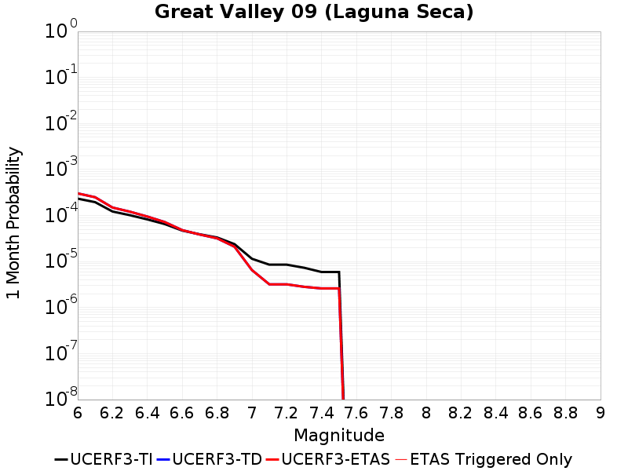 |  |  |

| Magnitude | 1 wk TI Prob | 1 wk TD Prob | 1 wk ETAS Prob | 1 wk ETAS/TD Gain | 1 wk ETAS Triggered Only | 1 mo TI Prob | 1 mo TD Prob | 1 mo ETAS Prob | 1 mo ETAS/TD Gain | 1 mo ETAS Triggered Only | 1 yr TI Prob | 1 yr TD Prob | 1 yr ETAS Prob | 1 yr ETAS/TD Gain | 1 yr ETAS Triggered Only | 10 yr TI Prob | 10 yr TD Prob | 10 yr ETAS Prob | 10 yr ETAS/TD Gain | 10 yr ETAS Triggered Only |
|-----|-----|-----|-----|-----|-----|-----|-----|-----|-----|-----|-----|-----|-----|-----|-----|-----|-----|-----|-----|-----|
| 6.0 | 5.4353277E-5 | 7.0639006E-5 | 7.0639006E-5 | 1.0 | 0.0 | 2.3292181E-4 | 3.0270248E-4 | 3.0270248E-4 | 1.0 | 0.0 | 0.0028321352 | 0.0036792005 | 0.0036792005 | 1.0 | 0.0 | 0.02796312 | 0.036184344 | 0.03619398 | 1.0002663 | 1.0E-5 |
| 6.1 | 4.5578287E-5 | 5.8331658E-5 | 5.8331658E-5 | 1.0 | 0.0 | 1.953209E-4 | 2.499673E-4 | 2.499673E-4 | 1.0 | 0.0 | 0.0023754383 | 0.0030391116 | 0.0030391116 | 1.0 | 0.0 | 0.023502063 | 0.029975075 | 0.029975075 | 1.0 | 0.0 |
| 6.2 | 2.8536782E-5 | 3.479562E-5 | 3.479562E-5 | 1.0 | 0.0 | 1.2229476E-4 | 1.4911596E-4 | 1.4911596E-4 | 1.0 | 0.0 | 0.0014879217 | 0.0018139528 | 0.0018139528 | 1.0 | 0.0 | 0.014779986 | 0.017988365 | 0.017988365 | 1.0 | 0.0 |
| 6.3 | 2.3698774E-5 | 2.8259203E-5 | 2.8259203E-5 | 1.0 | 0.0 | 1.01562226E-4 | 1.2110553E-4 | 1.2110553E-4 | 1.0 | 0.0 | 0.0012358186 | 0.0014734477 | 0.0014734477 | 1.0 | 0.0 | 0.012289686 | 0.014634854 | 0.014634854 | 1.0 | 0.0 |
| 6.4 | 1.9191197E-5 | 2.215621E-5 | 2.215621E-5 | 1.0 | 0.0 | 8.2245395E-5 | 9.495193E-5 | 9.495193E-5 | 1.0 | 0.0 | 0.0010008777 | 0.0011554288 | 0.0011554288 | 1.0 | 0.0 | 0.009963818 | 0.0114940815 | 0.0114940815 | 1.0 | 0.0 |
| 6.5 | 1.5203241E-5 | 1.6823846E-5 | 1.6823846E-5 | 1.0 | 0.0 | 6.5155116E-5 | 7.210038E-5 | 7.210038E-5 | 1.0 | 0.0 | 7.9297484E-4 | 8.7748386E-4 | 8.7748386E-4 | 1.0 | 0.0 | 0.007901512 | 0.008741252 | 0.008741252 | 1.0 | 0.0 |
| 6.6 | 1.0984925E-5 | 1.1254542E-5 | 1.1254542E-5 | 1.0 | 0.0 | 4.70774E-5 | 4.8232883E-5 | 4.8232883E-5 | 1.0 | 0.0 | 5.730166E-4 | 5.87081E-4 | 5.87081E-4 | 1.0 | 0.0 | 0.005715413 | 0.005855691 | 0.005855691 | 1.0 | 0.0 |
| 6.7 | 9.134616E-6 | 9.029015E-6 | 9.029015E-6 | 1.0 | 0.0 | 3.9147766E-5 | 3.8695216E-5 | 3.8695216E-5 | 1.0 | 0.0 | 4.7651984E-4 | 4.710148E-4 | 4.710148E-4 | 1.0 | 0.0 | 0.004754993 | 0.0047004106 | 0.0047004106 | 1.0 | 0.0 |
| 6.8 | 7.785589E-6 | 7.4594486E-6 | 7.4594486E-6 | 1.0 | 0.0 | 3.3366385E-5 | 3.1968684E-5 | 3.1968684E-5 | 1.0 | 0.0 | 4.0616E-4 | 3.8915125E-4 | 3.8915125E-4 | 1.0 | 0.0 | 0.0040541845 | 0.0038849025 | 0.0038849025 | 1.0 | 0.0 |
| 6.9 | 5.579095E-6 | 4.9034484E-6 | 4.9034484E-6 | 1.0 | 0.0 | 2.3910188E-5 | 2.1014617E-5 | 2.1014617E-5 | 1.0 | 0.0 | 2.9106764E-4 | 2.558243E-4 | 2.558243E-4 | 1.0 | 0.0 | 0.002906867 | 0.0025554358 | 0.0025554358 | 1.0 | 0.0 |
| 7.0 | 2.6816688E-6 | 1.5230175E-6 | 1.5230175E-6 | 1.0 | 0.0 | 1.1492816E-5 | 6.5272025E-6 | 6.5272025E-6 | 1.0 | 0.0 | 1.3991605E-4 | 7.946588E-5 | 7.946588E-5 | 1.0 | 0.0 | 0.0013982799 | 7.9438335E-4 | 7.9438335E-4 | 1.0 | 0.0 |
| 7.1 | 1.9951021E-6 | 7.4614405E-7 | 7.4614405E-7 | 1.0 | 0.0 | 8.55041E-6 | 3.1977568E-6 | 3.1977568E-6 | 1.0 | 0.0 | 1.0409627E-4 | 3.8932034E-5 | 3.8932034E-5 | 1.0 | 0.0 | 0.0010404752 | 3.8925628E-4 | 3.8925628E-4 | 1.0 | 0.0 |
| 7.2 | 1.9951021E-6 | 7.4614405E-7 | 7.4614405E-7 | 1.0 | 0.0 | 8.55041E-6 | 3.1977568E-6 | 3.1977568E-6 | 1.0 | 0.0 | 1.0409627E-4 | 3.8932034E-5 | 3.8932034E-5 | 1.0 | 0.0 | 0.0010404752 | 3.8925628E-4 | 3.8925628E-4 | 1.0 | 0.0 |
| 7.3 | 1.7087556E-6 | 6.584797E-7 | 6.584797E-7 | 1.0 | 0.0 | 7.3232177E-6 | 2.822053E-6 | 2.822053E-6 | 1.0 | 0.0 | 8.915652E-5 | 3.4357992E-5 | 3.4357992E-5 | 1.0 | 0.0 | 8.9120766E-4 | 3.4353088E-4 | 3.4353088E-4 | 1.0 | 0.0 |
| 7.4 | 1.3804846E-6 | 6.0784873E-7 | 6.0784873E-7 | 1.0 | 0.0 | 5.916349E-6 | 2.6050636E-6 | 2.6050636E-6 | 1.0 | 0.0 | 7.2029165E-5 | 3.1716227E-5 | 3.1716227E-5 | 1.0 | 0.0 | 7.200583E-4 | 3.1712104E-4 | 3.1712104E-4 | 1.0 | 0.0 |
| 7.5 | 1.3804846E-6 | 6.0784873E-7 | 6.0784873E-7 | 1.0 | 0.0 | 5.916349E-6 | 2.6050636E-6 | 2.6050636E-6 | 1.0 | 0.0 | 7.2029165E-5 | 3.1716227E-5 | 3.1716227E-5 | 1.0 | 0.0 | 7.200583E-4 | 3.1712104E-4 | 3.1712104E-4 | 1.0 | 0.0 |

## Rodgers Creek - Healdsburg 2011 CFM
*[(top)](#table-of-contents)*

| 1 Week | 1 Month | 1 Year | 10 Year |
|-----|-----|-----|-----|
| 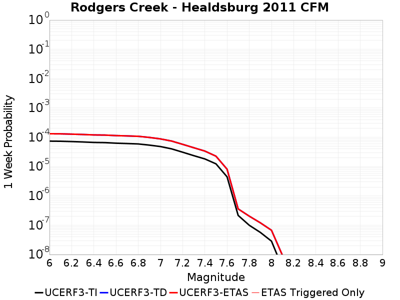 | 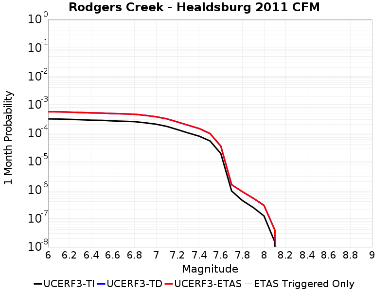 |  |  |

| Magnitude | 1 wk TI Prob | 1 wk TD Prob | 1 wk ETAS Prob | 1 wk ETAS/TD Gain | 1 wk ETAS Triggered Only | 1 mo TI Prob | 1 mo TD Prob | 1 mo ETAS Prob | 1 mo ETAS/TD Gain | 1 mo ETAS Triggered Only | 1 yr TI Prob | 1 yr TD Prob | 1 yr ETAS Prob | 1 yr ETAS/TD Gain | 1 yr ETAS Triggered Only | 10 yr TI Prob | 10 yr TD Prob | 10 yr ETAS Prob | 10 yr ETAS/TD Gain | 10 yr ETAS Triggered Only |
|-----|-----|-----|-----|-----|-----|-----|-----|-----|-----|-----|-----|-----|-----|-----|-----|-----|-----|-----|-----|-----|
| 6.0 | 7.390182E-5 | 1.3206927E-4 | 1.3206927E-4 | 1.0 | 0.0 | 3.1668364E-4 | 5.658885E-4 | 5.658885E-4 | 1.0 | 0.0 | 0.0038488081 | 0.006867881 | 0.006867881 | 1.0 | 0.0 | 0.037828278 | 0.06650675 | 0.06651609 | 1.0001403 | 1.0E-5 |
| 6.1 | 7.318768E-5 | 1.3104713E-4 | 1.3104713E-4 | 1.0 | 0.0 | 3.1362378E-4 | 5.615097E-4 | 5.615097E-4 | 1.0 | 0.0 | 0.0038116854 | 0.006814921 | 0.006814921 | 1.0 | 0.0 | 0.037469655 | 0.06601042 | 0.066019766 | 1.0001415 | 1.0E-5 |
| 6.2 | 7.1379836E-5 | 1.2797023E-4 | 1.2797023E-4 | 1.0 | 0.0 | 3.058777E-4 | 5.4832856E-4 | 5.4832856E-4 | 1.0 | 0.0 | 0.003717703 | 0.00665543 | 0.00665543 | 1.0 | 0.0 | 0.0365612 | 0.06453061 | 0.06453997 | 1.000145 | 1.0E-5 |
| 6.3 | 6.9255926E-5 | 1.2450645E-4 | 1.2450645E-4 | 1.0 | 0.0 | 2.9677735E-4 | 5.334902E-4 | 5.334902E-4 | 1.0 | 0.0 | 0.0036072785 | 0.0064759464 | 0.0064759464 | 1.0 | 0.0 | 0.035492823 | 0.06285924 | 0.06286861 | 1.0001491 | 1.0E-5 |
| 6.4 | 6.6757144E-5 | 1.2026594E-4 | 1.2026594E-4 | 1.0 | 0.0 | 2.8607066E-4 | 5.1532395E-4 | 5.1532395E-4 | 1.0 | 0.0 | 0.0034773487 | 0.0062560933 | 0.0062560933 | 1.0 | 0.0 | 0.034234364 | 0.06080627 | 0.060815662 | 1.0001545 | 1.0E-5 |
| 6.5 | 6.5735134E-5 | 1.1875417E-4 | 1.1875417E-4 | 1.0 | 0.0 | 2.8169158E-4 | 5.088476E-4 | 5.088476E-4 | 1.0 | 0.0 | 0.003424202 | 0.0061777057 | 0.0061777057 | 1.0 | 0.0 | 0.03371918 | 0.060069732 | 0.06007913 | 1.0001565 | 1.0E-5 |
| 6.6 | 6.289601E-5 | 1.1410185E-4 | 1.1410185E-4 | 1.0 | 0.0 | 2.6952647E-4 | 4.8891664E-4 | 4.8891664E-4 | 1.0 | 0.0 | 0.0032765474 | 0.005936395 | 0.005936395 | 1.0 | 0.0 | 0.032286562 | 0.057805277 | 0.0578147 | 1.000163 | 1.0E-5 |
| 6.7 | 6.115274E-5 | 1.11268164E-4 | 1.11268164E-4 | 1.0 | 0.0 | 2.6205686E-4 | 4.7677677E-4 | 4.7677677E-4 | 1.0 | 0.0 | 0.0031858748 | 0.0057893875 | 0.0057893875 | 1.0 | 0.0 | 0.031405866 | 0.05642232 | 0.056431755 | 1.0001673 | 1.0E-5 |
| 6.8 | 5.9232367E-5 | 1.0793501E-4 | 1.0793501E-4 | 1.0 | 0.0 | 2.538283E-4 | 4.6249697E-4 | 4.6249697E-4 | 1.0 | 0.0 | 0.0030859804 | 0.00561644 | 0.00561644 | 1.0 | 0.0 | 0.030434765 | 0.054786358 | 0.05479581 | 1.0001725 | 1.0E-5 |
| 6.9 | 5.4030377E-5 | 9.884019E-5 | 9.884019E-5 | 1.0 | 0.0 | 2.315382E-4 | 4.235324E-4 | 4.235324E-4 | 1.0 | 0.0 | 0.0028153337 | 0.005144382 | 0.005144382 | 1.0 | 0.0 | 0.027799325 | 0.05030494 | 0.05031444 | 1.0001888 | 1.0E-5 |
| 7.0 | 4.8260714E-5 | 8.798354E-5 | 8.798354E-5 | 1.0 | 0.0 | 2.0681522E-4 | 3.7701812E-4 | 3.7701812E-4 | 1.0 | 0.0 | 0.0025150678 | 0.0045805895 | 0.0045805895 | 1.0 | 0.0 | 0.024867928 | 0.04494214 | 0.044951692 | 1.0002126 | 1.0E-5 |
| 7.1 | 4.0294493E-5 | 7.441502E-5 | 7.441502E-5 | 1.0 | 0.0 | 1.7267925E-4 | 3.1888272E-4 | 3.1888272E-4 | 1.0 | 0.0 | 0.0021003427 | 0.0038755245 | 0.0038755245 | 1.0 | 0.0 | 0.02080602 | 0.038174227 | 0.038183846 | 1.000252 | 1.0E-5 |
| 7.2 | 3.096388E-5 | 5.745072E-5 | 5.745072E-5 | 1.0 | 0.0 | 1.326956E-4 | 2.4619428E-4 | 2.4619428E-4 | 1.0 | 0.0 | 0.0016143717 | 0.0029933176 | 0.0029933176 | 1.0 | 0.0 | 0.01602694 | 0.029665634 | 0.029675337 | 1.0003271 | 1.0E-5 |
| 7.3 | 2.3615226E-5 | 4.3999076E-5 | 4.3999076E-5 | 1.0 | 0.0 | 1.0120418E-4 | 1.8855391E-4 | 1.8855391E-4 | 1.0 | 0.0 | 0.0012314644 | 0.002293241 | 0.002293241 | 1.0 | 0.0 | 0.0122466255 | 0.022818485 | 0.022828257 | 1.0004282 | 1.0E-5 |
| 7.4 | 1.8251132E-5 | 3.3827757E-5 | 3.3827757E-5 | 1.0 | 0.0 | 7.821679E-5 | 1.4496811E-4 | 1.4496811E-4 | 1.0 | 0.0 | 9.518733E-4 | 0.0017635678 | 0.0017635678 | 1.0 | 0.0 | 0.009478063 | 0.01760614 | 0.01760614 | 1.0 | 0.0 |
| 7.5 | 1.2411432E-5 | 2.2654129E-5 | 2.2654129E-5 | 1.0 | 0.0 | 5.3190768E-5 | 9.708555E-5 | 9.708555E-5 | 1.0 | 0.0 | 6.4740516E-4 | 0.0011813814 | 0.0011813814 | 1.0 | 0.0 | 0.006455223 | 0.011839784 | 0.011839784 | 1.0 | 0.0 |
| 7.6 | 4.4771446E-6 | 8.152624E-6 | 8.152624E-6 | 1.0 | 0.0 | 1.918762E-5 | 3.493936E-5 | 3.493936E-5 | 1.0 | 0.0 | 2.3358424E-4 | 4.253049E-4 | 4.253049E-4 | 1.0 | 0.0 | 0.0023333887 | 0.0042810882 | 0.0042810882 | 1.0 | 0.0 |
| 7.7 | 2.157941E-7 | 3.5969018E-7 | 3.5969018E-7 | 1.0 | 0.0 | 9.248315E-7 | 1.5415284E-6 | 1.5415284E-6 | 1.0 | 0.0 | 1.1259765E-5 | 1.8767947E-5 | 1.8767947E-5 | 1.0 | 0.0 | 1.1259195E-4 | 1.9374966E-4 | 1.9374966E-4 | 1.0 | 0.0 |
| 7.8 | 9.9623286E-8 | 2.0369376E-7 | 2.0369376E-7 | 1.0 | 0.0 | 4.269569E-7 | 8.729729E-7 | 8.729729E-7 | 1.0 | 0.0 | 5.1981874E-6 | 1.0628394E-5 | 1.0628394E-5 | 1.0 | 0.0 | 5.198066E-5 | 1.1132398E-4 | 1.1132398E-4 | 1.0 | 0.0 |
| 7.9 | 5.6745257E-8 | 1.2062544E-7 | 1.2062544E-7 | 1.0 | 0.0 | 2.4319394E-7 | 5.169661E-7 | 5.169661E-7 | 1.0 | 0.0 | 2.960882E-6 | 6.294044E-6 | 6.294044E-6 | 1.0 | 0.0 | 2.9608427E-5 | 6.6115594E-5 | 6.6115594E-5 | 1.0 | 0.0 |
| 8.0 | 2.8614323E-8 | 6.7331996E-8 | 6.7331996E-8 | 1.0 | 0.0 | 1.2263281E-7 | 2.8856567E-7 | 2.8856567E-7 | 1.0 | 0.0 | 1.4930534E-6 | 3.5132814E-6 | 3.5132814E-6 | 1.0 | 0.0 | 1.4930434E-5 | 3.6566966E-5 | 3.6566966E-5 | 1.0 | 0.0 |
| 8.1 | 3.5045191E-9 | 9.157715E-9 | 9.157715E-9 | 1.0 | 0.0 | 1.5019367E-8 | 3.924735E-8 | 3.924735E-8 | 1.0 | 0.0 | 1.8286079E-7 | 4.778364E-7 | 4.778364E-7 | 1.0 | 0.0 | 1.8286064E-6 | 4.923124E-6 | 4.923124E-6 | 1.0 | 0.0 |

## Kern Canyon (South Kern) 2011
*[(top)](#table-of-contents)*

| 1 Week | 1 Month | 1 Year | 10 Year |
|-----|-----|-----|-----|
| 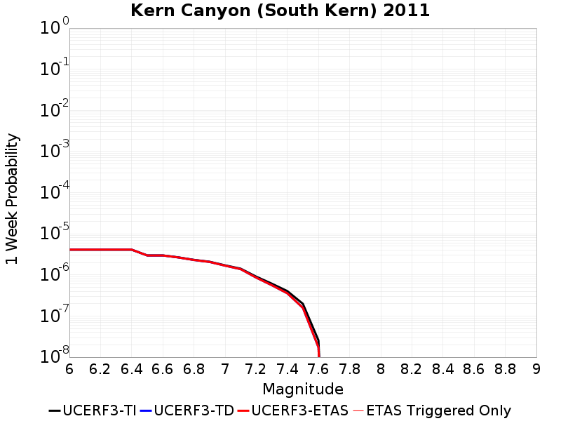 | 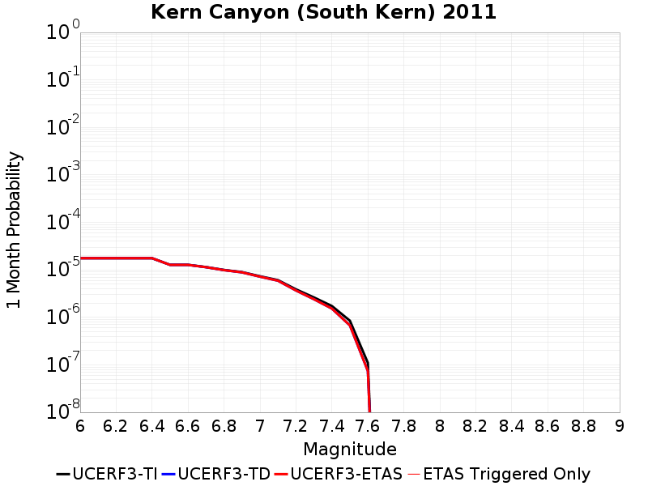 |  |  |

| Magnitude | 1 wk TI Prob | 1 wk TD Prob | 1 wk ETAS Prob | 1 wk ETAS/TD Gain | 1 wk ETAS Triggered Only | 1 mo TI Prob | 1 mo TD Prob | 1 mo ETAS Prob | 1 mo ETAS/TD Gain | 1 mo ETAS Triggered Only | 1 yr TI Prob | 1 yr TD Prob | 1 yr ETAS Prob | 1 yr ETAS/TD Gain | 1 yr ETAS Triggered Only | 10 yr TI Prob | 10 yr TD Prob | 10 yr ETAS Prob | 10 yr ETAS/TD Gain | 10 yr ETAS Triggered Only |
|-----|-----|-----|-----|-----|-----|-----|-----|-----|-----|-----|-----|-----|-----|-----|-----|-----|-----|-----|-----|-----|
| 6.0 | 4.105075E-6 | 4.114217E-6 | 4.114217E-6 | 1.0 | 0.0 | 1.7593058E-5 | 1.7632243E-5 | 1.7632243E-5 | 1.0 | 0.0 | 2.1417443E-4 | 2.1465206E-4 | 2.1465206E-4 | 1.0 | 0.0 | 0.0021396813 | 0.002144511 | 0.0021544897 | 1.0046531 | 1.0E-5 |
| 6.1 | 4.105075E-6 | 4.114217E-6 | 4.114217E-6 | 1.0 | 0.0 | 1.7593058E-5 | 1.7632243E-5 | 1.7632243E-5 | 1.0 | 0.0 | 2.1417443E-4 | 2.1465206E-4 | 2.1465206E-4 | 1.0 | 0.0 | 0.0021396813 | 0.002144511 | 0.0021544897 | 1.0046531 | 1.0E-5 |
| 6.2 | 4.105075E-6 | 4.114217E-6 | 4.114217E-6 | 1.0 | 0.0 | 1.7593058E-5 | 1.7632243E-5 | 1.7632243E-5 | 1.0 | 0.0 | 2.1417443E-4 | 2.1465206E-4 | 2.1465206E-4 | 1.0 | 0.0 | 0.0021396813 | 0.002144511 | 0.0021544897 | 1.0046531 | 1.0E-5 |
| 6.3 | 4.105075E-6 | 4.114217E-6 | 4.114217E-6 | 1.0 | 0.0 | 1.7593058E-5 | 1.7632243E-5 | 1.7632243E-5 | 1.0 | 0.0 | 2.1417443E-4 | 2.1465206E-4 | 2.1465206E-4 | 1.0 | 0.0 | 0.0021396813 | 0.002144511 | 0.0021544897 | 1.0046531 | 1.0E-5 |
| 6.4 | 4.105075E-6 | 4.114217E-6 | 4.114217E-6 | 1.0 | 0.0 | 1.7593058E-5 | 1.7632243E-5 | 1.7632243E-5 | 1.0 | 0.0 | 2.1417443E-4 | 2.1465206E-4 | 2.1465206E-4 | 1.0 | 0.0 | 0.0021396813 | 0.002144511 | 0.0021544897 | 1.0046531 | 1.0E-5 |
| 6.5 | 2.9849807E-6 | 2.9735131E-6 | 2.9735131E-6 | 1.0 | 0.0 | 1.2792712E-5 | 1.2743566E-5 | 1.2743566E-5 | 1.0 | 0.0 | 1.5574014E-4 | 1.5514203E-4 | 1.5514203E-4 | 1.0 | 0.0 | 0.0015563103 | 0.0015503523 | 0.0015603368 | 1.0064402 | 1.0E-5 |
| 6.6 | 2.9849807E-6 | 2.9735131E-6 | 2.9735131E-6 | 1.0 | 0.0 | 1.2792712E-5 | 1.2743566E-5 | 1.2743566E-5 | 1.0 | 0.0 | 1.5574014E-4 | 1.5514203E-4 | 1.5514203E-4 | 1.0 | 0.0 | 0.0015563103 | 0.0015503523 | 0.0015603368 | 1.0064402 | 1.0E-5 |
| 6.7 | 2.6756725E-6 | 2.6585428E-6 | 2.6585428E-6 | 1.0 | 0.0 | 1.1467117E-5 | 1.1393706E-5 | 1.1393706E-5 | 1.0 | 0.0 | 1.396032E-4 | 1.3870964E-4 | 1.3870964E-4 | 1.0 | 0.0 | 0.0013951553 | 0.0013862416 | 0.0013962277 | 1.0072037 | 1.0E-5 |
| 6.8 | 2.3283721E-6 | 2.3050613E-6 | 2.3050613E-6 | 1.0 | 0.0 | 9.9787E-6 | 9.878797E-6 | 9.878797E-6 | 1.0 | 0.0 | 1.214839E-4 | 1.2026779E-4 | 1.2026779E-4 | 1.0 | 0.0 | 0.001214175 | 0.0012020345 | 0.0012020345 | 1.0 | 0.0 |
| 6.9 | 2.0972677E-6 | 2.0698976E-6 | 2.0698976E-6 | 1.0 | 0.0 | 8.988259E-6 | 8.870959E-6 | 8.870959E-6 | 1.0 | 0.0 | 1.0942656E-4 | 1.0799864E-4 | 1.0799864E-4 | 1.0 | 0.0 | 0.0010937268 | 0.0010794674 | 0.0010794674 | 1.0 | 0.0 |
| 7.0 | 1.7132242E-6 | 1.6789155E-6 | 1.6789155E-6 | 1.0 | 0.0 | 7.3423685E-6 | 7.1953327E-6 | 7.1953327E-6 | 1.0 | 0.0 | 8.938967E-5 | 8.759969E-5 | 8.759969E-5 | 1.0 | 0.0 | 8.935372E-4 | 8.7565545E-4 | 8.7565545E-4 | 1.0 | 0.0 |
| 7.1 | 1.4215541E-6 | 1.381752E-6 | 1.381752E-6 | 1.0 | 0.0 | 6.0923603E-6 | 5.921781E-6 | 5.921781E-6 | 1.0 | 0.0 | 7.417196E-5 | 7.2095325E-5 | 7.2095325E-5 | 1.0 | 0.0 | 7.414721E-4 | 7.20722E-4 | 7.20722E-4 | 1.0 | 0.0 |
| 7.2 | 9.097853E-7 | 8.604934E-7 | 8.604934E-7 | 1.0 | 0.0 | 3.899074E-6 | 3.687824E-6 | 3.687824E-6 | 1.0 | 0.0 | 4.7470192E-5 | 4.489834E-5 | 4.489834E-5 | 1.0 | 0.0 | 4.7460053E-4 | 4.4889378E-4 | 4.4889378E-4 | 1.0 | 0.0 |
| 7.3 | 6.144169E-7 | 5.6290065E-7 | 5.6290065E-7 | 1.0 | 0.0 | 2.6332125E-6 | 2.4124292E-6 | 2.4124292E-6 | 1.0 | 0.0 | 3.205889E-5 | 2.9370934E-5 | 2.9370934E-5 | 1.0 | 0.0 | 3.2054266E-4 | 2.9367104E-4 | 2.9367104E-4 | 1.0 | 0.0 |
| 7.4 | 4.049844E-7 | 3.5733785E-7 | 3.5733785E-7 | 1.0 | 0.0 | 1.7356463E-6 | 1.5314471E-6 | 1.5314471E-6 | 1.0 | 0.0 | 2.1131287E-5 | 1.864521E-5 | 1.864521E-5 | 1.0 | 0.0 | 2.1129279E-4 | 1.8643672E-4 | 1.8643672E-4 | 1.0 | 0.0 |
| 7.5 | 1.9871162E-7 | 1.5833334E-7 | 1.5833334E-7 | 1.0 | 0.0 | 8.5162094E-7 | 6.7857127E-7 | 6.7857127E-7 | 1.0 | 0.0 | 1.0368436E-5 | 8.261575E-6 | 8.261575E-6 | 1.0 | 0.0 | 1.0367952E-4 | 8.2612765E-5 | 8.2612765E-5 | 1.0 | 0.0 |
| 7.6 | 2.572245E-8 | 1.7356326E-8 | 1.7356326E-8 | 1.0 | 0.0 | 1.10239064E-7 | 7.438425E-8 | 7.438425E-8 | 1.0 | 0.0 | 1.3421597E-6 | 9.05628E-7 | 9.05628E-7 | 1.0 | 0.0 | 1.3421517E-5 | 9.056248E-6 | 9.056248E-6 | 1.0 | 0.0 |

## Dry Mountain
*[(top)](#table-of-contents)*

| 1 Week | 1 Month | 1 Year | 10 Year |
|-----|-----|-----|-----|
| 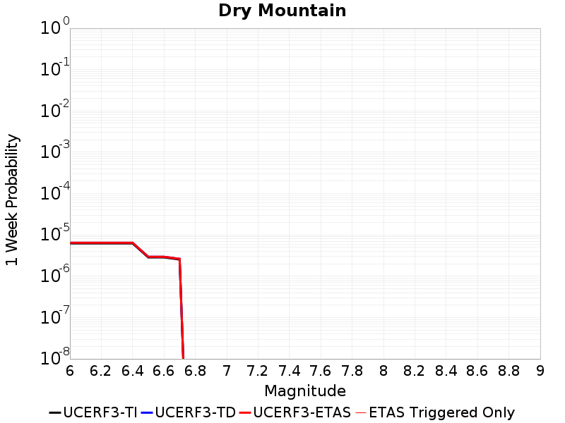 |  | 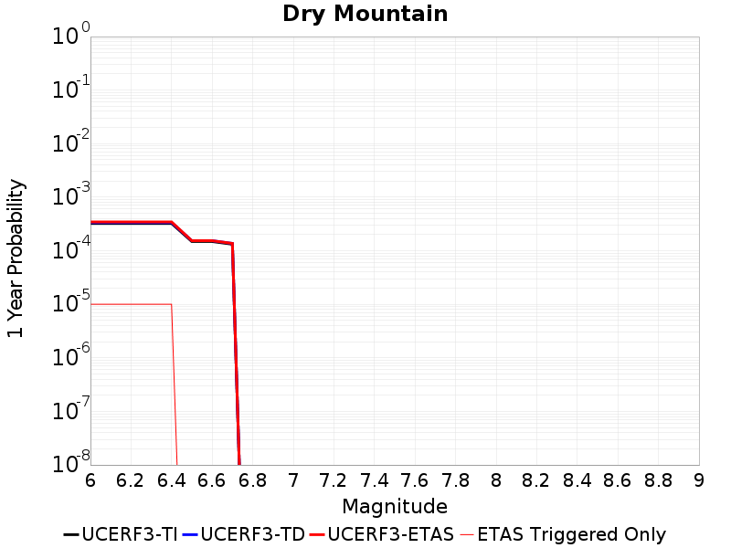 |  |

| Magnitude | 1 wk TI Prob | 1 wk TD Prob | 1 wk ETAS Prob | 1 wk ETAS/TD Gain | 1 wk ETAS Triggered Only | 1 mo TI Prob | 1 mo TD Prob | 1 mo ETAS Prob | 1 mo ETAS/TD Gain | 1 mo ETAS Triggered Only | 1 yr TI Prob | 1 yr TD Prob | 1 yr ETAS Prob | 1 yr ETAS/TD Gain | 1 yr ETAS Triggered Only | 10 yr TI Prob | 10 yr TD Prob | 10 yr ETAS Prob | 10 yr ETAS/TD Gain | 10 yr ETAS Triggered Only |
|-----|-----|-----|-----|-----|-----|-----|-----|-----|-----|-----|-----|-----|-----|-----|-----|-----|-----|-----|-----|-----|
| 6.0 | 6.222801E-6 | 6.440802E-6 | 6.440802E-6 | 1.0 | 0.0 | 2.6668875E-5 | 2.7603235E-5 | 3.760296E-5 | 1.3622664 | 1.0E-5 | 3.2464517E-4 | 3.360335E-4 | 3.460301E-4 | 1.0297489 | 1.0E-5 | 0.0032417132 | 0.0033568165 | 0.0033667828 | 1.002969 | 1.0E-5 |
| 6.1 | 6.222801E-6 | 6.440802E-6 | 6.440802E-6 | 1.0 | 0.0 | 2.6668875E-5 | 2.7603235E-5 | 3.760296E-5 | 1.3622664 | 1.0E-5 | 3.2464517E-4 | 3.360335E-4 | 3.460301E-4 | 1.0297489 | 1.0E-5 | 0.0032417132 | 0.0033568165 | 0.0033667828 | 1.002969 | 1.0E-5 |
| 6.2 | 6.222801E-6 | 6.440802E-6 | 6.440802E-6 | 1.0 | 0.0 | 2.6668875E-5 | 2.7603235E-5 | 3.760296E-5 | 1.3622664 | 1.0E-5 | 3.2464517E-4 | 3.360335E-4 | 3.460301E-4 | 1.0297489 | 1.0E-5 | 0.0032417132 | 0.0033568165 | 0.0033667828 | 1.002969 | 1.0E-5 |
| 6.3 | 6.222801E-6 | 6.440802E-6 | 6.440802E-6 | 1.0 | 0.0 | 2.6668875E-5 | 2.7603235E-5 | 3.760296E-5 | 1.3622664 | 1.0E-5 | 3.2464517E-4 | 3.360335E-4 | 3.460301E-4 | 1.0297489 | 1.0E-5 | 0.0032417132 | 0.0033568165 | 0.0033667828 | 1.002969 | 1.0E-5 |
| 6.4 | 6.222801E-6 | 6.440802E-6 | 6.440802E-6 | 1.0 | 0.0 | 2.6668875E-5 | 2.7603235E-5 | 3.760296E-5 | 1.3622664 | 1.0E-5 | 3.2464517E-4 | 3.360335E-4 | 3.460301E-4 | 1.0297489 | 1.0E-5 | 0.0032417132 | 0.0033568165 | 0.0033667828 | 1.002969 | 1.0E-5 |
| 6.5 | 2.8528623E-6 | 2.9528198E-6 | 2.9528198E-6 | 1.0 | 0.0 | 1.22264955E-5 | 1.2654929E-5 | 1.2654929E-5 | 1.0 | 0.0 | 1.4884741E-4 | 1.5407157E-4 | 1.5407157E-4 | 1.0 | 0.0 | 0.0014874774 | 0.0015405014 | 0.0015405014 | 1.0 | 0.0 |
| 6.6 | 2.8528623E-6 | 2.9528198E-6 | 2.9528198E-6 | 1.0 | 0.0 | 1.22264955E-5 | 1.2654929E-5 | 1.2654929E-5 | 1.0 | 0.0 | 1.4884741E-4 | 1.5407157E-4 | 1.5407157E-4 | 1.0 | 0.0 | 0.0014874774 | 0.0015405014 | 0.0015405014 | 1.0 | 0.0 |
| 6.7 | 2.541E-6 | 2.6299374E-6 | 2.6299374E-6 | 1.0 | 0.0 | 1.0889954E-5 | 1.12711605E-5 | 1.12711605E-5 | 1.0 | 0.0 | 1.3257713E-4 | 1.3722638E-4 | 1.3722638E-4 | 1.0 | 0.0 | 0.0013249806 | 0.0013722638 | 0.0013722638 | 1.0 | 0.0 |

## Santa Ynez River
*[(top)](#table-of-contents)*

| 1 Week | 1 Month | 1 Year | 10 Year |
|-----|-----|-----|-----|
|  |  | 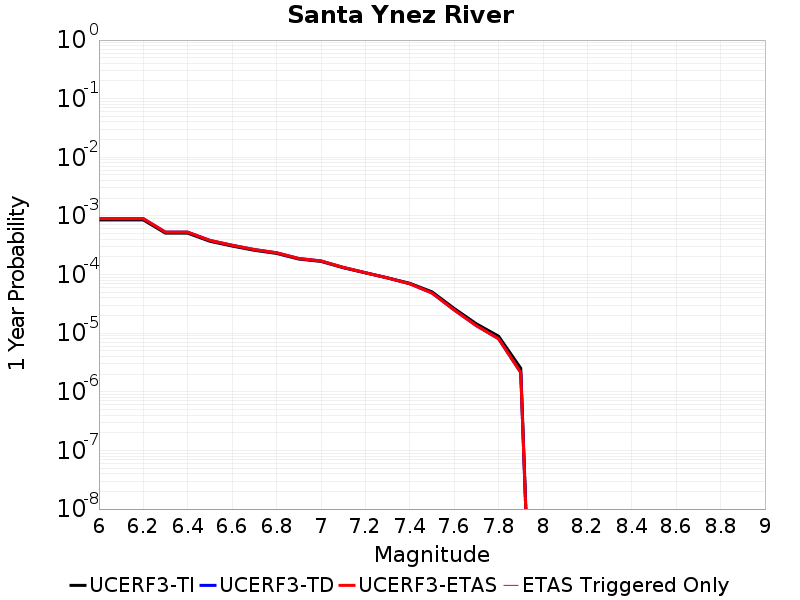 | 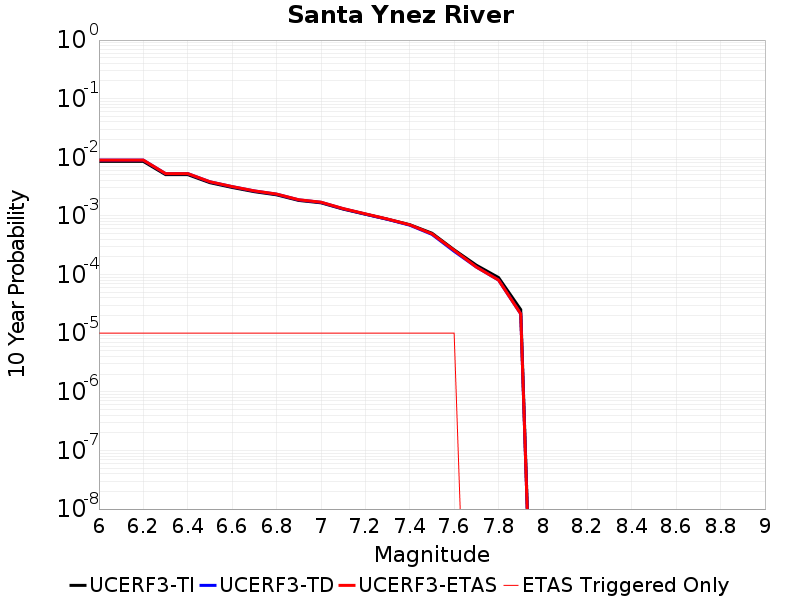 |

| Magnitude | 1 wk TI Prob | 1 wk TD Prob | 1 wk ETAS Prob | 1 wk ETAS/TD Gain | 1 wk ETAS Triggered Only | 1 mo TI Prob | 1 mo TD Prob | 1 mo ETAS Prob | 1 mo ETAS/TD Gain | 1 mo ETAS Triggered Only | 1 yr TI Prob | 1 yr TD Prob | 1 yr ETAS Prob | 1 yr ETAS/TD Gain | 1 yr ETAS Triggered Only | 10 yr TI Prob | 10 yr TD Prob | 10 yr ETAS Prob | 10 yr ETAS/TD Gain | 10 yr ETAS Triggered Only |
|-----|-----|-----|-----|-----|-----|-----|-----|-----|-----|-----|-----|-----|-----|-----|-----|-----|-----|-----|-----|-----|
| 6.0 | 1.6396456E-5 | 1.7216002E-5 | 1.7216002E-5 | 1.0 | 0.0 | 7.026863E-5 | 7.3780975E-5 | 7.3780975E-5 | 1.0 | 0.0 | 8.551848E-4 | 8.9794875E-4 | 8.9794875E-4 | 1.0 | 0.0 | 0.0085190125 | 0.008946757 | 0.008956667 | 1.0011077 | 1.0E-5 |
| 6.1 | 1.6396456E-5 | 1.7216002E-5 | 1.7216002E-5 | 1.0 | 0.0 | 7.026863E-5 | 7.3780975E-5 | 7.3780975E-5 | 1.0 | 0.0 | 8.551848E-4 | 8.9794875E-4 | 8.9794875E-4 | 1.0 | 0.0 | 0.0085190125 | 0.008946757 | 0.008956667 | 1.0011077 | 1.0E-5 |
| 6.2 | 1.6396456E-5 | 1.7216002E-5 | 1.7216002E-5 | 1.0 | 0.0 | 7.026863E-5 | 7.3780975E-5 | 7.3780975E-5 | 1.0 | 0.0 | 8.551848E-4 | 8.9794875E-4 | 8.9794875E-4 | 1.0 | 0.0 | 0.0085190125 | 0.008946757 | 0.008956667 | 1.0011077 | 1.0E-5 |
| 6.3 | 9.736976E-6 | 1.0125999E-5 | 1.0125999E-5 | 1.0 | 0.0 | 4.172923E-5 | 4.339645E-5 | 4.339645E-5 | 1.0 | 0.0 | 5.0793495E-4 | 5.2822864E-4 | 5.2822864E-4 | 1.0 | 0.0 | 0.005067755 | 0.005270237 | 0.005280184 | 1.0018874 | 1.0E-5 |
| 6.4 | 9.736976E-6 | 1.0125999E-5 | 1.0125999E-5 | 1.0 | 0.0 | 4.172923E-5 | 4.339645E-5 | 4.339645E-5 | 1.0 | 0.0 | 5.0793495E-4 | 5.2822864E-4 | 5.2822864E-4 | 1.0 | 0.0 | 0.005067755 | 0.005270237 | 0.005280184 | 1.0018874 | 1.0E-5 |
| 6.5 | 7.081964E-6 | 7.332647E-6 | 7.332647E-6 | 1.0 | 0.0 | 3.035092E-5 | 3.142526E-5 | 3.142526E-5 | 1.0 | 0.0 | 3.694598E-4 | 3.8253696E-4 | 3.8253696E-4 | 1.0 | 0.0 | 0.0036884616 | 0.0038189467 | 0.0038289083 | 1.0026085 | 1.0E-5 |
| 6.6 | 5.873247E-6 | 6.0620837E-6 | 6.0620837E-6 | 1.0 | 0.0 | 2.5170815E-5 | 2.5980104E-5 | 2.5980104E-5 | 1.0 | 0.0 | 3.064116E-4 | 3.162627E-4 | 3.162627E-4 | 1.0 | 0.0 | 0.0030598943 | 0.0031582138 | 0.0031681822 | 1.0031563 | 1.0E-5 |
| 6.7 | 4.973277E-6 | 5.1179495E-6 | 5.1179495E-6 | 1.0 | 0.0 | 2.1313872E-5 | 2.1933887E-5 | 2.1933887E-5 | 1.0 | 0.0 | 2.5946548E-4 | 2.6701283E-4 | 2.6701283E-4 | 1.0 | 0.0 | 0.0025916274 | 0.002666969 | 0.0026769426 | 1.0037396 | 1.0E-5 |
| 6.8 | 4.396492E-6 | 4.512839E-6 | 4.512839E-6 | 1.0 | 0.0 | 1.884197E-5 | 1.9340598E-5 | 1.9340598E-5 | 1.0 | 0.0 | 2.2937685E-4 | 2.3544667E-4 | 2.3544667E-4 | 1.0 | 0.0 | 0.0022914023 | 0.0023520077 | 0.002361984 | 1.0042417 | 1.0E-5 |
| 6.9 | 3.5255632E-6 | 3.6029378E-6 | 3.6029378E-6 | 1.0 | 0.0 | 1.5109469E-5 | 1.5441072E-5 | 1.5441072E-5 | 1.0 | 0.0 | 1.8394225E-4 | 1.8797899E-4 | 1.8797899E-4 | 1.0 | 0.0 | 0.0018379007 | 0.001878216 | 0.0018881973 | 1.0053142 | 1.0E-5 |
| 7.0 | 3.211603E-6 | 3.2751677E-6 | 3.2751677E-6 | 1.0 | 0.0 | 1.376394E-5 | 1.4036358E-5 | 1.4036358E-5 | 1.0 | 0.0 | 1.6756308E-4 | 1.708794E-4 | 1.708794E-4 | 1.0 | 0.0 | 0.0016743679 | 0.0017074943 | 0.0017174771 | 1.0058465 | 1.0E-5 |
| 7.1 | 2.5094619E-6 | 2.5422314E-6 | 2.5422314E-6 | 1.0 | 0.0 | 1.0754793E-5 | 1.0895233E-5 | 1.0895233E-5 | 1.0 | 0.0 | 1.3093173E-4 | 1.3264143E-4 | 1.3264143E-4 | 1.0 | 0.0 | 0.0013085462 | 0.0013256287 | 0.0013356155 | 1.0075336 | 1.0E-5 |
| 7.2 | 2.0515774E-6 | 2.0631085E-6 | 2.0631085E-6 | 1.0 | 0.0 | 8.792445E-6 | 8.841864E-6 | 8.841864E-6 | 1.0 | 0.0 | 1.0704277E-4 | 1.0764442E-4 | 1.0764442E-4 | 1.0 | 0.0 | 0.0010699122 | 0.001075927 | 0.0010859163 | 1.0092843 | 1.0E-5 |
| 7.3 | 1.6845745E-6 | 1.6784447E-6 | 1.6784447E-6 | 1.0 | 0.0 | 7.219585E-6 | 7.193315E-6 | 7.193315E-6 | 1.0 | 0.0 | 8.78949E-5 | 8.757512E-5 | 8.757512E-5 | 1.0 | 0.0 | 8.7860145E-4 | 8.7540894E-4 | 8.8540016E-4 | 1.0114132 | 1.0E-5 |
| 7.4 | 1.3600285E-6 | 1.3342584E-6 | 1.3342584E-6 | 1.0 | 0.0 | 5.82868E-6 | 5.718238E-6 | 5.718238E-6 | 1.0 | 0.0 | 7.096187E-5 | 6.9617345E-5 | 6.9617345E-5 | 1.0 | 0.0 | 7.0939213E-4 | 6.9595757E-4 | 7.059506E-4 | 1.0143586 | 1.0E-5 |
| 7.5 | 9.735342E-7 | 9.297063E-7 | 9.297063E-7 | 1.0 | 0.0 | 4.172283E-6 | 3.9844494E-6 | 3.9844494E-6 | 1.0 | 0.0 | 5.079636E-5 | 4.850961E-5 | 4.850961E-5 | 1.0 | 0.0 | 5.0784746E-4 | 4.849919E-4 | 4.9498706E-4 | 1.0206089 | 1.0E-5 |
| 7.6 | 5.067187E-7 | 4.780474E-7 | 4.780474E-7 | 1.0 | 0.0 | 2.1716498E-6 | 2.048773E-6 | 2.048773E-6 | 1.0 | 0.0 | 2.6439517E-5 | 2.4943532E-5 | 2.4943532E-5 | 1.0 | 0.0 | 2.643637E-4 | 2.4940807E-4 | 2.5940558E-4 | 1.040085 | 1.0E-5 |
| 7.7 | 2.769089E-7 | 2.5769023E-7 | 2.5769023E-7 | 1.0 | 0.0 | 1.1867519E-6 | 1.1043862E-6 | 1.1043862E-6 | 1.0 | 0.0 | 1.4448608E-5 | 1.34458205E-5 | 1.34458205E-5 | 1.0 | 0.0 | 1.444767E-4 | 1.344501E-4 | 1.344501E-4 | 1.0 | 0.0 |
| 7.8 | 1.7044663E-7 | 1.545448E-7 | 1.545448E-7 | 1.0 | 0.0 | 7.3048534E-7 | 6.623346E-7 | 6.623346E-7 | 1.0 | 0.0 | 8.893623E-6 | 8.063895E-6 | 8.063895E-6 | 1.0 | 0.0 | 8.893267E-5 | 8.063604E-5 | 8.063604E-5 | 1.0 | 0.0 |
| 7.9 | 4.8344287E-8 | 4.0926373E-8 | 4.0926373E-8 | 1.0 | 0.0 | 2.0718979E-7 | 1.7539874E-7 | 1.7539874E-7 | 1.0 | 0.0 | 2.5225327E-6 | 2.1354774E-6 | 2.1354774E-6 | 1.0 | 0.0 | 2.5225041E-5 | 2.1354574E-5 | 2.1354574E-5 | 1.0 | 0.0 |

## Big Lagoon - Bald Mtn 2011 CFM
*[(top)](#table-of-contents)*

| 1 Week | 1 Month | 1 Year | 10 Year |
|-----|-----|-----|-----|
|  |  |  |  |

| Magnitude | 1 wk TI Prob | 1 wk TD Prob | 1 wk ETAS Prob | 1 wk ETAS/TD Gain | 1 wk ETAS Triggered Only | 1 mo TI Prob | 1 mo TD Prob | 1 mo ETAS Prob | 1 mo ETAS/TD Gain | 1 mo ETAS Triggered Only | 1 yr TI Prob | 1 yr TD Prob | 1 yr ETAS Prob | 1 yr ETAS/TD Gain | 1 yr ETAS Triggered Only | 10 yr TI Prob | 10 yr TD Prob | 10 yr ETAS Prob | 10 yr ETAS/TD Gain | 10 yr ETAS Triggered Only |
|-----|-----|-----|-----|-----|-----|-----|-----|-----|-----|-----|-----|-----|-----|-----|-----|-----|-----|-----|-----|-----|
| 6.0 | 1.8699735E-5 | 1.9857958E-5 | 1.9857958E-5 | 1.0 | 0.0 | 8.013926E-5 | 8.5102976E-5 | 8.5102976E-5 | 1.0 | 0.0 | 9.752587E-4 | 0.0010356741 | 0.0010456637 | 1.0096456 | 1.0E-5 | 0.009709897 | 0.010312295 | 0.010322192 | 1.0009598 | 1.0E-5 |
| 6.1 | 1.8699735E-5 | 1.9857958E-5 | 1.9857958E-5 | 1.0 | 0.0 | 8.013926E-5 | 8.5102976E-5 | 8.5102976E-5 | 1.0 | 0.0 | 9.752587E-4 | 0.0010356741 | 0.0010456637 | 1.0096456 | 1.0E-5 | 0.009709897 | 0.010312295 | 0.010322192 | 1.0009598 | 1.0E-5 |
| 6.2 | 1.8699735E-5 | 1.9857958E-5 | 1.9857958E-5 | 1.0 | 0.0 | 8.013926E-5 | 8.5102976E-5 | 8.5102976E-5 | 1.0 | 0.0 | 9.752587E-4 | 0.0010356741 | 0.0010456637 | 1.0096456 | 1.0E-5 | 0.009709897 | 0.010312295 | 0.010322192 | 1.0009598 | 1.0E-5 |
| 6.3 | 1.8699735E-5 | 1.9857958E-5 | 1.9857958E-5 | 1.0 | 0.0 | 8.013926E-5 | 8.5102976E-5 | 8.5102976E-5 | 1.0 | 0.0 | 9.752587E-4 | 0.0010356741 | 0.0010456637 | 1.0096456 | 1.0E-5 | 0.009709897 | 0.010312295 | 0.010322192 | 1.0009598 | 1.0E-5 |
| 6.4 | 1.8699735E-5 | 1.9857958E-5 | 1.9857958E-5 | 1.0 | 0.0 | 8.013926E-5 | 8.5102976E-5 | 8.5102976E-5 | 1.0 | 0.0 | 9.752587E-4 | 0.0010356741 | 0.0010456637 | 1.0096456 | 1.0E-5 | 0.009709897 | 0.010312295 | 0.010322192 | 1.0009598 | 1.0E-5 |
| 6.5 | 1.8699735E-5 | 1.9857958E-5 | 1.9857958E-5 | 1.0 | 0.0 | 8.013926E-5 | 8.5102976E-5 | 8.5102976E-5 | 1.0 | 0.0 | 9.752587E-4 | 0.0010356741 | 0.0010456637 | 1.0096456 | 1.0E-5 | 0.009709897 | 0.010312295 | 0.010322192 | 1.0009598 | 1.0E-5 |
| 6.6 | 1.8699735E-5 | 1.9857958E-5 | 1.9857958E-5 | 1.0 | 0.0 | 8.013926E-5 | 8.5102976E-5 | 8.5102976E-5 | 1.0 | 0.0 | 9.752587E-4 | 0.0010356741 | 0.0010456637 | 1.0096456 | 1.0E-5 | 0.009709897 | 0.010312295 | 0.010322192 | 1.0009598 | 1.0E-5 |
| 6.7 | 1.8699735E-5 | 1.9857958E-5 | 1.9857958E-5 | 1.0 | 0.0 | 8.013926E-5 | 8.5102976E-5 | 8.5102976E-5 | 1.0 | 0.0 | 9.752587E-4 | 0.0010356741 | 0.0010456637 | 1.0096456 | 1.0E-5 | 0.009709897 | 0.010312295 | 0.010322192 | 1.0009598 | 1.0E-5 |
| 6.8 | 1.18505095E-5 | 1.2504158E-5 | 1.2504158E-5 | 1.0 | 0.0 | 5.078691E-5 | 5.3588177E-5 | 5.3588177E-5 | 1.0 | 0.0 | 6.181552E-4 | 6.5224554E-4 | 6.6223904E-4 | 1.0153216 | 1.0E-5 | 0.006164385 | 0.006503816 | 0.006513751 | 1.0015275 | 1.0E-5 |
| 6.9 | 1.18505095E-5 | 1.2504158E-5 | 1.2504158E-5 | 1.0 | 0.0 | 5.078691E-5 | 5.3588177E-5 | 5.3588177E-5 | 1.0 | 0.0 | 6.181552E-4 | 6.5224554E-4 | 6.6223904E-4 | 1.0153216 | 1.0E-5 | 0.006164385 | 0.006503816 | 0.006513751 | 1.0015275 | 1.0E-5 |
| 7.0 | 9.719786E-6 | 1.0238939E-5 | 1.0238939E-5 | 1.0 | 0.0 | 4.1655563E-5 | 4.388044E-5 | 4.388044E-5 | 1.0 | 0.0 | 5.0703844E-4 | 5.3411577E-4 | 5.4411043E-4 | 1.0187125 | 1.0E-5 | 0.005058831 | 0.005328567 | 0.0053385138 | 1.0018667 | 1.0E-5 |
| 7.1 | 8.523418E-6 | 8.972446E-6 | 8.972446E-6 | 1.0 | 0.0 | 3.652842E-5 | 3.8452785E-5 | 3.8452785E-5 | 1.0 | 0.0 | 4.4464276E-4 | 4.6806363E-4 | 4.7805894E-4 | 1.0213547 | 1.0E-5 | 0.0044375416 | 0.0046709417 | 0.004680895 | 1.0021309 | 1.0E-5 |
| 7.2 | 7.378894E-6 | 7.763668E-6 | 7.763668E-6 | 1.0 | 0.0 | 3.162345E-5 | 3.327244E-5 | 3.327244E-5 | 1.0 | 0.0 | 3.8494746E-4 | 4.0501758E-4 | 4.1501352E-4 | 1.0246803 | 1.0E-5 | 0.0038428132 | 0.00404289 | 0.00405285 | 1.0024635 | 1.0E-5 |
| 7.3 | 6.4640294E-6 | 6.794636E-6 | 6.794636E-6 | 1.0 | 0.0 | 2.7702688E-5 | 2.9119548E-5 | 2.9119548E-5 | 1.0 | 0.0 | 3.3722803E-4 | 3.5447348E-4 | 3.6446995E-4 | 1.0282009 | 1.0E-5 | 0.0033671674 | 0.0035391508 | 0.0035491155 | 1.0028155 | 1.0E-5 |
| 7.4 | 5.9959093E-6 | 6.3008215E-6 | 6.3008215E-6 | 1.0 | 0.0 | 2.5696501E-5 | 2.7003245E-5 | 2.7003245E-5 | 1.0 | 0.0 | 3.1280998E-4 | 3.2871548E-4 | 3.387122E-4 | 1.0304115 | 1.0E-5 | 0.0031237002 | 0.003282355 | 0.003292322 | 1.0030366 | 1.0E-5 |
| 7.5 | 4.929265E-6 | 5.178044E-6 | 5.178044E-6 | 1.0 | 0.0 | 2.112525E-5 | 2.2191429E-5 | 2.2191429E-5 | 1.0 | 0.0 | 2.5716957E-4 | 2.7014755E-4 | 2.7014755E-4 | 1.0 | 0.0 | 0.0025687215 | 0.0026982324 | 0.0026982324 | 1.0 | 0.0 |
| 7.6 | 3.8982403E-6 | 4.090196E-6 | 4.090196E-6 | 1.0 | 0.0 | 1.6706637E-5 | 1.7529293E-5 | 1.7529293E-5 | 1.0 | 0.0 | 2.0338432E-4 | 2.1339853E-4 | 2.1339853E-4 | 1.0 | 0.0 | 0.0020319829 | 0.0021319638 | 0.0021319638 | 1.0 | 0.0 |
| 7.7 | 2.820968E-6 | 2.9581174E-6 | 2.9581174E-6 | 1.0 | 0.0 | 1.2089806E-5 | 1.2677586E-5 | 1.2677586E-5 | 1.0 | 0.0 | 1.4718344E-4 | 1.5433885E-4 | 1.5433885E-4 | 1.0 | 0.0 | 0.00147086 | 0.0015423343 | 0.0015423343 | 1.0 | 0.0 |
| 7.8 | 1.9314455E-6 | 2.0266475E-6 | 2.0266475E-6 | 1.0 | 0.0 | 8.277597E-6 | 8.685604E-6 | 8.685604E-6 | 1.0 | 0.0 | 1.0077508E-4 | 1.0574223E-4 | 1.0574223E-4 | 1.0 | 0.0 | 0.0010072939 | 0.001056932 | 0.001056932 | 1.0 | 0.0 |
| 7.9 | 4.9586197E-7 | 5.220658E-7 | 5.220658E-7 | 1.0 | 0.0 | 2.125121E-6 | 2.2374231E-6 | 2.2374231E-6 | 1.0 | 0.0 | 2.5873042E-5 | 2.7240309E-5 | 2.7240309E-5 | 1.0 | 0.0 | 2.5870028E-4 | 2.7237178E-4 | 2.7237178E-4 | 1.0 | 0.0 |

## Honey Lake 2011 CFM
*[(top)](#table-of-contents)*

| 1 Week | 1 Month | 1 Year | 10 Year |
|-----|-----|-----|-----|
|  |  | 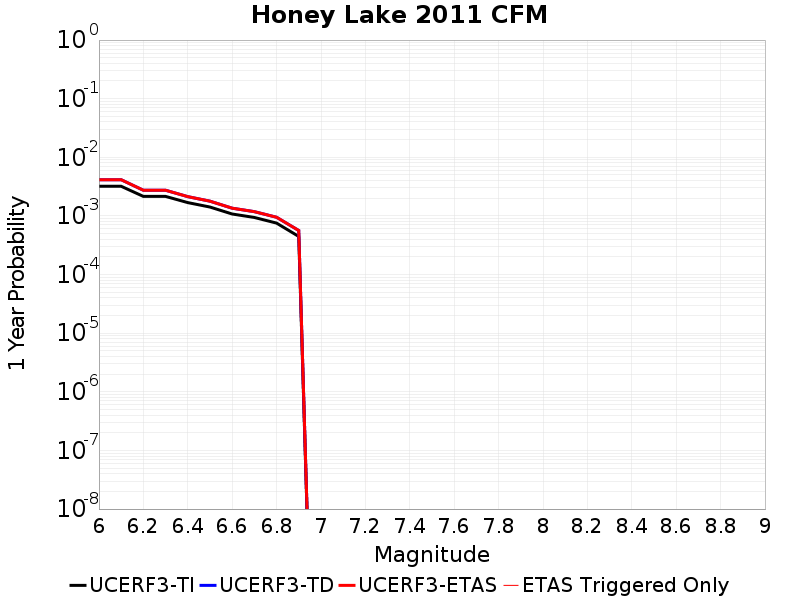 | 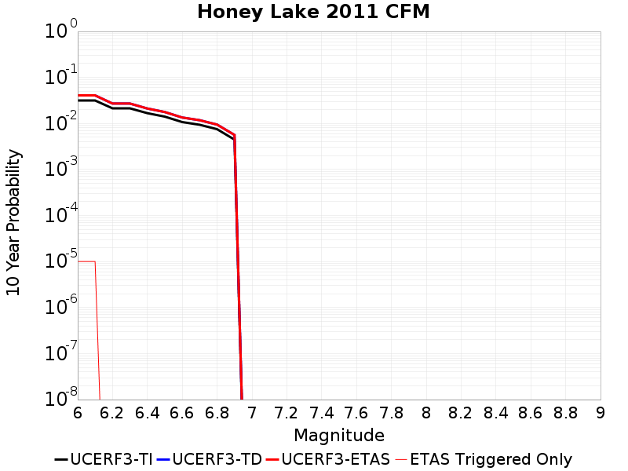 |

| Magnitude | 1 wk TI Prob | 1 wk TD Prob | 1 wk ETAS Prob | 1 wk ETAS/TD Gain | 1 wk ETAS Triggered Only | 1 mo TI Prob | 1 mo TD Prob | 1 mo ETAS Prob | 1 mo ETAS/TD Gain | 1 mo ETAS Triggered Only | 1 yr TI Prob | 1 yr TD Prob | 1 yr ETAS Prob | 1 yr ETAS/TD Gain | 1 yr ETAS Triggered Only | 10 yr TI Prob | 10 yr TD Prob | 10 yr ETAS Prob | 10 yr ETAS/TD Gain | 10 yr ETAS Triggered Only |
|-----|-----|-----|-----|-----|-----|-----|-----|-----|-----|-----|-----|-----|-----|-----|-----|-----|-----|-----|-----|-----|
| 6.0 | 6.155506E-5 | 7.969045E-5 | 7.969045E-5 | 1.0 | 0.0 | 2.6378073E-4 | 3.414878E-4 | 3.414878E-4 | 1.0 | 0.0 | 0.0032068014 | 0.0041501406 | 0.0041501406 | 1.0 | 0.0 | 0.03160919 | 0.04077459 | 0.040784184 | 1.0002352 | 1.0E-5 |
| 6.1 | 6.155506E-5 | 7.969045E-5 | 7.969045E-5 | 1.0 | 0.0 | 2.6378073E-4 | 3.414878E-4 | 3.414878E-4 | 1.0 | 0.0 | 0.0032068014 | 0.0041501406 | 0.0041501406 | 1.0 | 0.0 | 0.03160919 | 0.04077459 | 0.040784184 | 1.0002352 | 1.0E-5 |
| 6.2 | 4.1335024E-5 | 5.2666015E-5 | 5.2666015E-5 | 1.0 | 0.0 | 1.7713808E-4 | 2.25693E-4 | 2.25693E-4 | 1.0 | 0.0 | 0.0021545228 | 0.0027444991 | 0.0027444991 | 1.0 | 0.0 | 0.021337535 | 0.027122075 | 0.027122075 | 1.0 | 0.0 |
| 6.3 | 4.1335024E-5 | 5.2666015E-5 | 5.2666015E-5 | 1.0 | 0.0 | 1.7713808E-4 | 2.25693E-4 | 2.25693E-4 | 1.0 | 0.0 | 0.0021545228 | 0.0027444991 | 0.0027444991 | 1.0 | 0.0 | 0.021337535 | 0.027122075 | 0.027122075 | 1.0 | 0.0 |
| 6.4 | 3.2393702E-5 | 4.0954743E-5 | 4.0954743E-5 | 1.0 | 0.0 | 1.3882275E-4 | 1.7550917E-4 | 1.7550917E-4 | 1.0 | 0.0 | 0.0016888566 | 0.002134836 | 0.002134836 | 1.0 | 0.0 | 0.016760793 | 0.021154264 | 0.021154264 | 1.0 | 0.0 |
| 6.5 | 2.7205504E-5 | 3.4267403E-5 | 3.4267403E-5 | 1.0 | 0.0 | 1.1658981E-4 | 1.4685256E-4 | 1.4685256E-4 | 1.0 | 0.0 | 0.0014185566 | 0.0017865566 | 0.0017865566 | 1.0 | 0.0 | 0.014095354 | 0.017731449 | 0.017731449 | 1.0 | 0.0 |
| 6.6 | 2.069265E-5 | 2.5997264E-5 | 2.5997264E-5 | 1.0 | 0.0 | 8.867977E-5 | 1.1141252E-4 | 1.1141252E-4 | 1.0 | 0.0 | 0.0010791414 | 0.0013556872 | 0.0013556872 | 1.0 | 0.0 | 0.010739161 | 0.013482556 | 0.013482556 | 1.0 | 0.0 |
| 6.7 | 1.8060919E-5 | 2.269342E-5 | 2.269342E-5 | 1.0 | 0.0 | 7.7401644E-5 | 9.725435E-5 | 9.725435E-5 | 1.0 | 0.0 | 9.419576E-4 | 0.0011835096 | 0.0011835096 | 1.0 | 0.0 | 0.009379748 | 0.011780132 | 0.011780132 | 1.0 | 0.0 |
| 6.8 | 1.4474663E-5 | 1.8210822E-5 | 1.8210822E-5 | 1.0 | 0.0 | 6.203279E-5 | 7.804447E-5 | 7.804447E-5 | 1.0 | 0.0 | 7.5498753E-4 | 9.4985374E-4 | 9.4985374E-4 | 1.0 | 0.0 | 0.007524277 | 0.009465488 | 0.009465488 | 1.0 | 0.0 |
| 6.9 | 8.564552E-6 | 1.0820221E-5 | 1.0820221E-5 | 1.0 | 0.0 | 3.6704707E-5 | 4.6371923E-5 | 4.6371923E-5 | 1.0 | 0.0 | 4.4678818E-4 | 5.644984E-4 | 5.644984E-4 | 1.0 | 0.0 | 0.0044589094 | 0.005637162 | 0.005637162 | 1.0 | 0.0 |

## Coronado Bank alt1
*[(top)](#table-of-contents)*

| 1 Week | 1 Month | 1 Year | 10 Year |
|-----|-----|-----|-----|
| 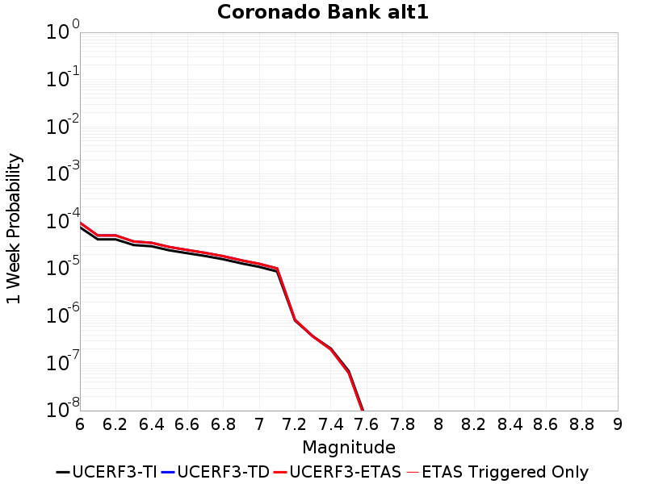 |  |  |  |

| Magnitude | 1 wk TI Prob | 1 wk TD Prob | 1 wk ETAS Prob | 1 wk ETAS/TD Gain | 1 wk ETAS Triggered Only | 1 mo TI Prob | 1 mo TD Prob | 1 mo ETAS Prob | 1 mo ETAS/TD Gain | 1 mo ETAS Triggered Only | 1 yr TI Prob | 1 yr TD Prob | 1 yr ETAS Prob | 1 yr ETAS/TD Gain | 1 yr ETAS Triggered Only | 10 yr TI Prob | 10 yr TD Prob | 10 yr ETAS Prob | 10 yr ETAS/TD Gain | 10 yr ETAS Triggered Only |
|-----|-----|-----|-----|-----|-----|-----|-----|-----|-----|-----|-----|-----|-----|-----|-----|-----|-----|-----|-----|-----|
| 6.0 | 7.533492E-5 | 9.409661E-5 | 9.409661E-5 | 1.0 | 0.0 | 3.22824E-4 | 4.0321273E-4 | 4.0321273E-4 | 1.0 | 0.0 | 0.0039233007 | 0.0048986943 | 0.0048986943 | 1.0 | 0.0 | 0.03854755 | 0.047976155 | 0.047985677 | 1.0001985 | 1.0E-5 |
| 6.1 | 4.1807285E-5 | 5.056006E-5 | 5.056006E-5 | 1.0 | 0.0 | 1.7916178E-4 | 2.1666817E-4 | 2.1666817E-4 | 1.0 | 0.0 | 0.0021791123 | 0.0026348208 | 0.0026348208 | 1.0 | 0.0 | 0.021578677 | 0.026045062 | 0.026045062 | 1.0 | 0.0 |
| 6.2 | 4.1807285E-5 | 5.056006E-5 | 5.056006E-5 | 1.0 | 0.0 | 1.7916178E-4 | 2.1666817E-4 | 2.1666817E-4 | 1.0 | 0.0 | 0.0021791123 | 0.0026348208 | 0.0026348208 | 1.0 | 0.0 | 0.021578677 | 0.026045062 | 0.026045062 | 1.0 | 0.0 |
| 6.3 | 3.1793104E-5 | 3.7756115E-5 | 3.7756115E-5 | 1.0 | 0.0 | 1.3624904E-4 | 1.6180209E-4 | 1.6180209E-4 | 1.0 | 0.0 | 0.0016575698 | 0.0019681926 | 0.0019681926 | 1.0 | 0.0 | 0.016452603 | 0.019511497 | 0.019511497 | 1.0 | 0.0 |
| 6.4 | 2.9878007E-5 | 3.537719E-5 | 3.537719E-5 | 1.0 | 0.0 | 1.2804232E-4 | 1.516079E-4 | 1.516079E-4 | 1.0 | 0.0 | 0.0015578003 | 0.0018442958 | 0.0018442958 | 1.0 | 0.0 | 0.015469253 | 0.018293658 | 0.018293658 | 1.0 | 0.0 |
| 6.5 | 2.4512565E-5 | 2.8796157E-5 | 2.8796157E-5 | 1.0 | 0.0 | 1.0504962E-4 | 1.2340641E-4 | 1.2340641E-4 | 1.0 | 0.0 | 0.0012782287 | 0.0015014642 | 0.0015014642 | 1.0 | 0.0 | 0.012709012 | 0.014916166 | 0.014916166 | 1.0 | 0.0 |
| 6.6 | 2.1317413E-5 | 2.493364E-5 | 2.493364E-5 | 1.0 | 0.0 | 9.135714E-5 | 1.06854204E-4 | 1.06854204E-4 | 1.0 | 0.0 | 0.0011117056 | 0.0013001958 | 0.0013001958 | 1.0 | 0.0 | 0.011061605 | 0.012928301 | 0.012928301 | 1.0 | 0.0 |
| 6.7 | 1.8585655E-5 | 2.1657737E-5 | 2.1657737E-5 | 1.0 | 0.0 | 7.9650374E-5 | 9.281569E-5 | 9.281569E-5 | 1.0 | 0.0 | 9.6931186E-4 | 0.0011294656 | 0.0011294656 | 1.0 | 0.0 | 0.0096509475 | 0.01123942 | 0.01123942 | 1.0 | 0.0 |
| 6.8 | 1.5862879E-5 | 1.843862E-5 | 1.843862E-5 | 1.0 | 0.0 | 6.798199E-5 | 7.902038E-5 | 7.902038E-5 | 1.0 | 0.0 | 8.273665E-4 | 9.616678E-4 | 9.616678E-4 | 1.0 | 0.0 | 0.008242928 | 0.00957705 | 0.00957705 | 1.0 | 0.0 |
| 6.9 | 1.3021509E-5 | 1.5110812E-5 | 1.5110812E-5 | 1.0 | 0.0 | 5.5805274E-5 | 6.4759115E-5 | 6.4759115E-5 | 1.0 | 0.0 | 6.792174E-4 | 7.8817515E-4 | 7.8817515E-4 | 1.0 | 0.0 | 0.006771452 | 0.007855626 | 0.007855626 | 1.0 | 0.0 |
| 7.0 | 1.0974371E-5 | 1.2733225E-5 | 1.2733225E-5 | 1.0 | 0.0 | 4.7032172E-5 | 5.4569922E-5 | 5.4569922E-5 | 1.0 | 0.0 | 5.7246623E-4 | 6.642039E-4 | 6.642039E-4 | 1.0 | 0.0 | 0.0057099373 | 0.00662394 | 0.00662394 | 1.0 | 0.0 |
| 7.1 | 8.766221E-6 | 1.0174385E-5 | 1.0174385E-5 | 1.0 | 0.0 | 3.7568978E-5 | 4.3603875E-5 | 4.3603875E-5 | 1.0 | 0.0 | 4.573063E-4 | 5.307651E-4 | 5.307651E-4 | 1.0 | 0.0 | 0.0045636636 | 0.0052966783 | 0.0052966783 | 1.0 | 0.0 |
| 7.2 | 8.026024E-7 | 8.335431E-7 | 8.335431E-7 | 1.0 | 0.0 | 3.43972E-6 | 3.5723226E-6 | 3.5723226E-6 | 1.0 | 0.0 | 4.1877785E-5 | 4.349217E-5 | 4.349217E-5 | 1.0 | 0.0 | 4.1869894E-4 | 4.3483768E-4 | 4.3483768E-4 | 1.0 | 0.0 |
| 7.3 | 3.7293114E-7 | 3.701432E-7 | 3.701432E-7 | 1.0 | 0.0 | 1.5982754E-6 | 1.586327E-6 | 1.586327E-6 | 1.0 | 0.0 | 1.9458828E-5 | 1.9313362E-5 | 1.9313362E-5 | 1.0 | 0.0 | 1.9457124E-4 | 1.931169E-4 | 1.931169E-4 | 1.0 | 0.0 |
| 7.4 | 2.0557036E-7 | 1.9681282E-7 | 1.9681282E-7 | 1.0 | 0.0 | 8.810155E-7 | 8.4348324E-7 | 8.4348324E-7 | 1.0 | 0.0 | 1.0726311E-5 | 1.026936E-5 | 1.026936E-5 | 1.0 | 0.0 | 1.0725793E-4 | 1.0268889E-4 | 1.0268889E-4 | 1.0 | 0.0 |
| 7.5 | 6.845446E-8 | 6.2813E-8 | 6.2813E-8 | 1.0 | 0.0 | 2.9337625E-7 | 2.6919855E-7 | 2.6919855E-7 | 1.0 | 0.0 | 3.5718497E-6 | 3.2774874E-6 | 3.2774874E-6 | 1.0 | 0.0 | 3.5717923E-5 | 3.2774402E-5 | 3.2774402E-5 | 1.0 | 0.0 |
| 7.6 | 6.0975145E-9 | 5.53244E-9 | 5.53244E-9 | 1.0 | 0.0 | 2.6132206E-8 | 2.3710458E-8 | 2.3710458E-8 | 1.0 | 0.0 | 3.1815955E-7 | 2.8867478E-7 | 2.8867478E-7 | 1.0 | 0.0 | 3.181591E-6 | 2.886745E-6 | 2.886745E-6 | 1.0 | 0.0 |

## Elsinore (Coyote Mountains)
*[(top)](#table-of-contents)*

| 1 Week | 1 Month | 1 Year | 10 Year |
|-----|-----|-----|-----|
|  | 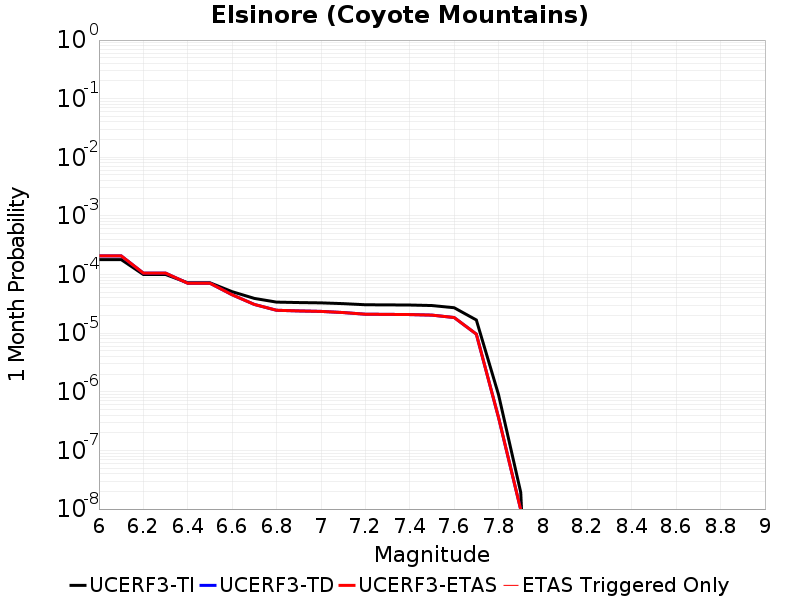 | 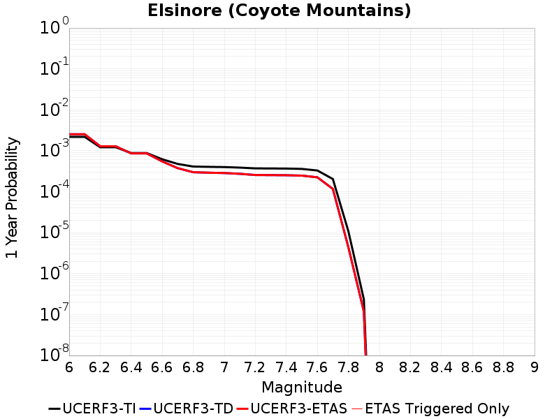 |  |

| Magnitude | 1 wk TI Prob | 1 wk TD Prob | 1 wk ETAS Prob | 1 wk ETAS/TD Gain | 1 wk ETAS Triggered Only | 1 mo TI Prob | 1 mo TD Prob | 1 mo ETAS Prob | 1 mo ETAS/TD Gain | 1 mo ETAS Triggered Only | 1 yr TI Prob | 1 yr TD Prob | 1 yr ETAS Prob | 1 yr ETAS/TD Gain | 1 yr ETAS Triggered Only | 10 yr TI Prob | 10 yr TD Prob | 10 yr ETAS Prob | 10 yr ETAS/TD Gain | 10 yr ETAS Triggered Only |
|-----|-----|-----|-----|-----|-----|-----|-----|-----|-----|-----|-----|-----|-----|-----|-----|-----|-----|-----|-----|-----|
| 6.0 | 4.20513E-5 | 4.8710997E-5 | 4.8710997E-5 | 1.0 | 0.0 | 1.8020741E-4 | 2.0874797E-4 | 2.0874797E-4 | 1.0 | 0.0 | 0.0021918174 | 0.0025390724 | 0.0025390724 | 1.0 | 0.0 | 0.021703249 | 0.025151877 | 0.025161626 | 1.0003875 | 1.0E-5 |
| 6.1 | 4.20513E-5 | 4.8710997E-5 | 4.8710997E-5 | 1.0 | 0.0 | 1.8020741E-4 | 2.0874797E-4 | 2.0874797E-4 | 1.0 | 0.0 | 0.0021918174 | 0.0025390724 | 0.0025390724 | 1.0 | 0.0 | 0.021703249 | 0.025151877 | 0.025161626 | 1.0003875 | 1.0E-5 |
| 6.2 | 2.3413893E-5 | 2.4733296E-5 | 2.4733296E-5 | 1.0 | 0.0 | 1.0034139E-4 | 1.0599607E-4 | 1.0599607E-4 | 1.0 | 0.0 | 0.0012209718 | 0.0012898277 | 0.0012898277 | 1.0 | 0.0 | 0.012142851 | 0.012832081 | 0.012832081 | 1.0 | 0.0 |
| 6.3 | 2.3413893E-5 | 2.4733296E-5 | 2.4733296E-5 | 1.0 | 0.0 | 1.0034139E-4 | 1.0599607E-4 | 1.0599607E-4 | 1.0 | 0.0 | 0.0012209718 | 0.0012898277 | 0.0012898277 | 1.0 | 0.0 | 0.012142851 | 0.012832081 | 0.012832081 | 1.0 | 0.0 |
| 6.4 | 1.6894814E-5 | 1.659349E-5 | 1.659349E-5 | 1.0 | 0.0 | 7.240433E-5 | 7.1113245E-5 | 7.1113245E-5 | 1.0 | 0.0 | 8.811662E-4 | 8.654973E-4 | 8.654973E-4 | 1.0 | 0.0 | 0.0087768035 | 0.008624923 | 0.008624923 | 1.0 | 0.0 |
| 6.5 | 1.6894814E-5 | 1.659349E-5 | 1.659349E-5 | 1.0 | 0.0 | 7.240433E-5 | 7.1113245E-5 | 7.1113245E-5 | 1.0 | 0.0 | 8.811662E-4 | 8.654973E-4 | 8.654973E-4 | 1.0 | 0.0 | 0.0087768035 | 0.008624923 | 0.008624923 | 1.0 | 0.0 |
| 6.6 | 1.1910969E-5 | 1.0547734E-5 | 1.0547734E-5 | 1.0 | 0.0 | 5.1046012E-5 | 4.520387E-5 | 4.520387E-5 | 1.0 | 0.0 | 6.21308E-4 | 5.502314E-4 | 5.502314E-4 | 1.0 | 0.0 | 0.0061957375 | 0.0054899924 | 0.0054899924 | 1.0 | 0.0 |
| 6.7 | 9.1486E-6 | 7.2155285E-6 | 7.2155285E-6 | 1.0 | 0.0 | 3.9207694E-5 | 3.0923347E-5 | 3.0923347E-5 | 1.0 | 0.0 | 4.7724912E-4 | 3.7643054E-4 | 3.7643054E-4 | 1.0 | 0.0 | 0.0047622547 | 0.0037583099 | 0.0037583099 | 1.0 | 0.0 |
| 6.8 | 7.90441E-6 | 5.7399675E-6 | 5.7399675E-6 | 1.0 | 0.0 | 3.3875604E-5 | 2.4599634E-5 | 2.4599634E-5 | 1.0 | 0.0 | 4.1235742E-4 | 2.994607E-4 | 2.994607E-4 | 1.0 | 0.0 | 0.0041159308 | 0.0029907008 | 0.0029907008 | 1.0 | 0.0 |
| 6.9 | 7.77015E-6 | 5.5938403E-6 | 5.5938403E-6 | 1.0 | 0.0 | 3.3300217E-5 | 2.3973387E-5 | 2.3973387E-5 | 1.0 | 0.0 | 4.0535472E-4 | 2.918382E-4 | 2.918382E-4 | 1.0 | 0.0 | 0.004046161 | 0.002914677 | 0.002914677 | 1.0 | 0.0 |
| 7.0 | 7.675798E-6 | 5.4906377E-6 | 5.4906377E-6 | 1.0 | 0.0 | 3.289586E-5 | 2.35311E-5 | 2.35311E-5 | 1.0 | 0.0 | 4.004335E-4 | 2.8645474E-4 | 2.8645474E-4 | 1.0 | 0.0 | 0.003997127 | 0.002860982 | 0.002860982 | 1.0 | 0.0 |
| 7.1 | 7.447814E-6 | 5.2494142E-6 | 5.2494142E-6 | 1.0 | 0.0 | 3.191881E-5 | 2.2497303E-5 | 2.2497303E-5 | 1.0 | 0.0 | 3.8854225E-4 | 2.738715E-4 | 2.738715E-4 | 1.0 | 0.0 | 0.003878636 | 0.0027354646 | 0.0027354646 | 1.0 | 0.0 |
| 7.2 | 7.128185E-6 | 4.9160208E-6 | 4.9160208E-6 | 1.0 | 0.0 | 3.0549007E-5 | 2.1068498E-5 | 2.1068498E-5 | 1.0 | 0.0 | 3.7187067E-4 | 2.5647995E-4 | 2.5647995E-4 | 1.0 | 0.0 | 0.00371249 | 0.0025619583 | 0.0025619583 | 1.0 | 0.0 |
| 7.3 | 7.0913875E-6 | 4.884679E-6 | 4.884679E-6 | 1.0 | 0.0 | 3.0391306E-5 | 2.0934178E-5 | 2.0934178E-5 | 1.0 | 0.0 | 3.6995133E-4 | 2.5484498E-4 | 2.5484498E-4 | 1.0 | 0.0 | 0.0036933604 | 0.0025456464 | 0.0025456464 | 1.0 | 0.0 |
| 7.4 | 7.051521E-6 | 4.848516E-6 | 4.848516E-6 | 1.0 | 0.0 | 3.0220453E-5 | 2.0779195E-5 | 2.0779195E-5 | 1.0 | 0.0 | 3.6787192E-4 | 2.5295853E-4 | 2.5295853E-4 | 1.0 | 0.0 | 0.0036726352 | 0.0025268246 | 0.0025268246 | 1.0 | 0.0 |
| 7.5 | 6.910666E-6 | 4.7438803E-6 | 4.7438803E-6 | 1.0 | 0.0 | 2.9616802E-5 | 2.0330763E-5 | 2.0330763E-5 | 1.0 | 0.0 | 3.605249E-4 | 2.475001E-4 | 2.475001E-4 | 1.0 | 0.0 | 0.0035994058 | 0.0024723632 | 0.0024723632 | 1.0 | 0.0 |
| 7.6 | 6.341753E-6 | 4.3164737E-6 | 4.3164737E-6 | 1.0 | 0.0 | 2.7178658E-5 | 1.849905E-5 | 1.849905E-5 | 1.0 | 0.0 | 3.3084993E-4 | 2.2520381E-4 | 2.2520381E-4 | 1.0 | 0.0 | 0.0033035777 | 0.0022498716 | 0.0022498716 | 1.0 | 0.0 |
| 7.7 | 3.9205916E-6 | 2.2499833E-6 | 2.2499833E-6 | 1.0 | 0.0 | 1.6802427E-5 | 9.642754E-6 | 9.642754E-6 | 1.0 | 0.0 | 2.0455034E-4 | 1.1739496E-4 | 1.1739496E-4 | 1.0 | 0.0 | 0.0020436216 | 0.0011734028 | 0.0011734028 | 1.0 | 0.0 |
| 7.8 | 2.0846227E-7 | 8.5061906E-8 | 8.5061906E-8 | 1.0 | 0.0 | 8.9340944E-7 | 3.64551E-7 | 3.64551E-7 | 1.0 | 0.0 | 1.0877206E-5 | 4.438403E-6 | 4.438403E-6 | 1.0 | 0.0 | 1.0876673E-4 | 4.438347E-5 | 4.438347E-5 | 1.0 | 0.0 |
| 7.9 | 4.4969806E-9 | 2.273035E-9 | 2.273035E-9 | 1.0 | 0.0 | 1.9272775E-8 | 9.741579E-9 | 9.741579E-9 | 1.0 | 0.0 | 2.3464601E-7 | 1.18603715E-7 | 1.18603715E-7 | 1.0 | 0.0 | 2.3464577E-6 | 1.1860367E-6 | 1.1860367E-6 | 1.0 | 0.0 |

## Big Pine (Central)
*[(top)](#table-of-contents)*

| 1 Week | 1 Month | 1 Year | 10 Year |
|-----|-----|-----|-----|
|  | 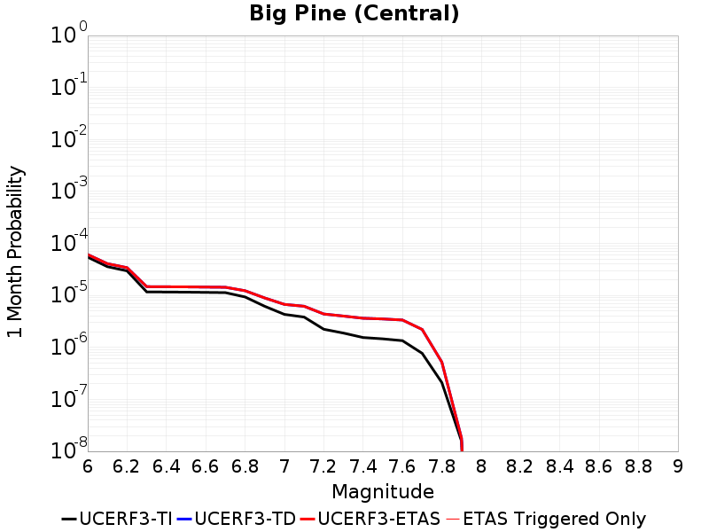 |  |  |

| Magnitude | 1 wk TI Prob | 1 wk TD Prob | 1 wk ETAS Prob | 1 wk ETAS/TD Gain | 1 wk ETAS Triggered Only | 1 mo TI Prob | 1 mo TD Prob | 1 mo ETAS Prob | 1 mo ETAS/TD Gain | 1 mo ETAS Triggered Only | 1 yr TI Prob | 1 yr TD Prob | 1 yr ETAS Prob | 1 yr ETAS/TD Gain | 1 yr ETAS Triggered Only | 10 yr TI Prob | 10 yr TD Prob | 10 yr ETAS Prob | 10 yr ETAS/TD Gain | 10 yr ETAS Triggered Only |
|-----|-----|-----|-----|-----|-----|-----|-----|-----|-----|-----|-----|-----|-----|-----|-----|-----|-----|-----|-----|-----|
| 6.0 | 1.2706755E-5 | 1.4273724E-5 | 1.4273724E-5 | 1.0 | 0.0 | 5.4456385E-5 | 6.117188E-5 | 6.117188E-5 | 1.0 | 0.0 | 6.628048E-4 | 7.445497E-4 | 7.445497E-4 | 1.0 | 0.0 | 0.006608314 | 0.0074254046 | 0.00743533 | 1.0013367 | 1.0E-5 |
| 6.1 | 8.342579E-6 | 9.53137E-6 | 9.53137E-6 | 1.0 | 0.0 | 3.5753423E-5 | 4.0848212E-5 | 4.0848212E-5 | 1.0 | 0.0 | 4.3521097E-4 | 4.972352E-4 | 4.972352E-4 | 1.0 | 0.0 | 0.0043435963 | 0.0049646045 | 0.0049745548 | 1.0020043 | 1.0E-5 |
| 6.2 | 6.923899E-6 | 7.986894E-6 | 7.986894E-6 | 1.0 | 0.0 | 2.9673516E-5 | 3.4229204E-5 | 3.4229204E-5 | 1.0 | 0.0 | 3.6121515E-4 | 4.1668012E-4 | 4.1668012E-4 | 1.0 | 0.0 | 0.003606286 | 0.004162119 | 0.0041720774 | 1.0023926 | 1.0E-5 |
| 6.3 | 2.728396E-6 | 3.4416523E-6 | 3.4416523E-6 | 1.0 | 0.0 | 1.1693074E-5 | 1.474986E-5 | 1.474986E-5 | 1.0 | 0.0 | 1.4235388E-4 | 1.7956563E-4 | 1.7956563E-4 | 1.0 | 0.0 | 0.0014226272 | 0.0017955323 | 0.0017955323 | 1.0 | 0.0 |
| 6.4 | 2.7136944E-6 | 3.425939E-6 | 3.425939E-6 | 1.0 | 0.0 | 1.1630066E-5 | 1.4682518E-5 | 1.4682518E-5 | 1.0 | 0.0 | 1.4158686E-4 | 1.7874586E-4 | 1.7874586E-4 | 1.0 | 0.0 | 0.0014149669 | 0.0017873478 | 0.0017873478 | 1.0 | 0.0 |
| 6.5 | 2.6971882E-6 | 3.4082761E-6 | 3.4082761E-6 | 1.0 | 0.0 | 1.1559327E-5 | 1.4606821E-5 | 1.4606821E-5 | 1.0 | 0.0 | 1.4072572E-4 | 1.778244E-4 | 1.778244E-4 | 1.0 | 0.0 | 0.0014063664 | 0.0017781481 | 0.0017781481 | 1.0 | 0.0 |
| 6.6 | 2.669092E-6 | 3.378284E-6 | 3.378284E-6 | 1.0 | 0.0 | 1.1438916E-5 | 1.4478284E-5 | 1.4478284E-5 | 1.0 | 0.0 | 1.3925991E-4 | 1.7625972E-4 | 1.7625972E-4 | 1.0 | 0.0 | 0.0013917267 | 0.0017625261 | 0.0017625261 | 1.0 | 0.0 |
| 6.7 | 2.6408059E-6 | 3.3482982E-6 | 3.3482982E-6 | 1.0 | 0.0 | 1.1317691E-5 | 1.43497755E-5 | 1.43497755E-5 | 1.0 | 0.0 | 1.3778417E-4 | 1.7469538E-4 | 1.7469538E-4 | 1.0 | 0.0 | 0.0013769877 | 0.0017469074 | 0.0017469074 | 1.0 | 0.0 |
| 6.8 | 2.1786943E-6 | 2.871661E-6 | 2.871661E-6 | 1.0 | 0.0 | 9.337228E-6 | 1.2307065E-5 | 1.2307065E-5 | 1.0 | 0.0 | 1.1367482E-4 | 1.4982895E-4 | 1.4982895E-4 | 1.0 | 0.0 | 0.0011361669 | 0.0014985926 | 0.0014985926 | 1.0 | 0.0 |
| 6.9 | 1.4411696E-6 | 2.084965E-6 | 2.084965E-6 | 1.0 | 0.0 | 6.1764263E-6 | 8.935534E-6 | 8.935534E-6 | 1.0 | 0.0 | 7.51954E-5 | 1.0878498E-4 | 1.0878498E-4 | 1.0 | 0.0 | 7.5169955E-4 | 0.0010885858 | 0.0010885858 | 1.0 | 0.0 |
| 7.0 | 1.0073411E-6 | 1.568968E-6 | 1.568968E-6 | 1.0 | 0.0 | 4.317169E-6 | 6.7241317E-6 | 6.7241317E-6 | 1.0 | 0.0 | 5.2560266E-5 | 8.1863385E-5 | 8.1863385E-5 | 1.0 | 0.0 | 5.2547833E-4 | 8.195894E-4 | 8.195894E-4 | 1.0 | 0.0 |
| 7.1 | 8.947104E-7 | 1.4447486E-6 | 1.4447486E-6 | 1.0 | 0.0 | 3.834468E-6 | 6.191766E-6 | 6.191766E-6 | 1.0 | 0.0 | 4.6683643E-5 | 7.538229E-5 | 7.538229E-5 | 1.0 | 0.0 | 4.6673836E-4 | 7.548242E-4 | 7.548242E-4 | 1.0 | 0.0 |
| 7.2 | 5.215166E-7 | 1.0246972E-6 | 1.0246972E-6 | 1.0 | 0.0 | 2.2350691E-6 | 4.3915525E-6 | 4.3915525E-6 | 1.0 | 0.0 | 2.7211627E-5 | 5.3465883E-5 | 5.3465883E-5 | 1.0 | 0.0 | 2.7208295E-4 | 5.3577696E-4 | 5.3577696E-4 | 1.0 | 0.0 |
| 7.3 | 4.4024807E-7 | 9.350861E-7 | 9.350861E-7 | 1.0 | 0.0 | 1.8867761E-6 | 4.007506E-6 | 4.007506E-6 | 1.0 | 0.0 | 2.2971257E-5 | 4.8790334E-5 | 4.8790334E-5 | 1.0 | 0.0 | 2.2968883E-4 | 4.890426E-4 | 4.890426E-4 | 1.0 | 0.0 |
| 7.4 | 3.6130905E-7 | 8.485725E-7 | 8.485725E-7 | 1.0 | 0.0 | 1.5484665E-6 | 3.6367342E-6 | 3.6367342E-6 | 1.0 | 0.0 | 1.8852415E-5 | 4.427638E-5 | 4.427638E-5 | 1.0 | 0.0 | 1.8850817E-4 | 4.4391307E-4 | 4.4391307E-4 | 1.0 | 0.0 |
| 7.5 | 3.408184E-7 | 8.232571E-7 | 8.232571E-7 | 1.0 | 0.0 | 1.4606494E-6 | 3.52824E-6 | 3.52824E-6 | 1.0 | 0.0 | 1.7783263E-5 | 4.2955515E-5 | 4.2955515E-5 | 1.0 | 0.0 | 1.778184E-4 | 4.306861E-4 | 4.306861E-4 | 1.0 | 0.0 |
| 7.6 | 3.1428627E-7 | 7.8516155E-7 | 7.8516155E-7 | 1.0 | 0.0 | 1.3469405E-6 | 3.364974E-6 | 3.364974E-6 | 1.0 | 0.0 | 1.6398877E-5 | 4.0967825E-5 | 4.0967825E-5 | 1.0 | 0.0 | 1.6397667E-4 | 4.1079146E-4 | 4.1079146E-4 | 1.0 | 0.0 |
| 7.7 | 1.7972785E-7 | 5.169589E-7 | 5.169589E-7 | 1.0 | 0.0 | 7.70262E-7 | 2.2155361E-6 | 2.2155361E-6 | 1.0 | 0.0 | 9.377899E-6 | 2.697383E-5 | 2.697383E-5 | 1.0 | 0.0 | 9.377503E-5 | 2.7092974E-4 | 2.7092974E-4 | 1.0 | 0.0 |
| 7.8 | 4.9230927E-8 | 1.2197677E-7 | 1.2197677E-7 | 1.0 | 0.0 | 2.1098968E-7 | 5.227575E-7 | 5.227575E-7 | 1.0 | 0.0 | 2.5687964E-6 | 6.3645557E-6 | 6.3645557E-6 | 1.0 | 0.0 | 2.5687666E-5 | 6.406193E-5 | 6.406193E-5 | 1.0 | 0.0 |
| 7.9 | 3.6805972E-9 | 4.191752E-9 | 4.191752E-9 | 1.0 | 0.0 | 1.5773987E-8 | 1.796465E-8 | 1.796465E-8 | 1.0 | 0.0 | 1.9204828E-7 | 2.187196E-7 | 2.187196E-7 | 1.0 | 0.0 | 1.920481E-6 | 2.2355146E-6 | 2.2355146E-6 | 1.0 | 0.0 |

## South Klamath Lake West
*[(top)](#table-of-contents)*

| 1 Week | 1 Month | 1 Year | 10 Year |
|-----|-----|-----|-----|
|  |  | 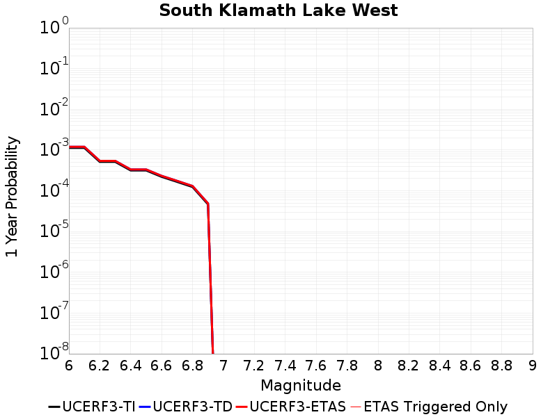 | 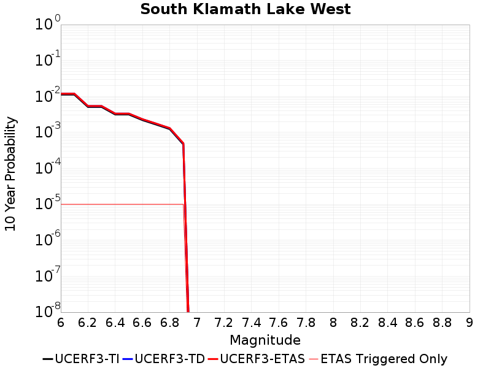 |

| Magnitude | 1 wk TI Prob | 1 wk TD Prob | 1 wk ETAS Prob | 1 wk ETAS/TD Gain | 1 wk ETAS Triggered Only | 1 mo TI Prob | 1 mo TD Prob | 1 mo ETAS Prob | 1 mo ETAS/TD Gain | 1 mo ETAS Triggered Only | 1 yr TI Prob | 1 yr TD Prob | 1 yr ETAS Prob | 1 yr ETAS/TD Gain | 1 yr ETAS Triggered Only | 10 yr TI Prob | 10 yr TD Prob | 10 yr ETAS Prob | 10 yr ETAS/TD Gain | 10 yr ETAS Triggered Only |
|-----|-----|-----|-----|-----|-----|-----|-----|-----|-----|-----|-----|-----|-----|-----|-----|-----|-----|-----|-----|-----|
| 6.0 | 2.174025E-5 | 2.305078E-5 | 2.305078E-5 | 1.0 | 0.0 | 9.3169176E-5 | 9.8785684E-5 | 9.8785684E-5 | 1.0 | 0.0 | 0.0011337444 | 0.001202118 | 0.001202118 | 1.0 | 0.0 | 0.011279777 | 0.011962759 | 0.01197264 | 1.0008259 | 1.0E-5 |
| 6.1 | 2.174025E-5 | 2.305078E-5 | 2.305078E-5 | 1.0 | 0.0 | 9.3169176E-5 | 9.8785684E-5 | 9.8785684E-5 | 1.0 | 0.0 | 0.0011337444 | 0.001202118 | 0.001202118 | 1.0 | 0.0 | 0.011279777 | 0.011962759 | 0.01197264 | 1.0008259 | 1.0E-5 |
| 6.2 | 9.834929E-6 | 1.0397587E-5 | 1.0397587E-5 | 1.0 | 0.0 | 4.2149015E-5 | 4.456038E-5 | 4.456038E-5 | 1.0 | 0.0 | 5.1304343E-4 | 5.423966E-4 | 5.423966E-4 | 1.0 | 0.0 | 0.0051186057 | 0.0054116305 | 0.005421576 | 1.0018378 | 1.0E-5 |
| 6.3 | 9.834929E-6 | 1.0397587E-5 | 1.0397587E-5 | 1.0 | 0.0 | 4.2149015E-5 | 4.456038E-5 | 4.456038E-5 | 1.0 | 0.0 | 5.1304343E-4 | 5.423966E-4 | 5.423966E-4 | 1.0 | 0.0 | 0.0051186057 | 0.0054116305 | 0.005421576 | 1.0018378 | 1.0E-5 |
| 6.4 | 6.066321E-6 | 6.402665E-6 | 6.402665E-6 | 1.0 | 0.0 | 2.5998259E-5 | 2.7439719E-5 | 2.7439719E-5 | 1.0 | 0.0 | 3.1648282E-4 | 3.340301E-4 | 3.340301E-4 | 1.0 | 0.0 | 0.0031603249 | 0.0033355507 | 0.0033455174 | 1.002988 | 1.0E-5 |
| 6.5 | 6.066321E-6 | 6.402665E-6 | 6.402665E-6 | 1.0 | 0.0 | 2.5998259E-5 | 2.7439719E-5 | 2.7439719E-5 | 1.0 | 0.0 | 3.1648282E-4 | 3.340301E-4 | 3.340301E-4 | 1.0 | 0.0 | 0.0031603249 | 0.0033355507 | 0.0033455174 | 1.002988 | 1.0E-5 |
| 6.6 | 4.2321803E-6 | 4.4628223E-6 | 4.4628223E-6 | 1.0 | 0.0 | 1.8137789E-5 | 1.9126248E-5 | 1.9126248E-5 | 1.0 | 0.0 | 2.208052E-4 | 2.3283821E-4 | 2.3283821E-4 | 1.0 | 0.0 | 0.0022058594 | 0.0023260445 | 0.0023360213 | 1.0042892 | 1.0E-5 |
| 6.7 | 3.186646E-6 | 3.3614663E-6 | 3.3614663E-6 | 1.0 | 0.0 | 1.3656982E-5 | 1.4406208E-5 | 1.4406208E-5 | 1.0 | 0.0 | 1.6626107E-4 | 1.7538214E-4 | 1.7538214E-4 | 1.0 | 0.0 | 0.0016613674 | 0.0017525045 | 0.001762487 | 1.0056962 | 1.0E-5 |
| 6.8 | 2.380121E-6 | 2.5117818E-6 | 2.5117818E-6 | 1.0 | 0.0 | 1.0200479E-5 | 1.0764737E-5 | 1.0764737E-5 | 1.0 | 0.0 | 1.2418375E-4 | 1.3105325E-4 | 1.3105325E-4 | 1.0 | 0.0 | 0.0012411437 | 0.0013098055 | 0.0013197925 | 1.0076247 | 1.0E-5 |
| 6.9 | 8.928287E-7 | 9.4336116E-7 | 9.4336116E-7 | 1.0 | 0.0 | 3.826403E-6 | 4.0429713E-6 | 4.0429713E-6 | 1.0 | 0.0 | 4.658546E-5 | 4.9222286E-5 | 4.9222286E-5 | 1.0 | 0.0 | 4.6575698E-4 | 4.9213547E-4 | 5.0213054E-4 | 1.0203096 | 1.0E-5 |

## Robinson Creek
*[(top)](#table-of-contents)*

| 1 Week | 1 Month | 1 Year | 10 Year |
|-----|-----|-----|-----|
|  | 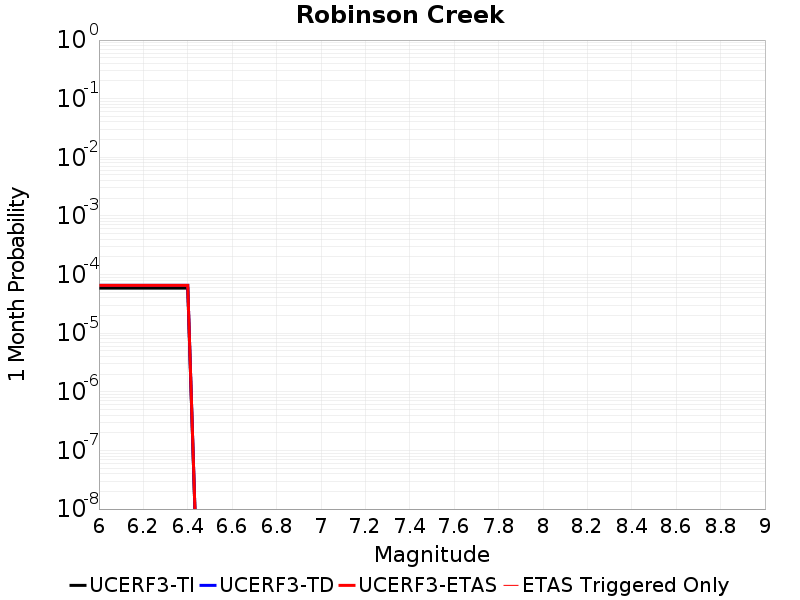 |  | 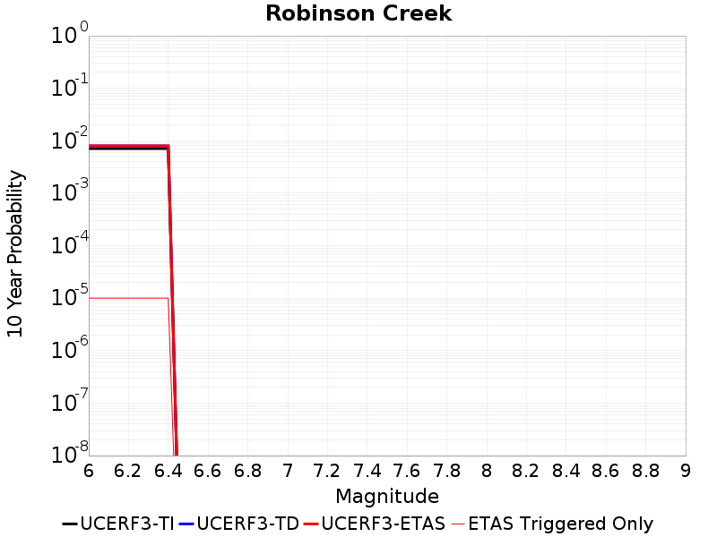 |

| Magnitude | 1 wk TI Prob | 1 wk TD Prob | 1 wk ETAS Prob | 1 wk ETAS/TD Gain | 1 wk ETAS Triggered Only | 1 mo TI Prob | 1 mo TD Prob | 1 mo ETAS Prob | 1 mo ETAS/TD Gain | 1 mo ETAS Triggered Only | 1 yr TI Prob | 1 yr TD Prob | 1 yr ETAS Prob | 1 yr ETAS/TD Gain | 1 yr ETAS Triggered Only | 10 yr TI Prob | 10 yr TD Prob | 10 yr ETAS Prob | 10 yr ETAS/TD Gain | 10 yr ETAS Triggered Only |
|-----|-----|-----|-----|-----|-----|-----|-----|-----|-----|-----|-----|-----|-----|-----|-----|-----|-----|-----|-----|-----|
| 6.0 | 1.3705327E-5 | 1.5296186E-5 | 1.5296186E-5 | 1.0 | 0.0 | 5.8735794E-5 | 6.555508E-5 | 6.555508E-5 | 1.0 | 0.0 | 7.1487366E-4 | 7.9813314E-4 | 7.9813314E-4 | 1.0 | 0.0 | 0.0071257832 | 0.007981331 | 0.007991252 | 1.0012429 | 1.0E-5 |
| 6.1 | 1.3705327E-5 | 1.5296186E-5 | 1.5296186E-5 | 1.0 | 0.0 | 5.8735794E-5 | 6.555508E-5 | 6.555508E-5 | 1.0 | 0.0 | 7.1487366E-4 | 7.9813314E-4 | 7.9813314E-4 | 1.0 | 0.0 | 0.0071257832 | 0.007981331 | 0.007991252 | 1.0012429 | 1.0E-5 |
| 6.2 | 1.3705327E-5 | 1.5296186E-5 | 1.5296186E-5 | 1.0 | 0.0 | 5.8735794E-5 | 6.555508E-5 | 6.555508E-5 | 1.0 | 0.0 | 7.1487366E-4 | 7.9813314E-4 | 7.9813314E-4 | 1.0 | 0.0 | 0.0071257832 | 0.007981331 | 0.007991252 | 1.0012429 | 1.0E-5 |
| 6.3 | 1.3705327E-5 | 1.5296186E-5 | 1.5296186E-5 | 1.0 | 0.0 | 5.8735794E-5 | 6.555508E-5 | 6.555508E-5 | 1.0 | 0.0 | 7.1487366E-4 | 7.9813314E-4 | 7.9813314E-4 | 1.0 | 0.0 | 0.0071257832 | 0.007981331 | 0.007991252 | 1.0012429 | 1.0E-5 |
| 6.4 | 1.3705327E-5 | 1.5296186E-5 | 1.5296186E-5 | 1.0 | 0.0 | 5.8735794E-5 | 6.555508E-5 | 6.555508E-5 | 1.0 | 0.0 | 7.1487366E-4 | 7.9813314E-4 | 7.9813314E-4 | 1.0 | 0.0 | 0.0071257832 | 0.007981331 | 0.007991252 | 1.0012429 | 1.0E-5 |

## Pisgah-Bullion Mtn-Mesquite Lk
*[(top)](#table-of-contents)*

| 1 Week | 1 Month | 1 Year | 10 Year |
|-----|-----|-----|-----|
| 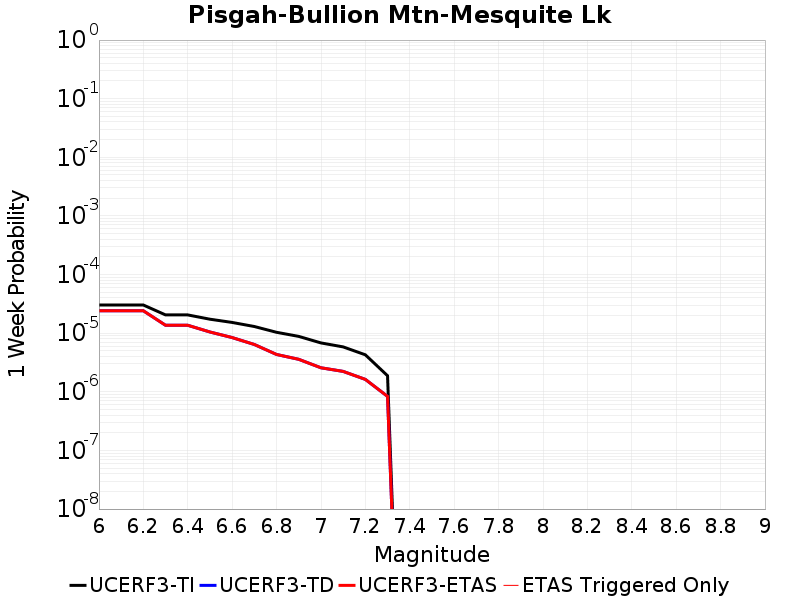 | 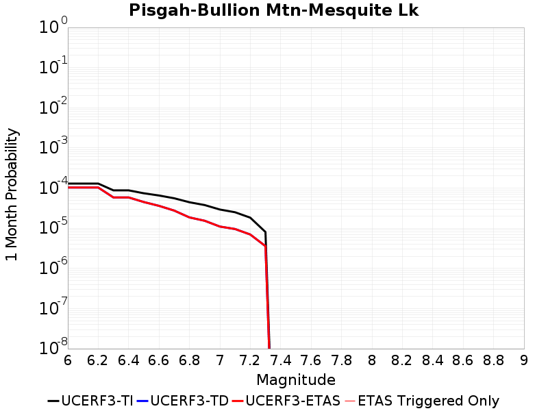 | 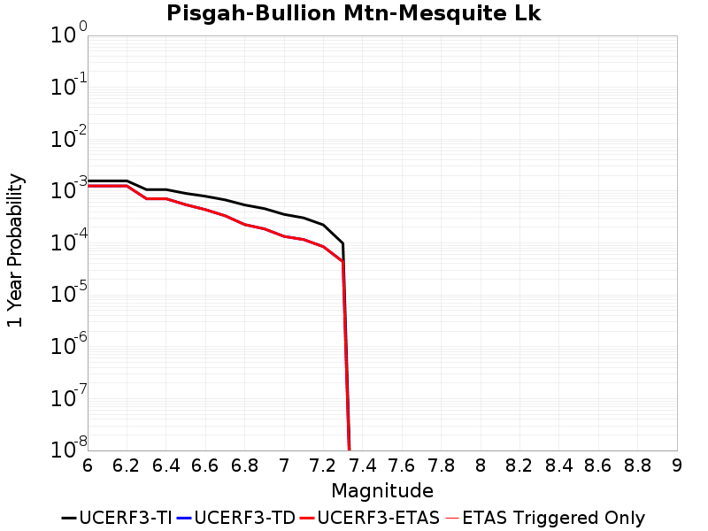 |  |

| Magnitude | 1 wk TI Prob | 1 wk TD Prob | 1 wk ETAS Prob | 1 wk ETAS/TD Gain | 1 wk ETAS Triggered Only | 1 mo TI Prob | 1 mo TD Prob | 1 mo ETAS Prob | 1 mo ETAS/TD Gain | 1 mo ETAS Triggered Only | 1 yr TI Prob | 1 yr TD Prob | 1 yr ETAS Prob | 1 yr ETAS/TD Gain | 1 yr ETAS Triggered Only | 10 yr TI Prob | 10 yr TD Prob | 10 yr ETAS Prob | 10 yr ETAS/TD Gain | 10 yr ETAS Triggered Only |
|-----|-----|-----|-----|-----|-----|-----|-----|-----|-----|-----|-----|-----|-----|-----|-----|-----|-----|-----|-----|-----|
| 6.0 | 3.0240792E-5 | 2.4110137E-5 | 2.4110137E-5 | 1.0 | 0.0 | 1.2959696E-4 | 1.03325634E-4 | 1.03325634E-4 | 1.0 | 0.0 | 0.0015767008 | 0.0012573645 | 0.0012573645 | 1.0 | 0.0 | 0.015655609 | 0.012512545 | 0.01252242 | 1.0007892 | 1.0E-5 |
| 6.1 | 3.0240792E-5 | 2.4110137E-5 | 2.4110137E-5 | 1.0 | 0.0 | 1.2959696E-4 | 1.03325634E-4 | 1.03325634E-4 | 1.0 | 0.0 | 0.0015767008 | 0.0012573645 | 0.0012573645 | 1.0 | 0.0 | 0.015655609 | 0.012512545 | 0.01252242 | 1.0007892 | 1.0E-5 |
| 6.2 | 3.0240792E-5 | 2.4110137E-5 | 2.4110137E-5 | 1.0 | 0.0 | 1.2959696E-4 | 1.03325634E-4 | 1.03325634E-4 | 1.0 | 0.0 | 0.0015767008 | 0.0012573645 | 0.0012573645 | 1.0 | 0.0 | 0.015655609 | 0.012512545 | 0.01252242 | 1.0007892 | 1.0E-5 |
| 6.3 | 2.0498217E-5 | 1.3647578E-5 | 1.3647578E-5 | 1.0 | 0.0 | 8.784654E-5 | 5.84884E-5 | 5.84884E-5 | 1.0 | 0.0 | 0.0010690069 | 7.1187987E-4 | 7.1187987E-4 | 1.0 | 0.0 | 0.01063879 | 0.0070976233 | 0.0070976233 | 1.0 | 0.0 |
| 6.4 | 2.0498217E-5 | 1.3647578E-5 | 1.3647578E-5 | 1.0 | 0.0 | 8.784654E-5 | 5.84884E-5 | 5.84884E-5 | 1.0 | 0.0 | 0.0010690069 | 7.1187987E-4 | 7.1187987E-4 | 1.0 | 0.0 | 0.01063879 | 0.0070976233 | 0.0070976233 | 1.0 | 0.0 |
| 6.5 | 1.7316182E-5 | 1.04841E-5 | 1.04841E-5 | 1.0 | 0.0 | 7.42101E-5 | 4.493114E-5 | 4.493114E-5 | 1.0 | 0.0 | 9.0313336E-4 | 5.4690934E-4 | 5.4690934E-4 | 1.0 | 0.0 | 0.008994718 | 0.0054566306 | 0.0054566306 | 1.0 | 0.0 |
| 6.6 | 1.5251077E-5 | 8.419841E-6 | 8.419841E-6 | 1.0 | 0.0 | 6.536012E-5 | 3.6084577E-5 | 3.6084577E-5 | 1.0 | 0.0 | 7.9546886E-4 | 4.392484E-4 | 4.392484E-4 | 1.0 | 0.0 | 0.007926274 | 0.00438452 | 0.00438452 | 1.0 | 0.0 |
| 6.7 | 1.2997425E-5 | 6.415708E-6 | 6.415708E-6 | 1.0 | 0.0 | 5.570206E-5 | 2.7495627E-5 | 2.7495627E-5 | 1.0 | 0.0 | 6.7796157E-4 | 3.347125E-4 | 3.347125E-4 | 1.0 | 0.0 | 0.0067589693 | 0.0033425442 | 0.0033425442 | 1.0 | 0.0 |
| 6.8 | 1.035386E-5 | 4.336644E-6 | 4.336644E-6 | 1.0 | 0.0 | 4.437293E-5 | 1.858549E-5 | 1.858549E-5 | 1.0 | 0.0 | 5.401065E-4 | 2.2625572E-4 | 2.2625572E-4 | 1.0 | 0.0 | 0.0053879567 | 0.0022603406 | 0.0022603406 | 1.0 | 0.0 |
| 6.9 | 8.816252E-6 | 3.58364E-6 | 3.58364E-6 | 1.0 | 0.0 | 3.778339E-5 | 1.535837E-5 | 1.535837E-5 | 1.0 | 0.0 | 4.5991567E-4 | 1.869727E-4 | 1.869727E-4 | 1.0 | 0.0 | 0.00458965 | 0.0018682124 | 0.0018682124 | 1.0 | 0.0 |
| 7.0 | 6.8232207E-6 | 2.5701238E-6 | 2.5701238E-6 | 1.0 | 0.0 | 2.9242048E-5 | 1.1014771E-5 | 1.1014771E-5 | 1.0 | 0.0 | 3.5596377E-4 | 1.340969E-4 | 1.340969E-4 | 1.0 | 0.0 | 0.0035539411 | 0.001340191 | 0.001340191 | 1.0 | 0.0 |
| 7.1 | 5.837013E-6 | 2.229504E-6 | 2.229504E-6 | 1.0 | 0.0 | 2.501553E-5 | 9.554984E-6 | 9.554984E-6 | 1.0 | 0.0 | 3.045215E-4 | 1.1632601E-4 | 1.1632601E-4 | 1.0 | 0.0 | 0.0030410455 | 0.0011626803 | 0.0011626803 | 1.0 | 0.0 |
| 7.2 | 4.278052E-6 | 1.6292055E-6 | 1.6292055E-6 | 1.0 | 0.0 | 1.833438E-5 | 6.982292E-6 | 6.982292E-6 | 1.0 | 0.0 | 2.231982E-4 | 8.500632E-5 | 8.500632E-5 | 1.0 | 0.0 | 0.0022297418 | 8.497613E-4 | 8.497613E-4 | 1.0 | 0.0 |
| 7.3 | 1.8803692E-6 | 8.3546604E-7 | 8.3546604E-7 | 1.0 | 0.0 | 8.0587E-6 | 3.5805647E-6 | 3.5805647E-6 | 1.0 | 0.0 | 9.811026E-5 | 4.3592652E-5 | 4.3592652E-5 | 1.0 | 0.0 | 9.806695E-4 | 4.358555E-4 | 4.358555E-4 | 1.0 | 0.0 |

