# Parent Section Magnitude-Probability Distributions

Only fault sections with at least one triggered aftershock are plotted. Sections are sorted by total supraseismogenic trigger rate (decreasing)

## Table Of Contents

* [Garlock (Central)](#garlock-central)
* [Tank Canyon](#tank-canyon)
* [Little Lake](#little-lake)
* [Owl Lake](#owl-lake)
* [Airport Lake](#airport-lake)
* [Panamint Valley](#panamint-valley)
* [Garlock (East)](#garlock-east)
* [Hunter Mountain-Saline Valley](#hunter-mountain-saline-valley)
* [McLean Lake](#mclean-lake)
* [Ash Hill](#ash-hill)
* [Gravel Hills-Harper Lk](#gravel-hills-harper-lk)
* [So Sierra Nevada](#so-sierra-nevada)
* [Garlock (West)](#garlock-west)
* [San Andreas (Mojave N)](#san-andreas-mojave-n)
* [Blackwater](#blackwater)
* [Goldstone Lake](#goldstone-lake)
* [Elsinore (Glen Ivy) rev](#elsinore-glen-ivy-rev)
* [Towne Pass](#towne-pass)
* [Nelson Lake](#nelson-lake)
* [Coyote Canyon](#coyote-canyon)
* [Lenwood-Lockhart-Old Woman Springs](#lenwood-lockhart-old-woman-springs)
* [Pinto Mtn](#pinto-mtn)
* [Sierra Nevada  (No Extension)](#sierra-nevada--no-extension)
* [San Clemente](#san-clemente)
* [San Andreas (Mojave S)](#san-andreas-mojave-s)

## Garlock (Central)
*[(top)](#table-of-contents)*

| 1 Week | 1 Month | 1 Year | 10 Year |
|-----|-----|-----|-----|
|  |  |  | 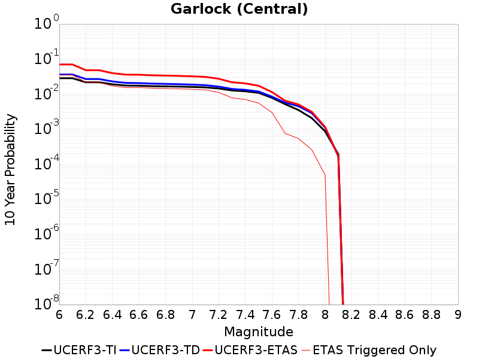 |

| Magnitude | 1 wk TI Prob | 1 wk TD Prob | 1 wk ETAS Prob | 1 wk ETAS/TD Gain | 1 wk ETAS Triggered Only | 1 mo TI Prob | 1 mo TD Prob | 1 mo ETAS Prob | 1 mo ETAS/TD Gain | 1 mo ETAS Triggered Only | 1 yr TI Prob | 1 yr TD Prob | 1 yr ETAS Prob | 1 yr ETAS/TD Gain | 1 yr ETAS Triggered Only | 10 yr TI Prob | 10 yr TD Prob | 10 yr ETAS Prob | 10 yr ETAS/TD Gain | 10 yr ETAS Triggered Only |
|-----|-----|-----|-----|-----|-----|-----|-----|-----|-----|-----|-----|-----|-----|-----|-----|-----|-----|-----|-----|-----|
| 6.0 | 5.5131142E-5 | 7.055972E-5 | 0.0024627354 | 34.90285 | 0.0023923444 | 2.3625491E-4 | 3.0236412E-4 | 0.0050856066 | 16.819477 | 0.004784689 | 0.0028726095 | 0.003675134 | 0.014997007 | 4.08067 | 0.011363637 | 0.028357591 | 0.036277298 | 0.0627912 | 1.7308676 | 0.027511962 |
| 6.1 | 5.5131142E-5 | 7.055972E-5 | 0.0024627354 | 34.90285 | 0.0023923444 | 2.3625491E-4 | 3.0236412E-4 | 0.0050856066 | 16.819477 | 0.004784689 | 0.0028726095 | 0.003675134 | 0.014997007 | 4.08067 | 0.011363637 | 0.028357591 | 0.036277298 | 0.0627912 | 1.7308676 | 0.027511962 |
| 6.2 | 4.216245E-5 | 5.1945644E-5 | 0.0018461108 | 35.53928 | 0.0017942584 | 1.806837E-4 | 2.2260536E-4 | 0.0032123702 | 14.430785 | 0.0029904307 | 0.0021976046 | 0.0027068835 | 0.009268022 | 3.423872 | 0.0065789474 | 0.021759989 | 0.026871782 | 0.04491423 | 1.6714274 | 0.01854067 |
| 6.3 | 4.216245E-5 | 5.1945644E-5 | 0.0018461108 | 35.53928 | 0.0017942584 | 1.806837E-4 | 2.2260536E-4 | 0.0032123702 | 14.430785 | 0.0029904307 | 0.0021976046 | 0.0027068835 | 0.009268022 | 3.423872 | 0.0065789474 | 0.021759989 | 0.026871782 | 0.04491423 | 1.6714274 | 0.01854067 |
| 6.4 | 3.6858168E-5 | 4.438376E-5 | 0.0018385625 | 41.424217 | 0.0017942584 | 1.5795401E-4 | 1.9020238E-4 | 0.0025820918 | 13.575497 | 0.0023923444 | 0.0019213937 | 0.00231328 | 0.007683603 | 3.321519 | 0.0053827753 | 0.019048655 | 0.02301365 | 0.038790345 | 1.6855364 | 0.016148325 |
| 6.5 | 3.39199E-5 | 4.0286846E-5 | 0.001834473 | 45.535282 | 0.0017942584 | 1.453629E-4 | 1.726466E-4 | 0.002564578 | 14.854495 | 0.0023923444 | 0.0017683565 | 0.002099968 | 0.0074714394 | 3.5578825 | 0.0053827753 | 0.017543508 | 0.020901814 | 0.03554144 | 1.7003998 | 0.014952153 |
| 6.6 | 3.3571985E-5 | 3.9740054E-5 | 0.0018339271 | 46.148075 | 0.0017942584 | 1.4387199E-4 | 1.7030352E-4 | 0.0025622407 | 15.045141 | 0.0023923444 | 0.0017502342 | 0.0020714956 | 0.0074431202 | 3.5931144 | 0.0053827753 | 0.017365133 | 0.020620262 | 0.035264097 | 1.7101673 | 0.014952153 |
| 6.7 | 3.2580007E-5 | 3.8354872E-5 | 0.0018325445 | 47.778664 | 0.0017942584 | 1.3962112E-4 | 1.6436778E-4 | 0.002556319 | 15.552434 | 0.0023923444 | 0.0016985617 | 0.0019993626 | 0.007371376 | 3.6868627 | 0.0053827753 | 0.016856372 | 0.0199106 | 0.03397887 | 1.7065718 | 0.014354067 |
| 6.8 | 3.2185937E-5 | 3.7780323E-5 | 0.0018319709 | 48.49008 | 0.0017942584 | 1.3793244E-4 | 1.6190574E-4 | 0.002553863 | 15.773764 | 0.0023923444 | 0.0016780337 | 0.0019694418 | 0.007341616 | 3.7277648 | 0.0053827753 | 0.016654192 | 0.019616581 | 0.033102717 | 1.6874865 | 0.013755981 |
| 6.9 | 3.165394E-5 | 3.6983085E-5 | 0.0018311751 | 49.513855 | 0.0017942584 | 1.3565269E-4 | 1.5848942E-4 | 0.0025504548 | 16.092272 | 0.0023923444 | 0.0016503202 | 0.0019279225 | 0.00730032 | 3.7866254 | 0.0053827753 | 0.01638118 | 0.019209083 | 0.032700825 | 1.7023625 | 0.013755981 |
| 7.0 | 3.0903822E-5 | 3.588521E-5 | 0.0018300792 | 50.99815 | 0.0017942584 | 1.3243823E-4 | 1.537848E-4 | 0.0025457614 | 16.55405 | 0.0023923444 | 0.0016112428 | 0.0018707433 | 0.007243449 | 3.8719628 | 0.0053827753 | 0.015996104 | 0.01864502 | 0.03214452 | 1.7240272 | 0.013755981 |
| 7.1 | 3.0069863E-5 | 3.4649354E-5 | 0.0018288456 | 52.781517 | 0.0017942584 | 1.2886449E-4 | 1.484889E-4 | 0.0025404783 | 17.108875 | 0.0023923444 | 0.0015677959 | 0.0018063745 | 0.0071794265 | 3.974495 | 0.0053827753 | 0.01556781 | 0.018011598 | 0.030932497 | 1.7173655 | 0.013157895 |
| 7.2 | 2.7957109E-5 | 3.1528587E-5 | 0.0012276631 | 38.938095 | 0.0011961722 | 1.1981068E-4 | 1.3511564E-4 | 0.0019291316 | 14.277635 | 0.0017942584 | 0.0014577188 | 0.0016438111 | 0.006420635 | 3.9059443 | 0.004784689 | 0.014481937 | 0.016409885 | 0.028175317 | 1.7169722 | 0.011961723 |
| 7.3 | 2.4519275E-5 | 2.694756E-5 | 0.0012230875 | 45.38769 | 0.0011961722 | 1.0507837E-4 | 1.15484516E-4 | 0.0019095357 | 16.534994 | 0.0017942584 | 0.0012785783 | 0.0014051319 | 0.005585852 | 3.9753222 | 0.004186603 | 0.012712469 | 0.0140472995 | 0.0217132 | 1.5457206 | 0.0077751195 |
| 7.4 | 2.3225532E-5 | 2.5427204E-5 | 6.234981E-4 | 24.520906 | 5.980861E-4 | 9.95342E-5 | 1.0896926E-4 | 0.0013050112 | 11.975957 | 0.0011961722 | 0.0012111551 | 0.0013259079 | 0.004312373 | 3.252393 | 0.0029904307 | 0.012045753 | 0.013262565 | 0.019754259 | 1.489475 | 0.0065789474 |
| 7.5 | 2.097765E-5 | 2.2700455E-5 | 6.20773E-4 | 27.346281 | 5.980861E-4 | 8.9901114E-5 | 9.72841E-5 | 0.00129334 | 13.294464 | 0.0011961722 | 0.0010939965 | 0.0011838021 | 0.0041706925 | 3.523133 | 0.0029904307 | 0.010886264 | 0.011851929 | 0.017170908 | 1.4487859 | 0.0053827753 |
| 7.6 | 1.511254E-5 | 1.6188944E-5 | 6.142654E-4 | 37.943516 | 5.980861E-4 | 6.476642E-5 | 6.9379385E-5 | 0.0012654687 | 18.239838 | 0.0011961722 | 7.882459E-4 | 8.4437453E-4 | 0.003234699 | 3.8308818 | 0.0023923444 | 0.007854558 | 0.008485364 | 0.0120434305 | 1.4193182 | 0.0035885167 |
| 7.7 | 9.934069E-6 | 1.0861612E-5 | 1.0861612E-5 | 1.0 | 0.0 | 4.2573887E-5 | 4.654894E-5 | 4.654894E-5 | 1.0 | 0.0 | 5.182138E-4 | 5.665863E-4 | 5.665863E-4 | 1.0 | 0.0 | 0.00517007 | 0.005722343 | 0.006317007 | 1.1039196 | 5.980861E-4 |
| 7.8 | 6.7562896E-6 | 8.577602E-6 | 8.577602E-6 | 1.0 | 0.0 | 2.8955206E-5 | 3.6760634E-5 | 3.6760634E-5 | 1.0 | 0.0 | 3.5247262E-4 | 4.4746895E-4 | 4.4746895E-4 | 1.0 | 0.0 | 0.0035191406 | 0.004523833 | 0.0051192134 | 1.1316098 | 5.980861E-4 |
| 7.9 | 3.975453E-6 | 5.460811E-6 | 5.460811E-6 | 1.0 | 0.0 | 1.7037546E-5 | 2.3403265E-5 | 2.3403265E-5 | 1.0 | 0.0 | 2.0741238E-4 | 2.848976E-4 | 2.848976E-4 | 1.0 | 0.0 | 0.002072189 | 0.002880007 | 0.002880007 | 1.0 | 0.0 |
| 8.0 | 1.6729537E-6 | 2.1083026E-6 | 2.1083026E-6 | 1.0 | 0.0 | 7.169782E-6 | 9.035552E-6 | 9.035552E-6 | 1.0 | 0.0 | 8.7288594E-5 | 1.1000232E-4 | 1.1000232E-4 | 1.0 | 0.0 | 8.7254314E-4 | 0.0011128162 | 0.0011128162 | 1.0 | 0.0 |
| 8.1 | 3.6733252E-7 | 3.193119E-7 | 3.193119E-7 | 1.0 | 0.0 | 1.5742813E-6 | 1.368479E-6 | 1.368479E-6 | 1.0 | 0.0 | 1.9166706E-5 | 1.666112E-5 | 1.666112E-5 | 1.0 | 0.0 | 1.9165053E-4 | 1.6865862E-4 | 1.6865862E-4 | 1.0 | 0.0 |

## Tank Canyon
*[(top)](#table-of-contents)*

| 1 Week | 1 Month | 1 Year | 10 Year |
|-----|-----|-----|-----|
|  |  |  | 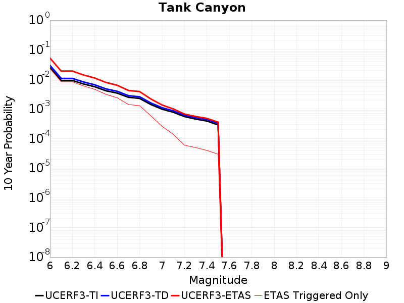 |

| Magnitude | 1 wk TI Prob | 1 wk TD Prob | 1 wk ETAS Prob | 1 wk ETAS/TD Gain | 1 wk ETAS Triggered Only | 1 mo TI Prob | 1 mo TD Prob | 1 mo ETAS Prob | 1 mo ETAS/TD Gain | 1 mo ETAS Triggered Only | 1 yr TI Prob | 1 yr TD Prob | 1 yr ETAS Prob | 1 yr ETAS/TD Gain | 1 yr ETAS Triggered Only | 10 yr TI Prob | 10 yr TD Prob | 10 yr ETAS Prob | 10 yr ETAS/TD Gain | 10 yr ETAS Triggered Only |
|-----|-----|-----|-----|-----|-----|-----|-----|-----|-----|-----|-----|-----|-----|-----|-----|-----|-----|-----|-----|-----|
| 6.0 | 4.8284557E-5 | 5.8038782E-5 | 6.560902E-4 | 11.304341 | 5.980861E-4 | 2.0691741E-4 | 2.487173E-4 | 0.0020425294 | 8.212254 | 0.0017942584 | 0.0025163088 | 0.0030245944 | 0.008987366 | 2.9714286 | 0.0059808614 | 0.02488006 | 0.029901398 | 0.04672727 | 1.562712 | 0.017344497 |
| 6.1 | 1.7796336E-5 | 2.0896712E-5 | 2.0896712E-5 | 1.0 | 0.0 | 7.626778E-5 | 8.955448E-5 | 0.0012856196 | 14.355726 | 0.0011961722 | 9.281647E-4 | 0.0010898184 | 0.0040769903 | 3.7409809 | 0.0029904307 | 0.009242975 | 0.010848796 | 0.016764771 | 1.5453118 | 0.0059808614 |
| 6.2 | 1.7796336E-5 | 2.0896712E-5 | 2.0896712E-5 | 1.0 | 0.0 | 7.626778E-5 | 8.955448E-5 | 0.0012856196 | 14.355726 | 0.0011961722 | 9.281647E-4 | 0.0010898184 | 0.0040769903 | 3.7409809 | 0.0029904307 | 0.009242975 | 0.010848796 | 0.016764771 | 1.5453118 | 0.0059808614 |
| 6.3 | 1.3515912E-5 | 1.5776674E-5 | 1.5776674E-5 | 1.0 | 0.0 | 5.792405E-5 | 6.7612695E-5 | 6.656584E-4 | 9.845169 | 5.980861E-4 | 7.049971E-4 | 8.228973E-4 | 0.0026156793 | 3.1786218 | 0.0017942584 | 0.007027647 | 0.008201077 | 0.012946526 | 1.5786374 | 0.004784689 |
| 6.4 | 1.0870146E-5 | 1.2631405E-5 | 1.2631405E-5 | 1.0 | 0.0 | 4.658551E-5 | 5.4133565E-5 | 6.5218733E-4 | 12.047744 | 5.980861E-4 | 5.67031E-4 | 6.588946E-4 | 0.0024519707 | 3.72134 | 0.0017942584 | 0.005655863 | 0.0065713823 | 0.011324629 | 1.7233253 | 0.004784689 |
| 6.5 | 7.964826E-6 | 9.2056425E-6 | 9.2056425E-6 | 1.0 | 0.0 | 3.4134522E-5 | 3.9452218E-5 | 6.3751475E-4 | 16.15916 | 5.980861E-4 | 4.1550855E-4 | 4.8023544E-4 | 0.0016758332 | 3.4896076 | 0.0011961722 | 0.0041473247 | 0.004793235 | 0.007769332 | 1.6208953 | 0.0029904307 |
| 6.6 | 6.6317E-6 | 7.6200363E-6 | 7.6200363E-6 | 1.0 | 0.0 | 2.8421264E-5 | 3.2656942E-5 | 3.2656942E-5 | 1.0 | 0.0 | 3.4597394E-4 | 3.975348E-4 | 9.953831E-4 | 2.5038893 | 5.980861E-4 | 0.0034543579 | 0.0039693457 | 0.005756482 | 1.4502345 | 0.0017942584 |
| 6.7 | 4.793663E-6 | 5.4360894E-6 | 5.4360894E-6 | 1.0 | 0.0 | 2.0544108E-5 | 2.3297342E-5 | 2.3297342E-5 | 1.0 | 0.0 | 2.500958E-4 | 2.836126E-4 | 2.836126E-4 | 1.0 | 0.0 | 0.0024981452 | 0.002833154 | 0.004025937 | 1.421009 | 0.0011961722 |
| 6.8 | 4.382823E-6 | 4.974086E-6 | 4.974086E-6 | 1.0 | 0.0 | 1.8783392E-5 | 2.1317363E-5 | 2.1317363E-5 | 1.0 | 0.0 | 2.286638E-4 | 2.5951225E-4 | 2.5951225E-4 | 1.0 | 0.0 | 0.0022842865 | 0.0025927268 | 0.0037857979 | 1.4601606 | 0.0011961722 |
| 6.9 | 2.729601E-6 | 3.0768329E-6 | 3.0768329E-6 | 1.0 | 0.0 | 1.1698237E-5 | 1.3186367E-5 | 1.3186367E-5 | 1.0 | 0.0 | 1.4241673E-4 | 1.6053343E-4 | 1.6053343E-4 | 1.0 | 0.0 | 0.001423255 | 0.0016042218 | 0.0016042218 | 1.0 | 0.0 |
| 7.0 | 1.8987357E-6 | 2.129422E-6 | 2.129422E-6 | 1.0 | 0.0 | 8.137413E-6 | 9.126066E-6 | 9.126066E-6 | 1.0 | 0.0 | 9.90685E-5 | 1.111049E-4 | 1.111049E-4 | 1.0 | 0.0 | 9.902435E-4 | 0.0011105622 | 0.0011105622 | 1.0 | 0.0 |
| 7.1 | 1.4928986E-6 | 1.6653829E-6 | 1.6653829E-6 | 1.0 | 0.0 | 6.398121E-6 | 7.137339E-6 | 7.137339E-6 | 1.0 | 0.0 | 7.789434E-5 | 8.689422E-5 | 8.689422E-5 | 1.0 | 0.0 | 7.786704E-4 | 8.686604E-4 | 8.686604E-4 | 1.0 | 0.0 |
| 7.2 | 1.069082E-6 | 1.1833507E-6 | 1.1833507E-6 | 1.0 | 0.0 | 4.581772E-6 | 5.0714966E-6 | 5.0714966E-6 | 1.0 | 0.0 | 5.5781646E-5 | 6.174425E-5 | 6.174425E-5 | 1.0 | 0.0 | 5.576765E-4 | 6.1732327E-4 | 6.1732327E-4 | 1.0 | 0.0 |
| 7.3 | 8.776551E-7 | 9.774099E-7 | 9.774099E-7 | 1.0 | 0.0 | 3.7613736E-6 | 4.188895E-6 | 4.188895E-6 | 1.0 | 0.0 | 4.579376E-5 | 5.0999126E-5 | 5.0999126E-5 | 1.0 | 0.0 | 4.5784327E-4 | 5.099253E-4 | 5.099253E-4 | 1.0 | 0.0 |
| 7.4 | 7.55721E-7 | 8.51226E-7 | 8.51226E-7 | 1.0 | 0.0 | 3.2388E-6 | 3.6481092E-6 | 3.6481092E-6 | 1.0 | 0.0 | 3.9431678E-5 | 4.441534E-5 | 4.441534E-5 | 1.0 | 0.0 | 3.942468E-4 | 4.4411552E-4 | 4.4411552E-4 | 1.0 | 0.0 |
| 7.5 | 5.587665E-7 | 6.307093E-7 | 6.307093E-7 | 1.0 | 0.0 | 2.3947114E-6 | 2.7030396E-6 | 2.7030396E-6 | 1.0 | 0.0 | 2.915522E-5 | 3.290951E-5 | 3.290951E-5 | 1.0 | 0.0 | 2.9151395E-4 | 3.2909508E-4 | 3.2909508E-4 | 1.0 | 0.0 |

## Little Lake
*[(top)](#table-of-contents)*

| 1 Week | 1 Month | 1 Year | 10 Year |
|-----|-----|-----|-----|
|  |  |  |  |

| Magnitude | 1 wk TI Prob | 1 wk TD Prob | 1 wk ETAS Prob | 1 wk ETAS/TD Gain | 1 wk ETAS Triggered Only | 1 mo TI Prob | 1 mo TD Prob | 1 mo ETAS Prob | 1 mo ETAS/TD Gain | 1 mo ETAS Triggered Only | 1 yr TI Prob | 1 yr TD Prob | 1 yr ETAS Prob | 1 yr ETAS/TD Gain | 1 yr ETAS Triggered Only | 10 yr TI Prob | 10 yr TD Prob | 10 yr ETAS Prob | 10 yr ETAS/TD Gain | 10 yr ETAS Triggered Only |
|-----|-----|-----|-----|-----|-----|-----|-----|-----|-----|-----|-----|-----|-----|-----|-----|-----|-----|-----|-----|-----|
| 6.0 | 2.8424427E-5 | 3.122668E-5 | 3.122668E-5 | 1.0 | 0.0 | 1.2181328E-4 | 1.3382251E-4 | 7.318286E-4 | 5.468651 | 5.980861E-4 | 0.0014820677 | 0.0016282048 | 0.007002216 | 4.3005743 | 0.0053827753 | 0.014722223 | 0.01617618 | 0.030298054 | 1.8730041 | 0.014354067 |
| 6.1 | 2.8424427E-5 | 3.122668E-5 | 3.122668E-5 | 1.0 | 0.0 | 1.2181328E-4 | 1.3382251E-4 | 7.318286E-4 | 5.468651 | 5.980861E-4 | 0.0014820677 | 0.0016282048 | 0.007002216 | 4.3005743 | 0.0053827753 | 0.014722223 | 0.01617618 | 0.030298054 | 1.8730041 | 0.014354067 |
| 6.2 | 2.8424427E-5 | 3.122668E-5 | 3.122668E-5 | 1.0 | 0.0 | 1.2181328E-4 | 1.3382251E-4 | 7.318286E-4 | 5.468651 | 5.980861E-4 | 0.0014820677 | 0.0016282048 | 0.007002216 | 4.3005743 | 0.0053827753 | 0.014722223 | 0.01617618 | 0.030298054 | 1.8730041 | 0.014354067 |
| 6.3 | 1.48860645E-5 | 1.6091122E-5 | 1.6091122E-5 | 1.0 | 0.0 | 6.379586E-5 | 6.896029E-5 | 6.670052E-4 | 9.672308 | 5.980861E-4 | 7.7643775E-4 | 8.392964E-4 | 0.004424801 | 5.2720366 | 0.0035885167 | 0.007737305 | 0.008364088 | 0.01844651 | 2.205442 | 0.010167464 |
| 6.4 | 1.48860645E-5 | 1.6091122E-5 | 1.6091122E-5 | 1.0 | 0.0 | 6.379586E-5 | 6.896029E-5 | 6.670052E-4 | 9.672308 | 5.980861E-4 | 7.7643775E-4 | 8.392964E-4 | 0.004424801 | 5.2720366 | 0.0035885167 | 0.007737305 | 0.008364088 | 0.01844651 | 2.205442 | 0.010167464 |
| 6.5 | 1.2797581E-5 | 1.37737015E-5 | 1.37737015E-5 | 1.0 | 0.0 | 5.4845623E-5 | 5.9028956E-5 | 6.570798E-4 | 11.131482 | 5.980861E-4 | 6.675408E-4 | 7.184663E-4 | 0.0037067484 | 5.1592517 | 0.0029904307 | 0.006655392 | 0.007163989 | 0.016664812 | 2.3261917 | 0.009569378 |
| 6.6 | 9.661896E-6 | 1.0294781E-5 | 1.0294781E-5 | 1.0 | 0.0 | 4.1407468E-5 | 4.4119835E-5 | 6.4217957E-4 | 14.555348 | 5.980861E-4 | 5.040193E-4 | 5.3704286E-4 | 0.0029281026 | 5.45227 | 0.0023923444 | 0.005028777 | 0.0053590573 | 0.0130925095 | 2.443062 | 0.0077751195 |
| 6.7 | 7.767871E-6 | 8.204064E-6 | 8.204064E-6 | 1.0 | 0.0 | 3.329045E-5 | 3.515988E-5 | 6.3322496E-4 | 18.009874 | 5.980861E-4 | 4.0523586E-4 | 4.2800116E-4 | 0.0028193218 | 6.587182 | 0.0023923444 | 0.004044977 | 0.004273122 | 0.010228426 | 2.3936658 | 0.0059808614 |
| 6.8 | 6.4235196E-6 | 6.739293E-6 | 6.739293E-6 | 1.0 | 0.0 | 2.752908E-5 | 2.8882436E-5 | 2.8882436E-5 | 1.0 | 0.0 | 3.35115E-4 | 3.5159977E-4 | 0.0021452273 | 6.101333 | 0.0017942584 | 0.003346101 | 0.0035116968 | 0.008279583 | 2.3577158 | 0.004784689 |
| 6.9 | 3.1283696E-6 | 3.1134325E-6 | 3.1134325E-6 | 1.0 | 0.0 | 1.3407229E-5 | 1.3343222E-5 | 1.3343222E-5 | 1.0 | 0.0 | 1.6322079E-4 | 1.6244313E-4 | 0.001358421 | 8.362441 | 0.0011961722 | 0.0016310095 | 0.0016233923 | 0.003414738 | 2.1034582 | 0.0017942584 |
| 7.0 | 2.290603E-6 | 2.229628E-6 | 2.229628E-6 | 1.0 | 0.0 | 9.816834E-6 | 9.55552E-6 | 9.55552E-6 | 1.0 | 0.0 | 1.19513395E-4 | 1.16333285E-4 | 0.0013123663 | 11.281091 | 0.0011961722 | 0.0011944914 | 0.0011628261 | 0.002954998 | 2.541221 | 0.0017942584 |
| 7.1 | 1.293693E-6 | 1.178268E-6 | 1.178268E-6 | 1.0 | 0.0 | 5.5443866E-6 | 5.049714E-6 | 5.049714E-6 | 1.0 | 0.0 | 6.750081E-5 | 6.147924E-5 | 6.595286E-4 | 10.727664 | 5.980861E-4 | 6.7480316E-4 | 6.146908E-4 | 0.0018101278 | 2.9447777 | 0.0011961722 |
| 7.2 | 4.715842E-7 | 3.094533E-7 | 3.094533E-7 | 1.0 | 0.0 | 2.0210737E-6 | 1.3262278E-6 | 1.3262278E-6 | 1.0 | 0.0 | 2.4606294E-5 | 1.6146709E-5 | 1.6146709E-5 | 1.0 | 0.0 | 2.460357E-4 | 1.614559E-4 | 7.594455E-4 | 4.703733 | 5.980861E-4 |
| 7.3 | 3.9430947E-7 | 2.3122685E-7 | 2.3122685E-7 | 1.0 | 0.0 | 1.6898966E-6 | 9.909718E-7 | 9.909718E-7 | 1.0 | 0.0 | 2.0574296E-5 | 1.2065016E-5 | 1.2065016E-5 | 1.0 | 0.0 | 2.0572392E-4 | 1.2064369E-4 | 1.2064369E-4 | 1.0 | 0.0 |
| 7.4 | 3.547123E-7 | 1.9702495E-7 | 1.9702495E-7 | 1.0 | 0.0 | 1.5201948E-6 | 8.443924E-7 | 8.443924E-7 | 1.0 | 0.0 | 1.8508214E-5 | 1.0280429E-5 | 1.0280429E-5 | 1.0 | 0.0 | 1.8506673E-4 | 1.02799604E-4 | 1.02799604E-4 | 1.0 | 0.0 |
| 7.5 | 2.6354266E-7 | 1.4439416E-7 | 1.4439416E-7 | 1.0 | 0.0 | 1.129468E-6 | 6.18832E-7 | 6.18832E-7 | 1.0 | 0.0 | 1.3751187E-5 | 7.534254E-6 | 7.534254E-6 | 1.0 | 0.0 | 1.3750336E-4 | 7.534004E-5 | 7.534004E-5 | 1.0 | 0.0 |
| 7.6 | 1.269913E-7 | 7.5794375E-8 | 7.5794375E-8 | 1.0 | 0.0 | 5.4424834E-7 | 3.24833E-7 | 3.24833E-7 | 1.0 | 0.0 | 6.6262032E-6 | 3.954835E-6 | 3.954835E-6 | 1.0 | 0.0 | 6.626006E-5 | 3.954768E-5 | 3.954768E-5 | 1.0 | 0.0 |

## Owl Lake
*[(top)](#table-of-contents)*

| 1 Week | 1 Month | 1 Year | 10 Year |
|-----|-----|-----|-----|
|  |  | 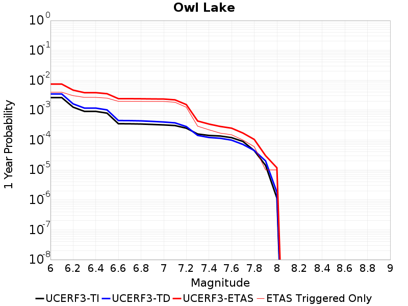 |  |

| Magnitude | 1 wk TI Prob | 1 wk TD Prob | 1 wk ETAS Prob | 1 wk ETAS/TD Gain | 1 wk ETAS Triggered Only | 1 mo TI Prob | 1 mo TD Prob | 1 mo ETAS Prob | 1 mo ETAS/TD Gain | 1 mo ETAS Triggered Only | 1 yr TI Prob | 1 yr TD Prob | 1 yr ETAS Prob | 1 yr ETAS/TD Gain | 1 yr ETAS Triggered Only | 10 yr TI Prob | 10 yr TD Prob | 10 yr ETAS Prob | 10 yr ETAS/TD Gain | 10 yr ETAS Triggered Only |
|-----|-----|-----|-----|-----|-----|-----|-----|-----|-----|-----|-----|-----|-----|-----|-----|-----|-----|-----|-----|-----|
| 6.0 | 5.0320643E-5 | 6.652003E-5 | 6.6456635E-4 | 9.990471 | 5.980861E-4 | 2.1564208E-4 | 2.8506093E-4 | 8.829766E-4 | 3.097501 | 5.980861E-4 | 0.0026222812 | 0.003465952 | 0.0058500045 | 1.6878493 | 0.0023923444 | 0.02591553 | 0.034222346 | 0.04288662 | 1.2531759 | 0.008971292 |
| 6.1 | 5.0320643E-5 | 6.652003E-5 | 6.6456635E-4 | 9.990471 | 5.980861E-4 | 2.1564208E-4 | 2.8506093E-4 | 8.829766E-4 | 3.097501 | 5.980861E-4 | 0.0026222812 | 0.003465952 | 0.0058500045 | 1.6878493 | 0.0023923444 | 0.02591553 | 0.034222346 | 0.04288662 | 1.2531759 | 0.008971292 |
| 6.2 | 2.4125871E-5 | 3.1069118E-5 | 3.1069118E-5 | 1.0 | 0.0 | 1.0339249E-4 | 1.3314768E-4 | 1.3314768E-4 | 1.0 | 0.0 | 0.0012580766 | 0.0016200411 | 0.0034113927 | 2.1057446 | 0.0017942584 | 0.012509781 | 0.016116122 | 0.02317749 | 1.4381555 | 0.0071770335 |
| 6.3 | 1.7433485E-5 | 2.2428765E-5 | 2.2428765E-5 | 1.0 | 0.0 | 7.471279E-5 | 9.612063E-5 | 9.612063E-5 | 1.0 | 0.0 | 9.0924866E-4 | 0.0011697797 | 0.0023645528 | 2.021366 | 0.0011961722 | 0.009055373 | 0.011666851 | 0.016986826 | 1.4559907 | 0.0053827753 |
| 6.4 | 1.7433485E-5 | 2.2428765E-5 | 2.2428765E-5 | 1.0 | 0.0 | 7.471279E-5 | 9.612063E-5 | 9.612063E-5 | 1.0 | 0.0 | 9.0924866E-4 | 0.0011697797 | 0.0023645528 | 2.021366 | 0.0011961722 | 0.009055373 | 0.011666851 | 0.016986826 | 1.4559907 | 0.0053827753 |
| 6.5 | 1.5182742E-5 | 1.9497216E-5 | 1.9497216E-5 | 1.0 | 0.0 | 6.506727E-5 | 8.355768E-5 | 8.355768E-5 | 1.0 | 0.0 | 7.919061E-4 | 0.0010169775 | 0.0022119333 | 2.175007 | 0.0011961722 | 0.0078909 | 0.010153731 | 0.015481851 | 1.524745 | 0.0053827753 |
| 6.6 | 6.7271576E-6 | 8.59633E-6 | 8.59633E-6 | 1.0 | 0.0 | 2.8830356E-5 | 3.6840927E-5 | 3.6840927E-5 | 1.0 | 0.0 | 3.5095305E-4 | 4.4845167E-4 | 0.0016440875 | 3.666142 | 0.0011961722 | 0.0035039932 | 0.004493336 | 0.009851924 | 2.1925635 | 0.0053827753 |
| 6.7 | 6.682835E-6 | 8.528714E-6 | 8.528714E-6 | 1.0 | 0.0 | 2.8640408E-5 | 3.6551148E-5 | 3.6551148E-5 | 1.0 | 0.0 | 3.4864116E-4 | 4.4492507E-4 | 0.0016405651 | 3.687284 | 0.0011961722 | 0.003480947 | 0.004458218 | 0.009816995 | 2.202 | 0.0053827753 |
| 6.8 | 6.5774975E-6 | 8.374999E-6 | 8.374999E-6 | 1.0 | 0.0 | 2.8188972E-5 | 3.5892393E-5 | 3.5892393E-5 | 1.0 | 0.0 | 3.4314668E-4 | 4.3690795E-4 | 0.0016325576 | 3.7366168 | 0.0011961722 | 0.0034261728 | 0.0043782447 | 0.0097374525 | 2.224054 | 0.0053827753 |
| 6.9 | 6.363419E-6 | 8.047693E-6 | 8.047693E-6 | 1.0 | 0.0 | 2.727151E-5 | 3.4489687E-5 | 3.4489687E-5 | 1.0 | 0.0 | 3.3198006E-4 | 4.1983667E-4 | 0.0016155067 | 3.847941 | 0.0011961722 | 0.0033148455 | 0.0042080004 | 0.009568125 | 2.2737937 | 0.0053827753 |
| 7.0 | 6.1342453E-6 | 7.679277E-6 | 7.679277E-6 | 1.0 | 0.0 | 2.6289357E-5 | 3.29108E-5 | 3.29108E-5 | 1.0 | 0.0 | 3.2002592E-4 | 4.006209E-4 | 0.0015963139 | 3.9845998 | 0.0011961722 | 0.0031956544 | 0.0040163533 | 0.009377509 | 2.3348317 | 0.0053827753 |
| 7.1 | 5.842926E-6 | 7.1889126E-6 | 7.1889126E-6 | 1.0 | 0.0 | 2.504087E-5 | 3.0809293E-5 | 3.0809293E-5 | 1.0 | 0.0 | 3.0482994E-4 | 3.7504404E-4 | 0.0015707676 | 4.188222 | 0.0011961722 | 0.0030441214 | 0.003761296 | 0.009123825 | 2.425713 | 0.0053827753 |
| 7.2 | 4.77173E-6 | 5.397102E-6 | 5.397102E-6 | 1.0 | 0.0 | 2.045011E-5 | 2.3130257E-5 | 2.3130257E-5 | 1.0 | 0.0 | 2.4895166E-4 | 2.8157854E-4 | 0.001477414 | 5.246898 | 0.0011961722 | 0.0024867293 | 0.0028284686 | 0.0075996243 | 2.6868336 | 0.004784689 |
| 7.3 | 3.0494948E-6 | 2.7404424E-6 | 2.7404424E-6 | 1.0 | 0.0 | 1.3069198E-5 | 1.1744702E-5 | 1.1744702E-5 | 1.0 | 0.0 | 1.5910587E-4 | 1.4298252E-4 | 7.409831E-4 | 5.1823335 | 5.980861E-4 | 0.0015899199 | 0.001438768 | 0.0020359936 | 1.4150952 | 5.980861E-4 |
| 7.4 | 2.7263884E-6 | 2.3337707E-6 | 2.3337707E-6 | 1.0 | 0.0 | 1.1684469E-5 | 1.0001837E-5 | 1.0001837E-5 | 1.0 | 0.0 | 1.4224913E-4 | 1.2176567E-4 | 1.2176567E-4 | 1.0 | 0.0 | 0.0014215811 | 0.001225768 | 0.001225768 | 1.0 | 0.0 |
| 7.5 | 2.6090431E-6 | 2.1931965E-6 | 2.1931965E-6 | 1.0 | 0.0 | 1.1181565E-5 | 9.39938E-6 | 9.39938E-6 | 1.0 | 0.0 | 1.3612706E-4 | 1.1443154E-4 | 1.1443154E-4 | 1.0 | 0.0 | 0.001360437 | 0.0011522924 | 0.0011522924 | 1.0 | 0.0 |
| 7.6 | 2.3008756E-6 | 1.8974526E-6 | 1.8974526E-6 | 1.0 | 0.0 | 9.860858E-6 | 8.131915E-6 | 8.131915E-6 | 1.0 | 0.0 | 1.20049335E-4 | 9.900165E-5 | 9.900165E-5 | 1.0 | 0.0 | 0.001199845 | 9.977604E-4 | 9.977604E-4 | 1.0 | 0.0 |
| 7.7 | 1.7184348E-6 | 1.3639886E-6 | 1.3639886E-6 | 1.0 | 0.0 | 7.3646997E-6 | 5.8456526E-6 | 5.8456526E-6 | 1.0 | 0.0 | 8.966153E-5 | 7.1168535E-5 | 7.1168535E-5 | 1.0 | 0.0 | 8.962536E-4 | 7.193024E-4 | 7.193024E-4 | 1.0 | 0.0 |
| 7.8 | 8.4612907E-7 | 8.5615983E-7 | 8.5615983E-7 | 1.0 | 0.0 | 3.6262625E-6 | 3.6692516E-6 | 3.6692516E-6 | 1.0 | 0.0 | 4.4148852E-5 | 4.4672244E-5 | 4.4672244E-5 | 1.0 | 0.0 | 4.414008E-4 | 4.5198677E-4 | 4.5198677E-4 | 1.0 | 0.0 |
| 7.9 | 2.716738E-7 | 3.8320974E-7 | 3.8320974E-7 | 1.0 | 0.0 | 1.1643157E-6 | 1.6423265E-6 | 1.6423265E-6 | 1.0 | 0.0 | 1.4175452E-5 | 1.9995154E-5 | 1.9995154E-5 | 1.0 | 0.0 | 1.4174548E-4 | 2.0155858E-4 | 2.0155858E-4 | 1.0 | 0.0 |
| 8.0 | 2.1995428E-8 | 3.4402397E-8 | 3.4402397E-8 | 1.0 | 0.0 | 9.426611E-8 | 1.4743884E-7 | 1.4743884E-7 | 1.0 | 0.0 | 1.1476893E-6 | 1.7950671E-6 | 1.7950671E-6 | 1.0 | 0.0 | 1.14768345E-5 | 1.815319E-5 | 1.815319E-5 | 1.0 | 0.0 |

## Airport Lake
*[(top)](#table-of-contents)*

| 1 Week | 1 Month | 1 Year | 10 Year |
|-----|-----|-----|-----|
|  |  |  | 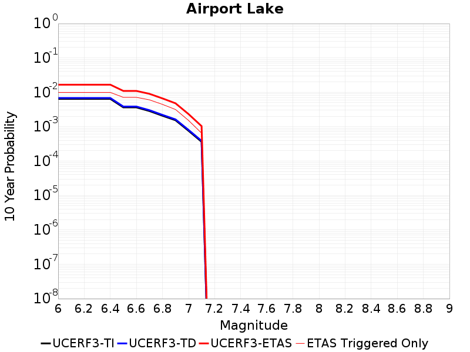 |

| Magnitude | 1 wk TI Prob | 1 wk TD Prob | 1 wk ETAS Prob | 1 wk ETAS/TD Gain | 1 wk ETAS Triggered Only | 1 mo TI Prob | 1 mo TD Prob | 1 mo ETAS Prob | 1 mo ETAS/TD Gain | 1 mo ETAS Triggered Only | 1 yr TI Prob | 1 yr TD Prob | 1 yr ETAS Prob | 1 yr ETAS/TD Gain | 1 yr ETAS Triggered Only | 10 yr TI Prob | 10 yr TD Prob | 10 yr ETAS Prob | 10 yr ETAS/TD Gain | 10 yr ETAS Triggered Only |
|-----|-----|-----|-----|-----|-----|-----|-----|-----|-----|-----|-----|-----|-----|-----|-----|-----|-----|-----|-----|-----|
| 6.0 | 1.2387061E-5 | 1.3107955E-5 | 1.3107955E-5 | 1.0 | 0.0 | 5.3086325E-5 | 5.6175904E-5 | 5.6175904E-5 | 1.0 | 0.0 | 6.461343E-4 | 6.8375544E-4 | 0.0030744642 | 4.4964385 | 0.0023923444 | 0.0064425888 | 0.0068193288 | 0.015135434 | 2.2194905 | 0.008373206 |
| 6.1 | 1.2387061E-5 | 1.3107955E-5 | 1.3107955E-5 | 1.0 | 0.0 | 5.3086325E-5 | 5.6175904E-5 | 5.6175904E-5 | 1.0 | 0.0 | 6.461343E-4 | 6.8375544E-4 | 0.0030744642 | 4.4964385 | 0.0023923444 | 0.0064425888 | 0.0068193288 | 0.015135434 | 2.2194905 | 0.008373206 |
| 6.2 | 1.2387061E-5 | 1.3107955E-5 | 1.3107955E-5 | 1.0 | 0.0 | 5.3086325E-5 | 5.6175904E-5 | 5.6175904E-5 | 1.0 | 0.0 | 6.461343E-4 | 6.8375544E-4 | 0.0030744642 | 4.4964385 | 0.0023923444 | 0.0064425888 | 0.0068193288 | 0.015135434 | 2.2194905 | 0.008373206 |
| 6.3 | 1.2387061E-5 | 1.3107955E-5 | 1.3107955E-5 | 1.0 | 0.0 | 5.3086325E-5 | 5.6175904E-5 | 5.6175904E-5 | 1.0 | 0.0 | 6.461343E-4 | 6.8375544E-4 | 0.0030744642 | 4.4964385 | 0.0023923444 | 0.0064425888 | 0.0068193288 | 0.015135434 | 2.2194905 | 0.008373206 |
| 6.4 | 1.2387061E-5 | 1.3107955E-5 | 1.3107955E-5 | 1.0 | 0.0 | 5.3086325E-5 | 5.6175904E-5 | 5.6175904E-5 | 1.0 | 0.0 | 6.461343E-4 | 6.8375544E-4 | 0.0030744642 | 4.4964385 | 0.0023923444 | 0.0064425888 | 0.0068193288 | 0.015135434 | 2.2194905 | 0.008373206 |
| 6.5 | 6.9922594E-6 | 7.3875517E-6 | 7.3875517E-6 | 1.0 | 0.0 | 2.996648E-5 | 3.166058E-5 | 3.166058E-5 | 1.0 | 0.0 | 3.6478083E-4 | 3.8540483E-4 | 0.0021789717 | 5.653722 | 0.0017942584 | 0.003641826 | 0.0038479022 | 0.010401534 | 2.7031703 | 0.0065789474 |
| 6.6 | 6.9922594E-6 | 7.3875517E-6 | 7.3875517E-6 | 1.0 | 0.0 | 2.996648E-5 | 3.166058E-5 | 3.166058E-5 | 1.0 | 0.0 | 3.6478083E-4 | 3.8540483E-4 | 0.0021789717 | 5.653722 | 0.0017942584 | 0.003641826 | 0.0038479022 | 0.010401534 | 2.7031703 | 0.0065789474 |
| 6.7 | 5.477277E-6 | 5.7881343E-6 | 5.7881343E-6 | 1.0 | 0.0 | 2.3473833E-5 | 2.4806075E-5 | 2.4806075E-5 | 1.0 | 0.0 | 2.8575645E-4 | 3.01976E-4 | 0.0020956926 | 6.939931 | 0.0017942584 | 0.0028538927 | 0.003016041 | 0.009575145 | 3.17474 | 0.0065789474 |
| 6.8 | 3.9950432E-6 | 4.220585E-6 | 4.220585E-6 | 1.0 | 0.0 | 1.7121502E-5 | 1.8088112E-5 | 1.8088112E-5 | 1.0 | 0.0 | 2.0843433E-4 | 2.2020328E-4 | 0.0020140666 | 9.146397 | 0.0017942584 | 0.0020823893 | 0.002200122 | 0.007571054 | 3.4411976 | 0.0053827753 |
| 6.9 | 2.95695E-6 | 3.124135E-6 | 3.124135E-6 | 1.0 | 0.0 | 1.2672582E-5 | 1.33890935E-5 | 1.33890935E-5 | 1.0 | 0.0 | 1.5427776E-4 | 1.6300229E-4 | 0.0013589796 | 8.337181 | 0.0011961722 | 0.001541707 | 0.0016290499 | 0.004614609 | 2.8326995 | 0.0029904307 |
| 7.0 | 1.456072E-6 | 1.5413797E-6 | 1.5413797E-6 | 1.0 | 0.0 | 6.2402937E-6 | 6.605902E-6 | 6.605902E-6 | 1.0 | 0.0 | 7.597293E-5 | 8.04249E-5 | 0.001276501 | 15.871963 | 0.0011961722 | 7.594696E-4 | 8.040569E-4 | 0.0019992674 | 2.486475 | 0.0011961722 |
| 7.1 | 6.995192E-7 | 7.411749E-7 | 7.411749E-7 | 1.0 | 0.0 | 2.997936E-6 | 3.176464E-6 | 3.176464E-6 | 1.0 | 0.0 | 3.649926E-5 | 3.8673446E-5 | 6.3673645E-4 | 16.464434 | 5.980861E-4 | 3.6493264E-4 | 3.8673446E-4 | 9.845893E-4 | 2.545905 | 5.980861E-4 |

## Panamint Valley
*[(top)](#table-of-contents)*

| 1 Week | 1 Month | 1 Year | 10 Year |
|-----|-----|-----|-----|
| 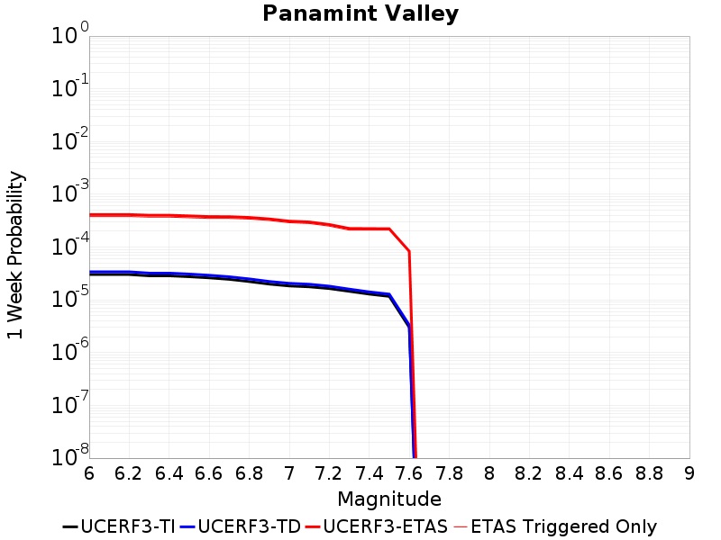 |  |  | 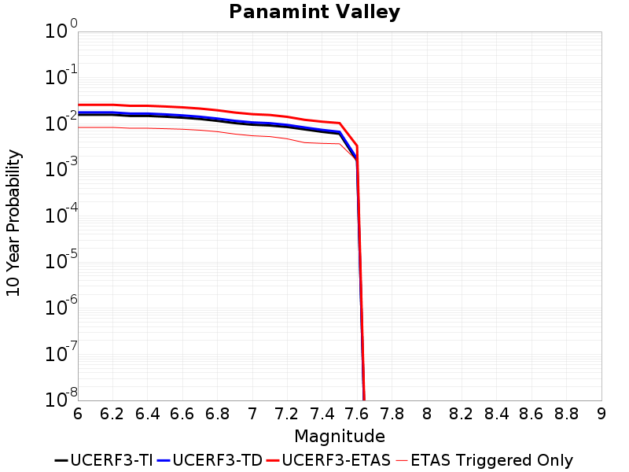 |

| Magnitude | 1 wk TI Prob | 1 wk TD Prob | 1 wk ETAS Prob | 1 wk ETAS/TD Gain | 1 wk ETAS Triggered Only | 1 mo TI Prob | 1 mo TD Prob | 1 mo ETAS Prob | 1 mo ETAS/TD Gain | 1 mo ETAS Triggered Only | 1 yr TI Prob | 1 yr TD Prob | 1 yr ETAS Prob | 1 yr ETAS/TD Gain | 1 yr ETAS Triggered Only | 10 yr TI Prob | 10 yr TD Prob | 10 yr ETAS Prob | 10 yr ETAS/TD Gain | 10 yr ETAS Triggered Only |
|-----|-----|-----|-----|-----|-----|-----|-----|-----|-----|-----|-----|-----|-----|-----|-----|-----|-----|-----|-----|-----|
| 6.0 | 3.0211835E-5 | 3.4027576E-5 | 0.0012301591 | 36.15183 | 0.0011961722 | 1.2947287E-4 | 1.458245E-4 | 0.0019398212 | 13.302438 | 0.0017942584 | 0.0015751923 | 0.001773997 | 0.005356148 | 3.0192542 | 0.0035885167 | 0.015640736 | 0.017605085 | 0.024655767 | 1.4004911 | 0.0071770335 |
| 6.1 | 3.0211835E-5 | 3.4027576E-5 | 0.0012301591 | 36.15183 | 0.0011961722 | 1.2947287E-4 | 1.458245E-4 | 0.0019398212 | 13.302438 | 0.0017942584 | 0.0015751923 | 0.001773997 | 0.005356148 | 3.0192542 | 0.0035885167 | 0.015640736 | 0.017605085 | 0.024655767 | 1.4004911 | 0.0071770335 |
| 6.2 | 3.0211835E-5 | 3.4027576E-5 | 0.0012301591 | 36.15183 | 0.0011961722 | 1.2947287E-4 | 1.458245E-4 | 0.0019398212 | 13.302438 | 0.0017942584 | 0.0015751923 | 0.001773997 | 0.005356148 | 3.0192542 | 0.0035885167 | 0.015640736 | 0.017605085 | 0.024655767 | 1.4004911 | 0.0071770335 |
| 6.3 | 2.8573924E-5 | 3.2143587E-5 | 0.0012282773 | 38.212204 | 0.0011961722 | 1.2245393E-4 | 1.3775112E-4 | 0.0019317623 | 14.023569 | 0.0017942584 | 0.001489857 | 0.0016758576 | 0.0052583604 | 3.1377132 | 0.0035885167 | 0.01479908 | 0.01663854 | 0.023696158 | 1.4241729 | 0.0071770335 |
| 6.4 | 2.8573924E-5 | 3.2143587E-5 | 0.0012282773 | 38.212204 | 0.0011961722 | 1.2245393E-4 | 1.3775112E-4 | 0.0019317623 | 14.023569 | 0.0017942584 | 0.001489857 | 0.0016758576 | 0.0052583604 | 3.1377132 | 0.0035885167 | 0.01479908 | 0.01663854 | 0.023696158 | 1.4241729 | 0.0071770335 |
| 6.5 | 2.7468774E-5 | 3.086786E-5 | 0.0012270032 | 39.750183 | 0.0011961722 | 1.1771801E-4 | 1.3228429E-4 | 0.0019263054 | 14.56186 | 0.0017942584 | 0.0014322745 | 0.0016093988 | 0.00519214 | 3.2261364 | 0.0035885167 | 0.014230782 | 0.015983673 | 0.02304599 | 1.4418458 | 0.0071770335 |
| 6.6 | 2.6135967E-5 | 2.9289933E-5 | 0.0012254271 | 41.837826 | 0.0011961722 | 1.1200648E-4 | 1.2552239E-4 | 0.0019195556 | 15.292535 | 0.0017942584 | 0.0013628257 | 0.0015271904 | 0.0051102266 | 3.3461623 | 0.0035885167 | 0.013544982 | 0.015173157 | 0.021652281 | 1.4270123 | 0.0065789474 |
| 6.7 | 2.4498746E-5 | 2.7376956E-5 | 0.0012235164 | 44.69147 | 0.0011961722 | 1.04990395E-4 | 1.1732468E-4 | 0.0019113725 | 16.29131 | 0.0017942584 | 0.0012775084 | 0.0014275172 | 0.0050109113 | 3.5102284 | 0.0035885167 | 0.012701893 | 0.0141894715 | 0.020675067 | 1.457071 | 0.0065789474 |
| 6.8 | 2.2244329E-5 | 2.4968662E-5 | 0.001221111 | 48.905746 | 0.0011961722 | 9.532935E-5 | 1.07004285E-4 | 0.0019010707 | 17.766304 | 0.0017942584 | 0.0011600169 | 0.0013020205 | 0.004885865 | 3.7525253 | 0.0035885167 | 0.011539802 | 0.012949522 | 0.019443275 | 1.5014666 | 0.0065789474 |
| 6.9 | 1.9902658E-5 | 2.2320957E-5 | 0.0012184666 | 54.58845 | 0.0011961722 | 8.529431E-5 | 9.5657844E-5 | 0.0018897445 | 19.755249 | 0.0017942584 | 0.0010379635 | 0.0011640305 | 0.00474837 | 4.079249 | 0.0035885167 | 0.010331288 | 0.011584251 | 0.01690467 | 1.4592804 | 0.0053827753 |
| 7.0 | 1.8353881E-5 | 2.0594833E-5 | 0.0012167424 | 59.079987 | 0.0011961722 | 7.865712E-5 | 8.8260684E-5 | 0.0018823607 | 21.327284 | 0.0017942584 | 9.5722964E-4 | 0.0010740618 | 0.004658724 | 4.3374825 | 0.0035885167 | 0.009531168 | 0.010693577 | 0.016018791 | 1.4979825 | 0.0053827753 |
| 7.1 | 1.7667631E-5 | 1.9799712E-5 | 0.0012159483 | 61.412422 | 0.0011961722 | 7.571623E-5 | 8.485325E-5 | 0.0018789594 | 22.143635 | 0.0017942584 | 9.2145515E-4 | 0.0010326162 | 0.0046174275 | 4.471581 | 0.0035885167 | 0.009176437 | 0.010283009 | 0.015610433 | 1.5180802 | 0.0053827753 |
| 7.2 | 1.6381597E-5 | 1.8182796E-5 | 6.1625807E-4 | 33.89237 | 5.980861E-4 | 7.020495E-5 | 7.7924036E-5 | 0.0012740031 | 16.349295 | 0.0011961722 | 8.544101E-4 | 9.483296E-4 | 0.0039359243 | 4.150376 | 0.0029904307 | 0.008511325 | 0.009447439 | 0.014186925 | 1.5016688 | 0.004784689 |
| 7.3 | 1.4520491E-5 | 1.5986683E-5 | 6.1406323E-4 | 38.410923 | 5.980861E-4 | 6.222919E-5 | 6.851265E-5 | 0.001264603 | 18.457949 | 0.0011961722 | 7.57377E-4 | 8.3383854E-4 | 0.0038217756 | 4.583352 | 0.0029904307 | 0.0075480095 | 0.008310122 | 0.01305505 | 1.5709816 | 0.004784689 |
| 7.4 | 1.2852287E-5 | 1.4163079E-5 | 6.1224075E-4 | 43.22794 | 5.980861E-4 | 5.5080065E-5 | 6.0697585E-5 | 0.0012567972 | 20.705885 | 0.0011961722 | 6.7039346E-4 | 7.387584E-4 | 0.0037269797 | 5.044924 | 0.0029904307 | 0.0066837464 | 0.0073658545 | 0.0121153 | 1.6447922 | 0.004784689 |
| 7.5 | 1.1637851E-5 | 1.2853794E-5 | 6.1093224E-4 | 47.52933 | 5.980861E-4 | 4.987555E-5 | 5.5086613E-5 | 0.001251193 | 22.713196 | 0.0011961722 | 6.070656E-4 | 6.7048887E-4 | 0.0036589145 | 5.4570847 | 0.0029904307 | 0.006054099 | 0.0066874716 | 0.011440163 | 1.7106858 | 0.004784689 |
| 7.6 | 3.0068115E-6 | 3.339613E-6 | 6.0142373E-4 | 180.08786 | 5.980861E-4 | 1.2886271E-5 | 1.431259E-5 | 0.0012104678 | 84.57363 | 0.0011961722 | 1.5687906E-4 | 1.7424916E-4 | 0.0025661767 | 14.727055 | 0.0023923444 | 0.0015676835 | 0.0017423073 | 0.0041304836 | 2.3706975 | 0.0023923444 |

## Garlock (East)
*[(top)](#table-of-contents)*

| 1 Week | 1 Month | 1 Year | 10 Year |
|-----|-----|-----|-----|
|  |  |  | 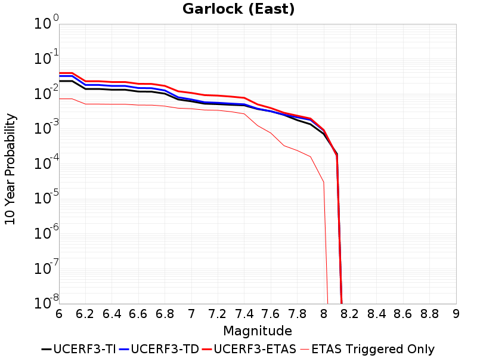 |

| Magnitude | 1 wk TI Prob | 1 wk TD Prob | 1 wk ETAS Prob | 1 wk ETAS/TD Gain | 1 wk ETAS Triggered Only | 1 mo TI Prob | 1 mo TD Prob | 1 mo ETAS Prob | 1 mo ETAS/TD Gain | 1 mo ETAS Triggered Only | 1 yr TI Prob | 1 yr TD Prob | 1 yr ETAS Prob | 1 yr ETAS/TD Gain | 1 yr ETAS Triggered Only | 10 yr TI Prob | 10 yr TD Prob | 10 yr ETAS Prob | 10 yr ETAS/TD Gain | 10 yr ETAS Triggered Only |
|-----|-----|-----|-----|-----|-----|-----|-----|-----|-----|-----|-----|-----|-----|-----|-----|-----|-----|-----|-----|-----|
| 6.0 | 4.5092507E-5 | 6.3096784E-5 | 6.611452E-4 | 10.478271 | 5.980861E-4 | 1.9323928E-4 | 2.7038928E-4 | 8.683137E-4 | 3.2113464 | 5.980861E-4 | 0.0023501497 | 0.0032874674 | 0.004479707 | 1.3626621 | 0.0011961722 | 0.023254504 | 0.032392453 | 0.037600867 | 1.1607909 | 0.0053827753 |
| 6.1 | 4.5092507E-5 | 6.3096784E-5 | 6.611452E-4 | 10.478271 | 5.980861E-4 | 1.9323928E-4 | 2.7038928E-4 | 8.683137E-4 | 3.2113464 | 5.980861E-4 | 0.0023501497 | 0.0032874674 | 0.004479707 | 1.3626621 | 0.0011961722 | 0.023254504 | 0.032392453 | 0.037600867 | 1.1607909 | 0.0053827753 |
| 6.2 | 2.6674514E-5 | 3.4665496E-5 | 6.327309E-4 | 18.252468 | 5.980861E-4 | 1.1431433E-4 | 1.4855815E-4 | 7.465554E-4 | 5.0253415 | 5.980861E-4 | 0.0013908884 | 0.0018072282 | 0.0024042334 | 1.330343 | 5.980861E-4 | 0.01382215 | 0.017979432 | 0.02150343 | 1.1960016 | 0.0035885167 |
| 6.3 | 2.6674514E-5 | 3.4665496E-5 | 6.327309E-4 | 18.252468 | 5.980861E-4 | 1.1431433E-4 | 1.4855815E-4 | 7.465554E-4 | 5.0253415 | 5.980861E-4 | 0.0013908884 | 0.0018072282 | 0.0024042334 | 1.330343 | 5.980861E-4 | 0.01382215 | 0.017979432 | 0.02150343 | 1.1960016 | 0.0035885167 |
| 6.4 | 2.5312667E-5 | 3.249203E-5 | 6.305587E-4 | 19.406567 | 5.980861E-4 | 1.0847834E-4 | 1.392443E-4 | 7.372471E-4 | 5.294631 | 5.980861E-4 | 0.0013199237 | 0.0016940106 | 0.0022910836 | 1.3524612 | 5.980861E-4 | 0.013121112 | 0.01684899 | 0.020377044 | 1.2093925 | 0.0035885167 |
| 6.5 | 2.5312667E-5 | 3.249203E-5 | 6.305587E-4 | 19.406567 | 5.980861E-4 | 1.0847834E-4 | 1.392443E-4 | 7.372471E-4 | 5.294631 | 5.980861E-4 | 0.0013199237 | 0.0016940106 | 0.0022910836 | 1.3524612 | 5.980861E-4 | 0.013121112 | 0.01684899 | 0.020377044 | 1.2093925 | 0.0035885167 |
| 6.6 | 2.246556E-5 | 2.827492E-5 | 6.263441E-4 | 22.151932 | 5.980861E-4 | 9.627742E-5 | 1.21172736E-4 | 7.191864E-4 | 5.935216 | 5.980861E-4 | 0.0011715472 | 0.0014743034 | 0.0020715077 | 1.4050757 | 5.980861E-4 | 0.011653901 | 0.014686407 | 0.01822222 | 1.2407542 | 0.0035885167 |
| 6.7 | 2.2241198E-5 | 2.794393E-5 | 6.260133E-4 | 22.40248 | 5.980861E-4 | 9.531594E-5 | 1.1975434E-4 | 7.1776885E-4 | 5.993677 | 5.980861E-4 | 0.0011598538 | 0.0014570577 | 0.0020542722 | 1.4098772 | 5.980861E-4 | 0.011538187 | 0.014516912 | 0.018053334 | 1.243607 | 0.0035885167 |
| 6.8 | 1.9528685E-5 | 2.4027513E-5 | 6.2209927E-4 | 25.89112 | 5.980861E-4 | 8.369167E-5 | 1.02971106E-4 | 7.009956E-4 | 6.807693 | 5.980861E-4 | 0.0010184698 | 0.0012529719 | 0.0018503087 | 1.476736 | 5.980861E-4 | 0.010138147 | 0.012503268 | 0.016046917 | 1.2834178 | 0.0035885167 |
| 6.9 | 1.3318621E-5 | 1.5303744E-5 | 6.133807E-4 | 40.080437 | 5.980861E-4 | 5.7078556E-5 | 6.558585E-5 | 6.6363276E-4 | 10.118535 | 5.980861E-4 | 6.9470983E-4 | 7.98221E-4 | 0.0013958297 | 1.7486758 | 5.980861E-4 | 0.0069254204 | 0.007994287 | 0.010367506 | 1.2968644 | 0.0023923444 |
| 7.0 | 1.1760853E-5 | 1.3209086E-5 | 6.112873E-4 | 46.27779 | 5.980861E-4 | 5.0402683E-5 | 5.660917E-5 | 6.5466145E-4 | 11.564583 | 5.980861E-4 | 6.134799E-4 | 6.8900373E-4 | 0.0012866778 | 1.8674468 | 5.980861E-4 | 0.0061178906 | 0.0069092386 | 0.009285054 | 1.3438606 | 0.0023923444 |
| 7.1 | 1.0064758E-5 | 1.1000849E-5 | 6.0908037E-4 | 55.366676 | 5.980861E-4 | 4.3133965E-5 | 4.7145662E-5 | 6.452036E-4 | 13.685323 | 5.980861E-4 | 5.2502943E-4 | 5.738508E-4 | 0.0011715937 | 2.0416348 | 5.980861E-4 | 0.005237907 | 0.0057635303 | 0.008142087 | 1.4126909 | 0.0023923444 |
| 7.2 | 9.768808E-6 | 1.0596057E-5 | 6.086758E-4 | 57.443615 | 5.980861E-4 | 4.186565E-5 | 4.5410903E-5 | 6.4346986E-4 | 14.169942 | 5.980861E-4 | 5.095951E-4 | 5.5274105E-4 | 0.0011504965 | 2.0814388 | 5.980861E-4 | 0.0050842804 | 0.0055533615 | 0.00793242 | 1.4283998 | 0.0023923444 |
| 7.3 | 9.344516E-6 | 1.00399175E-5 | 6.0812006E-4 | 60.570225 | 5.980861E-4 | 4.004731E-5 | 4.302753E-5 | 6.4108794E-4 | 14.899484 | 5.980861E-4 | 4.8746695E-4 | 5.237377E-4 | 0.0011215106 | 2.1413593 | 5.980861E-4 | 0.0048639905 | 0.0052641365 | 0.0076438873 | 1.4520686 | 0.0023923444 |
| 7.4 | 9.023491E-6 | 9.584235E-6 | 9.584235E-6 | 1.0 | 0.0 | 3.867153E-5 | 4.1074665E-5 | 4.1074665E-5 | 1.0 | 0.0 | 4.7072413E-4 | 4.9997267E-4 | 4.9997267E-4 | 1.0 | 0.0 | 0.004697283 | 0.0050266264 | 0.0068118656 | 1.3551565 | 0.0017942584 |
| 7.5 | 7.081253E-6 | 7.1710833E-6 | 7.1710833E-6 | 1.0 | 0.0 | 3.0347876E-5 | 3.0732856E-5 | 3.0732856E-5 | 1.0 | 0.0 | 3.6942272E-4 | 3.7410905E-4 | 3.7410905E-4 | 1.0 | 0.0 | 0.003688092 | 0.003767536 | 0.0043633687 | 1.1581492 | 5.980861E-4 |
| 7.6 | 6.116396E-6 | 6.035786E-6 | 6.035786E-6 | 1.0 | 0.0 | 2.6212863E-5 | 2.5867399E-5 | 2.5867399E-5 | 1.0 | 0.0 | 3.1909486E-4 | 3.1489035E-4 | 3.1489035E-4 | 1.0 | 0.0 | 0.0031863707 | 0.0031753853 | 0.0037715721 | 1.1877526 | 5.980861E-4 |
| 7.7 | 4.797145E-6 | 4.829642E-6 | 4.829642E-6 | 1.0 | 0.0 | 2.055903E-5 | 2.0698302E-5 | 2.0698302E-5 | 1.0 | 0.0 | 2.5027743E-4 | 2.5197282E-4 | 2.5197282E-4 | 1.0 | 0.0 | 0.0024999576 | 0.0025469405 | 0.0031435033 | 1.2342272 | 5.980861E-4 |
| 7.8 | 3.4028885E-6 | 4.0431487E-6 | 4.0431487E-6 | 1.0 | 0.0 | 1.4583726E-5 | 1.7327666E-5 | 1.7327666E-5 | 1.0 | 0.0 | 1.775424E-4 | 2.1094398E-4 | 2.1094398E-4 | 1.0 | 0.0 | 0.0017740062 | 0.0021349082 | 0.0027317177 | 1.2795479 | 5.980861E-4 |
| 7.9 | 2.5928412E-6 | 3.4272075E-6 | 3.4272075E-6 | 1.0 | 0.0 | 1.1112129E-5 | 1.4687949E-5 | 1.4687949E-5 | 1.0 | 0.0 | 1.3528178E-4 | 1.7881118E-4 | 1.7881118E-4 | 1.0 | 0.0 | 0.0013519945 | 0.0018096669 | 0.0018096669 | 1.0 | 0.0 |
| 8.0 | 1.3743648E-6 | 1.6982893E-6 | 1.6982893E-6 | 1.0 | 0.0 | 5.8901214E-6 | 7.278363E-6 | 7.278363E-6 | 1.0 | 0.0 | 7.1709874E-5 | 8.86105E-5 | 8.86105E-5 | 1.0 | 0.0 | 7.1686733E-4 | 8.9659134E-4 | 8.9659134E-4 | 1.0 | 0.0 |
| 8.1 | 3.6733252E-7 | 3.193119E-7 | 3.193119E-7 | 1.0 | 0.0 | 1.5742813E-6 | 1.368479E-6 | 1.368479E-6 | 1.0 | 0.0 | 1.9166706E-5 | 1.666112E-5 | 1.666112E-5 | 1.0 | 0.0 | 1.9165053E-4 | 1.6865862E-4 | 1.6865862E-4 | 1.0 | 0.0 |

## Hunter Mountain-Saline Valley
*[(top)](#table-of-contents)*

| 1 Week | 1 Month | 1 Year | 10 Year |
|-----|-----|-----|-----|
|  |  | 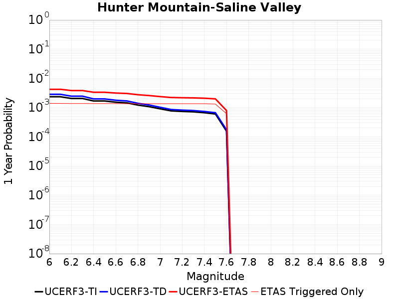 |  |

| Magnitude | 1 wk TI Prob | 1 wk TD Prob | 1 wk ETAS Prob | 1 wk ETAS/TD Gain | 1 wk ETAS Triggered Only | 1 mo TI Prob | 1 mo TD Prob | 1 mo ETAS Prob | 1 mo ETAS/TD Gain | 1 mo ETAS Triggered Only | 1 yr TI Prob | 1 yr TD Prob | 1 yr ETAS Prob | 1 yr ETAS/TD Gain | 1 yr ETAS Triggered Only | 10 yr TI Prob | 10 yr TD Prob | 10 yr ETAS Prob | 10 yr ETAS/TD Gain | 10 yr ETAS Triggered Only |
|-----|-----|-----|-----|-----|-----|-----|-----|-----|-----|-----|-----|-----|-----|-----|-----|-----|-----|-----|-----|-----|
| 6.0 | 4.5103672E-5 | 5.4651133E-5 | 6.5270456E-4 | 11.943111 | 5.980861E-4 | 1.9328714E-4 | 2.3419896E-4 | 0.0014300911 | 6.1063085 | 0.0011961722 | 0.002350731 | 0.0028478208 | 0.005829735 | 2.0470865 | 0.0029904307 | 0.023260195 | 0.02813353 | 0.03278361 | 1.1652861 | 0.004784689 |
| 6.1 | 4.5103672E-5 | 5.4651133E-5 | 6.5270456E-4 | 11.943111 | 5.980861E-4 | 1.9328714E-4 | 2.3419896E-4 | 0.0014300911 | 6.1063085 | 0.0011961722 | 0.002350731 | 0.0028478208 | 0.005829735 | 2.0470865 | 0.0029904307 | 0.023260195 | 0.02813353 | 0.03278361 | 1.1652861 | 0.004784689 |
| 6.2 | 3.9363465E-5 | 4.7130747E-5 | 6.451887E-4 | 13.689337 | 5.980861E-4 | 1.6868966E-4 | 2.0197415E-4 | 0.0013979048 | 6.9212065 | 0.0011961722 | 0.002051862 | 0.0024563954 | 0.0054394803 | 2.2144156 | 0.0029904307 | 0.020330196 | 0.024308125 | 0.028976506 | 1.1920503 | 0.004784689 |
| 6.3 | 3.9363465E-5 | 4.7130747E-5 | 6.451887E-4 | 13.689337 | 5.980861E-4 | 1.6868966E-4 | 2.0197415E-4 | 0.0013979048 | 6.9212065 | 0.0011961722 | 0.002051862 | 0.0024563954 | 0.0054394803 | 2.2144156 | 0.0029904307 | 0.020330196 | 0.024308125 | 0.028976506 | 1.1920503 | 0.004784689 |
| 6.4 | 3.2311684E-5 | 3.8002752E-5 | 6.3606614E-4 | 16.737371 | 5.980861E-4 | 1.384713E-4 | 1.6285917E-4 | 0.0013588367 | 8.34363 | 0.0011961722 | 0.0016845843 | 0.0019810768 | 0.004965583 | 2.5065072 | 0.0029904307 | 0.016718714 | 0.01964287 | 0.024333574 | 1.2387993 | 0.004784689 |
| 6.5 | 3.2311684E-5 | 3.8002752E-5 | 6.3606614E-4 | 16.737371 | 5.980861E-4 | 1.384713E-4 | 1.6285917E-4 | 0.0013588367 | 8.34363 | 0.0011961722 | 0.0016845843 | 0.0019810768 | 0.004965583 | 2.5065072 | 0.0029904307 | 0.016718714 | 0.01964287 | 0.024333574 | 1.2387993 | 0.004784689 |
| 6.6 | 2.9305844E-5 | 3.422761E-5 | 6.322933E-4 | 18.473192 | 5.980861E-4 | 1.2559042E-4 | 1.4668186E-4 | 0.0013426787 | 9.153678 | 0.0011961722 | 0.0015279909 | 0.0017844507 | 0.004769545 | 2.6728365 | 0.0029904307 | 0.015175272 | 0.017709067 | 0.022409024 | 1.2653983 | 0.004784689 |
| 6.7 | 2.7826512E-5 | 3.2387212E-5 | 6.30454E-4 | 19.466139 | 5.980861E-4 | 1.19251024E-4 | 1.387953E-4 | 0.0013348015 | 9.617052 | 0.0011961722 | 0.0014509142 | 0.0016885832 | 0.0046739643 | 2.7679799 | 0.0029904307 | 0.014414776 | 0.016765153 | 0.021469627 | 1.2806102 | 0.004784689 |
| 6.8 | 2.3389874E-5 | 2.6901498E-5 | 6.249715E-4 | 23.23185 | 5.980861E-4 | 1.0023846E-4 | 1.1528731E-4 | 0.0013113216 | 11.37438 | 0.0011961722 | 0.00121972 | 0.0014027667 | 0.0043890025 | 3.1288188 | 0.0029904307 | 0.01213047 | 0.013945266 | 0.018663231 | 1.3383203 | 0.004784689 |
| 6.9 | 2.069209E-5 | 2.3600174E-5 | 6.216722E-4 | 26.341846 | 5.980861E-4 | 8.867737E-5 | 1.01139885E-4 | 0.0012971911 | 12.825713 | 0.0011961722 | 0.0010791123 | 0.0012307188 | 0.004217469 | 3.426834 | 0.0029904307 | 0.010738871 | 0.01224399 | 0.016970096 | 1.3859938 | 0.004784689 |
| 7.0 | 1.7462342E-5 | 1.9658228E-5 | 6.177326E-4 | 31.423616 | 5.980861E-4 | 7.483646E-5 | 8.424695E-5 | 0.0012803185 | 15.197207 | 0.0011961722 | 9.1075303E-4 | 0.0010252467 | 0.004012611 | 3.9138007 | 0.0029904307 | 0.009070295 | 0.010208727 | 0.01494457 | 1.4639015 | 0.004784689 |
| 7.1 | 1.4807709E-5 | 1.6462338E-5 | 6.145386E-4 | 37.329975 | 5.980861E-4 | 6.3460066E-5 | 7.055106E-5 | 0.0012666389 | 17.953506 | 0.0011961722 | 7.723524E-4 | 8.586372E-4 | 0.0038465 | 4.4797735 | 0.0029904307 | 0.007696735 | 0.008556108 | 0.013299858 | 1.5544286 | 0.004784689 |
| 7.2 | 1.4180048E-5 | 1.5718057E-5 | 6.137948E-4 | 39.050297 | 5.980861E-4 | 6.077022E-5 | 6.7361456E-5 | 0.0012634532 | 18.75632 | 0.0011961722 | 7.396263E-4 | 8.1983337E-4 | 0.0038078125 | 4.644617 | 0.0029904307 | 0.0073716943 | 0.008170964 | 0.012916558 | 1.5807874 | 0.004784689 |
| 7.3 | 1.3730402E-5 | 1.5191197E-5 | 6.1326823E-4 | 40.369976 | 5.980861E-4 | 5.8843252E-5 | 6.5103595E-5 | 0.001261198 | 19.37217 | 0.0011961722 | 7.161811E-4 | 7.923642E-4 | 0.0037804253 | 4.7710705 | 0.0029904307 | 0.007138774 | 0.007898247 | 0.012645145 | 1.6010066 | 0.004784689 |
| 7.4 | 1.2810095E-5 | 1.4126829E-5 | 6.122045E-4 | 43.3363 | 5.980861E-4 | 5.489925E-5 | 6.054224E-5 | 0.001256642 | 20.756453 | 0.0011961722 | 6.681934E-4 | 7.3686836E-4 | 0.0037250954 | 5.0553064 | 0.0029904307 | 0.006661878 | 0.0073470697 | 0.012096605 | 1.646453 | 0.004784689 |
| 7.5 | 1.1595659E-5 | 1.2817544E-5 | 6.10896E-4 | 47.660923 | 5.980861E-4 | 4.9694736E-5 | 5.4931264E-5 | 0.0012510378 | 22.774605 | 0.0011961722 | 6.0486543E-4 | 6.6859863E-4 | 0.00365703 | 5.4696937 | 0.0029904307 | 0.006032217 | 0.006668674 | 0.011421455 | 1.7127026 | 0.004784689 |
| 7.6 | 2.997694E-6 | 3.3317156E-6 | 6.014159E-4 | 180.51236 | 5.980861E-4 | 1.28471975E-5 | 1.4278744E-5 | 0.0012104339 | 84.771736 | 0.0011961722 | 1.564034E-4 | 1.7383715E-4 | 0.0025657658 | 14.759594 | 0.0023923444 | 0.0015629337 | 0.0017382054 | 0.0041263914 | 2.3739378 | 0.0023923444 |

## McLean Lake
*[(top)](#table-of-contents)*

| 1 Week | 1 Month | 1 Year | 10 Year |
|-----|-----|-----|-----|
|  |  | 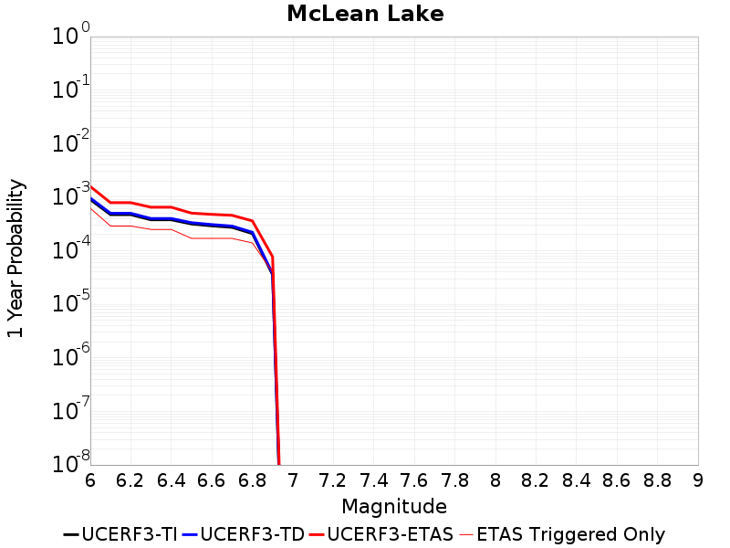 |  |

| Magnitude | 1 wk TI Prob | 1 wk TD Prob | 1 wk ETAS Prob | 1 wk ETAS/TD Gain | 1 wk ETAS Triggered Only | 1 mo TI Prob | 1 mo TD Prob | 1 mo ETAS Prob | 1 mo ETAS/TD Gain | 1 mo ETAS Triggered Only | 1 yr TI Prob | 1 yr TD Prob | 1 yr ETAS Prob | 1 yr ETAS/TD Gain | 1 yr ETAS Triggered Only | 10 yr TI Prob | 10 yr TD Prob | 10 yr ETAS Prob | 10 yr ETAS/TD Gain | 10 yr ETAS Triggered Only |
|-----|-----|-----|-----|-----|-----|-----|-----|-----|-----|-----|-----|-----|-----|-----|-----|-----|-----|-----|-----|-----|
| 6.0 | 1.7360222E-5 | 1.8509343E-5 | 6.165844E-4 | 33.31206 | 5.980861E-4 | 7.439883E-5 | 7.932362E-5 | 0.001275401 | 16.078451 | 0.0011961722 | 9.0542925E-4 | 9.653858E-4 | 0.0021604034 | 2.2378652 | 0.0011961722 | 0.009017491 | 0.009616767 | 0.013763108 | 1.4311575 | 0.004186603 |
| 6.1 | 9.062689E-6 | 9.595746E-6 | 6.076761E-4 | 63.327663 | 5.980861E-4 | 3.8839516E-5 | 4.1124025E-5 | 0.0012372471 | 30.085749 | 0.0011961722 | 4.727685E-4 | 5.005789E-4 | 0.0016961524 | 3.3883817 | 0.0011961722 | 0.0047176396 | 0.004995397 | 0.007970889 | 1.5956469 | 0.0029904307 |
| 6.2 | 9.062689E-6 | 9.595746E-6 | 6.076761E-4 | 63.327663 | 5.980861E-4 | 3.8839516E-5 | 4.1124025E-5 | 0.0012372471 | 30.085749 | 0.0011961722 | 4.727685E-4 | 5.005789E-4 | 0.0016961524 | 3.3883817 | 0.0011961722 | 0.0047176396 | 0.004995397 | 0.007970889 | 1.5956469 | 0.0029904307 |
| 6.3 | 7.2575485E-6 | 7.6704555E-6 | 6.05752E-4 | 78.9721 | 5.980861E-4 | 3.110341E-5 | 3.2873006E-5 | 0.001229006 | 37.38648 | 0.0011961722 | 3.786182E-4 | 4.0016248E-4 | 0.001595856 | 3.9880202 | 0.0011961722 | 0.0037797375 | 0.0039951243 | 0.006973608 | 1.7455295 | 0.0029904307 |
| 6.4 | 7.2575485E-6 | 7.6704555E-6 | 6.05752E-4 | 78.9721 | 5.980861E-4 | 3.110341E-5 | 3.2873006E-5 | 0.001229006 | 37.38648 | 0.0011961722 | 3.786182E-4 | 4.0016248E-4 | 0.001595856 | 3.9880202 | 0.0011961722 | 0.0037797375 | 0.0039951243 | 0.006973608 | 1.7455295 | 0.0029904307 |
| 6.5 | 6.06582E-6 | 6.4061387E-6 | 6.044884E-4 | 94.36081 | 5.980861E-4 | 2.5996113E-5 | 2.7454627E-5 | 6.255243E-4 | 22.783932 | 5.980861E-4 | 3.164567E-4 | 3.342153E-4 | 9.321015E-4 | 2.7889254 | 5.980861E-4 | 0.0031600643 | 0.0033377658 | 0.005722125 | 1.714358 | 0.0023923444 |
| 6.6 | 5.598744E-6 | 5.912346E-6 | 6.0399494E-4 | 102.15826 | 5.980861E-4 | 2.3994397E-5 | 2.5338415E-5 | 6.234094E-4 | 24.60333 | 5.980861E-4 | 2.9209262E-4 | 3.0845794E-4 | 9.063596E-4 | 2.938357 | 5.980861E-4 | 0.0029170897 | 0.0030809275 | 0.004869658 | 1.5805818 | 0.0017942584 |
| 6.7 | 5.246996E-6 | 5.5411165E-6 | 6.036239E-4 | 108.93544 | 5.980861E-4 | 2.2486933E-5 | 2.3747461E-5 | 6.218194E-4 | 26.184668 | 5.980861E-4 | 2.73744E-4 | 2.8909332E-4 | 8.870066E-4 | 3.0682359 | 5.980861E-4 | 0.0027340704 | 0.0028877968 | 0.004676874 | 1.6195301 | 0.0017942584 |
| 6.8 | 4.02324E-6 | 4.2484007E-6 | 6.02332E-4 | 141.77853 | 5.980861E-4 | 1.7242342E-5 | 1.8207338E-5 | 6.162826E-4 | 33.848034 | 5.980861E-4 | 2.099053E-4 | 2.2165774E-4 | 8.196113E-4 | 3.6976435 | 5.980861E-4 | 0.0020970714 | 0.0022149514 | 0.0028117127 | 1.2694242 | 5.980861E-4 |
| 6.9 | 6.835972E-7 | 7.141938E-7 | 7.141938E-7 | 1.0 | 0.0 | 2.9296991E-6 | 3.0608287E-6 | 3.0608287E-6 | 1.0 | 0.0 | 3.56685E-5 | 3.7265272E-5 | 3.7265272E-5 | 1.0 | 0.0 | 3.5662777E-4 | 3.726215E-4 | 3.726215E-4 | 1.0 | 0.0 |

## Ash Hill
*[(top)](#table-of-contents)*

| 1 Week | 1 Month | 1 Year | 10 Year |
|-----|-----|-----|-----|
|  |  | 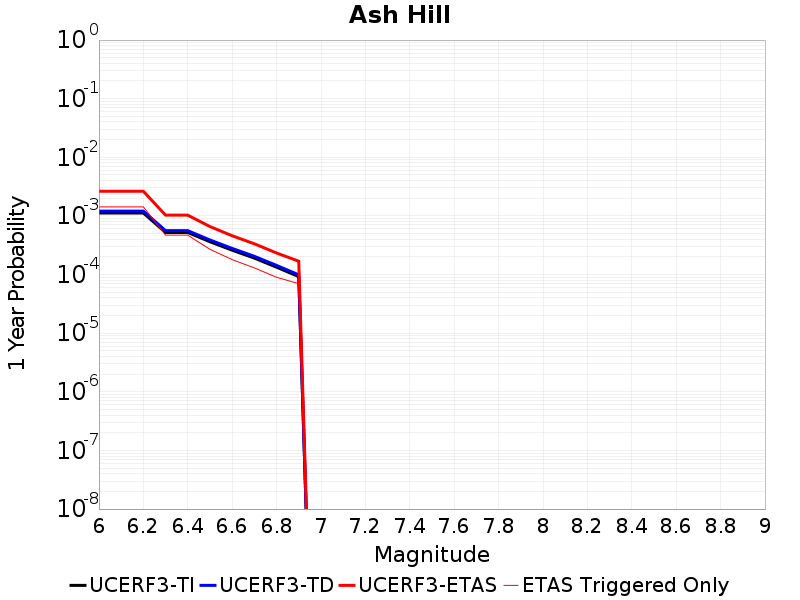 | 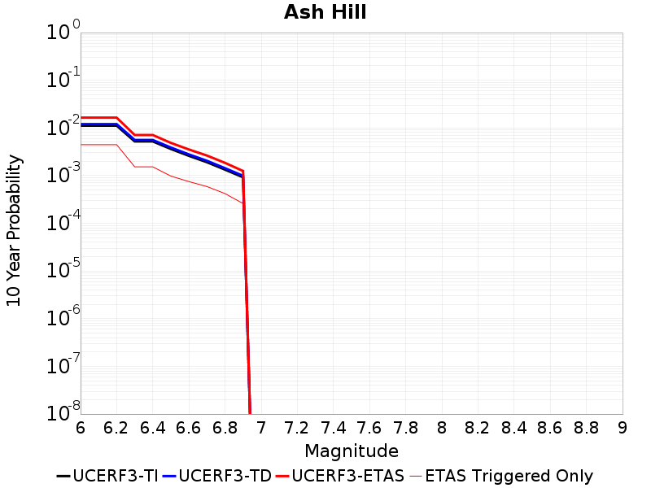 |

| Magnitude | 1 wk TI Prob | 1 wk TD Prob | 1 wk ETAS Prob | 1 wk ETAS/TD Gain | 1 wk ETAS Triggered Only | 1 mo TI Prob | 1 mo TD Prob | 1 mo ETAS Prob | 1 mo ETAS/TD Gain | 1 mo ETAS Triggered Only | 1 yr TI Prob | 1 yr TD Prob | 1 yr ETAS Prob | 1 yr ETAS/TD Gain | 1 yr ETAS Triggered Only | 10 yr TI Prob | 10 yr TD Prob | 10 yr ETAS Prob | 10 yr ETAS/TD Gain | 10 yr ETAS Triggered Only |
|-----|-----|-----|-----|-----|-----|-----|-----|-----|-----|-----|-----|-----|-----|-----|-----|-----|-----|-----|-----|-----|
| 6.0 | 2.1545662E-5 | 2.3205692E-5 | 2.3205692E-5 | 1.0 | 0.0 | 9.2335285E-5 | 9.944963E-5 | 9.944963E-5 | 1.0 | 0.0 | 0.0011236023 | 0.0012102068 | 0.0024049315 | 1.987207 | 0.0011961722 | 0.011179381 | 0.012044155 | 0.014998568 | 1.2452985 | 0.0029904307 |
| 6.1 | 2.1545662E-5 | 2.3205692E-5 | 2.3205692E-5 | 1.0 | 0.0 | 9.2335285E-5 | 9.944963E-5 | 9.944963E-5 | 1.0 | 0.0 | 0.0011236023 | 0.0012102068 | 0.0024049315 | 1.987207 | 0.0011961722 | 0.011179381 | 0.012044155 | 0.014998568 | 1.2452985 | 0.0029904307 |
| 6.2 | 2.1545662E-5 | 2.3205692E-5 | 2.3205692E-5 | 1.0 | 0.0 | 9.2335285E-5 | 9.944963E-5 | 9.944963E-5 | 1.0 | 0.0 | 0.0011236023 | 0.0012102068 | 0.0024049315 | 1.987207 | 0.0011961722 | 0.011179381 | 0.012044155 | 0.014998568 | 1.2452985 | 0.0029904307 |
| 6.3 | 1.0025529E-5 | 1.0751831E-5 | 1.0751831E-5 | 1.0 | 0.0 | 4.2965847E-5 | 4.6078538E-5 | 4.6078538E-5 | 1.0 | 0.0 | 5.229836E-4 | 5.6087505E-4 | 0.0011586257 | 2.0657465 | 5.980861E-4 | 0.005217545 | 0.0055959085 | 0.006785387 | 1.2125622 | 0.0011961722 |
| 6.4 | 1.0025529E-5 | 1.0751831E-5 | 1.0751831E-5 | 1.0 | 0.0 | 4.2965847E-5 | 4.6078538E-5 | 4.6078538E-5 | 1.0 | 0.0 | 5.229836E-4 | 5.6087505E-4 | 0.0011586257 | 2.0657465 | 5.980861E-4 | 0.005217545 | 0.0055959085 | 0.006785387 | 1.2125622 | 0.0011961722 |
| 6.5 | 6.9617327E-6 | 7.4599902E-6 | 7.4599902E-6 | 1.0 | 0.0 | 2.9835655E-5 | 3.1971045E-5 | 3.1971045E-5 | 1.0 | 0.0 | 3.6318856E-4 | 3.891866E-4 | 9.8704E-4 | 2.5361612 | 5.980861E-4 | 0.0036259557 | 0.0038859057 | 0.0050774296 | 1.3066272 | 0.0011961722 |
| 6.6 | 4.9919777E-6 | 5.3490935E-6 | 5.3490935E-6 | 1.0 | 0.0 | 2.1394015E-5 | 2.2924523E-5 | 2.2924523E-5 | 1.0 | 0.0 | 2.60441E-4 | 2.7907704E-4 | 8.7699626E-4 | 3.142488 | 5.980861E-4 | 0.0026013597 | 0.0027879248 | 0.0039807623 | 1.4278585 | 0.0011961722 |
| 6.7 | 3.6630722E-6 | 3.9263978E-6 | 3.9263978E-6 | 1.0 | 0.0 | 1.5698786E-5 | 1.6827344E-5 | 1.6827344E-5 | 1.0 | 0.0 | 1.9111596E-4 | 2.0485939E-4 | 2.0485939E-4 | 1.0 | 0.0 | 0.0019095168 | 0.002047269 | 0.002047269 | 1.0 | 0.0 |
| 6.8 | 2.5599613E-6 | 2.7461808E-6 | 2.7461808E-6 | 1.0 | 0.0 | 1.0971216E-5 | 1.1769321E-5 | 1.1769321E-5 | 1.0 | 0.0 | 1.3356637E-4 | 1.43287E-4 | 1.43287E-4 | 1.0 | 0.0 | 0.0013348613 | 0.0014324316 | 0.0014324316 | 1.0 | 0.0 |
| 6.9 | 1.7684905E-6 | 1.8977425E-6 | 1.8977425E-6 | 1.0 | 0.0 | 7.579223E-6 | 8.133183E-6 | 8.133183E-6 | 1.0 | 0.0 | 9.2273134E-5 | 9.90215E-5 | 9.90215E-5 | 1.0 | 0.0 | 9.223483E-4 | 9.90215E-4 | 9.90215E-4 | 1.0 | 0.0 |

## Gravel Hills-Harper Lk
*[(top)](#table-of-contents)*

| 1 Week | 1 Month | 1 Year | 10 Year |
|-----|-----|-----|-----|
|  | 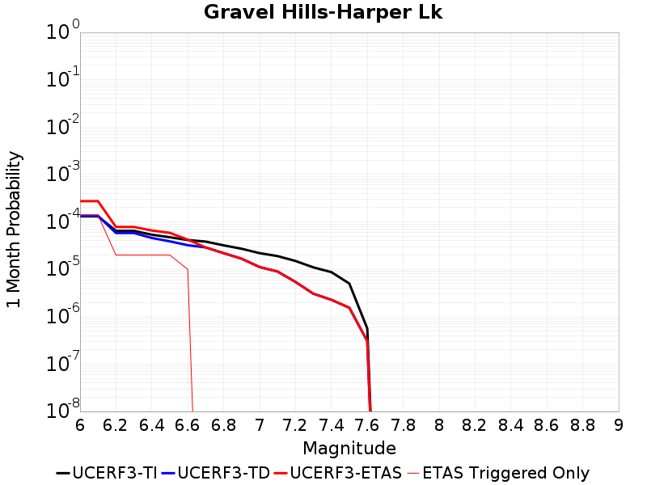 |  |  |

| Magnitude | 1 wk TI Prob | 1 wk TD Prob | 1 wk ETAS Prob | 1 wk ETAS/TD Gain | 1 wk ETAS Triggered Only | 1 mo TI Prob | 1 mo TD Prob | 1 mo ETAS Prob | 1 mo ETAS/TD Gain | 1 mo ETAS Triggered Only | 1 yr TI Prob | 1 yr TD Prob | 1 yr ETAS Prob | 1 yr ETAS/TD Gain | 1 yr ETAS Triggered Only | 10 yr TI Prob | 10 yr TD Prob | 10 yr ETAS Prob | 10 yr ETAS/TD Gain | 10 yr ETAS Triggered Only |
|-----|-----|-----|-----|-----|-----|-----|-----|-----|-----|-----|-----|-----|-----|-----|-----|-----|-----|-----|-----|-----|
| 6.0 | 3.0679566E-5 | 3.1490617E-5 | 3.1490617E-5 | 1.0 | 0.0 | 1.3147724E-4 | 1.3495403E-4 | 1.3495403E-4 | 1.0 | 0.0 | 0.0015995599 | 0.0016420444 | 0.0016420444 | 1.0 | 0.0 | 0.015880952 | 0.016320726 | 0.018674025 | 1.1441909 | 0.0023923444 |
| 6.1 | 3.0679566E-5 | 3.1490617E-5 | 3.1490617E-5 | 1.0 | 0.0 | 1.3147724E-4 | 1.3495403E-4 | 1.3495403E-4 | 1.0 | 0.0 | 0.0015995599 | 0.0016420444 | 0.0016420444 | 1.0 | 0.0 | 0.015880952 | 0.016320726 | 0.018674025 | 1.1441909 | 0.0023923444 |
| 6.2 | 1.514536E-5 | 1.3644336E-5 | 1.3644336E-5 | 1.0 | 0.0 | 6.490707E-5 | 5.847448E-5 | 5.847448E-5 | 1.0 | 0.0 | 7.8995706E-4 | 7.117062E-4 | 7.117062E-4 | 1.0 | 0.0 | 0.007871548 | 0.007095472 | 0.007095472 | 1.0 | 0.0 |
| 6.3 | 1.514536E-5 | 1.3644336E-5 | 1.3644336E-5 | 1.0 | 0.0 | 6.490707E-5 | 5.847448E-5 | 5.847448E-5 | 1.0 | 0.0 | 7.8995706E-4 | 7.117062E-4 | 7.117062E-4 | 1.0 | 0.0 | 0.007871548 | 0.007095472 | 0.007095472 | 1.0 | 0.0 |
| 6.4 | 1.2532521E-5 | 1.069643E-5 | 1.069643E-5 | 1.0 | 0.0 | 5.37097E-5 | 4.584107E-5 | 4.584107E-5 | 1.0 | 0.0 | 6.537194E-4 | 5.5797794E-4 | 5.5797794E-4 | 1.0 | 0.0 | 0.0065179965 | 0.0055663604 | 0.0055663604 | 1.0 | 0.0 |
| 6.5 | 1.1094058E-5 | 9.089212E-6 | 9.089212E-6 | 1.0 | 0.0 | 4.7545094E-5 | 3.8953207E-5 | 3.8953207E-5 | 1.0 | 0.0 | 5.787078E-4 | 4.7415614E-4 | 4.7415614E-4 | 1.0 | 0.0 | 0.0057720304 | 0.0047318526 | 0.0047318526 | 1.0 | 0.0 |
| 6.6 | 9.688328E-6 | 7.5362173E-6 | 7.5362173E-6 | 1.0 | 0.0 | 4.1520743E-5 | 3.229769E-5 | 3.229769E-5 | 1.0 | 0.0 | 5.053978E-4 | 3.9315596E-4 | 3.9315596E-4 | 1.0 | 0.0 | 0.0050424994 | 0.003924861 | 0.003924861 | 1.0 | 0.0 |
| 6.7 | 8.974824E-6 | 6.7534565E-6 | 6.7534565E-6 | 1.0 | 0.0 | 3.8462964E-5 | 2.8943075E-5 | 2.8943075E-5 | 1.0 | 0.0 | 4.6818596E-4 | 3.523272E-4 | 3.523272E-4 | 1.0 | 0.0 | 0.004672008 | 0.003517907 | 0.003517907 | 1.0 | 0.0 |
| 6.8 | 7.4780046E-6 | 5.1192924E-6 | 5.1192924E-6 | 1.0 | 0.0 | 3.20482E-5 | 2.1939648E-5 | 2.1939648E-5 | 1.0 | 0.0 | 3.9011694E-4 | 2.6708387E-4 | 2.6708387E-4 | 1.0 | 0.0 | 0.0038943281 | 0.0026677672 | 0.0026677672 | 1.0 | 0.0 |
| 6.9 | 6.3409307E-6 | 3.9099723E-6 | 3.9099723E-6 | 1.0 | 0.0 | 2.7175134E-5 | 1.6756923E-5 | 1.6756923E-5 | 1.0 | 0.0 | 3.3080703E-4 | 2.0399742E-4 | 2.0399742E-4 | 1.0 | 0.0 | 0.0033031502 | 0.0020382 | 0.0020382 | 1.0 | 0.0 |
| 7.0 | 5.1239335E-6 | 2.6076707E-6 | 2.6076707E-6 | 1.0 | 0.0 | 2.195953E-5 | 1.1175685E-5 | 1.1175685E-5 | 1.0 | 0.0 | 2.6732447E-4 | 1.3605574E-4 | 1.3605574E-4 | 1.0 | 0.0 | 0.0026700313 | 0.0013597496 | 0.0013597496 | 1.0 | 0.0 |
| 7.1 | 4.438899E-6 | 2.1000376E-6 | 2.1000376E-6 | 1.0 | 0.0 | 1.9023713E-5 | 9.000131E-6 | 9.000131E-6 | 1.0 | 0.0 | 2.315891E-4 | 1.0957131E-4 | 1.0957131E-4 | 1.0 | 0.0 | 0.002313479 | 0.0010951947 | 0.0010951947 | 1.0 | 0.0 |
| 7.2 | 3.50367E-6 | 1.2627976E-6 | 1.2627976E-6 | 1.0 | 0.0 | 1.5015643E-5 | 5.4119787E-6 | 5.4119787E-6 | 1.0 | 0.0 | 1.8280011E-4 | 6.588893E-5 | 6.588893E-5 | 1.0 | 0.0 | 0.0018264982 | 6.587022E-4 | 6.587022E-4 | 1.0 | 0.0 |
| 7.3 | 2.561638E-6 | 7.129297E-7 | 7.129297E-7 | 1.0 | 0.0 | 1.0978401E-5 | 3.0554095E-6 | 3.0554095E-6 | 1.0 | 0.0 | 1.3365384E-4 | 3.7198995E-5 | 3.7198995E-5 | 1.0 | 0.0 | 0.0013357349 | 3.719297E-4 | 3.719297E-4 | 1.0 | 0.0 |
| 7.4 | 2.0368864E-6 | 5.313504E-7 | 5.313504E-7 | 1.0 | 0.0 | 8.729483E-6 | 2.277214E-6 | 2.277214E-6 | 1.0 | 0.0 | 1.06276275E-4 | 2.7724735E-5 | 2.7724735E-5 | 1.0 | 0.0 | 0.0010622547 | 2.772133E-4 | 2.772133E-4 | 1.0 | 0.0 |
| 7.5 | 1.1681728E-6 | 3.6088096E-7 | 3.6088096E-7 | 1.0 | 0.0 | 5.0064455E-6 | 1.5466319E-6 | 1.5466319E-6 | 1.0 | 0.0 | 6.0951766E-5 | 1.8830086E-5 | 1.8830086E-5 | 1.0 | 0.0 | 6.093505E-4 | 1.8828535E-4 | 1.8828535E-4 | 1.0 | 0.0 |
| 7.6 | 1.3154387E-7 | 7.141681E-8 | 7.141681E-8 | 1.0 | 0.0 | 5.6375933E-7 | 3.06072E-7 | 3.06072E-7 | 1.0 | 0.0 | 6.863748E-6 | 3.726422E-6 | 3.726422E-6 | 1.0 | 0.0 | 6.863536E-5 | 3.726375E-5 | 3.726375E-5 | 1.0 | 0.0 |

## So Sierra Nevada
*[(top)](#table-of-contents)*

| 1 Week | 1 Month | 1 Year | 10 Year |
|-----|-----|-----|-----|
|  |  |  |  |

| Magnitude | 1 wk TI Prob | 1 wk TD Prob | 1 wk ETAS Prob | 1 wk ETAS/TD Gain | 1 wk ETAS Triggered Only | 1 mo TI Prob | 1 mo TD Prob | 1 mo ETAS Prob | 1 mo ETAS/TD Gain | 1 mo ETAS Triggered Only | 1 yr TI Prob | 1 yr TD Prob | 1 yr ETAS Prob | 1 yr ETAS/TD Gain | 1 yr ETAS Triggered Only | 10 yr TI Prob | 10 yr TD Prob | 10 yr ETAS Prob | 10 yr ETAS/TD Gain | 10 yr ETAS Triggered Only |
|-----|-----|-----|-----|-----|-----|-----|-----|-----|-----|-----|-----|-----|-----|-----|-----|-----|-----|-----|-----|-----|
| 6.0 | 1.15488665E-5 | 1.1083456E-5 | 1.1083456E-5 | 1.0 | 0.0 | 4.9494203E-5 | 4.7499732E-5 | 4.7499732E-5 | 1.0 | 0.0 | 6.024253E-4 | 5.781686E-4 | 0.001175909 | 2.0338514 | 5.980861E-4 | 0.006007948 | 0.0057679135 | 0.007551823 | 1.3092816 | 0.0017942584 |
| 6.1 | 1.15488665E-5 | 1.1083456E-5 | 1.1083456E-5 | 1.0 | 0.0 | 4.9494203E-5 | 4.7499732E-5 | 4.7499732E-5 | 1.0 | 0.0 | 6.024253E-4 | 5.781686E-4 | 0.001175909 | 2.0338514 | 5.980861E-4 | 0.006007948 | 0.0057679135 | 0.007551823 | 1.3092816 | 0.0017942584 |
| 6.2 | 1.15488665E-5 | 1.1083456E-5 | 1.1083456E-5 | 1.0 | 0.0 | 4.9494203E-5 | 4.7499732E-5 | 4.7499732E-5 | 1.0 | 0.0 | 6.024253E-4 | 5.781686E-4 | 0.001175909 | 2.0338514 | 5.980861E-4 | 0.006007948 | 0.0057679135 | 0.007551823 | 1.3092816 | 0.0017942584 |
| 6.3 | 1.15488665E-5 | 1.1083456E-5 | 1.1083456E-5 | 1.0 | 0.0 | 4.9494203E-5 | 4.7499732E-5 | 4.7499732E-5 | 1.0 | 0.0 | 6.024253E-4 | 5.781686E-4 | 0.001175909 | 2.0338514 | 5.980861E-4 | 0.006007948 | 0.0057679135 | 0.007551823 | 1.3092816 | 0.0017942584 |
| 6.4 | 1.15488665E-5 | 1.1083456E-5 | 1.1083456E-5 | 1.0 | 0.0 | 4.9494203E-5 | 4.7499732E-5 | 4.7499732E-5 | 1.0 | 0.0 | 6.024253E-4 | 5.781686E-4 | 0.001175909 | 2.0338514 | 5.980861E-4 | 0.006007948 | 0.0057679135 | 0.007551823 | 1.3092816 | 0.0017942584 |
| 6.5 | 1.15488665E-5 | 1.1083456E-5 | 1.1083456E-5 | 1.0 | 0.0 | 4.9494203E-5 | 4.7499732E-5 | 4.7499732E-5 | 1.0 | 0.0 | 6.024253E-4 | 5.781686E-4 | 0.001175909 | 2.0338514 | 5.980861E-4 | 0.006007948 | 0.0057679135 | 0.007551823 | 1.3092816 | 0.0017942584 |
| 6.6 | 7.587044E-6 | 6.9382395E-6 | 6.9382395E-6 | 1.0 | 0.0 | 3.2515498E-5 | 2.973499E-5 | 2.973499E-5 | 1.0 | 0.0 | 3.9580427E-4 | 3.619663E-4 | 9.5983595E-4 | 2.6517274 | 5.980861E-4 | 0.003951 | 0.0036140592 | 0.005401833 | 1.494672 | 0.0017942584 |
| 6.7 | 7.587044E-6 | 6.9382395E-6 | 6.9382395E-6 | 1.0 | 0.0 | 3.2515498E-5 | 2.973499E-5 | 2.973499E-5 | 1.0 | 0.0 | 3.9580427E-4 | 3.619663E-4 | 9.5983595E-4 | 2.6517274 | 5.980861E-4 | 0.003951 | 0.0036140592 | 0.005401833 | 1.494672 | 0.0017942584 |
| 6.8 | 5.9026956E-6 | 5.181522E-6 | 5.181522E-6 | 1.0 | 0.0 | 2.5297022E-5 | 2.220634E-5 | 2.220634E-5 | 1.0 | 0.0 | 3.0794772E-4 | 2.7032982E-4 | 8.682543E-4 | 3.2118332 | 5.980861E-4 | 0.0030752132 | 0.002700126 | 0.0038930685 | 1.4418099 | 0.0011961722 |
| 6.9 | 5.0118915E-6 | 4.254316E-6 | 4.254316E-6 | 1.0 | 0.0 | 2.1479358E-5 | 1.823266E-5 | 1.823266E-5 | 1.0 | 0.0 | 2.614798E-4 | 2.2196076E-4 | 2.2196076E-4 | 1.0 | 0.0 | 0.0026117235 | 0.0022174632 | 0.002814223 | 1.2691183 | 5.980861E-4 |
| 7.0 | 4.4924795E-6 | 3.7156735E-6 | 3.7156735E-6 | 1.0 | 0.0 | 1.925334E-5 | 1.592422E-5 | 1.592422E-5 | 1.0 | 0.0 | 2.3438422E-4 | 1.9386077E-4 | 1.9386077E-4 | 1.0 | 0.0 | 0.0023413717 | 0.0019369796 | 0.0025339073 | 1.3081745 | 5.980861E-4 |
| 7.1 | 3.9118436E-6 | 3.113563E-6 | 3.113563E-6 | 1.0 | 0.0 | 1.6764936E-5 | 1.3343776E-5 | 1.3343776E-5 | 1.0 | 0.0 | 2.0409399E-4 | 1.6244894E-4 | 1.6244894E-4 | 1.0 | 0.0 | 0.0020390663 | 0.0016233579 | 0.0022204733 | 1.3678272 | 5.980861E-4 |
| 7.2 | 3.4200818E-6 | 2.6069008E-6 | 2.6069008E-6 | 1.0 | 0.0 | 1.4657411E-5 | 1.11723875E-5 | 1.11723875E-5 | 1.0 | 0.0 | 1.7843937E-4 | 1.3601583E-4 | 1.3601583E-4 | 1.0 | 0.0 | 0.0017829615 | 0.0013593755 | 0.0019566487 | 1.4393731 | 5.980861E-4 |
| 7.3 | 2.6593618E-6 | 1.8296752E-6 | 1.8296752E-6 | 1.0 | 0.0 | 1.13972155E-5 | 7.841443E-6 | 7.841443E-6 | 1.0 | 0.0 | 1.3875226E-4 | 9.546568E-5 | 9.546568E-5 | 1.0 | 0.0 | 0.0013866565 | 9.542756E-4 | 9.542756E-4 | 1.0 | 0.0 |
| 7.4 | 2.2577992E-6 | 1.4375757E-6 | 1.4375757E-6 | 1.0 | 0.0 | 9.676246E-6 | 6.161026E-6 | 6.161026E-6 | 1.0 | 0.0 | 1.1780193E-4 | 7.500816E-5 | 7.500816E-5 | 1.0 | 0.0 | 0.001177395 | 7.498535E-4 | 7.498535E-4 | 1.0 | 0.0 |
| 7.5 | 1.489319E-6 | 7.3627587E-7 | 7.3627587E-7 | 1.0 | 0.0 | 6.3827797E-6 | 3.1554641E-6 | 3.1554641E-6 | 1.0 | 0.0 | 7.770758E-5 | 3.8417103E-5 | 3.8417103E-5 | 1.0 | 0.0 | 7.7680405E-4 | 3.8410505E-4 | 3.8410505E-4 | 1.0 | 0.0 |
| 7.6 | 1.0680322E-6 | 4.6661395E-7 | 4.6661395E-7 | 1.0 | 0.0 | 4.577273E-6 | 1.9997726E-6 | 1.9997726E-6 | 1.0 | 0.0 | 5.5726876E-5 | 2.4346962E-5 | 2.4346962E-5 | 1.0 | 0.0 | 5.5712904E-4 | 2.4344321E-4 | 2.4344321E-4 | 1.0 | 0.0 |
| 7.7 | 5.509146E-7 | 1.5612838E-7 | 1.5612838E-7 | 1.0 | 0.0 | 2.3610605E-6 | 6.6912145E-7 | 6.6912145E-7 | 1.0 | 0.0 | 2.8745531E-5 | 8.146524E-6 | 8.146524E-6 | 1.0 | 0.0 | 2.8741814E-4 | 8.146237E-5 | 8.146237E-5 | 1.0 | 0.0 |

## Garlock (West)
*[(top)](#table-of-contents)*

| 1 Week | 1 Month | 1 Year | 10 Year |
|-----|-----|-----|-----|
|  |  |  |  |

| Magnitude | 1 wk TI Prob | 1 wk TD Prob | 1 wk ETAS Prob | 1 wk ETAS/TD Gain | 1 wk ETAS Triggered Only | 1 mo TI Prob | 1 mo TD Prob | 1 mo ETAS Prob | 1 mo ETAS/TD Gain | 1 mo ETAS Triggered Only | 1 yr TI Prob | 1 yr TD Prob | 1 yr ETAS Prob | 1 yr ETAS/TD Gain | 1 yr ETAS Triggered Only | 10 yr TI Prob | 10 yr TD Prob | 10 yr ETAS Prob | 10 yr ETAS/TD Gain | 10 yr ETAS Triggered Only |
|-----|-----|-----|-----|-----|-----|-----|-----|-----|-----|-----|-----|-----|-----|-----|-----|-----|-----|-----|-----|-----|
| 6.0 | 2.5181727E-5 | 2.544861E-5 | 2.544861E-5 | 1.0 | 0.0 | 1.0791722E-4 | 1.0906093E-4 | 1.0906093E-4 | 1.0 | 0.0 | 0.0013131002 | 0.0013270115 | 0.0013270115 | 1.0 | 0.0 | 0.013053683 | 0.013270614 | 0.014450912 | 1.0889407 | 0.0011961722 |
| 6.1 | 2.5077732E-5 | 2.5349607E-5 | 2.5349607E-5 | 1.0 | 0.0 | 1.0747157E-4 | 1.0863667E-4 | 1.0863667E-4 | 1.0 | 0.0 | 0.001307681 | 0.0013218523 | 0.0013218523 | 1.0 | 0.0 | 0.013000126 | 0.013219638 | 0.014399997 | 1.0892884 | 0.0011961722 |
| 6.2 | 2.494612E-5 | 2.5231117E-5 | 2.5231117E-5 | 1.0 | 0.0 | 1.0690756E-4 | 1.08128894E-4 | 1.08128894E-4 | 1.0 | 0.0 | 0.0013008224 | 0.0013156777 | 0.0013156777 | 1.0 | 0.0 | 0.012932341 | 0.013158623 | 0.014339056 | 1.0897079 | 0.0011961722 |
| 6.3 | 2.4733758E-5 | 2.5050169E-5 | 2.5050169E-5 | 1.0 | 0.0 | 1.0599751E-4 | 1.07353466E-4 | 1.07353466E-4 | 1.0 | 0.0 | 0.0012897556 | 0.0013062482 | 0.0013062482 | 1.0 | 0.0 | 0.012822957 | 0.0130654415 | 0.014245986 | 1.0903562 | 0.0011961722 |
| 6.4 | 2.3237335E-5 | 2.3426921E-5 | 2.3426921E-5 | 1.0 | 0.0 | 9.958477E-5 | 1.0039724E-4 | 1.0039724E-4 | 1.0 | 0.0 | 0.0012117702 | 0.0012216539 | 0.0012216539 | 1.0 | 0.0 | 0.012051838 | 0.012229081 | 0.013410625 | 1.0966176 | 0.0011961722 |
| 6.5 | 2.2732203E-5 | 2.3240564E-5 | 2.3240564E-5 | 1.0 | 0.0 | 9.742009E-5 | 9.959863E-5 | 9.959863E-5 | 1.0 | 0.0 | 0.0011854442 | 0.0012119415 | 0.0012119415 | 1.0 | 0.0 | 0.011791403 | 0.012133023 | 0.013314682 | 1.097392 | 0.0011961722 |
| 6.6 | 2.1319436E-5 | 2.2018168E-5 | 2.2018168E-5 | 1.0 | 0.0 | 9.136581E-5 | 9.436018E-5 | 9.436018E-5 | 1.0 | 0.0 | 0.001111811 | 0.001148232 | 0.001148232 | 1.0 | 0.0 | 0.011062649 | 0.011502667 | 0.012685081 | 1.1027946 | 0.0011961722 |
| 6.7 | 1.970802E-5 | 2.063223E-5 | 2.063223E-5 | 1.0 | 0.0 | 8.446021E-5 | 8.842086E-5 | 8.842086E-5 | 1.0 | 0.0 | 0.001027818 | 0.001075994 | 0.001075994 | 1.0 | 0.0 | 0.010230771 | 0.010787484 | 0.011970753 | 1.109689 | 0.0011961722 |
| 6.8 | 1.8744462E-5 | 2.0136935E-5 | 2.0136935E-5 | 1.0 | 0.0 | 8.033094E-5 | 8.629831E-5 | 8.629831E-5 | 1.0 | 0.0 | 9.775903E-4 | 0.0010501771 | 0.0010501771 | 1.0 | 0.0 | 0.009733009 | 0.010531785 | 0.01171536 | 1.1123812 | 0.0011961722 |
| 6.9 | 1.7559682E-5 | 1.9187408E-5 | 1.9187408E-5 | 1.0 | 0.0 | 7.5253614E-5 | 8.222917E-5 | 8.222917E-5 | 1.0 | 0.0 | 9.158276E-4 | 0.0010006818 | 0.0010006818 | 1.0 | 0.0 | 0.0091206245 | 0.010041439 | 0.0112256 | 1.1179274 | 0.0011961722 |
| 7.0 | 1.6794445E-5 | 1.8447332E-5 | 1.8447332E-5 | 1.0 | 0.0 | 7.197421E-5 | 7.90576E-5 | 7.90576E-5 | 1.0 | 0.0 | 8.759337E-4 | 9.6210267E-4 | 9.6210267E-4 | 1.0 | 0.0 | 0.008724891 | 0.0096588945 | 0.010843513 | 1.1226454 | 0.0011961722 |
| 7.1 | 1.6337795E-5 | 1.7946915E-5 | 1.7946915E-5 | 1.0 | 0.0 | 7.0017246E-5 | 7.691309E-5 | 7.691309E-5 | 1.0 | 0.0 | 8.521265E-4 | 9.36016E-4 | 9.36016E-4 | 1.0 | 0.0 | 0.008488664 | 0.009400199 | 0.0105851265 | 1.1260535 | 0.0011961722 |
| 7.2 | 1.5780008E-5 | 1.7394696E-5 | 1.7394696E-5 | 1.0 | 0.0 | 6.762685E-5 | 7.454657E-5 | 7.454657E-5 | 1.0 | 0.0 | 8.2304585E-4 | 9.072279E-4 | 9.072279E-4 | 1.0 | 0.0 | 0.008200042 | 0.009114627 | 0.010299897 | 1.1300404 | 0.0011961722 |
| 7.3 | 1.5058865E-5 | 1.684612E-5 | 1.684612E-5 | 1.0 | 0.0 | 6.45364E-5 | 7.219566E-5 | 7.219566E-5 | 1.0 | 0.0 | 7.854473E-4 | 8.78629E-4 | 8.78629E-4 | 1.0 | 0.0 | 0.00782677 | 0.008830513 | 0.010016122 | 1.1342628 | 0.0011961722 |
| 7.4 | 1.4887923E-5 | 1.6681384E-5 | 1.6681384E-5 | 1.0 | 0.0 | 6.380382E-5 | 7.148969E-5 | 7.148969E-5 | 1.0 | 0.0 | 7.7653467E-4 | 8.700406E-4 | 8.700406E-4 | 1.0 | 0.0 | 0.0077382675 | 0.008745076 | 0.009930788 | 1.1355863 | 0.0011961722 |
| 7.5 | 1.4509299E-5 | 1.6271719E-5 | 1.6271719E-5 | 1.0 | 0.0 | 6.218123E-5 | 6.973408E-5 | 6.973408E-5 | 1.0 | 0.0 | 7.567935E-4 | 8.486829E-4 | 8.486829E-4 | 1.0 | 0.0 | 0.0075422134 | 0.0085325595 | 0.009718525 | 1.138993 | 0.0011961722 |
| 7.6 | 1.2756717E-5 | 1.426234E-5 | 1.426234E-5 | 1.0 | 0.0 | 5.4670498E-5 | 6.112288E-5 | 6.112288E-5 | 1.0 | 0.0 | 6.6541E-4 | 7.439177E-4 | 7.439177E-4 | 1.0 | 0.0 | 0.006634211 | 0.007490707 | 0.008677919 | 1.1584914 | 0.0011961722 |
| 7.7 | 1.0328985E-5 | 1.1658268E-5 | 1.1658268E-5 | 1.0 | 0.0 | 4.4266326E-5 | 4.996305E-5 | 4.996305E-5 | 1.0 | 0.0 | 5.388092E-4 | 6.0813077E-4 | 6.0813077E-4 | 1.0 | 0.0 | 0.0053750467 | 0.0061406954 | 0.006735109 | 1.096799 | 5.980861E-4 |
| 7.8 | 7.0306583E-6 | 9.057956E-6 | 9.057956E-6 | 1.0 | 0.0 | 3.0131043E-5 | 3.8819235E-5 | 3.8819235E-5 | 1.0 | 0.0 | 3.667837E-4 | 4.7252188E-4 | 4.7252188E-4 | 1.0 | 0.0 | 0.003661789 | 0.0047771623 | 0.005372391 | 1.1245989 | 5.980861E-4 |
| 7.9 | 4.060633E-6 | 5.5569762E-6 | 5.5569762E-6 | 1.0 | 0.0 | 1.7402595E-5 | 2.3815395E-5 | 2.3815395E-5 | 1.0 | 0.0 | 2.11856E-4 | 2.8991397E-4 | 2.8991397E-4 | 1.0 | 0.0 | 0.0021165414 | 0.002931524 | 0.002931524 | 1.0 | 0.0 |
| 8.0 | 1.6729537E-6 | 2.1083026E-6 | 2.1083026E-6 | 1.0 | 0.0 | 7.169782E-6 | 9.035552E-6 | 9.035552E-6 | 1.0 | 0.0 | 8.7288594E-5 | 1.1000232E-4 | 1.1000232E-4 | 1.0 | 0.0 | 8.7254314E-4 | 0.0011128162 | 0.0011128162 | 1.0 | 0.0 |
| 8.1 | 3.6733252E-7 | 3.193119E-7 | 3.193119E-7 | 1.0 | 0.0 | 1.5742813E-6 | 1.368479E-6 | 1.368479E-6 | 1.0 | 0.0 | 1.9166706E-5 | 1.666112E-5 | 1.666112E-5 | 1.0 | 0.0 | 1.9165053E-4 | 1.6865862E-4 | 1.6865862E-4 | 1.0 | 0.0 |

## San Andreas (Mojave N)
*[(top)](#table-of-contents)*

| 1 Week | 1 Month | 1 Year | 10 Year |
|-----|-----|-----|-----|
| 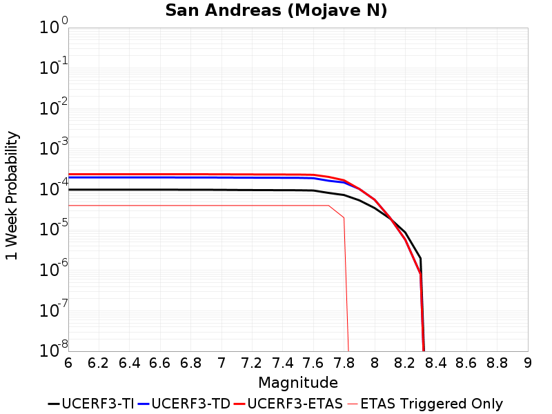 |  |  |  |

| Magnitude | 1 wk TI Prob | 1 wk TD Prob | 1 wk ETAS Prob | 1 wk ETAS/TD Gain | 1 wk ETAS Triggered Only | 1 mo TI Prob | 1 mo TD Prob | 1 mo ETAS Prob | 1 mo ETAS/TD Gain | 1 mo ETAS Triggered Only | 1 yr TI Prob | 1 yr TD Prob | 1 yr ETAS Prob | 1 yr ETAS/TD Gain | 1 yr ETAS Triggered Only | 10 yr TI Prob | 10 yr TD Prob | 10 yr ETAS Prob | 10 yr ETAS/TD Gain | 10 yr ETAS Triggered Only |
|-----|-----|-----|-----|-----|-----|-----|-----|-----|-----|-----|-----|-----|-----|-----|-----|-----|-----|-----|-----|-----|
| 6.0 | 9.877682E-5 | 1.9822316E-4 | 1.9822316E-4 | 1.0 | 0.0 | 4.2326056E-4 | 8.4925146E-4 | 8.4925146E-4 | 1.0 | 0.0 | 0.0051410277 | 0.010290752 | 0.010290752 | 1.0 | 0.0 | 0.05023708 | 0.100158796 | 0.10123516 | 1.0107466 | 0.0011961722 |
| 6.1 | 9.877682E-5 | 1.9822316E-4 | 1.9822316E-4 | 1.0 | 0.0 | 4.2326056E-4 | 8.4925146E-4 | 8.4925146E-4 | 1.0 | 0.0 | 0.0051410277 | 0.010290752 | 0.010290752 | 1.0 | 0.0 | 0.05023708 | 0.100158796 | 0.10123516 | 1.0107466 | 0.0011961722 |
| 6.2 | 9.877682E-5 | 1.9822316E-4 | 1.9822316E-4 | 1.0 | 0.0 | 4.2326056E-4 | 8.4925146E-4 | 8.4925146E-4 | 1.0 | 0.0 | 0.0051410277 | 0.010290752 | 0.010290752 | 1.0 | 0.0 | 0.05023708 | 0.100158796 | 0.10123516 | 1.0107466 | 0.0011961722 |
| 6.3 | 9.877682E-5 | 1.9822316E-4 | 1.9822316E-4 | 1.0 | 0.0 | 4.2326056E-4 | 8.4925146E-4 | 8.4925146E-4 | 1.0 | 0.0 | 0.0051410277 | 0.010290752 | 0.010290752 | 1.0 | 0.0 | 0.05023708 | 0.100158796 | 0.10123516 | 1.0107466 | 0.0011961722 |
| 6.4 | 9.877682E-5 | 1.9822316E-4 | 1.9822316E-4 | 1.0 | 0.0 | 4.2326056E-4 | 8.4925146E-4 | 8.4925146E-4 | 1.0 | 0.0 | 0.0051410277 | 0.010290752 | 0.010290752 | 1.0 | 0.0 | 0.05023708 | 0.100158796 | 0.10123516 | 1.0107466 | 0.0011961722 |
| 6.5 | 9.861474E-5 | 1.9795957E-4 | 1.9795957E-4 | 1.0 | 0.0 | 4.2256617E-4 | 8.481225E-4 | 8.481225E-4 | 1.0 | 0.0 | 0.0051326132 | 0.010277137 | 0.010277137 | 1.0 | 0.0 | 0.050156746 | 0.10003638 | 0.101112895 | 1.0107611 | 0.0011961722 |
| 6.6 | 9.861474E-5 | 1.9795957E-4 | 1.9795957E-4 | 1.0 | 0.0 | 4.2256617E-4 | 8.481225E-4 | 8.481225E-4 | 1.0 | 0.0 | 0.0051326132 | 0.010277137 | 0.010277137 | 1.0 | 0.0 | 0.050156746 | 0.10003638 | 0.101112895 | 1.0107611 | 0.0011961722 |
| 6.7 | 9.8552715E-5 | 1.9785862E-4 | 1.9785862E-4 | 1.0 | 0.0 | 4.223004E-4 | 8.476901E-4 | 8.476901E-4 | 1.0 | 0.0 | 0.0051293927 | 0.010271923 | 0.010271923 | 1.0 | 0.0 | 0.050125998 | 0.09998949 | 0.10106606 | 1.0107669 | 0.0011961722 |
| 6.8 | 9.8464974E-5 | 1.9770899E-4 | 1.9770899E-4 | 1.0 | 0.0 | 4.219245E-4 | 8.470493E-4 | 8.470493E-4 | 1.0 | 0.0 | 0.0051248376 | 0.010264195 | 0.010264195 | 1.0 | 0.0 | 0.05008251 | 0.09991933 | 0.10099598 | 1.0107752 | 0.0011961722 |
| 6.9 | 9.825824E-5 | 1.9738678E-4 | 1.9738678E-4 | 1.0 | 0.0 | 4.2103877E-4 | 8.456693E-4 | 8.456693E-4 | 1.0 | 0.0 | 0.0051141046 | 0.010247551 | 0.010247551 | 1.0 | 0.0 | 0.049980022 | 0.09976795 | 0.100844786 | 1.0107933 | 0.0011961722 |
| 7.0 | 9.781462E-5 | 1.9669563E-4 | 1.9669563E-4 | 1.0 | 0.0 | 4.1913814E-4 | 8.4270915E-4 | 8.4270915E-4 | 1.0 | 0.0 | 0.005091073 | 0.01021185 | 0.01021185 | 1.0 | 0.0 | 0.04976007 | 0.09944262 | 0.10051984 | 1.0108325 | 0.0011961722 |
| 7.1 | 9.7121134E-5 | 1.9570623E-4 | 1.9570623E-4 | 1.0 | 0.0 | 4.1616702E-4 | 8.3847163E-4 | 8.3847163E-4 | 1.0 | 0.0 | 0.005055068 | 0.0101607395 | 0.0101607395 | 1.0 | 0.0 | 0.04941613 | 0.09897694 | 0.10005472 | 1.0108892 | 0.0011961722 |
| 7.2 | 9.663819E-5 | 1.950094E-4 | 1.950094E-4 | 1.0 | 0.0 | 4.1409794E-4 | 8.354871E-4 | 8.354871E-4 | 1.0 | 0.0 | 0.0050299936 | 0.010124741 | 0.010124741 | 1.0 | 0.0 | 0.049176537 | 0.098648734 | 0.09972691 | 1.0109293 | 0.0011961722 |
| 7.3 | 9.6277574E-5 | 1.9452868E-4 | 1.9452868E-4 | 1.0 | 0.0 | 4.125529E-4 | 8.334282E-4 | 8.334282E-4 | 1.0 | 0.0 | 0.0050112694 | 0.0100999065 | 0.0100999065 | 1.0 | 0.0 | 0.04899759 | 0.09841993 | 0.099498376 | 1.0109576 | 0.0011961722 |
| 7.4 | 9.593308E-5 | 1.939201E-4 | 1.939201E-4 | 1.0 | 0.0 | 4.1107697E-4 | 8.3082163E-4 | 8.3082163E-4 | 1.0 | 0.0 | 0.0049933824 | 0.010068467 | 0.010068467 | 1.0 | 0.0 | 0.04882661 | 0.0981354 | 0.09921418 | 1.0109929 | 0.0011961722 |
| 7.5 | 9.561707E-5 | 1.9337503E-4 | 1.9337503E-4 | 1.0 | 0.0 | 4.0972308E-4 | 8.284871E-4 | 8.284871E-4 | 1.0 | 0.0 | 0.0049769743 | 0.010040306 | 0.010040306 | 1.0 | 0.0 | 0.048669744 | 0.097879566 | 0.098958656 | 1.0110247 | 0.0011961722 |
| 7.6 | 9.418194E-5 | 1.8986287E-4 | 1.8986287E-4 | 1.0 | 0.0 | 4.0357444E-4 | 8.1344444E-4 | 8.1344444E-4 | 1.0 | 0.0 | 0.004902454 | 0.009858833 | 0.009858833 | 1.0 | 0.0 | 0.047957025 | 0.09625471 | 0.09733574 | 1.011231 | 0.0011961722 |
| 7.7 | 8.202141E-5 | 1.6400167E-4 | 1.6400167E-4 | 1.0 | 0.0 | 3.51473E-4 | 7.02675E-4 | 7.02675E-4 | 1.0 | 0.0 | 0.00427079 | 0.008521572 | 0.008521572 | 1.0 | 0.0 | 0.04189639 | 0.0839261 | 0.08447398 | 1.0065283 | 5.980861E-4 |
| 7.8 | 7.2859846E-5 | 1.4857366E-4 | 1.4857366E-4 | 1.0 | 0.0 | 3.1221908E-4 | 6.365889E-4 | 6.365889E-4 | 1.0 | 0.0 | 0.003794643 | 0.0077229715 | 0.0077229715 | 1.0 | 0.0 | 0.037304975 | 0.076261416 | 0.07681389 | 1.0072445 | 5.980861E-4 |
| 7.9 | 5.3874453E-5 | 1.0285542E-4 | 1.0285542E-4 | 1.0 | 0.0 | 2.3087008E-4 | 4.4073447E-4 | 4.4073447E-4 | 1.0 | 0.0 | 0.0028072202 | 0.0053527523 | 0.0053527523 | 1.0 | 0.0 | 0.02772022 | 0.05354565 | 0.05354565 | 1.0 | 0.0 |
| 8.0 | 3.468538E-5 | 5.5653334E-5 | 5.5653334E-5 | 1.0 | 0.0 | 1.4864317E-4 | 2.384925E-4 | 2.384925E-4 | 1.0 | 0.0 | 0.0018082283 | 0.0028997818 | 0.0028997818 | 1.0 | 0.0 | 0.017935853 | 0.029630637 | 0.029630637 | 1.0 | 0.0 |
| 8.1 | 1.9152367E-5 | 2.0066665E-5 | 2.0066665E-5 | 1.0 | 0.0 | 8.207899E-5 | 8.599717E-5 | 8.599717E-5 | 1.0 | 0.0 | 9.988535E-4 | 0.0010465133 | 0.0010465133 | 1.0 | 0.0 | 0.009943757 | 0.011203661 | 0.011203661 | 1.0 | 0.0 |
| 8.2 | 8.643924E-6 | 5.7251696E-6 | 5.7251696E-6 | 1.0 | 0.0 | 3.704486E-5 | 2.453621E-5 | 2.453621E-5 | 1.0 | 0.0 | 4.5092785E-4 | 2.986875E-4 | 2.986875E-4 | 1.0 | 0.0 | 0.0045001395 | 0.0033855573 | 0.0033855573 | 1.0 | 0.0 |
| 8.3 | 1.983087E-6 | 8.077459E-7 | 8.077459E-7 | 1.0 | 0.0 | 8.498917E-6 | 3.4617635E-6 | 3.4617635E-6 | 1.0 | 0.0 | 1.034694E-4 | 4.2146174E-5 | 4.2146174E-5 | 1.0 | 0.0 | 0.0010342124 | 4.959089E-4 | 4.959089E-4 | 1.0 | 0.0 |

## Blackwater
*[(top)](#table-of-contents)*

| 1 Week | 1 Month | 1 Year | 10 Year |
|-----|-----|-----|-----|
|  |  |  |  |

| Magnitude | 1 wk TI Prob | 1 wk TD Prob | 1 wk ETAS Prob | 1 wk ETAS/TD Gain | 1 wk ETAS Triggered Only | 1 mo TI Prob | 1 mo TD Prob | 1 mo ETAS Prob | 1 mo ETAS/TD Gain | 1 mo ETAS Triggered Only | 1 yr TI Prob | 1 yr TD Prob | 1 yr ETAS Prob | 1 yr ETAS/TD Gain | 1 yr ETAS Triggered Only | 10 yr TI Prob | 10 yr TD Prob | 10 yr ETAS Prob | 10 yr ETAS/TD Gain | 10 yr ETAS Triggered Only |
|-----|-----|-----|-----|-----|-----|-----|-----|-----|-----|-----|-----|-----|-----|-----|-----|-----|-----|-----|-----|-----|
| 6.0 | 3.0708583E-5 | 3.3112166E-5 | 3.3112166E-5 | 1.0 | 0.0 | 1.3160157E-4 | 1.4190233E-4 | 1.4190233E-4 | 1.0 | 0.0 | 0.0016010714 | 0.0017264286 | 0.0017264286 | 1.0 | 0.0 | 0.015895851 | 0.017144019 | 0.018319683 | 1.0685759 | 0.0011961722 |
| 6.1 | 3.0708583E-5 | 3.3112166E-5 | 3.3112166E-5 | 1.0 | 0.0 | 1.3160157E-4 | 1.4190233E-4 | 1.4190233E-4 | 1.0 | 0.0 | 0.0016010714 | 0.0017264286 | 0.0017264286 | 1.0 | 0.0 | 0.015895851 | 0.017144019 | 0.018319683 | 1.0685759 | 0.0011961722 |
| 6.2 | 1.1707779E-5 | 1.2550807E-5 | 1.2550807E-5 | 1.0 | 0.0 | 5.017523E-5 | 5.3788117E-5 | 5.3788117E-5 | 1.0 | 0.0 | 6.107122E-4 | 6.5468316E-4 | 6.5468316E-4 | 1.0 | 0.0 | 0.006090366 | 0.006528517 | 0.0071226987 | 1.0910132 | 5.980861E-4 |
| 6.3 | 1.1707779E-5 | 1.2550807E-5 | 1.2550807E-5 | 1.0 | 0.0 | 5.017523E-5 | 5.3788117E-5 | 5.3788117E-5 | 1.0 | 0.0 | 6.107122E-4 | 6.5468316E-4 | 6.5468316E-4 | 1.0 | 0.0 | 0.006090366 | 0.006528517 | 0.0071226987 | 1.0910132 | 5.980861E-4 |
| 6.4 | 7.929244E-6 | 8.483829E-6 | 8.483829E-6 | 1.0 | 0.0 | 3.3982033E-5 | 3.6358782E-5 | 3.6358782E-5 | 1.0 | 0.0 | 4.136527E-4 | 4.4258233E-4 | 4.4258233E-4 | 1.0 | 0.0 | 0.0041288356 | 0.004417415 | 0.004417415 | 1.0 | 0.0 |
| 6.5 | 5.8832115E-6 | 6.288716E-6 | 6.288716E-6 | 1.0 | 0.0 | 2.521352E-5 | 2.6951377E-5 | 2.6951377E-5 | 1.0 | 0.0 | 3.0693135E-4 | 3.2808614E-4 | 3.2808614E-4 | 1.0 | 0.0 | 0.0030650778 | 0.0032762713 | 0.0032762713 | 1.0 | 0.0 |
| 6.6 | 5.8832115E-6 | 6.288716E-6 | 6.288716E-6 | 1.0 | 0.0 | 2.521352E-5 | 2.6951377E-5 | 2.6951377E-5 | 1.0 | 0.0 | 3.0693135E-4 | 3.2808614E-4 | 3.2808614E-4 | 1.0 | 0.0 | 0.0030650778 | 0.0032762713 | 0.0032762713 | 1.0 | 0.0 |
| 6.7 | 3.0715053E-6 | 3.2828864E-6 | 3.2828864E-6 | 1.0 | 0.0 | 1.3163528E-5 | 1.4069444E-5 | 1.4069444E-5 | 1.0 | 0.0 | 1.6025416E-4 | 1.7128319E-4 | 1.7128319E-4 | 1.0 | 0.0 | 0.0016013865 | 0.0017116263 | 0.0017116263 | 1.0 | 0.0 |
| 6.8 | 2.2722281E-6 | 2.4298129E-6 | 2.4298129E-6 | 1.0 | 0.0 | 9.738084E-6 | 1.0413448E-5 | 1.0413448E-5 | 1.0 | 0.0 | 1.1855473E-4 | 1.2677727E-4 | 1.2677727E-4 | 1.0 | 0.0 | 0.001184915 | 0.0012671397 | 0.0012671397 | 1.0 | 0.0 |
| 6.9 | 9.952399E-7 | 1.065824E-6 | 1.065824E-6 | 1.0 | 0.0 | 4.265307E-6 | 4.567812E-6 | 4.567812E-6 | 1.0 | 0.0 | 5.1928873E-5 | 5.561221E-5 | 5.561221E-5 | 1.0 | 0.0 | 5.191674E-4 | 5.5603357E-4 | 5.5603357E-4 | 1.0 | 0.0 |
| 7.0 | 4.7385504E-7 | 5.077845E-7 | 5.077845E-7 | 1.0 | 0.0 | 2.0308057E-6 | 2.1762194E-6 | 2.1762194E-6 | 1.0 | 0.0 | 2.4724779E-5 | 2.6495469E-5 | 2.6495469E-5 | 1.0 | 0.0 | 2.4722028E-4 | 2.649547E-4 | 2.649547E-4 | 1.0 | 0.0 |

## Goldstone Lake
*[(top)](#table-of-contents)*

| 1 Week | 1 Month | 1 Year | 10 Year |
|-----|-----|-----|-----|
|  |  |  |  |

| Magnitude | 1 wk TI Prob | 1 wk TD Prob | 1 wk ETAS Prob | 1 wk ETAS/TD Gain | 1 wk ETAS Triggered Only | 1 mo TI Prob | 1 mo TD Prob | 1 mo ETAS Prob | 1 mo ETAS/TD Gain | 1 mo ETAS Triggered Only | 1 yr TI Prob | 1 yr TD Prob | 1 yr ETAS Prob | 1 yr ETAS/TD Gain | 1 yr ETAS Triggered Only | 10 yr TI Prob | 10 yr TD Prob | 10 yr ETAS Prob | 10 yr ETAS/TD Gain | 10 yr ETAS Triggered Only |
|-----|-----|-----|-----|-----|-----|-----|-----|-----|-----|-----|-----|-----|-----|-----|-----|-----|-----|-----|-----|-----|
| 6.0 | 2.671352E-5 | 3.0402376E-5 | 3.0402376E-5 | 1.0 | 0.0 | 1.1448149E-4 | 1.302905E-4 | 1.302905E-4 | 1.0 | 0.0 | 0.001392921 | 0.0015853293 | 0.0015853293 | 1.0 | 0.0 | 0.013842222 | 0.015759733 | 0.016937053 | 1.0747044 | 0.0011961722 |
| 6.1 | 2.671352E-5 | 3.0402376E-5 | 3.0402376E-5 | 1.0 | 0.0 | 1.1448149E-4 | 1.302905E-4 | 1.302905E-4 | 1.0 | 0.0 | 0.001392921 | 0.0015853293 | 0.0015853293 | 1.0 | 0.0 | 0.013842222 | 0.015759733 | 0.016937053 | 1.0747044 | 0.0011961722 |
| 6.2 | 1.4197047E-5 | 1.6109776E-5 | 1.6109776E-5 | 1.0 | 0.0 | 6.0843064E-5 | 6.904062E-5 | 6.904062E-5 | 1.0 | 0.0 | 7.4051257E-4 | 8.4034423E-4 | 8.4034423E-4 | 1.0 | 0.0 | 0.007380498 | 0.008381379 | 0.008974452 | 1.0707608 | 5.980861E-4 |
| 6.3 | 1.4197047E-5 | 1.6109776E-5 | 1.6109776E-5 | 1.0 | 0.0 | 6.0843064E-5 | 6.904062E-5 | 6.904062E-5 | 1.0 | 0.0 | 7.4051257E-4 | 8.4034423E-4 | 8.4034423E-4 | 1.0 | 0.0 | 0.007380498 | 0.008381379 | 0.008974452 | 1.0707608 | 5.980861E-4 |
| 6.4 | 1.3238931E-5 | 1.5021058E-5 | 1.5021058E-5 | 1.0 | 0.0 | 5.6737044E-5 | 6.437493E-5 | 6.437493E-5 | 1.0 | 0.0 | 6.9055456E-4 | 7.8358105E-4 | 7.8358105E-4 | 1.0 | 0.0 | 0.006884126 | 0.007817824 | 0.008411234 | 1.0759048 | 5.980861E-4 |
| 6.5 | 1.3238931E-5 | 1.5021058E-5 | 1.5021058E-5 | 1.0 | 0.0 | 5.6737044E-5 | 6.437493E-5 | 6.437493E-5 | 1.0 | 0.0 | 6.9055456E-4 | 7.8358105E-4 | 7.8358105E-4 | 1.0 | 0.0 | 0.006884126 | 0.007817824 | 0.008411234 | 1.0759048 | 5.980861E-4 |
| 6.6 | 1.1328278E-5 | 1.2866031E-5 | 1.2866031E-5 | 1.0 | 0.0 | 4.8548856E-5 | 5.513951E-5 | 5.513951E-5 | 1.0 | 0.0 | 5.90922E-4 | 6.7121256E-4 | 6.7121256E-4 | 1.0 | 0.0 | 0.0058935313 | 0.0067012575 | 0.007295336 | 1.0886518 | 5.980861E-4 |
| 6.7 | 8.651175E-6 | 9.832895E-6 | 9.832895E-6 | 1.0 | 0.0 | 3.707594E-5 | 4.2140808E-5 | 4.2140808E-5 | 1.0 | 0.0 | 4.5130608E-4 | 5.1303423E-4 | 5.1303423E-4 | 1.0 | 0.0 | 0.0045039062 | 0.0051273922 | 0.0057224114 | 1.1160471 | 5.980861E-4 |
| 6.8 | 1.0215377E-6 | 1.1764789E-6 | 1.1764789E-6 | 1.0 | 0.0 | 4.378012E-6 | 5.042043E-6 | 5.042043E-6 | 1.0 | 0.0 | 5.3300988E-5 | 6.138526E-5 | 6.138526E-5 | 1.0 | 0.0 | 5.3288206E-4 | 6.136943E-4 | 6.136943E-4 | 1.0 | 0.0 |
| 6.9 | 7.9360774E-7 | 9.2921647E-7 | 9.2921647E-7 | 1.0 | 0.0 | 3.4011714E-6 | 3.982351E-6 | 3.982351E-6 | 1.0 | 0.0 | 4.1408475E-5 | 4.848411E-5 | 4.848411E-5 | 1.0 | 0.0 | 4.140076E-4 | 4.8474234E-4 | 4.8474234E-4 | 1.0 | 0.0 |
| 7.0 | 7.4382757E-7 | 8.7558357E-7 | 8.7558357E-7 | 1.0 | 0.0 | 3.1878285E-6 | 3.752496E-6 | 3.752496E-6 | 1.0 | 0.0 | 3.8811122E-5 | 4.568575E-5 | 4.568575E-5 | 1.0 | 0.0 | 3.8804344E-4 | 4.567702E-4 | 4.567702E-4 | 1.0 | 0.0 |
| 7.1 | 6.4709513E-7 | 7.7193414E-7 | 7.7193414E-7 | 1.0 | 0.0 | 2.773262E-6 | 3.3082852E-6 | 3.3082852E-6 | 1.0 | 0.0 | 3.376394E-5 | 4.027769E-5 | 4.027769E-5 | 1.0 | 0.0 | 3.375881E-4 | 4.0270985E-4 | 4.0270985E-4 | 1.0 | 0.0 |
| 7.2 | 6.356704E-7 | 7.596342E-7 | 7.596342E-7 | 1.0 | 0.0 | 2.7242988E-6 | 3.2555713E-6 | 3.2555713E-6 | 1.0 | 0.0 | 3.3167835E-5 | 3.963592E-5 | 3.963592E-5 | 1.0 | 0.0 | 3.3162883E-4 | 3.9629446E-4 | 3.9629446E-4 | 1.0 | 0.0 |
| 7.3 | 5.7695723E-7 | 6.904355E-7 | 6.904355E-7 | 1.0 | 0.0 | 2.4726714E-6 | 2.9590062E-6 | 2.9590062E-6 | 1.0 | 0.0 | 3.0104358E-5 | 3.6025365E-5 | 3.6025365E-5 | 1.0 | 0.0 | 3.0100282E-4 | 3.60201E-4 | 3.60201E-4 | 1.0 | 0.0 |
| 7.4 | 5.209647E-7 | 6.20097E-7 | 6.20097E-7 | 1.0 | 0.0 | 2.232704E-6 | 2.6575563E-6 | 2.6575563E-6 | 1.0 | 0.0 | 2.718283E-5 | 3.2355325E-5 | 3.2355325E-5 | 1.0 | 0.0 | 2.7179506E-4 | 3.235117E-4 | 3.235117E-4 | 1.0 | 0.0 |
| 7.5 | 4.512955E-7 | 5.356036E-7 | 5.356036E-7 | 1.0 | 0.0 | 1.934122E-6 | 2.2954423E-6 | 2.2954423E-6 | 1.0 | 0.0 | 2.3547682E-5 | 2.7946706E-5 | 2.7946706E-5 | 1.0 | 0.0 | 2.3545188E-4 | 2.7943723E-4 | 2.7943723E-4 | 1.0 | 0.0 |
| 7.6 | 2.21172E-7 | 2.6045635E-7 | 2.6045635E-7 | 1.0 | 0.0 | 9.478797E-7 | 1.1162413E-6 | 1.1162413E-6 | 1.0 | 0.0 | 1.1540374E-5 | 1.3590181E-5 | 1.3590181E-5 | 1.0 | 0.0 | 1.1539775E-4 | 1.358963E-4 | 1.358963E-4 | 1.0 | 0.0 |

## Elsinore (Glen Ivy) rev
*[(top)](#table-of-contents)*

| 1 Week | 1 Month | 1 Year | 10 Year |
|-----|-----|-----|-----|
|  |  |  | 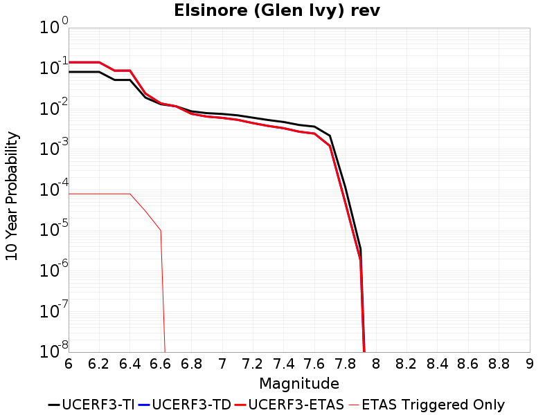 |

| Magnitude | 1 wk TI Prob | 1 wk TD Prob | 1 wk ETAS Prob | 1 wk ETAS/TD Gain | 1 wk ETAS Triggered Only | 1 mo TI Prob | 1 mo TD Prob | 1 mo ETAS Prob | 1 mo ETAS/TD Gain | 1 mo ETAS Triggered Only | 1 yr TI Prob | 1 yr TD Prob | 1 yr ETAS Prob | 1 yr ETAS/TD Gain | 1 yr ETAS Triggered Only | 10 yr TI Prob | 10 yr TD Prob | 10 yr ETAS Prob | 10 yr ETAS/TD Gain | 10 yr ETAS Triggered Only |
|-----|-----|-----|-----|-----|-----|-----|-----|-----|-----|-----|-----|-----|-----|-----|-----|-----|-----|-----|-----|-----|
| 6.0 | 1.6204086E-4 | 2.945506E-4 | 2.945506E-4 | 1.0 | 0.0 | 6.94276E-4 | 0.0012618646 | 0.001859196 | 1.4733721 | 5.980861E-4 | 0.008420097 | 0.015276364 | 0.015865313 | 1.038553 | 5.980861E-4 | 0.081081145 | 0.1400736 | 0.14058791 | 1.0036718 | 5.980861E-4 |
| 6.1 | 1.6204086E-4 | 2.945506E-4 | 2.945506E-4 | 1.0 | 0.0 | 6.94276E-4 | 0.0012618646 | 0.001859196 | 1.4733721 | 5.980861E-4 | 0.008420097 | 0.015276364 | 0.015865313 | 1.038553 | 5.980861E-4 | 0.081081145 | 0.1400736 | 0.14058791 | 1.0036718 | 5.980861E-4 |
| 6.2 | 1.6204086E-4 | 2.945506E-4 | 2.945506E-4 | 1.0 | 0.0 | 6.94276E-4 | 0.0012618646 | 0.001859196 | 1.4733721 | 5.980861E-4 | 0.008420097 | 0.015276364 | 0.015865313 | 1.038553 | 5.980861E-4 | 0.081081145 | 0.1400736 | 0.14058791 | 1.0036718 | 5.980861E-4 |
| 6.3 | 1.0111737E-4 | 1.7751133E-4 | 1.7751133E-4 | 1.0 | 0.0 | 4.332882E-4 | 7.606584E-4 | 0.0013582896 | 1.7856761 | 5.980861E-4 | 0.005262531 | 0.009242493 | 0.009835051 | 1.0641124 | 5.980861E-4 | 0.0513964 | 0.087200366 | 0.0877463 | 1.0062606 | 5.980861E-4 |
| 6.4 | 1.0111737E-4 | 1.7751133E-4 | 1.7751133E-4 | 1.0 | 0.0 | 4.332882E-4 | 7.606584E-4 | 0.0013582896 | 1.7856761 | 5.980861E-4 | 0.005262531 | 0.009242493 | 0.009835051 | 1.0641124 | 5.980861E-4 | 0.0513964 | 0.087200366 | 0.0877463 | 1.0062606 | 5.980861E-4 |
| 6.5 | 3.6624708E-5 | 4.6508805E-5 | 4.6508805E-5 | 1.0 | 0.0 | 1.569536E-4 | 1.9931028E-4 | 1.9931028E-4 | 1.0 | 0.0 | 0.001909235 | 0.0024242643 | 0.0024242643 | 1.0 | 0.0 | 0.01892915 | 0.023828568 | 0.023828568 | 1.0 | 0.0 |
| 6.6 | 2.5051324E-5 | 2.6220692E-5 | 2.6220692E-5 | 1.0 | 0.0 | 1.073584E-4 | 1.1236981E-4 | 1.1236981E-4 | 1.0 | 0.0 | 0.0013063047 | 0.0013672885 | 0.0013672885 | 1.0 | 0.0 | 0.012986525 | 0.013601009 | 0.013601009 | 1.0 | 0.0 |
| 6.7 | 2.2189772E-5 | 2.2130944E-5 | 2.2130944E-5 | 1.0 | 0.0 | 9.509556E-5 | 9.4843665E-5 | 9.4843665E-5 | 1.0 | 0.0 | 0.0011571734 | 0.0011541465 | 0.0011541465 | 1.0 | 0.0 | 0.011511663 | 0.011494492 | 0.011494492 | 1.0 | 0.0 |
| 6.8 | 1.6654378E-5 | 1.4472529E-5 | 1.4472529E-5 | 1.0 | 0.0 | 7.137396E-5 | 6.202368E-5 | 6.202368E-5 | 1.0 | 0.0 | 8.686314E-4 | 7.548818E-4 | 7.548818E-4 | 1.0 | 0.0 | 0.008652439 | 0.0075283856 | 0.0075283856 | 1.0 | 0.0 |
| 6.9 | 1.5042909E-5 | 1.2361745E-5 | 1.2361745E-5 | 1.0 | 0.0 | 6.446802E-5 | 5.2977848E-5 | 5.2977848E-5 | 1.0 | 0.0 | 7.8461546E-4 | 6.448176E-4 | 6.448176E-4 | 1.0 | 0.0 | 0.007818509 | 0.0064335987 | 0.0064335987 | 1.0 | 0.0 |
| 7.0 | 1.4361385E-5 | 1.1479003E-5 | 1.1479003E-5 | 1.0 | 0.0 | 6.154734E-5 | 4.9194816E-5 | 4.9194816E-5 | 1.0 | 0.0 | 7.490812E-4 | 5.9878523E-4 | 5.9878523E-4 | 1.0 | 0.0 | 0.007465612 | 0.005975608 | 0.005975608 | 1.0 | 0.0 |
| 7.1 | 1.3265571E-5 | 1.026988E-5 | 1.026988E-5 | 1.0 | 0.0 | 5.6851208E-5 | 4.401304E-5 | 4.401304E-5 | 1.0 | 0.0 | 6.919436E-4 | 5.357296E-4 | 5.357296E-4 | 1.0 | 0.0 | 0.006897931 | 0.0053478368 | 0.0053478368 | 1.0 | 0.0 |
| 7.2 | 1.1596403E-5 | 8.526196E-6 | 8.526196E-6 | 1.0 | 0.0 | 4.9697923E-5 | 3.654034E-5 | 3.654034E-5 | 1.0 | 0.0 | 6.049042E-4 | 4.4478953E-4 | 4.4478953E-4 | 1.0 | 0.0 | 0.006032603 | 0.004440411 | 0.004440411 | 1.0 | 0.0 |
| 7.3 | 1.0150827E-5 | 7.2567072E-6 | 7.2567072E-6 | 1.0 | 0.0 | 4.3502816E-5 | 3.109981E-5 | 3.109981E-5 | 1.0 | 0.0 | 5.2951806E-4 | 3.7857587E-4 | 3.7857587E-4 | 1.0 | 0.0 | 0.005282581 | 0.003779702 | 0.003779702 | 1.0 | 0.0 |
| 7.4 | 9.080705E-6 | 6.3675107E-6 | 6.3675107E-6 | 1.0 | 0.0 | 3.8916725E-5 | 2.7289054E-5 | 2.7289054E-5 | 1.0 | 0.0 | 4.7370812E-4 | 3.3219496E-4 | 3.3219496E-4 | 1.0 | 0.0 | 0.004726996 | 0.0033171384 | 0.0033171384 | 1.0 | 0.0 |
| 7.5 | 7.671649E-6 | 5.238188E-6 | 5.238188E-6 | 1.0 | 0.0 | 3.287808E-5 | 2.244919E-5 | 2.244919E-5 | 1.0 | 0.0 | 4.0021708E-4 | 2.7328587E-4 | 2.7328587E-4 | 1.0 | 0.0 | 0.0039949706 | 0.0027296236 | 0.0027296236 | 1.0 | 0.0 |
| 7.6 | 6.990086E-6 | 4.69867E-6 | 4.69867E-6 | 1.0 | 0.0 | 2.9957167E-5 | 2.013701E-5 | 2.013701E-5 | 1.0 | 0.0 | 3.6466747E-4 | 2.4514168E-4 | 2.4514168E-4 | 1.0 | 0.0 | 0.0036406964 | 0.0024488294 | 0.0024488294 | 1.0 | 0.0 |
| 7.7 | 4.163505E-6 | 2.3358875E-6 | 2.3358875E-6 | 1.0 | 0.0 | 1.7843471E-5 | 1.0010913E-5 | 1.0010913E-5 | 1.0 | 0.0 | 2.172226E-4 | 1.21876794E-4 | 1.21876794E-4 | 1.0 | 0.0 | 0.0021701038 | 0.001218173 | 0.001218173 | 1.0 | 0.0 |
| 7.8 | 2.2692414E-7 | 9.40699E-8 | 9.40699E-8 | 1.0 | 0.0 | 9.725317E-7 | 4.0315663E-7 | 4.0315663E-7 | 1.0 | 0.0 | 1.1840509E-5 | 4.908424E-6 | 4.908424E-6 | 1.0 | 0.0 | 1.1839878E-4 | 4.908349E-5 | 4.908349E-5 | 1.0 | 0.0 |
| 7.9 | 6.676829E-9 | 3.4456322E-9 | 3.4456322E-9 | 1.0 | 0.0 | 2.861498E-8 | 1.4766996E-8 | 1.4766996E-8 | 1.0 | 0.0 | 3.4838732E-7 | 1.7978816E-7 | 1.7978816E-7 | 1.0 | 0.0 | 3.4838679E-6 | 1.7978803E-6 | 1.7978803E-6 | 1.0 | 0.0 |

## Towne Pass
*[(top)](#table-of-contents)*

| 1 Week | 1 Month | 1 Year | 10 Year |
|-----|-----|-----|-----|
|  | 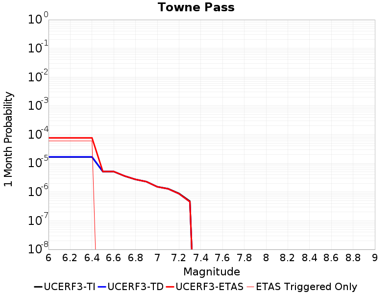 |  |  |

| Magnitude | 1 wk TI Prob | 1 wk TD Prob | 1 wk ETAS Prob | 1 wk ETAS/TD Gain | 1 wk ETAS Triggered Only | 1 mo TI Prob | 1 mo TD Prob | 1 mo ETAS Prob | 1 mo ETAS/TD Gain | 1 mo ETAS Triggered Only | 1 yr TI Prob | 1 yr TD Prob | 1 yr ETAS Prob | 1 yr ETAS/TD Gain | 1 yr ETAS Triggered Only | 10 yr TI Prob | 10 yr TD Prob | 10 yr ETAS Prob | 10 yr ETAS/TD Gain | 10 yr ETAS Triggered Only |
|-----|-----|-----|-----|-----|-----|-----|-----|-----|-----|-----|-----|-----|-----|-----|-----|-----|-----|-----|-----|-----|
| 6.0 | 3.849728E-6 | 3.8949315E-6 | 3.8949315E-6 | 1.0 | 0.0 | 1.649873E-5 | 1.669248E-5 | 1.669248E-5 | 1.0 | 0.0 | 2.0085352E-4 | 2.0321638E-4 | 2.0321638E-4 | 1.0 | 0.0 | 0.0020067208 | 0.0020307347 | 0.0026276063 | 1.2939191 | 5.980861E-4 |
| 6.1 | 3.849728E-6 | 3.8949315E-6 | 3.8949315E-6 | 1.0 | 0.0 | 1.649873E-5 | 1.669248E-5 | 1.669248E-5 | 1.0 | 0.0 | 2.0085352E-4 | 2.0321638E-4 | 2.0321638E-4 | 1.0 | 0.0 | 0.0020067208 | 0.0020307347 | 0.0026276063 | 1.2939191 | 5.980861E-4 |
| 6.2 | 3.849728E-6 | 3.8949315E-6 | 3.8949315E-6 | 1.0 | 0.0 | 1.649873E-5 | 1.669248E-5 | 1.669248E-5 | 1.0 | 0.0 | 2.0085352E-4 | 2.0321638E-4 | 2.0321638E-4 | 1.0 | 0.0 | 0.0020067208 | 0.0020307347 | 0.0026276063 | 1.2939191 | 5.980861E-4 |
| 6.3 | 3.849728E-6 | 3.8949315E-6 | 3.8949315E-6 | 1.0 | 0.0 | 1.649873E-5 | 1.669248E-5 | 1.669248E-5 | 1.0 | 0.0 | 2.0085352E-4 | 2.0321638E-4 | 2.0321638E-4 | 1.0 | 0.0 | 0.0020067208 | 0.0020307347 | 0.0026276063 | 1.2939191 | 5.980861E-4 |
| 6.4 | 3.849728E-6 | 3.8949315E-6 | 3.8949315E-6 | 1.0 | 0.0 | 1.649873E-5 | 1.669248E-5 | 1.669248E-5 | 1.0 | 0.0 | 2.0085352E-4 | 2.0321638E-4 | 2.0321638E-4 | 1.0 | 0.0 | 0.0020067208 | 0.0020307347 | 0.0026276063 | 1.2939191 | 5.980861E-4 |
| 6.5 | 1.1953545E-6 | 1.2032037E-6 | 1.2032037E-6 | 1.0 | 0.0 | 5.1229376E-6 | 5.156578E-6 | 5.156578E-6 | 1.0 | 0.0 | 6.236998E-5 | 6.277965E-5 | 6.277965E-5 | 1.0 | 0.0 | 6.235248E-4 | 6.2763086E-4 | 6.2763086E-4 | 1.0 | 0.0 |
| 6.6 | 1.1953545E-6 | 1.2032037E-6 | 1.2032037E-6 | 1.0 | 0.0 | 5.1229376E-6 | 5.156578E-6 | 5.156578E-6 | 1.0 | 0.0 | 6.236998E-5 | 6.277965E-5 | 6.277965E-5 | 1.0 | 0.0 | 6.235248E-4 | 6.2763086E-4 | 6.2763086E-4 | 1.0 | 0.0 |
| 6.7 | 8.375951E-7 | 8.411917E-7 | 8.411917E-7 | 1.0 | 0.0 | 3.5896885E-6 | 3.6051028E-6 | 3.6051028E-6 | 1.0 | 0.0 | 4.370358E-5 | 4.38913E-5 | 4.38913E-5 | 1.0 | 0.0 | 4.3694986E-4 | 4.3883204E-4 | 4.3883204E-4 | 1.0 | 0.0 |
| 6.8 | 6.38041E-7 | 6.393256E-7 | 6.393256E-7 | 1.0 | 0.0 | 2.7344586E-6 | 2.7399642E-6 | 2.7399642E-6 | 1.0 | 0.0 | 3.3291526E-5 | 3.3358592E-5 | 3.3358592E-5 | 1.0 | 0.0 | 3.3286537E-4 | 3.3353968E-4 | 3.3353968E-4 | 1.0 | 0.0 |
| 6.9 | 5.3460053E-7 | 5.346353E-7 | 5.346353E-7 | 1.0 | 0.0 | 2.2911431E-6 | 2.2912925E-6 | 2.2912925E-6 | 1.0 | 0.0 | 2.789431E-5 | 2.7896162E-5 | 2.7896162E-5 | 1.0 | 0.0 | 2.789081E-4 | 2.7892992E-4 | 2.7892992E-4 | 1.0 | 0.0 |
| 7.0 | 3.557783E-7 | 3.5332843E-7 | 3.5332843E-7 | 1.0 | 0.0 | 1.5247632E-6 | 1.5142639E-6 | 1.5142639E-6 | 1.0 | 0.0 | 1.8563835E-5 | 1.8436014E-5 | 1.8436014E-5 | 1.0 | 0.0 | 1.8562283E-4 | 1.843457E-4 | 1.843457E-4 | 1.0 | 0.0 |
| 7.1 | 3.037942E-7 | 3.0010034E-7 | 3.0010034E-7 | 1.0 | 0.0 | 1.3019744E-6 | 1.2861436E-6 | 1.2861436E-6 | 1.0 | 0.0 | 1.5851423E-5 | 1.5658694E-5 | 1.5658694E-5 | 1.0 | 0.0 | 1.5850292E-4 | 1.5657666E-4 | 1.5657666E-4 | 1.0 | 0.0 |
| 7.2 | 2.0808248E-7 | 2.0224054E-7 | 2.0224054E-7 | 1.0 | 0.0 | 8.917818E-7 | 8.667449E-7 | 8.667449E-7 | 1.0 | 0.0 | 1.0857389E-5 | 1.0552573E-5 | 1.0552573E-5 | 1.0 | 0.0 | 1.0856859E-4 | 1.0552118E-4 | 1.0552118E-4 | 1.0 | 0.0 |
| 7.3 | 1.1162073E-7 | 1.0640794E-7 | 1.0640794E-7 | 1.0 | 0.0 | 4.7837443E-7 | 4.5603397E-7 | 4.5603397E-7 | 1.0 | 0.0 | 5.8241935E-6 | 5.5522014E-6 | 5.5522014E-6 | 1.0 | 0.0 | 5.8240406E-5 | 5.5520828E-5 | 5.5520828E-5 | 1.0 | 0.0 |

## Nelson Lake
*[(top)](#table-of-contents)*

| 1 Week | 1 Month | 1 Year | 10 Year |
|-----|-----|-----|-----|
|  |  |  |  |

| Magnitude | 1 wk TI Prob | 1 wk TD Prob | 1 wk ETAS Prob | 1 wk ETAS/TD Gain | 1 wk ETAS Triggered Only | 1 mo TI Prob | 1 mo TD Prob | 1 mo ETAS Prob | 1 mo ETAS/TD Gain | 1 mo ETAS Triggered Only | 1 yr TI Prob | 1 yr TD Prob | 1 yr ETAS Prob | 1 yr ETAS/TD Gain | 1 yr ETAS Triggered Only | 10 yr TI Prob | 10 yr TD Prob | 10 yr ETAS Prob | 10 yr ETAS/TD Gain | 10 yr ETAS Triggered Only |
|-----|-----|-----|-----|-----|-----|-----|-----|-----|-----|-----|-----|-----|-----|-----|-----|-----|-----|-----|-----|-----|
| 6.0 | 9.913453E-6 | 1.0194072E-5 | 1.0194072E-5 | 1.0 | 0.0 | 4.2485535E-5 | 4.3688207E-5 | 4.3688207E-5 | 1.0 | 0.0 | 5.1713863E-4 | 5.3178443E-4 | 5.3178443E-4 | 1.0 | 0.0 | 0.0051593683 | 0.005306147 | 0.00590106 | 1.1121176 | 5.980861E-4 |
| 6.1 | 9.913453E-6 | 1.0194072E-5 | 1.0194072E-5 | 1.0 | 0.0 | 4.2485535E-5 | 4.3688207E-5 | 4.3688207E-5 | 1.0 | 0.0 | 5.1713863E-4 | 5.3178443E-4 | 5.3178443E-4 | 1.0 | 0.0 | 0.0051593683 | 0.005306147 | 0.00590106 | 1.1121176 | 5.980861E-4 |
| 6.2 | 4.5596407E-6 | 4.697206E-6 | 4.697206E-6 | 1.0 | 0.0 | 1.954117E-5 | 2.0130734E-5 | 2.0130734E-5 | 1.0 | 0.0 | 2.3788778E-4 | 2.450654E-4 | 2.450654E-4 | 1.0 | 0.0 | 0.0023763329 | 0.0024480775 | 0.0030446996 | 1.2437104 | 5.980861E-4 |
| 6.3 | 4.5596407E-6 | 4.697206E-6 | 4.697206E-6 | 1.0 | 0.0 | 1.954117E-5 | 2.0130734E-5 | 2.0130734E-5 | 1.0 | 0.0 | 2.3788778E-4 | 2.450654E-4 | 2.450654E-4 | 1.0 | 0.0 | 0.0023763329 | 0.0024480775 | 0.0030446996 | 1.2437104 | 5.980861E-4 |
| 6.4 | 3.4025713E-6 | 3.5105995E-6 | 3.5105995E-6 | 1.0 | 0.0 | 1.4582367E-5 | 1.5045345E-5 | 1.5045345E-5 | 1.0 | 0.0 | 1.7752586E-4 | 1.8316251E-4 | 1.8316251E-4 | 1.0 | 0.0 | 0.001773841 | 0.0018301985 | 0.00242719 | 1.3261895 | 5.980861E-4 |
| 6.5 | 2.8352947E-6 | 2.9284624E-6 | 2.9284624E-6 | 1.0 | 0.0 | 1.2151207E-5 | 1.2550498E-5 | 1.2550498E-5 | 1.0 | 0.0 | 1.479309E-4 | 1.5279235E-4 | 1.5279235E-4 | 1.0 | 0.0 | 0.0014783246 | 0.0015269468 | 0.0021241198 | 1.3910896 | 5.980861E-4 |
| 6.6 | 2.251518E-6 | 2.3295765E-6 | 2.3295765E-6 | 1.0 | 0.0 | 9.649328E-6 | 9.983864E-6 | 9.983864E-6 | 1.0 | 0.0 | 1.1747423E-4 | 1.21547404E-4 | 1.21547404E-4 | 1.0 | 0.0 | 0.0011741214 | 0.001214871 | 0.001214871 | 1.0 | 0.0 |
| 6.7 | 1.8911853E-6 | 1.9595861E-6 | 1.9595861E-6 | 1.0 | 0.0 | 8.105055E-6 | 8.398203E-6 | 8.398203E-6 | 1.0 | 0.0 | 9.867457E-5 | 1.0224391E-4 | 1.0224391E-4 | 1.0 | 0.0 | 9.863076E-4 | 0.0010220262 | 0.0010220262 | 1.0 | 0.0 |
| 6.8 | 1.4874814E-6 | 1.5442014E-6 | 1.5442014E-6 | 1.0 | 0.0 | 6.374905E-6 | 6.6179923E-6 | 6.6179923E-6 | 1.0 | 0.0 | 7.76117E-5 | 8.05716E-5 | 8.05716E-5 | 1.0 | 0.0 | 7.75846E-4 | 8.0547493E-4 | 8.0547493E-4 | 1.0 | 0.0 |
| 6.9 | 6.835972E-7 | 7.141938E-7 | 7.141938E-7 | 1.0 | 0.0 | 2.9296991E-6 | 3.0608287E-6 | 3.0608287E-6 | 1.0 | 0.0 | 3.56685E-5 | 3.7265272E-5 | 3.7265272E-5 | 1.0 | 0.0 | 3.5662777E-4 | 3.726215E-4 | 3.726215E-4 | 1.0 | 0.0 |

## Coyote Canyon
*[(top)](#table-of-contents)*

| 1 Week | 1 Month | 1 Year | 10 Year |
|-----|-----|-----|-----|
|  |  |  |  |

| Magnitude | 1 wk TI Prob | 1 wk TD Prob | 1 wk ETAS Prob | 1 wk ETAS/TD Gain | 1 wk ETAS Triggered Only | 1 mo TI Prob | 1 mo TD Prob | 1 mo ETAS Prob | 1 mo ETAS/TD Gain | 1 mo ETAS Triggered Only | 1 yr TI Prob | 1 yr TD Prob | 1 yr ETAS Prob | 1 yr ETAS/TD Gain | 1 yr ETAS Triggered Only | 10 yr TI Prob | 10 yr TD Prob | 10 yr ETAS Prob | 10 yr ETAS/TD Gain | 10 yr ETAS Triggered Only |
|-----|-----|-----|-----|-----|-----|-----|-----|-----|-----|-----|-----|-----|-----|-----|-----|-----|-----|-----|-----|-----|
| 6.0 | 3.5090034E-5 | 4.040278E-5 | 4.040278E-5 | 1.0 | 0.0 | 1.503772E-4 | 1.7314474E-4 | 1.7314474E-4 | 1.0 | 0.0 | 0.0018293047 | 0.0021062568 | 0.0021062568 | 1.0 | 0.0 | 0.018143194 | 0.02088891 | 0.021474503 | 1.0280336 | 5.980861E-4 |
| 6.1 | 3.5090034E-5 | 4.040278E-5 | 4.040278E-5 | 1.0 | 0.0 | 1.503772E-4 | 1.7314474E-4 | 1.7314474E-4 | 1.0 | 0.0 | 0.0018293047 | 0.0021062568 | 0.0021062568 | 1.0 | 0.0 | 0.018143194 | 0.02088891 | 0.021474503 | 1.0280336 | 5.980861E-4 |
| 6.2 | 1.841879E-5 | 2.1078928E-5 | 2.1078928E-5 | 1.0 | 0.0 | 7.8935285E-5 | 9.0335714E-5 | 9.0335714E-5 | 1.0 | 0.0 | 9.606133E-4 | 0.0010993846 | 0.0010993846 | 1.0 | 0.0 | 0.0095647145 | 0.010949563 | 0.010949563 | 1.0 | 0.0 |
| 6.3 | 1.841879E-5 | 2.1078928E-5 | 2.1078928E-5 | 1.0 | 0.0 | 7.8935285E-5 | 9.0335714E-5 | 9.0335714E-5 | 1.0 | 0.0 | 9.606133E-4 | 0.0010993846 | 0.0010993846 | 1.0 | 0.0 | 0.0095647145 | 0.010949563 | 0.010949563 | 1.0 | 0.0 |
| 6.4 | 1.712201E-5 | 1.9582902E-5 | 1.9582902E-5 | 1.0 | 0.0 | 7.337798E-5 | 8.392459E-5 | 8.392459E-5 | 1.0 | 0.0 | 8.930107E-4 | 0.0010214037 | 0.0010214037 | 1.0 | 0.0 | 0.008894307 | 0.010177027 | 0.010177027 | 1.0 | 0.0 |
| 6.5 | 1.4744935E-5 | 1.685211E-5 | 1.685211E-5 | 1.0 | 0.0 | 6.3191044E-5 | 7.2221854E-5 | 7.2221854E-5 | 1.0 | 0.0 | 7.6907943E-4 | 8.7904005E-4 | 8.7904005E-4 | 1.0 | 0.0 | 0.007664232 | 0.0087648425 | 0.0087648425 | 1.0 | 0.0 |
| 6.6 | 1.2017839E-5 | 1.3736437E-5 | 1.3736437E-5 | 1.0 | 0.0 | 5.150401E-5 | 5.8869617E-5 | 5.8869617E-5 | 1.0 | 0.0 | 6.268809E-4 | 7.165906E-4 | 7.165906E-4 | 1.0 | 0.0 | 0.0062511545 | 0.0071515082 | 0.0071515082 | 1.0 | 0.0 |
| 6.7 | 1.00956095E-5 | 1.1543927E-5 | 1.1543927E-5 | 1.0 | 0.0 | 4.326618E-5 | 4.9473525E-5 | 4.9473525E-5 | 1.0 | 0.0 | 5.266384E-4 | 6.022608E-4 | 6.022608E-4 | 1.0 | 0.0 | 0.005253921 | 0.006014829 | 0.006014829 | 1.0 | 0.0 |

## Lenwood-Lockhart-Old Woman Springs
*[(top)](#table-of-contents)*

| 1 Week | 1 Month | 1 Year | 10 Year |
|-----|-----|-----|-----|
| 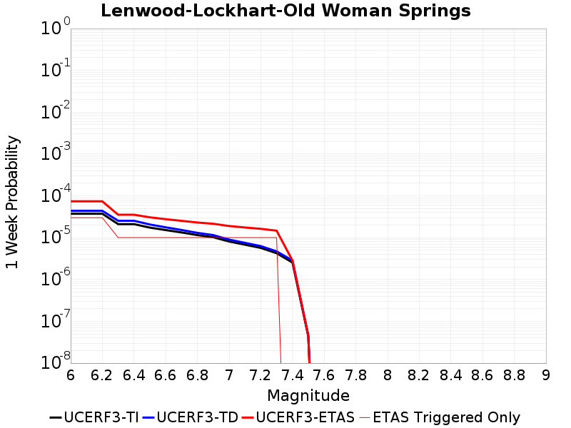 |  |  |  |

| Magnitude | 1 wk TI Prob | 1 wk TD Prob | 1 wk ETAS Prob | 1 wk ETAS/TD Gain | 1 wk ETAS Triggered Only | 1 mo TI Prob | 1 mo TD Prob | 1 mo ETAS Prob | 1 mo ETAS/TD Gain | 1 mo ETAS Triggered Only | 1 yr TI Prob | 1 yr TD Prob | 1 yr ETAS Prob | 1 yr ETAS/TD Gain | 1 yr ETAS Triggered Only | 10 yr TI Prob | 10 yr TD Prob | 10 yr ETAS Prob | 10 yr ETAS/TD Gain | 10 yr ETAS Triggered Only |
|-----|-----|-----|-----|-----|-----|-----|-----|-----|-----|-----|-----|-----|-----|-----|-----|-----|-----|-----|-----|-----|
| 6.0 | 3.744542E-5 | 4.3987508E-5 | 4.3987508E-5 | 1.0 | 0.0 | 1.604705E-4 | 1.8850525E-4 | 1.8850525E-4 | 1.0 | 0.0 | 0.0019519776 | 0.002292808 | 0.002292808 | 1.0 | 0.0 | 0.019349206 | 0.022709558 | 0.023294061 | 1.0257382 | 5.980861E-4 |
| 6.1 | 3.744542E-5 | 4.3987508E-5 | 4.3987508E-5 | 1.0 | 0.0 | 1.604705E-4 | 1.8850525E-4 | 1.8850525E-4 | 1.0 | 0.0 | 0.0019519776 | 0.002292808 | 0.002292808 | 1.0 | 0.0 | 0.019349206 | 0.022709558 | 0.023294061 | 1.0257382 | 5.980861E-4 |
| 6.2 | 3.744542E-5 | 4.3987508E-5 | 4.3987508E-5 | 1.0 | 0.0 | 1.604705E-4 | 1.8850525E-4 | 1.8850525E-4 | 1.0 | 0.0 | 0.0019519776 | 0.002292808 | 0.002292808 | 1.0 | 0.0 | 0.019349206 | 0.022709558 | 0.023294061 | 1.0257382 | 5.980861E-4 |
| 6.3 | 2.1079984E-5 | 2.536486E-5 | 2.536486E-5 | 1.0 | 0.0 | 9.0339665E-5 | 1.0870213E-4 | 1.0870213E-4 | 1.0 | 0.0 | 0.0010993304 | 0.0013226649 | 0.0013226649 | 1.0 | 0.0 | 0.010939079 | 0.0131501425 | 0.0137403635 | 1.0448833 | 5.980861E-4 |
| 6.4 | 2.1079984E-5 | 2.536486E-5 | 2.536486E-5 | 1.0 | 0.0 | 9.0339665E-5 | 1.0870213E-4 | 1.0870213E-4 | 1.0 | 0.0 | 0.0010993304 | 0.0013226649 | 0.0013226649 | 1.0 | 0.0 | 0.010939079 | 0.0131501425 | 0.0137403635 | 1.0448833 | 5.980861E-4 |
| 6.5 | 1.7397282E-5 | 2.0672005E-5 | 2.0672005E-5 | 1.0 | 0.0 | 7.455765E-5 | 8.859136E-5 | 8.859136E-5 | 1.0 | 0.0 | 9.073613E-4 | 0.0010780779 | 0.0010780779 | 1.0 | 0.0 | 0.009036654 | 0.010729775 | 0.010729775 | 1.0 | 0.0 |
| 6.6 | 1.52050325E-5 | 1.7688297E-5 | 1.7688297E-5 | 1.0 | 0.0 | 6.51628E-5 | 7.5804826E-5 | 7.5804826E-5 | 1.0 | 0.0 | 7.9306826E-4 | 9.225409E-4 | 9.225409E-4 | 1.0 | 0.0 | 0.007902439 | 0.009187975 | 0.009187975 | 1.0 | 0.0 |
| 6.7 | 1.332523E-5 | 1.5272128E-5 | 1.5272128E-5 | 1.0 | 0.0 | 5.7106878E-5 | 6.545037E-5 | 6.545037E-5 | 1.0 | 0.0 | 6.950544E-4 | 7.965728E-4 | 7.965728E-4 | 1.0 | 0.0 | 0.006928845 | 0.007937806 | 0.007937806 | 1.0 | 0.0 |
| 6.8 | 1.1525329E-5 | 1.3038228E-5 | 1.3038228E-5 | 1.0 | 0.0 | 4.9393333E-5 | 5.5876942E-5 | 5.5876942E-5 | 1.0 | 0.0 | 6.011979E-4 | 6.800937E-4 | 6.800937E-4 | 1.0 | 0.0 | 0.00599574 | 0.006780576 | 0.006780576 | 1.0 | 0.0 |
| 6.9 | 1.0253909E-5 | 1.1521137E-5 | 1.1521137E-5 | 1.0 | 0.0 | 4.3944583E-5 | 4.9375387E-5 | 4.9375387E-5 | 1.0 | 0.0 | 5.3489394E-4 | 6.0098316E-4 | 6.0098316E-4 | 1.0 | 0.0 | 0.0053360825 | 0.0059939586 | 0.0059939586 | 1.0 | 0.0 |
| 7.0 | 8.104563E-6 | 8.99713E-6 | 8.99713E-6 | 1.0 | 0.0 | 3.4733377E-5 | 3.855857E-5 | 3.855857E-5 | 1.0 | 0.0 | 4.2279682E-4 | 4.693519E-4 | 4.693519E-4 | 1.0 | 0.0 | 0.0042199334 | 0.0046838545 | 0.0046838545 | 1.0 | 0.0 |
| 7.1 | 6.7986157E-6 | 7.52097E-6 | 7.52097E-6 | 1.0 | 0.0 | 2.91366E-5 | 3.2232343E-5 | 3.2232343E-5 | 1.0 | 0.0 | 3.5468035E-4 | 3.9236023E-4 | 3.9236023E-4 | 1.0 | 0.0 | 0.003541148 | 0.0039168918 | 0.0039168918 | 1.0 | 0.0 |
| 7.2 | 5.6893327E-6 | 6.284824E-6 | 6.284824E-6 | 1.0 | 0.0 | 2.4382627E-5 | 2.6934693E-5 | 2.6934693E-5 | 1.0 | 0.0 | 2.9681803E-4 | 3.2788253E-4 | 3.2788253E-4 | 1.0 | 0.0 | 0.002964219 | 0.0032741865 | 0.0032741865 | 1.0 | 0.0 |
| 7.3 | 4.253348E-6 | 4.7093235E-6 | 4.7093235E-6 | 1.0 | 0.0 | 1.8228506E-5 | 2.018267E-5 | 2.018267E-5 | 1.0 | 0.0 | 2.2190946E-4 | 2.4569812E-4 | 2.4569812E-4 | 1.0 | 0.0 | 0.00221688 | 0.002454446 | 0.002454446 | 1.0 | 0.0 |
| 7.4 | 2.5448119E-6 | 2.8524778E-6 | 2.8524778E-6 | 1.0 | 0.0 | 1.0906291E-5 | 1.2224857E-5 | 1.2224857E-5 | 1.0 | 0.0 | 1.3277601E-4 | 1.4882912E-4 | 1.4882912E-4 | 1.0 | 0.0 | 0.001326967 | 0.0014874566 | 0.0014874566 | 1.0 | 0.0 |
| 7.5 | 4.3706837E-8 | 4.5641794E-8 | 4.5641794E-8 | 1.0 | 0.0 | 1.8731501E-7 | 1.9560768E-7 | 1.9560768E-7 | 1.0 | 0.0 | 2.2805577E-6 | 2.3815214E-6 | 2.3815214E-6 | 1.0 | 0.0 | 2.2805343E-5 | 2.3815015E-5 | 2.3815015E-5 | 1.0 | 0.0 |

## Pinto Mtn
*[(top)](#table-of-contents)*

| 1 Week | 1 Month | 1 Year | 10 Year |
|-----|-----|-----|-----|
|  |  |  |  |

| Magnitude | 1 wk TI Prob | 1 wk TD Prob | 1 wk ETAS Prob | 1 wk ETAS/TD Gain | 1 wk ETAS Triggered Only | 1 mo TI Prob | 1 mo TD Prob | 1 mo ETAS Prob | 1 mo ETAS/TD Gain | 1 mo ETAS Triggered Only | 1 yr TI Prob | 1 yr TD Prob | 1 yr ETAS Prob | 1 yr ETAS/TD Gain | 1 yr ETAS Triggered Only | 10 yr TI Prob | 10 yr TD Prob | 10 yr ETAS Prob | 10 yr ETAS/TD Gain | 10 yr ETAS Triggered Only |
|-----|-----|-----|-----|-----|-----|-----|-----|-----|-----|-----|-----|-----|-----|-----|-----|-----|-----|-----|-----|-----|
| 6.0 | 4.4194956E-5 | 4.793115E-5 | 4.793115E-5 | 1.0 | 0.0 | 1.893932E-4 | 2.0540395E-4 | 2.0540395E-4 | 1.0 | 0.0 | 0.0023034236 | 0.0024980889 | 0.0024980889 | 1.0 | 0.0 | 0.022796938 | 0.024717642 | 0.025300946 | 1.0235987 | 5.980861E-4 |
| 6.1 | 4.4194956E-5 | 4.793115E-5 | 4.793115E-5 | 1.0 | 0.0 | 1.893932E-4 | 2.0540395E-4 | 2.0540395E-4 | 1.0 | 0.0 | 0.0023034236 | 0.0024980889 | 0.0024980889 | 1.0 | 0.0 | 0.022796938 | 0.024717642 | 0.025300946 | 1.0235987 | 5.980861E-4 |
| 6.2 | 4.4194956E-5 | 4.793115E-5 | 4.793115E-5 | 1.0 | 0.0 | 1.893932E-4 | 2.0540395E-4 | 2.0540395E-4 | 1.0 | 0.0 | 0.0023034236 | 0.0024980889 | 0.0024980889 | 1.0 | 0.0 | 0.022796938 | 0.024717642 | 0.025300946 | 1.0235987 | 5.980861E-4 |
| 6.3 | 4.4194956E-5 | 4.793115E-5 | 4.793115E-5 | 1.0 | 0.0 | 1.893932E-4 | 2.0540395E-4 | 2.0540395E-4 | 1.0 | 0.0 | 0.0023034236 | 0.0024980889 | 0.0024980889 | 1.0 | 0.0 | 0.022796938 | 0.024717642 | 0.025300946 | 1.0235987 | 5.980861E-4 |
| 6.4 | 3.729929E-5 | 3.967046E-5 | 3.967046E-5 | 1.0 | 0.0 | 1.5984432E-4 | 1.700057E-4 | 1.700057E-4 | 1.0 | 0.0 | 0.0019443673 | 0.002067948 | 0.002067948 | 1.0 | 0.0 | 0.019274427 | 0.020497099 | 0.020497099 | 1.0 | 0.0 |
| 6.5 | 3.729929E-5 | 3.967046E-5 | 3.967046E-5 | 1.0 | 0.0 | 1.5984432E-4 | 1.700057E-4 | 1.700057E-4 | 1.0 | 0.0 | 0.0019443673 | 0.002067948 | 0.002067948 | 1.0 | 0.0 | 0.019274427 | 0.020497099 | 0.020497099 | 1.0 | 0.0 |
| 6.6 | 3.0204548E-5 | 3.1262793E-5 | 3.1262793E-5 | 1.0 | 0.0 | 1.2944164E-4 | 1.339767E-4 | 1.339767E-4 | 1.0 | 0.0 | 0.0015748127 | 0.0016299807 | 0.0016299807 | 1.0 | 0.0 | 0.015636992 | 0.016184133 | 0.016184133 | 1.0 | 0.0 |
| 6.7 | 2.9857754E-5 | 3.0871863E-5 | 3.0871863E-5 | 1.0 | 0.0 | 1.2795553E-4 | 1.3230147E-4 | 1.3230147E-4 | 1.0 | 0.0 | 0.0015567453 | 0.0016096149 | 0.0016096149 | 1.0 | 0.0 | 0.015458848 | 0.015983418 | 0.015983418 | 1.0 | 0.0 |
| 6.8 | 2.4819734E-5 | 2.5060916E-5 | 2.5060916E-5 | 1.0 | 0.0 | 1.0636595E-4 | 1.07399625E-4 | 1.07399625E-4 | 1.0 | 0.0 | 0.0012942362 | 0.0013068278 | 0.0013068278 | 1.0 | 0.0 | 0.012867244 | 0.012993804 | 0.012993804 | 1.0 | 0.0 |
| 6.9 | 2.331124E-5 | 2.3388044E-5 | 2.3388044E-5 | 1.0 | 0.0 | 9.990149E-5 | 1.0023074E-4 | 1.0023074E-4 | 1.0 | 0.0 | 0.001215622 | 0.0012196465 | 0.0012196465 | 1.0 | 0.0 | 0.012089936 | 0.012131727 | 0.012131727 | 1.0 | 0.0 |
| 7.0 | 2.1818534E-5 | 2.1810214E-5 | 2.1810214E-5 | 1.0 | 0.0 | 9.3504656E-5 | 9.3469105E-5 | 9.3469105E-5 | 1.0 | 0.0 | 0.0011378246 | 0.0011374122 | 0.0011374122 | 1.0 | 0.0 | 0.011320163 | 0.011318016 | 0.011318016 | 1.0 | 0.0 |
| 7.1 | 2.066081E-5 | 2.0588945E-5 | 2.0588945E-5 | 1.0 | 0.0 | 8.854332E-5 | 8.823546E-5 | 8.823546E-5 | 1.0 | 0.0 | 0.0010774818 | 0.0010737568 | 0.0010737568 | 1.0 | 0.0 | 0.010722724 | 0.010687744 | 0.010687744 | 1.0 | 0.0 |
| 7.2 | 1.8990233E-5 | 1.9101311E-5 | 1.9101311E-5 | 1.0 | 0.0 | 8.138417E-5 | 8.186031E-5 | 8.186031E-5 | 1.0 | 0.0 | 9.904018E-4 | 9.962129E-4 | 9.962129E-4 | 1.0 | 0.0 | 0.009859995 | 0.009919476 | 0.009919476 | 1.0 | 0.0 |
| 7.3 | 1.3335872E-5 | 1.4950293E-5 | 1.4950293E-5 | 1.0 | 0.0 | 5.7152483E-5 | 6.407119E-5 | 6.407119E-5 | 1.0 | 0.0 | 6.956093E-4 | 7.798003E-4 | 7.798003E-4 | 1.0 | 0.0 | 0.006934359 | 0.0077719437 | 0.0077719437 | 1.0 | 0.0 |
| 7.4 | 9.414066E-6 | 1.1901971E-5 | 1.1901971E-5 | 1.0 | 0.0 | 4.0345374E-5 | 5.1007504E-5 | 5.1007504E-5 | 1.0 | 0.0 | 4.910942E-4 | 6.2084885E-4 | 6.2084885E-4 | 1.0 | 0.0 | 0.0049001034 | 0.006192096 | 0.006192096 | 1.0 | 0.0 |
| 7.5 | 7.2101157E-6 | 9.198243E-6 | 9.198243E-6 | 1.0 | 0.0 | 3.090013E-5 | 3.9420487E-5 | 3.9420487E-5 | 1.0 | 0.0 | 3.7614413E-4 | 4.7984658E-4 | 4.7984658E-4 | 1.0 | 0.0 | 0.0037550807 | 0.0047888835 | 0.0047888835 | 1.0 | 0.0 |
| 7.6 | 3.296375E-6 | 4.5839183E-6 | 4.5839183E-6 | 1.0 | 0.0 | 1.4127245E-5 | 1.9645226E-5 | 1.9645226E-5 | 1.0 | 0.0 | 1.7198564E-4 | 2.3915578E-4 | 2.3915578E-4 | 1.0 | 0.0 | 0.0017185259 | 0.0023891241 | 0.0023891241 | 1.0 | 0.0 |
| 7.7 | 2.5741092E-6 | 3.6204353E-6 | 3.6204353E-6 | 1.0 | 0.0 | 1.103185E-5 | 1.5516067E-5 | 1.5516067E-5 | 1.0 | 0.0 | 1.3430449E-4 | 1.8889309E-4 | 1.8889309E-4 | 1.0 | 0.0 | 0.0013422335 | 0.0018874579 | 0.0018874579 | 1.0 | 0.0 |

## Sierra Nevada  (No Extension)
*[(top)](#table-of-contents)*

| 1 Week | 1 Month | 1 Year | 10 Year |
|-----|-----|-----|-----|
|  |  |  |  |

| Magnitude | 1 wk TI Prob | 1 wk TD Prob | 1 wk ETAS Prob | 1 wk ETAS/TD Gain | 1 wk ETAS Triggered Only | 1 mo TI Prob | 1 mo TD Prob | 1 mo ETAS Prob | 1 mo ETAS/TD Gain | 1 mo ETAS Triggered Only | 1 yr TI Prob | 1 yr TD Prob | 1 yr ETAS Prob | 1 yr ETAS/TD Gain | 1 yr ETAS Triggered Only | 10 yr TI Prob | 10 yr TD Prob | 10 yr ETAS Prob | 10 yr ETAS/TD Gain | 10 yr ETAS Triggered Only |
|-----|-----|-----|-----|-----|-----|-----|-----|-----|-----|-----|-----|-----|-----|-----|-----|-----|-----|-----|-----|-----|
| 6.0 | 7.7690465E-6 | 6.979292E-6 | 6.979292E-6 | 1.0 | 0.0 | 3.329549E-5 | 2.9911109E-5 | 2.9911109E-5 | 1.0 | 0.0 | 4.0529718E-4 | 3.6414276E-4 | 3.6414276E-4 | 1.0 | 0.0 | 0.004045588 | 0.003638979 | 0.0042348886 | 1.1637574 | 5.980861E-4 |
| 6.1 | 7.7690465E-6 | 6.979292E-6 | 6.979292E-6 | 1.0 | 0.0 | 3.329549E-5 | 2.9911109E-5 | 2.9911109E-5 | 1.0 | 0.0 | 4.0529718E-4 | 3.6414276E-4 | 3.6414276E-4 | 1.0 | 0.0 | 0.004045588 | 0.003638979 | 0.0042348886 | 1.1637574 | 5.980861E-4 |
| 6.2 | 7.7690465E-6 | 6.979292E-6 | 6.979292E-6 | 1.0 | 0.0 | 3.329549E-5 | 2.9911109E-5 | 2.9911109E-5 | 1.0 | 0.0 | 4.0529718E-4 | 3.6414276E-4 | 3.6414276E-4 | 1.0 | 0.0 | 0.004045588 | 0.003638979 | 0.0042348886 | 1.1637574 | 5.980861E-4 |
| 6.3 | 7.7690465E-6 | 6.979292E-6 | 6.979292E-6 | 1.0 | 0.0 | 3.329549E-5 | 2.9911109E-5 | 2.9911109E-5 | 1.0 | 0.0 | 4.0529718E-4 | 3.6414276E-4 | 3.6414276E-4 | 1.0 | 0.0 | 0.004045588 | 0.003638979 | 0.0042348886 | 1.1637574 | 5.980861E-4 |
| 6.4 | 7.7690465E-6 | 6.979292E-6 | 6.979292E-6 | 1.0 | 0.0 | 3.329549E-5 | 2.9911109E-5 | 2.9911109E-5 | 1.0 | 0.0 | 4.0529718E-4 | 3.6414276E-4 | 3.6414276E-4 | 1.0 | 0.0 | 0.004045588 | 0.003638979 | 0.0042348886 | 1.1637574 | 5.980861E-4 |
| 6.5 | 7.7690465E-6 | 6.979292E-6 | 6.979292E-6 | 1.0 | 0.0 | 3.329549E-5 | 2.9911109E-5 | 2.9911109E-5 | 1.0 | 0.0 | 4.0529718E-4 | 3.6414276E-4 | 3.6414276E-4 | 1.0 | 0.0 | 0.004045588 | 0.003638979 | 0.0042348886 | 1.1637574 | 5.980861E-4 |
| 6.6 | 2.653E-6 | 1.6161958E-6 | 1.6161958E-6 | 1.0 | 0.0 | 1.136995E-5 | 6.9265357E-6 | 6.9265357E-6 | 1.0 | 0.0 | 1.3842035E-4 | 8.4327345E-5 | 8.4327345E-5 | 1.0 | 0.0 | 0.0013833415 | 8.429569E-4 | 0.0014405388 | 1.7089117 | 5.980861E-4 |
| 6.7 | 2.5902466E-6 | 1.5515169E-6 | 1.5515169E-6 | 1.0 | 0.0 | 1.11010095E-5 | 6.6493417E-6 | 6.6493417E-6 | 1.0 | 0.0 | 1.351464E-4 | 8.0952756E-5 | 8.0952756E-5 | 1.0 | 0.0 | 0.0013506424 | 8.092357E-4 | 0.0014068378 | 1.7384772 | 5.980861E-4 |
| 6.8 | 2.5853892E-6 | 1.5483113E-6 | 1.5483113E-6 | 1.0 | 0.0 | 1.1080193E-5 | 6.635603E-6 | 6.635603E-6 | 1.0 | 0.0 | 1.34893E-4 | 8.07855E-5 | 8.07855E-5 | 1.0 | 0.0 | 0.0013481114 | 8.075643E-4 | 0.0014051675 | 1.7400068 | 5.980861E-4 |
| 6.9 | 2.458257E-6 | 1.4233572E-6 | 1.4233572E-6 | 1.0 | 0.0 | 1.0535345E-5 | 6.100088E-6 | 6.100088E-6 | 1.0 | 0.0 | 1.2826028E-4 | 7.426606E-5 | 7.426606E-5 | 1.0 | 0.0 | 0.0012818627 | 7.424144E-4 | 0.0013400564 | 1.804998 | 5.980861E-4 |
| 7.0 | 2.4341468E-6 | 1.4003072E-6 | 1.4003072E-6 | 1.0 | 0.0 | 1.0432016E-5 | 6.0013026E-6 | 6.0013026E-6 | 1.0 | 0.0 | 1.270024E-4 | 7.306343E-5 | 7.306343E-5 | 1.0 | 0.0 | 0.0012692984 | 7.30396E-4 | 0.0013280453 | 1.8182538 | 5.980861E-4 |
| 7.1 | 2.3652476E-6 | 1.3352203E-6 | 1.3352203E-6 | 1.0 | 0.0 | 1.0136736E-5 | 5.7223606E-6 | 5.7223606E-6 | 1.0 | 0.0 | 1.2340778E-4 | 6.966753E-5 | 6.966753E-5 | 1.0 | 0.0 | 0.0012333926 | 6.9645856E-4 | 0.0012941281 | 1.8581553 | 5.980861E-4 |
| 7.2 | 2.272158E-6 | 1.2514812E-6 | 1.2514812E-6 | 1.0 | 0.0 | 9.737784E-6 | 5.36348E-6 | 5.36348E-6 | 1.0 | 0.0 | 1.1855107E-4 | 6.529843E-5 | 6.529843E-5 | 1.0 | 0.0 | 0.0011848784 | 6.527939E-4 | 0.0012504896 | 1.9155964 | 5.980861E-4 |
| 7.3 | 2.1382127E-6 | 1.1431241E-6 | 1.1431241E-6 | 1.0 | 0.0 | 9.163737E-6 | 4.899094E-6 | 4.899094E-6 | 1.0 | 0.0 | 1.1156279E-4 | 5.964485E-5 | 5.964485E-5 | 1.0 | 0.0 | 0.001115068 | 5.9628964E-4 | 5.9628964E-4 | 1.0 | 0.0 |
| 7.4 | 1.9048055E-6 | 9.586106E-7 | 9.586106E-7 | 1.0 | 0.0 | 8.163426E-6 | 4.1083244E-6 | 4.1083244E-6 | 1.0 | 0.0 | 9.9385186E-5 | 5.001771E-5 | 5.001771E-5 | 1.0 | 0.0 | 9.934074E-4 | 5.000652E-4 | 5.000652E-4 | 1.0 | 0.0 |
| 7.5 | 1.5373403E-6 | 7.569202E-7 | 7.569202E-7 | 1.0 | 0.0 | 6.5885843E-6 | 3.2439398E-6 | 3.2439398E-6 | 1.0 | 0.0 | 8.021306E-5 | 3.9494254E-5 | 3.9494254E-5 | 1.0 | 0.0 | 8.0184115E-4 | 3.9487283E-4 | 3.9487283E-4 | 1.0 | 0.0 |
| 7.6 | 1.0680322E-6 | 4.6661395E-7 | 4.6661395E-7 | 1.0 | 0.0 | 4.577273E-6 | 1.9997726E-6 | 1.9997726E-6 | 1.0 | 0.0 | 5.5726876E-5 | 2.4346962E-5 | 2.4346962E-5 | 1.0 | 0.0 | 5.5712904E-4 | 2.4344321E-4 | 2.4344321E-4 | 1.0 | 0.0 |
| 7.7 | 5.509146E-7 | 1.5612838E-7 | 1.5612838E-7 | 1.0 | 0.0 | 2.3610605E-6 | 6.6912145E-7 | 6.6912145E-7 | 1.0 | 0.0 | 2.8745531E-5 | 8.146524E-6 | 8.146524E-6 | 1.0 | 0.0 | 2.8741814E-4 | 8.146237E-5 | 8.146237E-5 | 1.0 | 0.0 |

## San Clemente
*[(top)](#table-of-contents)*

| 1 Week | 1 Month | 1 Year | 10 Year |
|-----|-----|-----|-----|
|  |  | 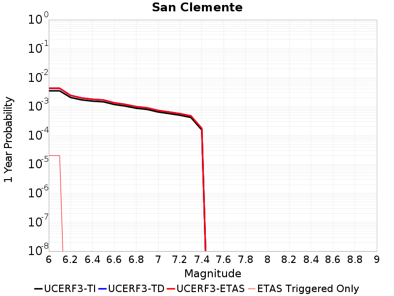 |  |

| Magnitude | 1 wk TI Prob | 1 wk TD Prob | 1 wk ETAS Prob | 1 wk ETAS/TD Gain | 1 wk ETAS Triggered Only | 1 mo TI Prob | 1 mo TD Prob | 1 mo ETAS Prob | 1 mo ETAS/TD Gain | 1 mo ETAS Triggered Only | 1 yr TI Prob | 1 yr TD Prob | 1 yr ETAS Prob | 1 yr ETAS/TD Gain | 1 yr ETAS Triggered Only | 10 yr TI Prob | 10 yr TD Prob | 10 yr ETAS Prob | 10 yr ETAS/TD Gain | 10 yr ETAS Triggered Only |
|-----|-----|-----|-----|-----|-----|-----|-----|-----|-----|-----|-----|-----|-----|-----|-----|-----|-----|-----|-----|-----|
| 6.0 | 6.681379E-5 | 8.175327E-5 | 8.175327E-5 | 1.0 | 0.0 | 2.8631336E-4 | 3.5032624E-4 | 3.5032624E-4 | 1.0 | 0.0 | 0.003480294 | 0.004257375 | 0.0048529147 | 1.1398842 | 5.980861E-4 | 0.03426291 | 0.041813284 | 0.04238636 | 1.0137056 | 5.980861E-4 |
| 6.1 | 6.681379E-5 | 8.175327E-5 | 8.175327E-5 | 1.0 | 0.0 | 2.8631336E-4 | 3.5032624E-4 | 3.5032624E-4 | 1.0 | 0.0 | 0.003480294 | 0.004257375 | 0.0048529147 | 1.1398842 | 5.980861E-4 | 0.03426291 | 0.041813284 | 0.04238636 | 1.0137056 | 5.980861E-4 |
| 6.2 | 3.9400576E-5 | 4.650548E-5 | 4.650548E-5 | 1.0 | 0.0 | 1.6884868E-4 | 1.9929423E-4 | 1.9929423E-4 | 1.0 | 0.0 | 0.0020537945 | 0.0024237619 | 0.0024237619 | 1.0 | 0.0 | 0.020349167 | 0.0239799 | 0.0239799 | 1.0 | 0.0 |
| 6.3 | 3.2590255E-5 | 3.7968726E-5 | 3.7968726E-5 | 1.0 | 0.0 | 1.3966505E-4 | 1.6271316E-4 | 1.6271316E-4 | 1.0 | 0.0 | 0.0016990956 | 0.0019792633 | 0.0019792633 | 1.0 | 0.0 | 0.01686163 | 0.01962014 | 0.01962014 | 1.0 | 0.0 |
| 6.4 | 2.9454652E-5 | 3.4131994E-5 | 3.4131994E-5 | 1.0 | 0.0 | 1.2622811E-4 | 1.4627194E-4 | 1.4627194E-4 | 1.0 | 0.0 | 0.0015357438 | 0.0017794324 | 0.0017794324 | 1.0 | 0.0 | 0.015251739 | 0.017655015 | 0.017655015 | 1.0 | 0.0 |
| 6.5 | 2.790836E-5 | 3.227938E-5 | 3.227938E-5 | 1.0 | 0.0 | 1.1960178E-4 | 1.3833301E-4 | 1.3833301E-4 | 1.0 | 0.0 | 0.001455179 | 0.0016829289 | 0.0016829289 | 1.0 | 0.0 | 0.014456868 | 0.01670486 | 0.01670486 | 1.0 | 0.0 |
| 6.6 | 2.2492153E-5 | 2.5786498E-5 | 2.5786498E-5 | 1.0 | 0.0 | 9.639138E-5 | 1.1050897E-4 | 1.1050897E-4 | 1.0 | 0.0 | 0.0011729331 | 0.001344631 | 0.001344631 | 1.0 | 0.0 | 0.011667615 | 0.013366669 | 0.013366669 | 1.0 | 0.0 |
| 6.7 | 1.9862755E-5 | 2.2686727E-5 | 2.2686727E-5 | 1.0 | 0.0 | 8.512331E-5 | 9.7225275E-5 | 9.7225275E-5 | 1.0 | 0.0 | 0.0010358836 | 0.0011830862 | 0.0011830862 | 1.0 | 0.0 | 0.010310682 | 0.011769173 | 0.011769173 | 1.0 | 0.0 |
| 6.8 | 1.6697575E-5 | 1.8994138E-5 | 1.8994138E-5 | 1.0 | 0.0 | 7.155907E-5 | 8.140096E-5 | 8.140096E-5 | 1.0 | 0.0 | 8.7088346E-4 | 9.906155E-4 | 9.906155E-4 | 1.0 | 0.0 | 0.008674784 | 0.009863026 | 0.009863026 | 1.0 | 0.0 |
| 6.9 | 1.5218415E-5 | 1.728415E-5 | 1.728415E-5 | 1.0 | 0.0 | 6.522015E-5 | 7.407287E-5 | 7.407287E-5 | 1.0 | 0.0 | 7.93766E-4 | 9.0147293E-4 | 9.0147293E-4 | 1.0 | 0.0 | 0.007909367 | 0.008979109 | 0.008979109 | 1.0 | 0.0 |
| 7.0 | 1.2392958E-5 | 1.404478E-5 | 1.404478E-5 | 1.0 | 0.0 | 5.3111595E-5 | 6.019057E-5 | 6.019057E-5 | 1.0 | 0.0 | 6.4644177E-4 | 7.325814E-4 | 7.325814E-4 | 1.0 | 0.0 | 0.0064456454 | 0.007302452 | 0.007302452 | 1.0 | 0.0 |
| 7.1 | 1.0934128E-5 | 1.238547E-5 | 1.238547E-5 | 1.0 | 0.0 | 4.6859706E-5 | 5.3079544E-5 | 5.3079544E-5 | 1.0 | 0.0 | 5.7036756E-4 | 6.4605917E-4 | 6.4605917E-4 | 1.0 | 0.0 | 0.0056890585 | 0.006442557 | 0.006442557 | 1.0 | 0.0 |
| 7.2 | 9.5798805E-6 | 1.0854007E-5 | 1.0854007E-5 | 1.0 | 0.0 | 4.1055984E-5 | 4.6516383E-5 | 4.6516383E-5 | 1.0 | 0.0 | 4.9974193E-4 | 5.6619704E-4 | 5.6619704E-4 | 1.0 | 0.0 | 0.0049861963 | 0.00564827 | 0.00564827 | 1.0 | 0.0 |
| 7.3 | 8.0167365E-6 | 9.091577E-6 | 9.091577E-6 | 1.0 | 0.0 | 3.4356988E-5 | 3.896336E-5 | 3.896336E-5 | 1.0 | 0.0 | 4.1821605E-4 | 4.7428272E-4 | 4.7428272E-4 | 1.0 | 0.0 | 0.0041742986 | 0.0047334093 | 0.0047334093 | 1.0 | 0.0 |
| 7.4 | 2.9581017E-6 | 3.3652898E-6 | 3.3652898E-6 | 1.0 | 0.0 | 1.2677518E-5 | 1.442262E-5 | 1.442262E-5 | 1.0 | 0.0 | 1.5433785E-4 | 1.755863E-4 | 1.755863E-4 | 1.0 | 0.0 | 0.001542307 | 0.0017549716 | 0.0017549716 | 1.0 | 0.0 |

## San Andreas (Mojave S)
*[(top)](#table-of-contents)*

| 1 Week | 1 Month | 1 Year | 10 Year |
|-----|-----|-----|-----|
|  |  | 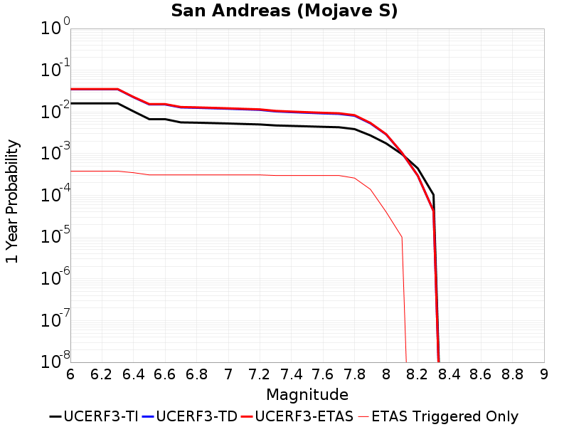 |  |

| Magnitude | 1 wk TI Prob | 1 wk TD Prob | 1 wk ETAS Prob | 1 wk ETAS/TD Gain | 1 wk ETAS Triggered Only | 1 mo TI Prob | 1 mo TD Prob | 1 mo ETAS Prob | 1 mo ETAS/TD Gain | 1 mo ETAS Triggered Only | 1 yr TI Prob | 1 yr TD Prob | 1 yr ETAS Prob | 1 yr ETAS/TD Gain | 1 yr ETAS Triggered Only | 10 yr TI Prob | 10 yr TD Prob | 10 yr ETAS Prob | 10 yr ETAS/TD Gain | 10 yr ETAS Triggered Only |
|-----|-----|-----|-----|-----|-----|-----|-----|-----|-----|-----|-----|-----|-----|-----|-----|-----|-----|-----|-----|-----|
| 6.0 | 3.1064058E-4 | 6.793002E-4 | 6.793002E-4 | 1.0 | 0.0 | 0.0013306376 | 0.0029081672 | 0.0029081672 | 1.0 | 0.0 | 0.016080605 | 0.034959484 | 0.034959484 | 1.0 | 0.0 | 0.1496549 | 0.28804162 | 0.28846744 | 1.0014783 | 5.980861E-4 |
| 6.1 | 3.1064058E-4 | 6.793002E-4 | 6.793002E-4 | 1.0 | 0.0 | 0.0013306376 | 0.0029081672 | 0.0029081672 | 1.0 | 0.0 | 0.016080605 | 0.034959484 | 0.034959484 | 1.0 | 0.0 | 0.1496549 | 0.28804162 | 0.28846744 | 1.0014783 | 5.980861E-4 |
| 6.2 | 3.1064058E-4 | 6.793002E-4 | 6.793002E-4 | 1.0 | 0.0 | 0.0013306376 | 0.0029081672 | 0.0029081672 | 1.0 | 0.0 | 0.016080605 | 0.034959484 | 0.034959484 | 1.0 | 0.0 | 0.1496549 | 0.28804162 | 0.28846744 | 1.0014783 | 5.980861E-4 |
| 6.3 | 3.1064058E-4 | 6.793002E-4 | 6.793002E-4 | 1.0 | 0.0 | 0.0013306376 | 0.0029081672 | 0.0029081672 | 1.0 | 0.0 | 0.016080605 | 0.034959484 | 0.034959484 | 1.0 | 0.0 | 0.1496549 | 0.28804162 | 0.28846744 | 1.0014783 | 5.980861E-4 |
| 6.4 | 1.9872203E-4 | 4.3625938E-4 | 4.3625938E-4 | 1.0 | 0.0 | 8.5138786E-4 | 0.0018683716 | 0.0018683716 | 1.0 | 0.0 | 0.010316478 | 0.022516351 | 0.022516351 | 1.0 | 0.0 | 0.098504856 | 0.19865641 | 0.19913568 | 1.0024126 | 5.980861E-4 |
| 6.5 | 1.291105E-4 | 2.9176514E-4 | 2.9176514E-4 | 1.0 | 0.0 | 5.5321335E-4 | 0.0012498256 | 0.0012498256 | 1.0 | 0.0 | 0.006714592 | 0.015111304 | 0.015111304 | 1.0 | 0.0 | 0.065152965 | 0.13981417 | 0.14032863 | 1.0036796 | 5.980861E-4 |
| 6.6 | 1.291105E-4 | 2.9176514E-4 | 2.9176514E-4 | 1.0 | 0.0 | 5.5321335E-4 | 0.0012498256 | 0.0012498256 | 1.0 | 0.0 | 0.006714592 | 0.015111304 | 0.015111304 | 1.0 | 0.0 | 0.065152965 | 0.13981417 | 0.14032863 | 1.0036796 | 5.980861E-4 |
| 6.7 | 1.08001186E-4 | 2.475139E-4 | 2.475139E-4 | 1.0 | 0.0 | 4.6278012E-4 | 0.0010603432 | 0.0010603432 | 1.0 | 0.0 | 0.0056198016 | 0.012833575 | 0.012833575 | 1.0 | 0.0 | 0.054797906 | 0.12096352 | 0.121489264 | 1.0043463 | 5.980861E-4 |
| 6.8 | 1.0624356E-4 | 2.4267875E-4 | 2.4267875E-4 | 1.0 | 0.0 | 4.5525006E-4 | 0.0010396377 | 0.0010396377 | 1.0 | 0.0 | 0.0055285925 | 0.012584416 | 0.012584416 | 1.0 | 0.0 | 0.053930566 | 0.11891228 | 0.11943925 | 1.0044316 | 5.980861E-4 |
| 6.9 | 1.0393785E-4 | 2.3636666E-4 | 2.3636666E-4 | 1.0 | 0.0 | 4.4537184E-4 | 0.0010126071 | 0.0010126071 | 1.0 | 0.0 | 0.0054089287 | 0.012259062 | 0.012259062 | 1.0 | 0.0 | 0.05279156 | 0.11620802 | 0.116736606 | 1.0045485 | 5.980861E-4 |
| 7.0 | 1.0155622E-4 | 2.3004418E-4 | 2.3004418E-4 | 1.0 | 0.0 | 4.3516833E-4 | 9.855316E-4 | 9.855316E-4 | 1.0 | 0.0 | 0.005285311 | 0.01193307 | 0.01193307 | 1.0 | 0.0 | 0.05161361 | 0.1134624 | 0.11399263 | 1.0046731 | 5.980861E-4 |
| 7.1 | 9.885595E-5 | 2.2290763E-4 | 2.2290763E-4 | 1.0 | 0.0 | 4.2359953E-4 | 9.5496903E-4 | 9.5496903E-4 | 1.0 | 0.0 | 0.0051451353 | 0.011564975 | 0.011564975 | 1.0 | 0.0 | 0.05027629 | 0.110341534 | 0.110873625 | 1.0048223 | 5.980861E-4 |
| 7.2 | 9.6411415E-5 | 2.165183E-4 | 2.165183E-4 | 1.0 | 0.0 | 4.1312634E-4 | 9.276059E-4 | 9.276059E-4 | 1.0 | 0.0 | 0.005018219 | 0.011235312 | 0.011235312 | 1.0 | 0.0 | 0.049064007 | 0.10753252 | 0.1080663 | 1.0049639 | 5.980861E-4 |
| 7.3 | 9.1180635E-5 | 1.9869338E-4 | 1.9869338E-4 | 1.0 | 0.0 | 3.907156E-4 | 8.512653E-4 | 8.512653E-4 | 1.0 | 0.0 | 0.004746591 | 0.010315022 | 0.010315022 | 1.0 | 0.0 | 0.046464786 | 0.09968651 | 0.10022498 | 1.0054016 | 5.980861E-4 |
| 7.4 | 8.887388E-5 | 1.9113426E-4 | 1.9113426E-4 | 1.0 | 0.0 | 3.8083247E-4 | 8.188897E-4 | 8.188897E-4 | 1.0 | 0.0 | 0.0046267817 | 0.00992451 | 0.00992451 | 1.0 | 0.0 | 0.045316286 | 0.096308544 | 0.09684903 | 1.005612 | 5.980861E-4 |
| 7.5 | 8.6750515E-5 | 1.8440776E-4 | 1.8440776E-4 | 1.0 | 0.0 | 3.7173493E-4 | 7.900797E-4 | 7.900797E-4 | 1.0 | 0.0 | 0.004516484 | 0.009576886 | 0.009576886 | 1.0 | 0.0 | 0.04425787 | 0.09326085 | 0.09380315 | 1.0058149 | 5.980861E-4 |
| 7.6 | 8.453092E-5 | 1.7823328E-4 | 1.7823328E-4 | 1.0 | 0.0 | 3.6222505E-4 | 7.6363335E-4 | 7.6363335E-4 | 1.0 | 0.0 | 0.0044011753 | 0.0092576835 | 0.0092576835 | 1.0 | 0.0 | 0.04315024 | 0.09040863 | 0.09095265 | 1.0060173 | 5.980861E-4 |
| 7.7 | 8.259102E-5 | 1.7341258E-4 | 1.7341258E-4 | 1.0 | 0.0 | 3.539135E-4 | 7.4298517E-4 | 7.4298517E-4 | 1.0 | 0.0 | 0.004300386 | 0.009008399 | 0.009008399 | 1.0 | 0.0 | 0.042181134 | 0.08814461 | 0.088689975 | 1.0061872 | 5.980861E-4 |
| 7.8 | 7.444844E-5 | 1.5629901E-4 | 1.5629901E-4 | 1.0 | 0.0 | 3.1902574E-4 | 6.69681E-4 | 6.69681E-4 | 1.0 | 0.0 | 0.0038772223 | 0.008122938 | 0.008122938 | 1.0 | 0.0 | 0.03810269 | 0.07984213 | 0.080392465 | 1.0068928 | 5.980861E-4 |
| 7.9 | 5.2586525E-5 | 1.0243741E-4 | 1.0243741E-4 | 1.0 | 0.0 | 2.2535135E-4 | 4.3894362E-4 | 4.3894362E-4 | 1.0 | 0.0 | 0.0027402006 | 0.0053310553 | 0.0053310553 | 1.0 | 0.0 | 0.027066574 | 0.053307895 | 0.053307895 | 1.0 | 0.0 |
| 8.0 | 3.379877E-5 | 5.5453947E-5 | 5.5453947E-5 | 1.0 | 0.0 | 1.4484383E-4 | 2.3763815E-4 | 2.3763815E-4 | 1.0 | 0.0 | 0.0017620471 | 0.0028894078 | 0.0028894078 | 1.0 | 0.0 | 0.017481409 | 0.029510593 | 0.029510593 | 1.0 | 0.0 |
| 8.1 | 1.8668277E-5 | 1.99668E-5 | 1.99668E-5 | 1.0 | 0.0 | 8.000444E-5 | 8.556919E-5 | 8.556919E-5 | 1.0 | 0.0 | 9.736188E-4 | 0.0010413077 | 0.0010413077 | 1.0 | 0.0 | 0.009693642 | 0.011142521 | 0.011142521 | 1.0 | 0.0 |
| 8.2 | 8.541571E-6 | 5.7102716E-6 | 5.7102716E-6 | 1.0 | 0.0 | 3.660622E-5 | 2.4472363E-5 | 2.4472363E-5 | 1.0 | 0.0 | 4.455896E-4 | 2.9791036E-4 | 2.9791036E-4 | 1.0 | 0.0 | 0.0044469717 | 0.003377185 | 0.003377185 | 1.0 | 0.0 |
| 8.3 | 1.983087E-6 | 8.077459E-7 | 8.077459E-7 | 1.0 | 0.0 | 8.498917E-6 | 3.4617635E-6 | 3.4617635E-6 | 1.0 | 0.0 | 1.034694E-4 | 4.2146174E-5 | 4.2146174E-5 | 1.0 | 0.0 | 0.0010342124 | 4.959089E-4 | 4.959089E-4 | 1.0 | 0.0 |

