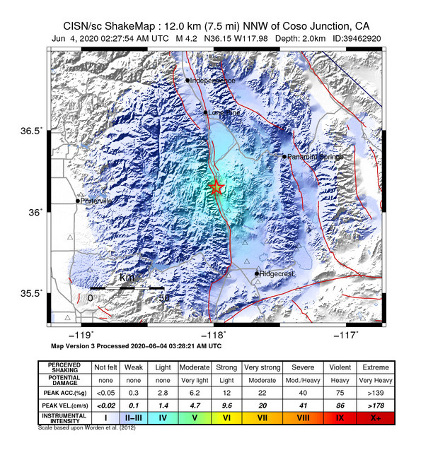
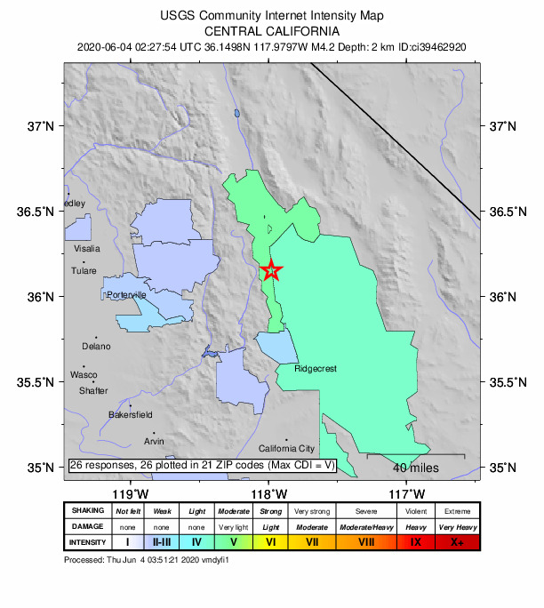
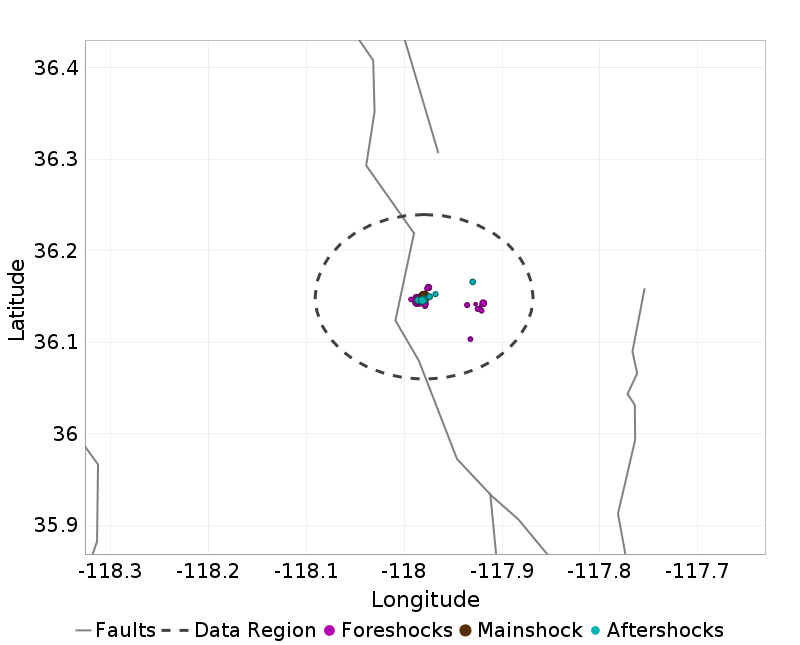
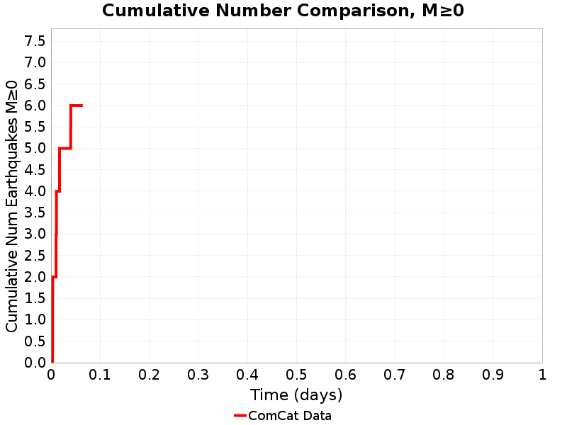
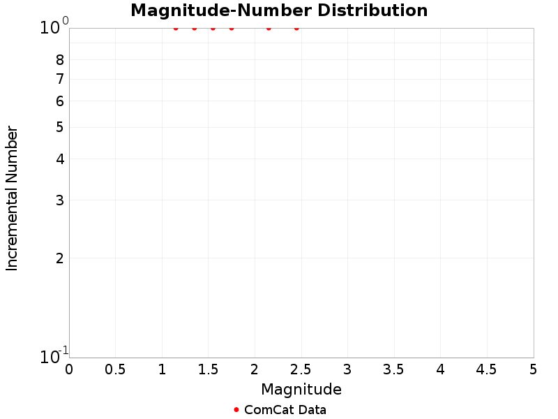
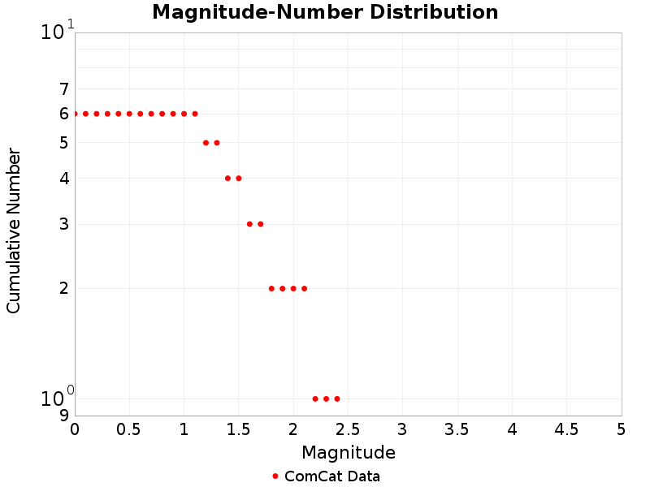

# 4.16, 12km NNW of Coso Junction, CA

## Table Of Contents

* [Mainshock Details](#mainshock-details)
  * [USGS Products](#usgs-products)
  * [Nearby Faults](#nearby-faults)
* [Sequence Details](#sequence-details)
  * [Magnitude Vs. Time Plot](#magnitude-vs-time-plot)
  * [Aftershock Locations](#aftershock-locations)
  * [Cumulative Number Plot](#cumulative-number-plot)
  * [Magnitude-Number Distributions (MNDs)](#magnitude-number-distributions-mnds)

## Mainshock Details
*[(top)](#table-of-contents)*

Information and plots in the section are taken from the [USGS event page](https://earthquake.usgs.gov/earthquakes/eventpage/ci39462920), accessed through ComCat.

| Field | Value |
|-----|-----|
| Magnitude | 4.16 (mw) |
| Time (UTC) | Thu, 4 Jun 2020 02:27:54 UTC |
| Time (PDT) | Wed, 3 Jun 2020 19:27:54 PDT |
| Location | 36.149834, -117.97967 |
| Depth | 2.01 km |
| Status | reviewed |

### USGS Products
*[(top)](#table-of-contents)*

| 
**[ShakeMap](https://earthquake.usgs.gov/earthquakes/eventpage/ci39462920/shakemap/)**
 | 
**[Did You Feel It?](https://earthquake.usgs.gov/earthquakes/eventpage/ci39462920/dyfi/)**
 | 
**[PAGER](https://earthquake.usgs.gov/earthquakes/eventpage/ci39462920/pager/)**
 |
|-----|-----|-----|
|  |  |  |

### Nearby Faults
*[(top)](#table-of-contents)*

2 UCERF3 fault sections are within 10km of this event's hypocenter:

* So Sierra Nevada: 0.42km
* Sierra Nevada  (No Extension): 8.01km
## Sequence Details
*[(top)](#table-of-contents)*

These plots show the aftershock sequence, using data sourced from [ComCat](https://earthquake.usgs.gov/data/comcat/). They were last updated at 2020/06/04 03:56:59 UTC, 89.08 minutes after the mainshock.

6 M&ge;0 earthquakes within 10 km of the mainshock's epicenter.

|  | First Hour | To Date |
|-----|-----|-----|
| **M 0** | 6 | 6 |
| **M 1** | 6 | 6 |
| **M 2** | 2 | 2 |
### Magnitude Vs. Time Plot
*[(top)](#table-of-contents)*

This plot shows the magnitude vs. time evolution of the sequence. The mainshock is ploted as a brown circle, foreshocks are plotted as magenta circles, and aftershocks are plotted as cyan circles.

### Aftershock Locations
*[(top)](#table-of-contents)*

Map view of the aftershock sequence, plotted as cyan circles. The mainshock  and foreshocks are plotted below in brown and magenta circles respectively, but may be obscured by aftershocks. Nearby UCERF3 fault traces are plotted in gray lines, and the region used to fetch aftershock data in a dashed dark gray line.

### Cumulative Number Plot
*[(top)](#table-of-contents)*

This plot shows the cumulative number of M&ge;0 aftershocks as a function of time since the mainshock.

### Magnitude-Number Distributions (MNDs)
*[(top)](#table-of-contents)*

These plot shows the magnitude-number distribution of the aftershock sequence thus far. The left plot gives an incremental distribution (the count in each magnitude bin), and the right plot a cumulative distribution (the count in or above each magnitude bin).

| Incremental MND | Cumulative MND |
|-----|-----|
|  |  |

