# Parent Section Magnitude-Probability Distributions

Only fault sections with at least one triggered aftershock are plotted. Sections are sorted by total supraseismogenic trigger rate (decreasing)

## Table Of Contents

* [Sierra Nevada  (No Extension)](#sierra-nevada--no-extension)
* [Owens Valley](#owens-valley)
* [Hunter Mountain-Saline Valley](#hunter-mountain-saline-valley)
* [Independence rev 2011](#independence-rev-2011)
* [Ash Hill](#ash-hill)
* [Panamint Valley](#panamint-valley)
* [Owl Lake](#owl-lake)
* [Tank Canyon](#tank-canyon)
* [So Sierra Nevada](#so-sierra-nevada)
* [Death Valley (No)](#death-valley-no)
* [Kern Canyon (North Kern) 2011](#kern-canyon-north-kern-2011)
* [Garlock (East)](#garlock-east)
* [Little Lake](#little-lake)
* [San Andreas (Parkfield)](#san-andreas-parkfield)
* [White Mountains](#white-mountains)
* [Dry Mountain](#dry-mountain)
* [Death Valley (So)](#death-valley-so)
* [Death Valley (Black Mtns Frontal)](#death-valley-black-mtns-frontal)
* [Garlock (Central)](#garlock-central)
* [Towne Pass](#towne-pass)
* [Nelson Lake](#nelson-lake)
* [Death Valley (Fish Lake Valley)](#death-valley-fish-lake-valley)
* [McLean Lake](#mclean-lake)
* [Coyote Canyon](#coyote-canyon)
* [San Andreas (Big Bend)](#san-andreas-big-bend)
* [Paradise](#paradise)
* [San Andreas (Mojave S)](#san-andreas-mojave-s)
* [Goldstone Lake](#goldstone-lake)
* [Lost Hills](#lost-hills)
* [San Andreas (San Bernardino N)](#san-andreas-san-bernardino-n)
* [Lenwood-Lockhart-Old Woman Springs](#lenwood-lockhart-old-woman-springs)
* [Deep Springs](#deep-springs)
* [Kern Canyon (South Kern) 2011](#kern-canyon-south-kern-2011)
* [Baker](#baker)
* [Garlic Springs](#garlic-springs)
* [Hartley Springs 2011 CFM](#hartley-springs-2011-cfm)
* [Elsinore (Glen Ivy) rev](#elsinore-glen-ivy-rev)
* [Bicycle Lake](#bicycle-lake)
* [San Andreas (Mojave N)](#san-andreas-mojave-n)
* [Red Pass](#red-pass)
* [Blackwater](#blackwater)
* [Tin Mountain](#tin-mountain)
* [San Andreas (Cholame) rev](#san-andreas-cholame-rev)
* [Gravel Hills-Harper Lk](#gravel-hills-harper-lk)
* [San Andreas (Creeping Section) 2011 CFM](#san-andreas-creeping-section-2011-cfm)
* [Coyote Lake](#coyote-lake)
* [Cady](#cady)
* [San Diego Trough south](#san-diego-trough-south)
* [San Andreas (Carrizo) rev](#san-andreas-carrizo-rev)
* [Big Pine (East)](#big-pine-east)
* [Big Pine (Central)](#big-pine-central)
* [Santa Cruz Island](#santa-cruz-island)
* [San Gregorio (North) 2011 CFM](#san-gregorio-north-2011-cfm)
* [San Andreas (San Bernardino S)](#san-andreas-san-bernardino-s)

## Sierra Nevada  (No Extension)
*[(top)](#table-of-contents)*

| 1 Week | 1 Month | 1 Year | 10 Year |
|-----|-----|-----|-----|
|  |  |  |  |

| Magnitude | 1 wk TI Prob | 1 wk TD Prob | 1 wk ETAS Prob | 1 wk ETAS/TD Gain | 1 wk ETAS Triggered Only | 1 mo TI Prob | 1 mo TD Prob | 1 mo ETAS Prob | 1 mo ETAS/TD Gain | 1 mo ETAS Triggered Only | 1 yr TI Prob | 1 yr TD Prob | 1 yr ETAS Prob | 1 yr ETAS/TD Gain | 1 yr ETAS Triggered Only | 10 yr TI Prob | 10 yr TD Prob | 10 yr ETAS Prob | 10 yr ETAS/TD Gain | 10 yr ETAS Triggered Only |
|-----|-----|-----|-----|-----|-----|-----|-----|-----|-----|-----|-----|-----|-----|-----|-----|-----|-----|-----|-----|-----|
| 6.0 | 7.7690465E-6 | 6.9794733E-6 | 0.005246943 | 751.76776 | 0.00524 | 3.329549E-5 | 2.9911887E-5 | 0.0076296846 | 255.07199 | 0.0076 | 4.0529718E-4 | 3.6415225E-4 | 0.011979921 | 32.89811 | 0.01162 | 0.004045588 | 0.0036390736 | 0.019022886 | 5.227398 | 0.01544 |
| 6.1 | 7.7690465E-6 | 6.9794733E-6 | 0.005246943 | 751.76776 | 0.00524 | 3.329549E-5 | 2.9911887E-5 | 0.0076296846 | 255.07199 | 0.0076 | 4.0529718E-4 | 3.6415225E-4 | 0.011979921 | 32.89811 | 0.01162 | 0.004045588 | 0.0036390736 | 0.019022886 | 5.227398 | 0.01544 |
| 6.2 | 7.7690465E-6 | 6.9794733E-6 | 0.005246943 | 751.76776 | 0.00524 | 3.329549E-5 | 2.9911887E-5 | 0.0076296846 | 255.07199 | 0.0076 | 4.0529718E-4 | 3.6415225E-4 | 0.011979921 | 32.89811 | 0.01162 | 0.004045588 | 0.0036390736 | 0.019022886 | 5.227398 | 0.01544 |
| 6.3 | 7.7690465E-6 | 6.9794733E-6 | 0.005246943 | 751.76776 | 0.00524 | 3.329549E-5 | 2.9911887E-5 | 0.0076296846 | 255.07199 | 0.0076 | 4.0529718E-4 | 3.6415225E-4 | 0.011979921 | 32.89811 | 0.01162 | 0.004045588 | 0.0036390736 | 0.019022886 | 5.227398 | 0.01544 |
| 6.4 | 7.7690465E-6 | 6.9794733E-6 | 0.005246943 | 751.76776 | 0.00524 | 3.329549E-5 | 2.9911887E-5 | 0.0076296846 | 255.07199 | 0.0076 | 4.0529718E-4 | 3.6415225E-4 | 0.011979921 | 32.89811 | 0.01162 | 0.004045588 | 0.0036390736 | 0.019022886 | 5.227398 | 0.01544 |
| 6.5 | 7.7690465E-6 | 6.9794733E-6 | 0.005246943 | 751.76776 | 0.00524 | 3.329549E-5 | 2.9911887E-5 | 0.0076296846 | 255.07199 | 0.0076 | 4.0529718E-4 | 3.6415225E-4 | 0.011979921 | 32.89811 | 0.01162 | 0.004045588 | 0.0036390736 | 0.019022886 | 5.227398 | 0.01544 |
| 6.6 | 2.653E-6 | 1.6162761E-6 | 2.0161596E-4 | 124.74103 | 2.0E-4 | 1.136995E-5 | 6.9268795E-6 | 3.369246E-4 | 48.640167 | 3.3E-4 | 1.3842035E-4 | 8.433153E-5 | 5.542919E-4 | 6.5727715 | 4.7E-4 | 0.0013833415 | 8.4299874E-4 | 0.0015524002 | 1.8415214 | 7.1E-4 |
| 6.7 | 2.5902466E-6 | 1.5515965E-6 | 1.8155132E-4 | 117.00937 | 1.8E-4 | 1.11010095E-5 | 6.6496823E-6 | 2.8664782E-4 | 43.106995 | 2.8E-4 | 1.351464E-4 | 8.09569E-5 | 4.7092533E-4 | 5.816988 | 3.9E-4 | 0.0013506424 | 8.0927706E-4 | 0.0014187834 | 1.7531492 | 6.1E-4 |
| 6.8 | 2.5853892E-6 | 1.5483904E-6 | 1.8154811E-4 | 117.24957 | 1.8E-4 | 1.1080193E-5 | 6.635942E-6 | 2.8663408E-4 | 43.194183 | 2.8E-4 | 1.34893E-4 | 8.078963E-5 | 4.7075812E-4 | 5.8269625 | 3.9E-4 | 0.0013481114 | 8.0760557E-4 | 0.0014171129 | 1.7547092 | 6.1E-4 |
| 6.9 | 2.458257E-6 | 1.4234339E-6 | 1.7142319E-4 | 120.42933 | 1.7E-4 | 1.0535345E-5 | 6.100417E-6 | 2.3609902E-4 | 38.70211 | 2.3E-4 | 1.2826028E-4 | 7.4270065E-5 | 3.742478E-4 | 5.0390124 | 3.0E-4 | 0.0012818627 | 7.4245443E-4 | 0.0012021129 | 1.6191067 | 4.6E-4 |
| 7.0 | 2.4341468E-6 | 1.4003836E-6 | 1.5140018E-4 | 108.11336 | 1.5E-4 | 1.0432016E-5 | 6.00163E-6 | 2.1600036E-4 | 35.990284 | 2.1E-4 | 1.270024E-4 | 7.3067415E-5 | 3.5304695E-4 | 4.8317976 | 2.8E-4 | 0.0012692984 | 7.3043583E-4 | 0.0011401364 | 1.5608987 | 4.1E-4 |
| 7.1 | 2.3652476E-6 | 1.3352957E-6 | 1.4133511E-4 | 105.84555 | 1.4E-4 | 1.0136736E-5 | 5.7226835E-6 | 2.0572155E-4 | 35.94844 | 2.0E-4 | 1.2340778E-4 | 6.9671456E-5 | 3.3965264E-4 | 4.8750615 | 2.7E-4 | 0.0012333926 | 6.9649785E-4 | 0.0010762332 | 1.5452068 | 3.8E-4 |
| 7.2 | 2.272158E-6 | 1.2515546E-6 | 1.212514E-4 | 96.88064 | 1.2E-4 | 9.737784E-6 | 5.3637946E-6 | 1.7536289E-4 | 32.69381 | 1.7E-4 | 1.1855107E-4 | 6.530226E-5 | 2.8528788E-4 | 4.3687296 | 2.2E-4 | 0.0011848784 | 6.5283215E-4 | 9.4264286E-4 | 1.4439284 | 2.9E-4 |
| 7.3 | 2.1382127E-6 | 1.1431952E-6 | 8.11431E-5 | 70.97922 | 8.0E-5 | 9.163737E-6 | 4.899399E-6 | 1.3489876E-4 | 27.533737 | 1.3E-4 | 1.1156279E-4 | 5.964856E-5 | 2.3963783E-4 | 4.0174956 | 1.8E-4 | 0.001115068 | 5.9632666E-4 | 8.261895E-4 | 1.3854647 | 2.3E-4 |
| 7.4 | 1.9048055E-6 | 9.586776E-7 | 2.0958658E-5 | 21.862051 | 2.0E-5 | 8.163426E-6 | 4.108612E-6 | 6.410837E-5 | 15.603413 | 6.0E-5 | 9.9385186E-5 | 5.0021208E-5 | 1.300172E-4 | 2.5992417 | 8.0E-5 | 9.934074E-4 | 5.001002E-4 | 6.0005015E-4 | 1.19986 | 1.0E-4 |
| 7.5 | 1.5373403E-6 | 7.56978E-7 | 1.075697E-5 | 14.210414 | 1.0E-5 | 6.5885843E-6 | 3.2441874E-6 | 3.324409E-5 | 10.247278 | 3.0E-5 | 8.021306E-5 | 3.949727E-5 | 7.9495694E-5 | 2.0126882 | 4.0E-5 | 8.0184115E-4 | 3.9490298E-4 | 4.4488325E-4 | 1.1265634 | 5.0E-5 |
| 7.6 | 1.0680322E-6 | 4.6665528E-7 | 4.6665528E-7 | 1.0 | 0.0 | 4.577273E-6 | 1.9999495E-6 | 1.19999295E-5 | 6.000116 | 1.0E-5 | 5.5726876E-5 | 2.4349118E-5 | 3.4348875E-5 | 1.4106826 | 1.0E-5 | 5.5712904E-4 | 2.4346476E-4 | 2.5346232E-4 | 1.0410637 | 1.0E-5 |
| 7.7 | 5.509146E-7 | 1.561481E-7 | 1.561481E-7 | 1.0 | 0.0 | 2.3610605E-6 | 6.69206E-7 | 1.06692E-5 | 15.943072 | 1.0E-5 | 2.8745531E-5 | 8.147554E-6 | 1.8147472E-5 | 2.2273524 | 1.0E-5 | 2.8741814E-4 | 8.147266E-5 | 9.147185E-5 | 1.1227306 | 1.0E-5 |

## Owens Valley
*[(top)](#table-of-contents)*

| 1 Week | 1 Month | 1 Year | 10 Year |
|-----|-----|-----|-----|
| 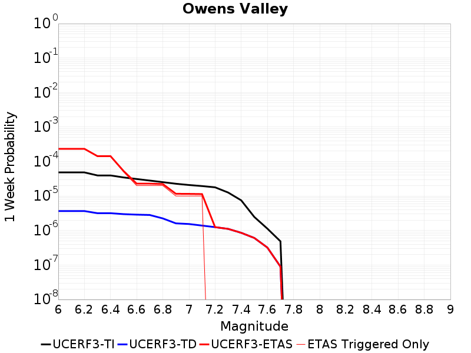 |  | 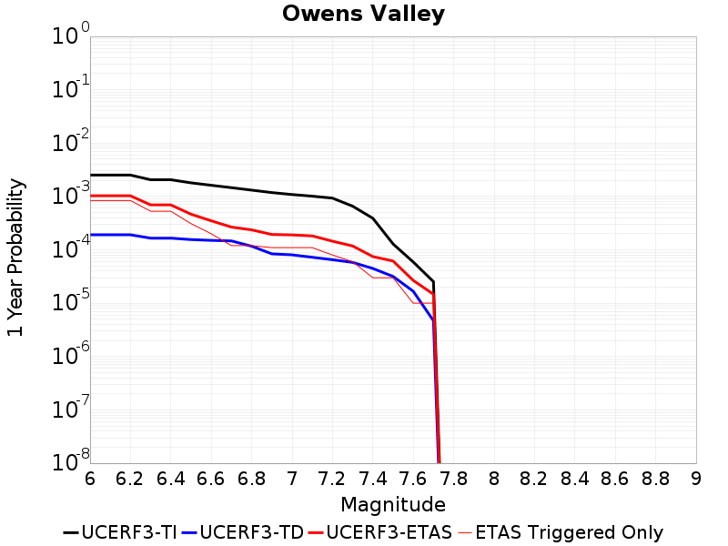 |  |

| Magnitude | 1 wk TI Prob | 1 wk TD Prob | 1 wk ETAS Prob | 1 wk ETAS/TD Gain | 1 wk ETAS Triggered Only | 1 mo TI Prob | 1 mo TD Prob | 1 mo ETAS Prob | 1 mo ETAS/TD Gain | 1 mo ETAS Triggered Only | 1 yr TI Prob | 1 yr TD Prob | 1 yr ETAS Prob | 1 yr ETAS/TD Gain | 1 yr ETAS Triggered Only | 10 yr TI Prob | 10 yr TD Prob | 10 yr ETAS Prob | 10 yr ETAS/TD Gain | 10 yr ETAS Triggered Only |
|-----|-----|-----|-----|-----|-----|-----|-----|-----|-----|-----|-----|-----|-----|-----|-----|-----|-----|-----|-----|-----|
| 6.0 | 4.83821E-5 | 3.6682127E-6 | 2.3366736E-4 | 63.700603 | 2.3E-4 | 2.0733538E-4 | 1.5720823E-5 | 4.257144E-4 | 27.07965 | 4.1E-4 | 0.002521386 | 1.9138523E-4 | 0.0010312245 | 5.3882136 | 8.4E-4 | 0.024929691 | 0.001944951 | 0.0030228505 | 1.5542039 | 0.00108 |
| 6.1 | 4.83821E-5 | 3.6682127E-6 | 2.3366736E-4 | 63.700603 | 2.3E-4 | 2.0733538E-4 | 1.5720823E-5 | 4.257144E-4 | 27.07965 | 4.1E-4 | 0.002521386 | 1.9138523E-4 | 0.0010312245 | 5.3882136 | 8.4E-4 | 0.024929691 | 0.001944951 | 0.0030228505 | 1.5542039 | 0.00108 |
| 6.2 | 4.83821E-5 | 3.6682127E-6 | 2.3366736E-4 | 63.700603 | 2.3E-4 | 2.0733538E-4 | 1.5720823E-5 | 4.257144E-4 | 27.07965 | 4.1E-4 | 0.002521386 | 1.9138523E-4 | 0.0010312245 | 5.3882136 | 8.4E-4 | 0.024929691 | 0.001944951 | 0.0030228505 | 1.5542039 | 0.00108 |
| 6.3 | 3.953008E-5 | 3.1762575E-6 | 1.4317581E-4 | 45.07689 | 1.4E-4 | 1.6940363E-4 | 1.3612465E-5 | 2.7360892E-4 | 20.09988 | 2.6E-4 | 0.002060538 | 1.657199E-4 | 6.956321E-4 | 4.1976376 | 5.3E-4 | 0.020415364 | 0.0016743608 | 0.0023332557 | 1.3935202 | 6.6E-4 |
| 6.4 | 3.953008E-5 | 3.1762575E-6 | 1.4317581E-4 | 45.07689 | 1.4E-4 | 1.6940363E-4 | 1.3612465E-5 | 2.7360892E-4 | 20.09988 | 2.6E-4 | 0.002060538 | 1.657199E-4 | 6.956321E-4 | 4.1976376 | 5.3E-4 | 0.020415364 | 0.0016743608 | 0.0023332557 | 1.3935202 | 6.6E-4 |
| 6.5 | 3.457342E-5 | 2.9859686E-6 | 5.298582E-5 | 17.744936 | 5.0E-5 | 1.4816338E-4 | 1.279695E-5 | 1.5279515E-4 | 11.939967 | 1.4E-4 | 0.0018023965 | 1.5579243E-4 | 4.6574412E-4 | 2.9895172 | 3.1E-4 | 0.017878477 | 0.0015643103 | 0.0019337315 | 1.236156 | 3.7E-4 |
| 6.6 | 3.1127765E-5 | 2.8843351E-6 | 2.2884278E-5 | 7.933987 | 2.0E-5 | 1.3339789E-4 | 1.2361382E-5 | 9.2360395E-5 | 7.4716887 | 8.0E-5 | 0.0016229092 | 1.5049012E-4 | 3.5046003E-4 | 2.328791 | 2.0E-4 | 0.016111081 | 0.001506938 | 0.0017166216 | 1.1391454 | 2.1E-4 |
| 6.7 | 2.806885E-5 | 2.817949E-6 | 2.2817892E-5 | 8.097341 | 2.0E-5 | 1.2028952E-4 | 1.2076873E-5 | 7.2076145E-5 | 5.968114 | 6.0E-5 | 0.001463541 | 1.4702669E-4 | 2.6700905E-4 | 1.8160584 | 1.2E-4 | 0.014539397 | 0.0014696425 | 0.0015894661 | 1.0815325 | 1.2E-4 |
| 6.8 | 2.524524E-5 | 2.2418917E-6 | 2.2241848E-5 | 9.921017 | 2.0E-5 | 1.0818939E-4 | 9.608074E-6 | 6.96075E-5 | 7.244688 | 6.0E-5 | 0.0013164099 | 1.16972325E-4 | 2.369583E-4 | 2.0257638 | 1.2E-4 | 0.01308639 | 0.0011693527 | 0.0012892124 | 1.1025009 | 1.2E-4 |
| 6.9 | 2.2704568E-5 | 1.6129786E-6 | 1.1612962E-5 | 7.1997004 | 1.0E-5 | 9.730166E-5 | 6.9127473E-6 | 5.6912402E-5 | 8.2329645 | 5.0E-5 | 0.0011840039 | 8.415947E-5 | 1.9415021E-4 | 2.3069324 | 1.1E-4 | 0.011777153 | 8.414514E-4 | 9.513588E-4 | 1.1306165 | 1.1E-4 |
| 7.0 | 2.0871712E-5 | 1.5441029E-6 | 1.1544087E-5 | 7.4762425 | 1.0E-5 | 8.944713E-5 | 6.617567E-6 | 5.6617235E-5 | 8.555596 | 5.0E-5 | 0.0010884746 | 8.056592E-5 | 1.9055705E-4 | 2.3652315 | 1.1E-4 | 0.010831586 | 8.0549746E-4 | 9.1540883E-4 | 1.1364516 | 1.1E-4 |
| 7.1 | 1.944928E-5 | 1.3903016E-6 | 1.1390288E-5 | 8.192675 | 1.0E-5 | 8.335139E-5 | 5.9584218E-6 | 5.5958124E-5 | 9.391434 | 5.0E-5 | 0.0010143308 | 7.254138E-5 | 1.825334E-4 | 2.5162659 | 1.1E-4 | 0.010097133 | 7.2529266E-4 | 8.352129E-4 | 1.1515529 | 1.1E-4 |
| 7.2 | 1.7876306E-5 | 1.2523158E-6 | 1.2523158E-6 | 1.0 | 0.0 | 7.6610486E-5 | 5.367057E-6 | 4.5366844E-5 | 8.452834 | 4.0E-5 | 9.3233347E-4 | 6.534196E-5 | 1.4533674E-4 | 2.224248 | 8.0E-5 | 0.009284316 | 6.5333076E-4 | 7.332785E-4 | 1.1223694 | 8.0E-5 |
| 7.3 | 1.2618672E-5 | 1.1146716E-6 | 1.1146716E-6 | 1.0 | 0.0 | 5.40789E-5 | 4.7771555E-6 | 4.4776963E-5 | 9.373144 | 4.0E-5 | 6.582117E-4 | 5.816032E-5 | 1.1815683E-4 | 2.0315711 | 6.0E-5 | 0.0065626553 | 5.8154913E-4 | 6.415142E-4 | 1.1031127 | 6.0E-5 |
| 7.4 | 7.4874442E-6 | 8.575135E-7 | 8.575135E-7 | 1.0 | 0.0 | 3.208865E-5 | 3.6750525E-6 | 2.3674978E-5 | 6.442079 | 2.0E-5 | 3.906093E-4 | 4.474285E-5 | 7.474151E-5 | 1.6704682 | 3.0E-5 | 0.003899234 | 4.4739567E-4 | 4.7738224E-4 | 1.0670247 | 3.0E-5 |
| 7.5 | 2.4734156E-6 | 6.0862646E-7 | 6.0862646E-7 | 1.0 | 0.0 | 1.060031E-5 | 2.6083965E-6 | 2.2608345E-5 | 8.667525 | 2.0E-5 | 1.2905113E-4 | 3.175677E-5 | 6.175582E-5 | 1.9446505 | 3.0E-5 | 0.0012897621 | 3.1752264E-4 | 3.475131E-4 | 1.0944514 | 3.0E-5 |
| 7.6 | 1.1328841E-6 | 3.205271E-7 | 3.205271E-7 | 1.0 | 0.0 | 4.8552088E-6 | 1.3736868E-6 | 1.1373673E-5 | 8.27967 | 1.0E-5 | 5.9110564E-5 | 1.672451E-5 | 2.6724343E-5 | 1.5979148 | 1.0E-5 | 5.9094845E-4 | 1.6723272E-4 | 1.7723104E-4 | 1.0597869 | 1.0E-5 |
| 7.7 | 4.8613185E-7 | 8.998069E-8 | 8.998069E-8 | 1.0 | 0.0 | 2.0834207E-6 | 3.8563147E-7 | 1.0385627E-5 | 26.931484 | 1.0E-5 | 2.536535E-5 | 4.6950536E-6 | 1.4695007E-5 | 3.1298912 | 1.0E-5 | 2.5362454E-4 | 4.694961E-5 | 5.6949142E-5 | 1.2129843 | 1.0E-5 |

## Hunter Mountain-Saline Valley
*[(top)](#table-of-contents)*

| 1 Week | 1 Month | 1 Year | 10 Year |
|-----|-----|-----|-----|
| 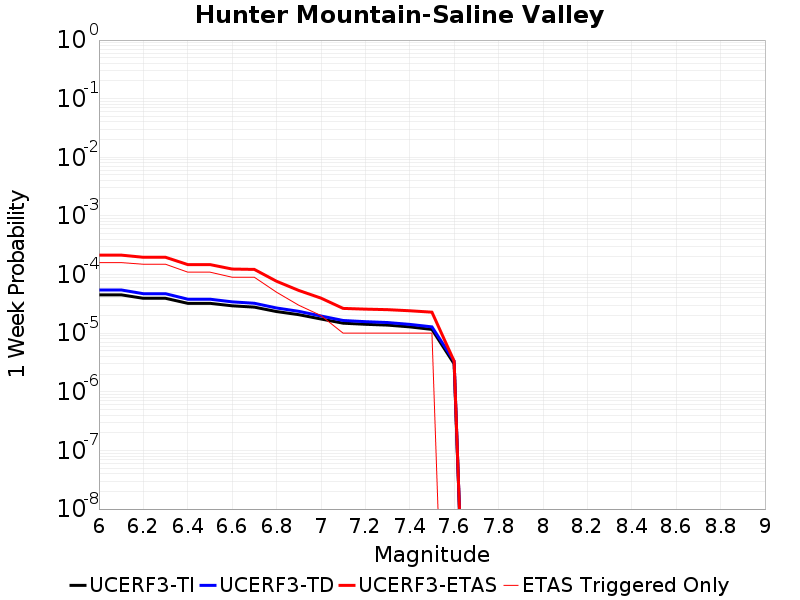 |  | 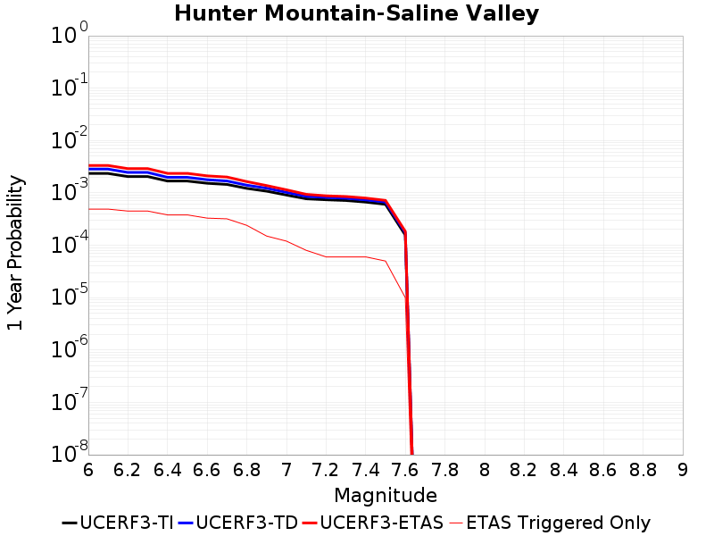 |  |

| Magnitude | 1 wk TI Prob | 1 wk TD Prob | 1 wk ETAS Prob | 1 wk ETAS/TD Gain | 1 wk ETAS Triggered Only | 1 mo TI Prob | 1 mo TD Prob | 1 mo ETAS Prob | 1 mo ETAS/TD Gain | 1 mo ETAS Triggered Only | 1 yr TI Prob | 1 yr TD Prob | 1 yr ETAS Prob | 1 yr ETAS/TD Gain | 1 yr ETAS Triggered Only | 10 yr TI Prob | 10 yr TD Prob | 10 yr ETAS Prob | 10 yr ETAS/TD Gain | 10 yr ETAS Triggered Only |
|-----|-----|-----|-----|-----|-----|-----|-----|-----|-----|-----|-----|-----|-----|-----|-----|-----|-----|-----|-----|-----|
| 6.0 | 4.5103672E-5 | 5.465611E-5 | 2.1464737E-4 | 3.9272344 | 1.6E-4 | 1.9328714E-4 | 2.3422022E-4 | 4.6416634E-4 | 1.9817518 | 2.3E-4 | 0.002350731 | 0.0028480808 | 0.0033366852 | 1.1715556 | 4.9E-4 | 0.023260195 | 0.028136712 | 0.028953077 | 1.0290142 | 8.4E-4 |
| 6.1 | 4.5103672E-5 | 5.465611E-5 | 2.1464737E-4 | 3.9272344 | 1.6E-4 | 1.9328714E-4 | 2.3422022E-4 | 4.6416634E-4 | 1.9817518 | 2.3E-4 | 0.002350731 | 0.0028480808 | 0.0033366852 | 1.1715556 | 4.9E-4 | 0.023260195 | 0.028136712 | 0.028953077 | 1.0290142 | 8.4E-4 |
| 6.2 | 3.9363465E-5 | 4.7134916E-5 | 1.9712784E-4 | 4.1822042 | 1.5E-4 | 1.6868966E-4 | 2.0199158E-4 | 4.1194918E-4 | 2.0394373 | 2.1E-4 | 0.002051862 | 0.0024566096 | 0.0029055043 | 1.1827292 | 4.5E-4 | 0.020330196 | 0.024310874 | 0.025052398 | 1.0305017 | 7.6E-4 |
| 6.3 | 3.9363465E-5 | 4.7134916E-5 | 1.9712784E-4 | 4.1822042 | 1.5E-4 | 1.6868966E-4 | 2.0199158E-4 | 4.1194918E-4 | 2.0394373 | 2.1E-4 | 0.002051862 | 0.0024566096 | 0.0029055043 | 1.1827292 | 4.5E-4 | 0.020330196 | 0.024310874 | 0.025052398 | 1.0305017 | 7.6E-4 |
| 6.4 | 3.2311684E-5 | 3.8005863E-5 | 1.4800168E-4 | 3.8941803 | 1.1E-4 | 1.384713E-4 | 1.628725E-4 | 3.1284807E-4 | 1.9208157 | 1.5E-4 | 0.0016845843 | 0.0019812381 | 0.0023604853 | 1.1914192 | 3.8E-4 | 0.016718714 | 0.019645113 | 0.020311756 | 1.0339342 | 6.8E-4 |
| 6.5 | 3.2311684E-5 | 3.8005863E-5 | 1.4800168E-4 | 3.8941803 | 1.1E-4 | 1.384713E-4 | 1.628725E-4 | 3.1284807E-4 | 1.9208157 | 1.5E-4 | 0.0016845843 | 0.0019812381 | 0.0023604853 | 1.1914192 | 3.8E-4 | 0.016718714 | 0.019645113 | 0.020311756 | 1.0339342 | 6.8E-4 |
| 6.6 | 2.9305844E-5 | 3.4230343E-5 | 1.2422726E-4 | 3.6291564 | 9.0E-5 | 1.2559042E-4 | 1.4669356E-4 | 2.766745E-4 | 1.8860711 | 1.3E-4 | 0.0015279909 | 0.0017845929 | 0.002114004 | 1.1845862 | 3.3E-4 | 0.015175272 | 0.017711125 | 0.018329967 | 1.0349408 | 6.3E-4 |
| 6.7 | 2.7826512E-5 | 3.2389766E-5 | 1.2238685E-4 | 3.7785656 | 9.0E-5 | 1.19251024E-4 | 1.3880624E-4 | 2.687882E-4 | 1.9364274 | 1.3E-4 | 0.0014509142 | 0.0016887162 | 0.002008176 | 1.1891731 | 3.2E-4 | 0.014414776 | 0.016767124 | 0.017347232 | 1.0345979 | 5.9E-4 |
| 6.8 | 2.3389874E-5 | 2.6903543E-5 | 7.69022E-5 | 2.8584414 | 5.0E-5 | 1.0023846E-4 | 1.15296076E-4 | 1.8528801E-4 | 1.6070626 | 7.0E-5 | 0.00121972 | 0.0014028732 | 0.0016425365 | 1.1708375 | 2.4E-4 | 0.01213047 | 0.013946981 | 0.014420287 | 1.033936 | 4.8E-4 |
| 6.9 | 2.069209E-5 | 2.3601931E-5 | 5.3601223E-5 | 2.2710524 | 3.0E-5 | 8.867737E-5 | 1.01147416E-4 | 1.4114338E-4 | 1.3954225 | 4.0E-5 | 0.0010791123 | 0.0012308103 | 0.0013806258 | 1.1217209 | 1.5E-4 | 0.010738871 | 0.012245559 | 0.012571518 | 1.0266186 | 3.3E-4 |
| 7.0 | 1.7462342E-5 | 1.9659645E-5 | 3.965925E-5 | 2.0172925 | 2.0E-5 | 7.483646E-5 | 8.425303E-5 | 1.142505E-4 | 1.3560404 | 3.0E-5 | 9.1075303E-4 | 0.0010253205 | 0.0011451975 | 1.1169165 | 1.2E-4 | 0.009070295 | 0.010210123 | 0.010457571 | 1.0242355 | 2.5E-4 |
| 7.1 | 1.4807709E-5 | 1.6463498E-5 | 2.6463335E-5 | 1.6073943 | 1.0E-5 | 6.3460066E-5 | 7.055604E-5 | 9.0554626E-5 | 1.2834426 | 2.0E-5 | 7.723524E-4 | 8.5869775E-4 | 9.3862903E-4 | 1.0930843 | 8.0E-5 | 0.007696735 | 0.008557375 | 0.008716005 | 1.0185373 | 1.6E-4 |
| 7.2 | 1.4180048E-5 | 1.5719164E-5 | 2.5719008E-5 | 1.6361561 | 1.0E-5 | 6.077022E-5 | 6.73662E-5 | 8.736485E-5 | 1.2968647 | 2.0E-5 | 7.396263E-4 | 8.1989117E-4 | 8.79842E-4 | 1.0731205 | 6.0E-5 | 0.0073716943 | 0.008172204 | 0.0082813045 | 1.0133502 | 1.1E-4 |
| 7.3 | 1.3730402E-5 | 1.51922695E-5 | 2.5192117E-5 | 1.6582195 | 1.0E-5 | 5.8843252E-5 | 6.5108194E-5 | 8.510689E-5 | 1.307161 | 2.0E-5 | 7.161811E-4 | 7.9242006E-4 | 8.5237256E-4 | 1.0756574 | 6.0E-5 | 0.007138774 | 0.007899468 | 0.007998678 | 1.012559 | 1.0E-4 |
| 7.4 | 1.2810095E-5 | 1.4127837E-5 | 2.4127696E-5 | 1.7078124 | 1.0E-5 | 5.489925E-5 | 6.0546558E-5 | 8.0545346E-5 | 1.3303043 | 2.0E-5 | 6.681934E-4 | 7.3692086E-4 | 7.968767E-4 | 1.0813599 | 6.0E-5 | 0.006661878 | 0.007348258 | 0.00742767 | 1.0108069 | 8.0E-5 |
| 7.5 | 1.1595659E-5 | 1.2818514E-5 | 2.2818385E-5 | 1.7801117 | 1.0E-5 | 4.9694736E-5 | 5.493542E-5 | 7.493432E-5 | 1.3640438 | 2.0E-5 | 6.0486543E-4 | 6.686492E-4 | 7.186158E-4 | 1.0747277 | 5.0E-5 | 0.006032217 | 0.0066698412 | 0.0067393743 | 1.010425 | 7.0E-5 |
| 7.6 | 2.997694E-6 | 3.3320775E-6 | 3.3320775E-6 | 1.0 | 0.0 | 1.28471975E-5 | 1.42802955E-5 | 1.42802955E-5 | 1.0 | 0.0 | 1.564034E-4 | 1.7385604E-4 | 1.838543E-4 | 1.0575088 | 1.0E-5 | 0.0015629337 | 0.0017390245 | 0.0017490071 | 1.0057404 | 1.0E-5 |

## Independence rev 2011
*[(top)](#table-of-contents)*

| 1 Week | 1 Month | 1 Year | 10 Year |
|-----|-----|-----|-----|
|  |  |  | 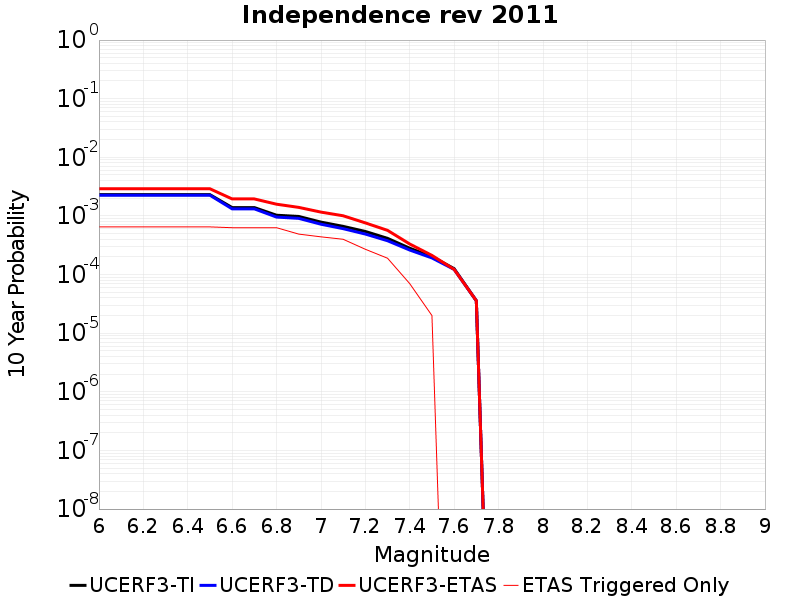 |

| Magnitude | 1 wk TI Prob | 1 wk TD Prob | 1 wk ETAS Prob | 1 wk ETAS/TD Gain | 1 wk ETAS Triggered Only | 1 mo TI Prob | 1 mo TD Prob | 1 mo ETAS Prob | 1 mo ETAS/TD Gain | 1 mo ETAS Triggered Only | 1 yr TI Prob | 1 yr TD Prob | 1 yr ETAS Prob | 1 yr ETAS/TD Gain | 1 yr ETAS Triggered Only | 10 yr TI Prob | 10 yr TD Prob | 10 yr ETAS Prob | 10 yr ETAS/TD Gain | 10 yr ETAS Triggered Only |
|-----|-----|-----|-----|-----|-----|-----|-----|-----|-----|-----|-----|-----|-----|-----|-----|-----|-----|-----|-----|-----|
| 6.0 | 4.422171E-6 | 4.3271552E-6 | 2.243262E-4 | 51.8415 | 2.2E-4 | 1.8952025E-5 | 1.8544835E-5 | 3.485387E-4 | 18.794382 | 3.3E-4 | 2.3071647E-4 | 2.2576297E-4 | 6.856591E-4 | 3.0370753 | 4.6E-4 | 0.0023047708 | 0.0022556297 | 0.0029041637 | 1.2875179 | 6.5E-4 |
| 6.1 | 4.422171E-6 | 4.3271552E-6 | 2.243262E-4 | 51.8415 | 2.2E-4 | 1.8952025E-5 | 1.8544835E-5 | 3.485387E-4 | 18.794382 | 3.3E-4 | 2.3071647E-4 | 2.2576297E-4 | 6.856591E-4 | 3.0370753 | 4.6E-4 | 0.0023047708 | 0.0022556297 | 0.0029041637 | 1.2875179 | 6.5E-4 |
| 6.2 | 4.422171E-6 | 4.3271552E-6 | 2.243262E-4 | 51.8415 | 2.2E-4 | 1.8952025E-5 | 1.8544835E-5 | 3.485387E-4 | 18.794382 | 3.3E-4 | 2.3071647E-4 | 2.2576297E-4 | 6.856591E-4 | 3.0370753 | 4.6E-4 | 0.0023047708 | 0.0022556297 | 0.0029041637 | 1.2875179 | 6.5E-4 |
| 6.3 | 4.422171E-6 | 4.3271552E-6 | 2.243262E-4 | 51.8415 | 2.2E-4 | 1.8952025E-5 | 1.8544835E-5 | 3.485387E-4 | 18.794382 | 3.3E-4 | 2.3071647E-4 | 2.2576297E-4 | 6.856591E-4 | 3.0370753 | 4.6E-4 | 0.0023047708 | 0.0022556297 | 0.0029041637 | 1.2875179 | 6.5E-4 |
| 6.4 | 4.422171E-6 | 4.3271552E-6 | 2.243262E-4 | 51.8415 | 2.2E-4 | 1.8952025E-5 | 1.8544835E-5 | 3.485387E-4 | 18.794382 | 3.3E-4 | 2.3071647E-4 | 2.2576297E-4 | 6.856591E-4 | 3.0370753 | 4.6E-4 | 0.0023047708 | 0.0022556297 | 0.0029041637 | 1.2875179 | 6.5E-4 |
| 6.5 | 4.422171E-6 | 4.3271552E-6 | 2.243262E-4 | 51.8415 | 2.2E-4 | 1.8952025E-5 | 1.8544835E-5 | 3.485387E-4 | 18.794382 | 3.3E-4 | 2.3071647E-4 | 2.2576297E-4 | 6.856591E-4 | 3.0370753 | 4.6E-4 | 0.0023047708 | 0.0022556297 | 0.0029041637 | 1.2875179 | 6.5E-4 |
| 6.6 | 2.663744E-6 | 2.5326685E-6 | 2.0253216E-4 | 79.967896 | 2.0E-4 | 1.1415996E-5 | 1.0854251E-5 | 3.208509E-4 | 29.559929 | 3.1E-4 | 1.3898089E-4 | 1.3214297E-4 | 5.7208486E-4 | 4.3292866 | 4.4E-4 | 0.0013889399 | 0.0013206924 | 0.0019498602 | 1.4763925 | 6.3E-4 |
| 6.7 | 2.663744E-6 | 2.5326685E-6 | 2.0253216E-4 | 79.967896 | 2.0E-4 | 1.1415996E-5 | 1.0854251E-5 | 3.208509E-4 | 29.559929 | 3.1E-4 | 1.3898089E-4 | 1.3214297E-4 | 5.7208486E-4 | 4.3292866 | 4.4E-4 | 0.0013889399 | 0.0013206924 | 0.0019498602 | 1.4763925 | 6.3E-4 |
| 6.8 | 1.9716529E-6 | 1.8328425E-6 | 2.0183247E-4 | 110.11992 | 2.0E-4 | 8.449913E-6 | 7.8550165E-6 | 3.178526E-4 | 40.464916 | 3.1E-4 | 1.0287284E-4 | 9.5630756E-5 | 5.3558865E-4 | 5.60059 | 4.4E-4 | 0.0010282523 | 9.5590897E-4 | 0.0015853067 | 1.6584285 | 6.3E-4 |
| 6.9 | 1.8788617E-6 | 1.7435609E-6 | 1.8174325E-4 | 104.236824 | 1.8E-4 | 8.0522395E-6 | 7.472383E-6 | 2.5747053E-4 | 34.45628 | 2.5E-4 | 9.80316E-5 | 9.0972586E-5 | 4.4094076E-4 | 4.846963 | 3.5E-4 | 9.798837E-4 | 9.093655E-4 | 0.0013989198 | 1.5383472 | 4.9E-4 |
| 7.0 | 1.5045488E-6 | 1.3854153E-6 | 1.613852E-4 | 116.48867 | 1.6E-4 | 6.44805E-6 | 5.937481E-6 | 2.3593611E-4 | 39.736736 | 2.3E-4 | 7.8502184E-5 | 7.2286486E-5 | 4.0226264E-4 | 5.5648384 | 3.3E-4 | 7.8474457E-4 | 7.226349E-4 | 0.0011623169 | 1.6084429 | 4.4E-4 |
| 7.1 | 1.272341E-6 | 1.1629155E-6 | 1.5116273E-4 | 129.98601 | 1.5E-4 | 5.4528787E-6 | 4.983914E-6 | 2.2498282E-4 | 45.141792 | 2.2E-4 | 6.6386776E-5 | 6.06775E-5 | 3.706587E-4 | 6.108668 | 3.1E-4 | 6.636695E-4 | 6.0661254E-4 | 0.0010063698 | 1.6589996 | 4.0E-4 |
| 7.2 | 1.0416892E-6 | 9.413372E-7 | 1.2094122E-4 | 128.4781 | 1.2E-4 | 4.464375E-6 | 4.034296E-6 | 1.8403358E-4 | 45.617268 | 1.8E-4 | 5.4352407E-5 | 4.911647E-5 | 2.6910566E-4 | 5.4789295 | 2.2E-4 | 5.4339116E-4 | 4.91058E-4 | 7.609254E-4 | 1.5495633 | 2.7E-4 |
| 7.3 | 7.9450155E-7 | 7.237627E-7 | 8.072371E-5 | 111.53339 | 8.0E-5 | 3.4050022E-6 | 3.1018365E-6 | 1.431014E-4 | 46.13441 | 1.4E-4 | 4.1455114E-5 | 3.7764217E-5 | 1.9775817E-4 | 5.236655 | 1.6E-4 | 4.144738E-4 | 3.775791E-4 | 5.6750735E-4 | 1.5030158 | 1.9E-4 |
| 7.4 | 5.3893444E-7 | 5.0211366E-7 | 2.0502104E-5 | 40.8316 | 2.0E-5 | 2.309717E-6 | 2.151914E-6 | 5.2151805E-5 | 24.23508 | 5.0E-5 | 2.8120441E-5 | 2.619924E-5 | 8.619767E-5 | 3.2900827 | 6.0E-5 | 2.8116882E-4 | 2.6196198E-4 | 3.3194365E-4 | 1.2671443 | 7.0E-5 |
| 7.5 | 3.8852085E-7 | 3.6836195E-7 | 1.0368358E-5 | 28.147202 | 1.0E-5 | 1.6650882E-6 | 1.5786932E-6 | 2.1578662E-5 | 13.668686 | 2.0E-5 | 2.027226E-5 | 1.9220422E-5 | 3.9220038E-5 | 2.04054 | 2.0E-5 | 2.0270412E-4 | 1.9218781E-4 | 2.1218396E-4 | 1.1040449 | 2.0E-5 |
| 7.6 | 2.414929E-7 | 2.3463105E-7 | 2.3463105E-7 | 1.0 | 0.0 | 1.0349692E-6 | 1.0055612E-6 | 1.0055612E-6 | 1.0 | 0.0 | 1.2600677E-5 | 1.224264E-5 | 1.224264E-5 | 1.0 | 0.0 | 1.2599962E-4 | 1.2241978E-4 | 1.2241978E-4 | 1.0 | 0.0 |
| 7.7 | 6.8298014E-8 | 6.860137E-8 | 6.860137E-8 | 1.0 | 0.0 | 2.9270575E-7 | 2.9400584E-7 | 2.9400584E-7 | 1.0 | 0.0 | 3.5636867E-6 | 3.5795158E-6 | 3.5795158E-6 | 1.0 | 0.0 | 3.5636294E-5 | 3.579463E-5 | 3.579463E-5 | 1.0 | 0.0 |

## Ash Hill
*[(top)](#table-of-contents)*

| 1 Week | 1 Month | 1 Year | 10 Year |
|-----|-----|-----|-----|
|  |  |  | 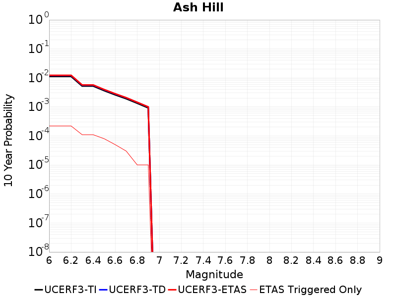 |

| Magnitude | 1 wk TI Prob | 1 wk TD Prob | 1 wk ETAS Prob | 1 wk ETAS/TD Gain | 1 wk ETAS Triggered Only | 1 mo TI Prob | 1 mo TD Prob | 1 mo ETAS Prob | 1 mo ETAS/TD Gain | 1 mo ETAS Triggered Only | 1 yr TI Prob | 1 yr TD Prob | 1 yr ETAS Prob | 1 yr ETAS/TD Gain | 1 yr ETAS Triggered Only | 10 yr TI Prob | 10 yr TD Prob | 10 yr ETAS Prob | 10 yr ETAS/TD Gain | 10 yr ETAS Triggered Only |
|-----|-----|-----|-----|-----|-----|-----|-----|-----|-----|-----|-----|-----|-----|-----|-----|-----|-----|-----|-----|-----|
| 6.0 | 2.1545662E-5 | 2.3206392E-5 | 8.3205E-5 | 3.5854344 | 6.0E-5 | 9.2335285E-5 | 9.945263E-5 | 1.6944566E-4 | 1.7037827 | 7.0E-5 | 0.0011236023 | 0.0012102432 | 0.0013900254 | 1.1485504 | 1.8E-4 | 0.011179381 | 0.012044516 | 0.012261867 | 1.0180455 | 2.2E-4 |
| 6.1 | 2.1545662E-5 | 2.3206392E-5 | 8.3205E-5 | 3.5854344 | 6.0E-5 | 9.2335285E-5 | 9.945263E-5 | 1.6944566E-4 | 1.7037827 | 7.0E-5 | 0.0011236023 | 0.0012102432 | 0.0013900254 | 1.1485504 | 1.8E-4 | 0.011179381 | 0.012044516 | 0.012261867 | 1.0180455 | 2.2E-4 |
| 6.2 | 2.1545662E-5 | 2.3206392E-5 | 8.3205E-5 | 3.5854344 | 6.0E-5 | 9.2335285E-5 | 9.945263E-5 | 1.6944566E-4 | 1.7037827 | 7.0E-5 | 0.0011236023 | 0.0012102432 | 0.0013900254 | 1.1485504 | 1.8E-4 | 0.011179381 | 0.012044516 | 0.012261867 | 1.0180455 | 2.2E-4 |
| 6.3 | 1.0025529E-5 | 1.07521355E-5 | 7.075149E-5 | 6.5802264 | 6.0E-5 | 4.2965847E-5 | 4.6079844E-5 | 1.0607708E-4 | 2.3020277 | 6.0E-5 | 5.229836E-4 | 5.6089094E-4 | 6.708292E-4 | 1.1960065 | 1.1E-4 | 0.005217545 | 0.005596067 | 0.005705451 | 1.0195466 | 1.1E-4 |
| 6.4 | 1.0025529E-5 | 1.07521355E-5 | 7.075149E-5 | 6.5802264 | 6.0E-5 | 4.2965847E-5 | 4.6079844E-5 | 1.0607708E-4 | 2.3020277 | 6.0E-5 | 5.229836E-4 | 5.6089094E-4 | 6.708292E-4 | 1.1960065 | 1.1E-4 | 0.005217545 | 0.005596067 | 0.005705451 | 1.0195466 | 1.1E-4 |
| 6.5 | 6.9617327E-6 | 7.4601994E-6 | 3.7459977E-5 | 5.0213103 | 3.0E-5 | 2.9835655E-5 | 3.197194E-5 | 6.197098E-5 | 1.9382929 | 3.0E-5 | 3.6318856E-4 | 3.8919752E-4 | 4.6916638E-4 | 1.2054712 | 8.0E-5 | 0.0036259557 | 0.0038860142 | 0.0039657033 | 1.0205066 | 8.0E-5 |
| 6.6 | 4.9919777E-6 | 5.3492436E-6 | 1.534919E-5 | 2.8694134 | 1.0E-5 | 2.1394015E-5 | 2.2925165E-5 | 3.2924934E-5 | 1.4361919 | 1.0E-5 | 2.60441E-4 | 2.7908484E-4 | 3.290709E-4 | 1.179107 | 5.0E-5 | 0.0026013597 | 0.0027880028 | 0.0028378635 | 1.017884 | 5.0E-5 |
| 6.7 | 3.6630722E-6 | 3.9265083E-6 | 1.3926469E-5 | 3.546782 | 1.0E-5 | 1.5698786E-5 | 1.6827817E-5 | 2.6827649E-5 | 1.5942441 | 1.0E-5 | 1.9111596E-4 | 2.0486515E-4 | 2.34859E-4 | 1.1464078 | 3.0E-5 | 0.0019095168 | 0.0020473264 | 0.0020772652 | 1.0146233 | 3.0E-5 |
| 6.8 | 2.5599613E-6 | 2.7462588E-6 | 2.7462588E-6 | 1.0 | 0.0 | 1.0971216E-5 | 1.1769656E-5 | 1.1769656E-5 | 1.0 | 0.0 | 1.3356637E-4 | 1.432911E-4 | 1.5328966E-4 | 1.069778 | 1.0E-5 | 0.0013348613 | 0.0014324724 | 0.0014424581 | 1.0069709 | 1.0E-5 |
| 6.9 | 1.7684905E-6 | 1.8977968E-6 | 1.8977968E-6 | 1.0 | 0.0 | 7.579223E-6 | 8.133415E-6 | 8.133415E-6 | 1.0 | 0.0 | 9.2273134E-5 | 9.902433E-5 | 1.09023335E-4 | 1.1009753 | 1.0E-5 | 9.223483E-4 | 9.902433E-4 | 0.0010002333 | 1.0100886 | 1.0E-5 |

## Panamint Valley
*[(top)](#table-of-contents)*

| 1 Week | 1 Month | 1 Year | 10 Year |
|-----|-----|-----|-----|
| 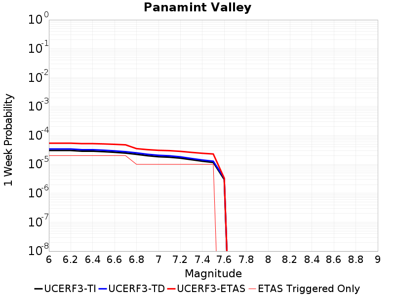 |  |  | 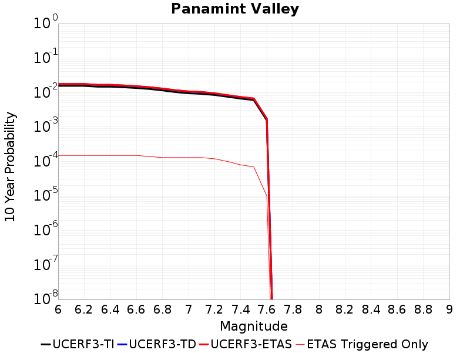 |

| Magnitude | 1 wk TI Prob | 1 wk TD Prob | 1 wk ETAS Prob | 1 wk ETAS/TD Gain | 1 wk ETAS Triggered Only | 1 mo TI Prob | 1 mo TD Prob | 1 mo ETAS Prob | 1 mo ETAS/TD Gain | 1 mo ETAS Triggered Only | 1 yr TI Prob | 1 yr TD Prob | 1 yr ETAS Prob | 1 yr ETAS/TD Gain | 1 yr ETAS Triggered Only | 10 yr TI Prob | 10 yr TD Prob | 10 yr ETAS Prob | 10 yr ETAS/TD Gain | 10 yr ETAS Triggered Only |
|-----|-----|-----|-----|-----|-----|-----|-----|-----|-----|-----|-----|-----|-----|-----|-----|-----|-----|-----|-----|-----|
| 6.0 | 3.0211835E-5 | 3.4029836E-5 | 5.4029155E-5 | 1.5876995 | 2.0E-5 | 1.2947287E-4 | 1.4583417E-4 | 1.7582979E-4 | 1.2056831 | 3.0E-5 | 0.0015751923 | 0.0017741146 | 0.0018639548 | 1.0506395 | 9.0E-5 | 0.015640736 | 0.017606575 | 0.017753934 | 1.0083696 | 1.5E-4 |
| 6.1 | 3.0211835E-5 | 3.4029836E-5 | 5.4029155E-5 | 1.5876995 | 2.0E-5 | 1.2947287E-4 | 1.4583417E-4 | 1.7582979E-4 | 1.2056831 | 3.0E-5 | 0.0015751923 | 0.0017741146 | 0.0018639548 | 1.0506395 | 9.0E-5 | 0.015640736 | 0.017606575 | 0.017753934 | 1.0083696 | 1.5E-4 |
| 6.2 | 3.0211835E-5 | 3.4029836E-5 | 5.4029155E-5 | 1.5876995 | 2.0E-5 | 1.2947287E-4 | 1.4583417E-4 | 1.7582979E-4 | 1.2056831 | 3.0E-5 | 0.0015751923 | 0.0017741146 | 0.0018639548 | 1.0506395 | 9.0E-5 | 0.015640736 | 0.017606575 | 0.017753934 | 1.0083696 | 1.5E-4 |
| 6.3 | 2.8573924E-5 | 3.2145723E-5 | 5.214508E-5 | 1.6221467 | 2.0E-5 | 1.2245393E-4 | 1.3776026E-4 | 1.6775614E-4 | 1.2177396 | 3.0E-5 | 0.001489857 | 0.0016759688 | 0.001765818 | 1.0536103 | 9.0E-5 | 0.01479908 | 0.016640456 | 0.016787961 | 1.0088642 | 1.5E-4 |
| 6.4 | 2.8573924E-5 | 3.2145723E-5 | 5.214508E-5 | 1.6221467 | 2.0E-5 | 1.2245393E-4 | 1.3776026E-4 | 1.6775614E-4 | 1.2177396 | 3.0E-5 | 0.001489857 | 0.0016759688 | 0.001765818 | 1.0536103 | 9.0E-5 | 0.01479908 | 0.016640456 | 0.016787961 | 1.0088642 | 1.5E-4 |
| 6.5 | 2.7468774E-5 | 3.0869942E-5 | 5.0869327E-5 | 1.6478595 | 2.0E-5 | 1.1771801E-4 | 1.3229321E-4 | 1.6228923E-4 | 1.226739 | 3.0E-5 | 0.0014322745 | 0.0016095071 | 0.0016993623 | 1.0558277 | 9.0E-5 | 0.014230782 | 0.015985563 | 0.016133165 | 1.0092335 | 1.5E-4 |
| 6.6 | 2.6135967E-5 | 2.9291938E-5 | 4.929135E-5 | 1.6827618 | 2.0E-5 | 1.1200648E-4 | 1.2553098E-4 | 1.5552722E-4 | 1.2389548 | 3.0E-5 | 0.0013628257 | 0.0015272949 | 0.0016171574 | 1.0588378 | 9.0E-5 | 0.013544982 | 0.015174875 | 0.015322599 | 1.0097347 | 1.5E-4 |
| 6.7 | 2.4498746E-5 | 2.7378928E-5 | 4.737838E-5 | 1.7304688 | 2.0E-5 | 1.04990395E-4 | 1.17333126E-4 | 1.4732961E-4 | 1.2556523 | 3.0E-5 | 0.0012775084 | 0.0014276198 | 0.0015075057 | 1.0559573 | 8.0E-5 | 0.012701893 | 0.014191174 | 0.014329187 | 1.0097253 | 1.4E-4 |
| 6.8 | 2.2244329E-5 | 2.4970555E-5 | 3.4970304E-5 | 1.4004617 | 1.0E-5 | 9.532935E-5 | 1.070124E-4 | 1.2701025E-4 | 1.1868743 | 2.0E-5 | 0.0011600169 | 0.0013021191 | 0.0013720279 | 1.0536885 | 7.0E-5 | 0.011539802 | 0.012951173 | 0.01307949 | 1.0099077 | 1.3E-4 |
| 6.9 | 1.9902658E-5 | 2.2322678E-5 | 3.2322452E-5 | 1.4479649 | 1.0E-5 | 8.529431E-5 | 9.5665215E-5 | 1.156633E-4 | 1.2090424 | 2.0E-5 | 0.0010379635 | 0.0011641202 | 0.0012340387 | 1.0600612 | 7.0E-5 | 0.010331288 | 0.011585743 | 0.011714237 | 1.0110906 | 1.3E-4 |
| 7.0 | 1.8353881E-5 | 2.0596503E-5 | 3.0596297E-5 | 1.4855094 | 1.0E-5 | 7.865712E-5 | 8.8267836E-5 | 1.0826607E-4 | 1.2265631 | 2.0E-5 | 9.5722964E-4 | 0.0010741488 | 0.0011440737 | 1.0650979 | 7.0E-5 | 0.009531168 | 0.010695022 | 0.010823632 | 1.0120252 | 1.3E-4 |
| 7.1 | 1.7667631E-5 | 1.9801211E-5 | 2.9801013E-5 | 1.5050097 | 1.0E-5 | 7.571623E-5 | 8.485967E-5 | 1.0485797E-4 | 1.2356632 | 2.0E-5 | 9.2145515E-4 | 0.0010326945 | 0.0011026221 | 1.0677139 | 7.0E-5 | 0.009176437 | 0.010284367 | 0.01041303 | 1.0125105 | 1.3E-4 |
| 7.2 | 1.6381597E-5 | 1.8184193E-5 | 2.8184011E-5 | 1.5499182 | 1.0E-5 | 7.020495E-5 | 7.7930024E-5 | 9.792847E-5 | 1.2566205 | 2.0E-5 | 8.544101E-4 | 9.484024E-4 | 0.001018336 | 1.0737383 | 7.0E-5 | 0.008511325 | 0.009448768 | 0.009567633 | 1.01258 | 1.2E-4 |
| 7.3 | 1.4520491E-5 | 1.5987822E-5 | 2.5987662E-5 | 1.6254661 | 1.0E-5 | 6.222919E-5 | 6.851753E-5 | 8.851616E-5 | 1.2918761 | 2.0E-5 | 7.57377E-4 | 8.338979E-4 | 8.938479E-4 | 1.0718913 | 6.0E-5 | 0.0075480095 | 0.008311384 | 0.008410553 | 1.0119317 | 1.0E-4 |
| 7.4 | 1.2852287E-5 | 1.4164093E-5 | 2.4163952E-5 | 1.7060006 | 1.0E-5 | 5.5080065E-5 | 6.0701932E-5 | 8.0700716E-5 | 1.3294588 | 2.0E-5 | 6.7039346E-4 | 7.388113E-4 | 7.9876697E-4 | 1.0811515 | 6.0E-5 | 0.0066837464 | 0.007367063 | 0.0074464735 | 1.0107791 | 8.0E-5 |
| 7.5 | 1.1637851E-5 | 1.285477E-5 | 2.2854641E-5 | 1.7779113 | 1.0E-5 | 4.987555E-5 | 5.5090797E-5 | 7.5089694E-5 | 1.3630171 | 2.0E-5 | 6.070656E-4 | 6.7053974E-4 | 7.2050624E-4 | 1.0745168 | 5.0E-5 | 0.006054099 | 0.006688659 | 0.0067581907 | 1.0103955 | 7.0E-5 |
| 7.6 | 3.0068115E-6 | 3.339976E-6 | 3.339976E-6 | 1.0 | 0.0 | 1.2886271E-5 | 1.4314145E-5 | 1.4314145E-5 | 1.0 | 0.0 | 1.5687906E-4 | 1.7426809E-4 | 1.8426635E-4 | 1.0573728 | 1.0E-5 | 0.0015676835 | 0.0017431496 | 0.0017531322 | 1.0057267 | 1.0E-5 |

## Owl Lake
*[(top)](#table-of-contents)*

| 1 Week | 1 Month | 1 Year | 10 Year |
|-----|-----|-----|-----|
|  | 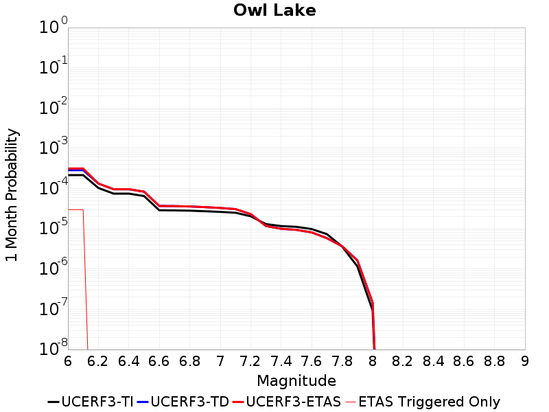 |  | 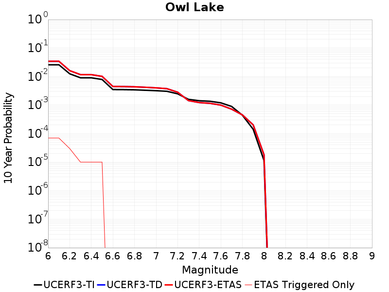 |

| Magnitude | 1 wk TI Prob | 1 wk TD Prob | 1 wk ETAS Prob | 1 wk ETAS/TD Gain | 1 wk ETAS Triggered Only | 1 mo TI Prob | 1 mo TD Prob | 1 mo ETAS Prob | 1 mo ETAS/TD Gain | 1 mo ETAS Triggered Only | 1 yr TI Prob | 1 yr TD Prob | 1 yr ETAS Prob | 1 yr ETAS/TD Gain | 1 yr ETAS Triggered Only | 10 yr TI Prob | 10 yr TD Prob | 10 yr ETAS Prob | 10 yr ETAS/TD Gain | 10 yr ETAS Triggered Only |
|-----|-----|-----|-----|-----|-----|-----|-----|-----|-----|-----|-----|-----|-----|-----|-----|-----|-----|-----|-----|-----|
| 6.0 | 5.0320643E-5 | 6.652992E-5 | 7.6529264E-5 | 1.1502984 | 1.0E-5 | 2.1564208E-4 | 2.8509996E-4 | 3.150914E-4 | 1.1051962 | 3.0E-5 | 0.0026222812 | 0.003466439 | 0.0034963351 | 1.0086244 | 3.0E-5 | 0.02591553 | 0.03422698 | 0.034294583 | 1.0019752 | 7.0E-5 |
| 6.1 | 5.0320643E-5 | 6.652992E-5 | 7.6529264E-5 | 1.1502984 | 1.0E-5 | 2.1564208E-4 | 2.8509996E-4 | 3.150914E-4 | 1.1051962 | 3.0E-5 | 0.0026222812 | 0.003466439 | 0.0034963351 | 1.0086244 | 3.0E-5 | 0.02591553 | 0.03422698 | 0.034294583 | 1.0019752 | 7.0E-5 |
| 6.2 | 2.4125871E-5 | 3.1074E-5 | 3.1074E-5 | 1.0 | 0.0 | 1.0339249E-4 | 1.3316865E-4 | 1.3316865E-4 | 1.0 | 0.0 | 0.0012580766 | 0.0016202924 | 0.0016202924 | 1.0 | 0.0 | 0.012509781 | 0.016118528 | 0.016148044 | 1.0018312 | 3.0E-5 |
| 6.3 | 1.7433485E-5 | 2.2432676E-5 | 2.2432676E-5 | 1.0 | 0.0 | 7.471279E-5 | 9.6137395E-5 | 9.6137395E-5 | 1.0 | 0.0 | 9.0924866E-4 | 0.0011699813 | 0.0011699813 | 1.0 | 0.0 | 0.009055373 | 0.011668778 | 0.011678661 | 1.000847 | 1.0E-5 |
| 6.4 | 1.7433485E-5 | 2.2432676E-5 | 2.2432676E-5 | 1.0 | 0.0 | 7.471279E-5 | 9.6137395E-5 | 9.6137395E-5 | 1.0 | 0.0 | 9.0924866E-4 | 0.0011699813 | 0.0011699813 | 1.0 | 0.0 | 0.009055373 | 0.011668778 | 0.011678661 | 1.000847 | 1.0E-5 |
| 6.5 | 1.5182742E-5 | 1.9500787E-5 | 1.9500787E-5 | 1.0 | 0.0 | 6.506727E-5 | 8.357298E-5 | 8.357298E-5 | 1.0 | 0.0 | 7.919061E-4 | 0.0010171619 | 0.0010171619 | 1.0 | 0.0 | 0.0078909 | 0.010155502 | 0.010165401 | 1.0009747 | 1.0E-5 |
| 6.6 | 6.7271576E-6 | 8.598674E-6 | 8.598674E-6 | 1.0 | 0.0 | 2.8830356E-5 | 3.685097E-5 | 3.685097E-5 | 1.0 | 0.0 | 3.5095305E-4 | 4.485739E-4 | 4.485739E-4 | 1.0 | 0.0 | 0.0035039932 | 0.004494495 | 0.004494495 | 1.0 | 0.0 |
| 6.7 | 6.682835E-6 | 8.53105E-6 | 8.53105E-6 | 1.0 | 0.0 | 2.8640408E-5 | 3.6561163E-5 | 3.6561163E-5 | 1.0 | 0.0 | 3.4864116E-4 | 4.4504696E-4 | 4.4504696E-4 | 1.0 | 0.0 | 0.003480947 | 0.0044593746 | 0.0044593746 | 1.0 | 0.0 |
| 6.8 | 6.5774975E-6 | 8.377332E-6 | 8.377332E-6 | 1.0 | 0.0 | 2.8188972E-5 | 3.590239E-5 | 3.590239E-5 | 1.0 | 0.0 | 3.4314668E-4 | 4.370296E-4 | 4.370296E-4 | 1.0 | 0.0 | 0.0034261728 | 0.004379413 | 0.004379413 | 1.0 | 0.0 |
| 6.9 | 6.363419E-6 | 8.05E-6 | 8.05E-6 | 1.0 | 0.0 | 2.727151E-5 | 3.4499575E-5 | 3.4499575E-5 | 1.0 | 0.0 | 3.3198006E-4 | 4.19957E-4 | 4.19957E-4 | 1.0 | 0.0 | 0.0033148455 | 0.004209128 | 0.004209128 | 1.0 | 0.0 |
| 7.0 | 6.1342453E-6 | 7.681544E-6 | 7.681544E-6 | 1.0 | 0.0 | 2.6289357E-5 | 3.2920518E-5 | 3.2920518E-5 | 1.0 | 0.0 | 3.2002592E-4 | 4.0073914E-4 | 4.0073914E-4 | 1.0 | 0.0 | 0.0031956544 | 0.0040174937 | 0.0040174937 | 1.0 | 0.0 |
| 7.1 | 5.842926E-6 | 7.191118E-6 | 7.191118E-6 | 1.0 | 0.0 | 2.504087E-5 | 3.0818745E-5 | 3.0818745E-5 | 1.0 | 0.0 | 3.0482994E-4 | 3.7515908E-4 | 3.7515908E-4 | 1.0 | 0.0 | 0.0030441214 | 0.0037624314 | 0.0037624314 | 1.0 | 0.0 |
| 7.2 | 4.77173E-6 | 5.3990707E-6 | 5.3990707E-6 | 1.0 | 0.0 | 2.045011E-5 | 2.3138691E-5 | 2.3138691E-5 | 1.0 | 0.0 | 2.4895166E-4 | 2.8168125E-4 | 2.8168125E-4 | 1.0 | 0.0 | 0.0024867293 | 0.0028296066 | 0.0028296066 | 1.0 | 0.0 |
| 7.3 | 3.0494948E-6 | 2.7419069E-6 | 2.7419069E-6 | 1.0 | 0.0 | 1.3069198E-5 | 1.1750977E-5 | 1.1750977E-5 | 1.0 | 0.0 | 1.5910587E-4 | 1.4305892E-4 | 1.4305892E-4 | 1.0 | 0.0 | 0.0015899199 | 0.0014395191 | 0.0014395191 | 1.0 | 0.0 |
| 7.4 | 2.7263884E-6 | 2.3351438E-6 | 2.3351438E-6 | 1.0 | 0.0 | 1.1684469E-5 | 1.0007721E-5 | 1.0007721E-5 | 1.0 | 0.0 | 1.4224913E-4 | 1.218373E-4 | 1.218373E-4 | 1.0 | 0.0 | 0.0014215811 | 0.0012264892 | 0.0012264892 | 1.0 | 0.0 |
| 7.5 | 2.6090431E-6 | 2.194548E-6 | 2.194548E-6 | 1.0 | 0.0 | 1.1181565E-5 | 9.405173E-6 | 9.405173E-6 | 1.0 | 0.0 | 1.3612706E-4 | 1.1450206E-4 | 1.1450206E-4 | 1.0 | 0.0 | 0.001360437 | 0.0011529976 | 0.0011529976 | 1.0 | 0.0 |
| 7.6 | 2.3008756E-6 | 1.8987618E-6 | 1.8987618E-6 | 1.0 | 0.0 | 9.860858E-6 | 8.137526E-6 | 8.137526E-6 | 1.0 | 0.0 | 1.20049335E-4 | 9.9069955E-5 | 9.9069955E-5 | 1.0 | 0.0 | 0.001199845 | 9.983908E-4 | 9.983908E-4 | 1.0 | 0.0 |
| 7.7 | 1.7184348E-6 | 1.3652011E-6 | 1.3652011E-6 | 1.0 | 0.0 | 7.3646997E-6 | 5.850849E-6 | 5.850849E-6 | 1.0 | 0.0 | 8.966153E-5 | 7.12318E-5 | 7.12318E-5 | 1.0 | 0.0 | 8.962536E-4 | 7.199124E-4 | 7.199124E-4 | 1.0 | 0.0 |
| 7.8 | 8.4612907E-7 | 8.5701623E-7 | 8.5701623E-7 | 1.0 | 0.0 | 3.6262625E-6 | 3.6729216E-6 | 3.6729216E-6 | 1.0 | 0.0 | 4.4148852E-5 | 4.4716926E-5 | 4.4716926E-5 | 1.0 | 0.0 | 4.414008E-4 | 4.5242815E-4 | 4.5242815E-4 | 1.0 | 0.0 |
| 7.9 | 2.716738E-7 | 3.8357652E-7 | 3.8357652E-7 | 1.0 | 0.0 | 1.1643157E-6 | 1.6438985E-6 | 1.6438985E-6 | 1.0 | 0.0 | 1.4175452E-5 | 2.0014291E-5 | 2.0014291E-5 | 1.0 | 0.0 | 1.4174548E-4 | 2.0174134E-4 | 2.0174134E-4 | 1.0 | 0.0 |
| 8.0 | 2.1995428E-8 | 3.4414203E-8 | 3.4414203E-8 | 1.0 | 0.0 | 9.426611E-8 | 1.4748943E-7 | 1.4748943E-7 | 1.0 | 0.0 | 1.1476893E-6 | 1.7956831E-6 | 1.7956831E-6 | 1.0 | 0.0 | 1.14768345E-5 | 1.8159706E-5 | 1.8159706E-5 | 1.0 | 0.0 |

## Tank Canyon
*[(top)](#table-of-contents)*

| 1 Week | 1 Month | 1 Year | 10 Year |
|-----|-----|-----|-----|
| 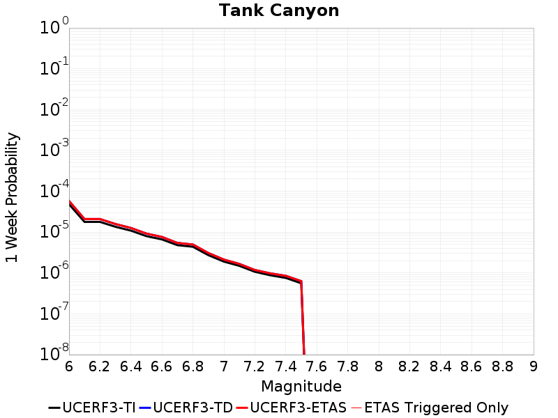 |  | 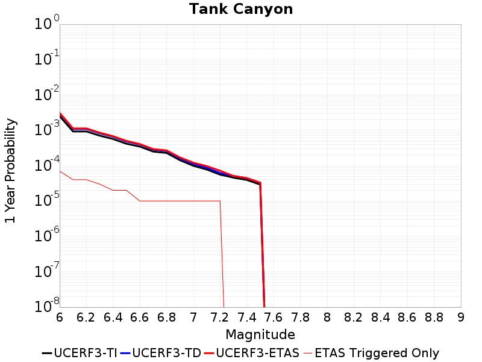 | 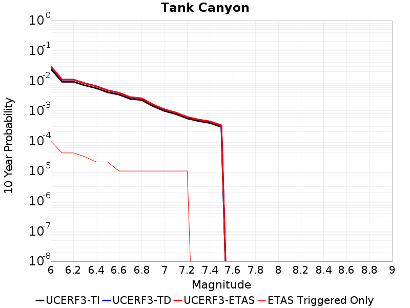 |

| Magnitude | 1 wk TI Prob | 1 wk TD Prob | 1 wk ETAS Prob | 1 wk ETAS/TD Gain | 1 wk ETAS Triggered Only | 1 mo TI Prob | 1 mo TD Prob | 1 mo ETAS Prob | 1 mo ETAS/TD Gain | 1 mo ETAS Triggered Only | 1 yr TI Prob | 1 yr TD Prob | 1 yr ETAS Prob | 1 yr ETAS/TD Gain | 1 yr ETAS Triggered Only | 10 yr TI Prob | 10 yr TD Prob | 10 yr ETAS Prob | 10 yr ETAS/TD Gain | 10 yr ETAS Triggered Only |
|-----|-----|-----|-----|-----|-----|-----|-----|-----|-----|-----|-----|-----|-----|-----|-----|-----|-----|-----|-----|-----|
| 6.0 | 4.8284557E-5 | 5.8043057E-5 | 5.8043057E-5 | 1.0 | 0.0 | 2.0691741E-4 | 2.487361E-4 | 2.587336E-4 | 1.0401932 | 1.0E-5 | 0.0025163088 | 0.0030248263 | 0.0030946147 | 1.0230718 | 7.0E-5 | 0.02488006 | 0.029903729 | 0.030000737 | 1.003244 | 1.0E-4 |
| 6.1 | 1.7796336E-5 | 2.0898004E-5 | 2.0898004E-5 | 1.0 | 0.0 | 7.626778E-5 | 8.956001E-5 | 8.956001E-5 | 1.0 | 0.0 | 9.281647E-4 | 0.0010898857 | 0.0011298421 | 1.0366611 | 4.0E-5 | 0.009242975 | 0.010849529 | 0.010889095 | 1.0036469 | 4.0E-5 |
| 6.2 | 1.7796336E-5 | 2.0898004E-5 | 2.0898004E-5 | 1.0 | 0.0 | 7.626778E-5 | 8.956001E-5 | 8.956001E-5 | 1.0 | 0.0 | 9.281647E-4 | 0.0010898857 | 0.0011298421 | 1.0366611 | 4.0E-5 | 0.009242975 | 0.010849529 | 0.010889095 | 1.0036469 | 4.0E-5 |
| 6.3 | 1.3515912E-5 | 1.577757E-5 | 1.577757E-5 | 1.0 | 0.0 | 5.792405E-5 | 6.761654E-5 | 6.761654E-5 | 1.0 | 0.0 | 7.049971E-4 | 8.229441E-4 | 8.529194E-4 | 1.0364245 | 3.0E-5 | 0.007027647 | 0.008201608 | 0.008231362 | 1.0036278 | 3.0E-5 |
| 6.4 | 1.0870146E-5 | 1.2632069E-5 | 1.2632069E-5 | 1.0 | 0.0 | 4.658551E-5 | 5.4136417E-5 | 5.4136417E-5 | 1.0 | 0.0 | 5.67031E-4 | 6.589293E-4 | 6.789161E-4 | 1.0303323 | 2.0E-5 | 0.005655863 | 0.0065717953 | 0.0065916637 | 1.0030233 | 2.0E-5 |
| 6.5 | 7.964826E-6 | 9.20607E-6 | 9.20607E-6 | 1.0 | 0.0 | 3.4134522E-5 | 3.9454048E-5 | 3.9454048E-5 | 1.0 | 0.0 | 4.1550855E-4 | 4.8025773E-4 | 5.002481E-4 | 1.0416243 | 2.0E-5 | 0.0041473247 | 0.0047935266 | 0.004813431 | 1.0041523 | 2.0E-5 |
| 6.6 | 6.6317E-6 | 7.6203505E-6 | 7.6203505E-6 | 1.0 | 0.0 | 2.8421264E-5 | 3.265829E-5 | 3.265829E-5 | 1.0 | 0.0 | 3.4597394E-4 | 3.975512E-4 | 4.0754722E-4 | 1.025144 | 1.0E-5 | 0.0034543579 | 0.0039695785 | 0.003979539 | 1.0025091 | 1.0E-5 |
| 6.7 | 4.793663E-6 | 5.4362536E-6 | 5.4362536E-6 | 1.0 | 0.0 | 2.0544108E-5 | 2.3298046E-5 | 2.3298046E-5 | 1.0 | 0.0 | 2.500958E-4 | 2.8362116E-4 | 2.9361833E-4 | 1.0352483 | 1.0E-5 | 0.0024981452 | 0.002833309 | 0.0028432806 | 1.0035194 | 1.0E-5 |
| 6.8 | 4.382823E-6 | 4.974217E-6 | 4.974217E-6 | 1.0 | 0.0 | 1.8783392E-5 | 2.1317923E-5 | 2.1317923E-5 | 1.0 | 0.0 | 2.286638E-4 | 2.5951906E-4 | 2.695165E-4 | 1.0385228 | 1.0E-5 | 0.0022842865 | 0.002592861 | 0.002602835 | 1.0038468 | 1.0E-5 |
| 6.9 | 2.729601E-6 | 3.0769106E-6 | 3.0769106E-6 | 1.0 | 0.0 | 1.1698237E-5 | 1.31867E-5 | 1.31867E-5 | 1.0 | 0.0 | 1.4241673E-4 | 1.6053747E-4 | 1.7053587E-4 | 1.0622808 | 1.0E-5 | 0.001423255 | 0.0016042638 | 0.0016142477 | 1.0062234 | 1.0E-5 |
| 7.0 | 1.8987357E-6 | 2.1294625E-6 | 2.1294625E-6 | 1.0 | 0.0 | 8.137413E-6 | 9.126239E-6 | 9.126239E-6 | 1.0 | 0.0 | 9.90685E-5 | 1.11106994E-4 | 1.21105884E-4 | 1.0899934 | 1.0E-5 | 9.902435E-4 | 0.0011105832 | 0.0011205721 | 1.0089942 | 1.0E-5 |
| 7.1 | 1.4928986E-6 | 1.6654074E-6 | 1.6654074E-6 | 1.0 | 0.0 | 6.398121E-6 | 7.137444E-6 | 7.137444E-6 | 1.0 | 0.0 | 7.789434E-5 | 8.68955E-5 | 9.689463E-5 | 1.1150707 | 1.0E-5 | 7.786704E-4 | 8.686732E-4 | 8.786645E-4 | 1.0115018 | 1.0E-5 |
| 7.2 | 1.069082E-6 | 1.1833654E-6 | 1.1833654E-6 | 1.0 | 0.0 | 4.581772E-6 | 5.0715594E-6 | 5.0715594E-6 | 1.0 | 0.0 | 5.5781646E-5 | 6.174502E-5 | 7.17444E-5 | 1.1619464 | 1.0E-5 | 5.576765E-4 | 6.173309E-4 | 6.2732474E-4 | 1.0161887 | 1.0E-5 |
| 7.3 | 8.776551E-7 | 9.774192E-7 | 9.774192E-7 | 1.0 | 0.0 | 3.7613736E-6 | 4.1889352E-6 | 4.1889352E-6 | 1.0 | 0.0 | 4.579376E-5 | 5.0999617E-5 | 5.0999617E-5 | 1.0 | 0.0 | 4.5784327E-4 | 5.0993013E-4 | 5.0993013E-4 | 1.0 | 0.0 |
| 7.4 | 7.55721E-7 | 8.512336E-7 | 8.512336E-7 | 1.0 | 0.0 | 3.2388E-6 | 3.648142E-6 | 3.648142E-6 | 1.0 | 0.0 | 3.9431678E-5 | 4.441574E-5 | 4.441574E-5 | 1.0 | 0.0 | 3.942468E-4 | 4.441195E-4 | 4.441195E-4 | 1.0 | 0.0 |
| 7.5 | 5.587665E-7 | 6.3071167E-7 | 6.3071167E-7 | 1.0 | 0.0 | 2.3947114E-6 | 2.70305E-6 | 2.70305E-6 | 1.0 | 0.0 | 2.915522E-5 | 3.2909633E-5 | 3.2909633E-5 | 1.0 | 0.0 | 2.9151395E-4 | 3.2909634E-4 | 3.2909634E-4 | 1.0 | 0.0 |

## So Sierra Nevada
*[(top)](#table-of-contents)*

| 1 Week | 1 Month | 1 Year | 10 Year |
|-----|-----|-----|-----|
|  | 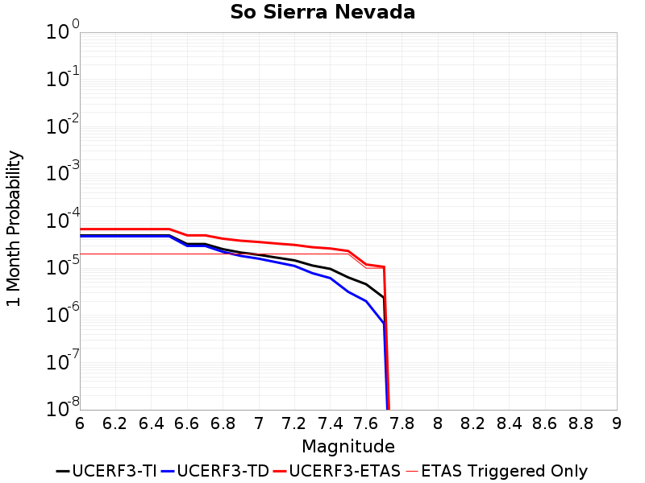 | 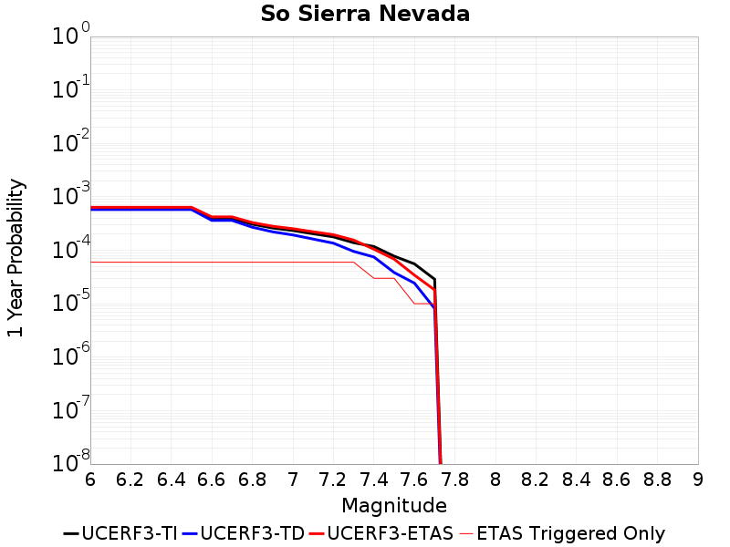 | 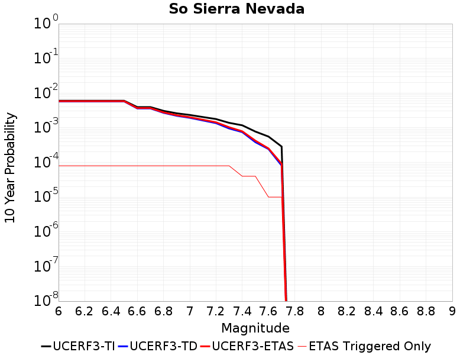 |

| Magnitude | 1 wk TI Prob | 1 wk TD Prob | 1 wk ETAS Prob | 1 wk ETAS/TD Gain | 1 wk ETAS Triggered Only | 1 mo TI Prob | 1 mo TD Prob | 1 mo ETAS Prob | 1 mo ETAS/TD Gain | 1 mo ETAS Triggered Only | 1 yr TI Prob | 1 yr TD Prob | 1 yr ETAS Prob | 1 yr ETAS/TD Gain | 1 yr ETAS Triggered Only | 10 yr TI Prob | 10 yr TD Prob | 10 yr ETAS Prob | 10 yr ETAS/TD Gain | 10 yr ETAS Triggered Only |
|-----|-----|-----|-----|-----|-----|-----|-----|-----|-----|-----|-----|-----|-----|-----|-----|-----|-----|-----|-----|-----|
| 6.0 | 1.15488665E-5 | 1.108369E-5 | 2.1083579E-5 | 1.9022167 | 1.0E-5 | 4.9494203E-5 | 4.7500736E-5 | 6.749979E-5 | 1.4210261 | 2.0E-5 | 6.024253E-4 | 5.7818077E-4 | 6.3814607E-4 | 1.1037138 | 6.0E-5 | 0.006007948 | 0.0057680346 | 0.0058475733 | 1.0137895 | 8.0E-5 |
| 6.1 | 1.15488665E-5 | 1.108369E-5 | 2.1083579E-5 | 1.9022167 | 1.0E-5 | 4.9494203E-5 | 4.7500736E-5 | 6.749979E-5 | 1.4210261 | 2.0E-5 | 6.024253E-4 | 5.7818077E-4 | 6.3814607E-4 | 1.1037138 | 6.0E-5 | 0.006007948 | 0.0057680346 | 0.0058475733 | 1.0137895 | 8.0E-5 |
| 6.2 | 1.15488665E-5 | 1.108369E-5 | 2.1083579E-5 | 1.9022167 | 1.0E-5 | 4.9494203E-5 | 4.7500736E-5 | 6.749979E-5 | 1.4210261 | 2.0E-5 | 6.024253E-4 | 5.7818077E-4 | 6.3814607E-4 | 1.1037138 | 6.0E-5 | 0.006007948 | 0.0057680346 | 0.0058475733 | 1.0137895 | 8.0E-5 |
| 6.3 | 1.15488665E-5 | 1.108369E-5 | 2.1083579E-5 | 1.9022167 | 1.0E-5 | 4.9494203E-5 | 4.7500736E-5 | 6.749979E-5 | 1.4210261 | 2.0E-5 | 6.024253E-4 | 5.7818077E-4 | 6.3814607E-4 | 1.1037138 | 6.0E-5 | 0.006007948 | 0.0057680346 | 0.0058475733 | 1.0137895 | 8.0E-5 |
| 6.4 | 1.15488665E-5 | 1.108369E-5 | 2.1083579E-5 | 1.9022167 | 1.0E-5 | 4.9494203E-5 | 4.7500736E-5 | 6.749979E-5 | 1.4210261 | 2.0E-5 | 6.024253E-4 | 5.7818077E-4 | 6.3814607E-4 | 1.1037138 | 6.0E-5 | 0.006007948 | 0.0057680346 | 0.0058475733 | 1.0137895 | 8.0E-5 |
| 6.5 | 1.15488665E-5 | 1.108369E-5 | 2.1083579E-5 | 1.9022167 | 1.0E-5 | 4.9494203E-5 | 4.7500736E-5 | 6.749979E-5 | 1.4210261 | 2.0E-5 | 6.024253E-4 | 5.7818077E-4 | 6.3814607E-4 | 1.1037138 | 6.0E-5 | 0.006007948 | 0.0057680346 | 0.0058475733 | 1.0137895 | 8.0E-5 |
| 6.6 | 7.587044E-6 | 6.938398E-6 | 1.693833E-5 | 2.4412448 | 1.0E-5 | 3.2515498E-5 | 2.973567E-5 | 4.9735074E-5 | 1.6725729 | 2.0E-5 | 3.9580427E-4 | 3.6197455E-4 | 4.2195283E-4 | 1.1656975 | 6.0E-5 | 0.003951 | 0.0036141414 | 0.0036938523 | 1.0220553 | 8.0E-5 |
| 6.7 | 7.587044E-6 | 6.938398E-6 | 1.693833E-5 | 2.4412448 | 1.0E-5 | 3.2515498E-5 | 2.973567E-5 | 4.9735074E-5 | 1.6725729 | 2.0E-5 | 3.9580427E-4 | 3.6197455E-4 | 4.2195283E-4 | 1.1656975 | 6.0E-5 | 0.003951 | 0.0036141414 | 0.0036938523 | 1.0220553 | 8.0E-5 |
| 6.8 | 5.9026956E-6 | 5.1816505E-6 | 1.5181598E-5 | 2.929877 | 1.0E-5 | 2.5297022E-5 | 2.2206892E-5 | 4.2206448E-5 | 1.9006013 | 2.0E-5 | 3.0794772E-4 | 2.7033652E-4 | 3.303203E-4 | 1.2218856 | 6.0E-5 | 0.0030752132 | 0.002700193 | 0.002779977 | 1.0295475 | 8.0E-5 |
| 6.9 | 5.0118915E-6 | 4.25443E-6 | 1.4254388E-5 | 3.350481 | 1.0E-5 | 2.1479358E-5 | 1.8233148E-5 | 3.8232785E-5 | 2.0968833 | 2.0E-5 | 2.614798E-4 | 2.219667E-4 | 2.8195337E-4 | 1.2702508 | 6.0E-5 | 0.0026117235 | 0.0022175226 | 0.002297345 | 1.0359963 | 8.0E-5 |
| 7.0 | 4.4924795E-6 | 3.7157795E-6 | 1.3715742E-5 | 3.6912153 | 1.0E-5 | 1.925334E-5 | 1.5924676E-5 | 3.5924357E-5 | 2.2558925 | 2.0E-5 | 2.3438422E-4 | 1.938663E-4 | 2.5385467E-4 | 1.3094317 | 6.0E-5 | 0.0023413717 | 0.0019370349 | 0.0020168799 | 1.0412202 | 8.0E-5 |
| 7.1 | 3.9118436E-6 | 3.1136597E-6 | 1.31136285E-5 | 4.2116446 | 1.0E-5 | 1.6764936E-5 | 1.334419E-5 | 3.3343924E-5 | 2.4987595 | 2.0E-5 | 2.0409399E-4 | 1.6245397E-4 | 2.2244423E-4 | 1.3692753 | 6.0E-5 | 0.0020390663 | 0.0016234083 | 0.0017032784 | 1.049199 | 8.0E-5 |
| 7.2 | 3.4200818E-6 | 2.60699E-6 | 1.26069635E-5 | 4.8358316 | 1.0E-5 | 1.4657411E-5 | 1.1172769E-5 | 3.1172545E-5 | 2.7900467 | 2.0E-5 | 1.7843937E-4 | 1.3602048E-4 | 1.960123E-4 | 1.44105 | 6.0E-5 | 0.0017829615 | 0.0013594219 | 0.0014393132 | 1.0587685 | 8.0E-5 |
| 7.3 | 2.6593618E-6 | 1.8297527E-6 | 1.1829735E-5 | 6.4652095 | 1.0E-5 | 1.13972155E-5 | 7.841775E-6 | 2.784162E-5 | 3.550423 | 2.0E-5 | 1.3875226E-4 | 9.5469724E-5 | 1.55464E-4 | 1.6284114 | 6.0E-5 | 0.0013866565 | 9.5431606E-4 | 0.0010342398 | 1.0837497 | 8.0E-5 |
| 7.4 | 2.2577992E-6 | 1.4376462E-6 | 1.1437632E-5 | 7.9558043 | 1.0E-5 | 9.676246E-6 | 6.1613277E-6 | 2.6161204E-5 | 4.2460337 | 2.0E-5 | 1.1780193E-4 | 7.501184E-5 | 1.0500959E-4 | 1.3999069 | 3.0E-5 | 0.001177395 | 7.498902E-4 | 7.8986026E-4 | 1.0533011 | 4.0E-5 |
| 7.5 | 1.489319E-6 | 7.3633163E-7 | 1.0736324E-5 | 14.580827 | 1.0E-5 | 6.3827797E-6 | 3.1557033E-6 | 2.315564E-5 | 7.337712 | 2.0E-5 | 7.770758E-5 | 3.8420014E-5 | 6.841886E-5 | 1.780813 | 3.0E-5 | 7.7680405E-4 | 3.8413415E-4 | 4.2411877E-4 | 1.1040903 | 4.0E-5 |
| 7.6 | 1.0680322E-6 | 4.6665528E-7 | 4.6665528E-7 | 1.0 | 0.0 | 4.577273E-6 | 1.9999495E-6 | 1.19999295E-5 | 6.000116 | 1.0E-5 | 5.5726876E-5 | 2.4349118E-5 | 3.4348875E-5 | 1.4106826 | 1.0E-5 | 5.5712904E-4 | 2.4346476E-4 | 2.5346232E-4 | 1.0410637 | 1.0E-5 |
| 7.7 | 5.509146E-7 | 1.561481E-7 | 1.561481E-7 | 1.0 | 0.0 | 2.3610605E-6 | 6.69206E-7 | 1.06692E-5 | 15.943072 | 1.0E-5 | 2.8745531E-5 | 8.147554E-6 | 1.8147472E-5 | 2.2273524 | 1.0E-5 | 2.8741814E-4 | 8.147266E-5 | 9.147185E-5 | 1.1227306 | 1.0E-5 |

## Death Valley (No)
*[(top)](#table-of-contents)*

| 1 Week | 1 Month | 1 Year | 10 Year |
|-----|-----|-----|-----|
| 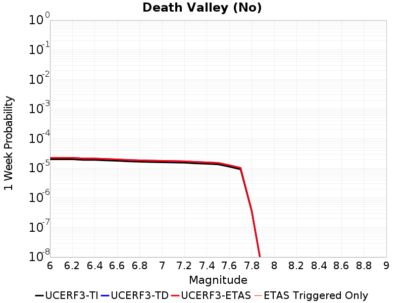 | 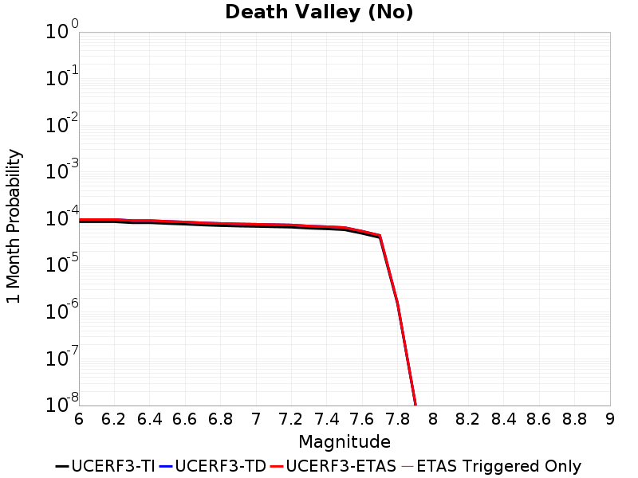 | 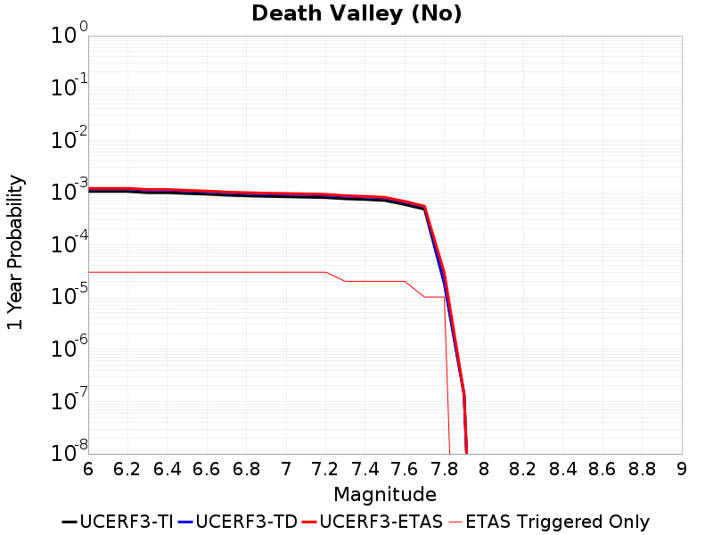 | 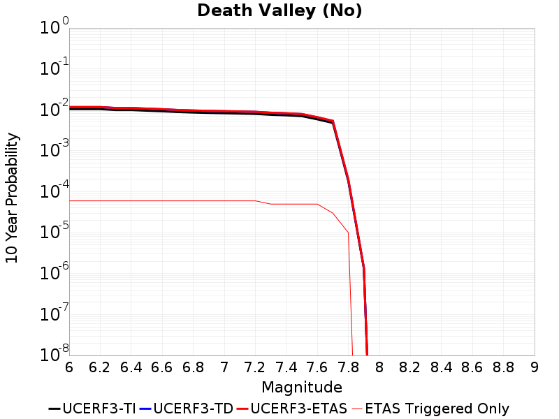 |

| Magnitude | 1 wk TI Prob | 1 wk TD Prob | 1 wk ETAS Prob | 1 wk ETAS/TD Gain | 1 wk ETAS Triggered Only | 1 mo TI Prob | 1 mo TD Prob | 1 mo ETAS Prob | 1 mo ETAS/TD Gain | 1 mo ETAS Triggered Only | 1 yr TI Prob | 1 yr TD Prob | 1 yr ETAS Prob | 1 yr ETAS/TD Gain | 1 yr ETAS Triggered Only | 10 yr TI Prob | 10 yr TD Prob | 10 yr ETAS Prob | 10 yr ETAS/TD Gain | 10 yr ETAS Triggered Only |
|-----|-----|-----|-----|-----|-----|-----|-----|-----|-----|-----|-----|-----|-----|-----|-----|-----|-----|-----|-----|-----|
| 6.0 | 2.0074807E-5 | 2.2518458E-5 | 2.2518458E-5 | 1.0 | 0.0 | 8.603206E-5 | 9.650415E-5 | 9.650415E-5 | 1.0 | 0.0 | 0.001046937 | 0.0011743121 | 0.0012042769 | 1.0255169 | 3.0E-5 | 0.010420183 | 0.011681983 | 0.011741282 | 1.0050762 | 6.0E-5 |
| 6.1 | 2.0074807E-5 | 2.2518458E-5 | 2.2518458E-5 | 1.0 | 0.0 | 8.603206E-5 | 9.650415E-5 | 9.650415E-5 | 1.0 | 0.0 | 0.001046937 | 0.0011743121 | 0.0012042769 | 1.0255169 | 3.0E-5 | 0.010420183 | 0.011681983 | 0.011741282 | 1.0050762 | 6.0E-5 |
| 6.2 | 2.0074807E-5 | 2.2518458E-5 | 2.2518458E-5 | 1.0 | 0.0 | 8.603206E-5 | 9.650415E-5 | 9.650415E-5 | 1.0 | 0.0 | 0.001046937 | 0.0011743121 | 0.0012042769 | 1.0255169 | 3.0E-5 | 0.010420183 | 0.011681983 | 0.011741282 | 1.0050762 | 6.0E-5 |
| 6.3 | 1.9050609E-5 | 2.135426E-5 | 2.135426E-5 | 1.0 | 0.0 | 8.164292E-5 | 9.151509E-5 | 9.151509E-5 | 1.0 | 0.0 | 9.935491E-4 | 0.0011136334 | 0.0011436 | 1.0269089 | 3.0E-5 | 0.009891188 | 0.011081354 | 0.011140688 | 1.0053545 | 6.0E-5 |
| 6.4 | 1.9050609E-5 | 2.135426E-5 | 2.135426E-5 | 1.0 | 0.0 | 8.164292E-5 | 9.151509E-5 | 9.151509E-5 | 1.0 | 0.0 | 9.935491E-4 | 0.0011136334 | 0.0011436 | 1.0269089 | 3.0E-5 | 0.009891188 | 0.011081354 | 0.011140688 | 1.0053545 | 6.0E-5 |
| 6.5 | 1.8367004E-5 | 2.0577616E-5 | 2.0577616E-5 | 1.0 | 0.0 | 7.8713354E-5 | 8.818684E-5 | 8.818684E-5 | 1.0 | 0.0 | 9.5791375E-4 | 0.0010731525 | 0.0011031203 | 1.027925 | 3.0E-5 | 0.009537951 | 0.01068049 | 0.010739849 | 1.0055578 | 6.0E-5 |
| 6.6 | 1.779439E-5 | 1.9926943E-5 | 1.9926943E-5 | 1.0 | 0.0 | 7.625944E-5 | 8.539843E-5 | 8.539843E-5 | 1.0 | 0.0 | 9.280632E-4 | 0.0010392363 | 0.0010692051 | 1.0288373 | 3.0E-5 | 0.009241969 | 0.010344524 | 0.010403903 | 1.0057402 | 6.0E-5 |
| 6.7 | 1.7025437E-5 | 1.9058689E-5 | 1.9058689E-5 | 1.0 | 0.0 | 7.296412E-5 | 8.167757E-5 | 8.167757E-5 | 1.0 | 0.0 | 8.87976E-4 | 9.93977E-4 | 0.0010239471 | 1.0301518 | 3.0E-5 | 0.008844362 | 0.0098960325 | 0.009955439 | 1.006003 | 6.0E-5 |
| 6.8 | 1.6545107E-5 | 1.8527426E-5 | 1.8527426E-5 | 1.0 | 0.0 | 7.090568E-5 | 7.9400874E-5 | 7.9400874E-5 | 1.0 | 0.0 | 8.629347E-4 | 9.6628297E-4 | 9.96254E-4 | 1.0310168 | 3.0E-5 | 0.008595915 | 0.00962152 | 0.009680943 | 1.006176 | 6.0E-5 |
| 6.9 | 1.615478E-5 | 1.8102213E-5 | 1.8102213E-5 | 1.0 | 0.0 | 6.9232934E-5 | 7.757864E-5 | 7.757864E-5 | 1.0 | 0.0 | 8.4258494E-4 | 9.441168E-4 | 9.7408844E-4 | 1.0317457 | 3.0E-5 | 0.008393973 | 0.009401754 | 0.009461189 | 1.0063218 | 6.0E-5 |
| 7.0 | 1.5894311E-5 | 1.7820008E-5 | 1.7820008E-5 | 1.0 | 0.0 | 6.81167E-5 | 7.636926E-5 | 7.636926E-5 | 1.0 | 0.0 | 8.2900526E-4 | 9.294052E-4 | 9.593773E-4 | 1.0322487 | 3.0E-5 | 0.008259195 | 0.009255873 | 0.0093153175 | 1.0064224 | 6.0E-5 |
| 7.1 | 1.5602263E-5 | 1.7497734E-5 | 1.7497734E-5 | 1.0 | 0.0 | 6.6865134E-5 | 7.4988166E-5 | 7.4988166E-5 | 1.0 | 0.0 | 8.137789E-4 | 9.126046E-4 | 9.4257726E-4 | 1.032843 | 3.0E-5 | 0.008108052 | 0.009089253 | 0.009148708 | 1.0065413 | 6.0E-5 |
| 7.2 | 1.5323829E-5 | 1.7184599E-5 | 1.7184599E-5 | 1.0 | 0.0 | 6.56719E-5 | 7.364624E-5 | 7.364624E-5 | 1.0 | 0.0 | 7.99262E-4 | 8.9628017E-4 | 9.2625327E-4 | 1.0334417 | 3.0E-5 | 0.007963934 | 0.008927332 | 0.008986796 | 1.0066609 | 6.0E-5 |
| 7.3 | 1.4556212E-5 | 1.6315658E-5 | 1.6315658E-5 | 1.0 | 0.0 | 6.238227E-5 | 6.992241E-5 | 6.992241E-5 | 1.0 | 0.0 | 7.592395E-4 | 8.5097866E-4 | 8.7096164E-4 | 1.0234823 | 2.0E-5 | 0.0075665074 | 0.008477846 | 0.008527422 | 1.0058477 | 5.0E-5 |
| 7.4 | 1.411725E-5 | 1.582074E-5 | 1.582074E-5 | 1.0 | 0.0 | 6.0501097E-5 | 6.780144E-5 | 6.780144E-5 | 1.0 | 0.0 | 7.363519E-4 | 8.251758E-4 | 8.4515923E-4 | 1.0242172 | 2.0E-5 | 0.0073391674 | 0.008221753 | 0.008271342 | 1.0060314 | 5.0E-5 |
| 7.5 | 1.3503312E-5 | 1.51385575E-5 | 1.51385575E-5 | 1.0 | 0.0 | 5.7870053E-5 | 6.487795E-5 | 6.487795E-5 | 1.0 | 0.0 | 7.043401E-4 | 7.8960863E-4 | 8.0959284E-4 | 1.025309 | 2.0E-5 | 0.007021119 | 0.007868657 | 0.007918263 | 1.0063044 | 5.0E-5 |
| 7.6 | 1.1279839E-5 | 1.2636496E-5 | 1.2636496E-5 | 1.0 | 0.0 | 4.834127E-5 | 5.4155316E-5 | 5.4155316E-5 | 1.0 | 0.0 | 5.88396E-4 | 6.591468E-4 | 6.7913363E-4 | 1.0303222 | 2.0E-5 | 0.005868405 | 0.006572471 | 0.006622142 | 1.0075575 | 5.0E-5 |
| 7.7 | 9.189108E-6 | 1.0291621E-5 | 1.0291621E-5 | 1.0 | 0.0 | 3.93813E-5 | 4.410623E-5 | 4.410623E-5 | 1.0 | 0.0 | 4.7936183E-4 | 5.368661E-4 | 5.4686074E-4 | 1.0186167 | 1.0E-5 | 0.004783291 | 0.0053562033 | 0.0053860424 | 1.005571 | 3.0E-5 |
| 7.8 | 3.4586725E-7 | 3.6496132E-7 | 3.6496132E-7 | 1.0 | 0.0 | 1.4822873E-6 | 1.5641191E-6 | 1.5641191E-6 | 1.0 | 0.0 | 1.80467E-5 | 1.9042987E-5 | 2.9042798E-5 | 1.5251176 | 1.0E-5 | 1.8045233E-4 | 1.90414E-4 | 2.0041209E-4 | 1.0525072 | 1.0E-5 |
| 7.9 | 2.5591178E-9 | 2.6704472E-9 | 2.6704472E-9 | 1.0 | 0.0 | 1.0967647E-8 | 1.1444774E-8 | 1.1444774E-8 | 1.0 | 0.0 | 1.335311E-7 | 1.3934012E-7 | 1.3934012E-7 | 1.0 | 0.0 | 1.3353102E-6 | 1.3934012E-6 | 1.3934012E-6 | 1.0 | 0.0 |

## Kern Canyon (North Kern) 2011
*[(top)](#table-of-contents)*

| 1 Week | 1 Month | 1 Year | 10 Year |
|-----|-----|-----|-----|
| 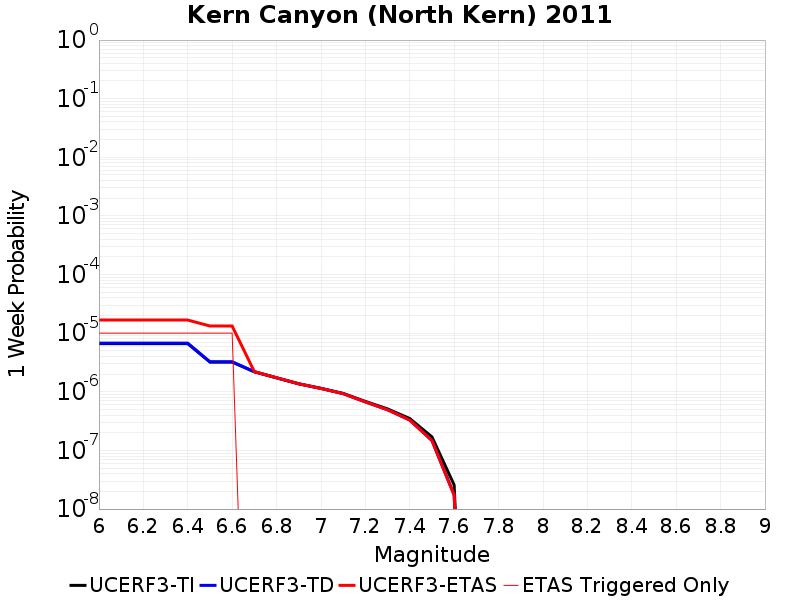 |  | 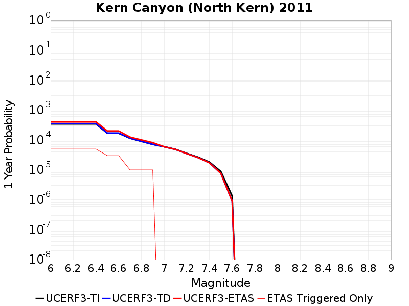 | 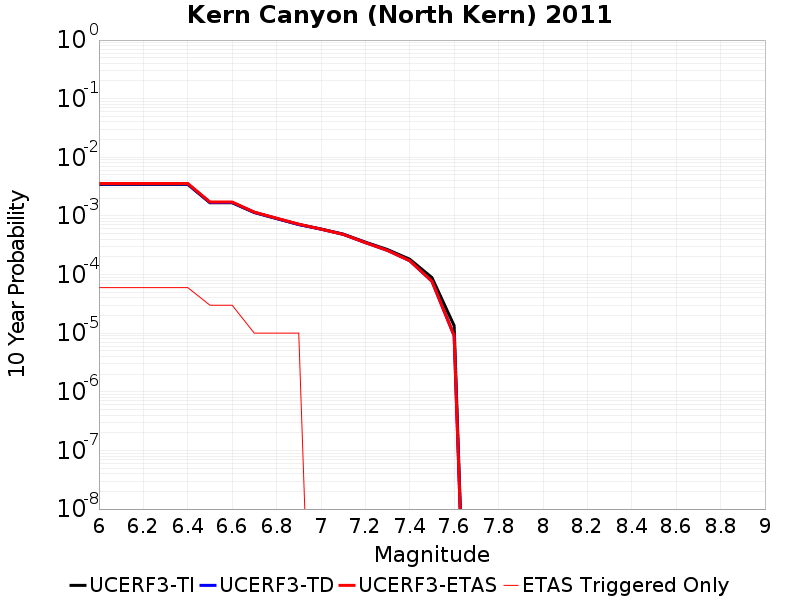 |

| Magnitude | 1 wk TI Prob | 1 wk TD Prob | 1 wk ETAS Prob | 1 wk ETAS/TD Gain | 1 wk ETAS Triggered Only | 1 mo TI Prob | 1 mo TD Prob | 1 mo ETAS Prob | 1 mo ETAS/TD Gain | 1 mo ETAS Triggered Only | 1 yr TI Prob | 1 yr TD Prob | 1 yr ETAS Prob | 1 yr ETAS/TD Gain | 1 yr ETAS Triggered Only | 10 yr TI Prob | 10 yr TD Prob | 10 yr ETAS Prob | 10 yr ETAS/TD Gain | 10 yr ETAS Triggered Only |
|-----|-----|-----|-----|-----|-----|-----|-----|-----|-----|-----|-----|-----|-----|-----|-----|-----|-----|-----|-----|-----|
| 6.0 | 6.6264497E-6 | 6.758416E-6 | 1.675835E-5 | 2.4796267 | 1.0E-5 | 2.8398761E-5 | 2.8964365E-5 | 3.8964074E-5 | 1.3452418 | 1.0E-5 | 3.4570007E-4 | 3.525921E-4 | 4.0257446E-4 | 1.1417569 | 5.0E-5 | 0.0034516277 | 0.0035211153 | 0.003580904 | 1.01698 | 6.0E-5 |
| 6.1 | 6.6264497E-6 | 6.758416E-6 | 1.675835E-5 | 2.4796267 | 1.0E-5 | 2.8398761E-5 | 2.8964365E-5 | 3.8964074E-5 | 1.3452418 | 1.0E-5 | 3.4570007E-4 | 3.525921E-4 | 4.0257446E-4 | 1.1417569 | 5.0E-5 | 0.0034516277 | 0.0035211153 | 0.003580904 | 1.01698 | 6.0E-5 |
| 6.2 | 6.6264497E-6 | 6.758416E-6 | 1.675835E-5 | 2.4796267 | 1.0E-5 | 2.8398761E-5 | 2.8964365E-5 | 3.8964074E-5 | 1.3452418 | 1.0E-5 | 3.4570007E-4 | 3.525921E-4 | 4.0257446E-4 | 1.1417569 | 5.0E-5 | 0.0034516277 | 0.0035211153 | 0.003580904 | 1.01698 | 6.0E-5 |
| 6.3 | 6.6264497E-6 | 6.758416E-6 | 1.675835E-5 | 2.4796267 | 1.0E-5 | 2.8398761E-5 | 2.8964365E-5 | 3.8964074E-5 | 1.3452418 | 1.0E-5 | 3.4570007E-4 | 3.525921E-4 | 4.0257446E-4 | 1.1417569 | 5.0E-5 | 0.0034516277 | 0.0035211153 | 0.003580904 | 1.01698 | 6.0E-5 |
| 6.4 | 6.6264497E-6 | 6.758416E-6 | 1.675835E-5 | 2.4796267 | 1.0E-5 | 2.8398761E-5 | 2.8964365E-5 | 3.8964074E-5 | 1.3452418 | 1.0E-5 | 3.4570007E-4 | 3.525921E-4 | 4.0257446E-4 | 1.1417569 | 5.0E-5 | 0.0034516277 | 0.0035211153 | 0.003580904 | 1.01698 | 6.0E-5 |
| 6.5 | 3.2162225E-6 | 3.2575558E-6 | 1.3257523E-5 | 4.069776 | 1.0E-5 | 1.3783738E-5 | 1.3960884E-5 | 2.3960743E-5 | 1.716277 | 1.0E-5 | 1.6780409E-4 | 1.699613E-4 | 1.9995621E-4 | 1.1764808 | 3.0E-5 | 0.0016767744 | 0.0016983929 | 0.001728342 | 1.0176338 | 3.0E-5 |
| 6.6 | 3.2162225E-6 | 3.2575558E-6 | 1.3257523E-5 | 4.069776 | 1.0E-5 | 1.3783738E-5 | 1.3960884E-5 | 2.3960743E-5 | 1.716277 | 1.0E-5 | 1.6780409E-4 | 1.699613E-4 | 1.9995621E-4 | 1.1764808 | 3.0E-5 | 0.0016767744 | 0.0016983929 | 0.001728342 | 1.0176338 | 3.0E-5 |
| 6.7 | 2.1908265E-6 | 2.2074173E-6 | 2.2074173E-6 | 1.0 | 0.0 | 9.389223E-6 | 9.4603265E-6 | 9.4603265E-6 | 1.0 | 0.0 | 1.1430779E-4 | 1.15173585E-4 | 1.2517243E-4 | 1.0868155 | 1.0E-5 | 0.0011424901 | 0.0011511584 | 0.0011611469 | 1.0086769 | 1.0E-5 |
| 6.8 | 1.7303895E-6 | 1.7367785E-6 | 1.7367785E-6 | 1.0 | 0.0 | 7.415934E-6 | 7.4433156E-6 | 7.4433156E-6 | 1.0 | 0.0 | 9.028525E-5 | 9.06187E-5 | 1.0061779E-4 | 1.1103425 | 1.0E-5 | 9.024858E-4 | 9.0582715E-4 | 9.158181E-4 | 1.0110296 | 1.0E-5 |
| 6.9 | 1.3700314E-6 | 1.3690375E-6 | 1.3690375E-6 | 1.0 | 0.0 | 5.87155E-6 | 5.8672904E-6 | 5.8672904E-6 | 1.0 | 0.0 | 7.148377E-5 | 7.143197E-5 | 8.143125E-5 | 1.1399833 | 1.0E-5 | 7.146078E-4 | 7.140946E-4 | 7.2408747E-4 | 1.0139937 | 1.0E-5 |
| 7.0 | 1.1467797E-6 | 1.1415267E-6 | 1.1415267E-6 | 1.0 | 0.0 | 4.9147607E-6 | 4.892248E-6 | 4.892248E-6 | 1.0 | 0.0 | 5.983557E-5 | 5.9561524E-5 | 5.9561524E-5 | 1.0 | 0.0 | 5.981946E-4 | 5.954588E-4 | 5.954588E-4 | 1.0 | 0.0 |
| 7.1 | 9.3952065E-7 | 9.303889E-7 | 9.303889E-7 | 1.0 | 0.0 | 4.026511E-6 | 3.987375E-6 | 3.987375E-6 | 1.0 | 0.0 | 4.9021666E-5 | 4.8545226E-5 | 4.8545226E-5 | 1.0 | 0.0 | 4.901085E-4 | 4.85348E-4 | 4.85348E-4 | 1.0 | 0.0 |
| 7.2 | 6.858055E-7 | 6.7201825E-7 | 6.7201825E-7 | 1.0 | 0.0 | 2.939163E-6 | 2.880075E-6 | 2.880075E-6 | 1.0 | 0.0 | 3.5783723E-5 | 3.506436E-5 | 3.506436E-5 | 1.0 | 0.0 | 3.5777962E-4 | 3.5058914E-4 | 3.5058914E-4 | 1.0 | 0.0 |
| 7.3 | 5.1101983E-7 | 4.9399614E-7 | 4.9399614E-7 | 1.0 | 0.0 | 2.1900833E-6 | 2.1171247E-6 | 2.1171247E-6 | 1.0 | 0.0 | 2.6663936E-5 | 2.5775693E-5 | 2.5775693E-5 | 1.0 | 0.0 | 2.6660739E-4 | 2.5772752E-4 | 2.5772752E-4 | 1.0 | 0.0 |
| 7.4 | 3.4999414E-7 | 3.300051E-7 | 3.300051E-7 | 1.0 | 0.0 | 1.499974E-6 | 1.4143068E-6 | 1.4143068E-6 | 1.0 | 0.0 | 1.8262032E-5 | 1.721905E-5 | 1.721905E-5 | 1.0 | 0.0 | 1.826053E-4 | 1.7217742E-4 | 1.7217742E-4 | 1.0 | 0.0 |
| 7.5 | 1.7021522E-7 | 1.4752379E-7 | 1.4752379E-7 | 1.0 | 0.0 | 7.2949354E-7 | 6.322447E-7 | 6.322447E-7 | 1.0 | 0.0 | 8.881548E-6 | 7.697553E-6 | 7.697553E-6 | 1.0 | 0.0 | 8.8811925E-5 | 7.6972945E-5 | 7.6972945E-5 | 1.0 | 0.0 |
| 7.6 | 2.572245E-8 | 1.7356639E-8 | 1.7356639E-8 | 1.0 | 0.0 | 1.10239064E-7 | 7.4385596E-8 | 7.4385596E-8 | 1.0 | 0.0 | 1.3421597E-6 | 9.056443E-7 | 9.056443E-7 | 1.0 | 0.0 | 1.3421517E-5 | 9.056411E-6 | 9.056411E-6 | 1.0 | 0.0 |

## Garlock (East)
*[(top)](#table-of-contents)*

| 1 Week | 1 Month | 1 Year | 10 Year |
|-----|-----|-----|-----|
| 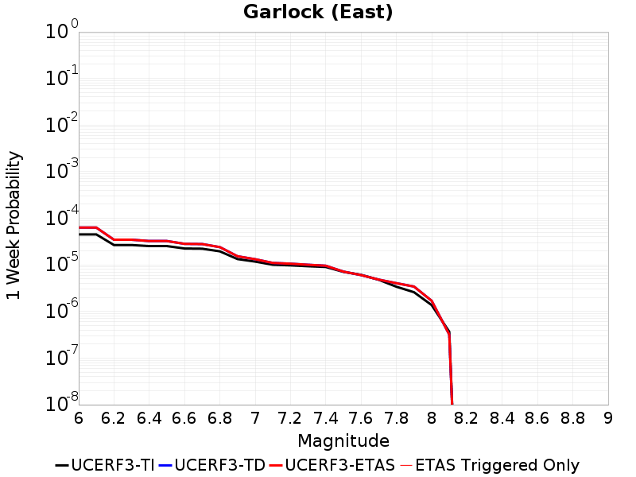 |  | 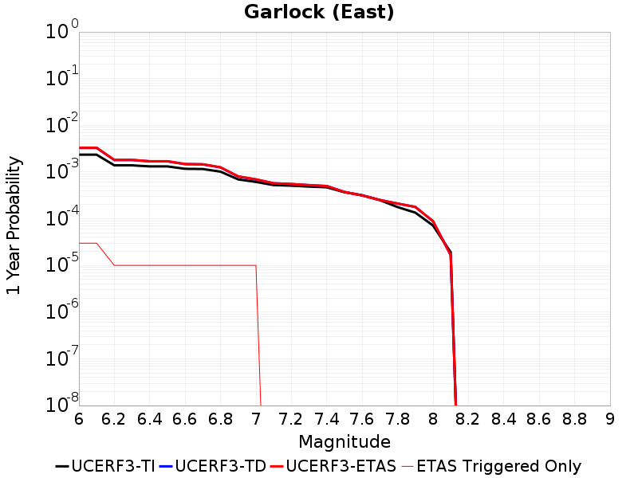 |  |

| Magnitude | 1 wk TI Prob | 1 wk TD Prob | 1 wk ETAS Prob | 1 wk ETAS/TD Gain | 1 wk ETAS Triggered Only | 1 mo TI Prob | 1 mo TD Prob | 1 mo ETAS Prob | 1 mo ETAS/TD Gain | 1 mo ETAS Triggered Only | 1 yr TI Prob | 1 yr TD Prob | 1 yr ETAS Prob | 1 yr ETAS/TD Gain | 1 yr ETAS Triggered Only | 10 yr TI Prob | 10 yr TD Prob | 10 yr ETAS Prob | 10 yr ETAS/TD Gain | 10 yr ETAS Triggered Only |
|-----|-----|-----|-----|-----|-----|-----|-----|-----|-----|-----|-----|-----|-----|-----|-----|-----|-----|-----|-----|-----|
| 6.0 | 4.5092507E-5 | 6.310891E-5 | 6.310891E-5 | 1.0 | 0.0 | 1.9323928E-4 | 2.7044126E-4 | 2.7044126E-4 | 1.0 | 0.0 | 0.0023501497 | 0.0032880981 | 0.0033179997 | 1.0090938 | 3.0E-5 | 0.023254504 | 0.032430384 | 0.032478765 | 1.0014918 | 5.0E-5 |
| 6.1 | 4.5092507E-5 | 6.310891E-5 | 6.310891E-5 | 1.0 | 0.0 | 1.9323928E-4 | 2.7044126E-4 | 2.7044126E-4 | 1.0 | 0.0 | 0.0023501497 | 0.0032880981 | 0.0033179997 | 1.0090938 | 3.0E-5 | 0.023254504 | 0.032430384 | 0.032478765 | 1.0014918 | 5.0E-5 |
| 6.2 | 2.6674514E-5 | 3.4677305E-5 | 3.4677305E-5 | 1.0 | 0.0 | 1.1431433E-4 | 1.4860874E-4 | 1.4860874E-4 | 1.0 | 0.0 | 0.0013908884 | 0.0018078432 | 0.0018178251 | 1.0055214 | 1.0E-5 | 0.01382215 | 0.017964197 | 0.017974017 | 1.0005467 | 1.0E-5 |
| 6.3 | 2.6674514E-5 | 3.4677305E-5 | 3.4677305E-5 | 1.0 | 0.0 | 1.1431433E-4 | 1.4860874E-4 | 1.4860874E-4 | 1.0 | 0.0 | 0.0013908884 | 0.0018078432 | 0.0018178251 | 1.0055214 | 1.0E-5 | 0.01382215 | 0.017964197 | 0.017974017 | 1.0005467 | 1.0E-5 |
| 6.4 | 2.5312667E-5 | 3.2503E-5 | 3.2503E-5 | 1.0 | 0.0 | 1.0847834E-4 | 1.392913E-4 | 1.392913E-4 | 1.0 | 0.0 | 0.0013199237 | 0.001694582 | 0.001704565 | 1.0058912 | 1.0E-5 | 0.013121112 | 0.016862782 | 0.016872613 | 1.000583 | 1.0E-5 |
| 6.5 | 2.5312667E-5 | 3.2503E-5 | 3.2503E-5 | 1.0 | 0.0 | 1.0847834E-4 | 1.392913E-4 | 1.392913E-4 | 1.0 | 0.0 | 0.0013199237 | 0.001694582 | 0.001704565 | 1.0058912 | 1.0E-5 | 0.013121112 | 0.016862782 | 0.016872613 | 1.000583 | 1.0E-5 |
| 6.6 | 2.246556E-5 | 2.8285824E-5 | 2.8285824E-5 | 1.0 | 0.0 | 9.627742E-5 | 1.2121946E-4 | 1.2121946E-4 | 1.0 | 0.0 | 0.0011715472 | 0.0014748715 | 0.0014848567 | 1.0067703 | 1.0E-5 | 0.011653901 | 0.014699786 | 0.014709638 | 1.0006703 | 1.0E-5 |
| 6.7 | 2.2241198E-5 | 2.7954813E-5 | 2.7954813E-5 | 1.0 | 0.0 | 9.531594E-5 | 1.1980097E-4 | 1.1980097E-4 | 1.0 | 0.0 | 0.0011598538 | 0.0014576246 | 0.00146761 | 1.0068505 | 1.0E-5 | 0.011538187 | 0.014530246 | 0.0145401005 | 1.0006782 | 1.0E-5 |
| 6.8 | 1.9528685E-5 | 2.4038061E-5 | 2.4038061E-5 | 1.0 | 0.0 | 8.369167E-5 | 1.03016304E-4 | 1.03016304E-4 | 1.0 | 0.0 | 0.0010184698 | 0.0012535217 | 0.0012635092 | 1.0079675 | 1.0E-5 | 0.010138147 | 0.0125095695 | 0.012519444 | 1.0007894 | 1.0E-5 |
| 6.9 | 1.3318621E-5 | 1.5313619E-5 | 1.5313619E-5 | 1.0 | 0.0 | 5.7078556E-5 | 6.562818E-5 | 6.562818E-5 | 1.0 | 0.0 | 6.9470983E-4 | 7.9873594E-4 | 8.087279E-4 | 1.0125098 | 1.0E-5 | 0.0069254204 | 0.00799948 | 0.008009399 | 1.0012401 | 1.0E-5 |
| 7.0 | 1.1760853E-5 | 1.3218729E-5 | 1.3218729E-5 | 1.0 | 0.0 | 5.0402683E-5 | 5.6650497E-5 | 5.6650497E-5 | 1.0 | 0.0 | 6.134799E-4 | 6.895066E-4 | 6.994997E-4 | 1.0144931 | 1.0E-5 | 0.0061178906 | 0.0069141826 | 0.0069241137 | 1.0014364 | 1.0E-5 |
| 7.1 | 1.0064758E-5 | 1.10102255E-5 | 1.10102255E-5 | 1.0 | 0.0 | 4.3133965E-5 | 4.7185848E-5 | 4.7185848E-5 | 1.0 | 0.0 | 5.2502943E-4 | 5.743398E-4 | 5.743398E-4 | 1.0 | 0.0 | 0.005237907 | 0.005768338 | 0.005768338 | 1.0 | 0.0 |
| 7.2 | 9.768808E-6 | 1.0605386E-5 | 1.0605386E-5 | 1.0 | 0.0 | 4.186565E-5 | 4.545088E-5 | 4.545088E-5 | 1.0 | 0.0 | 5.095951E-4 | 5.532275E-4 | 5.532275E-4 | 1.0 | 0.0 | 0.0050842804 | 0.0055582416 | 0.0055582416 | 1.0 | 0.0 |
| 7.3 | 9.344516E-6 | 1.0047875E-5 | 1.0047875E-5 | 1.0 | 0.0 | 4.004731E-5 | 4.3061627E-5 | 4.3061627E-5 | 1.0 | 0.0 | 4.8746695E-4 | 5.241527E-4 | 5.241527E-4 | 1.0 | 0.0 | 0.0048639905 | 0.005268294 | 0.005268294 | 1.0 | 0.0 |
| 7.4 | 9.023491E-6 | 9.589892E-6 | 9.589892E-6 | 1.0 | 0.0 | 3.867153E-5 | 4.109891E-5 | 4.109891E-5 | 1.0 | 0.0 | 4.7072413E-4 | 5.002677E-4 | 5.002677E-4 | 1.0 | 0.0 | 0.004697283 | 0.0050296383 | 0.0050296383 | 1.0 | 0.0 |
| 7.5 | 7.081253E-6 | 7.1760796E-6 | 7.1760796E-6 | 1.0 | 0.0 | 3.0347876E-5 | 3.075427E-5 | 3.075427E-5 | 1.0 | 0.0 | 3.6942272E-4 | 3.7436964E-4 | 3.7436964E-4 | 1.0 | 0.0 | 0.003688092 | 0.0037701337 | 0.0037701337 | 1.0 | 0.0 |
| 7.6 | 6.116396E-6 | 6.04053E-6 | 6.04053E-6 | 1.0 | 0.0 | 2.6212863E-5 | 2.588773E-5 | 2.588773E-5 | 1.0 | 0.0 | 3.1909486E-4 | 3.151378E-4 | 3.151378E-4 | 1.0 | 0.0 | 0.0031863707 | 0.0031778505 | 0.0031778505 | 1.0 | 0.0 |
| 7.7 | 4.797145E-6 | 4.8341585E-6 | 4.8341585E-6 | 1.0 | 0.0 | 2.055903E-5 | 2.0717658E-5 | 2.0717658E-5 | 1.0 | 0.0 | 2.5027743E-4 | 2.5220844E-4 | 2.5220844E-4 | 1.0 | 0.0 | 0.0024999576 | 0.0025491489 | 0.0025491489 | 1.0 | 0.0 |
| 7.8 | 3.4028885E-6 | 4.047187E-6 | 4.047187E-6 | 1.0 | 0.0 | 1.4583726E-5 | 1.7344972E-5 | 1.7344972E-5 | 1.0 | 0.0 | 1.775424E-4 | 2.1115465E-4 | 2.1115465E-4 | 1.0 | 0.0 | 0.0017740062 | 0.0021367962 | 0.0021367962 | 1.0 | 0.0 |
| 7.9 | 2.5928412E-6 | 3.430603E-6 | 3.430603E-6 | 1.0 | 0.0 | 1.1112129E-5 | 1.4702502E-5 | 1.4702502E-5 | 1.0 | 0.0 | 1.3528178E-4 | 1.7898832E-4 | 1.7898832E-4 | 1.0 | 0.0 | 0.0013519945 | 0.001811446 | 0.001811446 | 1.0 | 0.0 |
| 8.0 | 1.3743648E-6 | 1.6998378E-6 | 1.6998378E-6 | 1.0 | 0.0 | 5.8901214E-6 | 7.284999E-6 | 7.284999E-6 | 1.0 | 0.0 | 7.1709874E-5 | 8.869128E-5 | 8.869128E-5 | 1.0 | 0.0 | 7.1686733E-4 | 8.9739106E-4 | 8.9739106E-4 | 1.0 | 0.0 |
| 8.1 | 3.6733252E-7 | 3.195825E-7 | 3.195825E-7 | 1.0 | 0.0 | 1.5742813E-6 | 1.3696387E-6 | 1.3696387E-6 | 1.0 | 0.0 | 1.9166706E-5 | 1.667524E-5 | 1.667524E-5 | 1.0 | 0.0 | 1.9165053E-4 | 1.6887632E-4 | 1.6887632E-4 | 1.0 | 0.0 |

## Little Lake
*[(top)](#table-of-contents)*

| 1 Week | 1 Month | 1 Year | 10 Year |
|-----|-----|-----|-----|
|  | 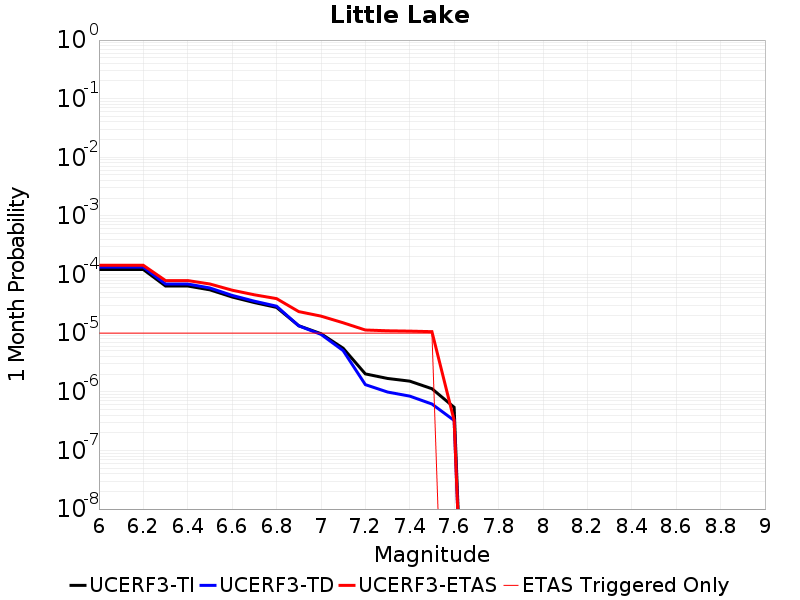 |  | 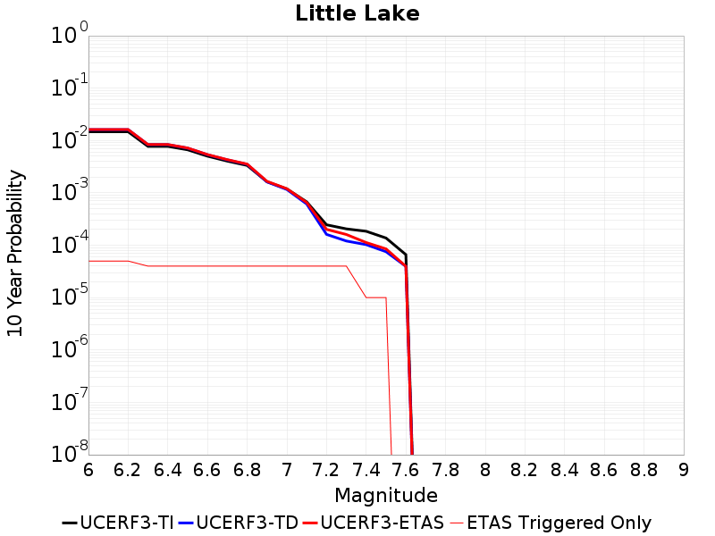 |

| Magnitude | 1 wk TI Prob | 1 wk TD Prob | 1 wk ETAS Prob | 1 wk ETAS/TD Gain | 1 wk ETAS Triggered Only | 1 mo TI Prob | 1 mo TD Prob | 1 mo ETAS Prob | 1 mo ETAS/TD Gain | 1 mo ETAS Triggered Only | 1 yr TI Prob | 1 yr TD Prob | 1 yr ETAS Prob | 1 yr ETAS/TD Gain | 1 yr ETAS Triggered Only | 10 yr TI Prob | 10 yr TD Prob | 10 yr ETAS Prob | 10 yr ETAS/TD Gain | 10 yr ETAS Triggered Only |
|-----|-----|-----|-----|-----|-----|-----|-----|-----|-----|-----|-----|-----|-----|-----|-----|-----|-----|-----|-----|-----|
| 6.0 | 2.8424427E-5 | 3.1227984E-5 | 4.122767E-5 | 1.3202156 | 1.0E-5 | 1.2181328E-4 | 1.338281E-4 | 1.4382676E-4 | 1.0747128 | 1.0E-5 | 0.0014820677 | 0.0016282728 | 0.0016682077 | 1.0245259 | 4.0E-5 | 0.014722223 | 0.016176853 | 0.016226044 | 1.0030408 | 5.0E-5 |
| 6.1 | 2.8424427E-5 | 3.1227984E-5 | 4.122767E-5 | 1.3202156 | 1.0E-5 | 1.2181328E-4 | 1.338281E-4 | 1.4382676E-4 | 1.0747128 | 1.0E-5 | 0.0014820677 | 0.0016282728 | 0.0016682077 | 1.0245259 | 4.0E-5 | 0.014722223 | 0.016176853 | 0.016226044 | 1.0030408 | 5.0E-5 |
| 6.2 | 2.8424427E-5 | 3.1227984E-5 | 4.122767E-5 | 1.3202156 | 1.0E-5 | 1.2181328E-4 | 1.338281E-4 | 1.4382676E-4 | 1.0747128 | 1.0E-5 | 0.0014820677 | 0.0016282728 | 0.0016682077 | 1.0245259 | 4.0E-5 | 0.014722223 | 0.016176853 | 0.016226044 | 1.0030408 | 5.0E-5 |
| 6.3 | 1.48860645E-5 | 1.6091728E-5 | 2.6091568E-5 | 1.6214273 | 1.0E-5 | 6.379586E-5 | 6.896289E-5 | 7.89622E-5 | 1.1449956 | 1.0E-5 | 7.7643775E-4 | 8.39328E-4 | 8.693028E-4 | 1.0357128 | 3.0E-5 | 0.007737305 | 0.008364402 | 0.008404068 | 1.0047421 | 4.0E-5 |
| 6.4 | 1.48860645E-5 | 1.6091728E-5 | 2.6091568E-5 | 1.6214273 | 1.0E-5 | 6.379586E-5 | 6.896289E-5 | 7.89622E-5 | 1.1449956 | 1.0E-5 | 7.7643775E-4 | 8.39328E-4 | 8.693028E-4 | 1.0357128 | 3.0E-5 | 0.007737305 | 0.008364402 | 0.008404068 | 1.0047421 | 4.0E-5 |
| 6.5 | 1.2797581E-5 | 1.3774208E-5 | 2.377407E-5 | 1.7259846 | 1.0E-5 | 5.4845623E-5 | 5.903113E-5 | 6.903054E-5 | 1.1693921 | 1.0E-5 | 6.675408E-4 | 7.184927E-4 | 7.484712E-4 | 1.0417241 | 3.0E-5 | 0.006655392 | 0.0071642515 | 0.007203965 | 1.0055432 | 4.0E-5 |
| 6.6 | 9.661896E-6 | 1.0295139E-5 | 2.0295036E-5 | 1.9713223 | 1.0E-5 | 4.1407468E-5 | 4.4121367E-5 | 5.4120927E-5 | 1.2266376 | 1.0E-5 | 5.040193E-4 | 5.3706154E-4 | 5.670454E-4 | 1.0558295 | 3.0E-5 | 0.005028777 | 0.005359243 | 0.005399029 | 1.0074238 | 4.0E-5 |
| 6.7 | 7.767871E-6 | 8.204336E-6 | 1.8204255E-5 | 2.2188575 | 1.0E-5 | 3.329045E-5 | 3.5161047E-5 | 4.5160694E-5 | 1.2843957 | 1.0E-5 | 4.0523586E-4 | 4.280154E-4 | 4.5800256E-4 | 1.070061 | 3.0E-5 | 0.004044977 | 0.0042732637 | 0.004313093 | 1.0093205 | 4.0E-5 |
| 6.8 | 6.4235196E-6 | 6.739514E-6 | 1.6739446E-5 | 2.4837766 | 1.0E-5 | 2.752908E-5 | 2.8883383E-5 | 3.8883096E-5 | 1.3462099 | 1.0E-5 | 3.35115E-4 | 3.516113E-4 | 3.8160075E-4 | 1.0852915 | 3.0E-5 | 0.003346101 | 0.0035118118 | 0.0035516713 | 1.0113502 | 4.0E-5 |
| 6.9 | 3.1283696E-6 | 3.1135107E-6 | 1.3113479E-5 | 4.2117987 | 1.0E-5 | 1.3407229E-5 | 1.3343558E-5 | 2.3343424E-5 | 1.7494153 | 1.0E-5 | 1.6322079E-4 | 1.624472E-4 | 1.9244234E-4 | 1.1846454 | 3.0E-5 | 0.0016310095 | 0.0016234331 | 0.0016633682 | 1.0245992 | 4.0E-5 |
| 7.0 | 2.290603E-6 | 2.2296872E-6 | 1.2229665E-5 | 5.484924 | 1.0E-5 | 9.816834E-6 | 9.555773E-6 | 1.9555679E-5 | 2.0464778 | 1.0E-5 | 1.19513395E-4 | 1.1633637E-4 | 1.4633288E-4 | 1.2578429 | 3.0E-5 | 0.0011944914 | 0.0011628569 | 0.0012028104 | 1.034358 | 4.0E-5 |
| 7.1 | 1.293693E-6 | 1.1783047E-6 | 1.1178293E-5 | 9.486759 | 1.0E-5 | 5.5443866E-6 | 5.0498716E-6 | 1.5049821E-5 | 2.9802384 | 1.0E-5 | 6.750081E-5 | 6.148115E-5 | 9.1479305E-5 | 1.4879245 | 3.0E-5 | 6.7480316E-4 | 6.147099E-4 | 6.5468537E-4 | 1.0650313 | 4.0E-5 |
| 7.2 | 4.715842E-7 | 3.0947066E-7 | 1.0309467E-5 | 33.31323 | 1.0E-5 | 2.0210737E-6 | 1.3263023E-6 | 1.1326289E-5 | 8.539749 | 1.0E-5 | 2.4606294E-5 | 1.6147616E-5 | 4.614713E-5 | 2.8578293 | 3.0E-5 | 2.460357E-4 | 1.6146497E-4 | 2.014585E-4 | 1.2476918 | 4.0E-5 |
| 7.3 | 3.9430947E-7 | 2.3124284E-7 | 1.0231241E-5 | 44.24457 | 1.0E-5 | 1.6898966E-6 | 9.910403E-7 | 1.0991031E-5 | 11.090397 | 1.0E-5 | 2.0574296E-5 | 1.2065851E-5 | 4.2065487E-5 | 3.486326 | 3.0E-5 | 2.0572392E-4 | 1.20652025E-4 | 1.606472E-4 | 1.331492 | 4.0E-5 |
| 7.4 | 3.547123E-7 | 1.9703988E-7 | 1.0197038E-5 | 51.751137 | 1.0E-5 | 1.5201948E-6 | 8.444564E-7 | 1.0844448E-5 | 12.841928 | 1.0E-5 | 1.8508214E-5 | 1.0281208E-5 | 2.0281106E-5 | 1.9726382 | 1.0E-5 | 1.8506673E-4 | 1.028074E-4 | 1.1280637E-4 | 1.0972593 | 1.0E-5 |
| 7.5 | 2.6354266E-7 | 1.4440515E-7 | 1.0144404E-5 | 70.2496 | 1.0E-5 | 1.129468E-6 | 6.18879E-7 | 1.0618873E-5 | 17.158236 | 1.0E-5 | 1.3751187E-5 | 7.534827E-6 | 1.7534752E-5 | 2.3271606 | 1.0E-5 | 1.3750336E-4 | 7.5345764E-5 | 8.534501E-5 | 1.1327114 | 1.0E-5 |
| 7.6 | 1.269913E-7 | 7.579929E-8 | 7.579929E-8 | 1.0 | 0.0 | 5.4424834E-7 | 3.2485408E-7 | 3.2485408E-7 | 1.0 | 0.0 | 6.6262032E-6 | 3.9550914E-6 | 3.9550914E-6 | 1.0 | 0.0 | 6.626006E-5 | 3.9550247E-5 | 3.9550247E-5 | 1.0 | 0.0 |

## San Andreas (Parkfield)
*[(top)](#table-of-contents)*

| 1 Week | 1 Month | 1 Year | 10 Year |
|-----|-----|-----|-----|
|  |  |  | 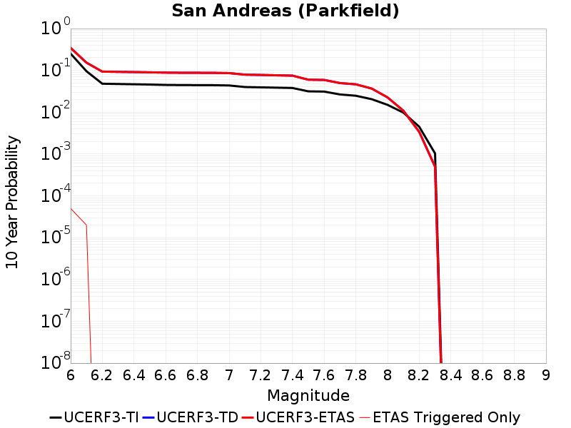 |

| Magnitude | 1 wk TI Prob | 1 wk TD Prob | 1 wk ETAS Prob | 1 wk ETAS/TD Gain | 1 wk ETAS Triggered Only | 1 mo TI Prob | 1 mo TD Prob | 1 mo ETAS Prob | 1 mo ETAS/TD Gain | 1 mo ETAS Triggered Only | 1 yr TI Prob | 1 yr TD Prob | 1 yr ETAS Prob | 1 yr ETAS/TD Gain | 1 yr ETAS Triggered Only | 10 yr TI Prob | 10 yr TD Prob | 10 yr ETAS Prob | 10 yr ETAS/TD Gain | 10 yr ETAS Triggered Only |
|-----|-----|-----|-----|-----|-----|-----|-----|-----|-----|-----|-----|-----|-----|-----|-----|-----|-----|-----|-----|-----|
| 6.0 | 5.556969E-4 | 8.2744216E-4 | 8.2744216E-4 | 1.0 | 0.0 | 0.0023793848 | 0.0035420002 | 0.0035420002 | 1.0 | 0.0 | 0.028586963 | 0.04258572 | 0.04262402 | 1.0008993 | 4.0E-5 | 0.25176284 | 0.3445485 | 0.34458128 | 1.0000951 | 5.0E-5 |
| 6.1 | 1.925858E-4 | 3.167734E-4 | 3.167734E-4 | 1.0 | 0.0 | 8.2510663E-4 | 0.0013570045 | 0.0013570045 | 1.0 | 0.0 | 0.0099994885 | 0.016463788 | 0.016473623 | 1.0005974 | 1.0E-5 | 0.095613256 | 0.15315329 | 0.15317023 | 1.0001106 | 2.0E-5 |
| 6.2 | 9.4306815E-5 | 1.8637735E-4 | 1.8637735E-4 | 1.0 | 0.0 | 4.0410945E-4 | 7.9851685E-4 | 7.9851685E-4 | 1.0 | 0.0 | 0.0049089384 | 0.009678836 | 0.009678836 | 1.0 | 0.0 | 0.048019063 | 0.09355672 | 0.09355672 | 1.0 | 0.0 |
| 6.3 | 9.283051E-5 | 1.8332624E-4 | 1.8332624E-4 | 1.0 | 0.0 | 3.9778434E-4 | 7.8544853E-4 | 7.8544853E-4 | 1.0 | 0.0 | 0.0048322747 | 0.009521128 | 0.009521128 | 1.0 | 0.0 | 0.047285385 | 0.092206284 | 0.092206284 | 1.0 | 0.0 |
| 6.4 | 9.138826E-5 | 1.8092178E-4 | 1.8092178E-4 | 1.0 | 0.0 | 3.916052E-4 | 7.751499E-4 | 7.751499E-4 | 1.0 | 0.0 | 0.0047573745 | 0.0093968315 | 0.0093968315 | 1.0 | 0.0 | 0.046568092 | 0.09110157 | 0.09110157 | 1.0 | 0.0 |
| 6.5 | 9.000255E-5 | 1.7847955E-4 | 1.7847955E-4 | 1.0 | 0.0 | 3.8566816E-4 | 7.6468935E-4 | 7.6468935E-4 | 1.0 | 0.0 | 0.0046854047 | 0.009270566 | 0.009270566 | 1.0 | 0.0 | 0.045878403 | 0.08997778 | 0.08997778 | 1.0 | 0.0 |
| 6.6 | 8.8109264E-5 | 1.7524116E-4 | 1.7524116E-4 | 1.0 | 0.0 | 3.7755648E-4 | 7.508186E-4 | 7.508186E-4 | 1.0 | 0.0 | 0.0045870654 | 0.009103129 | 0.009103129 | 1.0 | 0.0 | 0.04493529 | 0.088492416 | 0.088492416 | 1.0 | 0.0 |
| 6.7 | 8.738073E-5 | 1.7390113E-4 | 1.7390113E-4 | 1.0 | 0.0 | 3.7443507E-4 | 7.450789E-4 | 7.450789E-4 | 1.0 | 0.0 | 0.0045492216 | 0.00903387 | 0.00903387 | 1.0 | 0.0 | 0.04457213 | 0.08788955 | 0.08788955 | 1.0 | 0.0 |
| 6.8 | 8.710195E-5 | 1.733474E-4 | 1.733474E-4 | 1.0 | 0.0 | 3.7324068E-4 | 7.427071E-4 | 7.427071E-4 | 1.0 | 0.0 | 0.0045347405 | 0.00900524 | 0.00900524 | 1.0 | 0.0 | 0.04443313 | 0.08763391 | 0.08763391 | 1.0 | 0.0 |
| 6.9 | 8.6801556E-5 | 1.7274925E-4 | 1.7274925E-4 | 1.0 | 0.0 | 3.7195362E-4 | 7.4014504E-4 | 7.4014504E-4 | 1.0 | 0.0 | 0.0045191357 | 0.008974304 | 0.008974304 | 1.0 | 0.0 | 0.044283327 | 0.08735735 | 0.08735735 | 1.0 | 0.0 |
| 7.0 | 8.5571606E-5 | 1.7024668E-4 | 1.7024668E-4 | 1.0 | 0.0 | 3.6668387E-4 | 7.2942575E-4 | 7.2942575E-4 | 1.0 | 0.0 | 0.004455241 | 0.008844865 | 0.008844865 | 1.0 | 0.0 | 0.043669727 | 0.08619535 | 0.08619535 | 1.0 | 0.0 |
| 7.1 | 7.82589E-5 | 1.5491617E-4 | 1.5491617E-4 | 1.0 | 0.0 | 3.3535215E-4 | 6.6375826E-4 | 6.6375826E-4 | 1.0 | 0.0 | 0.0040752706 | 0.00805149 | 0.00805149 | 1.0 | 0.0 | 0.040013418 | 0.0790677 | 0.0790677 | 1.0 | 0.0 |
| 7.2 | 7.690929E-5 | 1.5226092E-4 | 1.5226092E-4 | 1.0 | 0.0 | 3.2956956E-4 | 6.5238436E-4 | 6.5238436E-4 | 1.0 | 0.0 | 0.004005129 | 0.007914027 | 0.007914027 | 1.0 | 0.0 | 0.0393371 | 0.07783194 | 0.07783194 | 1.0 | 0.0 |
| 7.3 | 7.5543794E-5 | 1.4918107E-4 | 1.4918107E-4 | 1.0 | 0.0 | 3.2371894E-4 | 6.391915E-4 | 6.391915E-4 | 1.0 | 0.0 | 0.003934157 | 0.0077545578 | 0.0077545578 | 1.0 | 0.0 | 0.038652334 | 0.07637734 | 0.07637734 | 1.0 | 0.0 |
| 7.4 | 7.4214564E-5 | 1.4614301E-4 | 1.4614301E-4 | 1.0 | 0.0 | 3.1802364E-4 | 6.261776E-4 | 6.261776E-4 | 1.0 | 0.0 | 0.003865065 | 0.007597229 | 0.007597229 | 1.0 | 0.0 | 0.03798529 | 0.07493406 | 0.07493406 | 1.0 | 0.0 |
| 7.5 | 6.149578E-5 | 1.14938E-4 | 1.14938E-4 | 1.0 | 0.0 | 2.6352672E-4 | 4.924985E-4 | 4.924985E-4 | 1.0 | 0.0 | 0.0032037178 | 0.005979718 | 0.005979718 | 1.0 | 0.0 | 0.03157923 | 0.059952214 | 0.059952214 | 1.0 | 0.0 |
| 7.6 | 6.0643448E-5 | 1.1319707E-4 | 1.1319707E-4 | 1.0 | 0.0 | 2.598746E-4 | 4.8504022E-4 | 4.8504022E-4 | 1.0 | 0.0 | 0.0031593828 | 0.005889408 | 0.005889408 | 1.0 | 0.0 | 0.031148417 | 0.059102565 | 0.059102565 | 1.0 | 0.0 |
| 7.7 | 5.1652263E-5 | 9.444703E-5 | 9.444703E-5 | 1.0 | 0.0 | 2.2134806E-4 | 4.047102E-4 | 4.047102E-4 | 1.0 | 0.0 | 0.002691582 | 0.0049162256 | 0.0049162256 | 1.0 | 0.0 | 0.026592141 | 0.049797118 | 0.049797118 | 1.0 | 0.0 |
| 7.8 | 4.8090482E-5 | 8.808308E-5 | 8.808308E-5 | 1.0 | 0.0 | 2.060858E-4 | 3.7744432E-4 | 3.7744432E-4 | 1.0 | 0.0 | 0.0025062072 | 0.0045857104 | 0.0045857104 | 1.0 | 0.0 | 0.024781305 | 0.04646787 | 0.04646787 | 1.0 | 0.0 |
| 7.9 | 3.970278E-5 | 6.944538E-5 | 6.944538E-5 | 1.0 | 0.0 | 1.7014367E-4 | 2.975891E-4 | 2.975891E-4 | 1.0 | 0.0 | 0.002069531 | 0.003617132 | 0.003617132 | 1.0 | 0.0 | 0.020503636 | 0.0368092 | 0.0368092 | 1.0 | 0.0 |
| 8.0 | 2.8982335E-5 | 4.1938136E-5 | 4.1938136E-5 | 1.0 | 0.0 | 1.2420409E-4 | 1.7972248E-4 | 1.7972248E-4 | 1.0 | 0.0 | 0.0015111357 | 0.0021859268 | 0.0021859268 | 1.0 | 0.0 | 0.015009012 | 0.022629254 | 0.022629254 | 1.0 | 0.0 |
| 8.1 | 1.8836186E-5 | 1.9379362E-5 | 1.9379362E-5 | 1.0 | 0.0 | 8.0724014E-5 | 8.305177E-5 | 8.305177E-5 | 1.0 | 0.0 | 9.823717E-4 | 0.0010106869 | 0.0010106869 | 1.0 | 0.0 | 0.009780403 | 0.010854352 | 0.010854352 | 1.0 | 0.0 |
| 8.2 | 8.643924E-6 | 5.7415346E-6 | 5.7415346E-6 | 1.0 | 0.0 | 3.704486E-5 | 2.4606345E-5 | 2.4606345E-5 | 1.0 | 0.0 | 4.5092785E-4 | 2.9954113E-4 | 2.9954113E-4 | 1.0 | 0.0 | 0.0045001395 | 0.0033944051 | 0.0033944051 | 1.0 | 0.0 |
| 8.3 | 1.983087E-6 | 8.103189E-7 | 8.103189E-7 | 1.0 | 0.0 | 8.498917E-6 | 3.4727907E-6 | 3.4727907E-6 | 1.0 | 0.0 | 1.034694E-4 | 4.2280426E-5 | 4.2280426E-5 | 1.0 | 0.0 | 0.0010342124 | 4.9735163E-4 | 4.9735163E-4 | 1.0 | 0.0 |

## White Mountains
*[(top)](#table-of-contents)*

| 1 Week | 1 Month | 1 Year | 10 Year |
|-----|-----|-----|-----|
| 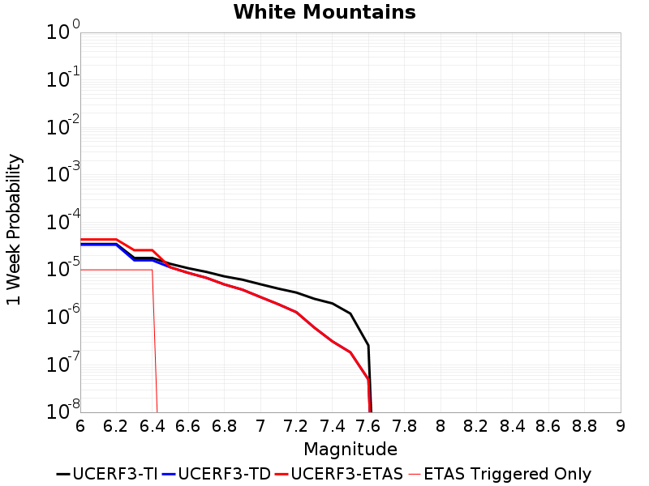 | 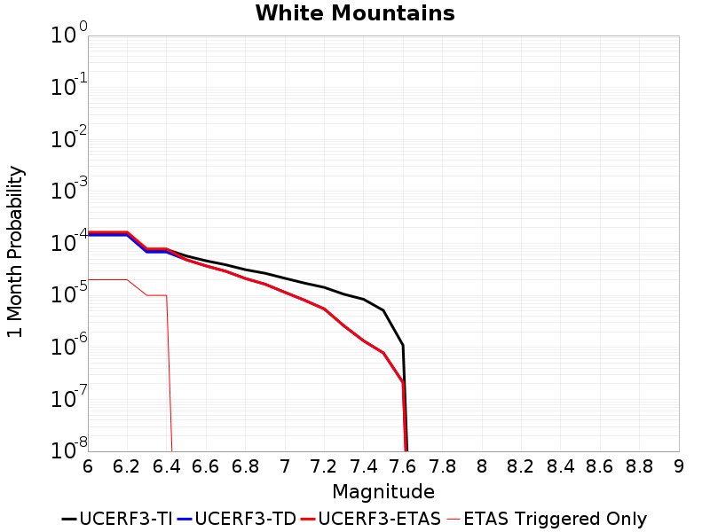 |  |  |

| Magnitude | 1 wk TI Prob | 1 wk TD Prob | 1 wk ETAS Prob | 1 wk ETAS/TD Gain | 1 wk ETAS Triggered Only | 1 mo TI Prob | 1 mo TD Prob | 1 mo ETAS Prob | 1 mo ETAS/TD Gain | 1 mo ETAS Triggered Only | 1 yr TI Prob | 1 yr TD Prob | 1 yr ETAS Prob | 1 yr ETAS/TD Gain | 1 yr ETAS Triggered Only | 10 yr TI Prob | 10 yr TD Prob | 10 yr ETAS Prob | 10 yr ETAS/TD Gain | 10 yr ETAS Triggered Only |
|-----|-----|-----|-----|-----|-----|-----|-----|-----|-----|-----|-----|-----|-----|-----|-----|-----|-----|-----|-----|-----|
| 6.0 | 3.503579E-5 | 3.3803317E-5 | 4.380298E-5 | 1.2958189 | 1.0E-5 | 1.5014476E-4 | 1.44864E-4 | 1.6486109E-4 | 1.1380405 | 2.0E-5 | 0.0018264796 | 0.0017624132 | 0.0017923603 | 1.0169921 | 3.0E-5 | 0.018115403 | 0.017496713 | 0.017545838 | 1.0028077 | 5.0E-5 |
| 6.1 | 3.503579E-5 | 3.3803317E-5 | 4.380298E-5 | 1.2958189 | 1.0E-5 | 1.5014476E-4 | 1.44864E-4 | 1.6486109E-4 | 1.1380405 | 2.0E-5 | 0.0018264796 | 0.0017624132 | 0.0017923603 | 1.0169921 | 3.0E-5 | 0.018115403 | 0.017496713 | 0.017545838 | 1.0028077 | 5.0E-5 |
| 6.2 | 3.503579E-5 | 3.3803317E-5 | 4.380298E-5 | 1.2958189 | 1.0E-5 | 1.5014476E-4 | 1.44864E-4 | 1.6486109E-4 | 1.1380405 | 2.0E-5 | 0.0018264796 | 0.0017624132 | 0.0017923603 | 1.0169921 | 3.0E-5 | 0.018115403 | 0.017496713 | 0.017545838 | 1.0028077 | 5.0E-5 |
| 6.3 | 1.7818425E-5 | 1.5924572E-5 | 2.5924413E-5 | 1.6279503 | 1.0E-5 | 7.636245E-5 | 6.824646E-5 | 7.824578E-5 | 1.1465178 | 1.0E-5 | 9.293162E-4 | 8.305982E-4 | 8.5058156E-4 | 1.024059 | 2.0E-5 | 0.009254395 | 0.008276397 | 0.008306149 | 1.0035948 | 3.0E-5 |
| 6.4 | 1.7818425E-5 | 1.5924572E-5 | 2.5924413E-5 | 1.6279503 | 1.0E-5 | 7.636245E-5 | 6.824646E-5 | 7.824578E-5 | 1.1465178 | 1.0E-5 | 9.293162E-4 | 8.305982E-4 | 8.5058156E-4 | 1.024059 | 2.0E-5 | 0.009254395 | 0.008276397 | 0.008306149 | 1.0035948 | 3.0E-5 |
| 6.5 | 1.3397557E-5 | 1.1342274E-5 | 1.1342274E-5 | 1.0 | 0.0 | 5.741684E-5 | 4.860888E-5 | 4.860888E-5 | 1.0 | 0.0 | 6.988258E-4 | 5.916594E-4 | 6.016535E-4 | 1.0168916 | 1.0E-5 | 0.006966323 | 0.0059015476 | 0.0059114886 | 1.0016844 | 1.0E-5 |
| 6.6 | 1.0818695E-5 | 8.629891E-6 | 8.629891E-6 | 1.0 | 0.0 | 4.6365014E-5 | 3.6984748E-5 | 3.6984748E-5 | 1.0 | 0.0 | 5.6434784E-4 | 4.5020063E-4 | 4.6019614E-4 | 1.0222024 | 1.0E-5 | 0.005629168 | 0.004493323 | 0.004503278 | 1.0022155 | 1.0E-5 |
| 6.7 | 9.067908E-6 | 6.8060413E-6 | 6.8060413E-6 | 1.0 | 0.0 | 3.8861883E-5 | 2.9168441E-5 | 2.9168441E-5 | 1.0 | 0.0 | 4.7304068E-4 | 3.5507107E-4 | 3.6506754E-4 | 1.0281534 | 1.0E-5 | 0.00472035 | 0.003545355 | 0.0035553197 | 1.0028106 | 1.0E-5 |
| 6.8 | 7.295947E-6 | 4.9390287E-6 | 4.9390287E-6 | 1.0 | 0.0 | 3.126797E-5 | 2.1167101E-5 | 2.1167101E-5 | 1.0 | 0.0 | 3.8062103E-4 | 2.576801E-4 | 2.6767753E-4 | 1.0387979 | 1.0E-5 | 0.0037996976 | 0.0025739262 | 0.0025839005 | 1.0038751 | 1.0E-5 |
| 6.9 | 6.2243444E-6 | 3.834392E-6 | 3.834392E-6 | 1.0 | 0.0 | 2.6675489E-5 | 1.6433009E-5 | 1.6433009E-5 | 1.0 | 0.0 | 3.2472567E-4 | 2.0005404E-4 | 2.1005204E-4 | 1.0499765 | 1.0E-5 | 0.0032425157 | 0.0019987922 | 0.0020087722 | 1.004993 | 1.0E-5 |
| 7.0 | 4.9878413E-6 | 2.6813973E-6 | 2.6813973E-6 | 1.0 | 0.0 | 2.1376287E-5 | 1.1491654E-5 | 1.1491654E-5 | 1.0 | 0.0 | 2.602252E-4 | 1.3990217E-4 | 1.3990217E-4 | 1.0 | 0.0 | 0.002599207 | 0.0013981672 | 0.0013981672 | 1.0 | 0.0 |
| 7.1 | 4.0252844E-6 | 1.8874479E-6 | 1.8874479E-6 | 1.0 | 0.0 | 1.7251105E-5 | 8.089038E-6 | 8.089038E-6 | 1.0 | 0.0 | 2.1001195E-4 | 9.8479715E-5 | 9.8479715E-5 | 1.0 | 0.0 | 0.0020981359 | 9.843735E-4 | 9.843735E-4 | 1.0 | 0.0 |
| 7.2 | 3.3284066E-6 | 1.2834114E-6 | 1.2834114E-6 | 1.0 | 0.0 | 1.4264522E-5 | 5.5003234E-6 | 5.5003234E-6 | 1.0 | 0.0 | 1.736567E-4 | 6.696449E-5 | 6.696449E-5 | 1.0 | 0.0 | 0.0017352107 | 6.694531E-4 | 6.694531E-4 | 1.0 | 0.0 |
| 7.3 | 2.458226E-6 | 6.070664E-7 | 6.070664E-7 | 1.0 | 0.0 | 1.0535211E-5 | 2.6017108E-6 | 2.6017108E-6 | 1.0 | 0.0 | 1.2825865E-4 | 3.1675405E-5 | 3.1675405E-5 | 1.0 | 0.0 | 0.0012818464 | 3.1671266E-4 | 3.1671266E-4 | 1.0 | 0.0 |
| 7.4 | 1.965953E-6 | 3.12049E-7 | 3.12049E-7 | 1.0 | 0.0 | 8.425486E-6 | 1.337352E-6 | 1.337352E-6 | 1.0 | 0.0 | 1.0257547E-4 | 1.6282142E-5 | 1.6282142E-5 | 1.0 | 0.0 | 0.0010252813 | 1.6280962E-4 | 1.6280962E-4 | 1.0 | 0.0 |
| 7.5 | 1.2014192E-6 | 1.8324214E-7 | 1.8324214E-7 | 1.0 | 0.0 | 5.148929E-6 | 7.853232E-7 | 7.853232E-7 | 1.0 | 0.0 | 6.2686406E-5 | 9.5612695E-6 | 9.5612695E-6 | 1.0 | 0.0 | 6.266873E-4 | 9.560866E-5 | 9.560866E-5 | 1.0 | 0.0 |
| 7.6 | 2.5612175E-7 | 4.9158132E-8 | 4.9158132E-8 | 1.0 | 0.0 | 1.0976642E-6 | 2.1067768E-7 | 2.1067768E-7 | 1.0 | 0.0 | 1.3363979E-5 | 2.564998E-6 | 2.564998E-6 | 1.0 | 0.0 | 1.3363175E-4 | 2.5649722E-5 | 2.5649722E-5 | 1.0 | 0.0 |

## Dry Mountain
*[(top)](#table-of-contents)*

| 1 Week | 1 Month | 1 Year | 10 Year |
|-----|-----|-----|-----|
|  |  |  | 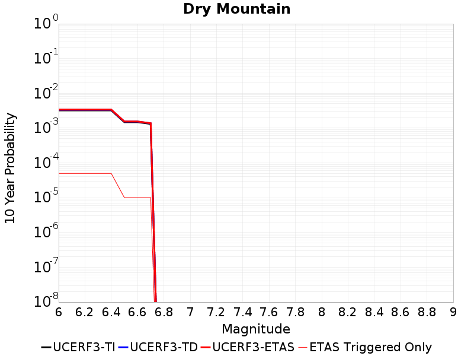 |

| Magnitude | 1 wk TI Prob | 1 wk TD Prob | 1 wk ETAS Prob | 1 wk ETAS/TD Gain | 1 wk ETAS Triggered Only | 1 mo TI Prob | 1 mo TD Prob | 1 mo ETAS Prob | 1 mo ETAS/TD Gain | 1 mo ETAS Triggered Only | 1 yr TI Prob | 1 yr TD Prob | 1 yr ETAS Prob | 1 yr ETAS/TD Gain | 1 yr ETAS Triggered Only | 10 yr TI Prob | 10 yr TD Prob | 10 yr ETAS Prob | 10 yr ETAS/TD Gain | 10 yr ETAS Triggered Only |
|-----|-----|-----|-----|-----|-----|-----|-----|-----|-----|-----|-----|-----|-----|-----|-----|-----|-----|-----|-----|-----|
| 6.0 | 6.222801E-6 | 6.4408882E-6 | 1.6440823E-5 | 2.5525708 | 1.0E-5 | 2.6668875E-5 | 2.7603604E-5 | 4.760305E-5 | 1.7245231 | 2.0E-5 | 3.2464517E-4 | 3.3603798E-4 | 3.5603126E-4 | 1.0594971 | 2.0E-5 | 0.0032417132 | 0.0033568612 | 0.0034066935 | 1.0148449 | 5.0E-5 |
| 6.1 | 6.222801E-6 | 6.4408882E-6 | 1.6440823E-5 | 2.5525708 | 1.0E-5 | 2.6668875E-5 | 2.7603604E-5 | 4.760305E-5 | 1.7245231 | 2.0E-5 | 3.2464517E-4 | 3.3603798E-4 | 3.5603126E-4 | 1.0594971 | 2.0E-5 | 0.0032417132 | 0.0033568612 | 0.0034066935 | 1.0148449 | 5.0E-5 |
| 6.2 | 6.222801E-6 | 6.4408882E-6 | 1.6440823E-5 | 2.5525708 | 1.0E-5 | 2.6668875E-5 | 2.7603604E-5 | 4.760305E-5 | 1.7245231 | 2.0E-5 | 3.2464517E-4 | 3.3603798E-4 | 3.5603126E-4 | 1.0594971 | 2.0E-5 | 0.0032417132 | 0.0033568612 | 0.0034066935 | 1.0148449 | 5.0E-5 |
| 6.3 | 6.222801E-6 | 6.4408882E-6 | 1.6440823E-5 | 2.5525708 | 1.0E-5 | 2.6668875E-5 | 2.7603604E-5 | 4.760305E-5 | 1.7245231 | 2.0E-5 | 3.2464517E-4 | 3.3603798E-4 | 3.5603126E-4 | 1.0594971 | 2.0E-5 | 0.0032417132 | 0.0033568612 | 0.0034066935 | 1.0148449 | 5.0E-5 |
| 6.4 | 6.222801E-6 | 6.4408882E-6 | 1.6440823E-5 | 2.5525708 | 1.0E-5 | 2.6668875E-5 | 2.7603604E-5 | 4.760305E-5 | 1.7245231 | 2.0E-5 | 3.2464517E-4 | 3.3603798E-4 | 3.5603126E-4 | 1.0594971 | 2.0E-5 | 0.0032417132 | 0.0033568612 | 0.0034066935 | 1.0148449 | 5.0E-5 |
| 6.5 | 2.8528623E-6 | 2.9528594E-6 | 2.9528594E-6 | 1.0 | 0.0 | 1.22264955E-5 | 1.2655099E-5 | 1.2655099E-5 | 1.0 | 0.0 | 1.4884741E-4 | 1.5407364E-4 | 1.5407364E-4 | 1.0 | 0.0 | 0.0014874774 | 0.001540522 | 0.0015505066 | 1.0064813 | 1.0E-5 |
| 6.6 | 2.8528623E-6 | 2.9528594E-6 | 2.9528594E-6 | 1.0 | 0.0 | 1.22264955E-5 | 1.2655099E-5 | 1.2655099E-5 | 1.0 | 0.0 | 1.4884741E-4 | 1.5407364E-4 | 1.5407364E-4 | 1.0 | 0.0 | 0.0014874774 | 0.001540522 | 0.0015505066 | 1.0064813 | 1.0E-5 |
| 6.7 | 2.541E-6 | 2.6299726E-6 | 2.6299726E-6 | 1.0 | 0.0 | 1.0889954E-5 | 1.1271311E-5 | 1.1271311E-5 | 1.0 | 0.0 | 1.3257713E-4 | 1.3722821E-4 | 1.3722821E-4 | 1.0 | 0.0 | 0.0013249806 | 0.0013722822 | 0.0013822684 | 1.0072771 | 1.0E-5 |

## Death Valley (So)
*[(top)](#table-of-contents)*

| 1 Week | 1 Month | 1 Year | 10 Year |
|-----|-----|-----|-----|
|  |  |  |  |

| Magnitude | 1 wk TI Prob | 1 wk TD Prob | 1 wk ETAS Prob | 1 wk ETAS/TD Gain | 1 wk ETAS Triggered Only | 1 mo TI Prob | 1 mo TD Prob | 1 mo ETAS Prob | 1 mo ETAS/TD Gain | 1 mo ETAS Triggered Only | 1 yr TI Prob | 1 yr TD Prob | 1 yr ETAS Prob | 1 yr ETAS/TD Gain | 1 yr ETAS Triggered Only | 10 yr TI Prob | 10 yr TD Prob | 10 yr ETAS Prob | 10 yr ETAS/TD Gain | 10 yr ETAS Triggered Only |
|-----|-----|-----|-----|-----|-----|-----|-----|-----|-----|-----|-----|-----|-----|-----|-----|-----|-----|-----|-----|-----|
| 6.0 | 2.0684236E-5 | 2.5668038E-5 | 2.5668038E-5 | 1.0 | 0.0 | 8.864371E-5 | 1.1000133E-4 | 1.1000133E-4 | 1.0 | 0.0 | 0.0010787029 | 0.0013384605 | 0.0013684203 | 1.0223838 | 3.0E-5 | 0.010734817 | 0.013307668 | 0.013357003 | 1.0037073 | 5.0E-5 |
| 6.1 | 2.0684236E-5 | 2.5668038E-5 | 2.5668038E-5 | 1.0 | 0.0 | 8.864371E-5 | 1.1000133E-4 | 1.1000133E-4 | 1.0 | 0.0 | 0.0010787029 | 0.0013384605 | 0.0013684203 | 1.0223838 | 3.0E-5 | 0.010734817 | 0.013307668 | 0.013357003 | 1.0037073 | 5.0E-5 |
| 6.2 | 2.0684236E-5 | 2.5668038E-5 | 2.5668038E-5 | 1.0 | 0.0 | 8.864371E-5 | 1.1000133E-4 | 1.1000133E-4 | 1.0 | 0.0 | 0.0010787029 | 0.0013384605 | 0.0013684203 | 1.0223838 | 3.0E-5 | 0.010734817 | 0.013307668 | 0.013357003 | 1.0037073 | 5.0E-5 |
| 6.3 | 2.0240292E-5 | 2.5167697E-5 | 2.5167697E-5 | 1.0 | 0.0 | 8.6741224E-5 | 1.07857195E-4 | 1.07857195E-4 | 1.0 | 0.0 | 0.0010555626 | 0.0013123872 | 0.0013423478 | 1.022829 | 3.0E-5 | 0.010505628 | 0.013050016 | 0.013099363 | 1.0037814 | 5.0E-5 |
| 6.4 | 2.0240292E-5 | 2.5167697E-5 | 2.5167697E-5 | 1.0 | 0.0 | 8.6741224E-5 | 1.07857195E-4 | 1.07857195E-4 | 1.0 | 0.0 | 0.0010555626 | 0.0013123872 | 0.0013423478 | 1.022829 | 3.0E-5 | 0.010505628 | 0.013050016 | 0.013099363 | 1.0037814 | 5.0E-5 |
| 6.5 | 1.9962767E-5 | 2.48567E-5 | 2.48567E-5 | 1.0 | 0.0 | 8.55519E-5 | 1.0652446E-4 | 1.0652446E-4 | 1.0 | 0.0 | 0.0010410968 | 0.0012961805 | 0.0013261416 | 1.0231149 | 3.0E-5 | 0.010362327 | 0.012889838 | 0.012939193 | 1.003829 | 5.0E-5 |
| 6.6 | 1.8937297E-5 | 2.3352286E-5 | 2.3352286E-5 | 1.0 | 0.0 | 8.115732E-5 | 1.0007747E-4 | 1.0007747E-4 | 1.0 | 0.0 | 9.876423E-4 | 0.0012177768 | 0.0012477402 | 1.024605 | 3.0E-5 | 0.009832645 | 0.012114105 | 0.012163498 | 1.0040774 | 5.0E-5 |
| 6.7 | 1.8621096E-5 | 2.2952274E-5 | 2.2952274E-5 | 1.0 | 0.0 | 7.980225E-5 | 9.836326E-5 | 9.836326E-5 | 1.0 | 0.0 | 9.711593E-4 | 0.0011969294 | 0.0012268935 | 1.0250342 | 3.0E-5 | 0.009669261 | 0.011907898 | 0.011957303 | 1.0041488 | 5.0E-5 |
| 6.8 | 1.7830353E-5 | 2.1842035E-5 | 2.1842035E-5 | 1.0 | 0.0 | 7.641356E-5 | 9.360545E-5 | 9.360545E-5 | 1.0 | 0.0 | 9.29938E-4 | 0.0011390646 | 0.0011690304 | 1.0263073 | 3.0E-5 | 0.009260561 | 0.011336419 | 0.0113858525 | 1.0043606 | 5.0E-5 |
| 6.9 | 1.3135183E-5 | 1.5320118E-5 | 1.5320118E-5 | 1.0 | 0.0 | 5.6292425E-5 | 6.565603E-5 | 6.565603E-5 | 1.0 | 0.0 | 6.8514474E-4 | 7.9907547E-4 | 8.2905154E-4 | 1.0375134 | 3.0E-5 | 0.006830362 | 0.007963557 | 0.008013159 | 1.0062286 | 5.0E-5 |
| 7.0 | 1.1507512E-5 | 1.3166692E-5 | 1.3166692E-5 | 1.0 | 0.0 | 4.9316975E-5 | 5.6427492E-5 | 5.6427492E-5 | 1.0 | 0.0 | 6.002687E-4 | 6.86794E-4 | 7.167734E-4 | 1.0436512 | 3.0E-5 | 0.0059864987 | 0.0068479097 | 0.0068975673 | 1.0072515 | 5.0E-5 |
| 7.1 | 9.715903E-6 | 1.08742015E-5 | 1.08742015E-5 | 1.0 | 0.0 | 4.1638916E-5 | 4.6602912E-5 | 4.6602912E-5 | 1.0 | 0.0 | 5.068359E-4 | 5.67247E-4 | 5.8723567E-4 | 1.035238 | 2.0E-5 | 0.0050568148 | 0.0056584426 | 0.0056982166 | 1.007029 | 4.0E-5 |
| 7.2 | 9.233269E-6 | 1.0294562E-5 | 1.0294562E-5 | 1.0 | 0.0 | 3.9570554E-5 | 4.411883E-5 | 4.411883E-5 | 1.0 | 0.0 | 4.81665E-4 | 5.370186E-4 | 5.5700785E-4 | 1.0372226 | 2.0E-5 | 0.0048062233 | 0.0053576413 | 0.005397427 | 1.007426 | 4.0E-5 |
| 7.3 | 8.8041315E-6 | 9.815726E-6 | 9.815726E-6 | 1.0 | 0.0 | 3.7731446E-5 | 4.2066746E-5 | 4.2066746E-5 | 1.0 | 0.0 | 4.592835E-4 | 5.1204645E-4 | 5.3203624E-4 | 1.0390389 | 2.0E-5 | 0.0045833546 | 0.0051090936 | 0.0051488895 | 1.0077891 | 4.0E-5 |
| 7.4 | 8.708749E-6 | 9.714697E-6 | 9.714697E-6 | 1.0 | 0.0 | 3.7322676E-5 | 4.163377E-5 | 4.163377E-5 | 1.0 | 0.0 | 4.5430884E-4 | 5.067775E-4 | 5.2676734E-4 | 1.039445 | 2.0E-5 | 0.004533812 | 0.0050566453 | 0.005096443 | 1.0078704 | 4.0E-5 |
| 7.5 | 8.612678E-6 | 9.612292E-6 | 9.612292E-6 | 1.0 | 0.0 | 3.6910955E-5 | 4.119491E-5 | 4.119491E-5 | 1.0 | 0.0 | 4.492982E-4 | 5.014368E-4 | 5.214268E-4 | 1.0398654 | 2.0E-5 | 0.004483909 | 0.0050034802 | 0.0050432803 | 1.0079545 | 4.0E-5 |
| 7.6 | 8.319024E-6 | 9.291189E-6 | 9.291189E-6 | 1.0 | 0.0 | 3.5652476E-5 | 3.9818795E-5 | 3.9818795E-5 | 1.0 | 0.0 | 4.3398244E-4 | 4.846902E-4 | 5.046805E-4 | 1.0412434 | 2.0E-5 | 0.0043313587 | 0.0048367553 | 0.004876562 | 1.00823 | 4.0E-5 |
| 7.7 | 7.4718328E-6 | 8.351755E-6 | 8.351755E-6 | 1.0 | 0.0 | 3.2021748E-5 | 3.5792767E-5 | 3.5792767E-5 | 1.0 | 0.0 | 3.8979502E-4 | 4.3569386E-4 | 4.456895E-4 | 1.022942 | 1.0E-5 | 0.00389112 | 0.0043488024 | 0.004378672 | 1.0068685 | 3.0E-5 |
| 7.8 | 3.4586725E-7 | 3.6496132E-7 | 3.6496132E-7 | 1.0 | 0.0 | 1.4822873E-6 | 1.5641191E-6 | 1.5641191E-6 | 1.0 | 0.0 | 1.80467E-5 | 1.9042987E-5 | 2.9042798E-5 | 1.5251176 | 1.0E-5 | 1.8045233E-4 | 1.90414E-4 | 2.0041209E-4 | 1.0525072 | 1.0E-5 |
| 7.9 | 2.5591178E-9 | 2.6704472E-9 | 2.6704472E-9 | 1.0 | 0.0 | 1.0967647E-8 | 1.1444774E-8 | 1.1444774E-8 | 1.0 | 0.0 | 1.335311E-7 | 1.3934012E-7 | 1.3934012E-7 | 1.0 | 0.0 | 1.3353102E-6 | 1.3934012E-6 | 1.3934012E-6 | 1.0 | 0.0 |

## Death Valley (Black Mtns Frontal)
*[(top)](#table-of-contents)*

| 1 Week | 1 Month | 1 Year | 10 Year |
|-----|-----|-----|-----|
| 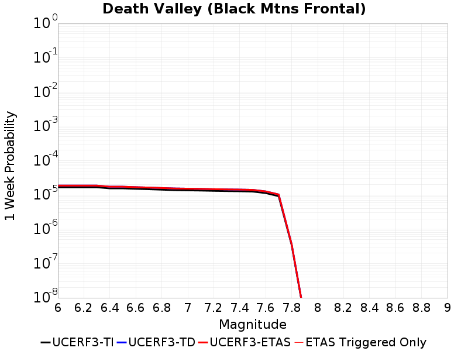 | 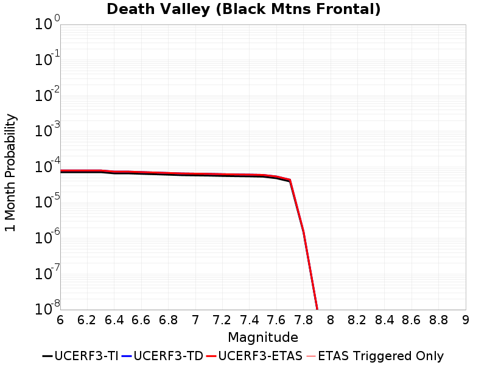 |  |  |

| Magnitude | 1 wk TI Prob | 1 wk TD Prob | 1 wk ETAS Prob | 1 wk ETAS/TD Gain | 1 wk ETAS Triggered Only | 1 mo TI Prob | 1 mo TD Prob | 1 mo ETAS Prob | 1 mo ETAS/TD Gain | 1 mo ETAS Triggered Only | 1 yr TI Prob | 1 yr TD Prob | 1 yr ETAS Prob | 1 yr ETAS/TD Gain | 1 yr ETAS Triggered Only | 10 yr TI Prob | 10 yr TD Prob | 10 yr ETAS Prob | 10 yr ETAS/TD Gain | 10 yr ETAS Triggered Only |
|-----|-----|-----|-----|-----|-----|-----|-----|-----|-----|-----|-----|-----|-----|-----|-----|-----|-----|-----|-----|-----|
| 6.0 | 1.6707214E-5 | 1.8685068E-5 | 1.8685068E-5 | 1.0 | 0.0 | 7.160038E-5 | 8.007645E-5 | 8.007645E-5 | 1.0 | 0.0 | 8.71386E-4 | 9.745023E-4 | 9.944828E-4 | 1.0205033 | 2.0E-5 | 0.00867977 | 0.009703145 | 0.00975266 | 1.005103 | 5.0E-5 |
| 6.1 | 1.6707214E-5 | 1.8685068E-5 | 1.8685068E-5 | 1.0 | 0.0 | 7.160038E-5 | 8.007645E-5 | 8.007645E-5 | 1.0 | 0.0 | 8.71386E-4 | 9.745023E-4 | 9.944828E-4 | 1.0205033 | 2.0E-5 | 0.00867977 | 0.009703145 | 0.00975266 | 1.005103 | 5.0E-5 |
| 6.2 | 1.6707214E-5 | 1.8685068E-5 | 1.8685068E-5 | 1.0 | 0.0 | 7.160038E-5 | 8.007645E-5 | 8.007645E-5 | 1.0 | 0.0 | 8.71386E-4 | 9.745023E-4 | 9.944828E-4 | 1.0205033 | 2.0E-5 | 0.00867977 | 0.009703145 | 0.00975266 | 1.005103 | 5.0E-5 |
| 6.3 | 1.6707214E-5 | 1.8685068E-5 | 1.8685068E-5 | 1.0 | 0.0 | 7.160038E-5 | 8.007645E-5 | 8.007645E-5 | 1.0 | 0.0 | 8.71386E-4 | 9.745023E-4 | 9.944828E-4 | 1.0205033 | 2.0E-5 | 0.00867977 | 0.009703145 | 0.00975266 | 1.005103 | 5.0E-5 |
| 6.4 | 1.5515609E-5 | 1.7351957E-5 | 1.7351957E-5 | 1.0 | 0.0 | 6.649377E-5 | 7.436344E-5 | 7.436344E-5 | 1.0 | 0.0 | 8.0926094E-4 | 9.0500497E-4 | 9.2498685E-4 | 1.0220793 | 2.0E-5 | 0.008063202 | 0.00901388 | 0.009063429 | 1.005497 | 5.0E-5 |
| 6.5 | 1.5515609E-5 | 1.7351957E-5 | 1.7351957E-5 | 1.0 | 0.0 | 6.649377E-5 | 7.436344E-5 | 7.436344E-5 | 1.0 | 0.0 | 8.0926094E-4 | 9.0500497E-4 | 9.2498685E-4 | 1.0220793 | 2.0E-5 | 0.008063202 | 0.00901388 | 0.009063429 | 1.005497 | 5.0E-5 |
| 6.6 | 1.5041828E-5 | 1.6822472E-5 | 1.6822472E-5 | 1.0 | 0.0 | 6.4463384E-5 | 7.209435E-5 | 7.209435E-5 | 1.0 | 0.0 | 7.8455906E-4 | 8.7740115E-4 | 8.973836E-4 | 1.0227746 | 2.0E-5 | 0.00781795 | 0.0087400265 | 0.00878959 | 1.0056708 | 5.0E-5 |
| 6.7 | 1.4634985E-5 | 1.6368997E-5 | 1.6368997E-5 | 1.0 | 0.0 | 6.271985E-5 | 7.015099E-5 | 7.015099E-5 | 1.0 | 0.0 | 7.6334673E-4 | 8.537594E-4 | 8.7374233E-4 | 1.0234058 | 2.0E-5 | 0.007607299 | 0.008505432 | 0.008555007 | 1.0058286 | 5.0E-5 |
| 6.8 | 1.4209158E-5 | 1.5894668E-5 | 1.5894668E-5 | 1.0 | 0.0 | 6.089497E-5 | 6.811826E-5 | 6.811826E-5 | 1.0 | 0.0 | 7.4114406E-4 | 8.290298E-4 | 8.490133E-4 | 1.0241046 | 2.0E-5 | 0.007386771 | 0.008259988 | 0.008309575 | 1.0060033 | 5.0E-5 |
| 6.9 | 1.3780098E-5 | 1.541685E-5 | 1.541685E-5 | 1.0 | 0.0 | 5.9056227E-5 | 6.607058E-5 | 6.607058E-5 | 1.0 | 0.0 | 7.1877235E-4 | 8.041178E-4 | 8.2410173E-4 | 1.0248519 | 2.0E-5 | 0.0071645193 | 0.0080126785 | 0.008062278 | 1.0061901 | 5.0E-5 |
| 7.0 | 1.3585064E-5 | 1.5200253E-5 | 1.5200253E-5 | 1.0 | 0.0 | 5.8220405E-5 | 6.514235E-5 | 6.514235E-5 | 1.0 | 0.0 | 7.086029E-4 | 7.9282495E-4 | 8.128091E-4 | 1.0252062 | 2.0E-5 | 0.007063476 | 0.0079005575 | 0.0079501625 | 1.0062786 | 5.0E-5 |
| 7.1 | 1.3398601E-5 | 1.4993285E-5 | 1.4993285E-5 | 1.0 | 0.0 | 5.742131E-5 | 6.4255386E-5 | 6.4255386E-5 | 1.0 | 0.0 | 6.9888023E-4 | 7.82034E-4 | 8.0201833E-4 | 1.0255543 | 2.0E-5 | 0.0069668638 | 0.0077934097 | 0.00784302 | 1.0063657 | 5.0E-5 |
| 7.2 | 1.3126312E-5 | 1.4691286E-5 | 1.4691286E-5 | 1.0 | 0.0 | 5.6254412E-5 | 6.296117E-5 | 6.296117E-5 | 1.0 | 0.0 | 6.846822E-4 | 7.662881E-4 | 7.8627275E-4 | 1.0260799 | 2.0E-5 | 0.006825765 | 0.007637043 | 0.007686661 | 1.006497 | 5.0E-5 |
| 7.3 | 1.2922429E-5 | 1.446535E-5 | 1.446535E-5 | 1.0 | 0.0 | 5.5380664E-5 | 6.199292E-5 | 6.199292E-5 | 1.0 | 0.0 | 6.74051E-4 | 7.5450784E-4 | 7.7449274E-4 | 1.0264874 | 2.0E-5 | 0.006720101 | 0.0075200438 | 0.0075696674 | 1.006599 | 5.0E-5 |
| 7.4 | 1.2768878E-5 | 1.429521E-5 | 1.429521E-5 | 1.0 | 0.0 | 5.4722615E-5 | 6.1263774E-5 | 6.1263774E-5 | 1.0 | 0.0 | 6.660441E-4 | 7.456367E-4 | 7.656218E-4 | 1.0268027 | 2.0E-5 | 0.0066405144 | 0.0074319285 | 0.0074815573 | 1.0066777 | 5.0E-5 |
| 7.5 | 1.2521929E-5 | 1.4023268E-5 | 1.4023268E-5 | 1.0 | 0.0 | 5.366431E-5 | 6.0098366E-5 | 6.0098366E-5 | 1.0 | 0.0 | 6.531671E-4 | 7.314574E-4 | 7.5144274E-4 | 1.0273226 | 2.0E-5 | 0.006512506 | 0.0072910753 | 0.007340711 | 1.0068077 | 5.0E-5 |
| 7.6 | 1.1301089E-5 | 1.2658322E-5 | 1.2658322E-5 | 1.0 | 0.0 | 4.8432343E-5 | 5.4248852E-5 | 5.4248852E-5 | 1.0 | 0.0 | 5.895042E-4 | 6.6028495E-4 | 6.8027177E-4 | 1.03027 | 2.0E-5 | 0.0058794282 | 0.0065837847 | 0.0066334554 | 1.0075444 | 5.0E-5 |
| 7.7 | 9.189108E-6 | 1.0291621E-5 | 1.0291621E-5 | 1.0 | 0.0 | 3.93813E-5 | 4.410623E-5 | 4.410623E-5 | 1.0 | 0.0 | 4.7936183E-4 | 5.368661E-4 | 5.4686074E-4 | 1.0186167 | 1.0E-5 | 0.004783291 | 0.0053562033 | 0.0053860424 | 1.005571 | 3.0E-5 |
| 7.8 | 3.4586725E-7 | 3.6496132E-7 | 3.6496132E-7 | 1.0 | 0.0 | 1.4822873E-6 | 1.5641191E-6 | 1.5641191E-6 | 1.0 | 0.0 | 1.80467E-5 | 1.9042987E-5 | 2.9042798E-5 | 1.5251176 | 1.0E-5 | 1.8045233E-4 | 1.90414E-4 | 2.0041209E-4 | 1.0525072 | 1.0E-5 |
| 7.9 | 2.5591178E-9 | 2.6704472E-9 | 2.6704472E-9 | 1.0 | 0.0 | 1.0967647E-8 | 1.1444774E-8 | 1.1444774E-8 | 1.0 | 0.0 | 1.335311E-7 | 1.3934012E-7 | 1.3934012E-7 | 1.0 | 0.0 | 1.3353102E-6 | 1.3934012E-6 | 1.3934012E-6 | 1.0 | 0.0 |

## Garlock (Central)
*[(top)](#table-of-contents)*

| 1 Week | 1 Month | 1 Year | 10 Year |
|-----|-----|-----|-----|
| 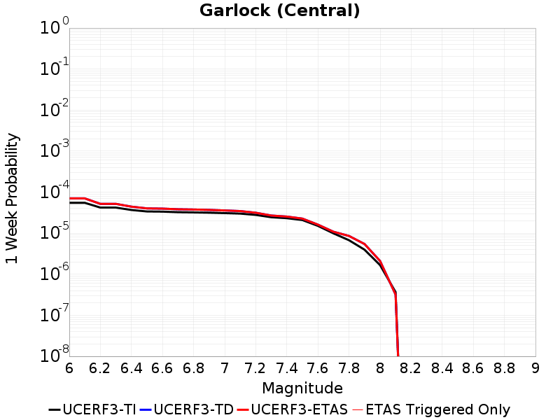 |  |  |  |

| Magnitude | 1 wk TI Prob | 1 wk TD Prob | 1 wk ETAS Prob | 1 wk ETAS/TD Gain | 1 wk ETAS Triggered Only | 1 mo TI Prob | 1 mo TD Prob | 1 mo ETAS Prob | 1 mo ETAS/TD Gain | 1 mo ETAS Triggered Only | 1 yr TI Prob | 1 yr TD Prob | 1 yr ETAS Prob | 1 yr ETAS/TD Gain | 1 yr ETAS Triggered Only | 10 yr TI Prob | 10 yr TD Prob | 10 yr ETAS Prob | 10 yr ETAS/TD Gain | 10 yr ETAS Triggered Only |
|-----|-----|-----|-----|-----|-----|-----|-----|-----|-----|-----|-----|-----|-----|-----|-----|-----|-----|-----|-----|-----|
| 6.0 | 5.5131142E-5 | 7.058003E-5 | 7.058003E-5 | 1.0 | 0.0 | 2.3625491E-4 | 3.024511E-4 | 3.024511E-4 | 1.0 | 0.0 | 0.0028726095 | 0.0036761893 | 0.0036861526 | 1.0027102 | 1.0E-5 | 0.028357591 | 0.03632403 | 0.036362577 | 1.0010612 | 4.0E-5 |
| 6.1 | 5.5131142E-5 | 7.058003E-5 | 7.058003E-5 | 1.0 | 0.0 | 2.3625491E-4 | 3.024511E-4 | 3.024511E-4 | 1.0 | 0.0 | 0.0028726095 | 0.0036761893 | 0.0036861526 | 1.0027102 | 1.0E-5 | 0.028357591 | 0.03632403 | 0.036362577 | 1.0010612 | 4.0E-5 |
| 6.2 | 4.216245E-5 | 5.1964966E-5 | 5.1964966E-5 | 1.0 | 0.0 | 1.806837E-4 | 2.2268818E-4 | 2.2268818E-4 | 1.0 | 0.0 | 0.0021976046 | 0.002707889 | 0.0027178621 | 1.003683 | 1.0E-5 | 0.021759989 | 0.02688909 | 0.026928015 | 1.0014476 | 4.0E-5 |
| 6.3 | 4.216245E-5 | 5.1964966E-5 | 5.1964966E-5 | 1.0 | 0.0 | 1.806837E-4 | 2.2268818E-4 | 2.2268818E-4 | 1.0 | 0.0 | 0.0021976046 | 0.002707889 | 0.0027178621 | 1.003683 | 1.0E-5 | 0.021759989 | 0.02688909 | 0.026928015 | 1.0014476 | 4.0E-5 |
| 6.4 | 3.6858168E-5 | 4.440281E-5 | 4.440281E-5 | 1.0 | 0.0 | 1.5795401E-4 | 1.90284E-4 | 1.90284E-4 | 1.0 | 0.0 | 0.0019213937 | 0.0023142716 | 0.0023242484 | 1.004311 | 1.0E-5 | 0.019048655 | 0.023019606 | 0.023058686 | 1.0016977 | 4.0E-5 |
| 6.5 | 3.39199E-5 | 4.0305815E-5 | 4.0305815E-5 | 1.0 | 0.0 | 1.453629E-4 | 1.7272789E-4 | 1.7272789E-4 | 1.0 | 0.0 | 0.0017683565 | 0.0021009557 | 0.0021109346 | 1.0047498 | 1.0E-5 | 0.017543508 | 0.020910189 | 0.02092977 | 1.0009365 | 2.0E-5 |
| 6.6 | 3.3571985E-5 | 3.9758947E-5 | 3.9758947E-5 | 1.0 | 0.0 | 1.4387199E-4 | 1.7038448E-4 | 1.7038448E-4 | 1.0 | 0.0 | 0.0017502342 | 0.002072479 | 0.0020824585 | 1.0048151 | 1.0E-5 | 0.017365133 | 0.020630827 | 0.020650415 | 1.0009494 | 2.0E-5 |
| 6.7 | 3.2580007E-5 | 3.8373728E-5 | 3.8373728E-5 | 1.0 | 0.0 | 1.3962112E-4 | 1.6444859E-4 | 1.6444859E-4 | 1.0 | 0.0 | 0.0016985617 | 0.0020003447 | 0.0020103247 | 1.0049891 | 1.0E-5 | 0.016856372 | 0.019921446 | 0.019941049 | 1.000984 | 2.0E-5 |
| 6.8 | 3.2185937E-5 | 3.7799135E-5 | 3.7799135E-5 | 1.0 | 0.0 | 1.3793244E-4 | 1.6198636E-4 | 1.6198636E-4 | 1.0 | 0.0 | 0.0016780337 | 0.0019704215 | 0.0019804018 | 1.0050651 | 1.0E-5 | 0.016654192 | 0.019627525 | 0.01964713 | 1.000999 | 2.0E-5 |
| 6.9 | 3.165394E-5 | 3.700184E-5 | 3.700184E-5 | 1.0 | 0.0 | 1.3565269E-4 | 1.5856979E-4 | 1.5856979E-4 | 1.0 | 0.0 | 0.0016503202 | 0.0019288992 | 0.00193888 | 1.0051743 | 1.0E-5 | 0.01638118 | 0.019219523 | 0.019239139 | 1.0010206 | 2.0E-5 |
| 7.0 | 3.0903822E-5 | 3.590389E-5 | 3.590389E-5 | 1.0 | 0.0 | 1.3243823E-4 | 1.5386486E-4 | 1.5386486E-4 | 1.0 | 0.0 | 0.0016112428 | 0.0018717165 | 0.0018816977 | 1.0053327 | 1.0E-5 | 0.015996104 | 0.018655216 | 0.018674843 | 1.0010521 | 2.0E-5 |
| 7.1 | 3.0069863E-5 | 3.46679E-5 | 3.46679E-5 | 1.0 | 0.0 | 1.2886449E-4 | 1.4856839E-4 | 1.4856839E-4 | 1.0 | 0.0 | 0.0015677959 | 0.0018073405 | 0.0018173225 | 1.005523 | 1.0E-5 | 0.01556781 | 0.018021699 | 0.018041339 | 1.0010898 | 2.0E-5 |
| 7.2 | 2.7957109E-5 | 3.1546748E-5 | 3.1546748E-5 | 1.0 | 0.0 | 1.1981068E-4 | 1.3519346E-4 | 1.3519346E-4 | 1.0 | 0.0 | 0.0014577188 | 0.0016447572 | 0.0016547409 | 1.0060699 | 1.0E-5 | 0.014481937 | 0.01642002 | 0.016439691 | 1.001198 | 2.0E-5 |
| 7.3 | 2.4519275E-5 | 2.6963593E-5 | 2.6963593E-5 | 1.0 | 0.0 | 1.0507837E-4 | 1.1555322E-4 | 1.1555322E-4 | 1.0 | 0.0 | 0.0012785783 | 0.0014059673 | 0.0014159533 | 1.0071025 | 1.0E-5 | 0.012712469 | 0.014056291 | 0.01407601 | 1.0014029 | 2.0E-5 |
| 7.4 | 2.3225532E-5 | 2.5440766E-5 | 2.5440766E-5 | 1.0 | 0.0 | 9.95342E-5 | 1.0902738E-4 | 1.0902738E-4 | 1.0 | 0.0 | 0.0012111551 | 0.0013266145 | 0.0013366013 | 1.007528 | 1.0E-5 | 0.012045753 | 0.013270371 | 0.013290105 | 1.0014871 | 2.0E-5 |
| 7.5 | 2.097765E-5 | 2.2713313E-5 | 2.2713313E-5 | 1.0 | 0.0 | 8.9901114E-5 | 9.733921E-5 | 9.733921E-5 | 1.0 | 0.0 | 0.0010939965 | 0.0011844725 | 0.0011944606 | 1.0084326 | 1.0E-5 | 0.010886264 | 0.011859305 | 0.011879069 | 1.0016664 | 2.0E-5 |
| 7.6 | 1.511254E-5 | 1.6200933E-5 | 1.6200933E-5 | 1.0 | 0.0 | 6.476642E-5 | 6.943077E-5 | 6.943077E-5 | 1.0 | 0.0 | 7.882459E-4 | 8.4499957E-4 | 8.5499114E-4 | 1.0118244 | 1.0E-5 | 0.007854558 | 0.008492223 | 0.008502138 | 1.0011675 | 1.0E-5 |
| 7.7 | 9.934069E-6 | 1.08728345E-5 | 1.08728345E-5 | 1.0 | 0.0 | 4.2573887E-5 | 4.6597033E-5 | 4.6597033E-5 | 1.0 | 0.0 | 5.182138E-4 | 5.671716E-4 | 5.671716E-4 | 1.0 | 0.0 | 0.00517007 | 0.005727935 | 0.005727935 | 1.0 | 0.0 |
| 7.8 | 6.7562896E-6 | 8.58678E-6 | 8.58678E-6 | 1.0 | 0.0 | 2.8955206E-5 | 3.6799964E-5 | 3.6799964E-5 | 1.0 | 0.0 | 3.5247262E-4 | 4.4794762E-4 | 4.4794762E-4 | 1.0 | 0.0 | 0.0035191406 | 0.004528397 | 0.004528397 | 1.0 | 0.0 |
| 7.9 | 3.975453E-6 | 5.466409E-6 | 5.466409E-6 | 1.0 | 0.0 | 1.7037546E-5 | 2.3427257E-5 | 2.3427257E-5 | 1.0 | 0.0 | 2.0741238E-4 | 2.8518963E-4 | 2.8518963E-4 | 1.0 | 0.0 | 0.002072189 | 0.0028828862 | 0.0028828862 | 1.0 | 0.0 |
| 8.0 | 1.6729537E-6 | 2.1101962E-6 | 2.1101962E-6 | 1.0 | 0.0 | 7.169782E-6 | 9.043667E-6 | 9.043667E-6 | 1.0 | 0.0 | 8.7288594E-5 | 1.10101115E-4 | 1.10101115E-4 | 1.0 | 0.0 | 8.7254314E-4 | 0.0011137567 | 0.0011137567 | 1.0 | 0.0 |
| 8.1 | 3.6733252E-7 | 3.195825E-7 | 3.195825E-7 | 1.0 | 0.0 | 1.5742813E-6 | 1.3696387E-6 | 1.3696387E-6 | 1.0 | 0.0 | 1.9166706E-5 | 1.667524E-5 | 1.667524E-5 | 1.0 | 0.0 | 1.9165053E-4 | 1.6887632E-4 | 1.6887632E-4 | 1.0 | 0.0 |

## Towne Pass
*[(top)](#table-of-contents)*

| 1 Week | 1 Month | 1 Year | 10 Year |
|-----|-----|-----|-----|
|  |  |  | 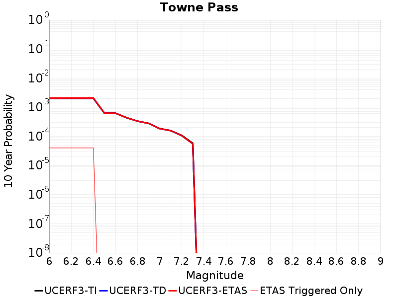 |

| Magnitude | 1 wk TI Prob | 1 wk TD Prob | 1 wk ETAS Prob | 1 wk ETAS/TD Gain | 1 wk ETAS Triggered Only | 1 mo TI Prob | 1 mo TD Prob | 1 mo ETAS Prob | 1 mo ETAS/TD Gain | 1 mo ETAS Triggered Only | 1 yr TI Prob | 1 yr TD Prob | 1 yr ETAS Prob | 1 yr ETAS/TD Gain | 1 yr ETAS Triggered Only | 10 yr TI Prob | 10 yr TD Prob | 10 yr ETAS Prob | 10 yr ETAS/TD Gain | 10 yr ETAS Triggered Only |
|-----|-----|-----|-----|-----|-----|-----|-----|-----|-----|-----|-----|-----|-----|-----|-----|-----|-----|-----|-----|-----|
| 6.0 | 3.849728E-6 | 3.894957E-6 | 3.894957E-6 | 1.0 | 0.0 | 1.649873E-5 | 1.6692591E-5 | 2.6692423E-5 | 1.5990582 | 1.0E-5 | 2.0085352E-4 | 2.0321771E-4 | 2.3321161E-4 | 1.1475949 | 3.0E-5 | 0.0020067208 | 0.002030748 | 0.0020706668 | 1.0196571 | 4.0E-5 |
| 6.1 | 3.849728E-6 | 3.894957E-6 | 3.894957E-6 | 1.0 | 0.0 | 1.649873E-5 | 1.6692591E-5 | 2.6692423E-5 | 1.5990582 | 1.0E-5 | 2.0085352E-4 | 2.0321771E-4 | 2.3321161E-4 | 1.1475949 | 3.0E-5 | 0.0020067208 | 0.002030748 | 0.0020706668 | 1.0196571 | 4.0E-5 |
| 6.2 | 3.849728E-6 | 3.894957E-6 | 3.894957E-6 | 1.0 | 0.0 | 1.649873E-5 | 1.6692591E-5 | 2.6692423E-5 | 1.5990582 | 1.0E-5 | 2.0085352E-4 | 2.0321771E-4 | 2.3321161E-4 | 1.1475949 | 3.0E-5 | 0.0020067208 | 0.002030748 | 0.0020706668 | 1.0196571 | 4.0E-5 |
| 6.3 | 3.849728E-6 | 3.894957E-6 | 3.894957E-6 | 1.0 | 0.0 | 1.649873E-5 | 1.6692591E-5 | 2.6692423E-5 | 1.5990582 | 1.0E-5 | 2.0085352E-4 | 2.0321771E-4 | 2.3321161E-4 | 1.1475949 | 3.0E-5 | 0.0020067208 | 0.002030748 | 0.0020706668 | 1.0196571 | 4.0E-5 |
| 6.4 | 3.849728E-6 | 3.894957E-6 | 3.894957E-6 | 1.0 | 0.0 | 1.649873E-5 | 1.6692591E-5 | 2.6692423E-5 | 1.5990582 | 1.0E-5 | 2.0085352E-4 | 2.0321771E-4 | 2.3321161E-4 | 1.1475949 | 3.0E-5 | 0.0020067208 | 0.002030748 | 0.0020706668 | 1.0196571 | 4.0E-5 |
| 6.5 | 1.1953545E-6 | 1.2032147E-6 | 1.2032147E-6 | 1.0 | 0.0 | 5.1229376E-6 | 5.156625E-6 | 5.156625E-6 | 1.0 | 0.0 | 6.236998E-5 | 6.2780215E-5 | 6.2780215E-5 | 1.0 | 0.0 | 6.235248E-4 | 6.276365E-4 | 6.276365E-4 | 1.0 | 0.0 |
| 6.6 | 1.1953545E-6 | 1.2032147E-6 | 1.2032147E-6 | 1.0 | 0.0 | 5.1229376E-6 | 5.156625E-6 | 5.156625E-6 | 1.0 | 0.0 | 6.236998E-5 | 6.2780215E-5 | 6.2780215E-5 | 1.0 | 0.0 | 6.235248E-4 | 6.276365E-4 | 6.276365E-4 | 1.0 | 0.0 |
| 6.7 | 8.375951E-7 | 8.412009E-7 | 8.412009E-7 | 1.0 | 0.0 | 3.5896885E-6 | 3.6051422E-6 | 3.6051422E-6 | 1.0 | 0.0 | 4.370358E-5 | 4.389178E-5 | 4.389178E-5 | 1.0 | 0.0 | 4.3694986E-4 | 4.3883684E-4 | 4.3883684E-4 | 1.0 | 0.0 |
| 6.8 | 6.38041E-7 | 6.393339E-7 | 6.393339E-7 | 1.0 | 0.0 | 2.7344586E-6 | 2.74E-6 | 2.74E-6 | 1.0 | 0.0 | 3.3291526E-5 | 3.3359025E-5 | 3.3359025E-5 | 1.0 | 0.0 | 3.3286537E-4 | 3.3354398E-4 | 3.3354398E-4 | 1.0 | 0.0 |
| 6.9 | 5.3460053E-7 | 5.346431E-7 | 5.346431E-7 | 1.0 | 0.0 | 2.2911431E-6 | 2.291326E-6 | 2.291326E-6 | 1.0 | 0.0 | 2.789431E-5 | 2.7896569E-5 | 2.7896569E-5 | 1.0 | 0.0 | 2.789081E-4 | 2.78934E-4 | 2.78934E-4 | 1.0 | 0.0 |
| 7.0 | 3.557783E-7 | 3.5333522E-7 | 3.5333522E-7 | 1.0 | 0.0 | 1.5247632E-6 | 1.514293E-6 | 1.514293E-6 | 1.0 | 0.0 | 1.8563835E-5 | 1.843637E-5 | 1.843637E-5 | 1.0 | 0.0 | 1.8562283E-4 | 1.8434925E-4 | 1.8434925E-4 | 1.0 | 0.0 |
| 7.1 | 3.037942E-7 | 3.0010665E-7 | 3.0010665E-7 | 1.0 | 0.0 | 1.3019744E-6 | 1.2861707E-6 | 1.2861707E-6 | 1.0 | 0.0 | 1.5851423E-5 | 1.5659023E-5 | 1.5659023E-5 | 1.0 | 0.0 | 1.5850292E-4 | 1.5657995E-4 | 1.5657995E-4 | 1.0 | 0.0 |
| 7.2 | 2.0808248E-7 | 2.0224587E-7 | 2.0224587E-7 | 1.0 | 0.0 | 8.917818E-7 | 8.667677E-7 | 8.667677E-7 | 1.0 | 0.0 | 1.0857389E-5 | 1.0552851E-5 | 1.0552851E-5 | 1.0 | 0.0 | 1.0856859E-4 | 1.0552396E-4 | 1.0552396E-4 | 1.0 | 0.0 |
| 7.3 | 1.1162073E-7 | 1.0641119E-7 | 1.0641119E-7 | 1.0 | 0.0 | 4.7837443E-7 | 4.560479E-7 | 4.560479E-7 | 1.0 | 0.0 | 5.8241935E-6 | 5.552371E-6 | 5.552371E-6 | 1.0 | 0.0 | 5.8240406E-5 | 5.5522523E-5 | 5.5522523E-5 | 1.0 | 0.0 |

## Nelson Lake
*[(top)](#table-of-contents)*

| 1 Week | 1 Month | 1 Year | 10 Year |
|-----|-----|-----|-----|
|  | 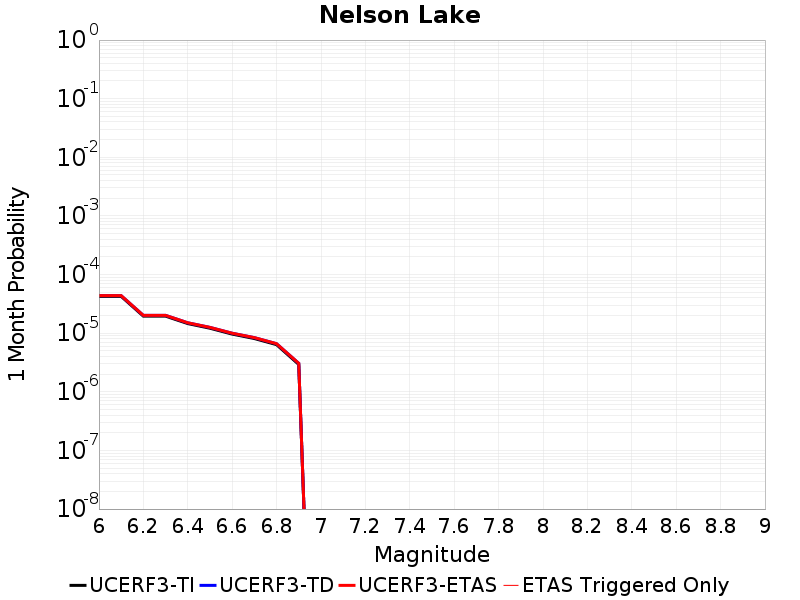 |  |  |

| Magnitude | 1 wk TI Prob | 1 wk TD Prob | 1 wk ETAS Prob | 1 wk ETAS/TD Gain | 1 wk ETAS Triggered Only | 1 mo TI Prob | 1 mo TD Prob | 1 mo ETAS Prob | 1 mo ETAS/TD Gain | 1 mo ETAS Triggered Only | 1 yr TI Prob | 1 yr TD Prob | 1 yr ETAS Prob | 1 yr ETAS/TD Gain | 1 yr ETAS Triggered Only | 10 yr TI Prob | 10 yr TD Prob | 10 yr ETAS Prob | 10 yr ETAS/TD Gain | 10 yr ETAS Triggered Only |
|-----|-----|-----|-----|-----|-----|-----|-----|-----|-----|-----|-----|-----|-----|-----|-----|-----|-----|-----|-----|-----|
| 6.0 | 9.913453E-6 | 1.0194185E-5 | 1.0194185E-5 | 1.0 | 0.0 | 4.2485535E-5 | 4.368869E-5 | 4.368869E-5 | 1.0 | 0.0 | 5.1713863E-4 | 5.317903E-4 | 5.6177436E-4 | 1.0563833 | 3.0E-5 | 0.0051593683 | 0.0053062057 | 0.0053459937 | 1.0074984 | 4.0E-5 |
| 6.1 | 9.913453E-6 | 1.0194185E-5 | 1.0194185E-5 | 1.0 | 0.0 | 4.2485535E-5 | 4.368869E-5 | 4.368869E-5 | 1.0 | 0.0 | 5.1713863E-4 | 5.317903E-4 | 5.6177436E-4 | 1.0563833 | 3.0E-5 | 0.0051593683 | 0.0053062057 | 0.0053459937 | 1.0074984 | 4.0E-5 |
| 6.2 | 4.5596407E-6 | 4.6972614E-6 | 4.6972614E-6 | 1.0 | 0.0 | 1.954117E-5 | 2.0130972E-5 | 2.0130972E-5 | 1.0 | 0.0 | 2.3788778E-4 | 2.4506828E-4 | 2.650634E-4 | 1.0815899 | 2.0E-5 | 0.0023763329 | 0.0024481064 | 0.0024680577 | 1.0081496 | 2.0E-5 |
| 6.3 | 4.5596407E-6 | 4.6972614E-6 | 4.6972614E-6 | 1.0 | 0.0 | 1.954117E-5 | 2.0130972E-5 | 2.0130972E-5 | 1.0 | 0.0 | 2.3788778E-4 | 2.4506828E-4 | 2.650634E-4 | 1.0815899 | 2.0E-5 | 0.0023763329 | 0.0024481064 | 0.0024680577 | 1.0081496 | 2.0E-5 |
| 6.4 | 3.4025713E-6 | 3.5106432E-6 | 3.5106432E-6 | 1.0 | 0.0 | 1.4582367E-5 | 1.5045532E-5 | 1.5045532E-5 | 1.0 | 0.0 | 1.7752586E-4 | 1.831648E-4 | 2.0316114E-4 | 1.1091713 | 2.0E-5 | 0.001773841 | 0.0018302213 | 0.0018501846 | 1.0109076 | 2.0E-5 |
| 6.5 | 2.8352947E-6 | 2.9285002E-6 | 2.9285002E-6 | 1.0 | 0.0 | 1.2151207E-5 | 1.2550659E-5 | 1.2550659E-5 | 1.0 | 0.0 | 1.479309E-4 | 1.5279431E-4 | 1.7279126E-4 | 1.1308749 | 2.0E-5 | 0.0014783246 | 0.0015269665 | 0.001546936 | 1.0130779 | 2.0E-5 |
| 6.6 | 2.251518E-6 | 2.3296082E-6 | 2.3296082E-6 | 1.0 | 0.0 | 9.649328E-6 | 9.984001E-6 | 9.984001E-6 | 1.0 | 0.0 | 1.1747423E-4 | 1.21549056E-4 | 1.4154662E-4 | 1.1645226 | 2.0E-5 | 0.0011741214 | 0.0012148875 | 0.0012348632 | 1.0164424 | 2.0E-5 |
| 6.7 | 1.8911853E-6 | 1.959614E-6 | 1.959614E-6 | 1.0 | 0.0 | 8.105055E-6 | 8.398322E-6 | 8.398322E-6 | 1.0 | 0.0 | 9.867457E-5 | 1.0224536E-4 | 1.12244335E-4 | 1.0977939 | 1.0E-5 | 9.863076E-4 | 0.0010220407 | 0.0010320304 | 1.0097743 | 1.0E-5 |
| 6.8 | 1.4874814E-6 | 1.5442245E-6 | 1.5442245E-6 | 1.0 | 0.0 | 6.374905E-6 | 6.618091E-6 | 6.618091E-6 | 1.0 | 0.0 | 7.76117E-5 | 8.05728E-5 | 8.05728E-5 | 1.0 | 0.0 | 7.75846E-4 | 8.05487E-4 | 8.05487E-4 | 1.0 | 0.0 |
| 6.9 | 6.835972E-7 | 7.142063E-7 | 7.142063E-7 | 1.0 | 0.0 | 2.9296991E-6 | 3.0608824E-6 | 3.0608824E-6 | 1.0 | 0.0 | 3.56685E-5 | 3.7265923E-5 | 3.7265923E-5 | 1.0 | 0.0 | 3.5662777E-4 | 3.72628E-4 | 3.72628E-4 | 1.0 | 0.0 |

## Death Valley (Fish Lake Valley)
*[(top)](#table-of-contents)*

| 1 Week | 1 Month | 1 Year | 10 Year |
|-----|-----|-----|-----|
| 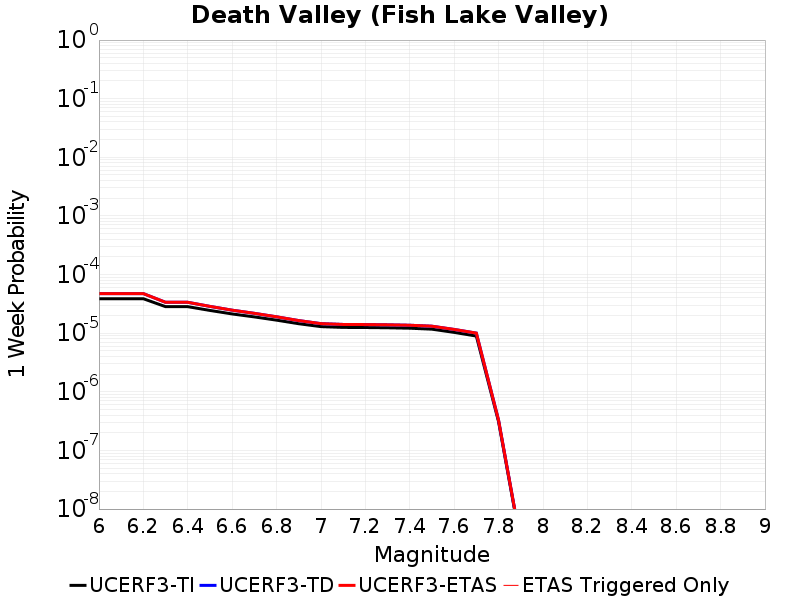 | 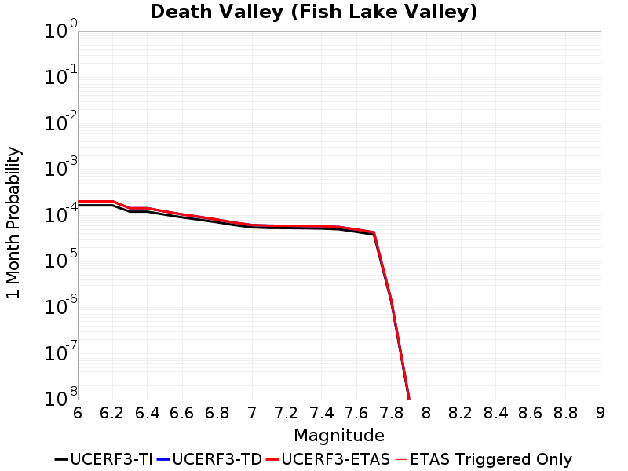 |  | 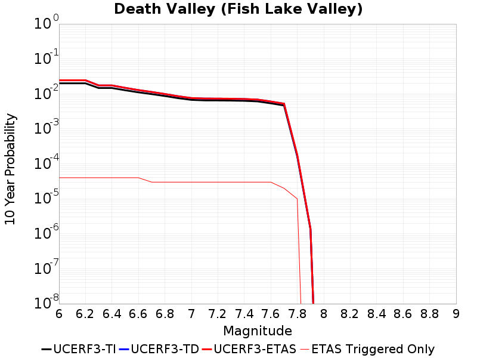 |

| Magnitude | 1 wk TI Prob | 1 wk TD Prob | 1 wk ETAS Prob | 1 wk ETAS/TD Gain | 1 wk ETAS Triggered Only | 1 mo TI Prob | 1 mo TD Prob | 1 mo ETAS Prob | 1 mo ETAS/TD Gain | 1 mo ETAS Triggered Only | 1 yr TI Prob | 1 yr TD Prob | 1 yr ETAS Prob | 1 yr ETAS/TD Gain | 1 yr ETAS Triggered Only | 10 yr TI Prob | 10 yr TD Prob | 10 yr ETAS Prob | 10 yr ETAS/TD Gain | 10 yr ETAS Triggered Only |
|-----|-----|-----|-----|-----|-----|-----|-----|-----|-----|-----|-----|-----|-----|-----|-----|-----|-----|-----|-----|-----|
| 6.0 | 3.872328E-5 | 4.7336223E-5 | 4.7336223E-5 | 1.0 | 0.0 | 1.6594635E-4 | 2.028554E-4 | 2.028554E-4 | 1.0 | 0.0 | 0.0020185246 | 0.002467224 | 0.0024771993 | 1.0040431 | 1.0E-5 | 0.02000288 | 0.02442406 | 0.024463082 | 1.0015978 | 4.0E-5 |
| 6.1 | 3.872328E-5 | 4.7336223E-5 | 4.7336223E-5 | 1.0 | 0.0 | 1.6594635E-4 | 2.028554E-4 | 2.028554E-4 | 1.0 | 0.0 | 0.0020185246 | 0.002467224 | 0.0024771993 | 1.0040431 | 1.0E-5 | 0.02000288 | 0.02442406 | 0.024463082 | 1.0015978 | 4.0E-5 |
| 6.2 | 3.872328E-5 | 4.7336223E-5 | 4.7336223E-5 | 1.0 | 0.0 | 1.6594635E-4 | 2.028554E-4 | 2.028554E-4 | 1.0 | 0.0 | 0.0020185246 | 0.002467224 | 0.0024771993 | 1.0040431 | 1.0E-5 | 0.02000288 | 0.02442406 | 0.024463082 | 1.0015978 | 4.0E-5 |
| 6.3 | 2.8356371E-5 | 3.3652184E-5 | 3.3652184E-5 | 1.0 | 0.0 | 1.2152165E-4 | 1.4421609E-4 | 1.4421609E-4 | 1.0 | 0.0 | 0.0014785219 | 0.0017544858 | 0.0017644682 | 1.0056896 | 1.0E-5 | 0.014687235 | 0.01741351 | 0.017452814 | 1.0022571 | 4.0E-5 |
| 6.4 | 2.8356371E-5 | 3.3652184E-5 | 3.3652184E-5 | 1.0 | 0.0 | 1.2152165E-4 | 1.4421609E-4 | 1.4421609E-4 | 1.0 | 0.0 | 0.0014785219 | 0.0017544858 | 0.0017644682 | 1.0056896 | 1.0E-5 | 0.014687235 | 0.01741351 | 0.017452814 | 1.0022571 | 4.0E-5 |
| 6.5 | 2.4448687E-5 | 2.8640747E-5 | 2.8640747E-5 | 1.0 | 0.0 | 1.0477588E-4 | 1.2274053E-4 | 1.2274053E-4 | 1.0 | 0.0 | 0.0012748998 | 0.0014933882 | 0.0015033733 | 1.0066862 | 1.0E-5 | 0.012676105 | 0.014838419 | 0.014877826 | 1.0026557 | 4.0E-5 |
| 6.6 | 2.1298161E-5 | 2.468657E-5 | 2.468657E-5 | 1.0 | 0.0 | 9.127464E-5 | 1.0579548E-4 | 1.0579548E-4 | 1.0 | 0.0 | 0.0011107022 | 0.0012873318 | 0.001297319 | 1.007758 | 1.0E-5 | 0.011051672 | 0.012802179 | 0.012841667 | 1.0030844 | 4.0E-5 |
| 6.7 | 1.8959729E-5 | 2.180306E-5 | 2.180306E-5 | 1.0 | 0.0 | 8.125345E-5 | 9.343849E-5 | 9.343849E-5 | 1.0 | 0.0 | 9.888117E-4 | 0.0011370456 | 0.0011470341 | 1.0087848 | 1.0E-5 | 0.009844234 | 0.011314944 | 0.011344605 | 1.0026214 | 3.0E-5 |
| 6.8 | 1.6691629E-5 | 1.9036328E-5 | 1.9036328E-5 | 1.0 | 0.0 | 7.153359E-5 | 8.1581806E-5 | 8.1581806E-5 | 1.0 | 0.0 | 8.7057345E-4 | 9.928228E-4 | 0.0010028129 | 1.0100623 | 1.0E-5 | 0.008671708 | 0.009885635 | 0.009915339 | 1.0030047 | 3.0E-5 |
| 6.9 | 1.450505E-5 | 1.6403936E-5 | 1.6403936E-5 | 1.0 | 0.0 | 6.216302E-5 | 7.030074E-5 | 7.030074E-5 | 1.0 | 0.0 | 7.5657194E-4 | 8.5558416E-4 | 8.655756E-4 | 1.011678 | 1.0E-5 | 0.007540013 | 0.008523835 | 0.008553579 | 1.0034895 | 3.0E-5 |
| 7.0 | 1.2940855E-5 | 1.4550077E-5 | 1.4550077E-5 | 1.0 | 0.0 | 5.545963E-5 | 6.235601E-5 | 6.235601E-5 | 1.0 | 0.0 | 6.750118E-4 | 7.5892586E-4 | 7.6891825E-4 | 1.0131665 | 1.0E-5 | 0.006729651 | 0.0075639593 | 0.007593733 | 1.0039362 | 3.0E-5 |
| 7.1 | 1.2544658E-5 | 1.4089816E-5 | 1.4089816E-5 | 1.0 | 0.0 | 5.3761712E-5 | 6.038356E-5 | 6.038356E-5 | 1.0 | 0.0 | 6.5435225E-4 | 7.349275E-4 | 7.449201E-4 | 1.0135968 | 1.0E-5 | 0.006524288 | 0.007325565 | 0.007355345 | 1.0040653 | 3.0E-5 |
| 7.2 | 1.2489416E-5 | 1.4027227E-5 | 1.4027227E-5 | 1.0 | 0.0 | 5.3524967E-5 | 6.0115333E-5 | 6.0115333E-5 | 1.0 | 0.0 | 6.514716E-4 | 7.31664E-4 | 7.416567E-4 | 1.0136575 | 1.0E-5 | 0.006495651 | 0.0072931447 | 0.007322926 | 1.0040834 | 3.0E-5 |
| 7.3 | 1.2368307E-5 | 1.3891253E-5 | 1.3891253E-5 | 1.0 | 0.0 | 5.3005948E-5 | 5.9532613E-5 | 5.9532613E-5 | 1.0 | 0.0 | 6.451563E-4 | 7.2457414E-4 | 7.345669E-4 | 1.0137912 | 1.0E-5 | 0.0064328653 | 0.0072227092 | 0.0072524925 | 1.0041236 | 3.0E-5 |
| 7.4 | 1.2161707E-5 | 1.3659115E-5 | 1.3659115E-5 | 1.0 | 0.0 | 5.212056E-5 | 5.8537782E-5 | 5.8537782E-5 | 1.0 | 0.0 | 6.3438306E-4 | 7.1247004E-4 | 7.224629E-4 | 1.0140257 | 1.0E-5 | 0.006325751 | 0.0071024485 | 0.0071322354 | 1.0041939 | 3.0E-5 |
| 7.5 | 1.1707948E-5 | 1.3156395E-5 | 1.3156395E-5 | 1.0 | 0.0 | 5.0175953E-5 | 5.6383364E-5 | 5.6383364E-5 | 1.0 | 0.0 | 6.10721E-4 | 6.862568E-4 | 6.9624995E-4 | 1.0145618 | 1.0E-5 | 0.0060904534 | 0.0068419604 | 0.0068717552 | 1.0043547 | 3.0E-5 |
| 7.6 | 1.0319538E-5 | 1.1589148E-5 | 1.1589148E-5 | 1.0 | 0.0 | 4.4225842E-5 | 4.966686E-5 | 4.966686E-5 | 1.0 | 0.0 | 5.383166E-4 | 6.0453144E-4 | 6.145254E-4 | 1.0165317 | 1.0E-5 | 0.0053701443 | 0.006029402 | 0.006059221 | 1.0049456 | 3.0E-5 |
| 7.7 | 8.937764E-6 | 1.0030978E-5 | 1.0030978E-5 | 1.0 | 0.0 | 3.830414E-5 | 4.2989224E-5 | 4.2989224E-5 | 1.0 | 0.0 | 4.6625308E-4 | 5.2327313E-4 | 5.332679E-4 | 1.0191004 | 1.0E-5 | 0.0046527605 | 0.005220921 | 0.005240816 | 1.0038108 | 2.0E-5 |
| 7.8 | 3.108007E-7 | 3.2859157E-7 | 3.2859157E-7 | 1.0 | 0.0 | 1.3320023E-6 | 1.4082489E-6 | 1.4082489E-6 | 1.0 | 0.0 | 1.6217007E-5 | 1.7145298E-5 | 2.7145126E-5 | 1.5832403 | 1.0E-5 | 1.6215823E-4 | 1.7144014E-4 | 1.8143843E-4 | 1.0583194 | 1.0E-5 |
| 7.9 | 2.5591178E-9 | 2.6704472E-9 | 2.6704472E-9 | 1.0 | 0.0 | 1.0967647E-8 | 1.1444774E-8 | 1.1444774E-8 | 1.0 | 0.0 | 1.335311E-7 | 1.3934012E-7 | 1.3934012E-7 | 1.0 | 0.0 | 1.3353102E-6 | 1.3934012E-6 | 1.3934012E-6 | 1.0 | 0.0 |

## McLean Lake
*[(top)](#table-of-contents)*

| 1 Week | 1 Month | 1 Year | 10 Year |
|-----|-----|-----|-----|
|  | 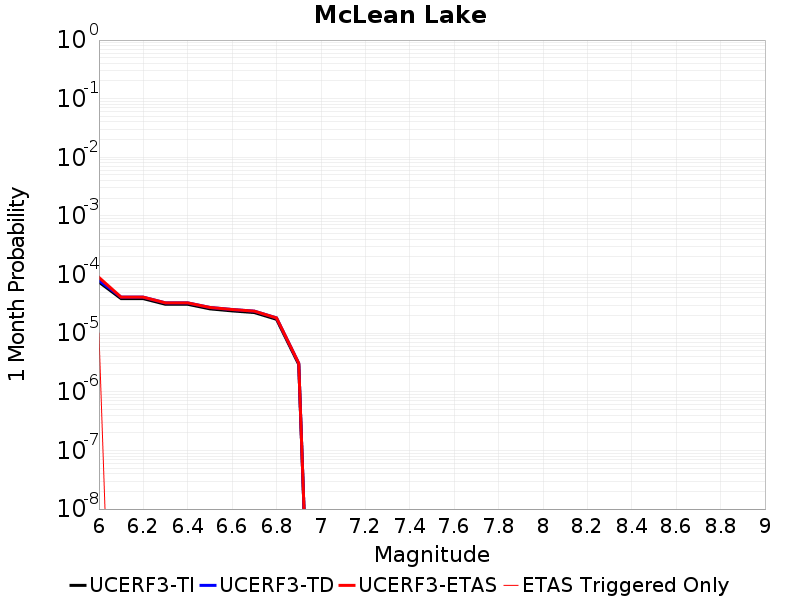 |  |  |

| Magnitude | 1 wk TI Prob | 1 wk TD Prob | 1 wk ETAS Prob | 1 wk ETAS/TD Gain | 1 wk ETAS Triggered Only | 1 mo TI Prob | 1 mo TD Prob | 1 mo ETAS Prob | 1 mo ETAS/TD Gain | 1 mo ETAS Triggered Only | 1 yr TI Prob | 1 yr TD Prob | 1 yr ETAS Prob | 1 yr ETAS/TD Gain | 1 yr ETAS Triggered Only | 10 yr TI Prob | 10 yr TD Prob | 10 yr ETAS Prob | 10 yr ETAS/TD Gain | 10 yr ETAS Triggered Only |
|-----|-----|-----|-----|-----|-----|-----|-----|-----|-----|-----|-----|-----|-----|-----|-----|-----|-----|-----|-----|-----|
| 6.0 | 1.7360222E-5 | 1.8509823E-5 | 1.8509823E-5 | 1.0 | 0.0 | 7.439883E-5 | 7.932568E-5 | 8.932489E-5 | 1.1260526 | 1.0E-5 | 9.0542925E-4 | 9.6541084E-4 | 9.953819E-4 | 1.0310448 | 3.0E-5 | 0.009017491 | 0.009617015 | 0.00965663 | 1.0041193 | 4.0E-5 |
| 6.1 | 9.062689E-6 | 9.595967E-6 | 9.595967E-6 | 1.0 | 0.0 | 3.8839516E-5 | 4.112497E-5 | 4.112497E-5 | 1.0 | 0.0 | 4.727685E-4 | 5.005904E-4 | 5.205804E-4 | 1.0399328 | 2.0E-5 | 0.0047176396 | 0.0049955114 | 0.0050154114 | 1.0039836 | 2.0E-5 |
| 6.2 | 9.062689E-6 | 9.595967E-6 | 9.595967E-6 | 1.0 | 0.0 | 3.8839516E-5 | 4.112497E-5 | 4.112497E-5 | 1.0 | 0.0 | 4.727685E-4 | 5.005904E-4 | 5.205804E-4 | 1.0399328 | 2.0E-5 | 0.0047176396 | 0.0049955114 | 0.0050154114 | 1.0039836 | 2.0E-5 |
| 6.3 | 7.2575485E-6 | 7.6706265E-6 | 7.6706265E-6 | 1.0 | 0.0 | 3.110341E-5 | 3.2873737E-5 | 3.2873737E-5 | 1.0 | 0.0 | 3.786182E-4 | 4.0017138E-4 | 4.201634E-4 | 1.0499586 | 2.0E-5 | 0.0037797375 | 0.003995213 | 0.0040151333 | 1.004986 | 2.0E-5 |
| 6.4 | 7.2575485E-6 | 7.6706265E-6 | 7.6706265E-6 | 1.0 | 0.0 | 3.110341E-5 | 3.2873737E-5 | 3.2873737E-5 | 1.0 | 0.0 | 3.786182E-4 | 4.0017138E-4 | 4.201634E-4 | 1.0499586 | 2.0E-5 | 0.0037797375 | 0.003995213 | 0.0040151333 | 1.004986 | 2.0E-5 |
| 6.5 | 6.06582E-6 | 6.406279E-6 | 6.406279E-6 | 1.0 | 0.0 | 2.5996113E-5 | 2.745523E-5 | 2.745523E-5 | 1.0 | 0.0 | 3.164567E-4 | 3.3422266E-4 | 3.5421597E-4 | 1.0598203 | 2.0E-5 | 0.0031600643 | 0.003337839 | 0.0033577722 | 1.0059719 | 2.0E-5 |
| 6.6 | 5.598744E-6 | 5.9124754E-6 | 5.9124754E-6 | 1.0 | 0.0 | 2.3994397E-5 | 2.533897E-5 | 2.533897E-5 | 1.0 | 0.0 | 2.9209262E-4 | 3.084647E-4 | 3.2845853E-4 | 1.0648172 | 2.0E-5 | 0.0029170897 | 0.003080995 | 0.0031009333 | 1.0064714 | 2.0E-5 |
| 6.7 | 5.246996E-6 | 5.541238E-6 | 5.541238E-6 | 1.0 | 0.0 | 2.2486933E-5 | 2.3747982E-5 | 2.3747982E-5 | 1.0 | 0.0 | 2.73744E-4 | 2.8909967E-4 | 2.9909678E-4 | 1.0345801 | 1.0E-5 | 0.0027340704 | 0.0028878602 | 0.0028978314 | 1.0034528 | 1.0E-5 |
| 6.8 | 4.02324E-6 | 4.2484935E-6 | 4.2484935E-6 | 1.0 | 0.0 | 1.7242342E-5 | 1.8207737E-5 | 1.8207737E-5 | 1.0 | 0.0 | 2.099053E-4 | 2.216626E-4 | 2.3166038E-4 | 1.0451037 | 1.0E-5 | 0.0020970714 | 0.0022149999 | 0.0022249776 | 1.0045047 | 1.0E-5 |
| 6.9 | 6.835972E-7 | 7.142063E-7 | 7.142063E-7 | 1.0 | 0.0 | 2.9296991E-6 | 3.0608824E-6 | 3.0608824E-6 | 1.0 | 0.0 | 3.56685E-5 | 3.7265923E-5 | 3.7265923E-5 | 1.0 | 0.0 | 3.5662777E-4 | 3.72628E-4 | 3.72628E-4 | 1.0 | 0.0 |

## Coyote Canyon
*[(top)](#table-of-contents)*

| 1 Week | 1 Month | 1 Year | 10 Year |
|-----|-----|-----|-----|
| 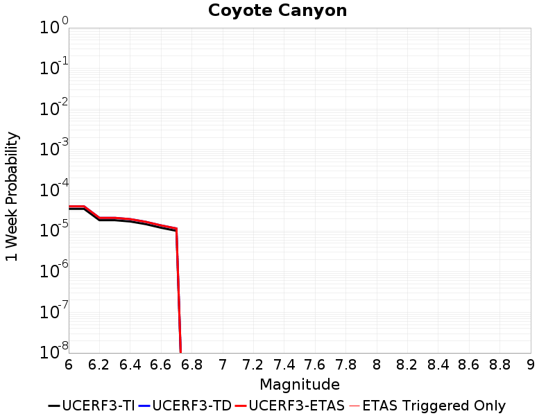 |  | 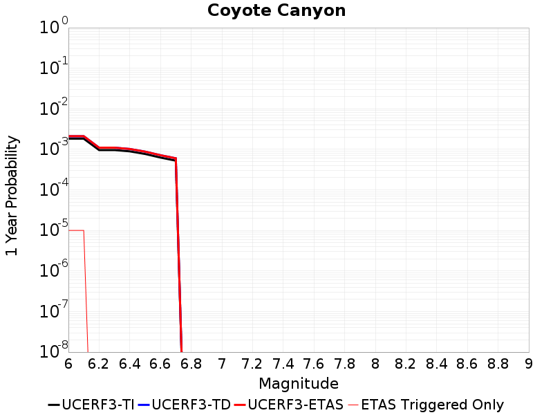 |  |

| Magnitude | 1 wk TI Prob | 1 wk TD Prob | 1 wk ETAS Prob | 1 wk ETAS/TD Gain | 1 wk ETAS Triggered Only | 1 mo TI Prob | 1 mo TD Prob | 1 mo ETAS Prob | 1 mo ETAS/TD Gain | 1 mo ETAS Triggered Only | 1 yr TI Prob | 1 yr TD Prob | 1 yr ETAS Prob | 1 yr ETAS/TD Gain | 1 yr ETAS Triggered Only | 10 yr TI Prob | 10 yr TD Prob | 10 yr ETAS Prob | 10 yr ETAS/TD Gain | 10 yr ETAS Triggered Only |
|-----|-----|-----|-----|-----|-----|-----|-----|-----|-----|-----|-----|-----|-----|-----|-----|-----|-----|-----|-----|-----|
| 6.0 | 3.5090034E-5 | 4.0405175E-5 | 4.0405175E-5 | 1.0 | 0.0 | 1.503772E-4 | 1.73155E-4 | 1.8315327E-4 | 1.0577418 | 1.0E-5 | 0.0018293047 | 0.0021063816 | 0.0021163605 | 1.0047375 | 1.0E-5 | 0.018143194 | 0.020890135 | 0.02090972 | 1.0009373 | 2.0E-5 |
| 6.1 | 3.5090034E-5 | 4.0405175E-5 | 4.0405175E-5 | 1.0 | 0.0 | 1.503772E-4 | 1.73155E-4 | 1.8315327E-4 | 1.0577418 | 1.0E-5 | 0.0018293047 | 0.0021063816 | 0.0021163605 | 1.0047375 | 1.0E-5 | 0.018143194 | 0.020890135 | 0.02090972 | 1.0009373 | 2.0E-5 |
| 6.2 | 1.841879E-5 | 2.1080119E-5 | 2.1080119E-5 | 1.0 | 0.0 | 7.8935285E-5 | 9.0340814E-5 | 9.0340814E-5 | 1.0 | 0.0 | 9.606133E-4 | 0.0010994467 | 0.0010994467 | 1.0 | 0.0 | 0.0095647145 | 0.010950179 | 0.0109600695 | 1.0009032 | 1.0E-5 |
| 6.3 | 1.841879E-5 | 2.1080119E-5 | 2.1080119E-5 | 1.0 | 0.0 | 7.8935285E-5 | 9.0340814E-5 | 9.0340814E-5 | 1.0 | 0.0 | 9.606133E-4 | 0.0010994467 | 0.0010994467 | 1.0 | 0.0 | 0.0095647145 | 0.010950179 | 0.0109600695 | 1.0009032 | 1.0E-5 |
| 6.4 | 1.712201E-5 | 1.9584004E-5 | 1.9584004E-5 | 1.0 | 0.0 | 7.337798E-5 | 8.392931E-5 | 8.392931E-5 | 1.0 | 0.0 | 8.930107E-4 | 0.0010214611 | 0.0010214611 | 1.0 | 0.0 | 0.008894307 | 0.010177597 | 0.010187496 | 1.0009725 | 1.0E-5 |
| 6.5 | 1.4744935E-5 | 1.6853051E-5 | 1.6853051E-5 | 1.0 | 0.0 | 6.3191044E-5 | 7.222589E-5 | 7.222589E-5 | 1.0 | 0.0 | 7.6907943E-4 | 8.790892E-4 | 8.790892E-4 | 1.0 | 0.0 | 0.007664232 | 0.0087653315 | 0.008775244 | 1.0011308 | 1.0E-5 |
| 6.6 | 1.2017839E-5 | 1.3737205E-5 | 1.3737205E-5 | 1.0 | 0.0 | 5.150401E-5 | 5.8872913E-5 | 5.8872913E-5 | 1.0 | 0.0 | 6.268809E-4 | 7.166307E-4 | 7.166307E-4 | 1.0 | 0.0 | 0.0062511545 | 0.007151908 | 0.007151908 | 1.0 | 0.0 |
| 6.7 | 1.00956095E-5 | 1.1544575E-5 | 1.1544575E-5 | 1.0 | 0.0 | 4.326618E-5 | 4.94763E-5 | 4.94763E-5 | 1.0 | 0.0 | 5.266384E-4 | 6.0229463E-4 | 6.0229463E-4 | 1.0 | 0.0 | 0.005253921 | 0.006015166 | 0.006015166 | 1.0 | 0.0 |

## San Andreas (Big Bend)
*[(top)](#table-of-contents)*

| 1 Week | 1 Month | 1 Year | 10 Year |
|-----|-----|-----|-----|
| 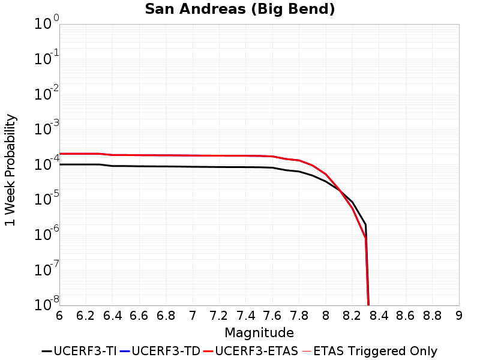 |  |  | 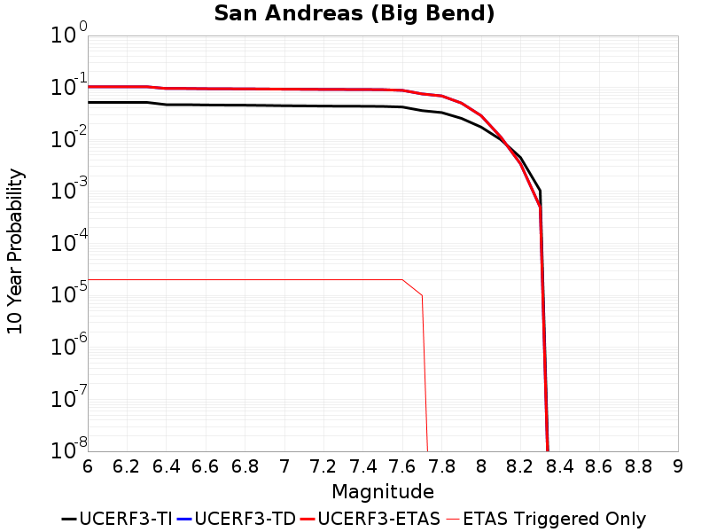 |

| Magnitude | 1 wk TI Prob | 1 wk TD Prob | 1 wk ETAS Prob | 1 wk ETAS/TD Gain | 1 wk ETAS Triggered Only | 1 mo TI Prob | 1 mo TD Prob | 1 mo ETAS Prob | 1 mo ETAS/TD Gain | 1 mo ETAS Triggered Only | 1 yr TI Prob | 1 yr TD Prob | 1 yr ETAS Prob | 1 yr ETAS/TD Gain | 1 yr ETAS Triggered Only | 10 yr TI Prob | 10 yr TD Prob | 10 yr ETAS Prob | 10 yr ETAS/TD Gain | 10 yr ETAS Triggered Only |
|-----|-----|-----|-----|-----|-----|-----|-----|-----|-----|-----|-----|-----|-----|-----|-----|-----|-----|-----|-----|-----|
| 6.0 | 1.0179969E-4 | 2.0513387E-4 | 2.0513387E-4 | 1.0 | 0.0 | 4.362114E-4 | 8.7885E-4 | 8.8884117E-4 | 1.0113685 | 1.0E-5 | 0.0052979486 | 0.010647798 | 0.010667585 | 1.0018584 | 2.0E-5 | 0.051734097 | 0.10334714 | 0.10336507 | 1.0001736 | 2.0E-5 |
| 6.1 | 1.0179969E-4 | 2.0513387E-4 | 2.0513387E-4 | 1.0 | 0.0 | 4.362114E-4 | 8.7885E-4 | 8.8884117E-4 | 1.0113685 | 1.0E-5 | 0.0052979486 | 0.010647798 | 0.010667585 | 1.0018584 | 2.0E-5 | 0.051734097 | 0.10334714 | 0.10336507 | 1.0001736 | 2.0E-5 |
| 6.2 | 1.0179969E-4 | 2.0513387E-4 | 2.0513387E-4 | 1.0 | 0.0 | 4.362114E-4 | 8.7885E-4 | 8.8884117E-4 | 1.0113685 | 1.0E-5 | 0.0052979486 | 0.010647798 | 0.010667585 | 1.0018584 | 2.0E-5 | 0.051734097 | 0.10334714 | 0.10336507 | 1.0001736 | 2.0E-5 |
| 6.3 | 1.0179969E-4 | 2.0513387E-4 | 2.0513387E-4 | 1.0 | 0.0 | 4.362114E-4 | 8.7885E-4 | 8.8884117E-4 | 1.0113685 | 1.0E-5 | 0.0052979486 | 0.010647798 | 0.010667585 | 1.0018584 | 2.0E-5 | 0.051734097 | 0.10334714 | 0.10336507 | 1.0001736 | 2.0E-5 |
| 6.4 | 9.1639464E-5 | 1.8862031E-4 | 1.8862031E-4 | 1.0 | 0.0 | 3.9268145E-4 | 8.0812257E-4 | 8.181145E-4 | 1.0123644 | 1.0E-5 | 0.0047704205 | 0.009794632 | 0.009814437 | 1.0020219 | 2.0E-5 | 0.046693064 | 0.09567851 | 0.09569659 | 1.0001891 | 2.0E-5 |
| 6.5 | 9.1639464E-5 | 1.8862031E-4 | 1.8862031E-4 | 1.0 | 0.0 | 3.9268145E-4 | 8.0812257E-4 | 8.181145E-4 | 1.0123644 | 1.0E-5 | 0.0047704205 | 0.009794632 | 0.009814437 | 1.0020219 | 2.0E-5 | 0.046693064 | 0.09567851 | 0.09569659 | 1.0001891 | 2.0E-5 |
| 6.6 | 9.042622E-5 | 1.866807E-4 | 1.866807E-4 | 1.0 | 0.0 | 3.8748336E-4 | 7.99815E-4 | 8.0980704E-4 | 1.0124929 | 1.0E-5 | 0.0047074095 | 0.00969439 | 0.009714196 | 1.002043 | 2.0E-5 | 0.046089325 | 0.09476572 | 0.09478383 | 1.0001911 | 2.0E-5 |
| 6.7 | 8.9836685E-5 | 1.8582045E-4 | 1.8582045E-4 | 1.0 | 0.0 | 3.8495753E-4 | 7.961305E-4 | 8.0612255E-4 | 1.0125507 | 1.0E-5 | 0.00467679 | 0.009649929 | 0.009669736 | 1.0020525 | 2.0E-5 | 0.045795817 | 0.094359145 | 0.09437726 | 1.0001919 | 2.0E-5 |
| 6.8 | 8.9471854E-5 | 1.8528425E-4 | 1.8528425E-4 | 1.0 | 0.0 | 3.8339442E-4 | 7.938339E-4 | 8.0382597E-4 | 1.0125871 | 1.0E-5 | 0.004657841 | 0.009622215 | 0.009642023 | 1.0020585 | 2.0E-5 | 0.04561414 | 0.09410469 | 0.09412281 | 1.0001925 | 2.0E-5 |
| 6.9 | 8.858234E-5 | 1.8409711E-4 | 1.8409711E-4 | 1.0 | 0.0 | 3.7958333E-4 | 7.8874925E-4 | 7.9874136E-4 | 1.0126683 | 1.0E-5 | 0.004611638 | 0.009560853 | 0.0095806625 | 1.0020719 | 2.0E-5 | 0.04517103 | 0.09354269 | 0.09356082 | 1.0001938 | 2.0E-5 |
| 7.0 | 8.7433385E-5 | 1.8247447E-4 | 1.8247447E-4 | 1.0 | 0.0 | 3.746607E-4 | 7.8179926E-4 | 7.917914E-4 | 1.012781 | 1.0E-5 | 0.004551957 | 0.0094769765 | 0.009496787 | 1.0020903 | 2.0E-5 | 0.044598386 | 0.092773475 | 0.09279162 | 1.0001956 | 2.0E-5 |
| 7.1 | 8.684964E-5 | 1.815873E-4 | 1.815873E-4 | 1.0 | 0.0 | 3.7215967E-4 | 7.779994E-4 | 7.879916E-4 | 1.0128435 | 1.0E-5 | 0.0045216335 | 0.009431114 | 0.0094509255 | 1.0021006 | 2.0E-5 | 0.04430731 | 0.09235274 | 0.09237089 | 1.0001966 | 2.0E-5 |
| 7.2 | 8.606521E-5 | 1.8048668E-4 | 1.8048668E-4 | 1.0 | 0.0 | 3.6879873E-4 | 7.732852E-4 | 7.832775E-4 | 1.0129218 | 1.0E-5 | 0.0044808835 | 0.009374215 | 0.009394027 | 1.0021135 | 2.0E-5 | 0.043916024 | 0.091831416 | 0.09184958 | 1.0001978 | 2.0E-5 |
| 7.3 | 8.568266E-5 | 1.7989882E-4 | 1.7989882E-4 | 1.0 | 0.0 | 3.6715972E-4 | 7.7076734E-4 | 7.807596E-4 | 1.0129641 | 1.0E-5 | 0.0044610105 | 0.0093438225 | 0.009363635 | 1.0021205 | 2.0E-5 | 0.043725148 | 0.091549605 | 0.09156777 | 1.0001985 | 2.0E-5 |
| 7.4 | 8.5432206E-5 | 1.795196E-4 | 1.795196E-4 | 1.0 | 0.0 | 3.6608664E-4 | 7.6914305E-4 | 7.791353E-4 | 1.0129914 | 1.0E-5 | 0.004447999 | 0.009324216 | 0.00934403 | 1.0021249 | 2.0E-5 | 0.043600157 | 0.09136795 | 0.091386124 | 1.0001988 | 2.0E-5 |
| 7.5 | 8.4791965E-5 | 1.7819523E-4 | 1.7819523E-4 | 1.0 | 0.0 | 3.633435E-4 | 7.6347054E-4 | 7.734629E-4 | 1.0130881 | 1.0E-5 | 0.0044147377 | 0.009255743 | 0.0092755575 | 1.0021409 | 2.0E-5 | 0.043280575 | 0.090740226 | 0.09075841 | 1.0002004 | 2.0E-5 |
| 7.6 | 8.241105E-5 | 1.7257906E-4 | 1.7257906E-4 | 1.0 | 0.0 | 3.531424E-4 | 7.394151E-4 | 7.494077E-4 | 1.0135142 | 1.0E-5 | 0.0042910352 | 0.008965314 | 0.008985135 | 1.0022109 | 2.0E-5 | 0.042091176 | 0.08809252 | 0.08811076 | 1.0002071 | 2.0E-5 |
| 7.7 | 7.00432E-5 | 1.4581959E-4 | 1.4581959E-4 | 1.0 | 0.0 | 3.001506E-4 | 6.247915E-4 | 6.347853E-4 | 1.0159954 | 1.0E-5 | 0.0036482112 | 0.0075803483 | 0.0075902725 | 1.0013092 | 1.0E-5 | 0.035888977 | 0.07522 | 0.07522925 | 1.0001229 | 1.0E-5 |
| 7.8 | 6.415362E-5 | 1.3309752E-4 | 1.3309752E-4 | 1.0 | 0.0 | 2.749151E-4 | 5.702933E-4 | 5.702933E-4 | 1.0 | 0.0 | 0.0033419547 | 0.006921248 | 0.006921248 | 1.0 | 0.0 | 0.03292141 | 0.06880155 | 0.06880155 | 1.0 | 0.0 |
| 7.9 | 4.939911E-5 | 9.587523E-5 | 9.587523E-5 | 1.0 | 0.0 | 2.116933E-4 | 4.1082912E-4 | 4.1082912E-4 | 1.0 | 0.0 | 0.0025743195 | 0.004990383 | 0.004990383 | 1.0 | 0.0 | 0.025447013 | 0.050064854 | 0.050064854 | 1.0 | 0.0 |
| 8.0 | 3.344983E-5 | 5.370352E-5 | 5.370352E-5 | 1.0 | 0.0 | 1.4334853E-4 | 2.3013764E-4 | 2.3013764E-4 | 1.0 | 0.0 | 0.0017438711 | 0.0027983275 | 0.0027983275 | 1.0 | 0.0 | 0.017302496 | 0.028646331 | 0.028646331 | 1.0 | 0.0 |
| 8.1 | 1.9104898E-5 | 1.9882435E-5 | 1.9882435E-5 | 1.0 | 0.0 | 8.1875565E-5 | 8.5207656E-5 | 8.5207656E-5 | 1.0 | 0.0 | 9.963791E-4 | 0.0010369101 | 0.0010369101 | 1.0 | 0.0 | 0.009919235 | 0.01112138 | 0.01112138 | 1.0 | 0.0 |
| 8.2 | 8.643924E-6 | 5.7415346E-6 | 5.7415346E-6 | 1.0 | 0.0 | 3.704486E-5 | 2.4606345E-5 | 2.4606345E-5 | 1.0 | 0.0 | 4.5092785E-4 | 2.9954113E-4 | 2.9954113E-4 | 1.0 | 0.0 | 0.0045001395 | 0.0033944051 | 0.0033944051 | 1.0 | 0.0 |
| 8.3 | 1.983087E-6 | 8.103189E-7 | 8.103189E-7 | 1.0 | 0.0 | 8.498917E-6 | 3.4727907E-6 | 3.4727907E-6 | 1.0 | 0.0 | 1.034694E-4 | 4.2280426E-5 | 4.2280426E-5 | 1.0 | 0.0 | 0.0010342124 | 4.9735163E-4 | 4.9735163E-4 | 1.0 | 0.0 |

## Paradise
*[(top)](#table-of-contents)*

| 1 Week | 1 Month | 1 Year | 10 Year |
|-----|-----|-----|-----|
| 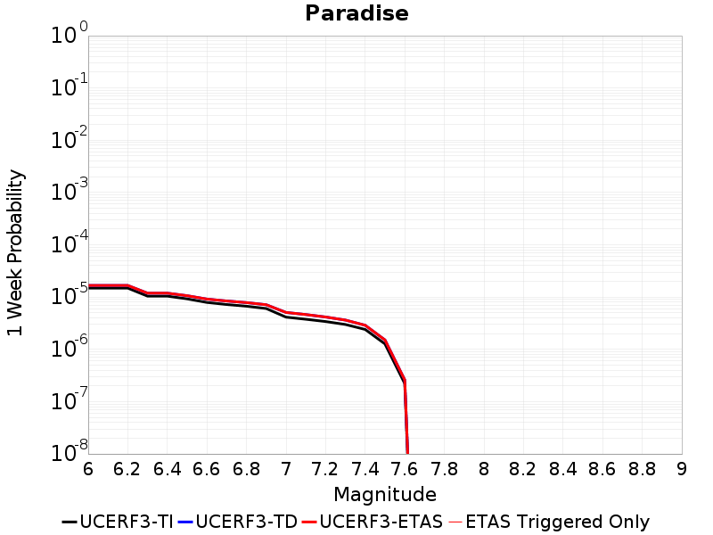 | 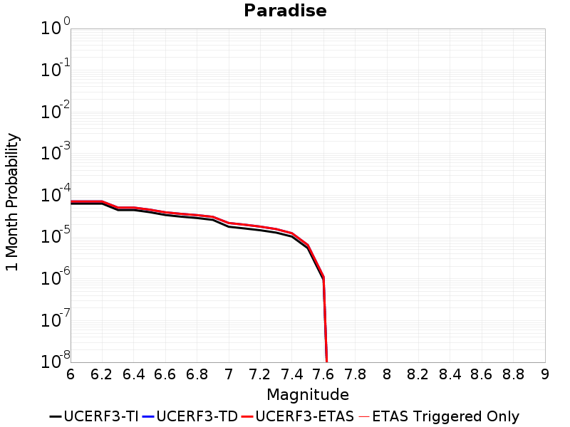 | 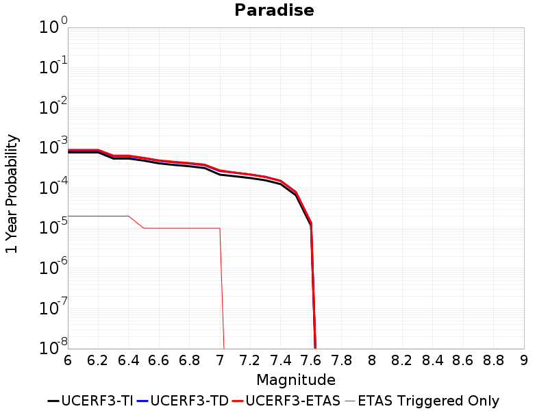 | 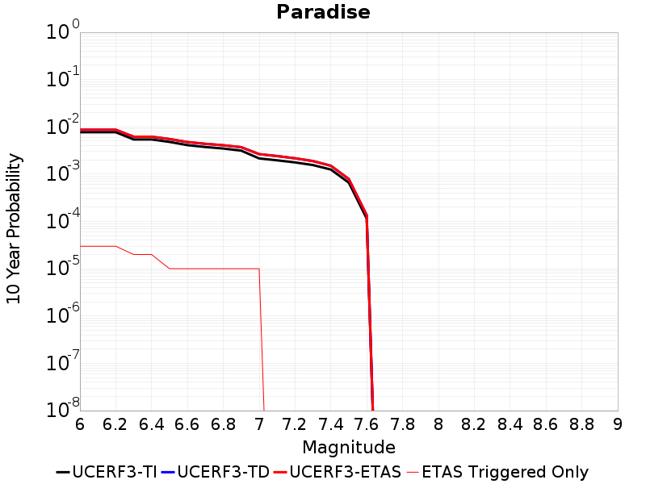 |

| Magnitude | 1 wk TI Prob | 1 wk TD Prob | 1 wk ETAS Prob | 1 wk ETAS/TD Gain | 1 wk ETAS Triggered Only | 1 mo TI Prob | 1 mo TD Prob | 1 mo ETAS Prob | 1 mo ETAS/TD Gain | 1 mo ETAS Triggered Only | 1 yr TI Prob | 1 yr TD Prob | 1 yr ETAS Prob | 1 yr ETAS/TD Gain | 1 yr ETAS Triggered Only | 10 yr TI Prob | 10 yr TD Prob | 10 yr ETAS Prob | 10 yr ETAS/TD Gain | 10 yr ETAS Triggered Only |
|-----|-----|-----|-----|-----|-----|-----|-----|-----|-----|-----|-----|-----|-----|-----|-----|-----|-----|-----|-----|-----|
| 6.0 | 1.4851273E-5 | 1.6704913E-5 | 1.6704913E-5 | 1.0 | 0.0 | 6.364676E-5 | 7.159066E-5 | 7.159066E-5 | 1.0 | 0.0 | 7.7462377E-4 | 8.712913E-4 | 8.912739E-4 | 1.0229344 | 2.0E-5 | 0.0077192914 | 0.008681135 | 0.008710874 | 1.0034257 | 3.0E-5 |
| 6.1 | 1.4851273E-5 | 1.6704913E-5 | 1.6704913E-5 | 1.0 | 0.0 | 6.364676E-5 | 7.159066E-5 | 7.159066E-5 | 1.0 | 0.0 | 7.7462377E-4 | 8.712913E-4 | 8.912739E-4 | 1.0229344 | 2.0E-5 | 0.0077192914 | 0.008681135 | 0.008710874 | 1.0034257 | 3.0E-5 |
| 6.2 | 1.4851273E-5 | 1.6704913E-5 | 1.6704913E-5 | 1.0 | 0.0 | 6.364676E-5 | 7.159066E-5 | 7.159066E-5 | 1.0 | 0.0 | 7.7462377E-4 | 8.712913E-4 | 8.912739E-4 | 1.0229344 | 2.0E-5 | 0.0077192914 | 0.008681135 | 0.008710874 | 1.0034257 | 3.0E-5 |
| 6.3 | 1.0426831E-5 | 1.189605E-5 | 1.189605E-5 | 1.0 | 0.0 | 4.4685654E-5 | 5.0982107E-5 | 5.0982107E-5 | 1.0 | 0.0 | 5.43912E-4 | 6.2053633E-4 | 6.405239E-4 | 1.0322102 | 2.0E-5 | 0.0054258266 | 0.006188645 | 0.0062085213 | 1.0032117 | 2.0E-5 |
| 6.4 | 1.0426831E-5 | 1.189605E-5 | 1.189605E-5 | 1.0 | 0.0 | 4.4685654E-5 | 5.0982107E-5 | 5.0982107E-5 | 1.0 | 0.0 | 5.43912E-4 | 6.2053633E-4 | 6.405239E-4 | 1.0322102 | 2.0E-5 | 0.0054258266 | 0.006188645 | 0.0062085213 | 1.0032117 | 2.0E-5 |
| 6.5 | 9.25027E-6 | 1.0626721E-5 | 1.0626721E-5 | 1.0 | 0.0 | 3.964341E-5 | 4.554232E-5 | 4.554232E-5 | 1.0 | 0.0 | 4.8255164E-4 | 5.543416E-4 | 5.64336E-4 | 1.0180295 | 1.0E-5 | 0.0048150513 | 0.0055300877 | 0.005540033 | 1.0017983 | 1.0E-5 |
| 6.6 | 7.904275E-6 | 9.165448E-6 | 9.165448E-6 | 1.0 | 0.0 | 3.3875025E-5 | 3.9279923E-5 | 3.9279923E-5 | 1.0 | 0.0 | 4.1235037E-4 | 4.7813205E-4 | 4.8812726E-4 | 1.0209048 | 1.0E-5 | 0.0041158604 | 0.0047714305 | 0.004781383 | 1.0020858 | 1.0E-5 |
| 6.7 | 7.2061953E-6 | 8.412778E-6 | 8.412778E-6 | 1.0 | 0.0 | 3.088333E-5 | 3.6054284E-5 | 3.6054284E-5 | 1.0 | 0.0 | 3.7593965E-4 | 4.388762E-4 | 4.4887178E-4 | 1.0227754 | 1.0E-5 | 0.003753043 | 0.0043804636 | 0.00439042 | 1.0022728 | 1.0E-5 |
| 6.8 | 6.6948724E-6 | 7.847415E-6 | 7.847415E-6 | 1.0 | 0.0 | 2.8691995E-5 | 3.3631364E-5 | 3.3631364E-5 | 1.0 | 0.0 | 3.4926904E-4 | 4.093885E-4 | 4.193844E-4 | 1.0244167 | 1.0E-5 | 0.003487206 | 0.004086701 | 0.0040966603 | 1.002437 | 1.0E-5 |
| 6.9 | 6.0421025E-6 | 7.135517E-6 | 7.135517E-6 | 1.0 | 0.0 | 2.5894467E-5 | 3.058045E-5 | 3.058045E-5 | 1.0 | 0.0 | 3.1521954E-4 | 3.7225676E-4 | 3.8225303E-4 | 1.0268532 | 1.0E-5 | 0.0031477278 | 0.0037166704 | 0.0037266333 | 1.0026805 | 1.0E-5 |
| 7.0 | 4.134091E-6 | 5.0843164E-6 | 5.0843164E-6 | 1.0 | 0.0 | 1.7717413E-5 | 2.1789754E-5 | 2.1789754E-5 | 1.0 | 0.0 | 2.1568815E-4 | 2.652595E-4 | 2.7525687E-4 | 1.037689 | 1.0E-5 | 0.0021547892 | 0.0026495822 | 0.0026595555 | 1.0037642 | 1.0E-5 |
| 7.1 | 3.7674888E-6 | 4.6356713E-6 | 4.6356713E-6 | 1.0 | 0.0 | 1.6146281E-5 | 1.986702E-5 | 1.986702E-5 | 1.0 | 0.0 | 1.9656324E-4 | 2.4185565E-4 | 2.4185565E-4 | 1.0 | 0.0 | 0.0019638946 | 0.0024160752 | 0.0024160752 | 1.0 | 0.0 |
| 7.2 | 3.4065345E-6 | 4.160274E-6 | 4.160274E-6 | 1.0 | 0.0 | 1.4599351E-5 | 1.782963E-5 | 1.782963E-5 | 1.0 | 0.0 | 1.777326E-4 | 2.1705564E-4 | 2.1705564E-4 | 1.0 | 0.0 | 0.0017759053 | 0.0021685846 | 0.0021685846 | 1.0 | 0.0 |
| 7.3 | 2.9934936E-6 | 3.6323852E-6 | 3.6323852E-6 | 1.0 | 0.0 | 1.2829195E-5 | 1.556728E-5 | 1.556728E-5 | 1.0 | 0.0 | 1.5618425E-4 | 1.8951664E-4 | 1.8951664E-4 | 1.0 | 0.0 | 0.0015607453 | 0.0018936956 | 0.0018936956 | 1.0 | 0.0 |
| 7.4 | 2.4049796E-6 | 2.8905974E-6 | 2.8905974E-6 | 1.0 | 0.0 | 1.0307015E-5 | 1.2388224E-5 | 1.2388224E-5 | 1.0 | 0.0 | 1.2548068E-4 | 1.5081762E-4 | 1.5081762E-4 | 1.0 | 0.0 | 0.0012540985 | 0.0015072942 | 0.0015072942 | 1.0 | 0.0 |
| 7.5 | 1.2710091E-6 | 1.514532E-6 | 1.514532E-6 | 1.0 | 0.0 | 5.44717E-6 | 6.490842E-6 | 6.490842E-6 | 1.0 | 0.0 | 6.631728E-5 | 7.902439E-5 | 7.902439E-5 | 1.0 | 0.0 | 6.6297496E-4 | 7.900856E-4 | 7.900856E-4 | 1.0 | 0.0 |
| 7.6 | 2.21172E-7 | 2.604588E-7 | 2.604588E-7 | 1.0 | 0.0 | 9.478797E-7 | 1.1162516E-6 | 1.1162516E-6 | 1.0 | 0.0 | 1.1540374E-5 | 1.3590307E-5 | 1.3590307E-5 | 1.0 | 0.0 | 1.1539775E-4 | 1.3589757E-4 | 1.3589757E-4 | 1.0 | 0.0 |

## San Andreas (Mojave S)
*[(top)](#table-of-contents)*

| 1 Week | 1 Month | 1 Year | 10 Year |
|-----|-----|-----|-----|
|  | 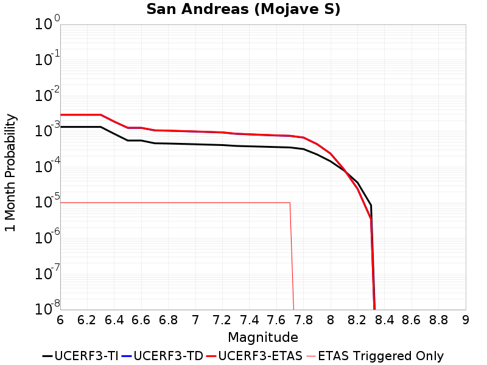 | 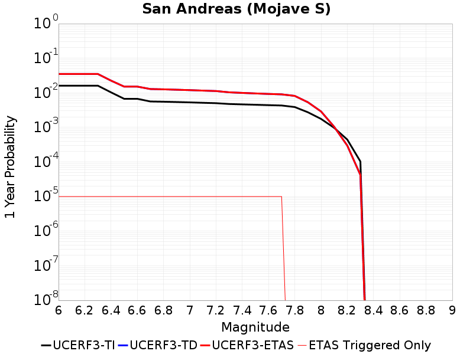 |  |

| Magnitude | 1 wk TI Prob | 1 wk TD Prob | 1 wk ETAS Prob | 1 wk ETAS/TD Gain | 1 wk ETAS Triggered Only | 1 mo TI Prob | 1 mo TD Prob | 1 mo ETAS Prob | 1 mo ETAS/TD Gain | 1 mo ETAS Triggered Only | 1 yr TI Prob | 1 yr TD Prob | 1 yr ETAS Prob | 1 yr ETAS/TD Gain | 1 yr ETAS Triggered Only | 10 yr TI Prob | 10 yr TD Prob | 10 yr ETAS Prob | 10 yr ETAS/TD Gain | 10 yr ETAS Triggered Only |
|-----|-----|-----|-----|-----|-----|-----|-----|-----|-----|-----|-----|-----|-----|-----|-----|-----|-----|-----|-----|-----|
| 6.0 | 3.1064058E-4 | 6.796533E-4 | 6.796533E-4 | 1.0 | 0.0 | 0.0013306376 | 0.0029096769 | 0.0029196478 | 1.0034268 | 1.0E-5 | 0.016080605 | 0.03497728 | 0.03498693 | 1.0002759 | 1.0E-5 | 0.1496549 | 0.288233 | 0.28824726 | 1.0000494 | 2.0E-5 |
| 6.1 | 3.1064058E-4 | 6.796533E-4 | 6.796533E-4 | 1.0 | 0.0 | 0.0013306376 | 0.0029096769 | 0.0029196478 | 1.0034268 | 1.0E-5 | 0.016080605 | 0.03497728 | 0.03498693 | 1.0002759 | 1.0E-5 | 0.1496549 | 0.288233 | 0.28824726 | 1.0000494 | 2.0E-5 |
| 6.2 | 3.1064058E-4 | 6.796533E-4 | 6.796533E-4 | 1.0 | 0.0 | 0.0013306376 | 0.0029096769 | 0.0029196478 | 1.0034268 | 1.0E-5 | 0.016080605 | 0.03497728 | 0.03498693 | 1.0002759 | 1.0E-5 | 0.1496549 | 0.288233 | 0.28824726 | 1.0000494 | 2.0E-5 |
| 6.3 | 3.1064058E-4 | 6.796533E-4 | 6.796533E-4 | 1.0 | 0.0 | 0.0013306376 | 0.0029096769 | 0.0029196478 | 1.0034268 | 1.0E-5 | 0.016080605 | 0.03497728 | 0.03498693 | 1.0002759 | 1.0E-5 | 0.1496549 | 0.288233 | 0.28824726 | 1.0000494 | 2.0E-5 |
| 6.4 | 1.9872203E-4 | 4.365983E-4 | 4.365983E-4 | 1.0 | 0.0 | 8.5138786E-4 | 0.001869822 | 0.0018798034 | 1.0053381 | 1.0E-5 | 0.010316478 | 0.022533646 | 0.022543421 | 1.0004338 | 1.0E-5 | 0.098504856 | 0.19886427 | 0.1988803 | 1.0000806 | 2.0E-5 |
| 6.5 | 1.291105E-4 | 2.920943E-4 | 2.920943E-4 | 1.0 | 0.0 | 5.5321335E-4 | 0.0012512349 | 0.0012612224 | 1.0079821 | 1.0E-5 | 0.006714592 | 0.015128224 | 0.015138073 | 1.000651 | 1.0E-5 | 0.065152965 | 0.13991188 | 0.13992907 | 1.0001229 | 2.0E-5 |
| 6.6 | 1.291105E-4 | 2.920943E-4 | 2.920943E-4 | 1.0 | 0.0 | 5.5321335E-4 | 0.0012512349 | 0.0012612224 | 1.0079821 | 1.0E-5 | 0.006714592 | 0.015128224 | 0.015138073 | 1.000651 | 1.0E-5 | 0.065152965 | 0.13991188 | 0.13992907 | 1.0001229 | 2.0E-5 |
| 6.7 | 1.08001186E-4 | 2.478394E-4 | 2.478394E-4 | 1.0 | 0.0 | 4.6278012E-4 | 0.0010617371 | 0.0010717264 | 1.0094085 | 1.0E-5 | 0.0056198016 | 0.012850344 | 0.012860216 | 1.0007682 | 1.0E-5 | 0.054797906 | 0.12107188 | 0.121089466 | 1.0001452 | 2.0E-5 |
| 6.8 | 1.0624356E-4 | 2.4300344E-4 | 2.4300344E-4 | 1.0 | 0.0 | 4.5525006E-4 | 0.0010410282 | 0.0010510177 | 1.0095959 | 1.0E-5 | 0.0055285925 | 0.012601148 | 0.012611022 | 1.0007836 | 1.0E-5 | 0.053930566 | 0.119020484 | 0.119038105 | 1.000148 | 2.0E-5 |
| 6.9 | 1.0393785E-4 | 2.3669026E-4 | 2.3669026E-4 | 1.0 | 0.0 | 4.4537184E-4 | 0.0010139929 | 0.0010239829 | 1.009852 | 1.0E-5 | 0.0054089287 | 0.012275745 | 0.012285622 | 1.0008047 | 1.0E-5 | 0.05279156 | 0.11631557 | 0.116333246 | 1.000152 | 2.0E-5 |
| 7.0 | 1.0155622E-4 | 2.3036647E-4 | 2.3036647E-4 | 1.0 | 0.0 | 4.3516833E-4 | 9.869117E-4 | 9.969019E-4 | 1.0101227 | 1.0E-5 | 0.005285311 | 0.011949689 | 0.0119595695 | 1.0008268 | 1.0E-5 | 0.05161361 | 0.113578156 | 0.11358702 | 1.0000781 | 1.0E-5 |
| 7.1 | 9.885595E-5 | 2.2322901E-4 | 2.2322901E-4 | 1.0 | 0.0 | 4.2359953E-4 | 9.5634535E-4 | 9.6633576E-4 | 1.0104464 | 1.0E-5 | 0.0051451353 | 0.011581553 | 0.011591437 | 1.0008534 | 1.0E-5 | 0.05027629 | 0.11046378 | 0.11047268 | 1.0000806 | 1.0E-5 |
| 7.2 | 9.6411415E-5 | 2.1683861E-4 | 2.1683861E-4 | 1.0 | 0.0 | 4.1312634E-4 | 9.289777E-4 | 9.389684E-4 | 1.0107545 | 1.0E-5 | 0.005018219 | 0.011251841 | 0.011261728 | 1.0008787 | 1.0E-5 | 0.049064007 | 0.107653975 | 0.1076629 | 1.0000829 | 1.0E-5 |
| 7.3 | 9.1180635E-5 | 1.9900702E-4 | 1.9900702E-4 | 1.0 | 0.0 | 3.907156E-4 | 8.5260853E-4 | 8.626E-4 | 1.0117188 | 1.0E-5 | 0.004746591 | 0.010331222 | 0.010341118 | 1.000958 | 1.0E-5 | 0.046464786 | 0.09983026 | 0.09983926 | 1.0000901 | 1.0E-5 |
| 7.4 | 8.887388E-5 | 1.9144516E-4 | 1.9144516E-4 | 1.0 | 0.0 | 3.8083247E-4 | 8.202213E-4 | 8.3021313E-4 | 1.0121819 | 1.0E-5 | 0.0046267817 | 0.009940574 | 0.009950475 | 1.000996 | 1.0E-5 | 0.045316286 | 0.09644929 | 0.09645833 | 1.0000937 | 1.0E-5 |
| 7.5 | 8.6750515E-5 | 1.8471516E-4 | 1.8471516E-4 | 1.0 | 0.0 | 3.7173493E-4 | 7.913963E-4 | 8.013884E-4 | 1.0126259 | 1.0E-5 | 0.004516484 | 0.009592774 | 0.009602679 | 1.0010325 | 1.0E-5 | 0.04425787 | 0.09340069 | 0.093409754 | 1.000097 | 1.0E-5 |
| 7.6 | 8.453092E-5 | 1.7853778E-4 | 1.7853778E-4 | 1.0 | 0.0 | 3.6222505E-4 | 7.649376E-4 | 7.7492994E-4 | 1.013063 | 1.0E-5 | 0.0044011753 | 0.009273428 | 0.009283335 | 1.0010684 | 1.0E-5 | 0.04315024 | 0.09054151 | 0.09055061 | 1.0001005 | 1.0E-5 |
| 7.7 | 8.259102E-5 | 1.737142E-4 | 1.737142E-4 | 1.0 | 0.0 | 3.539135E-4 | 7.4427703E-4 | 7.542696E-4 | 1.0134258 | 1.0E-5 | 0.004300386 | 0.009023997 | 0.009033907 | 1.0010982 | 1.0E-5 | 0.042181134 | 0.088278316 | 0.08828743 | 1.0001032 | 1.0E-5 |
| 7.8 | 7.444844E-5 | 1.5656791E-4 | 1.5656791E-4 | 1.0 | 0.0 | 3.1902574E-4 | 6.708328E-4 | 6.708328E-4 | 1.0 | 0.0 | 0.0038772223 | 0.008136857 | 0.008136857 | 1.0 | 0.0 | 0.03810269 | 0.07996258 | 0.07996258 | 1.0 | 0.0 |
| 7.9 | 5.2586525E-5 | 1.0261506E-4 | 1.0261506E-4 | 1.0 | 0.0 | 2.2535135E-4 | 4.3970472E-4 | 4.3970472E-4 | 1.0 | 0.0 | 0.0027402006 | 0.0053402763 | 0.0053402763 | 1.0 | 0.0 | 0.027066574 | 0.05338641 | 0.05338641 | 1.0 | 0.0 |
| 8.0 | 3.379877E-5 | 5.5559045E-5 | 5.5559045E-5 | 1.0 | 0.0 | 1.4484383E-4 | 2.3808848E-4 | 2.3808848E-4 | 1.0 | 0.0 | 0.0017620471 | 0.002894876 | 0.002894876 | 1.0 | 0.0 | 0.017481409 | 0.029560376 | 0.029560376 | 1.0 | 0.0 |
| 8.1 | 1.8668277E-5 | 2.0007905E-5 | 2.0007905E-5 | 1.0 | 0.0 | 8.000444E-5 | 8.574535E-5 | 8.574535E-5 | 1.0 | 0.0 | 9.736188E-4 | 0.0010434503 | 0.0010434503 | 1.0 | 0.0 | 0.009693642 | 0.011163704 | 0.011163704 | 1.0 | 0.0 |
| 8.2 | 8.541571E-6 | 5.726582E-6 | 5.726582E-6 | 1.0 | 0.0 | 3.660622E-5 | 2.4542263E-5 | 2.4542263E-5 | 1.0 | 0.0 | 4.455896E-4 | 2.9876118E-4 | 2.9876118E-4 | 1.0 | 0.0 | 0.0044469717 | 0.0033860027 | 0.0033860027 | 1.0 | 0.0 |
| 8.3 | 1.983087E-6 | 8.103189E-7 | 8.103189E-7 | 1.0 | 0.0 | 8.498917E-6 | 3.4727907E-6 | 3.4727907E-6 | 1.0 | 0.0 | 1.034694E-4 | 4.2280426E-5 | 4.2280426E-5 | 1.0 | 0.0 | 0.0010342124 | 4.9735163E-4 | 4.9735163E-4 | 1.0 | 0.0 |

## Goldstone Lake
*[(top)](#table-of-contents)*

| 1 Week | 1 Month | 1 Year | 10 Year |
|-----|-----|-----|-----|
| 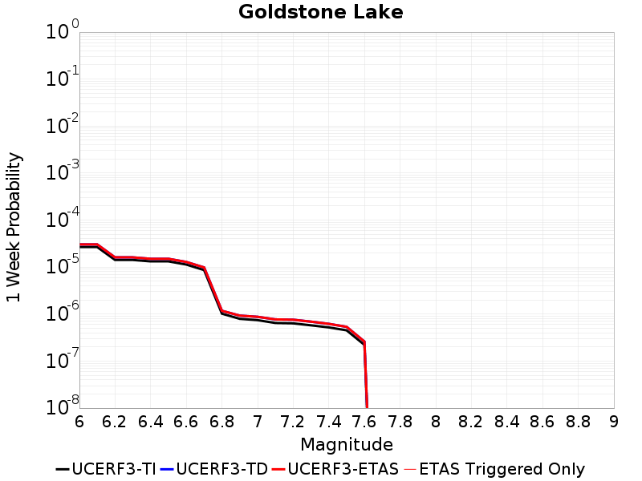 | 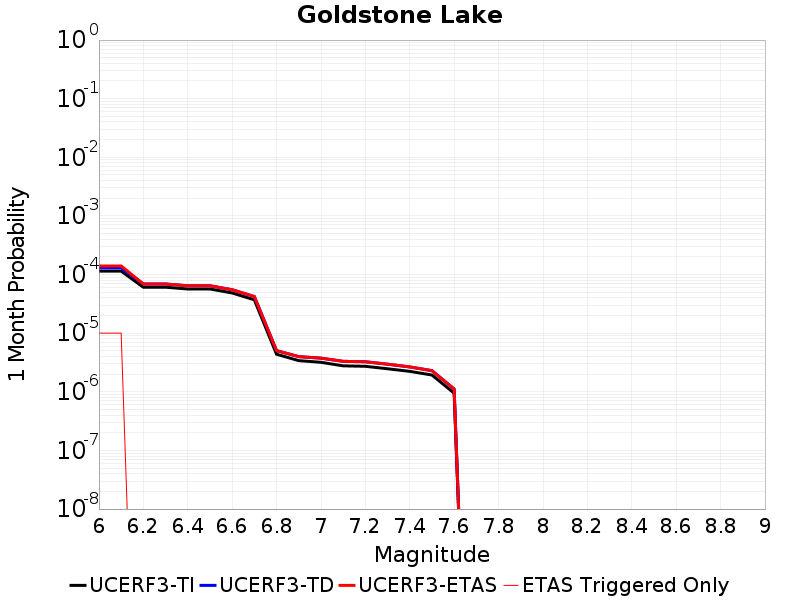 |  |  |

| Magnitude | 1 wk TI Prob | 1 wk TD Prob | 1 wk ETAS Prob | 1 wk ETAS/TD Gain | 1 wk ETAS Triggered Only | 1 mo TI Prob | 1 mo TD Prob | 1 mo ETAS Prob | 1 mo ETAS/TD Gain | 1 mo ETAS Triggered Only | 1 yr TI Prob | 1 yr TD Prob | 1 yr ETAS Prob | 1 yr ETAS/TD Gain | 1 yr ETAS Triggered Only | 10 yr TI Prob | 10 yr TD Prob | 10 yr ETAS Prob | 10 yr ETAS/TD Gain | 10 yr ETAS Triggered Only |
|-----|-----|-----|-----|-----|-----|-----|-----|-----|-----|-----|-----|-----|-----|-----|-----|-----|-----|-----|-----|-----|
| 6.0 | 2.671352E-5 | 3.0403973E-5 | 3.0403973E-5 | 1.0 | 0.0 | 1.1448149E-4 | 1.3029734E-4 | 1.4029605E-4 | 1.0767375 | 1.0E-5 | 0.001392921 | 0.0015854124 | 0.0016053808 | 1.012595 | 2.0E-5 | 0.013842222 | 0.015760554 | 0.01579008 | 1.0018735 | 3.0E-5 |
| 6.1 | 2.671352E-5 | 3.0403973E-5 | 3.0403973E-5 | 1.0 | 0.0 | 1.1448149E-4 | 1.3029734E-4 | 1.4029605E-4 | 1.0767375 | 1.0E-5 | 0.001392921 | 0.0015854124 | 0.0016053808 | 1.012595 | 2.0E-5 | 0.013842222 | 0.015760554 | 0.01579008 | 1.0018735 | 3.0E-5 |
| 6.2 | 1.4197047E-5 | 1.6110578E-5 | 1.6110578E-5 | 1.0 | 0.0 | 6.0843064E-5 | 6.9044065E-5 | 6.9044065E-5 | 1.0 | 0.0 | 7.4051257E-4 | 8.4038614E-4 | 8.503777E-4 | 1.0118893 | 1.0E-5 | 0.007380498 | 0.008381795 | 0.008401628 | 1.0023661 | 2.0E-5 |
| 6.3 | 1.4197047E-5 | 1.6110578E-5 | 1.6110578E-5 | 1.0 | 0.0 | 6.0843064E-5 | 6.9044065E-5 | 6.9044065E-5 | 1.0 | 0.0 | 7.4051257E-4 | 8.4038614E-4 | 8.503777E-4 | 1.0118893 | 1.0E-5 | 0.007380498 | 0.008381795 | 0.008401628 | 1.0023661 | 2.0E-5 |
| 6.4 | 1.3238931E-5 | 1.5021803E-5 | 1.5021803E-5 | 1.0 | 0.0 | 5.6737044E-5 | 6.4378124E-5 | 6.4378124E-5 | 1.0 | 0.0 | 6.9055456E-4 | 7.8361994E-4 | 7.936121E-4 | 1.0127513 | 1.0E-5 | 0.006884126 | 0.007818211 | 0.007838055 | 1.0025381 | 2.0E-5 |
| 6.5 | 1.3238931E-5 | 1.5021803E-5 | 1.5021803E-5 | 1.0 | 0.0 | 5.6737044E-5 | 6.4378124E-5 | 6.4378124E-5 | 1.0 | 0.0 | 6.9055456E-4 | 7.8361994E-4 | 7.936121E-4 | 1.0127513 | 1.0E-5 | 0.006884126 | 0.007818211 | 0.007838055 | 1.0025381 | 2.0E-5 |
| 6.6 | 1.1328278E-5 | 1.2866668E-5 | 1.2866668E-5 | 1.0 | 0.0 | 4.8548856E-5 | 5.5142238E-5 | 5.5142238E-5 | 1.0 | 0.0 | 5.90922E-4 | 6.712458E-4 | 6.812391E-4 | 1.0148877 | 1.0E-5 | 0.0058935313 | 0.006701589 | 0.006721455 | 1.0029644 | 2.0E-5 |
| 6.7 | 8.651175E-6 | 9.833374E-6 | 9.833374E-6 | 1.0 | 0.0 | 3.707594E-5 | 4.214286E-5 | 4.214286E-5 | 1.0 | 0.0 | 4.5130608E-4 | 5.130592E-4 | 5.230541E-4 | 1.019481 | 1.0E-5 | 0.0045039062 | 0.005127642 | 0.0051475395 | 1.0038804 | 2.0E-5 |
| 6.8 | 1.0215377E-6 | 1.1765026E-6 | 1.1765026E-6 | 1.0 | 0.0 | 4.378012E-6 | 5.042145E-6 | 5.042145E-6 | 1.0 | 0.0 | 5.3300988E-5 | 6.13865E-5 | 7.138588E-5 | 1.1628922 | 1.0E-5 | 5.3288206E-4 | 6.137067E-4 | 6.2370056E-4 | 1.0162845 | 1.0E-5 |
| 6.9 | 7.9360774E-7 | 9.29232E-7 | 9.29232E-7 | 1.0 | 0.0 | 3.4011714E-6 | 3.982417E-6 | 3.982417E-6 | 1.0 | 0.0 | 4.1408475E-5 | 4.8484922E-5 | 5.848444E-5 | 1.2062397 | 1.0E-5 | 4.140076E-4 | 4.8475043E-4 | 4.947456E-4 | 1.0206192 | 1.0E-5 |
| 7.0 | 7.4382757E-7 | 8.755975E-7 | 8.755975E-7 | 1.0 | 0.0 | 3.1878285E-6 | 3.7525556E-6 | 3.7525556E-6 | 1.0 | 0.0 | 3.8811122E-5 | 4.5686476E-5 | 5.5686018E-5 | 1.2188731 | 1.0E-5 | 3.8804344E-4 | 4.567775E-4 | 4.667729E-4 | 1.0218825 | 1.0E-5 |
| 7.1 | 6.4709513E-7 | 7.719451E-7 | 7.719451E-7 | 1.0 | 0.0 | 2.773262E-6 | 3.3083325E-6 | 3.3083325E-6 | 1.0 | 0.0 | 3.376394E-5 | 4.0278264E-5 | 4.0278264E-5 | 1.0 | 0.0 | 3.375881E-4 | 4.027156E-4 | 4.027156E-4 | 1.0 | 0.0 |
| 7.2 | 6.356704E-7 | 7.596448E-7 | 7.596448E-7 | 1.0 | 0.0 | 2.7242988E-6 | 3.255617E-6 | 3.255617E-6 | 1.0 | 0.0 | 3.3167835E-5 | 3.9636474E-5 | 3.9636474E-5 | 1.0 | 0.0 | 3.3162883E-4 | 3.963E-4 | 3.963E-4 | 1.0 | 0.0 |
| 7.3 | 5.7695723E-7 | 6.904459E-7 | 6.904459E-7 | 1.0 | 0.0 | 2.4726714E-6 | 2.959051E-6 | 2.959051E-6 | 1.0 | 0.0 | 3.0104358E-5 | 3.6025907E-5 | 3.6025907E-5 | 1.0 | 0.0 | 3.0100282E-4 | 3.602064E-4 | 3.602064E-4 | 1.0 | 0.0 |
| 7.4 | 5.209647E-7 | 6.2010633E-7 | 6.2010633E-7 | 1.0 | 0.0 | 2.232704E-6 | 2.657596E-6 | 2.657596E-6 | 1.0 | 0.0 | 2.718283E-5 | 3.235581E-5 | 3.235581E-5 | 1.0 | 0.0 | 2.7179506E-4 | 3.2351655E-4 | 3.2351655E-4 | 1.0 | 0.0 |
| 7.5 | 4.512955E-7 | 5.356103E-7 | 5.356103E-7 | 1.0 | 0.0 | 1.934122E-6 | 2.295471E-6 | 2.295471E-6 | 1.0 | 0.0 | 2.3547682E-5 | 2.7947055E-5 | 2.7947055E-5 | 1.0 | 0.0 | 2.3545188E-4 | 2.7944072E-4 | 2.7944072E-4 | 1.0 | 0.0 |
| 7.6 | 2.21172E-7 | 2.604588E-7 | 2.604588E-7 | 1.0 | 0.0 | 9.478797E-7 | 1.1162516E-6 | 1.1162516E-6 | 1.0 | 0.0 | 1.1540374E-5 | 1.3590307E-5 | 1.3590307E-5 | 1.0 | 0.0 | 1.1539775E-4 | 1.3589757E-4 | 1.3589757E-4 | 1.0 | 0.0 |

## Lost Hills
*[(top)](#table-of-contents)*

| 1 Week | 1 Month | 1 Year | 10 Year |
|-----|-----|-----|-----|
|  | 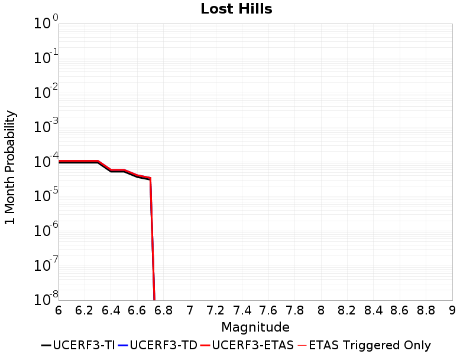 |  |  |

| Magnitude | 1 wk TI Prob | 1 wk TD Prob | 1 wk ETAS Prob | 1 wk ETAS/TD Gain | 1 wk ETAS Triggered Only | 1 mo TI Prob | 1 mo TD Prob | 1 mo ETAS Prob | 1 mo ETAS/TD Gain | 1 mo ETAS Triggered Only | 1 yr TI Prob | 1 yr TD Prob | 1 yr ETAS Prob | 1 yr ETAS/TD Gain | 1 yr ETAS Triggered Only | 10 yr TI Prob | 10 yr TD Prob | 10 yr ETAS Prob | 10 yr ETAS/TD Gain | 10 yr ETAS Triggered Only |
|-----|-----|-----|-----|-----|-----|-----|-----|-----|-----|-----|-----|-----|-----|-----|-----|-----|-----|-----|-----|-----|
| 6.0 | 2.233523E-5 | 2.5127541E-5 | 2.5127541E-5 | 1.0 | 0.0 | 9.571891E-5 | 1.0768597E-4 | 1.0768597E-4 | 1.0 | 0.0 | 0.0011647546 | 0.0013104565 | 0.0013204435 | 1.0076209 | 1.0E-5 | 0.011586686 | 0.013043915 | 0.013063654 | 1.0015132 | 2.0E-5 |
| 6.1 | 2.233523E-5 | 2.5127541E-5 | 2.5127541E-5 | 1.0 | 0.0 | 9.571891E-5 | 1.0768597E-4 | 1.0768597E-4 | 1.0 | 0.0 | 0.0011647546 | 0.0013104565 | 0.0013204435 | 1.0076209 | 1.0E-5 | 0.011586686 | 0.013043915 | 0.013063654 | 1.0015132 | 2.0E-5 |
| 6.2 | 2.233523E-5 | 2.5127541E-5 | 2.5127541E-5 | 1.0 | 0.0 | 9.571891E-5 | 1.0768597E-4 | 1.0768597E-4 | 1.0 | 0.0 | 0.0011647546 | 0.0013104565 | 0.0013204435 | 1.0076209 | 1.0E-5 | 0.011586686 | 0.013043915 | 0.013063654 | 1.0015132 | 2.0E-5 |
| 6.3 | 2.233523E-5 | 2.5127541E-5 | 2.5127541E-5 | 1.0 | 0.0 | 9.571891E-5 | 1.0768597E-4 | 1.0768597E-4 | 1.0 | 0.0 | 0.0011647546 | 0.0013104565 | 0.0013204435 | 1.0076209 | 1.0E-5 | 0.011586686 | 0.013043915 | 0.013063654 | 1.0015132 | 2.0E-5 |
| 6.4 | 1.2288092E-5 | 1.3792373E-5 | 1.3792373E-5 | 1.0 | 0.0 | 5.2662188E-5 | 5.9109356E-5 | 5.9109356E-5 | 1.0 | 0.0 | 6.409735E-4 | 7.1951275E-4 | 7.1951275E-4 | 1.0 | 0.0 | 0.006391279 | 0.007181053 | 0.0071909814 | 1.0013826 | 1.0E-5 |
| 6.5 | 1.2288092E-5 | 1.3792373E-5 | 1.3792373E-5 | 1.0 | 0.0 | 5.2662188E-5 | 5.9109356E-5 | 5.9109356E-5 | 1.0 | 0.0 | 6.409735E-4 | 7.1951275E-4 | 7.1951275E-4 | 1.0 | 0.0 | 0.006391279 | 0.007181053 | 0.0071909814 | 1.0013826 | 1.0E-5 |
| 6.6 | 8.58281E-6 | 9.641706E-6 | 9.641706E-6 | 1.0 | 0.0 | 3.6782953E-5 | 4.132141E-5 | 4.132141E-5 | 1.0 | 0.0 | 4.4774043E-4 | 5.030554E-4 | 5.030554E-4 | 1.0 | 0.0 | 0.0044683935 | 0.0050273403 | 0.0050273403 | 1.0 | 0.0 |
| 6.7 | 7.205685E-6 | 8.094967E-6 | 8.094967E-6 | 1.0 | 0.0 | 3.088114E-5 | 3.4692715E-5 | 3.4692715E-5 | 1.0 | 0.0 | 3.7591302E-4 | 4.223838E-4 | 4.223838E-4 | 1.0 | 0.0 | 0.0037527776 | 0.004223838 | 0.004223838 | 1.0 | 0.0 |

## San Andreas (San Bernardino N)
*[(top)](#table-of-contents)*

| 1 Week | 1 Month | 1 Year | 10 Year |
|-----|-----|-----|-----|
| 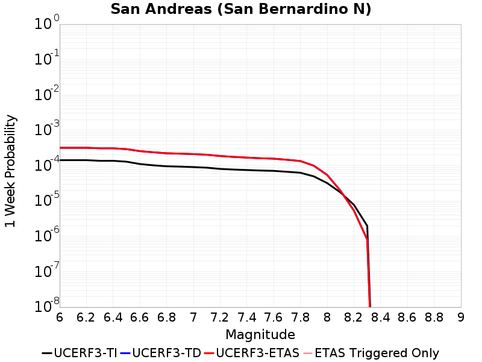 |  |  | 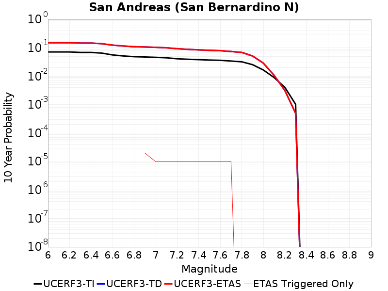 |

| Magnitude | 1 wk TI Prob | 1 wk TD Prob | 1 wk ETAS Prob | 1 wk ETAS/TD Gain | 1 wk ETAS Triggered Only | 1 mo TI Prob | 1 mo TD Prob | 1 mo ETAS Prob | 1 mo ETAS/TD Gain | 1 mo ETAS Triggered Only | 1 yr TI Prob | 1 yr TD Prob | 1 yr ETAS Prob | 1 yr ETAS/TD Gain | 1 yr ETAS Triggered Only | 10 yr TI Prob | 10 yr TD Prob | 10 yr ETAS Prob | 10 yr ETAS/TD Gain | 10 yr ETAS Triggered Only |
|-----|-----|-----|-----|-----|-----|-----|-----|-----|-----|-----|-----|-----|-----|-----|-----|-----|-----|-----|-----|-----|
| 6.0 | 1.4273766E-4 | 3.1994775E-4 | 3.1994775E-4 | 1.0 | 0.0 | 6.115894E-4 | 0.0013704901 | 0.0013804763 | 1.0072867 | 1.0E-5 | 0.0074207084 | 0.01655958 | 0.016569415 | 1.0005939 | 1.0E-5 | 0.07177748 | 0.15177517 | 0.15179214 | 1.0001118 | 2.0E-5 |
| 6.1 | 1.4273766E-4 | 3.1994775E-4 | 3.1994775E-4 | 1.0 | 0.0 | 6.115894E-4 | 0.0013704901 | 0.0013804763 | 1.0072867 | 1.0E-5 | 0.0074207084 | 0.01655958 | 0.016569415 | 1.0005939 | 1.0E-5 | 0.07177748 | 0.15177517 | 0.15179214 | 1.0001118 | 2.0E-5 |
| 6.2 | 1.4273766E-4 | 3.1994775E-4 | 3.1994775E-4 | 1.0 | 0.0 | 6.115894E-4 | 0.0013704901 | 0.0013804763 | 1.0072867 | 1.0E-5 | 0.0074207084 | 0.01655958 | 0.016569415 | 1.0005939 | 1.0E-5 | 0.07177748 | 0.15177517 | 0.15179214 | 1.0001118 | 2.0E-5 |
| 6.3 | 1.3730655E-4 | 3.089775E-4 | 3.089775E-4 | 1.0 | 0.0 | 5.883239E-4 | 0.001323523 | 0.0013335097 | 1.0075456 | 1.0E-5 | 0.0071393442 | 0.015996257 | 0.016006097 | 1.0006151 | 1.0E-5 | 0.06914291 | 0.14707164 | 0.1470887 | 1.000116 | 2.0E-5 |
| 6.4 | 1.3730655E-4 | 3.089775E-4 | 3.089775E-4 | 1.0 | 0.0 | 5.883239E-4 | 0.001323523 | 0.0013335097 | 1.0075456 | 1.0E-5 | 0.0071393442 | 0.015996257 | 0.016006097 | 1.0006151 | 1.0E-5 | 0.06914291 | 0.14707164 | 0.1470887 | 1.000116 | 2.0E-5 |
| 6.5 | 1.2942807E-4 | 2.9309455E-4 | 2.9309455E-4 | 1.0 | 0.0 | 5.545738E-4 | 0.00125552 | 0.0012655074 | 1.0079548 | 1.0E-5 | 0.0067310524 | 0.015180086 | 0.0151899345 | 1.0006487 | 1.0E-5 | 0.06530788 | 0.14021298 | 0.14023018 | 1.0001227 | 2.0E-5 |
| 6.6 | 1.1125901E-4 | 2.5740988E-4 | 2.5740988E-4 | 1.0 | 0.0 | 4.767372E-4 | 0.0011027211 | 0.0011127101 | 1.0090585 | 1.0E-5 | 0.005788839 | 0.01334363 | 0.013353497 | 1.0007395 | 1.0E-5 | 0.056403454 | 0.1245146 | 0.12453211 | 1.0001407 | 2.0E-5 |
| 6.7 | 1.02209575E-4 | 2.3873182E-4 | 2.3873182E-4 | 1.0 | 0.0 | 4.3796748E-4 | 0.0010227367 | 0.0010327264 | 1.0097677 | 1.0E-5 | 0.0053192247 | 0.012381161 | 0.012391037 | 1.0007976 | 1.0E-5 | 0.051936906 | 0.11633029 | 0.11634796 | 1.0001519 | 2.0E-5 |
| 6.8 | 9.610582E-5 | 2.2393987E-4 | 2.2393987E-4 | 1.0 | 0.0 | 4.1181705E-4 | 9.5939E-4 | 9.6938043E-4 | 1.0104133 | 1.0E-5 | 0.0050023515 | 0.01161829 | 0.011628174 | 1.0008507 | 1.0E-5 | 0.048912346 | 0.10973314 | 0.10975095 | 1.0001622 | 2.0E-5 |
| 6.9 | 9.3877505E-5 | 2.1848024E-4 | 2.1848024E-4 | 1.0 | 0.0 | 4.0227012E-4 | 9.360085E-4 | 9.4599917E-4 | 1.0106736 | 1.0E-5 | 0.0048866454 | 0.0113366125 | 0.011346499 | 1.0008721 | 1.0E-5 | 0.04780577 | 0.10731488 | 0.10733273 | 1.0001664 | 2.0E-5 |
| 7.0 | 9.1019785E-5 | 2.1172642E-4 | 2.1172642E-4 | 1.0 | 0.0 | 3.900265E-4 | 9.07084E-4 | 9.170749E-4 | 1.0110143 | 1.0E-5 | 0.0047382377 | 0.0109880585 | 0.010997948 | 1.0009 | 1.0E-5 | 0.046384744 | 0.104286954 | 0.10429591 | 1.0000858 | 1.0E-5 |
| 7.1 | 8.771155E-5 | 2.0344568E-4 | 2.0344568E-4 | 1.0 | 0.0 | 3.758525E-4 | 8.7161927E-4 | 8.8161055E-4 | 1.0114629 | 1.0E-5 | 0.0045664064 | 0.010560534 | 0.010570428 | 1.0009369 | 1.0E-5 | 0.044737056 | 0.10059989 | 0.10060889 | 1.0000894 | 1.0E-5 |
| 7.2 | 8.0830236E-5 | 1.8744463E-4 | 1.8744463E-4 | 1.0 | 0.0 | 3.4636928E-4 | 8.0308696E-4 | 8.1307895E-4 | 1.012442 | 1.0E-5 | 0.0042088944 | 0.009733861 | 0.009743764 | 1.0010173 | 1.0E-5 | 0.041300658 | 0.09335 | 0.09335907 | 1.0000972 | 1.0E-5 |
| 7.3 | 7.7668235E-5 | 1.7681785E-4 | 1.7681785E-4 | 1.0 | 0.0 | 3.328214E-4 | 7.575708E-4 | 7.6756324E-4 | 1.01319 | 1.0E-5 | 0.0040445733 | 0.009184502 | 0.00919441 | 1.0010788 | 1.0E-5 | 0.03971748 | 0.08860654 | 0.08861565 | 1.0001029 | 1.0E-5 |
| 7.4 | 7.520177E-5 | 1.6897215E-4 | 1.6897215E-4 | 1.0 | 0.0 | 3.2225347E-4 | 7.2396547E-4 | 7.3395827E-4 | 1.0138028 | 1.0E-5 | 0.0039163795 | 0.008778729 | 0.008788641 | 1.0011292 | 1.0E-5 | 0.038480744 | 0.08504535 | 0.0850545 | 1.0001075 | 1.0E-5 |
| 7.5 | 7.274697E-5 | 1.6180355E-4 | 1.6180355E-4 | 1.0 | 0.0 | 3.1173544E-4 | 6.932595E-4 | 7.032526E-4 | 1.0144147 | 1.0E-5 | 0.003788775 | 0.008407831 | 0.008417747 | 1.0011793 | 1.0E-5 | 0.03724827 | 0.08174896 | 0.08175815 | 1.0001123 | 1.0E-5 |
| 7.6 | 7.1185845E-5 | 1.5747323E-4 | 1.5747323E-4 | 1.0 | 0.0 | 3.0504653E-4 | 6.747108E-4 | 6.8470405E-4 | 1.0148112 | 1.0E-5 | 0.0037076178 | 0.00818372 | 0.008193637 | 1.0012119 | 1.0E-5 | 0.036463667 | 0.07972935 | 0.07973855 | 1.0001154 | 1.0E-5 |
| 7.7 | 6.709961E-5 | 1.464606E-4 | 1.464606E-4 | 1.0 | 0.0 | 2.8753807E-4 | 6.275373E-4 | 6.3753105E-4 | 1.0159253 | 1.0E-5 | 0.003495157 | 0.0076135434 | 0.007623467 | 1.0013034 | 1.0E-5 | 0.034406938 | 0.074523225 | 0.07453248 | 1.0001242 | 1.0E-5 |
| 7.8 | 6.300812E-5 | 1.3511934E-4 | 1.3511934E-4 | 1.0 | 0.0 | 2.7000686E-4 | 5.7895435E-4 | 5.7895435E-4 | 1.0 | 0.0 | 0.0032823787 | 0.007026019 | 0.007026019 | 1.0 | 0.0 | 0.032343175 | 0.06911149 | 0.06911149 | 1.0 | 0.0 |
| 7.9 | 4.983037E-5 | 9.966452E-5 | 9.966452E-5 | 1.0 | 0.0 | 2.1354125E-4 | 4.2706373E-4 | 4.2706373E-4 | 1.0 | 0.0 | 0.0025967648 | 0.005187116 | 0.005187116 | 1.0 | 0.0 | 0.025666296 | 0.051776685 | 0.051776685 | 1.0 | 0.0 |
| 8.0 | 3.2211527E-5 | 5.473929E-5 | 5.473929E-5 | 1.0 | 0.0 | 1.380421E-4 | 2.3457587E-4 | 2.3457587E-4 | 1.0 | 0.0 | 0.0016793669 | 0.0028522226 | 0.0028522226 | 1.0 | 0.0 | 0.016667323 | 0.02905919 | 0.02905919 | 1.0 | 0.0 |
| 8.1 | 1.743376E-5 | 1.9487288E-5 | 1.9487288E-5 | 1.0 | 0.0 | 7.471398E-5 | 8.351428E-5 | 8.351428E-5 | 1.0 | 0.0 | 9.0926304E-4 | 0.0010163127 | 0.0010163127 | 1.0 | 0.0 | 0.009055517 | 0.010828291 | 0.010828291 | 1.0 | 0.0 |
| 8.2 | 7.831616E-6 | 5.3993913E-6 | 5.3993913E-6 | 1.0 | 0.0 | 3.3563636E-5 | 2.3140043E-5 | 2.3140043E-5 | 1.0 | 0.0 | 4.0856065E-4 | 2.8169368E-4 | 2.8169368E-4 | 1.0 | 0.0 | 0.004078103 | 0.0031745564 | 0.0031745564 | 1.0 | 0.0 |
| 8.3 | 1.983087E-6 | 8.103189E-7 | 8.103189E-7 | 1.0 | 0.0 | 8.498917E-6 | 3.4727907E-6 | 3.4727907E-6 | 1.0 | 0.0 | 1.034694E-4 | 4.2280426E-5 | 4.2280426E-5 | 1.0 | 0.0 | 0.0010342124 | 4.9735163E-4 | 4.9735163E-4 | 1.0 | 0.0 |

## Lenwood-Lockhart-Old Woman Springs
*[(top)](#table-of-contents)*

| 1 Week | 1 Month | 1 Year | 10 Year |
|-----|-----|-----|-----|
|  |  |  |  |

| Magnitude | 1 wk TI Prob | 1 wk TD Prob | 1 wk ETAS Prob | 1 wk ETAS/TD Gain | 1 wk ETAS Triggered Only | 1 mo TI Prob | 1 mo TD Prob | 1 mo ETAS Prob | 1 mo ETAS/TD Gain | 1 mo ETAS Triggered Only | 1 yr TI Prob | 1 yr TD Prob | 1 yr ETAS Prob | 1 yr ETAS/TD Gain | 1 yr ETAS Triggered Only | 10 yr TI Prob | 10 yr TD Prob | 10 yr ETAS Prob | 10 yr ETAS/TD Gain | 10 yr ETAS Triggered Only |
|-----|-----|-----|-----|-----|-----|-----|-----|-----|-----|-----|-----|-----|-----|-----|-----|-----|-----|-----|-----|-----|
| 6.0 | 3.744542E-5 | 4.398863E-5 | 5.398819E-5 | 1.2273215 | 1.0E-5 | 1.604705E-4 | 1.8851006E-4 | 2.0850629E-4 | 1.1060752 | 2.0E-5 | 0.0019519776 | 0.0022928666 | 0.0023128206 | 1.0087028 | 2.0E-5 | 0.019349206 | 0.022710133 | 0.022729678 | 1.0008607 | 2.0E-5 |
| 6.1 | 3.744542E-5 | 4.398863E-5 | 5.398819E-5 | 1.2273215 | 1.0E-5 | 1.604705E-4 | 1.8851006E-4 | 2.0850629E-4 | 1.1060752 | 2.0E-5 | 0.0019519776 | 0.0022928666 | 0.0023128206 | 1.0087028 | 2.0E-5 | 0.019349206 | 0.022710133 | 0.022729678 | 1.0008607 | 2.0E-5 |
| 6.2 | 3.744542E-5 | 4.398863E-5 | 5.398819E-5 | 1.2273215 | 1.0E-5 | 1.604705E-4 | 1.8851006E-4 | 2.0850629E-4 | 1.1060752 | 2.0E-5 | 0.0019519776 | 0.0022928666 | 0.0023128206 | 1.0087028 | 2.0E-5 | 0.019349206 | 0.022710133 | 0.022729678 | 1.0008607 | 2.0E-5 |
| 6.3 | 2.1079984E-5 | 2.5365152E-5 | 2.5365152E-5 | 1.0 | 0.0 | 9.0339665E-5 | 1.0870338E-4 | 1.1870229E-4 | 1.0919834 | 1.0E-5 | 0.0010993304 | 0.0013226802 | 0.001332667 | 1.0075504 | 1.0E-5 | 0.010939079 | 0.013150293 | 0.013160162 | 1.0007504 | 1.0E-5 |
| 6.4 | 2.1079984E-5 | 2.5365152E-5 | 2.5365152E-5 | 1.0 | 0.0 | 9.0339665E-5 | 1.0870338E-4 | 1.1870229E-4 | 1.0919834 | 1.0E-5 | 0.0010993304 | 0.0013226802 | 0.001332667 | 1.0075504 | 1.0E-5 | 0.010939079 | 0.013150293 | 0.013160162 | 1.0007504 | 1.0E-5 |
| 6.5 | 1.7397282E-5 | 2.0672222E-5 | 2.0672222E-5 | 1.0 | 0.0 | 7.455765E-5 | 8.859229E-5 | 9.859141E-5 | 1.1128666 | 1.0E-5 | 9.073613E-4 | 0.0010780892 | 0.0010880785 | 1.0092657 | 1.0E-5 | 0.009036654 | 0.010729887 | 0.010739779 | 1.000922 | 1.0E-5 |
| 6.6 | 1.52050325E-5 | 1.7688482E-5 | 1.7688482E-5 | 1.0 | 0.0 | 6.51628E-5 | 7.580562E-5 | 8.5804866E-5 | 1.1319064 | 1.0E-5 | 7.9306826E-4 | 9.2255056E-4 | 9.325413E-4 | 1.0108296 | 1.0E-5 | 0.007902439 | 0.00918807 | 0.009197978 | 1.0010784 | 1.0E-5 |
| 6.7 | 1.332523E-5 | 1.5272284E-5 | 1.5272284E-5 | 1.0 | 0.0 | 5.7106878E-5 | 6.545104E-5 | 7.5450385E-5 | 1.152776 | 1.0E-5 | 6.950544E-4 | 7.965809E-4 | 8.0657296E-4 | 1.0125437 | 1.0E-5 | 0.006928845 | 0.007937887 | 0.007947807 | 1.0012498 | 1.0E-5 |
| 6.8 | 1.1525329E-5 | 1.3038355E-5 | 1.3038355E-5 | 1.0 | 0.0 | 4.9393333E-5 | 5.5877492E-5 | 6.5876935E-5 | 1.1789529 | 1.0E-5 | 6.011979E-4 | 6.8010035E-4 | 6.9009356E-4 | 1.0146937 | 1.0E-5 | 0.00599574 | 0.006780642 | 0.006790574 | 1.0014648 | 1.0E-5 |
| 6.9 | 1.0253909E-5 | 1.1521244E-5 | 1.1521244E-5 | 1.0 | 0.0 | 4.3944583E-5 | 4.937585E-5 | 5.9375354E-5 | 1.2025182 | 1.0E-5 | 5.3489394E-4 | 6.0098874E-4 | 6.1098277E-4 | 1.0166292 | 1.0E-5 | 0.0053360825 | 0.0059940144 | 0.0060039544 | 1.0016583 | 1.0E-5 |
| 7.0 | 8.104563E-6 | 8.997205E-6 | 8.997205E-6 | 1.0 | 0.0 | 3.4733377E-5 | 3.8558897E-5 | 4.855851E-5 | 1.2593335 | 1.0E-5 | 4.2279682E-4 | 4.6935584E-4 | 4.7935115E-4 | 1.0212958 | 1.0E-5 | 0.0042199334 | 0.0046838936 | 0.004693847 | 1.002125 | 1.0E-5 |
| 7.1 | 6.7986157E-6 | 7.5210264E-6 | 7.5210264E-6 | 1.0 | 0.0 | 2.91366E-5 | 3.2232583E-5 | 4.2232263E-5 | 1.310235 | 1.0E-5 | 3.5468035E-4 | 3.923632E-4 | 4.0235926E-4 | 1.0254766 | 1.0E-5 | 0.003541148 | 0.003916921 | 0.003926882 | 1.002543 | 1.0E-5 |
| 7.2 | 5.6893327E-6 | 6.2848644E-6 | 6.2848644E-6 | 1.0 | 0.0 | 2.4382627E-5 | 2.6934867E-5 | 3.6934598E-5 | 1.371256 | 1.0E-5 | 2.9681803E-4 | 3.2788466E-4 | 3.3788136E-4 | 1.0304885 | 1.0E-5 | 0.002964219 | 0.0032742077 | 0.003284175 | 1.0030441 | 1.0E-5 |
| 7.3 | 4.253348E-6 | 4.709346E-6 | 4.709346E-6 | 1.0 | 0.0 | 1.8228506E-5 | 2.0182764E-5 | 2.0182764E-5 | 1.0 | 0.0 | 2.2190946E-4 | 2.4569928E-4 | 2.4569928E-4 | 1.0 | 0.0 | 0.00221688 | 0.0024544573 | 0.0024544573 | 1.0 | 0.0 |
| 7.4 | 2.5448119E-6 | 2.8524837E-6 | 2.8524837E-6 | 1.0 | 0.0 | 1.0906291E-5 | 1.2224882E-5 | 1.2224882E-5 | 1.0 | 0.0 | 1.3277601E-4 | 1.4882942E-4 | 1.4882942E-4 | 1.0 | 0.0 | 0.001326967 | 0.0014874598 | 0.0014874598 | 1.0 | 0.0 |
| 7.5 | 4.3706837E-8 | 4.5642587E-8 | 4.5642587E-8 | 1.0 | 0.0 | 1.8731501E-7 | 1.9561107E-7 | 1.9561107E-7 | 1.0 | 0.0 | 2.2805577E-6 | 2.3815628E-6 | 2.3815628E-6 | 1.0 | 0.0 | 2.2805343E-5 | 2.3815426E-5 | 2.3815426E-5 | 1.0 | 0.0 |

## Deep Springs
*[(top)](#table-of-contents)*

| 1 Week | 1 Month | 1 Year | 10 Year |
|-----|-----|-----|-----|
|  | 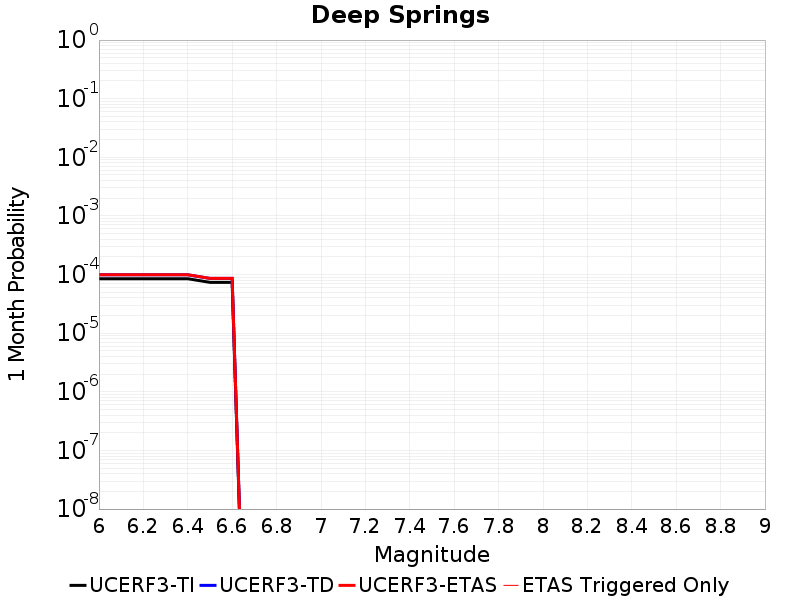 |  | 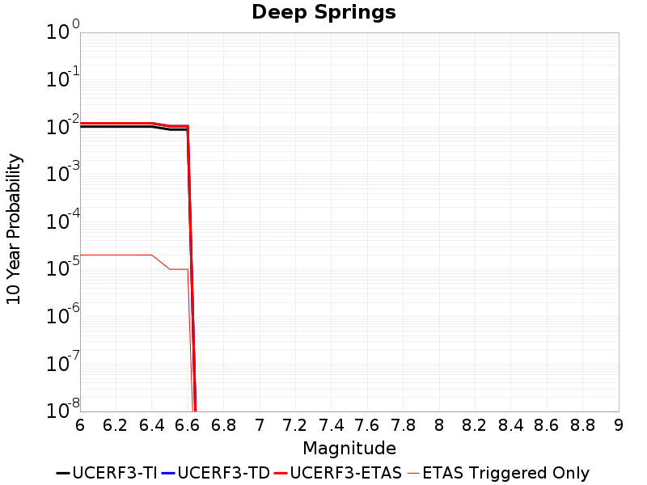 |

| Magnitude | 1 wk TI Prob | 1 wk TD Prob | 1 wk ETAS Prob | 1 wk ETAS/TD Gain | 1 wk ETAS Triggered Only | 1 mo TI Prob | 1 mo TD Prob | 1 mo ETAS Prob | 1 mo ETAS/TD Gain | 1 mo ETAS Triggered Only | 1 yr TI Prob | 1 yr TD Prob | 1 yr ETAS Prob | 1 yr ETAS/TD Gain | 1 yr ETAS Triggered Only | 10 yr TI Prob | 10 yr TD Prob | 10 yr ETAS Prob | 10 yr ETAS/TD Gain | 10 yr ETAS Triggered Only |
|-----|-----|-----|-----|-----|-----|-----|-----|-----|-----|-----|-----|-----|-----|-----|-----|-----|-----|-----|-----|-----|
| 6.0 | 1.9810619E-5 | 2.3138431E-5 | 2.3138431E-5 | 1.0 | 0.0 | 8.489989E-5 | 9.916381E-5 | 9.916381E-5 | 1.0 | 0.0 | 0.001033166 | 0.0012071595 | 0.0012071595 | 1.0 | 0.0 | 0.010283757 | 0.012055908 | 0.012075667 | 1.0016389 | 2.0E-5 |
| 6.1 | 1.9810619E-5 | 2.3138431E-5 | 2.3138431E-5 | 1.0 | 0.0 | 8.489989E-5 | 9.916381E-5 | 9.916381E-5 | 1.0 | 0.0 | 0.001033166 | 0.0012071595 | 0.0012071595 | 1.0 | 0.0 | 0.010283757 | 0.012055908 | 0.012075667 | 1.0016389 | 2.0E-5 |
| 6.2 | 1.9810619E-5 | 2.3138431E-5 | 2.3138431E-5 | 1.0 | 0.0 | 8.489989E-5 | 9.916381E-5 | 9.916381E-5 | 1.0 | 0.0 | 0.001033166 | 0.0012071595 | 0.0012071595 | 1.0 | 0.0 | 0.010283757 | 0.012055908 | 0.012075667 | 1.0016389 | 2.0E-5 |
| 6.3 | 1.9810619E-5 | 2.3138431E-5 | 2.3138431E-5 | 1.0 | 0.0 | 8.489989E-5 | 9.916381E-5 | 9.916381E-5 | 1.0 | 0.0 | 0.001033166 | 0.0012071595 | 0.0012071595 | 1.0 | 0.0 | 0.010283757 | 0.012055908 | 0.012075667 | 1.0016389 | 2.0E-5 |
| 6.4 | 1.9810619E-5 | 2.3138431E-5 | 2.3138431E-5 | 1.0 | 0.0 | 8.489989E-5 | 9.916381E-5 | 9.916381E-5 | 1.0 | 0.0 | 0.001033166 | 0.0012071595 | 0.0012071595 | 1.0 | 0.0 | 0.010283757 | 0.012055908 | 0.012075667 | 1.0016389 | 2.0E-5 |
| 6.5 | 1.7190405E-5 | 2.0072997E-5 | 2.0072997E-5 | 1.0 | 0.0 | 7.367108E-5 | 8.6027125E-5 | 8.6027125E-5 | 1.0 | 0.0 | 8.9657627E-4 | 0.00104738 | 0.00104738 | 1.0 | 0.0 | 0.008929676 | 0.010473766 | 0.010483662 | 1.0009447 | 1.0E-5 |
| 6.6 | 1.7190405E-5 | 2.0072997E-5 | 2.0072997E-5 | 1.0 | 0.0 | 7.367108E-5 | 8.6027125E-5 | 8.6027125E-5 | 1.0 | 0.0 | 8.9657627E-4 | 0.00104738 | 0.00104738 | 1.0 | 0.0 | 0.008929676 | 0.010473766 | 0.010483662 | 1.0009447 | 1.0E-5 |

## Kern Canyon (South Kern) 2011
*[(top)](#table-of-contents)*

| 1 Week | 1 Month | 1 Year | 10 Year |
|-----|-----|-----|-----|
|  | 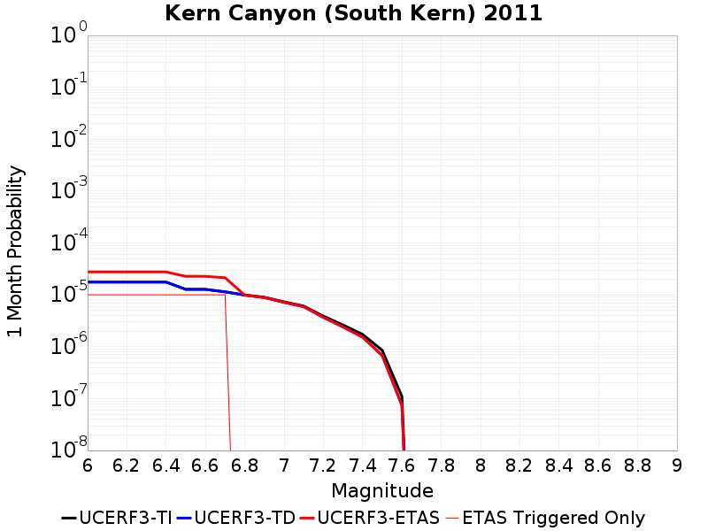 |  |  |

| Magnitude | 1 wk TI Prob | 1 wk TD Prob | 1 wk ETAS Prob | 1 wk ETAS/TD Gain | 1 wk ETAS Triggered Only | 1 mo TI Prob | 1 mo TD Prob | 1 mo ETAS Prob | 1 mo ETAS/TD Gain | 1 mo ETAS Triggered Only | 1 yr TI Prob | 1 yr TD Prob | 1 yr ETAS Prob | 1 yr ETAS/TD Gain | 1 yr ETAS Triggered Only | 10 yr TI Prob | 10 yr TD Prob | 10 yr ETAS Prob | 10 yr ETAS/TD Gain | 10 yr ETAS Triggered Only |
|-----|-----|-----|-----|-----|-----|-----|-----|-----|-----|-----|-----|-----|-----|-----|-----|-----|-----|-----|-----|-----|
| 6.0 | 4.105075E-6 | 4.114247E-6 | 1.4114206E-5 | 3.4305685 | 1.0E-5 | 1.7593058E-5 | 1.7632372E-5 | 2.7632195E-5 | 1.5671287 | 1.0E-5 | 2.1417443E-4 | 2.1465361E-4 | 2.3464933E-4 | 1.0931534 | 2.0E-5 | 0.0021396813 | 0.0021445267 | 0.0021644838 | 1.0093061 | 2.0E-5 |
| 6.1 | 4.105075E-6 | 4.114247E-6 | 1.4114206E-5 | 3.4305685 | 1.0E-5 | 1.7593058E-5 | 1.7632372E-5 | 2.7632195E-5 | 1.5671287 | 1.0E-5 | 2.1417443E-4 | 2.1465361E-4 | 2.3464933E-4 | 1.0931534 | 2.0E-5 | 0.0021396813 | 0.0021445267 | 0.0021644838 | 1.0093061 | 2.0E-5 |
| 6.2 | 4.105075E-6 | 4.114247E-6 | 1.4114206E-5 | 3.4305685 | 1.0E-5 | 1.7593058E-5 | 1.7632372E-5 | 2.7632195E-5 | 1.5671287 | 1.0E-5 | 2.1417443E-4 | 2.1465361E-4 | 2.3464933E-4 | 1.0931534 | 2.0E-5 | 0.0021396813 | 0.0021445267 | 0.0021644838 | 1.0093061 | 2.0E-5 |
| 6.3 | 4.105075E-6 | 4.114247E-6 | 1.4114206E-5 | 3.4305685 | 1.0E-5 | 1.7593058E-5 | 1.7632372E-5 | 2.7632195E-5 | 1.5671287 | 1.0E-5 | 2.1417443E-4 | 2.1465361E-4 | 2.3464933E-4 | 1.0931534 | 2.0E-5 | 0.0021396813 | 0.0021445267 | 0.0021644838 | 1.0093061 | 2.0E-5 |
| 6.4 | 4.105075E-6 | 4.114247E-6 | 1.4114206E-5 | 3.4305685 | 1.0E-5 | 1.7593058E-5 | 1.7632372E-5 | 2.7632195E-5 | 1.5671287 | 1.0E-5 | 2.1417443E-4 | 2.1465361E-4 | 2.3464933E-4 | 1.0931534 | 2.0E-5 | 0.0021396813 | 0.0021445267 | 0.0021644838 | 1.0093061 | 2.0E-5 |
| 6.5 | 2.9849807E-6 | 2.9735352E-6 | 1.2973505E-5 | 4.3629904 | 1.0E-5 | 1.2792712E-5 | 1.2743661E-5 | 2.2743534E-5 | 1.7846938 | 1.0E-5 | 1.5574014E-4 | 1.5514318E-4 | 1.7514007E-4 | 1.1288931 | 2.0E-5 | 0.0015563103 | 0.0015503638 | 0.0015703328 | 1.0128802 | 2.0E-5 |
| 6.6 | 2.9849807E-6 | 2.9735352E-6 | 1.2973505E-5 | 4.3629904 | 1.0E-5 | 1.2792712E-5 | 1.2743661E-5 | 2.2743534E-5 | 1.7846938 | 1.0E-5 | 1.5574014E-4 | 1.5514318E-4 | 1.7514007E-4 | 1.1288931 | 2.0E-5 | 0.0015563103 | 0.0015503638 | 0.0015703328 | 1.0128802 | 2.0E-5 |
| 6.7 | 2.6756725E-6 | 2.6585626E-6 | 1.2658536E-5 | 4.761421 | 1.0E-5 | 1.1467117E-5 | 1.139379E-5 | 2.1393676E-5 | 1.877661 | 1.0E-5 | 1.396032E-4 | 1.3871067E-4 | 1.587079E-4 | 1.144165 | 2.0E-5 | 0.0013951553 | 0.001386252 | 0.0014062242 | 1.0144074 | 2.0E-5 |
| 6.8 | 2.3283721E-6 | 2.3050786E-6 | 2.3050786E-6 | 1.0 | 0.0 | 9.9787E-6 | 9.878871E-6 | 9.878871E-6 | 1.0 | 0.0 | 1.214839E-4 | 1.202687E-4 | 1.302675E-4 | 1.0831372 | 1.0E-5 | 0.001214175 | 0.0012020436 | 0.0012120316 | 1.0083091 | 1.0E-5 |
| 6.9 | 2.0972677E-6 | 2.0699133E-6 | 2.0699133E-6 | 1.0 | 0.0 | 8.988259E-6 | 8.871028E-6 | 8.871028E-6 | 1.0 | 0.0 | 1.0942656E-4 | 1.0799947E-4 | 1.1799839E-4 | 1.0925831 | 1.0E-5 | 0.0010937268 | 0.0010794756 | 0.0010894649 | 1.0092537 | 1.0E-5 |
| 7.0 | 1.7132242E-6 | 1.6789287E-6 | 1.6789287E-6 | 1.0 | 0.0 | 7.3423685E-6 | 7.195389E-6 | 7.195389E-6 | 1.0 | 0.0 | 8.938967E-5 | 8.7600376E-5 | 8.7600376E-5 | 1.0 | 0.0 | 8.935372E-4 | 8.756623E-4 | 8.756623E-4 | 1.0 | 0.0 |
| 7.1 | 1.4215541E-6 | 1.3817629E-6 | 1.3817629E-6 | 1.0 | 0.0 | 6.0923603E-6 | 5.921828E-6 | 5.921828E-6 | 1.0 | 0.0 | 7.417196E-5 | 7.209589E-5 | 7.209589E-5 | 1.0 | 0.0 | 7.414721E-4 | 7.207278E-4 | 7.207278E-4 | 1.0 | 0.0 |
| 7.2 | 9.097853E-7 | 8.6050073E-7 | 8.6050073E-7 | 1.0 | 0.0 | 3.899074E-6 | 3.687855E-6 | 3.687855E-6 | 1.0 | 0.0 | 4.7470192E-5 | 4.489872E-5 | 4.489872E-5 | 1.0 | 0.0 | 4.7460053E-4 | 4.4889757E-4 | 4.4889757E-4 | 1.0 | 0.0 |
| 7.3 | 6.144169E-7 | 5.629058E-7 | 5.629058E-7 | 1.0 | 0.0 | 2.6332125E-6 | 2.4124513E-6 | 2.4124513E-6 | 1.0 | 0.0 | 3.205889E-5 | 2.9371202E-5 | 2.9371202E-5 | 1.0 | 0.0 | 3.2054266E-4 | 2.9367371E-4 | 2.9367371E-4 | 1.0 | 0.0 |
| 7.4 | 4.049844E-7 | 3.5734124E-7 | 3.5734124E-7 | 1.0 | 0.0 | 1.7356463E-6 | 1.5314615E-6 | 1.5314615E-6 | 1.0 | 0.0 | 2.1131287E-5 | 1.8645387E-5 | 1.8645387E-5 | 1.0 | 0.0 | 2.1129279E-4 | 1.8643847E-4 | 1.8643847E-4 | 1.0 | 0.0 |
| 7.5 | 1.9871162E-7 | 1.5833507E-7 | 1.5833507E-7 | 1.0 | 0.0 | 8.5162094E-7 | 6.785787E-7 | 6.785787E-7 | 1.0 | 0.0 | 1.0368436E-5 | 8.261665E-6 | 8.261665E-6 | 1.0 | 0.0 | 1.0367952E-4 | 8.261367E-5 | 8.261367E-5 | 1.0 | 0.0 |
| 7.6 | 2.572245E-8 | 1.7356639E-8 | 1.7356639E-8 | 1.0 | 0.0 | 1.10239064E-7 | 7.4385596E-8 | 7.4385596E-8 | 1.0 | 0.0 | 1.3421597E-6 | 9.056443E-7 | 9.056443E-7 | 1.0 | 0.0 | 1.3421517E-5 | 9.056411E-6 | 9.056411E-6 | 1.0 | 0.0 |

## Baker
*[(top)](#table-of-contents)*

| 1 Week | 1 Month | 1 Year | 10 Year |
|-----|-----|-----|-----|
|  | 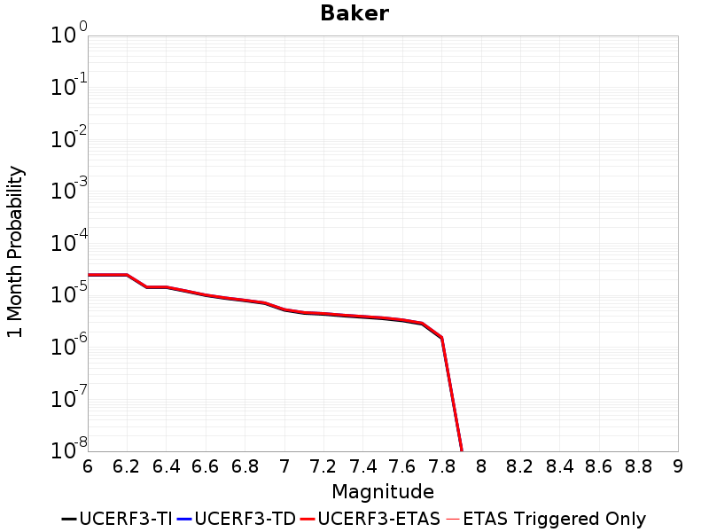 | 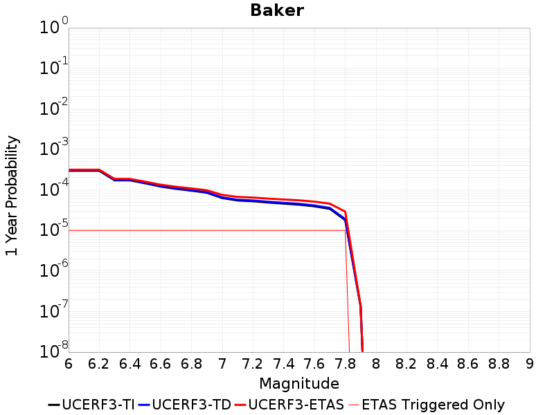 |  |

| Magnitude | 1 wk TI Prob | 1 wk TD Prob | 1 wk ETAS Prob | 1 wk ETAS/TD Gain | 1 wk ETAS Triggered Only | 1 mo TI Prob | 1 mo TD Prob | 1 mo ETAS Prob | 1 mo ETAS/TD Gain | 1 mo ETAS Triggered Only | 1 yr TI Prob | 1 yr TD Prob | 1 yr ETAS Prob | 1 yr ETAS/TD Gain | 1 yr ETAS Triggered Only | 10 yr TI Prob | 10 yr TD Prob | 10 yr ETAS Prob | 10 yr ETAS/TD Gain | 10 yr ETAS Triggered Only |
|-----|-----|-----|-----|-----|-----|-----|-----|-----|-----|-----|-----|-----|-----|-----|-----|-----|-----|-----|-----|-----|
| 6.0 | 5.695525E-6 | 5.8358028E-6 | 5.8358028E-6 | 1.0 | 0.0 | 2.4409164E-5 | 2.5010366E-5 | 2.5010366E-5 | 1.0 | 0.0 | 2.9714106E-4 | 3.0446268E-4 | 3.144596E-4 | 1.0328348 | 1.0E-5 | 0.0029674405 | 0.003040851 | 0.0030607902 | 1.0065571 | 2.0E-5 |
| 6.1 | 5.695525E-6 | 5.8358028E-6 | 5.8358028E-6 | 1.0 | 0.0 | 2.4409164E-5 | 2.5010366E-5 | 2.5010366E-5 | 1.0 | 0.0 | 2.9714106E-4 | 3.0446268E-4 | 3.144596E-4 | 1.0328348 | 1.0E-5 | 0.0029674405 | 0.003040851 | 0.0030607902 | 1.0065571 | 2.0E-5 |
| 6.2 | 5.695525E-6 | 5.8358028E-6 | 5.8358028E-6 | 1.0 | 0.0 | 2.4409164E-5 | 2.5010366E-5 | 2.5010366E-5 | 1.0 | 0.0 | 2.9714106E-4 | 3.0446268E-4 | 3.144596E-4 | 1.0328348 | 1.0E-5 | 0.0029674405 | 0.003040851 | 0.0030607902 | 1.0065571 | 2.0E-5 |
| 6.3 | 3.2995713E-6 | 3.384252E-6 | 3.384252E-6 | 1.0 | 0.0 | 1.4140943E-5 | 1.450386E-5 | 1.450386E-5 | 1.0 | 0.0 | 1.7215237E-4 | 1.7657065E-4 | 1.865689E-4 | 1.0566245 | 1.0E-5 | 0.0017201907 | 0.0017643508 | 0.0017843154 | 1.0113156 | 2.0E-5 |
| 6.4 | 3.2995713E-6 | 3.384252E-6 | 3.384252E-6 | 1.0 | 0.0 | 1.4140943E-5 | 1.450386E-5 | 1.450386E-5 | 1.0 | 0.0 | 1.7215237E-4 | 1.7657065E-4 | 1.865689E-4 | 1.0566245 | 1.0E-5 | 0.0017201907 | 0.0017643508 | 0.0017843154 | 1.0113156 | 2.0E-5 |
| 6.5 | 2.782202E-6 | 2.8563536E-6 | 2.8563536E-6 | 1.0 | 0.0 | 1.1923668E-5 | 1.224146E-5 | 1.224146E-5 | 1.0 | 0.0 | 1.4516099E-4 | 1.4902992E-4 | 1.5902842E-4 | 1.0670906 | 1.0E-5 | 0.001450662 | 0.0014893325 | 0.0015093028 | 1.0134088 | 2.0E-5 |
| 6.6 | 2.3163404E-6 | 2.3813711E-6 | 2.3813711E-6 | 1.0 | 0.0 | 9.927136E-6 | 1.02058375E-5 | 1.02058375E-5 | 1.0 | 0.0 | 1.20856166E-4 | 1.2424919E-4 | 1.3424795E-4 | 1.0804734 | 1.0E-5 | 0.0012079047 | 0.0012418175 | 0.0012617926 | 1.0160854 | 2.0E-5 |
| 6.7 | 2.037056E-6 | 2.0969164E-6 | 2.0969164E-6 | 1.0 | 0.0 | 8.7302105E-6 | 8.986754E-6 | 8.986754E-6 | 1.0 | 0.0 | 1.0628513E-4 | 1.0940841E-4 | 1.1940731E-4 | 1.0913906 | 1.0E-5 | 0.0010623431 | 0.0010935615 | 0.0011135397 | 1.0182688 | 2.0E-5 |
| 6.8 | 1.8356744E-6 | 1.8919201E-6 | 1.8919201E-6 | 1.0 | 0.0 | 7.867153E-6 | 8.108204E-6 | 8.108204E-6 | 1.0 | 0.0 | 9.577837E-5 | 9.8713055E-5 | 1.0871207E-4 | 1.1012937 | 1.0E-5 | 9.57371E-4 | 9.867061E-4 | 0.0010066864 | 1.0202495 | 2.0E-5 |
| 6.9 | 1.6310546E-6 | 1.6835733E-6 | 1.6835733E-6 | 1.0 | 0.0 | 6.9902153E-6 | 7.2152943E-6 | 7.2152943E-6 | 1.0 | 0.0 | 8.510255E-5 | 8.784278E-5 | 9.7841905E-5 | 1.1138297 | 1.0E-5 | 8.5069967E-4 | 8.780919E-4 | 8.980743E-4 | 1.0227567 | 2.0E-5 |
| 7.0 | 1.2058036E-6 | 1.2511841E-6 | 1.2511841E-6 | 1.0 | 0.0 | 5.1677193E-6 | 5.3622066E-6 | 5.3622066E-6 | 1.0 | 0.0 | 6.291517E-5 | 6.528293E-5 | 7.528228E-5 | 1.1531694 | 1.0E-5 | 6.289736E-4 | 6.526399E-4 | 6.7262683E-4 | 1.0306247 | 2.0E-5 |
| 7.1 | 1.052382E-6 | 1.0954628E-6 | 1.0954628E-6 | 1.0 | 0.0 | 4.5102006E-6 | 4.694832E-6 | 4.694832E-6 | 1.0 | 0.0 | 5.491031E-5 | 5.7158093E-5 | 6.715752E-5 | 1.1749433 | 1.0E-5 | 5.4896745E-4 | 5.714348E-4 | 5.9142336E-4 | 1.0349796 | 2.0E-5 |
| 7.2 | 1.0067454E-6 | 1.0490678E-6 | 1.0490678E-6 | 1.0 | 0.0 | 4.3146156E-6 | 4.4959975E-6 | 4.4959975E-6 | 1.0 | 0.0 | 5.252918E-5 | 5.4737404E-5 | 6.473686E-5 | 1.1826805 | 1.0E-5 | 5.251676E-4 | 5.472401E-4 | 5.672291E-4 | 1.036527 | 2.0E-5 |
| 7.3 | 9.3596316E-7 | 9.770608E-7 | 9.770608E-7 | 1.0 | 0.0 | 4.0112645E-6 | 4.187397E-6 | 4.187397E-6 | 1.0 | 0.0 | 4.8836053E-5 | 5.098037E-5 | 6.097986E-5 | 1.196144 | 1.0E-5 | 4.8825322E-4 | 5.096875E-4 | 5.296773E-4 | 1.0392197 | 2.0E-5 |
| 7.4 | 8.8117395E-7 | 9.210464E-7 | 9.210464E-7 | 1.0 | 0.0 | 3.7764542E-6 | 3.9473357E-6 | 3.9473357E-6 | 1.0 | 0.0 | 4.5977362E-5 | 4.8057762E-5 | 5.805728E-5 | 1.2080729 | 1.0E-5 | 4.596785E-4 | 4.8047444E-4 | 5.004648E-4 | 1.0416055 | 2.0E-5 |
| 7.5 | 8.292386E-7 | 8.6773014E-7 | 8.6773014E-7 | 1.0 | 0.0 | 3.5538749E-6 | 3.7188381E-6 | 3.7188381E-6 | 1.0 | 0.0 | 4.326757E-5 | 4.527592E-5 | 5.527547E-5 | 1.220858 | 1.0E-5 | 4.3259145E-4 | 4.526677E-4 | 4.7265866E-4 | 1.0441625 | 2.0E-5 |
| 7.6 | 7.553842E-7 | 7.9170263E-7 | 7.9170263E-7 | 1.0 | 0.0 | 3.2373566E-6 | 3.3930069E-6 | 3.3930069E-6 | 1.0 | 0.0 | 3.9414106E-5 | 4.1309082E-5 | 5.130867E-5 | 1.2420675 | 1.0E-5 | 3.9407116E-4 | 4.1301476E-4 | 4.3300647E-4 | 1.0484045 | 2.0E-5 |
| 7.7 | 6.5285366E-7 | 6.855098E-7 | 6.855098E-7 | 1.0 | 0.0 | 2.797941E-6 | 2.937896E-6 | 2.937896E-6 | 1.0 | 0.0 | 3.40644E-5 | 3.5768302E-5 | 4.5767945E-5 | 1.2795671 | 1.0E-5 | 3.405918E-4 | 3.5762612E-4 | 3.7761897E-4 | 1.0559043 | 2.0E-5 |
| 7.8 | 3.4586725E-7 | 3.6496132E-7 | 3.6496132E-7 | 1.0 | 0.0 | 1.4822873E-6 | 1.5641191E-6 | 1.5641191E-6 | 1.0 | 0.0 | 1.80467E-5 | 1.9042987E-5 | 2.9042798E-5 | 1.5251176 | 1.0E-5 | 1.8045233E-4 | 1.90414E-4 | 2.0041209E-4 | 1.0525072 | 1.0E-5 |
| 7.9 | 2.5591178E-9 | 2.6704472E-9 | 2.6704472E-9 | 1.0 | 0.0 | 1.0967647E-8 | 1.1444774E-8 | 1.1444774E-8 | 1.0 | 0.0 | 1.335311E-7 | 1.3934012E-7 | 1.3934012E-7 | 1.0 | 0.0 | 1.3353102E-6 | 1.3934012E-6 | 1.3934012E-6 | 1.0 | 0.0 |

## Garlic Springs
*[(top)](#table-of-contents)*

| 1 Week | 1 Month | 1 Year | 10 Year |
|-----|-----|-----|-----|
| 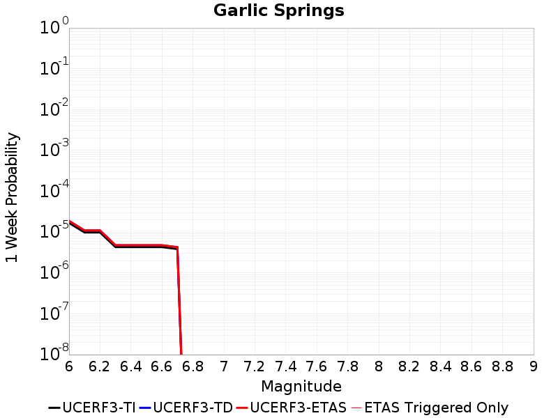 |  |  | 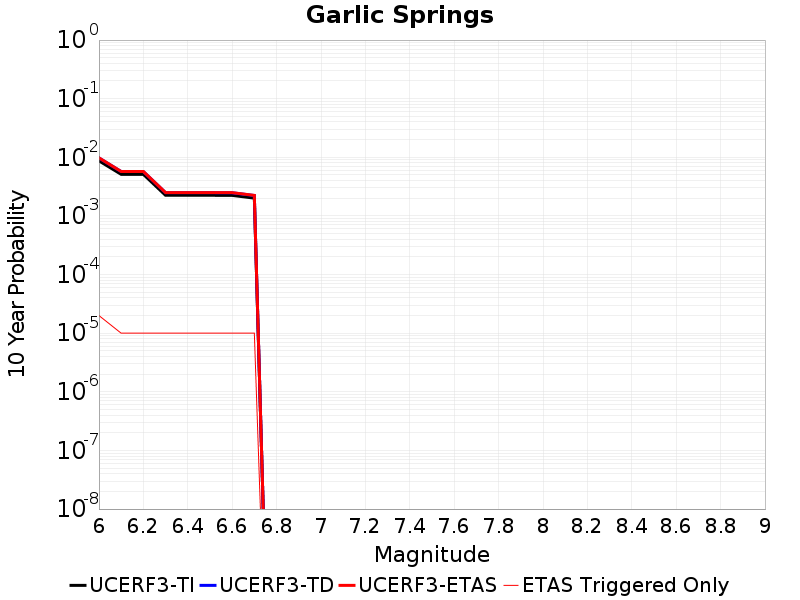 |

| Magnitude | 1 wk TI Prob | 1 wk TD Prob | 1 wk ETAS Prob | 1 wk ETAS/TD Gain | 1 wk ETAS Triggered Only | 1 mo TI Prob | 1 mo TD Prob | 1 mo ETAS Prob | 1 mo ETAS/TD Gain | 1 mo ETAS Triggered Only | 1 yr TI Prob | 1 yr TD Prob | 1 yr ETAS Prob | 1 yr ETAS/TD Gain | 1 yr ETAS Triggered Only | 10 yr TI Prob | 10 yr TD Prob | 10 yr ETAS Prob | 10 yr ETAS/TD Gain | 10 yr ETAS Triggered Only |
|-----|-----|-----|-----|-----|-----|-----|-----|-----|-----|-----|-----|-----|-----|-----|-----|-----|-----|-----|-----|-----|
| 6.0 | 1.6760017E-5 | 1.8792045E-5 | 1.8792045E-5 | 1.0 | 0.0 | 7.182667E-5 | 8.0535516E-5 | 9.053471E-5 | 1.1241589 | 1.0E-5 | 8.7413884E-4 | 9.801964E-4 | 0.0010001768 | 1.0203841 | 2.0E-5 | 0.008707083 | 0.009770295 | 0.009790099 | 1.002027 | 2.0E-5 |
| 6.1 | 9.852767E-6 | 1.0981987E-5 | 1.0981987E-5 | 1.0 | 0.0 | 4.222546E-5 | 4.7065212E-5 | 5.706474E-5 | 1.2124611 | 1.0E-5 | 5.139737E-4 | 5.7293935E-4 | 5.829336E-4 | 1.0174439 | 1.0E-5 | 0.005127866 | 0.0057215914 | 0.005731534 | 1.0017377 | 1.0E-5 |
| 6.2 | 9.852767E-6 | 1.0981987E-5 | 1.0981987E-5 | 1.0 | 0.0 | 4.222546E-5 | 4.7065212E-5 | 5.706474E-5 | 1.2124611 | 1.0E-5 | 5.139737E-4 | 5.7293935E-4 | 5.829336E-4 | 1.0174439 | 1.0E-5 | 0.005127866 | 0.0057215914 | 0.005731534 | 1.0017377 | 1.0E-5 |
| 6.3 | 4.3167724E-6 | 4.781463E-6 | 4.781463E-6 | 1.0 | 0.0 | 1.8500323E-5 | 2.0491952E-5 | 3.0491748E-5 | 1.4879864 | 1.0E-5 | 2.2521814E-4 | 2.4948403E-4 | 2.5948155E-4 | 1.0400727 | 1.0E-5 | 0.0022499003 | 0.0024943012 | 0.002504276 | 1.0039991 | 1.0E-5 |
| 6.4 | 4.3167724E-6 | 4.781463E-6 | 4.781463E-6 | 1.0 | 0.0 | 1.8500323E-5 | 2.0491952E-5 | 3.0491748E-5 | 1.4879864 | 1.0E-5 | 2.2521814E-4 | 2.4948403E-4 | 2.5948155E-4 | 1.0400727 | 1.0E-5 | 0.0022499003 | 0.0024943012 | 0.002504276 | 1.0039991 | 1.0E-5 |
| 6.5 | 4.3167724E-6 | 4.781463E-6 | 4.781463E-6 | 1.0 | 0.0 | 1.8500323E-5 | 2.0491952E-5 | 3.0491748E-5 | 1.4879864 | 1.0E-5 | 2.2521814E-4 | 2.4948403E-4 | 2.5948155E-4 | 1.0400727 | 1.0E-5 | 0.0022499003 | 0.0024943012 | 0.002504276 | 1.0039991 | 1.0E-5 |
| 6.6 | 4.301311E-6 | 4.764319E-6 | 4.764319E-6 | 1.0 | 0.0 | 1.8434059E-5 | 2.041848E-5 | 3.0418276E-5 | 1.4897424 | 1.0E-5 | 2.2441156E-4 | 2.485897E-4 | 2.585872E-4 | 1.0402169 | 1.0E-5 | 0.0022418506 | 0.0024853777 | 0.0024953529 | 1.0040135 | 1.0E-5 |
| 6.7 | 3.8599724E-6 | 4.2741194E-6 | 4.2741194E-6 | 1.0 | 0.0 | 1.6542634E-5 | 1.8317656E-5 | 2.8317472E-5 | 1.5459114 | 1.0E-5 | 2.0138794E-4 | 2.2301746E-4 | 2.3301522E-4 | 1.0448295 | 1.0E-5 | 0.0020120554 | 0.0022301746 | 0.0022401523 | 1.0044739 | 1.0E-5 |

## Hartley Springs 2011 CFM
*[(top)](#table-of-contents)*

| 1 Week | 1 Month | 1 Year | 10 Year |
|-----|-----|-----|-----|
|  |  | 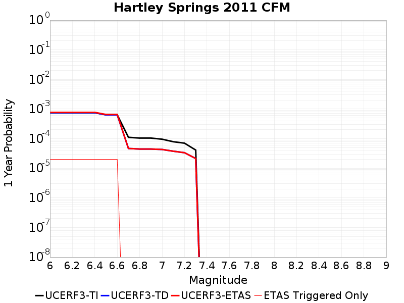 |  |

| Magnitude | 1 wk TI Prob | 1 wk TD Prob | 1 wk ETAS Prob | 1 wk ETAS/TD Gain | 1 wk ETAS Triggered Only | 1 mo TI Prob | 1 mo TD Prob | 1 mo ETAS Prob | 1 mo ETAS/TD Gain | 1 mo ETAS Triggered Only | 1 yr TI Prob | 1 yr TD Prob | 1 yr ETAS Prob | 1 yr ETAS/TD Gain | 1 yr ETAS Triggered Only | 10 yr TI Prob | 10 yr TD Prob | 10 yr ETAS Prob | 10 yr ETAS/TD Gain | 10 yr ETAS Triggered Only |
|-----|-----|-----|-----|-----|-----|-----|-----|-----|-----|-----|-----|-----|-----|-----|-----|-----|-----|-----|-----|-----|
| 6.0 | 1.4352418E-5 | 1.4446988E-5 | 1.4446988E-5 | 1.0 | 0.0 | 6.1508916E-5 | 6.191512E-5 | 6.191512E-5 | 1.0 | 0.0 | 7.486137E-4 | 7.537205E-4 | 7.737054E-4 | 1.026515 | 2.0E-5 | 0.007460968 | 0.0075277863 | 0.0075476356 | 1.0026368 | 2.0E-5 |
| 6.1 | 1.4352418E-5 | 1.4446988E-5 | 1.4446988E-5 | 1.0 | 0.0 | 6.1508916E-5 | 6.191512E-5 | 6.191512E-5 | 1.0 | 0.0 | 7.486137E-4 | 7.537205E-4 | 7.737054E-4 | 1.026515 | 2.0E-5 | 0.007460968 | 0.0075277863 | 0.0075476356 | 1.0026368 | 2.0E-5 |
| 6.2 | 1.4352418E-5 | 1.4446988E-5 | 1.4446988E-5 | 1.0 | 0.0 | 6.1508916E-5 | 6.191512E-5 | 6.191512E-5 | 1.0 | 0.0 | 7.486137E-4 | 7.537205E-4 | 7.737054E-4 | 1.026515 | 2.0E-5 | 0.007460968 | 0.0075277863 | 0.0075476356 | 1.0026368 | 2.0E-5 |
| 6.3 | 1.4352418E-5 | 1.4446988E-5 | 1.4446988E-5 | 1.0 | 0.0 | 6.1508916E-5 | 6.191512E-5 | 6.191512E-5 | 1.0 | 0.0 | 7.486137E-4 | 7.537205E-4 | 7.737054E-4 | 1.026515 | 2.0E-5 | 0.007460968 | 0.0075277863 | 0.0075476356 | 1.0026368 | 2.0E-5 |
| 6.4 | 1.4352418E-5 | 1.4446988E-5 | 1.4446988E-5 | 1.0 | 0.0 | 6.1508916E-5 | 6.191512E-5 | 6.191512E-5 | 1.0 | 0.0 | 7.486137E-4 | 7.537205E-4 | 7.737054E-4 | 1.026515 | 2.0E-5 | 0.007460968 | 0.0075277863 | 0.0075476356 | 1.0026368 | 2.0E-5 |
| 6.5 | 1.2279858E-5 | 1.2144205E-5 | 1.2144205E-5 | 1.0 | 0.0 | 5.26269E-5 | 5.204645E-5 | 5.204645E-5 | 1.0 | 0.0 | 6.4054417E-4 | 6.336397E-4 | 6.5362704E-4 | 1.0315437 | 2.0E-5 | 0.0063870098 | 0.0063338648 | 0.006353738 | 1.0031376 | 2.0E-5 |
| 6.6 | 1.2279858E-5 | 1.2144205E-5 | 1.2144205E-5 | 1.0 | 0.0 | 5.26269E-5 | 5.204645E-5 | 5.204645E-5 | 1.0 | 0.0 | 6.4054417E-4 | 6.336397E-4 | 6.5362704E-4 | 1.0315437 | 2.0E-5 | 0.0063870098 | 0.0063338648 | 0.006353738 | 1.0031376 | 2.0E-5 |
| 6.7 | 2.1282601E-6 | 8.9244685E-7 | 8.9244685E-7 | 1.0 | 0.0 | 9.121083E-6 | 3.824768E-6 | 3.824768E-6 | 1.0 | 0.0 | 1.11043526E-4 | 4.6565812E-5 | 4.6565812E-5 | 1.0 | 0.0 | 0.0011098806 | 4.65586E-4 | 4.65586E-4 | 1.0 | 0.0 |
| 6.8 | 2.00516E-6 | 8.546053E-7 | 8.546053E-7 | 1.0 | 0.0 | 8.593515E-6 | 3.6625902E-6 | 3.6625902E-6 | 1.0 | 0.0 | 1.04621024E-4 | 4.4591383E-5 | 4.4591383E-5 | 1.0 | 0.0 | 0.0010457177 | 4.4584958E-4 | 4.4584958E-4 | 1.0 | 0.0 |
| 6.9 | 2.00516E-6 | 8.546053E-7 | 8.546053E-7 | 1.0 | 0.0 | 8.593515E-6 | 3.6625902E-6 | 3.6625902E-6 | 1.0 | 0.0 | 1.04621024E-4 | 4.4591383E-5 | 4.4591383E-5 | 1.0 | 0.0 | 0.0010457177 | 4.4584958E-4 | 4.4584958E-4 | 1.0 | 0.0 |
| 7.0 | 1.8366732E-6 | 8.2643913E-7 | 8.2643913E-7 | 1.0 | 0.0 | 7.871433E-6 | 3.5418786E-6 | 3.5418786E-6 | 1.0 | 0.0 | 9.583048E-5 | 4.3121774E-5 | 4.3121774E-5 | 1.0 | 0.0 | 9.5789164E-4 | 4.3115922E-4 | 4.3115922E-4 | 1.0 | 0.0 |
| 7.1 | 1.5097997E-6 | 7.2141904E-7 | 7.2141904E-7 | 1.0 | 0.0 | 6.470554E-6 | 3.0917936E-6 | 3.0917936E-6 | 1.0 | 0.0 | 7.877615E-5 | 3.764218E-5 | 3.764218E-5 | 1.0 | 0.0 | 7.874823E-4 | 3.7638185E-4 | 3.7638185E-4 | 1.0 | 0.0 |
| 7.2 | 1.3490993E-6 | 6.427777E-7 | 6.427777E-7 | 1.0 | 0.0 | 5.7818415E-6 | 2.75476E-6 | 2.75476E-6 | 1.0 | 0.0 | 7.0391645E-5 | 3.3538923E-5 | 3.3538923E-5 | 1.0 | 0.0 | 7.0369354E-4 | 3.3536163E-4 | 3.3536163E-4 | 1.0 | 0.0 |
| 7.3 | 7.900015E-7 | 4.0945625E-7 | 4.0945625E-7 | 1.0 | 0.0 | 3.3857161E-6 | 1.7548125E-6 | 1.7548125E-6 | 1.0 | 0.0 | 4.1220315E-5 | 2.1364842E-5 | 2.1364842E-5 | 1.0 | 0.0 | 4.121267E-4 | 2.1364843E-4 | 2.1364843E-4 | 1.0 | 0.0 |

## Elsinore (Glen Ivy) rev
*[(top)](#table-of-contents)*

| 1 Week | 1 Month | 1 Year | 10 Year |
|-----|-----|-----|-----|
|  |  |  | 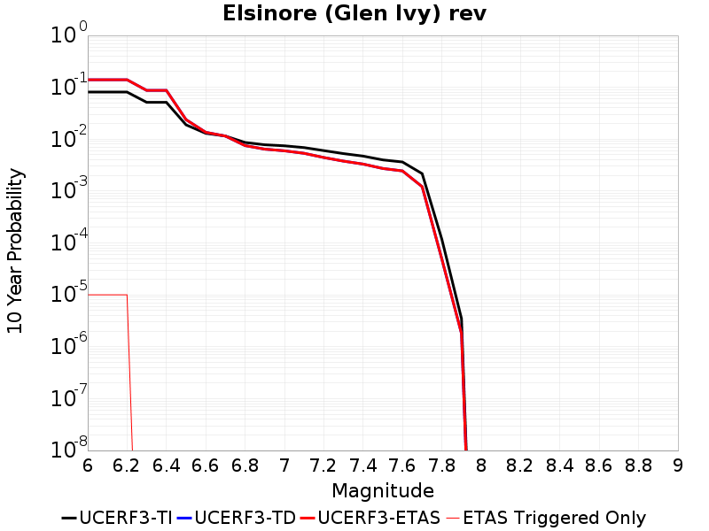 |

| Magnitude | 1 wk TI Prob | 1 wk TD Prob | 1 wk ETAS Prob | 1 wk ETAS/TD Gain | 1 wk ETAS Triggered Only | 1 mo TI Prob | 1 mo TD Prob | 1 mo ETAS Prob | 1 mo ETAS/TD Gain | 1 mo ETAS Triggered Only | 1 yr TI Prob | 1 yr TD Prob | 1 yr ETAS Prob | 1 yr ETAS/TD Gain | 1 yr ETAS Triggered Only | 10 yr TI Prob | 10 yr TD Prob | 10 yr ETAS Prob | 10 yr ETAS/TD Gain | 10 yr ETAS Triggered Only |
|-----|-----|-----|-----|-----|-----|-----|-----|-----|-----|-----|-----|-----|-----|-----|-----|-----|-----|-----|-----|-----|
| 6.0 | 1.6204086E-4 | 2.9455664E-4 | 2.9455664E-4 | 1.0 | 0.0 | 6.94276E-4 | 0.0012619225 | 0.0012719099 | 1.0079144 | 1.0E-5 | 0.008420097 | 0.015277434 | 0.015287281 | 1.0006446 | 1.0E-5 | 0.081081145 | 0.14008205 | 0.14009064 | 1.0000614 | 1.0E-5 |
| 6.1 | 1.6204086E-4 | 2.9455664E-4 | 2.9455664E-4 | 1.0 | 0.0 | 6.94276E-4 | 0.0012619225 | 0.0012719099 | 1.0079144 | 1.0E-5 | 0.008420097 | 0.015277434 | 0.015287281 | 1.0006446 | 1.0E-5 | 0.081081145 | 0.14008205 | 0.14009064 | 1.0000614 | 1.0E-5 |
| 6.2 | 1.6204086E-4 | 2.9455664E-4 | 2.9455664E-4 | 1.0 | 0.0 | 6.94276E-4 | 0.0012619225 | 0.0012719099 | 1.0079144 | 1.0E-5 | 0.008420097 | 0.015277434 | 0.015287281 | 1.0006446 | 1.0E-5 | 0.081081145 | 0.14008205 | 0.14009064 | 1.0000614 | 1.0E-5 |
| 6.3 | 1.0111737E-4 | 1.7752488E-4 | 1.7752488E-4 | 1.0 | 0.0 | 4.332882E-4 | 7.6071644E-4 | 7.6071644E-4 | 1.0 | 0.0 | 0.005262531 | 0.009243195 | 0.009243195 | 1.0 | 0.0 | 0.0513964 | 0.087206095 | 0.087206095 | 1.0 | 0.0 |
| 6.4 | 1.0111737E-4 | 1.7752488E-4 | 1.7752488E-4 | 1.0 | 0.0 | 4.332882E-4 | 7.6071644E-4 | 7.6071644E-4 | 1.0 | 0.0 | 0.005262531 | 0.009243195 | 0.009243195 | 1.0 | 0.0 | 0.0513964 | 0.087206095 | 0.087206095 | 1.0 | 0.0 |
| 6.5 | 3.6624708E-5 | 4.6515237E-5 | 4.6515237E-5 | 1.0 | 0.0 | 1.569536E-4 | 1.9933784E-4 | 1.9933784E-4 | 1.0 | 0.0 | 0.001909235 | 0.002424599 | 0.002424599 | 1.0 | 0.0 | 0.01892915 | 0.023834571 | 0.023834571 | 1.0 | 0.0 |
| 6.6 | 2.5051324E-5 | 2.6226282E-5 | 2.6226282E-5 | 1.0 | 0.0 | 1.073584E-4 | 1.1239376E-4 | 1.1239376E-4 | 1.0 | 0.0 | 0.0013063047 | 0.0013675799 | 0.0013675799 | 1.0 | 0.0 | 0.012986525 | 0.013606842 | 0.013606842 | 1.0 | 0.0 |
| 6.7 | 2.2189772E-5 | 2.213597E-5 | 2.213597E-5 | 1.0 | 0.0 | 9.509556E-5 | 9.4865194E-5 | 9.4865194E-5 | 1.0 | 0.0 | 0.0011571734 | 0.0011544083 | 0.0011544083 | 1.0 | 0.0 | 0.011511663 | 0.011500106 | 0.011500106 | 1.0 | 0.0 |
| 6.8 | 1.6654378E-5 | 1.4476734E-5 | 1.4476734E-5 | 1.0 | 0.0 | 7.137396E-5 | 6.20417E-5 | 6.20417E-5 | 1.0 | 0.0 | 8.686314E-4 | 7.5510103E-4 | 7.5510103E-4 | 1.0 | 0.0 | 0.008652439 | 0.00753119 | 0.00753119 | 1.0 | 0.0 |
| 6.9 | 1.5042909E-5 | 1.2365701E-5 | 1.2365701E-5 | 1.0 | 0.0 | 6.446802E-5 | 5.29948E-5 | 5.29948E-5 | 1.0 | 0.0 | 7.8461546E-4 | 6.450239E-4 | 6.450239E-4 | 1.0 | 0.0 | 0.007818509 | 0.00643613 | 0.00643613 | 1.0 | 0.0 |
| 7.0 | 1.4361385E-5 | 1.1482854E-5 | 1.1482854E-5 | 1.0 | 0.0 | 6.154734E-5 | 4.9211318E-5 | 4.9211318E-5 | 1.0 | 0.0 | 7.490812E-4 | 5.9898605E-4 | 5.9898605E-4 | 1.0 | 0.0 | 0.007465612 | 0.0059781023 | 0.0059781023 | 1.0 | 0.0 |
| 7.1 | 1.3265571E-5 | 1.0273604E-5 | 1.0273604E-5 | 1.0 | 0.0 | 5.6851208E-5 | 4.4029002E-5 | 4.4029002E-5 | 1.0 | 0.0 | 6.919436E-4 | 5.359238E-4 | 5.359238E-4 | 1.0 | 0.0 | 0.006897931 | 0.0053498023 | 0.0053498023 | 1.0 | 0.0 |
| 7.2 | 1.1596403E-5 | 8.529703E-6 | 8.529703E-6 | 1.0 | 0.0 | 4.9697923E-5 | 3.6555368E-5 | 3.6555368E-5 | 1.0 | 0.0 | 6.049042E-4 | 4.4497242E-4 | 4.4497242E-4 | 1.0 | 0.0 | 0.006032603 | 0.0044422266 | 0.0044422266 | 1.0 | 0.0 |
| 7.3 | 1.0150827E-5 | 7.2599837E-6 | 7.2599837E-6 | 1.0 | 0.0 | 4.3502816E-5 | 3.1113854E-5 | 3.1113854E-5 | 1.0 | 0.0 | 5.2951806E-4 | 3.7874674E-4 | 3.7874674E-4 | 1.0 | 0.0 | 0.005282581 | 0.0037814202 | 0.0037814202 | 1.0 | 0.0 |
| 7.4 | 9.080705E-6 | 6.3685047E-6 | 6.3685047E-6 | 1.0 | 0.0 | 3.8916725E-5 | 2.7293314E-5 | 2.7293314E-5 | 1.0 | 0.0 | 4.7370812E-4 | 3.322468E-4 | 3.322468E-4 | 1.0 | 0.0 | 0.004726996 | 0.0033176553 | 0.0033176553 | 1.0 | 0.0 |
| 7.5 | 7.671649E-6 | 5.238781E-6 | 5.238781E-6 | 1.0 | 0.0 | 3.287808E-5 | 2.2451732E-5 | 2.2451732E-5 | 1.0 | 0.0 | 4.0021708E-4 | 2.733168E-4 | 2.733168E-4 | 1.0 | 0.0 | 0.0039949706 | 0.0027299323 | 0.0027299323 | 1.0 | 0.0 |
| 7.6 | 6.990086E-6 | 4.6992045E-6 | 4.6992045E-6 | 1.0 | 0.0 | 2.9957167E-5 | 2.0139298E-5 | 2.0139298E-5 | 1.0 | 0.0 | 3.6466747E-4 | 2.4516953E-4 | 2.4516953E-4 | 1.0 | 0.0 | 0.0036406964 | 0.0024491074 | 0.0024491074 | 1.0 | 0.0 |
| 7.7 | 4.163505E-6 | 2.336128E-6 | 2.336128E-6 | 1.0 | 0.0 | 1.7843471E-5 | 1.0011944E-5 | 1.0011944E-5 | 1.0 | 0.0 | 2.172226E-4 | 1.21889345E-4 | 1.21889345E-4 | 1.0 | 0.0 | 0.0021701038 | 0.0012182983 | 0.0012182983 | 1.0 | 0.0 |
| 7.8 | 2.2692414E-7 | 9.4087696E-8 | 9.4087696E-8 | 1.0 | 0.0 | 9.725317E-7 | 4.0323295E-7 | 4.0323295E-7 | 1.0 | 0.0 | 1.1840509E-5 | 4.9093533E-6 | 4.9093533E-6 | 1.0 | 0.0 | 1.1839878E-4 | 4.9092778E-5 | 4.9092778E-5 | 1.0 | 0.0 |
| 7.9 | 6.676829E-9 | 3.4460004E-9 | 3.4460004E-9 | 1.0 | 0.0 | 2.861498E-8 | 1.4768574E-8 | 1.4768574E-8 | 1.0 | 0.0 | 3.4838732E-7 | 1.7980737E-7 | 1.7980737E-7 | 1.0 | 0.0 | 3.4838679E-6 | 1.7980724E-6 | 1.7980724E-6 | 1.0 | 0.0 |

## Bicycle Lake
*[(top)](#table-of-contents)*

| 1 Week | 1 Month | 1 Year | 10 Year |
|-----|-----|-----|-----|
| 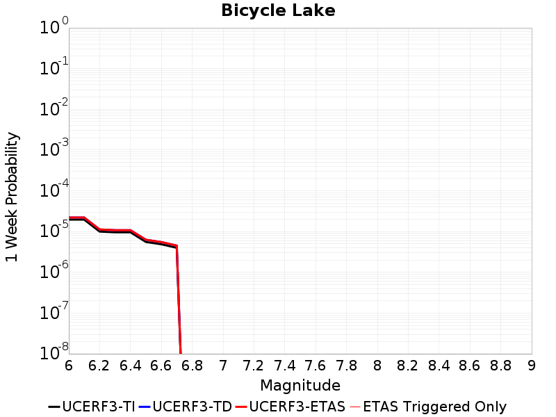 | 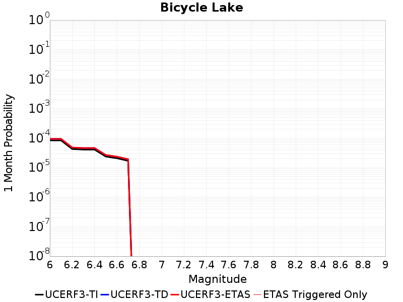 | 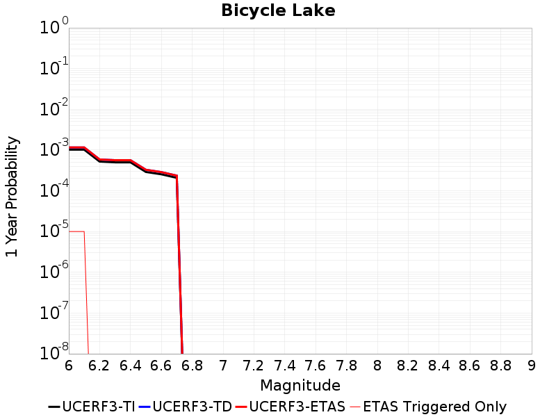 | 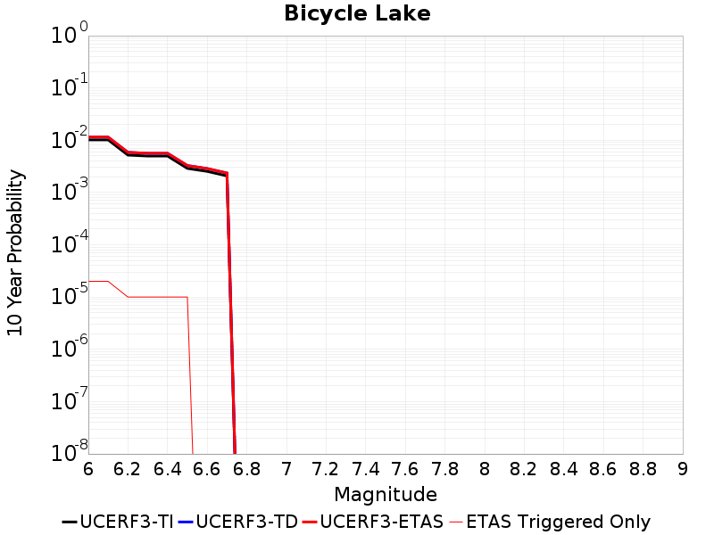 |

| Magnitude | 1 wk TI Prob | 1 wk TD Prob | 1 wk ETAS Prob | 1 wk ETAS/TD Gain | 1 wk ETAS Triggered Only | 1 mo TI Prob | 1 mo TD Prob | 1 mo ETAS Prob | 1 mo ETAS/TD Gain | 1 mo ETAS Triggered Only | 1 yr TI Prob | 1 yr TD Prob | 1 yr ETAS Prob | 1 yr ETAS/TD Gain | 1 yr ETAS Triggered Only | 10 yr TI Prob | 10 yr TD Prob | 10 yr ETAS Prob | 10 yr ETAS/TD Gain | 10 yr ETAS Triggered Only |
|-----|-----|-----|-----|-----|-----|-----|-----|-----|-----|-----|-----|-----|-----|-----|-----|-----|-----|-----|-----|-----|
| 6.0 | 1.9621975E-5 | 2.2115843E-5 | 2.2115843E-5 | 1.0 | 0.0 | 8.4091465E-5 | 9.4779505E-5 | 9.4779505E-5 | 1.0 | 0.0 | 0.0010233327 | 0.0011534648 | 0.0011634532 | 1.0086595 | 1.0E-5 | 0.01018633 | 0.011488113 | 0.011507883 | 1.0017209 | 2.0E-5 |
| 6.1 | 1.9621975E-5 | 2.2115843E-5 | 2.2115843E-5 | 1.0 | 0.0 | 8.4091465E-5 | 9.4779505E-5 | 9.4779505E-5 | 1.0 | 0.0 | 0.0010233327 | 0.0011534648 | 0.0011634532 | 1.0086595 | 1.0E-5 | 0.01018633 | 0.011488113 | 0.011507883 | 1.0017209 | 2.0E-5 |
| 6.2 | 9.9971285E-6 | 1.1265175E-5 | 1.1265175E-5 | 1.0 | 0.0 | 4.2844134E-5 | 4.827872E-5 | 4.827872E-5 | 1.0 | 0.0 | 5.2150246E-4 | 5.87687E-4 | 5.87687E-4 | 1.0 | 0.0 | 0.0052028033 | 0.0058664423 | 0.0058763837 | 1.0016946 | 1.0E-5 |
| 6.3 | 9.589428E-6 | 1.0807506E-5 | 1.0807506E-5 | 1.0 | 0.0 | 4.10969E-5 | 4.6317356E-5 | 4.6317356E-5 | 1.0 | 0.0 | 5.002399E-4 | 5.638199E-4 | 5.638199E-4 | 1.0 | 0.0 | 0.0049911533 | 0.0056289923 | 0.005638936 | 1.0017666 | 1.0E-5 |
| 6.4 | 9.589428E-6 | 1.0807506E-5 | 1.0807506E-5 | 1.0 | 0.0 | 4.10969E-5 | 4.6317356E-5 | 4.6317356E-5 | 1.0 | 0.0 | 5.002399E-4 | 5.638199E-4 | 5.638199E-4 | 1.0 | 0.0 | 0.0049911533 | 0.0056289923 | 0.005638936 | 1.0017666 | 1.0E-5 |
| 6.5 | 5.557707E-6 | 6.2911404E-6 | 6.2911404E-6 | 1.0 | 0.0 | 2.3818526E-5 | 2.6961903E-5 | 2.6961903E-5 | 1.0 | 0.0 | 2.8995197E-4 | 3.2823865E-4 | 3.2823865E-4 | 1.0 | 0.0 | 0.0028957394 | 0.003280179 | 0.0032901464 | 1.0030386 | 1.0E-5 |
| 6.6 | 4.8742945E-6 | 5.5181526E-6 | 5.5181526E-6 | 1.0 | 0.0 | 2.0889667E-5 | 2.3649158E-5 | 2.3649158E-5 | 1.0 | 0.0 | 2.54302E-4 | 2.8791672E-4 | 2.8791672E-4 | 1.0 | 0.0 | 0.002540112 | 0.0028780103 | 0.0028780103 | 1.0 | 0.0 |
| 6.7 | 3.991108E-6 | 4.5199054E-6 | 4.5199054E-6 | 1.0 | 0.0 | 1.7104636E-5 | 1.9371024E-5 | 1.9371024E-5 | 1.0 | 0.0 | 2.0822904E-4 | 2.358422E-4 | 2.358422E-4 | 1.0 | 0.0 | 0.0020803404 | 0.0023584221 | 0.0023584221 | 1.0 | 0.0 |

## San Andreas (Mojave N)
*[(top)](#table-of-contents)*

| 1 Week | 1 Month | 1 Year | 10 Year |
|-----|-----|-----|-----|
|  | 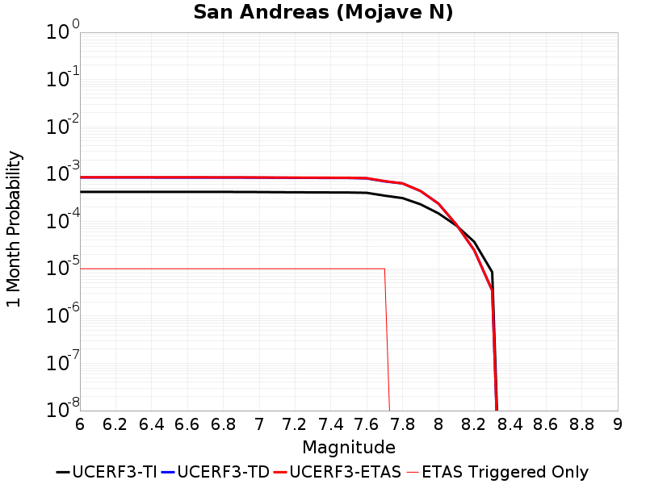 | 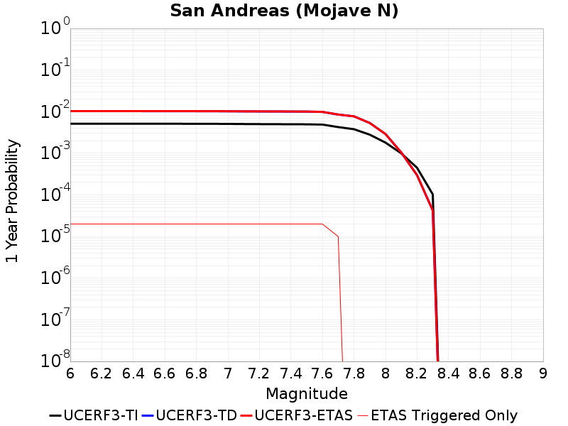 |  |

| Magnitude | 1 wk TI Prob | 1 wk TD Prob | 1 wk ETAS Prob | 1 wk ETAS/TD Gain | 1 wk ETAS Triggered Only | 1 mo TI Prob | 1 mo TD Prob | 1 mo ETAS Prob | 1 mo ETAS/TD Gain | 1 mo ETAS Triggered Only | 1 yr TI Prob | 1 yr TD Prob | 1 yr ETAS Prob | 1 yr ETAS/TD Gain | 1 yr ETAS Triggered Only | 10 yr TI Prob | 10 yr TD Prob | 10 yr ETAS Prob | 10 yr ETAS/TD Gain | 10 yr ETAS Triggered Only |
|-----|-----|-----|-----|-----|-----|-----|-----|-----|-----|-----|-----|-----|-----|-----|-----|-----|-----|-----|-----|-----|
| 6.0 | 9.877682E-5 | 1.985233E-4 | 1.985233E-4 | 1.0 | 0.0 | 4.2326056E-4 | 8.505369E-4 | 8.605284E-4 | 1.0117472 | 1.0E-5 | 0.0051410277 | 0.010306255 | 0.010326049 | 1.0019206 | 2.0E-5 | 0.05023708 | 0.10029247 | 0.10031046 | 1.0001794 | 2.0E-5 |
| 6.1 | 9.877682E-5 | 1.985233E-4 | 1.985233E-4 | 1.0 | 0.0 | 4.2326056E-4 | 8.505369E-4 | 8.605284E-4 | 1.0117472 | 1.0E-5 | 0.0051410277 | 0.010306255 | 0.010326049 | 1.0019206 | 2.0E-5 | 0.05023708 | 0.10029247 | 0.10031046 | 1.0001794 | 2.0E-5 |
| 6.2 | 9.877682E-5 | 1.985233E-4 | 1.985233E-4 | 1.0 | 0.0 | 4.2326056E-4 | 8.505369E-4 | 8.605284E-4 | 1.0117472 | 1.0E-5 | 0.0051410277 | 0.010306255 | 0.010326049 | 1.0019206 | 2.0E-5 | 0.05023708 | 0.10029247 | 0.10031046 | 1.0001794 | 2.0E-5 |
| 6.3 | 9.877682E-5 | 1.985233E-4 | 1.985233E-4 | 1.0 | 0.0 | 4.2326056E-4 | 8.505369E-4 | 8.605284E-4 | 1.0117472 | 1.0E-5 | 0.0051410277 | 0.010306255 | 0.010326049 | 1.0019206 | 2.0E-5 | 0.05023708 | 0.10029247 | 0.10031046 | 1.0001794 | 2.0E-5 |
| 6.4 | 9.877682E-5 | 1.985233E-4 | 1.985233E-4 | 1.0 | 0.0 | 4.2326056E-4 | 8.505369E-4 | 8.605284E-4 | 1.0117472 | 1.0E-5 | 0.0051410277 | 0.010306255 | 0.010326049 | 1.0019206 | 2.0E-5 | 0.05023708 | 0.10029247 | 0.10031046 | 1.0001794 | 2.0E-5 |
| 6.5 | 9.861474E-5 | 1.9825959E-4 | 1.9825959E-4 | 1.0 | 0.0 | 4.2256617E-4 | 8.4940746E-4 | 8.59399E-4 | 1.0117629 | 1.0E-5 | 0.0051326132 | 0.010292634 | 0.010312429 | 1.0019231 | 2.0E-5 | 0.050156746 | 0.100170046 | 0.10018804 | 1.0001796 | 2.0E-5 |
| 6.6 | 9.861474E-5 | 1.9825959E-4 | 1.9825959E-4 | 1.0 | 0.0 | 4.2256617E-4 | 8.4940746E-4 | 8.59399E-4 | 1.0117629 | 1.0E-5 | 0.0051326132 | 0.010292634 | 0.010312429 | 1.0019231 | 2.0E-5 | 0.050156746 | 0.100170046 | 0.10018804 | 1.0001796 | 2.0E-5 |
| 6.7 | 9.8552715E-5 | 1.981586E-4 | 1.981586E-4 | 1.0 | 0.0 | 4.223004E-4 | 8.489749E-4 | 8.5896644E-4 | 1.0117689 | 1.0E-5 | 0.0051293927 | 0.010287418 | 0.010307212 | 1.0019242 | 2.0E-5 | 0.050125998 | 0.10012297 | 0.10014097 | 1.0001798 | 2.0E-5 |
| 6.8 | 9.8464974E-5 | 1.9800891E-4 | 1.9800891E-4 | 1.0 | 0.0 | 4.219245E-4 | 8.483339E-4 | 8.5832534E-4 | 1.0117778 | 1.0E-5 | 0.0051248376 | 0.010279686 | 0.0102994805 | 1.0019256 | 2.0E-5 | 0.05008251 | 0.10005246 | 0.100070454 | 1.0001799 | 2.0E-5 |
| 6.9 | 9.825824E-5 | 1.9768663E-4 | 1.9768663E-4 | 1.0 | 0.0 | 4.2103877E-4 | 8.4695354E-4 | 8.5694506E-4 | 1.0117971 | 1.0E-5 | 0.0051141046 | 0.010263039 | 0.010282834 | 1.0019287 | 2.0E-5 | 0.049980022 | 0.09990038 | 0.09991838 | 1.0001802 | 2.0E-5 |
| 7.0 | 9.781462E-5 | 1.9699518E-4 | 1.9699518E-4 | 1.0 | 0.0 | 4.1913814E-4 | 8.439921E-4 | 8.539836E-4 | 1.0118384 | 1.0E-5 | 0.005091073 | 0.010227323 | 0.010247119 | 1.0019356 | 2.0E-5 | 0.04976007 | 0.09957516 | 0.09959318 | 1.0001808 | 2.0E-5 |
| 7.1 | 9.7121134E-5 | 1.9600539E-4 | 1.9600539E-4 | 1.0 | 0.0 | 4.1616702E-4 | 8.397529E-4 | 8.497445E-4 | 1.0118983 | 1.0E-5 | 0.005055068 | 0.010176194 | 0.01019599 | 1.0019454 | 2.0E-5 | 0.04941613 | 0.0991096 | 0.09912761 | 1.0001818 | 2.0E-5 |
| 7.2 | 9.663819E-5 | 1.9530827E-4 | 1.9530827E-4 | 1.0 | 0.0 | 4.1409794E-4 | 8.367671E-4 | 8.467587E-4 | 1.0119407 | 1.0E-5 | 0.0050299936 | 0.010140181 | 0.010159978 | 1.0019524 | 2.0E-5 | 0.049176537 | 0.09878136 | 0.098799385 | 1.0001825 | 2.0E-5 |
| 7.3 | 9.6277574E-5 | 1.9482715E-4 | 1.9482715E-4 | 1.0 | 0.0 | 4.125529E-4 | 8.347065E-4 | 8.4469817E-4 | 1.0119703 | 1.0E-5 | 0.0050112694 | 0.010115326 | 0.010135124 | 1.0019572 | 2.0E-5 | 0.04899759 | 0.09855258 | 0.09857061 | 1.000183 | 2.0E-5 |
| 7.4 | 9.593308E-5 | 1.942181E-4 | 1.942181E-4 | 1.0 | 0.0 | 4.1107697E-4 | 8.3209795E-4 | 8.420896E-4 | 1.0120078 | 1.0E-5 | 0.0049933824 | 0.010083862 | 0.01010366 | 1.0019634 | 2.0E-5 | 0.04882661 | 0.09826883 | 0.09828687 | 1.0001836 | 2.0E-5 |
| 7.5 | 9.561707E-5 | 1.936726E-4 | 1.936726E-4 | 1.0 | 0.0 | 4.0972308E-4 | 8.297616E-4 | 8.397533E-4 | 1.0120417 | 1.0E-5 | 0.0049769743 | 0.01005568 | 0.010075479 | 1.001969 | 2.0E-5 | 0.048669744 | 0.09801287 | 0.09803092 | 1.000184 | 2.0E-5 |
| 7.6 | 9.418194E-5 | 1.9015881E-4 | 1.9015881E-4 | 1.0 | 0.0 | 4.0357444E-4 | 8.1471197E-4 | 8.2470383E-4 | 1.0122643 | 1.0E-5 | 0.004902454 | 0.009874125 | 0.009893928 | 1.0020055 | 2.0E-5 | 0.047957025 | 0.0963821 | 0.09640017 | 1.0001875 | 2.0E-5 |
| 7.7 | 8.202141E-5 | 1.6427501E-4 | 1.6427501E-4 | 1.0 | 0.0 | 3.51473E-4 | 7.038459E-4 | 7.1383885E-4 | 1.0141977 | 1.0E-5 | 0.00427079 | 0.008535715 | 0.00854563 | 1.0011616 | 1.0E-5 | 0.04189639 | 0.084049486 | 0.08405865 | 1.000109 | 1.0E-5 |
| 7.8 | 7.2859846E-5 | 1.4882222E-4 | 1.4882222E-4 | 1.0 | 0.0 | 3.1221908E-4 | 6.3765363E-4 | 6.3765363E-4 | 1.0 | 0.0 | 0.003794643 | 0.007735843 | 0.007735843 | 1.0 | 0.0 | 0.037304975 | 0.07637479 | 0.07637479 | 1.0 | 0.0 |
| 7.9 | 5.3874453E-5 | 1.0303498E-4 | 1.0303498E-4 | 1.0 | 0.0 | 2.3087008E-4 | 4.4150377E-4 | 4.4150377E-4 | 1.0 | 0.0 | 0.0028072202 | 0.0053620725 | 0.0053620725 | 1.0 | 0.0 | 0.02772022 | 0.053625237 | 0.053625237 | 1.0 | 0.0 |
| 8.0 | 3.468538E-5 | 5.575962E-5 | 5.575962E-5 | 1.0 | 0.0 | 1.4864317E-4 | 2.3894792E-4 | 2.3894792E-4 | 1.0 | 0.0 | 0.0018082283 | 0.0029053118 | 0.0029053118 | 1.0 | 0.0 | 0.017935853 | 0.029681126 | 0.029681126 | 1.0 | 0.0 |
| 8.1 | 1.9152367E-5 | 2.0108573E-5 | 2.0108573E-5 | 1.0 | 0.0 | 8.207899E-5 | 8.6176755E-5 | 8.6176755E-5 | 1.0 | 0.0 | 9.988535E-4 | 0.0010486977 | 0.0010486977 | 1.0 | 0.0 | 0.009943757 | 0.011225321 | 0.011225321 | 1.0 | 0.0 |
| 8.2 | 8.643924E-6 | 5.7415346E-6 | 5.7415346E-6 | 1.0 | 0.0 | 3.704486E-5 | 2.4606345E-5 | 2.4606345E-5 | 1.0 | 0.0 | 4.5092785E-4 | 2.9954113E-4 | 2.9954113E-4 | 1.0 | 0.0 | 0.0045001395 | 0.0033944051 | 0.0033944051 | 1.0 | 0.0 |
| 8.3 | 1.983087E-6 | 8.103189E-7 | 8.103189E-7 | 1.0 | 0.0 | 8.498917E-6 | 3.4727907E-6 | 3.4727907E-6 | 1.0 | 0.0 | 1.034694E-4 | 4.2280426E-5 | 4.2280426E-5 | 1.0 | 0.0 | 0.0010342124 | 4.9735163E-4 | 4.9735163E-4 | 1.0 | 0.0 |

## Red Pass
*[(top)](#table-of-contents)*

| 1 Week | 1 Month | 1 Year | 10 Year |
|-----|-----|-----|-----|
|  |  |  | 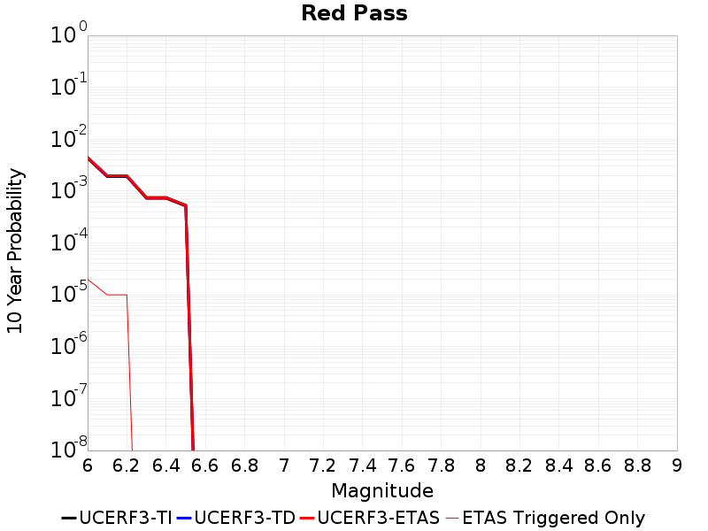 |

| Magnitude | 1 wk TI Prob | 1 wk TD Prob | 1 wk ETAS Prob | 1 wk ETAS/TD Gain | 1 wk ETAS Triggered Only | 1 mo TI Prob | 1 mo TD Prob | 1 mo ETAS Prob | 1 mo ETAS/TD Gain | 1 mo ETAS Triggered Only | 1 yr TI Prob | 1 yr TD Prob | 1 yr ETAS Prob | 1 yr ETAS/TD Gain | 1 yr ETAS Triggered Only | 10 yr TI Prob | 10 yr TD Prob | 10 yr ETAS Prob | 10 yr ETAS/TD Gain | 10 yr ETAS Triggered Only |
|-----|-----|-----|-----|-----|-----|-----|-----|-----|-----|-----|-----|-----|-----|-----|-----|-----|-----|-----|-----|-----|
| 6.0 | 8.258278E-6 | 8.553305E-6 | 8.553305E-6 | 1.0 | 0.0 | 3.539214E-5 | 3.6656606E-5 | 3.6656606E-5 | 1.0 | 0.0 | 4.308141E-4 | 4.4622069E-4 | 4.4622069E-4 | 1.0 | 0.0 | 0.0042997985 | 0.0044550053 | 0.0044749165 | 1.0044693 | 2.0E-5 |
| 6.1 | 3.649988E-6 | 3.7761877E-6 | 3.7761877E-6 | 1.0 | 0.0 | 1.5642712E-5 | 1.6183589E-5 | 1.6183589E-5 | 1.0 | 0.0 | 1.9043336E-4 | 1.9702213E-4 | 1.9702213E-4 | 1.0 | 0.0 | 0.0019027026 | 0.0019689421 | 0.0019789224 | 1.0050689 | 1.0E-5 |
| 6.2 | 3.649988E-6 | 3.7761877E-6 | 3.7761877E-6 | 1.0 | 0.0 | 1.5642712E-5 | 1.6183589E-5 | 1.6183589E-5 | 1.0 | 0.0 | 1.9043336E-4 | 1.9702213E-4 | 1.9702213E-4 | 1.0 | 0.0 | 0.0019027026 | 0.0019689421 | 0.0019789224 | 1.0050689 | 1.0E-5 |
| 6.3 | 1.3924937E-6 | 1.441455E-6 | 1.441455E-6 | 1.0 | 0.0 | 5.9678164E-6 | 6.1776577E-6 | 6.1776577E-6 | 1.0 | 0.0 | 7.265574E-5 | 7.52118E-5 | 7.52118E-5 | 1.0 | 0.0 | 7.263199E-4 | 7.520023E-4 | 7.520023E-4 | 1.0 | 0.0 |
| 6.4 | 1.3924937E-6 | 1.441455E-6 | 1.441455E-6 | 1.0 | 0.0 | 5.9678164E-6 | 6.1776577E-6 | 6.1776577E-6 | 1.0 | 0.0 | 7.265574E-5 | 7.52118E-5 | 7.52118E-5 | 1.0 | 0.0 | 7.263199E-4 | 7.520023E-4 | 7.520023E-4 | 1.0 | 0.0 |
| 6.5 | 9.876812E-7 | 1.0224313E-6 | 1.0224313E-6 | 1.0 | 0.0 | 4.2329125E-6 | 4.3818486E-6 | 4.3818486E-6 | 1.0 | 0.0 | 5.153449E-5 | 5.3349006E-5 | 5.3349006E-5 | 1.0 | 0.0 | 5.1522546E-4 | 5.334901E-4 | 5.334901E-4 | 1.0 | 0.0 |

## Blackwater
*[(top)](#table-of-contents)*

| 1 Week | 1 Month | 1 Year | 10 Year |
|-----|-----|-----|-----|
|  | 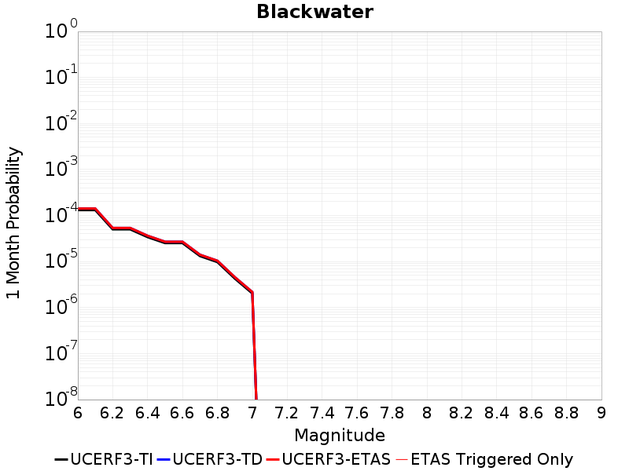 | 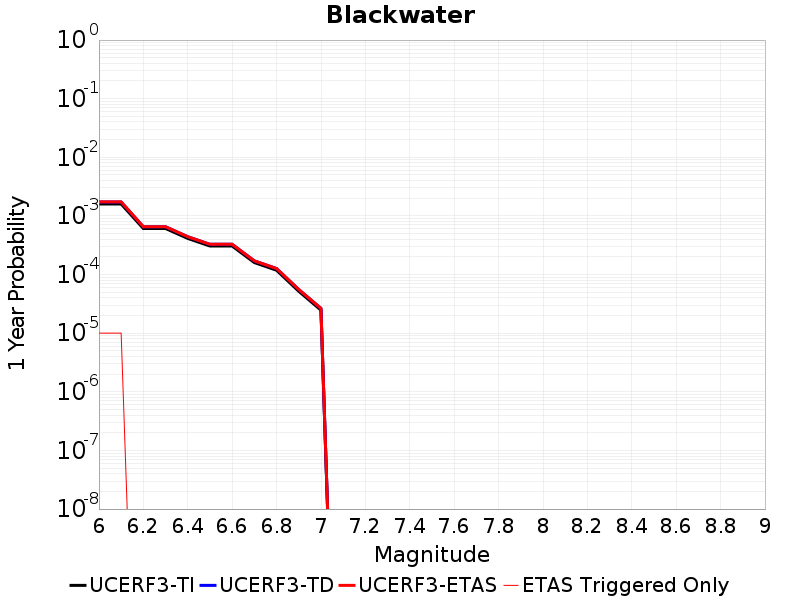 |  |

| Magnitude | 1 wk TI Prob | 1 wk TD Prob | 1 wk ETAS Prob | 1 wk ETAS/TD Gain | 1 wk ETAS Triggered Only | 1 mo TI Prob | 1 mo TD Prob | 1 mo ETAS Prob | 1 mo ETAS/TD Gain | 1 mo ETAS Triggered Only | 1 yr TI Prob | 1 yr TD Prob | 1 yr ETAS Prob | 1 yr ETAS/TD Gain | 1 yr ETAS Triggered Only | 10 yr TI Prob | 10 yr TD Prob | 10 yr ETAS Prob | 10 yr ETAS/TD Gain | 10 yr ETAS Triggered Only |
|-----|-----|-----|-----|-----|-----|-----|-----|-----|-----|-----|-----|-----|-----|-----|-----|-----|-----|-----|-----|-----|
| 6.0 | 3.0708583E-5 | 3.311318E-5 | 3.311318E-5 | 1.0 | 0.0 | 1.3160157E-4 | 1.4190668E-4 | 1.4190668E-4 | 1.0 | 0.0 | 0.0016010714 | 0.0017264815 | 0.0017364642 | 1.0057821 | 1.0E-5 | 0.015895851 | 0.01714454 | 0.017164197 | 1.0011466 | 2.0E-5 |
| 6.1 | 3.0708583E-5 | 3.311318E-5 | 3.311318E-5 | 1.0 | 0.0 | 1.3160157E-4 | 1.4190668E-4 | 1.4190668E-4 | 1.0 | 0.0 | 0.0016010714 | 0.0017264815 | 0.0017364642 | 1.0057821 | 1.0E-5 | 0.015895851 | 0.01714454 | 0.017164197 | 1.0011466 | 2.0E-5 |
| 6.2 | 1.1707779E-5 | 1.255116E-5 | 1.255116E-5 | 1.0 | 0.0 | 5.017523E-5 | 5.378963E-5 | 5.378963E-5 | 1.0 | 0.0 | 6.107122E-4 | 6.547016E-4 | 6.547016E-4 | 1.0 | 0.0 | 0.006090366 | 0.0065287007 | 0.006538635 | 1.0015217 | 1.0E-5 |
| 6.3 | 1.1707779E-5 | 1.255116E-5 | 1.255116E-5 | 1.0 | 0.0 | 5.017523E-5 | 5.378963E-5 | 5.378963E-5 | 1.0 | 0.0 | 6.107122E-4 | 6.547016E-4 | 6.547016E-4 | 1.0 | 0.0 | 0.006090366 | 0.0065287007 | 0.006538635 | 1.0015217 | 1.0E-5 |
| 6.4 | 7.929244E-6 | 8.484061E-6 | 8.484061E-6 | 1.0 | 0.0 | 3.3982033E-5 | 3.635978E-5 | 3.635978E-5 | 1.0 | 0.0 | 4.136527E-4 | 4.4259444E-4 | 4.4259444E-4 | 1.0 | 0.0 | 0.0041288356 | 0.0044175354 | 0.0044175354 | 1.0 | 0.0 |
| 6.5 | 5.8832115E-6 | 6.2888853E-6 | 6.2888853E-6 | 1.0 | 0.0 | 2.521352E-5 | 2.6952102E-5 | 2.6952102E-5 | 1.0 | 0.0 | 3.0693135E-4 | 3.28095E-4 | 3.28095E-4 | 1.0 | 0.0 | 0.0030650778 | 0.0032763595 | 0.0032763595 | 1.0 | 0.0 |
| 6.6 | 5.8832115E-6 | 6.2888853E-6 | 6.2888853E-6 | 1.0 | 0.0 | 2.521352E-5 | 2.6952102E-5 | 2.6952102E-5 | 1.0 | 0.0 | 3.0693135E-4 | 3.28095E-4 | 3.28095E-4 | 1.0 | 0.0 | 0.0030650778 | 0.0032763595 | 0.0032763595 | 1.0 | 0.0 |
| 6.7 | 3.0715053E-6 | 3.2829748E-6 | 3.2829748E-6 | 1.0 | 0.0 | 1.3163528E-5 | 1.4069823E-5 | 1.4069823E-5 | 1.0 | 0.0 | 1.6025416E-4 | 1.7128779E-4 | 1.7128779E-4 | 1.0 | 0.0 | 0.0016013865 | 0.0017116723 | 0.0017116723 | 1.0 | 0.0 |
| 6.8 | 2.2722281E-6 | 2.4298788E-6 | 2.4298788E-6 | 1.0 | 0.0 | 9.738084E-6 | 1.041373E-5 | 1.041373E-5 | 1.0 | 0.0 | 1.1855473E-4 | 1.2678071E-4 | 1.2678071E-4 | 1.0 | 0.0 | 0.001184915 | 0.001267174 | 0.001267174 | 1.0 | 0.0 |
| 6.9 | 9.952399E-7 | 1.0658536E-6 | 1.0658536E-6 | 1.0 | 0.0 | 4.265307E-6 | 4.567939E-6 | 4.567939E-6 | 1.0 | 0.0 | 5.1928873E-5 | 5.5613753E-5 | 5.5613753E-5 | 1.0 | 0.0 | 5.191674E-4 | 5.56049E-4 | 5.56049E-4 | 1.0 | 0.0 |
| 7.0 | 4.7385504E-7 | 5.077987E-7 | 5.077987E-7 | 1.0 | 0.0 | 2.0308057E-6 | 2.1762803E-6 | 2.1762803E-6 | 1.0 | 0.0 | 2.4724779E-5 | 2.6496211E-5 | 2.6496211E-5 | 1.0 | 0.0 | 2.4722028E-4 | 2.6496212E-4 | 2.6496212E-4 | 1.0 | 0.0 |

## Tin Mountain
*[(top)](#table-of-contents)*

| 1 Week | 1 Month | 1 Year | 10 Year |
|-----|-----|-----|-----|
|  | 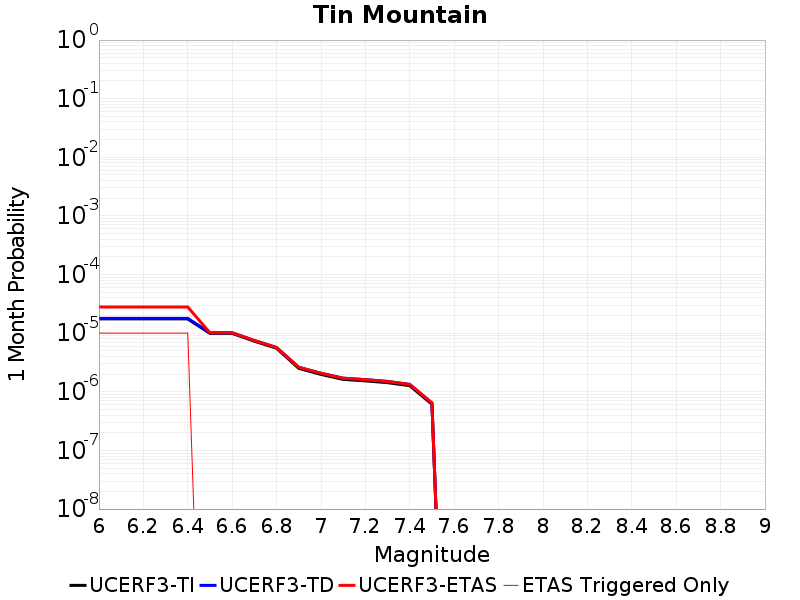 |  |  |

| Magnitude | 1 wk TI Prob | 1 wk TD Prob | 1 wk ETAS Prob | 1 wk ETAS/TD Gain | 1 wk ETAS Triggered Only | 1 mo TI Prob | 1 mo TD Prob | 1 mo ETAS Prob | 1 mo ETAS/TD Gain | 1 mo ETAS Triggered Only | 1 yr TI Prob | 1 yr TD Prob | 1 yr ETAS Prob | 1 yr ETAS/TD Gain | 1 yr ETAS Triggered Only | 10 yr TI Prob | 10 yr TD Prob | 10 yr ETAS Prob | 10 yr ETAS/TD Gain | 10 yr ETAS Triggered Only |
|-----|-----|-----|-----|-----|-----|-----|-----|-----|-----|-----|-----|-----|-----|-----|-----|-----|-----|-----|-----|-----|
| 6.0 | 4.083776E-6 | 4.182212E-6 | 1.418217E-5 | 3.3910694 | 1.0E-5 | 1.750178E-5 | 1.7923663E-5 | 2.7923483E-5 | 1.5579116 | 1.0E-5 | 2.1306332E-4 | 2.1820246E-4 | 2.2820028E-4 | 1.045819 | 1.0E-5 | 0.0021285915 | 0.002180248 | 0.0022002044 | 1.0091532 | 2.0E-5 |
| 6.1 | 4.083776E-6 | 4.182212E-6 | 1.418217E-5 | 3.3910694 | 1.0E-5 | 1.750178E-5 | 1.7923663E-5 | 2.7923483E-5 | 1.5579116 | 1.0E-5 | 2.1306332E-4 | 2.1820246E-4 | 2.2820028E-4 | 1.045819 | 1.0E-5 | 0.0021285915 | 0.002180248 | 0.0022002044 | 1.0091532 | 2.0E-5 |
| 6.2 | 4.083776E-6 | 4.182212E-6 | 1.418217E-5 | 3.3910694 | 1.0E-5 | 1.750178E-5 | 1.7923663E-5 | 2.7923483E-5 | 1.5579116 | 1.0E-5 | 2.1306332E-4 | 2.1820246E-4 | 2.2820028E-4 | 1.045819 | 1.0E-5 | 0.0021285915 | 0.002180248 | 0.0022002044 | 1.0091532 | 2.0E-5 |
| 6.3 | 4.083776E-6 | 4.182212E-6 | 1.418217E-5 | 3.3910694 | 1.0E-5 | 1.750178E-5 | 1.7923663E-5 | 2.7923483E-5 | 1.5579116 | 1.0E-5 | 2.1306332E-4 | 2.1820246E-4 | 2.2820028E-4 | 1.045819 | 1.0E-5 | 0.0021285915 | 0.002180248 | 0.0022002044 | 1.0091532 | 2.0E-5 |
| 6.4 | 4.083776E-6 | 4.182212E-6 | 1.418217E-5 | 3.3910694 | 1.0E-5 | 1.750178E-5 | 1.7923663E-5 | 2.7923483E-5 | 1.5579116 | 1.0E-5 | 2.1306332E-4 | 2.1820246E-4 | 2.2820028E-4 | 1.045819 | 1.0E-5 | 0.0021285915 | 0.002180248 | 0.0022002044 | 1.0091532 | 2.0E-5 |
| 6.5 | 2.3143427E-6 | 2.3735645E-6 | 2.3735645E-6 | 1.0 | 0.0 | 9.9185745E-6 | 1.01723845E-5 | 1.01723845E-5 | 1.0 | 0.0 | 1.2075195E-4 | 1.2384252E-4 | 1.2384252E-4 | 1.0 | 0.0 | 0.0012068636 | 0.0012378109 | 0.0012477986 | 1.0080688 | 1.0E-5 |
| 6.6 | 2.3143427E-6 | 2.3735645E-6 | 2.3735645E-6 | 1.0 | 0.0 | 9.9185745E-6 | 1.01723845E-5 | 1.01723845E-5 | 1.0 | 0.0 | 1.2075195E-4 | 1.2384252E-4 | 1.2384252E-4 | 1.0 | 0.0 | 0.0012068636 | 0.0012378109 | 0.0012477986 | 1.0080688 | 1.0E-5 |
| 6.7 | 1.7029532E-6 | 1.7501168E-6 | 1.7501168E-6 | 1.0 | 0.0 | 7.2983503E-6 | 7.500482E-6 | 7.500482E-6 | 1.0 | 0.0 | 8.885379E-5 | 9.131508E-5 | 9.131508E-5 | 1.0 | 0.0 | 8.881827E-4 | 9.128282E-4 | 9.228191E-4 | 1.010945 | 1.0E-5 |
| 6.8 | 1.2914646E-6 | 1.3302058E-6 | 1.3302058E-6 | 1.0 | 0.0 | 5.534837E-6 | 5.700872E-6 | 5.700872E-6 | 1.0 | 0.0 | 6.738455E-5 | 6.940635E-5 | 6.940635E-5 | 1.0 | 0.0 | 6.736412E-4 | 6.9389003E-4 | 7.038831E-4 | 1.0144016 | 1.0E-5 |
| 6.9 | 5.8708974E-7 | 6.1187217E-7 | 6.1187217E-7 | 1.0 | 0.0 | 2.5160964E-6 | 2.622307E-6 | 2.622307E-6 | 1.0 | 0.0 | 3.0633044E-5 | 3.192616E-5 | 3.192616E-5 | 1.0 | 0.0 | 3.0628822E-4 | 3.1921986E-4 | 3.1921986E-4 | 1.0 | 0.0 |
| 7.0 | 4.6248786E-7 | 4.833473E-7 | 4.833473E-7 | 1.0 | 0.0 | 1.9820893E-6 | 2.071487E-6 | 2.071487E-6 | 1.0 | 0.0 | 2.413167E-5 | 2.52201E-5 | 2.52201E-5 | 1.0 | 0.0 | 2.412905E-4 | 2.5217608E-4 | 2.5217608E-4 | 1.0 | 0.0 |
| 7.1 | 3.804606E-7 | 3.9884344E-7 | 3.9884344E-7 | 1.0 | 0.0 | 1.6305444E-6 | 1.7093281E-6 | 1.7093281E-6 | 1.0 | 0.0 | 1.9851697E-5 | 2.0810905E-5 | 2.0810905E-5 | 1.0 | 0.0 | 1.9849923E-4 | 2.0809293E-4 | 2.0809293E-4 | 1.0 | 0.0 |
| 7.2 | 3.5864858E-7 | 3.7629226E-7 | 3.7629226E-7 | 1.0 | 0.0 | 1.5370645E-6 | 1.6126803E-6 | 1.6126803E-6 | 1.0 | 0.0 | 1.87136E-5 | 1.963424E-5 | 1.963424E-5 | 1.0 | 0.0 | 1.8712023E-4 | 1.9632837E-4 | 1.9632837E-4 | 1.0 | 0.0 |
| 7.3 | 3.342063E-7 | 3.507507E-7 | 3.507507E-7 | 1.0 | 0.0 | 1.4323119E-6 | 1.5032166E-6 | 1.5032166E-6 | 1.0 | 0.0 | 1.7438259E-5 | 1.8301542E-5 | 1.8301542E-5 | 1.0 | 0.0 | 1.743689E-4 | 1.8300365E-4 | 1.8300365E-4 | 1.0 | 0.0 |
| 7.4 | 2.971242E-7 | 3.1176074E-7 | 3.1176074E-7 | 1.0 | 0.0 | 1.2733886E-6 | 1.336117E-6 | 1.336117E-6 | 1.0 | 0.0 | 1.5503398E-5 | 1.6267137E-5 | 1.6267137E-5 | 1.0 | 0.0 | 1.5502315E-4 | 1.6266273E-4 | 1.6266273E-4 | 1.0 | 0.0 |
| 7.5 | 1.4326713E-7 | 1.5017356E-7 | 1.5017356E-7 | 1.0 | 0.0 | 6.140018E-7 | 6.4360097E-7 | 6.4360097E-7 | 1.0 | 0.0 | 7.4754466E-6 | 7.835842E-6 | 7.835842E-6 | 1.0 | 0.0 | 7.475195E-5 | 7.835842E-5 | 7.835842E-5 | 1.0 | 0.0 |

## San Andreas (Cholame) rev
*[(top)](#table-of-contents)*

| 1 Week | 1 Month | 1 Year | 10 Year |
|-----|-----|-----|-----|
|  | 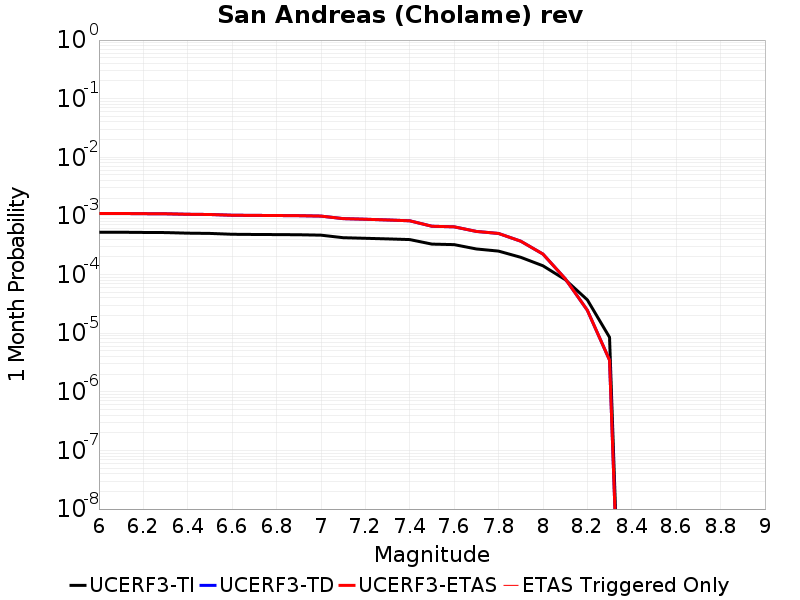 |  | 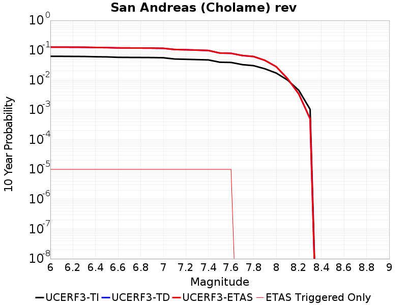 |

| Magnitude | 1 wk TI Prob | 1 wk TD Prob | 1 wk ETAS Prob | 1 wk ETAS/TD Gain | 1 wk ETAS Triggered Only | 1 mo TI Prob | 1 mo TD Prob | 1 mo ETAS Prob | 1 mo ETAS/TD Gain | 1 mo ETAS Triggered Only | 1 yr TI Prob | 1 yr TD Prob | 1 yr ETAS Prob | 1 yr ETAS/TD Gain | 1 yr ETAS Triggered Only | 10 yr TI Prob | 10 yr TD Prob | 10 yr ETAS Prob | 10 yr ETAS/TD Gain | 10 yr ETAS Triggered Only |
|-----|-----|-----|-----|-----|-----|-----|-----|-----|-----|-----|-----|-----|-----|-----|-----|-----|-----|-----|-----|-----|
| 6.0 | 1.2302514E-4 | 2.570298E-4 | 2.570298E-4 | 1.0 | 0.0 | 5.27144E-4 | 0.001101093 | 0.001101093 | 1.0 | 0.0 | 0.0063991086 | 0.013323934 | 0.0133338 | 1.0007405 | 1.0E-5 | 0.06217949 | 0.12646468 | 0.12647341 | 1.000069 | 1.0E-5 |
| 6.1 | 1.2302514E-4 | 2.570298E-4 | 2.570298E-4 | 1.0 | 0.0 | 5.27144E-4 | 0.001101093 | 0.001101093 | 1.0 | 0.0 | 0.0063991086 | 0.013323934 | 0.0133338 | 1.0007405 | 1.0E-5 | 0.06217949 | 0.12646468 | 0.12647341 | 1.000069 | 1.0E-5 |
| 6.2 | 1.2203569E-4 | 2.5519152E-4 | 2.5519152E-4 | 1.0 | 0.0 | 5.2290526E-4 | 0.0010932212 | 0.0010932212 | 1.0 | 0.0 | 0.006347804 | 0.013229262 | 0.01323913 | 1.0007459 | 1.0E-5 | 0.061695136 | 0.12564826 | 0.12565699 | 1.0000696 | 1.0E-5 |
| 6.3 | 1.2142645E-4 | 2.5404748E-4 | 2.5404748E-4 | 1.0 | 0.0 | 5.202953E-4 | 0.0010883223 | 0.0010883223 | 1.0 | 0.0 | 0.006316212 | 0.01317034 | 0.013180208 | 1.0007492 | 1.0E-5 | 0.06139677 | 0.12514201 | 0.12515076 | 1.0000699 | 1.0E-5 |
| 6.4 | 1.1865206E-4 | 2.490725E-4 | 2.490725E-4 | 1.0 | 0.0 | 5.0840975E-4 | 0.0010670186 | 0.0010670186 | 1.0 | 0.0 | 0.006172335 | 0.012914068 | 0.012923939 | 1.0007644 | 1.0E-5 | 0.060036868 | 0.12292422 | 0.12293299 | 1.0000714 | 1.0E-5 |
| 6.5 | 1.17443946E-4 | 2.469853E-4 | 2.469853E-4 | 1.0 | 0.0 | 5.032341E-4 | 0.0010580807 | 0.0010580807 | 1.0 | 0.0 | 0.006109677 | 0.01280653 | 0.012816402 | 1.0007708 | 1.0E-5 | 0.059444077 | 0.12199022 | 0.121998996 | 1.000072 | 1.0E-5 |
| 6.6 | 1.13579066E-4 | 2.4001635E-4 | 2.4001635E-4 | 1.0 | 0.0 | 4.866766E-4 | 0.0010282375 | 0.0010282375 | 1.0 | 0.0 | 0.0059092017 | 0.012447395 | 0.012457271 | 1.0007933 | 1.0E-5 | 0.057545185 | 0.11888607 | 0.11889488 | 1.0000741 | 1.0E-5 |
| 6.7 | 1.1271412E-4 | 2.3844787E-4 | 2.3844787E-4 | 1.0 | 0.0 | 4.829711E-4 | 0.0010215208 | 0.0010215208 | 1.0 | 0.0 | 0.005864331 | 0.012366551 | 0.012376427 | 1.0007986 | 1.0E-5 | 0.057119697 | 0.118186586 | 0.1181954 | 1.0000746 | 1.0E-5 |
| 6.8 | 1.1217975E-4 | 2.3732054E-4 | 2.3732054E-4 | 1.0 | 0.0 | 4.8068175E-4 | 0.0010166932 | 0.0010166932 | 1.0 | 0.0 | 0.005836608 | 0.01230844 | 0.012318317 | 1.0008024 | 1.0E-5 | 0.056856725 | 0.11768093 | 0.11768975 | 1.000075 | 1.0E-5 |
| 6.9 | 1.1146753E-4 | 2.3579517E-4 | 2.3579517E-4 | 1.0 | 0.0 | 4.7763053E-4 | 0.001010161 | 0.001010161 | 1.0 | 0.0 | 0.0057996577 | 0.012229807 | 0.012239684 | 1.0008076 | 1.0E-5 | 0.056506127 | 0.116997086 | 0.117005914 | 1.0000755 | 1.0E-5 |
| 7.0 | 1.0965793E-4 | 2.3199005E-4 | 2.3199005E-4 | 1.0 | 0.0 | 4.698779E-4 | 9.938658E-4 | 9.938658E-4 | 1.0 | 0.0 | 0.005705768 | 0.012033621 | 0.0120435 | 1.000821 | 1.0E-5 | 0.055614736 | 0.11528846 | 0.1152973 | 1.0000768 | 1.0E-5 |
| 7.1 | 9.927982E-5 | 2.1000174E-4 | 2.1000174E-4 | 1.0 | 0.0 | 4.2541555E-4 | 8.996981E-4 | 8.996981E-4 | 1.0 | 0.0 | 0.0051671406 | 0.010899116 | 0.010909007 | 1.0009075 | 1.0E-5 | 0.05048634 | 0.10533692 | 0.10534587 | 1.0000849 | 1.0E-5 |
| 7.2 | 9.696786E-5 | 2.0501167E-4 | 2.0501167E-4 | 1.0 | 0.0 | 4.1551032E-4 | 8.7832665E-4 | 8.7832665E-4 | 1.0 | 0.0 | 0.00504711 | 0.010641489 | 0.010651383 | 1.0009297 | 1.0E-5 | 0.04934009 | 0.103065394 | 0.103074364 | 1.000087 | 1.0E-5 |
| 7.3 | 9.4727984E-5 | 1.9923004E-4 | 1.9923004E-4 | 1.0 | 0.0 | 4.0591392E-4 | 8.5356465E-4 | 8.5356465E-4 | 1.0 | 0.0 | 0.0049308087 | 0.010342914 | 0.01035281 | 1.0009569 | 1.0E-5 | 0.048228268 | 0.10041132 | 0.10042031 | 1.0000896 | 1.0E-5 |
| 7.4 | 9.220358E-5 | 1.9285025E-4 | 1.9285025E-4 | 1.0 | 0.0 | 3.9509835E-4 | 8.262402E-4 | 8.262402E-4 | 1.0 | 0.0 | 0.004799717 | 0.010013335 | 0.010023235 | 1.0009887 | 1.0E-5 | 0.046973653 | 0.097467944 | 0.097476974 | 1.0000926 | 1.0E-5 |
| 7.5 | 7.71631E-5 | 1.5564833E-4 | 1.5564833E-4 | 1.0 | 0.0 | 3.306571E-4 | 6.6689396E-4 | 6.6689396E-4 | 1.0 | 0.0 | 0.0040183207 | 0.008089283 | 0.008099201 | 1.0012262 | 1.0E-5 | 0.03946433 | 0.080018274 | 0.080027476 | 1.0001149 | 1.0E-5 |
| 7.6 | 7.5634416E-5 | 1.5219355E-4 | 1.5219355E-4 | 1.0 | 0.0 | 3.241072E-4 | 6.520952E-4 | 6.520952E-4 | 1.0 | 0.0 | 0.0039388672 | 0.00791043 | 0.007920351 | 1.0012542 | 1.0E-5 | 0.038697794 | 0.07836447 | 0.078373685 | 1.0001177 | 1.0E-5 |
| 7.7 | 6.3783E-5 | 1.2701629E-4 | 1.2701629E-4 | 1.0 | 0.0 | 2.7332708E-4 | 5.44242E-4 | 5.44242E-4 | 1.0 | 0.0 | 0.0033226798 | 0.006606044 | 0.006606044 | 1.0 | 0.0 | 0.032734364 | 0.06610806 | 0.06610806 | 1.0 | 0.0 |
| 7.8 | 5.863422E-5 | 1.17280215E-4 | 1.17280215E-4 | 1.0 | 0.0 | 2.512653E-4 | 5.025327E-4 | 5.025327E-4 | 1.0 | 0.0 | 0.003054864 | 0.0061011943 | 0.0061011943 | 1.0 | 0.0 | 0.030132094 | 0.061092682 | 0.061092682 | 1.0 | 0.0 |
| 7.9 | 4.595283E-5 | 8.655535E-5 | 8.655535E-5 | 1.0 | 0.0 | 1.9692584E-4 | 3.708988E-4 | 3.708988E-4 | 1.0 | 0.0 | 0.0023949358 | 0.0045063505 | 0.0045063505 | 1.0 | 0.0 | 0.023692891 | 0.045440976 | 0.045440976 | 1.0 | 0.0 |
| 8.0 | 3.2950178E-5 | 5.2220417E-5 | 5.2220417E-5 | 1.0 | 0.0 | 1.412074E-4 | 2.237826E-4 | 2.237826E-4 | 1.0 | 0.0 | 0.0017178444 | 0.0027211509 | 0.0027211509 | 1.0 | 0.0 | 0.017046256 | 0.02789157 | 0.02789157 | 1.0 | 0.0 |
| 8.1 | 1.9177472E-5 | 1.9895642E-5 | 1.9895642E-5 | 1.0 | 0.0 | 8.218658E-5 | 8.5264255E-5 | 8.5264255E-5 | 1.0 | 0.0 | 0.0010001622 | 0.0010375986 | 0.0010375986 | 1.0 | 0.0 | 0.009956728 | 0.011130423 | 0.011130423 | 1.0 | 0.0 |
| 8.2 | 8.643924E-6 | 5.7415346E-6 | 5.7415346E-6 | 1.0 | 0.0 | 3.704486E-5 | 2.4606345E-5 | 2.4606345E-5 | 1.0 | 0.0 | 4.5092785E-4 | 2.9954113E-4 | 2.9954113E-4 | 1.0 | 0.0 | 0.0045001395 | 0.0033944051 | 0.0033944051 | 1.0 | 0.0 |
| 8.3 | 1.983087E-6 | 8.103189E-7 | 8.103189E-7 | 1.0 | 0.0 | 8.498917E-6 | 3.4727907E-6 | 3.4727907E-6 | 1.0 | 0.0 | 1.034694E-4 | 4.2280426E-5 | 4.2280426E-5 | 1.0 | 0.0 | 0.0010342124 | 4.9735163E-4 | 4.9735163E-4 | 1.0 | 0.0 |

## Gravel Hills-Harper Lk
*[(top)](#table-of-contents)*

| 1 Week | 1 Month | 1 Year | 10 Year |
|-----|-----|-----|-----|
| 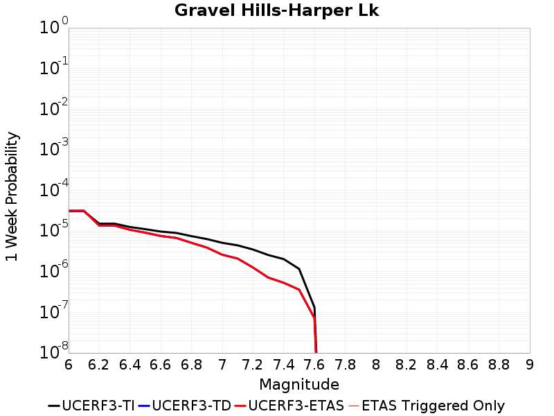 | 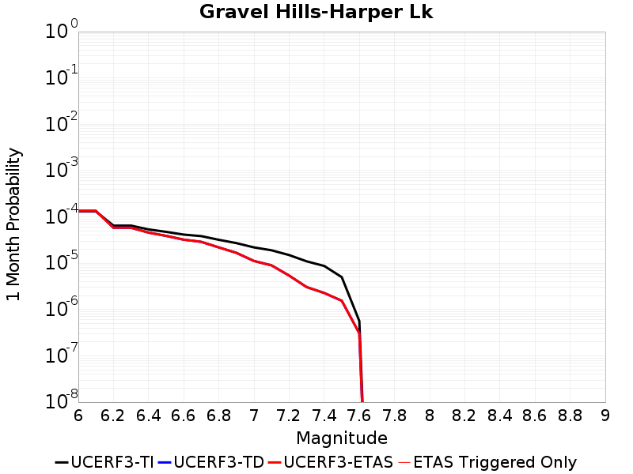 | 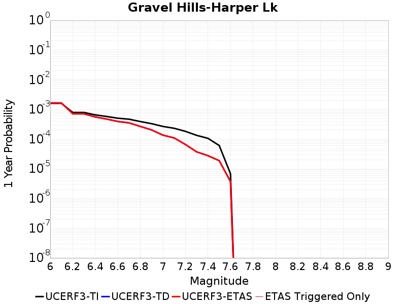 |  |

| Magnitude | 1 wk TI Prob | 1 wk TD Prob | 1 wk ETAS Prob | 1 wk ETAS/TD Gain | 1 wk ETAS Triggered Only | 1 mo TI Prob | 1 mo TD Prob | 1 mo ETAS Prob | 1 mo ETAS/TD Gain | 1 mo ETAS Triggered Only | 1 yr TI Prob | 1 yr TD Prob | 1 yr ETAS Prob | 1 yr ETAS/TD Gain | 1 yr ETAS Triggered Only | 10 yr TI Prob | 10 yr TD Prob | 10 yr ETAS Prob | 10 yr ETAS/TD Gain | 10 yr ETAS Triggered Only |
|-----|-----|-----|-----|-----|-----|-----|-----|-----|-----|-----|-----|-----|-----|-----|-----|-----|-----|-----|-----|-----|
| 6.0 | 3.0679566E-5 | 3.1492254E-5 | 3.1492254E-5 | 1.0 | 0.0 | 1.3147724E-4 | 1.3496105E-4 | 1.3496105E-4 | 1.0 | 0.0 | 0.0015995599 | 0.0016421298 | 0.0016421298 | 1.0 | 0.0 | 0.015880952 | 0.01632157 | 0.016331406 | 1.0006027 | 1.0E-5 |
| 6.1 | 3.0679566E-5 | 3.1492254E-5 | 3.1492254E-5 | 1.0 | 0.0 | 1.3147724E-4 | 1.3496105E-4 | 1.3496105E-4 | 1.0 | 0.0 | 0.0015995599 | 0.0016421298 | 0.0016421298 | 1.0 | 0.0 | 0.015880952 | 0.01632157 | 0.016331406 | 1.0006027 | 1.0E-5 |
| 6.2 | 1.514536E-5 | 1.3644925E-5 | 1.3644925E-5 | 1.0 | 0.0 | 6.490707E-5 | 5.847701E-5 | 5.847701E-5 | 1.0 | 0.0 | 7.8995706E-4 | 7.117369E-4 | 7.117369E-4 | 1.0 | 0.0 | 0.007871548 | 0.007095778 | 0.0071057067 | 1.0013993 | 1.0E-5 |
| 6.3 | 1.514536E-5 | 1.3644925E-5 | 1.3644925E-5 | 1.0 | 0.0 | 6.490707E-5 | 5.847701E-5 | 5.847701E-5 | 1.0 | 0.0 | 7.8995706E-4 | 7.117369E-4 | 7.117369E-4 | 1.0 | 0.0 | 0.007871548 | 0.007095778 | 0.0071057067 | 1.0013993 | 1.0E-5 |
| 6.4 | 1.2532521E-5 | 1.0696871E-5 | 1.0696871E-5 | 1.0 | 0.0 | 5.37097E-5 | 4.5842957E-5 | 4.5842957E-5 | 1.0 | 0.0 | 6.537194E-4 | 5.5800093E-4 | 5.5800093E-4 | 1.0 | 0.0 | 0.0065179965 | 0.005566589 | 0.0055765337 | 1.0017865 | 1.0E-5 |
| 6.5 | 1.1094058E-5 | 9.089579E-6 | 9.089579E-6 | 1.0 | 0.0 | 4.7545094E-5 | 3.8954782E-5 | 3.8954782E-5 | 1.0 | 0.0 | 5.787078E-4 | 4.741753E-4 | 4.741753E-4 | 1.0 | 0.0 | 0.0057720304 | 0.0047320435 | 0.004741996 | 1.0021032 | 1.0E-5 |
| 6.6 | 9.688328E-6 | 7.5365206E-6 | 7.5365206E-6 | 1.0 | 0.0 | 4.1520743E-5 | 3.2298987E-5 | 3.2298987E-5 | 1.0 | 0.0 | 5.053978E-4 | 3.931718E-4 | 3.931718E-4 | 1.0 | 0.0 | 0.0050424994 | 0.003925019 | 0.003925019 | 1.0 | 0.0 |
| 6.7 | 8.974824E-6 | 6.75373E-6 | 6.75373E-6 | 1.0 | 0.0 | 3.8462964E-5 | 2.8944247E-5 | 2.8944247E-5 | 1.0 | 0.0 | 4.6818596E-4 | 3.5234145E-4 | 3.5234145E-4 | 1.0 | 0.0 | 0.004672008 | 0.0035180494 | 0.0035180494 | 1.0 | 0.0 |
| 6.8 | 7.4780046E-6 | 5.119507E-6 | 5.119507E-6 | 1.0 | 0.0 | 3.20482E-5 | 2.1940568E-5 | 2.1940568E-5 | 1.0 | 0.0 | 3.9011694E-4 | 2.6709508E-4 | 2.6709508E-4 | 1.0 | 0.0 | 0.0038943281 | 0.0026678788 | 0.0026678788 | 1.0 | 0.0 |
| 6.9 | 6.3409307E-6 | 3.910148E-6 | 3.910148E-6 | 1.0 | 0.0 | 2.7175134E-5 | 1.6757675E-5 | 1.6757675E-5 | 1.0 | 0.0 | 3.3080703E-4 | 2.0400659E-4 | 2.0400659E-4 | 1.0 | 0.0 | 0.0033031502 | 0.0020382914 | 0.0020382914 | 1.0 | 0.0 |
| 7.0 | 5.1239335E-6 | 2.6078046E-6 | 2.6078046E-6 | 1.0 | 0.0 | 2.195953E-5 | 1.1176259E-5 | 1.1176259E-5 | 1.0 | 0.0 | 2.6732447E-4 | 1.3606272E-4 | 1.3606272E-4 | 1.0 | 0.0 | 0.0026700313 | 0.0013598194 | 0.0013598194 | 1.0 | 0.0 |
| 7.1 | 4.438899E-6 | 2.1001556E-6 | 2.1001556E-6 | 1.0 | 0.0 | 1.9023713E-5 | 9.000637E-6 | 9.000637E-6 | 1.0 | 0.0 | 2.315891E-4 | 1.09577464E-4 | 1.09577464E-4 | 1.0 | 0.0 | 0.002313479 | 0.0010952563 | 0.0010952563 | 1.0 | 0.0 |
| 7.2 | 3.50367E-6 | 1.2628971E-6 | 1.2628971E-6 | 1.0 | 0.0 | 1.5015643E-5 | 5.4124052E-6 | 5.4124052E-6 | 1.0 | 0.0 | 1.8280011E-4 | 6.589413E-5 | 6.589413E-5 | 1.0 | 0.0 | 0.0018264982 | 6.587541E-4 | 6.587541E-4 | 1.0 | 0.0 |
| 7.3 | 2.561638E-6 | 7.1302E-7 | 7.1302E-7 | 1.0 | 0.0 | 1.0978401E-5 | 3.0557965E-6 | 3.0557965E-6 | 1.0 | 0.0 | 1.3365384E-4 | 3.7203707E-5 | 3.7203707E-5 | 1.0 | 0.0 | 0.0013357349 | 3.7197678E-4 | 3.7197678E-4 | 1.0 | 0.0 |
| 7.4 | 2.0368864E-6 | 5.3143106E-7 | 5.3143106E-7 | 1.0 | 0.0 | 8.729483E-6 | 2.2775598E-6 | 2.2775598E-6 | 1.0 | 0.0 | 1.06276275E-4 | 2.7728944E-5 | 2.7728944E-5 | 1.0 | 0.0 | 0.0010622547 | 2.7725537E-4 | 2.7725537E-4 | 1.0 | 0.0 |
| 7.5 | 1.1681728E-6 | 3.6094954E-7 | 3.6094954E-7 | 1.0 | 0.0 | 5.0064455E-6 | 1.5469257E-6 | 1.5469257E-6 | 1.0 | 0.0 | 6.0951766E-5 | 1.8833662E-5 | 1.8833662E-5 | 1.0 | 0.0 | 6.093505E-4 | 1.8832112E-4 | 1.8832112E-4 | 1.0 | 0.0 |
| 7.6 | 1.3154387E-7 | 7.1419635E-8 | 7.1419635E-8 | 1.0 | 0.0 | 5.6375933E-7 | 3.0608413E-7 | 3.0608413E-7 | 1.0 | 0.0 | 6.863748E-6 | 3.7265693E-6 | 3.7265693E-6 | 1.0 | 0.0 | 6.863536E-5 | 3.726523E-5 | 3.726523E-5 | 1.0 | 0.0 |

## San Andreas (Creeping Section) 2011 CFM
*[(top)](#table-of-contents)*

| 1 Week | 1 Month | 1 Year | 10 Year |
|-----|-----|-----|-----|
|  |  | 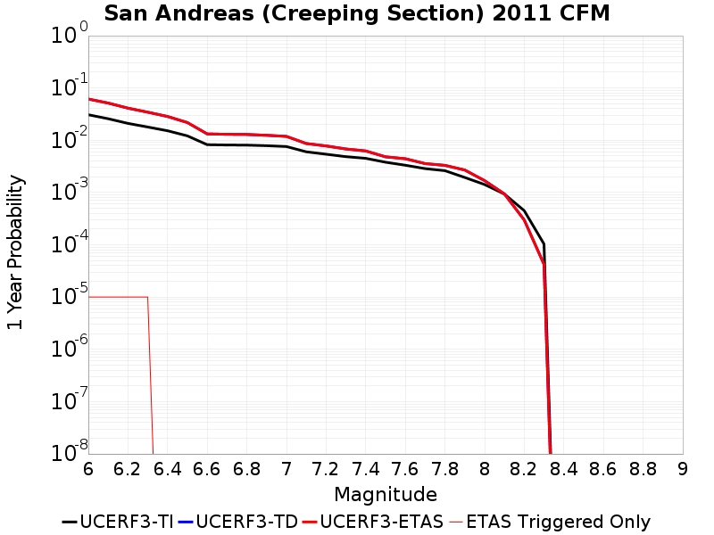 | 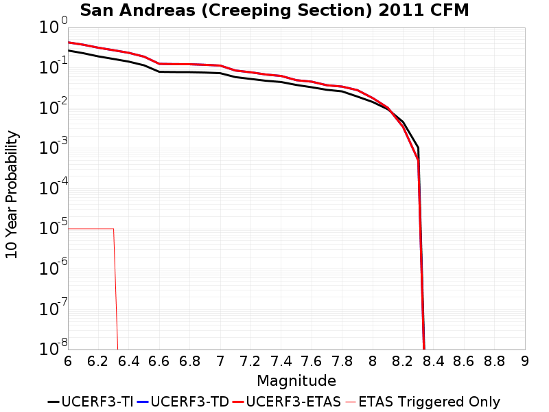 |

| Magnitude | 1 wk TI Prob | 1 wk TD Prob | 1 wk ETAS Prob | 1 wk ETAS/TD Gain | 1 wk ETAS Triggered Only | 1 mo TI Prob | 1 mo TD Prob | 1 mo ETAS Prob | 1 mo ETAS/TD Gain | 1 mo ETAS Triggered Only | 1 yr TI Prob | 1 yr TD Prob | 1 yr ETAS Prob | 1 yr ETAS/TD Gain | 1 yr ETAS Triggered Only | 10 yr TI Prob | 10 yr TD Prob | 10 yr ETAS Prob | 10 yr ETAS/TD Gain | 10 yr ETAS Triggered Only |
|-----|-----|-----|-----|-----|-----|-----|-----|-----|-----|-----|-----|-----|-----|-----|-----|-----|-----|-----|-----|-----|
| 6.0 | 5.986481E-4 | 0.0012334526 | 0.0012434402 | 1.0080973 | 1.0E-5 | 0.0025631124 | 0.0052705854 | 0.0052805324 | 1.0018873 | 1.0E-5 | 0.030762846 | 0.061493024 | 0.061502412 | 1.0001526 | 1.0E-5 | 0.26835477 | 0.4274413 | 0.42744705 | 1.0000134 | 1.0E-5 |
| 6.1 | 5.015945E-4 | 0.0010265819 | 0.0010365717 | 1.009731 | 1.0E-5 | 0.00214792 | 0.004388331 | 0.004398287 | 1.0022688 | 1.0E-5 | 0.025839351 | 0.051486194 | 0.05149568 | 1.0001842 | 1.0E-5 | 0.23032776 | 0.37428802 | 0.37429428 | 1.0000167 | 1.0E-5 |
| 6.2 | 4.073338E-4 | 8.1544864E-4 | 8.2544045E-4 | 1.0122532 | 1.0E-5 | 0.0017445484 | 0.003487315 | 0.0034972802 | 1.0028576 | 1.0E-5 | 0.021034058 | 0.041169785 | 0.041179374 | 1.0002329 | 1.0E-5 | 0.19150782 | 0.3145856 | 0.31459245 | 1.0000218 | 1.0E-5 |
| 6.3 | 3.464099E-4 | 6.786418E-4 | 6.88635E-4 | 1.0147253 | 1.0E-5 | 0.0014837692 | 0.0029031544 | 0.0029131253 | 1.0034345 | 1.0E-5 | 0.017915873 | 0.034427885 | 0.03443754 | 1.0002805 | 1.0E-5 | 0.16538359 | 0.27296242 | 0.2729697 | 1.0000266 | 1.0E-5 |
| 6.4 | 2.935057E-4 | 5.591718E-4 | 5.591718E-4 | 1.0 | 0.0 | 0.0012572751 | 0.0023928164 | 0.0023928164 | 1.0 | 0.0 | 0.015200248 | 0.028505154 | 0.028505154 | 1.0 | 0.0 | 0.14201577 | 0.23472263 | 0.23472263 | 1.0 | 0.0 |
| 6.5 | 2.3409708E-4 | 4.256758E-4 | 4.256758E-4 | 1.0 | 0.0 | 0.0010028875 | 0.0018222756 | 0.0018222756 | 1.0 | 0.0 | 0.012141965 | 0.021829844 | 0.021829844 | 1.0 | 0.0 | 0.11499573 | 0.1886658 | 0.1886658 | 1.0 | 0.0 |
| 6.6 | 1.5842178E-4 | 2.5540768E-4 | 2.5540768E-4 | 1.0 | 0.0 | 6.7877385E-4 | 0.0010941364 | 0.0010941364 | 1.0 | 0.0 | 0.0082328 | 0.013238373 | 0.013238373 | 1.0 | 0.0 | 0.07934396 | 0.12512097 | 0.12512097 | 1.0 | 0.0 |
| 6.7 | 1.5616413E-4 | 2.50761E-4 | 2.50761E-4 | 1.0 | 0.0 | 6.691031E-4 | 0.0010742416 | 0.0010742416 | 1.0 | 0.0 | 0.0081159435 | 0.012999668 | 0.012999668 | 1.0 | 0.0 | 0.0782586 | 0.12314795 | 0.12314795 | 1.0 | 0.0 |
| 6.8 | 1.5538467E-4 | 2.4898874E-4 | 2.4898874E-4 | 1.0 | 0.0 | 6.6576427E-4 | 0.0010666532 | 0.0010666532 | 1.0 | 0.0 | 0.008075596 | 0.012908531 | 0.012908531 | 1.0 | 0.0 | 0.07788358 | 0.12237639 | 0.12237639 | 1.0 | 0.0 |
| 6.9 | 1.5153569E-4 | 2.4004096E-4 | 2.4004096E-4 | 1.0 | 0.0 | 6.49277E-4 | 0.0010283433 | 0.0010283433 | 1.0 | 0.0 | 0.007876333 | 0.012448749 | 0.012448749 | 1.0 | 0.0 | 0.07602952 | 0.118439645 | 0.118439645 | 1.0 | 0.0 |
| 7.0 | 1.4588932E-4 | 2.2853371E-4 | 2.2853371E-4 | 1.0 | 0.0 | 6.250901E-4 | 9.790646E-4 | 9.790646E-4 | 1.0 | 0.0 | 0.0075839474 | 0.0118554775 | 0.0118554775 | 1.0 | 0.0 | 0.073302895 | 0.11326581 | 0.11326581 | 1.0 | 0.0 |
| 7.1 | 1.1565079E-4 | 1.6677871E-4 | 1.6677871E-4 | 1.0 | 0.0 | 4.955521E-4 | 7.14571E-4 | 7.14571E-4 | 1.0 | 0.0 | 0.006016669 | 0.00866541 | 0.00866541 | 1.0 | 0.0 | 0.058563538 | 0.08543883 | 0.08543883 | 1.0 | 0.0 |
| 7.2 | 1.0393792E-4 | 1.4987595E-4 | 1.4987595E-4 | 1.0 | 0.0 | 4.4537216E-4 | 6.4216816E-4 | 6.4216816E-4 | 1.0 | 0.0 | 0.005408933 | 0.0077905473 | 0.0077905473 | 1.0 | 0.0 | 0.052791595 | 0.07729677 | 0.07729677 | 1.0 | 0.0 |
| 7.3 | 9.332884E-5 | 1.3107879E-4 | 1.3107879E-4 | 1.0 | 0.0 | 3.999194E-4 | 5.6164595E-4 | 5.6164595E-4 | 1.0 | 0.0 | 0.0048581534 | 0.00681674 | 0.00681674 | 1.0 | 0.0 | 0.047533102 | 0.06798452 | 0.06798452 | 1.0 | 0.0 |
| 7.4 | 8.670252E-5 | 1.2012249E-4 | 1.2012249E-4 | 1.0 | 0.0 | 3.715293E-4 | 5.147097E-4 | 5.147097E-4 | 1.0 | 0.0 | 0.004513991 | 0.0062487107 | 0.0062487107 | 1.0 | 0.0 | 0.044233937 | 0.06258096 | 0.06258096 | 1.0 | 0.0 |
| 7.5 | 7.3036405E-5 | 9.266951E-5 | 9.266951E-5 | 1.0 | 0.0 | 3.129756E-4 | 3.9709467E-4 | 3.9709467E-4 | 1.0 | 0.0 | 0.0038038217 | 0.0048239334 | 0.0048239334 | 1.0 | 0.0 | 0.03739367 | 0.049121223 | 0.049121223 | 1.0 | 0.0 |
| 7.6 | 6.3935775E-5 | 8.5174834E-5 | 8.5174834E-5 | 1.0 | 0.0 | 2.7398168E-4 | 3.6498404E-4 | 3.6498404E-4 | 1.0 | 0.0 | 0.0033306254 | 0.004434646 | 0.004434646 | 1.0 | 0.0 | 0.032811474 | 0.04512165 | 0.04512165 | 1.0 | 0.0 |
| 7.7 | 5.5050095E-5 | 6.871855E-5 | 6.871855E-5 | 1.0 | 0.0 | 2.3590765E-4 | 2.9447486E-4 | 2.9447486E-4 | 1.0 | 0.0 | 0.0028683927 | 0.0035793418 | 0.0035793418 | 1.0 | 0.0 | 0.0283165 | 0.036812894 | 0.036812894 | 1.0 | 0.0 |
| 7.8 | 5.027131E-5 | 6.355007E-5 | 6.355007E-5 | 1.0 | 0.0 | 2.1543067E-4 | 2.7232902E-4 | 2.7232902E-4 | 1.0 | 0.0 | 0.0026197135 | 0.0033105686 | 0.0033105686 | 1.0 | 0.0 | 0.025890453 | 0.03405977 | 0.03405977 | 1.0 | 0.0 |
| 7.9 | 3.7271806E-5 | 5.1774106E-5 | 5.1774106E-5 | 1.0 | 0.0 | 1.5972654E-4 | 2.2187017E-4 | 2.2187017E-4 | 1.0 | 0.0 | 0.0019429359 | 0.0026979253 | 0.0026979253 | 1.0 | 0.0 | 0.019260362 | 0.027827622 | 0.027827622 | 1.0 | 0.0 |
| 8.0 | 2.7310243E-5 | 3.2457923E-5 | 3.2457923E-5 | 1.0 | 0.0 | 1.17038646E-4 | 1.3909796E-4 | 1.3909796E-4 | 1.0 | 0.0 | 0.0014240141 | 0.0016922031 | 0.0016922031 | 1.0 | 0.0 | 0.014149235 | 0.017736755 | 0.017736755 | 1.0 | 0.0 |
| 8.1 | 1.7940547E-5 | 1.8064065E-5 | 1.8064065E-5 | 1.0 | 0.0 | 7.688579E-5 | 7.741513E-5 | 7.741513E-5 | 1.0 | 0.0 | 9.3568244E-4 | 9.421222E-4 | 9.421222E-4 | 1.0 | 0.0 | 0.009317525 | 0.010147588 | 0.010147588 | 1.0 | 0.0 |
| 8.2 | 8.643924E-6 | 5.7415346E-6 | 5.7415346E-6 | 1.0 | 0.0 | 3.704486E-5 | 2.4606345E-5 | 2.4606345E-5 | 1.0 | 0.0 | 4.5092785E-4 | 2.9954113E-4 | 2.9954113E-4 | 1.0 | 0.0 | 0.0045001395 | 0.0033944051 | 0.0033944051 | 1.0 | 0.0 |
| 8.3 | 1.983087E-6 | 8.103189E-7 | 8.103189E-7 | 1.0 | 0.0 | 8.498917E-6 | 3.4727907E-6 | 3.4727907E-6 | 1.0 | 0.0 | 1.034694E-4 | 4.2280426E-5 | 4.2280426E-5 | 1.0 | 0.0 | 0.0010342124 | 4.9735163E-4 | 4.9735163E-4 | 1.0 | 0.0 |

## Coyote Lake
*[(top)](#table-of-contents)*

| 1 Week | 1 Month | 1 Year | 10 Year |
|-----|-----|-----|-----|
|  | 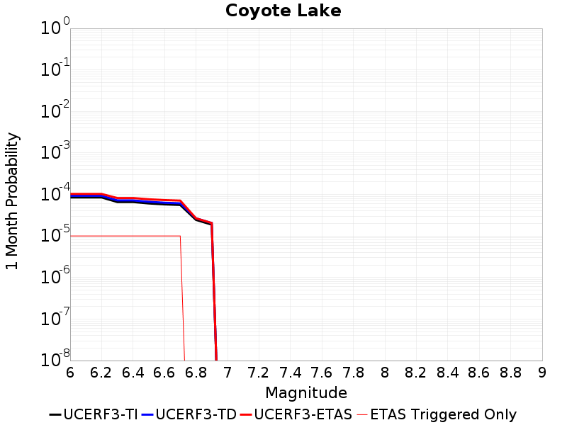 | 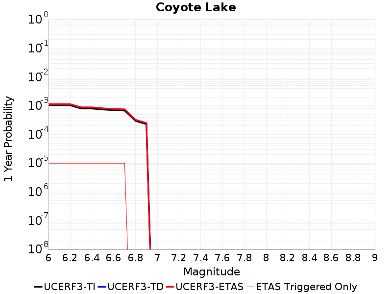 |  |

| Magnitude | 1 wk TI Prob | 1 wk TD Prob | 1 wk ETAS Prob | 1 wk ETAS/TD Gain | 1 wk ETAS Triggered Only | 1 mo TI Prob | 1 mo TD Prob | 1 mo ETAS Prob | 1 mo ETAS/TD Gain | 1 mo ETAS Triggered Only | 1 yr TI Prob | 1 yr TD Prob | 1 yr ETAS Prob | 1 yr ETAS/TD Gain | 1 yr ETAS Triggered Only | 10 yr TI Prob | 10 yr TD Prob | 10 yr ETAS Prob | 10 yr ETAS/TD Gain | 10 yr ETAS Triggered Only |
|-----|-----|-----|-----|-----|-----|-----|-----|-----|-----|-----|-----|-----|-----|-----|-----|-----|-----|-----|-----|-----|
| 6.0 | 1.980352E-5 | 2.1720782E-5 | 2.1720782E-5 | 1.0 | 0.0 | 8.486947E-5 | 9.308615E-5 | 1.0308522E-4 | 1.1074173 | 1.0E-5 | 0.0010327959 | 0.0011328068 | 0.0011427954 | 1.0088177 | 1.0E-5 | 0.010280091 | 0.011277511 | 0.011287398 | 1.0008767 | 1.0E-5 |
| 6.1 | 1.980352E-5 | 2.1720782E-5 | 2.1720782E-5 | 1.0 | 0.0 | 8.486947E-5 | 9.308615E-5 | 1.0308522E-4 | 1.1074173 | 1.0E-5 | 0.0010327959 | 0.0011328068 | 0.0011427954 | 1.0088177 | 1.0E-5 | 0.010280091 | 0.011277511 | 0.011287398 | 1.0008767 | 1.0E-5 |
| 6.2 | 1.980352E-5 | 2.1720782E-5 | 2.1720782E-5 | 1.0 | 0.0 | 8.486947E-5 | 9.308615E-5 | 1.0308522E-4 | 1.1074173 | 1.0E-5 | 0.0010327959 | 0.0011328068 | 0.0011427954 | 1.0088177 | 1.0E-5 | 0.010280091 | 0.011277511 | 0.011287398 | 1.0008767 | 1.0E-5 |
| 6.3 | 1.5344787E-5 | 1.6831556E-5 | 1.6831556E-5 | 1.0 | 0.0 | 6.576172E-5 | 7.213359E-5 | 8.213287E-5 | 1.1386217 | 1.0E-5 | 8.003548E-4 | 8.779339E-4 | 8.8792515E-4 | 1.0113804 | 1.0E-5 | 0.007974784 | 0.008750709 | 0.008760622 | 1.0011327 | 1.0E-5 |
| 6.4 | 1.5344787E-5 | 1.6831556E-5 | 1.6831556E-5 | 1.0 | 0.0 | 6.576172E-5 | 7.213359E-5 | 8.213287E-5 | 1.1386217 | 1.0E-5 | 8.003548E-4 | 8.779339E-4 | 8.8792515E-4 | 1.0113804 | 1.0E-5 | 0.007974784 | 0.008750709 | 0.008760622 | 1.0011327 | 1.0E-5 |
| 6.5 | 1.4189697E-5 | 1.5568083E-5 | 1.5568083E-5 | 1.0 | 0.0 | 6.081157E-5 | 6.671899E-5 | 7.671832E-5 | 1.1498724 | 1.0E-5 | 7.401293E-4 | 8.120613E-4 | 8.2205323E-4 | 1.0123043 | 1.0E-5 | 0.0073766913 | 0.00809689 | 0.008106809 | 1.001225 | 1.0E-5 |
| 6.6 | 1.3469301E-5 | 1.4781189E-5 | 1.4781189E-5 | 1.0 | 0.0 | 5.7724297E-5 | 6.334675E-5 | 7.334612E-5 | 1.1578513 | 1.0E-5 | 7.025667E-4 | 7.7103387E-4 | 7.8102614E-4 | 1.0129596 | 1.0E-5 | 0.0070034964 | 0.0076894993 | 0.0076994225 | 1.0012904 | 1.0E-5 |
| 6.7 | 1.3027966E-5 | 1.4290994E-5 | 1.4290994E-5 | 1.0 | 0.0 | 5.5832945E-5 | 6.124601E-5 | 7.1245406E-5 | 1.163266 | 1.0E-5 | 6.7955407E-4 | 7.4547494E-4 | 7.554675E-4 | 1.0134043 | 1.0E-5 | 0.006774798 | 0.0074356273 | 0.007445553 | 1.0013349 | 1.0E-5 |
| 6.8 | 5.695434E-6 | 6.228306E-6 | 6.228306E-6 | 1.0 | 0.0 | 2.4408775E-5 | 2.6692638E-5 | 2.6692638E-5 | 1.0 | 0.0 | 2.971363E-4 | 3.2496444E-4 | 3.2496444E-4 | 1.0 | 0.0 | 0.0029673933 | 0.0032478368 | 0.0032478368 | 1.0 | 0.0 |
| 6.9 | 4.385688E-6 | 4.79605E-6 | 4.79605E-6 | 1.0 | 0.0 | 1.879567E-5 | 2.05545E-5 | 2.05545E-5 | 1.0 | 0.0 | 2.2881327E-4 | 2.5025103E-4 | 2.5025103E-4 | 1.0 | 0.0 | 0.002285778 | 0.0025025103 | 0.0025025103 | 1.0 | 0.0 |

## Cady
*[(top)](#table-of-contents)*

| 1 Week | 1 Month | 1 Year | 10 Year |
|-----|-----|-----|-----|
| 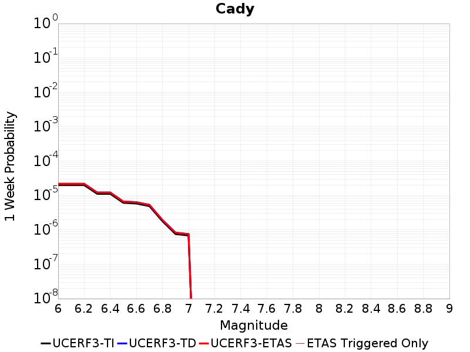 | 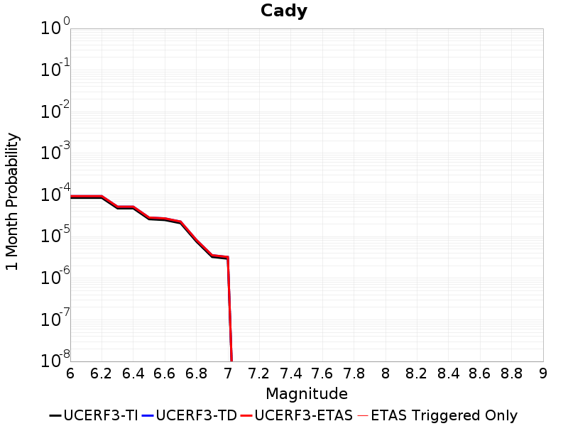 |  |  |

| Magnitude | 1 wk TI Prob | 1 wk TD Prob | 1 wk ETAS Prob | 1 wk ETAS/TD Gain | 1 wk ETAS Triggered Only | 1 mo TI Prob | 1 mo TD Prob | 1 mo ETAS Prob | 1 mo ETAS/TD Gain | 1 mo ETAS Triggered Only | 1 yr TI Prob | 1 yr TD Prob | 1 yr ETAS Prob | 1 yr ETAS/TD Gain | 1 yr ETAS Triggered Only | 10 yr TI Prob | 10 yr TD Prob | 10 yr ETAS Prob | 10 yr ETAS/TD Gain | 10 yr ETAS Triggered Only |
|-----|-----|-----|-----|-----|-----|-----|-----|-----|-----|-----|-----|-----|-----|-----|-----|-----|-----|-----|-----|-----|
| 6.0 | 1.9892565E-5 | 2.1873271E-5 | 2.1873271E-5 | 1.0 | 0.0 | 8.525106E-5 | 9.3739734E-5 | 9.3739734E-5 | 1.0 | 0.0 | 0.0010374374 | 0.0011407748 | 0.0011407748 | 1.0 | 0.0 | 0.010326075 | 0.011358216 | 0.011368102 | 1.0008705 | 1.0E-5 |
| 6.1 | 1.9892565E-5 | 2.1873271E-5 | 2.1873271E-5 | 1.0 | 0.0 | 8.525106E-5 | 9.3739734E-5 | 9.3739734E-5 | 1.0 | 0.0 | 0.0010374374 | 0.0011407748 | 0.0011407748 | 1.0 | 0.0 | 0.010326075 | 0.011358216 | 0.011368102 | 1.0008705 | 1.0E-5 |
| 6.2 | 1.9892565E-5 | 2.1873271E-5 | 2.1873271E-5 | 1.0 | 0.0 | 8.525106E-5 | 9.3739734E-5 | 9.3739734E-5 | 1.0 | 0.0 | 0.0010374374 | 0.0011407748 | 0.0011407748 | 1.0 | 0.0 | 0.010326075 | 0.011358216 | 0.011368102 | 1.0008705 | 1.0E-5 |
| 6.3 | 1.1117327E-5 | 1.2184392E-5 | 1.2184392E-5 | 1.0 | 0.0 | 4.764482E-5 | 5.2217954E-5 | 5.2217954E-5 | 1.0 | 0.0 | 5.7992124E-4 | 6.355997E-4 | 6.355997E-4 | 1.0 | 0.0 | 0.0057841022 | 0.0063409284 | 0.006350865 | 1.001567 | 1.0E-5 |
| 6.4 | 1.1117327E-5 | 1.2184392E-5 | 1.2184392E-5 | 1.0 | 0.0 | 4.764482E-5 | 5.2217954E-5 | 5.2217954E-5 | 1.0 | 0.0 | 5.7992124E-4 | 6.355997E-4 | 6.355997E-4 | 1.0 | 0.0 | 0.0057841022 | 0.0063409284 | 0.006350865 | 1.001567 | 1.0E-5 |
| 6.5 | 6.103093E-6 | 6.6762077E-6 | 6.6762077E-6 | 1.0 | 0.0 | 2.615585E-5 | 2.8612076E-5 | 2.8612076E-5 | 1.0 | 0.0 | 3.1840094E-4 | 3.4830894E-4 | 3.4830894E-4 | 1.0 | 0.0 | 0.0031794512 | 0.0034788656 | 0.0034888308 | 1.0028645 | 1.0E-5 |
| 6.6 | 5.817237E-6 | 6.369698E-6 | 6.369698E-6 | 1.0 | 0.0 | 2.4930776E-5 | 2.729849E-5 | 2.729849E-5 | 1.0 | 0.0 | 3.034899E-4 | 3.323209E-4 | 3.323209E-4 | 1.0 | 0.0 | 0.0030307577 | 0.003319463 | 0.0033294298 | 1.0030025 | 1.0E-5 |
| 6.7 | 4.8846314E-6 | 5.343924E-6 | 5.343924E-6 | 1.0 | 0.0 | 2.0933967E-5 | 2.2902395E-5 | 2.2902395E-5 | 1.0 | 0.0 | 2.5484123E-4 | 2.7881277E-4 | 2.7881277E-4 | 1.0 | 0.0 | 0.0025454918 | 0.0027857868 | 0.0027857868 | 1.0 | 0.0 |
| 6.8 | 1.7788773E-6 | 1.94109E-6 | 1.94109E-6 | 1.0 | 0.0 | 7.6237375E-6 | 8.31894E-6 | 8.31894E-6 | 1.0 | 0.0 | 9.281505E-5 | 1.0127996E-4 | 1.0127996E-4 | 1.0 | 0.0 | 9.2776294E-4 | 0.0010124928 | 0.0010124928 | 1.0 | 0.0 |
| 6.9 | 7.5455404E-7 | 8.3026515E-7 | 8.3026515E-7 | 1.0 | 0.0 | 3.233799E-6 | 3.5582761E-6 | 3.5582761E-6 | 1.0 | 0.0 | 3.937079E-5 | 4.332149E-5 | 4.332149E-5 | 1.0 | 0.0 | 3.9363815E-4 | 4.3316343E-4 | 4.3316343E-4 | 1.0 | 0.0 |
| 7.0 | 6.8578805E-7 | 7.5468756E-7 | 7.5468756E-7 | 1.0 | 0.0 | 2.9390883E-6 | 3.2343733E-6 | 3.2343733E-6 | 1.0 | 0.0 | 3.578281E-5 | 3.9378112E-5 | 3.9378112E-5 | 1.0 | 0.0 | 3.577705E-4 | 3.9374386E-4 | 3.9374386E-4 | 1.0 | 0.0 |

## San Diego Trough south
*[(top)](#table-of-contents)*

| 1 Week | 1 Month | 1 Year | 10 Year |
|-----|-----|-----|-----|
| 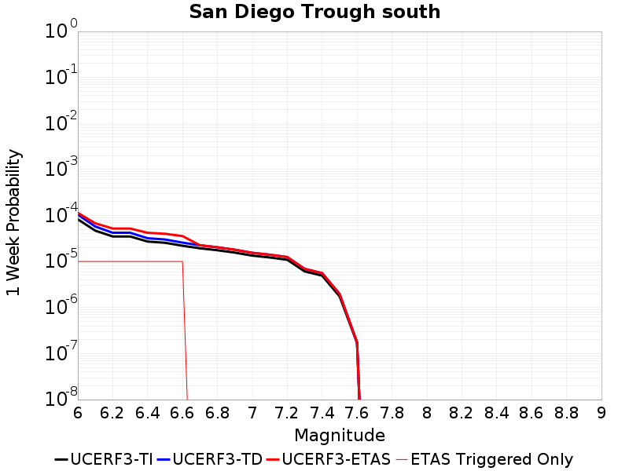 |  | 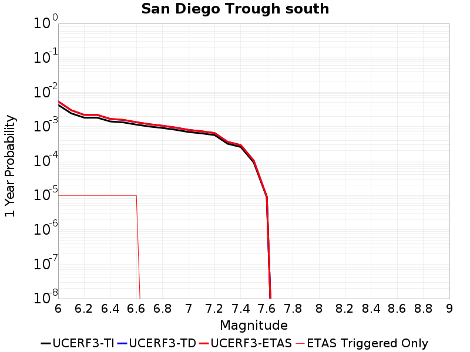 |  |

| Magnitude | 1 wk TI Prob | 1 wk TD Prob | 1 wk ETAS Prob | 1 wk ETAS/TD Gain | 1 wk ETAS Triggered Only | 1 mo TI Prob | 1 mo TD Prob | 1 mo ETAS Prob | 1 mo ETAS/TD Gain | 1 mo ETAS Triggered Only | 1 yr TI Prob | 1 yr TD Prob | 1 yr ETAS Prob | 1 yr ETAS/TD Gain | 1 yr ETAS Triggered Only | 10 yr TI Prob | 10 yr TD Prob | 10 yr ETAS Prob | 10 yr ETAS/TD Gain | 10 yr ETAS Triggered Only |
|-----|-----|-----|-----|-----|-----|-----|-----|-----|-----|-----|-----|-----|-----|-----|-----|-----|-----|-----|-----|-----|
| 6.0 | 8.279495E-5 | 1.0443216E-4 | 1.1443112E-4 | 1.0957459 | 1.0E-5 | 3.5478722E-4 | 4.4749337E-4 | 4.574889E-4 | 1.0223367 | 1.0E-5 | 0.004310982 | 0.005435037 | 0.0054449826 | 1.0018299 | 1.0E-5 | 0.042283054 | 0.053078942 | 0.053088408 | 1.0001785 | 1.0E-5 |
| 6.1 | 4.6961468E-5 | 5.7818444E-5 | 6.781787E-5 | 1.1729451 | 1.0E-5 | 2.0124791E-4 | 2.4776952E-4 | 2.5776704E-4 | 1.0403501 | 1.0E-5 | 0.00244744 | 0.0030124732 | 0.003022443 | 1.0033095 | 1.0E-5 | 0.024206603 | 0.029723931 | 0.029733634 | 1.0003264 | 1.0E-5 |
| 6.2 | 3.5079658E-5 | 4.2199896E-5 | 5.2199473E-5 | 1.2369574 | 1.0E-5 | 1.5033272E-4 | 1.8084436E-4 | 1.9084255E-4 | 1.0552862 | 1.0E-5 | 0.0018287642 | 0.0021995697 | 0.0022095477 | 1.0045364 | 1.0E-5 | 0.018137876 | 0.021780306 | 0.02179009 | 1.0004492 | 1.0E-5 |
| 6.3 | 3.5079658E-5 | 4.2199896E-5 | 5.2199473E-5 | 1.2369574 | 1.0E-5 | 1.5033272E-4 | 1.8084436E-4 | 1.9084255E-4 | 1.0552862 | 1.0E-5 | 0.0018287642 | 0.0021995697 | 0.0022095477 | 1.0045364 | 1.0E-5 | 0.018137876 | 0.021780306 | 0.02179009 | 1.0004492 | 1.0E-5 |
| 6.4 | 2.7196904E-5 | 3.2126256E-5 | 4.2125932E-5 | 1.3112619 | 1.0E-5 | 1.16552954E-4 | 1.3767672E-4 | 1.4767534E-4 | 1.072624 | 1.0E-5 | 0.0014181085 | 0.0016749365 | 0.0016849197 | 1.0059603 | 1.0E-5 | 0.014090929 | 0.016624706 | 0.01663454 | 1.0005915 | 1.0E-5 |
| 6.5 | 2.5584688E-5 | 3.013765E-5 | 4.0137347E-5 | 1.3318009 | 1.0E-5 | 1.0964406E-4 | 1.2915499E-4 | 1.391537E-4 | 1.0774163 | 1.0E-5 | 0.0013340989 | 0.0015713393 | 0.0015813236 | 1.006354 | 1.0E-5 | 0.013261181 | 0.015603818 | 0.015613662 | 1.0006309 | 1.0E-5 |
| 6.6 | 2.2034688E-5 | 2.577206E-5 | 3.57718E-5 | 1.388007 | 1.0E-5 | 9.443096E-5 | 1.10447065E-4 | 1.20445955E-4 | 1.0905311 | 1.0E-5 | 0.0011490905 | 0.0013438709 | 0.0013538575 | 1.0074311 | 1.0E-5 | 0.011431668 | 0.013358433 | 0.013368299 | 1.0007386 | 1.0E-5 |
| 6.7 | 1.9394853E-5 | 2.2566535E-5 | 2.2566535E-5 | 1.0 | 0.0 | 8.311815E-5 | 9.6710166E-5 | 9.6710166E-5 | 1.0 | 0.0 | 0.0010114936 | 0.0011768155 | 0.0011768155 | 1.0 | 0.0 | 0.01006902 | 0.011706543 | 0.011706543 | 1.0 | 0.0 |
| 6.8 | 1.7615313E-5 | 2.0425032E-5 | 2.0425032E-5 | 1.0 | 0.0 | 7.549201E-5 | 8.753294E-5 | 8.753294E-5 | 1.0 | 0.0 | 9.1872766E-4 | 0.0010651968 | 0.0010651968 | 1.0 | 0.0 | 0.009149387 | 0.01060148 | 0.01060148 | 1.0 | 0.0 |
| 6.9 | 1.5621423E-5 | 1.8044875E-5 | 1.8044875E-5 | 1.0 | 0.0 | 6.6947236E-5 | 7.73329E-5 | 7.73329E-5 | 1.0 | 0.0 | 8.147778E-4 | 9.41125E-4 | 9.41125E-4 | 1.0 | 0.0 | 0.008117969 | 0.009371839 | 0.009371839 | 1.0 | 0.0 |
| 7.0 | 1.3444376E-5 | 1.5463642E-5 | 1.5463642E-5 | 1.0 | 0.0 | 5.7617483E-5 | 6.627108E-5 | 6.627108E-5 | 1.0 | 0.0 | 7.0126704E-4 | 8.065545E-4 | 8.065545E-4 | 1.0 | 0.0 | 0.006990582 | 0.008036606 | 0.008036606 | 1.0 | 0.0 |
| 7.1 | 1.2268361E-5 | 1.4087013E-5 | 1.4087013E-5 | 1.0 | 0.0 | 5.2577634E-5 | 6.037153E-5 | 6.037153E-5 | 1.0 | 0.0 | 6.399447E-4 | 7.347782E-4 | 7.347782E-4 | 1.0 | 0.0 | 0.0063810493 | 0.0073237927 | 0.0073237927 | 1.0 | 0.0 |
| 7.2 | 1.0922655E-5 | 1.25258775E-5 | 1.25258775E-5 | 1.0 | 0.0 | 4.681054E-5 | 5.368124E-5 | 5.368124E-5 | 1.0 | 0.0 | 5.697693E-4 | 6.5337564E-4 | 6.5337564E-4 | 1.0 | 0.0 | 0.0056831064 | 0.0065148277 | 0.0065148277 | 1.0 | 0.0 |
| 7.3 | 6.1106753E-6 | 6.935199E-6 | 6.935199E-6 | 1.0 | 0.0 | 2.6188345E-5 | 2.9721945E-5 | 2.9721945E-5 | 1.0 | 0.0 | 3.1879646E-4 | 3.61805E-4 | 3.61805E-4 | 1.0 | 0.0 | 0.0031833951 | 0.003612205 | 0.003612205 | 1.0 | 0.0 |
| 7.4 | 4.933187E-6 | 5.5945857E-6 | 5.5945857E-6 | 1.0 | 0.0 | 2.114206E-5 | 2.3976578E-5 | 2.3976578E-5 | 1.0 | 0.0 | 2.5737417E-4 | 2.9187612E-4 | 2.9187612E-4 | 1.0 | 0.0 | 0.002570763 | 0.002914969 | 0.002914969 | 1.0 | 0.0 |
| 7.5 | 1.7489613E-6 | 1.9713725E-6 | 1.9713725E-6 | 1.0 | 0.0 | 7.495527E-6 | 8.448714E-6 | 8.448714E-6 | 1.0 | 0.0 | 9.125422E-5 | 1.0285845E-4 | 1.0285845E-4 | 1.0 | 0.0 | 9.1216754E-4 | 0.0010281305 | 0.0010281305 | 1.0 | 0.0 |
| 7.6 | 1.6988751E-7 | 1.7537606E-7 | 1.7537606E-7 | 1.0 | 0.0 | 7.2808916E-7 | 7.516115E-7 | 7.516115E-7 | 1.0 | 0.0 | 8.864449E-6 | 9.150834E-6 | 9.150834E-6 | 1.0 | 0.0 | 8.8640954E-5 | 9.1504764E-5 | 9.1504764E-5 | 1.0 | 0.0 |

## San Andreas (Carrizo) rev
*[(top)](#table-of-contents)*

| 1 Week | 1 Month | 1 Year | 10 Year |
|-----|-----|-----|-----|
|  | 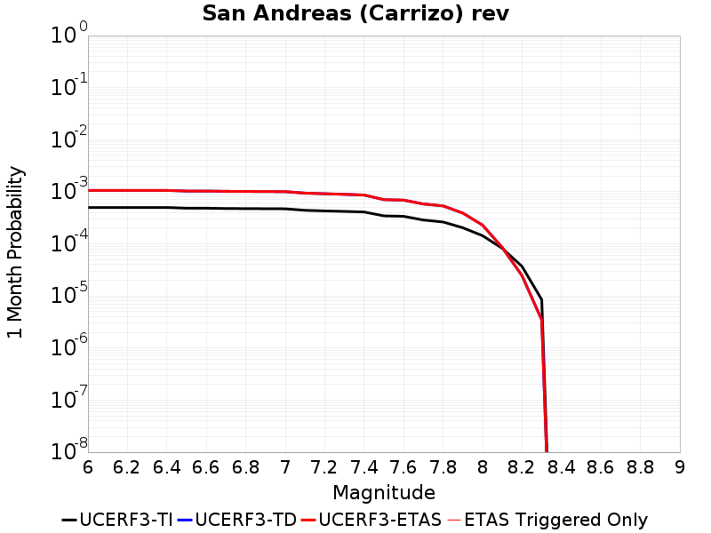 |  |  |

| Magnitude | 1 wk TI Prob | 1 wk TD Prob | 1 wk ETAS Prob | 1 wk ETAS/TD Gain | 1 wk ETAS Triggered Only | 1 mo TI Prob | 1 mo TD Prob | 1 mo ETAS Prob | 1 mo ETAS/TD Gain | 1 mo ETAS Triggered Only | 1 yr TI Prob | 1 yr TD Prob | 1 yr ETAS Prob | 1 yr ETAS/TD Gain | 1 yr ETAS Triggered Only | 10 yr TI Prob | 10 yr TD Prob | 10 yr ETAS Prob | 10 yr ETAS/TD Gain | 10 yr ETAS Triggered Only |
|-----|-----|-----|-----|-----|-----|-----|-----|-----|-----|-----|-----|-----|-----|-----|-----|-----|-----|-----|-----|-----|
| 6.0 | 1.1674632E-4 | 2.481732E-4 | 2.481732E-4 | 1.0 | 0.0 | 5.002454E-4 | 0.0010631676 | 0.0010631676 | 1.0 | 0.0 | 0.006073493 | 0.012867745 | 0.012877616 | 1.0007671 | 1.0E-5 | 0.0591016 | 0.12266047 | 0.12266924 | 1.0000715 | 1.0E-5 |
| 6.1 | 1.1674632E-4 | 2.481732E-4 | 2.481732E-4 | 1.0 | 0.0 | 5.002454E-4 | 0.0010631676 | 0.0010631676 | 1.0 | 0.0 | 0.006073493 | 0.012867745 | 0.012877616 | 1.0007671 | 1.0E-5 | 0.0591016 | 0.12266047 | 0.12266924 | 1.0000715 | 1.0E-5 |
| 6.2 | 1.1674632E-4 | 2.481732E-4 | 2.481732E-4 | 1.0 | 0.0 | 5.002454E-4 | 0.0010631676 | 0.0010631676 | 1.0 | 0.0 | 0.006073493 | 0.012867745 | 0.012877616 | 1.0007671 | 1.0E-5 | 0.0591016 | 0.12266047 | 0.12266924 | 1.0000715 | 1.0E-5 |
| 6.3 | 1.1674632E-4 | 2.481732E-4 | 2.481732E-4 | 1.0 | 0.0 | 5.002454E-4 | 0.0010631676 | 0.0010631676 | 1.0 | 0.0 | 0.006073493 | 0.012867745 | 0.012877616 | 1.0007671 | 1.0E-5 | 0.0591016 | 0.12266047 | 0.12266924 | 1.0000715 | 1.0E-5 |
| 6.4 | 1.1674632E-4 | 2.481732E-4 | 2.481732E-4 | 1.0 | 0.0 | 5.002454E-4 | 0.0010631676 | 0.0010631676 | 1.0 | 0.0 | 0.006073493 | 0.012867745 | 0.012877616 | 1.0007671 | 1.0E-5 | 0.0591016 | 0.12266047 | 0.12266924 | 1.0000715 | 1.0E-5 |
| 6.5 | 1.13136164E-4 | 2.4135139E-4 | 2.4135139E-4 | 1.0 | 0.0 | 4.847792E-4 | 0.0010339546 | 0.0010339546 | 1.0 | 0.0 | 0.0058862255 | 0.012516204 | 0.012526079 | 1.0007889 | 1.0E-5 | 0.057327334 | 0.119634785 | 0.11964359 | 1.0000736 | 1.0E-5 |
| 6.6 | 1.13136164E-4 | 2.4135139E-4 | 2.4135139E-4 | 1.0 | 0.0 | 4.847792E-4 | 0.0010339546 | 0.0010339546 | 1.0 | 0.0 | 0.0058862255 | 0.012516204 | 0.012526079 | 1.0007889 | 1.0E-5 | 0.057327334 | 0.119634785 | 0.11964359 | 1.0000736 | 1.0E-5 |
| 6.7 | 1.1149675E-4 | 2.3825352E-4 | 2.3825352E-4 | 1.0 | 0.0 | 4.777557E-4 | 0.0010206884 | 0.0010206884 | 1.0 | 0.0 | 0.0058011734 | 0.01235653 | 0.012366407 | 1.0007993 | 1.0E-5 | 0.05652051 | 0.11826142 | 0.11827023 | 1.0000745 | 1.0E-5 |
| 6.8 | 1.1103589E-4 | 2.3726939E-4 | 2.3726939E-4 | 1.0 | 0.0 | 4.7578133E-4 | 0.0010164741 | 0.0010164741 | 1.0 | 0.0 | 0.005777263 | 0.0123058 | 0.0123156775 | 1.0008026 | 1.0E-5 | 0.056293584 | 0.117819846 | 0.11782867 | 1.0000749 | 1.0E-5 |
| 6.9 | 1.1053259E-4 | 2.3618684E-4 | 2.3618684E-4 | 1.0 | 0.0 | 4.7362508E-4 | 0.0010118382 | 0.0010118382 | 1.0 | 0.0 | 0.0057511497 | 0.012249994 | 0.012259872 | 1.0008063 | 1.0E-5 | 0.05604569 | 0.11733351 | 0.11734234 | 1.0000752 | 1.0E-5 |
| 7.0 | 1.1005377E-4 | 2.3518922E-4 | 2.3518922E-4 | 1.0 | 0.0 | 4.7157376E-4 | 0.001007566 | 0.001007566 | 1.0 | 0.0 | 0.0057263062 | 0.012198564 | 0.012208442 | 1.0008098 | 1.0E-5 | 0.055809796 | 0.116884716 | 0.11689355 | 1.0000756 | 1.0E-5 |
| 7.1 | 1.0308142E-4 | 2.201961E-4 | 2.201961E-4 | 1.0 | 0.0 | 4.417027E-4 | 9.4335736E-4 | 9.4335736E-4 | 1.0 | 0.0 | 0.0053644776 | 0.011425221 | 0.011435107 | 1.0008652 | 1.0E-5 | 0.052368138 | 0.11012551 | 0.11013441 | 1.0000808 | 1.0E-5 |
| 7.2 | 1.0027479E-4 | 2.1423743E-4 | 2.1423743E-4 | 1.0 | 0.0 | 4.296783E-4 | 9.1783836E-4 | 9.1783836E-4 | 1.0 | 0.0 | 0.0052187922 | 0.011117739 | 0.011127627 | 1.0008894 | 1.0E-5 | 0.050979212 | 0.107422344 | 0.10743127 | 1.0000831 | 1.0E-5 |
| 7.3 | 9.816942E-5 | 2.0892374E-4 | 2.0892374E-4 | 1.0 | 0.0 | 4.2065824E-4 | 8.950812E-4 | 8.950812E-4 | 1.0 | 0.0 | 0.005109493 | 0.01084346 | 0.010853352 | 1.0009122 | 1.0E-5 | 0.049935985 | 0.10498381 | 0.104992755 | 1.0000852 | 1.0E-5 |
| 7.4 | 9.5634205E-5 | 2.0253315E-4 | 2.0253315E-4 | 1.0 | 0.0 | 4.0979648E-4 | 8.6771144E-4 | 8.6771144E-4 | 1.0 | 0.0 | 0.0049778637 | 0.01051349 | 0.010523384 | 1.0009412 | 1.0E-5 | 0.048678253 | 0.10204917 | 0.10205815 | 1.000088 | 1.0E-5 |
| 7.5 | 8.052417E-5 | 1.6518663E-4 | 1.6518663E-4 | 1.0 | 0.0 | 3.4505792E-4 | 7.077508E-4 | 7.077508E-4 | 1.0 | 0.0 | 0.0041929903 | 0.008582908 | 0.008592822 | 1.0011551 | 1.0E-5 | 0.04114753 | 0.0846178 | 0.08462696 | 1.0001081 | 1.0E-5 |
| 7.6 | 7.897024E-5 | 1.6166912E-4 | 1.6166912E-4 | 1.0 | 0.0 | 3.384E-4 | 6.9268385E-4 | 6.9268385E-4 | 1.0 | 0.0 | 0.0041122385 | 0.008400897 | 0.008410812 | 1.0011803 | 1.0E-5 | 0.040369697 | 0.08294186 | 0.08295103 | 1.0001105 | 1.0E-5 |
| 7.7 | 6.707427E-5 | 1.3638023E-4 | 1.3638023E-4 | 1.0 | 0.0 | 2.8742946E-4 | 5.843558E-4 | 5.843558E-4 | 1.0 | 0.0 | 0.003493839 | 0.007091359 | 0.007091359 | 1.0 | 0.0 | 0.034394164 | 0.07069169 | 0.07069169 | 1.0 | 0.0 |
| 7.8 | 6.147705E-5 | 1.2525334E-4 | 1.2525334E-4 | 1.0 | 0.0 | 2.6344648E-4 | 5.3668965E-4 | 5.3668965E-4 | 1.0 | 0.0 | 0.0032027436 | 0.006514647 | 0.006514647 | 1.0 | 0.0 | 0.031569764 | 0.0650135 | 0.0650135 | 1.0 | 0.0 |
| 7.9 | 4.7636717E-5 | 9.117804E-5 | 9.117804E-5 | 1.0 | 0.0 | 2.0414138E-4 | 3.9070452E-4 | 3.9070452E-4 | 1.0 | 0.0 | 0.0024825884 | 0.004746461 | 0.004746461 | 1.0 | 0.0 | 0.024550365 | 0.047744144 | 0.047744144 | 1.0 | 0.0 |
| 8.0 | 3.3554235E-5 | 5.3614553E-5 | 5.3614553E-5 | 1.0 | 0.0 | 1.4379594E-4 | 2.2975642E-4 | 2.2975642E-4 | 1.0 | 0.0 | 0.0017493097 | 0.002793698 | 0.002793698 | 1.0 | 0.0 | 0.017356034 | 0.028606014 | 0.028606014 | 1.0 | 0.0 |
| 8.1 | 1.9175432E-5 | 1.989546E-5 | 1.989546E-5 | 1.0 | 0.0 | 8.217783E-5 | 8.526348E-5 | 8.526348E-5 | 1.0 | 0.0 | 0.0010000558 | 0.0010375892 | 0.0010375892 | 1.0 | 0.0 | 0.009955673 | 0.011130299 | 0.011130299 | 1.0 | 0.0 |
| 8.2 | 8.643924E-6 | 5.7415346E-6 | 5.7415346E-6 | 1.0 | 0.0 | 3.704486E-5 | 2.4606345E-5 | 2.4606345E-5 | 1.0 | 0.0 | 4.5092785E-4 | 2.9954113E-4 | 2.9954113E-4 | 1.0 | 0.0 | 0.0045001395 | 0.0033944051 | 0.0033944051 | 1.0 | 0.0 |
| 8.3 | 1.983087E-6 | 8.103189E-7 | 8.103189E-7 | 1.0 | 0.0 | 8.498917E-6 | 3.4727907E-6 | 3.4727907E-6 | 1.0 | 0.0 | 1.034694E-4 | 4.2280426E-5 | 4.2280426E-5 | 1.0 | 0.0 | 0.0010342124 | 4.9735163E-4 | 4.9735163E-4 | 1.0 | 0.0 |

## Big Pine (East)
*[(top)](#table-of-contents)*

| 1 Week | 1 Month | 1 Year | 10 Year |
|-----|-----|-----|-----|
| 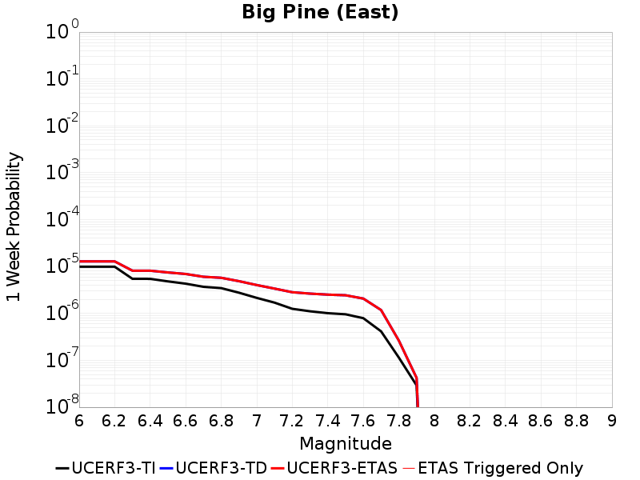 |  |  |  |

| Magnitude | 1 wk TI Prob | 1 wk TD Prob | 1 wk ETAS Prob | 1 wk ETAS/TD Gain | 1 wk ETAS Triggered Only | 1 mo TI Prob | 1 mo TD Prob | 1 mo ETAS Prob | 1 mo ETAS/TD Gain | 1 mo ETAS Triggered Only | 1 yr TI Prob | 1 yr TD Prob | 1 yr ETAS Prob | 1 yr ETAS/TD Gain | 1 yr ETAS Triggered Only | 10 yr TI Prob | 10 yr TD Prob | 10 yr ETAS Prob | 10 yr ETAS/TD Gain | 10 yr ETAS Triggered Only |
|-----|-----|-----|-----|-----|-----|-----|-----|-----|-----|-----|-----|-----|-----|-----|-----|-----|-----|-----|-----|-----|
| 6.0 | 9.916913E-6 | 1.2880481E-5 | 1.2880481E-5 | 1.0 | 0.0 | 4.250036E-5 | 5.520102E-5 | 6.520047E-5 | 1.181146 | 1.0E-5 | 5.173191E-4 | 6.718873E-4 | 6.8188057E-4 | 1.0148735 | 1.0E-5 | 0.0051611643 | 0.006702944 | 0.006712877 | 1.0014819 | 1.0E-5 |
| 6.1 | 9.916913E-6 | 1.2880481E-5 | 1.2880481E-5 | 1.0 | 0.0 | 4.250036E-5 | 5.520102E-5 | 6.520047E-5 | 1.181146 | 1.0E-5 | 5.173191E-4 | 6.718873E-4 | 6.8188057E-4 | 1.0148735 | 1.0E-5 | 0.0051611643 | 0.006702944 | 0.006712877 | 1.0014819 | 1.0E-5 |
| 6.2 | 9.916913E-6 | 1.2880481E-5 | 1.2880481E-5 | 1.0 | 0.0 | 4.250036E-5 | 5.520102E-5 | 6.520047E-5 | 1.181146 | 1.0E-5 | 5.173191E-4 | 6.718873E-4 | 6.8188057E-4 | 1.0148735 | 1.0E-5 | 0.0051611643 | 0.006702944 | 0.006712877 | 1.0014819 | 1.0E-5 |
| 6.3 | 5.479711E-6 | 8.174545E-6 | 8.174545E-6 | 1.0 | 0.0 | 2.3484265E-5 | 3.503331E-5 | 4.503296E-5 | 1.2854326 | 1.0E-5 | 2.858834E-4 | 4.264503E-4 | 4.3644605E-4 | 1.0234394 | 1.0E-5 | 0.0028551589 | 0.0042588357 | 0.0042687934 | 1.002338 | 1.0E-5 |
| 6.4 | 5.465009E-6 | 8.158831E-6 | 8.158831E-6 | 1.0 | 0.0 | 2.3421257E-5 | 3.4965968E-5 | 4.4965618E-5 | 1.2859824 | 1.0E-5 | 2.851165E-4 | 4.2563071E-4 | 4.3562648E-4 | 1.0234846 | 1.0E-5 | 0.0028475097 | 0.0042506712 | 0.004260629 | 1.0023426 | 1.0E-5 |
| 6.5 | 4.826767E-6 | 7.4836266E-6 | 7.4836266E-6 | 1.0 | 0.0 | 2.068598E-5 | 3.2072305E-5 | 4.2071984E-5 | 1.3117855 | 1.0E-5 | 2.518227E-4 | 3.9041316E-4 | 4.0040925E-4 | 1.0256039 | 1.0E-5 | 0.0025153751 | 0.003899747 | 0.003909708 | 1.0025543 | 1.0E-5 |
| 6.6 | 4.3146847E-6 | 6.943364E-6 | 6.943364E-6 | 1.0 | 0.0 | 1.8491375E-5 | 2.975695E-5 | 3.975665E-5 | 1.336046 | 1.0E-5 | 2.2510924E-4 | 3.622331E-4 | 3.7222946E-4 | 1.0275965 | 1.0E-5 | 0.0022488134 | 0.0036188683 | 0.003628832 | 1.0027533 | 1.0E-5 |
| 6.7 | 3.6968106E-6 | 6.052983E-6 | 6.052983E-6 | 1.0 | 0.0 | 1.5843378E-5 | 2.5941104E-5 | 3.5940844E-5 | 1.3854786 | 1.0E-5 | 1.9287605E-4 | 3.1578873E-4 | 3.2578557E-4 | 1.0316567 | 1.0E-5 | 0.0019270873 | 0.0031557505 | 0.0031657189 | 1.0031588 | 1.0E-5 |
| 6.8 | 3.4671132E-6 | 5.758126E-6 | 5.758126E-6 | 1.0 | 0.0 | 1.4858972E-5 | 2.4677456E-5 | 3.467721E-5 | 1.4052181 | 1.0E-5 | 1.8089297E-4 | 3.0040808E-4 | 3.1040507E-4 | 1.0332781 | 1.0E-5 | 0.0018074579 | 0.0030023616 | 0.0030123317 | 1.0033207 | 1.0E-5 |
| 6.9 | 2.7686972E-6 | 4.876879E-6 | 4.876879E-6 | 1.0 | 0.0 | 1.1865792E-5 | 2.0900747E-5 | 3.0900537E-5 | 1.4784418 | 1.0E-5 | 1.4445644E-4 | 2.5443765E-4 | 2.644351E-4 | 1.0392923 | 1.0E-5 | 0.0014436257 | 0.0025437362 | 0.0025537107 | 1.0039213 | 1.0E-5 |
| 7.0 | 2.1472624E-6 | 4.0319733E-6 | 4.0319733E-6 | 1.0 | 0.0 | 9.20252E-6 | 1.7279774E-5 | 2.72796E-5 | 1.5787013 | 1.0E-5 | 1.12034926E-4 | 2.1036148E-4 | 2.2035938E-4 | 1.0475272 | 1.0E-5 | 0.0011197845 | 0.0021038605 | 0.0021138394 | 1.0047432 | 1.0E-5 |
| 7.1 | 1.7018335E-6 | 3.3876074E-6 | 3.3876074E-6 | 1.0 | 0.0 | 7.293552E-6 | 1.45182385E-5 | 2.4518095E-5 | 1.6887788 | 1.0E-5 | 8.879537E-5 | 1.7674558E-4 | 1.8674381E-4 | 1.0565685 | 1.0E-5 | 8.87599E-4 | 0.00176826 | 0.0017782423 | 1.0056453 | 1.0E-5 |
| 7.2 | 1.25603E-6 | 2.8348493E-6 | 2.8348493E-6 | 1.0 | 0.0 | 5.3829745E-6 | 1.2149299E-5 | 2.2149177E-5 | 1.8230828 | 1.0E-5 | 6.553574E-5 | 1.4790791E-4 | 1.5790643E-4 | 1.0675997 | 1.0E-5 | 6.551642E-4 | 0.0014802812 | 0.0014902664 | 1.0067455 | 1.0E-5 |
| 7.3 | 1.112297E-6 | 2.6484547E-6 | 2.6484547E-6 | 1.0 | 0.0 | 4.7669787E-6 | 1.1350472E-5 | 2.1350359E-5 | 1.8810107 | 1.0E-5 | 5.803642E-5 | 1.3818346E-4 | 1.4818207E-4 | 1.0723575 | 1.0E-5 | 5.802127E-4 | 0.0013829987 | 0.0013929849 | 1.0072206 | 1.0E-5 |
| 7.4 | 1.0137181E-6 | 2.5199777E-6 | 2.5199777E-6 | 1.0 | 0.0 | 4.3444993E-6 | 1.079986E-5 | 2.0799753E-5 | 1.9259279 | 1.0E-5 | 5.2892992E-5 | 1.3148058E-4 | 1.4147928E-4 | 1.0760468 | 1.0E-5 | 5.288041E-4 | 0.0013158438 | 0.0013258306 | 1.0075897 | 1.0E-5 |
| 7.5 | 9.598608E-7 | 2.4425508E-6 | 2.4425508E-6 | 1.0 | 0.0 | 4.1136827E-6 | 1.0468034E-5 | 2.0467929E-5 | 1.9552792 | 1.0E-5 | 5.0082934E-5 | 1.2744108E-4 | 1.374398E-4 | 1.0784576 | 1.0E-5 | 5.007165E-4 | 0.0012753081 | 0.0012852954 | 1.0078312 | 1.0E-5 |
| 7.6 | 7.929459E-7 | 2.076146E-6 | 2.076146E-6 | 1.0 | 0.0 | 3.3983351E-6 | 8.8977395E-6 | 1.889765E-5 | 2.123871 | 1.0E-5 | 4.1373947E-5 | 1.0832477E-4 | 1.1832369E-4 | 1.092305 | 1.0E-5 | 4.1366243E-4 | 0.0010844276 | 0.0010944167 | 1.0092114 | 1.0E-5 |
| 7.7 | 4.155788E-7 | 1.182779E-6 | 1.182779E-6 | 1.0 | 0.0 | 1.7810507E-6 | 5.0690433E-6 | 1.5068992E-5 | 2.972749 | 1.0E-5 | 2.1684076E-5 | 6.1713894E-5 | 7.171328E-5 | 1.1620281 | 1.0E-5 | 2.1681961E-4 | 6.1985344E-4 | 6.298472E-4 | 1.0161228 | 1.0E-5 |
| 7.8 | 1.14666925E-7 | 2.6418044E-7 | 2.6418044E-7 | 1.0 | 0.0 | 4.914296E-7 | 1.1322014E-6 | 1.1322014E-6 | 1.0 | 0.0 | 5.9831386E-6 | 1.3784469E-5 | 1.3784469E-5 | 1.0 | 0.0 | 5.9829777E-5 | 1.3889853E-4 | 1.3889853E-4 | 1.0 | 0.0 |
| 7.9 | 2.9231824E-8 | 4.2295994E-8 | 4.2295994E-8 | 1.0 | 0.0 | 1.2527924E-7 | 1.8126855E-7 | 1.8126855E-7 | 1.0 | 0.0 | 1.5252737E-6 | 2.2069426E-6 | 2.2069426E-6 | 1.0 | 0.0 | 1.5252632E-5 | 2.240265E-5 | 2.240265E-5 | 1.0 | 0.0 |

## Big Pine (Central)
*[(top)](#table-of-contents)*

| 1 Week | 1 Month | 1 Year | 10 Year |
|-----|-----|-----|-----|
| 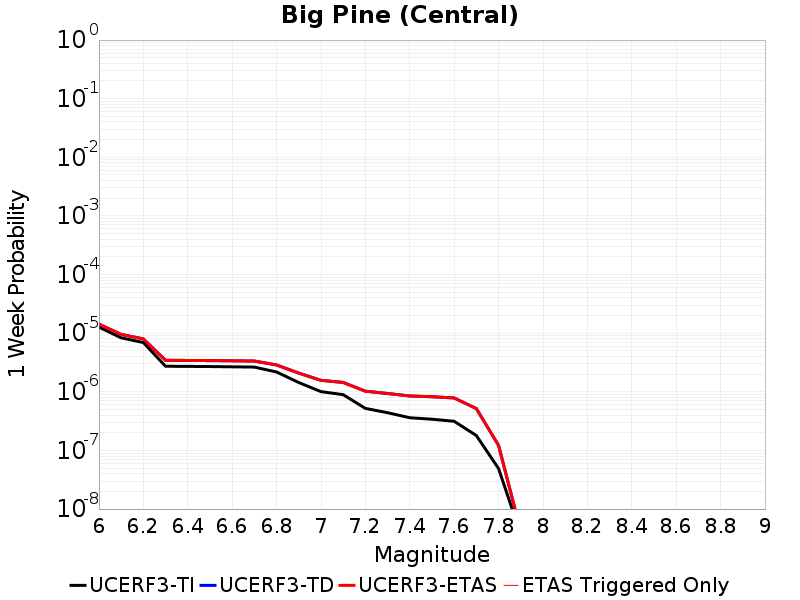 |  | 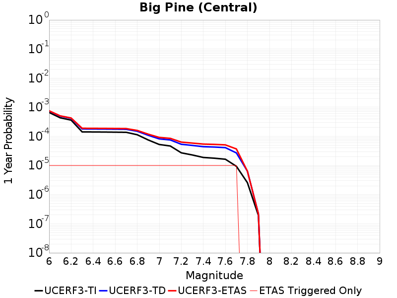 | 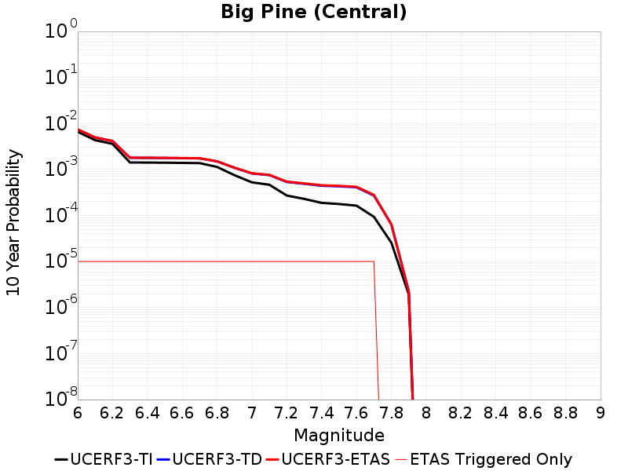 |

| Magnitude | 1 wk TI Prob | 1 wk TD Prob | 1 wk ETAS Prob | 1 wk ETAS/TD Gain | 1 wk ETAS Triggered Only | 1 mo TI Prob | 1 mo TD Prob | 1 mo ETAS Prob | 1 mo ETAS/TD Gain | 1 mo ETAS Triggered Only | 1 yr TI Prob | 1 yr TD Prob | 1 yr ETAS Prob | 1 yr ETAS/TD Gain | 1 yr ETAS Triggered Only | 10 yr TI Prob | 10 yr TD Prob | 10 yr ETAS Prob | 10 yr ETAS/TD Gain | 10 yr ETAS Triggered Only |
|-----|-----|-----|-----|-----|-----|-----|-----|-----|-----|-----|-----|-----|-----|-----|-----|-----|-----|-----|-----|-----|
| 6.0 | 1.2706755E-5 | 1.427514E-5 | 1.427514E-5 | 1.0 | 0.0 | 5.4456385E-5 | 6.117794E-5 | 7.117733E-5 | 1.1634476 | 1.0E-5 | 6.628048E-4 | 7.4462354E-4 | 7.5461605E-4 | 1.0134196 | 1.0E-5 | 0.006608314 | 0.0074261758 | 0.0074361013 | 1.0013366 | 1.0E-5 |
| 6.1 | 8.342579E-6 | 9.532629E-6 | 9.532629E-6 | 1.0 | 0.0 | 3.5753423E-5 | 4.0853607E-5 | 5.08532E-5 | 1.2447665 | 1.0E-5 | 4.3521097E-4 | 4.973009E-4 | 5.0729595E-4 | 1.0200986 | 1.0E-5 | 0.0043435963 | 0.0049652955 | 0.004975246 | 1.002004 | 1.0E-5 |
| 6.2 | 6.923899E-6 | 7.9881E-6 | 7.9881E-6 | 1.0 | 0.0 | 2.9673516E-5 | 3.4234374E-5 | 4.423403E-5 | 1.2920941 | 1.0E-5 | 3.6121515E-4 | 4.1674307E-4 | 4.267389E-4 | 1.0239856 | 1.0E-5 | 0.003606286 | 0.0041627837 | 0.004172742 | 1.0023923 | 1.0E-5 |
| 6.3 | 2.728396E-6 | 3.4427142E-6 | 3.4427142E-6 | 1.0 | 0.0 | 1.1693074E-5 | 1.4754411E-5 | 2.4754263E-5 | 1.6777534 | 1.0E-5 | 1.4235388E-4 | 1.7962103E-4 | 1.8961923E-4 | 1.0556628 | 1.0E-5 | 0.0014226272 | 0.001796123 | 0.001806105 | 1.0055575 | 1.0E-5 |
| 6.4 | 2.7136944E-6 | 3.4270004E-6 | 3.4270004E-6 | 1.0 | 0.0 | 1.1630066E-5 | 1.4687067E-5 | 2.468692E-5 | 1.6808611 | 1.0E-5 | 1.4158686E-4 | 1.7880123E-4 | 1.8879944E-4 | 1.055918 | 1.0E-5 | 0.0014149669 | 0.0017879383 | 0.0017979204 | 1.005583 | 1.0E-5 |
| 6.5 | 2.6971882E-6 | 3.4093373E-6 | 3.4093373E-6 | 1.0 | 0.0 | 1.1559327E-5 | 1.4611368E-5 | 2.4611221E-5 | 1.6843886 | 1.0E-5 | 1.4072572E-4 | 1.7787976E-4 | 1.8787799E-4 | 1.0562078 | 1.0E-5 | 0.0014063664 | 0.0017787383 | 0.0017887205 | 1.005612 | 1.0E-5 |
| 6.6 | 2.669092E-6 | 3.3793442E-6 | 3.3793442E-6 | 1.0 | 0.0 | 1.1438916E-5 | 1.4482828E-5 | 2.4482682E-5 | 1.6904628 | 1.0E-5 | 1.3925991E-4 | 1.7631504E-4 | 1.8631328E-4 | 1.0567067 | 1.0E-5 | 0.0013917267 | 0.001763116 | 0.0017730984 | 1.0056617 | 1.0E-5 |
| 6.7 | 2.6408059E-6 | 3.3493577E-6 | 3.3493577E-6 | 1.0 | 0.0 | 1.1317691E-5 | 1.4354317E-5 | 2.4354173E-5 | 1.6966445 | 1.0E-5 | 1.3778417E-4 | 1.7475066E-4 | 1.847489E-4 | 1.0572144 | 1.0E-5 | 0.0013769877 | 0.0017474969 | 0.0017574794 | 1.0057125 | 1.0E-5 |
| 6.8 | 2.1786943E-6 | 2.872715E-6 | 2.872715E-6 | 1.0 | 0.0 | 9.337228E-6 | 1.23115815E-5 | 2.2311458E-5 | 1.8122333 | 1.0E-5 | 1.1367482E-4 | 1.4988393E-4 | 1.5988243E-4 | 1.0667083 | 1.0E-5 | 0.0011361669 | 0.0014991793 | 0.0015091642 | 1.0066603 | 1.0E-5 |
| 6.9 | 1.4411696E-6 | 2.0859682E-6 | 2.0859682E-6 | 1.0 | 0.0 | 6.1764263E-6 | 8.9398345E-6 | 1.8939745E-5 | 2.118579 | 1.0E-5 | 7.51954E-5 | 1.08837325E-4 | 1.1883624E-4 | 1.0918702 | 1.0E-5 | 7.5169955E-4 | 0.0010891465 | 0.0010991355 | 1.0091715 | 1.0E-5 |
| 7.0 | 1.0073411E-6 | 1.5698629E-6 | 1.5698629E-6 | 1.0 | 0.0 | 4.317169E-6 | 6.7279675E-6 | 1.67279E-5 | 2.4863229 | 1.0E-5 | 5.2560266E-5 | 8.191008E-5 | 9.190926E-5 | 1.1220751 | 1.0E-5 | 5.2547833E-4 | 8.2009373E-4 | 8.3008554E-4 | 1.0121838 | 1.0E-5 |
| 7.1 | 8.947104E-7 | 1.4456298E-6 | 1.4456298E-6 | 1.0 | 0.0 | 3.834468E-6 | 6.1955425E-6 | 1.6195481E-5 | 2.6140537 | 1.0E-5 | 4.6683643E-5 | 7.5428274E-5 | 8.542751E-5 | 1.1325663 | 1.0E-5 | 4.6673836E-4 | 7.553213E-4 | 7.6531374E-4 | 1.0132294 | 1.0E-5 |
| 7.2 | 5.215166E-7 | 1.0255203E-6 | 1.0255203E-6 | 1.0 | 0.0 | 2.2350691E-6 | 4.3950795E-6 | 1.4395036E-5 | 3.2752616 | 1.0E-5 | 2.7211627E-5 | 5.3508826E-5 | 6.350829E-5 | 1.1868751 | 1.0E-5 | 2.7208295E-4 | 5.362438E-4 | 5.4623844E-4 | 1.0186383 | 1.0E-5 |
| 7.3 | 4.4024807E-7 | 9.3588585E-7 | 9.3588585E-7 | 1.0 | 0.0 | 1.8867761E-6 | 4.0109335E-6 | 1.4010893E-5 | 3.4931753 | 1.0E-5 | 2.2971257E-5 | 4.8832066E-5 | 5.8831574E-5 | 1.2047734 | 1.0E-5 | 2.2968883E-4 | 4.894974E-4 | 4.994925E-4 | 1.0204191 | 1.0E-5 |
| 7.4 | 3.6130905E-7 | 8.4934715E-7 | 8.4934715E-7 | 1.0 | 0.0 | 1.5484665E-6 | 3.6400543E-6 | 1.3640018E-5 | 3.7472017 | 1.0E-5 | 1.8852415E-5 | 4.43168E-5 | 5.4316355E-5 | 1.225638 | 1.0E-5 | 1.8850817E-4 | 4.4435405E-4 | 4.5434962E-4 | 1.0224946 | 1.0E-5 |
| 7.5 | 3.408184E-7 | 8.240149E-7 | 8.240149E-7 | 1.0 | 0.0 | 1.4606494E-6 | 3.531488E-6 | 1.3531452E-5 | 3.8316576 | 1.0E-5 | 1.7783263E-5 | 4.2995056E-5 | 5.2994626E-5 | 1.2325749 | 1.0E-5 | 1.778184E-4 | 4.3112136E-4 | 4.4111704E-4 | 1.0231854 | 1.0E-5 |
| 7.6 | 3.1428627E-7 | 7.8589295E-7 | 7.8589295E-7 | 1.0 | 0.0 | 1.3469405E-6 | 3.3681085E-6 | 1.3368075E-5 | 3.9690156 | 1.0E-5 | 1.6398877E-5 | 4.1005987E-5 | 5.100558E-5 | 1.2438568 | 1.0E-5 | 1.6397667E-4 | 4.1121183E-4 | 4.2120772E-4 | 1.0243083 | 1.0E-5 |
| 7.7 | 1.7972785E-7 | 5.1751266E-7 | 5.1751266E-7 | 1.0 | 0.0 | 7.70262E-7 | 2.2179095E-6 | 1.2217887E-5 | 5.5087404 | 1.0E-5 | 9.377899E-6 | 2.7002725E-5 | 3.7002454E-5 | 1.370323 | 1.0E-5 | 9.377503E-5 | 2.712316E-4 | 2.812289E-4 | 1.0368589 | 1.0E-5 |
| 7.8 | 4.9230927E-8 | 1.221072E-7 | 1.221072E-7 | 1.0 | 0.0 | 2.1098968E-7 | 5.233165E-7 | 5.233165E-7 | 1.0 | 0.0 | 2.5687964E-6 | 6.371361E-6 | 6.371361E-6 | 1.0 | 0.0 | 2.5687666E-5 | 6.4124E-5 | 6.4124E-5 | 1.0 | 0.0 |
| 7.9 | 3.6805972E-9 | 4.196924E-9 | 4.196924E-9 | 1.0 | 0.0 | 1.5773987E-8 | 1.7986817E-8 | 1.7986817E-8 | 1.0 | 0.0 | 1.9204828E-7 | 2.189895E-7 | 2.189895E-7 | 1.0 | 0.0 | 1.920481E-6 | 2.237896E-6 | 2.237896E-6 | 1.0 | 0.0 |

## Santa Cruz Island
*[(top)](#table-of-contents)*

| 1 Week | 1 Month | 1 Year | 10 Year |
|-----|-----|-----|-----|
|  | 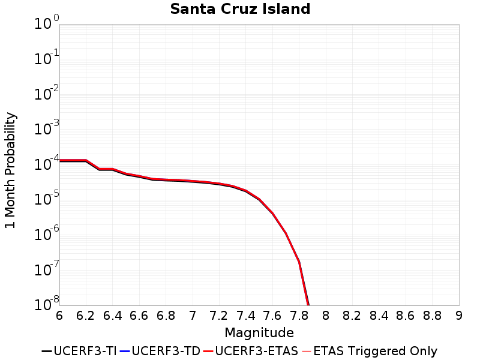 | 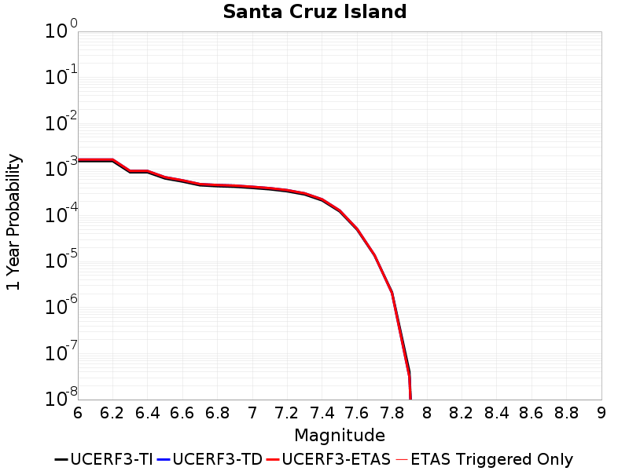 | 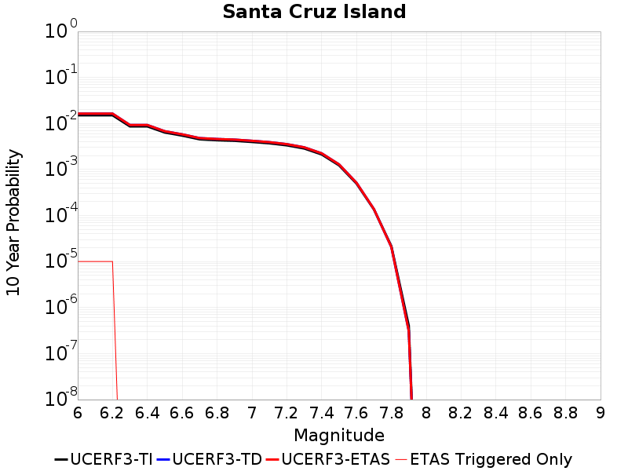 |

| Magnitude | 1 wk TI Prob | 1 wk TD Prob | 1 wk ETAS Prob | 1 wk ETAS/TD Gain | 1 wk ETAS Triggered Only | 1 mo TI Prob | 1 mo TD Prob | 1 mo ETAS Prob | 1 mo ETAS/TD Gain | 1 mo ETAS Triggered Only | 1 yr TI Prob | 1 yr TD Prob | 1 yr ETAS Prob | 1 yr ETAS/TD Gain | 1 yr ETAS Triggered Only | 10 yr TI Prob | 10 yr TD Prob | 10 yr ETAS Prob | 10 yr ETAS/TD Gain | 10 yr ETAS Triggered Only |
|-----|-----|-----|-----|-----|-----|-----|-----|-----|-----|-----|-----|-----|-----|-----|-----|-----|-----|-----|-----|-----|
| 6.0 | 2.9164563E-5 | 3.161763E-5 | 3.161763E-5 | 1.0 | 0.0 | 1.2498499E-4 | 1.3549786E-4 | 1.3549786E-4 | 1.0 | 0.0 | 0.0015206301 | 0.0016485745 | 0.0016485745 | 1.0 | 0.0 | 0.015102667 | 0.0163772 | 0.016387036 | 1.0006006 | 1.0E-5 |
| 6.1 | 2.9164563E-5 | 3.161763E-5 | 3.161763E-5 | 1.0 | 0.0 | 1.2498499E-4 | 1.3549786E-4 | 1.3549786E-4 | 1.0 | 0.0 | 0.0015206301 | 0.0016485745 | 0.0016485745 | 1.0 | 0.0 | 0.015102667 | 0.0163772 | 0.016387036 | 1.0006006 | 1.0E-5 |
| 6.2 | 2.9164563E-5 | 3.161763E-5 | 3.161763E-5 | 1.0 | 0.0 | 1.2498499E-4 | 1.3549786E-4 | 1.3549786E-4 | 1.0 | 0.0 | 0.0015206301 | 0.0016485745 | 0.0016485745 | 1.0 | 0.0 | 0.015102667 | 0.0163772 | 0.016387036 | 1.0006006 | 1.0E-5 |
| 6.3 | 1.6635553E-5 | 1.7812847E-5 | 1.7812847E-5 | 1.0 | 0.0 | 7.1293274E-5 | 7.633864E-5 | 7.633864E-5 | 1.0 | 0.0 | 8.6765E-4 | 9.290449E-4 | 9.290449E-4 | 1.0 | 0.0 | 0.008642701 | 0.009253484 | 0.009253484 | 1.0 | 0.0 |
| 6.4 | 1.6635553E-5 | 1.7812847E-5 | 1.7812847E-5 | 1.0 | 0.0 | 7.1293274E-5 | 7.633864E-5 | 7.633864E-5 | 1.0 | 0.0 | 8.6765E-4 | 9.290449E-4 | 9.290449E-4 | 1.0 | 0.0 | 0.008642701 | 0.009253484 | 0.009253484 | 1.0 | 0.0 |
| 6.5 | 1.2238748E-5 | 1.3048827E-5 | 1.3048827E-5 | 1.0 | 0.0 | 5.2450723E-5 | 5.5922366E-5 | 5.5922366E-5 | 1.0 | 0.0 | 6.3840044E-4 | 6.806458E-4 | 6.806458E-4 | 1.0 | 0.0 | 0.0063656955 | 0.00678601 | 0.00678601 | 1.0 | 0.0 |
| 6.6 | 1.0489767E-5 | 1.116147E-5 | 1.116147E-5 | 1.0 | 0.0 | 4.495537E-5 | 4.7834008E-5 | 4.7834008E-5 | 1.0 | 0.0 | 5.4719415E-4 | 5.822257E-4 | 5.822257E-4 | 1.0 | 0.0 | 0.005458487 | 0.0058072438 | 0.0058072438 | 1.0 | 0.0 |
| 6.7 | 8.699222E-6 | 9.2406835E-6 | 9.2406835E-6 | 1.0 | 0.0 | 3.7281847E-5 | 3.960233E-5 | 3.960233E-5 | 1.0 | 0.0 | 4.5381195E-4 | 4.8205227E-4 | 4.8205227E-4 | 1.0 | 0.0 | 0.0045288634 | 0.004810134 | 0.004810134 | 1.0 | 0.0 |
| 6.8 | 8.307732E-6 | 8.820601E-6 | 8.820601E-6 | 1.0 | 0.0 | 3.560408E-5 | 3.780203E-5 | 3.780203E-5 | 1.0 | 0.0 | 4.3339343E-4 | 4.6014294E-4 | 4.6014294E-4 | 1.0 | 0.0 | 0.004325492 | 0.0045919553 | 0.0045919553 | 1.0 | 0.0 |
| 6.9 | 8.073121E-6 | 8.56851E-6 | 8.56851E-6 | 1.0 | 0.0 | 3.459863E-5 | 3.672167E-5 | 3.672167E-5 | 1.0 | 0.0 | 4.2115687E-4 | 4.4699502E-4 | 4.4699502E-4 | 1.0 | 0.0 | 0.004203596 | 0.004461011 | 0.004461011 | 1.0 | 0.0 |
| 7.0 | 7.617019E-6 | 8.0779855E-6 | 8.0779855E-6 | 1.0 | 0.0 | 3.264396E-5 | 3.461948E-5 | 3.461948E-5 | 1.0 | 0.0 | 3.9736772E-4 | 4.2141104E-4 | 4.2141104E-4 | 1.0 | 0.0 | 0.003966579 | 0.004206167 | 0.004206167 | 1.0 | 0.0 |
| 7.1 | 7.1224836E-6 | 7.54886E-6 | 7.54886E-6 | 1.0 | 0.0 | 3.052457E-5 | 3.2351858E-5 | 3.2351858E-5 | 1.0 | 0.0 | 3.715733E-4 | 3.9381307E-4 | 3.9381307E-4 | 1.0 | 0.0 | 0.003709526 | 0.003931195 | 0.003931195 | 1.0 | 0.0 |
| 7.2 | 6.441115E-6 | 6.8301915E-6 | 6.8301915E-6 | 1.0 | 0.0 | 2.7604487E-5 | 2.9271921E-5 | 2.9271921E-5 | 1.0 | 0.0 | 3.360328E-4 | 3.563276E-4 | 3.563276E-4 | 1.0 | 0.0 | 0.0033552512 | 0.003557591 | 0.003557591 | 1.0 | 0.0 |
| 7.3 | 5.494274E-6 | 5.8223677E-6 | 5.8223677E-6 | 1.0 | 0.0 | 2.3546674E-5 | 2.4952767E-5 | 2.4952767E-5 | 1.0 | 0.0 | 2.8664304E-4 | 3.0375778E-4 | 3.0375778E-4 | 1.0 | 0.0 | 0.002862736 | 0.003033449 | 0.003033449 | 1.0 | 0.0 |
| 7.4 | 4.0802624E-6 | 4.313956E-6 | 4.313956E-6 | 1.0 | 0.0 | 1.7486722E-5 | 1.8488254E-5 | 1.8488254E-5 | 1.0 | 0.0 | 2.1288003E-4 | 2.250713E-4 | 2.250713E-4 | 1.0 | 0.0 | 0.0021267622 | 0.0022484425 | 0.0022484425 | 1.0 | 0.0 |
| 7.5 | 2.3584746E-6 | 2.4761812E-6 | 2.4761812E-6 | 1.0 | 0.0 | 1.0107709E-5 | 1.0612162E-5 | 1.0612162E-5 | 1.0 | 0.0 | 1.2305441E-4 | 1.2919545E-4 | 1.2919545E-4 | 1.0 | 0.0 | 0.0012298629 | 0.0012912086 | 0.0012912086 | 1.0 | 0.0 |
| 7.6 | 9.4981914E-7 | 9.863861E-7 | 9.863861E-7 | 1.0 | 0.0 | 4.0706473E-6 | 4.2273623E-6 | 4.2273623E-6 | 1.0 | 0.0 | 4.9559E-5 | 5.1466934E-5 | 5.1466934E-5 | 1.0 | 0.0 | 4.954795E-4 | 5.145514E-4 | 5.145514E-4 | 1.0 | 0.0 |
| 7.7 | 2.6013532E-7 | 2.6422492E-7 | 2.6422492E-7 | 1.0 | 0.0 | 1.1148652E-6 | 1.132392E-6 | 1.132392E-6 | 1.0 | 0.0 | 1.3573399E-5 | 1.37867855E-5 | 1.37867855E-5 | 1.0 | 0.0 | 1.357257E-4 | 1.3785937E-4 | 1.3785937E-4 | 1.0 | 0.0 |
| 7.8 | 4.1522263E-8 | 3.9663394E-8 | 3.9663394E-8 | 1.0 | 0.0 | 1.7795254E-7 | 1.6998597E-7 | 1.6998597E-7 | 1.0 | 0.0 | 2.16657E-6 | 2.0695775E-6 | 2.0695775E-6 | 1.0 | 0.0 | 2.1665488E-5 | 2.0695603E-5 | 2.0695603E-5 | 1.0 | 0.0 |
| 7.9 | 7.7242046E-10 | 5.948997E-10 | 5.948997E-10 | 1.0 | 0.0 | 3.3103735E-9 | 2.5495699E-9 | 2.5495699E-9 | 1.0 | 0.0 | 4.0303796E-8 | 3.104101E-8 | 3.104101E-8 | 1.0 | 0.0 | 4.030379E-7 | 3.104101E-7 | 3.104101E-7 | 1.0 | 0.0 |

## San Gregorio (North) 2011 CFM
*[(top)](#table-of-contents)*

| 1 Week | 1 Month | 1 Year | 10 Year |
|-----|-----|-----|-----|
| 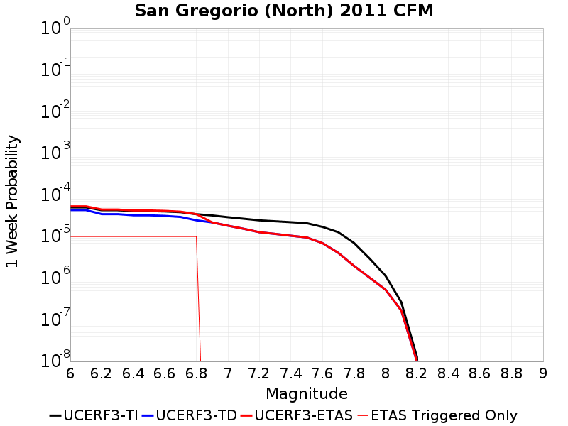 |  | 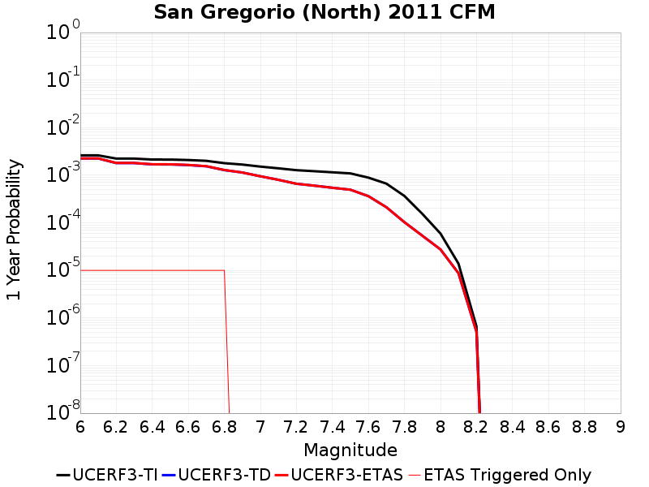 |  |

| Magnitude | 1 wk TI Prob | 1 wk TD Prob | 1 wk ETAS Prob | 1 wk ETAS/TD Gain | 1 wk ETAS Triggered Only | 1 mo TI Prob | 1 mo TD Prob | 1 mo ETAS Prob | 1 mo ETAS/TD Gain | 1 mo ETAS Triggered Only | 1 yr TI Prob | 1 yr TD Prob | 1 yr ETAS Prob | 1 yr ETAS/TD Gain | 1 yr ETAS Triggered Only | 10 yr TI Prob | 10 yr TD Prob | 10 yr ETAS Prob | 10 yr ETAS/TD Gain | 10 yr ETAS Triggered Only |
|-----|-----|-----|-----|-----|-----|-----|-----|-----|-----|-----|-----|-----|-----|-----|-----|-----|-----|-----|-----|-----|
| 6.0 | 5.0283932E-5 | 4.3225522E-5 | 5.3225092E-5 | 1.2313348 | 1.0E-5 | 2.1548476E-4 | 1.8523919E-4 | 1.9523733E-4 | 1.0539743 | 1.0E-5 | 0.0026203706 | 0.0022529678 | 0.0022629453 | 1.0044286 | 1.0E-5 | 0.02589687 | 0.02237706 | 0.022386838 | 1.0004369 | 1.0E-5 |
| 6.1 | 5.0283932E-5 | 4.3225522E-5 | 5.3225092E-5 | 1.2313348 | 1.0E-5 | 2.1548476E-4 | 1.8523919E-4 | 1.9523733E-4 | 1.0539743 | 1.0E-5 | 0.0026203706 | 0.0022529678 | 0.0022629453 | 1.0044286 | 1.0E-5 | 0.02589687 | 0.02237706 | 0.022386838 | 1.0004369 | 1.0E-5 |
| 6.2 | 4.2998647E-5 | 3.4593082E-5 | 4.4592736E-5 | 1.2890651 | 1.0E-5 | 1.842669E-4 | 1.4824772E-4 | 1.5824624E-4 | 1.0674447 | 1.0E-5 | 0.0022411412 | 0.001803434 | 0.001813416 | 1.005535 | 1.0E-5 | 0.022186736 | 0.017962413 | 0.017972235 | 1.0005467 | 1.0E-5 |
| 6.3 | 4.2998647E-5 | 3.4593082E-5 | 4.4592736E-5 | 1.2890651 | 1.0E-5 | 1.842669E-4 | 1.4824772E-4 | 1.5824624E-4 | 1.0674447 | 1.0E-5 | 0.0022411412 | 0.001803434 | 0.001813416 | 1.005535 | 1.0E-5 | 0.022186736 | 0.017962413 | 0.017972235 | 1.0005467 | 1.0E-5 |
| 6.4 | 4.1101295E-5 | 3.247418E-5 | 4.2473857E-5 | 1.3079269 | 1.0E-5 | 1.7613651E-4 | 1.3916772E-4 | 1.4916633E-4 | 1.0718458 | 1.0E-5 | 0.0021423528 | 0.0016930633 | 0.0017030464 | 1.0058964 | 1.0E-5 | 0.02121817 | 0.016876135 | 0.016885966 | 1.0005826 | 1.0E-5 |
| 6.5 | 4.1032585E-5 | 3.2392105E-5 | 4.239178E-5 | 1.3087072 | 1.0E-5 | 1.7584208E-4 | 1.38816E-4 | 1.4881462E-4 | 1.0720278 | 1.0E-5 | 0.0021387753 | 0.0016887878 | 0.001698771 | 1.0059114 | 1.0E-5 | 0.021183075 | 0.016834036 | 0.016843867 | 1.000584 | 1.0E-5 |
| 6.6 | 4.011629E-5 | 3.141187E-5 | 4.1411557E-5 | 1.318341 | 1.0E-5 | 1.7191563E-4 | 1.3461543E-4 | 1.4461408E-4 | 1.0742757 | 1.0E-5 | 0.0020910634 | 0.0016377243 | 0.001647708 | 1.006096 | 1.0E-5 | 0.020714961 | 0.01633053 | 0.016340367 | 1.0006024 | 1.0E-5 |
| 6.7 | 3.8583938E-5 | 2.9595445E-5 | 3.959515E-5 | 1.3378798 | 1.0E-5 | 1.6534925E-4 | 1.2683154E-4 | 1.3683026E-4 | 1.0788348 | 1.0E-5 | 0.0020112682 | 0.0015430945 | 0.001553079 | 1.0064704 | 1.0E-5 | 0.019931622 | 0.015397015 | 0.015406861 | 1.0006394 | 1.0E-5 |
| 6.8 | 3.44341E-5 | 2.4583647E-5 | 3.45834E-5 | 1.4067645 | 1.0E-5 | 1.4756636E-4 | 1.0535429E-4 | 1.15353236E-4 | 1.0949079 | 1.0E-5 | 0.0017951399 | 0.0012819442 | 0.0012919314 | 1.0077907 | 1.0E-5 | 0.017807078 | 0.012817853 | 0.012827725 | 1.0007702 | 1.0E-5 |
| 6.9 | 3.221199E-5 | 2.190274E-5 | 2.190274E-5 | 1.0 | 0.0 | 1.3804408E-4 | 9.386556E-5 | 9.386556E-5 | 1.0 | 0.0 | 0.0016793909 | 0.0011422223 | 0.0011422223 | 1.0 | 0.0 | 0.01666756 | 0.011438304 | 0.011438304 | 1.0 | 0.0 |
| 7.0 | 2.9186718E-5 | 1.826355E-5 | 1.826355E-5 | 1.0 | 0.0 | 1.2507994E-4 | 7.827004E-5 | 7.827004E-5 | 1.0 | 0.0 | 0.0015217843 | 9.5252553E-4 | 9.5252553E-4 | 1.0 | 0.0 | 0.015114053 | 0.009558461 | 0.009558461 | 1.0 | 0.0 |
| 7.1 | 2.6840138E-5 | 1.5395939E-5 | 1.5395939E-5 | 1.0 | 0.0 | 1.1502409E-4 | 6.598094E-5 | 6.598094E-5 | 1.0 | 0.0 | 0.0013995186 | 8.0302387E-4 | 8.0302387E-4 | 1.0 | 0.0 | 0.013907375 | 0.008074924 | 0.008074924 | 1.0 | 0.0 |
| 7.2 | 2.453002E-5 | 1.2714802E-5 | 1.2714802E-5 | 1.0 | 0.0 | 1.05124425E-4 | 5.4490876E-5 | 5.4490876E-5 | 1.0 | 0.0 | 0.0012791384 | 6.632251E-4 | 6.632251E-4 | 1.0 | 0.0 | 0.012718005 | 0.0066851536 | 0.0066851536 | 1.0 | 0.0 |
| 7.3 | 2.3330727E-5 | 1.1594502E-5 | 1.1594502E-5 | 1.0 | 0.0 | 9.9985E-5 | 4.9689777E-5 | 4.9689777E-5 | 1.0 | 0.0 | 0.0012166376 | 6.048056E-4 | 6.048056E-4 | 1.0 | 0.0 | 0.012099981 | 0.0061029224 | 0.0061029224 | 1.0 | 0.0 |
| 7.4 | 2.2136466E-5 | 1.0472333E-5 | 1.0472333E-5 | 1.0 | 0.0 | 9.486712E-5 | 4.4880657E-5 | 4.4880657E-5 | 1.0 | 0.0 | 0.0011543952 | 5.4628524E-4 | 5.4628524E-4 | 1.0 | 0.0 | 0.011484168 | 0.00551924 | 0.00551924 | 1.0 | 0.0 |
| 7.5 | 2.0994974E-5 | 9.526827E-6 | 9.526827E-6 | 1.0 | 0.0 | 8.997535E-5 | 4.0828618E-5 | 4.0828618E-5 | 1.0 | 0.0 | 0.0010948994 | 4.9697526E-4 | 4.9697526E-4 | 1.0 | 0.0 | 0.010895205 | 0.005026656 | 0.005026656 | 1.0 | 0.0 |
| 7.6 | 1.7091823E-5 | 6.9738066E-6 | 6.9738066E-6 | 1.0 | 0.0 | 7.3248615E-5 | 2.9887402E-5 | 2.9887402E-5 | 1.0 | 0.0 | 8.9143694E-4 | 3.6381846E-4 | 3.6381846E-4 | 1.0 | 0.0 | 0.008878695 | 0.0036913867 | 0.0036913867 | 1.0 | 0.0 |
| 7.7 | 1.2772179E-5 | 4.0770233E-6 | 4.0770233E-6 | 1.0 | 0.0 | 5.473676E-5 | 1.747284E-5 | 1.747284E-5 | 1.0 | 0.0 | 6.6621625E-4 | 2.1271108E-4 | 2.1271108E-4 | 1.0 | 0.0 | 0.006642225 | 0.0021674428 | 0.0021674428 | 1.0 | 0.0 |
| 7.8 | 7.041923E-6 | 1.97705E-6 | 1.97705E-6 | 1.0 | 0.0 | 3.017932E-5 | 8.473044E-6 | 8.473044E-6 | 1.0 | 0.0 | 3.6737128E-4 | 1.0315442E-4 | 1.0315442E-4 | 1.0 | 0.0 | 0.0036676454 | 0.0010577996 | 0.0010577996 | 1.0 | 0.0 |
| 7.9 | 2.946768E-6 | 1.0246333E-6 | 1.0246333E-6 | 1.0 | 0.0 | 1.2628945E-5 | 4.3912783E-6 | 4.3912783E-6 | 1.0 | 0.0 | 1.5374656E-4 | 5.3462503E-5 | 5.3462503E-5 | 1.0 | 0.0 | 0.0015364023 | 5.45351E-4 | 5.45351E-4 | 1.0 | 0.0 |
| 8.0 | 1.1433375E-6 | 5.303349E-7 | 5.303349E-7 | 1.0 | 0.0 | 4.9000087E-6 | 2.2728618E-6 | 2.2728618E-6 | 1.0 | 0.0 | 5.965597E-5 | 2.767174E-5 | 2.767174E-5 | 1.0 | 0.0 | 5.963996E-4 | 2.803956E-4 | 2.803956E-4 | 1.0 | 0.0 |
| 8.1 | 2.6675295E-7 | 1.6751089E-7 | 1.6751089E-7 | 1.0 | 0.0 | 1.1432264E-6 | 7.179036E-7 | 7.179036E-7 | 1.0 | 0.0 | 1.3918692E-5 | 8.740441E-6 | 8.740441E-6 | 1.0 | 0.0 | 1.391782E-4 | 8.881181E-5 | 8.881181E-5 | 1.0 | 0.0 |
| 8.2 | 1.2704569E-8 | 9.846259E-9 | 9.846259E-9 | 1.0 | 0.0 | 5.444815E-8 | 4.2198252E-8 | 4.2198252E-8 | 1.0 | 0.0 | 6.629061E-7 | 5.137636E-7 | 5.137636E-7 | 1.0 | 0.0 | 6.629041E-6 | 5.333374E-6 | 5.333374E-6 | 1.0 | 0.0 |

## San Andreas (San Bernardino S)
*[(top)](#table-of-contents)*

| 1 Week | 1 Month | 1 Year | 10 Year |
|-----|-----|-----|-----|
|  |  | 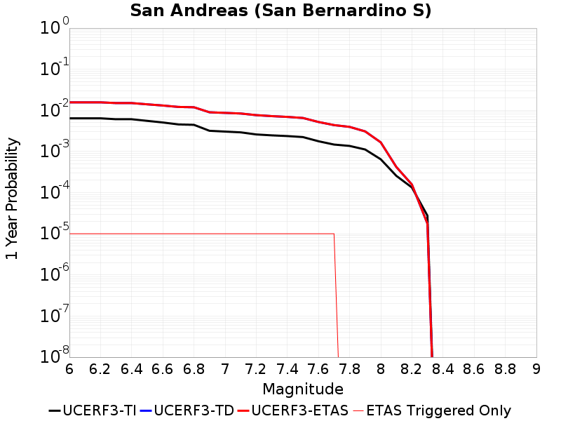 |  |

| Magnitude | 1 wk TI Prob | 1 wk TD Prob | 1 wk ETAS Prob | 1 wk ETAS/TD Gain | 1 wk ETAS Triggered Only | 1 mo TI Prob | 1 mo TD Prob | 1 mo ETAS Prob | 1 mo ETAS/TD Gain | 1 mo ETAS Triggered Only | 1 yr TI Prob | 1 yr TD Prob | 1 yr ETAS Prob | 1 yr ETAS/TD Gain | 1 yr ETAS Triggered Only | 10 yr TI Prob | 10 yr TD Prob | 10 yr ETAS Prob | 10 yr ETAS/TD Gain | 10 yr ETAS Triggered Only |
|-----|-----|-----|-----|-----|-----|-----|-----|-----|-----|-----|-----|-----|-----|-----|-----|-----|-----|-----|-----|-----|
| 6.0 | 1.2336002E-4 | 3.0275638E-4 | 3.0275638E-4 | 1.0 | 0.0 | 5.2857865E-4 | 0.0012969084 | 0.0013068954 | 1.0077007 | 1.0E-5 | 0.006416472 | 0.015680546 | 0.015690388 | 1.0006278 | 1.0E-5 | 0.06234337 | 0.1439424 | 0.14395095 | 1.0000595 | 1.0E-5 |
| 6.1 | 1.2336002E-4 | 3.0275638E-4 | 3.0275638E-4 | 1.0 | 0.0 | 5.2857865E-4 | 0.0012969084 | 0.0013068954 | 1.0077007 | 1.0E-5 | 0.006416472 | 0.015680546 | 0.015690388 | 1.0006278 | 1.0E-5 | 0.06234337 | 0.1439424 | 0.14395095 | 1.0000595 | 1.0E-5 |
| 6.2 | 1.2336002E-4 | 3.0275638E-4 | 3.0275638E-4 | 1.0 | 0.0 | 5.2857865E-4 | 0.0012969084 | 0.0013068954 | 1.0077007 | 1.0E-5 | 0.006416472 | 0.015680546 | 0.015690388 | 1.0006278 | 1.0E-5 | 0.06234337 | 0.1439424 | 0.14395095 | 1.0000595 | 1.0E-5 |
| 6.3 | 1.1712257E-4 | 2.906134E-4 | 2.906134E-4 | 1.0 | 0.0 | 5.018573E-4 | 0.0012449173 | 0.0012549048 | 1.0080227 | 1.0E-5 | 0.006093008 | 0.01505642 | 0.015066269 | 1.0006542 | 1.0E-5 | 0.059286322 | 0.13865341 | 0.13866203 | 1.0000621 | 1.0E-5 |
| 6.4 | 1.1712257E-4 | 2.906134E-4 | 2.906134E-4 | 1.0 | 0.0 | 5.018573E-4 | 0.0012449173 | 0.0012549048 | 1.0080227 | 1.0E-5 | 0.006093008 | 0.01505642 | 0.015066269 | 1.0006542 | 1.0E-5 | 0.059286322 | 0.13865341 | 0.13866203 | 1.0000621 | 1.0E-5 |
| 6.5 | 1.0689076E-4 | 2.7069837E-4 | 2.7069837E-4 | 1.0 | 0.0 | 4.5802278E-4 | 0.001159645 | 0.0011696335 | 1.0086133 | 1.0E-5 | 0.0055621783 | 0.014031938 | 0.014041798 | 1.0007026 | 1.0E-5 | 0.05425003 | 0.12987931 | 0.12988801 | 1.000067 | 1.0E-5 |
| 6.6 | 9.7648895E-5 | 2.5310405E-4 | 2.5310405E-4 | 1.0 | 0.0 | 4.1842813E-4 | 0.0010843044 | 0.0010942937 | 1.0092125 | 1.0E-5 | 0.005082469 | 0.013125903 | 0.013135772 | 1.0007519 | 1.0E-5 | 0.049677886 | 0.12202677 | 0.122035556 | 1.000072 | 1.0E-5 |
| 6.7 | 8.757013E-5 | 2.337696E-4 | 2.337696E-4 | 1.0 | 0.0 | 3.7524657E-4 | 0.0010015075 | 0.0010114975 | 1.009975 | 1.0E-5 | 0.00455906 | 0.012129306 | 0.012139184 | 1.0008144 | 1.0E-5 | 0.04466656 | 0.113375 | 0.11338387 | 1.0000782 | 1.0E-5 |
| 6.8 | 8.562978E-5 | 2.2935028E-4 | 2.2935028E-4 | 1.0 | 0.0 | 3.6693315E-4 | 9.825819E-4 | 9.92572E-4 | 1.0101672 | 1.0E-5 | 0.004458263 | 0.011901419 | 0.0119113 | 1.0008303 | 1.0E-5 | 0.043698758 | 0.11137536 | 0.11138425 | 1.0000798 | 1.0E-5 |
| 6.9 | 6.124075E-5 | 1.7297547E-4 | 1.7297547E-4 | 1.0 | 0.0 | 2.6243398E-4 | 7.411137E-4 | 7.5110624E-4 | 1.0134832 | 1.0E-5 | 0.0031904527 | 0.008985941 | 0.0089958515 | 1.0011028 | 1.0E-5 | 0.031450346 | 0.08512914 | 0.08513829 | 1.0001075 | 1.0E-5 |
| 7.0 | 5.8598747E-5 | 1.6724295E-4 | 1.6724295E-4 | 1.0 | 0.0 | 2.5111332E-4 | 7.165594E-4 | 7.265522E-4 | 1.0139456 | 1.0E-5 | 0.0030530186 | 0.008689414 | 0.008699327 | 1.0011408 | 1.0E-5 | 0.03011414 | 0.08244293 | 0.08245211 | 1.0001113 | 1.0E-5 |
| 7.1 | 5.613814E-5 | 1.614049E-4 | 1.614049E-4 | 1.0 | 0.0 | 2.4056983E-4 | 6.9155265E-4 | 7.0154574E-4 | 1.0144502 | 1.0E-5 | 0.0029250039 | 0.008387335 | 0.00839725 | 1.0011823 | 1.0E-5 | 0.028868021 | 0.07973818 | 0.07974739 | 1.0001154 | 1.0E-5 |
| 7.2 | 4.991222E-5 | 1.4741853E-4 | 1.4741853E-4 | 1.0 | 0.0 | 2.1389198E-4 | 6.316411E-4 | 6.416348E-4 | 1.0158218 | 1.0E-5 | 0.002601025 | 0.00766322 | 0.007673144 | 1.001295 | 1.0E-5 | 0.025707912 | 0.073205724 | 0.07321499 | 1.0001266 | 1.0E-5 |
| 7.3 | 4.7410045E-5 | 1.3931439E-4 | 1.3931439E-4 | 1.0 | 0.0 | 2.0317009E-4 | 5.969254E-4 | 6.069194E-4 | 1.0167425 | 1.0E-5 | 0.0024707897 | 0.0072434377 | 0.007253365 | 1.0013705 | 1.0E-5 | 0.024434982 | 0.06947791 | 0.06948721 | 1.0001339 | 1.0E-5 |
| 7.4 | 4.5556746E-5 | 1.3335978E-4 | 1.3335978E-4 | 1.0 | 0.0 | 1.952286E-4 | 5.71417E-4 | 5.814113E-4 | 1.0174904 | 1.0E-5 | 0.002374317 | 0.0069348915 | 0.006944822 | 1.001432 | 1.0E-5 | 0.023491086 | 0.066715725 | 0.06672506 | 1.0001398 | 1.0E-5 |
| 7.5 | 4.3084514E-5 | 1.256695E-4 | 1.256695E-4 | 1.0 | 0.0 | 1.8463485E-4 | 5.3847267E-4 | 5.484673E-4 | 1.018561 | 1.0E-5 | 0.0022456115 | 0.006536272 | 0.006546207 | 1.0015199 | 1.0E-5 | 0.022230545 | 0.063101456 | 0.06311083 | 1.0001484 | 1.0E-5 |
| 7.6 | 3.408608E-5 | 1.00212485E-4 | 1.00212485E-4 | 1.0 | 0.0 | 1.4607502E-4 | 4.2941148E-4 | 4.394072E-4 | 1.0232776 | 1.0E-5 | 0.0017770125 | 0.0052155787 | 0.0052255266 | 1.0019073 | 1.0E-5 | 0.017628696 | 0.05083739 | 0.050846882 | 1.0001867 | 1.0E-5 |
| 7.7 | 2.8315713E-5 | 8.4188665E-5 | 8.4188665E-5 | 1.0 | 0.0 | 1.2134742E-4 | 3.607587E-4 | 3.707551E-4 | 1.0277094 | 1.0E-5 | 0.0014764034 | 0.004383401 | 0.0043933573 | 1.0022713 | 1.0E-5 | 0.01466633 | 0.04302528 | 0.04303485 | 1.0002224 | 1.0E-5 |
| 7.8 | 2.6222975E-5 | 7.621099E-5 | 7.621099E-5 | 1.0 | 0.0 | 1.1237934E-4 | 3.2657766E-4 | 3.2657766E-4 | 1.0 | 0.0 | 0.0013673597 | 0.003968841 | 0.003968841 | 1.0 | 0.0 | 0.013589768 | 0.039140433 | 0.039140433 | 1.0 | 0.0 |
| 7.9 | 2.1469694E-5 | 5.9181628E-5 | 5.9181628E-5 | 1.0 | 0.0 | 9.200973E-5 | 2.5361092E-4 | 2.5361092E-4 | 1.0 | 0.0 | 0.0011196428 | 0.0030833443 | 0.0030833443 | 1.0 | 0.0 | 0.011140184 | 0.030741166 | 0.030741166 | 1.0 | 0.0 |
| 8.0 | 1.2420249E-5 | 3.2048683E-5 | 3.2048683E-5 | 1.0 | 0.0 | 5.322855E-5 | 1.3734426E-4 | 1.3734426E-4 | 1.0 | 0.0 | 6.478649E-4 | 0.0016708849 | 0.0016708849 | 1.0 | 0.0 | 0.0064597935 | 0.016862039 | 0.016862039 | 1.0 | 0.0 |
| 8.1 | 4.9197724E-6 | 8.085253E-6 | 8.085253E-6 | 1.0 | 0.0 | 2.1084568E-5 | 3.4650624E-5 | 3.4650624E-5 | 1.0 | 0.0 | 2.566744E-4 | 4.2178982E-4 | 4.2178982E-4 | 1.0 | 0.0 | 0.002563781 | 0.004516338 | 0.004516338 | 1.0 | 0.0 |
| 8.2 | 2.5634774E-6 | 3.0273E-6 | 3.0273E-6 | 1.0 | 0.0 | 1.0986286E-5 | 1.2974078E-5 | 1.2974078E-5 | 1.0 | 0.0 | 1.3374983E-4 | 1.5794802E-4 | 1.5794802E-4 | 1.0 | 0.0 | 0.0013366934 | 0.0017682072 | 0.0017682072 | 1.0 | 0.0 |
| 8.3 | 5.2850464E-7 | 3.3735608E-7 | 3.3735608E-7 | 1.0 | 0.0 | 2.2650179E-6 | 1.4458111E-6 | 1.4458111E-6 | 1.0 | 0.0 | 2.7576245E-5 | 1.760262E-5 | 1.760262E-5 | 1.0 | 0.0 | 2.7572823E-4 | 2.0796695E-4 | 2.0796695E-4 | 1.0 | 0.0 |

