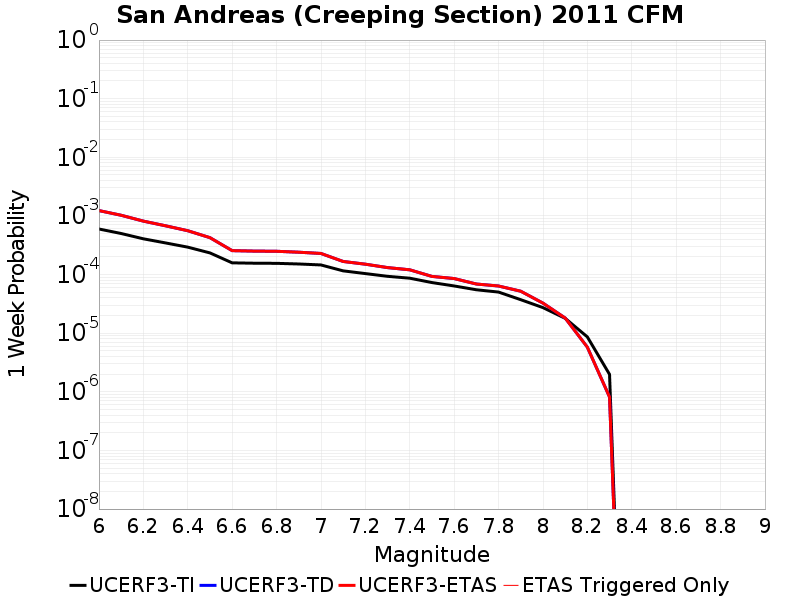
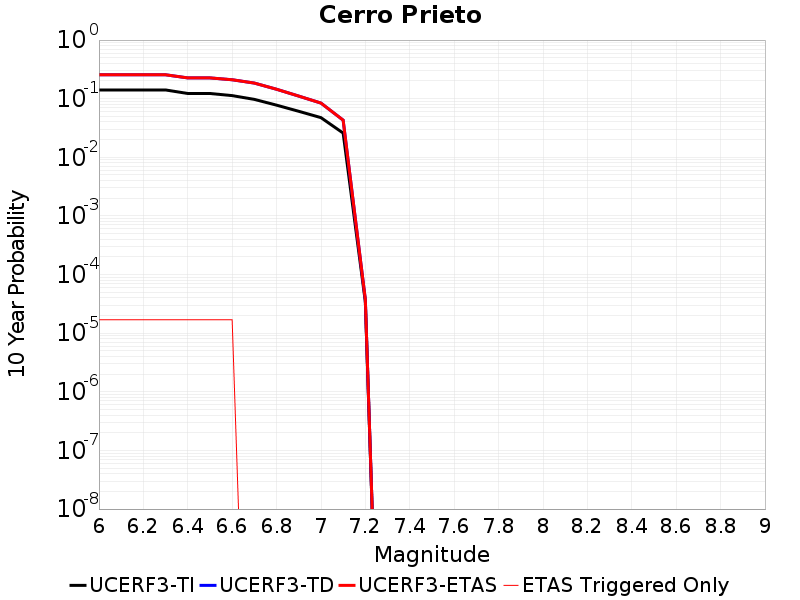
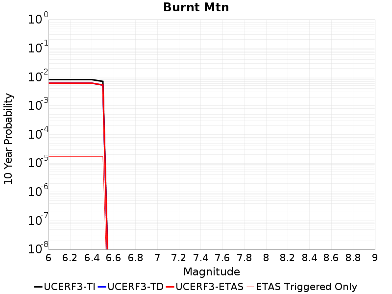

# Parent Section Magnitude-Probability Distributions

Only fault sections with at least one triggered aftershock are plotted. Sections are sorted by total supraseismogenic trigger rate (decreasing)

## Table Of Contents

* [Brawley (Seismic Zone) alt 1](#brawley-seismic-zone-alt-1)
* [Imperial](#imperial)
* [San Andreas (Coachella) rev](#san-andreas-coachella-rev)
* [Elmore Ranch](#elmore-ranch)
* [San Andreas (San Gorgonio Pass-Garnet HIll)](#san-andreas-san-gorgonio-pass-garnet-hill)
* [San Andreas (San Bernardino S)](#san-andreas-san-bernardino-s)
* [San Jacinto (Superstition Mtn)](#san-jacinto-superstition-mtn)
* [San Andreas (San Bernardino N)](#san-andreas-san-bernardino-n)
* [San Andreas (Mojave S)](#san-andreas-mojave-s)
* [San Andreas (Mojave N)](#san-andreas-mojave-n)
* [San Andreas (Big Bend)](#san-andreas-big-bend)
* [San Andreas (Cholame) rev](#san-andreas-cholame-rev)
* [San Andreas (Carrizo) rev](#san-andreas-carrizo-rev)
* [San Jacinto (Borrego)](#san-jacinto-borrego)
* [Superstition Hills](#superstition-hills)
* [San Gorgonio Pass](#san-gorgonio-pass)
* [La Panza 2011](#la-panza-2011)
* [Blue Cut](#blue-cut)
* [San Andreas (Creeping Section) 2011 CFM](#san-andreas-creeping-section-2011-cfm)
* [San Andreas (Parkfield)](#san-andreas-parkfield)
* [Earthquake Valley (So Extension)](#earthquake-valley-so-extension)
* [Laguna Salada](#laguna-salada)
* [San Clemente](#san-clemente)
* [Pleito](#pleito)
* [Mission Creek](#mission-creek)
* [Earthquake Valley (No  Extension)](#earthquake-valley-no--extension)
* [Cerro Prieto](#cerro-prieto)
* [San Andreas (Santa Cruz Mts) 2011 CFM](#san-andreas-santa-cruz-mts-2011-cfm)
* [San Jacinto (Anza) rev](#san-jacinto-anza-rev)
* [Burnt Mtn](#burnt-mtn)
* [San Juan](#san-juan)
* [Earthquake Valley](#earthquake-valley)
* [San Jacinto (Clark) rev](#san-jacinto-clark-rev)
* [Emerson-Copper Mtn 2011](#emerson-copper-mtn-2011)
* [Pinto Mtn](#pinto-mtn)
* [San Jacinto (Stepovers Combined)](#san-jacinto-stepovers-combined)
* [Garlock (Central)](#garlock-central)
* [San Jacinto (San Jacinto Valley) rev](#san-jacinto-san-jacinto-valley-rev)
* [San Andreas (Peninsula) 2011 CFM](#san-andreas-peninsula-2011-cfm)

## Brawley (Seismic Zone) alt 1
*[(top)](#table-of-contents)*

| 1 Week | 1 Month | 1 Year | 10 Year |
|-----|-----|-----|-----|
|  |  |  |  |

| Magnitude | 1 wk TI Prob | 1 wk TD Prob | 1 wk ETAS Prob | 1 wk ETAS/TD Gain | 1 wk ETAS Triggered Only | 1 mo TI Prob | 1 mo TD Prob | 1 mo ETAS Prob | 1 mo ETAS/TD Gain | 1 mo ETAS Triggered Only | 1 yr TI Prob | 1 yr TD Prob | 1 yr ETAS Prob | 1 yr ETAS/TD Gain | 1 yr ETAS Triggered Only | 10 yr TI Prob | 10 yr TD Prob | 10 yr ETAS Prob | 10 yr ETAS/TD Gain | 10 yr ETAS Triggered Only |
|-----|-----|-----|-----|-----|-----|-----|-----|-----|-----|-----|-----|-----|-----|-----|-----|-----|-----|-----|-----|-----|
| 6.0 | 2.2521618E-4 | 4.823077E-4 | 0.0022780513 | 4.7232323 | 0.0017966102 | 9.6485513E-4 | 0.0020654332 | 0.004754782 | 2.3020751 | 0.0026949153 | 0.011683988 | 0.024850678 | 0.029197529 | 1.1749189 | 0.004457627 | 0.11088423 | 0.21554436 | 0.22013143 | 1.0212814 | 0.005847458 |
| 6.1 | 2.2521618E-4 | 4.823077E-4 | 0.0019731137 | 4.0909853 | 0.0014915254 | 9.6485513E-4 | 0.0020654332 | 0.0042981002 | 2.080968 | 0.002237288 | 0.011683988 | 0.024850678 | 0.028338077 | 1.1403341 | 0.0035762712 | 0.11088423 | 0.21554436 | 0.2192406 | 1.0171485 | 0.0047118645 |
| 6.2 | 2.198148E-4 | 4.7302645E-4 | 0.0019469052 | 4.1158485 | 0.0014745763 | 9.417233E-4 | 0.0020257183 | 0.0042415597 | 2.0938544 | 0.002220339 | 0.011405343 | 0.024378832 | 0.027851384 | 1.1424412 | 0.003559322 | 0.10837428 | 0.211955 | 0.2156548 | 1.0174556 | 0.0046949154 |
| 6.3 | 2.1704129E-4 | 4.6735458E-4 | 0.0019412417 | 4.153681 | 0.0014745763 | 9.298453E-4 | 0.0020014478 | 0.004217343 | 2.107146 | 0.002220339 | 0.011262234 | 0.02409091 | 0.027564485 | 1.1441861 | 0.003559322 | 0.107082725 | 0.2098436 | 0.21353994 | 1.0176147 | 0.0046779662 |
| 6.4 | 1.876142E-4 | 4.0607384E-4 | 0.001608975 | 3.962272 | 0.0012033898 | 8.038131E-4 | 0.0017391705 | 0.0035834152 | 2.0604162 | 0.0018474576 | 0.00974259 | 0.020967633 | 0.023888135 | 1.1392863 | 0.002983051 | 0.093263686 | 0.18659627 | 0.18979473 | 1.0171411 | 0.003932203 |
| 6.5 | 1.7390939E-4 | 3.8019288E-4 | 0.0014984116 | 3.941188 | 0.001118644 | 7.45113E-4 | 0.0016283931 | 0.0033036268 | 2.028765 | 0.0016779661 | 0.009034078 | 0.019646171 | 0.022371221 | 1.1387064 | 0.002779661 | 0.086755216 | 0.17638302 | 0.17941225 | 1.0171742 | 0.003677966 |
| 6.6 | 1.591791E-4 | 3.5407062E-4 | 0.0014214892 | 4.014705 | 0.0010677966 | 6.8201777E-4 | 0.0015165735 | 0.0031073776 | 2.0489464 | 0.0015932204 | 0.008271996 | 0.018310256 | 0.020872634 | 1.1399422 | 0.0026101696 | 0.07970774 | 0.16573253 | 0.1686454 | 1.0175757 | 0.0034915255 |
| 6.7 | 1.4268003E-4 | 3.254069E-4 | 0.001206476 | 3.707592 | 8.8135595E-4 | 6.1134255E-4 | 0.0013938642 | 0.0027479064 | 1.9714305 | 0.0013559322 | 0.007417723 | 0.016839819 | 0.019022768 | 1.1296302 | 0.002220339 | 0.07174956 | 0.15378405 | 0.1563227 | 1.0165079 | 0.003 |
| 6.8 | 1.239713E-4 | 2.9462206E-4 | 0.0010740533 | 3.6455295 | 7.79661E-4 | 5.3119735E-4 | 0.0012620613 | 0.0024639324 | 1.9523079 | 0.0012033898 | 0.0064481674 | 0.015258824 | 0.017211616 | 1.1279778 | 0.001983051 | 0.06264243 | 0.14 | 0.14231764 | 1.0165545 | 0.0026949153 |
| 6.9 | 1.0180238E-4 | 2.6571873E-4 | 9.0961537E-4 | 3.4232264 | 6.4406777E-4 | 4.3622297E-4 | 0.0011383019 | 0.0021371637 | 1.8775015 | 0.001 | 0.005298089 | 0.013771787 | 0.015426645 | 1.1201628 | 0.0016779661 | 0.05173543 | 0.12625018 | 0.12832348 | 1.0164222 | 0.0023728814 |
| 7.0 | 7.6619996E-5 | 2.2642851E-4 | 6.83952E-4 | 3.0206091 | 4.5762712E-4 | 3.283301E-4 | 9.700502E-4 | 0.0017150895 | 1.768042 | 7.457627E-4 | 0.0039900932 | 0.01174713 | 0.012969883 | 1.1040895 | 0.0012372881 | 0.039192066 | 0.10826794 | 0.10987003 | 1.0147974 | 0.0017966102 |
| 7.1 | 7.5127435E-5 | 2.232306E-4 | 6.638102E-4 | 2.9736524 | 4.4067798E-4 | 3.2193496E-4 | 9.5635507E-4 | 0.0016675387 | 1.7436397 | 7.118644E-4 | 0.0039125155 | 0.011582175 | 0.012771627 | 1.1026968 | 0.0012033898 | 0.038443442 | 0.10682159 | 0.10838087 | 1.014597 | 0.0017457628 |
| 7.2 | 6.788582E-5 | 2.0442902E-4 | 5.7723414E-4 | 2.8236408 | 3.7288136E-4 | 2.9090676E-4 | 8.7583327E-4 | 0.001468534 | 1.6767279 | 5.9322035E-4 | 0.0035360386 | 0.0106117865 | 0.011634714 | 1.0963954 | 0.0010338983 | 0.034803 | 0.0984708 | 0.099769615 | 1.0131898 | 0.0014406779 |
| 7.3 | 6.399602E-5 | 1.906477E-4 | 5.46512E-4 | 2.8666072 | 3.559322E-4 | 2.7423984E-4 | 8.168086E-4 | 0.0013756738 | 1.6842058 | 5.59322E-4 | 0.0033337586 | 0.009899901 | 0.010839658 | 1.0949258 | 9.4915257E-4 | 0.03284188 | 0.09233615 | 0.09356687 | 1.0133288 | 0.0013559322 |
| 7.4 | 4.506759E-5 | 1.2706929E-4 | 3.134863E-4 | 2.4670498 | 1.8644068E-4 | 1.9313251E-4 | 5.444699E-4 | 8.832684E-4 | 1.6222538 | 3.3898305E-4 | 0.0023488526 | 0.006608952 | 0.007164577 | 1.0840716 | 5.59322E-4 | 0.023241805 | 0.06314654 | 0.06389285 | 1.0118186 | 7.966102E-4 |
| 7.5 | 3.43289E-5 | 9.487171E-5 | 2.1350452E-4 | 2.2504551 | 1.1864407E-4 | 1.4711556E-4 | 4.0653002E-4 | 6.098372E-4 | 1.5001036 | 2.0338983E-4 | 0.0017896603 | 0.004938334 | 0.0052756434 | 1.0683042 | 3.3898305E-4 | 0.01775316 | 0.047735024 | 0.048154667 | 1.0087911 | 4.4067798E-4 |
| 7.6 | 2.5980507E-5 | 7.179369E-5 | 1.226375E-4 | 1.7081932 | 5.084746E-5 | 1.1134028E-4 | 3.076511E-4 | 3.923708E-4 | 1.2753758 | 8.474576E-5 | 0.001354725 | 0.003739244 | 0.0039249877 | 1.049674 | 1.8644068E-4 | 0.013464959 | 0.03641261 | 0.03665759 | 1.0067279 | 2.542373E-4 |
| 7.7 | 1.7292105E-5 | 5.045531E-5 | 5.045531E-5 | 1.0 | 0.0 | 7.4106916E-5 | 2.1621917E-4 | 2.1621917E-4 | 1.0 | 0.0 | 9.018782E-4 | 0.0026292962 | 0.0027138193 | 1.0321466 | 8.474576E-5 | 0.008982267 | 0.025766646 | 0.02586572 | 1.0038451 | 1.0169492E-4 |
| 7.8 | 1.2927471E-5 | 4.057138E-5 | 4.057138E-5 | 1.0 | 0.0 | 5.5402274E-5 | 1.7386577E-4 | 1.7386577E-4 | 1.0 | 0.0 | 6.743139E-4 | 0.0021147633 | 0.00219933 | 1.0399886 | 8.474576E-5 | 0.0067227143 | 0.020829882 | 0.020929458 | 1.0047804 | 1.0169492E-4 |
| 7.9 | 1.0200774E-5 | 2.9441575E-5 | 2.9441575E-5 | 1.0 | 0.0 | 4.371687E-5 | 1.2617208E-4 | 1.2617208E-4 | 1.0 | 0.0 | 5.321229E-4 | 0.0015350638 | 0.0015858331 | 1.0330732 | 5.084746E-5 | 0.005308505 | 0.01531226 | 0.015379019 | 1.0043598 | 6.779661E-5 |
| 8.0 | 8.650396E-6 | 2.386826E-5 | 2.386826E-5 | 1.0 | 0.0 | 3.70726E-5 | 1.0228854E-4 | 1.0228854E-4 | 1.0 | 0.0 | 4.5126543E-4 | 0.0012446524 | 0.0012954365 | 1.0408019 | 5.084746E-5 | 0.0045035016 | 0.012485438 | 0.012552388 | 1.0053623 | 6.779661E-5 |
| 8.1 | 3.9368224E-6 | 7.574432E-6 | 7.574432E-6 | 1.0 | 0.0 | 1.6871985E-5 | 3.246145E-5 | 3.246145E-5 | 1.0 | 0.0 | 2.0539707E-4 | 3.951466E-4 | 4.1208905E-4 | 1.0428764 | 1.6949152E-5 | 0.0020520731 | 0.004122977 | 0.0041398564 | 1.004094 | 1.6949152E-5 |
| 8.2 | 1.7101195E-6 | 2.312995E-6 | 2.312995E-6 | 1.0 | 0.0 | 7.329063E-6 | 9.912798E-6 | 9.912798E-6 | 1.0 | 0.0 | 8.922769E-5 | 1.20681674E-4 | 1.20681674E-4 | 1.0 | 0.0 | 8.9191867E-4 | 0.0013154122 | 0.0013154122 | 1.0 | 0.0 |
| 8.3 | 3.0346666E-8 | 1.8215399E-8 | 1.8215399E-8 | 1.0 | 0.0 | 1.3005713E-7 | 7.8065995E-8 | 7.8065995E-8 | 1.0 | 0.0 | 1.5834444E-6 | 9.5045334E-7 | 9.5045334E-7 | 1.0 | 0.0 | 1.5834332E-5 | 9.900498E-6 | 9.900498E-6 | 1.0 | 0.0 |

## Imperial
*[(top)](#table-of-contents)*

| 1 Week | 1 Month | 1 Year | 10 Year |
|-----|-----|-----|-----|
|  |  |  |  |

| Magnitude | 1 wk TI Prob | 1 wk TD Prob | 1 wk ETAS Prob | 1 wk ETAS/TD Gain | 1 wk ETAS Triggered Only | 1 mo TI Prob | 1 mo TD Prob | 1 mo ETAS Prob | 1 mo ETAS/TD Gain | 1 mo ETAS Triggered Only | 1 yr TI Prob | 1 yr TD Prob | 1 yr ETAS Prob | 1 yr ETAS/TD Gain | 1 yr ETAS Triggered Only | 10 yr TI Prob | 10 yr TD Prob | 10 yr ETAS Prob | 10 yr ETAS/TD Gain | 10 yr ETAS Triggered Only |
|-----|-----|-----|-----|-----|-----|-----|-----|-----|-----|-----|-----|-----|-----|-----|-----|-----|-----|-----|-----|-----|
| 6.0 | 2.7496446E-4 | 5.137657E-4 | 0.0019875844 | 3.868659 | 0.0014745763 | 0.0011778869 | 0.0022000351 | 0.0043816655 | 1.9916342 | 0.0021864406 | 0.0142467655 | 0.026457794 | 0.029873442 | 1.1290979 | 0.0035084747 | 0.13367249 | 0.23076846 | 0.23435387 | 1.0155368 | 0.004661017 |
| 6.1 | 2.5356023E-4 | 4.9386173E-4 | 0.0019677097 | 3.9843333 | 0.0014745763 | 0.001086234 | 0.0021148724 | 0.0042966893 | 2.031654 | 0.0021864406 | 0.013144928 | 0.025452556 | 0.028871732 | 1.1343353 | 0.0035084747 | 0.123940155 | 0.22194125 | 0.2255546 | 1.0162807 | 0.004644068 |
| 6.2 | 2.4820742E-4 | 4.8468873E-4 | 0.0019416093 | 4.005889 | 0.0014576272 | 0.0010633124 | 0.0020756223 | 0.0042406106 | 2.043055 | 0.0021694915 | 0.01286919 | 0.024986506 | 0.028390791 | 1.1362449 | 0.0034915255 | 0.12148927 | 0.21842308 | 0.22203954 | 1.0165571 | 0.004627119 |
| 6.3 | 2.3205351E-4 | 4.6539586E-4 | 0.0019223447 | 4.130558 | 0.0014576272 | 9.94136E-4 | 0.0019930666 | 0.004158234 | 2.08635 | 0.0021694915 | 0.012036599 | 0.024003591 | 0.027411308 | 1.1419669 | 0.0034915255 | 0.11405133 | 0.21019277 | 0.21383393 | 1.0173229 | 0.0046101697 |
| 6.4 | 2.0304754E-4 | 4.0505454E-4 | 0.0015910147 | 3.9279022 | 0.0011864407 | 8.6991355E-4 | 0.0017348082 | 0.0035283016 | 2.033828 | 0.0017966102 | 0.010539869 | 0.020928053 | 0.023765702 | 1.1355907 | 0.0028983052 | 0.100537635 | 0.18733324 | 0.19045994 | 1.0166906 | 0.0038474577 |
| 6.5 | 1.854992E-4 | 3.7578493E-4 | 0.0014770658 | 3.930615 | 0.0011016949 | 7.9475436E-4 | 0.0016095255 | 0.0032340253 | 2.0093036 | 0.0016271187 | 0.009633281 | 0.019427046 | 0.022069607 | 1.1360248 | 0.0026949153 | 0.0922623 | 0.17547326 | 0.17843597 | 1.0168841 | 0.0035932204 |
| 6.6 | 1.6586106E-4 | 3.4573593E-4 | 0.0013962201 | 4.0384 | 0.0010508475 | 7.106394E-4 | 0.0014808944 | 0.0030209832 | 2.039972 | 0.0015423729 | 0.008617763 | 0.017885387 | 0.020365644 | 1.138675 | 0.0025254237 | 0.08291132 | 0.16281442 | 0.16566652 | 1.0175176 | 0.0034067796 |
| 6.7 | 1.4224656E-4 | 3.1241326E-4 | 0.0011934938 | 3.8202407 | 8.8135595E-4 | 6.094856E-4 | 0.0013382355 | 0.0026585 | 1.9865713 | 0.0013220339 | 0.0073952693 | 0.016172808 | 0.018290536 | 1.1309439 | 0.0021525424 | 0.07153955 | 0.1483279 | 0.15082519 | 1.0168362 | 0.0029322035 |
| 6.8 | 1.2317259E-4 | 2.8190302E-4 | 0.0010613443 | 3.764927 | 7.79661E-4 | 5.2777573E-4 | 0.0012076027 | 0.002375682 | 1.9672711 | 0.0011694916 | 0.0064067547 | 0.014604884 | 0.016492166 | 1.1292226 | 0.0019152543 | 0.06225166 | 0.13454197 | 0.13681564 | 1.0168992 | 0.0026271187 |
| 6.9 | 9.859898E-5 | 2.5315362E-4 | 8.9705834E-4 | 3.5435338 | 6.4406777E-4 | 4.2249862E-4 | 0.0010844973 | 0.002066482 | 1.9054745 | 9.830508E-4 | 0.0051317946 | 0.013124806 | 0.014730569 | 1.1223457 | 0.0016271187 | 0.05014893 | 0.12063778 | 0.12267969 | 1.0169259 | 0.002322034 |
| 7.0 | 7.3191884E-5 | 2.1493038E-4 | 6.7245914E-4 | 3.12873 | 4.5762712E-4 | 3.136418E-4 | 9.2080823E-4 | 0.0016489506 | 1.7907646 | 7.288136E-4 | 0.003811904 | 0.011153912 | 0.012327119 | 1.1051835 | 0.0011864407 | 0.037471764 | 0.10300058 | 0.10456653 | 1.0152032 | 0.0017457628 |
| 7.1 | 7.1760296E-5 | 2.1191465E-4 | 6.5249926E-4 | 3.079066 | 4.4067798E-4 | 3.0750787E-4 | 9.0789277E-4 | 0.0016021772 | 1.7647207 | 6.9491524E-4 | 0.003737482 | 0.010998264 | 0.012138131 | 1.1036406 | 0.0011525424 | 0.03675245 | 0.10162659 | 0.10314926 | 1.0149829 | 0.0016949152 |
| 7.2 | 6.46614E-5 | 1.9352172E-4 | 5.663309E-4 | 2.9264462 | 3.7288136E-4 | 2.7709085E-4 | 8.2911825E-4 | 0.0014218468 | 1.7148901 | 5.9322035E-4 | 0.0033683628 | 0.010048427 | 0.011038378 | 1.098518 | 0.001 | 0.033177625 | 0.09341209 | 0.09468746 | 1.0136532 | 0.0014067796 |
| 7.3 | 6.088115E-5 | 1.801492E-4 | 5.360173E-4 | 2.9754074 | 3.559322E-4 | 2.6089314E-4 | 7.718425E-4 | 0.0013307328 | 1.7240989 | 5.59322E-4 | 0.0031717476 | 0.009357279 | 0.010263969 | 1.0968968 | 9.1525423E-4 | 0.031268585 | 0.08743318 | 0.088639624 | 1.0137985 | 0.0013220339 |
| 7.4 | 4.199346E-5 | 1.167102E-4 | 3.031291E-4 | 2.5972805 | 1.8644068E-4 | 1.7995955E-4 | 5.000916E-4 | 8.389051E-4 | 1.677503 | 3.3898305E-4 | 0.0021888057 | 0.0060717906 | 0.0065940237 | 1.0860097 | 5.2542373E-4 | 0.02167372 | 0.05815294 | 0.0588713 | 1.012353 | 7.6271186E-4 |
| 7.5 | 3.130448E-5 | 8.468043E-5 | 2.0331446E-4 | 2.4009614 | 1.1864407E-4 | 1.3415517E-4 | 3.6286598E-4 | 5.66182E-4 | 1.5603061 | 2.0338983E-4 | 0.0016321153 | 0.0044090054 | 0.004712745 | 1.0688907 | 3.0508474E-4 | 0.016201803 | 0.04274066 | 0.043130055 | 1.0091106 | 4.0677967E-4 |
| 7.6 | 2.3074248E-5 | 6.193863E-5 | 1.1278294E-4 | 1.8208821 | 5.084746E-5 | 9.888588E-5 | 2.6542437E-4 | 3.5014766E-4 | 1.3191993 | 8.474576E-5 | 0.0012032706 | 0.0032267773 | 0.0033788274 | 1.0471214 | 1.5254237E-4 | 0.011967761 | 0.03152607 | 0.031739462 | 1.0067688 | 2.2033899E-4 |
| 7.7 | 1.45864815E-5 | 4.100608E-5 | 4.100608E-5 | 1.0 | 0.0 | 6.2511994E-5 | 1.7572852E-4 | 1.7572852E-4 | 1.0 | 0.0 | 7.608177E-4 | 0.0021374011 | 0.0021881398 | 1.0237385 | 5.084746E-5 | 0.007582182 | 0.021031553 | 0.021097925 | 1.0031558 | 6.779661E-5 |
| 7.8 | 1.0352979E-5 | 3.167803E-5 | 3.167803E-5 | 1.0 | 0.0 | 4.4369157E-5 | 1.3575595E-4 | 1.3575595E-4 | 1.0 | 0.0 | 5.400606E-4 | 0.001651578 | 0.0017023415 | 1.0307363 | 5.084746E-5 | 0.0053875 | 0.016344193 | 0.016410884 | 1.0040803 | 6.779661E-5 |
| 7.9 | 8.137906E-6 | 2.2711689E-5 | 2.2711689E-5 | 1.0 | 0.0 | 3.4876273E-5 | 9.733218E-5 | 9.733218E-5 | 1.0 | 0.0 | 4.2453592E-4 | 0.0011843761 | 0.0012182343 | 1.0285873 | 3.3898305E-5 | 0.004237258 | 0.011878896 | 0.0119291395 | 1.0042297 | 5.084746E-5 |
| 8.0 | 6.93792E-6 | 1.848715E-5 | 1.848715E-5 | 1.0 | 0.0 | 2.9733603E-5 | 7.922824E-5 | 7.922824E-5 | 1.0 | 0.0 | 3.6194647E-4 | 9.641777E-4 | 9.980433E-4 | 1.0351238 | 3.3898305E-5 | 0.0036135751 | 0.009725083 | 0.009775436 | 1.0051776 | 5.084746E-5 |
| 8.1 | 3.4286315E-6 | 6.5949507E-6 | 6.5949507E-6 | 1.0 | 0.0 | 1.4694053E-5 | 2.826377E-5 | 2.826377E-5 | 1.0 | 0.0 | 1.7888541E-4 | 3.440572E-4 | 3.610005E-4 | 1.0492456 | 1.6949152E-5 | 0.0017874148 | 0.0035923882 | 0.0036092766 | 1.0047011 | 1.6949152E-5 |
| 8.2 | 1.4906886E-6 | 2.0197256E-6 | 2.0197256E-6 | 1.0 | 0.0 | 6.3886496E-6 | 8.655938E-6 | 8.655938E-6 | 1.0 | 0.0 | 7.7779034E-5 | 1.05380976E-4 | 1.05380976E-4 | 1.0 | 0.0 | 7.775182E-4 | 0.0011500872 | 0.0011500872 | 1.0 | 0.0 |
| 8.3 | 2.5758007E-8 | 1.5346744E-8 | 1.5346744E-8 | 1.0 | 0.0 | 1.10391454E-7 | 6.5771765E-8 | 6.5771765E-8 | 1.0 | 0.0 | 1.3440151E-6 | 8.007712E-7 | 8.007712E-7 | 1.0 | 0.0 | 1.344007E-5 | 8.339257E-6 | 8.339257E-6 | 1.0 | 0.0 |

## San Andreas (Coachella) rev
*[(top)](#table-of-contents)*

| 1 Week | 1 Month | 1 Year | 10 Year |
|-----|-----|-----|-----|
|  |  |  |  |

| Magnitude | 1 wk TI Prob | 1 wk TD Prob | 1 wk ETAS Prob | 1 wk ETAS/TD Gain | 1 wk ETAS Triggered Only | 1 mo TI Prob | 1 mo TD Prob | 1 mo ETAS Prob | 1 mo ETAS/TD Gain | 1 mo ETAS Triggered Only | 1 yr TI Prob | 1 yr TD Prob | 1 yr ETAS Prob | 1 yr ETAS/TD Gain | 1 yr ETAS Triggered Only | 10 yr TI Prob | 10 yr TD Prob | 10 yr ETAS Prob | 10 yr ETAS/TD Gain | 10 yr ETAS Triggered Only |
|-----|-----|-----|-----|-----|-----|-----|-----|-----|-----|-----|-----|-----|-----|-----|-----|-----|-----|-----|-----|-----|
| 6.0 | 1.1925945E-4 | 3.302448E-4 | 9.5715636E-4 | 2.8983238 | 6.271186E-4 | 5.110118E-4 | 0.0014145719 | 0.0024131574 | 1.7059276 | 0.001 | 0.0062038354 | 0.017087774 | 0.018670429 | 1.0926192 | 0.0016101695 | 0.060334753 | 0.15381896 | 0.15572646 | 1.0124009 | 0.0022542372 |
| 6.1 | 1.1925945E-4 | 3.302448E-4 | 9.5715636E-4 | 2.8983238 | 6.271186E-4 | 5.110118E-4 | 0.0014145719 | 0.0024131574 | 1.7059276 | 0.001 | 0.0062038354 | 0.017087774 | 0.018670429 | 1.0926192 | 0.0016101695 | 0.060334753 | 0.15381896 | 0.15572646 | 1.0124009 | 0.0022542372 |
| 6.2 | 1.07432395E-4 | 3.0523306E-4 | 9.321603E-4 | 3.0539298 | 6.271186E-4 | 4.603433E-4 | 0.0013074898 | 0.0022554013 | 1.7249857 | 9.4915257E-4 | 0.005590286 | 0.01580362 | 0.017321618 | 1.0960538 | 0.0015423729 | 0.05451731 | 0.14301221 | 0.14484239 | 1.0127974 | 0.0021355932 |
| 6.3 | 1.0718766E-4 | 3.0468596E-4 | 9.3161355E-4 | 3.0576189 | 6.271186E-4 | 4.592948E-4 | 0.0013051477 | 0.0022530614 | 1.7262886 | 9.4915257E-4 | 0.005577586 | 0.015775517 | 0.017293558 | 1.0962276 | 0.0015423729 | 0.054396555 | 0.14278077 | 0.14461143 | 1.0128216 | 0.0021355932 |
| 6.4 | 1.0355944E-4 | 2.9676312E-4 | 9.236956E-4 | 3.1125689 | 6.271186E-4 | 4.4375064E-4 | 0.001271226 | 0.002219172 | 1.7456943 | 9.4915257E-4 | 0.0053892885 | 0.015368418 | 0.016887087 | 1.0988175 | 0.0015423729 | 0.052604496 | 0.13933422 | 0.14117226 | 1.0131916 | 0.0021355932 |
| 6.5 | 1.0227914E-4 | 2.939562E-4 | 9.208905E-4 | 3.1327472 | 6.271186E-4 | 4.382655E-4 | 0.0012592081 | 0.0022071654 | 1.7528203 | 9.4915257E-4 | 0.0053228354 | 0.015224154 | 0.016743045 | 1.0997685 | 0.0015423729 | 0.051971316 | 0.138108 | 0.13994865 | 1.0133276 | 0.0021355932 |
| 6.6 | 1.0116757E-4 | 2.9161252E-4 | 9.185483E-4 | 3.149893 | 6.271186E-4 | 4.3350324E-4 | 0.0012491734 | 0.0021971404 | 1.7588754 | 9.4915257E-4 | 0.0052651367 | 0.015103681 | 0.01662276 | 1.1005766 | 0.0015423729 | 0.051421247 | 0.13708644 | 0.13892926 | 1.0134429 | 0.0021355932 |
| 6.7 | 1.0050676E-4 | 2.9019738E-4 | 9.001898E-4 | 3.1019914 | 6.101695E-4 | 4.3067214E-4 | 0.0012431142 | 0.0021741588 | 1.7489613 | 9.322034E-4 | 0.005230834 | 0.015030932 | 0.016533427 | 1.0999602 | 0.0015254237 | 0.051094085 | 0.1364711 | 0.13830061 | 1.0134058 | 0.002118644 |
| 6.8 | 9.976819E-5 | 2.8822824E-4 | 8.9822186E-4 | 3.1163561 | 6.101695E-4 | 4.2750788E-4 | 0.0012346831 | 0.0021657355 | 1.7540821 | 9.322034E-4 | 0.0051924936 | 0.014929694 | 0.016432345 | 1.1006484 | 0.0015254237 | 0.050728295 | 0.13562196 | 0.13745327 | 1.0135031 | 0.002118644 |
| 6.9 | 9.77719E-5 | 2.8317643E-4 | 8.9317316E-4 | 3.1541224 | 6.101695E-4 | 4.1895514E-4 | 0.0012130528 | 0.0021271969 | 1.7535896 | 9.1525423E-4 | 0.0050888555 | 0.014669922 | 0.016156267 | 1.1013192 | 0.0015084746 | 0.049738888 | 0.13344598 | 0.1352672 | 1.0136477 | 0.002101695 |
| 7.0 | 8.500761E-5 | 2.5036428E-4 | 7.078768E-4 | 2.8273873 | 4.5762712E-4 | 3.6426744E-4 | 0.0010725518 | 0.0018175147 | 1.6945704 | 7.457627E-4 | 0.0044259406 | 0.012980925 | 0.014202151 | 1.0940785 | 0.0012372881 | 0.04338823 | 0.11924973 | 0.1208321 | 1.0132693 | 0.0017966102 |
| 7.1 | 8.319876E-5 | 2.4636113E-4 | 6.8693055E-4 | 2.7883072 | 4.4067798E-4 | 3.5651738E-4 | 0.0010554094 | 0.0017665225 | 1.6737794 | 7.118644E-4 | 0.004331963 | 0.012774683 | 0.0139627 | 1.0929978 | 0.0012033898 | 0.042484846 | 0.117460094 | 0.1190008 | 1.0131168 | 0.0017457628 |
| 7.2 | 7.563917E-5 | 2.2676562E-4 | 5.995624E-4 | 2.643974 | 3.7288136E-4 | 3.2412758E-4 | 9.7149384E-4 | 0.0015641379 | 1.6100338 | 5.9322035E-4 | 0.0039391145 | 0.011764496 | 0.012786231 | 1.086849 | 0.0010338983 | 0.03870018 | 0.1088465 | 0.11013036 | 1.0117952 | 0.0014406779 |
| 7.3 | 7.082985E-5 | 2.0982859E-4 | 5.656861E-4 | 2.6959438 | 3.559322E-4 | 3.0352117E-4 | 8.989584E-4 | 0.0014577777 | 1.6216297 | 5.59322E-4 | 0.0036891096 | 0.010890532 | 0.011829347 | 1.0862048 | 9.4915257E-4 | 0.03628465 | 0.10133919 | 0.10255772 | 1.0120242 | 0.0013559322 |
| 7.4 | 5.146215E-5 | 1.4480471E-4 | 3.3121838E-4 | 2.2873454 | 1.8644068E-4 | 2.2053342E-4 | 6.2044495E-4 | 9.5921766E-4 | 1.5460159 | 3.3898305E-4 | 0.0026816884 | 0.007527947 | 0.0080830585 | 1.0737401 | 5.59322E-4 | 0.02649557 | 0.07175402 | 0.07249348 | 1.0103054 | 7.966102E-4 |
| 7.5 | 4.0285166E-5 | 1.11218695E-4 | 2.2984957E-4 | 2.0666451 | 1.1864407E-4 | 1.7263928E-4 | 4.765648E-4 | 6.798577E-4 | 1.4265797 | 2.0338983E-4 | 0.002099857 | 0.005786812 | 0.0061238334 | 1.0582396 | 3.3898305E-4 | 0.020801254 | 0.055814195 | 0.056230277 | 1.0074548 | 4.4067798E-4 |
| 7.6 | 3.1168736E-5 | 8.59254E-5 | 1.3676849E-4 | 1.591712 | 5.084746E-5 | 1.3357346E-4 | 3.6819986E-4 | 4.5291442E-4 | 1.2300776 | 8.474576E-5 | 0.0016250437 | 0.0044736466 | 0.004659253 | 1.0414889 | 1.8644068E-4 | 0.016132116 | 0.043502714 | 0.04374589 | 1.00559 | 2.542373E-4 |
| 7.7 | 2.2100989E-5 | 6.370525E-5 | 6.370525E-5 | 1.0 | 0.0 | 9.4715084E-5 | 2.7299396E-4 | 2.7299396E-4 | 1.0 | 0.0 | 0.001152546 | 0.0033186427 | 0.0034031072 | 1.0254515 | 8.474576E-5 | 0.011465867 | 0.032497827 | 0.032596216 | 1.0030276 | 1.0169492E-4 |
| 7.8 | 1.7484861E-5 | 5.2934418E-5 | 5.2934418E-5 | 1.0 | 0.0 | 7.493296E-5 | 2.2684208E-4 | 2.2684208E-4 | 1.0 | 0.0 | 9.1192697E-4 | 0.0027583076 | 0.0028428196 | 1.030639 | 8.474576E-5 | 0.009081938 | 0.027156804 | 0.027255738 | 1.003643 | 1.0169492E-4 |
| 7.9 | 1.3967285E-5 | 3.9141418E-5 | 3.9141418E-5 | 1.0 | 0.0 | 5.985842E-5 | 1.6773817E-4 | 1.6773817E-4 | 1.0 | 0.0 | 7.2853256E-4 | 0.0020403005 | 0.0020910443 | 1.0248708 | 5.084746E-5 | 0.0072614877 | 0.020332843 | 0.020399261 | 1.0032666 | 6.779661E-5 |
| 8.0 | 1.1887396E-5 | 3.18492E-5 | 3.18492E-5 | 1.0 | 0.0 | 5.094499E-5 | 1.3648943E-4 | 1.3648943E-4 | 1.0 | 0.0 | 6.200787E-4 | 0.0016604932 | 0.0017112562 | 1.0305711 | 5.084746E-5 | 0.006183513 | 0.01664361 | 0.016710278 | 1.0040057 | 6.779661E-5 |
| 8.1 | 5.100864E-6 | 9.286713E-6 | 9.286713E-6 | 1.0 | 0.0 | 2.1860664E-5 | 3.9799594E-5 | 3.9799594E-5 | 1.0 | 0.0 | 2.6612106E-4 | 4.8445244E-4 | 5.013934E-4 | 1.0349692 | 1.6949152E-5 | 0.002658026 | 0.00507347 | 0.005090333 | 1.0033238 | 1.6949152E-5 |
| 8.2 | 2.3004484E-6 | 2.9113705E-6 | 2.9113705E-6 | 1.0 | 0.0 | 9.859027E-6 | 1.2477242E-5 | 1.2477242E-5 | 1.0 | 0.0 | 1.2002704E-4 | 1.5189988E-4 | 1.5189988E-4 | 1.0 | 0.0 | 0.0011996223 | 0.001661869 | 0.001661869 | 1.0 | 0.0 |
| 8.3 | 1.0424446E-7 | 6.155094E-8 | 6.155094E-8 | 1.0 | 0.0 | 4.4676187E-7 | 2.6378973E-7 | 2.6378973E-7 | 1.0 | 0.0 | 5.439312E-6 | 3.2116357E-6 | 3.2116357E-6 | 1.0 | 0.0 | 5.4391792E-5 | 3.3716708E-5 | 3.3716708E-5 | 1.0 | 0.0 |

## Elmore Ranch
*[(top)](#table-of-contents)*

| 1 Week | 1 Month | 1 Year | 10 Year |
|-----|-----|-----|-----|
|  |  |  |  |

| Magnitude | 1 wk TI Prob | 1 wk TD Prob | 1 wk ETAS Prob | 1 wk ETAS/TD Gain | 1 wk ETAS Triggered Only | 1 mo TI Prob | 1 mo TD Prob | 1 mo ETAS Prob | 1 mo ETAS/TD Gain | 1 mo ETAS Triggered Only | 1 yr TI Prob | 1 yr TD Prob | 1 yr ETAS Prob | 1 yr ETAS/TD Gain | 1 yr ETAS Triggered Only | 10 yr TI Prob | 10 yr TD Prob | 10 yr ETAS Prob | 10 yr ETAS/TD Gain | 10 yr ETAS Triggered Only |
|-----|-----|-----|-----|-----|-----|-----|-----|-----|-----|-----|-----|-----|-----|-----|-----|-----|-----|-----|-----|-----|
| 6.0 | 9.102099E-5 | 8.9852314E-5 | 9.0333854E-4 | 10.053593 | 8.1355934E-4 | 3.9003167E-4 | 3.8503093E-4 | 0.0016726706 | 4.3442497 | 0.0012881355 | 0.0047383 | 0.0046783253 | 0.0063653113 | 1.3605961 | 0.0016949152 | 0.046385348 | 0.04599531 | 0.047968 | 1.0428889 | 0.0020677967 |
| 6.1 | 3.8306698E-5 | 4.1652922E-5 | 3.8062184E-4 | 9.1379385 | 3.3898305E-4 | 1.6416123E-4 | 1.7850265E-4 | 6.360481E-4 | 3.5632415 | 4.5762712E-4 | 0.0019968306 | 0.0021715497 | 0.0027973065 | 1.2881614 | 6.271186E-4 | 0.019789828 | 0.021681696 | 0.022494197 | 1.037474 | 8.305085E-4 |
| 6.2 | 3.8306698E-5 | 4.1652922E-5 | 3.8062184E-4 | 9.1379385 | 3.3898305E-4 | 1.6416123E-4 | 1.7850265E-4 | 6.360481E-4 | 3.5632415 | 4.5762712E-4 | 0.0019968306 | 0.0021715497 | 0.0027973065 | 1.2881614 | 6.271186E-4 | 0.019789828 | 0.021681696 | 0.022494197 | 1.037474 | 8.305085E-4 |
| 6.3 | 3.3197924E-5 | 3.668649E-5 | 3.4176005E-4 | 9.315691 | 3.0508474E-4 | 1.4226905E-4 | 1.5722113E-4 | 5.6393683E-4 | 3.5869024 | 4.0677967E-4 | 0.0017307495 | 0.0019130316 | 0.0024882003 | 1.3006582 | 5.762712E-4 | 0.017173318 | 0.019131837 | 0.019846708 | 1.0373654 | 7.288136E-4 |
| 6.4 | 2.5148964E-5 | 2.7518634E-5 | 2.8174891E-4 | 10.238478 | 2.542373E-4 | 1.0777682E-4 | 1.1793534E-4 | 4.3993126E-4 | 3.730275 | 3.2203388E-4 | 0.0013113929 | 0.0014355684 | 0.0018586889 | 1.2947408 | 4.237288E-4 | 0.01303681 | 0.014421306 | 0.014972562 | 1.038225 | 5.59322E-4 |
| 6.5 | 2.5148964E-5 | 2.7518634E-5 | 2.8174891E-4 | 10.238478 | 2.542373E-4 | 1.0777682E-4 | 1.1793534E-4 | 4.3993126E-4 | 3.730275 | 3.2203388E-4 | 0.0013113929 | 0.0014355684 | 0.0018586889 | 1.2947408 | 4.237288E-4 | 0.01303681 | 0.014421306 | 0.014972562 | 1.038225 | 5.59322E-4 |

## San Andreas (San Gorgonio Pass-Garnet HIll)
*[(top)](#table-of-contents)*

| 1 Week | 1 Month | 1 Year | 10 Year |
|-----|-----|-----|-----|
|  |  |  |  |

| Magnitude | 1 wk TI Prob | 1 wk TD Prob | 1 wk ETAS Prob | 1 wk ETAS/TD Gain | 1 wk ETAS Triggered Only | 1 mo TI Prob | 1 mo TD Prob | 1 mo ETAS Prob | 1 mo ETAS/TD Gain | 1 mo ETAS Triggered Only | 1 yr TI Prob | 1 yr TD Prob | 1 yr ETAS Prob | 1 yr ETAS/TD Gain | 1 yr ETAS Triggered Only | 10 yr TI Prob | 10 yr TD Prob | 10 yr ETAS Prob | 10 yr ETAS/TD Gain | 10 yr ETAS Triggered Only |
|-----|-----|-----|-----|-----|-----|-----|-----|-----|-----|-----|-----|-----|-----|-----|-----|-----|-----|-----|-----|-----|
| 6.0 | 8.31567E-5 | 2.3643879E-4 | 5.414514E-4 | 2.2900279 | 3.0508474E-4 | 3.5633717E-4 | 0.0010129104 | 0.0015208699 | 1.5014852 | 5.084746E-4 | 0.004329778 | 0.012262376 | 0.013132924 | 1.0709934 | 8.8135595E-4 | 0.042463828 | 0.11364825 | 0.114744924 | 1.0096498 | 0.0012372881 |
| 6.1 | 8.31567E-5 | 2.3643879E-4 | 5.414514E-4 | 2.2900279 | 3.0508474E-4 | 3.5633717E-4 | 0.0010129104 | 0.0015208699 | 1.5014852 | 5.084746E-4 | 0.004329778 | 0.012262376 | 0.013132924 | 1.0709934 | 8.8135595E-4 | 0.042463828 | 0.11364825 | 0.114744924 | 1.0096498 | 0.0012372881 |
| 6.2 | 8.31567E-5 | 2.3643879E-4 | 5.414514E-4 | 2.2900279 | 3.0508474E-4 | 3.5633717E-4 | 0.0010129104 | 0.0015208699 | 1.5014852 | 5.084746E-4 | 0.004329778 | 0.012262376 | 0.013132924 | 1.0709934 | 8.8135595E-4 | 0.042463828 | 0.11364825 | 0.114744924 | 1.0096498 | 0.0012372881 |
| 6.3 | 8.31567E-5 | 2.3643879E-4 | 5.414514E-4 | 2.2900279 | 3.0508474E-4 | 3.5633717E-4 | 0.0010129104 | 0.0015208699 | 1.5014852 | 5.084746E-4 | 0.004329778 | 0.012262376 | 0.013132924 | 1.0709934 | 8.8135595E-4 | 0.042463828 | 0.11364825 | 0.114744924 | 1.0096498 | 0.0012372881 |
| 6.4 | 8.059055E-5 | 2.3200028E-4 | 5.370143E-4 | 2.3147137 | 3.0508474E-4 | 3.4534236E-4 | 9.939072E-4 | 0.0015018764 | 1.5110831 | 5.084746E-4 | 0.0041964394 | 0.012033923 | 0.012904673 | 1.0723579 | 8.8135595E-4 | 0.041180745 | 0.11162613 | 0.11272531 | 1.0098469 | 0.0012372881 |
| 6.5 | 8.059055E-5 | 2.3200028E-4 | 5.370143E-4 | 2.3147137 | 3.0508474E-4 | 3.4534236E-4 | 9.939072E-4 | 0.0015018764 | 1.5110831 | 5.084746E-4 | 0.0041964394 | 0.012033923 | 0.012904673 | 1.0723579 | 8.8135595E-4 | 0.041180745 | 0.11162613 | 0.11272531 | 1.0098469 | 0.0012372881 |
| 6.6 | 7.619237E-5 | 2.2442607E-4 | 5.2944233E-4 | 2.3590946 | 3.0508474E-4 | 3.2649786E-4 | 9.614738E-4 | 0.0014694595 | 1.5283407 | 5.084746E-4 | 0.0039678677 | 0.011643672 | 0.012514766 | 1.0748127 | 8.8135595E-4 | 0.03897764 | 0.10815842 | 0.109261885 | 1.0102023 | 0.0012372881 |
| 6.7 | 7.440636E-5 | 2.2117919E-4 | 5.2619644E-4 | 2.3790505 | 3.0508474E-4 | 3.188454E-4 | 9.475688E-4 | 0.0014555615 | 1.5361012 | 5.084746E-4 | 0.0038750346 | 0.01147617 | 0.012347411 | 1.0759175 | 8.8135595E-4 | 0.038081564 | 0.10666653 | 0.10777184 | 1.0103623 | 0.0012372881 |
| 6.8 | 7.3735864E-5 | 2.196444E-4 | 5.2466214E-4 | 2.3886888 | 3.0508474E-4 | 3.1597257E-4 | 9.409959E-4 | 0.0014489919 | 1.5398495 | 5.084746E-4 | 0.0038401815 | 0.011396987 | 0.012268298 | 1.0764511 | 8.8135595E-4 | 0.03774495 | 0.105966 | 0.10707218 | 1.010439 | 0.0012372881 |
| 6.9 | 7.27575E-5 | 2.1732738E-4 | 5.223458E-4 | 2.4034975 | 3.0508474E-4 | 3.117806E-4 | 9.3107286E-4 | 0.001439074 | 1.5456084 | 5.084746E-4 | 0.003789323 | 0.011277433 | 0.012148849 | 1.0772709 | 8.8135595E-4 | 0.037253562 | 0.104912125 | 0.10601961 | 1.0105562 | 0.0012372881 |
| 7.0 | 7.102591E-5 | 2.1315698E-4 | 5.181767E-4 | 2.4309628 | 3.0508474E-4 | 3.0436125E-4 | 9.1321237E-4 | 0.0014212226 | 1.5562893 | 5.084746E-4 | 0.003699303 | 0.011062207 | 0.011933813 | 1.0787914 | 8.8135595E-4 | 0.03638325 | 0.10301155 | 0.10412138 | 1.0107739 | 0.0012372881 |
| 7.1 | 7.028513E-5 | 2.11506E-4 | 5.165262E-4 | 2.442135 | 3.0508474E-4 | 3.0118722E-4 | 9.0614165E-4 | 0.0014141555 | 1.560634 | 5.084746E-4 | 0.0036607897 | 0.010976992 | 0.011848673 | 1.0794098 | 8.8135595E-4 | 0.036010686 | 0.10225228 | 0.10336305 | 1.0108631 | 0.0012372881 |
| 7.2 | 6.8498244E-5 | 2.0757322E-4 | 5.1259465E-4 | 2.4694643 | 3.0508474E-4 | 2.9353087E-4 | 8.8929845E-4 | 0.0013803868 | 1.5522199 | 4.915254E-4 | 0.003567883 | 0.010773969 | 0.011629063 | 1.0793667 | 8.6440676E-4 | 0.035111405 | 0.10044163 | 0.101539396 | 1.0109293 | 0.001220339 |
| 7.3 | 6.622592E-5 | 1.9981174E-4 | 4.8788977E-4 | 2.4417472 | 2.881356E-4 | 2.8379448E-4 | 8.560572E-4 | 0.0013302272 | 1.5538999 | 4.7457629E-4 | 0.0034497243 | 0.01037318 | 0.011211847 | 1.0808495 | 8.474576E-4 | 0.033966612 | 0.09692758 | 0.09801433 | 1.011212 | 0.0012033898 |
| 7.4 | 5.1050705E-5 | 1.4902948E-4 | 3.3544237E-4 | 2.2508457 | 1.8644068E-4 | 2.1877038E-4 | 6.3854235E-4 | 9.77309E-4 | 1.5305312 | 3.3898305E-4 | 0.002660276 | 0.0077467384 | 0.0083017275 | 1.0716417 | 5.59322E-4 | 0.02628654 | 0.07378727 | 0.0745251 | 1.0099994 | 7.966102E-4 |
| 7.5 | 3.9302922E-5 | 1.1316264E-4 | 2.3179328E-4 | 2.0483198 | 1.1864407E-4 | 1.6843023E-4 | 4.8489295E-4 | 6.8818417E-4 | 1.4192497 | 2.0338983E-4 | 0.0020487092 | 0.005887663 | 0.0062246504 | 1.0572362 | 3.3898305E-4 | 0.020299247 | 0.05683173 | 0.057247363 | 1.0073134 | 4.4067798E-4 |
| 7.6 | 2.9851626E-5 | 8.65382E-5 | 1.3738126E-4 | 1.5875216 | 5.084746E-5 | 1.2792926E-4 | 3.7082544E-4 | 4.5553976E-4 | 1.228448 | 8.474576E-5 | 0.0015564259 | 0.0045054797 | 0.0046910807 | 1.0411944 | 1.8644068E-4 | 0.0154556995 | 0.043902803 | 0.04414588 | 1.0055367 | 2.542373E-4 |
| 7.7 | 2.1135214E-5 | 6.490227E-5 | 6.490227E-5 | 1.0 | 0.0 | 9.0576345E-5 | 2.7812296E-4 | 2.7812296E-4 | 1.0 | 0.0 | 0.0011022091 | 0.003380895 | 0.0034653542 | 1.0249814 | 8.474576E-5 | 0.010967582 | 0.033198427 | 0.03329675 | 1.0029615 | 1.0169492E-4 |
| 7.8 | 1.883379E-5 | 5.688987E-5 | 5.688987E-5 | 1.0 | 0.0 | 8.0713755E-5 | 2.4379094E-4 | 2.4379094E-4 | 1.0 | 0.0 | 9.822468E-4 | 0.0029641183 | 0.0030486127 | 1.0285058 | 8.474576E-5 | 0.0097791655 | 0.029258605 | 0.029357323 | 1.003374 | 1.0169492E-4 |
| 7.9 | 1.5156185E-5 | 4.2671614E-5 | 4.2671614E-5 | 1.0 | 0.0 | 6.495346E-5 | 1.8286554E-4 | 1.8286554E-4 | 1.0 | 0.0 | 7.9052144E-4 | 0.0022241161 | 0.0022748504 | 1.022811 | 5.084746E-5 | 0.007877152 | 0.02222296 | 0.02228925 | 1.002983 | 6.779661E-5 |
| 8.0 | 1.1405907E-5 | 3.073535E-5 | 3.073535E-5 | 1.0 | 0.0 | 4.8881542E-5 | 1.317163E-4 | 1.317163E-4 | 1.0 | 0.0 | 5.9497025E-4 | 0.0016024673 | 0.0016532333 | 1.0316799 | 5.084746E-5 | 0.005933798 | 0.016125094 | 0.016191797 | 1.0041366 | 6.779661E-5 |
| 8.1 | 4.3511436E-6 | 7.638959E-6 | 7.638959E-6 | 1.0 | 0.0 | 1.8647626E-5 | 3.2737982E-5 | 3.2737982E-5 | 1.0 | 0.0 | 2.2701119E-4 | 3.9851217E-4 | 4.154546E-4 | 1.0425141 | 1.6949152E-5 | 0.0022677942 | 0.0042505697 | 0.004267447 | 1.0039705 | 1.6949152E-5 |
| 8.2 | 2.3042528E-6 | 2.8575944E-6 | 2.8575944E-6 | 1.0 | 0.0 | 9.875332E-6 | 1.2246775E-5 | 1.2246775E-5 | 1.0 | 0.0 | 1.2022553E-4 | 1.4909434E-4 | 1.4909434E-4 | 1.0 | 0.0 | 0.0012016051 | 0.0016630244 | 0.0016630244 | 1.0 | 0.0 |
| 8.3 | 5.202968E-7 | 3.3429518E-7 | 3.3429518E-7 | 1.0 | 0.0 | 2.2298414E-6 | 1.4326929E-6 | 1.4326929E-6 | 1.0 | 0.0 | 2.714798E-5 | 1.744291E-5 | 1.744291E-5 | 1.0 | 0.0 | 2.7144665E-4 | 2.0593368E-4 | 2.0593368E-4 | 1.0 | 0.0 |

## San Andreas (San Bernardino S)
*[(top)](#table-of-contents)*

| 1 Week | 1 Month | 1 Year | 10 Year |
|-----|-----|-----|-----|
|  |  |  |  |

| Magnitude | 1 wk TI Prob | 1 wk TD Prob | 1 wk ETAS Prob | 1 wk ETAS/TD Gain | 1 wk ETAS Triggered Only | 1 mo TI Prob | 1 mo TD Prob | 1 mo ETAS Prob | 1 mo ETAS/TD Gain | 1 mo ETAS Triggered Only | 1 yr TI Prob | 1 yr TD Prob | 1 yr ETAS Prob | 1 yr ETAS/TD Gain | 1 yr ETAS Triggered Only | 10 yr TI Prob | 10 yr TD Prob | 10 yr ETAS Prob | 10 yr ETAS/TD Gain | 10 yr ETAS Triggered Only |
|-----|-----|-----|-----|-----|-----|-----|-----|-----|-----|-----|-----|-----|-----|-----|-----|-----|-----|-----|-----|-----|
| 6.0 | 1.2336002E-4 | 3.030733E-4 | 4.0473737E-4 | 1.335444 | 1.0169492E-4 | 5.2857865E-4 | 0.0012982652 | 0.0015013911 | 1.1564593 | 2.0338983E-4 | 0.006416472 | 0.015696831 | 0.016013809 | 1.0201938 | 3.2203388E-4 | 0.06234337 | 0.14414865 | 0.1445113 | 1.0025158 | 4.237288E-4 |
| 6.1 | 1.2336002E-4 | 3.030733E-4 | 4.0473737E-4 | 1.335444 | 1.0169492E-4 | 5.2857865E-4 | 0.0012982652 | 0.0015013911 | 1.1564593 | 2.0338983E-4 | 0.006416472 | 0.015696831 | 0.016013809 | 1.0201938 | 3.2203388E-4 | 0.06234337 | 0.14414865 | 0.1445113 | 1.0025158 | 4.237288E-4 |
| 6.2 | 1.2336002E-4 | 3.030733E-4 | 4.0473737E-4 | 1.335444 | 1.0169492E-4 | 5.2857865E-4 | 0.0012982652 | 0.0015013911 | 1.1564593 | 2.0338983E-4 | 0.006416472 | 0.015696831 | 0.016013809 | 1.0201938 | 3.2203388E-4 | 0.06234337 | 0.14414865 | 0.1445113 | 1.0025158 | 4.237288E-4 |
| 6.3 | 1.1712257E-4 | 2.9092733E-4 | 3.9259266E-4 | 1.3494526 | 1.0169492E-4 | 5.018573E-4 | 0.0012462615 | 0.0014493979 | 1.1629965 | 2.0338983E-4 | 0.006093008 | 0.015072563 | 0.015389743 | 1.0210435 | 3.2203388E-4 | 0.059286322 | 0.13885464 | 0.13921952 | 1.0026278 | 4.237288E-4 |
| 6.4 | 1.1712257E-4 | 2.9092733E-4 | 3.9259266E-4 | 1.3494526 | 1.0169492E-4 | 5.018573E-4 | 0.0012462615 | 0.0014493979 | 1.1629965 | 2.0338983E-4 | 0.006093008 | 0.015072563 | 0.015389743 | 1.0210435 | 3.2203388E-4 | 0.059286322 | 0.13885464 | 0.13921952 | 1.0026278 | 4.237288E-4 |
| 6.5 | 1.0689076E-4 | 2.7100614E-4 | 3.726735E-4 | 1.3751478 | 1.0169492E-4 | 4.5802278E-4 | 0.0011609629 | 0.0013641166 | 1.1749872 | 2.0338983E-4 | 0.0055621783 | 0.01404778 | 0.01436529 | 1.0226022 | 3.2203388E-4 | 0.05425003 | 0.1301087 | 0.1304773 | 1.002833 | 4.237288E-4 |
| 6.6 | 9.7648895E-5 | 2.5340705E-4 | 3.5507622E-4 | 1.4012088 | 1.0169492E-4 | 4.1842813E-4 | 0.0010856021 | 0.001288771 | 1.1871487 | 2.0338983E-4 | 0.005082469 | 0.013141515 | 0.013459316 | 1.024183 | 3.2203388E-4 | 0.049677886 | 0.1222558 | 0.12262773 | 1.0030422 | 4.237288E-4 |
| 6.7 | 8.757013E-5 | 2.3406814E-4 | 3.3573926E-4 | 1.4343654 | 1.0169492E-4 | 3.7524657E-4 | 0.001002786 | 0.0012059718 | 1.2026213 | 2.0338983E-4 | 0.00455906 | 0.012144702 | 0.012462824 | 1.0261943 | 3.2203388E-4 | 0.04466656 | 0.113531135 | 0.113906756 | 1.0033085 | 4.237288E-4 |
| 6.8 | 8.562978E-5 | 2.2964603E-4 | 3.313176E-4 | 1.4427316 | 1.0169492E-4 | 3.6693315E-4 | 9.838485E-4 | 0.0011870381 | 1.2065254 | 2.0338983E-4 | 0.004458263 | 0.011916674 | 0.01223487 | 1.0267018 | 3.2203388E-4 | 0.043698758 | 0.111540295 | 0.111916766 | 1.0033752 | 4.237288E-4 |
| 6.9 | 6.124075E-5 | 1.7324678E-4 | 2.7492407E-4 | 1.5868928 | 1.0169492E-4 | 2.6243398E-4 | 7.422758E-4 | 9.4551465E-4 | 1.273805 | 2.0338983E-4 | 0.0031904527 | 0.008999973 | 0.009319109 | 1.0354596 | 3.2203388E-4 | 0.031450346 | 0.085288934 | 0.08567652 | 1.0045444 | 4.237288E-4 |
| 7.0 | 5.8598747E-5 | 1.6751164E-4 | 2.691895E-4 | 1.60699 | 1.0169492E-4 | 2.5111332E-4 | 7.177103E-4 | 9.2095416E-4 | 1.2831837 | 2.0338983E-4 | 0.0030530186 | 0.008703314 | 0.009022545 | 1.0366793 | 3.2203388E-4 | 0.03011414 | 0.08259798 | 0.08298671 | 1.0047063 | 4.237288E-4 |
| 7.1 | 5.613814E-5 | 1.6167108E-4 | 2.6334956E-4 | 1.6289219 | 1.0169492E-4 | 2.4056983E-4 | 6.926928E-4 | 8.7900436E-4 | 1.268967 | 1.8644068E-4 | 0.0029250039 | 0.00840111 | 0.008703631 | 1.0360098 | 3.0508474E-4 | 0.028868021 | 0.079885006 | 0.08025929 | 1.0046853 | 4.0677967E-4 |
| 7.2 | 4.991222E-5 | 1.4767877E-4 | 2.4935868E-4 | 1.6885207 | 1.0169492E-4 | 2.1389198E-4 | 6.327559E-4 | 8.1907865E-4 | 1.2944622 | 1.8644068E-4 | 0.002601025 | 0.0076766983 | 0.0079794405 | 1.0394366 | 3.0508474E-4 | 0.025707912 | 0.073318794 | 0.07369575 | 1.0051413 | 4.0677967E-4 |
| 7.3 | 4.7410045E-5 | 1.3956918E-4 | 2.412499E-4 | 1.7285328 | 1.0169492E-4 | 2.0317009E-4 | 5.9801684E-4 | 7.84346E-4 | 1.3115785 | 1.8644068E-4 | 0.0024707897 | 0.007256638 | 0.0075595086 | 1.0417371 | 3.0508474E-4 | 0.024434982 | 0.06958428 | 0.069962755 | 1.005439 | 4.0677967E-4 |
| 7.4 | 4.5556746E-5 | 1.336097E-4 | 2.3529104E-4 | 1.7610325 | 1.0169492E-4 | 1.952286E-4 | 5.7248765E-4 | 7.588216E-4 | 1.3254812 | 1.8644068E-4 | 0.002374317 | 0.006947844 | 0.007250809 | 1.0436056 | 3.0508474E-4 | 0.023491086 | 0.066825464 | 0.06720506 | 1.0056804 | 4.0677967E-4 |
| 7.5 | 4.3084514E-5 | 1.2591417E-4 | 2.2759628E-4 | 1.807551 | 1.0169492E-4 | 1.8463485E-4 | 5.395208E-4 | 7.2586094E-4 | 1.3453807 | 1.8644068E-4 | 0.0022456115 | 0.006548957 | 0.006852044 | 1.0462801 | 3.0508474E-4 | 0.022230545 | 0.06321052 | 0.063591585 | 1.0060285 | 4.0677967E-4 |
| 7.6 | 3.408608E-5 | 1.0043719E-4 | 1.3433209E-4 | 1.3374736 | 3.3898305E-5 | 1.4607502E-4 | 4.3037417E-4 | 4.981416E-4 | 1.1574616 | 6.779661E-5 | 0.0017770125 | 0.0052272435 | 0.0053789886 | 1.0290296 | 1.5254237E-4 | 0.017628696 | 0.05093962 | 0.051148735 | 1.0041052 | 2.2033899E-4 |
| 7.7 | 2.8315713E-5 | 8.439971E-5 | 8.439971E-5 | 1.0 | 0.0 | 1.2134742E-4 | 3.6166294E-4 | 3.6166294E-4 | 1.0 | 0.0 | 0.0014764034 | 0.004394366 | 0.004478739 | 1.0192003 | 8.474576E-5 | 0.01466633 | 0.04312265 | 0.04321996 | 1.0022566 | 1.0169492E-4 |
| 7.8 | 2.6222975E-5 | 7.64084E-5 | 7.64084E-5 | 1.0 | 0.0 | 1.1237934E-4 | 3.274235E-4 | 3.274235E-4 | 1.0 | 0.0 | 0.0013673597 | 0.003979101 | 0.0040635094 | 1.0212129 | 8.474576E-5 | 0.013589768 | 0.039232124 | 0.03932983 | 1.0024904 | 1.0169492E-4 |
| 7.9 | 2.1469694E-5 | 5.9346807E-5 | 5.9346807E-5 | 1.0 | 0.0 | 9.200973E-5 | 2.5431867E-4 | 2.5431867E-4 | 1.0 | 0.0 | 0.0011196428 | 0.0030919367 | 0.003142627 | 1.0163944 | 5.084746E-5 | 0.011140184 | 0.030818969 | 0.030884676 | 1.002132 | 6.779661E-5 |
| 8.0 | 1.2420249E-5 | 3.214097E-5 | 3.214097E-5 | 1.0 | 0.0 | 5.322855E-5 | 1.3773976E-4 | 1.3773976E-4 | 1.0 | 0.0 | 6.478649E-4 | 0.0016756926 | 0.0017264549 | 1.0302933 | 5.084746E-5 | 0.0064597935 | 0.016904885 | 0.016971534 | 1.0039427 | 6.779661E-5 |
| 8.1 | 4.9197724E-6 | 8.119169E-6 | 8.119169E-6 | 1.0 | 0.0 | 2.1084568E-5 | 3.4795976E-5 | 3.4795976E-5 | 1.0 | 0.0 | 2.566744E-4 | 4.235588E-4 | 4.405008E-4 | 1.0399991 | 1.6949152E-5 | 0.002563781 | 0.004533208 | 0.0045500803 | 1.003722 | 1.6949152E-5 |
| 8.2 | 2.5634774E-6 | 3.0428994E-6 | 3.0428994E-6 | 1.0 | 0.0 | 1.0986286E-5 | 1.3040933E-5 | 1.3040933E-5 | 1.0 | 0.0 | 1.3374983E-4 | 1.5876183E-4 | 1.5876183E-4 | 1.0 | 0.0 | 0.0013366934 | 0.0017763966 | 0.0017763966 | 1.0 | 0.0 |
| 8.3 | 5.2850464E-7 | 3.3950303E-7 | 3.3950303E-7 | 1.0 | 0.0 | 2.2650179E-6 | 1.4550124E-6 | 1.4550124E-6 | 1.0 | 0.0 | 2.7576245E-5 | 1.7714645E-5 | 1.7714645E-5 | 1.0 | 0.0 | 2.7572823E-4 | 2.091716E-4 | 2.091716E-4 | 1.0 | 0.0 |

## San Jacinto (Superstition Mtn)
*[(top)](#table-of-contents)*

| 1 Week | 1 Month | 1 Year | 10 Year |
|-----|-----|-----|-----|
|  |  |  |  |

| Magnitude | 1 wk TI Prob | 1 wk TD Prob | 1 wk ETAS Prob | 1 wk ETAS/TD Gain | 1 wk ETAS Triggered Only | 1 mo TI Prob | 1 mo TD Prob | 1 mo ETAS Prob | 1 mo ETAS/TD Gain | 1 mo ETAS Triggered Only | 1 yr TI Prob | 1 yr TD Prob | 1 yr ETAS Prob | 1 yr ETAS/TD Gain | 1 yr ETAS Triggered Only | 10 yr TI Prob | 10 yr TD Prob | 10 yr ETAS Prob | 10 yr ETAS/TD Gain | 10 yr ETAS Triggered Only |
|-----|-----|-----|-----|-----|-----|-----|-----|-----|-----|-----|-----|-----|-----|-----|-----|-----|-----|-----|-----|-----|
| 6.0 | 6.4193904E-5 | 9.645588E-5 | 1.4729843E-4 | 1.5271069 | 5.084746E-5 | 2.7508775E-4 | 4.1332157E-4 | 4.64148E-4 | 1.1229707 | 5.084746E-5 | 0.0033440501 | 0.005021985 | 0.0051568975 | 1.0268643 | 1.3559322E-4 | 0.03294174 | 0.04904796 | 0.049241375 | 1.0039433 | 2.0338983E-4 |
| 6.1 | 6.4193904E-5 | 9.645588E-5 | 1.4729843E-4 | 1.5271069 | 5.084746E-5 | 2.7508775E-4 | 4.1332157E-4 | 4.64148E-4 | 1.1229707 | 5.084746E-5 | 0.0033440501 | 0.005021985 | 0.0051568975 | 1.0268643 | 1.3559322E-4 | 0.03294174 | 0.04904796 | 0.049241375 | 1.0039433 | 2.0338983E-4 |
| 6.2 | 5.7023593E-5 | 8.357723E-5 | 1.174727E-4 | 1.4055587 | 3.3898305E-5 | 2.4436394E-4 | 3.5814804E-4 | 3.920342E-4 | 1.094615 | 3.3898305E-5 | 0.002971072 | 0.004353383 | 0.0044715106 | 1.0271347 | 1.1864407E-4 | 0.029316625 | 0.04271964 | 0.042898115 | 1.0041778 | 1.8644068E-4 |
| 6.3 | 5.6940098E-5 | 8.342234E-5 | 1.1731782E-4 | 1.4063118 | 3.3898305E-5 | 2.4400617E-4 | 3.5748444E-4 | 3.9137062E-4 | 1.0947907 | 3.3898305E-5 | 0.002966728 | 0.0043453355 | 0.004463464 | 1.0271851 | 1.1864407E-4 | 0.029274331 | 0.042642906 | 0.0428214 | 1.0041857 | 1.8644068E-4 |
| 6.4 | 5.4171585E-5 | 7.7907076E-5 | 1.11802736E-4 | 1.4350781 | 3.3898305E-5 | 2.3214328E-4 | 3.3385406E-4 | 3.6774104E-4 | 1.1015024 | 3.3898305E-5 | 0.0028226813 | 0.004058749 | 0.004160031 | 1.0249541 | 1.0169492E-4 | 0.02787096 | 0.039928727 | 0.04007518 | 1.0036678 | 1.5254237E-4 |
| 6.5 | 4.375144E-5 | 5.6806817E-5 | 7.375501E-5 | 1.2983478 | 1.6949152E-5 | 1.874927E-4 | 2.4344171E-4 | 2.6038673E-4 | 1.0696061 | 1.6949152E-5 | 0.0022803338 | 0.0029610514 | 0.0030286473 | 1.0228283 | 6.779661E-5 | 0.022570757 | 0.029432537 | 0.02954769 | 1.0039124 | 1.1864407E-4 |
| 6.6 | 2.772192E-5 | 2.5855412E-5 | 4.2804128E-5 | 1.655519 | 1.6949152E-5 | 1.1880282E-4 | 1.10804314E-4 | 1.2775158E-4 | 1.1529478 | 1.6949152E-5 | 0.0014454646 | 0.0013482273 | 0.0013990062 | 1.0376635 | 5.084746E-5 | 0.014360986 | 0.013731531 | 0.013798396 | 1.0048695 | 6.779661E-5 |
| 6.7 | 2.7124124E-5 | 2.5064652E-5 | 4.201338E-5 | 1.6762004 | 1.6949152E-5 | 1.1624106E-4 | 1.0741562E-4 | 1.2436295E-4 | 1.1577735 | 1.6949152E-5 | 0.0014143161 | 0.0013070201 | 0.001357801 | 1.0388525 | 5.084746E-5 | 0.014053487 | 0.013324185 | 0.013391078 | 1.0050205 | 6.779661E-5 |
| 6.8 | 2.5475807E-5 | 2.252107E-5 | 3.946984E-5 | 1.752574 | 1.6949152E-5 | 1.0917746E-4 | 9.651537E-5 | 1.13462884E-4 | 1.175594 | 1.6949152E-5 | 0.001328425 | 0.0011744533 | 0.0012083119 | 1.0288291 | 3.3898305E-5 | 0.0132051185 | 0.012008595 | 0.012058832 | 1.0041834 | 5.084746E-5 |
| 6.9 | 2.1162023E-5 | 1.7956412E-5 | 3.490526E-5 | 1.9438883 | 1.6949152E-5 | 9.069123E-5 | 7.69538E-5 | 9.390165E-5 | 1.220234 | 1.6949152E-5 | 0.0011036064 | 9.365137E-4 | 9.5344696E-4 | 1.0180812 | 1.6949152E-5 | 0.010981417 | 0.009619892 | 0.009636678 | 1.001745 | 1.6949152E-5 |
| 7.0 | 1.8754288E-5 | 1.6477632E-5 | 1.6477632E-5 | 1.0 | 0.0 | 8.037304E-5 | 7.061652E-5 | 7.061652E-5 | 1.0 | 0.0 | 9.781026E-4 | 8.594196E-4 | 8.594196E-4 | 1.0 | 0.0 | 0.009738087 | 0.008835833 | 0.008835833 | 1.0 | 0.0 |
| 7.1 | 1.8678527E-5 | 1.6402493E-5 | 1.6402493E-5 | 1.0 | 0.0 | 8.0048376E-5 | 7.0294525E-5 | 7.0294525E-5 | 1.0 | 0.0 | 9.7415317E-4 | 8.555023E-4 | 8.555023E-4 | 1.0 | 0.0 | 0.009698939 | 0.008796672 | 0.008796672 | 1.0 | 0.0 |
| 7.2 | 1.7804578E-5 | 1.5693891E-5 | 1.5693891E-5 | 1.0 | 0.0 | 7.6303106E-5 | 6.725782E-5 | 6.725782E-5 | 1.0 | 0.0 | 9.285943E-4 | 8.1855856E-4 | 8.1855856E-4 | 1.0 | 0.0 | 0.009247236 | 0.008426484 | 0.008426484 | 1.0 | 0.0 |
| 7.3 | 1.6583685E-5 | 1.4839545E-5 | 1.4839545E-5 | 1.0 | 0.0 | 7.1070994E-5 | 6.359651E-5 | 6.359651E-5 | 1.0 | 0.0 | 8.649459E-4 | 7.740145E-4 | 7.740145E-4 | 1.0 | 0.0 | 0.00861587 | 0.007980002 | 0.007980002 | 1.0 | 0.0 |
| 7.4 | 1.6387552E-5 | 1.4703865E-5 | 1.4703865E-5 | 1.0 | 0.0 | 7.023047E-5 | 6.301505E-5 | 6.301505E-5 | 1.0 | 0.0 | 8.5472054E-4 | 7.669403E-4 | 7.669403E-4 | 1.0 | 0.0 | 0.008514405 | 0.007909097 | 0.007909097 | 1.0 | 0.0 |
| 7.5 | 1.5790754E-5 | 1.4341564E-5 | 1.4341564E-5 | 1.0 | 0.0 | 6.767291E-5 | 6.146241E-5 | 6.146241E-5 | 1.0 | 0.0 | 8.236062E-4 | 7.4804993E-4 | 7.4804993E-4 | 1.0 | 0.0 | 0.008205604 | 0.0077181235 | 0.0077181235 | 1.0 | 0.0 |
| 7.6 | 1.4248672E-5 | 1.3350388E-5 | 1.3350388E-5 | 1.0 | 0.0 | 6.106431E-5 | 5.7214707E-5 | 5.7214707E-5 | 1.0 | 0.0 | 7.432043E-4 | 6.9636817E-4 | 6.9636817E-4 | 1.0 | 0.0 | 0.007407237 | 0.0071954373 | 0.0071954373 | 1.0 | 0.0 |
| 7.7 | 1.15449975E-5 | 1.1187173E-5 | 1.1187173E-5 | 1.0 | 0.0 | 4.947762E-5 | 4.794415E-5 | 4.794415E-5 | 1.0 | 0.0 | 6.022235E-4 | 5.835645E-4 | 5.835645E-4 | 1.0 | 0.0 | 0.006005941 | 0.006059277 | 0.006059277 | 1.0 | 0.0 |
| 7.8 | 9.1391985E-6 | 9.786831E-6 | 9.786831E-6 | 1.0 | 0.0 | 3.9167408E-5 | 4.1942887E-5 | 4.1942887E-5 | 1.0 | 0.0 | 4.767588E-4 | 5.1053567E-4 | 5.1053567E-4 | 1.0 | 0.0 | 0.0047573727 | 0.0053201984 | 0.0053201984 | 1.0 | 0.0 |
| 7.9 | 6.973017E-6 | 7.6246415E-6 | 7.6246415E-6 | 1.0 | 0.0 | 2.9884017E-5 | 3.2676628E-5 | 3.2676628E-5 | 1.0 | 0.0 | 3.6377716E-4 | 3.977659E-4 | 3.977659E-4 | 1.0 | 0.0 | 0.0036318225 | 0.0041796104 | 0.0041796104 | 1.0 | 0.0 |
| 8.0 | 5.7638235E-6 | 6.4818546E-6 | 6.4818546E-6 | 1.0 | 0.0 | 2.4701867E-5 | 2.7779082E-5 | 2.7779082E-5 | 1.0 | 0.0 | 3.0070372E-4 | 3.381584E-4 | 3.381584E-4 | 1.0 | 0.0 | 0.0030029714 | 0.003570555 | 0.003570555 | 1.0 | 0.0 |
| 8.1 | 5.1124434E-6 | 5.6981535E-6 | 5.6981535E-6 | 1.0 | 0.0 | 2.1910288E-5 | 2.4420431E-5 | 2.4420431E-5 | 1.0 | 0.0 | 2.6672508E-4 | 2.9727872E-4 | 2.9727872E-4 | 1.0 | 0.0 | 0.0026640517 | 0.0031473732 | 0.0031473732 | 1.0 | 0.0 |
| 8.2 | 1.1075938E-6 | 5.618901E-7 | 5.618901E-7 | 1.0 | 0.0 | 4.7468216E-6 | 2.4080985E-6 | 2.4080985E-6 | 1.0 | 0.0 | 5.779102E-5 | 2.9318227E-5 | 2.9318227E-5 | 1.0 | 0.0 | 5.777599E-4 | 3.2918344E-4 | 3.2918344E-4 | 1.0 | 0.0 |
| 8.3 | 1.3584393E-8 | 4.740131E-9 | 4.740131E-9 | 1.0 | 0.0 | 5.8218827E-8 | 2.0314847E-8 | 2.0314847E-8 | 1.0 | 0.0 | 7.0881396E-7 | 2.4733328E-7 | 2.4733328E-7 | 1.0 | 0.0 | 7.0881174E-6 | 2.7664073E-6 | 2.7664073E-6 | 1.0 | 0.0 |

## San Andreas (San Bernardino N)
*[(top)](#table-of-contents)*

| 1 Week | 1 Month | 1 Year | 10 Year |
|-----|-----|-----|-----|
|  |  |  |  |

| Magnitude | 1 wk TI Prob | 1 wk TD Prob | 1 wk ETAS Prob | 1 wk ETAS/TD Gain | 1 wk ETAS Triggered Only | 1 mo TI Prob | 1 mo TD Prob | 1 mo ETAS Prob | 1 mo ETAS/TD Gain | 1 mo ETAS Triggered Only | 1 yr TI Prob | 1 yr TD Prob | 1 yr ETAS Prob | 1 yr ETAS/TD Gain | 1 yr ETAS Triggered Only | 10 yr TI Prob | 10 yr TD Prob | 10 yr ETAS Prob | 10 yr ETAS/TD Gain | 10 yr ETAS Triggered Only |
|-----|-----|-----|-----|-----|-----|-----|-----|-----|-----|-----|-----|-----|-----|-----|-----|-----|-----|-----|-----|-----|
| 6.0 | 1.4273766E-4 | 3.204412E-4 | 3.5432866E-4 | 1.1057525 | 3.3898305E-5 | 6.115894E-4 | 0.0013726027 | 0.0014233803 | 1.0369937 | 5.084746E-5 | 0.0074207084 | 0.016584912 | 0.016718255 | 1.0080401 | 1.3559322E-4 | 0.07177748 | 0.15204804 | 0.15219176 | 1.0009452 | 1.6949153E-4 |
| 6.1 | 1.4273766E-4 | 3.204412E-4 | 3.5432866E-4 | 1.1057525 | 3.3898305E-5 | 6.115894E-4 | 0.0013726027 | 0.0014233803 | 1.0369937 | 5.084746E-5 | 0.0074207084 | 0.016584912 | 0.016718255 | 1.0080401 | 1.3559322E-4 | 0.07177748 | 0.15204804 | 0.15219176 | 1.0009452 | 1.6949153E-4 |
| 6.2 | 1.4273766E-4 | 3.204412E-4 | 3.5432866E-4 | 1.1057525 | 3.3898305E-5 | 6.115894E-4 | 0.0013726027 | 0.0014233803 | 1.0369937 | 5.084746E-5 | 0.0074207084 | 0.016584912 | 0.016718255 | 1.0080401 | 1.3559322E-4 | 0.07177748 | 0.15204804 | 0.15219176 | 1.0009452 | 1.6949153E-4 |
| 6.3 | 1.3730655E-4 | 3.0946784E-4 | 3.4335564E-4 | 1.1095035 | 3.3898305E-5 | 5.883239E-4 | 0.0013256223 | 0.0013764023 | 1.0383066 | 5.084746E-5 | 0.0071393442 | 0.016021442 | 0.016154863 | 1.0083276 | 1.3559322E-4 | 0.06914291 | 0.14735116 | 0.14749567 | 1.0009807 | 1.6949153E-4 |
| 6.4 | 1.3730655E-4 | 3.0946784E-4 | 3.4335564E-4 | 1.1095035 | 3.3898305E-5 | 5.883239E-4 | 0.0013256223 | 0.0013764023 | 1.0383066 | 5.084746E-5 | 0.0071393442 | 0.016021442 | 0.016154863 | 1.0083276 | 1.3559322E-4 | 0.06914291 | 0.14735116 | 0.14749567 | 1.0009807 | 1.6949153E-4 |
| 6.5 | 1.2942807E-4 | 2.9358116E-4 | 3.2746952E-4 | 1.115431 | 3.3898305E-5 | 5.545738E-4 | 0.0012576034 | 0.0013083869 | 1.0403812 | 5.084746E-5 | 0.0067310524 | 0.015205098 | 0.0153386295 | 1.008782 | 1.3559322E-4 | 0.06530788 | 0.14047806 | 0.14062375 | 1.001037 | 1.6949153E-4 |
| 6.6 | 1.1125901E-4 | 2.5788683E-4 | 2.9177638E-4 | 1.1314125 | 3.3898305E-5 | 4.767372E-4 | 0.0011047634 | 0.0011555547 | 1.0459749 | 5.084746E-5 | 0.005788839 | 0.01336819 | 0.013501971 | 1.0100074 | 1.3559322E-4 | 0.056403454 | 0.12482501 | 0.12497334 | 1.0011884 | 1.6949153E-4 |
| 6.7 | 1.02209575E-4 | 2.3920536E-4 | 2.7309556E-4 | 1.1416782 | 3.3898305E-5 | 4.3796748E-4 | 0.0010247645 | 0.0010755598 | 1.0495678 | 5.084746E-5 | 0.0053192247 | 0.012405569 | 0.01253948 | 1.0107944 | 1.3559322E-4 | 0.051936906 | 0.116617374 | 0.11676709 | 1.0012839 | 1.6949153E-4 |
| 6.8 | 9.610582E-5 | 2.2440794E-4 | 2.5829865E-4 | 1.1510227 | 3.3898305E-5 | 4.1181705E-4 | 9.613945E-4 | 0.001012193 | 1.0528384 | 5.084746E-5 | 0.0050023515 | 0.011642435 | 0.011776449 | 1.0115108 | 1.3559322E-4 | 0.048912346 | 0.109978914 | 0.110129766 | 1.0013716 | 1.6949153E-4 |
| 6.9 | 9.3877505E-5 | 2.189462E-4 | 2.5283708E-4 | 1.1547909 | 3.3898305E-5 | 4.0227012E-4 | 9.3800406E-4 | 9.888038E-4 | 1.0541573 | 5.084746E-5 | 0.0048866454 | 0.011360656 | 0.011494708 | 1.0117997 | 1.3559322E-4 | 0.04780577 | 0.10756259 | 0.10771384 | 1.0014063 | 1.6949153E-4 |
| 7.0 | 9.1019785E-5 | 2.1218933E-4 | 2.4608045E-4 | 1.1597211 | 3.3898305E-5 | 3.900265E-4 | 9.090666E-4 | 9.598678E-4 | 1.0558828 | 5.084746E-5 | 0.0047382377 | 0.0110119525 | 0.011146053 | 1.0121777 | 1.3559322E-4 | 0.046384744 | 0.10453157 | 0.10468335 | 1.001452 | 1.6949153E-4 |
| 7.1 | 8.771155E-5 | 2.0390534E-4 | 2.3779673E-4 | 1.1662114 | 3.3898305E-5 | 3.758525E-4 | 8.735879E-4 | 9.0745656E-4 | 1.0387696 | 3.3898305E-5 | 0.0045664064 | 0.01058427 | 0.010701658 | 1.0110909 | 1.1864407E-4 | 0.044737056 | 0.1008369 | 0.10097406 | 1.0013602 | 1.5254237E-4 |
| 7.2 | 8.0830236E-5 | 1.8789772E-4 | 2.2178965E-4 | 1.1803744 | 3.3898305E-5 | 3.4636928E-4 | 8.0502755E-4 | 8.388986E-4 | 1.0420743 | 3.3898305E-5 | 0.0042088944 | 0.009757277 | 0.009874763 | 1.0120409 | 1.1864407E-4 | 0.041300658 | 0.093550935 | 0.0936892 | 1.0014781 | 1.5254237E-4 |
| 7.3 | 7.7668235E-5 | 1.7726375E-4 | 2.1115603E-4 | 1.191197 | 3.3898305E-5 | 3.328214E-4 | 7.5948064E-4 | 7.933532E-4 | 1.0445997 | 3.3898305E-5 | 0.0040445733 | 0.009207559 | 0.00932511 | 1.0127668 | 1.1864407E-4 | 0.03971748 | 0.088799156 | 0.088938154 | 1.0015653 | 1.5254237E-4 |
| 7.4 | 7.520177E-5 | 1.6941123E-4 | 2.0330379E-4 | 1.2000608 | 3.3898305E-5 | 3.2225347E-4 | 7.2584616E-4 | 7.597199E-4 | 1.0466679 | 3.3898305E-5 | 0.0039163795 | 0.008801441 | 0.008919041 | 1.0133615 | 1.1864407E-4 | 0.038480744 | 0.08524344 | 0.08538298 | 1.001637 | 1.5254237E-4 |
| 7.5 | 7.274697E-5 | 1.6223705E-4 | 1.9612985E-4 | 1.2089092 | 3.3898305E-5 | 3.1173544E-4 | 6.951164E-4 | 7.289912E-4 | 1.0487325 | 3.3898305E-5 | 0.003788775 | 0.008430264 | 0.008547908 | 1.013955 | 1.1864407E-4 | 0.03724827 | 0.0819467 | 0.08208674 | 1.001709 | 1.5254237E-4 |
| 7.6 | 7.1185845E-5 | 1.579031E-4 | 1.9179605E-4 | 1.214644 | 3.3898305E-5 | 3.0504653E-4 | 6.7655207E-4 | 7.1042747E-4 | 1.0500706 | 3.3898305E-5 | 0.0037076178 | 0.008205968 | 0.008323639 | 1.0143396 | 1.1864407E-4 | 0.036463667 | 0.07992666 | 0.08006701 | 1.001756 | 1.5254237E-4 |
| 7.7 | 6.709961E-5 | 1.4688027E-4 | 1.4688027E-4 | 1.0 | 0.0 | 2.8753807E-4 | 6.2933506E-4 | 6.2933506E-4 | 1.0 | 0.0 | 0.003495157 | 0.0076352777 | 0.007719376 | 1.0110145 | 8.474576E-5 | 0.034406938 | 0.07471513 | 0.07480923 | 1.0012594 | 1.0169492E-4 |
| 7.8 | 6.300812E-5 | 1.3551823E-4 | 1.3551823E-4 | 1.0 | 0.0 | 2.7000686E-4 | 5.806632E-4 | 5.806632E-4 | 1.0 | 0.0 | 0.0032823787 | 0.0070466897 | 0.0071308385 | 1.0119416 | 8.474576E-5 | 0.032343175 | 0.06929433 | 0.069388986 | 1.0013659 | 1.0169492E-4 |
| 7.9 | 4.983037E-5 | 9.998008E-5 | 9.998008E-5 | 1.0 | 0.0 | 2.1354125E-4 | 4.2841572E-4 | 4.2841572E-4 | 1.0 | 0.0 | 0.0025967648 | 0.005203498 | 0.005254081 | 1.0097209 | 5.084746E-5 | 0.025666296 | 0.05192619 | 0.051990464 | 1.0012379 | 6.779661E-5 |
| 8.0 | 3.2211527E-5 | 5.4926637E-5 | 5.4926637E-5 | 1.0 | 0.0 | 1.380421E-4 | 2.3537864E-4 | 2.3537864E-4 | 1.0 | 0.0 | 0.0016793669 | 0.0028619708 | 0.002912673 | 1.0177157 | 5.084746E-5 | 0.016667323 | 0.029150702 | 0.029216522 | 1.002258 | 6.779661E-5 |
| 8.1 | 1.743376E-5 | 1.9576546E-5 | 1.9576546E-5 | 1.0 | 0.0 | 7.471398E-5 | 8.389679E-5 | 8.389679E-5 | 1.0 | 0.0 | 9.0926304E-4 | 0.0010209655 | 0.0010378973 | 1.0165842 | 1.6949152E-5 | 0.009055517 | 0.010874802 | 0.010891567 | 1.0015416 | 1.6949152E-5 |
| 8.2 | 7.831616E-6 | 5.431724E-6 | 5.431724E-6 | 1.0 | 0.0 | 3.3563636E-5 | 2.327861E-5 | 2.327861E-5 | 1.0 | 0.0 | 4.0856065E-4 | 2.833803E-4 | 2.833803E-4 | 1.0 | 0.0 | 0.004078103 | 0.0031921212 | 0.0031921212 | 1.0 | 0.0 |
| 8.3 | 1.983087E-6 | 8.1620095E-7 | 8.1620095E-7 | 1.0 | 0.0 | 8.498917E-6 | 3.4979994E-6 | 3.4979994E-6 | 1.0 | 0.0 | 1.034694E-4 | 4.258733E-5 | 4.258733E-5 | 1.0 | 0.0 | 0.0010342124 | 5.0071604E-4 | 5.0071604E-4 | 1.0 | 0.0 |

## San Andreas (Mojave S)
*[(top)](#table-of-contents)*

| 1 Week | 1 Month | 1 Year | 10 Year |
|-----|-----|-----|-----|
|  |  |  |  |

| Magnitude | 1 wk TI Prob | 1 wk TD Prob | 1 wk ETAS Prob | 1 wk ETAS/TD Gain | 1 wk ETAS Triggered Only | 1 mo TI Prob | 1 mo TD Prob | 1 mo ETAS Prob | 1 mo ETAS/TD Gain | 1 mo ETAS Triggered Only | 1 yr TI Prob | 1 yr TD Prob | 1 yr ETAS Prob | 1 yr ETAS/TD Gain | 1 yr ETAS Triggered Only | 10 yr TI Prob | 10 yr TD Prob | 10 yr ETAS Prob | 10 yr ETAS/TD Gain | 10 yr ETAS Triggered Only |
|-----|-----|-----|-----|-----|-----|-----|-----|-----|-----|-----|-----|-----|-----|-----|-----|-----|-----|-----|-----|-----|
| 6.0 | 3.1064058E-4 | 6.803051E-4 | 6.9724274E-4 | 1.0248971 | 1.6949152E-5 | 0.0013306376 | 0.0029124643 | 0.002929364 | 1.0058026 | 1.6949152E-5 | 0.016080605 | 0.034851927 | 0.034950078 | 1.0028162 | 1.0169492E-4 | 0.1496549 | 0.288512 | 0.2885964 | 1.0002925 | 1.1864407E-4 |
| 6.1 | 3.1064058E-4 | 6.803051E-4 | 6.9724274E-4 | 1.0248971 | 1.6949152E-5 | 0.0013306376 | 0.0029124643 | 0.002929364 | 1.0058026 | 1.6949152E-5 | 0.016080605 | 0.034851927 | 0.034950078 | 1.0028162 | 1.0169492E-4 | 0.1496549 | 0.288512 | 0.2885964 | 1.0002925 | 1.1864407E-4 |
| 6.2 | 3.1064058E-4 | 6.803051E-4 | 6.9724274E-4 | 1.0248971 | 1.6949152E-5 | 0.0013306376 | 0.0029124643 | 0.002929364 | 1.0058026 | 1.6949152E-5 | 0.016080605 | 0.034851927 | 0.034950078 | 1.0028162 | 1.0169492E-4 | 0.1496549 | 0.288512 | 0.2885964 | 1.0002925 | 1.1864407E-4 |
| 6.3 | 3.1064058E-4 | 6.803051E-4 | 6.9724274E-4 | 1.0248971 | 1.6949152E-5 | 0.0013306376 | 0.0029124643 | 0.002929364 | 1.0058026 | 1.6949152E-5 | 0.016080605 | 0.034851927 | 0.034950078 | 1.0028162 | 1.0169492E-4 | 0.1496549 | 0.288512 | 0.2885964 | 1.0002925 | 1.1864407E-4 |
| 6.4 | 1.9872203E-4 | 4.372217E-4 | 4.541634E-4 | 1.0387486 | 1.6949152E-5 | 8.5138786E-4 | 0.0018724899 | 0.0018894073 | 1.0090348 | 1.6949152E-5 | 0.010316478 | 0.022565454 | 0.022664854 | 1.004405 | 1.0169492E-4 | 0.098504856 | 0.19901595 | 0.19911097 | 1.0004776 | 1.1864407E-4 |
| 6.5 | 1.291105E-4 | 2.926863E-4 | 3.096305E-4 | 1.057892 | 1.6949152E-5 | 5.5321335E-4 | 0.0012537696 | 0.0012706976 | 1.0135016 | 1.6949152E-5 | 0.006714592 | 0.015158655 | 0.015258809 | 1.006607 | 1.0169492E-4 | 0.065152965 | 0.14012633 | 0.14022836 | 1.000728 | 1.1864407E-4 |
| 6.6 | 1.291105E-4 | 2.926863E-4 | 3.096305E-4 | 1.057892 | 1.6949152E-5 | 5.5321335E-4 | 0.0012537696 | 0.0012706976 | 1.0135016 | 1.6949152E-5 | 0.006714592 | 0.015158655 | 0.015258809 | 1.006607 | 1.0169492E-4 | 0.065152965 | 0.14012633 | 0.14022836 | 1.000728 | 1.1864407E-4 |
| 6.7 | 1.08001186E-4 | 2.4842174E-4 | 2.6536666E-4 | 1.0682104 | 1.6949152E-5 | 4.6278012E-4 | 0.0010642307 | 0.0010811619 | 1.0159092 | 1.6949152E-5 | 0.0056198016 | 0.012880347 | 0.012980731 | 1.0077937 | 1.0169492E-4 | 0.054797906 | 0.12132011 | 0.12142436 | 1.0008593 | 1.1864407E-4 |
| 6.8 | 1.0624356E-4 | 2.4358416E-4 | 2.605292E-4 | 1.0695654 | 1.6949152E-5 | 4.5525006E-4 | 0.001043515 | 0.0010604465 | 1.0162255 | 1.6949152E-5 | 0.0055285925 | 0.012631075 | 0.012731486 | 1.0079495 | 1.0169492E-4 | 0.053930566 | 0.11926875 | 0.11937325 | 1.0008761 | 1.1864407E-4 |
| 6.9 | 1.0393785E-4 | 2.3726874E-4 | 2.5421387E-4 | 1.0714175 | 1.6949152E-5 | 4.4537184E-4 | 0.0010164703 | 0.0010334022 | 1.0166576 | 1.6949152E-5 | 0.0054089287 | 0.012305565 | 0.012406009 | 1.0081625 | 1.0169492E-4 | 0.05279156 | 0.11656059 | 0.11666541 | 1.0008992 | 1.1864407E-4 |
| 7.0 | 1.0155622E-4 | 2.3094227E-4 | 2.478875E-4 | 1.0733744 | 1.6949152E-5 | 4.3516833E-4 | 9.893776E-4 | 0.00100631 | 1.0171142 | 1.6949152E-5 | 0.005285311 | 0.011979381 | 0.012079857 | 1.0083874 | 1.0169492E-4 | 0.05161361 | 0.113822736 | 0.11392788 | 1.0009238 | 1.1864407E-4 |
| 7.1 | 9.885595E-5 | 2.2380192E-4 | 2.4074728E-4 | 1.0757159 | 1.6949152E-5 | 4.2359953E-4 | 9.5879886E-4 | 9.7573176E-4 | 1.0176605 | 1.6949152E-5 | 0.0051451353 | 0.011611107 | 0.011711621 | 1.0086567 | 1.0169492E-4 | 0.05027629 | 0.110705756 | 0.11081126 | 1.0009531 | 1.1864407E-4 |
| 7.2 | 9.6411415E-5 | 2.1740884E-4 | 2.343543E-4 | 1.0779428 | 1.6949152E-5 | 4.1312634E-4 | 9.314198E-4 | 9.4835315E-4 | 1.0181801 | 1.6949152E-5 | 0.005018219 | 0.011281266 | 0.011381813 | 1.0089128 | 1.0169492E-4 | 0.049064007 | 0.1078947 | 0.10800054 | 1.000981 | 1.1864407E-4 |
| 7.3 | 9.1180635E-5 | 1.9956188E-4 | 2.1650764E-4 | 1.0849149 | 1.6949152E-5 | 3.907156E-4 | 8.54985E-4 | 8.719196E-4 | 1.019807 | 1.6949152E-5 | 0.004746591 | 0.01035988 | 0.010460521 | 1.0097145 | 1.0169492E-4 | 0.046464786 | 0.10005984 | 0.10016661 | 1.001067 | 1.1864407E-4 |
| 7.4 | 8.887388E-5 | 1.9199304E-4 | 2.0893895E-4 | 1.088263 | 1.6949152E-5 | 3.8083247E-4 | 8.2256796E-4 | 8.3950313E-4 | 1.0205883 | 1.6949152E-5 | 0.0046267817 | 0.009968882 | 0.010069564 | 1.0100995 | 1.0169492E-4 | 0.045316286 | 0.09668398 | 0.096791156 | 1.0011085 | 1.1864407E-4 |
| 7.5 | 8.6750515E-5 | 1.8525738E-4 | 2.0220339E-4 | 1.0914729 | 1.6949152E-5 | 3.7173493E-4 | 7.937187E-4 | 8.1065437E-4 | 1.0213372 | 1.6949152E-5 | 0.004516484 | 0.0096208 | 0.009721516 | 1.0104686 | 1.0169492E-4 | 0.04425787 | 0.093635365 | 0.0937429 | 1.0011485 | 1.1864407E-4 |
| 7.6 | 8.453092E-5 | 1.7907281E-4 | 1.9601893E-4 | 1.0946325 | 1.6949152E-5 | 3.6222505E-4 | 7.6722924E-4 | 7.841654E-4 | 1.0220745 | 1.6949152E-5 | 0.0044011753 | 0.00930109 | 0.009401839 | 1.010832 | 1.0169492E-4 | 0.04315024 | 0.09077486 | 0.090882726 | 1.0011884 | 1.1864407E-4 |
| 7.7 | 8.259102E-5 | 1.7424345E-4 | 1.7424345E-4 | 1.0 | 0.0 | 3.539135E-4 | 7.46544E-4 | 7.46544E-4 | 1.0 | 0.0 | 0.004300386 | 0.009051369 | 0.009135348 | 1.009278 | 8.474576E-5 | 0.042181134 | 0.08850744 | 0.08860014 | 1.0010473 | 1.0169492E-4 |
| 7.8 | 7.444844E-5 | 1.57052E-4 | 1.57052E-4 | 1.0 | 0.0 | 3.1902574E-4 | 6.729064E-4 | 6.729064E-4 | 1.0 | 0.0 | 0.0038772223 | 0.008161915 | 0.008245968 | 1.0102984 | 8.474576E-5 | 0.03810269 | 0.080172464 | 0.08026601 | 1.0011667 | 1.0169492E-4 |
| 7.9 | 5.2586525E-5 | 1.0294651E-4 | 1.0294651E-4 | 1.0 | 0.0 | 2.2535135E-4 | 4.4112475E-4 | 4.4112475E-4 | 1.0 | 0.0 | 0.0027402006 | 0.0053574806 | 0.0054080556 | 1.0094401 | 5.084746E-5 | 0.027066574 | 0.053543538 | 0.053607702 | 1.0011984 | 6.779661E-5 |
| 8.0 | 3.379877E-5 | 5.5753204E-5 | 5.5753204E-5 | 1.0 | 0.0 | 1.4484383E-4 | 2.3892042E-4 | 2.3892042E-4 | 1.0 | 0.0 | 0.0017620471 | 0.0029049779 | 0.0029556777 | 1.0174527 | 5.084746E-5 | 0.017481409 | 0.029655606 | 0.02972139 | 1.0022184 | 6.779661E-5 |
| 8.1 | 1.8668277E-5 | 2.010207E-5 | 2.010207E-5 | 1.0 | 0.0 | 8.000444E-5 | 8.614889E-5 | 8.614889E-5 | 1.0 | 0.0 | 9.736188E-4 | 0.0010483587 | 0.0010652902 | 1.0161504 | 1.6949152E-5 | 0.009693642 | 0.011213046 | 0.011229805 | 1.0014946 | 1.6949152E-5 |
| 8.2 | 8.541571E-6 | 5.761975E-6 | 5.761975E-6 | 1.0 | 0.0 | 3.660622E-5 | 2.4693945E-5 | 2.4693945E-5 | 1.0 | 0.0 | 4.455896E-4 | 3.0060738E-4 | 3.0060738E-4 | 1.0 | 0.0 | 0.0044469717 | 0.0034053049 | 0.0034053049 | 1.0 | 0.0 |
| 8.3 | 1.983087E-6 | 8.1620095E-7 | 8.1620095E-7 | 1.0 | 0.0 | 8.498917E-6 | 3.4979994E-6 | 3.4979994E-6 | 1.0 | 0.0 | 1.034694E-4 | 4.258733E-5 | 4.258733E-5 | 1.0 | 0.0 | 0.0010342124 | 5.0071604E-4 | 5.0071604E-4 | 1.0 | 0.0 |

## San Andreas (Mojave N)
*[(top)](#table-of-contents)*

| 1 Week | 1 Month | 1 Year | 10 Year |
|-----|-----|-----|-----|
|  |  |  |  |

| Magnitude | 1 wk TI Prob | 1 wk TD Prob | 1 wk ETAS Prob | 1 wk ETAS/TD Gain | 1 wk ETAS Triggered Only | 1 mo TI Prob | 1 mo TD Prob | 1 mo ETAS Prob | 1 mo ETAS/TD Gain | 1 mo ETAS Triggered Only | 1 yr TI Prob | 1 yr TD Prob | 1 yr ETAS Prob | 1 yr ETAS/TD Gain | 1 yr ETAS Triggered Only | 10 yr TI Prob | 10 yr TD Prob | 10 yr ETAS Prob | 10 yr ETAS/TD Gain | 10 yr ETAS Triggered Only |
|-----|-----|-----|-----|-----|-----|-----|-----|-----|-----|-----|-----|-----|-----|-----|-----|-----|-----|-----|-----|-----|
| 6.0 | 9.877682E-5 | 1.9911173E-4 | 1.9911173E-4 | 1.0 | 0.0 | 4.2326056E-4 | 8.530571E-4 | 8.530571E-4 | 1.0 | 0.0 | 0.0051410277 | 0.010336648 | 0.010420517 | 1.0081139 | 8.474576E-5 | 0.05023708 | 0.10054551 | 0.10063698 | 1.0009097 | 1.0169492E-4 |
| 6.1 | 9.877682E-5 | 1.9911173E-4 | 1.9911173E-4 | 1.0 | 0.0 | 4.2326056E-4 | 8.530571E-4 | 8.530571E-4 | 1.0 | 0.0 | 0.0051410277 | 0.010336648 | 0.010420517 | 1.0081139 | 8.474576E-5 | 0.05023708 | 0.10054551 | 0.10063698 | 1.0009097 | 1.0169492E-4 |
| 6.2 | 9.877682E-5 | 1.9911173E-4 | 1.9911173E-4 | 1.0 | 0.0 | 4.2326056E-4 | 8.530571E-4 | 8.530571E-4 | 1.0 | 0.0 | 0.0051410277 | 0.010336648 | 0.010420517 | 1.0081139 | 8.474576E-5 | 0.05023708 | 0.10054551 | 0.10063698 | 1.0009097 | 1.0169492E-4 |
| 6.3 | 9.877682E-5 | 1.9911173E-4 | 1.9911173E-4 | 1.0 | 0.0 | 4.2326056E-4 | 8.530571E-4 | 8.530571E-4 | 1.0 | 0.0 | 0.0051410277 | 0.010336648 | 0.010420517 | 1.0081139 | 8.474576E-5 | 0.05023708 | 0.10054551 | 0.10063698 | 1.0009097 | 1.0169492E-4 |
| 6.4 | 9.877682E-5 | 1.9911173E-4 | 1.9911173E-4 | 1.0 | 0.0 | 4.2326056E-4 | 8.530571E-4 | 8.530571E-4 | 1.0 | 0.0 | 0.0051410277 | 0.010336648 | 0.010420517 | 1.0081139 | 8.474576E-5 | 0.05023708 | 0.10054551 | 0.10063698 | 1.0009097 | 1.0169492E-4 |
| 6.5 | 9.861474E-5 | 1.9884788E-4 | 1.9884788E-4 | 1.0 | 0.0 | 4.2256617E-4 | 8.5192703E-4 | 8.5192703E-4 | 1.0 | 0.0 | 0.0051326132 | 0.01032302 | 0.010406891 | 1.0081247 | 8.474576E-5 | 0.050156746 | 0.10042306 | 0.10051454 | 1.000911 | 1.0169492E-4 |
| 6.6 | 9.861474E-5 | 1.9884788E-4 | 1.9884788E-4 | 1.0 | 0.0 | 4.2256617E-4 | 8.5192703E-4 | 8.5192703E-4 | 1.0 | 0.0 | 0.0051326132 | 0.01032302 | 0.010406891 | 1.0081247 | 8.474576E-5 | 0.050156746 | 0.10042306 | 0.10051454 | 1.000911 | 1.0169492E-4 |
| 6.7 | 9.8552715E-5 | 1.9874683E-4 | 1.9874683E-4 | 1.0 | 0.0 | 4.223004E-4 | 8.5149426E-4 | 8.5149426E-4 | 1.0 | 0.0 | 0.0051293927 | 0.010317801 | 0.010401672 | 1.0081288 | 8.474576E-5 | 0.050125998 | 0.10037597 | 0.10046746 | 1.0009115 | 1.0169492E-4 |
| 6.8 | 9.8464974E-5 | 1.9859699E-4 | 1.9859699E-4 | 1.0 | 0.0 | 4.219245E-4 | 8.508525E-4 | 8.508525E-4 | 1.0 | 0.0 | 0.0051248376 | 0.010310061 | 0.010393933 | 1.008135 | 8.474576E-5 | 0.05008251 | 0.10030542 | 0.100396916 | 1.0009122 | 1.0169492E-4 |
| 6.9 | 9.825824E-5 | 1.9827437E-4 | 1.9827437E-4 | 1.0 | 0.0 | 4.2103877E-4 | 8.494708E-4 | 8.494708E-4 | 1.0 | 0.0 | 0.0051141046 | 0.010293398 | 0.010377271 | 1.0081483 | 8.474576E-5 | 0.049980022 | 0.10015355 | 0.10024506 | 1.0009137 | 1.0169492E-4 |
| 7.0 | 9.781462E-5 | 1.9758225E-4 | 1.9758225E-4 | 1.0 | 0.0 | 4.1913814E-4 | 8.4650645E-4 | 8.4650645E-4 | 1.0 | 0.0 | 0.005091073 | 0.010257647 | 0.010341524 | 1.0081769 | 8.474576E-5 | 0.04976007 | 0.09982815 | 0.09991969 | 1.000917 | 1.0169492E-4 |
| 7.1 | 9.7121134E-5 | 1.9659151E-4 | 1.9659151E-4 | 1.0 | 0.0 | 4.1616702E-4 | 8.422632E-4 | 8.422632E-4 | 1.0 | 0.0 | 0.005055068 | 0.010206471 | 0.010290353 | 1.0082184 | 8.474576E-5 | 0.04941613 | 0.09936235 | 0.09945394 | 1.0009217 | 1.0169492E-4 |
| 7.2 | 9.663819E-5 | 1.9589376E-4 | 1.9589376E-4 | 1.0 | 0.0 | 4.1409794E-4 | 8.392748E-4 | 8.392748E-4 | 1.0 | 0.0 | 0.0050299936 | 0.010170427 | 0.010254311 | 1.0082479 | 8.474576E-5 | 0.049176537 | 0.09903375 | 0.09912537 | 1.0009252 | 1.0169492E-4 |
| 7.3 | 9.6277574E-5 | 1.9541182E-4 | 1.9541182E-4 | 1.0 | 0.0 | 4.125529E-4 | 8.372106E-4 | 8.372106E-4 | 1.0 | 0.0 | 0.0050112694 | 0.010145531 | 0.010229417 | 1.0082682 | 8.474576E-5 | 0.04899759 | 0.09880453 | 0.09889618 | 1.0009276 | 1.0169492E-4 |
| 7.4 | 9.593308E-5 | 1.9480185E-4 | 1.9480185E-4 | 1.0 | 0.0 | 4.1107697E-4 | 8.3459815E-4 | 8.3459815E-4 | 1.0 | 0.0 | 0.0049933824 | 0.01011402 | 0.010197909 | 1.0082943 | 8.474576E-5 | 0.04882661 | 0.098520204 | 0.098611884 | 1.0009305 | 1.0169492E-4 |
| 7.5 | 9.561707E-5 | 1.9425552E-4 | 1.9425552E-4 | 1.0 | 0.0 | 4.0972308E-4 | 8.3225826E-4 | 8.3225826E-4 | 1.0 | 0.0 | 0.0049769743 | 0.010085796 | 0.010169687 | 1.0083177 | 8.474576E-5 | 0.048669744 | 0.0982642 | 0.098355904 | 1.0009332 | 1.0169492E-4 |
| 7.6 | 9.418194E-5 | 1.9073665E-4 | 1.9073665E-4 | 1.0 | 0.0 | 4.0357444E-4 | 8.171869E-4 | 8.171869E-4 | 1.0 | 0.0 | 0.004902454 | 0.009903984 | 0.009987891 | 1.008472 | 8.474576E-5 | 0.047957025 | 0.09663259 | 0.096724465 | 1.0009507 | 1.0169492E-4 |
| 7.7 | 8.202141E-5 | 1.648039E-4 | 1.648039E-4 | 1.0 | 0.0 | 3.51473E-4 | 7.061113E-4 | 7.061113E-4 | 1.0 | 0.0 | 0.00427079 | 0.00856308 | 0.0086471 | 1.0098119 | 8.474576E-5 | 0.04189639 | 0.08427991 | 0.084373035 | 1.001105 | 1.0169492E-4 |
| 7.8 | 7.2859846E-5 | 1.4929954E-4 | 1.4929954E-4 | 1.0 | 0.0 | 3.1221908E-4 | 6.396983E-4 | 6.396983E-4 | 1.0 | 0.0 | 0.003794643 | 0.0077605597 | 0.007844647 | 1.0108353 | 8.474576E-5 | 0.037304975 | 0.076582156 | 0.07667606 | 1.0012262 | 1.0169492E-4 |
| 7.9 | 5.3874453E-5 | 1.03370054E-4 | 1.03370054E-4 | 1.0 | 0.0 | 2.3087008E-4 | 4.4293932E-4 | 4.4293932E-4 | 1.0 | 0.0 | 0.0028072202 | 0.005379464 | 0.005430038 | 1.0094013 | 5.084746E-5 | 0.02772022 | 0.053784262 | 0.053848412 | 1.0011927 | 6.779661E-5 |
| 8.0 | 3.468538E-5 | 5.595571E-5 | 5.595571E-5 | 1.0 | 0.0 | 1.4864317E-4 | 2.3978813E-4 | 2.3978813E-4 | 1.0 | 0.0 | 0.0018082283 | 0.0029155142 | 0.0029662135 | 1.0173894 | 5.084746E-5 | 0.017935853 | 0.029777441 | 0.029843219 | 1.002209 | 6.779661E-5 |
| 8.1 | 1.9152367E-5 | 2.0203739E-5 | 2.0203739E-5 | 1.0 | 0.0 | 8.207899E-5 | 8.658458E-5 | 8.658458E-5 | 1.0 | 0.0 | 9.988535E-4 | 0.0010536582 | 0.0010705894 | 1.016069 | 1.6949152E-5 | 0.009943757 | 0.011275241 | 0.011291999 | 1.0014863 | 1.6949152E-5 |
| 8.2 | 8.643924E-6 | 5.777052E-6 | 5.777052E-6 | 1.0 | 0.0 | 3.704486E-5 | 2.4758561E-5 | 2.4758561E-5 | 1.0 | 0.0 | 4.5092785E-4 | 3.0139388E-4 | 3.0139388E-4 | 1.0 | 0.0 | 0.0045001395 | 0.0034137773 | 0.0034137773 | 1.0 | 0.0 |
| 8.3 | 1.983087E-6 | 8.1620095E-7 | 8.1620095E-7 | 1.0 | 0.0 | 8.498917E-6 | 3.4979994E-6 | 3.4979994E-6 | 1.0 | 0.0 | 1.034694E-4 | 4.258733E-5 | 4.258733E-5 | 1.0 | 0.0 | 0.0010342124 | 5.0071604E-4 | 5.0071604E-4 | 1.0 | 0.0 |

## San Andreas (Big Bend)
*[(top)](#table-of-contents)*

| 1 Week | 1 Month | 1 Year | 10 Year |
|-----|-----|-----|-----|
|  |  |  |  |

| Magnitude | 1 wk TI Prob | 1 wk TD Prob | 1 wk ETAS Prob | 1 wk ETAS/TD Gain | 1 wk ETAS Triggered Only | 1 mo TI Prob | 1 mo TD Prob | 1 mo ETAS Prob | 1 mo ETAS/TD Gain | 1 mo ETAS Triggered Only | 1 yr TI Prob | 1 yr TD Prob | 1 yr ETAS Prob | 1 yr ETAS/TD Gain | 1 yr ETAS Triggered Only | 10 yr TI Prob | 10 yr TD Prob | 10 yr ETAS Prob | 10 yr ETAS/TD Gain | 10 yr ETAS Triggered Only |
|-----|-----|-----|-----|-----|-----|-----|-----|-----|-----|-----|-----|-----|-----|-----|-----|-----|-----|-----|-----|-----|
| 6.0 | 1.0179969E-4 | 2.0570666E-4 | 2.0570666E-4 | 1.0 | 0.0 | 4.362114E-4 | 8.8130316E-4 | 8.8130316E-4 | 1.0 | 0.0 | 0.0052979486 | 0.010677373 | 0.010744446 | 1.0062817 | 6.779661E-5 | 0.051734097 | 0.10360383 | 0.1036798 | 1.0007333 | 8.474576E-5 |
| 6.1 | 1.0179969E-4 | 2.0570666E-4 | 2.0570666E-4 | 1.0 | 0.0 | 4.362114E-4 | 8.8130316E-4 | 8.8130316E-4 | 1.0 | 0.0 | 0.0052979486 | 0.010677373 | 0.010744446 | 1.0062817 | 6.779661E-5 | 0.051734097 | 0.10360383 | 0.1036798 | 1.0007333 | 8.474576E-5 |
| 6.2 | 1.0179969E-4 | 2.0570666E-4 | 2.0570666E-4 | 1.0 | 0.0 | 4.362114E-4 | 8.8130316E-4 | 8.8130316E-4 | 1.0 | 0.0 | 0.0052979486 | 0.010677373 | 0.010744446 | 1.0062817 | 6.779661E-5 | 0.051734097 | 0.10360383 | 0.1036798 | 1.0007333 | 8.474576E-5 |
| 6.3 | 1.0179969E-4 | 2.0570666E-4 | 2.0570666E-4 | 1.0 | 0.0 | 4.362114E-4 | 8.8130316E-4 | 8.8130316E-4 | 1.0 | 0.0 | 0.0052979486 | 0.010677373 | 0.010744446 | 1.0062817 | 6.779661E-5 | 0.051734097 | 0.10360383 | 0.1036798 | 1.0007333 | 8.474576E-5 |
| 6.4 | 9.1639464E-5 | 1.8918367E-4 | 1.8918367E-4 | 1.0 | 0.0 | 3.9268145E-4 | 8.105355E-4 | 8.105355E-4 | 1.0 | 0.0 | 0.0047704205 | 0.009823745 | 0.009890876 | 1.0068336 | 6.779661E-5 | 0.046693064 | 0.095915414 | 0.095992036 | 1.0007988 | 8.474576E-5 |
| 6.5 | 9.1639464E-5 | 1.8918367E-4 | 1.8918367E-4 | 1.0 | 0.0 | 3.9268145E-4 | 8.105355E-4 | 8.105355E-4 | 1.0 | 0.0 | 0.0047704205 | 0.009823745 | 0.009890876 | 1.0068336 | 6.779661E-5 | 0.046693064 | 0.095915414 | 0.095992036 | 1.0007988 | 8.474576E-5 |
| 6.6 | 9.042622E-5 | 1.8724201E-4 | 1.8724201E-4 | 1.0 | 0.0 | 3.8748336E-4 | 8.022192E-4 | 8.022192E-4 | 1.0 | 0.0 | 0.0047074095 | 0.0097234 | 0.009790538 | 1.0069047 | 6.779661E-5 | 0.046089325 | 0.09500942 | 0.095086105 | 1.0008073 | 8.474576E-5 |
| 6.7 | 8.9836685E-5 | 1.8638135E-4 | 1.8638135E-4 | 1.0 | 0.0 | 3.8495753E-4 | 7.985329E-4 | 7.985329E-4 | 1.0 | 0.0 | 0.00467679 | 0.009678919 | 0.009746059 | 1.0069368 | 6.779661E-5 | 0.045795817 | 0.09460274 | 0.09467947 | 1.0008111 | 8.474576E-5 |
| 6.8 | 8.9471854E-5 | 1.8584463E-4 | 1.8584463E-4 | 1.0 | 0.0 | 3.8339442E-4 | 7.962341E-4 | 7.962341E-4 | 1.0 | 0.0 | 0.004657841 | 0.0096511785 | 0.009718321 | 1.0069569 | 6.779661E-5 | 0.04561414 | 0.09434813 | 0.09442488 | 1.0008135 | 8.474576E-5 |
| 6.9 | 8.858234E-5 | 1.8465659E-4 | 1.8465659E-4 | 1.0 | 0.0 | 3.7958333E-4 | 7.9114555E-4 | 7.9114555E-4 | 1.0 | 0.0 | 0.004611638 | 0.009589773 | 0.009656919 | 1.0070019 | 6.779661E-5 | 0.04517103 | 0.09378573 | 0.09386253 | 1.0008188 | 8.474576E-5 |
| 7.0 | 8.7433385E-5 | 1.8303253E-4 | 1.8303253E-4 | 1.0 | 0.0 | 3.746607E-4 | 7.841895E-4 | 7.841895E-4 | 1.0 | 0.0 | 0.004551957 | 0.009505824 | 0.009572976 | 1.0070643 | 6.779661E-5 | 0.044598386 | 0.09301629 | 0.09309315 | 1.0008264 | 8.474576E-5 |
| 7.1 | 8.684964E-5 | 1.8214446E-4 | 1.8214446E-4 | 1.0 | 0.0 | 3.7215967E-4 | 7.803858E-4 | 7.803858E-4 | 1.0 | 0.0 | 0.0045216335 | 0.0094599165 | 0.009527072 | 1.0070989 | 6.779661E-5 | 0.04430731 | 0.0925954 | 0.092672296 | 1.0008305 | 8.474576E-5 |
| 7.2 | 8.606521E-5 | 1.8104297E-4 | 1.8104297E-4 | 1.0 | 0.0 | 3.6879873E-4 | 7.756679E-4 | 7.756679E-4 | 1.0 | 0.0 | 0.0044808835 | 0.009402974 | 0.009470133 | 1.0071423 | 6.779661E-5 | 0.043916024 | 0.09207402 | 0.092150964 | 1.0008357 | 8.474576E-5 |
| 7.3 | 8.568266E-5 | 1.8045412E-4 | 1.8045412E-4 | 1.0 | 0.0 | 3.6715972E-4 | 7.731458E-4 | 7.731458E-4 | 1.0 | 0.0 | 0.0044610105 | 0.009372532 | 0.009439693 | 1.0071658 | 6.779661E-5 | 0.043725148 | 0.091791555 | 0.09186852 | 1.0008385 | 8.474576E-5 |
| 7.4 | 8.5432206E-5 | 1.8007425E-4 | 1.8007425E-4 | 1.0 | 0.0 | 3.6608664E-4 | 7.715187E-4 | 7.715187E-4 | 1.0 | 0.0 | 0.004447999 | 0.009352893 | 0.009420055 | 1.0071809 | 6.779661E-5 | 0.043600157 | 0.09160949 | 0.09168647 | 1.0008403 | 8.474576E-5 |
| 7.5 | 8.4791965E-5 | 1.7874793E-4 | 1.7874793E-4 | 1.0 | 0.0 | 3.633435E-4 | 7.6583785E-4 | 7.6583785E-4 | 1.0 | 0.0 | 0.0044147377 | 0.009284319 | 0.009351487 | 1.0072345 | 6.779661E-5 | 0.043280575 | 0.090980515 | 0.091057554 | 1.0008467 | 8.474576E-5 |
| 7.6 | 8.241105E-5 | 1.7312309E-4 | 1.7312309E-4 | 1.0 | 0.0 | 3.531424E-4 | 7.417453E-4 | 7.417453E-4 | 1.0 | 0.0 | 0.0042910352 | 0.008993451 | 0.009060637 | 1.0074706 | 6.779661E-5 | 0.042091176 | 0.088329084 | 0.08840635 | 1.0008746 | 8.474576E-5 |
| 7.7 | 7.00432E-5 | 1.4631131E-4 | 1.4631131E-4 | 1.0 | 0.0 | 3.001506E-4 | 6.268979E-4 | 6.268979E-4 | 1.0 | 0.0 | 0.0036482112 | 0.007605815 | 0.0076730954 | 1.008846 | 6.779661E-5 | 0.035888977 | 0.07543519 | 0.07551354 | 1.0010387 | 8.474576E-5 |
| 7.8 | 6.415362E-5 | 1.3354284E-4 | 1.3354284E-4 | 1.0 | 0.0 | 2.749151E-4 | 5.722009E-4 | 5.722009E-4 | 1.0 | 0.0 | 0.0033419547 | 0.006944326 | 0.007011652 | 1.009695 | 6.779661E-5 | 0.03292141 | 0.068995535 | 0.06907444 | 1.0011436 | 8.474576E-5 |
| 7.9 | 4.939911E-5 | 9.6194504E-5 | 9.6194504E-5 | 1.0 | 0.0 | 2.116933E-4 | 4.1219703E-4 | 4.1219703E-4 | 1.0 | 0.0 | 0.0025743195 | 0.005006961 | 0.0050575538 | 1.0101045 | 5.084746E-5 | 0.025447013 | 0.050216697 | 0.05028109 | 1.0012823 | 6.779661E-5 |
| 8.0 | 3.344983E-5 | 5.3896267E-5 | 5.3896267E-5 | 1.0 | 0.0 | 1.4334853E-4 | 2.3096356E-4 | 2.3096356E-4 | 1.0 | 0.0 | 0.0017438711 | 0.0028083571 | 0.0028590618 | 1.018055 | 5.084746E-5 | 0.017302496 | 0.028741138 | 0.028806986 | 1.0022911 | 6.779661E-5 |
| 8.1 | 1.9104898E-5 | 1.997804E-5 | 1.997804E-5 | 1.0 | 0.0 | 8.1875565E-5 | 8.5617365E-5 | 8.5617365E-5 | 1.0 | 0.0 | 9.963791E-4 | 0.0010418936 | 0.0010588251 | 1.0162507 | 1.6949152E-5 | 0.009919235 | 0.011171633 | 0.011188393 | 1.0015002 | 1.6949152E-5 |
| 8.2 | 8.643924E-6 | 5.777052E-6 | 5.777052E-6 | 1.0 | 0.0 | 3.704486E-5 | 2.4758561E-5 | 2.4758561E-5 | 1.0 | 0.0 | 4.5092785E-4 | 3.0139388E-4 | 3.0139388E-4 | 1.0 | 0.0 | 0.0045001395 | 0.0034137773 | 0.0034137773 | 1.0 | 0.0 |
| 8.3 | 1.983087E-6 | 8.1620095E-7 | 8.1620095E-7 | 1.0 | 0.0 | 8.498917E-6 | 3.4979994E-6 | 3.4979994E-6 | 1.0 | 0.0 | 1.034694E-4 | 4.258733E-5 | 4.258733E-5 | 1.0 | 0.0 | 0.0010342124 | 5.0071604E-4 | 5.0071604E-4 | 1.0 | 0.0 |

## San Andreas (Cholame) rev
*[(top)](#table-of-contents)*

| 1 Week | 1 Month | 1 Year | 10 Year |
|-----|-----|-----|-----|
|  |  |  |  |

| Magnitude | 1 wk TI Prob | 1 wk TD Prob | 1 wk ETAS Prob | 1 wk ETAS/TD Gain | 1 wk ETAS Triggered Only | 1 mo TI Prob | 1 mo TD Prob | 1 mo ETAS Prob | 1 mo ETAS/TD Gain | 1 mo ETAS Triggered Only | 1 yr TI Prob | 1 yr TD Prob | 1 yr ETAS Prob | 1 yr ETAS/TD Gain | 1 yr ETAS Triggered Only | 10 yr TI Prob | 10 yr TD Prob | 10 yr ETAS Prob | 10 yr ETAS/TD Gain | 10 yr ETAS Triggered Only |
|-----|-----|-----|-----|-----|-----|-----|-----|-----|-----|-----|-----|-----|-----|-----|-----|-----|-----|-----|-----|-----|
| 6.0 | 1.2302514E-4 | 2.5767795E-4 | 2.5767795E-4 | 1.0 | 0.0 | 5.27144E-4 | 0.0011038684 | 0.0011038684 | 1.0 | 0.0 | 0.0063991086 | 0.013357311 | 0.013407479 | 1.0037558 | 5.084746E-5 | 0.06217949 | 0.12672392 | 0.12678312 | 1.0004672 | 6.779661E-5 |
| 6.1 | 1.2302514E-4 | 2.5767795E-4 | 2.5767795E-4 | 1.0 | 0.0 | 5.27144E-4 | 0.0011038684 | 0.0011038684 | 1.0 | 0.0 | 0.0063991086 | 0.013357311 | 0.013407479 | 1.0037558 | 5.084746E-5 | 0.06217949 | 0.12672392 | 0.12678312 | 1.0004672 | 6.779661E-5 |
| 6.2 | 1.2203569E-4 | 2.558387E-4 | 2.558387E-4 | 1.0 | 0.0 | 5.2290526E-4 | 0.0010959926 | 0.0010959926 | 1.0 | 0.0 | 0.006347804 | 0.013262595 | 0.013312768 | 1.0037831 | 5.084746E-5 | 0.061695136 | 0.12591079 | 0.12597005 | 1.0004706 | 6.779661E-5 |
| 6.3 | 1.2142645E-4 | 2.546942E-4 | 2.546942E-4 | 1.0 | 0.0 | 5.202953E-4 | 0.0010910915 | 0.0010910915 | 1.0 | 0.0 | 0.006316212 | 0.01320365 | 0.013253827 | 1.0038002 | 5.084746E-5 | 0.06139677 | 0.12540478 | 0.12546407 | 1.0004728 | 6.779661E-5 |
| 6.4 | 1.1865206E-4 | 2.4971477E-4 | 2.4971477E-4 | 1.0 | 0.0 | 5.0840975E-4 | 0.0010697688 | 0.0010697688 | 1.0 | 0.0 | 0.006172335 | 0.012947156 | 0.012997345 | 1.0038764 | 5.084746E-5 | 0.060036868 | 0.12319506 | 0.1232545 | 1.0004826 | 6.779661E-5 |
| 6.5 | 1.17443946E-4 | 2.4762447E-4 | 2.4762447E-4 | 1.0 | 0.0 | 5.032341E-4 | 0.0010608177 | 0.0010608177 | 1.0 | 0.0 | 0.006109677 | 0.012839463 | 0.012889657 | 1.0039093 | 5.084746E-5 | 0.059444077 | 0.12226606 | 0.12232557 | 1.0004867 | 6.779661E-5 |
| 6.6 | 1.13579066E-4 | 2.4064773E-4 | 2.4064773E-4 | 1.0 | 0.0 | 4.866766E-4 | 0.0010309413 | 0.0010309413 | 1.0 | 0.0 | 0.0059092017 | 0.012479939 | 0.012530152 | 1.0040234 | 5.084746E-5 | 0.057545185 | 0.11916581 | 0.119225524 | 1.0005012 | 6.779661E-5 |
| 6.7 | 1.1271412E-4 | 2.3907772E-4 | 2.3907772E-4 | 1.0 | 0.0 | 4.829711E-4 | 0.001024218 | 0.001024218 | 1.0 | 0.0 | 0.005864331 | 0.012399017 | 0.012449234 | 1.0040501 | 5.084746E-5 | 0.057119697 | 0.118465774 | 0.11852554 | 1.0005045 | 6.779661E-5 |
| 6.8 | 1.1217975E-4 | 2.3794873E-4 | 2.3794873E-4 | 1.0 | 0.0 | 4.8068175E-4 | 0.0010193832 | 0.0010193832 | 1.0 | 0.0 | 0.005836608 | 0.012340822 | 0.012391042 | 1.0040694 | 5.084746E-5 | 0.056856725 | 0.11796007 | 0.11801988 | 1.000507 | 6.779661E-5 |
| 6.9 | 1.1146753E-4 | 2.3642169E-4 | 2.3642169E-4 | 1.0 | 0.0 | 4.7763053E-4 | 0.0010128439 | 0.0010128439 | 1.0 | 0.0 | 0.0057996577 | 0.012262106 | 0.012312329 | 1.0040959 | 5.084746E-5 | 0.056506127 | 0.11727598 | 0.117335826 | 1.0005103 | 6.779661E-5 |
| 7.0 | 1.0965793E-4 | 2.3261165E-4 | 2.3261165E-4 | 1.0 | 0.0 | 4.698779E-4 | 9.965277E-4 | 9.965277E-4 | 1.0 | 0.0 | 0.005705768 | 0.012065673 | 0.012115907 | 1.0041634 | 5.084746E-5 | 0.055614736 | 0.11556282 | 0.11562278 | 1.0005189 | 6.779661E-5 |
| 7.1 | 9.927982E-5 | 2.1059776E-4 | 2.1059776E-4 | 1.0 | 0.0 | 4.2541555E-4 | 9.022507E-4 | 9.022507E-4 | 1.0 | 0.0 | 0.0051671406 | 0.010929883 | 0.010980176 | 1.0046014 | 5.084746E-5 | 0.05048634 | 0.105606005 | 0.10566664 | 1.0005742 | 6.779661E-5 |
| 7.2 | 9.696786E-5 | 2.0560293E-4 | 2.0560293E-4 | 1.0 | 0.0 | 4.1551032E-4 | 8.808589E-4 | 8.808589E-4 | 1.0 | 0.0 | 0.00504711 | 0.010672019 | 0.010722323 | 1.0047137 | 5.084746E-5 | 0.04934009 | 0.10333764 | 0.103398435 | 1.0005883 | 6.779661E-5 |
| 7.3 | 9.4727984E-5 | 1.998122E-4 | 1.998122E-4 | 1.0 | 0.0 | 4.0591392E-4 | 8.56058E-4 | 8.56058E-4 | 1.0 | 0.0 | 0.0049308087 | 0.010372981 | 0.010423302 | 1.0048511 | 5.084746E-5 | 0.048228268 | 0.100686535 | 0.1007475 | 1.0006056 | 6.779661E-5 |
| 7.4 | 9.220358E-5 | 1.934228E-4 | 1.934228E-4 | 1.0 | 0.0 | 3.9509835E-4 | 8.2869246E-4 | 8.2869246E-4 | 1.0 | 0.0 | 0.004799717 | 0.010042918 | 0.010093255 | 1.0050122 | 5.084746E-5 | 0.046973653 | 0.09772838 | 0.097789556 | 1.000626 | 6.779661E-5 |
| 7.5 | 7.71631E-5 | 1.5615358E-4 | 1.5615358E-4 | 1.0 | 0.0 | 3.306571E-4 | 6.690582E-4 | 6.690582E-4 | 1.0 | 0.0 | 0.0040183207 | 0.008115436 | 0.008165871 | 1.0062146 | 5.084746E-5 | 0.03946433 | 0.08024011 | 0.08030246 | 1.0007771 | 6.779661E-5 |
| 7.6 | 7.5634416E-5 | 1.526932E-4 | 1.526932E-4 | 1.0 | 0.0 | 3.241072E-4 | 6.542355E-4 | 6.542355E-4 | 1.0 | 0.0 | 0.0039388672 | 0.007936299 | 0.007986742 | 1.0063561 | 5.084746E-5 | 0.038697794 | 0.07858326 | 0.078645736 | 1.0007949 | 6.779661E-5 |
| 7.7 | 6.3783E-5 | 1.274649E-4 | 1.274649E-4 | 1.0 | 0.0 | 2.7332708E-4 | 5.4616376E-4 | 5.4616376E-4 | 1.0 | 0.0 | 0.0033226798 | 0.0066292994 | 0.00667981 | 1.0076193 | 5.084746E-5 | 0.032734364 | 0.06630771 | 0.06637101 | 1.0009546 | 6.779661E-5 |
| 7.8 | 5.863422E-5 | 1.17689546E-4 | 1.17689546E-4 | 1.0 | 0.0 | 2.512653E-4 | 5.042863E-4 | 5.042863E-4 | 1.0 | 0.0 | 0.003054864 | 0.0061224247 | 0.006172961 | 1.0082543 | 5.084746E-5 | 0.030132094 | 0.061273534 | 0.061337177 | 1.0010387 | 6.779661E-5 |
| 7.9 | 4.595283E-5 | 8.6854234E-5 | 8.6854234E-5 | 1.0 | 0.0 | 1.9692584E-4 | 3.7217935E-4 | 3.7217935E-4 | 1.0 | 0.0 | 0.0023949358 | 0.004521876 | 0.004572494 | 1.0111939 | 5.084746E-5 | 0.023692891 | 0.045584284 | 0.04564899 | 1.0014194 | 6.779661E-5 |
| 8.0 | 3.2950178E-5 | 5.240975E-5 | 5.240975E-5 | 1.0 | 0.0 | 1.412074E-4 | 2.2459388E-4 | 2.2459388E-4 | 1.0 | 0.0 | 0.0017178444 | 0.0027310033 | 0.002781712 | 1.0185678 | 5.084746E-5 | 0.017046256 | 0.027984897 | 0.028050795 | 1.0023549 | 6.779661E-5 |
| 8.1 | 1.9177472E-5 | 1.9991387E-5 | 1.9991387E-5 | 1.0 | 0.0 | 8.218658E-5 | 8.567456E-5 | 8.567456E-5 | 1.0 | 0.0 | 0.0010001622 | 0.0010425893 | 0.0010595208 | 1.0162399 | 1.6949152E-5 | 0.009956728 | 0.011180765 | 0.011197525 | 1.0014989 | 1.6949152E-5 |
| 8.2 | 8.643924E-6 | 5.777052E-6 | 5.777052E-6 | 1.0 | 0.0 | 3.704486E-5 | 2.4758561E-5 | 2.4758561E-5 | 1.0 | 0.0 | 4.5092785E-4 | 3.0139388E-4 | 3.0139388E-4 | 1.0 | 0.0 | 0.0045001395 | 0.0034137773 | 0.0034137773 | 1.0 | 0.0 |
| 8.3 | 1.983087E-6 | 8.1620095E-7 | 8.1620095E-7 | 1.0 | 0.0 | 8.498917E-6 | 3.4979994E-6 | 3.4979994E-6 | 1.0 | 0.0 | 1.034694E-4 | 4.258733E-5 | 4.258733E-5 | 1.0 | 0.0 | 0.0010342124 | 5.0071604E-4 | 5.0071604E-4 | 1.0 | 0.0 |

## San Andreas (Carrizo) rev
*[(top)](#table-of-contents)*

| 1 Week | 1 Month | 1 Year | 10 Year |
|-----|-----|-----|-----|
|  |  |  |  |

| Magnitude | 1 wk TI Prob | 1 wk TD Prob | 1 wk ETAS Prob | 1 wk ETAS/TD Gain | 1 wk ETAS Triggered Only | 1 mo TI Prob | 1 mo TD Prob | 1 mo ETAS Prob | 1 mo ETAS/TD Gain | 1 mo ETAS Triggered Only | 1 yr TI Prob | 1 yr TD Prob | 1 yr ETAS Prob | 1 yr ETAS/TD Gain | 1 yr ETAS Triggered Only | 10 yr TI Prob | 10 yr TD Prob | 10 yr ETAS Prob | 10 yr ETAS/TD Gain | 10 yr ETAS Triggered Only |
|-----|-----|-----|-----|-----|-----|-----|-----|-----|-----|-----|-----|-----|-----|-----|-----|-----|-----|-----|-----|-----|
| 6.0 | 1.1674632E-4 | 2.488139E-4 | 2.488139E-4 | 1.0 | 0.0 | 5.002454E-4 | 0.0010659113 | 0.0010659113 | 1.0 | 0.0 | 0.006073493 | 0.012900755 | 0.012950946 | 1.0038906 | 5.084746E-5 | 0.0591016 | 0.12296038 | 0.123019844 | 1.0004836 | 6.779661E-5 |
| 6.1 | 1.1674632E-4 | 2.488139E-4 | 2.488139E-4 | 1.0 | 0.0 | 5.002454E-4 | 0.0010659113 | 0.0010659113 | 1.0 | 0.0 | 0.006073493 | 0.012900755 | 0.012950946 | 1.0038906 | 5.084746E-5 | 0.0591016 | 0.12296038 | 0.123019844 | 1.0004836 | 6.779661E-5 |
| 6.2 | 1.1674632E-4 | 2.488139E-4 | 2.488139E-4 | 1.0 | 0.0 | 5.002454E-4 | 0.0010659113 | 0.0010659113 | 1.0 | 0.0 | 0.006073493 | 0.012900755 | 0.012950946 | 1.0038906 | 5.084746E-5 | 0.0591016 | 0.12296038 | 0.123019844 | 1.0004836 | 6.779661E-5 |
| 6.3 | 1.1674632E-4 | 2.488139E-4 | 2.488139E-4 | 1.0 | 0.0 | 5.002454E-4 | 0.0010659113 | 0.0010659113 | 1.0 | 0.0 | 0.006073493 | 0.012900755 | 0.012950946 | 1.0038906 | 5.084746E-5 | 0.0591016 | 0.12296038 | 0.123019844 | 1.0004836 | 6.779661E-5 |
| 6.4 | 1.1674632E-4 | 2.488139E-4 | 2.488139E-4 | 1.0 | 0.0 | 5.002454E-4 | 0.0010659113 | 0.0010659113 | 1.0 | 0.0 | 0.006073493 | 0.012900755 | 0.012950946 | 1.0038906 | 5.084746E-5 | 0.0591016 | 0.12296038 | 0.123019844 | 1.0004836 | 6.779661E-5 |
| 6.5 | 1.13136164E-4 | 2.4198969E-4 | 2.4198969E-4 | 1.0 | 0.0 | 4.847792E-4 | 0.001036688 | 0.001036688 | 1.0 | 0.0 | 0.0058862255 | 0.012549102 | 0.012599312 | 1.004001 | 5.084746E-5 | 0.057327334 | 0.119923666 | 0.11998333 | 1.0004976 | 6.779661E-5 |
| 6.6 | 1.13136164E-4 | 2.4198969E-4 | 2.4198969E-4 | 1.0 | 0.0 | 4.847792E-4 | 0.001036688 | 0.001036688 | 1.0 | 0.0 | 0.0058862255 | 0.012549102 | 0.012599312 | 1.004001 | 5.084746E-5 | 0.057327334 | 0.119923666 | 0.11998333 | 1.0004976 | 6.779661E-5 |
| 6.7 | 1.1149675E-4 | 2.3889077E-4 | 2.3889077E-4 | 1.0 | 0.0 | 4.777557E-4 | 0.0010234175 | 0.0010234175 | 1.0 | 0.0 | 0.0058011734 | 0.012389379 | 0.012439596 | 1.0040532 | 5.084746E-5 | 0.05652051 | 0.11854542 | 0.11860518 | 1.0005041 | 6.779661E-5 |
| 6.8 | 1.1103589E-4 | 2.3790567E-4 | 2.3790567E-4 | 1.0 | 0.0 | 4.7578133E-4 | 0.0010191988 | 0.0010191988 | 1.0 | 0.0 | 0.005777263 | 0.0123386 | 0.01238882 | 1.0040702 | 5.084746E-5 | 0.056293584 | 0.11810445 | 0.11816424 | 1.0005063 | 6.779661E-5 |
| 6.9 | 1.1053259E-4 | 2.3682219E-4 | 2.3682219E-4 | 1.0 | 0.0 | 4.7362508E-4 | 0.0010145591 | 0.0010145591 | 1.0 | 0.0 | 0.0057511497 | 0.012282749 | 0.012332971 | 1.0040889 | 5.084746E-5 | 0.05604569 | 0.117618926 | 0.11767875 | 1.0005087 | 6.779661E-5 |
| 7.0 | 1.1005377E-4 | 2.3582384E-4 | 2.3582384E-4 | 1.0 | 0.0 | 4.7157376E-4 | 0.0010102837 | 0.0010102837 | 1.0 | 0.0 | 0.0057263062 | 0.012231282 | 0.012281507 | 1.0041063 | 5.084746E-5 | 0.055809796 | 0.11716843 | 0.11722828 | 1.0005108 | 6.779661E-5 |
| 7.1 | 1.0308142E-4 | 2.208163E-4 | 2.208163E-4 | 1.0 | 0.0 | 4.417027E-4 | 9.460135E-4 | 9.460135E-4 | 1.0 | 0.0 | 0.0053644776 | 0.011457221 | 0.011507486 | 1.0043871 | 5.084746E-5 | 0.052368138 | 0.11040726 | 0.110467575 | 1.0005462 | 6.779661E-5 |
| 7.2 | 1.0027479E-4 | 2.1485251E-4 | 2.1485251E-4 | 1.0 | 0.0 | 4.296783E-4 | 9.204726E-4 | 9.204726E-4 | 1.0 | 0.0 | 0.0052187922 | 0.011149483 | 0.011199764 | 1.0045097 | 5.084746E-5 | 0.050979212 | 0.1077022 | 0.107762694 | 1.0005617 | 6.779661E-5 |
| 7.3 | 9.816942E-5 | 2.0953052E-4 | 2.0953052E-4 | 1.0 | 0.0 | 4.2065824E-4 | 8.9767994E-4 | 8.9767994E-4 | 1.0 | 0.0 | 0.005109493 | 0.0108747855 | 0.010925081 | 1.0046248 | 5.084746E-5 | 0.049935985 | 0.105266675 | 0.10532733 | 1.0005763 | 6.779661E-5 |
| 7.4 | 9.5634205E-5 | 2.0313036E-4 | 2.0313036E-4 | 1.0 | 0.0 | 4.0979648E-4 | 8.702692E-4 | 8.702692E-4 | 1.0 | 0.0 | 0.0049778637 | 0.01054433 | 0.010594641 | 1.0047714 | 5.084746E-5 | 0.048678253 | 0.10231725 | 0.10237811 | 1.0005949 | 6.779661E-5 |
| 7.5 | 8.052417E-5 | 1.6571634E-4 | 1.6571634E-4 | 1.0 | 0.0 | 3.4505792E-4 | 7.100198E-4 | 7.100198E-4 | 1.0 | 0.0 | 0.0041929903 | 0.008610315 | 0.008660724 | 1.0058546 | 5.084746E-5 | 0.04114753 | 0.08484765 | 0.0849097 | 1.0007312 | 6.779661E-5 |
| 7.6 | 7.897024E-5 | 1.6219313E-4 | 1.6219313E-4 | 1.0 | 0.0 | 3.384E-4 | 6.949284E-4 | 6.949284E-4 | 1.0 | 0.0 | 0.0041122385 | 0.008428013 | 0.008478432 | 1.0059823 | 5.084746E-5 | 0.040369697 | 0.083168805 | 0.083230965 | 1.0007473 | 6.779661E-5 |
| 7.7 | 6.707427E-5 | 1.3685306E-4 | 1.3685306E-4 | 1.0 | 0.0 | 2.8742946E-4 | 5.8638136E-4 | 5.8638136E-4 | 1.0 | 0.0 | 0.003493839 | 0.007115859 | 0.0071663447 | 1.0070949 | 5.084746E-5 | 0.034394164 | 0.07089944 | 0.07096243 | 1.0008885 | 6.779661E-5 |
| 7.8 | 6.147705E-5 | 1.2568309E-4 | 1.2568309E-4 | 1.0 | 0.0 | 2.6344648E-4 | 5.3853064E-4 | 5.3853064E-4 | 1.0 | 0.0 | 0.0032027436 | 0.006536927 | 0.0065874425 | 1.0077276 | 5.084746E-5 | 0.031569764 | 0.06520133 | 0.0652647 | 1.000972 | 6.779661E-5 |
| 7.9 | 4.7636717E-5 | 9.14876E-5 | 9.14876E-5 | 1.0 | 0.0 | 2.0414138E-4 | 3.920308E-4 | 3.920308E-4 | 1.0 | 0.0 | 0.0024825884 | 0.004762538 | 0.004813143 | 1.0106257 | 5.084746E-5 | 0.024550365 | 0.047891956 | 0.047956504 | 1.0013478 | 6.779661E-5 |
| 8.0 | 3.3554235E-5 | 5.3807424E-5 | 5.3807424E-5 | 1.0 | 0.0 | 1.4379594E-4 | 2.3058287E-4 | 2.3058287E-4 | 1.0 | 0.0 | 0.0017493097 | 0.0028037343 | 0.002854439 | 1.0180848 | 5.084746E-5 | 0.017356034 | 0.02870094 | 0.02876679 | 1.0022944 | 6.779661E-5 |
| 8.1 | 1.9175432E-5 | 1.9991201E-5 | 1.9991201E-5 | 1.0 | 0.0 | 8.217783E-5 | 8.567377E-5 | 8.567377E-5 | 1.0 | 0.0 | 0.0010000558 | 0.0010425796 | 0.0010595111 | 1.01624 | 1.6949152E-5 | 0.009955673 | 0.01118064 | 0.011197399 | 1.0014989 | 1.6949152E-5 |
| 8.2 | 8.643924E-6 | 5.777052E-6 | 5.777052E-6 | 1.0 | 0.0 | 3.704486E-5 | 2.4758561E-5 | 2.4758561E-5 | 1.0 | 0.0 | 4.5092785E-4 | 3.0139388E-4 | 3.0139388E-4 | 1.0 | 0.0 | 0.0045001395 | 0.0034137773 | 0.0034137773 | 1.0 | 0.0 |
| 8.3 | 1.983087E-6 | 8.1620095E-7 | 8.1620095E-7 | 1.0 | 0.0 | 8.498917E-6 | 3.4979994E-6 | 3.4979994E-6 | 1.0 | 0.0 | 1.034694E-4 | 4.258733E-5 | 4.258733E-5 | 1.0 | 0.0 | 0.0010342124 | 5.0071604E-4 | 5.0071604E-4 | 1.0 | 0.0 |

## San Jacinto (Borrego)
*[(top)](#table-of-contents)*

| 1 Week | 1 Month | 1 Year | 10 Year |
|-----|-----|-----|-----|
|  |  |  |  |

| Magnitude | 1 wk TI Prob | 1 wk TD Prob | 1 wk ETAS Prob | 1 wk ETAS/TD Gain | 1 wk ETAS Triggered Only | 1 mo TI Prob | 1 mo TD Prob | 1 mo ETAS Prob | 1 mo ETAS/TD Gain | 1 mo ETAS Triggered Only | 1 yr TI Prob | 1 yr TD Prob | 1 yr ETAS Prob | 1 yr ETAS/TD Gain | 1 yr ETAS Triggered Only | 10 yr TI Prob | 10 yr TD Prob | 10 yr ETAS Prob | 10 yr ETAS/TD Gain | 10 yr ETAS Triggered Only |
|-----|-----|-----|-----|-----|-----|-----|-----|-----|-----|-----|-----|-----|-----|-----|-----|-----|-----|-----|-----|-----|
| 6.0 | 3.543992E-5 | 2.8405375E-5 | 4.5354045E-5 | 1.5966712 | 1.6949152E-5 | 1.5187653E-4 | 1.2173171E-4 | 1.386788E-4 | 1.1392167 | 1.6949152E-5 | 0.0018475284 | 0.0014810885 | 0.0015149366 | 1.0228535 | 3.3898305E-5 | 0.018322436 | 0.015119818 | 0.015169897 | 1.0033121 | 5.084746E-5 |
| 6.1 | 3.542281E-5 | 2.8405375E-5 | 4.5354045E-5 | 1.5966712 | 1.6949152E-5 | 1.5180321E-4 | 1.2173171E-4 | 1.386788E-4 | 1.1392167 | 1.6949152E-5 | 0.0018466372 | 0.0014810885 | 0.0015149366 | 1.0228535 | 3.3898305E-5 | 0.018313672 | 0.015119818 | 0.015169897 | 1.0033121 | 5.084746E-5 |
| 6.2 | 3.4688688E-5 | 2.8405375E-5 | 4.5354045E-5 | 1.5966712 | 1.6949152E-5 | 1.4865733E-4 | 1.2173171E-4 | 1.386788E-4 | 1.1392167 | 1.6949152E-5 | 0.0018084005 | 0.0014810885 | 0.0015149366 | 1.0228535 | 3.3898305E-5 | 0.017937548 | 0.015119818 | 0.015169896 | 1.0033121 | 5.084746E-5 |
| 6.3 | 3.2087122E-5 | 2.8250479E-5 | 4.519915E-5 | 1.5999429 | 1.6949152E-5 | 1.3750899E-4 | 1.2106793E-4 | 1.3801504E-4 | 1.1399801 | 1.6949152E-5 | 0.0016728862 | 0.0014730179 | 0.0015068662 | 1.0229789 | 3.3898305E-5 | 0.016603488 | 0.015040873 | 0.015090955 | 1.0033298 | 5.084746E-5 |
| 6.4 | 3.1828724E-5 | 2.8217366E-5 | 4.516604E-5 | 1.600647 | 1.6949152E-5 | 1.364017E-4 | 1.2092603E-4 | 1.3787314E-4 | 1.1401443 | 1.6949152E-5 | 0.0016594254 | 0.0014712926 | 0.0015051409 | 1.023006 | 3.3898305E-5 | 0.016470885 | 0.015024026 | 0.01507411 | 1.0033336 | 5.084746E-5 |
| 6.5 | 3.1563577E-5 | 2.7956186E-5 | 4.4904864E-5 | 1.6062586 | 1.6949152E-5 | 1.3526545E-4 | 1.1980679E-4 | 1.3675391E-4 | 1.1414537 | 1.6949152E-5 | 0.0016456128 | 0.0014576841 | 0.001491533 | 1.023221 | 3.3898305E-5 | 0.0163348 | 0.014889669 | 0.014939759 | 1.0033641 | 5.084746E-5 |
| 6.6 | 3.1467625E-5 | 2.7799728E-5 | 4.474841E-5 | 1.6096708 | 1.6949152E-5 | 1.3485427E-4 | 1.1913632E-4 | 1.3608346E-4 | 1.14225 | 1.6949152E-5 | 0.0016406142 | 0.001449532 | 0.0014833811 | 1.0233518 | 3.3898305E-5 | 0.016285548 | 0.014809514 | 0.014859609 | 1.0033826 | 5.084746E-5 |
| 6.7 | 3.1223695E-5 | 2.7416916E-5 | 4.4365603E-5 | 1.6181836 | 1.6949152E-5 | 1.3380898E-4 | 1.17495845E-4 | 1.34443E-4 | 1.1442362 | 1.6949152E-5 | 0.0016279068 | 0.0014295855 | 0.0014634354 | 1.0236781 | 3.3898305E-5 | 0.01616033 | 0.0146135995 | 0.014663704 | 1.0034286 | 5.084746E-5 |
| 6.8 | 3.1015585E-5 | 2.7237013E-5 | 4.4185705E-5 | 1.6222669 | 1.6949152E-5 | 1.3291716E-4 | 1.167249E-4 | 1.3367207E-4 | 1.145189 | 1.6949152E-5 | 0.001617065 | 0.0014202115 | 0.0014540617 | 1.0238346 | 3.3898305E-5 | 0.016053487 | 0.014520445 | 0.014570554 | 1.003451 | 5.084746E-5 |
| 6.9 | 2.6641965E-5 | 2.2632905E-5 | 3.9581675E-5 | 1.7488552 | 1.6949152E-5 | 1.1417485E-4 | 9.699458E-5 | 1.1394209E-4 | 1.1747264 | 1.6949152E-5 | 0.0013891924 | 0.0011802734 | 0.0011972025 | 1.0143434 | 1.6949152E-5 | 0.0138054015 | 0.012117369 | 0.012134112 | 1.0013818 | 1.6949152E-5 |
| 7.0 | 2.3854353E-5 | 2.091302E-5 | 2.091302E-5 | 1.0 | 0.0 | 1.02228936E-4 | 8.962416E-5 | 8.962416E-5 | 1.0 | 0.0 | 0.0012439266 | 0.0010906305 | 0.0010906305 | 1.0 | 0.0 | 0.012369866 | 0.011210304 | 0.011210304 | 1.0 | 0.0 |
| 7.1 | 2.3672901E-5 | 2.0749108E-5 | 2.0749108E-5 | 1.0 | 0.0 | 1.0145135E-4 | 8.892173E-5 | 8.892173E-5 | 1.0 | 0.0 | 0.0012344702 | 0.001082087 | 0.001082087 | 1.0 | 0.0 | 0.0122763505 | 0.01112531 | 0.01112531 | 1.0 | 0.0 |
| 7.2 | 2.2717244E-5 | 1.997321E-5 | 1.997321E-5 | 1.0 | 0.0 | 9.735599E-5 | 8.559667E-5 | 8.559667E-5 | 1.0 | 0.0 | 0.0011846646 | 0.0010416437 | 0.0010416437 | 1.0 | 0.0 | 0.01178369 | 0.010721159 | 0.010721159 | 1.0 | 0.0 |
| 7.3 | 2.1016205E-5 | 1.8809378E-5 | 1.8809378E-5 | 1.0 | 0.0 | 9.006634E-5 | 8.060915E-5 | 8.060915E-5 | 1.0 | 0.0 | 0.001096006 | 9.809766E-4 | 9.809766E-4 | 1.0 | 0.0 | 0.010906163 | 0.010114003 | 0.010114003 | 1.0 | 0.0 |
| 7.4 | 2.0683625E-5 | 1.8610768E-5 | 1.8610768E-5 | 1.0 | 0.0 | 8.86411E-5 | 7.975801E-5 | 7.975801E-5 | 1.0 | 0.0 | 0.001078671 | 9.706233E-4 | 9.706233E-4 | 1.0 | 0.0 | 0.010734501 | 0.010010156 | 0.010010156 | 1.0 | 0.0 |
| 7.5 | 1.9993966E-5 | 1.8202183E-5 | 1.8202183E-5 | 1.0 | 0.0 | 8.568561E-5 | 7.800703E-5 | 7.800703E-5 | 1.0 | 0.0 | 0.001042723 | 9.4932393E-4 | 9.4932393E-4 | 1.0 | 0.0 | 0.010378438 | 0.009795237 | 0.009795237 | 1.0 | 0.0 |
| 7.6 | 1.788966E-5 | 1.6840704E-5 | 1.6840704E-5 | 1.0 | 0.0 | 7.666772E-5 | 7.217246E-5 | 7.217246E-5 | 1.0 | 0.0 | 9.3302975E-4 | 8.7834726E-4 | 8.7834726E-4 | 1.0 | 0.0 | 0.00929122 | 0.009079517 | 0.009079517 | 1.0 | 0.0 |
| 7.7 | 1.5125781E-5 | 1.4630501E-5 | 1.4630501E-5 | 1.0 | 0.0 | 6.4823165E-5 | 6.2700645E-5 | 6.2700645E-5 | 1.0 | 0.0 | 7.889362E-4 | 7.6311384E-4 | 7.6311384E-4 | 1.0 | 0.0 | 0.007861412 | 0.007920969 | 0.007920969 | 1.0 | 0.0 |
| 7.8 | 1.250089E-5 | 1.30079015E-5 | 1.30079015E-5 | 1.0 | 0.0 | 5.3574146E-5 | 5.574696E-5 | 5.574696E-5 | 1.0 | 0.0 | 6.5207E-4 | 6.7850854E-4 | 6.7850854E-4 | 1.0 | 0.0 | 0.006501599 | 0.0070665367 | 0.0070665367 | 1.0 | 0.0 |
| 7.9 | 9.561E-6 | 1.0085535E-5 | 1.0085535E-5 | 1.0 | 0.0 | 4.0975072E-5 | 4.3223008E-5 | 4.3223008E-5 | 1.0 | 0.0 | 4.987573E-4 | 5.2611367E-4 | 5.2611367E-4 | 1.0 | 0.0 | 0.0049763937 | 0.005526985 | 0.005526985 | 1.0 | 0.0 |
| 8.0 | 8.01699E-6 | 8.59399E-6 | 8.59399E-6 | 1.0 | 0.0 | 3.4358076E-5 | 3.683087E-5 | 3.683087E-5 | 1.0 | 0.0 | 4.1822926E-4 | 4.4832414E-4 | 4.4832414E-4 | 1.0 | 0.0 | 0.0041744304 | 0.0047322283 | 0.0047322283 | 1.0 | 0.0 |
| 8.1 | 6.541947E-6 | 6.7064393E-6 | 6.7064393E-6 | 1.0 | 0.0 | 2.8036617E-5 | 2.874157E-5 | 2.874157E-5 | 1.0 | 0.0 | 3.4129233E-4 | 3.4987295E-4 | 3.4987295E-4 | 1.0 | 0.0 | 0.0034076865 | 0.0037104443 | 0.0037104443 | 1.0 | 0.0 |
| 8.2 | 1.7968189E-6 | 8.4352433E-7 | 8.4352433E-7 | 1.0 | 0.0 | 7.70063E-6 | 3.6150996E-6 | 3.6150996E-6 | 1.0 | 0.0 | 9.3751136E-5 | 4.4012973E-5 | 4.4012973E-5 | 1.0 | 0.0 | 9.371159E-4 | 4.972395E-4 | 4.972395E-4 | 1.0 | 0.0 |
| 8.3 | 1.5167889E-7 | 5.251916E-8 | 5.251916E-8 | 1.0 | 0.0 | 6.500522E-7 | 2.2508209E-7 | 2.2508209E-7 | 1.0 | 0.0 | 7.9143565E-6 | 2.7403714E-6 | 2.7403714E-6 | 1.0 | 0.0 | 7.914075E-5 | 3.1731848E-5 | 3.1731848E-5 | 1.0 | 0.0 |

## Superstition Hills
*[(top)](#table-of-contents)*

| 1 Week | 1 Month | 1 Year | 10 Year |
|-----|-----|-----|-----|
|  |  |  |  |

| Magnitude | 1 wk TI Prob | 1 wk TD Prob | 1 wk ETAS Prob | 1 wk ETAS/TD Gain | 1 wk ETAS Triggered Only | 1 mo TI Prob | 1 mo TD Prob | 1 mo ETAS Prob | 1 mo ETAS/TD Gain | 1 mo ETAS Triggered Only | 1 yr TI Prob | 1 yr TD Prob | 1 yr ETAS Prob | 1 yr ETAS/TD Gain | 1 yr ETAS Triggered Only | 10 yr TI Prob | 10 yr TD Prob | 10 yr ETAS Prob | 10 yr ETAS/TD Gain | 10 yr ETAS Triggered Only |
|-----|-----|-----|-----|-----|-----|-----|-----|-----|-----|-----|-----|-----|-----|-----|-----|-----|-----|-----|-----|-----|
| 6.0 | 6.6865185E-5 | 1.4322015E-5 | 3.1270924E-5 | 2.1834166 | 1.6949152E-5 | 2.8653358E-4 | 6.137871E-5 | 7.8326826E-5 | 1.2761236 | 1.6949152E-5 | 0.0034829667 | 7.47046E-4 | 7.978555E-4 | 1.0680138 | 5.084746E-5 | 0.03428881 | 0.0076167444 | 0.007667205 | 1.0066249 | 5.084746E-5 |
| 6.1 | 6.544851E-5 | 1.4322015E-5 | 3.1270924E-5 | 2.1834166 | 1.6949152E-5 | 2.8046346E-4 | 6.137871E-5 | 7.8326826E-5 | 1.2761236 | 1.6949152E-5 | 0.0034092965 | 7.4704597E-4 | 7.978555E-4 | 1.0680139 | 5.084746E-5 | 0.033574644 | 0.0076167434 | 0.007667204 | 1.0066249 | 5.084746E-5 |
| 6.2 | 6.544851E-5 | 1.4322015E-5 | 3.1270924E-5 | 2.1834166 | 1.6949152E-5 | 2.8046346E-4 | 6.137871E-5 | 7.8326826E-5 | 1.2761236 | 1.6949152E-5 | 0.0034092965 | 7.4704597E-4 | 7.978555E-4 | 1.0680139 | 5.084746E-5 | 0.033574644 | 0.0076167434 | 0.007667204 | 1.0066249 | 5.084746E-5 |
| 6.3 | 5.2402065E-5 | 1.4322013E-5 | 3.1270924E-5 | 2.1834166 | 1.6949152E-5 | 2.2456095E-4 | 6.1378705E-5 | 7.832682E-5 | 1.2761236 | 1.6949152E-5 | 0.0027306017 | 7.470459E-4 | 7.978554E-4 | 1.0680139 | 5.084746E-5 | 0.02697292 | 0.007616736 | 0.007667196 | 1.0066249 | 5.084746E-5 |
| 6.4 | 4.542238E-5 | 1.4322012E-5 | 3.1270924E-5 | 2.1834168 | 1.6949152E-5 | 1.9465282E-4 | 6.13787E-5 | 7.832681E-5 | 1.2761236 | 1.6949152E-5 | 0.0023673223 | 7.4704585E-4 | 7.978553E-4 | 1.0680139 | 5.084746E-5 | 0.023422617 | 0.007616732 | 0.007667192 | 1.0066249 | 5.084746E-5 |
| 6.5 | 2.9672969E-5 | 1.432201E-5 | 3.127092E-5 | 2.1834168 | 1.6949152E-5 | 1.2716366E-4 | 6.137869E-5 | 7.8326804E-5 | 1.2761238 | 1.6949152E-5 | 0.0015471181 | 7.4704573E-4 | 7.9785526E-4 | 1.0680139 | 5.084746E-5 | 0.015363912 | 0.007616723 | 0.007667183 | 1.0066249 | 5.084746E-5 |
| 6.6 | 2.6056105E-5 | 1.3986501E-5 | 3.0935415E-5 | 2.2118053 | 1.6949152E-5 | 1.1166424E-4 | 5.994086E-5 | 7.6888995E-5 | 1.2827476 | 1.6949152E-5 | 0.0013586642 | 7.2955183E-4 | 7.803622E-4 | 1.069646 | 5.084746E-5 | 0.013503874 | 0.007440454 | 0.007490923 | 1.0067831 | 5.084746E-5 |
| 6.7 | 1.4611248E-5 | 1.3565417E-5 | 3.051434E-5 | 2.2494214 | 1.6949152E-5 | 6.261813E-5 | 5.81363E-5 | 7.508446E-5 | 1.2915248 | 1.6949152E-5 | 7.6210906E-4 | 7.0759567E-4 | 7.584072E-4 | 1.0718086 | 5.084746E-5 | 0.0075950073 | 0.0072211092 | 0.0072715897 | 1.0069907 | 5.084746E-5 |
| 6.8 | 1.30607E-5 | 1.1152917E-5 | 2.810188E-5 | 2.5196888 | 1.6949152E-5 | 5.597323E-5 | 4.779739E-5 | 6.4745735E-5 | 1.3545872 | 1.6949152E-5 | 6.8126095E-4 | 5.8178673E-4 | 6.1566534E-4 | 1.058232 | 3.3898305E-5 | 0.006791762 | 0.0059658433 | 0.0059995395 | 1.0056481 | 3.3898305E-5 |
| 6.9 | 1.0443096E-5 | 8.353724E-6 | 2.5302736E-5 | 3.0289166 | 1.6949152E-5 | 4.4755358E-5 | 3.58012E-5 | 5.2749743E-5 | 1.4734073 | 1.6949152E-5 | 5.447602E-4 | 4.3579482E-4 | 4.527366E-4 | 1.0388756 | 1.6949152E-5 | 0.005434267 | 0.004492462 | 0.004509335 | 1.0037558 | 1.6949152E-5 |
| 7.0 | 8.045912E-6 | 6.884066E-6 | 6.884066E-6 | 1.0 | 0.0 | 3.4482026E-5 | 2.9502811E-5 | 2.9502811E-5 | 1.0 | 0.0 | 4.197378E-4 | 3.591386E-4 | 3.591386E-4 | 1.0 | 0.0 | 0.0041894587 | 0.003709139 | 0.003709139 | 1.0 | 0.0 |
| 7.1 | 8.045912E-6 | 6.884066E-6 | 6.884066E-6 | 1.0 | 0.0 | 3.4482026E-5 | 2.9502811E-5 | 2.9502811E-5 | 1.0 | 0.0 | 4.197378E-4 | 3.591386E-4 | 3.591386E-4 | 1.0 | 0.0 | 0.0041894587 | 0.003709139 | 0.003709139 | 1.0 | 0.0 |
| 7.2 | 7.375506E-6 | 6.388405E-6 | 6.388405E-6 | 1.0 | 0.0 | 3.1608928E-5 | 2.7378595E-5 | 2.7378595E-5 | 1.0 | 0.0 | 3.8477074E-4 | 3.3328432E-4 | 3.3328432E-4 | 1.0 | 0.0 | 0.003841052 | 0.003448354 | 0.003448354 | 1.0 | 0.0 |
| 7.3 | 6.6063913E-6 | 5.9385657E-6 | 5.9385657E-6 | 1.0 | 0.0 | 2.8312797E-5 | 2.5450752E-5 | 2.5450752E-5 | 1.0 | 0.0 | 3.446538E-4 | 3.098196E-4 | 3.098196E-4 | 1.0 | 0.0 | 0.0034411973 | 0.0032114252 | 0.0032114252 | 1.0 | 0.0 |
| 7.4 | 6.4313126E-6 | 5.819535E-6 | 5.819535E-6 | 1.0 | 0.0 | 2.7562477E-5 | 2.4940631E-5 | 2.4940631E-5 | 1.0 | 0.0 | 3.355215E-4 | 3.036106E-4 | 3.036106E-4 | 1.0 | 0.0 | 0.0033501536 | 0.0031489448 | 0.0031489448 | 1.0 | 0.0 |
| 7.5 | 6.0742927E-6 | 5.6136673E-6 | 5.6136673E-6 | 1.0 | 0.0 | 2.6032423E-5 | 2.4058358E-5 | 2.4058358E-5 | 1.0 | 0.0 | 3.1689866E-4 | 2.9287185E-4 | 2.9287185E-4 | 1.0 | 0.0 | 0.0031644711 | 0.003039905 | 0.003039905 | 1.0 | 0.0 |
| 7.6 | 5.6987187E-6 | 5.430116E-6 | 5.430116E-6 | 1.0 | 0.0 | 2.4422852E-5 | 2.3271721E-5 | 2.3271721E-5 | 1.0 | 0.0 | 2.9730765E-4 | 2.8329706E-4 | 2.8329706E-4 | 1.0 | 0.0 | 0.002969102 | 0.002942225 | 0.002942225 | 1.0 | 0.0 |
| 7.7 | 5.1658035E-6 | 5.0584295E-6 | 5.0584295E-6 | 1.0 | 0.0 | 2.2138971E-5 | 2.1678807E-5 | 2.1678807E-5 | 1.0 | 0.0 | 2.6950863E-4 | 2.6390812E-4 | 2.6390812E-4 | 1.0 | 0.0 | 0.00269182 | 0.0027459143 | 0.0027459143 | 1.0 | 0.0 |
| 7.8 | 3.6864697E-6 | 4.324209E-6 | 4.324209E-6 | 1.0 | 0.0 | 1.579906E-5 | 1.8532195E-5 | 1.8532195E-5 | 1.0 | 0.0 | 1.9233658E-4 | 2.2560662E-4 | 2.2560662E-4 | 1.0 | 0.0 | 0.0019217018 | 0.0023564007 | 0.0023564007 | 1.0 | 0.0 |
| 7.9 | 3.0265903E-6 | 3.68235E-6 | 3.68235E-6 | 1.0 | 0.0 | 1.2971037E-5 | 1.5781407E-5 | 1.5781407E-5 | 1.0 | 0.0 | 1.5791094E-4 | 1.9212217E-4 | 1.9212217E-4 | 1.0 | 0.0 | 0.0015779877 | 0.002015777 | 0.002015777 | 1.0 | 0.0 |
| 8.0 | 2.5271493E-6 | 3.1960315E-6 | 3.1960315E-6 | 1.0 | 0.0 | 1.0830595E-5 | 1.36972085E-5 | 1.36972085E-5 | 1.0 | 0.0 | 1.3185451E-4 | 1.667512E-4 | 1.667512E-4 | 1.0 | 0.0 | 0.0013177631 | 0.0017547745 | 0.0017547745 | 1.0 | 0.0 |
| 8.1 | 2.3749135E-6 | 3.0221597E-6 | 3.0221597E-6 | 1.0 | 0.0 | 1.0178161E-5 | 1.2952051E-5 | 1.2952051E-5 | 1.0 | 0.0 | 1.2391206E-4 | 1.5768026E-4 | 1.5768026E-4 | 1.0 | 0.0 | 0.0012384299 | 0.00165998 | 0.00165998 | 1.0 | 0.0 |
| 8.2 | 1.7186406E-9 | 1.1947605E-9 | 1.1947605E-9 | 1.0 | 0.0 | 7.3656024E-9 | 5.120402E-9 | 5.120402E-9 | 1.0 | 0.0 | 8.9676206E-8 | 6.2340895E-8 | 6.2340895E-8 | 1.0 | 0.0 | 8.9676166E-7 | 6.6625637E-7 | 6.6625637E-7 | 1.0 | 0.0 |

## San Gorgonio Pass
*[(top)](#table-of-contents)*

| 1 Week | 1 Month | 1 Year | 10 Year |
|-----|-----|-----|-----|
|  |  |  |  |

| Magnitude | 1 wk TI Prob | 1 wk TD Prob | 1 wk ETAS Prob | 1 wk ETAS/TD Gain | 1 wk ETAS Triggered Only | 1 mo TI Prob | 1 mo TD Prob | 1 mo ETAS Prob | 1 mo ETAS/TD Gain | 1 mo ETAS Triggered Only | 1 yr TI Prob | 1 yr TD Prob | 1 yr ETAS Prob | 1 yr ETAS/TD Gain | 1 yr ETAS Triggered Only | 10 yr TI Prob | 10 yr TD Prob | 10 yr ETAS Prob | 10 yr ETAS/TD Gain | 10 yr ETAS Triggered Only |
|-----|-----|-----|-----|-----|-----|-----|-----|-----|-----|-----|-----|-----|-----|-----|-----|-----|-----|-----|-----|-----|
| 6.0 | 7.644328E-6 | 1.3440859E-5 | 3.0389785E-5 | 2.2610002 | 1.6949152E-5 | 3.2760996E-5 | 5.760246E-5 | 7.455064E-5 | 1.2942266 | 1.6949152E-5 | 3.987921E-4 | 7.0109294E-4 | 7.349675E-4 | 1.0483167 | 3.3898305E-5 | 0.003980772 | 0.0069963904 | 0.007030051 | 1.0048112 | 3.3898305E-5 |
| 6.1 | 7.644328E-6 | 1.3440859E-5 | 3.0389785E-5 | 2.2610002 | 1.6949152E-5 | 3.2760996E-5 | 5.760246E-5 | 7.455064E-5 | 1.2942266 | 1.6949152E-5 | 3.987921E-4 | 7.0109294E-4 | 7.349675E-4 | 1.0483167 | 3.3898305E-5 | 0.003980772 | 0.0069963904 | 0.007030051 | 1.0048112 | 3.3898305E-5 |
| 6.2 | 7.644328E-6 | 1.3440859E-5 | 3.0389785E-5 | 2.2610002 | 1.6949152E-5 | 3.2760996E-5 | 5.760246E-5 | 7.455064E-5 | 1.2942266 | 1.6949152E-5 | 3.987921E-4 | 7.0109294E-4 | 7.349675E-4 | 1.0483167 | 3.3898305E-5 | 0.003980772 | 0.0069963904 | 0.007030051 | 1.0048112 | 3.3898305E-5 |
| 6.3 | 7.644328E-6 | 1.3440859E-5 | 3.0389785E-5 | 2.2610002 | 1.6949152E-5 | 3.2760996E-5 | 5.760246E-5 | 7.455064E-5 | 1.2942266 | 1.6949152E-5 | 3.987921E-4 | 7.0109294E-4 | 7.349675E-4 | 1.0483167 | 3.3898305E-5 | 0.003980772 | 0.0069963904 | 0.007030051 | 1.0048112 | 3.3898305E-5 |
| 6.4 | 7.644328E-6 | 1.3440859E-5 | 3.0389785E-5 | 2.2610002 | 1.6949152E-5 | 3.2760996E-5 | 5.760246E-5 | 7.455064E-5 | 1.2942266 | 1.6949152E-5 | 3.987921E-4 | 7.0109294E-4 | 7.349675E-4 | 1.0483167 | 3.3898305E-5 | 0.003980772 | 0.0069963904 | 0.007030051 | 1.0048112 | 3.3898305E-5 |
| 6.5 | 7.644328E-6 | 1.3440859E-5 | 3.0389785E-5 | 2.2610002 | 1.6949152E-5 | 3.2760996E-5 | 5.760246E-5 | 7.455064E-5 | 1.2942266 | 1.6949152E-5 | 3.987921E-4 | 7.0109294E-4 | 7.349675E-4 | 1.0483167 | 3.3898305E-5 | 0.003980772 | 0.0069963904 | 0.007030051 | 1.0048112 | 3.3898305E-5 |
| 6.6 | 7.644328E-6 | 1.3440859E-5 | 3.0389785E-5 | 2.2610002 | 1.6949152E-5 | 3.2760996E-5 | 5.760246E-5 | 7.455064E-5 | 1.2942266 | 1.6949152E-5 | 3.987921E-4 | 7.0109294E-4 | 7.349675E-4 | 1.0483167 | 3.3898305E-5 | 0.003980772 | 0.0069963904 | 0.007030051 | 1.0048112 | 3.3898305E-5 |
| 6.7 | 6.987586E-6 | 1.2744819E-5 | 2.9693756E-5 | 2.3298688 | 1.6949152E-5 | 2.9946454E-5 | 5.4619555E-5 | 7.156778E-5 | 1.3102959 | 1.6949152E-5 | 3.645371E-4 | 6.647984E-4 | 6.986742E-4 | 1.0509565 | 3.3898305E-5 | 0.0036393967 | 0.0066356272 | 0.0066693006 | 1.0050746 | 3.3898305E-5 |
| 6.8 | 6.987586E-6 | 1.2744819E-5 | 2.9693756E-5 | 2.3298688 | 1.6949152E-5 | 2.9946454E-5 | 5.4619555E-5 | 7.156778E-5 | 1.3102959 | 1.6949152E-5 | 3.645371E-4 | 6.647984E-4 | 6.986742E-4 | 1.0509565 | 3.3898305E-5 | 0.0036393967 | 0.0066356272 | 0.0066693006 | 1.0050746 | 3.3898305E-5 |
| 6.9 | 5.504702E-6 | 1.1174988E-5 | 2.8123952E-5 | 2.5166874 | 1.6949152E-5 | 2.3591367E-5 | 4.7891954E-5 | 6.484029E-5 | 1.353887 | 1.6949152E-5 | 2.8718702E-4 | 5.829337E-4 | 6.1681226E-4 | 1.0581173 | 3.3898305E-5 | 0.0028681618 | 0.005821273 | 0.005854974 | 1.0057893 | 3.3898305E-5 |
| 7.0 | 5.4825764E-6 | 1.1151316E-5 | 2.810028E-5 | 2.519907 | 1.6949152E-5 | 2.3496545E-5 | 4.779051E-5 | 6.473885E-5 | 1.3546382 | 1.6949152E-5 | 2.8603288E-4 | 5.8169925E-4 | 6.1557785E-4 | 1.0582408 | 3.3898305E-5 | 0.00285665 | 0.0058089932 | 0.0058426945 | 1.0058016 | 3.3898305E-5 |
| 7.1 | 5.4692787E-6 | 1.1137018E-5 | 2.8085982E-5 | 2.5218585 | 1.6949152E-5 | 2.3439556E-5 | 4.7729234E-5 | 6.467757E-5 | 1.3550936 | 1.6949152E-5 | 2.8533922E-4 | 5.809536E-4 | 6.148322E-4 | 1.0583155 | 3.3898305E-5 | 0.0028497311 | 0.005801576 | 0.0058352775 | 1.0058091 | 3.3898305E-5 |
| 7.2 | 5.453661E-6 | 1.1120033E-5 | 2.8068996E-5 | 2.5241828 | 1.6949152E-5 | 2.3372622E-5 | 4.7656446E-5 | 6.460479E-5 | 1.355636 | 1.6949152E-5 | 2.8452452E-4 | 5.8006786E-4 | 6.139465E-4 | 1.0584046 | 3.3898305E-5 | 0.002841605 | 0.005792765 | 0.0058264667 | 1.0058179 | 3.3898305E-5 |
| 7.3 | 5.4422303E-6 | 1.1106938E-5 | 2.8055902E-5 | 2.52598 | 1.6949152E-5 | 2.3323635E-5 | 4.760032E-5 | 6.4548665E-5 | 1.3560553 | 1.6949152E-5 | 2.8392827E-4 | 5.7938497E-4 | 6.1326363E-4 | 1.0584735 | 3.3898305E-5 | 0.0028356577 | 0.005785971 | 0.005819673 | 1.0058248 | 3.3898305E-5 |
| 7.4 | 5.398595E-6 | 1.1054062E-5 | 2.8003027E-5 | 2.5332794 | 1.6949152E-5 | 2.313663E-5 | 4.737372E-5 | 6.432207E-5 | 1.3577585 | 1.6949152E-5 | 2.8165206E-4 | 5.7662756E-4 | 6.1050634E-4 | 1.0587533 | 3.3898305E-5 | 0.0028129534 | 0.0057585402 | 0.0057922434 | 1.0058527 | 3.3898305E-5 |
| 7.5 | 5.3578788E-6 | 1.0980309E-5 | 2.7929276E-5 | 2.5435784 | 1.6949152E-5 | 2.2962136E-5 | 4.705765E-5 | 6.4006E-5 | 1.3601615 | 1.6949152E-5 | 2.7952815E-4 | 5.7278137E-4 | 6.0666027E-4 | 1.0591481 | 3.3898305E-5 | 0.002791768 | 0.0057203104 | 0.005754015 | 1.005892 | 3.3898305E-5 |
| 7.6 | 4.8091474E-6 | 9.7173715E-6 | 2.666636E-5 | 2.7441947 | 1.6949152E-5 | 2.0610469E-5 | 4.1645242E-5 | 5.8593687E-5 | 1.4069719 | 1.6949152E-5 | 2.5090357E-4 | 5.069178E-4 | 5.407989E-4 | 1.0668375 | 3.3898305E-5 | 0.0025062046 | 0.0050651184 | 0.0050988453 | 1.0066586 | 3.3898305E-5 |
| 7.7 | 1.5991155E-6 | 3.4132386E-6 | 3.4132386E-6 | 1.0 | 0.0 | 6.853334E-6 | 1.46280845E-5 | 1.46280845E-5 | 1.0 | 0.0 | 8.343615E-5 | 1.7808263E-4 | 1.7808263E-4 | 1.0 | 0.0 | 8.340483E-4 | 0.0017848754 | 0.0017848754 | 1.0 | 0.0 |
| 7.8 | 9.258398E-7 | 2.1030382E-6 | 2.1030382E-6 | 1.0 | 0.0 | 3.967879E-6 | 9.01299E-6 | 9.01299E-6 | 1.0 | 0.0 | 4.8307855E-5 | 1.0972765E-4 | 1.0972765E-4 | 1.0 | 0.0 | 4.8297356E-4 | 0.0011021574 | 0.0011021574 | 1.0 | 0.0 |
| 7.9 | 5.975575E-7 | 1.2617411E-6 | 1.2617411E-6 | 1.0 | 0.0 | 2.5609581E-6 | 5.4074508E-6 | 5.4074508E-6 | 1.0 | 0.0 | 3.117922E-5 | 6.583373E-5 | 6.583373E-5 | 1.0 | 0.0 | 3.1174847E-4 | 6.632149E-4 | 6.632149E-4 | 1.0 | 0.0 |
| 8.0 | 3.4413725E-7 | 6.90966E-7 | 6.90966E-7 | 1.0 | 0.0 | 1.4748731E-6 | 2.9612793E-6 | 2.9612793E-6 | 1.0 | 0.0 | 1.7956432E-5 | 3.6052985E-5 | 3.6052985E-5 | 1.0 | 0.0 | 1.7954981E-4 | 3.6395117E-4 | 3.6395117E-4 | 1.0 | 0.0 |
| 8.1 | 1.1787731E-8 | 1.0135246E-8 | 1.0135246E-8 | 1.0 | 0.0 | 5.0518846E-8 | 4.3436767E-8 | 4.3436767E-8 | 1.0 | 0.0 | 6.1506677E-7 | 5.288425E-7 | 5.288425E-7 | 1.0 | 0.0 | 6.1506507E-6 | 5.5085475E-6 | 5.5085475E-6 | 1.0 | 0.0 |

## La Panza 2011
*[(top)](#table-of-contents)*

| 1 Week | 1 Month | 1 Year | 10 Year |
|-----|-----|-----|-----|
|  |  |  |  |

| Magnitude | 1 wk TI Prob | 1 wk TD Prob | 1 wk ETAS Prob | 1 wk ETAS/TD Gain | 1 wk ETAS Triggered Only | 1 mo TI Prob | 1 mo TD Prob | 1 mo ETAS Prob | 1 mo ETAS/TD Gain | 1 mo ETAS Triggered Only | 1 yr TI Prob | 1 yr TD Prob | 1 yr ETAS Prob | 1 yr ETAS/TD Gain | 1 yr ETAS Triggered Only | 10 yr TI Prob | 10 yr TD Prob | 10 yr ETAS Prob | 10 yr ETAS/TD Gain | 10 yr ETAS Triggered Only |
|-----|-----|-----|-----|-----|-----|-----|-----|-----|-----|-----|-----|-----|-----|-----|-----|-----|-----|-----|-----|-----|
| 6.0 | 4.6754544E-6 | 4.718802E-6 | 4.718802E-6 | 1.0 | 0.0 | 2.0037509E-5 | 2.022329E-5 | 2.022329E-5 | 1.0 | 0.0 | 2.4392935E-4 | 2.461927E-4 | 2.461927E-4 | 1.0 | 0.0 | 0.0024366176 | 0.0024593943 | 0.0024763017 | 1.0068747 | 1.6949152E-5 |
| 6.1 | 4.6754544E-6 | 4.718802E-6 | 4.718802E-6 | 1.0 | 0.0 | 2.0037509E-5 | 2.022329E-5 | 2.022329E-5 | 1.0 | 0.0 | 2.4392935E-4 | 2.461927E-4 | 2.461927E-4 | 1.0 | 0.0 | 0.0024366176 | 0.0024593943 | 0.0024763017 | 1.0068747 | 1.6949152E-5 |
| 6.2 | 4.6754544E-6 | 4.718802E-6 | 4.718802E-6 | 1.0 | 0.0 | 2.0037509E-5 | 2.022329E-5 | 2.022329E-5 | 1.0 | 0.0 | 2.4392935E-4 | 2.461927E-4 | 2.461927E-4 | 1.0 | 0.0 | 0.0024366176 | 0.0024593943 | 0.0024763017 | 1.0068747 | 1.6949152E-5 |
| 6.3 | 4.6754544E-6 | 4.718802E-6 | 4.718802E-6 | 1.0 | 0.0 | 2.0037509E-5 | 2.022329E-5 | 2.022329E-5 | 1.0 | 0.0 | 2.4392935E-4 | 2.461927E-4 | 2.461927E-4 | 1.0 | 0.0 | 0.0024366176 | 0.0024593943 | 0.0024763017 | 1.0068747 | 1.6949152E-5 |
| 6.4 | 4.6754544E-6 | 4.718802E-6 | 4.718802E-6 | 1.0 | 0.0 | 2.0037509E-5 | 2.022329E-5 | 2.022329E-5 | 1.0 | 0.0 | 2.4392935E-4 | 2.461927E-4 | 2.461927E-4 | 1.0 | 0.0 | 0.0024366176 | 0.0024593943 | 0.0024763017 | 1.0068747 | 1.6949152E-5 |
| 6.5 | 2.485343E-6 | 2.5016066E-6 | 2.5016066E-6 | 1.0 | 0.0 | 1.0651426E-5 | 1.0721129E-5 | 1.0721129E-5 | 1.0 | 0.0 | 1.296734E-4 | 1.3052231E-4 | 1.3052231E-4 | 1.0 | 0.0 | 0.0012959775 | 0.0013044949 | 0.001321422 | 1.0129759 | 1.6949152E-5 |
| 6.6 | 2.485343E-6 | 2.5016066E-6 | 2.5016066E-6 | 1.0 | 0.0 | 1.0651426E-5 | 1.0721129E-5 | 1.0721129E-5 | 1.0 | 0.0 | 1.296734E-4 | 1.3052231E-4 | 1.3052231E-4 | 1.0 | 0.0 | 0.0012959775 | 0.0013044949 | 0.001321422 | 1.0129759 | 1.6949152E-5 |
| 6.7 | 1.5108508E-6 | 1.5155567E-6 | 1.5155567E-6 | 1.0 | 0.0 | 6.4750584E-6 | 6.4952274E-6 | 6.4952274E-6 | 1.0 | 0.0 | 7.8830984E-5 | 7.9076635E-5 | 7.9076635E-5 | 1.0 | 0.0 | 7.880303E-4 | 7.904958E-4 | 8.074315E-4 | 1.0214242 | 1.6949152E-5 |
| 6.8 | 1.3865837E-6 | 1.389415E-6 | 1.389415E-6 | 1.0 | 0.0 | 5.942488E-6 | 5.954623E-6 | 5.954623E-6 | 1.0 | 0.0 | 7.234739E-5 | 7.249522E-5 | 7.249522E-5 | 1.0 | 0.0 | 7.232384E-4 | 7.2472554E-4 | 7.416624E-4 | 1.02337 | 1.6949152E-5 |
| 6.9 | 9.826583E-7 | 9.804953E-7 | 9.804953E-7 | 1.0 | 0.0 | 4.2113857E-6 | 4.2021165E-6 | 4.2021165E-6 | 1.0 | 0.0 | 5.1272415E-5 | 5.115962E-5 | 5.115962E-5 | 1.0 | 0.0 | 5.126059E-4 | 5.114838E-4 | 5.284243E-4 | 1.0331203 | 1.6949152E-5 |
| 7.0 | 6.7797646E-7 | 6.718579E-7 | 6.718579E-7 | 1.0 | 0.0 | 2.9056102E-6 | 2.879388E-6 | 2.879388E-6 | 1.0 | 0.0 | 3.537523E-5 | 3.5056015E-5 | 3.5056015E-5 | 1.0 | 0.0 | 3.5369597E-4 | 3.5050797E-4 | 3.6745117E-4 | 1.048339 | 1.6949152E-5 |
| 7.1 | 3.4979826E-7 | 3.395436E-7 | 3.395436E-7 | 1.0 | 0.0 | 1.4991346E-6 | 1.455186E-6 | 1.455186E-6 | 1.0 | 0.0 | 1.825181E-5 | 1.7716757E-5 | 1.7716757E-5 | 1.0 | 0.0 | 1.825031E-4 | 1.7715462E-4 | 1.9410076E-4 | 1.0956573 | 1.6949152E-5 |
| 7.2 | 2.5088332E-7 | 2.3911213E-7 | 2.3911213E-7 | 1.0 | 0.0 | 1.0752137E-6 | 1.0247659E-6 | 1.0247659E-6 | 1.0 | 0.0 | 1.3090649E-5 | 1.2476462E-5 | 1.2476462E-5 | 1.0 | 0.0 | 1.3089878E-4 | 1.2475846E-4 | 1.417055E-4 | 1.1358387 | 1.6949152E-5 |
| 7.3 | 1.0159086E-7 | 8.721933E-8 | 8.721933E-8 | 1.0 | 0.0 | 4.3538932E-7 | 3.7379706E-7 | 3.7379706E-7 | 1.0 | 0.0 | 5.300852E-6 | 4.55097E-6 | 4.55097E-6 | 1.0 | 0.0 | 5.3007258E-5 | 4.5508812E-5 | 4.5508812E-5 | 1.0 | 0.0 |
| 7.4 | 3.5006252E-8 | 1.9652633E-8 | 1.9652633E-8 | 1.0 | 0.0 | 1.5002678E-7 | 8.422557E-8 | 8.422557E-8 | 1.0 | 0.0 | 1.8265745E-6 | 1.0254458E-6 | 1.0254458E-6 | 1.0 | 0.0 | 1.8265595E-5 | 1.0254414E-5 | 1.0254414E-5 | 1.0 | 0.0 |
| 7.5 | 2.592274E-8 | 1.0424565E-8 | 1.0424565E-8 | 1.0 | 0.0 | 1.1109746E-7 | 4.4676707E-8 | 4.4676707E-8 | 1.0 | 0.0 | 1.3526106E-6 | 5.4393877E-7 | 5.4393877E-7 | 1.0 | 0.0 | 1.3526024E-5 | 5.4393754E-6 | 5.4393754E-6 | 1.0 | 0.0 |
| 7.6 | 1.9016717E-8 | 5.3639084E-9 | 5.3639084E-9 | 1.0 | 0.0 | 8.150022E-8 | 2.2988177E-8 | 2.2988177E-8 | 1.0 | 0.0 | 9.922647E-7 | 2.7988102E-7 | 2.7988102E-7 | 1.0 | 0.0 | 9.922603E-6 | 2.798807E-6 | 2.798807E-6 | 1.0 | 0.0 |
| 7.7 | 1.17738495E-8 | 1.2915604E-9 | 1.2915604E-9 | 1.0 | 0.0 | 5.0459356E-8 | 5.5352576E-9 | 5.5352576E-9 | 1.0 | 0.0 | 6.1434247E-7 | 6.739176E-8 | 6.739176E-8 | 1.0 | 0.0 | 6.143408E-6 | 6.739174E-7 | 6.739174E-7 | 1.0 | 0.0 |
| 7.8 | 5.489079E-9 | 2.1474644E-10 | 2.1474644E-10 | 1.0 | 0.0 | 2.3524624E-8 | 9.2034047E-10 | 9.2034047E-10 | 1.0 | 0.0 | 2.8641225E-7 | 1.1205147E-8 | 1.1205147E-8 | 1.0 | 0.0 | 2.8641189E-6 | 1.1205146E-7 | 1.1205146E-7 | 1.0 | 0.0 |
| 7.9 | 2.5081048E-9 | 7.2019946E-11 | 7.2019946E-11 | 1.0 | 0.0 | 1.0749021E-8 | 3.086562E-10 | 3.086562E-10 | 1.0 | 0.0 | 1.3086932E-7 | 3.757891E-9 | 3.757891E-9 | 1.0 | 0.0 | 1.3086925E-6 | 3.757891E-8 | 3.757891E-8 | 1.0 | 0.0 |

## Blue Cut
*[(top)](#table-of-contents)*

| 1 Week | 1 Month | 1 Year | 10 Year |
|-----|-----|-----|-----|
|  |  |  |  |

| Magnitude | 1 wk TI Prob | 1 wk TD Prob | 1 wk ETAS Prob | 1 wk ETAS/TD Gain | 1 wk ETAS Triggered Only | 1 mo TI Prob | 1 mo TD Prob | 1 mo ETAS Prob | 1 mo ETAS/TD Gain | 1 mo ETAS Triggered Only | 1 yr TI Prob | 1 yr TD Prob | 1 yr ETAS Prob | 1 yr ETAS/TD Gain | 1 yr ETAS Triggered Only | 10 yr TI Prob | 10 yr TD Prob | 10 yr ETAS Prob | 10 yr ETAS/TD Gain | 10 yr ETAS Triggered Only |
|-----|-----|-----|-----|-----|-----|-----|-----|-----|-----|-----|-----|-----|-----|-----|-----|-----|-----|-----|-----|-----|
| 6.0 | 2.1227985E-5 | 2.273175E-5 | 3.968052E-5 | 1.7455989 | 1.6949152E-5 | 9.097391E-5 | 9.741848E-5 | 1.1436598E-4 | 1.1739659 | 1.6949152E-5 | 0.0011070445 | 0.0011854827 | 0.0012193408 | 1.0285606 | 3.3898305E-5 | 0.011015458 | 0.011797437 | 0.011830936 | 1.0028394 | 3.3898305E-5 |
| 6.1 | 2.1227985E-5 | 2.273175E-5 | 3.968052E-5 | 1.7455989 | 1.6949152E-5 | 9.097391E-5 | 9.741848E-5 | 1.1436598E-4 | 1.1739659 | 1.6949152E-5 | 0.0011070445 | 0.0011854827 | 0.0012193408 | 1.0285606 | 3.3898305E-5 | 0.011015458 | 0.011797437 | 0.011830936 | 1.0028394 | 3.3898305E-5 |
| 6.2 | 2.1227985E-5 | 2.273175E-5 | 3.968052E-5 | 1.7455989 | 1.6949152E-5 | 9.097391E-5 | 9.741848E-5 | 1.1436598E-4 | 1.1739659 | 1.6949152E-5 | 0.0011070445 | 0.0011854827 | 0.0012193408 | 1.0285606 | 3.3898305E-5 | 0.011015458 | 0.011797437 | 0.011830936 | 1.0028394 | 3.3898305E-5 |
| 6.3 | 1.1613981E-5 | 1.23595355E-5 | 1.23595355E-5 | 1.0 | 0.0 | 4.9773254E-5 | 5.2968433E-5 | 5.2968433E-5 | 1.0 | 0.0 | 6.0582085E-4 | 6.447123E-4 | 6.6165056E-4 | 1.0262725 | 1.6949152E-5 | 0.0060417196 | 0.006429668 | 0.006446508 | 1.0026191 | 1.6949152E-5 |
| 6.4 | 1.1613981E-5 | 1.23595355E-5 | 1.23595355E-5 | 1.0 | 0.0 | 4.9773254E-5 | 5.2968433E-5 | 5.2968433E-5 | 1.0 | 0.0 | 6.0582085E-4 | 6.447123E-4 | 6.6165056E-4 | 1.0262725 | 1.6949152E-5 | 0.0060417196 | 0.006429668 | 0.006446508 | 1.0026191 | 1.6949152E-5 |
| 6.5 | 8.931326E-6 | 9.486049E-6 | 9.486049E-6 | 1.0 | 0.0 | 3.8276554E-5 | 4.0653915E-5 | 4.0653915E-5 | 1.0 | 0.0 | 4.6591737E-4 | 4.9485813E-4 | 5.117989E-4 | 1.0342336 | 1.6949152E-5 | 0.0046494175 | 0.004938472 | 0.0049553374 | 1.0034151 | 1.6949152E-5 |
| 6.6 | 7.345353E-6 | 7.793872E-6 | 7.793872E-6 | 1.0 | 0.0 | 3.1479703E-5 | 3.3401928E-5 | 3.3401928E-5 | 1.0 | 0.0 | 3.83198E-4 | 4.0660062E-4 | 4.2354286E-4 | 1.041668 | 1.6949152E-5 | 0.0038253788 | 0.004059359 | 0.004076239 | 1.0041584 | 1.6949152E-5 |
| 6.7 | 6.2775666E-6 | 6.658197E-6 | 6.658197E-6 | 1.0 | 0.0 | 2.690358E-5 | 2.853486E-5 | 2.853486E-5 | 1.0 | 0.0 | 3.2750185E-4 | 3.4736408E-4 | 3.4736408E-4 | 1.0 | 0.0 | 0.0032701963 | 0.0034689528 | 0.0034689528 | 1.0 | 0.0 |
| 6.8 | 5.5234095E-6 | 5.8577884E-6 | 5.8577884E-6 | 1.0 | 0.0 | 2.367154E-5 | 2.5104608E-5 | 2.5104608E-5 | 1.0 | 0.0 | 2.8816288E-4 | 3.05613E-4 | 3.05613E-4 | 1.0 | 0.0 | 0.002877895 | 0.003052644 | 0.003052644 | 1.0 | 0.0 |
| 6.9 | 4.7780054E-6 | 5.0677404E-6 | 5.0677404E-6 | 1.0 | 0.0 | 2.0477004E-5 | 2.1718748E-5 | 2.1718748E-5 | 1.0 | 0.0 | 2.4927902E-4 | 2.644007E-4 | 2.644007E-4 | 1.0 | 0.0 | 0.0024899957 | 0.0026415542 | 0.0026415542 | 1.0 | 0.0 |
| 7.0 | 3.883171E-6 | 4.1203875E-6 | 4.1203875E-6 | 1.0 | 0.0 | 1.6642054E-5 | 1.7658722E-5 | 1.7658722E-5 | 1.0 | 0.0 | 2.0259817E-4 | 2.1498062E-4 | 2.1498062E-4 | 1.0 | 0.0 | 0.0020241356 | 0.0021484029 | 0.0021484029 | 1.0 | 0.0 |
| 7.1 | 2.8358215E-6 | 3.0111212E-6 | 3.0111212E-6 | 1.0 | 0.0 | 1.2153464E-5 | 1.2904778E-5 | 1.2904778E-5 | 1.0 | 0.0 | 1.4795837E-4 | 1.5711093E-4 | 1.5711093E-4 | 1.0 | 0.0 | 0.001478599 | 0.0015706443 | 0.0015706443 | 1.0 | 0.0 |

## San Andreas (Creeping Section) 2011 CFM
*[(top)](#table-of-contents)*

| 1 Week | 1 Month | 1 Year | 10 Year |
|-----|-----|-----|-----|
|  |  |  |  |

| Magnitude | 1 wk TI Prob | 1 wk TD Prob | 1 wk ETAS Prob | 1 wk ETAS/TD Gain | 1 wk ETAS Triggered Only | 1 mo TI Prob | 1 mo TD Prob | 1 mo ETAS Prob | 1 mo ETAS/TD Gain | 1 mo ETAS Triggered Only | 1 yr TI Prob | 1 yr TD Prob | 1 yr ETAS Prob | 1 yr ETAS/TD Gain | 1 yr ETAS Triggered Only | 10 yr TI Prob | 10 yr TD Prob | 10 yr ETAS Prob | 10 yr ETAS/TD Gain | 10 yr ETAS Triggered Only |
|-----|-----|-----|-----|-----|-----|-----|-----|-----|-----|-----|-----|-----|-----|-----|-----|-----|-----|-----|-----|-----|
| 6.0 | 5.986481E-4 | 0.001234113 | 0.001234113 | 1.0 | 0.0 | 0.0025631124 | 0.005273493 | 0.005273493 | 1.0 | 0.0 | 0.030762846 | 0.061525118 | 0.061556928 | 1.000517 | 3.3898305E-5 | 0.26835477 | 0.42761022 | 0.42762962 | 1.0000454 | 3.3898305E-5 |
| 6.1 | 5.015945E-4 | 0.0010271183 | 0.0010271183 | 1.0 | 0.0 | 0.00214792 | 0.0043906895 | 0.0043906895 | 1.0 | 0.0 | 0.025839351 | 0.051513366 | 0.051545516 | 1.0006242 | 3.3898305E-5 | 0.23032776 | 0.37444735 | 0.37446856 | 1.0000566 | 3.3898305E-5 |
| 6.2 | 4.073338E-4 | 8.159788E-4 | 8.159788E-4 | 1.0 | 0.0 | 0.0017445484 | 0.0034896336 | 0.0034896336 | 1.0 | 0.0 | 0.021034058 | 0.04119687 | 0.04122937 | 1.0007889 | 3.3898305E-5 | 0.19150782 | 0.3147586 | 0.31478184 | 1.0000738 | 3.3898305E-5 |
| 6.3 | 3.464099E-4 | 6.791637E-4 | 6.791637E-4 | 1.0 | 0.0 | 0.0014837692 | 0.0029054733 | 0.0029054733 | 1.0 | 0.0 | 0.017915873 | 0.034455214 | 0.034487944 | 1.00095 | 3.3898305E-5 | 0.16538359 | 0.2731462 | 0.27317086 | 1.0000902 | 3.3898305E-5 |
| 6.4 | 2.935057E-4 | 5.596959E-4 | 5.596959E-4 | 1.0 | 0.0 | 0.0012572751 | 0.0023951496 | 0.0023951496 | 1.0 | 0.0 | 0.015200248 | 0.028532775 | 0.028565707 | 1.0011542 | 3.3898305E-5 | 0.14201577 | 0.23491678 | 0.23494272 | 1.0001104 | 3.3898305E-5 |
| 6.5 | 2.3409708E-4 | 4.2620557E-4 | 4.2620557E-4 | 1.0 | 0.0 | 0.0010028875 | 0.0018246092 | 0.0018246092 | 1.0 | 0.0 | 0.012141965 | 0.02185771 | 0.021890868 | 1.0015169 | 3.3898305E-5 | 0.11499573 | 0.18887174 | 0.18889923 | 1.0001456 | 3.3898305E-5 |
| 6.6 | 1.5842178E-4 | 2.559509E-4 | 2.559509E-4 | 1.0 | 0.0 | 6.7877385E-4 | 0.001096462 | 0.001096462 | 1.0 | 0.0 | 0.0082328 | 0.013266326 | 0.013299774 | 1.0025213 | 3.3898305E-5 | 0.07934396 | 0.12534223 | 0.12537189 | 1.0002365 | 3.3898305E-5 |
| 6.7 | 1.5616413E-4 | 2.5130293E-4 | 2.5130293E-4 | 1.0 | 0.0 | 6.691031E-4 | 0.0010765619 | 0.0010765619 | 1.0 | 0.0 | 0.0081159435 | 0.013027569 | 0.013061026 | 1.0025681 | 3.3898305E-5 | 0.0782586 | 0.12336921 | 0.12339893 | 1.0002409 | 3.3898305E-5 |
| 6.8 | 1.5538467E-4 | 2.495294E-4 | 2.495294E-4 | 1.0 | 0.0 | 6.6576427E-4 | 0.0010689681 | 0.0010689681 | 1.0 | 0.0 | 0.008075596 | 0.012936378 | 0.0129698375 | 1.0025865 | 3.3898305E-5 | 0.07788358 | 0.12259741 | 0.122627154 | 1.0002426 | 3.3898305E-5 |
| 6.9 | 1.5153569E-4 | 2.4057685E-4 | 2.4057685E-4 | 1.0 | 0.0 | 6.49277E-4 | 0.0010306383 | 0.0010306383 | 1.0 | 0.0 | 0.007876333 | 0.012476371 | 0.012509846 | 1.002683 | 3.3898305E-5 | 0.07602952 | 0.118659824 | 0.1186897 | 1.0002518 | 3.3898305E-5 |
| 7.0 | 1.4588932E-4 | 2.2906323E-4 | 2.2906323E-4 | 1.0 | 0.0 | 6.250901E-4 | 9.813323E-4 | 9.813323E-4 | 1.0 | 0.0 | 0.0075839474 | 0.011882788 | 0.011916283 | 1.0028188 | 3.3898305E-5 | 0.073302895 | 0.1134847 | 0.11351476 | 1.0002648 | 3.3898305E-5 |
| 7.1 | 1.1565079E-4 | 1.6725648E-4 | 1.6725648E-4 | 1.0 | 0.0 | 4.955521E-4 | 7.1661745E-4 | 7.1661745E-4 | 1.0 | 0.0 | 0.006016669 | 0.008690127 | 0.008723731 | 1.0038669 | 3.3898305E-5 | 0.058563538 | 0.08564541 | 0.0856764 | 1.0003619 | 3.3898305E-5 |
| 7.2 | 1.0393792E-4 | 1.5033166E-4 | 1.5033166E-4 | 1.0 | 0.0 | 4.4537216E-4 | 6.441202E-4 | 6.441202E-4 | 1.0 | 0.0 | 0.005408933 | 0.007814145 | 0.007847778 | 1.0043042 | 3.3898305E-5 | 0.052791595 | 0.07749595 | 0.07752722 | 1.0004035 | 3.3898305E-5 |
| 7.3 | 9.332884E-5 | 1.3148508E-4 | 1.3148508E-4 | 1.0 | 0.0 | 3.999194E-4 | 5.633864E-4 | 5.633864E-4 | 1.0 | 0.0 | 0.0048581534 | 0.0068377983 | 0.006871465 | 1.0049236 | 3.3898305E-5 | 0.047533102 | 0.06816645 | 0.06819804 | 1.0004634 | 3.3898305E-5 |
| 7.4 | 8.670252E-5 | 1.2051574E-4 | 1.2051574E-4 | 1.0 | 0.0 | 3.715293E-4 | 5.163944E-4 | 5.163944E-4 | 1.0 | 0.0 | 0.004513991 | 0.006269105 | 0.0063027903 | 1.0053734 | 3.3898305E-5 | 0.044233937 | 0.06275761 | 0.06278938 | 1.0005063 | 3.3898305E-5 |
| 7.5 | 7.3036405E-5 | 9.300413E-5 | 9.300413E-5 | 1.0 | 0.0 | 3.129756E-4 | 3.9852833E-4 | 3.9852833E-4 | 1.0 | 0.0 | 0.0038038217 | 0.0048413104 | 0.004875045 | 1.006968 | 3.3898305E-5 | 0.03739367 | 0.04928008 | 0.04931231 | 1.000654 | 3.3898305E-5 |
| 7.6 | 6.3935775E-5 | 8.548562E-5 | 8.548562E-5 | 1.0 | 0.0 | 2.7398168E-4 | 3.6631557E-4 | 3.6631557E-4 | 1.0 | 0.0 | 0.0033306254 | 0.0044507915 | 0.0044845394 | 1.0075823 | 3.3898305E-5 | 0.032811474 | 0.045269113 | 0.04530148 | 1.0007149 | 3.3898305E-5 |
| 7.7 | 5.5050095E-5 | 6.899533E-5 | 6.899533E-5 | 1.0 | 0.0 | 2.3590765E-4 | 2.9566078E-4 | 2.9566078E-4 | 1.0 | 0.0 | 0.0028683927 | 0.003593733 | 0.0036275096 | 1.0093987 | 3.3898305E-5 | 0.0283165 | 0.03694603 | 0.036978673 | 1.0008836 | 3.3898305E-5 |
| 7.8 | 5.027131E-5 | 6.380373E-5 | 6.380373E-5 | 1.0 | 0.0 | 2.1543067E-4 | 2.7341594E-4 | 2.7341594E-4 | 1.0 | 0.0 | 0.0026197135 | 0.0033237613 | 0.0033575469 | 1.0101649 | 3.3898305E-5 | 0.025890453 | 0.03418188 | 0.034214623 | 1.0009578 | 3.3898305E-5 |
| 7.9 | 3.7271806E-5 | 5.19795E-5 | 5.19795E-5 | 1.0 | 0.0 | 1.5972654E-4 | 2.2275027E-4 | 2.2275027E-4 | 1.0 | 0.0 | 0.0019429359 | 0.0027086139 | 0.0027424204 | 1.0124811 | 3.3898305E-5 | 0.019260362 | 0.027927758 | 0.027960708 | 1.0011799 | 3.3898305E-5 |
| 8.0 | 2.7310243E-5 | 3.2595613E-5 | 3.2595613E-5 | 1.0 | 0.0 | 1.17038646E-4 | 1.3968801E-4 | 1.3968801E-4 | 1.0 | 0.0 | 0.0014240141 | 0.0016993758 | 0.0017332165 | 1.0199136 | 3.3898305E-5 | 0.014149235 | 0.01780662 | 0.017839914 | 1.0018698 | 3.3898305E-5 |
| 8.1 | 1.7940547E-5 | 1.8153636E-5 | 1.8153636E-5 | 1.0 | 0.0 | 7.688579E-5 | 7.7798984E-5 | 7.7798984E-5 | 1.0 | 0.0 | 9.3568244E-4 | 9.4679155E-4 | 9.637247E-4 | 1.0178847 | 1.6949152E-5 | 0.009317525 | 0.010194481 | 0.010211257 | 1.0016457 | 1.6949152E-5 |
| 8.2 | 8.643924E-6 | 5.777052E-6 | 5.777052E-6 | 1.0 | 0.0 | 3.704486E-5 | 2.4758561E-5 | 2.4758561E-5 | 1.0 | 0.0 | 4.5092785E-4 | 3.0139388E-4 | 3.0139388E-4 | 1.0 | 0.0 | 0.0045001395 | 0.0034137773 | 0.0034137773 | 1.0 | 0.0 |
| 8.3 | 1.983087E-6 | 8.1620095E-7 | 8.1620095E-7 | 1.0 | 0.0 | 8.498917E-6 | 3.4979994E-6 | 3.4979994E-6 | 1.0 | 0.0 | 1.034694E-4 | 4.258733E-5 | 4.258733E-5 | 1.0 | 0.0 | 0.0010342124 | 5.0071604E-4 | 5.0071604E-4 | 1.0 | 0.0 |

## San Andreas (Parkfield)
*[(top)](#table-of-contents)*

| 1 Week | 1 Month | 1 Year | 10 Year |
|-----|-----|-----|-----|
|  |  |  |  |

| Magnitude | 1 wk TI Prob | 1 wk TD Prob | 1 wk ETAS Prob | 1 wk ETAS/TD Gain | 1 wk ETAS Triggered Only | 1 mo TI Prob | 1 mo TD Prob | 1 mo ETAS Prob | 1 mo ETAS/TD Gain | 1 mo ETAS Triggered Only | 1 yr TI Prob | 1 yr TD Prob | 1 yr ETAS Prob | 1 yr ETAS/TD Gain | 1 yr ETAS Triggered Only | 10 yr TI Prob | 10 yr TD Prob | 10 yr ETAS Prob | 10 yr ETAS/TD Gain | 10 yr ETAS Triggered Only |
|-----|-----|-----|-----|-----|-----|-----|-----|-----|-----|-----|-----|-----|-----|-----|-----|-----|-----|-----|-----|-----|
| 6.0 | 5.556969E-4 | 8.3386555E-4 | 8.3386555E-4 | 1.0 | 0.0 | 0.0023793848 | 0.003569466 | 0.003569466 | 1.0 | 0.0 | 0.028586963 | 0.042795368 | 0.042827815 | 1.0007582 | 3.3898305E-5 | 0.25176284 | 0.34537476 | 0.34539697 | 1.0000643 | 3.3898305E-5 |
| 6.1 | 1.925858E-4 | 3.1860603E-4 | 3.1860603E-4 | 1.0 | 0.0 | 8.2510663E-4 | 0.0013648528 | 0.0013648528 | 1.0 | 0.0 | 0.0099994885 | 0.016553907 | 0.016587244 | 1.0020138 | 3.3898305E-5 | 0.095613256 | 0.15352236 | 0.15355106 | 1.0001869 | 3.3898305E-5 |
| 6.2 | 9.4306815E-5 | 1.8689003E-4 | 1.8689003E-4 | 1.0 | 0.0 | 4.0410945E-4 | 8.0071273E-4 | 8.0071273E-4 | 1.0 | 0.0 | 0.0049089384 | 0.009705304 | 0.009738874 | 1.0034589 | 3.3898305E-5 | 0.048019063 | 0.09378015 | 0.09381087 | 1.0003276 | 3.3898305E-5 |
| 6.3 | 9.283051E-5 | 1.8383746E-4 | 1.8383746E-4 | 1.0 | 0.0 | 3.9778434E-4 | 7.876381E-4 | 7.876381E-4 | 1.0 | 0.0 | 0.0048322747 | 0.009547539 | 0.009581114 | 1.0035166 | 3.3898305E-5 | 0.047285385 | 0.09242974 | 0.09246051 | 1.0003328 | 3.3898305E-5 |
| 6.4 | 9.138826E-5 | 1.8142955E-4 | 1.8142955E-4 | 1.0 | 0.0 | 3.916052E-4 | 7.773248E-4 | 7.773248E-4 | 1.0 | 0.0 | 0.0047573745 | 0.009423067 | 0.009456646 | 1.0035635 | 3.3898305E-5 | 0.046568092 | 0.09132392 | 0.09135472 | 1.0003372 | 3.3898305E-5 |
| 6.5 | 9.000255E-5 | 1.78984E-4 | 1.78984E-4 | 1.0 | 0.0 | 3.8566816E-4 | 7.6685E-4 | 7.6685E-4 | 1.0 | 0.0 | 0.0046854047 | 0.009296642 | 0.009330225 | 1.0036124 | 3.3898305E-5 | 0.045878403 | 0.0902052 | 0.090236045 | 1.0003419 | 3.3898305E-5 |
| 6.6 | 8.8109264E-5 | 1.7573933E-4 | 1.7573933E-4 | 1.0 | 0.0 | 3.7755648E-4 | 7.5295236E-4 | 7.5295236E-4 | 1.0 | 0.0 | 0.0045870654 | 0.009128882 | 0.009162471 | 1.0036794 | 3.3898305E-5 | 0.04493529 | 0.08871776 | 0.08874865 | 1.0003482 | 3.3898305E-5 |
| 6.7 | 8.738073E-5 | 1.7439798E-4 | 1.7439798E-4 | 1.0 | 0.0 | 3.7443507E-4 | 7.47207E-4 | 7.47207E-4 | 1.0 | 0.0 | 0.0045492216 | 0.009059564 | 0.009093155 | 1.0037078 | 3.3898305E-5 | 0.04457213 | 0.08811446 | 0.08814537 | 1.0003508 | 3.3898305E-5 |
| 6.8 | 8.710195E-5 | 1.7384315E-4 | 1.7384315E-4 | 1.0 | 0.0 | 3.7324068E-4 | 7.448305E-4 | 7.448305E-4 | 1.0 | 0.0 | 0.0045347405 | 0.0090308795 | 0.009064472 | 1.0037197 | 3.3898305E-5 | 0.04443313 | 0.08785861 | 0.08788953 | 1.0003519 | 3.3898305E-5 |
| 6.9 | 8.6801556E-5 | 1.73244E-4 | 1.73244E-4 | 1.0 | 0.0 | 3.7195362E-4 | 7.422642E-4 | 7.422642E-4 | 1.0 | 0.0 | 0.0045191357 | 0.008999893 | 0.009033487 | 1.0037327 | 3.3898305E-5 | 0.044283327 | 0.08758183 | 0.087612756 | 1.0003531 | 3.3898305E-5 |
| 7.0 | 8.5571606E-5 | 1.7073737E-4 | 1.7073737E-4 | 1.0 | 0.0 | 3.6668387E-4 | 7.315276E-4 | 7.315276E-4 | 1.0 | 0.0 | 0.004455241 | 0.008870247 | 0.008903844 | 1.0037876 | 3.3898305E-5 | 0.043669727 | 0.08641848 | 0.08644945 | 1.0003583 | 3.3898305E-5 |
| 7.1 | 7.82589E-5 | 1.5538814E-4 | 1.5538814E-4 | 1.0 | 0.0 | 3.3535215E-4 | 6.6578E-4 | 6.6578E-4 | 1.0 | 0.0 | 0.0040752706 | 0.008075924 | 0.008109548 | 1.0041635 | 3.3898305E-5 | 0.040013418 | 0.07928526 | 0.07931647 | 1.0003936 | 3.3898305E-5 |
| 7.2 | 7.690929E-5 | 1.5273E-4 | 1.5273E-4 | 1.0 | 0.0 | 3.2956956E-4 | 6.5439375E-4 | 6.5439375E-4 | 1.0 | 0.0 | 0.004005129 | 0.007938314 | 0.007971943 | 1.0042363 | 3.3898305E-5 | 0.0393371 | 0.0780487 | 0.078079954 | 1.0004004 | 3.3898305E-5 |
| 7.3 | 7.5543794E-5 | 1.4964421E-4 | 1.4964421E-4 | 1.0 | 0.0 | 3.2371894E-4 | 6.4117543E-4 | 6.4117543E-4 | 1.0 | 0.0 | 0.003934157 | 0.0077785407 | 0.007812175 | 1.0043241 | 3.3898305E-5 | 0.038652334 | 0.076595984 | 0.076627284 | 1.0004086 | 3.3898305E-5 |
| 7.4 | 7.4214564E-5 | 1.4659997E-4 | 1.4659997E-4 | 1.0 | 0.0 | 3.1802364E-4 | 6.2813505E-4 | 6.2813505E-4 | 1.0 | 0.0 | 0.003865065 | 0.007620895 | 0.0076545347 | 1.0044142 | 3.3898305E-5 | 0.03798529 | 0.075150505 | 0.07518186 | 1.0004172 | 3.3898305E-5 |
| 7.5 | 6.149578E-5 | 1.15333925E-4 | 1.15333925E-4 | 1.0 | 0.0 | 2.6352672E-4 | 4.9419474E-4 | 4.9419474E-4 | 1.0 | 0.0 | 0.0032037178 | 0.0060002557 | 0.006033951 | 1.0056156 | 3.3898305E-5 | 0.03157923 | 0.06013579 | 0.060167648 | 1.0005298 | 3.3898305E-5 |
| 7.6 | 6.0643448E-5 | 1.1358958E-4 | 1.1358958E-4 | 1.0 | 0.0 | 2.598746E-4 | 4.8672178E-4 | 4.8672178E-4 | 1.0 | 0.0 | 0.0031593828 | 0.00590977 | 0.005943468 | 1.0057021 | 3.3898305E-5 | 0.031148417 | 0.059284914 | 0.059316803 | 1.0005379 | 3.3898305E-5 |
| 7.7 | 5.1652263E-5 | 9.479948E-5 | 9.479948E-5 | 1.0 | 0.0 | 2.2134806E-4 | 4.0622024E-4 | 4.0622024E-4 | 1.0 | 0.0 | 0.002691582 | 0.004934527 | 0.004968258 | 1.0068357 | 3.3898305E-5 | 0.026592141 | 0.049967747 | 0.049999952 | 1.0006446 | 3.3898305E-5 |
| 7.8 | 4.8090482E-5 | 8.8408E-5 | 8.8408E-5 | 1.0 | 0.0 | 2.060858E-4 | 3.7883644E-4 | 3.7883644E-4 | 1.0 | 0.0 | 0.0025062072 | 0.0046025882 | 0.0046363305 | 1.0073311 | 3.3898305E-5 | 0.024781305 | 0.046624985 | 0.0466573 | 1.0006932 | 3.3898305E-5 |
| 7.9 | 3.970278E-5 | 6.970003E-5 | 6.970003E-5 | 1.0 | 0.0 | 1.7014367E-4 | 2.9868024E-4 | 2.9868024E-4 | 1.0 | 0.0 | 0.002069531 | 0.0036303725 | 0.0036641478 | 1.0093036 | 3.3898305E-5 | 0.020503636 | 0.036931757 | 0.0369644 | 1.0008839 | 3.3898305E-5 |
| 8.0 | 2.8982335E-5 | 4.2102143E-5 | 4.2102143E-5 | 1.0 | 0.0 | 1.2420409E-4 | 1.8042528E-4 | 1.8042528E-4 | 1.0 | 0.0 | 0.0015111357 | 0.002194466 | 0.0022282898 | 1.0154133 | 3.3898305E-5 | 0.015009012 | 0.022711057 | 0.022744184 | 1.0014586 | 3.3898305E-5 |
| 8.1 | 1.8836186E-5 | 1.9473531E-5 | 1.9473531E-5 | 1.0 | 0.0 | 8.0724014E-5 | 8.345533E-5 | 8.345533E-5 | 1.0 | 0.0 | 9.823717E-4 | 0.0010155956 | 0.0010325275 | 1.0166719 | 1.6949152E-5 | 0.009780403 | 0.010903632 | 0.010920396 | 1.0015374 | 1.6949152E-5 |
| 8.2 | 8.643924E-6 | 5.777052E-6 | 5.777052E-6 | 1.0 | 0.0 | 3.704486E-5 | 2.4758561E-5 | 2.4758561E-5 | 1.0 | 0.0 | 4.5092785E-4 | 3.0139388E-4 | 3.0139388E-4 | 1.0 | 0.0 | 0.0045001395 | 0.0034137773 | 0.0034137773 | 1.0 | 0.0 |
| 8.3 | 1.983087E-6 | 8.1620095E-7 | 8.1620095E-7 | 1.0 | 0.0 | 8.498917E-6 | 3.4979994E-6 | 3.4979994E-6 | 1.0 | 0.0 | 1.034694E-4 | 4.258733E-5 | 4.258733E-5 | 1.0 | 0.0 | 0.0010342124 | 5.0071604E-4 | 5.0071604E-4 | 1.0 | 0.0 |

## Earthquake Valley (So Extension)
*[(top)](#table-of-contents)*

| 1 Week | 1 Month | 1 Year | 10 Year |
|-----|-----|-----|-----|
|  |  |  |  |

| Magnitude | 1 wk TI Prob | 1 wk TD Prob | 1 wk ETAS Prob | 1 wk ETAS/TD Gain | 1 wk ETAS Triggered Only | 1 mo TI Prob | 1 mo TD Prob | 1 mo ETAS Prob | 1 mo ETAS/TD Gain | 1 mo ETAS Triggered Only | 1 yr TI Prob | 1 yr TD Prob | 1 yr ETAS Prob | 1 yr ETAS/TD Gain | 1 yr ETAS Triggered Only | 10 yr TI Prob | 10 yr TD Prob | 10 yr ETAS Prob | 10 yr ETAS/TD Gain | 10 yr ETAS Triggered Only |
|-----|-----|-----|-----|-----|-----|-----|-----|-----|-----|-----|-----|-----|-----|-----|-----|-----|-----|-----|-----|-----|
| 6.0 | 3.0194888E-5 | 3.7136993E-5 | 5.4085514E-5 | 1.4563785 | 1.6949152E-5 | 1.2940024E-4 | 1.5915136E-4 | 1.7609782E-4 | 1.1064801 | 1.6949152E-5 | 0.0015743093 | 0.0019364601 | 0.0019533765 | 1.0087357 | 1.6949152E-5 | 0.01563203 | 0.019246278 | 0.019279525 | 1.0017273 | 3.3898305E-5 |
| 6.1 | 3.0194888E-5 | 3.7136993E-5 | 5.4085514E-5 | 1.4563785 | 1.6949152E-5 | 1.2940024E-4 | 1.5915136E-4 | 1.7609782E-4 | 1.1064801 | 1.6949152E-5 | 0.0015743093 | 0.0019364601 | 0.0019533765 | 1.0087357 | 1.6949152E-5 | 0.01563203 | 0.019246278 | 0.019279525 | 1.0017273 | 3.3898305E-5 |
| 6.2 | 3.0194888E-5 | 3.7136993E-5 | 5.4085514E-5 | 1.4563785 | 1.6949152E-5 | 1.2940024E-4 | 1.5915136E-4 | 1.7609782E-4 | 1.1064801 | 1.6949152E-5 | 0.0015743093 | 0.0019364601 | 0.0019533765 | 1.0087357 | 1.6949152E-5 | 0.01563203 | 0.019246278 | 0.019279525 | 1.0017273 | 3.3898305E-5 |
| 6.3 | 1.5795305E-5 | 1.8470806E-5 | 1.8470806E-5 | 1.0 | 0.0 | 6.769241E-5 | 7.9158825E-5 | 7.9158825E-5 | 1.0 | 0.0 | 8.238434E-4 | 9.634436E-4 | 9.634436E-4 | 1.0 | 0.0 | 0.008207959 | 0.009603592 | 0.009620378 | 1.001748 | 1.6949152E-5 |
| 6.4 | 1.5795305E-5 | 1.8470806E-5 | 1.8470806E-5 | 1.0 | 0.0 | 6.769241E-5 | 7.9158825E-5 | 7.9158825E-5 | 1.0 | 0.0 | 8.238434E-4 | 9.634436E-4 | 9.634436E-4 | 1.0 | 0.0 | 0.008207959 | 0.009603592 | 0.009620378 | 1.001748 | 1.6949152E-5 |
| 6.5 | 1.5795305E-5 | 1.8470806E-5 | 1.8470806E-5 | 1.0 | 0.0 | 6.769241E-5 | 7.9158825E-5 | 7.9158825E-5 | 1.0 | 0.0 | 8.238434E-4 | 9.634436E-4 | 9.634436E-4 | 1.0 | 0.0 | 0.008207959 | 0.009603592 | 0.009620378 | 1.001748 | 1.6949152E-5 |
| 6.6 | 1.5795305E-5 | 1.8470806E-5 | 1.8470806E-5 | 1.0 | 0.0 | 6.769241E-5 | 7.9158825E-5 | 7.9158825E-5 | 1.0 | 0.0 | 8.238434E-4 | 9.634436E-4 | 9.634436E-4 | 1.0 | 0.0 | 0.008207959 | 0.009603592 | 0.009620378 | 1.001748 | 1.6949152E-5 |
| 6.7 | 1.1363076E-5 | 1.3154496E-5 | 1.3154496E-5 | 1.0 | 0.0 | 4.8697988E-5 | 5.6375622E-5 | 5.6375622E-5 | 1.0 | 0.0 | 5.927367E-4 | 6.8623334E-4 | 6.8623334E-4 | 1.0 | 0.0 | 0.0059115817 | 0.006848634 | 0.0068654674 | 1.0024579 | 1.6949152E-5 |
| 6.8 | 1.0049611E-5 | 1.160847E-5 | 1.160847E-5 | 1.0 | 0.0 | 4.306905E-5 | 4.9750055E-5 | 4.9750055E-5 | 1.0 | 0.0 | 5.242395E-4 | 6.056119E-4 | 6.056119E-4 | 1.0 | 0.0 | 0.0052300454 | 0.0060468093 | 0.006063656 | 1.002786 | 1.6949152E-5 |
| 6.9 | 1.0049611E-5 | 1.160847E-5 | 1.160847E-5 | 1.0 | 0.0 | 4.306905E-5 | 4.9750055E-5 | 4.9750055E-5 | 1.0 | 0.0 | 5.242395E-4 | 6.056119E-4 | 6.056119E-4 | 1.0 | 0.0 | 0.0052300454 | 0.0060468093 | 0.006063656 | 1.002786 | 1.6949152E-5 |
| 7.0 | 1.0049611E-5 | 1.160847E-5 | 1.160847E-5 | 1.0 | 0.0 | 4.306905E-5 | 4.9750055E-5 | 4.9750055E-5 | 1.0 | 0.0 | 5.242395E-4 | 6.056119E-4 | 6.056119E-4 | 1.0 | 0.0 | 0.0052300454 | 0.0060468093 | 0.006063656 | 1.002786 | 1.6949152E-5 |
| 7.1 | 8.140254E-6 | 9.394934E-6 | 9.394934E-6 | 1.0 | 0.0 | 3.4886336E-5 | 4.026376E-5 | 4.026376E-5 | 1.0 | 0.0 | 4.2465836E-4 | 4.901683E-4 | 4.901683E-4 | 1.0 | 0.0 | 0.0042384774 | 0.004897463 | 0.0049143294 | 1.0034438 | 1.6949152E-5 |
| 7.2 | 1.673835E-7 | 1.4181037E-7 | 1.4181037E-7 | 1.0 | 0.0 | 7.173577E-7 | 6.0775864E-7 | 6.0775864E-7 | 1.0 | 0.0 | 8.733795E-6 | 7.39944E-6 | 7.39944E-6 | 1.0 | 0.0 | 8.733451E-5 | 7.399229E-5 | 7.399229E-5 | 1.0 | 0.0 |
| 7.3 | 1.6632116E-7 | 1.4079183E-7 | 1.4079183E-7 | 1.0 | 0.0 | 7.1280476E-7 | 6.0339346E-7 | 6.0339346E-7 | 1.0 | 0.0 | 8.678364E-6 | 7.346294E-6 | 7.346294E-6 | 1.0 | 0.0 | 8.6780245E-5 | 7.346087E-5 | 7.346087E-5 | 1.0 | 0.0 |
| 7.4 | 1.6569169E-7 | 1.4023753E-7 | 1.4023753E-7 | 1.0 | 0.0 | 7.1010703E-7 | 6.0101786E-7 | 6.0101786E-7 | 1.0 | 0.0 | 8.645519E-6 | 7.317372E-6 | 7.317372E-6 | 1.0 | 0.0 | 8.645182E-5 | 7.3171665E-5 | 7.3171665E-5 | 1.0 | 0.0 |
| 7.5 | 1.1764555E-7 | 1.01175694E-7 | 1.01175694E-7 | 1.0 | 0.0 | 5.041951E-7 | 4.3361004E-7 | 4.3361004E-7 | 1.0 | 0.0 | 6.138558E-6 | 5.2791916E-6 | 5.2791916E-6 | 1.0 | 0.0 | 6.1383886E-5 | 5.2790878E-5 | 5.2790878E-5 | 1.0 | 0.0 |
| 7.6 | 1.07927605E-7 | 9.281311E-8 | 9.281311E-8 | 1.0 | 0.0 | 4.6254678E-7 | 3.9777044E-7 | 3.9777044E-7 | 1.0 | 0.0 | 5.6314925E-6 | 4.8428465E-6 | 4.8428465E-6 | 1.0 | 0.0 | 5.63135E-5 | 4.8427617E-5 | 4.8427617E-5 | 1.0 | 0.0 |
| 7.7 | 2.1826905E-8 | 1.1211954E-8 | 1.1211954E-8 | 1.0 | 0.0 | 9.3543875E-8 | 4.8051234E-8 | 4.8051234E-8 | 1.0 | 0.0 | 1.1388961E-6 | 5.8502366E-7 | 5.8502366E-7 | 1.0 | 0.0 | 1.1388902E-5 | 5.8502264E-6 | 5.8502264E-6 | 1.0 | 0.0 |
| 7.8 | 2.6169649E-9 | 1.2001865E-9 | 1.2001865E-9 | 1.0 | 0.0 | 1.1215564E-8 | 5.1436566E-9 | 5.1436566E-9 | 1.0 | 0.0 | 1.3654947E-7 | 6.262402E-8 | 6.262402E-8 | 1.0 | 0.0 | 1.365494E-6 | 6.2624014E-7 | 6.2624014E-7 | 1.0 | 0.0 |

## Laguna Salada
*[(top)](#table-of-contents)*

| 1 Week | 1 Month | 1 Year | 10 Year |
|-----|-----|-----|-----|
|  |  |  |  |

| Magnitude | 1 wk TI Prob | 1 wk TD Prob | 1 wk ETAS Prob | 1 wk ETAS/TD Gain | 1 wk ETAS Triggered Only | 1 mo TI Prob | 1 mo TD Prob | 1 mo ETAS Prob | 1 mo ETAS/TD Gain | 1 mo ETAS Triggered Only | 1 yr TI Prob | 1 yr TD Prob | 1 yr ETAS Prob | 1 yr ETAS/TD Gain | 1 yr ETAS Triggered Only | 10 yr TI Prob | 10 yr TD Prob | 10 yr ETAS Prob | 10 yr ETAS/TD Gain | 10 yr ETAS Triggered Only |
|-----|-----|-----|-----|-----|-----|-----|-----|-----|-----|-----|-----|-----|-----|-----|-----|-----|-----|-----|-----|-----|
| 6.0 | 4.6465593E-5 | 4.6483885E-5 | 4.6483885E-5 | 1.0 | 0.0 | 1.9912305E-4 | 1.9920233E-4 | 1.9920233E-4 | 1.0 | 0.0 | 0.0024216278 | 0.0024226669 | 0.0024226669 | 1.0 | 0.0 | 0.02395408 | 0.024026006 | 0.024042547 | 1.0006886 | 1.6949152E-5 |
| 6.1 | 3.982297E-5 | 3.735916E-5 | 3.735916E-5 | 1.0 | 0.0 | 1.706587E-4 | 1.6010151E-4 | 1.6010151E-4 | 1.0 | 0.0 | 0.0020757897 | 0.0019475857 | 0.0019475857 | 1.0 | 0.0 | 0.020565065 | 0.019370452 | 0.019387072 | 1.0008581 | 1.6949152E-5 |
| 6.2 | 3.6067784E-5 | 3.2705342E-5 | 3.2705342E-5 | 1.0 | 0.0 | 1.5456705E-4 | 1.401588E-4 | 1.401588E-4 | 1.0 | 0.0 | 0.0018802295 | 0.0017051889 | 0.0017051889 | 1.0 | 0.0 | 0.018644003 | 0.017007085 | 0.017023744 | 1.0009797 | 1.6949152E-5 |
| 6.3 | 3.2859112E-5 | 2.8942555E-5 | 2.8942555E-5 | 1.0 | 0.0 | 1.4081717E-4 | 1.2403415E-4 | 1.2403415E-4 | 1.0 | 0.0 | 0.0017131006 | 0.0015091593 | 0.0015091593 | 1.0 | 0.0 | 0.016999546 | 0.015070693 | 0.015070693 | 1.0 | 0.0 |
| 6.4 | 2.9132116E-5 | 2.4935813E-5 | 2.4935813E-5 | 1.0 | 0.0 | 1.2484594E-4 | 1.068639E-4 | 1.068639E-4 | 1.0 | 0.0 | 0.0015189396 | 0.0013003794 | 0.0013003794 | 1.0 | 0.0 | 0.015085992 | 0.01299814 | 0.01299814 | 1.0 | 0.0 |
| 6.5 | 2.7075037E-5 | 2.290268E-5 | 2.290268E-5 | 1.0 | 0.0 | 1.1603071E-4 | 9.815114E-5 | 9.815114E-5 | 1.0 | 0.0 | 0.0014117584 | 0.0011944238 | 0.0011944238 | 1.0 | 0.0 | 0.014028233 | 0.011946279 | 0.011946279 | 1.0 | 0.0 |
| 6.6 | 2.2367465E-5 | 1.8635008E-5 | 1.8635008E-5 | 1.0 | 0.0 | 9.5857045E-5 | 7.986234E-5 | 7.986234E-5 | 1.0 | 0.0 | 0.0011664346 | 9.719729E-4 | 9.719729E-4 | 1.0 | 0.0 | 0.011603311 | 0.009730583 | 0.009730583 | 1.0 | 0.0 |
| 6.7 | 1.9458053E-5 | 1.5970361E-5 | 1.5970361E-5 | 1.0 | 0.0 | 8.338899E-5 | 6.844307E-5 | 6.844307E-5 | 1.0 | 0.0 | 0.001014788 | 8.3305646E-4 | 8.3305646E-4 | 1.0 | 0.0 | 0.010101665 | 0.008345441 | 0.008345441 | 1.0 | 0.0 |
| 6.8 | 1.0767866E-5 | 9.196897E-6 | 9.196897E-6 | 1.0 | 0.0 | 4.614718E-5 | 3.9415063E-5 | 3.9415063E-5 | 1.0 | 0.0 | 5.6169706E-4 | 4.798416E-4 | 4.798416E-4 | 1.0 | 0.0 | 0.0056027942 | 0.004815598 | 0.004815598 | 1.0 | 0.0 |
| 6.9 | 2.1384765E-6 | 1.7925389E-6 | 1.7925389E-6 | 1.0 | 0.0 | 9.164866E-6 | 7.682289E-6 | 7.682289E-6 | 1.0 | 0.0 | 1.1157654E-4 | 9.352825E-5 | 9.352825E-5 | 1.0 | 0.0 | 0.0011152053 | 9.349272E-4 | 9.349272E-4 | 1.0 | 0.0 |
| 7.0 | 2.0952946E-6 | 1.7504648E-6 | 1.7504648E-6 | 1.0 | 0.0 | 8.979802E-6 | 7.5019725E-6 | 7.5019725E-6 | 1.0 | 0.0 | 1.0932361E-4 | 9.133308E-5 | 9.133308E-5 | 1.0 | 0.0 | 0.0010926984 | 9.129937E-4 | 9.129937E-4 | 1.0 | 0.0 |
| 7.1 | 1.7887576E-6 | 1.4510898E-6 | 1.4510898E-6 | 1.0 | 0.0 | 7.666081E-6 | 6.2189433E-6 | 6.2189433E-6 | 1.0 | 0.0 | 9.333054E-5 | 7.571331E-5 | 7.571331E-5 | 1.0 | 0.0 | 9.329135E-4 | 7.569056E-4 | 7.569056E-4 | 1.0 | 0.0 |
| 7.2 | 9.723109E-7 | 7.1427894E-7 | 7.1427894E-7 | 1.0 | 0.0 | 4.16704E-6 | 3.0611927E-6 | 3.0611927E-6 | 1.0 | 0.0 | 5.073253E-5 | 3.726955E-5 | 3.726955E-5 | 1.0 | 0.0 | 5.072095E-4 | 3.726493E-4 | 3.726493E-4 | 1.0 | 0.0 |

## San Clemente
*[(top)](#table-of-contents)*

| 1 Week | 1 Month | 1 Year | 10 Year |
|-----|-----|-----|-----|
|  |  |  |  |

| Magnitude | 1 wk TI Prob | 1 wk TD Prob | 1 wk ETAS Prob | 1 wk ETAS/TD Gain | 1 wk ETAS Triggered Only | 1 mo TI Prob | 1 mo TD Prob | 1 mo ETAS Prob | 1 mo ETAS/TD Gain | 1 mo ETAS Triggered Only | 1 yr TI Prob | 1 yr TD Prob | 1 yr ETAS Prob | 1 yr ETAS/TD Gain | 1 yr ETAS Triggered Only | 10 yr TI Prob | 10 yr TD Prob | 10 yr ETAS Prob | 10 yr ETAS/TD Gain | 10 yr ETAS Triggered Only |
|-----|-----|-----|-----|-----|-----|-----|-----|-----|-----|-----|-----|-----|-----|-----|-----|-----|-----|-----|-----|-----|
| 6.0 | 6.681379E-5 | 8.177625E-5 | 8.177625E-5 | 1.0 | 0.0 | 2.8631336E-4 | 3.5042583E-4 | 3.5042583E-4 | 1.0 | 0.0 | 0.003480294 | 0.004258585 | 0.004275462 | 1.003963 | 1.6949152E-5 | 0.03426291 | 0.041824892 | 0.041841134 | 1.0003883 | 1.6949152E-5 |
| 6.1 | 6.681379E-5 | 8.177625E-5 | 8.177625E-5 | 1.0 | 0.0 | 2.8631336E-4 | 3.5042583E-4 | 3.5042583E-4 | 1.0 | 0.0 | 0.003480294 | 0.004258585 | 0.004275462 | 1.003963 | 1.6949152E-5 | 0.03426291 | 0.041824892 | 0.041841134 | 1.0003883 | 1.6949152E-5 |
| 6.2 | 3.9400576E-5 | 4.6516274E-5 | 4.6516274E-5 | 1.0 | 0.0 | 1.6884868E-4 | 1.9934057E-4 | 1.9934057E-4 | 1.0 | 0.0 | 0.0020537945 | 0.0024243223 | 0.0024243223 | 1.0 | 0.0 | 0.020349167 | 0.023985377 | 0.023985377 | 1.0 | 0.0 |
| 6.3 | 3.2590255E-5 | 3.7976784E-5 | 3.7976784E-5 | 1.0 | 0.0 | 1.3966505E-4 | 1.6274766E-4 | 1.6274766E-4 | 1.0 | 0.0 | 0.0016990956 | 0.0019796817 | 0.0019796817 | 1.0 | 0.0 | 0.01686163 | 0.019624248 | 0.019624248 | 1.0 | 0.0 |
| 6.4 | 2.9454652E-5 | 3.4138946E-5 | 3.4138946E-5 | 1.0 | 0.0 | 1.2622811E-4 | 1.463017E-4 | 1.463017E-4 | 1.0 | 0.0 | 0.0015357438 | 0.001779794 | 0.001779794 | 1.0 | 0.0 | 0.015251739 | 0.017658573 | 0.017658573 | 1.0 | 0.0 |
| 6.5 | 2.790836E-5 | 3.2285858E-5 | 3.2285858E-5 | 1.0 | 0.0 | 1.1960178E-4 | 1.3836076E-4 | 1.3836076E-4 | 1.0 | 0.0 | 0.001455179 | 0.001683266 | 0.001683266 | 1.0 | 0.0 | 0.014456868 | 0.01670818 | 0.01670818 | 1.0 | 0.0 |
| 6.6 | 2.2492153E-5 | 2.5791323E-5 | 2.5791323E-5 | 1.0 | 0.0 | 9.639138E-5 | 1.1052965E-4 | 1.1052965E-4 | 1.0 | 0.0 | 0.0011729331 | 0.0013448825 | 0.0013448825 | 1.0 | 0.0 | 0.011667615 | 0.013369155 | 0.013369155 | 1.0 | 0.0 |
| 6.7 | 1.9862755E-5 | 2.2690845E-5 | 2.2690845E-5 | 1.0 | 0.0 | 8.512331E-5 | 9.724292E-5 | 9.724292E-5 | 1.0 | 0.0 | 0.0010358836 | 0.0011833007 | 0.0011833007 | 1.0 | 0.0 | 0.010310682 | 0.011771297 | 0.011771297 | 1.0 | 0.0 |
| 6.8 | 1.6697575E-5 | 1.8997469E-5 | 1.8997469E-5 | 1.0 | 0.0 | 7.155907E-5 | 8.141524E-5 | 8.141524E-5 | 1.0 | 0.0 | 8.7088346E-4 | 9.907892E-4 | 9.907892E-4 | 1.0 | 0.0 | 0.008674784 | 0.009864748 | 0.009864748 | 1.0 | 0.0 |
| 6.9 | 1.5218415E-5 | 1.728714E-5 | 1.728714E-5 | 1.0 | 0.0 | 6.522015E-5 | 7.408569E-5 | 7.408569E-5 | 1.0 | 0.0 | 7.93766E-4 | 9.0162887E-4 | 9.0162887E-4 | 1.0 | 0.0 | 0.007909367 | 0.008980656 | 0.008980656 | 1.0 | 0.0 |
| 7.0 | 1.2392958E-5 | 1.4047167E-5 | 1.4047167E-5 | 1.0 | 0.0 | 5.3111595E-5 | 6.0200793E-5 | 6.0200793E-5 | 1.0 | 0.0 | 6.4644177E-4 | 7.327058E-4 | 7.327058E-4 | 1.0 | 0.0 | 0.0064456454 | 0.007303688 | 0.007303688 | 1.0 | 0.0 |
| 7.1 | 1.0934128E-5 | 1.2387564E-5 | 1.2387564E-5 | 1.0 | 0.0 | 4.6859706E-5 | 5.3088523E-5 | 5.3088523E-5 | 1.0 | 0.0 | 5.7036756E-4 | 6.461684E-4 | 6.461684E-4 | 1.0 | 0.0 | 0.0056890585 | 0.006443644 | 0.006443644 | 1.0 | 0.0 |
| 7.2 | 9.5798805E-6 | 1.0855847E-5 | 1.0855847E-5 | 1.0 | 0.0 | 4.1055984E-5 | 4.6524267E-5 | 4.6524267E-5 | 1.0 | 0.0 | 4.9974193E-4 | 5.6629296E-4 | 5.6629296E-4 | 1.0 | 0.0 | 0.0049861963 | 0.0056492244 | 0.0056492244 | 1.0 | 0.0 |
| 7.3 | 8.0167365E-6 | 9.093131E-6 | 9.093131E-6 | 1.0 | 0.0 | 3.4356988E-5 | 3.8970018E-5 | 3.8970018E-5 | 1.0 | 0.0 | 4.1821605E-4 | 4.7436374E-4 | 4.7436374E-4 | 1.0 | 0.0 | 0.0041742986 | 0.0047342163 | 0.0047342163 | 1.0 | 0.0 |
| 7.4 | 2.9581017E-6 | 3.36588E-6 | 3.36588E-6 | 1.0 | 0.0 | 1.2677518E-5 | 1.4425149E-5 | 1.4425149E-5 | 1.0 | 0.0 | 1.5433785E-4 | 1.756171E-4 | 1.756171E-4 | 1.0 | 0.0 | 0.001542307 | 0.0017552793 | 0.0017552793 | 1.0 | 0.0 |

## Pleito
*[(top)](#table-of-contents)*

| 1 Week | 1 Month | 1 Year | 10 Year |
|-----|-----|-----|-----|
|  |  |  |  |

| Magnitude | 1 wk TI Prob | 1 wk TD Prob | 1 wk ETAS Prob | 1 wk ETAS/TD Gain | 1 wk ETAS Triggered Only | 1 mo TI Prob | 1 mo TD Prob | 1 mo ETAS Prob | 1 mo ETAS/TD Gain | 1 mo ETAS Triggered Only | 1 yr TI Prob | 1 yr TD Prob | 1 yr ETAS Prob | 1 yr ETAS/TD Gain | 1 yr ETAS Triggered Only | 10 yr TI Prob | 10 yr TD Prob | 10 yr ETAS Prob | 10 yr ETAS/TD Gain | 10 yr ETAS Triggered Only |
|-----|-----|-----|-----|-----|-----|-----|-----|-----|-----|-----|-----|-----|-----|-----|-----|-----|-----|-----|-----|-----|
| 6.0 | 1.6763008E-5 | 2.5151874E-5 | 2.5151874E-5 | 1.0 | 0.0 | 7.183948E-5 | 1.077897E-4 | 1.077897E-4 | 1.0 | 0.0 | 8.742947E-4 | 0.0013116217 | 0.0013116217 | 1.0 | 0.0 | 0.00870863 | 0.01314964 | 0.013166365 | 1.001272 | 1.6949152E-5 |
| 6.1 | 1.6763008E-5 | 2.5151874E-5 | 2.5151874E-5 | 1.0 | 0.0 | 7.183948E-5 | 1.077897E-4 | 1.077897E-4 | 1.0 | 0.0 | 8.742947E-4 | 0.0013116217 | 0.0013116217 | 1.0 | 0.0 | 0.00870863 | 0.01314964 | 0.013166365 | 1.001272 | 1.6949152E-5 |
| 6.2 | 1.6763008E-5 | 2.5151874E-5 | 2.5151874E-5 | 1.0 | 0.0 | 7.183948E-5 | 1.077897E-4 | 1.077897E-4 | 1.0 | 0.0 | 8.742947E-4 | 0.0013116217 | 0.0013116217 | 1.0 | 0.0 | 0.00870863 | 0.01314964 | 0.013166365 | 1.001272 | 1.6949152E-5 |
| 6.3 | 1.6763008E-5 | 2.5151874E-5 | 2.5151874E-5 | 1.0 | 0.0 | 7.183948E-5 | 1.077897E-4 | 1.077897E-4 | 1.0 | 0.0 | 8.742947E-4 | 0.0013116217 | 0.0013116217 | 1.0 | 0.0 | 0.00870863 | 0.01314964 | 0.013166365 | 1.001272 | 1.6949152E-5 |
| 6.4 | 1.6763008E-5 | 2.5151874E-5 | 2.5151874E-5 | 1.0 | 0.0 | 7.183948E-5 | 1.077897E-4 | 1.077897E-4 | 1.0 | 0.0 | 8.742947E-4 | 0.0013116217 | 0.0013116217 | 1.0 | 0.0 | 0.00870863 | 0.01314964 | 0.013166365 | 1.001272 | 1.6949152E-5 |
| 6.5 | 1.6763008E-5 | 2.5151874E-5 | 2.5151874E-5 | 1.0 | 0.0 | 7.183948E-5 | 1.077897E-4 | 1.077897E-4 | 1.0 | 0.0 | 8.742947E-4 | 0.0013116217 | 0.0013116217 | 1.0 | 0.0 | 0.00870863 | 0.01314964 | 0.013166365 | 1.001272 | 1.6949152E-5 |
| 6.6 | 9.910213E-6 | 1.7596816E-5 | 1.7596816E-5 | 1.0 | 0.0 | 4.247165E-5 | 7.541277E-5 | 7.541277E-5 | 1.0 | 0.0 | 5.169696E-4 | 9.1776747E-4 | 9.1776747E-4 | 1.0 | 0.0 | 0.0051576863 | 0.009244191 | 0.009260984 | 1.0018165 | 1.6949152E-5 |
| 6.7 | 9.910213E-6 | 1.7596816E-5 | 1.7596816E-5 | 1.0 | 0.0 | 4.247165E-5 | 7.541277E-5 | 7.541277E-5 | 1.0 | 0.0 | 5.169696E-4 | 9.1776747E-4 | 9.1776747E-4 | 1.0 | 0.0 | 0.0051576863 | 0.009244191 | 0.009260984 | 1.0018165 | 1.6949152E-5 |
| 6.8 | 8.300162E-6 | 1.5855352E-5 | 1.5855352E-5 | 1.0 | 0.0 | 3.557164E-5 | 6.7949746E-5 | 6.7949746E-5 | 1.0 | 0.0 | 4.3299864E-4 | 8.269756E-4 | 8.269756E-4 | 1.0 | 0.0 | 0.004321559 | 0.008343249 | 0.008343249 | 1.0 | 0.0 |
| 6.9 | 8.183114E-6 | 1.5726395E-5 | 1.5726395E-5 | 1.0 | 0.0 | 3.5070017E-5 | 6.73971E-5 | 6.73971E-5 | 1.0 | 0.0 | 4.2689382E-4 | 8.2025223E-4 | 8.2025223E-4 | 1.0 | 0.0 | 0.0042607468 | 0.008276517 | 0.008276517 | 1.0 | 0.0 |
| 7.0 | 7.1748823E-6 | 1.4508649E-5 | 1.4508649E-5 | 1.0 | 0.0 | 3.0749135E-5 | 6.217844E-5 | 6.217844E-5 | 1.0 | 0.0 | 3.743064E-4 | 7.567602E-4 | 7.567602E-4 | 1.0 | 0.0 | 0.0037367654 | 0.007645698 | 0.007645698 | 1.0 | 0.0 |
| 7.1 | 7.1671807E-6 | 1.4498968E-5 | 1.4498968E-5 | 1.0 | 0.0 | 3.0716128E-5 | 6.2136955E-5 | 6.2136955E-5 | 1.0 | 0.0 | 3.7390468E-4 | 7.562554E-4 | 7.562554E-4 | 1.0 | 0.0 | 0.0037327618 | 0.007640685 | 0.007640685 | 1.0 | 0.0 |
| 7.2 | 7.0649667E-6 | 1.4345022E-5 | 1.4345022E-5 | 1.0 | 0.0 | 3.0278077E-5 | 6.1477214E-5 | 6.1477214E-5 | 1.0 | 0.0 | 3.6857324E-4 | 7.4822863E-4 | 7.4822863E-4 | 1.0 | 0.0 | 0.0036796255 | 0.007560829 | 0.007560829 | 1.0 | 0.0 |
| 7.3 | 7.02082E-6 | 1.4287755E-5 | 1.4287755E-5 | 1.0 | 0.0 | 3.008888E-5 | 6.12318E-5 | 6.12318E-5 | 1.0 | 0.0 | 3.6627054E-4 | 7.4524275E-4 | 7.4524275E-4 | 1.0 | 0.0 | 0.0036566744 | 0.0075309603 | 0.0075309603 | 1.0 | 0.0 |
| 7.4 | 6.987146E-6 | 1.4246909E-5 | 1.4246909E-5 | 1.0 | 0.0 | 2.9944567E-5 | 6.105676E-5 | 6.105676E-5 | 1.0 | 0.0 | 3.6451413E-4 | 7.43113E-4 | 7.43113E-4 | 1.0 | 0.0 | 0.0036391679 | 0.007509692 | 0.007509692 | 1.0 | 0.0 |
| 7.5 | 6.9494554E-6 | 1.4203505E-5 | 1.4203505E-5 | 1.0 | 0.0 | 2.9783041E-5 | 6.087075E-5 | 6.087075E-5 | 1.0 | 0.0 | 3.625482E-4 | 7.408499E-4 | 7.408499E-4 | 1.0 | 0.0 | 0.0036195726 | 0.007487165 | 0.007487165 | 1.0 | 0.0 |
| 7.6 | 6.92694E-6 | 1.4162044E-5 | 1.4162044E-5 | 1.0 | 0.0 | 2.9686547E-5 | 6.0693066E-5 | 6.0693066E-5 | 1.0 | 0.0 | 3.6137376E-4 | 7.386881E-4 | 7.386881E-4 | 1.0 | 0.0 | 0.0036078666 | 0.0074656312 | 0.0074656312 | 1.0 | 0.0 |
| 7.7 | 6.395867E-6 | 1.3025254E-5 | 1.3025254E-5 | 1.0 | 0.0 | 2.741057E-5 | 5.5821325E-5 | 5.5821325E-5 | 1.0 | 0.0 | 3.336726E-4 | 6.7941303E-4 | 6.7941303E-4 | 1.0 | 0.0 | 0.0033317201 | 0.0068764156 | 0.0068764156 | 1.0 | 0.0 |
| 7.8 | 5.8664327E-6 | 1.1862054E-5 | 1.1862054E-5 | 1.0 | 0.0 | 2.5141611E-5 | 5.083638E-5 | 5.083638E-5 | 1.0 | 0.0 | 3.060561E-4 | 6.187574E-4 | 6.187574E-4 | 1.0 | 0.0 | 0.0030563495 | 0.006266286 | 0.006266286 | 1.0 | 0.0 |
| 7.9 | 3.7167474E-6 | 7.311904E-6 | 7.311904E-6 | 1.0 | 0.0 | 1.592882E-5 | 3.1336356E-5 | 3.1336356E-5 | 1.0 | 0.0 | 1.9391612E-4 | 3.8145352E-4 | 3.8145352E-4 | 1.0 | 0.0 | 0.0019374699 | 0.0038679536 | 0.0038679536 | 1.0 | 0.0 |
| 8.0 | 1.0903841E-6 | 1.3316964E-6 | 1.3316964E-6 | 1.0 | 0.0 | 4.6730665E-6 | 5.7072575E-6 | 5.7072575E-6 | 1.0 | 0.0 | 5.68931E-5 | 6.9483656E-5 | 6.9483656E-5 | 1.0 | 0.0 | 5.6878536E-4 | 7.1713596E-4 | 7.1713596E-4 | 1.0 | 0.0 |
| 8.1 | 2.6894583E-7 | 1.18020544E-7 | 1.18020544E-7 | 1.0 | 0.0 | 1.1526245E-6 | 5.0580223E-7 | 5.0580223E-7 | 1.0 | 0.0 | 1.4033113E-5 | 6.158125E-6 | 6.158125E-6 | 1.0 | 0.0 | 1.4032227E-4 | 6.87054E-5 | 6.87054E-5 | 1.0 | 0.0 |
| 8.2 | 5.2967013E-9 | 2.6330147E-9 | 2.6330147E-9 | 1.0 | 0.0 | 2.2700148E-8 | 1.12843495E-8 | 1.12843495E-8 | 1.0 | 0.0 | 2.7637427E-7 | 1.3738693E-7 | 1.3738693E-7 | 1.0 | 0.0 | 2.7637393E-6 | 1.557188E-6 | 1.557188E-6 | 1.0 | 0.0 |

## Mission Creek
*[(top)](#table-of-contents)*

| 1 Week | 1 Month | 1 Year | 10 Year |
|-----|-----|-----|-----|
|  |  |  |  |

| Magnitude | 1 wk TI Prob | 1 wk TD Prob | 1 wk ETAS Prob | 1 wk ETAS/TD Gain | 1 wk ETAS Triggered Only | 1 mo TI Prob | 1 mo TD Prob | 1 mo ETAS Prob | 1 mo ETAS/TD Gain | 1 mo ETAS Triggered Only | 1 yr TI Prob | 1 yr TD Prob | 1 yr ETAS Prob | 1 yr ETAS/TD Gain | 1 yr ETAS Triggered Only | 10 yr TI Prob | 10 yr TD Prob | 10 yr ETAS Prob | 10 yr ETAS/TD Gain | 10 yr ETAS Triggered Only |
|-----|-----|-----|-----|-----|-----|-----|-----|-----|-----|-----|-----|-----|-----|-----|-----|-----|-----|-----|-----|-----|
| 6.0 | 1.1549387E-5 | 1.645753E-5 | 1.645753E-5 | 1.0 | 0.0 | 4.9496433E-5 | 7.0530456E-5 | 7.0530456E-5 | 1.0 | 0.0 | 6.0245243E-4 | 8.58385E-4 | 8.7531965E-4 | 1.0197284 | 1.6949152E-5 | 0.006008218 | 0.008578403 | 0.008595207 | 1.0019588 | 1.6949152E-5 |
| 6.1 | 1.1549387E-5 | 1.645753E-5 | 1.645753E-5 | 1.0 | 0.0 | 4.9496433E-5 | 7.0530456E-5 | 7.0530456E-5 | 1.0 | 0.0 | 6.0245243E-4 | 8.58385E-4 | 8.7531965E-4 | 1.0197284 | 1.6949152E-5 | 0.006008218 | 0.008578403 | 0.008595207 | 1.0019588 | 1.6949152E-5 |
| 6.2 | 1.1549387E-5 | 1.645753E-5 | 1.645753E-5 | 1.0 | 0.0 | 4.9496433E-5 | 7.0530456E-5 | 7.0530456E-5 | 1.0 | 0.0 | 6.0245243E-4 | 8.58385E-4 | 8.7531965E-4 | 1.0197284 | 1.6949152E-5 | 0.006008218 | 0.008578403 | 0.008595207 | 1.0019588 | 1.6949152E-5 |
| 6.3 | 1.1549387E-5 | 1.645753E-5 | 1.645753E-5 | 1.0 | 0.0 | 4.9496433E-5 | 7.0530456E-5 | 7.0530456E-5 | 1.0 | 0.0 | 6.0245243E-4 | 8.58385E-4 | 8.7531965E-4 | 1.0197284 | 1.6949152E-5 | 0.006008218 | 0.008578403 | 0.008595207 | 1.0019588 | 1.6949152E-5 |
| 6.4 | 1.1549387E-5 | 1.645753E-5 | 1.645753E-5 | 1.0 | 0.0 | 4.9496433E-5 | 7.0530456E-5 | 7.0530456E-5 | 1.0 | 0.0 | 6.0245243E-4 | 8.58385E-4 | 8.7531965E-4 | 1.0197284 | 1.6949152E-5 | 0.006008218 | 0.008578403 | 0.008595207 | 1.0019588 | 1.6949152E-5 |
| 6.5 | 1.1549387E-5 | 1.645753E-5 | 1.645753E-5 | 1.0 | 0.0 | 4.9496433E-5 | 7.0530456E-5 | 7.0530456E-5 | 1.0 | 0.0 | 6.0245243E-4 | 8.58385E-4 | 8.7531965E-4 | 1.0197284 | 1.6949152E-5 | 0.006008218 | 0.008578403 | 0.008595207 | 1.0019588 | 1.6949152E-5 |
| 6.6 | 9.202681E-6 | 1.3979763E-5 | 1.3979763E-5 | 1.0 | 0.0 | 3.9439463E-5 | 5.9911945E-5 | 5.9911945E-5 | 1.0 | 0.0 | 4.800697E-4 | 7.2919286E-4 | 7.2919286E-4 | 1.0 | 0.0 | 0.004790339 | 0.007295133 | 0.007295133 | 1.0 | 0.0 |
| 6.7 | 9.019164E-6 | 1.3785345E-5 | 1.3785345E-5 | 1.0 | 0.0 | 3.8652986E-5 | 5.9078764E-5 | 5.9078764E-5 | 1.0 | 0.0 | 4.7049852E-4 | 7.190556E-4 | 7.190556E-4 | 1.0 | 0.0 | 0.004695036 | 0.007194419 | 0.007194419 | 1.0 | 0.0 |
| 6.8 | 8.673558E-6 | 1.3407171E-5 | 1.3407171E-5 | 1.0 | 0.0 | 3.717186E-5 | 5.7458088E-5 | 5.7458088E-5 | 1.0 | 0.0 | 4.524734E-4 | 6.993366E-4 | 6.993366E-4 | 1.0 | 0.0 | 0.0045155324 | 0.006998473 | 0.006998473 | 1.0 | 0.0 |
| 6.9 | 7.002255E-6 | 1.161037E-5 | 1.161037E-5 | 1.0 | 0.0 | 3.000932E-5 | 4.9757822E-5 | 4.9757822E-5 | 1.0 | 0.0 | 3.653022E-4 | 6.0563994E-4 | 6.0563994E-4 | 1.0 | 0.0 | 0.0036470229 | 0.0060668252 | 0.0060668252 | 1.0 | 0.0 |
| 7.0 | 5.84644E-6 | 9.800943E-6 | 9.800943E-6 | 1.0 | 0.0 | 2.5055931E-5 | 4.2003394E-5 | 4.2003394E-5 | 1.0 | 0.0 | 3.0501327E-4 | 5.112759E-4 | 5.112759E-4 | 1.0 | 0.0 | 0.0030459496 | 0.005127717 | 0.005127717 | 1.0 | 0.0 |
| 7.1 | 5.54703E-6 | 9.454964E-6 | 9.454964E-6 | 1.0 | 0.0 | 2.377277E-5 | 4.052067E-5 | 4.052067E-5 | 1.0 | 0.0 | 2.8939504E-4 | 4.932319E-4 | 4.932319E-4 | 1.0 | 0.0 | 0.0028901845 | 0.004948086 | 0.004948086 | 1.0 | 0.0 |
| 7.2 | 4.384709E-6 | 7.801486E-6 | 7.801486E-6 | 1.0 | 0.0 | 1.8791474E-5 | 3.3434535E-5 | 3.3434535E-5 | 1.0 | 0.0 | 2.2876218E-4 | 4.069931E-4 | 4.069931E-4 | 1.0 | 0.0 | 0.0022852682 | 0.0040891883 | 0.0040891883 | 1.0 | 0.0 |
| 7.3 | 3.7888456E-6 | 7.0330098E-6 | 7.0330098E-6 | 1.0 | 0.0 | 1.623781E-5 | 3.014114E-5 | 3.014114E-5 | 1.0 | 0.0 | 1.9767738E-4 | 3.6690995E-4 | 3.6690995E-4 | 1.0 | 0.0 | 0.0019750162 | 0.003689744 | 0.003689744 | 1.0 | 0.0 |
| 7.4 | 2.1982462E-6 | 5.137856E-6 | 5.137856E-6 | 1.0 | 0.0 | 9.421021E-6 | 2.20192E-5 | 2.20192E-5 | 1.0 | 0.0 | 1.1469489E-4 | 2.6805096E-4 | 2.6805096E-4 | 1.0 | 0.0 | 0.0011463572 | 0.0027037635 | 0.0027037635 | 1.0 | 0.0 |
| 7.5 | 2.051923E-6 | 4.725986E-6 | 4.725986E-6 | 1.0 | 0.0 | 8.793926E-6 | 2.025407E-5 | 2.025407E-5 | 1.0 | 0.0 | 1.0706078E-4 | 2.4656556E-4 | 2.4656556E-4 | 1.0 | 0.0 | 0.0010700922 | 0.0024897554 | 0.0024897554 | 1.0 | 0.0 |
| 7.6 | 1.8733427E-6 | 4.2305614E-6 | 4.2305614E-6 | 1.0 | 0.0 | 8.028587E-6 | 1.8130851E-5 | 1.8130851E-5 | 1.0 | 0.0 | 9.774366E-5 | 2.2072085E-4 | 2.2072085E-4 | 1.0 | 0.0 | 9.770069E-4 | 0.0022323367 | 0.0022323367 | 1.0 | 0.0 |
| 7.7 | 1.8411953E-6 | 4.149524E-6 | 4.149524E-6 | 1.0 | 0.0 | 7.890813E-6 | 1.7783554E-5 | 1.7783554E-5 | 1.0 | 0.0 | 9.606641E-5 | 2.1649334E-4 | 2.1649334E-4 | 1.0 | 0.0 | 9.6024893E-4 | 0.0021902593 | 0.0021902593 | 1.0 | 0.0 |
| 7.8 | 1.7194251E-6 | 3.809609E-6 | 3.809609E-6 | 1.0 | 0.0 | 7.368944E-6 | 1.6326794E-5 | 1.6326794E-5 | 1.0 | 0.0 | 8.97132E-5 | 1.9876067E-4 | 1.9876067E-4 | 1.0 | 0.0 | 8.967699E-4 | 0.0020125366 | 0.0020125366 | 1.0 | 0.0 |
| 7.9 | 1.4035052E-6 | 3.0313506E-6 | 3.0313506E-6 | 1.0 | 0.0 | 6.0150082E-6 | 1.2991438E-5 | 1.2991438E-5 | 1.0 | 0.0 | 7.3230265E-5 | 1.5815934E-4 | 1.5815934E-4 | 1.0 | 0.0 | 7.3206134E-4 | 0.0016042256 | 0.0016042256 | 1.0 | 0.0 |
| 8.0 | 3.9318823E-7 | 5.726996E-7 | 5.726996E-7 | 1.0 | 0.0 | 1.6850913E-6 | 2.4544247E-6 | 2.4544247E-6 | 1.0 | 0.0 | 2.0515794E-5 | 2.9882216E-5 | 2.9882216E-5 | 1.0 | 0.0 | 2.0513899E-4 | 3.0923914E-4 | 3.0923914E-4 | 1.0 | 0.0 |
| 8.1 | 1.596793E-7 | 1.2071574E-7 | 1.2071574E-7 | 1.0 | 0.0 | 6.8433974E-7 | 5.173531E-7 | 5.173531E-7 | 1.0 | 0.0 | 8.331805E-6 | 6.298756E-6 | 6.298756E-6 | 1.0 | 0.0 | 8.331492E-5 | 6.9253256E-5 | 6.9253256E-5 | 1.0 | 0.0 |
| 8.2 | 4.9003038E-8 | 2.720296E-8 | 2.720296E-8 | 1.0 | 0.0 | 2.10013E-7 | 1.1658411E-7 | 1.1658411E-7 | 1.0 | 0.0 | 2.5569052E-6 | 1.4194106E-6 | 1.4194106E-6 | 1.0 | 0.0 | 2.556876E-5 | 1.5929354E-5 | 1.5929354E-5 | 1.0 | 0.0 |

## Earthquake Valley (No  Extension)
*[(top)](#table-of-contents)*

| 1 Week | 1 Month | 1 Year | 10 Year |
|-----|-----|-----|-----|
|  |  |  |  |

| Magnitude | 1 wk TI Prob | 1 wk TD Prob | 1 wk ETAS Prob | 1 wk ETAS/TD Gain | 1 wk ETAS Triggered Only | 1 mo TI Prob | 1 mo TD Prob | 1 mo ETAS Prob | 1 mo ETAS/TD Gain | 1 mo ETAS Triggered Only | 1 yr TI Prob | 1 yr TD Prob | 1 yr ETAS Prob | 1 yr ETAS/TD Gain | 1 yr ETAS Triggered Only | 10 yr TI Prob | 10 yr TD Prob | 10 yr ETAS Prob | 10 yr ETAS/TD Gain | 10 yr ETAS Triggered Only |
|-----|-----|-----|-----|-----|-----|-----|-----|-----|-----|-----|-----|-----|-----|-----|-----|-----|-----|-----|-----|-----|
| 6.0 | 2.1859703E-5 | 2.5228572E-5 | 2.5228572E-5 | 1.0 | 0.0 | 9.3681076E-5 | 1.0811879E-4 | 1.0811879E-4 | 1.0 | 0.0 | 0.0011399703 | 0.0013156967 | 0.0013156967 | 1.0 | 0.0 | 0.011341401 | 0.013093469 | 0.013110195 | 1.0012776 | 1.6949152E-5 |
| 6.1 | 2.1859703E-5 | 2.5228572E-5 | 2.5228572E-5 | 1.0 | 0.0 | 9.3681076E-5 | 1.0811879E-4 | 1.0811879E-4 | 1.0 | 0.0 | 0.0011399703 | 0.0013156967 | 0.0013156967 | 1.0 | 0.0 | 0.011341401 | 0.013093469 | 0.013110195 | 1.0012776 | 1.6949152E-5 |
| 6.2 | 2.1859703E-5 | 2.5228572E-5 | 2.5228572E-5 | 1.0 | 0.0 | 9.3681076E-5 | 1.0811879E-4 | 1.0811879E-4 | 1.0 | 0.0 | 0.0011399703 | 0.0013156967 | 0.0013156967 | 1.0 | 0.0 | 0.011341401 | 0.013093469 | 0.013110195 | 1.0012776 | 1.6949152E-5 |
| 6.3 | 2.1859703E-5 | 2.5228572E-5 | 2.5228572E-5 | 1.0 | 0.0 | 9.3681076E-5 | 1.0811879E-4 | 1.0811879E-4 | 1.0 | 0.0 | 0.0011399703 | 0.0013156967 | 0.0013156967 | 1.0 | 0.0 | 0.011341401 | 0.013093469 | 0.013110195 | 1.0012776 | 1.6949152E-5 |
| 6.4 | 2.1859703E-5 | 2.5228572E-5 | 2.5228572E-5 | 1.0 | 0.0 | 9.3681076E-5 | 1.0811879E-4 | 1.0811879E-4 | 1.0 | 0.0 | 0.0011399703 | 0.0013156967 | 0.0013156967 | 1.0 | 0.0 | 0.011341401 | 0.013093469 | 0.013110195 | 1.0012776 | 1.6949152E-5 |
| 6.5 | 2.1859703E-5 | 2.5228572E-5 | 2.5228572E-5 | 1.0 | 0.0 | 9.3681076E-5 | 1.0811879E-4 | 1.0811879E-4 | 1.0 | 0.0 | 0.0011399703 | 0.0013156967 | 0.0013156967 | 1.0 | 0.0 | 0.011341401 | 0.013093469 | 0.013110195 | 1.0012776 | 1.6949152E-5 |
| 6.6 | 1.597E-5 | 1.8378061E-5 | 1.8378061E-5 | 1.0 | 0.0 | 6.8441055E-5 | 7.876124E-5 | 7.876124E-5 | 1.0 | 0.0 | 8.329513E-4 | 9.5858367E-4 | 9.5858367E-4 | 1.0 | 0.0 | 0.008298361 | 0.009553118 | 0.009569905 | 1.0017573 | 1.6949152E-5 |
| 6.7 | 1.597E-5 | 1.8378061E-5 | 1.8378061E-5 | 1.0 | 0.0 | 6.8441055E-5 | 7.876124E-5 | 7.876124E-5 | 1.0 | 0.0 | 8.329513E-4 | 9.5858367E-4 | 9.5858367E-4 | 1.0 | 0.0 | 0.008298361 | 0.009553118 | 0.009569905 | 1.0017573 | 1.6949152E-5 |
| 6.8 | 1.5315149E-5 | 1.7623006E-5 | 1.7623006E-5 | 1.0 | 0.0 | 6.5634704E-5 | 7.552547E-5 | 7.552547E-5 | 1.0 | 0.0 | 7.988095E-4 | 9.1922155E-4 | 9.1922155E-4 | 1.0 | 0.0 | 0.007959441 | 0.009162754 | 0.009179547 | 1.0018328 | 1.6949152E-5 |
| 6.9 | 1.3634728E-5 | 1.5694586E-5 | 1.5694586E-5 | 1.0 | 0.0 | 5.8433237E-5 | 6.726124E-5 | 6.726124E-5 | 1.0 | 0.0 | 7.1119244E-4 | 8.186802E-4 | 8.186802E-4 | 1.0 | 0.0 | 0.007089207 | 0.008164733 | 0.008181544 | 1.002059 | 1.6949152E-5 |
| 7.0 | 1.3496271E-5 | 1.5536447E-5 | 1.5536447E-5 | 1.0 | 0.0 | 5.783988E-5 | 6.658354E-5 | 6.658354E-5 | 1.0 | 0.0 | 7.03973E-4 | 8.1043533E-4 | 8.1043533E-4 | 1.0 | 0.0 | 0.007017471 | 0.008082885 | 0.0080996975 | 1.00208 | 1.6949152E-5 |
| 7.1 | 8.242798E-6 | 9.484249E-6 | 9.484249E-6 | 1.0 | 0.0 | 3.53258E-5 | 4.0646526E-5 | 4.0646526E-5 | 1.0 | 0.0 | 4.300067E-4 | 4.948263E-4 | 4.948263E-4 | 1.0 | 0.0 | 0.004291756 | 0.0049438374 | 0.0049607027 | 1.0034114 | 1.6949152E-5 |
| 7.2 | 2.6506527E-7 | 2.2603481E-7 | 2.2603481E-7 | 1.0 | 0.0 | 1.1359936E-6 | 9.687203E-7 | 9.687203E-7 | 1.0 | 0.0 | 1.3830633E-5 | 1.179411E-5 | 1.179411E-5 | 1.0 | 0.0 | 1.3829772E-4 | 1.17935255E-4 | 1.17935255E-4 | 1.0 | 0.0 |
| 7.3 | 2.5810488E-7 | 2.1998156E-7 | 2.1998156E-7 | 1.0 | 0.0 | 1.1061633E-6 | 9.427778E-7 | 9.427778E-7 | 1.0 | 0.0 | 1.3467455E-5 | 1.1478263E-5 | 1.1478263E-5 | 1.0 | 0.0 | 1.3466639E-4 | 1.1477712E-4 | 1.1477712E-4 | 1.0 | 0.0 |
| 7.4 | 2.2676066E-7 | 1.9151865E-7 | 1.9151865E-7 | 1.0 | 0.0 | 9.71831E-7 | 8.20794E-7 | 8.20794E-7 | 1.0 | 0.0 | 1.1831979E-5 | 9.993125E-6 | 9.993125E-6 | 1.0 | 0.0 | 1.1831349E-4 | 9.992715E-5 | 9.992715E-5 | 1.0 | 0.0 |
| 7.5 | 1.5553917E-7 | 1.3146365E-7 | 1.3146365E-7 | 1.0 | 0.0 | 6.6659624E-7 | 5.6341554E-7 | 5.6341554E-7 | 1.0 | 0.0 | 8.115779E-6 | 6.859565E-6 | 6.859565E-6 | 1.0 | 0.0 | 8.115482E-5 | 6.859375E-5 | 6.859375E-5 | 1.0 | 0.0 |
| 7.6 | 1.3448629E-7 | 1.13192904E-7 | 1.13192904E-7 | 1.0 | 0.0 | 5.7636964E-7 | 4.8511237E-7 | 4.8511237E-7 | 1.0 | 0.0 | 7.017278E-6 | 5.9062295E-6 | 5.9062295E-6 | 1.0 | 0.0 | 7.0170565E-5 | 5.9060934E-5 | 5.9060934E-5 | 1.0 | 0.0 |
| 7.7 | 2.9719402E-8 | 1.4622907E-8 | 1.4622907E-8 | 1.0 | 0.0 | 1.2736886E-7 | 6.26696E-8 | 6.26696E-8 | 1.0 | 0.0 | 1.5507147E-6 | 7.630022E-7 | 7.630022E-7 | 1.0 | 0.0 | 1.550704E-5 | 7.630001E-6 | 7.630001E-6 | 1.0 | 0.0 |
| 7.8 | 7.4390196E-9 | 3.2587069E-9 | 3.2587069E-9 | 1.0 | 0.0 | 3.1881513E-8 | 1.3965886E-8 | 1.3965886E-8 | 1.0 | 0.0 | 3.8815733E-7 | 1.7003465E-7 | 1.7003465E-7 | 1.0 | 0.0 | 3.8815665E-6 | 1.7003456E-6 | 1.7003456E-6 | 1.0 | 0.0 |
| 7.9 | 1.5373532E-9 | 8.456379E-10 | 8.456379E-10 | 1.0 | 0.0 | 6.5886567E-9 | 3.6241623E-9 | 3.6241623E-9 | 1.0 | 0.0 | 8.021689E-8 | 4.4124178E-8 | 4.4124178E-8 | 1.0 | 0.0 | 8.0216864E-7 | 4.4124175E-7 | 4.4124175E-7 | 1.0 | 0.0 |

## Cerro Prieto
*[(top)](#table-of-contents)*

| 1 Week | 1 Month | 1 Year | 10 Year |
|-----|-----|-----|-----|
|  |  |  |  |

| Magnitude | 1 wk TI Prob | 1 wk TD Prob | 1 wk ETAS Prob | 1 wk ETAS/TD Gain | 1 wk ETAS Triggered Only | 1 mo TI Prob | 1 mo TD Prob | 1 mo ETAS Prob | 1 mo ETAS/TD Gain | 1 mo ETAS Triggered Only | 1 yr TI Prob | 1 yr TD Prob | 1 yr ETAS Prob | 1 yr ETAS/TD Gain | 1 yr ETAS Triggered Only | 10 yr TI Prob | 10 yr TD Prob | 10 yr ETAS Prob | 10 yr ETAS/TD Gain | 10 yr ETAS Triggered Only |
|-----|-----|-----|-----|-----|-----|-----|-----|-----|-----|-----|-----|-----|-----|-----|-----|-----|-----|-----|-----|-----|
| 6.0 | 2.9101528E-4 | 6.027398E-4 | 6.027398E-4 | 1.0 | 0.0 | 0.0012466122 | 0.0025808597 | 0.0025977653 | 1.0065503 | 1.6949152E-5 | 0.015072231 | 0.031120598 | 0.031137021 | 1.0005276 | 1.6949152E-5 | 0.14089979 | 0.25578195 | 0.25579455 | 1.0000494 | 1.6949152E-5 |
| 6.1 | 2.9101528E-4 | 6.027398E-4 | 6.027398E-4 | 1.0 | 0.0 | 0.0012466122 | 0.0025808597 | 0.0025977653 | 1.0065503 | 1.6949152E-5 | 0.015072231 | 0.031120598 | 0.031137021 | 1.0005276 | 1.6949152E-5 | 0.14089979 | 0.25578195 | 0.25579455 | 1.0000494 | 1.6949152E-5 |
| 6.2 | 2.9101528E-4 | 6.027398E-4 | 6.027398E-4 | 1.0 | 0.0 | 0.0012466122 | 0.0025808597 | 0.0025977653 | 1.0065503 | 1.6949152E-5 | 0.015072231 | 0.031120598 | 0.031137021 | 1.0005276 | 1.6949152E-5 | 0.14089979 | 0.25578195 | 0.25579455 | 1.0000494 | 1.6949152E-5 |
| 6.3 | 2.9101528E-4 | 6.027398E-4 | 6.027398E-4 | 1.0 | 0.0 | 0.0012466122 | 0.0025808597 | 0.0025977653 | 1.0065503 | 1.6949152E-5 | 0.015072231 | 0.031120598 | 0.031137021 | 1.0005276 | 1.6949152E-5 | 0.14089979 | 0.25578195 | 0.25579455 | 1.0000494 | 1.6949152E-5 |
| 6.4 | 2.508648E-4 | 5.199265E-4 | 5.199265E-4 | 1.0 | 0.0 | 0.0010746918 | 0.0022265562 | 0.0022434676 | 1.0075953 | 1.6949152E-5 | 0.013006088 | 0.026938701 | 0.026955193 | 1.0006123 | 1.6949152E-5 | 0.12270685 | 0.22622548 | 0.2262386 | 1.0000579 | 1.6949152E-5 |
| 6.5 | 2.508648E-4 | 5.199265E-4 | 5.199265E-4 | 1.0 | 0.0 | 0.0010746918 | 0.0022265562 | 0.0022434676 | 1.0075953 | 1.6949152E-5 | 0.013006088 | 0.026938701 | 0.026955193 | 1.0006123 | 1.6949152E-5 | 0.12270685 | 0.22622548 | 0.2262386 | 1.0000579 | 1.6949152E-5 |
| 6.6 | 2.294914E-4 | 4.7693582E-4 | 4.7693582E-4 | 1.0 | 0.0 | 9.831638E-4 | 0.002042601 | 0.0020595156 | 1.0082809 | 1.6949152E-5 | 0.011904482 | 0.024694882 | 0.024711413 | 1.0006694 | 1.6949152E-5 | 0.11286586 | 0.21036571 | 0.21037911 | 1.0000637 | 1.6949152E-5 |
| 6.7 | 1.9621674E-4 | 4.096586E-4 | 4.096586E-4 | 1.0 | 0.0 | 8.4065786E-4 | 0.0017546606 | 0.0017546606 | 1.0 | 0.0 | 0.010187071 | 0.021175375 | 0.021175375 | 1.0 | 0.0 | 0.09732539 | 0.18461317 | 0.18461317 | 1.0 | 0.0 |
| 6.8 | 1.5476145E-4 | 3.1017457E-4 | 3.1017457E-4 | 1.0 | 0.0 | 6.6309475E-4 | 0.0013287473 | 0.0013287473 | 1.0 | 0.0 | 0.008043335 | 0.01605542 | 0.01605542 | 1.0 | 0.0 | 0.07758363 | 0.14486238 | 0.14486238 | 1.0 | 0.0 |
| 6.9 | 1.20509176E-4 | 2.2950333E-4 | 2.2950333E-4 | 1.0 | 0.0 | 5.1636563E-4 | 9.832801E-4 | 9.832801E-4 | 1.0 | 0.0 | 0.006268645 | 0.011921005 | 0.011921005 | 1.0 | 0.0 | 0.060947374 | 0.110736296 | 0.110736296 | 1.0 | 0.0 |
| 7.0 | 9.3269155E-5 | 1.7012183E-4 | 1.7012183E-4 | 1.0 | 0.0 | 3.9966372E-4 | 7.2893436E-4 | 7.2893436E-4 | 1.0 | 0.0 | 0.0048550544 | 0.008846574 | 0.008846574 | 1.0 | 0.0 | 0.04750344 | 0.08418259 | 0.08418259 | 1.0 | 0.0 |
| 7.1 | 5.029709E-5 | 8.338939E-5 | 8.338939E-5 | 1.0 | 0.0 | 2.1554115E-4 | 3.5735418E-4 | 3.5735418E-4 | 1.0 | 0.0 | 0.0026210553 | 0.0043456587 | 0.0043456587 | 1.0 | 0.0 | 0.025903556 | 0.043054204 | 0.043054204 | 1.0 | 0.0 |
| 7.2 | 6.5445185E-8 | 7.149468E-8 | 7.149468E-8 | 1.0 | 0.0 | 2.8047933E-7 | 3.0640578E-7 | 3.0640578E-7 | 1.0 | 0.0 | 3.4148304E-6 | 3.7304903E-6 | 3.7304903E-6 | 1.0 | 0.0 | 3.414778E-5 | 3.7304904E-5 | 3.7304904E-5 | 1.0 | 0.0 |

## San Andreas (Santa Cruz Mts) 2011 CFM
*[(top)](#table-of-contents)*

| 1 Week | 1 Month | 1 Year | 10 Year |
|-----|-----|-----|-----|
|  |  |  |  |

| Magnitude | 1 wk TI Prob | 1 wk TD Prob | 1 wk ETAS Prob | 1 wk ETAS/TD Gain | 1 wk ETAS Triggered Only | 1 mo TI Prob | 1 mo TD Prob | 1 mo ETAS Prob | 1 mo ETAS/TD Gain | 1 mo ETAS Triggered Only | 1 yr TI Prob | 1 yr TD Prob | 1 yr ETAS Prob | 1 yr ETAS/TD Gain | 1 yr ETAS Triggered Only | 10 yr TI Prob | 10 yr TD Prob | 10 yr ETAS Prob | 10 yr ETAS/TD Gain | 10 yr ETAS Triggered Only |
|-----|-----|-----|-----|-----|-----|-----|-----|-----|-----|-----|-----|-----|-----|-----|-----|-----|-----|-----|-----|-----|
| 6.0 | 1.7221631E-4 | 1.411951E-4 | 1.411951E-4 | 1.0 | 0.0 | 7.378611E-4 | 6.049836E-4 | 6.049836E-4 | 1.0 | 0.0 | 0.008946515 | 0.0073411856 | 0.00735801 | 1.0022918 | 1.6949152E-5 | 0.08594794 | 0.072145775 | 0.072161496 | 1.000218 | 1.6949152E-5 |
| 6.1 | 1.7221631E-4 | 1.411951E-4 | 1.411951E-4 | 1.0 | 0.0 | 7.378611E-4 | 6.049836E-4 | 6.049836E-4 | 1.0 | 0.0 | 0.008946515 | 0.0073411856 | 0.00735801 | 1.0022918 | 1.6949152E-5 | 0.08594794 | 0.072145775 | 0.072161496 | 1.000218 | 1.6949152E-5 |
| 6.2 | 1.7221631E-4 | 1.411951E-4 | 1.411951E-4 | 1.0 | 0.0 | 7.378611E-4 | 6.049836E-4 | 6.049836E-4 | 1.0 | 0.0 | 0.008946515 | 0.0073411856 | 0.00735801 | 1.0022918 | 1.6949152E-5 | 0.08594794 | 0.072145775 | 0.072161496 | 1.000218 | 1.6949152E-5 |
| 6.3 | 1.716926E-4 | 1.4038193E-4 | 1.4038193E-4 | 1.0 | 0.0 | 7.3561794E-4 | 6.015003E-4 | 6.015003E-4 | 1.0 | 0.0 | 0.008919428 | 0.0072990595 | 0.0073158853 | 1.0023052 | 1.6949152E-5 | 0.08569809 | 0.07175522 | 0.07177096 | 1.0002192 | 1.6949152E-5 |
| 6.4 | 1.6392978E-4 | 1.3906273E-4 | 1.3906273E-4 | 1.0 | 0.0 | 7.02367E-4 | 5.958491E-4 | 5.958491E-4 | 1.0 | 0.0 | 0.008517839 | 0.0072307144 | 0.007247541 | 1.0023271 | 1.6949152E-5 | 0.08198654 | 0.07093945 | 0.0709552 | 1.000222 | 1.6949152E-5 |
| 6.5 | 1.5742714E-4 | 1.2955687E-4 | 1.2955687E-4 | 1.0 | 0.0 | 6.745133E-4 | 5.5512734E-4 | 5.5512734E-4 | 1.0 | 0.0 | 0.00818132 | 0.00673805 | 0.006754885 | 1.0024985 | 1.6949152E-5 | 0.078865945 | 0.06635013 | 0.06636596 | 1.0002385 | 1.6949152E-5 |
| 6.6 | 1.3038084E-4 | 1.1867155E-4 | 1.1867155E-4 | 1.0 | 0.0 | 5.5865536E-4 | 5.0849456E-4 | 5.0849456E-4 | 1.0 | 0.0 | 0.006780438 | 0.006173582 | 0.006190426 | 1.0027285 | 1.6949152E-5 | 0.0657725 | 0.060637943 | 0.060653865 | 1.0002626 | 1.6949152E-5 |
| 6.7 | 1.2867592E-4 | 1.1591641E-4 | 1.1591641E-4 | 1.0 | 0.0 | 5.5135164E-4 | 4.966913E-4 | 4.966913E-4 | 1.0 | 0.0 | 0.0066920654 | 0.0060306806 | 0.006047528 | 1.0027936 | 1.6949152E-5 | 0.06494093 | 0.05934156 | 0.059357505 | 1.0002687 | 1.6949152E-5 |
| 6.8 | 1.2801298E-4 | 1.1528737E-4 | 1.1528737E-4 | 1.0 | 0.0 | 5.485117E-4 | 4.939965E-4 | 4.939965E-4 | 1.0 | 0.0 | 0.0066577005 | 0.005998067 | 0.0060149147 | 1.0028088 | 1.6949152E-5 | 0.06461738 | 0.059053686 | 0.059069633 | 1.00027 | 1.6949152E-5 |
| 6.9 | 1.269149E-4 | 1.13697424E-4 | 1.13697424E-4 | 1.0 | 0.0 | 5.4380763E-4 | 4.87185E-4 | 4.87185E-4 | 1.0 | 0.0 | 0.006600777 | 0.0059155906 | 0.0059324396 | 1.0028483 | 1.6949152E-5 | 0.06408122 | 0.05832154 | 0.058337502 | 1.0002737 | 1.6949152E-5 |
| 7.0 | 1.2030331E-4 | 1.1095052E-4 | 1.1095052E-4 | 1.0 | 0.0 | 5.154837E-4 | 4.7541686E-4 | 4.7541686E-4 | 1.0 | 0.0 | 0.006257969 | 0.005773081 | 0.0057899323 | 1.002919 | 1.6949152E-5 | 0.06084648 | 0.056967195 | 0.056983177 | 1.0002806 | 1.6949152E-5 |
| 7.1 | 8.049617E-5 | 5.5996836E-5 | 5.5996836E-5 | 1.0 | 0.0 | 3.4493793E-4 | 2.3996457E-4 | 2.3996457E-4 | 1.0 | 0.0 | 0.0041915346 | 0.0029176916 | 0.0029345914 | 1.0057921 | 1.6949152E-5 | 0.041133516 | 0.030645888 | 0.030662319 | 1.0005361 | 1.6949152E-5 |
| 7.2 | 7.093979E-5 | 4.477044E-5 | 4.477044E-5 | 1.0 | 0.0 | 3.0399222E-4 | 1.9185935E-4 | 1.9185935E-4 | 1.0 | 0.0 | 0.0036948253 | 0.0023334096 | 0.0023503192 | 1.0072467 | 1.6949152E-5 | 0.03633994 | 0.02486284 | 0.024879368 | 1.0006647 | 1.6949152E-5 |
| 7.3 | 6.193693E-5 | 3.027508E-5 | 3.027508E-5 | 1.0 | 0.0 | 2.6541698E-4 | 1.297439E-4 | 1.297439E-4 | 1.0 | 0.0 | 0.0032266637 | 0.0015784893 | 0.0015954117 | 1.0107206 | 1.6949152E-5 | 0.031802133 | 0.017224839 | 0.017241497 | 1.000967 | 1.6949152E-5 |
| 7.4 | 5.906492E-5 | 2.833309E-5 | 2.833309E-5 | 1.0 | 0.0 | 2.5311083E-4 | 1.2142188E-4 | 1.2142188E-4 | 1.0 | 0.0 | 0.0030772698 | 0.0014773106 | 0.0014942347 | 1.011456 | 1.6949152E-5 | 0.030350044 | 0.016162911 | 0.016179588 | 1.0010316 | 1.6949152E-5 |
| 7.5 | 5.424296E-5 | 2.5889058E-5 | 2.5889058E-5 | 1.0 | 0.0 | 2.324491E-4 | 1.1094839E-4 | 1.1094839E-4 | 1.0 | 0.0 | 0.002826395 | 0.001349961 | 0.0013668872 | 1.0125383 | 1.6949152E-5 | 0.027907165 | 0.014806084 | 0.014822782 | 1.0011278 | 1.6949152E-5 |
| 7.6 | 4.43084E-5 | 2.0877138E-5 | 2.0877138E-5 | 1.0 | 0.0 | 1.8987931E-4 | 8.9470384E-5 | 8.9470384E-5 | 1.0 | 0.0 | 0.0023093296 | 0.0010887578 | 0.0011056885 | 1.0155505 | 1.6949152E-5 | 0.022854783 | 0.011932468 | 0.011949215 | 1.0014035 | 1.6949152E-5 |
| 7.7 | 4.118098E-5 | 1.9868152E-5 | 1.9868152E-5 | 1.0 | 0.0 | 1.7647797E-4 | 8.514644E-5 | 8.514644E-5 | 1.0 | 0.0 | 0.002146502 | 0.0010361652 | 0.0010530968 | 1.0163406 | 1.6949152E-5 | 0.021258866 | 0.011368458 | 0.011385215 | 1.0014739 | 1.6949152E-5 |
| 7.8 | 3.5408906E-5 | 1.9472975E-5 | 1.9472975E-5 | 1.0 | 0.0 | 1.5174363E-4 | 8.345294E-5 | 8.345294E-5 | 1.0 | 0.0 | 0.0018459131 | 0.0010155662 | 0.0010324981 | 1.0166724 | 1.6949152E-5 | 0.018306552 | 0.011136503 | 0.011153263 | 1.001505 | 1.6949152E-5 |
| 7.9 | 2.5860836E-5 | 1.8143657E-5 | 1.8143657E-5 | 1.0 | 0.0 | 1.10827445E-4 | 7.775621E-5 | 7.775621E-5 | 1.0 | 0.0 | 0.001348489 | 9.46271E-4 | 9.632041E-4 | 1.0178946 | 1.6949152E-5 | 0.013403354 | 0.010345821 | 0.010362594 | 1.0016214 | 1.6949152E-5 |
| 8.0 | 1.9777332E-5 | 1.5547841E-5 | 1.5547841E-5 | 1.0 | 0.0 | 8.4757245E-5 | 6.66319E-5 | 6.66319E-5 | 1.0 | 0.0 | 0.0010314309 | 8.109417E-4 | 8.278771E-4 | 1.0208837 | 1.6949152E-5 | 0.010266567 | 0.0088843 | 0.008901098 | 1.0018908 | 1.6949152E-5 |
| 8.1 | 1.468494E-5 | 1.268909E-5 | 1.268909E-5 | 1.0 | 0.0 | 6.293394E-5 | 5.4380682E-5 | 5.4380682E-5 | 1.0 | 0.0 | 7.6595135E-4 | 6.6188385E-4 | 6.788218E-4 | 1.0255905 | 1.6949152E-5 | 0.0076331664 | 0.007278878 | 0.0072957035 | 1.0023116 | 1.6949152E-5 |
| 8.2 | 8.63836E-6 | 5.7710868E-6 | 5.7710868E-6 | 1.0 | 0.0 | 3.7021015E-5 | 2.4732995E-5 | 2.4732995E-5 | 1.0 | 0.0 | 4.5063766E-4 | 3.010827E-4 | 3.010827E-4 | 1.0 | 0.0 | 0.004497249 | 0.0034106753 | 0.0034106753 | 1.0 | 0.0 |
| 8.3 | 1.983087E-6 | 8.1620095E-7 | 8.1620095E-7 | 1.0 | 0.0 | 8.498917E-6 | 3.4979994E-6 | 3.4979994E-6 | 1.0 | 0.0 | 1.034694E-4 | 4.258733E-5 | 4.258733E-5 | 1.0 | 0.0 | 0.0010342124 | 5.0071604E-4 | 5.0071604E-4 | 1.0 | 0.0 |

## San Jacinto (Anza) rev
*[(top)](#table-of-contents)*

| 1 Week | 1 Month | 1 Year | 10 Year |
|-----|-----|-----|-----|
|  |  |  |  |

| Magnitude | 1 wk TI Prob | 1 wk TD Prob | 1 wk ETAS Prob | 1 wk ETAS/TD Gain | 1 wk ETAS Triggered Only | 1 mo TI Prob | 1 mo TD Prob | 1 mo ETAS Prob | 1 mo ETAS/TD Gain | 1 mo ETAS Triggered Only | 1 yr TI Prob | 1 yr TD Prob | 1 yr ETAS Prob | 1 yr ETAS/TD Gain | 1 yr ETAS Triggered Only | 10 yr TI Prob | 10 yr TD Prob | 10 yr ETAS Prob | 10 yr ETAS/TD Gain | 10 yr ETAS Triggered Only |
|-----|-----|-----|-----|-----|-----|-----|-----|-----|-----|-----|-----|-----|-----|-----|-----|-----|-----|-----|-----|-----|
| 6.0 | 6.3015636E-5 | 4.4333206E-5 | 6.128161E-5 | 1.3822958 | 1.6949152E-5 | 2.7003905E-4 | 1.8998569E-4 | 2.0693163E-4 | 1.0891958 | 1.6949152E-5 | 0.0032827691 | 0.0023106344 | 0.0023275444 | 1.0073184 | 1.6949152E-5 | 0.032346968 | 0.023829825 | 0.023846371 | 1.0006943 | 1.6949152E-5 |
| 6.1 | 6.3015636E-5 | 4.4333206E-5 | 6.128161E-5 | 1.3822958 | 1.6949152E-5 | 2.7003905E-4 | 1.8998569E-4 | 2.0693163E-4 | 1.0891958 | 1.6949152E-5 | 0.0032827691 | 0.0023106344 | 0.0023275444 | 1.0073184 | 1.6949152E-5 | 0.032346968 | 0.023829825 | 0.023846371 | 1.0006943 | 1.6949152E-5 |
| 6.2 | 6.3015636E-5 | 4.4333206E-5 | 6.128161E-5 | 1.3822958 | 1.6949152E-5 | 2.7003905E-4 | 1.8998569E-4 | 2.0693163E-4 | 1.0891958 | 1.6949152E-5 | 0.0032827691 | 0.0023106344 | 0.0023275444 | 1.0073184 | 1.6949152E-5 | 0.032346968 | 0.023829825 | 0.023846371 | 1.0006943 | 1.6949152E-5 |
| 6.3 | 6.3015636E-5 | 4.4333206E-5 | 6.128161E-5 | 1.3822958 | 1.6949152E-5 | 2.7003905E-4 | 1.8998569E-4 | 2.0693163E-4 | 1.0891958 | 1.6949152E-5 | 0.0032827691 | 0.0023106344 | 0.0023275444 | 1.0073184 | 1.6949152E-5 | 0.032346968 | 0.023829825 | 0.023846371 | 1.0006943 | 1.6949152E-5 |
| 6.4 | 6.3015636E-5 | 4.4333206E-5 | 6.128161E-5 | 1.3822958 | 1.6949152E-5 | 2.7003905E-4 | 1.8998569E-4 | 2.0693163E-4 | 1.0891958 | 1.6949152E-5 | 0.0032827691 | 0.0023106344 | 0.0023275444 | 1.0073184 | 1.6949152E-5 | 0.032346968 | 0.023829825 | 0.023846371 | 1.0006943 | 1.6949152E-5 |
| 6.5 | 5.811017E-5 | 4.106336E-5 | 5.8011818E-5 | 1.4127392 | 1.6949152E-5 | 2.4901982E-4 | 1.7597398E-4 | 1.9292015E-4 | 1.0962993 | 1.6949152E-5 | 0.0030276014 | 0.002140384 | 0.0021572968 | 1.0079018 | 1.6949152E-5 | 0.02986684 | 0.022104906 | 0.022121482 | 1.0007498 | 1.6949152E-5 |
| 6.6 | 5.811017E-5 | 4.106336E-5 | 5.8011818E-5 | 1.4127392 | 1.6949152E-5 | 2.4901982E-4 | 1.7597398E-4 | 1.9292015E-4 | 1.0962993 | 1.6949152E-5 | 0.0030276014 | 0.002140384 | 0.0021572968 | 1.0079018 | 1.6949152E-5 | 0.02986684 | 0.022104906 | 0.022121482 | 1.0007498 | 1.6949152E-5 |
| 6.7 | 5.712442E-5 | 4.0476018E-5 | 5.7424484E-5 | 1.4187286 | 1.6949152E-5 | 2.4479596E-4 | 1.7345714E-4 | 1.9040336E-4 | 1.0976968 | 1.6949152E-5 | 0.0029763177 | 0.002109801 | 0.0021267144 | 1.0080166 | 1.6949152E-5 | 0.029367693 | 0.02178954 | 0.021806119 | 1.0007609 | 1.6949152E-5 |
| 6.8 | 5.6967532E-5 | 4.033053E-5 | 5.7279E-5 | 1.4202392 | 1.6949152E-5 | 2.4412372E-4 | 1.7283372E-4 | 1.8977994E-4 | 1.0980493 | 1.6949152E-5 | 0.0029681553 | 0.0021022253 | 0.0021191388 | 1.0080456 | 1.6949152E-5 | 0.029288229 | 0.021712838 | 0.021729419 | 1.0007637 | 1.6949152E-5 |
| 6.9 | 5.6211324E-5 | 4.002851E-5 | 5.6976984E-5 | 1.42341 | 1.6949152E-5 | 2.4088343E-4 | 1.715395E-4 | 1.8848575E-4 | 1.0987892 | 1.6949152E-5 | 0.0029288116 | 0.0020864985 | 0.0021034123 | 1.0081064 | 1.6949152E-5 | 0.028905109 | 0.021550067 | 0.021566652 | 1.0007695 | 1.6949152E-5 |
| 7.0 | 5.4383527E-5 | 3.886823E-5 | 5.5816727E-5 | 1.43605 | 1.6949152E-5 | 2.3305144E-4 | 1.6656752E-4 | 1.8351385E-4 | 1.1017385 | 1.6949152E-5 | 0.0028337094 | 0.0020260785 | 0.0020429932 | 1.0083486 | 1.6949152E-5 | 0.027978465 | 0.020927057 | 0.020943651 | 1.000793 | 1.6949152E-5 |
| 7.1 | 5.1393665E-5 | 3.7297752E-5 | 5.4246273E-5 | 1.4544113 | 1.6949152E-5 | 2.2023996E-4 | 1.5983774E-4 | 1.7678419E-4 | 1.1060228 | 1.6949152E-5 | 0.0026781242 | 0.0019442919 | 0.0019612082 | 1.0087005 | 1.6949152E-5 | 0.026460782 | 0.020084577 | 0.020101184 | 1.000827 | 1.6949152E-5 |
| 7.2 | 4.785222E-5 | 3.561262E-5 | 5.256117E-5 | 1.4759141 | 1.6949152E-5 | 2.0506482E-4 | 1.526166E-4 | 1.6956317E-4 | 1.1110401 | 1.6949152E-5 | 0.0024938055 | 0.0018565272 | 0.0018734449 | 1.0091126 | 1.6949152E-5 | 0.024660049 | 0.019183721 | 0.019200346 | 1.0008665 | 1.6949152E-5 |
| 7.3 | 4.2143256E-5 | 3.468323E-5 | 5.1631796E-5 | 1.4886674 | 1.6949152E-5 | 1.8060145E-4 | 1.4863398E-4 | 1.6558061E-4 | 1.1140159 | 1.6949152E-5 | 0.002196605 | 0.0018081202 | 0.0018250387 | 1.009357 | 1.6949152E-5 | 0.02175019 | 0.018677868 | 0.018694501 | 1.0008905 | 1.6949152E-5 |
| 7.4 | 4.0264713E-5 | 3.4313485E-5 | 5.1262054E-5 | 1.4939333 | 1.6949152E-5 | 1.7255165E-4 | 1.4704952E-4 | 1.6399618E-4 | 1.1152446 | 1.6949152E-5 | 0.002098792 | 0.0017888612 | 0.0018057801 | 1.0094578 | 1.6949152E-5 | 0.020790804 | 0.018478304 | 0.01849494 | 1.0009003 | 1.6949152E-5 |
| 7.5 | 3.694492E-5 | 3.300799E-5 | 4.9956583E-5 | 1.5134695 | 1.6949152E-5 | 1.5832575E-4 | 1.4145515E-4 | 1.5840192E-4 | 1.1198031 | 1.6949152E-5 | 0.0019259118 | 0.0017208593 | 0.0017377792 | 1.0098323 | 1.6949152E-5 | 0.01909306 | 0.017784767 | 0.017801415 | 1.000936 | 1.6949152E-5 |
| 7.6 | 3.200565E-5 | 3.0287487E-5 | 3.0287487E-5 | 1.0 | 0.0 | 1.3715986E-4 | 1.2979707E-4 | 1.2979707E-4 | 1.0 | 0.0 | 0.001668642 | 0.0015791361 | 0.0015791361 | 1.0 | 0.0 | 0.01656168 | 0.01635444 | 0.01635444 | 1.0 | 0.0 |
| 7.7 | 2.731642E-5 | 2.6853537E-5 | 2.6853537E-5 | 1.0 | 0.0 | 1.1706512E-4 | 1.15081515E-4 | 1.15081515E-4 | 1.0 | 0.0 | 0.001424336 | 0.001400218 | 0.001400218 | 1.0 | 0.0 | 0.014152412 | 0.014564161 | 0.014564161 | 1.0 | 0.0 |
| 7.8 | 2.3466424E-5 | 2.4233459E-5 | 2.4233459E-5 | 1.0 | 0.0 | 1.0056651E-4 | 1.0385355E-4 | 1.0385355E-4 | 1.0 | 0.0 | 0.0012237094 | 0.0012636845 | 0.0012636845 | 1.0 | 0.0 | 0.012169928 | 0.013190078 | 0.013190078 | 1.0 | 0.0 |
| 7.9 | 1.8611925E-5 | 1.955969E-5 | 1.955969E-5 | 1.0 | 0.0 | 7.9762955E-5 | 8.3824554E-5 | 8.3824554E-5 | 1.0 | 0.0 | 9.7068126E-4 | 0.0010200868 | 0.0010200868 | 1.0 | 0.0 | 0.0096645225 | 0.01073571 | 0.01073571 | 1.0 | 0.0 |
| 8.0 | 1.5460775E-5 | 1.6319425E-5 | 1.6319425E-5 | 1.0 | 0.0 | 6.6258784E-5 | 6.993852E-5 | 6.993852E-5 | 1.0 | 0.0 | 8.0640207E-4 | 8.511696E-4 | 8.511696E-4 | 1.0 | 0.0 | 0.008034821 | 0.009007485 | 0.009007485 | 1.0 | 0.0 |
| 8.1 | 9.983884E-6 | 8.611351E-6 | 8.611351E-6 | 1.0 | 0.0 | 4.2787375E-5 | 3.6905276E-5 | 3.6905276E-5 | 1.0 | 0.0 | 5.2081177E-4 | 4.4922964E-4 | 4.4922964E-4 | 1.0 | 0.0 | 0.0051959283 | 0.004823667 | 0.004823667 | 1.0 | 0.0 |
| 8.2 | 4.1226E-6 | 1.6517993E-6 | 1.6517993E-6 | 1.0 | 0.0 | 1.7668166E-5 | 7.0791207E-6 | 7.0791207E-6 | 1.0 | 0.0 | 2.1508869E-4 | 8.618492E-5 | 8.618492E-5 | 1.0 | 0.0 | 0.0021488064 | 9.968968E-4 | 9.968968E-4 | 1.0 | 0.0 |
| 8.3 | 1.2750878E-6 | 3.8789003E-7 | 3.8789003E-7 | 1.0 | 0.0 | 5.4646503E-6 | 1.6623849E-6 | 1.6623849E-6 | 1.0 | 0.0 | 6.653009E-5 | 2.0239351E-5 | 2.0239351E-5 | 1.0 | 0.0 | 6.6510175E-4 | 2.4299334E-4 | 2.4299334E-4 | 1.0 | 0.0 |

## Burnt Mtn
*[(top)](#table-of-contents)*

| 1 Week | 1 Month | 1 Year | 10 Year |
|-----|-----|-----|-----|
|  |  |  |  |

| Magnitude | 1 wk TI Prob | 1 wk TD Prob | 1 wk ETAS Prob | 1 wk ETAS/TD Gain | 1 wk ETAS Triggered Only | 1 mo TI Prob | 1 mo TD Prob | 1 mo ETAS Prob | 1 mo ETAS/TD Gain | 1 mo ETAS Triggered Only | 1 yr TI Prob | 1 yr TD Prob | 1 yr ETAS Prob | 1 yr ETAS/TD Gain | 1 yr ETAS Triggered Only | 10 yr TI Prob | 10 yr TD Prob | 10 yr ETAS Prob | 10 yr ETAS/TD Gain | 10 yr ETAS Triggered Only |
|-----|-----|-----|-----|-----|-----|-----|-----|-----|-----|-----|-----|-----|-----|-----|-----|-----|-----|-----|-----|-----|
| 6.0 | 1.5673151E-5 | 1.1760776E-5 | 1.1760776E-5 | 1.0 | 0.0 | 6.716892E-5 | 5.040308E-5 | 5.040308E-5 | 1.0 | 0.0 | 8.1747473E-4 | 6.1361387E-4 | 6.3055265E-4 | 1.0276049 | 1.6949152E-5 | 0.008144741 | 0.00613186 | 0.006148705 | 1.0027472 | 1.6949152E-5 |
| 6.1 | 1.5673151E-5 | 1.1760776E-5 | 1.1760776E-5 | 1.0 | 0.0 | 6.716892E-5 | 5.040308E-5 | 5.040308E-5 | 1.0 | 0.0 | 8.1747473E-4 | 6.1361387E-4 | 6.3055265E-4 | 1.0276049 | 1.6949152E-5 | 0.008144741 | 0.00613186 | 0.006148705 | 1.0027472 | 1.6949152E-5 |
| 6.2 | 1.5673151E-5 | 1.1760776E-5 | 1.1760776E-5 | 1.0 | 0.0 | 6.716892E-5 | 5.040308E-5 | 5.040308E-5 | 1.0 | 0.0 | 8.1747473E-4 | 6.1361387E-4 | 6.3055265E-4 | 1.0276049 | 1.6949152E-5 | 0.008144741 | 0.00613186 | 0.006148705 | 1.0027472 | 1.6949152E-5 |
| 6.3 | 1.5673151E-5 | 1.1760776E-5 | 1.1760776E-5 | 1.0 | 0.0 | 6.716892E-5 | 5.040308E-5 | 5.040308E-5 | 1.0 | 0.0 | 8.1747473E-4 | 6.1361387E-4 | 6.3055265E-4 | 1.0276049 | 1.6949152E-5 | 0.008144741 | 0.00613186 | 0.006148705 | 1.0027472 | 1.6949152E-5 |
| 6.4 | 1.5673151E-5 | 1.1760776E-5 | 1.1760776E-5 | 1.0 | 0.0 | 6.716892E-5 | 5.040308E-5 | 5.040308E-5 | 1.0 | 0.0 | 8.1747473E-4 | 6.1361387E-4 | 6.3055265E-4 | 1.0276049 | 1.6949152E-5 | 0.008144741 | 0.00613186 | 0.006148705 | 1.0027472 | 1.6949152E-5 |
| 6.5 | 1.36191375E-5 | 1.008755E-5 | 1.008755E-5 | 1.0 | 0.0 | 5.8366426E-5 | 4.3232358E-5 | 4.3232358E-5 | 1.0 | 0.0 | 7.103795E-4 | 5.2635395E-4 | 5.432942E-4 | 1.0321841 | 1.6949152E-5 | 0.0070811296 | 0.0052635395 | 0.005280399 | 1.0032032 | 1.6949152E-5 |

## San Juan
*[(top)](#table-of-contents)*

| 1 Week | 1 Month | 1 Year | 10 Year |
|-----|-----|-----|-----|
|  |  |  |  |

| Magnitude | 1 wk TI Prob | 1 wk TD Prob | 1 wk ETAS Prob | 1 wk ETAS/TD Gain | 1 wk ETAS Triggered Only | 1 mo TI Prob | 1 mo TD Prob | 1 mo ETAS Prob | 1 mo ETAS/TD Gain | 1 mo ETAS Triggered Only | 1 yr TI Prob | 1 yr TD Prob | 1 yr ETAS Prob | 1 yr ETAS/TD Gain | 1 yr ETAS Triggered Only | 10 yr TI Prob | 10 yr TD Prob | 10 yr ETAS Prob | 10 yr ETAS/TD Gain | 10 yr ETAS Triggered Only |
|-----|-----|-----|-----|-----|-----|-----|-----|-----|-----|-----|-----|-----|-----|-----|-----|-----|-----|-----|-----|-----|
| 6.0 | 8.682808E-6 | 8.772467E-6 | 8.772467E-6 | 1.0 | 0.0 | 3.72115E-5 | 3.7595768E-5 | 3.7595768E-5 | 1.0 | 0.0 | 4.5295584E-4 | 4.576372E-4 | 4.576372E-4 | 1.0 | 0.0 | 0.004520337 | 0.00456749 | 0.004584362 | 1.0036938 | 1.6949152E-5 |
| 6.1 | 8.682808E-6 | 8.772467E-6 | 8.772467E-6 | 1.0 | 0.0 | 3.72115E-5 | 3.7595768E-5 | 3.7595768E-5 | 1.0 | 0.0 | 4.5295584E-4 | 4.576372E-4 | 4.576372E-4 | 1.0 | 0.0 | 0.004520337 | 0.00456749 | 0.004584362 | 1.0036938 | 1.6949152E-5 |
| 6.2 | 8.682808E-6 | 8.772467E-6 | 8.772467E-6 | 1.0 | 0.0 | 3.72115E-5 | 3.7595768E-5 | 3.7595768E-5 | 1.0 | 0.0 | 4.5295584E-4 | 4.576372E-4 | 4.576372E-4 | 1.0 | 0.0 | 0.004520337 | 0.00456749 | 0.004584362 | 1.0036938 | 1.6949152E-5 |
| 6.3 | 6.3054235E-6 | 6.305183E-6 | 6.305183E-6 | 1.0 | 0.0 | 2.7022963E-5 | 2.702194E-5 | 2.702194E-5 | 1.0 | 0.0 | 3.2895492E-4 | 3.2894386E-4 | 3.2894386E-4 | 1.0 | 0.0 | 0.003284684 | 0.0032847708 | 0.0033016643 | 1.0051429 | 1.6949152E-5 |
| 6.4 | 6.1490473E-6 | 6.134019E-6 | 6.134019E-6 | 1.0 | 0.0 | 2.6352795E-5 | 2.6288395E-5 | 2.6288395E-5 | 1.0 | 0.0 | 3.2079802E-4 | 3.2001556E-4 | 3.2001556E-4 | 1.0 | 0.0 | 0.0032033534 | 0.003195745 | 0.0032126398 | 1.0052867 | 1.6949152E-5 |
| 6.5 | 5.204848E-6 | 5.156174E-6 | 5.156174E-6 | 1.0 | 0.0 | 2.23063E-5 | 2.2097709E-5 | 2.2097709E-5 | 1.0 | 0.0 | 2.7154534E-4 | 2.6900735E-4 | 2.6900735E-4 | 1.0 | 0.0 | 0.0027121378 | 0.0026869723 | 0.0027038758 | 1.0062909 | 1.6949152E-5 |
| 6.6 | 4.5179986E-6 | 4.4293456E-6 | 4.4293456E-6 | 1.0 | 0.0 | 1.9362706E-5 | 1.8982775E-5 | 1.8982775E-5 | 1.0 | 0.0 | 2.3571544E-4 | 2.3109157E-4 | 2.3109157E-4 | 1.0 | 0.0 | 0.0023546559 | 0.0023086506 | 0.0023255607 | 1.0073246 | 1.6949152E-5 |
| 6.7 | 3.9442616E-6 | 3.8326707E-6 | 3.8326707E-6 | 1.0 | 0.0 | 1.6903869E-5 | 1.6425633E-5 | 1.6425633E-5 | 1.0 | 0.0 | 2.0578515E-4 | 1.9996439E-4 | 1.9996439E-4 | 1.0 | 0.0 | 0.002055947 | 0.0019979705 | 0.0020148857 | 1.0084662 | 1.6949152E-5 |
| 6.8 | 3.4536245E-6 | 3.328662E-6 | 3.328662E-6 | 1.0 | 0.0 | 1.4801163E-5 | 1.4265619E-5 | 1.4265619E-5 | 1.0 | 0.0 | 1.8018926E-4 | 1.7367069E-4 | 1.7367069E-4 | 1.0 | 0.0 | 0.0018004322 | 0.0017354694 | 0.0017523891 | 1.0097494 | 1.6949152E-5 |
| 6.9 | 3.059865E-6 | 2.9238097E-6 | 2.9238097E-6 | 1.0 | 0.0 | 1.3113641E-5 | 1.2530556E-5 | 1.2530556E-5 | 1.0 | 0.0 | 1.596469E-4 | 1.5254942E-4 | 1.5254942E-4 | 1.0 | 0.0 | 0.0015953224 | 0.0015245626 | 0.0015414859 | 1.0111004 | 1.6949152E-5 |
| 7.0 | 2.6504351E-6 | 2.5031384E-6 | 2.5031384E-6 | 1.0 | 0.0 | 1.1358958E-5 | 1.0727695E-5 | 1.0727695E-5 | 1.0 | 0.0 | 1.3828653E-4 | 1.306024E-4 | 1.306024E-4 | 1.0 | 0.0 | 0.0013820052 | 0.0013053693 | 0.0013222963 | 1.0129672 | 1.6949152E-5 |
| 7.1 | 2.2039317E-6 | 2.0430198E-6 | 2.0430198E-6 | 1.0 | 0.0 | 9.445387E-6 | 8.755772E-6 | 8.755772E-6 | 1.0 | 0.0 | 1.1499152E-4 | 1.0659684E-4 | 1.0659684E-4 | 1.0 | 0.0 | 0.0011493203 | 0.001065568 | 0.001082499 | 1.0158893 | 1.6949152E-5 |
| 7.2 | 1.0786707E-6 | 8.849597E-7 | 8.849597E-7 | 1.0 | 0.0 | 4.622866E-6 | 3.7926789E-6 | 3.7926789E-6 | 1.0 | 0.0 | 5.628194E-5 | 4.6174897E-5 | 4.6174897E-5 | 1.0 | 0.0 | 5.6267687E-4 | 4.6171292E-4 | 4.7865423E-4 | 1.0366924 | 1.6949152E-5 |
| 7.3 | 6.846433E-7 | 4.917458E-7 | 4.917458E-7 | 1.0 | 0.0 | 2.9341822E-6 | 2.1074802E-6 | 2.1074802E-6 | 1.0 | 0.0 | 3.5723086E-5 | 2.5658272E-5 | 2.5658272E-5 | 1.0 | 0.0 | 3.571734E-4 | 2.5658772E-4 | 2.5658772E-4 | 1.0 | 0.0 |
| 7.4 | 5.23043E-7 | 3.2992077E-7 | 3.2992077E-7 | 1.0 | 0.0 | 2.2416111E-6 | 1.4139454E-6 | 1.4139454E-6 | 1.0 | 0.0 | 2.7291273E-5 | 1.721465E-5 | 1.721465E-5 | 1.0 | 0.0 | 2.7287923E-4 | 1.72166E-4 | 1.72166E-4 | 1.0 | 0.0 |
| 7.5 | 4.648444E-7 | 2.7549365E-7 | 2.7549365E-7 | 1.0 | 0.0 | 1.9921886E-6 | 1.1806866E-6 | 1.1806866E-6 | 1.0 | 0.0 | 2.4254627E-5 | 1.4374765E-5 | 1.4374765E-5 | 1.0 | 0.0 | 2.425198E-4 | 1.4376882E-4 | 1.4376882E-4 | 1.0 | 0.0 |
| 7.6 | 3.9906567E-7 | 2.233449E-7 | 2.233449E-7 | 1.0 | 0.0 | 1.7102802E-6 | 9.571921E-7 | 9.571921E-7 | 1.0 | 0.0 | 2.0822463E-5 | 1.1653752E-5 | 1.1653752E-5 | 1.0 | 0.0 | 2.0820512E-4 | 1.1655672E-4 | 1.1655672E-4 | 1.0 | 0.0 |
| 7.7 | 1.8784601E-7 | 5.460009E-8 | 5.460009E-8 | 1.0 | 0.0 | 8.0505407E-7 | 2.340004E-7 | 2.340004E-7 | 1.0 | 0.0 | 9.80149E-6 | 2.848951E-6 | 2.848951E-6 | 1.0 | 0.0 | 9.801057E-5 | 2.8498529E-5 | 2.8498529E-5 | 1.0 | 0.0 |
| 7.8 | 1.00154914E-7 | 1.2712513E-8 | 1.2712513E-8 | 1.0 | 0.0 | 4.2923529E-7 | 5.4482204E-8 | 5.4482204E-8 | 1.0 | 0.0 | 5.225927E-6 | 6.633206E-7 | 6.633206E-7 | 1.0 | 0.0 | 5.225804E-5 | 6.6396906E-6 | 6.6396906E-6 | 1.0 | 0.0 |
| 7.9 | 6.171429E-8 | 4.451077E-9 | 4.451077E-9 | 1.0 | 0.0 | 2.6448978E-7 | 1.9076039E-8 | 1.9076039E-8 | 1.0 | 0.0 | 3.2201583E-6 | 2.3225074E-7 | 2.3225074E-7 | 1.0 | 0.0 | 3.2201115E-5 | 2.3283353E-6 | 2.3283353E-6 | 1.0 | 0.0 |
| 8.0 | 1.3974572E-8 | 3.6547532E-10 | 3.6547532E-10 | 1.0 | 0.0 | 5.989102E-8 | 1.5663235E-9 | 1.5663235E-9 | 1.0 | 0.0 | 7.2917294E-7 | 1.9069986E-8 | 1.9069986E-8 | 1.0 | 0.0 | 7.2917055E-6 | 1.954049E-7 | 1.954049E-7 | 1.0 | 0.0 |
| 8.1 | 1.8403477E-9 | 1.1980561E-10 | 1.1980561E-10 | 1.0 | 0.0 | 7.887204E-9 | 5.134525E-10 | 5.134525E-10 | 1.0 | 0.0 | 9.602671E-8 | 6.2512893E-9 | 6.2512893E-9 | 1.0 | 0.0 | 9.602667E-7 | 6.386109E-8 | 6.386109E-8 | 1.0 | 0.0 |

## Earthquake Valley
*[(top)](#table-of-contents)*

| 1 Week | 1 Month | 1 Year | 10 Year |
|-----|-----|-----|-----|
|  |  |  |  |

| Magnitude | 1 wk TI Prob | 1 wk TD Prob | 1 wk ETAS Prob | 1 wk ETAS/TD Gain | 1 wk ETAS Triggered Only | 1 mo TI Prob | 1 mo TD Prob | 1 mo ETAS Prob | 1 mo ETAS/TD Gain | 1 mo ETAS Triggered Only | 1 yr TI Prob | 1 yr TD Prob | 1 yr ETAS Prob | 1 yr ETAS/TD Gain | 1 yr ETAS Triggered Only | 10 yr TI Prob | 10 yr TD Prob | 10 yr ETAS Prob | 10 yr ETAS/TD Gain | 10 yr ETAS Triggered Only |
|-----|-----|-----|-----|-----|-----|-----|-----|-----|-----|-----|-----|-----|-----|-----|-----|-----|-----|-----|-----|-----|
| 6.0 | 1.9416384E-5 | 2.2613007E-5 | 2.2613007E-5 | 1.0 | 0.0 | 8.321042E-5 | 9.6909964E-5 | 9.6909964E-5 | 1.0 | 0.0 | 0.001012616 | 0.0011793602 | 0.0011793602 | 1.0 | 0.0 | 0.010080142 | 0.011742874 | 0.011759624 | 1.0014265 | 1.6949152E-5 |
| 6.1 | 1.9416384E-5 | 2.2613007E-5 | 2.2613007E-5 | 1.0 | 0.0 | 8.321042E-5 | 9.6909964E-5 | 9.6909964E-5 | 1.0 | 0.0 | 0.001012616 | 0.0011793602 | 0.0011793602 | 1.0 | 0.0 | 0.010080142 | 0.011742874 | 0.011759624 | 1.0014265 | 1.6949152E-5 |
| 6.2 | 1.9416384E-5 | 2.2613007E-5 | 2.2613007E-5 | 1.0 | 0.0 | 8.321042E-5 | 9.6909964E-5 | 9.6909964E-5 | 1.0 | 0.0 | 0.001012616 | 0.0011793602 | 0.0011793602 | 1.0 | 0.0 | 0.010080142 | 0.011742874 | 0.011759624 | 1.0014265 | 1.6949152E-5 |
| 6.3 | 1.9416384E-5 | 2.2613007E-5 | 2.2613007E-5 | 1.0 | 0.0 | 8.321042E-5 | 9.6909964E-5 | 9.6909964E-5 | 1.0 | 0.0 | 0.001012616 | 0.0011793602 | 0.0011793602 | 1.0 | 0.0 | 0.010080142 | 0.011742874 | 0.011759624 | 1.0014265 | 1.6949152E-5 |
| 6.4 | 1.9416384E-5 | 2.2613007E-5 | 2.2613007E-5 | 1.0 | 0.0 | 8.321042E-5 | 9.6909964E-5 | 9.6909964E-5 | 1.0 | 0.0 | 0.001012616 | 0.0011793602 | 0.0011793602 | 1.0 | 0.0 | 0.010080142 | 0.011742874 | 0.011759624 | 1.0014265 | 1.6949152E-5 |
| 6.5 | 1.9389157E-5 | 2.2581558E-5 | 2.2581558E-5 | 1.0 | 0.0 | 8.309374E-5 | 9.67752E-5 | 9.67752E-5 | 1.0 | 0.0 | 0.0010111968 | 0.0011777212 | 0.0011777212 | 1.0 | 0.0 | 0.010066078 | 0.011726657 | 0.011743408 | 1.0014284 | 1.6949152E-5 |
| 6.6 | 1.9389157E-5 | 2.2581558E-5 | 2.2581558E-5 | 1.0 | 0.0 | 8.309374E-5 | 9.67752E-5 | 9.67752E-5 | 1.0 | 0.0 | 0.0010111968 | 0.0011777212 | 0.0011777212 | 1.0 | 0.0 | 0.010066078 | 0.011726657 | 0.011743408 | 1.0014284 | 1.6949152E-5 |
| 6.7 | 1.4925434E-5 | 1.7229055E-5 | 1.7229055E-5 | 1.0 | 0.0 | 6.396457E-5 | 7.38372E-5 | 7.38372E-5 | 1.0 | 0.0 | 7.7849044E-4 | 8.9868234E-4 | 8.9868234E-4 | 1.0 | 0.0 | 0.007757689 | 0.008958877 | 0.008975674 | 1.0018749 | 1.6949152E-5 |
| 6.8 | 1.3570335E-5 | 1.5635556E-5 | 1.5635556E-5 | 1.0 | 0.0 | 5.8157282E-5 | 6.7008266E-5 | 6.7008266E-5 | 1.0 | 0.0 | 7.0783484E-4 | 8.1560254E-4 | 8.1560254E-4 | 1.0 | 0.0 | 0.0070558446 | 0.008134183 | 0.008150994 | 1.0020667 | 1.6949152E-5 |
| 6.9 | 1.3570335E-5 | 1.5635556E-5 | 1.5635556E-5 | 1.0 | 0.0 | 5.8157282E-5 | 6.7008266E-5 | 6.7008266E-5 | 1.0 | 0.0 | 7.0783484E-4 | 8.1560254E-4 | 8.1560254E-4 | 1.0 | 0.0 | 0.0070558446 | 0.008134183 | 0.008150994 | 1.0020667 | 1.6949152E-5 |
| 7.0 | 1.3433392E-5 | 1.5478929E-5 | 1.5478929E-5 | 1.0 | 0.0 | 5.757041E-5 | 6.6337045E-5 | 6.6337045E-5 | 1.0 | 0.0 | 7.0069433E-4 | 8.0743653E-4 | 8.0743653E-4 | 1.0 | 0.0 | 0.006984891 | 0.008053116 | 0.008069928 | 1.0020877 | 1.6949152E-5 |
| 7.1 | 8.181609E-6 | 9.42845E-6 | 9.42845E-6 | 1.0 | 0.0 | 3.5063567E-5 | 4.0407394E-5 | 4.0407394E-5 | 1.0 | 0.0 | 4.268153E-4 | 4.919162E-4 | 4.919162E-4 | 1.0 | 0.0 | 0.0042599645 | 0.004914866 | 0.0049317316 | 1.0034316 | 1.6949152E-5 |
| 7.2 | 2.0663983E-7 | 1.7301956E-7 | 1.7301956E-7 | 1.0 | 0.0 | 8.855989E-7 | 7.415122E-7 | 7.415122E-7 | 1.0 | 0.0 | 1.0782113E-5 | 9.027877E-6 | 9.027877E-6 | 1.0 | 0.0 | 1.07815904E-4 | 9.027547E-5 | 9.027547E-5 | 1.0 | 0.0 |
| 7.3 | 2.0462376E-7 | 1.7117272E-7 | 1.7117272E-7 | 1.0 | 0.0 | 8.7695867E-7 | 7.335971E-7 | 7.335971E-7 | 1.0 | 0.0 | 1.0676919E-5 | 8.931512E-6 | 8.931512E-6 | 1.0 | 0.0 | 1.0676406E-4 | 8.931189E-5 | 8.931189E-5 | 1.0 | 0.0 |
| 7.4 | 2.0171088E-7 | 1.6899382E-7 | 1.6899382E-7 | 1.0 | 0.0 | 8.644749E-7 | 7.2425905E-7 | 7.2425905E-7 | 1.0 | 0.0 | 1.0524931E-5 | 8.817822E-6 | 8.817822E-6 | 1.0 | 0.0 | 1.05244326E-4 | 8.817508E-5 | 8.817508E-5 | 1.0 | 0.0 |
| 7.5 | 1.4847944E-7 | 1.2592011E-7 | 1.2592011E-7 | 1.0 | 0.0 | 6.363403E-7 | 5.396575E-7 | 5.396575E-7 | 1.0 | 0.0 | 7.747416E-6 | 6.5703125E-6 | 6.5703125E-6 | 1.0 | 0.0 | 7.747146E-5 | 6.57014E-5 | 6.57014E-5 | 1.0 | 0.0 |
| 7.6 | 1.3185847E-7 | 1.115364E-7 | 1.115364E-7 | 1.0 | 0.0 | 5.6510765E-7 | 4.780131E-7 | 4.780131E-7 | 1.0 | 0.0 | 6.8801637E-6 | 5.8197957E-6 | 5.8197957E-6 | 1.0 | 0.0 | 6.8799505E-5 | 5.8196645E-5 | 5.8196645E-5 | 1.0 | 0.0 |
| 7.7 | 2.8609954E-8 | 1.4210502E-8 | 1.4210502E-8 | 1.0 | 0.0 | 1.2261408E-7 | 6.090215E-8 | 6.090215E-8 | 1.0 | 0.0 | 1.4928254E-6 | 7.4148346E-7 | 7.4148346E-7 | 1.0 | 0.0 | 1.4928154E-5 | 7.4148156E-6 | 7.4148156E-6 | 1.0 | 0.0 |
| 7.8 | 6.527266E-9 | 2.9308795E-9 | 2.9308795E-9 | 1.0 | 0.0 | 2.7973995E-8 | 1.2560912E-8 | 1.2560912E-8 | 1.0 | 0.0 | 3.4058334E-7 | 1.5292909E-7 | 1.5292909E-7 | 1.0 | 0.0 | 3.4058282E-6 | 1.5292901E-6 | 1.5292901E-6 | 1.0 | 0.0 |
| 7.9 | 1.2898267E-9 | 7.14121E-10 | 7.14121E-10 | 1.0 | 0.0 | 5.527829E-9 | 3.0605185E-9 | 3.0605185E-9 | 1.0 | 0.0 | 6.7301315E-8 | 3.7261813E-8 | 3.7261813E-8 | 1.0 | 0.0 | 6.7301295E-7 | 3.7261813E-7 | 3.7261813E-7 | 1.0 | 0.0 |

## San Jacinto (Clark) rev
*[(top)](#table-of-contents)*

| 1 Week | 1 Month | 1 Year | 10 Year |
|-----|-----|-----|-----|
|  |  |  |  |

| Magnitude | 1 wk TI Prob | 1 wk TD Prob | 1 wk ETAS Prob | 1 wk ETAS/TD Gain | 1 wk ETAS Triggered Only | 1 mo TI Prob | 1 mo TD Prob | 1 mo ETAS Prob | 1 mo ETAS/TD Gain | 1 mo ETAS Triggered Only | 1 yr TI Prob | 1 yr TD Prob | 1 yr ETAS Prob | 1 yr ETAS/TD Gain | 1 yr ETAS Triggered Only | 10 yr TI Prob | 10 yr TD Prob | 10 yr ETAS Prob | 10 yr ETAS/TD Gain | 10 yr ETAS Triggered Only |
|-----|-----|-----|-----|-----|-----|-----|-----|-----|-----|-----|-----|-----|-----|-----|-----|-----|-----|-----|-----|-----|
| 6.0 | 4.482615E-5 | 2.1657157E-5 | 3.8605944E-5 | 1.782595 | 1.6949152E-5 | 1.9209793E-4 | 9.281314E-5 | 1.09760724E-4 | 1.182599 | 1.6949152E-5 | 0.0023362834 | 0.0011294237 | 0.0011463538 | 1.01499 | 1.6949152E-5 | 0.02311874 | 0.01176718 | 0.01178393 | 1.0014235 | 1.6949152E-5 |
| 6.1 | 4.482615E-5 | 2.1657157E-5 | 3.8605944E-5 | 1.782595 | 1.6949152E-5 | 1.9209793E-4 | 9.281314E-5 | 1.09760724E-4 | 1.182599 | 1.6949152E-5 | 0.0023362834 | 0.0011294237 | 0.0011463538 | 1.01499 | 1.6949152E-5 | 0.02311874 | 0.01176718 | 0.01178393 | 1.0014235 | 1.6949152E-5 |
| 6.2 | 4.482615E-5 | 2.1657157E-5 | 3.8605944E-5 | 1.782595 | 1.6949152E-5 | 1.9209793E-4 | 9.281314E-5 | 1.09760724E-4 | 1.182599 | 1.6949152E-5 | 0.0023362834 | 0.0011294237 | 0.0011463538 | 1.01499 | 1.6949152E-5 | 0.02311874 | 0.01176718 | 0.01178393 | 1.0014235 | 1.6949152E-5 |
| 6.3 | 4.482615E-5 | 2.1657157E-5 | 3.8605944E-5 | 1.782595 | 1.6949152E-5 | 1.9209793E-4 | 9.281314E-5 | 1.09760724E-4 | 1.182599 | 1.6949152E-5 | 0.0023362834 | 0.0011294237 | 0.0011463538 | 1.01499 | 1.6949152E-5 | 0.02311874 | 0.01176718 | 0.01178393 | 1.0014235 | 1.6949152E-5 |
| 6.4 | 4.482615E-5 | 2.1657157E-5 | 3.8605944E-5 | 1.782595 | 1.6949152E-5 | 1.9209793E-4 | 9.281314E-5 | 1.09760724E-4 | 1.182599 | 1.6949152E-5 | 0.0023362834 | 0.0011294237 | 0.0011463538 | 1.01499 | 1.6949152E-5 | 0.02311874 | 0.01176718 | 0.01178393 | 1.0014235 | 1.6949152E-5 |
| 6.5 | 3.7294863E-5 | 1.780551E-5 | 3.475436E-5 | 1.9518878 | 1.6949152E-5 | 1.5982533E-4 | 7.630713E-5 | 9.325499E-5 | 1.2221006 | 1.6949152E-5 | 0.0019441366 | 9.28648E-4 | 9.455814E-4 | 1.0182345 | 1.6949152E-5 | 0.01927216 | 0.009729145 | 0.009745929 | 1.0017252 | 1.6949152E-5 |
| 6.6 | 3.7294863E-5 | 1.780551E-5 | 3.475436E-5 | 1.9518878 | 1.6949152E-5 | 1.5982533E-4 | 7.630713E-5 | 9.325499E-5 | 1.2221006 | 1.6949152E-5 | 0.0019441366 | 9.28648E-4 | 9.455814E-4 | 1.0182345 | 1.6949152E-5 | 0.01927216 | 0.009729145 | 0.009745929 | 1.0017252 | 1.6949152E-5 |
| 6.7 | 3.6039248E-5 | 1.7044398E-5 | 3.3993263E-5 | 1.994395 | 1.6949152E-5 | 1.5444479E-4 | 7.30454E-5 | 8.9993315E-5 | 1.232019 | 1.6949152E-5 | 0.0018787434 | 8.8896917E-4 | 9.059033E-4 | 1.0190492 | 1.6949152E-5 | 0.01862939 | 0.009324001 | 0.009340792 | 1.0018009 | 1.6949152E-5 |
| 6.8 | 3.5031844E-5 | 1.6665535E-5 | 3.3614404E-5 | 2.0170012 | 1.6949152E-5 | 1.5012783E-4 | 7.142179E-5 | 8.8369736E-5 | 1.2372937 | 1.6949152E-5 | 0.0018262739 | 8.692177E-4 | 8.861521E-4 | 1.0194824 | 1.6949152E-5 | 0.01811338 | 0.009119357 | 0.0091361515 | 1.0018417 | 1.6949152E-5 |
| 6.9 | 3.435112E-5 | 1.6491798E-5 | 3.3440672E-5 | 2.0277152 | 1.6949152E-5 | 1.4721078E-4 | 7.067724E-5 | 8.7625194E-5 | 1.2397937 | 1.6949152E-5 | 0.0017908178 | 8.6016E-4 | 8.770945E-4 | 1.0196877 | 1.6949152E-5 | 0.017764548 | 0.009026444 | 0.00904324 | 1.0018607 | 1.6949152E-5 |
| 7.0 | 2.8959772E-5 | 1.4725878E-5 | 3.167478E-5 | 2.1509604 | 1.6949152E-5 | 1.241074E-4 | 6.310939E-5 | 8.005748E-5 | 1.2685509 | 1.6949152E-5 | 0.0015099603 | 7.680889E-4 | 7.85025E-4 | 1.0220497 | 1.6949152E-5 | 0.014997416 | 0.008071618 | 0.00808843 | 1.002083 | 1.6949152E-5 |
| 7.1 | 2.6002877E-5 | 1.3184941E-5 | 3.0133871E-5 | 2.2854762 | 1.6949152E-5 | 1.11436144E-4 | 5.650568E-5 | 7.345388E-5 | 1.2999378 | 1.6949152E-5 | 0.0013558907 | 6.8774173E-4 | 7.0467923E-4 | 1.0246277 | 1.6949152E-5 | 0.013476475 | 0.0072336844 | 0.007250511 | 1.0023261 | 1.6949152E-5 |
| 7.2 | 2.2544838E-5 | 1.1581996E-5 | 2.8530952E-5 | 2.4633882 | 1.6949152E-5 | 9.661716E-5 | 4.963619E-5 | 6.65845E-5 | 1.3414507 | 1.6949152E-5 | 0.001175679 | 6.0415454E-4 | 6.2109344E-4 | 1.0280374 | 1.6949152E-5 | 0.011694785 | 0.0063641635 | 0.006381005 | 1.0026463 | 1.6949152E-5 |
| 7.3 | 1.75334E-5 | 1.1110724E-5 | 2.8059687E-5 | 2.52546 | 1.6949152E-5 | 7.514098E-5 | 4.7616526E-5 | 6.456487E-5 | 1.3559341 | 1.6949152E-5 | 9.144575E-4 | 5.7957845E-4 | 5.9651776E-4 | 1.029227 | 1.6949152E-5 | 0.009107036 | 0.0060924697 | 0.0061093154 | 1.002765 | 1.6949152E-5 |
| 7.4 | 1.5924552E-5 | 1.0903864E-5 | 2.7852831E-5 | 2.5544002 | 1.6949152E-5 | 6.82463E-5 | 4.6730016E-5 | 6.367838E-5 | 1.3626868 | 1.6949152E-5 | 8.305819E-4 | 5.687909E-4 | 5.8573036E-4 | 1.0297816 | 1.6949152E-5 | 0.008274844 | 0.0059761247 | 0.0059929723 | 1.0028192 | 1.6949152E-5 |
| 7.5 | 1.3428931E-5 | 1.0129446E-5 | 2.7078428E-5 | 2.6732385 | 1.6949152E-5 | 5.7551293E-5 | 4.3411197E-5 | 6.0359616E-5 | 1.3904158 | 1.6949152E-5 | 7.004617E-4 | 5.2840426E-4 | 5.453445E-4 | 1.0320592 | 1.6949152E-5 | 0.006982579 | 0.005553787 | 0.005570642 | 1.0030348 | 1.6949152E-5 |
| 7.6 | 1.0688787E-5 | 8.871404E-6 | 8.871404E-6 | 1.0 | 0.0 | 4.5808283E-5 | 3.8019753E-5 | 3.8019753E-5 | 1.0 | 0.0 | 5.5757316E-4 | 4.6279267E-4 | 4.6279267E-4 | 1.0 | 0.0 | 0.005561762 | 0.004877767 | 0.004877767 | 1.0 | 0.0 |
| 7.7 | 8.81236E-6 | 7.714712E-6 | 7.714712E-6 | 1.0 | 0.0 | 3.776671E-5 | 3.3062635E-5 | 3.3062635E-5 | 1.0 | 0.0 | 4.597127E-4 | 4.0246345E-4 | 4.0246345E-4 | 1.0 | 0.0 | 0.0045876284 | 0.004265787 | 0.004265787 | 1.0 | 0.0 |
| 7.8 | 7.780431E-6 | 6.9295133E-6 | 6.9295133E-6 | 1.0 | 0.0 | 3.3344273E-5 | 2.9697578E-5 | 2.9697578E-5 | 1.0 | 0.0 | 4.0589093E-4 | 3.6150822E-4 | 3.6150822E-4 | 1.0 | 0.0 | 0.0040515037 | 0.0038468703 | 0.0038468703 | 1.0 | 0.0 |
| 7.9 | 6.5437994E-6 | 5.997526E-6 | 5.997526E-6 | 1.0 | 0.0 | 2.8044553E-5 | 2.570343E-5 | 2.570343E-5 | 1.0 | 0.0 | 3.4138895E-4 | 3.128945E-4 | 3.128945E-4 | 1.0 | 0.0 | 0.0034086495 | 0.0033503368 | 0.0033503368 | 1.0 | 0.0 |
| 8.0 | 5.4488164E-6 | 5.0057456E-6 | 5.0057456E-6 | 1.0 | 0.0 | 2.3351862E-5 | 2.145302E-5 | 2.145302E-5 | 1.0 | 0.0 | 2.8427184E-4 | 2.6115935E-4 | 2.6115935E-4 | 1.0 | 0.0 | 0.0028390845 | 0.0028137509 | 0.0028137509 | 1.0 | 0.0 |
| 8.1 | 2.8397242E-6 | 1.4433828E-6 | 1.4433828E-6 | 1.0 | 0.0 | 1.217019E-5 | 6.185912E-6 | 6.185912E-6 | 1.0 | 0.0 | 1.4816198E-4 | 7.531088E-5 | 7.531088E-5 | 1.0 | 0.0 | 0.0014806325 | 8.5443386E-4 | 8.5443386E-4 | 1.0 | 0.0 |
| 8.2 | 2.030244E-6 | 6.763209E-7 | 6.763209E-7 | 1.0 | 0.0 | 8.701017E-6 | 2.8985148E-6 | 2.8985148E-6 | 1.0 | 0.0 | 1.05929736E-4 | 3.5288853E-5 | 3.5288853E-5 | 1.0 | 0.0 | 0.0010587925 | 4.207158E-4 | 4.207158E-4 | 1.0 | 0.0 |
| 8.3 | 1.0659804E-6 | 3.1424702E-7 | 3.1424702E-7 | 1.0 | 0.0 | 4.568479E-6 | 1.3467723E-6 | 1.3467723E-6 | 1.0 | 0.0 | 5.5619817E-5 | 1.6396833E-5 | 1.6396833E-5 | 1.0 | 0.0 | 5.5605895E-4 | 1.9848153E-4 | 1.9848153E-4 | 1.0 | 0.0 |

## Emerson-Copper Mtn 2011
*[(top)](#table-of-contents)*

| 1 Week | 1 Month | 1 Year | 10 Year |
|-----|-----|-----|-----|
|  |  |  |  |

| Magnitude | 1 wk TI Prob | 1 wk TD Prob | 1 wk ETAS Prob | 1 wk ETAS/TD Gain | 1 wk ETAS Triggered Only | 1 mo TI Prob | 1 mo TD Prob | 1 mo ETAS Prob | 1 mo ETAS/TD Gain | 1 mo ETAS Triggered Only | 1 yr TI Prob | 1 yr TD Prob | 1 yr ETAS Prob | 1 yr ETAS/TD Gain | 1 yr ETAS Triggered Only | 10 yr TI Prob | 10 yr TD Prob | 10 yr ETAS Prob | 10 yr ETAS/TD Gain | 10 yr ETAS Triggered Only |
|-----|-----|-----|-----|-----|-----|-----|-----|-----|-----|-----|-----|-----|-----|-----|-----|-----|-----|-----|-----|-----|
| 6.0 | 2.1364202E-5 | 9.977828E-6 | 9.977828E-6 | 1.0 | 0.0 | 9.1557646E-5 | 4.276147E-5 | 4.276147E-5 | 1.0 | 0.0 | 0.0011141442 | 5.205053E-4 | 5.374456E-4 | 1.0325459 | 1.6949152E-5 | 0.011085749 | 0.0051937327 | 0.005210594 | 1.0032464 | 1.6949152E-5 |
| 6.1 | 2.1364202E-5 | 9.977828E-6 | 9.977828E-6 | 1.0 | 0.0 | 9.1557646E-5 | 4.276147E-5 | 4.276147E-5 | 1.0 | 0.0 | 0.0011141442 | 5.205053E-4 | 5.374456E-4 | 1.0325459 | 1.6949152E-5 | 0.011085749 | 0.0051937327 | 0.005210594 | 1.0032464 | 1.6949152E-5 |
| 6.2 | 2.1364202E-5 | 9.977828E-6 | 9.977828E-6 | 1.0 | 0.0 | 9.1557646E-5 | 4.276147E-5 | 4.276147E-5 | 1.0 | 0.0 | 0.0011141442 | 5.205053E-4 | 5.374456E-4 | 1.0325459 | 1.6949152E-5 | 0.011085749 | 0.0051937327 | 0.005210594 | 1.0032464 | 1.6949152E-5 |
| 6.3 | 1.7751237E-5 | 8.097482E-6 | 8.097482E-6 | 1.0 | 0.0 | 7.607452E-5 | 3.470307E-5 | 3.470307E-5 | 1.0 | 0.0 | 9.258136E-4 | 4.2243424E-4 | 4.2243424E-4 | 1.0 | 0.0 | 0.00921966 | 0.0042169364 | 0.0042169364 | 1.0 | 0.0 |
| 6.4 | 1.7751237E-5 | 8.097482E-6 | 8.097482E-6 | 1.0 | 0.0 | 7.607452E-5 | 3.470307E-5 | 3.470307E-5 | 1.0 | 0.0 | 9.258136E-4 | 4.2243424E-4 | 4.2243424E-4 | 1.0 | 0.0 | 0.00921966 | 0.0042169364 | 0.0042169364 | 1.0 | 0.0 |
| 6.5 | 1.5886664E-5 | 6.6108164E-6 | 6.6108164E-6 | 1.0 | 0.0 | 6.808392E-5 | 2.833179E-5 | 2.833179E-5 | 1.0 | 0.0 | 8.286065E-4 | 3.4488965E-4 | 3.4488965E-4 | 1.0 | 0.0 | 0.008255237 | 0.0034440095 | 0.0034440095 | 1.0 | 0.0 |
| 6.6 | 1.5886664E-5 | 6.6108164E-6 | 6.6108164E-6 | 1.0 | 0.0 | 6.808392E-5 | 2.833179E-5 | 2.833179E-5 | 1.0 | 0.0 | 8.286065E-4 | 3.4488965E-4 | 3.4488965E-4 | 1.0 | 0.0 | 0.008255237 | 0.0034440095 | 0.0034440095 | 1.0 | 0.0 |
| 6.7 | 1.428471E-5 | 5.476554E-6 | 5.476554E-6 | 1.0 | 0.0 | 6.121875E-5 | 2.3470759E-5 | 2.3470759E-5 | 1.0 | 0.0 | 7.450834E-4 | 2.8572296E-4 | 2.8572296E-4 | 1.0 | 0.0 | 0.007425902 | 0.002853945 | 0.002853945 | 1.0 | 0.0 |
| 6.8 | 1.3490684E-5 | 5.0794984E-6 | 5.0794984E-6 | 1.0 | 0.0 | 5.7815934E-5 | 2.1769118E-5 | 2.1769118E-5 | 1.0 | 0.0 | 7.0368167E-4 | 2.6501066E-4 | 2.6501066E-4 | 1.0 | 0.0 | 0.007014576 | 0.0026473282 | 0.0026473282 | 1.0 | 0.0 |
| 6.9 | 1.2235421E-5 | 4.294999E-6 | 4.294999E-6 | 1.0 | 0.0 | 5.2436466E-5 | 1.840703E-5 | 1.840703E-5 | 1.0 | 0.0 | 6.38227E-4 | 2.2408615E-4 | 2.2408615E-4 | 1.0 | 0.0 | 0.0063639707 | 0.0022389572 | 0.0022389572 | 1.0 | 0.0 |
| 7.0 | 1.1009851E-5 | 3.7240163E-6 | 3.7240163E-6 | 1.0 | 0.0 | 4.7184225E-5 | 1.5959991E-5 | 1.5959991E-5 | 1.0 | 0.0 | 5.743165E-4 | 1.9429902E-4 | 1.9429902E-4 | 1.0 | 0.0 | 0.005728345 | 0.0019416302 | 0.0019416302 | 1.0 | 0.0 |
| 7.1 | 9.726373E-6 | 3.2162611E-6 | 3.2162611E-6 | 1.0 | 0.0 | 4.168379E-5 | 1.3783922E-5 | 1.3783922E-5 | 1.0 | 0.0 | 5.07382E-4 | 1.6780972E-4 | 1.6780972E-4 | 1.0 | 0.0 | 0.0050622504 | 0.0016771621 | 0.0016771621 | 1.0 | 0.0 |
| 7.2 | 3.9335127E-6 | 1.1543825E-6 | 1.1543825E-6 | 1.0 | 0.0 | 1.6857803E-5 | 4.9473447E-6 | 4.9473447E-6 | 1.0 | 0.0 | 2.0522442E-4 | 6.0232316E-5 | 6.0232316E-5 | 1.0 | 0.0 | 0.00205035 | 6.021659E-4 | 6.021659E-4 | 1.0 | 0.0 |
| 7.3 | 2.661632E-6 | 6.9249023E-7 | 6.9249023E-7 | 1.0 | 0.0 | 1.14069435E-5 | 2.967812E-6 | 2.967812E-6 | 1.0 | 0.0 | 1.3887069E-4 | 3.6132522E-5 | 3.6132522E-5 | 1.0 | 0.0 | 0.0013878393 | 3.6126754E-4 | 3.6126754E-4 | 1.0 | 0.0 |
| 7.4 | 2.0893426E-6 | 5.4727457E-7 | 5.4727457E-7 | 1.0 | 0.0 | 8.954295E-6 | 2.3454602E-6 | 2.3454602E-6 | 1.0 | 0.0 | 1.0901308E-4 | 2.855561E-5 | 2.855561E-5 | 1.0 | 0.0 | 0.0010895962 | 2.8551996E-4 | 2.8551996E-4 | 1.0 | 0.0 |
| 7.5 | 1.1681728E-6 | 3.610076E-7 | 3.610076E-7 | 1.0 | 0.0 | 5.0064455E-6 | 1.5471746E-6 | 1.5471746E-6 | 1.0 | 0.0 | 6.0951766E-5 | 1.8836692E-5 | 1.8836692E-5 | 1.0 | 0.0 | 6.093505E-4 | 1.8835143E-4 | 1.8835143E-4 | 1.0 | 0.0 |
| 7.6 | 1.3154387E-7 | 7.142478E-8 | 7.142478E-8 | 1.0 | 0.0 | 5.6375933E-7 | 3.0610616E-7 | 3.0610616E-7 | 1.0 | 0.0 | 6.863748E-6 | 3.7268378E-6 | 3.7268378E-6 | 1.0 | 0.0 | 6.863536E-5 | 3.7267913E-5 | 3.7267913E-5 | 1.0 | 0.0 |

## Pinto Mtn
*[(top)](#table-of-contents)*

| 1 Week | 1 Month | 1 Year | 10 Year |
|-----|-----|-----|-----|
|  |  |  |  |

| Magnitude | 1 wk TI Prob | 1 wk TD Prob | 1 wk ETAS Prob | 1 wk ETAS/TD Gain | 1 wk ETAS Triggered Only | 1 mo TI Prob | 1 mo TD Prob | 1 mo ETAS Prob | 1 mo ETAS/TD Gain | 1 mo ETAS Triggered Only | 1 yr TI Prob | 1 yr TD Prob | 1 yr ETAS Prob | 1 yr ETAS/TD Gain | 1 yr ETAS Triggered Only | 10 yr TI Prob | 10 yr TD Prob | 10 yr ETAS Prob | 10 yr ETAS/TD Gain | 10 yr ETAS Triggered Only |
|-----|-----|-----|-----|-----|-----|-----|-----|-----|-----|-----|-----|-----|-----|-----|-----|-----|-----|-----|-----|-----|
| 6.0 | 4.4194956E-5 | 4.7980637E-5 | 6.492897E-5 | 1.3532329 | 1.6949152E-5 | 1.893932E-4 | 2.05616E-4 | 2.2256168E-4 | 1.0824142 | 1.6949152E-5 | 0.0023034236 | 0.002500665 | 0.0025175717 | 1.006761 | 1.6949152E-5 | 0.022796938 | 0.024742836 | 0.024759367 | 1.000668 | 1.6949152E-5 |
| 6.1 | 4.4194956E-5 | 4.7980637E-5 | 6.492897E-5 | 1.3532329 | 1.6949152E-5 | 1.893932E-4 | 2.05616E-4 | 2.2256168E-4 | 1.0824142 | 1.6949152E-5 | 0.0023034236 | 0.002500665 | 0.0025175717 | 1.006761 | 1.6949152E-5 | 0.022796938 | 0.024742836 | 0.024759367 | 1.000668 | 1.6949152E-5 |
| 6.2 | 4.4194956E-5 | 4.7980637E-5 | 6.492897E-5 | 1.3532329 | 1.6949152E-5 | 1.893932E-4 | 2.05616E-4 | 2.2256168E-4 | 1.0824142 | 1.6949152E-5 | 0.0023034236 | 0.002500665 | 0.0025175717 | 1.006761 | 1.6949152E-5 | 0.022796938 | 0.024742836 | 0.024759367 | 1.000668 | 1.6949152E-5 |
| 6.3 | 4.4194956E-5 | 4.7980637E-5 | 6.492897E-5 | 1.3532329 | 1.6949152E-5 | 1.893932E-4 | 2.05616E-4 | 2.2256168E-4 | 1.0824142 | 1.6949152E-5 | 0.0023034236 | 0.002500665 | 0.0025175717 | 1.006761 | 1.6949152E-5 | 0.022796938 | 0.024742836 | 0.024759367 | 1.000668 | 1.6949152E-5 |
| 6.4 | 3.729929E-5 | 3.9717866E-5 | 5.6666344E-5 | 1.4267218 | 1.6949152E-5 | 1.5984432E-4 | 1.7020883E-4 | 1.871551E-4 | 1.0995616 | 1.6949152E-5 | 0.0019443673 | 0.0020704165 | 0.0020873304 | 1.0081694 | 1.6949152E-5 | 0.019274427 | 0.020521335 | 0.020537935 | 1.000809 | 1.6949152E-5 |
| 6.5 | 3.729929E-5 | 3.9717866E-5 | 5.6666344E-5 | 1.4267218 | 1.6949152E-5 | 1.5984432E-4 | 1.7020883E-4 | 1.871551E-4 | 1.0995616 | 1.6949152E-5 | 0.0019443673 | 0.0020704165 | 0.0020873304 | 1.0081694 | 1.6949152E-5 | 0.019274427 | 0.020521335 | 0.020537935 | 1.000809 | 1.6949152E-5 |
| 6.6 | 3.0204548E-5 | 3.1308213E-5 | 3.1308213E-5 | 1.0 | 0.0 | 1.2944164E-4 | 1.3417137E-4 | 1.3417137E-4 | 1.0 | 0.0 | 0.0015748127 | 0.001632347 | 0.001632347 | 1.0 | 0.0 | 0.015636992 | 0.016207457 | 0.016207457 | 1.0 | 0.0 |
| 6.7 | 2.9857754E-5 | 3.0917225E-5 | 3.0917225E-5 | 1.0 | 0.0 | 1.2795553E-4 | 1.3249586E-4 | 1.3249586E-4 | 1.0 | 0.0 | 0.0015567453 | 0.001611978 | 0.001611978 | 1.0 | 0.0 | 0.015458848 | 0.016006714 | 0.016006714 | 1.0 | 0.0 |
| 6.8 | 2.4819734E-5 | 2.5105133E-5 | 2.5105133E-5 | 1.0 | 0.0 | 1.0636595E-4 | 1.0758912E-4 | 1.0758912E-4 | 1.0 | 0.0 | 0.0012942362 | 0.0013091321 | 0.0013091321 | 1.0 | 0.0 | 0.012867244 | 0.013016582 | 0.013016582 | 1.0 | 0.0 |
| 6.9 | 2.331124E-5 | 2.3432029E-5 | 2.3432029E-5 | 1.0 | 0.0 | 9.990149E-5 | 1.0041923E-4 | 1.0041923E-4 | 1.0 | 0.0 | 0.001215622 | 0.0012219389 | 0.0012219389 | 1.0 | 0.0 | 0.012089936 | 0.012154404 | 0.012154404 | 1.0 | 0.0 |
| 7.0 | 2.1818534E-5 | 2.1854003E-5 | 2.1854003E-5 | 1.0 | 0.0 | 9.3504656E-5 | 9.365676E-5 | 9.365676E-5 | 1.0 | 0.0 | 0.0011378246 | 0.0011396945 | 0.0011396945 | 1.0 | 0.0 | 0.011320163 | 0.011340611 | 0.011340611 | 1.0 | 0.0 |
| 7.1 | 2.066081E-5 | 2.0632546E-5 | 2.0632546E-5 | 1.0 | 0.0 | 8.854332E-5 | 8.842231E-5 | 8.842231E-5 | 1.0 | 0.0 | 0.0010774818 | 0.0010760296 | 0.0010760296 | 1.0 | 0.0 | 0.010722724 | 0.010710256 | 0.010710256 | 1.0 | 0.0 |
| 7.2 | 1.8990233E-5 | 1.9144712E-5 | 1.9144712E-5 | 1.0 | 0.0 | 8.138417E-5 | 8.2046296E-5 | 8.2046296E-5 | 1.0 | 0.0 | 9.904018E-4 | 9.984752E-4 | 9.984752E-4 | 1.0 | 0.0 | 0.009859995 | 0.009941901 | 0.009941901 | 1.0 | 0.0 |
| 7.3 | 1.3335872E-5 | 1.4992923E-5 | 1.4992923E-5 | 1.0 | 0.0 | 5.7152483E-5 | 6.425387E-5 | 6.425387E-5 | 1.0 | 0.0 | 6.956093E-4 | 7.8202295E-4 | 7.8202295E-4 | 1.0 | 0.0 | 0.006934359 | 0.007794018 | 0.007794018 | 1.0 | 0.0 |
| 7.4 | 9.414066E-6 | 1.1944163E-5 | 1.1944163E-5 | 1.0 | 0.0 | 4.0345374E-5 | 5.1188315E-5 | 5.1188315E-5 | 1.0 | 0.0 | 4.910942E-4 | 6.2304904E-4 | 6.2304904E-4 | 1.0 | 0.0 | 0.0049001034 | 0.0062139784 | 0.0062139784 | 1.0 | 0.0 |
| 7.5 | 7.2101157E-6 | 9.238864E-6 | 9.238864E-6 | 1.0 | 0.0 | 3.090013E-5 | 3.959457E-5 | 3.959457E-5 | 1.0 | 0.0 | 3.7614413E-4 | 4.8196517E-4 | 4.8196517E-4 | 1.0 | 0.0 | 0.0037550807 | 0.004809981 | 0.004809981 | 1.0 | 0.0 |
| 7.6 | 3.296375E-6 | 4.6241503E-6 | 4.6241503E-6 | 1.0 | 0.0 | 1.4127245E-5 | 1.9817644E-5 | 1.9817644E-5 | 1.0 | 0.0 | 1.7198564E-4 | 2.4125454E-4 | 2.4125454E-4 | 1.0 | 0.0 | 0.0017185259 | 0.0024100698 | 0.0024100698 | 1.0 | 0.0 |
| 7.7 | 2.5741092E-6 | 3.6597269E-6 | 3.6597269E-6 | 1.0 | 0.0 | 1.103185E-5 | 1.5684458E-5 | 1.5684458E-5 | 1.0 | 0.0 | 1.3430449E-4 | 1.9094291E-4 | 1.9094291E-4 | 1.0 | 0.0 | 0.0013422335 | 0.0019079245 | 0.0019079245 | 1.0 | 0.0 |

## San Jacinto (Stepovers Combined)
*[(top)](#table-of-contents)*

| 1 Week | 1 Month | 1 Year | 10 Year |
|-----|-----|-----|-----|
|  |  |  |  |

| Magnitude | 1 wk TI Prob | 1 wk TD Prob | 1 wk ETAS Prob | 1 wk ETAS/TD Gain | 1 wk ETAS Triggered Only | 1 mo TI Prob | 1 mo TD Prob | 1 mo ETAS Prob | 1 mo ETAS/TD Gain | 1 mo ETAS Triggered Only | 1 yr TI Prob | 1 yr TD Prob | 1 yr ETAS Prob | 1 yr ETAS/TD Gain | 1 yr ETAS Triggered Only | 10 yr TI Prob | 10 yr TD Prob | 10 yr ETAS Prob | 10 yr ETAS/TD Gain | 10 yr ETAS Triggered Only |
|-----|-----|-----|-----|-----|-----|-----|-----|-----|-----|-----|-----|-----|-----|-----|-----|-----|-----|-----|-----|-----|
| 6.0 | 4.0667746E-5 | 3.616057E-5 | 5.310911E-5 | 1.4687022 | 1.6949152E-5 | 1.742787E-4 | 1.5496468E-4 | 1.719112E-4 | 1.1093574 | 1.6949152E-5 | 0.0021197782 | 0.0018850635 | 0.0019019807 | 1.0089743 | 1.6949152E-5 | 0.020996714 | 0.019446962 | 0.01946358 | 1.0008546 | 1.6949152E-5 |
| 6.1 | 4.0667746E-5 | 3.616057E-5 | 5.310911E-5 | 1.4687022 | 1.6949152E-5 | 1.742787E-4 | 1.5496468E-4 | 1.719112E-4 | 1.1093574 | 1.6949152E-5 | 0.0021197782 | 0.0018850635 | 0.0019019807 | 1.0089743 | 1.6949152E-5 | 0.020996714 | 0.019446962 | 0.01946358 | 1.0008546 | 1.6949152E-5 |
| 6.2 | 4.0667746E-5 | 3.616057E-5 | 5.310911E-5 | 1.4687022 | 1.6949152E-5 | 1.742787E-4 | 1.5496468E-4 | 1.719112E-4 | 1.1093574 | 1.6949152E-5 | 0.0021197782 | 0.0018850635 | 0.0019019807 | 1.0089743 | 1.6949152E-5 | 0.020996714 | 0.019446962 | 0.01946358 | 1.0008546 | 1.6949152E-5 |
| 6.3 | 4.0667746E-5 | 3.616057E-5 | 5.310911E-5 | 1.4687022 | 1.6949152E-5 | 1.742787E-4 | 1.5496468E-4 | 1.719112E-4 | 1.1093574 | 1.6949152E-5 | 0.0021197782 | 0.0018850635 | 0.0019019807 | 1.0089743 | 1.6949152E-5 | 0.020996714 | 0.019446962 | 0.01946358 | 1.0008546 | 1.6949152E-5 |
| 6.4 | 4.0577226E-5 | 3.603212E-5 | 5.2980664E-5 | 1.4703732 | 1.6949152E-5 | 1.738908E-4 | 1.5441426E-4 | 1.7136079E-4 | 1.1097472 | 1.6949152E-5 | 0.0021150648 | 0.0018783748 | 0.0018952922 | 1.0090064 | 1.6949152E-5 | 0.020950472 | 0.01938138 | 0.019398002 | 1.0008576 | 1.6949152E-5 |
| 6.5 | 4.0577226E-5 | 3.603212E-5 | 5.2980664E-5 | 1.4703732 | 1.6949152E-5 | 1.738908E-4 | 1.5441426E-4 | 1.7136079E-4 | 1.1097472 | 1.6949152E-5 | 0.0021150648 | 0.0018783748 | 0.0018952922 | 1.0090064 | 1.6949152E-5 | 0.020950472 | 0.01938138 | 0.019398002 | 1.0008576 | 1.6949152E-5 |
| 6.6 | 4.053861E-5 | 3.597731E-5 | 5.292585E-5 | 1.4710897 | 1.6949152E-5 | 1.7372532E-4 | 1.5417938E-4 | 1.7112591E-4 | 1.1099144 | 1.6949152E-5 | 0.0021130538 | 0.0018755207 | 0.001892438 | 1.0090201 | 1.6949152E-5 | 0.020930743 | 0.019353395 | 0.019370016 | 1.0008588 | 1.6949152E-5 |
| 6.7 | 4.0516545E-5 | 3.5946297E-5 | 5.289484E-5 | 1.4714962 | 1.6949152E-5 | 1.7363077E-4 | 1.5404649E-4 | 1.7099302E-4 | 1.1100093 | 1.6949152E-5 | 0.002111905 | 0.0018739058 | 0.0018908231 | 1.0090278 | 1.6949152E-5 | 0.020919468 | 0.019337555 | 0.019354178 | 1.0008595 | 1.6949152E-5 |
| 6.8 | 4.049434E-5 | 3.5917667E-5 | 5.2866213E-5 | 1.4718721 | 1.6949152E-5 | 1.7353562E-4 | 1.539238E-4 | 1.7087033E-4 | 1.1100969 | 1.6949152E-5 | 0.0021107488 | 0.0018724147 | 0.0018893321 | 1.0090351 | 1.6949152E-5 | 0.020908125 | 0.019322878 | 0.0193395 | 1.0008602 | 1.6949152E-5 |
| 6.9 | 4.046386E-5 | 3.5880035E-5 | 5.2828582E-5 | 1.4723669 | 1.6949152E-5 | 1.73405E-4 | 1.5376254E-4 | 1.7070909E-4 | 1.1102124 | 1.6949152E-5 | 0.0021091616 | 0.0018704548 | 0.0018873722 | 1.0090445 | 1.6949152E-5 | 0.020892553 | 0.019303562 | 0.019320184 | 1.000861 | 1.6949152E-5 |
| 7.0 | 4.036382E-5 | 3.575995E-5 | 5.2708496E-5 | 1.4739534 | 1.6949152E-5 | 1.7297632E-4 | 1.5324794E-4 | 1.701945E-4 | 1.1105826 | 1.6949152E-5 | 0.0021039525 | 0.0018642003 | 0.0018811179 | 1.0090749 | 1.6949152E-5 | 0.02084144 | 0.019241866 | 0.019258488 | 1.0008639 | 1.6949152E-5 |
| 7.1 | 4.0343282E-5 | 3.5738303E-5 | 5.268685E-5 | 1.4742404 | 1.6949152E-5 | 1.7288832E-4 | 1.5315518E-4 | 1.7010173E-4 | 1.1106496 | 1.6949152E-5 | 0.002102883 | 0.0018630729 | 0.0018799905 | 1.0090804 | 1.6949152E-5 | 0.020830948 | 0.019230682 | 0.019247307 | 1.0008644 | 1.6949152E-5 |
| 7.2 | 4.0257353E-5 | 3.564233E-5 | 5.2590876E-5 | 1.4755174 | 1.6949152E-5 | 1.725201E-4 | 1.5274392E-4 | 1.6969048E-4 | 1.1109476 | 1.6949152E-5 | 0.0020984085 | 0.0018580743 | 0.001874992 | 1.009105 | 1.6949152E-5 | 0.020787042 | 0.019181201 | 0.019197825 | 1.0008667 | 1.6949152E-5 |
| 7.3 | 3.9940667E-5 | 3.5466743E-5 | 5.2415293E-5 | 1.4778717 | 1.6949152E-5 | 1.7116306E-4 | 1.5199148E-4 | 1.6893806E-4 | 1.1114969 | 1.6949152E-5 | 0.0020819185 | 0.0018489291 | 0.0018658469 | 1.00915 | 1.6949152E-5 | 0.020625217 | 0.01908816 | 0.019104786 | 1.000871 | 1.6949152E-5 |
| 7.4 | 3.9721202E-5 | 3.5350447E-5 | 5.2298998E-5 | 1.4794438 | 1.6949152E-5 | 1.7022261E-4 | 1.5149314E-4 | 1.6843971E-4 | 1.1118637 | 1.6949152E-5 | 0.0020704903 | 0.0018428719 | 0.0018597898 | 1.0091802 | 1.6949152E-5 | 0.020513052 | 0.019026436 | 0.019043062 | 1.0008739 | 1.6949152E-5 |
| 7.5 | 3.7036873E-5 | 3.4401364E-5 | 5.1349936E-5 | 1.4926714 | 1.6949152E-5 | 1.5871979E-4 | 1.4742611E-4 | 1.6437276E-4 | 1.1149502 | 1.6949152E-5 | 0.0019307006 | 0.0017934382 | 0.001810357 | 1.0094337 | 1.6949152E-5 | 0.019140124 | 0.018519502 | 0.018536137 | 1.0008982 | 1.6949152E-5 |
| 7.6 | 3.2940967E-5 | 3.2150103E-5 | 3.2150103E-5 | 1.0 | 0.0 | 1.4116794E-4 | 1.377789E-4 | 1.377789E-4 | 1.0 | 0.0 | 0.0017173645 | 0.0016761697 | 0.0016761697 | 1.0 | 0.0 | 0.01704153 | 0.017336087 | 0.017336087 | 1.0 | 0.0 |
| 7.7 | 2.8236149E-5 | 2.8693252E-5 | 2.8693252E-5 | 1.0 | 0.0 | 1.2100645E-4 | 1.2296528E-4 | 1.2296528E-4 | 1.0 | 0.0 | 0.0014722579 | 0.0014960753 | 0.0014960753 | 1.0 | 0.0 | 0.014625421 | 0.015535845 | 0.015535845 | 1.0 | 0.0 |
| 7.8 | 2.4329287E-5 | 2.5983443E-5 | 2.5983443E-5 | 1.0 | 0.0 | 1.042642E-4 | 1.1135286E-4 | 1.1135286E-4 | 1.0 | 0.0 | 0.0012686774 | 0.0013548789 | 0.0013548789 | 1.0 | 0.0 | 0.012614589 | 0.014116525 | 0.014116525 | 1.0 | 0.0 |
| 7.9 | 1.9370926E-5 | 2.1115859E-5 | 2.1115859E-5 | 1.0 | 0.0 | 8.301561E-5 | 9.0493406E-5 | 9.0493406E-5 | 1.0 | 0.0 | 0.0010102465 | 0.0011012012 | 0.0011012012 | 1.0 | 0.0 | 0.0100566605 | 0.011562228 | 0.011562228 | 1.0 | 0.0 |
| 8.0 | 1.5583017E-5 | 1.6470081E-5 | 1.6470081E-5 | 1.0 | 0.0 | 6.6782646E-5 | 7.058415E-5 | 7.058415E-5 | 1.0 | 0.0 | 8.127754E-4 | 8.59024E-4 | 8.59024E-4 | 1.0 | 0.0 | 0.008098091 | 0.0090890685 | 0.0090890685 | 1.0 | 0.0 |
| 8.1 | 1.0024873E-5 | 8.63527E-6 | 8.63527E-6 | 1.0 | 0.0 | 4.2963035E-5 | 3.700778E-5 | 3.700778E-5 | 1.0 | 0.0 | 5.229494E-4 | 4.5047712E-4 | 4.5047712E-4 | 1.0 | 0.0 | 0.0052172043 | 0.0048378706 | 0.0048378706 | 1.0 | 0.0 |
| 8.2 | 4.142796E-6 | 1.6604158E-6 | 1.6604158E-6 | 1.0 | 0.0 | 1.775472E-5 | 7.1160484E-6 | 7.1160484E-6 | 1.0 | 0.0 | 2.1614227E-4 | 8.663448E-5 | 8.663448E-5 | 1.0 | 0.0 | 0.0021593217 | 0.0010021983 | 0.0010021983 | 1.0 | 0.0 |
| 8.3 | 1.2750878E-6 | 3.8789003E-7 | 3.8789003E-7 | 1.0 | 0.0 | 5.4646503E-6 | 1.6623849E-6 | 1.6623849E-6 | 1.0 | 0.0 | 6.653009E-5 | 2.0239351E-5 | 2.0239351E-5 | 1.0 | 0.0 | 6.6510175E-4 | 2.4299334E-4 | 2.4299334E-4 | 1.0 | 0.0 |

## Garlock (Central)
*[(top)](#table-of-contents)*

| 1 Week | 1 Month | 1 Year | 10 Year |
|-----|-----|-----|-----|
|  |  |  |  |

| Magnitude | 1 wk TI Prob | 1 wk TD Prob | 1 wk ETAS Prob | 1 wk ETAS/TD Gain | 1 wk ETAS Triggered Only | 1 mo TI Prob | 1 mo TD Prob | 1 mo ETAS Prob | 1 mo ETAS/TD Gain | 1 mo ETAS Triggered Only | 1 yr TI Prob | 1 yr TD Prob | 1 yr ETAS Prob | 1 yr ETAS/TD Gain | 1 yr ETAS Triggered Only | 10 yr TI Prob | 10 yr TD Prob | 10 yr ETAS Prob | 10 yr ETAS/TD Gain | 10 yr ETAS Triggered Only |
|-----|-----|-----|-----|-----|-----|-----|-----|-----|-----|-----|-----|-----|-----|-----|-----|-----|-----|-----|-----|-----|
| 6.0 | 5.5131142E-5 | 7.062207E-5 | 7.062207E-5 | 1.0 | 0.0 | 2.3625491E-4 | 3.0263123E-4 | 3.0263123E-4 | 1.0 | 0.0 | 0.0028726095 | 0.003678375 | 0.003678375 | 1.0 | 0.0 | 0.028357591 | 0.036271837 | 0.036288172 | 1.0004504 | 1.6949152E-5 |
| 6.1 | 5.5131142E-5 | 7.062207E-5 | 7.062207E-5 | 1.0 | 0.0 | 2.3625491E-4 | 3.0263123E-4 | 3.0263123E-4 | 1.0 | 0.0 | 0.0028726095 | 0.003678375 | 0.003678375 | 1.0 | 0.0 | 0.028357591 | 0.036271837 | 0.036288172 | 1.0004504 | 1.6949152E-5 |
| 6.2 | 4.216245E-5 | 5.2004983E-5 | 5.2004983E-5 | 1.0 | 0.0 | 1.806837E-4 | 2.2285964E-4 | 2.2285964E-4 | 1.0 | 0.0 | 0.0021976046 | 0.0027099715 | 0.0027099715 | 1.0 | 0.0 | 0.021759989 | 0.026847254 | 0.026847254 | 1.0 | 0.0 |
| 6.3 | 4.216245E-5 | 5.2004983E-5 | 5.2004983E-5 | 1.0 | 0.0 | 1.806837E-4 | 2.2285964E-4 | 2.2285964E-4 | 1.0 | 0.0 | 0.0021976046 | 0.0027099715 | 0.0027099715 | 1.0 | 0.0 | 0.021759989 | 0.026847254 | 0.026847254 | 1.0 | 0.0 |
| 6.4 | 3.6858168E-5 | 4.444088E-5 | 4.444088E-5 | 1.0 | 0.0 | 1.5795401E-4 | 1.9044716E-4 | 1.9044716E-4 | 1.0 | 0.0 | 0.0019213937 | 0.0023162537 | 0.0023162537 | 1.0 | 0.0 | 0.019048655 | 0.023005504 | 0.023005504 | 1.0 | 0.0 |
| 6.5 | 3.39199E-5 | 4.0342642E-5 | 4.0342642E-5 | 1.0 | 0.0 | 1.453629E-4 | 1.728857E-4 | 1.728857E-4 | 1.0 | 0.0 | 0.0017683565 | 0.0021028735 | 0.0021028735 | 1.0 | 0.0 | 0.017543508 | 0.0209196 | 0.0209196 | 1.0 | 0.0 |
| 6.6 | 3.3571985E-5 | 3.979574E-5 | 3.979574E-5 | 1.0 | 0.0 | 1.4387199E-4 | 1.7054216E-4 | 1.7054216E-4 | 1.0 | 0.0 | 0.0017502342 | 0.0020743953 | 0.0020743953 | 1.0 | 0.0 | 0.017365133 | 0.02064021 | 0.02064021 | 1.0 | 0.0 |
| 6.7 | 3.2580007E-5 | 3.8409937E-5 | 3.8409937E-5 | 1.0 | 0.0 | 1.3962112E-4 | 1.6460374E-4 | 1.6460374E-4 | 1.0 | 0.0 | 0.0016985617 | 0.0020022301 | 0.0020022301 | 1.0 | 0.0 | 0.016856372 | 0.019938469 | 0.019938469 | 1.0 | 0.0 |
| 6.8 | 3.2185937E-5 | 3.783521E-5 | 3.783521E-5 | 1.0 | 0.0 | 1.3793244E-4 | 1.6214095E-4 | 1.6214095E-4 | 1.0 | 0.0 | 0.0016780337 | 0.0019723002 | 0.0019723002 | 1.0 | 0.0 | 0.016654192 | 0.01964435 | 0.01964435 | 1.0 | 0.0 |
| 6.9 | 3.165394E-5 | 3.7037764E-5 | 3.7037764E-5 | 1.0 | 0.0 | 1.3565269E-4 | 1.5872375E-4 | 1.5872375E-4 | 1.0 | 0.0 | 0.0016503202 | 0.0019307702 | 0.0019307702 | 1.0 | 0.0 | 0.01638118 | 0.019234754 | 0.019234754 | 1.0 | 0.0 |
| 7.0 | 3.0903822E-5 | 3.593957E-5 | 3.593957E-5 | 1.0 | 0.0 | 1.3243823E-4 | 1.5401776E-4 | 1.5401776E-4 | 1.0 | 0.0 | 0.0016112428 | 0.0018735748 | 0.0018735748 | 1.0 | 0.0 | 0.015996104 | 0.01867171 | 0.01867171 | 1.0 | 0.0 |
| 7.1 | 3.0069863E-5 | 3.4703295E-5 | 3.4703295E-5 | 1.0 | 0.0 | 1.2886449E-4 | 1.4872005E-4 | 1.4872005E-4 | 1.0 | 0.0 | 0.0015677959 | 0.0018091841 | 0.0018091841 | 1.0 | 0.0 | 0.01556781 | 0.018038247 | 0.018038247 | 1.0 | 0.0 |
| 7.2 | 2.7957109E-5 | 3.1581374E-5 | 3.1581374E-5 | 1.0 | 0.0 | 1.1981068E-4 | 1.3534183E-4 | 1.3534183E-4 | 1.0 | 0.0 | 0.0014577188 | 0.0016465611 | 0.0016465611 | 1.0 | 0.0 | 0.014481937 | 0.016436353 | 0.016436353 | 1.0 | 0.0 |
| 7.3 | 2.4519275E-5 | 2.6996198E-5 | 2.6996198E-5 | 1.0 | 0.0 | 1.0507837E-4 | 1.1569294E-4 | 1.1569294E-4 | 1.0 | 0.0 | 0.0012785783 | 0.0014076662 | 0.0014076662 | 1.0 | 0.0 | 0.012712469 | 0.014071803 | 0.014071803 | 1.0 | 0.0 |
| 7.4 | 2.3225532E-5 | 2.5472598E-5 | 2.5472598E-5 | 1.0 | 0.0 | 9.95342E-5 | 1.0916379E-4 | 1.0916379E-4 | 1.0 | 0.0 | 0.0012111551 | 0.0013282733 | 0.0013282733 | 1.0 | 0.0 | 0.012045753 | 0.0132852625 | 0.0132852625 | 1.0 | 0.0 |
| 7.5 | 2.097765E-5 | 2.2743488E-5 | 2.2743488E-5 | 1.0 | 0.0 | 8.9901114E-5 | 9.746852E-5 | 9.746852E-5 | 1.0 | 0.0 | 0.0010939965 | 0.0011860451 | 0.0011860451 | 1.0 | 0.0 | 0.010886264 | 0.011873016 | 0.011873016 | 1.0 | 0.0 |
| 7.6 | 1.511254E-5 | 1.6229118E-5 | 1.6229118E-5 | 1.0 | 0.0 | 6.476642E-5 | 6.955155E-5 | 6.955155E-5 | 1.0 | 0.0 | 7.882459E-4 | 8.46469E-4 | 8.46469E-4 | 1.0 | 0.0 | 0.007854558 | 0.008505506 | 0.008505506 | 1.0 | 0.0 |
| 7.7 | 9.934069E-6 | 1.0899109E-5 | 1.0899109E-5 | 1.0 | 0.0 | 4.2573887E-5 | 4.6709632E-5 | 4.6709632E-5 | 1.0 | 0.0 | 5.182138E-4 | 5.6854176E-4 | 5.6854176E-4 | 1.0 | 0.0 | 0.00517007 | 0.005741838 | 0.005741838 | 1.0 | 0.0 |
| 7.8 | 6.7562896E-6 | 8.608296E-6 | 8.608296E-6 | 1.0 | 0.0 | 2.8955206E-5 | 3.6892176E-5 | 3.6892176E-5 | 1.0 | 0.0 | 3.5247262E-4 | 4.4906986E-4 | 4.4906986E-4 | 1.0 | 0.0 | 0.0035191406 | 0.0045398613 | 0.0045398613 | 1.0 | 0.0 |
| 7.9 | 3.975453E-6 | 5.479966E-6 | 5.479966E-6 | 1.0 | 0.0 | 1.7037546E-5 | 2.348536E-5 | 2.348536E-5 | 1.0 | 0.0 | 2.0741238E-4 | 2.8589682E-4 | 2.8589682E-4 | 1.0 | 0.0 | 0.002072189 | 0.0028900588 | 0.0028900588 | 1.0 | 0.0 |
| 8.0 | 1.6729537E-6 | 2.1148296E-6 | 2.1148296E-6 | 1.0 | 0.0 | 7.169782E-6 | 9.063524E-6 | 9.063524E-6 | 1.0 | 0.0 | 8.7288594E-5 | 1.1034286E-4 | 1.1034286E-4 | 1.0 | 0.0 | 8.7254314E-4 | 0.0011162087 | 0.0011162087 | 1.0 | 0.0 |
| 8.1 | 3.6733252E-7 | 3.2021092E-7 | 3.2021092E-7 | 1.0 | 0.0 | 1.5742813E-6 | 1.3723319E-6 | 1.3723319E-6 | 1.0 | 0.0 | 1.9166706E-5 | 1.6708029E-5 | 1.6708029E-5 | 1.0 | 0.0 | 1.9165053E-4 | 1.6918339E-4 | 1.6918339E-4 | 1.0 | 0.0 |

## San Jacinto (San Jacinto Valley) rev
*[(top)](#table-of-contents)*

| 1 Week | 1 Month | 1 Year | 10 Year |
|-----|-----|-----|-----|
|  |  |  |  |

| Magnitude | 1 wk TI Prob | 1 wk TD Prob | 1 wk ETAS Prob | 1 wk ETAS/TD Gain | 1 wk ETAS Triggered Only | 1 mo TI Prob | 1 mo TD Prob | 1 mo ETAS Prob | 1 mo ETAS/TD Gain | 1 mo ETAS Triggered Only | 1 yr TI Prob | 1 yr TD Prob | 1 yr ETAS Prob | 1 yr ETAS/TD Gain | 1 yr ETAS Triggered Only | 10 yr TI Prob | 10 yr TD Prob | 10 yr ETAS Prob | 10 yr ETAS/TD Gain | 10 yr ETAS Triggered Only |
|-----|-----|-----|-----|-----|-----|-----|-----|-----|-----|-----|-----|-----|-----|-----|-----|-----|-----|-----|-----|-----|
| 6.0 | 3.652694E-5 | 3.5296463E-5 | 5.2245017E-5 | 1.4801772 | 1.6949152E-5 | 1.5653463E-4 | 1.5126179E-4 | 1.6820838E-4 | 1.1120348 | 1.6949152E-5 | 0.0019041431 | 0.0018400586 | 0.0018569767 | 1.0091943 | 1.6949152E-5 | 0.018879099 | 0.018988462 | 0.01900509 | 1.0008757 | 1.6949152E-5 |
| 6.1 | 3.652694E-5 | 3.5296463E-5 | 5.2245017E-5 | 1.4801772 | 1.6949152E-5 | 1.5653463E-4 | 1.5126179E-4 | 1.6820838E-4 | 1.1120348 | 1.6949152E-5 | 0.0019041431 | 0.0018400586 | 0.0018569767 | 1.0091943 | 1.6949152E-5 | 0.018879099 | 0.018988462 | 0.01900509 | 1.0008757 | 1.6949152E-5 |
| 6.2 | 3.652694E-5 | 3.5296463E-5 | 5.2245017E-5 | 1.4801772 | 1.6949152E-5 | 1.5653463E-4 | 1.5126179E-4 | 1.6820838E-4 | 1.1120348 | 1.6949152E-5 | 0.0019041431 | 0.0018400586 | 0.0018569767 | 1.0091943 | 1.6949152E-5 | 0.018879099 | 0.018988462 | 0.01900509 | 1.0008757 | 1.6949152E-5 |
| 6.3 | 3.652694E-5 | 3.5296463E-5 | 5.2245017E-5 | 1.4801772 | 1.6949152E-5 | 1.5653463E-4 | 1.5126179E-4 | 1.6820838E-4 | 1.1120348 | 1.6949152E-5 | 0.0019041431 | 0.0018400586 | 0.0018569767 | 1.0091943 | 1.6949152E-5 | 0.018879099 | 0.018988462 | 0.01900509 | 1.0008757 | 1.6949152E-5 |
| 6.4 | 3.646941E-5 | 3.5217836E-5 | 5.216639E-5 | 1.4812492 | 1.6949152E-5 | 1.5628811E-4 | 1.5092485E-4 | 1.6787145E-4 | 1.112285 | 1.6949152E-5 | 0.0019011468 | 0.0018359638 | 0.0018528819 | 1.0092148 | 1.6949152E-5 | 0.018849645 | 0.01894826 | 0.018964889 | 1.0008775 | 1.6949152E-5 |
| 6.5 | 3.646941E-5 | 3.5217836E-5 | 5.216639E-5 | 1.4812492 | 1.6949152E-5 | 1.5628811E-4 | 1.5092485E-4 | 1.6787145E-4 | 1.112285 | 1.6949152E-5 | 0.0019011468 | 0.0018359638 | 0.0018528819 | 1.0092148 | 1.6949152E-5 | 0.018849645 | 0.01894826 | 0.018964889 | 1.0008775 | 1.6949152E-5 |
| 6.6 | 3.6442503E-5 | 3.518113E-5 | 5.2129686E-5 | 1.4817513 | 1.6949152E-5 | 1.561728E-4 | 1.5076756E-4 | 1.6771416E-4 | 1.1124022 | 1.6949152E-5 | 0.0018997455 | 0.0018340521 | 0.0018509702 | 1.0092244 | 1.6949152E-5 | 0.018835869 | 0.01892949 | 0.018946119 | 1.0008785 | 1.6949152E-5 |
| 6.7 | 3.6432113E-5 | 3.5166664E-5 | 5.211522E-5 | 1.4819494 | 1.6949152E-5 | 1.5612828E-4 | 1.5070559E-4 | 1.6765218E-4 | 1.1124483 | 1.6949152E-5 | 0.0018992044 | 0.001833299 | 0.001850217 | 1.0092282 | 1.6949152E-5 | 0.018830549 | 0.018922098 | 0.018938728 | 1.0008788 | 1.6949152E-5 |
| 6.8 | 3.6409598E-5 | 3.5135632E-5 | 5.208419E-5 | 1.4823751 | 1.6949152E-5 | 1.560318E-4 | 1.5057261E-4 | 1.675192E-4 | 1.1125478 | 1.6949152E-5 | 0.0018980318 | 0.0018316826 | 0.0018486008 | 1.0092363 | 1.6949152E-5 | 0.018819023 | 0.018906215 | 0.018922845 | 1.0008795 | 1.6949152E-5 |
| 6.9 | 3.638078E-5 | 3.5095945E-5 | 5.2044503E-5 | 1.4829206 | 1.6949152E-5 | 1.5590832E-4 | 1.5040253E-4 | 1.6734914E-4 | 1.112675 | 1.6949152E-5 | 0.0018965311 | 0.0018296156 | 0.0018465337 | 1.0092468 | 1.6949152E-5 | 0.018804269 | 0.018885903 | 0.01890253 | 1.0008805 | 1.6949152E-5 |
| 7.0 | 3.6294874E-5 | 3.497763E-5 | 5.1926192E-5 | 1.4845543 | 1.6949152E-5 | 1.5554018E-4 | 1.4989554E-4 | 1.6684215E-4 | 1.1130562 | 1.6949152E-5 | 0.0018920569 | 0.0018234532 | 0.0018403715 | 1.0092782 | 1.6949152E-5 | 0.018760284 | 0.018825343 | 0.018841973 | 1.0008833 | 1.6949152E-5 |
| 7.1 | 3.6260717E-5 | 3.4933822E-5 | 5.1882384E-5 | 1.4851619 | 1.6949152E-5 | 1.5539382E-4 | 1.497078E-4 | 1.6665441E-4 | 1.1131979 | 1.6949152E-5 | 0.001890278 | 0.0018211715 | 0.0018380898 | 1.0092897 | 1.6949152E-5 | 0.018742796 | 0.018802898 | 0.01881953 | 1.0008844 | 1.6949152E-5 |
| 7.2 | 3.6210204E-5 | 3.4867786E-5 | 5.1816347E-5 | 1.4860808 | 1.6949152E-5 | 1.5517735E-4 | 1.4942483E-4 | 1.6637144E-4 | 1.1134124 | 1.6949152E-5 | 0.001887647 | 0.0018177319 | 0.0018346503 | 1.0093074 | 1.6949152E-5 | 0.01871693 | 0.018769054 | 0.018785685 | 1.0008861 | 1.6949152E-5 |
| 7.3 | 3.6119454E-5 | 3.4755234E-5 | 5.1703795E-5 | 1.487655 | 1.6949152E-5 | 1.5478847E-4 | 1.489425E-4 | 1.6588914E-4 | 1.1137797 | 1.6949152E-5 | 0.0018829206 | 0.0018118696 | 0.001828788 | 1.0093375 | 1.6949152E-5 | 0.018670462 | 0.018711207 | 0.018727839 | 1.0008888 | 1.6949152E-5 |
| 7.4 | 3.607848E-5 | 3.4702316E-5 | 5.165088E-5 | 1.4883987 | 1.6949152E-5 | 1.5461289E-4 | 1.4871574E-4 | 1.6566238E-4 | 1.1139532 | 1.6949152E-5 | 0.0018807866 | 0.0018091133 | 0.0018260318 | 1.0093518 | 1.6949152E-5 | 0.018649481 | 0.018684002 | 0.018700633 | 1.0008903 | 1.6949152E-5 |
| 7.5 | 3.5856774E-5 | 3.4509758E-5 | 5.1458326E-5 | 1.4911239 | 1.6949152E-5 | 1.5366284E-4 | 1.4789059E-4 | 1.6483724E-4 | 1.1145891 | 1.6949152E-5 | 0.0018692396 | 0.0017990837 | 0.0018160023 | 1.0094041 | 1.6949152E-5 | 0.018535944 | 0.018583942 | 0.018600576 | 1.0008951 | 1.6949152E-5 |
| 7.6 | 3.286655E-5 | 3.3010492E-5 | 3.3010492E-5 | 1.0 | 0.0 | 1.4084904E-4 | 1.4146588E-4 | 1.4146588E-4 | 1.0 | 0.0 | 0.001713488 | 0.0017209885 | 0.0017209885 | 1.0 | 0.0 | 0.017003361 | 0.01779229 | 0.01779229 | 1.0 | 0.0 |
| 7.7 | 2.8882527E-5 | 3.0084295E-5 | 3.0084295E-5 | 1.0 | 0.0 | 1.237764E-4 | 1.2892633E-4 | 1.2892633E-4 | 1.0 | 0.0 | 0.0015059357 | 0.001568549 | 0.001568549 | 1.0 | 0.0 | 0.014957713 | 0.016269622 | 0.016269622 | 1.0 | 0.0 |
| 7.8 | 2.4950225E-5 | 2.7341277E-5 | 2.7341277E-5 | 1.0 | 0.0 | 1.0692515E-4 | 1.1717164E-4 | 1.1717164E-4 | 1.0 | 0.0 | 0.0013010362 | 0.0014256322 | 0.0014256322 | 1.0 | 0.0 | 0.012934455 | 0.014834108 | 0.014834108 | 1.0 | 0.0 |
| 7.9 | 1.9881603E-5 | 2.2233948E-5 | 2.2233948E-5 | 1.0 | 0.0 | 8.520408E-5 | 9.528487E-5 | 9.528487E-5 | 1.0 | 0.0 | 0.001036866 | 0.0011594767 | 0.0011594767 | 1.0 | 0.0 | 0.010320415 | 0.012155142 | 0.012155142 | 1.0 | 0.0 |
| 8.0 | 1.563292E-5 | 1.6523425E-5 | 1.6523425E-5 | 1.0 | 0.0 | 6.6996516E-5 | 7.081276E-5 | 7.081276E-5 | 1.0 | 0.0 | 8.153773E-4 | 8.618051E-4 | 8.618051E-4 | 1.0 | 0.0 | 0.00812392 | 0.009119057 | 0.009119057 | 1.0 | 0.0 |
| 8.1 | 1.0045313E-5 | 8.645318E-6 | 8.645318E-6 | 1.0 | 0.0 | 4.305063E-5 | 3.705084E-5 | 3.705084E-5 | 1.0 | 0.0 | 5.2401534E-4 | 4.5100116E-4 | 4.5100116E-4 | 1.0 | 0.0 | 0.0052278144 | 0.0048439386 | 0.0048439386 | 1.0 | 0.0 |
| 8.2 | 4.1554413E-6 | 1.6653081E-6 | 1.6653081E-6 | 1.0 | 0.0 | 1.7808914E-5 | 7.1370155E-6 | 7.1370155E-6 | 1.0 | 0.0 | 2.1680194E-4 | 8.6889726E-5 | 8.6889726E-5 | 1.0 | 0.0 | 0.0021659054 | 0.0010052178 | 0.0010052178 | 1.0 | 0.0 |
| 8.3 | 1.2758221E-6 | 3.8819323E-7 | 3.8819323E-7 | 1.0 | 0.0 | 5.4677976E-6 | 1.6636843E-6 | 1.6636843E-6 | 1.0 | 0.0 | 6.65684E-5 | 2.0255173E-5 | 2.0255173E-5 | 1.0 | 0.0 | 6.6548464E-4 | 2.4317336E-4 | 2.4317336E-4 | 1.0 | 0.0 |

## San Andreas (Peninsula) 2011 CFM
*[(top)](#table-of-contents)*

| 1 Week | 1 Month | 1 Year | 10 Year |
|-----|-----|-----|-----|
|  |  |  |  |

| Magnitude | 1 wk TI Prob | 1 wk TD Prob | 1 wk ETAS Prob | 1 wk ETAS/TD Gain | 1 wk ETAS Triggered Only | 1 mo TI Prob | 1 mo TD Prob | 1 mo ETAS Prob | 1 mo ETAS/TD Gain | 1 mo ETAS Triggered Only | 1 yr TI Prob | 1 yr TD Prob | 1 yr ETAS Prob | 1 yr ETAS/TD Gain | 1 yr ETAS Triggered Only | 10 yr TI Prob | 10 yr TD Prob | 10 yr ETAS Prob | 10 yr ETAS/TD Gain | 10 yr ETAS Triggered Only |
|-----|-----|-----|-----|-----|-----|-----|-----|-----|-----|-----|-----|-----|-----|-----|-----|-----|-----|-----|-----|-----|
| 6.0 | 8.6200685E-5 | 2.6536545E-5 | 2.6536545E-5 | 1.0 | 0.0 | 3.6937918E-4 | 1.1372311E-4 | 1.1372311E-4 | 1.0 | 0.0 | 0.0044879215 | 0.0013837012 | 0.0014006268 | 1.0122322 | 1.6949152E-5 | 0.043983612 | 0.015496844 | 0.015513531 | 1.0010768 | 1.6949152E-5 |
| 6.1 | 8.6200685E-5 | 2.6536545E-5 | 2.6536545E-5 | 1.0 | 0.0 | 3.6937918E-4 | 1.1372311E-4 | 1.1372311E-4 | 1.0 | 0.0 | 0.0044879215 | 0.0013837012 | 0.0014006268 | 1.0122322 | 1.6949152E-5 | 0.043983612 | 0.015496844 | 0.015513531 | 1.0010768 | 1.6949152E-5 |
| 6.2 | 8.6200685E-5 | 2.6536545E-5 | 2.6536545E-5 | 1.0 | 0.0 | 3.6937918E-4 | 1.1372311E-4 | 1.1372311E-4 | 1.0 | 0.0 | 0.0044879215 | 0.0013837012 | 0.0014006268 | 1.0122322 | 1.6949152E-5 | 0.043983612 | 0.015496844 | 0.015513531 | 1.0010768 | 1.6949152E-5 |
| 6.3 | 8.551163E-5 | 2.6218822E-5 | 2.6218822E-5 | 1.0 | 0.0 | 3.6642692E-4 | 1.1236155E-4 | 1.1236155E-4 | 1.0 | 0.0 | 0.004452125 | 0.0013671452 | 0.0013840712 | 1.0123805 | 1.6949152E-5 | 0.043639794 | 0.015319543 | 0.015336232 | 1.0010895 | 1.6949152E-5 |
| 6.4 | 8.551163E-5 | 2.6218822E-5 | 2.6218822E-5 | 1.0 | 0.0 | 3.6642692E-4 | 1.1236155E-4 | 1.1236155E-4 | 1.0 | 0.0 | 0.004452125 | 0.0013671452 | 0.0013840712 | 1.0123805 | 1.6949152E-5 | 0.043639794 | 0.015319543 | 0.015336232 | 1.0010895 | 1.6949152E-5 |
| 6.5 | 8.511146E-5 | 2.603478E-5 | 2.603478E-5 | 1.0 | 0.0 | 3.647124E-4 | 1.1157287E-4 | 1.1157287E-4 | 1.0 | 0.0 | 0.004431336 | 0.001357555 | 0.0013744811 | 1.0124681 | 1.6949152E-5 | 0.04344007 | 0.015216432 | 0.015233123 | 1.001097 | 1.6949152E-5 |
| 6.6 | 8.4985084E-5 | 2.5963698E-5 | 2.5963698E-5 | 1.0 | 0.0 | 3.6417096E-4 | 1.1126825E-4 | 1.1126825E-4 | 1.0 | 0.0 | 0.0044247704 | 0.0013538509 | 0.0013707771 | 1.0125023 | 1.6949152E-5 | 0.043376986 | 0.015178012 | 0.015194704 | 1.0010997 | 1.6949152E-5 |
| 6.7 | 8.462618E-5 | 2.5787478E-5 | 2.5787478E-5 | 1.0 | 0.0 | 3.6263323E-4 | 1.1051309E-4 | 1.1051309E-4 | 1.0 | 0.0 | 0.004406125 | 0.0013446682 | 0.0013615945 | 1.0125878 | 1.6949152E-5 | 0.043197807 | 0.015080341 | 0.015097034 | 1.001107 | 1.6949152E-5 |
| 6.8 | 8.42337E-5 | 2.567951E-5 | 2.567951E-5 | 1.0 | 0.0 | 3.6095164E-4 | 1.1005041E-4 | 1.1005041E-4 | 1.0 | 0.0 | 0.004385734 | 0.001339042 | 0.0013559684 | 1.0126407 | 1.6949152E-5 | 0.043001823 | 0.015018939 | 0.015035633 | 1.0011116 | 1.6949152E-5 |
| 6.9 | 8.365989E-5 | 2.5478512E-5 | 2.5478512E-5 | 1.0 | 0.0 | 3.5849313E-4 | 1.0918906E-4 | 1.0918906E-4 | 1.0 | 0.0 | 0.004355922 | 0.0013285679 | 0.0013454945 | 1.0127405 | 1.6949152E-5 | 0.04271523 | 0.014908531 | 0.0149252275 | 1.00112 | 1.6949152E-5 |
| 7.0 | 8.30936E-5 | 2.5234867E-5 | 2.5234867E-5 | 1.0 | 0.0 | 3.560668E-4 | 1.0814496E-4 | 1.0814496E-4 | 1.0 | 0.0 | 0.004326499 | 0.0013158714 | 0.0013327982 | 1.0128636 | 1.6949152E-5 | 0.042432297 | 0.014776874 | 0.014793573 | 1.0011301 | 1.6949152E-5 |
| 7.1 | 8.041264E-5 | 2.490997E-5 | 2.490997E-5 | 1.0 | 0.0 | 3.4458007E-4 | 1.06752654E-4 | 1.06752654E-4 | 1.0 | 0.0 | 0.0041871946 | 0.0012989404 | 0.0013158675 | 1.0130315 | 1.6949152E-5 | 0.041091725 | 0.014593001 | 0.014609703 | 1.0011445 | 1.6949152E-5 |
| 7.2 | 7.8427016E-5 | 2.431938E-5 | 2.431938E-5 | 1.0 | 0.0 | 3.3607247E-4 | 1.0422176E-4 | 1.0422176E-4 | 1.0 | 0.0 | 0.004084008 | 0.0012681631 | 0.0012850907 | 1.0133482 | 1.6949152E-5 | 0.040097635 | 0.014268899 | 0.014285606 | 1.0011709 | 1.6949152E-5 |
| 7.3 | 7.721087E-5 | 2.4099152E-5 | 2.4099152E-5 | 1.0 | 0.0 | 3.3086175E-4 | 1.03278E-4 | 1.03278E-4 | 1.0 | 0.0 | 0.004020803 | 0.001256686 | 0.0012736139 | 1.0134702 | 1.6949152E-5 | 0.03948827 | 0.014149859 | 0.0141665675 | 1.0011809 | 1.6949152E-5 |
| 7.4 | 7.3536525E-5 | 2.2143293E-5 | 2.2143293E-5 | 1.0 | 0.0 | 3.1511846E-4 | 9.489638E-5 | 9.489638E-5 | 1.0 | 0.0 | 0.0038298194 | 0.0011547524 | 0.001171682 | 1.0146608 | 1.6949152E-5 | 0.037644852 | 0.013071083 | 0.013087811 | 1.0012797 | 1.6949152E-5 |
| 7.5 | 6.806207E-5 | 1.984916E-5 | 1.984916E-5 | 1.0 | 0.0 | 2.9166197E-4 | 8.5065054E-5 | 8.5065054E-5 | 1.0 | 0.0 | 0.0035452035 | 0.0010351762 | 0.0010521078 | 1.0163562 | 1.6949152E-5 | 0.034891766 | 0.011773164 | 0.011789914 | 1.0014226 | 1.6949152E-5 |
| 7.6 | 5.6731416E-5 | 1.501569E-5 | 1.501569E-5 | 1.0 | 0.0 | 2.43112E-4 | 6.435137E-5 | 6.435137E-5 | 1.0 | 0.0 | 0.0029558712 | 7.831965E-4 | 8.0013234E-4 | 1.0216241 | 1.6949152E-5 | 0.02916862 | 0.008957827 | 0.008974625 | 1.0018752 | 1.6949152E-5 |
| 7.7 | 4.946994E-5 | 1.4022123E-5 | 1.4022123E-5 | 1.0 | 0.0 | 2.1199681E-4 | 6.0093425E-5 | 6.0093425E-5 | 1.0 | 0.0 | 0.002578006 | 7.31392E-4 | 7.483288E-4 | 1.0231569 | 1.6949152E-5 | 0.02548303 | 0.008344136 | 0.008360944 | 1.0020143 | 1.6949152E-5 |
| 7.8 | 3.9718198E-5 | 1.3727949E-5 | 1.3727949E-5 | 1.0 | 0.0 | 1.7020974E-4 | 5.8832742E-5 | 5.8832742E-5 | 1.0 | 0.0 | 0.0020703338 | 7.160534E-4 | 7.3299045E-4 | 1.0236533 | 1.6949152E-5 | 0.020511515 | 0.008134137 | 0.008150948 | 1.0020667 | 1.6949152E-5 |
| 7.9 | 2.4115114E-5 | 1.28458905E-5 | 1.28458905E-5 | 1.0 | 0.0 | 1.0334639E-4 | 5.5052653E-5 | 5.5052653E-5 | 1.0 | 0.0 | 0.001257516 | 6.700601E-4 | 6.869979E-4 | 1.025278 | 1.6949152E-5 | 0.012504238 | 0.0075184247 | 0.0075352467 | 1.0022374 | 1.6949152E-5 |
| 8.0 | 1.7756569E-5 | 1.20056775E-5 | 1.20056775E-5 | 1.0 | 0.0 | 7.6097356E-5 | 5.1451887E-5 | 5.1451887E-5 | 1.0 | 0.0 | 9.260915E-4 | 6.2624685E-4 | 6.431854E-4 | 1.0270478 | 1.6949152E-5 | 0.009222416 | 0.0069799274 | 0.0069967583 | 1.0024114 | 1.6949152E-5 |
| 8.1 | 1.3159258E-5 | 1.0250594E-5 | 1.0250594E-5 | 1.0 | 0.0 | 5.6395602E-5 | 4.3930373E-5 | 4.3930373E-5 | 1.0 | 0.0 | 6.864001E-4 | 5.347212E-4 | 5.516613E-4 | 1.0316802 | 1.6949152E-5 | 0.0068428386 | 0.005960976 | 0.005977824 | 1.0028265 | 1.6949152E-5 |
| 8.2 | 8.635426E-6 | 5.768821E-6 | 5.768821E-6 | 1.0 | 0.0 | 3.700844E-5 | 2.4723286E-5 | 2.4723286E-5 | 1.0 | 0.0 | 4.5048463E-4 | 3.0096452E-4 | 3.0096452E-4 | 1.0 | 0.0 | 0.004495725 | 0.0034094253 | 0.0034094253 | 1.0 | 0.0 |
| 8.3 | 1.983087E-6 | 8.1620095E-7 | 8.1620095E-7 | 1.0 | 0.0 | 8.498917E-6 | 3.4979994E-6 | 3.4979994E-6 | 1.0 | 0.0 | 1.034694E-4 | 4.258733E-5 | 4.258733E-5 | 1.0 | 0.0 | 0.0010342124 | 5.0071604E-4 | 5.0071604E-4 | 1.0 | 0.0 |

