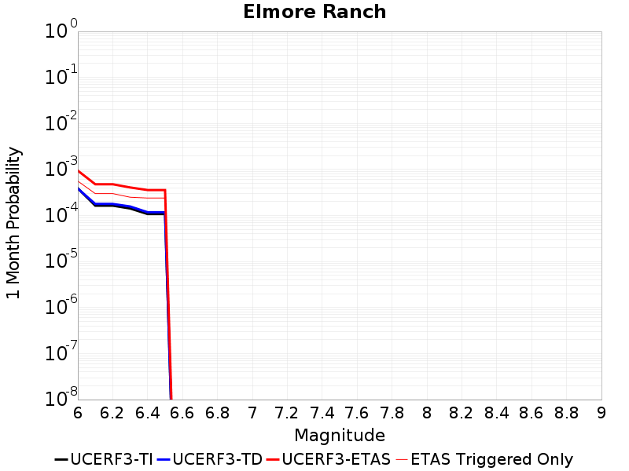
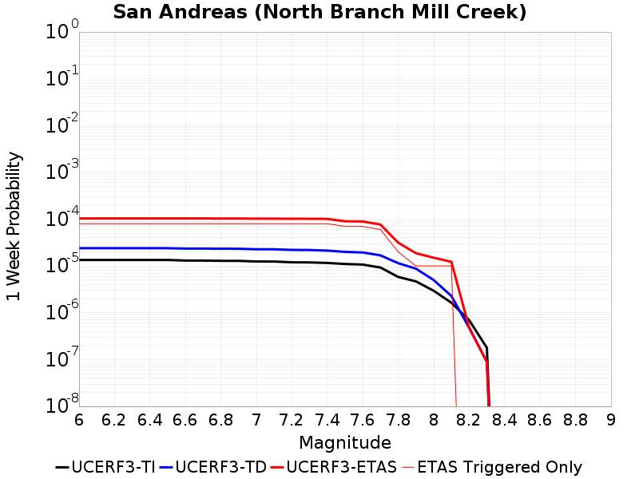
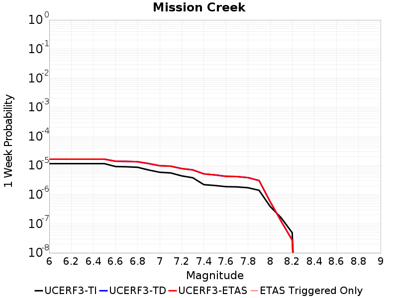
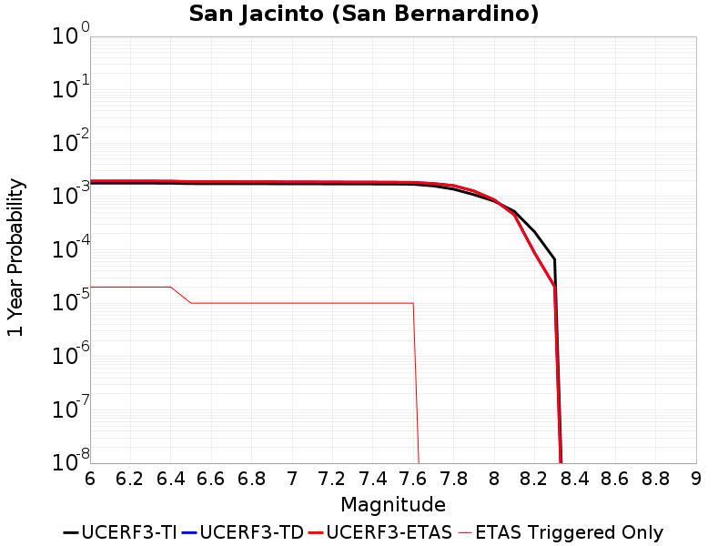
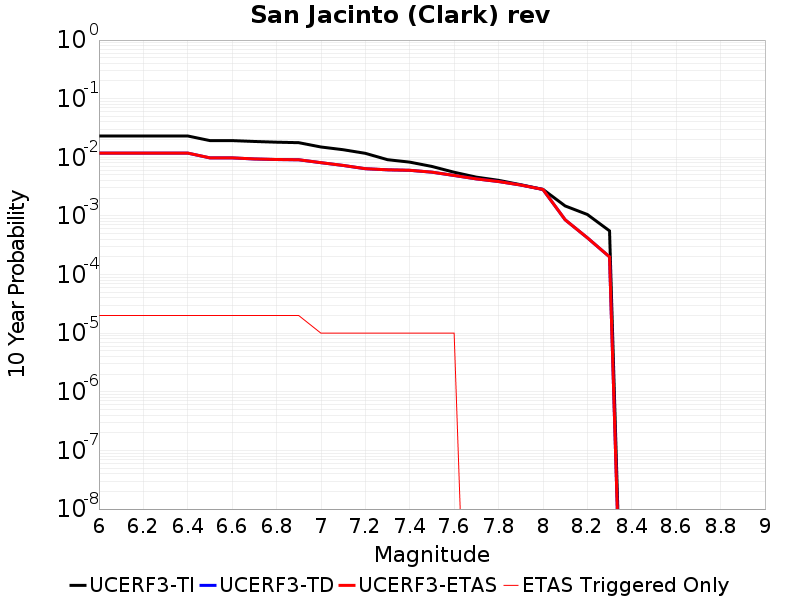
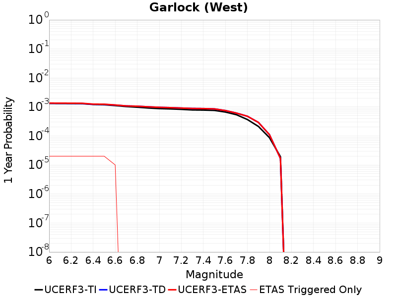
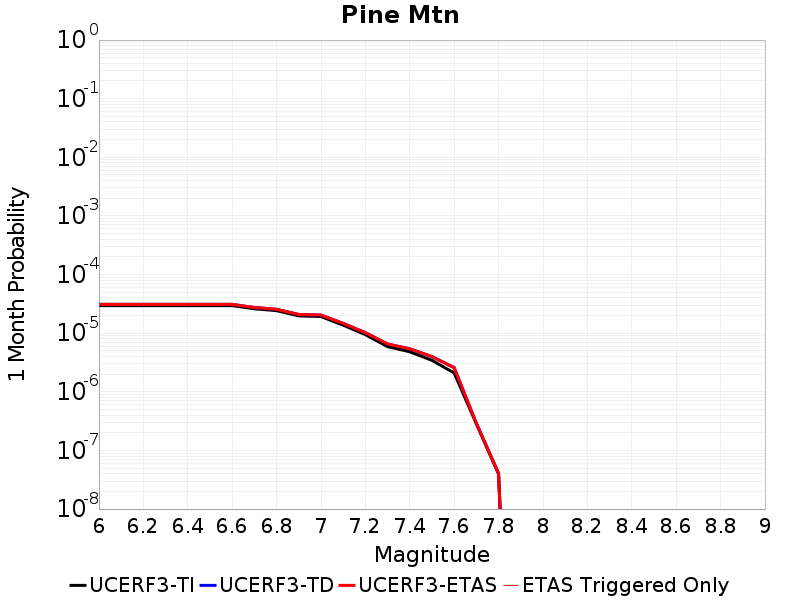

# Parent Section Magnitude-Probability Distributions

Only fault sections with at least one triggered aftershock are plotted. Sections are sorted by total supraseismogenic trigger rate (decreasing)

## Table Of Contents

* [Brawley (Seismic Zone) alt 1](#brawley-seismic-zone-alt-1)
* [Imperial](#imperial)
* [San Andreas (Coachella) rev](#san-andreas-coachella-rev)
* [San Andreas (San Gorgonio Pass-Garnet HIll)](#san-andreas-san-gorgonio-pass-garnet-hill)
* [Elmore Ranch](#elmore-ranch)
* [San Andreas (San Bernardino S)](#san-andreas-san-bernardino-s)
* [San Andreas (San Bernardino N)](#san-andreas-san-bernardino-n)
* [San Jacinto (Superstition Mtn)](#san-jacinto-superstition-mtn)
* [San Andreas (Mojave S)](#san-andreas-mojave-s)
* [San Andreas (North Branch Mill Creek)](#san-andreas-north-branch-mill-creek)
* [San Gorgonio Pass](#san-gorgonio-pass)
* [Blue Cut](#blue-cut)
* [San Andreas (Big Bend)](#san-andreas-big-bend)
* [San Andreas (Mojave N)](#san-andreas-mojave-n)
* [San Andreas (Carrizo) rev](#san-andreas-carrizo-rev)
* [San Andreas (Cholame) rev](#san-andreas-cholame-rev)
* [Pinto Mtn](#pinto-mtn)
* [San Andreas (Parkfield)](#san-andreas-parkfield)
* [Cerro Prieto](#cerro-prieto)
* [Superstition Hills](#superstition-hills)
* [San Jacinto (Borrego)](#san-jacinto-borrego)
* [San Andreas (Creeping Section) 2011 CFM](#san-andreas-creeping-section-2011-cfm)
* [Elsinore (Coyote Mountains)](#elsinore-coyote-mountains)
* [Laguna Salada](#laguna-salada)
* [Mission Creek](#mission-creek)
* [Elsinore (Glen Ivy) rev](#elsinore-glen-ivy-rev)
* [Garlock (East)](#garlock-east)
* [Earthquake Valley (So Extension)](#earthquake-valley-so-extension)
* [Owl Lake](#owl-lake)
* [San Andreas (Santa Cruz Mts) 2011 CFM](#san-andreas-santa-cruz-mts-2011-cfm)
* [Calaveras (So) - Paicines extension 2011 CFM](#calaveras-so---paicines-extension-2011-cfm)
* [Lost Hills](#lost-hills)
* [Rose Canyon](#rose-canyon)
* [Cucamonga](#cucamonga)
* [San Jacinto (San Bernardino)](#san-jacinto-san-bernardino)
* [Pleito](#pleito)
* [Burnt Mtn](#burnt-mtn)
* [Cleghorn Lake](#cleghorn-lake)
* [San Jacinto (Clark) rev](#san-jacinto-clark-rev)
* [Garlock (West)](#garlock-west)
* [Hayward (So) 2011 CFM](#hayward-so-2011-cfm)
* [Pine Mtn](#pine-mtn)
* [Elsinore (Stepovers Combined)](#elsinore-stepovers-combined)
* [San Jacinto (San Jacinto Valley) rev](#san-jacinto-san-jacinto-valley-rev)
* [Elsinore (Temecula) rev](#elsinore-temecula-rev)
* [San Clemente](#san-clemente)
* [Earthquake Valley](#earthquake-valley)
* [Hayward (So) extension 2011 CFM](#hayward-so-extension-2011-cfm)
* [Bullion Mountains](#bullion-mountains)
* [San Jacinto (Anza) rev](#san-jacinto-anza-rev)
* [Sierra Madre](#sierra-madre)
* [Eureka Peak](#eureka-peak)
* [San Gabriel (Extension)](#san-gabriel-extension)
* [Calico-Hidalgo](#calico-hidalgo)
* [Coronado Bank alt1](#coronado-bank-alt1)
* [Ludlow](#ludlow)
* [Big Pine (Central)](#big-pine-central)
* [Big Pine (East)](#big-pine-east)
* [Goldstone Lake](#goldstone-lake)
* [Garlock (Central)](#garlock-central)
* [Pisgah-Bullion Mtn-Mesquite Lk](#pisgah-bullion-mtn-mesquite-lk)
* [Monterey Bay-Tularcitos](#monterey-bay-tularcitos)
* [San Jacinto (Stepovers Combined)](#san-jacinto-stepovers-combined)
* [Calaveras (Central) 2011 CFM](#calaveras-central-2011-cfm)
* [Calaveras (So) 2011 CFM](#calaveras-so-2011-cfm)

## Brawley (Seismic Zone) alt 1
*[(top)](#table-of-contents)*

| 1 Week | 1 Month | 1 Year | 10 Year |
|-----|-----|-----|-----|
|  |  |  |  |

| Magnitude | 1 wk TI Prob | 1 wk TD Prob | 1 wk ETAS Prob | 1 wk ETAS/TD Gain | 1 wk ETAS Triggered Only | 1 mo TI Prob | 1 mo TD Prob | 1 mo ETAS Prob | 1 mo ETAS/TD Gain | 1 mo ETAS Triggered Only | 1 yr TI Prob | 1 yr TD Prob | 1 yr ETAS Prob | 1 yr ETAS/TD Gain | 1 yr ETAS Triggered Only | 10 yr TI Prob | 10 yr TD Prob | 10 yr ETAS Prob | 10 yr ETAS/TD Gain | 10 yr ETAS Triggered Only |
|-----|-----|-----|-----|-----|-----|-----|-----|-----|-----|-----|-----|-----|-----|-----|-----|-----|-----|-----|-----|-----|
| 6.0 | 2.2521618E-4 | 4.8294963E-4 | 0.006300139 | 13.045126 | 0.00582 | 9.6485513E-4 | 0.0020681801 | 0.010480746 | 5.0676174 | 0.00843 | 0.011683988 | 0.024884338 | 0.037443828 | 1.5047146 | 0.01288 | 0.11088423 | 0.21577097 | 0.22882839 | 1.0605152 | 0.01665 |
| 6.1 | 2.2521618E-4 | 4.8294963E-4 | 0.0053206123 | 11.016909 | 0.00484 | 9.6485513E-4 | 0.0020681801 | 0.009013785 | 4.358318 | 0.00696 | 0.011683988 | 0.024884338 | 0.035240065 | 1.4161545 | 0.01062 | 0.11088423 | 0.21577097 | 0.22646786 | 1.0495752 | 0.01364 |
| 6.2 | 2.198148E-4 | 4.7365425E-4 | 0.0052313996 | 11.0447645 | 0.00476 | 9.417233E-4 | 0.0020284047 | 0.00887449 | 4.375108 | 0.00686 | 0.011405343 | 0.024411745 | 0.034626156 | 1.4184219 | 0.01047 | 0.10837428 | 0.21217875 | 0.22272769 | 1.0497172 | 0.01339 |
| 6.3 | 2.1704129E-4 | 4.679799E-4 | 0.0051058084 | 10.9103155 | 0.00464 | 9.298453E-4 | 0.0020041238 | 0.008710656 | 4.3463664 | 0.00672 | 0.011262234 | 0.024123888 | 0.034097344 | 1.4134264 | 0.01022 | 0.107082725 | 0.21006745 | 0.22039187 | 1.0491481 | 0.01307 |
| 6.4 | 1.876142E-4 | 4.066802E-4 | 0.0040951795 | 10.069778 | 0.00369 | 8.038131E-4 | 0.0017417656 | 0.007312047 | 4.1980658 | 0.00558 | 0.00974259 | 0.02100057 | 0.029165426 | 1.388792 | 0.00834 | 0.093263686 | 0.18681991 | 0.19552906 | 1.046618 | 0.01071 |
| 6.5 | 1.7390939E-4 | 3.8077866E-4 | 0.0037195068 | 9.76816 | 0.00334 | 7.45113E-4 | 0.0016309005 | 0.006592795 | 4.042426 | 0.00497 | 0.009034078 | 0.019678121 | 0.026883489 | 1.3661612 | 0.00735 | 0.086755216 | 0.17660338 | 0.18434331 | 1.0438266 | 0.0094 |
| 6.6 | 1.591791E-4 | 3.5462377E-4 | 0.0033035777 | 9.315725 | 0.00295 | 6.8201777E-4 | 0.0015189414 | 0.005872319 | 3.86606 | 0.00436 | 0.008271996 | 0.018340262 | 0.02466215 | 1.3447 | 0.00644 | 0.07970774 | 0.16594583 | 0.17284346 | 1.0415655 | 0.00827 |
| 6.7 | 1.4268003E-4 | 3.2592754E-4 | 0.003005054 | 9.220007 | 0.00268 | 6.1134255E-4 | 0.001396093 | 0.0053206063 | 3.8110685 | 0.00393 | 0.007417723 | 0.016868645 | 0.022570807 | 1.3380332 | 0.0058 | 0.07174956 | 0.15398067 | 0.16032581 | 1.0412074 | 0.0075 |
| 6.8 | 1.239713E-4 | 2.950652E-4 | 0.0025743924 | 8.724826 | 0.00228 | 5.3119735E-4 | 0.0012639586 | 0.004649674 | 3.6786597 | 0.00339 | 0.0064481674 | 0.015281605 | 0.020165808 | 1.3196132 | 0.00496 | 0.06264243 | 0.14017 | 0.14569871 | 1.0394429 | 0.00643 |
| 6.9 | 1.0180238E-4 | 2.6606146E-4 | 0.0022655292 | 8.51506 | 0.002 | 4.3622297E-4 | 0.0011397694 | 0.004116373 | 3.611584 | 0.00298 | 0.005298089 | 0.01378943 | 0.018109033 | 1.3132546 | 0.00438 | 0.05173543 | 0.12638523 | 0.1312862 | 1.0387781 | 0.00561 |
| 7.0 | 7.6619996E-5 | 2.2668933E-4 | 0.0018463221 | 8.144724 | 0.00162 | 3.283301E-4 | 9.7116723E-4 | 0.0033788267 | 3.47914 | 0.00241 | 0.0039900932 | 0.011760583 | 0.015150244 | 1.2882222 | 0.00343 | 0.039192066 | 0.10837234 | 0.1122955 | 1.0362008 | 0.0044 |
| 7.1 | 7.5127435E-5 | 2.2348815E-4 | 0.0018231305 | 8.157617 | 0.0016 | 3.2193496E-4 | 9.57458E-4 | 0.0033251888 | 3.4729345 | 0.00237 | 0.0039125155 | 0.0115954615 | 0.014886849 | 1.2838513 | 0.00333 | 0.038443442 | 0.106924765 | 0.110756055 | 1.0358317 | 0.00429 |
| 7.2 | 6.788582E-5 | 2.0467772E-4 | 0.0015643993 | 7.6432323 | 0.00136 | 2.9090676E-4 | 8.768984E-4 | 0.0029151095 | 3.3243413 | 0.00204 | 0.0035360386 | 0.010624629 | 0.013493818 | 1.2700506 | 0.0029 | 0.034803 | 0.09857082 | 0.10196921 | 1.0344766 | 0.00377 |
| 7.3 | 6.399602E-5 | 1.9088609E-4 | 0.0014506456 | 7.5995355 | 0.00126 | 2.7423984E-4 | 8.178296E-4 | 0.0026962922 | 3.2968872 | 0.00188 | 0.0033337586 | 0.009912221 | 0.0125755565 | 1.2686921 | 0.00269 | 0.03284188 | 0.09243367 | 0.09561923 | 1.0344632 | 0.00351 |
| 7.4 | 4.506759E-5 | 1.2725823E-4 | 8.771628E-4 | 6.8927784 | 7.5E-4 | 1.9313251E-4 | 5.452793E-4 | 0.0015747177 | 2.8879101 | 0.00103 | 0.0023488526 | 0.0066187466 | 0.008118752 | 1.2266299 | 0.00151 | 0.023241805 | 0.06322548 | 0.06507092 | 1.0291883 | 0.00197 |
| 7.5 | 3.43289E-5 | 9.5031566E-5 | 5.9498404E-4 | 6.2609096 | 5.0E-4 | 1.4711556E-4 | 4.0721492E-4 | 0.0010669462 | 2.6201057 | 6.6E-4 | 0.0017896603 | 0.004946635 | 0.005901886 | 1.1931113 | 9.6E-4 | 0.01775316 | 0.047806658 | 0.048968334 | 1.0242995 | 0.00122 |
| 7.6 | 2.5980507E-5 | 7.19332E-5 | 4.1190875E-4 | 5.7262673 | 3.4E-4 | 1.1134028E-4 | 3.0824885E-4 | 7.281194E-4 | 2.3621156 | 4.2E-4 | 0.001354725 | 0.0037464965 | 0.0043840986 | 1.1701863 | 6.4E-4 | 0.013464959 | 0.036476072 | 0.037237257 | 1.0208681 | 7.9E-4 |
| 7.7 | 1.7292105E-5 | 5.057448E-5 | 2.5056436E-4 | 4.954364 | 2.0E-4 | 7.4106916E-5 | 2.167298E-4 | 4.4667994E-4 | 2.0609992 | 2.3E-4 | 9.018782E-4 | 0.0026354983 | 0.0029646286 | 1.1248835 | 3.3E-4 | 0.008982267 | 0.025821604 | 0.026201533 | 1.0147136 | 3.9E-4 |
| 7.8 | 1.2927471E-5 | 4.0674884E-5 | 1.7066959E-4 | 4.1959453 | 1.3E-4 | 5.5402274E-5 | 1.743093E-4 | 3.2428314E-4 | 1.8603892 | 1.5E-4 | 6.743139E-4 | 0.0021201528 | 0.0023396863 | 1.1035461 | 2.2E-4 | 0.0067227143 | 0.020877736 | 0.021122515 | 1.0117245 | 2.5E-4 |
| 7.9 | 1.0200774E-5 | 2.9525416E-5 | 9.952335E-5 | 3.3707688 | 7.0E-5 | 4.371687E-5 | 1.2653136E-4 | 2.0652123E-4 | 1.6321744 | 8.0E-5 | 5.321229E-4 | 0.0015394319 | 0.0016792164 | 1.0908027 | 1.4E-4 | 0.005308505 | 0.015351486 | 0.015499184 | 1.009621 | 1.5E-4 |
| 8.0 | 8.650396E-6 | 2.3940149E-5 | 6.3939195E-5 | 2.6707933 | 4.0E-5 | 3.70726E-5 | 1.0259661E-4 | 1.425925E-4 | 1.3898364 | 4.0E-5 | 4.5126543E-4 | 0.0012483989 | 0.0013482741 | 1.0800025 | 1.0E-4 | 0.0045035016 | 0.012519129 | 0.012627752 | 1.0086765 | 1.1E-4 |
| 8.1 | 3.9368224E-6 | 7.605415E-6 | 1.7605338E-5 | 2.3148427 | 1.0E-5 | 1.6871985E-5 | 3.2594227E-5 | 4.2593903E-5 | 1.3067927 | 1.0E-5 | 2.0539707E-4 | 3.967626E-4 | 4.2675072E-4 | 1.0755819 | 3.0E-5 | 0.0020520731 | 0.0041386206 | 0.004178455 | 1.0096251 | 4.0E-5 |
| 8.2 | 1.7101195E-6 | 2.3252296E-6 | 2.3252296E-6 | 1.0 | 0.0 | 7.329063E-6 | 9.965232E-6 | 9.965232E-6 | 1.0 | 0.0 | 8.922769E-5 | 1.2131998E-4 | 1.2131998E-4 | 1.0 | 0.0 | 8.9191867E-4 | 0.0013216547 | 0.0013216547 | 1.0 | 0.0 |
| 8.3 | 3.0346666E-8 | 1.8347171E-8 | 1.8347171E-8 | 1.0 | 0.0 | 1.3005713E-7 | 7.863073E-8 | 7.863073E-8 | 1.0 | 0.0 | 1.5834444E-6 | 9.57329E-7 | 9.57329E-7 | 1.0 | 0.0 | 1.5834332E-5 | 9.970588E-6 | 9.970588E-6 | 1.0 | 0.0 |

## Imperial
*[(top)](#table-of-contents)*

| 1 Week | 1 Month | 1 Year | 10 Year |
|-----|-----|-----|-----|
|  |  |  |  |

| Magnitude | 1 wk TI Prob | 1 wk TD Prob | 1 wk ETAS Prob | 1 wk ETAS/TD Gain | 1 wk ETAS Triggered Only | 1 mo TI Prob | 1 mo TD Prob | 1 mo ETAS Prob | 1 mo ETAS/TD Gain | 1 mo ETAS Triggered Only | 1 yr TI Prob | 1 yr TD Prob | 1 yr ETAS Prob | 1 yr ETAS/TD Gain | 1 yr ETAS Triggered Only | 10 yr TI Prob | 10 yr TD Prob | 10 yr ETAS Prob | 10 yr ETAS/TD Gain | 10 yr ETAS Triggered Only |
|-----|-----|-----|-----|-----|-----|-----|-----|-----|-----|-----|-----|-----|-----|-----|-----|-----|-----|-----|-----|-----|
| 6.0 | 2.7496446E-4 | 5.1468593E-4 | 0.005352195 | 10.398953 | 0.00484 | 0.0011778869 | 0.0022039723 | 0.009188544 | 4.1690836 | 0.007 | 0.0142467655 | 0.026531367 | 0.036918275 | 1.3914955 | 0.01067 | 0.13367249 | 0.23110214 | 0.24164373 | 1.0456144 | 0.01371 |
| 6.1 | 2.5356023E-4 | 4.946796E-4 | 0.00532229 | 10.759066 | 0.00483 | 0.001086234 | 0.002118372 | 0.0090636285 | 4.278582 | 0.00696 | 0.013144928 | 0.025491446 | 0.035830982 | 1.405608 | 0.01061 | 0.123940155 | 0.22223745 | 0.23284613 | 1.0477358 | 0.01364 |
| 6.2 | 2.4820742E-4 | 4.8549243E-4 | 0.0052331863 | 10.779131 | 0.00475 | 0.0010633124 | 0.0020790615 | 0.008924799 | 4.292706 | 0.00686 | 0.01286919 | 0.02502465 | 0.03522289 | 1.4075279 | 0.01046 | 0.12148927 | 0.2187168 | 0.22917819 | 1.0478307 | 0.01339 |
| 6.3 | 2.3205351E-4 | 4.6611088E-4 | 0.0050939526 | 10.928629 | 0.00463 | 9.94136E-4 | 0.0019961263 | 0.008692732 | 4.3548007 | 0.00671 | 0.012036599 | 0.024033247 | 0.033988107 | 1.4142121 | 0.0102 | 0.11405133 | 0.21045804 | 0.22076157 | 1.0489576 | 0.01305 |
| 6.4 | 2.0304754E-4 | 4.0575062E-4 | 0.0040942533 | 10.090567 | 0.00369 | 8.6991355E-4 | 0.0017377874 | 0.0073080906 | 4.2053995 | 0.00558 | 0.010539869 | 0.020957654 | 0.029113077 | 1.3891381 | 0.00833 | 0.100537635 | 0.18759944 | 0.19629213 | 1.0463364 | 0.0107 |
| 6.5 | 1.854992E-4 | 3.764327E-4 | 0.003695183 | 9.816318 | 0.00332 | 7.9475436E-4 | 0.0016122983 | 0.0065543177 | 4.0652013 | 0.00495 | 0.009633281 | 0.019462211 | 0.026639748 | 1.3687935 | 0.00732 | 0.0922623 | 0.17572792 | 0.1834431 | 1.0439042 | 0.00936 |
| 6.6 | 1.6586106E-4 | 3.4632304E-4 | 0.0032853049 | 9.486244 | 0.00294 | 7.106394E-4 | 0.0014834079 | 0.005826955 | 3.928087 | 0.00435 | 0.008617763 | 0.017917162 | 0.024212312 | 1.3513476 | 0.00641 | 0.08291132 | 0.16304271 | 0.16993088 | 1.0422475 | 0.00823 |
| 6.7 | 1.4224656E-4 | 3.1292698E-4 | 0.0029820914 | 9.529673 | 0.00267 | 6.094856E-4 | 0.0013404349 | 0.0052551804 | 3.920504 | 0.00392 | 0.0073952693 | 0.016201297 | 0.021877816 | 1.3503743 | 0.00577 | 0.07153955 | 0.14852428 | 0.15487629 | 1.0427675 | 0.00746 |
| 6.8 | 1.2317259E-4 | 2.823371E-4 | 0.0025516963 | 9.037765 | 0.00227 | 5.2777573E-4 | 0.0012094615 | 0.0045853737 | 3.7912524 | 0.00338 | 0.0064067547 | 0.0146272145 | 0.019485103 | 1.332113 | 0.00493 | 0.06225166 | 0.13471106 | 0.1402316 | 1.0409806 | 0.00638 |
| 6.9 | 9.859898E-5 | 2.5347623E-4 | 0.002242972 | 8.848845 | 0.00199 | 4.2249862E-4 | 0.0010858788 | 0.004052654 | 3.732142 | 0.00297 | 0.0051317946 | 0.013141425 | 0.01743426 | 1.3266643 | 0.00435 | 0.05014893 | 0.120765686 | 0.12566301 | 1.0405524 | 0.00557 |
| 7.0 | 7.3191884E-5 | 2.1517E-4 | 0.0018248236 | 8.480845 | 0.00161 | 3.136418E-4 | 9.218345E-4 | 0.003319622 | 3.6011043 | 0.0024 | 0.003811904 | 0.01116628 | 0.014528315 | 1.3010882 | 0.0034 | 0.037471764 | 0.10309671 | 0.10700721 | 1.0379304 | 0.00436 |
| 7.1 | 7.1760296E-5 | 2.1215103E-4 | 0.0018018137 | 8.493071 | 0.00159 | 3.0750787E-4 | 9.089051E-4 | 0.0032667601 | 3.5941706 | 0.00236 | 0.003737482 | 0.011010466 | 0.014284021 | 1.2973131 | 0.00331 | 0.03675245 | 0.101721466 | 0.10554813 | 1.0376191 | 0.00426 |
| 7.2 | 6.46614E-5 | 1.9374935E-4 | 0.0015434878 | 7.966415 | 0.00135 | 2.7709085E-4 | 8.300932E-4 | 0.002858408 | 3.4434786 | 0.00203 | 0.0033683628 | 0.010060187 | 0.0129112145 | 1.283397 | 0.00288 | 0.033177625 | 0.09350376 | 0.096894056 | 1.0362583 | 0.00374 |
| 7.3 | 6.088115E-5 | 1.8036667E-4 | 0.0014401394 | 7.9845095 | 0.00126 | 2.6089314E-4 | 7.727739E-4 | 0.0026513212 | 3.4309142 | 0.00188 | 0.0031717476 | 0.009368523 | 0.012023415 | 1.2833843 | 0.00268 | 0.031268585 | 0.087522306 | 0.090706855 | 1.0363855 | 0.00349 |
| 7.4 | 4.199346E-5 | 1.1687826E-4 | 8.667906E-4 | 7.416183 | 7.5E-4 | 1.7995955E-4 | 5.008116E-4 | 0.0015302957 | 3.0556316 | 0.00103 | 0.0021888057 | 0.0060805078 | 0.007571387 | 1.2451899 | 0.0015 | 0.02167372 | 0.058223125 | 0.06005959 | 1.0315418 | 0.00195 |
| 7.5 | 3.130448E-5 | 8.481948E-5 | 5.847771E-4 | 6.8943725 | 5.0E-4 | 1.3415517E-4 | 3.6346173E-4 | 0.0010232219 | 2.815212 | 6.6E-4 | 0.0016321153 | 0.004416229 | 0.005362034 | 1.2141657 | 9.5E-4 | 0.016201803 | 0.042803373 | 0.04395201 | 1.0268352 | 0.0012 |
| 7.6 | 2.3074248E-5 | 6.2057465E-5 | 4.0203636E-4 | 6.4784527 | 3.4E-4 | 9.888588E-5 | 2.6593357E-4 | 6.8582187E-4 | 2.5789218 | 4.2E-4 | 0.0012032706 | 0.0032329585 | 0.0038609216 | 1.194238 | 6.3E-4 | 0.011967761 | 0.03158053 | 0.032326214 | 1.0236121 | 7.7E-4 |
| 7.7 | 1.45864815E-5 | 4.1104773E-5 | 2.4109655E-4 | 5.865415 | 2.0E-4 | 6.2511994E-5 | 1.7615144E-4 | 4.0611092E-4 | 2.3054645 | 2.3E-4 | 7.608177E-4 | 0.0021425402 | 0.0024618544 | 1.1490355 | 3.2E-4 | 0.007582182 | 0.021077445 | 0.021439645 | 1.0171843 | 3.7E-4 |
| 7.8 | 1.0352979E-5 | 3.1761734E-5 | 1.617576E-4 | 5.0928454 | 1.3E-4 | 4.4369157E-5 | 1.3611463E-4 | 2.860942E-4 | 2.1018622 | 1.5E-4 | 5.400606E-4 | 0.0016559385 | 0.0018556073 | 1.1205775 | 2.0E-4 | 0.0053875 | 0.016383188 | 0.01660942 | 1.0138087 | 2.3E-4 |
| 7.9 | 8.137906E-6 | 2.277906E-5 | 9.277747E-5 | 4.0729275 | 7.0E-5 | 3.4876273E-5 | 9.76209E-5 | 1.776131E-4 | 1.8194166 | 8.0E-5 | 4.2453592E-4 | 0.0011878875 | 0.0013077449 | 1.1008997 | 1.2E-4 | 0.004237258 | 0.011910638 | 0.01203909 | 1.0107846 | 1.3E-4 |
| 8.0 | 6.93792E-6 | 1.8545175E-5 | 5.8544432E-5 | 3.1568553 | 4.0E-5 | 2.9733603E-5 | 7.947691E-5 | 1.1947373E-4 | 1.5032508 | 4.0E-5 | 3.6194647E-4 | 9.6720253E-4 | 0.0010471252 | 1.0826328 | 8.0E-5 | 0.0036135751 | 0.009752495 | 0.009841617 | 1.0091385 | 9.0E-5 |
| 8.1 | 3.4286315E-6 | 6.622092E-6 | 1.6622025E-5 | 2.5100868 | 1.0E-5 | 1.4694053E-5 | 2.8380085E-5 | 3.8379803E-5 | 1.3523498 | 1.0E-5 | 1.7888541E-4 | 3.454729E-4 | 3.7546252E-4 | 1.0868075 | 3.0E-5 | 0.0017874148 | 0.0036061592 | 0.003646015 | 1.0110521 | 4.0E-5 |
| 8.2 | 1.4906886E-6 | 2.0304637E-6 | 2.0304637E-6 | 1.0 | 0.0 | 6.3886496E-6 | 8.701959E-6 | 8.701959E-6 | 1.0 | 0.0 | 7.7779034E-5 | 1.0594123E-4 | 1.0594123E-4 | 1.0 | 0.0 | 7.775182E-4 | 0.0011555634 | 0.0011555634 | 1.0 | 0.0 |
| 8.3 | 2.5758007E-8 | 1.5458745E-8 | 1.5458745E-8 | 1.0 | 0.0 | 1.10391454E-7 | 6.6251765E-8 | 6.6251765E-8 | 1.0 | 0.0 | 1.3440151E-6 | 8.066152E-7 | 8.066152E-7 | 1.0 | 0.0 | 1.344007E-5 | 8.398427E-6 | 8.398427E-6 | 1.0 | 0.0 |

## San Andreas (Coachella) rev
*[(top)](#table-of-contents)*

| 1 Week | 1 Month | 1 Year | 10 Year |
|-----|-----|-----|-----|
|  |  |  |  |

| Magnitude | 1 wk TI Prob | 1 wk TD Prob | 1 wk ETAS Prob | 1 wk ETAS/TD Gain | 1 wk ETAS Triggered Only | 1 mo TI Prob | 1 mo TD Prob | 1 mo ETAS Prob | 1 mo ETAS/TD Gain | 1 mo ETAS Triggered Only | 1 yr TI Prob | 1 yr TD Prob | 1 yr ETAS Prob | 1 yr ETAS/TD Gain | 1 yr ETAS Triggered Only | 10 yr TI Prob | 10 yr TD Prob | 10 yr ETAS Prob | 10 yr ETAS/TD Gain | 10 yr ETAS Triggered Only |
|-----|-----|-----|-----|-----|-----|-----|-----|-----|-----|-----|-----|-----|-----|-----|-----|-----|-----|-----|-----|-----|
| 6.0 | 1.1925945E-4 | 3.305652E-4 | 0.0023399007 | 7.0784845 | 0.00201 | 5.110118E-4 | 0.0014159436 | 0.0043917242 | 3.1016235 | 0.00298 | 0.0062038354 | 0.017104212 | 0.021360151 | 1.248824 | 0.00433 | 0.060334753 | 0.15391968 | 0.1586408 | 1.0306727 | 0.00558 |
| 6.1 | 1.1925945E-4 | 3.305652E-4 | 0.0023399007 | 7.0784845 | 0.00201 | 5.110118E-4 | 0.0014159436 | 0.0043917242 | 3.1016235 | 0.00298 | 0.0062038354 | 0.017104212 | 0.021360151 | 1.248824 | 0.00433 | 0.060334753 | 0.15391968 | 0.1586408 | 1.0306727 | 0.00558 |
| 6.2 | 1.07432395E-4 | 3.0555273E-4 | 0.0022249662 | 7.281774 | 0.00192 | 4.603433E-4 | 0.0013088586 | 0.0041751023 | 3.1898801 | 0.00287 | 0.005590286 | 0.015820045 | 0.019933917 | 1.2600417 | 0.00418 | 0.05451731 | 0.14309563 | 0.14766292 | 1.0319178 | 0.00533 |
| 6.3 | 1.0718766E-4 | 3.0500567E-4 | 0.00222442 | 7.293045 | 0.00192 | 4.592948E-4 | 0.0013065164 | 0.0041727666 | 3.1938112 | 0.00287 | 0.005577586 | 0.015791941 | 0.01990593 | 1.260512 | 0.00418 | 0.054396555 | 0.14286418 | 0.14743271 | 1.0319781 | 0.00533 |
| 6.4 | 1.0355944E-4 | 2.970823E-4 | 0.0021965178 | 7.3936343 | 0.0019 | 4.4375064E-4 | 0.0012725926 | 0.0041089784 | 3.2288249 | 0.00284 | 0.0053892885 | 0.015384822 | 0.019461129 | 1.2649564 | 0.00414 | 0.052604496 | 0.13942781 | 0.14398023 | 1.0326508 | 0.00529 |
| 6.5 | 1.0227914E-4 | 2.942752E-4 | 0.0021937161 | 7.4546413 | 0.0019 | 4.382655E-4 | 0.0012605739 | 0.0040969937 | 3.250102 | 0.00284 | 0.0053228354 | 0.015240552 | 0.019317456 | 1.2675037 | 0.00414 | 0.051971316 | 0.1382059 | 0.14275616 | 1.0329238 | 0.00528 |
| 6.6 | 1.0116757E-4 | 2.9193138E-4 | 0.0021813796 | 7.4722342 | 0.00189 | 4.3350324E-4 | 0.0012505386 | 0.004067012 | 3.2522085 | 0.00282 | 0.0052651367 | 0.015120073 | 0.019177778 | 1.2683655 | 0.00412 | 0.051421247 | 0.13718517 | 0.14172357 | 1.0330824 | 0.00526 |
| 6.7 | 1.0050676E-4 | 2.9051615E-4 | 0.002179967 | 7.5037727 | 0.00189 | 4.3067214E-4 | 0.0012444791 | 0.0040609697 | 3.2631884 | 0.00282 | 0.005230834 | 0.01504732 | 0.019105325 | 1.2696829 | 0.00412 | 0.051094085 | 0.13656962 | 0.14111127 | 1.0332551 | 0.00526 |
| 6.8 | 9.976819E-5 | 2.8854664E-4 | 0.0021680042 | 7.513531 | 0.00188 | 4.2750788E-4 | 0.0012360463 | 0.0040425733 | 3.2705677 | 0.00281 | 0.0051924936 | 0.014946065 | 0.018994637 | 1.2708788 | 0.00411 | 0.050728295 | 0.13572034 | 0.14025782 | 1.0334325 | 0.00525 |
| 6.9 | 9.77719E-5 | 2.834926E-4 | 0.002132968 | 7.5238934 | 0.00185 | 4.1895514E-4 | 0.0012144066 | 0.0039810427 | 3.2781794 | 0.00277 | 0.0050888555 | 0.014686182 | 0.018686557 | 1.2723904 | 0.00406 | 0.049738888 | 0.13354348 | 0.13802305 | 1.033544 | 0.00517 |
| 7.0 | 8.500761E-5 | 2.5066276E-4 | 0.0018702567 | 7.4612465 | 0.00162 | 3.6426744E-4 | 0.0010738301 | 0.003481242 | 3.241893 | 0.00241 | 0.0044259406 | 0.012996302 | 0.016381724 | 1.2604913 | 0.00343 | 0.04338823 | 0.119368315 | 0.1232519 | 1.0325345 | 0.00441 |
| 7.1 | 8.319876E-5 | 2.4665621E-4 | 0.0018462616 | 7.4851613 | 0.0016 | 3.5651738E-4 | 0.0010566731 | 0.0034241688 | 3.2405186 | 0.00237 | 0.004331963 | 0.012789888 | 0.016077297 | 1.2570319 | 0.00333 | 0.042484846 | 0.11757756 | 0.12137198 | 1.0322716 | 0.0043 |
| 7.2 | 7.563917E-5 | 2.2705173E-4 | 0.0015867429 | 6.9884644 | 0.00136 | 3.2412758E-4 | 9.7271905E-4 | 0.0030107347 | 3.0951738 | 0.00204 | 0.0039391145 | 0.011779252 | 0.014645092 | 1.2432956 | 0.0029 | 0.03870018 | 0.10896099 | 0.112329125 | 1.0309113 | 0.00378 |
| 7.3 | 7.082985E-5 | 2.1010338E-4 | 0.0014698387 | 6.995788 | 0.00126 | 3.0352117E-4 | 9.0013526E-4 | 0.002778443 | 3.086695 | 0.00188 | 0.0036891096 | 0.010904717 | 0.013565384 | 1.2439922 | 0.00269 | 0.03628465 | 0.10145118 | 0.10461407 | 1.0311764 | 0.00352 |
| 7.4 | 5.146215E-5 | 1.4502955E-4 | 8.949208E-4 | 6.17061 | 7.5E-4 | 2.2053342E-4 | 6.2140805E-4 | 0.001650768 | 2.656496 | 0.00103 | 0.0026816884 | 0.007539592 | 0.009038207 | 1.1987661 | 0.00151 | 0.02649557 | 0.07184801 | 0.07368576 | 1.0255781 | 0.00198 |
| 7.5 | 4.0285166E-5 | 1.114139E-4 | 6.113582E-4 | 5.4872704 | 5.0E-4 | 1.7263928E-4 | 4.774011E-4 | 0.001137086 | 2.3818252 | 6.6E-4 | 0.002099857 | 0.00579694 | 0.006751375 | 1.1646446 | 9.6E-4 | 0.020801254 | 0.055900976 | 0.057052776 | 1.0206043 | 0.00122 |
| 7.6 | 3.1168736E-5 | 8.6099186E-5 | 4.2606992E-4 | 4.948594 | 3.4E-4 | 1.3357346E-4 | 3.6894446E-4 | 7.8878953E-4 | 2.1379628 | 4.2E-4 | 0.0016250437 | 0.004482675 | 0.0051198057 | 1.1421319 | 6.4E-4 | 0.016132116 | 0.04358117 | 0.04433674 | 1.0173371 | 7.9E-4 |
| 7.7 | 2.2100989E-5 | 6.385822E-5 | 2.6384546E-4 | 4.131738 | 2.0E-4 | 9.4715084E-5 | 2.7364944E-4 | 5.035865E-4 | 1.8402615 | 2.3E-4 | 0.001152546 | 0.0033265986 | 0.0036555007 | 1.0988704 | 3.3E-4 | 0.011465867 | 0.032567795 | 0.032945096 | 1.011585 | 3.9E-4 |
| 7.8 | 1.7484861E-5 | 5.3070584E-5 | 1.8306369E-4 | 3.4494379 | 1.3E-4 | 7.493296E-5 | 2.2742554E-4 | 3.7739144E-4 | 1.6594065 | 1.5E-4 | 9.1192697E-4 | 0.0027653931 | 0.0029847848 | 1.0793347 | 2.2E-4 | 0.009081938 | 0.027219258 | 0.027462455 | 1.0089346 | 2.5E-4 |
| 7.9 | 1.3967285E-5 | 3.9253136E-5 | 1.0925039E-4 | 2.783227 | 7.0E-5 | 5.985842E-5 | 1.682169E-4 | 2.4820343E-4 | 1.4754965 | 8.0E-5 | 7.2853256E-4 | 0.0020461183 | 0.0021858318 | 1.0682822 | 1.4E-4 | 0.0072614877 | 0.020384816 | 0.020531759 | 1.0072085 | 1.5E-4 |
| 8.0 | 1.1887396E-5 | 3.194518E-5 | 7.19439E-5 | 2.2521052 | 4.0E-5 | 5.094499E-5 | 1.3690072E-4 | 1.7689525E-4 | 1.2921425 | 4.0E-5 | 6.200787E-4 | 0.0016654931 | 0.0017653266 | 1.0599422 | 1.0E-4 | 0.006183513 | 0.01668841 | 0.016796574 | 1.0064814 | 1.1E-4 |
| 8.1 | 5.100864E-6 | 9.32575E-6 | 1.9325656E-5 | 2.0722897 | 1.0E-5 | 2.1860664E-5 | 3.996689E-5 | 4.996649E-5 | 1.250197 | 1.0E-5 | 2.6612106E-4 | 4.8648837E-4 | 5.164738E-4 | 1.0616364 | 3.0E-5 | 0.002658026 | 0.0050931587 | 0.005132955 | 1.0078137 | 4.0E-5 |
| 8.2 | 2.3004484E-6 | 2.927171E-6 | 2.927171E-6 | 1.0 | 0.0 | 9.859027E-6 | 1.2544959E-5 | 1.2544959E-5 | 1.0 | 0.0 | 1.2002704E-4 | 1.527242E-4 | 1.527242E-4 | 1.0 | 0.0 | 0.0011996223 | 0.0016699809 | 0.0016699809 | 1.0 | 0.0 |
| 8.3 | 1.0424446E-7 | 6.199383E-8 | 6.199383E-8 | 1.0 | 0.0 | 4.4676187E-7 | 2.6568782E-7 | 2.6568782E-7 | 1.0 | 0.0 | 5.439312E-6 | 3.2347448E-6 | 3.2347448E-6 | 1.0 | 0.0 | 5.4391792E-5 | 3.3954013E-5 | 3.3954013E-5 | 1.0 | 0.0 |

## San Andreas (San Gorgonio Pass-Garnet HIll)
*[(top)](#table-of-contents)*

| 1 Week | 1 Month | 1 Year | 10 Year |
|-----|-----|-----|-----|
|  |  |  |  |

| Magnitude | 1 wk TI Prob | 1 wk TD Prob | 1 wk ETAS Prob | 1 wk ETAS/TD Gain | 1 wk ETAS Triggered Only | 1 mo TI Prob | 1 mo TD Prob | 1 mo ETAS Prob | 1 mo ETAS/TD Gain | 1 mo ETAS Triggered Only | 1 yr TI Prob | 1 yr TD Prob | 1 yr ETAS Prob | 1 yr ETAS/TD Gain | 1 yr ETAS Triggered Only | 10 yr TI Prob | 10 yr TD Prob | 10 yr ETAS Prob | 10 yr ETAS/TD Gain | 10 yr ETAS Triggered Only |
|-----|-----|-----|-----|-----|-----|-----|-----|-----|-----|-----|-----|-----|-----|-----|-----|-----|-----|-----|-----|-----|
| 6.0 | 8.31567E-5 | 2.367261E-4 | 0.0013464633 | 5.6878533 | 0.00111 | 3.5633717E-4 | 0.0010141394 | 0.0027024255 | 2.6647477 | 0.00169 | 0.004329778 | 0.012277169 | 0.014657581 | 1.1938894 | 0.00241 | 0.042463828 | 0.11376813 | 0.11655089 | 1.02446 | 0.00314 |
| 6.1 | 8.31567E-5 | 2.367261E-4 | 0.0013464633 | 5.6878533 | 0.00111 | 3.5633717E-4 | 0.0010141394 | 0.0027024255 | 2.6647477 | 0.00169 | 0.004329778 | 0.012277169 | 0.014657581 | 1.1938894 | 0.00241 | 0.042463828 | 0.11376813 | 0.11655089 | 1.02446 | 0.00314 |
| 6.2 | 8.31567E-5 | 2.367261E-4 | 0.0013464633 | 5.6878533 | 0.00111 | 3.5633717E-4 | 0.0010141394 | 0.0027024255 | 2.6647477 | 0.00169 | 0.004329778 | 0.012277169 | 0.014657581 | 1.1938894 | 0.00241 | 0.042463828 | 0.11376813 | 0.11655089 | 1.02446 | 0.00314 |
| 6.3 | 8.31567E-5 | 2.367261E-4 | 0.0013464633 | 5.6878533 | 0.00111 | 3.5633717E-4 | 0.0010141394 | 0.0027024255 | 2.6647477 | 0.00169 | 0.004329778 | 0.012277169 | 0.014657581 | 1.1938894 | 0.00241 | 0.042463828 | 0.11376813 | 0.11655089 | 1.02446 | 0.00314 |
| 6.4 | 8.059055E-5 | 2.3228588E-4 | 0.001342028 | 5.7774844 | 0.00111 | 3.4534236E-4 | 9.951292E-4 | 0.0026834474 | 2.6965818 | 0.00169 | 0.0041964394 | 0.012048633 | 0.014429595 | 1.1976126 | 0.00241 | 0.041180745 | 0.111745566 | 0.1145258 | 1.02488 | 0.00313 |
| 6.5 | 8.059055E-5 | 2.3228588E-4 | 0.001342028 | 5.7774844 | 0.00111 | 3.4534236E-4 | 9.951292E-4 | 0.0026834474 | 2.6965818 | 0.00169 | 0.0041964394 | 0.012048633 | 0.014429595 | 1.1976126 | 0.00241 | 0.041180745 | 0.111745566 | 0.1145258 | 1.02488 | 0.00313 |
| 6.6 | 7.619237E-5 | 2.2470883E-4 | 0.0013344594 | 5.938616 | 0.00111 | 3.2649786E-4 | 9.6268475E-4 | 0.0026410674 | 2.7434397 | 0.00168 | 0.0039678677 | 0.011658259 | 0.014030279 | 1.2034626 | 0.0024 | 0.03897764 | 0.108277135 | 0.11105931 | 1.025695 | 0.00312 |
| 6.7 | 7.440636E-5 | 2.2146133E-4 | 0.0013312155 | 6.0110517 | 0.00111 | 3.188454E-4 | 9.48777E-4 | 0.002627183 | 2.7690206 | 0.00168 | 0.0038750346 | 0.011490726 | 0.013863148 | 1.206464 | 0.0024 | 0.038081564 | 0.1067851 | 0.109571934 | 1.0260975 | 0.00312 |
| 6.8 | 7.3735864E-5 | 2.1992615E-4 | 0.0013296821 | 6.0460386 | 0.00111 | 3.1597257E-4 | 9.4220246E-4 | 0.0026206195 | 2.7813761 | 0.00168 | 0.0038401815 | 0.011411525 | 0.013784138 | 1.2079138 | 0.0024 | 0.03774495 | 0.10608461 | 0.10887363 | 1.0262905 | 0.00312 |
| 6.9 | 7.27575E-5 | 2.1760869E-4 | 0.0013273672 | 6.0997896 | 0.00111 | 3.117806E-4 | 9.322776E-4 | 0.0026107114 | 2.8003583 | 0.00168 | 0.003789323 | 0.011291948 | 0.013664847 | 1.2101408 | 0.0024 | 0.037253562 | 0.10503087 | 0.10782318 | 1.0265856 | 0.00312 |
| 7.0 | 7.102591E-5 | 2.1343704E-4 | 0.0013232002 | 6.1994867 | 0.00111 | 3.0436125E-4 | 9.1441174E-4 | 0.0025928756 | 2.8355668 | 0.00168 | 0.003699303 | 0.011076662 | 0.013450078 | 1.2142718 | 0.0024 | 0.03638325 | 0.10312992 | 0.10592816 | 1.0271331 | 0.00312 |
| 7.1 | 7.028513E-5 | 2.1178552E-4 | 0.0013215505 | 6.2400417 | 0.00111 | 3.0118722E-4 | 9.0733875E-4 | 0.0025858143 | 2.8498886 | 0.00168 | 0.0036607897 | 0.010991421 | 0.0133650405 | 1.2159522 | 0.0024 | 0.036010686 | 0.102370284 | 0.10517088 | 1.0273576 | 0.00312 |
| 7.2 | 6.8498244E-5 | 2.0785132E-4 | 0.0013176206 | 6.339246 | 0.00111 | 2.9353087E-4 | 8.904895E-4 | 0.0025689935 | 2.8849227 | 0.00168 | 0.003567883 | 0.010788328 | 0.013162436 | 1.2200626 | 0.0024 | 0.035111405 | 0.10055892 | 0.103365175 | 1.0279065 | 0.00312 |
| 7.3 | 6.622592E-5 | 2.0008611E-4 | 0.001289868 | 6.446564 | 0.00109 | 2.8379448E-4 | 8.572323E-4 | 0.0024958265 | 2.9114935 | 0.00164 | 0.0034497243 | 0.010387352 | 0.012693149 | 1.2219813 | 0.00233 | 0.033966612 | 0.09704447 | 0.099780425 | 1.0281928 | 0.00303 |
| 7.4 | 5.1050705E-5 | 1.4926674E-4 | 8.391637E-4 | 5.621907 | 6.9E-4 | 2.1877038E-4 | 6.3955865E-4 | 0.0015989447 | 2.500075 | 9.6E-4 | 0.002660276 | 0.007759024 | 0.009158084 | 1.1803138 | 0.00141 | 0.02628654 | 0.07388877 | 0.07561134 | 1.0233129 | 0.00186 |
| 7.5 | 3.9302922E-5 | 1.13369046E-4 | 5.63318E-4 | 4.9688873 | 4.5E-4 | 1.6843023E-4 | 4.8577721E-4 | 0.0010954809 | 2.2551098 | 6.1E-4 | 0.0020487092 | 0.005898371 | 0.006793062 | 1.1516845 | 9.0E-4 | 0.020299247 | 0.05692298 | 0.057998087 | 1.018887 | 0.00114 |
| 7.6 | 2.9851626E-5 | 8.672217E-5 | 3.7669702E-4 | 4.3437223 | 2.9E-4 | 1.2792926E-4 | 3.7161363E-4 | 7.4147613E-4 | 1.9952878 | 3.7E-4 | 0.0015564259 | 0.0045150365 | 0.005092418 | 1.1278796 | 5.8E-4 | 0.0154556995 | 0.04398529 | 0.044673618 | 1.0156491 | 7.2E-4 |
| 7.7 | 2.1135214E-5 | 6.506578E-5 | 2.1505602E-4 | 3.3052092 | 1.5E-4 | 9.0576345E-5 | 2.7882357E-4 | 4.587734E-4 | 1.6453896 | 1.8E-4 | 0.0011022091 | 0.0033893986 | 0.0036584835 | 1.0793902 | 2.7E-4 | 0.010967582 | 0.033272646 | 0.033582002 | 1.0092975 | 3.2E-4 |
| 7.8 | 1.883379E-5 | 5.703988E-5 | 1.670336E-4 | 2.9283652 | 1.1E-4 | 8.0713755E-5 | 2.4443376E-4 | 3.7440198E-4 | 1.5317115 | 1.3E-4 | 9.822468E-4 | 0.002971923 | 0.0031713287 | 1.0670965 | 2.0E-4 | 0.0097791655 | 0.029326933 | 0.029550187 | 1.0076126 | 2.3E-4 |
| 7.9 | 1.5156185E-5 | 4.279526E-5 | 1.0279269E-4 | 2.4019644 | 6.0E-5 | 6.495346E-5 | 1.8339537E-4 | 2.5338255E-4 | 1.381619 | 7.0E-5 | 7.9052144E-4 | 0.0022305537 | 0.0023602636 | 1.0581515 | 1.3E-4 | 0.007877152 | 0.022279939 | 0.022407042 | 1.0057049 | 1.3E-4 |
| 8.0 | 1.1405907E-5 | 3.0828618E-5 | 6.0827693E-5 | 1.9730917 | 3.0E-5 | 4.8881542E-5 | 1.3211597E-4 | 1.62112E-4 | 1.2270433 | 3.0E-5 | 5.9497025E-4 | 0.0016073261 | 0.0016971815 | 1.0559037 | 9.0E-5 | 0.005933798 | 0.016168326 | 0.01625687 | 1.0054765 | 9.0E-5 |
| 8.1 | 4.3511436E-6 | 7.6727E-6 | 7.6727E-6 | 1.0 | 0.0 | 1.8647626E-5 | 3.2882584E-5 | 3.2882584E-5 | 1.0 | 0.0 | 2.2701119E-4 | 4.0027208E-4 | 4.2026408E-4 | 1.0499461 | 2.0E-5 | 0.0022677942 | 0.004267412 | 0.0042873267 | 1.0046667 | 2.0E-5 |
| 8.2 | 2.3042528E-6 | 2.8736147E-6 | 2.8736147E-6 | 1.0 | 0.0 | 9.875332E-6 | 1.2315434E-5 | 1.2315434E-5 | 1.0 | 0.0 | 1.2022553E-4 | 1.4993014E-4 | 1.4993014E-4 | 1.0 | 0.0 | 0.0012016051 | 0.0016713891 | 0.0016713891 | 1.0 | 0.0 |
| 8.3 | 5.202968E-7 | 3.3695355E-7 | 3.3695355E-7 | 1.0 | 0.0 | 2.2298414E-6 | 1.4440859E-6 | 1.4440859E-6 | 1.0 | 0.0 | 2.714798E-5 | 1.7581619E-5 | 1.7581619E-5 | 1.0 | 0.0 | 2.7144665E-4 | 2.074621E-4 | 2.074621E-4 | 1.0 | 0.0 |

## Elmore Ranch
*[(top)](#table-of-contents)*

| 1 Week | 1 Month | 1 Year | 10 Year |
|-----|-----|-----|-----|
|  |  |  |  |

| Magnitude | 1 wk TI Prob | 1 wk TD Prob | 1 wk ETAS Prob | 1 wk ETAS/TD Gain | 1 wk ETAS Triggered Only | 1 mo TI Prob | 1 mo TD Prob | 1 mo ETAS Prob | 1 mo ETAS/TD Gain | 1 mo ETAS Triggered Only | 1 yr TI Prob | 1 yr TD Prob | 1 yr ETAS Prob | 1 yr ETAS/TD Gain | 1 yr ETAS Triggered Only | 10 yr TI Prob | 10 yr TD Prob | 10 yr ETAS Prob | 10 yr ETAS/TD Gain | 10 yr ETAS Triggered Only |
|-----|-----|-----|-----|-----|-----|-----|-----|-----|-----|-----|-----|-----|-----|-----|-----|-----|-----|-----|-----|-----|
| 6.0 | 9.102099E-5 | 8.991524E-5 | 4.4988288E-4 | 5.003411 | 3.6E-4 | 3.9003167E-4 | 3.8529123E-4 | 9.450755E-4 | 2.452886 | 5.6E-4 | 0.0047383 | 0.004681511 | 0.005756455 | 1.2296147 | 0.00108 | 0.046385348 | 0.046065927 | 0.047697153 | 1.0354108 | 0.00171 |
| 6.1 | 3.8306698E-5 | 4.1682793E-5 | 2.1167571E-4 | 5.0782514 | 1.7E-4 | 1.6416123E-4 | 1.7863241E-4 | 4.7857882E-4 | 2.6791265 | 3.0E-4 | 0.0019968306 | 0.0021731358 | 0.0026620708 | 1.2249906 | 4.9E-4 | 0.019789828 | 0.021729626 | 0.022463327 | 1.0337651 | 7.5E-4 |
| 6.2 | 3.8306698E-5 | 4.1682793E-5 | 2.1167571E-4 | 5.0782514 | 1.7E-4 | 1.6416123E-4 | 1.7863241E-4 | 4.7857882E-4 | 2.6791265 | 3.0E-4 | 0.0019968306 | 0.0021731358 | 0.0026620708 | 1.2249906 | 4.9E-4 | 0.019789828 | 0.021729626 | 0.022463327 | 1.0337651 | 7.5E-4 |
| 6.3 | 3.3197924E-5 | 3.6697747E-5 | 1.7669261E-4 | 4.814808 | 1.4E-4 | 1.4226905E-4 | 1.5727058E-4 | 4.0723127E-4 | 2.5893672 | 2.5E-4 | 0.0017307495 | 0.0019136367 | 0.0023428139 | 1.2242731 | 4.3E-4 | 0.017173318 | 0.019169994 | 0.019797726 | 1.0327455 | 6.4E-4 |
| 6.4 | 2.5148964E-5 | 2.7527863E-5 | 1.67524E-4 | 6.085616 | 1.4E-4 | 1.0777682E-4 | 1.17974894E-4 | 3.5794658E-4 | 3.034091 | 2.4E-4 | 0.0013113929 | 0.0014360498 | 0.0017955329 | 1.2503277 | 3.6E-4 | 0.01303681 | 0.014426419 | 0.014938917 | 1.035525 | 5.2E-4 |
| 6.5 | 2.5148964E-5 | 2.7527863E-5 | 1.67524E-4 | 6.085616 | 1.4E-4 | 1.0777682E-4 | 1.17974894E-4 | 3.5794658E-4 | 3.034091 | 2.4E-4 | 0.0013113929 | 0.0014360498 | 0.0017955329 | 1.2503277 | 3.6E-4 | 0.01303681 | 0.014426419 | 0.014938917 | 1.035525 | 5.2E-4 |

## San Andreas (San Bernardino S)
*[(top)](#table-of-contents)*

| 1 Week | 1 Month | 1 Year | 10 Year |
|-----|-----|-----|-----|
|  |  |  |  |

| Magnitude | 1 wk TI Prob | 1 wk TD Prob | 1 wk ETAS Prob | 1 wk ETAS/TD Gain | 1 wk ETAS Triggered Only | 1 mo TI Prob | 1 mo TD Prob | 1 mo ETAS Prob | 1 mo ETAS/TD Gain | 1 mo ETAS Triggered Only | 1 yr TI Prob | 1 yr TD Prob | 1 yr ETAS Prob | 1 yr ETAS/TD Gain | 1 yr ETAS Triggered Only | 10 yr TI Prob | 10 yr TD Prob | 10 yr ETAS Prob | 10 yr ETAS/TD Gain | 10 yr ETAS Triggered Only |
|-----|-----|-----|-----|-----|-----|-----|-----|-----|-----|-----|-----|-----|-----|-----|-----|-----|-----|-----|-----|-----|
| 6.0 | 1.2336002E-4 | 3.034453E-4 | 7.2331785E-4 | 2.3836844 | 4.2E-4 | 5.2857865E-4 | 0.0012998581 | 0.0018491432 | 1.4225731 | 5.5E-4 | 0.006416472 | 0.015715951 | 0.016552592 | 1.0532352 | 8.5E-4 | 0.06234337 | 0.14403999 | 0.14495586 | 1.0063585 | 0.00107 |
| 6.1 | 1.2336002E-4 | 3.034453E-4 | 7.2331785E-4 | 2.3836844 | 4.2E-4 | 5.2857865E-4 | 0.0012998581 | 0.0018491432 | 1.4225731 | 5.5E-4 | 0.006416472 | 0.015715951 | 0.016552592 | 1.0532352 | 8.5E-4 | 0.06234337 | 0.14403999 | 0.14495586 | 1.0063585 | 0.00107 |
| 6.2 | 1.2336002E-4 | 3.034453E-4 | 7.2331785E-4 | 2.3836844 | 4.2E-4 | 5.2857865E-4 | 0.0012998581 | 0.0018491432 | 1.4225731 | 5.5E-4 | 0.006416472 | 0.015715951 | 0.016552592 | 1.0532352 | 8.5E-4 | 0.06234337 | 0.14403999 | 0.14495586 | 1.0063585 | 0.00107 |
| 6.3 | 1.1712257E-4 | 2.9129413E-4 | 7.111718E-4 | 2.4414215 | 4.2E-4 | 5.018573E-4 | 0.0012478321 | 0.0017971458 | 1.4402144 | 5.5E-4 | 0.006093008 | 0.015091427 | 0.01591875 | 1.0548208 | 8.4E-4 | 0.059286322 | 0.13874358 | 0.1396479 | 1.0065179 | 0.00105 |
| 6.4 | 1.1712257E-4 | 2.9129413E-4 | 7.111718E-4 | 2.4414215 | 4.2E-4 | 5.018573E-4 | 0.0012478321 | 0.0017971458 | 1.4402144 | 5.5E-4 | 0.006093008 | 0.015091427 | 0.01591875 | 1.0548208 | 8.4E-4 | 0.059286322 | 0.13874358 | 0.1396479 | 1.0065179 | 0.00105 |
| 6.5 | 1.0689076E-4 | 2.7136787E-4 | 6.812566E-4 | 2.5104542 | 4.1E-4 | 4.5802278E-4 | 0.0011625118 | 0.001701884 | 1.4639714 | 5.4E-4 | 0.0055621783 | 0.014066401 | 0.014884726 | 1.0581758 | 8.3E-4 | 0.05425003 | 0.12997335 | 0.13087818 | 1.0069616 | 0.00104 |
| 6.6 | 9.7648895E-5 | 2.5376285E-4 | 6.536613E-4 | 2.575875 | 4.0E-4 | 4.1842813E-4 | 0.0010871256 | 0.0016165494 | 1.4869941 | 5.3E-4 | 0.005082469 | 0.013159846 | 0.013959186 | 1.0607408 | 8.1E-4 | 0.049677886 | 0.122139886 | 0.12302653 | 1.0072592 | 0.00101 |
| 6.7 | 8.757013E-5 | 2.3441925E-4 | 6.143302E-4 | 2.6206472 | 3.8E-4 | 3.7524657E-4 | 0.0010042896 | 0.0015137774 | 1.5073116 | 5.1E-4 | 0.00455906 | 0.01216281 | 0.012943202 | 1.0641621 | 7.9E-4 | 0.04466656 | 0.113412276 | 0.11429 | 1.0077392 | 9.9E-4 |
| 6.8 | 8.562978E-5 | 2.2999439E-4 | 6.09907E-4 | 2.6518342 | 3.8E-4 | 3.6693315E-4 | 9.853403E-4 | 0.0014948378 | 1.5170777 | 5.1E-4 | 0.004458263 | 0.0119346455 | 0.012705336 | 1.0645759 | 7.8E-4 | 0.043698758 | 0.111419976 | 0.112290785 | 1.0078156 | 9.8E-4 |
| 6.9 | 6.124075E-5 | 1.7354656E-4 | 5.4348237E-4 | 3.1316228 | 3.7E-4 | 2.6243398E-4 | 7.435598E-4 | 0.001243188 | 1.6719409 | 5.0E-4 | 0.0031904527 | 0.009015477 | 0.009768625 | 1.0835395 | 7.6E-4 | 0.031450346 | 0.0854152 | 0.08628406 | 1.0101721 | 9.5E-4 |
| 7.0 | 5.8598747E-5 | 1.6780812E-4 | 5.37746E-4 | 3.2045293 | 3.7E-4 | 2.5111332E-4 | 7.189802E-4 | 0.0012186208 | 1.6949294 | 5.0E-4 | 0.0030530186 | 0.008718652 | 0.009472026 | 1.0864094 | 7.6E-4 | 0.03011414 | 0.082720436 | 0.08359185 | 1.0105345 | 9.5E-4 |
| 7.1 | 5.613814E-5 | 1.6196443E-4 | 5.319045E-4 | 3.2840822 | 3.7E-4 | 2.4056983E-4 | 6.939494E-4 | 0.0011936025 | 1.7200136 | 5.0E-4 | 0.0029250039 | 0.00841629 | 0.009169894 | 1.0895411 | 7.6E-4 | 0.028868021 | 0.08001848 | 0.08089246 | 1.0109223 | 9.5E-4 |
| 7.2 | 4.991222E-5 | 1.4796614E-4 | 5.179114E-4 | 3.500202 | 3.7E-4 | 2.1389198E-4 | 6.339869E-4 | 0.00113367 | 1.7881598 | 5.0E-4 | 0.002601025 | 0.00769158 | 0.008445734 | 1.0980494 | 7.6E-4 | 0.025707912 | 0.07344985 | 0.07433007 | 1.011984 | 9.5E-4 |
| 7.3 | 4.7410045E-5 | 1.3984986E-4 | 5.097981E-4 | 3.6453247 | 3.7E-4 | 2.0317009E-4 | 5.992192E-4 | 0.0010989195 | 1.8339193 | 5.0E-4 | 0.0024707897 | 0.0072711785 | 0.008025653 | 1.1037623 | 7.6E-4 | 0.024434982 | 0.06971088 | 0.07059465 | 1.0126777 | 9.5E-4 |
| 7.4 | 4.5556746E-5 | 1.3388584E-4 | 5.038363E-4 | 3.763178 | 3.7E-4 | 1.952286E-4 | 5.736706E-4 | 0.0010733838 | 1.8710803 | 5.0E-4 | 0.002374317 | 0.0069621545 | 0.0077168634 | 1.1084017 | 7.6E-4 | 0.023491086 | 0.06694732 | 0.067833714 | 1.0132402 | 9.5E-4 |
| 7.5 | 4.3084514E-5 | 1.2618459E-4 | 4.8613915E-4 | 3.8526034 | 3.6E-4 | 1.8463485E-4 | 5.406793E-4 | 0.0010304144 | 1.9057773 | 4.9E-4 | 0.0022456115 | 0.0065629766 | 0.0073080542 | 1.1135274 | 7.5E-4 | 0.022230545 | 0.063328885 | 0.064199984 | 1.0137552 | 9.3E-4 |
| 7.6 | 3.408608E-5 | 1.00685786E-4 | 3.0066565E-4 | 2.9861777 | 2.0E-4 | 1.4607502E-4 | 4.3143926E-4 | 6.813314E-4 | 1.5792059 | 2.5E-4 | 0.0017770125 | 0.0052401484 | 0.0056678955 | 1.0816288 | 4.3E-4 | 0.017628696 | 0.05105064 | 0.051553585 | 1.0098518 | 5.3E-4 |
| 7.7 | 2.8315713E-5 | 8.463359E-5 | 2.2462175E-4 | 2.6540496 | 1.4E-4 | 1.2134742E-4 | 3.6266499E-4 | 5.3260336E-4 | 1.4685822 | 1.7E-4 | 0.0014764034 | 0.0044065164 | 0.0046554147 | 1.0564841 | 2.5E-4 | 0.01466633 | 0.043227453 | 0.043504916 | 1.0064187 | 2.9E-4 |
| 7.8 | 2.6222975E-5 | 7.662734E-5 | 1.8661891E-4 | 2.435409 | 1.1E-4 | 1.1237934E-4 | 3.2836158E-4 | 4.583189E-4 | 1.3957751 | 1.3E-4 | 0.0013673597 | 0.00399048 | 0.004189682 | 1.0499192 | 2.0E-4 | 0.013589768 | 0.039330564 | 0.03954191 | 1.0053736 | 2.2E-4 |
| 7.9 | 2.1469694E-5 | 5.9530226E-5 | 1.1952665E-4 | 2.0078313 | 6.0E-5 | 9.200973E-5 | 2.5510462E-4 | 3.2508676E-4 | 1.2743273 | 7.0E-5 | 0.0011196428 | 0.0031014783 | 0.0032310754 | 1.0417855 | 1.3E-4 | 0.011140184 | 0.03090082 | 0.031026803 | 1.004077 | 1.3E-4 |
| 8.0 | 1.2420249E-5 | 3.22437E-5 | 6.224273E-5 | 1.9303843 | 3.0E-5 | 5.322855E-5 | 1.3817998E-4 | 1.6817583E-4 | 1.2170782 | 3.0E-5 | 6.478649E-4 | 0.001681044 | 0.0017708928 | 1.0534482 | 9.0E-5 | 0.0064597935 | 0.016952796 | 0.01704127 | 1.0052189 | 9.0E-5 |
| 8.1 | 4.9197724E-6 | 8.156947E-6 | 8.156947E-6 | 1.0 | 0.0 | 2.1084568E-5 | 3.4957873E-5 | 3.4957873E-5 | 1.0 | 0.0 | 2.566744E-4 | 4.2552914E-4 | 4.4552062E-4 | 1.0469803 | 2.0E-5 | 0.002563781 | 0.0045522 | 0.004572109 | 1.0043734 | 2.0E-5 |
| 8.2 | 2.5634774E-6 | 3.0605836E-6 | 3.0605836E-6 | 1.0 | 0.0 | 1.0986286E-5 | 1.3116722E-5 | 1.3116722E-5 | 1.0 | 0.0 | 1.3374983E-4 | 1.5968444E-4 | 1.5968444E-4 | 1.0 | 0.0 | 0.0013366934 | 0.0017856607 | 0.0017856607 | 1.0 | 0.0 |
| 8.3 | 5.2850464E-7 | 3.4219738E-7 | 3.4219738E-7 | 1.0 | 0.0 | 2.2650179E-6 | 1.4665594E-6 | 1.4665594E-6 | 1.0 | 0.0 | 2.7576245E-5 | 1.7855229E-5 | 1.7855229E-5 | 1.0 | 0.0 | 2.7572823E-4 | 2.1071988E-4 | 2.1071988E-4 | 1.0 | 0.0 |

## San Andreas (San Bernardino N)
*[(top)](#table-of-contents)*

| 1 Week | 1 Month | 1 Year | 10 Year |
|-----|-----|-----|-----|
|  |  |  |  |

| Magnitude | 1 wk TI Prob | 1 wk TD Prob | 1 wk ETAS Prob | 1 wk ETAS/TD Gain | 1 wk ETAS Triggered Only | 1 mo TI Prob | 1 mo TD Prob | 1 mo ETAS Prob | 1 mo ETAS/TD Gain | 1 mo ETAS Triggered Only | 1 yr TI Prob | 1 yr TD Prob | 1 yr ETAS Prob | 1 yr ETAS/TD Gain | 1 yr ETAS Triggered Only | 10 yr TI Prob | 10 yr TD Prob | 10 yr ETAS Prob | 10 yr ETAS/TD Gain | 10 yr ETAS Triggered Only |
|-----|-----|-----|-----|-----|-----|-----|-----|-----|-----|-----|-----|-----|-----|-----|-----|-----|-----|-----|-----|-----|
| 6.0 | 1.4273766E-4 | 3.2098283E-4 | 5.2091863E-4 | 1.6228863 | 2.0E-4 | 6.115894E-4 | 0.0013749215 | 0.0016245778 | 1.1815785 | 2.5E-4 | 0.0074207084 | 0.016612714 | 0.016976567 | 1.0219021 | 3.7E-4 | 0.07177748 | 0.15225469 | 0.15265313 | 1.0026169 | 4.7E-4 |
| 6.1 | 1.4273766E-4 | 3.2098283E-4 | 5.2091863E-4 | 1.6228863 | 2.0E-4 | 6.115894E-4 | 0.0013749215 | 0.0016245778 | 1.1815785 | 2.5E-4 | 0.0074207084 | 0.016612714 | 0.016976567 | 1.0219021 | 3.7E-4 | 0.07177748 | 0.15225469 | 0.15265313 | 1.0026169 | 4.7E-4 |
| 6.2 | 1.4273766E-4 | 3.2098283E-4 | 5.2091863E-4 | 1.6228863 | 2.0E-4 | 6.115894E-4 | 0.0013749215 | 0.0016245778 | 1.1815785 | 2.5E-4 | 0.0074207084 | 0.016612714 | 0.016976567 | 1.0219021 | 3.7E-4 | 0.07177748 | 0.15225469 | 0.15265313 | 1.0026169 | 4.7E-4 |
| 6.3 | 1.3730655E-4 | 3.1000757E-4 | 5.0994556E-4 | 1.6449455 | 2.0E-4 | 5.883239E-4 | 0.001327933 | 0.0015776011 | 1.1880125 | 2.5E-4 | 0.0071393442 | 0.016049162 | 0.016413223 | 1.0226842 | 3.7E-4 | 0.06914291 | 0.14755715 | 0.1479578 | 1.0027152 | 4.7E-4 |
| 6.4 | 1.3730655E-4 | 3.1000757E-4 | 5.0994556E-4 | 1.6449455 | 2.0E-4 | 5.883239E-4 | 0.001327933 | 0.0015776011 | 1.1880125 | 2.5E-4 | 0.0071393442 | 0.016049162 | 0.016413223 | 1.0226842 | 3.7E-4 | 0.06914291 | 0.14755715 | 0.1479578 | 1.0027152 | 4.7E-4 |
| 6.5 | 1.2942807E-4 | 2.9411635E-4 | 4.9405755E-4 | 1.679803 | 2.0E-4 | 5.545738E-4 | 0.0012598949 | 0.00150958 | 1.1981792 | 2.5E-4 | 0.0067310524 | 0.015232607 | 0.015596971 | 1.0239199 | 3.7E-4 | 0.06530788 | 0.14072742 | 0.14113127 | 1.0028698 | 4.7E-4 |
| 6.6 | 1.1125901E-4 | 2.58414E-4 | 4.583623E-4 | 1.773752 | 2.0E-4 | 4.767372E-4 | 0.0011070208 | 0.001356744 | 1.2255814 | 2.5E-4 | 0.005788839 | 0.013395336 | 0.013750514 | 1.026515 | 3.6E-4 | 0.056403454 | 0.12499372 | 0.12539622 | 1.0032202 | 4.6E-4 |
| 6.7 | 1.02209575E-4 | 2.3972818E-4 | 4.3968024E-4 | 1.8340782 | 2.0E-4 | 4.3796748E-4 | 0.0010270034 | 0.0012767466 | 1.2431767 | 2.5E-4 | 0.0053192247 | 0.0124325175 | 0.0127880415 | 1.0285963 | 3.6E-4 | 0.051936906 | 0.11679821 | 0.11720448 | 1.0034784 | 4.6E-4 |
| 6.8 | 9.610582E-5 | 2.2492111E-4 | 4.248761E-4 | 1.8890007 | 2.0E-4 | 4.1181705E-4 | 9.635922E-4 | 0.0012133513 | 1.2591958 | 2.5E-4 | 0.0050023515 | 0.011668905 | 0.012024704 | 1.0304912 | 3.6E-4 | 0.048912346 | 0.11019851 | 0.11060782 | 1.0037143 | 4.6E-4 |
| 6.9 | 9.3877505E-5 | 2.1945713E-4 | 4.1941323E-4 | 1.9111397 | 2.0E-4 | 4.0227012E-4 | 9.401922E-4 | 0.0011899571 | 1.2656531 | 2.5E-4 | 0.0048866454 | 0.011387018 | 0.011742919 | 1.031255 | 3.6E-4 | 0.04780577 | 0.10778914 | 0.10819955 | 1.0038075 | 4.6E-4 |
| 7.0 | 9.1019785E-5 | 2.1269724E-4 | 4.126547E-4 | 1.9401037 | 2.0E-4 | 3.900265E-4 | 9.112418E-4 | 0.001161014 | 1.2741009 | 2.5E-4 | 0.0047382377 | 0.011038168 | 0.011394194 | 1.0322541 | 3.6E-4 | 0.046384744 | 0.104747824 | 0.10515964 | 1.0039315 | 4.6E-4 |
| 7.1 | 8.771155E-5 | 2.0440937E-4 | 4.0436847E-4 | 1.9782287 | 2.0E-4 | 3.758525E-4 | 8.757466E-4 | 0.0011255277 | 1.2852207 | 2.5E-4 | 0.0045664064 | 0.010610296 | 0.010966476 | 1.0335693 | 3.6E-4 | 0.044737056 | 0.10105915 | 0.10147267 | 1.0040917 | 4.6E-4 |
| 7.2 | 8.0830236E-5 | 1.8839483E-4 | 3.8835715E-4 | 2.0614002 | 2.0E-4 | 3.4636928E-4 | 8.071567E-4 | 0.001056955 | 1.3094792 | 2.5E-4 | 0.0042088944 | 0.009782966 | 0.010139445 | 1.0364387 | 3.6E-4 | 0.041300658 | 0.093772426 | 0.09418929 | 1.0044454 | 4.6E-4 |
| 7.3 | 7.7668235E-5 | 1.777519E-4 | 3.7771635E-4 | 2.1249638 | 2.0E-4 | 3.328214E-4 | 7.615716E-4 | 0.0010113812 | 1.3280185 | 2.5E-4 | 0.0040445733 | 0.0092328 | 0.0095894765 | 1.0386314 | 3.6E-4 | 0.03971748 | 0.0890173 | 0.08943635 | 1.0047076 | 4.6E-4 |
| 7.4 | 7.520177E-5 | 1.6989312E-4 | 3.6985913E-4 | 2.1770108 | 2.0E-4 | 3.2225347E-4 | 7.2791026E-4 | 9.777283E-4 | 1.3431989 | 2.5E-4 | 0.0039163795 | 0.008826368 | 0.00918319 | 1.0404269 | 3.6E-4 | 0.038480744 | 0.08545513 | 0.08587582 | 1.004923 | 4.6E-4 |
| 7.5 | 7.274697E-5 | 1.6271276E-4 | 3.626802E-4 | 2.22896 | 2.0E-4 | 3.1173544E-4 | 6.971541E-4 | 9.469798E-4 | 1.3583508 | 2.5E-4 | 0.003788775 | 0.00845488 | 0.008811836 | 1.0422189 | 3.6E-4 | 0.03724827 | 0.08215467 | 0.08257688 | 1.0051392 | 4.6E-4 |
| 7.6 | 7.1185845E-5 | 1.5837481E-4 | 3.5834312E-4 | 2.2626271 | 2.0E-4 | 3.0504653E-4 | 6.7857263E-4 | 9.28403E-4 | 1.3681704 | 2.5E-4 | 0.0037076178 | 0.0082303835 | 0.00858742 | 1.0433804 | 3.6E-4 | 0.036463667 | 0.08013345 | 0.08055659 | 1.0052804 | 4.6E-4 |
| 7.7 | 6.709961E-5 | 1.4734086E-4 | 3.073173E-4 | 2.0857573 | 1.6E-4 | 2.8753807E-4 | 6.3130807E-4 | 8.211881E-4 | 1.3007724 | 1.9E-4 | 0.003495157 | 0.0076591303 | 0.007927062 | 1.0349821 | 2.7E-4 | 0.034406938 | 0.07492016 | 0.075225435 | 1.0040747 | 3.3E-4 |
| 7.8 | 6.300812E-5 | 1.3595496E-4 | 2.659373E-4 | 1.956069 | 1.3E-4 | 2.7000686E-4 | 5.82534E-4 | 7.324467E-4 | 1.2573457 | 1.5E-4 | 0.0032823787 | 0.0070693195 | 0.0072877645 | 1.0309004 | 2.2E-4 | 0.032343175 | 0.06949084 | 0.06973277 | 1.0034815 | 2.6E-4 |
| 7.9 | 4.983037E-5 | 1.0032692E-4 | 1.703199E-4 | 1.697649 | 7.0E-5 | 2.1354125E-4 | 4.2990167E-4 | 5.0986727E-4 | 1.186009 | 8.0E-5 | 0.0025967648 | 0.0052215033 | 0.0053607724 | 1.0266722 | 1.4E-4 | 0.025666296 | 0.052086525 | 0.05222871 | 1.0027298 | 1.5E-4 |
| 8.0 | 3.2211527E-5 | 5.5131102E-5 | 9.51289E-5 | 1.7255032 | 4.0E-5 | 1.380421E-4 | 2.3625477E-4 | 2.7624532E-4 | 1.1692687 | 4.0E-5 | 0.0016793669 | 0.0028726098 | 0.0029723225 | 1.0347116 | 1.0E-4 | 0.016667323 | 0.029250184 | 0.029356966 | 1.0036507 | 1.1E-4 |
| 8.1 | 1.743376E-5 | 1.9671454E-5 | 2.9671257E-5 | 1.5083408 | 1.0E-5 | 7.471398E-5 | 8.430351E-5 | 9.430267E-5 | 1.1186091 | 1.0E-5 | 9.0926304E-4 | 0.0010259126 | 0.0010558818 | 1.0292122 | 3.0E-5 | 0.009055517 | 0.01092433 | 0.0109638935 | 1.0036216 | 4.0E-5 |
| 8.2 | 7.831616E-6 | 5.467277E-6 | 5.467277E-6 | 1.0 | 0.0 | 3.3563636E-5 | 2.3430975E-5 | 2.3430975E-5 | 1.0 | 0.0 | 4.0856065E-4 | 2.8523488E-4 | 2.8523488E-4 | 1.0 | 0.0 | 0.004078103 | 0.0032113888 | 0.0032113888 | 1.0 | 0.0 |
| 8.3 | 1.983087E-6 | 8.230126E-7 | 8.230126E-7 | 1.0 | 0.0 | 8.498917E-6 | 3.5271921E-6 | 3.5271921E-6 | 1.0 | 0.0 | 1.034694E-4 | 4.294274E-5 | 4.294274E-5 | 1.0 | 0.0 | 0.0010342124 | 5.0463853E-4 | 5.0463853E-4 | 1.0 | 0.0 |

## San Jacinto (Superstition Mtn)
*[(top)](#table-of-contents)*

| 1 Week | 1 Month | 1 Year | 10 Year |
|-----|-----|-----|-----|
|  |  |  |  |

| Magnitude | 1 wk TI Prob | 1 wk TD Prob | 1 wk ETAS Prob | 1 wk ETAS/TD Gain | 1 wk ETAS Triggered Only | 1 mo TI Prob | 1 mo TD Prob | 1 mo ETAS Prob | 1 mo ETAS/TD Gain | 1 mo ETAS Triggered Only | 1 yr TI Prob | 1 yr TD Prob | 1 yr ETAS Prob | 1 yr ETAS/TD Gain | 1 yr ETAS Triggered Only | 10 yr TI Prob | 10 yr TD Prob | 10 yr ETAS Prob | 10 yr ETAS/TD Gain | 10 yr ETAS Triggered Only |
|-----|-----|-----|-----|-----|-----|-----|-----|-----|-----|-----|-----|-----|-----|-----|-----|-----|-----|-----|-----|-----|
| 6.0 | 6.4193904E-5 | 9.651431E-5 | 2.065037E-4 | 2.1396172 | 1.1E-4 | 2.7508775E-4 | 4.135756E-4 | 5.8350526E-4 | 1.4108794 | 1.7E-4 | 0.0033440501 | 0.0050250376 | 0.0053135804 | 1.057421 | 2.9E-4 | 0.03294174 | 0.049078282 | 0.049477667 | 1.0081377 | 4.2E-4 |
| 6.1 | 6.4193904E-5 | 9.651431E-5 | 2.065037E-4 | 2.1396172 | 1.1E-4 | 2.7508775E-4 | 4.135756E-4 | 5.8350526E-4 | 1.4108794 | 1.7E-4 | 0.0033440501 | 0.0050250376 | 0.0053135804 | 1.057421 | 2.9E-4 | 0.03294174 | 0.049078282 | 0.049477667 | 1.0081377 | 4.2E-4 |
| 6.2 | 5.7023593E-5 | 8.363274E-5 | 1.736252E-4 | 2.0760436 | 9.0E-5 | 2.4436394E-4 | 3.5838588E-4 | 5.0833216E-4 | 1.4183933 | 1.5E-4 | 0.002971072 | 0.0043562646 | 0.0046151318 | 1.0594242 | 2.6E-4 | 0.029316625 | 0.042748563 | 0.04311232 | 1.0085092 | 3.8E-4 |
| 6.3 | 5.6940098E-5 | 8.34778E-5 | 1.7347028E-4 | 2.078041 | 9.0E-5 | 2.4400617E-4 | 3.5772208E-4 | 5.076684E-4 | 1.4191699 | 1.5E-4 | 0.002966728 | 0.0043482147 | 0.004607084 | 1.0595347 | 2.6E-4 | 0.029274331 | 0.04267181 | 0.043035597 | 1.0085251 | 3.8E-4 |
| 6.4 | 5.4171585E-5 | 7.796189E-5 | 1.6795487E-4 | 2.15432 | 9.0E-5 | 2.3214328E-4 | 3.3408895E-4 | 4.8403884E-4 | 1.4488323 | 1.5E-4 | 0.0028226813 | 0.0040615983 | 0.0043205423 | 1.0637542 | 2.6E-4 | 0.02787096 | 0.0399569 | 0.040321715 | 1.0091302 | 3.8E-4 |
| 6.5 | 4.375144E-5 | 5.6860263E-5 | 1.1685685E-4 | 2.0551586 | 6.0E-5 | 1.874927E-4 | 2.4367071E-4 | 3.336488E-4 | 1.3692609 | 9.0E-5 | 0.0022803338 | 0.0029638323 | 0.0031333284 | 1.0571882 | 1.7E-4 | 0.022570757 | 0.029459026 | 0.029701661 | 1.0082364 | 2.5E-4 |
| 6.6 | 2.772192E-5 | 2.5906586E-5 | 4.590607E-5 | 1.7719845 | 2.0E-5 | 1.1880282E-4 | 1.1102361E-4 | 1.3102138E-4 | 1.1801219 | 2.0E-5 | 0.0014454646 | 0.001350894 | 0.0014008264 | 1.0369625 | 5.0E-5 | 0.014360986 | 0.013757898 | 0.013836797 | 1.0057348 | 8.0E-5 |
| 6.7 | 2.7124124E-5 | 2.5115616E-5 | 4.5115114E-5 | 1.7962973 | 2.0E-5 | 1.1624106E-4 | 1.0763402E-4 | 1.2763187E-4 | 1.1857948 | 2.0E-5 | 0.0014143161 | 0.0013096759 | 0.0013596105 | 1.0381274 | 5.0E-5 | 0.014053487 | 0.01335037 | 0.013419435 | 1.0051733 | 7.0E-5 |
| 6.8 | 2.5475807E-5 | 2.2571003E-5 | 4.257055E-5 | 1.8860726 | 2.0E-5 | 1.0917746E-4 | 9.672935E-5 | 1.1672742E-4 | 1.2067425 | 2.0E-5 | 0.001328425 | 0.0011770558 | 0.0012170087 | 1.033943 | 4.0E-5 | 0.0132051185 | 0.012033579 | 0.012092858 | 1.0049261 | 6.0E-5 |
| 6.9 | 2.1162023E-5 | 1.8002966E-5 | 1.8002966E-5 | 1.0 | 0.0 | 9.069123E-5 | 7.71533E-5 | 7.71533E-5 | 1.0 | 0.0 | 0.0011036064 | 9.3894056E-4 | 9.3894056E-4 | 1.0 | 0.0 | 0.010981417 | 0.009644291 | 0.009654195 | 1.0010269 | 1.0E-5 |
| 7.0 | 1.8754288E-5 | 1.65224E-5 | 1.65224E-5 | 1.0 | 0.0 | 8.037304E-5 | 7.0808375E-5 | 7.0808375E-5 | 1.0 | 0.0 | 9.781026E-4 | 8.617536E-4 | 8.617536E-4 | 1.0 | 0.0 | 0.009738087 | 0.008859191 | 0.008859191 | 1.0 | 0.0 |
| 7.1 | 1.8678527E-5 | 1.644708E-5 | 1.644708E-5 | 1.0 | 0.0 | 8.0048376E-5 | 7.04856E-5 | 7.04856E-5 | 1.0 | 0.0 | 9.7415317E-4 | 8.5782685E-4 | 8.5782685E-4 | 1.0 | 0.0 | 0.009698939 | 0.008819884 | 0.008819884 | 1.0 | 0.0 |
| 7.2 | 1.7804578E-5 | 1.573588E-5 | 1.573588E-5 | 1.0 | 0.0 | 7.6303106E-5 | 6.743776E-5 | 6.743776E-5 | 1.0 | 0.0 | 9.285943E-4 | 8.207478E-4 | 8.207478E-4 | 1.0 | 0.0 | 0.009247236 | 0.008448214 | 0.008448214 | 1.0 | 0.0 |
| 7.3 | 1.6583685E-5 | 1.48770205E-5 | 1.48770205E-5 | 1.0 | 0.0 | 7.1070994E-5 | 6.3757114E-5 | 6.3757114E-5 | 1.0 | 0.0 | 8.649459E-4 | 7.759685E-4 | 7.759685E-4 | 1.0 | 0.0 | 0.00861587 | 0.007999459 | 0.007999459 | 1.0 | 0.0 |
| 7.4 | 1.6387552E-5 | 1.4741268E-5 | 1.4741268E-5 | 1.0 | 0.0 | 7.023047E-5 | 6.317535E-5 | 6.317535E-5 | 1.0 | 0.0 | 8.5472054E-4 | 7.688905E-4 | 7.688905E-4 | 1.0 | 0.0 | 0.008514405 | 0.007928515 | 0.007928515 | 1.0 | 0.0 |
| 7.5 | 1.5790754E-5 | 1.4378595E-5 | 1.4378595E-5 | 1.0 | 0.0 | 6.767291E-5 | 6.1621104E-5 | 6.1621104E-5 | 1.0 | 0.0 | 8.236062E-4 | 7.4998074E-4 | 7.4998074E-4 | 1.0 | 0.0 | 0.008205604 | 0.007737345 | 0.007737345 | 1.0 | 0.0 |
| 7.6 | 1.4248672E-5 | 1.3386438E-5 | 1.3386438E-5 | 1.0 | 0.0 | 6.106431E-5 | 5.7369198E-5 | 5.7369198E-5 | 1.0 | 0.0 | 7.432043E-4 | 6.982479E-4 | 6.982479E-4 | 1.0 | 0.0 | 0.007407237 | 0.007214161 | 0.007214161 | 1.0 | 0.0 |
| 7.7 | 1.15449975E-5 | 1.122182E-5 | 1.122182E-5 | 1.0 | 0.0 | 4.947762E-5 | 4.8092636E-5 | 4.8092636E-5 | 1.0 | 0.0 | 6.022235E-4 | 5.8537134E-4 | 5.8537134E-4 | 1.0 | 0.0 | 0.006005941 | 0.006077337 | 0.006077337 | 1.0 | 0.0 |
| 7.8 | 9.1391985E-6 | 9.820143E-6 | 9.820143E-6 | 1.0 | 0.0 | 3.9167408E-5 | 4.208565E-5 | 4.208565E-5 | 1.0 | 0.0 | 4.767588E-4 | 5.1227293E-4 | 5.1227293E-4 | 1.0 | 0.0 | 0.0047573727 | 0.0053374735 | 0.0053374735 | 1.0 | 0.0 |
| 7.9 | 6.973017E-6 | 7.654291E-6 | 7.654291E-6 | 1.0 | 0.0 | 2.9884017E-5 | 3.2803695E-5 | 3.2803695E-5 | 1.0 | 0.0 | 3.6377716E-4 | 3.9931238E-4 | 3.9931238E-4 | 1.0 | 0.0 | 0.0036318225 | 0.004195114 | 0.004195114 | 1.0 | 0.0 |
| 8.0 | 5.7638235E-6 | 6.5089584E-6 | 6.5089584E-6 | 1.0 | 0.0 | 2.4701867E-5 | 2.7895241E-5 | 2.7895241E-5 | 1.0 | 0.0 | 3.0070372E-4 | 3.3957217E-4 | 3.3957217E-4 | 1.0 | 0.0 | 0.0030029714 | 0.0035847423 | 0.0035847423 | 1.0 | 0.0 |
| 8.1 | 5.1124434E-6 | 5.722851E-6 | 5.722851E-6 | 1.0 | 0.0 | 2.1910288E-5 | 2.4526276E-5 | 2.4526276E-5 | 1.0 | 0.0 | 2.6672508E-4 | 2.9856703E-4 | 2.9856703E-4 | 1.0 | 0.0 | 0.0026640517 | 0.0031602846 | 0.0031602846 | 1.0 | 0.0 |
| 8.2 | 1.1075938E-6 | 5.6553415E-7 | 5.6553415E-7 | 1.0 | 0.0 | 4.7468216E-6 | 2.4237156E-6 | 2.4237156E-6 | 1.0 | 0.0 | 5.779102E-5 | 2.9508363E-5 | 2.9508363E-5 | 1.0 | 0.0 | 5.777599E-4 | 3.312187E-4 | 3.312187E-4 | 1.0 | 0.0 |
| 8.3 | 1.3584393E-8 | 4.7755684E-9 | 4.7755684E-9 | 1.0 | 0.0 | 5.8218827E-8 | 2.0466722E-8 | 2.0466722E-8 | 1.0 | 0.0 | 7.0881396E-7 | 2.4918234E-7 | 2.4918234E-7 | 1.0 | 0.0 | 7.0881174E-6 | 2.785537E-6 | 2.785537E-6 | 1.0 | 0.0 |

## San Andreas (Mojave S)
*[(top)](#table-of-contents)*

| 1 Week | 1 Month | 1 Year | 10 Year |
|-----|-----|-----|-----|
|  |  |  |  |

| Magnitude | 1 wk TI Prob | 1 wk TD Prob | 1 wk ETAS Prob | 1 wk ETAS/TD Gain | 1 wk ETAS Triggered Only | 1 mo TI Prob | 1 mo TD Prob | 1 mo ETAS Prob | 1 mo ETAS/TD Gain | 1 mo ETAS Triggered Only | 1 yr TI Prob | 1 yr TD Prob | 1 yr ETAS Prob | 1 yr ETAS/TD Gain | 1 yr ETAS Triggered Only | 10 yr TI Prob | 10 yr TD Prob | 10 yr ETAS Prob | 10 yr ETAS/TD Gain | 10 yr ETAS Triggered Only |
|-----|-----|-----|-----|-----|-----|-----|-----|-----|-----|-----|-----|-----|-----|-----|-----|-----|-----|-----|-----|-----|
| 6.0 | 3.1064058E-4 | 6.810251E-4 | 8.409161E-4 | 1.23478 | 1.6E-4 | 0.0013306376 | 0.0029155428 | 0.003104989 | 1.064978 | 1.9E-4 | 0.016080605 | 0.034888208 | 0.03515844 | 1.0077456 | 2.8E-4 | 0.1496549 | 0.2887424 | 0.28897712 | 1.0008129 | 3.3E-4 |
| 6.1 | 3.1064058E-4 | 6.810251E-4 | 8.409161E-4 | 1.23478 | 1.6E-4 | 0.0013306376 | 0.0029155428 | 0.003104989 | 1.064978 | 1.9E-4 | 0.016080605 | 0.034888208 | 0.03515844 | 1.0077456 | 2.8E-4 | 0.1496549 | 0.2887424 | 0.28897712 | 1.0008129 | 3.3E-4 |
| 6.2 | 3.1064058E-4 | 6.810251E-4 | 8.409161E-4 | 1.23478 | 1.6E-4 | 0.0013306376 | 0.0029155428 | 0.003104989 | 1.064978 | 1.9E-4 | 0.016080605 | 0.034888208 | 0.03515844 | 1.0077456 | 2.8E-4 | 0.1496549 | 0.2887424 | 0.28897712 | 1.0008129 | 3.3E-4 |
| 6.3 | 3.1064058E-4 | 6.810251E-4 | 8.409161E-4 | 1.23478 | 1.6E-4 | 0.0013306376 | 0.0029155428 | 0.003104989 | 1.064978 | 1.9E-4 | 0.016080605 | 0.034888208 | 0.03515844 | 1.0077456 | 2.8E-4 | 0.1496549 | 0.2887424 | 0.28897712 | 1.0008129 | 3.3E-4 |
| 6.4 | 1.9872203E-4 | 4.3790546E-4 | 5.978354E-4 | 1.3652157 | 1.6E-4 | 8.5138786E-4 | 0.0018754161 | 0.0020550785 | 1.0957987 | 1.8E-4 | 0.010316478 | 0.022600345 | 0.022864243 | 1.0116767 | 2.7E-4 | 0.098504856 | 0.19937317 | 0.19962937 | 1.0012851 | 3.2E-4 |
| 6.5 | 1.291105E-4 | 2.9333401E-4 | 4.532871E-4 | 1.5452932 | 1.6E-4 | 5.5321335E-4 | 0.001256543 | 0.0014363168 | 1.1430702 | 1.8E-4 | 0.006714592 | 0.01519195 | 0.015447999 | 1.0168543 | 2.6E-4 | 0.065152965 | 0.14045776 | 0.14072423 | 1.0018971 | 3.1E-4 |
| 6.6 | 1.291105E-4 | 2.9333401E-4 | 4.532871E-4 | 1.5452932 | 1.6E-4 | 5.5321335E-4 | 0.001256543 | 0.0014363168 | 1.1430702 | 1.8E-4 | 0.006714592 | 0.01519195 | 0.015447999 | 1.0168543 | 2.6E-4 | 0.065152965 | 0.14045776 | 0.14072423 | 1.0018971 | 3.1E-4 |
| 6.7 | 1.08001186E-4 | 2.4906042E-4 | 4.0902055E-4 | 1.6422545 | 1.6E-4 | 4.6278012E-4 | 0.0010669657 | 0.0012467736 | 1.1685227 | 1.8E-4 | 0.0056198016 | 0.01291325 | 0.013169893 | 1.0198743 | 2.6E-4 | 0.054797906 | 0.12160499 | 0.12187729 | 1.0022392 | 3.1E-4 |
| 6.8 | 1.0624356E-4 | 2.4422086E-4 | 4.0418177E-4 | 1.6549847 | 1.6E-4 | 4.5525006E-4 | 0.0010462415 | 0.0012260531 | 1.1718644 | 1.8E-4 | 0.0055285925 | 0.012663884 | 0.012920592 | 1.0202708 | 2.6E-4 | 0.053930566 | 0.11955352 | 0.119826466 | 1.002283 | 3.1E-4 |
| 6.9 | 1.0393785E-4 | 2.3790322E-4 | 3.9786517E-4 | 1.6723824 | 1.6E-4 | 4.4537184E-4 | 0.0010191873 | 0.0011990039 | 1.1764313 | 1.8E-4 | 0.0054089287 | 0.012338271 | 0.012595063 | 1.0208126 | 2.6E-4 | 0.05279156 | 0.11685102 | 0.11712479 | 1.0023429 | 3.1E-4 |
| 7.0 | 1.0155622E-4 | 2.3157454E-4 | 3.9153747E-4 | 1.6907623 | 1.6E-4 | 4.3516833E-4 | 9.920852E-4 | 0.0011719066 | 1.181256 | 1.8E-4 | 0.005285311 | 0.012011983 | 0.01226886 | 1.0213851 | 2.6E-4 | 0.05161361 | 0.1141061 | 0.114380725 | 1.0024067 | 3.1E-4 |
| 7.1 | 9.885595E-5 | 2.2443138E-4 | 3.8439548E-4 | 1.7127528 | 1.6E-4 | 4.2359953E-4 | 9.614946E-4 | 0.0011413215 | 1.1870285 | 1.8E-4 | 0.0051451353 | 0.011643576 | 0.011900549 | 1.0220699 | 2.6E-4 | 0.05027629 | 0.110988356 | 0.11126395 | 1.0024831 | 3.1E-4 |
| 7.2 | 9.6411415E-5 | 2.1803533E-4 | 3.7800046E-4 | 1.733666 | 1.6E-4 | 4.1312634E-4 | 9.3410286E-4 | 0.0011139347 | 1.1925182 | 1.8E-4 | 0.005018219 | 0.011313593 | 0.011570652 | 1.0227212 | 2.6E-4 | 0.049064007 | 0.10817736 | 0.10845382 | 1.0025556 | 3.1E-4 |
| 7.3 | 9.1180635E-5 | 2.0017193E-4 | 3.601399E-4 | 1.7991529 | 1.6E-4 | 3.907156E-4 | 8.5759774E-4 | 0.0010374434 | 1.2097086 | 1.8E-4 | 0.004746591 | 0.010391388 | 0.0106486855 | 1.0247607 | 2.6E-4 | 0.046464786 | 0.100331664 | 0.10061056 | 1.0027797 | 3.1E-4 |
| 7.4 | 8.887388E-5 | 1.925967E-4 | 3.525659E-4 | 1.8305916 | 1.6E-4 | 3.8083247E-4 | 8.2515343E-4 | 0.0010050049 | 1.2179613 | 1.8E-4 | 0.0046267817 | 0.010000072 | 0.010257472 | 1.0257398 | 2.6E-4 | 0.045316286 | 0.096948996 | 0.097228944 | 1.0028876 | 3.1E-4 |
| 7.5 | 8.6750515E-5 | 1.8585483E-4 | 3.458251E-4 | 1.860727 | 1.6E-4 | 3.7173493E-4 | 7.962776E-4 | 9.761343E-4 | 1.2258718 | 1.8E-4 | 0.004516484 | 0.00965168 | 0.00990917 | 1.0266783 | 2.6E-4 | 0.04425787 | 0.093896575 | 0.09417747 | 1.0029916 | 3.1E-4 |
| 7.6 | 8.453092E-5 | 1.7966307E-4 | 3.3963434E-4 | 1.8903959 | 1.6E-4 | 3.6222505E-4 | 7.6975743E-4 | 9.496189E-4 | 1.2336599 | 1.8E-4 | 0.0044011753 | 0.009331608 | 0.009589181 | 1.0276023 | 2.6E-4 | 0.04315024 | 0.09103391 | 0.091315694 | 1.0030953 | 3.1E-4 |
| 7.7 | 8.259102E-5 | 1.7482726E-4 | 3.347993E-4 | 1.915029 | 1.6E-4 | 3.539135E-4 | 7.490446E-4 | 9.2890975E-4 | 1.2401261 | 1.8E-4 | 0.004300386 | 0.00908156 | 0.0093391985 | 1.0283694 | 2.6E-4 | 0.042181134 | 0.0887664 | 0.089048885 | 1.0031823 | 3.1E-4 |
| 7.8 | 7.444844E-5 | 1.5758397E-4 | 2.8756348E-4 | 1.824827 | 1.3E-4 | 3.1902574E-4 | 6.751851E-4 | 8.250838E-4 | 1.2220113 | 1.5E-4 | 0.0038772223 | 0.008189449 | 0.008407648 | 1.0266439 | 2.2E-4 | 0.03810269 | 0.08041317 | 0.08065227 | 1.0029733 | 2.6E-4 |
| 7.9 | 5.2586525E-5 | 1.03314596E-4 | 1.7330736E-4 | 1.6774722 | 7.0E-5 | 2.2535135E-4 | 4.427017E-4 | 5.226663E-4 | 1.1806285 | 8.0E-5 | 0.0027402006 | 0.0053765853 | 0.005515833 | 1.0258988 | 1.4E-4 | 0.027066574 | 0.053714078 | 0.053856023 | 1.0026425 | 1.5E-4 |
| 8.0 | 3.379877E-5 | 5.5965633E-5 | 9.596339E-5 | 1.7146844 | 4.0E-5 | 1.4484383E-4 | 2.3983067E-4 | 2.7982108E-4 | 1.1667444 | 4.0E-5 | 0.0017620471 | 0.0029160306 | 0.0030157391 | 1.0341932 | 1.0E-4 | 0.017481409 | 0.029759502 | 0.029866228 | 1.0035863 | 1.1E-4 |
| 8.1 | 1.8668277E-5 | 2.0202018E-5 | 3.0201816E-5 | 1.49499 | 1.0E-5 | 8.000444E-5 | 8.657721E-5 | 9.657634E-5 | 1.1154939 | 1.0E-5 | 9.736188E-4 | 0.0010535684 | 0.0010835369 | 1.0284446 | 3.0E-5 | 0.009693642 | 0.011265554 | 0.011305104 | 1.0035106 | 4.0E-5 |
| 8.2 | 8.541571E-6 | 5.8004016E-6 | 5.8004016E-6 | 1.0 | 0.0 | 3.660622E-5 | 2.4858628E-5 | 2.4858628E-5 | 1.0 | 0.0 | 4.455896E-4 | 3.0261185E-4 | 3.0261185E-4 | 1.0 | 0.0 | 0.0044469717 | 0.0034262994 | 0.0034262994 | 1.0 | 0.0 |
| 8.3 | 1.983087E-6 | 8.230126E-7 | 8.230126E-7 | 1.0 | 0.0 | 8.498917E-6 | 3.5271921E-6 | 3.5271921E-6 | 1.0 | 0.0 | 1.034694E-4 | 4.294274E-5 | 4.294274E-5 | 1.0 | 0.0 | 0.0010342124 | 5.0463853E-4 | 5.0463853E-4 | 1.0 | 0.0 |

## San Andreas (North Branch Mill Creek)
*[(top)](#table-of-contents)*

| 1 Week | 1 Month | 1 Year | 10 Year |
|-----|-----|-----|-----|
|  |  |  |  |

| Magnitude | 1 wk TI Prob | 1 wk TD Prob | 1 wk ETAS Prob | 1 wk ETAS/TD Gain | 1 wk ETAS Triggered Only | 1 mo TI Prob | 1 mo TD Prob | 1 mo ETAS Prob | 1 mo ETAS/TD Gain | 1 mo ETAS Triggered Only | 1 yr TI Prob | 1 yr TD Prob | 1 yr ETAS Prob | 1 yr ETAS/TD Gain | 1 yr ETAS Triggered Only | 10 yr TI Prob | 10 yr TD Prob | 10 yr ETAS Prob | 10 yr ETAS/TD Gain | 10 yr ETAS Triggered Only |
|-----|-----|-----|-----|-----|-----|-----|-----|-----|-----|-----|-----|-----|-----|-----|-----|-----|-----|-----|-----|-----|
| 6.0 | 1.3461156E-5 | 2.3982891E-5 | 1.0398097E-4 | 4.3356314 | 8.0E-5 | 5.7689394E-5 | 1.02779784E-4 | 2.0276952E-4 | 1.9728539 | 1.0E-4 | 7.02142E-4 | 0.001250629 | 0.0014104289 | 1.1277757 | 1.6E-4 | 0.0069992766 | 0.0124753835 | 0.012672888 | 1.0158316 | 2.0E-4 |
| 6.1 | 1.3461156E-5 | 2.3982891E-5 | 1.0398097E-4 | 4.3356314 | 8.0E-5 | 5.7689394E-5 | 1.02779784E-4 | 2.0276952E-4 | 1.9728539 | 1.0E-4 | 7.02142E-4 | 0.001250629 | 0.0014104289 | 1.1277757 | 1.6E-4 | 0.0069992766 | 0.0124753835 | 0.012672888 | 1.0158316 | 2.0E-4 |
| 6.2 | 1.3461156E-5 | 2.3982891E-5 | 1.0398097E-4 | 4.3356314 | 8.0E-5 | 5.7689394E-5 | 1.02779784E-4 | 2.0276952E-4 | 1.9728539 | 1.0E-4 | 7.02142E-4 | 0.001250629 | 0.0014104289 | 1.1277757 | 1.6E-4 | 0.0069992766 | 0.0124753835 | 0.012672888 | 1.0158316 | 2.0E-4 |
| 6.3 | 1.3461156E-5 | 2.3982891E-5 | 1.0398097E-4 | 4.3356314 | 8.0E-5 | 5.7689394E-5 | 1.02779784E-4 | 2.0276952E-4 | 1.9728539 | 1.0E-4 | 7.02142E-4 | 0.001250629 | 0.0014104289 | 1.1277757 | 1.6E-4 | 0.0069992766 | 0.0124753835 | 0.012672888 | 1.0158316 | 2.0E-4 |
| 6.4 | 1.3461156E-5 | 2.3982891E-5 | 1.0398097E-4 | 4.3356314 | 8.0E-5 | 5.7689394E-5 | 1.02779784E-4 | 2.0276952E-4 | 1.9728539 | 1.0E-4 | 7.02142E-4 | 0.001250629 | 0.0014104289 | 1.1277757 | 1.6E-4 | 0.0069992766 | 0.0124753835 | 0.012672888 | 1.0158316 | 2.0E-4 |
| 6.5 | 1.3450706E-5 | 2.3971845E-5 | 1.0396993E-4 | 4.337168 | 8.0E-5 | 5.764461E-5 | 1.02732454E-4 | 2.0272218E-4 | 1.9733022 | 1.0E-4 | 7.0159714E-4 | 0.0012500534 | 0.0014098533 | 1.1278346 | 1.6E-4 | 0.006993862 | 0.012469692 | 0.012667198 | 1.0158389 | 2.0E-4 |
| 6.6 | 1.3074523E-5 | 2.3585962E-5 | 1.03584076E-4 | 4.391768 | 8.0E-5 | 5.6032466E-5 | 1.01078804E-4 | 2.0106869E-4 | 1.989227 | 1.0E-4 | 6.8198174E-4 | 0.001229943 | 0.0013897462 | 1.1299273 | 1.6E-4 | 0.006798926 | 0.012270821 | 0.012468367 | 1.0160989 | 2.0E-4 |
| 6.7 | 1.3050216E-5 | 2.356123E-5 | 1.03559345E-4 | 4.3953285 | 8.0E-5 | 5.59283E-5 | 1.0097281E-4 | 2.009627E-4 | 1.9902656 | 1.0E-4 | 6.8071426E-4 | 0.001228654 | 0.0013884574 | 1.1300638 | 1.6E-4 | 0.0067863287 | 0.012258073 | 0.012455622 | 1.0161158 | 2.0E-4 |
| 6.8 | 1.29049395E-5 | 2.3409548E-5 | 1.0340768E-4 | 4.417329 | 8.0E-5 | 5.530571E-5 | 1.00322795E-4 | 2.0031276E-4 | 1.9966824 | 1.0E-4 | 6.73139E-4 | 0.001220749 | 0.0013805536 | 1.130907 | 1.6E-4 | 0.0067110364 | 0.012179891 | 0.012377455 | 1.0162205 | 2.0E-4 |
| 6.9 | 1.2867369E-5 | 2.3368884E-5 | 1.0336701E-4 | 4.4232755 | 8.0E-5 | 5.51447E-5 | 1.00148536E-4 | 2.0013851E-4 | 1.9984169 | 1.0E-4 | 6.711799E-4 | 0.0012186297 | 0.0013784347 | 1.131135 | 1.6E-4 | 0.006691564 | 0.012158931 | 0.012356499 | 1.0162488 | 2.0E-4 |
| 7.0 | 1.2495996E-5 | 2.2765847E-5 | 1.02764025E-4 | 4.5139556 | 8.0E-5 | 5.3553173E-5 | 9.756428E-5 | 1.9755453E-4 | 2.0248652 | 1.0E-4 | 6.518148E-4 | 0.0011872008 | 0.0013470108 | 1.1346108 | 1.6E-4 | 0.0064990623 | 0.011848005 | 0.012045635 | 1.0166805 | 2.0E-4 |
| 7.1 | 1.2452067E-5 | 2.2710783E-5 | 1.0270897E-4 | 4.5224757 | 8.0E-5 | 5.3364907E-5 | 9.732831E-5 | 1.9731857E-4 | 2.0273502 | 1.0E-4 | 6.4952404E-4 | 0.001184331 | 0.0013441414 | 1.1349374 | 1.6E-4 | 0.0064762887 | 0.011819612 | 0.012017248 | 1.016721 | 2.0E-4 |
| 7.2 | 1.2002777E-5 | 2.2086999E-5 | 1.0208523E-4 | 4.62196 | 8.0E-5 | 5.143946E-5 | 9.4655144E-5 | 1.9464568E-4 | 2.0563667 | 1.0E-4 | 6.2609545E-4 | 0.00115182 | 0.0013116356 | 1.1387506 | 1.6E-4 | 0.006243344 | 0.011497919 | 0.011695621 | 1.0171945 | 2.0E-4 |
| 7.3 | 1.1923425E-5 | 2.195635E-5 | 1.01954596E-4 | 4.6435127 | 8.0E-5 | 5.109939E-5 | 9.409527E-5 | 1.9408585E-4 | 2.0626528 | 1.0E-4 | 6.219575E-4 | 0.0011450106 | 0.0013048273 | 1.1395767 | 1.6E-4 | 0.0062021962 | 0.011430553 | 0.011628267 | 1.0172969 | 2.0E-4 |
| 7.4 | 1.16105175E-5 | 2.1325734E-5 | 1.01324025E-4 | 4.7512565 | 8.0E-5 | 4.975841E-5 | 9.1392816E-5 | 1.9138367E-4 | 2.0940778 | 1.0E-4 | 6.0564023E-4 | 0.0011121422 | 0.0012719643 | 1.1437064 | 1.6E-4 | 0.006039923 | 0.011105883 | 0.011303662 | 1.0178084 | 2.0E-4 |
| 7.5 | 1.1037265E-5 | 2.0009902E-5 | 9.00085E-5 | 4.498198 | 7.0E-5 | 4.7301706E-5 | 8.575391E-5 | 1.6574706E-4 | 1.932822 | 8.0E-5 | 5.757461E-4 | 0.0010435561 | 0.0011634309 | 1.1148714 | 1.2E-4 | 0.005742567 | 0.010428752 | 0.010587083 | 1.0151823 | 1.6E-4 |
| 7.6 | 1.0720915E-5 | 1.944642E-5 | 8.944506E-5 | 4.5995646 | 7.0E-5 | 4.5945973E-5 | 8.3339146E-5 | 1.6333249E-4 | 1.959853 | 8.0E-5 | 5.592486E-4 | 0.0010141841 | 0.0011340624 | 1.1182017 | 1.2E-4 | 0.005578433 | 0.010137759 | 0.010286238 | 1.0146462 | 1.5E-4 |
| 7.7 | 9.276279E-6 | 1.6871825E-5 | 7.687081E-5 | 4.5561647 | 6.0E-5 | 3.9754876E-5 | 7.2305826E-5 | 1.3230149E-4 | 1.8297486 | 6.0E-5 | 4.839081E-4 | 8.799696E-4 | 9.6989045E-4 | 1.1021862 | 9.0E-5 | 0.0048285574 | 0.0088072065 | 0.008916237 | 1.0123798 | 1.1E-4 |
| 7.8 | 5.8346777E-6 | 1.1478542E-5 | 3.1478314E-5 | 2.7423615 | 2.0E-5 | 2.5005522E-5 | 4.9192822E-5 | 6.919184E-5 | 1.4065434 | 2.0E-5 | 3.043997E-4 | 5.9875817E-4 | 6.1874615E-4 | 1.0333824 | 2.0E-5 | 0.0030398308 | 0.006013361 | 0.0060531204 | 1.0066118 | 4.0E-5 |
| 7.9 | 4.690204E-6 | 8.778797E-6 | 1.877871E-5 | 2.1390982 | 1.0E-5 | 2.0100719E-5 | 3.7622875E-5 | 4.7622496E-5 | 1.2657857 | 1.0E-5 | 2.4469878E-4 | 4.579623E-4 | 4.6795773E-4 | 1.0218259 | 1.0E-5 | 0.002444295 | 0.0046096444 | 0.004629552 | 1.0043187 | 2.0E-5 |
| 8.0 | 2.9570454E-6 | 5.0117796E-6 | 1.5011729E-5 | 2.995289 | 1.0E-5 | 1.267299E-5 | 2.147888E-5 | 3.1478663E-5 | 1.4655637 | 1.0E-5 | 1.5428272E-4 | 2.61474E-4 | 2.714714E-4 | 1.0382347 | 1.0E-5 | 0.0015417566 | 0.0026353986 | 0.002655346 | 1.007569 | 2.0E-5 |
| 8.1 | 1.6376824E-6 | 2.2834945E-6 | 1.2283472E-5 | 5.3792434 | 1.0E-5 | 7.01862E-6 | 9.786368E-6 | 1.978627E-5 | 2.0218196 | 1.0E-5 | 8.544835E-5 | 1.19142525E-4 | 1.2914134E-4 | 1.0839231 | 1.0E-5 | 8.54155E-4 | 0.0012060861 | 0.0012260621 | 1.0165626 | 2.0E-5 |
| 8.2 | 6.9631557E-7 | 4.8073616E-7 | 4.8073616E-7 | 1.0 | 0.0 | 2.984206E-6 | 2.060296E-6 | 2.060296E-6 | 1.0 | 0.0 | 3.63321E-5 | 2.5083818E-5 | 2.5083818E-5 | 1.0 | 0.0 | 3.6326164E-4 | 2.5955922E-4 | 2.5955922E-4 | 1.0 | 0.0 |
| 8.3 | 1.7876137E-7 | 8.9144386E-8 | 8.9144386E-8 | 1.0 | 0.0 | 7.661199E-7 | 3.8204732E-7 | 3.8204732E-7 | 1.0 | 0.0 | 9.32747E-6 | 4.6514165E-6 | 4.6514165E-6 | 1.0 | 0.0 | 9.3270784E-5 | 4.878912E-5 | 4.878912E-5 | 1.0 | 0.0 |

## San Gorgonio Pass
*[(top)](#table-of-contents)*

| 1 Week | 1 Month | 1 Year | 10 Year |
|-----|-----|-----|-----|
|  |  |  |  |

| Magnitude | 1 wk TI Prob | 1 wk TD Prob | 1 wk ETAS Prob | 1 wk ETAS/TD Gain | 1 wk ETAS Triggered Only | 1 mo TI Prob | 1 mo TD Prob | 1 mo ETAS Prob | 1 mo ETAS/TD Gain | 1 mo ETAS Triggered Only | 1 yr TI Prob | 1 yr TD Prob | 1 yr ETAS Prob | 1 yr ETAS/TD Gain | 1 yr ETAS Triggered Only | 10 yr TI Prob | 10 yr TD Prob | 10 yr ETAS Prob | 10 yr ETAS/TD Gain | 10 yr ETAS Triggered Only |
|-----|-----|-----|-----|-----|-----|-----|-----|-----|-----|-----|-----|-----|-----|-----|-----|-----|-----|-----|-----|-----|
| 6.0 | 7.644328E-6 | 1.34561715E-5 | 1.0345496E-4 | 7.688291 | 9.0E-5 | 3.2760996E-5 | 5.766808E-5 | 1.7766116E-4 | 3.0807538 | 1.2E-4 | 3.987921E-4 | 7.018914E-4 | 8.5178606E-4 | 1.2135583 | 1.5E-4 | 0.003980772 | 0.0070031667 | 0.007211696 | 1.0297765 | 2.1E-4 |
| 6.1 | 7.644328E-6 | 1.34561715E-5 | 1.0345496E-4 | 7.688291 | 9.0E-5 | 3.2760996E-5 | 5.766808E-5 | 1.7766116E-4 | 3.0807538 | 1.2E-4 | 3.987921E-4 | 7.018914E-4 | 8.5178606E-4 | 1.2135583 | 1.5E-4 | 0.003980772 | 0.0070031667 | 0.007211696 | 1.0297765 | 2.1E-4 |
| 6.2 | 7.644328E-6 | 1.34561715E-5 | 1.0345496E-4 | 7.688291 | 9.0E-5 | 3.2760996E-5 | 5.766808E-5 | 1.7766116E-4 | 3.0807538 | 1.2E-4 | 3.987921E-4 | 7.018914E-4 | 8.5178606E-4 | 1.2135583 | 1.5E-4 | 0.003980772 | 0.0070031667 | 0.007211696 | 1.0297765 | 2.1E-4 |
| 6.3 | 7.644328E-6 | 1.34561715E-5 | 1.0345496E-4 | 7.688291 | 9.0E-5 | 3.2760996E-5 | 5.766808E-5 | 1.7766116E-4 | 3.0807538 | 1.2E-4 | 3.987921E-4 | 7.018914E-4 | 8.5178606E-4 | 1.2135583 | 1.5E-4 | 0.003980772 | 0.0070031667 | 0.007211696 | 1.0297765 | 2.1E-4 |
| 6.4 | 7.644328E-6 | 1.34561715E-5 | 1.0345496E-4 | 7.688291 | 9.0E-5 | 3.2760996E-5 | 5.766808E-5 | 1.7766116E-4 | 3.0807538 | 1.2E-4 | 3.987921E-4 | 7.018914E-4 | 8.5178606E-4 | 1.2135583 | 1.5E-4 | 0.003980772 | 0.0070031667 | 0.007211696 | 1.0297765 | 2.1E-4 |
| 6.5 | 7.644328E-6 | 1.34561715E-5 | 1.0345496E-4 | 7.688291 | 9.0E-5 | 3.2760996E-5 | 5.766808E-5 | 1.7766116E-4 | 3.0807538 | 1.2E-4 | 3.987921E-4 | 7.018914E-4 | 8.5178606E-4 | 1.2135583 | 1.5E-4 | 0.003980772 | 0.0070031667 | 0.007211696 | 1.0297765 | 2.1E-4 |
| 6.6 | 7.644328E-6 | 1.34561715E-5 | 1.0345496E-4 | 7.688291 | 9.0E-5 | 3.2760996E-5 | 5.766808E-5 | 1.7766116E-4 | 3.0807538 | 1.2E-4 | 3.987921E-4 | 7.018914E-4 | 8.5178606E-4 | 1.2135583 | 1.5E-4 | 0.003980772 | 0.0070031667 | 0.007211696 | 1.0297765 | 2.1E-4 |
| 6.7 | 6.987586E-6 | 1.2760091E-5 | 1.0275894E-4 | 8.053151 | 9.0E-5 | 2.9946454E-5 | 5.4685002E-5 | 1.7467844E-4 | 3.1942658 | 1.2E-4 | 3.645371E-4 | 6.6559477E-4 | 8.154949E-4 | 1.2252123 | 1.5E-4 | 0.0036393967 | 0.0066423854 | 0.0068509905 | 1.0314051 | 2.1E-4 |
| 6.8 | 6.987586E-6 | 1.2760091E-5 | 1.0275894E-4 | 8.053151 | 9.0E-5 | 2.9946454E-5 | 5.4685002E-5 | 1.7467844E-4 | 3.1942658 | 1.2E-4 | 3.645371E-4 | 6.6559477E-4 | 8.154949E-4 | 1.2252123 | 1.5E-4 | 0.0036393967 | 0.0066423854 | 0.0068509905 | 1.0314051 | 2.1E-4 |
| 6.9 | 5.504702E-6 | 1.119017E-5 | 1.01189165E-4 | 9.042684 | 9.0E-5 | 2.3591367E-5 | 4.795702E-5 | 1.6795126E-4 | 3.5021205 | 1.2E-4 | 2.8718702E-4 | 5.8372546E-4 | 7.336379E-4 | 1.2568201 | 1.5E-4 | 0.0028681618 | 0.0058279904 | 0.006026825 | 1.0341171 | 2.0E-4 |
| 7.0 | 5.4825764E-6 | 1.1166497E-5 | 1.0116549E-4 | 9.059734 | 9.0E-5 | 2.3496545E-5 | 4.7855567E-5 | 1.6784982E-4 | 3.5074253 | 1.2E-4 | 2.8603288E-4 | 5.8249093E-4 | 7.3240354E-4 | 1.2573647 | 1.5E-4 | 0.00285665 | 0.00581571 | 0.006014547 | 1.0341896 | 2.0E-4 |
| 7.1 | 5.4692787E-6 | 1.1152198E-5 | 1.0115119E-4 | 9.070068 | 9.0E-5 | 2.3439556E-5 | 4.7794285E-5 | 1.6778854E-4 | 3.5106404 | 1.2E-4 | 2.8533922E-4 | 5.8174523E-4 | 7.3165796E-4 | 1.2576948 | 1.5E-4 | 0.0028497311 | 0.005808292 | 0.0060071303 | 1.0342336 | 2.0E-4 |
| 7.2 | 5.453661E-6 | 1.1135212E-5 | 1.0113421E-4 | 9.082378 | 9.0E-5 | 2.3372622E-5 | 4.7721493E-5 | 1.6771577E-4 | 3.5144703 | 1.2E-4 | 2.8452452E-4 | 5.808594E-4 | 7.307723E-4 | 1.258088 | 1.5E-4 | 0.002841605 | 0.0057994802 | 0.0059983204 | 1.0342859 | 2.0E-4 |
| 7.3 | 5.4422303E-6 | 1.1122113E-5 | 1.0112111E-4 | 9.091898 | 9.0E-5 | 2.3323635E-5 | 4.766536E-5 | 1.6765964E-4 | 3.5174317 | 1.2E-4 | 2.8392827E-4 | 5.8017636E-4 | 7.300893E-4 | 1.2583921 | 1.5E-4 | 0.0028356577 | 0.0057926853 | 0.005991527 | 1.0343263 | 2.0E-4 |
| 7.4 | 5.398595E-6 | 1.1069229E-5 | 1.0106823E-4 | 9.130557 | 9.0E-5 | 2.313663E-5 | 4.743872E-5 | 1.6743303E-4 | 3.5294592 | 1.2E-4 | 2.8165206E-4 | 5.7741854E-4 | 7.273319E-4 | 1.2596269 | 1.5E-4 | 0.0028129534 | 0.005765251 | 0.0059640976 | 1.0344906 | 2.0E-4 |
| 7.5 | 5.3578788E-6 | 1.0995447E-5 | 1.0099446E-4 | 9.185116 | 9.0E-5 | 2.2962136E-5 | 4.712252E-5 | 1.6711687E-4 | 3.546433 | 1.2E-4 | 2.7952815E-4 | 5.7357084E-4 | 7.234848E-4 | 1.2613696 | 1.5E-4 | 0.002791768 | 0.00572699 | 0.0059258444 | 1.0347223 | 2.0E-4 |
| 7.6 | 4.8091474E-6 | 9.731684E-6 | 9.973081E-5 | 10.248052 | 9.0E-5 | 2.0610469E-5 | 4.170658E-5 | 1.6170158E-4 | 3.8771238 | 1.2E-4 | 2.5090357E-4 | 5.076642E-4 | 6.5758807E-4 | 1.2953209 | 1.5E-4 | 0.0025062046 | 0.0050713927 | 0.0052604293 | 1.0372751 | 1.9E-4 |
| 7.7 | 1.5991155E-6 | 3.4209938E-6 | 1.34209595E-5 | 3.9231172 | 1.0E-5 | 6.853334E-6 | 1.4661321E-5 | 2.4661174E-5 | 1.6820568 | 1.0E-5 | 8.343615E-5 | 1.7848721E-4 | 1.9848366E-4 | 1.1120329 | 2.0E-5 | 8.340483E-4 | 0.0017886657 | 0.001818612 | 1.0167422 | 3.0E-5 |
| 7.8 | 9.258398E-7 | 2.1088213E-6 | 2.1088213E-6 | 1.0 | 0.0 | 3.967879E-6 | 9.037774E-6 | 9.037774E-6 | 1.0 | 0.0 | 4.8307855E-5 | 1.1002937E-4 | 1.1002937E-4 | 1.0 | 0.0 | 4.8297356E-4 | 0.0011049398 | 0.0011149289 | 1.0090402 | 1.0E-5 |
| 7.9 | 5.975575E-7 | 1.2659353E-6 | 1.2659353E-6 | 1.0 | 0.0 | 2.5609581E-6 | 5.425426E-6 | 5.425426E-6 | 1.0 | 0.0 | 3.117922E-5 | 6.605257E-5 | 6.605257E-5 | 1.0 | 0.0 | 3.1174847E-4 | 6.652226E-4 | 6.652226E-4 | 1.0 | 0.0 |
| 8.0 | 3.4413725E-7 | 6.93491E-7 | 6.93491E-7 | 1.0 | 0.0 | 1.4748731E-6 | 2.9721011E-6 | 2.9721011E-6 | 1.0 | 0.0 | 1.7956432E-5 | 3.6184734E-5 | 3.6184734E-5 | 1.0 | 0.0 | 1.7954981E-4 | 3.6501762E-4 | 3.6501762E-4 | 1.0 | 0.0 |
| 8.1 | 1.1787731E-8 | 1.0199687E-8 | 1.0199687E-8 | 1.0 | 0.0 | 5.0518846E-8 | 4.3712944E-8 | 4.3712944E-8 | 1.0 | 0.0 | 6.1506677E-7 | 5.32205E-7 | 5.32205E-7 | 1.0 | 0.0 | 6.1506507E-6 | 5.544355E-6 | 5.544355E-6 | 1.0 | 0.0 |

## Blue Cut
*[(top)](#table-of-contents)*

| 1 Week | 1 Month | 1 Year | 10 Year |
|-----|-----|-----|-----|
|  |  |  |  |

| Magnitude | 1 wk TI Prob | 1 wk TD Prob | 1 wk ETAS Prob | 1 wk ETAS/TD Gain | 1 wk ETAS Triggered Only | 1 mo TI Prob | 1 mo TD Prob | 1 mo ETAS Prob | 1 mo ETAS/TD Gain | 1 mo ETAS Triggered Only | 1 yr TI Prob | 1 yr TD Prob | 1 yr ETAS Prob | 1 yr ETAS/TD Gain | 1 yr ETAS Triggered Only | 10 yr TI Prob | 10 yr TD Prob | 10 yr ETAS Prob | 10 yr ETAS/TD Gain | 10 yr ETAS Triggered Only |
|-----|-----|-----|-----|-----|-----|-----|-----|-----|-----|-----|-----|-----|-----|-----|-----|-----|-----|-----|-----|-----|
| 6.0 | 2.1227985E-5 | 2.273331E-5 | 5.2732627E-5 | 2.3196194 | 3.0E-5 | 9.097391E-5 | 9.742516E-5 | 1.5741932E-4 | 1.6157973 | 6.0E-5 | 0.0011070445 | 0.0011855641 | 0.0013154099 | 1.1095225 | 1.3E-4 | 0.011015458 | 0.011798243 | 0.011976119 | 1.0150765 | 1.8E-4 |
| 6.1 | 2.1227985E-5 | 2.273331E-5 | 5.2732627E-5 | 2.3196194 | 3.0E-5 | 9.097391E-5 | 9.742516E-5 | 1.5741932E-4 | 1.6157973 | 6.0E-5 | 0.0011070445 | 0.0011855641 | 0.0013154099 | 1.1095225 | 1.3E-4 | 0.011015458 | 0.011798243 | 0.011976119 | 1.0150765 | 1.8E-4 |
| 6.2 | 2.1227985E-5 | 2.273331E-5 | 5.2732627E-5 | 2.3196194 | 3.0E-5 | 9.097391E-5 | 9.742516E-5 | 1.5741932E-4 | 1.6157973 | 6.0E-5 | 0.0011070445 | 0.0011855641 | 0.0013154099 | 1.1095225 | 1.3E-4 | 0.011015458 | 0.011798243 | 0.011976119 | 1.0150765 | 1.8E-4 |
| 6.3 | 1.1613981E-5 | 1.2360303E-5 | 2.236018E-5 | 1.8090316 | 1.0E-5 | 4.9773254E-5 | 5.297172E-5 | 7.2970666E-5 | 1.37754 | 2.0E-5 | 6.0582085E-4 | 6.4475235E-4 | 7.0471363E-4 | 1.092999 | 6.0E-5 | 0.0060417196 | 0.006430066 | 0.006509552 | 1.0123615 | 8.0E-5 |
| 6.4 | 1.1613981E-5 | 1.2360303E-5 | 2.236018E-5 | 1.8090316 | 1.0E-5 | 4.9773254E-5 | 5.297172E-5 | 7.2970666E-5 | 1.37754 | 2.0E-5 | 6.0582085E-4 | 6.4475235E-4 | 7.0471363E-4 | 1.092999 | 6.0E-5 | 0.0060417196 | 0.006430066 | 0.006509552 | 1.0123615 | 8.0E-5 |
| 6.5 | 8.931326E-6 | 9.486619E-6 | 1.9486524E-5 | 2.0541065 | 1.0E-5 | 3.8276554E-5 | 4.0656356E-5 | 6.065554E-5 | 1.491908 | 2.0E-5 | 4.6591737E-4 | 4.948879E-4 | 5.348681E-4 | 1.0807863 | 4.0E-5 | 0.0046494175 | 0.004938768 | 0.0049984716 | 1.0120888 | 6.0E-5 |
| 6.6 | 7.345353E-6 | 7.794332E-6 | 1.7794255E-5 | 2.2829735 | 1.0E-5 | 3.1479703E-5 | 3.34039E-5 | 4.3403565E-5 | 1.2993562 | 1.0E-5 | 3.83198E-4 | 4.066246E-4 | 4.266165E-4 | 1.0491654 | 2.0E-5 | 0.0038253788 | 0.0040595983 | 0.0040994356 | 1.0098132 | 4.0E-5 |
| 6.7 | 6.2775666E-6 | 6.6585876E-6 | 1.6658521E-5 | 2.50181 | 1.0E-5 | 2.690358E-5 | 2.8536533E-5 | 3.8536247E-5 | 1.350418 | 1.0E-5 | 3.2750185E-4 | 3.4738443E-4 | 3.6737748E-4 | 1.057553 | 2.0E-5 | 0.0032701963 | 0.0034691559 | 0.0035090172 | 1.0114902 | 4.0E-5 |
| 6.8 | 5.5234095E-6 | 5.8581313E-6 | 1.5858073E-5 | 2.7070189 | 1.0E-5 | 2.367154E-5 | 2.5106077E-5 | 3.5105826E-5 | 1.3982999 | 1.0E-5 | 2.8816288E-4 | 3.056309E-4 | 3.256248E-4 | 1.0654184 | 2.0E-5 | 0.002877895 | 0.0030528225 | 0.003082731 | 1.009797 | 3.0E-5 |
| 6.9 | 4.7780054E-6 | 5.068038E-6 | 1.5067987E-5 | 2.9731402 | 1.0E-5 | 2.0477004E-5 | 2.1720021E-5 | 3.1719803E-5 | 1.4603947 | 1.0E-5 | 2.4927902E-4 | 2.6441622E-4 | 2.7441359E-4 | 1.0378091 | 1.0E-5 | 0.0024899957 | 0.002641709 | 0.0026616561 | 1.0075508 | 2.0E-5 |
| 7.0 | 3.883171E-6 | 4.120631E-6 | 1.4120589E-5 | 3.4268029 | 1.0E-5 | 1.6642054E-5 | 1.7659766E-5 | 2.765959E-5 | 1.5662489 | 1.0E-5 | 2.0259817E-4 | 2.1499333E-4 | 2.2499118E-4 | 1.0465031 | 1.0E-5 | 0.0020241356 | 0.0021485297 | 0.0021585082 | 1.0046444 | 1.0E-5 |
| 7.1 | 2.8358215E-6 | 3.011301E-6 | 1.3011271E-5 | 4.3208137 | 1.0E-5 | 1.2153464E-5 | 1.2905549E-5 | 2.290542E-5 | 1.7748505 | 1.0E-5 | 1.4795837E-4 | 1.5712032E-4 | 1.6711875E-4 | 1.0636355 | 1.0E-5 | 0.001478599 | 0.0015707382 | 0.0015807225 | 1.0063565 | 1.0E-5 |

## San Andreas (Big Bend)
*[(top)](#table-of-contents)*

| 1 Week | 1 Month | 1 Year | 10 Year |
|-----|-----|-----|-----|
|  |  |  |  |

| Magnitude | 1 wk TI Prob | 1 wk TD Prob | 1 wk ETAS Prob | 1 wk ETAS/TD Gain | 1 wk ETAS Triggered Only | 1 mo TI Prob | 1 mo TD Prob | 1 mo ETAS Prob | 1 mo ETAS/TD Gain | 1 mo ETAS Triggered Only | 1 yr TI Prob | 1 yr TD Prob | 1 yr ETAS Prob | 1 yr ETAS/TD Gain | 1 yr ETAS Triggered Only | 10 yr TI Prob | 10 yr TD Prob | 10 yr ETAS Prob | 10 yr ETAS/TD Gain | 10 yr ETAS Triggered Only |
|-----|-----|-----|-----|-----|-----|-----|-----|-----|-----|-----|-----|-----|-----|-----|-----|-----|-----|-----|-----|-----|
| 6.0 | 1.0179969E-4 | 2.0634382E-4 | 2.863273E-4 | 1.3876225 | 8.0E-5 | 4.362114E-4 | 8.8403194E-4 | 9.739524E-4 | 1.1017163 | 9.0E-5 | 0.0052979486 | 0.01071027 | 0.010858663 | 1.0138552 | 1.5E-4 | 0.051734097 | 0.10392875 | 0.10409004 | 1.001552 | 1.8E-4 |
| 6.1 | 1.0179969E-4 | 2.0634382E-4 | 2.863273E-4 | 1.3876225 | 8.0E-5 | 4.362114E-4 | 8.8403194E-4 | 9.739524E-4 | 1.1017163 | 9.0E-5 | 0.0052979486 | 0.01071027 | 0.010858663 | 1.0138552 | 1.5E-4 | 0.051734097 | 0.10392875 | 0.10409004 | 1.001552 | 1.8E-4 |
| 6.2 | 1.0179969E-4 | 2.0634382E-4 | 2.863273E-4 | 1.3876225 | 8.0E-5 | 4.362114E-4 | 8.8403194E-4 | 9.739524E-4 | 1.1017163 | 9.0E-5 | 0.0052979486 | 0.01071027 | 0.010858663 | 1.0138552 | 1.5E-4 | 0.051734097 | 0.10392875 | 0.10409004 | 1.001552 | 1.8E-4 |
| 6.3 | 1.0179969E-4 | 2.0634382E-4 | 2.863273E-4 | 1.3876225 | 8.0E-5 | 4.362114E-4 | 8.8403194E-4 | 9.739524E-4 | 1.1017163 | 9.0E-5 | 0.0052979486 | 0.01071027 | 0.010858663 | 1.0138552 | 1.5E-4 | 0.051734097 | 0.10392875 | 0.10409004 | 1.001552 | 1.8E-4 |
| 6.4 | 9.1639464E-5 | 1.8981141E-4 | 2.6979623E-4 | 1.421391 | 8.0E-5 | 3.9268145E-4 | 8.1322406E-4 | 9.031509E-4 | 1.1105806 | 9.0E-5 | 0.0047704205 | 0.009856183 | 0.010004705 | 1.0150689 | 1.5E-4 | 0.046693064 | 0.09618808 | 0.096350774 | 1.0016913 | 1.8E-4 |
| 6.5 | 9.1639464E-5 | 1.8981141E-4 | 2.6979623E-4 | 1.421391 | 8.0E-5 | 3.9268145E-4 | 8.1322406E-4 | 9.031509E-4 | 1.1105806 | 9.0E-5 | 0.0047704205 | 0.009856183 | 0.010004705 | 1.0150689 | 1.5E-4 | 0.046693064 | 0.09618808 | 0.096350774 | 1.0016913 | 1.8E-4 |
| 6.6 | 9.042622E-5 | 1.8786857E-4 | 2.6785355E-4 | 1.4257497 | 8.0E-5 | 3.8748336E-4 | 8.049028E-4 | 8.948304E-4 | 1.1117247 | 9.0E-5 | 0.0047074095 | 0.009755781 | 0.009904318 | 1.0152255 | 1.5E-4 | 0.046089325 | 0.09528161 | 0.095444456 | 1.0017091 | 1.8E-4 |
| 6.7 | 8.9836685E-5 | 1.8700733E-4 | 2.6699237E-4 | 1.4277108 | 8.0E-5 | 3.8495753E-4 | 8.01214E-4 | 8.9114194E-4 | 1.1122395 | 9.0E-5 | 0.00467679 | 0.009711271 | 0.009859814 | 1.015296 | 1.5E-4 | 0.045795817 | 0.094874784 | 0.095037706 | 1.0017172 | 1.8E-4 |
| 6.8 | 8.9471854E-5 | 1.8646993E-4 | 2.6645503E-4 | 1.4289436 | 8.0E-5 | 3.8339442E-4 | 7.989123E-4 | 8.888404E-4 | 1.1125631 | 9.0E-5 | 0.004657841 | 0.009683496 | 0.009832044 | 1.0153403 | 1.5E-4 | 0.04561414 | 0.09462067 | 0.094783634 | 1.0017223 | 1.8E-4 |
| 6.9 | 8.858234E-5 | 1.8528086E-4 | 2.6526605E-4 | 1.4316969 | 8.0E-5 | 3.7958333E-4 | 7.9381943E-4 | 8.8374794E-4 | 1.1132859 | 9.0E-5 | 0.004611638 | 0.009622039 | 0.009770596 | 1.0154392 | 1.5E-4 | 0.04517103 | 0.09405823 | 0.0942213 | 1.0017337 | 1.8E-4 |
| 7.0 | 8.7433385E-5 | 1.8365531E-4 | 2.6364063E-4 | 1.4355186 | 8.0E-5 | 3.746607E-4 | 7.86857E-4 | 8.767861E-4 | 1.1142892 | 9.0E-5 | 0.004551957 | 0.009538017 | 0.009686586 | 1.0155765 | 1.5E-4 | 0.044598386 | 0.09328828 | 0.093451485 | 1.0017495 | 1.8E-4 |
| 7.1 | 8.684964E-5 | 1.827663E-4 | 2.6275168E-4 | 1.4376374 | 8.0E-5 | 3.7215967E-4 | 7.830492E-4 | 8.7297877E-4 | 1.1148453 | 9.0E-5 | 0.0045216335 | 0.009492062 | 0.009640639 | 1.0156527 | 1.5E-4 | 0.04430731 | 0.09286698 | 0.09303026 | 1.0017582 | 1.8E-4 |
| 7.2 | 8.606521E-5 | 1.8166388E-4 | 2.6164934E-4 | 1.4402937 | 8.0E-5 | 3.6879873E-4 | 7.783274E-4 | 8.6825737E-4 | 1.1155425 | 9.0E-5 | 0.0044808835 | 0.0094350735 | 0.009583659 | 1.0157481 | 1.5E-4 | 0.043916024 | 0.09234501 | 0.09249931 | 1.001671 | 1.7E-4 |
| 7.3 | 8.568266E-5 | 1.8107376E-4 | 2.6105926E-4 | 1.441729 | 8.0E-5 | 3.6715972E-4 | 7.757998E-4 | 8.6573E-4 | 1.1159194 | 9.0E-5 | 0.0044610105 | 0.009404566 | 0.009553156 | 1.0157996 | 1.5E-4 | 0.043725148 | 0.09206262 | 0.092216976 | 1.0016766 | 1.7E-4 |
| 7.4 | 8.5432206E-5 | 1.8069313E-4 | 2.6067867E-4 | 1.4426596 | 8.0E-5 | 3.6608664E-4 | 7.741695E-4 | 8.640998E-4 | 1.1161636 | 9.0E-5 | 0.004447999 | 0.009384888 | 0.009533481 | 1.0158331 | 1.5E-4 | 0.043600157 | 0.09188042 | 0.0920348 | 1.0016803 | 1.7E-4 |
| 7.5 | 8.4791965E-5 | 1.7936411E-4 | 2.5934976E-4 | 1.4459401 | 8.0E-5 | 3.633435E-4 | 7.6847704E-4 | 8.584079E-4 | 1.1170248 | 9.0E-5 | 0.0044147377 | 0.009316178 | 0.00946478 | 1.015951 | 1.5E-4 | 0.043280575 | 0.0912515 | 0.09140599 | 1.001693 | 1.7E-4 |
| 7.6 | 8.241105E-5 | 1.7372861E-4 | 2.537147E-4 | 1.4604083 | 8.0E-5 | 3.531424E-4 | 7.443389E-4 | 8.342719E-4 | 1.1208227 | 9.0E-5 | 0.0042910352 | 0.009024767 | 0.009173413 | 1.0164709 | 1.5E-4 | 0.042091176 | 0.088596545 | 0.08875148 | 1.0017488 | 1.7E-4 |
| 7.7 | 7.00432E-5 | 1.4686055E-4 | 2.268488E-4 | 1.5446545 | 8.0E-5 | 3.001506E-4 | 6.292506E-4 | 7.1919395E-4 | 1.1429373 | 9.0E-5 | 0.0036482112 | 0.0076342584 | 0.007783113 | 1.0194982 | 1.5E-4 | 0.035888977 | 0.075682566 | 0.075839706 | 1.0020763 | 1.7E-4 |
| 7.8 | 6.415362E-5 | 1.3403651E-4 | 2.1402579E-4 | 1.5967723 | 8.0E-5 | 2.749151E-4 | 5.743158E-4 | 6.642641E-4 | 1.1566182 | 9.0E-5 | 0.0033419547 | 0.00696991 | 0.0071188645 | 1.0213711 | 1.5E-4 | 0.03292141 | 0.06922237 | 0.069380604 | 1.0022858 | 1.7E-4 |
| 7.9 | 4.939911E-5 | 9.655074E-5 | 1.6654398E-4 | 1.7249374 | 7.0E-5 | 2.116933E-4 | 4.137233E-4 | 4.936902E-4 | 1.193286 | 8.0E-5 | 0.0025743195 | 0.0050254576 | 0.0051647536 | 1.0277182 | 1.4E-4 | 0.025447013 | 0.050382454 | 0.050524894 | 1.0028272 | 1.5E-4 |
| 8.0 | 3.344983E-5 | 5.4107288E-5 | 9.4105126E-5 | 1.739232 | 4.0E-5 | 1.4334853E-4 | 2.3186779E-4 | 2.718585E-4 | 1.1724721 | 4.0E-5 | 0.0017438711 | 0.0028193376 | 0.0029190558 | 1.0353693 | 1.0E-4 | 0.017302496 | 0.028844634 | 0.02895146 | 1.0037035 | 1.1E-4 |
| 8.1 | 1.9104898E-5 | 2.0079257E-5 | 3.0079054E-5 | 1.4980165 | 1.0E-5 | 8.1875565E-5 | 8.605112E-5 | 9.605026E-5 | 1.1162 | 1.0E-5 | 9.963791E-4 | 0.0010471696 | 0.0010771381 | 1.0286187 | 3.0E-5 | 0.009919235 | 0.01122488 | 0.011264431 | 1.0035235 | 4.0E-5 |
| 8.2 | 8.643924E-6 | 5.815616E-6 | 5.815616E-6 | 1.0 | 0.0 | 3.704486E-5 | 2.4923831E-5 | 2.4923831E-5 | 1.0 | 0.0 | 4.5092785E-4 | 3.0340548E-4 | 3.0340548E-4 | 1.0 | 0.0 | 0.0045001395 | 0.0034348443 | 0.0034348443 | 1.0 | 0.0 |
| 8.3 | 1.983087E-6 | 8.230126E-7 | 8.230126E-7 | 1.0 | 0.0 | 8.498917E-6 | 3.5271921E-6 | 3.5271921E-6 | 1.0 | 0.0 | 1.034694E-4 | 4.294274E-5 | 4.294274E-5 | 1.0 | 0.0 | 0.0010342124 | 5.0463853E-4 | 5.0463853E-4 | 1.0 | 0.0 |

## San Andreas (Mojave N)
*[(top)](#table-of-contents)*

| 1 Week | 1 Month | 1 Year | 10 Year |
|-----|-----|-----|-----|
|  |  |  |  |

| Magnitude | 1 wk TI Prob | 1 wk TD Prob | 1 wk ETAS Prob | 1 wk ETAS/TD Gain | 1 wk ETAS Triggered Only | 1 mo TI Prob | 1 mo TD Prob | 1 mo ETAS Prob | 1 mo ETAS/TD Gain | 1 mo ETAS Triggered Only | 1 yr TI Prob | 1 yr TD Prob | 1 yr ETAS Prob | 1 yr ETAS/TD Gain | 1 yr ETAS Triggered Only | 10 yr TI Prob | 10 yr TD Prob | 10 yr ETAS Prob | 10 yr ETAS/TD Gain | 10 yr ETAS Triggered Only |
|-----|-----|-----|-----|-----|-----|-----|-----|-----|-----|-----|-----|-----|-----|-----|-----|-----|-----|-----|-----|-----|
| 6.0 | 9.877682E-5 | 1.9976315E-4 | 2.7974715E-4 | 1.4003943 | 8.0E-5 | 4.2326056E-4 | 8.558471E-4 | 9.5576147E-4 | 1.1167433 | 1.0E-4 | 0.0051410277 | 0.010370293 | 0.010528633 | 1.0152687 | 1.6E-4 | 0.05023708 | 0.10083053 | 0.10099238 | 1.0016052 | 1.8E-4 |
| 6.1 | 9.877682E-5 | 1.9976315E-4 | 2.7974715E-4 | 1.4003943 | 8.0E-5 | 4.2326056E-4 | 8.558471E-4 | 9.5576147E-4 | 1.1167433 | 1.0E-4 | 0.0051410277 | 0.010370293 | 0.010528633 | 1.0152687 | 1.6E-4 | 0.05023708 | 0.10083053 | 0.10099238 | 1.0016052 | 1.8E-4 |
| 6.2 | 9.877682E-5 | 1.9976315E-4 | 2.7974715E-4 | 1.4003943 | 8.0E-5 | 4.2326056E-4 | 8.558471E-4 | 9.5576147E-4 | 1.1167433 | 1.0E-4 | 0.0051410277 | 0.010370293 | 0.010528633 | 1.0152687 | 1.6E-4 | 0.05023708 | 0.10083053 | 0.10099238 | 1.0016052 | 1.8E-4 |
| 6.3 | 9.877682E-5 | 1.9976315E-4 | 2.7974715E-4 | 1.4003943 | 8.0E-5 | 4.2326056E-4 | 8.558471E-4 | 9.5576147E-4 | 1.1167433 | 1.0E-4 | 0.0051410277 | 0.010370293 | 0.010528633 | 1.0152687 | 1.6E-4 | 0.05023708 | 0.10083053 | 0.10099238 | 1.0016052 | 1.8E-4 |
| 6.4 | 9.877682E-5 | 1.9976315E-4 | 2.7974715E-4 | 1.4003943 | 8.0E-5 | 4.2326056E-4 | 8.558471E-4 | 9.5576147E-4 | 1.1167433 | 1.0E-4 | 0.0051410277 | 0.010370293 | 0.010528633 | 1.0152687 | 1.6E-4 | 0.05023708 | 0.10083053 | 0.10099238 | 1.0016052 | 1.8E-4 |
| 6.5 | 9.861474E-5 | 1.994991E-4 | 2.7948315E-4 | 1.4009243 | 8.0E-5 | 4.2256617E-4 | 8.547162E-4 | 9.546307E-4 | 1.116898 | 1.0E-4 | 0.0051326132 | 0.010356655 | 0.010514999 | 1.015289 | 1.6E-4 | 0.050156746 | 0.1007077 | 0.10086958 | 1.0016073 | 1.8E-4 |
| 6.6 | 9.861474E-5 | 1.994991E-4 | 2.7948315E-4 | 1.4009243 | 8.0E-5 | 4.2256617E-4 | 8.547162E-4 | 9.546307E-4 | 1.116898 | 1.0E-4 | 0.0051326132 | 0.010356655 | 0.010514999 | 1.015289 | 1.6E-4 | 0.050156746 | 0.1007077 | 0.10086958 | 1.0016073 | 1.8E-4 |
| 6.7 | 9.8552715E-5 | 1.9939798E-4 | 2.7938202E-4 | 1.4011277 | 8.0E-5 | 4.223004E-4 | 8.542831E-4 | 9.5419766E-4 | 1.1169572 | 1.0E-4 | 0.0051293927 | 0.0103514325 | 0.010509777 | 1.0152968 | 1.6E-4 | 0.050125998 | 0.10066077 | 0.10082266 | 1.0016081 | 1.8E-4 |
| 6.8 | 9.8464974E-5 | 1.9924792E-4 | 2.79232E-4 | 1.4014298 | 8.0E-5 | 4.219245E-4 | 8.5364043E-4 | 9.5355505E-4 | 1.1170454 | 1.0E-4 | 0.0051248376 | 0.010343682 | 0.010502027 | 1.0153084 | 1.6E-4 | 0.05008251 | 0.10059048 | 0.100752376 | 1.0016094 | 1.8E-4 |
| 6.9 | 9.825824E-5 | 1.9892494E-4 | 2.7890902E-4 | 1.4020817 | 8.0E-5 | 4.2103877E-4 | 8.5225713E-4 | 9.521719E-4 | 1.1172354 | 1.0E-4 | 0.0051141046 | 0.010327 | 0.010485348 | 1.0153334 | 1.6E-4 | 0.049980022 | 0.10043868 | 0.1006006 | 1.0016122 | 1.8E-4 |
| 7.0 | 9.781462E-5 | 1.982321E-4 | 2.7821623E-4 | 1.4034873 | 8.0E-5 | 4.1913814E-4 | 8.492897E-4 | 9.492048E-4 | 1.1176455 | 1.0E-4 | 0.005091073 | 0.010291214 | 0.010449568 | 1.0153873 | 1.6E-4 | 0.04976007 | 0.100112915 | 0.10027489 | 1.001618 | 1.8E-4 |
| 7.1 | 9.7121134E-5 | 1.972404E-4 | 2.772246E-4 | 1.4055164 | 8.0E-5 | 4.1616702E-4 | 8.4504235E-4 | 9.4495784E-4 | 1.1182373 | 1.0E-4 | 0.005055068 | 0.0102399895 | 0.010398352 | 1.015465 | 1.6E-4 | 0.04941613 | 0.09964653 | 0.099808596 | 1.0016264 | 1.8E-4 |
| 7.2 | 9.663819E-5 | 1.965419E-4 | 2.7652617E-4 | 1.4069579 | 8.0E-5 | 4.1409794E-4 | 8.420507E-4 | 9.4196654E-4 | 1.1186577 | 1.0E-4 | 0.0050299936 | 0.010203909 | 0.010362276 | 1.0155202 | 1.6E-4 | 0.049176537 | 0.099317804 | 0.09947993 | 1.0016323 | 1.8E-4 |
| 7.3 | 9.6277574E-5 | 1.9605907E-4 | 2.760434E-4 | 1.4079603 | 8.0E-5 | 4.125529E-4 | 8.399828E-4 | 9.3989883E-4 | 1.11895 | 1.0E-4 | 0.0050112694 | 0.010178967 | 0.010337339 | 1.0155587 | 1.6E-4 | 0.04899759 | 0.0990883 | 0.099250466 | 1.0016365 | 1.8E-4 |
| 7.4 | 9.593308E-5 | 1.954482E-4 | 2.7543257E-4 | 1.4092356 | 8.0E-5 | 4.1107697E-4 | 8.3736645E-4 | 9.3728275E-4 | 1.1193221 | 1.0E-4 | 0.0049933824 | 0.01014741 | 0.0103057865 | 1.0156076 | 1.6E-4 | 0.04882661 | 0.09880307 | 0.09896529 | 1.0016418 | 1.8E-4 |
| 7.5 | 9.561707E-5 | 1.9490108E-4 | 2.7488547E-4 | 1.4103847 | 8.0E-5 | 4.0972308E-4 | 8.350231E-4 | 9.3493966E-4 | 1.1196572 | 1.0E-4 | 0.0049769743 | 0.010119146 | 0.010277527 | 1.0156516 | 1.6E-4 | 0.048669744 | 0.09854639 | 0.09870865 | 1.0016465 | 1.8E-4 |
| 7.6 | 9.418194E-5 | 1.9137733E-4 | 2.7136202E-4 | 1.4179423 | 8.0E-5 | 4.0357444E-4 | 8.199309E-4 | 9.198489E-4 | 1.1218615 | 1.0E-4 | 0.004902454 | 0.009937088 | 0.0100954985 | 1.0159413 | 1.6E-4 | 0.047957025 | 0.096912585 | 0.09707514 | 1.0016774 | 1.8E-4 |
| 7.7 | 8.202141E-5 | 1.653919E-4 | 2.4537867E-4 | 1.4836196 | 8.0E-5 | 3.51473E-4 | 7.0862996E-4 | 8.085591E-4 | 1.1410173 | 1.0E-4 | 0.00427079 | 0.008593503 | 0.008752128 | 1.0184587 | 1.6E-4 | 0.04189639 | 0.0845423 | 0.084707074 | 1.0019491 | 1.8E-4 |
| 7.8 | 7.2859846E-5 | 1.4982691E-4 | 2.2981492E-4 | 1.5338695 | 8.0E-5 | 3.1221908E-4 | 6.4195733E-4 | 7.4189313E-4 | 1.1556736 | 1.0E-4 | 0.003794643 | 0.007787867 | 0.007946621 | 1.0203848 | 1.6E-4 | 0.037304975 | 0.07682227 | 0.076988444 | 1.002163 | 1.8E-4 |
| 7.9 | 5.3874453E-5 | 1.0374313E-4 | 1.7373587E-4 | 1.6746734 | 7.0E-5 | 2.3087008E-4 | 4.4453767E-4 | 5.2450213E-4 | 1.1798823 | 8.0E-5 | 0.0028072202 | 0.0053988276 | 0.005538072 | 1.0257915 | 1.4E-4 | 0.02772022 | 0.05395736 | 0.05409927 | 1.00263 | 1.5E-4 |
| 8.0 | 3.468538E-5 | 5.6170546E-5 | 9.61683E-5 | 1.712077 | 4.0E-5 | 1.4864317E-4 | 2.4070872E-4 | 2.8069908E-4 | 1.1661359 | 4.0E-5 | 0.0018082283 | 0.0029266921 | 0.0030263995 | 1.0340682 | 1.0E-4 | 0.017935853 | 0.029882664 | 0.029989377 | 1.003571 | 1.1E-4 |
| 8.1 | 1.9152367E-5 | 2.0304691E-5 | 3.0304487E-5 | 1.4924871 | 1.0E-5 | 8.207899E-5 | 8.701721E-5 | 9.701634E-5 | 1.1149098 | 1.0E-5 | 9.988535E-4 | 0.0010589203 | 0.0010888885 | 1.0283008 | 3.0E-5 | 0.009943757 | 0.0113283 | 0.011367847 | 1.0034909 | 4.0E-5 |
| 8.2 | 8.643924E-6 | 5.815616E-6 | 5.815616E-6 | 1.0 | 0.0 | 3.704486E-5 | 2.4923831E-5 | 2.4923831E-5 | 1.0 | 0.0 | 4.5092785E-4 | 3.0340548E-4 | 3.0340548E-4 | 1.0 | 0.0 | 0.0045001395 | 0.0034348443 | 0.0034348443 | 1.0 | 0.0 |
| 8.3 | 1.983087E-6 | 8.230126E-7 | 8.230126E-7 | 1.0 | 0.0 | 8.498917E-6 | 3.5271921E-6 | 3.5271921E-6 | 1.0 | 0.0 | 1.034694E-4 | 4.294274E-5 | 4.294274E-5 | 1.0 | 0.0 | 0.0010342124 | 5.0463853E-4 | 5.0463853E-4 | 1.0 | 0.0 |

## San Andreas (Carrizo) rev
*[(top)](#table-of-contents)*

| 1 Week | 1 Month | 1 Year | 10 Year |
|-----|-----|-----|-----|
|  |  |  |  |

| Magnitude | 1 wk TI Prob | 1 wk TD Prob | 1 wk ETAS Prob | 1 wk ETAS/TD Gain | 1 wk ETAS Triggered Only | 1 mo TI Prob | 1 mo TD Prob | 1 mo ETAS Prob | 1 mo ETAS/TD Gain | 1 mo ETAS Triggered Only | 1 yr TI Prob | 1 yr TD Prob | 1 yr ETAS Prob | 1 yr ETAS/TD Gain | 1 yr ETAS Triggered Only | 10 yr TI Prob | 10 yr TD Prob | 10 yr ETAS Prob | 10 yr ETAS/TD Gain | 10 yr ETAS Triggered Only |
|-----|-----|-----|-----|-----|-----|-----|-----|-----|-----|-----|-----|-----|-----|-----|-----|-----|-----|-----|-----|-----|
| 6.0 | 1.1674632E-4 | 2.495351E-4 | 2.8952514E-4 | 1.160258 | 4.0E-5 | 5.002454E-4 | 0.0010689995 | 0.0011089568 | 1.0373782 | 4.0E-5 | 0.006073493 | 0.01293791 | 0.013036616 | 1.0076293 | 1.0E-4 | 0.0591016 | 0.12324014 | 0.12333659 | 1.0007826 | 1.1E-4 |
| 6.1 | 1.1674632E-4 | 2.495351E-4 | 2.8952514E-4 | 1.160258 | 4.0E-5 | 5.002454E-4 | 0.0010689995 | 0.0011089568 | 1.0373782 | 4.0E-5 | 0.006073493 | 0.01293791 | 0.013036616 | 1.0076293 | 1.0E-4 | 0.0591016 | 0.12324014 | 0.12333659 | 1.0007826 | 1.1E-4 |
| 6.2 | 1.1674632E-4 | 2.495351E-4 | 2.8952514E-4 | 1.160258 | 4.0E-5 | 5.002454E-4 | 0.0010689995 | 0.0011089568 | 1.0373782 | 4.0E-5 | 0.006073493 | 0.01293791 | 0.013036616 | 1.0076293 | 1.0E-4 | 0.0591016 | 0.12324014 | 0.12333659 | 1.0007826 | 1.1E-4 |
| 6.3 | 1.1674632E-4 | 2.495351E-4 | 2.8952514E-4 | 1.160258 | 4.0E-5 | 5.002454E-4 | 0.0010689995 | 0.0011089568 | 1.0373782 | 4.0E-5 | 0.006073493 | 0.01293791 | 0.013036616 | 1.0076293 | 1.0E-4 | 0.0591016 | 0.12324014 | 0.12333659 | 1.0007826 | 1.1E-4 |
| 6.4 | 1.1674632E-4 | 2.495351E-4 | 2.8952514E-4 | 1.160258 | 4.0E-5 | 5.002454E-4 | 0.0010689995 | 0.0011089568 | 1.0373782 | 4.0E-5 | 0.006073493 | 0.01293791 | 0.013036616 | 1.0076293 | 1.0E-4 | 0.0591016 | 0.12324014 | 0.12333659 | 1.0007826 | 1.1E-4 |
| 6.5 | 1.13136164E-4 | 2.427071E-4 | 2.8269738E-4 | 1.1647677 | 4.0E-5 | 4.847792E-4 | 0.0010397602 | 0.0010797186 | 1.0384305 | 4.0E-5 | 0.0058862255 | 0.012586075 | 0.0126848165 | 1.0078453 | 1.0E-4 | 0.057327334 | 0.12021918 | 0.120315954 | 1.000805 | 1.1E-4 |
| 6.6 | 1.13136164E-4 | 2.427071E-4 | 2.8269738E-4 | 1.1647677 | 4.0E-5 | 4.847792E-4 | 0.0010397602 | 0.0010797186 | 1.0384305 | 4.0E-5 | 0.0058862255 | 0.012586075 | 0.0126848165 | 1.0078453 | 1.0E-4 | 0.057327334 | 0.12021918 | 0.120315954 | 1.000805 | 1.1E-4 |
| 6.7 | 1.1149675E-4 | 2.3960661E-4 | 2.7959704E-4 | 1.1669003 | 4.0E-5 | 4.777557E-4 | 0.0010264829 | 0.0010664418 | 1.038928 | 4.0E-5 | 0.0058011734 | 0.012426276 | 0.012525033 | 1.0079474 | 1.0E-4 | 0.05652051 | 0.11883989 | 0.118936814 | 1.0008156 | 1.1E-4 |
| 6.8 | 1.1103589E-4 | 2.3862068E-4 | 2.7861114E-4 | 1.16759 | 4.0E-5 | 4.7578133E-4 | 0.0010222608 | 0.00106222 | 1.039089 | 4.0E-5 | 0.005777263 | 0.012375457 | 0.012474219 | 1.0079805 | 1.0E-4 | 0.056293584 | 0.11839964 | 0.11849662 | 1.0008191 | 1.1E-4 |
| 6.9 | 1.1053259E-4 | 2.3753638E-4 | 2.7752688E-4 | 1.1683552 | 4.0E-5 | 4.7362508E-4 | 0.0010176175 | 0.0010575767 | 1.0392675 | 4.0E-5 | 0.0057511497 | 0.012319566 | 0.012418333 | 1.0080172 | 1.0E-4 | 0.05604569 | 0.11791294 | 0.11800997 | 1.0008229 | 1.1E-4 |
| 7.0 | 1.1005377E-4 | 2.3653712E-4 | 2.7652766E-4 | 1.1690667 | 4.0E-5 | 4.7157376E-4 | 0.0010133382 | 0.0010532977 | 1.0394335 | 4.0E-5 | 0.0057263062 | 0.012268053 | 0.012366827 | 1.0080513 | 1.0E-4 | 0.055809796 | 0.11746398 | 0.11756106 | 1.0008265 | 1.1E-4 |
| 7.1 | 1.0308142E-4 | 2.2151864E-4 | 2.6150976E-4 | 1.1805317 | 4.0E-5 | 4.417027E-4 | 9.4902125E-4 | 9.889833E-4 | 1.0421087 | 4.0E-5 | 0.0053644776 | 0.011493456 | 0.011592306 | 1.0086006 | 1.0E-4 | 0.052368138 | 0.110703565 | 0.110801384 | 1.0008837 | 1.1E-4 |
| 7.2 | 1.0027479E-4 | 2.1554974E-4 | 2.5554112E-4 | 1.185532 | 4.0E-5 | 4.296783E-4 | 9.234586E-4 | 9.6342165E-4 | 1.0432755 | 4.0E-5 | 0.0052187922 | 0.011185465 | 0.011284348 | 1.0088402 | 1.0E-4 | 0.050979212 | 0.10799661 | 0.10809474 | 1.0009085 | 1.1E-4 |
| 7.3 | 9.816942E-5 | 2.1021753E-4 | 2.5020912E-4 | 1.1902391 | 4.0E-5 | 4.2065824E-4 | 9.006223E-4 | 9.4058627E-4 | 1.0443738 | 4.0E-5 | 0.005109493 | 0.010910251 | 0.01100916 | 1.0090657 | 1.0E-4 | 0.049935985 | 0.10555702 | 0.10565541 | 1.0009321 | 1.1E-4 |
| 7.4 | 9.5634205E-5 | 2.0380394E-4 | 2.4379579E-4 | 1.1962271 | 4.0E-5 | 4.0979648E-4 | 8.7315403E-4 | 9.131191E-4 | 1.0457709 | 4.0E-5 | 0.0049778637 | 0.010579113 | 0.010678055 | 1.0093526 | 1.0E-4 | 0.048678253 | 0.10261503 | 0.102713734 | 1.000962 | 1.1E-4 |
| 7.5 | 8.052417E-5 | 1.6630923E-4 | 2.0630257E-4 | 1.2404758 | 4.0E-5 | 3.4505792E-4 | 7.1255927E-4 | 7.525308E-4 | 1.0560957 | 4.0E-5 | 0.0041929903 | 0.008640989 | 0.008740124 | 1.0114727 | 1.0E-4 | 0.04114753 | 0.08511265 | 0.085213296 | 1.0011824 | 1.1E-4 |
| 7.6 | 7.897024E-5 | 1.6277778E-4 | 2.0277128E-4 | 1.2456938 | 4.0E-5 | 3.384E-4 | 6.974328E-4 | 7.3740486E-4 | 1.0573132 | 4.0E-5 | 0.0041122385 | 0.008458268 | 0.008557422 | 1.0117228 | 1.0E-4 | 0.040369697 | 0.08343102 | 0.08353184 | 1.0012084 | 1.1E-4 |
| 7.7 | 6.707427E-5 | 1.3738223E-4 | 1.7737674E-4 | 1.2911185 | 4.0E-5 | 2.8742946E-4 | 5.886482E-4 | 6.2862464E-4 | 1.0679123 | 4.0E-5 | 0.003493839 | 0.0071432777 | 0.007242563 | 1.0138992 | 1.0E-4 | 0.034394164 | 0.07113939 | 0.071241565 | 1.0014362 | 1.1E-4 |
| 7.8 | 6.147705E-5 | 1.2616013E-4 | 1.6615509E-4 | 1.3170173 | 4.0E-5 | 2.6344648E-4 | 5.4057426E-4 | 5.805527E-4 | 1.0739554 | 4.0E-5 | 0.0032027436 | 0.006561659 | 0.0066610025 | 1.01514 | 1.0E-4 | 0.031569764 | 0.0654218 | 0.0655246 | 1.0015714 | 1.1E-4 |
| 7.9 | 4.7636717E-5 | 9.183336E-5 | 1.3182969E-4 | 1.4355316 | 4.0E-5 | 2.0414138E-4 | 3.935122E-4 | 4.3349643E-4 | 1.1016088 | 4.0E-5 | 0.0024825884 | 0.0047804946 | 0.0048800167 | 1.0208184 | 1.0E-4 | 0.024550365 | 0.04805333 | 0.048158046 | 1.0021791 | 1.1E-4 |
| 8.0 | 3.3554235E-5 | 5.4018637E-5 | 9.4016475E-5 | 1.7404451 | 4.0E-5 | 1.4379594E-4 | 2.3148792E-4 | 2.7147867E-4 | 1.1727552 | 4.0E-5 | 0.0017493097 | 0.0028147248 | 0.0029144434 | 1.0354275 | 1.0E-4 | 0.017356034 | 0.028804572 | 0.028911402 | 1.0037088 | 1.1E-4 |
| 8.1 | 1.9175432E-5 | 2.0092564E-5 | 3.0092364E-5 | 1.4976865 | 1.0E-5 | 8.217783E-5 | 8.610815E-5 | 9.610729E-5 | 1.1161231 | 1.0E-5 | 0.0010000558 | 0.0010478632 | 0.0010778318 | 1.0285997 | 3.0E-5 | 0.009955673 | 0.01123397 | 0.01127352 | 1.0035206 | 4.0E-5 |
| 8.2 | 8.643924E-6 | 5.815616E-6 | 5.815616E-6 | 1.0 | 0.0 | 3.704486E-5 | 2.4923831E-5 | 2.4923831E-5 | 1.0 | 0.0 | 4.5092785E-4 | 3.0340548E-4 | 3.0340548E-4 | 1.0 | 0.0 | 0.0045001395 | 0.0034348443 | 0.0034348443 | 1.0 | 0.0 |
| 8.3 | 1.983087E-6 | 8.230126E-7 | 8.230126E-7 | 1.0 | 0.0 | 8.498917E-6 | 3.5271921E-6 | 3.5271921E-6 | 1.0 | 0.0 | 1.034694E-4 | 4.294274E-5 | 4.294274E-5 | 1.0 | 0.0 | 0.0010342124 | 5.0463853E-4 | 5.0463853E-4 | 1.0 | 0.0 |

## San Andreas (Cholame) rev
*[(top)](#table-of-contents)*

| 1 Week | 1 Month | 1 Year | 10 Year |
|-----|-----|-----|-----|
|  |  |  |  |

| Magnitude | 1 wk TI Prob | 1 wk TD Prob | 1 wk ETAS Prob | 1 wk ETAS/TD Gain | 1 wk ETAS Triggered Only | 1 mo TI Prob | 1 mo TD Prob | 1 mo ETAS Prob | 1 mo ETAS/TD Gain | 1 mo ETAS Triggered Only | 1 yr TI Prob | 1 yr TD Prob | 1 yr ETAS Prob | 1 yr ETAS/TD Gain | 1 yr ETAS Triggered Only | 10 yr TI Prob | 10 yr TD Prob | 10 yr ETAS Prob | 10 yr ETAS/TD Gain | 10 yr ETAS Triggered Only |
|-----|-----|-----|-----|-----|-----|-----|-----|-----|-----|-----|-----|-----|-----|-----|-----|-----|-----|-----|-----|-----|
| 6.0 | 1.2302514E-4 | 2.5840322E-4 | 2.9839287E-4 | 1.1547568 | 4.0E-5 | 5.27144E-4 | 0.001106974 | 0.0011469297 | 1.0360945 | 4.0E-5 | 0.0063991086 | 0.013394658 | 0.013493319 | 1.0073657 | 1.0E-4 | 0.06217949 | 0.12704296 | 0.12713899 | 1.0007559 | 1.1E-4 |
| 6.1 | 1.2302514E-4 | 2.5840322E-4 | 2.9839287E-4 | 1.1547568 | 4.0E-5 | 5.27144E-4 | 0.001106974 | 0.0011469297 | 1.0360945 | 4.0E-5 | 0.0063991086 | 0.013394658 | 0.013493319 | 1.0073657 | 1.0E-4 | 0.06217949 | 0.12704296 | 0.12713899 | 1.0007559 | 1.1E-4 |
| 6.2 | 1.2203569E-4 | 2.565632E-4 | 2.9655293E-4 | 1.155867 | 4.0E-5 | 5.2290526E-4 | 0.0010990949 | 0.0011390509 | 1.0363536 | 4.0E-5 | 0.006347804 | 0.013299906 | 0.013398576 | 1.0074189 | 1.0E-4 | 0.061695136 | 0.12622641 | 0.12632252 | 1.0007615 | 1.1E-4 |
| 6.3 | 1.2142645E-4 | 2.5541816E-4 | 2.9540792E-4 | 1.1565659 | 4.0E-5 | 5.202953E-4 | 0.0010941917 | 0.0011341479 | 1.0365167 | 4.0E-5 | 0.006316212 | 0.013240935 | 0.013339612 | 1.0074524 | 1.0E-4 | 0.06139677 | 0.1257201 | 0.12581627 | 1.000765 | 1.1E-4 |
| 6.4 | 1.1865206E-4 | 2.5043482E-4 | 2.904248E-4 | 1.1596822 | 4.0E-5 | 5.0840975E-4 | 0.0010728523 | 0.0011128094 | 1.0372438 | 4.0E-5 | 0.006172335 | 0.012984251 | 0.013082952 | 1.0076016 | 1.0E-4 | 0.060036868 | 0.12350056 | 0.12359698 | 1.0007807 | 1.1E-4 |
| 6.5 | 1.17443946E-4 | 2.4834208E-4 | 2.8833214E-4 | 1.1610281 | 4.0E-5 | 5.032341E-4 | 0.0010638906 | 0.0011038481 | 1.0375578 | 4.0E-5 | 0.006109677 | 0.012876435 | 0.012975147 | 1.0076661 | 1.0E-4 | 0.059444077 | 0.12256511 | 0.12266163 | 1.0007875 | 1.1E-4 |
| 6.6 | 1.13579066E-4 | 2.4135734E-4 | 2.813477E-4 | 1.1656893 | 4.0E-5 | 4.866766E-4 | 0.00103398 | 0.0010739387 | 1.0386455 | 4.0E-5 | 0.0059092017 | 0.012516512 | 0.01261526 | 1.0078894 | 1.0E-4 | 0.057545185 | 0.11945841 | 0.119555265 | 1.0008109 | 1.1E-4 |
| 6.7 | 1.1271412E-4 | 2.3978573E-4 | 2.7977614E-4 | 1.1667756 | 4.0E-5 | 4.829711E-4 | 0.00102725 | 0.0010672088 | 1.038899 | 4.0E-5 | 0.005864331 | 0.012435511 | 0.012534267 | 1.0079415 | 1.0E-4 | 0.057119697 | 0.118758604 | 0.118855536 | 1.0008162 | 1.1E-4 |
| 6.8 | 1.1217975E-4 | 2.3865503E-4 | 2.786455E-4 | 1.167566 | 4.0E-5 | 4.8068175E-4 | 0.0010224079 | 0.001062367 | 1.0390834 | 4.0E-5 | 0.005836608 | 0.01237723 | 0.012475993 | 1.0079794 | 1.0E-4 | 0.056856725 | 0.11825371 | 0.1183507 | 1.0008202 | 1.1E-4 |
| 6.9 | 1.1146753E-4 | 2.371262E-4 | 2.7711672E-4 | 1.1686466 | 4.0E-5 | 4.7763053E-4 | 0.0010158609 | 0.0010558203 | 1.0393355 | 4.0E-5 | 0.0057996577 | 0.012298424 | 0.012397193 | 1.0080311 | 1.0E-4 | 0.056506127 | 0.117569014 | 0.11766608 | 1.0008256 | 1.1E-4 |
| 7.0 | 1.0965793E-4 | 2.3331075E-4 | 2.733014E-4 | 1.1714052 | 4.0E-5 | 4.698779E-4 | 9.995216E-4 | 0.0010394816 | 1.0399791 | 4.0E-5 | 0.005705768 | 0.012101719 | 0.012200509 | 1.0081633 | 1.0E-4 | 0.055614736 | 0.11585726 | 0.11595452 | 1.0008395 | 1.1E-4 |
| 7.1 | 9.927982E-5 | 2.1127608E-4 | 2.5126763E-4 | 1.1892858 | 4.0E-5 | 4.2541555E-4 | 9.051558E-4 | 9.4511954E-4 | 1.0441513 | 4.0E-5 | 0.0051671406 | 0.010964897 | 0.011063801 | 1.00902 | 1.0E-4 | 0.05048634 | 0.10589849 | 0.10599684 | 1.0009288 | 1.1E-4 |
| 7.2 | 9.696786E-5 | 2.0627711E-4 | 2.4626884E-4 | 1.1938739 | 4.0E-5 | 4.1551032E-4 | 8.8374625E-4 | 9.2371093E-4 | 1.0452218 | 4.0E-5 | 0.00504711 | 0.010706828 | 0.010805757 | 1.0092398 | 1.0E-4 | 0.04934009 | 0.1036235 | 0.1037221 | 1.0009515 | 1.1E-4 |
| 7.3 | 9.4727984E-5 | 2.0047289E-4 | 2.4046487E-4 | 1.1994883 | 4.0E-5 | 4.0591392E-4 | 8.588876E-4 | 8.988533E-4 | 1.0465319 | 4.0E-5 | 0.0049308087 | 0.010407105 | 0.010506065 | 1.0095088 | 1.0E-4 | 0.048228268 | 0.10096657 | 0.101065464 | 1.0009794 | 1.1E-4 |
| 7.4 | 9.220358E-5 | 1.9406997E-4 | 2.340622E-4 | 1.2060713 | 4.0E-5 | 3.9509835E-4 | 8.314643E-4 | 8.71431E-4 | 1.0480679 | 4.0E-5 | 0.004799717 | 0.010076353 | 0.010175345 | 1.0098243 | 1.0E-4 | 0.046973653 | 0.09801574 | 0.09811496 | 1.0010123 | 1.1E-4 |
| 7.5 | 7.71631E-5 | 1.567201E-4 | 1.9671382E-4 | 1.2551922 | 4.0E-5 | 3.306571E-4 | 6.714848E-4 | 7.11458E-4 | 1.0595294 | 4.0E-5 | 0.0040183207 | 0.0081447605 | 0.008243945 | 1.0121778 | 1.0E-4 | 0.03946433 | 0.08049434 | 0.08059548 | 1.0012566 | 1.1E-4 |
| 7.6 | 7.5634416E-5 | 1.5325149E-4 | 1.9324536E-4 | 1.2609689 | 4.0E-5 | 3.241072E-4 | 6.5662694E-4 | 6.966007E-4 | 1.0608774 | 4.0E-5 | 0.0039388672 | 0.007965202 | 0.008064406 | 1.0124546 | 1.0E-4 | 0.038697794 | 0.07883471 | 0.07893604 | 1.0012853 | 1.1E-4 |
| 7.7 | 6.3783E-5 | 1.2796778E-4 | 1.6796267E-4 | 1.3125386 | 4.0E-5 | 2.7332708E-4 | 5.4831814E-4 | 5.882962E-4 | 1.0729103 | 4.0E-5 | 0.0033226798 | 0.006655369 | 0.0067547034 | 1.0149255 | 1.0E-4 | 0.032734364 | 0.06653661 | 0.0666393 | 1.0015433 | 1.1E-4 |
| 7.8 | 5.863422E-5 | 1.1814497E-4 | 1.5814025E-4 | 1.3385271 | 4.0E-5 | 2.512653E-4 | 5.062374E-4 | 5.4621714E-4 | 1.0789744 | 4.0E-5 | 0.003054864 | 0.0061460454 | 0.0062454306 | 1.0161706 | 1.0E-4 | 0.030132094 | 0.06148494 | 0.061588176 | 1.0016791 | 1.1E-4 |
| 7.9 | 4.595283E-5 | 8.718835E-5 | 1.2718486E-4 | 1.4587369 | 4.0E-5 | 1.9692584E-4 | 3.7361088E-4 | 4.1359593E-4 | 1.1070232 | 4.0E-5 | 0.0023949358 | 0.0045392327 | 0.004638779 | 1.0219301 | 1.0E-4 | 0.023692891 | 0.045740563 | 0.04584553 | 1.0022949 | 1.1E-4 |
| 8.0 | 3.2950178E-5 | 5.2617088E-5 | 9.261498E-5 | 1.7601693 | 4.0E-5 | 1.412074E-4 | 2.2548232E-4 | 2.654733E-4 | 1.1773576 | 4.0E-5 | 0.0017178444 | 0.0027417932 | 0.002841519 | 1.0363724 | 1.0E-4 | 0.017046256 | 0.028086731 | 0.028193641 | 1.0038065 | 1.1E-4 |
| 8.1 | 1.9177472E-5 | 2.0092752E-5 | 3.009255E-5 | 1.497682 | 1.0E-5 | 8.218658E-5 | 8.610895E-5 | 9.610809E-5 | 1.1161219 | 1.0E-5 | 0.0010001622 | 0.0010478729 | 0.0010778415 | 1.0285994 | 3.0E-5 | 0.009956728 | 0.011234096 | 0.011273647 | 1.0035206 | 4.0E-5 |
| 8.2 | 8.643924E-6 | 5.815616E-6 | 5.815616E-6 | 1.0 | 0.0 | 3.704486E-5 | 2.4923831E-5 | 2.4923831E-5 | 1.0 | 0.0 | 4.5092785E-4 | 3.0340548E-4 | 3.0340548E-4 | 1.0 | 0.0 | 0.0045001395 | 0.0034348443 | 0.0034348443 | 1.0 | 0.0 |
| 8.3 | 1.983087E-6 | 8.230126E-7 | 8.230126E-7 | 1.0 | 0.0 | 8.498917E-6 | 3.5271921E-6 | 3.5271921E-6 | 1.0 | 0.0 | 1.034694E-4 | 4.294274E-5 | 4.294274E-5 | 1.0 | 0.0 | 0.0010342124 | 5.0463853E-4 | 5.0463853E-4 | 1.0 | 0.0 |

## Pinto Mtn
*[(top)](#table-of-contents)*

| 1 Week | 1 Month | 1 Year | 10 Year |
|-----|-----|-----|-----|
|  |  |  |  |

| Magnitude | 1 wk TI Prob | 1 wk TD Prob | 1 wk ETAS Prob | 1 wk ETAS/TD Gain | 1 wk ETAS Triggered Only | 1 mo TI Prob | 1 mo TD Prob | 1 mo ETAS Prob | 1 mo ETAS/TD Gain | 1 mo ETAS Triggered Only | 1 yr TI Prob | 1 yr TD Prob | 1 yr ETAS Prob | 1 yr ETAS/TD Gain | 1 yr ETAS Triggered Only | 10 yr TI Prob | 10 yr TD Prob | 10 yr ETAS Prob | 10 yr ETAS/TD Gain | 10 yr ETAS Triggered Only |
|-----|-----|-----|-----|-----|-----|-----|-----|-----|-----|-----|-----|-----|-----|-----|-----|-----|-----|-----|-----|-----|
| 6.0 | 4.4194956E-5 | 4.799333E-5 | 8.799141E-5 | 1.8334092 | 4.0E-5 | 1.893932E-4 | 2.0567043E-4 | 2.456622E-4 | 1.194446 | 4.0E-5 | 0.0023034236 | 0.0025013257 | 0.0025811256 | 1.031903 | 8.0E-5 | 0.022796938 | 0.024749301 | 0.024846826 | 1.0039405 | 1.0E-4 |
| 6.1 | 4.4194956E-5 | 4.799333E-5 | 8.799141E-5 | 1.8334092 | 4.0E-5 | 1.893932E-4 | 2.0567043E-4 | 2.456622E-4 | 1.194446 | 4.0E-5 | 0.0023034236 | 0.0025013257 | 0.0025811256 | 1.031903 | 8.0E-5 | 0.022796938 | 0.024749301 | 0.024846826 | 1.0039405 | 1.0E-4 |
| 6.2 | 4.4194956E-5 | 4.799333E-5 | 8.799141E-5 | 1.8334092 | 4.0E-5 | 1.893932E-4 | 2.0567043E-4 | 2.456622E-4 | 1.194446 | 4.0E-5 | 0.0023034236 | 0.0025013257 | 0.0025811256 | 1.031903 | 8.0E-5 | 0.022796938 | 0.024749301 | 0.024846826 | 1.0039405 | 1.0E-4 |
| 6.3 | 4.4194956E-5 | 4.799333E-5 | 8.799141E-5 | 1.8334092 | 4.0E-5 | 1.893932E-4 | 2.0567043E-4 | 2.456622E-4 | 1.194446 | 4.0E-5 | 0.0023034236 | 0.0025013257 | 0.0025811256 | 1.031903 | 8.0E-5 | 0.022796938 | 0.024749301 | 0.024846826 | 1.0039405 | 1.0E-4 |
| 6.4 | 3.729929E-5 | 3.9728973E-5 | 7.972738E-5 | 2.0067818 | 4.0E-5 | 1.5984432E-4 | 1.7025645E-4 | 2.1024964E-4 | 1.2348998 | 4.0E-5 | 0.0019443673 | 0.002070995 | 0.00214085 | 1.0337301 | 7.0E-5 | 0.019274427 | 0.020527016 | 0.020615168 | 1.0042945 | 9.0E-5 |
| 6.5 | 3.729929E-5 | 3.9728973E-5 | 7.972738E-5 | 2.0067818 | 4.0E-5 | 1.5984432E-4 | 1.7025645E-4 | 2.1024964E-4 | 1.2348998 | 4.0E-5 | 0.0019443673 | 0.002070995 | 0.00214085 | 1.0337301 | 7.0E-5 | 0.019274427 | 0.020527016 | 0.020615168 | 1.0042945 | 9.0E-5 |
| 6.6 | 3.0204548E-5 | 3.1317817E-5 | 7.1316565E-5 | 2.2771883 | 4.0E-5 | 1.2944164E-4 | 1.342125E-4 | 1.7420713E-4 | 1.2979949 | 4.0E-5 | 0.0015748127 | 0.0016328474 | 0.0016927493 | 1.0366856 | 6.0E-5 | 0.015636992 | 0.016212387 | 0.01628125 | 1.0042477 | 7.0E-5 |
| 6.7 | 2.9857754E-5 | 3.0926778E-5 | 7.092554E-5 | 2.2933376 | 4.0E-5 | 1.2795553E-4 | 1.3253679E-4 | 1.725315E-4 | 1.3017629 | 4.0E-5 | 0.0015567453 | 0.0016124758 | 0.0016723791 | 1.0371499 | 6.0E-5 | 0.015458848 | 0.01601162 | 0.016080499 | 1.0043018 | 7.0E-5 |
| 6.8 | 2.4819734E-5 | 2.511382E-5 | 5.511307E-5 | 2.1945314 | 3.0E-5 | 1.0636595E-4 | 1.0762634E-4 | 1.3762311E-4 | 1.2787122 | 3.0E-5 | 0.0012942362 | 0.0013095848 | 0.0013595193 | 1.03813 | 5.0E-5 | 0.012867244 | 0.013021056 | 0.013080275 | 1.004548 | 6.0E-5 |
| 6.9 | 2.331124E-5 | 2.3440538E-5 | 5.3439835E-5 | 2.2798042 | 3.0E-5 | 9.990149E-5 | 1.004557E-4 | 1.3045268E-4 | 1.2986091 | 3.0E-5 | 0.001215622 | 0.0012223823 | 0.0012723212 | 1.0408537 | 5.0E-5 | 0.012089936 | 0.012158792 | 0.012218062 | 1.0048747 | 6.0E-5 |
| 7.0 | 2.1818534E-5 | 2.1862366E-5 | 5.186171E-5 | 2.3721912 | 3.0E-5 | 9.3504656E-5 | 9.36926E-5 | 1.236898E-4 | 1.320166 | 3.0E-5 | 0.0011378246 | 0.0011401305 | 0.0011900734 | 1.0438046 | 5.0E-5 | 0.011320163 | 0.0113449255 | 0.011404245 | 1.0052288 | 6.0E-5 |
| 7.1 | 2.066081E-5 | 2.0640773E-5 | 5.0640152E-5 | 2.453404 | 3.0E-5 | 8.854332E-5 | 8.8457564E-5 | 1.1845491E-4 | 1.3391156 | 3.0E-5 | 0.0010774818 | 0.0010764584 | 0.0011264046 | 1.0463986 | 5.0E-5 | 0.010722724 | 0.010714504 | 0.010773861 | 1.0055399 | 6.0E-5 |
| 7.2 | 1.8990233E-5 | 1.9152798E-5 | 4.9152222E-5 | 2.5663207 | 3.0E-5 | 8.138417E-5 | 8.208095E-5 | 1.1207849E-4 | 1.3654629 | 3.0E-5 | 9.904018E-4 | 9.988968E-4 | 0.0010488469 | 1.0500052 | 5.0E-5 | 0.009859995 | 0.00994608 | 0.0100054825 | 1.0059725 | 6.0E-5 |
| 7.3 | 1.3335872E-5 | 1.5000432E-5 | 4.4999982E-5 | 2.9999125 | 3.0E-5 | 5.7152483E-5 | 6.428605E-5 | 9.428412E-5 | 1.4666343 | 3.0E-5 | 6.956093E-4 | 7.8241446E-4 | 8.323753E-4 | 1.0638547 | 5.0E-5 | 0.006934359 | 0.007797906 | 0.007857438 | 1.0076344 | 6.0E-5 |
| 7.4 | 9.414066E-6 | 1.1950691E-5 | 4.1950334E-5 | 3.510285 | 3.0E-5 | 4.0345374E-5 | 5.12163E-5 | 8.121476E-5 | 1.585721 | 3.0E-5 | 4.910942E-4 | 6.233895E-4 | 6.733583E-4 | 1.0801567 | 5.0E-5 | 0.0049001034 | 0.0062173647 | 0.0062769917 | 1.0095904 | 6.0E-5 |
| 7.5 | 7.2101157E-6 | 9.245247E-6 | 3.924497E-5 | 4.2448807 | 3.0E-5 | 3.090013E-5 | 3.962193E-5 | 6.962074E-5 | 1.7571265 | 3.0E-5 | 3.7614413E-4 | 4.8229808E-4 | 5.3227396E-4 | 1.1036203 | 5.0E-5 | 0.0037550807 | 0.0048132967 | 0.0048730075 | 1.0124055 | 6.0E-5 |
| 7.6 | 3.296375E-6 | 4.6303066E-6 | 3.4630168E-5 | 7.479023 | 3.0E-5 | 1.4127245E-5 | 1.9844028E-5 | 4.984343E-5 | 2.5117598 | 3.0E-5 | 1.7198564E-4 | 2.415757E-4 | 2.9156363E-4 | 1.2069244 | 5.0E-5 | 0.0017185259 | 0.002413275 | 0.0024731301 | 1.0248024 | 6.0E-5 |
| 7.7 | 2.5741092E-6 | 3.665545E-6 | 3.3665434E-5 | 9.184292 | 3.0E-5 | 1.103185E-5 | 1.5709391E-5 | 4.570892E-5 | 2.9096556 | 3.0E-5 | 1.3430449E-4 | 1.9124644E-4 | 2.4123688E-4 | 1.2613928 | 5.0E-5 | 0.0013422335 | 0.001910955 | 0.0019708404 | 1.0313379 | 6.0E-5 |

## San Andreas (Parkfield)
*[(top)](#table-of-contents)*

| 1 Week | 1 Month | 1 Year | 10 Year |
|-----|-----|-----|-----|
|  |  |  |  |

| Magnitude | 1 wk TI Prob | 1 wk TD Prob | 1 wk ETAS Prob | 1 wk ETAS/TD Gain | 1 wk ETAS Triggered Only | 1 mo TI Prob | 1 mo TD Prob | 1 mo ETAS Prob | 1 mo ETAS/TD Gain | 1 mo ETAS Triggered Only | 1 yr TI Prob | 1 yr TD Prob | 1 yr ETAS Prob | 1 yr ETAS/TD Gain | 1 yr ETAS Triggered Only | 10 yr TI Prob | 10 yr TD Prob | 10 yr ETAS Prob | 10 yr ETAS/TD Gain | 10 yr ETAS Triggered Only |
|-----|-----|-----|-----|-----|-----|-----|-----|-----|-----|-----|-----|-----|-----|-----|-----|-----|-----|-----|-----|-----|
| 6.0 | 5.556969E-4 | 8.4042165E-4 | 8.6040486E-4 | 1.0237776 | 2.0E-5 | 0.0023793848 | 0.003597499 | 0.003617427 | 1.0055394 | 2.0E-5 | 0.028586963 | 0.04309055 | 0.043147966 | 1.0013324 | 6.0E-5 | 0.25176284 | 0.34640363 | 0.34644938 | 1.0001321 | 7.0E-5 |
| 6.1 | 1.925858E-4 | 3.2049764E-4 | 3.404912E-4 | 1.0623829 | 2.0E-5 | 8.2510663E-4 | 0.0013729534 | 0.0013929259 | 1.0145471 | 2.0E-5 | 0.0099994885 | 0.016647208 | 0.01670621 | 1.0035442 | 6.0E-5 | 0.095613256 | 0.15407576 | 0.15413497 | 1.0003843 | 7.0E-5 |
| 6.2 | 9.4306815E-5 | 1.874782E-4 | 2.0747446E-4 | 1.106659 | 2.0E-5 | 4.0410945E-4 | 8.0323184E-4 | 8.232158E-4 | 1.0248795 | 2.0E-5 | 0.0049089384 | 0.009735722 | 0.009795138 | 1.0061029 | 6.0E-5 | 0.048019063 | 0.09405124 | 0.094114654 | 1.0006742 | 7.0E-5 |
| 6.3 | 9.283051E-5 | 1.8442386E-4 | 2.0442017E-4 | 1.1084259 | 2.0E-5 | 3.9778434E-4 | 7.901498E-4 | 8.10134E-4 | 1.0252917 | 2.0E-5 | 0.0048322747 | 0.009577858 | 0.009637284 | 1.0062045 | 6.0E-5 | 0.047285385 | 0.092700966 | 0.09276448 | 1.0006851 | 7.0E-5 |
| 6.4 | 9.138826E-5 | 1.8201229E-4 | 2.0200864E-4 | 1.1098627 | 2.0E-5 | 3.916052E-4 | 7.7982066E-4 | 7.9980504E-4 | 1.0256269 | 2.0E-5 | 0.0047573745 | 0.009453202 | 0.009512634 | 1.0062871 | 6.0E-5 | 0.046568092 | 0.091594025 | 0.091657616 | 1.0006943 | 7.0E-5 |
| 6.5 | 9.000255E-5 | 1.7956398E-4 | 1.995604E-4 | 1.1113609 | 2.0E-5 | 3.8566816E-4 | 7.693342E-4 | 7.893188E-4 | 1.0259765 | 2.0E-5 | 0.0046854047 | 0.00932663 | 0.009386071 | 1.0063732 | 6.0E-5 | 0.045878403 | 0.0904685 | 0.09053217 | 1.0007037 | 7.0E-5 |
| 6.6 | 8.8109264E-5 | 1.7631237E-4 | 1.9630884E-4 | 1.113415 | 2.0E-5 | 3.7755648E-4 | 7.5540686E-4 | 7.753917E-4 | 1.0264558 | 2.0E-5 | 0.0045870654 | 0.009158518 | 0.009217969 | 1.0064913 | 6.0E-5 | 0.04493529 | 0.08898018 | 0.08904395 | 1.0007167 | 7.0E-5 |
| 6.7 | 8.738073E-5 | 1.7496939E-4 | 1.9496589E-4 | 1.1142857 | 2.0E-5 | 3.7443507E-4 | 7.4965454E-4 | 7.696395E-4 | 1.026659 | 2.0E-5 | 0.0045492216 | 0.009089116 | 0.009148571 | 1.0065413 | 6.0E-5 | 0.04457213 | 0.0883769 | 0.088440716 | 1.000722 | 7.0E-5 |
| 6.8 | 8.710195E-5 | 1.7441336E-4 | 1.9440988E-4 | 1.1146501 | 2.0E-5 | 3.7324068E-4 | 7.472729E-4 | 7.6725794E-4 | 1.026744 | 2.0E-5 | 0.0045347405 | 0.009060369 | 0.009119825 | 1.0065622 | 6.0E-5 | 0.04443313 | 0.08812048 | 0.08818432 | 1.0007243 | 7.0E-5 |
| 6.9 | 8.6801556E-5 | 1.7381313E-4 | 1.9380965E-4 | 1.1150461 | 2.0E-5 | 3.7195362E-4 | 7.4470195E-4 | 7.64687E-4 | 1.0268364 | 2.0E-5 | 0.0045191357 | 0.009029328 | 0.009088785 | 1.006585 | 6.0E-5 | 0.044283327 | 0.0878433 | 0.08790715 | 1.0007268 | 7.0E-5 |
| 7.0 | 8.5571606E-5 | 1.7130218E-4 | 1.9129875E-4 | 1.1167327 | 2.0E-5 | 3.6668387E-4 | 7.3394686E-4 | 7.5393217E-4 | 1.0272299 | 2.0E-5 | 0.004455241 | 0.0088994615 | 0.008958927 | 1.006682 | 6.0E-5 | 0.043669727 | 0.08667818 | 0.08674211 | 1.0007375 | 7.0E-5 |
| 7.1 | 7.82589E-5 | 1.5593336E-4 | 1.7593024E-4 | 1.1282399 | 2.0E-5 | 3.3535215E-4 | 6.6811545E-4 | 6.881021E-4 | 1.029915 | 2.0E-5 | 0.0040752706 | 0.008104147 | 0.008163661 | 1.0073436 | 6.0E-5 | 0.040013418 | 0.07953903 | 0.07960346 | 1.00081 | 7.0E-5 |
| 7.2 | 7.690929E-5 | 1.532661E-4 | 1.7326303E-4 | 1.1304721 | 2.0E-5 | 3.2956956E-4 | 6.566901E-4 | 6.76677E-4 | 1.0304358 | 2.0E-5 | 0.004005129 | 0.007966069 | 0.00802559 | 1.0074719 | 6.0E-5 | 0.0393371 | 0.07829926 | 0.07836378 | 1.000824 | 7.0E-5 |
| 7.3 | 7.5543794E-5 | 1.5017124E-4 | 1.7016823E-4 | 1.1331613 | 2.0E-5 | 3.2371894E-4 | 6.43433E-4 | 6.634201E-4 | 1.0310633 | 2.0E-5 | 0.003934157 | 0.0078058303 | 0.007865362 | 1.0076265 | 6.0E-5 | 0.038652334 | 0.07684384 | 0.07690846 | 1.0008409 | 7.0E-5 |
| 7.4 | 7.4214564E-5 | 1.4712008E-4 | 1.6711713E-4 | 1.1359234 | 2.0E-5 | 3.1802364E-4 | 6.30363E-4 | 6.503504E-4 | 1.0317078 | 2.0E-5 | 0.003865065 | 0.0076478305 | 0.007707372 | 1.0077853 | 6.0E-5 | 0.03798529 | 0.075395845 | 0.07546057 | 1.0008584 | 7.0E-5 |
| 7.5 | 6.149578E-5 | 1.15785624E-4 | 1.3578331E-4 | 1.172713 | 2.0E-5 | 2.6352672E-4 | 4.9612985E-4 | 5.1611994E-4 | 1.040292 | 2.0E-5 | 0.0032037178 | 0.006023686 | 0.0060833246 | 1.0099007 | 6.0E-5 | 0.03157923 | 0.06034519 | 0.060410965 | 1.00109 | 7.0E-5 |
| 7.6 | 6.0643448E-5 | 1.1403675E-4 | 1.3403448E-4 | 1.1753621 | 2.0E-5 | 2.598746E-4 | 4.886375E-4 | 5.0862774E-4 | 1.0409101 | 2.0E-5 | 0.0031593828 | 0.005932967 | 0.005992611 | 1.010053 | 6.0E-5 | 0.031148417 | 0.059492577 | 0.05955841 | 1.0011066 | 7.0E-5 |
| 7.7 | 5.1652263E-5 | 9.520299E-5 | 1.1520108E-4 | 1.2100575 | 2.0E-5 | 2.2134806E-4 | 4.0794903E-4 | 4.2794086E-4 | 1.0490057 | 2.0E-5 | 0.002691582 | 0.0049554794 | 0.0050151823 | 1.0120478 | 6.0E-5 | 0.026592141 | 0.05015134 | 0.05021783 | 1.0013257 | 7.0E-5 |
| 7.8 | 4.8090482E-5 | 8.877802E-5 | 1.0877624E-4 | 1.225261 | 2.0E-5 | 2.060858E-4 | 3.8042178E-4 | 4.0041417E-4 | 1.0525532 | 2.0E-5 | 0.0025062072 | 0.004621808 | 0.004681531 | 1.0129219 | 6.0E-5 | 0.024781305 | 0.04679501 | 0.046861734 | 1.0014259 | 7.0E-5 |
| 7.9 | 3.970278E-5 | 6.9986185E-5 | 8.998479E-5 | 1.2857506 | 2.0E-5 | 1.7014367E-4 | 2.9990633E-4 | 3.1990034E-4 | 1.0666674 | 2.0E-5 | 0.002069531 | 0.0036452503 | 0.0037050317 | 1.0163997 | 6.0E-5 | 0.020503636 | 0.037068292 | 0.037135698 | 1.0018184 | 7.0E-5 |
| 8.0 | 2.8982335E-5 | 4.2281634E-5 | 6.228079E-5 | 1.4729986 | 2.0E-5 | 1.2420409E-4 | 1.8119442E-4 | 2.011908E-4 | 1.1103587 | 2.0E-5 | 0.0015111357 | 0.0022038114 | 0.0022636792 | 1.0271655 | 6.0E-5 | 0.015009012 | 0.022800405 | 0.022868808 | 1.0030001 | 7.0E-5 |
| 8.1 | 1.8836186E-5 | 1.9573085E-5 | 1.9573085E-5 | 1.0 | 0.0 | 8.0724014E-5 | 8.3881954E-5 | 8.3881954E-5 | 1.0 | 0.0 | 9.823717E-4 | 0.001020785 | 0.0010407645 | 1.0195727 | 2.0E-5 | 0.009780403 | 0.010956049 | 0.01098572 | 1.0027082 | 3.0E-5 |
| 8.2 | 8.643924E-6 | 5.815616E-6 | 5.815616E-6 | 1.0 | 0.0 | 3.704486E-5 | 2.4923831E-5 | 2.4923831E-5 | 1.0 | 0.0 | 4.5092785E-4 | 3.0340548E-4 | 3.0340548E-4 | 1.0 | 0.0 | 0.0045001395 | 0.0034348443 | 0.0034348443 | 1.0 | 0.0 |
| 8.3 | 1.983087E-6 | 8.230126E-7 | 8.230126E-7 | 1.0 | 0.0 | 8.498917E-6 | 3.5271921E-6 | 3.5271921E-6 | 1.0 | 0.0 | 1.034694E-4 | 4.294274E-5 | 4.294274E-5 | 1.0 | 0.0 | 0.0010342124 | 5.0463853E-4 | 5.0463853E-4 | 1.0 | 0.0 |

## Cerro Prieto
*[(top)](#table-of-contents)*

| 1 Week | 1 Month | 1 Year | 10 Year |
|-----|-----|-----|-----|
|  |  |  |  |

| Magnitude | 1 wk TI Prob | 1 wk TD Prob | 1 wk ETAS Prob | 1 wk ETAS/TD Gain | 1 wk ETAS Triggered Only | 1 mo TI Prob | 1 mo TD Prob | 1 mo ETAS Prob | 1 mo ETAS/TD Gain | 1 mo ETAS Triggered Only | 1 yr TI Prob | 1 yr TD Prob | 1 yr ETAS Prob | 1 yr ETAS/TD Gain | 1 yr ETAS Triggered Only | 10 yr TI Prob | 10 yr TD Prob | 10 yr ETAS Prob | 10 yr ETAS/TD Gain | 10 yr ETAS Triggered Only |
|-----|-----|-----|-----|-----|-----|-----|-----|-----|-----|-----|-----|-----|-----|-----|-----|-----|-----|-----|-----|-----|
| 6.0 | 2.9101528E-4 | 6.034736E-4 | 6.334556E-4 | 1.0496821 | 3.0E-5 | 0.0012466122 | 0.0025839992 | 0.0026238959 | 1.0154399 | 4.0E-5 | 0.015072231 | 0.030788315 | 0.030846467 | 1.0018888 | 6.0E-5 | 0.14089979 | 0.2563255 | 0.25637758 | 1.0002031 | 7.0E-5 |
| 6.1 | 2.9101528E-4 | 6.034736E-4 | 6.334556E-4 | 1.0496821 | 3.0E-5 | 0.0012466122 | 0.0025839992 | 0.0026238959 | 1.0154399 | 4.0E-5 | 0.015072231 | 0.030788315 | 0.030846467 | 1.0018888 | 6.0E-5 | 0.14089979 | 0.2563255 | 0.25637758 | 1.0002031 | 7.0E-5 |
| 6.2 | 2.9101528E-4 | 6.034736E-4 | 6.334556E-4 | 1.0496821 | 3.0E-5 | 0.0012466122 | 0.0025839992 | 0.0026238959 | 1.0154399 | 4.0E-5 | 0.015072231 | 0.030788315 | 0.030846467 | 1.0018888 | 6.0E-5 | 0.14089979 | 0.2563255 | 0.25637758 | 1.0002031 | 7.0E-5 |
| 6.3 | 2.9101528E-4 | 6.034736E-4 | 6.334556E-4 | 1.0496821 | 3.0E-5 | 0.0012466122 | 0.0025839992 | 0.0026238959 | 1.0154399 | 4.0E-5 | 0.015072231 | 0.030788315 | 0.030846467 | 1.0018888 | 6.0E-5 | 0.14089979 | 0.2563255 | 0.25637758 | 1.0002031 | 7.0E-5 |
| 6.4 | 2.508648E-4 | 5.2062183E-4 | 5.4061145E-4 | 1.0383956 | 2.0E-5 | 0.0010746918 | 0.0022295318 | 0.0022594647 | 1.0134257 | 3.0E-5 | 0.013006088 | 0.026596075 | 0.026644744 | 1.00183 | 5.0E-5 | 0.12270685 | 0.22677909 | 0.22682548 | 1.0002046 | 6.0E-5 |
| 6.5 | 2.508648E-4 | 5.2062183E-4 | 5.4061145E-4 | 1.0383956 | 2.0E-5 | 0.0010746918 | 0.0022295318 | 0.0022594647 | 1.0134257 | 3.0E-5 | 0.013006088 | 0.026596075 | 0.026644744 | 1.00183 | 5.0E-5 | 0.12270685 | 0.22677909 | 0.22682548 | 1.0002046 | 6.0E-5 |
| 6.6 | 2.294914E-4 | 4.7760655E-4 | 4.97597E-4 | 1.0418555 | 2.0E-5 | 9.831638E-4 | 0.0020454715 | 0.00207541 | 1.0146365 | 3.0E-5 | 0.011904482 | 0.024423275 | 0.024472054 | 1.0019972 | 5.0E-5 | 0.11286586 | 0.21092647 | 0.21097381 | 1.0002245 | 6.0E-5 |
| 6.7 | 1.9621674E-4 | 4.1028846E-4 | 4.3028026E-4 | 1.0487262 | 2.0E-5 | 8.4065786E-4 | 0.0017573568 | 0.0017873041 | 1.0170411 | 3.0E-5 | 0.010187071 | 0.02102447 | 0.021063628 | 1.0018625 | 4.0E-5 | 0.09732539 | 0.18518014 | 0.18522088 | 1.0002201 | 5.0E-5 |
| 6.8 | 1.5476145E-4 | 3.1067288E-4 | 3.206698E-4 | 1.0321782 | 1.0E-5 | 6.6309475E-4 | 0.001330881 | 0.0013508544 | 1.0150076 | 2.0E-5 | 0.008043335 | 0.01608102 | 0.016110538 | 1.0018356 | 3.0E-5 | 0.07758363 | 0.14541149 | 0.14544567 | 1.0002351 | 4.0E-5 |
| 6.9 | 1.20509176E-4 | 2.2990635E-4 | 2.3990405E-4 | 1.043486 | 1.0E-5 | 5.1636563E-4 | 9.850062E-4 | 0.0010049866 | 1.0202844 | 2.0E-5 | 0.006268645 | 0.011941826 | 0.011961587 | 1.0016547 | 2.0E-5 | 0.060947374 | 0.11127341 | 0.11130007 | 1.0002396 | 3.0E-5 |
| 7.0 | 9.3269155E-5 | 1.7043634E-4 | 1.8043464E-4 | 1.0586629 | 1.0E-5 | 3.9966372E-4 | 7.3028164E-4 | 7.5026706E-4 | 1.0273666 | 2.0E-5 | 0.0048550544 | 0.00886287 | 0.008882693 | 1.0022366 | 2.0E-5 | 0.04750344 | 0.08471174 | 0.08473919 | 1.0003241 | 3.0E-5 |
| 7.1 | 5.029709E-5 | 8.356406E-5 | 9.356322E-5 | 1.1196587 | 1.0E-5 | 2.1554115E-4 | 3.5810264E-4 | 3.6809908E-4 | 1.027915 | 1.0E-5 | 0.0026210553 | 0.004354749 | 0.0043647056 | 1.0022863 | 1.0E-5 | 0.025903556 | 0.043435514 | 0.04344508 | 1.0002202 | 1.0E-5 |
| 7.2 | 6.5445185E-8 | 7.210619E-8 | 7.210619E-8 | 1.0 | 0.0 | 2.8047933E-7 | 3.0902655E-7 | 3.0902655E-7 | 1.0 | 0.0 | 3.4148304E-6 | 3.7623981E-6 | 3.7623981E-6 | 1.0 | 0.0 | 3.414778E-5 | 3.762398E-5 | 3.762398E-5 | 1.0 | 0.0 |

## Superstition Hills
*[(top)](#table-of-contents)*

| 1 Week | 1 Month | 1 Year | 10 Year |
|-----|-----|-----|-----|
|  |  |  |  |

| Magnitude | 1 wk TI Prob | 1 wk TD Prob | 1 wk ETAS Prob | 1 wk ETAS/TD Gain | 1 wk ETAS Triggered Only | 1 mo TI Prob | 1 mo TD Prob | 1 mo ETAS Prob | 1 mo ETAS/TD Gain | 1 mo ETAS Triggered Only | 1 yr TI Prob | 1 yr TD Prob | 1 yr ETAS Prob | 1 yr ETAS/TD Gain | 1 yr ETAS Triggered Only | 10 yr TI Prob | 10 yr TD Prob | 10 yr ETAS Prob | 10 yr ETAS/TD Gain | 10 yr ETAS Triggered Only |
|-----|-----|-----|-----|-----|-----|-----|-----|-----|-----|-----|-----|-----|-----|-----|-----|-----|-----|-----|-----|-----|
| 6.0 | 6.6865185E-5 | 1.4348609E-5 | 3.4348323E-5 | 2.3938434 | 2.0E-5 | 2.8653358E-4 | 6.149268E-5 | 8.149145E-5 | 1.3252219 | 2.0E-5 | 0.0034829667 | 7.4843265E-4 | 7.983952E-4 | 1.0667562 | 5.0E-5 | 0.03428881 | 0.007630023 | 0.007699489 | 1.0091043 | 7.0E-5 |
| 6.1 | 6.544851E-5 | 1.4348609E-5 | 3.4348323E-5 | 2.3938434 | 2.0E-5 | 2.8046346E-4 | 6.149268E-5 | 8.149145E-5 | 1.325222 | 2.0E-5 | 0.0034092965 | 7.4843265E-4 | 7.983952E-4 | 1.0667562 | 5.0E-5 | 0.033574644 | 0.0076300222 | 0.007699488 | 1.0091043 | 7.0E-5 |
| 6.2 | 6.544851E-5 | 1.4348609E-5 | 3.4348323E-5 | 2.3938434 | 2.0E-5 | 2.8046346E-4 | 6.149268E-5 | 8.149145E-5 | 1.325222 | 2.0E-5 | 0.0034092965 | 7.4843265E-4 | 7.983952E-4 | 1.0667562 | 5.0E-5 | 0.033574644 | 0.0076300222 | 0.007699488 | 1.0091043 | 7.0E-5 |
| 6.3 | 5.2402065E-5 | 1.4348607E-5 | 3.434832E-5 | 2.3938437 | 2.0E-5 | 2.2456095E-4 | 6.1492676E-5 | 8.1491446E-5 | 1.325222 | 2.0E-5 | 0.0027306017 | 7.4843253E-4 | 7.9839514E-4 | 1.0667562 | 5.0E-5 | 0.02697292 | 0.007630014 | 0.0076994793 | 1.0091043 | 7.0E-5 |
| 6.4 | 4.542238E-5 | 1.4348606E-5 | 3.434832E-5 | 2.3938437 | 2.0E-5 | 1.9465282E-4 | 6.149267E-5 | 8.149144E-5 | 1.325222 | 2.0E-5 | 0.0023673223 | 7.484325E-4 | 7.983951E-4 | 1.0667562 | 5.0E-5 | 0.023422617 | 0.007630009 | 0.007699475 | 1.0091043 | 7.0E-5 |
| 6.5 | 2.9672969E-5 | 1.4348604E-5 | 3.4348315E-5 | 2.393844 | 2.0E-5 | 1.2716366E-4 | 6.149266E-5 | 8.149143E-5 | 1.325222 | 2.0E-5 | 0.0015471181 | 7.4843236E-4 | 7.9839496E-4 | 1.0667562 | 5.0E-5 | 0.015363912 | 0.00763 | 0.007699466 | 1.0091044 | 7.0E-5 |
| 6.6 | 2.6056105E-5 | 1.4012927E-5 | 3.4012646E-5 | 2.4272337 | 2.0E-5 | 1.1166424E-4 | 6.005411E-5 | 8.005291E-5 | 1.333013 | 2.0E-5 | 0.0013586642 | 7.309298E-4 | 7.808932E-4 | 1.068356 | 5.0E-5 | 0.013503874 | 0.007453743 | 0.007523221 | 1.0093212 | 7.0E-5 |
| 6.7 | 1.4611248E-5 | 1.35917E-5 | 3.3591426E-5 | 2.4714663 | 2.0E-5 | 6.261813E-5 | 5.8248934E-5 | 7.8247765E-5 | 1.343334 | 2.0E-5 | 7.6210906E-4 | 7.0896617E-4 | 7.589307E-4 | 1.0704752 | 5.0E-5 | 0.0075950073 | 0.0072344397 | 0.0072940052 | 1.0082337 | 6.0E-5 |
| 6.8 | 1.30607E-5 | 1.1178236E-5 | 3.1178013E-5 | 2.7891712 | 2.0E-5 | 5.597323E-5 | 4.7905894E-5 | 6.790493E-5 | 1.4174652 | 2.0E-5 | 6.8126095E-4 | 5.8310706E-4 | 6.2308373E-4 | 1.0685581 | 4.0E-5 | 0.006791762 | 0.0059780045 | 0.0060277055 | 1.008314 | 5.0E-5 |
| 6.9 | 1.0443096E-5 | 8.376948E-6 | 8.376948E-6 | 1.0 | 0.0 | 4.4755358E-5 | 3.5900724E-5 | 3.5900724E-5 | 1.0 | 0.0 | 5.447602E-4 | 4.370061E-4 | 4.370061E-4 | 1.0 | 0.0 | 0.005434267 | 0.004504833 | 0.004514788 | 1.0022098 | 1.0E-5 |
| 7.0 | 8.045912E-6 | 6.905511E-6 | 6.905511E-6 | 1.0 | 0.0 | 3.4482026E-5 | 2.9594717E-5 | 2.9594717E-5 | 1.0 | 0.0 | 4.197378E-4 | 3.602572E-4 | 3.602572E-4 | 1.0 | 0.0 | 0.0041894587 | 0.0037204546 | 0.0037204546 | 1.0 | 0.0 |
| 7.1 | 8.045912E-6 | 6.905511E-6 | 6.905511E-6 | 1.0 | 0.0 | 3.4482026E-5 | 2.9594717E-5 | 2.9594717E-5 | 1.0 | 0.0 | 4.197378E-4 | 3.602572E-4 | 3.602572E-4 | 1.0 | 0.0 | 0.0041894587 | 0.0037204546 | 0.0037204546 | 1.0 | 0.0 |
| 7.2 | 7.375506E-6 | 6.4095284E-6 | 6.4095284E-6 | 1.0 | 0.0 | 3.1608928E-5 | 2.7469123E-5 | 2.7469123E-5 | 1.0 | 0.0 | 3.8477074E-4 | 3.3438616E-4 | 3.3438616E-4 | 1.0 | 0.0 | 0.003841052 | 0.0034593802 | 0.0034593802 | 1.0 | 0.0 |
| 7.3 | 6.6063913E-6 | 5.955329E-6 | 5.955329E-6 | 1.0 | 0.0 | 2.8312797E-5 | 2.5522593E-5 | 2.5522593E-5 | 1.0 | 0.0 | 3.446538E-4 | 3.1069404E-4 | 3.1069404E-4 | 1.0 | 0.0 | 0.0034411973 | 0.003220206 | 0.003220206 | 1.0 | 0.0 |
| 7.4 | 6.4313126E-6 | 5.8362402E-6 | 5.8362402E-6 | 1.0 | 0.0 | 2.7562477E-5 | 2.5012221E-5 | 2.5012221E-5 | 1.0 | 0.0 | 3.355215E-4 | 3.0448198E-4 | 3.0448198E-4 | 1.0 | 0.0 | 0.0033501536 | 0.0031576948 | 0.0031576948 | 1.0 | 0.0 |
| 7.5 | 6.0742927E-6 | 5.630165E-6 | 5.630165E-6 | 1.0 | 0.0 | 2.6032423E-5 | 2.412906E-5 | 2.412906E-5 | 1.0 | 0.0 | 3.1689866E-4 | 2.9373242E-4 | 2.9373242E-4 | 1.0 | 0.0 | 0.0031644711 | 0.0030485354 | 0.0030485354 | 1.0 | 0.0 |
| 7.6 | 5.6987187E-6 | 5.4463862E-6 | 5.4463862E-6 | 1.0 | 0.0 | 2.4422852E-5 | 2.334145E-5 | 2.334145E-5 | 1.0 | 0.0 | 2.9730765E-4 | 2.8414582E-4 | 2.8414582E-4 | 1.0 | 0.0 | 0.002969102 | 0.0029507312 | 0.0029507312 | 1.0 | 0.0 |
| 7.7 | 5.1658035E-6 | 5.0744275E-6 | 5.0744275E-6 | 1.0 | 0.0 | 2.2138971E-5 | 2.1747368E-5 | 2.1747368E-5 | 1.0 | 0.0 | 2.6950863E-4 | 2.6474267E-4 | 2.6474267E-4 | 1.0 | 0.0 | 0.00269182 | 0.0027542002 | 0.0027542002 | 1.0 | 0.0 |
| 7.8 | 3.6864697E-6 | 4.3395507E-6 | 4.3395507E-6 | 1.0 | 0.0 | 1.579906E-5 | 1.8597946E-5 | 1.8597946E-5 | 1.0 | 0.0 | 1.9233658E-4 | 2.2640696E-4 | 2.2640696E-4 | 1.0 | 0.0 | 0.0019217018 | 0.0023643305 | 0.0023643305 | 1.0 | 0.0 |
| 7.9 | 3.0265903E-6 | 3.6964866E-6 | 3.6964866E-6 | 1.0 | 0.0 | 1.2971037E-5 | 1.5841992E-5 | 1.5841992E-5 | 1.0 | 0.0 | 1.5791094E-4 | 1.9285966E-4 | 1.9285966E-4 | 1.0 | 0.0 | 0.0015779877 | 0.0020232643 | 0.0020232643 | 1.0 | 0.0 |
| 8.0 | 2.5271493E-6 | 3.2089715E-6 | 3.2089715E-6 | 1.0 | 0.0 | 1.0830595E-5 | 1.3752665E-5 | 1.3752665E-5 | 1.0 | 0.0 | 1.3185451E-4 | 1.6742629E-4 | 1.6742629E-4 | 1.0 | 0.0 | 0.0013177631 | 0.0017616047 | 0.0017616047 | 1.0 | 0.0 |
| 8.1 | 2.3749135E-6 | 3.034517E-6 | 3.034517E-6 | 1.0 | 0.0 | 1.0178161E-5 | 1.3005011E-5 | 1.3005011E-5 | 1.0 | 0.0 | 1.2391206E-4 | 1.5832495E-4 | 1.5832495E-4 | 1.0 | 0.0 | 0.0012384299 | 0.0016664949 | 0.0016664949 | 1.0 | 0.0 |
| 8.2 | 1.7186406E-9 | 1.2013822E-9 | 1.2013822E-9 | 1.0 | 0.0 | 7.3656024E-9 | 5.148781E-9 | 5.148781E-9 | 1.0 | 0.0 | 8.9676206E-8 | 6.268641E-8 | 6.268641E-8 | 1.0 | 0.0 | 8.9676166E-7 | 6.697308E-7 | 6.697308E-7 | 1.0 | 0.0 |

## San Jacinto (Borrego)
*[(top)](#table-of-contents)*

| 1 Week | 1 Month | 1 Year | 10 Year |
|-----|-----|-----|-----|
|  |  |  |  |

| Magnitude | 1 wk TI Prob | 1 wk TD Prob | 1 wk ETAS Prob | 1 wk ETAS/TD Gain | 1 wk ETAS Triggered Only | 1 mo TI Prob | 1 mo TD Prob | 1 mo ETAS Prob | 1 mo ETAS/TD Gain | 1 mo ETAS Triggered Only | 1 yr TI Prob | 1 yr TD Prob | 1 yr ETAS Prob | 1 yr ETAS/TD Gain | 1 yr ETAS Triggered Only | 10 yr TI Prob | 10 yr TD Prob | 10 yr ETAS Prob | 10 yr ETAS/TD Gain | 10 yr ETAS Triggered Only |
|-----|-----|-----|-----|-----|-----|-----|-----|-----|-----|-----|-----|-----|-----|-----|-----|-----|-----|-----|-----|-----|
| 6.0 | 3.543992E-5 | 2.846848E-5 | 4.846791E-5 | 1.7025114 | 2.0E-5 | 1.5187653E-4 | 1.2200213E-4 | 1.419997E-4 | 1.1639116 | 2.0E-5 | 0.0018475284 | 0.0014843764 | 0.001524317 | 1.0269073 | 4.0E-5 | 0.018322436 | 0.015151776 | 0.015210868 | 1.0038999 | 6.0E-5 |
| 6.1 | 3.542281E-5 | 2.846848E-5 | 4.846791E-5 | 1.7025114 | 2.0E-5 | 1.5180321E-4 | 1.2200213E-4 | 1.419997E-4 | 1.1639116 | 2.0E-5 | 0.0018466372 | 0.0014843764 | 0.001524317 | 1.0269073 | 4.0E-5 | 0.018313672 | 0.015151776 | 0.015210868 | 1.0038999 | 6.0E-5 |
| 6.2 | 3.4688688E-5 | 2.846848E-5 | 4.8467908E-5 | 1.7025114 | 2.0E-5 | 1.4865733E-4 | 1.2200213E-4 | 1.4199968E-4 | 1.1639116 | 2.0E-5 | 0.0018084005 | 0.0014843763 | 0.001524317 | 1.0269073 | 4.0E-5 | 0.017937548 | 0.015151776 | 0.015210867 | 1.0038999 | 6.0E-5 |
| 6.3 | 3.2087122E-5 | 2.8313532E-5 | 4.8312966E-5 | 1.706356 | 2.0E-5 | 1.3750899E-4 | 1.2133814E-4 | 1.4133571E-4 | 1.1648086 | 2.0E-5 | 0.0016728862 | 0.0014763032 | 0.0015162441 | 1.0270547 | 4.0E-5 | 0.016603488 | 0.0150728095 | 0.015131906 | 1.0039207 | 6.0E-5 |
| 6.4 | 3.1828724E-5 | 2.828042E-5 | 4.8279853E-5 | 1.7071831 | 2.0E-5 | 1.364017E-4 | 1.2119624E-4 | 1.4119381E-4 | 1.1650016 | 2.0E-5 | 0.0016594254 | 0.0014745779 | 0.0015145189 | 1.0270864 | 4.0E-5 | 0.016470885 | 0.015055964 | 0.01511506 | 1.0039251 | 6.0E-5 |
| 6.5 | 3.1563577E-5 | 2.801911E-5 | 4.801855E-5 | 1.7137785 | 2.0E-5 | 1.3526545E-4 | 1.20076445E-4 | 1.4007404E-4 | 1.1665405 | 2.0E-5 | 0.0016456128 | 0.0014609628 | 0.0015009043 | 1.0273392 | 4.0E-5 | 0.0163348 | 0.014921553 | 0.014980658 | 1.0039611 | 6.0E-5 |
| 6.6 | 3.1467625E-5 | 2.7862603E-5 | 4.7862046E-5 | 1.7177881 | 2.0E-5 | 1.3485427E-4 | 1.19405755E-4 | 1.3940338E-4 | 1.167476 | 2.0E-5 | 0.0016406142 | 0.001452808 | 0.0014927499 | 1.0274929 | 4.0E-5 | 0.016285548 | 0.014841396 | 0.014900506 | 1.0039828 | 6.0E-5 |
| 6.7 | 3.1223695E-5 | 2.7479722E-5 | 4.7479174E-5 | 1.7277894 | 2.0E-5 | 1.3380898E-4 | 1.1776499E-4 | 1.3776263E-4 | 1.1698098 | 2.0E-5 | 0.0016279068 | 0.0014328581 | 0.0014728007 | 1.0278763 | 4.0E-5 | 0.01616033 | 0.014645255 | 0.014704376 | 1.0040369 | 6.0E-5 |
| 6.8 | 3.1015585E-5 | 2.7299728E-5 | 4.729918E-5 | 1.732588 | 2.0E-5 | 1.3291716E-4 | 1.1699366E-4 | 1.3699132E-4 | 1.1709294 | 2.0E-5 | 0.001617065 | 0.0014234794 | 0.0014634224 | 1.0280602 | 4.0E-5 | 0.016053487 | 0.014552041 | 0.014611168 | 1.0040631 | 6.0E-5 |
| 6.9 | 2.6641965E-5 | 2.2692228E-5 | 2.2692228E-5 | 1.0 | 0.0 | 1.1417485E-4 | 9.72488E-5 | 9.72488E-5 | 1.0 | 0.0 | 0.0013891924 | 0.001183365 | 0.001183365 | 1.0 | 0.0 | 0.0138054015 | 0.012148453 | 0.012158331 | 1.0008131 | 1.0E-5 |
| 7.0 | 2.3854353E-5 | 2.0970481E-5 | 2.0970481E-5 | 1.0 | 0.0 | 1.02228936E-4 | 8.987042E-5 | 8.987042E-5 | 1.0 | 0.0 | 0.0012439266 | 0.0010936257 | 0.0010936257 | 1.0 | 0.0 | 0.012369866 | 0.011240309 | 0.011240309 | 1.0 | 0.0 |
| 7.1 | 2.3672901E-5 | 2.0806376E-5 | 2.0806376E-5 | 1.0 | 0.0 | 1.0145135E-4 | 8.9167144E-5 | 8.9167144E-5 | 1.0 | 0.0 | 0.0012344702 | 0.0010850719 | 0.0010850719 | 1.0 | 0.0 | 0.0122763505 | 0.011155172 | 0.011155172 | 1.0 | 0.0 |
| 7.2 | 2.2717244E-5 | 2.0027866E-5 | 2.0027866E-5 | 1.0 | 0.0 | 9.735599E-5 | 8.58309E-5 | 8.58309E-5 | 1.0 | 0.0 | 0.0011846646 | 0.0010444927 | 0.0010444927 | 1.0 | 0.0 | 0.01178369 | 0.01074954 | 0.01074954 | 1.0 | 0.0 |
| 7.3 | 2.1016205E-5 | 1.8859293E-5 | 1.8859293E-5 | 1.0 | 0.0 | 9.006634E-5 | 8.082305E-5 | 8.082305E-5 | 1.0 | 0.0 | 0.001096006 | 9.835785E-4 | 9.835785E-4 | 1.0 | 0.0 | 0.010906163 | 0.0101399915 | 0.0101399915 | 1.0 | 0.0 |
| 7.4 | 2.0683625E-5 | 1.8660536E-5 | 1.8660536E-5 | 1.0 | 0.0 | 8.86411E-5 | 7.997129E-5 | 7.997129E-5 | 1.0 | 0.0 | 0.001078671 | 9.7321765E-4 | 9.7321765E-4 | 1.0 | 0.0 | 0.010734501 | 0.010036072 | 0.010036072 | 1.0 | 0.0 |
| 7.5 | 1.9993966E-5 | 1.825153E-5 | 1.825153E-5 | 1.0 | 0.0 | 8.568561E-5 | 7.8218516E-5 | 7.8218516E-5 | 1.0 | 0.0 | 0.001042723 | 9.518964E-4 | 9.518964E-4 | 1.0 | 0.0 | 0.010378438 | 0.009820933 | 0.009820933 | 1.0 | 0.0 |
| 7.6 | 1.788966E-5 | 1.6888793E-5 | 1.6888793E-5 | 1.0 | 0.0 | 7.666772E-5 | 7.237854E-5 | 7.237854E-5 | 1.0 | 0.0 | 9.3302975E-4 | 8.8085426E-4 | 8.8085426E-4 | 1.0 | 0.0 | 0.00929122 | 0.009104582 | 0.009104582 | 1.0 | 0.0 |
| 7.7 | 1.5125781E-5 | 1.4677169E-5 | 1.4677169E-5 | 1.0 | 0.0 | 6.4823165E-5 | 6.290064E-5 | 6.290064E-5 | 1.0 | 0.0 | 7.889362E-4 | 7.655471E-4 | 7.655471E-4 | 1.0 | 0.0 | 0.007861412 | 0.0079453485 | 0.0079453485 | 1.0 | 0.0 |
| 7.8 | 1.250089E-5 | 1.3052856E-5 | 1.3052856E-5 | 1.0 | 0.0 | 5.3574146E-5 | 5.5939614E-5 | 5.5939614E-5 | 1.0 | 0.0 | 6.5207E-4 | 6.808527E-4 | 6.808527E-4 | 1.0 | 0.0 | 0.006501599 | 0.0070899907 | 0.0070899907 | 1.0 | 0.0 |
| 7.9 | 9.561E-6 | 1.0125296E-5 | 1.0125296E-5 | 1.0 | 0.0 | 4.0975072E-5 | 4.3393407E-5 | 4.3393407E-5 | 1.0 | 0.0 | 4.987573E-4 | 5.2818726E-4 | 5.2818726E-4 | 1.0 | 0.0 | 0.0049763937 | 0.005547984 | 0.005547984 | 1.0 | 0.0 |
| 8.0 | 8.01699E-6 | 8.630297E-6 | 8.630297E-6 | 1.0 | 0.0 | 3.4358076E-5 | 3.698647E-5 | 3.698647E-5 | 1.0 | 0.0 | 4.1822926E-4 | 4.5021778E-4 | 4.5021778E-4 | 1.0 | 0.0 | 0.0041744304 | 0.004751422 | 0.004751422 | 1.0 | 0.0 |
| 8.1 | 6.541947E-6 | 6.7359206E-6 | 6.7359206E-6 | 1.0 | 0.0 | 2.8036617E-5 | 2.8867915E-5 | 2.8867915E-5 | 1.0 | 0.0 | 3.4129233E-4 | 3.5141074E-4 | 3.5141074E-4 | 1.0 | 0.0 | 0.0034076865 | 0.0037260114 | 0.0037260114 | 1.0 | 0.0 |
| 8.2 | 1.7968189E-6 | 8.492162E-7 | 8.492162E-7 | 1.0 | 0.0 | 7.70063E-6 | 3.639493E-6 | 3.639493E-6 | 1.0 | 0.0 | 9.3751136E-5 | 4.4309953E-5 | 4.4309953E-5 | 1.0 | 0.0 | 9.371159E-4 | 5.004438E-4 | 5.004438E-4 | 1.0 | 0.0 |
| 8.3 | 1.5167889E-7 | 5.2931878E-8 | 5.2931878E-8 | 1.0 | 0.0 | 6.500522E-7 | 2.2685089E-7 | 2.2685089E-7 | 1.0 | 0.0 | 7.9143565E-6 | 2.7619067E-6 | 2.7619067E-6 | 1.0 | 0.0 | 7.914075E-5 | 3.1967338E-5 | 3.1967338E-5 | 1.0 | 0.0 |

## San Andreas (Creeping Section) 2011 CFM
*[(top)](#table-of-contents)*

| 1 Week | 1 Month | 1 Year | 10 Year |
|-----|-----|-----|-----|
|  |  |  |  |

| Magnitude | 1 wk TI Prob | 1 wk TD Prob | 1 wk ETAS Prob | 1 wk ETAS/TD Gain | 1 wk ETAS Triggered Only | 1 mo TI Prob | 1 mo TD Prob | 1 mo ETAS Prob | 1 mo ETAS/TD Gain | 1 mo ETAS Triggered Only | 1 yr TI Prob | 1 yr TD Prob | 1 yr ETAS Prob | 1 yr ETAS/TD Gain | 1 yr ETAS Triggered Only | 10 yr TI Prob | 10 yr TD Prob | 10 yr ETAS Prob | 10 yr ETAS/TD Gain | 10 yr ETAS Triggered Only |
|-----|-----|-----|-----|-----|-----|-----|-----|-----|-----|-----|-----|-----|-----|-----|-----|-----|-----|-----|-----|-----|
| 6.0 | 5.986481E-4 | 0.001234999 | 0.0012549744 | 1.0161743 | 2.0E-5 | 0.0025631124 | 0.005277283 | 0.0052971775 | 1.0037699 | 2.0E-5 | 0.030762846 | 0.061569065 | 0.061615985 | 1.0007621 | 5.0E-5 | 0.26835477 | 0.42784876 | 0.42787737 | 1.0000669 | 5.0E-5 |
| 6.1 | 5.015945E-4 | 0.0010278723 | 0.0010478518 | 1.0194377 | 2.0E-5 | 0.00214792 | 0.0043939026 | 0.0044138147 | 1.0045317 | 2.0E-5 | 0.025839351 | 0.051550858 | 0.05159828 | 1.0009199 | 5.0E-5 | 0.23032776 | 0.3746812 | 0.3747125 | 1.0000834 | 5.0E-5 |
| 6.2 | 4.073338E-4 | 8.1672694E-4 | 8.367106E-4 | 1.024468 | 2.0E-5 | 0.0017445484 | 0.0034928182 | 0.0035127483 | 1.0057061 | 2.0E-5 | 0.021034058 | 0.041234262 | 0.0412822 | 1.0011625 | 5.0E-5 | 0.19150782 | 0.31501323 | 0.3150475 | 1.0001087 | 5.0E-5 |
| 6.3 | 3.464099E-4 | 6.7991496E-4 | 6.999013E-4 | 1.0293955 | 2.0E-5 | 0.0014837692 | 0.0029086687 | 0.0029286104 | 1.006856 | 2.0E-5 | 0.017915873 | 0.034492895 | 0.03454117 | 1.0013995 | 5.0E-5 | 0.16538359 | 0.27341673 | 0.27345306 | 1.0001329 | 5.0E-5 |
| 6.4 | 2.935057E-4 | 5.604485E-4 | 5.804373E-4 | 1.0356658 | 2.0E-5 | 0.0012572751 | 0.0023983517 | 0.0024183036 | 1.008319 | 2.0E-5 | 0.015200248 | 0.028570812 | 0.028619384 | 1.0017 | 5.0E-5 | 0.14201577 | 0.23520225 | 0.23524049 | 1.0001626 | 5.0E-5 |
| 6.5 | 2.3409708E-4 | 4.269645E-4 | 4.46956E-4 | 1.0468223 | 2.0E-5 | 0.0010028875 | 0.0018278226 | 0.0018477861 | 1.010922 | 2.0E-5 | 0.012141965 | 0.021896051 | 0.021944957 | 1.0022335 | 5.0E-5 | 0.11499573 | 0.18917505 | 0.1892156 | 1.0002143 | 5.0E-5 |
| 6.6 | 1.5842178E-4 | 2.5669218E-4 | 2.7668706E-4 | 1.0778943 | 2.0E-5 | 6.7877385E-4 | 0.001099639 | 0.001119617 | 1.0181677 | 2.0E-5 | 0.0082328 | 0.0133046 | 0.0133539345 | 1.0037081 | 5.0E-5 | 0.07934396 | 0.12566608 | 0.12570979 | 1.0003479 | 5.0E-5 |
| 6.7 | 1.5616413E-4 | 2.520428E-4 | 2.7203775E-4 | 1.0793316 | 2.0E-5 | 6.691031E-4 | 0.0010797322 | 0.0010997106 | 1.0185031 | 2.0E-5 | 0.0081159435 | 0.013065771 | 0.013115118 | 1.0037768 | 5.0E-5 | 0.0782586 | 0.12369329 | 0.1237371 | 1.0003542 | 5.0E-5 |
| 6.8 | 1.5538467E-4 | 2.5026788E-4 | 2.7026288E-4 | 1.0798944 | 2.0E-5 | 6.6576427E-4 | 0.0010721324 | 0.001092111 | 1.0186344 | 2.0E-5 | 0.008075596 | 0.012974447 | 0.013023798 | 1.0038037 | 5.0E-5 | 0.07788358 | 0.12292118 | 0.12296504 | 1.0003568 | 5.0E-5 |
| 6.9 | 1.5153569E-4 | 2.4131002E-4 | 2.613052E-4 | 1.082861 | 2.0E-5 | 6.49277E-4 | 0.001033778 | 0.0010537573 | 1.0193266 | 2.0E-5 | 0.007876333 | 0.012514158 | 0.012563533 | 1.0039455 | 5.0E-5 | 0.07602952 | 0.11898277 | 0.119026825 | 1.0003703 | 5.0E-5 |
| 7.0 | 1.4588932E-4 | 2.2978512E-4 | 2.497805E-4 | 1.0870179 | 2.0E-5 | 6.250901E-4 | 9.844237E-4 | 0.001004404 | 1.0202965 | 2.0E-5 | 0.0075839474 | 0.011920016 | 0.01196942 | 1.0041447 | 5.0E-5 | 0.073302895 | 0.113805085 | 0.113849394 | 1.0003893 | 5.0E-5 |
| 7.1 | 1.1565079E-4 | 1.6787183E-4 | 1.8786847E-4 | 1.1191186 | 2.0E-5 | 4.955521E-4 | 7.192532E-4 | 7.3923887E-4 | 1.0277866 | 2.0E-5 | 0.006016669 | 0.008721963 | 0.008771526 | 1.0056827 | 5.0E-5 | 0.058563538 | 0.08593074 | 0.085976444 | 1.0005319 | 5.0E-5 |
| 7.2 | 1.0393792E-4 | 1.509005E-4 | 1.7089747E-4 | 1.1325177 | 2.0E-5 | 4.4537216E-4 | 6.4655696E-4 | 6.66544E-4 | 1.0309131 | 2.0E-5 | 0.005408933 | 0.007843599 | 0.007893207 | 1.0063246 | 5.0E-5 | 0.052791595 | 0.07776405 | 0.07781016 | 1.000593 | 5.0E-5 |
| 7.3 | 9.332884E-5 | 1.3198899E-4 | 1.5198634E-4 | 1.1515079 | 2.0E-5 | 3.999194E-4 | 5.655451E-4 | 5.855338E-4 | 1.0353441 | 2.0E-5 | 0.0048581534 | 0.0068639154 | 0.0069135725 | 1.0072345 | 5.0E-5 | 0.047533102 | 0.068408065 | 0.068454646 | 1.0006809 | 5.0E-5 |
| 7.4 | 8.670252E-5 | 1.20996185E-4 | 1.4099377E-4 | 1.1652745 | 2.0E-5 | 3.715293E-4 | 5.184526E-4 | 5.384423E-4 | 1.0385563 | 2.0E-5 | 0.004513991 | 0.0062940195 | 0.0063437046 | 1.007894 | 5.0E-5 | 0.044233937 | 0.06299064 | 0.06303749 | 1.0007437 | 5.0E-5 |
| 7.5 | 7.3036405E-5 | 9.340998E-5 | 1.1340812E-4 | 1.2140899 | 2.0E-5 | 3.129756E-4 | 4.0026716E-4 | 4.2025917E-4 | 1.0499467 | 2.0E-5 | 0.0038038217 | 0.0048623867 | 0.0049121436 | 1.010233 | 5.0E-5 | 0.03739367 | 0.0494754 | 0.049522925 | 1.0009606 | 5.0E-5 |
| 7.6 | 6.3935775E-5 | 8.584471E-5 | 1.0584299E-4 | 1.2329588 | 2.0E-5 | 2.7398168E-4 | 3.678541E-4 | 3.8784675E-4 | 1.0543494 | 2.0E-5 | 0.0033306254 | 0.004469447 | 0.0045192232 | 1.011137 | 5.0E-5 | 0.032811474 | 0.045441493 | 0.04548922 | 1.0010504 | 5.0E-5 |
| 7.7 | 5.5050095E-5 | 6.931439E-5 | 8.9313005E-5 | 1.2885203 | 2.0E-5 | 2.3590765E-4 | 2.9702787E-4 | 3.1702194E-4 | 1.0673138 | 2.0E-5 | 0.0028683927 | 0.0036103225 | 0.003660142 | 1.0137992 | 5.0E-5 | 0.0283165 | 0.037100535 | 0.037148677 | 1.0012977 | 5.0E-5 |
| 7.8 | 5.027131E-5 | 6.409408E-5 | 8.40928E-5 | 1.3120213 | 2.0E-5 | 2.1543067E-4 | 2.7466E-4 | 2.946545E-4 | 1.0727973 | 2.0E-5 | 0.0026197135 | 0.0033388617 | 0.003388695 | 1.0149251 | 5.0E-5 | 0.025890453 | 0.034323245 | 0.03437153 | 1.0014068 | 5.0E-5 |
| 7.9 | 3.7271806E-5 | 5.221046E-5 | 7.220942E-5 | 1.383045 | 2.0E-5 | 1.5972654E-4 | 2.2373993E-4 | 2.4373546E-4 | 1.0893695 | 2.0E-5 | 0.0019429359 | 0.002720633 | 0.002770497 | 1.0183281 | 5.0E-5 | 0.019260362 | 0.028041527 | 0.028090125 | 1.0017331 | 5.0E-5 |
| 8.0 | 2.7310243E-5 | 3.2746302E-5 | 5.2745647E-5 | 1.610736 | 2.0E-5 | 1.17038646E-4 | 1.4033374E-4 | 1.6033094E-4 | 1.1424974 | 2.0E-5 | 0.0014240141 | 0.0017072252 | 0.0017571399 | 1.0292373 | 5.0E-5 | 0.014149235 | 0.017883044 | 0.01793215 | 1.002746 | 5.0E-5 |
| 8.1 | 1.7940547E-5 | 1.8248125E-5 | 1.8248125E-5 | 1.0 | 0.0 | 7.688579E-5 | 7.820391E-5 | 7.820391E-5 | 1.0 | 0.0 | 9.3568244E-4 | 9.517173E-4 | 9.7169826E-4 | 1.0209947 | 2.0E-5 | 0.009317525 | 0.010244371 | 0.010264167 | 1.0019323 | 2.0E-5 |
| 8.2 | 8.643924E-6 | 5.815616E-6 | 5.815616E-6 | 1.0 | 0.0 | 3.704486E-5 | 2.4923831E-5 | 2.4923831E-5 | 1.0 | 0.0 | 4.5092785E-4 | 3.0340548E-4 | 3.0340548E-4 | 1.0 | 0.0 | 0.0045001395 | 0.0034348443 | 0.0034348443 | 1.0 | 0.0 |
| 8.3 | 1.983087E-6 | 8.230126E-7 | 8.230126E-7 | 1.0 | 0.0 | 8.498917E-6 | 3.5271921E-6 | 3.5271921E-6 | 1.0 | 0.0 | 1.034694E-4 | 4.294274E-5 | 4.294274E-5 | 1.0 | 0.0 | 0.0010342124 | 5.0463853E-4 | 5.0463853E-4 | 1.0 | 0.0 |

## Elsinore (Coyote Mountains)
*[(top)](#table-of-contents)*

| 1 Week | 1 Month | 1 Year | 10 Year |
|-----|-----|-----|-----|
|  |  |  |  |

| Magnitude | 1 wk TI Prob | 1 wk TD Prob | 1 wk ETAS Prob | 1 wk ETAS/TD Gain | 1 wk ETAS Triggered Only | 1 mo TI Prob | 1 mo TD Prob | 1 mo ETAS Prob | 1 mo ETAS/TD Gain | 1 mo ETAS Triggered Only | 1 yr TI Prob | 1 yr TD Prob | 1 yr ETAS Prob | 1 yr ETAS/TD Gain | 1 yr ETAS Triggered Only | 10 yr TI Prob | 10 yr TD Prob | 10 yr ETAS Prob | 10 yr ETAS/TD Gain | 10 yr ETAS Triggered Only |
|-----|-----|-----|-----|-----|-----|-----|-----|-----|-----|-----|-----|-----|-----|-----|-----|-----|-----|-----|-----|-----|
| 6.0 | 4.20513E-5 | 4.8738468E-5 | 6.873749E-5 | 1.4103335 | 2.0E-5 | 1.8020741E-4 | 2.0886569E-4 | 2.3885941E-4 | 1.143603 | 3.0E-5 | 0.0021918174 | 0.0025405001 | 0.0025803985 | 1.015705 | 4.0E-5 | 0.021703249 | 0.02516581 | 0.025214551 | 1.0019368 | 5.0E-5 |
| 6.1 | 4.20513E-5 | 4.8738468E-5 | 6.873749E-5 | 1.4103335 | 2.0E-5 | 1.8020741E-4 | 2.0886569E-4 | 2.3885941E-4 | 1.143603 | 3.0E-5 | 0.0021918174 | 0.0025405001 | 0.0025803985 | 1.015705 | 4.0E-5 | 0.021703249 | 0.02516581 | 0.025214551 | 1.0019368 | 5.0E-5 |
| 6.2 | 2.3413893E-5 | 2.4745752E-5 | 4.474526E-5 | 1.8081995 | 2.0E-5 | 1.0034139E-4 | 1.06049454E-4 | 1.2604734E-4 | 1.1885712 | 2.0E-5 | 0.0012209718 | 0.0012904773 | 0.0013204386 | 1.0232172 | 3.0E-5 | 0.012142851 | 0.012838496 | 0.012877982 | 1.0030756 | 4.0E-5 |
| 6.3 | 2.3413893E-5 | 2.4745752E-5 | 4.474526E-5 | 1.8081995 | 2.0E-5 | 1.0034139E-4 | 1.06049454E-4 | 1.2604734E-4 | 1.1885712 | 2.0E-5 | 0.0012209718 | 0.0012904773 | 0.0013204386 | 1.0232172 | 3.0E-5 | 0.012142851 | 0.012838496 | 0.012877982 | 1.0030756 | 4.0E-5 |
| 6.4 | 1.6894814E-5 | 1.660147E-5 | 1.660147E-5 | 1.0 | 0.0 | 7.240433E-5 | 7.114744E-5 | 7.114744E-5 | 1.0 | 0.0 | 8.811662E-4 | 8.6591346E-4 | 8.759048E-4 | 1.0115385 | 1.0E-5 | 0.0087768035 | 0.008629053 | 0.008638967 | 1.0011488 | 1.0E-5 |
| 6.5 | 1.6894814E-5 | 1.660147E-5 | 1.660147E-5 | 1.0 | 0.0 | 7.240433E-5 | 7.114744E-5 | 7.114744E-5 | 1.0 | 0.0 | 8.811662E-4 | 8.6591346E-4 | 8.759048E-4 | 1.0115385 | 1.0E-5 | 0.0087768035 | 0.008629053 | 0.008638967 | 1.0011488 | 1.0E-5 |
| 6.6 | 1.1910969E-5 | 1.05528425E-5 | 1.05528425E-5 | 1.0 | 0.0 | 5.1046012E-5 | 4.522576E-5 | 4.522576E-5 | 1.0 | 0.0 | 6.21308E-4 | 5.5049785E-4 | 5.5049785E-4 | 1.0 | 0.0 | 0.0061957375 | 0.0054926444 | 0.0054926444 | 1.0 | 0.0 |
| 6.7 | 9.1486E-6 | 7.219106E-6 | 7.219106E-6 | 1.0 | 0.0 | 3.9207694E-5 | 3.093868E-5 | 3.093868E-5 | 1.0 | 0.0 | 4.7724912E-4 | 3.7661716E-4 | 3.7661716E-4 | 1.0 | 0.0 | 0.0047622547 | 0.00376017 | 0.00376017 | 1.0 | 0.0 |
| 6.8 | 7.90441E-6 | 5.742931E-6 | 5.742931E-6 | 1.0 | 0.0 | 3.3875604E-5 | 2.4612336E-5 | 2.4612336E-5 | 1.0 | 0.0 | 4.1235742E-4 | 2.9961526E-4 | 2.9961526E-4 | 1.0 | 0.0 | 0.0041159308 | 0.0029922426 | 0.0029922426 | 1.0 | 0.0 |
| 6.9 | 7.77015E-6 | 5.596775E-6 | 5.596775E-6 | 1.0 | 0.0 | 3.3300217E-5 | 2.3985966E-5 | 2.3985966E-5 | 1.0 | 0.0 | 4.0535472E-4 | 2.9199128E-4 | 2.9199128E-4 | 1.0 | 0.0 | 0.004046161 | 0.0029162038 | 0.0029162038 | 1.0 | 0.0 |
| 7.0 | 7.675798E-6 | 5.493551E-6 | 5.493551E-6 | 1.0 | 0.0 | 3.289586E-5 | 2.3543584E-5 | 2.3543584E-5 | 1.0 | 0.0 | 4.004335E-4 | 2.866067E-4 | 2.866067E-4 | 1.0 | 0.0 | 0.003997127 | 0.002862498 | 0.002862498 | 1.0 | 0.0 |
| 7.1 | 7.447814E-6 | 5.252295E-6 | 5.252295E-6 | 1.0 | 0.0 | 3.191881E-5 | 2.2509648E-5 | 2.2509648E-5 | 1.0 | 0.0 | 3.8854225E-4 | 2.7402176E-4 | 2.7402176E-4 | 1.0 | 0.0 | 0.003878636 | 0.0027369638 | 0.0027369638 | 1.0 | 0.0 |
| 7.2 | 7.128185E-6 | 4.918883E-6 | 4.918883E-6 | 1.0 | 0.0 | 3.0549007E-5 | 2.1080763E-5 | 2.1080763E-5 | 1.0 | 0.0 | 3.7187067E-4 | 2.5662925E-4 | 2.5662925E-4 | 1.0 | 0.0 | 0.00371249 | 0.0025634482 | 0.0025634482 | 1.0 | 0.0 |
| 7.3 | 7.0913875E-6 | 4.887534E-6 | 4.887534E-6 | 1.0 | 0.0 | 3.0391306E-5 | 2.0946414E-5 | 2.0946414E-5 | 1.0 | 0.0 | 3.6995133E-4 | 2.5499394E-4 | 2.5499394E-4 | 1.0 | 0.0 | 0.0036933604 | 0.0025471325 | 0.0025471325 | 1.0 | 0.0 |
| 7.4 | 7.051521E-6 | 4.8513652E-6 | 4.8513652E-6 | 1.0 | 0.0 | 3.0220453E-5 | 2.0791407E-5 | 2.0791407E-5 | 1.0 | 0.0 | 3.6787192E-4 | 2.5310717E-4 | 2.5310717E-4 | 1.0 | 0.0 | 0.0036726352 | 0.0025283077 | 0.0025283077 | 1.0 | 0.0 |
| 7.5 | 6.910666E-6 | 4.746686E-6 | 4.746686E-6 | 1.0 | 0.0 | 2.9616802E-5 | 2.0342788E-5 | 2.0342788E-5 | 1.0 | 0.0 | 3.605249E-4 | 2.476465E-4 | 2.476465E-4 | 1.0 | 0.0 | 0.0035994058 | 0.002473824 | 0.002473824 | 1.0 | 0.0 |
| 7.6 | 6.341753E-6 | 4.3191085E-6 | 4.3191085E-6 | 1.0 | 0.0 | 2.7178658E-5 | 1.851034E-5 | 1.851034E-5 | 1.0 | 0.0 | 3.3084993E-4 | 2.2534125E-4 | 2.2534125E-4 | 1.0 | 0.0 | 0.0033035777 | 0.0022512435 | 0.0022512435 | 1.0 | 0.0 |
| 7.7 | 3.9205916E-6 | 2.2514037E-6 | 2.2514037E-6 | 1.0 | 0.0 | 1.6802427E-5 | 9.648841E-6 | 9.648841E-6 | 1.0 | 0.0 | 2.0455034E-4 | 1.17469055E-4 | 1.17469055E-4 | 1.0 | 0.0 | 0.0020436216 | 0.0011741429 | 0.0011741429 | 1.0 | 0.0 |
| 7.8 | 2.0846227E-7 | 8.5139106E-8 | 8.5139106E-8 | 1.0 | 0.0 | 8.9340944E-7 | 3.6488183E-7 | 3.6488183E-7 | 1.0 | 0.0 | 1.0877206E-5 | 4.4424305E-6 | 4.4424305E-6 | 1.0 | 0.0 | 1.0876673E-4 | 4.442375E-5 | 4.442375E-5 | 1.0 | 0.0 |
| 7.9 | 4.4969806E-9 | 2.2744724E-9 | 2.2744724E-9 | 1.0 | 0.0 | 1.9272775E-8 | 9.747739E-9 | 9.747739E-9 | 1.0 | 0.0 | 2.3464601E-7 | 1.1867871E-7 | 1.1867871E-7 | 1.0 | 0.0 | 2.3464577E-6 | 1.1867866E-6 | 1.1867866E-6 | 1.0 | 0.0 |

## Laguna Salada
*[(top)](#table-of-contents)*

| 1 Week | 1 Month | 1 Year | 10 Year |
|-----|-----|-----|-----|
|  |  |  |  |

| Magnitude | 1 wk TI Prob | 1 wk TD Prob | 1 wk ETAS Prob | 1 wk ETAS/TD Gain | 1 wk ETAS Triggered Only | 1 mo TI Prob | 1 mo TD Prob | 1 mo ETAS Prob | 1 mo ETAS/TD Gain | 1 mo ETAS Triggered Only | 1 yr TI Prob | 1 yr TD Prob | 1 yr ETAS Prob | 1 yr ETAS/TD Gain | 1 yr ETAS Triggered Only | 10 yr TI Prob | 10 yr TD Prob | 10 yr ETAS Prob | 10 yr ETAS/TD Gain | 10 yr ETAS Triggered Only |
|-----|-----|-----|-----|-----|-----|-----|-----|-----|-----|-----|-----|-----|-----|-----|-----|-----|-----|-----|-----|-----|
| 6.0 | 4.6465593E-5 | 4.650443E-5 | 5.6503963E-5 | 1.2150233 | 1.0E-5 | 1.9912305E-4 | 1.9929043E-4 | 2.0928844E-4 | 1.050168 | 1.0E-5 | 0.0024216278 | 0.002423729 | 0.002433705 | 1.0041158 | 1.0E-5 | 0.02395408 | 0.024030026 | 0.024069065 | 1.0016246 | 4.0E-5 |
| 6.1 | 3.982297E-5 | 3.7376474E-5 | 3.7376474E-5 | 1.0 | 0.0 | 1.706587E-4 | 1.6017575E-4 | 1.6017575E-4 | 1.0 | 0.0 | 0.0020757897 | 0.0019484841 | 0.0019484841 | 1.0 | 0.0 | 0.020565065 | 0.01937292 | 0.019392533 | 1.0010123 | 2.0E-5 |
| 6.2 | 3.6067784E-5 | 3.272174E-5 | 3.272174E-5 | 1.0 | 0.0 | 1.5456705E-4 | 1.4022911E-4 | 1.4022911E-4 | 1.0 | 0.0 | 0.0018802295 | 0.0017060437 | 0.0017060437 | 1.0 | 0.0 | 0.018644003 | 0.017009238 | 0.017028898 | 1.0011559 | 2.0E-5 |
| 6.3 | 3.2859112E-5 | 2.8958073E-5 | 2.8958073E-5 | 1.0 | 0.0 | 1.4081717E-4 | 1.241007E-4 | 1.241007E-4 | 1.0 | 0.0 | 0.0017131006 | 0.001509971 | 0.001509971 | 1.0 | 0.0 | 0.016999546 | 0.015072643 | 0.015092341 | 1.0013069 | 2.0E-5 |
| 6.4 | 2.9132116E-5 | 2.4950607E-5 | 2.4950607E-5 | 1.0 | 0.0 | 1.2484594E-4 | 1.06927306E-4 | 1.06927306E-4 | 1.0 | 0.0 | 0.0015189396 | 0.0013011512 | 0.0013011512 | 1.0 | 0.0 | 0.015085992 | 0.012999625 | 0.013019365 | 1.0015185 | 2.0E-5 |
| 6.5 | 2.7075037E-5 | 2.2916627E-5 | 2.2916627E-5 | 1.0 | 0.0 | 1.1603071E-4 | 9.821092E-5 | 9.821092E-5 | 1.0 | 0.0 | 0.0014117584 | 0.0011951508 | 0.0011951508 | 1.0 | 0.0 | 0.014028233 | 0.011947343 | 0.011967105 | 1.001654 | 2.0E-5 |
| 6.6 | 2.2367465E-5 | 1.8647388E-5 | 1.8647388E-5 | 1.0 | 0.0 | 9.5857045E-5 | 7.991539E-5 | 7.991539E-5 | 1.0 | 0.0 | 0.0011664346 | 9.726184E-4 | 9.726184E-4 | 1.0 | 0.0 | 0.011603311 | 0.009739086 | 0.009748989 | 1.0010167 | 1.0E-5 |
| 6.7 | 1.9458053E-5 | 1.5976217E-5 | 1.5976217E-5 | 1.0 | 0.0 | 8.338899E-5 | 6.846816E-5 | 6.846816E-5 | 1.0 | 0.0 | 0.001014788 | 8.333618E-4 | 8.333618E-4 | 1.0 | 0.0 | 0.010101665 | 0.00835061 | 0.0083605265 | 1.0011876 | 1.0E-5 |
| 6.8 | 1.0767866E-5 | 9.2012115E-6 | 9.2012115E-6 | 1.0 | 0.0 | 4.614718E-5 | 3.9433555E-5 | 3.9433555E-5 | 1.0 | 0.0 | 5.6169706E-4 | 4.8006672E-4 | 4.8006672E-4 | 1.0 | 0.0 | 0.0056027942 | 0.004817844 | 0.004817844 | 1.0 | 0.0 |
| 6.9 | 2.1384765E-6 | 1.7927147E-6 | 1.7927147E-6 | 1.0 | 0.0 | 9.164866E-6 | 7.683042E-6 | 7.683042E-6 | 1.0 | 0.0 | 1.1157654E-4 | 9.353742E-5 | 9.353742E-5 | 1.0 | 0.0 | 0.0011152053 | 9.3501876E-4 | 9.3501876E-4 | 1.0 | 0.0 |
| 7.0 | 2.0952946E-6 | 1.7506391E-6 | 1.7506391E-6 | 1.0 | 0.0 | 8.979802E-6 | 7.502719E-6 | 7.502719E-6 | 1.0 | 0.0 | 1.0932361E-4 | 9.134217E-5 | 9.134217E-5 | 1.0 | 0.0 | 0.0010926984 | 9.130845E-4 | 9.130845E-4 | 1.0 | 0.0 |
| 7.1 | 1.7887576E-6 | 1.4512515E-6 | 1.4512515E-6 | 1.0 | 0.0 | 7.666081E-6 | 6.2196364E-6 | 6.2196364E-6 | 1.0 | 0.0 | 9.333054E-5 | 7.572175E-5 | 7.572175E-5 | 1.0 | 0.0 | 9.329135E-4 | 7.5698993E-4 | 7.5698993E-4 | 1.0 | 0.0 |
| 7.2 | 9.723109E-7 | 7.1441303E-7 | 7.1441303E-7 | 1.0 | 0.0 | 4.16704E-6 | 3.0617673E-6 | 3.0617673E-6 | 1.0 | 0.0 | 5.073253E-5 | 3.7276546E-5 | 3.7276546E-5 | 1.0 | 0.0 | 5.072095E-4 | 3.7271922E-4 | 3.7271922E-4 | 1.0 | 0.0 |

## Mission Creek
*[(top)](#table-of-contents)*

| 1 Week | 1 Month | 1 Year | 10 Year |
|-----|-----|-----|-----|
|  |  |  |  |

| Magnitude | 1 wk TI Prob | 1 wk TD Prob | 1 wk ETAS Prob | 1 wk ETAS/TD Gain | 1 wk ETAS Triggered Only | 1 mo TI Prob | 1 mo TD Prob | 1 mo ETAS Prob | 1 mo ETAS/TD Gain | 1 mo ETAS Triggered Only | 1 yr TI Prob | 1 yr TD Prob | 1 yr ETAS Prob | 1 yr ETAS/TD Gain | 1 yr ETAS Triggered Only | 10 yr TI Prob | 10 yr TD Prob | 10 yr ETAS Prob | 10 yr ETAS/TD Gain | 10 yr ETAS Triggered Only |
|-----|-----|-----|-----|-----|-----|-----|-----|-----|-----|-----|-----|-----|-----|-----|-----|-----|-----|-----|-----|-----|
| 6.0 | 1.1549387E-5 | 1.6474862E-5 | 1.6474862E-5 | 1.0 | 0.0 | 4.9496433E-5 | 7.060472E-5 | 7.060472E-5 | 1.0 | 0.0 | 6.0245243E-4 | 8.5928856E-4 | 8.5928856E-4 | 1.0 | 0.0 | 0.006008218 | 0.008587078 | 0.008626735 | 1.0046182 | 4.0E-5 |
| 6.1 | 1.1549387E-5 | 1.6474862E-5 | 1.6474862E-5 | 1.0 | 0.0 | 4.9496433E-5 | 7.060472E-5 | 7.060472E-5 | 1.0 | 0.0 | 6.0245243E-4 | 8.5928856E-4 | 8.5928856E-4 | 1.0 | 0.0 | 0.006008218 | 0.008587078 | 0.008626735 | 1.0046182 | 4.0E-5 |
| 6.2 | 1.1549387E-5 | 1.6474862E-5 | 1.6474862E-5 | 1.0 | 0.0 | 4.9496433E-5 | 7.060472E-5 | 7.060472E-5 | 1.0 | 0.0 | 6.0245243E-4 | 8.5928856E-4 | 8.5928856E-4 | 1.0 | 0.0 | 0.006008218 | 0.008587078 | 0.008626735 | 1.0046182 | 4.0E-5 |
| 6.3 | 1.1549387E-5 | 1.6474862E-5 | 1.6474862E-5 | 1.0 | 0.0 | 4.9496433E-5 | 7.060472E-5 | 7.060472E-5 | 1.0 | 0.0 | 6.0245243E-4 | 8.5928856E-4 | 8.5928856E-4 | 1.0 | 0.0 | 0.006008218 | 0.008587078 | 0.008626735 | 1.0046182 | 4.0E-5 |
| 6.4 | 1.1549387E-5 | 1.6474862E-5 | 1.6474862E-5 | 1.0 | 0.0 | 4.9496433E-5 | 7.060472E-5 | 7.060472E-5 | 1.0 | 0.0 | 6.0245243E-4 | 8.5928856E-4 | 8.5928856E-4 | 1.0 | 0.0 | 0.006008218 | 0.008587078 | 0.008626735 | 1.0046182 | 4.0E-5 |
| 6.5 | 1.1549387E-5 | 1.6474862E-5 | 1.6474862E-5 | 1.0 | 0.0 | 4.9496433E-5 | 7.060472E-5 | 7.060472E-5 | 1.0 | 0.0 | 6.0245243E-4 | 8.5928856E-4 | 8.5928856E-4 | 1.0 | 0.0 | 0.006008218 | 0.008587078 | 0.008626735 | 1.0046182 | 4.0E-5 |
| 6.6 | 9.202681E-6 | 1.399696E-5 | 1.399696E-5 | 1.0 | 0.0 | 3.9439463E-5 | 5.9985643E-5 | 5.9985643E-5 | 1.0 | 0.0 | 4.800697E-4 | 7.3008955E-4 | 7.3008955E-4 | 1.0 | 0.0 | 0.004790339 | 0.00730375 | 0.007313677 | 1.0013591 | 1.0E-5 |
| 6.7 | 9.019164E-6 | 1.3802531E-5 | 1.3802531E-5 | 1.0 | 0.0 | 3.8652986E-5 | 5.915241E-5 | 5.915241E-5 | 1.0 | 0.0 | 4.7049852E-4 | 7.199517E-4 | 7.199517E-4 | 1.0 | 0.0 | 0.004695036 | 0.0072030313 | 0.0072030313 | 1.0 | 0.0 |
| 6.8 | 8.673558E-6 | 1.3424319E-5 | 1.3424319E-5 | 1.0 | 0.0 | 3.717186E-5 | 5.753158E-5 | 5.753158E-5 | 1.0 | 0.0 | 4.524734E-4 | 7.0023077E-4 | 7.0023077E-4 | 1.0 | 0.0 | 0.0045155324 | 0.0070070676 | 0.0070070676 | 1.0 | 0.0 |
| 6.9 | 7.002255E-6 | 1.1627388E-5 | 1.1627388E-5 | 1.0 | 0.0 | 3.000932E-5 | 4.983075E-5 | 4.983075E-5 | 1.0 | 0.0 | 3.653022E-4 | 6.065274E-4 | 6.065274E-4 | 1.0 | 0.0 | 0.0036470229 | 0.0060753594 | 0.0060753594 | 1.0 | 0.0 |
| 7.0 | 5.84644E-6 | 9.817097E-6 | 9.817097E-6 | 1.0 | 0.0 | 2.5055931E-5 | 4.2072617E-5 | 4.2072617E-5 | 1.0 | 0.0 | 3.0501327E-4 | 5.1211833E-4 | 5.1211833E-4 | 1.0 | 0.0 | 0.0030459496 | 0.005135811 | 0.005135811 | 1.0 | 0.0 |
| 7.1 | 5.54703E-6 | 9.471059E-6 | 9.471059E-6 | 1.0 | 0.0 | 2.377277E-5 | 4.0589646E-5 | 4.0589646E-5 | 1.0 | 0.0 | 2.8939504E-4 | 4.9407134E-4 | 4.9407134E-4 | 1.0 | 0.0 | 0.0028901845 | 0.004956151 | 0.004956151 | 1.0 | 0.0 |
| 7.2 | 4.384709E-6 | 7.816872E-6 | 7.816872E-6 | 1.0 | 0.0 | 1.8791474E-5 | 3.3500473E-5 | 3.3500473E-5 | 1.0 | 0.0 | 2.2876218E-4 | 4.077956E-4 | 4.077956E-4 | 1.0 | 0.0 | 0.0022852682 | 0.0040969327 | 0.0040969327 | 1.0 | 0.0 |
| 7.3 | 3.7888456E-6 | 7.048091E-6 | 7.048091E-6 | 1.0 | 0.0 | 1.623781E-5 | 3.0205772E-5 | 3.0205772E-5 | 1.0 | 0.0 | 1.9767738E-4 | 3.676966E-4 | 3.676966E-4 | 1.0 | 0.0 | 0.0019750162 | 0.0036973157 | 0.0036973157 | 1.0 | 0.0 |
| 7.4 | 2.1982462E-6 | 5.1524935E-6 | 5.1524935E-6 | 1.0 | 0.0 | 9.421021E-6 | 2.208193E-5 | 2.208193E-5 | 1.0 | 0.0 | 1.1469489E-4 | 2.6881453E-4 | 2.6881453E-4 | 1.0 | 0.0 | 0.0011463572 | 0.002711112 | 0.002711112 | 1.0 | 0.0 |
| 7.5 | 2.051923E-6 | 4.740237E-6 | 4.740237E-6 | 1.0 | 0.0 | 8.793926E-6 | 2.0315145E-5 | 2.0315145E-5 | 1.0 | 0.0 | 1.0706078E-4 | 2.4730896E-4 | 2.4730896E-4 | 1.0 | 0.0 | 0.0010700922 | 0.002496862 | 0.002496862 | 1.0 | 0.0 |
| 7.6 | 1.8733427E-6 | 4.2443316E-6 | 4.2443316E-6 | 1.0 | 0.0 | 8.028587E-6 | 1.8189867E-5 | 1.8189867E-5 | 1.0 | 0.0 | 9.774366E-5 | 2.214392E-4 | 2.214392E-4 | 1.0 | 0.0 | 9.770069E-4 | 0.0022391374 | 0.0022391374 | 1.0 | 0.0 |
| 7.7 | 1.8411953E-6 | 4.163204E-6 | 4.163204E-6 | 1.0 | 0.0 | 7.890813E-6 | 1.7842181E-5 | 1.7842181E-5 | 1.0 | 0.0 | 9.606641E-5 | 2.17207E-4 | 2.17207E-4 | 1.0 | 0.0 | 9.6024893E-4 | 0.0021970144 | 0.0021970144 | 1.0 | 0.0 |
| 7.8 | 1.7194251E-6 | 3.822355E-6 | 3.822355E-6 | 1.0 | 0.0 | 7.368944E-6 | 1.638142E-5 | 1.638142E-5 | 1.0 | 0.0 | 8.97132E-5 | 1.9942562E-4 | 1.9942562E-4 | 1.0 | 0.0 | 8.967699E-4 | 0.002018823 | 0.002018823 | 1.0 | 0.0 |
| 7.9 | 1.4035052E-6 | 3.0418153E-6 | 3.0418153E-6 | 1.0 | 0.0 | 6.0150082E-6 | 1.3036287E-5 | 1.3036287E-5 | 1.0 | 0.0 | 7.3230265E-5 | 1.587053E-4 | 1.587053E-4 | 1.0 | 0.0 | 7.3206134E-4 | 0.001609414 | 0.001609414 | 1.0 | 0.0 |
| 8.0 | 3.9318823E-7 | 5.752582E-7 | 5.752582E-7 | 1.0 | 0.0 | 1.6850913E-6 | 2.4653898E-6 | 2.4653898E-6 | 1.0 | 0.0 | 2.0515794E-5 | 3.0015713E-5 | 3.0015713E-5 | 1.0 | 0.0 | 2.0513899E-4 | 3.1081954E-4 | 3.1081954E-4 | 1.0 | 0.0 |
| 8.1 | 1.596793E-7 | 1.2162921E-7 | 1.2162921E-7 | 1.0 | 0.0 | 6.8433974E-7 | 5.2126796E-7 | 5.2126796E-7 | 1.0 | 0.0 | 8.331805E-6 | 6.3464195E-6 | 6.3464195E-6 | 1.0 | 0.0 | 8.331492E-5 | 6.974577E-5 | 6.974577E-5 | 1.0 | 0.0 |
| 8.2 | 4.9003038E-8 | 2.743544E-8 | 2.743544E-8 | 1.0 | 0.0 | 2.10013E-7 | 1.17580456E-7 | 1.17580456E-7 | 1.0 | 0.0 | 2.5569052E-6 | 1.4315411E-6 | 1.4315411E-6 | 1.0 | 0.0 | 2.556876E-5 | 1.6057344E-5 | 1.6057344E-5 | 1.0 | 0.0 |

## Elsinore (Glen Ivy) rev
*[(top)](#table-of-contents)*

| 1 Week | 1 Month | 1 Year | 10 Year |
|-----|-----|-----|-----|
|  |  |  |  |

| Magnitude | 1 wk TI Prob | 1 wk TD Prob | 1 wk ETAS Prob | 1 wk ETAS/TD Gain | 1 wk ETAS Triggered Only | 1 mo TI Prob | 1 mo TD Prob | 1 mo ETAS Prob | 1 mo ETAS/TD Gain | 1 mo ETAS Triggered Only | 1 yr TI Prob | 1 yr TD Prob | 1 yr ETAS Prob | 1 yr ETAS/TD Gain | 1 yr ETAS Triggered Only | 10 yr TI Prob | 10 yr TD Prob | 10 yr ETAS Prob | 10 yr ETAS/TD Gain | 10 yr ETAS Triggered Only |
|-----|-----|-----|-----|-----|-----|-----|-----|-----|-----|-----|-----|-----|-----|-----|-----|-----|-----|-----|-----|-----|
| 6.0 | 1.6204086E-4 | 2.9474552E-4 | 2.9474552E-4 | 1.0 | 0.0 | 6.94276E-4 | 0.0012627393 | 0.0012727267 | 1.0079093 | 1.0E-5 | 0.008420097 | 0.015286963 | 0.015306658 | 1.0012883 | 2.0E-5 | 0.081081145 | 0.14029476 | 0.14031196 | 1.0001225 | 2.0E-5 |
| 6.1 | 1.6204086E-4 | 2.9474552E-4 | 2.9474552E-4 | 1.0 | 0.0 | 6.94276E-4 | 0.0012627393 | 0.0012727267 | 1.0079093 | 1.0E-5 | 0.008420097 | 0.015286963 | 0.015306658 | 1.0012883 | 2.0E-5 | 0.081081145 | 0.14029476 | 0.14031196 | 1.0001225 | 2.0E-5 |
| 6.2 | 1.6204086E-4 | 2.9474552E-4 | 2.9474552E-4 | 1.0 | 0.0 | 6.94276E-4 | 0.0012627393 | 0.0012727267 | 1.0079093 | 1.0E-5 | 0.008420097 | 0.015286963 | 0.015306658 | 1.0012883 | 2.0E-5 | 0.081081145 | 0.14029476 | 0.14031196 | 1.0001225 | 2.0E-5 |
| 6.3 | 1.0111737E-4 | 1.7764818E-4 | 1.7764818E-4 | 1.0 | 0.0 | 4.332882E-4 | 7.612446E-4 | 7.612446E-4 | 1.0 | 0.0 | 0.005262531 | 0.00924958 | 0.00924958 | 1.0 | 0.0 | 0.0513964 | 0.08740584 | 0.087414965 | 1.0001044 | 1.0E-5 |
| 6.4 | 1.0111737E-4 | 1.7764818E-4 | 1.7764818E-4 | 1.0 | 0.0 | 4.332882E-4 | 7.612446E-4 | 7.612446E-4 | 1.0 | 0.0 | 0.005262531 | 0.00924958 | 0.00924958 | 1.0 | 0.0 | 0.0513964 | 0.08740584 | 0.087414965 | 1.0001044 | 1.0E-5 |
| 6.5 | 3.6624708E-5 | 4.6604157E-5 | 4.6604157E-5 | 1.0 | 0.0 | 1.569536E-4 | 1.9971888E-4 | 1.9971888E-4 | 1.0 | 0.0 | 0.001909235 | 0.0024292304 | 0.0024292304 | 1.0 | 0.0 | 0.01892915 | 0.02387215 | 0.023881912 | 1.0004089 | 1.0E-5 |
| 6.6 | 2.5051324E-5 | 2.6244756E-5 | 2.6244756E-5 | 1.0 | 0.0 | 1.073584E-4 | 1.1247293E-4 | 1.1247293E-4 | 1.0 | 0.0 | 0.0013063047 | 0.0013685426 | 0.0013685426 | 1.0 | 0.0 | 0.012986525 | 0.013612569 | 0.013612569 | 1.0 | 0.0 |
| 6.7 | 2.2189772E-5 | 2.2151968E-5 | 2.2151968E-5 | 1.0 | 0.0 | 9.509556E-5 | 9.4933755E-5 | 9.4933755E-5 | 1.0 | 0.0 | 0.0011571734 | 0.0011552423 | 0.0011552423 | 1.0 | 0.0 | 0.011511663 | 0.011504136 | 0.011504136 | 1.0 | 0.0 |
| 6.8 | 1.6654378E-5 | 1.4485422E-5 | 1.4485422E-5 | 1.0 | 0.0 | 7.137396E-5 | 6.207893E-5 | 6.207893E-5 | 1.0 | 0.0 | 8.686314E-4 | 7.5555407E-4 | 7.5555407E-4 | 1.0 | 0.0 | 0.008652439 | 0.007535396 | 0.007535396 | 1.0 | 0.0 |
| 6.9 | 1.5042909E-5 | 1.237312E-5 | 1.237312E-5 | 1.0 | 0.0 | 6.446802E-5 | 5.3026593E-5 | 5.3026593E-5 | 1.0 | 0.0 | 7.8461546E-4 | 6.454107E-4 | 6.454107E-4 | 1.0 | 0.0 | 0.007818509 | 0.006439647 | 0.006439647 | 1.0 | 0.0 |
| 7.0 | 1.4361385E-5 | 1.14898085E-5 | 1.14898085E-5 | 1.0 | 0.0 | 6.154734E-5 | 4.9241124E-5 | 4.9241124E-5 | 1.0 | 0.0 | 7.490812E-4 | 5.993487E-4 | 5.993487E-4 | 1.0 | 0.0 | 0.007465612 | 0.005981434 | 0.005981434 | 1.0 | 0.0 |
| 7.1 | 1.3265571E-5 | 1.0279805E-5 | 1.0279805E-5 | 1.0 | 0.0 | 5.6851208E-5 | 4.4055578E-5 | 4.4055578E-5 | 1.0 | 0.0 | 6.919436E-4 | 5.362472E-4 | 5.362472E-4 | 1.0 | 0.0 | 0.006897931 | 0.005352953 | 0.005352953 | 1.0 | 0.0 |
| 7.2 | 1.1596403E-5 | 8.534783E-6 | 8.534783E-6 | 1.0 | 0.0 | 4.9697923E-5 | 3.6577138E-5 | 3.6577138E-5 | 1.0 | 0.0 | 6.049042E-4 | 4.4523735E-4 | 4.4523735E-4 | 1.0 | 0.0 | 0.006032603 | 0.004444851 | 0.004444851 | 1.0 | 0.0 |
| 7.3 | 1.0150827E-5 | 7.264142E-6 | 7.264142E-6 | 1.0 | 0.0 | 4.3502816E-5 | 3.1131673E-5 | 3.1131673E-5 | 1.0 | 0.0 | 5.2951806E-4 | 3.7896365E-4 | 3.7896365E-4 | 1.0 | 0.0 | 0.005282581 | 0.003783564 | 0.003783564 | 1.0 | 0.0 |
| 7.4 | 9.080705E-6 | 6.3719162E-6 | 6.3719162E-6 | 1.0 | 0.0 | 3.8916725E-5 | 2.7307933E-5 | 2.7307933E-5 | 1.0 | 0.0 | 4.7370812E-4 | 3.3242474E-4 | 3.3242474E-4 | 1.0 | 0.0 | 0.004726996 | 0.003319426 | 0.003319426 | 1.0 | 0.0 |
| 7.5 | 7.671649E-6 | 5.241497E-6 | 5.241497E-6 | 1.0 | 0.0 | 3.287808E-5 | 2.2463373E-5 | 2.2463373E-5 | 1.0 | 0.0 | 4.0021708E-4 | 2.7345849E-4 | 2.7345849E-4 | 1.0 | 0.0 | 0.0039949706 | 0.0027313456 | 0.0027313456 | 1.0 | 0.0 |
| 7.6 | 6.990086E-6 | 4.7016156E-6 | 4.7016156E-6 | 1.0 | 0.0 | 2.9957167E-5 | 2.0149631E-5 | 2.0149631E-5 | 1.0 | 0.0 | 3.6466747E-4 | 2.4529532E-4 | 2.4529532E-4 | 1.0 | 0.0 | 0.0036406964 | 0.0024503625 | 0.0024503625 | 1.0 | 0.0 |
| 7.7 | 4.163505E-6 | 2.3374064E-6 | 2.3374064E-6 | 1.0 | 0.0 | 1.7843471E-5 | 1.0017422E-5 | 1.0017422E-5 | 1.0 | 0.0 | 2.172226E-4 | 1.21956036E-4 | 1.21956036E-4 | 1.0 | 0.0 | 0.0021701038 | 0.0012189646 | 0.0012189646 | 1.0 | 0.0 |
| 7.8 | 2.2692414E-7 | 9.415397E-8 | 9.415397E-8 | 1.0 | 0.0 | 9.725317E-7 | 4.0351696E-7 | 4.0351696E-7 | 1.0 | 0.0 | 1.1840509E-5 | 4.912811E-6 | 4.912811E-6 | 1.0 | 0.0 | 1.1839878E-4 | 4.9127357E-5 | 4.9127357E-5 | 1.0 | 0.0 |
| 7.9 | 6.676829E-9 | 3.4478114E-9 | 3.4478114E-9 | 1.0 | 0.0 | 2.861498E-8 | 1.4776335E-8 | 1.4776335E-8 | 1.0 | 0.0 | 3.4838732E-7 | 1.7990186E-7 | 1.7990186E-7 | 1.0 | 0.0 | 3.4838679E-6 | 1.7990174E-6 | 1.7990174E-6 | 1.0 | 0.0 |

## Garlock (East)
*[(top)](#table-of-contents)*

| 1 Week | 1 Month | 1 Year | 10 Year |
|-----|-----|-----|-----|
|  |  |  |  |

| Magnitude | 1 wk TI Prob | 1 wk TD Prob | 1 wk ETAS Prob | 1 wk ETAS/TD Gain | 1 wk ETAS Triggered Only | 1 mo TI Prob | 1 mo TD Prob | 1 mo ETAS Prob | 1 mo ETAS/TD Gain | 1 mo ETAS Triggered Only | 1 yr TI Prob | 1 yr TD Prob | 1 yr ETAS Prob | 1 yr ETAS/TD Gain | 1 yr ETAS Triggered Only | 10 yr TI Prob | 10 yr TD Prob | 10 yr ETAS Prob | 10 yr ETAS/TD Gain | 10 yr ETAS Triggered Only |
|-----|-----|-----|-----|-----|-----|-----|-----|-----|-----|-----|-----|-----|-----|-----|-----|-----|-----|-----|-----|-----|
| 6.0 | 4.5092507E-5 | 6.315695E-5 | 6.315695E-5 | 1.0 | 0.0 | 1.9323928E-4 | 2.7064708E-4 | 2.7064708E-4 | 1.0 | 0.0 | 0.0023501497 | 0.003290597 | 0.0033005641 | 1.003029 | 1.0E-5 | 0.023254504 | 0.032559186 | 0.032578535 | 1.0005943 | 2.0E-5 |
| 6.1 | 4.5092507E-5 | 6.315695E-5 | 6.315695E-5 | 1.0 | 0.0 | 1.9323928E-4 | 2.7064708E-4 | 2.7064708E-4 | 1.0 | 0.0 | 0.0023501497 | 0.003290597 | 0.0033005641 | 1.003029 | 1.0E-5 | 0.023254504 | 0.032559186 | 0.032578535 | 1.0005943 | 2.0E-5 |
| 6.2 | 2.6674514E-5 | 3.47171E-5 | 3.47171E-5 | 1.0 | 0.0 | 1.1431433E-4 | 1.4877928E-4 | 1.4877928E-4 | 1.0 | 0.0 | 0.0013908884 | 0.0018099161 | 0.001819898 | 1.0055151 | 1.0E-5 | 0.01382215 | 0.018010972 | 0.018030612 | 1.0010904 | 2.0E-5 |
| 6.3 | 2.6674514E-5 | 3.47171E-5 | 3.47171E-5 | 1.0 | 0.0 | 1.1431433E-4 | 1.4877928E-4 | 1.4877928E-4 | 1.0 | 0.0 | 0.0013908884 | 0.0018099161 | 0.001819898 | 1.0055151 | 1.0E-5 | 0.01382215 | 0.018010972 | 0.018030612 | 1.0010904 | 2.0E-5 |
| 6.4 | 2.5312667E-5 | 3.2542506E-5 | 3.2542506E-5 | 1.0 | 0.0 | 1.0847834E-4 | 1.394606E-4 | 1.394606E-4 | 1.0 | 0.0 | 0.0013199237 | 0.0016966399 | 0.0017066229 | 1.005884 | 1.0E-5 | 0.013121112 | 0.01688367 | 0.016903332 | 1.0011646 | 2.0E-5 |
| 6.5 | 2.5312667E-5 | 3.2542506E-5 | 3.2542506E-5 | 1.0 | 0.0 | 1.0847834E-4 | 1.394606E-4 | 1.394606E-4 | 1.0 | 0.0 | 0.0013199237 | 0.0016966399 | 0.0017066229 | 1.005884 | 1.0E-5 | 0.013121112 | 0.01688367 | 0.016903332 | 1.0011646 | 2.0E-5 |
| 6.6 | 2.246556E-5 | 2.832398E-5 | 2.832398E-5 | 1.0 | 0.0 | 9.627742E-5 | 1.21382975E-4 | 1.21382975E-4 | 1.0 | 0.0 | 0.0011715472 | 0.0014768596 | 0.0014768596 | 1.0 | 0.0 | 0.011653901 | 0.014720423 | 0.014720423 | 1.0 | 0.0 |
| 6.7 | 2.2241198E-5 | 2.7992854E-5 | 2.7992854E-5 | 1.0 | 0.0 | 9.531594E-5 | 1.1996399E-4 | 1.1996399E-4 | 1.0 | 0.0 | 0.0011598538 | 0.0014596067 | 0.0014596067 | 1.0 | 0.0 | 0.011538187 | 0.014550858 | 0.014550858 | 1.0 | 0.0 |
| 6.8 | 1.9528685E-5 | 2.4073746E-5 | 2.4073746E-5 | 1.0 | 0.0 | 8.369167E-5 | 1.0316923E-4 | 1.0316923E-4 | 1.0 | 0.0 | 0.0010184698 | 0.0012553814 | 0.0012553814 | 1.0 | 0.0 | 0.010138147 | 0.012526617 | 0.012526617 | 1.0 | 0.0 |
| 6.9 | 1.3318621E-5 | 1.5344332E-5 | 1.5344332E-5 | 1.0 | 0.0 | 5.7078556E-5 | 6.57598E-5 | 6.57598E-5 | 1.0 | 0.0 | 6.9470983E-4 | 8.0033723E-4 | 8.0033723E-4 | 1.0 | 0.0 | 0.0069254204 | 0.008015652 | 0.008015652 | 1.0 | 0.0 |
| 7.0 | 1.1760853E-5 | 1.324843E-5 | 1.324843E-5 | 1.0 | 0.0 | 5.0402683E-5 | 5.6777782E-5 | 5.6777782E-5 | 1.0 | 0.0 | 6.134799E-4 | 6.910553E-4 | 6.910553E-4 | 1.0 | 0.0 | 0.0061178906 | 0.0069298646 | 0.0069298646 | 1.0 | 0.0 |
| 7.1 | 1.0064758E-5 | 1.103898E-5 | 1.103898E-5 | 1.0 | 0.0 | 4.3133965E-5 | 4.7309077E-5 | 4.7309077E-5 | 1.0 | 0.0 | 5.2502943E-4 | 5.7583937E-4 | 5.7583937E-4 | 1.0 | 0.0 | 0.005237907 | 0.0057835444 | 0.0057835444 | 1.0 | 0.0 |
| 7.2 | 9.768808E-6 | 1.0633948E-5 | 1.0633948E-5 | 1.0 | 0.0 | 4.186565E-5 | 4.5573288E-5 | 4.5573288E-5 | 1.0 | 0.0 | 5.095951E-4 | 5.5471703E-4 | 5.5471703E-4 | 1.0 | 0.0 | 0.0050842804 | 0.005573293 | 0.005573293 | 1.0 | 0.0 |
| 7.3 | 9.344516E-6 | 1.00759125E-5 | 1.00759125E-5 | 1.0 | 0.0 | 4.004731E-5 | 4.3181786E-5 | 4.3181786E-5 | 1.0 | 0.0 | 4.8746695E-4 | 5.2561495E-4 | 5.2561495E-4 | 1.0 | 0.0 | 0.0048639905 | 0.0052830935 | 0.0052830935 | 1.0 | 0.0 |
| 7.4 | 9.023491E-6 | 9.617373E-6 | 9.617373E-6 | 1.0 | 0.0 | 3.867153E-5 | 4.121668E-5 | 4.121668E-5 | 1.0 | 0.0 | 4.7072413E-4 | 5.017009E-4 | 5.017009E-4 | 1.0 | 0.0 | 0.004697283 | 0.0050441544 | 0.0050441544 | 1.0 | 0.0 |
| 7.5 | 7.081253E-6 | 7.2006374E-6 | 7.2006374E-6 | 1.0 | 0.0 | 3.0347876E-5 | 3.085951E-5 | 3.085951E-5 | 1.0 | 0.0 | 3.6942272E-4 | 3.7565056E-4 | 3.7565056E-4 | 1.0 | 0.0 | 0.003688092 | 0.003783065 | 0.003783065 | 1.0 | 0.0 |
| 7.6 | 6.116396E-6 | 6.063919E-6 | 6.063919E-6 | 1.0 | 0.0 | 2.6212863E-5 | 2.5987967E-5 | 2.5987967E-5 | 1.0 | 0.0 | 3.1909486E-4 | 3.1635782E-4 | 3.1635782E-4 | 1.0 | 0.0 | 0.0031863707 | 0.0031900697 | 0.0031900697 | 1.0 | 0.0 |
| 7.7 | 4.797145E-6 | 4.8564775E-6 | 4.8564775E-6 | 1.0 | 0.0 | 2.055903E-5 | 2.081331E-5 | 2.081331E-5 | 1.0 | 0.0 | 2.5027743E-4 | 2.533727E-4 | 2.533727E-4 | 1.0 | 0.0 | 0.0024999576 | 0.002560964 | 0.002560964 | 1.0 | 0.0 |
| 7.8 | 3.4028885E-6 | 4.0671453E-6 | 4.0671453E-6 | 1.0 | 0.0 | 1.4583726E-5 | 1.7430506E-5 | 1.7430506E-5 | 1.0 | 0.0 | 1.775424E-4 | 2.1219582E-4 | 2.1219582E-4 | 1.0 | 0.0 | 0.0017740062 | 0.0021473833 | 0.0021473833 | 1.0 | 0.0 |
| 7.9 | 2.5928412E-6 | 3.4475952E-6 | 3.4475952E-6 | 1.0 | 0.0 | 1.1112129E-5 | 1.4775324E-5 | 1.4775324E-5 | 1.0 | 0.0 | 1.3528178E-4 | 1.798748E-4 | 1.798748E-4 | 1.0 | 0.0 | 0.0013519945 | 0.0018203467 | 0.0018203467 | 1.0 | 0.0 |
| 8.0 | 1.3743648E-6 | 1.7074527E-6 | 1.7074527E-6 | 1.0 | 0.0 | 5.8901214E-6 | 7.3176343E-6 | 7.3176343E-6 | 1.0 | 0.0 | 7.1709874E-5 | 8.9088586E-5 | 8.9088586E-5 | 1.0 | 0.0 | 7.1686733E-4 | 9.015054E-4 | 9.015054E-4 | 1.0 | 0.0 |
| 8.1 | 3.6733252E-7 | 3.2089798E-7 | 3.2089798E-7 | 1.0 | 0.0 | 1.5742813E-6 | 1.3752764E-6 | 1.3752764E-6 | 1.0 | 0.0 | 1.9166706E-5 | 1.6743877E-5 | 1.6743877E-5 | 1.0 | 0.0 | 1.9165053E-4 | 1.6960042E-4 | 1.6960042E-4 | 1.0 | 0.0 |

## Earthquake Valley (So Extension)
*[(top)](#table-of-contents)*

| 1 Week | 1 Month | 1 Year | 10 Year |
|-----|-----|-----|-----|
|  |  |  |  |

| Magnitude | 1 wk TI Prob | 1 wk TD Prob | 1 wk ETAS Prob | 1 wk ETAS/TD Gain | 1 wk ETAS Triggered Only | 1 mo TI Prob | 1 mo TD Prob | 1 mo ETAS Prob | 1 mo ETAS/TD Gain | 1 mo ETAS Triggered Only | 1 yr TI Prob | 1 yr TD Prob | 1 yr ETAS Prob | 1 yr ETAS/TD Gain | 1 yr ETAS Triggered Only | 10 yr TI Prob | 10 yr TD Prob | 10 yr ETAS Prob | 10 yr ETAS/TD Gain | 10 yr ETAS Triggered Only |
|-----|-----|-----|-----|-----|-----|-----|-----|-----|-----|-----|-----|-----|-----|-----|-----|-----|-----|-----|-----|-----|
| 6.0 | 3.0194888E-5 | 3.714507E-5 | 3.714507E-5 | 1.0 | 0.0 | 1.2940024E-4 | 1.5918651E-4 | 1.5918651E-4 | 1.0 | 0.0 | 0.0015743093 | 0.0019368915 | 0.0019468721 | 1.005153 | 1.0E-5 | 0.01563203 | 0.019250529 | 0.019279951 | 1.0015284 | 3.0E-5 |
| 6.1 | 3.0194888E-5 | 3.714507E-5 | 3.714507E-5 | 1.0 | 0.0 | 1.2940024E-4 | 1.5918651E-4 | 1.5918651E-4 | 1.0 | 0.0 | 0.0015743093 | 0.0019368915 | 0.0019468721 | 1.005153 | 1.0E-5 | 0.01563203 | 0.019250529 | 0.019279951 | 1.0015284 | 3.0E-5 |
| 6.2 | 3.0194888E-5 | 3.714507E-5 | 3.714507E-5 | 1.0 | 0.0 | 1.2940024E-4 | 1.5918651E-4 | 1.5918651E-4 | 1.0 | 0.0 | 0.0015743093 | 0.0019368915 | 0.0019468721 | 1.005153 | 1.0E-5 | 0.01563203 | 0.019250529 | 0.019279951 | 1.0015284 | 3.0E-5 |
| 6.3 | 1.5795305E-5 | 1.84739E-5 | 1.84739E-5 | 1.0 | 0.0 | 6.769241E-5 | 7.917207E-5 | 7.917207E-5 | 1.0 | 0.0 | 8.238434E-4 | 9.6360495E-4 | 9.735953E-4 | 1.0103678 | 1.0E-5 | 0.008207959 | 0.009605194 | 0.009615098 | 1.0010312 | 1.0E-5 |
| 6.4 | 1.5795305E-5 | 1.84739E-5 | 1.84739E-5 | 1.0 | 0.0 | 6.769241E-5 | 7.917207E-5 | 7.917207E-5 | 1.0 | 0.0 | 8.238434E-4 | 9.6360495E-4 | 9.735953E-4 | 1.0103678 | 1.0E-5 | 0.008207959 | 0.009605194 | 0.009615098 | 1.0010312 | 1.0E-5 |
| 6.5 | 1.5795305E-5 | 1.84739E-5 | 1.84739E-5 | 1.0 | 0.0 | 6.769241E-5 | 7.917207E-5 | 7.917207E-5 | 1.0 | 0.0 | 8.238434E-4 | 9.6360495E-4 | 9.735953E-4 | 1.0103678 | 1.0E-5 | 0.008207959 | 0.009605194 | 0.009615098 | 1.0010312 | 1.0E-5 |
| 6.6 | 1.5795305E-5 | 1.84739E-5 | 1.84739E-5 | 1.0 | 0.0 | 6.769241E-5 | 7.917207E-5 | 7.917207E-5 | 1.0 | 0.0 | 8.238434E-4 | 9.6360495E-4 | 9.735953E-4 | 1.0103678 | 1.0E-5 | 0.008207959 | 0.009605194 | 0.009615098 | 1.0010312 | 1.0E-5 |
| 6.7 | 1.1363076E-5 | 1.3156568E-5 | 1.3156568E-5 | 1.0 | 0.0 | 4.8697988E-5 | 5.6384502E-5 | 5.6384502E-5 | 1.0 | 0.0 | 5.927367E-4 | 6.8634143E-4 | 6.963346E-4 | 1.01456 | 1.0E-5 | 0.0059115817 | 0.006849711 | 0.006859642 | 1.00145 | 1.0E-5 |
| 6.8 | 1.0049611E-5 | 1.1610278E-5 | 1.1610278E-5 | 1.0 | 0.0 | 4.306905E-5 | 4.9757797E-5 | 4.9757797E-5 | 1.0 | 0.0 | 5.242395E-4 | 6.057062E-4 | 6.057062E-4 | 1.0 | 0.0 | 0.0052300454 | 0.006047749 | 0.006047749 | 1.0 | 0.0 |
| 6.9 | 1.0049611E-5 | 1.1610278E-5 | 1.1610278E-5 | 1.0 | 0.0 | 4.306905E-5 | 4.9757797E-5 | 4.9757797E-5 | 1.0 | 0.0 | 5.242395E-4 | 6.057062E-4 | 6.057062E-4 | 1.0 | 0.0 | 0.0052300454 | 0.006047749 | 0.006047749 | 1.0 | 0.0 |
| 7.0 | 1.0049611E-5 | 1.1610278E-5 | 1.1610278E-5 | 1.0 | 0.0 | 4.306905E-5 | 4.9757797E-5 | 4.9757797E-5 | 1.0 | 0.0 | 5.242395E-4 | 6.057062E-4 | 6.057062E-4 | 1.0 | 0.0 | 0.0052300454 | 0.006047749 | 0.006047749 | 1.0 | 0.0 |
| 7.1 | 8.140254E-6 | 9.396401E-6 | 9.396401E-6 | 1.0 | 0.0 | 3.4886336E-5 | 4.0270046E-5 | 4.0270046E-5 | 1.0 | 0.0 | 4.2465836E-4 | 4.9024477E-4 | 4.9024477E-4 | 1.0 | 0.0 | 0.0042384774 | 0.004898227 | 0.004898227 | 1.0 | 0.0 |
| 7.2 | 1.673835E-7 | 1.418401E-7 | 1.418401E-7 | 1.0 | 0.0 | 7.173577E-7 | 6.078861E-7 | 6.078861E-7 | 1.0 | 0.0 | 8.733795E-6 | 7.4009913E-6 | 7.4009913E-6 | 1.0 | 0.0 | 8.733451E-5 | 7.40078E-5 | 7.40078E-5 | 1.0 | 0.0 |
| 7.3 | 1.6632116E-7 | 1.4082146E-7 | 1.4082146E-7 | 1.0 | 0.0 | 7.1280476E-7 | 6.035204E-7 | 6.035204E-7 | 1.0 | 0.0 | 8.678364E-6 | 7.3478395E-6 | 7.3478395E-6 | 1.0 | 0.0 | 8.6780245E-5 | 7.347632E-5 | 7.347632E-5 | 1.0 | 0.0 |
| 7.4 | 1.6569169E-7 | 1.4026709E-7 | 1.4026709E-7 | 1.0 | 0.0 | 7.1010703E-7 | 6.0114456E-7 | 6.0114456E-7 | 1.0 | 0.0 | 8.645519E-6 | 7.318914E-6 | 7.318914E-6 | 1.0 | 0.0 | 8.645182E-5 | 7.318708E-5 | 7.318708E-5 | 1.0 | 0.0 |
| 7.5 | 1.1764555E-7 | 1.01197784E-7 | 1.01197784E-7 | 1.0 | 0.0 | 5.041951E-7 | 4.3370474E-7 | 4.3370474E-7 | 1.0 | 0.0 | 6.138558E-6 | 5.2803443E-6 | 5.2803443E-6 | 1.0 | 0.0 | 6.1383886E-5 | 5.2802407E-5 | 5.2802407E-5 | 1.0 | 0.0 |
| 7.6 | 1.07927605E-7 | 9.2833744E-8 | 9.2833744E-8 | 1.0 | 0.0 | 4.6254678E-7 | 3.9785886E-7 | 3.9785886E-7 | 1.0 | 0.0 | 5.6314925E-6 | 4.843923E-6 | 4.843923E-6 | 1.0 | 0.0 | 5.63135E-5 | 4.8438385E-5 | 4.8438385E-5 | 1.0 | 0.0 |
| 7.7 | 2.1826905E-8 | 1.1215877E-8 | 1.1215877E-8 | 1.0 | 0.0 | 9.3543875E-8 | 4.8068046E-8 | 4.8068046E-8 | 1.0 | 0.0 | 1.1388961E-6 | 5.8522835E-7 | 5.8522835E-7 | 1.0 | 0.0 | 1.1388902E-5 | 5.8522733E-6 | 5.8522733E-6 | 1.0 | 0.0 |
| 7.8 | 2.6169649E-9 | 1.200654E-9 | 1.200654E-9 | 1.0 | 0.0 | 1.1215564E-8 | 5.14566E-9 | 5.14566E-9 | 1.0 | 0.0 | 1.3654947E-7 | 6.264841E-8 | 6.264841E-8 | 1.0 | 0.0 | 1.365494E-6 | 6.2648405E-7 | 6.2648405E-7 | 1.0 | 0.0 |

## Owl Lake
*[(top)](#table-of-contents)*

| 1 Week | 1 Month | 1 Year | 10 Year |
|-----|-----|-----|-----|
|  |  |  |  |

| Magnitude | 1 wk TI Prob | 1 wk TD Prob | 1 wk ETAS Prob | 1 wk ETAS/TD Gain | 1 wk ETAS Triggered Only | 1 mo TI Prob | 1 mo TD Prob | 1 mo ETAS Prob | 1 mo ETAS/TD Gain | 1 mo ETAS Triggered Only | 1 yr TI Prob | 1 yr TD Prob | 1 yr ETAS Prob | 1 yr ETAS/TD Gain | 1 yr ETAS Triggered Only | 10 yr TI Prob | 10 yr TD Prob | 10 yr ETAS Prob | 10 yr ETAS/TD Gain | 10 yr ETAS Triggered Only |
|-----|-----|-----|-----|-----|-----|-----|-----|-----|-----|-----|-----|-----|-----|-----|-----|-----|-----|-----|-----|-----|
| 6.0 | 5.0320643E-5 | 6.65747E-5 | 6.65747E-5 | 1.0 | 0.0 | 2.1564208E-4 | 2.852899E-4 | 2.852899E-4 | 1.0 | 0.0 | 0.0026222812 | 0.0034687617 | 0.003478727 | 1.0028728 | 1.0E-5 | 0.02591553 | 0.034249447 | 0.034268763 | 1.000564 | 2.0E-5 |
| 6.1 | 5.0320643E-5 | 6.65747E-5 | 6.65747E-5 | 1.0 | 0.0 | 2.1564208E-4 | 2.852899E-4 | 2.852899E-4 | 1.0 | 0.0 | 0.0026222812 | 0.0034687617 | 0.003478727 | 1.0028728 | 1.0E-5 | 0.02591553 | 0.034249447 | 0.034268763 | 1.000564 | 2.0E-5 |
| 6.2 | 2.4125871E-5 | 3.1097115E-5 | 3.1097115E-5 | 1.0 | 0.0 | 1.0339249E-4 | 1.3326772E-4 | 1.3326772E-4 | 1.0 | 0.0 | 0.0012580766 | 0.0016214986 | 0.0016314824 | 1.0061572 | 1.0E-5 | 0.012509781 | 0.016130464 | 0.016150141 | 1.0012199 | 2.0E-5 |
| 6.3 | 1.7433485E-5 | 2.2451268E-5 | 2.2451268E-5 | 1.0 | 0.0 | 7.471279E-5 | 9.621707E-5 | 9.621707E-5 | 1.0 | 0.0 | 9.0924866E-4 | 0.0011709522 | 0.0011809405 | 1.00853 | 1.0E-5 | 0.009055373 | 0.01167845 | 0.011698216 | 1.0016925 | 2.0E-5 |
| 6.4 | 1.7433485E-5 | 2.2451268E-5 | 2.2451268E-5 | 1.0 | 0.0 | 7.471279E-5 | 9.621707E-5 | 9.621707E-5 | 1.0 | 0.0 | 9.0924866E-4 | 0.0011709522 | 0.0011809405 | 1.00853 | 1.0E-5 | 0.009055373 | 0.01167845 | 0.011698216 | 1.0016925 | 2.0E-5 |
| 6.5 | 1.5182742E-5 | 1.9517829E-5 | 1.9517829E-5 | 1.0 | 0.0 | 6.506727E-5 | 8.364602E-5 | 8.364602E-5 | 1.0 | 0.0 | 7.919061E-4 | 0.0010180519 | 0.0010280417 | 1.0098127 | 1.0E-5 | 0.0078909 | 0.010164393 | 0.01018419 | 1.0019476 | 2.0E-5 |
| 6.6 | 6.7271576E-6 | 8.610101E-6 | 8.610101E-6 | 1.0 | 0.0 | 2.8830356E-5 | 3.6899943E-5 | 3.6899943E-5 | 1.0 | 0.0 | 3.5095305E-4 | 4.491699E-4 | 4.591654E-4 | 1.0222533 | 1.0E-5 | 0.0035039932 | 0.0045005023 | 0.004510457 | 1.0022119 | 1.0E-5 |
| 6.7 | 6.682835E-6 | 8.542462E-6 | 8.542462E-6 | 1.0 | 0.0 | 2.8640408E-5 | 3.661007E-5 | 3.661007E-5 | 1.0 | 0.0 | 3.4864116E-4 | 4.4564213E-4 | 4.556377E-4 | 1.0224296 | 1.0E-5 | 0.003480947 | 0.004465353 | 0.0044753086 | 1.0022295 | 1.0E-5 |
| 6.8 | 6.5774975E-6 | 8.388689E-6 | 8.388689E-6 | 1.0 | 0.0 | 2.8188972E-5 | 3.5951063E-5 | 3.5951063E-5 | 1.0 | 0.0 | 3.4314668E-4 | 4.3762196E-4 | 4.4761758E-4 | 1.0228407 | 1.0E-5 | 0.0034261728 | 0.004385291 | 0.0043952474 | 1.0022703 | 1.0E-5 |
| 6.9 | 6.363419E-6 | 8.061214E-6 | 8.061214E-6 | 1.0 | 0.0 | 2.727151E-5 | 3.4547636E-5 | 3.4547636E-5 | 1.0 | 0.0 | 3.3198006E-4 | 4.2054194E-4 | 4.3053774E-4 | 1.0237688 | 1.0E-5 | 0.0033148455 | 0.004214949 | 0.0042249067 | 1.0023625 | 1.0E-5 |
| 7.0 | 6.1342453E-6 | 7.692577E-6 | 7.692577E-6 | 1.0 | 0.0 | 2.6289357E-5 | 3.2967804E-5 | 3.2967804E-5 | 1.0 | 0.0 | 3.2002592E-4 | 4.0131464E-4 | 4.1131064E-4 | 1.0249081 | 1.0E-5 | 0.0031956544 | 0.004023238 | 0.0040331976 | 1.0024756 | 1.0E-5 |
| 7.1 | 5.842926E-6 | 7.2019025E-6 | 7.2019025E-6 | 1.0 | 0.0 | 2.504087E-5 | 3.086496E-5 | 3.086496E-5 | 1.0 | 0.0 | 3.0482994E-4 | 3.757216E-4 | 3.8571784E-4 | 1.0266055 | 1.0E-5 | 0.0030441214 | 0.0037679826 | 0.003777945 | 1.002644 | 1.0E-5 |
| 7.2 | 4.77173E-6 | 5.4089155E-6 | 5.4089155E-6 | 1.0 | 0.0 | 2.045011E-5 | 2.3180883E-5 | 2.3180883E-5 | 1.0 | 0.0 | 2.4895166E-4 | 2.821948E-4 | 2.9219198E-4 | 1.0354265 | 1.0E-5 | 0.0024867293 | 0.002834932 | 0.0028449036 | 1.0035174 | 1.0E-5 |
| 7.3 | 3.0494948E-6 | 2.7492333E-6 | 2.7492333E-6 | 1.0 | 0.0 | 1.3069198E-5 | 1.17823765E-5 | 1.17823765E-5 | 1.0 | 0.0 | 1.5910587E-4 | 1.4344115E-4 | 1.5343972E-4 | 1.069705 | 1.0E-5 | 0.0015899199 | 0.0014434544 | 0.0014534399 | 1.0069178 | 1.0E-5 |
| 7.4 | 2.7263884E-6 | 2.3420364E-6 | 2.3420364E-6 | 1.0 | 0.0 | 1.1684469E-5 | 1.0037261E-5 | 1.0037261E-5 | 1.0 | 0.0 | 1.4224913E-4 | 1.221969E-4 | 1.221969E-4 | 1.0 | 0.0 | 0.0014215811 | 0.0012302257 | 0.0012302257 | 1.0 | 0.0 |
| 7.5 | 2.6090431E-6 | 2.2011673E-6 | 2.2011673E-6 | 1.0 | 0.0 | 1.1181565E-5 | 9.43354E-6 | 9.43354E-6 | 1.0 | 0.0 | 1.3612706E-4 | 1.148474E-4 | 1.148474E-4 | 1.0 | 0.0 | 0.001360437 | 0.0011565312 | 0.0011565312 | 1.0 | 0.0 |
| 7.6 | 2.3008756E-6 | 1.9051148E-6 | 1.9051148E-6 | 1.0 | 0.0 | 9.860858E-6 | 8.164753E-6 | 8.164753E-6 | 1.0 | 0.0 | 1.20049335E-4 | 9.940141E-5 | 9.940141E-5 | 1.0 | 0.0 | 0.001199845 | 0.0010017812 | 0.0010017812 | 1.0 | 0.0 |
| 7.7 | 1.7184348E-6 | 1.37109E-6 | 1.37109E-6 | 1.0 | 0.0 | 7.3646997E-6 | 5.876087E-6 | 5.876087E-6 | 1.0 | 0.0 | 8.966153E-5 | 7.1539056E-5 | 7.1539056E-5 | 1.0 | 0.0 | 8.962536E-4 | 7.229652E-4 | 7.229652E-4 | 1.0 | 0.0 |
| 7.8 | 8.4612907E-7 | 8.612225E-7 | 8.612225E-7 | 1.0 | 0.0 | 3.6262625E-6 | 3.6909482E-6 | 3.6909482E-6 | 1.0 | 0.0 | 4.4148852E-5 | 4.493639E-5 | 4.493639E-5 | 1.0 | 0.0 | 4.414008E-4 | 4.54661E-4 | 4.54661E-4 | 1.0 | 0.0 |
| 7.9 | 2.716738E-7 | 3.854504E-7 | 3.854504E-7 | 1.0 | 0.0 | 1.1643157E-6 | 1.6519292E-6 | 1.6519292E-6 | 1.0 | 0.0 | 1.4175452E-5 | 2.0112064E-5 | 2.0112064E-5 | 1.0 | 0.0 | 1.4174548E-4 | 2.0274452E-4 | 2.0274452E-4 | 1.0 | 0.0 |
| 8.0 | 2.1995428E-8 | 3.46153E-8 | 3.46153E-8 | 1.0 | 0.0 | 9.426611E-8 | 1.4835129E-7 | 1.4835129E-7 | 1.0 | 0.0 | 1.1476893E-6 | 1.8061762E-6 | 1.8061762E-6 | 1.0 | 0.0 | 1.14768345E-5 | 1.8263176E-5 | 1.8263176E-5 | 1.0 | 0.0 |

## San Andreas (Santa Cruz Mts) 2011 CFM
*[(top)](#table-of-contents)*

| 1 Week | 1 Month | 1 Year | 10 Year |
|-----|-----|-----|-----|
|  |  |  |  |

| Magnitude | 1 wk TI Prob | 1 wk TD Prob | 1 wk ETAS Prob | 1 wk ETAS/TD Gain | 1 wk ETAS Triggered Only | 1 mo TI Prob | 1 mo TD Prob | 1 mo ETAS Prob | 1 mo ETAS/TD Gain | 1 mo ETAS Triggered Only | 1 yr TI Prob | 1 yr TD Prob | 1 yr ETAS Prob | 1 yr ETAS/TD Gain | 1 yr ETAS Triggered Only | 10 yr TI Prob | 10 yr TD Prob | 10 yr ETAS Prob | 10 yr ETAS/TD Gain | 10 yr ETAS Triggered Only |
|-----|-----|-----|-----|-----|-----|-----|-----|-----|-----|-----|-----|-----|-----|-----|-----|-----|-----|-----|-----|-----|
| 6.0 | 1.7221631E-4 | 1.4171268E-4 | 1.4171268E-4 | 1.0 | 0.0 | 7.378611E-4 | 6.072008E-4 | 6.072008E-4 | 1.0 | 0.0 | 0.008946515 | 0.0073680608 | 0.0073879133 | 1.0026944 | 2.0E-5 | 0.08594794 | 0.07237505 | 0.0723936 | 1.0002563 | 2.0E-5 |
| 6.1 | 1.7221631E-4 | 1.4171268E-4 | 1.4171268E-4 | 1.0 | 0.0 | 7.378611E-4 | 6.072008E-4 | 6.072008E-4 | 1.0 | 0.0 | 0.008946515 | 0.0073680608 | 0.0073879133 | 1.0026944 | 2.0E-5 | 0.08594794 | 0.07237505 | 0.0723936 | 1.0002563 | 2.0E-5 |
| 6.2 | 1.7221631E-4 | 1.4171268E-4 | 1.4171268E-4 | 1.0 | 0.0 | 7.378611E-4 | 6.072008E-4 | 6.072008E-4 | 1.0 | 0.0 | 0.008946515 | 0.0073680608 | 0.0073879133 | 1.0026944 | 2.0E-5 | 0.08594794 | 0.07237505 | 0.0723936 | 1.0002563 | 2.0E-5 |
| 6.3 | 1.716926E-4 | 1.4089844E-4 | 1.4089844E-4 | 1.0 | 0.0 | 7.3561794E-4 | 6.037128E-4 | 6.037128E-4 | 1.0 | 0.0 | 0.008919428 | 0.0073258798 | 0.007345733 | 1.0027101 | 2.0E-5 | 0.08569809 | 0.07198415 | 0.07200271 | 1.0002578 | 2.0E-5 |
| 6.4 | 1.6392978E-4 | 1.3956829E-4 | 1.3956829E-4 | 1.0 | 0.0 | 7.02367E-4 | 5.980148E-4 | 5.980148E-4 | 1.0 | 0.0 | 0.008517839 | 0.00725697 | 0.0072768247 | 1.002736 | 2.0E-5 | 0.08198654 | 0.0711622 | 0.071180776 | 1.0002611 | 2.0E-5 |
| 6.5 | 1.5742714E-4 | 1.3004818E-4 | 1.3004818E-4 | 1.0 | 0.0 | 6.745133E-4 | 5.5723207E-4 | 5.5723207E-4 | 1.0 | 0.0 | 0.00818132 | 0.0067635793 | 0.006783444 | 1.002937 | 2.0E-5 | 0.078865945 | 0.06658648 | 0.06660515 | 1.0002804 | 2.0E-5 |
| 6.6 | 1.3038084E-4 | 1.1911991E-4 | 1.1911991E-4 | 1.0 | 0.0 | 5.5865536E-4 | 5.1041535E-4 | 5.1041535E-4 | 1.0 | 0.0 | 0.006780438 | 0.0061968975 | 0.0062167733 | 1.0032074 | 2.0E-5 | 0.0657725 | 0.060850438 | 0.06086922 | 1.0003086 | 2.0E-5 |
| 6.7 | 1.2867592E-4 | 1.1636236E-4 | 1.1636236E-4 | 1.0 | 0.0 | 5.5135164E-4 | 4.986018E-4 | 4.986018E-4 | 1.0 | 0.0 | 0.0066920654 | 0.0060538747 | 0.006073754 | 1.0032836 | 2.0E-5 | 0.06494093 | 0.05955334 | 0.05957215 | 1.0003158 | 2.0E-5 |
| 6.8 | 1.2801298E-4 | 1.1573279E-4 | 1.1573279E-4 | 1.0 | 0.0 | 5.485117E-4 | 4.959047E-4 | 4.959047E-4 | 1.0 | 0.0 | 0.0066577005 | 0.0060211727 | 0.0060410523 | 1.0033016 | 2.0E-5 | 0.06461738 | 0.059265256 | 0.059284072 | 1.0003175 | 2.0E-5 |
| 6.9 | 1.269149E-4 | 1.14141236E-4 | 1.14141236E-4 | 1.0 | 0.0 | 5.4380763E-4 | 4.890863E-4 | 4.890863E-4 | 1.0 | 0.0 | 0.006600777 | 0.0059386147 | 0.0059584957 | 1.0033478 | 2.0E-5 | 0.06408122 | 0.05853256 | 0.058551386 | 1.0003217 | 2.0E-5 |
| 7.0 | 1.2030331E-4 | 1.11383844E-4 | 1.11383844E-4 | 1.0 | 0.0 | 5.154837E-4 | 4.772733E-4 | 4.772733E-4 | 1.0 | 0.0 | 0.006257969 | 0.0057955645 | 0.0058154487 | 1.003431 | 2.0E-5 | 0.06084648 | 0.057173878 | 0.05719273 | 1.0003299 | 2.0E-5 |
| 7.1 | 8.049617E-5 | 5.6323606E-5 | 5.6323606E-5 | 1.0 | 0.0 | 3.4493793E-4 | 2.4136476E-4 | 2.4136476E-4 | 1.0 | 0.0 | 0.0041915346 | 0.0029346934 | 0.0029546346 | 1.006795 | 2.0E-5 | 0.041133516 | 0.030808168 | 0.030827552 | 1.0006292 | 2.0E-5 |
| 7.2 | 7.093979E-5 | 4.5052915E-5 | 4.5052915E-5 | 1.0 | 0.0 | 3.0399222E-4 | 1.9306978E-4 | 1.9306978E-4 | 1.0 | 0.0 | 0.0036948253 | 0.0023481152 | 0.002368068 | 1.0084975 | 2.0E-5 | 0.03633994 | 0.02500604 | 0.025025541 | 1.0007797 | 2.0E-5 |
| 7.3 | 6.193693E-5 | 3.0496398E-5 | 3.0496398E-5 | 1.0 | 0.0 | 2.6541698E-4 | 1.3069231E-4 | 1.3069231E-4 | 1.0 | 0.0 | 0.0032266637 | 0.0015900194 | 0.0016099876 | 1.0125585 | 2.0E-5 | 0.031802133 | 0.017340096 | 0.017359748 | 1.0011334 | 2.0E-5 |
| 7.4 | 5.906492E-5 | 2.8539733E-5 | 2.8539733E-5 | 1.0 | 0.0 | 2.5311083E-4 | 1.223074E-4 | 1.223074E-4 | 1.0 | 0.0 | 0.0030772698 | 0.0014880772 | 0.0015080475 | 1.0134201 | 2.0E-5 | 0.030350044 | 0.016271267 | 0.01629094 | 1.0012091 | 2.0E-5 |
| 7.5 | 5.424296E-5 | 2.6075528E-5 | 2.6075528E-5 | 1.0 | 0.0 | 2.324491E-4 | 1.1174748E-4 | 1.1174748E-4 | 1.0 | 0.0 | 0.002826395 | 0.0013596778 | 0.0013796506 | 1.0146893 | 2.0E-5 | 0.027907165 | 0.014904515 | 0.014924217 | 1.0013219 | 2.0E-5 |
| 7.6 | 4.43084E-5 | 2.1020118E-5 | 2.1020118E-5 | 1.0 | 0.0 | 1.8987931E-4 | 9.0083115E-5 | 9.0083115E-5 | 1.0 | 0.0 | 0.0023093296 | 0.0010962103 | 0.0011161885 | 1.0182247 | 2.0E-5 | 0.022854783 | 0.012007992 | 0.012027752 | 1.0016456 | 2.0E-5 |
| 7.7 | 4.118098E-5 | 2.0003881E-5 | 2.0003881E-5 | 1.0 | 0.0 | 1.7647797E-4 | 8.5728105E-5 | 8.5728105E-5 | 1.0 | 0.0 | 0.002146502 | 0.0010432402 | 0.0010632193 | 1.0191511 | 2.0E-5 | 0.021258866 | 0.011440201 | 0.011459972 | 1.0017282 | 2.0E-5 |
| 7.8 | 3.5408906E-5 | 1.9603956E-5 | 1.9603956E-5 | 1.0 | 0.0 | 1.5174363E-4 | 8.401425E-5 | 8.401425E-5 | 1.0 | 0.0 | 0.0018459131 | 0.0010223938 | 0.0010423734 | 1.019542 | 2.0E-5 | 0.018306552 | 0.011205627 | 0.011225402 | 1.0017648 | 2.0E-5 |
| 7.9 | 2.5860836E-5 | 1.8258708E-5 | 1.8258708E-5 | 1.0 | 0.0 | 1.10827445E-4 | 7.824926E-5 | 7.824926E-5 | 1.0 | 0.0 | 0.001348489 | 9.522686E-4 | 9.7224955E-4 | 1.0209825 | 2.0E-5 | 0.013403354 | 0.010406029 | 0.010425822 | 1.001902 | 2.0E-5 |
| 8.0 | 1.9777332E-5 | 1.5642085E-5 | 1.5642085E-5 | 1.0 | 0.0 | 8.4757245E-5 | 6.7035784E-5 | 6.7035784E-5 | 1.0 | 0.0 | 0.0010314309 | 8.158552E-4 | 8.358389E-4 | 1.0244942 | 2.0E-5 | 0.010266567 | 0.008933888 | 0.008953709 | 1.0022187 | 2.0E-5 |
| 8.1 | 1.468494E-5 | 1.2763575E-5 | 1.2763575E-5 | 1.0 | 0.0 | 6.293394E-5 | 5.469989E-5 | 5.469989E-5 | 1.0 | 0.0 | 7.6595135E-4 | 6.657678E-4 | 6.857545E-4 | 1.0300205 | 2.0E-5 | 0.0076331664 | 0.007318417 | 0.0073382705 | 1.0027128 | 2.0E-5 |
| 8.2 | 8.63836E-6 | 5.8096293E-6 | 5.8096293E-6 | 1.0 | 0.0 | 3.7021015E-5 | 2.4898174E-5 | 2.4898174E-5 | 1.0 | 0.0 | 4.5063766E-4 | 3.030932E-4 | 3.030932E-4 | 1.0 | 0.0 | 0.004497249 | 0.0034317311 | 0.0034317311 | 1.0 | 0.0 |
| 8.3 | 1.983087E-6 | 8.230126E-7 | 8.230126E-7 | 1.0 | 0.0 | 8.498917E-6 | 3.5271921E-6 | 3.5271921E-6 | 1.0 | 0.0 | 1.034694E-4 | 4.294274E-5 | 4.294274E-5 | 1.0 | 0.0 | 0.0010342124 | 5.0463853E-4 | 5.0463853E-4 | 1.0 | 0.0 |

## Calaveras (So) - Paicines extension 2011 CFM
*[(top)](#table-of-contents)*

| 1 Week | 1 Month | 1 Year | 10 Year |
|-----|-----|-----|-----|
|  |  |  |  |

| Magnitude | 1 wk TI Prob | 1 wk TD Prob | 1 wk ETAS Prob | 1 wk ETAS/TD Gain | 1 wk ETAS Triggered Only | 1 mo TI Prob | 1 mo TD Prob | 1 mo ETAS Prob | 1 mo ETAS/TD Gain | 1 mo ETAS Triggered Only | 1 yr TI Prob | 1 yr TD Prob | 1 yr ETAS Prob | 1 yr ETAS/TD Gain | 1 yr ETAS Triggered Only | 10 yr TI Prob | 10 yr TD Prob | 10 yr ETAS Prob | 10 yr ETAS/TD Gain | 10 yr ETAS Triggered Only |
|-----|-----|-----|-----|-----|-----|-----|-----|-----|-----|-----|-----|-----|-----|-----|-----|-----|-----|-----|-----|-----|
| 6.0 | 1.5183659E-4 | 3.0683115E-4 | 3.0683115E-4 | 1.0 | 0.0 | 6.5056595E-4 | 0.0013137719 | 0.0013137719 | 1.0 | 0.0 | 0.007891912 | 0.015779437 | 0.015799122 | 1.0012475 | 2.0E-5 | 0.076174594 | 0.13915573 | 0.13917296 | 1.0001237 | 2.0E-5 |
| 6.1 | 1.5024997E-4 | 3.0376442E-4 | 3.0376442E-4 | 1.0 | 0.0 | 6.437695E-4 | 0.0013006445 | 0.0013006445 | 1.0 | 0.0 | 0.0078097614 | 0.015622407 | 0.015642095 | 1.0012602 | 2.0E-5 | 0.075409345 | 0.137823 | 0.13784026 | 1.0001252 | 2.0E-5 |
| 6.2 | 1.2743923E-4 | 2.547025E-4 | 2.547025E-4 | 1.0 | 0.0 | 5.460538E-4 | 0.0010907348 | 0.0010907348 | 1.0 | 0.0 | 0.0066279583 | 0.013127806 | 0.013147543 | 1.0015035 | 2.0E-5 | 0.064337276 | 0.117919475 | 0.11793712 | 1.0001496 | 2.0E-5 |
| 6.3 | 1.1525114E-4 | 2.2755585E-4 | 2.2755585E-4 | 1.0 | 0.0 | 4.9383997E-4 | 9.745819E-4 | 9.745819E-4 | 1.0 | 0.0 | 0.0059959386 | 0.011748714 | 0.01176848 | 1.0016823 | 2.0E-5 | 0.058367174 | 0.107040666 | 0.107058525 | 1.0001669 | 2.0E-5 |
| 6.4 | 1.07200925E-4 | 2.099603E-4 | 2.099603E-4 | 1.0 | 0.0 | 4.5935164E-4 | 8.9928205E-4 | 8.9928205E-4 | 1.0 | 0.0 | 0.0055782744 | 0.010853173 | 0.010872956 | 1.0018228 | 2.0E-5 | 0.0544031 | 0.09986476 | 0.09988276 | 1.0001802 | 2.0E-5 |
| 6.5 | 9.69631E-5 | 1.8886369E-4 | 1.8886369E-4 | 1.0 | 0.0 | 4.1548995E-4 | 8.0898876E-4 | 8.0898876E-4 | 1.0 | 0.0 | 0.0050468626 | 0.009773416 | 0.009783318 | 1.0010132 | 1.0E-5 | 0.04933773 | 0.09074943 | 0.09075852 | 1.0001001 | 1.0E-5 |
| 6.6 | 8.0552316E-5 | 1.522198E-4 | 1.522198E-4 | 1.0 | 0.0 | 3.4517853E-4 | 6.521764E-4 | 6.521764E-4 | 1.0 | 0.0 | 0.0041944524 | 0.007904758 | 0.007914678 | 1.001255 | 1.0E-5 | 0.04116161 | 0.07552672 | 0.07553596 | 1.0001224 | 1.0E-5 |
| 6.7 | 7.815757E-5 | 1.4761164E-4 | 1.4761164E-4 | 1.0 | 0.0 | 3.34918E-4 | 6.324419E-4 | 6.324419E-4 | 1.0 | 0.0 | 0.004070005 | 0.007666887 | 0.00767681 | 1.0012943 | 1.0E-5 | 0.039962657 | 0.07337211 | 0.07338138 | 1.0001262 | 1.0E-5 |
| 6.8 | 6.965264E-5 | 1.2862525E-4 | 1.2862525E-4 | 1.0 | 0.0 | 2.9847719E-4 | 5.511224E-4 | 5.511224E-4 | 1.0 | 0.0 | 0.0036279052 | 0.0066860104 | 0.0066959434 | 1.0014857 | 1.0E-5 | 0.03569247 | 0.06443013 | 0.06443949 | 1.0001452 | 1.0E-5 |
| 6.9 | 5.8000453E-5 | 1.0268392E-4 | 1.0268392E-4 | 1.0 | 0.0 | 2.4854968E-4 | 4.4000024E-4 | 4.4000024E-4 | 1.0 | 0.0 | 0.0030218933 | 0.005343944 | 0.0053538904 | 1.0018613 | 1.0E-5 | 0.029811295 | 0.052076824 | 0.0520863 | 1.000182 | 1.0E-5 |
| 7.0 | 4.9865852E-5 | 8.681228E-5 | 8.681228E-5 | 1.0 | 0.0 | 2.1369329E-4 | 3.7200007E-4 | 3.7200007E-4 | 1.0 | 0.0 | 0.0025986114 | 0.0045197858 | 0.0045297407 | 1.0022025 | 1.0E-5 | 0.025684336 | 0.044310026 | 0.04431958 | 1.0002156 | 1.0E-5 |
| 7.1 | 4.283875E-5 | 7.214064E-5 | 7.214064E-5 | 1.0 | 0.0 | 1.8358172E-4 | 3.0913783E-4 | 3.0913783E-4 | 1.0 | 0.0 | 0.0022328163 | 0.0037573152 | 0.0037672776 | 1.0026515 | 1.0E-5 | 0.022105146 | 0.0372173 | 0.037226927 | 1.0002587 | 1.0E-5 |
| 7.2 | 3.450115E-5 | 5.6730652E-5 | 5.6730652E-5 | 1.0 | 0.0 | 1.478537E-4 | 2.4310888E-4 | 2.4310888E-4 | 1.0 | 0.0 | 0.0017986323 | 0.0029558633 | 0.0029658335 | 1.0033731 | 1.0E-5 | 0.017841442 | 0.02953535 | 0.029545054 | 1.0003285 | 1.0E-5 |
| 7.3 | 2.5709045E-5 | 4.1354724E-5 | 4.1354724E-5 | 1.0 | 0.0 | 1.1017697E-4 | 1.7722258E-4 | 1.7722258E-4 | 1.0 | 0.0 | 0.0013405791 | 0.0021555673 | 0.0021555673 | 1.0 | 0.0 | 0.013325208 | 0.021668196 | 0.021668196 | 1.0 | 0.0 |
| 7.4 | 1.8003093E-5 | 2.9085153E-5 | 2.9085153E-5 | 1.0 | 0.0 | 7.715383E-5 | 1.246447E-4 | 1.246447E-4 | 1.0 | 0.0 | 9.3894306E-4 | 0.0015164954 | 0.0015164954 | 1.0 | 0.0 | 0.009349857 | 0.015330147 | 0.015330147 | 1.0 | 0.0 |
| 7.5 | 1.5595824E-5 | 2.6368536E-5 | 2.6368536E-5 | 1.0 | 0.0 | 6.683753E-5 | 1.1300313E-4 | 1.1300313E-4 | 1.0 | 0.0 | 8.134431E-4 | 0.0013749471 | 0.0013749471 | 1.0 | 0.0 | 0.008104719 | 0.0139161 | 0.0139161 | 1.0 | 0.0 |
| 7.6 | 1.1110309E-5 | 1.9686902E-5 | 1.9686902E-5 | 1.0 | 0.0 | 4.761474E-5 | 8.436972E-5 | 8.436972E-5 | 1.0 | 0.0 | 5.795553E-4 | 0.0010267186 | 0.0010267186 | 1.0 | 0.0 | 0.0057804612 | 0.010428608 | 0.010428608 | 1.0 | 0.0 |
| 7.7 | 6.2140443E-6 | 1.0797059E-5 | 1.0797059E-5 | 1.0 | 0.0 | 2.6631347E-5 | 4.627229E-5 | 4.627229E-5 | 1.0 | 0.0 | 3.241884E-4 | 5.632196E-4 | 5.632196E-4 | 1.0 | 0.0 | 0.0032371588 | 0.00579526 | 0.00579526 | 1.0 | 0.0 |
| 7.8 | 5.305533E-6 | 9.755091E-6 | 9.755091E-6 | 1.0 | 0.0 | 2.27378E-5 | 4.1806863E-5 | 4.1806863E-5 | 1.0 | 0.0 | 2.7679754E-4 | 5.088798E-4 | 5.088798E-4 | 1.0 | 0.0 | 0.0027645302 | 0.005230469 | 0.005230469 | 1.0 | 0.0 |
| 7.9 | 3.363505E-6 | 7.6239967E-6 | 7.6239967E-6 | 1.0 | 0.0 | 1.4414942E-5 | 3.2673863E-5 | 3.2673863E-5 | 1.0 | 0.0 | 1.7548777E-4 | 3.9773175E-4 | 3.9773175E-4 | 1.0 | 0.0 | 0.0017534926 | 0.0040635597 | 0.0040635597 | 1.0 | 0.0 |
| 8.0 | 2.0271132E-6 | 4.550217E-6 | 4.550217E-6 | 1.0 | 0.0 | 8.687599E-6 | 1.9500783E-5 | 1.9500783E-5 | 1.0 | 0.0 | 1.05766376E-4 | 2.3739623E-4 | 2.3739623E-4 | 1.0 | 0.0 | 0.0010571606 | 0.0024177234 | 0.0024177234 | 1.0 | 0.0 |
| 8.1 | 1.2206116E-6 | 2.4513674E-6 | 2.4513674E-6 | 1.0 | 0.0 | 5.2311816E-6 | 1.0505819E-5 | 1.0505819E-5 | 1.0 | 0.0 | 6.3687774E-5 | 1.2790087E-4 | 1.2790087E-4 | 1.0 | 0.0 | 6.366953E-4 | 0.0013082734 | 0.0013082734 | 1.0 | 0.0 |

## Lost Hills
*[(top)](#table-of-contents)*

| 1 Week | 1 Month | 1 Year | 10 Year |
|-----|-----|-----|-----|
|  |  |  |  |

| Magnitude | 1 wk TI Prob | 1 wk TD Prob | 1 wk ETAS Prob | 1 wk ETAS/TD Gain | 1 wk ETAS Triggered Only | 1 mo TI Prob | 1 mo TD Prob | 1 mo ETAS Prob | 1 mo ETAS/TD Gain | 1 mo ETAS Triggered Only | 1 yr TI Prob | 1 yr TD Prob | 1 yr ETAS Prob | 1 yr ETAS/TD Gain | 1 yr ETAS Triggered Only | 10 yr TI Prob | 10 yr TD Prob | 10 yr ETAS Prob | 10 yr ETAS/TD Gain | 10 yr ETAS Triggered Only |
|-----|-----|-----|-----|-----|-----|-----|-----|-----|-----|-----|-----|-----|-----|-----|-----|-----|-----|-----|-----|-----|
| 6.0 | 2.233523E-5 | 2.5133355E-5 | 3.5133104E-5 | 1.3978677 | 1.0E-5 | 9.571891E-5 | 1.0771088E-4 | 1.1770981E-4 | 1.0928311 | 1.0E-5 | 0.0011647546 | 0.0013107596 | 0.0013307334 | 1.0152383 | 2.0E-5 | 0.011586686 | 0.0130469175 | 0.013066657 | 1.0015129 | 2.0E-5 |
| 6.1 | 2.233523E-5 | 2.5133355E-5 | 3.5133104E-5 | 1.3978677 | 1.0E-5 | 9.571891E-5 | 1.0771088E-4 | 1.1770981E-4 | 1.0928311 | 1.0E-5 | 0.0011647546 | 0.0013107596 | 0.0013307334 | 1.0152383 | 2.0E-5 | 0.011586686 | 0.0130469175 | 0.013066657 | 1.0015129 | 2.0E-5 |
| 6.2 | 2.233523E-5 | 2.5133355E-5 | 3.5133104E-5 | 1.3978677 | 1.0E-5 | 9.571891E-5 | 1.0771088E-4 | 1.1770981E-4 | 1.0928311 | 1.0E-5 | 0.0011647546 | 0.0013107596 | 0.0013307334 | 1.0152383 | 2.0E-5 | 0.011586686 | 0.0130469175 | 0.013066657 | 1.0015129 | 2.0E-5 |
| 6.3 | 2.233523E-5 | 2.5133355E-5 | 3.5133104E-5 | 1.3978677 | 1.0E-5 | 9.571891E-5 | 1.0771088E-4 | 1.1770981E-4 | 1.0928311 | 1.0E-5 | 0.0011647546 | 0.0013107596 | 0.0013307334 | 1.0152383 | 2.0E-5 | 0.011586686 | 0.0130469175 | 0.013066657 | 1.0015129 | 2.0E-5 |
| 6.4 | 1.2288092E-5 | 1.3795497E-5 | 1.3795497E-5 | 1.0 | 0.0 | 5.2662188E-5 | 5.9122747E-5 | 5.9122747E-5 | 1.0 | 0.0 | 6.409735E-4 | 7.1967574E-4 | 7.2966854E-4 | 1.0138851 | 1.0E-5 | 0.006391279 | 0.0071826763 | 0.0071926047 | 1.0013822 | 1.0E-5 |
| 6.5 | 1.2288092E-5 | 1.3795497E-5 | 1.3795497E-5 | 1.0 | 0.0 | 5.2662188E-5 | 5.9122747E-5 | 5.9122747E-5 | 1.0 | 0.0 | 6.409735E-4 | 7.1967574E-4 | 7.2966854E-4 | 1.0138851 | 1.0E-5 | 0.006391279 | 0.0071826763 | 0.0071926047 | 1.0013822 | 1.0E-5 |
| 6.6 | 8.58281E-6 | 9.643907E-6 | 9.643907E-6 | 1.0 | 0.0 | 3.6782953E-5 | 4.1330848E-5 | 4.1330848E-5 | 1.0 | 0.0 | 4.4774043E-4 | 5.0317025E-4 | 5.131652E-4 | 1.019864 | 1.0E-5 | 0.0044683935 | 0.005028487 | 0.005038437 | 1.0019786 | 1.0E-5 |
| 6.7 | 7.205685E-6 | 8.096816E-6 | 8.096816E-6 | 1.0 | 0.0 | 3.088114E-5 | 3.470064E-5 | 3.470064E-5 | 1.0 | 0.0 | 3.7591302E-4 | 4.2248025E-4 | 4.3247605E-4 | 1.0236597 | 1.0E-5 | 0.0037527776 | 0.004224803 | 0.0042347605 | 1.002357 | 1.0E-5 |

## Rose Canyon
*[(top)](#table-of-contents)*

| 1 Week | 1 Month | 1 Year | 10 Year |
|-----|-----|-----|-----|
|  |  |  |  |

| Magnitude | 1 wk TI Prob | 1 wk TD Prob | 1 wk ETAS Prob | 1 wk ETAS/TD Gain | 1 wk ETAS Triggered Only | 1 mo TI Prob | 1 mo TD Prob | 1 mo ETAS Prob | 1 mo ETAS/TD Gain | 1 mo ETAS Triggered Only | 1 yr TI Prob | 1 yr TD Prob | 1 yr ETAS Prob | 1 yr ETAS/TD Gain | 1 yr ETAS Triggered Only | 10 yr TI Prob | 10 yr TD Prob | 10 yr ETAS Prob | 10 yr ETAS/TD Gain | 10 yr ETAS Triggered Only |
|-----|-----|-----|-----|-----|-----|-----|-----|-----|-----|-----|-----|-----|-----|-----|-----|-----|-----|-----|-----|-----|
| 6.0 | 4.5923203E-5 | 4.99011E-5 | 4.99011E-5 | 1.0 | 0.0 | 1.9679888E-4 | 2.1384485E-4 | 2.1384485E-4 | 1.0 | 0.0 | 0.0023933933 | 0.0026006459 | 0.0026106199 | 1.0038352 | 1.0E-5 | 0.023677798 | 0.025768355 | 0.02578784 | 1.0007561 | 2.0E-5 |
| 6.1 | 4.5923203E-5 | 4.99011E-5 | 4.99011E-5 | 1.0 | 0.0 | 1.9679888E-4 | 2.1384485E-4 | 2.1384485E-4 | 1.0 | 0.0 | 0.0023933933 | 0.0026006459 | 0.0026006459 | 1.0 | 0.0 | 0.023677798 | 0.025768355 | 0.025768355 | 1.0 | 0.0 |
| 6.2 | 2.8844734E-5 | 2.9790837E-5 | 2.9790837E-5 | 1.0 | 0.0 | 1.2361443E-4 | 1.2766897E-4 | 1.2766897E-4 | 1.0 | 0.0 | 0.0015039665 | 0.0015532884 | 0.0015532884 | 1.0 | 0.0 | 0.0149382865 | 0.015465609 | 0.015465609 | 1.0 | 0.0 |
| 6.3 | 2.3171577E-5 | 2.3264882E-5 | 2.3264882E-5 | 1.0 | 0.0 | 9.9302975E-5 | 9.9702906E-5 | 9.9702906E-5 | 1.0 | 0.0 | 0.0012083431 | 0.0012132204 | 0.0012132204 | 1.0 | 0.0 | 0.012017938 | 0.012105641 | 0.012105641 | 1.0 | 0.0 |
| 6.4 | 2.0066604E-5 | 1.9739007E-5 | 1.9739007E-5 | 1.0 | 0.0 | 8.599689E-5 | 8.459306E-5 | 8.459306E-5 | 1.0 | 0.0 | 0.0010465092 | 0.001029444 | 0.001029444 | 1.0 | 0.0 | 0.010415946 | 0.010281516 | 0.010281516 | 1.0 | 0.0 |
| 6.5 | 1.776989E-5 | 1.716464E-5 | 1.716464E-5 | 1.0 | 0.0 | 7.615444E-5 | 7.356071E-5 | 7.356071E-5 | 1.0 | 0.0 | 9.267859E-4 | 8.952407E-4 | 8.952407E-4 | 1.0 | 0.0 | 0.009229303 | 0.008948443 | 0.008948443 | 1.0 | 0.0 |
| 6.6 | 1.5227364E-5 | 1.4368945E-5 | 1.4368945E-5 | 1.0 | 0.0 | 6.52585E-5 | 6.157977E-5 | 6.157977E-5 | 1.0 | 0.0 | 7.942326E-4 | 7.49481E-4 | 7.49481E-4 | 1.0 | 0.0 | 0.007914 | 0.007493487 | 0.007493487 | 1.0 | 0.0 |
| 6.7 | 1.2703898E-5 | 1.1691647E-5 | 1.1691647E-5 | 1.0 | 0.0 | 5.4444143E-5 | 5.0106122E-5 | 5.0106122E-5 | 1.0 | 0.0 | 6.626558E-4 | 6.0987554E-4 | 6.0987554E-4 | 1.0 | 0.0 | 0.006606833 | 0.0061034006 | 0.0061034006 | 1.0 | 0.0 |
| 6.8 | 1.1554917E-5 | 1.0625285E-5 | 1.0625285E-5 | 1.0 | 0.0 | 4.9520135E-5 | 4.5536162E-5 | 4.5536162E-5 | 1.0 | 0.0 | 6.0274085E-4 | 5.542658E-4 | 5.542658E-4 | 1.0 | 0.0 | 0.0060110865 | 0.005544558 | 0.005544558 | 1.0 | 0.0 |
| 6.9 | 8.732078E-6 | 7.888692E-6 | 7.888692E-6 | 1.0 | 0.0 | 3.7422655E-5 | 3.3808257E-5 | 3.3808257E-5 | 1.0 | 0.0 | 4.5552556E-4 | 4.1154076E-4 | 4.1154076E-4 | 1.0 | 0.0 | 0.0045459294 | 0.0041245804 | 0.0041245804 | 1.0 | 0.0 |
| 7.0 | 5.9337494E-6 | 5.1124525E-6 | 5.1124525E-6 | 1.0 | 0.0 | 2.5430107E-5 | 2.1910328E-5 | 2.1910328E-5 | 1.0 | 0.0 | 3.0956755E-4 | 2.6672572E-4 | 2.6672572E-4 | 1.0 | 0.0 | 0.0030913667 | 0.0026640717 | 0.0026640717 | 1.0 | 0.0 |
| 7.1 | 5.013409E-6 | 4.1815592E-6 | 4.1815592E-6 | 1.0 | 0.0 | 2.1485863E-5 | 1.7920845E-5 | 1.7920845E-5 | 1.0 | 0.0 | 2.6155898E-4 | 2.1816455E-4 | 2.1816455E-4 | 1.0 | 0.0 | 0.0026125133 | 0.0021795155 | 0.0021795155 | 1.0 | 0.0 |
| 7.2 | 4.120763E-6 | 3.2856822E-6 | 3.2856822E-6 | 1.0 | 0.0 | 1.7660293E-5 | 1.408142E-5 | 1.408142E-5 | 1.0 | 0.0 | 2.1499286E-4 | 1.7142789E-4 | 1.7142789E-4 | 1.0 | 0.0 | 0.0021478499 | 0.001712966 | 0.001712966 | 1.0 | 0.0 |
| 7.3 | 3.2081239E-6 | 2.4432547E-6 | 2.4432547E-6 | 1.0 | 0.0 | 1.374903E-5 | 1.0471051E-5 | 1.0471051E-5 | 1.0 | 0.0 | 1.6738157E-4 | 1.2747764E-4 | 1.2747764E-4 | 1.0 | 0.0 | 0.0016725556 | 0.0012740522 | 0.0012740522 | 1.0 | 0.0 |
| 7.4 | 2.4194755E-6 | 1.7700729E-6 | 1.7700729E-6 | 1.0 | 0.0 | 1.0369139E-5 | 7.5860053E-6 | 7.5860053E-6 | 1.0 | 0.0 | 1.2623696E-4 | 9.235575E-5 | 9.235575E-5 | 1.0 | 0.0 | 0.0012616527 | 9.231791E-4 | 9.231791E-4 | 1.0 | 0.0 |
| 7.5 | 1.3842889E-6 | 9.394286E-7 | 9.394286E-7 | 1.0 | 0.0 | 5.9326535E-6 | 4.0261166E-6 | 4.0261166E-6 | 1.0 | 0.0 | 7.222766E-5 | 4.90169E-5 | 4.90169E-5 | 1.0 | 0.0 | 7.220419E-4 | 4.9006444E-4 | 4.9006444E-4 | 1.0 | 0.0 |
| 7.6 | 1.0021575E-6 | 6.418542E-7 | 6.418542E-7 | 1.0 | 0.0 | 4.2949537E-6 | 2.7508008E-6 | 2.7508008E-6 | 1.0 | 0.0 | 5.2289808E-5 | 3.3490505E-5 | 3.3490505E-5 | 1.0 | 0.0 | 5.2277505E-4 | 3.3485674E-4 | 3.3485674E-4 | 1.0 | 0.0 |
| 7.7 | 8.7620116E-8 | 6.45214E-8 | 6.45214E-8 | 1.0 | 0.0 | 3.7551473E-7 | 2.7652027E-7 | 2.7652027E-7 | 1.0 | 0.0 | 4.5718825E-6 | 3.3666292E-6 | 3.3666292E-6 | 1.0 | 0.0 | 4.5717883E-5 | 3.3665812E-5 | 3.3665812E-5 | 1.0 | 0.0 |

## Cucamonga
*[(top)](#table-of-contents)*

| 1 Week | 1 Month | 1 Year | 10 Year |
|-----|-----|-----|-----|
|  |  |  |  |

| Magnitude | 1 wk TI Prob | 1 wk TD Prob | 1 wk ETAS Prob | 1 wk ETAS/TD Gain | 1 wk ETAS Triggered Only | 1 mo TI Prob | 1 mo TD Prob | 1 mo ETAS Prob | 1 mo ETAS/TD Gain | 1 mo ETAS Triggered Only | 1 yr TI Prob | 1 yr TD Prob | 1 yr ETAS Prob | 1 yr ETAS/TD Gain | 1 yr ETAS Triggered Only | 10 yr TI Prob | 10 yr TD Prob | 10 yr ETAS Prob | 10 yr ETAS/TD Gain | 10 yr ETAS Triggered Only |
|-----|-----|-----|-----|-----|-----|-----|-----|-----|-----|-----|-----|-----|-----|-----|-----|-----|-----|-----|-----|-----|
| 6.0 | 1.1848348E-5 | 1.1782366E-5 | 1.1782366E-5 | 1.0 | 0.0 | 5.0777642E-5 | 5.049489E-5 | 5.049489E-5 | 1.0 | 0.0 | 6.180424E-4 | 6.146046E-4 | 6.146046E-4 | 1.0 | 0.0 | 0.0061632637 | 0.0061302767 | 0.006150154 | 1.0032425 | 2.0E-5 |
| 6.1 | 1.1848348E-5 | 1.1782366E-5 | 1.1782366E-5 | 1.0 | 0.0 | 5.0777642E-5 | 5.049489E-5 | 5.049489E-5 | 1.0 | 0.0 | 6.180424E-4 | 6.146046E-4 | 6.146046E-4 | 1.0 | 0.0 | 0.0061632637 | 0.0061302767 | 0.006150154 | 1.0032425 | 2.0E-5 |
| 6.2 | 1.1848348E-5 | 1.1782366E-5 | 1.1782366E-5 | 1.0 | 0.0 | 5.0777642E-5 | 5.049489E-5 | 5.049489E-5 | 1.0 | 0.0 | 6.180424E-4 | 6.146046E-4 | 6.146046E-4 | 1.0 | 0.0 | 0.0061632637 | 0.0061302767 | 0.006150154 | 1.0032425 | 2.0E-5 |
| 6.3 | 1.1848348E-5 | 1.1782366E-5 | 1.1782366E-5 | 1.0 | 0.0 | 5.0777642E-5 | 5.049489E-5 | 5.049489E-5 | 1.0 | 0.0 | 6.180424E-4 | 6.146046E-4 | 6.146046E-4 | 1.0 | 0.0 | 0.0061632637 | 0.0061302767 | 0.006150154 | 1.0032425 | 2.0E-5 |
| 6.4 | 1.1848348E-5 | 1.1782366E-5 | 1.1782366E-5 | 1.0 | 0.0 | 5.0777642E-5 | 5.049489E-5 | 5.049489E-5 | 1.0 | 0.0 | 6.180424E-4 | 6.146046E-4 | 6.146046E-4 | 1.0 | 0.0 | 0.0061632637 | 0.0061302767 | 0.006150154 | 1.0032425 | 2.0E-5 |
| 6.5 | 1.16988695E-5 | 1.16212905E-5 | 1.16212905E-5 | 1.0 | 0.0 | 5.013705E-5 | 4.9804592E-5 | 4.9804592E-5 | 1.0 | 0.0 | 6.102476E-4 | 6.062049E-4 | 6.062049E-4 | 1.0 | 0.0 | 0.006085745 | 0.006046738 | 0.006066617 | 1.0032876 | 2.0E-5 |
| 6.6 | 1.16988695E-5 | 1.16212905E-5 | 1.16212905E-5 | 1.0 | 0.0 | 5.013705E-5 | 4.9804592E-5 | 4.9804592E-5 | 1.0 | 0.0 | 6.102476E-4 | 6.062049E-4 | 6.062049E-4 | 1.0 | 0.0 | 0.006085745 | 0.006046738 | 0.006066617 | 1.0032876 | 2.0E-5 |
| 6.7 | 1.1397107E-5 | 1.1159079E-5 | 1.1159079E-5 | 1.0 | 0.0 | 4.884383E-5 | 4.7823763E-5 | 4.7823763E-5 | 1.0 | 0.0 | 5.9451134E-4 | 5.821013E-4 | 5.821013E-4 | 1.0 | 0.0 | 0.005929234 | 0.0058069695 | 0.005826853 | 1.0034242 | 2.0E-5 |
| 6.8 | 1.058387E-5 | 9.82399E-6 | 9.82399E-6 | 1.0 | 0.0 | 4.5358654E-5 | 4.210214E-5 | 4.210214E-5 | 1.0 | 0.0 | 5.521017E-4 | 5.124741E-4 | 5.124741E-4 | 1.0 | 0.0 | 0.00550732 | 0.0051139835 | 0.0051338812 | 1.0038909 | 2.0E-5 |
| 6.9 | 9.690046E-6 | 8.615104E-6 | 8.615104E-6 | 1.0 | 0.0 | 4.1528107E-5 | 3.6921356E-5 | 3.6921356E-5 | 1.0 | 0.0 | 5.054874E-4 | 4.494252E-4 | 4.494252E-4 | 1.0 | 0.0 | 0.005043391 | 0.0044861515 | 0.004506062 | 1.0044382 | 2.0E-5 |
| 7.0 | 9.381461E-6 | 8.221819E-6 | 8.221819E-6 | 1.0 | 0.0 | 4.020564E-5 | 3.5235895E-5 | 3.5235895E-5 | 1.0 | 0.0 | 4.893937E-4 | 4.2891296E-4 | 4.2891296E-4 | 1.0 | 0.0 | 0.0048831734 | 0.00428184 | 0.0043017543 | 1.0046508 | 2.0E-5 |
| 7.1 | 8.946492E-6 | 7.815946E-6 | 7.815946E-6 | 1.0 | 0.0 | 3.8341543E-5 | 3.3496483E-5 | 3.3496483E-5 | 1.0 | 0.0 | 4.667083E-4 | 4.077437E-4 | 4.077437E-4 | 1.0 | 0.0 | 0.0046572937 | 0.0040709474 | 0.004090866 | 1.0048928 | 2.0E-5 |
| 7.2 | 8.251016E-6 | 7.007078E-6 | 7.007078E-6 | 1.0 | 0.0 | 3.5361016E-5 | 3.002999E-5 | 3.002999E-5 | 1.0 | 0.0 | 4.3043532E-4 | 3.6555403E-4 | 3.6555403E-4 | 1.0 | 0.0 | 0.0042960253 | 0.0036505174 | 0.0036704445 | 1.0054587 | 2.0E-5 |
| 7.3 | 7.717881E-6 | 6.5171453E-6 | 6.5171453E-6 | 1.0 | 0.0 | 3.3076216E-5 | 2.7930324E-5 | 2.7930324E-5 | 1.0 | 0.0 | 4.026285E-4 | 3.3999886E-4 | 3.3999886E-4 | 1.0 | 0.0 | 0.004018998 | 0.0033957867 | 0.0034157187 | 1.0058696 | 2.0E-5 |
| 7.4 | 7.275623E-6 | 6.0615976E-6 | 6.0615976E-6 | 1.0 | 0.0 | 3.118087E-5 | 2.5978019E-5 | 2.5978019E-5 | 1.0 | 0.0 | 3.7956095E-4 | 3.162367E-4 | 3.162367E-4 | 1.0 | 0.0 | 0.0037891332 | 0.0031588648 | 0.0031788016 | 1.0063114 | 2.0E-5 |
| 7.5 | 6.5109502E-6 | 5.1269153E-6 | 5.1269153E-6 | 1.0 | 0.0 | 2.7903774E-5 | 2.197231E-5 | 2.197231E-5 | 1.0 | 0.0 | 3.3967546E-4 | 2.6748018E-4 | 2.6748018E-4 | 1.0 | 0.0 | 0.0033915674 | 0.0026725677 | 0.002682541 | 1.0037317 | 1.0E-5 |
| 7.6 | 5.4495326E-6 | 3.932014E-6 | 3.932014E-6 | 1.0 | 0.0 | 2.335493E-5 | 1.685138E-5 | 1.685138E-5 | 1.0 | 0.0 | 2.8430918E-4 | 2.051463E-4 | 2.051463E-4 | 1.0 | 0.0 | 0.0028394572 | 0.002050554 | 0.0020605335 | 1.0048667 | 1.0E-5 |
| 7.7 | 4.7997164E-6 | 3.2213377E-6 | 3.2213377E-6 | 1.0 | 0.0 | 2.057005E-5 | 1.380566E-5 | 1.380566E-5 | 1.0 | 0.0 | 2.504116E-4 | 1.6807098E-4 | 1.6807098E-4 | 1.0 | 0.0 | 0.002501296 | 0.0016804414 | 0.0016904246 | 1.0059408 | 1.0E-5 |
| 7.8 | 3.3941733E-6 | 2.0755147E-6 | 2.0755147E-6 | 1.0 | 0.0 | 1.4546376E-5 | 8.895033E-6 | 8.895033E-6 | 1.0 | 0.0 | 1.7708774E-4 | 1.0829166E-4 | 1.0829166E-4 | 1.0 | 0.0 | 0.0017694668 | 0.0010827053 | 0.0010827053 | 1.0 | 0.0 |
| 7.9 | 9.750552E-7 | 5.180214E-7 | 5.180214E-7 | 1.0 | 0.0 | 4.178801E-6 | 2.22009E-6 | 2.22009E-6 | 1.0 | 0.0 | 5.0875715E-5 | 2.7029264E-5 | 2.7029264E-5 | 1.0 | 0.0 | 5.086407E-4 | 2.7026018E-4 | 2.7026018E-4 | 1.0 | 0.0 |
| 8.0 | 1.133857E-7 | 6.076406E-8 | 6.076406E-8 | 1.0 | 0.0 | 4.8593864E-7 | 2.6041735E-7 | 2.6041735E-7 | 1.0 | 0.0 | 5.9162867E-6 | 3.170577E-6 | 3.170577E-6 | 1.0 | 0.0 | 5.916129E-5 | 3.1705335E-5 | 3.1705335E-5 | 1.0 | 0.0 |

## San Jacinto (San Bernardino)
*[(top)](#table-of-contents)*

| 1 Week | 1 Month | 1 Year | 10 Year |
|-----|-----|-----|-----|
|  |  |  |  |

| Magnitude | 1 wk TI Prob | 1 wk TD Prob | 1 wk ETAS Prob | 1 wk ETAS/TD Gain | 1 wk ETAS Triggered Only | 1 mo TI Prob | 1 mo TD Prob | 1 mo ETAS Prob | 1 mo ETAS/TD Gain | 1 mo ETAS Triggered Only | 1 yr TI Prob | 1 yr TD Prob | 1 yr ETAS Prob | 1 yr ETAS/TD Gain | 1 yr ETAS Triggered Only | 10 yr TI Prob | 10 yr TD Prob | 10 yr ETAS Prob | 10 yr ETAS/TD Gain | 10 yr ETAS Triggered Only |
|-----|-----|-----|-----|-----|-----|-----|-----|-----|-----|-----|-----|-----|-----|-----|-----|-----|-----|-----|-----|-----|
| 6.0 | 3.409352E-5 | 3.706777E-5 | 3.706777E-5 | 1.0 | 0.0 | 1.461069E-4 | 1.588522E-4 | 1.6885062E-4 | 1.0629416 | 1.0E-5 | 0.0017774 | 0.0019323116 | 0.001952273 | 1.0103303 | 2.0E-5 | 0.01763251 | 0.019902986 | 0.019922588 | 1.0009849 | 2.0E-5 |
| 6.1 | 3.409352E-5 | 3.706777E-5 | 3.706777E-5 | 1.0 | 0.0 | 1.461069E-4 | 1.588522E-4 | 1.6885062E-4 | 1.0629416 | 1.0E-5 | 0.0017774 | 0.0019323116 | 0.001952273 | 1.0103303 | 2.0E-5 | 0.01763251 | 0.019902986 | 0.019922588 | 1.0009849 | 2.0E-5 |
| 6.2 | 3.409352E-5 | 3.706777E-5 | 3.706777E-5 | 1.0 | 0.0 | 1.461069E-4 | 1.588522E-4 | 1.6885062E-4 | 1.0629416 | 1.0E-5 | 0.0017774 | 0.0019323116 | 0.001952273 | 1.0103303 | 2.0E-5 | 0.01763251 | 0.019902986 | 0.019922588 | 1.0009849 | 2.0E-5 |
| 6.3 | 3.409352E-5 | 3.706777E-5 | 3.706777E-5 | 1.0 | 0.0 | 1.461069E-4 | 1.588522E-4 | 1.6885062E-4 | 1.0629416 | 1.0E-5 | 0.0017774 | 0.0019323116 | 0.001952273 | 1.0103303 | 2.0E-5 | 0.01763251 | 0.019902986 | 0.019922588 | 1.0009849 | 2.0E-5 |
| 6.4 | 3.400795E-5 | 3.6960202E-5 | 3.6960202E-5 | 1.0 | 0.0 | 1.4574021E-4 | 1.5839127E-4 | 1.6838968E-4 | 1.0631248 | 1.0E-5 | 0.0017729428 | 0.0019267097 | 0.001946671 | 1.0103604 | 2.0E-5 | 0.017588645 | 0.01984798 | 0.019867584 | 1.0009876 | 2.0E-5 |
| 6.5 | 3.341482E-5 | 3.621928E-5 | 3.621928E-5 | 1.0 | 0.0 | 1.4319851E-4 | 1.5521626E-4 | 1.652147E-4 | 1.0644163 | 1.0E-5 | 0.0017420477 | 0.0018881215 | 0.0018981026 | 1.0052862 | 1.0E-5 | 0.017284546 | 0.019468945 | 0.01947875 | 1.0005037 | 1.0E-5 |
| 6.6 | 3.3364955E-5 | 3.615636E-5 | 3.615636E-5 | 1.0 | 0.0 | 1.4298483E-4 | 1.5494664E-4 | 1.6494509E-4 | 1.0645283 | 1.0E-5 | 0.0017394501 | 0.0018848445 | 0.0018948256 | 1.0052955 | 1.0E-5 | 0.017258976 | 0.019436756 | 0.019446563 | 1.0005045 | 1.0E-5 |
| 6.7 | 3.335922E-5 | 3.614611E-5 | 3.614611E-5 | 1.0 | 0.0 | 1.4296026E-4 | 1.5490272E-4 | 1.6490117E-4 | 1.0645467 | 1.0E-5 | 0.0017391514 | 0.0018843107 | 0.0018942918 | 1.005297 | 1.0E-5 | 0.017256035 | 0.019431539 | 0.019441344 | 1.0005046 | 1.0E-5 |
| 6.8 | 3.327683E-5 | 3.6039928E-5 | 3.6039928E-5 | 1.0 | 0.0 | 1.4260718E-4 | 1.544477E-4 | 1.6444616E-4 | 1.0647368 | 1.0E-5 | 0.0017348597 | 0.0018787805 | 0.0018887618 | 1.0053126 | 1.0E-5 | 0.017213784 | 0.019377213 | 0.01938702 | 1.000506 | 1.0E-5 |
| 6.9 | 3.3235785E-5 | 3.5980727E-5 | 3.5980727E-5 | 1.0 | 0.0 | 1.4243131E-4 | 1.5419401E-4 | 1.6419248E-4 | 1.0648434 | 1.0E-5 | 0.0017327217 | 0.0018756972 | 0.0018856784 | 1.0053214 | 1.0E-5 | 0.017192734 | 0.01934702 | 0.019356826 | 1.0005069 | 1.0E-5 |
| 7.0 | 3.3197095E-5 | 3.5920475E-5 | 3.5920475E-5 | 1.0 | 0.0 | 1.422655E-4 | 1.5393582E-4 | 1.6393428E-4 | 1.0649521 | 1.0E-5 | 0.0017307063 | 0.0018725591 | 0.0018825404 | 1.0053303 | 1.0E-5 | 0.017172894 | 0.019316323 | 0.01932613 | 1.0005077 | 1.0E-5 |
| 7.1 | 3.3129716E-5 | 3.580028E-5 | 3.580028E-5 | 1.0 | 0.0 | 1.4197677E-4 | 1.5342075E-4 | 1.6341922E-4 | 1.0651703 | 1.0E-5 | 0.0017271966 | 0.001866299 | 0.0018762803 | 1.0053482 | 1.0E-5 | 0.017138338 | 0.019255232 | 0.01926504 | 1.0005094 | 1.0E-5 |
| 7.2 | 3.3034008E-5 | 3.5667377E-5 | 3.5667377E-5 | 1.0 | 0.0 | 1.4156665E-4 | 1.5285124E-4 | 1.6284971E-4 | 1.0654131 | 1.0E-5 | 0.0017222111 | 0.0018593769 | 0.0018693584 | 1.0053681 | 1.0E-5 | 0.017089253 | 0.019187486 | 0.019197293 | 1.0005112 | 1.0E-5 |
| 7.3 | 3.2956614E-5 | 3.553425E-5 | 3.553425E-5 | 1.0 | 0.0 | 1.4123498E-4 | 1.5228076E-4 | 1.6227925E-4 | 1.0656582 | 1.0E-5 | 0.0017181796 | 0.0018524432 | 0.0018624247 | 1.0053883 | 1.0E-5 | 0.017049557 | 0.019119827 | 0.019129636 | 1.0005131 | 1.0E-5 |
| 7.4 | 3.2915937E-5 | 3.5455334E-5 | 3.5455334E-5 | 1.0 | 0.0 | 1.4106068E-4 | 1.519426E-4 | 1.6194108E-4 | 1.0658044 | 1.0E-5 | 0.0017160608 | 0.001848333 | 0.0018583145 | 1.0054003 | 1.0E-5 | 0.017028693 | 0.019079827 | 0.019089635 | 1.0005141 | 1.0E-5 |
| 7.5 | 3.281791E-5 | 3.531933E-5 | 3.531933E-5 | 1.0 | 0.0 | 1.406406E-4 | 1.5135978E-4 | 1.6135827E-4 | 1.0660578 | 1.0E-5 | 0.0017109542 | 0.0018412493 | 0.0018512309 | 1.005421 | 1.0E-5 | 0.016978411 | 0.019010294 | 0.019020103 | 1.000516 | 1.0E-5 |
| 7.6 | 3.2521442E-5 | 3.5040805E-5 | 3.5040805E-5 | 1.0 | 0.0 | 1.3937015E-4 | 1.5016625E-4 | 1.6016474E-4 | 1.0665829 | 1.0E-5 | 0.0016955109 | 0.0018267424 | 0.0018367241 | 1.0054642 | 1.0E-5 | 0.016826328 | 0.018866241 | 0.018876052 | 1.00052 | 1.0E-5 |
| 7.7 | 3.0287873E-5 | 3.350923E-5 | 3.350923E-5 | 1.0 | 0.0 | 1.297987E-4 | 1.4360307E-4 | 1.4360307E-4 | 1.0 | 0.0 | 0.0015791537 | 0.0017469666 | 0.0017469666 | 1.0 | 0.0 | 0.01567979 | 0.018069606 | 0.018069606 | 1.0 | 0.0 |
| 7.8 | 2.6316151E-5 | 3.067993E-5 | 3.067993E-5 | 1.0 | 0.0 | 1.1277862E-4 | 1.314788E-4 | 1.314788E-4 | 1.0 | 0.0 | 0.0013722149 | 0.00159958 | 0.00159958 | 1.0 | 0.0 | 0.013637724 | 0.016591262 | 0.016591262 | 1.0 | 0.0 |
| 7.9 | 2.0761147E-5 | 2.4299887E-5 | 2.4299887E-5 | 1.0 | 0.0 | 8.897331E-5 | 1.0413822E-4 | 1.0413822E-4 | 1.0 | 0.0 | 0.0010827117 | 0.0012671463 | 0.0012671463 | 1.0 | 0.0 | 0.010774517 | 0.013248953 | 0.013248953 | 1.0 | 0.0 |
| 8.0 | 1.5738568E-5 | 1.66978E-5 | 1.66978E-5 | 1.0 | 0.0 | 6.744926E-5 | 7.156005E-5 | 7.156005E-5 | 1.0 | 0.0 | 8.2088535E-4 | 8.7089604E-4 | 8.7089604E-4 | 1.0 | 0.0 | 0.008178596 | 0.009215588 | 0.009215588 | 1.0 | 0.0 |
| 8.1 | 1.0105832E-5 | 8.718522E-6 | 8.718522E-6 | 1.0 | 0.0 | 4.3309992E-5 | 3.7364563E-5 | 3.7364563E-5 | 1.0 | 0.0 | 5.2717153E-4 | 4.5481915E-4 | 4.5481915E-4 | 1.0 | 0.0 | 0.005259227 | 0.0048859576 | 0.0048859576 | 1.0 | 0.0 |
| 8.2 | 4.189207E-6 | 1.6919736E-6 | 1.6919736E-6 | 1.0 | 0.0 | 1.7953622E-5 | 7.2512953E-6 | 7.2512953E-6 | 1.0 | 0.0 | 2.1856341E-4 | 8.8280976E-5 | 8.8280976E-5 | 1.0 | 0.0 | 0.0021834858 | 0.0010213763 | 0.0010213763 | 1.0 | 0.0 |
| 8.3 | 1.2758221E-6 | 3.9167105E-7 | 3.9167105E-7 | 1.0 | 0.0 | 5.4677976E-6 | 1.6785891E-6 | 1.6785891E-6 | 1.0 | 0.0 | 6.65684E-5 | 2.0436635E-5 | 2.0436635E-5 | 1.0 | 0.0 | 6.6548464E-4 | 2.4520344E-4 | 2.4520344E-4 | 1.0 | 0.0 |

## Pleito
*[(top)](#table-of-contents)*

| 1 Week | 1 Month | 1 Year | 10 Year |
|-----|-----|-----|-----|
|  |  |  |  |

| Magnitude | 1 wk TI Prob | 1 wk TD Prob | 1 wk ETAS Prob | 1 wk ETAS/TD Gain | 1 wk ETAS Triggered Only | 1 mo TI Prob | 1 mo TD Prob | 1 mo ETAS Prob | 1 mo ETAS/TD Gain | 1 mo ETAS Triggered Only | 1 yr TI Prob | 1 yr TD Prob | 1 yr ETAS Prob | 1 yr ETAS/TD Gain | 1 yr ETAS Triggered Only | 10 yr TI Prob | 10 yr TD Prob | 10 yr ETAS Prob | 10 yr ETAS/TD Gain | 10 yr ETAS Triggered Only |
|-----|-----|-----|-----|-----|-----|-----|-----|-----|-----|-----|-----|-----|-----|-----|-----|-----|-----|-----|-----|-----|
| 6.0 | 1.6763008E-5 | 2.5201307E-5 | 2.5201307E-5 | 1.0 | 0.0 | 7.183948E-5 | 1.08001535E-4 | 1.08001535E-4 | 1.0 | 0.0 | 8.742947E-4 | 0.0013141977 | 0.0013341714 | 1.0151985 | 2.0E-5 | 0.00870863 | 0.013174874 | 0.01319461 | 1.001498 | 2.0E-5 |
| 6.1 | 1.6763008E-5 | 2.5201307E-5 | 2.5201307E-5 | 1.0 | 0.0 | 7.183948E-5 | 1.08001535E-4 | 1.08001535E-4 | 1.0 | 0.0 | 8.742947E-4 | 0.0013141977 | 0.0013341714 | 1.0151985 | 2.0E-5 | 0.00870863 | 0.013174874 | 0.01319461 | 1.001498 | 2.0E-5 |
| 6.2 | 1.6763008E-5 | 2.5201307E-5 | 2.5201307E-5 | 1.0 | 0.0 | 7.183948E-5 | 1.08001535E-4 | 1.08001535E-4 | 1.0 | 0.0 | 8.742947E-4 | 0.0013141977 | 0.0013341714 | 1.0151985 | 2.0E-5 | 0.00870863 | 0.013174874 | 0.01319461 | 1.001498 | 2.0E-5 |
| 6.3 | 1.6763008E-5 | 2.5201307E-5 | 2.5201307E-5 | 1.0 | 0.0 | 7.183948E-5 | 1.08001535E-4 | 1.08001535E-4 | 1.0 | 0.0 | 8.742947E-4 | 0.0013141977 | 0.0013341714 | 1.0151985 | 2.0E-5 | 0.00870863 | 0.013174874 | 0.01319461 | 1.001498 | 2.0E-5 |
| 6.4 | 1.6763008E-5 | 2.5201307E-5 | 2.5201307E-5 | 1.0 | 0.0 | 7.183948E-5 | 1.08001535E-4 | 1.08001535E-4 | 1.0 | 0.0 | 8.742947E-4 | 0.0013141977 | 0.0013341714 | 1.0151985 | 2.0E-5 | 0.00870863 | 0.013174874 | 0.01319461 | 1.001498 | 2.0E-5 |
| 6.5 | 1.6763008E-5 | 2.5201307E-5 | 2.5201307E-5 | 1.0 | 0.0 | 7.183948E-5 | 1.08001535E-4 | 1.08001535E-4 | 1.0 | 0.0 | 8.742947E-4 | 0.0013141977 | 0.0013341714 | 1.0151985 | 2.0E-5 | 0.00870863 | 0.013174874 | 0.01319461 | 1.001498 | 2.0E-5 |
| 6.6 | 9.910213E-6 | 1.76455E-5 | 1.76455E-5 | 1.0 | 0.0 | 4.247165E-5 | 7.56214E-5 | 7.56214E-5 | 1.0 | 0.0 | 5.169696E-4 | 9.203054E-4 | 9.203054E-4 | 1.0 | 0.0 | 0.0051576863 | 0.009269137 | 0.009269137 | 1.0 | 0.0 |
| 6.7 | 9.910213E-6 | 1.76455E-5 | 1.76455E-5 | 1.0 | 0.0 | 4.247165E-5 | 7.56214E-5 | 7.56214E-5 | 1.0 | 0.0 | 5.169696E-4 | 9.203054E-4 | 9.203054E-4 | 1.0 | 0.0 | 0.0051576863 | 0.009269137 | 0.009269137 | 1.0 | 0.0 |
| 6.8 | 8.300162E-6 | 1.5903897E-5 | 1.5903897E-5 | 1.0 | 0.0 | 3.557164E-5 | 6.815779E-5 | 6.815779E-5 | 1.0 | 0.0 | 4.3299864E-4 | 8.295066E-4 | 8.295066E-4 | 1.0 | 0.0 | 0.004321559 | 0.008368145 | 0.008368145 | 1.0 | 0.0 |
| 6.9 | 8.183114E-6 | 1.5774918E-5 | 1.5774918E-5 | 1.0 | 0.0 | 3.5070017E-5 | 6.760505E-5 | 6.760505E-5 | 1.0 | 0.0 | 4.2689382E-4 | 8.227821E-4 | 8.227821E-4 | 1.0 | 0.0 | 0.0042607468 | 0.008301404 | 0.008301404 | 1.0 | 0.0 |
| 7.0 | 7.1748823E-6 | 1.4556567E-5 | 1.4556567E-5 | 1.0 | 0.0 | 3.0749135E-5 | 6.23838E-5 | 6.23838E-5 | 1.0 | 0.0 | 3.743064E-4 | 7.5925863E-4 | 7.5925863E-4 | 1.0 | 0.0 | 0.0037367654 | 0.007670306 | 0.007670306 | 1.0 | 0.0 |
| 7.1 | 7.1671807E-6 | 1.4546879E-5 | 1.4546879E-5 | 1.0 | 0.0 | 3.0716128E-5 | 6.234228E-5 | 6.234228E-5 | 1.0 | 0.0 | 3.7390468E-4 | 7.587535E-4 | 7.587535E-4 | 1.0 | 0.0 | 0.0037327618 | 0.0076652896 | 0.0076652896 | 1.0 | 0.0 |
| 7.2 | 7.0649667E-6 | 1.43927755E-5 | 1.43927755E-5 | 1.0 | 0.0 | 3.0278077E-5 | 6.168187E-5 | 6.168187E-5 | 1.0 | 0.0 | 3.6857324E-4 | 7.507185E-4 | 7.507185E-4 | 1.0 | 0.0 | 0.0036796255 | 0.0075853546 | 0.0075853546 | 1.0 | 0.0 |
| 7.3 | 7.02082E-6 | 1.4335417E-5 | 1.4335417E-5 | 1.0 | 0.0 | 3.008888E-5 | 6.143606E-5 | 6.143606E-5 | 1.0 | 0.0 | 3.6627054E-4 | 7.4772787E-4 | 7.4772787E-4 | 1.0 | 0.0 | 0.0036566744 | 0.007555447 | 0.007555447 | 1.0 | 0.0 |
| 7.4 | 6.987146E-6 | 1.4294519E-5 | 1.4294519E-5 | 1.0 | 0.0 | 2.9944567E-5 | 6.126079E-5 | 6.126079E-5 | 1.0 | 0.0 | 3.6451413E-4 | 7.455954E-4 | 7.455954E-4 | 1.0 | 0.0 | 0.0036391679 | 0.0075341533 | 0.0075341533 | 1.0 | 0.0 |
| 7.5 | 6.9494554E-6 | 1.4251075E-5 | 1.4251075E-5 | 1.0 | 0.0 | 2.9783041E-5 | 6.107461E-5 | 6.107461E-5 | 1.0 | 0.0 | 3.625482E-4 | 7.433302E-4 | 7.433302E-4 | 1.0 | 0.0 | 0.0036195726 | 0.0075116074 | 0.0075116074 | 1.0 | 0.0 |
| 7.6 | 6.92694E-6 | 1.4209541E-5 | 1.4209541E-5 | 1.0 | 0.0 | 2.9686547E-5 | 6.0896615E-5 | 6.0896615E-5 | 1.0 | 0.0 | 3.6137376E-4 | 7.411646E-4 | 7.411646E-4 | 1.0 | 0.0 | 0.0036078666 | 0.007490036 | 0.007490036 | 1.0 | 0.0 |
| 7.7 | 6.395867E-6 | 1.30707695E-5 | 1.30707695E-5 | 1.0 | 0.0 | 2.741057E-5 | 5.601638E-5 | 5.601638E-5 | 1.0 | 0.0 | 3.336726E-4 | 6.817864E-4 | 6.817864E-4 | 1.0 | 0.0 | 0.0033317201 | 0.006899768 | 0.006899768 | 1.0 | 0.0 |
| 7.8 | 5.8664327E-6 | 1.190361E-5 | 1.190361E-5 | 1.0 | 0.0 | 2.5141611E-5 | 5.101448E-5 | 5.101448E-5 | 1.0 | 0.0 | 3.060561E-4 | 6.2092446E-4 | 6.2092446E-4 | 1.0 | 0.0 | 0.0030563495 | 0.0062877247 | 0.0062877247 | 1.0 | 0.0 |
| 7.9 | 3.7167474E-6 | 7.33703E-6 | 7.33703E-6 | 1.0 | 0.0 | 1.592882E-5 | 3.1444037E-5 | 3.1444037E-5 | 1.0 | 0.0 | 1.9391612E-4 | 3.8276406E-4 | 3.8276406E-4 | 1.0 | 0.0 | 0.0019374699 | 0.0038811222 | 0.0038811222 | 1.0 | 0.0 |
| 8.0 | 1.0903841E-6 | 1.3372609E-6 | 1.3372609E-6 | 1.0 | 0.0 | 4.6730665E-6 | 5.7311054E-6 | 5.7311054E-6 | 1.0 | 0.0 | 5.68931E-5 | 6.977399E-5 | 6.977399E-5 | 1.0 | 0.0 | 5.6878536E-4 | 7.2009093E-4 | 7.2009093E-4 | 1.0 | 0.0 |
| 8.1 | 2.6894583E-7 | 1.1898746E-7 | 1.1898746E-7 | 1.0 | 0.0 | 1.1526245E-6 | 5.099461E-7 | 5.099461E-7 | 1.0 | 0.0 | 1.4033113E-5 | 6.208577E-6 | 6.208577E-6 | 1.0 | 0.0 | 1.4032227E-4 | 6.9242684E-5 | 6.9242684E-5 | 1.0 | 0.0 |
| 8.2 | 5.2967013E-9 | 2.6561562E-9 | 2.6561562E-9 | 1.0 | 0.0 | 2.2700148E-8 | 1.1383527E-8 | 1.1383527E-8 | 1.0 | 0.0 | 2.7637427E-7 | 1.3859443E-7 | 1.3859443E-7 | 1.0 | 0.0 | 2.7637393E-6 | 1.5697847E-6 | 1.5697847E-6 | 1.0 | 0.0 |

## Burnt Mtn
*[(top)](#table-of-contents)*

| 1 Week | 1 Month | 1 Year | 10 Year |
|-----|-----|-----|-----|
|  |  |  |  |

| Magnitude | 1 wk TI Prob | 1 wk TD Prob | 1 wk ETAS Prob | 1 wk ETAS/TD Gain | 1 wk ETAS Triggered Only | 1 mo TI Prob | 1 mo TD Prob | 1 mo ETAS Prob | 1 mo ETAS/TD Gain | 1 mo ETAS Triggered Only | 1 yr TI Prob | 1 yr TD Prob | 1 yr ETAS Prob | 1 yr ETAS/TD Gain | 1 yr ETAS Triggered Only | 10 yr TI Prob | 10 yr TD Prob | 10 yr ETAS Prob | 10 yr ETAS/TD Gain | 10 yr ETAS Triggered Only |
|-----|-----|-----|-----|-----|-----|-----|-----|-----|-----|-----|-----|-----|-----|-----|-----|-----|-----|-----|-----|-----|
| 6.0 | 1.5673151E-5 | 1.1760924E-5 | 1.1760924E-5 | 1.0 | 0.0 | 6.716892E-5 | 5.0403713E-5 | 5.0403713E-5 | 1.0 | 0.0 | 8.1747473E-4 | 6.1362155E-4 | 6.236154E-4 | 1.0162867 | 1.0E-5 | 0.008144741 | 0.0061319363 | 0.0061518135 | 1.0032417 | 2.0E-5 |
| 6.1 | 1.5673151E-5 | 1.1760924E-5 | 1.1760924E-5 | 1.0 | 0.0 | 6.716892E-5 | 5.0403713E-5 | 5.0403713E-5 | 1.0 | 0.0 | 8.1747473E-4 | 6.1362155E-4 | 6.236154E-4 | 1.0162867 | 1.0E-5 | 0.008144741 | 0.0061319363 | 0.0061518135 | 1.0032417 | 2.0E-5 |
| 6.2 | 1.5673151E-5 | 1.1760924E-5 | 1.1760924E-5 | 1.0 | 0.0 | 6.716892E-5 | 5.0403713E-5 | 5.0403713E-5 | 1.0 | 0.0 | 8.1747473E-4 | 6.1362155E-4 | 6.236154E-4 | 1.0162867 | 1.0E-5 | 0.008144741 | 0.0061319363 | 0.0061518135 | 1.0032417 | 2.0E-5 |
| 6.3 | 1.5673151E-5 | 1.1760924E-5 | 1.1760924E-5 | 1.0 | 0.0 | 6.716892E-5 | 5.0403713E-5 | 5.0403713E-5 | 1.0 | 0.0 | 8.1747473E-4 | 6.1362155E-4 | 6.236154E-4 | 1.0162867 | 1.0E-5 | 0.008144741 | 0.0061319363 | 0.0061518135 | 1.0032417 | 2.0E-5 |
| 6.4 | 1.5673151E-5 | 1.1760924E-5 | 1.1760924E-5 | 1.0 | 0.0 | 6.716892E-5 | 5.0403713E-5 | 5.0403713E-5 | 1.0 | 0.0 | 8.1747473E-4 | 6.1362155E-4 | 6.236154E-4 | 1.0162867 | 1.0E-5 | 0.008144741 | 0.0061319363 | 0.0061518135 | 1.0032417 | 2.0E-5 |
| 6.5 | 1.36191375E-5 | 1.008755E-5 | 1.008755E-5 | 1.0 | 0.0 | 5.8366426E-5 | 4.3232358E-5 | 4.3232358E-5 | 1.0 | 0.0 | 7.103795E-4 | 5.2635395E-4 | 5.3634867E-4 | 1.0189886 | 1.0E-5 | 0.0070811296 | 0.0052635395 | 0.005273487 | 1.0018898 | 1.0E-5 |

## Cleghorn Lake
*[(top)](#table-of-contents)*

| 1 Week | 1 Month | 1 Year | 10 Year |
|-----|-----|-----|-----|
|  |  |  |  |

| Magnitude | 1 wk TI Prob | 1 wk TD Prob | 1 wk ETAS Prob | 1 wk ETAS/TD Gain | 1 wk ETAS Triggered Only | 1 mo TI Prob | 1 mo TD Prob | 1 mo ETAS Prob | 1 mo ETAS/TD Gain | 1 mo ETAS Triggered Only | 1 yr TI Prob | 1 yr TD Prob | 1 yr ETAS Prob | 1 yr ETAS/TD Gain | 1 yr ETAS Triggered Only | 10 yr TI Prob | 10 yr TD Prob | 10 yr ETAS Prob | 10 yr ETAS/TD Gain | 10 yr ETAS Triggered Only |
|-----|-----|-----|-----|-----|-----|-----|-----|-----|-----|-----|-----|-----|-----|-----|-----|-----|-----|-----|-----|-----|
| 6.0 | 1.5467183E-5 | 1.6806624E-5 | 1.6806624E-5 | 1.0 | 0.0 | 6.6286244E-5 | 7.202671E-5 | 8.202599E-5 | 1.1388274 | 1.0E-5 | 8.067362E-4 | 8.7662734E-4 | 8.966098E-4 | 1.0227947 | 2.0E-5 | 0.008038137 | 0.008737129 | 0.008756954 | 1.002269 | 2.0E-5 |
| 6.1 | 1.5467183E-5 | 1.6806624E-5 | 1.6806624E-5 | 1.0 | 0.0 | 6.6286244E-5 | 7.202671E-5 | 8.202599E-5 | 1.1388274 | 1.0E-5 | 8.067362E-4 | 8.7662734E-4 | 8.966098E-4 | 1.0227947 | 2.0E-5 | 0.008038137 | 0.008737129 | 0.008756954 | 1.002269 | 2.0E-5 |
| 6.2 | 1.2624631E-5 | 1.3691423E-5 | 1.3691423E-5 | 1.0 | 0.0 | 5.410444E-5 | 5.8676484E-5 | 5.8676484E-5 | 1.0 | 0.0 | 6.585225E-4 | 7.142008E-4 | 7.2419364E-4 | 1.0139917 | 1.0E-5 | 0.0065657445 | 0.007123858 | 0.007133787 | 1.0013937 | 1.0E-5 |
| 6.3 | 1.2624631E-5 | 1.3691423E-5 | 1.3691423E-5 | 1.0 | 0.0 | 5.410444E-5 | 5.8676484E-5 | 5.8676484E-5 | 1.0 | 0.0 | 6.585225E-4 | 7.142008E-4 | 7.2419364E-4 | 1.0139917 | 1.0E-5 | 0.0065657445 | 0.007123858 | 0.007133787 | 1.0013937 | 1.0E-5 |
| 6.4 | 9.417684E-6 | 1.0177131E-5 | 1.0177131E-5 | 1.0 | 0.0 | 4.036088E-5 | 4.361578E-5 | 4.361578E-5 | 1.0 | 0.0 | 4.912829E-4 | 5.309339E-4 | 5.309339E-4 | 1.0 | 0.0 | 0.004901982 | 0.0053006965 | 0.0053006965 | 1.0 | 0.0 |
| 6.5 | 9.368219E-6 | 1.012453E-5 | 1.012453E-5 | 1.0 | 0.0 | 4.014889E-5 | 4.339035E-5 | 4.339035E-5 | 1.0 | 0.0 | 4.8870314E-4 | 5.2819063E-4 | 5.2819063E-4 | 1.0 | 0.0 | 0.004876298 | 0.0052733943 | 0.0052733943 | 1.0 | 0.0 |
| 6.6 | 7.803798E-6 | 8.447782E-6 | 8.447782E-6 | 1.0 | 0.0 | 3.3444423E-5 | 3.6204507E-5 | 3.6204507E-5 | 1.0 | 0.0 | 4.0710976E-4 | 4.407407E-4 | 4.407407E-4 | 1.0 | 0.0 | 0.0040636472 | 0.004402589 | 0.004402589 | 1.0 | 0.0 |
| 6.7 | 2.3108669E-6 | 2.4450426E-6 | 2.4450426E-6 | 1.0 | 0.0 | 9.903678E-6 | 1.0478713E-5 | 1.0478713E-5 | 1.0 | 0.0 | 1.205706E-4 | 1.2757105E-4 | 1.2757105E-4 | 1.0 | 0.0 | 0.001205052 | 0.0012749969 | 0.0012749969 | 1.0 | 0.0 |
| 6.8 | 2.0882828E-6 | 2.2073536E-6 | 2.2073536E-6 | 1.0 | 0.0 | 8.949753E-6 | 9.460054E-6 | 9.460054E-6 | 1.0 | 0.0 | 1.08957785E-4 | 1.1517023E-4 | 1.1517023E-4 | 1.0 | 0.0 | 0.0010890438 | 0.0011511224 | 0.0011511224 | 1.0 | 0.0 |
| 6.9 | 1.876935E-6 | 1.9819952E-6 | 1.9819952E-6 | 1.0 | 0.0 | 8.043982E-6 | 8.4942385E-6 | 8.4942385E-6 | 1.0 | 0.0 | 9.7931086E-5 | 1.034126E-4 | 1.034126E-4 | 1.0 | 0.0 | 9.788794E-4 | 0.0010336608 | 0.0010336608 | 1.0 | 0.0 |
| 7.0 | 1.5357559E-6 | 1.6210469E-6 | 1.6210469E-6 | 1.0 | 0.0 | 6.5817944E-6 | 6.947326E-6 | 6.947326E-6 | 1.0 | 0.0 | 8.01304E-5 | 8.458053E-5 | 8.458053E-5 | 1.0 | 0.0 | 8.010151E-4 | 8.454959E-4 | 8.454959E-4 | 1.0 | 0.0 |
| 7.1 | 1.0905424E-6 | 1.1502983E-6 | 1.1502983E-6 | 1.0 | 0.0 | 4.6737446E-6 | 4.9298415E-6 | 4.9298415E-6 | 1.0 | 0.0 | 5.6901354E-5 | 6.0019265E-5 | 6.0019265E-5 | 1.0 | 0.0 | 5.6886784E-4 | 6.000403E-4 | 6.000403E-4 | 1.0 | 0.0 |
| 7.2 | 6.06668E-7 | 6.390177E-7 | 6.390177E-7 | 1.0 | 0.0 | 2.600003E-6 | 2.7386448E-6 | 2.7386448E-6 | 1.0 | 0.0 | 3.1654577E-5 | 3.334256E-5 | 3.334256E-5 | 1.0 | 0.0 | 3.1650066E-4 | 3.3338243E-4 | 3.3338243E-4 | 1.0 | 0.0 |

## San Jacinto (Clark) rev
*[(top)](#table-of-contents)*

| 1 Week | 1 Month | 1 Year | 10 Year |
|-----|-----|-----|-----|
|  |  |  |  |

| Magnitude | 1 wk TI Prob | 1 wk TD Prob | 1 wk ETAS Prob | 1 wk ETAS/TD Gain | 1 wk ETAS Triggered Only | 1 mo TI Prob | 1 mo TD Prob | 1 mo ETAS Prob | 1 mo ETAS/TD Gain | 1 mo ETAS Triggered Only | 1 yr TI Prob | 1 yr TD Prob | 1 yr ETAS Prob | 1 yr ETAS/TD Gain | 1 yr ETAS Triggered Only | 10 yr TI Prob | 10 yr TD Prob | 10 yr ETAS Prob | 10 yr ETAS/TD Gain | 10 yr ETAS Triggered Only |
|-----|-----|-----|-----|-----|-----|-----|-----|-----|-----|-----|-----|-----|-----|-----|-----|-----|-----|-----|-----|-----|
| 6.0 | 4.482615E-5 | 2.1724896E-5 | 2.1724896E-5 | 1.0 | 0.0 | 1.9209793E-4 | 9.310343E-5 | 1.13101574E-4 | 1.2147949 | 2.0E-5 | 0.0023362834 | 0.0011329545 | 0.0011529318 | 1.017633 | 2.0E-5 | 0.02311874 | 0.011789507 | 0.011809272 | 1.0016764 | 2.0E-5 |
| 6.1 | 4.482615E-5 | 2.1724896E-5 | 2.1724896E-5 | 1.0 | 0.0 | 1.9209793E-4 | 9.310343E-5 | 1.13101574E-4 | 1.2147949 | 2.0E-5 | 0.0023362834 | 0.0011329545 | 0.0011529318 | 1.017633 | 2.0E-5 | 0.02311874 | 0.011789507 | 0.011809272 | 1.0016764 | 2.0E-5 |
| 6.2 | 4.482615E-5 | 2.1724896E-5 | 2.1724896E-5 | 1.0 | 0.0 | 1.9209793E-4 | 9.310343E-5 | 1.13101574E-4 | 1.2147949 | 2.0E-5 | 0.0023362834 | 0.0011329545 | 0.0011529318 | 1.017633 | 2.0E-5 | 0.02311874 | 0.011789507 | 0.011809272 | 1.0016764 | 2.0E-5 |
| 6.3 | 4.482615E-5 | 2.1724896E-5 | 2.1724896E-5 | 1.0 | 0.0 | 1.9209793E-4 | 9.310343E-5 | 1.13101574E-4 | 1.2147949 | 2.0E-5 | 0.0023362834 | 0.0011329545 | 0.0011529318 | 1.017633 | 2.0E-5 | 0.02311874 | 0.011789507 | 0.011809272 | 1.0016764 | 2.0E-5 |
| 6.4 | 4.482615E-5 | 2.1724896E-5 | 2.1724896E-5 | 1.0 | 0.0 | 1.9209793E-4 | 9.310343E-5 | 1.13101574E-4 | 1.2147949 | 2.0E-5 | 0.0023362834 | 0.0011329545 | 0.0011529318 | 1.017633 | 2.0E-5 | 0.02311874 | 0.011789507 | 0.011809272 | 1.0016764 | 2.0E-5 |
| 6.5 | 3.7294863E-5 | 1.7866381E-5 | 1.7866381E-5 | 1.0 | 0.0 | 1.5982533E-4 | 7.656799E-5 | 9.656645E-5 | 1.2611858 | 2.0E-5 | 0.0019441366 | 9.3182124E-4 | 9.518026E-4 | 1.0214434 | 2.0E-5 | 0.01927216 | 0.009768354 | 0.009788158 | 1.0020274 | 2.0E-5 |
| 6.6 | 3.7294863E-5 | 1.7866381E-5 | 1.7866381E-5 | 1.0 | 0.0 | 1.5982533E-4 | 7.656799E-5 | 9.656645E-5 | 1.2611858 | 2.0E-5 | 0.0019441366 | 9.3182124E-4 | 9.518026E-4 | 1.0214434 | 2.0E-5 | 0.01927216 | 0.009768354 | 0.009788158 | 1.0020274 | 2.0E-5 |
| 6.7 | 3.6039248E-5 | 1.7103468E-5 | 1.7103468E-5 | 1.0 | 0.0 | 1.5444479E-4 | 7.329854E-5 | 9.329707E-5 | 1.2728367 | 2.0E-5 | 0.0018787434 | 8.920487E-4 | 9.1203087E-4 | 1.0224003 | 2.0E-5 | 0.01862939 | 0.0093637705 | 0.009383583 | 1.0021158 | 2.0E-5 |
| 6.8 | 3.5031844E-5 | 1.6722843E-5 | 1.6722843E-5 | 1.0 | 0.0 | 1.5012783E-4 | 7.1667375E-5 | 9.166595E-5 | 1.279047 | 2.0E-5 | 0.0018262739 | 8.722053E-4 | 8.921879E-4 | 1.0229104 | 2.0E-5 | 0.01811338 | 0.009159914 | 0.009179731 | 1.0021634 | 2.0E-5 |
| 6.9 | 3.435112E-5 | 1.6548185E-5 | 1.6548185E-5 | 1.0 | 0.0 | 1.4721078E-4 | 7.091889E-5 | 9.091747E-5 | 1.2819923 | 2.0E-5 | 0.0017908178 | 8.630997E-4 | 8.8308245E-4 | 1.0231524 | 2.0E-5 | 0.017764548 | 0.009066077 | 0.0090858955 | 1.0021861 | 2.0E-5 |
| 7.0 | 2.8959772E-5 | 1.4778949E-5 | 1.4778949E-5 | 1.0 | 0.0 | 1.241074E-4 | 6.333683E-5 | 7.3336196E-5 | 1.157876 | 1.0E-5 | 0.0015099603 | 7.70856E-4 | 7.8084826E-4 | 1.0129626 | 1.0E-5 | 0.014997416 | 0.008095415 | 0.008105335 | 1.0012252 | 1.0E-5 |
| 7.1 | 2.6002877E-5 | 1.3231857E-5 | 1.3231857E-5 | 1.0 | 0.0 | 1.11436144E-4 | 5.670674E-5 | 6.6706176E-5 | 1.1763359 | 1.0E-5 | 0.0013558907 | 6.901881E-4 | 7.001812E-4 | 1.0144788 | 1.0E-5 | 0.013476475 | 0.0072622984 | 0.0072722253 | 1.001367 | 1.0E-5 |
| 7.2 | 2.2544838E-5 | 1.1625779E-5 | 1.1625779E-5 | 1.0 | 0.0 | 9.661716E-5 | 4.9823822E-5 | 5.9823324E-5 | 1.2006972 | 1.0E-5 | 0.001175679 | 6.064377E-4 | 6.1643164E-4 | 1.0164797 | 1.0E-5 | 0.011694785 | 0.0063863876 | 0.0063963234 | 1.0015558 | 1.0E-5 |
| 7.3 | 1.75334E-5 | 1.1151215E-5 | 1.1151215E-5 | 1.0 | 0.0 | 7.514098E-5 | 4.7790054E-5 | 5.7789577E-5 | 1.2092385 | 1.0E-5 | 9.144575E-4 | 5.8169E-4 | 5.916842E-4 | 1.0171813 | 1.0E-5 | 0.009107036 | 0.006114338 | 0.006124277 | 1.0016255 | 1.0E-5 |
| 7.4 | 1.5924552E-5 | 1.0943567E-5 | 1.0943567E-5 | 1.0 | 0.0 | 6.82463E-5 | 4.6900164E-5 | 5.68997E-5 | 1.2132089 | 1.0E-5 | 8.305819E-4 | 5.7086133E-4 | 5.8085565E-4 | 1.0175074 | 1.0E-5 | 0.008274844 | 0.005997348 | 0.006007288 | 1.0016574 | 1.0E-5 |
| 7.5 | 1.3428931E-5 | 1.0167399E-5 | 1.0167399E-5 | 1.0 | 0.0 | 5.7551293E-5 | 4.3573844E-5 | 5.357341E-5 | 1.2294855 | 1.0E-5 | 7.004617E-4 | 5.3038355E-4 | 5.4037827E-4 | 1.0188442 | 1.0E-5 | 0.006982579 | 0.005574064 | 0.005584008 | 1.001784 | 1.0E-5 |
| 7.6 | 1.0688787E-5 | 8.906686E-6 | 8.906686E-6 | 1.0 | 0.0 | 4.5808283E-5 | 3.8170958E-5 | 4.8170576E-5 | 1.2619693 | 1.0E-5 | 5.5757316E-4 | 4.646328E-4 | 4.7462815E-4 | 1.0215124 | 1.0E-5 | 0.005561762 | 0.0048966655 | 0.0049066166 | 1.0020322 | 1.0E-5 |
| 7.7 | 8.81236E-6 | 7.74662E-6 | 7.74662E-6 | 1.0 | 0.0 | 3.776671E-5 | 3.319938E-5 | 3.319938E-5 | 1.0 | 0.0 | 4.597127E-4 | 4.041277E-4 | 4.041277E-4 | 1.0 | 0.0 | 0.0045876284 | 0.004282881 | 0.004282881 | 1.0 | 0.0 |
| 7.8 | 7.780431E-6 | 6.959656E-6 | 6.959656E-6 | 1.0 | 0.0 | 3.3344273E-5 | 2.9826757E-5 | 2.9826757E-5 | 1.0 | 0.0 | 4.0589093E-4 | 3.6308044E-4 | 3.6308044E-4 | 1.0 | 0.0 | 0.0040515037 | 0.0038628562 | 0.0038628562 | 1.0 | 0.0 |
| 7.9 | 6.5437994E-6 | 6.025617E-6 | 6.025617E-6 | 1.0 | 0.0 | 2.8044553E-5 | 2.5823818E-5 | 2.5823818E-5 | 1.0 | 0.0 | 3.4138895E-4 | 3.1435982E-4 | 3.1435982E-4 | 1.0 | 0.0 | 0.0034086495 | 0.0033652917 | 0.0033652917 | 1.0 | 0.0 |
| 8.0 | 5.4488164E-6 | 5.030488E-6 | 5.030488E-6 | 1.0 | 0.0 | 2.3351862E-5 | 2.1559055E-5 | 2.1559055E-5 | 1.0 | 0.0 | 2.8427184E-4 | 2.6245005E-4 | 2.6245005E-4 | 1.0 | 0.0 | 0.0028390845 | 0.002826964 | 0.002826964 | 1.0 | 0.0 |
| 8.1 | 2.8397242E-6 | 1.4532853E-6 | 1.4532853E-6 | 1.0 | 0.0 | 1.217019E-5 | 6.2283507E-6 | 6.2283507E-6 | 1.0 | 0.0 | 1.4816198E-4 | 7.582755E-5 | 7.582755E-5 | 1.0 | 0.0 | 0.0014806325 | 8.599497E-4 | 8.599497E-4 | 1.0 | 0.0 |
| 8.2 | 2.030244E-6 | 6.8220777E-7 | 6.8220777E-7 | 1.0 | 0.0 | 8.701017E-6 | 2.9237442E-6 | 2.9237442E-6 | 1.0 | 0.0 | 1.05929736E-4 | 3.559601E-5 | 3.559601E-5 | 1.0 | 0.0 | 0.0010587925 | 4.2410157E-4 | 4.2410157E-4 | 1.0 | 0.0 |
| 8.3 | 1.0659804E-6 | 3.1714183E-7 | 3.1714183E-7 | 1.0 | 0.0 | 4.568479E-6 | 1.3591786E-6 | 1.3591786E-6 | 1.0 | 0.0 | 5.5619817E-5 | 1.6547878E-5 | 1.6547878E-5 | 1.0 | 0.0 | 5.5605895E-4 | 2.0017667E-4 | 2.0017667E-4 | 1.0 | 0.0 |

## Garlock (West)
*[(top)](#table-of-contents)*

| 1 Week | 1 Month | 1 Year | 10 Year |
|-----|-----|-----|-----|
|  |  |  |  |

| Magnitude | 1 wk TI Prob | 1 wk TD Prob | 1 wk ETAS Prob | 1 wk ETAS/TD Gain | 1 wk ETAS Triggered Only | 1 mo TI Prob | 1 mo TD Prob | 1 mo ETAS Prob | 1 mo ETAS/TD Gain | 1 mo ETAS Triggered Only | 1 yr TI Prob | 1 yr TD Prob | 1 yr ETAS Prob | 1 yr ETAS/TD Gain | 1 yr ETAS Triggered Only | 10 yr TI Prob | 10 yr TD Prob | 10 yr ETAS Prob | 10 yr ETAS/TD Gain | 10 yr ETAS Triggered Only |
|-----|-----|-----|-----|-----|-----|-----|-----|-----|-----|-----|-----|-----|-----|-----|-----|-----|-----|-----|-----|-----|
| 6.0 | 2.5181727E-5 | 2.5533769E-5 | 2.5533769E-5 | 1.0 | 0.0 | 1.0791722E-4 | 1.0942587E-4 | 1.0942587E-4 | 1.0 | 0.0 | 0.0013131002 | 0.0013314493 | 0.0013514226 | 1.0150012 | 2.0E-5 | 0.013053683 | 0.013315066 | 0.0133348 | 1.001482 | 2.0E-5 |
| 6.1 | 2.5077732E-5 | 2.5434676E-5 | 2.5434676E-5 | 1.0 | 0.0 | 1.0747157E-4 | 1.0900122E-4 | 1.0900122E-4 | 1.0 | 0.0 | 0.001307681 | 0.0013262854 | 0.0013462589 | 1.0150597 | 2.0E-5 | 0.013000126 | 0.013264046 | 0.013283781 | 1.0014879 | 2.0E-5 |
| 6.2 | 2.494612E-5 | 2.5316152E-5 | 2.5316152E-5 | 1.0 | 0.0 | 1.0690756E-4 | 1.0849331E-4 | 1.0849331E-4 | 1.0 | 0.0 | 0.0013008224 | 0.0013201091 | 0.0013400826 | 1.0151303 | 2.0E-5 | 0.012932341 | 0.013203017 | 0.013222753 | 1.0014948 | 2.0E-5 |
| 6.3 | 2.4733758E-5 | 2.513517E-5 | 2.513517E-5 | 1.0 | 0.0 | 1.0599751E-4 | 1.0771773E-4 | 1.0771773E-4 | 1.0 | 0.0 | 0.0012897556 | 0.0013106778 | 0.0013306516 | 1.0152392 | 2.0E-5 | 0.012822957 | 0.013109822 | 0.013129559 | 1.0015056 | 2.0E-5 |
| 6.4 | 2.3237335E-5 | 2.3511306E-5 | 2.3511306E-5 | 1.0 | 0.0 | 9.958477E-5 | 1.00758865E-4 | 1.00758865E-4 | 1.0 | 0.0 | 0.0012117702 | 0.0012260516 | 0.0012460271 | 1.0162926 | 2.0E-5 | 0.012051838 | 0.01227318 | 0.012292935 | 1.0016096 | 2.0E-5 |
| 6.5 | 2.2732203E-5 | 2.3324268E-5 | 2.3324268E-5 | 1.0 | 0.0 | 9.742009E-5 | 9.995733E-5 | 9.995733E-5 | 1.0 | 0.0 | 0.0011854442 | 0.0012163039 | 0.0012362796 | 1.0164232 | 2.0E-5 | 0.011791403 | 0.012176775 | 0.012196532 | 1.0016224 | 2.0E-5 |
| 6.6 | 2.1319436E-5 | 2.2101483E-5 | 2.2101483E-5 | 1.0 | 0.0 | 9.136581E-5 | 9.471722E-5 | 9.471722E-5 | 1.0 | 0.0 | 0.001111811 | 0.0011525744 | 0.001162563 | 1.0086663 | 1.0E-5 | 0.011062649 | 0.011546249 | 0.011556133 | 1.000856 | 1.0E-5 |
| 6.7 | 1.970802E-5 | 2.0714724E-5 | 2.0714724E-5 | 1.0 | 0.0 | 8.446021E-5 | 8.877438E-5 | 8.877438E-5 | 1.0 | 0.0 | 0.001027818 | 0.0010802939 | 0.0010802939 | 1.0 | 0.0 | 0.010230771 | 0.0108306715 | 0.0108306715 | 1.0 | 0.0 |
| 6.8 | 1.8744462E-5 | 2.021897E-5 | 2.021897E-5 | 1.0 | 0.0 | 8.033094E-5 | 8.664986E-5 | 8.664986E-5 | 1.0 | 0.0 | 9.775903E-4 | 0.0010544532 | 0.0010544532 | 1.0 | 0.0 | 0.009733009 | 0.010574755 | 0.010574755 | 1.0 | 0.0 |
| 6.9 | 1.7559682E-5 | 1.9268919E-5 | 1.9268919E-5 | 1.0 | 0.0 | 7.5253614E-5 | 8.2578474E-5 | 8.2578474E-5 | 1.0 | 0.0 | 9.158276E-4 | 0.0010049307 | 0.0010049307 | 1.0 | 0.0 | 0.0091206245 | 0.010083906 | 0.010083906 | 1.0 | 0.0 |
| 7.0 | 1.6794445E-5 | 1.8528248E-5 | 1.8528248E-5 | 1.0 | 0.0 | 7.197421E-5 | 7.9404366E-5 | 7.9404366E-5 | 1.0 | 0.0 | 8.759337E-4 | 9.6632086E-4 | 9.6632086E-4 | 1.0 | 0.0 | 0.008724891 | 0.0097010415 | 0.0097010415 | 1.0 | 0.0 |
| 7.1 | 1.6337795E-5 | 1.8027415E-5 | 1.8027415E-5 | 1.0 | 0.0 | 7.0017246E-5 | 7.725807E-5 | 7.725807E-5 | 1.0 | 0.0 | 8.521265E-4 | 9.4021246E-4 | 9.4021246E-4 | 1.0 | 0.0 | 0.008488664 | 0.009442055 | 0.009442055 | 1.0 | 0.0 |
| 7.2 | 1.5780008E-5 | 1.7474878E-5 | 1.7474878E-5 | 1.0 | 0.0 | 6.762685E-5 | 7.4890195E-5 | 7.4890195E-5 | 1.0 | 0.0 | 8.2304585E-4 | 9.1140805E-4 | 9.1140805E-4 | 1.0 | 0.0 | 0.008200042 | 0.009156334 | 0.009156334 | 1.0 | 0.0 |
| 7.3 | 1.5058865E-5 | 1.6925718E-5 | 1.6925718E-5 | 1.0 | 0.0 | 6.45364E-5 | 7.253678E-5 | 7.253678E-5 | 1.0 | 0.0 | 7.854473E-4 | 8.827787E-4 | 8.827787E-4 | 1.0 | 0.0 | 0.00782677 | 0.008871928 | 0.008871928 | 1.0 | 0.0 |
| 7.4 | 1.4887923E-5 | 1.6760601E-5 | 1.6760601E-5 | 1.0 | 0.0 | 6.380382E-5 | 7.182918E-5 | 7.182918E-5 | 1.0 | 0.0 | 7.7653467E-4 | 8.7417057E-4 | 8.7417057E-4 | 1.0 | 0.0 | 0.0077382675 | 0.008786209 | 0.008786209 | 1.0 | 0.0 |
| 7.5 | 1.4509299E-5 | 1.6350274E-5 | 1.6350274E-5 | 1.0 | 0.0 | 6.218123E-5 | 7.0070724E-5 | 7.0070724E-5 | 1.0 | 0.0 | 7.567935E-4 | 8.527784E-4 | 8.527784E-4 | 1.0 | 0.0 | 0.0075422134 | 0.008573297 | 0.008573297 | 1.0 | 0.0 |
| 7.6 | 1.2756717E-5 | 1.4337869E-5 | 1.4337869E-5 | 1.0 | 0.0 | 5.4670498E-5 | 6.144657E-5 | 6.144657E-5 | 1.0 | 0.0 | 6.6541E-4 | 7.4785587E-4 | 7.4785587E-4 | 1.0 | 0.0 | 0.006634211 | 0.0075297477 | 0.0075297477 | 1.0 | 0.0 |
| 7.7 | 1.0328985E-5 | 1.1729466E-5 | 1.1729466E-5 | 1.0 | 0.0 | 4.4266326E-5 | 5.0268172E-5 | 5.0268172E-5 | 1.0 | 0.0 | 5.388092E-4 | 6.1184354E-4 | 6.1184354E-4 | 1.0 | 0.0 | 0.0053750467 | 0.0061774305 | 0.0061774305 | 1.0 | 0.0 |
| 7.8 | 7.0306583E-6 | 9.115222E-6 | 9.115222E-6 | 1.0 | 0.0 | 3.0131043E-5 | 3.9064653E-5 | 3.9064653E-5 | 1.0 | 0.0 | 3.667837E-4 | 4.7550854E-4 | 4.7550854E-4 | 1.0 | 0.0 | 0.003661789 | 0.0048068496 | 0.0048068496 | 1.0 | 0.0 |
| 7.9 | 4.060633E-6 | 5.591316E-6 | 5.591316E-6 | 1.0 | 0.0 | 1.7402595E-5 | 2.3962564E-5 | 2.3962564E-5 | 1.0 | 0.0 | 2.11856E-4 | 2.9170528E-4 | 2.9170528E-4 | 1.0 | 0.0 | 0.0021165414 | 0.0029494348 | 0.0029494348 | 1.0 | 0.0 |
| 8.0 | 1.6729537E-6 | 2.120112E-6 | 2.120112E-6 | 1.0 | 0.0 | 7.169782E-6 | 9.086162E-6 | 9.086162E-6 | 1.0 | 0.0 | 8.7288594E-5 | 1.1061845E-4 | 1.1061845E-4 | 1.0 | 0.0 | 8.7254314E-4 | 0.0011190443 | 0.0011190443 | 1.0 | 0.0 |
| 8.1 | 3.6733252E-7 | 3.2089798E-7 | 3.2089798E-7 | 1.0 | 0.0 | 1.5742813E-6 | 1.3752764E-6 | 1.3752764E-6 | 1.0 | 0.0 | 1.9166706E-5 | 1.6743877E-5 | 1.6743877E-5 | 1.0 | 0.0 | 1.9165053E-4 | 1.6960042E-4 | 1.6960042E-4 | 1.0 | 0.0 |

## Hayward (So) 2011 CFM
*[(top)](#table-of-contents)*

| 1 Week | 1 Month | 1 Year | 10 Year |
|-----|-----|-----|-----|
|  |  |  |  |

| Magnitude | 1 wk TI Prob | 1 wk TD Prob | 1 wk ETAS Prob | 1 wk ETAS/TD Gain | 1 wk ETAS Triggered Only | 1 mo TI Prob | 1 mo TD Prob | 1 mo ETAS Prob | 1 mo ETAS/TD Gain | 1 mo ETAS Triggered Only | 1 yr TI Prob | 1 yr TD Prob | 1 yr ETAS Prob | 1 yr ETAS/TD Gain | 1 yr ETAS Triggered Only | 10 yr TI Prob | 10 yr TD Prob | 10 yr ETAS Prob | 10 yr ETAS/TD Gain | 10 yr ETAS Triggered Only |
|-----|-----|-----|-----|-----|-----|-----|-----|-----|-----|-----|-----|-----|-----|-----|-----|-----|-----|-----|-----|-----|
| 6.0 | 1.8091932E-4 | 3.5961263E-4 | 3.5961263E-4 | 1.0 | 0.0 | 7.751381E-4 | 0.0015402967 | 0.0015402967 | 1.0 | 0.0 | 0.00939654 | 0.018594304 | 0.018604118 | 1.0005277 | 1.0E-5 | 0.090090066 | 0.16768955 | 0.16769786 | 1.0000496 | 1.0E-5 |
| 6.1 | 1.8091932E-4 | 3.5961263E-4 | 3.5961263E-4 | 1.0 | 0.0 | 7.751381E-4 | 0.0015402967 | 0.0015402967 | 1.0 | 0.0 | 0.00939654 | 0.018594304 | 0.018604118 | 1.0005277 | 1.0E-5 | 0.090090066 | 0.16768955 | 0.16769786 | 1.0000496 | 1.0E-5 |
| 6.2 | 1.8091932E-4 | 3.5961263E-4 | 3.5961263E-4 | 1.0 | 0.0 | 7.751381E-4 | 0.0015402967 | 0.0015402967 | 1.0 | 0.0 | 0.00939654 | 0.018594304 | 0.018604118 | 1.0005277 | 1.0E-5 | 0.090090066 | 0.16768955 | 0.16769786 | 1.0000496 | 1.0E-5 |
| 6.3 | 1.7322872E-4 | 3.4512015E-4 | 3.4512015E-4 | 1.0 | 0.0 | 7.4219756E-4 | 0.0014782577 | 0.0014782577 | 1.0 | 0.0 | 0.0089988755 | 0.017851569 | 0.01786139 | 1.0005502 | 1.0E-5 | 0.08643075 | 0.16161554 | 0.16162391 | 1.0000519 | 1.0E-5 |
| 6.4 | 1.6334097E-4 | 3.2586855E-4 | 3.2586855E-4 | 1.0 | 0.0 | 6.998449E-4 | 0.0013958408 | 0.0013958408 | 1.0 | 0.0 | 0.008487372 | 0.016863978 | 0.01687381 | 1.0005829 | 1.0E-5 | 0.081704415 | 0.15345992 | 0.15346839 | 1.0000552 | 1.0E-5 |
| 6.5 | 1.5600289E-4 | 3.1255363E-4 | 3.1255363E-4 | 1.0 | 0.0 | 6.684125E-4 | 0.0013388364 | 0.0013388364 | 1.0 | 0.0 | 0.008107598 | 0.016180424 | 0.016190263 | 1.0006081 | 1.0E-5 | 0.078181036 | 0.14771909 | 0.14772761 | 1.0000577 | 1.0E-5 |
| 6.6 | 1.4046066E-4 | 2.825755E-4 | 2.825755E-4 | 1.0 | 0.0 | 6.018354E-4 | 0.0012104827 | 0.0012104827 | 1.0 | 0.0 | 0.0073027555 | 0.014639562 | 0.014649415 | 1.000673 | 1.0E-5 | 0.07067384 | 0.13480145 | 0.1348101 | 1.0000641 | 1.0E-5 |
| 6.7 | 1.14696966E-4 | 2.3474995E-4 | 2.3474995E-4 | 1.0 | 0.0 | 4.914658E-4 | 0.0010056884 | 0.0010056884 | 1.0 | 0.0 | 0.0059671924 | 0.0121765975 | 0.012186476 | 1.0008112 | 1.0E-5 | 0.058094822 | 0.113574944 | 0.1135838 | 1.0000781 | 1.0E-5 |
| 6.8 | 9.3874296E-5 | 1.9031024E-4 | 1.9031024E-4 | 1.0 | 0.0 | 4.0225635E-4 | 8.153641E-4 | 8.153641E-4 | 1.0 | 0.0 | 0.0048864787 | 0.00988262 | 0.0098925205 | 1.0010018 | 1.0E-5 | 0.047804173 | 0.09331019 | 0.09331926 | 1.0000972 | 1.0E-5 |
| 6.9 | 5.551852E-5 | 1.0838975E-4 | 1.0838975E-4 | 1.0 | 0.0 | 2.3791482E-4 | 4.6444545E-4 | 4.6444545E-4 | 1.0 | 0.0 | 0.0028927654 | 0.0056400835 | 0.0056500267 | 1.001763 | 1.0E-5 | 0.028553981 | 0.054745335 | 0.054754786 | 1.0001726 | 1.0E-5 |
| 7.0 | 4.2662363E-5 | 8.335961E-5 | 8.335961E-5 | 1.0 | 0.0 | 1.8282588E-4 | 3.5720697E-4 | 3.5720697E-4 | 1.0 | 0.0 | 0.0022236328 | 0.004340397 | 0.004350354 | 1.002294 | 1.0E-5 | 0.022015138 | 0.042478886 | 0.04248846 | 1.0002254 | 1.0E-5 |
| 7.1 | 3.305886E-5 | 6.376085E-5 | 6.376085E-5 | 1.0 | 0.0 | 1.4167312E-4 | 2.7323223E-4 | 2.7323223E-4 | 1.0 | 0.0 | 0.0017235056 | 0.0033215475 | 0.0033315143 | 1.0030006 | 1.0E-5 | 0.017101998 | 0.03280343 | 0.032813102 | 1.0002948 | 1.0E-5 |
| 7.2 | 2.9856887E-5 | 5.7712303E-5 | 5.7712303E-5 | 1.0 | 0.0 | 1.2795182E-4 | 2.473151E-4 | 2.473151E-4 | 1.0 | 0.0 | 0.0015567001 | 0.003006921 | 0.0030168907 | 1.0033157 | 1.0E-5 | 0.015458403 | 0.029785521 | 0.029795224 | 1.0003257 | 1.0E-5 |
| 7.3 | 2.4559737E-5 | 4.6540717E-5 | 4.6540717E-5 | 1.0 | 0.0 | 1.0525176E-4 | 1.9944504E-4 | 1.9944504E-4 | 1.0 | 0.0 | 0.0012806869 | 0.0024255523 | 0.0024255523 | 1.0 | 0.0 | 0.012733313 | 0.024121968 | 0.024121968 | 1.0 | 0.0 |
| 7.4 | 1.9002231E-5 | 3.5469457E-5 | 3.5469457E-5 | 1.0 | 0.0 | 8.143559E-5 | 1.5200315E-4 | 1.5200315E-4 | 1.0 | 0.0 | 9.910273E-4 | 0.0018490776 | 0.0018490776 | 1.0 | 0.0 | 0.009866194 | 0.01846242 | 0.01846242 | 1.0 | 0.0 |
| 7.5 | 1.2783333E-5 | 2.3624134E-5 | 2.3624134E-5 | 1.0 | 0.0 | 5.4784563E-5 | 1.01242396E-4 | 1.01242396E-4 | 1.0 | 0.0 | 6.667979E-4 | 0.0012319351 | 0.0012319351 | 1.0 | 0.0 | 0.006648007 | 0.0123528 | 0.0123528 | 1.0 | 0.0 |
| 7.6 | 4.8149627E-6 | 9.010052E-6 | 9.010052E-6 | 1.0 | 0.0 | 2.063539E-5 | 3.8613944E-5 | 3.8613944E-5 | 1.0 | 0.0 | 2.5120692E-4 | 4.700246E-4 | 4.700246E-4 | 1.0 | 0.0 | 0.0025092314 | 0.00474003 | 0.00474003 | 1.0 | 0.0 |
| 7.7 | 6.0838227E-7 | 1.2434662E-6 | 1.2434662E-6 | 1.0 | 0.0 | 2.6073499E-6 | 5.32913E-6 | 5.32913E-6 | 1.0 | 0.0 | 3.174402E-5 | 6.488023E-5 | 6.488023E-5 | 1.0 | 0.0 | 3.1739488E-4 | 6.712546E-4 | 6.712546E-4 | 1.0 | 0.0 |
| 7.8 | 4.5542808E-7 | 1.01212E-6 | 1.01212E-6 | 1.0 | 0.0 | 1.9518332E-6 | 4.33765E-6 | 4.33765E-6 | 1.0 | 0.0 | 2.376331E-5 | 5.2809613E-5 | 5.2809613E-5 | 1.0 | 0.0 | 2.3760769E-4 | 5.480389E-4 | 5.480389E-4 | 1.0 | 0.0 |
| 7.9 | 3.3016747E-7 | 7.6272534E-7 | 7.6272534E-7 | 1.0 | 0.0 | 1.4150027E-6 | 3.2688188E-6 | 3.2688188E-6 | 1.0 | 0.0 | 1.7227521E-5 | 3.979714E-5 | 3.979714E-5 | 1.0 | 0.0 | 1.7226185E-4 | 4.1091116E-4 | 4.1091116E-4 | 1.0 | 0.0 |
| 8.0 | 2.347038E-7 | 5.6413E-7 | 5.6413E-7 | 1.0 | 0.0 | 1.0058731E-6 | 2.4176977E-6 | 2.4176977E-6 | 1.0 | 0.0 | 1.2246436E-5 | 2.9435074E-5 | 2.9435074E-5 | 1.0 | 0.0 | 1.2245761E-4 | 3.0171097E-4 | 3.0171097E-4 | 1.0 | 0.0 |
| 8.1 | 1.18822804E-7 | 2.682269E-7 | 2.682269E-7 | 1.0 | 0.0 | 5.092405E-7 | 1.1495433E-6 | 1.1495433E-6 | 1.0 | 0.0 | 6.1999854E-6 | 1.3995602E-5 | 1.3995602E-5 | 1.0 | 0.0 | 6.199812E-5 | 1.4291184E-4 | 1.4291184E-4 | 1.0 | 0.0 |

## Pine Mtn
*[(top)](#table-of-contents)*

| 1 Week | 1 Month | 1 Year | 10 Year |
|-----|-----|-----|-----|
|  |  |  |  |

| Magnitude | 1 wk TI Prob | 1 wk TD Prob | 1 wk ETAS Prob | 1 wk ETAS/TD Gain | 1 wk ETAS Triggered Only | 1 mo TI Prob | 1 mo TD Prob | 1 mo ETAS Prob | 1 mo ETAS/TD Gain | 1 mo ETAS Triggered Only | 1 yr TI Prob | 1 yr TD Prob | 1 yr ETAS Prob | 1 yr ETAS/TD Gain | 1 yr ETAS Triggered Only | 10 yr TI Prob | 10 yr TD Prob | 10 yr ETAS Prob | 10 yr ETAS/TD Gain | 10 yr ETAS Triggered Only |
|-----|-----|-----|-----|-----|-----|-----|-----|-----|-----|-----|-----|-----|-----|-----|-----|-----|-----|-----|-----|-----|
| 6.0 | 6.894797E-6 | 7.232095E-6 | 7.232095E-6 | 1.0 | 0.0 | 2.9548795E-5 | 3.0994343E-5 | 3.0994343E-5 | 1.0 | 0.0 | 3.596972E-4 | 3.7729373E-4 | 3.7729373E-4 | 1.0 | 0.0 | 0.0035911554 | 0.0037668296 | 0.003776792 | 1.0026448 | 1.0E-5 |
| 6.1 | 6.894797E-6 | 7.232095E-6 | 7.232095E-6 | 1.0 | 0.0 | 2.9548795E-5 | 3.0994343E-5 | 3.0994343E-5 | 1.0 | 0.0 | 3.596972E-4 | 3.7729373E-4 | 3.7729373E-4 | 1.0 | 0.0 | 0.0035911554 | 0.0037668296 | 0.003776792 | 1.0026448 | 1.0E-5 |
| 6.2 | 6.894797E-6 | 7.232095E-6 | 7.232095E-6 | 1.0 | 0.0 | 2.9548795E-5 | 3.0994343E-5 | 3.0994343E-5 | 1.0 | 0.0 | 3.596972E-4 | 3.7729373E-4 | 3.7729373E-4 | 1.0 | 0.0 | 0.0035911554 | 0.0037668296 | 0.003776792 | 1.0026448 | 1.0E-5 |
| 6.3 | 6.894797E-6 | 7.232095E-6 | 7.232095E-6 | 1.0 | 0.0 | 2.9548795E-5 | 3.0994343E-5 | 3.0994343E-5 | 1.0 | 0.0 | 3.596972E-4 | 3.7729373E-4 | 3.7729373E-4 | 1.0 | 0.0 | 0.0035911554 | 0.0037668296 | 0.003776792 | 1.0026448 | 1.0E-5 |
| 6.4 | 6.894797E-6 | 7.232095E-6 | 7.232095E-6 | 1.0 | 0.0 | 2.9548795E-5 | 3.0994343E-5 | 3.0994343E-5 | 1.0 | 0.0 | 3.596972E-4 | 3.7729373E-4 | 3.7729373E-4 | 1.0 | 0.0 | 0.0035911554 | 0.0037668296 | 0.003776792 | 1.0026448 | 1.0E-5 |
| 6.5 | 6.894797E-6 | 7.232095E-6 | 7.232095E-6 | 1.0 | 0.0 | 2.9548795E-5 | 3.0994343E-5 | 3.0994343E-5 | 1.0 | 0.0 | 3.596972E-4 | 3.7729373E-4 | 3.7729373E-4 | 1.0 | 0.0 | 0.0035911554 | 0.0037668296 | 0.003776792 | 1.0026448 | 1.0E-5 |
| 6.6 | 6.894797E-6 | 7.232095E-6 | 7.232095E-6 | 1.0 | 0.0 | 2.9548795E-5 | 3.0994343E-5 | 3.0994343E-5 | 1.0 | 0.0 | 3.596972E-4 | 3.7729373E-4 | 3.7729373E-4 | 1.0 | 0.0 | 0.0035911554 | 0.0037668296 | 0.003776792 | 1.0026448 | 1.0E-5 |
| 6.7 | 6.0867933E-6 | 6.4035676E-6 | 6.4035676E-6 | 1.0 | 0.0 | 2.6085996E-5 | 2.7443586E-5 | 2.7443586E-5 | 1.0 | 0.0 | 3.1755073E-4 | 3.340766E-4 | 3.340766E-4 | 1.0 | 0.0 | 0.0031709734 | 0.0033359632 | 0.00334593 | 1.0029876 | 1.0E-5 |
| 6.8 | 5.6530425E-6 | 5.9569375E-6 | 5.9569375E-6 | 1.0 | 0.0 | 2.42271E-5 | 2.5529493E-5 | 2.5529493E-5 | 1.0 | 0.0 | 2.94925E-4 | 3.107793E-4 | 3.107793E-4 | 1.0 | 0.0 | 0.002945339 | 0.0031036518 | 0.003113621 | 1.003212 | 1.0E-5 |
| 6.9 | 4.6015225E-6 | 4.869863E-6 | 4.869863E-6 | 1.0 | 0.0 | 1.9720663E-5 | 2.0870682E-5 | 2.0870682E-5 | 1.0 | 0.0 | 2.4007261E-4 | 2.540724E-4 | 2.540724E-4 | 1.0 | 0.0 | 0.0023981342 | 0.0025379634 | 0.0025479381 | 1.0039302 | 1.0E-5 |
| 7.0 | 4.4875965E-6 | 4.7534804E-6 | 4.7534804E-6 | 1.0 | 0.0 | 1.9232413E-5 | 2.0371908E-5 | 2.0371908E-5 | 1.0 | 0.0 | 2.3412947E-4 | 2.480012E-4 | 2.480012E-4 | 1.0 | 0.0 | 0.0023388295 | 0.0024773884 | 0.0024873635 | 1.0040265 | 1.0E-5 |
| 7.1 | 3.203907E-6 | 3.4351133E-6 | 3.4351133E-6 | 1.0 | 0.0 | 1.3730958E-5 | 1.4721835E-5 | 1.4721835E-5 | 1.0 | 0.0 | 1.6716159E-4 | 1.7922427E-4 | 1.7922427E-4 | 1.0 | 0.0 | 0.0016703589 | 0.0017908636 | 0.0018008456 | 1.0055739 | 1.0E-5 |
| 7.2 | 2.2060601E-6 | 2.3831433E-6 | 2.3831433E-6 | 1.0 | 0.0 | 9.4545085E-6 | 1.0213434E-5 | 1.0213434E-5 | 1.0 | 0.0 | 1.15102564E-4 | 1.2434191E-4 | 1.2434191E-4 | 1.0 | 0.0 | 0.0011504296 | 0.0012427684 | 0.0012427684 | 1.0 | 0.0 |
| 7.3 | 1.3765207E-6 | 1.5258411E-6 | 1.5258411E-6 | 1.0 | 0.0 | 5.899361E-6 | 6.539303E-6 | 6.539303E-6 | 1.0 | 0.0 | 7.182235E-5 | 7.96132E-5 | 7.96132E-5 | 1.0 | 0.0 | 7.1799144E-4 | 7.9585594E-4 | 7.9585594E-4 | 1.0 | 0.0 |
| 7.4 | 1.1245983E-6 | 1.2624815E-6 | 1.2624815E-6 | 1.0 | 0.0 | 4.819698E-6 | 5.4106245E-6 | 5.4106245E-6 | 1.0 | 0.0 | 5.8678244E-5 | 6.5872446E-5 | 6.5872446E-5 | 1.0 | 0.0 | 5.866275E-4 | 6.585376E-4 | 6.585376E-4 | 1.0 | 0.0 |
| 7.5 | 8.031682E-7 | 9.312191E-7 | 9.312191E-7 | 1.0 | 0.0 | 3.4421448E-6 | 3.9909332E-6 | 3.9909332E-6 | 1.0 | 0.0 | 4.1907308E-5 | 4.85886E-5 | 4.85886E-5 | 1.0 | 0.0 | 4.1899405E-4 | 4.857866E-4 | 4.857866E-4 | 1.0 | 0.0 |
| 7.6 | 4.8953444E-7 | 6.034271E-7 | 6.034271E-7 | 1.0 | 0.0 | 2.098003E-6 | 2.586114E-6 | 2.586114E-6 | 1.0 | 0.0 | 2.5542888E-5 | 3.148553E-5 | 3.148553E-5 | 1.0 | 0.0 | 2.5539953E-4 | 3.1481567E-4 | 3.1481567E-4 | 1.0 | 0.0 |
| 7.7 | 6.634529E-8 | 6.7901965E-8 | 6.7901965E-8 | 1.0 | 0.0 | 2.843369E-7 | 2.9100838E-7 | 2.9100838E-7 | 1.0 | 0.0 | 3.4617963E-6 | 3.5430219E-6 | 3.5430219E-6 | 1.0 | 0.0 | 3.4617424E-5 | 3.54297E-5 | 3.54297E-5 | 1.0 | 0.0 |
| 7.8 | 9.235578E-9 | 9.490836E-9 | 9.490836E-9 | 1.0 | 0.0 | 3.9581046E-8 | 4.067501E-8 | 4.067501E-8 | 1.0 | 0.0 | 4.818991E-7 | 4.9521816E-7 | 4.9521816E-7 | 1.0 | 0.0 | 4.8189804E-6 | 4.952172E-6 | 4.952172E-6 | 1.0 | 0.0 |

## Elsinore (Stepovers Combined)
*[(top)](#table-of-contents)*

| 1 Week | 1 Month | 1 Year | 10 Year |
|-----|-----|-----|-----|
|  |  |  |  |

| Magnitude | 1 wk TI Prob | 1 wk TD Prob | 1 wk ETAS Prob | 1 wk ETAS/TD Gain | 1 wk ETAS Triggered Only | 1 mo TI Prob | 1 mo TD Prob | 1 mo ETAS Prob | 1 mo ETAS/TD Gain | 1 mo ETAS Triggered Only | 1 yr TI Prob | 1 yr TD Prob | 1 yr ETAS Prob | 1 yr ETAS/TD Gain | 1 yr ETAS Triggered Only | 10 yr TI Prob | 10 yr TD Prob | 10 yr ETAS Prob | 10 yr ETAS/TD Gain | 10 yr ETAS Triggered Only |
|-----|-----|-----|-----|-----|-----|-----|-----|-----|-----|-----|-----|-----|-----|-----|-----|-----|-----|-----|-----|-----|
| 6.0 | 2.144392E-5 | 1.9816489E-5 | 1.9816489E-5 | 1.0 | 0.0 | 9.189928E-5 | 8.492517E-5 | 8.492517E-5 | 1.0 | 0.0 | 0.0011182994 | 0.0010334931 | 0.0010334931 | 1.0 | 0.0 | 0.011126885 | 0.010294035 | 0.010303932 | 1.0009614 | 1.0E-5 |
| 6.1 | 2.144392E-5 | 1.9816489E-5 | 1.9816489E-5 | 1.0 | 0.0 | 9.189928E-5 | 8.492517E-5 | 8.492517E-5 | 1.0 | 0.0 | 0.0011182994 | 0.0010334931 | 0.0010334931 | 1.0 | 0.0 | 0.011126885 | 0.010294035 | 0.010303932 | 1.0009614 | 1.0E-5 |
| 6.2 | 2.144392E-5 | 1.9816489E-5 | 1.9816489E-5 | 1.0 | 0.0 | 9.189928E-5 | 8.492517E-5 | 8.492517E-5 | 1.0 | 0.0 | 0.0011182994 | 0.0010334931 | 0.0010334931 | 1.0 | 0.0 | 0.011126885 | 0.010294035 | 0.010303932 | 1.0009614 | 1.0E-5 |
| 6.3 | 1.9751555E-5 | 1.7794402E-5 | 1.7794402E-5 | 1.0 | 0.0 | 8.4646774E-5 | 7.625959E-5 | 7.625959E-5 | 1.0 | 0.0 | 0.0010300872 | 9.2807965E-4 | 9.2807965E-4 | 1.0 | 0.0 | 0.010253254 | 0.009248695 | 0.009258603 | 1.0010712 | 1.0E-5 |
| 6.4 | 1.9751555E-5 | 1.7794402E-5 | 1.7794402E-5 | 1.0 | 0.0 | 8.4646774E-5 | 7.625959E-5 | 7.625959E-5 | 1.0 | 0.0 | 0.0010300872 | 9.2807965E-4 | 9.2807965E-4 | 1.0 | 0.0 | 0.010253254 | 0.009248695 | 0.009258603 | 1.0010712 | 1.0E-5 |
| 6.5 | 1.9751555E-5 | 1.7794402E-5 | 1.7794402E-5 | 1.0 | 0.0 | 8.4646774E-5 | 7.625959E-5 | 7.625959E-5 | 1.0 | 0.0 | 0.0010300872 | 9.2807965E-4 | 9.2807965E-4 | 1.0 | 0.0 | 0.010253254 | 0.009248695 | 0.009258603 | 1.0010712 | 1.0E-5 |
| 6.6 | 1.9188685E-5 | 1.7054443E-5 | 1.7054443E-5 | 1.0 | 0.0 | 8.2234634E-5 | 7.3088515E-5 | 7.3088515E-5 | 1.0 | 0.0 | 0.0010007467 | 8.8950567E-4 | 8.8950567E-4 | 1.0 | 0.0 | 0.00996252 | 0.008866311 | 0.008876222 | 1.0011178 | 1.0E-5 |
| 6.7 | 1.7608272E-5 | 1.47774945E-5 | 1.47774945E-5 | 1.0 | 0.0 | 7.546184E-5 | 6.333064E-5 | 6.333064E-5 | 1.0 | 0.0 | 9.183606E-4 | 7.7078753E-4 | 7.7078753E-4 | 1.0 | 0.0 | 0.009145746 | 0.0076882173 | 0.0076981406 | 1.0012907 | 1.0E-5 |
| 6.8 | 1.697165E-5 | 1.3825289E-5 | 1.3825289E-5 | 1.0 | 0.0 | 7.273361E-5 | 5.9249942E-5 | 5.9249942E-5 | 1.0 | 0.0 | 8.8517193E-4 | 7.21138E-4 | 7.21138E-4 | 1.0 | 0.0 | 0.008816543 | 0.007194537 | 0.007204465 | 1.00138 | 1.0E-5 |
| 6.9 | 1.600365E-5 | 1.2886719E-5 | 1.2886719E-5 | 1.0 | 0.0 | 6.858527E-5 | 5.522767E-5 | 5.522767E-5 | 1.0 | 0.0 | 8.347058E-4 | 6.7219726E-4 | 6.7219726E-4 | 1.0 | 0.0 | 0.008315775 | 0.0067077843 | 0.006717717 | 1.0014808 | 1.0E-5 |
| 7.0 | 1.3314581E-5 | 1.04825795E-5 | 1.04825795E-5 | 1.0 | 0.0 | 5.7061243E-5 | 4.492458E-5 | 4.492458E-5 | 1.0 | 0.0 | 6.944992E-4 | 5.468222E-4 | 5.468222E-4 | 1.0 | 0.0 | 0.006923327 | 0.005459074 | 0.005459074 | 1.0 | 0.0 |
| 7.1 | 1.2865345E-5 | 9.970927E-6 | 9.970927E-6 | 1.0 | 0.0 | 5.5136024E-5 | 4.273186E-5 | 4.273186E-5 | 1.0 | 0.0 | 6.710743E-4 | 5.2013877E-4 | 5.2013877E-4 | 1.0 | 0.0 | 0.0066905143 | 0.0051926114 | 0.0051926114 | 1.0 | 0.0 |
| 7.2 | 1.1650051E-5 | 8.663271E-6 | 8.663271E-6 | 1.0 | 0.0 | 4.9927836E-5 | 3.7127786E-5 | 3.7127786E-5 | 1.0 | 0.0 | 6.0770183E-4 | 4.519388E-4 | 4.519388E-4 | 1.0 | 0.0 | 0.0060604266 | 0.0045116036 | 0.0045116036 | 1.0 | 0.0 |
| 7.3 | 1.0008533E-5 | 7.225828E-6 | 7.225828E-6 | 1.0 | 0.0 | 4.2893007E-5 | 3.0967476E-5 | 3.0967476E-5 | 1.0 | 0.0 | 5.220972E-4 | 3.7696524E-4 | 3.7696524E-4 | 1.0 | 0.0 | 0.005208723 | 0.0037636487 | 0.0037636487 | 1.0 | 0.0 |
| 7.4 | 9.116759E-6 | 6.4294086E-6 | 6.4294086E-6 | 1.0 | 0.0 | 3.907124E-5 | 2.7554324E-5 | 2.7554324E-5 | 1.0 | 0.0 | 4.7558855E-4 | 3.3542363E-4 | 3.3542363E-4 | 1.0 | 0.0 | 0.00474572 | 0.0033493259 | 0.0033493259 | 1.0 | 0.0 |
| 7.5 | 7.870524E-6 | 5.398615E-6 | 5.398615E-6 | 1.0 | 0.0 | 3.3730383E-5 | 2.3136723E-5 | 2.3136723E-5 | 1.0 | 0.0 | 4.1059E-4 | 2.8165447E-4 | 2.8165447E-4 | 1.0 | 0.0 | 0.0040983222 | 0.0028131022 | 0.0028131022 | 1.0 | 0.0 |
| 7.6 | 6.9774537E-6 | 4.6916643E-6 | 4.6916643E-6 | 1.0 | 0.0 | 2.990303E-5 | 2.0106985E-5 | 2.0106985E-5 | 1.0 | 0.0 | 3.640086E-4 | 2.4477622E-4 | 2.4477622E-4 | 1.0 | 0.0 | 0.003634129 | 0.002445183 | 0.002445183 | 1.0 | 0.0 |
| 7.7 | 4.1616954E-6 | 2.3362104E-6 | 2.3362104E-6 | 1.0 | 0.0 | 1.7835715E-5 | 1.0012296E-5 | 1.0012296E-5 | 1.0 | 0.0 | 2.171282E-4 | 1.2189364E-4 | 1.2189364E-4 | 1.0 | 0.0 | 0.0021691616 | 0.0012183412 | 0.0012183412 | 1.0 | 0.0 |
| 7.8 | 2.2692414E-7 | 9.415397E-8 | 9.415397E-8 | 1.0 | 0.0 | 9.725317E-7 | 4.0351696E-7 | 4.0351696E-7 | 1.0 | 0.0 | 1.1840509E-5 | 4.912811E-6 | 4.912811E-6 | 1.0 | 0.0 | 1.1839878E-4 | 4.9127357E-5 | 4.9127357E-5 | 1.0 | 0.0 |
| 7.9 | 6.676829E-9 | 3.4478114E-9 | 3.4478114E-9 | 1.0 | 0.0 | 2.861498E-8 | 1.4776335E-8 | 1.4776335E-8 | 1.0 | 0.0 | 3.4838732E-7 | 1.7990186E-7 | 1.7990186E-7 | 1.0 | 0.0 | 3.4838679E-6 | 1.7990174E-6 | 1.7990174E-6 | 1.0 | 0.0 |

## San Jacinto (San Jacinto Valley) rev
*[(top)](#table-of-contents)*

| 1 Week | 1 Month | 1 Year | 10 Year |
|-----|-----|-----|-----|
|  |  |  |  |

| Magnitude | 1 wk TI Prob | 1 wk TD Prob | 1 wk ETAS Prob | 1 wk ETAS/TD Gain | 1 wk ETAS Triggered Only | 1 mo TI Prob | 1 mo TD Prob | 1 mo ETAS Prob | 1 mo ETAS/TD Gain | 1 mo ETAS Triggered Only | 1 yr TI Prob | 1 yr TD Prob | 1 yr ETAS Prob | 1 yr ETAS/TD Gain | 1 yr ETAS Triggered Only | 10 yr TI Prob | 10 yr TD Prob | 10 yr ETAS Prob | 10 yr ETAS/TD Gain | 10 yr ETAS Triggered Only |
|-----|-----|-----|-----|-----|-----|-----|-----|-----|-----|-----|-----|-----|-----|-----|-----|-----|-----|-----|-----|-----|
| 6.0 | 3.652694E-5 | 3.5409077E-5 | 3.5409077E-5 | 1.0 | 0.0 | 1.5653463E-4 | 1.5174437E-4 | 1.6174285E-4 | 1.0658903 | 1.0E-5 | 0.0019041431 | 0.0018459241 | 0.0018559056 | 1.0054073 | 1.0E-5 | 0.018879099 | 0.019046543 | 0.019056354 | 1.000515 | 1.0E-5 |
| 6.1 | 3.652694E-5 | 3.5409077E-5 | 3.5409077E-5 | 1.0 | 0.0 | 1.5653463E-4 | 1.5174437E-4 | 1.6174285E-4 | 1.0658903 | 1.0E-5 | 0.0019041431 | 0.0018459241 | 0.0018559056 | 1.0054073 | 1.0E-5 | 0.018879099 | 0.019046543 | 0.019056354 | 1.000515 | 1.0E-5 |
| 6.2 | 3.652694E-5 | 3.5409077E-5 | 3.5409077E-5 | 1.0 | 0.0 | 1.5653463E-4 | 1.5174437E-4 | 1.6174285E-4 | 1.0658903 | 1.0E-5 | 0.0019041431 | 0.0018459241 | 0.0018559056 | 1.0054073 | 1.0E-5 | 0.018879099 | 0.019046543 | 0.019056354 | 1.000515 | 1.0E-5 |
| 6.3 | 3.652694E-5 | 3.5409077E-5 | 3.5409077E-5 | 1.0 | 0.0 | 1.5653463E-4 | 1.5174437E-4 | 1.6174285E-4 | 1.0658903 | 1.0E-5 | 0.0019041431 | 0.0018459241 | 0.0018559056 | 1.0054073 | 1.0E-5 | 0.018879099 | 0.019046543 | 0.019056354 | 1.000515 | 1.0E-5 |
| 6.4 | 3.646941E-5 | 3.5330424E-5 | 3.5330424E-5 | 1.0 | 0.0 | 1.5628811E-4 | 1.5140732E-4 | 1.6140581E-4 | 1.066037 | 1.0E-5 | 0.0019011468 | 0.0018418279 | 0.0018518094 | 1.0054194 | 1.0E-5 | 0.018849645 | 0.01900633 | 0.019016141 | 1.0005162 | 1.0E-5 |
| 6.5 | 3.646941E-5 | 3.5330424E-5 | 3.5330424E-5 | 1.0 | 0.0 | 1.5628811E-4 | 1.5140732E-4 | 1.6140581E-4 | 1.066037 | 1.0E-5 | 0.0019011468 | 0.0018418279 | 0.0018518094 | 1.0054194 | 1.0E-5 | 0.018849645 | 0.01900633 | 0.019016141 | 1.0005162 | 1.0E-5 |
| 6.6 | 3.6442503E-5 | 3.5293706E-5 | 3.5293706E-5 | 1.0 | 0.0 | 1.561728E-4 | 1.5124997E-4 | 1.6124846E-4 | 1.0661057 | 1.0E-5 | 0.0018997455 | 0.0018399156 | 0.0018498972 | 1.005425 | 1.0E-5 | 0.018835869 | 0.018987557 | 0.018997366 | 1.0005167 | 1.0E-5 |
| 6.7 | 3.6432113E-5 | 3.5279234E-5 | 3.5279234E-5 | 1.0 | 0.0 | 1.5612828E-4 | 1.5118798E-4 | 1.6118646E-4 | 1.0661328 | 1.0E-5 | 0.0018992044 | 0.0018391621 | 0.0018491436 | 1.0054272 | 1.0E-5 | 0.018830549 | 0.018980162 | 0.01898997 | 1.0005169 | 1.0E-5 |
| 6.8 | 3.6409598E-5 | 3.524819E-5 | 3.524819E-5 | 1.0 | 0.0 | 1.560318E-4 | 1.5105495E-4 | 1.6105344E-4 | 1.0661911 | 1.0E-5 | 0.0018980318 | 0.0018375453 | 0.0018475269 | 1.005432 | 1.0E-5 | 0.018819023 | 0.018964274 | 0.018974084 | 1.0005172 | 1.0E-5 |
| 6.9 | 3.638078E-5 | 3.520849E-5 | 3.520849E-5 | 1.0 | 0.0 | 1.5590832E-4 | 1.5088482E-4 | 1.6088331E-4 | 1.0662657 | 1.0E-5 | 0.0018965311 | 0.0018354774 | 0.0018454591 | 1.0054382 | 1.0E-5 | 0.018804269 | 0.018943954 | 0.018953765 | 1.0005178 | 1.0E-5 |
| 7.0 | 3.6294874E-5 | 3.5090132E-5 | 3.5090132E-5 | 1.0 | 0.0 | 1.5554018E-4 | 1.5037763E-4 | 1.6037612E-4 | 1.0664892 | 1.0E-5 | 0.0018920569 | 0.0018293129 | 0.0018392947 | 1.0054566 | 1.0E-5 | 0.018760284 | 0.018883377 | 0.018893188 | 1.0005195 | 1.0E-5 |
| 7.1 | 3.6260717E-5 | 3.5046312E-5 | 3.5046312E-5 | 1.0 | 0.0 | 1.5539382E-4 | 1.5018985E-4 | 1.6018836E-4 | 1.0665724 | 1.0E-5 | 0.001890278 | 0.0018270306 | 0.0018370124 | 1.0054634 | 1.0E-5 | 0.018742796 | 0.018860929 | 0.018870741 | 1.0005202 | 1.0E-5 |
| 7.2 | 3.6210204E-5 | 3.498025E-5 | 3.498025E-5 | 1.0 | 0.0 | 1.5517735E-4 | 1.4990676E-4 | 1.5990525E-4 | 1.0666982 | 1.0E-5 | 0.001887647 | 0.0018235897 | 0.0018335714 | 1.0054737 | 1.0E-5 | 0.01871693 | 0.018827079 | 0.018836891 | 1.0005212 | 1.0E-5 |
| 7.3 | 3.6119454E-5 | 3.4867604E-5 | 3.4867604E-5 | 1.0 | 0.0 | 1.5478847E-4 | 1.4942404E-4 | 1.5942255E-4 | 1.0669136 | 1.0E-5 | 0.0018829206 | 0.0018177225 | 0.0018277043 | 1.0054914 | 1.0E-5 | 0.018670462 | 0.018769186 | 0.018778998 | 1.0005227 | 1.0E-5 |
| 7.4 | 3.607848E-5 | 3.4814617E-5 | 3.4814617E-5 | 1.0 | 0.0 | 1.5461289E-4 | 1.4919697E-4 | 1.591955E-4 | 1.0670155 | 1.0E-5 | 0.0018807866 | 0.0018149626 | 0.0018249444 | 1.0054997 | 1.0E-5 | 0.018649481 | 0.018741947 | 0.01875176 | 1.0005236 | 1.0E-5 |
| 7.5 | 3.5856774E-5 | 3.4621866E-5 | 3.4621866E-5 | 1.0 | 0.0 | 1.5366284E-4 | 1.4837101E-4 | 1.5836953E-4 | 1.0673887 | 1.0E-5 | 0.0018692396 | 0.001804923 | 0.001814905 | 1.0055304 | 1.0E-5 | 0.018535944 | 0.018641792 | 0.018651607 | 1.0005264 | 1.0E-5 |
| 7.6 | 3.286655E-5 | 3.3119773E-5 | 3.3119773E-5 | 1.0 | 0.0 | 1.4084904E-4 | 1.4193419E-4 | 1.5193276E-4 | 1.0704452 | 1.0E-5 | 0.001713488 | 0.0017266811 | 0.0017366639 | 1.0057814 | 1.0E-5 | 0.017003361 | 0.017848732 | 0.017858554 | 1.0005503 | 1.0E-5 |
| 7.7 | 2.8882527E-5 | 3.0189118E-5 | 3.0189118E-5 | 1.0 | 0.0 | 1.237764E-4 | 1.2937552E-4 | 1.2937552E-4 | 1.0 | 0.0 | 0.0015059357 | 0.0015740101 | 0.0015740101 | 1.0 | 0.0 | 0.014957713 | 0.016323805 | 0.016323805 | 1.0 | 0.0 |
| 7.8 | 2.4950225E-5 | 2.7442067E-5 | 2.7442067E-5 | 1.0 | 0.0 | 1.0692515E-4 | 1.1760356E-4 | 1.1760356E-4 | 1.0 | 0.0 | 0.0013010362 | 0.0014308839 | 0.0014308839 | 1.0 | 0.0 | 0.012934455 | 0.014886119 | 0.014886119 | 1.0 | 0.0 |
| 7.9 | 1.9881603E-5 | 2.2324191E-5 | 2.2324191E-5 | 1.0 | 0.0 | 8.520408E-5 | 9.56716E-5 | 9.56716E-5 | 1.0 | 0.0 | 0.001036866 | 0.0011641802 | 0.0011641802 | 1.0 | 0.0 | 0.010320415 | 0.012202168 | 0.012202168 | 1.0 | 0.0 |
| 8.0 | 1.563292E-5 | 1.6596083E-5 | 1.6596083E-5 | 1.0 | 0.0 | 6.6996516E-5 | 7.112413E-5 | 7.112413E-5 | 1.0 | 0.0 | 8.153773E-4 | 8.65593E-4 | 8.65593E-4 | 1.0 | 0.0 | 0.00812392 | 0.009157262 | 0.009157262 | 1.0 | 0.0 |
| 8.1 | 1.0045313E-5 | 8.687504E-6 | 8.687504E-6 | 1.0 | 0.0 | 4.305063E-5 | 3.7231635E-5 | 3.7231635E-5 | 1.0 | 0.0 | 5.2401534E-4 | 4.532014E-4 | 4.532014E-4 | 1.0 | 0.0 | 0.0052278144 | 0.004866515 | 0.004866515 | 1.0 | 0.0 |
| 8.2 | 4.1554413E-6 | 1.6779891E-6 | 1.6779891E-6 | 1.0 | 0.0 | 1.7808914E-5 | 7.1913623E-6 | 7.1913623E-6 | 1.0 | 0.0 | 2.1680194E-4 | 8.755135E-5 | 8.755135E-5 | 1.0 | 0.0 | 0.0021659054 | 0.0010124311 | 0.0010124311 | 1.0 | 0.0 |
| 8.3 | 1.2758221E-6 | 3.9167105E-7 | 3.9167105E-7 | 1.0 | 0.0 | 5.4677976E-6 | 1.6785891E-6 | 1.6785891E-6 | 1.0 | 0.0 | 6.65684E-5 | 2.0436635E-5 | 2.0436635E-5 | 1.0 | 0.0 | 6.6548464E-4 | 2.4520344E-4 | 2.4520344E-4 | 1.0 | 0.0 |

## Elsinore (Temecula) rev
*[(top)](#table-of-contents)*

| 1 Week | 1 Month | 1 Year | 10 Year |
|-----|-----|-----|-----|
|  |  |  |  |

| Magnitude | 1 wk TI Prob | 1 wk TD Prob | 1 wk ETAS Prob | 1 wk ETAS/TD Gain | 1 wk ETAS Triggered Only | 1 mo TI Prob | 1 mo TD Prob | 1 mo ETAS Prob | 1 mo ETAS/TD Gain | 1 mo ETAS Triggered Only | 1 yr TI Prob | 1 yr TD Prob | 1 yr ETAS Prob | 1 yr ETAS/TD Gain | 1 yr ETAS Triggered Only | 10 yr TI Prob | 10 yr TD Prob | 10 yr ETAS Prob | 10 yr ETAS/TD Gain | 10 yr ETAS Triggered Only |
|-----|-----|-----|-----|-----|-----|-----|-----|-----|-----|-----|-----|-----|-----|-----|-----|-----|-----|-----|-----|-----|
| 6.0 | 2.9514995E-5 | 2.2617367E-5 | 2.2617367E-5 | 1.0 | 0.0 | 1.264867E-4 | 9.6928095E-5 | 9.6928095E-5 | 1.0 | 0.0 | 0.0015388876 | 0.0011794829 | 0.0011794829 | 1.0 | 0.0 | 0.015282745 | 0.011747881 | 0.011757763 | 1.0008413 | 1.0E-5 |
| 6.1 | 2.9514995E-5 | 2.2617367E-5 | 2.2617367E-5 | 1.0 | 0.0 | 1.264867E-4 | 9.6928095E-5 | 9.6928095E-5 | 1.0 | 0.0 | 0.0015388876 | 0.0011794829 | 0.0011794829 | 1.0 | 0.0 | 0.015282745 | 0.011747881 | 0.011757763 | 1.0008413 | 1.0E-5 |
| 6.2 | 2.9514995E-5 | 2.2617367E-5 | 2.2617367E-5 | 1.0 | 0.0 | 1.264867E-4 | 9.6928095E-5 | 9.6928095E-5 | 1.0 | 0.0 | 0.0015388876 | 0.0011794829 | 0.0011794829 | 1.0 | 0.0 | 0.015282745 | 0.011747881 | 0.011757763 | 1.0008413 | 1.0E-5 |
| 6.3 | 2.3223649E-5 | 1.8471117E-5 | 1.8471117E-5 | 1.0 | 0.0 | 9.952613E-5 | 7.9159625E-5 | 7.9159625E-5 | 1.0 | 0.0 | 0.001211057 | 9.6335966E-4 | 9.6335966E-4 | 1.0 | 0.0 | 0.012044783 | 0.009606931 | 0.009616836 | 1.0010309 | 1.0E-5 |
| 6.4 | 2.3223649E-5 | 1.8471117E-5 | 1.8471117E-5 | 1.0 | 0.0 | 9.952613E-5 | 7.9159625E-5 | 7.9159625E-5 | 1.0 | 0.0 | 0.001211057 | 9.6335966E-4 | 9.6335966E-4 | 1.0 | 0.0 | 0.012044783 | 0.009606931 | 0.009616836 | 1.0010309 | 1.0E-5 |
| 6.5 | 1.8338875E-5 | 1.4797022E-5 | 1.4797022E-5 | 1.0 | 0.0 | 7.8592806E-5 | 6.3414314E-5 | 6.3414314E-5 | 1.0 | 0.0 | 9.5644733E-4 | 7.7180465E-4 | 7.7180465E-4 | 1.0 | 0.0 | 0.009523412 | 0.0077009336 | 0.0077108564 | 1.0012885 | 1.0E-5 |
| 6.6 | 1.8223333E-5 | 1.4659355E-5 | 1.4659355E-5 | 1.0 | 0.0 | 7.809766E-5 | 6.282434E-5 | 6.282434E-5 | 1.0 | 0.0 | 9.504242E-4 | 7.646267E-4 | 7.646267E-4 | 1.0 | 0.0 | 0.009463696 | 0.007629649 | 0.0076395725 | 1.0013007 | 1.0E-5 |
| 6.7 | 1.7512752E-5 | 1.4070044E-5 | 1.4070044E-5 | 1.0 | 0.0 | 7.505249E-5 | 6.029884E-5 | 6.029884E-5 | 1.0 | 0.0 | 9.13381E-4 | 7.338997E-4 | 7.338997E-4 | 1.0 | 0.0 | 0.00909636 | 0.007320747 | 0.0073306733 | 1.001356 | 1.0E-5 |
| 6.8 | 1.7417142E-5 | 1.3993753E-5 | 1.3993753E-5 | 1.0 | 0.0 | 7.4642754E-5 | 5.9971895E-5 | 5.9971895E-5 | 1.0 | 0.0 | 9.083966E-4 | 7.2992186E-4 | 7.2992186E-4 | 1.0 | 0.0 | 0.009046922 | 0.0072811684 | 0.007291096 | 1.0013634 | 1.0E-5 |
| 6.9 | 1.6402591E-5 | 1.30291455E-5 | 1.30291455E-5 | 1.0 | 0.0 | 7.0294926E-5 | 5.583804E-5 | 5.583804E-5 | 1.0 | 0.0 | 8.5550465E-4 | 6.796238E-4 | 6.796238E-4 | 1.0 | 0.0 | 0.008522186 | 0.006781469 | 0.006791401 | 1.0014646 | 1.0E-5 |
| 7.0 | 1.3912486E-5 | 1.0914341E-5 | 1.0914341E-5 | 1.0 | 0.0 | 5.9623577E-5 | 4.6774927E-5 | 4.6774927E-5 | 1.0 | 0.0 | 7.2567526E-4 | 5.693387E-4 | 5.693387E-4 | 1.0 | 0.0 | 0.0072331014 | 0.00568309 | 0.00568309 | 1.0 | 0.0 |
| 7.1 | 1.3405147E-5 | 1.0361834E-5 | 1.0361834E-5 | 1.0 | 0.0 | 5.7449364E-5 | 4.440712E-5 | 4.440712E-5 | 1.0 | 0.0 | 6.9922156E-4 | 5.405251E-4 | 5.405251E-4 | 1.0 | 0.0 | 0.0069702556 | 0.0053954986 | 0.0053954986 | 1.0 | 0.0 |
| 7.2 | 1.21402E-5 | 9.027092E-6 | 9.027092E-6 | 1.0 | 0.0 | 5.202839E-5 | 3.8686976E-5 | 3.8686976E-5 | 1.0 | 0.0 | 6.332616E-4 | 4.7091395E-4 | 4.7091395E-4 | 1.0 | 0.0 | 0.0063146 | 0.004700568 | 0.004700568 | 1.0 | 0.0 |
| 7.3 | 1.05047775E-5 | 7.597462E-6 | 7.597462E-6 | 1.0 | 0.0 | 4.5019697E-5 | 3.2560154E-5 | 3.2560154E-5 | 1.0 | 0.0 | 5.4797693E-4 | 3.9634923E-4 | 3.9634923E-4 | 1.0 | 0.0 | 0.005466277 | 0.003956816 | 0.003956816 | 1.0 | 0.0 |
| 7.4 | 9.624483E-6 | 6.8071326E-6 | 6.8071326E-6 | 1.0 | 0.0 | 4.124713E-5 | 2.9173108E-5 | 2.9173108E-5 | 1.0 | 0.0 | 5.0206814E-4 | 3.551261E-4 | 3.551261E-4 | 1.0 | 0.0 | 0.005009353 | 0.0035457402 | 0.0035457402 | 1.0 | 0.0 |
| 7.5 | 8.215151E-6 | 5.6520435E-6 | 5.6520435E-6 | 1.0 | 0.0 | 3.5207315E-5 | 2.4222825E-5 | 2.4222825E-5 | 1.0 | 0.0 | 4.2856473E-4 | 2.9487428E-4 | 2.9487428E-4 | 1.0 | 0.0 | 0.004277392 | 0.0029449586 | 0.0029449586 | 1.0 | 0.0 |
| 7.6 | 6.975058E-6 | 4.6901E-6 | 4.6901E-6 | 1.0 | 0.0 | 2.9892764E-5 | 2.010028E-5 | 2.010028E-5 | 1.0 | 0.0 | 3.6388362E-4 | 2.4469462E-4 | 2.4469462E-4 | 1.0 | 0.0 | 0.0036328835 | 0.0024443686 | 0.0024443686 | 1.0 | 0.0 |
| 7.7 | 4.159604E-6 | 2.3348605E-6 | 2.3348605E-6 | 1.0 | 0.0 | 1.7826753E-5 | 1.0006511E-5 | 1.0006511E-5 | 1.0 | 0.0 | 2.1701909E-4 | 1.218232E-4 | 1.218232E-4 | 1.0 | 0.0 | 0.0021680726 | 0.0012176377 | 0.0012176377 | 1.0 | 0.0 |
| 7.8 | 2.2692414E-7 | 9.415397E-8 | 9.415397E-8 | 1.0 | 0.0 | 9.725317E-7 | 4.0351696E-7 | 4.0351696E-7 | 1.0 | 0.0 | 1.1840509E-5 | 4.912811E-6 | 4.912811E-6 | 1.0 | 0.0 | 1.1839878E-4 | 4.9127357E-5 | 4.9127357E-5 | 1.0 | 0.0 |
| 7.9 | 6.676829E-9 | 3.4478114E-9 | 3.4478114E-9 | 1.0 | 0.0 | 2.861498E-8 | 1.4776335E-8 | 1.4776335E-8 | 1.0 | 0.0 | 3.4838732E-7 | 1.7990186E-7 | 1.7990186E-7 | 1.0 | 0.0 | 3.4838679E-6 | 1.7990174E-6 | 1.7990174E-6 | 1.0 | 0.0 |

## San Clemente
*[(top)](#table-of-contents)*

| 1 Week | 1 Month | 1 Year | 10 Year |
|-----|-----|-----|-----|
|  |  |  |  |

| Magnitude | 1 wk TI Prob | 1 wk TD Prob | 1 wk ETAS Prob | 1 wk ETAS/TD Gain | 1 wk ETAS Triggered Only | 1 mo TI Prob | 1 mo TD Prob | 1 mo ETAS Prob | 1 mo ETAS/TD Gain | 1 mo ETAS Triggered Only | 1 yr TI Prob | 1 yr TD Prob | 1 yr ETAS Prob | 1 yr ETAS/TD Gain | 1 yr ETAS Triggered Only | 10 yr TI Prob | 10 yr TD Prob | 10 yr ETAS Prob | 10 yr ETAS/TD Gain | 10 yr ETAS Triggered Only |
|-----|-----|-----|-----|-----|-----|-----|-----|-----|-----|-----|-----|-----|-----|-----|-----|-----|-----|-----|-----|-----|
| 6.0 | 6.681379E-5 | 8.1794366E-5 | 8.1794366E-5 | 1.0 | 0.0 | 2.8631336E-4 | 3.505009E-4 | 3.505009E-4 | 1.0 | 0.0 | 0.003480294 | 0.004259504 | 0.004269461 | 1.0023377 | 1.0E-5 | 0.03426291 | 0.04183372 | 0.041843303 | 1.000229 | 1.0E-5 |
| 6.1 | 6.681379E-5 | 8.1794366E-5 | 8.1794366E-5 | 1.0 | 0.0 | 2.8631336E-4 | 3.505009E-4 | 3.505009E-4 | 1.0 | 0.0 | 0.003480294 | 0.004259504 | 0.004269461 | 1.0023377 | 1.0E-5 | 0.03426291 | 0.04183372 | 0.041843303 | 1.000229 | 1.0E-5 |
| 6.2 | 3.9400576E-5 | 4.652444E-5 | 4.652444E-5 | 1.0 | 0.0 | 1.6884868E-4 | 1.9937543E-4 | 1.9937543E-4 | 1.0 | 0.0 | 0.0020537945 | 0.0024247481 | 0.002434724 | 1.0041142 | 1.0E-5 | 0.020349167 | 0.023989538 | 0.023999298 | 1.0004069 | 1.0E-5 |
| 6.3 | 3.2590255E-5 | 3.7982878E-5 | 3.7982878E-5 | 1.0 | 0.0 | 1.3966505E-4 | 1.6277375E-4 | 1.6277375E-4 | 1.0 | 0.0 | 0.0016990956 | 0.0019799997 | 0.00198998 | 1.0050405 | 1.0E-5 | 0.01686163 | 0.019627372 | 0.019637175 | 1.0004995 | 1.0E-5 |
| 6.4 | 2.9454652E-5 | 3.4144214E-5 | 3.4144214E-5 | 1.0 | 0.0 | 1.2622811E-4 | 1.463243E-4 | 1.463243E-4 | 1.0 | 0.0 | 0.0015357438 | 0.0017800689 | 0.0017900511 | 1.0056077 | 1.0E-5 | 0.015251739 | 0.017661277 | 0.0176711 | 1.0005562 | 1.0E-5 |
| 6.5 | 2.790836E-5 | 3.2290773E-5 | 3.2290773E-5 | 1.0 | 0.0 | 1.1960178E-4 | 1.3838183E-4 | 1.3838183E-4 | 1.0 | 0.0 | 0.001455179 | 0.0016835224 | 0.0016935056 | 1.00593 | 1.0E-5 | 0.014456868 | 0.016710704 | 0.016720537 | 1.0005884 | 1.0E-5 |
| 6.6 | 2.2492153E-5 | 2.5794994E-5 | 2.5794994E-5 | 1.0 | 0.0 | 9.639138E-5 | 1.1054537E-4 | 1.1054537E-4 | 1.0 | 0.0 | 0.0011729331 | 0.0013450737 | 0.0013450737 | 1.0 | 0.0 | 0.011667615 | 0.013371044 | 0.013371044 | 1.0 | 0.0 |
| 6.7 | 1.9862755E-5 | 2.2693976E-5 | 2.2693976E-5 | 1.0 | 0.0 | 8.512331E-5 | 9.725633E-5 | 9.725633E-5 | 1.0 | 0.0 | 0.0010358836 | 0.001183464 | 0.001183464 | 1.0 | 0.0 | 0.010310682 | 0.011772911 | 0.011772911 | 1.0 | 0.0 |
| 6.8 | 1.6697575E-5 | 1.9000001E-5 | 1.9000001E-5 | 1.0 | 0.0 | 7.155907E-5 | 8.1426086E-5 | 8.1426086E-5 | 1.0 | 0.0 | 8.7088346E-4 | 9.909212E-4 | 9.909212E-4 | 1.0 | 0.0 | 0.008674784 | 0.009866057 | 0.009866057 | 1.0 | 0.0 |
| 6.9 | 1.5218415E-5 | 1.7289414E-5 | 1.7289414E-5 | 1.0 | 0.0 | 6.522015E-5 | 7.4095435E-5 | 7.4095435E-5 | 1.0 | 0.0 | 7.93766E-4 | 9.017474E-4 | 9.017474E-4 | 1.0 | 0.0 | 0.007909367 | 0.008981832 | 0.008981832 | 1.0 | 0.0 |
| 7.0 | 1.2392958E-5 | 1.4048979E-5 | 1.4048979E-5 | 1.0 | 0.0 | 5.3111595E-5 | 6.0208564E-5 | 6.0208564E-5 | 1.0 | 0.0 | 6.4644177E-4 | 7.3280034E-4 | 7.3280034E-4 | 1.0 | 0.0 | 0.0064456454 | 0.0073046274 | 0.0073046274 | 1.0 | 0.0 |
| 7.1 | 1.0934128E-5 | 1.2389157E-5 | 1.2389157E-5 | 1.0 | 0.0 | 4.6859706E-5 | 5.3095348E-5 | 5.3095348E-5 | 1.0 | 0.0 | 5.7036756E-4 | 6.462514E-4 | 6.462514E-4 | 1.0 | 0.0 | 0.0056890585 | 0.0064444696 | 0.0064444696 | 1.0 | 0.0 |
| 7.2 | 9.5798805E-6 | 1.0857245E-5 | 1.0857245E-5 | 1.0 | 0.0 | 4.1055984E-5 | 4.6530262E-5 | 4.6530262E-5 | 1.0 | 0.0 | 4.9974193E-4 | 5.663659E-4 | 5.663659E-4 | 1.0 | 0.0 | 0.0049861963 | 0.00564995 | 0.00564995 | 1.0 | 0.0 |
| 7.3 | 8.0167365E-6 | 9.094311E-6 | 9.094311E-6 | 1.0 | 0.0 | 3.4356988E-5 | 3.8975075E-5 | 3.8975075E-5 | 1.0 | 0.0 | 4.1821605E-4 | 4.7442532E-4 | 4.7442532E-4 | 1.0 | 0.0 | 0.0041742986 | 0.0047348295 | 0.0047348295 | 1.0 | 0.0 |
| 7.4 | 2.9581017E-6 | 3.3663289E-6 | 3.3663289E-6 | 1.0 | 0.0 | 1.2677518E-5 | 1.4427072E-5 | 1.4427072E-5 | 1.0 | 0.0 | 1.5433785E-4 | 1.7564051E-4 | 1.7564051E-4 | 1.0 | 0.0 | 0.001542307 | 0.0017555131 | 0.0017555131 | 1.0 | 0.0 |

## Earthquake Valley
*[(top)](#table-of-contents)*

| 1 Week | 1 Month | 1 Year | 10 Year |
|-----|-----|-----|-----|
|  |  |  |  |

| Magnitude | 1 wk TI Prob | 1 wk TD Prob | 1 wk ETAS Prob | 1 wk ETAS/TD Gain | 1 wk ETAS Triggered Only | 1 mo TI Prob | 1 mo TD Prob | 1 mo ETAS Prob | 1 mo ETAS/TD Gain | 1 mo ETAS Triggered Only | 1 yr TI Prob | 1 yr TD Prob | 1 yr ETAS Prob | 1 yr ETAS/TD Gain | 1 yr ETAS Triggered Only | 10 yr TI Prob | 10 yr TD Prob | 10 yr ETAS Prob | 10 yr ETAS/TD Gain | 10 yr ETAS Triggered Only |
|-----|-----|-----|-----|-----|-----|-----|-----|-----|-----|-----|-----|-----|-----|-----|-----|-----|-----|-----|-----|-----|
| 6.0 | 1.9416384E-5 | 2.2616703E-5 | 2.2616703E-5 | 1.0 | 0.0 | 8.321042E-5 | 9.6925796E-5 | 9.6925796E-5 | 1.0 | 0.0 | 0.001012616 | 0.0011795529 | 0.0011895411 | 1.0084678 | 1.0E-5 | 0.010080142 | 0.011744784 | 0.011754666 | 1.0008415 | 1.0E-5 |
| 6.1 | 1.9416384E-5 | 2.2616703E-5 | 2.2616703E-5 | 1.0 | 0.0 | 8.321042E-5 | 9.6925796E-5 | 9.6925796E-5 | 1.0 | 0.0 | 0.001012616 | 0.0011795529 | 0.0011895411 | 1.0084678 | 1.0E-5 | 0.010080142 | 0.011744784 | 0.011754666 | 1.0008415 | 1.0E-5 |
| 6.2 | 1.9416384E-5 | 2.2616703E-5 | 2.2616703E-5 | 1.0 | 0.0 | 8.321042E-5 | 9.6925796E-5 | 9.6925796E-5 | 1.0 | 0.0 | 0.001012616 | 0.0011795529 | 0.0011895411 | 1.0084678 | 1.0E-5 | 0.010080142 | 0.011744784 | 0.011754666 | 1.0008415 | 1.0E-5 |
| 6.3 | 1.9416384E-5 | 2.2616703E-5 | 2.2616703E-5 | 1.0 | 0.0 | 8.321042E-5 | 9.6925796E-5 | 9.6925796E-5 | 1.0 | 0.0 | 0.001012616 | 0.0011795529 | 0.0011895411 | 1.0084678 | 1.0E-5 | 0.010080142 | 0.011744784 | 0.011754666 | 1.0008415 | 1.0E-5 |
| 6.4 | 1.9416384E-5 | 2.2616703E-5 | 2.2616703E-5 | 1.0 | 0.0 | 8.321042E-5 | 9.6925796E-5 | 9.6925796E-5 | 1.0 | 0.0 | 0.001012616 | 0.0011795529 | 0.0011895411 | 1.0084678 | 1.0E-5 | 0.010080142 | 0.011744784 | 0.011754666 | 1.0008415 | 1.0E-5 |
| 6.5 | 1.9389157E-5 | 2.2585251E-5 | 2.2585251E-5 | 1.0 | 0.0 | 8.309374E-5 | 9.679101E-5 | 9.679101E-5 | 1.0 | 0.0 | 0.0010111968 | 0.0011779136 | 0.0011879018 | 1.0084796 | 1.0E-5 | 0.010066078 | 0.011728565 | 0.0117384475 | 1.0008426 | 1.0E-5 |
| 6.6 | 1.9389157E-5 | 2.2585251E-5 | 2.2585251E-5 | 1.0 | 0.0 | 8.309374E-5 | 9.679101E-5 | 9.679101E-5 | 1.0 | 0.0 | 0.0010111968 | 0.0011779136 | 0.0011879018 | 1.0084796 | 1.0E-5 | 0.010066078 | 0.011728565 | 0.0117384475 | 1.0008426 | 1.0E-5 |
| 6.7 | 1.4925434E-5 | 1.723172E-5 | 1.723172E-5 | 1.0 | 0.0 | 6.396457E-5 | 7.384861E-5 | 7.384861E-5 | 1.0 | 0.0 | 7.7849044E-4 | 8.988213E-4 | 9.088123E-4 | 1.0111157 | 1.0E-5 | 0.007757689 | 0.008960258 | 0.008970168 | 1.001106 | 1.0E-5 |
| 6.8 | 1.3570335E-5 | 1.5637948E-5 | 1.5637948E-5 | 1.0 | 0.0 | 5.8157282E-5 | 6.701852E-5 | 6.701852E-5 | 1.0 | 0.0 | 7.0783484E-4 | 8.1572734E-4 | 8.1572734E-4 | 1.0 | 0.0 | 0.0070558446 | 0.008135424 | 0.008135424 | 1.0 | 0.0 |
| 6.9 | 1.3570335E-5 | 1.5637948E-5 | 1.5637948E-5 | 1.0 | 0.0 | 5.8157282E-5 | 6.701852E-5 | 6.701852E-5 | 1.0 | 0.0 | 7.0783484E-4 | 8.1572734E-4 | 8.1572734E-4 | 1.0 | 0.0 | 0.0070558446 | 0.008135424 | 0.008135424 | 1.0 | 0.0 |
| 7.0 | 1.3433392E-5 | 1.54813E-5 | 1.54813E-5 | 1.0 | 0.0 | 5.757041E-5 | 6.634721E-5 | 6.634721E-5 | 1.0 | 0.0 | 7.0069433E-4 | 8.0756017E-4 | 8.0756017E-4 | 1.0 | 0.0 | 0.006984891 | 0.008054346 | 0.008054346 | 1.0 | 0.0 |
| 7.1 | 8.181609E-6 | 9.429931E-6 | 9.429931E-6 | 1.0 | 0.0 | 3.5063567E-5 | 4.0413743E-5 | 4.0413743E-5 | 1.0 | 0.0 | 4.268153E-4 | 4.919935E-4 | 4.919935E-4 | 1.0 | 0.0 | 0.0042599645 | 0.004915637 | 0.004915637 | 1.0 | 0.0 |
| 7.2 | 2.0663983E-7 | 1.7306411E-7 | 1.7306411E-7 | 1.0 | 0.0 | 8.855989E-7 | 7.417031E-7 | 7.417031E-7 | 1.0 | 0.0 | 1.0782113E-5 | 9.030202E-6 | 9.030202E-6 | 1.0 | 0.0 | 1.07815904E-4 | 9.029871E-5 | 9.029871E-5 | 1.0 | 0.0 |
| 7.3 | 2.0462376E-7 | 1.7121705E-7 | 1.7121705E-7 | 1.0 | 0.0 | 8.7695867E-7 | 7.337872E-7 | 7.337872E-7 | 1.0 | 0.0 | 1.0676919E-5 | 8.933826E-6 | 8.933826E-6 | 1.0 | 0.0 | 1.0676406E-4 | 8.933503E-5 | 8.933503E-5 | 1.0 | 0.0 |
| 7.4 | 2.0171088E-7 | 1.6903769E-7 | 1.6903769E-7 | 1.0 | 0.0 | 8.644749E-7 | 7.244471E-7 | 7.244471E-7 | 1.0 | 0.0 | 1.0524931E-5 | 8.820111E-6 | 8.820111E-6 | 1.0 | 0.0 | 1.05244326E-4 | 8.819797E-5 | 8.819797E-5 | 1.0 | 0.0 |
| 7.5 | 1.4847944E-7 | 1.2594899E-7 | 1.2594899E-7 | 1.0 | 0.0 | 6.363403E-7 | 5.397813E-7 | 5.397813E-7 | 1.0 | 0.0 | 7.747416E-6 | 6.5718195E-6 | 6.5718195E-6 | 1.0 | 0.0 | 7.747146E-5 | 6.571647E-5 | 6.571647E-5 | 1.0 | 0.0 |
| 7.6 | 1.3185847E-7 | 1.11561995E-7 | 1.11561995E-7 | 1.0 | 0.0 | 5.6510765E-7 | 4.781228E-7 | 4.781228E-7 | 1.0 | 0.0 | 6.8801637E-6 | 5.8211313E-6 | 5.8211313E-6 | 1.0 | 0.0 | 6.8799505E-5 | 5.821E-5 | 5.821E-5 | 1.0 | 0.0 |
| 7.7 | 2.8609954E-8 | 1.4215872E-8 | 1.4215872E-8 | 1.0 | 0.0 | 1.2261408E-7 | 6.092517E-8 | 6.092517E-8 | 1.0 | 0.0 | 1.4928254E-6 | 7.4176364E-7 | 7.4176364E-7 | 1.0 | 0.0 | 1.4928154E-5 | 7.4176173E-6 | 7.4176173E-6 | 1.0 | 0.0 |
| 7.8 | 6.527266E-9 | 2.9322929E-9 | 2.9322929E-9 | 1.0 | 0.0 | 2.7973995E-8 | 1.256697E-8 | 1.256697E-8 | 1.0 | 0.0 | 3.4058334E-7 | 1.5300284E-7 | 1.5300284E-7 | 1.0 | 0.0 | 3.4058282E-6 | 1.5300276E-6 | 1.5300276E-6 | 1.0 | 0.0 |
| 7.9 | 1.2898267E-9 | 7.1432915E-10 | 7.1432915E-10 | 1.0 | 0.0 | 5.527829E-9 | 3.0614107E-9 | 3.0614107E-9 | 1.0 | 0.0 | 6.7301315E-8 | 3.7272674E-8 | 3.7272674E-8 | 1.0 | 0.0 | 6.7301295E-7 | 3.7272673E-7 | 3.7272673E-7 | 1.0 | 0.0 |

## Hayward (So) extension 2011 CFM
*[(top)](#table-of-contents)*

| 1 Week | 1 Month | 1 Year | 10 Year |
|-----|-----|-----|-----|
|  |  |  |  |

| Magnitude | 1 wk TI Prob | 1 wk TD Prob | 1 wk ETAS Prob | 1 wk ETAS/TD Gain | 1 wk ETAS Triggered Only | 1 mo TI Prob | 1 mo TD Prob | 1 mo ETAS Prob | 1 mo ETAS/TD Gain | 1 mo ETAS Triggered Only | 1 yr TI Prob | 1 yr TD Prob | 1 yr ETAS Prob | 1 yr ETAS/TD Gain | 1 yr ETAS Triggered Only | 10 yr TI Prob | 10 yr TD Prob | 10 yr ETAS Prob | 10 yr ETAS/TD Gain | 10 yr ETAS Triggered Only |
|-----|-----|-----|-----|-----|-----|-----|-----|-----|-----|-----|-----|-----|-----|-----|-----|-----|-----|-----|-----|-----|
| 6.0 | 1.1721256E-4 | 2.3764995E-4 | 2.3764995E-4 | 1.0 | 0.0 | 5.022428E-4 | 0.0010178484 | 0.0010178484 | 1.0 | 0.0 | 0.0060976758 | 0.012298159 | 0.012308037 | 1.0008031 | 1.0E-5 | 0.0593305 | 0.113217466 | 0.11322633 | 1.0000783 | 1.0E-5 |
| 6.1 | 6.99169E-5 | 1.388068E-4 | 1.388068E-4 | 1.0 | 0.0 | 2.9960944E-4 | 5.946924E-4 | 5.946924E-4 | 1.0 | 0.0 | 0.0036416445 | 0.007210223 | 0.007210223 | 1.0 | 0.0 | 0.035825435 | 0.06811681 | 0.06811681 | 1.0 | 0.0 |
| 6.2 | 6.99169E-5 | 1.388068E-4 | 1.388068E-4 | 1.0 | 0.0 | 2.9960944E-4 | 5.946924E-4 | 5.946924E-4 | 1.0 | 0.0 | 0.0036416445 | 0.007210223 | 0.007210223 | 1.0 | 0.0 | 0.035825435 | 0.06811681 | 0.06811681 | 1.0 | 0.0 |
| 6.3 | 6.970908E-5 | 1.3848768E-4 | 1.3848768E-4 | 1.0 | 0.0 | 2.9871898E-4 | 5.933254E-4 | 5.933254E-4 | 1.0 | 0.0 | 0.0036308395 | 0.007193729 | 0.007193729 | 1.0 | 0.0 | 0.035720866 | 0.06796556 | 0.06796556 | 1.0 | 0.0 |
| 6.4 | 6.9517155E-5 | 1.381561E-4 | 1.381561E-4 | 1.0 | 0.0 | 2.9789665E-4 | 5.919053E-4 | 5.919053E-4 | 1.0 | 0.0 | 0.0036208609 | 0.007176603 | 0.007176603 | 1.0 | 0.0 | 0.03562429 | 0.06780932 | 0.06780932 | 1.0 | 0.0 |
| 6.5 | 4.786248E-5 | 9.477595E-5 | 9.477595E-5 | 1.0 | 0.0 | 2.0510878E-4 | 4.0612172E-4 | 4.0612172E-4 | 1.0 | 0.0 | 0.0024943394 | 0.0049337633 | 0.0049337633 | 1.0 | 0.0 | 0.02466527 | 0.047173634 | 0.047173634 | 1.0 | 0.0 |
| 6.6 | 4.4662214E-5 | 8.942151E-5 | 8.942151E-5 | 1.0 | 0.0 | 1.9139545E-4 | 3.831814E-4 | 3.831814E-4 | 1.0 | 0.0 | 0.0023277493 | 0.0046557244 | 0.0046557244 | 1.0 | 0.0 | 0.02303517 | 0.044556767 | 0.044556767 | 1.0 | 0.0 |
| 6.7 | 3.884542E-5 | 7.921704E-5 | 7.921704E-5 | 1.0 | 0.0 | 1.6646975E-4 | 3.3945998E-4 | 3.3945998E-4 | 1.0 | 0.0 | 0.002024885 | 0.004125544 | 0.004125544 | 1.0 | 0.0 | 0.020065336 | 0.039582167 | 0.039582167 | 1.0 | 0.0 |
| 6.8 | 3.4221863E-5 | 6.9053975E-5 | 6.9053975E-5 | 1.0 | 0.0 | 1.4665688E-4 | 2.9591445E-4 | 2.9591445E-4 | 1.0 | 0.0 | 0.0017840851 | 0.0035972332 | 0.0035972332 | 1.0 | 0.0 | 0.017698295 | 0.034640584 | 0.034640584 | 1.0 | 0.0 |
| 6.9 | 1.6927712E-5 | 3.0294563E-5 | 3.0294563E-5 | 1.0 | 0.0 | 7.2545314E-5 | 1.298277E-4 | 1.298277E-4 | 1.0 | 0.0 | 8.828813E-4 | 0.0015795641 | 0.0015795641 | 1.0 | 0.0 | 0.008793819 | 0.015574359 | 0.015574359 | 1.0 | 0.0 |
| 7.0 | 1.2509653E-5 | 2.266055E-5 | 2.266055E-5 | 1.0 | 0.0 | 5.3611697E-5 | 9.711328E-5 | 9.711328E-5 | 1.0 | 0.0 | 6.525269E-4 | 0.0011817577 | 0.0011817577 | 1.0 | 0.0 | 0.0065061417 | 0.011676549 | 0.011676549 | 1.0 | 0.0 |
| 7.1 | 8.751583E-6 | 1.5063016E-5 | 1.5063016E-5 | 1.0 | 0.0 | 3.750624E-5 | 6.455422E-5 | 6.455422E-5 | 1.0 | 0.0 | 4.5654282E-4 | 7.856701E-4 | 7.856701E-4 | 1.0 | 0.0 | 0.0045560603 | 0.007831245 | 0.007831245 | 1.0 | 0.0 |
| 7.2 | 6.354379E-6 | 1.1621481E-5 | 1.1621481E-5 | 1.0 | 0.0 | 2.7232769E-5 | 4.980542E-5 | 4.980542E-5 | 1.0 | 0.0 | 3.3150852E-4 | 6.0621725E-4 | 6.0621725E-4 | 1.0 | 0.0 | 0.0033101442 | 0.0060612955 | 0.0060612955 | 1.0 | 0.0 |
| 7.3 | 4.645554E-6 | 8.921017E-6 | 8.921017E-6 | 1.0 | 0.0 | 1.9909365E-5 | 3.8232392E-5 | 3.8232392E-5 | 1.0 | 0.0 | 2.4236954E-4 | 4.65384E-4 | 4.65384E-4 | 1.0 | 0.0 | 0.0024210536 | 0.0046621636 | 0.0046621636 | 1.0 | 0.0 |
| 7.4 | 4.23437E-6 | 8.086518E-6 | 8.086518E-6 | 1.0 | 0.0 | 1.8147173E-5 | 3.465607E-5 | 3.465607E-5 | 1.0 | 0.0 | 2.2091944E-4 | 4.218599E-4 | 4.218599E-4 | 1.0 | 0.0 | 0.0022069993 | 0.0042291926 | 0.0042291926 | 1.0 | 0.0 |
| 7.5 | 2.2187417E-6 | 4.002583E-6 | 4.002583E-6 | 1.0 | 0.0 | 9.508858E-6 | 1.7153829E-5 | 1.7153829E-5 | 1.0 | 0.0 | 1.157642E-4 | 2.0883053E-4 | 2.0883053E-4 | 1.0 | 0.0 | 0.0011570391 | 0.0020989068 | 0.0020989068 | 1.0 | 0.0 |
| 7.6 | 2.7952495E-8 | 3.91462E-8 | 3.91462E-8 | 1.0 | 0.0 | 1.1979641E-7 | 1.6776943E-7 | 1.6776943E-7 | 1.0 | 0.0 | 1.4585203E-6 | 2.042591E-6 | 2.042591E-6 | 1.0 | 0.0 | 1.4585107E-5 | 2.050926E-5 | 2.050926E-5 | 1.0 | 0.0 |
| 7.7 | 1.7192724E-8 | 2.3667866E-8 | 2.3667866E-8 | 1.0 | 0.0 | 7.36831E-8 | 1.01433706E-7 | 1.01433706E-7 | 1.0 | 0.0 | 8.9709135E-7 | 1.2349547E-6 | 1.2349547E-6 | 1.0 | 0.0 | 8.970877E-6 | 1.2411708E-5 | 1.2411708E-5 | 1.0 | 0.0 |

## Bullion Mountains
*[(top)](#table-of-contents)*

| 1 Week | 1 Month | 1 Year | 10 Year |
|-----|-----|-----|-----|
|  |  |  |  |

| Magnitude | 1 wk TI Prob | 1 wk TD Prob | 1 wk ETAS Prob | 1 wk ETAS/TD Gain | 1 wk ETAS Triggered Only | 1 mo TI Prob | 1 mo TD Prob | 1 mo ETAS Prob | 1 mo ETAS/TD Gain | 1 mo ETAS Triggered Only | 1 yr TI Prob | 1 yr TD Prob | 1 yr ETAS Prob | 1 yr ETAS/TD Gain | 1 yr ETAS Triggered Only | 10 yr TI Prob | 10 yr TD Prob | 10 yr ETAS Prob | 10 yr ETAS/TD Gain | 10 yr ETAS Triggered Only |
|-----|-----|-----|-----|-----|-----|-----|-----|-----|-----|-----|-----|-----|-----|-----|-----|-----|-----|-----|-----|-----|
| 6.0 | 1.6420427E-5 | 1.4706151E-5 | 1.4706151E-5 | 1.0 | 0.0 | 7.037136E-5 | 6.302506E-5 | 6.302506E-5 | 1.0 | 0.0 | 8.5643446E-4 | 7.6709833E-4 | 7.7709067E-4 | 1.0130261 | 1.0E-5 | 0.008531413 | 0.007648305 | 0.0076582287 | 1.0012975 | 1.0E-5 |
| 6.1 | 1.6420427E-5 | 1.4706151E-5 | 1.4706151E-5 | 1.0 | 0.0 | 7.037136E-5 | 6.302506E-5 | 6.302506E-5 | 1.0 | 0.0 | 8.5643446E-4 | 7.6709833E-4 | 7.7709067E-4 | 1.0130261 | 1.0E-5 | 0.008531413 | 0.007648305 | 0.0076582287 | 1.0012975 | 1.0E-5 |
| 6.2 | 1.6420427E-5 | 1.4706151E-5 | 1.4706151E-5 | 1.0 | 0.0 | 7.037136E-5 | 6.302506E-5 | 6.302506E-5 | 1.0 | 0.0 | 8.5643446E-4 | 7.6709833E-4 | 7.7709067E-4 | 1.0130261 | 1.0E-5 | 0.008531413 | 0.007648305 | 0.0076582287 | 1.0012975 | 1.0E-5 |
| 6.3 | 1.2046778E-5 | 9.872067E-6 | 9.872067E-6 | 1.0 | 0.0 | 5.1628023E-5 | 4.23083E-5 | 4.23083E-5 | 1.0 | 0.0 | 6.283899E-4 | 5.15005E-4 | 5.2499986E-4 | 1.0194073 | 1.0E-5 | 0.0062661595 | 0.005140401 | 0.00515035 | 1.0019354 | 1.0E-5 |
| 6.4 | 1.2046778E-5 | 9.872067E-6 | 9.872067E-6 | 1.0 | 0.0 | 5.1628023E-5 | 4.23083E-5 | 4.23083E-5 | 1.0 | 0.0 | 6.283899E-4 | 5.15005E-4 | 5.2499986E-4 | 1.0194073 | 1.0E-5 | 0.0062661595 | 0.005140401 | 0.00515035 | 1.0019354 | 1.0E-5 |
| 6.5 | 1.0244343E-5 | 7.887484E-6 | 7.887484E-6 | 1.0 | 0.0 | 4.390359E-5 | 3.380318E-5 | 3.380318E-5 | 1.0 | 0.0 | 5.343951E-4 | 4.114967E-4 | 4.114967E-4 | 1.0 | 0.0 | 0.005331118 | 0.004109382 | 0.004109382 | 1.0 | 0.0 |
| 6.6 | 9.605408E-6 | 7.1849263E-6 | 7.1849263E-6 | 1.0 | 0.0 | 4.1165385E-5 | 3.0792293E-5 | 3.0792293E-5 | 1.0 | 0.0 | 5.010733E-4 | 3.7485207E-4 | 3.7485207E-4 | 1.0 | 0.0 | 0.00499945 | 0.0037441985 | 0.0037441985 | 1.0 | 0.0 |
| 6.7 | 8.60418E-6 | 6.130506E-6 | 6.130506E-6 | 1.0 | 0.0 | 3.687454E-5 | 2.6273441E-5 | 2.6273441E-5 | 1.0 | 0.0 | 4.48855E-4 | 3.1985174E-4 | 3.1985174E-4 | 1.0 | 0.0 | 0.004479495 | 0.0031958292 | 0.0031958292 | 1.0 | 0.0 |
| 6.8 | 5.187994E-6 | 2.5666006E-6 | 2.5666006E-6 | 1.0 | 0.0 | 2.223407E-5 | 1.0999693E-5 | 1.0999693E-5 | 1.0 | 0.0 | 2.7066618E-4 | 1.3391704E-4 | 1.3391704E-4 | 1.0 | 0.0 | 0.0027033675 | 0.001338756 | 0.001338756 | 1.0 | 0.0 |
| 6.9 | 4.5302368E-6 | 2.3473042E-6 | 2.3473042E-6 | 1.0 | 0.0 | 1.9415156E-5 | 1.0059859E-5 | 1.0059859E-5 | 1.0 | 0.0 | 2.3635388E-4 | 1.2247587E-4 | 1.2247587E-4 | 1.0 | 0.0 | 0.0023610266 | 0.0012244739 | 0.0012244739 | 1.0 | 0.0 |
| 7.0 | 3.431668E-6 | 1.6905656E-6 | 1.6905656E-6 | 1.0 | 0.0 | 1.4707065E-5 | 7.245281E-6 | 7.245281E-6 | 1.0 | 0.0 | 1.7904381E-4 | 8.8211294E-5 | 8.8211294E-5 | 1.0 | 0.0 | 0.0017889962 | 8.8211294E-4 | 8.8211294E-4 | 1.0 | 0.0 |

## San Jacinto (Anza) rev
*[(top)](#table-of-contents)*

| 1 Week | 1 Month | 1 Year | 10 Year |
|-----|-----|-----|-----|
|  |  |  |  |

| Magnitude | 1 wk TI Prob | 1 wk TD Prob | 1 wk ETAS Prob | 1 wk ETAS/TD Gain | 1 wk ETAS Triggered Only | 1 mo TI Prob | 1 mo TD Prob | 1 mo ETAS Prob | 1 mo ETAS/TD Gain | 1 mo ETAS Triggered Only | 1 yr TI Prob | 1 yr TD Prob | 1 yr ETAS Prob | 1 yr ETAS/TD Gain | 1 yr ETAS Triggered Only | 10 yr TI Prob | 10 yr TD Prob | 10 yr ETAS Prob | 10 yr ETAS/TD Gain | 10 yr ETAS Triggered Only |
|-----|-----|-----|-----|-----|-----|-----|-----|-----|-----|-----|-----|-----|-----|-----|-----|-----|-----|-----|-----|-----|
| 6.0 | 6.3015636E-5 | 4.4464843E-5 | 4.4464843E-5 | 1.0 | 0.0 | 2.7003905E-4 | 1.9054976E-4 | 2.0054786E-4 | 1.0524697 | 1.0E-5 | 0.0032827691 | 0.0023174875 | 0.0023274643 | 1.004305 | 1.0E-5 | 0.032346968 | 0.023895297 | 0.02390506 | 1.0004085 | 1.0E-5 |
| 6.1 | 6.3015636E-5 | 4.4464843E-5 | 4.4464843E-5 | 1.0 | 0.0 | 2.7003905E-4 | 1.9054976E-4 | 2.0054786E-4 | 1.0524697 | 1.0E-5 | 0.0032827691 | 0.0023174875 | 0.0023274643 | 1.004305 | 1.0E-5 | 0.032346968 | 0.023895297 | 0.02390506 | 1.0004085 | 1.0E-5 |
| 6.2 | 6.3015636E-5 | 4.4464843E-5 | 4.4464843E-5 | 1.0 | 0.0 | 2.7003905E-4 | 1.9054976E-4 | 2.0054786E-4 | 1.0524697 | 1.0E-5 | 0.0032827691 | 0.0023174875 | 0.0023274643 | 1.004305 | 1.0E-5 | 0.032346968 | 0.023895297 | 0.02390506 | 1.0004085 | 1.0E-5 |
| 6.3 | 6.3015636E-5 | 4.4464843E-5 | 4.4464843E-5 | 1.0 | 0.0 | 2.7003905E-4 | 1.9054976E-4 | 2.0054786E-4 | 1.0524697 | 1.0E-5 | 0.0032827691 | 0.0023174875 | 0.0023274643 | 1.004305 | 1.0E-5 | 0.032346968 | 0.023895297 | 0.02390506 | 1.0004085 | 1.0E-5 |
| 6.4 | 6.3015636E-5 | 4.4464843E-5 | 4.4464843E-5 | 1.0 | 0.0 | 2.7003905E-4 | 1.9054976E-4 | 2.0054786E-4 | 1.0524697 | 1.0E-5 | 0.0032827691 | 0.0023174875 | 0.0023274643 | 1.004305 | 1.0E-5 | 0.032346968 | 0.023895297 | 0.02390506 | 1.0004085 | 1.0E-5 |
| 6.5 | 5.811017E-5 | 4.118832E-5 | 4.118832E-5 | 1.0 | 0.0 | 2.4901982E-4 | 1.7650945E-4 | 1.8650769E-4 | 1.0566442 | 1.0E-5 | 0.0030276014 | 0.0021468904 | 0.002156869 | 1.0046479 | 1.0E-5 | 0.02986684 | 0.022165934 | 0.022175713 | 1.0004412 | 1.0E-5 |
| 6.6 | 5.811017E-5 | 4.118832E-5 | 4.118832E-5 | 1.0 | 0.0 | 2.4901982E-4 | 1.7650945E-4 | 1.8650769E-4 | 1.0566442 | 1.0E-5 | 0.0030276014 | 0.0021468904 | 0.002156869 | 1.0046479 | 1.0E-5 | 0.02986684 | 0.022165934 | 0.022175713 | 1.0004412 | 1.0E-5 |
| 6.7 | 5.712442E-5 | 4.059936E-5 | 4.059936E-5 | 1.0 | 0.0 | 2.4479596E-4 | 1.7398568E-4 | 1.8398394E-4 | 1.057466 | 1.0E-5 | 0.0029763177 | 0.0021162236 | 0.0021262022 | 1.0047154 | 1.0E-5 | 0.029367693 | 0.021852154 | 0.021861935 | 1.0004476 | 1.0E-5 |
| 6.8 | 5.6967532E-5 | 4.0453477E-5 | 4.0453477E-5 | 1.0 | 0.0 | 2.4412372E-4 | 1.7336055E-4 | 1.8335882E-4 | 1.0576732 | 1.0E-5 | 0.0029681553 | 0.0021086272 | 0.0021186061 | 1.0047324 | 1.0E-5 | 0.029288229 | 0.021775257 | 0.021785038 | 1.0004492 | 1.0E-5 |
| 6.9 | 5.6211324E-5 | 4.0150702E-5 | 4.0150702E-5 | 1.0 | 0.0 | 2.4088343E-4 | 1.7206313E-4 | 1.820614E-4 | 1.0581082 | 1.0E-5 | 0.0029288116 | 0.0020928616 | 0.0021028405 | 1.0047681 | 1.0E-5 | 0.028905109 | 0.021610323 | 0.021620108 | 1.0004528 | 1.0E-5 |
| 7.0 | 5.4383527E-5 | 3.8987E-5 | 3.8987E-5 | 1.0 | 0.0 | 2.3305144E-4 | 1.6707648E-4 | 1.7707479E-4 | 1.0598428 | 1.0E-5 | 0.0028337094 | 0.0020322632 | 0.002042243 | 1.0049106 | 1.0E-5 | 0.027978465 | 0.020984257 | 0.020994047 | 1.0004666 | 1.0E-5 |
| 7.1 | 5.1393665E-5 | 3.7410326E-5 | 3.7410326E-5 | 1.0 | 0.0 | 2.2023996E-4 | 1.6032014E-4 | 1.7031853E-4 | 1.0623652 | 1.0E-5 | 0.0026781242 | 0.0019501545 | 0.001960135 | 1.0051178 | 1.0E-5 | 0.026460782 | 0.02014654 | 0.020156337 | 1.0004864 | 1.0E-5 |
| 7.2 | 4.785222E-5 | 3.5722E-5 | 3.5722E-5 | 1.0 | 0.0 | 2.0506482E-4 | 1.5308533E-4 | 1.6308381E-4 | 1.0653131 | 1.0E-5 | 0.0024938055 | 0.0018622243 | 0.0018722056 | 1.0053599 | 1.0E-5 | 0.024660049 | 0.019239385 | 0.019249192 | 1.0005097 | 1.0E-5 |
| 7.3 | 4.2143256E-5 | 3.478895E-5 | 3.478895E-5 | 1.0 | 0.0 | 1.8060145E-4 | 1.49087E-4 | 1.5908551E-4 | 1.0670649 | 1.0E-5 | 0.002196605 | 0.0018136266 | 0.0018236085 | 1.0055038 | 1.0E-5 | 0.02175019 | 0.018732946 | 0.018742759 | 1.0005238 | 1.0E-5 |
| 7.4 | 4.0264713E-5 | 3.4418234E-5 | 3.4418234E-5 | 1.0 | 0.0 | 1.7255165E-4 | 1.474984E-4 | 1.5749692E-4 | 1.0677873 | 1.0E-5 | 0.002098792 | 0.0017943174 | 0.0018042994 | 1.0055631 | 1.0E-5 | 0.020790804 | 0.01853266 | 0.018542474 | 1.0005296 | 1.0E-5 |
| 7.5 | 3.694492E-5 | 3.3110486E-5 | 3.3110486E-5 | 1.0 | 0.0 | 1.5832575E-4 | 1.4189437E-4 | 1.5189296E-4 | 1.070465 | 1.0E-5 | 0.0019259118 | 0.0017261984 | 0.0017361811 | 1.0057831 | 1.0E-5 | 0.01909306 | 0.017837932 | 0.017847752 | 1.0005506 | 1.0E-5 |
| 7.6 | 3.200565E-5 | 3.0385992E-5 | 3.0385992E-5 | 1.0 | 0.0 | 1.3715986E-4 | 1.302192E-4 | 1.4021789E-4 | 1.0767835 | 1.0E-5 | 0.001668642 | 0.0015842681 | 0.0015942522 | 1.0063021 | 1.0E-5 | 0.01656168 | 0.016405633 | 0.01641547 | 1.0005995 | 1.0E-5 |
| 7.7 | 2.731642E-5 | 2.694719E-5 | 2.694719E-5 | 1.0 | 0.0 | 1.1706512E-4 | 1.1548285E-4 | 1.1548285E-4 | 1.0 | 0.0 | 0.001424336 | 0.0014050979 | 0.0014050979 | 1.0 | 0.0 | 0.014152412 | 0.0146129215 | 0.0146129215 | 1.0 | 0.0 |
| 7.8 | 2.3466424E-5 | 2.4323323E-5 | 2.4323323E-5 | 1.0 | 0.0 | 1.0056651E-4 | 1.0423865E-4 | 1.0423865E-4 | 1.0 | 0.0 | 0.0012237094 | 0.0012683675 | 0.0012683675 | 1.0 | 0.0 | 0.012169928 | 0.013236717 | 0.013236717 | 1.0 | 0.0 |
| 7.9 | 1.8611925E-5 | 1.9640518E-5 | 1.9640518E-5 | 1.0 | 0.0 | 7.9762955E-5 | 8.417094E-5 | 8.417094E-5 | 1.0 | 0.0 | 9.7068126E-4 | 0.0010243002 | 0.0010243002 | 1.0 | 0.0 | 0.0096645225 | 0.010778078 | 0.010778078 | 1.0 | 0.0 |
| 8.0 | 1.5460775E-5 | 1.6391185E-5 | 1.6391185E-5 | 1.0 | 0.0 | 6.6258784E-5 | 7.0246046E-5 | 7.0246046E-5 | 1.0 | 0.0 | 8.0640207E-4 | 8.549108E-4 | 8.549108E-4 | 1.0 | 0.0 | 0.008034821 | 0.009045223 | 0.009045223 | 1.0 | 0.0 |
| 8.1 | 9.983884E-6 | 8.653274E-6 | 8.653274E-6 | 1.0 | 0.0 | 4.2787375E-5 | 3.7084934E-5 | 3.7084934E-5 | 1.0 | 0.0 | 5.2081177E-4 | 4.5141607E-4 | 4.5141607E-4 | 1.0 | 0.0 | 0.0051959283 | 0.0048460946 | 0.0048460946 | 1.0 | 0.0 |
| 8.2 | 4.1226E-6 | 1.6643593E-6 | 1.6643593E-6 | 1.0 | 0.0 | 1.7668166E-5 | 7.1329487E-6 | 7.1329487E-6 | 1.0 | 0.0 | 2.1508869E-4 | 8.684023E-5 | 8.684023E-5 | 1.0 | 0.0 | 0.0021488064 | 0.0010040392 | 0.0010040392 | 1.0 | 0.0 |
| 8.3 | 1.2750878E-6 | 3.913656E-7 | 3.913656E-7 | 1.0 | 0.0 | 5.4646503E-6 | 1.6772801E-6 | 1.6772801E-6 | 1.0 | 0.0 | 6.653009E-5 | 2.0420699E-5 | 2.0420699E-5 | 1.0 | 0.0 | 6.6510175E-4 | 2.4502218E-4 | 2.4502218E-4 | 1.0 | 0.0 |

## Sierra Madre
*[(top)](#table-of-contents)*

| 1 Week | 1 Month | 1 Year | 10 Year |
|-----|-----|-----|-----|
|  |  |  |  |

| Magnitude | 1 wk TI Prob | 1 wk TD Prob | 1 wk ETAS Prob | 1 wk ETAS/TD Gain | 1 wk ETAS Triggered Only | 1 mo TI Prob | 1 mo TD Prob | 1 mo ETAS Prob | 1 mo ETAS/TD Gain | 1 mo ETAS Triggered Only | 1 yr TI Prob | 1 yr TD Prob | 1 yr ETAS Prob | 1 yr ETAS/TD Gain | 1 yr ETAS Triggered Only | 10 yr TI Prob | 10 yr TD Prob | 10 yr ETAS Prob | 10 yr ETAS/TD Gain | 10 yr ETAS Triggered Only |
|-----|-----|-----|-----|-----|-----|-----|-----|-----|-----|-----|-----|-----|-----|-----|-----|-----|-----|-----|-----|-----|
| 6.0 | 1.3379373E-5 | 1.1021834E-5 | 1.1021834E-5 | 1.0 | 0.0 | 5.7338908E-5 | 4.7235586E-5 | 4.7235586E-5 | 1.0 | 0.0 | 6.978776E-4 | 5.7494297E-4 | 5.7494297E-4 | 1.0 | 0.0 | 0.0069569005 | 0.005734985 | 0.005744928 | 1.0017337 | 1.0E-5 |
| 6.1 | 1.3379373E-5 | 1.1021834E-5 | 1.1021834E-5 | 1.0 | 0.0 | 5.7338908E-5 | 4.7235586E-5 | 4.7235586E-5 | 1.0 | 0.0 | 6.978776E-4 | 5.7494297E-4 | 5.7494297E-4 | 1.0 | 0.0 | 0.0069569005 | 0.005734985 | 0.005744928 | 1.0017337 | 1.0E-5 |
| 6.2 | 1.3379373E-5 | 1.1021834E-5 | 1.1021834E-5 | 1.0 | 0.0 | 5.7338908E-5 | 4.7235586E-5 | 4.7235586E-5 | 1.0 | 0.0 | 6.978776E-4 | 5.7494297E-4 | 5.7494297E-4 | 1.0 | 0.0 | 0.0069569005 | 0.005734985 | 0.005744928 | 1.0017337 | 1.0E-5 |
| 6.3 | 1.3379373E-5 | 1.1021834E-5 | 1.1021834E-5 | 1.0 | 0.0 | 5.7338908E-5 | 4.7235586E-5 | 4.7235586E-5 | 1.0 | 0.0 | 6.978776E-4 | 5.7494297E-4 | 5.7494297E-4 | 1.0 | 0.0 | 0.0069569005 | 0.005734985 | 0.005744928 | 1.0017337 | 1.0E-5 |
| 6.4 | 1.3379373E-5 | 1.1021834E-5 | 1.1021834E-5 | 1.0 | 0.0 | 5.7338908E-5 | 4.7235586E-5 | 4.7235586E-5 | 1.0 | 0.0 | 6.978776E-4 | 5.7494297E-4 | 5.7494297E-4 | 1.0 | 0.0 | 0.0069569005 | 0.005734985 | 0.005744928 | 1.0017337 | 1.0E-5 |
| 6.5 | 1.26563245E-5 | 1.0250856E-5 | 1.0250856E-5 | 1.0 | 0.0 | 5.4240263E-5 | 4.3931504E-5 | 4.3931504E-5 | 1.0 | 0.0 | 6.601751E-4 | 5.3473585E-4 | 5.3473585E-4 | 1.0 | 0.0 | 0.006582173 | 0.0053348797 | 0.0053448263 | 1.0018644 | 1.0E-5 |
| 6.6 | 1.26563245E-5 | 1.0250856E-5 | 1.0250856E-5 | 1.0 | 0.0 | 5.4240263E-5 | 4.3931504E-5 | 4.3931504E-5 | 1.0 | 0.0 | 6.601751E-4 | 5.3473585E-4 | 5.3473585E-4 | 1.0 | 0.0 | 0.006582173 | 0.0053348797 | 0.0053448263 | 1.0018644 | 1.0E-5 |
| 6.7 | 1.2502474E-5 | 1.0086908E-5 | 1.0086908E-5 | 1.0 | 0.0 | 5.3580934E-5 | 4.3228894E-5 | 4.3228894E-5 | 1.0 | 0.0 | 6.521526E-4 | 5.261858E-4 | 5.261858E-4 | 1.0 | 0.0 | 0.0065024206 | 0.0052497843 | 0.005259732 | 1.0018948 | 1.0E-5 |
| 6.8 | 1.2454966E-5 | 1.0039144E-5 | 1.0039144E-5 | 1.0 | 0.0 | 5.3377335E-5 | 4.3024203E-5 | 4.3024203E-5 | 1.0 | 0.0 | 6.4967526E-4 | 5.2369485E-4 | 5.2369485E-4 | 1.0 | 0.0 | 0.006477792 | 0.005224992 | 0.00523494 | 1.0019039 | 1.0E-5 |
| 6.9 | 1.2225574E-5 | 9.812835E-6 | 9.812835E-6 | 1.0 | 0.0 | 5.2394265E-5 | 4.2054333E-5 | 4.2054333E-5 | 1.0 | 0.0 | 6.3771347E-4 | 5.1189226E-4 | 5.1189226E-4 | 1.0 | 0.0 | 0.006358865 | 0.0051075136 | 0.0051174625 | 1.0019479 | 1.0E-5 |
| 7.0 | 1.182946E-5 | 9.419125E-6 | 9.419125E-6 | 1.0 | 0.0 | 5.06967E-5 | 4.0367056E-5 | 4.0367056E-5 | 1.0 | 0.0 | 6.1705755E-4 | 4.913591E-4 | 4.913591E-4 | 1.0 | 0.0 | 0.006153469 | 0.0049031046 | 0.004913056 | 1.0020295 | 1.0E-5 |
| 7.1 | 1.14369095E-5 | 9.005601E-6 | 9.005601E-6 | 1.0 | 0.0 | 4.9014405E-5 | 3.859487E-5 | 3.859487E-5 | 1.0 | 0.0 | 5.9658696E-4 | 4.697922E-4 | 4.697922E-4 | 1.0 | 0.0 | 0.005949879 | 0.0046883626 | 0.0046983156 | 1.002123 | 1.0E-5 |
| 7.2 | 1.0836419E-5 | 8.418357E-6 | 8.418357E-6 | 1.0 | 0.0 | 4.644097E-5 | 3.6078178E-5 | 3.6078178E-5 | 1.0 | 0.0 | 5.652721E-4 | 4.3916417E-4 | 4.3916417E-4 | 1.0 | 0.0 | 0.0056383642 | 0.0043833265 | 0.004393283 | 1.0022714 | 1.0E-5 |
| 7.3 | 1.0403439E-5 | 8.039283E-6 | 8.039283E-6 | 1.0 | 0.0 | 4.4585406E-5 | 3.445362E-5 | 3.445362E-5 | 1.0 | 0.0 | 5.426921E-4 | 4.19393E-4 | 4.19393E-4 | 1.0 | 0.0 | 0.005413687 | 0.0041863765 | 0.0041963346 | 1.0023787 | 1.0E-5 |
| 7.4 | 9.768864E-6 | 7.432272E-6 | 7.432272E-6 | 1.0 | 0.0 | 4.186589E-5 | 3.185221E-5 | 3.185221E-5 | 1.0 | 0.0 | 5.09598E-4 | 3.8773255E-4 | 3.8773255E-4 | 1.0 | 0.0 | 0.0050843097 | 0.0038709184 | 0.0038808796 | 1.0025734 | 1.0E-5 |
| 7.5 | 8.687089E-6 | 6.46678E-6 | 6.46678E-6 | 1.0 | 0.0 | 3.722985E-5 | 2.7714483E-5 | 2.7714483E-5 | 1.0 | 0.0 | 4.5317915E-4 | 3.3737245E-4 | 3.3737245E-4 | 1.0 | 0.0 | 0.004522561 | 0.003368956 | 0.0033789224 | 1.0029583 | 1.0E-5 |
| 7.6 | 6.3506063E-6 | 4.4451463E-6 | 4.4451463E-6 | 1.0 | 0.0 | 2.72166E-5 | 1.9050489E-5 | 1.9050489E-5 | 1.0 | 0.0 | 3.3131172E-4 | 2.3191527E-4 | 2.3191527E-4 | 1.0 | 0.0 | 0.003308182 | 0.0023170237 | 0.0023270005 | 1.0043058 | 1.0E-5 |
| 7.7 | 4.62223E-6 | 2.9467678E-6 | 2.9467678E-6 | 1.0 | 0.0 | 1.9809406E-5 | 1.2628944E-5 | 1.2628944E-5 | 1.0 | 0.0 | 2.4115283E-4 | 1.5374657E-4 | 1.5374657E-4 | 1.0 | 0.0 | 0.0024089129 | 0.0015366705 | 0.0015466551 | 1.0064976 | 1.0E-5 |
| 7.8 | 3.2145008E-6 | 1.959133E-6 | 1.959133E-6 | 1.0 | 0.0 | 1.3776359E-5 | 8.396257E-6 | 8.396257E-6 | 1.0 | 0.0 | 1.6771426E-4 | 1.02219645E-4 | 1.02219645E-4 | 1.0 | 0.0 | 0.0016758774 | 0.0010219519 | 0.0010219519 | 1.0 | 0.0 |
| 7.9 | 1.0391769E-6 | 5.6273626E-7 | 5.6273626E-7 | 1.0 | 0.0 | 4.4536077E-6 | 2.4117246E-6 | 2.4117246E-6 | 1.0 | 0.0 | 5.4221324E-5 | 2.9362354E-5 | 2.9362354E-5 | 1.0 | 0.0 | 5.4208096E-4 | 2.9358518E-4 | 2.9358518E-4 | 1.0 | 0.0 |
| 8.0 | 1.210983E-7 | 6.63689E-8 | 6.63689E-8 | 1.0 | 0.0 | 5.1899264E-7 | 2.844381E-7 | 2.844381E-7 | 1.0 | 0.0 | 6.3187167E-6 | 3.4630286E-6 | 3.4630286E-6 | 1.0 | 0.0 | 6.318537E-5 | 3.4629764E-5 | 3.4629764E-5 | 1.0 | 0.0 |

## Eureka Peak
*[(top)](#table-of-contents)*

| 1 Week | 1 Month | 1 Year | 10 Year |
|-----|-----|-----|-----|
|  |  |  |  |

| Magnitude | 1 wk TI Prob | 1 wk TD Prob | 1 wk ETAS Prob | 1 wk ETAS/TD Gain | 1 wk ETAS Triggered Only | 1 mo TI Prob | 1 mo TD Prob | 1 mo ETAS Prob | 1 mo ETAS/TD Gain | 1 mo ETAS Triggered Only | 1 yr TI Prob | 1 yr TD Prob | 1 yr ETAS Prob | 1 yr ETAS/TD Gain | 1 yr ETAS Triggered Only | 10 yr TI Prob | 10 yr TD Prob | 10 yr ETAS Prob | 10 yr ETAS/TD Gain | 10 yr ETAS Triggered Only |
|-----|-----|-----|-----|-----|-----|-----|-----|-----|-----|-----|-----|-----|-----|-----|-----|-----|-----|-----|-----|-----|
| 6.0 | 3.1949054E-5 | 9.38275E-6 | 9.38275E-6 | 1.0 | 0.0 | 1.3691733E-4 | 4.0211617E-5 | 4.0211617E-5 | 1.0 | 0.0 | 0.0016656938 | 4.895458E-4 | 4.895458E-4 | 1.0 | 0.0 | 0.016532637 | 0.0049591423 | 0.0049690926 | 1.0020065 | 1.0E-5 |
| 6.1 | 3.1949054E-5 | 9.38275E-6 | 9.38275E-6 | 1.0 | 0.0 | 1.3691733E-4 | 4.0211617E-5 | 4.0211617E-5 | 1.0 | 0.0 | 0.0016656938 | 4.895458E-4 | 4.895458E-4 | 1.0 | 0.0 | 0.016532637 | 0.0049591423 | 0.0049690926 | 1.0020065 | 1.0E-5 |
| 6.2 | 3.1949054E-5 | 9.38275E-6 | 9.38275E-6 | 1.0 | 0.0 | 1.3691733E-4 | 4.0211617E-5 | 4.0211617E-5 | 1.0 | 0.0 | 0.0016656938 | 4.895458E-4 | 4.895458E-4 | 1.0 | 0.0 | 0.016532637 | 0.0049591423 | 0.0049690926 | 1.0020065 | 1.0E-5 |
| 6.3 | 2.7339745E-5 | 8.047379E-6 | 8.047379E-6 | 1.0 | 0.0 | 1.1716507E-4 | 3.448875E-5 | 3.448875E-5 | 1.0 | 0.0 | 0.0014255513 | 4.1989677E-4 | 4.1989677E-4 | 1.0 | 0.0 | 0.0141644105 | 0.004261153 | 0.00427111 | 1.0023367 | 1.0E-5 |
| 6.4 | 2.7339745E-5 | 8.047379E-6 | 8.047379E-6 | 1.0 | 0.0 | 1.1716507E-4 | 3.448875E-5 | 3.448875E-5 | 1.0 | 0.0 | 0.0014255513 | 4.1989677E-4 | 4.1989677E-4 | 1.0 | 0.0 | 0.0141644105 | 0.004261153 | 0.00427111 | 1.0023367 | 1.0E-5 |
| 6.5 | 9.738388E-8 | 1.8752516E-7 | 1.8752516E-7 | 1.0 | 0.0 | 4.1735944E-7 | 8.0367903E-7 | 8.0367903E-7 | 1.0 | 0.0 | 5.081339E-6 | 9.784749E-6 | 9.784749E-6 | 1.0 | 0.0 | 5.0812232E-5 | 9.7843265E-5 | 9.7843265E-5 | 1.0 | 0.0 |
| 6.6 | 9.3495956E-8 | 1.8460935E-7 | 1.8460935E-7 | 1.0 | 0.0 | 4.0069688E-7 | 7.911827E-7 | 7.911827E-7 | 1.0 | 0.0 | 4.8784736E-6 | 9.6326075E-6 | 9.6326075E-6 | 1.0 | 0.0 | 4.8783666E-5 | 9.632198E-5 | 9.632198E-5 | 1.0 | 0.0 |
| 6.7 | 9.3495956E-8 | 1.8460935E-7 | 1.8460935E-7 | 1.0 | 0.0 | 4.0069688E-7 | 7.911827E-7 | 7.911827E-7 | 1.0 | 0.0 | 4.8784736E-6 | 9.6326075E-6 | 9.6326075E-6 | 1.0 | 0.0 | 4.8783666E-5 | 9.632198E-5 | 9.632198E-5 | 1.0 | 0.0 |
| 6.8 | 8.591428E-8 | 1.8152767E-7 | 1.8152767E-7 | 1.0 | 0.0 | 3.68204E-7 | 7.779755E-7 | 7.779755E-7 | 1.0 | 0.0 | 4.4828744E-6 | 9.471812E-6 | 9.471812E-6 | 1.0 | 0.0 | 4.482784E-5 | 9.471416E-5 | 9.471416E-5 | 1.0 | 0.0 |
| 6.9 | 7.749723E-8 | 1.7569923E-7 | 1.7569923E-7 | 1.0 | 0.0 | 3.3213098E-7 | 7.5299647E-7 | 7.5299647E-7 | 1.0 | 0.0 | 4.043687E-6 | 9.167694E-6 | 9.167694E-6 | 1.0 | 0.0 | 4.0436134E-5 | 9.167324E-5 | 9.167324E-5 | 1.0 | 0.0 |
| 7.0 | 6.897872E-8 | 1.6542405E-7 | 1.6542405E-7 | 1.0 | 0.0 | 2.9562307E-7 | 7.0896004E-7 | 7.0896004E-7 | 1.0 | 0.0 | 3.5992048E-6 | 8.631555E-6 | 8.631555E-6 | 1.0 | 0.0 | 3.5991467E-5 | 8.631227E-5 | 8.631227E-5 | 1.0 | 0.0 |
| 7.1 | 5.859318E-8 | 1.4907842E-7 | 1.4907842E-7 | 1.0 | 0.0 | 2.5111362E-7 | 6.3890735E-7 | 6.3890735E-7 | 1.0 | 0.0 | 3.057304E-6 | 7.77867E-6 | 7.77867E-6 | 1.0 | 0.0 | 3.0572617E-5 | 7.778405E-5 | 7.778405E-5 | 1.0 | 0.0 |
| 7.2 | 5.1375338E-8 | 1.3536658E-7 | 1.3536658E-7 | 1.0 | 0.0 | 2.2018E-7 | 5.8014234E-7 | 5.8014234E-7 | 1.0 | 0.0 | 2.680688E-6 | 7.063211E-6 | 7.063211E-6 | 1.0 | 0.0 | 2.6806558E-5 | 7.0629925E-5 | 7.0629925E-5 | 1.0 | 0.0 |
| 7.3 | 4.5441396E-8 | 1.17438546E-7 | 1.17438546E-7 | 1.0 | 0.0 | 1.9474882E-7 | 5.0330794E-7 | 5.0330794E-7 | 1.0 | 0.0 | 2.3710643E-6 | 6.127758E-6 | 6.127758E-6 | 1.0 | 0.0 | 2.371039E-5 | 6.127595E-5 | 6.127595E-5 | 1.0 | 0.0 |
| 7.4 | 2.981918E-8 | 6.9944974E-8 | 6.9944974E-8 | 1.0 | 0.0 | 1.2779647E-7 | 2.9976414E-7 | 2.9976414E-7 | 1.0 | 0.0 | 1.5559209E-6 | 3.6496228E-6 | 3.6496228E-6 | 1.0 | 0.0 | 1.55591E-5 | 3.6495672E-5 | 3.6495672E-5 | 1.0 | 0.0 |
| 7.5 | 4.24214E-9 | 8.46633E-9 | 8.46633E-9 | 1.0 | 0.0 | 1.81806E-8 | 3.628427E-8 | 3.628427E-8 | 1.0 | 0.0 | 2.213488E-7 | 4.41761E-7 | 4.41761E-7 | 1.0 | 0.0 | 2.2134857E-6 | 4.4176077E-6 | 4.4176077E-6 | 1.0 | 0.0 |

## San Gabriel (Extension)
*[(top)](#table-of-contents)*

| 1 Week | 1 Month | 1 Year | 10 Year |
|-----|-----|-----|-----|
|  |  |  |  |

| Magnitude | 1 wk TI Prob | 1 wk TD Prob | 1 wk ETAS Prob | 1 wk ETAS/TD Gain | 1 wk ETAS Triggered Only | 1 mo TI Prob | 1 mo TD Prob | 1 mo ETAS Prob | 1 mo ETAS/TD Gain | 1 mo ETAS Triggered Only | 1 yr TI Prob | 1 yr TD Prob | 1 yr ETAS Prob | 1 yr ETAS/TD Gain | 1 yr ETAS Triggered Only | 10 yr TI Prob | 10 yr TD Prob | 10 yr ETAS Prob | 10 yr ETAS/TD Gain | 10 yr ETAS Triggered Only |
|-----|-----|-----|-----|-----|-----|-----|-----|-----|-----|-----|-----|-----|-----|-----|-----|-----|-----|-----|-----|-----|
| 6.0 | 5.6486106E-6 | 5.7383145E-6 | 5.7383145E-6 | 1.0 | 0.0 | 2.4208108E-5 | 2.4592551E-5 | 2.4592551E-5 | 1.0 | 0.0 | 2.9469383E-4 | 2.9937446E-4 | 2.9937446E-4 | 1.0 | 0.0 | 0.0029430336 | 0.0029898442 | 0.0029998145 | 1.0033346 | 1.0E-5 |
| 6.1 | 5.6486106E-6 | 5.7383145E-6 | 5.7383145E-6 | 1.0 | 0.0 | 2.4208108E-5 | 2.4592551E-5 | 2.4592551E-5 | 1.0 | 0.0 | 2.9469383E-4 | 2.9937446E-4 | 2.9937446E-4 | 1.0 | 0.0 | 0.0029430336 | 0.0029898442 | 0.0029998145 | 1.0033346 | 1.0E-5 |
| 6.2 | 5.6486106E-6 | 5.7383145E-6 | 5.7383145E-6 | 1.0 | 0.0 | 2.4208108E-5 | 2.4592551E-5 | 2.4592551E-5 | 1.0 | 0.0 | 2.9469383E-4 | 2.9937446E-4 | 2.9937446E-4 | 1.0 | 0.0 | 0.0029430336 | 0.0029898442 | 0.0029998145 | 1.0033346 | 1.0E-5 |
| 6.3 | 5.6486106E-6 | 5.7383145E-6 | 5.7383145E-6 | 1.0 | 0.0 | 2.4208108E-5 | 2.4592551E-5 | 2.4592551E-5 | 1.0 | 0.0 | 2.9469383E-4 | 2.9937446E-4 | 2.9937446E-4 | 1.0 | 0.0 | 0.0029430336 | 0.0029898442 | 0.0029998145 | 1.0033346 | 1.0E-5 |
| 6.4 | 5.6486106E-6 | 5.7383145E-6 | 5.7383145E-6 | 1.0 | 0.0 | 2.4208108E-5 | 2.4592551E-5 | 2.4592551E-5 | 1.0 | 0.0 | 2.9469383E-4 | 2.9937446E-4 | 2.9937446E-4 | 1.0 | 0.0 | 0.0029430336 | 0.0029898442 | 0.0029998145 | 1.0033346 | 1.0E-5 |
| 6.5 | 4.7134554E-6 | 4.775496E-6 | 4.775496E-6 | 1.0 | 0.0 | 2.0200367E-5 | 2.0466256E-5 | 2.0466256E-5 | 1.0 | 0.0 | 2.459117E-4 | 2.4914902E-4 | 2.4914902E-4 | 1.0 | 0.0 | 0.0024563975 | 0.0024887875 | 0.0024987627 | 1.004008 | 1.0E-5 |
| 6.6 | 4.7134554E-6 | 4.775496E-6 | 4.775496E-6 | 1.0 | 0.0 | 2.0200367E-5 | 2.0466256E-5 | 2.0466256E-5 | 1.0 | 0.0 | 2.459117E-4 | 2.4914902E-4 | 2.4914902E-4 | 1.0 | 0.0 | 0.0024563975 | 0.0024887875 | 0.0024987627 | 1.004008 | 1.0E-5 |
| 6.7 | 4.2468837E-6 | 4.2951933E-6 | 4.2951933E-6 | 1.0 | 0.0 | 1.8200803E-5 | 1.8407845E-5 | 1.8407845E-5 | 1.0 | 0.0 | 2.2157225E-4 | 2.240932E-4 | 2.240932E-4 | 1.0 | 0.0 | 0.0022135144 | 0.0022387505 | 0.002248728 | 1.0044568 | 1.0E-5 |
| 6.8 | 4.1180615E-6 | 4.1625494E-6 | 4.1625494E-6 | 1.0 | 0.0 | 1.7648716E-5 | 1.7839378E-5 | 1.7839378E-5 | 1.0 | 0.0 | 2.1485193E-4 | 2.1717351E-4 | 2.1717351E-4 | 1.0 | 0.0 | 0.0021464431 | 0.0021696903 | 0.0021796685 | 1.004599 | 1.0E-5 |
| 6.9 | 3.863861E-6 | 3.900798E-6 | 3.900798E-6 | 1.0 | 0.0 | 1.65593E-5 | 1.6717604E-5 | 1.6717604E-5 | 1.0 | 0.0 | 2.0159081E-4 | 2.035185E-4 | 2.035185E-4 | 1.0 | 0.0 | 0.0020140803 | 0.002033395 | 0.0020433748 | 1.0049078 | 1.0E-5 |
| 7.0 | 3.6947372E-6 | 3.7266536E-6 | 3.7266536E-6 | 1.0 | 0.0 | 1.5834492E-5 | 1.5971278E-5 | 1.5971278E-5 | 1.0 | 0.0 | 1.9276788E-4 | 1.9443364E-4 | 1.9443364E-4 | 1.0 | 0.0 | 0.0019260074 | 0.0019427079 | 0.0019526884 | 1.0051374 | 1.0E-5 |
| 7.1 | 3.5686835E-6 | 3.5938056E-6 | 3.5938056E-6 | 1.0 | 0.0 | 1.5294268E-5 | 1.5401936E-5 | 1.5401936E-5 | 1.0 | 0.0 | 1.861918E-4 | 1.8750312E-4 | 1.8750312E-4 | 1.0 | 0.0 | 0.0018603588 | 0.0018735211 | 0.0018835024 | 1.0053276 | 1.0E-5 |
| 7.2 | 2.8023446E-6 | 2.7973474E-6 | 2.7973474E-6 | 1.0 | 0.0 | 1.2009994E-5 | 1.1988577E-5 | 1.1988577E-5 | 1.0 | 0.0 | 1.4621185E-4 | 1.4595127E-4 | 1.4595127E-4 | 1.0 | 0.0 | 0.001461157 | 0.0014585711 | 0.0014685565 | 1.0068461 | 1.0E-5 |
| 7.3 | 2.5843012E-6 | 2.5662991E-6 | 2.5662991E-6 | 1.0 | 0.0 | 1.1075529E-5 | 1.09983785E-5 | 1.09983785E-5 | 1.0 | 0.0 | 1.3483623E-4 | 1.3389713E-4 | 1.3389713E-4 | 1.0 | 0.0 | 0.0013475444 | 0.0013381804 | 0.0013481671 | 1.0074629 | 1.0E-5 |
| 7.4 | 2.4464468E-6 | 2.4167023E-6 | 2.4167023E-6 | 1.0 | 0.0 | 1.04847295E-5 | 1.0357256E-5 | 1.0357256E-5 | 1.0 | 0.0 | 1.276441E-4 | 1.2609239E-4 | 1.2609239E-4 | 1.0 | 0.0 | 0.0012757082 | 0.0012602241 | 0.0012702115 | 1.0079252 | 1.0E-5 |
| 7.5 | 2.0420266E-6 | 1.908805E-6 | 1.908805E-6 | 1.0 | 0.0 | 8.751514E-6 | 8.180567E-6 | 8.180567E-6 | 1.0 | 0.0 | 1.0654447E-4 | 9.95939E-5 | 9.95939E-5 | 1.0 | 0.0 | 0.001064934 | 9.955021E-4 | 9.955021E-4 | 1.0 | 0.0 |
| 7.6 | 1.8326596E-6 | 1.6564584E-6 | 1.6564584E-6 | 1.0 | 0.0 | 7.854232E-6 | 7.099088E-6 | 7.099088E-6 | 1.0 | 0.0 | 9.562107E-5 | 8.6427994E-5 | 8.6427994E-5 | 1.0 | 0.0 | 9.5579936E-4 | 8.639521E-4 | 8.639521E-4 | 1.0 | 0.0 |
| 7.7 | 1.4786998E-6 | 1.2676617E-6 | 1.2676617E-6 | 1.0 | 0.0 | 6.3372695E-6 | 5.4328243E-6 | 5.4328243E-6 | 1.0 | 0.0 | 7.715353E-5 | 6.614264E-5 | 6.614264E-5 | 1.0 | 0.0 | 7.7126746E-4 | 6.612389E-4 | 6.612389E-4 | 1.0 | 0.0 |
| 7.8 | 7.6975533E-7 | 6.1963567E-7 | 6.1963567E-7 | 1.0 | 0.0 | 3.2989474E-6 | 2.6555786E-6 | 2.6555786E-6 | 1.0 | 0.0 | 4.0163945E-5 | 3.2331194E-5 | 3.2331194E-5 | 1.0 | 0.0 | 4.0156685E-4 | 3.232723E-4 | 3.232723E-4 | 1.0 | 0.0 |
| 7.9 | 1.7645915E-7 | 9.563358E-8 | 9.563358E-8 | 1.0 | 0.0 | 7.562533E-7 | 4.0985813E-7 | 4.0985813E-7 | 1.0 | 0.0 | 9.207345E-6 | 4.9900113E-6 | 4.9900113E-6 | 1.0 | 0.0 | 9.206964E-5 | 4.9904385E-5 | 4.9904385E-5 | 1.0 | 0.0 |
| 8.0 | 1.0463461E-7 | 2.6431074E-8 | 2.6431074E-8 | 1.0 | 0.0 | 4.4843398E-7 | 1.1327603E-7 | 1.1327603E-7 | 1.0 | 0.0 | 5.45967E-6 | 1.3791348E-6 | 1.3791348E-6 | 1.0 | 0.0 | 5.459536E-5 | 1.3796647E-5 | 1.3796647E-5 | 1.0 | 0.0 |
| 8.1 | 7.875717E-8 | 1.4839352E-8 | 1.4839352E-8 | 1.0 | 0.0 | 3.3753068E-7 | 6.359722E-8 | 6.359722E-8 | 1.0 | 0.0 | 4.109428E-6 | 7.742959E-7 | 7.742959E-7 | 1.0 | 0.0 | 4.109352E-5 | 7.748316E-6 | 7.748316E-6 | 1.0 | 0.0 |
| 8.2 | 1.33163E-8 | 1.9162028E-9 | 1.9162028E-9 | 1.0 | 0.0 | 5.7069855E-8 | 8.2122975E-9 | 8.2122975E-9 | 1.0 | 0.0 | 6.9482525E-7 | 9.998472E-8 | 9.998472E-8 | 1.0 | 0.0 | 6.9482307E-6 | 1.0019119E-6 | 1.0019119E-6 | 1.0 | 0.0 |

## Calico-Hidalgo
*[(top)](#table-of-contents)*

| 1 Week | 1 Month | 1 Year | 10 Year |
|-----|-----|-----|-----|
|  |  |  |  |

| Magnitude | 1 wk TI Prob | 1 wk TD Prob | 1 wk ETAS Prob | 1 wk ETAS/TD Gain | 1 wk ETAS Triggered Only | 1 mo TI Prob | 1 mo TD Prob | 1 mo ETAS Prob | 1 mo ETAS/TD Gain | 1 mo ETAS Triggered Only | 1 yr TI Prob | 1 yr TD Prob | 1 yr ETAS Prob | 1 yr ETAS/TD Gain | 1 yr ETAS Triggered Only | 10 yr TI Prob | 10 yr TD Prob | 10 yr ETAS Prob | 10 yr ETAS/TD Gain | 10 yr ETAS Triggered Only |
|-----|-----|-----|-----|-----|-----|-----|-----|-----|-----|-----|-----|-----|-----|-----|-----|-----|-----|-----|-----|-----|
| 6.0 | 4.0906612E-5 | 5.077316E-5 | 5.077316E-5 | 1.0 | 0.0 | 1.7530227E-4 | 2.175834E-4 | 2.175834E-4 | 1.0 | 0.0 | 0.0021322158 | 0.0026462583 | 0.0026562319 | 1.0037689 | 1.0E-5 | 0.02111873 | 0.02618786 | 0.026197597 | 1.0003718 | 1.0E-5 |
| 6.1 | 4.0906612E-5 | 5.077316E-5 | 5.077316E-5 | 1.0 | 0.0 | 1.7530227E-4 | 2.175834E-4 | 2.175834E-4 | 1.0 | 0.0 | 0.0021322158 | 0.0026462583 | 0.0026562319 | 1.0037689 | 1.0E-5 | 0.02111873 | 0.02618786 | 0.026197597 | 1.0003718 | 1.0E-5 |
| 6.2 | 4.0906612E-5 | 5.077316E-5 | 5.077316E-5 | 1.0 | 0.0 | 1.7530227E-4 | 2.175834E-4 | 2.175834E-4 | 1.0 | 0.0 | 0.0021322158 | 0.0026462583 | 0.0026562319 | 1.0037689 | 1.0E-5 | 0.02111873 | 0.02618786 | 0.026197597 | 1.0003718 | 1.0E-5 |
| 6.3 | 2.4242801E-5 | 3.0121073E-5 | 3.0121073E-5 | 1.0 | 0.0 | 1.0389358E-4 | 1.2908412E-4 | 1.2908412E-4 | 1.0 | 0.0 | 0.0012641704 | 0.0015704997 | 0.001580484 | 1.0063574 | 1.0E-5 | 0.01257003 | 0.015597696 | 0.0156075405 | 1.0006311 | 1.0E-5 |
| 6.4 | 2.4242801E-5 | 3.0121073E-5 | 3.0121073E-5 | 1.0 | 0.0 | 1.0389358E-4 | 1.2908412E-4 | 1.2908412E-4 | 1.0 | 0.0 | 0.0012641704 | 0.0015704997 | 0.001580484 | 1.0063574 | 1.0E-5 | 0.01257003 | 0.015597696 | 0.0156075405 | 1.0006311 | 1.0E-5 |
| 6.5 | 2.0286952E-5 | 2.5338653E-5 | 2.5338653E-5 | 1.0 | 0.0 | 8.694118E-5 | 1.08589804E-4 | 1.08589804E-4 | 1.0 | 0.0 | 0.0010579949 | 0.0013212962 | 0.0013212962 | 1.0 | 0.0 | 0.010529719 | 0.01313634 | 0.01313634 | 1.0 | 0.0 |
| 6.6 | 2.0269223E-5 | 2.531959E-5 | 2.531959E-5 | 1.0 | 0.0 | 8.6865206E-5 | 1.0850812E-4 | 1.0850812E-4 | 1.0 | 0.0 | 0.0010570707 | 0.0013203028 | 0.0013203028 | 1.0 | 0.0 | 0.010520565 | 0.013126523 | 0.013126523 | 1.0 | 0.0 |
| 6.7 | 1.799852E-5 | 2.2560436E-5 | 2.2560436E-5 | 1.0 | 0.0 | 7.713423E-5 | 9.668408E-5 | 9.668408E-5 | 1.0 | 0.0 | 9.3870464E-4 | 0.0011765077 | 0.0011765077 | 1.0 | 0.0 | 0.009347493 | 0.011704405 | 0.011704405 | 1.0 | 0.0 |
| 6.8 | 1.7458793E-5 | 2.1861431E-5 | 2.1861431E-5 | 1.0 | 0.0 | 7.4821255E-5 | 9.368856E-5 | 9.368856E-5 | 1.0 | 0.0 | 9.10568E-4 | 0.0011400759 | 0.0011400759 | 1.0 | 0.0 | 0.009068459 | 0.011343857 | 0.011343857 | 1.0 | 0.0 |
| 6.9 | 1.542884E-5 | 1.9043055E-5 | 1.9043055E-5 | 1.0 | 0.0 | 6.612192E-5 | 8.161061E-5 | 8.161061E-5 | 1.0 | 0.0 | 8.04737E-4 | 9.931694E-4 | 9.931694E-4 | 1.0 | 0.0 | 0.008018291 | 0.009888708 | 0.009888708 | 1.0 | 0.0 |
| 7.0 | 1.468253E-5 | 1.8047032E-5 | 1.8047032E-5 | 1.0 | 0.0 | 6.292361E-5 | 7.734221E-5 | 7.734221E-5 | 1.0 | 0.0 | 7.658257E-4 | 9.412476E-4 | 9.412476E-4 | 1.0 | 0.0 | 0.0076319184 | 0.009373978 | 0.009373978 | 1.0 | 0.0 |
| 7.1 | 1.3139281E-5 | 1.6216001E-5 | 1.6216001E-5 | 1.0 | 0.0 | 5.6309986E-5 | 6.949537E-5 | 6.949537E-5 | 1.0 | 0.0 | 6.853584E-4 | 8.4579026E-4 | 8.4579026E-4 | 1.0 | 0.0 | 0.0068324856 | 0.008427012 | 0.008427012 | 1.0 | 0.0 |
| 7.2 | 1.1127404E-5 | 1.3879421E-5 | 1.3879421E-5 | 1.0 | 0.0 | 4.7688E-5 | 5.948194E-5 | 5.948194E-5 | 1.0 | 0.0 | 5.8044674E-4 | 7.239629E-4 | 7.239629E-4 | 1.0 | 0.0 | 0.0057893298 | 0.007217153 | 0.007217153 | 1.0 | 0.0 |
| 7.3 | 9.808154E-6 | 1.218615E-5 | 1.218615E-5 | 1.0 | 0.0 | 4.2034266E-5 | 5.2225372E-5 | 5.2225372E-5 | 1.0 | 0.0 | 5.11647E-4 | 6.3566916E-4 | 6.3566916E-4 | 1.0 | 0.0 | 0.0051047057 | 0.0063395854 | 0.0063395854 | 1.0 | 0.0 |
| 7.4 | 7.942452E-6 | 9.799176E-6 | 9.799176E-6 | 1.0 | 0.0 | 3.4038632E-5 | 4.1995845E-5 | 4.1995845E-5 | 1.0 | 0.0 | 4.1434157E-4 | 5.1118893E-4 | 5.1118893E-4 | 1.0 | 0.0 | 0.0041356985 | 0.0051010726 | 0.0051010726 | 1.0 | 0.0 |
| 7.5 | 4.7121216E-6 | 5.7757225E-6 | 5.7757225E-6 | 1.0 | 0.0 | 2.019465E-5 | 2.4752904E-5 | 2.4752904E-5 | 1.0 | 0.0 | 2.4584212E-4 | 3.013326E-4 | 3.013326E-4 | 1.0 | 0.0 | 0.0024557032 | 0.0030099931 | 0.0030099931 | 1.0 | 0.0 |
| 7.6 | 2.21172E-7 | 2.6046897E-7 | 2.6046897E-7 | 1.0 | 0.0 | 9.478797E-7 | 1.1162952E-6 | 1.1162952E-6 | 1.0 | 0.0 | 1.1540374E-5 | 1.35908385E-5 | 1.35908385E-5 | 1.0 | 0.0 | 1.1539775E-4 | 1.3590288E-4 | 1.3590288E-4 | 1.0 | 0.0 |

## Coronado Bank alt1
*[(top)](#table-of-contents)*

| 1 Week | 1 Month | 1 Year | 10 Year |
|-----|-----|-----|-----|
|  |  |  |  |

| Magnitude | 1 wk TI Prob | 1 wk TD Prob | 1 wk ETAS Prob | 1 wk ETAS/TD Gain | 1 wk ETAS Triggered Only | 1 mo TI Prob | 1 mo TD Prob | 1 mo ETAS Prob | 1 mo ETAS/TD Gain | 1 mo ETAS Triggered Only | 1 yr TI Prob | 1 yr TD Prob | 1 yr ETAS Prob | 1 yr ETAS/TD Gain | 1 yr ETAS Triggered Only | 10 yr TI Prob | 10 yr TD Prob | 10 yr ETAS Prob | 10 yr ETAS/TD Gain | 10 yr ETAS Triggered Only |
|-----|-----|-----|-----|-----|-----|-----|-----|-----|-----|-----|-----|-----|-----|-----|-----|-----|-----|-----|-----|-----|
| 6.0 | 7.533492E-5 | 9.414865E-5 | 9.414865E-5 | 1.0 | 0.0 | 3.22824E-4 | 4.034358E-4 | 4.034358E-4 | 1.0 | 0.0 | 0.0039233007 | 0.004901389 | 0.004901389 | 1.0 | 0.0 | 0.03854755 | 0.048001807 | 0.04801133 | 1.0001984 | 1.0E-5 |
| 6.1 | 4.1807285E-5 | 5.0583847E-5 | 5.0583847E-5 | 1.0 | 0.0 | 1.7916178E-4 | 2.1677019E-4 | 2.1677019E-4 | 1.0 | 0.0 | 0.0021791123 | 0.0026360617 | 0.0026360617 | 1.0 | 0.0 | 0.021578677 | 0.026057146 | 0.026057146 | 1.0 | 0.0 |
| 6.2 | 4.1807285E-5 | 5.0583847E-5 | 5.0583847E-5 | 1.0 | 0.0 | 1.7916178E-4 | 2.1677019E-4 | 2.1677019E-4 | 1.0 | 0.0 | 0.0021791123 | 0.0026360617 | 0.0026360617 | 1.0 | 0.0 | 0.021578677 | 0.026057146 | 0.026057146 | 1.0 | 0.0 |
| 6.3 | 3.1793104E-5 | 3.7772166E-5 | 3.7772166E-5 | 1.0 | 0.0 | 1.3624904E-4 | 1.6187086E-4 | 1.6187086E-4 | 1.0 | 0.0 | 0.0016575698 | 0.0019690285 | 0.0019690285 | 1.0 | 0.0 | 0.016452603 | 0.019519702 | 0.019519702 | 1.0 | 0.0 |
| 6.4 | 2.9878007E-5 | 3.539196E-5 | 3.539196E-5 | 1.0 | 0.0 | 1.2804232E-4 | 1.516712E-4 | 1.516712E-4 | 1.0 | 0.0 | 0.0015578003 | 0.0018450652 | 0.0018450652 | 1.0 | 0.0 | 0.015469253 | 0.01830122 | 0.01830122 | 1.0 | 0.0 |
| 6.5 | 2.4512565E-5 | 2.8807606E-5 | 2.8807606E-5 | 1.0 | 0.0 | 1.0504962E-4 | 1.2345548E-4 | 1.2345548E-4 | 1.0 | 0.0 | 0.0012782287 | 0.0015020609 | 0.0015020609 | 1.0 | 0.0 | 0.012709012 | 0.014922052 | 0.014922052 | 1.0 | 0.0 |
| 6.6 | 2.1317413E-5 | 2.4943289E-5 | 2.4943289E-5 | 1.0 | 0.0 | 9.135714E-5 | 1.0689555E-4 | 1.0689555E-4 | 1.0 | 0.0 | 0.0011117056 | 0.0013006986 | 0.0013006986 | 1.0 | 0.0 | 0.011061605 | 0.012933271 | 0.012933271 | 1.0 | 0.0 |
| 6.7 | 1.8585655E-5 | 2.1665925E-5 | 2.1665925E-5 | 1.0 | 0.0 | 7.9650374E-5 | 9.285077E-5 | 9.285077E-5 | 1.0 | 0.0 | 9.6931186E-4 | 0.0011298924 | 0.0011298924 | 1.0 | 0.0 | 0.0096509475 | 0.011243646 | 0.011243646 | 1.0 | 0.0 |
| 6.8 | 1.5862879E-5 | 1.8445491E-5 | 1.8445491E-5 | 1.0 | 0.0 | 6.798199E-5 | 7.904982E-5 | 7.904982E-5 | 1.0 | 0.0 | 8.273665E-4 | 9.6202595E-4 | 9.6202595E-4 | 1.0 | 0.0 | 0.008242928 | 0.009580602 | 0.009580602 | 1.0 | 0.0 |
| 6.9 | 1.3021509E-5 | 1.5116404E-5 | 1.5116404E-5 | 1.0 | 0.0 | 5.5805274E-5 | 6.478308E-5 | 6.478308E-5 | 1.0 | 0.0 | 6.792174E-4 | 7.884668E-4 | 7.884668E-4 | 1.0 | 0.0 | 0.006771452 | 0.007858522 | 0.007858522 | 1.0 | 0.0 |
| 7.0 | 1.0974371E-5 | 1.2737955E-5 | 1.2737955E-5 | 1.0 | 0.0 | 4.7032172E-5 | 5.4590193E-5 | 5.4590193E-5 | 1.0 | 0.0 | 5.7246623E-4 | 6.644506E-4 | 6.644506E-4 | 1.0 | 0.0 | 0.0057099373 | 0.0066263936 | 0.0066263936 | 1.0 | 0.0 |
| 7.1 | 8.766221E-6 | 1.0178204E-5 | 1.0178204E-5 | 1.0 | 0.0 | 3.7568978E-5 | 4.3620243E-5 | 4.3620243E-5 | 1.0 | 0.0 | 4.573063E-4 | 5.309643E-4 | 5.309643E-4 | 1.0 | 0.0 | 0.0045636636 | 0.005298662 | 0.005298662 | 1.0 | 0.0 |
| 7.2 | 8.026024E-7 | 8.337454E-7 | 8.337454E-7 | 1.0 | 0.0 | 3.43972E-6 | 3.5731896E-6 | 3.5731896E-6 | 1.0 | 0.0 | 4.1877785E-5 | 4.3502725E-5 | 4.3502725E-5 | 1.0 | 0.0 | 4.1869894E-4 | 4.349432E-4 | 4.349432E-4 | 1.0 | 0.0 |
| 7.3 | 3.7293114E-7 | 3.7024293E-7 | 3.7024293E-7 | 1.0 | 0.0 | 1.5982754E-6 | 1.5867544E-6 | 1.5867544E-6 | 1.0 | 0.0 | 1.9458828E-5 | 1.9318564E-5 | 1.9318564E-5 | 1.0 | 0.0 | 1.9457124E-4 | 1.9316892E-4 | 1.9316892E-4 | 1.0 | 0.0 |
| 7.4 | 2.0557036E-7 | 1.9686846E-7 | 1.9686846E-7 | 1.0 | 0.0 | 8.810155E-7 | 8.437217E-7 | 8.437217E-7 | 1.0 | 0.0 | 1.0726311E-5 | 1.0272263E-5 | 1.0272263E-5 | 1.0 | 0.0 | 1.0725793E-4 | 1.0271792E-4 | 1.0271792E-4 | 1.0 | 0.0 |
| 7.5 | 6.845446E-8 | 6.2816135E-8 | 6.2816135E-8 | 1.0 | 0.0 | 2.9337625E-7 | 2.6921197E-7 | 2.6921197E-7 | 1.0 | 0.0 | 3.5718497E-6 | 3.277651E-6 | 3.277651E-6 | 1.0 | 0.0 | 3.5717923E-5 | 3.2776035E-5 | 3.2776035E-5 | 1.0 | 0.0 |
| 7.6 | 6.0975145E-9 | 5.532633E-9 | 5.532633E-9 | 1.0 | 0.0 | 2.6132206E-8 | 2.3711284E-8 | 2.3711284E-8 | 1.0 | 0.0 | 3.1815955E-7 | 2.8868484E-7 | 2.8868484E-7 | 1.0 | 0.0 | 3.181591E-6 | 2.8868458E-6 | 2.8868458E-6 | 1.0 | 0.0 |

## Ludlow
*[(top)](#table-of-contents)*

| 1 Week | 1 Month | 1 Year | 10 Year |
|-----|-----|-----|-----|
|  |  |  |  |

| Magnitude | 1 wk TI Prob | 1 wk TD Prob | 1 wk ETAS Prob | 1 wk ETAS/TD Gain | 1 wk ETAS Triggered Only | 1 mo TI Prob | 1 mo TD Prob | 1 mo ETAS Prob | 1 mo ETAS/TD Gain | 1 mo ETAS Triggered Only | 1 yr TI Prob | 1 yr TD Prob | 1 yr ETAS Prob | 1 yr ETAS/TD Gain | 1 yr ETAS Triggered Only | 10 yr TI Prob | 10 yr TD Prob | 10 yr ETAS Prob | 10 yr ETAS/TD Gain | 10 yr ETAS Triggered Only |
|-----|-----|-----|-----|-----|-----|-----|-----|-----|-----|-----|-----|-----|-----|-----|-----|-----|-----|-----|-----|-----|
| 6.0 | 2.2407607E-5 | 2.3668592E-5 | 2.3668592E-5 | 1.0 | 0.0 | 9.602906E-5 | 1.0143313E-4 | 1.0143313E-4 | 1.0 | 0.0 | 0.0011685267 | 0.0012342929 | 0.0012442805 | 1.0080918 | 1.0E-5 | 0.011624013 | 0.01227889 | 0.012288768 | 1.0008044 | 1.0E-5 |
| 6.1 | 2.2407607E-5 | 2.3668592E-5 | 2.3668592E-5 | 1.0 | 0.0 | 9.602906E-5 | 1.0143313E-4 | 1.0143313E-4 | 1.0 | 0.0 | 0.0011685267 | 0.0012342929 | 0.0012442805 | 1.0080918 | 1.0E-5 | 0.011624013 | 0.01227889 | 0.012288768 | 1.0008044 | 1.0E-5 |
| 6.2 | 1.0781252E-5 | 1.1370958E-5 | 1.1370958E-5 | 1.0 | 0.0 | 4.620455E-5 | 4.873179E-5 | 4.873179E-5 | 1.0 | 0.0 | 5.623952E-4 | 5.931521E-4 | 5.931521E-4 | 1.0 | 0.0 | 0.00560974 | 0.005916108 | 0.005916108 | 1.0 | 0.0 |
| 6.3 | 1.0781252E-5 | 1.1370958E-5 | 1.1370958E-5 | 1.0 | 0.0 | 4.620455E-5 | 4.873179E-5 | 4.873179E-5 | 1.0 | 0.0 | 5.623952E-4 | 5.931521E-4 | 5.931521E-4 | 1.0 | 0.0 | 0.00560974 | 0.005916108 | 0.005916108 | 1.0 | 0.0 |
| 6.4 | 7.814439E-6 | 8.241564E-6 | 8.241564E-6 | 1.0 | 0.0 | 3.3490025E-5 | 3.5320518E-5 | 3.5320518E-5 | 1.0 | 0.0 | 4.0766477E-4 | 4.2994384E-4 | 4.2994384E-4 | 1.0 | 0.0 | 0.0040691774 | 0.004291267 | 0.004291267 | 1.0 | 0.0 |
| 6.5 | 6.4986366E-6 | 6.8541117E-6 | 6.8541117E-6 | 1.0 | 0.0 | 2.7851002E-5 | 2.937444E-5 | 2.937444E-5 | 1.0 | 0.0 | 3.390332E-4 | 3.5757603E-4 | 3.5757603E-4 | 1.0 | 0.0 | 0.003385164 | 0.003570103 | 0.003570103 | 1.0 | 0.0 |
| 6.6 | 5.582177E-6 | 5.8887595E-6 | 5.8887595E-6 | 1.0 | 0.0 | 2.3923398E-5 | 2.52373E-5 | 2.52373E-5 | 1.0 | 0.0 | 2.9122844E-4 | 3.0722152E-4 | 3.0722152E-4 | 1.0 | 0.0 | 0.0029084706 | 0.0030680415 | 0.0030680415 | 1.0 | 0.0 |
| 6.7 | 4.6858763E-6 | 4.942734E-6 | 4.942734E-6 | 1.0 | 0.0 | 2.0082172E-5 | 2.1182977E-5 | 2.1182977E-5 | 1.0 | 0.0 | 2.4447302E-4 | 2.5787277E-4 | 2.5787277E-4 | 1.0 | 0.0 | 0.0024420423 | 0.002575792 | 0.002575792 | 1.0 | 0.0 |
| 6.8 | 3.5584908E-6 | 3.7537718E-6 | 3.7537718E-6 | 1.0 | 0.0 | 1.5250586E-5 | 1.6087497E-5 | 1.6087497E-5 | 1.0 | 0.0 | 1.8566006E-4 | 1.9584807E-4 | 1.9584807E-4 | 1.0 | 0.0 | 0.0018550502 | 0.0019567958 | 0.0019567958 | 1.0 | 0.0 |
| 6.9 | 2.532834E-6 | 2.6722553E-6 | 2.6722553E-6 | 1.0 | 0.0 | 1.0854958E-5 | 1.1452474E-5 | 1.1452474E-5 | 1.0 | 0.0 | 1.3215111E-4 | 1.3942523E-4 | 1.3942523E-4 | 1.0 | 0.0 | 0.0013207254 | 0.0013934051 | 0.0013934051 | 1.0 | 0.0 |
| 7.0 | 1.7083285E-6 | 1.8027921E-6 | 1.8027921E-6 | 1.0 | 0.0 | 7.3213873E-6 | 7.72623E-6 | 7.72623E-6 | 1.0 | 0.0 | 8.913424E-5 | 9.406296E-5 | 9.406296E-5 | 1.0 | 0.0 | 8.9098496E-4 | 9.4024796E-4 | 9.4024796E-4 | 1.0 | 0.0 |
| 7.1 | 1.0905424E-6 | 1.1502983E-6 | 1.1502983E-6 | 1.0 | 0.0 | 4.6737446E-6 | 4.9298415E-6 | 4.9298415E-6 | 1.0 | 0.0 | 5.6901354E-5 | 6.0019265E-5 | 6.0019265E-5 | 1.0 | 0.0 | 5.6886784E-4 | 6.000403E-4 | 6.000403E-4 | 1.0 | 0.0 |
| 7.2 | 6.06668E-7 | 6.390177E-7 | 6.390177E-7 | 1.0 | 0.0 | 2.600003E-6 | 2.7386448E-6 | 2.7386448E-6 | 1.0 | 0.0 | 3.1654577E-5 | 3.334256E-5 | 3.334256E-5 | 1.0 | 0.0 | 3.1650066E-4 | 3.3338243E-4 | 3.3338243E-4 | 1.0 | 0.0 |

## Big Pine (Central)
*[(top)](#table-of-contents)*

| 1 Week | 1 Month | 1 Year | 10 Year |
|-----|-----|-----|-----|
|  |  |  |  |

| Magnitude | 1 wk TI Prob | 1 wk TD Prob | 1 wk ETAS Prob | 1 wk ETAS/TD Gain | 1 wk ETAS Triggered Only | 1 mo TI Prob | 1 mo TD Prob | 1 mo ETAS Prob | 1 mo ETAS/TD Gain | 1 mo ETAS Triggered Only | 1 yr TI Prob | 1 yr TD Prob | 1 yr ETAS Prob | 1 yr ETAS/TD Gain | 1 yr ETAS Triggered Only | 10 yr TI Prob | 10 yr TD Prob | 10 yr ETAS Prob | 10 yr ETAS/TD Gain | 10 yr ETAS Triggered Only |
|-----|-----|-----|-----|-----|-----|-----|-----|-----|-----|-----|-----|-----|-----|-----|-----|-----|-----|-----|-----|-----|
| 6.0 | 1.2706755E-5 | 1.4281936E-5 | 1.4281936E-5 | 1.0 | 0.0 | 5.4456385E-5 | 6.1207065E-5 | 6.1207065E-5 | 1.0 | 0.0 | 6.628048E-4 | 7.449779E-4 | 7.449779E-4 | 1.0 | 0.0 | 0.006608314 | 0.0074296566 | 0.0074395826 | 1.001336 | 1.0E-5 |
| 6.1 | 8.342579E-6 | 9.538664E-6 | 9.538664E-6 | 1.0 | 0.0 | 3.5753423E-5 | 4.0879473E-5 | 4.0879473E-5 | 1.0 | 0.0 | 4.3521097E-4 | 4.9761566E-4 | 4.9761566E-4 | 1.0 | 0.0 | 0.0043435963 | 0.00496839 | 0.00497834 | 1.0020027 | 1.0E-5 |
| 6.2 | 6.923899E-6 | 7.993882E-6 | 7.993882E-6 | 1.0 | 0.0 | 2.9673516E-5 | 3.4259152E-5 | 3.4259152E-5 | 1.0 | 0.0 | 3.6121515E-4 | 4.1704462E-4 | 4.1704462E-4 | 1.0 | 0.0 | 0.003606286 | 0.004165748 | 0.0041757068 | 1.0023905 | 1.0E-5 |
| 6.3 | 2.728396E-6 | 3.4477946E-6 | 3.4477946E-6 | 1.0 | 0.0 | 1.1693074E-5 | 1.4776184E-5 | 1.4776184E-5 | 1.0 | 0.0 | 1.4235388E-4 | 1.7988606E-4 | 1.7988606E-4 | 1.0 | 0.0 | 0.0014226272 | 0.0017987288 | 0.0018087109 | 1.0055494 | 1.0E-5 |
| 6.4 | 2.7136944E-6 | 3.4320788E-6 | 3.4320788E-6 | 1.0 | 0.0 | 1.1630066E-5 | 1.470883E-5 | 1.470883E-5 | 1.0 | 0.0 | 1.4158686E-4 | 1.7906616E-4 | 1.7906616E-4 | 1.0 | 0.0 | 0.0014149669 | 0.0017905432 | 0.0018005252 | 1.005575 | 1.0E-5 |
| 6.5 | 2.6971882E-6 | 3.4144132E-6 | 3.4144132E-6 | 1.0 | 0.0 | 1.1559327E-5 | 1.4633122E-5 | 1.4633122E-5 | 1.0 | 0.0 | 1.4072572E-4 | 1.7814458E-4 | 1.7814458E-4 | 1.0 | 0.0 | 0.0014063664 | 0.001781342 | 0.0017913242 | 1.0056038 | 1.0E-5 |
| 6.6 | 2.669092E-6 | 3.3844165E-6 | 3.3844165E-6 | 1.0 | 0.0 | 1.1438916E-5 | 1.4504566E-5 | 1.4504566E-5 | 1.0 | 0.0 | 1.3925991E-4 | 1.7657965E-4 | 1.7657965E-4 | 1.0 | 0.0 | 0.0013917267 | 0.0017657178 | 0.0017757001 | 1.0056534 | 1.0E-5 |
| 6.7 | 2.6408059E-6 | 3.3544266E-6 | 3.3544266E-6 | 1.0 | 0.0 | 1.1317691E-5 | 1.437604E-5 | 1.437604E-5 | 1.0 | 0.0 | 1.3778417E-4 | 1.750151E-4 | 1.750151E-4 | 1.0 | 0.0 | 0.0013769877 | 0.0017500969 | 0.0017600794 | 1.0057039 | 1.0E-5 |
| 6.8 | 2.1786943E-6 | 2.877756E-6 | 2.877756E-6 | 1.0 | 0.0 | 9.337228E-6 | 1.2333186E-5 | 1.2333186E-5 | 1.0 | 0.0 | 1.1367482E-4 | 1.5014692E-4 | 1.5014692E-4 | 1.0 | 0.0 | 0.0011361669 | 0.0015017656 | 0.0015117505 | 1.0066488 | 1.0E-5 |
| 6.9 | 1.4411696E-6 | 2.090787E-6 | 2.090787E-6 | 1.0 | 0.0 | 6.1764263E-6 | 8.960486E-6 | 8.960486E-6 | 1.0 | 0.0 | 7.51954E-5 | 1.0908873E-4 | 1.0908873E-4 | 1.0 | 0.0 | 7.5169955E-4 | 0.0010916177 | 0.0011016069 | 1.0091507 | 1.0E-5 |
| 7.0 | 1.0073411E-6 | 1.5741687E-6 | 1.5741687E-6 | 1.0 | 0.0 | 4.317169E-6 | 6.7464202E-6 | 6.7464202E-6 | 1.0 | 0.0 | 5.2560266E-5 | 8.213473E-5 | 8.213473E-5 | 1.0 | 0.0 | 5.2547833E-4 | 8.222982E-4 | 8.3229004E-4 | 1.012151 | 1.0E-5 |
| 7.1 | 8.947104E-7 | 1.4498736E-6 | 1.4498736E-6 | 1.0 | 0.0 | 3.834468E-6 | 6.21373E-6 | 6.21373E-6 | 1.0 | 0.0 | 4.6683643E-5 | 7.564969E-5 | 7.564969E-5 | 1.0 | 0.0 | 4.6673836E-4 | 7.5749366E-4 | 7.674861E-4 | 1.0131915 | 1.0E-5 |
| 7.2 | 5.215166E-7 | 1.0294797E-6 | 1.0294797E-6 | 1.0 | 0.0 | 2.2350691E-6 | 4.412049E-6 | 4.412049E-6 | 1.0 | 0.0 | 2.7211627E-5 | 5.3715416E-5 | 5.3715416E-5 | 1.0 | 0.0 | 2.7208295E-4 | 5.382684E-4 | 5.382684E-4 | 1.0 | 0.0 |
| 7.3 | 4.4024807E-7 | 9.3972693E-7 | 9.3972693E-7 | 1.0 | 0.0 | 1.8867761E-6 | 4.027395E-6 | 4.027395E-6 | 1.0 | 0.0 | 2.2971257E-5 | 4.9032475E-5 | 4.9032475E-5 | 1.0 | 0.0 | 2.2968883E-4 | 4.914604E-4 | 4.914604E-4 | 1.0 | 0.0 |
| 7.4 | 3.6130905E-7 | 8.530685E-7 | 8.530685E-7 | 1.0 | 0.0 | 1.5484665E-6 | 3.656003E-6 | 3.656003E-6 | 1.0 | 0.0 | 1.8852415E-5 | 4.4510965E-5 | 4.4510965E-5 | 1.0 | 0.0 | 1.8850817E-4 | 4.4625442E-4 | 4.4625442E-4 | 1.0 | 0.0 |
| 7.5 | 3.408184E-7 | 8.2765456E-7 | 8.2765456E-7 | 1.0 | 0.0 | 1.4606494E-6 | 3.5470864E-6 | 3.5470864E-6 | 1.0 | 0.0 | 1.7783263E-5 | 4.3184962E-5 | 4.3184962E-5 | 1.0 | 0.0 | 1.778184E-4 | 4.329754E-4 | 4.329754E-4 | 1.0 | 0.0 |
| 7.6 | 3.1428627E-7 | 7.894029E-7 | 7.894029E-7 | 1.0 | 0.0 | 1.3469405E-6 | 3.3831511E-6 | 3.3831511E-6 | 1.0 | 0.0 | 1.6398877E-5 | 4.1189127E-5 | 4.1189127E-5 | 1.0 | 0.0 | 1.6397667E-4 | 4.129981E-4 | 4.129981E-4 | 1.0 | 0.0 |
| 7.7 | 1.7972785E-7 | 5.201986E-7 | 5.201986E-7 | 1.0 | 0.0 | 7.70262E-7 | 2.229421E-6 | 2.229421E-6 | 1.0 | 0.0 | 9.377899E-6 | 2.7142873E-5 | 2.7142873E-5 | 1.0 | 0.0 | 9.377503E-5 | 2.7259096E-4 | 2.7259096E-4 | 1.0 | 0.0 |
| 7.8 | 4.9230927E-8 | 1.227437E-7 | 1.227437E-7 | 1.0 | 0.0 | 2.1098968E-7 | 5.2604435E-7 | 5.2604435E-7 | 1.0 | 0.0 | 2.5687964E-6 | 6.404573E-6 | 6.404573E-6 | 1.0 | 0.0 | 2.5687666E-5 | 6.4469954E-5 | 6.4469954E-5 | 1.0 | 0.0 |
| 7.9 | 3.6805972E-9 | 4.224244E-9 | 4.224244E-9 | 1.0 | 0.0 | 1.5773987E-8 | 1.8103904E-8 | 1.8103904E-8 | 1.0 | 0.0 | 1.9204828E-7 | 2.20415E-7 | 2.20415E-7 | 1.0 | 0.0 | 1.920481E-6 | 2.2524248E-6 | 2.2524248E-6 | 1.0 | 0.0 |

## Big Pine (East)
*[(top)](#table-of-contents)*

| 1 Week | 1 Month | 1 Year | 10 Year |
|-----|-----|-----|-----|
|  |  |  |  |

| Magnitude | 1 wk TI Prob | 1 wk TD Prob | 1 wk ETAS Prob | 1 wk ETAS/TD Gain | 1 wk ETAS Triggered Only | 1 mo TI Prob | 1 mo TD Prob | 1 mo ETAS Prob | 1 mo ETAS/TD Gain | 1 mo ETAS Triggered Only | 1 yr TI Prob | 1 yr TD Prob | 1 yr ETAS Prob | 1 yr ETAS/TD Gain | 1 yr ETAS Triggered Only | 10 yr TI Prob | 10 yr TD Prob | 10 yr ETAS Prob | 10 yr ETAS/TD Gain | 10 yr ETAS Triggered Only |
|-----|-----|-----|-----|-----|-----|-----|-----|-----|-----|-----|-----|-----|-----|-----|-----|-----|-----|-----|-----|-----|
| 6.0 | 9.916913E-6 | 1.289801E-5 | 1.289801E-5 | 1.0 | 0.0 | 4.250036E-5 | 5.527614E-5 | 5.527614E-5 | 1.0 | 0.0 | 5.173191E-4 | 6.728014E-4 | 6.728014E-4 | 1.0 | 0.0 | 0.0051611643 | 0.0067116497 | 0.0067215823 | 1.00148 | 1.0E-5 |
| 6.1 | 9.916913E-6 | 1.289801E-5 | 1.289801E-5 | 1.0 | 0.0 | 4.250036E-5 | 5.527614E-5 | 5.527614E-5 | 1.0 | 0.0 | 5.173191E-4 | 6.728014E-4 | 6.728014E-4 | 1.0 | 0.0 | 0.0051611643 | 0.0067116497 | 0.0067215823 | 1.00148 | 1.0E-5 |
| 6.2 | 9.916913E-6 | 1.289801E-5 | 1.289801E-5 | 1.0 | 0.0 | 4.250036E-5 | 5.527614E-5 | 5.527614E-5 | 1.0 | 0.0 | 5.173191E-4 | 6.728014E-4 | 6.728014E-4 | 1.0 | 0.0 | 0.0051611643 | 0.0067116497 | 0.0067215823 | 1.00148 | 1.0E-5 |
| 6.3 | 5.479711E-6 | 8.191546E-6 | 8.191546E-6 | 1.0 | 0.0 | 2.3484265E-5 | 3.510617E-5 | 3.510617E-5 | 1.0 | 0.0 | 2.858834E-4 | 4.2733704E-4 | 4.2733704E-4 | 1.0 | 0.0 | 0.0028551589 | 0.004267288 | 0.004277245 | 1.0023334 | 1.0E-5 |
| 6.4 | 5.465009E-6 | 8.175831E-6 | 8.175831E-6 | 1.0 | 0.0 | 2.3421257E-5 | 3.503882E-5 | 3.503882E-5 | 1.0 | 0.0 | 2.851165E-4 | 4.2651736E-4 | 4.2651736E-4 | 1.0 | 0.0 | 0.0028475097 | 0.0042591225 | 0.00426908 | 1.0023379 | 1.0E-5 |
| 6.5 | 4.826767E-6 | 7.5005537E-6 | 7.5005537E-6 | 1.0 | 0.0 | 2.068598E-5 | 3.214485E-5 | 3.214485E-5 | 1.0 | 0.0 | 2.518227E-4 | 3.9129605E-4 | 3.9129605E-4 | 1.0 | 0.0 | 0.0025153751 | 0.0039081634 | 0.0039181244 | 1.0025487 | 1.0E-5 |
| 6.6 | 4.3146847E-6 | 6.960236E-6 | 6.960236E-6 | 1.0 | 0.0 | 1.8491375E-5 | 2.9829256E-5 | 2.9829256E-5 | 1.0 | 0.0 | 2.2510924E-4 | 3.6311315E-4 | 3.6311315E-4 | 1.0 | 0.0 | 0.0022488134 | 0.0036272586 | 0.0036372223 | 1.0027469 | 1.0E-5 |
| 6.7 | 3.6968106E-6 | 6.0688503E-6 | 6.0688503E-6 | 1.0 | 0.0 | 1.5843378E-5 | 2.6009107E-5 | 2.6009107E-5 | 1.0 | 0.0 | 1.9287605E-4 | 3.166164E-4 | 3.166164E-4 | 1.0 | 0.0 | 0.0019270873 | 0.0031636218 | 0.0031735902 | 1.0031509 | 1.0E-5 |
| 6.8 | 3.4671132E-6 | 5.7735674E-6 | 5.7735674E-6 | 1.0 | 0.0 | 1.4858972E-5 | 2.4743635E-5 | 2.4743635E-5 | 1.0 | 0.0 | 1.8089297E-4 | 3.012136E-4 | 3.012136E-4 | 1.0 | 0.0 | 0.0018074579 | 0.0030100127 | 0.0030199825 | 1.0033122 | 1.0E-5 |
| 6.9 | 2.7686972E-6 | 4.8911256E-6 | 4.8911256E-6 | 1.0 | 0.0 | 1.1865792E-5 | 2.0961803E-5 | 2.0961803E-5 | 1.0 | 0.0 | 1.4445644E-4 | 2.5518084E-4 | 2.5518084E-4 | 1.0 | 0.0 | 0.0014436257 | 0.0025507687 | 0.0025607431 | 1.0039104 | 1.0E-5 |
| 7.0 | 2.1472624E-6 | 4.0449245E-6 | 4.0449245E-6 | 1.0 | 0.0 | 9.20252E-6 | 1.7335278E-5 | 1.7335278E-5 | 1.0 | 0.0 | 1.12034926E-4 | 2.1103711E-4 | 2.1103711E-4 | 1.0 | 0.0 | 0.0011197845 | 0.0021102214 | 0.0021202003 | 1.0047288 | 1.0E-5 |
| 7.1 | 1.7018335E-6 | 3.399363E-6 | 3.399363E-6 | 1.0 | 0.0 | 7.293552E-6 | 1.4568619E-5 | 1.4568619E-5 | 1.0 | 0.0 | 8.879537E-5 | 1.7735887E-4 | 1.7735887E-4 | 1.0 | 0.0 | 8.87599E-4 | 0.001774002 | 0.0017839842 | 1.0056269 | 1.0E-5 |
| 7.2 | 1.25603E-6 | 2.8459613E-6 | 2.8459613E-6 | 1.0 | 0.0 | 5.3829745E-6 | 1.21969215E-5 | 1.21969215E-5 | 1.0 | 0.0 | 6.553574E-5 | 1.4848763E-4 | 1.4848763E-4 | 1.0 | 0.0 | 6.551642E-4 | 0.0014856863 | 0.0014856863 | 1.0 | 0.0 |
| 7.3 | 1.112297E-6 | 2.6589425E-6 | 2.6589425E-6 | 1.0 | 0.0 | 4.7669787E-6 | 1.139542E-5 | 1.139542E-5 | 1.0 | 0.0 | 5.803642E-5 | 1.3873063E-4 | 1.3873063E-4 | 1.0 | 0.0 | 5.802127E-4 | 0.0013880776 | 0.0013880776 | 1.0 | 0.0 |
| 7.4 | 1.0137181E-6 | 2.5300199E-6 | 2.5300199E-6 | 1.0 | 0.0 | 4.3444993E-6 | 1.0842898E-5 | 1.0842898E-5 | 1.0 | 0.0 | 5.2892992E-5 | 1.3200451E-4 | 1.3200451E-4 | 1.0 | 0.0 | 5.288041E-4 | 0.0013206924 | 0.0013206924 | 1.0 | 0.0 |
| 7.5 | 9.598608E-7 | 2.4522928E-6 | 2.4522928E-6 | 1.0 | 0.0 | 4.1136827E-6 | 1.0509785E-5 | 1.0509785E-5 | 1.0 | 0.0 | 5.0082934E-5 | 1.2794934E-4 | 1.2794934E-4 | 1.0 | 0.0 | 5.007165E-4 | 0.0012800021 | 0.0012800021 | 1.0 | 0.0 |
| 7.6 | 7.929459E-7 | 2.0847515E-6 | 2.0847515E-6 | 1.0 | 0.0 | 3.3983351E-6 | 8.9346195E-6 | 8.9346195E-6 | 1.0 | 0.0 | 4.1373947E-5 | 1.0877375E-4 | 1.0877375E-4 | 1.0 | 0.0 | 4.1366243E-4 | 0.0010886648 | 0.0010886648 | 1.0 | 0.0 |
| 7.7 | 4.155788E-7 | 1.1888958E-6 | 1.1888958E-6 | 1.0 | 0.0 | 1.7810507E-6 | 5.095258E-6 | 5.095258E-6 | 1.0 | 0.0 | 2.1684076E-5 | 6.203305E-5 | 6.203305E-5 | 1.0 | 0.0 | 2.1681961E-4 | 6.22832E-4 | 6.22832E-4 | 1.0 | 0.0 |
| 7.8 | 1.14666925E-7 | 2.6555708E-7 | 2.6555708E-7 | 1.0 | 0.0 | 4.914296E-7 | 1.1381013E-6 | 1.1381013E-6 | 1.0 | 0.0 | 5.9831386E-6 | 1.3856299E-5 | 1.3856299E-5 | 1.0 | 0.0 | 5.9829777E-5 | 1.3960373E-4 | 1.3960373E-4 | 1.0 | 0.0 |
| 7.9 | 2.9231824E-8 | 4.252766E-8 | 4.252766E-8 | 1.0 | 0.0 | 1.2527924E-7 | 1.8226139E-7 | 1.8226139E-7 | 1.0 | 0.0 | 1.5252737E-6 | 2.2190304E-6 | 2.2190304E-6 | 1.0 | 0.0 | 1.5252632E-5 | 2.2519464E-5 | 2.2519464E-5 | 1.0 | 0.0 |

## Goldstone Lake
*[(top)](#table-of-contents)*

| 1 Week | 1 Month | 1 Year | 10 Year |
|-----|-----|-----|-----|
|  |  |  |  |

| Magnitude | 1 wk TI Prob | 1 wk TD Prob | 1 wk ETAS Prob | 1 wk ETAS/TD Gain | 1 wk ETAS Triggered Only | 1 mo TI Prob | 1 mo TD Prob | 1 mo ETAS Prob | 1 mo ETAS/TD Gain | 1 mo ETAS Triggered Only | 1 yr TI Prob | 1 yr TD Prob | 1 yr ETAS Prob | 1 yr ETAS/TD Gain | 1 yr ETAS Triggered Only | 10 yr TI Prob | 10 yr TD Prob | 10 yr ETAS Prob | 10 yr ETAS/TD Gain | 10 yr ETAS Triggered Only |
|-----|-----|-----|-----|-----|-----|-----|-----|-----|-----|-----|-----|-----|-----|-----|-----|-----|-----|-----|-----|-----|
| 6.0 | 2.671352E-5 | 3.0411546E-5 | 3.0411546E-5 | 1.0 | 0.0 | 1.1448149E-4 | 1.3032979E-4 | 1.3032979E-4 | 1.0 | 0.0 | 0.001392921 | 0.0015858071 | 0.0015858071 | 1.0 | 0.0 | 0.013842222 | 0.015764454 | 0.015774297 | 1.0006243 | 1.0E-5 |
| 6.1 | 2.671352E-5 | 3.0411546E-5 | 3.0411546E-5 | 1.0 | 0.0 | 1.1448149E-4 | 1.3032979E-4 | 1.3032979E-4 | 1.0 | 0.0 | 0.001392921 | 0.0015858071 | 0.0015858071 | 1.0 | 0.0 | 0.013842222 | 0.015764454 | 0.015774297 | 1.0006243 | 1.0E-5 |
| 6.2 | 1.4197047E-5 | 1.6114394E-5 | 1.6114394E-5 | 1.0 | 0.0 | 6.0843064E-5 | 6.9060414E-5 | 6.9060414E-5 | 1.0 | 0.0 | 7.4051257E-4 | 8.405851E-4 | 8.405851E-4 | 1.0 | 0.0 | 0.007380498 | 0.008383774 | 0.008383774 | 1.0 | 0.0 |
| 6.3 | 1.4197047E-5 | 1.6114394E-5 | 1.6114394E-5 | 1.0 | 0.0 | 6.0843064E-5 | 6.9060414E-5 | 6.9060414E-5 | 1.0 | 0.0 | 7.4051257E-4 | 8.405851E-4 | 8.405851E-4 | 1.0 | 0.0 | 0.007380498 | 0.008383774 | 0.008383774 | 1.0 | 0.0 |
| 6.4 | 1.3238931E-5 | 1.5025344E-5 | 1.5025344E-5 | 1.0 | 0.0 | 5.6737044E-5 | 6.4393294E-5 | 6.4393294E-5 | 1.0 | 0.0 | 6.9055456E-4 | 7.838046E-4 | 7.838046E-4 | 1.0 | 0.0 | 0.006884126 | 0.007820049 | 0.007820049 | 1.0 | 0.0 |
| 6.5 | 1.3238931E-5 | 1.5025344E-5 | 1.5025344E-5 | 1.0 | 0.0 | 5.6737044E-5 | 6.4393294E-5 | 6.4393294E-5 | 1.0 | 0.0 | 6.9055456E-4 | 7.838046E-4 | 7.838046E-4 | 1.0 | 0.0 | 0.006884126 | 0.007820049 | 0.007820049 | 1.0 | 0.0 |
| 6.6 | 1.1328278E-5 | 1.2869698E-5 | 1.2869698E-5 | 1.0 | 0.0 | 4.8548856E-5 | 5.5155222E-5 | 5.5155222E-5 | 1.0 | 0.0 | 5.90922E-4 | 6.7140383E-4 | 6.7140383E-4 | 1.0 | 0.0 | 0.0058935313 | 0.0067031644 | 0.0067031644 | 1.0 | 0.0 |
| 6.7 | 8.651175E-6 | 9.835656E-6 | 9.835656E-6 | 1.0 | 0.0 | 3.707594E-5 | 4.2152642E-5 | 4.2152642E-5 | 1.0 | 0.0 | 4.5130608E-4 | 5.131783E-4 | 5.131783E-4 | 1.0 | 0.0 | 0.0045039062 | 0.0051288316 | 0.0051288316 | 1.0 | 0.0 |
| 6.8 | 1.0215377E-6 | 1.1766277E-6 | 1.1766277E-6 | 1.0 | 0.0 | 4.378012E-6 | 5.042681E-6 | 5.042681E-6 | 1.0 | 0.0 | 5.3300988E-5 | 6.139303E-5 | 6.139303E-5 | 1.0 | 0.0 | 5.3288206E-4 | 6.1377196E-4 | 6.1377196E-4 | 1.0 | 0.0 |
| 6.9 | 7.9360774E-7 | 9.2931833E-7 | 9.2931833E-7 | 1.0 | 0.0 | 3.4011714E-6 | 3.982787E-6 | 3.982787E-6 | 1.0 | 0.0 | 4.1408475E-5 | 4.8489426E-5 | 4.8489426E-5 | 1.0 | 0.0 | 4.140076E-4 | 4.8479546E-4 | 4.8479546E-4 | 1.0 | 0.0 |
| 7.0 | 7.4382757E-7 | 8.756761E-7 | 8.756761E-7 | 1.0 | 0.0 | 3.1878285E-6 | 3.7528926E-6 | 3.7528926E-6 | 1.0 | 0.0 | 3.8811122E-5 | 4.5690576E-5 | 4.5690576E-5 | 1.0 | 0.0 | 3.8804344E-4 | 4.568185E-4 | 4.568185E-4 | 1.0 | 0.0 |
| 7.1 | 6.4709513E-7 | 7.7201E-7 | 7.7201E-7 | 1.0 | 0.0 | 2.773262E-6 | 3.3086108E-6 | 3.3086108E-6 | 1.0 | 0.0 | 3.376394E-5 | 4.028165E-5 | 4.028165E-5 | 1.0 | 0.0 | 3.375881E-4 | 4.0274946E-4 | 4.0274946E-4 | 1.0 | 0.0 |
| 7.2 | 6.356704E-7 | 7.59708E-7 | 7.59708E-7 | 1.0 | 0.0 | 2.7242988E-6 | 3.2558876E-6 | 3.2558876E-6 | 1.0 | 0.0 | 3.3167835E-5 | 3.963977E-5 | 3.963977E-5 | 1.0 | 0.0 | 3.3162883E-4 | 3.9633297E-4 | 3.9633297E-4 | 1.0 | 0.0 |
| 7.3 | 5.7695723E-7 | 6.9050236E-7 | 6.9050236E-7 | 1.0 | 0.0 | 2.4726714E-6 | 2.959293E-6 | 2.959293E-6 | 1.0 | 0.0 | 3.0104358E-5 | 3.6028854E-5 | 3.6028854E-5 | 1.0 | 0.0 | 3.0100282E-4 | 3.6023586E-4 | 3.6023586E-4 | 1.0 | 0.0 |
| 7.4 | 5.209647E-7 | 6.2015323E-7 | 6.2015323E-7 | 1.0 | 0.0 | 2.232704E-6 | 2.6577973E-6 | 2.6577973E-6 | 1.0 | 0.0 | 2.718283E-5 | 3.2358257E-5 | 3.2358257E-5 | 1.0 | 0.0 | 2.7179506E-4 | 3.2354103E-4 | 3.2354103E-4 | 1.0 | 0.0 |
| 7.5 | 4.512955E-7 | 5.3564776E-7 | 5.3564776E-7 | 1.0 | 0.0 | 1.934122E-6 | 2.2956315E-6 | 2.2956315E-6 | 1.0 | 0.0 | 2.3547682E-5 | 2.794901E-5 | 2.794901E-5 | 1.0 | 0.0 | 2.3545188E-4 | 2.7946028E-4 | 2.7946028E-4 | 1.0 | 0.0 |
| 7.6 | 2.21172E-7 | 2.6046897E-7 | 2.6046897E-7 | 1.0 | 0.0 | 9.478797E-7 | 1.1162952E-6 | 1.1162952E-6 | 1.0 | 0.0 | 1.1540374E-5 | 1.35908385E-5 | 1.35908385E-5 | 1.0 | 0.0 | 1.1539775E-4 | 1.3590288E-4 | 1.3590288E-4 | 1.0 | 0.0 |

## Garlock (Central)
*[(top)](#table-of-contents)*

| 1 Week | 1 Month | 1 Year | 10 Year |
|-----|-----|-----|-----|
|  |  |  |  |

| Magnitude | 1 wk TI Prob | 1 wk TD Prob | 1 wk ETAS Prob | 1 wk ETAS/TD Gain | 1 wk ETAS Triggered Only | 1 mo TI Prob | 1 mo TD Prob | 1 mo ETAS Prob | 1 mo ETAS/TD Gain | 1 mo ETAS Triggered Only | 1 yr TI Prob | 1 yr TD Prob | 1 yr ETAS Prob | 1 yr ETAS/TD Gain | 1 yr ETAS Triggered Only | 10 yr TI Prob | 10 yr TD Prob | 10 yr ETAS Prob | 10 yr ETAS/TD Gain | 10 yr ETAS Triggered Only |
|-----|-----|-----|-----|-----|-----|-----|-----|-----|-----|-----|-----|-----|-----|-----|-----|-----|-----|-----|-----|-----|
| 6.0 | 5.5131142E-5 | 7.066859E-5 | 7.066859E-5 | 1.0 | 0.0 | 2.3625491E-4 | 3.0283057E-4 | 3.0283057E-4 | 1.0 | 0.0 | 0.0028726095 | 0.0036807938 | 0.0036907569 | 1.0027068 | 1.0E-5 | 0.028357591 | 0.036306854 | 0.03631649 | 1.0002655 | 1.0E-5 |
| 6.1 | 5.5131142E-5 | 7.066859E-5 | 7.066859E-5 | 1.0 | 0.0 | 2.3625491E-4 | 3.0283057E-4 | 3.0283057E-4 | 1.0 | 0.0 | 0.0028726095 | 0.0036807938 | 0.0036907569 | 1.0027068 | 1.0E-5 | 0.028357591 | 0.036306854 | 0.03631649 | 1.0002655 | 1.0E-5 |
| 6.2 | 4.216245E-5 | 5.204706E-5 | 5.204706E-5 | 1.0 | 0.0 | 1.806837E-4 | 2.2303993E-4 | 2.2303993E-4 | 1.0 | 0.0 | 0.0021976046 | 0.0027121613 | 0.002722134 | 1.0036771 | 1.0E-5 | 0.021759989 | 0.026870111 | 0.026879841 | 1.0003622 | 1.0E-5 |
| 6.3 | 4.216245E-5 | 5.204706E-5 | 5.204706E-5 | 1.0 | 0.0 | 1.806837E-4 | 2.2303993E-4 | 2.2303993E-4 | 1.0 | 0.0 | 0.0021976046 | 0.0027121613 | 0.002722134 | 1.0036771 | 1.0E-5 | 0.021759989 | 0.026870111 | 0.026879841 | 1.0003622 | 1.0E-5 |
| 6.4 | 3.6858168E-5 | 4.4480963E-5 | 4.4480963E-5 | 1.0 | 0.0 | 1.5795401E-4 | 1.9061891E-4 | 1.9061891E-4 | 1.0 | 0.0 | 0.0019213937 | 0.0023183406 | 0.0023283174 | 1.0043035 | 1.0E-5 | 0.019048655 | 0.0230343 | 0.02304407 | 1.0004241 | 1.0E-5 |
| 6.5 | 3.39199E-5 | 4.0381747E-5 | 4.0381747E-5 | 1.0 | 0.0 | 1.453629E-4 | 1.7305327E-4 | 1.7305327E-4 | 1.0 | 0.0 | 0.0017683565 | 0.0021049096 | 0.0021148885 | 1.0047408 | 1.0E-5 | 0.017543508 | 0.020934941 | 0.020944731 | 1.0004677 | 1.0E-5 |
| 6.6 | 3.3571985E-5 | 3.9834733E-5 | 3.9834733E-5 | 1.0 | 0.0 | 1.4387199E-4 | 1.7070923E-4 | 1.7070923E-4 | 1.0 | 0.0 | 0.0017502342 | 0.0020764256 | 0.002086405 | 1.0048059 | 1.0E-5 | 0.017365133 | 0.020655293 | 0.020665087 | 1.0004741 | 1.0E-5 |
| 6.7 | 3.2580007E-5 | 3.8448794E-5 | 3.8448794E-5 | 1.0 | 0.0 | 1.3962112E-4 | 1.6477026E-4 | 1.6477026E-4 | 1.0 | 0.0 | 0.0016985617 | 0.002004254 | 0.0020142337 | 1.0049794 | 1.0E-5 | 0.016856372 | 0.0199541 | 0.019963901 | 1.0004911 | 1.0E-5 |
| 6.8 | 3.2185937E-5 | 3.787392E-5 | 3.787392E-5 | 1.0 | 0.0 | 1.3793244E-4 | 1.6230682E-4 | 1.6230682E-4 | 1.0 | 0.0 | 0.0016780337 | 0.001974316 | 0.0019842964 | 1.0050551 | 1.0E-5 | 0.016654192 | 0.019659849 | 0.019669652 | 1.0004987 | 1.0E-5 |
| 6.9 | 3.165394E-5 | 3.7076166E-5 | 3.7076166E-5 | 1.0 | 0.0 | 1.3565269E-4 | 1.588883E-4 | 1.588883E-4 | 1.0 | 0.0 | 0.0016503202 | 0.0019327702 | 0.0019427509 | 1.0051639 | 1.0E-5 | 0.01638118 | 0.019252008 | 0.019261817 | 1.0005094 | 1.0E-5 |
| 7.0 | 3.0903822E-5 | 3.5977588E-5 | 3.5977588E-5 | 1.0 | 0.0 | 1.3243823E-4 | 1.5418067E-4 | 1.5418067E-4 | 1.0 | 0.0 | 0.0016112428 | 0.0018755549 | 0.0018855361 | 1.0053217 | 1.0E-5 | 0.015996104 | 0.018692138 | 0.01870195 | 1.000525 | 1.0E-5 |
| 7.1 | 3.0069863E-5 | 3.4741006E-5 | 3.4741006E-5 | 1.0 | 0.0 | 1.2886449E-4 | 1.4888165E-4 | 1.4888165E-4 | 1.0 | 0.0 | 0.0015677959 | 0.0018111484 | 0.0018211302 | 1.0055114 | 1.0E-5 | 0.01556781 | 0.018058322 | 0.018068142 | 1.0005437 | 1.0E-5 |
| 7.2 | 2.7957109E-5 | 3.161832E-5 | 3.161832E-5 | 1.0 | 0.0 | 1.1981068E-4 | 1.3550016E-4 | 1.3550016E-4 | 1.0 | 0.0 | 0.0014577188 | 0.0016484858 | 0.0016584692 | 1.0060562 | 1.0E-5 | 0.014481937 | 0.016456123 | 0.016465958 | 1.0005977 | 1.0E-5 |
| 7.3 | 2.4519275E-5 | 2.7030976E-5 | 2.7030976E-5 | 1.0 | 0.0 | 1.0507837E-4 | 1.1584198E-4 | 1.1584198E-4 | 1.0 | 0.0 | 0.0012785783 | 0.0014094784 | 0.0014194644 | 1.0070848 | 1.0E-5 | 0.012712469 | 0.014090263 | 0.014100122 | 1.0006998 | 1.0E-5 |
| 7.4 | 2.3225532E-5 | 2.5506677E-5 | 2.5506677E-5 | 1.0 | 0.0 | 9.95342E-5 | 1.0930983E-4 | 1.0930983E-4 | 1.0 | 0.0 | 0.0012111551 | 0.0013300492 | 0.0013300492 | 1.0 | 0.0 | 0.012045753 | 0.013303513 | 0.013303513 | 1.0 | 0.0 |
| 7.5 | 2.097765E-5 | 2.277592E-5 | 2.277592E-5 | 1.0 | 0.0 | 8.9901114E-5 | 9.7607495E-5 | 9.7607495E-5 | 1.0 | 0.0 | 0.0010939965 | 0.0011877354 | 0.0011877354 | 1.0 | 0.0 | 0.010886264 | 0.011890634 | 0.011890634 | 1.0 | 0.0 |
| 7.6 | 1.511254E-5 | 1.6259362E-5 | 1.6259362E-5 | 1.0 | 0.0 | 6.476642E-5 | 6.968116E-5 | 6.968116E-5 | 1.0 | 0.0 | 7.882459E-4 | 8.4804586E-4 | 8.4804586E-4 | 1.0 | 0.0 | 0.007854558 | 0.008521594 | 0.008521594 | 1.0 | 0.0 |
| 7.7 | 9.934069E-6 | 1.0927328E-5 | 1.0927328E-5 | 1.0 | 0.0 | 4.2573887E-5 | 4.6830566E-5 | 4.6830566E-5 | 1.0 | 0.0 | 5.182138E-4 | 5.7001336E-4 | 5.7001336E-4 | 1.0 | 0.0 | 0.00517007 | 0.005756319 | 0.005756319 | 1.0 | 0.0 |
| 7.8 | 6.7562896E-6 | 8.631437E-6 | 8.631437E-6 | 1.0 | 0.0 | 2.8955206E-5 | 3.699135E-5 | 3.699135E-5 | 1.0 | 0.0 | 3.5247262E-4 | 4.5027677E-4 | 4.5027677E-4 | 1.0 | 0.0 | 0.0035191406 | 0.004551802 | 0.004551802 | 1.0 | 0.0 |
| 7.9 | 3.975453E-6 | 5.4943653E-6 | 5.4943653E-6 | 1.0 | 0.0 | 1.7037546E-5 | 2.3547069E-5 | 2.3547069E-5 | 1.0 | 0.0 | 2.0741238E-4 | 2.8664793E-4 | 2.8664793E-4 | 1.0 | 0.0 | 0.002072189 | 0.0028975105 | 0.0028975105 | 1.0 | 0.0 |
| 8.0 | 1.6729537E-6 | 2.120112E-6 | 2.120112E-6 | 1.0 | 0.0 | 7.169782E-6 | 9.086162E-6 | 9.086162E-6 | 1.0 | 0.0 | 8.7288594E-5 | 1.1061845E-4 | 1.1061845E-4 | 1.0 | 0.0 | 8.7254314E-4 | 0.0011190443 | 0.0011190443 | 1.0 | 0.0 |
| 8.1 | 3.6733252E-7 | 3.2089798E-7 | 3.2089798E-7 | 1.0 | 0.0 | 1.5742813E-6 | 1.3752764E-6 | 1.3752764E-6 | 1.0 | 0.0 | 1.9166706E-5 | 1.6743877E-5 | 1.6743877E-5 | 1.0 | 0.0 | 1.9165053E-4 | 1.6960042E-4 | 1.6960042E-4 | 1.0 | 0.0 |

## Pisgah-Bullion Mtn-Mesquite Lk
*[(top)](#table-of-contents)*

| 1 Week | 1 Month | 1 Year | 10 Year |
|-----|-----|-----|-----|
|  |  |  |  |

| Magnitude | 1 wk TI Prob | 1 wk TD Prob | 1 wk ETAS Prob | 1 wk ETAS/TD Gain | 1 wk ETAS Triggered Only | 1 mo TI Prob | 1 mo TD Prob | 1 mo ETAS Prob | 1 mo ETAS/TD Gain | 1 mo ETAS Triggered Only | 1 yr TI Prob | 1 yr TD Prob | 1 yr ETAS Prob | 1 yr ETAS/TD Gain | 1 yr ETAS Triggered Only | 10 yr TI Prob | 10 yr TD Prob | 10 yr ETAS Prob | 10 yr ETAS/TD Gain | 10 yr ETAS Triggered Only |
|-----|-----|-----|-----|-----|-----|-----|-----|-----|-----|-----|-----|-----|-----|-----|-----|-----|-----|-----|-----|-----|
| 6.0 | 3.0240792E-5 | 2.4117076E-5 | 2.4117076E-5 | 1.0 | 0.0 | 1.2959696E-4 | 1.0335538E-4 | 1.0335538E-4 | 1.0 | 0.0 | 0.0015767008 | 0.0012577262 | 0.0012577262 | 1.0 | 0.0 | 0.015655609 | 0.012516128 | 0.012526003 | 1.0007889 | 1.0E-5 |
| 6.1 | 3.0240792E-5 | 2.4117076E-5 | 2.4117076E-5 | 1.0 | 0.0 | 1.2959696E-4 | 1.0335538E-4 | 1.0335538E-4 | 1.0 | 0.0 | 0.0015767008 | 0.0012577262 | 0.0012577262 | 1.0 | 0.0 | 0.015655609 | 0.012516128 | 0.012526003 | 1.0007889 | 1.0E-5 |
| 6.2 | 3.0240792E-5 | 2.4117076E-5 | 2.4117076E-5 | 1.0 | 0.0 | 1.2959696E-4 | 1.0335538E-4 | 1.0335538E-4 | 1.0 | 0.0 | 0.0015767008 | 0.0012577262 | 0.0012577262 | 1.0 | 0.0 | 0.015655609 | 0.012516128 | 0.012526003 | 1.0007889 | 1.0E-5 |
| 6.3 | 2.0498217E-5 | 1.3651283E-5 | 1.3651283E-5 | 1.0 | 0.0 | 8.784654E-5 | 5.8504276E-5 | 5.8504276E-5 | 1.0 | 0.0 | 0.0010690069 | 7.1207306E-4 | 7.1207306E-4 | 1.0 | 0.0 | 0.01063879 | 0.007099543 | 0.007099543 | 1.0 | 0.0 |
| 6.4 | 2.0498217E-5 | 1.3651283E-5 | 1.3651283E-5 | 1.0 | 0.0 | 8.784654E-5 | 5.8504276E-5 | 5.8504276E-5 | 1.0 | 0.0 | 0.0010690069 | 7.1207306E-4 | 7.1207306E-4 | 1.0 | 0.0 | 0.01063879 | 0.007099543 | 0.007099543 | 1.0 | 0.0 |
| 6.5 | 1.7316182E-5 | 1.0487019E-5 | 1.0487019E-5 | 1.0 | 0.0 | 7.42101E-5 | 4.4943645E-5 | 4.4943645E-5 | 1.0 | 0.0 | 9.0313336E-4 | 5.470615E-4 | 5.470615E-4 | 1.0 | 0.0 | 0.008994718 | 0.0054581454 | 0.0054581454 | 1.0 | 0.0 |
| 6.6 | 1.5251077E-5 | 8.422292E-6 | 8.422292E-6 | 1.0 | 0.0 | 6.536012E-5 | 3.6095076E-5 | 3.6095076E-5 | 1.0 | 0.0 | 7.9546886E-4 | 4.393762E-4 | 4.393762E-4 | 1.0 | 0.0 | 0.007926274 | 0.004385793 | 0.004385793 | 1.0 | 0.0 |
| 6.7 | 1.2997425E-5 | 6.4177293E-6 | 6.4177293E-6 | 1.0 | 0.0 | 5.570206E-5 | 2.7504291E-5 | 2.7504291E-5 | 1.0 | 0.0 | 6.7796157E-4 | 3.3481795E-4 | 3.3481795E-4 | 1.0 | 0.0 | 0.0067589693 | 0.0033435957 | 0.0033435957 | 1.0 | 0.0 |
| 6.8 | 1.035386E-5 | 4.3386112E-6 | 4.3386112E-6 | 1.0 | 0.0 | 4.437293E-5 | 1.859392E-5 | 1.859392E-5 | 1.0 | 0.0 | 5.401065E-4 | 2.2635834E-4 | 2.2635834E-4 | 1.0 | 0.0 | 0.0053879567 | 0.0022613648 | 0.0022613648 | 1.0 | 0.0 |
| 6.9 | 8.816252E-6 | 3.585416E-6 | 3.585416E-6 | 1.0 | 0.0 | 3.778339E-5 | 1.536598E-5 | 1.536598E-5 | 1.0 | 0.0 | 4.5991567E-4 | 1.8706535E-4 | 1.8706535E-4 | 1.0 | 0.0 | 0.00458965 | 0.0018691374 | 0.0018691374 | 1.0 | 0.0 |
| 7.0 | 6.8232207E-6 | 2.5713985E-6 | 2.5713985E-6 | 1.0 | 0.0 | 2.9242048E-5 | 1.1020234E-5 | 1.1020234E-5 | 1.0 | 0.0 | 3.5596377E-4 | 1.341634E-4 | 1.341634E-4 | 1.0 | 0.0 | 0.0035539411 | 0.0013408551 | 0.0013408551 | 1.0 | 0.0 |
| 7.1 | 5.837013E-6 | 2.2307174E-6 | 2.2307174E-6 | 1.0 | 0.0 | 2.501553E-5 | 9.560184E-6 | 9.560184E-6 | 1.0 | 0.0 | 3.045215E-4 | 1.1638932E-4 | 1.1638932E-4 | 1.0 | 0.0 | 0.0030410455 | 0.0011633127 | 0.0011633127 | 1.0 | 0.0 |
| 7.2 | 4.278052E-6 | 1.6302607E-6 | 1.6302607E-6 | 1.0 | 0.0 | 1.833438E-5 | 6.9868142E-6 | 6.9868142E-6 | 1.0 | 0.0 | 2.231982E-4 | 8.506138E-5 | 8.506138E-5 | 1.0 | 0.0 | 0.0022297418 | 8.503115E-4 | 8.503115E-4 | 1.0 | 0.0 |
| 7.3 | 1.8803692E-6 | 8.3631585E-7 | 8.3631585E-7 | 1.0 | 0.0 | 8.0587E-6 | 3.5842068E-6 | 3.5842068E-6 | 1.0 | 0.0 | 9.811026E-5 | 4.3636992E-5 | 4.3636992E-5 | 1.0 | 0.0 | 9.806695E-4 | 4.3629872E-4 | 4.3629872E-4 | 1.0 | 0.0 |

## Monterey Bay-Tularcitos
*[(top)](#table-of-contents)*

| 1 Week | 1 Month | 1 Year | 10 Year |
|-----|-----|-----|-----|
|  |  |  |  |

| Magnitude | 1 wk TI Prob | 1 wk TD Prob | 1 wk ETAS Prob | 1 wk ETAS/TD Gain | 1 wk ETAS Triggered Only | 1 mo TI Prob | 1 mo TD Prob | 1 mo ETAS Prob | 1 mo ETAS/TD Gain | 1 mo ETAS Triggered Only | 1 yr TI Prob | 1 yr TD Prob | 1 yr ETAS Prob | 1 yr ETAS/TD Gain | 1 yr ETAS Triggered Only | 10 yr TI Prob | 10 yr TD Prob | 10 yr ETAS Prob | 10 yr ETAS/TD Gain | 10 yr ETAS Triggered Only |
|-----|-----|-----|-----|-----|-----|-----|-----|-----|-----|-----|-----|-----|-----|-----|-----|-----|-----|-----|-----|-----|
| 6.0 | 3.0131365E-5 | 3.282425E-5 | 3.282425E-5 | 1.0 | 0.0 | 1.2912804E-4 | 1.4066837E-4 | 1.4066837E-4 | 1.0 | 0.0 | 0.001571 | 0.0017113977 | 0.0017113977 | 1.0 | 0.0 | 0.015599402 | 0.016993007 | 0.017002836 | 1.0005785 | 1.0E-5 |
| 6.1 | 3.0131365E-5 | 3.282425E-5 | 3.282425E-5 | 1.0 | 0.0 | 1.2912804E-4 | 1.4066837E-4 | 1.4066837E-4 | 1.0 | 0.0 | 0.001571 | 0.0017113977 | 0.0017113977 | 1.0 | 0.0 | 0.015599402 | 0.016993007 | 0.017002836 | 1.0005785 | 1.0E-5 |
| 6.2 | 3.0131365E-5 | 3.282425E-5 | 3.282425E-5 | 1.0 | 0.0 | 1.2912804E-4 | 1.4066837E-4 | 1.4066837E-4 | 1.0 | 0.0 | 0.001571 | 0.0017113977 | 0.0017113977 | 1.0 | 0.0 | 0.015599402 | 0.016993007 | 0.017002836 | 1.0005785 | 1.0E-5 |
| 6.3 | 1.6998249E-5 | 1.8343617E-5 | 1.8343617E-5 | 1.0 | 0.0 | 7.28476E-5 | 7.861324E-5 | 7.861324E-5 | 1.0 | 0.0 | 8.865586E-4 | 9.567146E-4 | 9.567146E-4 | 1.0 | 0.0 | 0.0088303005 | 0.009527886 | 0.009537791 | 1.0010395 | 1.0E-5 |
| 6.4 | 1.6998249E-5 | 1.8343617E-5 | 1.8343617E-5 | 1.0 | 0.0 | 7.28476E-5 | 7.861324E-5 | 7.861324E-5 | 1.0 | 0.0 | 8.865586E-4 | 9.567146E-4 | 9.567146E-4 | 1.0 | 0.0 | 0.0088303005 | 0.009527886 | 0.009537791 | 1.0010395 | 1.0E-5 |
| 6.5 | 1.27470785E-5 | 1.3702505E-5 | 1.3702505E-5 | 1.0 | 0.0 | 5.4629192E-5 | 5.872376E-5 | 5.872376E-5 | 1.0 | 0.0 | 6.649074E-4 | 7.147376E-4 | 7.147376E-4 | 1.0 | 0.0 | 0.0066292146 | 0.0071254424 | 0.007135371 | 1.0013934 | 1.0E-5 |
| 6.6 | 1.2739422E-5 | 1.369459E-5 | 1.369459E-5 | 1.0 | 0.0 | 5.4596385E-5 | 5.868984E-5 | 5.868984E-5 | 1.0 | 0.0 | 6.645082E-4 | 7.143249E-4 | 7.143249E-4 | 1.0 | 0.0 | 0.0066252467 | 0.007121342 | 0.0071312706 | 1.0013943 | 1.0E-5 |
| 6.7 | 1.0160109E-5 | 1.0892889E-5 | 1.0892889E-5 | 1.0 | 0.0 | 4.35426E-5 | 4.6683013E-5 | 4.6683013E-5 | 1.0 | 0.0 | 5.300022E-4 | 5.682245E-4 | 5.682245E-4 | 1.0 | 0.0 | 0.005287399 | 0.0056684287 | 0.005678372 | 1.0017542 | 1.0E-5 |
| 6.8 | 8.349859E-6 | 8.938395E-6 | 8.938395E-6 | 1.0 | 0.0 | 3.578462E-5 | 3.8306876E-5 | 3.8306876E-5 | 1.0 | 0.0 | 4.3559066E-4 | 4.6629208E-4 | 4.6629208E-4 | 1.0 | 0.0 | 0.004347378 | 0.0046537025 | 0.004663656 | 1.0021389 | 1.0E-5 |
| 6.9 | 5.193639E-6 | 5.540019E-6 | 5.540019E-6 | 1.0 | 0.0 | 2.2258262E-5 | 2.3742741E-5 | 2.3742741E-5 | 1.0 | 0.0 | 2.7096065E-4 | 2.890328E-4 | 2.890328E-4 | 1.0 | 0.0 | 0.0027063051 | 0.0028868902 | 0.0028868902 | 1.0 | 0.0 |
| 7.0 | 4.359381E-6 | 4.6464133E-6 | 4.6464133E-6 | 1.0 | 0.0 | 1.8682927E-5 | 1.9913065E-5 | 1.9913065E-5 | 1.0 | 0.0 | 2.274409E-4 | 2.4241758E-4 | 2.4241758E-4 | 1.0 | 0.0 | 0.0022720827 | 0.0024218247 | 0.0024218247 | 1.0 | 0.0 |
| 7.1 | 3.0398533E-6 | 3.2332357E-6 | 3.2332357E-6 | 1.0 | 0.0 | 1.3027877E-5 | 1.3856666E-5 | 1.3856666E-5 | 1.0 | 0.0 | 1.5860285E-4 | 1.6869447E-4 | 1.6869447E-4 | 1.0 | 0.0 | 0.001584897 | 0.0016859222 | 0.0016859222 | 1.0 | 0.0 |
| 7.2 | 1.642335E-6 | 1.7345843E-6 | 1.7345843E-6 | 1.0 | 0.0 | 7.0385595E-6 | 7.433923E-6 | 7.433923E-6 | 1.0 | 0.0 | 8.569109E-5 | 9.050632E-5 | 9.050632E-5 | 1.0 | 0.0 | 8.5658056E-4 | 9.0489764E-4 | 9.0489764E-4 | 1.0 | 0.0 |
| 7.3 | 3.356842E-7 | 3.2989448E-7 | 3.2989448E-7 | 1.0 | 0.0 | 1.4386458E-6 | 1.4138327E-6 | 1.4138327E-6 | 1.0 | 0.0 | 1.7515373E-5 | 1.7213277E-5 | 1.7213277E-5 | 1.0 | 0.0 | 1.7513991E-4 | 1.7211954E-4 | 1.7211954E-4 | 1.0 | 0.0 |
| 7.4 | 2.1973483E-7 | 2.1040346E-7 | 2.1040346E-7 | 1.0 | 0.0 | 9.417204E-7 | 9.0172875E-7 | 9.0172875E-7 | 1.0 | 0.0 | 1.1465385E-5 | 1.0978492E-5 | 1.0978492E-5 | 1.0 | 0.0 | 1.1464794E-4 | 1.0977954E-4 | 1.0977954E-4 | 1.0 | 0.0 |
| 7.5 | 1.1944135E-7 | 1.072368E-7 | 1.072368E-7 | 1.0 | 0.0 | 5.118914E-7 | 4.595862E-7 | 4.595862E-7 | 1.0 | 0.0 | 6.23226E-6 | 5.595448E-6 | 5.595448E-6 | 1.0 | 0.0 | 6.2320854E-5 | 5.595308E-5 | 5.595308E-5 | 1.0 | 0.0 |
| 7.6 | 4.636058E-8 | 3.3593125E-8 | 3.3593125E-8 | 1.0 | 0.0 | 1.9868818E-7 | 1.4397051E-7 | 1.4397051E-7 | 1.0 | 0.0 | 2.419026E-6 | 1.7528396E-6 | 1.7528396E-6 | 1.0 | 0.0 | 2.4189996E-5 | 1.752826E-5 | 1.752826E-5 | 1.0 | 0.0 |
| 7.7 | 1.8588572E-8 | 8.118697E-9 | 8.118697E-9 | 1.0 | 0.0 | 7.9665305E-8 | 3.4794414E-8 | 3.4794414E-8 | 1.0 | 0.0 | 9.699246E-7 | 4.2362188E-7 | 4.2362188E-7 | 1.0 | 0.0 | 9.699204E-6 | 4.236211E-6 | 4.236211E-6 | 1.0 | 0.0 |
| 7.8 | 2.7960154E-9 | 7.8373974E-10 | 7.8373974E-10 | 1.0 | 0.0 | 1.1982923E-8 | 3.3588845E-9 | 3.3588845E-9 | 1.0 | 0.0 | 1.4589209E-7 | 4.0894417E-8 | 4.0894417E-8 | 1.0 | 0.0 | 1.4589199E-6 | 4.0894415E-7 | 4.0894415E-7 | 1.0 | 0.0 |

## San Jacinto (Stepovers Combined)
*[(top)](#table-of-contents)*

| 1 Week | 1 Month | 1 Year | 10 Year |
|-----|-----|-----|-----|
|  |  |  |  |

| Magnitude | 1 wk TI Prob | 1 wk TD Prob | 1 wk ETAS Prob | 1 wk ETAS/TD Gain | 1 wk ETAS Triggered Only | 1 mo TI Prob | 1 mo TD Prob | 1 mo ETAS Prob | 1 mo ETAS/TD Gain | 1 mo ETAS Triggered Only | 1 yr TI Prob | 1 yr TD Prob | 1 yr ETAS Prob | 1 yr ETAS/TD Gain | 1 yr ETAS Triggered Only | 10 yr TI Prob | 10 yr TD Prob | 10 yr ETAS Prob | 10 yr ETAS/TD Gain | 10 yr ETAS Triggered Only |
|-----|-----|-----|-----|-----|-----|-----|-----|-----|-----|-----|-----|-----|-----|-----|-----|-----|-----|-----|-----|-----|
| 6.0 | 4.0667746E-5 | 3.6271165E-5 | 3.6271165E-5 | 1.0 | 0.0 | 1.742787E-4 | 1.554386E-4 | 1.6543704E-4 | 1.0643241 | 1.0E-5 | 0.0021197782 | 0.0018908235 | 0.0019008046 | 1.0052787 | 1.0E-5 | 0.020996714 | 0.019504068 | 0.019513873 | 1.0005027 | 1.0E-5 |
| 6.1 | 4.0667746E-5 | 3.6271165E-5 | 3.6271165E-5 | 1.0 | 0.0 | 1.742787E-4 | 1.554386E-4 | 1.6543704E-4 | 1.0643241 | 1.0E-5 | 0.0021197782 | 0.0018908235 | 0.0019008046 | 1.0052787 | 1.0E-5 | 0.020996714 | 0.019504068 | 0.019513873 | 1.0005027 | 1.0E-5 |
| 6.2 | 4.0667746E-5 | 3.6271165E-5 | 3.6271165E-5 | 1.0 | 0.0 | 1.742787E-4 | 1.554386E-4 | 1.6543704E-4 | 1.0643241 | 1.0E-5 | 0.0021197782 | 0.0018908235 | 0.0019008046 | 1.0052787 | 1.0E-5 | 0.020996714 | 0.019504068 | 0.019513873 | 1.0005027 | 1.0E-5 |
| 6.3 | 4.0667746E-5 | 3.6271165E-5 | 3.6271165E-5 | 1.0 | 0.0 | 1.742787E-4 | 1.554386E-4 | 1.6543704E-4 | 1.0643241 | 1.0E-5 | 0.0021197782 | 0.0018908235 | 0.0019008046 | 1.0052787 | 1.0E-5 | 0.020996714 | 0.019504068 | 0.019513873 | 1.0005027 | 1.0E-5 |
| 6.4 | 4.0577226E-5 | 3.6142672E-5 | 3.6142672E-5 | 1.0 | 0.0 | 1.738908E-4 | 1.5488798E-4 | 1.6488643E-4 | 1.0645528 | 1.0E-5 | 0.0021150648 | 0.0018841325 | 0.0018941137 | 1.0052975 | 1.0E-5 | 0.020950472 | 0.019438468 | 0.019448275 | 1.0005045 | 1.0E-5 |
| 6.5 | 4.0577226E-5 | 3.6142672E-5 | 3.6142672E-5 | 1.0 | 0.0 | 1.738908E-4 | 1.5488798E-4 | 1.6488643E-4 | 1.0645528 | 1.0E-5 | 0.0021150648 | 0.0018841325 | 0.0018941137 | 1.0052975 | 1.0E-5 | 0.020950472 | 0.019438468 | 0.019448275 | 1.0005045 | 1.0E-5 |
| 6.6 | 4.053861E-5 | 3.608784E-5 | 3.608784E-5 | 1.0 | 0.0 | 1.7372532E-4 | 1.5465301E-4 | 1.6465147E-4 | 1.0646509 | 1.0E-5 | 0.0021130538 | 0.0018812773 | 0.0018912585 | 1.0053055 | 1.0E-5 | 0.020930743 | 0.019410474 | 0.019420281 | 1.0005052 | 1.0E-5 |
| 6.7 | 4.0516545E-5 | 3.6056816E-5 | 3.6056816E-5 | 1.0 | 0.0 | 1.7363077E-4 | 1.5452008E-4 | 1.6451854E-4 | 1.0647066 | 1.0E-5 | 0.002111905 | 0.0018796619 | 0.001889643 | 1.00531 | 1.0E-5 | 0.020919468 | 0.019394632 | 0.019404437 | 1.0005056 | 1.0E-5 |
| 6.8 | 4.049434E-5 | 3.6028177E-5 | 3.6028177E-5 | 1.0 | 0.0 | 1.7353562E-4 | 1.5439735E-4 | 1.6439581E-4 | 1.064758 | 1.0E-5 | 0.0021107488 | 0.0018781703 | 0.0018881515 | 1.0053144 | 1.0E-5 | 0.020908125 | 0.01937995 | 0.019389756 | 1.000506 | 1.0E-5 |
| 6.9 | 4.046386E-5 | 3.599053E-5 | 3.599053E-5 | 1.0 | 0.0 | 1.73405E-4 | 1.5423603E-4 | 1.6423449E-4 | 1.0648257 | 1.0E-5 | 0.0021091616 | 0.0018762096 | 0.0018861908 | 1.00532 | 1.0E-5 | 0.020892553 | 0.019360628 | 0.019370433 | 1.0005065 | 1.0E-5 |
| 7.0 | 4.036382E-5 | 3.5870387E-5 | 3.5870387E-5 | 1.0 | 0.0 | 1.7297632E-4 | 1.537212E-4 | 1.6371965E-4 | 1.0650429 | 1.0E-5 | 0.0021039525 | 0.0018699523 | 0.0018799336 | 1.0053377 | 1.0E-5 | 0.02084144 | 0.01929891 | 0.019308716 | 1.0005082 | 1.0E-5 |
| 7.1 | 4.0343282E-5 | 3.584873E-5 | 3.584873E-5 | 1.0 | 0.0 | 1.7288832E-4 | 1.5362838E-4 | 1.6362686E-4 | 1.0650822 | 1.0E-5 | 0.002102883 | 0.0018688244 | 0.0018788057 | 1.0053409 | 1.0E-5 | 0.020830948 | 0.019287722 | 0.019297529 | 1.0005084 | 1.0E-5 |
| 7.2 | 4.0257353E-5 | 3.575271E-5 | 3.575271E-5 | 1.0 | 0.0 | 1.725201E-4 | 1.5321693E-4 | 1.6321539E-4 | 1.065257 | 1.0E-5 | 0.0020984085 | 0.0018638234 | 0.0018738047 | 1.0053554 | 1.0E-5 | 0.020787042 | 0.019238224 | 0.019248031 | 1.0005097 | 1.0E-5 |
| 7.3 | 3.9940667E-5 | 3.5576846E-5 | 3.5576846E-5 | 1.0 | 0.0 | 1.7116306E-4 | 1.524633E-4 | 1.6246177E-4 | 1.0655795 | 1.0E-5 | 0.0020819185 | 0.0018546637 | 0.0018646452 | 1.0053818 | 1.0E-5 | 0.020625217 | 0.019145042 | 0.01915485 | 1.0005124 | 1.0E-5 |
| 7.4 | 3.9721202E-5 | 3.5460325E-5 | 3.5460325E-5 | 1.0 | 0.0 | 1.7022261E-4 | 1.5196399E-4 | 1.6196247E-4 | 1.0657951 | 1.0E-5 | 0.0020704903 | 0.0018485949 | 0.0018585764 | 1.0053995 | 1.0E-5 | 0.020513052 | 0.019083194 | 0.019093005 | 1.000514 | 1.0E-5 |
| 7.5 | 3.7036873E-5 | 3.450937E-5 | 3.450937E-5 | 1.0 | 0.0 | 1.5871979E-4 | 1.4788893E-4 | 1.5788745E-4 | 1.0676084 | 1.0E-5 | 0.0019307006 | 0.0017990639 | 0.0018090458 | 1.0055485 | 1.0E-5 | 0.019140124 | 0.018575264 | 0.018585078 | 1.0005283 | 1.0E-5 |
| 7.6 | 3.2940967E-5 | 3.2254648E-5 | 3.2254648E-5 | 1.0 | 0.0 | 1.4116794E-4 | 1.382269E-4 | 1.4822552E-4 | 1.0723348 | 1.0E-5 | 0.0017173645 | 0.0016816157 | 0.0016915989 | 1.0059366 | 1.0E-5 | 0.01704153 | 0.017390164 | 0.017399989 | 1.000565 | 1.0E-5 |
| 7.7 | 2.8236149E-5 | 2.8792929E-5 | 2.8792929E-5 | 1.0 | 0.0 | 1.2100645E-4 | 1.2339244E-4 | 1.2339244E-4 | 1.0 | 0.0 | 0.0014722579 | 0.0015012688 | 0.0015012688 | 1.0 | 0.0 | 0.014625421 | 0.015587488 | 0.015587488 | 1.0 | 0.0 |
| 7.8 | 2.4329287E-5 | 2.607915E-5 | 2.607915E-5 | 1.0 | 0.0 | 1.042642E-4 | 1.11763E-4 | 1.11763E-4 | 1.0 | 0.0 | 0.0012686774 | 0.0013598661 | 0.0013598661 | 1.0 | 0.0 | 0.012614589 | 0.014166023 | 0.014166023 | 1.0 | 0.0 |
| 7.9 | 1.9370926E-5 | 2.1201933E-5 | 2.1201933E-5 | 1.0 | 0.0 | 8.301561E-5 | 9.086227E-5 | 9.086227E-5 | 1.0 | 0.0 | 0.0010102465 | 0.0011056875 | 0.0011056875 | 1.0 | 0.0 | 0.0100566605 | 0.011607178 | 0.011607178 | 1.0 | 0.0 |
| 8.0 | 1.5583017E-5 | 1.6542435E-5 | 1.6542435E-5 | 1.0 | 0.0 | 6.6782646E-5 | 7.089423E-5 | 7.089423E-5 | 1.0 | 0.0 | 8.127754E-4 | 8.627962E-4 | 8.627962E-4 | 1.0 | 0.0 | 0.008098091 | 0.009127119 | 0.009127119 | 1.0 | 0.0 |
| 8.1 | 1.0024873E-5 | 8.6773725E-6 | 8.6773725E-6 | 1.0 | 0.0 | 4.2963035E-5 | 3.7188212E-5 | 3.7188212E-5 | 1.0 | 0.0 | 5.229494E-4 | 4.5267298E-4 | 4.5267298E-4 | 1.0 | 0.0 | 0.0052172043 | 0.004860399 | 0.004860399 | 1.0 | 0.0 |
| 8.2 | 4.142796E-6 | 1.673051E-6 | 1.673051E-6 | 1.0 | 0.0 | 1.775472E-5 | 7.170199E-6 | 7.170199E-6 | 1.0 | 0.0 | 2.1614227E-4 | 8.729371E-5 | 8.729371E-5 | 1.0 | 0.0 | 0.0021593217 | 0.0010093856 | 0.0010093856 | 1.0 | 0.0 |
| 8.3 | 1.2750878E-6 | 3.913656E-7 | 3.913656E-7 | 1.0 | 0.0 | 5.4646503E-6 | 1.6772801E-6 | 1.6772801E-6 | 1.0 | 0.0 | 6.653009E-5 | 2.0420699E-5 | 2.0420699E-5 | 1.0 | 0.0 | 6.6510175E-4 | 2.4502218E-4 | 2.4502218E-4 | 1.0 | 0.0 |

## Calaveras (Central) 2011 CFM
*[(top)](#table-of-contents)*

| 1 Week | 1 Month | 1 Year | 10 Year |
|-----|-----|-----|-----|
|  |  |  |  |

| Magnitude | 1 wk TI Prob | 1 wk TD Prob | 1 wk ETAS Prob | 1 wk ETAS/TD Gain | 1 wk ETAS Triggered Only | 1 mo TI Prob | 1 mo TD Prob | 1 mo ETAS Prob | 1 mo ETAS/TD Gain | 1 mo ETAS Triggered Only | 1 yr TI Prob | 1 yr TD Prob | 1 yr ETAS Prob | 1 yr ETAS/TD Gain | 1 yr ETAS Triggered Only | 10 yr TI Prob | 10 yr TD Prob | 10 yr ETAS Prob | 10 yr ETAS/TD Gain | 10 yr ETAS Triggered Only |
|-----|-----|-----|-----|-----|-----|-----|-----|-----|-----|-----|-----|-----|-----|-----|-----|-----|-----|-----|-----|-----|
| 6.0 | 1.5010907E-4 | 2.5006238E-4 | 2.5006238E-4 | 1.0 | 0.0 | 6.4316596E-4 | 0.0010711841 | 0.0010711841 | 1.0 | 0.0 | 0.0078024664 | 0.012954859 | 0.012964729 | 1.0007619 | 1.0E-5 | 0.07534136 | 0.12126644 | 0.12127523 | 1.0000725 | 1.0E-5 |
| 6.1 | 1.4521465E-4 | 2.4165228E-4 | 2.4165228E-4 | 1.0 | 0.0 | 6.222001E-4 | 0.0010351737 | 0.0010351737 | 1.0 | 0.0 | 0.0075490056 | 0.01252296 | 0.012532835 | 1.0007886 | 1.0E-5 | 0.07297657 | 0.117531136 | 0.11753996 | 1.0000751 | 1.0E-5 |
| 6.2 | 1.429998E-4 | 2.4093867E-4 | 2.4093867E-4 | 1.0 | 0.0 | 6.127123E-4 | 0.001032118 | 0.001032118 | 1.0 | 0.0 | 0.007434286 | 0.012486231 | 0.012496105 | 1.0007908 | 1.0E-5 | 0.07190444 | 0.117171645 | 0.117180474 | 1.0000753 | 1.0E-5 |
| 6.3 | 1.3536277E-4 | 2.3416484E-4 | 2.3416484E-4 | 1.0 | 0.0 | 5.799972E-4 | 0.0010031165 | 0.0010031165 | 1.0 | 0.0 | 0.0070386264 | 0.012138042 | 0.01214792 | 1.0008138 | 1.0E-5 | 0.0681982 | 0.11404576 | 0.11405463 | 1.0000777 | 1.0E-5 |
| 6.4 | 1.2993296E-4 | 2.2830506E-4 | 2.2830506E-4 | 1.0 | 0.0 | 5.5673666E-4 | 9.780226E-4 | 9.780226E-4 | 1.0 | 0.0 | 0.006757223 | 0.011835949 | 0.01184583 | 1.000835 | 1.0E-5 | 0.06555412 | 0.11128318 | 0.11129207 | 1.0000799 | 1.0E-5 |
| 6.5 | 1.0498927E-4 | 1.8147493E-4 | 1.8147493E-4 | 1.0 | 0.0 | 4.498764E-4 | 7.7751727E-4 | 7.7751727E-4 | 1.0 | 0.0 | 0.005463498 | 0.009425092 | 0.009434997 | 1.001051 | 1.0E-5 | 0.053311124 | 0.089921504 | 0.0899306 | 1.0001012 | 1.0E-5 |
| 6.6 | 1.0157505E-4 | 1.763287E-4 | 1.763287E-4 | 1.0 | 0.0 | 4.35249E-4 | 7.554753E-4 | 7.554753E-4 | 1.0 | 0.0 | 0.0052862884 | 0.009159054 | 0.009168962 | 1.0010818 | 1.0E-5 | 0.05162293 | 0.087491274 | 0.0875004 | 1.0001043 | 1.0E-5 |
| 6.7 | 9.660386E-5 | 1.688914E-4 | 1.688914E-4 | 1.0 | 0.0 | 4.1395082E-4 | 7.236193E-4 | 7.236193E-4 | 1.0 | 0.0 | 0.0050282106 | 0.008774434 | 0.008784346 | 1.0011296 | 1.0E-5 | 0.049159497 | 0.08396983 | 0.08397899 | 1.0001091 | 1.0E-5 |
| 6.8 | 9.089927E-5 | 1.5795928E-4 | 1.5795928E-4 | 1.0 | 0.0 | 3.8951015E-4 | 6.7679305E-4 | 6.7679305E-4 | 1.0 | 0.0 | 0.0047319788 | 0.008208787 | 0.008218706 | 1.0012082 | 1.0E-5 | 0.046324775 | 0.07883747 | 0.07884668 | 1.0001168 | 1.0E-5 |
| 6.9 | 7.353187E-5 | 1.242237E-4 | 1.242237E-4 | 1.0 | 0.0 | 3.150985E-4 | 5.322793E-4 | 5.322793E-4 | 1.0 | 0.0 | 0.0038295772 | 0.0064613675 | 0.006471303 | 1.0015377 | 1.0E-5 | 0.037642512 | 0.06277009 | 0.062779464 | 1.0001494 | 1.0E-5 |
| 7.0 | 5.746064E-5 | 9.495521E-5 | 9.495521E-5 | 1.0 | 0.0 | 2.4623662E-4 | 4.068878E-4 | 4.068878E-4 | 1.0 | 0.0 | 0.0029938098 | 0.0049426793 | 0.0049526296 | 1.0020132 | 1.0E-5 | 0.02953797 | 0.04848646 | 0.048495978 | 1.0001962 | 1.0E-5 |
| 7.1 | 4.9557195E-5 | 8.148253E-5 | 8.148253E-5 | 1.0 | 0.0 | 2.123707E-4 | 3.4916447E-4 | 3.4916447E-4 | 1.0 | 0.0 | 0.0025825473 | 0.004242855 | 0.0042528124 | 1.0023469 | 1.0E-5 | 0.0255274 | 0.041826237 | 0.04183582 | 1.0002291 | 1.0E-5 |
| 7.2 | 3.687595E-5 | 6.036107E-5 | 6.036107E-5 | 1.0 | 0.0 | 1.5803022E-4 | 2.5866483E-4 | 2.5866483E-4 | 1.0 | 0.0 | 0.0019223199 | 0.0031447264 | 0.0031546948 | 1.0031699 | 1.0E-5 | 0.01905776 | 0.031284608 | 0.031294294 | 1.0003096 | 1.0E-5 |
| 7.3 | 2.5846984E-5 | 4.3133114E-5 | 4.3133114E-5 | 1.0 | 0.0 | 1.1076809E-4 | 1.8484321E-4 | 1.8484321E-4 | 1.0 | 0.0 | 0.0013477671 | 0.0022481615 | 0.0022481615 | 1.0 | 0.0 | 0.013396223 | 0.022495989 | 0.022495989 | 1.0 | 0.0 |
| 7.4 | 1.7747854E-5 | 3.0409117E-5 | 3.0409117E-5 | 1.0 | 0.0 | 7.6060016E-5 | 1.303183E-4 | 1.303183E-4 | 1.0 | 0.0 | 9.2563726E-4 | 0.0015854735 | 0.0015854735 | 1.0 | 0.0 | 0.009217911 | 0.015938047 | 0.015938047 | 1.0 | 0.0 |
| 7.5 | 1.4883479E-5 | 2.6684314E-5 | 2.6684314E-5 | 1.0 | 0.0 | 6.378478E-5 | 1.1435635E-4 | 1.1435635E-4 | 1.0 | 0.0 | 7.76303E-4 | 0.0013914022 | 0.0013914022 | 1.0 | 0.0 | 0.0077359667 | 0.014015877 | 0.014015877 | 1.0 | 0.0 |
| 7.6 | 8.166975E-6 | 1.5282994E-5 | 1.5282994E-5 | 1.0 | 0.0 | 3.5000852E-5 | 6.549691E-5 | 6.549691E-5 | 1.0 | 0.0 | 4.2605202E-4 | 7.971345E-4 | 7.971345E-4 | 1.0 | 0.0 | 0.004252361 | 0.008094799 | 0.008094799 | 1.0 | 0.0 |
| 7.7 | 3.3858064E-6 | 6.4721016E-6 | 6.4721016E-6 | 1.0 | 0.0 | 1.4510518E-5 | 2.7737284E-5 | 2.7737284E-5 | 1.0 | 0.0 | 1.7665124E-4 | 3.3764917E-4 | 3.3764917E-4 | 1.0 | 0.0 | 0.0017651088 | 0.003495354 | 0.003495354 | 1.0 | 0.0 |
| 7.8 | 2.7721615E-6 | 5.553667E-6 | 5.553667E-6 | 1.0 | 0.0 | 1.1880637E-5 | 2.3801213E-5 | 2.3801213E-5 | 1.0 | 0.0 | 1.4463716E-4 | 2.897413E-4 | 2.897413E-4 | 1.0 | 0.0 | 0.0014454306 | 0.0029989206 | 0.0029989206 | 1.0 | 0.0 |
| 7.9 | 1.9736292E-6 | 4.266106E-6 | 4.266106E-6 | 1.0 | 0.0 | 8.4583835E-6 | 1.8283183E-5 | 1.8283183E-5 | 1.0 | 0.0 | 1.0297595E-4 | 2.2257506E-4 | 2.2257506E-4 | 1.0 | 0.0 | 0.0010292825 | 0.0022903634 | 0.0022903634 | 1.0 | 0.0 |
| 8.0 | 1.1767289E-6 | 2.635755E-6 | 2.635755E-6 | 1.0 | 0.0 | 5.0431145E-6 | 1.1296044E-5 | 1.1296044E-5 | 1.0 | 0.0 | 6.139818E-5 | 1.3752069E-4 | 1.3752069E-4 | 1.0 | 0.0 | 6.1381224E-4 | 0.0014055351 | 0.0014055351 | 1.0 | 0.0 |
| 8.1 | 7.5112825E-7 | 1.589883E-6 | 1.589883E-6 | 1.0 | 0.0 | 3.2191172E-6 | 6.8137665E-6 | 6.8137665E-6 | 1.0 | 0.0 | 3.9192048E-5 | 8.295447E-5 | 8.295447E-5 | 1.0 | 0.0 | 3.9185135E-4 | 8.474748E-4 | 8.474748E-4 | 1.0 | 0.0 |

## Calaveras (So) 2011 CFM
*[(top)](#table-of-contents)*

| 1 Week | 1 Month | 1 Year | 10 Year |
|-----|-----|-----|-----|
|  |  |  |  |

| Magnitude | 1 wk TI Prob | 1 wk TD Prob | 1 wk ETAS Prob | 1 wk ETAS/TD Gain | 1 wk ETAS Triggered Only | 1 mo TI Prob | 1 mo TD Prob | 1 mo ETAS Prob | 1 mo ETAS/TD Gain | 1 mo ETAS Triggered Only | 1 yr TI Prob | 1 yr TD Prob | 1 yr ETAS Prob | 1 yr ETAS/TD Gain | 1 yr ETAS Triggered Only | 10 yr TI Prob | 10 yr TD Prob | 10 yr ETAS Prob | 10 yr ETAS/TD Gain | 10 yr ETAS Triggered Only |
|-----|-----|-----|-----|-----|-----|-----|-----|-----|-----|-----|-----|-----|-----|-----|-----|-----|-----|-----|-----|-----|
| 6.0 | 1.5950744E-4 | 3.0896647E-4 | 3.0896647E-4 | 1.0 | 0.0 | 6.834242E-4 | 0.0013232838 | 0.0013232838 | 1.0 | 0.0 | 0.00828899 | 0.015952276 | 0.015962116 | 1.0006169 | 1.0E-5 | 0.079865426 | 0.14514695 | 0.1451555 | 1.0000589 | 1.0E-5 |
| 6.1 | 1.3584697E-4 | 2.620808E-4 | 2.620808E-4 | 1.0 | 0.0 | 5.8207137E-4 | 0.0011225486 | 0.0011225486 | 1.0 | 0.0 | 0.007063716 | 0.013549589 | 0.013559453 | 1.000728 | 1.0E-5 | 0.06843361 | 0.12474629 | 0.12475505 | 1.0000702 | 1.0E-5 |
| 6.2 | 1.14676266E-4 | 2.1877637E-4 | 2.1877637E-4 | 1.0 | 0.0 | 4.9137714E-4 | 9.3719526E-4 | 9.3719526E-4 | 1.0 | 0.0 | 0.0059661185 | 0.0113287335 | 0.01133862 | 1.0008727 | 1.0E-5 | 0.058084648 | 0.10571593 | 0.10572487 | 1.0000846 | 1.0E-5 |
| 6.3 | 8.691518E-5 | 1.6137872E-4 | 1.6137872E-4 | 1.0 | 0.0 | 3.7244044E-4 | 6.914068E-4 | 6.914068E-4 | 1.0 | 0.0 | 0.004525038 | 0.008378621 | 0.008388537 | 1.0011835 | 1.0E-5 | 0.044339992 | 0.08000006 | 0.08000926 | 1.000115 | 1.0E-5 |
| 6.4 | 8.50982E-5 | 1.5842458E-4 | 1.5842458E-4 | 1.0 | 0.0 | 3.646556E-4 | 6.7875284E-4 | 6.7875284E-4 | 1.0 | 0.0 | 0.0044306475 | 0.008225729 | 0.008235646 | 1.0012057 | 1.0E-5 | 0.04343345 | 0.07859931 | 0.07860852 | 1.0001172 | 1.0E-5 |
| 6.5 | 8.4062965E-5 | 1.566633E-4 | 1.566633E-4 | 1.0 | 0.0 | 3.602201E-4 | 6.7120924E-4 | 6.7120924E-4 | 1.0 | 0.0 | 0.004376863 | 0.00813467 | 0.008144588 | 1.0012193 | 1.0E-5 | 0.042916555 | 0.077768855 | 0.07777808 | 1.0001186 | 1.0E-5 |
| 6.6 | 8.194716E-5 | 1.5300668E-4 | 1.5300668E-4 | 1.0 | 0.0 | 3.5115483E-4 | 6.5554923E-4 | 6.5554923E-4 | 1.0 | 0.0 | 0.0042669317 | 0.007945791 | 0.007955711 | 1.0012485 | 1.0E-5 | 0.04185927 | 0.076049015 | 0.07605826 | 1.0001215 | 1.0E-5 |
| 6.7 | 8.012326E-5 | 1.4967423E-4 | 1.4967423E-4 | 1.0 | 0.0 | 3.433402E-4 | 6.4127723E-4 | 6.4127723E-4 | 1.0 | 0.0 | 0.004172157 | 0.0077737086 | 0.007783631 | 1.0012764 | 1.0E-5 | 0.040946912 | 0.07448739 | 0.07449664 | 1.0001242 | 1.0E-5 |
| 6.8 | 7.119773E-5 | 1.3016052E-4 | 1.3016052E-4 | 1.0 | 0.0 | 3.0509746E-4 | 5.576993E-4 | 5.576993E-4 | 1.0 | 0.0 | 0.0037082357 | 0.0067655765 | 0.006775509 | 1.0014681 | 1.0E-5 | 0.036469642 | 0.065291636 | 0.06530098 | 1.0001432 | 1.0E-5 |
| 6.9 | 5.7343088E-5 | 1.00337245E-4 | 1.00337245E-4 | 1.0 | 0.0 | 2.4573295E-4 | 4.2994626E-4 | 4.2994626E-4 | 1.0 | 0.0 | 0.0029876942 | 0.005222108 | 0.0052320557 | 1.001905 | 1.0E-5 | 0.02947844 | 0.051041942 | 0.051051434 | 1.000186 | 1.0E-5 |
| 7.0 | 4.8746577E-5 | 8.387776E-5 | 8.387776E-5 | 1.0 | 0.0 | 2.0889717E-4 | 3.5942695E-4 | 3.5942695E-4 | 1.0 | 0.0 | 0.0025403565 | 0.0043673106 | 0.004377267 | 1.0022798 | 1.0E-5 | 0.025115121 | 0.042968556 | 0.042978127 | 1.0002227 | 1.0E-5 |
| 7.1 | 4.2998014E-5 | 7.358918E-5 | 7.358918E-5 | 1.0 | 0.0 | 1.8426418E-4 | 3.1534443E-4 | 3.1534443E-4 | 1.0 | 0.0 | 0.002241108 | 0.003832621 | 0.0038425827 | 1.0025992 | 1.0E-5 | 0.022186412 | 0.037868194 | 0.037877817 | 1.000254 | 1.0E-5 |
| 7.2 | 3.221292E-5 | 5.4731267E-5 | 5.4731267E-5 | 1.0 | 0.0 | 1.3804805E-4 | 2.3454164E-4 | 2.3454164E-4 | 1.0 | 0.0 | 0.0016794393 | 0.002851834 | 0.0028618055 | 1.0034965 | 1.0E-5 | 0.016668037 | 0.028431345 | 0.02844106 | 1.0003418 | 1.0E-5 |
| 7.3 | 2.3756531E-5 | 4.0131657E-5 | 4.0131657E-5 | 1.0 | 0.0 | 1.0180973E-4 | 1.7198158E-4 | 1.7198158E-4 | 1.0 | 0.0 | 0.0012388286 | 0.0020918823 | 0.0020918823 | 1.0 | 0.0 | 0.012319452 | 0.020962609 | 0.020962609 | 1.0 | 0.0 |
| 7.4 | 1.5997684E-5 | 2.781592E-5 | 2.781592E-5 | 1.0 | 0.0 | 6.8559704E-5 | 1.1920565E-4 | 1.1920565E-4 | 1.0 | 0.0 | 8.343947E-4 | 0.0014503651 | 0.0014503651 | 1.0 | 0.0 | 0.008312687 | 0.0146054635 | 0.0146054635 | 1.0 | 0.0 |
| 7.5 | 1.3814293E-5 | 2.5238496E-5 | 2.5238496E-5 | 1.0 | 0.0 | 5.9202768E-5 | 1.08160515E-4 | 1.08160515E-4 | 1.0 | 0.0 | 7.205553E-4 | 0.0013160612 | 0.0013160612 | 1.0 | 0.0 | 0.007182234 | 0.013275453 | 0.013275453 | 1.0 | 0.0 |
| 7.6 | 8.817309E-6 | 1.6798724E-5 | 1.6798724E-5 | 1.0 | 0.0 | 3.7787922E-5 | 7.199255E-5 | 7.199255E-5 | 1.0 | 0.0 | 4.5997082E-4 | 8.761582E-4 | 8.761582E-4 | 1.0 | 0.0 | 0.004590199 | 0.008898302 | 0.008898302 | 1.0 | 0.0 |
| 7.7 | 4.0352206E-6 | 7.974043E-6 | 7.974043E-6 | 1.0 | 0.0 | 1.7293689E-5 | 3.4174023E-5 | 3.4174023E-5 | 1.0 | 0.0 | 2.1053031E-4 | 4.1598937E-4 | 4.1598937E-4 | 1.0 | 0.0 | 0.0021033096 | 0.004295563 | 0.004295563 | 1.0 | 0.0 |
| 7.8 | 3.413169E-6 | 7.0207966E-6 | 7.0207966E-6 | 1.0 | 0.0 | 1.4627784E-5 | 3.008878E-5 | 3.008878E-5 | 1.0 | 0.0 | 1.7807873E-4 | 3.662694E-4 | 3.662694E-4 | 1.0 | 0.0 | 0.0017793609 | 0.003780119 | 0.003780119 | 1.0 | 0.0 |
| 7.9 | 2.4740732E-6 | 5.4522284E-6 | 5.4522284E-6 | 1.0 | 0.0 | 1.06031275E-5 | 2.3366483E-5 | 2.3366483E-5 | 1.0 | 0.0 | 1.2908543E-4 | 2.8444987E-4 | 2.8444987E-4 | 1.0 | 0.0 | 0.0012901047 | 0.0029185005 | 0.0029185005 | 1.0 | 0.0 |
| 8.0 | 1.5231818E-6 | 3.3921904E-6 | 3.3921904E-6 | 1.0 | 0.0 | 6.527906E-6 | 1.4537877E-5 | 1.4537877E-5 | 1.0 | 0.0 | 7.9474354E-5 | 1.7698432E-4 | 1.7698432E-4 | 1.0 | 0.0 | 7.944594E-4 | 0.0018067067 | 0.0018067067 | 1.0 | 0.0 |
| 8.1 | 1.0104524E-6 | 2.1103042E-6 | 2.1103042E-6 | 1.0 | 0.0 | 4.330503E-6 | 9.04413E-6 | 9.04413E-6 | 1.0 | 0.0 | 5.2722597E-5 | 1.1010675E-4 | 1.1010675E-4 | 1.0 | 0.0 | 5.271009E-4 | 0.001124691 | 0.001124691 | 1.0 | 0.0 |

