# Parent Section Magnitude-Probability Distributions

Only fault sections with at least one triggered aftershock are plotted. Sections are sorted by total supraseismogenic trigger rate (decreasing)

## Table Of Contents

* [Antelope Valley 2011](#antelope-valley-2011)
* [Robinson Creek](#robinson-creek)
* [Carson Range (Genoa)](#carson-range-genoa)
* [Mono Lake 2011 CFM](#mono-lake-2011-cfm)
* [West Tahoe](#west-tahoe)
* [Honey Lake 2011 CFM](#honey-lake-2011-cfm)
* [Great Valley 03a Dunnigan Hills](#great-valley-03a-dunnigan-hills)
* [Ortigalita (North)](#ortigalita-north)
* [Great Valley 07 (Orestimba)](#great-valley-07-orestimba)
* [Death Valley (Fish Lake Valley)](#death-valley-fish-lake-valley)
* [Death Valley (So)](#death-valley-so)
* [Death Valley (No)](#death-valley-no)
* [Great Valley 05 Pittsburg - Kirby Hills alt1](#great-valley-05-pittsburg---kirby-hills-alt1)
* [Red Mountain](#red-mountain)
* [Santa Ynez River](#santa-ynez-river)
* [Swain Ravine - Spenceville](#swain-ravine---spenceville)
* [Hunter Mountain-Saline Valley](#hunter-mountain-saline-valley)
* [Pinto Mtn](#pinto-mtn)
* [Surprise Valley 2011 CFM](#surprise-valley-2011-cfm)
* [Great Valley 04b Gordon Valley](#great-valley-04b-gordon-valley)
* [Elsinore (Glen Ivy) rev](#elsinore-glen-ivy-rev)
* [Deep Springs](#deep-springs)
* [Ortigalita (South)](#ortigalita-south)
* [Santa Ynez (West)](#santa-ynez-west)
* [Death Valley (Black Mtns Frontal)](#death-valley-black-mtns-frontal)
* [Mission Ridge-Arroyo Parida-Santa Ana](#mission-ridge-arroyo-parida-santa-ana)
* [North Tahoe 2011 CFM](#north-tahoe-2011-cfm)
* [Gillem - Big Crack 2011 CFM](#gillem---big-crack-2011-cfm)
* [Eaton Roughs 2011 CFM](#eaton-roughs-2011-cfm)
* [Garlock (East)](#garlock-east)
* [Mohawk Valley 2011 CFM](#mohawk-valley-2011-cfm)
* [San Andreas (Parkfield)](#san-andreas-parkfield)

## Antelope Valley 2011
*[(top)](#table-of-contents)*

| 1 Week | 1 Month | 1 Year | 10 Year |
|-----|-----|-----|-----|
| 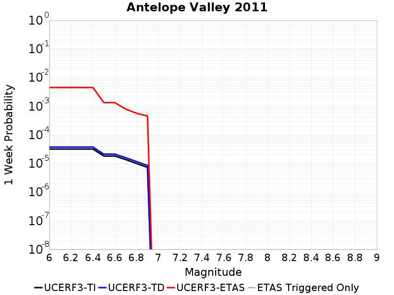 |  |  | 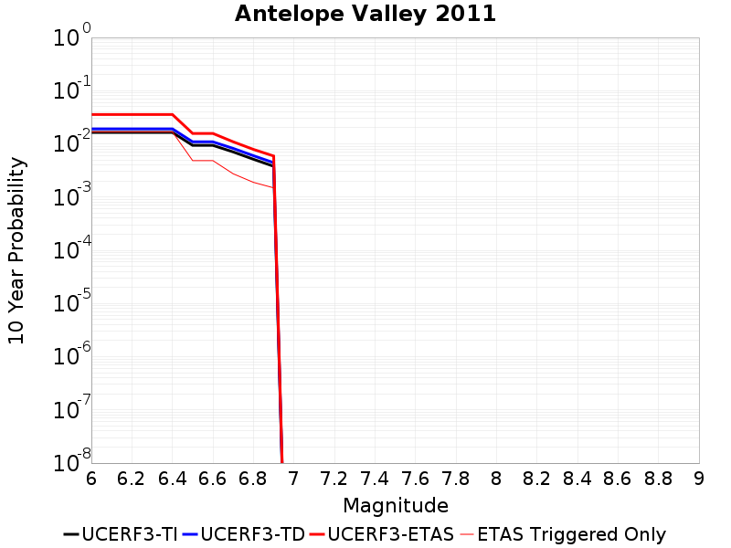 |

| Magnitude | 1 wk TI Prob | 1 wk TD Prob | 1 wk ETAS Prob | 1 wk ETAS/TD Gain | 1 wk ETAS Triggered Only | 1 mo TI Prob | 1 mo TD Prob | 1 mo ETAS Prob | 1 mo ETAS/TD Gain | 1 mo ETAS Triggered Only | 1 yr TI Prob | 1 yr TD Prob | 1 yr ETAS Prob | 1 yr ETAS/TD Gain | 1 yr ETAS Triggered Only | 10 yr TI Prob | 10 yr TD Prob | 10 yr ETAS Prob | 10 yr ETAS/TD Gain | 10 yr ETAS Triggered Only |
|-----|-----|-----|-----|-----|-----|-----|-----|-----|-----|-----|-----|-----|-----|-----|-----|-----|-----|-----|-----|-----|
| 6.0 | 3.1646934E-5 | 3.698991E-5 | 0.0044368273 | 119.94696 | 0.0044 | 1.3562266E-4 | 1.5852005E-4 | 0.0074273674 | 46.854435 | 0.00727 | 0.0016499552 | 0.0019285389 | 0.014055107 | 7.287956 | 0.01215 | 0.016377583 | 0.019144552 | 0.035613112 | 1.860222 | 0.01679 |
| 6.1 | 3.1646934E-5 | 3.698991E-5 | 0.0044368273 | 119.94696 | 0.0044 | 1.3562266E-4 | 1.5852005E-4 | 0.0074273674 | 46.854435 | 0.00727 | 0.0016499552 | 0.0019285389 | 0.014055107 | 7.287956 | 0.01215 | 0.016377583 | 0.019144552 | 0.035613112 | 1.860222 | 0.01679 |
| 6.2 | 3.1646934E-5 | 3.698991E-5 | 0.0044368273 | 119.94696 | 0.0044 | 1.3562266E-4 | 1.5852005E-4 | 0.0074273674 | 46.854435 | 0.00727 | 0.0016499552 | 0.0019285389 | 0.014055107 | 7.287956 | 0.01215 | 0.016377583 | 0.019144552 | 0.035613112 | 1.860222 | 0.01679 |
| 6.3 | 3.1646934E-5 | 3.698991E-5 | 0.0044368273 | 119.94696 | 0.0044 | 1.3562266E-4 | 1.5852005E-4 | 0.0074273674 | 46.854435 | 0.00727 | 0.0016499552 | 0.0019285389 | 0.014055107 | 7.287956 | 0.01215 | 0.016377583 | 0.019144552 | 0.035613112 | 1.860222 | 0.01679 |
| 6.4 | 3.1646934E-5 | 3.698991E-5 | 0.0044368273 | 119.94696 | 0.0044 | 1.3562266E-4 | 1.5852005E-4 | 0.0074273674 | 46.854435 | 0.00727 | 0.0016499552 | 0.0019285389 | 0.014055107 | 7.287956 | 0.01215 | 0.016377583 | 0.019144552 | 0.035613112 | 1.860222 | 0.01679 |
| 6.5 | 1.8034107E-5 | 2.0988033E-5 | 0.0013209607 | 62.93876 | 0.0013 | 7.7286735E-5 | 8.9946305E-5 | 0.0020797674 | 23.12232 | 0.00199 | 9.405598E-4 | 0.0010946691 | 0.004580849 | 4.184688 | 0.00349 | 0.009365888 | 0.010904899 | 0.015692119 | 1.4389973 | 0.00484 |
| 6.6 | 1.8034107E-5 | 2.0988033E-5 | 0.0013209607 | 62.93876 | 0.0013 | 7.7286735E-5 | 8.9946305E-5 | 0.0020797674 | 23.12232 | 0.00199 | 9.405598E-4 | 0.0010946691 | 0.004580849 | 4.184688 | 0.00349 | 0.009365888 | 0.010904899 | 0.015692119 | 1.4389973 | 0.00484 |
| 6.7 | 1.3567667E-5 | 1.5784837E-5 | 7.857727E-4 | 49.780224 | 7.7E-4 | 5.814585E-5 | 6.764815E-5 | 0.0012175704 | 17.998577 | 0.00115 | 7.076958E-4 | 8.234117E-4 | 0.0029216825 | 3.5482645 | 0.0021 | 0.007054463 | 0.008214089 | 0.010931582 | 1.3308332 | 0.00274 |
| 6.8 | 9.867387E-6 | 1.1493881E-5 | 5.6148757E-4 | 48.850998 | 5.5E-4 | 4.2288117E-5 | 4.92591E-5 | 8.692187E-4 | 17.645851 | 8.2E-4 | 5.1473617E-4 | 5.9965986E-4 | 0.0020687783 | 3.4499197 | 0.00147 | 0.005135455 | 0.0059897723 | 0.007868452 | 1.3136479 | 0.00189 |
| 6.9 | 7.273233E-6 | 8.474023E-6 | 4.484703E-4 | 52.92295 | 4.4E-4 | 3.1170628E-5 | 3.631724E-5 | 6.9629325E-4 | 19.172527 | 6.6E-4 | 3.794363E-4 | 4.4216242E-4 | 0.0015916539 | 3.5997043 | 0.00115 | 0.0037878908 | 0.004421624 | 0.005905036 | 1.3354902 | 0.00149 |

## Robinson Creek
*[(top)](#table-of-contents)*

| 1 Week | 1 Month | 1 Year | 10 Year |
|-----|-----|-----|-----|
| 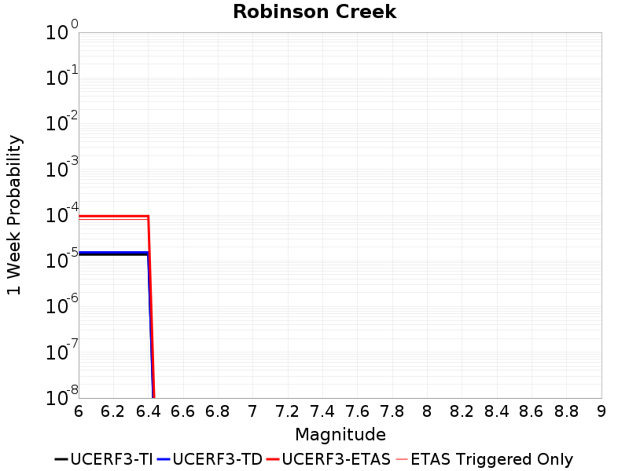 | 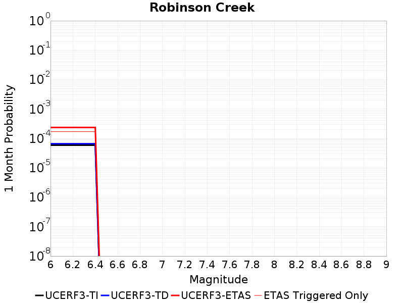 |  | 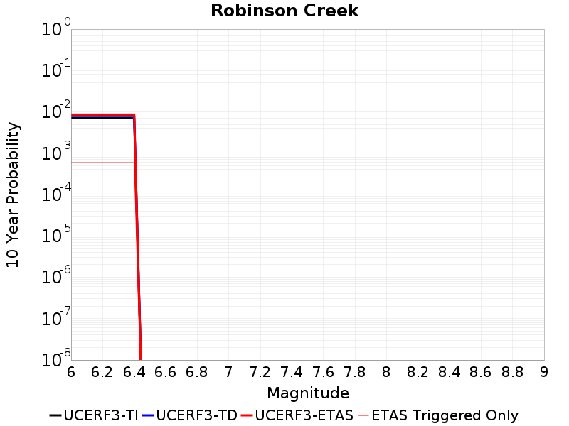 |

| Magnitude | 1 wk TI Prob | 1 wk TD Prob | 1 wk ETAS Prob | 1 wk ETAS/TD Gain | 1 wk ETAS Triggered Only | 1 mo TI Prob | 1 mo TD Prob | 1 mo ETAS Prob | 1 mo ETAS/TD Gain | 1 mo ETAS Triggered Only | 1 yr TI Prob | 1 yr TD Prob | 1 yr ETAS Prob | 1 yr ETAS/TD Gain | 1 yr ETAS Triggered Only | 10 yr TI Prob | 10 yr TD Prob | 10 yr ETAS Prob | 10 yr ETAS/TD Gain | 10 yr ETAS Triggered Only |
|-----|-----|-----|-----|-----|-----|-----|-----|-----|-----|-----|-----|-----|-----|-----|-----|-----|-----|-----|-----|-----|
| 6.0 | 1.3705327E-5 | 1.530957E-5 | 9.530834E-5 | 6.22541 | 8.0E-5 | 5.8735794E-5 | 6.561244E-5 | 2.3560128E-4 | 3.590802 | 1.7E-4 | 7.1487366E-4 | 7.9883146E-4 | 0.0011585439 | 1.4502983 | 3.6E-4 | 0.0071257832 | 0.007988314 | 0.008573601 | 1.0732679 | 5.9E-4 |
| 6.1 | 1.3705327E-5 | 1.530957E-5 | 9.530834E-5 | 6.22541 | 8.0E-5 | 5.8735794E-5 | 6.561244E-5 | 2.3560128E-4 | 3.590802 | 1.7E-4 | 7.1487366E-4 | 7.9883146E-4 | 0.0011585439 | 1.4502983 | 3.6E-4 | 0.0071257832 | 0.007988314 | 0.008573601 | 1.0732679 | 5.9E-4 |
| 6.2 | 1.3705327E-5 | 1.530957E-5 | 9.530834E-5 | 6.22541 | 8.0E-5 | 5.8735794E-5 | 6.561244E-5 | 2.3560128E-4 | 3.590802 | 1.7E-4 | 7.1487366E-4 | 7.9883146E-4 | 0.0011585439 | 1.4502983 | 3.6E-4 | 0.0071257832 | 0.007988314 | 0.008573601 | 1.0732679 | 5.9E-4 |
| 6.3 | 1.3705327E-5 | 1.530957E-5 | 9.530834E-5 | 6.22541 | 8.0E-5 | 5.8735794E-5 | 6.561244E-5 | 2.3560128E-4 | 3.590802 | 1.7E-4 | 7.1487366E-4 | 7.9883146E-4 | 0.0011585439 | 1.4502983 | 3.6E-4 | 0.0071257832 | 0.007988314 | 0.008573601 | 1.0732679 | 5.9E-4 |
| 6.4 | 1.3705327E-5 | 1.530957E-5 | 9.530834E-5 | 6.22541 | 8.0E-5 | 5.8735794E-5 | 6.561244E-5 | 2.3560128E-4 | 3.590802 | 1.7E-4 | 7.1487366E-4 | 7.9883146E-4 | 0.0011585439 | 1.4502983 | 3.6E-4 | 0.0071257832 | 0.007988314 | 0.008573601 | 1.0732679 | 5.9E-4 |

## Carson Range (Genoa)
*[(top)](#table-of-contents)*

| 1 Week | 1 Month | 1 Year | 10 Year |
|-----|-----|-----|-----|
|  |  |  |  |

| Magnitude | 1 wk TI Prob | 1 wk TD Prob | 1 wk ETAS Prob | 1 wk ETAS/TD Gain | 1 wk ETAS Triggered Only | 1 mo TI Prob | 1 mo TD Prob | 1 mo ETAS Prob | 1 mo ETAS/TD Gain | 1 mo ETAS Triggered Only | 1 yr TI Prob | 1 yr TD Prob | 1 yr ETAS Prob | 1 yr ETAS/TD Gain | 1 yr ETAS Triggered Only | 10 yr TI Prob | 10 yr TD Prob | 10 yr ETAS Prob | 10 yr ETAS/TD Gain | 10 yr ETAS Triggered Only |
|-----|-----|-----|-----|-----|-----|-----|-----|-----|-----|-----|-----|-----|-----|-----|-----|-----|-----|-----|-----|-----|
| 6.0 | 4.1268457E-5 | 5.02971E-5 | 9.0295085E-5 | 1.7952344 | 4.0E-5 | 1.7685282E-4 | 2.1554343E-4 | 2.8552834E-4 | 1.3246906 | 7.0E-5 | 0.0021510567 | 0.002621478 | 0.0027311896 | 1.041851 | 1.1E-4 | 0.02130354 | 0.025945371 | 0.026159663 | 1.0082593 | 2.2E-4 |
| 6.1 | 4.1268457E-5 | 5.02971E-5 | 9.0295085E-5 | 1.7952344 | 4.0E-5 | 1.7685282E-4 | 2.1554343E-4 | 2.8552834E-4 | 1.3246906 | 7.0E-5 | 0.0021510567 | 0.002621478 | 0.0027311896 | 1.041851 | 1.1E-4 | 0.02130354 | 0.025945371 | 0.026159663 | 1.0082593 | 2.2E-4 |
| 6.2 | 4.1268457E-5 | 5.02971E-5 | 9.0295085E-5 | 1.7952344 | 4.0E-5 | 1.7685282E-4 | 2.1554343E-4 | 2.8552834E-4 | 1.3246906 | 7.0E-5 | 0.0021510567 | 0.002621478 | 0.0027311896 | 1.041851 | 1.1E-4 | 0.02130354 | 0.025945371 | 0.026159663 | 1.0082593 | 2.2E-4 |
| 6.3 | 4.1268457E-5 | 5.02971E-5 | 9.0295085E-5 | 1.7952344 | 4.0E-5 | 1.7685282E-4 | 2.1554343E-4 | 2.8552834E-4 | 1.3246906 | 7.0E-5 | 0.0021510567 | 0.002621478 | 0.0027311896 | 1.041851 | 1.1E-4 | 0.02130354 | 0.025945371 | 0.026159663 | 1.0082593 | 2.2E-4 |
| 6.4 | 4.1268457E-5 | 5.02971E-5 | 9.0295085E-5 | 1.7952344 | 4.0E-5 | 1.7685282E-4 | 2.1554343E-4 | 2.8552834E-4 | 1.3246906 | 7.0E-5 | 0.0021510567 | 0.002621478 | 0.0027311896 | 1.041851 | 1.1E-4 | 0.02130354 | 0.025945371 | 0.026159663 | 1.0082593 | 2.2E-4 |
| 6.5 | 2.5677185E-5 | 3.1067495E-5 | 6.106656E-5 | 1.9656096 | 3.0E-5 | 1.1004044E-4 | 1.3314061E-4 | 1.9313263E-4 | 1.4505914 | 6.0E-5 | 0.0013389189 | 0.0016199627 | 0.0016998332 | 1.0493039 | 8.0E-5 | 0.0133088045 | 0.016099548 | 0.016247133 | 1.0091671 | 1.5E-4 |
| 6.6 | 2.5677185E-5 | 3.1067495E-5 | 6.106656E-5 | 1.9656096 | 3.0E-5 | 1.1004044E-4 | 1.3314061E-4 | 1.9313263E-4 | 1.4505914 | 6.0E-5 | 0.0013389189 | 0.0016199627 | 0.0016998332 | 1.0493039 | 8.0E-5 | 0.0133088045 | 0.016099548 | 0.016247133 | 1.0091671 | 1.5E-4 |
| 6.7 | 1.9969408E-5 | 2.4132327E-5 | 4.4131844E-5 | 1.8287438 | 2.0E-5 | 8.558037E-5 | 1.0342103E-4 | 1.434169E-4 | 1.3867285 | 4.0E-5 | 0.0010414429 | 0.0012585782 | 0.0013185026 | 1.0476128 | 6.0E-5 | 0.010365757 | 0.012529748 | 0.012638369 | 1.0086691 | 1.1E-4 |
| 6.8 | 1.4783156E-5 | 1.7868613E-5 | 1.7868613E-5 | 1.0 | 0.0 | 6.335485E-5 | 7.657826E-5 | 8.657749E-5 | 1.1305754 | 1.0E-5 | 7.710722E-4 | 9.3207246E-4 | 9.520538E-4 | 1.0214375 | 2.0E-5 | 0.0076840227 | 0.009294492 | 0.009344027 | 1.0053295 | 5.0E-5 |
| 6.9 | 1.06660555E-5 | 1.2914281E-5 | 1.2914281E-5 | 1.0 | 0.0 | 4.5710865E-5 | 5.5346398E-5 | 6.534585E-5 | 1.1806703 | 1.0E-5 | 5.5638765E-4 | 6.7374995E-4 | 6.837432E-4 | 1.0148323 | 1.0E-5 | 0.005549967 | 0.0067284363 | 0.006748302 | 1.0029525 | 2.0E-5 |
| 7.0 | 7.664838E-6 | 9.28517E-6 | 9.28517E-6 | 1.0 | 0.0 | 3.2848893E-5 | 3.9793584E-5 | 4.9793187E-5 | 1.2512867 | 1.0E-5 | 3.998619E-4 | 4.8448687E-4 | 4.94482E-4 | 1.0206304 | 1.0E-5 | 0.0039914316 | 0.0048448658 | 0.0048548174 | 1.0020541 | 1.0E-5 |

## Mono Lake 2011 CFM
*[(top)](#table-of-contents)*

| 1 Week | 1 Month | 1 Year | 10 Year |
|-----|-----|-----|-----|
|  |  |  | 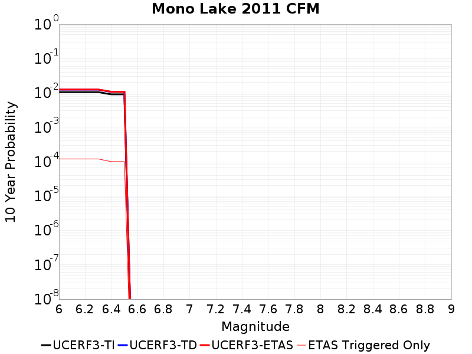 |

| Magnitude | 1 wk TI Prob | 1 wk TD Prob | 1 wk ETAS Prob | 1 wk ETAS/TD Gain | 1 wk ETAS Triggered Only | 1 mo TI Prob | 1 mo TD Prob | 1 mo ETAS Prob | 1 mo ETAS/TD Gain | 1 mo ETAS Triggered Only | 1 yr TI Prob | 1 yr TD Prob | 1 yr ETAS Prob | 1 yr ETAS/TD Gain | 1 yr ETAS Triggered Only | 10 yr TI Prob | 10 yr TD Prob | 10 yr ETAS Prob | 10 yr ETAS/TD Gain | 10 yr ETAS Triggered Only |
|-----|-----|-----|-----|-----|-----|-----|-----|-----|-----|-----|-----|-----|-----|-----|-----|-----|-----|-----|-----|-----|
| 6.0 | 2.0341662E-5 | 2.388513E-5 | 3.388489E-5 | 1.4186605 | 1.0E-5 | 8.717564E-5 | 1.0236383E-4 | 1.5235871E-4 | 1.4884038 | 5.0E-5 | 0.0010608466 | 0.0012461008 | 0.0013260011 | 1.0641203 | 8.0E-5 | 0.010557966 | 0.012443449 | 0.0125619555 | 1.0095236 | 1.2E-4 |
| 6.1 | 2.0341662E-5 | 2.388513E-5 | 3.388489E-5 | 1.4186605 | 1.0E-5 | 8.717564E-5 | 1.0236383E-4 | 1.5235871E-4 | 1.4884038 | 5.0E-5 | 0.0010608466 | 0.0012461008 | 0.0013260011 | 1.0641203 | 8.0E-5 | 0.010557966 | 0.012443449 | 0.0125619555 | 1.0095236 | 1.2E-4 |
| 6.2 | 2.0341662E-5 | 2.388513E-5 | 3.388489E-5 | 1.4186605 | 1.0E-5 | 8.717564E-5 | 1.0236383E-4 | 1.5235871E-4 | 1.4884038 | 5.0E-5 | 0.0010608466 | 0.0012461008 | 0.0013260011 | 1.0641203 | 8.0E-5 | 0.010557966 | 0.012443449 | 0.0125619555 | 1.0095236 | 1.2E-4 |
| 6.3 | 2.0341662E-5 | 2.388513E-5 | 3.388489E-5 | 1.4186605 | 1.0E-5 | 8.717564E-5 | 1.0236383E-4 | 1.5235871E-4 | 1.4884038 | 5.0E-5 | 0.0010608466 | 0.0012461008 | 0.0013260011 | 1.0641203 | 8.0E-5 | 0.010557966 | 0.012443449 | 0.0125619555 | 1.0095236 | 1.2E-4 |
| 6.4 | 1.749821E-5 | 2.053987E-5 | 3.0539664E-5 | 1.486848 | 1.0E-5 | 7.499018E-5 | 8.802801E-5 | 1.18025375E-4 | 1.3407706 | 3.0E-5 | 9.1262296E-4 | 0.0010717408 | 0.0011216872 | 1.0466031 | 5.0E-5 | 0.009088841 | 0.0107173575 | 0.010816285 | 1.0092306 | 1.0E-4 |
| 6.5 | 1.749821E-5 | 2.053987E-5 | 3.0539664E-5 | 1.486848 | 1.0E-5 | 7.499018E-5 | 8.802801E-5 | 1.18025375E-4 | 1.3407706 | 3.0E-5 | 9.1262296E-4 | 0.0010717408 | 0.0011216872 | 1.0466031 | 5.0E-5 | 0.009088841 | 0.0107173575 | 0.010816285 | 1.0092306 | 1.0E-4 |

## West Tahoe
*[(top)](#table-of-contents)*

| 1 Week | 1 Month | 1 Year | 10 Year |
|-----|-----|-----|-----|
| 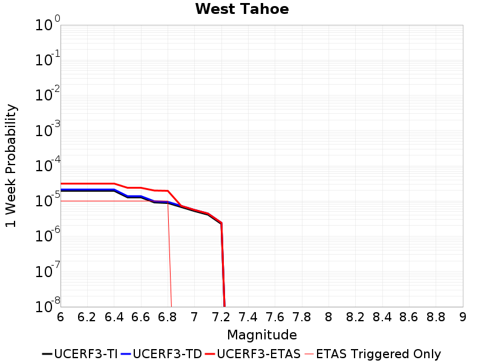 | 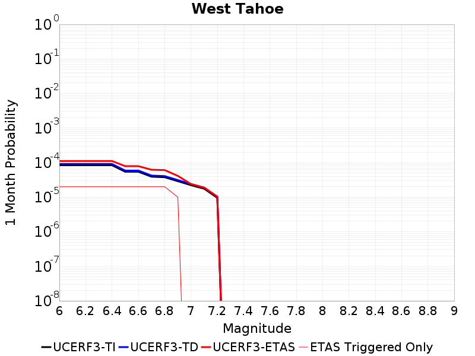 | 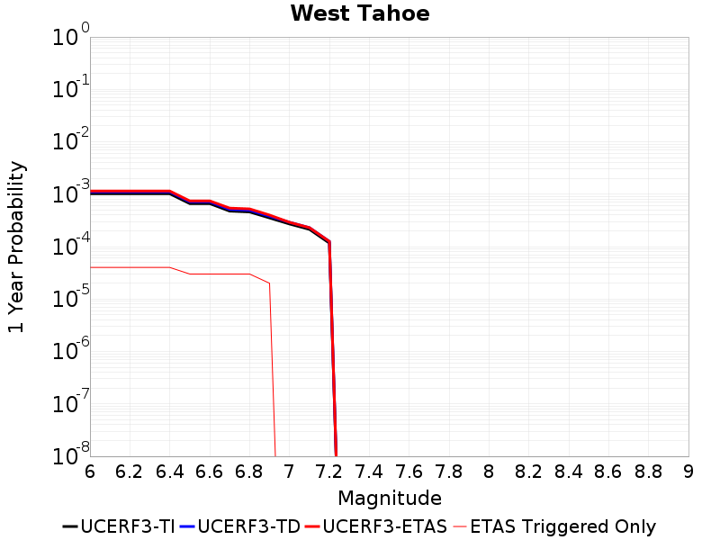 | 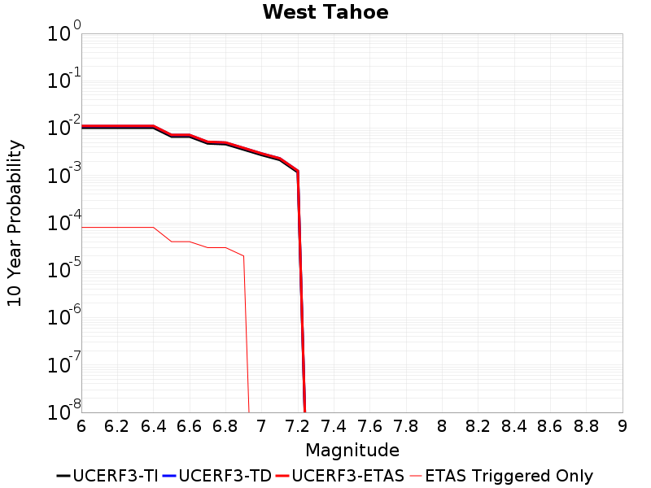 |

| Magnitude | 1 wk TI Prob | 1 wk TD Prob | 1 wk ETAS Prob | 1 wk ETAS/TD Gain | 1 wk ETAS Triggered Only | 1 mo TI Prob | 1 mo TD Prob | 1 mo ETAS Prob | 1 mo ETAS/TD Gain | 1 mo ETAS Triggered Only | 1 yr TI Prob | 1 yr TD Prob | 1 yr ETAS Prob | 1 yr ETAS/TD Gain | 1 yr ETAS Triggered Only | 10 yr TI Prob | 10 yr TD Prob | 10 yr ETAS Prob | 10 yr ETAS/TD Gain | 10 yr ETAS Triggered Only |
|-----|-----|-----|-----|-----|-----|-----|-----|-----|-----|-----|-----|-----|-----|-----|-----|-----|-----|-----|-----|-----|
| 6.0 | 1.952444E-5 | 2.1208298E-5 | 3.1208085E-5 | 1.4715036 | 1.0E-5 | 8.367348E-5 | 9.0889844E-5 | 1.1088803E-4 | 1.2200266 | 2.0E-5 | 0.0010182485 | 0.001106077 | 0.0011460327 | 1.0361239 | 4.0E-5 | 0.010135954 | 0.011011219 | 0.011090337 | 1.0071853 | 8.0E-5 |
| 6.1 | 1.952444E-5 | 2.1208298E-5 | 3.1208085E-5 | 1.4715036 | 1.0E-5 | 8.367348E-5 | 9.0889844E-5 | 1.1088803E-4 | 1.2200266 | 2.0E-5 | 0.0010182485 | 0.001106077 | 0.0011460327 | 1.0361239 | 4.0E-5 | 0.010135954 | 0.011011219 | 0.011090337 | 1.0071853 | 8.0E-5 |
| 6.2 | 1.952444E-5 | 2.1208298E-5 | 3.1208085E-5 | 1.4715036 | 1.0E-5 | 8.367348E-5 | 9.0889844E-5 | 1.1088803E-4 | 1.2200266 | 2.0E-5 | 0.0010182485 | 0.001106077 | 0.0011460327 | 1.0361239 | 4.0E-5 | 0.010135954 | 0.011011219 | 0.011090337 | 1.0071853 | 8.0E-5 |
| 6.3 | 1.952444E-5 | 2.1208298E-5 | 3.1208085E-5 | 1.4715036 | 1.0E-5 | 8.367348E-5 | 9.0889844E-5 | 1.1088803E-4 | 1.2200266 | 2.0E-5 | 0.0010182485 | 0.001106077 | 0.0011460327 | 1.0361239 | 4.0E-5 | 0.010135954 | 0.011011219 | 0.011090337 | 1.0071853 | 8.0E-5 |
| 6.4 | 1.952444E-5 | 2.1208298E-5 | 3.1208085E-5 | 1.4715036 | 1.0E-5 | 8.367348E-5 | 9.0889844E-5 | 1.1088803E-4 | 1.2200266 | 2.0E-5 | 0.0010182485 | 0.001106077 | 0.0011460327 | 1.0361239 | 4.0E-5 | 0.010135954 | 0.011011219 | 0.011090337 | 1.0071853 | 8.0E-5 |
| 6.5 | 1.2685271E-5 | 1.3705762E-5 | 2.3705625E-5 | 1.7296102 | 1.0E-5 | 5.4364315E-5 | 5.873775E-5 | 7.873657E-5 | 1.3404765 | 2.0E-5 | 6.616845E-4 | 7.14914E-4 | 7.448925E-4 | 1.0419331 | 3.0E-5 | 0.0065971776 | 0.007127795 | 0.0071675098 | 1.0055718 | 4.0E-5 |
| 6.6 | 1.2685271E-5 | 1.3705762E-5 | 2.3705625E-5 | 1.7296102 | 1.0E-5 | 5.4364315E-5 | 5.873775E-5 | 7.873657E-5 | 1.3404765 | 2.0E-5 | 6.616845E-4 | 7.14914E-4 | 7.448925E-4 | 1.0419331 | 3.0E-5 | 0.0065971776 | 0.007127795 | 0.0071675098 | 1.0055718 | 4.0E-5 |
| 6.7 | 9.117886E-6 | 9.8202245E-6 | 1.9820127E-5 | 2.0182967 | 1.0E-5 | 3.9076072E-5 | 4.208604E-5 | 6.20852E-5 | 1.475197 | 2.0E-5 | 4.756473E-4 | 5.122843E-4 | 5.422689E-4 | 1.0585313 | 3.0E-5 | 0.0047463053 | 0.005111753 | 0.0051415996 | 1.0058389 | 3.0E-5 |
| 6.8 | 8.786828E-6 | 9.467932E-6 | 1.9467836E-5 | 2.056187 | 1.0E-5 | 3.7657293E-5 | 4.057626E-5 | 6.0575447E-5 | 1.492879 | 2.0E-5 | 4.5838108E-4 | 4.93911E-4 | 5.238962E-4 | 1.0607097 | 3.0E-5 | 0.0045743673 | 0.0049288357 | 0.004958688 | 1.0060567 | 3.0E-5 |
| 6.9 | 6.7562123E-6 | 7.2714142E-6 | 7.2714142E-6 | 1.0 | 0.0 | 2.8954875E-5 | 3.1162857E-5 | 4.1162548E-5 | 1.3208848 | 1.0E-5 | 3.5246857E-4 | 3.7934651E-4 | 3.9933893E-4 | 1.0527022 | 2.0E-5 | 0.0035191004 | 0.0037874628 | 0.003807387 | 1.0052606 | 2.0E-5 |
| 7.0 | 5.1792854E-6 | 5.5731507E-6 | 5.5731507E-6 | 1.0 | 0.0 | 2.2196748E-5 | 2.3884735E-5 | 2.3884735E-5 | 1.0 | 0.0 | 2.702119E-4 | 2.9076167E-4 | 2.9076167E-4 | 1.0 | 0.0 | 0.0026988357 | 0.0029041884 | 0.0029041884 | 1.0 | 0.0 |
| 7.1 | 4.090765E-6 | 4.4020157E-6 | 4.4020157E-6 | 1.0 | 0.0 | 1.7531731E-5 | 1.8865665E-5 | 1.8865665E-5 | 1.0 | 0.0 | 2.134279E-4 | 2.2966867E-4 | 2.2966867E-4 | 1.0 | 0.0 | 0.0021322304 | 0.0022946482 | 0.0022946482 | 1.0 | 0.0 |
| 7.2 | 2.2356758E-6 | 2.4048638E-6 | 2.4048638E-6 | 1.0 | 0.0 | 9.581432E-6 | 1.0306529E-5 | 1.0306529E-5 | 1.0 | 0.0 | 1.1664769E-4 | 1.2547667E-4 | 1.2547667E-4 | 1.0 | 0.0 | 0.0011658648 | 0.0012542444 | 0.0012542444 | 1.0 | 0.0 |

## Honey Lake 2011 CFM
*[(top)](#table-of-contents)*

| 1 Week | 1 Month | 1 Year | 10 Year |
|-----|-----|-----|-----|
| 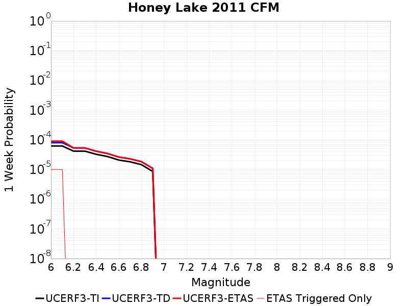 | 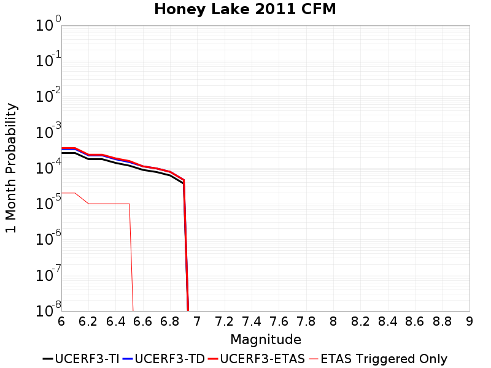 |  |  |

| Magnitude | 1 wk TI Prob | 1 wk TD Prob | 1 wk ETAS Prob | 1 wk ETAS/TD Gain | 1 wk ETAS Triggered Only | 1 mo TI Prob | 1 mo TD Prob | 1 mo ETAS Prob | 1 mo ETAS/TD Gain | 1 mo ETAS Triggered Only | 1 yr TI Prob | 1 yr TD Prob | 1 yr ETAS Prob | 1 yr ETAS/TD Gain | 1 yr ETAS Triggered Only | 10 yr TI Prob | 10 yr TD Prob | 10 yr ETAS Prob | 10 yr ETAS/TD Gain | 10 yr ETAS Triggered Only |
|-----|-----|-----|-----|-----|-----|-----|-----|-----|-----|-----|-----|-----|-----|-----|-----|-----|-----|-----|-----|-----|
| 6.0 | 6.155506E-5 | 7.986294E-5 | 8.986214E-5 | 1.1252046 | 1.0E-5 | 2.6378073E-4 | 3.4222667E-4 | 3.622198E-4 | 1.0584208 | 2.0E-5 | 0.0032068014 | 0.004159089 | 0.004179006 | 1.0047888 | 2.0E-5 | 0.03160919 | 0.040860336 | 0.04088911 | 1.0007042 | 3.0E-5 |
| 6.1 | 6.155506E-5 | 7.986294E-5 | 8.986214E-5 | 1.1252046 | 1.0E-5 | 2.6378073E-4 | 3.4222667E-4 | 3.622198E-4 | 1.0584208 | 2.0E-5 | 0.0032068014 | 0.004159089 | 0.004179006 | 1.0047888 | 2.0E-5 | 0.03160919 | 0.040860336 | 0.04088911 | 1.0007042 | 3.0E-5 |
| 6.2 | 4.1335024E-5 | 5.2773463E-5 | 5.2773463E-5 | 1.0 | 0.0 | 1.7713808E-4 | 2.2615325E-4 | 2.3615098E-4 | 1.0442078 | 1.0E-5 | 0.0021545228 | 0.0027500822 | 0.0027600548 | 1.0036262 | 1.0E-5 | 0.021337535 | 0.027176356 | 0.027195811 | 1.000716 | 2.0E-5 |
| 6.3 | 4.1335024E-5 | 5.2773463E-5 | 5.2773463E-5 | 1.0 | 0.0 | 1.7713808E-4 | 2.2615325E-4 | 2.3615098E-4 | 1.0442078 | 1.0E-5 | 0.0021545228 | 0.0027500822 | 0.0027600548 | 1.0036262 | 1.0E-5 | 0.021337535 | 0.027176356 | 0.027195811 | 1.000716 | 2.0E-5 |
| 6.4 | 3.2393702E-5 | 4.103576E-5 | 4.103576E-5 | 1.0 | 0.0 | 1.3882275E-4 | 1.7585629E-4 | 1.8585453E-4 | 1.0568546 | 1.0E-5 | 0.0016888566 | 0.00213905 | 0.0021490287 | 1.004665 | 1.0E-5 | 0.016760793 | 0.021195525 | 0.0212151 | 1.0009236 | 2.0E-5 |
| 6.5 | 2.7205504E-5 | 3.4334153E-5 | 3.4334153E-5 | 1.0 | 0.0 | 1.1658981E-4 | 1.4713855E-4 | 1.5713708E-4 | 1.0679531 | 1.0E-5 | 0.0014185566 | 0.0017900324 | 0.0018000144 | 1.0055765 | 1.0E-5 | 0.014095354 | 0.017765623 | 0.017785268 | 1.0011058 | 2.0E-5 |
| 6.6 | 2.069265E-5 | 2.6047444E-5 | 2.6047444E-5 | 1.0 | 0.0 | 8.867977E-5 | 1.11627574E-4 | 1.11627574E-4 | 1.0 | 0.0 | 0.0010791414 | 0.0013583028 | 0.0013583028 | 1.0 | 0.0 | 0.010739161 | 0.013508407 | 0.013518272 | 1.0007303 | 1.0E-5 |
| 6.7 | 1.8060919E-5 | 2.2737326E-5 | 2.2737326E-5 | 1.0 | 0.0 | 7.7401644E-5 | 9.7442506E-5 | 9.7442506E-5 | 1.0 | 0.0 | 9.419576E-4 | 0.0011857982 | 0.0011857982 | 1.0 | 0.0 | 0.009379748 | 0.011802799 | 0.011812681 | 1.0008372 | 1.0E-5 |
| 6.8 | 1.4474663E-5 | 1.8246275E-5 | 1.8246275E-5 | 1.0 | 0.0 | 6.203279E-5 | 7.8196405E-5 | 7.8196405E-5 | 1.0 | 0.0 | 7.5498753E-4 | 9.5170236E-4 | 9.5170236E-4 | 1.0 | 0.0 | 0.007524277 | 0.009483839 | 0.009493745 | 1.0010444 | 1.0E-5 |
| 6.9 | 8.564552E-6 | 1.084171E-5 | 1.084171E-5 | 1.0 | 0.0 | 3.6704707E-5 | 4.6464014E-5 | 4.6464014E-5 | 1.0 | 0.0 | 4.4678818E-4 | 5.6561944E-4 | 5.6561944E-4 | 1.0 | 0.0 | 0.0044589094 | 0.005648337 | 0.00565828 | 1.0017605 | 1.0E-5 |

## Great Valley 03a Dunnigan Hills
*[(top)](#table-of-contents)*

| 1 Week | 1 Month | 1 Year | 10 Year |
|-----|-----|-----|-----|
|  |  | 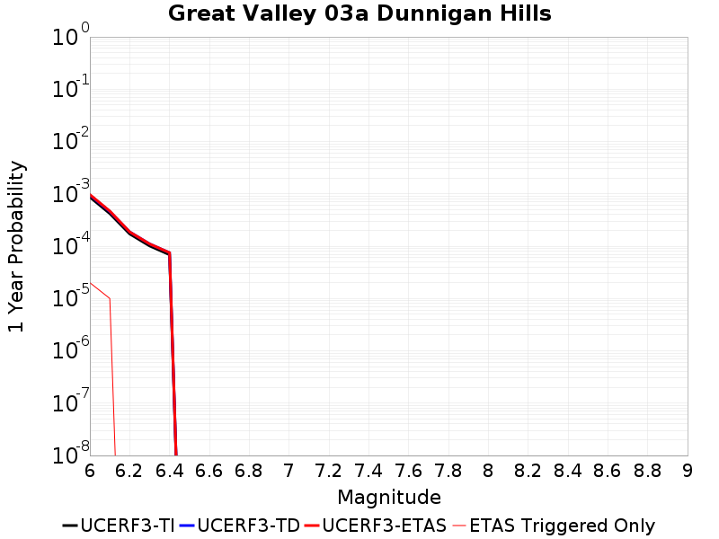 |  |

| Magnitude | 1 wk TI Prob | 1 wk TD Prob | 1 wk ETAS Prob | 1 wk ETAS/TD Gain | 1 wk ETAS Triggered Only | 1 mo TI Prob | 1 mo TD Prob | 1 mo ETAS Prob | 1 mo ETAS/TD Gain | 1 mo ETAS Triggered Only | 1 yr TI Prob | 1 yr TD Prob | 1 yr ETAS Prob | 1 yr ETAS/TD Gain | 1 yr ETAS Triggered Only | 10 yr TI Prob | 10 yr TD Prob | 10 yr ETAS Prob | 10 yr ETAS/TD Gain | 10 yr ETAS Triggered Only |
|-----|-----|-----|-----|-----|-----|-----|-----|-----|-----|-----|-----|-----|-----|-----|-----|-----|-----|-----|-----|-----|
| 6.0 | 1.6591328E-5 | 1.813102E-5 | 1.813102E-5 | 1.0 | 0.0 | 7.110376E-5 | 7.770245E-5 | 8.770167E-5 | 1.1286861 | 1.0E-5 | 8.6534437E-4 | 9.45686E-4 | 9.656671E-4 | 1.0211287 | 2.0E-5 | 0.008619824 | 0.009423466 | 0.0094630895 | 1.0042048 | 4.0E-5 |
| 6.1 | 8.041125E-6 | 8.780799E-6 | 8.780799E-6 | 1.0 | 0.0 | 3.4461507E-5 | 3.763157E-5 | 4.7631194E-5 | 1.2657243 | 1.0E-5 | 4.194881E-4 | 4.580884E-4 | 4.6808383E-4 | 1.0218198 | 1.0E-5 | 0.004186971 | 0.004573444 | 0.004583398 | 1.0021765 | 1.0E-5 |
| 6.2 | 3.2807004E-6 | 3.5841128E-6 | 3.5841128E-6 | 1.0 | 0.0 | 1.4060069E-5 | 1.5360416E-5 | 1.5360416E-5 | 1.0 | 0.0 | 1.7116789E-4 | 1.8700119E-4 | 1.8700119E-4 | 1.0 | 0.0 | 0.0017103611 | 0.0018688474 | 0.0018688474 | 1.0 | 0.0 |
| 6.3 | 1.9339366E-6 | 2.1130638E-6 | 2.1130638E-6 | 1.0 | 0.0 | 8.288273E-6 | 9.055972E-6 | 9.055972E-6 | 1.0 | 0.0 | 1.00905054E-4 | 1.1025374E-4 | 1.1025374E-4 | 1.0 | 0.0 | 0.0010085925 | 0.0011022711 | 0.0011022711 | 1.0 | 0.0 |
| 6.4 | 1.3142635E-6 | 1.4358069E-6 | 1.4358069E-6 | 1.0 | 0.0 | 5.6325457E-6 | 6.1534583E-6 | 6.1534583E-6 | 1.0 | 0.0 | 6.857408E-5 | 7.491835E-5 | 7.491835E-5 | 1.0 | 0.0 | 6.8552926E-4 | 7.491835E-4 | 7.491835E-4 | 1.0 | 0.0 |

## Ortigalita (North)
*[(top)](#table-of-contents)*

| 1 Week | 1 Month | 1 Year | 10 Year |
|-----|-----|-----|-----|
|  |  |  |  |

| Magnitude | 1 wk TI Prob | 1 wk TD Prob | 1 wk ETAS Prob | 1 wk ETAS/TD Gain | 1 wk ETAS Triggered Only | 1 mo TI Prob | 1 mo TD Prob | 1 mo ETAS Prob | 1 mo ETAS/TD Gain | 1 mo ETAS Triggered Only | 1 yr TI Prob | 1 yr TD Prob | 1 yr ETAS Prob | 1 yr ETAS/TD Gain | 1 yr ETAS Triggered Only | 10 yr TI Prob | 10 yr TD Prob | 10 yr ETAS Prob | 10 yr ETAS/TD Gain | 10 yr ETAS Triggered Only |
|-----|-----|-----|-----|-----|-----|-----|-----|-----|-----|-----|-----|-----|-----|-----|-----|-----|-----|-----|-----|-----|
| 6.0 | 7.711876E-5 | 1.0554262E-4 | 1.0554262E-4 | 1.0 | 0.0 | 3.3046713E-4 | 4.5225464E-4 | 4.6225011E-4 | 1.0221014 | 1.0E-5 | 0.004016016 | 0.0054933755 | 0.0055132657 | 1.0036207 | 2.0E-5 | 0.039442103 | 0.053693376 | 0.053712305 | 1.0003525 | 2.0E-5 |
| 6.1 | 4.607858E-5 | 6.0491417E-5 | 6.0491417E-5 | 1.0 | 0.0 | 1.9746469E-4 | 2.5922587E-4 | 2.6922327E-4 | 1.0385664 | 1.0E-5 | 0.0024014818 | 0.0031518082 | 0.003171745 | 1.0063256 | 2.0E-5 | 0.023756953 | 0.03110129 | 0.031120667 | 1.0006231 | 2.0E-5 |
| 6.2 | 4.607858E-5 | 6.0491417E-5 | 6.0491417E-5 | 1.0 | 0.0 | 1.9746469E-4 | 2.5922587E-4 | 2.6922327E-4 | 1.0385664 | 1.0E-5 | 0.0024014818 | 0.0031518082 | 0.003171745 | 1.0063256 | 2.0E-5 | 0.023756953 | 0.03110129 | 0.031120667 | 1.0006231 | 2.0E-5 |
| 6.3 | 3.327423E-5 | 4.2640444E-5 | 4.2640444E-5 | 1.0 | 0.0 | 1.4259605E-4 | 1.8273361E-4 | 1.8273361E-4 | 1.0 | 0.0 | 0.0017347244 | 0.0022227524 | 0.0022227524 | 1.0 | 0.0 | 0.017212452 | 0.02202918 | 0.02202918 | 1.0 | 0.0 |
| 6.4 | 2.7732503E-5 | 3.512899E-5 | 3.512899E-5 | 1.0 | 0.0 | 1.1884817E-4 | 1.5054553E-4 | 1.5054553E-4 | 1.0 | 0.0 | 0.001446016 | 0.0018315843 | 0.0018315843 | 1.0 | 0.0 | 0.014366428 | 0.018187772 | 0.018187772 | 1.0 | 0.0 |
| 6.5 | 2.7689714E-5 | 3.507868E-5 | 3.507868E-5 | 1.0 | 0.0 | 1.186648E-4 | 1.5032994E-4 | 1.5032994E-4 | 1.0 | 0.0 | 0.0014437864 | 0.001828964 | 0.001828964 | 1.0 | 0.0 | 0.014344421 | 0.018161999 | 0.018161999 | 1.0 | 0.0 |
| 6.6 | 2.2976905E-5 | 2.8821374E-5 | 2.8821374E-5 | 1.0 | 0.0 | 9.846873E-5 | 1.2351567E-4 | 1.2351567E-4 | 1.0 | 0.0 | 0.0011981975 | 0.0015030047 | 0.0015030047 | 1.0 | 0.0 | 0.011917574 | 0.014951761 | 0.014951761 | 1.0 | 0.0 |
| 6.7 | 1.9871539E-5 | 2.4995465E-5 | 2.4995465E-5 | 1.0 | 0.0 | 8.516096E-5 | 1.0712043E-4 | 1.0712043E-4 | 1.0 | 0.0 | 0.0010363415 | 0.0013036535 | 0.0013036535 | 1.0 | 0.0 | 0.010315218 | 0.012983841 | 0.012983841 | 1.0 | 0.0 |
| 6.8 | 6.5640475E-6 | 7.622356E-6 | 7.622356E-6 | 1.0 | 0.0 | 2.813133E-5 | 3.266685E-5 | 3.266685E-5 | 1.0 | 0.0 | 3.424451E-4 | 3.9764916E-4 | 3.9764916E-4 | 1.0 | 0.0 | 0.0034191788 | 0.0039696647 | 0.0039696647 | 1.0 | 0.0 |
| 6.9 | 5.6219683E-6 | 6.5160507E-6 | 6.5160507E-6 | 1.0 | 0.0 | 2.4093928E-5 | 2.7925646E-5 | 2.7925646E-5 | 1.0 | 0.0 | 2.933041E-4 | 3.399443E-4 | 3.399443E-4 | 1.0 | 0.0 | 0.0029291727 | 0.003394501 | 0.003394501 | 1.0 | 0.0 |
| 7.0 | 3.875591E-6 | 4.494598E-6 | 4.494598E-6 | 1.0 | 0.0 | 1.6609569E-5 | 1.9262432E-5 | 1.9262432E-5 | 1.0 | 0.0 | 2.0220275E-4 | 2.34497E-4 | 2.34497E-4 | 1.0 | 0.0 | 0.0020201886 | 0.002342705 | 0.002342705 | 1.0 | 0.0 |
| 7.1 | 1.6017933E-6 | 1.8611752E-6 | 1.8611752E-6 | 1.0 | 0.0 | 6.8648105E-6 | 7.976447E-6 | 7.976447E-6 | 1.0 | 0.0 | 8.357586E-5 | 9.710998E-5 | 9.710998E-5 | 1.0 | 0.0 | 8.3544437E-4 | 9.707807E-4 | 9.707807E-4 | 1.0 | 0.0 |

## Great Valley 07 (Orestimba)
*[(top)](#table-of-contents)*

| 1 Week | 1 Month | 1 Year | 10 Year |
|-----|-----|-----|-----|
| 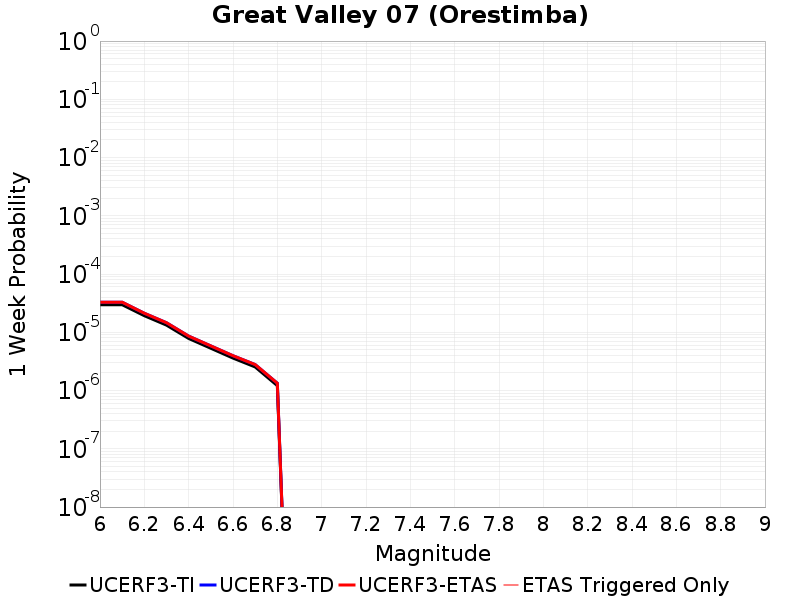 | 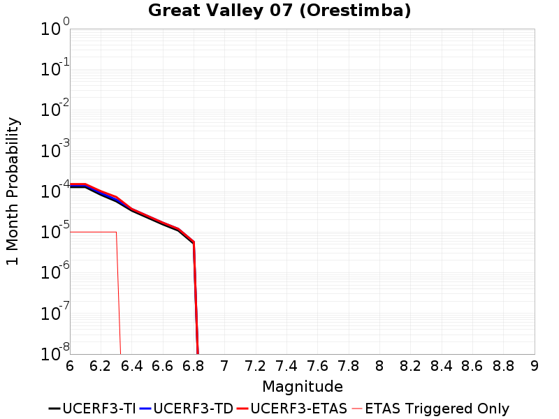 | 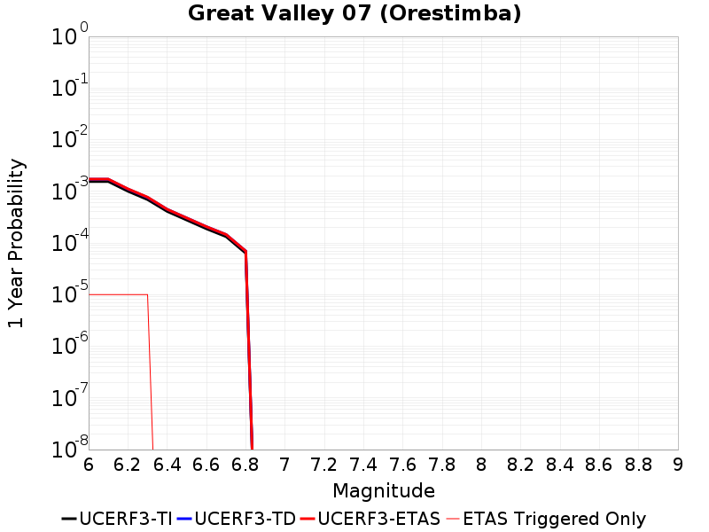 | 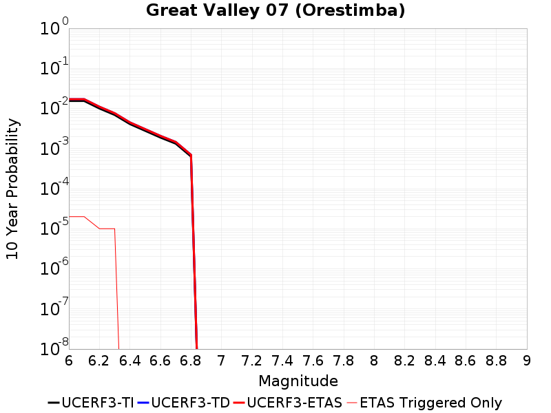 |

| Magnitude | 1 wk TI Prob | 1 wk TD Prob | 1 wk ETAS Prob | 1 wk ETAS/TD Gain | 1 wk ETAS Triggered Only | 1 mo TI Prob | 1 mo TD Prob | 1 mo ETAS Prob | 1 mo ETAS/TD Gain | 1 mo ETAS Triggered Only | 1 yr TI Prob | 1 yr TD Prob | 1 yr ETAS Prob | 1 yr ETAS/TD Gain | 1 yr ETAS Triggered Only | 10 yr TI Prob | 10 yr TD Prob | 10 yr ETAS Prob | 10 yr ETAS/TD Gain | 10 yr ETAS Triggered Only |
|-----|-----|-----|-----|-----|-----|-----|-----|-----|-----|-----|-----|-----|-----|-----|-----|-----|-----|-----|-----|-----|
| 6.0 | 2.9687902E-5 | 3.280475E-5 | 3.280475E-5 | 1.0 | 0.0 | 1.2722766E-4 | 1.4058461E-4 | 1.505832E-4 | 1.0711216 | 1.0E-5 | 0.0015478961 | 0.001710346 | 0.0017203289 | 1.0058367 | 1.0E-5 | 0.015371585 | 0.016979398 | 0.016999058 | 1.0011579 | 2.0E-5 |
| 6.1 | 2.9687902E-5 | 3.280475E-5 | 3.280475E-5 | 1.0 | 0.0 | 1.2722766E-4 | 1.4058461E-4 | 1.505832E-4 | 1.0711216 | 1.0E-5 | 0.0015478961 | 0.001710346 | 0.0017203289 | 1.0058367 | 1.0E-5 | 0.015371585 | 0.016979398 | 0.016999058 | 1.0011579 | 2.0E-5 |
| 6.2 | 1.9231524E-5 | 2.1188742E-5 | 2.1188742E-5 | 1.0 | 0.0 | 8.2418206E-5 | 9.0805865E-5 | 1.0080496E-4 | 1.110115 | 1.0E-5 | 0.0010029797 | 0.0011050239 | 0.0011150129 | 1.0090395 | 1.0E-5 | 0.00998465 | 0.010997711 | 0.011007601 | 1.0008993 | 1.0E-5 |
| 6.3 | 1.324766E-5 | 1.456845E-5 | 1.456845E-5 | 1.0 | 0.0 | 5.6774446E-5 | 6.2434774E-5 | 7.243415E-5 | 1.1601572 | 1.0E-5 | 6.910097E-4 | 7.5988745E-4 | 7.6987984E-4 | 1.0131499 | 1.0E-5 | 0.006888649 | 0.00757384 | 0.0075837644 | 1.0013103 | 1.0E-5 |
| 6.4 | 7.818645E-6 | 8.584366E-6 | 8.584366E-6 | 1.0 | 0.0 | 3.3508048E-5 | 3.678964E-5 | 3.678964E-5 | 1.0 | 0.0 | 4.078841E-4 | 4.4782518E-4 | 4.4782518E-4 | 1.0 | 0.0 | 0.004071363 | 0.004469569 | 0.004469569 | 1.0 | 0.0 |
| 6.5 | 5.3076565E-6 | 5.8255937E-6 | 5.8255937E-6 | 1.0 | 0.0 | 2.27469E-5 | 2.4966603E-5 | 2.4966603E-5 | 1.0 | 0.0 | 2.7690834E-4 | 3.039281E-4 | 3.039281E-4 | 1.0 | 0.0 | 0.0027656353 | 0.0030353344 | 0.0030353344 | 1.0 | 0.0 |
| 6.6 | 3.6003578E-6 | 3.9538163E-6 | 3.9538163E-6 | 1.0 | 0.0 | 1.5430012E-5 | 1.6944825E-5 | 1.6944825E-5 | 1.0 | 0.0 | 1.8784421E-4 | 2.0628529E-4 | 2.0628529E-4 | 1.0 | 0.0 | 0.0018768552 | 0.0020610925 | 0.0020610925 | 1.0 | 0.0 |
| 6.7 | 2.5361826E-6 | 2.7872502E-6 | 2.7872502E-6 | 1.0 | 0.0 | 1.0869308E-5 | 1.1945311E-5 | 1.1945311E-5 | 1.0 | 0.0 | 1.3232579E-4 | 1.4542577E-4 | 1.4542577E-4 | 1.0 | 0.0 | 0.0013224703 | 0.0014534364 | 0.0014534364 | 1.0 | 0.0 |
| 6.8 | 1.2115831E-6 | 1.3332144E-6 | 1.3332144E-6 | 1.0 | 0.0 | 5.1924885E-6 | 5.713769E-6 | 5.713769E-6 | 1.0 | 0.0 | 6.3216714E-5 | 6.956389E-5 | 6.956389E-5 | 1.0 | 0.0 | 6.3198735E-4 | 6.9551653E-4 | 6.9551653E-4 | 1.0 | 0.0 |

## Death Valley (Fish Lake Valley)
*[(top)](#table-of-contents)*

| 1 Week | 1 Month | 1 Year | 10 Year |
|-----|-----|-----|-----|
|  | 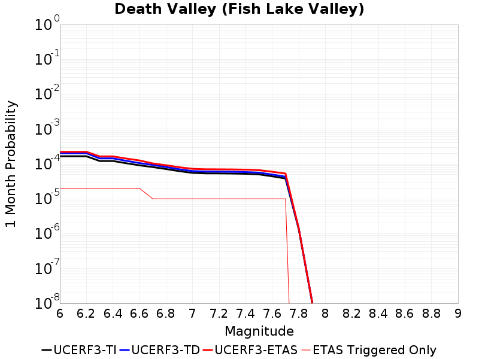 | 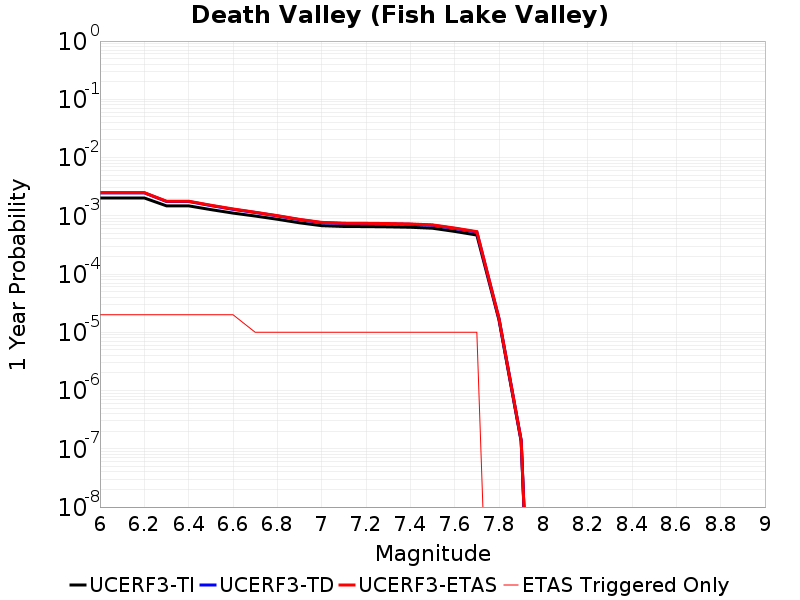 | 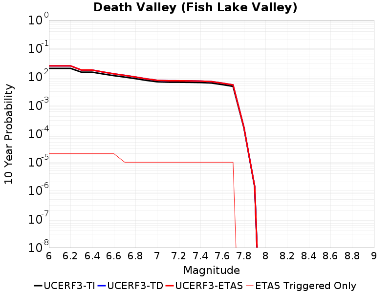 |

| Magnitude | 1 wk TI Prob | 1 wk TD Prob | 1 wk ETAS Prob | 1 wk ETAS/TD Gain | 1 wk ETAS Triggered Only | 1 mo TI Prob | 1 mo TD Prob | 1 mo ETAS Prob | 1 mo ETAS/TD Gain | 1 mo ETAS Triggered Only | 1 yr TI Prob | 1 yr TD Prob | 1 yr ETAS Prob | 1 yr ETAS/TD Gain | 1 yr ETAS Triggered Only | 10 yr TI Prob | 10 yr TD Prob | 10 yr ETAS Prob | 10 yr ETAS/TD Gain | 10 yr ETAS Triggered Only |
|-----|-----|-----|-----|-----|-----|-----|-----|-----|-----|-----|-----|-----|-----|-----|-----|-----|-----|-----|-----|-----|
| 6.0 | 3.872328E-5 | 4.7411977E-5 | 5.74115E-5 | 1.2109072 | 1.0E-5 | 1.6594635E-4 | 2.031793E-4 | 2.2317523E-4 | 1.0984153 | 2.0E-5 | 0.0020185246 | 0.0024711532 | 0.0024911037 | 1.0080733 | 2.0E-5 | 0.02000288 | 0.024462376 | 0.024481887 | 1.0007976 | 2.0E-5 |
| 6.1 | 3.872328E-5 | 4.7411977E-5 | 5.74115E-5 | 1.2109072 | 1.0E-5 | 1.6594635E-4 | 2.031793E-4 | 2.2317523E-4 | 1.0984153 | 2.0E-5 | 0.0020185246 | 0.0024711532 | 0.0024911037 | 1.0080733 | 2.0E-5 | 0.02000288 | 0.024462376 | 0.024481887 | 1.0007976 | 2.0E-5 |
| 6.2 | 3.872328E-5 | 4.7411977E-5 | 5.74115E-5 | 1.2109072 | 1.0E-5 | 1.6594635E-4 | 2.031793E-4 | 2.2317523E-4 | 1.0984153 | 2.0E-5 | 0.0020185246 | 0.0024711532 | 0.0024911037 | 1.0080733 | 2.0E-5 | 0.02000288 | 0.024462376 | 0.024481887 | 1.0007976 | 2.0E-5 |
| 6.3 | 2.8356371E-5 | 3.3697666E-5 | 4.3697328E-5 | 1.2967465 | 1.0E-5 | 1.2152165E-4 | 1.44411E-4 | 1.644081E-4 | 1.1384736 | 2.0E-5 | 0.0014785219 | 0.0017568537 | 0.0017768185 | 1.011364 | 2.0E-5 | 0.014687235 | 0.017436784 | 0.017456437 | 1.001127 | 2.0E-5 |
| 6.4 | 2.8356371E-5 | 3.3697666E-5 | 4.3697328E-5 | 1.2967465 | 1.0E-5 | 1.2152165E-4 | 1.44411E-4 | 1.644081E-4 | 1.1384736 | 2.0E-5 | 0.0014785219 | 0.0017568537 | 0.0017768185 | 1.011364 | 2.0E-5 | 0.014687235 | 0.017436784 | 0.017456437 | 1.001127 | 2.0E-5 |
| 6.5 | 2.4448687E-5 | 2.8676299E-5 | 3.867601E-5 | 1.3487101 | 1.0E-5 | 1.0477588E-4 | 1.2289289E-4 | 1.4289044E-4 | 1.1627233 | 2.0E-5 | 0.0012748998 | 0.0014952407 | 0.0015152108 | 1.0133557 | 2.0E-5 | 0.012676105 | 0.014856688 | 0.014876391 | 1.0013262 | 2.0E-5 |
| 6.6 | 2.1298161E-5 | 2.4714986E-5 | 3.471474E-5 | 1.4046028 | 1.0E-5 | 9.127464E-5 | 1.0591726E-4 | 1.2591513E-4 | 1.1888067 | 2.0E-5 | 0.0011107022 | 0.001288813 | 0.0013087871 | 1.0154982 | 2.0E-5 | 0.011051672 | 0.012816821 | 0.012836565 | 1.0015404 | 2.0E-5 |
| 6.7 | 1.8959729E-5 | 2.18267E-5 | 2.18267E-5 | 1.0 | 0.0 | 8.125345E-5 | 9.3539784E-5 | 1.0353885E-4 | 1.1068964 | 1.0E-5 | 9.888117E-4 | 0.0011382776 | 0.0011482663 | 1.0087752 | 1.0E-5 | 0.009844234 | 0.011327147 | 0.0113370335 | 1.0008729 | 1.0E-5 |
| 6.8 | 1.6691629E-5 | 1.905561E-5 | 1.905561E-5 | 1.0 | 0.0 | 7.153359E-5 | 8.166443E-5 | 9.166362E-5 | 1.1224424 | 1.0E-5 | 8.7057345E-4 | 9.938279E-4 | 0.001003818 | 1.0100521 | 1.0E-5 | 0.008671708 | 0.0098956 | 0.009905502 | 1.0010005 | 1.0E-5 |
| 6.9 | 1.450505E-5 | 1.6419373E-5 | 1.6419373E-5 | 1.0 | 0.0 | 6.216302E-5 | 7.036689E-5 | 8.036619E-5 | 1.1421022 | 1.0E-5 | 7.5657194E-4 | 8.5638906E-4 | 8.6638046E-4 | 1.0116669 | 1.0E-5 | 0.007540013 | 0.008531824 | 0.008541739 | 1.001162 | 1.0E-5 |
| 7.0 | 1.2940855E-5 | 1.45630565E-5 | 1.45630565E-5 | 1.0 | 0.0 | 5.545963E-5 | 6.241164E-5 | 7.2411014E-5 | 1.1602166 | 1.0E-5 | 6.750118E-4 | 7.5960264E-4 | 7.6959503E-4 | 1.0131547 | 1.0E-5 | 0.006729651 | 0.007570682 | 0.0075806063 | 1.0013108 | 1.0E-5 |
| 7.1 | 1.2544658E-5 | 1.4102263E-5 | 1.4102263E-5 | 1.0 | 0.0 | 5.3761712E-5 | 6.04369E-5 | 7.04363E-5 | 1.1654519 | 1.0E-5 | 6.5435225E-4 | 7.355765E-4 | 7.455691E-4 | 1.0135847 | 1.0E-5 | 0.006524288 | 0.007332013 | 0.0073419395 | 1.0013539 | 1.0E-5 |
| 7.2 | 1.2489416E-5 | 1.4039614E-5 | 1.4039614E-5 | 1.0 | 0.0 | 5.3524967E-5 | 6.016842E-5 | 7.0167815E-5 | 1.1661901 | 1.0E-5 | 6.514716E-4 | 7.323099E-4 | 7.4230257E-4 | 1.0136454 | 1.0E-5 | 0.006495651 | 0.0072995625 | 0.0073094894 | 1.0013599 | 1.0E-5 |
| 7.3 | 1.2368307E-5 | 1.3903519E-5 | 1.3903519E-5 | 1.0 | 0.0 | 5.3005948E-5 | 5.958518E-5 | 6.958458E-5 | 1.167817 | 1.0E-5 | 6.451563E-4 | 7.2521373E-4 | 7.352065E-4 | 1.013779 | 1.0E-5 | 0.0064328653 | 0.0072290646 | 0.007238992 | 1.0013733 | 1.0E-5 |
| 7.4 | 1.2161707E-5 | 1.3671174E-5 | 1.3671174E-5 | 1.0 | 0.0 | 5.212056E-5 | 5.8589463E-5 | 6.858887E-5 | 1.1706692 | 1.0E-5 | 6.3438306E-4 | 7.1309885E-4 | 7.230917E-4 | 1.0140133 | 1.0E-5 | 0.006325751 | 0.007108697 | 0.007118626 | 1.0013968 | 1.0E-5 |
| 7.5 | 1.1707948E-5 | 1.3168061E-5 | 1.3168061E-5 | 1.0 | 0.0 | 5.0175953E-5 | 5.6433357E-5 | 6.643279E-5 | 1.1771902 | 1.0E-5 | 6.10721E-4 | 6.868651E-4 | 6.968582E-4 | 1.0145489 | 1.0E-5 | 0.0060904534 | 0.006848007 | 0.006857938 | 1.0014503 | 1.0E-5 |
| 7.6 | 1.0319538E-5 | 1.1599362E-5 | 1.1599362E-5 | 1.0 | 0.0 | 4.4225842E-5 | 4.9710634E-5 | 5.9710135E-5 | 1.2011542 | 1.0E-5 | 5.383166E-4 | 6.050641E-4 | 6.15058E-4 | 1.0165172 | 1.0E-5 | 0.0053701443 | 0.0060347 | 0.0060446397 | 1.0016471 | 1.0E-5 |
| 7.7 | 8.937764E-6 | 1.0039768E-5 | 1.0039768E-5 | 1.0 | 0.0 | 3.830414E-5 | 4.3026896E-5 | 5.3026466E-5 | 1.2324028 | 1.0E-5 | 4.6625308E-4 | 5.237316E-4 | 5.3372636E-4 | 1.0190837 | 1.0E-5 | 0.0046527605 | 0.0052254847 | 0.005235432 | 1.0019037 | 1.0E-5 |
| 7.8 | 3.108007E-7 | 3.287267E-7 | 3.287267E-7 | 1.0 | 0.0 | 1.3320023E-6 | 1.4088281E-6 | 1.4088281E-6 | 1.0 | 0.0 | 1.6217007E-5 | 1.7152352E-5 | 1.7152352E-5 | 1.0 | 0.0 | 1.6215823E-4 | 1.7151065E-4 | 1.7151065E-4 | 1.0 | 0.0 |
| 7.9 | 2.5591178E-9 | 2.6712779E-9 | 2.6712779E-9 | 1.0 | 0.0 | 1.0967647E-8 | 1.1448334E-8 | 1.1448334E-8 | 1.0 | 0.0 | 1.335311E-7 | 1.3938346E-7 | 1.3938346E-7 | 1.0 | 0.0 | 1.3353102E-6 | 1.3938346E-6 | 1.3938346E-6 | 1.0 | 0.0 |

## Death Valley (So)
*[(top)](#table-of-contents)*

| 1 Week | 1 Month | 1 Year | 10 Year |
|-----|-----|-----|-----|
|  | 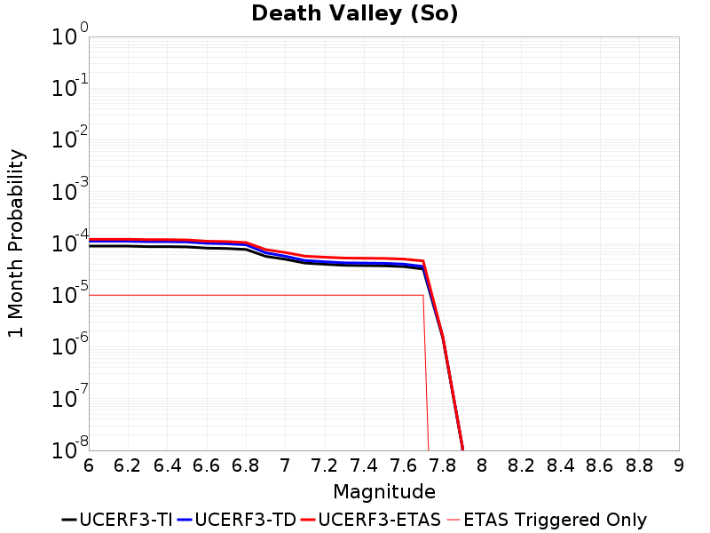 |  |  |

| Magnitude | 1 wk TI Prob | 1 wk TD Prob | 1 wk ETAS Prob | 1 wk ETAS/TD Gain | 1 wk ETAS Triggered Only | 1 mo TI Prob | 1 mo TD Prob | 1 mo ETAS Prob | 1 mo ETAS/TD Gain | 1 mo ETAS Triggered Only | 1 yr TI Prob | 1 yr TD Prob | 1 yr ETAS Prob | 1 yr ETAS/TD Gain | 1 yr ETAS Triggered Only | 10 yr TI Prob | 10 yr TD Prob | 10 yr ETAS Prob | 10 yr ETAS/TD Gain | 10 yr ETAS Triggered Only |
|-----|-----|-----|-----|-----|-----|-----|-----|-----|-----|-----|-----|-----|-----|-----|-----|-----|-----|-----|-----|-----|
| 6.0 | 2.0684236E-5 | 2.5724856E-5 | 2.5724856E-5 | 1.0 | 0.0 | 8.864371E-5 | 1.1024482E-4 | 1.2024372E-4 | 1.0906972 | 1.0E-5 | 0.0010787029 | 0.0013414214 | 0.001351408 | 1.0074447 | 1.0E-5 | 0.010734817 | 0.013335564 | 0.013345431 | 1.0007399 | 1.0E-5 |
| 6.1 | 2.0684236E-5 | 2.5724856E-5 | 2.5724856E-5 | 1.0 | 0.0 | 8.864371E-5 | 1.1024482E-4 | 1.2024372E-4 | 1.0906972 | 1.0E-5 | 0.0010787029 | 0.0013414214 | 0.001351408 | 1.0074447 | 1.0E-5 | 0.010734817 | 0.013335564 | 0.013345431 | 1.0007399 | 1.0E-5 |
| 6.2 | 2.0684236E-5 | 2.5724856E-5 | 2.5724856E-5 | 1.0 | 0.0 | 8.864371E-5 | 1.1024482E-4 | 1.2024372E-4 | 1.0906972 | 1.0E-5 | 0.0010787029 | 0.0013414214 | 0.001351408 | 1.0074447 | 1.0E-5 | 0.010734817 | 0.013335564 | 0.013345431 | 1.0007399 | 1.0E-5 |
| 6.3 | 2.0240292E-5 | 2.522406E-5 | 2.522406E-5 | 1.0 | 0.0 | 8.6741224E-5 | 1.08098735E-4 | 1.1809765E-4 | 1.0924981 | 1.0E-5 | 0.0010555626 | 0.0013153245 | 0.0013253113 | 1.0075927 | 1.0E-5 | 0.010505628 | 0.013077685 | 0.013087554 | 1.0007547 | 1.0E-5 |
| 6.4 | 2.0240292E-5 | 2.522406E-5 | 2.522406E-5 | 1.0 | 0.0 | 8.6741224E-5 | 1.08098735E-4 | 1.1809765E-4 | 1.0924981 | 1.0E-5 | 0.0010555626 | 0.0013153245 | 0.0013253113 | 1.0075927 | 1.0E-5 | 0.010505628 | 0.013077685 | 0.013087554 | 1.0007547 | 1.0E-5 |
| 6.5 | 1.9962767E-5 | 2.4912793E-5 | 2.4912793E-5 | 1.0 | 0.0 | 8.55519E-5 | 1.0676484E-4 | 1.16763775E-4 | 1.0936538 | 1.0E-5 | 0.0010410968 | 0.0012991037 | 0.0013090908 | 1.0076876 | 1.0E-5 | 0.010362327 | 0.012917372 | 0.0129272435 | 1.0007641 | 1.0E-5 |
| 6.6 | 1.8937297E-5 | 2.3406817E-5 | 2.3406817E-5 | 1.0 | 0.0 | 8.115732E-5 | 1.00311154E-4 | 1.1031015E-4 | 1.0996798 | 1.0E-5 | 9.876423E-4 | 0.0012206188 | 0.0012306066 | 1.0081825 | 1.0E-5 | 0.009832645 | 0.012141135 | 0.012151013 | 1.0008136 | 1.0E-5 |
| 6.7 | 1.8621096E-5 | 2.3006449E-5 | 2.3006449E-5 | 1.0 | 0.0 | 7.980225E-5 | 9.8595425E-5 | 1.0859444E-4 | 1.1014146 | 1.0E-5 | 9.711593E-4 | 0.0011997529 | 0.0012097409 | 1.0083251 | 1.0E-5 | 0.009669261 | 0.01193474 | 0.01194462 | 1.0008279 | 1.0E-5 |
| 6.8 | 1.7830353E-5 | 2.1892656E-5 | 2.1892656E-5 | 1.0 | 0.0 | 7.641356E-5 | 9.382237E-5 | 1.0382143E-4 | 1.1065744 | 1.0E-5 | 9.29938E-4 | 0.001141703 | 0.0011516915 | 1.0087489 | 1.0E-5 | 0.009260561 | 0.011360972 | 0.011370859 | 1.0008702 | 1.0E-5 |
| 6.9 | 1.3135183E-5 | 1.5345922E-5 | 1.5345922E-5 | 1.0 | 0.0 | 5.6292425E-5 | 6.576662E-5 | 7.576596E-5 | 1.1520429 | 1.0E-5 | 6.8514474E-4 | 8.004209E-4 | 8.1041286E-4 | 1.0124835 | 1.0E-5 | 0.006830362 | 0.007975601 | 0.007985521 | 1.0012438 | 1.0E-5 |
| 7.0 | 1.1507512E-5 | 1.3186031E-5 | 1.3186031E-5 | 1.0 | 0.0 | 4.9316975E-5 | 5.651037E-5 | 6.6509805E-5 | 1.1769487 | 1.0E-5 | 6.002687E-4 | 6.878023E-4 | 6.977955E-4 | 1.0145291 | 1.0E-5 | 0.0059864987 | 0.006856722 | 0.0068666534 | 1.0014484 | 1.0E-5 |
| 7.1 | 9.715903E-6 | 1.0884825E-5 | 1.0884825E-5 | 1.0 | 0.0 | 4.1638916E-5 | 4.664844E-5 | 5.6647972E-5 | 1.2143594 | 1.0E-5 | 5.068359E-4 | 5.67801E-4 | 5.777954E-4 | 1.0176018 | 1.0E-5 | 0.0050568148 | 0.005664048 | 0.0056739915 | 1.0017555 | 1.0E-5 |
| 7.2 | 9.233269E-6 | 1.0304217E-5 | 1.0304217E-5 | 1.0 | 0.0 | 3.9570554E-5 | 4.4160206E-5 | 5.4159766E-5 | 1.2264382 | 1.0E-5 | 4.81665E-4 | 5.3752214E-4 | 5.4751674E-4 | 1.0185939 | 1.0E-5 | 0.0048062233 | 0.0053626527 | 0.0053725992 | 1.0018548 | 1.0E-5 |
| 7.3 | 8.8041315E-6 | 9.823834E-6 | 9.823834E-6 | 1.0 | 0.0 | 3.7731446E-5 | 4.2101492E-5 | 5.210107E-5 | 1.2375113 | 1.0E-5 | 4.592835E-4 | 5.124693E-4 | 5.224642E-4 | 1.0195034 | 1.0E-5 | 0.0045833546 | 0.0051133037 | 0.0051232525 | 1.0019457 | 1.0E-5 |
| 7.4 | 8.708749E-6 | 9.72276E-6 | 9.72276E-6 | 1.0 | 0.0 | 3.7322676E-5 | 4.1668332E-5 | 5.1667914E-5 | 1.2399805 | 1.0E-5 | 4.5430884E-4 | 5.0719804E-4 | 5.17193E-4 | 1.0197061 | 1.0E-5 | 0.004533812 | 0.0050608325 | 0.005070782 | 1.001966 | 1.0E-5 |
| 7.5 | 8.612678E-6 | 9.620307E-6 | 9.620307E-6 | 1.0 | 0.0 | 3.6910955E-5 | 4.1229257E-5 | 5.1228846E-5 | 1.2425362 | 1.0E-5 | 4.492982E-4 | 5.018548E-4 | 5.118498E-4 | 1.019916 | 1.0E-5 | 0.004483909 | 0.0050076423 | 0.005017592 | 1.001987 | 1.0E-5 |
| 7.6 | 8.319024E-6 | 9.298986E-6 | 9.298986E-6 | 1.0 | 0.0 | 3.5652476E-5 | 3.985221E-5 | 4.985181E-5 | 1.2509171 | 1.0E-5 | 4.3398244E-4 | 4.8509683E-4 | 4.95092E-4 | 1.0206045 | 1.0E-5 | 0.0043313587 | 0.0048408047 | 0.0048507564 | 1.0020558 | 1.0E-5 |
| 7.7 | 7.4718328E-6 | 8.358816E-6 | 8.358816E-6 | 1.0 | 0.0 | 3.2021748E-5 | 3.5823028E-5 | 4.5822668E-5 | 1.27914 | 1.0E-5 | 3.8979502E-4 | 4.3606214E-4 | 4.4605776E-4 | 1.0229225 | 1.0E-5 | 0.00389112 | 0.0043524713 | 0.004362428 | 1.0022875 | 1.0E-5 |
| 7.8 | 3.4586725E-7 | 3.6510616E-7 | 3.6510616E-7 | 1.0 | 0.0 | 1.4822873E-6 | 1.5647397E-6 | 1.5647397E-6 | 1.0 | 0.0 | 1.80467E-5 | 1.9050545E-5 | 1.9050545E-5 | 1.0 | 0.0 | 1.8045233E-4 | 1.9048955E-4 | 1.9048955E-4 | 1.0 | 0.0 |
| 7.9 | 2.5591178E-9 | 2.6712779E-9 | 2.6712779E-9 | 1.0 | 0.0 | 1.0967647E-8 | 1.1448334E-8 | 1.1448334E-8 | 1.0 | 0.0 | 1.335311E-7 | 1.3938346E-7 | 1.3938346E-7 | 1.0 | 0.0 | 1.3353102E-6 | 1.3938346E-6 | 1.3938346E-6 | 1.0 | 0.0 |

## Death Valley (No)
*[(top)](#table-of-contents)*

| 1 Week | 1 Month | 1 Year | 10 Year |
|-----|-----|-----|-----|
|  |  | 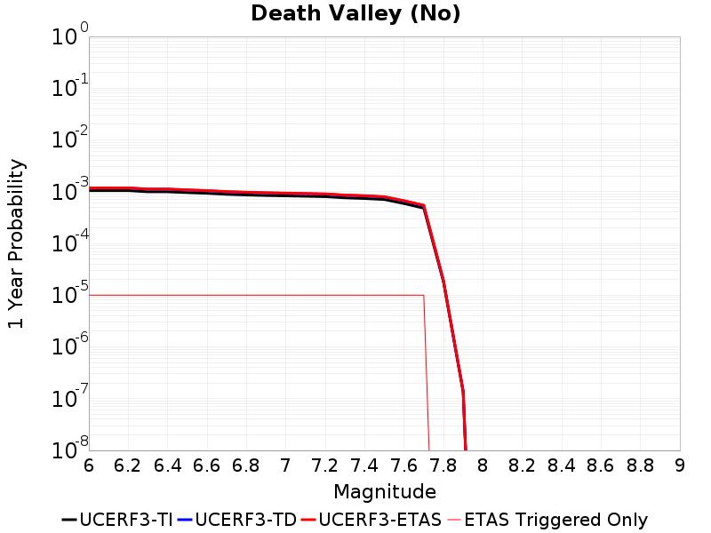 |  |

| Magnitude | 1 wk TI Prob | 1 wk TD Prob | 1 wk ETAS Prob | 1 wk ETAS/TD Gain | 1 wk ETAS Triggered Only | 1 mo TI Prob | 1 mo TD Prob | 1 mo ETAS Prob | 1 mo ETAS/TD Gain | 1 mo ETAS Triggered Only | 1 yr TI Prob | 1 yr TD Prob | 1 yr ETAS Prob | 1 yr ETAS/TD Gain | 1 yr ETAS Triggered Only | 10 yr TI Prob | 10 yr TD Prob | 10 yr ETAS Prob | 10 yr ETAS/TD Gain | 10 yr ETAS Triggered Only |
|-----|-----|-----|-----|-----|-----|-----|-----|-----|-----|-----|-----|-----|-----|-----|-----|-----|-----|-----|-----|-----|
| 6.0 | 2.0074807E-5 | 2.253816E-5 | 2.253816E-5 | 1.0 | 0.0 | 8.603206E-5 | 9.658858E-5 | 1.0658761E-4 | 1.103522 | 1.0E-5 | 0.001046937 | 0.001175339 | 0.0011853272 | 1.0084982 | 1.0E-5 | 0.010420183 | 0.011692145 | 0.011702028 | 1.0008453 | 1.0E-5 |
| 6.1 | 2.0074807E-5 | 2.253816E-5 | 2.253816E-5 | 1.0 | 0.0 | 8.603206E-5 | 9.658858E-5 | 1.0658761E-4 | 1.103522 | 1.0E-5 | 0.001046937 | 0.001175339 | 0.0011853272 | 1.0084982 | 1.0E-5 | 0.010420183 | 0.011692145 | 0.011702028 | 1.0008453 | 1.0E-5 |
| 6.2 | 2.0074807E-5 | 2.253816E-5 | 2.253816E-5 | 1.0 | 0.0 | 8.603206E-5 | 9.658858E-5 | 1.0658761E-4 | 1.103522 | 1.0E-5 | 0.001046937 | 0.001175339 | 0.0011853272 | 1.0084982 | 1.0E-5 | 0.010420183 | 0.011692145 | 0.011702028 | 1.0008453 | 1.0E-5 |
| 6.3 | 1.9050609E-5 | 2.1372824E-5 | 2.1372824E-5 | 1.0 | 0.0 | 8.164292E-5 | 9.159464E-5 | 1.0159372E-4 | 1.1091667 | 1.0E-5 | 9.935491E-4 | 0.001114601 | 0.0011245898 | 1.0089618 | 1.0E-5 | 0.009891188 | 0.011090933 | 0.011100823 | 1.0008917 | 1.0E-5 |
| 6.4 | 1.9050609E-5 | 2.1372824E-5 | 2.1372824E-5 | 1.0 | 0.0 | 8.164292E-5 | 9.159464E-5 | 1.0159372E-4 | 1.1091667 | 1.0E-5 | 9.935491E-4 | 0.001114601 | 0.0011245898 | 1.0089618 | 1.0E-5 | 0.009891188 | 0.011090933 | 0.011100823 | 1.0008917 | 1.0E-5 |
| 6.5 | 1.8367004E-5 | 2.0595422E-5 | 2.0595422E-5 | 1.0 | 0.0 | 7.8713354E-5 | 8.826315E-5 | 9.8262266E-5 | 1.1132876 | 1.0E-5 | 9.5791375E-4 | 0.0010740807 | 0.00108407 | 1.0093002 | 1.0E-5 | 0.009537951 | 0.010689683 | 0.010699577 | 1.0009255 | 1.0E-5 |
| 6.6 | 1.779439E-5 | 1.9944117E-5 | 1.9944117E-5 | 1.0 | 0.0 | 7.625944E-5 | 8.547202E-5 | 9.5471165E-5 | 1.1169873 | 1.0E-5 | 9.280632E-4 | 0.0010401314 | 0.001050121 | 1.0096042 | 1.0E-5 | 0.009241969 | 0.010353393 | 0.01036329 | 1.0009558 | 1.0E-5 |
| 6.7 | 1.7025437E-5 | 1.9075056E-5 | 1.9075056E-5 | 1.0 | 0.0 | 7.296412E-5 | 8.174771E-5 | 9.174689E-5 | 1.1223176 | 1.0E-5 | 8.87976E-4 | 9.948302E-4 | 0.0010048202 | 1.010042 | 1.0E-5 | 0.008844362 | 0.009904489 | 0.00991439 | 1.0009997 | 1.0E-5 |
| 6.8 | 1.6545107E-5 | 1.854338E-5 | 1.854338E-5 | 1.0 | 0.0 | 7.090568E-5 | 7.9469246E-5 | 8.946845E-5 | 1.1258248 | 1.0E-5 | 8.629347E-4 | 9.671147E-4 | 9.77105E-4 | 1.0103301 | 1.0E-5 | 0.008595915 | 0.0096297655 | 0.009639669 | 1.0010284 | 1.0E-5 |
| 6.9 | 1.615478E-5 | 1.8117888E-5 | 1.8117888E-5 | 1.0 | 0.0 | 6.9232934E-5 | 7.764582E-5 | 8.7645036E-5 | 1.1287799 | 1.0E-5 | 8.4258494E-4 | 9.449339E-4 | 9.5492444E-4 | 1.0105728 | 1.0E-5 | 0.008393973 | 0.009409857 | 0.0094197625 | 1.0010527 | 1.0E-5 |
| 7.0 | 1.5894311E-5 | 1.783551E-5 | 1.783551E-5 | 1.0 | 0.0 | 6.81167E-5 | 7.6435696E-5 | 8.643493E-5 | 1.130819 | 1.0E-5 | 8.2900526E-4 | 9.302133E-4 | 9.40204E-4 | 1.0107403 | 1.0E-5 | 0.008259195 | 0.009263888 | 0.009273795 | 1.0010694 | 1.0E-5 |
| 7.1 | 1.5602263E-5 | 1.7512994E-5 | 1.7512994E-5 | 1.0 | 0.0 | 6.6865134E-5 | 7.505356E-5 | 8.505281E-5 | 1.1332282 | 1.0E-5 | 8.137789E-4 | 9.134001E-4 | 9.2339097E-4 | 1.010938 | 1.0E-5 | 0.008108052 | 0.009097144 | 0.009107053 | 1.0010892 | 1.0E-5 |
| 7.2 | 1.5323829E-5 | 1.7199578E-5 | 1.7199578E-5 | 1.0 | 0.0 | 6.56719E-5 | 7.371043E-5 | 8.370969E-5 | 1.135656 | 1.0E-5 | 7.99262E-4 | 8.97061E-4 | 9.070521E-4 | 1.0111375 | 1.0E-5 | 0.007963934 | 0.008935079 | 0.008944989 | 1.0011092 | 1.0E-5 |
| 7.3 | 1.4556212E-5 | 1.6329814E-5 | 1.6329814E-5 | 1.0 | 0.0 | 6.238227E-5 | 6.998307E-5 | 7.9982376E-5 | 1.1428818 | 1.0E-5 | 7.592395E-4 | 8.5171673E-4 | 8.617082E-4 | 1.011731 | 1.0E-5 | 0.0075665074 | 0.008485171 | 0.008495087 | 1.0011685 | 1.0E-5 |
| 7.4 | 1.411725E-5 | 1.5834443E-5 | 1.5834443E-5 | 1.0 | 0.0 | 6.0501097E-5 | 6.7860165E-5 | 7.7859484E-5 | 1.1473519 | 1.0E-5 | 7.363519E-4 | 8.2589017E-4 | 8.358819E-4 | 1.0120982 | 1.0E-5 | 0.0073391674 | 0.008228846 | 0.008238764 | 1.0012052 | 1.0E-5 |
| 7.5 | 1.3503312E-5 | 1.5151712E-5 | 1.5151712E-5 | 1.0 | 0.0 | 5.7870053E-5 | 6.493433E-5 | 7.4933676E-5 | 1.1539917 | 1.0E-5 | 7.043401E-4 | 7.902945E-4 | 8.002866E-4 | 1.0126435 | 1.0E-5 | 0.007021119 | 0.007875468 | 0.007885389 | 1.0012598 | 1.0E-5 |
| 7.6 | 1.1279839E-5 | 1.2647399E-5 | 1.2647399E-5 | 1.0 | 0.0 | 4.834127E-5 | 5.4202043E-5 | 6.42015E-5 | 1.1844848 | 1.0E-5 | 5.88396E-4 | 6.597154E-4 | 6.697088E-4 | 1.015148 | 1.0E-5 | 0.005868405 | 0.0065781237 | 0.006588058 | 1.0015101 | 1.0E-5 |
| 7.7 | 9.189108E-6 | 1.030048E-5 | 1.030048E-5 | 1.0 | 0.0 | 3.93813E-5 | 4.41442E-5 | 5.414376E-5 | 1.2265203 | 1.0E-5 | 4.7936183E-4 | 5.3732813E-4 | 5.473228E-4 | 1.0186006 | 1.0E-5 | 0.004783291 | 0.005360802 | 0.0053707487 | 1.0018554 | 1.0E-5 |
| 7.8 | 3.4586725E-7 | 3.6510616E-7 | 3.6510616E-7 | 1.0 | 0.0 | 1.4822873E-6 | 1.5647397E-6 | 1.5647397E-6 | 1.0 | 0.0 | 1.80467E-5 | 1.9050545E-5 | 1.9050545E-5 | 1.0 | 0.0 | 1.8045233E-4 | 1.9048955E-4 | 1.9048955E-4 | 1.0 | 0.0 |
| 7.9 | 2.5591178E-9 | 2.6712779E-9 | 2.6712779E-9 | 1.0 | 0.0 | 1.0967647E-8 | 1.1448334E-8 | 1.1448334E-8 | 1.0 | 0.0 | 1.335311E-7 | 1.3938346E-7 | 1.3938346E-7 | 1.0 | 0.0 | 1.3353102E-6 | 1.3938346E-6 | 1.3938346E-6 | 1.0 | 0.0 |

## Great Valley 05 Pittsburg - Kirby Hills alt1
*[(top)](#table-of-contents)*

| 1 Week | 1 Month | 1 Year | 10 Year |
|-----|-----|-----|-----|
|  | 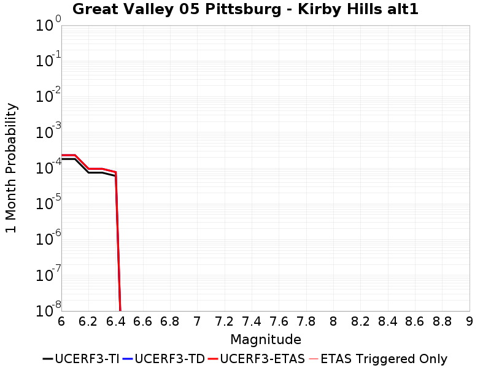 | 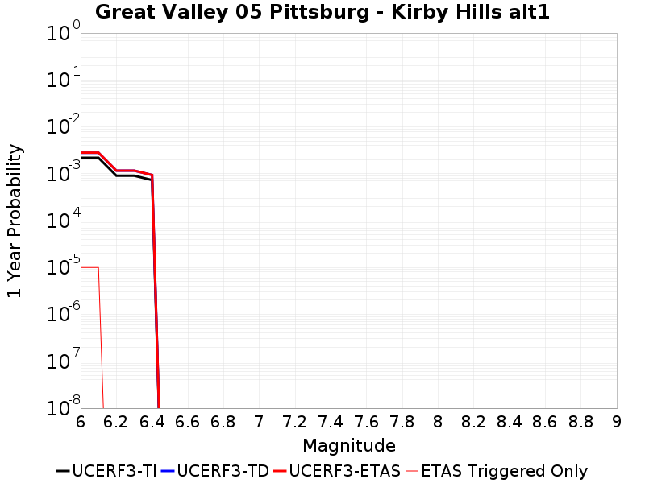 | 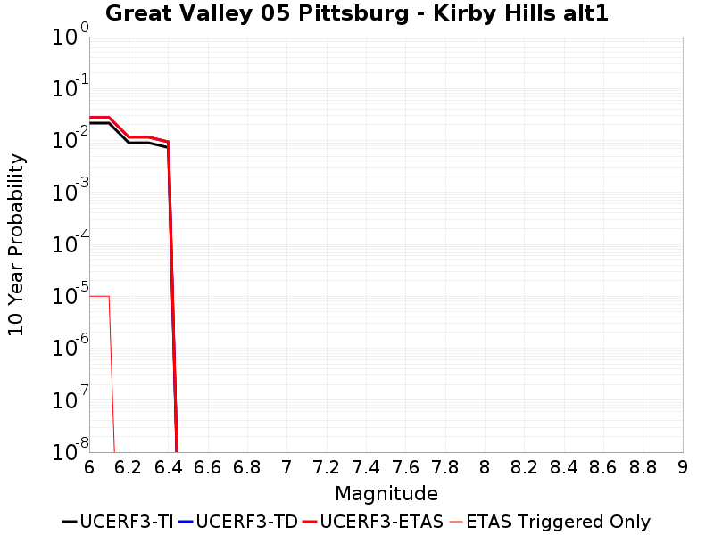 |

| Magnitude | 1 wk TI Prob | 1 wk TD Prob | 1 wk ETAS Prob | 1 wk ETAS/TD Gain | 1 wk ETAS Triggered Only | 1 mo TI Prob | 1 mo TD Prob | 1 mo ETAS Prob | 1 mo ETAS/TD Gain | 1 mo ETAS Triggered Only | 1 yr TI Prob | 1 yr TD Prob | 1 yr ETAS Prob | 1 yr ETAS/TD Gain | 1 yr ETAS Triggered Only | 10 yr TI Prob | 10 yr TD Prob | 10 yr ETAS Prob | 10 yr ETAS/TD Gain | 10 yr ETAS Triggered Only |
|-----|-----|-----|-----|-----|-----|-----|-----|-----|-----|-----|-----|-----|-----|-----|-----|-----|-----|-----|-----|-----|
| 6.0 | 4.187212E-5 | 5.3644984E-5 | 5.3644984E-5 | 1.0 | 0.0 | 1.794396E-4 | 2.2989263E-4 | 2.2989263E-4 | 1.0 | 0.0 | 0.002182488 | 0.0027963165 | 0.0028062884 | 1.0035661 | 1.0E-5 | 0.021611776 | 0.027705874 | 0.027715597 | 1.000351 | 1.0E-5 |
| 6.1 | 4.187212E-5 | 5.3644984E-5 | 5.3644984E-5 | 1.0 | 0.0 | 1.794396E-4 | 2.2989263E-4 | 2.2989263E-4 | 1.0 | 0.0 | 0.002182488 | 0.0027963165 | 0.0028062884 | 1.0035661 | 1.0E-5 | 0.021611776 | 0.027705874 | 0.027715597 | 1.000351 | 1.0E-5 |
| 6.2 | 1.7353306E-5 | 2.2238553E-5 | 2.2238553E-5 | 1.0 | 0.0 | 7.436919E-5 | 9.530694E-5 | 9.530694E-5 | 1.0 | 0.0 | 9.050688E-4 | 0.0011601287 | 0.0011601287 | 1.0 | 0.0 | 0.009013915 | 0.011578497 | 0.011578497 | 1.0 | 0.0 |
| 6.3 | 1.7353306E-5 | 2.2238553E-5 | 2.2238553E-5 | 1.0 | 0.0 | 7.436919E-5 | 9.530694E-5 | 9.530694E-5 | 1.0 | 0.0 | 9.050688E-4 | 0.0011601287 | 0.0011601287 | 1.0 | 0.0 | 0.009013915 | 0.011578497 | 0.011578497 | 1.0 | 0.0 |
| 6.4 | 1.4028824E-5 | 1.796869E-5 | 1.796869E-5 | 1.0 | 0.0 | 6.0122147E-5 | 7.700867E-5 | 7.700867E-5 | 1.0 | 0.0 | 7.3174125E-4 | 9.375562E-4 | 9.375562E-4 | 1.0 | 0.0 | 0.0072933645 | 0.009373256 | 0.009373256 | 1.0 | 0.0 |

## Red Mountain
*[(top)](#table-of-contents)*

| 1 Week | 1 Month | 1 Year | 10 Year |
|-----|-----|-----|-----|
| 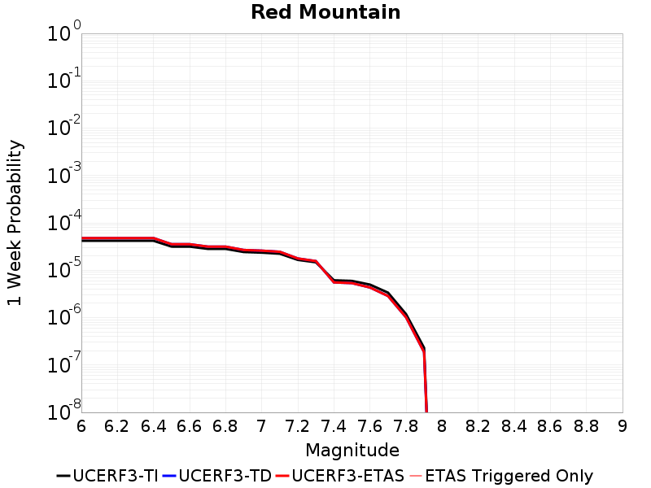 |  | 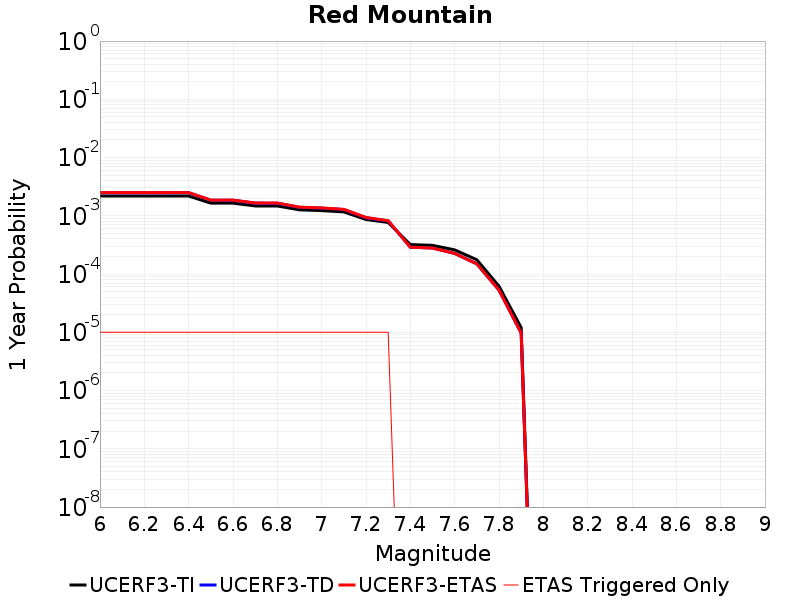 | 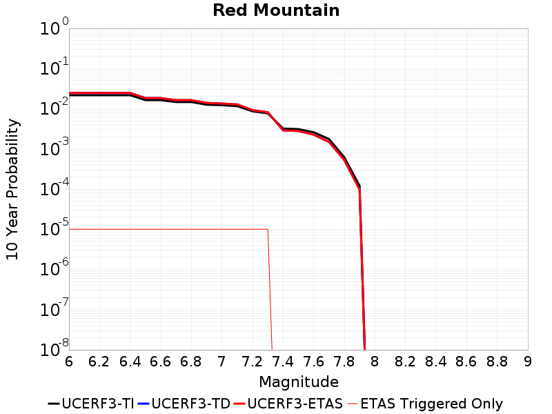 |

| Magnitude | 1 wk TI Prob | 1 wk TD Prob | 1 wk ETAS Prob | 1 wk ETAS/TD Gain | 1 wk ETAS Triggered Only | 1 mo TI Prob | 1 mo TD Prob | 1 mo ETAS Prob | 1 mo ETAS/TD Gain | 1 mo ETAS Triggered Only | 1 yr TI Prob | 1 yr TD Prob | 1 yr ETAS Prob | 1 yr ETAS/TD Gain | 1 yr ETAS Triggered Only | 10 yr TI Prob | 10 yr TD Prob | 10 yr ETAS Prob | 10 yr ETAS/TD Gain | 10 yr ETAS Triggered Only |
|-----|-----|-----|-----|-----|-----|-----|-----|-----|-----|-----|-----|-----|-----|-----|-----|-----|-----|-----|-----|-----|
| 6.0 | 4.1810763E-5 | 4.7703394E-5 | 4.7703394E-5 | 1.0 | 0.0 | 1.7917668E-4 | 2.0442804E-4 | 2.1442599E-4 | 1.0489069 | 1.0E-5 | 0.0021792934 | 0.002486236 | 0.002496211 | 1.0040121 | 1.0E-5 | 0.021580452 | 0.024601893 | 0.024611648 | 1.0003965 | 1.0E-5 |
| 6.1 | 4.1810763E-5 | 4.7703394E-5 | 4.7703394E-5 | 1.0 | 0.0 | 1.7917668E-4 | 2.0442804E-4 | 2.1442599E-4 | 1.0489069 | 1.0E-5 | 0.0021792934 | 0.002486236 | 0.002496211 | 1.0040121 | 1.0E-5 | 0.021580452 | 0.024601893 | 0.024611648 | 1.0003965 | 1.0E-5 |
| 6.2 | 4.1810763E-5 | 4.7703394E-5 | 4.7703394E-5 | 1.0 | 0.0 | 1.7917668E-4 | 2.0442804E-4 | 2.1442599E-4 | 1.0489069 | 1.0E-5 | 0.0021792934 | 0.002486236 | 0.002496211 | 1.0040121 | 1.0E-5 | 0.021580452 | 0.024601893 | 0.024611648 | 1.0003965 | 1.0E-5 |
| 6.3 | 4.1810763E-5 | 4.7703394E-5 | 4.7703394E-5 | 1.0 | 0.0 | 1.7917668E-4 | 2.0442804E-4 | 2.1442599E-4 | 1.0489069 | 1.0E-5 | 0.0021792934 | 0.002486236 | 0.002496211 | 1.0040121 | 1.0E-5 | 0.021580452 | 0.024601893 | 0.024611648 | 1.0003965 | 1.0E-5 |
| 6.4 | 4.1810763E-5 | 4.7703394E-5 | 4.7703394E-5 | 1.0 | 0.0 | 1.7917668E-4 | 2.0442804E-4 | 2.1442599E-4 | 1.0489069 | 1.0E-5 | 0.0021792934 | 0.002486236 | 0.002496211 | 1.0040121 | 1.0E-5 | 0.021580452 | 0.024601893 | 0.024611648 | 1.0003965 | 1.0E-5 |
| 6.5 | 3.154503E-5 | 3.5440517E-5 | 3.5440517E-5 | 1.0 | 0.0 | 1.3518598E-4 | 1.518796E-4 | 1.6187808E-4 | 1.0658317 | 1.0E-5 | 0.0016446467 | 0.0018476583 | 0.0018576399 | 1.0054022 | 1.0E-5 | 0.01632528 | 0.018332658 | 0.018342474 | 1.0005355 | 1.0E-5 |
| 6.6 | 3.1535834E-5 | 3.5429875E-5 | 3.5429875E-5 | 1.0 | 0.0 | 1.3514658E-4 | 1.51834E-4 | 1.6183249E-4 | 1.0658514 | 1.0E-5 | 0.0016441676 | 0.0018471042 | 0.0018570856 | 1.0054039 | 1.0E-5 | 0.01632056 | 0.018327206 | 0.018337024 | 1.0005356 | 1.0E-5 |
| 6.7 | 2.8267326E-5 | 3.1539974E-5 | 3.1539974E-5 | 1.0 | 0.0 | 1.2114006E-4 | 1.351648E-4 | 1.4516345E-4 | 1.0739738 | 1.0E-5 | 0.0014738824 | 0.0016444747 | 0.0016544582 | 1.006071 | 1.0E-5 | 0.014641452 | 0.016331865 | 0.016341701 | 1.0006022 | 1.0E-5 |
| 6.8 | 2.8212884E-5 | 3.147774E-5 | 3.147774E-5 | 1.0 | 0.0 | 1.20906756E-4 | 1.3489809E-4 | 1.4489675E-4 | 1.07412 | 1.0E-5 | 0.0014710457 | 0.0016412325 | 0.0016512161 | 1.006083 | 1.0E-5 | 0.014613459 | 0.016299918 | 0.016309757 | 1.0006036 | 1.0E-5 |
| 6.9 | 2.4227871E-5 | 2.676571E-5 | 2.676571E-5 | 1.0 | 0.0 | 1.03829596E-4 | 1.14705574E-4 | 1.2470443E-4 | 1.0871698 | 1.0E-5 | 0.0012633923 | 0.001395722 | 0.001405708 | 1.0071547 | 1.0E-5 | 0.012562336 | 0.0138772875 | 0.013887148 | 1.0007106 | 1.0E-5 |
| 7.0 | 2.348524E-5 | 2.5892388E-5 | 2.5892388E-5 | 1.0 | 0.0 | 1.0064714E-4 | 1.1096308E-4 | 1.2096197E-4 | 1.0901101 | 1.0E-5 | 0.0012246901 | 0.0013502144 | 0.0013602008 | 1.0073962 | 1.0E-5 | 0.012179627 | 0.01342778 | 0.0134376455 | 1.0007347 | 1.0E-5 |
| 7.1 | 2.2311642E-5 | 2.4516185E-5 | 2.4516185E-5 | 1.0 | 0.0 | 9.561782E-5 | 1.0506555E-4 | 1.15064504E-4 | 1.0951687 | 1.0E-5 | 0.0011635252 | 0.0012784976 | 0.0012884849 | 1.0078117 | 1.0E-5 | 0.01157452 | 0.012718977 | 0.01272885 | 1.0007762 | 1.0E-5 |
| 7.2 | 1.6533986E-5 | 1.7707043E-5 | 1.7707043E-5 | 1.0 | 0.0 | 7.085802E-5 | 7.588548E-5 | 8.588472E-5 | 1.1317675 | 1.0E-5 | 8.623549E-4 | 9.2357787E-4 | 9.3356863E-4 | 1.0108174 | 1.0E-5 | 0.008590161 | 0.009203704 | 0.009213612 | 1.0010765 | 1.0E-5 |
| 7.3 | 1.4703092E-5 | 1.5591675E-5 | 1.5591675E-5 | 1.0 | 0.0 | 6.301173E-5 | 6.68201E-5 | 7.681943E-5 | 1.1496456 | 1.0E-5 | 7.668978E-4 | 8.13293E-4 | 8.2328485E-4 | 1.0122857 | 1.0E-5 | 0.0076425658 | 0.00810927 | 0.008119189 | 1.0012232 | 1.0E-5 |
| 7.4 | 6.1331984E-6 | 5.5371056E-6 | 5.5371056E-6 | 1.0 | 0.0 | 2.6284872E-5 | 2.373024E-5 | 2.373024E-5 | 1.0 | 0.0 | 3.199713E-4 | 2.888779E-4 | 2.888779E-4 | 1.0 | 0.0 | 0.0031951098 | 0.0028850783 | 0.0028850783 | 1.0 | 0.0 |
| 7.5 | 5.954766E-6 | 5.3464614E-6 | 5.3464614E-6 | 1.0 | 0.0 | 2.5520176E-5 | 2.2913207E-5 | 2.2913207E-5 | 1.0 | 0.0 | 3.1066386E-4 | 2.7893312E-4 | 2.7893312E-4 | 1.0 | 0.0 | 0.003102299 | 0.002785884 | 0.002785884 | 1.0 | 0.0 |
| 7.6 | 4.9726646E-6 | 4.322078E-6 | 4.322078E-6 | 1.0 | 0.0 | 2.1311245E-5 | 1.8523062E-5 | 1.8523062E-5 | 1.0 | 0.0 | 2.5943352E-4 | 2.2549529E-4 | 2.2549529E-4 | 1.0 | 0.0 | 0.0025913084 | 0.0022526996 | 0.0022526996 | 1.0 | 0.0 |
| 7.7 | 3.3613894E-6 | 2.8574807E-6 | 2.8574807E-6 | 1.0 | 0.0 | 1.4405875E-5 | 1.224629E-5 | 1.224629E-5 | 1.0 | 0.0 | 1.7537741E-4 | 1.4908864E-4 | 1.4908864E-4 | 1.0 | 0.0 | 0.0017523908 | 0.0014899125 | 0.0014899125 | 1.0 | 0.0 |
| 7.8 | 1.1828961E-6 | 1.0136715E-6 | 1.0136715E-6 | 1.0 | 0.0 | 5.069545E-6 | 4.344299E-6 | 4.344299E-6 | 1.0 | 0.0 | 6.171996E-5 | 5.289059E-5 | 5.289059E-5 | 1.0 | 0.0 | 6.170282E-4 | 5.2878296E-4 | 5.2878296E-4 | 1.0 | 0.0 |
| 7.9 | 2.2967266E-7 | 1.8636379E-7 | 1.8636379E-7 | 1.0 | 0.0 | 9.843111E-7 | 7.9870176E-7 | 7.9870176E-7 | 1.0 | 0.0 | 1.19839215E-5 | 9.724154E-6 | 9.724154E-6 | 1.0 | 0.0 | 1.1983275E-4 | 9.7237564E-5 | 9.7237564E-5 | 1.0 | 0.0 |

## Santa Ynez River
*[(top)](#table-of-contents)*

| 1 Week | 1 Month | 1 Year | 10 Year |
|-----|-----|-----|-----|
|  | 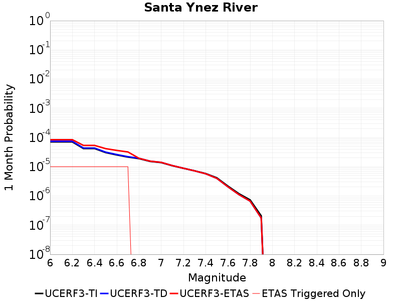 |  | 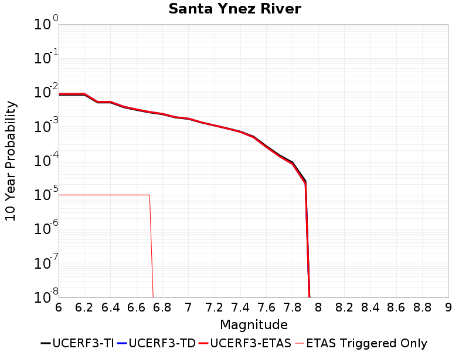 |

| Magnitude | 1 wk TI Prob | 1 wk TD Prob | 1 wk ETAS Prob | 1 wk ETAS/TD Gain | 1 wk ETAS Triggered Only | 1 mo TI Prob | 1 mo TD Prob | 1 mo ETAS Prob | 1 mo ETAS/TD Gain | 1 mo ETAS Triggered Only | 1 yr TI Prob | 1 yr TD Prob | 1 yr ETAS Prob | 1 yr ETAS/TD Gain | 1 yr ETAS Triggered Only | 10 yr TI Prob | 10 yr TD Prob | 10 yr ETAS Prob | 10 yr ETAS/TD Gain | 10 yr ETAS Triggered Only |
|-----|-----|-----|-----|-----|-----|-----|-----|-----|-----|-----|-----|-----|-----|-----|-----|-----|-----|-----|-----|-----|
| 6.0 | 1.6396456E-5 | 1.72234E-5 | 1.72234E-5 | 1.0 | 0.0 | 7.026863E-5 | 7.3812684E-5 | 8.3811945E-5 | 1.1354681 | 1.0E-5 | 8.551848E-4 | 8.983345E-4 | 9.0832554E-4 | 1.0111217 | 1.0E-5 | 0.0085190125 | 0.008950587 | 0.008960498 | 1.0011072 | 1.0E-5 |
| 6.1 | 1.6396456E-5 | 1.72234E-5 | 1.72234E-5 | 1.0 | 0.0 | 7.026863E-5 | 7.3812684E-5 | 8.3811945E-5 | 1.1354681 | 1.0E-5 | 8.551848E-4 | 8.983345E-4 | 9.0832554E-4 | 1.0111217 | 1.0E-5 | 0.0085190125 | 0.008950587 | 0.008960498 | 1.0011072 | 1.0E-5 |
| 6.2 | 1.6396456E-5 | 1.72234E-5 | 1.72234E-5 | 1.0 | 0.0 | 7.026863E-5 | 7.3812684E-5 | 8.3811945E-5 | 1.1354681 | 1.0E-5 | 8.551848E-4 | 8.983345E-4 | 9.0832554E-4 | 1.0111217 | 1.0E-5 | 0.0085190125 | 0.008950587 | 0.008960498 | 1.0011072 | 1.0E-5 |
| 6.3 | 9.736976E-6 | 1.0129932E-5 | 1.0129932E-5 | 1.0 | 0.0 | 4.172923E-5 | 4.34133E-5 | 5.3412867E-5 | 1.2303342 | 1.0E-5 | 5.0793495E-4 | 5.2843377E-4 | 5.3842843E-4 | 1.0189139 | 1.0E-5 | 0.005067755 | 0.0052722786 | 0.0052822256 | 1.0018867 | 1.0E-5 |
| 6.4 | 9.736976E-6 | 1.0129932E-5 | 1.0129932E-5 | 1.0 | 0.0 | 4.172923E-5 | 4.34133E-5 | 5.3412867E-5 | 1.2303342 | 1.0E-5 | 5.0793495E-4 | 5.2843377E-4 | 5.3842843E-4 | 1.0189139 | 1.0E-5 | 0.005067755 | 0.0052722786 | 0.0052822256 | 1.0018867 | 1.0E-5 |
| 6.5 | 7.081964E-6 | 7.335479E-6 | 7.335479E-6 | 1.0 | 0.0 | 3.035092E-5 | 3.1437397E-5 | 4.1437084E-5 | 1.3180825 | 1.0E-5 | 3.694598E-4 | 3.826847E-4 | 3.9268087E-4 | 1.0261211 | 1.0E-5 | 0.0036884616 | 0.0038204188 | 0.0038303807 | 1.0026075 | 1.0E-5 |
| 6.6 | 5.873247E-6 | 6.064425E-6 | 6.064425E-6 | 1.0 | 0.0 | 2.5170815E-5 | 2.5990139E-5 | 3.598988E-5 | 1.3847513 | 1.0E-5 | 3.064116E-4 | 3.1638486E-4 | 3.263817E-4 | 1.031597 | 1.0E-5 | 0.0030598943 | 0.0031594317 | 0.0031694002 | 1.0031551 | 1.0E-5 |
| 6.7 | 4.973277E-6 | 5.1199418E-6 | 5.1199418E-6 | 1.0 | 0.0 | 2.1313872E-5 | 2.1942426E-5 | 3.1942207E-5 | 1.4557282 | 1.0E-5 | 2.5946548E-4 | 2.6711676E-4 | 2.7711407E-4 | 1.0374268 | 1.0E-5 | 0.0025916274 | 0.0026680059 | 0.0026779792 | 1.0037382 | 1.0E-5 |
| 6.8 | 4.396492E-6 | 4.514607E-6 | 4.514607E-6 | 1.0 | 0.0 | 1.884197E-5 | 1.9348174E-5 | 1.9348174E-5 | 1.0 | 0.0 | 2.2937685E-4 | 2.355389E-4 | 2.355389E-4 | 1.0 | 0.0 | 0.0022914023 | 0.002352928 | 0.002352928 | 1.0 | 0.0 |
| 6.9 | 3.5255632E-6 | 3.604399E-6 | 3.604399E-6 | 1.0 | 0.0 | 1.5109469E-5 | 1.5447333E-5 | 1.5447333E-5 | 1.0 | 0.0 | 1.8394225E-4 | 1.880552E-4 | 1.880552E-4 | 1.0 | 0.0 | 0.0018379007 | 0.0018789769 | 0.0018789769 | 1.0 | 0.0 |
| 7.0 | 3.211603E-6 | 3.27652E-6 | 3.27652E-6 | 1.0 | 0.0 | 1.376394E-5 | 1.4042153E-5 | 1.4042153E-5 | 1.0 | 0.0 | 1.6756308E-4 | 1.7094995E-4 | 1.7094995E-4 | 1.0 | 0.0 | 0.0016743679 | 0.0017081986 | 0.0017081986 | 1.0 | 0.0 |
| 7.1 | 2.5094619E-6 | 2.5433412E-6 | 2.5433412E-6 | 1.0 | 0.0 | 1.0754793E-5 | 1.0899988E-5 | 1.0899988E-5 | 1.0 | 0.0 | 1.3093173E-4 | 1.3269934E-4 | 1.3269934E-4 | 1.0 | 0.0 | 0.0013085462 | 0.001326207 | 0.001326207 | 1.0 | 0.0 |
| 7.2 | 2.0515774E-6 | 2.0640505E-6 | 2.0640505E-6 | 1.0 | 0.0 | 8.792445E-6 | 8.845901E-6 | 8.845901E-6 | 1.0 | 0.0 | 1.0704277E-4 | 1.0769356E-4 | 1.0769356E-4 | 1.0 | 0.0 | 0.0010699122 | 0.001076418 | 0.001076418 | 1.0 | 0.0 |
| 7.3 | 1.6845745E-6 | 1.6792469E-6 | 1.6792469E-6 | 1.0 | 0.0 | 7.219585E-6 | 7.196753E-6 | 7.196753E-6 | 1.0 | 0.0 | 8.78949E-5 | 8.761697E-5 | 8.761697E-5 | 1.0 | 0.0 | 8.7860145E-4 | 8.7582716E-4 | 8.7582716E-4 | 1.0 | 0.0 |
| 7.4 | 1.3600285E-6 | 1.3349032E-6 | 1.3349032E-6 | 1.0 | 0.0 | 5.82868E-6 | 5.7210013E-6 | 5.7210013E-6 | 1.0 | 0.0 | 7.096187E-5 | 6.965099E-5 | 6.965099E-5 | 1.0 | 0.0 | 7.0939213E-4 | 6.9629384E-4 | 6.9629384E-4 | 1.0 | 0.0 |
| 7.5 | 9.735342E-7 | 9.3017655E-7 | 9.3017655E-7 | 1.0 | 0.0 | 4.172283E-6 | 3.986465E-6 | 3.986465E-6 | 1.0 | 0.0 | 5.079636E-5 | 4.8534144E-5 | 4.8534144E-5 | 1.0 | 0.0 | 5.0784746E-4 | 4.8523716E-4 | 4.8523716E-4 | 1.0 | 0.0 |
| 7.6 | 5.067187E-7 | 4.782673E-7 | 4.782673E-7 | 1.0 | 0.0 | 2.1716498E-6 | 2.0497152E-6 | 2.0497152E-6 | 1.0 | 0.0 | 2.6439517E-5 | 2.4955007E-5 | 2.4955007E-5 | 1.0 | 0.0 | 2.643637E-4 | 2.495228E-4 | 2.495228E-4 | 1.0 | 0.0 |
| 7.7 | 2.769089E-7 | 2.578011E-7 | 2.578011E-7 | 1.0 | 0.0 | 1.1867519E-6 | 1.1048614E-6 | 1.1048614E-6 | 1.0 | 0.0 | 1.4448608E-5 | 1.3451605E-5 | 1.3451605E-5 | 1.0 | 0.0 | 1.444767E-4 | 1.3450794E-4 | 1.3450794E-4 | 1.0 | 0.0 |
| 7.8 | 1.7044663E-7 | 1.5460996E-7 | 1.5460996E-7 | 1.0 | 0.0 | 7.3048534E-7 | 6.6261396E-7 | 6.6261396E-7 | 1.0 | 0.0 | 8.893623E-6 | 8.067295E-6 | 8.067295E-6 | 1.0 | 0.0 | 8.893267E-5 | 8.067005E-5 | 8.067005E-5 | 1.0 | 0.0 |
| 7.9 | 4.8344287E-8 | 4.0944435E-8 | 4.0944435E-8 | 1.0 | 0.0 | 2.0718979E-7 | 1.7547613E-7 | 1.7547613E-7 | 1.0 | 0.0 | 2.5225327E-6 | 2.1364199E-6 | 2.1364199E-6 | 1.0 | 0.0 | 2.5225041E-5 | 2.1363998E-5 | 2.1363998E-5 | 1.0 | 0.0 |

## Swain Ravine - Spenceville
*[(top)](#table-of-contents)*

| 1 Week | 1 Month | 1 Year | 10 Year |
|-----|-----|-----|-----|
|  | 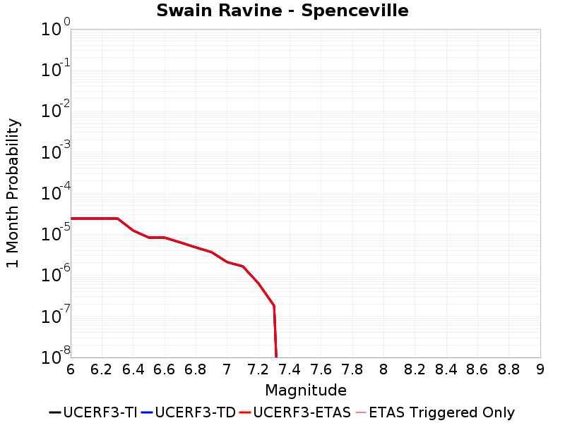 | 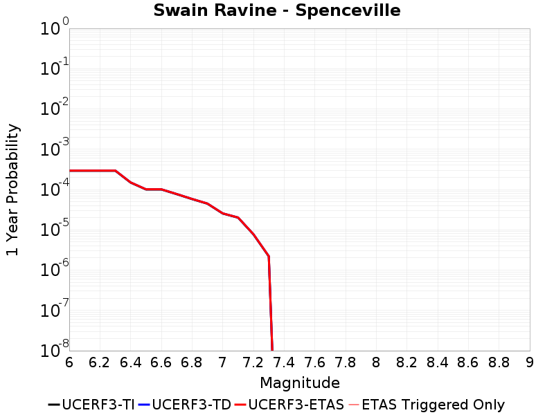 |  |

| Magnitude | 1 wk TI Prob | 1 wk TD Prob | 1 wk ETAS Prob | 1 wk ETAS/TD Gain | 1 wk ETAS Triggered Only | 1 mo TI Prob | 1 mo TD Prob | 1 mo ETAS Prob | 1 mo ETAS/TD Gain | 1 mo ETAS Triggered Only | 1 yr TI Prob | 1 yr TD Prob | 1 yr ETAS Prob | 1 yr ETAS/TD Gain | 1 yr ETAS Triggered Only | 10 yr TI Prob | 10 yr TD Prob | 10 yr ETAS Prob | 10 yr ETAS/TD Gain | 10 yr ETAS Triggered Only |
|-----|-----|-----|-----|-----|-----|-----|-----|-----|-----|-----|-----|-----|-----|-----|-----|-----|-----|-----|-----|-----|
| 6.0 | 5.596169E-6 | 5.6647473E-6 | 5.6647473E-6 | 1.0 | 0.0 | 2.398336E-5 | 2.4277278E-5 | 2.4277278E-5 | 1.0 | 0.0 | 2.9195828E-4 | 2.9553848E-4 | 2.9553848E-4 | 1.0 | 0.0 | 0.00291575 | 0.002951724 | 0.0029616945 | 1.0033778 | 1.0E-5 |
| 6.1 | 5.596169E-6 | 5.6647473E-6 | 5.6647473E-6 | 1.0 | 0.0 | 2.398336E-5 | 2.4277278E-5 | 2.4277278E-5 | 1.0 | 0.0 | 2.9195828E-4 | 2.9553848E-4 | 2.9553848E-4 | 1.0 | 0.0 | 0.00291575 | 0.002951724 | 0.0029616945 | 1.0033778 | 1.0E-5 |
| 6.2 | 5.596169E-6 | 5.6647473E-6 | 5.6647473E-6 | 1.0 | 0.0 | 2.398336E-5 | 2.4277278E-5 | 2.4277278E-5 | 1.0 | 0.0 | 2.9195828E-4 | 2.9553848E-4 | 2.9553848E-4 | 1.0 | 0.0 | 0.00291575 | 0.002951724 | 0.0029616945 | 1.0033778 | 1.0E-5 |
| 6.3 | 5.596169E-6 | 5.6647473E-6 | 5.6647473E-6 | 1.0 | 0.0 | 2.398336E-5 | 2.4277278E-5 | 2.4277278E-5 | 1.0 | 0.0 | 2.9195828E-4 | 2.9553848E-4 | 2.9553848E-4 | 1.0 | 0.0 | 0.00291575 | 0.002951724 | 0.0029616945 | 1.0033778 | 1.0E-5 |
| 6.4 | 2.8426775E-6 | 2.874587E-6 | 2.874587E-6 | 1.0 | 0.0 | 1.2182847E-5 | 1.2319602E-5 | 1.2319602E-5 | 1.0 | 0.0 | 1.4831607E-4 | 1.4998122E-4 | 1.4998122E-4 | 1.0 | 0.0 | 0.0014821711 | 0.0014988384 | 0.0014988384 | 1.0 | 0.0 |
| 6.5 | 1.9210793E-6 | 1.9417007E-6 | 1.9417007E-6 | 1.0 | 0.0 | 8.233172E-6 | 8.321549E-6 | 8.321549E-6 | 1.0 | 0.0 | 1.0023425E-4 | 1.0131028E-4 | 1.0131028E-4 | 1.0 | 0.0 | 0.0010018905 | 0.0010126544 | 0.0010126544 | 1.0 | 0.0 |
| 6.6 | 1.9210793E-6 | 1.9417007E-6 | 1.9417007E-6 | 1.0 | 0.0 | 8.233172E-6 | 8.321549E-6 | 8.321549E-6 | 1.0 | 0.0 | 1.0023425E-4 | 1.0131028E-4 | 1.0131028E-4 | 1.0 | 0.0 | 0.0010018905 | 0.0010126544 | 0.0010126544 | 1.0 | 0.0 |
| 6.7 | 1.4667394E-6 | 1.4821064E-6 | 1.4821064E-6 | 1.0 | 0.0 | 6.286011E-6 | 6.3518696E-6 | 6.3518696E-6 | 1.0 | 0.0 | 7.65295E-5 | 7.733135E-5 | 7.733135E-5 | 1.0 | 0.0 | 7.6503144E-4 | 7.730521E-4 | 7.730521E-4 | 1.0 | 0.0 |
| 6.8 | 1.1076943E-6 | 1.1191117E-6 | 1.1191117E-6 | 1.0 | 0.0 | 4.747252E-6 | 4.796185E-6 | 4.796185E-6 | 1.0 | 0.0 | 5.7796264E-5 | 5.839203E-5 | 5.839203E-5 | 1.0 | 0.0 | 5.778124E-4 | 5.837713E-4 | 5.837713E-4 | 1.0 | 0.0 |
| 6.9 | 8.514296E-7 | 8.601301E-7 | 8.601301E-7 | 1.0 | 0.0 | 3.648979E-6 | 3.6862668E-6 | 3.6862668E-6 | 1.0 | 0.0 | 4.442541E-5 | 4.48794E-5 | 4.48794E-5 | 1.0 | 0.0 | 4.441653E-4 | 4.4870627E-4 | 4.4870627E-4 | 1.0 | 0.0 |
| 7.0 | 4.8544706E-7 | 4.903987E-7 | 4.903987E-7 | 1.0 | 0.0 | 2.0804857E-6 | 2.101707E-6 | 2.101707E-6 | 1.0 | 0.0 | 2.532962E-5 | 2.5587995E-5 | 2.5587995E-5 | 1.0 | 0.0 | 2.5326732E-4 | 2.558518E-4 | 2.558518E-4 | 1.0 | 0.0 |
| 7.1 | 3.829186E-7 | 3.8684223E-7 | 3.8684223E-7 | 1.0 | 0.0 | 1.6410787E-6 | 1.6578942E-6 | 1.6578942E-6 | 1.0 | 0.0 | 1.997995E-5 | 2.0184687E-5 | 2.0184687E-5 | 1.0 | 0.0 | 1.9978154E-4 | 2.0182959E-4 | 2.0182959E-4 | 1.0 | 0.0 |
| 7.2 | 1.4726595E-7 | 1.4881587E-7 | 1.4881587E-7 | 1.0 | 0.0 | 6.3113964E-7 | 6.377822E-7 | 6.377822E-7 | 1.0 | 0.0 | 7.684098E-6 | 7.764976E-6 | 7.764976E-6 | 1.0 | 0.0 | 7.6838325E-5 | 7.764758E-5 | 7.764758E-5 | 1.0 | 0.0 |
| 7.3 | 4.1880604E-8 | 4.2330548E-8 | 4.2330548E-8 | 1.0 | 0.0 | 1.7948828E-7 | 1.8141662E-7 | 1.8141662E-7 | 1.0 | 0.0 | 2.1852677E-6 | 2.2087474E-6 | 2.2087474E-6 | 1.0 | 0.0 | 2.1852462E-5 | 2.2087475E-5 | 2.2087475E-5 | 1.0 | 0.0 |

## Hunter Mountain-Saline Valley
*[(top)](#table-of-contents)*

| 1 Week | 1 Month | 1 Year | 10 Year |
|-----|-----|-----|-----|
| 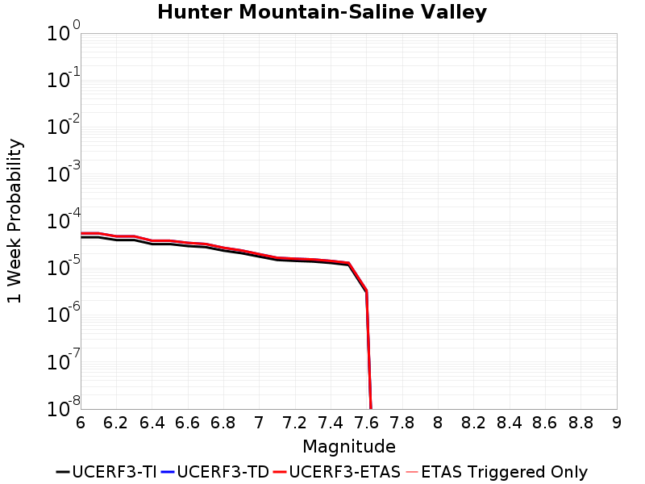 | 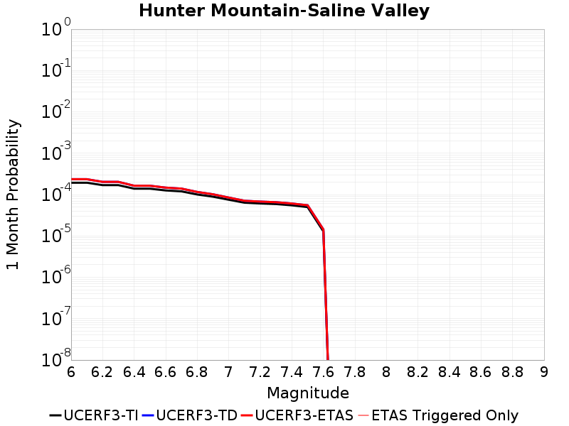 | 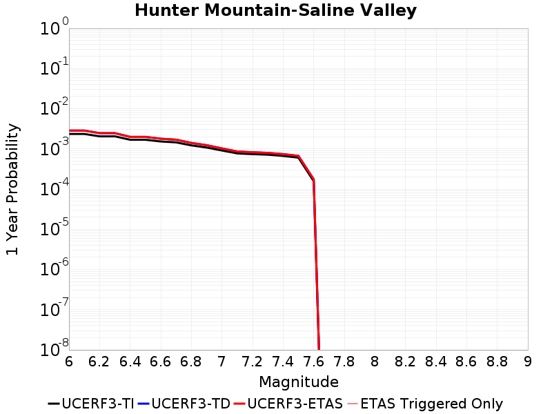 | 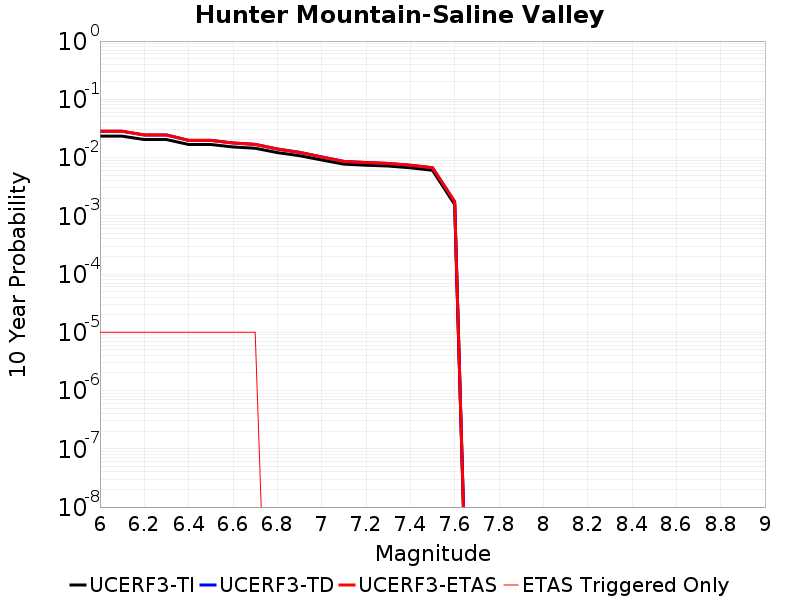 |

| Magnitude | 1 wk TI Prob | 1 wk TD Prob | 1 wk ETAS Prob | 1 wk ETAS/TD Gain | 1 wk ETAS Triggered Only | 1 mo TI Prob | 1 mo TD Prob | 1 mo ETAS Prob | 1 mo ETAS/TD Gain | 1 mo ETAS Triggered Only | 1 yr TI Prob | 1 yr TD Prob | 1 yr ETAS Prob | 1 yr ETAS/TD Gain | 1 yr ETAS Triggered Only | 10 yr TI Prob | 10 yr TD Prob | 10 yr ETAS Prob | 10 yr ETAS/TD Gain | 10 yr ETAS Triggered Only |
|-----|-----|-----|-----|-----|-----|-----|-----|-----|-----|-----|-----|-----|-----|-----|-----|-----|-----|-----|-----|-----|
| 6.0 | 4.5103672E-5 | 5.4754095E-5 | 5.4754095E-5 | 1.0 | 0.0 | 1.9328714E-4 | 2.3464052E-4 | 2.3464052E-4 | 1.0 | 0.0 | 0.002350731 | 0.0028531791 | 0.0028531791 | 1.0 | 0.0 | 0.023260195 | 0.02818589 | 0.028195607 | 1.0003448 | 1.0E-5 |
| 6.1 | 4.5103672E-5 | 5.4754095E-5 | 5.4754095E-5 | 1.0 | 0.0 | 1.9328714E-4 | 2.3464052E-4 | 2.3464052E-4 | 1.0 | 0.0 | 0.002350731 | 0.0028531791 | 0.0028531791 | 1.0 | 0.0 | 0.023260195 | 0.02818589 | 0.028195607 | 1.0003448 | 1.0E-5 |
| 6.2 | 3.9363465E-5 | 4.72167E-5 | 4.72167E-5 | 1.0 | 0.0 | 1.6868966E-4 | 2.0234247E-4 | 2.0234247E-4 | 1.0 | 0.0 | 0.002051862 | 0.0024608728 | 0.0024608728 | 1.0 | 0.0 | 0.020330196 | 0.024352124 | 0.02436188 | 1.0004007 | 1.0E-5 |
| 6.3 | 3.9363465E-5 | 4.72167E-5 | 4.72167E-5 | 1.0 | 0.0 | 1.6868966E-4 | 2.0234247E-4 | 2.0234247E-4 | 1.0 | 0.0 | 0.002051862 | 0.0024608728 | 0.0024608728 | 1.0 | 0.0 | 0.020330196 | 0.024352124 | 0.02436188 | 1.0004007 | 1.0E-5 |
| 6.4 | 3.2311684E-5 | 3.8069076E-5 | 3.8069076E-5 | 1.0 | 0.0 | 1.384713E-4 | 1.6314338E-4 | 1.6314338E-4 | 1.0 | 0.0 | 0.0016845843 | 0.00198453 | 0.00198453 | 1.0 | 0.0 | 0.016718714 | 0.01967705 | 0.019686854 | 1.0004982 | 1.0E-5 |
| 6.5 | 3.2311684E-5 | 3.8069076E-5 | 3.8069076E-5 | 1.0 | 0.0 | 1.384713E-4 | 1.6314338E-4 | 1.6314338E-4 | 1.0 | 0.0 | 0.0016845843 | 0.00198453 | 0.00198453 | 1.0 | 0.0 | 0.016718714 | 0.01967705 | 0.019686854 | 1.0004982 | 1.0E-5 |
| 6.6 | 2.9305844E-5 | 3.4286717E-5 | 3.4286717E-5 | 1.0 | 0.0 | 1.2559042E-4 | 1.4693516E-4 | 1.4693516E-4 | 1.0 | 0.0 | 0.0015279909 | 0.0017875294 | 0.0017875294 | 1.0 | 0.0 | 0.015175272 | 0.017739639 | 0.01774946 | 1.0005537 | 1.0E-5 |
| 6.7 | 2.7826512E-5 | 3.2442953E-5 | 3.2442953E-5 | 1.0 | 0.0 | 1.19251024E-4 | 1.3903415E-4 | 1.3903415E-4 | 1.0 | 0.0 | 0.0014509142 | 0.001691487 | 0.001691487 | 1.0 | 0.0 | 0.014414776 | 0.016794033 | 0.016803866 | 1.0005854 | 1.0E-5 |
| 6.8 | 2.3389874E-5 | 2.6947433E-5 | 2.6947433E-5 | 1.0 | 0.0 | 1.0023846E-4 | 1.1548415E-4 | 1.1548415E-4 | 1.0 | 0.0 | 0.00121972 | 0.0014051603 | 0.0014051603 | 1.0 | 0.0 | 0.01213047 | 0.01396918 | 0.01396918 | 1.0 | 0.0 |
| 6.9 | 2.069209E-5 | 2.3640527E-5 | 2.3640527E-5 | 1.0 | 0.0 | 8.867737E-5 | 1.0131282E-4 | 1.0131282E-4 | 1.0 | 0.0 | 0.0010791123 | 0.001232822 | 0.001232822 | 1.0 | 0.0 | 0.010738871 | 0.012265065 | 0.012265065 | 1.0 | 0.0 |
| 7.0 | 1.7462342E-5 | 1.9692012E-5 | 1.9692012E-5 | 1.0 | 0.0 | 7.483646E-5 | 8.439174E-5 | 8.439174E-5 | 1.0 | 0.0 | 9.1075303E-4 | 0.0010270078 | 0.0010270078 | 1.0 | 0.0 | 0.009070295 | 0.010226448 | 0.010226448 | 1.0 | 0.0 |
| 7.1 | 1.4807709E-5 | 1.64912E-5 | 1.64912E-5 | 1.0 | 0.0 | 6.3460066E-5 | 7.067475E-5 | 7.067475E-5 | 1.0 | 0.0 | 7.723524E-4 | 8.60142E-4 | 8.60142E-4 | 1.0 | 0.0 | 0.007696735 | 0.00857131 | 0.00857131 | 1.0 | 0.0 |
| 7.2 | 1.4180048E-5 | 1.5745878E-5 | 1.5745878E-5 | 1.0 | 0.0 | 6.077022E-5 | 6.748068E-5 | 6.748068E-5 | 1.0 | 0.0 | 7.396263E-4 | 8.212839E-4 | 8.212839E-4 | 1.0 | 0.0 | 0.0073716943 | 0.008185633 | 0.008185633 | 1.0 | 0.0 |
| 7.3 | 1.3730402E-5 | 1.5218197E-5 | 1.5218197E-5 | 1.0 | 0.0 | 5.8843252E-5 | 6.5219305E-5 | 6.5219305E-5 | 1.0 | 0.0 | 7.161811E-4 | 7.9377193E-4 | 7.9377193E-4 | 1.0 | 0.0 | 0.007138774 | 0.007912494 | 0.007912494 | 1.0 | 0.0 |
| 7.4 | 1.2810095E-5 | 1.4152371E-5 | 1.4152371E-5 | 1.0 | 0.0 | 5.489925E-5 | 6.0651695E-5 | 6.0651695E-5 | 1.0 | 0.0 | 6.681934E-4 | 7.382001E-4 | 7.382001E-4 | 1.0 | 0.0 | 0.006661878 | 0.0073605697 | 0.0073605697 | 1.0 | 0.0 |
| 7.5 | 1.1595659E-5 | 1.2841074E-5 | 1.2841074E-5 | 1.0 | 0.0 | 4.9694736E-5 | 5.5032102E-5 | 5.5032102E-5 | 1.0 | 0.0 | 6.0486543E-4 | 6.6982565E-4 | 6.6982565E-4 | 1.0 | 0.0 | 0.006032217 | 0.0066811326 | 0.0066811326 | 1.0 | 0.0 |
| 7.6 | 2.997694E-6 | 3.3395472E-6 | 3.3395472E-6 | 1.0 | 0.0 | 1.28471975E-5 | 1.4312309E-5 | 1.4312309E-5 | 1.0 | 0.0 | 1.564034E-4 | 1.7424577E-4 | 1.7424577E-4 | 1.0 | 0.0 | 0.0015629337 | 0.0017430254 | 0.0017430254 | 1.0 | 0.0 |

## Pinto Mtn
*[(top)](#table-of-contents)*

| 1 Week | 1 Month | 1 Year | 10 Year |
|-----|-----|-----|-----|
| 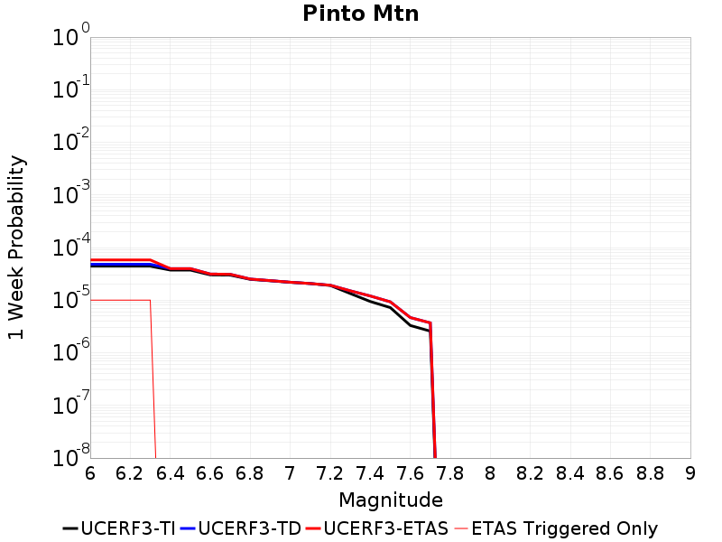 | 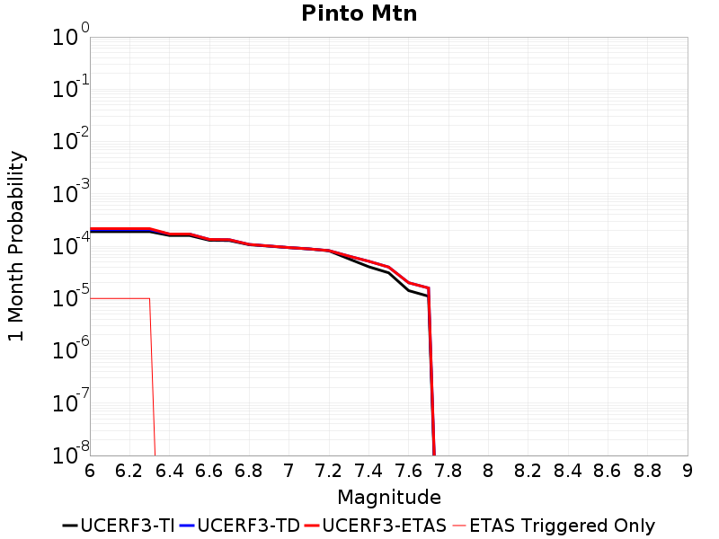 |  | 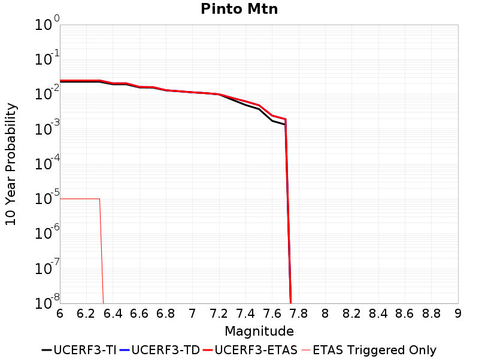 |

| Magnitude | 1 wk TI Prob | 1 wk TD Prob | 1 wk ETAS Prob | 1 wk ETAS/TD Gain | 1 wk ETAS Triggered Only | 1 mo TI Prob | 1 mo TD Prob | 1 mo ETAS Prob | 1 mo ETAS/TD Gain | 1 mo ETAS Triggered Only | 1 yr TI Prob | 1 yr TD Prob | 1 yr ETAS Prob | 1 yr ETAS/TD Gain | 1 yr ETAS Triggered Only | 10 yr TI Prob | 10 yr TD Prob | 10 yr ETAS Prob | 10 yr ETAS/TD Gain | 10 yr ETAS Triggered Only |
|-----|-----|-----|-----|-----|-----|-----|-----|-----|-----|-----|-----|-----|-----|-----|-----|-----|-----|-----|-----|-----|
| 6.0 | 4.4194956E-5 | 4.806253E-5 | 5.806205E-5 | 1.2080523 | 1.0E-5 | 1.893932E-4 | 2.0596695E-4 | 2.1596489E-4 | 1.0485414 | 1.0E-5 | 0.0023034236 | 0.002504928 | 0.002514903 | 1.0039822 | 1.0E-5 | 0.022796938 | 0.024784548 | 0.0247943 | 1.0003935 | 1.0E-5 |
| 6.1 | 4.4194956E-5 | 4.806253E-5 | 5.806205E-5 | 1.2080523 | 1.0E-5 | 1.893932E-4 | 2.0596695E-4 | 2.1596489E-4 | 1.0485414 | 1.0E-5 | 0.0023034236 | 0.002504928 | 0.002514903 | 1.0039822 | 1.0E-5 | 0.022796938 | 0.024784548 | 0.0247943 | 1.0003935 | 1.0E-5 |
| 6.2 | 4.4194956E-5 | 4.806253E-5 | 5.806205E-5 | 1.2080523 | 1.0E-5 | 1.893932E-4 | 2.0596695E-4 | 2.1596489E-4 | 1.0485414 | 1.0E-5 | 0.0023034236 | 0.002504928 | 0.002514903 | 1.0039822 | 1.0E-5 | 0.022796938 | 0.024784548 | 0.0247943 | 1.0003935 | 1.0E-5 |
| 6.3 | 4.4194956E-5 | 4.806253E-5 | 5.806205E-5 | 1.2080523 | 1.0E-5 | 1.893932E-4 | 2.0596695E-4 | 2.1596489E-4 | 1.0485414 | 1.0E-5 | 0.0023034236 | 0.002504928 | 0.002514903 | 1.0039822 | 1.0E-5 | 0.022796938 | 0.024784548 | 0.0247943 | 1.0003935 | 1.0E-5 |
| 6.4 | 3.729929E-5 | 3.9789506E-5 | 3.9789506E-5 | 1.0 | 0.0 | 1.5984432E-4 | 1.7051584E-4 | 1.7051584E-4 | 1.0 | 0.0 | 0.0019443673 | 0.0020741473 | 0.0020741473 | 1.0 | 0.0 | 0.019274427 | 0.020557972 | 0.020557972 | 1.0 | 0.0 |
| 6.5 | 3.729929E-5 | 3.9789506E-5 | 3.9789506E-5 | 1.0 | 0.0 | 1.5984432E-4 | 1.7051584E-4 | 1.7051584E-4 | 1.0 | 0.0 | 0.0019443673 | 0.0020741473 | 0.0020741473 | 1.0 | 0.0 | 0.019274427 | 0.020557972 | 0.020557972 | 1.0 | 0.0 |
| 6.6 | 3.0204548E-5 | 3.1370088E-5 | 3.1370088E-5 | 1.0 | 0.0 | 1.2944164E-4 | 1.344365E-4 | 1.344365E-4 | 1.0 | 0.0 | 0.0015748127 | 0.0016355704 | 0.0016355704 | 1.0 | 0.0 | 0.015636992 | 0.016239226 | 0.016239226 | 1.0 | 0.0 |
| 6.7 | 2.9857754E-5 | 3.0978787E-5 | 3.0978787E-5 | 1.0 | 0.0 | 1.2795553E-4 | 1.3275965E-4 | 1.3275965E-4 | 1.0 | 0.0 | 0.0015567453 | 0.0016151853 | 0.0016151853 | 1.0 | 0.0 | 0.015458848 | 0.01603833 | 0.01603833 | 1.0 | 0.0 |
| 6.8 | 2.4819734E-5 | 2.5161075E-5 | 2.5161075E-5 | 1.0 | 0.0 | 1.0636595E-4 | 1.0782884E-4 | 1.0782884E-4 | 1.0 | 0.0 | 0.0012942362 | 0.0013120472 | 0.0013120472 | 1.0 | 0.0 | 0.012867244 | 0.013045396 | 0.013045396 | 1.0 | 0.0 |
| 6.9 | 2.331124E-5 | 2.3486818E-5 | 2.3486818E-5 | 1.0 | 0.0 | 9.990149E-5 | 1.00654026E-4 | 1.00654026E-4 | 1.0 | 0.0 | 0.001215622 | 0.0012247943 | 0.0012247943 | 1.0 | 0.0 | 0.012089936 | 0.012182651 | 0.012182651 | 1.0 | 0.0 |
| 7.0 | 2.1818534E-5 | 2.1907348E-5 | 2.1907348E-5 | 1.0 | 0.0 | 9.3504656E-5 | 9.388536E-5 | 9.388536E-5 | 1.0 | 0.0 | 0.0011378246 | 0.0011424749 | 0.0011424749 | 1.0 | 0.0 | 0.011320163 | 0.011368135 | 0.011368135 | 1.0 | 0.0 |
| 7.1 | 2.066081E-5 | 2.0683807E-5 | 2.0683807E-5 | 1.0 | 0.0 | 8.854332E-5 | 8.864198E-5 | 8.864198E-5 | 1.0 | 0.0 | 0.0010774818 | 0.0010787016 | 0.0010787016 | 1.0 | 0.0 | 0.010722724 | 0.010736723 | 0.010736723 | 1.0 | 0.0 |
| 7.2 | 1.8990233E-5 | 1.9194615E-5 | 1.9194615E-5 | 1.0 | 0.0 | 8.138417E-5 | 8.226014E-5 | 8.226014E-5 | 1.0 | 0.0 | 9.904018E-4 | 0.0010010767 | 0.0010010767 | 1.0 | 0.0 | 0.009859995 | 0.009967687 | 0.009967687 | 1.0 | 0.0 |
| 7.3 | 1.3335872E-5 | 1.5038931E-5 | 1.5038931E-5 | 1.0 | 0.0 | 5.7152483E-5 | 6.4451044E-5 | 6.4451044E-5 | 1.0 | 0.0 | 6.956093E-4 | 7.844218E-4 | 7.844218E-4 | 1.0 | 0.0 | 0.006934359 | 0.007817842 | 0.007817842 | 1.0 | 0.0 |
| 7.4 | 9.414066E-6 | 1.1987236E-5 | 1.1987236E-5 | 1.0 | 0.0 | 4.0345374E-5 | 5.1372906E-5 | 5.1372906E-5 | 1.0 | 0.0 | 4.910942E-4 | 6.2529516E-4 | 6.2529516E-4 | 1.0 | 0.0 | 0.0049001034 | 0.006236317 | 0.006236317 | 1.0 | 0.0 |
| 7.5 | 7.2101157E-6 | 9.280151E-6 | 9.280151E-6 | 1.0 | 0.0 | 3.090013E-5 | 3.9771512E-5 | 3.9771512E-5 | 1.0 | 0.0 | 3.7614413E-4 | 4.841185E-4 | 4.841185E-4 | 1.0 | 0.0 | 0.0037550807 | 0.004831424 | 0.004831424 | 1.0 | 0.0 |
| 7.6 | 3.296375E-6 | 4.6637824E-6 | 4.6637824E-6 | 1.0 | 0.0 | 1.4127245E-5 | 1.9987494E-5 | 1.9987494E-5 | 1.0 | 0.0 | 1.7198564E-4 | 2.4332204E-4 | 2.4332204E-4 | 1.0 | 0.0 | 0.0017185259 | 0.0024307026 | 0.0024307026 | 1.0 | 0.0 |
| 7.7 | 2.5741092E-6 | 3.6965218E-6 | 3.6965218E-6 | 1.0 | 0.0 | 1.103185E-5 | 1.5842148E-5 | 1.5842148E-5 | 1.0 | 0.0 | 1.3430449E-4 | 1.9286248E-4 | 1.9286248E-4 | 1.0 | 0.0 | 0.0013422335 | 0.0019270899 | 0.0019270899 | 1.0 | 0.0 |

## Surprise Valley 2011 CFM
*[(top)](#table-of-contents)*

| 1 Week | 1 Month | 1 Year | 10 Year |
|-----|-----|-----|-----|
|  |  |  | 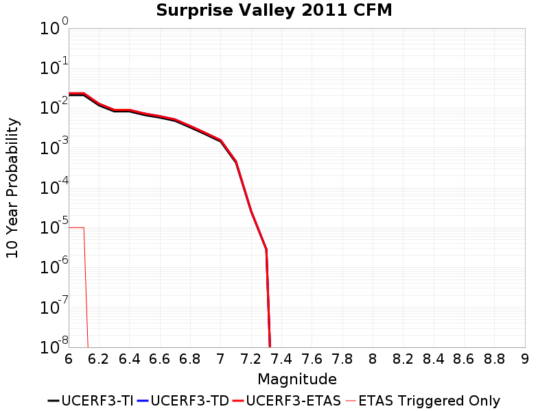 |

| Magnitude | 1 wk TI Prob | 1 wk TD Prob | 1 wk ETAS Prob | 1 wk ETAS/TD Gain | 1 wk ETAS Triggered Only | 1 mo TI Prob | 1 mo TD Prob | 1 mo ETAS Prob | 1 mo ETAS/TD Gain | 1 mo ETAS Triggered Only | 1 yr TI Prob | 1 yr TD Prob | 1 yr ETAS Prob | 1 yr ETAS/TD Gain | 1 yr ETAS Triggered Only | 10 yr TI Prob | 10 yr TD Prob | 10 yr ETAS Prob | 10 yr ETAS/TD Gain | 10 yr ETAS Triggered Only |
|-----|-----|-----|-----|-----|-----|-----|-----|-----|-----|-----|-----|-----|-----|-----|-----|-----|-----|-----|-----|-----|
| 6.0 | 4.0396248E-5 | 4.4920707E-5 | 5.4920256E-5 | 1.2226045 | 1.0E-5 | 1.7311527E-4 | 1.9250429E-4 | 2.0250237E-4 | 1.0519369 | 1.0E-5 | 0.002105641 | 0.002341431 | 0.0023514077 | 1.0042609 | 1.0E-5 | 0.020858008 | 0.023189424 | 0.023199191 | 1.0004213 | 1.0E-5 |
| 6.1 | 4.0396248E-5 | 4.4920707E-5 | 5.4920256E-5 | 1.2226045 | 1.0E-5 | 1.7311527E-4 | 1.9250429E-4 | 2.0250237E-4 | 1.0519369 | 1.0E-5 | 0.002105641 | 0.002341431 | 0.0023514077 | 1.0042609 | 1.0E-5 | 0.020858008 | 0.023189424 | 0.023199191 | 1.0004213 | 1.0E-5 |
| 6.2 | 2.2295266E-5 | 2.4433511E-5 | 2.4433511E-5 | 1.0 | 0.0 | 9.554764E-5 | 1.0471102E-4 | 1.0471102E-4 | 1.0 | 0.0 | 0.0011626717 | 0.001274142 | 0.001274142 | 1.0 | 0.0 | 0.011566074 | 0.012671612 | 0.012671612 | 1.0 | 0.0 |
| 6.3 | 1.572643E-5 | 1.7117636E-5 | 1.7117636E-5 | 1.0 | 0.0 | 6.7397246E-5 | 7.33593E-5 | 7.33593E-5 | 1.0 | 0.0 | 8.202525E-4 | 8.9279393E-4 | 8.9279393E-4 | 1.0 | 0.0 | 0.008172315 | 0.008893182 | 0.008893182 | 1.0 | 0.0 |
| 6.4 | 1.5714395E-5 | 1.7105456E-5 | 1.7105456E-5 | 1.0 | 0.0 | 6.734567E-5 | 7.33071E-5 | 7.33071E-5 | 1.0 | 0.0 | 8.1962504E-4 | 8.9215895E-4 | 8.9215895E-4 | 1.0 | 0.0 | 0.008166086 | 0.008886883 | 0.008886883 | 1.0 | 0.0 |
| 6.5 | 1.2733495E-5 | 1.381778E-5 | 1.381778E-5 | 1.0 | 0.0 | 5.457098E-5 | 5.9217753E-5 | 5.9217753E-5 | 1.0 | 0.0 | 6.641992E-4 | 7.207443E-4 | 7.207443E-4 | 1.0 | 0.0 | 0.0066221743 | 0.0071847634 | 0.0071847634 | 1.0 | 0.0 |
| 6.6 | 1.0983784E-5 | 1.1900207E-5 | 1.1900207E-5 | 1.0 | 0.0 | 4.7072506E-5 | 5.0999923E-5 | 5.0999923E-5 | 1.0 | 0.0 | 5.7295704E-4 | 6.207525E-4 | 6.207525E-4 | 1.0 | 0.0 | 0.0057148207 | 0.0061907363 | 0.0061907363 | 1.0 | 0.0 |
| 6.7 | 9.104806E-6 | 9.850588E-6 | 9.850588E-6 | 1.0 | 0.0 | 3.902001E-5 | 4.2216143E-5 | 4.2216143E-5 | 1.0 | 0.0 | 4.7496508E-4 | 5.138643E-4 | 5.138643E-4 | 1.0 | 0.0 | 0.004739512 | 0.0051271585 | 0.0051271585 | 1.0 | 0.0 |
| 6.8 | 6.2162403E-6 | 6.711493E-6 | 6.711493E-6 | 1.0 | 0.0 | 2.6640759E-5 | 2.8763236E-5 | 2.8763236E-5 | 1.0 | 0.0 | 3.2430296E-4 | 3.5013838E-4 | 3.5013838E-4 | 1.0 | 0.0 | 0.003238301 | 0.0034960909 | 0.0034960909 | 1.0 | 0.0 |
| 6.9 | 4.1792696E-6 | 4.5081165E-6 | 4.5081165E-6 | 1.0 | 0.0 | 1.7911032E-5 | 1.9320365E-5 | 1.9320365E-5 | 1.0 | 0.0 | 2.1804498E-4 | 2.3520162E-4 | 2.3520162E-4 | 1.0 | 0.0 | 0.0021783116 | 0.0023496805 | 0.0023496805 | 1.0 | 0.0 |
| 7.0 | 2.7478413E-6 | 2.9654798E-6 | 2.9654798E-6 | 1.0 | 0.0 | 1.177641E-5 | 1.2709144E-5 | 1.2709144E-5 | 1.0 | 0.0 | 1.4336836E-4 | 1.547241E-4 | 1.547241E-4 | 1.0 | 0.0 | 0.001432759 | 0.0015462865 | 0.0015462865 | 1.0 | 0.0 |
| 7.1 | 8.128648E-7 | 8.733932E-7 | 8.733932E-7 | 1.0 | 0.0 | 3.4837017E-6 | 3.7431116E-6 | 3.7431116E-6 | 1.0 | 0.0 | 4.2413245E-5 | 4.5572033E-5 | 4.5572033E-5 | 1.0 | 0.0 | 4.2405148E-4 | 4.5568583E-4 | 4.5568583E-4 | 1.0 | 0.0 |
| 7.2 | 4.8641045E-8 | 4.941283E-8 | 4.941283E-8 | 1.0 | 0.0 | 2.084616E-7 | 2.1176925E-7 | 2.1176925E-7 | 1.0 | 0.0 | 2.538017E-6 | 2.5782876E-6 | 2.5782876E-6 | 1.0 | 0.0 | 2.537988E-5 | 2.5782589E-5 | 2.5782589E-5 | 1.0 | 0.0 |
| 7.3 | 5.3911844E-9 | 5.477011E-9 | 5.477011E-9 | 1.0 | 0.0 | 2.3105075E-8 | 2.3472904E-8 | 2.3472904E-8 | 1.0 | 0.0 | 2.8130427E-7 | 2.8578256E-7 | 2.8578256E-7 | 1.0 | 0.0 | 2.8130391E-6 | 2.8578236E-6 | 2.8578236E-6 | 1.0 | 0.0 |

## Great Valley 04b Gordon Valley
*[(top)](#table-of-contents)*

| 1 Week | 1 Month | 1 Year | 10 Year |
|-----|-----|-----|-----|
|  |  |  | 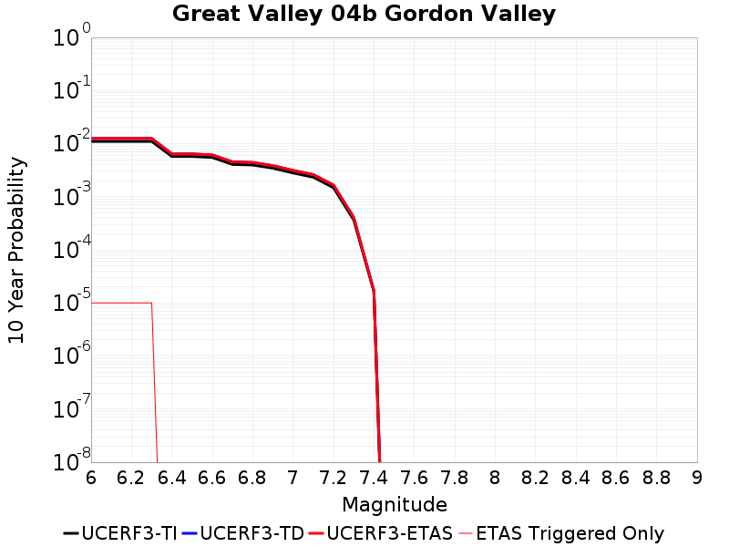 |

| Magnitude | 1 wk TI Prob | 1 wk TD Prob | 1 wk ETAS Prob | 1 wk ETAS/TD Gain | 1 wk ETAS Triggered Only | 1 mo TI Prob | 1 mo TD Prob | 1 mo ETAS Prob | 1 mo ETAS/TD Gain | 1 mo ETAS Triggered Only | 1 yr TI Prob | 1 yr TD Prob | 1 yr ETAS Prob | 1 yr ETAS/TD Gain | 1 yr ETAS Triggered Only | 10 yr TI Prob | 10 yr TD Prob | 10 yr ETAS Prob | 10 yr ETAS/TD Gain | 10 yr ETAS Triggered Only |
|-----|-----|-----|-----|-----|-----|-----|-----|-----|-----|-----|-----|-----|-----|-----|-----|-----|-----|-----|-----|-----|
| 6.0 | 2.1181217E-5 | 2.40263E-5 | 2.40263E-5 | 1.0 | 0.0 | 9.077348E-5 | 1.0296673E-4 | 1.129657E-4 | 1.0971087 | 1.0E-5 | 0.0011046068 | 0.0012530664 | 0.0012630539 | 1.0079705 | 1.0E-5 | 0.010991322 | 0.012476527 | 0.012486402 | 1.0007915 | 1.0E-5 |
| 6.1 | 2.1181217E-5 | 2.40263E-5 | 2.40263E-5 | 1.0 | 0.0 | 9.077348E-5 | 1.0296673E-4 | 1.129657E-4 | 1.0971087 | 1.0E-5 | 0.0011046068 | 0.0012530664 | 0.0012630539 | 1.0079705 | 1.0E-5 | 0.010991322 | 0.012476527 | 0.012486402 | 1.0007915 | 1.0E-5 |
| 6.2 | 2.1181217E-5 | 2.40263E-5 | 2.40263E-5 | 1.0 | 0.0 | 9.077348E-5 | 1.0296673E-4 | 1.129657E-4 | 1.0971087 | 1.0E-5 | 0.0011046068 | 0.0012530664 | 0.0012630539 | 1.0079705 | 1.0E-5 | 0.010991322 | 0.012476527 | 0.012486402 | 1.0007915 | 1.0E-5 |
| 6.3 | 2.1181217E-5 | 2.40263E-5 | 2.40263E-5 | 1.0 | 0.0 | 9.077348E-5 | 1.0296673E-4 | 1.129657E-4 | 1.0971087 | 1.0E-5 | 0.0011046068 | 0.0012530664 | 0.0012630539 | 1.0079705 | 1.0E-5 | 0.010991322 | 0.012476527 | 0.012486402 | 1.0007915 | 1.0E-5 |
| 6.4 | 1.0988268E-5 | 1.2274198E-5 | 1.2274198E-5 | 1.0 | 0.0 | 4.7091726E-5 | 5.2602732E-5 | 5.2602732E-5 | 1.0 | 0.0 | 5.731909E-4 | 6.4026605E-4 | 6.4026605E-4 | 1.0 | 0.0 | 0.005717147 | 0.0063858065 | 0.0063858065 | 1.0 | 0.0 |
| 6.5 | 1.0988268E-5 | 1.2274198E-5 | 1.2274198E-5 | 1.0 | 0.0 | 4.7091726E-5 | 5.2602732E-5 | 5.2602732E-5 | 1.0 | 0.0 | 5.731909E-4 | 6.4026605E-4 | 6.4026605E-4 | 1.0 | 0.0 | 0.005717147 | 0.0063858065 | 0.0063858065 | 1.0 | 0.0 |
| 6.6 | 1.0517822E-5 | 1.1742817E-5 | 1.1742817E-5 | 1.0 | 0.0 | 4.5075605E-5 | 5.0325478E-5 | 5.0325478E-5 | 1.0 | 0.0 | 5.4865726E-4 | 6.125561E-4 | 6.125561E-4 | 1.0 | 0.0 | 0.0054730466 | 0.0061102356 | 0.0061102356 | 1.0 | 0.0 |
| 6.7 | 7.789219E-6 | 8.691453E-6 | 8.691453E-6 | 1.0 | 0.0 | 3.3381937E-5 | 3.7248585E-5 | 3.7248585E-5 | 1.0 | 0.0 | 4.063493E-4 | 4.5341233E-4 | 4.5341233E-4 | 1.0 | 0.0 | 0.004056071 | 0.0045253914 | 0.0045253914 | 1.0 | 0.0 |
| 6.8 | 7.5850853E-6 | 8.465873E-6 | 8.465873E-6 | 1.0 | 0.0 | 3.2507105E-5 | 3.628184E-5 | 3.628184E-5 | 1.0 | 0.0 | 3.957021E-4 | 4.41647E-4 | 4.41647E-4 | 1.0 | 0.0 | 0.0039499826 | 0.0044082073 | 0.0044082073 | 1.0 | 0.0 |
| 6.9 | 6.604105E-6 | 7.370279E-6 | 7.370279E-6 | 1.0 | 0.0 | 2.8303E-5 | 3.158655E-5 | 3.158655E-5 | 1.0 | 0.0 | 3.4453452E-4 | 3.845023E-4 | 3.845023E-4 | 1.0 | 0.0 | 0.0034400085 | 0.003838758 | 0.003838758 | 1.0 | 0.0 |
| 7.0 | 5.3701115E-6 | 5.998041E-6 | 5.998041E-6 | 1.0 | 0.0 | 2.301456E-5 | 2.5705654E-5 | 2.5705654E-5 | 1.0 | 0.0 | 2.8016625E-4 | 3.1292433E-4 | 3.1292433E-4 | 1.0 | 0.0 | 0.0027981328 | 0.0031251265 | 0.0031251265 | 1.0 | 0.0 |
| 7.1 | 4.4685607E-6 | 4.994546E-6 | 4.994546E-6 | 1.0 | 0.0 | 1.9150835E-5 | 2.1405036E-5 | 2.1405036E-5 | 1.0 | 0.0 | 2.3313647E-4 | 2.6057762E-4 | 2.6057762E-4 | 1.0 | 0.0 | 0.0023289204 | 0.0026029665 | 0.0026029665 | 1.0 | 0.0 |
| 7.2 | 2.833378E-6 | 3.1695843E-6 | 3.1695843E-6 | 1.0 | 0.0 | 1.2142991E-5 | 1.3583872E-5 | 1.3583872E-5 | 1.0 | 0.0 | 1.4783088E-4 | 1.6537284E-4 | 1.6537284E-4 | 1.0 | 0.0 | 0.0014773258 | 0.0016526702 | 0.0016526702 | 1.0 | 0.0 |
| 7.3 | 7.0087293E-7 | 7.7847176E-7 | 7.7847176E-7 | 1.0 | 0.0 | 3.0037377E-6 | 3.3363058E-6 | 3.3363058E-6 | 1.0 | 0.0 | 3.656989E-5 | 4.0619227E-5 | 4.0619227E-5 | 1.0 | 0.0 | 3.6563876E-4 | 4.0616313E-4 | 4.0616313E-4 | 1.0 | 0.0 |
| 7.4 | 3.112171E-8 | 3.2081957E-8 | 3.2081957E-8 | 1.0 | 0.0 | 1.3337875E-7 | 1.374941E-7 | 1.374941E-7 | 1.0 | 0.0 | 1.6238852E-6 | 1.6739895E-6 | 1.6739895E-6 | 1.0 | 0.0 | 1.6238733E-5 | 1.6739777E-5 | 1.6739777E-5 | 1.0 | 0.0 |

## Elsinore (Glen Ivy) rev
*[(top)](#table-of-contents)*

| 1 Week | 1 Month | 1 Year | 10 Year |
|-----|-----|-----|-----|
| 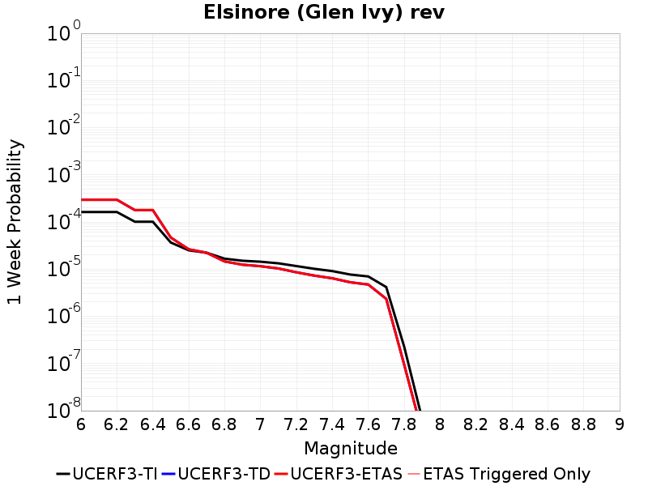 |  | 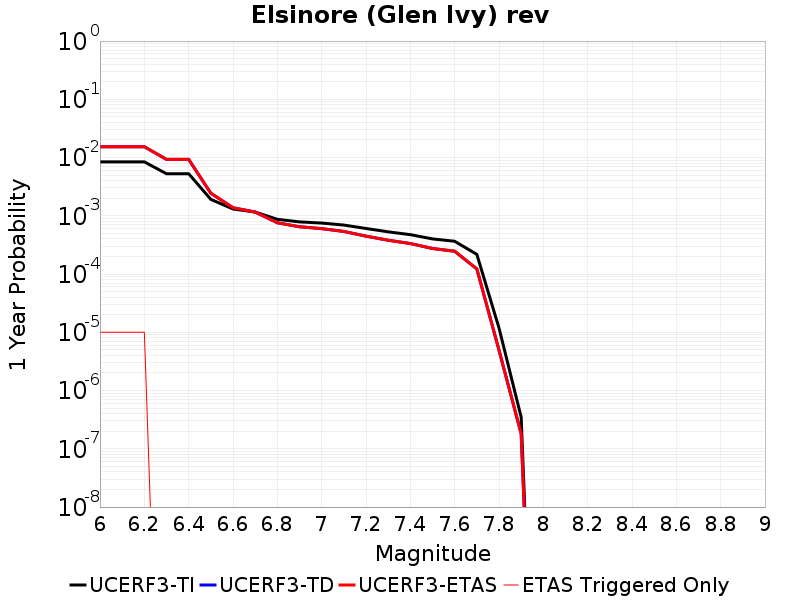 |  |

| Magnitude | 1 wk TI Prob | 1 wk TD Prob | 1 wk ETAS Prob | 1 wk ETAS/TD Gain | 1 wk ETAS Triggered Only | 1 mo TI Prob | 1 mo TD Prob | 1 mo ETAS Prob | 1 mo ETAS/TD Gain | 1 mo ETAS Triggered Only | 1 yr TI Prob | 1 yr TD Prob | 1 yr ETAS Prob | 1 yr ETAS/TD Gain | 1 yr ETAS Triggered Only | 10 yr TI Prob | 10 yr TD Prob | 10 yr ETAS Prob | 10 yr ETAS/TD Gain | 10 yr ETAS Triggered Only |
|-----|-----|-----|-----|-----|-----|-----|-----|-----|-----|-----|-----|-----|-----|-----|-----|-----|-----|-----|-----|-----|
| 6.0 | 1.6204086E-4 | 2.9537934E-4 | 2.9537934E-4 | 1.0 | 0.0 | 6.94276E-4 | 0.0012654369 | 0.0012654369 | 1.0 | 0.0 | 0.008420097 | 0.01531921 | 0.015329056 | 1.0006428 | 1.0E-5 | 0.081081145 | 0.14027978 | 0.14028837 | 1.0000613 | 1.0E-5 |
| 6.1 | 1.6204086E-4 | 2.9537934E-4 | 2.9537934E-4 | 1.0 | 0.0 | 6.94276E-4 | 0.0012654369 | 0.0012654369 | 1.0 | 0.0 | 0.008420097 | 0.01531921 | 0.015329056 | 1.0006428 | 1.0E-5 | 0.081081145 | 0.14027978 | 0.14028837 | 1.0000613 | 1.0E-5 |
| 6.2 | 1.6204086E-4 | 2.9537934E-4 | 2.9537934E-4 | 1.0 | 0.0 | 6.94276E-4 | 0.0012654369 | 0.0012654369 | 1.0 | 0.0 | 0.008420097 | 0.01531921 | 0.015329056 | 1.0006428 | 1.0E-5 | 0.081081145 | 0.14027978 | 0.14028837 | 1.0000613 | 1.0E-5 |
| 6.3 | 1.0111737E-4 | 1.7809341E-4 | 1.7809341E-4 | 1.0 | 0.0 | 4.332882E-4 | 7.6315214E-4 | 7.6315214E-4 | 1.0 | 0.0 | 0.005262531 | 0.009272714 | 0.009272714 | 1.0 | 0.0 | 0.0513964 | 0.08752726 | 0.08752726 | 1.0 | 0.0 |
| 6.4 | 1.0111737E-4 | 1.7809341E-4 | 1.7809341E-4 | 1.0 | 0.0 | 4.332882E-4 | 7.6315214E-4 | 7.6315214E-4 | 1.0 | 0.0 | 0.005262531 | 0.009272714 | 0.009272714 | 1.0 | 0.0 | 0.0513964 | 0.08752726 | 0.08752726 | 1.0 | 0.0 |
| 6.5 | 3.6624708E-5 | 4.6712783E-5 | 4.6712783E-5 | 1.0 | 0.0 | 1.569536E-4 | 2.0018428E-4 | 2.0018428E-4 | 1.0 | 0.0 | 0.001909235 | 0.0024348847 | 0.0024348847 | 1.0 | 0.0 | 0.01892915 | 0.023851387 | 0.023851387 | 1.0 | 0.0 |
| 6.6 | 2.5051324E-5 | 2.632951E-5 | 2.632951E-5 | 1.0 | 0.0 | 1.073584E-4 | 1.12836125E-4 | 1.12836125E-4 | 1.0 | 0.0 | 0.0013063047 | 0.0013729592 | 0.0013729592 | 1.0 | 0.0 | 0.012986525 | 0.013657555 | 0.013657555 | 1.0 | 0.0 |
| 6.7 | 2.2189772E-5 | 2.22077E-5 | 2.22077E-5 | 1.0 | 0.0 | 9.509556E-5 | 9.517259E-5 | 9.517259E-5 | 1.0 | 0.0 | 0.0011571734 | 0.0011581471 | 0.0011581471 | 1.0 | 0.0 | 0.011511663 | 0.011534951 | 0.011534951 | 1.0 | 0.0 |
| 6.8 | 1.6654378E-5 | 1.4523969E-5 | 1.4523969E-5 | 1.0 | 0.0 | 7.137396E-5 | 6.224413E-5 | 6.224413E-5 | 1.0 | 0.0 | 8.686314E-4 | 7.57564E-4 | 7.57564E-4 | 1.0 | 0.0 | 0.008652439 | 0.0075550904 | 0.0075550904 | 1.0 | 0.0 |
| 6.9 | 1.5042909E-5 | 1.2408081E-5 | 1.2408081E-5 | 1.0 | 0.0 | 6.446802E-5 | 5.317642E-5 | 5.317642E-5 | 1.0 | 0.0 | 7.8461546E-4 | 6.472338E-4 | 6.472338E-4 | 1.0 | 0.0 | 0.007818509 | 0.006457717 | 0.006457717 | 1.0 | 0.0 |
| 7.0 | 1.4361385E-5 | 1.1520667E-5 | 1.1520667E-5 | 1.0 | 0.0 | 6.154734E-5 | 4.9373368E-5 | 4.9373368E-5 | 1.0 | 0.0 | 7.490812E-4 | 6.0095795E-4 | 6.0095795E-4 | 1.0 | 0.0 | 0.007465612 | 0.0059973695 | 0.0059973695 | 1.0 | 0.0 |
| 7.1 | 1.3265571E-5 | 1.0308386E-5 | 1.0308386E-5 | 1.0 | 0.0 | 5.6851208E-5 | 4.4178065E-5 | 4.4178065E-5 | 1.0 | 0.0 | 6.919436E-4 | 5.3773774E-4 | 5.3773774E-4 | 1.0 | 0.0 | 0.006897931 | 0.0053678616 | 0.0053678616 | 1.0 | 0.0 |
| 7.2 | 1.1596403E-5 | 8.560054E-6 | 8.560054E-6 | 1.0 | 0.0 | 4.9697923E-5 | 3.668544E-5 | 3.668544E-5 | 1.0 | 0.0 | 6.049042E-4 | 4.465554E-4 | 4.465554E-4 | 1.0 | 0.0 | 0.006032603 | 0.004458018 | 0.004458018 | 1.0 | 0.0 |
| 7.3 | 1.0150827E-5 | 7.285358E-6 | 7.285358E-6 | 1.0 | 0.0 | 4.3502816E-5 | 3.1222597E-5 | 3.1222597E-5 | 1.0 | 0.0 | 5.2951806E-4 | 3.8007027E-4 | 3.8007027E-4 | 1.0 | 0.0 | 0.005282581 | 0.0037946054 | 0.0037946054 | 1.0 | 0.0 |
| 7.4 | 9.080705E-6 | 6.391134E-6 | 6.391134E-6 | 1.0 | 0.0 | 3.8916725E-5 | 2.7390293E-5 | 2.7390293E-5 | 1.0 | 0.0 | 4.7370812E-4 | 3.334272E-4 | 3.334272E-4 | 1.0 | 0.0 | 0.004726996 | 0.0033294219 | 0.0033294219 | 1.0 | 0.0 |
| 7.5 | 7.671649E-6 | 5.2566156E-6 | 5.2566156E-6 | 1.0 | 0.0 | 3.287808E-5 | 2.2528166E-5 | 2.2528166E-5 | 1.0 | 0.0 | 4.0021708E-4 | 2.7424717E-4 | 2.7424717E-4 | 1.0 | 0.0 | 0.0039949706 | 0.0027392134 | 0.0027392134 | 1.0 | 0.0 |
| 7.6 | 6.990086E-6 | 4.7128547E-6 | 4.7128547E-6 | 1.0 | 0.0 | 2.9957167E-5 | 2.0197798E-5 | 2.0197798E-5 | 1.0 | 0.0 | 3.6466747E-4 | 2.4588162E-4 | 2.4588162E-4 | 1.0 | 0.0 | 0.0036406964 | 0.002456213 | 0.002456213 | 1.0 | 0.0 |
| 7.7 | 4.163505E-6 | 2.3427285E-6 | 2.3427285E-6 | 1.0 | 0.0 | 1.7843471E-5 | 1.0040231E-5 | 1.0040231E-5 | 1.0 | 0.0 | 2.172226E-4 | 1.222337E-4 | 1.222337E-4 | 1.0 | 0.0 | 0.0021701038 | 0.0012217384 | 0.0012217384 | 1.0 | 0.0 |
| 7.8 | 2.2692414E-7 | 9.438255E-8 | 9.438255E-8 | 1.0 | 0.0 | 9.725317E-7 | 4.044966E-7 | 4.044966E-7 | 1.0 | 0.0 | 1.1840509E-5 | 4.9247383E-6 | 4.9247383E-6 | 1.0 | 0.0 | 1.1839878E-4 | 4.9246624E-5 | 4.9246624E-5 | 1.0 | 0.0 |
| 7.9 | 6.676829E-9 | 3.458379E-9 | 3.458379E-9 | 1.0 | 0.0 | 2.861498E-8 | 1.4821624E-8 | 1.4821624E-8 | 1.0 | 0.0 | 3.4838732E-7 | 1.8045326E-7 | 1.8045326E-7 | 1.0 | 0.0 | 3.4838679E-6 | 1.8045313E-6 | 1.8045313E-6 | 1.0 | 0.0 |

## Deep Springs
*[(top)](#table-of-contents)*

| 1 Week | 1 Month | 1 Year | 10 Year |
|-----|-----|-----|-----|
| 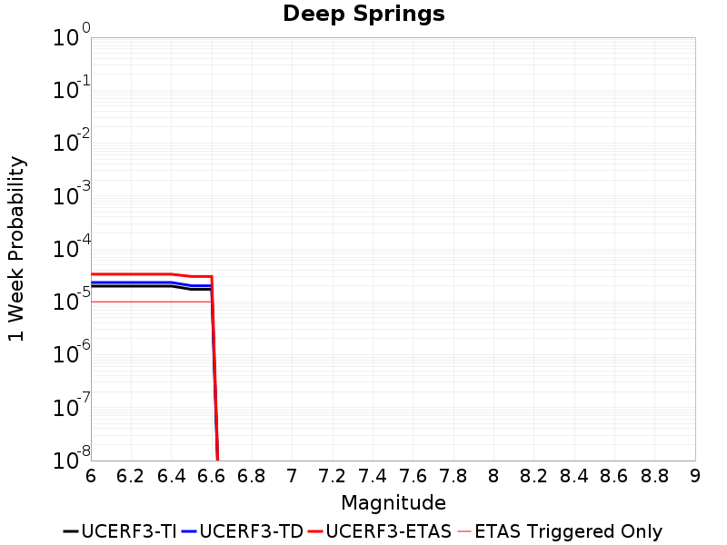 | 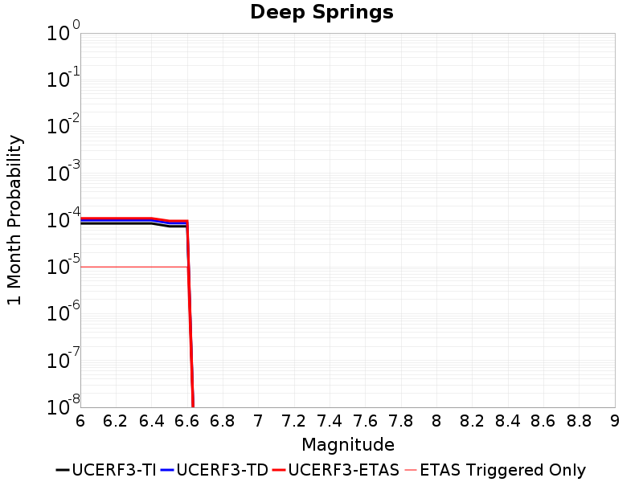 |  | 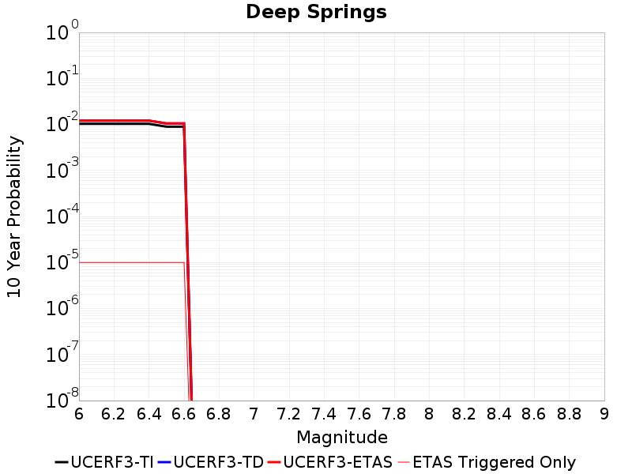 |

| Magnitude | 1 wk TI Prob | 1 wk TD Prob | 1 wk ETAS Prob | 1 wk ETAS/TD Gain | 1 wk ETAS Triggered Only | 1 mo TI Prob | 1 mo TD Prob | 1 mo ETAS Prob | 1 mo ETAS/TD Gain | 1 mo ETAS Triggered Only | 1 yr TI Prob | 1 yr TD Prob | 1 yr ETAS Prob | 1 yr ETAS/TD Gain | 1 yr ETAS Triggered Only | 10 yr TI Prob | 10 yr TD Prob | 10 yr ETAS Prob | 10 yr ETAS/TD Gain | 10 yr ETAS Triggered Only |
|-----|-----|-----|-----|-----|-----|-----|-----|-----|-----|-----|-----|-----|-----|-----|-----|-----|-----|-----|-----|-----|
| 6.0 | 1.9810619E-5 | 2.316623E-5 | 3.3165998E-5 | 1.4316528 | 1.0E-5 | 8.489989E-5 | 9.928294E-5 | 1.09281944E-4 | 1.1007122 | 1.0E-5 | 0.001033166 | 0.0012086094 | 0.0012185974 | 1.008264 | 1.0E-5 | 0.010283757 | 0.012070367 | 0.012080247 | 1.0008185 | 1.0E-5 |
| 6.1 | 1.9810619E-5 | 2.316623E-5 | 3.3165998E-5 | 1.4316528 | 1.0E-5 | 8.489989E-5 | 9.928294E-5 | 1.09281944E-4 | 1.1007122 | 1.0E-5 | 0.001033166 | 0.0012086094 | 0.0012185974 | 1.008264 | 1.0E-5 | 0.010283757 | 0.012070367 | 0.012080247 | 1.0008185 | 1.0E-5 |
| 6.2 | 1.9810619E-5 | 2.316623E-5 | 3.3165998E-5 | 1.4316528 | 1.0E-5 | 8.489989E-5 | 9.928294E-5 | 1.09281944E-4 | 1.1007122 | 1.0E-5 | 0.001033166 | 0.0012086094 | 0.0012185974 | 1.008264 | 1.0E-5 | 0.010283757 | 0.012070367 | 0.012080247 | 1.0008185 | 1.0E-5 |
| 6.3 | 1.9810619E-5 | 2.316623E-5 | 3.3165998E-5 | 1.4316528 | 1.0E-5 | 8.489989E-5 | 9.928294E-5 | 1.09281944E-4 | 1.1007122 | 1.0E-5 | 0.001033166 | 0.0012086094 | 0.0012185974 | 1.008264 | 1.0E-5 | 0.010283757 | 0.012070367 | 0.012080247 | 1.0008185 | 1.0E-5 |
| 6.4 | 1.9810619E-5 | 2.316623E-5 | 3.3165998E-5 | 1.4316528 | 1.0E-5 | 8.489989E-5 | 9.928294E-5 | 1.09281944E-4 | 1.1007122 | 1.0E-5 | 0.001033166 | 0.0012086094 | 0.0012185974 | 1.008264 | 1.0E-5 | 0.010283757 | 0.012070367 | 0.012080247 | 1.0008185 | 1.0E-5 |
| 6.5 | 1.7190405E-5 | 2.009707E-5 | 3.009687E-5 | 1.4975749 | 1.0E-5 | 7.367108E-5 | 8.61303E-5 | 9.6129435E-5 | 1.1160932 | 1.0E-5 | 8.9657627E-4 | 0.0010486362 | 0.0010586256 | 1.0095263 | 1.0E-5 | 0.008929676 | 0.010486324 | 0.01049622 | 1.0009437 | 1.0E-5 |
| 6.6 | 1.7190405E-5 | 2.009707E-5 | 3.009687E-5 | 1.4975749 | 1.0E-5 | 7.367108E-5 | 8.61303E-5 | 9.6129435E-5 | 1.1160932 | 1.0E-5 | 8.9657627E-4 | 0.0010486362 | 0.0010586256 | 1.0095263 | 1.0E-5 | 0.008929676 | 0.010486324 | 0.01049622 | 1.0009437 | 1.0E-5 |

## Ortigalita (South)
*[(top)](#table-of-contents)*

| 1 Week | 1 Month | 1 Year | 10 Year |
|-----|-----|-----|-----|
| 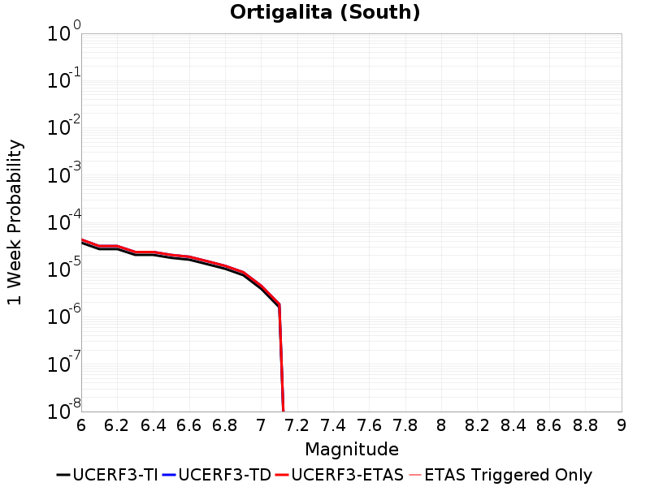 | 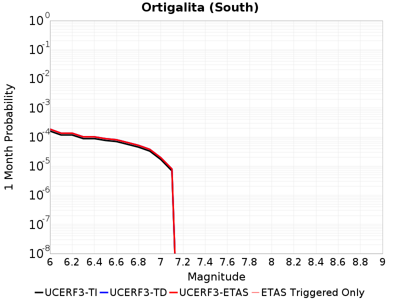 | 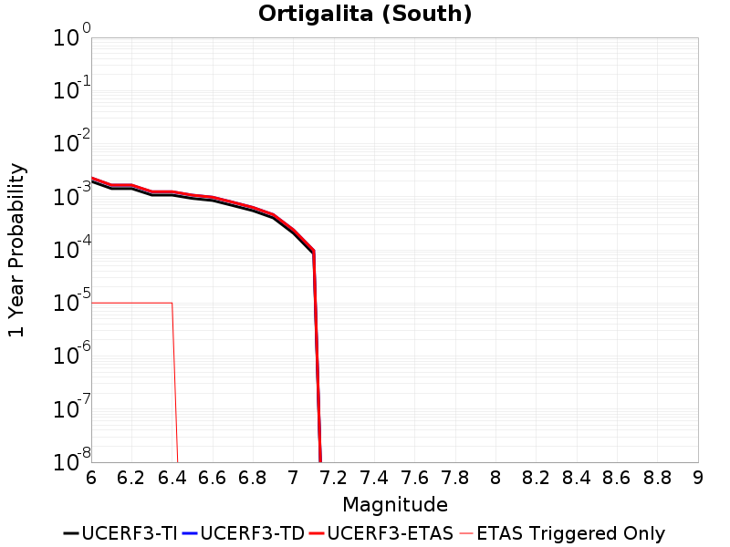 | 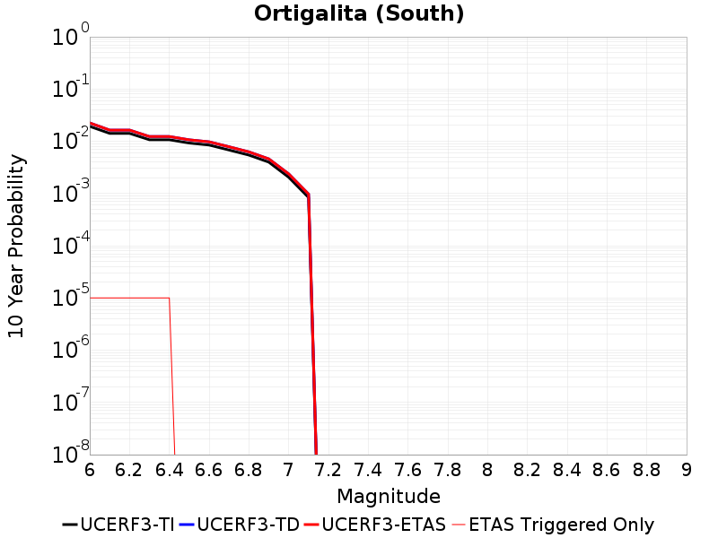 |

| Magnitude | 1 wk TI Prob | 1 wk TD Prob | 1 wk ETAS Prob | 1 wk ETAS/TD Gain | 1 wk ETAS Triggered Only | 1 mo TI Prob | 1 mo TD Prob | 1 mo ETAS Prob | 1 mo ETAS/TD Gain | 1 mo ETAS Triggered Only | 1 yr TI Prob | 1 yr TD Prob | 1 yr ETAS Prob | 1 yr ETAS/TD Gain | 1 yr ETAS Triggered Only | 10 yr TI Prob | 10 yr TD Prob | 10 yr ETAS Prob | 10 yr ETAS/TD Gain | 10 yr ETAS Triggered Only |
|-----|-----|-----|-----|-----|-----|-----|-----|-----|-----|-----|-----|-----|-----|-----|-----|-----|-----|-----|-----|-----|
| 6.0 | 3.72394E-5 | 4.335348E-5 | 4.335348E-5 | 1.0 | 0.0 | 1.5958765E-4 | 1.8578829E-4 | 1.8578829E-4 | 1.0 | 0.0 | 0.0019412481 | 0.0022597825 | 0.0022697598 | 1.0044152 | 1.0E-5 | 0.019243775 | 0.022384498 | 0.022394273 | 1.0004368 | 1.0E-5 |
| 6.1 | 2.7299884E-5 | 3.1559706E-5 | 3.1559706E-5 | 1.0 | 0.0 | 1.16994255E-4 | 1.3524918E-4 | 1.3524918E-4 | 1.0 | 0.0 | 0.0014234743 | 0.0016454712 | 0.0016554547 | 1.0060673 | 1.0E-5 | 0.014143906 | 0.016338829 | 0.016348666 | 1.000602 | 1.0E-5 |
| 6.2 | 2.7299884E-5 | 3.1559706E-5 | 3.1559706E-5 | 1.0 | 0.0 | 1.16994255E-4 | 1.3524918E-4 | 1.3524918E-4 | 1.0 | 0.0 | 0.0014234743 | 0.0016454712 | 0.0016554547 | 1.0060673 | 1.0E-5 | 0.014143906 | 0.016338829 | 0.016348666 | 1.000602 | 1.0E-5 |
| 6.3 | 2.0546433E-5 | 2.3681097E-5 | 2.3681097E-5 | 1.0 | 0.0 | 8.805317E-5 | 1.0148658E-4 | 1.0148658E-4 | 1.0 | 0.0 | 0.00107152 | 0.0012349178 | 0.0012449054 | 1.0080878 | 1.0E-5 | 0.010663681 | 0.012282625 | 0.012292502 | 1.0008042 | 1.0E-5 |
| 6.4 | 2.0546433E-5 | 2.3681097E-5 | 2.3681097E-5 | 1.0 | 0.0 | 8.805317E-5 | 1.0148658E-4 | 1.0148658E-4 | 1.0 | 0.0 | 0.00107152 | 0.0012349178 | 0.0012449054 | 1.0080878 | 1.0E-5 | 0.010663681 | 0.012282625 | 0.012292502 | 1.0008042 | 1.0E-5 |
| 6.5 | 1.7779594E-5 | 2.0489904E-5 | 2.0489904E-5 | 1.0 | 0.0 | 7.619603E-5 | 8.781099E-5 | 8.781099E-5 | 1.0 | 0.0 | 9.272918E-4 | 0.0010685882 | 0.0010685882 | 1.0 | 0.0 | 0.009234319 | 0.010635971 | 0.010635971 | 1.0 | 0.0 |
| 6.6 | 1.6272212E-5 | 1.875429E-5 | 1.875429E-5 | 1.0 | 0.0 | 6.973618E-5 | 8.037312E-5 | 8.037312E-5 | 1.0 | 0.0 | 8.487073E-4 | 9.781157E-4 | 9.781157E-4 | 1.0 | 0.0 | 0.008454733 | 0.009739414 | 0.009739414 | 1.0 | 0.0 |
| 6.7 | 1.3051484E-5 | 1.507082E-5 | 1.507082E-5 | 1.0 | 0.0 | 5.593373E-5 | 6.4587686E-5 | 6.4587686E-5 | 1.0 | 0.0 | 6.807804E-4 | 7.860809E-4 | 7.860809E-4 | 1.0 | 0.0 | 0.006786986 | 0.00783399 | 0.00783399 | 1.0 | 0.0 |
| 6.8 | 1.04277415E-5 | 1.2012294E-5 | 1.2012294E-5 | 1.0 | 0.0 | 4.4689557E-5 | 5.1480285E-5 | 5.1480285E-5 | 1.0 | 0.0 | 5.439595E-4 | 6.265997E-4 | 6.265997E-4 | 1.0 | 0.0 | 0.0054262993 | 0.006249087 | 0.006249087 | 1.0 | 0.0 |
| 6.9 | 7.639968E-6 | 8.810016E-6 | 8.810016E-6 | 1.0 | 0.0 | 3.274231E-5 | 3.7756698E-5 | 3.7756698E-5 | 1.0 | 0.0 | 3.9856473E-4 | 4.5959672E-4 | 4.5959672E-4 | 1.0 | 0.0 | 0.003978506 | 0.004587051 | 0.004587051 | 1.0 | 0.0 |
| 7.0 | 3.919831E-6 | 4.5433117E-6 | 4.5433117E-6 | 1.0 | 0.0 | 1.679917E-5 | 1.9471203E-5 | 1.9471203E-5 | 1.0 | 0.0 | 2.045107E-4 | 2.3703824E-4 | 2.3703824E-4 | 1.0 | 0.0 | 0.0020432258 | 0.0023680634 | 0.0023680634 | 1.0 | 0.0 |
| 7.1 | 1.6017933E-6 | 1.8611752E-6 | 1.8611752E-6 | 1.0 | 0.0 | 6.8648105E-6 | 7.976447E-6 | 7.976447E-6 | 1.0 | 0.0 | 8.357586E-5 | 9.710998E-5 | 9.710998E-5 | 1.0 | 0.0 | 8.3544437E-4 | 9.707807E-4 | 9.707807E-4 | 1.0 | 0.0 |

## Santa Ynez (West)
*[(top)](#table-of-contents)*

| 1 Week | 1 Month | 1 Year | 10 Year |
|-----|-----|-----|-----|
|  | 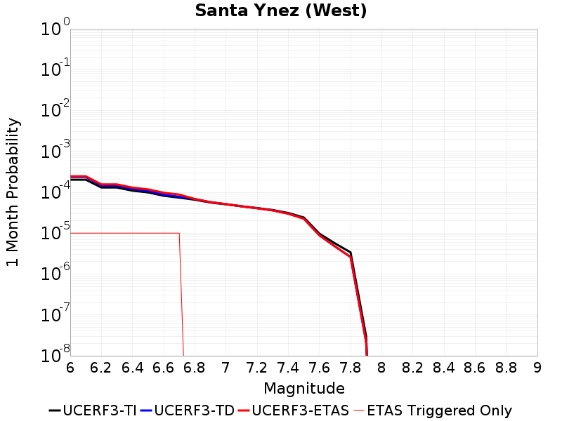 |  | 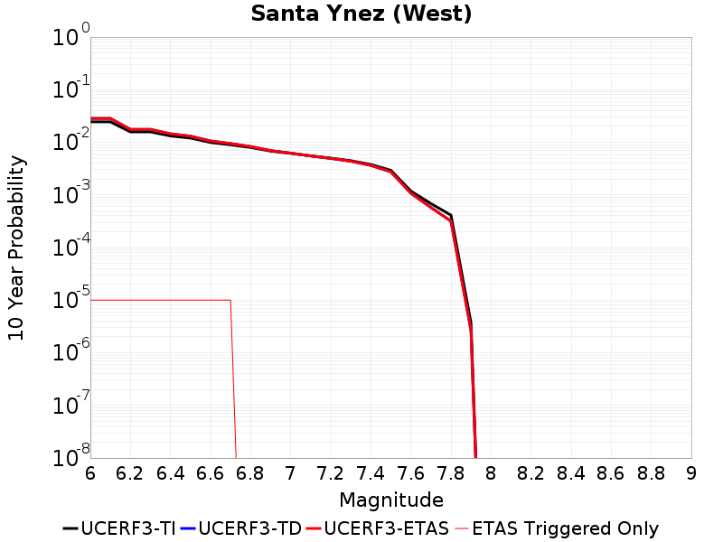 |

| Magnitude | 1 wk TI Prob | 1 wk TD Prob | 1 wk ETAS Prob | 1 wk ETAS/TD Gain | 1 wk ETAS Triggered Only | 1 mo TI Prob | 1 mo TD Prob | 1 mo ETAS Prob | 1 mo ETAS/TD Gain | 1 mo ETAS Triggered Only | 1 yr TI Prob | 1 yr TD Prob | 1 yr ETAS Prob | 1 yr ETAS/TD Gain | 1 yr ETAS Triggered Only | 10 yr TI Prob | 10 yr TD Prob | 10 yr ETAS Prob | 10 yr ETAS/TD Gain | 10 yr ETAS Triggered Only |
|-----|-----|-----|-----|-----|-----|-----|-----|-----|-----|-----|-----|-----|-----|-----|-----|-----|-----|-----|-----|-----|
| 6.0 | 4.7352758E-5 | 5.5122666E-5 | 5.5122666E-5 | 1.0 | 0.0 | 2.0292461E-4 | 2.3622028E-4 | 2.462179E-4 | 1.0423234 | 1.0E-5 | 0.0024678076 | 0.0028724517 | 0.0028824229 | 1.0034714 | 1.0E-5 | 0.024405818 | 0.028381296 | 0.028391013 | 1.0003424 | 1.0E-5 |
| 6.1 | 4.7352758E-5 | 5.5122666E-5 | 5.5122666E-5 | 1.0 | 0.0 | 2.0292461E-4 | 2.3622028E-4 | 2.462179E-4 | 1.0423234 | 1.0E-5 | 0.0024678076 | 0.0028724517 | 0.0028824229 | 1.0034714 | 1.0E-5 | 0.024405818 | 0.028381296 | 0.028391013 | 1.0003424 | 1.0E-5 |
| 6.2 | 3.0415853E-5 | 3.400583E-5 | 3.400583E-5 | 1.0 | 0.0 | 1.3034715E-4 | 1.4573135E-4 | 1.557299E-4 | 1.0686094 | 1.0E-5 | 0.0015858212 | 0.0017728693 | 0.0017828515 | 1.0056306 | 1.0E-5 | 0.015745522 | 0.017591186 | 0.01760101 | 1.0005585 | 1.0E-5 |
| 6.3 | 3.0415853E-5 | 3.400583E-5 | 3.400583E-5 | 1.0 | 0.0 | 1.3034715E-4 | 1.4573135E-4 | 1.557299E-4 | 1.0686094 | 1.0E-5 | 0.0015858212 | 0.0017728693 | 0.0017828515 | 1.0056306 | 1.0E-5 | 0.015745522 | 0.017591186 | 0.01760101 | 1.0005585 | 1.0E-5 |
| 6.4 | 2.5452082E-5 | 2.7975348E-5 | 2.7975348E-5 | 1.0 | 0.0 | 1.09075794E-4 | 1.1988895E-4 | 1.2988775E-4 | 1.0834005 | 1.0E-5 | 0.0013271887 | 0.0014586893 | 0.0014686747 | 1.0068455 | 1.0E-5 | 0.013192902 | 0.014493313 | 0.014503168 | 1.00068 | 1.0E-5 |
| 6.5 | 2.3143784E-5 | 2.5183124E-5 | 2.5183124E-5 | 1.0 | 0.0 | 9.9183875E-5 | 1.079233E-4 | 1.1792222E-4 | 1.0926484 | 1.0E-5 | 0.0012068948 | 0.0013131887 | 0.0013231756 | 1.0076051 | 1.0E-5 | 0.012003611 | 0.013055958 | 0.013065827 | 1.0007559 | 1.0E-5 |
| 6.6 | 1.9118515E-5 | 2.0396787E-5 | 2.0396787E-5 | 1.0 | 0.0 | 8.193392E-5 | 8.7411914E-5 | 9.741104E-5 | 1.1143909 | 1.0E-5 | 9.97089E-4 | 0.0010637284 | 0.0010737177 | 1.009391 | 1.0E-5 | 0.00992627 | 0.0105872825 | 0.010597177 | 1.0009345 | 1.0E-5 |
| 6.7 | 1.722807E-5 | 1.8183584E-5 | 1.8183584E-5 | 1.0 | 0.0 | 7.3832496E-5 | 7.792735E-5 | 8.7926564E-5 | 1.1283146 | 1.0E-5 | 8.985399E-4 | 9.483581E-4 | 9.583486E-4 | 1.0105345 | 1.0E-5 | 0.008949154 | 0.00944376 | 0.009453665 | 1.0010489 | 1.0E-5 |
| 6.8 | 1.5317364E-5 | 1.5958667E-5 | 1.5958667E-5 | 1.0 | 0.0 | 6.56442E-5 | 6.8392525E-5 | 6.8392525E-5 | 1.0 | 0.0 | 7.98925E-4 | 8.323652E-4 | 8.323652E-4 | 1.0 | 0.0 | 0.007960589 | 0.008292966 | 0.008292966 | 1.0 | 0.0 |
| 6.9 | 1.3071226E-5 | 1.3356115E-5 | 1.3356115E-5 | 1.0 | 0.0 | 5.6018336E-5 | 5.723925E-5 | 5.723925E-5 | 1.0 | 0.0 | 6.8180985E-4 | 6.966673E-4 | 6.966673E-4 | 1.0 | 0.0 | 0.0067972173 | 0.0069450955 | 0.0069450955 | 1.0 | 0.0 |
| 7.0 | 1.1836986E-5 | 1.1956683E-5 | 1.1956683E-5 | 1.0 | 0.0 | 5.0728955E-5 | 5.1241932E-5 | 5.1241932E-5 | 1.0 | 0.0 | 6.1745E-4 | 6.2369363E-4 | 6.2369363E-4 | 1.0 | 0.0 | 0.006157372 | 0.006219627 | 0.006219627 | 1.0 | 0.0 |
| 7.1 | 1.0597169E-5 | 1.056372E-5 | 1.056372E-5 | 1.0 | 0.0 | 4.541565E-5 | 4.5272307E-5 | 4.5272307E-5 | 1.0 | 0.0 | 5.5279525E-4 | 5.510521E-4 | 5.510521E-4 | 1.0 | 0.0 | 0.0055142213 | 0.0054969885 | 0.0054969885 | 1.0 | 0.0 |
| 7.2 | 9.59113E-6 | 9.479493E-6 | 9.479493E-6 | 1.0 | 0.0 | 4.11042E-5 | 4.0625775E-5 | 4.0625775E-5 | 1.0 | 0.0 | 5.0032866E-4 | 4.945076E-4 | 4.945076E-4 | 1.0 | 0.0 | 0.004992037 | 0.004934192 | 0.004934192 | 1.0 | 0.0 |
| 7.3 | 8.586084E-6 | 8.398809E-6 | 8.398809E-6 | 1.0 | 0.0 | 3.679698E-5 | 3.5994402E-5 | 3.5994402E-5 | 1.0 | 0.0 | 4.4791115E-4 | 4.3814478E-4 | 4.3814478E-4 | 1.0 | 0.0 | 0.004470094 | 0.004372922 | 0.004372922 | 1.0 | 0.0 |
| 7.4 | 7.2622997E-6 | 6.969153E-6 | 6.969153E-6 | 1.0 | 0.0 | 3.112377E-5 | 2.9867464E-5 | 2.9867464E-5 | 1.0 | 0.0 | 3.78866E-4 | 3.6357666E-4 | 3.6357666E-4 | 1.0 | 0.0 | 0.0037822074 | 0.0036299196 | 0.0036299196 | 1.0 | 0.0 |
| 7.5 | 5.627296E-6 | 5.2662895E-6 | 5.2662895E-6 | 1.0 | 0.0 | 2.411676E-5 | 2.256962E-5 | 2.256962E-5 | 1.0 | 0.0 | 2.9358198E-4 | 2.7475122E-4 | 2.7475122E-4 | 1.0 | 0.0 | 0.0029319443 | 0.002744188 | 0.002744188 | 1.0 | 0.0 |
| 7.6 | 2.265244E-6 | 2.0634843E-6 | 2.0634843E-6 | 1.0 | 0.0 | 9.708152E-6 | 8.8434745E-6 | 8.8434745E-6 | 1.0 | 0.0 | 1.18190335E-4 | 1.0766407E-4 | 1.0766407E-4 | 1.0 | 0.0 | 0.001181275 | 0.0010761278 | 0.0010761278 | 1.0 | 0.0 |
| 7.7 | 1.3099874E-6 | 1.1028983E-6 | 1.1028983E-6 | 1.0 | 0.0 | 5.61422E-6 | 4.7266985E-6 | 4.7266985E-6 | 1.0 | 0.0 | 6.8350986E-5 | 5.754606E-5 | 5.754606E-5 | 1.0 | 0.0 | 6.832996E-4 | 5.75314E-4 | 5.75314E-4 | 1.0 | 0.0 |
| 7.8 | 7.903951E-7 | 6.0789176E-7 | 6.0789176E-7 | 1.0 | 0.0 | 3.3874032E-6 | 2.6052478E-6 | 2.6052478E-6 | 1.0 | 0.0 | 4.1240855E-5 | 3.1718442E-5 | 3.1718442E-5 | 1.0 | 0.0 | 4.12332E-4 | 3.1714048E-4 | 3.1714048E-4 | 1.0 | 0.0 |
| 7.9 | 7.0753297E-9 | 5.0932902E-9 | 5.0932902E-9 | 1.0 | 0.0 | 3.032284E-8 | 2.1828388E-8 | 2.1828388E-8 | 1.0 | 0.0 | 3.6918053E-7 | 2.657606E-7 | 2.657606E-7 | 1.0 | 0.0 | 3.691799E-6 | 2.6576038E-6 | 2.6576038E-6 | 1.0 | 0.0 |

## Death Valley (Black Mtns Frontal)
*[(top)](#table-of-contents)*

| 1 Week | 1 Month | 1 Year | 10 Year |
|-----|-----|-----|-----|
| 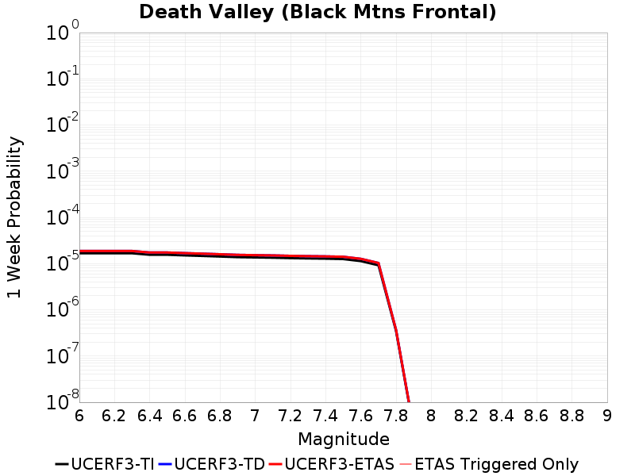 | 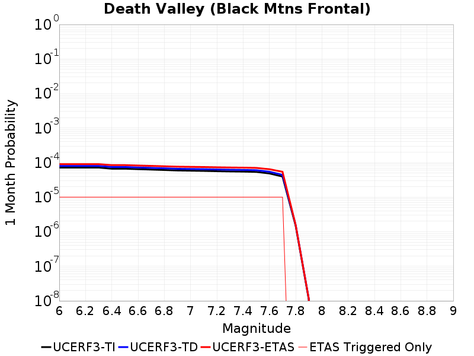 |  |  |

| Magnitude | 1 wk TI Prob | 1 wk TD Prob | 1 wk ETAS Prob | 1 wk ETAS/TD Gain | 1 wk ETAS Triggered Only | 1 mo TI Prob | 1 mo TD Prob | 1 mo ETAS Prob | 1 mo ETAS/TD Gain | 1 mo ETAS Triggered Only | 1 yr TI Prob | 1 yr TD Prob | 1 yr ETAS Prob | 1 yr ETAS/TD Gain | 1 yr ETAS Triggered Only | 10 yr TI Prob | 10 yr TD Prob | 10 yr ETAS Prob | 10 yr ETAS/TD Gain | 10 yr ETAS Triggered Only |
|-----|-----|-----|-----|-----|-----|-----|-----|-----|-----|-----|-----|-----|-----|-----|-----|-----|-----|-----|-----|-----|
| 6.0 | 1.6707214E-5 | 1.8700935E-5 | 1.8700935E-5 | 1.0 | 0.0 | 7.160038E-5 | 8.014444E-5 | 9.014364E-5 | 1.1247647 | 1.0E-5 | 8.71386E-4 | 9.753294E-4 | 9.853197E-4 | 1.0102429 | 1.0E-5 | 0.00867977 | 0.009711346 | 0.009721248 | 1.0010197 | 1.0E-5 |
| 6.1 | 1.6707214E-5 | 1.8700935E-5 | 1.8700935E-5 | 1.0 | 0.0 | 7.160038E-5 | 8.014444E-5 | 9.014364E-5 | 1.1247647 | 1.0E-5 | 8.71386E-4 | 9.753294E-4 | 9.853197E-4 | 1.0102429 | 1.0E-5 | 0.00867977 | 0.009711346 | 0.009721248 | 1.0010197 | 1.0E-5 |
| 6.2 | 1.6707214E-5 | 1.8700935E-5 | 1.8700935E-5 | 1.0 | 0.0 | 7.160038E-5 | 8.014444E-5 | 9.014364E-5 | 1.1247647 | 1.0E-5 | 8.71386E-4 | 9.753294E-4 | 9.853197E-4 | 1.0102429 | 1.0E-5 | 0.00867977 | 0.009711346 | 0.009721248 | 1.0010197 | 1.0E-5 |
| 6.3 | 1.6707214E-5 | 1.8700935E-5 | 1.8700935E-5 | 1.0 | 0.0 | 7.160038E-5 | 8.014444E-5 | 9.014364E-5 | 1.1247647 | 1.0E-5 | 8.71386E-4 | 9.753294E-4 | 9.853197E-4 | 1.0102429 | 1.0E-5 | 0.00867977 | 0.009711346 | 0.009721248 | 1.0010197 | 1.0E-5 |
| 6.4 | 1.5515609E-5 | 1.736669E-5 | 1.736669E-5 | 1.0 | 0.0 | 6.649377E-5 | 7.4426585E-5 | 8.442584E-5 | 1.1343505 | 1.0E-5 | 8.0926094E-4 | 9.057731E-4 | 9.15764E-4 | 1.0110303 | 1.0E-5 | 0.008063202 | 0.0090215 | 0.00903141 | 1.0010985 | 1.0E-5 |
| 6.5 | 1.5515609E-5 | 1.736669E-5 | 1.736669E-5 | 1.0 | 0.0 | 6.649377E-5 | 7.4426585E-5 | 8.442584E-5 | 1.1343505 | 1.0E-5 | 8.0926094E-4 | 9.057731E-4 | 9.15764E-4 | 1.0110303 | 1.0E-5 | 0.008063202 | 0.0090215 | 0.00903141 | 1.0010985 | 1.0E-5 |
| 6.6 | 1.5041828E-5 | 1.683676E-5 | 1.683676E-5 | 1.0 | 0.0 | 6.4463384E-5 | 7.2155584E-5 | 8.215487E-5 | 1.1385794 | 1.0E-5 | 7.8455906E-4 | 8.781461E-4 | 8.881373E-4 | 1.0113776 | 1.0E-5 | 0.00781795 | 0.008747418 | 0.008757331 | 1.0011332 | 1.0E-5 |
| 6.7 | 1.4634985E-5 | 1.6382914E-5 | 1.6382914E-5 | 1.0 | 0.0 | 6.271985E-5 | 7.021063E-5 | 8.020993E-5 | 1.1424186 | 1.0E-5 | 7.6334673E-4 | 8.5448497E-4 | 8.6447643E-4 | 1.011693 | 1.0E-5 | 0.007607299 | 0.008512634 | 0.008522549 | 1.0011647 | 1.0E-5 |
| 6.8 | 1.4209158E-5 | 1.5908197E-5 | 1.5908197E-5 | 1.0 | 0.0 | 6.089497E-5 | 6.817624E-5 | 7.817556E-5 | 1.1466687 | 1.0E-5 | 7.4114406E-4 | 8.297353E-4 | 8.39727E-4 | 1.012042 | 1.0E-5 | 0.007386771 | 0.008266991 | 0.008276909 | 1.0011996 | 1.0E-5 |
| 6.9 | 1.3780098E-5 | 1.5429992E-5 | 1.5429992E-5 | 1.0 | 0.0 | 5.9056227E-5 | 6.612689E-5 | 7.6126234E-5 | 1.1512144 | 1.0E-5 | 7.1877235E-4 | 8.0480304E-4 | 8.14795E-4 | 1.0124154 | 1.0E-5 | 0.0071645193 | 0.008019482 | 0.008029402 | 1.0012369 | 1.0E-5 |
| 7.0 | 1.3585064E-5 | 1.5213224E-5 | 1.5213224E-5 | 1.0 | 0.0 | 5.8220405E-5 | 6.5197935E-5 | 7.5197284E-5 | 1.1533691 | 1.0E-5 | 7.086029E-4 | 7.935012E-4 | 8.034933E-4 | 1.0125923 | 1.0E-5 | 0.007063476 | 0.007907273 | 0.007917195 | 1.0012547 | 1.0E-5 |
| 7.1 | 1.3398601E-5 | 1.5006093E-5 | 1.5006093E-5 | 1.0 | 0.0 | 5.742131E-5 | 6.4310276E-5 | 7.430963E-5 | 1.1554861 | 1.0E-5 | 6.9888023E-4 | 7.8270177E-4 | 7.92694E-4 | 1.0127662 | 1.0E-5 | 0.0069668638 | 0.0078000417 | 0.007809964 | 1.0012721 | 1.0E-5 |
| 7.2 | 1.3126312E-5 | 1.4703859E-5 | 1.4703859E-5 | 1.0 | 0.0 | 5.6254412E-5 | 6.3015046E-5 | 7.301442E-5 | 1.1586822 | 1.0E-5 | 6.846822E-4 | 7.6694356E-4 | 7.769359E-4 | 1.0130287 | 1.0E-5 | 0.006825765 | 0.007643554 | 0.0076534776 | 1.0012983 | 1.0E-5 |
| 7.3 | 1.2922429E-5 | 1.4477748E-5 | 1.4477748E-5 | 1.0 | 0.0 | 5.5380664E-5 | 6.204604E-5 | 7.2045426E-5 | 1.1611606 | 1.0E-5 | 6.74051E-4 | 7.5515424E-4 | 7.651467E-4 | 1.0132324 | 1.0E-5 | 0.006720101 | 0.0075264648 | 0.0075363894 | 1.0013187 | 1.0E-5 |
| 7.4 | 1.2768878E-5 | 1.4307474E-5 | 1.4307474E-5 | 1.0 | 0.0 | 5.4722615E-5 | 6.1316336E-5 | 7.131572E-5 | 1.1630787 | 1.0E-5 | 6.660441E-4 | 7.462762E-4 | 7.562687E-4 | 1.0133898 | 1.0E-5 | 0.0066405144 | 0.0074382816 | 0.007448207 | 1.0013344 | 1.0E-5 |
| 7.5 | 1.2521929E-5 | 1.4035332E-5 | 1.4035332E-5 | 1.0 | 0.0 | 5.366431E-5 | 6.015007E-5 | 7.0149465E-5 | 1.1662408 | 1.0E-5 | 6.531671E-4 | 7.320865E-4 | 7.4207917E-4 | 1.0136496 | 1.0E-5 | 0.006512506 | 0.007297326 | 0.007307253 | 1.0013604 | 1.0E-5 |
| 7.6 | 1.1301089E-5 | 1.2669229E-5 | 1.2669229E-5 | 1.0 | 0.0 | 4.8432343E-5 | 5.4295597E-5 | 6.4295054E-5 | 1.184167 | 1.0E-5 | 5.895042E-4 | 6.6085375E-4 | 6.7084713E-4 | 1.0151219 | 1.0E-5 | 0.0058794282 | 0.0065894397 | 0.0065993736 | 1.0015075 | 1.0E-5 |
| 7.7 | 9.189108E-6 | 1.030048E-5 | 1.030048E-5 | 1.0 | 0.0 | 3.93813E-5 | 4.41442E-5 | 5.414376E-5 | 1.2265203 | 1.0E-5 | 4.7936183E-4 | 5.3732813E-4 | 5.473228E-4 | 1.0186006 | 1.0E-5 | 0.004783291 | 0.005360802 | 0.0053707487 | 1.0018554 | 1.0E-5 |
| 7.8 | 3.4586725E-7 | 3.6510616E-7 | 3.6510616E-7 | 1.0 | 0.0 | 1.4822873E-6 | 1.5647397E-6 | 1.5647397E-6 | 1.0 | 0.0 | 1.80467E-5 | 1.9050545E-5 | 1.9050545E-5 | 1.0 | 0.0 | 1.8045233E-4 | 1.9048955E-4 | 1.9048955E-4 | 1.0 | 0.0 |
| 7.9 | 2.5591178E-9 | 2.6712779E-9 | 2.6712779E-9 | 1.0 | 0.0 | 1.0967647E-8 | 1.1448334E-8 | 1.1448334E-8 | 1.0 | 0.0 | 1.335311E-7 | 1.3938346E-7 | 1.3938346E-7 | 1.0 | 0.0 | 1.3353102E-6 | 1.3938346E-6 | 1.3938346E-6 | 1.0 | 0.0 |

## Mission Ridge-Arroyo Parida-Santa Ana
*[(top)](#table-of-contents)*

| 1 Week | 1 Month | 1 Year | 10 Year |
|-----|-----|-----|-----|
| 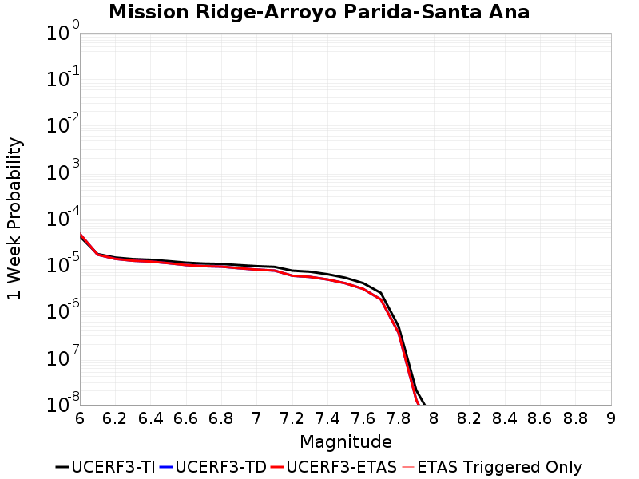 |  |  | 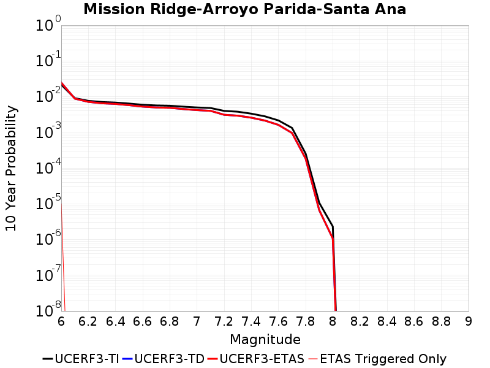 |

| Magnitude | 1 wk TI Prob | 1 wk TD Prob | 1 wk ETAS Prob | 1 wk ETAS/TD Gain | 1 wk ETAS Triggered Only | 1 mo TI Prob | 1 mo TD Prob | 1 mo ETAS Prob | 1 mo ETAS/TD Gain | 1 mo ETAS Triggered Only | 1 yr TI Prob | 1 yr TD Prob | 1 yr ETAS Prob | 1 yr ETAS/TD Gain | 1 yr ETAS Triggered Only | 10 yr TI Prob | 10 yr TD Prob | 10 yr ETAS Prob | 10 yr ETAS/TD Gain | 10 yr ETAS Triggered Only |
|-----|-----|-----|-----|-----|-----|-----|-----|-----|-----|-----|-----|-----|-----|-----|-----|-----|-----|-----|-----|-----|
| 6.0 | 4.169034E-5 | 4.727538E-5 | 4.727538E-5 | 1.0 | 0.0 | 1.7866064E-4 | 2.0259793E-4 | 2.1259591E-4 | 1.0493488 | 1.0E-5 | 0.0021730233 | 0.0024646677 | 0.002474643 | 1.0040474 | 1.0E-5 | 0.021518968 | 0.024455458 | 0.024465214 | 1.0003989 | 1.0E-5 |
| 6.1 | 1.73813E-5 | 1.6888729E-5 | 1.6888729E-5 | 1.0 | 0.0 | 7.4489166E-5 | 7.237832E-5 | 7.237832E-5 | 1.0 | 0.0 | 9.065282E-4 | 8.8086055E-4 | 8.8086055E-4 | 1.0 | 0.0 | 0.009028391 | 0.008774883 | 0.008774883 | 1.0 | 0.0 |
| 6.2 | 1.4622182E-5 | 1.3700909E-5 | 1.3700909E-5 | 1.0 | 0.0 | 6.2664985E-5 | 5.8716883E-5 | 5.8716883E-5 | 1.0 | 0.0 | 7.6267915E-4 | 7.1464747E-4 | 7.1464747E-4 | 1.0 | 0.0 | 0.007600669 | 0.0071239844 | 0.0071239844 | 1.0 | 0.0 |
| 6.3 | 1.3552434E-5 | 1.2507916E-5 | 1.2507916E-5 | 1.0 | 0.0 | 5.8080568E-5 | 5.360427E-5 | 5.360427E-5 | 1.0 | 0.0 | 7.069015E-4 | 6.524397E-4 | 6.524397E-4 | 1.0 | 0.0 | 0.00704657 | 0.0065056537 | 0.0065056537 | 1.0 | 0.0 |
| 6.4 | 1.30977305E-5 | 1.2004121E-5 | 1.2004121E-5 | 1.0 | 0.0 | 5.613192E-5 | 5.1445237E-5 | 5.1445237E-5 | 1.0 | 0.0 | 6.831918E-4 | 6.2616874E-4 | 6.2616874E-4 | 1.0 | 0.0 | 0.006810953 | 0.006244438 | 0.006244438 | 1.0 | 0.0 |
| 6.5 | 1.225205E-5 | 1.1072464E-5 | 1.1072464E-5 | 1.0 | 0.0 | 5.2507727E-5 | 4.745257E-5 | 4.745257E-5 | 1.0 | 0.0 | 6.3909404E-4 | 5.775846E-4 | 5.775846E-4 | 1.0 | 0.0 | 0.006372592 | 0.005761192 | 0.005761192 | 1.0 | 0.0 |
| 6.6 | 1.1352241E-5 | 1.008589E-5 | 1.008589E-5 | 1.0 | 0.0 | 4.8651553E-5 | 4.3224536E-5 | 4.3224536E-5 | 1.0 | 0.0 | 5.921717E-4 | 5.2613375E-4 | 5.2613375E-4 | 1.0 | 0.0 | 0.0059059616 | 0.0052491752 | 0.0052491752 | 1.0 | 0.0 |
| 6.7 | 1.0864116E-5 | 9.538457E-6 | 9.538457E-6 | 1.0 | 0.0 | 4.6559664E-5 | 4.087847E-5 | 4.087847E-5 | 1.0 | 0.0 | 5.667165E-4 | 4.975837E-4 | 4.975837E-4 | 1.0 | 0.0 | 0.005652734 | 0.0049649775 | 0.0049649775 | 1.0 | 0.0 |
| 6.8 | 1.0666365E-5 | 9.320906E-6 | 9.320906E-6 | 1.0 | 0.0 | 4.571219E-5 | 3.9946142E-5 | 3.9946142E-5 | 1.0 | 0.0 | 5.564038E-4 | 4.8623775E-4 | 4.8623775E-4 | 1.0 | 0.0 | 0.005550127 | 0.004852019 | 0.004852019 | 1.0 | 0.0 |
| 6.9 | 1.0038665E-5 | 8.611911E-6 | 8.611911E-6 | 1.0 | 0.0 | 4.302214E-5 | 3.6907677E-5 | 3.6907677E-5 | 1.0 | 0.0 | 5.236687E-4 | 4.4926014E-4 | 4.4926014E-4 | 1.0 | 0.0 | 0.005224364 | 0.0044837776 | 0.0044837776 | 1.0 | 0.0 |
| 7.0 | 9.5379955E-6 | 8.043837E-6 | 8.043837E-6 | 1.0 | 0.0 | 4.0876483E-5 | 3.4473138E-5 | 3.4473138E-5 | 1.0 | 0.0 | 4.975576E-4 | 4.1963137E-4 | 4.1963137E-4 | 1.0 | 0.0 | 0.00496445 | 0.004188637 | 0.004188637 | 1.0 | 0.0 |
| 7.1 | 9.207389E-6 | 7.670389E-6 | 7.670389E-6 | 1.0 | 0.0 | 3.945964E-5 | 3.2872693E-5 | 3.2872693E-5 | 1.0 | 0.0 | 4.803152E-4 | 4.0015322E-4 | 4.0015322E-4 | 1.0 | 0.0 | 0.004792784 | 0.003994571 | 0.003994571 | 1.0 | 0.0 |
| 7.2 | 7.638091E-6 | 5.945257E-6 | 5.945257E-6 | 1.0 | 0.0 | 3.2734264E-5 | 2.5479425E-5 | 2.5479425E-5 | 1.0 | 0.0 | 3.984668E-4 | 3.1016817E-4 | 3.1016817E-4 | 1.0 | 0.0 | 0.0039775306 | 0.0030974562 | 0.0030974562 | 1.0 | 0.0 |
| 7.3 | 7.2500147E-6 | 5.609466E-6 | 5.609466E-6 | 1.0 | 0.0 | 3.1071122E-5 | 2.404035E-5 | 2.404035E-5 | 1.0 | 0.0 | 3.7822526E-4 | 2.9265223E-4 | 2.9265223E-4 | 1.0 | 0.0 | 0.0037758215 | 0.0029227708 | 0.0029227708 | 1.0 | 0.0 |
| 7.4 | 6.3899715E-6 | 4.93018E-6 | 4.93018E-6 | 1.0 | 0.0 | 2.7385306E-5 | 2.1129172E-5 | 2.1129172E-5 | 1.0 | 0.0 | 3.3336508E-4 | 2.572175E-4 | 2.572175E-4 | 1.0 | 0.0 | 0.0033286542 | 0.0025692892 | 0.0025692892 | 1.0 | 0.0 |
| 7.5 | 5.379025E-6 | 4.093387E-6 | 4.093387E-6 | 1.0 | 0.0 | 2.305276E-5 | 1.7542969E-5 | 1.7542969E-5 | 1.0 | 0.0 | 2.806312E-4 | 2.1356482E-4 | 2.1356482E-4 | 1.0 | 0.0 | 0.0028027708 | 0.0021336072 | 0.0021336072 | 1.0 | 0.0 |
| 7.6 | 4.1270696E-6 | 3.0950437E-6 | 3.0950437E-6 | 1.0 | 0.0 | 1.768732E-5 | 1.3264405E-5 | 1.3264405E-5 | 1.0 | 0.0 | 2.1532185E-4 | 1.6148225E-4 | 1.6148225E-4 | 1.0 | 0.0 | 0.0021511333 | 0.0016136572 | 0.0016136572 | 1.0 | 0.0 |
| 7.7 | 2.5406805E-6 | 1.8325183E-6 | 1.8325183E-6 | 1.0 | 0.0 | 1.0888585E-5 | 7.853627E-6 | 7.853627E-6 | 1.0 | 0.0 | 1.3256045E-4 | 9.561377E-5 | 9.561377E-5 | 1.0 | 0.0 | 0.0013248142 | 9.557325E-4 | 9.557325E-4 | 1.0 | 0.0 |
| 7.8 | 4.8608285E-7 | 3.5164845E-7 | 3.5164845E-7 | 1.0 | 0.0 | 2.0832106E-6 | 1.5070639E-6 | 1.5070639E-6 | 1.0 | 0.0 | 2.5362791E-5 | 1.834835E-5 | 1.834835E-5 | 1.0 | 0.0 | 2.5359896E-4 | 1.8346847E-4 | 1.8346847E-4 | 1.0 | 0.0 |
| 7.9 | 2.0472514E-8 | 1.2729213E-8 | 1.2729213E-8 | 1.0 | 0.0 | 8.7739345E-8 | 5.455377E-8 | 5.455377E-8 | 1.0 | 0.0 | 1.068226E-6 | 6.6419193E-7 | 6.6419193E-7 | 1.0 | 0.0 | 1.0682209E-5 | 6.6419007E-6 | 6.6419007E-6 | 1.0 | 0.0 |
| 8.0 | 4.443582E-9 | 2.0466753E-9 | 2.0466753E-9 | 1.0 | 0.0 | 1.9043922E-8 | 8.771465E-9 | 8.771465E-9 | 1.0 | 0.0 | 2.3185973E-7 | 1.06792584E-7 | 1.06792584E-7 | 1.0 | 0.0 | 2.3185949E-6 | 1.0679254E-6 | 1.0679254E-6 | 1.0 | 0.0 |

## North Tahoe 2011 CFM
*[(top)](#table-of-contents)*

| 1 Week | 1 Month | 1 Year | 10 Year |
|-----|-----|-----|-----|
| 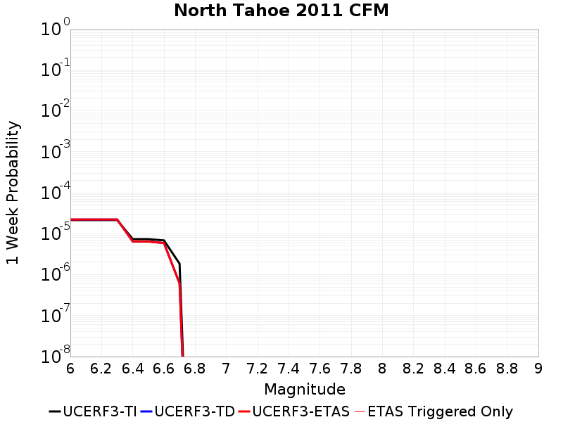 | 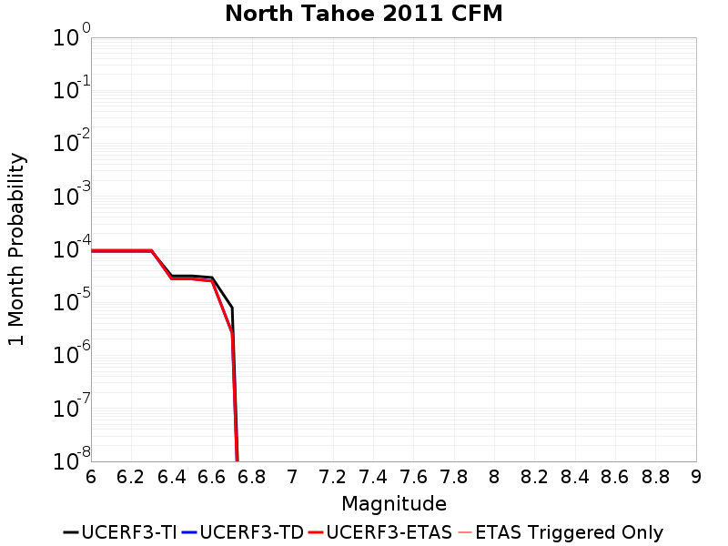 |  | 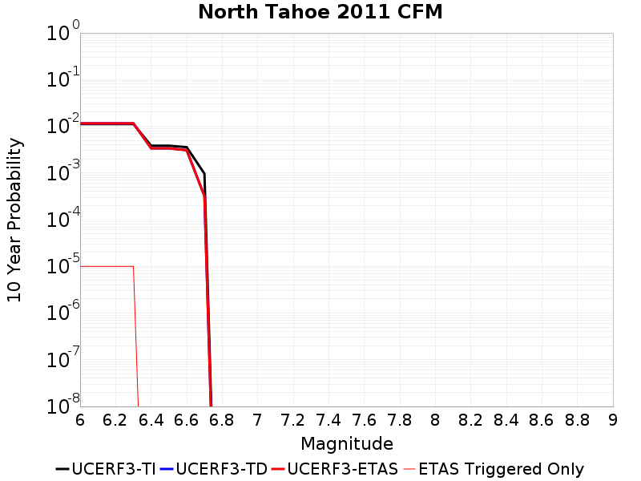 |

| Magnitude | 1 wk TI Prob | 1 wk TD Prob | 1 wk ETAS Prob | 1 wk ETAS/TD Gain | 1 wk ETAS Triggered Only | 1 mo TI Prob | 1 mo TD Prob | 1 mo ETAS Prob | 1 mo ETAS/TD Gain | 1 mo ETAS Triggered Only | 1 yr TI Prob | 1 yr TD Prob | 1 yr ETAS Prob | 1 yr ETAS/TD Gain | 1 yr ETAS Triggered Only | 10 yr TI Prob | 10 yr TD Prob | 10 yr ETAS Prob | 10 yr ETAS/TD Gain | 10 yr ETAS Triggered Only |
|-----|-----|-----|-----|-----|-----|-----|-----|-----|-----|-----|-----|-----|-----|-----|-----|-----|-----|-----|-----|-----|
| 6.0 | 2.150391E-5 | 2.2199469E-5 | 2.2199469E-5 | 1.0 | 0.0 | 9.215636E-5 | 9.5138224E-5 | 9.5138224E-5 | 1.0 | 0.0 | 0.0011214261 | 0.0011578889 | 0.0011578889 | 1.0 | 0.0 | 0.011157839 | 0.011537875 | 0.011547759 | 1.0008568 | 1.0E-5 |
| 6.1 | 2.150391E-5 | 2.2199469E-5 | 2.2199469E-5 | 1.0 | 0.0 | 9.215636E-5 | 9.5138224E-5 | 9.5138224E-5 | 1.0 | 0.0 | 0.0011214261 | 0.0011578889 | 0.0011578889 | 1.0 | 0.0 | 0.011157839 | 0.011537875 | 0.011547759 | 1.0008568 | 1.0E-5 |
| 6.2 | 2.150391E-5 | 2.2199469E-5 | 2.2199469E-5 | 1.0 | 0.0 | 9.215636E-5 | 9.5138224E-5 | 9.5138224E-5 | 1.0 | 0.0 | 0.0011214261 | 0.0011578889 | 0.0011578889 | 1.0 | 0.0 | 0.011157839 | 0.011537875 | 0.011547759 | 1.0008568 | 1.0E-5 |
| 6.3 | 2.150391E-5 | 2.2199469E-5 | 2.2199469E-5 | 1.0 | 0.0 | 9.215636E-5 | 9.5138224E-5 | 9.5138224E-5 | 1.0 | 0.0 | 0.0011214261 | 0.0011578889 | 0.0011578889 | 1.0 | 0.0 | 0.011157839 | 0.011537875 | 0.011547759 | 1.0008568 | 1.0E-5 |
| 6.4 | 7.3563056E-6 | 6.4549718E-6 | 6.4549718E-6 | 1.0 | 0.0 | 3.1526644E-5 | 2.7664044E-5 | 2.7664044E-5 | 1.0 | 0.0 | 3.8376928E-4 | 3.3678833E-4 | 3.3678833E-4 | 1.0 | 0.0 | 0.003831072 | 0.0033657849 | 0.0033657849 | 1.0 | 0.0 |
| 6.5 | 7.3563056E-6 | 6.4549718E-6 | 6.4549718E-6 | 1.0 | 0.0 | 3.1526644E-5 | 2.7664044E-5 | 2.7664044E-5 | 1.0 | 0.0 | 3.8376928E-4 | 3.3678833E-4 | 3.3678833E-4 | 1.0 | 0.0 | 0.003831072 | 0.0033657849 | 0.0033657849 | 1.0 | 0.0 |
| 6.6 | 6.8508816E-6 | 5.8932856E-6 | 5.8932856E-6 | 1.0 | 0.0 | 2.936059E-5 | 2.5256864E-5 | 2.5256864E-5 | 1.0 | 0.0 | 3.5740656E-4 | 3.074894E-4 | 3.074894E-4 | 1.0 | 0.0 | 0.0035683226 | 0.0030736255 | 0.0030736255 | 1.0 | 0.0 |
| 6.7 | 1.8511148E-6 | 6.113723E-7 | 6.113723E-7 | 1.0 | 0.0 | 7.933325E-6 | 2.620167E-6 | 2.620167E-6 | 1.0 | 0.0 | 9.658395E-5 | 3.1900534E-5 | 3.1900534E-5 | 1.0 | 0.0 | 9.6541987E-4 | 3.1900534E-4 | 3.1900534E-4 | 1.0 | 0.0 |

## Gillem - Big Crack 2011 CFM
*[(top)](#table-of-contents)*

| 1 Week | 1 Month | 1 Year | 10 Year |
|-----|-----|-----|-----|
| 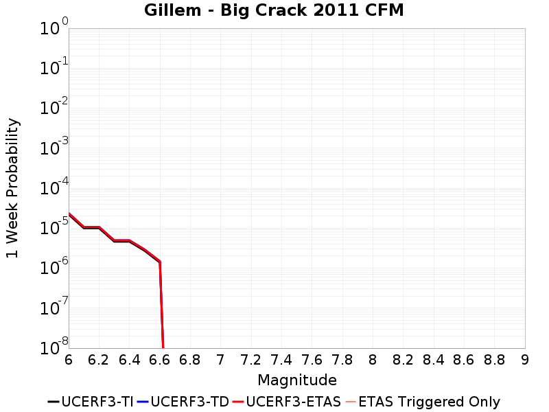 | 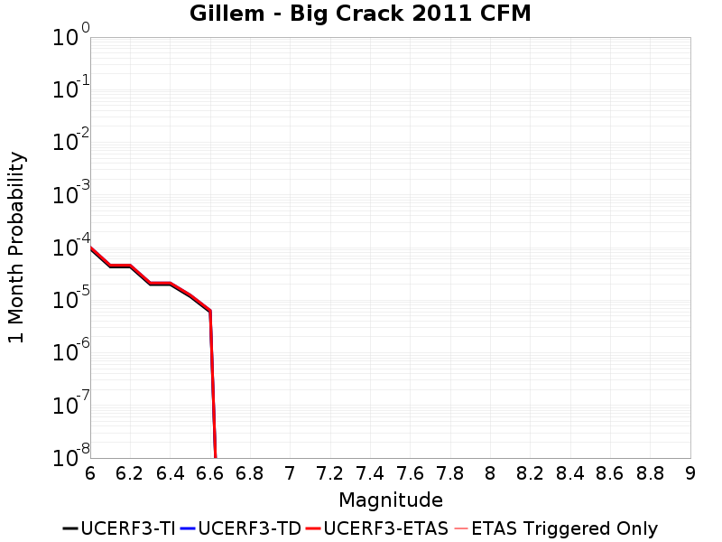 |  |  |

| Magnitude | 1 wk TI Prob | 1 wk TD Prob | 1 wk ETAS Prob | 1 wk ETAS/TD Gain | 1 wk ETAS Triggered Only | 1 mo TI Prob | 1 mo TD Prob | 1 mo ETAS Prob | 1 mo ETAS/TD Gain | 1 mo ETAS Triggered Only | 1 yr TI Prob | 1 yr TD Prob | 1 yr ETAS Prob | 1 yr ETAS/TD Gain | 1 yr ETAS Triggered Only | 10 yr TI Prob | 10 yr TD Prob | 10 yr ETAS Prob | 10 yr ETAS/TD Gain | 10 yr ETAS Triggered Only |
|-----|-----|-----|-----|-----|-----|-----|-----|-----|-----|-----|-----|-----|-----|-----|-----|-----|-----|-----|-----|-----|
| 6.0 | 2.196852E-5 | 2.3628982E-5 | 2.3628982E-5 | 1.0 | 0.0 | 9.4147406E-5 | 1.01263635E-4 | 1.01263635E-4 | 1.0 | 0.0 | 0.0011456419 | 0.0012322766 | 0.0012422643 | 1.008105 | 1.0E-5 | 0.011397537 | 0.012263316 | 0.012273192 | 1.0008055 | 1.0E-5 |
| 6.1 | 9.992795E-6 | 1.072263E-5 | 1.072263E-5 | 1.0 | 0.0 | 4.2825563E-5 | 4.595342E-5 | 4.595342E-5 | 1.0 | 0.0 | 5.2127644E-4 | 5.5935764E-4 | 5.5935764E-4 | 1.0 | 0.0 | 0.0052005537 | 0.005581311 | 0.005581311 | 1.0 | 0.0 |
| 6.2 | 9.992795E-6 | 1.072263E-5 | 1.072263E-5 | 1.0 | 0.0 | 4.2825563E-5 | 4.595342E-5 | 4.595342E-5 | 1.0 | 0.0 | 5.2127644E-4 | 5.5935764E-4 | 5.5935764E-4 | 1.0 | 0.0 | 0.0052005537 | 0.005581311 | 0.005581311 | 1.0 | 0.0 |
| 6.3 | 4.6127884E-6 | 4.947581E-6 | 4.947581E-6 | 1.0 | 0.0 | 1.9768944E-5 | 2.1203772E-5 | 2.1203772E-5 | 1.0 | 0.0 | 2.406603E-4 | 2.5812982E-4 | 2.5812982E-4 | 1.0 | 0.0 | 0.0024039985 | 0.0025787388 | 0.0025787388 | 1.0 | 0.0 |
| 6.4 | 4.6127884E-6 | 4.947581E-6 | 4.947581E-6 | 1.0 | 0.0 | 1.9768944E-5 | 2.1203772E-5 | 2.1203772E-5 | 1.0 | 0.0 | 2.406603E-4 | 2.5812982E-4 | 2.5812982E-4 | 1.0 | 0.0 | 0.0024039985 | 0.0025787388 | 0.0025787388 | 1.0 | 0.0 |
| 6.5 | 2.716712E-6 | 2.9140133E-6 | 2.9140133E-6 | 1.0 | 0.0 | 1.1643E-5 | 1.2488583E-5 | 1.2488583E-5 | 1.0 | 0.0 | 1.417443E-4 | 1.5204032E-4 | 1.5204032E-4 | 1.0 | 0.0 | 0.0014165393 | 0.0015196014 | 0.0015196014 | 1.0 | 0.0 |
| 6.6 | 1.3818255E-6 | 1.4835667E-6 | 1.4835667E-6 | 1.0 | 0.0 | 5.922096E-6 | 6.3581347E-6 | 6.3581347E-6 | 1.0 | 0.0 | 7.209913E-5 | 7.7408775E-5 | 7.7408775E-5 | 1.0 | 0.0 | 7.2075747E-4 | 7.7393925E-4 | 7.7393925E-4 | 1.0 | 0.0 |

## Eaton Roughs 2011 CFM
*[(top)](#table-of-contents)*

| 1 Week | 1 Month | 1 Year | 10 Year |
|-----|-----|-----|-----|
|  | 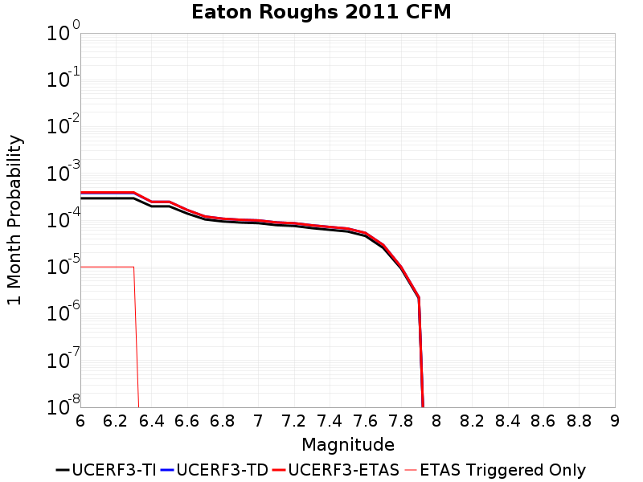 |  | 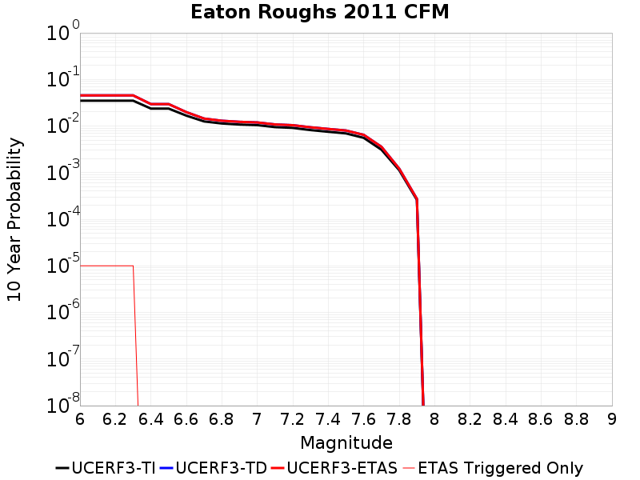 |

| Magnitude | 1 wk TI Prob | 1 wk TD Prob | 1 wk ETAS Prob | 1 wk ETAS/TD Gain | 1 wk ETAS Triggered Only | 1 mo TI Prob | 1 mo TD Prob | 1 mo ETAS Prob | 1 mo ETAS/TD Gain | 1 mo ETAS Triggered Only | 1 yr TI Prob | 1 yr TD Prob | 1 yr ETAS Prob | 1 yr ETAS/TD Gain | 1 yr ETAS Triggered Only | 10 yr TI Prob | 10 yr TD Prob | 10 yr ETAS Prob | 10 yr ETAS/TD Gain | 10 yr ETAS Triggered Only |
|-----|-----|-----|-----|-----|-----|-----|-----|-----|-----|-----|-----|-----|-----|-----|-----|-----|-----|-----|-----|-----|
| 6.0 | 6.8044945E-5 | 8.878678E-5 | 8.878678E-5 | 1.0 | 0.0 | 2.9158857E-4 | 3.804659E-4 | 3.9046208E-4 | 1.0262736 | 1.0E-5 | 0.0035443127 | 0.0046229754 | 0.004632929 | 1.0021532 | 1.0E-5 | 0.03488314 | 0.0453368 | 0.045346346 | 1.0002105 | 1.0E-5 |
| 6.1 | 6.8044945E-5 | 8.878678E-5 | 8.878678E-5 | 1.0 | 0.0 | 2.9158857E-4 | 3.804659E-4 | 3.9046208E-4 | 1.0262736 | 1.0E-5 | 0.0035443127 | 0.0046229754 | 0.004632929 | 1.0021532 | 1.0E-5 | 0.03488314 | 0.0453368 | 0.045346346 | 1.0002105 | 1.0E-5 |
| 6.2 | 6.8044945E-5 | 8.878678E-5 | 8.878678E-5 | 1.0 | 0.0 | 2.9158857E-4 | 3.804659E-4 | 3.9046208E-4 | 1.0262736 | 1.0E-5 | 0.0035443127 | 0.0046229754 | 0.004632929 | 1.0021532 | 1.0E-5 | 0.03488314 | 0.0453368 | 0.045346346 | 1.0002105 | 1.0E-5 |
| 6.3 | 6.8044945E-5 | 8.878678E-5 | 8.878678E-5 | 1.0 | 0.0 | 2.9158857E-4 | 3.804659E-4 | 3.9046208E-4 | 1.0262736 | 1.0E-5 | 0.0035443127 | 0.0046229754 | 0.004632929 | 1.0021532 | 1.0E-5 | 0.03488314 | 0.0453368 | 0.045346346 | 1.0002105 | 1.0E-5 |
| 6.4 | 4.5830013E-5 | 5.735086E-5 | 5.735086E-5 | 1.0 | 0.0 | 1.9639956E-4 | 2.457693E-4 | 2.457693E-4 | 1.0 | 0.0 | 0.0023885423 | 0.0029885115 | 0.0029885115 | 1.0 | 0.0 | 0.023630321 | 0.029520098 | 0.029520098 | 1.0 | 0.0 |
| 6.5 | 4.5830013E-5 | 5.735086E-5 | 5.735086E-5 | 1.0 | 0.0 | 1.9639956E-4 | 2.457693E-4 | 2.457693E-4 | 1.0 | 0.0 | 0.0023885423 | 0.0029885115 | 0.0029885115 | 1.0 | 0.0 | 0.023630321 | 0.029520098 | 0.029520098 | 1.0 | 0.0 |
| 6.6 | 3.222194E-5 | 3.836567E-5 | 3.836567E-5 | 1.0 | 0.0 | 1.3808672E-4 | 1.644146E-4 | 1.644146E-4 | 1.0 | 0.0 | 0.0016799092 | 0.0019999982 | 0.0019999982 | 1.0 | 0.0 | 0.016672665 | 0.019829076 | 0.019829076 | 1.0 | 0.0 |
| 6.7 | 2.4155654E-5 | 2.7846723E-5 | 2.7846723E-5 | 1.0 | 0.0 | 1.0352012E-4 | 1.1933768E-4 | 1.1933768E-4 | 1.0 | 0.0 | 0.0012596287 | 0.0014519761 | 0.0014519761 | 1.0 | 0.0 | 0.012525126 | 0.014425996 | 0.014425996 | 1.0 | 0.0 |
| 6.8 | 2.1814667E-5 | 2.4992716E-5 | 2.4992716E-5 | 1.0 | 0.0 | 9.348808E-5 | 1.0710727E-4 | 1.0710727E-4 | 1.0 | 0.0 | 0.001137623 | 0.0013032546 | 0.0013032546 | 1.0 | 0.0 | 0.011318169 | 0.012956688 | 0.012956688 | 1.0 | 0.0 |
| 6.9 | 2.0700467E-5 | 2.3677501E-5 | 2.3677501E-5 | 1.0 | 0.0 | 8.871327E-5 | 1.0147107E-4 | 1.0147107E-4 | 1.0 | 0.0 | 0.0010795488 | 0.0012347134 | 0.0012347134 | 1.0 | 0.0 | 0.010743194 | 0.012279011 | 0.012279011 | 1.0 | 0.0 |
| 7.0 | 2.0104066E-5 | 2.298349E-5 | 2.298349E-5 | 1.0 | 0.0 | 8.615744E-5 | 9.849697E-5 | 9.849697E-5 | 1.0 | 0.0 | 0.0010484619 | 0.0011985439 | 0.0011985439 | 1.0 | 0.0 | 0.010435291 | 0.011921244 | 0.011921244 | 1.0 | 0.0 |
| 7.1 | 1.8225232E-5 | 2.081543E-5 | 2.081543E-5 | 1.0 | 0.0 | 7.81058E-5 | 8.920595E-5 | 8.920595E-5 | 1.0 | 0.0 | 9.5052324E-4 | 0.0010855428 | 0.0010855428 | 1.0 | 0.0 | 0.009464677 | 0.010802645 | 0.010802645 | 1.0 | 0.0 |
| 7.2 | 1.7526572E-5 | 2.0034577E-5 | 2.0034577E-5 | 1.0 | 0.0 | 7.511172E-5 | 8.585965E-5 | 8.585965E-5 | 1.0 | 0.0 | 9.141015E-4 | 0.0010448414 | 0.0010448414 | 1.0 | 0.0 | 0.009103506 | 0.010399511 | 0.010399511 | 1.0 | 0.0 |
| 7.3 | 1.5727232E-5 | 1.8059887E-5 | 1.8059887E-5 | 1.0 | 0.0 | 6.740067E-5 | 7.739723E-5 | 7.739723E-5 | 1.0 | 0.0 | 8.2029426E-4 | 9.4190513E-4 | 9.4190513E-4 | 1.0 | 0.0 | 0.008172729 | 0.009379293 | 0.009379293 | 1.0 | 0.0 |
| 7.4 | 1.4457361E-5 | 1.6634276E-5 | 1.6634276E-5 | 1.0 | 0.0 | 6.195865E-5 | 7.128782E-5 | 7.128782E-5 | 1.0 | 0.0 | 7.540854E-4 | 8.6758443E-4 | 8.6758443E-4 | 1.0 | 0.0 | 0.007515317 | 0.008642078 | 0.008642078 | 1.0 | 0.0 |
| 7.5 | 1.33280955E-5 | 1.5379379E-5 | 1.5379379E-5 | 1.0 | 0.0 | 5.711916E-5 | 6.590996E-5 | 6.590996E-5 | 1.0 | 0.0 | 6.9520384E-4 | 8.021592E-4 | 8.021592E-4 | 1.0 | 0.0 | 0.00693033 | 0.007992721 | 0.007992721 | 1.0 | 0.0 |
| 7.6 | 1.0699478E-5 | 1.2416441E-5 | 1.2416441E-5 | 1.0 | 0.0 | 4.5854096E-5 | 5.3212236E-5 | 5.3212236E-5 | 1.0 | 0.0 | 5.581306E-4 | 6.47667E-4 | 6.47667E-4 | 1.0 | 0.0 | 0.005567309 | 0.006457818 | 0.006457818 | 1.0 | 0.0 |
| 7.7 | 5.9390236E-6 | 6.8692893E-6 | 6.8692893E-6 | 1.0 | 0.0 | 2.545271E-5 | 2.943948E-5 | 2.943948E-5 | 1.0 | 0.0 | 3.0984267E-4 | 3.5836696E-4 | 3.5836696E-4 | 1.0 | 0.0 | 0.0030941102 | 0.0035779085 | 0.0035779085 | 1.0 | 0.0 |
| 7.8 | 2.1622036E-6 | 2.3326588E-6 | 2.3326588E-6 | 1.0 | 0.0 | 9.266554E-6 | 9.997072E-6 | 9.997072E-6 | 1.0 | 0.0 | 1.1281446E-4 | 1.2170762E-4 | 1.2170762E-4 | 1.0 | 0.0 | 0.001127572 | 0.0012164252 | 0.0012164252 | 1.0 | 0.0 |
| 7.9 | 4.9586197E-7 | 5.222737E-7 | 5.222737E-7 | 1.0 | 0.0 | 2.125121E-6 | 2.2383142E-6 | 2.2383142E-6 | 1.0 | 0.0 | 2.5873042E-5 | 2.7251155E-5 | 2.7251155E-5 | 1.0 | 0.0 | 2.5870028E-4 | 2.7248022E-4 | 2.7248022E-4 | 1.0 | 0.0 |

## Garlock (East)
*[(top)](#table-of-contents)*

| 1 Week | 1 Month | 1 Year | 10 Year |
|-----|-----|-----|-----|
|  |  | 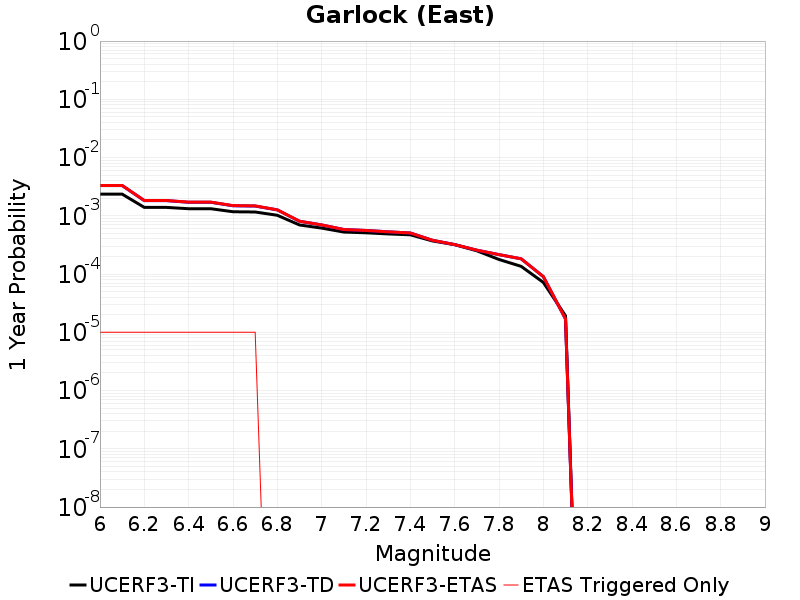 | 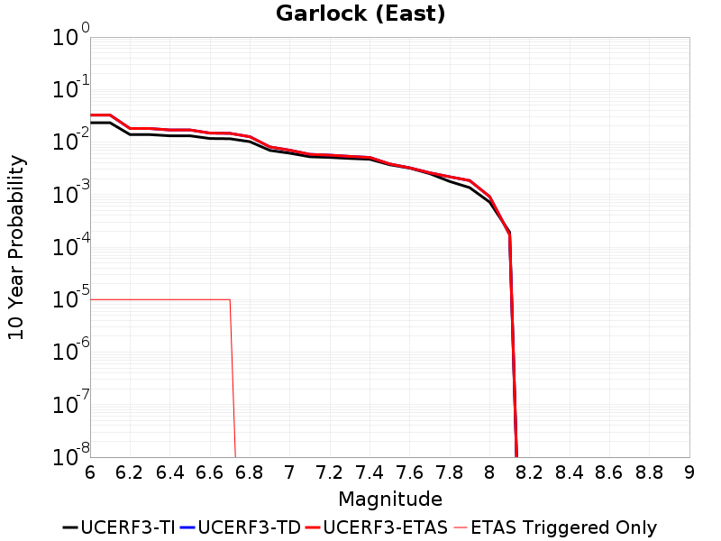 |

| Magnitude | 1 wk TI Prob | 1 wk TD Prob | 1 wk ETAS Prob | 1 wk ETAS/TD Gain | 1 wk ETAS Triggered Only | 1 mo TI Prob | 1 mo TD Prob | 1 mo ETAS Prob | 1 mo ETAS/TD Gain | 1 mo ETAS Triggered Only | 1 yr TI Prob | 1 yr TD Prob | 1 yr ETAS Prob | 1 yr ETAS/TD Gain | 1 yr ETAS Triggered Only | 10 yr TI Prob | 10 yr TD Prob | 10 yr ETAS Prob | 10 yr ETAS/TD Gain | 10 yr ETAS Triggered Only |
|-----|-----|-----|-----|-----|-----|-----|-----|-----|-----|-----|-----|-----|-----|-----|-----|-----|-----|-----|-----|-----|
| 6.0 | 4.5092507E-5 | 6.332278E-5 | 6.332278E-5 | 1.0 | 0.0 | 1.9323928E-4 | 2.7135765E-4 | 2.8135494E-4 | 1.0368418 | 1.0E-5 | 0.0023501497 | 0.003299223 | 0.00330919 | 1.003021 | 1.0E-5 | 0.023254504 | 0.032594927 | 0.0326046 | 1.0002968 | 1.0E-5 |
| 6.1 | 4.5092507E-5 | 6.332278E-5 | 6.332278E-5 | 1.0 | 0.0 | 1.9323928E-4 | 2.7135765E-4 | 2.8135494E-4 | 1.0368418 | 1.0E-5 | 0.0023501497 | 0.003299223 | 0.00330919 | 1.003021 | 1.0E-5 | 0.023254504 | 0.032594927 | 0.0326046 | 1.0002968 | 1.0E-5 |
| 6.2 | 2.6674514E-5 | 3.485572E-5 | 3.485572E-5 | 1.0 | 0.0 | 1.1431433E-4 | 1.4937329E-4 | 1.5937179E-4 | 1.0669364 | 1.0E-5 | 0.0013908884 | 0.0018171362 | 0.001827118 | 1.0054932 | 1.0E-5 | 0.01382215 | 0.018054198 | 0.018064018 | 1.0005438 | 1.0E-5 |
| 6.3 | 2.6674514E-5 | 3.485572E-5 | 3.485572E-5 | 1.0 | 0.0 | 1.1431433E-4 | 1.4937329E-4 | 1.5937179E-4 | 1.0669364 | 1.0E-5 | 0.0013908884 | 0.0018171362 | 0.001827118 | 1.0054932 | 1.0E-5 | 0.01382215 | 0.018054198 | 0.018064018 | 1.0005438 | 1.0E-5 |
| 6.4 | 2.5312667E-5 | 3.2678185E-5 | 3.2678185E-5 | 1.0 | 0.0 | 1.0847834E-4 | 1.4004202E-4 | 1.500406E-4 | 1.0713972 | 1.0E-5 | 0.0013199237 | 0.0017037079 | 0.0017136908 | 1.0058595 | 1.0E-5 | 0.013121112 | 0.016951257 | 0.016961088 | 1.00058 | 1.0E-5 |
| 6.5 | 2.5312667E-5 | 3.2678185E-5 | 3.2678185E-5 | 1.0 | 0.0 | 1.0847834E-4 | 1.4004202E-4 | 1.500406E-4 | 1.0713972 | 1.0E-5 | 0.0013199237 | 0.0017037079 | 0.0017136908 | 1.0058595 | 1.0E-5 | 0.013121112 | 0.016951257 | 0.016961088 | 1.00058 | 1.0E-5 |
| 6.6 | 2.246556E-5 | 2.8455093E-5 | 2.8455093E-5 | 1.0 | 0.0 | 9.627742E-5 | 1.2194483E-4 | 1.3194361E-4 | 1.0819943 | 1.0E-5 | 0.0011715472 | 0.001483691 | 0.0014936762 | 1.00673 | 1.0E-5 | 0.011653901 | 0.014785547 | 0.014795399 | 1.0006664 | 1.0E-5 |
| 6.7 | 2.2241198E-5 | 2.8123655E-5 | 2.8123655E-5 | 1.0 | 0.0 | 9.531594E-5 | 1.2052451E-4 | 1.3052332E-4 | 1.0829607 | 1.0E-5 | 0.0011598538 | 0.0014664221 | 0.0014764074 | 1.0068094 | 1.0E-5 | 0.011538187 | 0.014616094 | 0.014625948 | 1.0006741 | 1.0E-5 |
| 6.8 | 1.9528685E-5 | 2.4196173E-5 | 2.4196173E-5 | 1.0 | 0.0 | 8.369167E-5 | 1.0369388E-4 | 1.0369388E-4 | 1.0 | 0.0 | 0.0010184698 | 0.0012617618 | 0.0012617618 | 1.0 | 0.0 | 0.010138147 | 0.012589808 | 0.012589808 | 1.0 | 0.0 |
| 6.9 | 1.3318621E-5 | 1.5441032E-5 | 1.5441032E-5 | 1.0 | 0.0 | 5.7078556E-5 | 6.61742E-5 | 6.61742E-5 | 1.0 | 0.0 | 6.9470983E-4 | 8.053789E-4 | 8.053789E-4 | 1.0 | 0.0 | 0.0069254204 | 0.00806444 | 0.00806444 | 1.0 | 0.0 |
| 7.0 | 1.1760853E-5 | 1.33396015E-5 | 1.33396015E-5 | 1.0 | 0.0 | 5.0402683E-5 | 5.7168498E-5 | 5.7168498E-5 | 1.0 | 0.0 | 6.134799E-4 | 6.9580926E-4 | 6.9580926E-4 | 1.0 | 0.0 | 0.0061178906 | 0.006975931 | 0.006975931 | 1.0 | 0.0 |
| 7.1 | 1.0064758E-5 | 1.1122321E-5 | 1.1122321E-5 | 1.0 | 0.0 | 4.3133965E-5 | 4.766624E-5 | 4.766624E-5 | 1.0 | 0.0 | 5.2502943E-4 | 5.801855E-4 | 5.801855E-4 | 1.0 | 0.0 | 0.005237907 | 0.005826911 | 0.005826911 | 1.0 | 0.0 |
| 7.2 | 9.768808E-6 | 1.0716479E-5 | 1.0716479E-5 | 1.0 | 0.0 | 4.186565E-5 | 4.5926976E-5 | 4.5926976E-5 | 1.0 | 0.0 | 5.095951E-4 | 5.590211E-4 | 5.590211E-4 | 1.0 | 0.0 | 0.0050842804 | 0.0056162146 | 0.0056162146 | 1.0 | 0.0 |
| 7.3 | 9.344516E-6 | 1.0156129E-5 | 1.0156129E-5 | 1.0 | 0.0 | 4.004731E-5 | 4.352556E-5 | 4.352556E-5 | 1.0 | 0.0 | 4.8746695E-4 | 5.297984E-4 | 5.297984E-4 | 1.0 | 0.0 | 0.0048639905 | 0.005324807 | 0.005324807 | 1.0 | 0.0 |
| 7.4 | 9.023491E-6 | 9.696015E-6 | 9.696015E-6 | 1.0 | 0.0 | 3.867153E-5 | 4.1553707E-5 | 4.1553707E-5 | 1.0 | 0.0 | 4.7072413E-4 | 5.0580234E-4 | 5.0580234E-4 | 1.0 | 0.0 | 0.004697283 | 0.005085093 | 0.005085093 | 1.0 | 0.0 |
| 7.5 | 7.081253E-6 | 7.270843E-6 | 7.270843E-6 | 1.0 | 0.0 | 3.0347876E-5 | 3.1160387E-5 | 3.1160387E-5 | 1.0 | 0.0 | 3.6942272E-4 | 3.7931243E-4 | 3.7931243E-4 | 1.0 | 0.0 | 0.003688092 | 0.0038197488 | 0.0038197488 | 1.0 | 0.0 |
| 7.6 | 6.116396E-6 | 6.13074E-6 | 6.13074E-6 | 1.0 | 0.0 | 2.6212863E-5 | 2.6274338E-5 | 2.6274338E-5 | 1.0 | 0.0 | 3.1909486E-4 | 3.1984338E-4 | 3.1984338E-4 | 1.0 | 0.0 | 0.0031863707 | 0.0032253547 | 0.0032253547 | 1.0 | 0.0 |
| 7.7 | 4.797145E-6 | 4.918603E-6 | 4.918603E-6 | 1.0 | 0.0 | 2.055903E-5 | 2.1079557E-5 | 2.1079557E-5 | 1.0 | 0.0 | 2.5027743E-4 | 2.566135E-4 | 2.566135E-4 | 1.0 | 0.0 | 0.0024999576 | 0.0025933944 | 0.0025933944 | 1.0 | 0.0 |
| 7.8 | 3.4028885E-6 | 4.122663E-6 | 4.122663E-6 | 1.0 | 0.0 | 1.4583726E-5 | 1.7668437E-5 | 1.7668437E-5 | 1.0 | 0.0 | 1.775424E-4 | 2.1509208E-4 | 2.1509208E-4 | 1.0 | 0.0 | 0.0017740062 | 0.0021763365 | 0.0021763365 | 1.0 | 0.0 |
| 7.9 | 2.5928412E-6 | 3.4945913E-6 | 3.4945913E-6 | 1.0 | 0.0 | 1.1112129E-5 | 1.4976734E-5 | 1.4976734E-5 | 1.0 | 0.0 | 1.3528178E-4 | 1.8232655E-4 | 1.8232655E-4 | 1.0 | 0.0 | 0.0013519945 | 0.0018447689 | 0.0018447689 | 1.0 | 0.0 |
| 8.0 | 1.3743648E-6 | 1.7285276E-6 | 1.7285276E-6 | 1.0 | 0.0 | 5.8901214E-6 | 7.407955E-6 | 7.407955E-6 | 1.0 | 0.0 | 7.1709874E-5 | 9.018815E-5 | 9.018815E-5 | 1.0 | 0.0 | 7.1686733E-4 | 9.122816E-4 | 9.122816E-4 | 1.0 | 0.0 |
| 8.1 | 3.6733252E-7 | 3.246663E-7 | 3.246663E-7 | 1.0 | 0.0 | 1.5742813E-6 | 1.3914264E-6 | 1.3914264E-6 | 1.0 | 0.0 | 1.9166706E-5 | 1.6940503E-5 | 1.6940503E-5 | 1.0 | 0.0 | 1.9165053E-4 | 1.7154143E-4 | 1.7154143E-4 | 1.0 | 0.0 |

## Mohawk Valley 2011 CFM
*[(top)](#table-of-contents)*

| 1 Week | 1 Month | 1 Year | 10 Year |
|-----|-----|-----|-----|
| 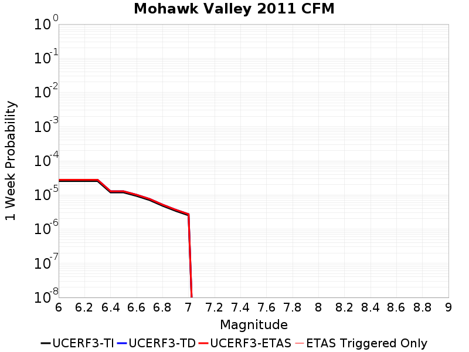 | 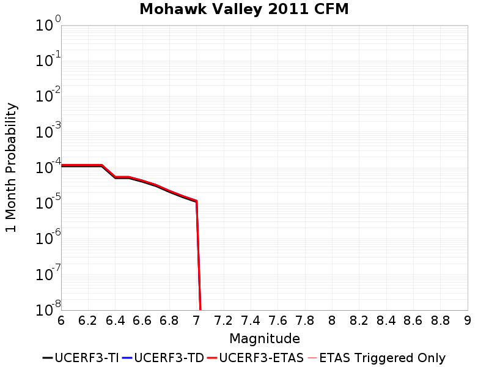 |  | 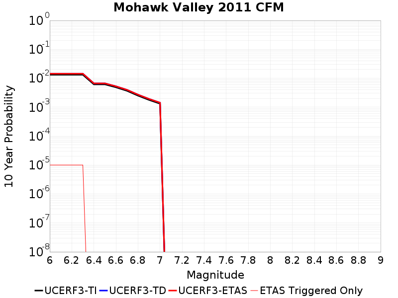 |

| Magnitude | 1 wk TI Prob | 1 wk TD Prob | 1 wk ETAS Prob | 1 wk ETAS/TD Gain | 1 wk ETAS Triggered Only | 1 mo TI Prob | 1 mo TD Prob | 1 mo ETAS Prob | 1 mo ETAS/TD Gain | 1 mo ETAS Triggered Only | 1 yr TI Prob | 1 yr TD Prob | 1 yr ETAS Prob | 1 yr ETAS/TD Gain | 1 yr ETAS Triggered Only | 10 yr TI Prob | 10 yr TD Prob | 10 yr ETAS Prob | 10 yr ETAS/TD Gain | 10 yr ETAS Triggered Only |
|-----|-----|-----|-----|-----|-----|-----|-----|-----|-----|-----|-----|-----|-----|-----|-----|-----|-----|-----|-----|-----|
| 6.0 | 2.5425423E-5 | 2.767844E-5 | 2.767844E-5 | 1.0 | 0.0 | 1.0896155E-4 | 1.1861711E-4 | 1.1861711E-4 | 1.0 | 0.0 | 0.0013257994 | 0.0014433153 | 0.0014533008 | 1.0069185 | 1.0E-5 | 0.013179175 | 0.014350324 | 0.01436018 | 1.0006869 | 1.0E-5 |
| 6.1 | 2.5425423E-5 | 2.767844E-5 | 2.767844E-5 | 1.0 | 0.0 | 1.0896155E-4 | 1.1861711E-4 | 1.1861711E-4 | 1.0 | 0.0 | 0.0013257994 | 0.0014433153 | 0.0014533008 | 1.0069185 | 1.0E-5 | 0.013179175 | 0.014350324 | 0.01436018 | 1.0006869 | 1.0E-5 |
| 6.2 | 2.5425423E-5 | 2.767844E-5 | 2.767844E-5 | 1.0 | 0.0 | 1.0896155E-4 | 1.1861711E-4 | 1.1861711E-4 | 1.0 | 0.0 | 0.0013257994 | 0.0014433153 | 0.0014533008 | 1.0069185 | 1.0E-5 | 0.013179175 | 0.014350324 | 0.01436018 | 1.0006869 | 1.0E-5 |
| 6.3 | 2.5425423E-5 | 2.767844E-5 | 2.767844E-5 | 1.0 | 0.0 | 1.0896155E-4 | 1.1861711E-4 | 1.1861711E-4 | 1.0 | 0.0 | 0.0013257994 | 0.0014433153 | 0.0014533008 | 1.0069185 | 1.0E-5 | 0.013179175 | 0.014350324 | 0.01436018 | 1.0006869 | 1.0E-5 |
| 6.4 | 1.1812642E-5 | 1.2777905E-5 | 1.2777905E-5 | 1.0 | 0.0 | 5.0624625E-5 | 5.476138E-5 | 5.476138E-5 | 1.0 | 0.0 | 6.161805E-4 | 6.665307E-4 | 6.665307E-4 | 1.0 | 0.0 | 0.0061447476 | 0.006646792 | 0.006646792 | 1.0 | 0.0 |
| 6.5 | 1.1812642E-5 | 1.2777905E-5 | 1.2777905E-5 | 1.0 | 0.0 | 5.0624625E-5 | 5.476138E-5 | 5.476138E-5 | 1.0 | 0.0 | 6.161805E-4 | 6.665307E-4 | 6.665307E-4 | 1.0 | 0.0 | 0.0061447476 | 0.006646792 | 0.006646792 | 1.0 | 0.0 |
| 6.6 | 9.34204E-6 | 1.0096369E-5 | 1.0096369E-5 | 1.0 | 0.0 | 4.0036703E-5 | 4.3269498E-5 | 4.3269498E-5 | 1.0 | 0.0 | 4.873378E-4 | 5.266906E-4 | 5.266906E-4 | 1.0 | 0.0 | 0.0048627043 | 0.0052555944 | 0.0052555944 | 1.0 | 0.0 |
| 6.7 | 7.0661854E-6 | 7.63259E-6 | 7.63259E-6 | 1.0 | 0.0 | 3.02833E-5 | 3.2710737E-5 | 3.2710737E-5 | 1.0 | 0.0 | 3.686368E-4 | 3.9818956E-4 | 3.9818956E-4 | 1.0 | 0.0 | 0.0036802588 | 0.003975658 | 0.003975658 | 1.0 | 0.0 |
| 6.8 | 4.806676E-6 | 5.192938E-6 | 5.192938E-6 | 1.0 | 0.0 | 2.0599877E-5 | 2.2255295E-5 | 2.2255295E-5 | 1.0 | 0.0 | 2.507746E-4 | 2.709309E-4 | 2.709309E-4 | 1.0 | 0.0 | 0.0025049183 | 0.0027066339 | 0.0027066339 | 1.0 | 0.0 |
| 6.9 | 3.4163209E-6 | 3.6929985E-6 | 3.6929985E-6 | 1.0 | 0.0 | 1.4641293E-5 | 1.582707E-5 | 1.582707E-5 | 1.0 | 0.0 | 1.7824316E-4 | 1.9268299E-4 | 1.9268299E-4 | 1.0 | 0.0 | 0.0017810026 | 0.0019256923 | 0.0019256923 | 1.0 | 0.0 |
| 7.0 | 2.5271734E-6 | 2.7340818E-6 | 2.7340818E-6 | 1.0 | 0.0 | 1.0830699E-5 | 1.1717469E-5 | 1.1717469E-5 | 1.0 | 0.0 | 1.3185578E-4 | 1.4265579E-4 | 1.4265579E-4 | 1.0 | 0.0 | 0.0013177756 | 0.0014261268 | 0.0014261268 | 1.0 | 0.0 |

## San Andreas (Parkfield)
*[(top)](#table-of-contents)*

| 1 Week | 1 Month | 1 Year | 10 Year |
|-----|-----|-----|-----|
| 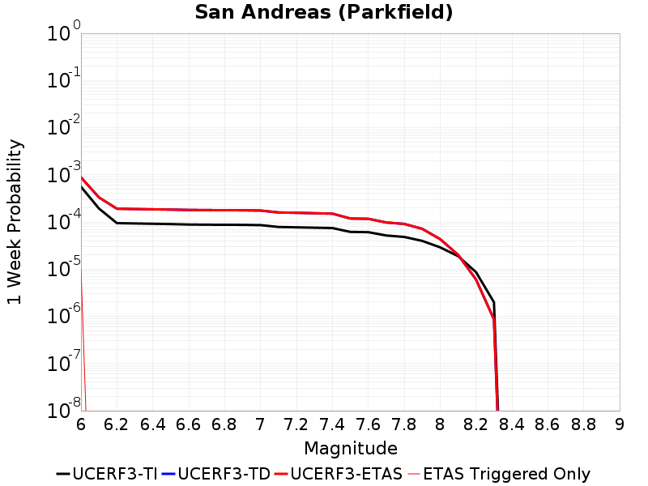 |  |  | 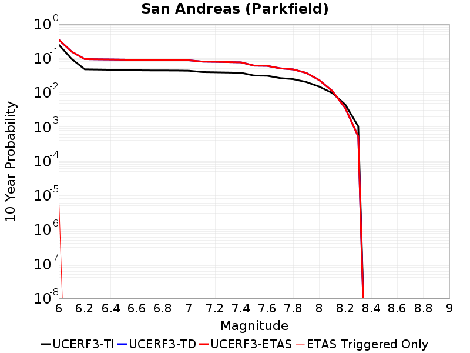 |

| Magnitude | 1 wk TI Prob | 1 wk TD Prob | 1 wk ETAS Prob | 1 wk ETAS/TD Gain | 1 wk ETAS Triggered Only | 1 mo TI Prob | 1 mo TD Prob | 1 mo ETAS Prob | 1 mo ETAS/TD Gain | 1 mo ETAS Triggered Only | 1 yr TI Prob | 1 yr TD Prob | 1 yr ETAS Prob | 1 yr ETAS/TD Gain | 1 yr ETAS Triggered Only | 10 yr TI Prob | 10 yr TD Prob | 10 yr ETAS Prob | 10 yr ETAS/TD Gain | 10 yr ETAS Triggered Only |
|-----|-----|-----|-----|-----|-----|-----|-----|-----|-----|-----|-----|-----|-----|-----|-----|-----|-----|-----|-----|-----|
| 6.0 | 5.556969E-4 | 8.7570667E-4 | 8.8569795E-4 | 1.0114094 | 1.0E-5 | 0.0023793848 | 0.003748364 | 0.0037583264 | 1.0026578 | 1.0E-5 | 0.028586963 | 0.044859797 | 0.04486935 | 1.0002129 | 1.0E-5 | 0.25176284 | 0.3514995 | 0.351506 | 1.0000185 | 1.0E-5 |
| 6.1 | 1.925858E-4 | 3.3084137E-4 | 3.3084137E-4 | 1.0 | 0.0 | 8.2510663E-4 | 0.0014172494 | 0.0014172494 | 1.0 | 0.0 | 0.0099994885 | 0.017156033 | 0.017156033 | 1.0 | 0.0 | 0.095613256 | 0.15649909 | 0.15649909 | 1.0 | 0.0 |
| 6.2 | 9.4306815E-5 | 1.9060382E-4 | 1.9060382E-4 | 1.0 | 0.0 | 4.0410945E-4 | 8.166191E-4 | 8.166191E-4 | 1.0 | 0.0 | 0.0049089384 | 0.009897257 | 0.009897257 | 1.0 | 0.0 | 0.048019063 | 0.09538598 | 0.09538598 | 1.0 | 0.0 |
| 6.3 | 9.283051E-5 | 1.875372E-4 | 1.875372E-4 | 1.0 | 0.0 | 3.9778434E-4 | 8.034845E-4 | 8.034845E-4 | 1.0 | 0.0 | 0.0048322747 | 0.009738784 | 0.009738784 | 1.0 | 0.0 | 0.047285385 | 0.09403356 | 0.09403356 | 1.0 | 0.0 |
| 6.4 | 9.138826E-5 | 1.8510594E-4 | 1.8510594E-4 | 1.0 | 0.0 | 3.916052E-4 | 7.930712E-4 | 7.930712E-4 | 1.0 | 0.0 | 0.0047573745 | 0.009613125 | 0.009613125 | 1.0 | 0.0 | 0.046568092 | 0.09291519 | 0.09291519 | 1.0 | 0.0 |
| 6.5 | 9.000255E-5 | 1.8263987E-4 | 1.8263987E-4 | 1.0 | 0.0 | 3.8566816E-4 | 7.8250875E-4 | 7.8250875E-4 | 1.0 | 0.0 | 0.0046854047 | 0.009485659 | 0.009485659 | 1.0 | 0.0 | 0.045878403 | 0.091790654 | 0.091790654 | 1.0 | 0.0 |
| 6.6 | 8.8109264E-5 | 1.7935078E-4 | 1.7935078E-4 | 1.0 | 0.0 | 3.7755648E-4 | 7.68421E-4 | 7.68421E-4 | 1.0 | 0.0 | 0.0045870654 | 0.009315636 | 0.009315636 | 1.0 | 0.0 | 0.04493529 | 0.09028853 | 0.09028853 | 1.0 | 0.0 |
| 6.7 | 8.738073E-5 | 1.779997E-4 | 1.779997E-4 | 1.0 | 0.0 | 3.7443507E-4 | 7.6263404E-4 | 7.6263404E-4 | 1.0 | 0.0 | 0.0045492216 | 0.009245815 | 0.009245815 | 1.0 | 0.0 | 0.04457213 | 0.08968237 | 0.08968237 | 1.0 | 0.0 |
| 6.8 | 8.710195E-5 | 1.7743706E-4 | 1.7743706E-4 | 1.0 | 0.0 | 3.7324068E-4 | 7.602241E-4 | 7.602241E-4 | 1.0 | 0.0 | 0.0045347405 | 0.009216732 | 0.009216732 | 1.0 | 0.0 | 0.04443313 | 0.08942378 | 0.08942378 | 1.0 | 0.0 |
| 6.9 | 8.6801556E-5 | 1.7683068E-4 | 1.7683068E-4 | 1.0 | 0.0 | 3.7195362E-4 | 7.576269E-4 | 7.576269E-4 | 1.0 | 0.0 | 0.0045191357 | 0.009185378 | 0.009185378 | 1.0 | 0.0 | 0.044283327 | 0.08914467 | 0.08914467 | 1.0 | 0.0 |
| 7.0 | 8.5571606E-5 | 1.742959E-4 | 1.742959E-4 | 1.0 | 0.0 | 3.6668387E-4 | 7.467698E-4 | 7.467698E-4 | 1.0 | 0.0 | 0.004455241 | 0.0090542985 | 0.0090542985 | 1.0 | 0.0 | 0.043669727 | 0.08797168 | 0.08797168 | 1.0 | 0.0 |
| 7.1 | 7.82589E-5 | 1.5882011E-4 | 1.5882011E-4 | 1.0 | 0.0 | 3.3535215E-4 | 6.8048085E-4 | 6.8048085E-4 | 1.0 | 0.0 | 0.0040752706 | 0.008253569 | 0.008253569 | 1.0 | 0.0 | 0.040013418 | 0.08078921 | 0.08078921 | 1.0 | 0.0 |
| 7.2 | 7.690929E-5 | 1.5613598E-4 | 1.5613598E-4 | 1.0 | 0.0 | 3.2956956E-4 | 6.6898344E-4 | 6.6898344E-4 | 1.0 | 0.0 | 0.004005129 | 0.008114639 | 0.008114639 | 1.0 | 0.0 | 0.0393371 | 0.079544574 | 0.079544574 | 1.0 | 0.0 |
| 7.3 | 7.5543794E-5 | 1.5300729E-4 | 1.5300729E-4 | 1.0 | 0.0 | 3.2371894E-4 | 6.5558153E-4 | 6.5558153E-4 | 1.0 | 0.0 | 0.003934157 | 0.007952672 | 0.007952672 | 1.0 | 0.0 | 0.038652334 | 0.07807747 | 0.07807747 | 1.0 | 0.0 |
| 7.4 | 7.4214564E-5 | 1.4991847E-4 | 1.4991847E-4 | 1.0 | 0.0 | 3.1802364E-4 | 6.423503E-4 | 6.423503E-4 | 1.0 | 0.0 | 0.003865065 | 0.007792745 | 0.007792745 | 1.0 | 0.0 | 0.03798529 | 0.076615945 | 0.076615945 | 1.0 | 0.0 |
| 7.5 | 6.149578E-5 | 1.1820736E-4 | 1.1820736E-4 | 1.0 | 0.0 | 2.6352672E-4 | 5.0650473E-4 | 5.0650473E-4 | 1.0 | 0.0 | 0.0032037178 | 0.006149295 | 0.006149295 | 1.0 | 0.0 | 0.03157923 | 0.061445583 | 0.061445583 | 1.0 | 0.0 |
| 7.6 | 6.0643448E-5 | 1.1643752E-4 | 1.1643752E-4 | 1.0 | 0.0 | 2.598746E-4 | 4.989226E-4 | 4.989226E-4 | 1.0 | 0.0 | 0.0031593828 | 0.0060575 | 0.0060575 | 1.0 | 0.0 | 0.031148417 | 0.060584955 | 0.060584955 | 1.0 | 0.0 |
| 7.7 | 5.1652263E-5 | 9.7362434E-5 | 9.7362434E-5 | 1.0 | 0.0 | 2.2134806E-4 | 4.1720088E-4 | 4.1720088E-4 | 1.0 | 0.0 | 0.002691582 | 0.0050676027 | 0.0050676027 | 1.0 | 0.0 | 0.026592141 | 0.05115169 | 0.05115169 | 1.0 | 0.0 |
| 7.8 | 4.8090482E-5 | 9.0766946E-5 | 9.0766946E-5 | 1.0 | 0.0 | 2.060858E-4 | 3.889432E-4 | 3.889432E-4 | 1.0 | 0.0 | 0.0025062072 | 0.0047251116 | 0.0047251116 | 1.0 | 0.0 | 0.024781305 | 0.04771952 | 0.04771952 | 1.0 | 0.0 |
| 7.9 | 3.970278E-5 | 7.154224E-5 | 7.154224E-5 | 1.0 | 0.0 | 1.7014367E-4 | 3.065736E-4 | 3.065736E-4 | 1.0 | 0.0 | 0.002069531 | 0.00372615 | 0.00372615 | 1.0 | 0.0 | 0.020503636 | 0.037807334 | 0.037807334 | 1.0 | 0.0 |
| 8.0 | 2.8982335E-5 | 4.328413E-5 | 4.328413E-5 | 1.0 | 0.0 | 1.2420409E-4 | 1.8549022E-4 | 1.8549022E-4 | 1.0 | 0.0 | 0.0015111357 | 0.0022560058 | 0.0022560058 | 1.0 | 0.0 | 0.015009012 | 0.023298599 | 0.023298599 | 1.0 | 0.0 |
| 8.1 | 1.8836186E-5 | 2.0145564E-5 | 2.0145564E-5 | 1.0 | 0.0 | 8.0724014E-5 | 8.6335276E-5 | 8.6335276E-5 | 1.0 | 0.0 | 9.823717E-4 | 0.0010506258 | 0.0010506258 | 1.0 | 0.0 | 0.009780403 | 0.011254798 | 0.011254798 | 1.0 | 0.0 |
| 8.2 | 8.643924E-6 | 6.0384327E-6 | 6.0384327E-6 | 1.0 | 0.0 | 3.704486E-5 | 2.5878742E-5 | 2.5878742E-5 | 1.0 | 0.0 | 4.5092785E-4 | 3.150282E-4 | 3.150282E-4 | 1.0 | 0.0 | 0.0045001395 | 0.003555621 | 0.003555621 | 1.0 | 0.0 |
| 8.3 | 1.983087E-6 | 8.599996E-7 | 8.599996E-7 | 1.0 | 0.0 | 8.498917E-6 | 3.6857075E-6 | 3.6857075E-6 | 1.0 | 0.0 | 1.034694E-4 | 4.4872588E-5 | 4.4872588E-5 | 1.0 | 0.0 | 0.0010342124 | 5.2569003E-4 | 5.2569003E-4 | 1.0 | 0.0 |

