# Parent Section Magnitude-Probability Distributions

Only fault sections with at least one triggered aftershock are plotted. Sections are sorted by total supraseismogenic trigger rate (decreasing)

## Table Of Contents

* [Almanor 2011 CFM](#almanor-2011-cfm)
* [Keddie Ridge 2011 CFM](#keddie-ridge-2011-cfm)
* [Walker Spring 2011 CFM](#walker-spring-2011-cfm)
* [Skinner Flat 2011 CFM](#skinner-flat-2011-cfm)
* [Hat Creek-McArthur-Mayfield](#hat-creek-mcarthur-mayfield)
* [Honey Lake 2011 CFM](#honey-lake-2011-cfm)
* [Surprise Valley 2011 CFM](#surprise-valley-2011-cfm)
* [Likely 2011 CFM](#likely-2011-cfm)
* [Hunting Creek - Berryessa 2011 CFM](#hunting-creek---berryessa-2011-cfm)
* [Fitzhugh Creek](#fitzhugh-creek)
* [Swain Ravine - Spenceville](#swain-ravine---spenceville)
* [Cedar Mtn-Mahogany Mtn](#cedar-mtn-mahogany-mtn)
* [Death Valley (Fish Lake Valley)](#death-valley-fish-lake-valley)
* [Hunting Creek - Bartlett Springs connector 2011](#hunting-creek---bartlett-springs-connector-2011)
* [Pittville 2011 CFM](#pittville-2011-cfm)
* [Gillem - Big Crack 2011 CFM](#gillem---big-crack-2011-cfm)
* [San Gregorio (North) 2011 CFM](#san-gregorio-north-2011-cfm)
* [Big Lagoon - Bald Mtn 2011 CFM](#big-lagoon---bald-mtn-2011-cfm)
* [Great Valley 04b Gordon Valley](#great-valley-04b-gordon-valley)
* [Rocky Ledge 2011 CFM](#rocky-ledge-2011-cfm)
* [Greenville (No) 2011 CFM](#greenville-no-2011-cfm)
* [Eaton Roughs 2011 CFM](#eaton-roughs-2011-cfm)
* [Davis Creek](#davis-creek)
* [Point Reyes 2011 CFM](#point-reyes-2011-cfm)
* [Goose Lake 2011 CFM](#goose-lake-2011-cfm)
* [Great Valley 03 Mysterious Ridge](#great-valley-03-mysterious-ridge)
* [Great Valley 04a Trout Creek](#great-valley-04a-trout-creek)

## Almanor 2011 CFM
*[(top)](#table-of-contents)*

| 1 Week | 1 Month | 1 Year | 10 Year |
|-----|-----|-----|-----|
|  | 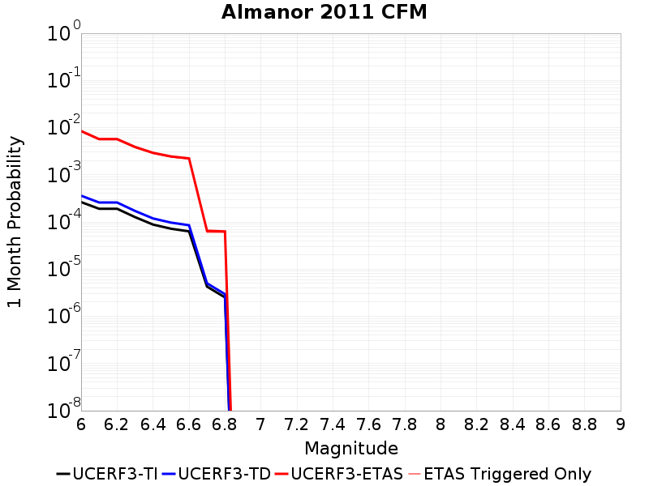 |  |  |

| Magnitude | 1 wk TI Prob | 1 wk TD Prob | 1 wk ETAS Prob | 1 wk ETAS/TD Gain | 1 wk ETAS Triggered Only | 1 mo TI Prob | 1 mo TD Prob | 1 mo ETAS Prob | 1 mo ETAS/TD Gain | 1 mo ETAS Triggered Only | 1 yr TI Prob | 1 yr TD Prob | 1 yr ETAS Prob | 1 yr ETAS/TD Gain | 1 yr ETAS Triggered Only | 10 yr TI Prob | 10 yr TD Prob | 10 yr ETAS Prob | 10 yr ETAS/TD Gain | 10 yr ETAS Triggered Only |
|-----|-----|-----|-----|-----|-----|-----|-----|-----|-----|-----|-----|-----|-----|-----|-----|-----|-----|-----|-----|-----|
| 6.0 | 6.1479834E-5 | 8.4012216E-5 | 0.0040136822 | 47.774982 | 0.00393 | 2.6345838E-4 | 3.60004E-4 | 0.008457088 | 23.491652 | 0.0081 | 0.0032028882 | 0.0043748673 | 0.021190975 | 4.8437986 | 0.01689 | 0.031571172 | 0.042951062 | 0.067489795 | 1.5713184 | 0.02564 |
| 6.1 | 4.4387216E-5 | 6.0290025E-5 | 0.002830123 | 46.941814 | 0.00277 | 1.9021705E-4 | 2.5836134E-4 | 0.0057169506 | 22.127733 | 0.00546 | 0.0023134327 | 0.0031414805 | 0.014316265 | 4.5571713 | 0.01121 | 0.022894967 | 0.031016435 | 0.04772171 | 1.5385944 | 0.01724 |
| 6.2 | 4.4387216E-5 | 6.0290025E-5 | 0.002830123 | 46.941814 | 0.00277 | 1.9021705E-4 | 2.5836134E-4 | 0.0057169506 | 22.127733 | 0.00546 | 0.0023134327 | 0.0031414805 | 0.014316265 | 4.5571713 | 0.01121 | 0.022894967 | 0.031016435 | 0.04772171 | 1.5385944 | 0.01724 |
| 6.3 | 2.9523822E-5 | 3.9887156E-5 | 0.0019098126 | 47.880386 | 0.00187 | 1.2652454E-4 | 1.7093377E-4 | 0.0038902978 | 22.759094 | 0.00372 | 0.0015393476 | 0.0020794845 | 0.009853286 | 4.7383304 | 0.00779 | 0.015287281 | 0.020633025 | 0.032140587 | 1.5577254 | 0.01175 |
| 6.4 | 2.0512744E-5 | 2.766522E-5 | 0.0014276265 | 51.603657 | 0.0014 | 8.79088E-5 | 1.1855979E-4 | 0.0029182278 | 24.613977 | 0.0028 | 0.001069764 | 0.0014428258 | 0.0071545728 | 4.9587226 | 0.00572 | 0.010646289 | 0.014364014 | 0.022781346 | 1.5860013 | 0.00854 |
| 6.5 | 1.6750226E-5 | 2.2581587E-5 | 0.001152556 | 51.039642 | 0.00113 | 7.178471E-5 | 9.67745E-5 | 0.0024465472 | 25.280907 | 0.00235 | 8.7362836E-4 | 0.0011779128 | 0.006122082 | 5.1973987 | 0.00495 | 0.008702018 | 0.011746882 | 0.01904019 | 1.6208718 | 0.00738 |
| 6.6 | 1.4745303E-5 | 1.9875071E-5 | 0.001029855 | 51.81642 | 0.00101 | 6.319262E-5 | 8.51761E-5 | 0.002224994 | 26.122278 | 0.00214 | 7.690986E-4 | 0.0010368542 | 0.0054722507 | 5.2777433 | 0.00444 | 0.0076644225 | 0.01035126 | 0.0170017 | 1.6424763 | 0.00672 |
| 6.7 | 9.951145E-7 | 1.1668549E-6 | 4.1166808E-5 | 35.280144 | 4.0E-5 | 4.26477E-6 | 5.0007984E-6 | 6.5000495E-5 | 12.998025 | 6.0E-5 | 5.1922336E-5 | 6.0883194E-5 | 2.808698E-4 | 4.6132565 | 2.2E-4 | 5.1910203E-4 | 6.086825E-4 | 9.684634E-4 | 1.5910813 | 3.6E-4 |
| 6.8 | 5.866312E-7 | 6.8801853E-7 | 4.068799E-5 | 59.137928 | 4.0E-5 | 2.5141312E-6 | 2.9486482E-6 | 6.294847E-5 | 21.348248 | 6.0E-5 | 3.0609117E-5 | 3.5899335E-5 | 1.9589359E-4 | 5.456747 | 1.6E-4 | 3.06049E-4 | 3.5894828E-4 | 5.688729E-4 | 1.5848325 | 2.1E-4 |

## Keddie Ridge 2011 CFM
*[(top)](#table-of-contents)*

| 1 Week | 1 Month | 1 Year | 10 Year |
|-----|-----|-----|-----|
| 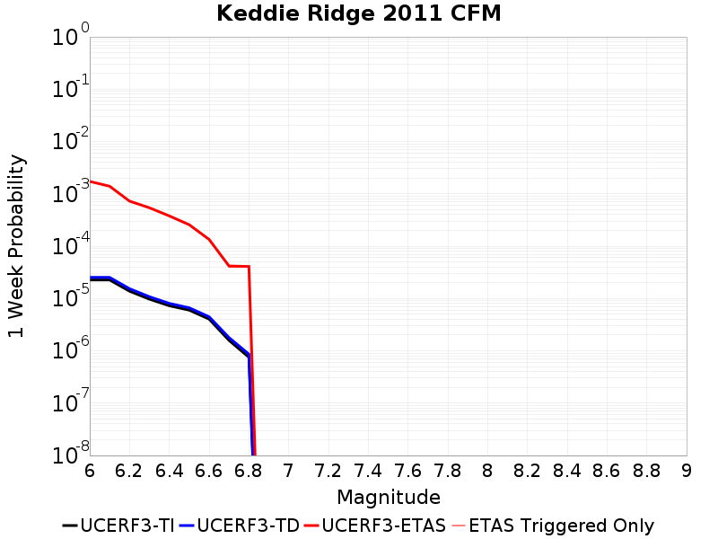 |  |  |  |

| Magnitude | 1 wk TI Prob | 1 wk TD Prob | 1 wk ETAS Prob | 1 wk ETAS/TD Gain | 1 wk ETAS Triggered Only | 1 mo TI Prob | 1 mo TD Prob | 1 mo ETAS Prob | 1 mo ETAS/TD Gain | 1 mo ETAS Triggered Only | 1 yr TI Prob | 1 yr TD Prob | 1 yr ETAS Prob | 1 yr ETAS/TD Gain | 1 yr ETAS Triggered Only | 10 yr TI Prob | 10 yr TD Prob | 10 yr ETAS Prob | 10 yr ETAS/TD Gain | 10 yr ETAS Triggered Only |
|-----|-----|-----|-----|-----|-----|-----|-----|-----|-----|-----|-----|-----|-----|-----|-----|-----|-----|-----|-----|-----|
| 6.0 | 2.2591947E-5 | 2.5267269E-5 | 0.0017252243 | 68.279015 | 0.0017 | 9.6819036E-5 | 1.0828425E-4 | 0.0035779085 | 33.041817 | 0.00347 | 0.0011781343 | 0.0013176431 | 0.008458222 | 6.4192057 | 0.00715 | 0.011719079 | 0.0131063005 | 0.02369567 | 1.8079602 | 0.01073 |
| 6.1 | 2.2591947E-5 | 2.5267269E-5 | 0.0013952326 | 55.21897 | 0.00137 | 9.6819036E-5 | 1.0828425E-4 | 0.0028079918 | 25.931673 | 0.0027 | 0.0011781343 | 0.0013176431 | 0.007100014 | 5.3884196 | 0.00579 | 0.011719079 | 0.0131063005 | 0.021494897 | 1.640043 | 0.0085 |
| 6.2 | 1.3775145E-5 | 1.5369336E-5 | 7.2535843E-4 | 47.19517 | 7.1E-4 | 5.9035E-5 | 6.5867054E-5 | 0.001355782 | 20.583614 | 0.00129 | 7.185141E-4 | 8.016607E-4 | 0.003649376 | 4.55227 | 0.00285 | 0.0071619535 | 0.007990122 | 0.012216084 | 1.5288984 | 0.00426 |
| 6.3 | 9.705435E-6 | 1.0800304E-5 | 5.407946E-4 | 50.072163 | 5.3E-4 | 4.1594063E-5 | 4.6286266E-5 | 9.862428E-4 | 21.30746 | 9.4E-4 | 5.0629E-4 | 5.63402E-4 | 0.0026122471 | 4.6365595 | 0.00205 | 0.005051381 | 0.005620974 | 0.008594167 | 1.5289463 | 0.00299 |
| 6.4 | 7.2549733E-6 | 8.050479E-6 | 3.780475E-4 | 46.95963 | 3.7E-4 | 3.109237E-5 | 3.450164E-5 | 7.144782E-4 | 20.708527 | 6.8E-4 | 3.7848388E-4 | 4.199845E-4 | 0.0020293084 | 4.8318644 | 0.00161 | 0.003778399 | 0.0041926987 | 0.0064930134 | 1.5486478 | 0.00231 |
| 6.5 | 5.983293E-6 | 6.6319676E-6 | 2.566303E-4 | 38.695953 | 2.5E-4 | 2.5642432E-5 | 2.8422446E-5 | 4.8840937E-4 | 17.183931 | 4.6E-4 | 3.1215188E-4 | 3.459951E-4 | 0.0015355834 | 4.438165 | 0.00119 | 0.0031171376 | 0.003455229 | 0.005209148 | 1.5076128 | 0.00176 |
| 6.6 | 4.0336154E-6 | 4.4706367E-6 | 1.3447006E-4 | 30.078505 | 1.3E-4 | 1.728681E-5 | 1.9159752E-5 | 2.2915573E-4 | 11.960265 | 2.1E-4 | 2.1044657E-4 | 2.3324907E-4 | 8.3310914E-4 | 3.5717576 | 6.0E-4 | 0.002102474 | 0.0023304394 | 0.0032882022 | 1.4109795 | 9.6E-4 |
| 6.7 | 1.5832104E-6 | 1.787728E-6 | 4.1787658E-5 | 23.37473 | 4.0E-5 | 6.7851697E-6 | 7.661671E-6 | 9.766098E-5 | 12.7466955 | 9.0E-5 | 8.260631E-5 | 9.327712E-5 | 3.9324912E-4 | 4.215923 | 3.0E-4 | 8.2575605E-4 | 9.324065E-4 | 0.0014219496 | 1.5250318 | 4.9E-4 |
| 6.8 | 7.5177275E-7 | 8.623619E-7 | 4.0862327E-5 | 47.384197 | 4.0E-5 | 3.221879E-6 | 3.6958324E-6 | 7.369558E-5 | 19.940182 | 7.0E-5 | 3.9225673E-5 | 4.4996003E-5 | 2.3498746E-4 | 5.2224073 | 1.9E-4 | 3.921875E-4 | 4.4988556E-4 | 6.997731E-4 | 1.5554469 | 2.5E-4 |

## Walker Spring 2011 CFM
*[(top)](#table-of-contents)*

| 1 Week | 1 Month | 1 Year | 10 Year |
|-----|-----|-----|-----|
| 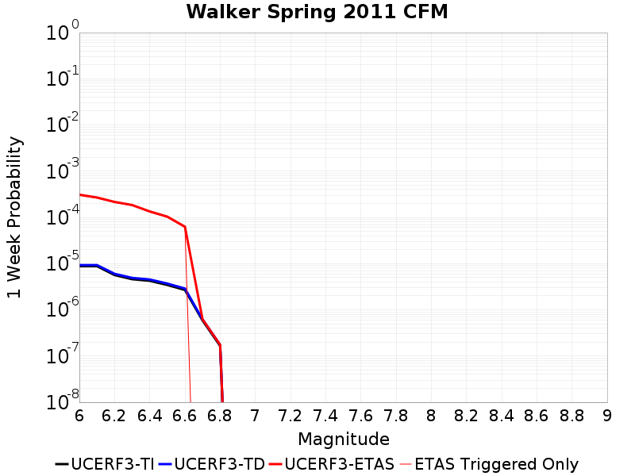 |  | 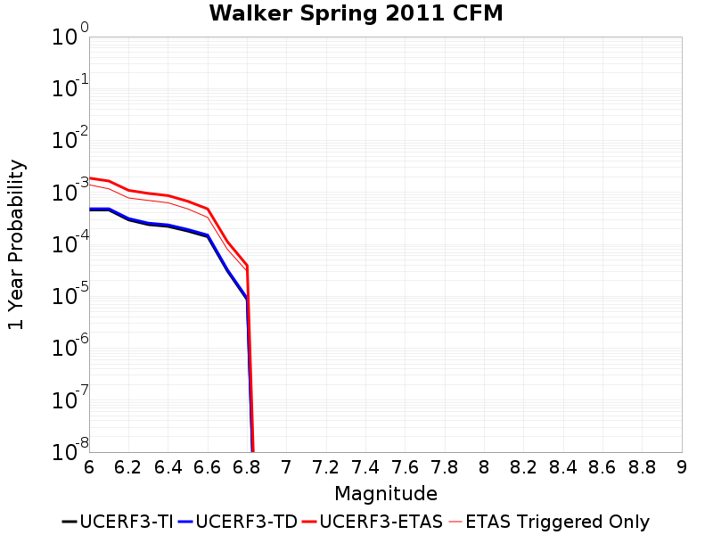 |  |

| Magnitude | 1 wk TI Prob | 1 wk TD Prob | 1 wk ETAS Prob | 1 wk ETAS/TD Gain | 1 wk ETAS Triggered Only | 1 mo TI Prob | 1 mo TD Prob | 1 mo ETAS Prob | 1 mo ETAS/TD Gain | 1 mo ETAS Triggered Only | 1 yr TI Prob | 1 yr TD Prob | 1 yr ETAS Prob | 1 yr ETAS/TD Gain | 1 yr ETAS Triggered Only | 10 yr TI Prob | 10 yr TD Prob | 10 yr ETAS Prob | 10 yr ETAS/TD Gain | 10 yr ETAS Triggered Only |
|-----|-----|-----|-----|-----|-----|-----|-----|-----|-----|-----|-----|-----|-----|-----|-----|-----|-----|-----|-----|-----|
| 6.0 | 8.791276E-6 | 9.277501E-6 | 3.092747E-4 | 33.335995 | 3.0E-4 | 3.767635E-5 | 3.9760176E-5 | 5.997379E-4 | 15.083885 | 5.6E-4 | 4.58613E-4 | 4.839835E-4 | 0.001883306 | 3.8912606 | 0.0014 | 0.004576677 | 0.004830371 | 0.0068605174 | 1.4202878 | 0.00204 |
| 6.1 | 8.791276E-6 | 9.277501E-6 | 2.692751E-4 | 29.024529 | 2.6E-4 | 3.767635E-5 | 3.9760176E-5 | 5.497399E-4 | 13.826395 | 5.1E-4 | 4.58613E-4 | 4.839835E-4 | 0.0016534172 | 3.4162679 | 0.00117 | 0.004576677 | 0.004830371 | 0.006542063 | 1.3543603 | 0.00172 |
| 6.2 | 5.654515E-6 | 6.0085895E-6 | 2.1600733E-4 | 35.949757 | 2.1E-4 | 2.4233412E-5 | 2.5750873E-5 | 4.2574058E-4 | 16.533054 | 4.0E-4 | 2.9500184E-4 | 3.134768E-4 | 0.0010932323 | 3.4874425 | 7.8E-4 | 0.0029461053 | 0.0031308427 | 0.0043071485 | 1.3757154 | 0.00118 |
| 6.3 | 4.591685E-6 | 4.9034084E-6 | 1.8490253E-4 | 37.70898 | 1.8E-4 | 1.96785E-5 | 2.1014463E-5 | 3.6100732E-4 | 17.178993 | 3.4E-4 | 2.395594E-4 | 2.5582543E-4 | 9.5564633E-4 | 3.7355409 | 7.0E-4 | 0.002393013 | 0.0025557412 | 0.0035930832 | 1.405887 | 0.00104 |
| 6.4 | 4.243283E-6 | 4.530666E-6 | 1.3453007E-4 | 29.693224 | 1.3E-4 | 1.8185372E-5 | 1.9417019E-5 | 3.0941138E-4 | 15.935061 | 2.9E-4 | 2.2138441E-4 | 2.363808E-4 | 8.6623186E-4 | 3.664561 | 6.3E-4 | 0.00221164 | 0.002361711 | 0.0033094673 | 1.4013008 | 9.5E-4 |
| 6.5 | 3.4445666E-6 | 3.6930317E-6 | 1.0369266E-4 | 28.077923 | 1.0E-4 | 1.4762345E-5 | 1.5827205E-5 | 2.1582404E-4 | 13.63627 | 2.0E-4 | 1.7971672E-4 | 1.9268323E-4 | 6.7259074E-4 | 3.4906554 | 4.8E-4 | 0.0017957145 | 0.0019255582 | 0.0026641332 | 1.3835641 | 7.4E-4 |
| 6.6 | 2.68766E-6 | 2.884947E-6 | 6.288478E-5 | 21.79755 | 6.0E-5 | 1.1518492E-5 | 1.2364021E-5 | 1.3236253E-4 | 10.705461 | 1.2E-4 | 1.4022861E-4 | 1.5052539E-4 | 4.8047572E-4 | 3.191991 | 3.3E-4 | 0.0014014016 | 0.0015046098 | 0.0020238275 | 1.3450845 | 5.2E-4 |
| 6.7 | 5.880964E-7 | 6.2087383E-7 | 6.2087383E-7 | 1.0 | 0.0 | 2.5204106E-6 | 2.6608857E-6 | 3.2660806E-5 | 12.274412 | 3.0E-5 | 3.0685565E-5 | 3.2395896E-5 | 1.123933E-4 | 3.4693687 | 8.0E-5 | 3.068133E-4 | 3.2392112E-4 | 4.5387904E-4 | 1.4012022 | 1.3E-4 |
| 6.8 | 1.6514163E-7 | 1.7434348E-7 | 1.7434348E-7 | 1.0 | 0.0 | 7.077497E-7 | 7.471864E-7 | 1.0747179E-5 | 14.383532 | 1.0E-5 | 8.616818E-6 | 9.096994E-6 | 3.909672E-5 | 4.297763 | 3.0E-5 | 8.616484E-5 | 9.096994E-5 | 1.309663E-4 | 1.4396657 | 4.0E-5 |

## Skinner Flat 2011 CFM
*[(top)](#table-of-contents)*

| 1 Week | 1 Month | 1 Year | 10 Year |
|-----|-----|-----|-----|
|  |  |  |  |

| Magnitude | 1 wk TI Prob | 1 wk TD Prob | 1 wk ETAS Prob | 1 wk ETAS/TD Gain | 1 wk ETAS Triggered Only | 1 mo TI Prob | 1 mo TD Prob | 1 mo ETAS Prob | 1 mo ETAS/TD Gain | 1 mo ETAS Triggered Only | 1 yr TI Prob | 1 yr TD Prob | 1 yr ETAS Prob | 1 yr ETAS/TD Gain | 1 yr ETAS Triggered Only | 10 yr TI Prob | 10 yr TD Prob | 10 yr ETAS Prob | 10 yr ETAS/TD Gain | 10 yr ETAS Triggered Only |
|-----|-----|-----|-----|-----|-----|-----|-----|-----|-----|-----|-----|-----|-----|-----|-----|-----|-----|-----|-----|-----|
| 6.0 | 4.3279074E-6 | 4.489303E-6 | 7.448899E-5 | 16.59255 | 7.0E-5 | 1.8548042E-5 | 1.923987E-5 | 1.5923717E-4 | 8.276417 | 1.4E-4 | 2.2579901E-4 | 2.3424541E-4 | 5.241775E-4 | 2.2377279 | 2.9E-4 | 0.002255697 | 0.0023424542 | 0.0028113532 | 1.2001742 | 4.7E-4 |
| 6.1 | 4.3279074E-6 | 4.489303E-6 | 7.448899E-5 | 16.59255 | 7.0E-5 | 1.8548042E-5 | 1.923987E-5 | 1.5923717E-4 | 8.276417 | 1.4E-4 | 2.2579901E-4 | 2.3424541E-4 | 4.941845E-4 | 2.109687 | 2.6E-4 | 0.002255697 | 0.0023424542 | 0.0027514938 | 1.1746202 | 4.1E-4 |

## Hat Creek-McArthur-Mayfield
*[(top)](#table-of-contents)*

| 1 Week | 1 Month | 1 Year | 10 Year |
|-----|-----|-----|-----|
|  | 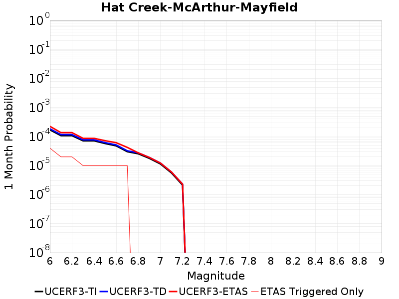 | 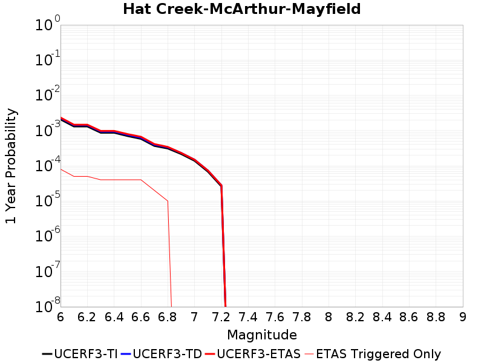 | 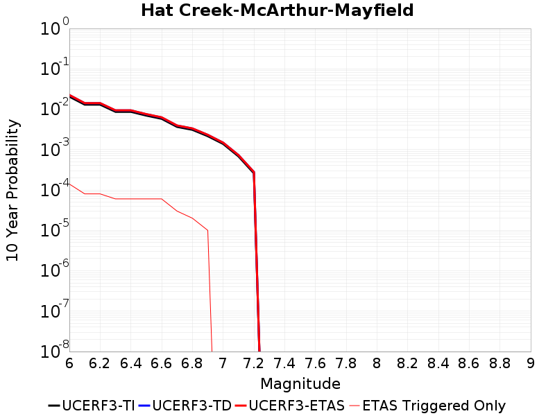 |

| Magnitude | 1 wk TI Prob | 1 wk TD Prob | 1 wk ETAS Prob | 1 wk ETAS/TD Gain | 1 wk ETAS Triggered Only | 1 mo TI Prob | 1 mo TD Prob | 1 mo ETAS Prob | 1 mo ETAS/TD Gain | 1 mo ETAS Triggered Only | 1 yr TI Prob | 1 yr TD Prob | 1 yr ETAS Prob | 1 yr ETAS/TD Gain | 1 yr ETAS Triggered Only | 10 yr TI Prob | 10 yr TD Prob | 10 yr ETAS Prob | 10 yr ETAS/TD Gain | 10 yr ETAS Triggered Only |
|-----|-----|-----|-----|-----|-----|-----|-----|-----|-----|-----|-----|-----|-----|-----|-----|-----|-----|-----|-----|-----|
| 6.0 | 3.967457E-5 | 4.326023E-5 | 6.3259366E-5 | 1.4622984 | 2.0E-5 | 1.7002279E-4 | 1.8538846E-4 | 2.2538104E-4 | 1.2157232 | 4.0E-5 | 0.002068062 | 0.0022548828 | 0.0023347025 | 1.0353986 | 8.0E-5 | 0.02048922 | 0.022332465 | 0.022469338 | 1.0061289 | 1.4E-4 |
| 6.1 | 2.5044013E-5 | 2.7129996E-5 | 3.7129725E-5 | 1.3685857 | 1.0E-5 | 1.0732707E-4 | 1.16266405E-4 | 1.3626408E-4 | 1.1719987 | 2.0E-5 | 0.0013059238 | 0.0014146563 | 0.0014645855 | 1.0352943 | 5.0E-5 | 0.01298276 | 0.014059946 | 0.014138821 | 1.0056099 | 8.0E-5 |
| 6.2 | 2.5044013E-5 | 2.7129996E-5 | 3.7129725E-5 | 1.3685857 | 1.0E-5 | 1.0732707E-4 | 1.16266405E-4 | 1.3626408E-4 | 1.1719987 | 2.0E-5 | 0.0013059238 | 0.0014146563 | 0.0014645855 | 1.0352943 | 5.0E-5 | 0.01298276 | 0.014059946 | 0.014138821 | 1.0056099 | 8.0E-5 |
| 6.3 | 1.6624012E-5 | 1.792763E-5 | 2.7927452E-5 | 1.5577883 | 1.0E-5 | 7.124382E-5 | 7.683049E-5 | 8.682972E-5 | 1.1301466 | 1.0E-5 | 8.670483E-4 | 9.350184E-4 | 9.74981E-4 | 1.0427399 | 4.0E-5 | 0.008636732 | 0.009311782 | 0.009371224 | 1.0063834 | 6.0E-5 |
| 6.4 | 1.6624012E-5 | 1.792763E-5 | 2.7927452E-5 | 1.5577883 | 1.0E-5 | 7.124382E-5 | 7.683049E-5 | 8.682972E-5 | 1.1301466 | 1.0E-5 | 8.670483E-4 | 9.350184E-4 | 9.74981E-4 | 1.0427399 | 4.0E-5 | 0.008636732 | 0.009311782 | 0.009371224 | 1.0063834 | 6.0E-5 |
| 6.5 | 1.3394842E-5 | 1.4420849E-5 | 2.4420704E-5 | 1.6934304 | 1.0E-5 | 5.7405203E-5 | 6.18022E-5 | 7.180159E-5 | 1.1617966 | 1.0E-5 | 6.986842E-4 | 7.521877E-4 | 7.9215755E-4 | 1.0531383 | 4.0E-5 | 0.006964916 | 0.0074970126 | 0.007556563 | 1.0079432 | 6.0E-5 |
| 6.6 | 1.1137514E-5 | 1.1978036E-5 | 2.1977916E-5 | 1.8348514 | 1.0E-5 | 4.7731326E-5 | 5.1333453E-5 | 6.133294E-5 | 1.1947948 | 1.0E-5 | 5.809739E-4 | 6.2480965E-4 | 6.6478463E-4 | 1.0639795 | 4.0E-5 | 0.005794574 | 0.0062309527 | 0.006290579 | 1.0095693 | 6.0E-5 |
| 6.7 | 7.0200663E-6 | 7.538759E-6 | 1.7538683E-5 | 2.3264682 | 1.0E-5 | 3.008565E-5 | 3.2308577E-5 | 4.2308253E-5 | 1.3095053 | 1.0E-5 | 3.6623122E-4 | 3.932875E-4 | 4.1327963E-4 | 1.0508333 | 2.0E-5 | 0.0036562826 | 0.0039260783 | 0.0039559603 | 1.0076112 | 3.0E-5 |
| 6.8 | 5.940172E-6 | 6.377677E-6 | 6.377677E-6 | 1.0 | 0.0 | 2.545763E-5 | 2.7332622E-5 | 2.7332622E-5 | 1.0 | 0.0 | 3.0990256E-4 | 3.3272515E-4 | 3.4272182E-4 | 1.0300448 | 1.0E-5 | 0.0030947074 | 0.003322399 | 0.0033423326 | 1.0059998 | 2.0E-5 |
| 6.9 | 4.129831E-6 | 4.4319677E-6 | 4.4319677E-6 | 1.0 | 0.0 | 1.7699154E-5 | 1.8994013E-5 | 1.8994013E-5 | 1.0 | 0.0 | 2.154659E-4 | 2.3122836E-4 | 2.3122836E-4 | 1.0 | 0.0 | 0.002152571 | 0.0023099564 | 0.0023199331 | 1.0043191 | 1.0E-5 |
| 7.0 | 2.6512955E-6 | 2.8427296E-6 | 2.8427296E-6 | 1.0 | 0.0 | 1.1362646E-5 | 1.2183073E-5 | 1.2183073E-5 | 1.0 | 0.0 | 1.3833142E-4 | 1.4831925E-4 | 1.4831925E-4 | 1.0 | 0.0 | 0.0013824535 | 0.0014822453 | 0.0014822453 | 1.0 | 0.0 |
| 7.1 | 1.2992575E-6 | 1.3935577E-6 | 1.3935577E-6 | 1.0 | 0.0 | 5.568235E-6 | 5.972378E-6 | 5.972378E-6 | 1.0 | 0.0 | 6.779115E-5 | 7.27115E-5 | 7.27115E-5 | 1.0 | 0.0 | 6.7770475E-4 | 7.268987E-4 | 7.268987E-4 | 1.0 | 0.0 |
| 7.2 | 4.968191E-7 | 5.3374464E-7 | 5.3374464E-7 | 1.0 | 0.0 | 2.1292228E-6 | 2.2874756E-6 | 2.2874756E-6 | 1.0 | 0.0 | 2.592298E-5 | 2.7849786E-5 | 2.7849786E-5 | 1.0 | 0.0 | 2.5919956E-4 | 2.7847537E-4 | 2.7847537E-4 | 1.0 | 0.0 |

## Honey Lake 2011 CFM
*[(top)](#table-of-contents)*

| 1 Week | 1 Month | 1 Year | 10 Year |
|-----|-----|-----|-----|
| 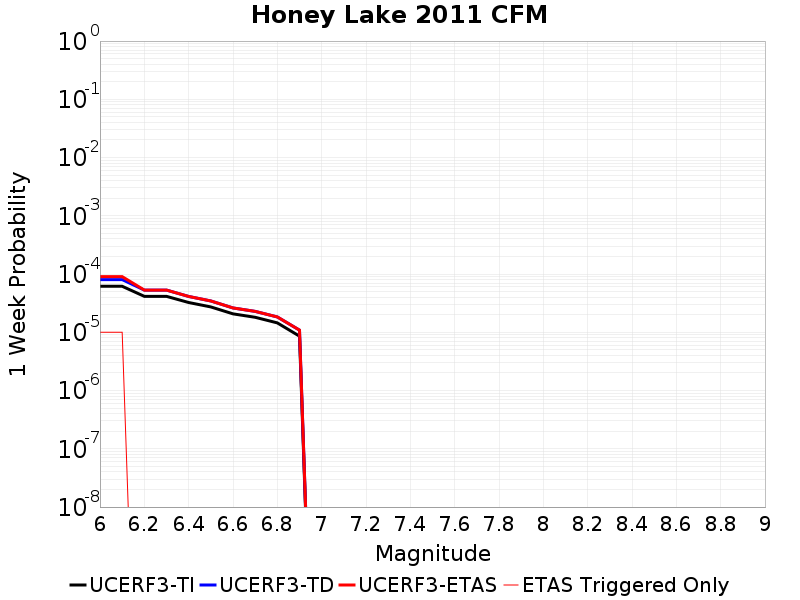 | 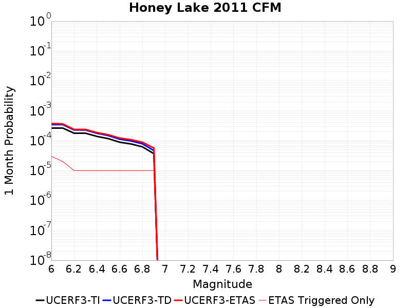 |  | 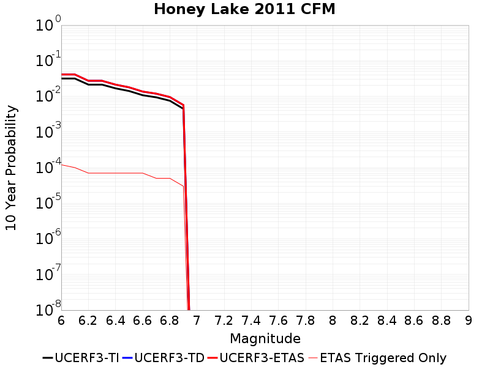 |

| Magnitude | 1 wk TI Prob | 1 wk TD Prob | 1 wk ETAS Prob | 1 wk ETAS/TD Gain | 1 wk ETAS Triggered Only | 1 mo TI Prob | 1 mo TD Prob | 1 mo ETAS Prob | 1 mo ETAS/TD Gain | 1 mo ETAS Triggered Only | 1 yr TI Prob | 1 yr TD Prob | 1 yr ETAS Prob | 1 yr ETAS/TD Gain | 1 yr ETAS Triggered Only | 10 yr TI Prob | 10 yr TD Prob | 10 yr ETAS Prob | 10 yr ETAS/TD Gain | 10 yr ETAS Triggered Only |
|-----|-----|-----|-----|-----|-----|-----|-----|-----|-----|-----|-----|-----|-----|-----|-----|-----|-----|-----|-----|-----|
| 6.0 | 6.155506E-5 | 8.015472E-5 | 9.015392E-5 | 1.1247487 | 1.0E-5 | 2.6378073E-4 | 3.4347782E-4 | 3.734675E-4 | 1.0873119 | 3.0E-5 | 0.0032068014 | 0.004174243 | 0.0042240345 | 1.0119282 | 5.0E-5 | 0.03160919 | 0.04100547 | 0.041120548 | 1.0028064 | 1.2E-4 |
| 6.1 | 6.155506E-5 | 8.015472E-5 | 9.015392E-5 | 1.1247487 | 1.0E-5 | 2.6378073E-4 | 3.4347782E-4 | 3.6347093E-4 | 1.0582079 | 2.0E-5 | 0.0032068014 | 0.004174243 | 0.0042140763 | 1.0095426 | 4.0E-5 | 0.03160919 | 0.04100547 | 0.04110137 | 1.0023386 | 1.0E-4 |
| 6.2 | 4.1335024E-5 | 5.295521E-5 | 5.295521E-5 | 1.0 | 0.0 | 1.7713808E-4 | 2.2693188E-4 | 2.3692961E-4 | 1.044056 | 1.0E-5 | 0.0021545228 | 0.0027595407 | 0.0027894578 | 1.0108414 | 3.0E-5 | 0.021337535 | 0.027268296 | 0.027336387 | 1.0024971 | 7.0E-5 |
| 6.3 | 4.1335024E-5 | 5.295521E-5 | 5.295521E-5 | 1.0 | 0.0 | 1.7713808E-4 | 2.2693188E-4 | 2.3692961E-4 | 1.044056 | 1.0E-5 | 0.0021545228 | 0.0027595407 | 0.0027894578 | 1.0108414 | 3.0E-5 | 0.021337535 | 0.027268296 | 0.027336387 | 1.0024971 | 7.0E-5 |
| 6.4 | 3.2393702E-5 | 4.117286E-5 | 4.117286E-5 | 1.0 | 0.0 | 1.3882275E-4 | 1.764439E-4 | 1.8644212E-4 | 1.0566652 | 1.0E-5 | 0.0016888566 | 0.0021461917 | 0.0021761272 | 1.0139482 | 3.0E-5 | 0.016760793 | 0.021265438 | 0.021333948 | 1.0032218 | 7.0E-5 |
| 6.5 | 2.7205504E-5 | 3.4447217E-5 | 3.4447217E-5 | 1.0 | 0.0 | 1.1658981E-4 | 1.4762316E-4 | 1.5762169E-4 | 1.0677301 | 1.0E-5 | 0.0014185566 | 0.0017959243 | 0.0018258704 | 1.0166745 | 3.0E-5 | 0.014095354 | 0.017823543 | 0.017892295 | 1.0038574 | 7.0E-5 |
| 6.6 | 2.069265E-5 | 2.6132546E-5 | 2.6132546E-5 | 1.0 | 0.0 | 8.867977E-5 | 1.119923E-4 | 1.2199119E-4 | 1.0892818 | 1.0E-5 | 0.0010791414 | 0.0013627381 | 0.0013926972 | 1.0219845 | 3.0E-5 | 0.010739161 | 0.013552237 | 0.013621288 | 1.0050952 | 7.0E-5 |
| 6.7 | 1.8060919E-5 | 2.2811788E-5 | 2.2811788E-5 | 1.0 | 0.0 | 7.7401644E-5 | 9.776161E-5 | 1.0776063E-4 | 1.1022797 | 1.0E-5 | 9.419576E-4 | 0.0011896795 | 0.0012096557 | 1.0167912 | 2.0E-5 | 0.009379748 | 0.0118412385 | 0.011890647 | 1.0041726 | 5.0E-5 |
| 6.8 | 1.4474663E-5 | 1.8306404E-5 | 1.8306404E-5 | 1.0 | 0.0 | 6.203279E-5 | 7.84541E-5 | 8.8453315E-5 | 1.1274531 | 1.0E-5 | 7.5498753E-4 | 9.5483736E-4 | 9.748183E-4 | 1.020926 | 2.0E-5 | 0.007524277 | 0.009514961 | 0.009564485 | 1.0052049 | 5.0E-5 |
| 6.9 | 8.564552E-6 | 1.087816E-5 | 1.087816E-5 | 1.0 | 0.0 | 3.6704707E-5 | 4.6620233E-5 | 5.6619767E-5 | 1.2144891 | 1.0E-5 | 4.4678818E-4 | 5.6752074E-4 | 5.8750936E-4 | 1.035221 | 2.0E-5 | 0.0044589094 | 0.0056672893 | 0.005697119 | 1.0052636 | 3.0E-5 |

## Surprise Valley 2011 CFM
*[(top)](#table-of-contents)*

| 1 Week | 1 Month | 1 Year | 10 Year |
|-----|-----|-----|-----|
|  | 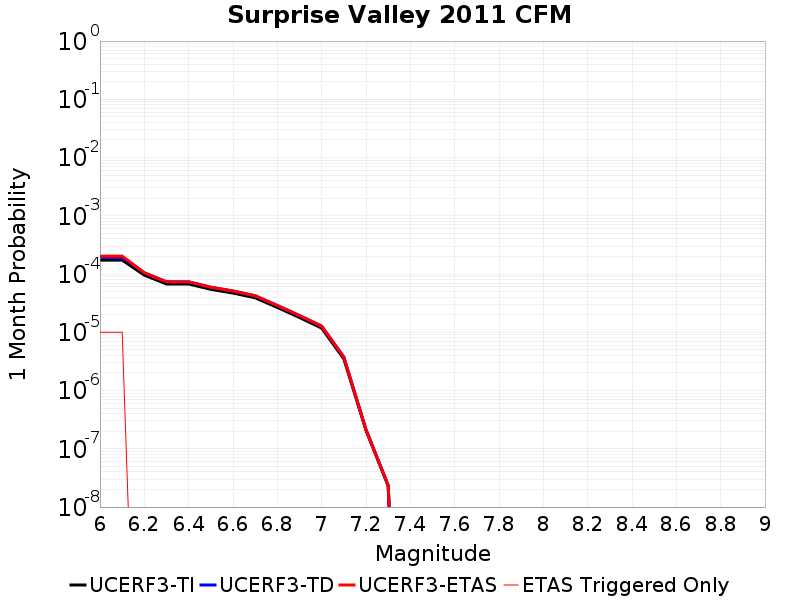 |  |  |

| Magnitude | 1 wk TI Prob | 1 wk TD Prob | 1 wk ETAS Prob | 1 wk ETAS/TD Gain | 1 wk ETAS Triggered Only | 1 mo TI Prob | 1 mo TD Prob | 1 mo ETAS Prob | 1 mo ETAS/TD Gain | 1 mo ETAS Triggered Only | 1 yr TI Prob | 1 yr TD Prob | 1 yr ETAS Prob | 1 yr ETAS/TD Gain | 1 yr ETAS Triggered Only | 10 yr TI Prob | 10 yr TD Prob | 10 yr ETAS Prob | 10 yr ETAS/TD Gain | 10 yr ETAS Triggered Only |
|-----|-----|-----|-----|-----|-----|-----|-----|-----|-----|-----|-----|-----|-----|-----|-----|-----|-----|-----|-----|-----|
| 6.0 | 4.0396248E-5 | 4.498467E-5 | 4.498467E-5 | 1.0 | 0.0 | 1.7311527E-4 | 1.9277839E-4 | 2.0277647E-4 | 1.0518631 | 1.0E-5 | 0.002105641 | 0.002344762 | 0.0023547385 | 1.0042548 | 1.0E-5 | 0.020858008 | 0.023222106 | 0.023251409 | 1.0012618 | 3.0E-5 |
| 6.1 | 4.0396248E-5 | 4.498467E-5 | 4.498467E-5 | 1.0 | 0.0 | 1.7311527E-4 | 1.9277839E-4 | 2.0277647E-4 | 1.0518631 | 1.0E-5 | 0.002105641 | 0.002344762 | 0.0023547385 | 1.0042548 | 1.0E-5 | 0.020858008 | 0.023222106 | 0.023251409 | 1.0012618 | 3.0E-5 |
| 6.2 | 2.2295266E-5 | 2.4463236E-5 | 2.4463236E-5 | 1.0 | 0.0 | 9.554764E-5 | 1.048384E-4 | 1.048384E-4 | 1.0 | 0.0 | 0.0011626717 | 0.0012756911 | 0.0012756911 | 1.0 | 0.0 | 0.011566074 | 0.012686935 | 0.012706682 | 1.0015564 | 2.0E-5 |
| 6.3 | 1.572643E-5 | 1.7136823E-5 | 1.7136823E-5 | 1.0 | 0.0 | 6.7397246E-5 | 7.3441515E-5 | 7.3441515E-5 | 1.0 | 0.0 | 8.202525E-4 | 8.937942E-4 | 8.937942E-4 | 1.0 | 0.0 | 0.008172315 | 0.008903107 | 0.008922929 | 1.0022264 | 2.0E-5 |
| 6.4 | 1.5714395E-5 | 1.712464E-5 | 1.712464E-5 | 1.0 | 0.0 | 6.734567E-5 | 7.338931E-5 | 7.338931E-5 | 1.0 | 0.0 | 8.1962504E-4 | 8.9315913E-4 | 8.9315913E-4 | 1.0 | 0.0 | 0.008166086 | 0.008896807 | 0.008916629 | 1.002228 | 2.0E-5 |
| 6.5 | 1.2733495E-5 | 1.3832682E-5 | 1.3832682E-5 | 1.0 | 0.0 | 5.457098E-5 | 5.9281618E-5 | 5.9281618E-5 | 1.0 | 0.0 | 6.641992E-4 | 7.215214E-4 | 7.215214E-4 | 1.0 | 0.0 | 0.0066221743 | 0.007192485 | 0.007192485 | 1.0 | 0.0 |
| 6.6 | 1.0983784E-5 | 1.1912782E-5 | 1.1912782E-5 | 1.0 | 0.0 | 4.7072506E-5 | 5.105381E-5 | 5.105381E-5 | 1.0 | 0.0 | 5.7295704E-4 | 6.214082E-4 | 6.214082E-4 | 1.0 | 0.0 | 0.0057148207 | 0.006197258 | 0.006197258 | 1.0 | 0.0 |
| 6.7 | 9.104806E-6 | 9.860807E-6 | 9.860807E-6 | 1.0 | 0.0 | 3.902001E-5 | 4.225994E-5 | 4.225994E-5 | 1.0 | 0.0 | 4.7496508E-4 | 5.143972E-4 | 5.143972E-4 | 1.0 | 0.0 | 0.004739512 | 0.005132464 | 0.005132464 | 1.0 | 0.0 |
| 6.8 | 6.2162403E-6 | 6.71827E-6 | 6.71827E-6 | 1.0 | 0.0 | 2.6640759E-5 | 2.879228E-5 | 2.879228E-5 | 1.0 | 0.0 | 3.2430296E-4 | 3.5049187E-4 | 3.5049187E-4 | 1.0 | 0.0 | 0.003238301 | 0.0034996152 | 0.0034996152 | 1.0 | 0.0 |
| 6.9 | 4.1792696E-6 | 4.5126167E-6 | 4.5126167E-6 | 1.0 | 0.0 | 1.7911032E-5 | 1.9339652E-5 | 1.9339652E-5 | 1.0 | 0.0 | 2.1804498E-4 | 2.3543638E-4 | 2.3543638E-4 | 1.0 | 0.0 | 0.0021783116 | 0.0023520235 | 0.0023520235 | 1.0 | 0.0 |
| 7.0 | 2.7478413E-6 | 2.9684613E-6 | 2.9684613E-6 | 1.0 | 0.0 | 1.177641E-5 | 1.2721922E-5 | 1.2721922E-5 | 1.0 | 0.0 | 1.4336836E-4 | 1.5487964E-4 | 1.5487964E-4 | 1.0 | 0.0 | 0.001432759 | 0.00154784 | 0.00154784 | 1.0 | 0.0 |
| 7.1 | 8.128648E-7 | 8.74223E-7 | 8.74223E-7 | 1.0 | 0.0 | 3.4837017E-6 | 3.746668E-6 | 3.746668E-6 | 1.0 | 0.0 | 4.2413245E-5 | 4.5615332E-5 | 4.5615332E-5 | 1.0 | 0.0 | 4.2405148E-4 | 4.5611878E-4 | 4.5611878E-4 | 1.0 | 0.0 |
| 7.2 | 4.8641045E-8 | 4.942272E-8 | 4.942272E-8 | 1.0 | 0.0 | 2.084616E-7 | 2.1181165E-7 | 2.1181165E-7 | 1.0 | 0.0 | 2.538017E-6 | 2.5788038E-6 | 2.5788038E-6 | 1.0 | 0.0 | 2.537988E-5 | 2.5787751E-5 | 2.5787751E-5 | 1.0 | 0.0 |
| 7.3 | 5.3911844E-9 | 5.478111E-9 | 5.478111E-9 | 1.0 | 0.0 | 2.3105075E-8 | 2.3477618E-8 | 2.3477618E-8 | 1.0 | 0.0 | 2.8130427E-7 | 2.8583997E-7 | 2.8583997E-7 | 1.0 | 0.0 | 2.8130391E-6 | 2.8583975E-6 | 2.8583975E-6 | 1.0 | 0.0 |

## Likely 2011 CFM
*[(top)](#table-of-contents)*

| 1 Week | 1 Month | 1 Year | 10 Year |
|-----|-----|-----|-----|
|  |  | 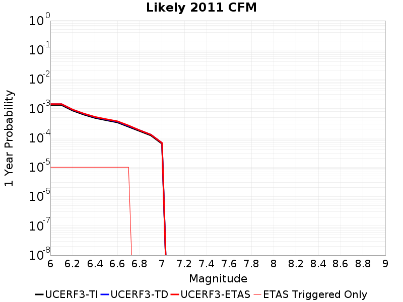 |  |

| Magnitude | 1 wk TI Prob | 1 wk TD Prob | 1 wk ETAS Prob | 1 wk ETAS/TD Gain | 1 wk ETAS Triggered Only | 1 mo TI Prob | 1 mo TD Prob | 1 mo ETAS Prob | 1 mo ETAS/TD Gain | 1 mo ETAS Triggered Only | 1 yr TI Prob | 1 yr TD Prob | 1 yr ETAS Prob | 1 yr ETAS/TD Gain | 1 yr ETAS Triggered Only | 10 yr TI Prob | 10 yr TD Prob | 10 yr ETAS Prob | 10 yr ETAS/TD Gain | 10 yr ETAS Triggered Only |
|-----|-----|-----|-----|-----|-----|-----|-----|-----|-----|-----|-----|-----|-----|-----|-----|-----|-----|-----|-----|-----|
| 6.0 | 2.5315949E-5 | 2.7156086E-5 | 2.7156086E-5 | 1.0 | 0.0 | 1.0849241E-4 | 1.1637828E-4 | 1.1637828E-4 | 1.0 | 0.0 | 0.0013200947 | 0.0014160294 | 0.0014260152 | 1.007052 | 1.0E-5 | 0.013122803 | 0.014074743 | 0.014094461 | 1.001401 | 2.0E-5 |
| 6.1 | 2.5315949E-5 | 2.7156086E-5 | 2.7156086E-5 | 1.0 | 0.0 | 1.0849241E-4 | 1.1637828E-4 | 1.1637828E-4 | 1.0 | 0.0 | 0.0013200947 | 0.0014160294 | 0.0014260152 | 1.007052 | 1.0E-5 | 0.013122803 | 0.014074743 | 0.014094461 | 1.001401 | 2.0E-5 |
| 6.2 | 1.6375941E-5 | 1.7496977E-5 | 1.7496977E-5 | 1.0 | 0.0 | 7.0180715E-5 | 7.498496E-5 | 7.498496E-5 | 1.0 | 0.0 | 8.5411523E-4 | 9.1257185E-4 | 9.2256267E-4 | 1.0109481 | 1.0E-5 | 0.008508399 | 0.009089536 | 0.009109355 | 1.0021803 | 2.0E-5 |
| 6.3 | 1.1945543E-5 | 1.2734439E-5 | 1.2734439E-5 | 1.0 | 0.0 | 5.119418E-5 | 5.4575055E-5 | 5.4575055E-5 | 1.0 | 0.0 | 6.2311086E-4 | 6.642541E-4 | 6.7424745E-4 | 1.0150445 | 1.0E-5 | 0.0062136655 | 0.0066232434 | 0.0066431114 | 1.0029997 | 2.0E-5 |
| 6.4 | 9.192729E-6 | 9.784861E-6 | 9.784861E-6 | 1.0 | 0.0 | 3.939681E-5 | 4.1934458E-5 | 4.1934458E-5 | 1.0 | 0.0 | 4.7955062E-4 | 5.1043514E-4 | 5.2043004E-4 | 1.0195811 | 1.0E-5 | 0.004785171 | 0.00509291 | 0.005112808 | 1.0039071 | 2.0E-5 |
| 6.5 | 7.67906E-6 | 8.166075E-6 | 8.166075E-6 | 1.0 | 0.0 | 3.2909844E-5 | 3.4997003E-5 | 3.4997003E-5 | 1.0 | 0.0 | 4.006037E-4 | 4.260071E-4 | 4.3600283E-4 | 1.0234638 | 1.0E-5 | 0.0039988225 | 0.004252098 | 0.0042720134 | 1.0046836 | 2.0E-5 |
| 6.6 | 6.4884057E-6 | 6.896002E-6 | 6.896002E-6 | 1.0 | 0.0 | 2.7807157E-5 | 2.9553967E-5 | 2.9553967E-5 | 1.0 | 0.0 | 3.3849955E-4 | 3.597616E-4 | 3.6975797E-4 | 1.0277861 | 1.0E-5 | 0.003379844 | 0.003591937 | 0.003601901 | 1.002774 | 1.0E-5 |
| 6.7 | 4.6060636E-6 | 4.891926E-6 | 4.891926E-6 | 1.0 | 0.0 | 1.9740122E-5 | 2.0965233E-5 | 2.0965233E-5 | 1.0 | 0.0 | 2.403095E-4 | 2.5522267E-4 | 2.652201E-4 | 1.0391715 | 1.0E-5 | 0.002400498 | 0.0025493787 | 0.0025593531 | 1.0039126 | 1.0E-5 |
| 6.8 | 3.2795615E-6 | 3.4829836E-6 | 3.4829836E-6 | 1.0 | 0.0 | 1.4055187E-5 | 1.4926991E-5 | 1.4926991E-5 | 1.0 | 0.0 | 1.7110848E-4 | 1.8172151E-4 | 1.8172151E-4 | 1.0 | 0.0 | 0.0017097679 | 0.0018157846 | 0.0018157846 | 1.0 | 0.0 |
| 6.9 | 2.3289967E-6 | 2.4745736E-6 | 2.4745736E-6 | 1.0 | 0.0 | 9.981376E-6 | 1.0605275E-5 | 1.0605275E-5 | 1.0 | 0.0 | 1.2151648E-4 | 1.2911201E-4 | 1.2911201E-4 | 1.0 | 0.0 | 0.0012145005 | 0.0012904131 | 0.0012904131 | 1.0 | 0.0 |
| 7.0 | 1.211292E-6 | 1.2885293E-6 | 1.2885293E-6 | 1.0 | 0.0 | 5.1912407E-6 | 5.5222586E-6 | 5.5222586E-6 | 1.0 | 0.0 | 6.320152E-5 | 6.7231726E-5 | 6.7231726E-5 | 1.0 | 0.0 | 6.3183554E-4 | 6.721438E-4 | 6.721438E-4 | 1.0 | 0.0 |

## Hunting Creek - Berryessa 2011 CFM
*[(top)](#table-of-contents)*

| 1 Week | 1 Month | 1 Year | 10 Year |
|-----|-----|-----|-----|
| 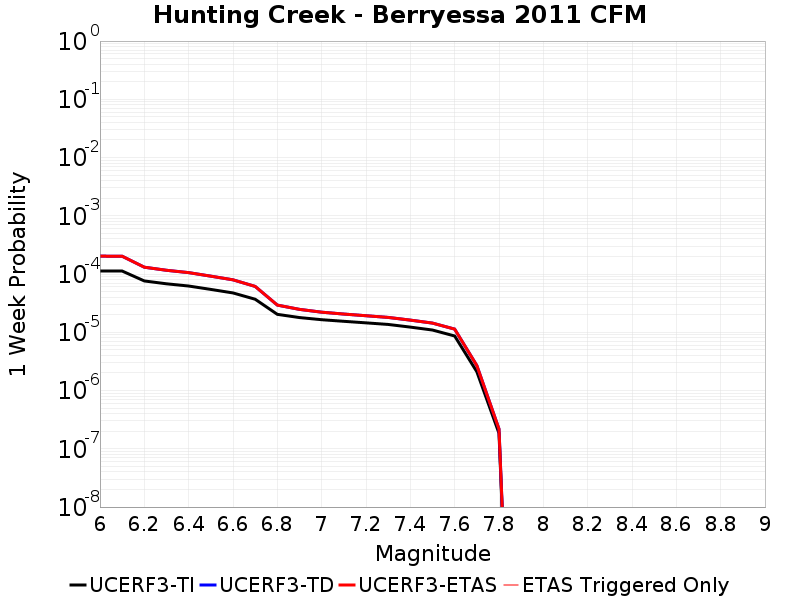 |  | 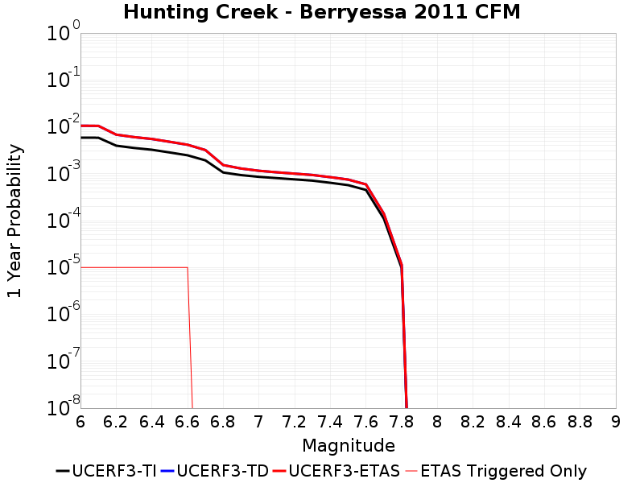 |  |

| Magnitude | 1 wk TI Prob | 1 wk TD Prob | 1 wk ETAS Prob | 1 wk ETAS/TD Gain | 1 wk ETAS Triggered Only | 1 mo TI Prob | 1 mo TD Prob | 1 mo ETAS Prob | 1 mo ETAS/TD Gain | 1 mo ETAS Triggered Only | 1 yr TI Prob | 1 yr TD Prob | 1 yr ETAS Prob | 1 yr ETAS/TD Gain | 1 yr ETAS Triggered Only | 10 yr TI Prob | 10 yr TD Prob | 10 yr ETAS Prob | 10 yr ETAS/TD Gain | 10 yr ETAS Triggered Only |
|-----|-----|-----|-----|-----|-----|-----|-----|-----|-----|-----|-----|-----|-----|-----|-----|-----|-----|-----|-----|-----|
| 6.0 | 1.1270982E-4 | 2.0235199E-4 | 2.0235199E-4 | 1.0 | 0.0 | 4.8295266E-4 | 8.6690334E-4 | 8.6690334E-4 | 1.0 | 0.0 | 0.0058641075 | 0.0104927085 | 0.010502604 | 1.0009431 | 1.0E-5 | 0.057117578 | 0.098940685 | 0.09894969 | 1.0000911 | 1.0E-5 |
| 6.1 | 1.1239393E-4 | 2.0182769E-4 | 2.0182769E-4 | 1.0 | 0.0 | 4.8159933E-4 | 8.646579E-4 | 8.646579E-4 | 1.0 | 0.0 | 0.0058477195 | 0.010465662 | 0.010475557 | 1.0009454 | 1.0E-5 | 0.056962132 | 0.098696895 | 0.09870591 | 1.0000913 | 1.0E-5 |
| 6.2 | 7.596265E-5 | 1.3080619E-4 | 1.3080619E-4 | 1.0 | 0.0 | 3.2551357E-4 | 5.604514E-4 | 5.604514E-4 | 1.0 | 0.0 | 0.0039559277 | 0.006797104 | 0.006807036 | 1.0014613 | 1.0E-5 | 0.038862433 | 0.06526093 | 0.06527028 | 1.0001433 | 1.0E-5 |
| 6.3 | 6.78794E-5 | 1.1580701E-4 | 1.1580701E-4 | 1.0 | 0.0 | 2.9087928E-4 | 4.962019E-4 | 4.962019E-4 | 1.0 | 0.0 | 0.003535705 | 0.0060210447 | 0.0060309847 | 1.0016508 | 1.0E-5 | 0.034799766 | 0.058076568 | 0.058085985 | 1.0001622 | 1.0E-5 |
| 6.4 | 6.2165134E-5 | 1.0557795E-4 | 1.0557795E-4 | 1.0 | 0.0 | 2.6639478E-4 | 4.523795E-4 | 4.523795E-4 | 1.0 | 0.0 | 0.0032385332 | 0.005490941 | 0.005500886 | 1.0018111 | 1.0E-5 | 0.03191742 | 0.053122006 | 0.053131472 | 1.0001782 | 1.0E-5 |
| 6.5 | 5.4368087E-5 | 9.179059E-5 | 9.179059E-5 | 1.0 | 0.0 | 2.3298527E-4 | 3.933109E-4 | 3.933109E-4 | 1.0 | 0.0 | 0.0028329059 | 0.0047758906 | 0.004785843 | 1.0020839 | 1.0E-5 | 0.027970633 | 0.04639097 | 0.046400506 | 1.0002055 | 1.0E-5 |
| 6.6 | 4.729947E-5 | 7.942602E-5 | 7.942602E-5 | 1.0 | 0.0 | 2.0269625E-4 | 3.4033475E-4 | 3.4033475E-4 | 1.0 | 0.0 | 0.002465034 | 0.004134125 | 0.0041440837 | 1.0024089 | 1.0E-5 | 0.02437869 | 0.040304486 | 0.040314082 | 1.0002381 | 1.0E-5 |
| 6.7 | 3.6875328E-5 | 6.122354E-5 | 6.122354E-5 | 1.0 | 0.0 | 1.5802756E-4 | 2.623446E-4 | 2.623446E-4 | 1.0 | 0.0 | 0.0019222875 | 0.0031886133 | 0.0031886133 | 1.0 | 0.0 | 0.019057442 | 0.03126782 | 0.03126782 | 1.0 | 0.0 |
| 6.8 | 2.0292036E-5 | 2.9260498E-5 | 2.9260498E-5 | 1.0 | 0.0 | 8.6962966E-5 | 1.2539608E-4 | 1.2539608E-4 | 1.0 | 0.0 | 0.0010582599 | 0.0015256117 | 0.0015256117 | 1.0 | 0.0 | 0.010532344 | 0.015121997 | 0.015121997 | 1.0 | 0.0 |
| 6.9 | 1.7871042E-5 | 2.4701418E-5 | 2.4701418E-5 | 1.0 | 0.0 | 7.658793E-5 | 1.0585889E-4 | 1.0585889E-4 | 1.0 | 0.0 | 9.320591E-4 | 0.0012880682 | 0.0012880682 | 1.0 | 0.0 | 0.009281595 | 0.0127965715 | 0.0127965715 | 1.0 | 0.0 |
| 7.0 | 1.6415532E-5 | 2.2102859E-5 | 2.2102859E-5 | 1.0 | 0.0 | 7.035038E-5 | 9.4723095E-5 | 9.4723095E-5 | 1.0 | 0.0 | 8.561793E-4 | 0.0011526444 | 0.0011526444 | 1.0 | 0.0 | 0.008528882 | 0.011465688 | 0.011465688 | 1.0 | 0.0 |
| 7.1 | 1.5409885E-5 | 2.0522044E-5 | 2.0522044E-5 | 1.0 | 0.0 | 6.6040695E-5 | 8.794867E-5 | 8.794867E-5 | 1.0 | 0.0 | 8.0374884E-4 | 0.0010702516 | 0.0010702516 | 1.0 | 0.0 | 0.00800848 | 0.010651368 | 0.010651368 | 1.0 | 0.0 |
| 7.2 | 1.4497423E-5 | 1.9215751E-5 | 1.9215751E-5 | 1.0 | 0.0 | 6.213033E-5 | 8.2350634E-5 | 8.2350634E-5 | 1.0 | 0.0 | 7.5617427E-4 | 0.001002161 | 0.001002161 | 1.0 | 0.0 | 0.0075360634 | 0.009977108 | 0.009977108 | 1.0 | 0.0 |
| 7.3 | 1.3615175E-5 | 1.7972015E-5 | 1.7972015E-5 | 1.0 | 0.0 | 5.8349444E-5 | 7.702067E-5 | 7.702067E-5 | 1.0 | 0.0 | 7.101729E-4 | 9.3732623E-4 | 9.3732623E-4 | 1.0 | 0.0 | 0.0070790765 | 0.009334316 | 0.009334316 | 1.0 | 0.0 |
| 7.4 | 1.2252825E-5 | 1.6156093E-5 | 1.6156093E-5 | 1.0 | 0.0 | 5.251105E-5 | 6.923857E-5 | 6.923857E-5 | 1.0 | 0.0 | 6.391345E-4 | 8.426565E-4 | 8.426565E-4 | 1.0 | 0.0 | 0.0063729943 | 0.008395194 | 0.008395194 | 1.0 | 0.0 |
| 7.5 | 1.0913301E-5 | 1.4353287E-5 | 1.4353287E-5 | 1.0 | 0.0 | 4.6770452E-5 | 6.1512656E-5 | 6.1512656E-5 | 1.0 | 0.0 | 5.6928146E-4 | 7.48662E-4 | 7.48662E-4 | 1.0 | 0.0 | 0.0056782532 | 0.0074620117 | 0.0074620117 | 1.0 | 0.0 |
| 7.6 | 8.623192E-6 | 1.13224905E-5 | 1.13224905E-5 | 1.0 | 0.0 | 3.6956015E-5 | 4.852407E-5 | 4.852407E-5 | 1.0 | 0.0 | 4.4984656E-4 | 5.9062307E-4 | 5.9062307E-4 | 1.0 | 0.0 | 0.00448937 | 0.0058910353 | 0.0058910353 | 1.0 | 0.0 |
| 7.7 | 2.0993634E-6 | 2.6812227E-6 | 2.6812227E-6 | 1.0 | 0.0 | 8.997241E-6 | 1.1490904E-5 | 1.1490904E-5 | 1.0 | 0.0 | 1.09535904E-4 | 1.3989286E-4 | 1.3989286E-4 | 1.0 | 0.0 | 0.0010948193 | 0.001398012 | 0.001398012 | 1.0 | 0.0 |
| 7.8 | 1.8428308E-7 | 2.1802649E-7 | 2.1802649E-7 | 1.0 | 0.0 | 7.897844E-7 | 9.3439894E-7 | 9.3439894E-7 | 1.0 | 0.0 | 9.615583E-6 | 1.1376252E-5 | 1.1376252E-5 | 1.0 | 0.0 | 9.615166E-5 | 1.1374964E-4 | 1.1374964E-4 | 1.0 | 0.0 |

## Fitzhugh Creek
*[(top)](#table-of-contents)*

| 1 Week | 1 Month | 1 Year | 10 Year |
|-----|-----|-----|-----|
| 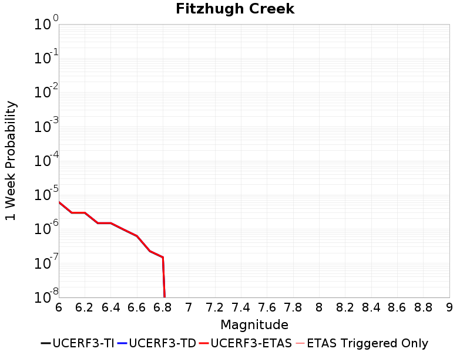 |  | 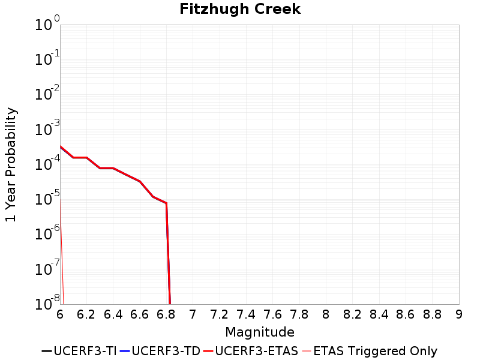 |  |

| Magnitude | 1 wk TI Prob | 1 wk TD Prob | 1 wk ETAS Prob | 1 wk ETAS/TD Gain | 1 wk ETAS Triggered Only | 1 mo TI Prob | 1 mo TD Prob | 1 mo ETAS Prob | 1 mo ETAS/TD Gain | 1 mo ETAS Triggered Only | 1 yr TI Prob | 1 yr TD Prob | 1 yr ETAS Prob | 1 yr ETAS/TD Gain | 1 yr ETAS Triggered Only | 10 yr TI Prob | 10 yr TD Prob | 10 yr ETAS Prob | 10 yr ETAS/TD Gain | 10 yr ETAS Triggered Only |
|-----|-----|-----|-----|-----|-----|-----|-----|-----|-----|-----|-----|-----|-----|-----|-----|-----|-----|-----|-----|-----|
| 6.0 | 6.1090436E-6 | 6.2129025E-6 | 6.2129025E-6 | 1.0 | 0.0 | 2.6181353E-5 | 2.6626478E-5 | 2.6626478E-5 | 1.0 | 0.0 | 3.1871133E-4 | 3.2413367E-4 | 3.3413043E-4 | 1.0308415 | 1.0E-5 | 0.0031825465 | 0.0032370535 | 0.0032569887 | 1.0061585 | 2.0E-5 |
| 6.1 | 2.9741811E-6 | 3.0228675E-6 | 3.0228675E-6 | 1.0 | 0.0 | 1.2746428E-5 | 1.2955088E-5 | 1.2955088E-5 | 1.0 | 0.0 | 1.5517672E-4 | 1.5771772E-4 | 1.5771772E-4 | 1.0 | 0.0 | 0.001550684 | 0.0015761509 | 0.0015861351 | 1.0063345 | 1.0E-5 |
| 6.2 | 2.9741811E-6 | 3.0228675E-6 | 3.0228675E-6 | 1.0 | 0.0 | 1.2746428E-5 | 1.2955088E-5 | 1.2955088E-5 | 1.0 | 0.0 | 1.5517672E-4 | 1.5771772E-4 | 1.5771772E-4 | 1.0 | 0.0 | 0.001550684 | 0.0015761509 | 0.0015861351 | 1.0063345 | 1.0E-5 |
| 6.3 | 1.4781198E-6 | 1.5018991E-6 | 1.5018991E-6 | 1.0 | 0.0 | 6.3347834E-6 | 6.4366955E-6 | 6.4366955E-6 | 1.0 | 0.0 | 7.712326E-5 | 7.836415E-5 | 7.836415E-5 | 1.0 | 0.0 | 7.70965E-4 | 7.833851E-4 | 7.933773E-4 | 1.0127552 | 1.0E-5 |
| 6.4 | 1.4781198E-6 | 1.5018991E-6 | 1.5018991E-6 | 1.0 | 0.0 | 6.3347834E-6 | 6.4366955E-6 | 6.4366955E-6 | 1.0 | 0.0 | 7.712326E-5 | 7.836415E-5 | 7.836415E-5 | 1.0 | 0.0 | 7.70965E-4 | 7.833851E-4 | 7.933773E-4 | 1.0127552 | 1.0E-5 |
| 6.5 | 9.5176676E-7 | 9.670086E-7 | 9.670086E-7 | 1.0 | 0.0 | 4.078994E-6 | 4.144317E-6 | 4.144317E-6 | 1.0 | 0.0 | 4.9660623E-5 | 5.0455994E-5 | 5.0455994E-5 | 1.0 | 0.0 | 4.964952E-4 | 5.0445576E-4 | 5.144508E-4 | 1.0198133 | 1.0E-5 |
| 6.6 | 6.21145E-7 | 6.3112213E-7 | 6.3112213E-7 | 1.0 | 0.0 | 2.662047E-6 | 2.7048068E-6 | 2.7048068E-6 | 1.0 | 0.0 | 3.2409942E-5 | 3.293059E-5 | 3.293059E-5 | 1.0 | 0.0 | 3.2405215E-4 | 3.292637E-4 | 3.392604E-4 | 1.0303608 | 1.0E-5 |
| 6.7 | 2.2377962E-7 | 2.2744317E-7 | 2.2744317E-7 | 1.0 | 0.0 | 9.590551E-7 | 9.747563E-7 | 9.747563E-7 | 1.0 | 0.0 | 1.1676434E-5 | 1.1867625E-5 | 1.1867625E-5 | 1.0 | 0.0 | 1.1675821E-4 | 1.1867305E-4 | 1.2867186E-4 | 1.0842551 | 1.0E-5 |
| 6.8 | 1.4785022E-7 | 1.502791E-7 | 1.502791E-7 | 1.0 | 0.0 | 6.3364365E-7 | 6.4405333E-7 | 6.4405333E-7 | 1.0 | 0.0 | 7.714584E-6 | 7.8413495E-6 | 7.8413495E-6 | 1.0 | 0.0 | 7.714316E-5 | 7.841349E-5 | 8.841271E-5 | 1.1275191 | 1.0E-5 |

## Swain Ravine - Spenceville
*[(top)](#table-of-contents)*

| 1 Week | 1 Month | 1 Year | 10 Year |
|-----|-----|-----|-----|
|  | 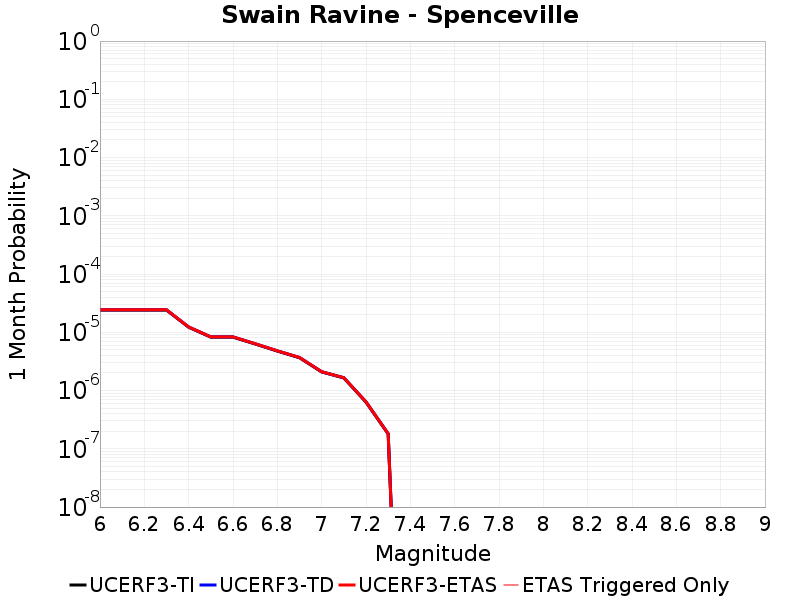 | 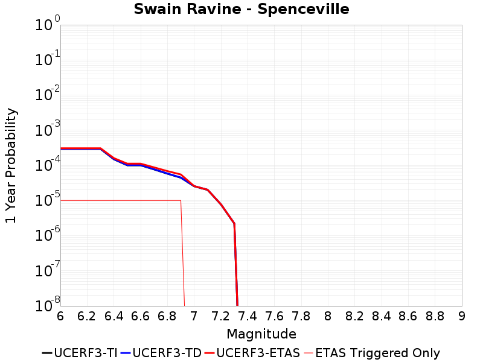 |  |

| Magnitude | 1 wk TI Prob | 1 wk TD Prob | 1 wk ETAS Prob | 1 wk ETAS/TD Gain | 1 wk ETAS Triggered Only | 1 mo TI Prob | 1 mo TD Prob | 1 mo ETAS Prob | 1 mo ETAS/TD Gain | 1 mo ETAS Triggered Only | 1 yr TI Prob | 1 yr TD Prob | 1 yr ETAS Prob | 1 yr ETAS/TD Gain | 1 yr ETAS Triggered Only | 10 yr TI Prob | 10 yr TD Prob | 10 yr ETAS Prob | 10 yr ETAS/TD Gain | 10 yr ETAS Triggered Only |
|-----|-----|-----|-----|-----|-----|-----|-----|-----|-----|-----|-----|-----|-----|-----|-----|-----|-----|-----|-----|-----|
| 6.0 | 5.596169E-6 | 5.6656236E-6 | 5.6656236E-6 | 1.0 | 0.0 | 2.398336E-5 | 2.4281033E-5 | 2.4281033E-5 | 1.0 | 0.0 | 2.9195828E-4 | 2.9558418E-4 | 3.0558123E-4 | 1.0338213 | 1.0E-5 | 0.00291575 | 0.0029521799 | 0.0029721207 | 1.0067546 | 2.0E-5 |
| 6.1 | 5.596169E-6 | 5.6656236E-6 | 5.6656236E-6 | 1.0 | 0.0 | 2.398336E-5 | 2.4281033E-5 | 2.4281033E-5 | 1.0 | 0.0 | 2.9195828E-4 | 2.9558418E-4 | 3.0558123E-4 | 1.0338213 | 1.0E-5 | 0.00291575 | 0.0029521799 | 0.0029721207 | 1.0067546 | 2.0E-5 |
| 6.2 | 5.596169E-6 | 5.6656236E-6 | 5.6656236E-6 | 1.0 | 0.0 | 2.398336E-5 | 2.4281033E-5 | 2.4281033E-5 | 1.0 | 0.0 | 2.9195828E-4 | 2.9558418E-4 | 3.0558123E-4 | 1.0338213 | 1.0E-5 | 0.00291575 | 0.0029521799 | 0.0029721207 | 1.0067546 | 2.0E-5 |
| 6.3 | 5.596169E-6 | 5.6656236E-6 | 5.6656236E-6 | 1.0 | 0.0 | 2.398336E-5 | 2.4281033E-5 | 2.4281033E-5 | 1.0 | 0.0 | 2.9195828E-4 | 2.9558418E-4 | 3.0558123E-4 | 1.0338213 | 1.0E-5 | 0.00291575 | 0.0029521799 | 0.0029721207 | 1.0067546 | 2.0E-5 |
| 6.4 | 2.8426775E-6 | 2.874994E-6 | 2.874994E-6 | 1.0 | 0.0 | 1.2182847E-5 | 1.2321347E-5 | 1.2321347E-5 | 1.0 | 0.0 | 1.4831607E-4 | 1.5000245E-4 | 1.6000096E-4 | 1.0666555 | 1.0E-5 | 0.0014821711 | 0.0014990505 | 0.0015090356 | 1.0066609 | 1.0E-5 |
| 6.5 | 1.9210793E-6 | 1.9419638E-6 | 1.9419638E-6 | 1.0 | 0.0 | 8.233172E-6 | 8.322676E-6 | 8.322676E-6 | 1.0 | 0.0 | 1.0023425E-4 | 1.01324E-4 | 1.1132299E-4 | 1.0986834 | 1.0E-5 | 0.0010018905 | 0.0010127915 | 0.0010227814 | 1.0098637 | 1.0E-5 |
| 6.6 | 1.9210793E-6 | 1.9419638E-6 | 1.9419638E-6 | 1.0 | 0.0 | 8.233172E-6 | 8.322676E-6 | 8.322676E-6 | 1.0 | 0.0 | 1.0023425E-4 | 1.01324E-4 | 1.1132299E-4 | 1.0986834 | 1.0E-5 | 0.0010018905 | 0.0010127915 | 0.0010227814 | 1.0098637 | 1.0E-5 |
| 6.7 | 1.4667394E-6 | 1.4823023E-6 | 1.4823023E-6 | 1.0 | 0.0 | 6.286011E-6 | 6.3527095E-6 | 6.3527095E-6 | 1.0 | 0.0 | 7.65295E-5 | 7.734157E-5 | 8.73408E-5 | 1.1292865 | 1.0E-5 | 7.6503144E-4 | 7.7315426E-4 | 7.8314653E-4 | 1.0129241 | 1.0E-5 |
| 6.8 | 1.1076943E-6 | 1.1192573E-6 | 1.1192573E-6 | 1.0 | 0.0 | 4.747252E-6 | 4.7968083E-6 | 4.7968083E-6 | 1.0 | 0.0 | 5.7796264E-5 | 5.8399623E-5 | 6.839904E-5 | 1.171224 | 1.0E-5 | 5.778124E-4 | 5.8384717E-4 | 5.9384137E-4 | 1.0171177 | 1.0E-5 |
| 6.9 | 8.514296E-7 | 8.6024096E-7 | 8.6024096E-7 | 1.0 | 0.0 | 3.648979E-6 | 3.686742E-6 | 3.686742E-6 | 1.0 | 0.0 | 4.442541E-5 | 4.488519E-5 | 5.488474E-5 | 1.2227806 | 1.0E-5 | 4.441653E-4 | 4.487641E-4 | 4.587596E-4 | 1.0222734 | 1.0E-5 |
| 7.0 | 4.8544706E-7 | 4.904618E-7 | 4.904618E-7 | 1.0 | 0.0 | 2.0804857E-6 | 2.1019773E-6 | 2.1019773E-6 | 1.0 | 0.0 | 2.532962E-5 | 2.5591287E-5 | 2.5591287E-5 | 1.0 | 0.0 | 2.5326732E-4 | 2.5588472E-4 | 2.5588472E-4 | 1.0 | 0.0 |
| 7.1 | 3.829186E-7 | 3.8689222E-7 | 3.8689222E-7 | 1.0 | 0.0 | 1.6410787E-6 | 1.6581085E-6 | 1.6581085E-6 | 1.0 | 0.0 | 1.997995E-5 | 2.0187295E-5 | 2.0187295E-5 | 1.0 | 0.0 | 1.9978154E-4 | 2.0185568E-4 | 2.0185568E-4 | 1.0 | 0.0 |
| 7.2 | 1.4726595E-7 | 1.4883562E-7 | 1.4883562E-7 | 1.0 | 0.0 | 6.3113964E-7 | 6.3786683E-7 | 6.3786683E-7 | 1.0 | 0.0 | 7.684098E-6 | 7.766007E-6 | 7.766007E-6 | 1.0 | 0.0 | 7.6838325E-5 | 7.765789E-5 | 7.765789E-5 | 1.0 | 0.0 |
| 7.3 | 4.1880604E-8 | 4.2336282E-8 | 4.2336282E-8 | 1.0 | 0.0 | 1.7948828E-7 | 1.8144121E-7 | 1.8144121E-7 | 1.0 | 0.0 | 2.1852677E-6 | 2.209047E-6 | 2.209047E-6 | 1.0 | 0.0 | 2.1852462E-5 | 2.2090468E-5 | 2.2090468E-5 | 1.0 | 0.0 |

## Cedar Mtn-Mahogany Mtn
*[(top)](#table-of-contents)*

| 1 Week | 1 Month | 1 Year | 10 Year |
|-----|-----|-----|-----|
|  | 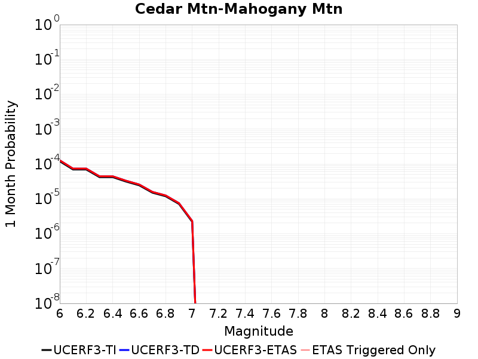 |  |  |

| Magnitude | 1 wk TI Prob | 1 wk TD Prob | 1 wk ETAS Prob | 1 wk ETAS/TD Gain | 1 wk ETAS Triggered Only | 1 mo TI Prob | 1 mo TD Prob | 1 mo ETAS Prob | 1 mo ETAS/TD Gain | 1 mo ETAS Triggered Only | 1 yr TI Prob | 1 yr TD Prob | 1 yr ETAS Prob | 1 yr ETAS/TD Gain | 1 yr ETAS Triggered Only | 10 yr TI Prob | 10 yr TD Prob | 10 yr ETAS Prob | 10 yr ETAS/TD Gain | 10 yr ETAS Triggered Only |
|-----|-----|-----|-----|-----|-----|-----|-----|-----|-----|-----|-----|-----|-----|-----|-----|-----|-----|-----|-----|-----|
| 6.0 | 2.7763876E-5 | 2.9641014E-5 | 2.9641014E-5 | 1.0 | 0.0 | 1.1898261E-4 | 1.2702713E-4 | 1.2702713E-4 | 1.0 | 0.0 | 0.0014476506 | 0.0015455284 | 0.001555513 | 1.0064603 | 1.0E-5 | 0.0143825635 | 0.01535505 | 0.015374742 | 1.0012825 | 2.0E-5 |
| 6.1 | 1.6162443E-5 | 1.7170825E-5 | 1.7170825E-5 | 1.0 | 0.0 | 6.926578E-5 | 7.3587275E-5 | 7.3587275E-5 | 1.0 | 0.0 | 8.4298453E-4 | 8.955746E-4 | 9.055656E-4 | 1.011156 | 1.0E-5 | 0.008397939 | 0.008921473 | 0.008941295 | 1.0022218 | 2.0E-5 |
| 6.2 | 1.6162443E-5 | 1.7170825E-5 | 1.7170825E-5 | 1.0 | 0.0 | 6.926578E-5 | 7.3587275E-5 | 7.3587275E-5 | 1.0 | 0.0 | 8.4298453E-4 | 8.955746E-4 | 9.055656E-4 | 1.011156 | 1.0E-5 | 0.008397939 | 0.008921473 | 0.008941295 | 1.0022218 | 2.0E-5 |
| 6.3 | 9.746053E-6 | 1.0318915E-5 | 1.0318915E-5 | 1.0 | 0.0 | 4.1768133E-5 | 4.4223194E-5 | 4.4223194E-5 | 1.0 | 0.0 | 5.0840835E-4 | 5.382885E-4 | 5.382885E-4 | 1.0 | 0.0 | 0.0050724675 | 0.0053702667 | 0.0053802133 | 1.0018522 | 1.0E-5 |
| 6.4 | 9.746053E-6 | 1.0318915E-5 | 1.0318915E-5 | 1.0 | 0.0 | 4.1768133E-5 | 4.4223194E-5 | 4.4223194E-5 | 1.0 | 0.0 | 5.0840835E-4 | 5.382885E-4 | 5.382885E-4 | 1.0 | 0.0 | 0.0050724675 | 0.0053702667 | 0.0053802133 | 1.0018522 | 1.0E-5 |
| 6.5 | 7.290083E-6 | 7.70677E-6 | 7.70677E-6 | 1.0 | 0.0 | 3.124284E-5 | 3.3028606E-5 | 3.3028606E-5 | 1.0 | 0.0 | 3.8031515E-4 | 4.020513E-4 | 4.020513E-4 | 1.0 | 0.0 | 0.0037966494 | 0.0040134597 | 0.0040234197 | 1.0024816 | 1.0E-5 |
| 6.6 | 5.67907E-6 | 5.9979006E-6 | 5.9979006E-6 | 1.0 | 0.0 | 2.4338644E-5 | 2.5705041E-5 | 2.5705041E-5 | 1.0 | 0.0 | 2.962827E-4 | 3.129153E-4 | 3.129153E-4 | 1.0 | 0.0 | 0.0029588798 | 0.0031248834 | 0.0031348523 | 1.0031902 | 1.0E-5 |
| 6.7 | 3.4853963E-6 | 3.6779077E-6 | 3.6779077E-6 | 1.0 | 0.0 | 1.4937327E-5 | 1.576237E-5 | 1.576237E-5 | 1.0 | 0.0 | 1.8184677E-4 | 1.9189058E-4 | 1.9189058E-4 | 1.0 | 0.0 | 0.0018169804 | 0.0019173111 | 0.0019173111 | 1.0 | 0.0 |
| 6.8 | 2.7535168E-6 | 2.9057492E-6 | 2.9057492E-6 | 1.0 | 0.0 | 1.1800733E-5 | 1.2453153E-5 | 1.2453153E-5 | 1.0 | 0.0 | 1.4366445E-4 | 1.5160708E-4 | 1.5160708E-4 | 1.0 | 0.0 | 0.0014357162 | 0.0015150838 | 0.0015150838 | 1.0 | 0.0 |
| 6.9 | 1.6594106E-6 | 1.7522447E-6 | 1.7522447E-6 | 1.0 | 0.0 | 7.1117406E-6 | 7.5096004E-6 | 7.5096004E-6 | 1.0 | 0.0 | 8.6582E-5 | 9.1425856E-5 | 9.1425856E-5 | 1.0 | 0.0 | 8.654827E-4 | 9.13913E-4 | 9.13913E-4 | 1.0 | 0.0 |
| 7.0 | 5.10215E-7 | 5.3973645E-7 | 5.3973645E-7 | 1.0 | 0.0 | 2.186634E-6 | 2.313155E-6 | 2.313155E-6 | 1.0 | 0.0 | 2.6621943E-5 | 2.8162425E-5 | 2.8162425E-5 | 1.0 | 0.0 | 2.6618753E-4 | 2.8160115E-4 | 2.8160115E-4 | 1.0 | 0.0 |

## Death Valley (Fish Lake Valley)
*[(top)](#table-of-contents)*

| 1 Week | 1 Month | 1 Year | 10 Year |
|-----|-----|-----|-----|
| 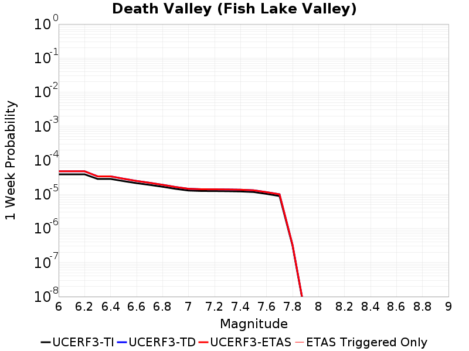 |  |  |  |

| Magnitude | 1 wk TI Prob | 1 wk TD Prob | 1 wk ETAS Prob | 1 wk ETAS/TD Gain | 1 wk ETAS Triggered Only | 1 mo TI Prob | 1 mo TD Prob | 1 mo ETAS Prob | 1 mo ETAS/TD Gain | 1 mo ETAS Triggered Only | 1 yr TI Prob | 1 yr TD Prob | 1 yr ETAS Prob | 1 yr ETAS/TD Gain | 1 yr ETAS Triggered Only | 10 yr TI Prob | 10 yr TD Prob | 10 yr ETAS Prob | 10 yr ETAS/TD Gain | 10 yr ETAS Triggered Only |
|-----|-----|-----|-----|-----|-----|-----|-----|-----|-----|-----|-----|-----|-----|-----|-----|-----|-----|-----|-----|-----|
| 6.0 | 3.872328E-5 | 4.7546215E-5 | 4.7546215E-5 | 1.0 | 0.0 | 1.6594635E-4 | 2.037553E-4 | 2.1375326E-4 | 1.0490685 | 1.0E-5 | 0.0020185246 | 0.0024781595 | 0.0024881347 | 1.0040252 | 1.0E-5 | 0.02000288 | 0.024530683 | 0.024540437 | 1.0003977 | 1.0E-5 |
| 6.1 | 3.872328E-5 | 4.7546215E-5 | 4.7546215E-5 | 1.0 | 0.0 | 1.6594635E-4 | 2.037553E-4 | 2.1375326E-4 | 1.0490685 | 1.0E-5 | 0.0020185246 | 0.0024781595 | 0.0024881347 | 1.0040252 | 1.0E-5 | 0.02000288 | 0.024530683 | 0.024540437 | 1.0003977 | 1.0E-5 |
| 6.2 | 3.872328E-5 | 4.7546215E-5 | 4.7546215E-5 | 1.0 | 0.0 | 1.6594635E-4 | 2.037553E-4 | 2.1375326E-4 | 1.0490685 | 1.0E-5 | 0.0020185246 | 0.0024781595 | 0.0024881347 | 1.0040252 | 1.0E-5 | 0.02000288 | 0.024530683 | 0.024540437 | 1.0003977 | 1.0E-5 |
| 6.3 | 2.8356371E-5 | 3.3778695E-5 | 3.3778695E-5 | 1.0 | 0.0 | 1.2152165E-4 | 1.4475825E-4 | 1.5475681E-4 | 1.0690707 | 1.0E-5 | 0.0014785219 | 0.0017610769 | 0.0017710592 | 1.0056684 | 1.0E-5 | 0.014687235 | 0.01747829 | 0.017488113 | 1.0005622 | 1.0E-5 |
| 6.4 | 2.8356371E-5 | 3.3778695E-5 | 3.3778695E-5 | 1.0 | 0.0 | 1.2152165E-4 | 1.4475825E-4 | 1.5475681E-4 | 1.0690707 | 1.0E-5 | 0.0014785219 | 0.0017610769 | 0.0017710592 | 1.0056684 | 1.0E-5 | 0.014687235 | 0.01747829 | 0.017488113 | 1.0005622 | 1.0E-5 |
| 6.5 | 2.4448687E-5 | 2.8739678E-5 | 2.8739678E-5 | 1.0 | 0.0 | 1.0477588E-4 | 1.2316453E-4 | 1.331633E-4 | 1.0811822 | 1.0E-5 | 0.0012748998 | 0.0014985445 | 0.0015085295 | 1.0066631 | 1.0E-5 | 0.012676105 | 0.014889266 | 0.014899117 | 1.0006616 | 1.0E-5 |
| 6.6 | 2.1298161E-5 | 2.4765666E-5 | 2.4765666E-5 | 1.0 | 0.0 | 9.127464E-5 | 1.06134445E-4 | 1.1613338E-4 | 1.0942101 | 1.0E-5 | 0.0011107022 | 0.0012914541 | 0.0013014412 | 1.0077332 | 1.0E-5 | 0.011051672 | 0.012842932 | 0.012852804 | 1.0007687 | 1.0E-5 |
| 6.7 | 1.8959729E-5 | 2.1868847E-5 | 2.1868847E-5 | 1.0 | 0.0 | 8.125345E-5 | 9.372042E-5 | 1.03719474E-4 | 1.1066903 | 1.0E-5 | 9.888117E-4 | 0.0011404746 | 0.0011504631 | 1.0087583 | 1.0E-5 | 0.009844234 | 0.011348904 | 0.01135879 | 1.0008712 | 1.0E-5 |
| 6.8 | 1.6691629E-5 | 1.908998E-5 | 1.908998E-5 | 1.0 | 0.0 | 7.153359E-5 | 8.1811726E-5 | 9.1810914E-5 | 1.1222218 | 1.0E-5 | 8.7057345E-4 | 9.956197E-4 | 0.0010056098 | 1.010034 | 1.0E-5 | 0.008671708 | 0.009913365 | 0.009923266 | 1.0009987 | 1.0E-5 |
| 6.9 | 1.450505E-5 | 1.6446886E-5 | 1.6446886E-5 | 1.0 | 0.0 | 6.216302E-5 | 7.04848E-5 | 8.04841E-5 | 1.1418645 | 1.0E-5 | 7.5657194E-4 | 8.578234E-4 | 8.678149E-4 | 1.0116475 | 1.0E-5 | 0.007540013 | 0.008546061 | 0.008555976 | 1.0011601 | 1.0E-5 |
| 7.0 | 1.2940855E-5 | 1.4586184E-5 | 1.4586184E-5 | 1.0 | 0.0 | 5.545963E-5 | 6.251075E-5 | 6.251075E-5 | 1.0 | 0.0 | 6.750118E-4 | 7.6080847E-4 | 7.6080847E-4 | 1.0 | 0.0 | 0.006729651 | 0.0075826603 | 0.0075826603 | 1.0 | 0.0 |
| 7.1 | 1.2544658E-5 | 1.412444E-5 | 1.412444E-5 | 1.0 | 0.0 | 5.3761712E-5 | 6.0531944E-5 | 6.0531944E-5 | 1.0 | 0.0 | 6.5435225E-4 | 7.3673285E-4 | 7.3673285E-4 | 1.0 | 0.0 | 0.006524288 | 0.0073435022 | 0.0073435022 | 1.0 | 0.0 |
| 7.2 | 1.2489416E-5 | 1.4061685E-5 | 1.4061685E-5 | 1.0 | 0.0 | 5.3524967E-5 | 6.0263003E-5 | 6.0263003E-5 | 1.0 | 0.0 | 6.514716E-4 | 7.334607E-4 | 7.334607E-4 | 1.0 | 0.0 | 0.006495651 | 0.0073109968 | 0.0073109968 | 1.0 | 0.0 |
| 7.3 | 1.2368307E-5 | 1.3925374E-5 | 1.3925374E-5 | 1.0 | 0.0 | 5.3005948E-5 | 5.9678845E-5 | 5.9678845E-5 | 1.0 | 0.0 | 6.451563E-4 | 7.263533E-4 | 7.263533E-4 | 1.0 | 0.0 | 0.0064328653 | 0.007240388 | 0.007240388 | 1.0 | 0.0 |
| 7.4 | 1.2161707E-5 | 1.3692661E-5 | 1.3692661E-5 | 1.0 | 0.0 | 5.212056E-5 | 5.8681544E-5 | 5.8681544E-5 | 1.0 | 0.0 | 6.3438306E-4 | 7.1421923E-4 | 7.1421923E-4 | 1.0 | 0.0 | 0.006325751 | 0.007119831 | 0.007119831 | 1.0 | 0.0 |
| 7.5 | 1.1707948E-5 | 1.31888455E-5 | 1.31888455E-5 | 1.0 | 0.0 | 5.0175953E-5 | 5.6522433E-5 | 5.6522433E-5 | 1.0 | 0.0 | 6.10721E-4 | 6.8794895E-4 | 6.8794895E-4 | 1.0 | 0.0 | 0.0060904534 | 0.00685878 | 0.00685878 | 1.0 | 0.0 |
| 7.6 | 1.0319538E-5 | 1.161756E-5 | 1.161756E-5 | 1.0 | 0.0 | 4.4225842E-5 | 4.978862E-5 | 4.978862E-5 | 1.0 | 0.0 | 5.383166E-4 | 6.0601305E-4 | 6.0601305E-4 | 1.0 | 0.0 | 0.0053701443 | 0.00604414 | 0.00604414 | 1.0 | 0.0 |
| 7.7 | 8.937764E-6 | 1.005543E-5 | 1.005543E-5 | 1.0 | 0.0 | 3.830414E-5 | 4.3094016E-5 | 4.3094016E-5 | 1.0 | 0.0 | 4.6625308E-4 | 5.245484E-4 | 5.245484E-4 | 1.0 | 0.0 | 0.0046527605 | 0.0052336156 | 0.0052336156 | 1.0 | 0.0 |
| 7.8 | 3.108007E-7 | 3.2896725E-7 | 3.2896725E-7 | 1.0 | 0.0 | 1.3320023E-6 | 1.4098589E-6 | 1.4098589E-6 | 1.0 | 0.0 | 1.6217007E-5 | 1.71649E-5 | 1.71649E-5 | 1.0 | 0.0 | 1.6215823E-4 | 1.7163613E-4 | 1.7163613E-4 | 1.0 | 0.0 |
| 7.9 | 2.5591178E-9 | 2.6727554E-9 | 2.6727554E-9 | 1.0 | 0.0 | 1.0967647E-8 | 1.1454665E-8 | 1.1454665E-8 | 1.0 | 0.0 | 1.335311E-7 | 1.3946055E-7 | 1.3946055E-7 | 1.0 | 0.0 | 1.3353102E-6 | 1.3946055E-6 | 1.3946055E-6 | 1.0 | 0.0 |

## Hunting Creek - Bartlett Springs connector 2011
*[(top)](#table-of-contents)*

| 1 Week | 1 Month | 1 Year | 10 Year |
|-----|-----|-----|-----|
|  |  |  |  |

| Magnitude | 1 wk TI Prob | 1 wk TD Prob | 1 wk ETAS Prob | 1 wk ETAS/TD Gain | 1 wk ETAS Triggered Only | 1 mo TI Prob | 1 mo TD Prob | 1 mo ETAS Prob | 1 mo ETAS/TD Gain | 1 mo ETAS Triggered Only | 1 yr TI Prob | 1 yr TD Prob | 1 yr ETAS Prob | 1 yr ETAS/TD Gain | 1 yr ETAS Triggered Only | 10 yr TI Prob | 10 yr TD Prob | 10 yr ETAS Prob | 10 yr ETAS/TD Gain | 10 yr ETAS Triggered Only |
|-----|-----|-----|-----|-----|-----|-----|-----|-----|-----|-----|-----|-----|-----|-----|-----|-----|-----|-----|-----|-----|
| 6.0 | 4.940016E-5 | 6.851161E-5 | 6.851161E-5 | 1.0 | 0.0 | 2.1169778E-4 | 2.93586E-4 | 3.0358305E-4 | 1.0340515 | 1.0E-5 | 0.002574374 | 0.0035683715 | 0.0035783357 | 1.0027924 | 1.0E-5 | 0.025447546 | 0.035092145 | 0.035101794 | 1.000275 | 1.0E-5 |
| 6.1 | 4.940016E-5 | 6.851161E-5 | 6.851161E-5 | 1.0 | 0.0 | 2.1169778E-4 | 2.93586E-4 | 3.0358305E-4 | 1.0340515 | 1.0E-5 | 0.002574374 | 0.0035683715 | 0.0035783357 | 1.0027924 | 1.0E-5 | 0.025447546 | 0.035092145 | 0.035101794 | 1.000275 | 1.0E-5 |
| 6.2 | 4.472471E-5 | 6.157515E-5 | 6.157515E-5 | 1.0 | 0.0 | 1.9166325E-4 | 2.6386444E-4 | 2.738618E-4 | 1.0378883 | 1.0E-5 | 0.0023310026 | 0.0032077094 | 0.0032176774 | 1.0031075 | 1.0E-5 | 0.02306703 | 0.031601414 | 0.0316111 | 1.0003065 | 1.0E-5 |
| 6.3 | 4.472471E-5 | 6.157515E-5 | 6.157515E-5 | 1.0 | 0.0 | 1.9166325E-4 | 2.6386444E-4 | 2.738618E-4 | 1.0378883 | 1.0E-5 | 0.0023310026 | 0.0032077094 | 0.0032176774 | 1.0031075 | 1.0E-5 | 0.02306703 | 0.031601414 | 0.0316111 | 1.0003065 | 1.0E-5 |
| 6.4 | 4.0001003E-5 | 5.4603024E-5 | 5.4603024E-5 | 1.0 | 0.0 | 1.714216E-4 | 2.3399114E-4 | 2.439888E-4 | 1.0427266 | 1.0E-5 | 0.0020850603 | 0.002845058 | 0.0028550294 | 1.0035049 | 1.0E-5 | 0.02065605 | 0.028078754 | 0.028088473 | 1.0003462 | 1.0E-5 |
| 6.5 | 3.8033053E-5 | 5.1735515E-5 | 5.1735515E-5 | 1.0 | 0.0 | 1.6298861E-4 | 2.217044E-4 | 2.3170219E-4 | 1.0450951 | 1.0E-5 | 0.0019825802 | 0.0026958797 | 0.0027058525 | 1.0036994 | 1.0E-5 | 0.019649856 | 0.026627 | 0.026636733 | 1.0003656 | 1.0E-5 |
| 6.6 | 3.653754E-5 | 4.957711E-5 | 4.957711E-5 | 1.0 | 0.0 | 1.5658008E-4 | 2.124563E-4 | 2.2245417E-4 | 1.0470585 | 1.0E-5 | 0.0019046954 | 0.0025835766 | 0.0025935506 | 1.0038606 | 1.0E-5 | 0.018884527 | 0.025532639 | 0.025542384 | 1.0003817 | 1.0E-5 |
| 6.7 | 3.372024E-5 | 4.5548593E-5 | 4.5548593E-5 | 1.0 | 0.0 | 1.4450731E-4 | 1.9519385E-4 | 1.9519385E-4 | 1.0 | 0.0 | 0.0017579567 | 0.0023739098 | 0.0023739098 | 1.0 | 0.0 | 0.017441148 | 0.023485329 | 0.023485329 | 1.0 | 0.0 |
| 6.8 | 2.9650024E-5 | 3.975838E-5 | 3.975838E-5 | 1.0 | 0.0 | 1.2706534E-4 | 1.7038191E-4 | 1.7038191E-4 | 1.0 | 0.0 | 0.0015459227 | 0.002072412 | 0.002072412 | 1.0 | 0.0 | 0.015352124 | 0.020527681 | 0.020527681 | 1.0 | 0.0 |
| 6.9 | 2.860775E-5 | 3.8139046E-5 | 3.8139046E-5 | 1.0 | 0.0 | 1.2259888E-4 | 1.6344283E-4 | 1.6344283E-4 | 1.0 | 0.0 | 0.0014916194 | 0.001988105 | 0.001988105 | 1.0 | 0.0 | 0.014816469 | 0.019702233 | 0.019702233 | 1.0 | 0.0 |
| 7.0 | 2.6696067E-5 | 3.5363497E-5 | 3.5363497E-5 | 1.0 | 0.0 | 1.144067E-4 | 1.5154907E-4 | 1.5154907E-4 | 1.0 | 0.0 | 0.0013920115 | 0.0018435564 | 0.0018435564 | 1.0 | 0.0 | 0.013833242 | 0.018282903 | 0.018282903 | 1.0 | 0.0 |
| 7.1 | 2.456087E-5 | 3.2275457E-5 | 3.2275457E-5 | 1.0 | 0.0 | 1.0525662E-4 | 1.383161E-4 | 1.383161E-4 | 1.0 | 0.0 | 0.001280746 | 0.0016827065 | 0.0016827065 | 1.0 | 0.0 | 0.012733897 | 0.016701076 | 0.016701076 | 1.0 | 0.0 |
| 7.2 | 2.295761E-5 | 3.006311E-5 | 3.006311E-5 | 1.0 | 0.0 | 9.8386045E-5 | 1.288356E-4 | 1.288356E-4 | 1.0 | 0.0 | 0.0011971919 | 0.0015674541 | 0.0015674541 | 1.0 | 0.0 | 0.011907627 | 0.015565611 | 0.015565611 | 1.0 | 0.0 |
| 7.3 | 2.1256936E-5 | 2.7758775E-5 | 2.7758775E-5 | 1.0 | 0.0 | 9.109797E-5 | 1.189608E-4 | 1.189608E-4 | 1.0 | 0.0 | 0.0011085535 | 0.0014473945 | 0.0014473945 | 1.0 | 0.0 | 0.011030397 | 0.014381103 | 0.014381103 | 1.0 | 0.0 |
| 7.4 | 1.8784336E-5 | 2.4496463E-5 | 2.4496463E-5 | 1.0 | 0.0 | 8.050181E-5 | 1.0498066E-4 | 1.0498066E-4 | 1.0 | 0.0 | 9.796688E-4 | 0.0012773979 | 0.0012773979 | 1.0 | 0.0 | 0.009753612 | 0.012701767 | 0.012701767 | 1.0 | 0.0 |
| 7.5 | 1.7248298E-5 | 2.2439013E-5 | 2.2439013E-5 | 1.0 | 0.0 | 7.391918E-5 | 9.61637E-5 | 9.61637E-5 | 1.0 | 0.0 | 8.9959445E-4 | 0.0011701718 | 0.0011701718 | 1.0 | 0.0 | 0.008959615 | 0.011641325 | 0.011641325 | 1.0 | 0.0 |
| 7.6 | 1.0653709E-5 | 1.38251135E-5 | 1.38251135E-5 | 1.0 | 0.0 | 4.5657955E-5 | 5.9249156E-5 | 5.9249156E-5 | 1.0 | 0.0 | 5.557438E-4 | 7.211225E-4 | 7.211225E-4 | 1.0 | 0.0 | 0.0055435603 | 0.007188361 | 0.007188361 | 1.0 | 0.0 |
| 7.7 | 3.286316E-6 | 4.116824E-6 | 4.116824E-6 | 1.0 | 0.0 | 1.4084137E-5 | 1.7643413E-5 | 1.7643413E-5 | 1.0 | 0.0 | 1.7146087E-4 | 2.1478753E-4 | 2.1478753E-4 | 1.0 | 0.0 | 0.0017132863 | 0.0021457728 | 0.0021457728 | 1.0 | 0.0 |
| 7.8 | 5.1855085E-7 | 5.999012E-7 | 5.999012E-7 | 1.0 | 0.0 | 2.222359E-6 | 2.5710028E-6 | 2.5710028E-6 | 1.0 | 0.0 | 2.7056883E-5 | 3.130152E-5 | 3.130152E-5 | 1.0 | 0.0 | 2.705359E-4 | 3.1296466E-4 | 3.1296466E-4 | 1.0 | 0.0 |

## Pittville 2011 CFM
*[(top)](#table-of-contents)*

| 1 Week | 1 Month | 1 Year | 10 Year |
|-----|-----|-----|-----|
| 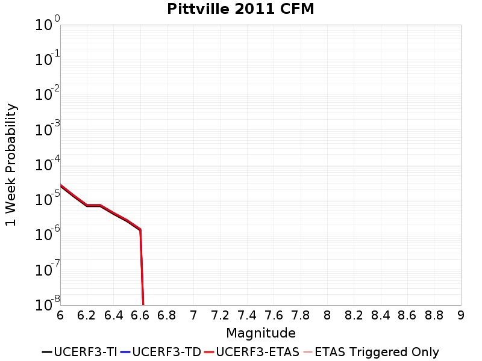 | 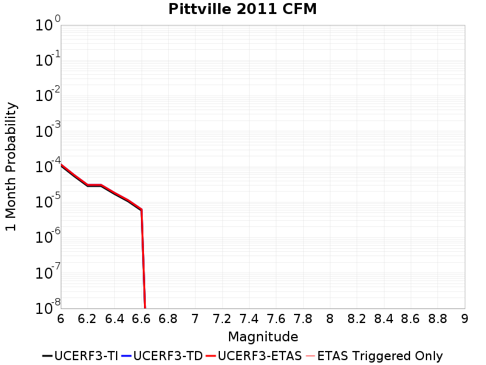 |  |  |

| Magnitude | 1 wk TI Prob | 1 wk TD Prob | 1 wk ETAS Prob | 1 wk ETAS/TD Gain | 1 wk ETAS Triggered Only | 1 mo TI Prob | 1 mo TD Prob | 1 mo ETAS Prob | 1 mo ETAS/TD Gain | 1 mo ETAS Triggered Only | 1 yr TI Prob | 1 yr TD Prob | 1 yr ETAS Prob | 1 yr ETAS/TD Gain | 1 yr ETAS Triggered Only | 10 yr TI Prob | 10 yr TD Prob | 10 yr ETAS Prob | 10 yr ETAS/TD Gain | 10 yr ETAS Triggered Only |
|-----|-----|-----|-----|-----|-----|-----|-----|-----|-----|-----|-----|-----|-----|-----|-----|-----|-----|-----|-----|-----|
| 6.0 | 2.5031832E-5 | 2.7115582E-5 | 2.7115582E-5 | 1.0 | 0.0 | 1.0727487E-4 | 1.1620502E-4 | 1.1620502E-4 | 1.0 | 0.0 | 0.001305289 | 0.0014139757 | 0.0014239616 | 1.0070623 | 1.0E-5 | 0.012976485 | 0.014059619 | 0.014069478 | 1.0007013 | 1.0E-5 |
| 6.1 | 1.2540113E-5 | 1.3541128E-5 | 1.3541128E-5 | 1.0 | 0.0 | 5.3742235E-5 | 5.8032245E-5 | 5.8032245E-5 | 1.0 | 0.0 | 6.541153E-4 | 7.063361E-4 | 7.063361E-4 | 1.0 | 0.0 | 0.0065219323 | 0.0070431544 | 0.0070431544 | 1.0 | 0.0 |
| 6.2 | 6.603218E-6 | 7.121705E-6 | 7.121705E-6 | 1.0 | 0.0 | 2.8299199E-5 | 3.0521274E-5 | 3.0521274E-5 | 1.0 | 0.0 | 3.4448825E-4 | 3.7153965E-4 | 3.7153965E-4 | 1.0 | 0.0 | 0.0034395473 | 0.0037098282 | 0.0037098282 | 1.0 | 0.0 |
| 6.3 | 6.603218E-6 | 7.121705E-6 | 7.121705E-6 | 1.0 | 0.0 | 2.8299199E-5 | 3.0521274E-5 | 3.0521274E-5 | 1.0 | 0.0 | 3.4448825E-4 | 3.7153965E-4 | 3.7153965E-4 | 1.0 | 0.0 | 0.0034395473 | 0.0037098282 | 0.0037098282 | 1.0 | 0.0 |
| 6.4 | 3.9389015E-6 | 4.2478227E-6 | 4.2478227E-6 | 1.0 | 0.0 | 1.6880897E-5 | 1.8204846E-5 | 1.8204846E-5 | 1.0 | 0.0 | 2.0550552E-4 | 2.2162456E-4 | 2.2162456E-4 | 1.0 | 0.0 | 0.0020531558 | 0.0022143417 | 0.0022143417 | 1.0 | 0.0 |
| 6.5 | 2.4533072E-6 | 2.646684E-6 | 2.646684E-6 | 1.0 | 0.0 | 1.0514132E-5 | 1.1342892E-5 | 1.1342892E-5 | 1.0 | 0.0 | 1.2800204E-4 | 1.3809292E-4 | 1.3809292E-4 | 1.0 | 0.0 | 0.0012792832 | 0.001380262 | 0.001380262 | 1.0 | 0.0 |
| 6.6 | 1.3482367E-6 | 1.4560143E-6 | 1.4560143E-6 | 1.0 | 0.0 | 5.778144E-6 | 6.2400527E-6 | 6.2400527E-6 | 1.0 | 0.0 | 7.0346636E-5 | 7.5971126E-5 | 7.5971126E-5 | 1.0 | 0.0 | 7.032437E-4 | 7.595631E-4 | 7.595631E-4 | 1.0 | 0.0 |

## Gillem - Big Crack 2011 CFM
*[(top)](#table-of-contents)*

| 1 Week | 1 Month | 1 Year | 10 Year |
|-----|-----|-----|-----|
| 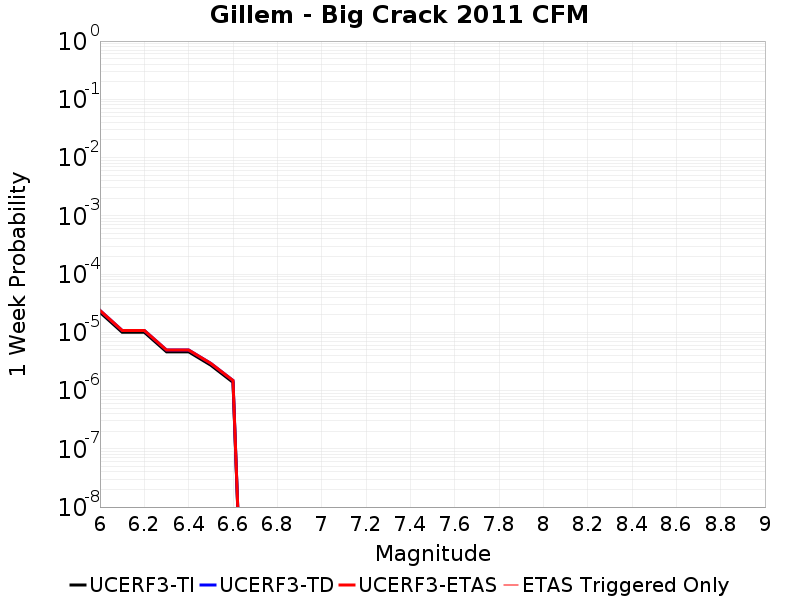 |  |  |  |

| Magnitude | 1 wk TI Prob | 1 wk TD Prob | 1 wk ETAS Prob | 1 wk ETAS/TD Gain | 1 wk ETAS Triggered Only | 1 mo TI Prob | 1 mo TD Prob | 1 mo ETAS Prob | 1 mo ETAS/TD Gain | 1 mo ETAS Triggered Only | 1 yr TI Prob | 1 yr TD Prob | 1 yr ETAS Prob | 1 yr ETAS/TD Gain | 1 yr ETAS Triggered Only | 10 yr TI Prob | 10 yr TD Prob | 10 yr ETAS Prob | 10 yr ETAS/TD Gain | 10 yr ETAS Triggered Only |
|-----|-----|-----|-----|-----|-----|-----|-----|-----|-----|-----|-----|-----|-----|-----|-----|-----|-----|-----|-----|-----|
| 6.0 | 2.196852E-5 | 2.3651535E-5 | 2.3651535E-5 | 1.0 | 0.0 | 9.4147406E-5 | 1.0136029E-4 | 1.0136029E-4 | 1.0 | 0.0 | 0.0011456419 | 0.0012334521 | 0.0012334521 | 1.0 | 0.0 | 0.011397537 | 0.012274958 | 0.012284836 | 1.0008047 | 1.0E-5 |
| 6.1 | 9.992795E-6 | 1.0732517E-5 | 1.0732517E-5 | 1.0 | 0.0 | 4.2825563E-5 | 4.5995792E-5 | 4.5995792E-5 | 1.0 | 0.0 | 5.2127644E-4 | 5.598733E-4 | 5.598733E-4 | 1.0 | 0.0 | 0.0052005537 | 0.005586445 | 0.005586445 | 1.0 | 0.0 |
| 6.2 | 9.992795E-6 | 1.0732517E-5 | 1.0732517E-5 | 1.0 | 0.0 | 4.2825563E-5 | 4.5995792E-5 | 4.5995792E-5 | 1.0 | 0.0 | 5.2127644E-4 | 5.598733E-4 | 5.598733E-4 | 1.0 | 0.0 | 0.0052005537 | 0.005586445 | 0.005586445 | 1.0 | 0.0 |
| 6.3 | 4.6127884E-6 | 4.952114E-6 | 4.952114E-6 | 1.0 | 0.0 | 1.9768944E-5 | 2.1223199E-5 | 2.1223199E-5 | 1.0 | 0.0 | 2.406603E-4 | 2.583663E-4 | 2.583663E-4 | 1.0 | 0.0 | 0.0024039985 | 0.0025810988 | 0.0025810988 | 1.0 | 0.0 |
| 6.4 | 4.6127884E-6 | 4.952114E-6 | 4.952114E-6 | 1.0 | 0.0 | 1.9768944E-5 | 2.1223199E-5 | 2.1223199E-5 | 1.0 | 0.0 | 2.406603E-4 | 2.583663E-4 | 2.583663E-4 | 1.0 | 0.0 | 0.0024039985 | 0.0025810988 | 0.0025810988 | 1.0 | 0.0 |
| 6.5 | 2.716712E-6 | 2.916685E-6 | 2.916685E-6 | 1.0 | 0.0 | 1.1643E-5 | 1.2500032E-5 | 1.2500032E-5 | 1.0 | 0.0 | 1.417443E-4 | 1.521797E-4 | 1.521797E-4 | 1.0 | 0.0 | 0.0014165393 | 0.0015209939 | 0.0015209939 | 1.0 | 0.0 |
| 6.6 | 1.3818255E-6 | 1.4849456E-6 | 1.4849456E-6 | 1.0 | 0.0 | 5.922096E-6 | 6.364044E-6 | 6.364044E-6 | 1.0 | 0.0 | 7.209913E-5 | 7.748072E-5 | 7.748072E-5 | 1.0 | 0.0 | 7.2075747E-4 | 7.7465846E-4 | 7.7465846E-4 | 1.0 | 0.0 |

## San Gregorio (North) 2011 CFM
*[(top)](#table-of-contents)*

| 1 Week | 1 Month | 1 Year | 10 Year |
|-----|-----|-----|-----|
|  |  | 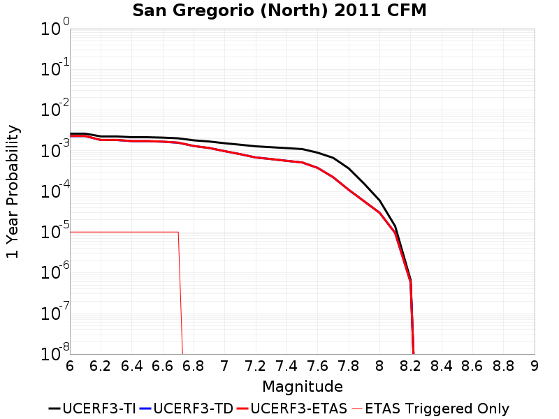 |  |

| Magnitude | 1 wk TI Prob | 1 wk TD Prob | 1 wk ETAS Prob | 1 wk ETAS/TD Gain | 1 wk ETAS Triggered Only | 1 mo TI Prob | 1 mo TD Prob | 1 mo ETAS Prob | 1 mo ETAS/TD Gain | 1 mo ETAS Triggered Only | 1 yr TI Prob | 1 yr TD Prob | 1 yr ETAS Prob | 1 yr ETAS/TD Gain | 1 yr ETAS Triggered Only | 10 yr TI Prob | 10 yr TD Prob | 10 yr ETAS Prob | 10 yr ETAS/TD Gain | 10 yr ETAS Triggered Only |
|-----|-----|-----|-----|-----|-----|-----|-----|-----|-----|-----|-----|-----|-----|-----|-----|-----|-----|-----|-----|-----|
| 6.0 | 5.0283932E-5 | 4.3725315E-5 | 4.3725315E-5 | 1.0 | 0.0 | 2.1548476E-4 | 1.8738088E-4 | 1.8738088E-4 | 1.0 | 0.0 | 0.0026203706 | 0.0022789876 | 0.0022889648 | 1.004378 | 1.0E-5 | 0.02589687 | 0.022644745 | 0.02265452 | 1.0004317 | 1.0E-5 |
| 6.1 | 5.0283932E-5 | 4.3725315E-5 | 4.3725315E-5 | 1.0 | 0.0 | 2.1548476E-4 | 1.8738088E-4 | 1.8738088E-4 | 1.0 | 0.0 | 0.0026203706 | 0.0022789876 | 0.0022889648 | 1.004378 | 1.0E-5 | 0.02589687 | 0.022644745 | 0.02265452 | 1.0004317 | 1.0E-5 |
| 6.2 | 4.2998647E-5 | 3.504179E-5 | 3.504179E-5 | 1.0 | 0.0 | 1.842669E-4 | 1.5017054E-4 | 1.5017054E-4 | 1.0 | 0.0 | 0.0022411412 | 0.0018268051 | 0.0018367867 | 1.0054641 | 1.0E-5 | 0.022186736 | 0.01820405 | 0.018213868 | 1.0005393 | 1.0E-5 |
| 6.3 | 4.2998647E-5 | 3.504179E-5 | 3.504179E-5 | 1.0 | 0.0 | 1.842669E-4 | 1.5017054E-4 | 1.5017054E-4 | 1.0 | 0.0 | 0.0022411412 | 0.0018268051 | 0.0018367867 | 1.0054641 | 1.0E-5 | 0.022186736 | 0.01820405 | 0.018213868 | 1.0005393 | 1.0E-5 |
| 6.4 | 4.1101295E-5 | 3.290831E-5 | 3.290831E-5 | 1.0 | 0.0 | 1.7613651E-4 | 1.4102807E-4 | 1.4102807E-4 | 1.0 | 0.0 | 0.0021423528 | 0.0017156777 | 0.0017256605 | 1.0058186 | 1.0E-5 | 0.02121817 | 0.017110065 | 0.017119894 | 1.0005745 | 1.0E-5 |
| 6.5 | 4.1032585E-5 | 3.2825905E-5 | 3.2825905E-5 | 1.0 | 0.0 | 1.7584208E-4 | 1.4067495E-4 | 1.4067495E-4 | 1.0 | 0.0 | 0.0021387753 | 0.0017113853 | 0.0017213682 | 1.0058333 | 1.0E-5 | 0.021183075 | 0.017067809 | 0.017077638 | 1.0005759 | 1.0E-5 |
| 6.6 | 4.011629E-5 | 3.1837782E-5 | 3.1837782E-5 | 1.0 | 0.0 | 1.7191563E-4 | 1.3644059E-4 | 1.3644059E-4 | 1.0 | 0.0 | 0.0020910634 | 0.0016599122 | 0.0016698956 | 1.0060145 | 1.0E-5 | 0.020714961 | 0.016559314 | 0.016569149 | 1.0005939 | 1.0E-5 |
| 6.7 | 3.8583938E-5 | 3.0010502E-5 | 3.0010502E-5 | 1.0 | 0.0 | 1.6534925E-4 | 1.2861018E-4 | 1.2861018E-4 | 1.0 | 0.0 | 0.0020112682 | 0.0015647187 | 0.001574703 | 1.0063809 | 1.0E-5 | 0.019931622 | 0.015619981 | 0.015629824 | 1.0006303 | 1.0E-5 |
| 6.8 | 3.44341E-5 | 2.4972165E-5 | 2.4972165E-5 | 1.0 | 0.0 | 1.4756636E-4 | 1.0701924E-4 | 1.0701924E-4 | 1.0 | 0.0 | 0.0017951399 | 0.0013021909 | 0.0013021909 | 1.0 | 0.0 | 0.017807078 | 0.01302721 | 0.01302721 | 1.0 | 0.0 |
| 6.9 | 3.221199E-5 | 2.2276405E-5 | 2.2276405E-5 | 1.0 | 0.0 | 1.3804408E-4 | 9.546686E-5 | 9.546686E-5 | 1.0 | 0.0 | 0.0016793909 | 0.0011616976 | 0.0011616976 | 1.0 | 0.0 | 0.01666756 | 0.011636798 | 0.011636798 | 1.0 | 0.0 |
| 7.0 | 2.9186718E-5 | 1.8617688E-5 | 1.8617688E-5 | 1.0 | 0.0 | 1.2507994E-4 | 7.978768E-5 | 7.978768E-5 | 1.0 | 0.0 | 0.0015217843 | 9.709865E-4 | 9.709865E-4 | 1.0 | 0.0 | 0.015114053 | 0.009747451 | 0.009747451 | 1.0 | 0.0 |
| 7.1 | 2.6840138E-5 | 1.573508E-5 | 1.573508E-5 | 1.0 | 0.0 | 1.1502409E-4 | 6.743433E-5 | 6.743433E-5 | 1.0 | 0.0 | 0.0013995186 | 8.207057E-4 | 8.207057E-4 | 1.0 | 0.0 | 0.013907375 | 0.008256216 | 0.008256216 | 1.0 | 0.0 |
| 7.2 | 2.453002E-5 | 1.3040931E-5 | 1.3040931E-5 | 1.0 | 0.0 | 1.05124425E-4 | 5.5888508E-5 | 5.5888508E-5 | 1.0 | 0.0 | 0.0012791384 | 6.802308E-4 | 6.802308E-4 | 1.0 | 0.0 | 0.012718005 | 0.006859997 | 0.006859997 | 1.0 | 0.0 |
| 7.3 | 2.3330727E-5 | 1.1913884E-5 | 1.1913884E-5 | 1.0 | 0.0 | 9.9985E-5 | 5.1058505E-5 | 5.1058505E-5 | 1.0 | 0.0 | 0.0012166376 | 6.2146044E-4 | 6.2146044E-4 | 1.0 | 0.0 | 0.012099981 | 0.0062742895 | 0.0062742895 | 1.0 | 0.0 |
| 7.4 | 2.2136466E-5 | 1.0784946E-5 | 1.0784946E-5 | 1.0 | 0.0 | 9.486712E-5 | 4.6220383E-5 | 4.6220383E-5 | 1.0 | 0.0 | 0.0011543952 | 5.625881E-4 | 5.625881E-4 | 1.0 | 0.0 | 0.011484168 | 0.005687286 | 0.005687286 | 1.0 | 0.0 |
| 7.5 | 2.0994974E-5 | 9.829638E-6 | 9.829638E-6 | 1.0 | 0.0 | 8.997535E-5 | 4.2126336E-5 | 4.2126336E-5 | 1.0 | 0.0 | 0.0010948994 | 5.127677E-4 | 5.127677E-4 | 1.0 | 0.0 | 0.010895205 | 0.0051893047 | 0.0051893047 | 1.0 | 0.0 |
| 7.6 | 1.7091823E-5 | 7.220931E-6 | 7.220931E-6 | 1.0 | 0.0 | 7.3248615E-5 | 3.094648E-5 | 3.094648E-5 | 1.0 | 0.0 | 8.9143694E-4 | 3.7670837E-4 | 3.7670837E-4 | 1.0 | 0.0 | 0.008878695 | 0.0038250391 | 0.0038250391 | 1.0 | 0.0 |
| 7.7 | 1.2772179E-5 | 4.2548413E-6 | 4.2548413E-6 | 1.0 | 0.0 | 5.473676E-5 | 1.8234907E-5 | 1.8234907E-5 | 1.0 | 0.0 | 6.6621625E-4 | 2.219874E-4 | 2.219874E-4 | 1.0 | 0.0 | 0.006642225 | 0.002264472 | 0.002264472 | 1.0 | 0.0 |
| 7.8 | 7.041923E-6 | 2.0927412E-6 | 2.0927412E-6 | 1.0 | 0.0 | 3.017932E-5 | 8.96886E-6 | 8.96886E-6 | 1.0 | 0.0 | 3.6737128E-4 | 1.091904E-4 | 1.091904E-4 | 1.0 | 0.0 | 0.0036676454 | 0.0011209808 | 0.0011209808 | 1.0 | 0.0 |
| 7.9 | 2.946768E-6 | 1.0916808E-6 | 1.0916808E-6 | 1.0 | 0.0 | 1.2628945E-5 | 4.6786236E-6 | 4.6786236E-6 | 1.0 | 0.0 | 1.5374656E-4 | 5.6960755E-5 | 5.6960755E-5 | 1.0 | 0.0 | 0.0015364023 | 5.810357E-4 | 5.810357E-4 | 1.0 | 0.0 |
| 8.0 | 1.1433375E-6 | 5.6814196E-7 | 5.6814196E-7 | 1.0 | 0.0 | 4.9000087E-6 | 2.4348917E-6 | 2.4348917E-6 | 1.0 | 0.0 | 5.965597E-5 | 2.9644403E-5 | 2.9644403E-5 | 1.0 | 0.0 | 5.963996E-4 | 3.0024358E-4 | 3.0024358E-4 | 1.0 | 0.0 |
| 8.1 | 2.6675295E-7 | 1.819619E-7 | 1.819619E-7 | 1.0 | 0.0 | 1.1432264E-6 | 7.7983645E-7 | 7.7983645E-7 | 1.0 | 0.0 | 1.3918692E-5 | 9.494467E-6 | 9.494467E-6 | 1.0 | 0.0 | 1.391782E-4 | 9.641652E-5 | 9.641652E-5 | 1.0 | 0.0 |
| 8.2 | 1.2704569E-8 | 1.1148845E-8 | 1.1148845E-8 | 1.0 | 0.0 | 5.444815E-8 | 4.7780766E-8 | 4.7780766E-8 | 1.0 | 0.0 | 6.629061E-7 | 5.817307E-7 | 5.817307E-7 | 1.0 | 0.0 | 6.629041E-6 | 6.022312E-6 | 6.022312E-6 | 1.0 | 0.0 |

## Big Lagoon - Bald Mtn 2011 CFM
*[(top)](#table-of-contents)*

| 1 Week | 1 Month | 1 Year | 10 Year |
|-----|-----|-----|-----|
|  | 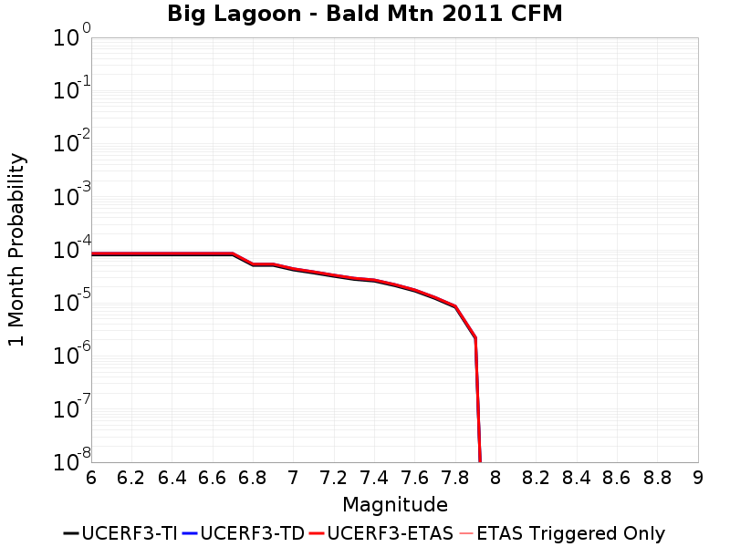 |  | 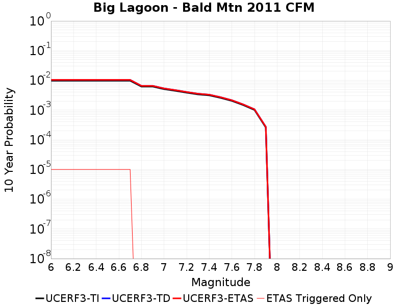 |

| Magnitude | 1 wk TI Prob | 1 wk TD Prob | 1 wk ETAS Prob | 1 wk ETAS/TD Gain | 1 wk ETAS Triggered Only | 1 mo TI Prob | 1 mo TD Prob | 1 mo ETAS Prob | 1 mo ETAS/TD Gain | 1 mo ETAS Triggered Only | 1 yr TI Prob | 1 yr TD Prob | 1 yr ETAS Prob | 1 yr ETAS/TD Gain | 1 yr ETAS Triggered Only | 10 yr TI Prob | 10 yr TD Prob | 10 yr ETAS Prob | 10 yr ETAS/TD Gain | 10 yr ETAS Triggered Only |
|-----|-----|-----|-----|-----|-----|-----|-----|-----|-----|-----|-----|-----|-----|-----|-----|-----|-----|-----|-----|-----|
| 6.0 | 1.8699735E-5 | 1.9882998E-5 | 1.9882998E-5 | 1.0 | 0.0 | 8.013926E-5 | 8.521028E-5 | 8.521028E-5 | 1.0 | 0.0 | 9.752587E-4 | 0.0010369794 | 0.0010369794 | 1.0 | 0.0 | 0.009709897 | 0.010325239 | 0.010335136 | 1.0009584 | 1.0E-5 |
| 6.1 | 1.8699735E-5 | 1.9882998E-5 | 1.9882998E-5 | 1.0 | 0.0 | 8.013926E-5 | 8.521028E-5 | 8.521028E-5 | 1.0 | 0.0 | 9.752587E-4 | 0.0010369794 | 0.0010369794 | 1.0 | 0.0 | 0.009709897 | 0.010325239 | 0.010335136 | 1.0009584 | 1.0E-5 |
| 6.2 | 1.8699735E-5 | 1.9882998E-5 | 1.9882998E-5 | 1.0 | 0.0 | 8.013926E-5 | 8.521028E-5 | 8.521028E-5 | 1.0 | 0.0 | 9.752587E-4 | 0.0010369794 | 0.0010369794 | 1.0 | 0.0 | 0.009709897 | 0.010325239 | 0.010335136 | 1.0009584 | 1.0E-5 |
| 6.3 | 1.8699735E-5 | 1.9882998E-5 | 1.9882998E-5 | 1.0 | 0.0 | 8.013926E-5 | 8.521028E-5 | 8.521028E-5 | 1.0 | 0.0 | 9.752587E-4 | 0.0010369794 | 0.0010369794 | 1.0 | 0.0 | 0.009709897 | 0.010325239 | 0.010335136 | 1.0009584 | 1.0E-5 |
| 6.4 | 1.8699735E-5 | 1.9882998E-5 | 1.9882998E-5 | 1.0 | 0.0 | 8.013926E-5 | 8.521028E-5 | 8.521028E-5 | 1.0 | 0.0 | 9.752587E-4 | 0.0010369794 | 0.0010369794 | 1.0 | 0.0 | 0.009709897 | 0.010325239 | 0.010335136 | 1.0009584 | 1.0E-5 |
| 6.5 | 1.8699735E-5 | 1.9882998E-5 | 1.9882998E-5 | 1.0 | 0.0 | 8.013926E-5 | 8.521028E-5 | 8.521028E-5 | 1.0 | 0.0 | 9.752587E-4 | 0.0010369794 | 0.0010369794 | 1.0 | 0.0 | 0.009709897 | 0.010325239 | 0.010335136 | 1.0009584 | 1.0E-5 |
| 6.6 | 1.8699735E-5 | 1.9882998E-5 | 1.9882998E-5 | 1.0 | 0.0 | 8.013926E-5 | 8.521028E-5 | 8.521028E-5 | 1.0 | 0.0 | 9.752587E-4 | 0.0010369794 | 0.0010369794 | 1.0 | 0.0 | 0.009709897 | 0.010325239 | 0.010335136 | 1.0009584 | 1.0E-5 |
| 6.7 | 1.8699735E-5 | 1.9882998E-5 | 1.9882998E-5 | 1.0 | 0.0 | 8.013926E-5 | 8.521028E-5 | 8.521028E-5 | 1.0 | 0.0 | 9.752587E-4 | 0.0010369794 | 0.0010369794 | 1.0 | 0.0 | 0.009709897 | 0.010325239 | 0.010335136 | 1.0009584 | 1.0E-5 |
| 6.8 | 1.18505095E-5 | 1.2518172E-5 | 1.2518172E-5 | 1.0 | 0.0 | 5.078691E-5 | 5.3648233E-5 | 5.3648233E-5 | 1.0 | 0.0 | 6.181552E-4 | 6.5297633E-4 | 6.5297633E-4 | 1.0 | 0.0 | 0.006164385 | 0.006511083 | 0.006511083 | 1.0 | 0.0 |
| 6.9 | 1.18505095E-5 | 1.2518172E-5 | 1.2518172E-5 | 1.0 | 0.0 | 5.078691E-5 | 5.3648233E-5 | 5.3648233E-5 | 1.0 | 0.0 | 6.181552E-4 | 6.5297633E-4 | 6.5297633E-4 | 1.0 | 0.0 | 0.006164385 | 0.006511083 | 0.006511083 | 1.0 | 0.0 |
| 7.0 | 9.719786E-6 | 1.0250046E-5 | 1.0250046E-5 | 1.0 | 0.0 | 4.1655563E-5 | 4.3928045E-5 | 4.3928045E-5 | 1.0 | 0.0 | 5.0703844E-4 | 5.3469505E-4 | 5.3469505E-4 | 1.0 | 0.0 | 0.005058831 | 0.0053343326 | 0.0053343326 | 1.0 | 0.0 |
| 7.1 | 8.523418E-6 | 8.982047E-6 | 8.982047E-6 | 1.0 | 0.0 | 3.652842E-5 | 3.8493927E-5 | 3.8493927E-5 | 1.0 | 0.0 | 4.4464276E-4 | 4.6856434E-4 | 4.6856434E-4 | 1.0 | 0.0 | 0.0044375416 | 0.004675928 | 0.004675928 | 1.0 | 0.0 |
| 7.2 | 7.378894E-6 | 7.7718905E-6 | 7.7718905E-6 | 1.0 | 0.0 | 3.162345E-5 | 3.3307682E-5 | 3.3307682E-5 | 1.0 | 0.0 | 3.8494746E-4 | 4.0544645E-4 | 4.0544645E-4 | 1.0 | 0.0 | 0.0038428132 | 0.0040471638 | 0.0040471638 | 1.0 | 0.0 |
| 7.3 | 6.4640294E-6 | 6.801692E-6 | 6.801692E-6 | 1.0 | 0.0 | 2.7702688E-5 | 2.9149787E-5 | 2.9149787E-5 | 1.0 | 0.0 | 3.3722803E-4 | 3.5484153E-4 | 3.5484153E-4 | 1.0 | 0.0 | 0.0033671674 | 0.0035428195 | 0.0035428195 | 1.0 | 0.0 |
| 7.4 | 5.9959093E-6 | 6.3073267E-6 | 6.3073267E-6 | 1.0 | 0.0 | 2.5696501E-5 | 2.7031123E-5 | 2.7031123E-5 | 1.0 | 0.0 | 3.1280998E-4 | 3.2905483E-4 | 3.2905483E-4 | 1.0 | 0.0 | 0.0031237002 | 0.0032857382 | 0.0032857382 | 1.0 | 0.0 |
| 7.5 | 4.929265E-6 | 5.1833467E-6 | 5.1833467E-6 | 1.0 | 0.0 | 2.112525E-5 | 2.2214155E-5 | 2.2214155E-5 | 1.0 | 0.0 | 2.5716957E-4 | 2.7042418E-4 | 2.7042418E-4 | 1.0 | 0.0 | 0.0025687215 | 0.002700992 | 0.002700992 | 1.0 | 0.0 |
| 7.6 | 3.8982403E-6 | 4.094279E-6 | 4.094279E-6 | 1.0 | 0.0 | 1.6706637E-5 | 1.7546796E-5 | 1.7546796E-5 | 1.0 | 0.0 | 2.0338432E-4 | 2.1361157E-4 | 2.1361157E-4 | 1.0 | 0.0 | 0.0020319829 | 0.00213409 | 0.00213409 | 1.0 | 0.0 |
| 7.7 | 2.820968E-6 | 2.9610321E-6 | 2.9610321E-6 | 1.0 | 0.0 | 1.2089806E-5 | 1.2690077E-5 | 1.2690077E-5 | 1.0 | 0.0 | 1.4718344E-4 | 1.544909E-4 | 1.544909E-4 | 1.0 | 0.0 | 0.00147086 | 0.0015438527 | 0.0015438527 | 1.0 | 0.0 |
| 7.8 | 1.9314455E-6 | 2.0286718E-6 | 2.0286718E-6 | 1.0 | 0.0 | 8.277597E-6 | 8.694279E-6 | 8.694279E-6 | 1.0 | 0.0 | 1.0077508E-4 | 1.05847845E-4 | 1.05847845E-4 | 1.0 | 0.0 | 0.0010072939 | 0.0010579872 | 0.0010579872 | 1.0 | 0.0 |
| 7.9 | 4.9586197E-7 | 5.226248E-7 | 5.226248E-7 | 1.0 | 0.0 | 2.125121E-6 | 2.239819E-6 | 2.239819E-6 | 1.0 | 0.0 | 2.5873042E-5 | 2.7269476E-5 | 2.7269476E-5 | 1.0 | 0.0 | 2.5870028E-4 | 2.726634E-4 | 2.726634E-4 | 1.0 | 0.0 |

## Great Valley 04b Gordon Valley
*[(top)](#table-of-contents)*

| 1 Week | 1 Month | 1 Year | 10 Year |
|-----|-----|-----|-----|
|  | 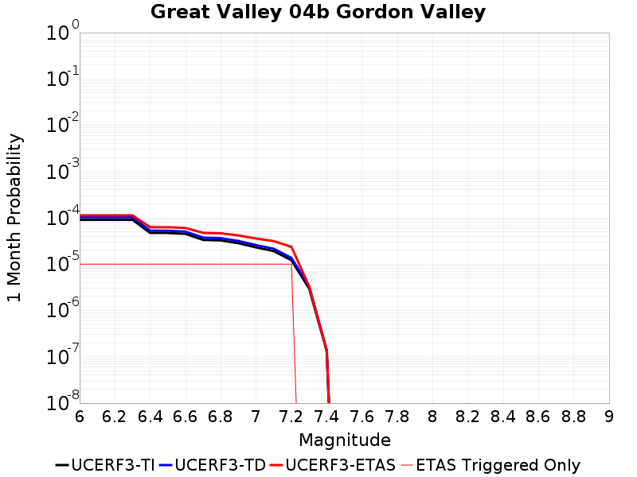 | 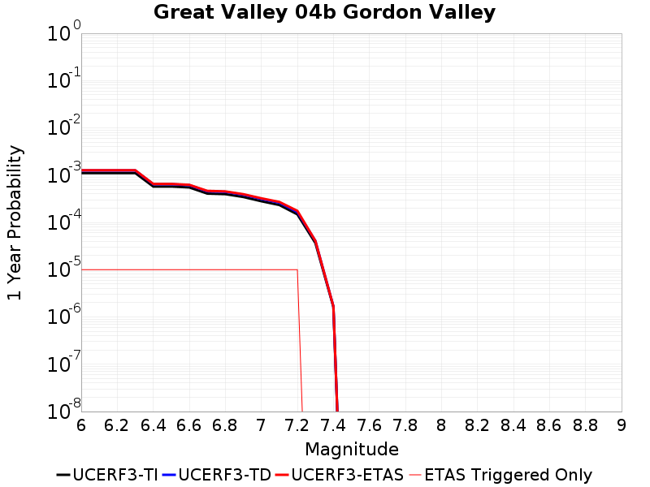 |  |

| Magnitude | 1 wk TI Prob | 1 wk TD Prob | 1 wk ETAS Prob | 1 wk ETAS/TD Gain | 1 wk ETAS Triggered Only | 1 mo TI Prob | 1 mo TD Prob | 1 mo ETAS Prob | 1 mo ETAS/TD Gain | 1 mo ETAS Triggered Only | 1 yr TI Prob | 1 yr TD Prob | 1 yr ETAS Prob | 1 yr ETAS/TD Gain | 1 yr ETAS Triggered Only | 10 yr TI Prob | 10 yr TD Prob | 10 yr ETAS Prob | 10 yr ETAS/TD Gain | 10 yr ETAS Triggered Only |
|-----|-----|-----|-----|-----|-----|-----|-----|-----|-----|-----|-----|-----|-----|-----|-----|-----|-----|-----|-----|-----|
| 6.0 | 2.1181217E-5 | 2.4067198E-5 | 2.4067198E-5 | 1.0 | 0.0 | 9.077348E-5 | 1.03141996E-4 | 1.13140966E-4 | 1.0969437 | 1.0E-5 | 0.0011046068 | 0.0012551984 | 0.0012651859 | 1.0079569 | 1.0E-5 | 0.010991322 | 0.012497669 | 0.012507544 | 1.0007901 | 1.0E-5 |
| 6.1 | 2.1181217E-5 | 2.4067198E-5 | 2.4067198E-5 | 1.0 | 0.0 | 9.077348E-5 | 1.03141996E-4 | 1.13140966E-4 | 1.0969437 | 1.0E-5 | 0.0011046068 | 0.0012551984 | 0.0012651859 | 1.0079569 | 1.0E-5 | 0.010991322 | 0.012497669 | 0.012507544 | 1.0007901 | 1.0E-5 |
| 6.2 | 2.1181217E-5 | 2.4067198E-5 | 2.4067198E-5 | 1.0 | 0.0 | 9.077348E-5 | 1.03141996E-4 | 1.13140966E-4 | 1.0969437 | 1.0E-5 | 0.0011046068 | 0.0012551984 | 0.0012651859 | 1.0079569 | 1.0E-5 | 0.010991322 | 0.012497669 | 0.012507544 | 1.0007901 | 1.0E-5 |
| 6.3 | 2.1181217E-5 | 2.4067198E-5 | 2.4067198E-5 | 1.0 | 0.0 | 9.077348E-5 | 1.03141996E-4 | 1.13140966E-4 | 1.0969437 | 1.0E-5 | 0.0011046068 | 0.0012551984 | 0.0012651859 | 1.0079569 | 1.0E-5 | 0.010991322 | 0.012497669 | 0.012507544 | 1.0007901 | 1.0E-5 |
| 6.4 | 1.0988268E-5 | 1.2292354E-5 | 1.2292354E-5 | 1.0 | 0.0 | 4.7091726E-5 | 5.2680545E-5 | 6.268002E-5 | 1.1898134 | 1.0E-5 | 5.731909E-4 | 6.412129E-4 | 6.5120653E-4 | 1.0155854 | 1.0E-5 | 0.005717147 | 0.006395225 | 0.006405161 | 1.0015537 | 1.0E-5 |
| 6.5 | 1.0988268E-5 | 1.2292354E-5 | 1.2292354E-5 | 1.0 | 0.0 | 4.7091726E-5 | 5.2680545E-5 | 6.268002E-5 | 1.1898134 | 1.0E-5 | 5.731909E-4 | 6.412129E-4 | 6.5120653E-4 | 1.0155854 | 1.0E-5 | 0.005717147 | 0.006395225 | 0.006405161 | 1.0015537 | 1.0E-5 |
| 6.6 | 1.0517822E-5 | 1.1760105E-5 | 1.1760105E-5 | 1.0 | 0.0 | 4.5075605E-5 | 5.0399565E-5 | 6.039906E-5 | 1.1984044 | 1.0E-5 | 5.4865726E-4 | 6.1345764E-4 | 6.2345155E-4 | 1.016291 | 1.0E-5 | 0.0054730466 | 0.0061192056 | 0.0061291447 | 1.0016242 | 1.0E-5 |
| 6.7 | 7.789219E-6 | 8.704182E-6 | 8.704182E-6 | 1.0 | 0.0 | 3.3381937E-5 | 3.730313E-5 | 4.7302758E-5 | 1.268064 | 1.0E-5 | 4.063493E-4 | 4.540762E-4 | 4.6407164E-4 | 1.0220127 | 1.0E-5 | 0.004056071 | 0.0045320042 | 0.0045419587 | 1.0021966 | 1.0E-5 |
| 6.8 | 7.5850853E-6 | 8.478301E-6 | 8.478301E-6 | 1.0 | 0.0 | 3.2507105E-5 | 3.6335103E-5 | 4.633474E-5 | 1.275206 | 1.0E-5 | 3.957021E-4 | 4.4229525E-4 | 4.522908E-4 | 1.0225993 | 1.0E-5 | 0.0039499826 | 0.004414665 | 0.004424621 | 1.0022552 | 1.0E-5 |
| 6.9 | 6.604105E-6 | 7.3810907E-6 | 7.3810907E-6 | 1.0 | 0.0 | 2.8303E-5 | 3.1632884E-5 | 4.1632567E-5 | 1.3161167 | 1.0E-5 | 3.4453452E-4 | 3.8506623E-4 | 3.9506238E-4 | 1.0259596 | 1.0E-5 | 0.0034400085 | 0.003844379 | 0.0038543404 | 1.0025913 | 1.0E-5 |
| 7.0 | 5.3701115E-6 | 6.006911E-6 | 6.006911E-6 | 1.0 | 0.0 | 2.301456E-5 | 2.5743668E-5 | 3.574341E-5 | 1.388435 | 1.0E-5 | 2.8016625E-4 | 3.13387E-4 | 3.2338387E-4 | 1.0318995 | 1.0E-5 | 0.0027981328 | 0.003129741 | 0.0031397096 | 1.0031852 | 1.0E-5 |
| 7.1 | 4.4685607E-6 | 5.0019826E-6 | 5.0019826E-6 | 1.0 | 0.0 | 1.9150835E-5 | 2.1436905E-5 | 3.143669E-5 | 1.4664752 | 1.0E-5 | 2.3313647E-4 | 2.6096555E-4 | 2.7096295E-4 | 1.0383092 | 1.0E-5 | 0.0023289204 | 0.0026068375 | 0.0026168113 | 1.003826 | 1.0E-5 |
| 7.2 | 2.833378E-6 | 3.1743455E-6 | 3.1743455E-6 | 1.0 | 0.0 | 1.2142991E-5 | 1.3604276E-5 | 2.360414E-5 | 1.735053 | 1.0E-5 | 1.4783088E-4 | 1.6562124E-4 | 1.7561959E-4 | 1.0603688 | 1.0E-5 | 0.0014773258 | 0.001655151 | 0.0016651344 | 1.0060318 | 1.0E-5 |
| 7.3 | 7.0087293E-7 | 7.7956884E-7 | 7.7956884E-7 | 1.0 | 0.0 | 3.0037377E-6 | 3.3410074E-6 | 3.3410074E-6 | 1.0 | 0.0 | 3.656989E-5 | 4.067647E-5 | 4.067647E-5 | 1.0 | 0.0 | 3.6563876E-4 | 4.0673552E-4 | 4.0673552E-4 | 1.0 | 0.0 |
| 7.4 | 3.112171E-8 | 3.209446E-8 | 3.209446E-8 | 1.0 | 0.0 | 1.3337875E-7 | 1.3754767E-7 | 1.3754767E-7 | 1.0 | 0.0 | 1.6238852E-6 | 1.6746417E-6 | 1.6746417E-6 | 1.0 | 0.0 | 1.6238733E-5 | 1.6746299E-5 | 1.6746299E-5 | 1.0 | 0.0 |

## Rocky Ledge 2011 CFM
*[(top)](#table-of-contents)*

| 1 Week | 1 Month | 1 Year | 10 Year |
|-----|-----|-----|-----|
| 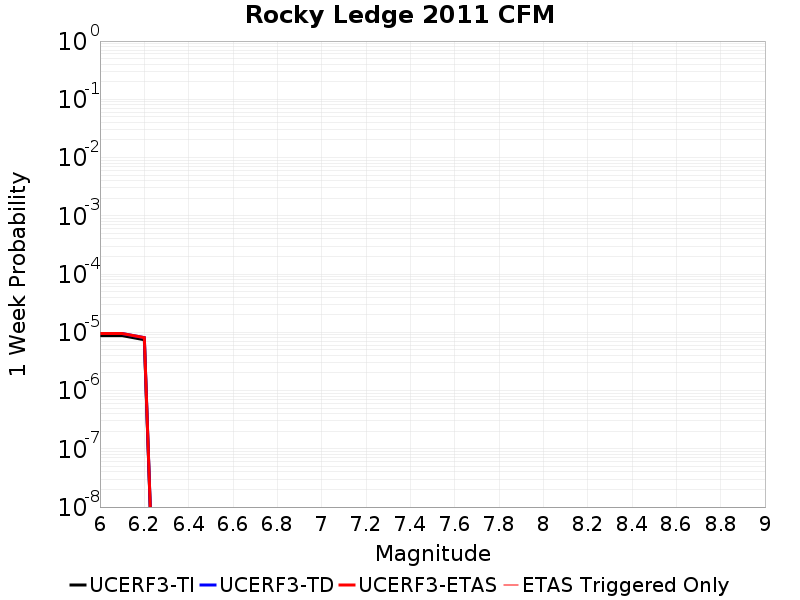 |  | 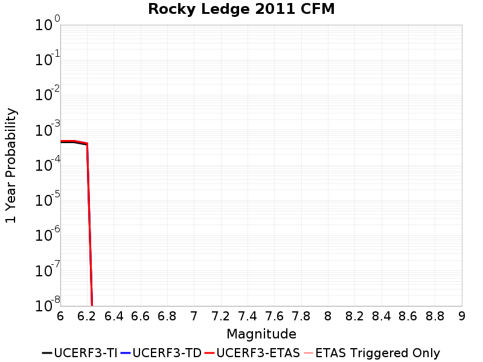 |  |

| Magnitude | 1 wk TI Prob | 1 wk TD Prob | 1 wk ETAS Prob | 1 wk ETAS/TD Gain | 1 wk ETAS Triggered Only | 1 mo TI Prob | 1 mo TD Prob | 1 mo ETAS Prob | 1 mo ETAS/TD Gain | 1 mo ETAS Triggered Only | 1 yr TI Prob | 1 yr TD Prob | 1 yr ETAS Prob | 1 yr ETAS/TD Gain | 1 yr ETAS Triggered Only | 10 yr TI Prob | 10 yr TD Prob | 10 yr ETAS Prob | 10 yr ETAS/TD Gain | 10 yr ETAS Triggered Only |
|-----|-----|-----|-----|-----|-----|-----|-----|-----|-----|-----|-----|-----|-----|-----|-----|-----|-----|-----|-----|-----|
| 6.0 | 8.7550525E-6 | 9.50782E-6 | 9.50782E-6 | 1.0 | 0.0 | 3.7521113E-5 | 4.0747633E-5 | 4.0747633E-5 | 1.0 | 0.0 | 4.567238E-4 | 4.9607235E-4 | 4.9607235E-4 | 1.0 | 0.0 | 0.0045578624 | 0.004957774 | 0.0049677244 | 1.002007 | 1.0E-5 |
| 6.1 | 8.7550525E-6 | 9.50782E-6 | 9.50782E-6 | 1.0 | 0.0 | 3.7521113E-5 | 4.0747633E-5 | 4.0747633E-5 | 1.0 | 0.0 | 4.567238E-4 | 4.9607235E-4 | 4.9607235E-4 | 1.0 | 0.0 | 0.0045578624 | 0.004957774 | 0.0049677244 | 1.002007 | 1.0E-5 |
| 6.2 | 7.442295E-6 | 8.081039E-6 | 8.081039E-6 | 1.0 | 0.0 | 3.189516E-5 | 3.4633023E-5 | 3.4633023E-5 | 1.0 | 0.0 | 3.8825438E-4 | 4.2165708E-4 | 4.2165708E-4 | 1.0 | 0.0 | 0.0038757676 | 0.004216571 | 0.0042265286 | 1.0023615 | 1.0E-5 |

## Greenville (No) 2011 CFM
*[(top)](#table-of-contents)*

| 1 Week | 1 Month | 1 Year | 10 Year |
|-----|-----|-----|-----|
| 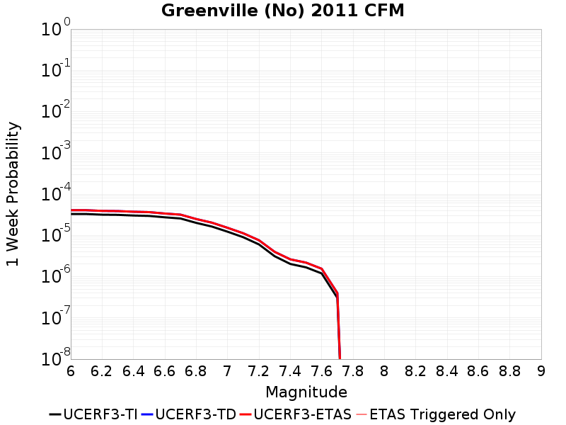 |  |  | 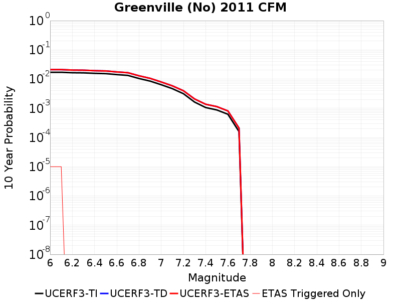 |

| Magnitude | 1 wk TI Prob | 1 wk TD Prob | 1 wk ETAS Prob | 1 wk ETAS/TD Gain | 1 wk ETAS Triggered Only | 1 mo TI Prob | 1 mo TD Prob | 1 mo ETAS Prob | 1 mo ETAS/TD Gain | 1 mo ETAS Triggered Only | 1 yr TI Prob | 1 yr TD Prob | 1 yr ETAS Prob | 1 yr ETAS/TD Gain | 1 yr ETAS Triggered Only | 10 yr TI Prob | 10 yr TD Prob | 10 yr ETAS Prob | 10 yr ETAS/TD Gain | 10 yr ETAS Triggered Only |
|-----|-----|-----|-----|-----|-----|-----|-----|-----|-----|-----|-----|-----|-----|-----|-----|-----|-----|-----|-----|-----|
| 6.0 | 3.286654E-5 | 4.060049E-5 | 4.060049E-5 | 1.0 | 0.0 | 1.4084899E-4 | 1.7399069E-4 | 1.7399069E-4 | 1.0 | 0.0 | 0.0017134876 | 0.0021163162 | 0.0021163162 | 1.0 | 0.0 | 0.017003356 | 0.020966403 | 0.020976193 | 1.000467 | 1.0E-5 |
| 6.1 | 3.286654E-5 | 4.060049E-5 | 4.060049E-5 | 1.0 | 0.0 | 1.4084899E-4 | 1.7399069E-4 | 1.7399069E-4 | 1.0 | 0.0 | 0.0017134876 | 0.0021163162 | 0.0021163162 | 1.0 | 0.0 | 0.017003356 | 0.020966403 | 0.020976193 | 1.000467 | 1.0E-5 |
| 6.2 | 3.1697953E-5 | 3.9154587E-5 | 3.9154587E-5 | 1.0 | 0.0 | 1.358413E-4 | 1.6779477E-4 | 1.6779477E-4 | 1.0 | 0.0 | 0.0016526132 | 0.002041024 | 0.002041024 | 1.0 | 0.0 | 0.01640377 | 0.020227391 | 0.020227391 | 1.0 | 0.0 |
| 6.3 | 3.1363317E-5 | 3.8740953E-5 | 3.8740953E-5 | 1.0 | 0.0 | 1.344073E-4 | 1.6602228E-4 | 1.6602228E-4 | 1.0 | 0.0 | 0.0016351803 | 0.002019484 | 0.002019484 | 1.0 | 0.0 | 0.016232004 | 0.020015905 | 0.020015905 | 1.0 | 0.0 |
| 6.4 | 3.0228604E-5 | 3.7339618E-5 | 3.7339618E-5 | 1.0 | 0.0 | 1.2954473E-4 | 1.600173E-4 | 1.600173E-4 | 1.0 | 0.0 | 0.0015760659 | 0.0019465062 | 0.0019465062 | 1.0 | 0.0 | 0.015649348 | 0.019299008 | 0.019299008 | 1.0 | 0.0 |
| 6.5 | 2.9537814E-5 | 3.6490037E-5 | 3.6490037E-5 | 1.0 | 0.0 | 1.2658449E-4 | 1.5637669E-4 | 1.5637669E-4 | 1.0 | 0.0 | 0.0015400766 | 0.00190226 | 0.00190226 | 1.0 | 0.0 | 0.01529447 | 0.01886415 | 0.01886415 | 1.0 | 0.0 |
| 6.6 | 2.7345395E-5 | 3.3783028E-5 | 3.3783028E-5 | 1.0 | 0.0 | 1.1718928E-4 | 1.4477654E-4 | 1.4477654E-4 | 1.0 | 0.0 | 0.0014258457 | 0.0017612607 | 0.0017612607 | 1.0 | 0.0 | 0.014167317 | 0.017476765 | 0.017476765 | 1.0 | 0.0 |
| 6.7 | 2.5615784E-5 | 3.1750595E-5 | 3.1750595E-5 | 1.0 | 0.0 | 1.09777306E-4 | 1.3606706E-4 | 1.3606706E-4 | 1.0 | 0.0 | 0.0013357193 | 0.0016553885 | 0.0016553885 | 1.0 | 0.0 | 0.013277191 | 0.01643418 | 0.01643418 | 1.0 | 0.0 |
| 6.8 | 2.0059057E-5 | 2.4852368E-5 | 2.4852368E-5 | 1.0 | 0.0 | 8.596455E-5 | 1.065059E-4 | 1.065059E-4 | 1.0 | 0.0 | 0.0010461159 | 0.0012959543 | 0.0012959543 | 1.0 | 0.0 | 0.0104120495 | 0.012885902 | 0.012885902 | 1.0 | 0.0 |
| 6.9 | 1.6321746E-5 | 2.0299027E-5 | 2.0299027E-5 | 1.0 | 0.0 | 6.9948466E-5 | 8.699299E-5 | 8.699299E-5 | 1.0 | 0.0 | 8.5128983E-4 | 0.0010586376 | 0.0010586376 | 1.0 | 0.0 | 0.008480361 | 0.010537386 | 0.010537386 | 1.0 | 0.0 |
| 7.0 | 1.22527645E-5 | 1.5220819E-5 | 1.5220819E-5 | 1.0 | 0.0 | 5.2510793E-5 | 6.523047E-5 | 6.523047E-5 | 1.0 | 0.0 | 6.3913135E-4 | 7.938959E-4 | 7.938959E-4 | 1.0 | 0.0 | 0.0063729626 | 0.007911049 | 0.007911049 | 1.0 | 0.0 |
| 7.1 | 8.996482E-6 | 1.1228045E-5 | 1.1228045E-5 | 1.0 | 0.0 | 3.8555783E-5 | 4.811931E-5 | 4.811931E-5 | 1.0 | 0.0 | 4.6931554E-4 | 5.8569637E-4 | 5.8569637E-4 | 1.0 | 0.0 | 0.004683256 | 0.005841663 | 0.005841663 | 1.0 | 0.0 |
| 7.2 | 6.0273087E-6 | 7.6116426E-6 | 7.6116426E-6 | 1.0 | 0.0 | 2.5831067E-5 | 3.262092E-5 | 3.262092E-5 | 1.0 | 0.0 | 3.1444785E-4 | 3.9708804E-4 | 3.9708804E-4 | 1.0 | 0.0 | 0.0031400328 | 0.003964015 | 0.003964015 | 1.0 | 0.0 |
| 7.3 | 3.1209995E-6 | 3.9847523E-6 | 3.9847523E-6 | 1.0 | 0.0 | 1.3375643E-5 | 1.7077398E-5 | 1.7077398E-5 | 1.0 | 0.0 | 1.6283628E-4 | 2.0789765E-4 | 2.0789765E-4 | 1.0 | 0.0 | 0.0016271701 | 0.0020770908 | 0.0020770908 | 1.0 | 0.0 |
| 7.4 | 2.0254208E-6 | 2.6217635E-6 | 2.6217635E-6 | 1.0 | 0.0 | 8.680347E-6 | 1.1236082E-5 | 1.1236082E-5 | 1.0 | 0.0 | 1.0567809E-4 | 1.3679077E-4 | 1.3679077E-4 | 1.0 | 0.0 | 0.0010562785 | 0.0013672357 | 0.0013672357 | 1.0 | 0.0 |
| 7.5 | 1.6763418E-6 | 2.1826272E-6 | 2.1826272E-6 | 1.0 | 0.0 | 7.184302E-6 | 9.354083E-6 | 9.354083E-6 | 1.0 | 0.0 | 8.746537E-5 | 1.13880065E-4 | 1.13880065E-4 | 1.0 | 0.0 | 8.743095E-4 | 0.0011383796 | 0.0011383796 | 1.0 | 0.0 |
| 7.6 | 1.1935462E-6 | 1.5508331E-6 | 1.5508331E-6 | 1.0 | 0.0 | 5.115188E-6 | 6.646411E-6 | 6.646411E-6 | 1.0 | 0.0 | 6.2275634E-5 | 8.0917096E-5 | 8.0917096E-5 | 1.0 | 0.0 | 6.2258187E-4 | 8.090721E-4 | 8.090721E-4 | 1.0 | 0.0 |
| 7.7 | 3.0464201E-7 | 4.0068247E-7 | 4.0068247E-7 | 1.0 | 0.0 | 1.3056081E-6 | 1.7172094E-6 | 1.7172094E-6 | 1.0 | 0.0 | 1.589566E-5 | 2.090683E-5 | 2.090683E-5 | 1.0 | 0.0 | 1.5894524E-4 | 2.090462E-4 | 2.090462E-4 | 1.0 | 0.0 |

## Eaton Roughs 2011 CFM
*[(top)](#table-of-contents)*

| 1 Week | 1 Month | 1 Year | 10 Year |
|-----|-----|-----|-----|
|  | 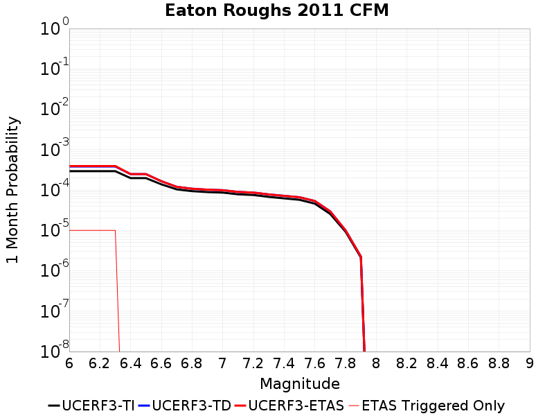 | 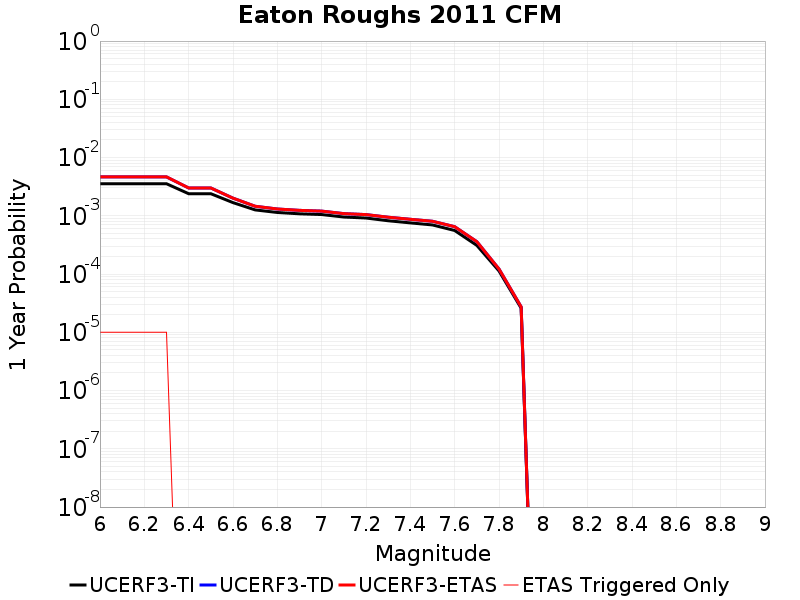 | 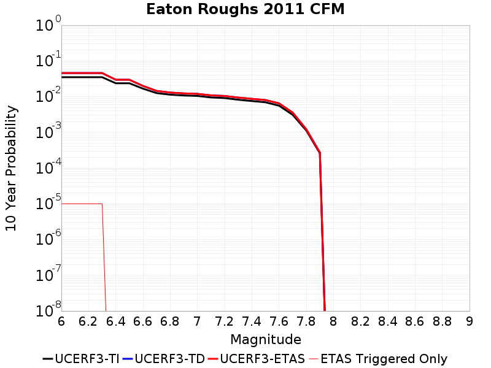 |

| Magnitude | 1 wk TI Prob | 1 wk TD Prob | 1 wk ETAS Prob | 1 wk ETAS/TD Gain | 1 wk ETAS Triggered Only | 1 mo TI Prob | 1 mo TD Prob | 1 mo ETAS Prob | 1 mo ETAS/TD Gain | 1 mo ETAS Triggered Only | 1 yr TI Prob | 1 yr TD Prob | 1 yr ETAS Prob | 1 yr ETAS/TD Gain | 1 yr ETAS Triggered Only | 10 yr TI Prob | 10 yr TD Prob | 10 yr ETAS Prob | 10 yr ETAS/TD Gain | 10 yr ETAS Triggered Only |
|-----|-----|-----|-----|-----|-----|-----|-----|-----|-----|-----|-----|-----|-----|-----|-----|-----|-----|-----|-----|-----|
| 6.0 | 6.8044945E-5 | 8.911133E-5 | 8.911133E-5 | 1.0 | 0.0 | 2.9158857E-4 | 3.818556E-4 | 3.918518E-4 | 1.0261779 | 1.0E-5 | 0.0035443127 | 0.00463975 | 0.0046497034 | 1.0021453 | 1.0E-5 | 0.03488314 | 0.04549555 | 0.045505095 | 1.0002098 | 1.0E-5 |
| 6.1 | 6.8044945E-5 | 8.911133E-5 | 8.911133E-5 | 1.0 | 0.0 | 2.9158857E-4 | 3.818556E-4 | 3.918518E-4 | 1.0261779 | 1.0E-5 | 0.0035443127 | 0.00463975 | 0.0046497034 | 1.0021453 | 1.0E-5 | 0.03488314 | 0.04549555 | 0.045505095 | 1.0002098 | 1.0E-5 |
| 6.2 | 6.8044945E-5 | 8.911133E-5 | 8.911133E-5 | 1.0 | 0.0 | 2.9158857E-4 | 3.818556E-4 | 3.918518E-4 | 1.0261779 | 1.0E-5 | 0.0035443127 | 0.00463975 | 0.0046497034 | 1.0021453 | 1.0E-5 | 0.03488314 | 0.04549555 | 0.045505095 | 1.0002098 | 1.0E-5 |
| 6.3 | 6.8044945E-5 | 8.911133E-5 | 8.911133E-5 | 1.0 | 0.0 | 2.9158857E-4 | 3.818556E-4 | 3.918518E-4 | 1.0261779 | 1.0E-5 | 0.0035443127 | 0.00463975 | 0.0046497034 | 1.0021453 | 1.0E-5 | 0.03488314 | 0.04549555 | 0.045505095 | 1.0002098 | 1.0E-5 |
| 6.4 | 4.5830013E-5 | 5.7530542E-5 | 5.7530542E-5 | 1.0 | 0.0 | 1.9639956E-4 | 2.4653928E-4 | 2.4653928E-4 | 1.0 | 0.0 | 0.0023885423 | 0.0029978182 | 0.0029978182 | 1.0 | 0.0 | 0.023630321 | 0.029610006 | 0.029610006 | 1.0 | 0.0 |
| 6.5 | 4.5830013E-5 | 5.7530542E-5 | 5.7530542E-5 | 1.0 | 0.0 | 1.9639956E-4 | 2.4653928E-4 | 2.4653928E-4 | 1.0 | 0.0 | 0.0023885423 | 0.0029978182 | 0.0029978182 | 1.0 | 0.0 | 0.023630321 | 0.029610006 | 0.029610006 | 1.0 | 0.0 |
| 6.6 | 3.222194E-5 | 3.8459315E-5 | 3.8459315E-5 | 1.0 | 0.0 | 1.3808672E-4 | 1.6481588E-4 | 1.6481588E-4 | 1.0 | 0.0 | 0.0016799092 | 0.0020048693 | 0.0020048693 | 1.0 | 0.0 | 0.016672665 | 0.019876832 | 0.019876832 | 1.0 | 0.0 |
| 6.7 | 2.4155654E-5 | 2.7901235E-5 | 2.7901235E-5 | 1.0 | 0.0 | 1.0352012E-4 | 1.1957129E-4 | 1.1957129E-4 | 1.0 | 0.0 | 0.0012596287 | 0.0014548165 | 0.0014548165 | 1.0 | 0.0 | 0.012525126 | 0.0144540975 | 0.0144540975 | 1.0 | 0.0 |
| 6.8 | 2.1814667E-5 | 2.5039246E-5 | 2.5039246E-5 | 1.0 | 0.0 | 9.348808E-5 | 1.0730667E-4 | 1.0730667E-4 | 1.0 | 0.0 | 0.001137623 | 0.0013056794 | 0.0013056794 | 1.0 | 0.0 | 0.011318169 | 0.012980717 | 0.012980717 | 1.0 | 0.0 |
| 6.9 | 2.0700467E-5 | 2.3720999E-5 | 2.3720999E-5 | 1.0 | 0.0 | 8.871327E-5 | 1.0165748E-4 | 1.0165748E-4 | 1.0 | 0.0 | 0.0010795488 | 0.0012369803 | 0.0012369803 | 1.0 | 0.0 | 0.010743194 | 0.012301494 | 0.012301494 | 1.0 | 0.0 |
| 7.0 | 2.0104066E-5 | 2.302553E-5 | 2.302553E-5 | 1.0 | 0.0 | 8.615744E-5 | 9.8677134E-5 | 9.8677134E-5 | 1.0 | 0.0 | 0.0010484619 | 0.001200735 | 0.001200735 | 1.0 | 0.0 | 0.010435291 | 0.011942985 | 0.011942985 | 1.0 | 0.0 |
| 7.1 | 1.8225232E-5 | 2.0853222E-5 | 2.0853222E-5 | 1.0 | 0.0 | 7.81058E-5 | 8.9367895E-5 | 8.9367895E-5 | 1.0 | 0.0 | 9.5052324E-4 | 0.0010875126 | 0.0010875126 | 1.0 | 0.0 | 0.009464677 | 0.010822217 | 0.010822217 | 1.0 | 0.0 |
| 7.2 | 1.7526572E-5 | 2.0071171E-5 | 2.0071171E-5 | 1.0 | 0.0 | 7.511172E-5 | 8.601648E-5 | 8.601648E-5 | 1.0 | 0.0 | 9.141015E-4 | 0.001046749 | 0.001046749 | 1.0 | 0.0 | 0.009103506 | 0.010418473 | 0.010418473 | 1.0 | 0.0 |
| 7.3 | 1.5727232E-5 | 1.8093988E-5 | 1.8093988E-5 | 1.0 | 0.0 | 6.740067E-5 | 7.7543365E-5 | 7.7543365E-5 | 1.0 | 0.0 | 8.2029426E-4 | 9.436828E-4 | 9.436828E-4 | 1.0 | 0.0 | 0.008172729 | 0.009396984 | 0.009396984 | 1.0 | 0.0 |
| 7.4 | 1.4457361E-5 | 1.6666105E-5 | 1.6666105E-5 | 1.0 | 0.0 | 6.195865E-5 | 7.142421E-5 | 7.142421E-5 | 1.0 | 0.0 | 7.540854E-4 | 8.6924376E-4 | 8.6924376E-4 | 1.0 | 0.0 | 0.007515317 | 0.008658607 | 0.008658607 | 1.0 | 0.0 |
| 7.5 | 1.33280955E-5 | 1.5409385E-5 | 1.5409385E-5 | 1.0 | 0.0 | 5.711916E-5 | 6.603855E-5 | 6.603855E-5 | 1.0 | 0.0 | 6.9520384E-4 | 8.0372364E-4 | 8.0372364E-4 | 1.0 | 0.0 | 0.00693033 | 0.008008318 | 0.008008318 | 1.0 | 0.0 |
| 7.6 | 1.0699478E-5 | 1.244154E-5 | 1.244154E-5 | 1.0 | 0.0 | 4.5854096E-5 | 5.33198E-5 | 5.33198E-5 | 1.0 | 0.0 | 5.581306E-4 | 6.489758E-4 | 6.489758E-4 | 1.0 | 0.0 | 0.005567309 | 0.0064708944 | 0.0064708944 | 1.0 | 0.0 |
| 7.7 | 5.9390236E-6 | 6.883036E-6 | 6.883036E-6 | 1.0 | 0.0 | 2.545271E-5 | 2.9498393E-5 | 2.9498393E-5 | 1.0 | 0.0 | 3.0984267E-4 | 3.59084E-4 | 3.59084E-4 | 1.0 | 0.0 | 0.0030941102 | 0.003585034 | 0.003585034 | 1.0 | 0.0 |
| 7.8 | 2.1622036E-6 | 2.334911E-6 | 2.334911E-6 | 1.0 | 0.0 | 9.266554E-6 | 1.0006723E-5 | 1.0006723E-5 | 1.0 | 0.0 | 1.1281446E-4 | 1.2182511E-4 | 1.2182511E-4 | 1.0 | 0.0 | 0.001127572 | 0.0012175834 | 0.0012175834 | 1.0 | 0.0 |
| 7.9 | 4.9586197E-7 | 5.226248E-7 | 5.226248E-7 | 1.0 | 0.0 | 2.125121E-6 | 2.239819E-6 | 2.239819E-6 | 1.0 | 0.0 | 2.5873042E-5 | 2.7269476E-5 | 2.7269476E-5 | 1.0 | 0.0 | 2.5870028E-4 | 2.726634E-4 | 2.726634E-4 | 1.0 | 0.0 |

## Davis Creek
*[(top)](#table-of-contents)*

| 1 Week | 1 Month | 1 Year | 10 Year |
|-----|-----|-----|-----|
|  | 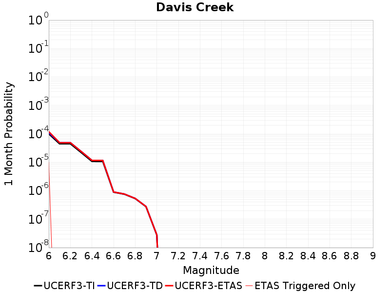 |  |  |

| Magnitude | 1 wk TI Prob | 1 wk TD Prob | 1 wk ETAS Prob | 1 wk ETAS/TD Gain | 1 wk ETAS Triggered Only | 1 mo TI Prob | 1 mo TD Prob | 1 mo ETAS Prob | 1 mo ETAS/TD Gain | 1 mo ETAS Triggered Only | 1 yr TI Prob | 1 yr TD Prob | 1 yr ETAS Prob | 1 yr ETAS/TD Gain | 1 yr ETAS Triggered Only | 10 yr TI Prob | 10 yr TD Prob | 10 yr ETAS Prob | 10 yr ETAS/TD Gain | 10 yr ETAS Triggered Only |
|-----|-----|-----|-----|-----|-----|-----|-----|-----|-----|-----|-----|-----|-----|-----|-----|-----|-----|-----|-----|-----|
| 6.0 | 2.331472E-5 | 2.5478621E-5 | 2.5478621E-5 | 1.0 | 0.0 | 9.99164E-5 | 1.09190194E-4 | 1.191891E-4 | 1.0915734 | 1.0E-5 | 0.0012158032 | 0.0013286989 | 0.0013386856 | 1.0075161 | 1.0E-5 | 0.01209173 | 0.013219387 | 0.013229255 | 1.0007465 | 1.0E-5 |
| 6.1 | 1.0407654E-5 | 1.1343492E-5 | 1.1343492E-5 | 1.0 | 0.0 | 4.4603472E-5 | 4.8614213E-5 | 4.8614213E-5 | 1.0 | 0.0 | 5.4291193E-4 | 5.9174455E-4 | 5.9174455E-4 | 1.0 | 0.0 | 0.0054158745 | 0.0059043737 | 0.0059043737 | 1.0 | 0.0 |
| 6.2 | 1.0407654E-5 | 1.1343492E-5 | 1.1343492E-5 | 1.0 | 0.0 | 4.4603472E-5 | 4.8614213E-5 | 4.8614213E-5 | 1.0 | 0.0 | 5.4291193E-4 | 5.9174455E-4 | 5.9174455E-4 | 1.0 | 0.0 | 0.0054158745 | 0.0059043737 | 0.0059043737 | 1.0 | 0.0 |
| 6.3 | 5.1323277E-6 | 5.5812607E-6 | 5.5812607E-6 | 1.0 | 0.0 | 2.1995505E-5 | 2.3919518E-5 | 2.3919518E-5 | 1.0 | 0.0 | 2.6776237E-4 | 2.9118988E-4 | 2.9118988E-4 | 1.0 | 0.0 | 0.0026743996 | 0.0029089334 | 0.0029089334 | 1.0 | 0.0 |
| 6.4 | 2.4985154E-6 | 2.710541E-6 | 2.710541E-6 | 1.0 | 0.0 | 1.07078795E-5 | 1.1616573E-5 | 1.1616573E-5 | 1.0 | 0.0 | 1.3036063E-4 | 1.4142622E-4 | 1.4142622E-4 | 1.0 | 0.0 | 0.0013028418 | 0.0014137187 | 0.0014137187 | 1.0 | 0.0 |
| 6.5 | 2.4846438E-6 | 2.69647E-6 | 2.69647E-6 | 1.0 | 0.0 | 1.064843E-5 | 1.1556269E-5 | 1.1556269E-5 | 1.0 | 0.0 | 1.2963692E-4 | 1.4069212E-4 | 1.4069212E-4 | 1.0 | 0.0 | 0.0012956132 | 0.0014063868 | 0.0014063868 | 1.0 | 0.0 |
| 6.6 | 2.072566E-7 | 2.1026017E-7 | 2.1026017E-7 | 1.0 | 0.0 | 8.882423E-7 | 9.011147E-7 | 9.011147E-7 | 1.0 | 0.0 | 1.0814296E-5 | 1.0971018E-5 | 1.0971018E-5 | 1.0 | 0.0 | 1.081377E-4 | 1.09704946E-4 | 1.09704946E-4 | 1.0 | 0.0 |
| 6.7 | 1.7544528E-7 | 1.7797504E-7 | 1.7797504E-7 | 1.0 | 0.0 | 7.5190815E-7 | 7.6274995E-7 | 7.6274995E-7 | 1.0 | 0.0 | 9.154443E-6 | 9.286442E-6 | 9.286442E-6 | 1.0 | 0.0 | 9.1540656E-5 | 9.2860704E-5 | 9.2860704E-5 | 1.0 | 0.0 |
| 6.8 | 1.2320395E-7 | 1.2485489E-7 | 1.2485489E-7 | 1.0 | 0.0 | 5.280168E-7 | 5.350923E-7 | 5.350923E-7 | 1.0 | 0.0 | 6.428586E-6 | 6.51473E-6 | 6.51473E-6 | 1.0 | 0.0 | 6.4284E-5 | 6.5145505E-5 | 6.5145505E-5 | 1.0 | 0.0 |
| 6.9 | 6.399997E-8 | 6.488388E-8 | 6.488388E-8 | 1.0 | 0.0 | 2.7428555E-7 | 2.7807374E-7 | 2.7807374E-7 | 1.0 | 0.0 | 3.3394215E-6 | 3.3855433E-6 | 3.3855433E-6 | 1.0 | 0.0 | 3.3393713E-5 | 3.385498E-5 | 3.385498E-5 | 1.0 | 0.0 |
| 7.0 | 6.4455685E-9 | 6.5376935E-9 | 6.5376935E-9 | 1.0 | 0.0 | 2.7623864E-8 | 2.8018688E-8 | 2.8018688E-8 | 1.0 | 0.0 | 3.3632048E-7 | 3.411275E-7 | 3.411275E-7 | 1.0 | 0.0 | 3.3631998E-6 | 3.4112752E-6 | 3.4112752E-6 | 1.0 | 0.0 |

## Point Reyes 2011 CFM
*[(top)](#table-of-contents)*

| 1 Week | 1 Month | 1 Year | 10 Year |
|-----|-----|-----|-----|
| 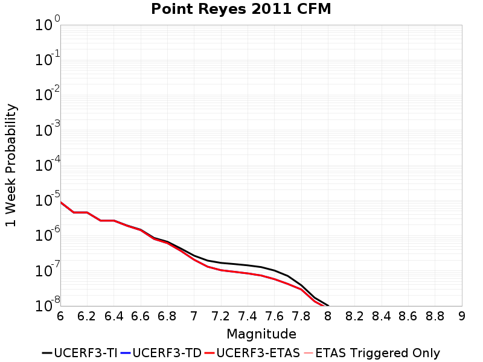 |  | 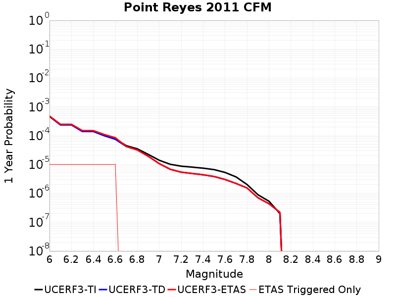 |  |

| Magnitude | 1 wk TI Prob | 1 wk TD Prob | 1 wk ETAS Prob | 1 wk ETAS/TD Gain | 1 wk ETAS Triggered Only | 1 mo TI Prob | 1 mo TD Prob | 1 mo ETAS Prob | 1 mo ETAS/TD Gain | 1 mo ETAS Triggered Only | 1 yr TI Prob | 1 yr TD Prob | 1 yr ETAS Prob | 1 yr ETAS/TD Gain | 1 yr ETAS Triggered Only | 10 yr TI Prob | 10 yr TD Prob | 10 yr ETAS Prob | 10 yr ETAS/TD Gain | 10 yr ETAS Triggered Only |
|-----|-----|-----|-----|-----|-----|-----|-----|-----|-----|-----|-----|-----|-----|-----|-----|-----|-----|-----|-----|-----|
| 6.0 | 8.8644965E-6 | 8.975037E-6 | 8.975037E-6 | 1.0 | 0.0 | 3.7990147E-5 | 3.8463913E-5 | 3.8463913E-5 | 1.0 | 0.0 | 4.624319E-4 | 4.682038E-4 | 4.7819913E-4 | 1.0213482 | 1.0E-5 | 0.0046147075 | 0.0046728025 | 0.004682756 | 1.00213 | 1.0E-5 |
| 6.1 | 4.526405E-6 | 4.5446404E-6 | 4.5446404E-6 | 1.0 | 0.0 | 1.9398734E-5 | 1.947689E-5 | 1.947689E-5 | 1.0 | 0.0 | 2.36154E-4 | 2.3710639E-4 | 2.47104E-4 | 1.0421652 | 1.0E-5 | 0.002359032 | 0.00236864 | 0.0023786162 | 1.0042118 | 1.0E-5 |
| 6.2 | 4.526405E-6 | 4.5446404E-6 | 4.5446404E-6 | 1.0 | 0.0 | 1.9398734E-5 | 1.947689E-5 | 1.947689E-5 | 1.0 | 0.0 | 2.36154E-4 | 2.3710639E-4 | 2.47104E-4 | 1.0421652 | 1.0E-5 | 0.002359032 | 0.00236864 | 0.0023786162 | 1.0042118 | 1.0E-5 |
| 6.3 | 2.6842322E-6 | 2.6651066E-6 | 2.6651066E-6 | 1.0 | 0.0 | 1.1503801E-5 | 1.1421837E-5 | 1.1421837E-5 | 1.0 | 0.0 | 1.4004979E-4 | 1.390522E-4 | 1.490508E-4 | 1.0719055 | 1.0E-5 | 0.0013996155 | 0.0013896733 | 0.0013996594 | 1.0071859 | 1.0E-5 |
| 6.4 | 2.6842322E-6 | 2.6651066E-6 | 2.6651066E-6 | 1.0 | 0.0 | 1.1503801E-5 | 1.1421837E-5 | 1.1421837E-5 | 1.0 | 0.0 | 1.4004979E-4 | 1.390522E-4 | 1.490508E-4 | 1.0719055 | 1.0E-5 | 0.0013996155 | 0.0013896733 | 0.0013996594 | 1.0071859 | 1.0E-5 |
| 6.5 | 1.9281833E-6 | 1.8946758E-6 | 1.8946758E-6 | 1.0 | 0.0 | 8.263617E-6 | 8.120014E-6 | 8.120014E-6 | 1.0 | 0.0 | 1.0060489E-4 | 9.885678E-5 | 1.08855784E-4 | 1.1011465 | 1.0E-5 | 0.0010055936 | 9.881385E-4 | 9.981286E-4 | 1.01011 | 1.0E-5 |
| 6.6 | 1.4726726E-6 | 1.4307853E-6 | 1.4307853E-6 | 1.0 | 0.0 | 6.3114385E-6 | 6.131923E-6 | 6.131923E-6 | 1.0 | 0.0 | 7.683905E-5 | 7.465365E-5 | 8.465291E-5 | 1.1339419 | 1.0E-5 | 7.6812494E-4 | 7.462925E-4 | 7.5628504E-4 | 1.0133896 | 1.0E-5 |
| 6.7 | 8.572307E-7 | 8.0425525E-7 | 8.0425525E-7 | 1.0 | 0.0 | 3.6738406E-6 | 3.4468037E-6 | 3.4468037E-6 | 1.0 | 0.0 | 4.472809E-5 | 4.1964042E-5 | 4.1964042E-5 | 1.0 | 0.0 | 4.471909E-4 | 4.1956475E-4 | 4.1956475E-4 | 1.0 | 0.0 |
| 6.8 | 6.6745434E-7 | 6.1117663E-7 | 6.1117663E-7 | 1.0 | 0.0 | 2.8605155E-6 | 2.6193259E-6 | 2.6193259E-6 | 1.0 | 0.0 | 3.482622E-5 | 3.1889835E-5 | 3.1889835E-5 | 1.0 | 0.0 | 3.4820763E-4 | 3.1885554E-4 | 3.1885554E-4 | 1.0 | 0.0 |
| 6.9 | 4.291521E-7 | 3.6869548E-7 | 3.6869548E-7 | 1.0 | 0.0 | 1.839222E-6 | 1.5801224E-6 | 1.5801224E-6 | 1.0 | 0.0 | 2.2392298E-5 | 1.9237825E-5 | 1.9237825E-5 | 1.0 | 0.0 | 2.2390042E-4 | 1.9236389E-4 | 1.9236389E-4 | 1.0 | 0.0 |
| 7.0 | 2.6812808E-7 | 2.0513342E-7 | 2.0513342E-7 | 1.0 | 0.0 | 1.1491198E-6 | 8.7914293E-7 | 8.7914293E-7 | 1.0 | 0.0 | 1.3990444E-5 | 1.0703513E-5 | 1.0703513E-5 | 1.0 | 0.0 | 1.3989564E-4 | 1.0703197E-4 | 1.0703197E-4 | 1.0 | 0.0 |
| 7.1 | 1.9451231E-7 | 1.304778E-7 | 1.304778E-7 | 1.0 | 0.0 | 8.336239E-7 | 5.591905E-7 | 5.591905E-7 | 1.0 | 0.0 | 1.0149324E-5 | 6.8081226E-6 | 6.8081226E-6 | 1.0 | 0.0 | 1.014886E-4 | 6.808106E-5 | 6.808106E-5 | 1.0 | 0.0 |
| 7.2 | 1.6715143E-7 | 1.036062E-7 | 1.036062E-7 | 1.0 | 0.0 | 7.1636305E-7 | 4.440265E-7 | 4.440265E-7 | 1.0 | 0.0 | 8.721685E-6 | 5.4060088E-6 | 5.4060088E-6 | 1.0 | 0.0 | 8.721343E-5 | 5.4060696E-5 | 5.4060696E-5 | 1.0 | 0.0 |
| 7.3 | 1.5503173E-7 | 9.326192E-8 | 9.326192E-8 | 1.0 | 0.0 | 6.644215E-7 | 3.9969387E-7 | 3.9969387E-7 | 1.0 | 0.0 | 8.089301E-6 | 4.866262E-6 | 4.866262E-6 | 1.0 | 0.0 | 8.089007E-5 | 4.866347E-5 | 4.866347E-5 | 1.0 | 0.0 |
| 7.4 | 1.4251614E-7 | 8.4022254E-8 | 8.4022254E-8 | 1.0 | 0.0 | 6.1078333E-7 | 3.6009533E-7 | 3.6009533E-7 | 1.0 | 0.0 | 7.4362615E-6 | 4.384152E-6 | 4.384152E-6 | 1.0 | 0.0 | 7.436013E-5 | 4.384257E-5 | 4.384257E-5 | 1.0 | 0.0 |
| 7.5 | 1.2710186E-7 | 7.3225536E-8 | 7.3225536E-8 | 1.0 | 0.0 | 5.447221E-7 | 3.138237E-7 | 3.138237E-7 | 1.0 | 0.0 | 6.6319717E-6 | 3.820797E-6 | 3.820797E-6 | 1.0 | 0.0 | 6.6317734E-5 | 3.820923E-5 | 3.820923E-5 | 1.0 | 0.0 |
| 7.6 | 1.0144708E-7 | 5.762966E-8 | 5.762966E-8 | 1.0 | 0.0 | 4.347731E-7 | 2.4698423E-7 | 2.4698423E-7 | 1.0 | 0.0 | 5.2933497E-6 | 3.0070287E-6 | 3.0070287E-6 | 1.0 | 0.0 | 5.293224E-5 | 3.00718E-5 | 3.00718E-5 | 1.0 | 0.0 |
| 7.7 | 7.090527E-8 | 4.2068404E-8 | 4.2068404E-8 | 1.0 | 0.0 | 3.038797E-7 | 1.8029314E-7 | 1.8029314E-7 | 1.0 | 0.0 | 3.699729E-6 | 2.1950668E-6 | 2.1950668E-6 | 1.0 | 0.0 | 3.6996673E-5 | 2.195237E-5 | 2.195237E-5 | 1.0 | 0.0 |
| 7.8 | 3.8712045E-8 | 2.9357082E-8 | 2.9357082E-8 | 1.0 | 0.0 | 1.6590876E-7 | 1.2581606E-7 | 1.2581606E-7 | 1.0 | 0.0 | 2.0199373E-6 | 1.5318094E-6 | 1.5318094E-6 | 1.0 | 0.0 | 2.0199188E-5 | 1.5319907E-5 | 1.5319907E-5 | 1.0 | 0.0 |
| 7.9 | 1.7068782E-8 | 1.3402252E-8 | 1.3402252E-8 | 1.0 | 0.0 | 7.315192E-8 | 5.743822E-8 | 5.743822E-8 | 1.0 | 0.0 | 8.906242E-7 | 6.9931014E-7 | 6.9931014E-7 | 1.0 | 0.0 | 8.906207E-6 | 6.9949974E-6 | 6.9949974E-6 | 1.0 | 0.0 |
| 8.0 | 1.0172592E-8 | 8.3437754E-9 | 8.3437754E-9 | 1.0 | 0.0 | 4.359682E-8 | 3.5759037E-8 | 3.5759037E-8 | 1.0 | 0.0 | 5.3079117E-7 | 4.3536616E-7 | 4.3536616E-7 | 1.0 | 0.0 | 5.307899E-6 | 4.3555715E-6 | 4.3555715E-6 | 1.0 | 0.0 |
| 8.1 | 3.7861243E-9 | 4.1735584E-9 | 4.1735584E-9 | 1.0 | 0.0 | 1.6226247E-8 | 1.7886677E-8 | 1.7886677E-8 | 1.0 | 0.0 | 1.9755454E-7 | 2.1777026E-7 | 2.1777026E-7 | 1.0 | 0.0 | 1.9755437E-6 | 2.1796154E-6 | 2.1796154E-6 | 1.0 | 0.0 |

## Goose Lake 2011 CFM
*[(top)](#table-of-contents)*

| 1 Week | 1 Month | 1 Year | 10 Year |
|-----|-----|-----|-----|
|  |  |  |  |

| Magnitude | 1 wk TI Prob | 1 wk TD Prob | 1 wk ETAS Prob | 1 wk ETAS/TD Gain | 1 wk ETAS Triggered Only | 1 mo TI Prob | 1 mo TD Prob | 1 mo ETAS Prob | 1 mo ETAS/TD Gain | 1 mo ETAS Triggered Only | 1 yr TI Prob | 1 yr TD Prob | 1 yr ETAS Prob | 1 yr ETAS/TD Gain | 1 yr ETAS Triggered Only | 10 yr TI Prob | 10 yr TD Prob | 10 yr ETAS Prob | 10 yr ETAS/TD Gain | 10 yr ETAS Triggered Only |
|-----|-----|-----|-----|-----|-----|-----|-----|-----|-----|-----|-----|-----|-----|-----|-----|-----|-----|-----|-----|-----|
| 6.0 | 3.780968E-6 | 3.82416E-6 | 3.82416E-6 | 1.0 | 0.0 | 1.6204049E-5 | 1.6389162E-5 | 1.6389162E-5 | 1.0 | 0.0 | 1.9726643E-4 | 1.9952086E-4 | 2.0951887E-4 | 1.0501101 | 1.0E-5 | 0.001970914 | 0.0019935258 | 0.0020035058 | 1.0050062 | 1.0E-5 |
| 6.1 | 2.2035124E-6 | 2.2305137E-6 | 2.2305137E-6 | 1.0 | 0.0 | 9.443591E-6 | 9.5593105E-6 | 9.5593105E-6 | 1.0 | 0.0 | 1.1496965E-4 | 1.1637857E-4 | 1.263774E-4 | 1.0859165 | 1.0E-5 | 0.0011491019 | 0.0011631945 | 0.0011731829 | 1.008587 | 1.0E-5 |
| 6.2 | 1.5624689E-6 | 1.5832411E-6 | 1.5832411E-6 | 1.0 | 0.0 | 6.6962784E-6 | 6.7853016E-6 | 6.7853016E-6 | 1.0 | 0.0 | 8.152414E-5 | 8.260796E-5 | 9.260714E-5 | 1.1210437 | 1.0E-5 | 8.1494235E-4 | 8.2577695E-4 | 8.357687E-4 | 1.0120999 | 1.0E-5 |
| 6.3 | 1.5624689E-6 | 1.5832411E-6 | 1.5832411E-6 | 1.0 | 0.0 | 6.6962784E-6 | 6.7853016E-6 | 6.7853016E-6 | 1.0 | 0.0 | 8.152414E-5 | 8.260796E-5 | 9.260714E-5 | 1.1210437 | 1.0E-5 | 8.1494235E-4 | 8.2577695E-4 | 8.357687E-4 | 1.0120999 | 1.0E-5 |
| 6.4 | 1.256464E-6 | 1.2743424E-6 | 1.2743424E-6 | 1.0 | 0.0 | 5.3848344E-6 | 5.4614557E-6 | 5.4614557E-6 | 1.0 | 0.0 | 6.5558386E-5 | 6.6491215E-5 | 6.6491215E-5 | 1.0 | 0.0 | 6.553905E-4 | 6.6471525E-4 | 6.6471525E-4 | 1.0 | 0.0 |
| 6.5 | 1.0910911E-6 | 1.1073712E-6 | 1.1073712E-6 | 1.0 | 0.0 | 4.6760965E-6 | 4.745868E-6 | 4.745868E-6 | 1.0 | 0.0 | 5.692999E-5 | 5.7779427E-5 | 5.7779427E-5 | 1.0 | 0.0 | 5.6915404E-4 | 5.7764526E-4 | 5.7764526E-4 | 1.0 | 0.0 |
| 6.6 | 9.546601E-7 | 9.695179E-7 | 9.695179E-7 | 1.0 | 0.0 | 4.091394E-6 | 4.1550707E-6 | 4.1550707E-6 | 1.0 | 0.0 | 4.9811584E-5 | 5.058682E-5 | 5.058682E-5 | 1.0 | 0.0 | 4.980042E-4 | 5.057539E-4 | 5.057539E-4 | 1.0 | 0.0 |
| 6.7 | 7.790316E-7 | 7.9193836E-7 | 7.9193836E-7 | 1.0 | 0.0 | 3.3387028E-6 | 3.3940173E-6 | 3.3940173E-6 | 1.0 | 0.0 | 4.0647945E-5 | 4.1321382E-5 | 4.1321382E-5 | 1.0 | 0.0 | 4.0640513E-4 | 4.131376E-4 | 4.131376E-4 | 1.0 | 0.0 |
| 6.8 | 6.3714384E-7 | 6.4816624E-7 | 6.4816624E-7 | 1.0 | 0.0 | 2.7306137E-6 | 2.7778524E-6 | 2.7778524E-6 | 1.0 | 0.0 | 3.3244716E-5 | 3.3819833E-5 | 3.3819833E-5 | 1.0 | 0.0 | 3.323974E-4 | 3.3814734E-4 | 3.3814734E-4 | 1.0 | 0.0 |
| 6.9 | 4.92586E-7 | 5.016316E-7 | 5.016316E-7 | 1.0 | 0.0 | 2.1110811E-6 | 2.149848E-6 | 2.149848E-6 | 1.0 | 0.0 | 2.5702111E-5 | 2.6174088E-5 | 2.6174088E-5 | 1.0 | 0.0 | 2.569914E-4 | 2.6171043E-4 | 2.6171043E-4 | 1.0 | 0.0 |
| 7.0 | 3.130245E-7 | 3.1919956E-7 | 3.1919956E-7 | 1.0 | 0.0 | 1.3415328E-6 | 1.3679974E-6 | 1.3679974E-6 | 1.0 | 0.0 | 1.6333039E-5 | 1.6655242E-5 | 1.6655242E-5 | 1.0 | 0.0 | 1.6331839E-4 | 1.6654015E-4 | 1.6654015E-4 | 1.0 | 0.0 |
| 7.1 | 1.7680084E-7 | 1.8033312E-7 | 1.8033312E-7 | 1.0 | 0.0 | 7.5771766E-7 | 7.7285597E-7 | 7.7285597E-7 | 1.0 | 0.0 | 9.225173E-6 | 9.409482E-6 | 9.409482E-6 | 1.0 | 0.0 | 9.22479E-5 | 9.4090945E-5 | 9.4090945E-5 | 1.0 | 0.0 |
| 7.2 | 4.8641045E-8 | 4.942272E-8 | 4.942272E-8 | 1.0 | 0.0 | 2.084616E-7 | 2.1181165E-7 | 2.1181165E-7 | 1.0 | 0.0 | 2.538017E-6 | 2.5788038E-6 | 2.5788038E-6 | 1.0 | 0.0 | 2.537988E-5 | 2.5787751E-5 | 2.5787751E-5 | 1.0 | 0.0 |
| 7.3 | 5.3911844E-9 | 5.478111E-9 | 5.478111E-9 | 1.0 | 0.0 | 2.3105075E-8 | 2.3477618E-8 | 2.3477618E-8 | 1.0 | 0.0 | 2.8130427E-7 | 2.8583997E-7 | 2.8583997E-7 | 1.0 | 0.0 | 2.8130391E-6 | 2.8583975E-6 | 2.8583975E-6 | 1.0 | 0.0 |

## Great Valley 03 Mysterious Ridge
*[(top)](#table-of-contents)*

| 1 Week | 1 Month | 1 Year | 10 Year |
|-----|-----|-----|-----|
| 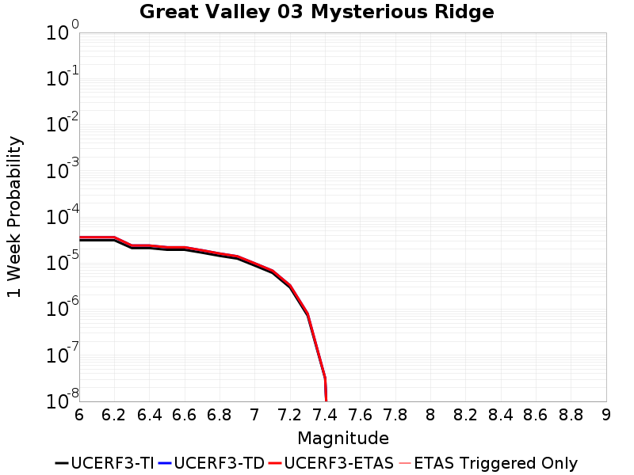 |  |  |  |

| Magnitude | 1 wk TI Prob | 1 wk TD Prob | 1 wk ETAS Prob | 1 wk ETAS/TD Gain | 1 wk ETAS Triggered Only | 1 mo TI Prob | 1 mo TD Prob | 1 mo ETAS Prob | 1 mo ETAS/TD Gain | 1 mo ETAS Triggered Only | 1 yr TI Prob | 1 yr TD Prob | 1 yr ETAS Prob | 1 yr ETAS/TD Gain | 1 yr ETAS Triggered Only | 10 yr TI Prob | 10 yr TD Prob | 10 yr ETAS Prob | 10 yr ETAS/TD Gain | 10 yr ETAS Triggered Only |
|-----|-----|-----|-----|-----|-----|-----|-----|-----|-----|-----|-----|-----|-----|-----|-----|-----|-----|-----|-----|-----|
| 6.0 | 3.1182444E-5 | 3.6185906E-5 | 3.6185906E-5 | 1.0 | 0.0 | 1.336322E-4 | 1.5507429E-4 | 1.6507275E-4 | 1.0644752 | 1.0E-5 | 0.0016257578 | 0.0018865824 | 0.0018965636 | 1.0052906 | 1.0E-5 | 0.016139153 | 0.018724557 | 0.01873437 | 1.000524 | 1.0E-5 |
| 6.1 | 3.1182444E-5 | 3.6185906E-5 | 3.6185906E-5 | 1.0 | 0.0 | 1.336322E-4 | 1.5507429E-4 | 1.6507275E-4 | 1.0644752 | 1.0E-5 | 0.0016257578 | 0.0018865824 | 0.0018965636 | 1.0052906 | 1.0E-5 | 0.016139153 | 0.018724557 | 0.01873437 | 1.000524 | 1.0E-5 |
| 6.2 | 3.1182444E-5 | 3.6185906E-5 | 3.6185906E-5 | 1.0 | 0.0 | 1.336322E-4 | 1.5507429E-4 | 1.6507275E-4 | 1.0644752 | 1.0E-5 | 0.0016257578 | 0.0018865824 | 0.0018965636 | 1.0052906 | 1.0E-5 | 0.016139153 | 0.018724557 | 0.01873437 | 1.000524 | 1.0E-5 |
| 6.3 | 2.106934E-5 | 2.3935205E-5 | 2.3935205E-5 | 1.0 | 0.0 | 9.0294045E-5 | 1.02575585E-4 | 1.1257456E-4 | 1.0974791 | 1.0E-5 | 0.0010987755 | 0.0012481736 | 0.0012581612 | 1.0080017 | 1.0E-5 | 0.010933585 | 0.012414902 | 0.012424778 | 1.0007955 | 1.0E-5 |
| 6.4 | 2.106934E-5 | 2.3935205E-5 | 2.3935205E-5 | 1.0 | 0.0 | 9.0294045E-5 | 1.02575585E-4 | 1.1257456E-4 | 1.0974791 | 1.0E-5 | 0.0010987755 | 0.0012481736 | 0.0012581612 | 1.0080017 | 1.0E-5 | 0.010933585 | 0.012414902 | 0.012424778 | 1.0007955 | 1.0E-5 |
| 6.5 | 1.9389783E-5 | 2.196088E-5 | 2.196088E-5 | 1.0 | 0.0 | 8.309642E-5 | 9.411481E-5 | 1.04113875E-4 | 1.1062433 | 1.0E-5 | 0.0010112294 | 0.0011452734 | 0.001155262 | 1.0087216 | 1.0E-5 | 0.010066401 | 0.011396608 | 0.011406494 | 1.0008675 | 1.0E-5 |
| 6.6 | 1.9370193E-5 | 2.1940787E-5 | 2.1940787E-5 | 1.0 | 0.0 | 8.301247E-5 | 9.402871E-5 | 1.0402777E-4 | 1.1063405 | 1.0E-5 | 0.0010102082 | 0.0011442263 | 0.0011542148 | 1.0087296 | 1.0E-5 | 0.010056281 | 0.011386244 | 0.01139613 | 1.0008682 | 1.0E-5 |
| 6.7 | 1.6723505E-5 | 1.8862098E-5 | 1.8862098E-5 | 1.0 | 0.0 | 7.16702E-5 | 8.083517E-5 | 9.083436E-5 | 1.1236986 | 1.0E-5 | 8.722353E-4 | 9.837435E-4 | 9.937336E-4 | 1.0101552 | 1.0E-5 | 0.008688197 | 0.009795912 | 0.009805813 | 1.0010108 | 1.0E-5 |
| 6.8 | 1.426937E-5 | 1.6049318E-5 | 1.6049318E-5 | 1.0 | 0.0 | 6.115301E-5 | 6.878106E-5 | 7.878037E-5 | 1.1453788 | 1.0E-5 | 7.4428355E-4 | 8.371023E-4 | 8.4709394E-4 | 1.011936 | 1.0E-5 | 0.007417957 | 0.00834098 | 0.008350897 | 1.0011889 | 1.0E-5 |
| 6.9 | 1.2469891E-5 | 1.4001682E-5 | 1.4001682E-5 | 1.0 | 0.0 | 5.3441294E-5 | 6.0005896E-5 | 7.000529E-5 | 1.1666403 | 1.0E-5 | 6.504535E-4 | 7.3033903E-4 | 7.403318E-4 | 1.0136822 | 1.0E-5 | 0.006485529 | 0.007280621 | 0.0072905486 | 1.0013635 | 1.0E-5 |
| 7.0 | 8.7746275E-6 | 9.822241E-6 | 9.822241E-6 | 1.0 | 0.0 | 3.7605005E-5 | 4.209468E-5 | 5.209426E-5 | 1.2375497 | 1.0E-5 | 4.5774475E-4 | 5.1238964E-4 | 5.223845E-4 | 1.0195065 | 1.0E-5 | 0.00456803 | 0.00511282 | 0.0051227687 | 1.0019459 | 1.0E-5 |
| 7.1 | 6.1067153E-6 | 6.8349273E-6 | 6.8349273E-6 | 1.0 | 0.0 | 2.6171374E-5 | 2.9292249E-5 | 3.9291954E-5 | 1.3413773 | 1.0E-5 | 3.1858988E-4 | 3.5658036E-4 | 3.665768E-4 | 1.0280342 | 1.0E-5 | 0.0031813353 | 0.0035606367 | 0.003570601 | 1.0027984 | 1.0E-5 |
| 7.2 | 2.939283E-6 | 3.2841374E-6 | 3.2841374E-6 | 1.0 | 0.0 | 1.2596866E-5 | 1.4074809E-5 | 2.4074669E-5 | 1.7104793 | 1.0E-5 | 1.5335606E-4 | 1.7134908E-4 | 1.8134736E-4 | 1.0583504 | 1.0E-5 | 0.0015325027 | 0.0017123428 | 0.0017223257 | 1.0058299 | 1.0E-5 |
| 7.3 | 7.2387763E-7 | 8.031532E-7 | 8.031532E-7 | 1.0 | 0.0 | 3.102329E-6 | 3.4420832E-6 | 3.4420832E-6 | 1.0 | 0.0 | 3.77702E-5 | 4.190702E-5 | 4.190702E-5 | 1.0 | 0.0 | 3.7763783E-4 | 4.1903646E-4 | 4.1903646E-4 | 1.0 | 0.0 |
| 7.4 | 3.112171E-8 | 3.209446E-8 | 3.209446E-8 | 1.0 | 0.0 | 1.3337875E-7 | 1.3754767E-7 | 1.3754767E-7 | 1.0 | 0.0 | 1.6238852E-6 | 1.6746417E-6 | 1.6746417E-6 | 1.0 | 0.0 | 1.6238733E-5 | 1.6746299E-5 | 1.6746299E-5 | 1.0 | 0.0 |

## Great Valley 04a Trout Creek
*[(top)](#table-of-contents)*

| 1 Week | 1 Month | 1 Year | 10 Year |
|-----|-----|-----|-----|
|  | 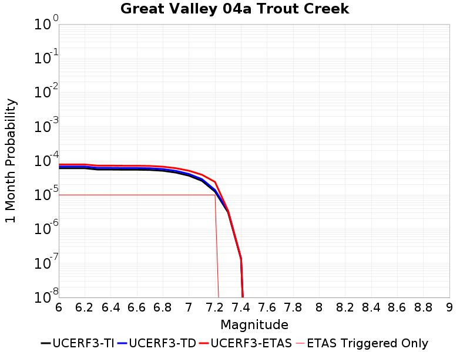 |  | 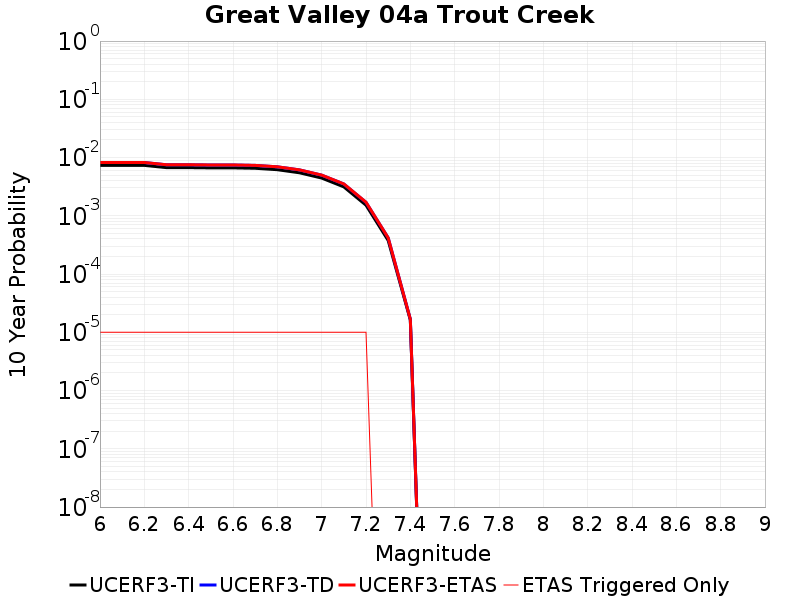 |

| Magnitude | 1 wk TI Prob | 1 wk TD Prob | 1 wk ETAS Prob | 1 wk ETAS/TD Gain | 1 wk ETAS Triggered Only | 1 mo TI Prob | 1 mo TD Prob | 1 mo ETAS Prob | 1 mo ETAS/TD Gain | 1 mo ETAS Triggered Only | 1 yr TI Prob | 1 yr TD Prob | 1 yr ETAS Prob | 1 yr ETAS/TD Gain | 1 yr ETAS Triggered Only | 10 yr TI Prob | 10 yr TD Prob | 10 yr ETAS Prob | 10 yr ETAS/TD Gain | 10 yr ETAS Triggered Only |
|-----|-----|-----|-----|-----|-----|-----|-----|-----|-----|-----|-----|-----|-----|-----|-----|-----|-----|-----|-----|-----|
| 6.0 | 1.4088538E-5 | 1.576836E-5 | 1.576836E-5 | 1.0 | 0.0 | 6.037805E-5 | 6.7577006E-5 | 7.757633E-5 | 1.1479694 | 1.0E-5 | 7.3485484E-4 | 8.224521E-4 | 8.324439E-4 | 1.0121487 | 1.0E-5 | 0.007324295 | 0.008195375 | 0.008205294 | 1.0012102 | 1.0E-5 |
| 6.1 | 1.4088538E-5 | 1.576836E-5 | 1.576836E-5 | 1.0 | 0.0 | 6.037805E-5 | 6.7577006E-5 | 7.757633E-5 | 1.1479694 | 1.0E-5 | 7.3485484E-4 | 8.224521E-4 | 8.324439E-4 | 1.0121487 | 1.0E-5 | 0.007324295 | 0.008195375 | 0.008205294 | 1.0012102 | 1.0E-5 |
| 6.2 | 1.4088538E-5 | 1.576836E-5 | 1.576836E-5 | 1.0 | 0.0 | 6.037805E-5 | 6.7577006E-5 | 7.757633E-5 | 1.1479694 | 1.0E-5 | 7.3485484E-4 | 8.224521E-4 | 8.324439E-4 | 1.0121487 | 1.0E-5 | 0.007324295 | 0.008195375 | 0.008205294 | 1.0012102 | 1.0E-5 |
| 6.3 | 1.2882862E-5 | 1.4423379E-5 | 1.4423379E-5 | 1.0 | 0.0 | 5.5211098E-5 | 6.181308E-5 | 7.181246E-5 | 1.1617681 | 1.0E-5 | 6.7198783E-4 | 7.523248E-4 | 7.623173E-4 | 1.0132822 | 1.0E-5 | 0.0066995937 | 0.0074988496 | 0.0075087743 | 1.0013236 | 1.0E-5 |
| 6.4 | 1.2882862E-5 | 1.4423379E-5 | 1.4423379E-5 | 1.0 | 0.0 | 5.5211098E-5 | 6.181308E-5 | 7.181246E-5 | 1.1617681 | 1.0E-5 | 6.7198783E-4 | 7.523248E-4 | 7.623173E-4 | 1.0132822 | 1.0E-5 | 0.0066995937 | 0.0074988496 | 0.0075087743 | 1.0013236 | 1.0E-5 |
| 6.5 | 1.2762329E-5 | 1.4289554E-5 | 1.4289554E-5 | 1.0 | 0.0 | 5.469455E-5 | 6.123957E-5 | 7.123895E-5 | 1.1632831 | 1.0E-5 | 6.657027E-4 | 7.453471E-4 | 7.553396E-4 | 1.0134065 | 1.0E-5 | 0.00663712 | 0.007429539 | 0.007439465 | 1.001336 | 1.0E-5 |
| 6.6 | 1.2762329E-5 | 1.4289554E-5 | 1.4289554E-5 | 1.0 | 0.0 | 5.469455E-5 | 6.123957E-5 | 7.123895E-5 | 1.1632831 | 1.0E-5 | 6.657027E-4 | 7.453471E-4 | 7.553396E-4 | 1.0134065 | 1.0E-5 | 0.00663712 | 0.007429539 | 0.007439465 | 1.001336 | 1.0E-5 |
| 6.7 | 1.2557959E-5 | 1.4063156E-5 | 1.4063156E-5 | 1.0 | 0.0 | 5.3818712E-5 | 6.0269336E-5 | 7.026873E-5 | 1.1659119 | 1.0E-5 | 6.5504585E-4 | 7.335425E-4 | 7.435352E-4 | 1.0136225 | 1.0E-5 | 0.006531183 | 0.007312273 | 0.0073222 | 1.0013576 | 1.0E-5 |
| 6.8 | 1.1871544E-5 | 1.3300383E-5 | 1.3300383E-5 | 1.0 | 0.0 | 5.0877054E-5 | 5.7000456E-5 | 6.6999884E-5 | 1.1754272 | 1.0E-5 | 6.1925204E-4 | 6.9376966E-4 | 7.037627E-4 | 1.014404 | 1.0E-5 | 0.0061752927 | 0.0069170617 | 0.0069269924 | 1.0014358 | 1.0E-5 |
| 6.9 | 1.0500373E-5 | 1.1768154E-5 | 1.1768154E-5 | 1.0 | 0.0 | 4.5000823E-5 | 5.043402E-5 | 6.0433515E-5 | 1.1982689 | 1.0E-5 | 5.4774724E-4 | 6.1386987E-4 | 6.238637E-4 | 1.01628 | 1.0E-5 | 0.005463991 | 0.006122613 | 0.0061325515 | 1.0016233 | 1.0E-5 |
| 7.0 | 8.524332E-6 | 9.56377E-6 | 9.56377E-6 | 1.0 | 0.0 | 3.653234E-5 | 4.0986983E-5 | 5.0986575E-5 | 1.2439699 | 1.0E-5 | 4.4469046E-4 | 4.989096E-4 | 5.0890463E-4 | 1.0200337 | 1.0E-5 | 0.0044380166 | 0.004978632 | 0.0049885823 | 1.0019985 | 1.0E-5 |
| 7.1 | 6.006849E-6 | 6.732698E-6 | 6.732698E-6 | 1.0 | 0.0 | 2.5743384E-5 | 2.8854132E-5 | 3.8853843E-5 | 1.3465608 | 1.0E-5 | 3.1338062E-4 | 3.5124805E-4 | 3.612445E-4 | 1.0284599 | 1.0E-5 | 0.0031293905 | 0.0035074828 | 0.0035174477 | 1.002841 | 1.0E-5 |
| 7.2 | 2.9122193E-6 | 3.2565483E-6 | 3.2565483E-6 | 1.0 | 0.0 | 1.248088E-5 | 1.3956571E-5 | 2.395643E-5 | 1.7164984 | 1.0E-5 | 1.5194413E-4 | 1.6990976E-4 | 1.7990806E-4 | 1.0588448 | 1.0E-5 | 0.0015184027 | 0.0016979716 | 0.0017079547 | 1.0058794 | 1.0E-5 |
| 7.3 | 7.2194007E-7 | 8.011778E-7 | 8.011778E-7 | 1.0 | 0.0 | 3.0940253E-6 | 3.4336174E-6 | 3.4336174E-6 | 1.0 | 0.0 | 3.7669106E-5 | 4.1803953E-5 | 4.1803953E-5 | 1.0 | 0.0 | 3.766272E-4 | 4.1800615E-4 | 4.1800615E-4 | 1.0 | 0.0 |
| 7.4 | 3.112171E-8 | 3.209446E-8 | 3.209446E-8 | 1.0 | 0.0 | 1.3337875E-7 | 1.3754767E-7 | 1.3754767E-7 | 1.0 | 0.0 | 1.6238852E-6 | 1.6746417E-6 | 1.6746417E-6 | 1.0 | 0.0 | 1.6238733E-5 | 1.6746299E-5 | 1.6746299E-5 | 1.0 | 0.0 |

