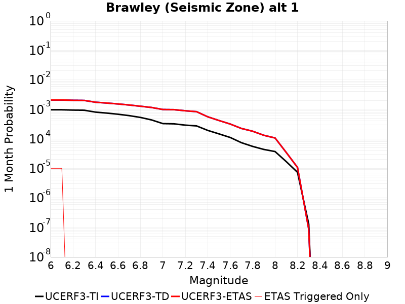
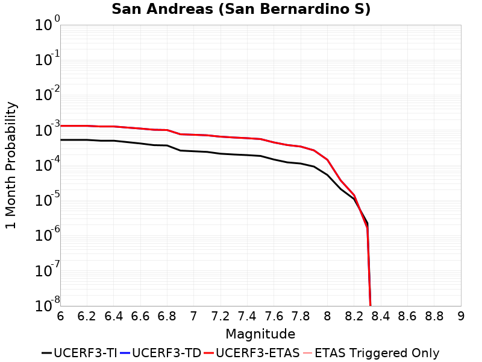

# Parent Section Magnitude-Probability Distributions

Only fault sections with at least one triggered aftershock are plotted. Sections are sorted by total supraseismogenic trigger rate (decreasing)

## Table Of Contents

* [Laguna Salada](#laguna-salada)
* [San Jacinto (Superstition Mtn)](#san-jacinto-superstition-mtn)
* [Brawley (Seismic Zone) alt 1](#brawley-seismic-zone-alt-1)
* [Imperial](#imperial)
* [San Andreas (Coachella) rev](#san-andreas-coachella-rev)
* [San Andreas (San Gorgonio Pass-Garnet HIll)](#san-andreas-san-gorgonio-pass-garnet-hill)
* [Blue Cut](#blue-cut)
* [San Jacinto (Borrego)](#san-jacinto-borrego)
* [Superstition Hills](#superstition-hills)
* [Cerro Prieto](#cerro-prieto)
* [Bullion Mountains](#bullion-mountains)
* [Ludlow](#ludlow)
* [San Andreas (San Bernardino S)](#san-andreas-san-bernardino-s)
* [Rose Canyon](#rose-canyon)
* [San Gorgonio Pass](#san-gorgonio-pass)

## Laguna Salada
*[(top)](#table-of-contents)*

| 1 Week | 1 Month | 1 Year | 10 Year |
|-----|-----|-----|-----|
|  |  |  |  |

| Magnitude | 1 wk TI Prob | 1 wk TD Prob | 1 wk ETAS Prob | 1 wk ETAS/TD Gain | 1 wk ETAS Triggered Only | 1 mo TI Prob | 1 mo TD Prob | 1 mo ETAS Prob | 1 mo ETAS/TD Gain | 1 mo ETAS Triggered Only | 1 yr TI Prob | 1 yr TD Prob | 1 yr ETAS Prob | 1 yr ETAS/TD Gain | 1 yr ETAS Triggered Only | 10 yr TI Prob | 10 yr TD Prob | 10 yr ETAS Prob | 10 yr ETAS/TD Gain | 10 yr ETAS Triggered Only |
|-----|-----|-----|-----|-----|-----|-----|-----|-----|-----|-----|-----|-----|-----|-----|-----|-----|-----|-----|-----|-----|
| 6.0 | 4.3960263E-5 | 3.187313E-5 | 8.1871534E-5 | 2.5686696 | 5.0E-5 | 1.8838752E-4 | 1.3659251E-4 | 2.465775E-4 | 1.805205 | 1.1E-4 | 0.0022912053 | 0.0016618378 | 0.0018315553 | 1.1021264 | 1.7E-4 | 0.022677258 | 0.016540714 | 0.016776744 | 1.0142697 | 2.4E-4 |
| 6.1 | 3.7353202E-5 | 3.187313E-5 | 8.1871534E-5 | 2.5686696 | 5.0E-5 | 1.6007533E-4 | 1.3659251E-4 | 2.465775E-4 | 1.805205 | 1.1E-4 | 0.0019471749 | 0.0016618378 | 0.0018315553 | 1.1021264 | 1.7E-4 | 0.019302014 | 0.016540714 | 0.016776744 | 1.0142697 | 2.4E-4 |
| 6.2 | 3.3633605E-5 | 2.776464E-5 | 6.776353E-5 | 2.4406414 | 4.0E-5 | 1.4413605E-4 | 1.1898637E-4 | 2.0897566E-4 | 1.7562991 | 9.0E-5 | 0.0017534439 | 0.00144778 | 0.0015476353 | 1.0689713 | 1.0E-4 | 0.017396728 | 0.014426913 | 0.014574749 | 1.0102472 | 1.5E-4 |
| 6.3 | 3.0459405E-5 | 2.4399402E-5 | 5.4398668E-5 | 2.2295084 | 3.0E-5 | 1.3053378E-4 | 1.0456511E-4 | 1.8455675E-4 | 1.7649935 | 8.0E-5 | 0.0015880901 | 0.0012724138 | 0.0013622993 | 1.0706418 | 9.0E-5 | 0.01576789 | 0.01269258 | 0.012811057 | 1.0093343 | 1.2E-4 |
| 6.4 | 2.8078504E-5 | 2.2085127E-5 | 5.2084466E-5 | 2.3583503 | 3.0E-5 | 1.203309E-4 | 9.4647534E-5 | 1.7463996E-4 | 1.8451612 | 8.0E-5 | 0.0014640441 | 0.001151799 | 0.0012317068 | 1.0693766 | 8.0E-5 | 0.014544362 | 0.011497441 | 0.011606175 | 1.0094573 | 1.1E-4 |
| 6.5 | 2.6691412E-5 | 2.084074E-5 | 4.0840325E-5 | 1.9596388 | 2.0E-5 | 1.1438675E-4 | 8.931482E-5 | 1.5930856E-4 | 1.7836745 | 7.0E-5 | 0.0013917689 | 0.0010869391 | 0.0011568629 | 1.064331 | 7.0E-5 | 0.013830846 | 0.010854159 | 0.010953072 | 1.0091131 | 1.0E-4 |
| 6.6 | 2.207987E-5 | 1.7020257E-5 | 3.7019916E-5 | 2.1750505 | 2.0E-5 | 9.4624585E-5 | 7.2942305E-5 | 1.12939386E-4 | 1.5483387 | 4.0E-5 | 0.0011514454 | 8.8777934E-4 | 9.2774385E-4 | 1.0450163 | 4.0E-5 | 0.011454974 | 0.008874553 | 0.008943932 | 1.0078177 | 7.0E-5 |
| 6.7 | 1.9458053E-5 | 1.4790402E-5 | 3.4790104E-5 | 2.3522084 | 2.0E-5 | 8.338899E-5 | 6.338627E-5 | 1.0338374E-4 | 1.6310115 | 4.0E-5 | 0.001014788 | 7.7152194E-4 | 8.114911E-4 | 1.0518056 | 4.0E-5 | 0.010101665 | 0.007717409 | 0.007786869 | 1.0090004 | 7.0E-5 |
| 6.8 | 1.0767866E-5 | 8.548949E-6 | 1.8548864E-5 | 2.1697245 | 1.0E-5 | 4.614718E-5 | 3.6638165E-5 | 6.663706E-5 | 1.8187883 | 3.0E-5 | 5.6169706E-4 | 4.460356E-4 | 4.7602222E-4 | 1.0672292 | 3.0E-5 | 0.0056027942 | 0.004467897 | 0.0045077186 | 1.0089128 | 4.0E-5 |
| 6.9 | 2.1384765E-6 | 1.8007547E-6 | 1.8007547E-6 | 1.0 | 0.0 | 9.164866E-6 | 7.717499E-6 | 7.717499E-6 | 1.0 | 0.0 | 1.1157654E-4 | 9.39569E-5 | 9.39569E-5 | 1.0 | 0.0 | 0.0011152053 | 9.392104E-4 | 9.392104E-4 | 1.0 | 0.0 |
| 7.0 | 2.0952946E-6 | 1.7586021E-6 | 1.7586021E-6 | 1.0 | 0.0 | 8.979802E-6 | 7.5368466E-6 | 7.5368466E-6 | 1.0 | 0.0 | 1.0932361E-4 | 9.175763E-5 | 9.175763E-5 | 1.0 | 0.0 | 0.0010926984 | 9.172361E-4 | 9.172361E-4 | 1.0 | 0.0 |
| 7.1 | 1.7887576E-6 | 1.4588346E-6 | 1.4588346E-6 | 1.0 | 0.0 | 7.666081E-6 | 6.2521353E-6 | 6.2521353E-6 | 1.0 | 0.0 | 9.333054E-5 | 7.61174E-5 | 7.61174E-5 | 1.0 | 0.0 | 9.329135E-4 | 7.6094404E-4 | 7.6094404E-4 | 1.0 | 0.0 |
| 7.2 | 9.723109E-7 | 7.195651E-7 | 7.195651E-7 | 1.0 | 0.0 | 4.16704E-6 | 3.0838478E-6 | 3.0838478E-6 | 1.0 | 0.0 | 5.073253E-5 | 3.7545367E-5 | 3.7545367E-5 | 1.0 | 0.0 | 5.072095E-4 | 3.754068E-4 | 3.754068E-4 | 1.0 | 0.0 |

## San Jacinto (Superstition Mtn)
*[(top)](#table-of-contents)*

| 1 Week | 1 Month | 1 Year | 10 Year |
|-----|-----|-----|-----|
|  |  |  |  |

| Magnitude | 1 wk TI Prob | 1 wk TD Prob | 1 wk ETAS Prob | 1 wk ETAS/TD Gain | 1 wk ETAS Triggered Only | 1 mo TI Prob | 1 mo TD Prob | 1 mo ETAS Prob | 1 mo ETAS/TD Gain | 1 mo ETAS Triggered Only | 1 yr TI Prob | 1 yr TD Prob | 1 yr ETAS Prob | 1 yr ETAS/TD Gain | 1 yr ETAS Triggered Only | 10 yr TI Prob | 10 yr TD Prob | 10 yr ETAS Prob | 10 yr ETAS/TD Gain | 10 yr ETAS Triggered Only |
|-----|-----|-----|-----|-----|-----|-----|-----|-----|-----|-----|-----|-----|-----|-----|-----|-----|-----|-----|-----|-----|
| 6.0 | 5.921579E-5 | 8.8355075E-5 | 8.8355075E-5 | 1.0 | 0.0 | 2.5375726E-4 | 3.786187E-4 | 3.9861113E-4 | 1.0528036 | 2.0E-5 | 0.0030851178 | 0.004601473 | 0.004671151 | 1.0151426 | 7.0E-5 | 0.030426376 | 0.045134835 | 0.045268517 | 1.0029619 | 1.4E-4 |
| 6.1 | 5.921579E-5 | 8.8355075E-5 | 8.8355075E-5 | 1.0 | 0.0 | 2.5375726E-4 | 3.786187E-4 | 3.9861113E-4 | 1.0528036 | 2.0E-5 | 0.0030851178 | 0.004601473 | 0.004671151 | 1.0151426 | 7.0E-5 | 0.030426376 | 0.045134835 | 0.045268517 | 1.0029619 | 1.4E-4 |
| 6.2 | 5.6963574E-5 | 8.48573E-5 | 8.48573E-5 | 1.0 | 0.0 | 2.4410675E-4 | 3.636324E-4 | 3.8362513E-4 | 1.0549806 | 2.0E-5 | 0.0029679495 | 0.0044198595 | 0.00448955 | 1.0157676 | 7.0E-5 | 0.029286223 | 0.043399755 | 0.043524113 | 1.0028654 | 1.3E-4 |
| 6.3 | 5.6940098E-5 | 8.481165E-5 | 8.481165E-5 | 1.0 | 0.0 | 2.4400617E-4 | 3.6343682E-4 | 3.8342955E-4 | 1.0550102 | 2.0E-5 | 0.002966728 | 0.004417488 | 0.0044871783 | 1.0157762 | 7.0E-5 | 0.029274331 | 0.043377623 | 0.043501984 | 1.002867 | 1.3E-4 |
| 6.4 | 5.4171585E-5 | 7.933417E-5 | 7.933417E-5 | 1.0 | 0.0 | 2.3214328E-4 | 3.3996842E-4 | 3.5996165E-4 | 1.058809 | 2.0E-5 | 0.0028226813 | 0.004132887 | 0.004202598 | 1.0168673 | 7.0E-5 | 0.02787096 | 0.04068047 | 0.040805183 | 1.0030656 | 1.3E-4 |
| 6.5 | 4.375144E-5 | 5.84012E-5 | 5.84012E-5 | 1.0 | 0.0 | 1.874927E-4 | 2.5027338E-4 | 2.7026839E-4 | 1.0798926 | 2.0E-5 | 0.0022803338 | 0.0030439817 | 0.003103799 | 1.019651 | 6.0E-5 | 0.022570757 | 0.030254561 | 0.030361233 | 1.0035259 | 1.1E-4 |
| 6.6 | 2.772192E-5 | 2.768001E-5 | 2.768001E-5 | 1.0 | 0.0 | 1.1880282E-4 | 1.18623335E-4 | 1.2862215E-4 | 1.0842904 | 1.0E-5 | 0.0014454646 | 0.0014433041 | 0.0014532896 | 1.0069185 | 1.0E-5 | 0.014360986 | 0.014664146 | 0.014683853 | 1.0013438 | 2.0E-5 |
| 6.7 | 2.7124124E-5 | 2.6873777E-5 | 2.6873777E-5 | 1.0 | 0.0 | 1.1624106E-4 | 1.1516837E-4 | 1.2516722E-4 | 1.0868194 | 1.0E-5 | 0.0014143161 | 0.0014012945 | 0.0014112805 | 1.0071262 | 1.0E-5 | 0.014053487 | 0.014249667 | 0.014269382 | 1.0013835 | 2.0E-5 |
| 6.8 | 2.5475807E-5 | 2.435933E-5 | 2.435933E-5 | 1.0 | 0.0 | 1.0917746E-4 | 1.0439303E-4 | 1.1439199E-4 | 1.0957818 | 1.0E-5 | 0.001328425 | 0.0012702586 | 0.001280246 | 1.0078624 | 1.0E-5 | 0.0132051185 | 0.012949549 | 0.012969289 | 1.0015244 | 2.0E-5 |
| 6.9 | 2.1162023E-5 | 1.9349069E-5 | 1.9349069E-5 | 1.0 | 0.0 | 9.069123E-5 | 8.2921964E-5 | 8.2921964E-5 | 1.0 | 0.0 | 0.0011036064 | 0.0010091119 | 0.0010091119 | 1.0 | 0.0 | 0.010981417 | 0.0103383735 | 0.0103383735 | 1.0 | 0.0 |
| 7.0 | 1.8754288E-5 | 1.7698838E-5 | 1.7698838E-5 | 1.0 | 0.0 | 8.037304E-5 | 7.5849974E-5 | 7.5849974E-5 | 1.0 | 0.0 | 9.781026E-4 | 9.230851E-4 | 9.230851E-4 | 1.0 | 0.0 | 0.009738087 | 0.009467611 | 0.009467611 | 1.0 | 0.0 |
| 7.1 | 1.8678527E-5 | 1.7618704E-5 | 1.7618704E-5 | 1.0 | 0.0 | 8.0048376E-5 | 7.550656E-5 | 7.550656E-5 | 1.0 | 0.0 | 9.7415317E-4 | 9.1890764E-4 | 9.1890764E-4 | 1.0 | 0.0 | 0.009698939 | 0.009425921 | 0.009425921 | 1.0 | 0.0 |
| 7.2 | 1.7804578E-5 | 1.68624E-5 | 1.68624E-5 | 1.0 | 0.0 | 7.6303106E-5 | 7.226544E-5 | 7.226544E-5 | 1.0 | 0.0 | 9.285943E-4 | 8.794792E-4 | 8.794792E-4 | 1.0 | 0.0 | 0.009247236 | 0.009031462 | 0.009031462 | 1.0 | 0.0 |
| 7.3 | 1.6583685E-5 | 1.5937045E-5 | 1.5937045E-5 | 1.0 | 0.0 | 7.1070994E-5 | 6.829984E-5 | 6.829984E-5 | 1.0 | 0.0 | 8.649459E-4 | 8.312357E-4 | 8.312357E-4 | 1.0 | 0.0 | 0.00861587 | 0.008548763 | 0.008548763 | 1.0 | 0.0 |
| 7.4 | 1.6387552E-5 | 1.5790618E-5 | 1.5790618E-5 | 1.0 | 0.0 | 7.023047E-5 | 6.7672336E-5 | 6.7672336E-5 | 1.0 | 0.0 | 8.5472054E-4 | 8.2360156E-4 | 8.2360156E-4 | 1.0 | 0.0 | 0.008514405 | 0.0084723765 | 0.0084723765 | 1.0 | 0.0 |
| 7.5 | 1.5790754E-5 | 1.5398053E-5 | 1.5398053E-5 | 1.0 | 0.0 | 6.767291E-5 | 6.5989996E-5 | 6.5989996E-5 | 1.0 | 0.0 | 8.236062E-4 | 8.0313435E-4 | 8.0313435E-4 | 1.0 | 0.0 | 0.008205604 | 0.008265878 | 0.008265878 | 1.0 | 0.0 |
| 7.6 | 1.4248672E-5 | 1.4339773E-5 | 1.4339773E-5 | 1.0 | 0.0 | 6.106431E-5 | 6.145473E-5 | 6.145473E-5 | 1.0 | 0.0 | 7.432043E-4 | 7.479565E-4 | 7.479565E-4 | 1.0 | 0.0 | 0.007407237 | 0.0077087856 | 0.0077087856 | 1.0 | 0.0 |
| 7.7 | 1.15449975E-5 | 1.20669165E-5 | 1.20669165E-5 | 1.0 | 0.0 | 4.947762E-5 | 5.1714334E-5 | 5.1714334E-5 | 1.0 | 0.0 | 6.022235E-4 | 6.294411E-4 | 6.294411E-4 | 1.0 | 0.0 | 0.006005941 | 0.0065169334 | 0.0065169334 | 1.0 | 0.0 |
| 7.8 | 9.1391985E-6 | 1.0575133E-5 | 1.0575133E-5 | 1.0 | 0.0 | 3.9167408E-5 | 4.5321216E-5 | 4.5321216E-5 | 1.0 | 0.0 | 4.767588E-4 | 5.5164687E-4 | 5.5164687E-4 | 1.0 | 0.0 | 0.0047573727 | 0.005730744 | 0.005730744 | 1.0 | 0.0 |
| 7.9 | 6.973017E-6 | 8.247849E-6 | 8.247849E-6 | 1.0 | 0.0 | 2.9884017E-5 | 3.534745E-5 | 3.534745E-5 | 1.0 | 0.0 | 3.6377716E-4 | 4.3027088E-4 | 4.3027088E-4 | 1.0 | 0.0 | 0.0036318225 | 0.0045051835 | 0.0045051835 | 1.0 | 0.0 |
| 8.0 | 5.7638235E-6 | 7.0125943E-6 | 7.0125943E-6 | 1.0 | 0.0 | 2.4701867E-5 | 3.0053632E-5 | 3.0053632E-5 | 1.0 | 0.0 | 3.0070372E-4 | 3.6584216E-4 | 3.6584216E-4 | 1.0 | 0.0 | 0.0030029714 | 0.0038480973 | 0.0038480973 | 1.0 | 0.0 |
| 8.1 | 5.1124434E-6 | 6.163053E-6 | 6.163053E-6 | 1.0 | 0.0 | 2.1910288E-5 | 2.6412821E-5 | 2.6412821E-5 | 1.0 | 0.0 | 2.6672508E-4 | 3.2152925E-4 | 3.2152925E-4 | 1.0 | 0.0 | 0.0026640517 | 0.0033909045 | 0.0033909045 | 1.0 | 0.0 |
| 8.2 | 1.1075938E-6 | 6.3103704E-7 | 6.3103704E-7 | 1.0 | 0.0 | 4.7468216E-6 | 2.7044418E-6 | 2.7044418E-6 | 1.0 | 0.0 | 5.779102E-5 | 3.2926113E-5 | 3.2926113E-5 | 1.0 | 0.0 | 5.777599E-4 | 3.6743443E-4 | 3.6743443E-4 | 1.0 | 0.0 |
| 8.3 | 1.3584393E-8 | 5.3812794E-9 | 5.3812794E-9 | 1.0 | 0.0 | 5.8218827E-8 | 2.3062627E-8 | 2.3062627E-8 | 1.0 | 0.0 | 7.0881396E-7 | 2.8078748E-7 | 2.8078748E-7 | 1.0 | 0.0 | 7.0881174E-6 | 3.120581E-6 | 3.120581E-6 | 1.0 | 0.0 |

## Brawley (Seismic Zone) alt 1
*[(top)](#table-of-contents)*

| 1 Week | 1 Month | 1 Year | 10 Year |
|-----|-----|-----|-----|
|  |  |  |  |

| Magnitude | 1 wk TI Prob | 1 wk TD Prob | 1 wk ETAS Prob | 1 wk ETAS/TD Gain | 1 wk ETAS Triggered Only | 1 mo TI Prob | 1 mo TD Prob | 1 mo ETAS Prob | 1 mo ETAS/TD Gain | 1 mo ETAS Triggered Only | 1 yr TI Prob | 1 yr TD Prob | 1 yr ETAS Prob | 1 yr ETAS/TD Gain | 1 yr ETAS Triggered Only | 10 yr TI Prob | 10 yr TD Prob | 10 yr ETAS Prob | 10 yr ETAS/TD Gain | 10 yr ETAS Triggered Only |
|-----|-----|-----|-----|-----|-----|-----|-----|-----|-----|-----|-----|-----|-----|-----|-----|-----|-----|-----|-----|-----|
| 6.0 | 2.2521618E-4 | 4.8153297E-4 | 4.9152813E-4 | 1.020757 | 1.0E-5 | 9.6485513E-4 | 0.002062117 | 0.0020720963 | 1.0048394 | 1.0E-5 | 0.011683988 | 0.024819607 | 0.024848862 | 1.0011787 | 3.0E-5 | 0.11088423 | 0.21589768 | 0.21592905 | 1.0001453 | 4.0E-5 |
| 6.1 | 2.2521618E-4 | 4.8153297E-4 | 4.9152813E-4 | 1.020757 | 1.0E-5 | 9.6485513E-4 | 0.002062117 | 0.0020720963 | 1.0048394 | 1.0E-5 | 0.011683988 | 0.024819607 | 0.024848862 | 1.0011787 | 3.0E-5 | 0.11088423 | 0.21589768 | 0.21592905 | 1.0001453 | 4.0E-5 |
| 6.2 | 2.198148E-4 | 4.7226914E-4 | 4.7226914E-4 | 1.0 | 0.0 | 9.417233E-4 | 0.0020224766 | 0.0020224766 | 1.0 | 0.0 | 0.011405343 | 0.024348047 | 0.02436756 | 1.0008014 | 2.0E-5 | 0.10837428 | 0.2123012 | 0.21232483 | 1.0001113 | 3.0E-5 |
| 6.3 | 2.1704129E-4 | 4.6668088E-4 | 4.6668088E-4 | 1.0 | 0.0 | 9.298453E-4 | 0.0019985638 | 0.0019985638 | 1.0 | 0.0 | 0.011262234 | 0.024063919 | 0.024083437 | 1.0008111 | 2.0E-5 | 0.107082725 | 0.21019807 | 0.21022177 | 1.0001128 | 3.0E-5 |
| 6.4 | 1.876142E-4 | 4.0635574E-4 | 4.0635574E-4 | 1.0 | 0.0 | 8.038131E-4 | 0.0017403765 | 0.0017403765 | 1.0 | 0.0 | 0.00974259 | 0.020989772 | 0.021009352 | 1.0009328 | 2.0E-5 | 0.093263686 | 0.18701535 | 0.18703975 | 1.0001304 | 3.0E-5 |
| 6.5 | 1.7390939E-4 | 3.8084306E-4 | 3.8084306E-4 | 1.0 | 0.0 | 7.45113E-4 | 0.0016311757 | 0.0016311757 | 1.0 | 0.0 | 0.009034078 | 0.019685494 | 0.0197051 | 1.000996 | 2.0E-5 | 0.086755216 | 0.17685145 | 0.17687614 | 1.0001396 | 3.0E-5 |
| 6.6 | 1.591791E-4 | 3.5507817E-4 | 3.5507817E-4 | 1.0 | 0.0 | 6.8201777E-4 | 0.0015208862 | 0.0015208862 | 1.0 | 0.0 | 0.008271996 | 0.018358538 | 0.018378172 | 1.0010694 | 2.0E-5 | 0.07970774 | 0.16626391 | 0.16628893 | 1.0001504 | 3.0E-5 |
| 6.7 | 1.4268003E-4 | 3.2689783E-4 | 3.2689783E-4 | 1.0 | 0.0 | 6.1134255E-4 | 0.0014002468 | 0.0014002468 | 1.0 | 0.0 | 0.007417723 | 0.01691452 | 0.016934182 | 1.0011624 | 2.0E-5 | 0.07174956 | 0.1544362 | 0.15446156 | 1.0001643 | 3.0E-5 |
| 6.8 | 1.239713E-4 | 2.9713823E-4 | 2.9713823E-4 | 1.0 | 0.0 | 5.3119735E-4 | 0.0012728344 | 0.0012728344 | 1.0 | 0.0 | 0.0064481674 | 0.015388122 | 0.015407814 | 1.0012797 | 2.0E-5 | 0.06264243 | 0.14101517 | 0.14104094 | 1.0001827 | 3.0E-5 |
| 6.9 | 1.0180238E-4 | 2.6902623E-4 | 2.6902623E-4 | 1.0 | 0.0 | 4.3622297E-4 | 0.0011524645 | 0.0011524645 | 1.0 | 0.0 | 0.005298089 | 0.013942027 | 0.013961749 | 1.0014145 | 2.0E-5 | 0.05173543 | 0.12760428 | 0.12763044 | 1.0002052 | 3.0E-5 |
| 7.0 | 7.6619996E-5 | 2.3023579E-4 | 2.3023579E-4 | 1.0 | 0.0 | 3.283301E-4 | 9.86355E-4 | 9.86355E-4 | 1.0 | 0.0 | 0.0039900932 | 0.011943492 | 0.011963254 | 1.0016545 | 2.0E-5 | 0.039192066 | 0.10985439 | 0.109881096 | 1.0002431 | 3.0E-5 |
| 7.1 | 7.5127435E-5 | 2.2705196E-4 | 2.2705196E-4 | 1.0 | 0.0 | 3.2193496E-4 | 9.727202E-4 | 9.727202E-4 | 1.0 | 0.0 | 0.0039125155 | 0.011779296 | 0.011799061 | 1.0016779 | 2.0E-5 | 0.038443442 | 0.10841575 | 0.1084425 | 1.0002468 | 3.0E-5 |
| 7.2 | 6.788582E-5 | 2.0826874E-4 | 2.0826874E-4 | 1.0 | 0.0 | 2.9090676E-4 | 8.9227816E-4 | 8.9227816E-4 | 1.0 | 0.0 | 0.0035360386 | 0.010810046 | 0.01082983 | 1.0018301 | 2.0E-5 | 0.034803 | 0.10008042 | 0.100107424 | 1.0002698 | 3.0E-5 |
| 7.3 | 6.399602E-5 | 1.9444077E-4 | 1.9444077E-4 | 1.0 | 0.0 | 2.7423984E-4 | 8.330545E-4 | 8.330545E-4 | 1.0 | 0.0 | 0.0033337586 | 0.010095891 | 0.010115689 | 1.001961 | 2.0E-5 | 0.03284188 | 0.09393625 | 0.09396343 | 1.0002893 | 3.0E-5 |
| 7.4 | 4.506759E-5 | 1.3022534E-4 | 1.3022534E-4 | 1.0 | 0.0 | 1.9313251E-4 | 5.5799016E-4 | 5.5799016E-4 | 1.0 | 0.0 | 0.0023488526 | 0.0067725545 | 0.006792419 | 1.0029331 | 2.0E-5 | 0.023241805 | 0.06452232 | 0.06454103 | 1.0002899 | 2.0E-5 |
| 7.5 | 3.43289E-5 | 9.752788E-5 | 9.752788E-5 | 1.0 | 0.0 | 1.4711556E-4 | 4.1791E-4 | 4.1791E-4 | 1.0 | 0.0 | 0.0017896603 | 0.005076251 | 0.0050862 | 1.0019599 | 1.0E-5 | 0.01775316 | 0.048914853 | 0.048924364 | 1.0001944 | 1.0E-5 |
| 7.6 | 2.5980507E-5 | 7.4110976E-5 | 7.4110976E-5 | 1.0 | 0.0 | 1.1134028E-4 | 3.1757995E-4 | 3.1757995E-4 | 1.0 | 0.0 | 0.001354725 | 0.003859707 | 0.0038696683 | 1.0025809 | 1.0E-5 | 0.013464959 | 0.037451353 | 0.037460975 | 1.000257 | 1.0E-5 |
| 7.7 | 1.7292105E-5 | 5.2415933E-5 | 5.2415933E-5 | 1.0 | 0.0 | 7.4106916E-5 | 2.2462041E-4 | 2.2462041E-4 | 1.0 | 0.0 | 9.018782E-4 | 0.0027313302 | 0.0027313302 | 1.0 | 0.0 | 0.008982267 | 0.026649691 | 0.026649691 | 1.0 | 0.0 |
| 7.8 | 1.2927471E-5 | 4.226543E-5 | 4.226543E-5 | 1.0 | 0.0 | 5.5402274E-5 | 1.81125E-4 | 1.81125E-4 | 1.0 | 0.0 | 6.743139E-4 | 0.0022029695 | 0.0022029695 | 1.0 | 0.0 | 0.0067227143 | 0.021593237 | 0.021593237 | 1.0 | 0.0 |
| 7.9 | 1.0200774E-5 | 3.07301E-5 | 3.07301E-5 | 1.0 | 0.0 | 4.371687E-5 | 1.316938E-4 | 1.316938E-4 | 1.0 | 0.0 | 5.321229E-4 | 0.001602194 | 0.001602194 | 1.0 | 0.0 | 0.005308505 | 0.01590346 | 0.01590346 | 1.0 | 0.0 |
| 8.0 | 8.650396E-6 | 2.4947998E-5 | 2.4947998E-5 | 1.0 | 0.0 | 3.70726E-5 | 1.0691562E-4 | 1.0691562E-4 | 1.0 | 0.0 | 4.5126543E-4 | 0.0013009213 | 0.0013009213 | 1.0 | 0.0 | 0.0045035016 | 0.012983719 | 0.012983719 | 1.0 | 0.0 |
| 8.1 | 3.9368224E-6 | 8.025015E-6 | 8.025015E-6 | 1.0 | 0.0 | 1.6871985E-5 | 3.4392466E-5 | 3.4392466E-5 | 1.0 | 0.0 | 2.0539707E-4 | 4.1864798E-4 | 4.1864798E-4 | 1.0 | 0.0 | 0.0020520731 | 0.0043434897 | 0.0043434897 | 1.0 | 0.0 |
| 8.2 | 1.7101195E-6 | 2.5045679E-6 | 2.5045679E-6 | 1.0 | 0.0 | 7.329063E-6 | 1.0733818E-5 | 1.0733818E-5 | 1.0 | 0.0 | 8.922769E-5 | 1.3067643E-4 | 1.3067643E-4 | 1.0 | 0.0 | 8.9191867E-4 | 0.0014117359 | 0.0014117359 | 1.0 | 0.0 |
| 8.3 | 3.0346666E-8 | 2.0256195E-8 | 2.0256195E-8 | 1.0 | 0.0 | 1.3005713E-7 | 8.681226E-8 | 8.681226E-8 | 1.0 | 0.0 | 1.5834444E-6 | 1.056939E-6 | 1.056939E-6 | 1.0 | 0.0 | 1.5834332E-5 | 1.0985504E-5 | 1.0985504E-5 | 1.0 | 0.0 |

## Imperial
*[(top)](#table-of-contents)*

| 1 Week | 1 Month | 1 Year | 10 Year |
|-----|-----|-----|-----|
|  |  |  |  |

| Magnitude | 1 wk TI Prob | 1 wk TD Prob | 1 wk ETAS Prob | 1 wk ETAS/TD Gain | 1 wk ETAS Triggered Only | 1 mo TI Prob | 1 mo TD Prob | 1 mo ETAS Prob | 1 mo ETAS/TD Gain | 1 mo ETAS Triggered Only | 1 yr TI Prob | 1 yr TD Prob | 1 yr ETAS Prob | 1 yr ETAS/TD Gain | 1 yr ETAS Triggered Only | 10 yr TI Prob | 10 yr TD Prob | 10 yr ETAS Prob | 10 yr ETAS/TD Gain | 10 yr ETAS Triggered Only |
|-----|-----|-----|-----|-----|-----|-----|-----|-----|-----|-----|-----|-----|-----|-----|-----|-----|-----|-----|-----|-----|
| 6.0 | 2.6875173E-4 | 4.9499475E-4 | 5.049898E-4 | 1.0201923 | 1.0E-5 | 0.0011512847 | 0.0021197193 | 0.0021296982 | 1.0047076 | 1.0E-5 | 0.013927074 | 0.025497705 | 0.025517194 | 1.0007644 | 2.0E-5 | 0.13085878 | 0.22291644 | 0.22294752 | 1.0001395 | 4.0E-5 |
| 6.1 | 2.5356023E-4 | 4.9499475E-4 | 5.049898E-4 | 1.0201923 | 1.0E-5 | 0.001086234 | 0.0021197193 | 0.0021296982 | 1.0047076 | 1.0E-5 | 0.013144928 | 0.025497705 | 0.025517194 | 1.0007644 | 2.0E-5 | 0.123940155 | 0.22291644 | 0.22294752 | 1.0001395 | 4.0E-5 |
| 6.2 | 2.4820742E-4 | 4.8583915E-4 | 4.8583915E-4 | 1.0 | 0.0 | 0.0010633124 | 0.0020805437 | 0.0020805437 | 1.0 | 0.0 | 0.01286919 | 0.025031973 | 0.025041724 | 1.0003895 | 1.0E-5 | 0.12148927 | 0.21939406 | 0.21941747 | 1.0001067 | 3.0E-5 |
| 6.3 | 2.3205351E-4 | 4.6579845E-4 | 4.6579845E-4 | 1.0 | 0.0 | 9.94136E-4 | 0.0019947882 | 0.0019947882 | 1.0 | 0.0 | 0.012036599 | 0.024004444 | 0.024014203 | 1.0004066 | 1.0E-5 | 0.11405133 | 0.21090822 | 0.210924 | 1.0000749 | 2.0E-5 |
| 6.4 | 2.0304754E-4 | 4.0641203E-4 | 4.0641203E-4 | 1.0 | 0.0 | 8.6991355E-4 | 0.0017406178 | 0.0017406178 | 1.0 | 0.0 | 0.010539869 | 0.020978086 | 0.020987876 | 1.0004667 | 1.0E-5 | 0.100537635 | 0.18812367 | 0.1881399 | 1.0000863 | 2.0E-5 |
| 6.5 | 1.854992E-4 | 3.7723593E-4 | 3.7723593E-4 | 1.0 | 0.0 | 7.9475436E-4 | 0.001615736 | 0.001615736 | 1.0 | 0.0 | 0.009633281 | 0.019489404 | 0.01949921 | 1.0005031 | 1.0E-5 | 0.0922623 | 0.17622966 | 0.17624614 | 1.0000935 | 2.0E-5 |
| 6.6 | 1.6586106E-4 | 3.4715416E-4 | 3.4715416E-4 | 1.0 | 0.0 | 7.106394E-4 | 0.0014869655 | 0.0014869655 | 1.0 | 0.0 | 0.008617763 | 0.017950512 | 0.017960334 | 1.000547 | 1.0E-5 | 0.08291132 | 0.16350827 | 0.16352499 | 1.0001023 | 2.0E-5 |
| 6.7 | 1.4224656E-4 | 3.1374613E-4 | 3.1374613E-4 | 1.0 | 0.0 | 6.094856E-4 | 0.0013439417 | 0.0013439417 | 1.0 | 0.0 | 0.0073952693 | 0.016239442 | 0.01624928 | 1.0006058 | 1.0E-5 | 0.07153955 | 0.14894356 | 0.14896058 | 1.0001143 | 2.0E-5 |
| 6.8 | 1.2317259E-4 | 2.8423025E-4 | 2.8423025E-4 | 1.0 | 0.0 | 5.2777573E-4 | 0.0012175672 | 0.0012175672 | 1.0 | 0.0 | 0.0064067547 | 0.014724549 | 0.014734402 | 1.0006691 | 1.0E-5 | 0.06225166 | 0.13550782 | 0.1355251 | 1.0001276 | 2.0E-5 |
| 6.9 | 9.859898E-5 | 2.5612462E-4 | 2.5612462E-4 | 1.0 | 0.0 | 4.2249862E-4 | 0.0010972196 | 0.0010972196 | 1.0 | 0.0 | 0.0051317946 | 0.013277828 | 0.013287695 | 1.0007432 | 1.0E-5 | 0.05014893 | 0.121867694 | 0.12188526 | 1.0001441 | 2.0E-5 |
| 7.0 | 7.3191884E-5 | 2.1838056E-4 | 2.1838056E-4 | 1.0 | 0.0 | 3.136418E-4 | 9.355843E-4 | 9.355843E-4 | 1.0 | 0.0 | 0.003811904 | 0.011331966 | 0.011341852 | 1.0008725 | 1.0E-5 | 0.037471764 | 0.10444987 | 0.10446778 | 1.0001714 | 2.0E-5 |
| 7.1 | 7.1760296E-5 | 2.1537895E-4 | 2.1537895E-4 | 1.0 | 0.0 | 3.0750787E-4 | 9.2272944E-4 | 9.2272944E-4 | 1.0 | 0.0 | 0.003737482 | 0.011177073 | 0.011186961 | 1.0008847 | 1.0E-5 | 0.03675245 | 0.1030833 | 0.10310123 | 1.000174 | 2.0E-5 |
| 7.2 | 6.46614E-5 | 1.9700569E-4 | 1.9700569E-4 | 1.0 | 0.0 | 2.7709085E-4 | 8.4404007E-4 | 8.4404007E-4 | 1.0 | 0.0 | 0.0033683628 | 0.01022842 | 0.010238318 | 1.0009676 | 1.0E-5 | 0.033177625 | 0.09488328 | 0.09490138 | 1.0001907 | 2.0E-5 |
| 7.3 | 6.088115E-5 | 1.8358916E-4 | 1.8358916E-4 | 1.0 | 0.0 | 2.6089314E-4 | 7.865764E-4 | 7.865764E-4 | 1.0 | 0.0 | 0.0031717476 | 0.00953512 | 0.0095450245 | 1.0010388 | 1.0E-5 | 0.031268585 | 0.08889465 | 0.08891287 | 1.000205 | 2.0E-5 |
| 7.4 | 4.199346E-5 | 1.1951423E-4 | 1.1951423E-4 | 1.0 | 0.0 | 1.7995955E-4 | 5.1210425E-4 | 5.1210425E-4 | 1.0 | 0.0 | 0.0021888057 | 0.0062172245 | 0.0062271627 | 1.0015985 | 1.0E-5 | 0.02167372 | 0.059384536 | 0.059393942 | 1.0001584 | 1.0E-5 |
| 7.5 | 3.130448E-5 | 8.698615E-5 | 8.698615E-5 | 1.0 | 0.0 | 1.3415517E-4 | 3.7274483E-4 | 3.7274483E-4 | 1.0 | 0.0 | 0.0016321153 | 0.0045287893 | 0.0045387438 | 1.0021981 | 1.0E-5 | 0.016201803 | 0.043773357 | 0.04378292 | 1.0002184 | 1.0E-5 |
| 7.6 | 2.3074248E-5 | 6.390859E-5 | 6.390859E-5 | 1.0 | 0.0 | 9.888588E-5 | 2.7386536E-4 | 2.7386536E-4 | 1.0 | 0.0 | 0.0012032706 | 0.0033292377 | 0.0033392045 | 1.0029937 | 1.0E-5 | 0.011967761 | 0.03241642 | 0.032426093 | 1.0002985 | 1.0E-5 |
| 7.7 | 1.45864815E-5 | 4.2623997E-5 | 4.2623997E-5 | 1.0 | 0.0 | 6.2511994E-5 | 1.8266152E-4 | 1.8266152E-4 | 1.0 | 0.0 | 7.608177E-4 | 0.0022216418 | 0.0022216418 | 1.0 | 0.0 | 0.007582182 | 0.021765815 | 0.021765815 | 1.0 | 0.0 |
| 7.8 | 1.0352979E-5 | 3.304487E-5 | 3.304487E-5 | 1.0 | 0.0 | 4.4369157E-5 | 1.4161321E-4 | 1.4161321E-4 | 1.0 | 0.0 | 5.400606E-4 | 0.0017227799 | 0.0017227799 | 1.0 | 0.0 | 0.0053875 | 0.016964091 | 0.016964091 | 1.0 | 0.0 |
| 7.9 | 8.137906E-6 | 2.3744256E-5 | 2.3744256E-5 | 1.0 | 0.0 | 3.4876273E-5 | 1.01757134E-4 | 1.01757134E-4 | 1.0 | 0.0 | 4.2453592E-4 | 0.0012381901 | 0.0012381901 | 1.0 | 0.0 | 0.004237258 | 0.012356008 | 0.012356008 | 1.0 | 0.0 |
| 8.0 | 6.93792E-6 | 1.9357356E-5 | 1.9357356E-5 | 1.0 | 0.0 | 2.9733603E-5 | 8.2957464E-5 | 8.2957464E-5 | 1.0 | 0.0 | 3.6194647E-4 | 0.0010095399 | 0.0010095399 | 1.0 | 0.0 | 0.0036135751 | 0.010129327 | 0.010129327 | 1.0 | 0.0 |
| 8.1 | 3.4286315E-6 | 6.9903103E-6 | 6.9903103E-6 | 1.0 | 0.0 | 1.4694053E-5 | 2.995813E-5 | 2.995813E-5 | 1.0 | 0.0 | 1.7888541E-4 | 3.6467932E-4 | 3.6467932E-4 | 1.0 | 0.0 | 0.0017874148 | 0.0037860652 | 0.0037860652 | 1.0 | 0.0 |
| 8.2 | 1.4906886E-6 | 2.1883309E-6 | 2.1883309E-6 | 1.0 | 0.0 | 6.3886496E-6 | 9.3785275E-6 | 9.3785275E-6 | 1.0 | 0.0 | 7.7779034E-5 | 1.1417763E-4 | 1.1417763E-4 | 1.0 | 0.0 | 7.775182E-4 | 0.0012348566 | 0.0012348566 | 1.0 | 0.0 |
| 8.3 | 2.5758007E-8 | 1.7062584E-8 | 1.7062584E-8 | 1.0 | 0.0 | 1.10391454E-7 | 7.312536E-8 | 7.312536E-8 | 1.0 | 0.0 | 1.3440151E-6 | 8.9030124E-7 | 8.9030124E-7 | 1.0 | 0.0 | 1.344007E-5 | 9.252834E-6 | 9.252834E-6 | 1.0 | 0.0 |

## San Andreas (Coachella) rev
*[(top)](#table-of-contents)*

| 1 Week | 1 Month | 1 Year | 10 Year |
|-----|-----|-----|-----|
|  |  |  |  |

| Magnitude | 1 wk TI Prob | 1 wk TD Prob | 1 wk ETAS Prob | 1 wk ETAS/TD Gain | 1 wk ETAS Triggered Only | 1 mo TI Prob | 1 mo TD Prob | 1 mo ETAS Prob | 1 mo ETAS/TD Gain | 1 mo ETAS Triggered Only | 1 yr TI Prob | 1 yr TD Prob | 1 yr ETAS Prob | 1 yr ETAS/TD Gain | 1 yr ETAS Triggered Only | 10 yr TI Prob | 10 yr TD Prob | 10 yr ETAS Prob | 10 yr ETAS/TD Gain | 10 yr ETAS Triggered Only |
|-----|-----|-----|-----|-----|-----|-----|-----|-----|-----|-----|-----|-----|-----|-----|-----|-----|-----|-----|-----|-----|
| 6.0 | 1.1925945E-4 | 3.3470275E-4 | 3.3470275E-4 | 1.0 | 0.0 | 5.110118E-4 | 0.0014336567 | 0.0014336567 | 1.0 | 0.0 | 0.0062038354 | 0.017316472 | 0.017336125 | 1.001135 | 2.0E-5 | 0.060334753 | 0.15562436 | 0.15564969 | 1.0001627 | 3.0E-5 |
| 6.1 | 1.1925945E-4 | 3.3470275E-4 | 3.3470275E-4 | 1.0 | 0.0 | 5.110118E-4 | 0.0014336567 | 0.0014336567 | 1.0 | 0.0 | 0.0062038354 | 0.017316472 | 0.017336125 | 1.001135 | 2.0E-5 | 0.060334753 | 0.15562436 | 0.15564969 | 1.0001627 | 3.0E-5 |
| 6.2 | 1.07432395E-4 | 3.0963743E-4 | 3.0963743E-4 | 1.0 | 0.0 | 4.603433E-4 | 0.0013263469 | 0.0013263469 | 1.0 | 0.0 | 0.005590286 | 0.016029859 | 0.016049538 | 1.0012276 | 2.0E-5 | 0.05451731 | 0.14478172 | 0.14480737 | 1.0001773 | 3.0E-5 |
| 6.3 | 1.0718766E-4 | 3.09091E-4 | 3.09091E-4 | 1.0 | 0.0 | 4.592948E-4 | 0.0013240073 | 0.0013240073 | 1.0 | 0.0 | 0.005577586 | 0.016001794 | 0.016021473 | 1.0012299 | 2.0E-5 | 0.054396555 | 0.1445507 | 0.14457636 | 1.0001775 | 3.0E-5 |
| 6.4 | 1.0355944E-4 | 3.0115806E-4 | 3.0115806E-4 | 1.0 | 0.0 | 4.4375064E-4 | 0.001290043 | 0.001290043 | 1.0 | 0.0 | 0.0053892885 | 0.015594269 | 0.015613957 | 1.0012625 | 2.0E-5 | 0.052604496 | 0.14111364 | 0.1411394 | 1.0001826 | 3.0E-5 |
| 6.5 | 1.0227914E-4 | 2.9834828E-4 | 2.9834828E-4 | 1.0 | 0.0 | 4.382655E-4 | 0.001278013 | 0.001278013 | 1.0 | 0.0 | 0.0053228354 | 0.015449891 | 0.015469582 | 1.0012745 | 2.0E-5 | 0.051971316 | 0.1398979 | 0.1399237 | 1.0001844 | 3.0E-5 |
| 6.6 | 1.0116757E-4 | 2.9600042E-4 | 2.9600042E-4 | 1.0 | 0.0 | 4.3350324E-4 | 0.0012679605 | 0.0012679605 | 1.0 | 0.0 | 0.0052651367 | 0.015329229 | 0.015348922 | 1.0012847 | 2.0E-5 | 0.051421247 | 0.13887696 | 0.1389028 | 1.000186 | 3.0E-5 |
| 6.7 | 1.0050676E-4 | 2.945838E-4 | 2.945838E-4 | 1.0 | 0.0 | 4.3067214E-4 | 0.0012618952 | 0.0012618952 | 1.0 | 0.0 | 0.005230834 | 0.015256421 | 0.015276115 | 1.0012909 | 2.0E-5 | 0.051094085 | 0.13826191 | 0.13828777 | 1.0001869 | 3.0E-5 |
| 6.8 | 9.976819E-5 | 2.9261108E-4 | 2.9261108E-4 | 1.0 | 0.0 | 4.2750788E-4 | 0.0012534488 | 0.0012534488 | 1.0 | 0.0 | 0.0051924936 | 0.015155022 | 0.015174719 | 1.0012997 | 2.0E-5 | 0.050728295 | 0.13741222 | 0.1374381 | 1.0001884 | 3.0E-5 |
| 6.9 | 9.77719E-5 | 2.8756706E-4 | 2.8756706E-4 | 1.0 | 0.0 | 4.1895514E-4 | 0.0012318522 | 0.0012318522 | 1.0 | 0.0 | 0.0050888555 | 0.014895708 | 0.01491541 | 1.0013226 | 2.0E-5 | 0.049738888 | 0.13524134 | 0.13526729 | 1.0001918 | 3.0E-5 |
| 7.0 | 8.500761E-5 | 2.5485424E-4 | 2.5485424E-4 | 1.0 | 0.0 | 3.6426744E-4 | 0.0010917786 | 0.0010917786 | 1.0 | 0.0 | 0.0044259406 | 0.013212207 | 0.013231943 | 1.0014937 | 2.0E-5 | 0.04338823 | 0.121103354 | 0.12112972 | 1.0002177 | 3.0E-5 |
| 7.1 | 8.319876E-5 | 2.508611E-4 | 2.508611E-4 | 1.0 | 0.0 | 3.5651738E-4 | 0.0010746794 | 0.0010746794 | 1.0 | 0.0 | 0.004331963 | 0.013006529 | 0.013026269 | 1.0015177 | 2.0E-5 | 0.042484846 | 0.119320706 | 0.119347125 | 1.0002214 | 3.0E-5 |
| 7.2 | 7.563917E-5 | 2.3127942E-4 | 2.3127942E-4 | 1.0 | 0.0 | 3.2412758E-4 | 9.908242E-4 | 9.908242E-4 | 1.0 | 0.0 | 0.0039391145 | 0.011997287 | 0.012017048 | 1.001647 | 2.0E-5 | 0.03870018 | 0.11072372 | 0.1107504 | 1.0002409 | 3.0E-5 |
| 7.3 | 7.082985E-5 | 2.142654E-4 | 2.142654E-4 | 1.0 | 0.0 | 3.0352117E-4 | 9.1796013E-4 | 9.1796013E-4 | 1.0 | 0.0 | 0.0036891096 | 0.011119552 | 0.0111393295 | 1.0017786 | 2.0E-5 | 0.03628465 | 0.103198595 | 0.1032255 | 1.0002607 | 3.0E-5 |
| 7.4 | 5.146215E-5 | 1.4859004E-4 | 1.4859004E-4 | 1.0 | 0.0 | 2.2053342E-4 | 6.3665997E-4 | 6.3665997E-4 | 1.0 | 0.0 | 0.0026816884 | 0.0077239885 | 0.007743834 | 1.0025693 | 2.0E-5 | 0.02649557 | 0.073395096 | 0.073413625 | 1.0002525 | 2.0E-5 |
| 7.5 | 4.0285166E-5 | 1.14488525E-4 | 1.14488525E-4 | 1.0 | 0.0 | 1.7263928E-4 | 4.905732E-4 | 4.905732E-4 | 1.0 | 0.0 | 0.002099857 | 0.0059564468 | 0.005966387 | 1.0016688 | 1.0E-5 | 0.020801254 | 0.0572595 | 0.057268925 | 1.0001646 | 1.0E-5 |
| 7.6 | 3.1168736E-5 | 8.8829314E-5 | 8.8829314E-5 | 1.0 | 0.0 | 1.3357346E-4 | 3.8064164E-4 | 3.8064164E-4 | 1.0 | 0.0 | 0.0016250437 | 0.0046244934 | 0.0046344474 | 1.0021524 | 1.0E-5 | 0.016132116 | 0.044800457 | 0.04481001 | 1.0002133 | 1.0E-5 |
| 7.7 | 2.2100989E-5 | 6.6241744E-5 | 6.6241744E-5 | 1.0 | 0.0 | 9.4715084E-5 | 2.8386235E-4 | 2.8386235E-4 | 1.0 | 0.0 | 0.001152546 | 0.0034505546 | 0.0034505546 | 1.0 | 0.0 | 0.011465867 | 0.03363955 | 0.03363955 | 1.0 | 0.0 |
| 7.8 | 1.7484861E-5 | 5.5176846E-5 | 5.5176846E-5 | 1.0 | 0.0 | 7.493296E-5 | 2.3645078E-4 | 2.3645078E-4 | 1.0 | 0.0 | 9.1192697E-4 | 0.0028749912 | 0.0028749912 | 1.0 | 0.0 | 0.009081938 | 0.028168932 | 0.028168932 | 1.0 | 0.0 |
| 7.9 | 1.3967285E-5 | 4.0877254E-5 | 4.0877254E-5 | 1.0 | 0.0 | 5.985842E-5 | 1.7517646E-4 | 1.7517646E-4 | 1.0 | 0.0 | 7.2853256E-4 | 0.0021306886 | 0.0021306886 | 1.0 | 0.0 | 0.0072614877 | 0.021129811 | 0.021129811 | 1.0 | 0.0 |
| 8.0 | 1.1887396E-5 | 3.3304972E-5 | 3.3304972E-5 | 1.0 | 0.0 | 5.094499E-5 | 1.4272779E-4 | 1.4272779E-4 | 1.0 | 0.0 | 6.200787E-4 | 0.001736327 | 0.001736327 | 1.0 | 0.0 | 0.006183513 | 0.017316826 | 0.017316826 | 1.0 | 0.0 |
| 8.1 | 5.100864E-6 | 9.855533E-6 | 9.855533E-6 | 1.0 | 0.0 | 2.1860664E-5 | 4.2237316E-5 | 4.2237316E-5 | 1.0 | 0.0 | 2.6612106E-4 | 5.141182E-4 | 5.141182E-4 | 1.0 | 0.0 | 0.002658026 | 0.0053532147 | 0.0053532147 | 1.0 | 0.0 |
| 8.2 | 2.3004484E-6 | 3.1593524E-6 | 3.1593524E-6 | 1.0 | 0.0 | 9.859027E-6 | 1.3540012E-5 | 1.3540012E-5 | 1.0 | 0.0 | 1.2002704E-4 | 1.6483723E-4 | 1.6483723E-4 | 1.0 | 0.0 | 0.0011996223 | 0.0017874298 | 0.0017874298 | 1.0 | 0.0 |
| 8.3 | 1.0424446E-7 | 6.8685885E-8 | 6.8685885E-8 | 1.0 | 0.0 | 4.4676187E-7 | 2.9436802E-7 | 2.9436802E-7 | 1.0 | 0.0 | 5.439312E-6 | 3.5839253E-6 | 3.5839253E-6 | 1.0 | 0.0 | 5.4391792E-5 | 3.7487738E-5 | 3.7487738E-5 | 1.0 | 0.0 |

## San Andreas (San Gorgonio Pass-Garnet HIll)
*[(top)](#table-of-contents)*

| 1 Week | 1 Month | 1 Year | 10 Year |
|-----|-----|-----|-----|
|  |  |  |  |

| Magnitude | 1 wk TI Prob | 1 wk TD Prob | 1 wk ETAS Prob | 1 wk ETAS/TD Gain | 1 wk ETAS Triggered Only | 1 mo TI Prob | 1 mo TD Prob | 1 mo ETAS Prob | 1 mo ETAS/TD Gain | 1 mo ETAS Triggered Only | 1 yr TI Prob | 1 yr TD Prob | 1 yr ETAS Prob | 1 yr ETAS/TD Gain | 1 yr ETAS Triggered Only | 10 yr TI Prob | 10 yr TD Prob | 10 yr ETAS Prob | 10 yr ETAS/TD Gain | 10 yr ETAS Triggered Only |
|-----|-----|-----|-----|-----|-----|-----|-----|-----|-----|-----|-----|-----|-----|-----|-----|-----|-----|-----|-----|-----|
| 6.0 | 8.31567E-5 | 2.4154098E-4 | 2.4154098E-4 | 1.0 | 0.0 | 3.5633717E-4 | 0.0010347596 | 0.0010347596 | 1.0 | 0.0 | 0.004329778 | 0.012525337 | 0.012545086 | 1.0015768 | 2.0E-5 | 0.042463828 | 0.115750544 | 0.11577707 | 1.0002291 | 3.0E-5 |
| 6.1 | 8.31567E-5 | 2.4154098E-4 | 2.4154098E-4 | 1.0 | 0.0 | 3.5633717E-4 | 0.0010347596 | 0.0010347596 | 1.0 | 0.0 | 0.004329778 | 0.012525337 | 0.012545086 | 1.0015768 | 2.0E-5 | 0.042463828 | 0.115750544 | 0.11577707 | 1.0002291 | 3.0E-5 |
| 6.2 | 8.31567E-5 | 2.4154098E-4 | 2.4154098E-4 | 1.0 | 0.0 | 3.5633717E-4 | 0.0010347596 | 0.0010347596 | 1.0 | 0.0 | 0.004329778 | 0.012525337 | 0.012545086 | 1.0015768 | 2.0E-5 | 0.042463828 | 0.115750544 | 0.11577707 | 1.0002291 | 3.0E-5 |
| 6.3 | 8.31567E-5 | 2.4154098E-4 | 2.4154098E-4 | 1.0 | 0.0 | 3.5633717E-4 | 0.0010347596 | 0.0010347596 | 1.0 | 0.0 | 0.004329778 | 0.012525337 | 0.012545086 | 1.0015768 | 2.0E-5 | 0.042463828 | 0.115750544 | 0.11577707 | 1.0002291 | 3.0E-5 |
| 6.4 | 8.059055E-5 | 2.3706404E-4 | 2.3706404E-4 | 1.0 | 0.0 | 3.4534236E-4 | 0.0010155877 | 0.0010155877 | 1.0 | 0.0 | 0.0041964394 | 0.012294921 | 0.012314674 | 1.0016067 | 2.0E-5 | 0.041180745 | 0.11371653 | 0.11374311 | 1.0002338 | 3.0E-5 |
| 6.5 | 8.059055E-5 | 2.3706404E-4 | 2.3706404E-4 | 1.0 | 0.0 | 3.4534236E-4 | 0.0010155877 | 0.0010155877 | 1.0 | 0.0 | 0.0041964394 | 0.012294921 | 0.012314674 | 1.0016067 | 2.0E-5 | 0.041180745 | 0.11371653 | 0.11374311 | 1.0002338 | 3.0E-5 |
| 6.6 | 7.619237E-5 | 2.294275E-4 | 2.294275E-4 | 1.0 | 0.0 | 3.2649786E-4 | 9.828926E-4 | 9.828926E-4 | 1.0 | 0.0 | 0.0039678677 | 0.011901638 | 0.011921399 | 1.0016605 | 2.0E-5 | 0.03897764 | 0.11023076 | 0.11025745 | 1.0002421 | 3.0E-5 |
| 6.7 | 7.440636E-5 | 2.2615603E-4 | 2.2615603E-4 | 1.0 | 0.0 | 3.188454E-4 | 9.688824E-4 | 9.688824E-4 | 1.0 | 0.0 | 0.0038750346 | 0.01173291 | 0.011752675 | 1.0016847 | 2.0E-5 | 0.038081564 | 0.108731635 | 0.108758375 | 1.0002459 | 3.0E-5 |
| 6.8 | 7.3735864E-5 | 2.2460923E-4 | 2.2460923E-4 | 1.0 | 0.0 | 3.1597257E-4 | 9.6225826E-4 | 9.6225826E-4 | 1.0 | 0.0 | 0.0038401815 | 0.011653129 | 0.011672895 | 1.0016962 | 2.0E-5 | 0.03774495 | 0.1080277 | 0.10805446 | 1.0002477 | 3.0E-5 |
| 6.9 | 7.27575E-5 | 2.2227946E-4 | 2.2227946E-4 | 1.0 | 0.0 | 3.117806E-4 | 9.522808E-4 | 9.522808E-4 | 1.0 | 0.0 | 0.003789323 | 0.011532946 | 0.011552716 | 1.0017141 | 2.0E-5 | 0.037253562 | 0.10697101 | 0.1069978 | 1.0002505 | 3.0E-5 |
| 7.0 | 7.102591E-5 | 2.1807442E-4 | 2.1807442E-4 | 1.0 | 0.0 | 3.0436125E-4 | 9.3427225E-4 | 9.3427225E-4 | 1.0 | 0.0 | 0.003699303 | 0.011315987 | 0.011335761 | 1.0017474 | 2.0E-5 | 0.03638325 | 0.105060026 | 0.10508687 | 1.0002556 | 3.0E-5 |
| 7.1 | 7.028513E-5 | 2.1640904E-4 | 2.1640904E-4 | 1.0 | 0.0 | 3.0118722E-4 | 9.2713995E-4 | 9.2713995E-4 | 1.0 | 0.0 | 0.0036607897 | 0.0112300515 | 0.011249826 | 1.001761 | 2.0E-5 | 0.036010686 | 0.10429634 | 0.104323216 | 1.0002576 | 3.0E-5 |
| 7.2 | 6.8498244E-5 | 2.1243199E-4 | 2.1243199E-4 | 1.0 | 0.0 | 2.9353087E-4 | 9.1010745E-4 | 9.1010745E-4 | 1.0 | 0.0 | 0.003567883 | 0.011024795 | 0.011044574 | 1.0017941 | 2.0E-5 | 0.035111405 | 0.10247054 | 0.10249746 | 1.0002627 | 3.0E-5 |
| 7.3 | 6.622592E-5 | 2.045853E-4 | 2.045853E-4 | 1.0 | 0.0 | 2.8379448E-4 | 8.7650184E-4 | 8.7650184E-4 | 1.0 | 0.0 | 0.0034497243 | 0.010619706 | 0.010639493 | 1.0018632 | 2.0E-5 | 0.033966612 | 0.09892852 | 0.09895555 | 1.0002732 | 3.0E-5 |
| 7.4 | 5.1050705E-5 | 1.531521E-4 | 1.531521E-4 | 1.0 | 0.0 | 2.1877038E-4 | 6.5620197E-4 | 6.5620197E-4 | 1.0 | 0.0 | 0.002660276 | 0.007960199 | 0.00798004 | 1.0024925 | 2.0E-5 | 0.02628654 | 0.07556388 | 0.07558236 | 1.0002446 | 2.0E-5 |
| 7.5 | 3.9302922E-5 | 1.16711126E-4 | 1.16711126E-4 | 1.0 | 0.0 | 1.6843023E-4 | 5.00095E-4 | 5.00095E-4 | 1.0 | 0.0 | 0.0020487092 | 0.0060717342 | 0.0060816733 | 1.001637 | 1.0E-5 | 0.020299247 | 0.058391687 | 0.058401104 | 1.0001613 | 1.0E-5 |
| 7.6 | 2.9851626E-5 | 8.969198E-5 | 8.969198E-5 | 1.0 | 0.0 | 1.2792926E-4 | 3.843377E-4 | 3.843377E-4 | 1.0 | 0.0 | 0.0015564259 | 0.0046693 | 0.0046792533 | 1.0021317 | 1.0E-5 | 0.0154556995 | 0.045305915 | 0.045315463 | 1.0002108 | 1.0E-5 |
| 7.7 | 2.1135214E-5 | 6.7692716E-5 | 6.7692716E-5 | 1.0 | 0.0 | 9.0576345E-5 | 2.900794E-4 | 2.900794E-4 | 1.0 | 0.0 | 0.0011022091 | 0.0035260036 | 0.0035260036 | 1.0 | 0.0 | 0.010967582 | 0.034448646 | 0.034448646 | 1.0 | 0.0 |
| 7.8 | 1.883379E-5 | 5.9406142E-5 | 5.9406142E-5 | 1.0 | 0.0 | 8.0713755E-5 | 2.5457292E-4 | 2.5457292E-4 | 1.0 | 0.0 | 9.822468E-4 | 0.003095024 | 0.003095024 | 1.0 | 0.0 | 0.0097791655 | 0.03039074 | 0.03039074 | 1.0 | 0.0 |
| 7.9 | 1.5156185E-5 | 4.46243E-5 | 4.46243E-5 | 1.0 | 0.0 | 6.495346E-5 | 1.9123299E-4 | 1.9123299E-4 | 1.0 | 0.0 | 7.9052144E-4 | 0.0023257772 | 0.0023257772 | 1.0 | 0.0 | 0.007877152 | 0.023114996 | 0.023114996 | 1.0 | 0.0 |
| 8.0 | 1.1405907E-5 | 3.2161053E-5 | 3.2161053E-5 | 1.0 | 0.0 | 4.8881542E-5 | 1.3782582E-4 | 1.3782582E-4 | 1.0 | 0.0 | 5.9497025E-4 | 0.0016767388 | 0.0016767388 | 1.0 | 0.0 | 0.005933798 | 0.016782198 | 0.016782198 | 1.0 | 0.0 |
| 8.1 | 4.3511436E-6 | 8.13942E-6 | 8.13942E-6 | 1.0 | 0.0 | 1.8647626E-5 | 3.4882763E-5 | 3.4882763E-5 | 1.0 | 0.0 | 2.2701119E-4 | 4.2461502E-4 | 4.2461502E-4 | 1.0 | 0.0 | 0.0022677942 | 0.0044962317 | 0.0044962317 | 1.0 | 0.0 |
| 8.2 | 2.3042528E-6 | 3.1074546E-6 | 3.1074546E-6 | 1.0 | 0.0 | 9.875332E-6 | 1.3317595E-5 | 1.3317595E-5 | 1.0 | 0.0 | 1.2022553E-4 | 1.6212971E-4 | 1.6212971E-4 | 1.0 | 0.0 | 0.0012016051 | 0.0017904898 | 0.0017904898 | 1.0 | 0.0 |
| 8.3 | 5.202968E-7 | 3.7227986E-7 | 3.7227986E-7 | 1.0 | 0.0 | 2.2298414E-6 | 1.5954843E-6 | 1.5954843E-6 | 1.0 | 0.0 | 2.714798E-5 | 1.9424864E-5 | 1.9424864E-5 | 1.0 | 0.0 | 2.7144665E-4 | 2.2658719E-4 | 2.2658719E-4 | 1.0 | 0.0 |

## Blue Cut
*[(top)](#table-of-contents)*

| 1 Week | 1 Month | 1 Year | 10 Year |
|-----|-----|-----|-----|
|  |  |  |  |

| Magnitude | 1 wk TI Prob | 1 wk TD Prob | 1 wk ETAS Prob | 1 wk ETAS/TD Gain | 1 wk ETAS Triggered Only | 1 mo TI Prob | 1 mo TD Prob | 1 mo ETAS Prob | 1 mo ETAS/TD Gain | 1 mo ETAS Triggered Only | 1 yr TI Prob | 1 yr TD Prob | 1 yr ETAS Prob | 1 yr ETAS/TD Gain | 1 yr ETAS Triggered Only | 10 yr TI Prob | 10 yr TD Prob | 10 yr ETAS Prob | 10 yr ETAS/TD Gain | 10 yr ETAS Triggered Only |
|-----|-----|-----|-----|-----|-----|-----|-----|-----|-----|-----|-----|-----|-----|-----|-----|-----|-----|-----|-----|-----|
| 6.0 | 2.1227985E-5 | 2.27686E-5 | 2.27686E-5 | 1.0 | 0.0 | 9.097391E-5 | 9.757639E-5 | 9.757639E-5 | 1.0 | 0.0 | 0.0011070445 | 0.0011874035 | 0.0012073797 | 1.0168235 | 2.0E-5 | 0.011015458 | 0.011816461 | 0.011836224 | 1.0016725 | 2.0E-5 |
| 6.1 | 2.1227985E-5 | 2.27686E-5 | 2.27686E-5 | 1.0 | 0.0 | 9.097391E-5 | 9.757639E-5 | 9.757639E-5 | 1.0 | 0.0 | 0.0011070445 | 0.0011874035 | 0.0012073797 | 1.0168235 | 2.0E-5 | 0.011015458 | 0.011816461 | 0.011836224 | 1.0016725 | 2.0E-5 |
| 6.2 | 2.1227985E-5 | 2.27686E-5 | 2.27686E-5 | 1.0 | 0.0 | 9.097391E-5 | 9.757639E-5 | 9.757639E-5 | 1.0 | 0.0 | 0.0011070445 | 0.0011874035 | 0.0012073797 | 1.0168235 | 2.0E-5 | 0.011015458 | 0.011816461 | 0.011836224 | 1.0016725 | 2.0E-5 |
| 6.3 | 1.1613981E-5 | 1.237767E-5 | 1.237767E-5 | 1.0 | 0.0 | 4.9773254E-5 | 5.3046148E-5 | 5.3046148E-5 | 1.0 | 0.0 | 6.0582085E-4 | 6.4565794E-4 | 6.556515E-4 | 1.0154781 | 1.0E-5 | 0.0060417196 | 0.0064390735 | 0.006449009 | 1.001543 | 1.0E-5 |
| 6.4 | 1.1613981E-5 | 1.237767E-5 | 1.237767E-5 | 1.0 | 0.0 | 4.9773254E-5 | 5.3046148E-5 | 5.3046148E-5 | 1.0 | 0.0 | 6.0582085E-4 | 6.4565794E-4 | 6.556515E-4 | 1.0154781 | 1.0E-5 | 0.0060417196 | 0.0064390735 | 0.006449009 | 1.001543 | 1.0E-5 |
| 6.5 | 8.931326E-6 | 9.499509E-6 | 9.499509E-6 | 1.0 | 0.0 | 3.8276554E-5 | 4.07116E-5 | 4.07116E-5 | 1.0 | 0.0 | 4.6591737E-4 | 4.955602E-4 | 5.0555525E-4 | 1.0201691 | 1.0E-5 | 0.0046494175 | 0.004945464 | 0.004955414 | 1.002012 | 1.0E-5 |
| 6.6 | 7.345353E-6 | 7.804743E-6 | 7.804743E-6 | 1.0 | 0.0 | 3.1479703E-5 | 3.3448516E-5 | 3.3448516E-5 | 1.0 | 0.0 | 3.83198E-4 | 4.0716762E-4 | 4.1716357E-4 | 1.02455 | 1.0E-5 | 0.0038253788 | 0.0040650107 | 0.00407497 | 1.00245 | 1.0E-5 |
| 6.7 | 6.2775666E-6 | 6.667418E-6 | 6.667418E-6 | 1.0 | 0.0 | 2.690358E-5 | 2.8574379E-5 | 2.8574379E-5 | 1.0 | 0.0 | 3.2750185E-4 | 3.4784508E-4 | 3.5784158E-4 | 1.0287384 | 1.0E-5 | 0.0032701963 | 0.0034737498 | 0.003483715 | 1.0028688 | 1.0E-5 |
| 6.8 | 5.5234095E-6 | 5.8658884E-6 | 5.8658884E-6 | 1.0 | 0.0 | 2.367154E-5 | 2.513932E-5 | 2.513932E-5 | 1.0 | 0.0 | 2.8816288E-4 | 3.0603554E-4 | 3.1603247E-4 | 1.032666 | 1.0E-5 | 0.002877895 | 0.0030568596 | 0.0030668292 | 1.0032613 | 1.0E-5 |
| 6.9 | 4.7780054E-6 | 5.0747594E-6 | 5.0747594E-6 | 1.0 | 0.0 | 2.0477004E-5 | 2.1748827E-5 | 2.1748827E-5 | 1.0 | 0.0 | 2.4927902E-4 | 2.647669E-4 | 2.7476423E-4 | 1.0377591 | 1.0E-5 | 0.0024899957 | 0.0026452092 | 0.0026551827 | 1.0037705 | 1.0E-5 |
| 7.0 | 3.883171E-6 | 4.1261364E-6 | 4.1261364E-6 | 1.0 | 0.0 | 1.6642054E-5 | 1.768336E-5 | 1.768336E-5 | 1.0 | 0.0 | 2.0259817E-4 | 2.1528057E-4 | 2.252784E-4 | 1.046441 | 1.0E-5 | 0.0020241356 | 0.0021513985 | 0.0021613769 | 1.0046382 | 1.0E-5 |
| 7.1 | 2.8358215E-6 | 3.0153724E-6 | 3.0153724E-6 | 1.0 | 0.0 | 1.2153464E-5 | 1.29229975E-5 | 1.29229975E-5 | 1.0 | 0.0 | 1.4795837E-4 | 1.5733275E-4 | 1.6733116E-4 | 1.0635495 | 1.0E-5 | 0.001478599 | 0.0015728612 | 0.0015828455 | 1.0063479 | 1.0E-5 |

## San Jacinto (Borrego)
*[(top)](#table-of-contents)*

| 1 Week | 1 Month | 1 Year | 10 Year |
|-----|-----|-----|-----|
|  |  |  |  |

| Magnitude | 1 wk TI Prob | 1 wk TD Prob | 1 wk ETAS Prob | 1 wk ETAS/TD Gain | 1 wk ETAS Triggered Only | 1 mo TI Prob | 1 mo TD Prob | 1 mo ETAS Prob | 1 mo ETAS/TD Gain | 1 mo ETAS Triggered Only | 1 yr TI Prob | 1 yr TD Prob | 1 yr ETAS Prob | 1 yr ETAS/TD Gain | 1 yr ETAS Triggered Only | 10 yr TI Prob | 10 yr TD Prob | 10 yr ETAS Prob | 10 yr ETAS/TD Gain | 10 yr ETAS Triggered Only |
|-----|-----|-----|-----|-----|-----|-----|-----|-----|-----|-----|-----|-----|-----|-----|-----|-----|-----|-----|-----|-----|
| 6.0 | 3.228442E-5 | 3.0487252E-5 | 3.0487252E-5 | 1.0 | 0.0 | 1.3835446E-4 | 1.3065319E-4 | 1.4065189E-4 | 1.0765285 | 1.0E-5 | 0.0016831639 | 0.0015895568 | 0.0015995408 | 1.006281 | 1.0E-5 | 0.016704723 | 0.01618209 | 0.016201766 | 1.0012159 | 2.0E-5 |
| 6.1 | 3.226985E-5 | 3.0487252E-5 | 3.0487252E-5 | 1.0 | 0.0 | 1.3829203E-4 | 1.3065319E-4 | 1.4065189E-4 | 1.0765285 | 1.0E-5 | 0.001682405 | 0.0015895568 | 0.0015995408 | 1.006281 | 1.0E-5 | 0.016697248 | 0.01618209 | 0.016201766 | 1.0012159 | 2.0E-5 |
| 6.2 | 3.2120504E-5 | 3.0487252E-5 | 3.0487252E-5 | 1.0 | 0.0 | 1.3765205E-4 | 1.3065319E-4 | 1.4065189E-4 | 1.0765285 | 1.0E-5 | 0.0016746253 | 0.0015895568 | 0.0015995408 | 1.006281 | 1.0E-5 | 0.016620617 | 0.01618209 | 0.016201766 | 1.0012159 | 2.0E-5 |
| 6.3 | 3.206246E-5 | 3.0441597E-5 | 3.0441597E-5 | 1.0 | 0.0 | 1.374033E-4 | 1.3045754E-4 | 1.4045624E-4 | 1.0766433 | 1.0E-5 | 0.0016716016 | 0.0015871782 | 0.0015971623 | 1.0062904 | 1.0E-5 | 0.016590832 | 0.016159328 | 0.016179005 | 1.0012177 | 2.0E-5 |
| 6.4 | 3.1828724E-5 | 3.0405632E-5 | 3.0405632E-5 | 1.0 | 0.0 | 1.364017E-4 | 1.3030342E-4 | 1.4030212E-4 | 1.076734 | 1.0E-5 | 0.0016594254 | 0.0015853045 | 0.0015952887 | 1.006298 | 1.0E-5 | 0.016470885 | 0.016141078 | 0.016160754 | 1.001219 | 2.0E-5 |
| 6.5 | 3.1563577E-5 | 3.0126295E-5 | 3.0126295E-5 | 1.0 | 0.0 | 1.3526545E-4 | 1.2910638E-4 | 1.3910509E-4 | 1.0774455 | 1.0E-5 | 0.0016456128 | 0.0015707517 | 0.001580736 | 1.0063564 | 1.0E-5 | 0.0163348 | 0.015998602 | 0.01601828 | 1.0012301 | 2.0E-5 |
| 6.6 | 3.1467625E-5 | 2.9962179E-5 | 2.9962179E-5 | 1.0 | 0.0 | 1.3485427E-4 | 1.284031E-4 | 1.3840181E-4 | 1.0778698 | 1.0E-5 | 0.0016406142 | 0.0015622014 | 0.0015721859 | 1.0063912 | 1.0E-5 | 0.016285548 | 0.015914883 | 0.015934566 | 1.0012367 | 2.0E-5 |
| 6.7 | 3.1223695E-5 | 2.9564482E-5 | 2.9564482E-5 | 1.0 | 0.0 | 1.3380898E-4 | 1.2669885E-4 | 1.3669759E-4 | 1.0789173 | 1.0E-5 | 0.0016279068 | 0.0015414817 | 0.0015514663 | 1.0064772 | 1.0E-5 | 0.01616033 | 0.015711885 | 0.015731571 | 1.0012529 | 2.0E-5 |
| 6.8 | 3.1015585E-5 | 2.9368006E-5 | 2.9368006E-5 | 1.0 | 0.0 | 1.3291716E-4 | 1.258569E-4 | 1.3585563E-4 | 1.0794454 | 1.0E-5 | 0.001617065 | 0.0015312453 | 0.00154123 | 1.0065206 | 1.0E-5 | 0.016053487 | 0.015610501 | 0.01563019 | 1.0012612 | 2.0E-5 |
| 6.9 | 2.6641965E-5 | 2.431668E-5 | 2.431668E-5 | 1.0 | 0.0 | 1.1417485E-4 | 1.042102E-4 | 1.042102E-4 | 1.0 | 0.0 | 0.0013891924 | 0.0012680255 | 0.0012680255 | 1.0 | 0.0 | 0.0138054015 | 0.012985104 | 0.012985104 | 1.0 | 0.0 |
| 7.0 | 2.3854353E-5 | 2.2407783E-5 | 2.2407783E-5 | 1.0 | 0.0 | 1.02228936E-4 | 9.602984E-5 | 9.602984E-5 | 1.0 | 0.0 | 0.0012439266 | 0.0011685392 | 0.0011685392 | 1.0 | 0.0 | 0.012369866 | 0.0119828 | 0.0119828 | 1.0 | 0.0 |
| 7.1 | 2.3672901E-5 | 2.2236803E-5 | 2.2236803E-5 | 1.0 | 0.0 | 1.0145135E-4 | 9.5297124E-5 | 9.5297124E-5 | 1.0 | 0.0 | 0.0012344702 | 0.0011596279 | 0.0011596279 | 1.0 | 0.0 | 0.0122763505 | 0.011894264 | 0.011894264 | 1.0 | 0.0 |
| 7.2 | 2.2717244E-5 | 2.1410715E-5 | 2.1410715E-5 | 1.0 | 0.0 | 9.735599E-5 | 9.1757E-5 | 9.1757E-5 | 1.0 | 0.0 | 0.0011846646 | 0.0011165717 | 0.0011165717 | 1.0 | 0.0 | 0.01178369 | 0.011464767 | 0.011464767 | 1.0 | 0.0 |
| 7.3 | 2.1016205E-5 | 2.016469E-5 | 2.016469E-5 | 1.0 | 0.0 | 9.006634E-5 | 8.6417254E-5 | 8.6417254E-5 | 1.0 | 0.0 | 0.001096006 | 0.0010516247 | 0.0010516247 | 1.0 | 0.0 | 0.010906163 | 0.0108158775 | 0.0108158775 | 1.0 | 0.0 |
| 7.4 | 2.0683625E-5 | 1.995128E-5 | 1.995128E-5 | 1.0 | 0.0 | 8.86411E-5 | 8.5502696E-5 | 8.5502696E-5 | 1.0 | 0.0 | 0.001078671 | 0.0010405006 | 0.0010405006 | 1.0 | 0.0 | 0.010734501 | 0.010704513 | 0.010704513 | 1.0 | 0.0 |
| 7.5 | 1.9993966E-5 | 1.9509795E-5 | 1.9509795E-5 | 1.0 | 0.0 | 8.568561E-5 | 8.361074E-5 | 8.361074E-5 | 1.0 | 0.0 | 0.001042723 | 0.0010174877 | 0.0010174877 | 1.0 | 0.0 | 0.010378438 | 0.01047278 | 0.01047278 | 1.0 | 0.0 |
| 7.6 | 1.788966E-5 | 1.8067174E-5 | 1.8067174E-5 | 1.0 | 0.0 | 7.666772E-5 | 7.742846E-5 | 7.742846E-5 | 1.0 | 0.0 | 9.3302975E-4 | 9.422859E-4 | 9.422859E-4 | 1.0 | 0.0 | 0.00929122 | 0.009715742 | 0.009715742 | 1.0 | 0.0 |
| 7.7 | 1.5125781E-5 | 1.5745645E-5 | 1.5745645E-5 | 1.0 | 0.0 | 6.4823165E-5 | 6.7479596E-5 | 6.7479596E-5 | 1.0 | 0.0 | 7.889362E-4 | 8.212554E-4 | 8.212554E-4 | 1.0 | 0.0 | 0.007861412 | 0.008500891 | 0.008500891 | 1.0 | 0.0 |
| 7.8 | 1.250089E-5 | 1.4018897E-5 | 1.4018897E-5 | 1.0 | 0.0 | 5.3574146E-5 | 6.007961E-5 | 6.007961E-5 | 1.0 | 0.0 | 6.5207E-4 | 7.3122454E-4 | 7.3122454E-4 | 1.0 | 0.0 | 0.006501599 | 0.0075930436 | 0.0075930436 | 1.0 | 0.0 |
| 7.9 | 9.561E-6 | 1.088612E-5 | 1.088612E-5 | 1.0 | 0.0 | 4.0975072E-5 | 4.665397E-5 | 4.665397E-5 | 1.0 | 0.0 | 4.987573E-4 | 5.6786474E-4 | 5.6786474E-4 | 1.0 | 0.0 | 0.0049763937 | 0.0059454767 | 0.0059454767 | 1.0 | 0.0 |
| 8.0 | 8.01699E-6 | 9.280134E-6 | 9.280134E-6 | 1.0 | 0.0 | 3.4358076E-5 | 3.97714E-5 | 3.97714E-5 | 1.0 | 0.0 | 4.1822926E-4 | 4.8410986E-4 | 4.8410986E-4 | 1.0 | 0.0 | 0.0041744304 | 0.005091402 | 0.005091402 | 1.0 | 0.0 |
| 8.1 | 6.541947E-6 | 7.2513094E-6 | 7.2513094E-6 | 1.0 | 0.0 | 2.8036617E-5 | 3.1076674E-5 | 3.1076674E-5 | 1.0 | 0.0 | 3.4129233E-4 | 3.7829345E-4 | 3.7829345E-4 | 1.0 | 0.0 | 0.0034076865 | 0.003996867 | 0.003996867 | 1.0 | 0.0 |
| 8.2 | 1.7968189E-6 | 9.470145E-7 | 9.470145E-7 | 1.0 | 0.0 | 7.70063E-6 | 4.0586274E-6 | 4.0586274E-6 | 1.0 | 0.0 | 9.3751136E-5 | 4.94127E-5 | 4.94127E-5 | 1.0 | 0.0 | 9.371159E-4 | 5.547449E-4 | 5.547449E-4 | 1.0 | 0.0 |
| 8.3 | 1.5167889E-7 | 5.964848E-8 | 5.964848E-8 | 1.0 | 0.0 | 6.500522E-7 | 2.556363E-7 | 2.556363E-7 | 1.0 | 0.0 | 7.9143565E-6 | 3.1123682E-6 | 3.1123682E-6 | 1.0 | 0.0 | 7.914075E-5 | 3.5761892E-5 | 3.5761892E-5 | 1.0 | 0.0 |

## Superstition Hills
*[(top)](#table-of-contents)*

| 1 Week | 1 Month | 1 Year | 10 Year |
|-----|-----|-----|-----|
|  |  |  |  |

| Magnitude | 1 wk TI Prob | 1 wk TD Prob | 1 wk ETAS Prob | 1 wk ETAS/TD Gain | 1 wk ETAS Triggered Only | 1 mo TI Prob | 1 mo TD Prob | 1 mo ETAS Prob | 1 mo ETAS/TD Gain | 1 mo ETAS Triggered Only | 1 yr TI Prob | 1 yr TD Prob | 1 yr ETAS Prob | 1 yr ETAS/TD Gain | 1 yr ETAS Triggered Only | 10 yr TI Prob | 10 yr TD Prob | 10 yr ETAS Prob | 10 yr ETAS/TD Gain | 10 yr ETAS Triggered Only |
|-----|-----|-----|-----|-----|-----|-----|-----|-----|-----|-----|-----|-----|-----|-----|-----|-----|-----|-----|-----|-----|
| 6.0 | 5.687118E-5 | 1.5260315E-5 | 1.5260315E-5 | 1.0 | 0.0 | 2.4371086E-4 | 6.539981E-5 | 7.5399155E-5 | 1.1528957 | 1.0E-5 | 0.0029631425 | 7.9596974E-4 | 8.059618E-4 | 1.0125533 | 1.0E-5 | 0.029239422 | 0.008097256 | 0.008117094 | 1.00245 | 2.0E-5 |
| 6.1 | 5.687118E-5 | 1.5260315E-5 | 1.5260315E-5 | 1.0 | 0.0 | 2.4371086E-4 | 6.539981E-5 | 7.5399155E-5 | 1.1528957 | 1.0E-5 | 0.0029631425 | 7.9596974E-4 | 8.059618E-4 | 1.0125533 | 1.0E-5 | 0.029239422 | 0.008097256 | 0.008117094 | 1.00245 | 2.0E-5 |
| 6.2 | 5.687118E-5 | 1.5260315E-5 | 1.5260315E-5 | 1.0 | 0.0 | 2.4371086E-4 | 6.539981E-5 | 7.5399155E-5 | 1.1528957 | 1.0E-5 | 0.0029631425 | 7.9596974E-4 | 8.059618E-4 | 1.0125533 | 1.0E-5 | 0.029239422 | 0.008097256 | 0.008117094 | 1.00245 | 2.0E-5 |
| 6.3 | 5.22535E-5 | 1.5260315E-5 | 1.5260315E-5 | 1.0 | 0.0 | 2.2392436E-4 | 6.539981E-5 | 7.5399155E-5 | 1.1528957 | 1.0E-5 | 0.0027228706 | 7.9596974E-4 | 8.059618E-4 | 1.0125533 | 1.0E-5 | 0.026897486 | 0.008097256 | 0.008117094 | 1.00245 | 2.0E-5 |
| 6.4 | 4.542238E-5 | 1.5260315E-5 | 1.5260315E-5 | 1.0 | 0.0 | 1.9465282E-4 | 6.539981E-5 | 7.5399155E-5 | 1.1528957 | 1.0E-5 | 0.0023673223 | 7.9596974E-4 | 8.059618E-4 | 1.0125533 | 1.0E-5 | 0.023422617 | 0.008097256 | 0.008117094 | 1.00245 | 2.0E-5 |
| 6.5 | 2.9672969E-5 | 1.5260315E-5 | 1.5260315E-5 | 1.0 | 0.0 | 1.2716366E-4 | 6.539981E-5 | 7.5399155E-5 | 1.1528957 | 1.0E-5 | 0.0015471181 | 7.9596974E-4 | 8.059618E-4 | 1.0125533 | 1.0E-5 | 0.015363912 | 0.008097256 | 0.008117094 | 1.00245 | 2.0E-5 |
| 6.6 | 2.6056105E-5 | 1.4917818E-5 | 1.4917818E-5 | 1.0 | 0.0 | 1.1166424E-4 | 6.3932035E-5 | 7.39314E-5 | 1.156406 | 1.0E-5 | 0.0013586642 | 7.781124E-4 | 7.881046E-4 | 1.0128416 | 1.0E-5 | 0.013503874 | 0.007917632 | 0.007937474 | 1.002506 | 2.0E-5 |
| 6.7 | 1.4611248E-5 | 1.4495869E-5 | 1.4495869E-5 | 1.0 | 0.0 | 6.261813E-5 | 6.212378E-5 | 7.2123155E-5 | 1.160959 | 1.0E-5 | 7.6210906E-4 | 7.5611216E-4 | 7.661046E-4 | 1.0132155 | 1.0E-5 | 0.0075950073 | 0.0076980474 | 0.0077178935 | 1.002578 | 2.0E-5 |
| 6.8 | 1.30607E-5 | 1.2125503E-5 | 1.2125503E-5 | 1.0 | 0.0 | 5.597323E-5 | 5.196547E-5 | 6.196495E-5 | 1.1924255 | 1.0E-5 | 6.8126095E-4 | 6.325066E-4 | 6.425003E-4 | 1.0158001 | 1.0E-5 | 0.006791762 | 0.006464303 | 0.0064841737 | 1.0030739 | 2.0E-5 |
| 6.9 | 1.0443096E-5 | 9.0622625E-6 | 9.0622625E-6 | 1.0 | 0.0 | 4.4755358E-5 | 3.8837705E-5 | 3.8837705E-5 | 1.0 | 0.0 | 5.447602E-4 | 4.7274938E-4 | 4.7274938E-4 | 1.0 | 0.0 | 0.005434267 | 0.0048587206 | 0.0048587206 | 1.0 | 0.0 |
| 7.0 | 8.045912E-6 | 7.421998E-6 | 7.421998E-6 | 1.0 | 0.0 | 3.4482026E-5 | 3.180818E-5 | 3.180818E-5 | 1.0 | 0.0 | 4.197378E-4 | 3.8719704E-4 | 3.8719704E-4 | 1.0 | 0.0 | 0.0041894587 | 0.003988365 | 0.003988365 | 1.0 | 0.0 |
| 7.1 | 8.045912E-6 | 7.421998E-6 | 7.421998E-6 | 1.0 | 0.0 | 3.4482026E-5 | 3.180818E-5 | 3.180818E-5 | 1.0 | 0.0 | 4.197378E-4 | 3.8719704E-4 | 3.8719704E-4 | 1.0 | 0.0 | 0.0041894587 | 0.003988365 | 0.003988365 | 1.0 | 0.0 |
| 7.2 | 7.375506E-6 | 6.8910786E-6 | 6.8910786E-6 | 1.0 | 0.0 | 3.1608928E-5 | 2.9532865E-5 | 2.9532865E-5 | 1.0 | 0.0 | 3.8477074E-4 | 3.5950434E-4 | 3.5950434E-4 | 1.0 | 0.0 | 0.003841052 | 0.0037094469 | 0.0037094469 | 1.0 | 0.0 |
| 7.3 | 6.6063913E-6 | 6.3990083E-6 | 6.3990083E-6 | 1.0 | 0.0 | 2.8312797E-5 | 2.7424037E-5 | 2.7424037E-5 | 1.0 | 0.0 | 3.446538E-4 | 3.3383738E-4 | 3.3383738E-4 | 1.0 | 0.0 | 0.0034411973 | 0.0034508305 | 0.0034508305 | 1.0 | 0.0 |
| 7.4 | 6.4313126E-6 | 6.2704435E-6 | 6.2704435E-6 | 1.0 | 0.0 | 2.7562477E-5 | 2.6873056E-5 | 2.6873056E-5 | 1.0 | 0.0 | 3.355215E-4 | 3.271312E-4 | 3.271312E-4 | 1.0 | 0.0 | 0.0033501536 | 0.0033834463 | 0.0033834463 | 1.0 | 0.0 |
| 7.5 | 6.0742927E-6 | 6.046834E-6 | 6.046834E-6 | 1.0 | 0.0 | 2.6032423E-5 | 2.5914751E-5 | 2.5914751E-5 | 1.0 | 0.0 | 3.1689866E-4 | 3.1546724E-4 | 3.1546724E-4 | 1.0 | 0.0 | 0.0031644711 | 0.00326521 | 0.00326521 | 1.0 | 0.0 |
| 7.6 | 5.6987187E-6 | 5.847953E-6 | 5.847953E-6 | 1.0 | 0.0 | 2.4422852E-5 | 2.506242E-5 | 2.506242E-5 | 1.0 | 0.0 | 2.9730765E-4 | 3.0509304E-4 | 3.0509304E-4 | 1.0 | 0.0 | 0.002969102 | 0.003159601 | 0.003159601 | 1.0 | 0.0 |
| 7.7 | 5.1658035E-6 | 5.4561538E-6 | 5.4561538E-6 | 1.0 | 0.0 | 2.2138971E-5 | 2.338331E-5 | 2.338331E-5 | 1.0 | 0.0 | 2.6950863E-4 | 2.8465534E-4 | 2.8465534E-4 | 1.0 | 0.0 | 0.00269182 | 0.0029528588 | 0.0029528588 | 1.0 | 0.0 |
| 7.8 | 3.6864697E-6 | 4.6733776E-6 | 4.6733776E-6 | 1.0 | 0.0 | 1.579906E-5 | 2.002861E-5 | 2.002861E-5 | 1.0 | 0.0 | 1.9233658E-4 | 2.4382163E-4 | 2.4382163E-4 | 1.0 | 0.0 | 0.0019217018 | 0.0025380622 | 0.0025380622 | 1.0 | 0.0 |
| 7.9 | 3.0265903E-6 | 3.977179E-6 | 3.977179E-6 | 1.0 | 0.0 | 1.2971037E-5 | 1.7044944E-5 | 1.7044944E-5 | 1.0 | 0.0 | 1.5791094E-4 | 2.0750298E-4 | 2.0750298E-4 | 1.0 | 0.0 | 0.0015779877 | 0.002169271 | 0.002169271 | 1.0 | 0.0 |
| 8.0 | 2.5271493E-6 | 3.446321E-6 | 3.446321E-6 | 1.0 | 0.0 | 1.0830595E-5 | 1.47698665E-5 | 1.47698665E-5 | 1.0 | 0.0 | 1.3185451E-4 | 1.798088E-4 | 1.798088E-4 | 1.0 | 0.0 | 0.0013177631 | 0.0018849686 | 0.0018849686 | 1.0 | 0.0 |
| 8.1 | 2.3749135E-6 | 3.256423E-6 | 3.256423E-6 | 1.0 | 0.0 | 1.0178161E-5 | 1.3956027E-5 | 1.3956027E-5 | 1.0 | 0.0 | 1.2391206E-4 | 1.6990189E-4 | 1.6990189E-4 | 1.0 | 0.0 | 0.0012384299 | 0.0017818937 | 0.0017818937 | 1.0 | 0.0 |
| 8.2 | 1.7186406E-9 | 1.3068863E-9 | 1.3068863E-9 | 1.0 | 0.0 | 7.3656024E-9 | 5.600941E-9 | 5.600941E-9 | 1.0 | 0.0 | 8.9676206E-8 | 6.819146E-8 | 6.819146E-8 | 1.0 | 0.0 | 8.9676166E-7 | 7.2360575E-7 | 7.2360575E-7 | 1.0 | 0.0 |

## Cerro Prieto
*[(top)](#table-of-contents)*

| 1 Week | 1 Month | 1 Year | 10 Year |
|-----|-----|-----|-----|
|  |  |  |  |

| Magnitude | 1 wk TI Prob | 1 wk TD Prob | 1 wk ETAS Prob | 1 wk ETAS/TD Gain | 1 wk ETAS Triggered Only | 1 mo TI Prob | 1 mo TD Prob | 1 mo ETAS Prob | 1 mo ETAS/TD Gain | 1 mo ETAS Triggered Only | 1 yr TI Prob | 1 yr TD Prob | 1 yr ETAS Prob | 1 yr ETAS/TD Gain | 1 yr ETAS Triggered Only | 10 yr TI Prob | 10 yr TD Prob | 10 yr ETAS Prob | 10 yr ETAS/TD Gain | 10 yr ETAS Triggered Only |
|-----|-----|-----|-----|-----|-----|-----|-----|-----|-----|-----|-----|-----|-----|-----|-----|-----|-----|-----|-----|-----|
| 6.0 | 2.863869E-4 | 5.136888E-4 | 5.136888E-4 | 1.0 | 0.0 | 0.001226795 | 0.002199862 | 0.002199862 | 1.0 | 0.0 | 0.014834271 | 0.0266099 | 0.026619634 | 1.0003659 | 1.0E-5 | 0.13882194 | 0.22538918 | 0.22539692 | 1.0000343 | 1.0E-5 |
| 6.1 | 2.863869E-4 | 5.136888E-4 | 5.136888E-4 | 1.0 | 0.0 | 0.001226795 | 0.002199862 | 0.002199862 | 1.0 | 0.0 | 0.014834271 | 0.0266099 | 0.026619634 | 1.0003659 | 1.0E-5 | 0.13882194 | 0.22538918 | 0.22539692 | 1.0000343 | 1.0E-5 |
| 6.2 | 2.863869E-4 | 5.136888E-4 | 5.136888E-4 | 1.0 | 0.0 | 0.001226795 | 0.002199862 | 0.002199862 | 1.0 | 0.0 | 0.014834271 | 0.0266099 | 0.026619634 | 1.0003659 | 1.0E-5 | 0.13882194 | 0.22538918 | 0.22539692 | 1.0000343 | 1.0E-5 |
| 6.3 | 2.863869E-4 | 5.136888E-4 | 5.136888E-4 | 1.0 | 0.0 | 0.001226795 | 0.002199862 | 0.002199862 | 1.0 | 0.0 | 0.014834271 | 0.0266099 | 0.026619634 | 1.0003659 | 1.0E-5 | 0.13882194 | 0.22538918 | 0.22539692 | 1.0000343 | 1.0E-5 |
| 6.4 | 2.508648E-4 | 5.136888E-4 | 5.136888E-4 | 1.0 | 0.0 | 0.0010746918 | 0.002199862 | 0.002199862 | 1.0 | 0.0 | 0.013006088 | 0.0266099 | 0.026619634 | 1.0003659 | 1.0E-5 | 0.12270685 | 0.22538918 | 0.22539692 | 1.0000343 | 1.0E-5 |
| 6.5 | 2.508648E-4 | 5.136888E-4 | 5.136888E-4 | 1.0 | 0.0 | 0.0010746918 | 0.002199862 | 0.002199862 | 1.0 | 0.0 | 0.013006088 | 0.0266099 | 0.026619634 | 1.0003659 | 1.0E-5 | 0.12270685 | 0.22538918 | 0.22539692 | 1.0000343 | 1.0E-5 |
| 6.6 | 2.294914E-4 | 4.7148613E-4 | 4.7148613E-4 | 1.0 | 0.0 | 9.831638E-4 | 0.0020192754 | 0.0020192754 | 1.0 | 0.0 | 0.011904482 | 0.024424229 | 0.024433985 | 1.0003995 | 1.0E-5 | 0.11286586 | 0.20956875 | 0.20957667 | 1.0000377 | 1.0E-5 |
| 6.7 | 1.9621674E-4 | 4.0509005E-4 | 4.0509005E-4 | 1.0 | 0.0 | 8.4065786E-4 | 0.001735102 | 0.001735102 | 1.0 | 0.0 | 0.010187071 | 0.020945778 | 0.02095557 | 1.0004674 | 1.0E-5 | 0.09732539 | 0.18386526 | 0.18387343 | 1.0000443 | 1.0E-5 |
| 6.8 | 1.5476145E-4 | 3.07208E-4 | 3.07208E-4 | 1.0 | 0.0 | 6.6309475E-4 | 0.0013160434 | 0.0013160434 | 1.0 | 0.0 | 0.008043335 | 0.01601504 | 0.01602488 | 1.0006144 | 1.0E-5 | 0.07758363 | 0.14436986 | 0.14437842 | 1.0000592 | 1.0E-5 |
| 6.9 | 1.20509176E-4 | 2.2771987E-4 | 2.2771987E-4 | 1.0 | 0.0 | 5.1636563E-4 | 9.7564096E-4 | 9.7564096E-4 | 1.0 | 0.0 | 0.006268645 | 0.011929468 | 0.011939349 | 1.0008283 | 1.0E-5 | 0.060947374 | 0.11038022 | 0.11038911 | 1.0000806 | 1.0E-5 |
| 7.0 | 9.3269155E-5 | 1.6892515E-4 | 1.6892515E-4 | 1.0 | 0.0 | 3.9966372E-4 | 7.2380767E-4 | 7.2380767E-4 | 1.0 | 0.0 | 0.0048550544 | 0.008784499 | 0.008794411 | 1.0011283 | 1.0E-5 | 0.04750344 | 0.08389854 | 0.08390769 | 1.0001092 | 1.0E-5 |
| 7.1 | 5.029709E-5 | 8.294103E-5 | 8.294103E-5 | 1.0 | 0.0 | 2.1554115E-4 | 3.5543283E-4 | 3.5543283E-4 | 1.0 | 0.0 | 0.0026210553 | 0.0043223 | 0.0043223 | 1.0 | 0.0 | 0.025903556 | 0.042855427 | 0.042855427 | 1.0 | 0.0 |
| 7.2 | 6.5445185E-8 | 7.027406E-8 | 7.027406E-8 | 1.0 | 0.0 | 2.8047933E-7 | 3.0117454E-7 | 3.0117454E-7 | 1.0 | 0.0 | 3.4148304E-6 | 3.6668E-6 | 3.6668E-6 | 1.0 | 0.0 | 3.414778E-5 | 3.6668E-5 | 3.6668E-5 | 1.0 | 0.0 |

## Bullion Mountains
*[(top)](#table-of-contents)*

| 1 Week | 1 Month | 1 Year | 10 Year |
|-----|-----|-----|-----|
|  |  |  |  |

| Magnitude | 1 wk TI Prob | 1 wk TD Prob | 1 wk ETAS Prob | 1 wk ETAS/TD Gain | 1 wk ETAS Triggered Only | 1 mo TI Prob | 1 mo TD Prob | 1 mo ETAS Prob | 1 mo ETAS/TD Gain | 1 mo ETAS Triggered Only | 1 yr TI Prob | 1 yr TD Prob | 1 yr ETAS Prob | 1 yr ETAS/TD Gain | 1 yr ETAS Triggered Only | 10 yr TI Prob | 10 yr TD Prob | 10 yr ETAS Prob | 10 yr ETAS/TD Gain | 10 yr ETAS Triggered Only |
|-----|-----|-----|-----|-----|-----|-----|-----|-----|-----|-----|-----|-----|-----|-----|-----|-----|-----|-----|-----|-----|
| 6.0 | 1.6420427E-5 | 1.4767175E-5 | 1.4767175E-5 | 1.0 | 0.0 | 7.037136E-5 | 6.328658E-5 | 7.328594E-5 | 1.1580014 | 1.0E-5 | 8.5643446E-4 | 7.7028037E-4 | 7.8027265E-4 | 1.0129722 | 1.0E-5 | 0.008531413 | 0.0076799323 | 0.0076898555 | 1.0012921 | 1.0E-5 |
| 6.1 | 1.6420427E-5 | 1.4767175E-5 | 1.4767175E-5 | 1.0 | 0.0 | 7.037136E-5 | 6.328658E-5 | 7.328594E-5 | 1.1580014 | 1.0E-5 | 8.5643446E-4 | 7.7028037E-4 | 7.8027265E-4 | 1.0129722 | 1.0E-5 | 0.008531413 | 0.0076799323 | 0.0076898555 | 1.0012921 | 1.0E-5 |
| 6.2 | 1.6420427E-5 | 1.4767175E-5 | 1.4767175E-5 | 1.0 | 0.0 | 7.037136E-5 | 6.328658E-5 | 7.328594E-5 | 1.1580014 | 1.0E-5 | 8.5643446E-4 | 7.7028037E-4 | 7.8027265E-4 | 1.0129722 | 1.0E-5 | 0.008531413 | 0.0076799323 | 0.0076898555 | 1.0012921 | 1.0E-5 |
| 6.3 | 1.2046778E-5 | 9.921953E-6 | 9.921953E-6 | 1.0 | 0.0 | 5.1628023E-5 | 4.2522093E-5 | 5.2521667E-5 | 1.2351619 | 1.0E-5 | 6.283899E-4 | 5.1760697E-4 | 5.2760175E-4 | 1.0193096 | 1.0E-5 | 0.0062661595 | 0.0051663187 | 0.005176267 | 1.0019256 | 1.0E-5 |
| 6.4 | 1.2046778E-5 | 9.921953E-6 | 9.921953E-6 | 1.0 | 0.0 | 5.1628023E-5 | 4.2522093E-5 | 5.2521667E-5 | 1.2351619 | 1.0E-5 | 6.283899E-4 | 5.1760697E-4 | 5.2760175E-4 | 1.0193096 | 1.0E-5 | 0.0062661595 | 0.0051663187 | 0.005176267 | 1.0019256 | 1.0E-5 |
| 6.5 | 1.0244343E-5 | 7.932982E-6 | 7.932982E-6 | 1.0 | 0.0 | 4.390359E-5 | 3.399817E-5 | 3.399817E-5 | 1.0 | 0.0 | 5.343951E-4 | 4.1387E-4 | 4.1387E-4 | 1.0 | 0.0 | 0.005331118 | 0.0041330457 | 0.0041330457 | 1.0 | 0.0 |
| 6.6 | 9.605408E-6 | 7.2288954E-6 | 7.2288954E-6 | 1.0 | 0.0 | 4.1165385E-5 | 3.098073E-5 | 3.098073E-5 | 1.0 | 0.0 | 5.010733E-4 | 3.7714565E-4 | 3.7714565E-4 | 1.0 | 0.0 | 0.00499945 | 0.003767075 | 0.003767075 | 1.0 | 0.0 |
| 6.7 | 8.60418E-6 | 6.172083E-6 | 6.172083E-6 | 1.0 | 0.0 | 3.687454E-5 | 2.6451626E-5 | 2.6451626E-5 | 1.0 | 0.0 | 4.48855E-4 | 3.2202067E-4 | 3.2202067E-4 | 1.0 | 0.0 | 0.004479495 | 0.0032174739 | 0.0032174739 | 1.0 | 0.0 |
| 6.8 | 5.187994E-6 | 2.6003502E-6 | 2.6003502E-6 | 1.0 | 0.0 | 2.223407E-5 | 1.1144333E-5 | 1.1144333E-5 | 1.0 | 0.0 | 2.7066618E-4 | 1.3567792E-4 | 1.3567792E-4 | 1.0 | 0.0 | 0.0027033675 | 0.0013563549 | 0.0013563549 | 1.0 | 0.0 |
| 6.9 | 4.5302368E-6 | 2.3798718E-6 | 2.3798718E-6 | 1.0 | 0.0 | 1.9415156E-5 | 1.0199434E-5 | 1.0199434E-5 | 1.0 | 0.0 | 2.3635388E-4 | 1.2417513E-4 | 1.2417513E-4 | 1.0 | 0.0 | 0.0023610266 | 0.0012414589 | 0.0012414589 | 1.0 | 0.0 |
| 7.0 | 3.431668E-6 | 1.7152068E-6 | 1.7152068E-6 | 1.0 | 0.0 | 1.4707065E-5 | 7.3508863E-6 | 7.3508863E-6 | 1.0 | 0.0 | 1.7904381E-4 | 8.949704E-5 | 8.949704E-5 | 1.0 | 0.0 | 0.0017889962 | 8.9497044E-4 | 8.9497044E-4 | 1.0 | 0.0 |

## Ludlow
*[(top)](#table-of-contents)*

| 1 Week | 1 Month | 1 Year | 10 Year |
|-----|-----|-----|-----|
|  |  |  |  |

| Magnitude | 1 wk TI Prob | 1 wk TD Prob | 1 wk ETAS Prob | 1 wk ETAS/TD Gain | 1 wk ETAS Triggered Only | 1 mo TI Prob | 1 mo TD Prob | 1 mo ETAS Prob | 1 mo ETAS/TD Gain | 1 mo ETAS Triggered Only | 1 yr TI Prob | 1 yr TD Prob | 1 yr ETAS Prob | 1 yr ETAS/TD Gain | 1 yr ETAS Triggered Only | 10 yr TI Prob | 10 yr TD Prob | 10 yr ETAS Prob | 10 yr ETAS/TD Gain | 10 yr ETAS Triggered Only |
|-----|-----|-----|-----|-----|-----|-----|-----|-----|-----|-----|-----|-----|-----|-----|-----|-----|-----|-----|-----|-----|
| 6.0 | 2.2407607E-5 | 2.3697708E-5 | 3.369747E-5 | 1.4219717 | 1.0E-5 | 9.602906E-5 | 1.01557904E-4 | 1.1155689E-4 | 1.098456 | 1.0E-5 | 0.0011685267 | 0.0012358105 | 0.0012457981 | 1.0080819 | 1.0E-5 | 0.011624013 | 0.01229391 | 0.012303786 | 1.0008034 | 1.0E-5 |
| 6.1 | 2.2407607E-5 | 2.3697708E-5 | 3.369747E-5 | 1.4219717 | 1.0E-5 | 9.602906E-5 | 1.01557904E-4 | 1.1155689E-4 | 1.098456 | 1.0E-5 | 0.0011685267 | 0.0012358105 | 0.0012457981 | 1.0080819 | 1.0E-5 | 0.011624013 | 0.01229391 | 0.012303786 | 1.0008034 | 1.0E-5 |
| 6.2 | 1.0781252E-5 | 1.13845535E-5 | 1.13845535E-5 | 1.0 | 0.0 | 4.620455E-5 | 4.8790054E-5 | 4.8790054E-5 | 1.0 | 0.0 | 5.623952E-4 | 5.9386104E-4 | 5.9386104E-4 | 1.0 | 0.0 | 0.00560974 | 0.005923161 | 0.005923161 | 1.0 | 0.0 |
| 6.3 | 1.0781252E-5 | 1.13845535E-5 | 1.13845535E-5 | 1.0 | 0.0 | 4.620455E-5 | 4.8790054E-5 | 4.8790054E-5 | 1.0 | 0.0 | 5.623952E-4 | 5.9386104E-4 | 5.9386104E-4 | 1.0 | 0.0 | 0.00560974 | 0.005923161 | 0.005923161 | 1.0 | 0.0 |
| 6.4 | 7.814439E-6 | 8.251412E-6 | 8.251412E-6 | 1.0 | 0.0 | 3.3490025E-5 | 3.5362722E-5 | 3.5362722E-5 | 1.0 | 0.0 | 4.0766477E-4 | 4.304575E-4 | 4.304575E-4 | 1.0 | 0.0 | 0.0040691774 | 0.004296384 | 0.004296384 | 1.0 | 0.0 |
| 6.5 | 6.4986366E-6 | 6.8623085E-6 | 6.8623085E-6 | 1.0 | 0.0 | 2.7851002E-5 | 2.9409566E-5 | 2.9409566E-5 | 1.0 | 0.0 | 3.390332E-4 | 3.5800357E-4 | 3.5800357E-4 | 1.0 | 0.0 | 0.003385164 | 0.003574365 | 0.003574365 | 1.0 | 0.0 |
| 6.6 | 5.582177E-6 | 5.895831E-6 | 5.895831E-6 | 1.0 | 0.0 | 2.3923398E-5 | 2.5267605E-5 | 2.5267605E-5 | 1.0 | 0.0 | 2.9122844E-4 | 3.0759038E-4 | 3.0759038E-4 | 1.0 | 0.0 | 0.0029084706 | 0.00307172 | 0.00307172 | 1.0 | 0.0 |
| 6.7 | 4.6858763E-6 | 4.948657E-6 | 4.948657E-6 | 1.0 | 0.0 | 2.0082172E-5 | 2.1208361E-5 | 2.1208361E-5 | 1.0 | 0.0 | 2.4447302E-4 | 2.5818177E-4 | 2.5818177E-4 | 1.0 | 0.0 | 0.0024420423 | 0.0025788748 | 0.0025788748 | 1.0 | 0.0 |
| 6.8 | 3.5584908E-6 | 3.758274E-6 | 3.758274E-6 | 1.0 | 0.0 | 1.5250586E-5 | 1.6106793E-5 | 1.6106793E-5 | 1.0 | 0.0 | 1.8566006E-4 | 1.9608295E-4 | 1.9608295E-4 | 1.0 | 0.0 | 0.0018550502 | 0.0019591406 | 0.0019591406 | 1.0 | 0.0 |
| 6.9 | 2.532834E-6 | 2.6754697E-6 | 2.6754697E-6 | 1.0 | 0.0 | 1.0854958E-5 | 1.146625E-5 | 1.146625E-5 | 1.0 | 0.0 | 1.3215111E-4 | 1.3959293E-4 | 1.3959293E-4 | 1.0 | 0.0 | 0.0013207254 | 0.0013950801 | 0.0013950801 | 1.0 | 0.0 |
| 7.0 | 1.7083285E-6 | 1.8049705E-6 | 1.8049705E-6 | 1.0 | 0.0 | 7.3213873E-6 | 7.735566E-6 | 7.735566E-6 | 1.0 | 0.0 | 8.913424E-5 | 9.417661E-5 | 9.417661E-5 | 1.0 | 0.0 | 8.9098496E-4 | 9.413836E-4 | 9.413836E-4 | 1.0 | 0.0 |
| 7.1 | 1.0905424E-6 | 1.1516756E-6 | 1.1516756E-6 | 1.0 | 0.0 | 4.6737446E-6 | 4.9357436E-6 | 4.9357436E-6 | 1.0 | 0.0 | 5.6901354E-5 | 6.0091123E-5 | 6.0091123E-5 | 1.0 | 0.0 | 5.6886784E-4 | 6.007586E-4 | 6.007586E-4 | 1.0 | 0.0 |
| 7.2 | 6.06668E-7 | 6.397621E-7 | 6.397621E-7 | 1.0 | 0.0 | 2.600003E-6 | 2.741835E-6 | 2.741835E-6 | 1.0 | 0.0 | 3.1654577E-5 | 3.3381402E-5 | 3.3381402E-5 | 1.0 | 0.0 | 3.1650066E-4 | 3.3377073E-4 | 3.3377073E-4 | 1.0 | 0.0 |

## San Andreas (San Bernardino S)
*[(top)](#table-of-contents)*

| 1 Week | 1 Month | 1 Year | 10 Year |
|-----|-----|-----|-----|
|  |  |  |  |

| Magnitude | 1 wk TI Prob | 1 wk TD Prob | 1 wk ETAS Prob | 1 wk ETAS/TD Gain | 1 wk ETAS Triggered Only | 1 mo TI Prob | 1 mo TD Prob | 1 mo ETAS Prob | 1 mo ETAS/TD Gain | 1 mo ETAS Triggered Only | 1 yr TI Prob | 1 yr TD Prob | 1 yr ETAS Prob | 1 yr ETAS/TD Gain | 1 yr ETAS Triggered Only | 10 yr TI Prob | 10 yr TD Prob | 10 yr ETAS Prob | 10 yr ETAS/TD Gain | 10 yr ETAS Triggered Only |
|-----|-----|-----|-----|-----|-----|-----|-----|-----|-----|-----|-----|-----|-----|-----|-----|-----|-----|-----|-----|-----|
| 6.0 | 1.2336002E-4 | 3.095769E-4 | 3.095769E-4 | 1.0 | 0.0 | 5.2857865E-4 | 0.0013261104 | 0.0013261104 | 1.0 | 0.0 | 0.006416472 | 0.016031025 | 0.016040865 | 1.0006138 | 1.0E-5 | 0.06234337 | 0.14673835 | 0.14674689 | 1.0000582 | 1.0E-5 |
| 6.1 | 1.2336002E-4 | 3.095769E-4 | 3.095769E-4 | 1.0 | 0.0 | 5.2857865E-4 | 0.0013261104 | 0.0013261104 | 1.0 | 0.0 | 0.006416472 | 0.016031025 | 0.016040865 | 1.0006138 | 1.0E-5 | 0.06234337 | 0.14673835 | 0.14674689 | 1.0000582 | 1.0E-5 |
| 6.2 | 1.2336002E-4 | 3.095769E-4 | 3.095769E-4 | 1.0 | 0.0 | 5.2857865E-4 | 0.0013261104 | 0.0013261104 | 1.0 | 0.0 | 0.006416472 | 0.016031025 | 0.016040865 | 1.0006138 | 1.0E-5 | 0.06234337 | 0.14673835 | 0.14674689 | 1.0000582 | 1.0E-5 |
| 6.3 | 1.1712257E-4 | 2.973429E-4 | 2.973429E-4 | 1.0 | 0.0 | 5.018573E-4 | 0.0012737309 | 0.0012737309 | 1.0 | 0.0 | 0.006093008 | 0.01540244 | 0.015412287 | 1.0006392 | 1.0E-5 | 0.059286322 | 0.14143664 | 0.14144522 | 1.0000607 | 1.0E-5 |
| 6.4 | 1.1712257E-4 | 2.973429E-4 | 2.973429E-4 | 1.0 | 0.0 | 5.018573E-4 | 0.0012737309 | 0.0012737309 | 1.0 | 0.0 | 0.006093008 | 0.01540244 | 0.015412287 | 1.0006392 | 1.0E-5 | 0.059286322 | 0.14143664 | 0.14144522 | 1.0000607 | 1.0E-5 |
| 6.5 | 1.0689076E-4 | 2.7728136E-4 | 2.7728136E-4 | 1.0 | 0.0 | 4.5802278E-4 | 0.001187833 | 0.001187833 | 1.0 | 0.0 | 0.0055621783 | 0.014370771 | 0.014380627 | 1.0006858 | 1.0E-5 | 0.05425003 | 0.13263224 | 0.13264091 | 1.0000654 | 1.0E-5 |
| 6.6 | 9.7648895E-5 | 2.5954057E-4 | 2.5954057E-4 | 1.0 | 0.0 | 4.1842813E-4 | 0.001111867 | 0.001111867 | 1.0 | 0.0 | 0.005082469 | 0.013457497 | 0.013467362 | 1.0007331 | 1.0E-5 | 0.049677886 | 0.12475994 | 0.1247687 | 1.0000701 | 1.0E-5 |
| 6.7 | 8.757013E-5 | 2.4005852E-4 | 2.4005852E-4 | 1.0 | 0.0 | 3.7524657E-4 | 0.0010284397 | 0.0010284397 | 1.0 | 0.0 | 0.00455906 | 0.012453617 | 0.012463491 | 1.000793 | 1.0E-5 | 0.04466656 | 0.11600098 | 0.116009824 | 1.0000762 | 1.0E-5 |
| 6.8 | 8.562978E-5 | 2.3557851E-4 | 2.3557851E-4 | 1.0 | 0.0 | 3.6693315E-4 | 0.0010092546 | 0.0010092546 | 1.0 | 0.0 | 0.004458263 | 0.012222675 | 0.012232552 | 1.0008081 | 1.0E-5 | 0.043698758 | 0.113973685 | 0.11398254 | 1.0000777 | 1.0E-5 |
| 6.9 | 6.124075E-5 | 1.7841381E-4 | 1.7841381E-4 | 1.0 | 0.0 | 2.6243398E-4 | 7.6440745E-4 | 7.6440745E-4 | 1.0 | 0.0 | 0.0031904527 | 0.009267171 | 0.009277078 | 1.0010691 | 1.0E-5 | 0.031450346 | 0.087466665 | 0.08747579 | 1.0001043 | 1.0E-5 |
| 7.0 | 5.8598747E-5 | 1.7260152E-4 | 1.7260152E-4 | 1.0 | 0.0 | 2.5111332E-4 | 7.395119E-4 | 7.395119E-4 | 1.0 | 0.0 | 0.0030530186 | 0.0089666005 | 0.008976511 | 1.0011053 | 1.0E-5 | 0.03011414 | 0.084750704 | 0.084759854 | 1.000108 | 1.0E-5 |
| 7.1 | 5.613814E-5 | 1.666918E-4 | 1.666918E-4 | 1.0 | 0.0 | 2.4056983E-4 | 7.141986E-4 | 7.141986E-4 | 1.0 | 0.0 | 0.0029250039 | 0.008660896 | 0.00867081 | 1.0011446 | 1.0E-5 | 0.028868021 | 0.082030036 | 0.082039215 | 1.0001119 | 1.0E-5 |
| 7.2 | 4.991222E-5 | 1.525244E-4 | 1.525244E-4 | 1.0 | 0.0 | 2.1389198E-4 | 6.5351266E-4 | 6.5351266E-4 | 1.0 | 0.0 | 0.002601025 | 0.007927604 | 0.0079375245 | 1.0012515 | 1.0E-5 | 0.025707912 | 0.07540155 | 0.0754108 | 1.0001227 | 1.0E-5 |
| 7.3 | 4.7410045E-5 | 1.4426277E-4 | 1.4426277E-4 | 1.0 | 0.0 | 2.0317009E-4 | 6.1812287E-4 | 6.1812287E-4 | 1.0 | 0.0 | 0.0024707897 | 0.0074997726 | 0.0075096977 | 1.0013233 | 1.0E-5 | 0.024434982 | 0.07161526 | 0.07162454 | 1.0001296 | 1.0E-5 |
| 7.4 | 4.5556746E-5 | 1.3818695E-4 | 1.3818695E-4 | 1.0 | 0.0 | 1.952286E-4 | 5.920957E-4 | 5.920957E-4 | 1.0 | 0.0 | 0.002374317 | 0.007185025 | 0.007194953 | 1.0013818 | 1.0E-5 | 0.023491086 | 0.06881453 | 0.068823844 | 1.0001353 | 1.0E-5 |
| 7.5 | 4.3084514E-5 | 1.3035351E-4 | 1.3035351E-4 | 1.0 | 0.0 | 1.8463485E-4 | 5.585386E-4 | 5.585386E-4 | 1.0 | 0.0 | 0.0022456115 | 0.0067790835 | 0.0067790835 | 1.0 | 0.0 | 0.022230545 | 0.06514769 | 0.06514769 | 1.0 | 0.0 |
| 7.6 | 3.408608E-5 | 1.04487015E-4 | 1.04487015E-4 | 1.0 | 0.0 | 1.4607502E-4 | 4.4772474E-4 | 4.4772474E-4 | 1.0 | 0.0 | 0.0017770125 | 0.0054374537 | 0.0054374537 | 1.0 | 0.0 | 0.017628696 | 0.05272748 | 0.05272748 | 1.0 | 0.0 |
| 7.7 | 2.8315713E-5 | 8.818134E-5 | 8.818134E-5 | 1.0 | 0.0 | 1.2134742E-4 | 3.7786533E-4 | 3.7786533E-4 | 1.0 | 0.0 | 0.0014764034 | 0.004590817 | 0.004590817 | 1.0 | 0.0 | 0.01466633 | 0.044806633 | 0.044806633 | 1.0 | 0.0 |
| 7.8 | 2.6222975E-5 | 7.9887046E-5 | 7.9887046E-5 | 1.0 | 0.0 | 1.1237934E-4 | 3.4232813E-4 | 3.4232813E-4 | 1.0 | 0.0 | 0.0013673597 | 0.004159888 | 0.004159888 | 1.0 | 0.0 | 0.013589768 | 0.040788446 | 0.040788446 | 1.0 | 0.0 |
| 7.9 | 2.1469694E-5 | 6.206294E-5 | 6.206294E-5 | 1.0 | 0.0 | 9.200973E-5 | 2.6595697E-4 | 2.6595697E-4 | 1.0 | 0.0 | 0.0011196428 | 0.0032332218 | 0.0032332218 | 1.0 | 0.0 | 0.011140184 | 0.032051332 | 0.032051332 | 1.0 | 0.0 |
| 8.0 | 1.2420249E-5 | 3.3635693E-5 | 3.3635693E-5 | 1.0 | 0.0 | 5.322855E-5 | 1.44145E-4 | 1.44145E-4 | 1.0 | 0.0 | 6.478649E-4 | 0.0017535539 | 0.0017535539 | 1.0 | 0.0 | 0.0064597935 | 0.017596321 | 0.017596321 | 1.0 | 0.0 |
| 8.1 | 4.9197724E-6 | 8.657551E-6 | 8.657551E-6 | 1.0 | 0.0 | 2.1084568E-5 | 3.7103266E-5 | 3.7103266E-5 | 1.0 | 0.0 | 2.566744E-4 | 4.5163877E-4 | 4.5163877E-4 | 1.0 | 0.0 | 0.002563781 | 0.0047989464 | 0.0047989464 | 1.0 | 0.0 |
| 8.2 | 2.5634774E-6 | 3.3085319E-6 | 3.3085319E-6 | 1.0 | 0.0 | 1.0986286E-5 | 1.4179346E-5 | 1.4179346E-5 | 1.0 | 0.0 | 1.3374983E-4 | 1.7261993E-4 | 1.7261993E-4 | 1.0 | 0.0 | 0.0013366934 | 0.0019123766 | 0.0019123766 | 1.0 | 0.0 |
| 8.3 | 5.2850464E-7 | 3.7804523E-7 | 3.7804523E-7 | 1.0 | 0.0 | 2.2650179E-6 | 1.6201928E-6 | 1.6201928E-6 | 1.0 | 0.0 | 2.7576245E-5 | 1.9725687E-5 | 1.9725687E-5 | 1.0 | 0.0 | 2.7572823E-4 | 2.3012864E-4 | 2.3012864E-4 | 1.0 | 0.0 |

## Rose Canyon
*[(top)](#table-of-contents)*

| 1 Week | 1 Month | 1 Year | 10 Year |
|-----|-----|-----|-----|
|  |  |  |  |

| Magnitude | 1 wk TI Prob | 1 wk TD Prob | 1 wk ETAS Prob | 1 wk ETAS/TD Gain | 1 wk ETAS Triggered Only | 1 mo TI Prob | 1 mo TD Prob | 1 mo ETAS Prob | 1 mo ETAS/TD Gain | 1 mo ETAS Triggered Only | 1 yr TI Prob | 1 yr TD Prob | 1 yr ETAS Prob | 1 yr ETAS/TD Gain | 1 yr ETAS Triggered Only | 10 yr TI Prob | 10 yr TD Prob | 10 yr ETAS Prob | 10 yr ETAS/TD Gain | 10 yr ETAS Triggered Only |
|-----|-----|-----|-----|-----|-----|-----|-----|-----|-----|-----|-----|-----|-----|-----|-----|-----|-----|-----|-----|-----|
| 6.0 | 3.86988E-5 | 3.7569687E-5 | 3.7569687E-5 | 1.0 | 0.0 | 1.6584145E-4 | 1.6100347E-4 | 1.6100347E-4 | 1.0 | 0.0 | 0.0020172498 | 0.001958537 | 0.0019685172 | 1.0050958 | 1.0E-5 | 0.01999036 | 0.01941952 | 0.019429324 | 1.000505 | 1.0E-5 |
| 6.1 | 3.86988E-5 | 3.7569687E-5 | 3.7569687E-5 | 1.0 | 0.0 | 1.6584145E-4 | 1.6100347E-4 | 1.6100347E-4 | 1.0 | 0.0 | 0.0020172498 | 0.001958537 | 0.0019685172 | 1.0050958 | 1.0E-5 | 0.01999036 | 0.01941952 | 0.019429324 | 1.000505 | 1.0E-5 |
| 6.2 | 2.8844734E-5 | 2.7153672E-5 | 2.7153672E-5 | 1.0 | 0.0 | 1.2361443E-4 | 1.1636785E-4 | 1.1636785E-4 | 1.0 | 0.0 | 0.0015039665 | 0.0014158866 | 0.0014158866 | 1.0 | 0.0 | 0.0149382865 | 0.0140699865 | 0.0140699865 | 1.0 | 0.0 |
| 6.3 | 2.3171577E-5 | 2.126978E-5 | 2.126978E-5 | 1.0 | 0.0 | 9.9302975E-5 | 9.115307E-5 | 9.115307E-5 | 1.0 | 0.0 | 0.0012083431 | 0.0011092344 | 0.0011092344 | 1.0 | 0.0 | 0.012017938 | 0.011033743 | 0.011033743 | 1.0 | 0.0 |
| 6.4 | 2.0066604E-5 | 1.814108E-5 | 1.814108E-5 | 1.0 | 0.0 | 8.599689E-5 | 7.7745215E-5 | 7.7745215E-5 | 1.0 | 0.0 | 0.0010465092 | 9.461449E-4 | 9.461449E-4 | 1.0 | 0.0 | 0.010415946 | 0.009423903 | 0.009423903 | 1.0 | 0.0 |
| 6.5 | 1.776989E-5 | 1.585998E-5 | 1.585998E-5 | 1.0 | 0.0 | 7.615444E-5 | 6.79696E-5 | 6.79696E-5 | 1.0 | 0.0 | 9.267859E-4 | 8.272213E-4 | 8.272213E-4 | 1.0 | 0.0 | 0.009229303 | 0.008240661 | 0.008240661 | 1.0 | 0.0 |
| 6.6 | 1.5227364E-5 | 1.3391614E-5 | 1.3391614E-5 | 1.0 | 0.0 | 6.52585E-5 | 5.739139E-5 | 5.739139E-5 | 1.0 | 0.0 | 7.942326E-4 | 6.985204E-4 | 6.985204E-4 | 1.0 | 0.0 | 0.007914 | 0.0069637033 | 0.0069637033 | 1.0 | 0.0 |
| 6.7 | 1.2703898E-5 | 1.1025316E-5 | 1.1025316E-5 | 1.0 | 0.0 | 5.4444143E-5 | 4.7250516E-5 | 4.7250516E-5 | 1.0 | 0.0 | 6.626558E-4 | 5.7512673E-4 | 5.7512673E-4 | 1.0 | 0.0 | 0.006606833 | 0.005736751 | 0.005736751 | 1.0 | 0.0 |
| 6.8 | 1.1554917E-5 | 1.0072175E-5 | 1.0072175E-5 | 1.0 | 0.0 | 4.9520135E-5 | 4.3165768E-5 | 4.3165768E-5 | 1.0 | 0.0 | 6.0274085E-4 | 5.254199E-4 | 5.254199E-4 | 1.0 | 0.0 | 0.0060110865 | 0.0052421247 | 0.0052421247 | 1.0 | 0.0 |
| 6.9 | 8.732078E-6 | 7.5885405E-6 | 7.5885405E-6 | 1.0 | 0.0 | 3.7422655E-5 | 3.2521926E-5 | 3.2521926E-5 | 1.0 | 0.0 | 4.5552556E-4 | 3.9588497E-4 | 3.9588497E-4 | 1.0 | 0.0 | 0.0045459294 | 0.003952047 | 0.003952047 | 1.0 | 0.0 |
| 7.0 | 5.9337494E-6 | 5.0079766E-6 | 5.0079766E-6 | 1.0 | 0.0 | 2.5430107E-5 | 2.1462582E-5 | 2.1462582E-5 | 1.0 | 0.0 | 3.0956755E-4 | 2.612757E-4 | 2.612757E-4 | 1.0 | 0.0 | 0.0030913667 | 0.0026097002 | 0.0026097002 | 1.0 | 0.0 |
| 7.1 | 5.013409E-6 | 4.103724E-6 | 4.103724E-6 | 1.0 | 0.0 | 2.1485863E-5 | 1.758727E-5 | 1.758727E-5 | 1.0 | 0.0 | 2.6155898E-4 | 2.1410407E-4 | 2.1410407E-4 | 1.0 | 0.0 | 0.0026125133 | 0.0021389893 | 0.0021389893 | 1.0 | 0.0 |
| 7.2 | 4.120763E-6 | 3.2297394E-6 | 3.2297394E-6 | 1.0 | 0.0 | 1.7660293E-5 | 1.3841667E-5 | 1.3841667E-5 | 1.0 | 0.0 | 2.1499286E-4 | 1.6850936E-4 | 1.6850936E-4 | 1.0 | 0.0 | 0.0021478499 | 0.0016838249 | 0.0016838249 | 1.0 | 0.0 |
| 7.3 | 3.2081239E-6 | 2.4064586E-6 | 2.4064586E-6 | 1.0 | 0.0 | 1.374903E-5 | 1.0313354E-5 | 1.0313354E-5 | 1.0 | 0.0 | 1.6738157E-4 | 1.2555791E-4 | 1.2555791E-4 | 1.0 | 0.0 | 0.0016725556 | 0.0012548765 | 0.0012548765 | 1.0 | 0.0 |
| 7.4 | 2.4194755E-6 | 1.7452483E-6 | 1.7452483E-6 | 1.0 | 0.0 | 1.0369139E-5 | 7.4796144E-6 | 7.4796144E-6 | 1.0 | 0.0 | 1.2623696E-4 | 9.106055E-5 | 9.106055E-5 | 1.0 | 0.0 | 0.0012616527 | 9.1023755E-4 | 9.1023755E-4 | 1.0 | 0.0 |
| 7.5 | 1.3842889E-6 | 9.2567717E-7 | 9.2567717E-7 | 1.0 | 0.0 | 5.9326535E-6 | 3.967182E-6 | 3.967182E-6 | 1.0 | 0.0 | 7.222766E-5 | 4.8299404E-5 | 4.8299404E-5 | 1.0 | 0.0 | 7.220419E-4 | 4.828925E-4 | 4.828925E-4 | 1.0 | 0.0 |
| 7.6 | 1.0021575E-6 | 6.335508E-7 | 6.335508E-7 | 1.0 | 0.0 | 4.2949537E-6 | 2.715215E-6 | 2.715215E-6 | 1.0 | 0.0 | 5.2289808E-5 | 3.3057262E-5 | 3.3057262E-5 | 1.0 | 0.0 | 5.2277505E-4 | 3.3052554E-4 | 3.3052554E-4 | 1.0 | 0.0 |
| 7.7 | 8.7620116E-8 | 6.373488E-8 | 6.373488E-8 | 1.0 | 0.0 | 3.7551473E-7 | 2.7314945E-7 | 2.7314945E-7 | 1.0 | 0.0 | 4.5718825E-6 | 3.32559E-6 | 3.32559E-6 | 1.0 | 0.0 | 4.5717883E-5 | 3.325543E-5 | 3.325543E-5 | 1.0 | 0.0 |

## San Gorgonio Pass
*[(top)](#table-of-contents)*

| 1 Week | 1 Month | 1 Year | 10 Year |
|-----|-----|-----|-----|
|  |  |  |  |

| Magnitude | 1 wk TI Prob | 1 wk TD Prob | 1 wk ETAS Prob | 1 wk ETAS/TD Gain | 1 wk ETAS Triggered Only | 1 mo TI Prob | 1 mo TD Prob | 1 mo ETAS Prob | 1 mo ETAS/TD Gain | 1 mo ETAS Triggered Only | 1 yr TI Prob | 1 yr TD Prob | 1 yr ETAS Prob | 1 yr ETAS/TD Gain | 1 yr ETAS Triggered Only | 10 yr TI Prob | 10 yr TD Prob | 10 yr ETAS Prob | 10 yr ETAS/TD Gain | 10 yr ETAS Triggered Only |
|-----|-----|-----|-----|-----|-----|-----|-----|-----|-----|-----|-----|-----|-----|-----|-----|-----|-----|-----|-----|-----|
| 6.0 | 7.644328E-6 | 1.3702579E-5 | 1.3702579E-5 | 1.0 | 0.0 | 3.2760996E-5 | 5.872407E-5 | 5.872407E-5 | 1.0 | 0.0 | 3.987921E-4 | 7.1473984E-4 | 7.247327E-4 | 1.0139811 | 1.0E-5 | 0.003980772 | 0.0071310257 | 0.0071409545 | 1.0013924 | 1.0E-5 |
| 6.1 | 7.644328E-6 | 1.3702579E-5 | 1.3702579E-5 | 1.0 | 0.0 | 3.2760996E-5 | 5.872407E-5 | 5.872407E-5 | 1.0 | 0.0 | 3.987921E-4 | 7.1473984E-4 | 7.247327E-4 | 1.0139811 | 1.0E-5 | 0.003980772 | 0.0071310257 | 0.0071409545 | 1.0013924 | 1.0E-5 |
| 6.2 | 7.644328E-6 | 1.3702579E-5 | 1.3702579E-5 | 1.0 | 0.0 | 3.2760996E-5 | 5.872407E-5 | 5.872407E-5 | 1.0 | 0.0 | 3.987921E-4 | 7.1473984E-4 | 7.247327E-4 | 1.0139811 | 1.0E-5 | 0.003980772 | 0.0071310257 | 0.0071409545 | 1.0013924 | 1.0E-5 |
| 6.3 | 7.644328E-6 | 1.3702579E-5 | 1.3702579E-5 | 1.0 | 0.0 | 3.2760996E-5 | 5.872407E-5 | 5.872407E-5 | 1.0 | 0.0 | 3.987921E-4 | 7.1473984E-4 | 7.247327E-4 | 1.0139811 | 1.0E-5 | 0.003980772 | 0.0071310257 | 0.0071409545 | 1.0013924 | 1.0E-5 |
| 6.4 | 7.644328E-6 | 1.3702579E-5 | 1.3702579E-5 | 1.0 | 0.0 | 3.2760996E-5 | 5.872407E-5 | 5.872407E-5 | 1.0 | 0.0 | 3.987921E-4 | 7.1473984E-4 | 7.247327E-4 | 1.0139811 | 1.0E-5 | 0.003980772 | 0.0071310257 | 0.0071409545 | 1.0013924 | 1.0E-5 |
| 6.5 | 7.644328E-6 | 1.3702579E-5 | 1.3702579E-5 | 1.0 | 0.0 | 3.2760996E-5 | 5.872407E-5 | 5.872407E-5 | 1.0 | 0.0 | 3.987921E-4 | 7.1473984E-4 | 7.247327E-4 | 1.0139811 | 1.0E-5 | 0.003980772 | 0.0071310257 | 0.0071409545 | 1.0013924 | 1.0E-5 |
| 6.6 | 7.644328E-6 | 1.3702579E-5 | 1.3702579E-5 | 1.0 | 0.0 | 3.2760996E-5 | 5.872407E-5 | 5.872407E-5 | 1.0 | 0.0 | 3.987921E-4 | 7.1473984E-4 | 7.247327E-4 | 1.0139811 | 1.0E-5 | 0.003980772 | 0.0071310257 | 0.0071409545 | 1.0013924 | 1.0E-5 |
| 6.7 | 6.987586E-6 | 1.3005588E-5 | 1.3005588E-5 | 1.0 | 0.0 | 2.9946454E-5 | 5.573709E-5 | 5.573709E-5 | 1.0 | 0.0 | 3.645371E-4 | 6.783962E-4 | 6.883894E-4 | 1.0147307 | 1.0E-5 | 0.0036393967 | 0.0067698187 | 0.006779751 | 1.0014671 | 1.0E-5 |
| 6.8 | 6.987586E-6 | 1.3005588E-5 | 1.3005588E-5 | 1.0 | 0.0 | 2.9946454E-5 | 5.573709E-5 | 5.573709E-5 | 1.0 | 0.0 | 3.645371E-4 | 6.783962E-4 | 6.883894E-4 | 1.0147307 | 1.0E-5 | 0.0036393967 | 0.0067698187 | 0.006779751 | 1.0014671 | 1.0E-5 |
| 6.9 | 5.504702E-6 | 1.1433654E-5 | 1.1433654E-5 | 1.0 | 0.0 | 2.3591367E-5 | 4.9000486E-5 | 4.9000486E-5 | 1.0 | 0.0 | 2.8718702E-4 | 5.9642293E-4 | 6.0641696E-4 | 1.0167567 | 1.0E-5 | 0.0028681618 | 0.005954483 | 0.0059644235 | 1.0016694 | 1.0E-5 |
| 7.0 | 5.4825764E-6 | 1.1409949E-5 | 1.1409949E-5 | 1.0 | 0.0 | 2.3496545E-5 | 4.88989E-5 | 4.88989E-5 | 1.0 | 0.0 | 2.8603288E-4 | 5.951868E-4 | 6.0518086E-4 | 1.0167915 | 1.0E-5 | 0.00285665 | 0.0059421877 | 0.005952128 | 1.0016729 | 1.0E-5 |
| 7.1 | 5.4692787E-6 | 1.1395629E-5 | 1.1395629E-5 | 1.0 | 0.0 | 2.3439556E-5 | 4.8837526E-5 | 4.8837526E-5 | 1.0 | 0.0 | 2.8533922E-4 | 5.9444E-4 | 6.0443406E-4 | 1.0168126 | 1.0E-5 | 0.0028497311 | 0.0059347595 | 0.0059447004 | 1.001675 | 1.0E-5 |
| 7.2 | 5.453661E-6 | 1.1378612E-5 | 1.1378612E-5 | 1.0 | 0.0 | 2.3372622E-5 | 4.8764596E-5 | 4.8764596E-5 | 1.0 | 0.0 | 2.8452452E-4 | 5.935526E-4 | 6.035466E-4 | 1.0168377 | 1.0E-5 | 0.002841605 | 0.005925933 | 0.005935874 | 1.0016775 | 1.0E-5 |
| 7.3 | 5.4422303E-6 | 1.136546E-5 | 1.136546E-5 | 1.0 | 0.0 | 2.3323635E-5 | 4.8708232E-5 | 4.8708232E-5 | 1.0 | 0.0 | 2.8392827E-4 | 5.9286674E-4 | 6.028608E-4 | 1.0168571 | 1.0E-5 | 0.0028356577 | 0.005919111 | 0.005929052 | 1.0016794 | 1.0E-5 |
| 7.4 | 5.398595E-6 | 1.1312406E-5 | 1.1312406E-5 | 1.0 | 0.0 | 2.313663E-5 | 4.848087E-5 | 4.848087E-5 | 1.0 | 0.0 | 2.8165206E-4 | 5.9010007E-4 | 6.0009415E-4 | 1.0169363 | 1.0E-5 | 0.0028129534 | 0.005891592 | 0.005901533 | 1.0016873 | 1.0E-5 |
| 7.5 | 5.3578788E-6 | 1.1238062E-5 | 1.1238062E-5 | 1.0 | 0.0 | 2.2962136E-5 | 4.8162266E-5 | 4.8162266E-5 | 1.0 | 0.0 | 2.7952815E-4 | 5.8622315E-4 | 5.962173E-4 | 1.0170484 | 1.0E-5 | 0.002791768 | 0.005853051 | 0.0058629923 | 1.0016985 | 1.0E-5 |
| 7.6 | 4.8091474E-6 | 9.962092E-6 | 9.962092E-6 | 1.0 | 0.0 | 2.0610469E-5 | 4.269401E-5 | 4.269401E-5 | 1.0 | 0.0 | 2.5090357E-4 | 5.196807E-4 | 5.2967545E-4 | 1.0192326 | 1.0E-5 | 0.0025062046 | 0.0051912586 | 0.0052012065 | 1.0019163 | 1.0E-5 |
| 7.7 | 1.5991155E-6 | 3.5458647E-6 | 3.5458647E-6 | 1.0 | 0.0 | 6.853334E-6 | 1.5196477E-5 | 1.5196477E-5 | 1.0 | 0.0 | 8.343615E-5 | 1.8500167E-4 | 1.8500167E-4 | 1.0 | 0.0 | 8.340483E-4 | 0.0018532869 | 0.0018532869 | 1.0 | 0.0 |
| 7.8 | 9.258398E-7 | 2.197898E-6 | 2.197898E-6 | 1.0 | 0.0 | 3.967879E-6 | 9.419529E-6 | 9.419529E-6 | 1.0 | 0.0 | 4.8307855E-5 | 1.1467675E-4 | 1.1467675E-4 | 1.0 | 0.0 | 4.8297356E-4 | 0.001150969 | 0.001150969 | 1.0 | 0.0 |
| 7.9 | 5.975575E-7 | 1.3234663E-6 | 1.3234663E-6 | 1.0 | 0.0 | 2.5609581E-6 | 5.6719864E-6 | 5.6719864E-6 | 1.0 | 0.0 | 3.117922E-5 | 6.905426E-5 | 6.905426E-5 | 1.0 | 0.0 | 3.1174847E-4 | 6.949051E-4 | 6.949051E-4 | 1.0 | 0.0 |
| 8.0 | 3.4413725E-7 | 7.251238E-7 | 7.251238E-7 | 1.0 | 0.0 | 1.4748731E-6 | 3.1076697E-6 | 3.1076697E-6 | 1.0 | 0.0 | 1.7956432E-5 | 3.783523E-5 | 3.783523E-5 | 1.0 | 0.0 | 1.7954981E-4 | 3.813217E-4 | 3.813217E-4 | 1.0 | 0.0 |
| 8.1 | 1.1787731E-8 | 1.103939E-8 | 1.103939E-8 | 1.0 | 0.0 | 5.0518846E-8 | 4.731167E-8 | 4.731167E-8 | 1.0 | 0.0 | 6.1506677E-7 | 5.7601943E-7 | 5.7601943E-7 | 1.0 | 0.0 | 6.1506507E-6 | 5.98118E-6 | 5.98118E-6 | 1.0 | 0.0 |

