# Parent Section Magnitude-Probability Distributions

Only fault sections with at least one triggered aftershock are plotted. Sections are sorted by total supraseismogenic trigger rate (decreasing)

## Table Of Contents

* [San Andreas (San Bernardino N)](#san-andreas-san-bernardino-n)
* [San Andreas (Mojave S)](#san-andreas-mojave-s)
* [San Andreas (San Bernardino S)](#san-andreas-san-bernardino-s)
* [San Andreas (Mojave N)](#san-andreas-mojave-n)
* [San Andreas (Big Bend)](#san-andreas-big-bend)
* [San Andreas (Carrizo) rev](#san-andreas-carrizo-rev)
* [San Andreas (Coachella) rev](#san-andreas-coachella-rev)
* [San Andreas (Cholame) rev](#san-andreas-cholame-rev)
* [San Andreas (San Gorgonio Pass-Garnet HIll)](#san-andreas-san-gorgonio-pass-garnet-hill)
* [Cucamonga](#cucamonga)
* [Pleito](#pleito)
* [Brawley (Seismic Zone) alt 1](#brawley-seismic-zone-alt-1)
* [Imperial](#imperial)
* [San Andreas (Parkfield)](#san-andreas-parkfield)
* [San Jacinto (San Bernardino)](#san-jacinto-san-bernardino)
* [Garlock (West)](#garlock-west)
* [Sierra Madre](#sierra-madre)
* [San Andreas (Creeping Section) 2011 CFM](#san-andreas-creeping-section-2011-cfm)
* [San Andreas (North Branch Mill Creek)](#san-andreas-north-branch-mill-creek)
* [Elysian Park (Upper)](#elysian-park-upper)
* [San Jacinto (San Jacinto Valley) rev](#san-jacinto-san-jacinto-valley-rev)
* [Cleghorn](#cleghorn)
* [San Jacinto (Stepovers Combined)](#san-jacinto-stepovers-combined)
* [San Jacinto (Anza) rev](#san-jacinto-anza-rev)
* [Garlock (Central)](#garlock-central)
* [Pinto Mtn](#pinto-mtn)
* [Elsinore (Glen Ivy) rev](#elsinore-glen-ivy-rev)
* [Big Pine (East)](#big-pine-east)
* [Fontana (Seismicity)](#fontana-seismicity)
* [San Jacinto (Clark) rev](#san-jacinto-clark-rev)
* [North Frontal  (East)](#north-frontal--east)
* [North Frontal  (West)](#north-frontal--west)
* [Red Mountain](#red-mountain)
* [Raymond](#raymond)
* [San Gabriel (Extension)](#san-gabriel-extension)
* [Mission Creek](#mission-creek)
* [Sierra Madre (San Fernando)](#sierra-madre-san-fernando)
* [Hollywood](#hollywood)
* [Cleghorn Lake](#cleghorn-lake)
* [Point Reyes 2011 CFM](#point-reyes-2011-cfm)
* [San Diego Trough north alt1](#san-diego-trough-north-alt1)
* [Goldstone Lake](#goldstone-lake)
* [Calico-Hidalgo](#calico-hidalgo)
* [San Jacinto (Superstition Mtn)](#san-jacinto-superstition-mtn)
* [Cleghorn Pass](#cleghorn-pass)
* [Manix-Afton Hills](#manix-afton-hills)
* [Pilarcitos 2011 CFM](#pilarcitos-2011-cfm)
* [Mission Ridge-Arroyo Parida-Santa Ana](#mission-ridge-arroyo-parida-santa-ana)
* [Santa Susana East (connector)](#santa-susana-east-connector)
* [Whittier alt 1](#whittier-alt-1)
* [Sisar](#sisar)
* [San Gorgonio Pass](#san-gorgonio-pass)
* [Elmore Ranch](#elmore-ranch)
* [Rinconada 2011 CFM](#rinconada-2011-cfm)
* [Santa Susana alt 1](#santa-susana-alt-1)
* [San Jacinto (Coyote Creek)](#san-jacinto-coyote-creek)
* [Nelson Lake](#nelson-lake)
* [San Andreas (Santa Cruz Mts) 2011 CFM](#san-andreas-santa-cruz-mts-2011-cfm)
* [San Jacinto (Borrego)](#san-jacinto-borrego)
* [Owl Lake](#owl-lake)
* [Santa Ynez (East)](#santa-ynez-east)
* [Coyote Canyon](#coyote-canyon)
* [Oak Ridge (Onshore)](#oak-ridge-onshore)
* [Garlock (East)](#garlock-east)
* [Monte Vista - Shannon 2011 CFM](#monte-vista---shannon-2011-cfm)
* [Superstition Hills](#superstition-hills)
* [So Sierra Nevada](#so-sierra-nevada)
* [Santa Ynez (West)](#santa-ynez-west)
* [San Andreas (Peninsula) 2011 CFM](#san-andreas-peninsula-2011-cfm)
* [San Juan](#san-juan)
* [Ludlow](#ludlow)

## San Andreas (San Bernardino N)
*[(top)](#table-of-contents)*

| 1 Week | 1 Month | 1 Year | 10 Year |
|-----|-----|-----|-----|
| 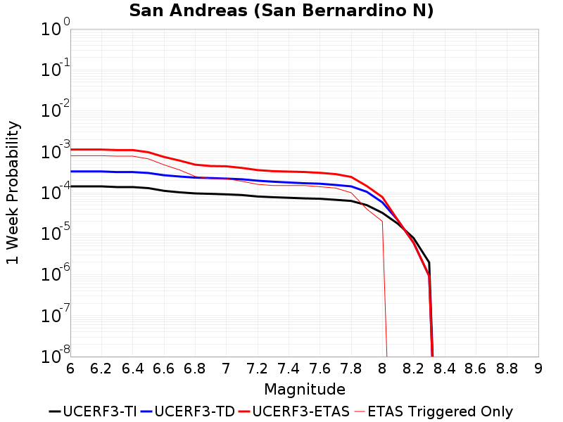 |  | 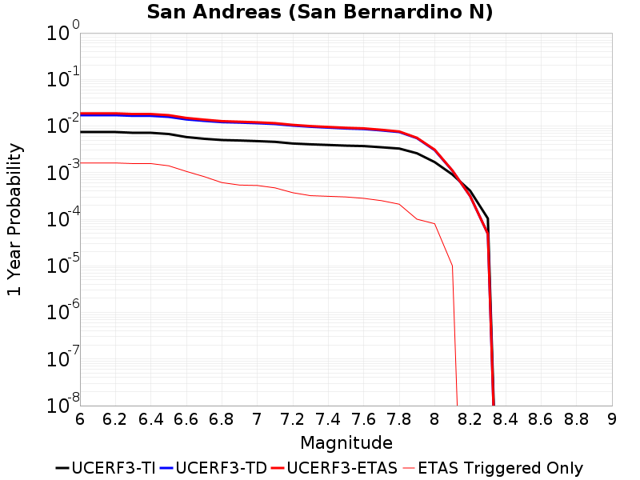 |  |

| Magnitude | 1 wk TI Prob | 1 wk TD Prob | 1 wk ETAS Prob | 1 wk ETAS/TD Gain | 1 wk ETAS Triggered Only | 1 mo TI Prob | 1 mo TD Prob | 1 mo ETAS Prob | 1 mo ETAS/TD Gain | 1 mo ETAS Triggered Only | 1 yr TI Prob | 1 yr TD Prob | 1 yr ETAS Prob | 1 yr ETAS/TD Gain | 1 yr ETAS Triggered Only | 10 yr TI Prob | 10 yr TD Prob | 10 yr ETAS Prob | 10 yr ETAS/TD Gain | 10 yr ETAS Triggered Only |
|-----|-----|-----|-----|-----|-----|-----|-----|-----|-----|-----|-----|-----|-----|-----|-----|-----|-----|-----|-----|-----|
| 6.0 | 1.4273766E-4 | 3.3015068E-4 | 0.0011298866 | 3.4223359 | 8.0E-4 | 6.115894E-4 | 0.0014141704 | 0.0025425723 | 1.7979251 | 0.00113 | 0.0074207084 | 0.01708319 | 0.018665686 | 1.0926347 | 0.00161 | 0.07177748 | 0.15598509 | 0.15751275 | 1.0097936 | 0.00181 |
| 6.1 | 1.4273766E-4 | 3.3015068E-4 | 0.0011298866 | 3.4223359 | 8.0E-4 | 6.115894E-4 | 0.0014141704 | 0.0025425723 | 1.7979251 | 0.00113 | 0.0074207084 | 0.01708319 | 0.018665686 | 1.0926347 | 0.00161 | 0.07177748 | 0.15598509 | 0.15751275 | 1.0097936 | 0.00181 |
| 6.2 | 1.4273766E-4 | 3.3015068E-4 | 0.0011298866 | 3.4223359 | 8.0E-4 | 6.115894E-4 | 0.0014141704 | 0.0025425723 | 1.7979251 | 0.00113 | 0.0074207084 | 0.01708319 | 0.018665686 | 1.0926347 | 0.00161 | 0.07177748 | 0.15598509 | 0.15751275 | 1.0097936 | 0.00181 |
| 6.3 | 1.3730655E-4 | 3.191133E-4 | 0.0010988644 | 3.4434931 | 7.8E-4 | 5.883239E-4 | 0.0013669173 | 0.0024654137 | 1.8036305 | 0.0011 | 0.0071393442 | 0.016516712 | 0.018050946 | 1.0928898 | 0.00156 | 0.06914291 | 0.15128593 | 0.15274572 | 1.0096492 | 0.00172 |
| 6.4 | 1.3730655E-4 | 3.191133E-4 | 0.0010988644 | 3.4434931 | 7.8E-4 | 5.883239E-4 | 0.0013669173 | 0.0024654137 | 1.8036305 | 0.0011 | 0.0071393442 | 0.016516712 | 0.018050946 | 1.0928898 | 0.00156 | 0.06914291 | 0.15128593 | 0.15274572 | 1.0096492 | 0.00172 |
| 6.5 | 1.2942807E-4 | 3.0313266E-4 | 9.729296E-4 | 3.2095833 | 6.7E-4 | 5.545738E-4 | 0.0012984985 | 0.002267239 | 1.7460467 | 9.7E-4 | 0.0067310524 | 0.015695944 | 0.01707397 | 1.087795 | 0.0014 | 0.06530788 | 0.1444209 | 0.14572994 | 1.0090641 | 0.00153 |
| 6.6 | 1.1125901E-4 | 2.6718937E-4 | 7.4706116E-4 | 2.7959986 | 4.8E-4 | 4.767372E-4 | 0.0011445972 | 0.0018937388 | 1.6545023 | 7.5E-4 | 0.005788839 | 0.013847115 | 0.0148924375 | 1.0754902 | 0.00106 | 0.056403454 | 0.12869553 | 0.12969753 | 1.0077858 | 0.00115 |
| 6.7 | 1.02209575E-4 | 2.48415E-4 | 6.083255E-4 | 2.448828 | 3.6E-4 | 4.3796748E-4 | 0.0010642027 | 0.0016435855 | 1.544429 | 5.8E-4 | 0.0053192247 | 0.012880161 | 0.0136896 | 1.0628438 | 8.2E-4 | 0.051936906 | 0.120487615 | 0.12127038 | 1.0064967 | 8.9E-4 |
| 6.8 | 9.610582E-5 | 2.3344472E-4 | 4.8338636E-4 | 2.0706673 | 2.5E-4 | 4.1181705E-4 | 0.0010000945 | 0.0014096844 | 1.4095513 | 4.1E-4 | 0.0050023515 | 0.012108472 | 0.012711086 | 1.049768 | 6.1E-4 | 0.048912346 | 0.1138495 | 0.11443436 | 1.0051371 | 6.6E-4 |
| 6.9 | 9.3877505E-5 | 2.2793157E-4 | 4.4788144E-4 | 1.9649819 | 2.2E-4 | 4.0227012E-4 | 9.7648456E-4 | 0.0013461233 | 1.3785403 | 3.7E-4 | 0.0048866454 | 0.011824172 | 0.012357787 | 1.0451292 | 5.4E-4 | 0.04780577 | 0.11142838 | 0.11195264 | 1.0047048 | 5.9E-4 |
| 7.0 | 9.1019785E-5 | 2.2109754E-4 | 4.4104888E-4 | 1.994816 | 2.2E-4 | 3.900265E-4 | 9.472174E-4 | 0.0013068764 | 1.3797005 | 3.6E-4 | 0.0047382377 | 0.011471648 | 0.011995568 | 1.0456709 | 5.3E-4 | 0.046384744 | 0.108372636 | 0.10888086 | 1.0046896 | 5.7E-4 |
| 7.1 | 8.771155E-5 | 2.1272291E-4 | 4.026825E-4 | 1.8929907 | 1.9E-4 | 3.758525E-4 | 9.1135164E-4 | 0.00123106 | 1.3508068 | 3.2E-4 | 0.0045664064 | 0.0110394815 | 0.011504293 | 1.0421045 | 4.7E-4 | 0.044737056 | 0.10465883 | 0.10511545 | 1.004363 | 5.1E-4 |
| 7.2 | 8.0830236E-5 | 1.9652353E-4 | 3.564921E-4 | 1.8139919 | 1.6E-4 | 3.4636928E-4 | 8.41972E-4 | 0.0011017531 | 1.3085389 | 2.6E-4 | 0.0042088944 | 0.010202955 | 0.01056918 | 1.035894 | 3.7E-4 | 0.041300658 | 0.09732142 | 0.0976825 | 1.0037102 | 4.0E-4 |
| 7.3 | 7.7668235E-5 | 1.8568459E-4 | 3.3565675E-4 | 1.8076714 | 1.5E-4 | 3.328214E-4 | 7.955485E-4 | 0.0010153735 | 1.2763188 | 2.2E-4 | 0.0040445733 | 0.009642886 | 0.0099598 | 1.032865 | 3.2E-4 | 0.03971748 | 0.09251023 | 0.092818774 | 1.0033352 | 3.4E-4 |
| 7.4 | 7.520177E-5 | 1.776698E-4 | 3.2764315E-4 | 1.8441128 | 1.5E-4 | 3.2225347E-4 | 7.612199E-4 | 9.7106E-4 | 1.275663 | 2.1E-4 | 0.0039163795 | 0.009228552 | 0.009535692 | 1.0332814 | 3.1E-4 | 0.038480744 | 0.088901676 | 0.08920234 | 1.003382 | 3.3E-4 |
| 7.5 | 7.274697E-5 | 1.7034545E-4 | 3.203199E-4 | 1.8804135 | 1.5E-4 | 3.1173544E-4 | 7.2984776E-4 | 9.3969447E-4 | 1.2875212 | 2.1E-4 | 0.003788775 | 0.008849764 | 0.0091471085 | 1.0335993 | 3.0E-4 | 0.03724827 | 0.08555548 | 0.0858481 | 1.0034202 | 3.2E-4 |
| 7.6 | 7.1185845E-5 | 1.6591606E-4 | 3.0589284E-4 | 1.8436601 | 1.4E-4 | 3.0504653E-4 | 7.1087515E-4 | 9.007401E-4 | 1.2670861 | 1.9E-4 | 0.0037076178 | 0.008620624 | 0.008898211 | 1.0322002 | 2.8E-4 | 0.036463667 | 0.08350282 | 0.08377777 | 1.0032927 | 3.0E-4 |
| 7.7 | 6.709961E-5 | 1.5466686E-4 | 2.8464675E-4 | 1.8403862 | 1.3E-4 | 2.8753807E-4 | 6.626896E-4 | 8.425703E-4 | 1.2714404 | 1.8E-4 | 0.003495157 | 0.008038448 | 0.008286439 | 1.0308505 | 2.5E-4 | 0.034406938 | 0.07821299 | 0.07846187 | 1.003182 | 2.7E-4 |
| 7.8 | 6.300812E-5 | 1.4279228E-4 | 2.4277801E-4 | 1.700218 | 1.0E-4 | 2.7000686E-4 | 6.1182346E-4 | 7.517378E-4 | 1.2286842 | 1.4E-4 | 0.0032823787 | 0.0074235466 | 0.007631988 | 1.0280783 | 2.1E-4 | 0.032343175 | 0.072588325 | 0.072801635 | 1.0029385 | 2.3E-4 |
| 7.9 | 4.983037E-5 | 1.0538302E-4 | 1.4537881E-4 | 1.3795278 | 4.0E-5 | 2.1354125E-4 | 4.5156336E-4 | 5.1153626E-4 | 1.1328117 | 6.0E-5 | 0.0025967648 | 0.005483939 | 0.00558339 | 1.0181351 | 1.0E-4 | 0.025666296 | 0.054441914 | 0.054545924 | 1.0019104 | 1.1E-4 |
| 8.0 | 3.2211527E-5 | 5.8138667E-5 | 7.8137506E-5 | 1.3439851 | 2.0E-5 | 1.380421E-4 | 2.4914194E-4 | 2.8913197E-4 | 1.160511 | 4.0E-5 | 0.0016793669 | 0.0030290862 | 0.003108844 | 1.0263306 | 8.0E-5 | 0.016667323 | 0.030706348 | 0.030783892 | 1.0025253 | 8.0E-5 |
| 8.1 | 1.743376E-5 | 2.1082775E-5 | 2.1082775E-5 | 1.0 | 0.0 | 7.471398E-5 | 9.035162E-5 | 9.035162E-5 | 1.0 | 0.0 | 9.0926304E-4 | 0.0010994767 | 0.0011094657 | 1.0090852 | 1.0E-5 | 0.009055517 | 0.011648702 | 0.011658587 | 1.0008484 | 1.0E-5 |
| 8.2 | 7.831616E-6 | 6.004723E-6 | 6.004723E-6 | 1.0 | 0.0 | 3.3563636E-5 | 2.5734274E-5 | 2.5734274E-5 | 1.0 | 0.0 | 4.0856065E-4 | 3.1326985E-4 | 3.1326985E-4 | 1.0 | 0.0 | 0.004078103 | 0.0034984134 | 0.0034984134 | 1.0 | 0.0 |
| 8.3 | 1.983087E-6 | 9.274416E-7 | 9.274416E-7 | 1.0 | 0.0 | 8.498917E-6 | 3.974744E-6 | 3.974744E-6 | 1.0 | 0.0 | 1.034694E-4 | 4.8391455E-5 | 4.8391455E-5 | 1.0 | 0.0 | 0.0010342124 | 5.6326366E-4 | 5.6326366E-4 | 1.0 | 0.0 |

## San Andreas (Mojave S)
*[(top)](#table-of-contents)*

| 1 Week | 1 Month | 1 Year | 10 Year |
|-----|-----|-----|-----|
| 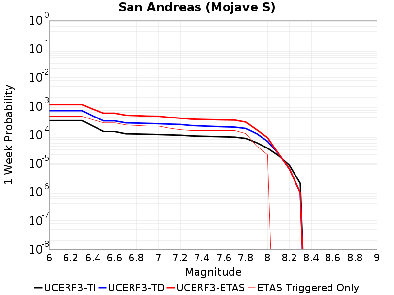 | 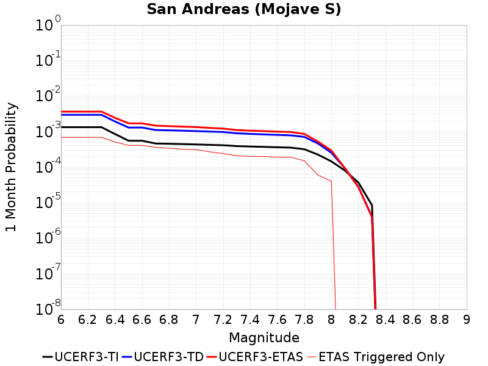 |  | 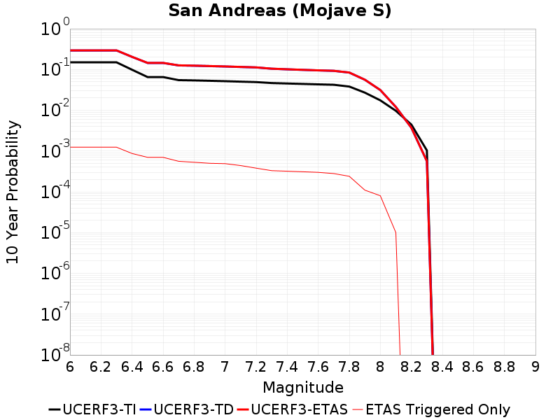 |

| Magnitude | 1 wk TI Prob | 1 wk TD Prob | 1 wk ETAS Prob | 1 wk ETAS/TD Gain | 1 wk ETAS Triggered Only | 1 mo TI Prob | 1 mo TD Prob | 1 mo ETAS Prob | 1 mo ETAS/TD Gain | 1 mo ETAS Triggered Only | 1 yr TI Prob | 1 yr TD Prob | 1 yr ETAS Prob | 1 yr ETAS/TD Gain | 1 yr ETAS Triggered Only | 10 yr TI Prob | 10 yr TD Prob | 10 yr ETAS Prob | 10 yr ETAS/TD Gain | 10 yr ETAS Triggered Only |
|-----|-----|-----|-----|-----|-----|-----|-----|-----|-----|-----|-----|-----|-----|-----|-----|-----|-----|-----|-----|-----|
| 6.0 | 3.1064058E-4 | 6.924783E-4 | 0.0011321737 | 1.634959 | 4.4E-4 | 0.0013306376 | 0.0029645183 | 0.0036524727 | 1.2320628 | 6.9E-4 | 0.016080605 | 0.035465226 | 0.036477987 | 1.0285565 | 0.00105 | 0.1496549 | 0.29262888 | 0.293506 | 1.0029974 | 0.00124 |
| 6.1 | 3.1064058E-4 | 6.924783E-4 | 0.0011321737 | 1.634959 | 4.4E-4 | 0.0013306376 | 0.0029645183 | 0.0036524727 | 1.2320628 | 6.9E-4 | 0.016080605 | 0.035465226 | 0.036477987 | 1.0285565 | 0.00105 | 0.1496549 | 0.29262888 | 0.293506 | 1.0029974 | 0.00124 |
| 6.2 | 3.1064058E-4 | 6.924783E-4 | 0.0011321737 | 1.634959 | 4.4E-4 | 0.0013306376 | 0.0029645183 | 0.0036524727 | 1.2320628 | 6.9E-4 | 0.016080605 | 0.035465226 | 0.036477987 | 1.0285565 | 0.00105 | 0.1496549 | 0.29262888 | 0.293506 | 1.0029974 | 0.00124 |
| 6.3 | 3.1064058E-4 | 6.924783E-4 | 0.0011321737 | 1.634959 | 4.4E-4 | 0.0013306376 | 0.0029645183 | 0.0036524727 | 1.2320628 | 6.9E-4 | 0.016080605 | 0.035465226 | 0.036477987 | 1.0285565 | 0.00105 | 0.1496549 | 0.29262888 | 0.293506 | 1.0029974 | 0.00124 |
| 6.4 | 1.9872203E-4 | 4.4860455E-4 | 7.784565E-4 | 1.7352844 | 3.3E-4 | 8.5138786E-4 | 0.001921203 | 0.0024302232 | 1.2649487 | 5.1E-4 | 0.010316478 | 0.023146125 | 0.023908071 | 1.0329189 | 7.8E-4 | 0.098504856 | 0.2034394 | 0.2041324 | 1.0034064 | 8.7E-4 |
| 6.5 | 1.291105E-4 | 3.032716E-4 | 5.6319276E-4 | 1.8570573 | 2.6E-4 | 5.5321335E-4 | 0.0012990908 | 0.0017085582 | 1.3151953 | 4.1E-4 | 0.006714592 | 0.015702628 | 0.016332578 | 1.0401175 | 6.4E-4 | 0.065152965 | 0.14449857 | 0.14509742 | 1.0041443 | 7.0E-4 |
| 6.6 | 1.291105E-4 | 3.032716E-4 | 5.6319276E-4 | 1.8570573 | 2.6E-4 | 5.5321335E-4 | 0.0012990908 | 0.0017085582 | 1.3151953 | 4.1E-4 | 0.006714592 | 0.015702628 | 0.016332578 | 1.0401175 | 6.4E-4 | 0.065152965 | 0.14449857 | 0.14509742 | 1.0041443 | 7.0E-4 |
| 6.7 | 1.08001186E-4 | 2.5878235E-4 | 4.7872541E-4 | 1.8499153 | 2.2E-4 | 4.6278012E-4 | 0.0011085965 | 0.0014681973 | 1.3243749 | 3.6E-4 | 0.0056198016 | 0.013413982 | 0.013927006 | 1.0382456 | 5.2E-4 | 0.054797906 | 0.1256805 | 0.12617013 | 1.0038958 | 5.6E-4 |
| 6.8 | 1.0624356E-4 | 2.5390257E-4 | 4.6384925E-4 | 1.8268789 | 2.1E-4 | 4.5525006E-4 | 0.0010877006 | 0.0014273308 | 1.312246 | 3.4E-4 | 0.0055285925 | 0.013162668 | 0.013646218 | 1.0367365 | 4.9E-4 | 0.053930566 | 0.1236241 | 0.124088585 | 1.0037572 | 5.3E-4 |
| 6.9 | 1.0393785E-4 | 2.4753125E-4 | 4.4748173E-4 | 1.8077788 | 2.0E-4 | 4.4537184E-4 | 0.0010604174 | 0.001380078 | 1.301448 | 3.2E-4 | 0.0054089287 | 0.012834448 | 0.013288545 | 1.0353811 | 4.6E-4 | 0.05279156 | 0.120914355 | 0.1213539 | 1.0036352 | 5.0E-4 |
| 7.0 | 1.0155622E-4 | 2.4114102E-4 | 4.410928E-4 | 1.8291901 | 2.0E-4 | 4.3516833E-4 | 0.0010330527 | 0.0013427325 | 1.2997715 | 3.1E-4 | 0.005285311 | 0.01250515 | 0.0129495235 | 1.0355352 | 4.5E-4 | 0.05161361 | 0.118156984 | 0.11858909 | 1.003657 | 4.9E-4 |
| 7.1 | 9.885595E-5 | 2.3392747E-4 | 4.038877E-4 | 1.7265509 | 1.7E-4 | 4.2359953E-4 | 0.0010021615 | 0.001271891 | 1.2691476 | 2.7E-4 | 0.0051451353 | 0.012133295 | 0.012528441 | 1.0325671 | 4.0E-4 | 0.05027629 | 0.11502832 | 0.115417704 | 1.0033852 | 4.4E-4 |
| 7.2 | 9.6411415E-5 | 2.2746743E-4 | 3.7743332E-4 | 1.6592851 | 1.5E-4 | 4.1312634E-4 | 9.7449654E-4 | 0.0012142627 | 1.246041 | 2.4E-4 | 0.005018219 | 0.011800171 | 0.012146041 | 1.0293106 | 3.5E-4 | 0.049064007 | 0.11220071 | 0.11253807 | 1.0030068 | 3.8E-4 |
| 7.3 | 9.1180635E-5 | 2.092346E-4 | 3.492053E-4 | 1.6689653 | 1.4E-4 | 3.907156E-4 | 8.9641166E-4 | 0.0011062234 | 1.2340573 | 2.1E-4 | 0.004746591 | 0.010859339 | 0.011165972 | 1.0282369 | 3.1E-4 | 0.046464786 | 0.1042621 | 0.104557686 | 1.0028352 | 3.3E-4 |
| 7.4 | 8.887388E-5 | 2.0150664E-4 | 3.4147842E-4 | 1.6946262 | 1.4E-4 | 3.8083247E-4 | 8.6331414E-4 | 0.0010631415 | 1.2314653 | 2.0E-4 | 0.0046267817 | 0.010460316 | 0.010757179 | 1.0283798 | 3.0E-4 | 0.045316286 | 0.10083773 | 0.101125464 | 1.0028534 | 3.2E-4 |
| 7.5 | 8.6750515E-5 | 1.9462383E-4 | 3.3459658E-4 | 1.7191963 | 1.4E-4 | 3.7173493E-4 | 8.338356E-4 | 0.0010336689 | 1.2396554 | 2.0E-4 | 0.004516484 | 0.0101048015 | 0.010391871 | 1.0284092 | 2.9E-4 | 0.04425787 | 0.09774272 | 0.09802242 | 1.0028616 | 3.1E-4 |
| 7.6 | 8.453092E-5 | 1.8828709E-4 | 3.2826074E-4 | 1.7434053 | 1.4E-4 | 3.6222505E-4 | 8.066952E-4 | 9.965419E-4 | 1.2353388 | 1.9E-4 | 0.0044011753 | 0.009777381 | 0.010054643 | 1.0283575 | 2.8E-4 | 0.04315024 | 0.09483044 | 0.09510199 | 1.0028635 | 3.0E-4 |
| 7.7 | 8.259102E-5 | 1.8332367E-4 | 3.23298E-4 | 1.7635366 | 1.4E-4 | 3.539135E-4 | 7.8543636E-4 | 9.7528717E-4 | 1.2417138 | 1.9E-4 | 0.004300386 | 0.009520847 | 0.009778372 | 1.0270485 | 2.6E-4 | 0.042181134 | 0.09251477 | 0.09276886 | 1.0027466 | 2.8E-4 |
| 7.8 | 7.444844E-5 | 1.6525968E-4 | 2.752415E-4 | 1.6655091 | 1.1E-4 | 3.1902574E-4 | 7.080636E-4 | 8.579574E-4 | 1.2116953 | 1.5E-4 | 0.0038772223 | 0.008586663 | 0.008804774 | 1.0254011 | 2.2E-4 | 0.03810269 | 0.083833314 | 0.084053196 | 1.0026228 | 2.4E-4 |
| 7.9 | 5.2586525E-5 | 1.084173E-4 | 1.4841296E-4 | 1.3689048 | 4.0E-5 | 2.2535135E-4 | 4.6456285E-4 | 5.2453496E-4 | 1.1290936 | 6.0E-5 | 0.0027402006 | 0.005641399 | 0.005740835 | 1.017626 | 1.0E-4 | 0.027066574 | 0.056088235 | 0.056192063 | 1.0018512 | 1.1E-4 |
| 8.0 | 3.379877E-5 | 5.901009E-5 | 7.900891E-5 | 1.3389051 | 2.0E-5 | 1.4484383E-4 | 2.5287588E-4 | 2.9286576E-4 | 1.1581404 | 4.0E-5 | 0.0017620471 | 0.0030744197 | 0.0031541737 | 1.0259411 | 8.0E-5 | 0.017481409 | 0.031234503 | 0.031312004 | 1.0024812 | 8.0E-5 |
| 8.1 | 1.8668277E-5 | 2.1646763E-5 | 2.1646763E-5 | 1.0 | 0.0 | 8.000444E-5 | 9.276855E-5 | 9.276855E-5 | 1.0 | 0.0 | 9.736188E-4 | 0.0011288726 | 0.0011388613 | 1.0088484 | 1.0E-5 | 0.009693642 | 0.012008195 | 0.012018074 | 1.0008228 | 1.0E-5 |
| 8.2 | 8.541571E-6 | 6.3636194E-6 | 6.3636194E-6 | 1.0 | 0.0 | 3.660622E-5 | 2.727237E-5 | 2.727237E-5 | 1.0 | 0.0 | 4.455896E-4 | 3.3199062E-4 | 3.3199062E-4 | 1.0 | 0.0 | 0.0044469717 | 0.0037277716 | 0.0037277716 | 1.0 | 0.0 |
| 8.3 | 1.983087E-6 | 9.274416E-7 | 9.274416E-7 | 1.0 | 0.0 | 8.498917E-6 | 3.974744E-6 | 3.974744E-6 | 1.0 | 0.0 | 1.034694E-4 | 4.8391455E-5 | 4.8391455E-5 | 1.0 | 0.0 | 0.0010342124 | 5.6326366E-4 | 5.6326366E-4 | 1.0 | 0.0 |

## San Andreas (San Bernardino S)
*[(top)](#table-of-contents)*

| 1 Week | 1 Month | 1 Year | 10 Year |
|-----|-----|-----|-----|
| 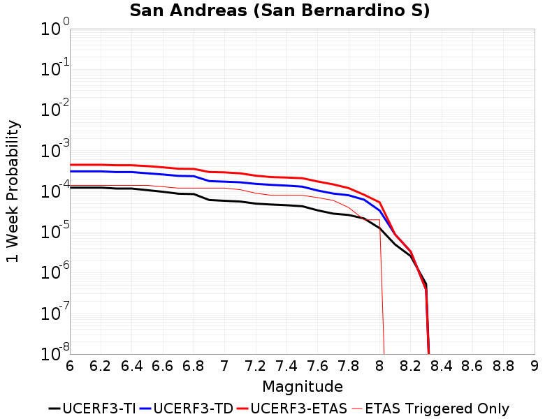 |  |  |  |

| Magnitude | 1 wk TI Prob | 1 wk TD Prob | 1 wk ETAS Prob | 1 wk ETAS/TD Gain | 1 wk ETAS Triggered Only | 1 mo TI Prob | 1 mo TD Prob | 1 mo ETAS Prob | 1 mo ETAS/TD Gain | 1 mo ETAS Triggered Only | 1 yr TI Prob | 1 yr TD Prob | 1 yr ETAS Prob | 1 yr ETAS/TD Gain | 1 yr ETAS Triggered Only | 10 yr TI Prob | 10 yr TD Prob | 10 yr ETAS Prob | 10 yr ETAS/TD Gain | 10 yr ETAS Triggered Only |
|-----|-----|-----|-----|-----|-----|-----|-----|-----|-----|-----|-----|-----|-----|-----|-----|-----|-----|-----|-----|-----|
| 6.0 | 1.2336002E-4 | 3.097965E-4 | 4.4975313E-4 | 1.4517696 | 1.4E-4 | 5.2857865E-4 | 0.0013270507 | 0.0015267853 | 1.1505102 | 2.0E-4 | 0.006416472 | 0.016042307 | 0.016307976 | 1.0165606 | 2.7E-4 | 0.06234337 | 0.14657676 | 0.14686692 | 1.0019796 | 3.4E-4 |
| 6.1 | 1.2336002E-4 | 3.097965E-4 | 4.4975313E-4 | 1.4517696 | 1.4E-4 | 5.2857865E-4 | 0.0013270507 | 0.0015267853 | 1.1505102 | 2.0E-4 | 0.006416472 | 0.016042307 | 0.016307976 | 1.0165606 | 2.7E-4 | 0.06234337 | 0.14657676 | 0.14686692 | 1.0019796 | 3.4E-4 |
| 6.2 | 1.2336002E-4 | 3.097965E-4 | 4.4975313E-4 | 1.4517696 | 1.4E-4 | 5.2857865E-4 | 0.0013270507 | 0.0015267853 | 1.1505102 | 2.0E-4 | 0.006416472 | 0.016042307 | 0.016307976 | 1.0165606 | 2.7E-4 | 0.06234337 | 0.14657676 | 0.14686692 | 1.0019796 | 3.4E-4 |
| 6.3 | 1.1712257E-4 | 2.975606E-4 | 4.3751893E-4 | 1.4703524 | 1.4E-4 | 5.018573E-4 | 0.001274663 | 0.0014744081 | 1.1567042 | 2.0E-4 | 0.006093008 | 0.015413632 | 0.01567947 | 1.017247 | 2.7E-4 | 0.059286322 | 0.14125793 | 0.1415499 | 1.002067 | 3.4E-4 |
| 6.4 | 1.1712257E-4 | 2.975606E-4 | 4.3751893E-4 | 1.4703524 | 1.4E-4 | 5.018573E-4 | 0.001274663 | 0.0014744081 | 1.1567042 | 2.0E-4 | 0.006093008 | 0.015413632 | 0.01567947 | 1.017247 | 2.7E-4 | 0.059286322 | 0.14125793 | 0.1415499 | 1.002067 | 3.4E-4 |
| 6.5 | 1.0689076E-4 | 2.7749472E-4 | 4.1745589E-4 | 1.504374 | 1.4E-4 | 4.5802278E-4 | 0.0011887468 | 0.0013885091 | 1.1680444 | 2.0E-4 | 0.0055621783 | 0.014381751 | 0.014647868 | 1.0185038 | 2.7E-4 | 0.05425003 | 0.13245565 | 0.13274193 | 1.0021614 | 3.3E-4 |
| 6.6 | 9.7648895E-5 | 2.5974942E-4 | 3.8971566E-4 | 1.5003524 | 1.3E-4 | 4.1842813E-4 | 0.0011127613 | 0.00130255 | 1.1705564 | 1.9E-4 | 0.005082469 | 0.013468254 | 0.013724752 | 1.0190446 | 2.6E-4 | 0.049677886 | 0.124587454 | 0.12486759 | 1.0022485 | 3.2E-4 |
| 6.7 | 8.757013E-5 | 2.4026322E-4 | 3.602344E-4 | 1.4993322 | 1.2E-4 | 3.7524657E-4 | 0.0010293163 | 0.0012091311 | 1.1746933 | 1.8E-4 | 0.00455906 | 0.01246417 | 0.012711055 | 1.0198075 | 2.5E-4 | 0.04466656 | 0.11582507 | 0.11609917 | 1.0023664 | 3.1E-4 |
| 6.8 | 8.562978E-5 | 2.3578027E-4 | 3.5575198E-4 | 1.5088284 | 1.2E-4 | 3.6693315E-4 | 0.0010101186 | 0.0011899368 | 1.1780169 | 1.8E-4 | 0.004458263 | 0.012233079 | 0.0124800205 | 1.0201864 | 2.5E-4 | 0.043698758 | 0.11380491 | 0.11407963 | 1.002414 | 3.1E-4 |
| 6.9 | 6.124075E-5 | 1.7859154E-4 | 2.985701E-4 | 1.6718043 | 1.2E-4 | 2.6243398E-4 | 7.6516863E-4 | 9.450309E-4 | 1.2350622 | 1.8E-4 | 0.0031904527 | 0.00927636 | 0.009514133 | 1.0256323 | 2.4E-4 | 0.031450346 | 0.08755119 | 0.087815806 | 1.0030223 | 2.9E-4 |
| 7.0 | 5.8598747E-5 | 1.7277726E-4 | 2.9275654E-4 | 1.6944158 | 1.2E-4 | 2.5111332E-4 | 7.4026466E-4 | 9.2013145E-4 | 1.2429763 | 1.8E-4 | 0.0030530186 | 0.008975689 | 0.009213535 | 1.0264989 | 2.4E-4 | 0.03011414 | 0.08483475 | 0.085090995 | 1.0030205 | 2.8E-4 |
| 7.1 | 5.613814E-5 | 1.6686457E-4 | 2.768462E-4 | 1.6591072 | 1.1E-4 | 2.4056983E-4 | 7.149386E-4 | 8.848171E-4 | 1.2376126 | 1.7E-4 | 0.0029250039 | 0.008669835 | 0.00889784 | 1.0262988 | 2.3E-4 | 0.028868021 | 0.08210305 | 0.08235088 | 1.0030185 | 2.7E-4 |
| 7.2 | 4.991222E-5 | 1.5269252E-4 | 2.4267878E-4 | 1.5893298 | 9.0E-5 | 2.1389198E-4 | 6.542328E-4 | 7.741543E-4 | 1.183301 | 1.2E-4 | 0.002601025 | 0.007936308 | 0.008104959 | 1.0212505 | 1.7E-4 | 0.025707912 | 0.075473085 | 0.07565799 | 1.00245 | 2.0E-4 |
| 7.3 | 4.7410045E-5 | 1.4442565E-4 | 2.2441409E-4 | 1.5538383 | 8.0E-5 | 2.0317009E-4 | 6.188206E-4 | 7.187587E-4 | 1.1614977 | 1.0E-4 | 0.0024707897 | 0.007508209 | 0.0076570828 | 1.0198281 | 1.5E-4 | 0.024434982 | 0.07168167 | 0.07183948 | 1.0022016 | 1.7E-4 |
| 7.4 | 4.5556746E-5 | 1.3834705E-4 | 2.1833599E-4 | 1.5781759 | 8.0E-5 | 1.952286E-4 | 5.927816E-4 | 6.827282E-4 | 1.1517366 | 9.0E-5 | 0.002374317 | 0.0071933204 | 0.0073323133 | 1.0193225 | 1.4E-4 | 0.023491086 | 0.068879455 | 0.06902843 | 1.0021629 | 1.6E-4 |
| 7.5 | 4.3084514E-5 | 1.3050942E-4 | 2.1049898E-4 | 1.6129025 | 8.0E-5 | 1.8463485E-4 | 5.592065E-4 | 6.4915617E-4 | 1.1608523 | 9.0E-5 | 0.0022456115 | 0.006787165 | 0.006926215 | 1.0204872 | 1.4E-4 | 0.022230545 | 0.06521165 | 0.065361224 | 1.0022936 | 1.6E-4 |
| 7.6 | 3.408608E-5 | 1.0462969E-4 | 1.7462237E-4 | 1.6689562 | 7.0E-5 | 1.4607502E-4 | 4.48336E-4 | 5.283001E-4 | 1.1783576 | 8.0E-5 | 0.0017770125 | 0.0054448587 | 0.005574151 | 1.0237458 | 1.3E-4 | 0.017628696 | 0.052789096 | 0.052931175 | 1.0026915 | 1.5E-4 |
| 7.7 | 2.8315713E-5 | 8.83157E-5 | 1.483104E-4 | 1.6793209 | 6.0E-5 | 1.2134742E-4 | 3.7844098E-4 | 4.4841447E-4 | 1.1848994 | 7.0E-5 | 0.0014764034 | 0.0045977957 | 0.004697336 | 1.0216496 | 1.0E-4 | 0.01466633 | 0.044863667 | 0.044978287 | 1.0025548 | 1.2E-4 |
| 7.8 | 2.6222975E-5 | 8.001211E-5 | 1.2000891E-4 | 1.4998842 | 4.0E-5 | 1.1237934E-4 | 3.4286402E-4 | 3.828503E-4 | 1.1166244 | 4.0E-5 | 0.0013673597 | 0.004166387 | 0.004236095 | 1.0167311 | 7.0E-5 | 0.013589768 | 0.04084403 | 0.040930353 | 1.0021135 | 9.0E-5 |
| 7.9 | 2.1469694E-5 | 6.2167055E-5 | 8.216581E-5 | 1.3216938 | 2.0E-5 | 9.200973E-5 | 2.6640305E-4 | 2.8639773E-4 | 1.0750542 | 2.0E-5 | 0.0011196428 | 0.003238637 | 0.0032785074 | 1.0123109 | 4.0E-5 | 0.011140184 | 0.03209778 | 0.032146174 | 1.0015078 | 5.0E-5 |
| 8.0 | 1.2420249E-5 | 3.3693286E-5 | 5.3692613E-5 | 1.5935701 | 2.0E-5 | 5.322855E-5 | 1.4439182E-4 | 1.6438893E-4 | 1.138492 | 2.0E-5 | 6.478649E-4 | 0.0017565539 | 0.0017964836 | 1.0227319 | 4.0E-5 | 0.0064597935 | 0.017623177 | 0.017662473 | 1.0022297 | 4.0E-5 |
| 8.1 | 4.9197724E-6 | 8.678764E-6 | 8.678764E-6 | 1.0 | 0.0 | 2.1084568E-5 | 3.7194175E-5 | 3.7194175E-5 | 1.0 | 0.0 | 2.566744E-4 | 4.5274512E-4 | 4.627406E-4 | 1.0220774 | 1.0E-5 | 0.002563781 | 0.0048095966 | 0.004819548 | 1.0020692 | 1.0E-5 |
| 8.2 | 2.5634774E-6 | 3.3184622E-6 | 3.3184622E-6 | 1.0 | 0.0 | 1.0986286E-5 | 1.4221903E-5 | 1.4221903E-5 | 1.0 | 0.0 | 1.3374983E-4 | 1.7313797E-4 | 1.7313797E-4 | 1.0 | 0.0 | 0.0013366934 | 0.001917574 | 0.001917574 | 1.0 | 0.0 |
| 8.3 | 5.2850464E-7 | 3.794199E-7 | 3.794199E-7 | 1.0 | 0.0 | 2.2650179E-6 | 1.6260844E-6 | 1.6260844E-6 | 1.0 | 0.0 | 2.7576245E-5 | 1.9797415E-5 | 1.9797415E-5 | 1.0 | 0.0 | 2.7572823E-4 | 2.3098527E-4 | 2.3098527E-4 | 1.0 | 0.0 |

## San Andreas (Mojave N)
*[(top)](#table-of-contents)*

| 1 Week | 1 Month | 1 Year | 10 Year |
|-----|-----|-----|-----|
| 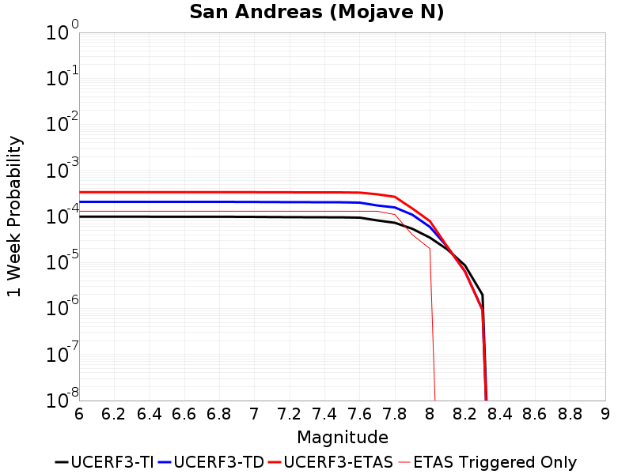 |  |  | 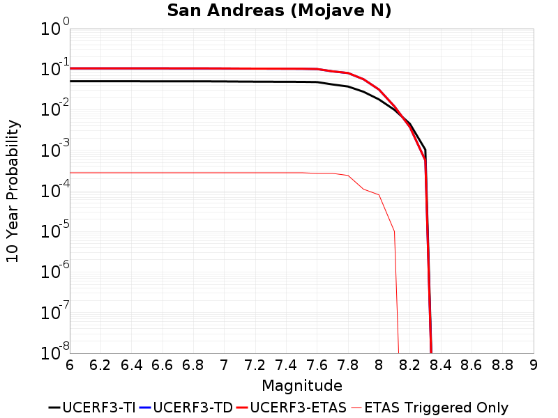 |

| Magnitude | 1 wk TI Prob | 1 wk TD Prob | 1 wk ETAS Prob | 1 wk ETAS/TD Gain | 1 wk ETAS Triggered Only | 1 mo TI Prob | 1 mo TD Prob | 1 mo ETAS Prob | 1 mo ETAS/TD Gain | 1 mo ETAS Triggered Only | 1 yr TI Prob | 1 yr TD Prob | 1 yr ETAS Prob | 1 yr ETAS/TD Gain | 1 yr ETAS Triggered Only | 10 yr TI Prob | 10 yr TD Prob | 10 yr ETAS Prob | 10 yr ETAS/TD Gain | 10 yr ETAS Triggered Only |
|-----|-----|-----|-----|-----|-----|-----|-----|-----|-----|-----|-----|-----|-----|-----|-----|-----|-----|-----|-----|-----|
| 6.0 | 9.877682E-5 | 2.0806151E-4 | 3.3803447E-4 | 1.6246853 | 1.3E-4 | 4.2326056E-4 | 8.913877E-4 | 0.0010812184 | 1.2129608 | 1.9E-4 | 0.0051410277 | 0.010798796 | 0.011055988 | 1.0238167 | 2.6E-4 | 0.05023708 | 0.10443302 | 0.10468378 | 1.0024011 | 2.8E-4 |
| 6.1 | 9.877682E-5 | 2.0806151E-4 | 3.3803447E-4 | 1.6246853 | 1.3E-4 | 4.2326056E-4 | 8.913877E-4 | 0.0010812184 | 1.2129608 | 1.9E-4 | 0.0051410277 | 0.010798796 | 0.011055988 | 1.0238167 | 2.6E-4 | 0.05023708 | 0.10443302 | 0.10468378 | 1.0024011 | 2.8E-4 |
| 6.2 | 9.877682E-5 | 2.0806151E-4 | 3.3803447E-4 | 1.6246853 | 1.3E-4 | 4.2326056E-4 | 8.913877E-4 | 0.0010812184 | 1.2129608 | 1.9E-4 | 0.0051410277 | 0.010798796 | 0.011055988 | 1.0238167 | 2.6E-4 | 0.05023708 | 0.10443302 | 0.10468378 | 1.0024011 | 2.8E-4 |
| 6.3 | 9.877682E-5 | 2.0806151E-4 | 3.3803447E-4 | 1.6246853 | 1.3E-4 | 4.2326056E-4 | 8.913877E-4 | 0.0010812184 | 1.2129608 | 1.9E-4 | 0.0051410277 | 0.010798796 | 0.011055988 | 1.0238167 | 2.6E-4 | 0.05023708 | 0.10443302 | 0.10468378 | 1.0024011 | 2.8E-4 |
| 6.4 | 9.877682E-5 | 2.0806151E-4 | 3.3803447E-4 | 1.6246853 | 1.3E-4 | 4.2326056E-4 | 8.913877E-4 | 0.0010812184 | 1.2129608 | 1.9E-4 | 0.0051410277 | 0.010798796 | 0.011055988 | 1.0238167 | 2.6E-4 | 0.05023708 | 0.10443302 | 0.10468378 | 1.0024011 | 2.8E-4 |
| 6.5 | 9.861474E-5 | 2.0779307E-4 | 3.3776605E-4 | 1.6254925 | 1.3E-4 | 4.2256617E-4 | 8.90238E-4 | 0.0010800689 | 1.2132361 | 1.9E-4 | 0.0051326132 | 0.010784937 | 0.011042133 | 1.0238477 | 2.6E-4 | 0.050156746 | 0.10430884 | 0.10455964 | 1.0024043 | 2.8E-4 |
| 6.6 | 9.861474E-5 | 2.0779307E-4 | 3.3776605E-4 | 1.6254925 | 1.3E-4 | 4.2256617E-4 | 8.90238E-4 | 0.0010800689 | 1.2132361 | 1.9E-4 | 0.0051326132 | 0.010784937 | 0.011042133 | 1.0238477 | 2.6E-4 | 0.050156746 | 0.10430884 | 0.10455964 | 1.0024043 | 2.8E-4 |
| 6.7 | 9.8552715E-5 | 2.0769027E-4 | 3.3766328E-4 | 1.625802 | 1.3E-4 | 4.223004E-4 | 8.8979775E-4 | 0.0010796287 | 1.2133417 | 1.9E-4 | 0.0051293927 | 0.01077963 | 0.011036827 | 1.0238596 | 2.6E-4 | 0.050125998 | 0.104261234 | 0.10451204 | 1.0024055 | 2.8E-4 |
| 6.8 | 9.8464974E-5 | 2.0753955E-4 | 3.3751255E-4 | 1.6262566 | 1.3E-4 | 4.219245E-4 | 8.8915223E-4 | 0.0010789833 | 1.2134967 | 1.9E-4 | 0.0051248376 | 0.010771849 | 0.011029048 | 1.023877 | 2.6E-4 | 0.05008251 | 0.1041905 | 0.10444132 | 1.0024074 | 2.8E-4 |
| 6.9 | 9.825824E-5 | 2.0721559E-4 | 3.3718866E-4 | 1.6272359 | 1.3E-4 | 4.2103877E-4 | 8.8776473E-4 | 0.0010775961 | 1.2138307 | 1.9E-4 | 0.0051141046 | 0.010755124 | 0.011012327 | 1.0239146 | 2.6E-4 | 0.049980022 | 0.10403898 | 0.10428985 | 1.0024112 | 2.8E-4 |
| 7.0 | 9.781462E-5 | 2.0652452E-4 | 3.3649767E-4 | 1.6293352 | 1.3E-4 | 4.1913814E-4 | 8.8480505E-4 | 0.0010746369 | 1.2145466 | 1.9E-4 | 0.005091073 | 0.010719444 | 0.010976657 | 1.023995 | 2.6E-4 | 0.04976007 | 0.103715464 | 0.10396642 | 1.0024197 | 2.8E-4 |
| 7.1 | 9.7121134E-5 | 2.0553386E-4 | 3.3550715E-4 | 1.6323692 | 1.3E-4 | 4.1616702E-4 | 8.8056223E-4 | 0.001070395 | 1.2155812 | 1.9E-4 | 0.005055068 | 0.010668295 | 0.010925521 | 1.0241113 | 2.6E-4 | 0.04941613 | 0.10325165 | 0.103502735 | 1.0024319 | 2.8E-4 |
| 7.2 | 9.663819E-5 | 2.0483746E-4 | 3.3481084E-4 | 1.6345196 | 1.3E-4 | 4.1409794E-4 | 8.775797E-4 | 0.001067413 | 1.2163146 | 1.9E-4 | 0.0050299936 | 0.010632338 | 0.010889573 | 1.0241936 | 2.6E-4 | 0.049176537 | 0.10292516 | 0.10317634 | 1.0024405 | 2.8E-4 |
| 7.3 | 9.6277574E-5 | 2.0435061E-4 | 3.3432405E-4 | 1.6360315 | 1.3E-4 | 4.125529E-4 | 8.7549456E-4 | 0.0010653283 | 1.2168301 | 1.9E-4 | 0.0050112694 | 0.010607199 | 0.010864441 | 1.0242517 | 2.6E-4 | 0.04899759 | 0.10269478 | 0.10294602 | 1.0024465 | 2.8E-4 |
| 7.4 | 9.593308E-5 | 2.0372756E-4 | 3.337011E-4 | 1.6379771 | 1.3E-4 | 4.1107697E-4 | 8.7282615E-4 | 0.0010626604 | 1.2174937 | 1.9E-4 | 0.0049933824 | 0.010575027 | 0.010832277 | 1.0243262 | 2.6E-4 | 0.04882661 | 0.10240652 | 0.10265784 | 1.0024542 | 2.8E-4 |
| 7.5 | 9.561707E-5 | 2.0316942E-4 | 3.3314302E-4 | 1.6397301 | 1.3E-4 | 4.0972308E-4 | 8.7043573E-4 | 0.0010602704 | 1.2180915 | 1.9E-4 | 0.0049769743 | 0.010546206 | 0.010803463 | 1.0243934 | 2.6E-4 | 0.048669744 | 0.102146655 | 0.10239805 | 1.0024612 | 2.8E-4 |
| 7.6 | 9.418194E-5 | 1.9955952E-4 | 3.2953356E-4 | 1.6513047 | 1.3E-4 | 4.0357444E-4 | 8.5497496E-4 | 0.001034821 | 1.2103525 | 1.8E-4 | 0.004902454 | 0.010359775 | 0.010607185 | 1.0238818 | 2.5E-4 | 0.047957025 | 0.10048273 | 0.1007256 | 1.0024171 | 2.7E-4 |
| 7.7 | 8.202141E-5 | 1.732071E-4 | 3.0318458E-4 | 1.7504166 | 1.3E-4 | 3.51473E-4 | 7.42105E-4 | 9.2197146E-4 | 1.2423732 | 1.8E-4 | 0.00427079 | 0.008997772 | 0.009245522 | 1.0275346 | 2.5E-4 | 0.04189639 | 0.08801125 | 0.088257484 | 1.0027978 | 2.7E-4 |
| 7.8 | 7.2859846E-5 | 1.5704025E-4 | 2.67023E-4 | 1.7003474 | 1.1E-4 | 3.1221908E-4 | 6.728561E-4 | 8.2275516E-4 | 1.2227802 | 1.5E-4 | 0.003794643 | 0.008161306 | 0.008379511 | 1.0267365 | 2.2E-4 | 0.037304975 | 0.08004902 | 0.080269806 | 1.0027581 | 2.4E-4 |
| 7.9 | 5.3874453E-5 | 1.0884488E-4 | 1.4884053E-4 | 1.3674555 | 4.0E-5 | 2.3087008E-4 | 4.6639467E-4 | 5.263667E-4 | 1.1285864 | 6.0E-5 | 0.0028072202 | 0.005663586 | 0.0057630194 | 1.0175567 | 1.0E-4 | 0.02772022 | 0.056329936 | 0.05643374 | 1.0018427 | 1.1E-4 |
| 8.0 | 3.468538E-5 | 5.922384E-5 | 7.922266E-5 | 1.3376819 | 2.0E-5 | 1.4864317E-4 | 2.5379178E-4 | 2.9378163E-4 | 1.1575695 | 4.0E-5 | 0.0018082283 | 0.0030855392 | 0.0031652923 | 1.0258474 | 8.0E-5 | 0.017935853 | 0.03136188 | 0.03143937 | 1.0024709 | 8.0E-5 |
| 8.1 | 1.9152367E-5 | 2.1755639E-5 | 2.1755639E-5 | 1.0 | 0.0 | 8.207899E-5 | 9.3235125E-5 | 9.3235125E-5 | 1.0 | 0.0 | 9.988535E-4 | 0.0011345474 | 0.0011445361 | 1.0088041 | 1.0E-5 | 0.009943757 | 0.012074185 | 0.012084064 | 1.0008183 | 1.0E-5 |
| 8.2 | 8.643924E-6 | 6.380783E-6 | 6.380783E-6 | 1.0 | 0.0 | 3.704486E-5 | 2.7345926E-5 | 2.7345926E-5 | 1.0 | 0.0 | 4.5092785E-4 | 3.3288592E-4 | 3.3288592E-4 | 1.0 | 0.0 | 0.0045001395 | 0.0037373784 | 0.0037373784 | 1.0 | 0.0 |
| 8.3 | 1.983087E-6 | 9.274416E-7 | 9.274416E-7 | 1.0 | 0.0 | 8.498917E-6 | 3.974744E-6 | 3.974744E-6 | 1.0 | 0.0 | 1.034694E-4 | 4.8391455E-5 | 4.8391455E-5 | 1.0 | 0.0 | 0.0010342124 | 5.6326366E-4 | 5.6326366E-4 | 1.0 | 0.0 |

## San Andreas (Big Bend)
*[(top)](#table-of-contents)*

| 1 Week | 1 Month | 1 Year | 10 Year |
|-----|-----|-----|-----|
|  | 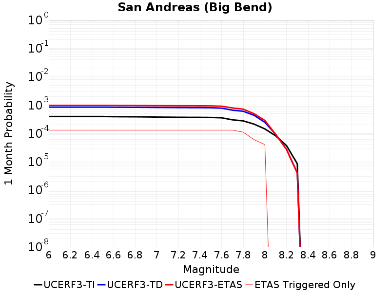 |  | 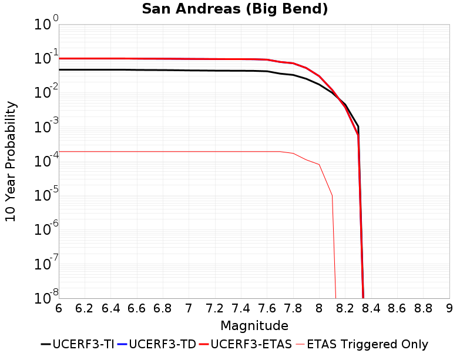 |

| Magnitude | 1 wk TI Prob | 1 wk TD Prob | 1 wk ETAS Prob | 1 wk ETAS/TD Gain | 1 wk ETAS Triggered Only | 1 mo TI Prob | 1 mo TD Prob | 1 mo ETAS Prob | 1 mo ETAS/TD Gain | 1 mo ETAS Triggered Only | 1 yr TI Prob | 1 yr TD Prob | 1 yr ETAS Prob | 1 yr ETAS/TD Gain | 1 yr ETAS Triggered Only | 10 yr TI Prob | 10 yr TD Prob | 10 yr ETAS Prob | 10 yr ETAS/TD Gain | 10 yr ETAS Triggered Only |
|-----|-----|-----|-----|-----|-----|-----|-----|-----|-----|-----|-----|-----|-----|-----|-----|-----|-----|-----|-----|-----|
| 6.0 | 9.168226E-5 | 1.9679719E-4 | 2.8677948E-4 | 1.4572335 | 9.0E-5 | 3.928648E-4 | 8.4314414E-4 | 9.7303453E-4 | 1.1540548 | 1.3E-4 | 0.0047726436 | 0.010217104 | 0.010395265 | 1.0174375 | 1.8E-4 | 0.046714354 | 0.09921127 | 0.099382415 | 1.0017251 | 1.9E-4 |
| 6.1 | 9.168226E-5 | 1.9679719E-4 | 2.8677948E-4 | 1.4572335 | 9.0E-5 | 3.928648E-4 | 8.4314414E-4 | 9.7303453E-4 | 1.1540548 | 1.3E-4 | 0.0047726436 | 0.010217104 | 0.010395265 | 1.0174375 | 1.8E-4 | 0.046714354 | 0.09921127 | 0.099382415 | 1.0017251 | 1.9E-4 |
| 6.2 | 9.168226E-5 | 1.9679719E-4 | 2.8677948E-4 | 1.4572335 | 9.0E-5 | 3.928648E-4 | 8.4314414E-4 | 9.7303453E-4 | 1.1540548 | 1.3E-4 | 0.0047726436 | 0.010217104 | 0.010395265 | 1.0174375 | 1.8E-4 | 0.046714354 | 0.09921127 | 0.099382415 | 1.0017251 | 1.9E-4 |
| 6.3 | 9.168226E-5 | 1.9679719E-4 | 2.8677948E-4 | 1.4572335 | 9.0E-5 | 3.928648E-4 | 8.4314414E-4 | 9.7303453E-4 | 1.1540548 | 1.3E-4 | 0.0047726436 | 0.010217104 | 0.010395265 | 1.0174375 | 1.8E-4 | 0.046714354 | 0.09921127 | 0.099382415 | 1.0017251 | 1.9E-4 |
| 6.4 | 9.1639464E-5 | 1.967315E-4 | 2.867138E-4 | 1.4573863 | 9.0E-5 | 3.9268145E-4 | 8.428628E-4 | 9.727533E-4 | 1.1541063 | 1.3E-4 | 0.0047704205 | 0.010213711 | 0.010391872 | 1.0174434 | 1.8E-4 | 0.046693064 | 0.09918068 | 0.09935184 | 1.0017257 | 1.9E-4 |
| 6.5 | 9.1639464E-5 | 1.967315E-4 | 2.867138E-4 | 1.4573863 | 9.0E-5 | 3.9268145E-4 | 8.428628E-4 | 9.727533E-4 | 1.1541063 | 1.3E-4 | 0.0047704205 | 0.010213711 | 0.010391872 | 1.0174434 | 1.8E-4 | 0.046693064 | 0.09918068 | 0.09935184 | 1.0017257 | 1.9E-4 |
| 6.6 | 9.042622E-5 | 1.9485225E-4 | 2.848347E-4 | 1.4617984 | 9.0E-5 | 3.8748336E-4 | 8.3481404E-4 | 9.647055E-4 | 1.1555933 | 1.3E-4 | 0.0047074095 | 0.010116629 | 0.010294808 | 1.0176125 | 1.8E-4 | 0.046089325 | 0.09830357 | 0.09847489 | 1.0017428 | 1.9E-4 |
| 6.7 | 8.9836685E-5 | 1.9402713E-4 | 2.8400967E-4 | 1.4637626 | 9.0E-5 | 3.8495753E-4 | 8.312801E-4 | 9.61172E-4 | 1.1562554 | 1.3E-4 | 0.00467679 | 0.010074002 | 0.010252188 | 1.0176878 | 1.8E-4 | 0.045795817 | 0.09791512 | 0.09808651 | 1.0017505 | 1.9E-4 |
| 6.8 | 8.9471854E-5 | 1.9351127E-4 | 2.8349386E-4 | 1.4649992 | 9.0E-5 | 3.8339442E-4 | 8.2907063E-4 | 9.5896283E-4 | 1.1566721 | 1.3E-4 | 0.004657841 | 0.01004735 | 0.010225541 | 1.0177351 | 1.8E-4 | 0.04561414 | 0.09767085 | 0.09784229 | 1.0017554 | 1.9E-4 |
| 6.9 | 8.858234E-5 | 1.9237067E-4 | 2.8235334E-4 | 1.4677567 | 9.0E-5 | 3.7958333E-4 | 8.2418544E-4 | 9.5407834E-4 | 1.1576015 | 1.3E-4 | 0.004611638 | 0.009988419 | 0.010166621 | 1.0178409 | 1.8E-4 | 0.04517103 | 0.09713331 | 0.09730486 | 1.0017661 | 1.9E-4 |
| 7.0 | 8.7433385E-5 | 1.9080006E-4 | 2.8078287E-4 | 1.4716079 | 9.0E-5 | 3.746607E-4 | 8.174585E-4 | 9.473522E-4 | 1.1588994 | 1.3E-4 | 0.004551957 | 0.009907266 | 0.010085482 | 1.0179884 | 1.8E-4 | 0.044598386 | 0.09639132 | 0.09656301 | 1.0017811 | 1.9E-4 |
| 7.1 | 8.684964E-5 | 1.8992374E-4 | 2.7990664E-4 | 1.4737844 | 9.0E-5 | 3.7215967E-4 | 8.137052E-4 | 9.435994E-4 | 1.159633 | 1.3E-4 | 0.0045216335 | 0.009861984 | 0.010040209 | 1.0180719 | 1.8E-4 | 0.04430731 | 0.095977485 | 0.09614925 | 1.0017897 | 1.9E-4 |
| 7.2 | 8.606521E-5 | 1.88833E-4 | 2.78816E-4 | 1.4765216 | 9.0E-5 | 3.6879873E-4 | 8.090335E-4 | 9.3892834E-4 | 1.1605556 | 1.3E-4 | 0.0044808835 | 0.00980562 | 0.009983854 | 1.0181768 | 1.8E-4 | 0.043916024 | 0.09546308 | 0.095634945 | 1.0018003 | 1.9E-4 |
| 7.3 | 8.568266E-5 | 1.8823979E-4 | 2.7822284E-4 | 1.4780235 | 9.0E-5 | 3.6715972E-4 | 8.0649275E-4 | 9.363879E-4 | 1.1610618 | 1.3E-4 | 0.0044610105 | 0.009774964 | 0.009953205 | 1.0182344 | 1.8E-4 | 0.043725148 | 0.09518043 | 0.095352344 | 1.0018063 | 1.9E-4 |
| 7.4 | 8.5432206E-5 | 1.8785537E-4 | 2.7783847E-4 | 1.479002 | 9.0E-5 | 3.6608664E-4 | 8.0484623E-4 | 9.3474163E-4 | 1.1613915 | 1.3E-4 | 0.004447999 | 0.009755098 | 0.009933342 | 1.0182719 | 1.8E-4 | 0.043600157 | 0.0949972 | 0.09516915 | 1.0018101 | 1.9E-4 |
| 7.5 | 8.4791965E-5 | 1.86488E-4 | 2.7647123E-4 | 1.4825147 | 9.0E-5 | 3.633435E-4 | 7.9898967E-4 | 9.288858E-4 | 1.1625755 | 1.3E-4 | 0.0044147377 | 0.00968443 | 0.0098626865 | 1.0184065 | 1.8E-4 | 0.043280575 | 0.09435458 | 0.09452665 | 1.0018237 | 1.9E-4 |
| 7.6 | 8.241105E-5 | 1.8073805E-4 | 2.707218E-4 | 1.4978682 | 9.0E-5 | 3.531424E-4 | 7.743619E-4 | 9.0426125E-4 | 1.1677501 | 1.3E-4 | 0.0042910352 | 0.009387209 | 0.009565519 | 1.018995 | 1.8E-4 | 0.042091176 | 0.091658376 | 0.09183096 | 1.0018829 | 1.9E-4 |
| 7.7 | 7.00432E-5 | 1.5353969E-4 | 2.4352586E-4 | 1.5860777 | 9.0E-5 | 3.001506E-4 | 6.5786135E-4 | 7.877758E-4 | 1.1974801 | 1.3E-4 | 0.0036482112 | 0.007980099 | 0.008158662 | 1.0223761 | 1.8E-4 | 0.035888977 | 0.07865305 | 0.078828104 | 1.0022256 | 1.9E-4 |
| 7.8 | 6.415362E-5 | 1.4026965E-4 | 2.1025984E-4 | 1.4989688 | 7.0E-5 | 2.749151E-4 | 6.010172E-4 | 7.109511E-4 | 1.1829131 | 1.1E-4 | 0.0033419547 | 0.0072928723 | 0.007451705 | 1.0217792 | 1.6E-4 | 0.03292141 | 0.072014354 | 0.072172105 | 1.0021906 | 1.7E-4 |
| 7.9 | 4.939911E-5 | 1.0118233E-4 | 1.4117829E-4 | 1.395286 | 4.0E-5 | 2.116933E-4 | 4.335665E-4 | 4.935405E-4 | 1.1383271 | 6.0E-5 | 0.0025743195 | 0.0052659083 | 0.0053653815 | 1.01889 | 1.0E-4 | 0.025447013 | 0.05253276 | 0.052636977 | 1.0019839 | 1.1E-4 |
| 8.0 | 3.344983E-5 | 5.7043388E-5 | 7.704225E-5 | 1.3505903 | 2.0E-5 | 1.4334853E-4 | 2.4444875E-4 | 2.8443898E-4 | 1.1635935 | 4.0E-5 | 0.0017438711 | 0.0029721041 | 0.0030518663 | 1.026837 | 8.0E-5 | 0.017302496 | 0.030266177 | 0.030343756 | 1.0025632 | 8.0E-5 |
| 8.1 | 1.9104898E-5 | 2.1516671E-5 | 2.1516671E-5 | 1.0 | 0.0 | 8.1875565E-5 | 9.221105E-5 | 9.221105E-5 | 1.0 | 0.0 | 9.963791E-4 | 0.0011220921 | 0.0011320809 | 1.008902 | 1.0E-5 | 0.009919235 | 0.011963926 | 0.011973807 | 1.0008259 | 1.0E-5 |
| 8.2 | 8.643924E-6 | 6.380783E-6 | 6.380783E-6 | 1.0 | 0.0 | 3.704486E-5 | 2.7345926E-5 | 2.7345926E-5 | 1.0 | 0.0 | 4.5092785E-4 | 3.3288592E-4 | 3.3288592E-4 | 1.0 | 0.0 | 0.0045001395 | 0.0037373784 | 0.0037373784 | 1.0 | 0.0 |
| 8.3 | 1.983087E-6 | 9.274416E-7 | 9.274416E-7 | 1.0 | 0.0 | 8.498917E-6 | 3.974744E-6 | 3.974744E-6 | 1.0 | 0.0 | 1.034694E-4 | 4.8391455E-5 | 4.8391455E-5 | 1.0 | 0.0 | 0.0010342124 | 5.6326366E-4 | 5.6326366E-4 | 1.0 | 0.0 |

## San Andreas (Carrizo) rev
*[(top)](#table-of-contents)*

| 1 Week | 1 Month | 1 Year | 10 Year |
|-----|-----|-----|-----|
| 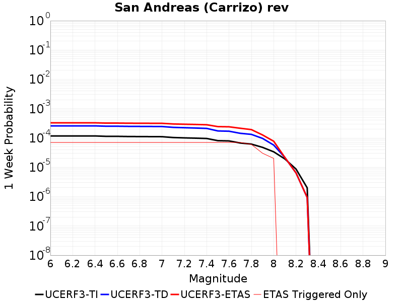 |  | 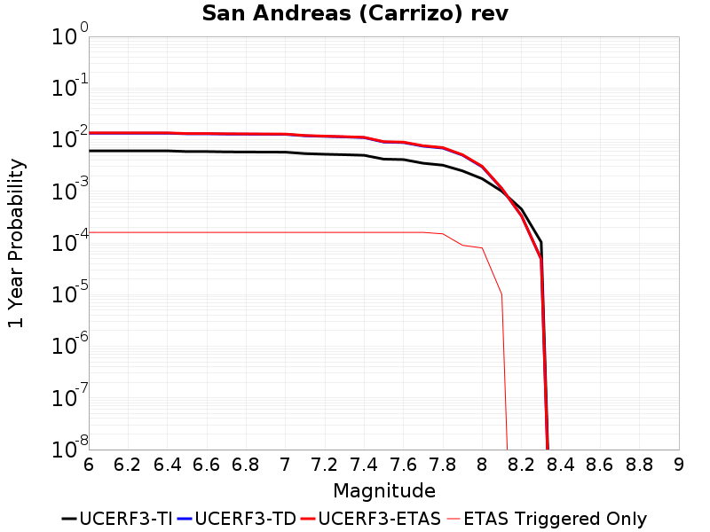 |  |

| Magnitude | 1 wk TI Prob | 1 wk TD Prob | 1 wk ETAS Prob | 1 wk ETAS/TD Gain | 1 wk ETAS Triggered Only | 1 mo TI Prob | 1 mo TD Prob | 1 mo ETAS Prob | 1 mo ETAS/TD Gain | 1 mo ETAS Triggered Only | 1 yr TI Prob | 1 yr TD Prob | 1 yr ETAS Prob | 1 yr ETAS/TD Gain | 1 yr ETAS Triggered Only | 10 yr TI Prob | 10 yr TD Prob | 10 yr ETAS Prob | 10 yr ETAS/TD Gain | 10 yr ETAS Triggered Only |
|-----|-----|-----|-----|-----|-----|-----|-----|-----|-----|-----|-----|-----|-----|-----|-----|-----|-----|-----|-----|-----|
| 6.0 | 1.1674632E-4 | 2.574615E-4 | 3.2744347E-4 | 1.2718153 | 7.0E-5 | 5.002454E-4 | 0.0011029416 | 0.0012128203 | 1.0996233 | 1.1E-4 | 0.006073493 | 0.013346177 | 0.013504041 | 1.0118284 | 1.6E-4 | 0.0591016 | 0.12658496 | 0.12673344 | 1.001173 | 1.7E-4 |
| 6.1 | 1.1674632E-4 | 2.574615E-4 | 3.2744347E-4 | 1.2718153 | 7.0E-5 | 5.002454E-4 | 0.0011029416 | 0.0012128203 | 1.0996233 | 1.1E-4 | 0.006073493 | 0.013346177 | 0.013504041 | 1.0118284 | 1.6E-4 | 0.0591016 | 0.12658496 | 0.12673344 | 1.001173 | 1.7E-4 |
| 6.2 | 1.1674632E-4 | 2.574615E-4 | 3.2744347E-4 | 1.2718153 | 7.0E-5 | 5.002454E-4 | 0.0011029416 | 0.0012128203 | 1.0996233 | 1.1E-4 | 0.006073493 | 0.013346177 | 0.013504041 | 1.0118284 | 1.6E-4 | 0.0591016 | 0.12658496 | 0.12673344 | 1.001173 | 1.7E-4 |
| 6.3 | 1.1674632E-4 | 2.574615E-4 | 3.2744347E-4 | 1.2718153 | 7.0E-5 | 5.002454E-4 | 0.0011029416 | 0.0012128203 | 1.0996233 | 1.1E-4 | 0.006073493 | 0.013346177 | 0.013504041 | 1.0118284 | 1.6E-4 | 0.0591016 | 0.12658496 | 0.12673344 | 1.001173 | 1.7E-4 |
| 6.4 | 1.1674632E-4 | 2.574615E-4 | 3.2744347E-4 | 1.2718153 | 7.0E-5 | 5.002454E-4 | 0.0011029416 | 0.0012128203 | 1.0996233 | 1.1E-4 | 0.006073493 | 0.013346177 | 0.013504041 | 1.0118284 | 1.6E-4 | 0.0591016 | 0.12658496 | 0.12673344 | 1.001173 | 1.7E-4 |
| 6.5 | 1.13136164E-4 | 2.505639E-4 | 3.2054636E-4 | 1.2792999 | 7.0E-5 | 4.847792E-4 | 0.001073405 | 0.0011832869 | 1.1023676 | 1.1E-4 | 0.0058862255 | 0.012990899 | 0.013148821 | 1.0121564 | 1.6E-4 | 0.057327334 | 0.123543255 | 0.12369225 | 1.001206 | 1.7E-4 |
| 6.6 | 1.13136164E-4 | 2.505639E-4 | 3.2054636E-4 | 1.2792999 | 7.0E-5 | 4.847792E-4 | 0.001073405 | 0.0011832869 | 1.1023676 | 1.1E-4 | 0.0058862255 | 0.012990899 | 0.013148821 | 1.0121564 | 1.6E-4 | 0.057327334 | 0.123543255 | 0.12369225 | 1.001206 | 1.7E-4 |
| 6.7 | 1.1149675E-4 | 2.4743163E-4 | 3.174143E-4 | 1.2828364 | 7.0E-5 | 4.777557E-4 | 0.0010599919 | 0.0011698753 | 1.1036644 | 1.1E-4 | 0.0058011734 | 0.012829526 | 0.012987474 | 1.0123112 | 1.6E-4 | 0.05652051 | 0.12216275 | 0.12231199 | 1.0012215 | 1.7E-4 |
| 6.8 | 1.1103589E-4 | 2.4642676E-4 | 3.164095E-4 | 1.28399 | 7.0E-5 | 4.7578133E-4 | 0.0010556888 | 0.0011655728 | 1.1040874 | 1.1E-4 | 0.005777263 | 0.012777753 | 0.012935708 | 1.0123618 | 1.6E-4 | 0.056293584 | 0.12171583 | 0.12186514 | 1.0012267 | 1.7E-4 |
| 6.9 | 1.1053259E-4 | 2.4532137E-4 | 3.153042E-4 | 1.28527 | 7.0E-5 | 4.7362508E-4 | 0.0010509553 | 0.0011608397 | 1.1045567 | 1.1E-4 | 0.0057511497 | 0.012720796 | 0.012878762 | 1.0124178 | 1.6E-4 | 0.05604569 | 0.12122415 | 0.12137354 | 1.0012324 | 1.7E-4 |
| 7.0 | 1.1005377E-4 | 2.443027E-4 | 3.142856E-4 | 1.2864598 | 7.0E-5 | 4.7157376E-4 | 0.0010465931 | 0.001156478 | 1.104993 | 1.1E-4 | 0.0057263062 | 0.012668306 | 0.012826279 | 1.0124699 | 1.6E-4 | 0.055809796 | 0.1207683 | 0.120917775 | 1.0012376 | 1.7E-4 |
| 7.1 | 1.0308142E-4 | 2.2899469E-4 | 2.9897864E-4 | 1.305614 | 7.0E-5 | 4.417027E-4 | 9.810379E-4 | 0.0010909298 | 1.1120162 | 1.1E-4 | 0.0053644776 | 0.011879081 | 0.01203718 | 1.013309 | 1.6E-4 | 0.052368138 | 0.113881305 | 0.11403194 | 1.0013227 | 1.7E-4 |
| 7.2 | 1.0027479E-4 | 2.2291476E-4 | 2.9289915E-4 | 1.3139514 | 7.0E-5 | 4.296783E-4 | 9.550003E-4 | 0.0010648952 | 1.1150732 | 1.1E-4 | 0.0052187922 | 0.01156548 | 0.01172363 | 1.0136743 | 1.6E-4 | 0.050979212 | 0.11113946 | 0.111290574 | 1.0013596 | 1.7E-4 |
| 7.3 | 9.816942E-5 | 2.1742935E-4 | 2.8741412E-4 | 1.3218737 | 7.0E-5 | 4.2065824E-4 | 9.315084E-4 | 0.001041406 | 1.1179781 | 1.1E-4 | 0.005109493 | 0.011282464 | 0.011440659 | 1.0140213 | 1.6E-4 | 0.049935985 | 0.10864876 | 0.10880029 | 1.0013946 | 1.7E-4 |
| 7.4 | 9.5634205E-5 | 2.1089599E-4 | 2.808812E-4 | 1.3318472 | 7.0E-5 | 4.0979648E-4 | 9.0352783E-4 | 0.0010134284 | 1.121635 | 1.1E-4 | 0.0049778637 | 0.010945265 | 0.011103514 | 1.0144582 | 1.6E-4 | 0.048678253 | 0.105655275 | 0.10580731 | 1.001439 | 1.7E-4 |
| 7.5 | 8.052417E-5 | 1.7288837E-4 | 2.4287627E-4 | 1.4048156 | 7.0E-5 | 3.4505792E-4 | 7.407399E-4 | 8.5065846E-4 | 1.1483902 | 1.1E-4 | 0.0041929903 | 0.008981314 | 0.009139877 | 1.0176548 | 1.6E-4 | 0.04114753 | 0.08799612 | 0.088151164 | 1.0017619 | 1.7E-4 |
| 7.6 | 7.897024E-5 | 1.6930336E-4 | 2.392915E-4 | 1.413389 | 7.0E-5 | 3.384E-4 | 7.253842E-4 | 8.3530444E-4 | 1.1515337 | 1.1E-4 | 0.0041122385 | 0.008795883 | 0.008954476 | 1.0180303 | 1.6E-4 | 0.040369697 | 0.086295195 | 0.086450525 | 1.0018 | 1.7E-4 |
| 7.7 | 6.707427E-5 | 1.436428E-4 | 2.1363275E-4 | 1.48725 | 7.0E-5 | 2.8742946E-4 | 6.154668E-4 | 7.253991E-4 | 1.1786162 | 1.1E-4 | 0.003493839 | 0.007467605 | 0.0076264106 | 1.0212659 | 1.6E-4 | 0.034394164 | 0.07393657 | 0.074094 | 1.0021293 | 1.7E-4 |
| 7.8 | 6.147705E-5 | 1.3205684E-4 | 1.9204892E-4 | 1.4542898 | 6.0E-5 | 2.6344648E-4 | 5.658352E-4 | 6.657786E-4 | 1.1766299 | 1.0E-4 | 0.0032027436 | 0.006867315 | 0.0070162853 | 1.0216926 | 1.5E-4 | 0.031569764 | 0.0680731 | 0.06822221 | 1.0021905 | 1.6E-4 |
| 7.9 | 4.7636717E-5 | 9.6259886E-5 | 1.26257E-4 | 1.3116263 | 3.0E-5 | 2.0414138E-4 | 4.1247715E-4 | 4.6245655E-4 | 1.1211689 | 5.0E-5 | 0.0024825884 | 0.005010356 | 0.005099905 | 1.0178728 | 9.0E-5 | 0.024550365 | 0.05011403 | 0.050209016 | 1.0018954 | 1.0E-4 |
| 8.0 | 3.3554235E-5 | 5.6947407E-5 | 7.6946264E-5 | 1.3511813 | 2.0E-5 | 1.4379594E-4 | 2.440375E-4 | 2.8402772E-4 | 1.1638693 | 4.0E-5 | 0.0017493097 | 0.0029671106 | 0.0030468733 | 1.0268823 | 8.0E-5 | 0.017356034 | 0.030222602 | 0.030300185 | 1.002567 | 8.0E-5 |
| 8.1 | 1.9175432E-5 | 2.153117E-5 | 2.153117E-5 | 1.0 | 0.0 | 8.217783E-5 | 9.227318E-5 | 9.227318E-5 | 1.0 | 0.0 | 0.0010000558 | 0.0011228478 | 0.0011328366 | 1.0088959 | 1.0E-5 | 0.009955673 | 0.011973743 | 0.011983623 | 1.0008252 | 1.0E-5 |
| 8.2 | 8.643924E-6 | 6.380783E-6 | 6.380783E-6 | 1.0 | 0.0 | 3.704486E-5 | 2.7345926E-5 | 2.7345926E-5 | 1.0 | 0.0 | 4.5092785E-4 | 3.3288592E-4 | 3.3288592E-4 | 1.0 | 0.0 | 0.0045001395 | 0.0037373784 | 0.0037373784 | 1.0 | 0.0 |
| 8.3 | 1.983087E-6 | 9.274416E-7 | 9.274416E-7 | 1.0 | 0.0 | 8.498917E-6 | 3.974744E-6 | 3.974744E-6 | 1.0 | 0.0 | 1.034694E-4 | 4.8391455E-5 | 4.8391455E-5 | 1.0 | 0.0 | 0.0010342124 | 5.6326366E-4 | 5.6326366E-4 | 1.0 | 0.0 |

## San Andreas (Coachella) rev
*[(top)](#table-of-contents)*

| 1 Week | 1 Month | 1 Year | 10 Year |
|-----|-----|-----|-----|
|  | 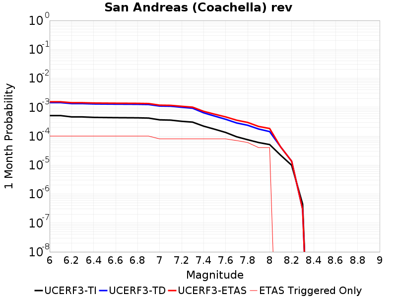 |  |  |

| Magnitude | 1 wk TI Prob | 1 wk TD Prob | 1 wk ETAS Prob | 1 wk ETAS/TD Gain | 1 wk ETAS Triggered Only | 1 mo TI Prob | 1 mo TD Prob | 1 mo ETAS Prob | 1 mo ETAS/TD Gain | 1 mo ETAS Triggered Only | 1 yr TI Prob | 1 yr TD Prob | 1 yr ETAS Prob | 1 yr ETAS/TD Gain | 1 yr ETAS Triggered Only | 10 yr TI Prob | 10 yr TD Prob | 10 yr ETAS Prob | 10 yr ETAS/TD Gain | 10 yr ETAS Triggered Only |
|-----|-----|-----|-----|-----|-----|-----|-----|-----|-----|-----|-----|-----|-----|-----|-----|-----|-----|-----|-----|-----|
| 6.0 | 1.1925945E-4 | 3.3488593E-4 | 4.0486248E-4 | 1.2089564 | 7.0E-5 | 5.110118E-4 | 0.0014344408 | 0.0015342975 | 1.0696136 | 1.0E-4 | 0.0062038354 | 0.017325867 | 0.01747327 | 1.0085076 | 1.5E-4 | 0.060334753 | 0.15565076 | 0.15578586 | 1.000868 | 1.6E-4 |
| 6.1 | 1.1925945E-4 | 3.3488593E-4 | 4.0486248E-4 | 1.2089564 | 7.0E-5 | 5.110118E-4 | 0.0014344408 | 0.0015342975 | 1.0696136 | 1.0E-4 | 0.0062038354 | 0.017325867 | 0.01747327 | 1.0085076 | 1.5E-4 | 0.060334753 | 0.15565076 | 0.15578586 | 1.000868 | 1.6E-4 |
| 6.2 | 1.07432395E-4 | 3.0982008E-4 | 3.7979838E-4 | 1.2258676 | 7.0E-5 | 4.603433E-4 | 0.0013271288 | 0.0014269961 | 1.0752506 | 1.0E-4 | 0.005590286 | 0.01603924 | 0.016186833 | 1.0092021 | 1.5E-4 | 0.05451731 | 0.1448422 | 0.14497903 | 1.0009446 | 1.6E-4 |
| 6.3 | 1.0718766E-4 | 3.092736E-4 | 3.7925196E-4 | 1.2262667 | 7.0E-5 | 4.592948E-4 | 0.0013247891 | 0.0014246567 | 1.0753837 | 1.0E-4 | 0.005577586 | 0.016011173 | 0.016158773 | 1.0092185 | 1.5E-4 | 0.054396555 | 0.14461116 | 0.14474802 | 1.0009464 | 1.6E-4 |
| 6.4 | 1.0355944E-4 | 3.0134048E-4 | 3.7131936E-4 | 1.2322254 | 7.0E-5 | 4.4375064E-4 | 0.001290824 | 0.001390695 | 1.0773699 | 1.0E-4 | 0.0053892885 | 0.015603642 | 0.015751302 | 1.0094632 | 1.5E-4 | 0.052604496 | 0.14116998 | 0.1413074 | 1.0009733 | 1.6E-4 |
| 6.5 | 1.0227914E-4 | 2.9853065E-4 | 3.6850976E-4 | 1.2344118 | 7.0E-5 | 4.382655E-4 | 0.0012787938 | 0.0013786659 | 1.0780987 | 1.0E-4 | 0.0053228354 | 0.015459263 | 0.0156069435 | 1.009553 | 1.5E-4 | 0.051971316 | 0.13994749 | 0.14008509 | 1.0009832 | 1.6E-4 |
| 6.6 | 1.0116757E-4 | 2.9618267E-4 | 3.6616196E-4 | 1.2362707 | 7.0E-5 | 4.3350324E-4 | 0.0012687409 | 0.001368614 | 1.0787183 | 1.0E-4 | 0.0052651367 | 0.015338597 | 0.015486296 | 1.0096292 | 1.5E-4 | 0.051421247 | 0.1389266 | 0.13906437 | 1.0009917 | 1.6E-4 |
| 6.7 | 1.0050676E-4 | 2.94766E-4 | 3.6474539E-4 | 1.2374065 | 7.0E-5 | 4.3067214E-4 | 0.0012626754 | 0.0013625491 | 1.0790969 | 1.0E-4 | 0.005230834 | 0.015265787 | 0.015413497 | 1.0096759 | 1.5E-4 | 0.051094085 | 0.1383128 | 0.13845067 | 1.0009968 | 1.6E-4 |
| 6.8 | 9.976819E-5 | 2.9279306E-4 | 3.6277258E-4 | 1.2390068 | 7.0E-5 | 4.2750788E-4 | 0.0012542281 | 0.0013541026 | 1.0796304 | 1.0E-4 | 0.0051924936 | 0.015164377 | 0.015312103 | 1.0097415 | 1.5E-4 | 0.050728295 | 0.13746284 | 0.13760084 | 1.001004 | 1.6E-4 |
| 6.9 | 9.77719E-5 | 2.8774777E-4 | 3.5772764E-4 | 1.2431986 | 7.0E-5 | 4.1895514E-4 | 0.0012326259 | 0.0013325027 | 1.0810276 | 1.0E-4 | 0.0050888555 | 0.014905 | 0.015052765 | 1.0099137 | 1.5E-4 | 0.049738888 | 0.135291 | 0.13542934 | 1.0010226 | 1.6E-4 |
| 7.0 | 8.500761E-5 | 2.550249E-4 | 3.150096E-4 | 1.2352111 | 6.0E-5 | 3.6426744E-4 | 0.0010925094 | 0.001172422 | 1.0731459 | 8.0E-5 | 0.0044259406 | 0.0132209975 | 0.013349279 | 1.0097028 | 1.3E-4 | 0.04338823 | 0.12116701 | 0.12129005 | 1.0010154 | 1.4E-4 |
| 7.1 | 8.319876E-5 | 2.5102982E-4 | 3.1101474E-4 | 1.2389554 | 6.0E-5 | 3.5651738E-4 | 0.0010754018 | 0.0011553158 | 1.0743108 | 8.0E-5 | 0.004331963 | 0.01301522 | 0.013143528 | 1.0098583 | 1.3E-4 | 0.042484846 | 0.11938367 | 0.119506955 | 1.0010327 | 1.4E-4 |
| 7.2 | 7.563917E-5 | 2.3144291E-4 | 2.9142902E-4 | 1.2591832 | 6.0E-5 | 3.2412758E-4 | 9.915243E-4 | 0.001071445 | 1.0806038 | 8.0E-5 | 0.0039391145 | 0.0120057175 | 0.012134157 | 1.0106982 | 1.3E-4 | 0.03870018 | 0.11078589 | 0.11091038 | 1.0011237 | 1.4E-4 |
| 7.3 | 7.082985E-5 | 2.1442234E-4 | 2.7440948E-4 | 1.2797616 | 6.0E-5 | 3.0352117E-4 | 9.186323E-4 | 9.985588E-4 | 1.087006 | 8.0E-5 | 0.0036891096 | 0.011127653 | 0.011256206 | 1.0115526 | 1.3E-4 | 0.03628465 | 0.103259444 | 0.103384994 | 1.0012158 | 1.4E-4 |
| 7.4 | 5.146215E-5 | 1.487188E-4 | 2.0870987E-4 | 1.403386 | 6.0E-5 | 2.2053342E-4 | 6.3721155E-4 | 7.171605E-4 | 1.1254671 | 8.0E-5 | 0.0026816884 | 0.007730656 | 0.007859651 | 1.0166862 | 1.3E-4 | 0.02649557 | 0.07344533 | 0.07357504 | 1.0017662 | 1.4E-4 |
| 7.5 | 4.0285166E-5 | 1.14600516E-4 | 1.7459363E-4 | 1.5234978 | 6.0E-5 | 1.7263928E-4 | 4.91053E-4 | 5.7101366E-4 | 1.1628352 | 8.0E-5 | 0.002099857 | 0.0059622563 | 0.006091481 | 1.0216738 | 1.3E-4 | 0.020801254 | 0.057306137 | 0.057438113 | 1.002303 | 1.4E-4 |
| 7.6 | 3.1168736E-5 | 8.892908E-5 | 1.4892375E-4 | 1.6746349 | 6.0E-5 | 1.3357346E-4 | 3.8106908E-4 | 4.610386E-4 | 1.2098557 | 8.0E-5 | 0.0016250437 | 0.0046296758 | 0.0047590737 | 1.0279497 | 1.3E-4 | 0.016132116 | 0.04484367 | 0.044977393 | 1.0029819 | 1.4E-4 |
| 7.7 | 2.2100989E-5 | 6.632959E-5 | 1.1632627E-4 | 1.7537614 | 5.0E-5 | 9.4715084E-5 | 2.8423872E-4 | 3.5421885E-4 | 1.2462019 | 7.0E-5 | 0.001152546 | 0.0034551225 | 0.003554777 | 1.0288426 | 1.0E-4 | 0.011465867 | 0.0336785 | 0.033784796 | 1.0031562 | 1.1E-4 |
| 7.8 | 1.7484861E-5 | 5.5254728E-5 | 9.5252515E-5 | 1.7238799 | 4.0E-5 | 7.493296E-5 | 2.367845E-4 | 2.967703E-4 | 1.253335 | 6.0E-5 | 9.1192697E-4 | 0.0028790436 | 0.0029687844 | 1.0311704 | 9.0E-5 | 0.009081938 | 0.028205745 | 0.028302925 | 1.0034454 | 1.0E-4 |
| 7.9 | 1.3967285E-5 | 4.0941264E-5 | 6.0940445E-5 | 1.4884847 | 2.0E-5 | 5.985842E-5 | 1.7545077E-4 | 2.1544375E-4 | 1.2279441 | 4.0E-5 | 7.2853256E-4 | 0.0021340218 | 0.0022038724 | 1.0327319 | 7.0E-5 | 0.0072614877 | 0.02115966 | 0.02122818 | 1.0032382 | 7.0E-5 |
| 8.0 | 1.1887396E-5 | 3.3359953E-5 | 5.3359287E-5 | 1.5995013 | 2.0E-5 | 5.094499E-5 | 1.429634E-4 | 1.8295768E-4 | 1.2797519 | 4.0E-5 | 6.200787E-4 | 0.0017391909 | 0.0018090691 | 1.0401787 | 7.0E-5 | 0.006183513 | 0.01734251 | 0.017411297 | 1.0039663 | 7.0E-5 |
| 8.1 | 5.100864E-6 | 9.87794E-6 | 9.87794E-6 | 1.0 | 0.0 | 2.1860664E-5 | 4.2333344E-5 | 4.2333344E-5 | 1.0 | 0.0 | 2.6612106E-4 | 5.1528675E-4 | 5.252816E-4 | 1.0193967 | 1.0E-5 | 0.002658026 | 0.0053643794 | 0.0053743254 | 1.0018542 | 1.0E-5 |
| 8.2 | 2.3004484E-6 | 3.1685122E-6 | 3.1685122E-6 | 1.0 | 0.0 | 9.859027E-6 | 1.3579267E-5 | 1.3579267E-5 | 1.0 | 0.0 | 1.2002704E-4 | 1.6531508E-4 | 1.6531508E-4 | 1.0 | 0.0 | 0.0011996223 | 0.0017920759 | 0.0017920759 | 1.0 | 0.0 |
| 8.3 | 1.0424446E-7 | 6.895592E-8 | 6.895592E-8 | 1.0 | 0.0 | 4.4676187E-7 | 2.9552535E-7 | 2.9552535E-7 | 1.0 | 0.0 | 5.439312E-6 | 3.5980156E-6 | 3.5980156E-6 | 1.0 | 0.0 | 5.4391792E-5 | 3.7617778E-5 | 3.7617778E-5 | 1.0 | 0.0 |

## San Andreas (Cholame) rev
*[(top)](#table-of-contents)*

| 1 Week | 1 Month | 1 Year | 10 Year |
|-----|-----|-----|-----|
| 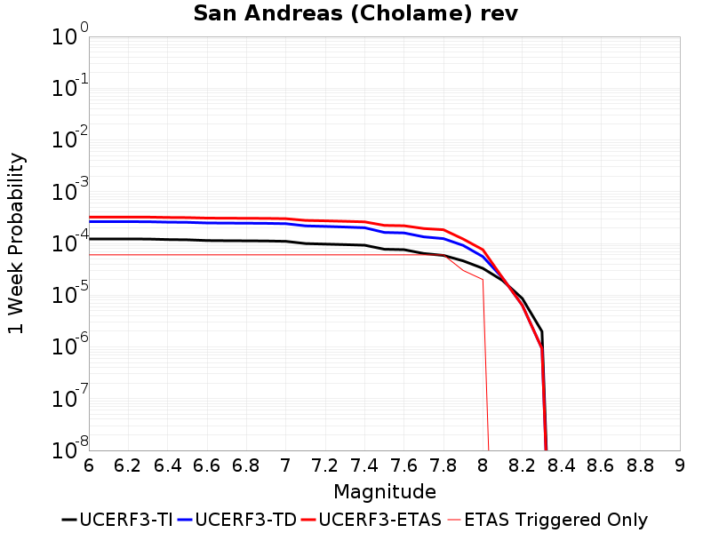 |  | 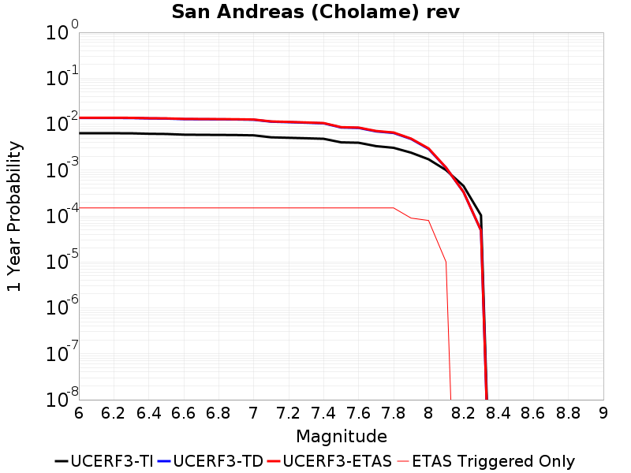 |  |

| Magnitude | 1 wk TI Prob | 1 wk TD Prob | 1 wk ETAS Prob | 1 wk ETAS/TD Gain | 1 wk ETAS Triggered Only | 1 mo TI Prob | 1 mo TD Prob | 1 mo ETAS Prob | 1 mo ETAS/TD Gain | 1 mo ETAS Triggered Only | 1 yr TI Prob | 1 yr TD Prob | 1 yr ETAS Prob | 1 yr ETAS/TD Gain | 1 yr ETAS Triggered Only | 10 yr TI Prob | 10 yr TD Prob | 10 yr ETAS Prob | 10 yr ETAS/TD Gain | 10 yr ETAS Triggered Only |
|-----|-----|-----|-----|-----|-----|-----|-----|-----|-----|-----|-----|-----|-----|-----|-----|-----|-----|-----|-----|-----|
| 6.0 | 1.2188602E-4 | 2.6320352E-4 | 3.231877E-4 | 1.2279005 | 6.0E-5 | 5.2226405E-4 | 0.0011275291 | 0.0012274163 | 1.0885895 | 1.0E-4 | 0.0063400427 | 0.013641818 | 0.013789772 | 1.0108455 | 1.5E-4 | 0.061621845 | 0.12903683 | 0.12917617 | 1.0010799 | 1.6E-4 |
| 6.1 | 1.2188602E-4 | 2.6320352E-4 | 3.231877E-4 | 1.2279005 | 6.0E-5 | 5.2226405E-4 | 0.0011275291 | 0.0012274163 | 1.0885895 | 1.0E-4 | 0.0063400427 | 0.013641818 | 0.013789772 | 1.0108455 | 1.5E-4 | 0.061621845 | 0.12903683 | 0.12917617 | 1.0010799 | 1.6E-4 |
| 6.2 | 1.2188602E-4 | 2.6320352E-4 | 3.231877E-4 | 1.2279005 | 6.0E-5 | 5.2226405E-4 | 0.0011275291 | 0.0012274163 | 1.0885895 | 1.0E-4 | 0.0063400427 | 0.013641818 | 0.013789772 | 1.0108455 | 1.5E-4 | 0.061621845 | 0.12903683 | 0.12917617 | 1.0010799 | 1.6E-4 |
| 6.3 | 1.2142645E-4 | 2.6232973E-4 | 3.2231398E-4 | 1.2286597 | 6.0E-5 | 5.202953E-4 | 0.0011237876 | 0.0012236752 | 1.0888848 | 1.0E-4 | 0.006316212 | 0.013596835 | 0.013744796 | 1.010882 | 1.5E-4 | 0.06139677 | 0.12865204 | 0.12879145 | 1.0010836 | 1.6E-4 |
| 6.4 | 1.1865206E-4 | 2.5729692E-4 | 3.172815E-4 | 1.2331336 | 6.0E-5 | 5.0840975E-4 | 0.0011022368 | 0.0012021266 | 1.0906246 | 1.0E-4 | 0.006172335 | 0.013337693 | 0.013485692 | 1.0110964 | 1.5E-4 | 0.060036868 | 0.12642096 | 0.12656073 | 1.0011057 | 1.6E-4 |
| 6.5 | 1.17443946E-4 | 2.5520148E-4 | 3.151862E-4 | 1.2350483 | 6.0E-5 | 5.032341E-4 | 0.0010932639 | 0.0011931546 | 1.0913693 | 1.0E-4 | 0.006109677 | 0.013229776 | 0.013377792 | 1.011188 | 1.5E-4 | 0.059444077 | 0.12548617 | 0.12562609 | 1.0011151 | 1.6E-4 |
| 6.6 | 1.13579066E-4 | 2.4838038E-4 | 3.0836547E-4 | 1.241505 | 6.0E-5 | 4.866766E-4 | 0.0010640547 | 0.0011639483 | 1.0938802 | 1.0E-4 | 0.0059092017 | 0.0128784105 | 0.013026479 | 1.0114974 | 1.5E-4 | 0.057545185 | 0.12244937 | 0.12258978 | 1.0011467 | 1.6E-4 |
| 6.7 | 1.1271412E-4 | 2.4682653E-4 | 3.0681174E-4 | 1.2430257 | 6.0E-5 | 4.829711E-4 | 0.0010574008 | 0.0011572951 | 1.0944716 | 1.0E-4 | 0.005864331 | 0.012798353 | 0.012946433 | 1.0115702 | 1.5E-4 | 0.057119697 | 0.12175736 | 0.121897876 | 1.0011541 | 1.6E-4 |
| 6.8 | 1.1217975E-4 | 2.4570382E-4 | 3.0568906E-4 | 1.2441365 | 6.0E-5 | 4.8068175E-4 | 0.001052593 | 0.0011524877 | 1.0949035 | 1.0E-4 | 0.005836608 | 0.012740505 | 0.012888594 | 1.0116235 | 1.5E-4 | 0.056856725 | 0.121255316 | 0.121395916 | 1.0011595 | 1.6E-4 |
| 6.9 | 1.1146753E-4 | 2.441712E-4 | 3.0415657E-4 | 1.2456692 | 6.0E-5 | 4.7763053E-4 | 0.00104603 | 0.0011459254 | 1.0954995 | 1.0E-4 | 0.0057996577 | 0.012661532 | 0.012809632 | 1.0116969 | 1.5E-4 | 0.056506127 | 0.12057189 | 0.1207126 | 1.001167 | 1.6E-4 |
| 7.0 | 1.0965793E-4 | 2.4038345E-4 | 3.0036902E-4 | 1.2495412 | 6.0E-5 | 4.698779E-4 | 0.0010298096 | 0.0011297066 | 1.0970054 | 1.0E-4 | 0.005705768 | 0.012466325 | 0.012614456 | 1.0118824 | 1.5E-4 | 0.055614736 | 0.11887276 | 0.11901374 | 1.001186 | 1.6E-4 |
| 7.1 | 9.927982E-5 | 2.1811642E-4 | 2.7810334E-4 | 1.2750225 | 6.0E-5 | 4.2541555E-4 | 9.344509E-4 | 0.0010343575 | 1.1069148 | 1.0E-4 | 0.0051671406 | 0.011317924 | 0.011466226 | 1.0131034 | 1.5E-4 | 0.05048634 | 0.108827524 | 0.10897011 | 1.0013102 | 1.6E-4 |
| 7.2 | 9.696786E-5 | 2.1305219E-4 | 2.730394E-4 | 1.2815611 | 6.0E-5 | 4.1551032E-4 | 9.1276236E-4 | 0.001012671 | 1.1094575 | 1.0E-4 | 0.00504711 | 0.011056575 | 0.011204917 | 1.0134165 | 1.5E-4 | 0.04934009 | 0.10653802 | 0.106680974 | 1.0013418 | 1.6E-4 |
| 7.3 | 9.4727984E-5 | 2.0718269E-4 | 2.6717025E-4 | 1.2895395 | 6.0E-5 | 4.0591392E-4 | 8.8762474E-4 | 9.87536E-4 | 1.1125603 | 1.0E-4 | 0.0049308087 | 0.010753586 | 0.010901973 | 1.0137988 | 1.5E-4 | 0.048228268 | 0.10386192 | 0.10400531 | 1.0013806 | 1.6E-4 |
| 7.4 | 9.220358E-5 | 2.0066745E-4 | 2.6065542E-4 | 1.2989422 | 6.0E-5 | 3.9509835E-4 | 8.5972087E-4 | 9.596349E-4 | 1.1162168 | 1.0E-4 | 0.004799717 | 0.010417147 | 0.010565584 | 1.0142493 | 1.5E-4 | 0.046973653 | 0.100861706 | 0.10100556 | 1.0014263 | 1.6E-4 |
| 7.5 | 7.71631E-5 | 1.6281285E-4 | 2.2280308E-4 | 1.3684613 | 6.0E-5 | 3.306571E-4 | 6.9758296E-4 | 7.975132E-4 | 1.1432521 | 1.0E-4 | 0.0040183207 | 0.008460084 | 0.008608815 | 1.0175803 | 1.5E-4 | 0.03946433 | 0.083181545 | 0.08332824 | 1.0017635 | 1.6E-4 |
| 7.6 | 7.5634416E-5 | 1.592966E-4 | 2.1928703E-4 | 1.3765959 | 6.0E-5 | 3.241072E-4 | 6.8252126E-4 | 7.82453E-4 | 1.1464156 | 1.0E-4 | 0.0039388672 | 0.008278117 | 0.008426875 | 1.0179701 | 1.5E-4 | 0.038697794 | 0.08150485 | 0.081651814 | 1.001803 | 1.6E-4 |
| 7.7 | 6.3783E-5 | 1.3375438E-4 | 1.9374635E-4 | 1.4485234 | 6.0E-5 | 2.7332708E-4 | 5.731072E-4 | 6.730499E-4 | 1.1743875 | 1.0E-4 | 0.0033226798 | 0.006955291 | 0.007104248 | 1.0214163 | 1.5E-4 | 0.032734364 | 0.06913926 | 0.0692882 | 1.0021541 | 1.6E-4 |
| 7.8 | 5.863422E-5 | 1.2364163E-4 | 1.8363421E-4 | 1.4852135 | 6.0E-5 | 2.512653E-4 | 5.297851E-4 | 6.2973215E-4 | 1.1886557 | 1.0E-4 | 0.003054864 | 0.0064310846 | 0.00658012 | 1.0231742 | 1.5E-4 | 0.030132094 | 0.06396947 | 0.064119235 | 1.0023412 | 1.6E-4 |
| 7.9 | 4.595283E-5 | 9.140074E-5 | 1.21398E-4 | 1.3281949 | 3.0E-5 | 1.9692584E-4 | 3.9165866E-4 | 4.4163907E-4 | 1.1276122 | 5.0E-5 | 0.0023949358 | 0.0047580274 | 0.004847599 | 1.0188254 | 9.0E-5 | 0.023692891 | 0.04770885 | 0.04780408 | 1.001996 | 1.0E-4 |
| 8.0 | 3.2950178E-5 | 5.5472803E-5 | 7.54717E-5 | 1.360517 | 2.0E-5 | 1.412074E-4 | 2.3771892E-4 | 2.7770942E-4 | 1.1682259 | 4.0E-5 | 0.0017178444 | 0.002890389 | 0.0029701577 | 1.0275979 | 8.0E-5 | 0.017046256 | 0.029471166 | 0.029548809 | 1.0026345 | 8.0E-5 |
| 8.1 | 1.9177472E-5 | 2.1531383E-5 | 2.1531383E-5 | 1.0 | 0.0 | 8.218658E-5 | 9.2274095E-5 | 9.2274095E-5 | 1.0 | 0.0 | 0.0010001622 | 0.0011228588 | 0.0011328476 | 1.0088959 | 1.0E-5 | 0.009956728 | 0.011973885 | 0.011983765 | 1.0008252 | 1.0E-5 |
| 8.2 | 8.643924E-6 | 6.380783E-6 | 6.380783E-6 | 1.0 | 0.0 | 3.704486E-5 | 2.7345926E-5 | 2.7345926E-5 | 1.0 | 0.0 | 4.5092785E-4 | 3.3288592E-4 | 3.3288592E-4 | 1.0 | 0.0 | 0.0045001395 | 0.0037373784 | 0.0037373784 | 1.0 | 0.0 |
| 8.3 | 1.983087E-6 | 9.274416E-7 | 9.274416E-7 | 1.0 | 0.0 | 8.498917E-6 | 3.974744E-6 | 3.974744E-6 | 1.0 | 0.0 | 1.034694E-4 | 4.8391455E-5 | 4.8391455E-5 | 1.0 | 0.0 | 0.0010342124 | 5.6326366E-4 | 5.6326366E-4 | 1.0 | 0.0 |

## San Andreas (San Gorgonio Pass-Garnet HIll)
*[(top)](#table-of-contents)*

| 1 Week | 1 Month | 1 Year | 10 Year |
|-----|-----|-----|-----|
| 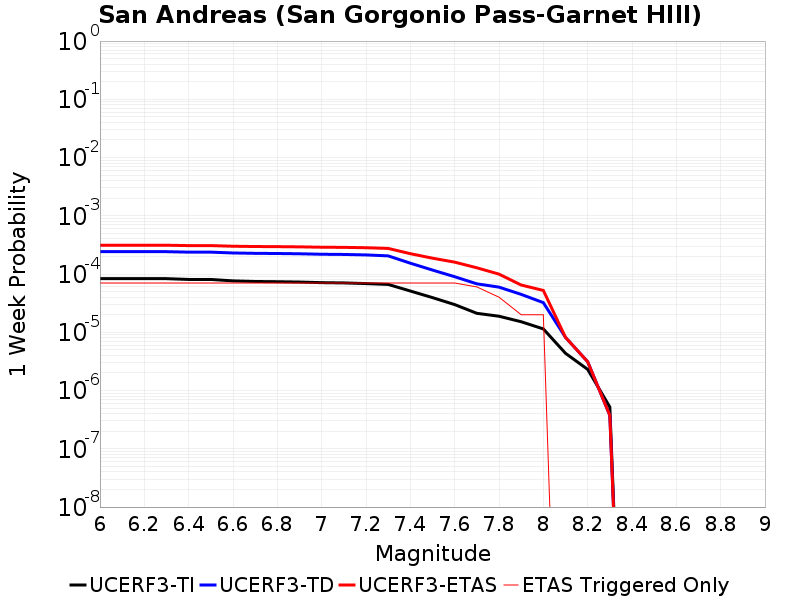 |  |  |  |

| Magnitude | 1 wk TI Prob | 1 wk TD Prob | 1 wk ETAS Prob | 1 wk ETAS/TD Gain | 1 wk ETAS Triggered Only | 1 mo TI Prob | 1 mo TD Prob | 1 mo ETAS Prob | 1 mo ETAS/TD Gain | 1 mo ETAS Triggered Only | 1 yr TI Prob | 1 yr TD Prob | 1 yr ETAS Prob | 1 yr ETAS/TD Gain | 1 yr ETAS Triggered Only | 10 yr TI Prob | 10 yr TD Prob | 10 yr ETAS Prob | 10 yr ETAS/TD Gain | 10 yr ETAS Triggered Only |
|-----|-----|-----|-----|-----|-----|-----|-----|-----|-----|-----|-----|-----|-----|-----|-----|-----|-----|-----|-----|-----|
| 6.0 | 8.31567E-5 | 2.4171363E-4 | 3.116967E-4 | 1.2895288 | 7.0E-5 | 3.5633717E-4 | 0.0010355021 | 0.0011353985 | 1.0964715 | 1.0E-4 | 0.004329778 | 0.012534232 | 0.012672477 | 1.0110294 | 1.4E-4 | 0.042463828 | 0.11581581 | 0.11594844 | 1.0011451 | 1.5E-4 |
| 6.1 | 8.31567E-5 | 2.4171363E-4 | 3.116967E-4 | 1.2895288 | 7.0E-5 | 3.5633717E-4 | 0.0010355021 | 0.0011353985 | 1.0964715 | 1.0E-4 | 0.004329778 | 0.012534232 | 0.012672477 | 1.0110294 | 1.4E-4 | 0.042463828 | 0.11581581 | 0.11594844 | 1.0011451 | 1.5E-4 |
| 6.2 | 8.31567E-5 | 2.4171363E-4 | 3.116967E-4 | 1.2895288 | 7.0E-5 | 3.5633717E-4 | 0.0010355021 | 0.0011353985 | 1.0964715 | 1.0E-4 | 0.004329778 | 0.012534232 | 0.012672477 | 1.0110294 | 1.4E-4 | 0.042463828 | 0.11581581 | 0.11594844 | 1.0011451 | 1.5E-4 |
| 6.3 | 8.31567E-5 | 2.4171363E-4 | 3.116967E-4 | 1.2895288 | 7.0E-5 | 3.5633717E-4 | 0.0010355021 | 0.0011353985 | 1.0964715 | 1.0E-4 | 0.004329778 | 0.012534232 | 0.012672477 | 1.0110294 | 1.4E-4 | 0.042463828 | 0.11581581 | 0.11594844 | 1.0011451 | 1.5E-4 |
| 6.4 | 8.059055E-5 | 2.3723448E-4 | 3.0721788E-4 | 1.2949967 | 7.0E-5 | 3.4534236E-4 | 0.0010163256 | 0.001116224 | 1.0982937 | 1.0E-4 | 0.0041964394 | 0.012303767 | 0.012442045 | 1.0112386 | 1.4E-4 | 0.041180745 | 0.113781534 | 0.11391447 | 1.0011684 | 1.5E-4 |
| 6.5 | 8.059055E-5 | 2.3723448E-4 | 3.0721788E-4 | 1.2949967 | 7.0E-5 | 3.4534236E-4 | 0.0010163256 | 0.001116224 | 1.0982937 | 1.0E-4 | 0.0041964394 | 0.012303767 | 0.012442045 | 1.0112386 | 1.4E-4 | 0.041180745 | 0.113781534 | 0.11391447 | 1.0011684 | 1.5E-4 |
| 6.6 | 7.619237E-5 | 2.2959764E-4 | 2.9958156E-4 | 1.3048112 | 7.0E-5 | 3.2649786E-4 | 9.836212E-4 | 0.0010635426 | 1.0812521 | 8.0E-5 | 0.0039678677 | 0.011910412 | 0.012028983 | 1.0099552 | 1.2E-4 | 0.03897764 | 0.11029522 | 0.110410884 | 1.0010487 | 1.3E-4 |
| 6.7 | 7.440636E-5 | 2.2632579E-4 | 2.9630994E-4 | 1.3092186 | 7.0E-5 | 3.188454E-4 | 9.696095E-4 | 0.0010495319 | 1.0824275 | 8.0E-5 | 0.0038750346 | 0.011741667 | 0.011860258 | 1.0101 | 1.2E-4 | 0.038081564 | 0.108796135 | 0.10891199 | 1.0010649 | 1.3E-4 |
| 6.8 | 7.3735864E-5 | 2.2477761E-4 | 2.9476188E-4 | 1.3113489 | 7.0E-5 | 3.1597257E-4 | 9.6297933E-4 | 0.0010429024 | 1.0829955 | 8.0E-5 | 0.0038401815 | 0.0116618145 | 0.011780416 | 1.01017 | 1.2E-4 | 0.03774495 | 0.1080917 | 0.10820764 | 1.0010726 | 1.3E-4 |
| 6.9 | 7.27575E-5 | 2.2244676E-4 | 2.9243118E-4 | 1.314612 | 7.0E-5 | 3.117806E-4 | 9.5299724E-4 | 0.001032921 | 1.0838656 | 8.0E-5 | 0.003789323 | 0.011541577 | 0.011660192 | 1.0102772 | 1.2E-4 | 0.037253562 | 0.107034534 | 0.10715062 | 1.0010846 | 1.3E-4 |
| 7.0 | 7.102591E-5 | 2.1824101E-4 | 2.8822574E-4 | 1.3206763 | 7.0E-5 | 3.0436125E-4 | 9.349857E-4 | 0.0010149109 | 1.0854828 | 8.0E-5 | 0.003699303 | 0.011324584 | 0.011443225 | 1.0104765 | 1.2E-4 | 0.03638325 | 0.10512345 | 0.105239786 | 1.0011066 | 1.3E-4 |
| 7.1 | 7.028513E-5 | 2.1657333E-4 | 2.8655818E-4 | 1.3231461 | 7.0E-5 | 3.0118722E-4 | 9.278436E-4 | 0.0010077694 | 1.0861415 | 8.0E-5 | 0.0036607897 | 0.01123853 | 0.011357182 | 1.0105575 | 1.2E-4 | 0.036010686 | 0.10435862 | 0.10447506 | 1.0011157 | 1.3E-4 |
| 7.2 | 6.8498244E-5 | 2.1259536E-4 | 2.8258047E-4 | 1.329194 | 7.0E-5 | 2.9353087E-4 | 9.1080717E-4 | 9.907343E-4 | 1.0877541 | 8.0E-5 | 0.003567883 | 0.011033228 | 0.011151904 | 1.0107563 | 1.2E-4 | 0.035111405 | 0.10253262 | 0.10264929 | 1.0011379 | 1.3E-4 |
| 7.3 | 6.622592E-5 | 2.047448E-4 | 2.7473047E-4 | 1.341819 | 7.0E-5 | 2.8379448E-4 | 8.771849E-4 | 9.471235E-4 | 1.0797307 | 7.0E-5 | 0.0034497243 | 0.010627941 | 0.010736772 | 1.0102401 | 1.1E-4 | 0.033966612 | 0.098989606 | 0.09909773 | 1.0010922 | 1.2E-4 |
| 7.4 | 5.1050705E-5 | 1.5329049E-4 | 2.2327976E-4 | 1.4565793 | 7.0E-5 | 2.1877038E-4 | 6.5679476E-4 | 7.267488E-4 | 1.1065081 | 7.0E-5 | 0.002660276 | 0.007967364 | 0.008076488 | 1.0136963 | 1.1E-4 | 0.02628654 | 0.07561796 | 0.07572889 | 1.0014669 | 1.2E-4 |
| 7.5 | 3.9302922E-5 | 1.1683123E-4 | 1.8682306E-4 | 1.5990849 | 7.0E-5 | 1.6843023E-4 | 5.006095E-4 | 5.705745E-4 | 1.1397595 | 7.0E-5 | 0.0020487092 | 0.006077964 | 0.006187295 | 1.0179882 | 1.1E-4 | 0.020299247 | 0.05844123 | 0.058554217 | 1.0019333 | 1.2E-4 |
| 7.6 | 2.9851626E-5 | 8.979856E-5 | 1.5979228E-4 | 1.7794526 | 7.0E-5 | 1.2792926E-4 | 3.8479434E-4 | 4.547674E-4 | 1.1818453 | 7.0E-5 | 0.0015564259 | 0.0046748356 | 0.0047843214 | 1.0234202 | 1.1E-4 | 0.0154556995 | 0.04535161 | 0.04546617 | 1.002526 | 1.2E-4 |
| 7.7 | 2.1135214E-5 | 6.778758E-5 | 1.2778351E-4 | 1.8850579 | 6.0E-5 | 9.0576345E-5 | 2.9048588E-4 | 3.5046844E-4 | 1.2064905 | 6.0E-5 | 0.0011022091 | 0.0035309365 | 0.003610654 | 1.0225769 | 8.0E-5 | 0.010967582 | 0.034490205 | 0.0345771 | 1.0025195 | 9.0E-5 |
| 7.8 | 1.883379E-5 | 5.949265E-5 | 9.949027E-5 | 1.672312 | 4.0E-5 | 8.0713755E-5 | 2.549436E-4 | 2.9493342E-4 | 1.1568575 | 4.0E-5 | 9.822468E-4 | 0.0030995242 | 0.0031593381 | 1.0192978 | 6.0E-5 | 0.0097791655 | 0.030431105 | 0.030498976 | 1.0022303 | 7.0E-5 |
| 7.9 | 1.5156185E-5 | 4.469559E-5 | 6.4694694E-5 | 1.4474515 | 2.0E-5 | 6.495346E-5 | 1.9153846E-4 | 2.1153464E-4 | 1.1043977 | 2.0E-5 | 7.9052144E-4 | 0.0023294885 | 0.0023693952 | 1.0171312 | 4.0E-5 | 0.007877152 | 0.023147974 | 0.023187049 | 1.001688 | 4.0E-5 |
| 8.0 | 1.1405907E-5 | 3.221427E-5 | 5.2213625E-5 | 1.6208229 | 2.0E-5 | 4.8881542E-5 | 1.3805386E-4 | 1.580511E-4 | 1.144851 | 2.0E-5 | 5.9497025E-4 | 0.001679511 | 0.0017194438 | 1.0237764 | 4.0E-5 | 0.005933798 | 0.01680705 | 0.016846377 | 1.00234 | 4.0E-5 |
| 8.1 | 4.3511436E-6 | 8.158639E-6 | 8.158639E-6 | 1.0 | 0.0 | 1.8647626E-5 | 3.4965124E-5 | 3.4965124E-5 | 1.0 | 0.0 | 2.2701119E-4 | 4.256174E-4 | 4.3561315E-4 | 1.0234853 | 1.0E-5 | 0.0022677942 | 0.004505842 | 0.004515797 | 1.0022093 | 1.0E-5 |
| 8.2 | 2.3042528E-6 | 3.116537E-6 | 3.116537E-6 | 1.0 | 0.0 | 9.875332E-6 | 1.3356519E-5 | 1.3356519E-5 | 1.0 | 0.0 | 1.2022553E-4 | 1.6260354E-4 | 1.6260354E-4 | 1.0 | 0.0 | 0.0012016051 | 0.001795252 | 0.001795252 | 1.0 | 0.0 |
| 8.3 | 5.202968E-7 | 3.7362886E-7 | 3.7362886E-7 | 1.0 | 0.0 | 2.2298414E-6 | 1.6012656E-6 | 1.6012656E-6 | 1.0 | 0.0 | 2.714798E-5 | 1.9495252E-5 | 1.9495252E-5 | 1.0 | 0.0 | 2.7144665E-4 | 2.274301E-4 | 2.274301E-4 | 1.0 | 0.0 |

## Cucamonga
*[(top)](#table-of-contents)*

| 1 Week | 1 Month | 1 Year | 10 Year |
|-----|-----|-----|-----|
| 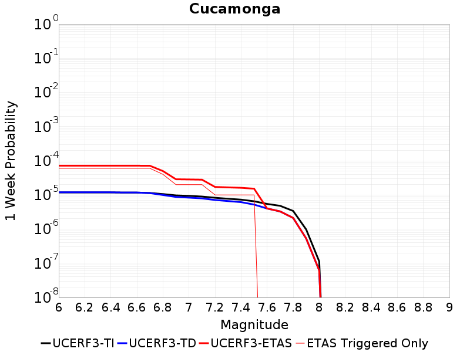 |  |  |  |

| Magnitude | 1 wk TI Prob | 1 wk TD Prob | 1 wk ETAS Prob | 1 wk ETAS/TD Gain | 1 wk ETAS Triggered Only | 1 mo TI Prob | 1 mo TD Prob | 1 mo ETAS Prob | 1 mo ETAS/TD Gain | 1 mo ETAS Triggered Only | 1 yr TI Prob | 1 yr TD Prob | 1 yr ETAS Prob | 1 yr ETAS/TD Gain | 1 yr ETAS Triggered Only | 10 yr TI Prob | 10 yr TD Prob | 10 yr ETAS Prob | 10 yr ETAS/TD Gain | 10 yr ETAS Triggered Only |
|-----|-----|-----|-----|-----|-----|-----|-----|-----|-----|-----|-----|-----|-----|-----|-----|-----|-----|-----|-----|-----|
| 6.0 | 1.1848348E-5 | 1.1917534E-5 | 7.191682E-5 | 6.0345387 | 6.0E-5 | 5.0777642E-5 | 5.1074163E-5 | 1.4106957E-4 | 2.7620535 | 9.0E-5 | 6.180424E-4 | 6.216533E-4 | 7.615663E-4 | 1.225066 | 1.4E-4 | 0.0061632637 | 0.0061999257 | 0.006348996 | 1.0240438 | 1.5E-4 |
| 6.1 | 1.1848348E-5 | 1.1917534E-5 | 7.191682E-5 | 6.0345387 | 6.0E-5 | 5.0777642E-5 | 5.1074163E-5 | 1.4106957E-4 | 2.7620535 | 9.0E-5 | 6.180424E-4 | 6.216533E-4 | 7.615663E-4 | 1.225066 | 1.4E-4 | 0.0061632637 | 0.0061999257 | 0.006348996 | 1.0240438 | 1.5E-4 |
| 6.2 | 1.1848348E-5 | 1.1917534E-5 | 7.191682E-5 | 6.0345387 | 6.0E-5 | 5.0777642E-5 | 5.1074163E-5 | 1.4106957E-4 | 2.7620535 | 9.0E-5 | 6.180424E-4 | 6.216533E-4 | 7.615663E-4 | 1.225066 | 1.4E-4 | 0.0061632637 | 0.0061999257 | 0.006348996 | 1.0240438 | 1.5E-4 |
| 6.3 | 1.1848348E-5 | 1.1917534E-5 | 7.191682E-5 | 6.0345387 | 6.0E-5 | 5.0777642E-5 | 5.1074163E-5 | 1.4106957E-4 | 2.7620535 | 9.0E-5 | 6.180424E-4 | 6.216533E-4 | 7.615663E-4 | 1.225066 | 1.4E-4 | 0.0061632637 | 0.0061999257 | 0.006348996 | 1.0240438 | 1.5E-4 |
| 6.4 | 1.1848348E-5 | 1.1917534E-5 | 7.191682E-5 | 6.0345387 | 6.0E-5 | 5.0777642E-5 | 5.1074163E-5 | 1.4106957E-4 | 2.7620535 | 9.0E-5 | 6.180424E-4 | 6.216533E-4 | 7.615663E-4 | 1.225066 | 1.4E-4 | 0.0061632637 | 0.0061999257 | 0.006348996 | 1.0240438 | 1.5E-4 |
| 6.5 | 1.16988695E-5 | 1.17561785E-5 | 7.175547E-5 | 6.103639 | 6.0E-5 | 5.013705E-5 | 5.0382663E-5 | 1.4037814E-4 | 2.7862387 | 9.0E-5 | 6.102476E-4 | 6.1323907E-4 | 7.531532E-4 | 1.228156 | 1.4E-4 | 0.006085745 | 0.0061162473 | 0.00626533 | 1.0243748 | 1.5E-4 |
| 6.6 | 1.16988695E-5 | 1.17561785E-5 | 7.175547E-5 | 6.103639 | 6.0E-5 | 5.013705E-5 | 5.0382663E-5 | 1.4037814E-4 | 2.7862387 | 9.0E-5 | 6.102476E-4 | 6.1323907E-4 | 7.531532E-4 | 1.228156 | 1.4E-4 | 0.006085745 | 0.0061162473 | 0.00626533 | 1.0243748 | 1.5E-4 |
| 6.7 | 1.1397107E-5 | 1.1291085E-5 | 7.129041E-5 | 6.313867 | 6.0E-5 | 4.884383E-5 | 4.838948E-5 | 1.3838512E-4 | 2.8598185 | 9.0E-5 | 5.9451134E-4 | 5.889852E-4 | 7.2890276E-4 | 1.2375569 | 1.4E-4 | 0.005929234 | 0.005875 | 0.0060241185 | 1.0253819 | 1.5E-4 |
| 6.8 | 1.058387E-5 | 9.942691E-6 | 4.9942293E-5 | 5.023016 | 4.0E-5 | 4.5358654E-5 | 4.261084E-5 | 9.260871E-5 | 2.1733603 | 5.0E-5 | 5.521017E-4 | 5.1866466E-4 | 6.0861796E-4 | 1.1734325 | 9.0E-5 | 0.00550732 | 0.005175152 | 0.0052746343 | 1.0192231 | 1.0E-4 |
| 6.9 | 9.690046E-6 | 8.724993E-6 | 2.8724819E-5 | 3.2922456 | 2.0E-5 | 4.1528107E-5 | 3.7392292E-5 | 6.739117E-5 | 1.8022745 | 3.0E-5 | 5.054874E-4 | 4.5515646E-4 | 5.051337E-4 | 1.1098024 | 5.0E-5 | 0.005043391 | 0.004542779 | 0.0046025063 | 1.0131478 | 6.0E-5 |
| 7.0 | 9.381461E-6 | 8.32935E-6 | 2.8329183E-5 | 3.4011278 | 2.0E-5 | 4.020564E-5 | 3.569673E-5 | 5.569601E-5 | 1.5602554 | 2.0E-5 | 4.893937E-4 | 4.3452135E-4 | 4.7450396E-4 | 1.0920153 | 4.0E-5 | 0.0048831734 | 0.004337252 | 0.004387035 | 1.0114781 | 5.0E-5 |
| 7.1 | 8.946492E-6 | 7.9202855E-6 | 2.7920127E-5 | 3.5251415 | 2.0E-5 | 3.8341543E-5 | 3.394364E-5 | 5.3942964E-5 | 1.589192 | 2.0E-5 | 4.667083E-4 | 4.131858E-4 | 4.431734E-4 | 1.0725765 | 3.0E-5 | 0.0046572937 | 0.0041247136 | 0.0041645486 | 1.0096576 | 4.0E-5 |
| 7.2 | 8.251016E-6 | 7.104234E-6 | 1.7104163E-5 | 2.407601 | 1.0E-5 | 3.5361016E-5 | 3.0446365E-5 | 4.044606E-5 | 1.3284365 | 1.0E-5 | 4.3043532E-4 | 3.7062168E-4 | 3.8061797E-4 | 1.0269717 | 1.0E-5 | 0.0042960253 | 0.0037005718 | 0.003720498 | 1.0053846 | 2.0E-5 |
| 7.3 | 7.717881E-6 | 6.611361E-6 | 1.6611295E-5 | 2.512538 | 1.0E-5 | 3.3076216E-5 | 2.8334098E-5 | 3.8333816E-5 | 1.3529216 | 1.0E-5 | 4.026285E-4 | 3.4491328E-4 | 3.549098E-4 | 1.0289828 | 1.0E-5 | 0.004018998 | 0.0034443242 | 0.0034642552 | 1.0057867 | 2.0E-5 |
| 7.4 | 7.275623E-6 | 6.152649E-6 | 1.6152588E-5 | 2.6253061 | 1.0E-5 | 3.118087E-5 | 2.6368229E-5 | 3.6367965E-5 | 1.3792343 | 1.0E-5 | 3.7956095E-4 | 3.2098612E-4 | 3.309829E-4 | 1.031144 | 1.0E-5 | 0.0037891332 | 0.0032057713 | 0.0032257072 | 1.0062188 | 2.0E-5 |
| 7.5 | 6.5109502E-6 | 5.209556E-6 | 1.52095035E-5 | 2.9195395 | 1.0E-5 | 2.7903774E-5 | 2.2326478E-5 | 3.2326254E-5 | 1.4478886 | 1.0E-5 | 3.3967546E-4 | 2.7179113E-4 | 2.817884E-4 | 1.036783 | 1.0E-5 | 0.0033915674 | 0.002715123 | 0.0027350686 | 1.0073462 | 2.0E-5 |
| 7.6 | 5.4495326E-6 | 4.007393E-6 | 4.007393E-6 | 1.0 | 0.0 | 2.335493E-5 | 1.7174429E-5 | 1.7174429E-5 | 1.0 | 0.0 | 2.8430918E-4 | 2.0907867E-4 | 2.0907867E-4 | 1.0 | 0.0 | 0.0028394572 | 0.0020893554 | 0.0020993345 | 1.0047761 | 1.0E-5 |
| 7.7 | 4.7997164E-6 | 3.2909227E-6 | 3.2909227E-6 | 1.0 | 0.0 | 2.057005E-5 | 1.4103878E-5 | 1.4103878E-5 | 1.0 | 0.0 | 2.504116E-4 | 1.7170122E-4 | 1.7170122E-4 | 1.0 | 0.0 | 0.002501296 | 0.001716254 | 0.001716254 | 1.0 | 0.0 |
| 7.8 | 3.3941733E-6 | 2.1209698E-6 | 2.1209698E-6 | 1.0 | 0.0 | 1.4546376E-5 | 9.089839E-6 | 9.089839E-6 | 1.0 | 0.0 | 1.7708774E-4 | 1.1066318E-4 | 1.1066318E-4 | 1.0 | 0.0 | 0.0017694668 | 0.0011062323 | 0.0011062323 | 1.0 | 0.0 |
| 7.9 | 9.750552E-7 | 5.3032016E-7 | 5.3032016E-7 | 1.0 | 0.0 | 4.178801E-6 | 2.2727988E-6 | 2.2727988E-6 | 1.0 | 0.0 | 5.0875715E-5 | 2.7670978E-5 | 2.7670978E-5 | 1.0 | 0.0 | 5.086407E-4 | 2.7667577E-4 | 2.7667577E-4 | 1.0 | 0.0 |
| 8.0 | 1.133857E-7 | 6.1972635E-8 | 6.1972635E-8 | 1.0 | 0.0 | 4.8593864E-7 | 2.6559698E-7 | 2.6559698E-7 | 1.0 | 0.0 | 5.9162867E-6 | 3.2336386E-6 | 3.2336386E-6 | 1.0 | 0.0 | 5.916129E-5 | 3.2335935E-5 | 3.2335935E-5 | 1.0 | 0.0 |

## Pleito
*[(top)](#table-of-contents)*

| 1 Week | 1 Month | 1 Year | 10 Year |
|-----|-----|-----|-----|
|  | 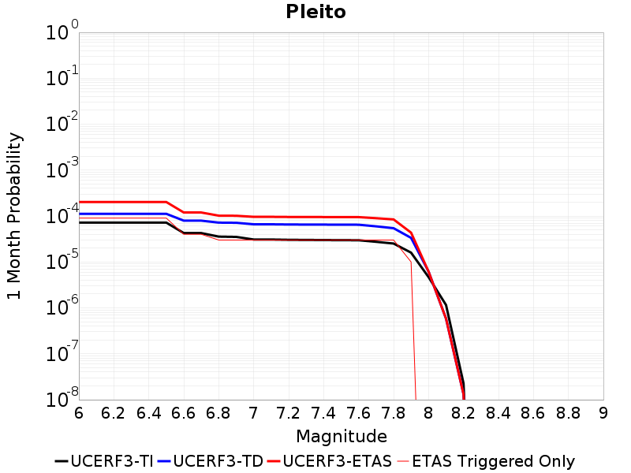 | 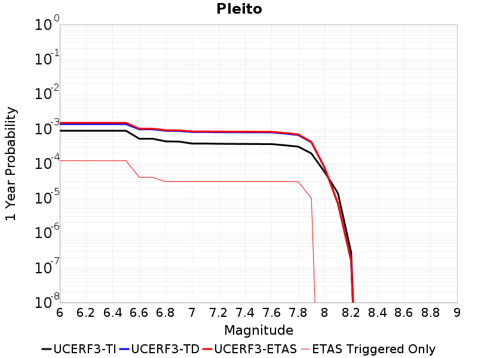 |  |

| Magnitude | 1 wk TI Prob | 1 wk TD Prob | 1 wk ETAS Prob | 1 wk ETAS/TD Gain | 1 wk ETAS Triggered Only | 1 mo TI Prob | 1 mo TD Prob | 1 mo ETAS Prob | 1 mo ETAS/TD Gain | 1 mo ETAS Triggered Only | 1 yr TI Prob | 1 yr TD Prob | 1 yr ETAS Prob | 1 yr ETAS/TD Gain | 1 yr ETAS Triggered Only | 10 yr TI Prob | 10 yr TD Prob | 10 yr ETAS Prob | 10 yr ETAS/TD Gain | 10 yr ETAS Triggered Only |
|-----|-----|-----|-----|-----|-----|-----|-----|-----|-----|-----|-----|-----|-----|-----|-----|-----|-----|-----|-----|-----|
| 6.0 | 1.6763008E-5 | 2.60534E-5 | 8.6051834E-5 | 3.3029025 | 6.0E-5 | 7.183948E-5 | 1.11653055E-4 | 2.0164301E-4 | 1.8059784 | 9.0E-5 | 8.742947E-4 | 0.0013586008 | 0.0014784378 | 1.0882062 | 1.2E-4 | 0.00870863 | 0.013602854 | 0.013731085 | 1.0094268 | 1.3E-4 |
| 6.1 | 1.6763008E-5 | 2.60534E-5 | 8.6051834E-5 | 3.3029025 | 6.0E-5 | 7.183948E-5 | 1.11653055E-4 | 2.0164301E-4 | 1.8059784 | 9.0E-5 | 8.742947E-4 | 0.0013586008 | 0.0014784378 | 1.0882062 | 1.2E-4 | 0.00870863 | 0.013602854 | 0.013731085 | 1.0094268 | 1.3E-4 |
| 6.2 | 1.6763008E-5 | 2.60534E-5 | 8.6051834E-5 | 3.3029025 | 6.0E-5 | 7.183948E-5 | 1.11653055E-4 | 2.0164301E-4 | 1.8059784 | 9.0E-5 | 8.742947E-4 | 0.0013586008 | 0.0014784378 | 1.0882062 | 1.2E-4 | 0.00870863 | 0.013602854 | 0.013731085 | 1.0094268 | 1.3E-4 |
| 6.3 | 1.6763008E-5 | 2.60534E-5 | 8.6051834E-5 | 3.3029025 | 6.0E-5 | 7.183948E-5 | 1.11653055E-4 | 2.0164301E-4 | 1.8059784 | 9.0E-5 | 8.742947E-4 | 0.0013586008 | 0.0014784378 | 1.0882062 | 1.2E-4 | 0.00870863 | 0.013602854 | 0.013731085 | 1.0094268 | 1.3E-4 |
| 6.4 | 1.6763008E-5 | 2.60534E-5 | 8.6051834E-5 | 3.3029025 | 6.0E-5 | 7.183948E-5 | 1.11653055E-4 | 2.0164301E-4 | 1.8059784 | 9.0E-5 | 8.742947E-4 | 0.0013586008 | 0.0014784378 | 1.0882062 | 1.2E-4 | 0.00870863 | 0.013602854 | 0.013731085 | 1.0094268 | 1.3E-4 |
| 6.5 | 1.6763008E-5 | 2.60534E-5 | 8.6051834E-5 | 3.3029025 | 6.0E-5 | 7.183948E-5 | 1.11653055E-4 | 2.0164301E-4 | 1.8059784 | 9.0E-5 | 8.742947E-4 | 0.0013586008 | 0.0014784378 | 1.0882062 | 1.2E-4 | 0.00870863 | 0.013602854 | 0.013731085 | 1.0094268 | 1.3E-4 |
| 6.6 | 9.910213E-6 | 1.8480203E-5 | 3.8479833E-5 | 2.0822191 | 2.0E-5 | 4.247165E-5 | 7.9198486E-5 | 1.1919531E-4 | 1.5050201 | 4.0E-5 | 5.169696E-4 | 9.6381875E-4 | 0.0010037802 | 1.0414616 | 4.0E-5 | 0.0051576863 | 0.0096897865 | 0.009729399 | 1.004088 | 4.0E-5 |
| 6.7 | 9.910213E-6 | 1.8480203E-5 | 3.8479833E-5 | 2.0822191 | 2.0E-5 | 4.247165E-5 | 7.9198486E-5 | 1.1919531E-4 | 1.5050201 | 4.0E-5 | 5.169696E-4 | 9.6381875E-4 | 0.0010037802 | 1.0414616 | 4.0E-5 | 0.0051576863 | 0.0096897865 | 0.009729399 | 1.004088 | 4.0E-5 |
| 6.8 | 8.300162E-6 | 1.6735405E-5 | 3.673507E-5 | 2.1950512 | 2.0E-5 | 3.557164E-5 | 7.17212E-5 | 1.0171905E-4 | 1.4182564 | 3.0E-5 | 4.3299864E-4 | 8.728573E-4 | 9.028311E-4 | 1.0343399 | 3.0E-5 | 0.004321559 | 0.008787523 | 0.008817259 | 1.0033839 | 3.0E-5 |
| 6.9 | 8.183114E-6 | 1.660637E-5 | 3.6606038E-5 | 2.2043371 | 2.0E-5 | 3.5070017E-5 | 7.1168215E-5 | 1.01166086E-4 | 1.4215065 | 3.0E-5 | 4.2689382E-4 | 8.6613005E-4 | 8.961041E-4 | 1.0346068 | 3.0E-5 | 0.0042607468 | 0.008720781 | 0.008750519 | 1.0034101 | 3.0E-5 |
| 7.0 | 7.1748823E-6 | 1.5411279E-5 | 3.541097E-5 | 2.297731 | 2.0E-5 | 3.0749135E-5 | 6.604667E-5 | 9.6044685E-5 | 1.4541943 | 3.0E-5 | 3.743064E-4 | 8.038221E-4 | 8.33798E-4 | 1.0372916 | 3.0E-5 | 0.0037367654 | 0.008101881 | 0.008131637 | 1.0036728 | 3.0E-5 |
| 7.1 | 7.1671807E-6 | 1.540144E-5 | 3.540113E-5 | 2.29856 | 2.0E-5 | 3.0716128E-5 | 6.6004504E-5 | 9.600252E-5 | 1.4544845 | 3.0E-5 | 3.7390468E-4 | 8.0330914E-4 | 8.3328504E-4 | 1.0373155 | 3.0E-5 | 0.0037327618 | 0.008096788 | 0.008126545 | 1.0036752 | 3.0E-5 |
| 7.2 | 7.0649667E-6 | 1.5250031E-5 | 3.5249726E-5 | 2.3114529 | 2.0E-5 | 3.0278077E-5 | 6.535564E-5 | 9.535368E-5 | 1.458997 | 3.0E-5 | 3.6857324E-4 | 7.95415E-4 | 8.2539115E-4 | 1.0376861 | 3.0E-5 | 0.0036796255 | 0.008018266 | 0.008048026 | 1.0037115 | 3.0E-5 |
| 7.3 | 7.02082E-6 | 1.5193078E-5 | 3.5192774E-5 | 2.316369 | 2.0E-5 | 3.008888E-5 | 6.511157E-5 | 9.5109615E-5 | 1.4607176 | 3.0E-5 | 3.6627054E-4 | 7.924456E-4 | 8.2242186E-4 | 1.0378275 | 3.0E-5 | 0.0036566744 | 0.007988577 | 0.008018337 | 1.0037254 | 3.0E-5 |
| 7.4 | 6.987146E-6 | 1.5151785E-5 | 3.5151483E-5 | 2.3199565 | 2.0E-5 | 2.9944567E-5 | 6.493461E-5 | 9.4932664E-5 | 1.4619732 | 3.0E-5 | 3.6451413E-4 | 7.902927E-4 | 8.20269E-4 | 1.0379306 | 3.0E-5 | 0.0036391679 | 0.007967088 | 0.007996849 | 1.0037355 | 3.0E-5 |
| 7.5 | 6.9494554E-6 | 1.51080285E-5 | 3.5107725E-5 | 2.3237796 | 2.0E-5 | 2.9783041E-5 | 6.474709E-5 | 9.474515E-5 | 1.4633113 | 3.0E-5 | 3.625482E-4 | 7.880113E-4 | 8.1798766E-4 | 1.0380405 | 3.0E-5 | 0.0036195726 | 0.007944391 | 0.007974152 | 1.0037463 | 3.0E-5 |
| 7.6 | 6.92694E-6 | 1.50650385E-5 | 3.506474E-5 | 2.327557 | 2.0E-5 | 2.9686547E-5 | 6.456286E-5 | 9.456092E-5 | 1.4646335 | 3.0E-5 | 3.6137376E-4 | 7.857699E-4 | 8.157463E-4 | 1.0381491 | 3.0E-5 | 0.0036078666 | 0.007922089 | 0.007951851 | 1.0037569 | 3.0E-5 |
| 7.7 | 6.395867E-6 | 1.389507E-5 | 3.389479E-5 | 2.4393394 | 2.0E-5 | 2.741057E-5 | 5.9548944E-5 | 8.954715E-5 | 1.5037572 | 3.0E-5 | 3.336726E-4 | 7.2476757E-4 | 7.5474585E-4 | 1.0413625 | 3.0E-5 | 0.0033317201 | 0.0073164264 | 0.007346207 | 1.0040704 | 3.0E-5 |
| 7.8 | 5.8664327E-6 | 1.2657074E-5 | 3.265682E-5 | 2.5801241 | 2.0E-5 | 2.5141611E-5 | 5.4243475E-5 | 8.4241845E-5 | 1.5530319 | 3.0E-5 | 3.060561E-4 | 6.6021446E-4 | 6.9019466E-4 | 1.0454098 | 3.0E-5 | 0.0030563495 | 0.0066688657 | 0.0066986657 | 1.0044686 | 3.0E-5 |
| 7.9 | 3.7167474E-6 | 7.792093E-6 | 1.7792016E-5 | 2.2833421 | 1.0E-5 | 1.592882E-5 | 3.339426E-5 | 4.3393924E-5 | 1.2994426 | 1.0E-5 | 1.9391612E-4 | 4.0649943E-4 | 4.1649537E-4 | 1.0245903 | 1.0E-5 | 0.0019374699 | 0.004111696 | 0.0041216547 | 1.0024221 | 1.0E-5 |
| 8.0 | 1.0903841E-6 | 1.4397074E-6 | 1.4397074E-6 | 1.0 | 0.0 | 4.6730665E-6 | 6.17016E-6 | 6.17016E-6 | 1.0 | 0.0 | 5.68931E-5 | 7.5119126E-5 | 7.5119126E-5 | 1.0 | 0.0 | 5.6878536E-4 | 7.735747E-4 | 7.735747E-4 | 1.0 | 0.0 |
| 8.1 | 2.6894583E-7 | 1.357412E-7 | 1.357412E-7 | 1.0 | 0.0 | 1.1526245E-6 | 5.817478E-7 | 5.817478E-7 | 1.0 | 0.0 | 1.4033113E-5 | 7.0827573E-6 | 7.0827573E-6 | 1.0 | 0.0 | 1.4032227E-4 | 7.849427E-5 | 7.849427E-5 | 1.0 | 0.0 |
| 8.2 | 5.2967013E-9 | 3.0762353E-9 | 3.0762353E-9 | 1.0 | 0.0 | 2.2700148E-8 | 1.31838656E-8 | 1.31838656E-8 | 1.0 | 0.0 | 2.7637427E-7 | 1.6051355E-7 | 1.6051355E-7 | 1.0 | 0.0 | 2.7637393E-6 | 1.8017145E-6 | 1.8017145E-6 | 1.0 | 0.0 |

## Brawley (Seismic Zone) alt 1
*[(top)](#table-of-contents)*

| 1 Week | 1 Month | 1 Year | 10 Year |
|-----|-----|-----|-----|
|  | 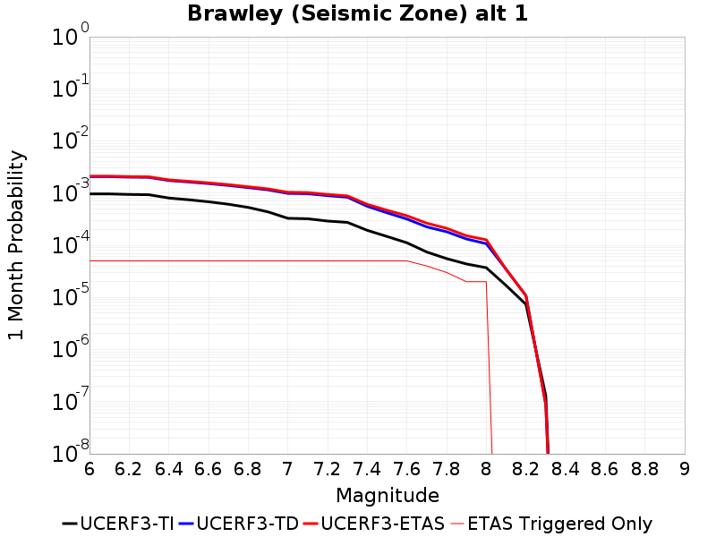 |  | 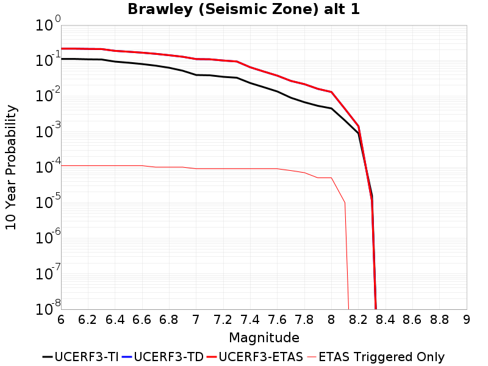 |

| Magnitude | 1 wk TI Prob | 1 wk TD Prob | 1 wk ETAS Prob | 1 wk ETAS/TD Gain | 1 wk ETAS Triggered Only | 1 mo TI Prob | 1 mo TD Prob | 1 mo ETAS Prob | 1 mo ETAS/TD Gain | 1 mo ETAS Triggered Only | 1 yr TI Prob | 1 yr TD Prob | 1 yr ETAS Prob | 1 yr ETAS/TD Gain | 1 yr ETAS Triggered Only | 10 yr TI Prob | 10 yr TD Prob | 10 yr ETAS Prob | 10 yr ETAS/TD Gain | 10 yr ETAS Triggered Only |
|-----|-----|-----|-----|-----|-----|-----|-----|-----|-----|-----|-----|-----|-----|-----|-----|-----|-----|-----|-----|-----|
| 6.0 | 2.2521618E-4 | 4.8190012E-4 | 5.118857E-4 | 1.0622236 | 3.0E-5 | 9.6485513E-4 | 0.0020636881 | 0.002113585 | 1.0241785 | 5.0E-5 | 0.011683988 | 0.024840917 | 0.024938432 | 1.0039256 | 1.0E-4 | 0.11088423 | 0.21602125 | 0.21610749 | 1.0003992 | 1.1E-4 |
| 6.1 | 2.2521618E-4 | 4.8190012E-4 | 5.118857E-4 | 1.0622236 | 3.0E-5 | 9.6485513E-4 | 0.0020636881 | 0.002113585 | 1.0241785 | 5.0E-5 | 0.011683988 | 0.024840917 | 0.024938432 | 1.0039256 | 1.0E-4 | 0.11088423 | 0.21602125 | 0.21610749 | 1.0003992 | 1.1E-4 |
| 6.2 | 2.198148E-4 | 4.7262837E-4 | 5.026142E-4 | 1.0634449 | 3.0E-5 | 9.417233E-4 | 0.0020240138 | 0.0020739126 | 1.0246534 | 5.0E-5 | 0.011405343 | 0.024369072 | 0.024466636 | 1.0040035 | 1.0E-4 | 0.10837428 | 0.21242316 | 0.2125098 | 1.0004078 | 1.1E-4 |
| 6.3 | 2.1704129E-4 | 4.6703868E-4 | 4.970247E-4 | 1.0642045 | 3.0E-5 | 9.298453E-4 | 0.0020000949 | 0.002049995 | 1.0249488 | 5.0E-5 | 0.011262234 | 0.024084909 | 0.0241825 | 1.0040519 | 1.0E-4 | 0.107082725 | 0.21031994 | 0.2104068 | 1.0004131 | 1.1E-4 |
| 6.4 | 1.876142E-4 | 4.0670173E-4 | 4.3668953E-4 | 1.0737342 | 3.0E-5 | 8.038131E-4 | 0.0017418574 | 0.0017917703 | 1.0286549 | 5.0E-5 | 0.00974259 | 0.021010691 | 0.02110859 | 1.0046595 | 1.0E-4 | 0.093263686 | 0.1871391 | 0.18722852 | 1.0004778 | 1.1E-4 |
| 6.5 | 1.7390939E-4 | 3.8117683E-4 | 4.1116538E-4 | 1.0786736 | 3.0E-5 | 7.45113E-4 | 0.0016326044 | 0.0016825227 | 1.0305759 | 5.0E-5 | 0.009034078 | 0.019706916 | 0.019804945 | 1.0049744 | 1.0E-4 | 0.086755216 | 0.17697267 | 0.17706321 | 1.0005115 | 1.1E-4 |
| 6.6 | 1.591791E-4 | 3.5539473E-4 | 3.8538405E-4 | 1.0843831 | 3.0E-5 | 6.8201777E-4 | 0.0015222413 | 0.0015721652 | 1.0327963 | 5.0E-5 | 0.008271996 | 0.018379018 | 0.018477181 | 1.0053409 | 1.0E-4 | 0.07970774 | 0.16638143 | 0.16647314 | 1.0005511 | 1.1E-4 |
| 6.7 | 1.4268003E-4 | 3.27195E-4 | 3.571852E-4 | 1.0916585 | 3.0E-5 | 6.1134255E-4 | 0.001401519 | 0.001451449 | 1.0356256 | 5.0E-5 | 0.007417723 | 0.01693319 | 0.017021665 | 1.0052251 | 9.0E-5 | 0.07174956 | 0.15454893 | 0.15463346 | 1.000547 | 1.0E-4 |
| 6.8 | 1.239713E-4 | 2.9739086E-4 | 3.2738195E-4 | 1.1008474 | 3.0E-5 | 5.3119735E-4 | 0.001273916 | 0.0013238523 | 1.0391991 | 5.0E-5 | 0.0064481674 | 0.015401106 | 0.015489721 | 1.0057538 | 9.0E-5 | 0.06264243 | 0.14111169 | 0.14119758 | 1.0006087 | 1.0E-4 |
| 6.9 | 1.0180238E-4 | 2.6922175E-4 | 2.992137E-4 | 1.1114023 | 3.0E-5 | 4.3622297E-4 | 0.0011533018 | 0.0012032441 | 1.0433038 | 5.0E-5 | 0.005298089 | 0.013952091 | 0.014040835 | 1.0063607 | 9.0E-5 | 0.05173543 | 0.12767938 | 0.12776661 | 1.0006832 | 1.0E-4 |
| 7.0 | 7.6619996E-5 | 2.3038476E-4 | 2.6037783E-4 | 1.1301869 | 3.0E-5 | 3.283301E-4 | 9.86993E-4 | 0.0010369435 | 1.0506089 | 5.0E-5 | 0.0039900932 | 0.011951175 | 0.012030219 | 1.0066139 | 8.0E-5 | 0.039192066 | 0.10991056 | 0.10999067 | 1.0007288 | 9.0E-5 |
| 7.1 | 7.5127435E-5 | 2.2719902E-4 | 2.571922E-4 | 1.1320128 | 3.0E-5 | 3.2193496E-4 | 9.7335E-4 | 0.0010233014 | 1.051319 | 5.0E-5 | 0.0039125155 | 0.011786882 | 0.011865939 | 1.0067072 | 8.0E-5 | 0.038443442 | 0.10847128 | 0.108551525 | 1.0007397 | 9.0E-5 |
| 7.2 | 6.788582E-5 | 2.0841068E-4 | 2.3840442E-4 | 1.1439166 | 3.0E-5 | 2.9090676E-4 | 8.92886E-4 | 9.428414E-4 | 1.0559481 | 5.0E-5 | 0.0035360386 | 0.010817374 | 0.010896509 | 1.0073155 | 8.0E-5 | 0.034803 | 0.100135036 | 0.10021602 | 1.0008088 | 9.0E-5 |
| 7.3 | 6.399602E-5 | 1.9457679E-4 | 2.2457095E-4 | 1.1541507 | 3.0E-5 | 2.7423984E-4 | 8.3363696E-4 | 8.835953E-4 | 1.0599282 | 5.0E-5 | 0.0033337586 | 0.010102917 | 0.01018211 | 1.0078385 | 8.0E-5 | 0.03284188 | 0.09398908 | 0.09407062 | 1.0008676 | 9.0E-5 |
| 7.4 | 4.506759E-5 | 1.3033343E-4 | 1.6032951E-4 | 1.2301489 | 3.0E-5 | 1.9313251E-4 | 5.5845315E-4 | 6.0842524E-4 | 1.089483 | 5.0E-5 | 0.0023488526 | 0.006778157 | 0.0068576145 | 1.0117226 | 8.0E-5 | 0.023241805 | 0.064564355 | 0.06464855 | 1.0013039 | 9.0E-5 |
| 7.5 | 3.43289E-5 | 9.761954E-5 | 1.2761661E-4 | 1.3072855 | 3.0E-5 | 1.4711556E-4 | 4.1830272E-4 | 4.682818E-4 | 1.1194806 | 5.0E-5 | 0.0017896603 | 0.0050810096 | 0.005160603 | 1.0156649 | 8.0E-5 | 0.01775316 | 0.04895302 | 0.04903861 | 1.0017484 | 9.0E-5 |
| 7.6 | 2.5980507E-5 | 7.419105E-5 | 1.04188824E-4 | 1.4043314 | 3.0E-5 | 1.1134028E-4 | 3.1792303E-4 | 3.6790714E-4 | 1.1572207 | 5.0E-5 | 0.001354725 | 0.0038638692 | 0.00394356 | 1.0206246 | 8.0E-5 | 0.013464959 | 0.03748602 | 0.037572645 | 1.0023109 | 9.0E-5 |
| 7.7 | 1.7292105E-5 | 5.248436E-5 | 7.248331E-5 | 1.3810459 | 2.0E-5 | 7.4106916E-5 | 2.2491362E-4 | 2.6490464E-4 | 1.177806 | 4.0E-5 | 9.018782E-4 | 0.0027348911 | 0.0028046996 | 1.0255252 | 7.0E-5 | 0.008982267 | 0.02668004 | 0.026757905 | 1.0029185 | 8.0E-5 |
| 7.8 | 1.2927471E-5 | 4.232456E-5 | 5.2324132E-5 | 1.2362595 | 1.0E-5 | 5.5402274E-5 | 1.8137836E-4 | 2.1137293E-4 | 1.1653701 | 3.0E-5 | 6.743139E-4 | 0.002206048 | 0.0022659157 | 1.027138 | 6.0E-5 | 0.0067227143 | 0.02162175 | 0.021690236 | 1.0031675 | 7.0E-5 |
| 7.9 | 1.0200774E-5 | 3.077812E-5 | 3.077812E-5 | 1.0 | 0.0 | 4.371687E-5 | 1.3189956E-4 | 1.5189692E-4 | 1.1516105 | 2.0E-5 | 5.321229E-4 | 0.0016046956 | 0.0016546153 | 1.0311086 | 5.0E-5 | 0.005308505 | 0.015926147 | 0.01597535 | 1.0030895 | 5.0E-5 |
| 8.0 | 8.650396E-6 | 2.4989175E-5 | 2.4989175E-5 | 1.0 | 0.0 | 3.70726E-5 | 1.0709207E-4 | 1.2708992E-4 | 1.1867352 | 2.0E-5 | 4.5126543E-4 | 0.0013030671 | 0.0013530019 | 1.038321 | 5.0E-5 | 0.0045035016 | 0.013003204 | 0.013052554 | 1.0037951 | 5.0E-5 |
| 8.1 | 3.9368224E-6 | 8.042841E-6 | 8.042841E-6 | 1.0 | 0.0 | 1.6871985E-5 | 3.4468863E-5 | 3.4468863E-5 | 1.0 | 0.0 | 2.0539707E-4 | 4.1957776E-4 | 4.2957356E-4 | 1.0238235 | 1.0E-5 | 0.0020520731 | 0.004352369 | 0.004362325 | 1.0022876 | 1.0E-5 |
| 8.2 | 1.7101195E-6 | 2.5116462E-6 | 2.5116462E-6 | 1.0 | 0.0 | 7.329063E-6 | 1.0764154E-5 | 1.0764154E-5 | 1.0 | 0.0 | 8.922769E-5 | 1.3104573E-4 | 1.3104573E-4 | 1.0 | 0.0 | 8.9191867E-4 | 0.001415288 | 0.001415288 | 1.0 | 0.0 |
| 8.3 | 3.0346666E-8 | 2.0338936E-8 | 2.0338936E-8 | 1.0 | 0.0 | 1.3005713E-7 | 8.716687E-8 | 8.716687E-8 | 1.0 | 0.0 | 1.5834444E-6 | 1.0612564E-6 | 1.0612564E-6 | 1.0 | 0.0 | 1.5834332E-5 | 1.1010331E-5 | 1.1010331E-5 | 1.0 | 0.0 |

## Imperial
*[(top)](#table-of-contents)*

| 1 Week | 1 Month | 1 Year | 10 Year |
|-----|-----|-----|-----|
| 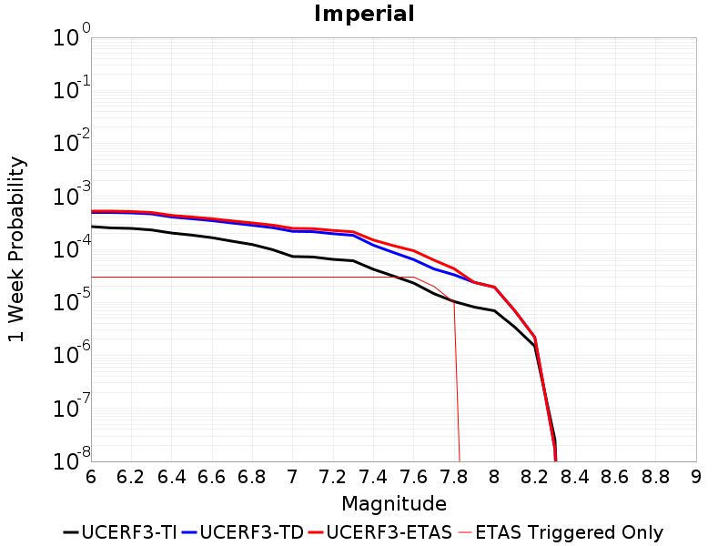 | 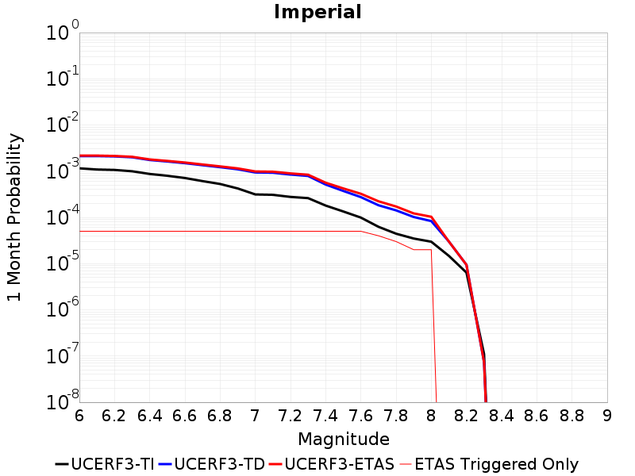 |  |  |

| Magnitude | 1 wk TI Prob | 1 wk TD Prob | 1 wk ETAS Prob | 1 wk ETAS/TD Gain | 1 wk ETAS Triggered Only | 1 mo TI Prob | 1 mo TD Prob | 1 mo ETAS Prob | 1 mo ETAS/TD Gain | 1 mo ETAS Triggered Only | 1 yr TI Prob | 1 yr TD Prob | 1 yr ETAS Prob | 1 yr ETAS/TD Gain | 1 yr ETAS Triggered Only | 10 yr TI Prob | 10 yr TD Prob | 10 yr ETAS Prob | 10 yr ETAS/TD Gain | 10 yr ETAS Triggered Only |
|-----|-----|-----|-----|-----|-----|-----|-----|-----|-----|-----|-----|-----|-----|-----|-----|-----|-----|-----|-----|-----|
| 6.0 | 2.6875173E-4 | 4.954547E-4 | 5.2543986E-4 | 1.0605204 | 3.0E-5 | 0.0011512847 | 0.0021216874 | 0.0021715814 | 1.0235162 | 5.0E-5 | 0.013927074 | 0.025534285 | 0.025631733 | 1.0038162 | 1.0E-4 | 0.13085878 | 0.22307825 | 0.22316371 | 1.0003831 | 1.1E-4 |
| 6.1 | 2.5356023E-4 | 4.954547E-4 | 5.2543986E-4 | 1.0605204 | 3.0E-5 | 0.001086234 | 0.0021216874 | 0.0021715814 | 1.0235162 | 5.0E-5 | 0.013144928 | 0.025534285 | 0.025631733 | 1.0038162 | 1.0E-4 | 0.123940155 | 0.22307825 | 0.22316371 | 1.0003831 | 1.1E-4 |
| 6.2 | 2.4820742E-4 | 4.862912E-4 | 5.1627663E-4 | 1.0616615 | 3.0E-5 | 0.0010633124 | 0.002082478 | 0.0021323739 | 1.0239599 | 5.0E-5 | 0.01286919 | 0.025068277 | 0.025165772 | 1.0038891 | 1.0E-4 | 0.12148927 | 0.21955445 | 0.2196403 | 1.000391 | 1.1E-4 |
| 6.3 | 2.3205351E-4 | 4.662052E-4 | 4.961912E-4 | 1.0643194 | 3.0E-5 | 9.94136E-4 | 0.0019965286 | 0.0020464289 | 1.0249934 | 5.0E-5 | 0.012036599 | 0.0240385 | 0.024136096 | 1.00406 | 1.0E-4 | 0.11405133 | 0.21105738 | 0.21114416 | 1.0004112 | 1.1E-4 |
| 6.4 | 2.0304754E-4 | 4.0680697E-4 | 4.3679477E-4 | 1.0737151 | 3.0E-5 | 8.6991355E-4 | 0.0017423081 | 0.0017922211 | 1.0286475 | 5.0E-5 | 0.010539869 | 0.021012112 | 0.021110011 | 1.0046592 | 1.0E-4 | 0.100537635 | 0.18827547 | 0.18836476 | 1.0004742 | 1.1E-4 |
| 6.5 | 1.854992E-4 | 3.7760503E-4 | 4.075937E-4 | 1.0794181 | 3.0E-5 | 7.9475436E-4 | 0.001617316 | 0.0016672352 | 1.0308654 | 5.0E-5 | 0.009633281 | 0.019523276 | 0.019621324 | 1.005022 | 1.0E-4 | 0.0922623 | 0.17637518 | 0.17646578 | 1.0005137 | 1.1E-4 |
| 6.6 | 1.6586106E-4 | 3.4749616E-4 | 3.7748573E-4 | 1.0863019 | 3.0E-5 | 7.106394E-4 | 0.0014884294 | 0.001538355 | 1.0335425 | 5.0E-5 | 0.008617763 | 0.017972298 | 0.0180705 | 1.0054641 | 1.0E-4 | 0.08291132 | 0.16363674 | 0.16372874 | 1.0005622 | 1.1E-4 |
| 6.7 | 1.4224656E-4 | 3.1404186E-4 | 3.4403242E-4 | 1.0954987 | 3.0E-5 | 6.094856E-4 | 0.0013452077 | 0.0013951404 | 1.037119 | 5.0E-5 | 0.0073952693 | 0.01625805 | 0.016346585 | 1.0054457 | 9.0E-5 | 0.07153955 | 0.14905791 | 0.149143 | 1.0005709 | 1.0E-4 |
| 6.8 | 1.2317259E-4 | 2.8447984E-4 | 3.144713E-4 | 1.1054256 | 3.0E-5 | 5.2777573E-4 | 0.0012186359 | 0.0012685751 | 1.0409795 | 5.0E-5 | 0.0064067547 | 0.014737387 | 0.014826061 | 1.006017 | 9.0E-5 | 0.06225166 | 0.13560505 | 0.1356915 | 1.0006374 | 1.0E-4 |
| 6.9 | 9.859898E-5 | 2.5630882E-4 | 2.8630113E-4 | 1.1170163 | 3.0E-5 | 4.2249862E-4 | 0.0010980084 | 0.0011479534 | 1.045487 | 5.0E-5 | 0.0051317946 | 0.013287315 | 0.013376119 | 1.0066833 | 9.0E-5 | 0.05014893 | 0.12193927 | 0.12202708 | 1.00072 | 1.0E-4 |
| 7.0 | 7.3191884E-5 | 2.1851758E-4 | 2.4851103E-4 | 1.1372588 | 3.0E-5 | 3.136418E-4 | 9.361711E-4 | 9.861243E-4 | 1.053359 | 5.0E-5 | 0.003811904 | 0.011339036 | 0.011418129 | 1.0069753 | 8.0E-5 | 0.037471764 | 0.104501374 | 0.10458197 | 1.0007713 | 9.0E-5 |
| 7.1 | 7.1760296E-5 | 2.1551408E-4 | 2.455076E-4 | 1.1391721 | 3.0E-5 | 3.0750787E-4 | 9.2330814E-4 | 9.7326195E-4 | 1.0541031 | 5.0E-5 | 0.003737482 | 0.011184047 | 0.011263153 | 1.007073 | 8.0E-5 | 0.03675245 | 0.10313415 | 0.10321487 | 1.0007826 | 9.0E-5 |
| 7.2 | 6.46614E-5 | 1.9713573E-4 | 2.2712981E-4 | 1.1521494 | 3.0E-5 | 2.7709085E-4 | 8.44597E-4 | 8.945548E-4 | 1.0591499 | 5.0E-5 | 0.0033683628 | 0.010235138 | 0.010314319 | 1.0077362 | 8.0E-5 | 0.033177625 | 0.09493313 | 0.09501459 | 1.0008581 | 9.0E-5 |
| 7.3 | 6.088115E-5 | 1.8371338E-4 | 2.1370787E-4 | 1.1632679 | 3.0E-5 | 2.6089314E-4 | 7.871085E-4 | 8.370691E-4 | 1.0634737 | 5.0E-5 | 0.0031717476 | 0.009541542 | 0.009620778 | 1.0083044 | 8.0E-5 | 0.031268585 | 0.08894273 | 0.08902472 | 1.0009218 | 9.0E-5 |
| 7.4 | 4.199346E-5 | 1.19610566E-4 | 1.4960697E-4 | 1.2507839 | 3.0E-5 | 1.7995955E-4 | 5.1251694E-4 | 5.624913E-4 | 1.0975077 | 5.0E-5 | 0.0021888057 | 0.0062222206 | 0.006301723 | 1.0127771 | 8.0E-5 | 0.02167372 | 0.059421614 | 0.059506264 | 1.0014246 | 9.0E-5 |
| 7.5 | 3.130448E-5 | 8.706609E-5 | 1.1706348E-4 | 1.3445358 | 3.0E-5 | 1.3415517E-4 | 3.7308736E-4 | 4.230687E-4 | 1.1339669 | 5.0E-5 | 0.0016321153 | 0.0045329416 | 0.004612579 | 1.0175686 | 8.0E-5 | 0.016201803 | 0.04380647 | 0.04389253 | 1.0019644 | 9.0E-5 |
| 7.6 | 2.3074248E-5 | 6.397703E-5 | 9.3975104E-5 | 1.4688883 | 3.0E-5 | 9.888588E-5 | 2.7415858E-4 | 3.2414487E-4 | 1.1823262 | 5.0E-5 | 0.0012032706 | 0.003332797 | 0.0034125303 | 1.0239239 | 8.0E-5 | 0.011967761 | 0.032445982 | 0.032533064 | 1.0026839 | 9.0E-5 |
| 7.7 | 1.45864815E-5 | 4.2680902E-5 | 6.268005E-5 | 1.4685737 | 2.0E-5 | 6.2511994E-5 | 1.8290535E-4 | 2.2289804E-4 | 1.2186524 | 4.0E-5 | 7.608177E-4 | 0.0022246044 | 0.0022944487 | 1.0313963 | 7.0E-5 | 0.007582182 | 0.02179103 | 0.021869287 | 1.0035912 | 8.0E-5 |
| 7.8 | 1.0352979E-5 | 3.309286E-5 | 4.309253E-5 | 1.30217 | 1.0E-5 | 4.4369157E-5 | 1.4181885E-4 | 1.718146E-4 | 1.2115074 | 3.0E-5 | 5.400606E-4 | 0.0017252797 | 0.0017851761 | 1.034717 | 6.0E-5 | 0.0053875 | 0.016987566 | 0.017056378 | 1.0040506 | 7.0E-5 |
| 7.9 | 8.137906E-6 | 2.3783086E-5 | 2.3783086E-5 | 1.0 | 0.0 | 3.4876273E-5 | 1.01923535E-4 | 1.219215E-4 | 1.1962055 | 2.0E-5 | 4.2453592E-4 | 0.0012402138 | 0.0012901517 | 1.0402657 | 5.0E-5 | 0.004237258 | 0.012374403 | 0.0124237845 | 1.0039907 | 5.0E-5 |
| 8.0 | 6.93792E-6 | 1.9390789E-5 | 1.9390789E-5 | 1.0 | 0.0 | 2.9733603E-5 | 8.310074E-5 | 1.03099075E-4 | 1.2406517 | 2.0E-5 | 3.6194647E-4 | 0.0010112828 | 0.0010612322 | 1.0493921 | 5.0E-5 | 0.0036135751 | 0.010145174 | 0.010194668 | 1.0048784 | 5.0E-5 |
| 8.1 | 3.4286315E-6 | 7.0059396E-6 | 7.0059396E-6 | 1.0 | 0.0 | 1.4694053E-5 | 3.002511E-5 | 3.002511E-5 | 1.0 | 0.0 | 1.7888541E-4 | 3.6549455E-4 | 3.754909E-4 | 1.0273502 | 1.0E-5 | 0.0017874148 | 0.0037938973 | 0.0038038592 | 1.0026258 | 1.0E-5 |
| 8.2 | 1.4906886E-6 | 2.194545E-6 | 2.194545E-6 | 1.0 | 0.0 | 6.3886496E-6 | 9.405159E-6 | 9.405159E-6 | 1.0 | 0.0 | 7.7779034E-5 | 1.1450184E-4 | 1.1450184E-4 | 1.0 | 0.0 | 7.775182E-4 | 0.0012379695 | 0.0012379695 | 1.0 | 0.0 |
| 8.3 | 2.5758007E-8 | 1.7133297E-8 | 1.7133297E-8 | 1.0 | 0.0 | 1.10391454E-7 | 7.342842E-8 | 7.342842E-8 | 1.0 | 0.0 | 1.3440151E-6 | 8.9399094E-7 | 8.9399094E-7 | 1.0 | 0.0 | 1.344007E-5 | 9.271268E-6 | 9.271268E-6 | 1.0 | 0.0 |

## San Andreas (Parkfield)
*[(top)](#table-of-contents)*

| 1 Week | 1 Month | 1 Year | 10 Year |
|-----|-----|-----|-----|
|  | 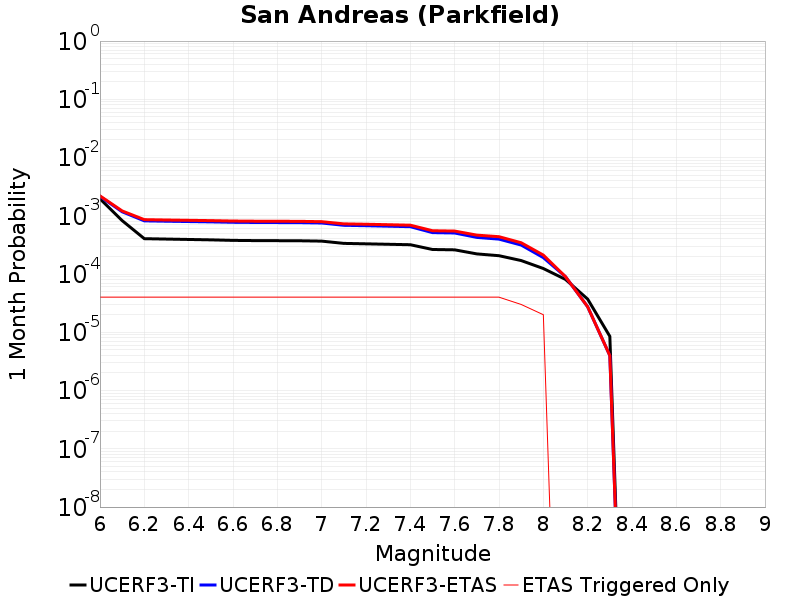 | 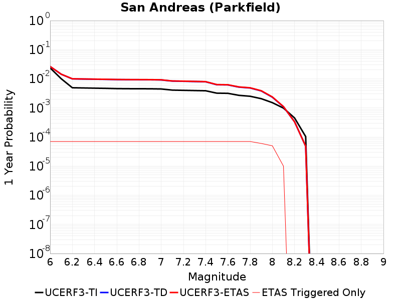 | 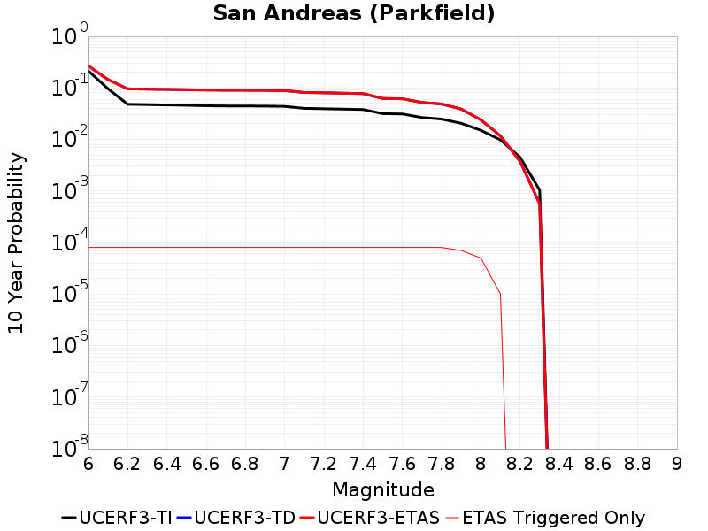 |

| Magnitude | 1 wk TI Prob | 1 wk TD Prob | 1 wk ETAS Prob | 1 wk ETAS/TD Gain | 1 wk ETAS Triggered Only | 1 mo TI Prob | 1 mo TD Prob | 1 mo ETAS Prob | 1 mo ETAS/TD Gain | 1 mo ETAS Triggered Only | 1 yr TI Prob | 1 yr TD Prob | 1 yr ETAS Prob | 1 yr ETAS/TD Gain | 1 yr ETAS Triggered Only | 10 yr TI Prob | 10 yr TD Prob | 10 yr ETAS Prob | 10 yr ETAS/TD Gain | 10 yr ETAS Triggered Only |
|-----|-----|-----|-----|-----|-----|-----|-----|-----|-----|-----|-----|-----|-----|-----|-----|-----|-----|-----|-----|-----|
| 6.0 | 4.5600464E-4 | 5.022897E-4 | 5.422696E-4 | 1.0795953 | 4.0E-5 | 0.0019528421 | 0.0021510844 | 0.0021909983 | 1.0185553 | 4.0E-5 | 0.023518132 | 0.026307188 | 0.026375348 | 1.0025909 | 7.0E-5 | 0.21179019 | 0.26523656 | 0.26529533 | 1.0002216 | 8.0E-5 |
| 6.1 | 1.9252734E-4 | 2.729586E-4 | 3.1294767E-4 | 1.1465024 | 4.0E-5 | 8.248562E-4 | 0.0011693417 | 0.0012092949 | 1.0341673 | 4.0E-5 | 0.009996468 | 0.014264391 | 0.0143333925 | 1.0048373 | 7.0E-5 | 0.09558567 | 0.14421535 | 0.1442838 | 1.0004747 | 8.0E-5 |
| 6.2 | 9.4269315E-5 | 1.9071877E-4 | 2.3071114E-4 | 1.209693 | 4.0E-5 | 4.039488E-4 | 8.171114E-4 | 8.570787E-4 | 1.0489129 | 4.0E-5 | 0.0049069915 | 0.0099032745 | 0.009972582 | 1.0069984 | 7.0E-5 | 0.048000436 | 0.09559842 | 0.095670775 | 1.0007569 | 8.0E-5 |
| 6.3 | 9.283051E-5 | 1.8797457E-4 | 2.2796704E-4 | 1.2127547 | 4.0E-5 | 3.9778434E-4 | 8.053578E-4 | 8.4532565E-4 | 1.0496273 | 4.0E-5 | 0.0048322747 | 0.009761457 | 0.009830774 | 1.007101 | 7.0E-5 | 0.047285385 | 0.09435027 | 0.09442272 | 1.000768 | 8.0E-5 |
| 6.4 | 9.138826E-5 | 1.8560051E-4 | 2.2559309E-4 | 1.2154766 | 4.0E-5 | 3.916052E-4 | 7.951895E-4 | 8.3515776E-4 | 1.0502625 | 4.0E-5 | 0.0047573745 | 0.009638757 | 0.009708083 | 1.0071924 | 7.0E-5 | 0.046568092 | 0.09325456 | 0.0933271 | 1.0007778 | 8.0E-5 |
| 6.5 | 9.000255E-5 | 1.8317637E-4 | 2.2316903E-4 | 1.2183288 | 4.0E-5 | 3.8566816E-4 | 7.8480656E-4 | 8.247752E-4 | 1.050928 | 4.0E-5 | 0.0046854047 | 0.009513453 | 0.009582787 | 1.007288 | 7.0E-5 | 0.045878403 | 0.09213587 | 0.0922085 | 1.0007883 | 8.0E-5 |
| 6.6 | 8.8109264E-5 | 1.8015628E-4 | 2.2014907E-4 | 1.2219895 | 4.0E-5 | 3.7755648E-4 | 7.7187107E-4 | 8.118402E-4 | 1.0517821 | 4.0E-5 | 0.0045870654 | 0.009357325 | 0.00942667 | 1.0074108 | 7.0E-5 | 0.04493529 | 0.09073359 | 0.09080633 | 1.0008017 | 8.0E-5 |
| 6.7 | 8.738073E-5 | 1.7885245E-4 | 2.1884529E-4 | 1.223608 | 4.0E-5 | 3.7443507E-4 | 7.6628657E-4 | 8.062559E-4 | 1.0521598 | 4.0E-5 | 0.0045492216 | 0.009289913 | 0.009359262 | 1.007465 | 7.0E-5 | 0.04457213 | 0.09014176 | 0.09021455 | 1.0008075 | 8.0E-5 |
| 6.8 | 8.710195E-5 | 1.7832371E-4 | 2.1831658E-4 | 1.2242712 | 4.0E-5 | 3.7324068E-4 | 7.640219E-4 | 8.0399134E-4 | 1.0523145 | 4.0E-5 | 0.0045347405 | 0.009262578 | 0.0093319295 | 1.0074873 | 7.0E-5 | 0.04443313 | 0.089895904 | 0.08996871 | 1.0008099 | 8.0E-5 |
| 6.9 | 8.6801556E-5 | 1.7774598E-4 | 2.1773887E-4 | 1.2250003 | 4.0E-5 | 3.7195362E-4 | 7.615473E-4 | 8.015169E-4 | 1.0524846 | 4.0E-5 | 0.0045191357 | 0.009232705 | 0.009302059 | 1.0075117 | 7.0E-5 | 0.044283327 | 0.08962777 | 0.0897006 | 1.0008125 | 8.0E-5 |
| 7.0 | 8.5571606E-5 | 1.7530049E-4 | 2.1529349E-4 | 1.2281396 | 4.0E-5 | 3.6668387E-4 | 7.510727E-4 | 7.910427E-4 | 1.0532172 | 4.0E-5 | 0.004455241 | 0.00910625 | 0.009175613 | 1.007617 | 7.0E-5 | 0.043669727 | 0.08849016 | 0.08856308 | 1.0008241 | 8.0E-5 |
| 7.1 | 7.82589E-5 | 1.5998009E-4 | 1.9997369E-4 | 1.249991 | 4.0E-5 | 3.3535215E-4 | 6.854496E-4 | 7.254222E-4 | 1.0583159 | 4.0E-5 | 0.0040752706 | 0.008313602 | 0.00838302 | 1.0083499 | 7.0E-5 | 0.040013418 | 0.08135663 | 0.08143012 | 1.0009034 | 8.0E-5 |
| 7.2 | 7.690929E-5 | 1.5749362E-4 | 1.9748733E-4 | 1.2539386 | 4.0E-5 | 3.2956956E-4 | 6.7479885E-4 | 7.1477186E-4 | 1.0592369 | 4.0E-5 | 0.004005129 | 0.008184911 | 0.008254338 | 1.0084823 | 7.0E-5 | 0.0393371 | 0.0801883 | 0.08026188 | 1.0009177 | 8.0E-5 |
| 7.3 | 7.5543794E-5 | 1.5445116E-4 | 1.9444498E-4 | 1.2589415 | 4.0E-5 | 3.2371894E-4 | 6.617664E-4 | 7.017399E-4 | 1.0604043 | 4.0E-5 | 0.003934157 | 0.008027419 | 0.008096858 | 1.0086501 | 7.0E-5 | 0.038652334 | 0.078754805 | 0.078828506 | 1.0009358 | 8.0E-5 |
| 7.4 | 7.4214564E-5 | 1.514159E-4 | 1.9140982E-4 | 1.2641331 | 4.0E-5 | 3.1802364E-4 | 6.487646E-4 | 6.8873866E-4 | 1.0616156 | 4.0E-5 | 0.003865065 | 0.007870276 | 0.007939726 | 1.0088242 | 7.0E-5 | 0.03798529 | 0.07731605 | 0.077389866 | 1.0009547 | 8.0E-5 |
| 7.5 | 6.149578E-5 | 1.1979575E-4 | 1.5979096E-4 | 1.3338617 | 4.0E-5 | 2.6352672E-4 | 5.1330944E-4 | 5.532889E-4 | 1.0778857 | 4.0E-5 | 0.0032037178 | 0.0062316717 | 0.0063012354 | 1.011163 | 7.0E-5 | 0.03157923 | 0.06217236 | 0.062247384 | 1.0012068 | 8.0E-5 |
| 7.6 | 6.0643448E-5 | 1.1805662E-4 | 1.580519E-4 | 1.3387805 | 4.0E-5 | 2.598746E-4 | 5.058589E-4 | 5.4583873E-4 | 1.0790334 | 4.0E-5 | 0.0031593828 | 0.006141477 | 0.0062110466 | 1.0113279 | 7.0E-5 | 0.031148417 | 0.061325446 | 0.06140054 | 1.0012245 | 8.0E-5 |
| 7.7 | 5.1652263E-5 | 9.913258E-5 | 1.3912862E-4 | 1.40346 | 4.0E-5 | 2.2134806E-4 | 4.2478475E-4 | 4.6476777E-4 | 1.0941254 | 4.0E-5 | 0.002691582 | 0.0051595033 | 0.005229142 | 1.0134972 | 7.0E-5 | 0.026592141 | 0.051967513 | 0.052043352 | 1.0014595 | 8.0E-5 |
| 7.8 | 4.8090482E-5 | 9.263152E-5 | 1.3262781E-4 | 1.4317784 | 4.0E-5 | 2.060858E-4 | 3.9693183E-4 | 4.3691596E-4 | 1.1007329 | 4.0E-5 | 0.0025062072 | 0.0048219473 | 0.00489161 | 1.014447 | 7.0E-5 | 0.024781305 | 0.048581716 | 0.04865783 | 1.0015668 | 8.0E-5 |
| 7.9 | 3.970278E-5 | 7.327011E-5 | 1.0326791E-4 | 1.4094139 | 3.0E-5 | 1.7014367E-4 | 3.1397695E-4 | 3.4396755E-4 | 1.0955185 | 3.0E-5 | 0.002069531 | 0.0038159739 | 0.003875745 | 1.0156634 | 6.0E-5 | 0.020503636 | 0.03862503 | 0.03869233 | 1.0017422 | 7.0E-5 |
| 8.0 | 2.8982335E-5 | 4.4601296E-5 | 6.4600405E-5 | 1.4483975 | 2.0E-5 | 1.2420409E-4 | 1.9113442E-4 | 2.111306E-4 | 1.1046184 | 2.0E-5 | 0.0015111357 | 0.0023245795 | 0.0023744632 | 1.0214592 | 5.0E-5 | 0.015009012 | 0.023940751 | 0.023989553 | 1.0020385 | 5.0E-5 |
| 8.1 | 1.8836186E-5 | 2.0968582E-5 | 2.0968582E-5 | 1.0 | 0.0 | 8.0724014E-5 | 8.986226E-5 | 8.986226E-5 | 1.0 | 0.0 | 9.823717E-4 | 0.0010935246 | 0.0011035138 | 1.0091348 | 1.0E-5 | 0.009780403 | 0.011673917 | 0.0116838 | 1.0008466 | 1.0E-5 |
| 8.2 | 8.643924E-6 | 6.380783E-6 | 6.380783E-6 | 1.0 | 0.0 | 3.704486E-5 | 2.7345926E-5 | 2.7345926E-5 | 1.0 | 0.0 | 4.5092785E-4 | 3.3288592E-4 | 3.3288592E-4 | 1.0 | 0.0 | 0.0045001395 | 0.0037373784 | 0.0037373784 | 1.0 | 0.0 |
| 8.3 | 1.983087E-6 | 9.274416E-7 | 9.274416E-7 | 1.0 | 0.0 | 8.498917E-6 | 3.974744E-6 | 3.974744E-6 | 1.0 | 0.0 | 1.034694E-4 | 4.8391455E-5 | 4.8391455E-5 | 1.0 | 0.0 | 0.0010342124 | 5.6326366E-4 | 5.6326366E-4 | 1.0 | 0.0 |

## San Jacinto (San Bernardino)
*[(top)](#table-of-contents)*

| 1 Week | 1 Month | 1 Year | 10 Year |
|-----|-----|-----|-----|
|  | 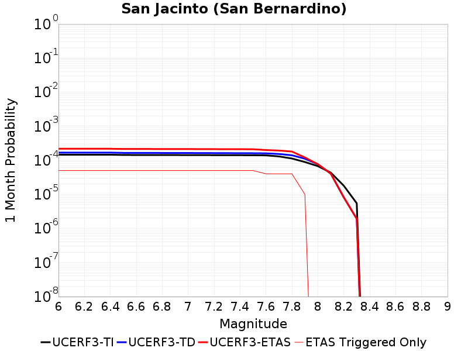 |  |  |

| Magnitude | 1 wk TI Prob | 1 wk TD Prob | 1 wk ETAS Prob | 1 wk ETAS/TD Gain | 1 wk ETAS Triggered Only | 1 mo TI Prob | 1 mo TD Prob | 1 mo ETAS Prob | 1 mo ETAS/TD Gain | 1 mo ETAS Triggered Only | 1 yr TI Prob | 1 yr TD Prob | 1 yr ETAS Prob | 1 yr ETAS/TD Gain | 1 yr ETAS Triggered Only | 10 yr TI Prob | 10 yr TD Prob | 10 yr ETAS Prob | 10 yr ETAS/TD Gain | 10 yr ETAS Triggered Only |
|-----|-----|-----|-----|-----|-----|-----|-----|-----|-----|-----|-----|-----|-----|-----|-----|-----|-----|-----|-----|-----|
| 6.0 | 3.399087E-5 | 3.9225975E-5 | 6.92248E-5 | 1.7647693 | 3.0E-5 | 1.4566703E-4 | 1.6810048E-4 | 2.1809209E-4 | 1.2973912 | 5.0E-5 | 0.0017720532 | 0.0020447043 | 0.0021045816 | 1.0292841 | 6.0E-5 | 0.01757989 | 0.021001156 | 0.021079477 | 1.0037293 | 8.0E-5 |
| 6.1 | 3.399087E-5 | 3.9225975E-5 | 6.92248E-5 | 1.7647693 | 3.0E-5 | 1.4566703E-4 | 1.6810048E-4 | 2.1809209E-4 | 1.2973912 | 5.0E-5 | 0.0017720532 | 0.0020447043 | 0.0021045816 | 1.0292841 | 6.0E-5 | 0.01757989 | 0.021001156 | 0.021079477 | 1.0037293 | 8.0E-5 |
| 6.2 | 3.399087E-5 | 3.9225975E-5 | 6.92248E-5 | 1.7647693 | 3.0E-5 | 1.4566703E-4 | 1.6810048E-4 | 2.1809209E-4 | 1.2973912 | 5.0E-5 | 0.0017720532 | 0.0020447043 | 0.0021045816 | 1.0292841 | 6.0E-5 | 0.01757989 | 0.021001156 | 0.021079477 | 1.0037293 | 8.0E-5 |
| 6.3 | 3.399087E-5 | 3.9225975E-5 | 6.92248E-5 | 1.7647693 | 3.0E-5 | 1.4566703E-4 | 1.6810048E-4 | 2.1809209E-4 | 1.2973912 | 5.0E-5 | 0.0017720532 | 0.0020447043 | 0.0021045816 | 1.0292841 | 6.0E-5 | 0.01757989 | 0.021001156 | 0.021079477 | 1.0037293 | 8.0E-5 |
| 6.4 | 3.399087E-5 | 3.9225975E-5 | 6.92248E-5 | 1.7647693 | 3.0E-5 | 1.4566703E-4 | 1.6810048E-4 | 2.1809209E-4 | 1.2973912 | 5.0E-5 | 0.0017720532 | 0.0020447043 | 0.0021045816 | 1.0292841 | 6.0E-5 | 0.01757989 | 0.021001156 | 0.021079477 | 1.0037293 | 8.0E-5 |
| 6.5 | 3.341482E-5 | 3.8503935E-5 | 6.8502784E-5 | 1.7791111 | 3.0E-5 | 1.4319851E-4 | 1.6500644E-4 | 2.1499819E-4 | 1.3029685 | 5.0E-5 | 0.0017420477 | 0.002007104 | 0.0020669836 | 1.0298338 | 6.0E-5 | 0.017284546 | 0.020632217 | 0.02069098 | 1.002848 | 6.0E-5 |
| 6.6 | 3.3364955E-5 | 3.8440678E-5 | 6.843952E-5 | 1.7803934 | 3.0E-5 | 1.4298483E-4 | 1.6473536E-4 | 2.1472713E-4 | 1.3034672 | 5.0E-5 | 0.0017394501 | 0.0020038097 | 0.0020636895 | 1.0298829 | 6.0E-5 | 0.017258976 | 0.020599894 | 0.020658659 | 1.0028527 | 6.0E-5 |
| 6.7 | 3.335922E-5 | 3.84303E-5 | 6.8429144E-5 | 1.7806041 | 3.0E-5 | 1.4296026E-4 | 1.646909E-4 | 2.1468266E-4 | 1.303549 | 5.0E-5 | 0.0017391514 | 0.0020032693 | 0.0020631491 | 1.029891 | 6.0E-5 | 0.017256035 | 0.020594621 | 0.020653386 | 1.0028534 | 6.0E-5 |
| 6.8 | 3.327683E-5 | 3.8323386E-5 | 6.832224E-5 | 1.7827818 | 3.0E-5 | 1.4260718E-4 | 1.6423276E-4 | 2.1422454E-4 | 1.3043959 | 5.0E-5 | 0.0017348597 | 0.0019977018 | 0.002057582 | 1.0299745 | 6.0E-5 | 0.017213784 | 0.02053999 | 0.020598758 | 1.0028611 | 6.0E-5 |
| 6.9 | 3.3235785E-5 | 3.826364E-5 | 6.826249E-5 | 1.7840042 | 3.0E-5 | 1.4243131E-4 | 1.6397673E-4 | 2.1396852E-4 | 1.3048713 | 5.0E-5 | 0.0017327217 | 0.0019945903 | 0.0020544706 | 1.0300213 | 6.0E-5 | 0.017192734 | 0.020509562 | 0.020568332 | 1.0028654 | 6.0E-5 |
| 7.0 | 3.3197095E-5 | 3.8202736E-5 | 6.820159E-5 | 1.7852541 | 3.0E-5 | 1.422655E-4 | 1.6371574E-4 | 2.1370755E-4 | 1.3053575 | 5.0E-5 | 0.0017307063 | 0.0019914187 | 0.0020512992 | 1.0300692 | 6.0E-5 | 0.017172894 | 0.020478578 | 0.020537348 | 1.0028698 | 6.0E-5 |
| 7.1 | 3.3129716E-5 | 3.808075E-5 | 6.807961E-5 | 1.7877696 | 3.0E-5 | 1.4197677E-4 | 1.6319302E-4 | 2.1318486E-4 | 1.3063357 | 5.0E-5 | 0.0017271966 | 0.001985066 | 0.002044947 | 1.0301657 | 6.0E-5 | 0.017138338 | 0.020416688 | 0.020475464 | 1.0028788 | 6.0E-5 |
| 7.2 | 3.3034008E-5 | 3.7946804E-5 | 6.7945664E-5 | 1.7905505 | 3.0E-5 | 1.4156665E-4 | 1.6261904E-4 | 2.126109E-4 | 1.307417 | 5.0E-5 | 0.0017222111 | 0.0019780905 | 0.0020379717 | 1.0302722 | 6.0E-5 | 0.017089253 | 0.020348513 | 0.020407291 | 1.0028886 | 6.0E-5 |
| 7.3 | 3.2956614E-5 | 3.7811467E-5 | 6.781033E-5 | 1.7933801 | 3.0E-5 | 1.4123498E-4 | 1.6203908E-4 | 2.1203098E-4 | 1.3085176 | 5.0E-5 | 0.0017181796 | 0.0019710425 | 0.0020309242 | 1.0303807 | 6.0E-5 | 0.017049557 | 0.02027986 | 0.020338643 | 1.0028986 | 6.0E-5 |
| 7.4 | 3.2915937E-5 | 3.7730897E-5 | 6.7729765E-5 | 1.7950743 | 3.0E-5 | 1.4106068E-4 | 1.6169384E-4 | 2.1168575E-4 | 1.3091763 | 5.0E-5 | 0.0017160608 | 0.0019668466 | 0.0020267286 | 1.0304457 | 6.0E-5 | 0.017028693 | 0.020239096 | 0.020297883 | 1.0029045 | 6.0E-5 |
| 7.5 | 3.281791E-5 | 3.759222E-5 | 6.759109E-5 | 1.7980075 | 3.0E-5 | 1.406406E-4 | 1.6109958E-4 | 2.1109152E-4 | 1.310317 | 5.0E-5 | 0.0017109542 | 0.0019596247 | 0.002019507 | 1.0305581 | 6.0E-5 | 0.016978411 | 0.020168334 | 0.020227125 | 1.0029149 | 6.0E-5 |
| 7.6 | 3.2521442E-5 | 3.7308793E-5 | 6.730767E-5 | 1.80407 | 3.0E-5 | 1.3937015E-4 | 1.5988505E-4 | 1.9987865E-4 | 1.2501397 | 4.0E-5 | 0.0016955109 | 0.0019448642 | 0.001994767 | 1.0256587 | 5.0E-5 | 0.016826328 | 0.020021958 | 0.020070957 | 1.0024472 | 5.0E-5 |
| 7.7 | 3.0287873E-5 | 3.5742778E-5 | 6.5741704E-5 | 1.8393004 | 3.0E-5 | 1.297987E-4 | 1.5317435E-4 | 1.9316822E-4 | 1.2611003 | 4.0E-5 | 0.0015791537 | 0.001863304 | 0.0019132108 | 1.0267841 | 5.0E-5 | 0.01567979 | 0.019208424 | 0.019257464 | 1.002553 | 5.0E-5 |
| 7.8 | 2.6316151E-5 | 3.2747244E-5 | 6.2746265E-5 | 1.9160776 | 3.0E-5 | 1.1277862E-4 | 1.403378E-4 | 1.8033218E-4 | 1.2849866 | 4.0E-5 | 0.0013722149 | 0.0017072747 | 0.0017571894 | 1.0292364 | 5.0E-5 | 0.013637724 | 0.017646207 | 0.017695324 | 1.0027834 | 5.0E-5 |
| 7.9 | 2.0761147E-5 | 2.597667E-5 | 3.597641E-5 | 1.3849509 | 1.0E-5 | 8.897331E-5 | 1.1132384E-4 | 1.2132272E-4 | 1.089818 | 1.0E-5 | 0.0010827117 | 0.001354526 | 0.0013744989 | 1.0147454 | 2.0E-5 | 0.010774517 | 0.01411086 | 0.014130578 | 1.0013974 | 2.0E-5 |
| 8.0 | 1.5738568E-5 | 1.7940749E-5 | 1.7940749E-5 | 1.0 | 0.0 | 6.744926E-5 | 7.688666E-5 | 7.688666E-5 | 1.0 | 0.0 | 8.2088535E-4 | 9.3569397E-4 | 9.4568456E-4 | 1.0106772 | 1.0E-5 | 0.008178596 | 0.009864375 | 0.009874277 | 1.0010037 | 1.0E-5 |
| 8.1 | 1.0105832E-5 | 9.440285E-6 | 9.440285E-6 | 1.0 | 0.0 | 4.3309992E-5 | 4.0457737E-5 | 4.0457737E-5 | 1.0 | 0.0 | 5.2717153E-4 | 4.924623E-4 | 4.924623E-4 | 1.0 | 0.0 | 0.005259227 | 0.005269994 | 0.005269994 | 1.0 | 0.0 |
| 8.2 | 4.189207E-6 | 1.90493E-6 | 1.90493E-6 | 1.0 | 0.0 | 1.7953622E-5 | 8.16396E-6 | 8.16396E-6 | 1.0 | 0.0 | 2.1856341E-4 | 9.939172E-5 | 9.939172E-5 | 1.0 | 0.0 | 0.0021834858 | 0.00114154 | 0.00114154 | 1.0 | 0.0 |
| 8.3 | 1.2758221E-6 | 4.4868844E-7 | 4.4868844E-7 | 1.0 | 0.0 | 5.4677976E-6 | 1.922949E-6 | 1.922949E-6 | 1.0 | 0.0 | 6.65684E-5 | 2.341166E-5 | 2.341166E-5 | 1.0 | 0.0 | 6.6548464E-4 | 2.7819705E-4 | 2.7819705E-4 | 1.0 | 0.0 |

## Garlock (West)
*[(top)](#table-of-contents)*

| 1 Week | 1 Month | 1 Year | 10 Year |
|-----|-----|-----|-----|
| 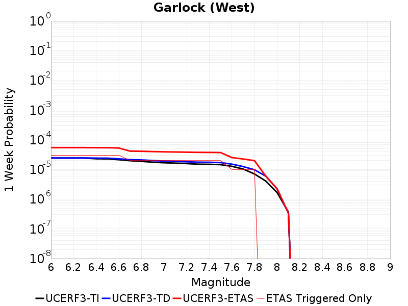 | 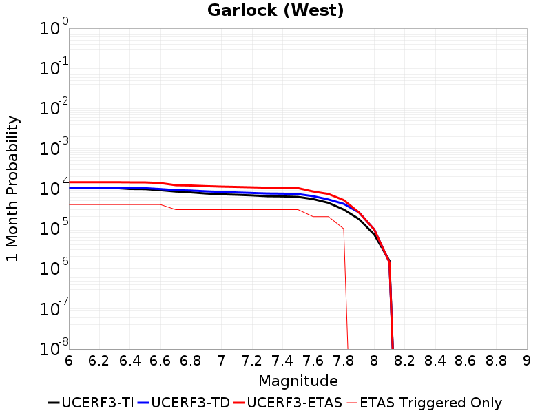 |  | 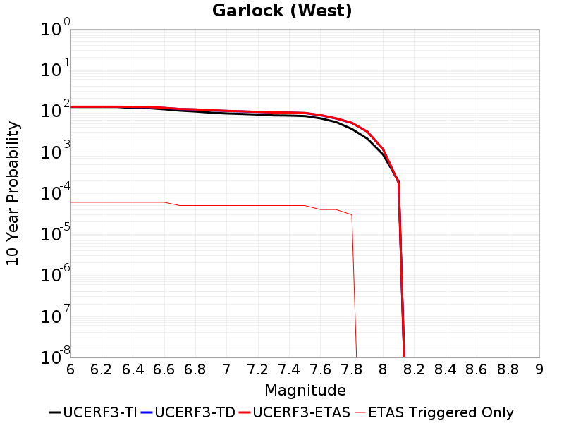 |

| Magnitude | 1 wk TI Prob | 1 wk TD Prob | 1 wk ETAS Prob | 1 wk ETAS/TD Gain | 1 wk ETAS Triggered Only | 1 mo TI Prob | 1 mo TD Prob | 1 mo ETAS Prob | 1 mo ETAS/TD Gain | 1 mo ETAS Triggered Only | 1 yr TI Prob | 1 yr TD Prob | 1 yr ETAS Prob | 1 yr ETAS/TD Gain | 1 yr ETAS Triggered Only | 10 yr TI Prob | 10 yr TD Prob | 10 yr ETAS Prob | 10 yr ETAS/TD Gain | 10 yr ETAS Triggered Only |
|-----|-----|-----|-----|-----|-----|-----|-----|-----|-----|-----|-----|-----|-----|-----|-----|-----|-----|-----|-----|-----|
| 6.0 | 2.4267689E-5 | 2.4347655E-5 | 5.4346925E-5 | 2.2321215 | 3.0E-5 | 1.0400023E-4 | 1.0434294E-4 | 1.4433876E-4 | 1.3833113 | 4.0E-5 | 0.0012654673 | 0.0012696378 | 0.0013295617 | 1.0471976 | 6.0E-5 | 0.0125828525 | 0.012698735 | 0.012757973 | 1.0046649 | 6.0E-5 |
| 6.1 | 2.4267689E-5 | 2.4347655E-5 | 5.4346925E-5 | 2.2321215 | 3.0E-5 | 1.0400023E-4 | 1.0434294E-4 | 1.4433876E-4 | 1.3833113 | 4.0E-5 | 0.0012654673 | 0.0012696378 | 0.0013295617 | 1.0471976 | 6.0E-5 | 0.0125828525 | 0.012698735 | 0.012757973 | 1.0046649 | 6.0E-5 |
| 6.2 | 2.4267689E-5 | 2.4347655E-5 | 5.4346925E-5 | 2.2321215 | 3.0E-5 | 1.0400023E-4 | 1.0434294E-4 | 1.4433876E-4 | 1.3833113 | 4.0E-5 | 0.0012654673 | 0.0012696378 | 0.0013295617 | 1.0471976 | 6.0E-5 | 0.0125828525 | 0.012698735 | 0.012757973 | 1.0046649 | 6.0E-5 |
| 6.3 | 2.4170902E-5 | 2.4347655E-5 | 5.4346925E-5 | 2.2321215 | 3.0E-5 | 1.03585466E-4 | 1.0434294E-4 | 1.4433876E-4 | 1.3833113 | 4.0E-5 | 0.0012604233 | 0.0012696378 | 0.0013295617 | 1.0471976 | 6.0E-5 | 0.012532983 | 0.012698735 | 0.012757973 | 1.0046649 | 6.0E-5 |
| 6.4 | 2.2870605E-5 | 2.4055216E-5 | 5.4054493E-5 | 2.2471008 | 3.0E-5 | 9.8013195E-5 | 1.03089726E-4 | 1.430856E-4 | 1.3879715 | 4.0E-5 | 0.0011926574 | 0.0012543977 | 0.0013143223 | 1.0477717 | 6.0E-5 | 0.011862768 | 0.0125480555 | 0.012607303 | 1.0047216 | 6.0E-5 |
| 6.5 | 2.2672486E-5 | 2.394525E-5 | 5.3944532E-5 | 2.2528281 | 3.0E-5 | 9.716418E-5 | 1.0261848E-4 | 1.4261437E-4 | 1.3897533 | 4.0E-5 | 0.0011823318 | 0.0012486668 | 0.0013085918 | 1.0479913 | 6.0E-5 | 0.011760611 | 0.012491393 | 0.012550644 | 1.0047433 | 6.0E-5 |
| 6.6 | 2.1276646E-5 | 2.2736394E-5 | 5.273571E-5 | 2.3194404 | 3.0E-5 | 9.118244E-5 | 9.743807E-5 | 1.3743417E-4 | 1.4104772 | 4.0E-5 | 0.0011095807 | 0.0011856653 | 0.0012455941 | 1.0505445 | 6.0E-5 | 0.011040569 | 0.011868248 | 0.011927536 | 1.0049955 | 6.0E-5 |
| 6.7 | 1.9706355E-5 | 2.1386213E-5 | 4.1385785E-5 | 1.935162 | 2.0E-5 | 8.445307E-5 | 9.165199E-5 | 1.2164924E-4 | 1.3272952 | 3.0E-5 | 0.0010277311 | 0.0011152935 | 0.0011652377 | 1.0447812 | 5.0E-5 | 0.010229911 | 0.011171777 | 0.011221219 | 1.0044255 | 5.0E-5 |
| 6.8 | 1.8744462E-5 | 2.0887312E-5 | 4.0886895E-5 | 1.9574991 | 2.0E-5 | 8.033094E-5 | 8.951399E-5 | 1.195113E-4 | 1.3351132 | 3.0E-5 | 9.775903E-4 | 0.0010892897 | 0.0011392352 | 1.0458515 | 5.0E-5 | 0.009733009 | 0.010914317 | 0.0109637715 | 1.0045311 | 5.0E-5 |
| 6.9 | 1.7559682E-5 | 1.9927611E-5 | 3.9927214E-5 | 2.0036125 | 2.0E-5 | 7.5253614E-5 | 8.540126E-5 | 1.15398696E-4 | 1.3512529 | 3.0E-5 | 9.158276E-4 | 0.0010392659 | 0.0010892139 | 1.0480609 | 5.0E-5 | 0.0091206245 | 0.010418833 | 0.010468313 | 1.0047491 | 5.0E-5 |
| 7.0 | 1.6794445E-5 | 1.9189123E-5 | 3.918874E-5 | 2.042237 | 2.0E-5 | 7.197421E-5 | 8.223652E-5 | 1.12234055E-4 | 1.3647715 | 3.0E-5 | 8.759337E-4 | 0.0010007712 | 0.0010507212 | 1.0499115 | 5.0E-5 | 0.008724891 | 0.010037322 | 0.0100868195 | 1.0049314 | 5.0E-5 |
| 7.1 | 1.6337795E-5 | 1.8686538E-5 | 3.8686165E-5 | 2.0702693 | 2.0E-5 | 7.0017246E-5 | 8.008271E-5 | 1.10080306E-4 | 1.3745826 | 3.0E-5 | 8.521265E-4 | 9.7457226E-4 | 0.0010245235 | 1.0512545 | 5.0E-5 | 0.008488664 | 0.00977755 | 0.009827061 | 1.0050638 | 5.0E-5 |
| 7.2 | 1.5780008E-5 | 1.8134191E-5 | 3.813383E-5 | 2.102869 | 2.0E-5 | 6.762685E-5 | 7.771565E-5 | 1.0771333E-4 | 1.3859926 | 3.0E-5 | 8.2304585E-4 | 9.4577874E-4 | 9.957314E-4 | 1.0528165 | 5.0E-5 | 0.008200042 | 0.009492028 | 0.009541553 | 1.0052176 | 5.0E-5 |
| 7.3 | 1.5058865E-5 | 1.758946E-5 | 3.758911E-5 | 2.1370246 | 2.0E-5 | 6.45364E-5 | 7.5381235E-5 | 1.0537897E-4 | 1.3979471 | 3.0E-5 | 7.854473E-4 | 9.173813E-4 | 9.673354E-4 | 1.054453 | 5.0E-5 | 0.00782677 | 0.009210067 | 0.009259607 | 1.0053788 | 5.0E-5 |
| 7.4 | 1.4887923E-5 | 1.7429616E-5 | 3.742927E-5 | 2.147452 | 2.0E-5 | 6.380382E-5 | 7.4696225E-5 | 1.0469399E-4 | 1.4015967 | 3.0E-5 | 7.7653467E-4 | 9.0904837E-4 | 9.5900294E-4 | 1.0549526 | 5.0E-5 | 0.0077382675 | 0.00912717 | 0.009176713 | 1.0054282 | 5.0E-5 |
| 7.5 | 1.4509299E-5 | 1.7038034E-5 | 3.7037695E-5 | 2.1738243 | 2.0E-5 | 6.218123E-5 | 7.3018105E-5 | 1.0301592E-4 | 1.410827 | 3.0E-5 | 7.567935E-4 | 8.886341E-4 | 9.385897E-4 | 1.0562161 | 5.0E-5 | 0.0075422134 | 0.008924197 | 0.008973751 | 1.0055528 | 5.0E-5 |
| 7.6 | 1.2756717E-5 | 1.5090049E-5 | 2.5089897E-5 | 1.6626784 | 1.0E-5 | 5.4670498E-5 | 6.467004E-5 | 8.466875E-5 | 1.3092422 | 2.0E-5 | 6.6541E-4 | 7.8707404E-4 | 8.2704256E-4 | 1.0507811 | 4.0E-5 | 0.006634211 | 0.007915413 | 0.007955097 | 1.0050135 | 4.0E-5 |
| 7.7 | 1.0328985E-5 | 1.24839125E-5 | 2.2483788E-5 | 1.801021 | 1.0E-5 | 4.4266326E-5 | 5.3501386E-5 | 7.350032E-5 | 1.3738021 | 2.0E-5 | 5.388092E-4 | 6.5118517E-4 | 6.9115916E-4 | 1.0613865 | 4.0E-5 | 0.0053750467 | 0.006567399 | 0.006607136 | 1.0060507 | 4.0E-5 |
| 7.8 | 7.0306583E-6 | 9.746119E-6 | 1.9746021E-5 | 2.0260396 | 1.0E-5 | 3.0131043E-5 | 4.1768413E-5 | 5.1767995E-5 | 1.2394054 | 1.0E-5 | 3.667837E-4 | 5.0841196E-4 | 5.383967E-4 | 1.0589772 | 3.0E-5 | 0.003661789 | 0.0051338184 | 0.0051636645 | 1.0058136 | 3.0E-5 |
| 7.9 | 4.060633E-6 | 5.9473064E-6 | 5.9473064E-6 | 1.0 | 0.0 | 1.7402595E-5 | 2.5488207E-5 | 2.5488207E-5 | 1.0 | 0.0 | 2.11856E-4 | 3.1027486E-4 | 3.1027486E-4 | 1.0 | 0.0 | 0.0021165414 | 0.0031344353 | 0.0031344353 | 1.0 | 0.0 |
| 8.0 | 1.6729537E-6 | 2.232871E-6 | 2.232871E-6 | 1.0 | 0.0 | 7.169782E-6 | 9.569412E-6 | 9.569412E-6 | 1.0 | 0.0 | 8.7288594E-5 | 1.16501404E-4 | 1.16501404E-4 | 1.0 | 0.0 | 8.7254314E-4 | 0.0011776788 | 0.0011776788 | 1.0 | 0.0 |
| 8.1 | 3.6733252E-7 | 3.3608302E-7 | 3.3608302E-7 | 1.0 | 0.0 | 1.5742813E-6 | 1.440355E-6 | 1.440355E-6 | 1.0 | 0.0 | 1.9166706E-5 | 1.75362E-5 | 1.75362E-5 | 1.0 | 0.0 | 1.9165053E-4 | 1.7747156E-4 | 1.7747156E-4 | 1.0 | 0.0 |

## Sierra Madre
*[(top)](#table-of-contents)*

| 1 Week | 1 Month | 1 Year | 10 Year |
|-----|-----|-----|-----|
| 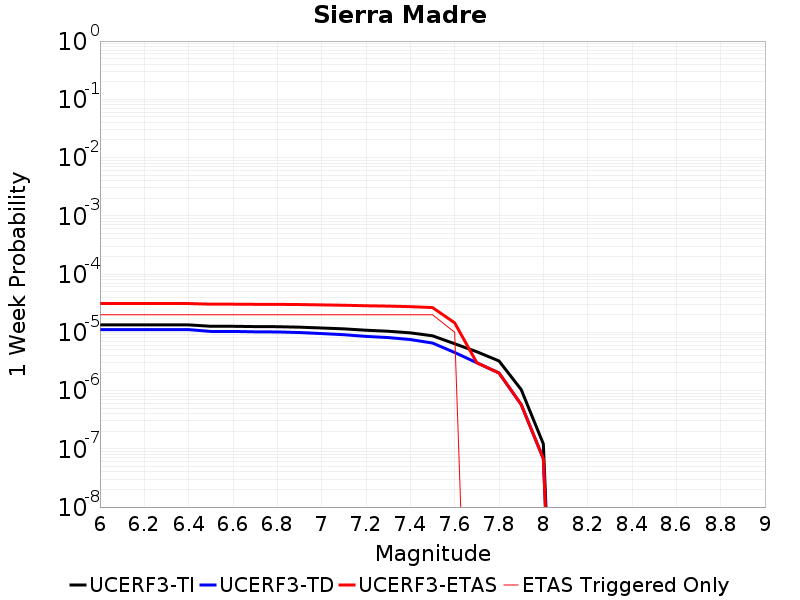 | 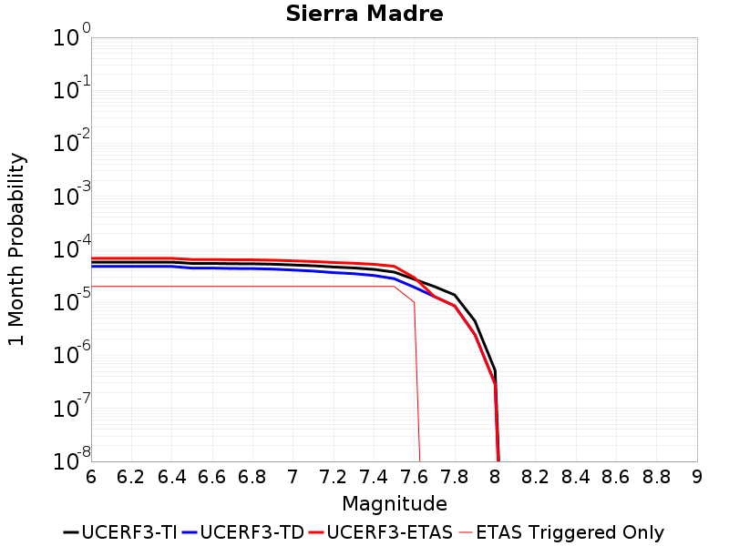 |  |  |

| Magnitude | 1 wk TI Prob | 1 wk TD Prob | 1 wk ETAS Prob | 1 wk ETAS/TD Gain | 1 wk ETAS Triggered Only | 1 mo TI Prob | 1 mo TD Prob | 1 mo ETAS Prob | 1 mo ETAS/TD Gain | 1 mo ETAS Triggered Only | 1 yr TI Prob | 1 yr TD Prob | 1 yr ETAS Prob | 1 yr ETAS/TD Gain | 1 yr ETAS Triggered Only | 10 yr TI Prob | 10 yr TD Prob | 10 yr ETAS Prob | 10 yr ETAS/TD Gain | 10 yr ETAS Triggered Only |
|-----|-----|-----|-----|-----|-----|-----|-----|-----|-----|-----|-----|-----|-----|-----|-----|-----|-----|-----|-----|-----|
| 6.0 | 1.3379373E-5 | 1.1096952E-5 | 3.109673E-5 | 2.8022766 | 2.0E-5 | 5.7338908E-5 | 4.755751E-5 | 6.755656E-5 | 1.4205235 | 2.0E-5 | 6.978776E-4 | 5.7886034E-4 | 6.188372E-4 | 1.0690613 | 4.0E-5 | 0.0069569005 | 0.0057738163 | 0.0058235275 | 1.0086098 | 5.0E-5 |
| 6.1 | 1.3379373E-5 | 1.1096952E-5 | 3.109673E-5 | 2.8022766 | 2.0E-5 | 5.7338908E-5 | 4.755751E-5 | 6.755656E-5 | 1.4205235 | 2.0E-5 | 6.978776E-4 | 5.7886034E-4 | 6.188372E-4 | 1.0690613 | 4.0E-5 | 0.0069569005 | 0.0057738163 | 0.0058235275 | 1.0086098 | 5.0E-5 |
| 6.2 | 1.3379373E-5 | 1.1096952E-5 | 3.109673E-5 | 2.8022766 | 2.0E-5 | 5.7338908E-5 | 4.755751E-5 | 6.755656E-5 | 1.4205235 | 2.0E-5 | 6.978776E-4 | 5.7886034E-4 | 6.188372E-4 | 1.0690613 | 4.0E-5 | 0.0069569005 | 0.0057738163 | 0.0058235275 | 1.0086098 | 5.0E-5 |
| 6.3 | 1.3379373E-5 | 1.1096952E-5 | 3.109673E-5 | 2.8022766 | 2.0E-5 | 5.7338908E-5 | 4.755751E-5 | 6.755656E-5 | 1.4205235 | 2.0E-5 | 6.978776E-4 | 5.7886034E-4 | 6.188372E-4 | 1.0690613 | 4.0E-5 | 0.0069569005 | 0.0057738163 | 0.0058235275 | 1.0086098 | 5.0E-5 |
| 6.4 | 1.3379373E-5 | 1.1096952E-5 | 3.109673E-5 | 2.8022766 | 2.0E-5 | 5.7338908E-5 | 4.755751E-5 | 6.755656E-5 | 1.4205235 | 2.0E-5 | 6.978776E-4 | 5.7886034E-4 | 6.188372E-4 | 1.0690613 | 4.0E-5 | 0.0069569005 | 0.0057738163 | 0.0058235275 | 1.0086098 | 5.0E-5 |
| 6.5 | 1.26563245E-5 | 1.03248285E-5 | 3.0324622E-5 | 2.9370582 | 2.0E-5 | 5.4240263E-5 | 4.4248518E-5 | 6.424764E-5 | 1.4519725 | 2.0E-5 | 6.601751E-4 | 5.385936E-4 | 5.785721E-4 | 1.0742275 | 4.0E-5 | 0.006582173 | 0.005373131 | 0.0054228627 | 1.0092555 | 5.0E-5 |
| 6.6 | 1.26563245E-5 | 1.03248285E-5 | 3.0324622E-5 | 2.9370582 | 2.0E-5 | 5.4240263E-5 | 4.4248518E-5 | 6.424764E-5 | 1.4519725 | 2.0E-5 | 6.601751E-4 | 5.385936E-4 | 5.785721E-4 | 1.0742275 | 4.0E-5 | 0.006582173 | 0.005373131 | 0.0054228627 | 1.0092555 | 5.0E-5 |
| 6.7 | 1.2502474E-5 | 1.0160639E-5 | 3.0160436E-5 | 2.96836 | 2.0E-5 | 5.3580934E-5 | 4.354488E-5 | 6.354401E-5 | 1.4592763 | 2.0E-5 | 6.521526E-4 | 5.30031E-4 | 5.700098E-4 | 1.0754273 | 4.0E-5 | 0.0065024206 | 0.005287914 | 0.0053376495 | 1.0094055 | 5.0E-5 |
| 6.8 | 1.2454966E-5 | 1.0112795E-5 | 3.0112593E-5 | 2.9776726 | 2.0E-5 | 5.3377335E-5 | 4.3339838E-5 | 6.333897E-5 | 1.4614491 | 2.0E-5 | 6.4967526E-4 | 5.2753586E-4 | 5.6751474E-4 | 1.0757842 | 4.0E-5 | 0.006477792 | 0.005263081 | 0.0053128176 | 1.0094502 | 5.0E-5 |
| 6.9 | 1.2225574E-5 | 9.8861565E-6 | 2.988596E-5 | 3.023011 | 2.0E-5 | 5.2394265E-5 | 4.236856E-5 | 6.236771E-5 | 1.4720281 | 2.0E-5 | 6.3771347E-4 | 5.157162E-4 | 5.457007E-4 | 1.0581416 | 3.0E-5 | 0.006358865 | 0.005145436 | 0.0051852306 | 1.0077338 | 4.0E-5 |
| 7.0 | 1.182946E-5 | 9.491867E-6 | 2.9491677E-5 | 3.107047 | 2.0E-5 | 5.06967E-5 | 4.06788E-5 | 6.0677987E-5 | 1.4916366 | 2.0E-5 | 6.1705755E-4 | 4.951529E-4 | 5.25138E-4 | 1.0605574 | 3.0E-5 | 0.006153469 | 0.0049407342 | 0.004980536 | 1.0080559 | 4.0E-5 |
| 7.1 | 1.14369095E-5 | 9.0754675E-6 | 2.9075285E-5 | 3.2037232 | 2.0E-5 | 4.9014405E-5 | 3.8894286E-5 | 5.8893507E-5 | 1.5141944 | 2.0E-5 | 5.9658696E-4 | 4.7343603E-4 | 4.934266E-4 | 1.0422244 | 2.0E-5 | 0.005949879 | 0.0047245063 | 0.0047543645 | 1.0063199 | 3.0E-5 |
| 7.2 | 1.0836419E-5 | 8.4857875E-6 | 2.8485618E-5 | 3.356862 | 2.0E-5 | 4.644097E-5 | 3.6367157E-5 | 5.6366433E-5 | 1.5499268 | 2.0E-5 | 5.652721E-4 | 4.4268114E-4 | 4.6267227E-4 | 1.0451592 | 2.0E-5 | 0.0056383642 | 0.004418216 | 0.0044480837 | 1.0067601 | 3.0E-5 |
| 7.3 | 1.0403439E-5 | 8.105556E-6 | 2.8105394E-5 | 3.4674234 | 2.0E-5 | 4.4585406E-5 | 3.473764E-5 | 5.4736945E-5 | 1.5757244 | 2.0E-5 | 5.426921E-4 | 4.228496E-4 | 4.4284115E-4 | 1.0472782 | 2.0E-5 | 0.005413687 | 0.0042206715 | 0.0042505446 | 1.0070779 | 3.0E-5 |
| 7.4 | 9.768864E-6 | 7.4967606E-6 | 2.7496611E-5 | 3.667799 | 2.0E-5 | 4.186589E-5 | 3.2128584E-5 | 5.212794E-5 | 1.6224786 | 2.0E-5 | 5.09598E-4 | 3.910962E-4 | 4.1108837E-4 | 1.0511183 | 2.0E-5 | 0.0050843097 | 0.0039042968 | 0.0039341794 | 1.0076538 | 3.0E-5 |
| 7.5 | 8.687089E-6 | 6.529319E-6 | 2.652919E-5 | 4.0630865 | 2.0E-5 | 3.722985E-5 | 2.79825E-5 | 4.798194E-5 | 1.7147124 | 2.0E-5 | 4.5317915E-4 | 3.4063455E-4 | 3.6062775E-4 | 1.058694 | 2.0E-5 | 0.004522561 | 0.0034013372 | 0.0034312352 | 1.00879 | 3.0E-5 |
| 7.6 | 6.3506063E-6 | 4.496273E-6 | 1.4496228E-5 | 3.2240543 | 1.0E-5 | 2.72166E-5 | 1.92696E-5 | 2.9269408E-5 | 1.5189421 | 1.0E-5 | 3.3131172E-4 | 2.3458239E-4 | 2.4458003E-4 | 1.042619 | 1.0E-5 | 0.003308182 | 0.0023434968 | 0.00236345 | 1.0085143 | 2.0E-5 |
| 7.7 | 4.62223E-6 | 2.9939667E-6 | 2.9939667E-6 | 1.0 | 0.0 | 1.9809406E-5 | 1.2831223E-5 | 1.2831223E-5 | 1.0 | 0.0 | 2.4115283E-4 | 1.5620896E-4 | 1.5620896E-4 | 1.0 | 0.0 | 0.0024089129 | 0.0015611186 | 0.0015611186 | 1.0 | 0.0 |
| 7.8 | 3.2145008E-6 | 1.9969257E-6 | 1.9969257E-6 | 1.0 | 0.0 | 1.3776359E-5 | 8.558225E-6 | 8.558225E-6 | 1.0 | 0.0 | 1.6771426E-4 | 1.0419143E-4 | 1.0419143E-4 | 1.0 | 0.0 | 0.0016758774 | 0.0010415097 | 0.0010415097 | 1.0 | 0.0 |
| 7.9 | 1.0391769E-6 | 5.7516723E-7 | 5.7516723E-7 | 1.0 | 0.0 | 4.4536077E-6 | 2.4650003E-6 | 2.4650003E-6 | 1.0 | 0.0 | 5.4221324E-5 | 3.001097E-5 | 3.001097E-5 | 1.0 | 0.0 | 5.4208096E-4 | 3.000696E-4 | 3.000696E-4 | 1.0 | 0.0 |
| 8.0 | 1.210983E-7 | 6.759631E-8 | 6.759631E-8 | 1.0 | 0.0 | 5.1899264E-7 | 2.8969845E-7 | 2.8969845E-7 | 1.0 | 0.0 | 6.3187167E-6 | 3.527073E-6 | 3.527073E-6 | 1.0 | 0.0 | 6.318537E-5 | 3.527019E-5 | 3.527019E-5 | 1.0 | 0.0 |

## San Andreas (Creeping Section) 2011 CFM
*[(top)](#table-of-contents)*

| 1 Week | 1 Month | 1 Year | 10 Year |
|-----|-----|-----|-----|
|  |  |  |  |

| Magnitude | 1 wk TI Prob | 1 wk TD Prob | 1 wk ETAS Prob | 1 wk ETAS/TD Gain | 1 wk ETAS Triggered Only | 1 mo TI Prob | 1 mo TD Prob | 1 mo ETAS Prob | 1 mo ETAS/TD Gain | 1 mo ETAS Triggered Only | 1 yr TI Prob | 1 yr TD Prob | 1 yr ETAS Prob | 1 yr ETAS/TD Gain | 1 yr ETAS Triggered Only | 10 yr TI Prob | 10 yr TD Prob | 10 yr ETAS Prob | 10 yr ETAS/TD Gain | 10 yr ETAS Triggered Only |
|-----|-----|-----|-----|-----|-----|-----|-----|-----|-----|-----|-----|-----|-----|-----|-----|-----|-----|-----|-----|-----|
| 6.0 | 5.151163E-4 | 0.0010453422 | 0.0010753107 | 1.0286688 | 3.0E-5 | 0.002205774 | 0.0044685053 | 0.0044983714 | 1.0066837 | 3.0E-5 | 0.026526777 | 0.05245274 | 0.052500118 | 1.0009032 | 5.0E-5 | 0.23574181 | 0.38258547 | 0.38261634 | 1.0000807 | 5.0E-5 |
| 6.1 | 4.7540772E-4 | 9.681614E-4 | 9.981324E-4 | 1.0309566 | 3.0E-5 | 0.002035871 | 0.00413928 | 0.004169156 | 1.0072176 | 3.0E-5 | 0.024506707 | 0.04870018 | 0.048747744 | 1.0009767 | 5.0E-5 | 0.21973366 | 0.36176226 | 0.36179414 | 1.0000882 | 5.0E-5 |
| 6.2 | 3.9647578E-4 | 7.9229946E-4 | 8.222757E-4 | 1.0378345 | 3.0E-5 | 0.0016980754 | 0.0033886146 | 0.003418513 | 1.0088232 | 3.0E-5 | 0.020479038 | 0.040072992 | 0.04012099 | 1.0011977 | 5.0E-5 | 0.18691239 | 0.31033838 | 0.3103729 | 1.0001111 | 5.0E-5 |
| 6.3 | 3.4640636E-4 | 6.8124745E-4 | 7.11227E-4 | 1.0440068 | 3.0E-5 | 0.001483754 | 0.0029143998 | 0.0029443123 | 1.0102637 | 3.0E-5 | 0.017915692 | 0.03459173 | 0.03464 | 1.0013955 | 5.0E-5 | 0.16538206 | 0.27614987 | 0.27618605 | 1.000131 | 5.0E-5 |
| 6.4 | 2.935057E-4 | 5.6161755E-4 | 5.9160066E-4 | 1.0533872 | 3.0E-5 | 0.0012572751 | 0.0024033694 | 0.0024332972 | 1.0124525 | 3.0E-5 | 0.015200248 | 0.028650813 | 0.02869938 | 1.0016952 | 5.0E-5 | 0.14201577 | 0.23727003 | 0.23730816 | 1.0001607 | 5.0E-5 |
| 6.5 | 2.3409708E-4 | 4.2806906E-4 | 4.5805622E-4 | 1.0700521 | 3.0E-5 | 0.0010028875 | 0.0018325557 | 0.0018625008 | 1.0163406 | 3.0E-5 | 0.012141965 | 0.02196453 | 0.02200365 | 1.0017811 | 4.0E-5 | 0.11499573 | 0.19070569 | 0.19073805 | 1.0001698 | 4.0E-5 |
| 6.6 | 1.5842178E-4 | 2.5789154E-4 | 2.8788383E-4 | 1.116298 | 3.0E-5 | 6.7877385E-4 | 0.0011047728 | 0.0011347396 | 1.0271249 | 3.0E-5 | 0.0082328 | 0.013366662 | 0.013406128 | 1.0029526 | 4.0E-5 | 0.07934396 | 0.12640616 | 0.1264411 | 1.0002764 | 4.0E-5 |
| 6.7 | 1.5616413E-4 | 2.5328257E-4 | 2.8327497E-4 | 1.1184148 | 3.0E-5 | 6.691031E-4 | 0.0010850396 | 0.0011150071 | 1.0276188 | 3.0E-5 | 0.0081159435 | 0.013129796 | 0.013169271 | 1.0030065 | 4.0E-5 | 0.0782586 | 0.124438055 | 0.12447308 | 1.0002815 | 4.0E-5 |
| 6.8 | 1.5538467E-4 | 2.515445E-4 | 2.8153695E-4 | 1.1192331 | 3.0E-5 | 6.6576427E-4 | 0.0010775983 | 0.0011075661 | 1.0278097 | 3.0E-5 | 0.008075596 | 0.013040403 | 0.013079882 | 1.0030274 | 4.0E-5 | 0.07788358 | 0.12367885 | 0.1237139 | 1.0002834 | 4.0E-5 |
| 6.9 | 1.5153569E-4 | 2.42787E-4 | 2.7277973E-4 | 1.1235352 | 3.0E-5 | 6.49277E-4 | 0.0010401029 | 0.0010700717 | 1.0288132 | 3.0E-5 | 0.007876333 | 0.012590278 | 0.012629774 | 1.0031371 | 4.0E-5 | 0.07602952 | 0.11981417 | 0.119849384 | 1.0002939 | 4.0E-5 |
| 7.0 | 1.4588932E-4 | 2.314533E-4 | 2.6144634E-4 | 1.1295857 | 3.0E-5 | 6.250901E-4 | 9.915676E-4 | 0.0010215379 | 1.0302252 | 3.0E-5 | 0.0075839474 | 0.012006036 | 0.012045556 | 1.0032916 | 4.0E-5 | 0.073302895 | 0.11470822 | 0.114743635 | 1.0003088 | 4.0E-5 |
| 7.1 | 1.1565079E-4 | 1.6996973E-4 | 1.9996463E-4 | 1.1764721 | 3.0E-5 | 4.955521E-4 | 7.2823925E-4 | 7.582174E-4 | 1.0411652 | 3.0E-5 | 0.006016669 | 0.008830486 | 0.008870132 | 1.0044898 | 4.0E-5 | 0.058563538 | 0.086944774 | 0.0869813 | 1.0004201 | 4.0E-5 |
| 7.2 | 1.0393792E-4 | 1.5303318E-4 | 1.8302858E-4 | 1.196006 | 3.0E-5 | 4.4537216E-4 | 6.556924E-4 | 6.8567274E-4 | 1.0457232 | 3.0E-5 | 0.005408933 | 0.007954016 | 0.007993698 | 1.0049889 | 4.0E-5 | 0.052791595 | 0.078772716 | 0.07880957 | 1.0004678 | 4.0E-5 |
| 7.3 | 9.332884E-5 | 1.3454819E-4 | 1.6454415E-4 | 1.2229384 | 3.0E-5 | 3.999194E-4 | 5.7650835E-4 | 6.0649106E-4 | 1.0520074 | 3.0E-5 | 0.0048581534 | 0.0069965445 | 0.007036265 | 1.0056771 | 4.0E-5 | 0.047533102 | 0.069598205 | 0.06963542 | 1.0005348 | 4.0E-5 |
| 7.4 | 8.670252E-5 | 1.2365033E-4 | 1.5364662E-4 | 1.2425896 | 3.0E-5 | 3.715293E-4 | 5.29823E-4 | 5.598071E-4 | 1.0565927 | 3.0E-5 | 0.004513991 | 0.0064316457 | 0.0064713885 | 1.0061792 | 4.0E-5 | 0.044233937 | 0.064230785 | 0.06426822 | 1.0005827 | 4.0E-5 |
| 7.5 | 7.3036405E-5 | 9.606362E-5 | 1.2606074E-4 | 1.312263 | 3.0E-5 | 3.129756E-4 | 4.1163634E-4 | 4.41624E-4 | 1.0728499 | 3.0E-5 | 0.0038038217 | 0.00500018 | 0.00503998 | 1.0079597 | 4.0E-5 | 0.03739367 | 0.050732397 | 0.050770365 | 1.0007484 | 4.0E-5 |
| 7.6 | 6.3935775E-5 | 8.858761E-5 | 1.18584954E-4 | 1.3386178 | 3.0E-5 | 2.7398168E-4 | 3.7960603E-4 | 4.0959465E-4 | 1.0789993 | 3.0E-5 | 0.0033306254 | 0.0046119303 | 0.004651746 | 1.0086331 | 4.0E-5 | 0.032811474 | 0.046750106 | 0.046788238 | 1.0008156 | 4.0E-5 |
| 7.7 | 5.5050095E-5 | 7.203926E-5 | 1.02037106E-4 | 1.4164096 | 3.0E-5 | 2.3590765E-4 | 3.087032E-4 | 3.3869394E-4 | 1.0971507 | 3.0E-5 | 0.0028683927 | 0.0037519892 | 0.0037918391 | 1.0106211 | 4.0E-5 | 0.0283165 | 0.038412057 | 0.03845052 | 1.0010014 | 4.0E-5 |
| 7.8 | 5.027131E-5 | 6.680032E-5 | 9.6798314E-5 | 1.4490696 | 3.0E-5 | 2.1543067E-4 | 2.862557E-4 | 3.162471E-4 | 1.1047714 | 3.0E-5 | 0.0026197135 | 0.0034795976 | 0.0035194585 | 1.0114555 | 4.0E-5 | 0.025890453 | 0.035628866 | 0.03566744 | 1.0010827 | 4.0E-5 |
| 7.9 | 3.7271806E-5 | 5.467465E-5 | 7.467355E-5 | 1.3657802 | 2.0E-5 | 1.5972654E-4 | 2.3429889E-4 | 2.542942E-4 | 1.0853411 | 2.0E-5 | 0.0019429359 | 0.0028488599 | 0.0028787744 | 1.0105006 | 3.0E-5 | 0.019260362 | 0.02924472 | 0.029273842 | 1.0009959 | 3.0E-5 |
| 8.0 | 2.7310243E-5 | 3.4612232E-5 | 4.4611887E-5 | 1.2889051 | 1.0E-5 | 1.17038646E-4 | 1.4832971E-4 | 1.5832823E-4 | 1.0674074 | 1.0E-5 | 0.0014240141 | 0.0018044194 | 0.0018243833 | 1.0110639 | 2.0E-5 | 0.014149235 | 0.018816484 | 0.018836107 | 1.0010428 | 2.0E-5 |
| 8.1 | 1.7940547E-5 | 1.9544523E-5 | 1.9544523E-5 | 1.0 | 0.0 | 7.688579E-5 | 8.375955E-5 | 8.375955E-5 | 1.0 | 0.0 | 9.3568244E-4 | 0.0010192961 | 0.001029286 | 1.0098007 | 1.0E-5 | 0.009317525 | 0.010911772 | 0.010921663 | 1.0009065 | 1.0E-5 |
| 8.2 | 8.643924E-6 | 6.380783E-6 | 6.380783E-6 | 1.0 | 0.0 | 3.704486E-5 | 2.7345926E-5 | 2.7345926E-5 | 1.0 | 0.0 | 4.5092785E-4 | 3.3288592E-4 | 3.3288592E-4 | 1.0 | 0.0 | 0.0045001395 | 0.0037373784 | 0.0037373784 | 1.0 | 0.0 |
| 8.3 | 1.983087E-6 | 9.274416E-7 | 9.274416E-7 | 1.0 | 0.0 | 8.498917E-6 | 3.974744E-6 | 3.974744E-6 | 1.0 | 0.0 | 1.034694E-4 | 4.8391455E-5 | 4.8391455E-5 | 1.0 | 0.0 | 0.0010342124 | 5.6326366E-4 | 5.6326366E-4 | 1.0 | 0.0 |

## San Andreas (North Branch Mill Creek)
*[(top)](#table-of-contents)*

| 1 Week | 1 Month | 1 Year | 10 Year |
|-----|-----|-----|-----|
|  | 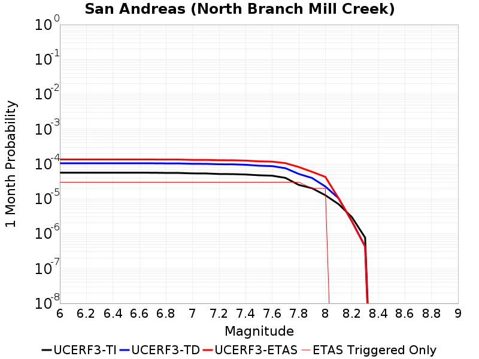 | 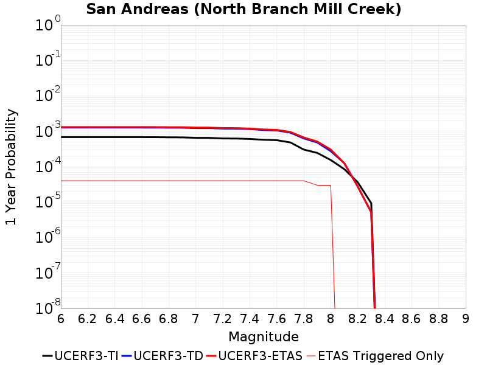 |  |

| Magnitude | 1 wk TI Prob | 1 wk TD Prob | 1 wk ETAS Prob | 1 wk ETAS/TD Gain | 1 wk ETAS Triggered Only | 1 mo TI Prob | 1 mo TD Prob | 1 mo ETAS Prob | 1 mo ETAS/TD Gain | 1 mo ETAS Triggered Only | 1 yr TI Prob | 1 yr TD Prob | 1 yr ETAS Prob | 1 yr ETAS/TD Gain | 1 yr ETAS Triggered Only | 10 yr TI Prob | 10 yr TD Prob | 10 yr ETAS Prob | 10 yr ETAS/TD Gain | 10 yr ETAS Triggered Only |
|-----|-----|-----|-----|-----|-----|-----|-----|-----|-----|-----|-----|-----|-----|-----|-----|-----|-----|-----|-----|-----|
| 6.0 | 1.3079164E-5 | 2.4377025E-5 | 3.4376782E-5 | 1.4102123 | 1.0E-5 | 5.6052355E-5 | 1.04468796E-4 | 1.3446566E-4 | 1.287137 | 3.0E-5 | 6.822237E-4 | 0.0012711689 | 0.0013111181 | 1.0314271 | 4.0E-5 | 0.006801331 | 0.012675484 | 0.012714976 | 1.0031157 | 4.0E-5 |
| 6.1 | 1.3079164E-5 | 2.4377025E-5 | 3.4376782E-5 | 1.4102123 | 1.0E-5 | 5.6052355E-5 | 1.04468796E-4 | 1.3446566E-4 | 1.287137 | 3.0E-5 | 6.822237E-4 | 0.0012711689 | 0.0013111181 | 1.0314271 | 4.0E-5 | 0.006801331 | 0.012675484 | 0.012714976 | 1.0031157 | 4.0E-5 |
| 6.2 | 1.3079164E-5 | 2.4377025E-5 | 3.4376782E-5 | 1.4102123 | 1.0E-5 | 5.6052355E-5 | 1.04468796E-4 | 1.3446566E-4 | 1.287137 | 3.0E-5 | 6.822237E-4 | 0.0012711689 | 0.0013111181 | 1.0314271 | 4.0E-5 | 0.006801331 | 0.012675484 | 0.012714976 | 1.0031157 | 4.0E-5 |
| 6.3 | 1.3079164E-5 | 2.4377025E-5 | 3.4376782E-5 | 1.4102123 | 1.0E-5 | 5.6052355E-5 | 1.04468796E-4 | 1.3446566E-4 | 1.287137 | 3.0E-5 | 6.822237E-4 | 0.0012711689 | 0.0013111181 | 1.0314271 | 4.0E-5 | 0.006801331 | 0.012675484 | 0.012714976 | 1.0031157 | 4.0E-5 |
| 6.4 | 1.3079164E-5 | 2.4377025E-5 | 3.4376782E-5 | 1.4102123 | 1.0E-5 | 5.6052355E-5 | 1.04468796E-4 | 1.3446566E-4 | 1.287137 | 3.0E-5 | 6.822237E-4 | 0.0012711689 | 0.0013111181 | 1.0314271 | 4.0E-5 | 0.006801331 | 0.012675484 | 0.012714976 | 1.0031157 | 4.0E-5 |
| 6.5 | 1.3079164E-5 | 2.4377025E-5 | 3.4376782E-5 | 1.4102123 | 1.0E-5 | 5.6052355E-5 | 1.04468796E-4 | 1.3446566E-4 | 1.287137 | 3.0E-5 | 6.822237E-4 | 0.0012711689 | 0.0013111181 | 1.0314271 | 4.0E-5 | 0.006801331 | 0.012675484 | 0.012714976 | 1.0031157 | 4.0E-5 |
| 6.6 | 1.3074523E-5 | 2.4372092E-5 | 3.437185E-5 | 1.4102954 | 1.0E-5 | 5.6032466E-5 | 1.0444766E-4 | 1.3444452E-4 | 1.2871952 | 3.0E-5 | 6.8198174E-4 | 0.0012709119 | 0.0013108611 | 1.0314335 | 4.0E-5 | 0.006798926 | 0.012672942 | 0.012712436 | 1.0031164 | 4.0E-5 |
| 6.7 | 1.3050216E-5 | 2.4347366E-5 | 3.4347122E-5 | 1.410712 | 1.0E-5 | 5.59283E-5 | 1.043417E-4 | 1.3433857E-4 | 1.2874869 | 3.0E-5 | 6.8071426E-4 | 0.0012696234 | 0.0013095726 | 1.0314654 | 4.0E-5 | 0.0067863287 | 0.012660204 | 0.012699698 | 1.0031195 | 4.0E-5 |
| 6.8 | 1.29049395E-5 | 2.4195826E-5 | 3.4195586E-5 | 1.4132844 | 1.0E-5 | 5.530571E-5 | 1.0369229E-4 | 1.3368919E-4 | 1.2892876 | 3.0E-5 | 6.73139E-4 | 0.001261726 | 0.0013016756 | 1.0316626 | 4.0E-5 | 0.0067110364 | 0.012582126 | 0.012621623 | 1.0031391 | 4.0E-5 |
| 6.9 | 1.2867369E-5 | 2.4155148E-5 | 3.4154906E-5 | 1.4139804 | 1.0E-5 | 5.51447E-5 | 1.03517974E-4 | 1.3351487E-4 | 1.2897748 | 3.0E-5 | 6.711799E-4 | 0.0012596061 | 0.0012995558 | 1.031716 | 4.0E-5 | 0.006691564 | 0.012561168 | 0.012600665 | 1.0031444 | 4.0E-5 |
| 7.0 | 1.2495996E-5 | 2.3544275E-5 | 3.3544038E-5 | 1.4247217 | 1.0E-5 | 5.3553173E-5 | 1.0090015E-4 | 1.3089713E-4 | 1.2972937 | 3.0E-5 | 6.518148E-4 | 0.0012277701 | 0.001267721 | 1.0325394 | 4.0E-5 | 0.0064990623 | 0.0122463275 | 0.012285838 | 1.0032263 | 4.0E-5 |
| 7.1 | 1.2452067E-5 | 2.3488961E-5 | 3.3488726E-5 | 1.4257219 | 1.0E-5 | 5.3364907E-5 | 1.0066311E-4 | 1.3066009E-4 | 1.2979938 | 3.0E-5 | 6.4952404E-4 | 0.0012248873 | 0.0012648384 | 1.032616 | 4.0E-5 | 0.0064762887 | 0.012217818 | 0.012257329 | 1.0032339 | 4.0E-5 |
| 7.2 | 1.2002777E-5 | 2.285888E-5 | 3.285865E-5 | 1.4374567 | 1.0E-5 | 5.143946E-5 | 9.796297E-5 | 1.2796003E-4 | 1.3062081 | 3.0E-5 | 6.2609545E-4 | 0.0011920495 | 0.0012320017 | 1.0335157 | 4.0E-5 | 0.006243344 | 0.011892991 | 0.011932515 | 1.0033233 | 4.0E-5 |
| 7.3 | 1.1923425E-5 | 2.272745E-5 | 3.2727225E-5 | 1.4399866 | 1.0E-5 | 5.109939E-5 | 9.739974E-5 | 1.2739682E-4 | 1.307979 | 3.0E-5 | 6.219575E-4 | 0.0011851996 | 0.0012251522 | 1.0337096 | 4.0E-5 | 0.0062021962 | 0.011825252 | 0.0118647795 | 1.0033426 | 4.0E-5 |
| 7.4 | 1.16105175E-5 | 2.2095654E-5 | 3.2095435E-5 | 1.4525677 | 1.0E-5 | 4.975841E-5 | 9.469224E-5 | 1.246894E-4 | 1.3167858 | 3.0E-5 | 6.0564023E-4 | 0.001152271 | 0.001192225 | 1.034674 | 4.0E-5 | 0.006039923 | 0.011500183 | 0.011539723 | 1.0034382 | 4.0E-5 |
| 7.5 | 1.1037265E-5 | 2.0769054E-5 | 3.0768846E-5 | 1.4814756 | 1.0E-5 | 4.7301706E-5 | 8.900721E-5 | 1.1900454E-4 | 1.3370214 | 3.0E-5 | 5.757461E-4 | 0.0010831264 | 0.001123083 | 1.0368901 | 4.0E-5 | 0.005742567 | 0.01081732 | 0.010856887 | 1.0036578 | 4.0E-5 |
| 7.6 | 1.0720915E-5 | 2.0196445E-5 | 3.0196243E-5 | 1.4951266 | 1.0E-5 | 4.5945973E-5 | 8.655334E-5 | 1.16550735E-4 | 1.346577 | 3.0E-5 | 5.592486E-4 | 0.0010532797 | 0.0010932377 | 1.0379366 | 4.0E-5 | 0.005578433 | 0.010521731 | 0.010561311 | 1.0037616 | 4.0E-5 |
| 7.7 | 9.276279E-6 | 1.757437E-5 | 2.7574195E-5 | 1.5690005 | 1.0E-5 | 3.9754876E-5 | 7.5316566E-5 | 1.05314306E-4 | 1.3982887 | 3.0E-5 | 4.839081E-4 | 9.165952E-4 | 9.5655856E-4 | 1.0435997 | 4.0E-5 | 0.0048285574 | 0.009166907 | 0.00920654 | 1.0043235 | 4.0E-5 |
| 7.8 | 5.8346777E-6 | 1.2054279E-5 | 2.2054159E-5 | 1.8295709 | 1.0E-5 | 2.5005522E-5 | 5.1660176E-5 | 8.1658625E-5 | 1.5806881 | 3.0E-5 | 3.043997E-4 | 6.287813E-4 | 6.687561E-4 | 1.0635751 | 4.0E-5 | 0.0030398308 | 0.006308441 | 0.0063481885 | 1.0063007 | 4.0E-5 |
| 7.9 | 4.690204E-6 | 9.228188E-6 | 9.228188E-6 | 1.0 | 0.0 | 2.0100719E-5 | 3.9548777E-5 | 5.9547987E-5 | 1.5056846 | 2.0E-5 | 2.4469878E-4 | 4.814001E-4 | 5.113856E-4 | 1.0622883 | 3.0E-5 | 0.002444295 | 0.004839859 | 0.004869714 | 1.0061685 | 3.0E-5 |
| 8.0 | 2.9570454E-6 | 5.269704E-6 | 5.269704E-6 | 1.0 | 0.0 | 1.267299E-5 | 2.258425E-5 | 4.25838E-5 | 1.8855529 | 2.0E-5 | 1.5428272E-4 | 2.749286E-4 | 3.0492037E-4 | 1.1090893 | 3.0E-5 | 0.0015417566 | 0.0027685964 | 0.0027985135 | 1.0108058 | 3.0E-5 |
| 8.1 | 1.6376824E-6 | 2.4144783E-6 | 2.4144783E-6 | 1.0 | 0.0 | 7.01862E-6 | 1.0347723E-5 | 1.0347723E-5 | 1.0 | 0.0 | 8.544835E-5 | 1.2597626E-4 | 1.2597626E-4 | 1.0 | 0.0 | 8.54155E-4 | 0.0012739606 | 0.0012739606 | 1.0 | 0.0 |
| 8.2 | 6.9631557E-7 | 5.2703786E-7 | 5.2703786E-7 | 1.0 | 0.0 | 2.984206E-6 | 2.2587317E-6 | 2.2587317E-6 | 1.0 | 0.0 | 3.63321E-5 | 2.7499713E-5 | 2.7499713E-5 | 1.0 | 0.0 | 3.6326164E-4 | 2.8384387E-4 | 2.8384387E-4 | 1.0 | 0.0 |
| 8.3 | 1.7876137E-7 | 9.9333505E-8 | 9.9333505E-8 | 1.0 | 0.0 | 7.661199E-7 | 4.2571494E-7 | 4.2571494E-7 | 1.0 | 0.0 | 9.32747E-6 | 5.1830675E-6 | 5.1830675E-6 | 1.0 | 0.0 | 9.3270784E-5 | 5.417316E-5 | 5.417316E-5 | 1.0 | 0.0 |

## Elysian Park (Upper)
*[(top)](#table-of-contents)*

| 1 Week | 1 Month | 1 Year | 10 Year |
|-----|-----|-----|-----|
| 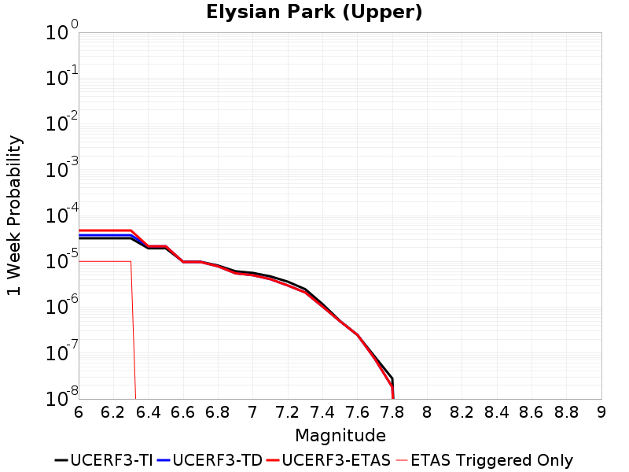 | 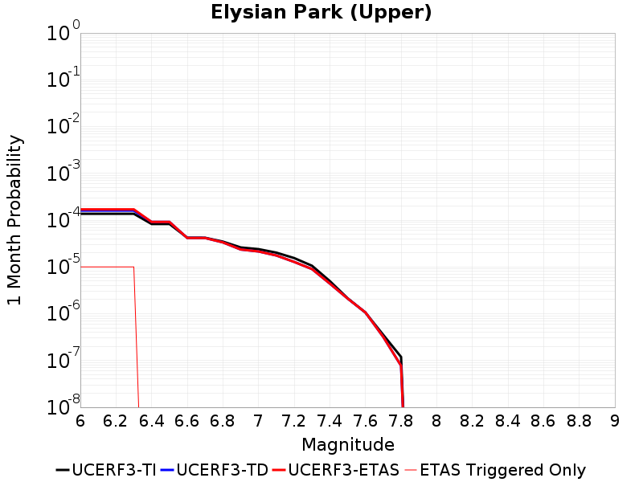 |  |  |

| Magnitude | 1 wk TI Prob | 1 wk TD Prob | 1 wk ETAS Prob | 1 wk ETAS/TD Gain | 1 wk ETAS Triggered Only | 1 mo TI Prob | 1 mo TD Prob | 1 mo ETAS Prob | 1 mo ETAS/TD Gain | 1 mo ETAS Triggered Only | 1 yr TI Prob | 1 yr TD Prob | 1 yr ETAS Prob | 1 yr ETAS/TD Gain | 1 yr ETAS Triggered Only | 10 yr TI Prob | 10 yr TD Prob | 10 yr ETAS Prob | 10 yr ETAS/TD Gain | 10 yr ETAS Triggered Only |
|-----|-----|-----|-----|-----|-----|-----|-----|-----|-----|-----|-----|-----|-----|-----|-----|-----|-----|-----|-----|-----|
| 6.0 | 3.1876025E-5 | 3.726775E-5 | 4.7267375E-5 | 1.2683185 | 1.0E-5 | 1.3660437E-4 | 1.5971193E-4 | 1.6971033E-4 | 1.0626028 | 1.0E-5 | 0.0016618895 | 0.0019432352 | 0.0019731768 | 1.0154082 | 3.0E-5 | 0.016495159 | 0.01930923 | 0.01933865 | 1.0015236 | 3.0E-5 |
| 6.1 | 3.1876025E-5 | 3.726775E-5 | 4.7267375E-5 | 1.2683185 | 1.0E-5 | 1.3660437E-4 | 1.5971193E-4 | 1.6971033E-4 | 1.0626028 | 1.0E-5 | 0.0016618895 | 0.0019432352 | 0.0019731768 | 1.0154082 | 3.0E-5 | 0.016495159 | 0.01930923 | 0.01933865 | 1.0015236 | 3.0E-5 |
| 6.2 | 3.1876025E-5 | 3.726775E-5 | 4.7267375E-5 | 1.2683185 | 1.0E-5 | 1.3660437E-4 | 1.5971193E-4 | 1.6971033E-4 | 1.0626028 | 1.0E-5 | 0.0016618895 | 0.0019432352 | 0.0019731768 | 1.0154082 | 3.0E-5 | 0.016495159 | 0.01930923 | 0.01933865 | 1.0015236 | 3.0E-5 |
| 6.3 | 3.1876025E-5 | 3.726775E-5 | 4.7267375E-5 | 1.2683185 | 1.0E-5 | 1.3660437E-4 | 1.5971193E-4 | 1.6971033E-4 | 1.0626028 | 1.0E-5 | 0.0016618895 | 0.0019432352 | 0.0019731768 | 1.0154082 | 3.0E-5 | 0.016495159 | 0.01930923 | 0.01933865 | 1.0015236 | 3.0E-5 |
| 6.4 | 1.9273462E-5 | 2.1309323E-5 | 2.1309323E-5 | 1.0 | 0.0 | 8.259794E-5 | 9.132346E-5 | 9.132346E-5 | 1.0 | 0.0 | 0.001005166 | 0.0011114691 | 0.0011314468 | 1.0179743 | 2.0E-5 | 0.010006315 | 0.011076062 | 0.0110958405 | 1.0017858 | 2.0E-5 |
| 6.5 | 1.9273462E-5 | 2.1309323E-5 | 2.1309323E-5 | 1.0 | 0.0 | 8.259794E-5 | 9.132346E-5 | 9.132346E-5 | 1.0 | 0.0 | 0.001005166 | 0.0011114691 | 0.0011314468 | 1.0179743 | 2.0E-5 | 0.010006315 | 0.011076062 | 0.0110958405 | 1.0017858 | 2.0E-5 |
| 6.6 | 9.813258E-6 | 9.693422E-6 | 9.693422E-6 | 1.0 | 0.0 | 4.205614E-5 | 4.1542615E-5 | 4.1542615E-5 | 1.0 | 0.0 | 5.119132E-4 | 5.0567125E-4 | 5.156662E-4 | 1.0197657 | 1.0E-5 | 0.005107356 | 0.0050459355 | 0.005055885 | 1.0019718 | 1.0E-5 |
| 6.7 | 9.801478E-6 | 9.680968E-6 | 9.680968E-6 | 1.0 | 0.0 | 4.2005657E-5 | 4.1489246E-5 | 4.1489246E-5 | 1.0 | 0.0 | 5.112989E-4 | 5.050218E-4 | 5.150167E-4 | 1.0197911 | 1.0E-5 | 0.0051012407 | 0.0050394703 | 0.00504942 | 1.0019743 | 1.0E-5 |
| 6.8 | 8.102489E-6 | 7.794505E-6 | 7.794505E-6 | 1.0 | 0.0 | 3.4724493E-5 | 3.3404624E-5 | 3.3404624E-5 | 1.0 | 0.0 | 4.2268867E-4 | 4.0663042E-4 | 4.1662634E-4 | 1.0245824 | 1.0E-5 | 0.004218856 | 0.0040593618 | 0.004069321 | 1.0024534 | 1.0E-5 |
| 6.9 | 6.08275E-6 | 5.4932975E-6 | 5.4932975E-6 | 1.0 | 0.0 | 2.6068668E-5 | 2.3542496E-5 | 2.3542496E-5 | 1.0 | 0.0 | 3.173398E-4 | 2.8659296E-4 | 2.8659296E-4 | 1.0 | 0.0 | 0.0031688702 | 0.0028623117 | 0.0028623117 | 1.0 | 0.0 |
| 7.0 | 5.5995934E-6 | 4.9932282E-6 | 4.9932282E-6 | 1.0 | 0.0 | 2.3998036E-5 | 2.1399377E-5 | 2.1399377E-5 | 1.0 | 0.0 | 2.9213692E-4 | 2.6050696E-4 | 2.6050696E-4 | 1.0 | 0.0 | 0.0029175316 | 0.0026020834 | 0.0026020834 | 1.0 | 0.0 |
| 7.1 | 4.709881E-6 | 4.0954255E-6 | 4.0954255E-6 | 1.0 | 0.0 | 2.0185047E-5 | 1.7551707E-5 | 1.7551707E-5 | 1.0 | 0.0 | 2.4572524E-4 | 2.1367149E-4 | 2.1367149E-4 | 1.0 | 0.0 | 0.002454537 | 0.0021347022 | 0.0021347022 | 1.0 | 0.0 |
| 7.2 | 3.6063436E-6 | 2.9828814E-6 | 2.9828814E-6 | 1.0 | 0.0 | 1.5455667E-5 | 1.2783716E-5 | 1.2783716E-5 | 1.0 | 0.0 | 1.881565E-4 | 1.5563074E-4 | 1.5563074E-4 | 1.0 | 0.0 | 0.0018799726 | 0.0015552287 | 0.0015552287 | 1.0 | 0.0 |
| 7.3 | 2.471135E-6 | 2.0991777E-6 | 2.0991777E-6 | 1.0 | 0.0 | 1.0590536E-5 | 8.996445E-6 | 8.996445E-6 | 1.0 | 0.0 | 1.2893214E-4 | 1.09526285E-4 | 1.09526285E-4 | 1.0 | 0.0 | 0.0012885736 | 0.0010947302 | 0.0010947302 | 1.0 | 0.0 |
| 7.4 | 1.163943E-6 | 1.0292546E-6 | 1.0292546E-6 | 1.0 | 0.0 | 4.988318E-6 | 4.411084E-6 | 4.411084E-6 | 1.0 | 0.0 | 6.0731076E-5 | 5.370365E-5 | 5.370365E-5 | 1.0 | 0.0 | 6.071448E-4 | 5.3690973E-4 | 5.3690973E-4 | 1.0 | 0.0 |
| 7.5 | 4.99459E-7 | 4.924889E-7 | 4.924889E-7 | 1.0 | 0.0 | 2.140537E-6 | 2.110665E-6 | 2.110665E-6 | 1.0 | 0.0 | 2.6060725E-5 | 2.569706E-5 | 2.569706E-5 | 1.0 | 0.0 | 2.605767E-4 | 2.5694247E-4 | 2.5694247E-4 | 1.0 | 0.0 |
| 7.6 | 2.4667852E-7 | 2.483003E-7 | 2.483003E-7 | 1.0 | 0.0 | 1.0571932E-6 | 1.0641437E-6 | 1.0641437E-6 | 1.0 | 0.0 | 1.2871251E-5 | 1.2955876E-5 | 1.2955876E-5 | 1.0 | 0.0 | 1.2870505E-4 | 1.2955157E-4 | 1.2955157E-4 | 1.0 | 0.0 |
| 7.7 | 8.2312795E-8 | 7.4417024E-8 | 7.4417024E-8 | 1.0 | 0.0 | 3.527691E-7 | 3.1893006E-7 | 3.1893006E-7 | 1.0 | 0.0 | 4.294955E-6 | 3.882968E-6 | 3.882968E-6 | 1.0 | 0.0 | 4.2948723E-5 | 3.8829116E-5 | 3.8829116E-5 | 1.0 | 0.0 |
| 7.8 | 2.7819295E-8 | 1.8021124E-8 | 1.8021124E-8 | 1.0 | 0.0 | 1.1922555E-7 | 7.723339E-8 | 7.723339E-8 | 1.0 | 0.0 | 1.45157E-6 | 9.403162E-7 | 9.403162E-7 | 1.0 | 0.0 | 1.45156055E-5 | 9.403138E-6 | 9.403138E-6 | 1.0 | 0.0 |

## San Jacinto (San Jacinto Valley) rev
*[(top)](#table-of-contents)*

| 1 Week | 1 Month | 1 Year | 10 Year |
|-----|-----|-----|-----|
| 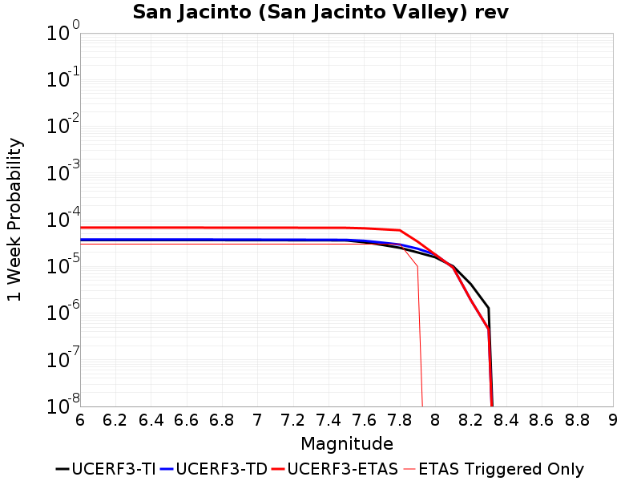 | 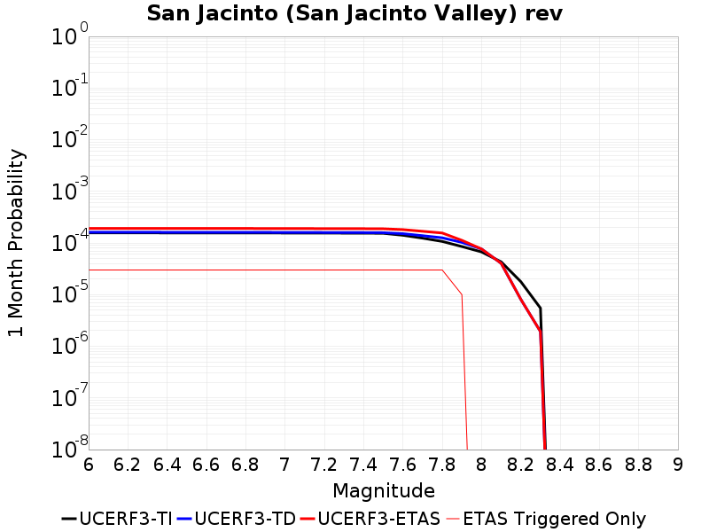 | 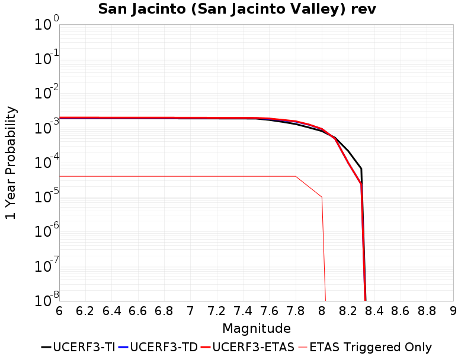 |  |

| Magnitude | 1 wk TI Prob | 1 wk TD Prob | 1 wk ETAS Prob | 1 wk ETAS/TD Gain | 1 wk ETAS Triggered Only | 1 mo TI Prob | 1 mo TD Prob | 1 mo ETAS Prob | 1 mo ETAS/TD Gain | 1 mo ETAS Triggered Only | 1 yr TI Prob | 1 yr TD Prob | 1 yr ETAS Prob | 1 yr ETAS/TD Gain | 1 yr ETAS Triggered Only | 10 yr TI Prob | 10 yr TD Prob | 10 yr ETAS Prob | 10 yr ETAS/TD Gain | 10 yr ETAS Triggered Only |
|-----|-----|-----|-----|-----|-----|-----|-----|-----|-----|-----|-----|-----|-----|-----|-----|-----|-----|-----|-----|-----|
| 6.0 | 3.652694E-5 | 3.7646234E-5 | 6.76451E-5 | 1.7968625 | 3.0E-5 | 1.5653463E-4 | 1.6133103E-4 | 1.913262E-4 | 1.1859231 | 3.0E-5 | 0.0019041431 | 0.0019624378 | 0.0020023594 | 1.0203428 | 4.0E-5 | 0.018879099 | 0.020193793 | 0.020232985 | 1.0019408 | 4.0E-5 |
| 6.1 | 3.652694E-5 | 3.7646234E-5 | 6.76451E-5 | 1.7968625 | 3.0E-5 | 1.5653463E-4 | 1.6133103E-4 | 1.913262E-4 | 1.1859231 | 3.0E-5 | 0.0019041431 | 0.0019624378 | 0.0020023594 | 1.0203428 | 4.0E-5 | 0.018879099 | 0.020193793 | 0.020232985 | 1.0019408 | 4.0E-5 |
| 6.2 | 3.652694E-5 | 3.7646234E-5 | 6.76451E-5 | 1.7968625 | 3.0E-5 | 1.5653463E-4 | 1.6133103E-4 | 1.913262E-4 | 1.1859231 | 3.0E-5 | 0.0019041431 | 0.0019624378 | 0.0020023594 | 1.0203428 | 4.0E-5 | 0.018879099 | 0.020193793 | 0.020232985 | 1.0019408 | 4.0E-5 |
| 6.3 | 3.652694E-5 | 3.7646234E-5 | 6.76451E-5 | 1.7968625 | 3.0E-5 | 1.5653463E-4 | 1.6133103E-4 | 1.913262E-4 | 1.1859231 | 3.0E-5 | 0.0019041431 | 0.0019624378 | 0.0020023594 | 1.0203428 | 4.0E-5 | 0.018879099 | 0.020193793 | 0.020232985 | 1.0019408 | 4.0E-5 |
| 6.4 | 3.646941E-5 | 3.7566977E-5 | 6.756585E-5 | 1.7985437 | 3.0E-5 | 1.5628811E-4 | 1.6099142E-4 | 1.9098658E-4 | 1.1863153 | 3.0E-5 | 0.0019011468 | 0.0019583108 | 0.0019982324 | 1.0203857 | 4.0E-5 | 0.018849645 | 0.020153325 | 0.020192519 | 1.0019448 | 4.0E-5 |
| 6.5 | 3.646941E-5 | 3.7566977E-5 | 6.756585E-5 | 1.7985437 | 3.0E-5 | 1.5628811E-4 | 1.6099142E-4 | 1.9098658E-4 | 1.1863153 | 3.0E-5 | 0.0019011468 | 0.0019583108 | 0.0019982324 | 1.0203857 | 4.0E-5 | 0.018849645 | 0.020153325 | 0.020192519 | 1.0019448 | 4.0E-5 |
| 6.6 | 3.6442503E-5 | 3.752998E-5 | 6.7528854E-5 | 1.799331 | 3.0E-5 | 1.561728E-4 | 1.6083287E-4 | 1.9082804E-4 | 1.186499 | 3.0E-5 | 0.0018997455 | 0.0019563844 | 0.001996306 | 1.0204059 | 4.0E-5 | 0.018835869 | 0.020134432 | 0.020173628 | 1.0019467 | 4.0E-5 |
| 6.7 | 3.6432113E-5 | 3.7515394E-5 | 6.751427E-5 | 1.7996417 | 3.0E-5 | 1.5612828E-4 | 1.6077037E-4 | 1.9076555E-4 | 1.1865716 | 3.0E-5 | 0.0018992044 | 0.001955625 | 0.0019955467 | 1.0204139 | 4.0E-5 | 0.018830549 | 0.02012699 | 0.020166185 | 1.0019474 | 4.0E-5 |
| 6.8 | 3.6409598E-5 | 3.748409E-5 | 6.7482964E-5 | 1.8003095 | 3.0E-5 | 1.560318E-4 | 1.6063622E-4 | 1.906314E-4 | 1.1867274 | 3.0E-5 | 0.0018980318 | 0.0019539946 | 0.0019939165 | 1.0204309 | 4.0E-5 | 0.018819023 | 0.020110987 | 0.020150183 | 1.001949 | 4.0E-5 |
| 6.9 | 3.638078E-5 | 3.744405E-5 | 6.7442925E-5 | 1.8011655 | 3.0E-5 | 1.5590832E-4 | 1.6046464E-4 | 1.9045983E-4 | 1.1869271 | 3.0E-5 | 0.0018965311 | 0.0019519094 | 0.0019918312 | 1.0204527 | 4.0E-5 | 0.018804269 | 0.020090519 | 0.020129716 | 1.001951 | 4.0E-5 |
| 7.0 | 3.6294874E-5 | 3.7324684E-5 | 6.732356E-5 | 1.8037276 | 3.0E-5 | 1.5554018E-4 | 1.5995314E-4 | 1.8994835E-4 | 1.1875249 | 3.0E-5 | 0.0018920569 | 0.0019456932 | 0.0019856154 | 1.0205182 | 4.0E-5 | 0.018760284 | 0.0200295 | 0.0200687 | 1.001957 | 4.0E-5 |
| 7.1 | 3.6260717E-5 | 3.7280526E-5 | 6.727941E-5 | 1.8046796 | 3.0E-5 | 1.5539382E-4 | 1.5976392E-4 | 1.8975913E-4 | 1.1877471 | 3.0E-5 | 0.001890278 | 0.0019433935 | 0.0019833157 | 1.0205425 | 4.0E-5 | 0.018742796 | 0.0200069 | 0.0200461 | 1.0019593 | 4.0E-5 |
| 7.2 | 3.6210204E-5 | 3.72139E-5 | 6.7212786E-5 | 1.8061204 | 3.0E-5 | 1.5517735E-4 | 1.5947841E-4 | 1.8947362E-4 | 1.1880833 | 3.0E-5 | 0.001887647 | 0.0019399236 | 0.001979846 | 1.0205793 | 4.0E-5 | 0.01871693 | 0.019972805 | 0.020012006 | 1.0019628 | 4.0E-5 |
| 7.3 | 3.6119454E-5 | 3.7099457E-5 | 6.709834E-5 | 1.8086072 | 3.0E-5 | 1.5478847E-4 | 1.58988E-4 | 1.8898323E-4 | 1.1886635 | 3.0E-5 | 0.0018829206 | 0.0019339635 | 0.001973886 | 1.0206429 | 4.0E-5 | 0.018670462 | 0.019914074 | 0.019953277 | 1.0019686 | 4.0E-5 |
| 7.4 | 3.607848E-5 | 3.704533E-5 | 6.7044224E-5 | 1.8097886 | 3.0E-5 | 1.5461289E-4 | 1.5875607E-4 | 1.887513E-4 | 1.1889392 | 3.0E-5 | 0.0018807866 | 0.0019311447 | 0.0019710674 | 1.0206732 | 4.0E-5 | 0.018649481 | 0.019886289 | 0.019925494 | 1.0019715 | 4.0E-5 |
| 7.5 | 3.5856774E-5 | 3.6848094E-5 | 6.684699E-5 | 1.8141234 | 3.0E-5 | 1.5366284E-4 | 1.5791086E-4 | 1.8790612E-4 | 1.1899506 | 3.0E-5 | 0.0018692396 | 0.0019208725 | 0.0019607956 | 1.0207839 | 4.0E-5 | 0.018535944 | 0.019783963 | 0.019823171 | 1.0019819 | 4.0E-5 |
| 7.6 | 3.286655E-5 | 3.5290144E-5 | 6.528908E-5 | 1.8500657 | 3.0E-5 | 1.4084904E-4 | 1.5123471E-4 | 1.8123018E-4 | 1.1983372 | 3.0E-5 | 0.001713488 | 0.00183973 | 0.0018796565 | 1.0217023 | 4.0E-5 | 0.017003361 | 0.018962802 | 0.019002043 | 1.0020694 | 4.0E-5 |
| 7.7 | 2.8882527E-5 | 3.224973E-5 | 6.2248764E-5 | 1.9302104 | 3.0E-5 | 1.237764E-4 | 1.3820581E-4 | 1.6820166E-4 | 1.2170376 | 3.0E-5 | 0.0015059357 | 0.0016813583 | 0.0017212911 | 1.0237503 | 4.0E-5 | 0.014957713 | 0.01738331 | 0.017422615 | 1.002261 | 4.0E-5 |
| 7.8 | 2.4950225E-5 | 2.9340736E-5 | 5.9339854E-5 | 2.0224392 | 3.0E-5 | 1.0692515E-4 | 1.2573996E-4 | 1.5573618E-4 | 1.2385577 | 3.0E-5 | 0.0013010362 | 0.00152981 | 0.0015697487 | 1.0261071 | 4.0E-5 | 0.012934455 | 0.015863473 | 0.015902838 | 1.0024815 | 4.0E-5 |
| 7.9 | 1.9881603E-5 | 2.3903734E-5 | 3.3903496E-5 | 1.4183347 | 1.0E-5 | 8.520408E-5 | 1.0244056E-4 | 1.12439535E-4 | 1.0976076 | 1.0E-5 | 0.001036866 | 0.0012465012 | 0.0012664762 | 1.016025 | 2.0E-5 | 0.010320415 | 0.013018566 | 0.013038306 | 1.0015162 | 2.0E-5 |
| 8.0 | 1.563292E-5 | 1.7830502E-5 | 1.7830502E-5 | 1.0 | 0.0 | 6.6996516E-5 | 7.6414195E-5 | 7.6414195E-5 | 1.0 | 0.0 | 8.153773E-4 | 9.299466E-4 | 9.399373E-4 | 1.0107433 | 1.0E-5 | 0.00812392 | 0.009801577 | 0.009811479 | 1.0010103 | 1.0E-5 |
| 8.1 | 1.0045313E-5 | 9.4051775E-6 | 9.4051775E-6 | 1.0 | 0.0 | 4.305063E-5 | 4.0307285E-5 | 4.0307285E-5 | 1.0 | 0.0 | 5.2401534E-4 | 4.906313E-4 | 4.906313E-4 | 1.0 | 0.0 | 0.0052278144 | 0.005248262 | 0.005248262 | 1.0 | 0.0 |
| 8.2 | 4.1554413E-6 | 1.8888824E-6 | 1.8888824E-6 | 1.0 | 0.0 | 1.7808914E-5 | 8.095185E-6 | 8.095185E-6 | 1.0 | 0.0 | 2.1680194E-4 | 9.855446E-5 | 9.855446E-5 | 1.0 | 0.0 | 0.0021659054 | 0.0011314093 | 0.0011314093 | 1.0 | 0.0 |
| 8.3 | 1.2758221E-6 | 4.4868844E-7 | 4.4868844E-7 | 1.0 | 0.0 | 5.4677976E-6 | 1.922949E-6 | 1.922949E-6 | 1.0 | 0.0 | 6.65684E-5 | 2.341166E-5 | 2.341166E-5 | 1.0 | 0.0 | 6.6548464E-4 | 2.7819705E-4 | 2.7819705E-4 | 1.0 | 0.0 |

## Cleghorn
*[(top)](#table-of-contents)*

| 1 Week | 1 Month | 1 Year | 10 Year |
|-----|-----|-----|-----|
| 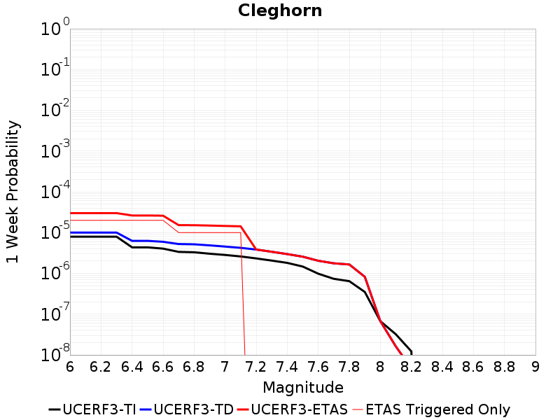 | 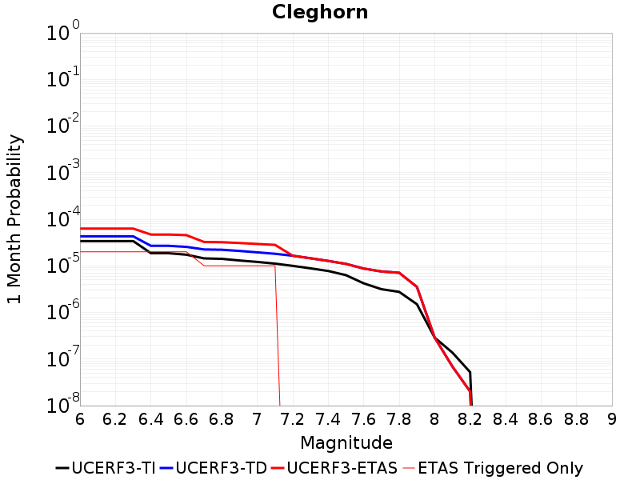 | 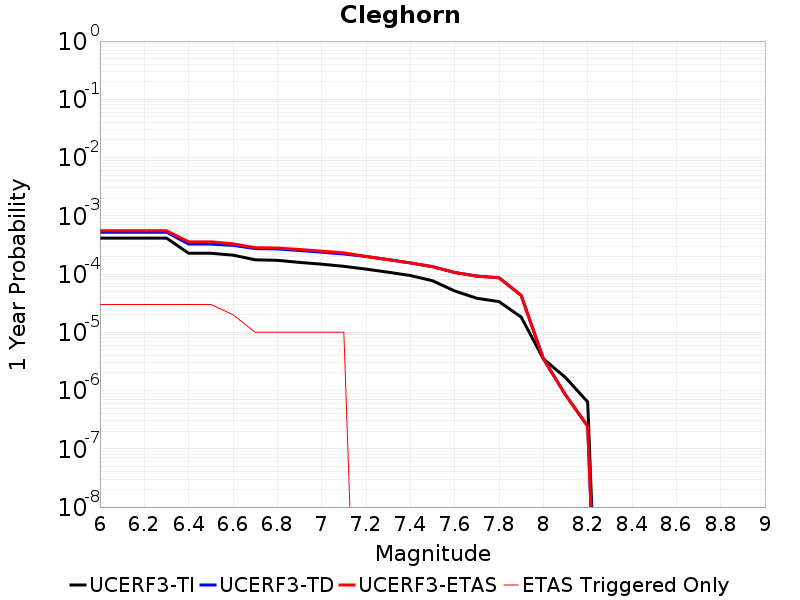 | 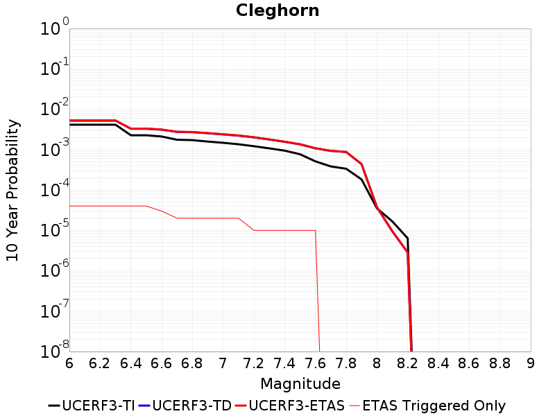 |

| Magnitude | 1 wk TI Prob | 1 wk TD Prob | 1 wk ETAS Prob | 1 wk ETAS/TD Gain | 1 wk ETAS Triggered Only | 1 mo TI Prob | 1 mo TD Prob | 1 mo ETAS Prob | 1 mo ETAS/TD Gain | 1 mo ETAS Triggered Only | 1 yr TI Prob | 1 yr TD Prob | 1 yr ETAS Prob | 1 yr ETAS/TD Gain | 1 yr ETAS Triggered Only | 10 yr TI Prob | 10 yr TD Prob | 10 yr ETAS Prob | 10 yr ETAS/TD Gain | 10 yr ETAS Triggered Only |
|-----|-----|-----|-----|-----|-----|-----|-----|-----|-----|-----|-----|-----|-----|-----|-----|-----|-----|-----|-----|-----|
| 6.0 | 7.9267165E-6 | 1.0006432E-5 | 3.0006231E-5 | 2.9986947 | 2.0E-5 | 3.39712E-5 | 4.288406E-5 | 6.2883206E-5 | 1.4663538 | 2.0E-5 | 4.1352084E-4 | 5.21999E-4 | 5.5198336E-4 | 1.0574414 | 3.0E-5 | 0.004127522 | 0.0052201157 | 0.0052599064 | 1.0076227 | 4.0E-5 |
| 6.1 | 7.9267165E-6 | 1.0006432E-5 | 3.0006231E-5 | 2.9986947 | 2.0E-5 | 3.39712E-5 | 4.288406E-5 | 6.2883206E-5 | 1.4663538 | 2.0E-5 | 4.1352084E-4 | 5.21999E-4 | 5.5198336E-4 | 1.0574414 | 3.0E-5 | 0.004127522 | 0.0052201157 | 0.0052599064 | 1.0076227 | 4.0E-5 |
| 6.2 | 7.9267165E-6 | 1.0006432E-5 | 3.0006231E-5 | 2.9986947 | 2.0E-5 | 3.39712E-5 | 4.288406E-5 | 6.2883206E-5 | 1.4663538 | 2.0E-5 | 4.1352084E-4 | 5.21999E-4 | 5.5198336E-4 | 1.0574414 | 3.0E-5 | 0.004127522 | 0.0052201157 | 0.0052599064 | 1.0076227 | 4.0E-5 |
| 6.3 | 7.9267165E-6 | 1.0006432E-5 | 3.0006231E-5 | 2.9986947 | 2.0E-5 | 3.39712E-5 | 4.288406E-5 | 6.2883206E-5 | 1.4663538 | 2.0E-5 | 4.1352084E-4 | 5.21999E-4 | 5.5198336E-4 | 1.0574414 | 3.0E-5 | 0.004127522 | 0.0052201157 | 0.0052599064 | 1.0076227 | 4.0E-5 |
| 6.4 | 4.3445207E-6 | 6.261144E-6 | 2.626102E-5 | 4.1942844 | 2.0E-5 | 1.8619241E-5 | 2.6833204E-5 | 4.6832665E-5 | 1.7453252 | 2.0E-5 | 2.2666567E-4 | 3.2664632E-4 | 3.566365E-4 | 1.0918125 | 3.0E-5 | 0.0022643462 | 0.003273117 | 0.0033129859 | 1.0121808 | 4.0E-5 |
| 6.5 | 4.3445207E-6 | 6.261144E-6 | 2.626102E-5 | 4.1942844 | 2.0E-5 | 1.8619241E-5 | 2.6833204E-5 | 4.6832665E-5 | 1.7453252 | 2.0E-5 | 2.2666567E-4 | 3.2664632E-4 | 3.566365E-4 | 1.0918125 | 3.0E-5 | 0.0022643462 | 0.003273117 | 0.0033129859 | 1.0121808 | 4.0E-5 |
| 6.6 | 4.040109E-6 | 5.9431227E-6 | 2.5943003E-5 | 4.3652143 | 2.0E-5 | 1.7314638E-5 | 2.5470283E-5 | 4.5469773E-5 | 1.7852088 | 2.0E-5 | 2.1078532E-4 | 3.100575E-4 | 3.300513E-4 | 1.0644841 | 2.0E-5 | 0.002105855 | 0.0031076975 | 0.0031376043 | 1.0096234 | 3.0E-5 |
| 6.7 | 3.3632055E-6 | 5.235671E-6 | 1.5235619E-5 | 2.9099648 | 1.0E-5 | 1.4413658E-5 | 2.2438398E-5 | 3.2438173E-5 | 1.4456546 | 1.0E-5 | 1.7547216E-4 | 2.731536E-4 | 2.8315085E-4 | 1.0365994 | 1.0E-5 | 0.0017533366 | 0.0027395694 | 0.0027595146 | 1.0072805 | 2.0E-5 |
| 6.8 | 3.2902772E-6 | 5.157374E-6 | 1.5157322E-5 | 2.9389613 | 1.0E-5 | 1.4101111E-5 | 2.2102846E-5 | 3.2102624E-5 | 1.4524205 | 1.0E-5 | 1.716675E-4 | 2.6906925E-4 | 2.7906656E-4 | 1.0371552 | 1.0E-5 | 0.0017153495 | 0.0026988254 | 0.0027187713 | 1.0073906 | 2.0E-5 |
| 6.9 | 3.031547E-6 | 4.8577544E-6 | 1.48577055E-5 | 3.0585544 | 1.0E-5 | 1.299228E-5 | 2.0818783E-5 | 3.0818574E-5 | 1.4803255 | 1.0E-5 | 1.5816953E-4 | 2.5343947E-4 | 2.6343693E-4 | 1.0394472 | 1.0E-5 | 0.00158057 | 0.0025428927 | 0.0025628419 | 1.007845 | 2.0E-5 |
| 7.0 | 2.8259715E-6 | 4.5333204E-6 | 1.4533275E-5 | 3.2058787 | 1.0E-5 | 1.211125E-5 | 1.9428373E-5 | 2.9428178E-5 | 1.5147011 | 1.0E-5 | 1.4744449E-4 | 2.36515E-4 | 2.4651265E-4 | 1.0422707 | 1.0E-5 | 0.001473467 | 0.0023740192 | 0.0023939717 | 1.0084045 | 2.0E-5 |
| 7.1 | 2.5962665E-6 | 4.2263687E-6 | 1.4226326E-5 | 3.3660874 | 1.0E-5 | 1.1126809E-5 | 1.8112885E-5 | 2.8112703E-5 | 1.5520831 | 1.0E-5 | 1.3546048E-4 | 2.2050229E-4 | 2.3050008E-4 | 1.045341 | 1.0E-5 | 0.0013537793 | 0.0022142245 | 0.0022341802 | 1.0090125 | 2.0E-5 |
| 7.2 | 2.3247253E-6 | 3.8336348E-6 | 3.8336348E-6 | 1.0 | 0.0 | 9.96307E-6 | 1.6429762E-5 | 1.6429762E-5 | 1.0 | 0.0 | 1.21293626E-4 | 2.0001417E-4 | 2.0001417E-4 | 1.0 | 0.0 | 0.0012122744 | 0.0020097475 | 0.0020197274 | 1.0049658 | 1.0E-5 |
| 7.3 | 2.056928E-6 | 3.384877E-6 | 3.384877E-6 | 1.0 | 0.0 | 8.815376E-6 | 1.4506536E-5 | 1.4506536E-5 | 1.0 | 0.0 | 1.0732192E-4 | 1.7660293E-4 | 1.7660293E-4 | 1.0 | 0.0 | 0.001072701 | 0.0017761041 | 0.0017860864 | 1.0056202 | 1.0E-5 |
| 7.4 | 1.8055999E-6 | 2.967425E-6 | 2.967425E-6 | 1.0 | 0.0 | 7.738263E-6 | 1.2717474E-5 | 1.2717474E-5 | 1.0 | 0.0 | 9.4209274E-5 | 1.548244E-4 | 1.548244E-4 | 1.0 | 0.0 | 9.4169343E-4 | 0.0015587789 | 0.0015687633 | 1.0064052 | 1.0E-5 |
| 7.5 | 1.4683443E-6 | 2.5630932E-6 | 2.5630932E-6 | 1.0 | 0.0 | 6.292889E-6 | 1.0984639E-5 | 1.0984639E-5 | 1.0 | 0.0 | 7.661323E-5 | 1.3372987E-4 | 1.3372987E-4 | 1.0 | 0.0 | 7.658682E-4 | 0.0013481465 | 0.001358133 | 1.0074075 | 1.0E-5 |
| 7.6 | 9.804088E-7 | 2.0362968E-6 | 2.0362968E-6 | 1.0 | 0.0 | 4.201745E-6 | 8.726957E-6 | 8.726957E-6 | 1.0 | 0.0 | 5.1155046E-5 | 1.0624557E-4 | 1.0624557E-4 | 1.0 | 0.0 | 5.114327E-4 | 0.0010736473 | 0.0010836365 | 1.009304 | 1.0E-5 |
| 7.7 | 7.3434086E-7 | 1.7626417E-6 | 1.7626417E-6 | 1.0 | 0.0 | 3.1471714E-6 | 7.554157E-6 | 7.554157E-6 | 1.0 | 0.0 | 3.831614E-5 | 9.196801E-5 | 9.196801E-5 | 1.0 | 0.0 | 3.8309532E-4 | 9.3105383E-4 | 9.3105383E-4 | 1.0 | 0.0 |
| 7.8 | 6.434184E-7 | 1.6509274E-6 | 1.6509274E-6 | 1.0 | 0.0 | 2.7575045E-6 | 7.075384E-6 | 7.075384E-6 | 1.0 | 0.0 | 3.35721E-5 | 8.613942E-5 | 8.613942E-5 | 1.0 | 0.0 | 3.3567028E-4 | 8.725828E-4 | 8.725828E-4 | 1.0 | 0.0 |
| 7.9 | 3.4943926E-7 | 8.22559E-7 | 8.22559E-7 | 1.0 | 0.0 | 1.497596E-6 | 3.5252483E-6 | 3.5252483E-6 | 1.0 | 0.0 | 1.8233079E-5 | 4.2919062E-5 | 4.2919062E-5 | 1.0 | 0.0 | 1.8231584E-4 | 4.369686E-4 | 4.369686E-4 | 1.0 | 0.0 |
| 8.0 | 6.717524E-8 | 6.7262384E-8 | 6.7262384E-8 | 1.0 | 0.0 | 2.8789387E-7 | 2.8826733E-7 | 2.8826733E-7 | 1.0 | 0.0 | 3.505102E-6 | 3.509649E-6 | 3.509649E-6 | 1.0 | 0.0 | 3.5050467E-5 | 3.7472393E-5 | 3.7472393E-5 | 1.0 | 0.0 |
| 8.1 | 3.1984914E-8 | 1.6093455E-8 | 1.6093455E-8 | 1.0 | 0.0 | 1.370782E-7 | 6.897195E-8 | 6.897195E-8 | 1.0 | 0.0 | 1.6689258E-6 | 8.3973316E-7 | 8.3973316E-7 | 1.0 | 0.0 | 1.6689133E-5 | 9.496966E-6 | 9.496966E-6 | 1.0 | 0.0 |
| 8.2 | 1.21887656E-8 | 4.6753557E-9 | 4.6753557E-9 | 1.0 | 0.0 | 5.2237567E-8 | 2.0037238E-8 | 2.0037238E-8 | 1.0 | 0.0 | 6.359922E-7 | 2.4395337E-7 | 2.4395337E-7 | 1.0 | 0.0 | 6.3599036E-6 | 2.832444E-6 | 2.832444E-6 | 1.0 | 0.0 |

## San Jacinto (Stepovers Combined)
*[(top)](#table-of-contents)*

| 1 Week | 1 Month | 1 Year | 10 Year |
|-----|-----|-----|-----|
| 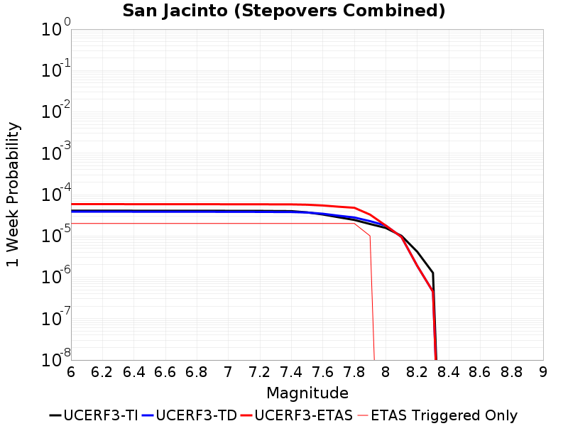 | 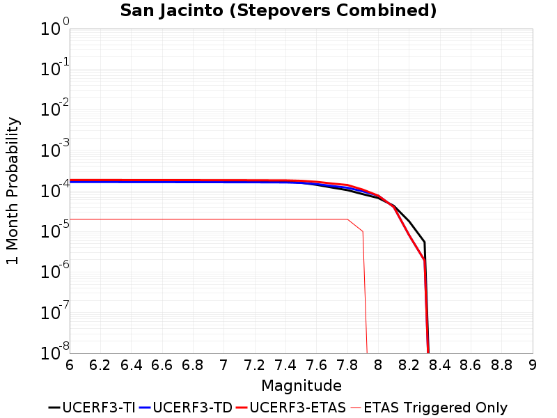 | 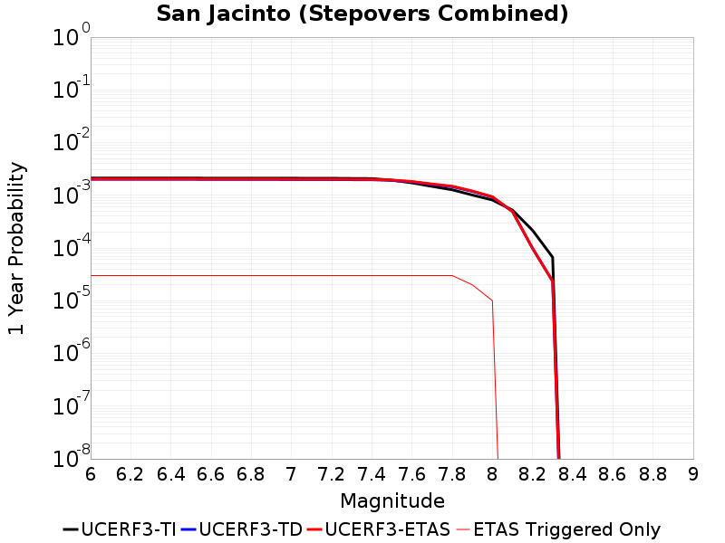 | 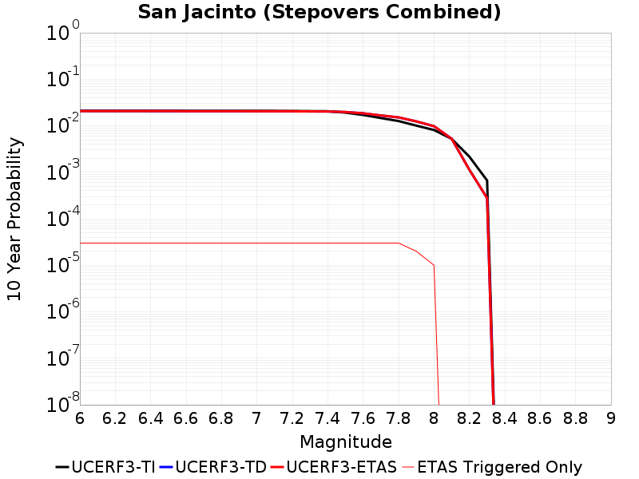 |

| Magnitude | 1 wk TI Prob | 1 wk TD Prob | 1 wk ETAS Prob | 1 wk ETAS/TD Gain | 1 wk ETAS Triggered Only | 1 mo TI Prob | 1 mo TD Prob | 1 mo ETAS Prob | 1 mo ETAS/TD Gain | 1 mo ETAS Triggered Only | 1 yr TI Prob | 1 yr TD Prob | 1 yr ETAS Prob | 1 yr ETAS/TD Gain | 1 yr ETAS Triggered Only | 10 yr TI Prob | 10 yr TD Prob | 10 yr ETAS Prob | 10 yr ETAS/TD Gain | 10 yr ETAS Triggered Only |
|-----|-----|-----|-----|-----|-----|-----|-----|-----|-----|-----|-----|-----|-----|-----|-----|-----|-----|-----|-----|-----|
| 6.0 | 4.0667746E-5 | 3.8552647E-5 | 5.8551876E-5 | 1.5187511 | 2.0E-5 | 1.742787E-4 | 1.6521517E-4 | 1.8521187E-4 | 1.1210343 | 2.0E-5 | 0.0021197782 | 0.0020096402 | 0.00203958 | 1.0148981 | 3.0E-5 | 0.020996714 | 0.020676162 | 0.020705542 | 1.001421 | 3.0E-5 |
| 6.1 | 4.0667746E-5 | 3.8552647E-5 | 5.8551876E-5 | 1.5187511 | 2.0E-5 | 1.742787E-4 | 1.6521517E-4 | 1.8521187E-4 | 1.1210343 | 2.0E-5 | 0.0021197782 | 0.0020096402 | 0.00203958 | 1.0148981 | 3.0E-5 | 0.020996714 | 0.020676162 | 0.020705542 | 1.001421 | 3.0E-5 |
| 6.2 | 4.0667746E-5 | 3.8552647E-5 | 5.8551876E-5 | 1.5187511 | 2.0E-5 | 1.742787E-4 | 1.6521517E-4 | 1.8521187E-4 | 1.1210343 | 2.0E-5 | 0.0021197782 | 0.0020096402 | 0.00203958 | 1.0148981 | 3.0E-5 | 0.020996714 | 0.020676162 | 0.020705542 | 1.001421 | 3.0E-5 |
| 6.3 | 4.0667746E-5 | 3.8552647E-5 | 5.8551876E-5 | 1.5187511 | 2.0E-5 | 1.742787E-4 | 1.6521517E-4 | 1.8521187E-4 | 1.1210343 | 2.0E-5 | 0.0021197782 | 0.0020096402 | 0.00203958 | 1.0148981 | 3.0E-5 | 0.020996714 | 0.020676162 | 0.020705542 | 1.001421 | 3.0E-5 |
| 6.4 | 4.0577226E-5 | 3.8423084E-5 | 5.8422316E-5 | 1.5205004 | 2.0E-5 | 1.738908E-4 | 1.6465998E-4 | 1.8465669E-4 | 1.1214424 | 2.0E-5 | 0.0021150648 | 0.0020028946 | 0.0020328346 | 1.0149484 | 3.0E-5 | 0.020950472 | 0.02061011 | 0.020639494 | 1.0014256 | 3.0E-5 |
| 6.5 | 4.0577226E-5 | 3.8423084E-5 | 5.8422316E-5 | 1.5205004 | 2.0E-5 | 1.738908E-4 | 1.6465998E-4 | 1.8465669E-4 | 1.1214424 | 2.0E-5 | 0.0021150648 | 0.0020028946 | 0.0020328346 | 1.0149484 | 3.0E-5 | 0.020950472 | 0.02061011 | 0.020639494 | 1.0014256 | 3.0E-5 |
| 6.6 | 4.053861E-5 | 3.8367798E-5 | 5.836703E-5 | 1.5212505 | 2.0E-5 | 1.7372532E-4 | 1.6442308E-4 | 1.8441978E-4 | 1.1216174 | 2.0E-5 | 0.0021130538 | 0.0020000162 | 0.002029956 | 1.0149698 | 3.0E-5 | 0.020930743 | 0.020581925 | 0.020611309 | 1.0014275 | 3.0E-5 |
| 6.7 | 4.0516545E-5 | 3.8336522E-5 | 5.8335754E-5 | 1.5216757 | 2.0E-5 | 1.7363077E-4 | 1.6428906E-4 | 1.8428577E-4 | 1.1217166 | 2.0E-5 | 0.002111905 | 0.0019983877 | 0.002028328 | 1.0149821 | 3.0E-5 | 0.020919468 | 0.020565975 | 0.020595359 | 1.0014287 | 3.0E-5 |
| 6.8 | 4.049434E-5 | 3.830768E-5 | 5.8306912E-5 | 1.5220685 | 2.0E-5 | 1.7353562E-4 | 1.6416545E-4 | 1.8416217E-4 | 1.1218083 | 2.0E-5 | 0.0021107488 | 0.0019968858 | 0.002026826 | 1.0149934 | 3.0E-5 | 0.020908125 | 0.020551214 | 0.020580597 | 1.0014298 | 3.0E-5 |
| 6.9 | 4.046386E-5 | 3.8269663E-5 | 5.82689E-5 | 1.5225872 | 2.0E-5 | 1.73405E-4 | 1.6400254E-4 | 1.8399928E-4 | 1.1219293 | 2.0E-5 | 0.0021091616 | 0.001994906 | 0.0020248462 | 1.0150083 | 3.0E-5 | 0.020892553 | 0.020531733 | 0.020561116 | 1.0014311 | 3.0E-5 |
| 7.0 | 4.036382E-5 | 3.8148264E-5 | 5.8147503E-5 | 1.5242503 | 2.0E-5 | 1.7297632E-4 | 1.6348234E-4 | 1.8347907E-4 | 1.1223173 | 2.0E-5 | 0.0021039525 | 0.0019885842 | 0.0020185246 | 1.0150561 | 3.0E-5 | 0.02084144 | 0.020469448 | 0.020498835 | 1.0014356 | 3.0E-5 |
| 7.1 | 4.0343282E-5 | 3.8126258E-5 | 5.8125497E-5 | 1.5245528 | 2.0E-5 | 1.7288832E-4 | 1.6338805E-4 | 1.8338478E-4 | 1.122388 | 2.0E-5 | 0.002102883 | 0.0019874382 | 0.0020173786 | 1.0150648 | 3.0E-5 | 0.020830948 | 0.020458091 | 0.020487478 | 1.0014365 | 3.0E-5 |
| 7.2 | 4.0257353E-5 | 3.802879E-5 | 5.802803E-5 | 1.5258974 | 2.0E-5 | 1.725201E-4 | 1.6297036E-4 | 1.8296711E-4 | 1.1227016 | 2.0E-5 | 0.0020984085 | 0.0019823622 | 0.0020123029 | 1.0151035 | 3.0E-5 | 0.020787042 | 0.02040791 | 0.020437296 | 1.00144 | 3.0E-5 |
| 7.3 | 3.9940667E-5 | 3.7847258E-5 | 5.7846504E-5 | 1.5284199 | 2.0E-5 | 1.7116306E-4 | 1.6219247E-4 | 1.8218924E-4 | 1.1232903 | 2.0E-5 | 0.0020819185 | 0.0019729086 | 0.0020028495 | 1.0151759 | 3.0E-5 | 0.020625217 | 0.020311886 | 0.020341277 | 1.001447 | 3.0E-5 |
| 7.4 | 3.9721202E-5 | 3.7725815E-5 | 5.772506E-5 | 1.530121 | 2.0E-5 | 1.7022261E-4 | 1.6167207E-4 | 1.8166883E-4 | 1.1236873 | 2.0E-5 | 0.0020704903 | 0.0019665842 | 0.001996525 | 1.0152249 | 3.0E-5 | 0.020513052 | 0.02024752 | 0.020276913 | 1.0014516 | 3.0E-5 |
| 7.5 | 3.7036873E-5 | 3.6725407E-5 | 5.672467E-5 | 1.5445621 | 2.0E-5 | 1.5871979E-4 | 1.5738512E-4 | 1.7738197E-4 | 1.1270568 | 2.0E-5 | 0.0019307006 | 0.0019144833 | 0.0019444259 | 1.01564 | 3.0E-5 | 0.019140124 | 0.019714227 | 0.019743634 | 1.0014918 | 3.0E-5 |
| 7.6 | 3.2940967E-5 | 3.4376808E-5 | 5.437612E-5 | 1.5817676 | 2.0E-5 | 1.4116794E-4 | 1.4732087E-4 | 1.6731792E-4 | 1.1357381 | 2.0E-5 | 0.0017173645 | 0.0017921586 | 0.0018221049 | 1.0167096 | 3.0E-5 | 0.01704153 | 0.01848205 | 0.018511495 | 1.0015932 | 3.0E-5 |
| 7.7 | 2.8236149E-5 | 3.078036E-5 | 5.0779745E-5 | 1.649745 | 2.0E-5 | 1.2100645E-4 | 1.3190917E-4 | 1.5190654E-4 | 1.1515995 | 2.0E-5 | 0.0014722579 | 0.0016048123 | 0.0016347643 | 1.0186638 | 3.0E-5 | 0.014625421 | 0.016612334 | 0.016641835 | 1.0017759 | 3.0E-5 |
| 7.8 | 2.4329287E-5 | 2.7905633E-5 | 4.7905076E-5 | 1.7166812 | 2.0E-5 | 1.042642E-4 | 1.1959009E-4 | 1.395877E-4 | 1.167218 | 2.0E-5 | 0.0012686774 | 0.001455038 | 0.0014849943 | 1.020588 | 3.0E-5 | 0.012614589 | 0.01510908 | 0.015138627 | 1.0019555 | 3.0E-5 |
| 7.9 | 1.9370926E-5 | 2.2722865E-5 | 3.2722637E-5 | 1.4400754 | 1.0E-5 | 8.301561E-5 | 9.738008E-5 | 1.07379106E-4 | 1.1026804 | 1.0E-5 | 0.0010102465 | 0.0011849585 | 0.0012049349 | 1.0168582 | 2.0E-5 | 0.0100566605 | 0.012395589 | 0.012415341 | 1.0015935 | 2.0E-5 |
| 8.0 | 1.5583017E-5 | 1.777293E-5 | 1.777293E-5 | 1.0 | 0.0 | 6.6782646E-5 | 7.616748E-5 | 7.616748E-5 | 1.0 | 0.0 | 8.127754E-4 | 9.269454E-4 | 9.369362E-4 | 1.0107781 | 1.0E-5 | 0.008098091 | 0.009769405 | 0.009779308 | 1.0010136 | 1.0E-5 |
| 8.1 | 1.0024873E-5 | 9.393798E-6 | 9.393798E-6 | 1.0 | 0.0 | 4.2963035E-5 | 4.0258517E-5 | 4.0258517E-5 | 1.0 | 0.0 | 5.229494E-4 | 4.9003784E-4 | 4.9003784E-4 | 1.0 | 0.0 | 0.0052172043 | 0.005241455 | 0.005241455 | 1.0 | 0.0 |
| 8.2 | 4.142796E-6 | 1.8832391E-6 | 1.8832391E-6 | 1.0 | 0.0 | 1.775472E-5 | 8.071E-6 | 8.071E-6 | 1.0 | 0.0 | 2.1614227E-4 | 9.826003E-5 | 9.826003E-5 | 1.0 | 0.0 | 0.0021593217 | 0.0011279638 | 0.0011279638 | 1.0 | 0.0 |
| 8.3 | 1.2750878E-6 | 4.483472E-7 | 4.483472E-7 | 1.0 | 0.0 | 5.4646503E-6 | 1.9214865E-6 | 1.9214865E-6 | 1.0 | 0.0 | 6.653009E-5 | 2.3393855E-5 | 2.3393855E-5 | 1.0 | 0.0 | 6.6510175E-4 | 2.77996E-4 | 2.77996E-4 | 1.0 | 0.0 |

## San Jacinto (Anza) rev
*[(top)](#table-of-contents)*

| 1 Week | 1 Month | 1 Year | 10 Year |
|-----|-----|-----|-----|
|  | 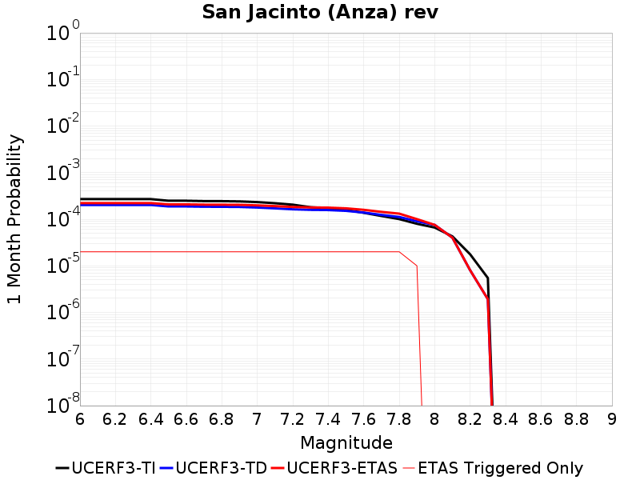 | 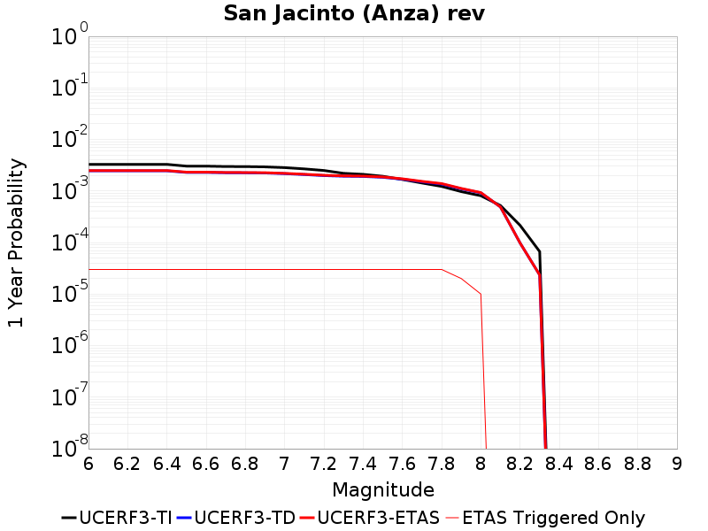 | 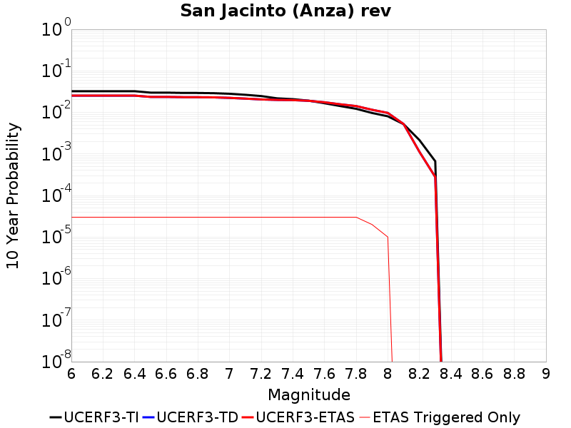 |

| Magnitude | 1 wk TI Prob | 1 wk TD Prob | 1 wk ETAS Prob | 1 wk ETAS/TD Gain | 1 wk ETAS Triggered Only | 1 mo TI Prob | 1 mo TD Prob | 1 mo ETAS Prob | 1 mo ETAS/TD Gain | 1 mo ETAS Triggered Only | 1 yr TI Prob | 1 yr TD Prob | 1 yr ETAS Prob | 1 yr ETAS/TD Gain | 1 yr ETAS Triggered Only | 10 yr TI Prob | 10 yr TD Prob | 10 yr ETAS Prob | 10 yr ETAS/TD Gain | 10 yr ETAS Triggered Only |
|-----|-----|-----|-----|-----|-----|-----|-----|-----|-----|-----|-----|-----|-----|-----|-----|-----|-----|-----|-----|-----|
| 6.0 | 6.28807E-5 | 4.711748E-5 | 6.711653E-5 | 1.4244509 | 2.0E-5 | 2.6946087E-4 | 2.019165E-4 | 2.2191246E-4 | 1.0990309 | 2.0E-5 | 0.0032757511 | 0.0024555754 | 0.0024855018 | 1.0121871 | 3.0E-5 | 0.032278832 | 0.025236465 | 0.025265709 | 1.0011587 | 3.0E-5 |
| 6.1 | 6.28807E-5 | 4.711748E-5 | 6.711653E-5 | 1.4244509 | 2.0E-5 | 2.6946087E-4 | 2.019165E-4 | 2.2191246E-4 | 1.0990309 | 2.0E-5 | 0.0032757511 | 0.0024555754 | 0.0024855018 | 1.0121871 | 3.0E-5 | 0.032278832 | 0.025236465 | 0.025265709 | 1.0011587 | 3.0E-5 |
| 6.2 | 6.28807E-5 | 4.711748E-5 | 6.711653E-5 | 1.4244509 | 2.0E-5 | 2.6946087E-4 | 2.019165E-4 | 2.2191246E-4 | 1.0990309 | 2.0E-5 | 0.0032757511 | 0.0024555754 | 0.0024855018 | 1.0121871 | 3.0E-5 | 0.032278832 | 0.025236465 | 0.025265709 | 1.0011587 | 3.0E-5 |
| 6.3 | 6.28807E-5 | 4.711748E-5 | 6.711653E-5 | 1.4244509 | 2.0E-5 | 2.6946087E-4 | 2.019165E-4 | 2.2191246E-4 | 1.0990309 | 2.0E-5 | 0.0032757511 | 0.0024555754 | 0.0024855018 | 1.0121871 | 3.0E-5 | 0.032278832 | 0.025236465 | 0.025265709 | 1.0011587 | 3.0E-5 |
| 6.4 | 6.28807E-5 | 4.711748E-5 | 6.711653E-5 | 1.4244509 | 2.0E-5 | 2.6946087E-4 | 2.019165E-4 | 2.2191246E-4 | 1.0990309 | 2.0E-5 | 0.0032757511 | 0.0024555754 | 0.0024855018 | 1.0121871 | 3.0E-5 | 0.032278832 | 0.025236465 | 0.025265709 | 1.0011587 | 3.0E-5 |
| 6.5 | 5.811017E-5 | 4.3840497E-5 | 6.383962E-5 | 1.4561793 | 2.0E-5 | 2.4901982E-4 | 1.8787435E-4 | 2.0787059E-4 | 1.1064341 | 2.0E-5 | 0.0030276014 | 0.0022849774 | 0.002314909 | 1.0130992 | 3.0E-5 | 0.02986684 | 0.023520602 | 0.023549898 | 1.0012455 | 3.0E-5 |
| 6.6 | 5.811017E-5 | 4.3840497E-5 | 6.383962E-5 | 1.4561793 | 2.0E-5 | 2.4901982E-4 | 1.8787435E-4 | 2.0787059E-4 | 1.1064341 | 2.0E-5 | 0.0030276014 | 0.0022849774 | 0.002314909 | 1.0130992 | 3.0E-5 | 0.02986684 | 0.023520602 | 0.023549898 | 1.0012455 | 3.0E-5 |
| 6.7 | 5.712442E-5 | 4.3225173E-5 | 6.322431E-5 | 1.4626733 | 2.0E-5 | 2.4479596E-4 | 1.8523763E-4 | 2.0523393E-4 | 1.1079494 | 2.0E-5 | 0.0029763177 | 0.002252942 | 0.0022828744 | 1.0132859 | 3.0E-5 | 0.029367693 | 0.023196107 | 0.023225412 | 1.0012633 | 3.0E-5 |
| 6.8 | 5.6967532E-5 | 4.3074033E-5 | 6.3073174E-5 | 1.4642968 | 2.0E-5 | 2.4412372E-4 | 1.8458998E-4 | 2.045863E-4 | 1.1083282 | 2.0E-5 | 0.0029681553 | 0.002245073 | 0.0022750057 | 1.0133326 | 3.0E-5 | 0.029288229 | 0.023116669 | 0.023145976 | 1.0012678 | 3.0E-5 |
| 6.9 | 5.6211324E-5 | 4.275413E-5 | 6.275328E-5 | 1.467771 | 2.0E-5 | 2.4088343E-4 | 1.8321916E-4 | 2.032155E-4 | 1.1091388 | 2.0E-5 | 0.0029288116 | 0.0022284177 | 0.0022583508 | 1.0134325 | 3.0E-5 | 0.028905109 | 0.022943579 | 0.02297289 | 1.0012776 | 3.0E-5 |
| 7.0 | 5.4383527E-5 | 4.1526015E-5 | 6.1525185E-5 | 1.4816058 | 2.0E-5 | 2.3305144E-4 | 1.7795652E-4 | 1.9795296E-4 | 1.112367 | 2.0E-5 | 0.0028337094 | 0.0021644733 | 0.0021944086 | 1.0138302 | 3.0E-5 | 0.027978465 | 0.022292526 | 0.022321858 | 1.0013157 | 3.0E-5 |
| 7.1 | 5.1393665E-5 | 3.985561E-5 | 5.9854814E-5 | 1.5017914 | 2.0E-5 | 2.2023996E-4 | 1.7079861E-4 | 1.9079518E-4 | 1.117077 | 2.0E-5 | 0.0026781242 | 0.0020774947 | 0.0021074323 | 1.0144105 | 3.0E-5 | 0.026460782 | 0.021400373 | 0.02142973 | 1.0013719 | 3.0E-5 |
| 7.2 | 4.785222E-5 | 3.8063677E-5 | 5.8062917E-5 | 1.5254153 | 2.0E-5 | 2.0506482E-4 | 1.6311987E-4 | 1.831166E-4 | 1.1225892 | 2.0E-5 | 0.0024938055 | 0.0019841795 | 0.0020141199 | 1.0150896 | 3.0E-5 | 0.024660049 | 0.020445053 | 0.02047444 | 1.0014373 | 3.0E-5 |
| 7.3 | 4.2143256E-5 | 3.7055066E-5 | 5.7054323E-5 | 1.5397173 | 2.0E-5 | 1.8060145E-4 | 1.5879777E-4 | 1.787946E-4 | 1.1259264 | 2.0E-5 | 0.002196605 | 0.0019316525 | 0.0019615944 | 1.0155008 | 3.0E-5 | 0.02175019 | 0.019900564 | 0.019929968 | 1.0014775 | 3.0E-5 |
| 7.4 | 4.0264713E-5 | 3.665682E-5 | 5.6656085E-5 | 1.5455811 | 2.0E-5 | 1.7255165E-4 | 1.5709121E-4 | 1.7708808E-4 | 1.1272945 | 2.0E-5 | 0.002098792 | 0.0019109118 | 0.0019408544 | 1.0156693 | 3.0E-5 | 0.020790804 | 0.019685915 | 0.019715324 | 1.0014939 | 3.0E-5 |
| 7.5 | 3.694492E-5 | 3.526851E-5 | 5.5267803E-5 | 1.5670582 | 2.0E-5 | 1.5832575E-4 | 1.5114201E-4 | 1.7113899E-4 | 1.1323059 | 2.0E-5 | 0.0019259118 | 0.0018386045 | 0.0018685493 | 1.0162867 | 3.0E-5 | 0.01909306 | 0.018950103 | 0.018979535 | 1.001553 | 3.0E-5 |
| 7.6 | 3.200565E-5 | 3.241246E-5 | 5.241181E-5 | 1.6170267 | 2.0E-5 | 1.3715986E-4 | 1.3890315E-4 | 1.5890038E-4 | 1.1439652 | 2.0E-5 | 0.001668642 | 0.0016898366 | 0.001719786 | 1.0177232 | 3.0E-5 | 0.01656168 | 0.017451653 | 0.01748113 | 1.0016891 | 3.0E-5 |
| 7.7 | 2.731642E-5 | 2.8839348E-5 | 4.883877E-5 | 1.693477 | 2.0E-5 | 1.1706512E-4 | 1.2359135E-4 | 1.4358888E-4 | 1.1618036 | 2.0E-5 | 0.001424336 | 0.0015036874 | 0.0015336422 | 1.019921 | 3.0E-5 | 0.014152412 | 0.015591939 | 0.015621471 | 1.0018941 | 3.0E-5 |
| 7.8 | 2.3466424E-5 | 2.6058333E-5 | 4.6057812E-5 | 1.7674888 | 2.0E-5 | 1.0056651E-4 | 1.1167379E-4 | 1.3167156E-4 | 1.1790731 | 2.0E-5 | 0.0012237094 | 0.0013587815 | 0.0013887407 | 1.0220486 | 3.0E-5 | 0.012169928 | 0.014135683 | 0.014165259 | 1.0020922 | 3.0E-5 |
| 7.9 | 1.8611925E-5 | 2.1080008E-5 | 3.1079795E-5 | 1.4743731 | 1.0E-5 | 7.9762955E-5 | 9.033977E-5 | 1.0033886E-4 | 1.1106832 | 1.0E-5 | 9.7068126E-4 | 0.0010993326 | 0.0011193106 | 1.0181729 | 2.0E-5 | 0.0096645225 | 0.011527068 | 0.011546837 | 1.0017151 | 2.0E-5 |
| 8.0 | 1.5460775E-5 | 1.7613092E-5 | 1.7613092E-5 | 1.0 | 0.0 | 6.6258784E-5 | 7.54825E-5 | 7.54825E-5 | 1.0 | 0.0 | 8.0640207E-4 | 9.186128E-4 | 9.2860364E-4 | 1.0108759 | 1.0E-5 | 0.008034821 | 0.009683126 | 0.009693028 | 1.0010227 | 1.0E-5 |
| 8.1 | 9.983884E-6 | 9.367134E-6 | 9.367134E-6 | 1.0 | 0.0 | 4.2787375E-5 | 4.014425E-5 | 4.014425E-5 | 1.0 | 0.0 | 5.2081177E-4 | 4.8864726E-4 | 4.8864726E-4 | 1.0 | 0.0 | 0.0051959283 | 0.0052257515 | 0.0052257515 | 1.0 | 0.0 |
| 8.2 | 4.1226E-6 | 1.8733894E-6 | 1.8733894E-6 | 1.0 | 0.0 | 1.7668166E-5 | 8.028787E-6 | 8.028787E-6 | 1.0 | 0.0 | 2.1508869E-4 | 9.774614E-5 | 9.774614E-5 | 1.0 | 0.0 | 0.0021488064 | 0.0011219641 | 0.0011219641 | 1.0 | 0.0 |
| 8.3 | 1.2750878E-6 | 4.483472E-7 | 4.483472E-7 | 1.0 | 0.0 | 5.4646503E-6 | 1.9214865E-6 | 1.9214865E-6 | 1.0 | 0.0 | 6.653009E-5 | 2.3393855E-5 | 2.3393855E-5 | 1.0 | 0.0 | 6.6510175E-4 | 2.77996E-4 | 2.77996E-4 | 1.0 | 0.0 |

## Garlock (Central)
*[(top)](#table-of-contents)*

| 1 Week | 1 Month | 1 Year | 10 Year |
|-----|-----|-----|-----|
| 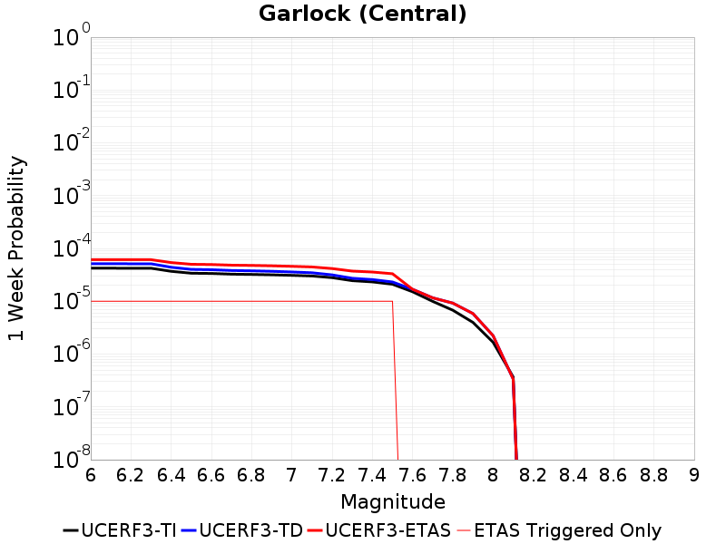 | 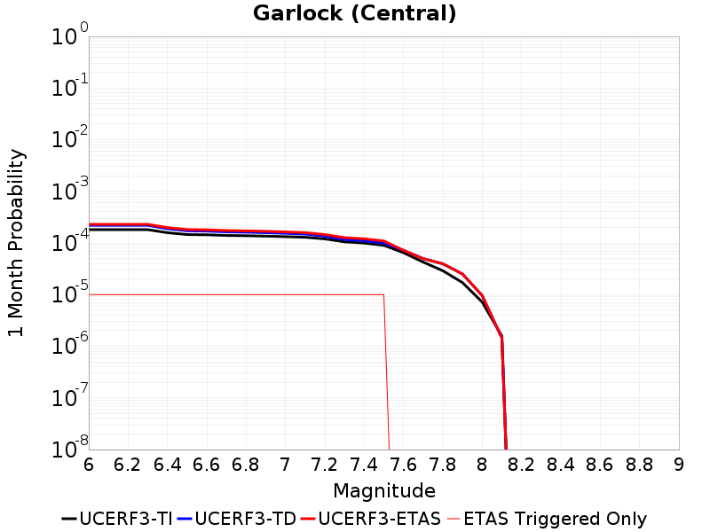 |  |  |

| Magnitude | 1 wk TI Prob | 1 wk TD Prob | 1 wk ETAS Prob | 1 wk ETAS/TD Gain | 1 wk ETAS Triggered Only | 1 mo TI Prob | 1 mo TD Prob | 1 mo ETAS Prob | 1 mo ETAS/TD Gain | 1 mo ETAS Triggered Only | 1 yr TI Prob | 1 yr TD Prob | 1 yr ETAS Prob | 1 yr ETAS/TD Gain | 1 yr ETAS Triggered Only | 10 yr TI Prob | 10 yr TD Prob | 10 yr ETAS Prob | 10 yr ETAS/TD Gain | 10 yr ETAS Triggered Only |
|-----|-----|-----|-----|-----|-----|-----|-----|-----|-----|-----|-----|-----|-----|-----|-----|-----|-----|-----|-----|-----|
| 6.0 | 4.2243486E-5 | 5.130388E-5 | 6.130336E-5 | 1.1949071 | 1.0E-5 | 1.8103095E-4 | 2.198554E-4 | 2.298532E-4 | 1.0454744 | 1.0E-5 | 0.0022018238 | 0.002673483 | 0.002703403 | 1.0111914 | 3.0E-5 | 0.021801353 | 0.026480254 | 0.02650946 | 1.0011029 | 3.0E-5 |
| 6.1 | 4.2243486E-5 | 5.130388E-5 | 6.130336E-5 | 1.1949071 | 1.0E-5 | 1.8103095E-4 | 2.198554E-4 | 2.298532E-4 | 1.0454744 | 1.0E-5 | 0.0022018238 | 0.002673483 | 0.002703403 | 1.0111914 | 3.0E-5 | 0.021801353 | 0.026480254 | 0.02650946 | 1.0011029 | 3.0E-5 |
| 6.2 | 4.216245E-5 | 5.117112E-5 | 6.1170605E-5 | 1.1954128 | 1.0E-5 | 1.806837E-4 | 2.1928652E-4 | 2.2928433E-4 | 1.0455924 | 1.0E-5 | 0.0021976046 | 0.002666574 | 0.0026964939 | 1.0112203 | 3.0E-5 | 0.021759989 | 0.026413793 | 0.026443 | 1.0011058 | 3.0E-5 |
| 6.3 | 4.216245E-5 | 5.117112E-5 | 6.1170605E-5 | 1.1954128 | 1.0E-5 | 1.806837E-4 | 2.1928652E-4 | 2.2928433E-4 | 1.0455924 | 1.0E-5 | 0.0021976046 | 0.002666574 | 0.0026964939 | 1.0112203 | 3.0E-5 | 0.021759989 | 0.026413793 | 0.026443 | 1.0011058 | 3.0E-5 |
| 6.4 | 3.6858168E-5 | 4.3957774E-5 | 5.3957338E-5 | 1.227481 | 1.0E-5 | 1.5795401E-4 | 1.88377E-4 | 1.9837511E-4 | 1.0530751 | 1.0E-5 | 0.0019213937 | 0.002291101 | 0.0023210323 | 1.0130641 | 3.0E-5 | 0.019048655 | 0.022753617 | 0.022782935 | 1.0012884 | 3.0E-5 |
| 6.5 | 3.39199E-5 | 4.0082232E-5 | 5.0081828E-5 | 1.2494771 | 1.0E-5 | 1.453629E-4 | 1.7176979E-4 | 1.8176807E-4 | 1.0582075 | 1.0E-5 | 0.0017683565 | 0.0020893118 | 0.0021192492 | 1.0143288 | 3.0E-5 | 0.017543508 | 0.020785393 | 0.02081477 | 1.0014133 | 3.0E-5 |
| 6.6 | 3.3571985E-5 | 3.953699E-5 | 4.9536597E-5 | 1.2529176 | 1.0E-5 | 1.4387199E-4 | 1.6943336E-4 | 1.7943166E-4 | 1.0590103 | 1.0E-5 | 0.0017502342 | 0.00206092 | 0.002090858 | 1.0145266 | 3.0E-5 | 0.017365133 | 0.020506686 | 0.02053607 | 1.0014329 | 3.0E-5 |
| 6.7 | 3.2580007E-5 | 3.8213915E-5 | 4.8213533E-5 | 1.2616748 | 1.0E-5 | 1.3962112E-4 | 1.6376376E-4 | 1.7376212E-4 | 1.0610535 | 1.0E-5 | 0.0016985617 | 0.0019920208 | 0.002021961 | 1.01503 | 3.0E-5 | 0.016856372 | 0.019831786 | 0.019861192 | 1.0014827 | 3.0E-5 |
| 6.8 | 3.2185937E-5 | 3.7653637E-5 | 4.765326E-5 | 1.2655686 | 1.0E-5 | 1.3793244E-4 | 1.6136286E-4 | 1.7136124E-4 | 1.0619621 | 1.0E-5 | 0.0016780337 | 0.0019628427 | 0.001992784 | 1.0152539 | 3.0E-5 | 0.016654192 | 0.019545183 | 0.019574597 | 1.0015049 | 3.0E-5 |
| 6.9 | 3.165394E-5 | 3.6875153E-5 | 4.6874786E-5 | 1.2711753 | 1.0E-5 | 1.3565269E-4 | 1.5802692E-4 | 1.6802533E-4 | 1.0632703 | 1.0E-5 | 0.0016503202 | 0.0019223 | 0.0019522423 | 1.0155764 | 3.0E-5 | 0.01638118 | 0.019146567 | 0.019175993 | 1.0015368 | 3.0E-5 |
| 7.0 | 3.0903822E-5 | 3.5810317E-5 | 4.580996E-5 | 1.2792392 | 1.0E-5 | 1.3243823E-4 | 1.5346387E-4 | 1.6346233E-4 | 1.0651519 | 1.0E-5 | 0.0016112428 | 0.0018668415 | 0.0018967855 | 1.01604 | 3.0E-5 | 0.015996104 | 0.018603152 | 0.018632594 | 1.0015826 | 3.0E-5 |
| 7.1 | 3.0069863E-5 | 3.4611177E-5 | 4.4610828E-5 | 1.288914 | 1.0E-5 | 1.2886449E-4 | 1.4832529E-4 | 1.583238E-4 | 1.0674094 | 1.0E-5 | 0.0015677959 | 0.0018043844 | 0.0018343303 | 1.0165962 | 3.0E-5 | 0.01556781 | 0.017988399 | 0.01801786 | 1.0016377 | 3.0E-5 |
| 7.2 | 2.7957109E-5 | 3.1570165E-5 | 4.156985E-5 | 1.3167448 | 1.0E-5 | 1.1981068E-4 | 1.352938E-4 | 1.4529245E-4 | 1.0739032 | 1.0E-5 | 0.0014577188 | 0.0016459757 | 0.0016759264 | 1.0181962 | 3.0E-5 | 0.014481937 | 0.016426945 | 0.016456451 | 1.0017962 | 3.0E-5 |
| 7.3 | 2.4519275E-5 | 2.7199072E-5 | 3.71988E-5 | 1.3676496 | 1.0E-5 | 1.0507837E-4 | 1.16562325E-4 | 1.2656116E-4 | 1.085781 | 1.0E-5 | 0.0012785783 | 0.0014182364 | 0.0014481939 | 1.021123 | 3.0E-5 | 0.012712469 | 0.014172521 | 0.0142020965 | 1.0020868 | 3.0E-5 |
| 7.4 | 2.3225532E-5 | 2.5738713E-5 | 3.5738456E-5 | 1.3885098 | 1.0E-5 | 9.95342E-5 | 1.1030419E-4 | 1.20303084E-4 | 1.0906484 | 1.0E-5 | 0.0012111551 | 0.0013421399 | 0.0013720996 | 1.0223224 | 3.0E-5 | 0.012045753 | 0.0134190805 | 0.013448678 | 1.0022056 | 3.0E-5 |
| 7.5 | 2.097765E-5 | 2.3165228E-5 | 3.3164997E-5 | 1.4316715 | 1.0E-5 | 8.9901114E-5 | 9.9275836E-5 | 1.0927484E-4 | 1.1007195 | 1.0E-5 | 0.0010939965 | 0.0012080244 | 0.0012379882 | 1.0248039 | 3.0E-5 | 0.010886264 | 0.012088512 | 0.01211815 | 1.0024517 | 3.0E-5 |
| 7.6 | 1.511254E-5 | 1.6818307E-5 | 1.6818307E-5 | 1.0 | 0.0 | 6.476642E-5 | 7.207651E-5 | 7.207651E-5 | 1.0 | 0.0 | 7.882459E-4 | 8.7718584E-4 | 8.971683E-4 | 1.0227802 | 2.0E-5 | 0.007854558 | 0.008808719 | 0.008828543 | 1.0022504 | 2.0E-5 |
| 7.7 | 9.934069E-6 | 1.1596448E-5 | 1.1596448E-5 | 1.0 | 0.0 | 4.2573887E-5 | 4.9698116E-5 | 4.9698116E-5 | 1.0 | 0.0 | 5.182138E-4 | 6.0490705E-4 | 6.24895E-4 | 1.0330429 | 2.0E-5 | 0.00517007 | 0.0061029447 | 0.006122823 | 1.0032572 | 2.0E-5 |
| 7.8 | 6.7562896E-6 | 9.20817E-6 | 9.20817E-6 | 1.0 | 0.0 | 2.8955206E-5 | 3.946299E-5 | 3.946299E-5 | 1.0 | 0.0 | 3.5247262E-4 | 4.8035616E-4 | 5.0034653E-4 | 1.0416157 | 2.0E-5 | 0.0035191406 | 0.0048509142 | 0.0048708175 | 1.004103 | 2.0E-5 |
| 7.9 | 3.975453E-6 | 5.841608E-6 | 5.841608E-6 | 1.0 | 0.0 | 1.7037546E-5 | 2.5035224E-5 | 2.5035224E-5 | 1.0 | 0.0 | 2.0741238E-4 | 3.0476134E-4 | 3.0476134E-4 | 1.0 | 0.0 | 0.002072189 | 0.0030779566 | 0.0030779566 | 1.0 | 0.0 |
| 8.0 | 1.6729537E-6 | 2.232871E-6 | 2.232871E-6 | 1.0 | 0.0 | 7.169782E-6 | 9.569412E-6 | 9.569412E-6 | 1.0 | 0.0 | 8.7288594E-5 | 1.16501404E-4 | 1.16501404E-4 | 1.0 | 0.0 | 8.7254314E-4 | 0.0011776788 | 0.0011776788 | 1.0 | 0.0 |
| 8.1 | 3.6733252E-7 | 3.3608302E-7 | 3.3608302E-7 | 1.0 | 0.0 | 1.5742813E-6 | 1.440355E-6 | 1.440355E-6 | 1.0 | 0.0 | 1.9166706E-5 | 1.75362E-5 | 1.75362E-5 | 1.0 | 0.0 | 1.9165053E-4 | 1.7747156E-4 | 1.7747156E-4 | 1.0 | 0.0 |

## Pinto Mtn
*[(top)](#table-of-contents)*

| 1 Week | 1 Month | 1 Year | 10 Year |
|-----|-----|-----|-----|
|  | 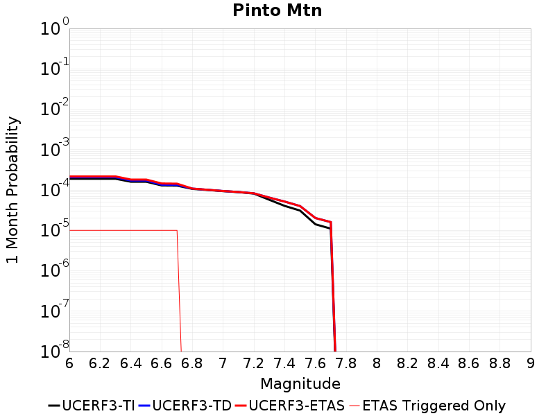 | 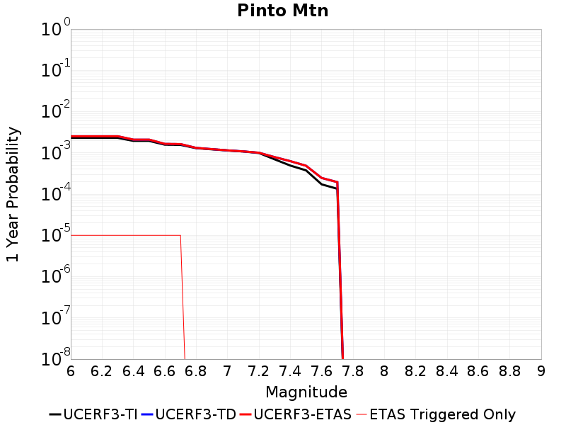 | 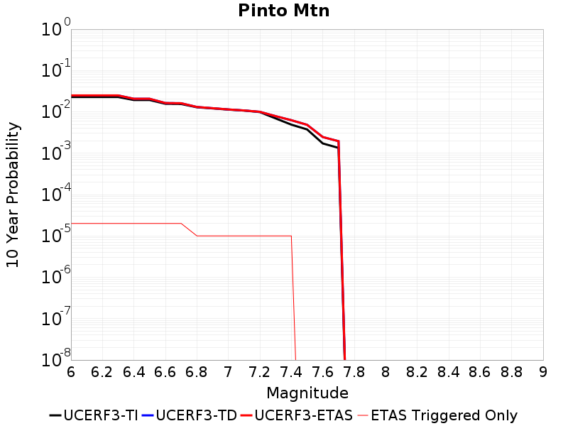 |

| Magnitude | 1 wk TI Prob | 1 wk TD Prob | 1 wk ETAS Prob | 1 wk ETAS/TD Gain | 1 wk ETAS Triggered Only | 1 mo TI Prob | 1 mo TD Prob | 1 mo ETAS Prob | 1 mo ETAS/TD Gain | 1 mo ETAS Triggered Only | 1 yr TI Prob | 1 yr TD Prob | 1 yr ETAS Prob | 1 yr ETAS/TD Gain | 1 yr ETAS Triggered Only | 10 yr TI Prob | 10 yr TD Prob | 10 yr ETAS Prob | 10 yr ETAS/TD Gain | 10 yr ETAS Triggered Only |
|-----|-----|-----|-----|-----|-----|-----|-----|-----|-----|-----|-----|-----|-----|-----|-----|-----|-----|-----|-----|-----|
| 6.0 | 4.4194956E-5 | 4.8223E-5 | 4.8223E-5 | 1.0 | 0.0 | 1.893932E-4 | 2.0665456E-4 | 2.166525E-4 | 1.0483799 | 1.0E-5 | 0.0023034236 | 0.0025132813 | 0.002523256 | 1.0039688 | 1.0E-5 | 0.022796938 | 0.024866287 | 0.02488579 | 1.0007843 | 2.0E-5 |
| 6.1 | 4.4194956E-5 | 4.8223E-5 | 4.8223E-5 | 1.0 | 0.0 | 1.893932E-4 | 2.0665456E-4 | 2.166525E-4 | 1.0483799 | 1.0E-5 | 0.0023034236 | 0.0025132813 | 0.002523256 | 1.0039688 | 1.0E-5 | 0.022796938 | 0.024866287 | 0.02488579 | 1.0007843 | 2.0E-5 |
| 6.2 | 4.4194956E-5 | 4.8223E-5 | 4.8223E-5 | 1.0 | 0.0 | 1.893932E-4 | 2.0665456E-4 | 2.166525E-4 | 1.0483799 | 1.0E-5 | 0.0023034236 | 0.0025132813 | 0.002523256 | 1.0039688 | 1.0E-5 | 0.022796938 | 0.024866287 | 0.02488579 | 1.0007843 | 2.0E-5 |
| 6.3 | 4.4194956E-5 | 4.8223E-5 | 4.8223E-5 | 1.0 | 0.0 | 1.893932E-4 | 2.0665456E-4 | 2.166525E-4 | 1.0483799 | 1.0E-5 | 0.0023034236 | 0.0025132813 | 0.002523256 | 1.0039688 | 1.0E-5 | 0.022796938 | 0.024866287 | 0.02488579 | 1.0007843 | 2.0E-5 |
| 6.4 | 3.729929E-5 | 3.992182E-5 | 3.992182E-5 | 1.0 | 0.0 | 1.5984432E-4 | 1.7108282E-4 | 1.8108111E-4 | 1.0584412 | 1.0E-5 | 0.0019443673 | 0.0020810375 | 0.0020910166 | 1.0047953 | 1.0E-5 | 0.019274427 | 0.020625638 | 0.020645225 | 1.0009496 | 2.0E-5 |
| 6.5 | 3.729929E-5 | 3.992182E-5 | 3.992182E-5 | 1.0 | 0.0 | 1.5984432E-4 | 1.7108282E-4 | 1.8108111E-4 | 1.0584412 | 1.0E-5 | 0.0019443673 | 0.0020810375 | 0.0020910166 | 1.0047953 | 1.0E-5 | 0.019274427 | 0.020625638 | 0.020645225 | 1.0009496 | 2.0E-5 |
| 6.6 | 3.0204548E-5 | 3.147557E-5 | 3.147557E-5 | 1.0 | 0.0 | 1.2944164E-4 | 1.3488851E-4 | 1.4488716E-4 | 1.0741253 | 1.0E-5 | 0.0015748127 | 0.0016410656 | 0.0016510492 | 1.0060836 | 1.0E-5 | 0.015636992 | 0.01629339 | 0.016313065 | 1.0012075 | 2.0E-5 |
| 6.7 | 2.9857754E-5 | 3.1083408E-5 | 3.1083408E-5 | 1.0 | 0.0 | 1.2795553E-4 | 1.33208E-4 | 1.4320668E-4 | 1.0750606 | 1.0E-5 | 0.0015567453 | 0.001620636 | 0.0016306198 | 1.0061604 | 1.0E-5 | 0.015458848 | 0.016092066 | 0.016111743 | 1.0012228 | 2.0E-5 |
| 6.8 | 2.4819734E-5 | 2.5250269E-5 | 2.5250269E-5 | 1.0 | 0.0 | 1.0636595E-4 | 1.08211076E-4 | 1.08211076E-4 | 1.0 | 0.0 | 0.0012942362 | 0.0013166955 | 0.0013166955 | 1.0 | 0.0 | 0.012867244 | 0.013091342 | 0.013101211 | 1.0007539 | 1.0E-5 |
| 6.9 | 2.331124E-5 | 2.3572864E-5 | 2.3572864E-5 | 1.0 | 0.0 | 9.990149E-5 | 1.01022764E-4 | 1.01022764E-4 | 1.0 | 0.0 | 0.001215622 | 0.0012292787 | 0.0012292787 | 1.0 | 0.0 | 0.012089936 | 0.012227013 | 0.01223689 | 1.0008079 | 1.0E-5 |
| 7.0 | 2.1818534E-5 | 2.1990772E-5 | 2.1990772E-5 | 1.0 | 0.0 | 9.3504656E-5 | 9.424288E-5 | 9.424288E-5 | 1.0 | 0.0 | 0.0011378246 | 0.0011468232 | 0.0011468232 | 1.0 | 0.0 | 0.011320163 | 0.011411182 | 0.011421068 | 1.0008663 | 1.0E-5 |
| 7.1 | 2.066081E-5 | 2.0764219E-5 | 2.0764219E-5 | 1.0 | 0.0 | 8.854332E-5 | 8.8986584E-5 | 8.8986584E-5 | 1.0 | 0.0 | 0.0010774818 | 0.001082893 | 0.001082893 | 1.0 | 0.0 | 0.010722724 | 0.010778242 | 0.010788133 | 1.0009178 | 1.0E-5 |
| 7.2 | 1.8990233E-5 | 1.927108E-5 | 1.927108E-5 | 1.0 | 0.0 | 8.138417E-5 | 8.258783E-5 | 8.258783E-5 | 1.0 | 0.0 | 9.904018E-4 | 0.0010050626 | 0.0010050626 | 1.0 | 0.0 | 0.009859995 | 0.010007197 | 0.010017097 | 1.0009893 | 1.0E-5 |
| 7.3 | 1.3335872E-5 | 1.5102657E-5 | 1.5102657E-5 | 1.0 | 0.0 | 5.7152483E-5 | 6.472414E-5 | 6.472414E-5 | 1.0 | 0.0 | 6.956093E-4 | 7.877444E-4 | 7.877444E-4 | 1.0 | 0.0 | 0.006934359 | 0.00785084 | 0.007860761 | 1.0012637 | 1.0E-5 |
| 7.4 | 9.414066E-6 | 1.2042957E-5 | 1.2042957E-5 | 1.0 | 0.0 | 4.0345374E-5 | 5.1611707E-5 | 5.1611707E-5 | 1.0 | 0.0 | 4.910942E-4 | 6.2820094E-4 | 6.2820094E-4 | 1.0 | 0.0 | 0.0049001034 | 0.0062652156 | 0.006275153 | 1.0015861 | 1.0E-5 |
| 7.5 | 7.2101157E-6 | 9.330447E-6 | 9.330447E-6 | 1.0 | 0.0 | 3.090013E-5 | 3.9987062E-5 | 3.9987062E-5 | 1.0 | 0.0 | 3.7614413E-4 | 4.8674166E-4 | 4.8674166E-4 | 1.0 | 0.0 | 0.0037550807 | 0.0048575457 | 0.0048575457 | 1.0 | 0.0 |
| 7.6 | 3.296375E-6 | 4.709458E-6 | 4.709458E-6 | 1.0 | 0.0 | 1.4127245E-5 | 2.0183244E-5 | 2.0183244E-5 | 1.0 | 0.0 | 1.7198564E-4 | 2.4570478E-4 | 2.4570478E-4 | 1.0 | 0.0 | 0.0017185259 | 0.002454481 | 0.002454481 | 1.0 | 0.0 |
| 7.7 | 2.5741092E-6 | 3.73715E-6 | 3.73715E-6 | 1.0 | 0.0 | 1.103185E-5 | 1.6016267E-5 | 1.6016267E-5 | 1.0 | 0.0 | 1.3430449E-4 | 1.9498206E-4 | 1.9498206E-4 | 1.0 | 0.0 | 0.0013422335 | 0.0019482519 | 0.0019482519 | 1.0 | 0.0 |

## Elsinore (Glen Ivy) rev
*[(top)](#table-of-contents)*

| 1 Week | 1 Month | 1 Year | 10 Year |
|-----|-----|-----|-----|
| 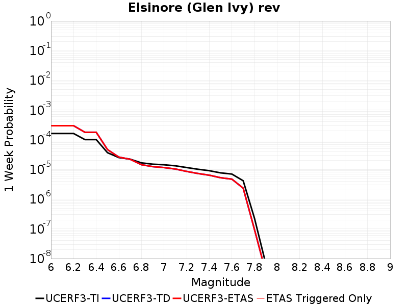 |  |  | 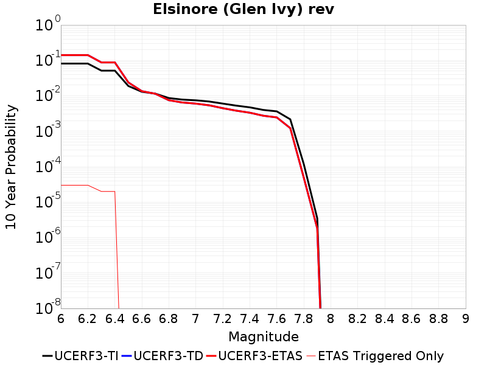 |

| Magnitude | 1 wk TI Prob | 1 wk TD Prob | 1 wk ETAS Prob | 1 wk ETAS/TD Gain | 1 wk ETAS Triggered Only | 1 mo TI Prob | 1 mo TD Prob | 1 mo ETAS Prob | 1 mo ETAS/TD Gain | 1 mo ETAS Triggered Only | 1 yr TI Prob | 1 yr TD Prob | 1 yr ETAS Prob | 1 yr ETAS/TD Gain | 1 yr ETAS Triggered Only | 10 yr TI Prob | 10 yr TD Prob | 10 yr ETAS Prob | 10 yr ETAS/TD Gain | 10 yr ETAS Triggered Only |
|-----|-----|-----|-----|-----|-----|-----|-----|-----|-----|-----|-----|-----|-----|-----|-----|-----|-----|-----|-----|-----|
| 6.0 | 1.6204086E-4 | 2.9651623E-4 | 2.9651623E-4 | 1.0 | 0.0 | 6.94276E-4 | 0.0012702631 | 0.0012702631 | 1.0 | 0.0 | 0.008420097 | 0.015377366 | 0.015397059 | 1.0012807 | 2.0E-5 | 0.081081145 | 0.14083572 | 0.1408615 | 1.000183 | 3.0E-5 |
| 6.1 | 1.6204086E-4 | 2.9651623E-4 | 2.9651623E-4 | 1.0 | 0.0 | 6.94276E-4 | 0.0012702631 | 0.0012702631 | 1.0 | 0.0 | 0.008420097 | 0.015377366 | 0.015397059 | 1.0012807 | 2.0E-5 | 0.081081145 | 0.14083572 | 0.1408615 | 1.000183 | 3.0E-5 |
| 6.2 | 1.6204086E-4 | 2.9651623E-4 | 2.9651623E-4 | 1.0 | 0.0 | 6.94276E-4 | 0.0012702631 | 0.0012702631 | 1.0 | 0.0 | 0.008420097 | 0.015377366 | 0.015397059 | 1.0012807 | 2.0E-5 | 0.081081145 | 0.14083572 | 0.1408615 | 1.000183 | 3.0E-5 |
| 6.3 | 1.0111737E-4 | 1.7843324E-4 | 1.7843324E-4 | 1.0 | 0.0 | 4.332882E-4 | 7.646086E-4 | 7.646086E-4 | 1.0 | 0.0 | 0.005262531 | 0.009290451 | 0.009300359 | 1.0010663 | 1.0E-5 | 0.0513964 | 0.08757734 | 0.08759559 | 1.0002084 | 2.0E-5 |
| 6.4 | 1.0111737E-4 | 1.7843324E-4 | 1.7843324E-4 | 1.0 | 0.0 | 4.332882E-4 | 7.646086E-4 | 7.646086E-4 | 1.0 | 0.0 | 0.005262531 | 0.009290451 | 0.009300359 | 1.0010663 | 1.0E-5 | 0.0513964 | 0.08757734 | 0.08759559 | 1.0002084 | 2.0E-5 |
| 6.5 | 3.6624708E-5 | 4.6549292E-5 | 4.6549292E-5 | 1.0 | 0.0 | 1.569536E-4 | 1.9948377E-4 | 1.9948377E-4 | 1.0 | 0.0 | 0.001909235 | 0.0024263766 | 0.0024263766 | 1.0 | 0.0 | 0.01892915 | 0.023840804 | 0.023840804 | 1.0 | 0.0 |
| 6.6 | 2.5051324E-5 | 2.607887E-5 | 2.607887E-5 | 1.0 | 0.0 | 1.073584E-4 | 1.1176204E-4 | 1.1176204E-4 | 1.0 | 0.0 | 0.0013063047 | 0.0013598973 | 0.0013598973 | 1.0 | 0.0 | 0.012986525 | 0.013529957 | 0.013529957 | 1.0 | 0.0 |
| 6.7 | 2.2189772E-5 | 2.198274E-5 | 2.198274E-5 | 1.0 | 0.0 | 9.509556E-5 | 9.420854E-5 | 9.420854E-5 | 1.0 | 0.0 | 0.0011571734 | 0.0011464208 | 0.0011464208 | 1.0 | 0.0 | 0.011511663 | 0.011419855 | 0.011419855 | 1.0 | 0.0 |
| 6.8 | 1.6654378E-5 | 1.44519245E-5 | 1.44519245E-5 | 1.0 | 0.0 | 7.137396E-5 | 6.193538E-5 | 6.193538E-5 | 1.0 | 0.0 | 8.686314E-4 | 7.538073E-4 | 7.538073E-4 | 1.0 | 0.0 | 0.008652439 | 0.0075168037 | 0.0075168037 | 1.0 | 0.0 |
| 6.9 | 1.5042909E-5 | 1.2451786E-5 | 1.2451786E-5 | 1.0 | 0.0 | 6.446802E-5 | 5.336372E-5 | 5.336372E-5 | 1.0 | 0.0 | 7.8461546E-4 | 6.495128E-4 | 6.495128E-4 | 1.0 | 0.0 | 0.007818509 | 0.0064800153 | 0.0064800153 | 1.0 | 0.0 |
| 7.0 | 1.4361385E-5 | 1.1565273E-5 | 1.1565273E-5 | 1.0 | 0.0 | 6.154734E-5 | 4.9564533E-5 | 4.9564533E-5 | 1.0 | 0.0 | 7.490812E-4 | 6.0328405E-4 | 6.0328405E-4 | 1.0 | 0.0 | 0.007465612 | 0.006020138 | 0.006020138 | 1.0 | 0.0 |
| 7.1 | 1.3265571E-5 | 1.0346548E-5 | 1.0346548E-5 | 1.0 | 0.0 | 5.6851208E-5 | 4.434161E-5 | 4.434161E-5 | 1.0 | 0.0 | 6.919436E-4 | 5.39728E-4 | 5.39728E-4 | 1.0 | 0.0 | 0.006897931 | 0.005387279 | 0.005387279 | 1.0 | 0.0 |
| 7.2 | 1.1596403E-5 | 8.5856955E-6 | 8.5856955E-6 | 1.0 | 0.0 | 4.9697923E-5 | 3.679533E-5 | 3.679533E-5 | 1.0 | 0.0 | 6.049042E-4 | 4.4789276E-4 | 4.4789276E-4 | 1.0 | 0.0 | 0.006032603 | 0.004471132 | 0.004471132 | 1.0 | 0.0 |
| 7.3 | 1.0150827E-5 | 7.3038846E-6 | 7.3038846E-6 | 1.0 | 0.0 | 4.3502816E-5 | 3.1301995E-5 | 3.1301995E-5 | 1.0 | 0.0 | 5.2951806E-4 | 3.810366E-4 | 3.810366E-4 | 1.0 | 0.0 | 0.005282581 | 0.0038041174 | 0.0038041174 | 1.0 | 0.0 |
| 7.4 | 9.080705E-6 | 6.404912E-6 | 6.404912E-6 | 1.0 | 0.0 | 3.8916725E-5 | 2.7449341E-5 | 2.7449341E-5 | 1.0 | 0.0 | 4.7370812E-4 | 3.3414588E-4 | 3.3414588E-4 | 1.0 | 0.0 | 0.004726996 | 0.0033365826 | 0.0033365826 | 1.0 | 0.0 |
| 7.5 | 7.671649E-6 | 5.2615997E-6 | 5.2615997E-6 | 1.0 | 0.0 | 3.287808E-5 | 2.2549524E-5 | 2.2549524E-5 | 1.0 | 0.0 | 4.0021708E-4 | 2.7450713E-4 | 2.7450713E-4 | 1.0 | 0.0 | 0.0039949706 | 0.0027418067 | 0.0027418067 | 1.0 | 0.0 |
| 7.6 | 6.990086E-6 | 4.7142134E-6 | 4.7142134E-6 | 1.0 | 0.0 | 2.9957167E-5 | 2.0203623E-5 | 2.0203623E-5 | 1.0 | 0.0 | 3.6466747E-4 | 2.459525E-4 | 2.459525E-4 | 1.0 | 0.0 | 0.0036406964 | 0.0024569202 | 0.0024569202 | 1.0 | 0.0 |
| 7.7 | 4.163505E-6 | 2.3482746E-6 | 2.3482746E-6 | 1.0 | 0.0 | 1.7843471E-5 | 1.0063999E-5 | 1.0063999E-5 | 1.0 | 0.0 | 2.172226E-4 | 1.2252305E-4 | 1.2252305E-4 | 1.0 | 0.0 | 0.0021701038 | 0.0012246291 | 0.0012246291 | 1.0 | 0.0 |
| 7.8 | 2.2692414E-7 | 9.443403E-8 | 9.443403E-8 | 1.0 | 0.0 | 9.725317E-7 | 4.047172E-7 | 4.047172E-7 | 1.0 | 0.0 | 1.1840509E-5 | 4.927424E-6 | 4.927424E-6 | 1.0 | 0.0 | 1.1839878E-4 | 4.927348E-5 | 4.927348E-5 | 1.0 | 0.0 |
| 7.9 | 6.676829E-9 | 3.4686236E-9 | 3.4686236E-9 | 1.0 | 0.0 | 2.861498E-8 | 1.4865529E-8 | 1.4865529E-8 | 1.0 | 0.0 | 3.4838732E-7 | 1.809878E-7 | 1.809878E-7 | 1.0 | 0.0 | 3.4838679E-6 | 1.8098767E-6 | 1.8098767E-6 | 1.0 | 0.0 |

## Big Pine (East)
*[(top)](#table-of-contents)*

| 1 Week | 1 Month | 1 Year | 10 Year |
|-----|-----|-----|-----|
| 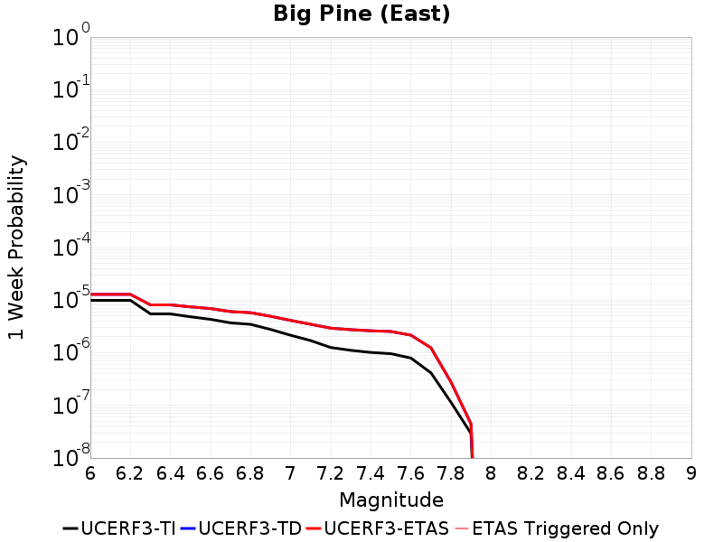 | 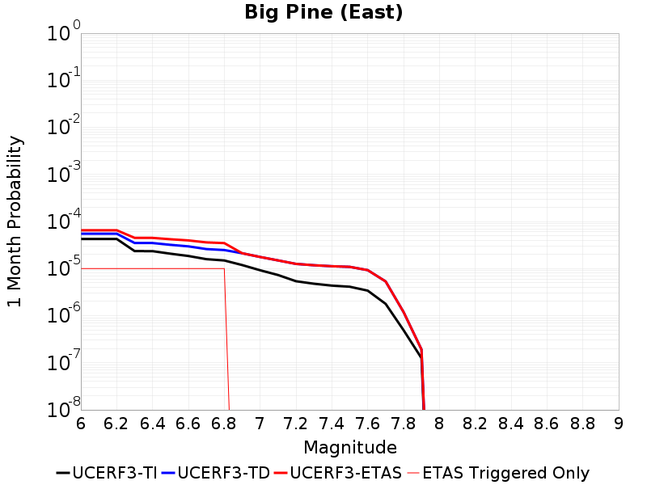 | 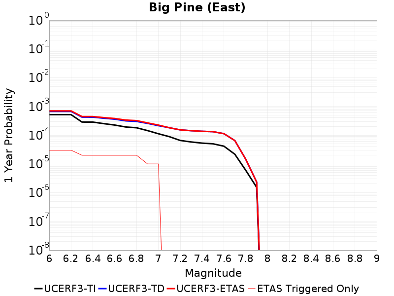 |  |

| Magnitude | 1 wk TI Prob | 1 wk TD Prob | 1 wk ETAS Prob | 1 wk ETAS/TD Gain | 1 wk ETAS Triggered Only | 1 mo TI Prob | 1 mo TD Prob | 1 mo ETAS Prob | 1 mo ETAS/TD Gain | 1 mo ETAS Triggered Only | 1 yr TI Prob | 1 yr TD Prob | 1 yr ETAS Prob | 1 yr ETAS/TD Gain | 1 yr ETAS Triggered Only | 10 yr TI Prob | 10 yr TD Prob | 10 yr ETAS Prob | 10 yr ETAS/TD Gain | 10 yr ETAS Triggered Only |
|-----|-----|-----|-----|-----|-----|-----|-----|-----|-----|-----|-----|-----|-----|-----|-----|-----|-----|-----|-----|-----|
| 6.0 | 9.916913E-6 | 1.285601E-5 | 1.285601E-5 | 1.0 | 0.0 | 4.250036E-5 | 5.5096145E-5 | 6.509559E-5 | 1.1814909 | 1.0E-5 | 5.173191E-4 | 6.7061116E-4 | 7.00591E-4 | 1.0447053 | 3.0E-5 | 0.0051611643 | 0.0066884183 | 0.0067182174 | 1.0044553 | 3.0E-5 |
| 6.1 | 9.916913E-6 | 1.285601E-5 | 1.285601E-5 | 1.0 | 0.0 | 4.250036E-5 | 5.5096145E-5 | 6.509559E-5 | 1.1814909 | 1.0E-5 | 5.173191E-4 | 6.7061116E-4 | 7.00591E-4 | 1.0447053 | 3.0E-5 | 0.0051611643 | 0.0066884183 | 0.0067182174 | 1.0044553 | 3.0E-5 |
| 6.2 | 9.916913E-6 | 1.285601E-5 | 1.285601E-5 | 1.0 | 0.0 | 4.250036E-5 | 5.5096145E-5 | 6.509559E-5 | 1.1814909 | 1.0E-5 | 5.173191E-4 | 6.7061116E-4 | 7.00591E-4 | 1.0447053 | 3.0E-5 | 0.0051611643 | 0.0066884183 | 0.0067182174 | 1.0044553 | 3.0E-5 |
| 6.3 | 5.479711E-6 | 8.143139E-6 | 8.143139E-6 | 1.0 | 0.0 | 2.3484265E-5 | 3.4898716E-5 | 4.489837E-5 | 1.2865335 | 1.0E-5 | 2.858834E-4 | 4.248121E-4 | 4.4480362E-4 | 1.0470597 | 2.0E-5 | 0.0028551589 | 0.004240665 | 0.0042605805 | 1.0046962 | 2.0E-5 |
| 6.4 | 5.465009E-6 | 8.127464E-6 | 8.127464E-6 | 1.0 | 0.0 | 2.3421257E-5 | 3.483154E-5 | 4.483119E-5 | 1.2870861 | 1.0E-5 | 2.851165E-4 | 4.2399453E-4 | 4.4398606E-4 | 1.0471504 | 2.0E-5 | 0.0028475097 | 0.0042325207 | 0.0042524356 | 1.0047053 | 2.0E-5 |
| 6.5 | 4.826767E-6 | 7.451409E-6 | 7.451409E-6 | 1.0 | 0.0 | 2.068598E-5 | 3.1934236E-5 | 4.1933916E-5 | 1.3131336 | 1.0E-5 | 2.518227E-4 | 3.887326E-4 | 4.0872482E-4 | 1.0514293 | 2.0E-5 | 0.0025153751 | 0.003881148 | 0.0039010704 | 1.0051332 | 2.0E-5 |
| 6.6 | 4.3146847E-6 | 6.9105904E-6 | 6.9105904E-6 | 1.0 | 0.0 | 1.8491375E-5 | 2.9616494E-5 | 3.9616196E-5 | 1.3376397 | 1.0E-5 | 2.2510924E-4 | 3.6052347E-4 | 3.8051626E-4 | 1.0554549 | 2.0E-5 | 0.0022488134 | 0.0035999748 | 0.0036199028 | 1.0055356 | 2.0E-5 |
| 6.7 | 3.6968106E-6 | 6.0553775E-6 | 6.0553775E-6 | 1.0 | 0.0 | 1.5843378E-5 | 2.5951367E-5 | 3.5951107E-5 | 1.3853261 | 1.0E-5 | 1.9287605E-4 | 3.1591355E-4 | 3.3590724E-4 | 1.0632885 | 2.0E-5 | 0.0019270873 | 0.0031551488 | 0.0031750856 | 1.0063188 | 2.0E-5 |
| 6.8 | 3.4671132E-6 | 5.7730676E-6 | 5.7730676E-6 | 1.0 | 0.0 | 1.4858972E-5 | 2.4741492E-5 | 3.4741246E-5 | 1.4041693 | 1.0E-5 | 1.8089297E-4 | 3.0118742E-4 | 3.211814E-4 | 1.0663838 | 2.0E-5 | 0.0018074579 | 0.0030082879 | 0.0030282277 | 1.0066283 | 2.0E-5 |
| 6.9 | 2.7686972E-6 | 4.932652E-6 | 4.932652E-6 | 1.0 | 0.0 | 1.1865792E-5 | 2.113977E-5 | 2.113977E-5 | 1.0 | 0.0 | 1.4445644E-4 | 2.5734704E-4 | 2.6734447E-4 | 1.038848 | 1.0E-5 | 0.0014436257 | 0.0025709227 | 0.0025808972 | 1.0038797 | 1.0E-5 |
| 7.0 | 2.1472624E-6 | 4.1122707E-6 | 4.1122707E-6 | 1.0 | 0.0 | 9.20252E-6 | 1.7623901E-5 | 1.7623901E-5 | 1.0 | 0.0 | 1.12034926E-4 | 2.1455043E-4 | 2.2454828E-4 | 1.046599 | 1.0E-5 | 0.0011197845 | 0.0021438294 | 0.0021538078 | 1.0046545 | 1.0E-5 |
| 7.1 | 1.7018335E-6 | 3.4766183E-6 | 3.4766183E-6 | 1.0 | 0.0 | 7.293552E-6 | 1.489971E-5 | 1.489971E-5 | 1.0 | 0.0 | 8.879537E-5 | 1.8138923E-4 | 1.8138923E-4 | 1.0 | 0.0 | 8.87599E-4 | 0.0018127732 | 0.0018127732 | 1.0 | 0.0 |
| 7.2 | 1.25603E-6 | 2.9314278E-6 | 2.9314278E-6 | 1.0 | 0.0 | 5.3829745E-6 | 1.2563202E-5 | 1.2563202E-5 | 1.0 | 0.0 | 6.553574E-5 | 1.5294651E-4 | 1.5294651E-4 | 1.0 | 0.0 | 6.551642E-4 | 0.0015287495 | 0.0015287495 | 1.0 | 0.0 |
| 7.3 | 1.112297E-6 | 2.7450892E-6 | 2.7450892E-6 | 1.0 | 0.0 | 4.7669787E-6 | 1.1764617E-5 | 1.1764617E-5 | 1.0 | 0.0 | 5.803642E-5 | 1.4322503E-4 | 1.4322503E-4 | 1.0 | 0.0 | 5.802127E-4 | 0.0014315151 | 0.0014315151 | 1.0 | 0.0 |
| 7.4 | 1.0137181E-6 | 2.6156044E-6 | 2.6156044E-6 | 1.0 | 0.0 | 4.3444993E-6 | 1.1209687E-5 | 1.1209687E-5 | 1.0 | 0.0 | 5.2892992E-5 | 1.3646962E-4 | 1.3646962E-4 | 1.0 | 0.0 | 5.288041E-4 | 0.0013638708 | 0.0013638708 | 1.0 | 0.0 |
| 7.5 | 9.598608E-7 | 2.536589E-6 | 2.536589E-6 | 1.0 | 0.0 | 4.1136827E-6 | 1.0871051E-5 | 1.0871051E-5 | 1.0 | 0.0 | 5.0082934E-5 | 1.3234724E-4 | 1.3234724E-4 | 1.0 | 0.0 | 5.007165E-4 | 0.001322523 | 0.001322523 | 1.0 | 0.0 |
| 7.6 | 7.929459E-7 | 2.1606568E-6 | 2.1606568E-6 | 1.0 | 0.0 | 3.3983351E-6 | 9.259926E-6 | 9.259926E-6 | 1.0 | 0.0 | 4.1373947E-5 | 1.1273396E-4 | 1.1273396E-4 | 1.0 | 0.0 | 4.1366243E-4 | 0.0011269483 | 0.0011269483 | 1.0 | 0.0 |
| 7.7 | 4.155788E-7 | 1.2442865E-6 | 1.2442865E-6 | 1.0 | 0.0 | 1.7810507E-6 | 5.332646E-6 | 5.332646E-6 | 1.0 | 0.0 | 2.1684076E-5 | 6.492308E-5 | 6.492308E-5 | 1.0 | 0.0 | 2.1681961E-4 | 6.5068126E-4 | 6.5068126E-4 | 1.0 | 0.0 |
| 7.8 | 1.14666925E-7 | 2.781441E-7 | 2.781441E-7 | 1.0 | 0.0 | 4.914296E-7 | 1.1920457E-6 | 1.1920457E-6 | 1.0 | 0.0 | 5.9831386E-6 | 1.4513064E-5 | 1.4513064E-5 | 1.0 | 0.0 | 5.9829777E-5 | 1.4602853E-4 | 1.4602853E-4 | 1.0 | 0.0 |
| 7.9 | 2.9231824E-8 | 4.4637E-8 | 4.4637E-8 | 1.0 | 0.0 | 1.2527924E-7 | 1.9130141E-7 | 1.9130141E-7 | 1.0 | 0.0 | 1.5252737E-6 | 2.3290925E-6 | 2.3290925E-6 | 1.0 | 0.0 | 1.5252632E-5 | 2.362215E-5 | 2.362215E-5 | 1.0 | 0.0 |

## Fontana (Seismicity)
*[(top)](#table-of-contents)*

| 1 Week | 1 Month | 1 Year | 10 Year |
|-----|-----|-----|-----|
|  | 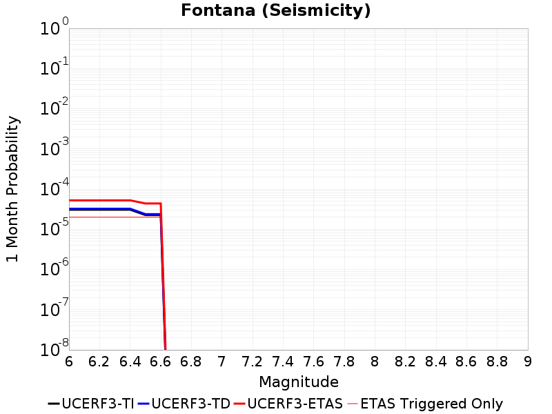 | 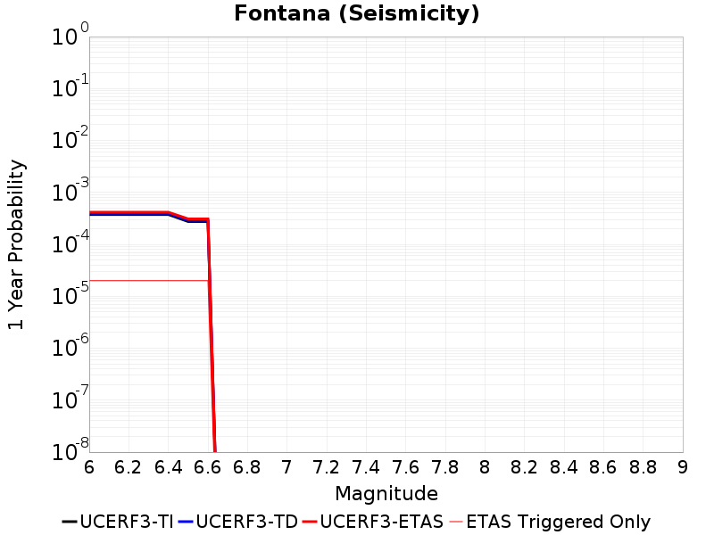 |  |

| Magnitude | 1 wk TI Prob | 1 wk TD Prob | 1 wk ETAS Prob | 1 wk ETAS/TD Gain | 1 wk ETAS Triggered Only | 1 mo TI Prob | 1 mo TD Prob | 1 mo ETAS Prob | 1 mo ETAS/TD Gain | 1 mo ETAS Triggered Only | 1 yr TI Prob | 1 yr TD Prob | 1 yr ETAS Prob | 1 yr ETAS/TD Gain | 1 yr ETAS Triggered Only | 10 yr TI Prob | 10 yr TD Prob | 10 yr ETAS Prob | 10 yr ETAS/TD Gain | 10 yr ETAS Triggered Only |
|-----|-----|-----|-----|-----|-----|-----|-----|-----|-----|-----|-----|-----|-----|-----|-----|-----|-----|-----|-----|-----|
| 6.0 | 7.1789214E-6 | 7.56425E-6 | 2.7564098E-5 | 3.6439962 | 2.0E-5 | 3.076644E-5 | 3.241804E-5 | 5.2417392E-5 | 1.6169204 | 2.0E-5 | 3.7451705E-4 | 3.946591E-4 | 4.146512E-4 | 1.0506567 | 2.0E-5 | 0.003738865 | 0.0039435946 | 0.0039734766 | 1.0075773 | 3.0E-5 |
| 6.1 | 7.1789214E-6 | 7.56425E-6 | 2.7564098E-5 | 3.6439962 | 2.0E-5 | 3.076644E-5 | 3.241804E-5 | 5.2417392E-5 | 1.6169204 | 2.0E-5 | 3.7451705E-4 | 3.946591E-4 | 4.146512E-4 | 1.0506567 | 2.0E-5 | 0.003738865 | 0.0039435946 | 0.0039734766 | 1.0075773 | 3.0E-5 |
| 6.2 | 7.1789214E-6 | 7.56425E-6 | 2.7564098E-5 | 3.6439962 | 2.0E-5 | 3.076644E-5 | 3.241804E-5 | 5.2417392E-5 | 1.6169204 | 2.0E-5 | 3.7451705E-4 | 3.946591E-4 | 4.146512E-4 | 1.0506567 | 2.0E-5 | 0.003738865 | 0.0039435946 | 0.0039734766 | 1.0075773 | 3.0E-5 |
| 6.3 | 7.1789214E-6 | 7.56425E-6 | 2.7564098E-5 | 3.6439962 | 2.0E-5 | 3.076644E-5 | 3.241804E-5 | 5.2417392E-5 | 1.6169204 | 2.0E-5 | 3.7451705E-4 | 3.946591E-4 | 4.146512E-4 | 1.0506567 | 2.0E-5 | 0.003738865 | 0.0039435946 | 0.0039734766 | 1.0075773 | 3.0E-5 |
| 6.4 | 7.1789214E-6 | 7.56425E-6 | 2.7564098E-5 | 3.6439962 | 2.0E-5 | 3.076644E-5 | 3.241804E-5 | 5.2417392E-5 | 1.6169204 | 2.0E-5 | 3.7451705E-4 | 3.946591E-4 | 4.146512E-4 | 1.0506567 | 2.0E-5 | 0.003738865 | 0.0039435946 | 0.0039734766 | 1.0075773 | 3.0E-5 |
| 6.5 | 5.2611317E-6 | 5.54164E-6 | 2.5541529E-5 | 4.60902 | 2.0E-5 | 2.2547512E-5 | 2.3749884E-5 | 4.374941E-5 | 1.8420894 | 2.0E-5 | 2.744814E-4 | 2.8915485E-4 | 3.0914907E-4 | 1.0691471 | 2.0E-5 | 0.002741426 | 0.0028915484 | 0.0029214616 | 1.0103451 | 3.0E-5 |
| 6.6 | 5.2611317E-6 | 5.54164E-6 | 2.5541529E-5 | 4.60902 | 2.0E-5 | 2.2547512E-5 | 2.3749884E-5 | 4.374941E-5 | 1.8420894 | 2.0E-5 | 2.744814E-4 | 2.8915485E-4 | 3.0914907E-4 | 1.0691471 | 2.0E-5 | 0.002741426 | 0.0028915484 | 0.0029214616 | 1.0103451 | 3.0E-5 |

## San Jacinto (Clark) rev
*[(top)](#table-of-contents)*

| 1 Week | 1 Month | 1 Year | 10 Year |
|-----|-----|-----|-----|
| 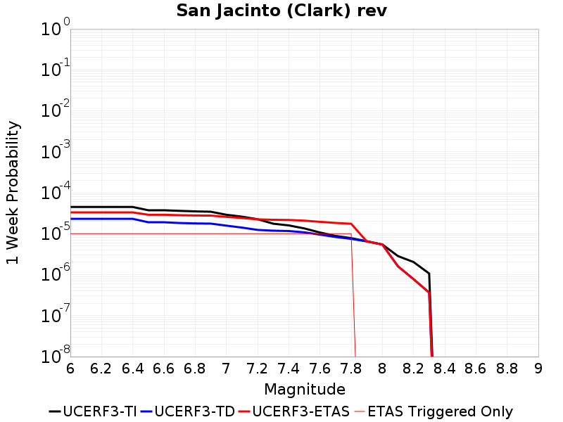 | 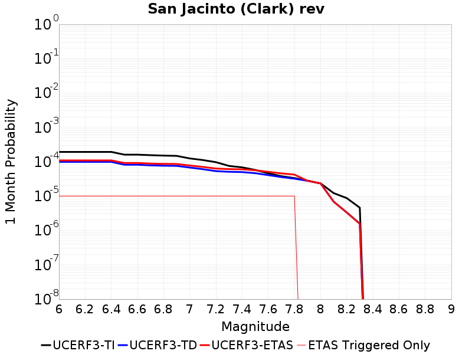 | 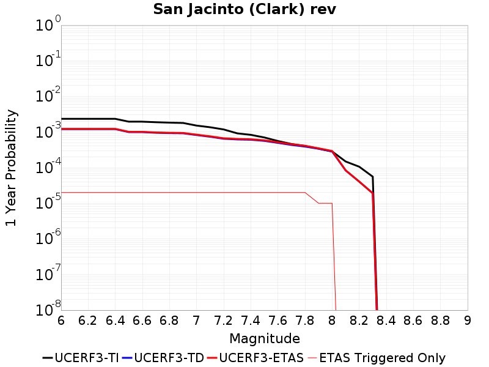 |  |

| Magnitude | 1 wk TI Prob | 1 wk TD Prob | 1 wk ETAS Prob | 1 wk ETAS/TD Gain | 1 wk ETAS Triggered Only | 1 mo TI Prob | 1 mo TD Prob | 1 mo ETAS Prob | 1 mo ETAS/TD Gain | 1 mo ETAS Triggered Only | 1 yr TI Prob | 1 yr TD Prob | 1 yr ETAS Prob | 1 yr ETAS/TD Gain | 1 yr ETAS Triggered Only | 10 yr TI Prob | 10 yr TD Prob | 10 yr ETAS Prob | 10 yr ETAS/TD Gain | 10 yr ETAS Triggered Only |
|-----|-----|-----|-----|-----|-----|-----|-----|-----|-----|-----|-----|-----|-----|-----|-----|-----|-----|-----|-----|-----|
| 6.0 | 4.482615E-5 | 2.3012068E-5 | 3.301184E-5 | 1.4345446 | 1.0E-5 | 1.9209793E-4 | 9.861947E-5 | 1.08618486E-4 | 1.1013899 | 1.0E-5 | 0.0023362834 | 0.0012000413 | 0.0012200173 | 1.0166461 | 2.0E-5 | 0.02311874 | 0.01246631 | 0.01248606 | 1.0015843 | 2.0E-5 |
| 6.1 | 4.482615E-5 | 2.3012068E-5 | 3.301184E-5 | 1.4345446 | 1.0E-5 | 1.9209793E-4 | 9.861947E-5 | 1.08618486E-4 | 1.1013899 | 1.0E-5 | 0.0023362834 | 0.0012000413 | 0.0012200173 | 1.0166461 | 2.0E-5 | 0.02311874 | 0.01246631 | 0.01248606 | 1.0015843 | 2.0E-5 |
| 6.2 | 4.482615E-5 | 2.3012068E-5 | 3.301184E-5 | 1.4345446 | 1.0E-5 | 1.9209793E-4 | 9.861947E-5 | 1.08618486E-4 | 1.1013899 | 1.0E-5 | 0.0023362834 | 0.0012000413 | 0.0012200173 | 1.0166461 | 2.0E-5 | 0.02311874 | 0.01246631 | 0.01248606 | 1.0015843 | 2.0E-5 |
| 6.3 | 4.482615E-5 | 2.3012068E-5 | 3.301184E-5 | 1.4345446 | 1.0E-5 | 1.9209793E-4 | 9.861947E-5 | 1.08618486E-4 | 1.1013899 | 1.0E-5 | 0.0023362834 | 0.0012000413 | 0.0012200173 | 1.0166461 | 2.0E-5 | 0.02311874 | 0.01246631 | 0.01248606 | 1.0015843 | 2.0E-5 |
| 6.4 | 4.482615E-5 | 2.3012068E-5 | 3.301184E-5 | 1.4345446 | 1.0E-5 | 1.9209793E-4 | 9.861947E-5 | 1.08618486E-4 | 1.1013899 | 1.0E-5 | 0.0023362834 | 0.0012000413 | 0.0012200173 | 1.0166461 | 2.0E-5 | 0.02311874 | 0.01246631 | 0.01248606 | 1.0015843 | 2.0E-5 |
| 6.5 | 3.7294863E-5 | 1.8994215E-5 | 2.8994024E-5 | 1.5264661 | 1.0E-5 | 1.5982533E-4 | 8.140127E-5 | 9.140045E-5 | 1.1228383 | 1.0E-5 | 0.0019441366 | 9.906151E-4 | 0.0010105952 | 1.0201695 | 2.0E-5 | 0.01927216 | 0.010344829 | 0.010364622 | 1.0019133 | 2.0E-5 |
| 6.6 | 3.7294863E-5 | 1.8994215E-5 | 2.8994024E-5 | 1.5264661 | 1.0E-5 | 1.5982533E-4 | 8.140127E-5 | 9.140045E-5 | 1.1228383 | 1.0E-5 | 0.0019441366 | 9.906151E-4 | 0.0010105952 | 1.0201695 | 2.0E-5 | 0.01927216 | 0.010344829 | 0.010364622 | 1.0019133 | 2.0E-5 |
| 6.7 | 3.6039248E-5 | 1.8201956E-5 | 2.8201774E-5 | 1.5493815 | 1.0E-5 | 1.5444479E-4 | 7.800607E-5 | 8.80053E-5 | 1.1281852 | 1.0E-5 | 0.0018787434 | 9.49315E-4 | 9.692961E-4 | 1.0210478 | 2.0E-5 | 0.01862939 | 0.009923884 | 0.0099436855 | 1.0019953 | 2.0E-5 |
| 6.8 | 3.5031844E-5 | 1.7799337E-5 | 2.7799158E-5 | 1.5618087 | 1.0E-5 | 1.5012783E-4 | 7.628067E-5 | 8.6279906E-5 | 1.1310848 | 1.0E-5 | 0.0018262739 | 9.283262E-4 | 9.483077E-4 | 1.0215242 | 2.0E-5 | 0.01811338 | 0.009706942 | 0.009726748 | 1.0020404 | 2.0E-5 |
| 6.9 | 3.435112E-5 | 1.7612218E-5 | 2.7612043E-5 | 1.5677776 | 1.0E-5 | 1.4721078E-4 | 7.5478776E-5 | 8.547802E-5 | 1.1324775 | 1.0E-5 | 0.0017908178 | 9.185715E-4 | 9.3855313E-4 | 1.021753 | 2.0E-5 | 0.017764548 | 0.009607123 | 0.009626931 | 1.0020618 | 2.0E-5 |
| 7.0 | 2.8959772E-5 | 1.571925E-5 | 2.5719093E-5 | 1.6361526 | 1.0E-5 | 1.241074E-4 | 6.736649E-5 | 7.736582E-5 | 1.1484318 | 1.0E-5 | 0.0015099603 | 8.198817E-4 | 8.398653E-4 | 1.0243738 | 2.0E-5 | 0.014997416 | 0.008593208 | 0.008613036 | 1.0023074 | 2.0E-5 |
| 7.1 | 2.6002877E-5 | 1.4079112E-5 | 2.407897E-5 | 1.7102621 | 1.0E-5 | 1.11436144E-4 | 6.033767E-5 | 7.033707E-5 | 1.1657239 | 1.0E-5 | 0.0013558907 | 7.34366E-4 | 7.543513E-4 | 1.0272144 | 2.0E-5 | 0.013476475 | 0.0077045285 | 0.0077243745 | 1.0025759 | 2.0E-5 |
| 7.2 | 2.2544838E-5 | 1.2370962E-5 | 2.237084E-5 | 1.8083345 | 1.0E-5 | 9.661716E-5 | 5.3017342E-5 | 6.3016814E-5 | 1.1886076 | 1.0E-5 | 0.001175679 | 6.4529665E-4 | 6.6528376E-4 | 1.0309736 | 2.0E-5 | 0.011694785 | 0.006779798 | 0.0067996625 | 1.0029299 | 2.0E-5 |
| 7.3 | 1.75334E-5 | 1.1835098E-5 | 2.183498E-5 | 1.8449345 | 1.0E-5 | 7.514098E-5 | 5.072087E-5 | 6.0720362E-5 | 1.1971475 | 1.0E-5 | 9.144575E-4 | 6.1735325E-4 | 6.373409E-4 | 1.0323764 | 2.0E-5 | 0.009107036 | 0.0064758845 | 0.006495755 | 1.0030683 | 2.0E-5 |
| 7.4 | 1.5924552E-5 | 1.1607353E-5 | 2.1607239E-5 | 1.8615128 | 1.0E-5 | 6.82463E-5 | 4.9744864E-5 | 5.9744365E-5 | 1.2010158 | 1.0E-5 | 8.305819E-4 | 6.0547696E-4 | 6.2546483E-4 | 1.0330118 | 2.0E-5 | 0.008274844 | 0.00634801 | 0.006367883 | 1.0031306 | 2.0E-5 |
| 7.5 | 1.3428931E-5 | 1.078527E-5 | 2.0785163E-5 | 1.9271804 | 1.0E-5 | 5.7551293E-5 | 4.6221776E-5 | 5.6221314E-5 | 1.2163383 | 1.0E-5 | 7.004617E-4 | 5.6260603E-4 | 5.825948E-4 | 1.0355289 | 2.0E-5 | 0.006982579 | 0.0059004007 | 0.005920283 | 1.0033696 | 2.0E-5 |
| 7.6 | 1.0688787E-5 | 9.475933E-6 | 1.947584E-5 | 2.055295 | 1.0E-5 | 4.5808283E-5 | 4.0610514E-5 | 5.061011E-5 | 1.2462317 | 1.0E-5 | 5.5757316E-4 | 4.943214E-4 | 5.143115E-4 | 1.0404395 | 2.0E-5 | 0.005561762 | 0.0051974985 | 0.0052173943 | 1.003828 | 2.0E-5 |
| 7.7 | 8.81236E-6 | 8.293941E-6 | 1.8293858E-5 | 2.2056894 | 1.0E-5 | 3.776671E-5 | 3.554498E-5 | 4.5544624E-5 | 1.2813237 | 1.0E-5 | 4.597127E-4 | 4.3267445E-4 | 4.5266582E-4 | 1.0462041 | 2.0E-5 | 0.0045876284 | 0.0045722523 | 0.004592161 | 1.0043542 | 2.0E-5 |
| 7.8 | 7.780431E-6 | 7.461017E-6 | 1.7460943E-5 | 2.3402898 | 1.0E-5 | 3.3344273E-5 | 3.1975396E-5 | 4.197508E-5 | 1.3127304 | 1.0E-5 | 4.0589093E-4 | 3.8923114E-4 | 4.0922337E-4 | 1.0513633 | 2.0E-5 | 0.0040515037 | 0.004128244 | 0.004148161 | 1.0048246 | 2.0E-5 |
| 7.9 | 6.5437994E-6 | 6.476881E-6 | 6.476881E-6 | 1.0 | 0.0 | 2.8044553E-5 | 2.7757766E-5 | 2.7757766E-5 | 1.0 | 0.0 | 3.4138895E-4 | 3.3789861E-4 | 3.4789523E-4 | 1.0295846 | 1.0E-5 | 0.0034086495 | 0.003604541 | 0.003614505 | 1.0027642 | 1.0E-5 |
| 8.0 | 5.4488164E-6 | 5.4212314E-6 | 5.4212314E-6 | 1.0 | 0.0 | 2.3351862E-5 | 2.3233642E-5 | 2.3233642E-5 | 1.0 | 0.0 | 2.8427184E-4 | 2.8283306E-4 | 2.9283026E-4 | 1.0353465 | 1.0E-5 | 0.0028390845 | 0.0030346457 | 0.0030446153 | 1.0032853 | 1.0E-5 |
| 8.1 | 2.8397242E-6 | 1.5984876E-6 | 1.5984876E-6 | 1.0 | 0.0 | 1.217019E-5 | 6.8506433E-6 | 6.8506433E-6 | 1.0 | 0.0 | 1.4816198E-4 | 8.340341E-5 | 8.340341E-5 | 1.0 | 0.0 | 0.0014806325 | 9.4112655E-4 | 9.4112655E-4 | 1.0 | 0.0 |
| 8.2 | 2.030244E-6 | 7.7472544E-7 | 7.7472544E-7 | 1.0 | 0.0 | 8.701017E-6 | 3.3202475E-6 | 3.3202475E-6 | 1.0 | 0.0 | 1.05929736E-4 | 4.0423274E-5 | 4.0423274E-5 | 1.0 | 0.0 | 0.0010587925 | 4.7735605E-4 | 4.7735605E-4 | 1.0 | 0.0 |
| 8.3 | 1.0659804E-6 | 3.644075E-7 | 3.644075E-7 | 1.0 | 0.0 | 4.568479E-6 | 1.5617455E-6 | 1.5617455E-6 | 1.0 | 0.0 | 5.5619817E-5 | 1.901409E-5 | 1.901409E-5 | 1.0 | 0.0 | 5.5605895E-4 | 2.2766211E-4 | 2.2766211E-4 | 1.0 | 0.0 |

## North Frontal  (East)
*[(top)](#table-of-contents)*

| 1 Week | 1 Month | 1 Year | 10 Year |
|-----|-----|-----|-----|
|  | 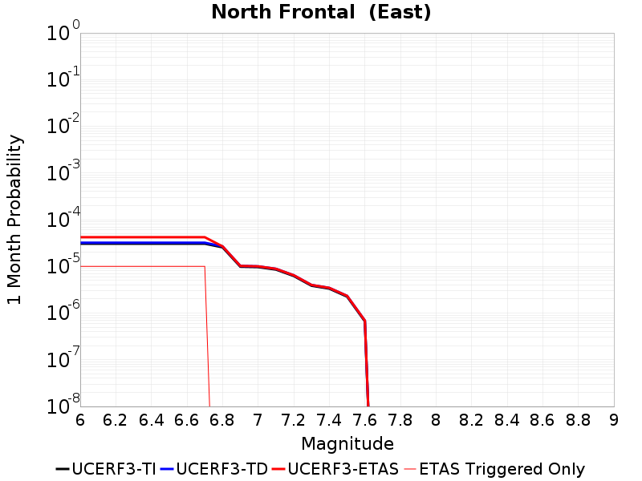 | 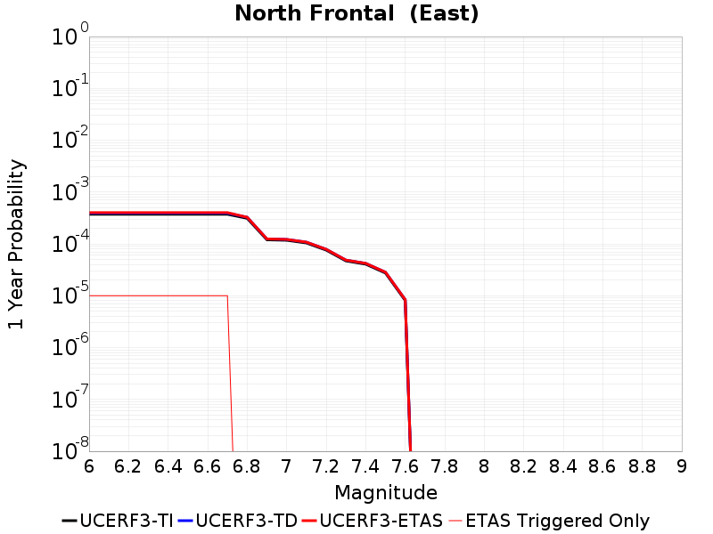 | 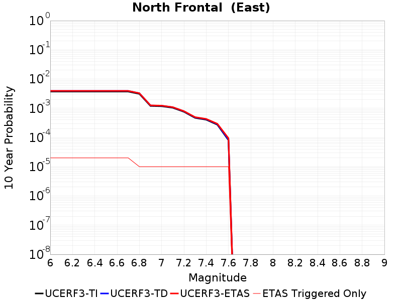 |

| Magnitude | 1 wk TI Prob | 1 wk TD Prob | 1 wk ETAS Prob | 1 wk ETAS/TD Gain | 1 wk ETAS Triggered Only | 1 mo TI Prob | 1 mo TD Prob | 1 mo ETAS Prob | 1 mo ETAS/TD Gain | 1 mo ETAS Triggered Only | 1 yr TI Prob | 1 yr TD Prob | 1 yr ETAS Prob | 1 yr ETAS/TD Gain | 1 yr ETAS Triggered Only | 10 yr TI Prob | 10 yr TD Prob | 10 yr ETAS Prob | 10 yr ETAS/TD Gain | 10 yr ETAS Triggered Only |
|-----|-----|-----|-----|-----|-----|-----|-----|-----|-----|-----|-----|-----|-----|-----|-----|-----|-----|-----|-----|-----|
| 6.0 | 7.135738E-6 | 7.4883555E-6 | 1.748828E-5 | 2.3353965 | 1.0E-5 | 3.0581377E-5 | 3.209267E-5 | 4.209235E-5 | 1.3115876 | 1.0E-5 | 3.7226462E-4 | 3.906782E-4 | 4.0067433E-4 | 1.0255865 | 1.0E-5 | 0.0037164164 | 0.0039018781 | 0.0039218003 | 1.0051057 | 2.0E-5 |
| 6.1 | 7.135738E-6 | 7.4883555E-6 | 1.748828E-5 | 2.3353965 | 1.0E-5 | 3.0581377E-5 | 3.209267E-5 | 4.209235E-5 | 1.3115876 | 1.0E-5 | 3.7226462E-4 | 3.906782E-4 | 4.0067433E-4 | 1.0255865 | 1.0E-5 | 0.0037164164 | 0.0039018781 | 0.0039218003 | 1.0051057 | 2.0E-5 |
| 6.2 | 7.135738E-6 | 7.4883555E-6 | 1.748828E-5 | 2.3353965 | 1.0E-5 | 3.0581377E-5 | 3.209267E-5 | 4.209235E-5 | 1.3115876 | 1.0E-5 | 3.7226462E-4 | 3.906782E-4 | 4.0067433E-4 | 1.0255865 | 1.0E-5 | 0.0037164164 | 0.0039018781 | 0.0039218003 | 1.0051057 | 2.0E-5 |
| 6.3 | 7.135738E-6 | 7.4883555E-6 | 1.748828E-5 | 2.3353965 | 1.0E-5 | 3.0581377E-5 | 3.209267E-5 | 4.209235E-5 | 1.3115876 | 1.0E-5 | 3.7226462E-4 | 3.906782E-4 | 4.0067433E-4 | 1.0255865 | 1.0E-5 | 0.0037164164 | 0.0039018781 | 0.0039218003 | 1.0051057 | 2.0E-5 |
| 6.4 | 7.135738E-6 | 7.4883555E-6 | 1.748828E-5 | 2.3353965 | 1.0E-5 | 3.0581377E-5 | 3.209267E-5 | 4.209235E-5 | 1.3115876 | 1.0E-5 | 3.7226462E-4 | 3.906782E-4 | 4.0067433E-4 | 1.0255865 | 1.0E-5 | 0.0037164164 | 0.0039018781 | 0.0039218003 | 1.0051057 | 2.0E-5 |
| 6.5 | 7.135738E-6 | 7.4883555E-6 | 1.748828E-5 | 2.3353965 | 1.0E-5 | 3.0581377E-5 | 3.209267E-5 | 4.209235E-5 | 1.3115876 | 1.0E-5 | 3.7226462E-4 | 3.906782E-4 | 4.0067433E-4 | 1.0255865 | 1.0E-5 | 0.0037164164 | 0.0039018781 | 0.0039218003 | 1.0051057 | 2.0E-5 |
| 6.6 | 7.135738E-6 | 7.4883555E-6 | 1.748828E-5 | 2.3353965 | 1.0E-5 | 3.0581377E-5 | 3.209267E-5 | 4.209235E-5 | 1.3115876 | 1.0E-5 | 3.7226462E-4 | 3.906782E-4 | 4.0067433E-4 | 1.0255865 | 1.0E-5 | 0.0037164164 | 0.0039018781 | 0.0039218003 | 1.0051057 | 2.0E-5 |
| 6.7 | 7.135738E-6 | 7.4883555E-6 | 1.748828E-5 | 2.3353965 | 1.0E-5 | 3.0581377E-5 | 3.209267E-5 | 4.209235E-5 | 1.3115876 | 1.0E-5 | 3.7226462E-4 | 3.906782E-4 | 4.0067433E-4 | 1.0255865 | 1.0E-5 | 0.0037164164 | 0.0039018781 | 0.0039218003 | 1.0051057 | 2.0E-5 |
| 6.8 | 5.959142E-6 | 6.2457593E-6 | 6.2457593E-6 | 1.0 | 0.0 | 2.553893E-5 | 2.6767368E-5 | 2.6767368E-5 | 1.0 | 0.0 | 3.108921E-4 | 3.2586209E-4 | 3.2586209E-4 | 1.0 | 0.0 | 0.0031045752 | 0.0032556215 | 0.003265589 | 1.0030617 | 1.0E-5 |
| 6.9 | 2.2946929E-6 | 2.3853072E-6 | 2.3853072E-6 | 1.0 | 0.0 | 9.834361E-6 | 1.0222708E-5 | 1.0222708E-5 | 1.0 | 0.0 | 1.1972676E-4 | 1.2445483E-4 | 1.2445483E-4 | 1.0 | 0.0 | 0.0011966228 | 0.001243898 | 0.0012538854 | 1.0080292 | 1.0E-5 |
| 7.0 | 2.2468673E-6 | 2.334919E-6 | 2.334919E-6 | 1.0 | 0.0 | 9.629396E-6 | 1.000676E-5 | 1.000676E-5 | 1.0 | 0.0 | 1.1723159E-4 | 1.21825964E-4 | 1.21825964E-4 | 1.0 | 0.0 | 0.0011716976 | 0.0012176381 | 0.001227626 | 1.0082027 | 1.0E-5 |
| 7.1 | 1.9921076E-6 | 2.0669488E-6 | 2.0669488E-6 | 1.0 | 0.0 | 8.537577E-6 | 8.858325E-6 | 8.858325E-6 | 1.0 | 0.0 | 1.0394004E-4 | 1.078452E-4 | 1.078452E-4 | 1.0 | 0.0 | 0.0010389143 | 0.0010779714 | 0.0010879607 | 1.0092667 | 1.0E-5 |
| 7.2 | 1.4524545E-6 | 1.506198E-6 | 1.506198E-6 | 1.0 | 0.0 | 6.2247905E-6 | 6.45512E-6 | 6.45512E-6 | 1.0 | 0.0 | 7.5784184E-5 | 7.85885E-5 | 7.85885E-5 | 1.0 | 0.0 | 7.575835E-4 | 7.856316E-4 | 7.9562375E-4 | 1.0127186 | 1.0E-5 |
| 7.3 | 8.9802575E-7 | 9.3193546E-7 | 9.3193546E-7 | 1.0 | 0.0 | 3.848676E-6 | 3.9940037E-6 | 3.9940037E-6 | 1.0 | 0.0 | 4.685662E-5 | 4.8626025E-5 | 4.8626025E-5 | 1.0 | 0.0 | 4.6846745E-4 | 4.861652E-4 | 4.9616036E-4 | 1.0205592 | 1.0E-5 |
| 7.4 | 7.776139E-7 | 8.0696725E-7 | 8.0696725E-7 | 1.0 | 0.0 | 3.3326266E-6 | 3.4584273E-6 | 3.4584273E-6 | 1.0 | 0.0 | 4.0573974E-5 | 4.2105647E-5 | 4.2105647E-5 | 1.0 | 0.0 | 4.0566566E-4 | 4.209875E-4 | 4.3098326E-4 | 1.0237436 | 1.0E-5 |
| 7.5 | 5.244417E-7 | 5.44759E-7 | 5.44759E-7 | 1.0 | 0.0 | 2.2476054E-6 | 2.33468E-6 | 2.33468E-6 | 1.0 | 0.0 | 2.7364253E-5 | 2.8424423E-5 | 2.8424423E-5 | 1.0 | 0.0 | 2.7360884E-4 | 2.8421442E-4 | 2.9421158E-4 | 1.0351747 | 1.0E-5 |
| 7.6 | 1.5489647E-7 | 1.6108943E-7 | 1.6108943E-7 | 1.0 | 0.0 | 6.6384183E-7 | 6.903832E-7 | 6.903832E-7 | 1.0 | 0.0 | 8.082245E-6 | 8.405404E-6 | 8.405404E-6 | 1.0 | 0.0 | 8.08195E-5 | 8.405286E-5 | 9.405202E-5 | 1.1189628 | 1.0E-5 |

## North Frontal  (West)
*[(top)](#table-of-contents)*

| 1 Week | 1 Month | 1 Year | 10 Year |
|-----|-----|-----|-----|
| 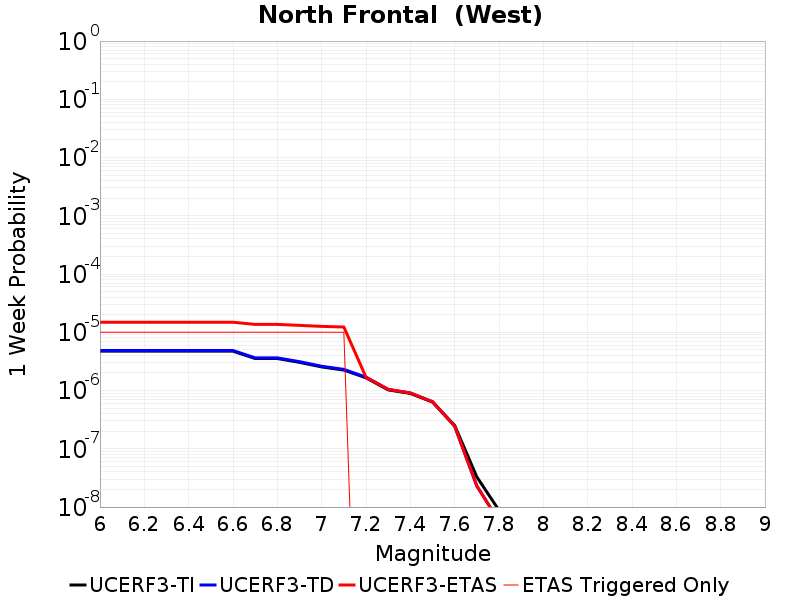 | 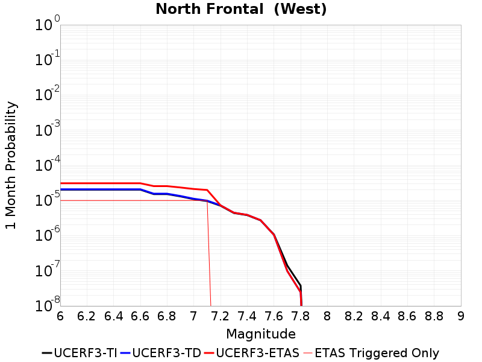 | 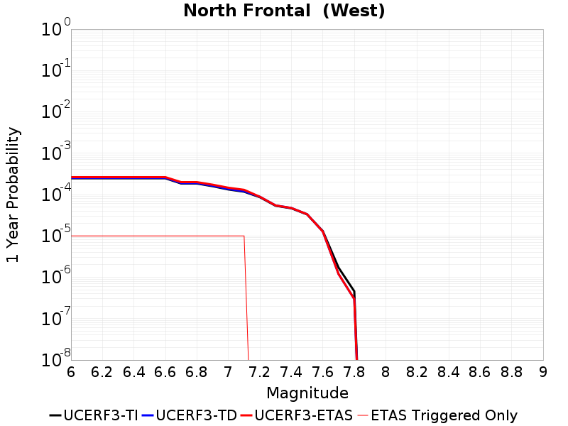 |  |

| Magnitude | 1 wk TI Prob | 1 wk TD Prob | 1 wk ETAS Prob | 1 wk ETAS/TD Gain | 1 wk ETAS Triggered Only | 1 mo TI Prob | 1 mo TD Prob | 1 mo ETAS Prob | 1 mo ETAS/TD Gain | 1 mo ETAS Triggered Only | 1 yr TI Prob | 1 yr TD Prob | 1 yr ETAS Prob | 1 yr ETAS/TD Gain | 1 yr ETAS Triggered Only | 10 yr TI Prob | 10 yr TD Prob | 10 yr ETAS Prob | 10 yr ETAS/TD Gain | 10 yr ETAS Triggered Only |
|-----|-----|-----|-----|-----|-----|-----|-----|-----|-----|-----|-----|-----|-----|-----|-----|-----|-----|-----|-----|-----|
| 6.0 | 4.7316266E-6 | 4.8570905E-6 | 1.4857042E-5 | 3.0588357 | 1.0E-5 | 2.0278241E-5 | 2.0815944E-5 | 3.0815736E-5 | 1.480391 | 1.0E-5 | 2.4685962E-4 | 2.5340612E-4 | 2.634036E-4 | 1.0394523 | 1.0E-5 | 0.0024658558 | 0.002531318 | 0.0025512674 | 1.007881 | 2.0E-5 |
| 6.1 | 4.7316266E-6 | 4.8570905E-6 | 1.4857042E-5 | 3.0588357 | 1.0E-5 | 2.0278241E-5 | 2.0815944E-5 | 3.0815736E-5 | 1.480391 | 1.0E-5 | 2.4685962E-4 | 2.5340612E-4 | 2.634036E-4 | 1.0394523 | 1.0E-5 | 0.0024658558 | 0.002531318 | 0.0025512674 | 1.007881 | 2.0E-5 |
| 6.2 | 4.7316266E-6 | 4.8570905E-6 | 1.4857042E-5 | 3.0588357 | 1.0E-5 | 2.0278241E-5 | 2.0815944E-5 | 3.0815736E-5 | 1.480391 | 1.0E-5 | 2.4685962E-4 | 2.5340612E-4 | 2.634036E-4 | 1.0394523 | 1.0E-5 | 0.0024658558 | 0.002531318 | 0.0025512674 | 1.007881 | 2.0E-5 |
| 6.3 | 4.7316266E-6 | 4.8570905E-6 | 1.4857042E-5 | 3.0588357 | 1.0E-5 | 2.0278241E-5 | 2.0815944E-5 | 3.0815736E-5 | 1.480391 | 1.0E-5 | 2.4685962E-4 | 2.5340612E-4 | 2.634036E-4 | 1.0394523 | 1.0E-5 | 0.0024658558 | 0.002531318 | 0.0025512674 | 1.007881 | 2.0E-5 |
| 6.4 | 4.7316266E-6 | 4.8570905E-6 | 1.4857042E-5 | 3.0588357 | 1.0E-5 | 2.0278241E-5 | 2.0815944E-5 | 3.0815736E-5 | 1.480391 | 1.0E-5 | 2.4685962E-4 | 2.5340612E-4 | 2.634036E-4 | 1.0394523 | 1.0E-5 | 0.0024658558 | 0.002531318 | 0.0025512674 | 1.007881 | 2.0E-5 |
| 6.5 | 4.7316266E-6 | 4.8570905E-6 | 1.4857042E-5 | 3.0588357 | 1.0E-5 | 2.0278241E-5 | 2.0815944E-5 | 3.0815736E-5 | 1.480391 | 1.0E-5 | 2.4685962E-4 | 2.5340612E-4 | 2.634036E-4 | 1.0394523 | 1.0E-5 | 0.0024658558 | 0.002531318 | 0.0025512674 | 1.007881 | 2.0E-5 |
| 6.6 | 4.7316266E-6 | 4.8570905E-6 | 1.4857042E-5 | 3.0588357 | 1.0E-5 | 2.0278241E-5 | 2.0815944E-5 | 3.0815736E-5 | 1.480391 | 1.0E-5 | 2.4685962E-4 | 2.5340612E-4 | 2.634036E-4 | 1.0394523 | 1.0E-5 | 0.0024658558 | 0.002531318 | 0.0025512674 | 1.007881 | 2.0E-5 |
| 6.7 | 3.5382777E-6 | 3.6343959E-6 | 1.363436E-5 | 3.751479 | 1.0E-5 | 1.516396E-5 | 1.5575893E-5 | 2.5575739E-5 | 1.6420077 | 1.0E-5 | 1.8460557E-4 | 1.8962078E-4 | 1.9961888E-4 | 1.0527269 | 1.0E-5 | 0.0018445229 | 0.0018946669 | 0.0019146291 | 1.010536 | 2.0E-5 |
| 6.8 | 3.5382777E-6 | 3.6343959E-6 | 1.363436E-5 | 3.751479 | 1.0E-5 | 1.516396E-5 | 1.5575893E-5 | 2.5575739E-5 | 1.6420077 | 1.0E-5 | 1.8460557E-4 | 1.8962078E-4 | 1.9961888E-4 | 1.0527269 | 1.0E-5 | 0.0018445229 | 0.0018946669 | 0.0019146291 | 1.010536 | 2.0E-5 |
| 6.9 | 3.0428037E-6 | 3.1258658E-6 | 1.3125835E-5 | 4.199104 | 1.0E-5 | 1.30405215E-5 | 1.3396502E-5 | 2.339637E-5 | 1.7464535 | 1.0E-5 | 1.5875678E-4 | 1.630909E-4 | 1.7308927E-4 | 1.0613055 | 1.0E-5 | 0.0015864341 | 0.0016297793 | 0.0016497467 | 1.0122516 | 2.0E-5 |
| 7.0 | 2.538778E-6 | 2.6087914E-6 | 1.2608765E-5 | 4.833183 | 1.0E-5 | 1.0880432E-5 | 1.1180489E-5 | 2.1180376E-5 | 1.8944052 | 1.0E-5 | 1.324612E-4 | 1.3611442E-4 | 1.4611306E-4 | 1.0734576 | 1.0E-5 | 0.0013238228 | 0.0013603574 | 0.0013803302 | 1.014682 | 2.0E-5 |
| 7.1 | 2.2418935E-6 | 2.303652E-6 | 1.2303629E-5 | 5.3409233 | 1.0E-5 | 9.60808E-6 | 9.87276E-6 | 1.9872661E-5 | 2.012878 | 1.0E-5 | 1.1697209E-4 | 1.20194665E-4 | 1.3019345E-4 | 1.0831884 | 1.0E-5 | 0.0011691054 | 0.0012013406 | 0.0012213165 | 1.016628 | 2.0E-5 |
| 7.2 | 1.6526745E-6 | 1.694301E-6 | 1.694301E-6 | 1.0 | 0.0 | 7.082872E-6 | 7.2612715E-6 | 7.2612715E-6 | 1.0 | 0.0 | 8.623055E-5 | 8.8402645E-5 | 8.8402645E-5 | 1.0 | 0.0 | 8.61971E-4 | 8.836999E-4 | 8.936911E-4 | 1.011306 | 1.0E-5 |
| 7.3 | 1.0246019E-6 | 1.045392E-6 | 1.045392E-6 | 1.0 | 0.0 | 4.391144E-6 | 4.480244E-6 | 4.480244E-6 | 1.0 | 0.0 | 5.3460866E-5 | 5.4545722E-5 | 5.4545722E-5 | 1.0 | 0.0 | 5.344801E-4 | 5.453349E-4 | 5.5532943E-4 | 1.0183274 | 1.0E-5 |
| 7.4 | 8.9045164E-7 | 9.0667925E-7 | 9.0667925E-7 | 1.0 | 0.0 | 3.8162157E-6 | 3.885763E-6 | 3.885763E-6 | 1.0 | 0.0 | 4.646144E-5 | 4.730825E-5 | 4.730825E-5 | 1.0 | 0.0 | 4.6451724E-4 | 4.729927E-4 | 4.8298796E-4 | 1.021132 | 1.0E-5 |
| 7.5 | 6.3357E-7 | 6.410193E-7 | 6.410193E-7 | 1.0 | 0.0 | 2.7152971E-6 | 2.747223E-6 | 2.747223E-6 | 1.0 | 0.0 | 3.305824E-5 | 3.3446995E-5 | 3.3446995E-5 | 1.0 | 0.0 | 3.3053322E-4 | 3.3442618E-4 | 3.4442285E-4 | 1.029892 | 1.0E-5 |
| 7.6 | 2.5087024E-7 | 2.4390883E-7 | 2.4390883E-7 | 1.0 | 0.0 | 1.0751578E-6 | 1.0453232E-6 | 1.0453232E-6 | 1.0 | 0.0 | 1.3089967E-5 | 1.2726757E-5 | 1.2726757E-5 | 1.0 | 0.0 | 1.3089196E-4 | 1.2726235E-4 | 1.3726107E-4 | 1.0785679 | 1.0E-5 |
| 7.7 | 3.282987E-8 | 2.2916119E-8 | 2.2916119E-8 | 1.0 | 0.0 | 1.4069944E-7 | 9.821193E-8 | 9.821193E-8 | 1.0 | 0.0 | 1.7130144E-6 | 1.1957296E-6 | 1.1957296E-6 | 1.0 | 0.0 | 1.7130013E-5 | 1.19572405E-5 | 1.19572405E-5 | 1.0 | 0.0 |
| 7.8 | 8.77499E-9 | 5.7038942E-9 | 5.7038942E-9 | 1.0 | 0.0 | 3.7607098E-8 | 2.444526E-8 | 2.444526E-8 | 1.0 | 0.0 | 4.578663E-7 | 2.9762103E-7 | 2.9762103E-7 | 1.0 | 0.0 | 4.5786537E-6 | 2.9762075E-6 | 2.9762075E-6 | 1.0 | 0.0 |

## Red Mountain
*[(top)](#table-of-contents)*

| 1 Week | 1 Month | 1 Year | 10 Year |
|-----|-----|-----|-----|
| 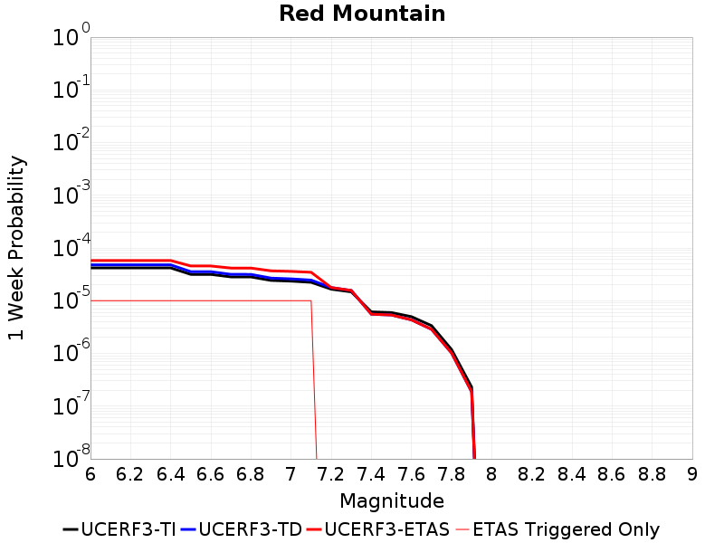 |  |  |  |

| Magnitude | 1 wk TI Prob | 1 wk TD Prob | 1 wk ETAS Prob | 1 wk ETAS/TD Gain | 1 wk ETAS Triggered Only | 1 mo TI Prob | 1 mo TD Prob | 1 mo ETAS Prob | 1 mo ETAS/TD Gain | 1 mo ETAS Triggered Only | 1 yr TI Prob | 1 yr TD Prob | 1 yr ETAS Prob | 1 yr ETAS/TD Gain | 1 yr ETAS Triggered Only | 10 yr TI Prob | 10 yr TD Prob | 10 yr ETAS Prob | 10 yr ETAS/TD Gain | 10 yr ETAS Triggered Only |
|-----|-----|-----|-----|-----|-----|-----|-----|-----|-----|-----|-----|-----|-----|-----|-----|-----|-----|-----|-----|-----|
| 6.0 | 4.1810763E-5 | 4.7802805E-5 | 5.7802325E-5 | 1.2091827 | 1.0E-5 | 1.7917668E-4 | 2.0485402E-4 | 2.1485197E-4 | 1.0488052 | 1.0E-5 | 0.0021792934 | 0.002491411 | 0.0025013862 | 1.0040038 | 1.0E-5 | 0.021580452 | 0.024652572 | 0.02467208 | 1.0007913 | 2.0E-5 |
| 6.1 | 4.1810763E-5 | 4.7802805E-5 | 5.7802325E-5 | 1.2091827 | 1.0E-5 | 1.7917668E-4 | 2.0485402E-4 | 2.1485197E-4 | 1.0488052 | 1.0E-5 | 0.0021792934 | 0.002491411 | 0.0025013862 | 1.0040038 | 1.0E-5 | 0.021580452 | 0.024652572 | 0.02467208 | 1.0007913 | 2.0E-5 |
| 6.2 | 4.1810763E-5 | 4.7802805E-5 | 5.7802325E-5 | 1.2091827 | 1.0E-5 | 1.7917668E-4 | 2.0485402E-4 | 2.1485197E-4 | 1.0488052 | 1.0E-5 | 0.0021792934 | 0.002491411 | 0.0025013862 | 1.0040038 | 1.0E-5 | 0.021580452 | 0.024652572 | 0.02467208 | 1.0007913 | 2.0E-5 |
| 6.3 | 4.1810763E-5 | 4.7802805E-5 | 5.7802325E-5 | 1.2091827 | 1.0E-5 | 1.7917668E-4 | 2.0485402E-4 | 2.1485197E-4 | 1.0488052 | 1.0E-5 | 0.0021792934 | 0.002491411 | 0.0025013862 | 1.0040038 | 1.0E-5 | 0.021580452 | 0.024652572 | 0.02467208 | 1.0007913 | 2.0E-5 |
| 6.4 | 4.1810763E-5 | 4.7802805E-5 | 5.7802325E-5 | 1.2091827 | 1.0E-5 | 1.7917668E-4 | 2.0485402E-4 | 2.1485197E-4 | 1.0488052 | 1.0E-5 | 0.0021792934 | 0.002491411 | 0.0025013862 | 1.0040038 | 1.0E-5 | 0.021580452 | 0.024652572 | 0.02467208 | 1.0007913 | 2.0E-5 |
| 6.5 | 3.154503E-5 | 3.549927E-5 | 4.5498913E-5 | 1.281686 | 1.0E-5 | 1.3518598E-4 | 1.5213138E-4 | 1.6212986E-4 | 1.0657227 | 1.0E-5 | 0.0016446467 | 0.0018507191 | 0.0018607005 | 1.0053933 | 1.0E-5 | 0.01632528 | 0.018362805 | 0.018372621 | 1.0005345 | 1.0E-5 |
| 6.6 | 3.1535834E-5 | 3.5488672E-5 | 4.548832E-5 | 1.28177 | 1.0E-5 | 1.3514658E-4 | 1.5208598E-4 | 1.6208446E-4 | 1.0657423 | 1.0E-5 | 0.0016441676 | 0.0018501672 | 0.0018601487 | 1.0053949 | 1.0E-5 | 0.01632056 | 0.018357377 | 0.018367194 | 1.0005348 | 1.0E-5 |
| 6.7 | 2.8267326E-5 | 3.159352E-5 | 4.1593208E-5 | 1.3165106 | 1.0E-5 | 1.2114006E-4 | 1.3539426E-4 | 1.4539291E-4 | 1.0738484 | 1.0E-5 | 0.0014738824 | 0.0016472648 | 0.0016572484 | 1.0060607 | 1.0E-5 | 0.014641452 | 0.0163594 | 0.016369237 | 1.0006013 | 1.0E-5 |
| 6.8 | 2.8212884E-5 | 3.153152E-5 | 4.1531202E-5 | 1.317133 | 1.0E-5 | 1.20906756E-4 | 1.3512858E-4 | 1.4512721E-4 | 1.0739936 | 1.0E-5 | 0.0014710457 | 0.0016440348 | 0.0016540183 | 1.0060726 | 1.0E-5 | 0.014613459 | 0.016327575 | 0.016337411 | 1.0006025 | 1.0E-5 |
| 6.9 | 2.4227871E-5 | 2.6808377E-5 | 3.680811E-5 | 1.3730078 | 1.0E-5 | 1.03829596E-4 | 1.1488841E-4 | 1.2488727E-4 | 1.087031 | 1.0E-5 | 0.0012633923 | 0.0013979456 | 0.0014079317 | 1.0071434 | 1.0E-5 | 0.012562336 | 0.013899286 | 0.013909147 | 1.0007094 | 1.0E-5 |
| 7.0 | 2.348524E-5 | 2.5938134E-5 | 3.5937876E-5 | 1.3855227 | 1.0E-5 | 1.0064714E-4 | 1.1115913E-4 | 1.2115802E-4 | 1.0899512 | 1.0E-5 | 0.0012246901 | 0.0013525985 | 0.001362585 | 1.0073832 | 1.0E-5 | 0.012179627 | 0.013451374 | 0.01346124 | 1.0007334 | 1.0E-5 |
| 7.1 | 2.2311642E-5 | 2.4561057E-5 | 3.4560813E-5 | 1.4071386 | 1.0E-5 | 9.561782E-5 | 1.0525785E-4 | 1.152568E-4 | 1.0949948 | 1.0E-5 | 0.0011635252 | 0.0012808365 | 0.0012908238 | 1.0077974 | 1.0E-5 | 0.01157452 | 0.012742139 | 0.012752011 | 1.0007747 | 1.0E-5 |
| 7.2 | 1.6533986E-5 | 1.774899E-5 | 1.774899E-5 | 1.0 | 0.0 | 7.085802E-5 | 7.606525E-5 | 7.606525E-5 | 1.0 | 0.0 | 8.623549E-4 | 9.25765E-4 | 9.25765E-4 | 1.0 | 0.0 | 0.008590161 | 0.009225432 | 0.009225432 | 1.0 | 0.0 |
| 7.3 | 1.4703092E-5 | 1.56286E-5 | 1.56286E-5 | 1.0 | 0.0 | 6.301173E-5 | 6.697835E-5 | 6.697835E-5 | 1.0 | 0.0 | 7.668978E-4 | 8.152186E-4 | 8.152186E-4 | 1.0 | 0.0 | 0.0076425658 | 0.008128422 | 0.008128422 | 1.0 | 0.0 |
| 7.4 | 6.1331984E-6 | 5.5444452E-6 | 5.5444452E-6 | 1.0 | 0.0 | 2.6284872E-5 | 2.3761695E-5 | 2.3761695E-5 | 1.0 | 0.0 | 3.199713E-4 | 2.8926076E-4 | 2.8926076E-4 | 1.0 | 0.0 | 0.0031951098 | 0.0028888972 | 0.0028888972 | 1.0 | 0.0 |
| 7.5 | 5.954766E-6 | 5.35386E-6 | 5.35386E-6 | 1.0 | 0.0 | 2.5520176E-5 | 2.2944916E-5 | 2.2944916E-5 | 1.0 | 0.0 | 3.1066386E-4 | 2.7931907E-4 | 2.7931907E-4 | 1.0 | 0.0 | 0.003102299 | 0.0027897342 | 0.0027897342 | 1.0 | 0.0 |
| 7.6 | 4.9726646E-6 | 4.3284267E-6 | 4.3284267E-6 | 1.0 | 0.0 | 2.1311245E-5 | 1.855027E-5 | 1.855027E-5 | 1.0 | 0.0 | 2.5943352E-4 | 2.2582647E-4 | 2.2582647E-4 | 1.0 | 0.0 | 0.0025913084 | 0.0022560048 | 0.0022560048 | 1.0 | 0.0 |
| 7.7 | 3.3613894E-6 | 2.862119E-6 | 2.862119E-6 | 1.0 | 0.0 | 1.4405875E-5 | 1.2266168E-5 | 1.2266168E-5 | 1.0 | 0.0 | 1.7537741E-4 | 1.4933062E-4 | 1.4933062E-4 | 1.0 | 0.0 | 0.0017523908 | 0.0014923292 | 0.0014923292 | 1.0 | 0.0 |
| 7.8 | 1.1828961E-6 | 1.0163094E-6 | 1.0163094E-6 | 1.0 | 0.0 | 5.069545E-6 | 4.3556047E-6 | 4.3556047E-6 | 1.0 | 0.0 | 6.171996E-5 | 5.3028227E-5 | 5.3028227E-5 | 1.0 | 0.0 | 6.170282E-4 | 5.301587E-4 | 5.301587E-4 | 1.0 | 0.0 |
| 7.9 | 2.2967266E-7 | 1.8662706E-7 | 1.8662706E-7 | 1.0 | 0.0 | 9.843111E-7 | 7.9983005E-7 | 7.9983005E-7 | 1.0 | 0.0 | 1.19839215E-5 | 9.737891E-6 | 9.737891E-6 | 1.0 | 0.0 | 1.1983275E-4 | 9.737493E-5 | 9.737493E-5 | 1.0 | 0.0 |

## Raymond
*[(top)](#table-of-contents)*

| 1 Week | 1 Month | 1 Year | 10 Year |
|-----|-----|-----|-----|
|  |  |  | 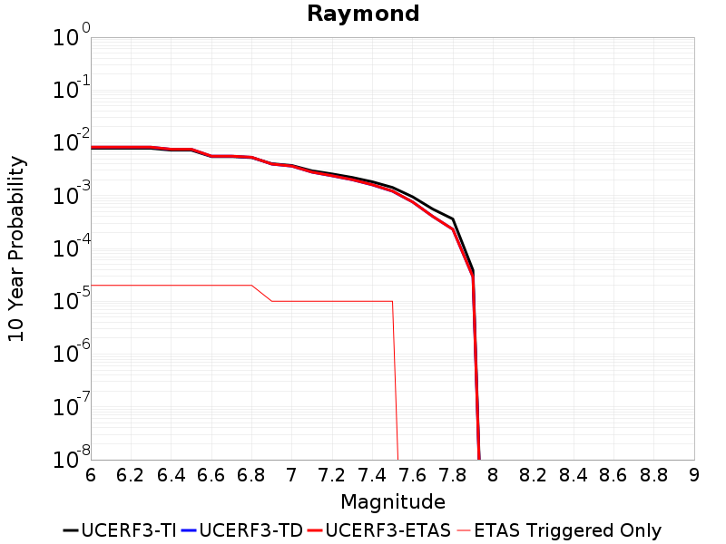 |

| Magnitude | 1 wk TI Prob | 1 wk TD Prob | 1 wk ETAS Prob | 1 wk ETAS/TD Gain | 1 wk ETAS Triggered Only | 1 mo TI Prob | 1 mo TD Prob | 1 mo ETAS Prob | 1 mo ETAS/TD Gain | 1 mo ETAS Triggered Only | 1 yr TI Prob | 1 yr TD Prob | 1 yr ETAS Prob | 1 yr ETAS/TD Gain | 1 yr ETAS Triggered Only | 10 yr TI Prob | 10 yr TD Prob | 10 yr ETAS Prob | 10 yr ETAS/TD Gain | 10 yr ETAS Triggered Only |
|-----|-----|-----|-----|-----|-----|-----|-----|-----|-----|-----|-----|-----|-----|-----|-----|-----|-----|-----|-----|-----|
| 6.0 | 1.5157413E-5 | 1.586831E-5 | 2.586815E-5 | 1.6301768 | 1.0E-5 | 6.4958724E-5 | 6.8005415E-5 | 7.8004734E-5 | 1.1470371 | 1.0E-5 | 7.905855E-4 | 8.276766E-4 | 8.4766006E-4 | 1.024144 | 2.0E-5 | 0.007877788 | 0.008248469 | 0.008268304 | 1.0024047 | 2.0E-5 |
| 6.1 | 1.5157413E-5 | 1.586831E-5 | 2.586815E-5 | 1.6301768 | 1.0E-5 | 6.4958724E-5 | 6.8005415E-5 | 7.8004734E-5 | 1.1470371 | 1.0E-5 | 7.905855E-4 | 8.276766E-4 | 8.4766006E-4 | 1.024144 | 2.0E-5 | 0.007877788 | 0.008248469 | 0.008268304 | 1.0024047 | 2.0E-5 |
| 6.2 | 1.5157413E-5 | 1.586831E-5 | 2.586815E-5 | 1.6301768 | 1.0E-5 | 6.4958724E-5 | 6.8005415E-5 | 7.8004734E-5 | 1.1470371 | 1.0E-5 | 7.905855E-4 | 8.276766E-4 | 8.4766006E-4 | 1.024144 | 2.0E-5 | 0.007877788 | 0.008248469 | 0.008268304 | 1.0024047 | 2.0E-5 |
| 6.3 | 1.5157413E-5 | 1.586831E-5 | 2.586815E-5 | 1.6301768 | 1.0E-5 | 6.4958724E-5 | 6.8005415E-5 | 7.8004734E-5 | 1.1470371 | 1.0E-5 | 7.905855E-4 | 8.276766E-4 | 8.4766006E-4 | 1.024144 | 2.0E-5 | 0.007877788 | 0.008248469 | 0.008268304 | 1.0024047 | 2.0E-5 |
| 6.4 | 1.3941944E-5 | 1.4507991E-5 | 2.4507846E-5 | 1.6892653 | 1.0E-5 | 5.9749822E-5 | 6.217576E-5 | 7.2175135E-5 | 1.1608244 | 1.0E-5 | 7.2721124E-4 | 7.567504E-4 | 7.7673525E-4 | 1.0264088 | 2.0E-5 | 0.007248361 | 0.007544078 | 0.0075639267 | 1.0026311 | 2.0E-5 |
| 6.5 | 1.3941944E-5 | 1.4507991E-5 | 2.4507846E-5 | 1.6892653 | 1.0E-5 | 5.9749822E-5 | 6.217576E-5 | 7.2175135E-5 | 1.1608244 | 1.0E-5 | 7.2721124E-4 | 7.567504E-4 | 7.7673525E-4 | 1.0264088 | 2.0E-5 | 0.007248361 | 0.007544078 | 0.0075639267 | 1.0026311 | 2.0E-5 |
| 6.6 | 1.0542609E-5 | 1.071104E-5 | 2.0710933E-5 | 1.9336061 | 1.0E-5 | 4.5181827E-5 | 4.590368E-5 | 5.590322E-5 | 1.2178375 | 1.0E-5 | 5.499499E-4 | 5.5873947E-4 | 5.7872833E-4 | 1.0357748 | 2.0E-5 | 0.005485909 | 0.0055739046 | 0.0055937935 | 1.0035682 | 2.0E-5 |
| 6.7 | 1.0542609E-5 | 1.071104E-5 | 2.0710933E-5 | 1.9336061 | 1.0E-5 | 4.5181827E-5 | 4.590368E-5 | 5.590322E-5 | 1.2178375 | 1.0E-5 | 5.499499E-4 | 5.5873947E-4 | 5.7872833E-4 | 1.0357748 | 2.0E-5 | 0.005485909 | 0.0055739046 | 0.0055937935 | 1.0035682 | 2.0E-5 |
| 6.8 | 1.0079132E-5 | 1.0215516E-5 | 2.0215415E-5 | 1.978893 | 1.0E-5 | 4.3195567E-5 | 4.378008E-5 | 5.3779644E-5 | 1.2284044 | 1.0E-5 | 5.257791E-4 | 5.3289754E-4 | 5.5288686E-4 | 1.0375106 | 2.0E-5 | 0.0052453685 | 0.0053167427 | 0.005336636 | 1.0037417 | 2.0E-5 |
| 6.9 | 7.721598E-6 | 7.5782546E-6 | 1.7578179E-5 | 2.319555 | 1.0E-5 | 3.3092143E-5 | 3.2477838E-5 | 4.2477513E-5 | 1.3078923 | 1.0E-5 | 4.0282236E-4 | 3.9534713E-4 | 4.053432E-4 | 1.0252842 | 1.0E-5 | 0.0040209293 | 0.003946565 | 0.0039565256 | 1.0025239 | 1.0E-5 |
| 7.0 | 7.137566E-6 | 6.9388134E-6 | 1.6938744E-5 | 2.4411585 | 1.0E-5 | 3.058921E-5 | 2.9737439E-5 | 3.973714E-5 | 1.3362664 | 1.0E-5 | 3.7236E-4 | 3.6199426E-4 | 3.7199064E-4 | 1.0276147 | 1.0E-5 | 0.0037173668 | 0.0036141572 | 0.0036241212 | 1.002757 | 1.0E-5 |
| 7.1 | 5.654976E-6 | 5.3226613E-6 | 1.5322608E-5 | 2.8787494 | 1.0E-5 | 2.4235387E-5 | 2.2811208E-5 | 3.2810978E-5 | 1.4383711 | 1.0E-5 | 2.9502588E-4 | 2.7769126E-4 | 2.8768848E-4 | 1.0360012 | 1.0E-5 | 0.0029463451 | 0.0027734663 | 0.0027834387 | 1.0035956 | 1.0E-5 |
| 7.2 | 4.9358455E-6 | 4.547894E-6 | 1.4547849E-5 | 3.1988099 | 1.0E-5 | 2.1153453E-5 | 1.949083E-5 | 2.9490635E-5 | 1.5130517 | 1.0E-5 | 2.5751285E-4 | 2.3727516E-4 | 2.4727278E-4 | 1.0421351 | 1.0E-5 | 0.0025721465 | 0.0023702327 | 0.002380209 | 1.004209 | 1.0E-5 |
| 7.3 | 4.2368597E-6 | 3.8258695E-6 | 1.3825831E-5 | 3.6137748 | 1.0E-5 | 1.8157843E-5 | 1.6396481E-5 | 2.6396317E-5 | 1.6098769 | 1.0E-5 | 2.2104931E-4 | 1.9960898E-4 | 2.09607E-4 | 1.0500879 | 1.0E-5 | 0.0022082955 | 0.001994308 | 0.0020042881 | 1.0050043 | 1.0E-5 |
| 7.4 | 3.4999923E-6 | 3.062471E-6 | 1.306244E-5 | 4.265327 | 1.0E-5 | 1.49998805E-5 | 1.312481E-5 | 2.312468E-5 | 1.7619058 | 1.0E-5 | 1.8260824E-4 | 1.5978293E-4 | 1.6978133E-4 | 1.0625749 | 1.0E-5 | 0.0018245826 | 0.0015966885 | 0.0016066725 | 1.006253 | 1.0E-5 |
| 7.5 | 2.738017E-6 | 2.318555E-6 | 1.2318532E-5 | 5.3130207 | 1.0E-5 | 1.1734306E-5 | 9.936628E-6 | 1.9936528E-5 | 2.0063677 | 1.0E-5 | 1.428558E-4 | 1.20971796E-4 | 1.3097058E-4 | 1.0826539 | 1.0E-5 | 0.0014276401 | 0.0012090661 | 0.001219054 | 1.0082608 | 1.0E-5 |
| 7.6 | 1.8186392E-6 | 1.4539118E-6 | 1.4539118E-6 | 1.0 | 0.0 | 7.794145E-6 | 6.2310355E-6 | 6.2310355E-6 | 1.0 | 0.0 | 9.488958E-5 | 7.586026E-5 | 7.586026E-5 | 1.0 | 0.0 | 9.4849075E-4 | 7.5834745E-4 | 7.5834745E-4 | 1.0 | 0.0 |
| 7.7 | 1.0660348E-6 | 7.745724E-7 | 7.745724E-7 | 1.0 | 0.0 | 4.5687125E-6 | 3.319592E-6 | 3.319592E-6 | 1.0 | 0.0 | 5.5622655E-5 | 4.04153E-5 | 4.04153E-5 | 1.0 | 0.0 | 5.5608735E-4 | 4.040809E-4 | 4.040809E-4 | 1.0 | 0.0 |
| 7.8 | 6.913602E-7 | 4.411858E-7 | 4.411858E-7 | 1.0 | 0.0 | 2.962969E-6 | 1.8907949E-6 | 1.8907949E-6 | 1.0 | 0.0 | 3.607355E-5 | 2.3020191E-5 | 2.3020191E-5 | 1.0 | 0.0 | 3.6067693E-4 | 2.3017959E-4 | 2.3017959E-4 | 1.0 | 0.0 |
| 7.9 | 7.425201E-8 | 5.5491114E-8 | 5.5491114E-8 | 1.0 | 0.0 | 3.1822285E-7 | 2.3781904E-7 | 2.3781904E-7 | 1.0 | 0.0 | 3.874356E-6 | 2.8954444E-6 | 2.8954444E-6 | 1.0 | 0.0 | 3.8742884E-5 | 2.895421E-5 | 2.895421E-5 | 1.0 | 0.0 |

## San Gabriel (Extension)
*[(top)](#table-of-contents)*

| 1 Week | 1 Month | 1 Year | 10 Year |
|-----|-----|-----|-----|
| 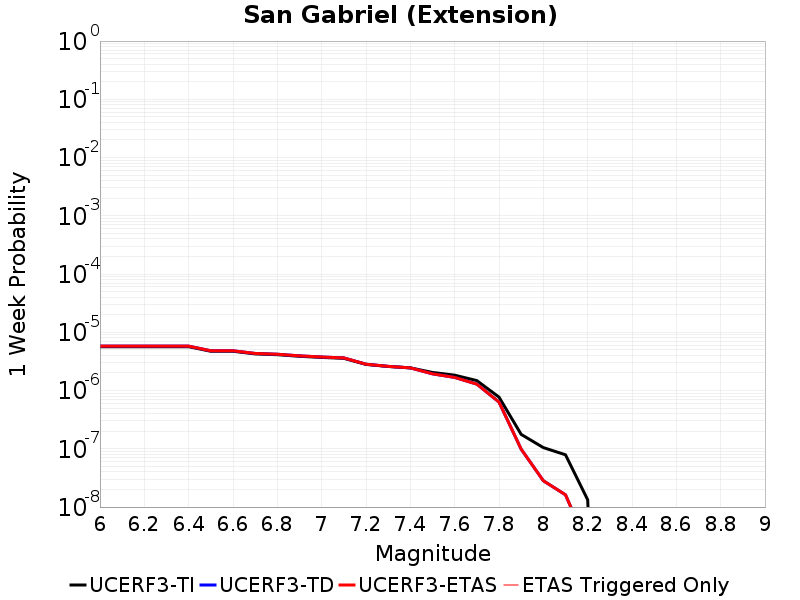 |  |  | 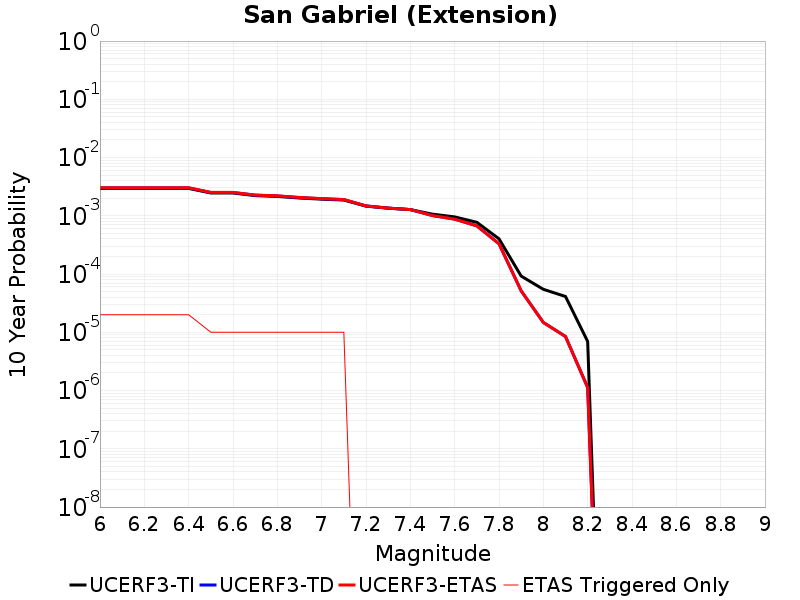 |

| Magnitude | 1 wk TI Prob | 1 wk TD Prob | 1 wk ETAS Prob | 1 wk ETAS/TD Gain | 1 wk ETAS Triggered Only | 1 mo TI Prob | 1 mo TD Prob | 1 mo ETAS Prob | 1 mo ETAS/TD Gain | 1 mo ETAS Triggered Only | 1 yr TI Prob | 1 yr TD Prob | 1 yr ETAS Prob | 1 yr ETAS/TD Gain | 1 yr ETAS Triggered Only | 10 yr TI Prob | 10 yr TD Prob | 10 yr ETAS Prob | 10 yr ETAS/TD Gain | 10 yr ETAS Triggered Only |
|-----|-----|-----|-----|-----|-----|-----|-----|-----|-----|-----|-----|-----|-----|-----|-----|-----|-----|-----|-----|-----|
| 6.0 | 5.6486106E-6 | 5.771431E-6 | 5.771431E-6 | 1.0 | 0.0 | 2.4208108E-5 | 2.4734478E-5 | 2.4734478E-5 | 1.0 | 0.0 | 2.9469383E-4 | 3.011019E-4 | 3.110989E-4 | 1.0332013 | 1.0E-5 | 0.0029430336 | 0.0030070757 | 0.0030270156 | 1.006631 | 2.0E-5 |
| 6.1 | 5.6486106E-6 | 5.771431E-6 | 5.771431E-6 | 1.0 | 0.0 | 2.4208108E-5 | 2.4734478E-5 | 2.4734478E-5 | 1.0 | 0.0 | 2.9469383E-4 | 3.011019E-4 | 3.110989E-4 | 1.0332013 | 1.0E-5 | 0.0029430336 | 0.0030070757 | 0.0030270156 | 1.006631 | 2.0E-5 |
| 6.2 | 5.6486106E-6 | 5.771431E-6 | 5.771431E-6 | 1.0 | 0.0 | 2.4208108E-5 | 2.4734478E-5 | 2.4734478E-5 | 1.0 | 0.0 | 2.9469383E-4 | 3.011019E-4 | 3.110989E-4 | 1.0332013 | 1.0E-5 | 0.0029430336 | 0.0030070757 | 0.0030270156 | 1.006631 | 2.0E-5 |
| 6.3 | 5.6486106E-6 | 5.771431E-6 | 5.771431E-6 | 1.0 | 0.0 | 2.4208108E-5 | 2.4734478E-5 | 2.4734478E-5 | 1.0 | 0.0 | 2.9469383E-4 | 3.011019E-4 | 3.110989E-4 | 1.0332013 | 1.0E-5 | 0.0029430336 | 0.0030070757 | 0.0030270156 | 1.006631 | 2.0E-5 |
| 6.4 | 5.6486106E-6 | 5.771431E-6 | 5.771431E-6 | 1.0 | 0.0 | 2.4208108E-5 | 2.4734478E-5 | 2.4734478E-5 | 1.0 | 0.0 | 2.9469383E-4 | 3.011019E-4 | 3.110989E-4 | 1.0332013 | 1.0E-5 | 0.0029430336 | 0.0030070757 | 0.0030270156 | 1.006631 | 2.0E-5 |
| 6.5 | 4.7134554E-6 | 4.807975E-6 | 4.807975E-6 | 1.0 | 0.0 | 2.0200367E-5 | 2.0605448E-5 | 2.0605448E-5 | 1.0 | 0.0 | 2.459117E-4 | 2.5084332E-4 | 2.608408E-4 | 1.0398555 | 1.0E-5 | 0.0024563975 | 0.0025056957 | 0.0025156706 | 1.0039809 | 1.0E-5 |
| 6.6 | 4.7134554E-6 | 4.807975E-6 | 4.807975E-6 | 1.0 | 0.0 | 2.0200367E-5 | 2.0605448E-5 | 2.0605448E-5 | 1.0 | 0.0 | 2.459117E-4 | 2.5084332E-4 | 2.608408E-4 | 1.0398555 | 1.0E-5 | 0.0024563975 | 0.0025056957 | 0.0025156706 | 1.0039809 | 1.0E-5 |
| 6.7 | 4.2468837E-6 | 4.3273553E-6 | 4.3273553E-6 | 1.0 | 0.0 | 1.8200803E-5 | 1.8545681E-5 | 1.8545681E-5 | 1.0 | 0.0 | 2.2157225E-4 | 2.25771E-4 | 2.3576875E-4 | 1.0442827 | 1.0E-5 | 0.0022135144 | 0.0022554977 | 0.0022654752 | 1.0044236 | 1.0E-5 |
| 6.8 | 4.1180615E-6 | 4.194623E-6 | 4.194623E-6 | 1.0 | 0.0 | 1.7648716E-5 | 1.7976838E-5 | 1.7976838E-5 | 1.0 | 0.0 | 2.1485193E-4 | 2.1884673E-4 | 2.2884455E-4 | 1.0456841 | 1.0E-5 | 0.0021464431 | 0.002186393 | 0.002196371 | 1.0045637 | 1.0E-5 |
| 6.9 | 3.863861E-6 | 3.9326983E-6 | 3.9326983E-6 | 1.0 | 0.0 | 1.65593E-5 | 1.6854316E-5 | 1.6854316E-5 | 1.0 | 0.0 | 2.0159081E-4 | 2.0518266E-4 | 2.1518061E-4 | 1.048727 | 1.0E-5 | 0.0020140803 | 0.0020500093 | 0.0020599887 | 1.004868 | 1.0E-5 |
| 7.0 | 3.6947372E-6 | 3.7584377E-6 | 3.7584377E-6 | 1.0 | 0.0 | 1.5834492E-5 | 1.6107495E-5 | 1.6107495E-5 | 1.0 | 0.0 | 1.9276788E-4 | 1.9609177E-4 | 2.0608981E-4 | 1.0509865 | 1.0E-5 | 0.0019260074 | 0.0019592633 | 0.0019692436 | 1.0050939 | 1.0E-5 |
| 7.1 | 3.5686835E-6 | 3.6254107E-6 | 3.6254107E-6 | 1.0 | 0.0 | 1.5294268E-5 | 1.5537385E-5 | 1.5537385E-5 | 1.0 | 0.0 | 1.861918E-4 | 1.8915192E-4 | 1.9915003E-4 | 1.0528575 | 1.0E-5 | 0.0018603588 | 0.0018899845 | 0.0018999656 | 1.0052811 | 1.0E-5 |
| 7.2 | 2.8023446E-6 | 2.828187E-6 | 2.828187E-6 | 1.0 | 0.0 | 1.2009994E-5 | 1.2120745E-5 | 1.2120745E-5 | 1.0 | 0.0 | 1.4621185E-4 | 1.4756019E-4 | 1.4756019E-4 | 1.0 | 0.0 | 0.001461157 | 0.0014746422 | 0.0014746422 | 1.0 | 0.0 |
| 7.3 | 2.5843012E-6 | 2.5966265E-6 | 2.5966265E-6 | 1.0 | 0.0 | 1.1075529E-5 | 1.1128352E-5 | 1.1128352E-5 | 1.0 | 0.0 | 1.3483623E-4 | 1.3547936E-4 | 1.3547936E-4 | 1.0 | 0.0 | 0.0013475444 | 0.0013539867 | 0.0013539867 | 1.0 | 0.0 |
| 7.4 | 2.4464468E-6 | 2.4462954E-6 | 2.4462954E-6 | 1.0 | 0.0 | 1.04847295E-5 | 1.0484082E-5 | 1.0484082E-5 | 1.0 | 0.0 | 1.276441E-4 | 1.2763632E-4 | 1.2763632E-4 | 1.0 | 0.0 | 0.0012757082 | 0.001275649 | 0.001275649 | 1.0 | 0.0 |
| 7.5 | 2.0420266E-6 | 1.9326305E-6 | 1.9326305E-6 | 1.0 | 0.0 | 8.751514E-6 | 8.282676E-6 | 8.282676E-6 | 1.0 | 0.0 | 1.0654447E-4 | 1.0083696E-4 | 1.0083696E-4 | 1.0 | 0.0 | 0.001064934 | 0.0010079243 | 0.0010079243 | 1.0 | 0.0 |
| 7.6 | 1.8326596E-6 | 1.6775696E-6 | 1.6775696E-6 | 1.0 | 0.0 | 7.854232E-6 | 7.1895643E-6 | 7.1895643E-6 | 1.0 | 0.0 | 9.562107E-5 | 8.752946E-5 | 8.752946E-5 | 1.0 | 0.0 | 9.5579936E-4 | 8.7496085E-4 | 8.7496085E-4 | 1.0 | 0.0 |
| 7.7 | 1.4786998E-6 | 1.2855436E-6 | 1.2855436E-6 | 1.0 | 0.0 | 6.3372695E-6 | 5.509461E-6 | 5.509461E-6 | 1.0 | 0.0 | 7.715353E-5 | 6.7075634E-5 | 6.7075634E-5 | 1.0 | 0.0 | 7.7126746E-4 | 6.705645E-4 | 6.705645E-4 | 1.0 | 0.0 |
| 7.8 | 7.6975533E-7 | 6.330777E-7 | 6.330777E-7 | 1.0 | 0.0 | 3.2989474E-6 | 2.7131875E-6 | 2.7131875E-6 | 1.0 | 0.0 | 4.0163945E-5 | 3.303256E-5 | 3.303256E-5 | 1.0 | 0.0 | 4.0156685E-4 | 3.3028293E-4 | 3.3028293E-4 | 1.0 | 0.0 |
| 7.9 | 1.7645915E-7 | 9.8393976E-8 | 9.8393976E-8 | 1.0 | 0.0 | 7.562533E-7 | 4.2168838E-7 | 4.2168838E-7 | 1.0 | 0.0 | 9.207345E-6 | 5.134044E-6 | 5.134044E-6 | 1.0 | 0.0 | 9.206964E-5 | 5.1345272E-5 | 5.1345272E-5 | 1.0 | 0.0 |
| 8.0 | 1.0463461E-7 | 2.8230412E-8 | 2.8230412E-8 | 1.0 | 0.0 | 4.4843398E-7 | 1.2098747E-7 | 1.2098747E-7 | 1.0 | 0.0 | 5.45967E-6 | 1.4730215E-6 | 1.4730215E-6 | 1.0 | 0.0 | 5.459536E-5 | 1.4736128E-5 | 1.4736128E-5 | 1.0 | 0.0 |
| 8.1 | 7.875717E-8 | 1.6188286E-8 | 1.6188286E-8 | 1.0 | 0.0 | 3.3753068E-7 | 6.9378366E-8 | 6.9378366E-8 | 1.0 | 0.0 | 4.109428E-6 | 8.4468127E-7 | 8.4468127E-7 | 1.0 | 0.0 | 4.109352E-5 | 8.452791E-6 | 8.452791E-6 | 1.0 | 0.0 |
| 8.2 | 1.33163E-8 | 2.1524902E-9 | 2.1524902E-9 | 1.0 | 0.0 | 5.7069855E-8 | 9.224956E-9 | 9.224956E-9 | 1.0 | 0.0 | 6.9482525E-7 | 1.12313835E-7 | 1.12313835E-7 | 1.0 | 0.0 | 6.9482307E-6 | 1.125364E-6 | 1.125364E-6 | 1.0 | 0.0 |

## Mission Creek
*[(top)](#table-of-contents)*

| 1 Week | 1 Month | 1 Year | 10 Year |
|-----|-----|-----|-----|
|  | 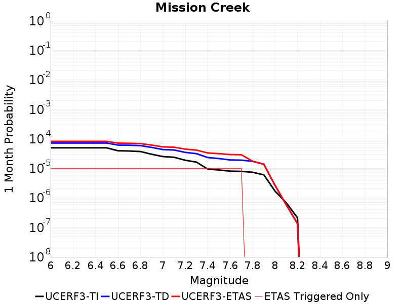 |  | 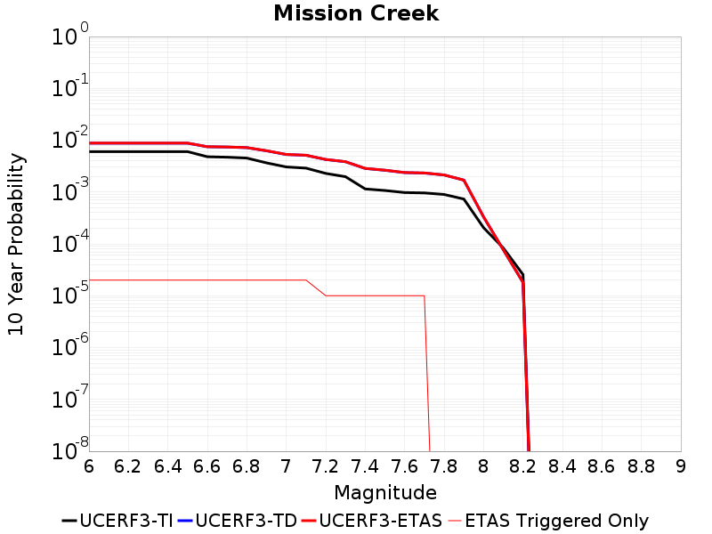 |

| Magnitude | 1 wk TI Prob | 1 wk TD Prob | 1 wk ETAS Prob | 1 wk ETAS/TD Gain | 1 wk ETAS Triggered Only | 1 mo TI Prob | 1 mo TD Prob | 1 mo ETAS Prob | 1 mo ETAS/TD Gain | 1 mo ETAS Triggered Only | 1 yr TI Prob | 1 yr TD Prob | 1 yr ETAS Prob | 1 yr ETAS/TD Gain | 1 yr ETAS Triggered Only | 10 yr TI Prob | 10 yr TD Prob | 10 yr ETAS Prob | 10 yr ETAS/TD Gain | 10 yr ETAS Triggered Only |
|-----|-----|-----|-----|-----|-----|-----|-----|-----|-----|-----|-----|-----|-----|-----|-----|-----|-----|-----|-----|-----|
| 6.0 | 1.1549387E-5 | 1.6805036E-5 | 1.6805036E-5 | 1.0 | 0.0 | 4.9496433E-5 | 7.2019684E-5 | 8.201896E-5 | 1.1388409 | 1.0E-5 | 6.0245243E-4 | 8.765021E-4 | 8.9648453E-4 | 1.022798 | 2.0E-5 | 0.006008218 | 0.008754636 | 0.008774461 | 1.0022645 | 2.0E-5 |
| 6.1 | 1.1549387E-5 | 1.6805036E-5 | 1.6805036E-5 | 1.0 | 0.0 | 4.9496433E-5 | 7.2019684E-5 | 8.201896E-5 | 1.1388409 | 1.0E-5 | 6.0245243E-4 | 8.765021E-4 | 8.9648453E-4 | 1.022798 | 2.0E-5 | 0.006008218 | 0.008754636 | 0.008774461 | 1.0022645 | 2.0E-5 |
| 6.2 | 1.1549387E-5 | 1.6805036E-5 | 1.6805036E-5 | 1.0 | 0.0 | 4.9496433E-5 | 7.2019684E-5 | 8.201896E-5 | 1.1388409 | 1.0E-5 | 6.0245243E-4 | 8.765021E-4 | 8.9648453E-4 | 1.022798 | 2.0E-5 | 0.006008218 | 0.008754636 | 0.008774461 | 1.0022645 | 2.0E-5 |
| 6.3 | 1.1549387E-5 | 1.6805036E-5 | 1.6805036E-5 | 1.0 | 0.0 | 4.9496433E-5 | 7.2019684E-5 | 8.201896E-5 | 1.1388409 | 1.0E-5 | 6.0245243E-4 | 8.765021E-4 | 8.9648453E-4 | 1.022798 | 2.0E-5 | 0.006008218 | 0.008754636 | 0.008774461 | 1.0022645 | 2.0E-5 |
| 6.4 | 1.1549387E-5 | 1.6805036E-5 | 1.6805036E-5 | 1.0 | 0.0 | 4.9496433E-5 | 7.2019684E-5 | 8.201896E-5 | 1.1388409 | 1.0E-5 | 6.0245243E-4 | 8.765021E-4 | 8.9648453E-4 | 1.022798 | 2.0E-5 | 0.006008218 | 0.008754636 | 0.008774461 | 1.0022645 | 2.0E-5 |
| 6.5 | 1.1549387E-5 | 1.6805036E-5 | 1.6805036E-5 | 1.0 | 0.0 | 4.9496433E-5 | 7.2019684E-5 | 8.201896E-5 | 1.1388409 | 1.0E-5 | 6.0245243E-4 | 8.765021E-4 | 8.9648453E-4 | 1.022798 | 2.0E-5 | 0.006008218 | 0.008754636 | 0.008774461 | 1.0022645 | 2.0E-5 |
| 6.6 | 9.202681E-6 | 1.432403E-5 | 1.432403E-5 | 1.0 | 0.0 | 3.9439463E-5 | 6.1387305E-5 | 7.138669E-5 | 1.1628901 | 1.0E-5 | 4.800697E-4 | 7.4714335E-4 | 7.671284E-4 | 1.0267487 | 2.0E-5 | 0.004790339 | 0.007469916 | 0.0074897665 | 1.0026574 | 2.0E-5 |
| 6.7 | 9.019164E-6 | 1.4129342E-5 | 1.4129342E-5 | 1.0 | 0.0 | 3.8652986E-5 | 6.0552968E-5 | 7.055236E-5 | 1.1651347 | 1.0E-5 | 4.7049852E-4 | 7.369922E-4 | 7.569775E-4 | 1.0271174 | 2.0E-5 | 0.004695036 | 0.0073690796 | 0.007388932 | 1.002694 | 2.0E-5 |
| 6.8 | 8.673558E-6 | 1.3750283E-5 | 1.3750283E-5 | 1.0 | 0.0 | 3.717186E-5 | 5.8928505E-5 | 6.892791E-5 | 1.1696872 | 1.0E-5 | 4.524734E-4 | 7.1722735E-4 | 7.37213E-4 | 1.0278652 | 2.0E-5 | 0.0045155324 | 0.0071727093 | 0.0071925656 | 1.0027684 | 2.0E-5 |
| 6.9 | 7.002255E-6 | 1.195029E-5 | 1.195029E-5 | 1.0 | 0.0 | 3.000932E-5 | 5.1214563E-5 | 6.121405E-5 | 1.1952469 | 1.0E-5 | 3.653022E-4 | 6.233659E-4 | 6.4335344E-4 | 1.0320638 | 2.0E-5 | 0.0036470229 | 0.006239569 | 0.0062594437 | 1.0031854 | 2.0E-5 |
| 7.0 | 5.84644E-6 | 1.0120331E-5 | 1.0120331E-5 | 1.0 | 0.0 | 2.5055931E-5 | 4.3372154E-5 | 5.337172E-5 | 1.2305527 | 1.0E-5 | 3.0501327E-4 | 5.2793266E-4 | 5.479221E-4 | 1.0378636 | 2.0E-5 | 0.0030459496 | 0.00528996 | 0.005309854 | 1.0037607 | 2.0E-5 |
| 7.1 | 5.54703E-6 | 9.772948E-6 | 9.772948E-6 | 1.0 | 0.0 | 2.377277E-5 | 4.1883417E-5 | 5.1883E-5 | 1.238748 | 1.0E-5 | 2.8939504E-4 | 5.098158E-4 | 5.298056E-4 | 1.0392098 | 2.0E-5 | 0.0028901845 | 0.005109629 | 0.005129527 | 1.0038942 | 2.0E-5 |
| 7.2 | 4.384709E-6 | 8.102395E-6 | 8.102395E-6 | 1.0 | 0.0 | 1.8791474E-5 | 3.4724108E-5 | 4.472376E-5 | 1.2879744 | 1.0E-5 | 2.2876218E-4 | 4.2268774E-4 | 4.326835E-4 | 1.0236481 | 1.0E-5 | 0.0022852682 | 0.004241975 | 0.0042519327 | 1.0023474 | 1.0E-5 |
| 7.3 | 3.7888456E-6 | 7.326681E-6 | 7.326681E-6 | 1.0 | 0.0 | 1.623781E-5 | 3.1399704E-5 | 4.1399388E-5 | 1.3184644 | 1.0E-5 | 1.9767738E-4 | 3.8222774E-4 | 3.922239E-4 | 1.0261524 | 1.0E-5 | 0.0019750162 | 0.0038388344 | 0.003848796 | 1.002595 | 1.0E-5 |
| 7.4 | 2.1982462E-6 | 5.4208203E-6 | 5.4208203E-6 | 1.0 | 0.0 | 9.421021E-6 | 2.3231882E-5 | 3.323165E-5 | 1.4304329 | 1.0E-5 | 1.1469489E-4 | 2.8281167E-4 | 2.9280884E-4 | 1.0353492 | 1.0E-5 | 0.0011463572 | 0.0028474366 | 0.0028574083 | 1.0035019 | 1.0E-5 |
| 7.5 | 2.051923E-6 | 4.99959E-6 | 4.99959E-6 | 1.0 | 0.0 | 8.793926E-6 | 2.1426638E-5 | 3.1426425E-5 | 1.4666988 | 1.0E-5 | 1.0706078E-4 | 2.6083825E-4 | 2.7083565E-4 | 1.0383279 | 1.0E-5 | 0.0010700922 | 0.002628863 | 0.0026388369 | 1.003794 | 1.0E-5 |
| 7.6 | 1.8733427E-6 | 4.492719E-6 | 4.492719E-6 | 1.0 | 0.0 | 8.028587E-6 | 1.9254368E-5 | 2.9254177E-5 | 1.5193527 | 1.0E-5 | 9.774366E-5 | 2.3439682E-4 | 2.4439447E-4 | 1.0426527 | 1.0E-5 | 9.770069E-4 | 0.0023656467 | 0.002375623 | 1.0042171 | 1.0E-5 |
| 7.7 | 1.8411953E-6 | 4.409527E-6 | 4.409527E-6 | 1.0 | 0.0 | 7.890813E-6 | 1.8897836E-5 | 2.8897646E-5 | 1.5291511 | 1.0E-5 | 9.606641E-5 | 2.3005695E-4 | 2.4005465E-4 | 1.0434575 | 1.0E-5 | 9.6024893E-4 | 0.0023224726 | 0.0023324494 | 1.0042957 | 1.0E-5 |
| 7.8 | 1.7194251E-6 | 4.0484238E-6 | 4.0484238E-6 | 1.0 | 0.0 | 7.368944E-6 | 1.7350272E-5 | 1.7350272E-5 | 1.0 | 0.0 | 8.97132E-5 | 2.1121917E-4 | 2.1121917E-4 | 1.0 | 0.0 | 8.967699E-4 | 0.0021339485 | 0.0021339485 | 1.0 | 0.0 |
| 7.9 | 1.4035052E-6 | 3.2154576E-6 | 3.2154576E-6 | 1.0 | 0.0 | 6.0150082E-6 | 1.378046E-5 | 1.378046E-5 | 1.0 | 0.0 | 7.3230265E-5 | 1.6776426E-4 | 1.6776426E-4 | 1.0 | 0.0 | 7.3206134E-4 | 0.0016977283 | 0.0016977283 | 1.0 | 0.0 |
| 8.0 | 3.9318823E-7 | 6.148517E-7 | 6.148517E-7 | 1.0 | 0.0 | 1.6850913E-6 | 2.635076E-6 | 2.635076E-6 | 1.0 | 0.0 | 2.0515794E-5 | 3.2081585E-5 | 3.2081585E-5 | 1.0 | 0.0 | 2.0513899E-4 | 3.3129213E-4 | 3.3129213E-4 | 1.0 | 0.0 |
| 8.1 | 1.596793E-7 | 1.3508698E-7 | 1.3508698E-7 | 1.0 | 0.0 | 6.8433974E-7 | 5.789441E-7 | 5.789441E-7 | 1.0 | 0.0 | 8.331805E-6 | 7.0486217E-6 | 7.0486217E-6 | 1.0 | 0.0 | 8.331492E-5 | 7.696509E-5 | 7.696509E-5 | 1.0 | 0.0 |
| 8.2 | 4.9003038E-8 | 3.1085907E-8 | 3.1085907E-8 | 1.0 | 0.0 | 2.10013E-7 | 1.3322531E-7 | 1.3322531E-7 | 1.0 | 0.0 | 2.5569052E-6 | 1.622017E-6 | 1.622017E-6 | 1.0 | 0.0 | 2.556876E-5 | 1.8052444E-5 | 1.8052444E-5 | 1.0 | 0.0 |

## Sierra Madre (San Fernando)
*[(top)](#table-of-contents)*

| 1 Week | 1 Month | 1 Year | 10 Year |
|-----|-----|-----|-----|
| 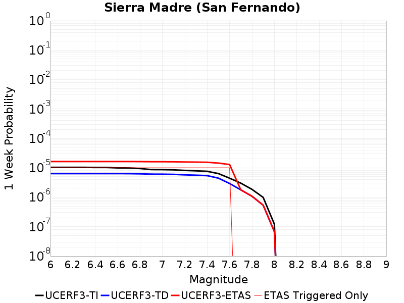 |  | 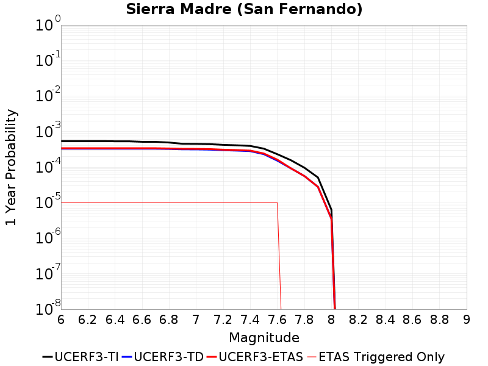 | 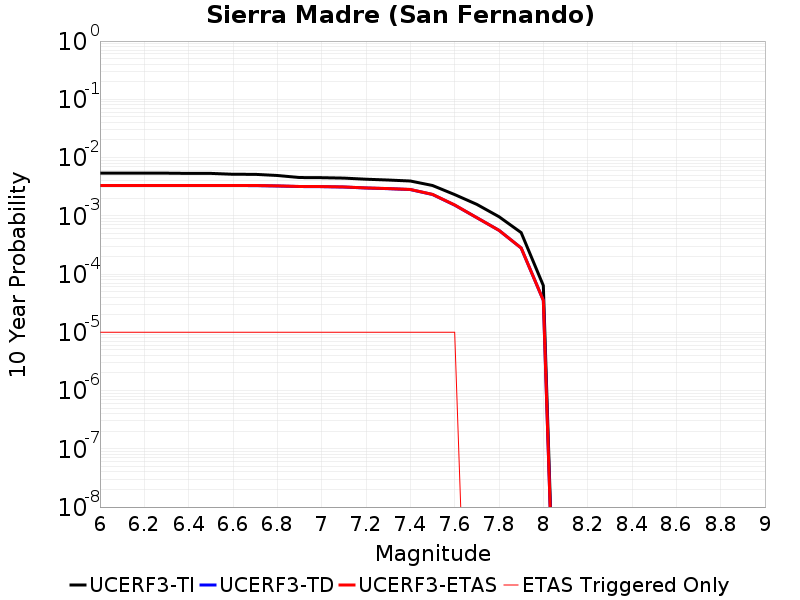 |

| Magnitude | 1 wk TI Prob | 1 wk TD Prob | 1 wk ETAS Prob | 1 wk ETAS/TD Gain | 1 wk ETAS Triggered Only | 1 mo TI Prob | 1 mo TD Prob | 1 mo ETAS Prob | 1 mo ETAS/TD Gain | 1 mo ETAS Triggered Only | 1 yr TI Prob | 1 yr TD Prob | 1 yr ETAS Prob | 1 yr ETAS/TD Gain | 1 yr ETAS Triggered Only | 10 yr TI Prob | 10 yr TD Prob | 10 yr ETAS Prob | 10 yr ETAS/TD Gain | 10 yr ETAS Triggered Only |
|-----|-----|-----|-----|-----|-----|-----|-----|-----|-----|-----|-----|-----|-----|-----|-----|-----|-----|-----|-----|-----|
| 6.0 | 1.0346413E-5 | 6.3392777E-6 | 1.6339214E-5 | 2.577457 | 1.0E-5 | 4.4341014E-5 | 2.7168055E-5 | 3.7167785E-5 | 1.3680693 | 1.0E-5 | 5.3971814E-4 | 3.30722E-4 | 3.407187E-4 | 1.0302268 | 1.0E-5 | 0.0053840918 | 0.0033024126 | 0.0033123796 | 1.0030181 | 1.0E-5 |
| 6.1 | 1.0346413E-5 | 6.3392777E-6 | 1.6339214E-5 | 2.577457 | 1.0E-5 | 4.4341014E-5 | 2.7168055E-5 | 3.7167785E-5 | 1.3680693 | 1.0E-5 | 5.3971814E-4 | 3.30722E-4 | 3.407187E-4 | 1.0302268 | 1.0E-5 | 0.0053840918 | 0.0033024126 | 0.0033123796 | 1.0030181 | 1.0E-5 |
| 6.2 | 1.0346413E-5 | 6.3392777E-6 | 1.6339214E-5 | 2.577457 | 1.0E-5 | 4.4341014E-5 | 2.7168055E-5 | 3.7167785E-5 | 1.3680693 | 1.0E-5 | 5.3971814E-4 | 3.30722E-4 | 3.407187E-4 | 1.0302268 | 1.0E-5 | 0.0053840918 | 0.0033024126 | 0.0033123796 | 1.0030181 | 1.0E-5 |
| 6.3 | 1.0346413E-5 | 6.3392777E-6 | 1.6339214E-5 | 2.577457 | 1.0E-5 | 4.4341014E-5 | 2.7168055E-5 | 3.7167785E-5 | 1.3680693 | 1.0E-5 | 5.3971814E-4 | 3.30722E-4 | 3.407187E-4 | 1.0302268 | 1.0E-5 | 0.0053840918 | 0.0033024126 | 0.0033123796 | 1.0030181 | 1.0E-5 |
| 6.4 | 1.0249558E-5 | 6.3392777E-6 | 1.6339214E-5 | 2.577457 | 1.0E-5 | 4.392594E-5 | 2.7168055E-5 | 3.7167785E-5 | 1.3680693 | 1.0E-5 | 5.3466705E-4 | 3.30722E-4 | 3.407187E-4 | 1.0302268 | 1.0E-5 | 0.0053338245 | 0.0033024126 | 0.0033123796 | 1.0030181 | 1.0E-5 |
| 6.5 | 1.0249558E-5 | 6.3392777E-6 | 1.6339214E-5 | 2.577457 | 1.0E-5 | 4.392594E-5 | 2.7168055E-5 | 3.7167785E-5 | 1.3680693 | 1.0E-5 | 5.3466705E-4 | 3.30722E-4 | 3.407187E-4 | 1.0302268 | 1.0E-5 | 0.0053338245 | 0.0033024126 | 0.0033123796 | 1.0030181 | 1.0E-5 |
| 6.6 | 9.9035515E-6 | 6.3392777E-6 | 1.6339214E-5 | 2.577457 | 1.0E-5 | 4.2443102E-5 | 2.7168055E-5 | 3.7167785E-5 | 1.3680693 | 1.0E-5 | 5.166222E-4 | 3.30722E-4 | 3.407187E-4 | 1.0302268 | 1.0E-5 | 0.0051542283 | 0.0033024126 | 0.0033123796 | 1.0030181 | 1.0E-5 |
| 6.7 | 9.87217E-6 | 6.3264483E-6 | 1.6326385E-5 | 2.5806558 | 1.0E-5 | 4.2308613E-5 | 2.7113074E-5 | 3.71128E-5 | 1.3688158 | 1.0E-5 | 5.149856E-4 | 3.300528E-4 | 3.400495E-4 | 1.0302882 | 1.0E-5 | 0.005137938 | 0.0032957406 | 0.0033057076 | 1.0030242 | 1.0E-5 |
| 6.8 | 9.4359175E-6 | 6.2294102E-6 | 1.6229347E-5 | 2.6052785 | 1.0E-5 | 4.043902E-5 | 2.6697206E-5 | 3.669694E-5 | 1.3745611 | 1.0E-5 | 4.9223384E-4 | 3.2499112E-4 | 3.3498788E-4 | 1.03076 | 1.0E-5 | 0.0049114493 | 0.003245272 | 0.0032552395 | 1.0030714 | 1.0E-5 |
| 6.9 | 8.700447E-6 | 6.0892594E-6 | 1.6089198E-5 | 2.6422257 | 1.0E-5 | 3.72871E-5 | 2.6096572E-5 | 3.609631E-5 | 1.383182 | 1.0E-5 | 4.5387587E-4 | 3.1768053E-4 | 3.2767735E-4 | 1.0314682 | 1.0E-5 | 0.0045295 | 0.0031723753 | 0.0031823437 | 1.0031422 | 1.0E-5 |
| 7.0 | 8.648878E-6 | 6.064052E-6 | 1.6063992E-5 | 2.6490524 | 1.0E-5 | 3.7066096E-5 | 2.598854E-5 | 3.598828E-5 | 1.3847749 | 1.0E-5 | 4.5118626E-4 | 3.1636565E-4 | 3.2636247E-4 | 1.031599 | 1.0E-5 | 0.004502713 | 0.0031592639 | 0.0031692323 | 1.0031554 | 1.0E-5 |
| 7.1 | 8.505786E-6 | 5.97345E-6 | 1.597339E-5 | 2.6740646 | 1.0E-5 | 3.645286E-5 | 2.5600253E-5 | 3.56E-5 | 1.3906112 | 1.0E-5 | 4.437232E-4 | 3.116396E-4 | 3.216365E-4 | 1.0320784 | 1.0E-5 | 0.0044283825 | 0.0031121366 | 0.0031221055 | 1.0032033 | 1.0E-5 |
| 7.2 | 8.139752E-6 | 5.747056E-6 | 1.5746999E-5 | 2.7400112 | 1.0E-5 | 3.4884186E-5 | 2.4630015E-5 | 3.4629767E-5 | 1.4059987 | 1.0E-5 | 4.246322E-4 | 2.9983022E-4 | 3.0982724E-4 | 1.0333422 | 1.0E-5 | 0.004238217 | 0.0029943648 | 0.0030043349 | 1.0033296 | 1.0E-5 |
| 7.3 | 7.8816E-6 | 5.5997098E-6 | 1.5599653E-5 | 2.7857969 | 1.0E-5 | 3.3777847E-5 | 2.399854E-5 | 3.39983E-5 | 1.416682 | 1.0E-5 | 4.111677E-4 | 2.9214413E-4 | 3.021412E-4 | 1.0342196 | 1.0E-5 | 0.004104078 | 0.0029177081 | 0.0029276789 | 1.0034174 | 1.0E-5 |
| 7.4 | 7.5810603E-6 | 5.4028155E-6 | 1.5402762E-5 | 2.8508768 | 1.0E-5 | 3.2489854E-5 | 2.3154724E-5 | 3.3154494E-5 | 1.4318674 | 1.0E-5 | 3.9549218E-4 | 2.8187336E-4 | 2.9187056E-4 | 1.0354669 | 1.0E-5 | 0.0039478904 | 0.0028152652 | 0.002825237 | 1.0035421 | 1.0E-5 |
| 7.5 | 6.349153E-6 | 4.4457433E-6 | 1.4445699E-5 | 3.2493327 | 1.0E-5 | 2.7210372E-5 | 1.905305E-5 | 2.905286E-5 | 1.5248404 | 1.0E-5 | 3.312359E-4 | 2.3194704E-4 | 2.4194471E-4 | 1.0431033 | 1.0E-5 | 0.0033074263 | 0.0023171327 | 0.0023271095 | 1.0043057 | 1.0E-5 |
| 7.6 | 4.430576E-6 | 2.9194837E-6 | 1.2919454E-5 | 4.425253 | 1.0E-5 | 1.8988047E-5 | 1.2512014E-5 | 2.251189E-5 | 1.7992219 | 1.0E-5 | 2.3115493E-4 | 1.5232335E-4 | 1.6232183E-4 | 1.0656399 | 1.0E-5 | 0.0023091463 | 0.0015222122 | 0.0015321969 | 1.0065594 | 1.0E-5 |
| 7.7 | 3.005066E-6 | 1.776289E-6 | 1.776289E-6 | 1.0 | 0.0 | 1.2878791E-5 | 7.612645E-6 | 7.612645E-6 | 1.0 | 0.0 | 1.56788E-4 | 9.268002E-5 | 9.268002E-5 | 1.0 | 0.0 | 0.0015667742 | 9.264149E-4 | 9.264149E-4 | 1.0 | 0.0 |
| 7.8 | 1.8459098E-6 | 1.0770535E-6 | 1.0770535E-6 | 1.0 | 0.0 | 7.911018E-6 | 4.6159353E-6 | 4.6159353E-6 | 1.0 | 0.0 | 9.631238E-5 | 5.619757E-5 | 5.619757E-5 | 1.0 | 0.0 | 9.627065E-4 | 5.61834E-4 | 5.61834E-4 | 1.0 | 0.0 |
| 7.9 | 9.839262E-7 | 5.353695E-7 | 5.353695E-7 | 1.0 | 0.0 | 4.2168194E-6 | 2.2944387E-6 | 2.2944387E-6 | 1.0 | 0.0 | 5.1338568E-5 | 2.7934435E-5 | 2.7934435E-5 | 1.0 | 0.0 | 5.132671E-4 | 2.7930955E-4 | 2.7930955E-4 | 1.0 | 0.0 |
| 8.0 | 1.210983E-7 | 6.759631E-8 | 6.759631E-8 | 1.0 | 0.0 | 5.1899264E-7 | 2.8969845E-7 | 2.8969845E-7 | 1.0 | 0.0 | 6.3187167E-6 | 3.527073E-6 | 3.527073E-6 | 1.0 | 0.0 | 6.318537E-5 | 3.527019E-5 | 3.527019E-5 | 1.0 | 0.0 |

## Hollywood
*[(top)](#table-of-contents)*

| 1 Week | 1 Month | 1 Year | 10 Year |
|-----|-----|-----|-----|
|  |  | 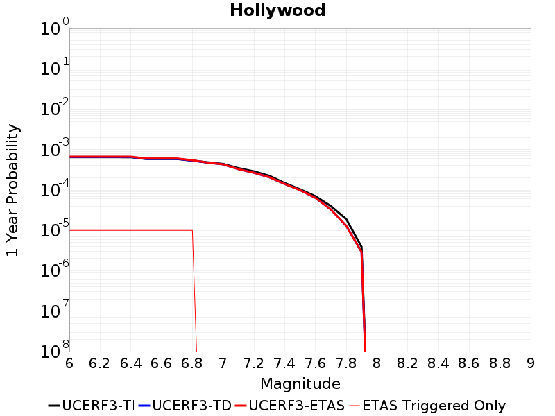 | 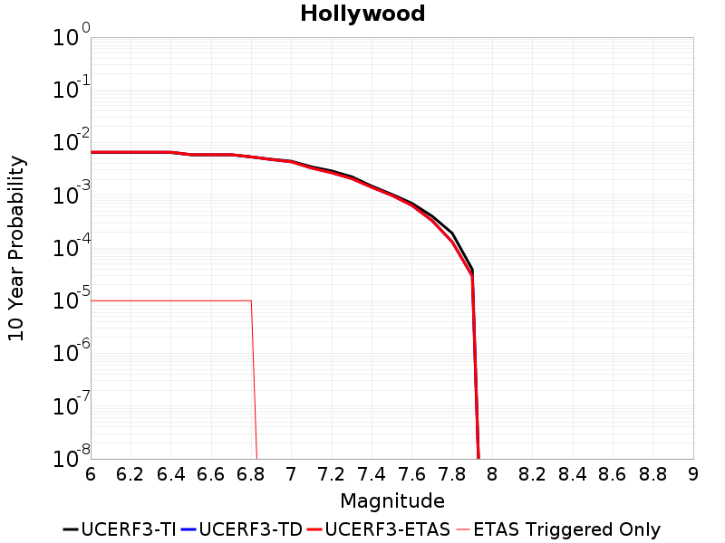 |

| Magnitude | 1 wk TI Prob | 1 wk TD Prob | 1 wk ETAS Prob | 1 wk ETAS/TD Gain | 1 wk ETAS Triggered Only | 1 mo TI Prob | 1 mo TD Prob | 1 mo ETAS Prob | 1 mo ETAS/TD Gain | 1 mo ETAS Triggered Only | 1 yr TI Prob | 1 yr TD Prob | 1 yr ETAS Prob | 1 yr ETAS/TD Gain | 1 yr ETAS Triggered Only | 10 yr TI Prob | 10 yr TD Prob | 10 yr ETAS Prob | 10 yr ETAS/TD Gain | 10 yr ETAS Triggered Only |
|-----|-----|-----|-----|-----|-----|-----|-----|-----|-----|-----|-----|-----|-----|-----|-----|-----|-----|-----|-----|-----|
| 6.0 | 1.24487615E-5 | 1.2599582E-5 | 1.2599582E-5 | 1.0 | 0.0 | 5.3350745E-5 | 5.3997115E-5 | 5.3997115E-5 | 1.0 | 0.0 | 6.4935174E-4 | 6.572212E-4 | 6.672146E-4 | 1.0152056 | 1.0E-5 | 0.0064745755 | 0.00655326 | 0.0065631946 | 1.001516 | 1.0E-5 |
| 6.1 | 1.24487615E-5 | 1.2599582E-5 | 1.2599582E-5 | 1.0 | 0.0 | 5.3350745E-5 | 5.3997115E-5 | 5.3997115E-5 | 1.0 | 0.0 | 6.4935174E-4 | 6.572212E-4 | 6.672146E-4 | 1.0152056 | 1.0E-5 | 0.0064745755 | 0.00655326 | 0.0065631946 | 1.001516 | 1.0E-5 |
| 6.2 | 1.24487615E-5 | 1.2599582E-5 | 1.2599582E-5 | 1.0 | 0.0 | 5.3350745E-5 | 5.3997115E-5 | 5.3997115E-5 | 1.0 | 0.0 | 6.4935174E-4 | 6.572212E-4 | 6.672146E-4 | 1.0152056 | 1.0E-5 | 0.0064745755 | 0.00655326 | 0.0065631946 | 1.001516 | 1.0E-5 |
| 6.3 | 1.24487615E-5 | 1.2599582E-5 | 1.2599582E-5 | 1.0 | 0.0 | 5.3350745E-5 | 5.3997115E-5 | 5.3997115E-5 | 1.0 | 0.0 | 6.4935174E-4 | 6.572212E-4 | 6.672146E-4 | 1.0152056 | 1.0E-5 | 0.0064745755 | 0.00655326 | 0.0065631946 | 1.001516 | 1.0E-5 |
| 6.4 | 1.2431024E-5 | 1.2580139E-5 | 1.2580139E-5 | 1.0 | 0.0 | 5.327473E-5 | 5.391379E-5 | 5.391379E-5 | 1.0 | 0.0 | 6.4842677E-4 | 6.562073E-4 | 6.6620077E-4 | 1.0152291 | 1.0E-5 | 0.0064653796 | 0.0065431814 | 0.006553116 | 1.0015182 | 1.0E-5 |
| 6.5 | 1.1242222E-5 | 1.1340126E-5 | 1.1340126E-5 | 1.0 | 0.0 | 4.8180063E-5 | 4.8599646E-5 | 4.8599646E-5 | 1.0 | 0.0 | 5.864344E-4 | 5.9154275E-4 | 6.015368E-4 | 1.0168949 | 1.0E-5 | 0.0058488925 | 0.00589997 | 0.0059099114 | 1.0016849 | 1.0E-5 |
| 6.6 | 1.1234066E-5 | 1.1331214E-5 | 1.1331214E-5 | 1.0 | 0.0 | 4.8145106E-5 | 4.856146E-5 | 4.856146E-5 | 1.0 | 0.0 | 5.86009E-4 | 5.910781E-4 | 6.0107216E-4 | 1.0169083 | 1.0E-5 | 0.005844661 | 0.005895348 | 0.0059052887 | 1.0016862 | 1.0E-5 |
| 6.7 | 1.12294E-5 | 1.1325937E-5 | 1.1325937E-5 | 1.0 | 0.0 | 4.812511E-5 | 4.853884E-5 | 4.853884E-5 | 1.0 | 0.0 | 5.857657E-4 | 5.9080287E-4 | 6.0079695E-4 | 1.0169162 | 1.0E-5 | 0.0058422405 | 0.00589261 | 0.0059025516 | 1.001687 | 1.0E-5 |
| 6.8 | 1.0252819E-5 | 1.0238288E-5 | 1.0238288E-5 | 1.0 | 0.0 | 4.3939912E-5 | 4.387765E-5 | 4.387765E-5 | 1.0 | 0.0 | 5.3483713E-4 | 5.340816E-4 | 5.4407626E-4 | 1.0187137 | 1.0E-5 | 0.005335517 | 0.005328208 | 0.0053381547 | 1.0018668 | 1.0E-5 |
| 6.9 | 9.252289E-6 | 9.127813E-6 | 9.127813E-6 | 1.0 | 0.0 | 3.9652066E-5 | 3.9118622E-5 | 3.9118622E-5 | 1.0 | 0.0 | 4.8265693E-4 | 4.7616678E-4 | 4.7616678E-4 | 1.0 | 0.0 | 0.0048161 | 0.0047516394 | 0.0047516394 | 1.0 | 0.0 |
| 7.0 | 8.474604E-6 | 8.274663E-6 | 8.274663E-6 | 1.0 | 0.0 | 3.6319227E-5 | 3.546237E-5 | 3.546237E-5 | 1.0 | 0.0 | 4.4209688E-4 | 4.3167025E-4 | 4.3167025E-4 | 1.0 | 0.0 | 0.004412184 | 0.0043084687 | 0.0043084687 | 1.0 | 0.0 |
| 7.1 | 6.643643E-6 | 6.2811514E-6 | 6.2811514E-6 | 1.0 | 0.0 | 2.8472443E-5 | 2.6918946E-5 | 2.6918946E-5 | 1.0 | 0.0 | 3.4659685E-4 | 3.276893E-4 | 3.276893E-4 | 1.0 | 0.0 | 0.0034605677 | 0.0032721073 | 0.0032721073 | 1.0 | 0.0 |
| 7.2 | 5.549002E-6 | 5.119428E-6 | 5.119428E-6 | 1.0 | 0.0 | 2.378122E-5 | 2.194022E-5 | 2.194022E-5 | 1.0 | 0.0 | 2.8949787E-4 | 2.6708958E-4 | 2.6708958E-4 | 1.0 | 0.0 | 0.0028912104 | 0.0026677025 | 0.0026677025 | 1.0 | 0.0 |
| 7.3 | 4.3059727E-6 | 3.9696047E-6 | 3.9696047E-6 | 1.0 | 0.0 | 1.8454039E-5 | 1.701248E-5 | 1.701248E-5 | 1.0 | 0.0 | 2.2465475E-4 | 2.0710735E-4 | 2.0710735E-4 | 1.0 | 0.0 | 0.0022442779 | 0.0020691536 | 0.0020691536 | 1.0 | 0.0 |
| 7.4 | 2.8550733E-6 | 2.7092265E-6 | 2.7092265E-6 | 1.0 | 0.0 | 1.2235971E-5 | 1.16109195E-5 | 1.16109195E-5 | 1.0 | 0.0 | 1.4896276E-4 | 1.4135383E-4 | 1.4135383E-4 | 1.0 | 0.0 | 0.0014886294 | 0.0014126442 | 0.0014126442 | 1.0 | 0.0 |
| 7.5 | 1.9927045E-6 | 1.904309E-6 | 1.904309E-6 | 1.0 | 0.0 | 8.540134E-6 | 8.161299E-6 | 8.161299E-6 | 1.0 | 0.0 | 1.0397117E-4 | 9.935932E-5 | 9.935932E-5 | 1.0 | 0.0 | 0.0010392254 | 9.931526E-4 | 9.931526E-4 | 1.0 | 0.0 |
| 7.6 | 1.345084E-6 | 1.2267647E-6 | 1.2267647E-6 | 1.0 | 0.0 | 5.764633E-6 | 5.257552E-6 | 5.257552E-6 | 1.0 | 0.0 | 7.018215E-5 | 6.400883E-5 | 6.400883E-5 | 1.0 | 0.0 | 7.0159987E-4 | 6.39906E-4 | 6.39906E-4 | 1.0 | 0.0 |
| 7.7 | 7.6835164E-7 | 6.3259097E-7 | 6.3259097E-7 | 1.0 | 0.0 | 3.2929315E-6 | 2.7111014E-6 | 2.7111014E-6 | 1.0 | 0.0 | 4.00907E-5 | 3.3007174E-5 | 3.3007174E-5 | 1.0 | 0.0 | 4.0083472E-4 | 3.3002422E-4 | 3.3002422E-4 | 1.0 | 0.0 |
| 7.8 | 3.6562128E-7 | 2.498286E-7 | 2.498286E-7 | 1.0 | 0.0 | 1.5669474E-6 | 1.0706935E-6 | 1.0706935E-6 | 1.0 | 0.0 | 1.9077417E-5 | 1.3035619E-5 | 1.3035619E-5 | 1.0 | 0.0 | 1.907578E-4 | 1.3034894E-4 | 1.3034894E-4 | 1.0 | 0.0 |
| 7.9 | 7.5024424E-8 | 5.6088847E-8 | 5.6088847E-8 | 1.0 | 0.0 | 3.215332E-7 | 2.4038076E-7 | 2.4038076E-7 | 1.0 | 0.0 | 3.91466E-6 | 2.9266332E-6 | 2.9266332E-6 | 1.0 | 0.0 | 3.9145907E-5 | 2.9266088E-5 | 2.9266088E-5 | 1.0 | 0.0 |

## Cleghorn Lake
*[(top)](#table-of-contents)*

| 1 Week | 1 Month | 1 Year | 10 Year |
|-----|-----|-----|-----|
|  |  | 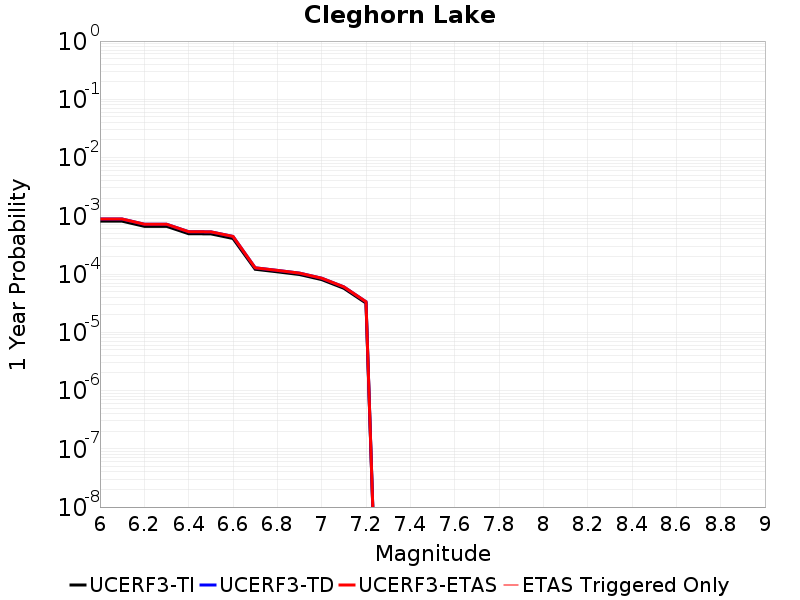 |  |

| Magnitude | 1 wk TI Prob | 1 wk TD Prob | 1 wk ETAS Prob | 1 wk ETAS/TD Gain | 1 wk ETAS Triggered Only | 1 mo TI Prob | 1 mo TD Prob | 1 mo ETAS Prob | 1 mo ETAS/TD Gain | 1 mo ETAS Triggered Only | 1 yr TI Prob | 1 yr TD Prob | 1 yr ETAS Prob | 1 yr ETAS/TD Gain | 1 yr ETAS Triggered Only | 10 yr TI Prob | 10 yr TD Prob | 10 yr ETAS Prob | 10 yr ETAS/TD Gain | 10 yr ETAS Triggered Only |
|-----|-----|-----|-----|-----|-----|-----|-----|-----|-----|-----|-----|-----|-----|-----|-----|-----|-----|-----|-----|-----|
| 6.0 | 1.5467183E-5 | 1.6839378E-5 | 1.6839378E-5 | 1.0 | 0.0 | 6.6286244E-5 | 7.216708E-5 | 7.216708E-5 | 1.0 | 0.0 | 8.067362E-4 | 8.783352E-4 | 8.783352E-4 | 1.0 | 0.0 | 0.008038137 | 0.008754096 | 0.008764009 | 1.0011324 | 1.0E-5 |
| 6.1 | 1.5467183E-5 | 1.6839378E-5 | 1.6839378E-5 | 1.0 | 0.0 | 6.6286244E-5 | 7.216708E-5 | 7.216708E-5 | 1.0 | 0.0 | 8.067362E-4 | 8.783352E-4 | 8.783352E-4 | 1.0 | 0.0 | 0.008038137 | 0.008754096 | 0.008764009 | 1.0011324 | 1.0E-5 |
| 6.2 | 1.2624631E-5 | 1.3717474E-5 | 1.3717474E-5 | 1.0 | 0.0 | 5.410444E-5 | 5.8788122E-5 | 5.8788122E-5 | 1.0 | 0.0 | 6.585225E-4 | 7.1555935E-4 | 7.1555935E-4 | 1.0 | 0.0 | 0.0065657445 | 0.0071373763 | 0.007147305 | 1.001391 | 1.0E-5 |
| 6.3 | 1.2624631E-5 | 1.3717474E-5 | 1.3717474E-5 | 1.0 | 0.0 | 5.410444E-5 | 5.8788122E-5 | 5.8788122E-5 | 1.0 | 0.0 | 6.585225E-4 | 7.1555935E-4 | 7.1555935E-4 | 1.0 | 0.0 | 0.0065657445 | 0.0071373763 | 0.007147305 | 1.001391 | 1.0E-5 |
| 6.4 | 9.417684E-6 | 1.0195626E-5 | 1.0195626E-5 | 1.0 | 0.0 | 4.036088E-5 | 4.369504E-5 | 4.369504E-5 | 1.0 | 0.0 | 4.912829E-4 | 5.318986E-4 | 5.318986E-4 | 1.0 | 0.0 | 0.004901982 | 0.0053103147 | 0.005320261 | 1.0018731 | 1.0E-5 |
| 6.5 | 9.368219E-6 | 1.0142949E-5 | 1.0142949E-5 | 1.0 | 0.0 | 4.014889E-5 | 4.3469292E-5 | 4.3469292E-5 | 1.0 | 0.0 | 4.8870314E-4 | 5.291514E-4 | 5.291514E-4 | 1.0 | 0.0 | 0.004876298 | 0.0052829734 | 0.005292921 | 1.0018829 | 1.0E-5 |
| 6.6 | 7.803798E-6 | 8.463477E-6 | 8.463477E-6 | 1.0 | 0.0 | 3.3444423E-5 | 3.6271766E-5 | 3.6271766E-5 | 1.0 | 0.0 | 4.0710976E-4 | 4.4155942E-4 | 4.4155942E-4 | 1.0 | 0.0 | 0.0040636472 | 0.0044107605 | 0.0044207163 | 1.0022572 | 1.0E-5 |
| 6.7 | 2.3108669E-6 | 2.4482279E-6 | 2.4482279E-6 | 1.0 | 0.0 | 9.903678E-6 | 1.0492365E-5 | 1.0492365E-5 | 1.0 | 0.0 | 1.205706E-4 | 1.2773724E-4 | 1.2773724E-4 | 1.0 | 0.0 | 0.001205052 | 0.0012766569 | 0.001286644 | 1.007823 | 1.0E-5 |
| 6.8 | 2.0882828E-6 | 2.2101763E-6 | 2.2101763E-6 | 1.0 | 0.0 | 8.949753E-6 | 9.47215E-6 | 9.47215E-6 | 1.0 | 0.0 | 1.08957785E-4 | 1.15317496E-4 | 1.15317496E-4 | 1.0 | 0.0 | 0.0010890438 | 0.0011525935 | 0.001162582 | 1.008666 | 1.0E-5 |
| 6.9 | 1.876935E-6 | 1.9844824E-6 | 1.9844824E-6 | 1.0 | 0.0 | 8.043982E-6 | 8.504898E-6 | 8.504898E-6 | 1.0 | 0.0 | 9.7931086E-5 | 1.0354237E-4 | 1.0354237E-4 | 1.0 | 0.0 | 9.788794E-4 | 0.0010349574 | 0.001044947 | 1.0096523 | 1.0E-5 |
| 7.0 | 1.5357559E-6 | 1.6230651E-6 | 1.6230651E-6 | 1.0 | 0.0 | 6.5817944E-6 | 6.9559756E-6 | 6.9559756E-6 | 1.0 | 0.0 | 8.01304E-5 | 8.468584E-5 | 8.468584E-5 | 1.0 | 0.0 | 8.010151E-4 | 8.465481E-4 | 8.565397E-4 | 1.0118027 | 1.0E-5 |
| 7.1 | 1.0905424E-6 | 1.1517113E-6 | 1.1517113E-6 | 1.0 | 0.0 | 4.6737446E-6 | 4.935897E-6 | 4.935897E-6 | 1.0 | 0.0 | 5.6901354E-5 | 6.0092985E-5 | 6.0092985E-5 | 1.0 | 0.0 | 5.6886784E-4 | 6.0077716E-4 | 6.107712E-4 | 1.0166351 | 1.0E-5 |
| 7.2 | 6.06668E-7 | 6.397814E-7 | 6.397814E-7 | 1.0 | 0.0 | 2.600003E-6 | 2.7419178E-6 | 2.7419178E-6 | 1.0 | 0.0 | 3.1654577E-5 | 3.3382406E-5 | 3.3382406E-5 | 1.0 | 0.0 | 3.1650066E-4 | 3.337808E-4 | 3.337808E-4 | 1.0 | 0.0 |

## Point Reyes 2011 CFM
*[(top)](#table-of-contents)*

| 1 Week | 1 Month | 1 Year | 10 Year |
|-----|-----|-----|-----|
| 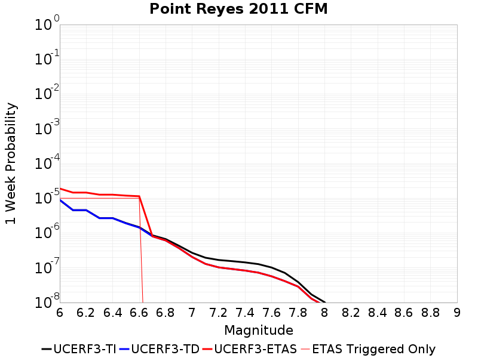 | 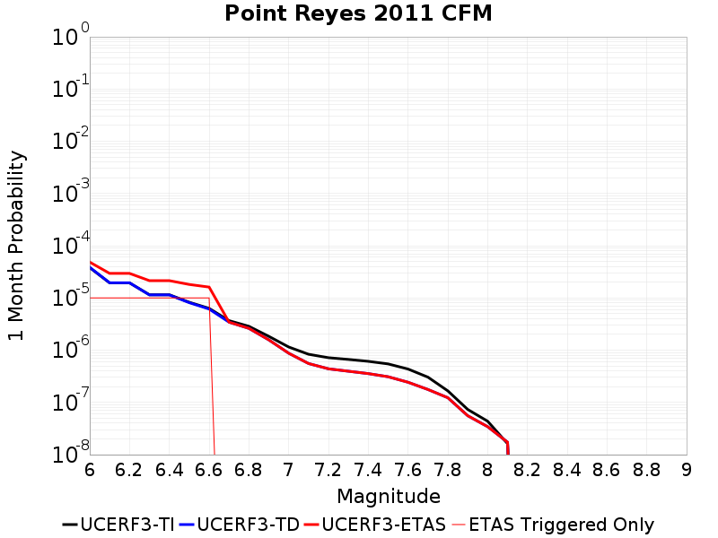 | 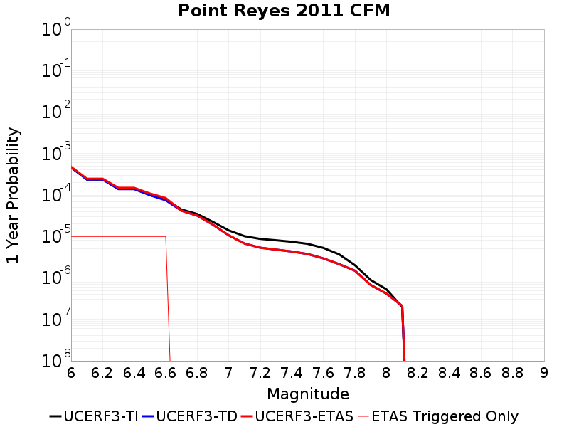 |  |

| Magnitude | 1 wk TI Prob | 1 wk TD Prob | 1 wk ETAS Prob | 1 wk ETAS/TD Gain | 1 wk ETAS Triggered Only | 1 mo TI Prob | 1 mo TD Prob | 1 mo ETAS Prob | 1 mo ETAS/TD Gain | 1 mo ETAS Triggered Only | 1 yr TI Prob | 1 yr TD Prob | 1 yr ETAS Prob | 1 yr ETAS/TD Gain | 1 yr ETAS Triggered Only | 10 yr TI Prob | 10 yr TD Prob | 10 yr ETAS Prob | 10 yr ETAS/TD Gain | 10 yr ETAS Triggered Only |
|-----|-----|-----|-----|-----|-----|-----|-----|-----|-----|-----|-----|-----|-----|-----|-----|-----|-----|-----|-----|-----|
| 6.0 | 8.8644965E-6 | 8.972557E-6 | 1.8972467E-5 | 2.1144996 | 1.0E-5 | 3.7990147E-5 | 3.8453283E-5 | 4.84529E-5 | 1.2600458 | 1.0E-5 | 4.624319E-4 | 4.6807446E-4 | 4.7806976E-4 | 1.0213541 | 1.0E-5 | 0.0046147075 | 0.0046715126 | 0.004681466 | 1.0021306 | 1.0E-5 |
| 6.1 | 4.526405E-6 | 4.5417505E-6 | 1.4541705E-5 | 3.2017841 | 1.0E-5 | 1.9398734E-5 | 1.9464507E-5 | 2.9464312E-5 | 1.5137457 | 1.0E-5 | 2.36154E-4 | 2.3695565E-4 | 2.4695328E-4 | 1.042192 | 1.0E-5 | 0.002359032 | 0.0023671337 | 0.00237711 | 1.0042145 | 1.0E-5 |
| 6.2 | 4.526405E-6 | 4.5417505E-6 | 1.4541705E-5 | 3.2017841 | 1.0E-5 | 1.9398734E-5 | 1.9464507E-5 | 2.9464312E-5 | 1.5137457 | 1.0E-5 | 2.36154E-4 | 2.3695565E-4 | 2.4695328E-4 | 1.042192 | 1.0E-5 | 0.002359032 | 0.0023671337 | 0.00237711 | 1.0042145 | 1.0E-5 |
| 6.3 | 2.6842322E-6 | 2.6620517E-6 | 1.2662025E-5 | 4.756491 | 1.0E-5 | 1.1503801E-5 | 1.1408743E-5 | 2.140863E-5 | 1.8765107 | 1.0E-5 | 1.4004979E-4 | 1.3889279E-4 | 1.4889141E-4 | 1.071988 | 1.0E-5 | 0.0013996155 | 0.0013880794 | 0.0013980655 | 1.0071942 | 1.0E-5 |
| 6.4 | 2.6842322E-6 | 2.6620517E-6 | 1.2662025E-5 | 4.756491 | 1.0E-5 | 1.1503801E-5 | 1.1408743E-5 | 2.140863E-5 | 1.8765107 | 1.0E-5 | 1.4004979E-4 | 1.3889279E-4 | 1.4889141E-4 | 1.071988 | 1.0E-5 | 0.0013996155 | 0.0013880794 | 0.0013980655 | 1.0071942 | 1.0E-5 |
| 6.5 | 1.9281833E-6 | 1.8920991E-6 | 1.189208E-5 | 6.2851253 | 1.0E-5 | 8.263617E-6 | 8.108972E-6 | 1.810889E-5 | 2.233192 | 1.0E-5 | 1.0060489E-4 | 9.872234E-5 | 1.0872135E-4 | 1.1012841 | 1.0E-5 | 0.0010055936 | 9.867934E-4 | 9.967836E-4 | 1.0101238 | 1.0E-5 |
| 6.6 | 1.4726726E-6 | 1.4285123E-6 | 1.1428498E-5 | 8.00028 | 1.0E-5 | 6.3114385E-6 | 6.1221813E-6 | 1.612212E-5 | 2.6333947 | 1.0E-5 | 7.683905E-5 | 7.4535055E-5 | 8.453431E-5 | 1.134155 | 1.0E-5 | 7.6812494E-4 | 7.4510544E-4 | 7.55098E-4 | 1.0134109 | 1.0E-5 |
| 6.7 | 8.572307E-7 | 8.0234366E-7 | 8.0234366E-7 | 1.0 | 0.0 | 3.6738406E-6 | 3.4386112E-6 | 3.4386112E-6 | 1.0 | 0.0 | 4.472809E-5 | 4.1864303E-5 | 4.1864303E-5 | 1.0 | 0.0 | 4.471909E-4 | 4.1856582E-4 | 4.1856582E-4 | 1.0 | 0.0 |
| 6.8 | 6.6745434E-7 | 6.0942585E-7 | 6.0942585E-7 | 1.0 | 0.0 | 2.8605155E-6 | 2.6118225E-6 | 2.6118225E-6 | 1.0 | 0.0 | 3.482622E-5 | 3.1798485E-5 | 3.1798485E-5 | 1.0 | 0.0 | 3.4820763E-4 | 3.179404E-4 | 3.179404E-4 | 1.0 | 0.0 |
| 6.9 | 4.291521E-7 | 3.6713413E-7 | 3.6713413E-7 | 1.0 | 0.0 | 1.839222E-6 | 1.573431E-6 | 1.573431E-6 | 1.0 | 0.0 | 2.2392298E-5 | 1.9156358E-5 | 1.9156358E-5 | 1.0 | 0.0 | 2.2390042E-4 | 1.9154744E-4 | 1.9154744E-4 | 1.0 | 0.0 |
| 7.0 | 2.6812808E-7 | 2.0380385E-7 | 2.0380385E-7 | 1.0 | 0.0 | 1.1491198E-6 | 8.7344483E-7 | 8.7344483E-7 | 1.0 | 0.0 | 1.3990444E-5 | 1.06341395E-5 | 1.06341395E-5 | 1.0 | 0.0 | 1.3989564E-4 | 1.0633638E-4 | 1.0633638E-4 | 1.0 | 0.0 |
| 7.1 | 1.9451231E-7 | 1.29305E-7 | 1.29305E-7 | 1.0 | 0.0 | 8.336239E-7 | 5.5416416E-7 | 5.5416416E-7 | 1.0 | 0.0 | 1.0149324E-5 | 6.7469277E-6 | 6.7469277E-6 | 1.0 | 0.0 | 1.014886E-4 | 6.7467234E-5 | 6.7467234E-5 | 1.0 | 0.0 |
| 7.2 | 1.6715143E-7 | 1.0250759E-7 | 1.0250759E-7 | 1.0 | 0.0 | 7.1636305E-7 | 4.393182E-7 | 4.393182E-7 | 1.0 | 0.0 | 8.721685E-6 | 5.3486856E-6 | 5.3486856E-6 | 1.0 | 0.0 | 8.721343E-5 | 5.348557E-5 | 5.348557E-5 | 1.0 | 0.0 |
| 7.3 | 1.5503173E-7 | 9.2177395E-8 | 9.2177395E-8 | 1.0 | 0.0 | 6.644215E-7 | 3.9504593E-7 | 3.9504593E-7 | 1.0 | 0.0 | 8.089301E-6 | 4.8096736E-6 | 4.8096736E-6 | 1.0 | 0.0 | 8.089007E-5 | 4.8095695E-5 | 4.8095695E-5 | 1.0 | 0.0 |
| 7.4 | 1.4251614E-7 | 8.296878E-8 | 8.296878E-8 | 1.0 | 0.0 | 6.1078333E-7 | 3.5558048E-7 | 3.5558048E-7 | 1.0 | 0.0 | 7.4362615E-6 | 4.3291834E-6 | 4.3291834E-6 | 1.0 | 0.0 | 7.436013E-5 | 4.329099E-5 | 4.329099E-5 | 1.0 | 0.0 |
| 7.5 | 1.2710186E-7 | 7.2216665E-8 | 7.2216665E-8 | 1.0 | 0.0 | 5.447221E-7 | 3.0949997E-7 | 3.0949997E-7 | 1.0 | 0.0 | 6.6319717E-6 | 3.7681555E-6 | 3.7681555E-6 | 1.0 | 0.0 | 6.6317734E-5 | 3.7680915E-5 | 3.7680915E-5 | 1.0 | 0.0 |
| 7.6 | 1.0144708E-7 | 5.6661708E-8 | 5.6661708E-8 | 1.0 | 0.0 | 4.347731E-7 | 2.4283588E-7 | 2.4283588E-7 | 1.0 | 0.0 | 5.2933497E-6 | 2.9565228E-6 | 2.9565228E-6 | 1.0 | 0.0 | 5.293224E-5 | 2.9564835E-5 | 2.9564835E-5 | 1.0 | 0.0 |
| 7.7 | 7.090527E-8 | 4.1174772E-8 | 4.1174772E-8 | 1.0 | 0.0 | 3.038797E-7 | 1.764633E-7 | 1.764633E-7 | 1.0 | 0.0 | 3.699729E-6 | 2.1484386E-6 | 2.1484386E-6 | 1.0 | 0.0 | 3.6996673E-5 | 2.1484178E-5 | 2.1484178E-5 | 1.0 | 0.0 |
| 7.8 | 3.8712045E-8 | 2.863625E-8 | 2.863625E-8 | 1.0 | 0.0 | 1.6590876E-7 | 1.2272679E-7 | 1.2272679E-7 | 1.0 | 0.0 | 2.0199373E-6 | 1.4941976E-6 | 1.4941976E-6 | 1.0 | 0.0 | 2.0199188E-5 | 1.4941876E-5 | 1.4941876E-5 | 1.0 | 0.0 |
| 7.9 | 1.7068782E-8 | 1.2943151E-8 | 1.2943151E-8 | 1.0 | 0.0 | 7.315192E-8 | 5.547065E-8 | 5.547065E-8 | 1.0 | 0.0 | 8.906242E-7 | 6.7535495E-7 | 6.7535495E-7 | 1.0 | 0.0 | 8.906207E-6 | 6.7535293E-6 | 6.7535293E-6 | 1.0 | 0.0 |
| 8.0 | 1.0172592E-8 | 7.995327E-9 | 7.995327E-9 | 1.0 | 0.0 | 4.359682E-8 | 3.426569E-8 | 3.426569E-8 | 1.0 | 0.0 | 5.3079117E-7 | 4.1718468E-7 | 4.1718468E-7 | 1.0 | 0.0 | 5.307899E-6 | 4.171839E-6 | 4.171839E-6 | 1.0 | 0.0 |
| 8.1 | 3.7861243E-9 | 4.0388417E-9 | 4.0388417E-9 | 1.0 | 0.0 | 1.6226247E-8 | 1.7309322E-8 | 1.7309322E-8 | 1.0 | 0.0 | 1.9755454E-7 | 2.1074098E-7 | 2.1074098E-7 | 1.0 | 0.0 | 1.9755437E-6 | 2.107408E-6 | 2.107408E-6 | 1.0 | 0.0 |

## San Diego Trough north alt1
*[(top)](#table-of-contents)*

| 1 Week | 1 Month | 1 Year | 10 Year |
|-----|-----|-----|-----|
| 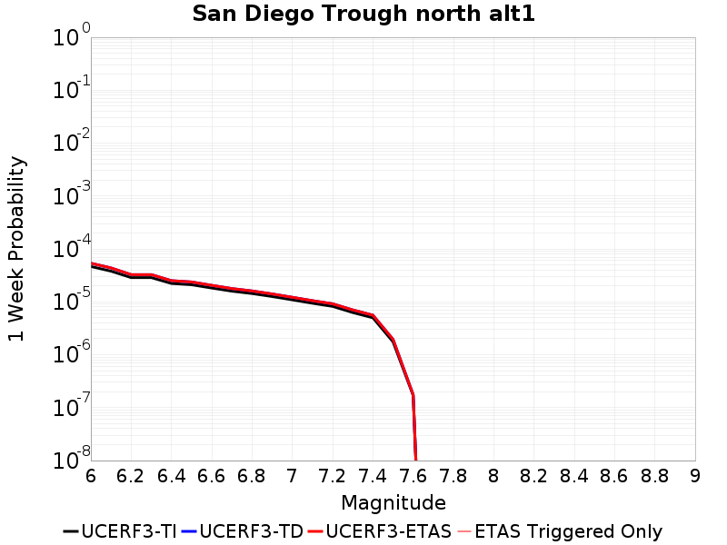 |  | 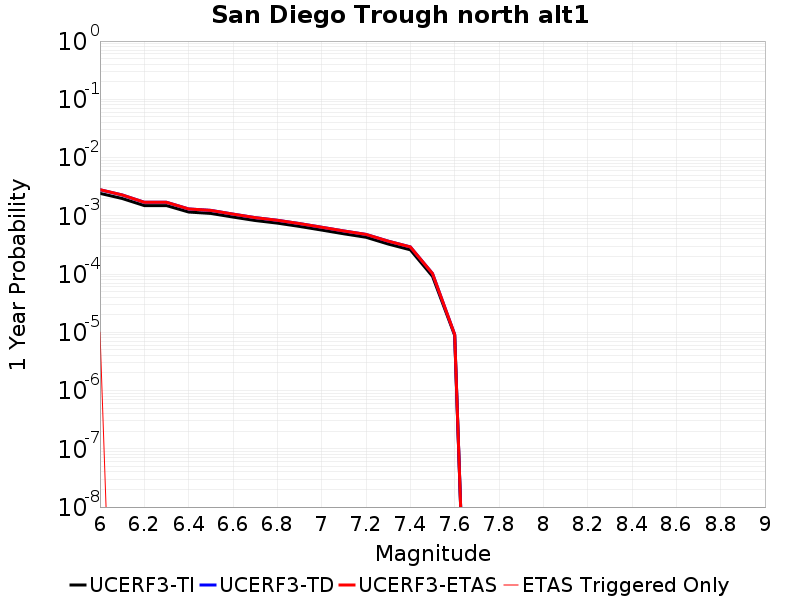 |  |

| Magnitude | 1 wk TI Prob | 1 wk TD Prob | 1 wk ETAS Prob | 1 wk ETAS/TD Gain | 1 wk ETAS Triggered Only | 1 mo TI Prob | 1 mo TD Prob | 1 mo ETAS Prob | 1 mo ETAS/TD Gain | 1 mo ETAS Triggered Only | 1 yr TI Prob | 1 yr TD Prob | 1 yr ETAS Prob | 1 yr ETAS/TD Gain | 1 yr ETAS Triggered Only | 10 yr TI Prob | 10 yr TD Prob | 10 yr ETAS Prob | 10 yr ETAS/TD Gain | 10 yr ETAS Triggered Only |
|-----|-----|-----|-----|-----|-----|-----|-----|-----|-----|-----|-----|-----|-----|-----|-----|-----|-----|-----|-----|-----|
| 6.0 | 4.6490888E-5 | 5.3583604E-5 | 5.3583604E-5 | 1.0 | 0.0 | 1.9923145E-4 | 2.2962448E-4 | 2.3962218E-4 | 1.0435394 | 1.0E-5 | 0.0024229444 | 0.0027922096 | 0.0028021818 | 1.0035714 | 1.0E-5 | 0.023966964 | 0.027584907 | 0.02759463 | 1.0003525 | 1.0E-5 |
| 6.1 | 3.7940346E-5 | 4.3652148E-5 | 4.3652148E-5 | 1.0 | 0.0 | 1.6259136E-4 | 1.8706771E-4 | 1.8706771E-4 | 1.0 | 0.0 | 0.0019777524 | 0.0022752555 | 0.0022752555 | 1.0 | 0.0 | 0.019602431 | 0.022529192 | 0.022529192 | 1.0 | 0.0 |
| 6.2 | 2.8645263E-5 | 3.264783E-5 | 3.264783E-5 | 1.0 | 0.0 | 1.2275964E-4 | 1.399119E-4 | 1.399119E-4 | 1.0 | 0.0 | 0.0014935739 | 0.0017021212 | 0.0017021212 | 1.0 | 0.0 | 0.0148357535 | 0.016893798 | 0.016893798 | 1.0 | 0.0 |
| 6.3 | 2.8645263E-5 | 3.264783E-5 | 3.264783E-5 | 1.0 | 0.0 | 1.2275964E-4 | 1.399119E-4 | 1.399119E-4 | 1.0 | 0.0 | 0.0014935739 | 0.0017021212 | 0.0017021212 | 1.0 | 0.0 | 0.0148357535 | 0.016893798 | 0.016893798 | 1.0 | 0.0 |
| 6.4 | 2.2204576E-5 | 2.5091616E-5 | 2.5091616E-5 | 1.0 | 0.0 | 9.5159E-5 | 1.07531116E-4 | 1.07531116E-4 | 1.0 | 0.0 | 0.001157945 | 0.0013084146 | 0.0013084146 | 1.0 | 0.0 | 0.011519298 | 0.013008303 | 0.013008303 | 1.0 | 0.0 |
| 6.5 | 2.1004838E-5 | 2.3704824E-5 | 2.3704824E-5 | 1.0 | 0.0 | 9.0017624E-5 | 1.0158819E-4 | 1.0158819E-4 | 1.0 | 0.0 | 0.0010954136 | 0.0012361434 | 0.0012361434 | 1.0 | 0.0 | 0.010900296 | 0.012293761 | 0.012293761 | 1.0 | 0.0 |
| 6.6 | 1.820557E-5 | 2.0464671E-5 | 2.0464671E-5 | 1.0 | 0.0 | 7.802154E-5 | 8.7702814E-5 | 8.7702814E-5 | 1.0 | 0.0 | 9.4949827E-4 | 0.001067264 | 0.001067264 | 1.0 | 0.0 | 0.009454516 | 0.010622043 | 0.010622043 | 1.0 | 0.0 |
| 6.7 | 1.5884485E-5 | 1.7794593E-5 | 1.7794593E-5 | 1.0 | 0.0 | 6.807459E-5 | 7.626033E-5 | 7.626033E-5 | 1.0 | 0.0 | 8.284929E-4 | 9.280767E-4 | 9.280767E-4 | 1.0 | 0.0 | 0.008254109 | 0.009242365 | 0.009242365 | 1.0 | 0.0 |
| 6.8 | 1.4331171E-5 | 1.6037568E-5 | 1.6037568E-5 | 1.0 | 0.0 | 6.141786E-5 | 6.873063E-5 | 6.873063E-5 | 1.0 | 0.0 | 7.4750587E-4 | 8.3647616E-4 | 8.3647616E-4 | 1.0 | 0.0 | 0.0074499645 | 0.008333537 | 0.008333537 | 1.0 | 0.0 |
| 6.9 | 1.2574203E-5 | 1.4065974E-5 | 1.4065974E-5 | 1.0 | 0.0 | 5.3888325E-5 | 6.028136E-5 | 6.028136E-5 | 1.0 | 0.0 | 6.558929E-4 | 7.336798E-4 | 7.336798E-4 | 1.0 | 0.0 | 0.0065396037 | 0.0073127574 | 0.0073127574 | 1.0 | 0.0 |
| 7.0 | 1.0883844E-5 | 1.2169784E-5 | 1.2169784E-5 | 1.0 | 0.0 | 4.664421E-5 | 5.215518E-5 | 5.215518E-5 | 1.0 | 0.0 | 5.677453E-4 | 6.348053E-4 | 6.348053E-4 | 1.0 | 0.0 | 0.00566297 | 0.0063300445 | 0.0063300445 | 1.0 | 0.0 |
| 7.1 | 9.393088E-6 | 1.050358E-5 | 1.050358E-5 | 1.0 | 0.0 | 4.025547E-5 | 4.501457E-5 | 4.501457E-5 | 1.0 | 0.0 | 4.900001E-4 | 5.4791535E-4 | 5.4791535E-4 | 1.0 | 0.0 | 0.0048892107 | 0.005465738 | 0.005465738 | 1.0 | 0.0 |
| 7.2 | 8.190791E-6 | 9.16829E-6 | 9.16829E-6 | 1.0 | 0.0 | 3.510292E-5 | 3.929208E-5 | 3.929208E-5 | 1.0 | 0.0 | 4.2729423E-4 | 4.7827675E-4 | 4.7827675E-4 | 1.0 | 0.0 | 0.0042647356 | 0.0047725523 | 0.0047725523 | 1.0 | 0.0 |
| 7.3 | 6.268162E-6 | 7.0233323E-6 | 7.0233323E-6 | 1.0 | 0.0 | 2.6863276E-5 | 3.009965E-5 | 3.009965E-5 | 1.0 | 0.0 | 3.2701128E-4 | 3.6640203E-4 | 3.6640203E-4 | 1.0 | 0.0 | 0.003265305 | 0.0036580244 | 0.0036580244 | 1.0 | 0.0 |
| 7.4 | 4.985186E-6 | 5.590026E-6 | 5.590026E-6 | 1.0 | 0.0 | 2.1364907E-5 | 2.3957036E-5 | 2.3957036E-5 | 1.0 | 0.0 | 2.600867E-4 | 2.9163828E-4 | 2.9163828E-4 | 1.0 | 0.0 | 0.002597825 | 0.0029125959 | 0.0029125959 | 1.0 | 0.0 |
| 7.5 | 1.7489613E-6 | 1.952021E-6 | 1.952021E-6 | 1.0 | 0.0 | 7.495527E-6 | 8.365779E-6 | 8.365779E-6 | 1.0 | 0.0 | 9.125422E-5 | 1.0184882E-4 | 1.0184882E-4 | 1.0 | 0.0 | 9.1216754E-4 | 0.0010180429 | 0.0010180429 | 1.0 | 0.0 |
| 7.6 | 1.6988751E-7 | 1.7543901E-7 | 1.7543901E-7 | 1.0 | 0.0 | 7.2808916E-7 | 7.5188126E-7 | 7.5188126E-7 | 1.0 | 0.0 | 8.864449E-6 | 9.154118E-6 | 9.154118E-6 | 1.0 | 0.0 | 8.8640954E-5 | 9.153761E-5 | 9.153761E-5 | 1.0 | 0.0 |

## Goldstone Lake
*[(top)](#table-of-contents)*

| 1 Week | 1 Month | 1 Year | 10 Year |
|-----|-----|-----|-----|
|  |  |  |  |

| Magnitude | 1 wk TI Prob | 1 wk TD Prob | 1 wk ETAS Prob | 1 wk ETAS/TD Gain | 1 wk ETAS Triggered Only | 1 mo TI Prob | 1 mo TD Prob | 1 mo ETAS Prob | 1 mo ETAS/TD Gain | 1 mo ETAS Triggered Only | 1 yr TI Prob | 1 yr TD Prob | 1 yr ETAS Prob | 1 yr ETAS/TD Gain | 1 yr ETAS Triggered Only | 10 yr TI Prob | 10 yr TD Prob | 10 yr ETAS Prob | 10 yr ETAS/TD Gain | 10 yr ETAS Triggered Only |
|-----|-----|-----|-----|-----|-----|-----|-----|-----|-----|-----|-----|-----|-----|-----|-----|-----|-----|-----|-----|-----|
| 6.0 | 2.671352E-5 | 3.0505667E-5 | 3.0505667E-5 | 1.0 | 0.0 | 1.1448149E-4 | 1.3073314E-4 | 1.3073314E-4 | 1.0 | 0.0 | 0.001392921 | 0.0015907119 | 0.0015907119 | 1.0 | 0.0 | 0.013842222 | 0.015812924 | 0.015822766 | 1.0006224 | 1.0E-5 |
| 6.1 | 2.671352E-5 | 3.0505667E-5 | 3.0505667E-5 | 1.0 | 0.0 | 1.1448149E-4 | 1.3073314E-4 | 1.3073314E-4 | 1.0 | 0.0 | 0.001392921 | 0.0015907119 | 0.0015907119 | 1.0 | 0.0 | 0.013842222 | 0.015812924 | 0.015822766 | 1.0006224 | 1.0E-5 |
| 6.2 | 1.4197047E-5 | 1.6162809E-5 | 1.6162809E-5 | 1.0 | 0.0 | 6.0843064E-5 | 6.92679E-5 | 6.92679E-5 | 1.0 | 0.0 | 7.4051257E-4 | 8.4310985E-4 | 8.4310985E-4 | 1.0 | 0.0 | 0.007380498 | 0.00840889 | 0.008418806 | 1.0011792 | 1.0E-5 |
| 6.3 | 1.4197047E-5 | 1.6162809E-5 | 1.6162809E-5 | 1.0 | 0.0 | 6.0843064E-5 | 6.92679E-5 | 6.92679E-5 | 1.0 | 0.0 | 7.4051257E-4 | 8.4310985E-4 | 8.4310985E-4 | 1.0 | 0.0 | 0.007380498 | 0.00840889 | 0.008418806 | 1.0011792 | 1.0E-5 |
| 6.4 | 1.3238931E-5 | 1.5070416E-5 | 1.5070416E-5 | 1.0 | 0.0 | 5.6737044E-5 | 6.458646E-5 | 6.458646E-5 | 1.0 | 0.0 | 6.9055456E-4 | 7.8615523E-4 | 7.8615523E-4 | 1.0 | 0.0 | 0.006884126 | 0.007843448 | 0.00785337 | 1.0012649 | 1.0E-5 |
| 6.5 | 1.3238931E-5 | 1.5070416E-5 | 1.5070416E-5 | 1.0 | 0.0 | 5.6737044E-5 | 6.458646E-5 | 6.458646E-5 | 1.0 | 0.0 | 6.9055456E-4 | 7.8615523E-4 | 7.8615523E-4 | 1.0 | 0.0 | 0.006884126 | 0.007843448 | 0.00785337 | 1.0012649 | 1.0E-5 |
| 6.6 | 1.1328278E-5 | 1.2908562E-5 | 1.2908562E-5 | 1.0 | 0.0 | 4.8548856E-5 | 5.532178E-5 | 5.532178E-5 | 1.0 | 0.0 | 5.90922E-4 | 6.7343103E-4 | 6.7343103E-4 | 1.0 | 0.0 | 0.0058935313 | 0.006723371 | 0.0067333034 | 1.0014774 | 1.0E-5 |
| 6.7 | 8.651175E-6 | 9.865434E-6 | 9.865434E-6 | 1.0 | 0.0 | 3.707594E-5 | 4.2280262E-5 | 4.2280262E-5 | 1.0 | 0.0 | 4.5130608E-4 | 5.147319E-4 | 5.147319E-4 | 1.0 | 0.0 | 0.0045039062 | 0.0051443498 | 0.0051542986 | 1.0019339 | 1.0E-5 |
| 6.8 | 1.0215377E-6 | 1.1801708E-6 | 1.1801708E-6 | 1.0 | 0.0 | 4.378012E-6 | 5.0578656E-6 | 5.0578656E-6 | 1.0 | 0.0 | 5.3300988E-5 | 6.157789E-5 | 6.157789E-5 | 1.0 | 0.0 | 5.3288206E-4 | 6.156196E-4 | 6.156196E-4 | 1.0 | 0.0 |
| 6.9 | 7.9360774E-7 | 9.3238975E-7 | 9.3238975E-7 | 1.0 | 0.0 | 3.4011714E-6 | 3.9959505E-6 | 3.9959505E-6 | 1.0 | 0.0 | 4.1408475E-5 | 4.864968E-5 | 4.864968E-5 | 1.0 | 0.0 | 4.140076E-4 | 4.8639736E-4 | 4.8639736E-4 | 1.0 | 0.0 |
| 7.0 | 7.4382757E-7 | 8.7865425E-7 | 8.7865425E-7 | 1.0 | 0.0 | 3.1878285E-6 | 3.765656E-6 | 3.765656E-6 | 1.0 | 0.0 | 3.8811122E-5 | 4.5845965E-5 | 4.5845965E-5 | 1.0 | 0.0 | 3.8804344E-4 | 4.5837177E-4 | 4.5837177E-4 | 1.0 | 0.0 |
| 7.1 | 6.4709513E-7 | 7.7482156E-7 | 7.7482156E-7 | 1.0 | 0.0 | 2.773262E-6 | 3.32066E-6 | 3.32066E-6 | 1.0 | 0.0 | 3.376394E-5 | 4.0428346E-5 | 4.0428346E-5 | 1.0 | 0.0 | 3.375881E-4 | 4.042159E-4 | 4.042159E-4 | 1.0 | 0.0 |
| 7.2 | 6.356704E-7 | 7.624983E-7 | 7.624983E-7 | 1.0 | 0.0 | 2.7242988E-6 | 3.267846E-6 | 3.267846E-6 | 1.0 | 0.0 | 3.3167835E-5 | 3.9785362E-5 | 3.9785362E-5 | 1.0 | 0.0 | 3.3162883E-4 | 3.977884E-4 | 3.977884E-4 | 1.0 | 0.0 |
| 7.3 | 5.7695723E-7 | 6.9323283E-7 | 6.9323283E-7 | 1.0 | 0.0 | 2.4726714E-6 | 2.9709947E-6 | 2.9709947E-6 | 1.0 | 0.0 | 3.0104358E-5 | 3.617132E-5 | 3.617132E-5 | 1.0 | 0.0 | 3.0100282E-4 | 3.6166012E-4 | 3.6166012E-4 | 1.0 | 0.0 |
| 7.4 | 5.209647E-7 | 6.227705E-7 | 6.227705E-7 | 1.0 | 0.0 | 2.232704E-6 | 2.6690138E-6 | 2.6690138E-6 | 1.0 | 0.0 | 2.718283E-5 | 3.2494816E-5 | 3.2494816E-5 | 1.0 | 0.0 | 2.7179506E-4 | 3.2490626E-4 | 3.2490626E-4 | 1.0 | 0.0 |
| 7.5 | 4.512955E-7 | 5.377889E-7 | 5.377889E-7 | 1.0 | 0.0 | 1.934122E-6 | 2.3048078E-6 | 2.3048078E-6 | 1.0 | 0.0 | 2.3547682E-5 | 2.8060727E-5 | 2.8060727E-5 | 1.0 | 0.0 | 2.3545188E-4 | 2.805772E-4 | 2.805772E-4 | 1.0 | 0.0 |
| 7.6 | 2.21172E-7 | 2.6182613E-7 | 2.6182613E-7 | 1.0 | 0.0 | 9.478797E-7 | 1.1221116E-6 | 1.1221116E-6 | 1.0 | 0.0 | 1.1540374E-5 | 1.3661653E-5 | 1.3661653E-5 | 1.0 | 0.0 | 1.1539775E-4 | 1.3661098E-4 | 1.3661098E-4 | 1.0 | 0.0 |

## Calico-Hidalgo
*[(top)](#table-of-contents)*

| 1 Week | 1 Month | 1 Year | 10 Year |
|-----|-----|-----|-----|
| 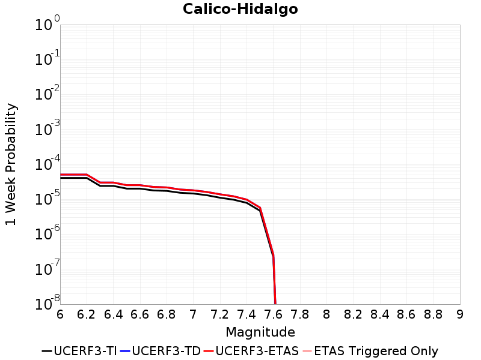 | 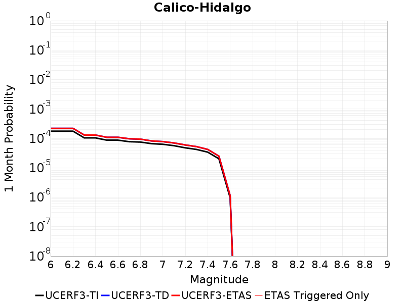 | 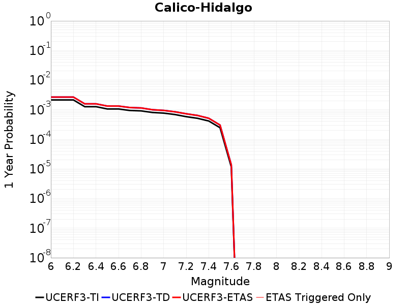 |  |

| Magnitude | 1 wk TI Prob | 1 wk TD Prob | 1 wk ETAS Prob | 1 wk ETAS/TD Gain | 1 wk ETAS Triggered Only | 1 mo TI Prob | 1 mo TD Prob | 1 mo ETAS Prob | 1 mo ETAS/TD Gain | 1 mo ETAS Triggered Only | 1 yr TI Prob | 1 yr TD Prob | 1 yr ETAS Prob | 1 yr ETAS/TD Gain | 1 yr ETAS Triggered Only | 10 yr TI Prob | 10 yr TD Prob | 10 yr ETAS Prob | 10 yr ETAS/TD Gain | 10 yr ETAS Triggered Only |
|-----|-----|-----|-----|-----|-----|-----|-----|-----|-----|-----|-----|-----|-----|-----|-----|-----|-----|-----|-----|-----|
| 6.0 | 4.0906612E-5 | 5.097807E-5 | 5.097807E-5 | 1.0 | 0.0 | 1.7530227E-4 | 2.1846143E-4 | 2.1846143E-4 | 1.0 | 0.0 | 0.0021322158 | 0.002656926 | 0.002656926 | 1.0 | 0.0 | 0.02111873 | 0.026292246 | 0.026301984 | 1.0003704 | 1.0E-5 |
| 6.1 | 4.0906612E-5 | 5.097807E-5 | 5.097807E-5 | 1.0 | 0.0 | 1.7530227E-4 | 2.1846143E-4 | 2.1846143E-4 | 1.0 | 0.0 | 0.0021322158 | 0.002656926 | 0.002656926 | 1.0 | 0.0 | 0.02111873 | 0.026292246 | 0.026301984 | 1.0003704 | 1.0E-5 |
| 6.2 | 4.0906612E-5 | 5.097807E-5 | 5.097807E-5 | 1.0 | 0.0 | 1.7530227E-4 | 2.1846143E-4 | 2.1846143E-4 | 1.0 | 0.0 | 0.0021322158 | 0.002656926 | 0.002656926 | 1.0 | 0.0 | 0.02111873 | 0.026292246 | 0.026301984 | 1.0003704 | 1.0E-5 |
| 6.3 | 2.4242801E-5 | 3.0222516E-5 | 3.0222516E-5 | 1.0 | 0.0 | 1.0389358E-4 | 1.295188E-4 | 1.295188E-4 | 1.0 | 0.0 | 0.0012641704 | 0.0015757844 | 0.0015757844 | 1.0 | 0.0 | 0.01257003 | 0.015649812 | 0.015659655 | 1.000629 | 1.0E-5 |
| 6.4 | 2.4242801E-5 | 3.0222516E-5 | 3.0222516E-5 | 1.0 | 0.0 | 1.0389358E-4 | 1.295188E-4 | 1.295188E-4 | 1.0 | 0.0 | 0.0012641704 | 0.0015757844 | 0.0015757844 | 1.0 | 0.0 | 0.01257003 | 0.015649812 | 0.015659655 | 1.000629 | 1.0E-5 |
| 6.5 | 2.0286952E-5 | 2.5420006E-5 | 2.5420006E-5 | 1.0 | 0.0 | 8.694118E-5 | 1.0893843E-4 | 1.0893843E-4 | 1.0 | 0.0 | 0.0010579949 | 0.0013255356 | 0.0013255356 | 1.0 | 0.0 | 0.010529719 | 0.013178241 | 0.01318811 | 1.0007489 | 1.0E-5 |
| 6.6 | 2.0269223E-5 | 2.540091E-5 | 2.540091E-5 | 1.0 | 0.0 | 8.6865206E-5 | 1.088566E-4 | 1.088566E-4 | 1.0 | 0.0 | 0.0010570707 | 0.0013245406 | 0.0013245406 | 1.0 | 0.0 | 0.010520565 | 0.013168409 | 0.013178277 | 1.0007493 | 1.0E-5 |
| 6.7 | 1.799852E-5 | 2.2633612E-5 | 2.2633612E-5 | 1.0 | 0.0 | 7.713423E-5 | 9.6997675E-5 | 9.6997675E-5 | 1.0 | 0.0 | 9.3870464E-4 | 0.0011803216 | 0.0011803216 | 1.0 | 0.0 | 0.009347493 | 0.01174215 | 0.011752034 | 1.0008416 | 1.0E-5 |
| 6.8 | 1.7458793E-5 | 2.1932708E-5 | 2.1932708E-5 | 1.0 | 0.0 | 7.4821255E-5 | 9.399402E-5 | 9.399402E-5 | 1.0 | 0.0 | 9.10568E-4 | 0.001143791 | 0.001143791 | 1.0 | 0.0 | 0.009068459 | 0.011380637 | 0.011390524 | 1.0008687 | 1.0E-5 |
| 6.9 | 1.542884E-5 | 1.9107898E-5 | 1.9107898E-5 | 1.0 | 0.0 | 6.612192E-5 | 8.18885E-5 | 8.18885E-5 | 1.0 | 0.0 | 8.04737E-4 | 9.965497E-4 | 9.965497E-4 | 1.0 | 0.0 | 0.008018291 | 0.009922218 | 0.0099321185 | 1.0009978 | 1.0E-5 |
| 7.0 | 1.468253E-5 | 1.8109828E-5 | 1.8109828E-5 | 1.0 | 0.0 | 6.292361E-5 | 7.7611316E-5 | 7.7611316E-5 | 1.0 | 0.0 | 7.658257E-4 | 9.445212E-4 | 9.445212E-4 | 1.0 | 0.0 | 0.0076319184 | 0.009406446 | 0.009416352 | 1.0010531 | 1.0E-5 |
| 7.1 | 1.3139281E-5 | 1.6274867E-5 | 1.6274867E-5 | 1.0 | 0.0 | 5.6309986E-5 | 6.974764E-5 | 6.974764E-5 | 1.0 | 0.0 | 6.853584E-4 | 8.488594E-4 | 8.488594E-4 | 1.0 | 0.0 | 0.0068324856 | 0.008457477 | 0.008467393 | 1.0011724 | 1.0E-5 |
| 7.2 | 1.1127404E-5 | 1.3934059E-5 | 1.3934059E-5 | 1.0 | 0.0 | 4.7688E-5 | 5.971609E-5 | 5.971609E-5 | 1.0 | 0.0 | 5.8044674E-4 | 7.268119E-4 | 7.268119E-4 | 1.0 | 0.0 | 0.0057893298 | 0.0072454647 | 0.0072553926 | 1.0013702 | 1.0E-5 |
| 7.3 | 9.808154E-6 | 1.22344745E-5 | 1.22344745E-5 | 1.0 | 0.0 | 4.2034266E-5 | 5.2432468E-5 | 5.2432468E-5 | 1.0 | 0.0 | 5.11647E-4 | 6.3818914E-4 | 6.3818914E-4 | 1.0 | 0.0 | 0.0051047057 | 0.006364649 | 0.0063745854 | 1.0015612 | 1.0E-5 |
| 7.4 | 7.942452E-6 | 9.8300225E-6 | 9.8300225E-6 | 1.0 | 0.0 | 3.4038632E-5 | 4.2128042E-5 | 4.2128042E-5 | 1.0 | 0.0 | 4.1434157E-4 | 5.1279773E-4 | 5.1279773E-4 | 1.0 | 0.0 | 0.0041356985 | 0.0051170914 | 0.00512704 | 1.0019442 | 1.0E-5 |
| 7.5 | 4.7121216E-6 | 5.794016E-6 | 5.794016E-6 | 1.0 | 0.0 | 2.019465E-5 | 2.4831304E-5 | 2.4831304E-5 | 1.0 | 0.0 | 2.4584212E-4 | 3.022869E-4 | 3.022869E-4 | 1.0 | 0.0 | 0.0024557032 | 0.0030195145 | 0.0030195145 | 1.0 | 0.0 |
| 7.6 | 2.21172E-7 | 2.6182613E-7 | 2.6182613E-7 | 1.0 | 0.0 | 9.478797E-7 | 1.1221116E-6 | 1.1221116E-6 | 1.0 | 0.0 | 1.1540374E-5 | 1.3661653E-5 | 1.3661653E-5 | 1.0 | 0.0 | 1.1539775E-4 | 1.3661098E-4 | 1.3661098E-4 | 1.0 | 0.0 |

## San Jacinto (Superstition Mtn)
*[(top)](#table-of-contents)*

| 1 Week | 1 Month | 1 Year | 10 Year |
|-----|-----|-----|-----|
| 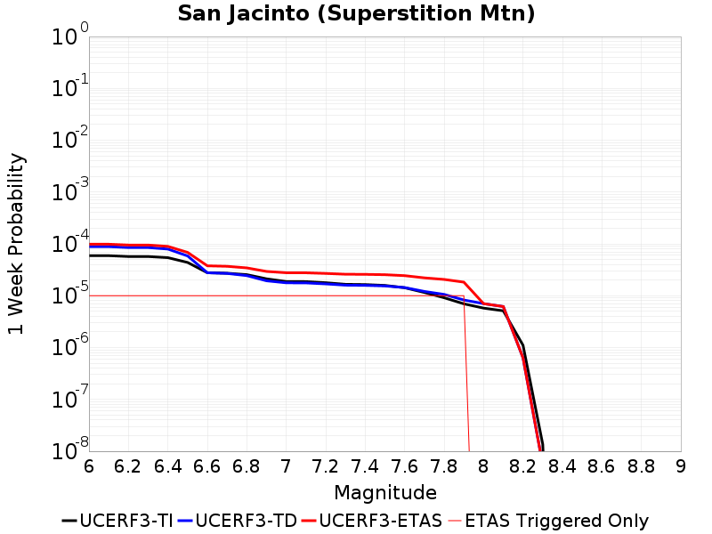 |  | 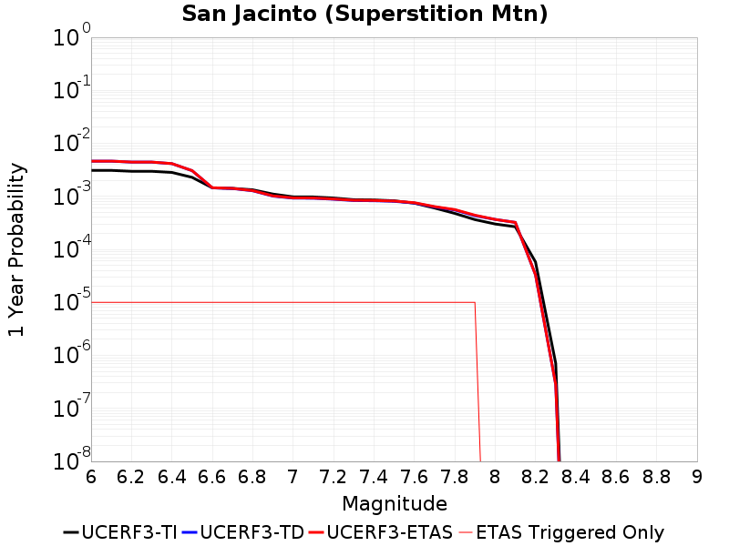 | 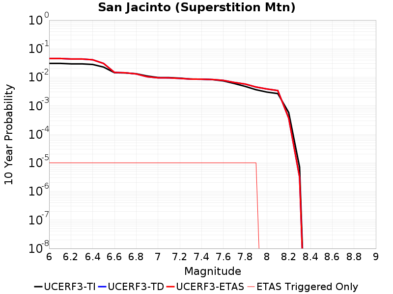 |

| Magnitude | 1 wk TI Prob | 1 wk TD Prob | 1 wk ETAS Prob | 1 wk ETAS/TD Gain | 1 wk ETAS Triggered Only | 1 mo TI Prob | 1 mo TD Prob | 1 mo ETAS Prob | 1 mo ETAS/TD Gain | 1 mo ETAS Triggered Only | 1 yr TI Prob | 1 yr TD Prob | 1 yr ETAS Prob | 1 yr ETAS/TD Gain | 1 yr ETAS Triggered Only | 10 yr TI Prob | 10 yr TD Prob | 10 yr ETAS Prob | 10 yr ETAS/TD Gain | 10 yr ETAS Triggered Only |
|-----|-----|-----|-----|-----|-----|-----|-----|-----|-----|-----|-----|-----|-----|-----|-----|-----|-----|-----|-----|-----|
| 6.0 | 5.921579E-5 | 8.838551E-5 | 9.8384626E-5 | 1.1131307 | 1.0E-5 | 2.5375726E-4 | 3.7874735E-4 | 3.8874356E-4 | 1.0263928 | 1.0E-5 | 0.0030851178 | 0.004603042 | 0.004612996 | 1.0021625 | 1.0E-5 | 0.030426376 | 0.045150563 | 0.04516011 | 1.0002115 | 1.0E-5 |
| 6.1 | 5.921579E-5 | 8.838551E-5 | 9.8384626E-5 | 1.1131307 | 1.0E-5 | 2.5375726E-4 | 3.7874735E-4 | 3.8874356E-4 | 1.0263928 | 1.0E-5 | 0.0030851178 | 0.004603042 | 0.004612996 | 1.0021625 | 1.0E-5 | 0.030426376 | 0.045150563 | 0.04516011 | 1.0002115 | 1.0E-5 |
| 6.2 | 5.6963574E-5 | 8.48866E-5 | 9.488575E-5 | 1.1177943 | 1.0E-5 | 2.4410675E-4 | 3.6375827E-4 | 3.7375462E-4 | 1.0274808 | 1.0E-5 | 0.0029679495 | 0.004421387 | 0.0044313427 | 1.0022517 | 1.0E-5 | 0.029286223 | 0.043415133 | 0.0434247 | 1.0002203 | 1.0E-5 |
| 6.3 | 5.6940098E-5 | 8.484094E-5 | 9.484009E-5 | 1.1178576 | 1.0E-5 | 2.4400617E-4 | 3.6356266E-4 | 3.73559E-4 | 1.0274956 | 1.0E-5 | 0.002966728 | 0.0044190153 | 0.004428971 | 1.0022529 | 1.0E-5 | 0.029274331 | 0.043392494 | 0.04340206 | 1.0002204 | 1.0E-5 |
| 6.4 | 5.4171585E-5 | 7.936322E-5 | 8.936243E-5 | 1.1259929 | 1.0E-5 | 2.3214328E-4 | 3.4009293E-4 | 3.5008954E-4 | 1.0293937 | 1.0E-5 | 0.0028226813 | 0.004134397 | 0.0041443557 | 1.0024087 | 1.0E-5 | 0.02787096 | 0.040694747 | 0.04070434 | 1.0002357 | 1.0E-5 |
| 6.5 | 4.375144E-5 | 5.8429436E-5 | 6.842885E-5 | 1.1711366 | 1.0E-5 | 1.874927E-4 | 2.5039437E-4 | 2.6039188E-4 | 1.039927 | 1.0E-5 | 0.0022803338 | 0.0030454507 | 0.0030554202 | 1.0032736 | 1.0E-5 | 0.022570757 | 0.030269964 | 0.03027966 | 1.0003203 | 1.0E-5 |
| 6.6 | 2.772192E-5 | 2.7706918E-5 | 3.770664E-5 | 1.3609107 | 1.0E-5 | 1.1880282E-4 | 1.1873865E-4 | 1.2873746E-4 | 1.0842086 | 1.0E-5 | 0.0014454646 | 0.0014447061 | 0.0014546918 | 1.0069119 | 1.0E-5 | 0.014360986 | 0.014678327 | 0.01468818 | 1.0006713 | 1.0E-5 |
| 6.7 | 2.7124124E-5 | 2.690059E-5 | 3.690032E-5 | 1.371729 | 1.0E-5 | 1.1624106E-4 | 1.1528327E-4 | 1.2528212E-4 | 1.0867329 | 1.0E-5 | 0.0014143161 | 0.0014026917 | 0.0014126777 | 1.0071192 | 1.0E-5 | 0.014053487 | 0.014263431 | 0.014273288 | 1.000691 | 1.0E-5 |
| 6.8 | 2.5475807E-5 | 2.4385477E-5 | 3.4385233E-5 | 1.4100702 | 1.0E-5 | 1.0917746E-4 | 1.0450508E-4 | 1.1450404E-4 | 1.0956792 | 1.0E-5 | 0.001328425 | 0.0012716213 | 0.0012816086 | 1.007854 | 1.0E-5 | 0.0132051185 | 0.012963676 | 0.012973546 | 1.0007614 | 1.0E-5 |
| 6.9 | 2.1162023E-5 | 1.9373352E-5 | 2.937316E-5 | 1.5161629 | 1.0E-5 | 9.069123E-5 | 8.302604E-5 | 9.3025206E-5 | 1.1204342 | 1.0E-5 | 0.0011036064 | 0.0010103778 | 0.0010203677 | 1.0098873 | 1.0E-5 | 0.010981417 | 0.010352007 | 0.010361903 | 1.0009559 | 1.0E-5 |
| 7.0 | 1.8754288E-5 | 1.77221E-5 | 2.7721922E-5 | 1.5642573 | 1.0E-5 | 8.037304E-5 | 7.594966E-5 | 8.59489E-5 | 1.1316562 | 1.0E-5 | 9.781026E-4 | 9.242978E-4 | 9.3428855E-4 | 1.0108091 | 1.0E-5 | 0.009738087 | 0.009480724 | 0.00949063 | 1.0010448 | 1.0E-5 |
| 7.1 | 1.8678527E-5 | 1.7641947E-5 | 2.764177E-5 | 1.5668209 | 1.0E-5 | 8.0048376E-5 | 7.560617E-5 | 8.560541E-5 | 1.1322544 | 1.0E-5 | 9.7415317E-4 | 9.2011923E-4 | 9.3011005E-4 | 1.0108582 | 1.0E-5 | 0.009698939 | 0.009439024 | 0.00944893 | 1.0010494 | 1.0E-5 |
| 7.2 | 1.7804578E-5 | 1.6885406E-5 | 2.6885238E-5 | 1.5922174 | 1.0E-5 | 7.6303106E-5 | 7.236403E-5 | 8.236331E-5 | 1.1381801 | 1.0E-5 | 9.285943E-4 | 8.8067865E-4 | 8.906698E-4 | 1.0113449 | 1.0E-5 | 0.009247236 | 0.00904455 | 0.009054461 | 1.0010957 | 1.0E-5 |
| 7.3 | 1.6583685E-5 | 1.5959698E-5 | 2.595954E-5 | 1.6265682 | 1.0E-5 | 7.1070994E-5 | 6.839693E-5 | 7.8396246E-5 | 1.1461954 | 1.0E-5 | 8.649459E-4 | 8.324168E-4 | 8.424085E-4 | 1.0120032 | 1.0E-5 | 0.00861587 | 0.008561049 | 0.008570963 | 1.0011581 | 1.0E-5 |
| 7.4 | 1.6387552E-5 | 1.5813228E-5 | 2.5813071E-5 | 1.6323719 | 1.0E-5 | 7.023047E-5 | 6.776923E-5 | 7.776856E-5 | 1.1475496 | 1.0E-5 | 8.5472054E-4 | 8.2478044E-4 | 8.347722E-4 | 1.0121144 | 1.0E-5 | 0.008514405 | 0.0084846495 | 0.008494565 | 1.0011686 | 1.0E-5 |
| 7.5 | 1.5790754E-5 | 1.5420434E-5 | 2.542028E-5 | 1.6484802 | 1.0E-5 | 6.767291E-5 | 6.6085915E-5 | 7.6085256E-5 | 1.1513082 | 1.0E-5 | 8.236062E-4 | 8.043013E-4 | 8.142932E-4 | 1.0124232 | 1.0E-5 | 0.008205604 | 0.008278025 | 0.008287942 | 1.001198 | 1.0E-5 |
| 7.6 | 1.4248672E-5 | 1.4361589E-5 | 2.4361445E-5 | 1.6962918 | 1.0E-5 | 6.106431E-5 | 6.154823E-5 | 7.154761E-5 | 1.1624643 | 1.0E-5 | 7.432043E-4 | 7.49094E-4 | 7.590865E-4 | 1.0133394 | 1.0E-5 | 0.007407237 | 0.007720736 | 0.0077306586 | 1.0012852 | 1.0E-5 |
| 7.7 | 1.15449975E-5 | 1.2087891E-5 | 2.208777E-5 | 1.8272642 | 1.0E-5 | 4.947762E-5 | 5.1804225E-5 | 6.180371E-5 | 1.1930244 | 1.0E-5 | 6.022235E-4 | 6.3053484E-4 | 6.4052857E-4 | 1.0158496 | 1.0E-5 | 0.006005941 | 0.0065282565 | 0.0065381913 | 1.0015218 | 1.0E-5 |
| 7.8 | 9.1391985E-6 | 1.0595244E-5 | 2.0595138E-5 | 1.9438097 | 1.0E-5 | 3.9167408E-5 | 4.54074E-5 | 5.540695E-5 | 1.2202184 | 1.0E-5 | 4.767588E-4 | 5.526956E-4 | 5.626901E-4 | 1.0180831 | 1.0E-5 | 0.0047573727 | 0.0057411934 | 0.005751136 | 1.0017318 | 1.0E-5 |
| 7.9 | 6.973017E-6 | 8.265639E-6 | 1.8265557E-5 | 2.209818 | 1.0E-5 | 2.9884017E-5 | 3.542369E-5 | 4.5423334E-5 | 1.282287 | 1.0E-5 | 3.6377716E-4 | 4.3119874E-4 | 4.4119442E-4 | 1.0231812 | 1.0E-5 | 0.0036318225 | 0.0045144623 | 0.004524417 | 1.0022051 | 1.0E-5 |
| 8.0 | 5.7638235E-6 | 7.0284627E-6 | 7.0284627E-6 | 1.0 | 0.0 | 2.4701867E-5 | 3.0121639E-5 | 3.0121639E-5 | 1.0 | 0.0 | 3.0070372E-4 | 3.6666988E-4 | 3.6666988E-4 | 1.0 | 0.0 | 0.0030029714 | 0.0038563793 | 0.0038563793 | 1.0 | 0.0 |
| 8.1 | 5.1124434E-6 | 6.1774913E-6 | 6.1774913E-6 | 1.0 | 0.0 | 2.1910288E-5 | 2.6474698E-5 | 2.6474698E-5 | 1.0 | 0.0 | 2.6672508E-4 | 3.2228237E-4 | 3.2228237E-4 | 1.0 | 0.0 | 0.0026640517 | 0.0033983234 | 0.0033983234 | 1.0 | 0.0 |
| 8.2 | 1.1075938E-6 | 6.332565E-7 | 6.332565E-7 | 1.0 | 0.0 | 4.7468216E-6 | 2.7139538E-6 | 2.7139538E-6 | 1.0 | 0.0 | 5.779102E-5 | 3.3041917E-5 | 3.3041917E-5 | 1.0 | 0.0 | 5.777599E-4 | 3.6865997E-4 | 3.6865997E-4 | 1.0 | 0.0 |
| 8.3 | 1.3584393E-8 | 5.4028906E-9 | 5.4028906E-9 | 1.0 | 0.0 | 5.8218827E-8 | 2.3155245E-8 | 2.3155245E-8 | 1.0 | 0.0 | 7.0881396E-7 | 2.819151E-7 | 2.819151E-7 | 1.0 | 0.0 | 7.0881174E-6 | 3.1327013E-6 | 3.1327013E-6 | 1.0 | 0.0 |

## Cleghorn Pass
*[(top)](#table-of-contents)*

| 1 Week | 1 Month | 1 Year | 10 Year |
|-----|-----|-----|-----|
| 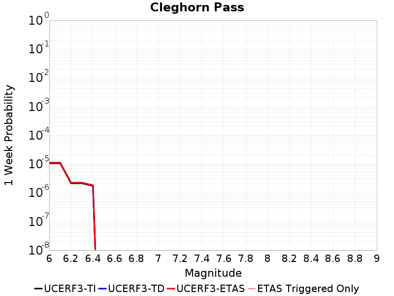 |  | 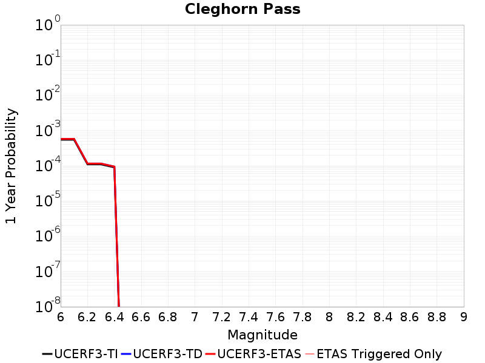 | 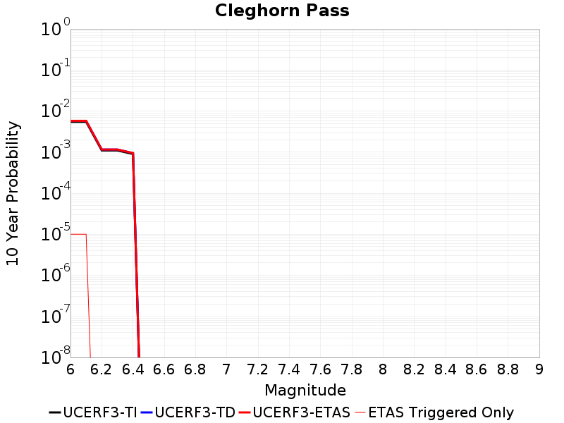 |

| Magnitude | 1 wk TI Prob | 1 wk TD Prob | 1 wk ETAS Prob | 1 wk ETAS/TD Gain | 1 wk ETAS Triggered Only | 1 mo TI Prob | 1 mo TD Prob | 1 mo ETAS Prob | 1 mo ETAS/TD Gain | 1 mo ETAS Triggered Only | 1 yr TI Prob | 1 yr TD Prob | 1 yr ETAS Prob | 1 yr ETAS/TD Gain | 1 yr ETAS Triggered Only | 10 yr TI Prob | 10 yr TD Prob | 10 yr ETAS Prob | 10 yr ETAS/TD Gain | 10 yr ETAS Triggered Only |
|-----|-----|-----|-----|-----|-----|-----|-----|-----|-----|-----|-----|-----|-----|-----|-----|-----|-----|-----|-----|-----|
| 6.0 | 1.0522846E-5 | 1.1057597E-5 | 1.1057597E-5 | 1.0 | 0.0 | 4.509713E-5 | 4.7389134E-5 | 4.7389134E-5 | 1.0 | 0.0 | 5.4891926E-4 | 5.768628E-4 | 5.768628E-4 | 1.0 | 0.0 | 0.0054756533 | 0.005758835 | 0.0057687773 | 1.0017265 | 1.0E-5 |
| 6.1 | 1.0522846E-5 | 1.1057597E-5 | 1.1057597E-5 | 1.0 | 0.0 | 4.509713E-5 | 4.7389134E-5 | 4.7389134E-5 | 1.0 | 0.0 | 5.4891926E-4 | 5.768628E-4 | 5.768628E-4 | 1.0 | 0.0 | 0.0054756533 | 0.005758835 | 0.0057687773 | 1.0017265 | 1.0E-5 |
| 6.2 | 2.1045846E-6 | 2.2115955E-6 | 2.2115955E-6 | 1.0 | 0.0 | 9.019617E-6 | 9.478255E-6 | 9.478255E-6 | 1.0 | 0.0 | 1.098083E-4 | 1.1539586E-4 | 1.1539586E-4 | 1.0 | 0.0 | 0.0010975406 | 0.001153772 | 0.001153772 | 1.0 | 0.0 |
| 6.3 | 2.1045846E-6 | 2.2115955E-6 | 2.2115955E-6 | 1.0 | 0.0 | 9.019617E-6 | 9.478255E-6 | 9.478255E-6 | 1.0 | 0.0 | 1.098083E-4 | 1.1539586E-4 | 1.1539586E-4 | 1.0 | 0.0 | 0.0010975406 | 0.001153772 | 0.001153772 | 1.0 | 0.0 |
| 6.4 | 1.7259927E-6 | 1.8136565E-6 | 1.8136565E-6 | 1.0 | 0.0 | 7.3970905E-6 | 7.772814E-6 | 7.772814E-6 | 1.0 | 0.0 | 9.005586E-5 | 9.4634E-5 | 9.4634E-5 | 1.0 | 0.0 | 9.001937E-4 | 9.4634003E-4 | 9.4634003E-4 | 1.0 | 0.0 |

## Manix-Afton Hills
*[(top)](#table-of-contents)*

| 1 Week | 1 Month | 1 Year | 10 Year |
|-----|-----|-----|-----|
| 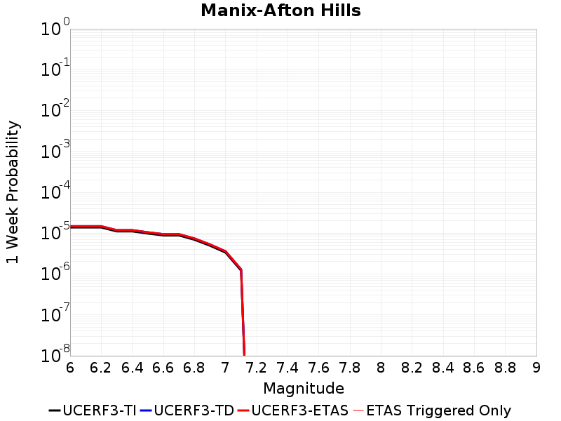 | 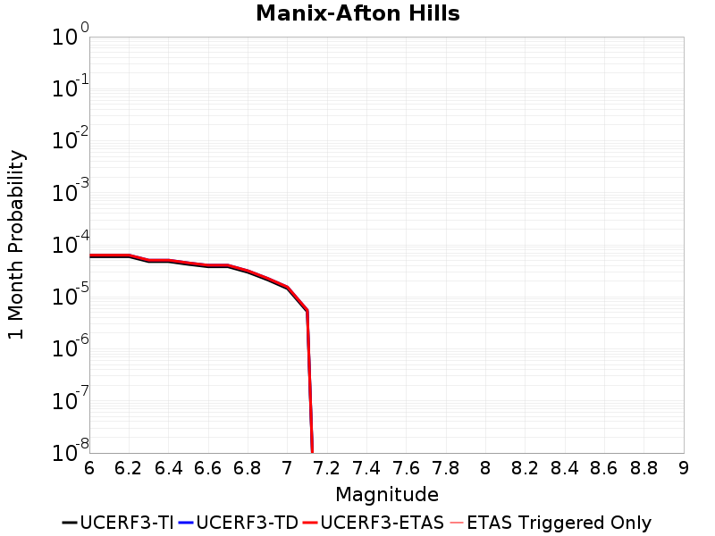 |  |  |

| Magnitude | 1 wk TI Prob | 1 wk TD Prob | 1 wk ETAS Prob | 1 wk ETAS/TD Gain | 1 wk ETAS Triggered Only | 1 mo TI Prob | 1 mo TD Prob | 1 mo ETAS Prob | 1 mo ETAS/TD Gain | 1 mo ETAS Triggered Only | 1 yr TI Prob | 1 yr TD Prob | 1 yr ETAS Prob | 1 yr ETAS/TD Gain | 1 yr ETAS Triggered Only | 10 yr TI Prob | 10 yr TD Prob | 10 yr ETAS Prob | 10 yr ETAS/TD Gain | 10 yr ETAS Triggered Only |
|-----|-----|-----|-----|-----|-----|-----|-----|-----|-----|-----|-----|-----|-----|-----|-----|-----|-----|-----|-----|-----|
| 6.0 | 1.3783202E-5 | 1.4742077E-5 | 1.4742077E-5 | 1.0 | 0.0 | 5.906953E-5 | 6.31789E-5 | 6.31789E-5 | 1.0 | 0.0 | 7.189342E-4 | 7.6894916E-4 | 7.789415E-4 | 1.0129948 | 1.0E-5 | 0.0071661277 | 0.007664649 | 0.0076745725 | 1.0012947 | 1.0E-5 |
| 6.1 | 1.3783202E-5 | 1.4742077E-5 | 1.4742077E-5 | 1.0 | 0.0 | 5.906953E-5 | 6.31789E-5 | 6.31789E-5 | 1.0 | 0.0 | 7.189342E-4 | 7.6894916E-4 | 7.789415E-4 | 1.0129948 | 1.0E-5 | 0.0071661277 | 0.007664649 | 0.0076745725 | 1.0012947 | 1.0E-5 |
| 6.2 | 1.3783202E-5 | 1.4742077E-5 | 1.4742077E-5 | 1.0 | 0.0 | 5.906953E-5 | 6.31789E-5 | 6.31789E-5 | 1.0 | 0.0 | 7.189342E-4 | 7.6894916E-4 | 7.789415E-4 | 1.0129948 | 1.0E-5 | 0.0071661277 | 0.007664649 | 0.0076745725 | 1.0012947 | 1.0E-5 |
| 6.3 | 1.10494875E-5 | 1.1817979E-5 | 1.1817979E-5 | 1.0 | 0.0 | 4.7354086E-5 | 5.0647555E-5 | 5.0647555E-5 | 1.0 | 0.0 | 5.763835E-4 | 6.1646994E-4 | 6.264638E-4 | 1.0162114 | 1.0E-5 | 0.005748908 | 0.0061486433 | 0.006158582 | 1.0016164 | 1.0E-5 |
| 6.4 | 1.10494875E-5 | 1.1817979E-5 | 1.1817979E-5 | 1.0 | 0.0 | 4.7354086E-5 | 5.0647555E-5 | 5.0647555E-5 | 1.0 | 0.0 | 5.763835E-4 | 6.1646994E-4 | 6.264638E-4 | 1.0162114 | 1.0E-5 | 0.005748908 | 0.0061486433 | 0.006158582 | 1.0016164 | 1.0E-5 |
| 6.5 | 9.788949E-6 | 1.0476566E-5 | 1.0476566E-5 | 1.0 | 0.0 | 4.1951964E-5 | 4.4898847E-5 | 4.4898847E-5 | 1.0 | 0.0 | 5.1064545E-4 | 5.465157E-4 | 5.5651023E-4 | 1.0182878 | 1.0E-5 | 0.0050947363 | 0.0054526473 | 0.005462593 | 1.001824 | 1.0E-5 |
| 6.6 | 8.810006E-6 | 9.433823E-6 | 9.433823E-6 | 1.0 | 0.0 | 3.775662E-5 | 4.0430095E-5 | 4.0430095E-5 | 1.0 | 0.0 | 4.5958988E-4 | 4.9213413E-4 | 5.0212926E-4 | 1.0203097 | 1.0E-5 | 0.0045864056 | 0.004911329 | 0.00492128 | 1.0020261 | 1.0E-5 |
| 6.7 | 8.80128E-6 | 9.424276E-6 | 9.424276E-6 | 1.0 | 0.0 | 3.7719226E-5 | 4.038918E-5 | 4.038918E-5 | 1.0 | 0.0 | 4.591348E-4 | 4.916362E-4 | 5.016313E-4 | 1.0203302 | 1.0E-5 | 0.004581874 | 0.0049063717 | 0.004916323 | 1.0020281 | 1.0E-5 |
| 6.8 | 6.8994877E-6 | 7.396175E-6 | 7.396175E-6 | 1.0 | 0.0 | 2.9568899E-5 | 3.1697553E-5 | 3.1697553E-5 | 1.0 | 0.0 | 3.5994186E-4 | 3.858576E-4 | 3.958537E-4 | 1.0259063 | 1.0E-5 | 0.003593594 | 0.0038526845 | 0.003862646 | 1.0025856 | 1.0E-5 |
| 6.9 | 4.9328037E-6 | 5.282279E-6 | 5.282279E-6 | 1.0 | 0.0 | 2.1140417E-5 | 2.2638176E-5 | 2.2638176E-5 | 1.0 | 0.0 | 2.5735417E-4 | 2.755911E-4 | 2.8558835E-4 | 1.0362756 | 1.0E-5 | 0.0025705635 | 0.002753101 | 0.0027630737 | 1.0036223 | 1.0E-5 |
| 7.0 | 3.347973E-6 | 3.5981614E-6 | 3.5981614E-6 | 1.0 | 0.0 | 1.4348378E-5 | 1.5420623E-5 | 1.5420623E-5 | 1.0 | 0.0 | 1.746775E-4 | 1.8773404E-4 | 1.8773404E-4 | 1.0 | 0.0 | 0.0017454025 | 0.0018761586 | 0.0018761586 | 1.0 | 0.0 |
| 7.1 | 1.2073567E-6 | 1.2963637E-6 | 1.2963637E-6 | 1.0 | 0.0 | 5.1743755E-6 | 5.5558417E-6 | 5.5558417E-6 | 1.0 | 0.0 | 6.29962E-5 | 6.7641915E-5 | 6.7641915E-5 | 1.0 | 0.0 | 6.297835E-4 | 6.763741E-4 | 6.763741E-4 | 1.0 | 0.0 |

## Pilarcitos 2011 CFM
*[(top)](#table-of-contents)*

| 1 Week | 1 Month | 1 Year | 10 Year |
|-----|-----|-----|-----|
| 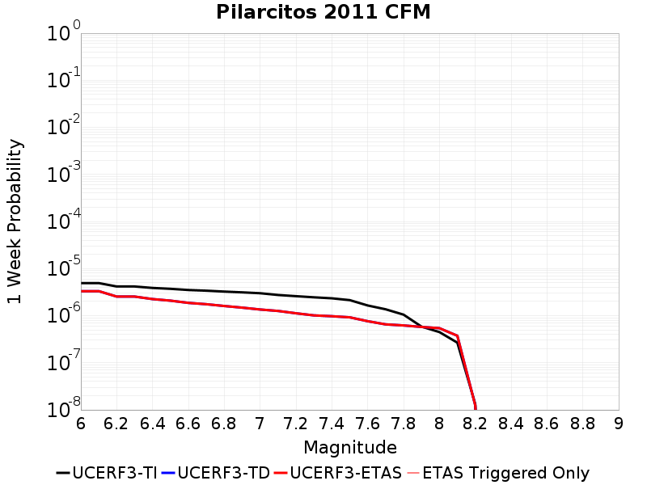 |  | 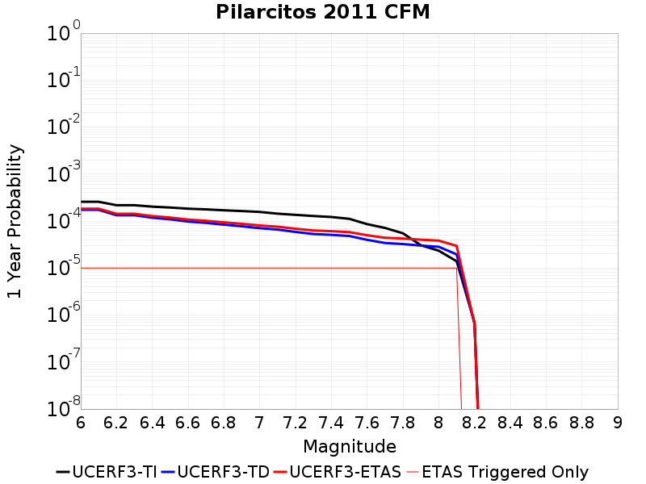 | 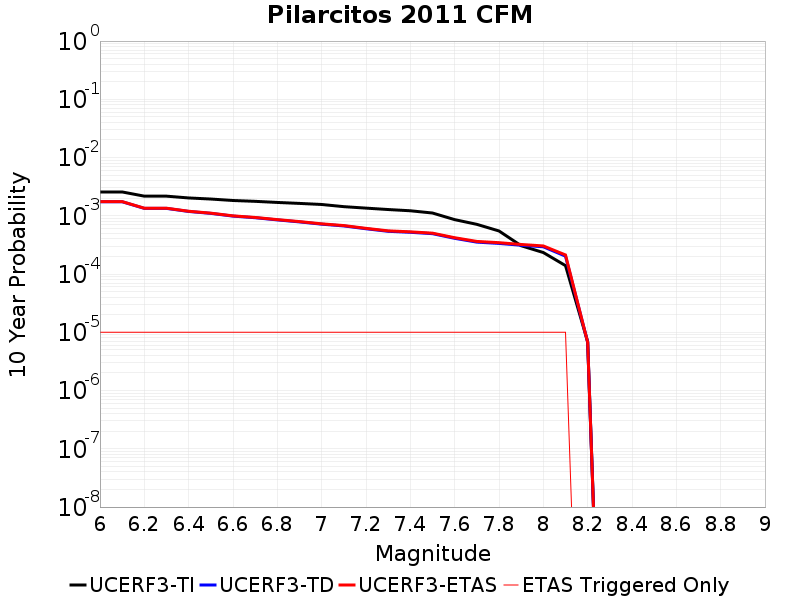 |

| Magnitude | 1 wk TI Prob | 1 wk TD Prob | 1 wk ETAS Prob | 1 wk ETAS/TD Gain | 1 wk ETAS Triggered Only | 1 mo TI Prob | 1 mo TD Prob | 1 mo ETAS Prob | 1 mo ETAS/TD Gain | 1 mo ETAS Triggered Only | 1 yr TI Prob | 1 yr TD Prob | 1 yr ETAS Prob | 1 yr ETAS/TD Gain | 1 yr ETAS Triggered Only | 10 yr TI Prob | 10 yr TD Prob | 10 yr ETAS Prob | 10 yr ETAS/TD Gain | 10 yr ETAS Triggered Only |
|-----|-----|-----|-----|-----|-----|-----|-----|-----|-----|-----|-----|-----|-----|-----|-----|-----|-----|-----|-----|-----|
| 6.0 | 4.9150476E-6 | 3.3133072E-6 | 3.3133072E-6 | 1.0 | 0.0 | 2.1064321E-5 | 1.41998125E-5 | 1.41998125E-5 | 1.0 | 0.0 | 2.564279E-4 | 1.7286932E-4 | 1.8286759E-4 | 1.0578371 | 1.0E-5 | 0.0025613222 | 0.0017396178 | 0.0017496004 | 1.0057384 | 1.0E-5 |
| 6.1 | 4.9150476E-6 | 3.3133072E-6 | 3.3133072E-6 | 1.0 | 0.0 | 2.1064321E-5 | 1.41998125E-5 | 1.41998125E-5 | 1.0 | 0.0 | 2.564279E-4 | 1.7286932E-4 | 1.8286759E-4 | 1.0578371 | 1.0E-5 | 0.0025613222 | 0.0017396178 | 0.0017496004 | 1.0057384 | 1.0E-5 |
| 6.2 | 4.162343E-6 | 2.5413638E-6 | 2.5413638E-6 | 1.0 | 0.0 | 1.783849E-5 | 1.0891514E-5 | 1.0891514E-5 | 1.0 | 0.0 | 2.1716199E-4 | 1.325962E-4 | 1.4259486E-4 | 1.0754069 | 1.0E-5 | 0.002169499 | 0.0013374219 | 0.0013474085 | 1.007467 | 1.0E-5 |
| 6.3 | 4.162343E-6 | 2.5413638E-6 | 2.5413638E-6 | 1.0 | 0.0 | 1.783849E-5 | 1.0891514E-5 | 1.0891514E-5 | 1.0 | 0.0 | 2.1716199E-4 | 1.325962E-4 | 1.4259486E-4 | 1.0754069 | 1.0E-5 | 0.002169499 | 0.0013374219 | 0.0013474085 | 1.007467 | 1.0E-5 |
| 6.4 | 3.8768926E-6 | 2.2486563E-6 | 2.2486563E-6 | 1.0 | 0.0 | 1.6615148E-5 | 9.637063E-6 | 9.637063E-6 | 1.0 | 0.0 | 2.0227065E-4 | 1.1732497E-4 | 1.2732379E-4 | 1.0852233 | 1.0E-5 | 0.0020208664 | 0.0011848797 | 0.0011948678 | 1.0084296 | 1.0E-5 |
| 6.5 | 3.7137002E-6 | 2.0818463E-6 | 2.0818463E-6 | 1.0 | 0.0 | 1.591576E-5 | 8.922168E-6 | 8.922168E-6 | 1.0 | 0.0 | 1.9375715E-4 | 1.0862201E-4 | 1.1862092E-4 | 1.0920523 | 1.0E-5 | 0.001935883 | 0.0010979385 | 0.0011079275 | 1.0090979 | 1.0E-5 |
| 6.6 | 3.5048733E-6 | 1.8666375E-6 | 1.8666375E-6 | 1.0 | 0.0 | 1.5020799E-5 | 7.99985E-6 | 7.99985E-6 | 1.0 | 0.0 | 1.8286289E-4 | 9.7393844E-5 | 1.0739287E-4 | 1.1026659 | 1.0E-5 | 0.0018271249 | 9.857615E-4 | 9.957516E-4 | 1.0101345 | 1.0E-5 |
| 6.7 | 3.3908584E-6 | 1.7501349E-6 | 1.7501349E-6 | 1.0 | 0.0 | 1.453217E-5 | 7.500556E-6 | 7.500556E-6 | 1.0 | 0.0 | 1.7691481E-4 | 9.1315465E-5 | 1.0131455E-4 | 1.1095005 | 1.0E-5 | 0.0017677402 | 9.250295E-4 | 9.350203E-4 | 1.0108005 | 1.0E-5 |
| 6.8 | 3.2451449E-6 | 1.6030842E-6 | 1.6030842E-6 | 1.0 | 0.0 | 1.3907689E-5 | 6.8703425E-6 | 6.8703425E-6 | 1.0 | 0.0 | 1.6931296E-4 | 8.364322E-5 | 9.364238E-5 | 1.1195455 | 1.0E-5 | 0.0016918402 | 8.4836775E-4 | 8.583593E-4 | 1.0117773 | 1.0E-5 |
| 6.9 | 3.1239128E-6 | 1.4793786E-6 | 1.4793786E-6 | 1.0 | 0.0 | 1.3388129E-5 | 6.3401785E-6 | 6.3401785E-6 | 1.0 | 0.0 | 1.6298829E-4 | 7.7188946E-5 | 8.718818E-5 | 1.1295422 | 1.0E-5 | 0.001628688 | 7.838722E-4 | 7.9386437E-4 | 1.0127472 | 1.0E-5 |
| 7.0 | 2.9940109E-6 | 1.3503061E-6 | 1.3503061E-6 | 1.0 | 0.0 | 1.2831412E-5 | 5.7870134E-6 | 5.7870134E-6 | 1.0 | 0.0 | 1.5621124E-4 | 7.045461E-5 | 8.045391E-5 | 1.1419253 | 1.0E-5 | 0.0015610148 | 7.1657385E-4 | 7.2656665E-4 | 1.0139453 | 1.0E-5 |
| 7.1 | 2.7471217E-6 | 1.2583718E-6 | 1.2583718E-6 | 1.0 | 0.0 | 1.1773326E-5 | 5.3930103E-6 | 5.3930103E-6 | 1.0 | 0.0 | 1.4333082E-4 | 6.565793E-5 | 7.565727E-5 | 1.1522945 | 1.0E-5 | 0.001432384 | 6.6857104E-4 | 6.7856436E-4 | 1.0149473 | 1.0E-5 |
| 7.2 | 2.592675E-6 | 1.1229366E-6 | 1.1229366E-6 | 1.0 | 0.0 | 1.1111417E-5 | 4.8125767E-6 | 4.8125767E-6 | 1.0 | 0.0 | 1.3527309E-4 | 5.8591548E-5 | 6.859096E-5 | 1.1706631 | 1.0E-5 | 0.0013519078 | 5.9794745E-4 | 6.079415E-4 | 1.0167139 | 1.0E-5 |
| 7.3 | 2.4518663E-6 | 1.0126093E-6 | 1.0126093E-6 | 1.0 | 0.0 | 1.0507956E-5 | 4.339747E-6 | 4.339747E-6 | 1.0 | 0.0 | 1.2792686E-4 | 5.283514E-5 | 6.283461E-5 | 1.189258 | 1.0E-5 | 0.0012785323 | 5.404099E-4 | 5.504045E-4 | 1.0184945 | 1.0E-5 |
| 7.4 | 2.3349535E-6 | 9.730841E-7 | 9.730841E-7 | 1.0 | 0.0 | 1.0006905E-5 | 4.1703533E-6 | 4.1703533E-6 | 1.0 | 0.0 | 1.2182725E-4 | 5.0772873E-5 | 6.0772363E-5 | 1.1969455 | 1.0E-5 | 0.0012176048 | 5.197658E-4 | 5.2976055E-4 | 1.0192294 | 1.0E-5 |
| 7.5 | 2.1358665E-6 | 9.209013E-7 | 9.209013E-7 | 1.0 | 0.0 | 9.15368E-6 | 3.946714E-6 | 3.946714E-6 | 1.0 | 0.0 | 1.11440364E-4 | 4.8050184E-5 | 5.8049704E-5 | 1.2081058 | 1.0E-5 | 0.0011138449 | 4.9244566E-4 | 5.0244073E-4 | 1.0202968 | 1.0E-5 |
| 7.6 | 1.6445446E-6 | 7.6228486E-7 | 7.6228486E-7 | 1.0 | 0.0 | 7.048029E-6 | 3.2669311E-6 | 3.2669311E-6 | 1.0 | 0.0 | 8.580638E-5 | 3.977416E-5 | 4.9773764E-5 | 1.2514095 | 1.0E-5 | 8.5773255E-4 | 4.096473E-4 | 4.196432E-4 | 1.0244012 | 1.0E-5 |
| 7.7 | 1.3650961E-6 | 6.5294984E-7 | 6.5294984E-7 | 1.0 | 0.0 | 5.850399E-6 | 2.7983533E-6 | 2.7983533E-6 | 1.0 | 0.0 | 7.122628E-5 | 3.406942E-5 | 4.406908E-5 | 1.2935083 | 1.0E-5 | 7.120345E-4 | 3.5249416E-4 | 3.6249065E-4 | 1.0283593 | 1.0E-5 |
| 7.8 | 1.0500993E-6 | 6.1962817E-7 | 6.1962817E-7 | 1.0 | 0.0 | 4.5004176E-6 | 2.6555467E-6 | 2.6555467E-6 | 1.0 | 0.0 | 5.4791206E-5 | 3.23308E-5 | 4.2330477E-5 | 1.3092926 | 1.0E-5 | 5.47777E-4 | 3.349586E-4 | 3.4495528E-4 | 1.0298444 | 1.0E-5 |
| 7.9 | 5.856431E-7 | 5.7603165E-7 | 5.7603165E-7 | 1.0 | 0.0 | 2.5098966E-6 | 2.4687047E-6 | 2.4687047E-6 | 1.0 | 0.0 | 3.0557563E-5 | 3.0056066E-5 | 4.0055766E-5 | 1.3327016 | 1.0E-5 | 3.055336E-4 | 3.1139643E-4 | 3.2139334E-4 | 1.0321034 | 1.0E-5 |
| 8.0 | 4.4768265E-7 | 5.421011E-7 | 5.421011E-7 | 1.0 | 0.0 | 1.9186384E-6 | 2.3232883E-6 | 2.3232883E-6 | 1.0 | 0.0 | 2.3359173E-5 | 2.8285669E-5 | 3.8285387E-5 | 1.3535259 | 1.0E-5 | 2.3356717E-4 | 2.9313008E-4 | 3.0312713E-4 | 1.0341046 | 1.0E-5 |
| 8.1 | 2.6692538E-7 | 3.74258E-7 | 3.74258E-7 | 1.0 | 0.0 | 1.1439654E-6 | 1.6039619E-6 | 1.6039619E-6 | 1.0 | 0.0 | 1.392769E-5 | 1.9528063E-5 | 2.9527866E-5 | 1.5120736 | 1.0E-5 | 1.3926817E-4 | 2.0235307E-4 | 2.1235103E-4 | 1.0494086 | 1.0E-5 |
| 8.2 | 1.3198862E-8 | 1.2414049E-8 | 1.2414049E-8 | 1.0 | 0.0 | 5.656655E-8 | 5.3203067E-8 | 5.3203067E-8 | 1.0 | 0.0 | 6.886975E-7 | 6.477472E-7 | 6.477472E-7 | 1.0 | 0.0 | 6.8869535E-6 | 6.71916E-6 | 6.71916E-6 | 1.0 | 0.0 |

## Mission Ridge-Arroyo Parida-Santa Ana
*[(top)](#table-of-contents)*

| 1 Week | 1 Month | 1 Year | 10 Year |
|-----|-----|-----|-----|
|  | 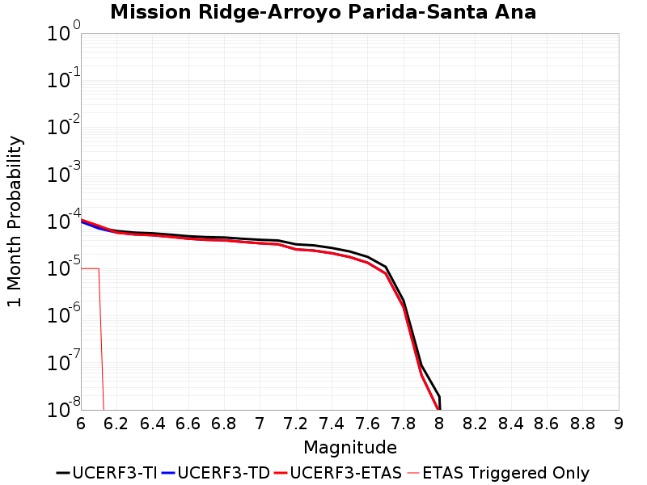 | 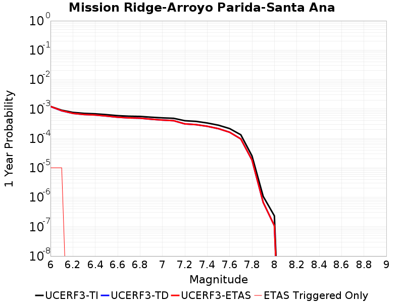 | 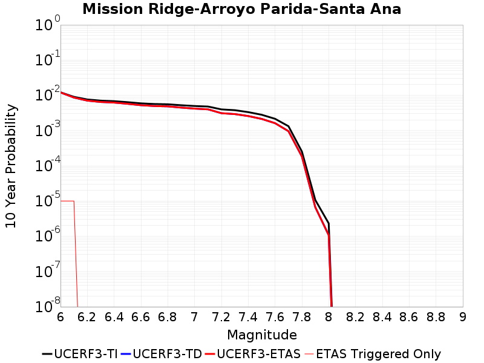 |

| Magnitude | 1 wk TI Prob | 1 wk TD Prob | 1 wk ETAS Prob | 1 wk ETAS/TD Gain | 1 wk ETAS Triggered Only | 1 mo TI Prob | 1 mo TD Prob | 1 mo ETAS Prob | 1 mo ETAS/TD Gain | 1 mo ETAS Triggered Only | 1 yr TI Prob | 1 yr TD Prob | 1 yr ETAS Prob | 1 yr ETAS/TD Gain | 1 yr ETAS Triggered Only | 10 yr TI Prob | 10 yr TD Prob | 10 yr ETAS Prob | 10 yr ETAS/TD Gain | 10 yr ETAS Triggered Only |
|-----|-----|-----|-----|-----|-----|-----|-----|-----|-----|-----|-----|-----|-----|-----|-----|-----|-----|-----|-----|-----|
| 6.0 | 2.3406641E-5 | 2.3194065E-5 | 3.3193835E-5 | 1.4311348 | 1.0E-5 | 1.0031032E-4 | 9.939963E-5 | 1.09398636E-4 | 1.100594 | 1.0E-5 | 0.0012205938 | 0.0012095685 | 0.0012195563 | 1.0082574 | 1.0E-5 | 0.012139114 | 0.012034955 | 0.012044836 | 1.0008209 | 1.0E-5 |
| 6.1 | 1.73813E-5 | 1.6586988E-5 | 2.658682E-5 | 1.6028723 | 1.0E-5 | 7.4489166E-5 | 7.1085204E-5 | 8.1084494E-5 | 1.1406662 | 1.0E-5 | 9.065282E-4 | 8.651284E-4 | 8.7511976E-4 | 1.011549 | 1.0E-5 | 0.009028391 | 0.008618682 | 0.008628596 | 1.0011503 | 1.0E-5 |
| 6.2 | 1.4622182E-5 | 1.3581109E-5 | 1.3581109E-5 | 1.0 | 0.0 | 6.2664985E-5 | 5.8203477E-5 | 5.8203477E-5 | 1.0 | 0.0 | 7.6267915E-4 | 7.084007E-4 | 7.084007E-4 | 1.0 | 0.0 | 0.007600669 | 0.007061885 | 0.007061885 | 1.0 | 0.0 |
| 6.3 | 1.3552434E-5 | 1.2426143E-5 | 1.2426143E-5 | 1.0 | 0.0 | 5.8080568E-5 | 5.3253832E-5 | 5.3253832E-5 | 1.0 | 0.0 | 7.069015E-4 | 6.481756E-4 | 6.481756E-4 | 1.0 | 0.0 | 0.00704657 | 0.0064632366 | 0.0064632366 | 1.0 | 0.0 |
| 6.4 | 1.30977305E-5 | 1.1935893E-5 | 1.1935893E-5 | 1.0 | 0.0 | 5.613192E-5 | 5.115284E-5 | 5.115284E-5 | 1.0 | 0.0 | 6.831918E-4 | 6.226108E-4 | 6.226108E-4 | 1.0 | 0.0 | 0.006810953 | 0.006209034 | 0.006209034 | 1.0 | 0.0 |
| 6.5 | 1.225205E-5 | 1.1025797E-5 | 1.1025797E-5 | 1.0 | 0.0 | 5.2507727E-5 | 4.725257E-5 | 4.725257E-5 | 1.0 | 0.0 | 6.3909404E-4 | 5.751509E-4 | 5.751509E-4 | 1.0 | 0.0 | 0.006372592 | 0.0057369587 | 0.0057369587 | 1.0 | 0.0 |
| 6.6 | 1.1352241E-5 | 1.00587895E-5 | 1.00587895E-5 | 1.0 | 0.0 | 4.8651553E-5 | 4.3108397E-5 | 4.3108397E-5 | 1.0 | 0.0 | 5.921717E-4 | 5.2472047E-4 | 5.2472047E-4 | 1.0 | 0.0 | 0.0059059616 | 0.005235089 | 0.005235089 | 1.0 | 0.0 |
| 6.7 | 1.0864116E-5 | 9.522314E-6 | 9.522314E-6 | 1.0 | 0.0 | 4.6559664E-5 | 4.080929E-5 | 4.080929E-5 | 1.0 | 0.0 | 5.667165E-4 | 4.967418E-4 | 4.967418E-4 | 1.0 | 0.0 | 0.005652734 | 0.0049565765 | 0.0049565765 | 1.0 | 0.0 |
| 6.8 | 1.0666365E-5 | 9.306339E-6 | 9.306339E-6 | 1.0 | 0.0 | 4.571219E-5 | 3.988371E-5 | 3.988371E-5 | 1.0 | 0.0 | 5.564038E-4 | 4.8547797E-4 | 4.8547797E-4 | 1.0 | 0.0 | 0.005550127 | 0.004844434 | 0.004844434 | 1.0 | 0.0 |
| 6.9 | 1.0038665E-5 | 8.601006E-6 | 8.601006E-6 | 1.0 | 0.0 | 4.302214E-5 | 3.6860944E-5 | 3.6860944E-5 | 1.0 | 0.0 | 5.236687E-4 | 4.4869134E-4 | 4.4869134E-4 | 1.0 | 0.0 | 0.005224364 | 0.004478093 | 0.004478093 | 1.0 | 0.0 |
| 7.0 | 9.5379955E-6 | 8.038011E-6 | 8.038011E-6 | 1.0 | 0.0 | 4.0876483E-5 | 3.4448174E-5 | 3.4448174E-5 | 1.0 | 0.0 | 4.975576E-4 | 4.193275E-4 | 4.193275E-4 | 1.0 | 0.0 | 0.00496445 | 0.0041855904 | 0.0041855904 | 1.0 | 0.0 |
| 7.1 | 9.207389E-6 | 7.6672195E-6 | 7.6672195E-6 | 1.0 | 0.0 | 3.945964E-5 | 3.285911E-5 | 3.285911E-5 | 1.0 | 0.0 | 4.803152E-4 | 3.9998788E-4 | 3.9998788E-4 | 1.0 | 0.0 | 0.004792784 | 0.003992904 | 0.003992904 | 1.0 | 0.0 |
| 7.2 | 7.638091E-6 | 5.95596E-6 | 5.95596E-6 | 1.0 | 0.0 | 3.2734264E-5 | 2.5525296E-5 | 2.5525296E-5 | 1.0 | 0.0 | 3.984668E-4 | 3.107265E-4 | 3.107265E-4 | 1.0 | 0.0 | 0.0039775306 | 0.003103008 | 0.003103008 | 1.0 | 0.0 |
| 7.3 | 7.2500147E-6 | 5.620045E-6 | 5.620045E-6 | 1.0 | 0.0 | 3.1071122E-5 | 2.4085688E-5 | 2.4085688E-5 | 1.0 | 0.0 | 3.7822526E-4 | 2.932041E-4 | 2.932041E-4 | 1.0 | 0.0 | 0.0037758215 | 0.0029282589 | 0.0029282589 | 1.0 | 0.0 |
| 7.4 | 6.3899715E-6 | 4.938584E-6 | 4.938584E-6 | 1.0 | 0.0 | 2.7385306E-5 | 2.1165188E-5 | 2.1165188E-5 | 1.0 | 0.0 | 3.3336508E-4 | 2.576559E-4 | 2.576559E-4 | 1.0 | 0.0 | 0.0033286542 | 0.002573647 | 0.002573647 | 1.0 | 0.0 |
| 7.5 | 5.379025E-6 | 4.0984564E-6 | 4.0984564E-6 | 1.0 | 0.0 | 2.305276E-5 | 1.7564696E-5 | 1.7564696E-5 | 1.0 | 0.0 | 2.806312E-4 | 2.1382929E-4 | 2.1382929E-4 | 1.0 | 0.0 | 0.0028027708 | 0.0021362468 | 0.0021362468 | 1.0 | 0.0 |
| 7.6 | 4.1270696E-6 | 3.0991937E-6 | 3.0991937E-6 | 1.0 | 0.0 | 1.768732E-5 | 1.32821915E-5 | 1.32821915E-5 | 1.0 | 0.0 | 2.1532185E-4 | 1.6169876E-4 | 1.6169876E-4 | 1.0 | 0.0 | 0.0021511333 | 0.0016158192 | 0.0016158192 | 1.0 | 0.0 |
| 7.7 | 2.5406805E-6 | 1.8351302E-6 | 1.8351302E-6 | 1.0 | 0.0 | 1.0888585E-5 | 7.86482E-6 | 7.86482E-6 | 1.0 | 0.0 | 1.3256045E-4 | 9.575004E-5 | 9.575004E-5 | 1.0 | 0.0 | 0.0013248142 | 9.570941E-4 | 9.570941E-4 | 1.0 | 0.0 |
| 7.8 | 4.8608285E-7 | 3.523151E-7 | 3.523151E-7 | 1.0 | 0.0 | 2.0832106E-6 | 1.509921E-6 | 1.509921E-6 | 1.0 | 0.0 | 2.5362791E-5 | 1.8383134E-5 | 1.8383134E-5 | 1.0 | 0.0 | 2.5359896E-4 | 1.8381627E-4 | 1.8381627E-4 | 1.0 | 0.0 |
| 7.9 | 2.0472514E-8 | 1.2768297E-8 | 1.2768297E-8 | 1.0 | 0.0 | 8.7739345E-8 | 5.472127E-8 | 5.472127E-8 | 1.0 | 0.0 | 1.068226E-6 | 6.6623124E-7 | 6.6623124E-7 | 1.0 | 0.0 | 1.0682209E-5 | 6.662294E-6 | 6.662294E-6 | 1.0 | 0.0 |
| 8.0 | 4.443582E-9 | 2.0599071E-9 | 2.0599071E-9 | 1.0 | 0.0 | 1.9043922E-8 | 8.828174E-9 | 8.828174E-9 | 1.0 | 0.0 | 2.3185973E-7 | 1.0748301E-7 | 1.0748301E-7 | 1.0 | 0.0 | 2.3185949E-6 | 1.0748297E-6 | 1.0748297E-6 | 1.0 | 0.0 |

## Santa Susana East (connector)
*[(top)](#table-of-contents)*

| 1 Week | 1 Month | 1 Year | 10 Year |
|-----|-----|-----|-----|
|  | 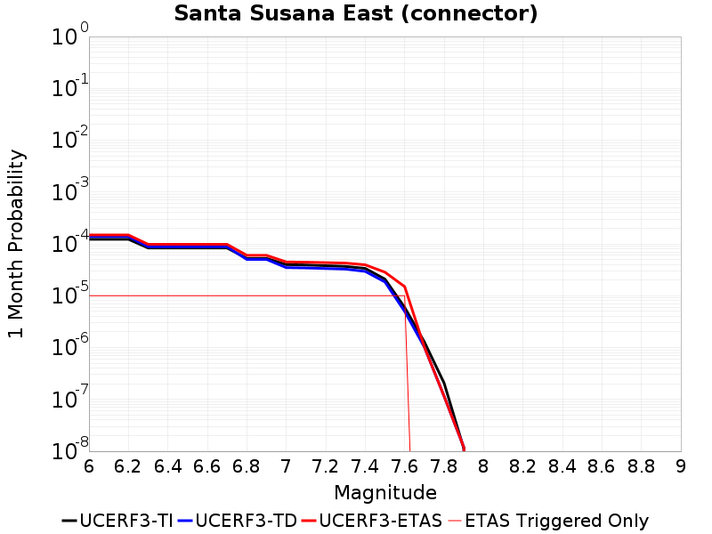 | 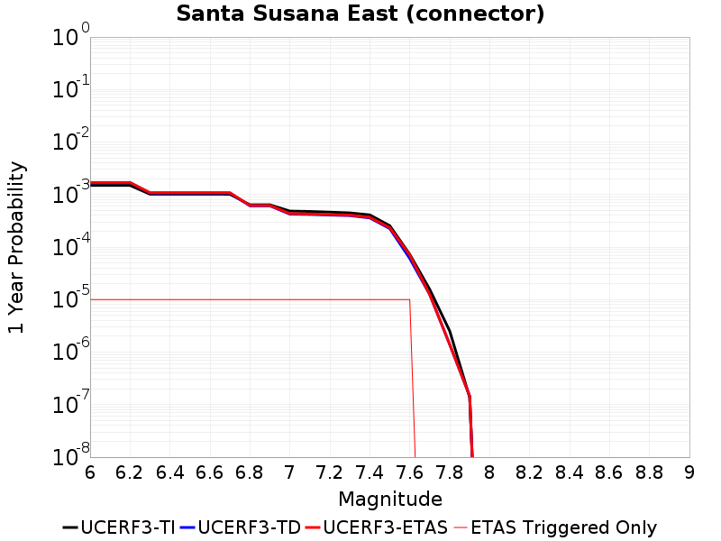 |  |

| Magnitude | 1 wk TI Prob | 1 wk TD Prob | 1 wk ETAS Prob | 1 wk ETAS/TD Gain | 1 wk ETAS Triggered Only | 1 mo TI Prob | 1 mo TD Prob | 1 mo ETAS Prob | 1 mo ETAS/TD Gain | 1 mo ETAS Triggered Only | 1 yr TI Prob | 1 yr TD Prob | 1 yr ETAS Prob | 1 yr ETAS/TD Gain | 1 yr ETAS Triggered Only | 10 yr TI Prob | 10 yr TD Prob | 10 yr ETAS Prob | 10 yr ETAS/TD Gain | 10 yr ETAS Triggered Only |
|-----|-----|-----|-----|-----|-----|-----|-----|-----|-----|-----|-----|-----|-----|-----|-----|-----|-----|-----|-----|-----|
| 6.0 | 2.858397E-5 | 3.2271564E-5 | 4.227124E-5 | 1.3098603 | 1.0E-5 | 1.2249697E-4 | 1.3830098E-4 | 1.482996E-4 | 1.072296 | 1.0E-5 | 0.0014903803 | 0.0016827848 | 0.0016927678 | 1.0059326 | 1.0E-5 | 0.014804244 | 0.016727507 | 0.01673734 | 1.0005878 | 1.0E-5 |
| 6.1 | 2.858397E-5 | 3.2271564E-5 | 4.227124E-5 | 1.3098603 | 1.0E-5 | 1.2249697E-4 | 1.3830098E-4 | 1.482996E-4 | 1.072296 | 1.0E-5 | 0.0014903803 | 0.0016827848 | 0.0016927678 | 1.0059326 | 1.0E-5 | 0.014804244 | 0.016727507 | 0.01673734 | 1.0005878 | 1.0E-5 |
| 6.2 | 2.858397E-5 | 3.2271564E-5 | 4.227124E-5 | 1.3098603 | 1.0E-5 | 1.2249697E-4 | 1.3830098E-4 | 1.482996E-4 | 1.072296 | 1.0E-5 | 0.0014903803 | 0.0016827848 | 0.0016927678 | 1.0059326 | 1.0E-5 | 0.014804244 | 0.016727507 | 0.01673734 | 1.0005878 | 1.0E-5 |
| 6.3 | 1.943582E-5 | 2.0518917E-5 | 3.0518713E-5 | 1.4873451 | 1.0E-5 | 8.329371E-5 | 8.793589E-5 | 9.7935015E-5 | 1.1137092 | 1.0E-5 | 0.001013629 | 0.0010702075 | 0.0010801968 | 1.009334 | 1.0E-5 | 0.010090181 | 0.01066215 | 0.010672043 | 1.0009279 | 1.0E-5 |
| 6.4 | 1.943582E-5 | 2.0518917E-5 | 3.0518713E-5 | 1.4873451 | 1.0E-5 | 8.329371E-5 | 8.793589E-5 | 9.7935015E-5 | 1.1137092 | 1.0E-5 | 0.001013629 | 0.0010702075 | 0.0010801968 | 1.009334 | 1.0E-5 | 0.010090181 | 0.01066215 | 0.010672043 | 1.0009279 | 1.0E-5 |
| 6.5 | 1.943582E-5 | 2.0518917E-5 | 3.0518713E-5 | 1.4873451 | 1.0E-5 | 8.329371E-5 | 8.793589E-5 | 9.7935015E-5 | 1.1137092 | 1.0E-5 | 0.001013629 | 0.0010702075 | 0.0010801968 | 1.009334 | 1.0E-5 | 0.010090181 | 0.01066215 | 0.010672043 | 1.0009279 | 1.0E-5 |
| 6.6 | 1.943582E-5 | 2.0518917E-5 | 3.0518713E-5 | 1.4873451 | 1.0E-5 | 8.329371E-5 | 8.793589E-5 | 9.7935015E-5 | 1.1137092 | 1.0E-5 | 0.001013629 | 0.0010702075 | 0.0010801968 | 1.009334 | 1.0E-5 | 0.010090181 | 0.01066215 | 0.010672043 | 1.0009279 | 1.0E-5 |
| 6.7 | 1.9404439E-5 | 2.0506088E-5 | 3.0505884E-5 | 1.48765 | 1.0E-5 | 8.3159226E-5 | 8.7880915E-5 | 9.788004E-5 | 1.1137804 | 1.0E-5 | 0.0010119933 | 0.0010695388 | 0.001079528 | 1.0093398 | 1.0E-5 | 0.010073971 | 0.010655526 | 0.0106654195 | 1.0009285 | 1.0E-5 |
| 6.8 | 1.2217526E-5 | 1.167502E-5 | 2.1674903E-5 | 1.8565196 | 1.0E-5 | 5.2359774E-5 | 5.0034938E-5 | 6.0034436E-5 | 1.1998503 | 1.0E-5 | 6.372938E-4 | 6.0902216E-4 | 6.1901606E-4 | 1.0164098 | 1.0E-5 | 0.0063546924 | 0.0060756234 | 0.006085563 | 1.0016359 | 1.0E-5 |
| 6.9 | 1.2217526E-5 | 1.167502E-5 | 2.1674903E-5 | 1.8565196 | 1.0E-5 | 5.2359774E-5 | 5.0034938E-5 | 6.0034436E-5 | 1.1998503 | 1.0E-5 | 6.372938E-4 | 6.0902216E-4 | 6.1901606E-4 | 1.0164098 | 1.0E-5 | 0.0063546924 | 0.0060756234 | 0.006085563 | 1.0016359 | 1.0E-5 |
| 7.0 | 9.276017E-6 | 8.117672E-6 | 1.8117591E-5 | 2.2318704 | 1.0E-5 | 3.9753755E-5 | 3.4789577E-5 | 4.478923E-5 | 1.2874324 | 1.0E-5 | 4.8389446E-4 | 4.234843E-4 | 4.3348008E-4 | 1.0236037 | 1.0E-5 | 0.0048284214 | 0.004227527 | 0.0042374847 | 1.0023555 | 1.0E-5 |
| 7.1 | 9.130355E-6 | 8.000411E-6 | 1.8000332E-5 | 2.2499259 | 1.0E-5 | 3.9129503E-5 | 3.4287044E-5 | 4.4286702E-5 | 1.2916454 | 1.0E-5 | 4.7629757E-4 | 4.173683E-4 | 4.2736414E-4 | 1.0239496 | 1.0E-5 | 0.00475278 | 0.0041665975 | 0.0041765557 | 1.00239 | 1.0E-5 |
| 7.2 | 8.851015E-6 | 7.798923E-6 | 1.7798846E-5 | 2.2822182 | 1.0E-5 | 3.7932372E-5 | 3.342355E-5 | 4.3423213E-5 | 1.2991803 | 1.0E-5 | 4.6172875E-4 | 4.068592E-4 | 4.1685515E-4 | 1.0245686 | 1.0E-5 | 0.0046077054 | 0.0040618936 | 0.0040718527 | 1.0024519 | 1.0E-5 |
| 7.3 | 8.573006E-6 | 7.6064157E-6 | 1.760634E-5 | 2.3146696 | 1.0E-5 | 3.6740938E-5 | 3.259854E-5 | 4.259821E-5 | 1.3067522 | 1.0E-5 | 4.472291E-4 | 3.968184E-4 | 4.0681442E-4 | 1.0251905 | 1.0E-5 | 0.004463301 | 0.003961839 | 0.003971799 | 1.0025141 | 1.0E-5 |
| 7.4 | 7.852282E-6 | 6.8692607E-6 | 1.6869191E-5 | 2.4557507 | 1.0E-5 | 3.36522E-5 | 2.9439374E-5 | 3.943908E-5 | 1.3396711 | 1.0E-5 | 4.096385E-4 | 3.5836853E-4 | 3.6836494E-4 | 1.0278943 | 1.0E-5 | 0.0040888423 | 0.0035785842 | 0.0035885484 | 1.0027844 | 1.0E-5 |
| 7.5 | 4.8869324E-6 | 4.3010177E-6 | 1.4300975E-5 | 3.325021 | 1.0E-5 | 2.0943828E-5 | 1.8432813E-5 | 2.8432629E-5 | 1.5425007 | 1.0E-5 | 2.5496128E-4 | 2.2439807E-4 | 2.3439582E-4 | 1.0445536 | 1.0E-5 | 0.0025466895 | 0.0022419987 | 0.0022519762 | 1.0044503 | 1.0E-5 |
| 7.6 | 1.3894544E-6 | 1.1603571E-6 | 1.1160346E-5 | 9.618026 | 1.0E-5 | 5.954791E-6 | 4.972951E-6 | 1.4972901E-5 | 3.0108685 | 1.0E-5 | 7.249717E-5 | 6.054422E-5 | 7.054361E-5 | 1.1651585 | 1.0E-5 | 7.247352E-4 | 6.0529914E-4 | 6.152931E-4 | 1.0165107 | 1.0E-5 |
| 7.7 | 2.9924632E-7 | 2.3823591E-7 | 2.3823591E-7 | 1.0 | 0.0 | 1.2824837E-6 | 1.0210107E-6 | 1.0210107E-6 | 1.0 | 0.0 | 1.5614127E-5 | 1.2430742E-5 | 1.2430742E-5 | 1.0 | 0.0 | 1.5613029E-4 | 1.2430118E-4 | 1.2430118E-4 | 1.0 | 0.0 |
| 7.8 | 4.8188564E-8 | 2.6765864E-8 | 2.6765864E-8 | 1.0 | 0.0 | 2.065224E-7 | 1.1471084E-7 | 1.1471084E-7 | 1.0 | 0.0 | 2.5144072E-6 | 1.3966037E-6 | 1.3966037E-6 | 1.0 | 0.0 | 2.5143789E-5 | 1.3965959E-5 | 1.3965959E-5 | 1.0 | 0.0 |
| 7.9 | 2.6127251E-9 | 2.7732496E-9 | 2.7732496E-9 | 1.0 | 0.0 | 1.1197393E-8 | 1.1885356E-8 | 1.1885356E-8 | 1.0 | 0.0 | 1.3632825E-7 | 1.447042E-7 | 1.447042E-7 | 1.0 | 0.0 | 1.3632817E-6 | 1.447042E-6 | 1.447042E-6 | 1.0 | 0.0 |

## Whittier alt 1
*[(top)](#table-of-contents)*

| 1 Week | 1 Month | 1 Year | 10 Year |
|-----|-----|-----|-----|
|  |  |  | 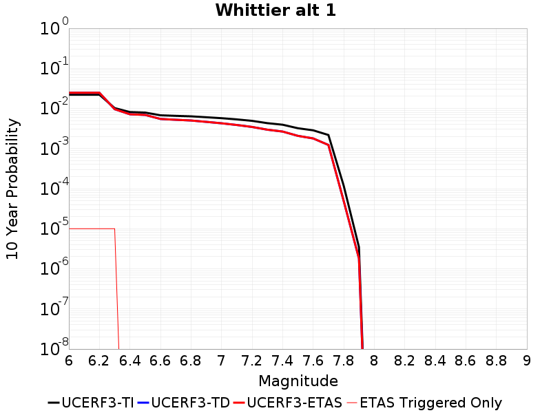 |

| Magnitude | 1 wk TI Prob | 1 wk TD Prob | 1 wk ETAS Prob | 1 wk ETAS/TD Gain | 1 wk ETAS Triggered Only | 1 mo TI Prob | 1 mo TD Prob | 1 mo ETAS Prob | 1 mo ETAS/TD Gain | 1 mo ETAS Triggered Only | 1 yr TI Prob | 1 yr TD Prob | 1 yr ETAS Prob | 1 yr ETAS/TD Gain | 1 yr ETAS Triggered Only | 10 yr TI Prob | 10 yr TD Prob | 10 yr ETAS Prob | 10 yr ETAS/TD Gain | 10 yr ETAS Triggered Only |
|-----|-----|-----|-----|-----|-----|-----|-----|-----|-----|-----|-----|-----|-----|-----|-----|-----|-----|-----|-----|-----|
| 6.0 | 4.2554693E-5 | 4.7551035E-5 | 4.7551035E-5 | 1.0 | 0.0 | 1.8236451E-4 | 2.0377607E-4 | 2.1377404E-4 | 1.0490634 | 1.0E-5 | 0.002218027 | 0.0024784761 | 0.0024884513 | 1.0040247 | 1.0E-5 | 0.02196019 | 0.024542343 | 0.024552098 | 1.0003974 | 1.0E-5 |
| 6.1 | 4.2554693E-5 | 4.7551035E-5 | 4.7551035E-5 | 1.0 | 0.0 | 1.8236451E-4 | 2.0377607E-4 | 2.1377404E-4 | 1.0490634 | 1.0E-5 | 0.002218027 | 0.0024784761 | 0.0024884513 | 1.0040247 | 1.0E-5 | 0.02196019 | 0.024542343 | 0.024552098 | 1.0003974 | 1.0E-5 |
| 6.2 | 4.2554693E-5 | 4.7551035E-5 | 4.7551035E-5 | 1.0 | 0.0 | 1.8236451E-4 | 2.0377607E-4 | 2.1377404E-4 | 1.0490634 | 1.0E-5 | 0.002218027 | 0.0024784761 | 0.0024884513 | 1.0040247 | 1.0E-5 | 0.02196019 | 0.024542343 | 0.024552098 | 1.0003974 | 1.0E-5 |
| 6.3 | 1.9617712E-5 | 1.8416817E-5 | 1.8416817E-5 | 1.0 | 0.0 | 8.40732E-5 | 7.892693E-5 | 8.892615E-5 | 1.1266894 | 1.0E-5 | 0.0010231105 | 9.6053106E-4 | 9.705215E-4 | 1.0104009 | 1.0E-5 | 0.01018413 | 0.009566723 | 0.009576628 | 1.0010353 | 1.0E-5 |
| 6.4 | 1.5611336E-5 | 1.3728897E-5 | 1.3728897E-5 | 1.0 | 0.0 | 6.690401E-5 | 5.883684E-5 | 5.883684E-5 | 1.0 | 0.0 | 8.142519E-4 | 7.161091E-4 | 7.161091E-4 | 1.0 | 0.0 | 0.008112748 | 0.0071396097 | 0.0071396097 | 1.0 | 0.0 |
| 6.5 | 1.5150166E-5 | 1.3226365E-5 | 1.3226365E-5 | 1.0 | 0.0 | 6.492767E-5 | 5.6683224E-5 | 5.6683224E-5 | 1.0 | 0.0 | 7.9020765E-4 | 6.899057E-4 | 6.899057E-4 | 1.0 | 0.0 | 0.007874036 | 0.0068792184 | 0.0068792184 | 1.0 | 0.0 |
| 6.6 | 1.295588E-5 | 1.0483865E-5 | 1.0483865E-5 | 1.0 | 0.0 | 5.552402E-5 | 4.4930086E-5 | 4.4930086E-5 | 1.0 | 0.0 | 6.7579525E-4 | 5.4688845E-4 | 5.4688845E-4 | 1.0 | 0.0 | 0.006737438 | 0.0054566944 | 0.0054566944 | 1.0 | 0.0 |
| 6.7 | 1.2542085E-5 | 1.0000833E-5 | 1.0000833E-5 | 1.0 | 0.0 | 5.3750682E-5 | 4.286002E-5 | 4.286002E-5 | 1.0 | 0.0 | 6.542181E-4 | 5.2169774E-4 | 5.2169774E-4 | 1.0 | 0.0 | 0.006522954 | 0.005205975 | 0.005205975 | 1.0 | 0.0 |
| 6.8 | 1.2195878E-5 | 9.594135E-6 | 9.594135E-6 | 1.0 | 0.0 | 5.2267E-5 | 4.1117084E-5 | 4.1117084E-5 | 1.0 | 0.0 | 6.36165E-4 | 5.004874E-4 | 5.004874E-4 | 1.0 | 0.0 | 0.0063434686 | 0.004994798 | 0.004994798 | 1.0 | 0.0 |
| 6.9 | 1.1580298E-5 | 8.869884E-6 | 8.869884E-6 | 1.0 | 0.0 | 4.9628903E-5 | 3.8013248E-5 | 3.8013248E-5 | 1.0 | 0.0 | 6.040644E-4 | 4.627147E-4 | 4.627147E-4 | 1.0 | 0.0 | 0.00602425 | 0.0046186987 | 0.0046186987 | 1.0 | 0.0 |
| 7.0 | 1.0964795E-5 | 8.174383E-6 | 8.174383E-6 | 1.0 | 0.0 | 4.6991136E-5 | 3.5032608E-5 | 3.5032608E-5 | 1.0 | 0.0 | 5.7196687E-4 | 4.264401E-4 | 4.264401E-4 | 1.0 | 0.0 | 0.0057049696 | 0.004257386 | 0.004257386 | 1.0 | 0.0 |
| 7.1 | 1.0230601E-5 | 7.409082E-6 | 7.409082E-6 | 1.0 | 0.0 | 4.3844695E-5 | 3.175283E-5 | 3.175283E-5 | 1.0 | 0.0 | 5.336784E-4 | 3.8652346E-4 | 3.8652346E-4 | 1.0 | 0.0 | 0.005323986 | 0.0038595754 | 0.0038595754 | 1.0 | 0.0 |
| 7.2 | 9.40865E-6 | 6.616357E-6 | 6.616357E-6 | 1.0 | 0.0 | 4.032216E-5 | 2.8355515E-5 | 2.8355515E-5 | 1.0 | 0.0 | 4.908117E-4 | 3.4517495E-4 | 3.4517495E-4 | 1.0 | 0.0 | 0.0048972913 | 0.003447391 | 0.003447391 | 1.0 | 0.0 |
| 7.3 | 8.237384E-6 | 5.657912E-6 | 5.657912E-6 | 1.0 | 0.0 | 3.5302593E-5 | 2.4247975E-5 | 2.4247975E-5 | 1.0 | 0.0 | 4.2972428E-4 | 2.9518016E-4 | 2.9518016E-4 | 1.0 | 0.0 | 0.0042889426 | 0.002948097 | 0.002948097 | 1.0 | 0.0 |
| 7.4 | 7.5316966E-6 | 5.0801173E-6 | 5.0801173E-6 | 1.0 | 0.0 | 3.2278298E-5 | 2.1771757E-5 | 2.1771757E-5 | 1.0 | 0.0 | 3.9291743E-4 | 2.650399E-4 | 2.650399E-4 | 1.0 | 0.0 | 0.0039222343 | 0.0026473498 | 0.0026473498 | 1.0 | 0.0 |
| 7.5 | 6.149649E-6 | 3.9694505E-6 | 3.9694505E-6 | 1.0 | 0.0 | 2.6355372E-5 | 1.7011826E-5 | 1.7011826E-5 | 1.0 | 0.0 | 3.208294E-4 | 2.0710021E-4 | 2.0710021E-4 | 1.0 | 0.0 | 0.003203666 | 0.002069163 | 0.002069163 | 1.0 | 0.0 |
| 7.6 | 5.457711E-6 | 3.4218308E-6 | 3.4218308E-6 | 1.0 | 0.0 | 2.338998E-5 | 1.4664912E-5 | 1.4664912E-5 | 1.0 | 0.0 | 2.8473578E-4 | 1.785315E-4 | 1.785315E-4 | 1.0 | 0.0 | 0.0028437122 | 0.0017839626 | 0.0017839626 | 1.0 | 0.0 |
| 7.7 | 4.1676276E-6 | 2.3519383E-6 | 2.3519383E-6 | 1.0 | 0.0 | 1.7861139E-5 | 1.0079701E-5 | 1.0079701E-5 | 1.0 | 0.0 | 2.1743766E-4 | 1.2271419E-4 | 1.2271419E-4 | 1.0 | 0.0 | 0.0021722503 | 0.0012265384 | 0.0012265384 | 1.0 | 0.0 |
| 7.8 | 2.2692414E-7 | 9.443403E-8 | 9.443403E-8 | 1.0 | 0.0 | 9.725317E-7 | 4.047172E-7 | 4.047172E-7 | 1.0 | 0.0 | 1.1840509E-5 | 4.927424E-6 | 4.927424E-6 | 1.0 | 0.0 | 1.1839878E-4 | 4.927348E-5 | 4.927348E-5 | 1.0 | 0.0 |
| 7.9 | 6.676829E-9 | 3.4686236E-9 | 3.4686236E-9 | 1.0 | 0.0 | 2.861498E-8 | 1.4865529E-8 | 1.4865529E-8 | 1.0 | 0.0 | 3.4838732E-7 | 1.809878E-7 | 1.809878E-7 | 1.0 | 0.0 | 3.4838679E-6 | 1.8098767E-6 | 1.8098767E-6 | 1.0 | 0.0 |

## Sisar
*[(top)](#table-of-contents)*

| 1 Week | 1 Month | 1 Year | 10 Year |
|-----|-----|-----|-----|
|  |  |  | 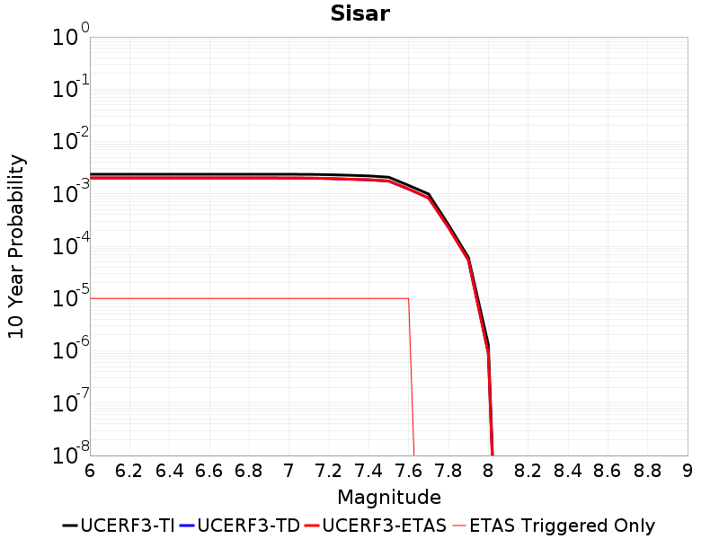 |

| Magnitude | 1 wk TI Prob | 1 wk TD Prob | 1 wk ETAS Prob | 1 wk ETAS/TD Gain | 1 wk ETAS Triggered Only | 1 mo TI Prob | 1 mo TD Prob | 1 mo ETAS Prob | 1 mo ETAS/TD Gain | 1 mo ETAS Triggered Only | 1 yr TI Prob | 1 yr TD Prob | 1 yr ETAS Prob | 1 yr ETAS/TD Gain | 1 yr ETAS Triggered Only | 10 yr TI Prob | 10 yr TD Prob | 10 yr ETAS Prob | 10 yr ETAS/TD Gain | 10 yr ETAS Triggered Only |
|-----|-----|-----|-----|-----|-----|-----|-----|-----|-----|-----|-----|-----|-----|-----|-----|-----|-----|-----|-----|-----|
| 6.0 | 4.544193E-6 | 3.8496632E-6 | 1.3849624E-5 | 3.59762 | 1.0E-5 | 1.9474966E-5 | 1.6498454E-5 | 2.6498288E-5 | 1.6061075 | 1.0E-5 | 2.3708193E-4 | 2.008505E-4 | 2.1084849E-4 | 1.0497782 | 1.0E-5 | 0.0023682916 | 0.0020067235 | 0.0020167036 | 1.0049733 | 1.0E-5 |
| 6.1 | 4.544193E-6 | 3.8496632E-6 | 1.3849624E-5 | 3.59762 | 1.0E-5 | 1.9474966E-5 | 1.6498454E-5 | 2.6498288E-5 | 1.6061075 | 1.0E-5 | 2.3708193E-4 | 2.008505E-4 | 2.1084849E-4 | 1.0497782 | 1.0E-5 | 0.0023682916 | 0.0020067235 | 0.0020167036 | 1.0049733 | 1.0E-5 |
| 6.2 | 4.544193E-6 | 3.8496632E-6 | 1.3849624E-5 | 3.59762 | 1.0E-5 | 1.9474966E-5 | 1.6498454E-5 | 2.6498288E-5 | 1.6061075 | 1.0E-5 | 2.3708193E-4 | 2.008505E-4 | 2.1084849E-4 | 1.0497782 | 1.0E-5 | 0.0023682916 | 0.0020067235 | 0.0020167036 | 1.0049733 | 1.0E-5 |
| 6.3 | 4.544193E-6 | 3.8496632E-6 | 1.3849624E-5 | 3.59762 | 1.0E-5 | 1.9474966E-5 | 1.6498454E-5 | 2.6498288E-5 | 1.6061075 | 1.0E-5 | 2.3708193E-4 | 2.008505E-4 | 2.1084849E-4 | 1.0497782 | 1.0E-5 | 0.0023682916 | 0.0020067235 | 0.0020167036 | 1.0049733 | 1.0E-5 |
| 6.4 | 4.544193E-6 | 3.8496632E-6 | 1.3849624E-5 | 3.59762 | 1.0E-5 | 1.9474966E-5 | 1.6498454E-5 | 2.6498288E-5 | 1.6061075 | 1.0E-5 | 2.3708193E-4 | 2.008505E-4 | 2.1084849E-4 | 1.0497782 | 1.0E-5 | 0.0023682916 | 0.0020067235 | 0.0020167036 | 1.0049733 | 1.0E-5 |
| 6.5 | 4.544193E-6 | 3.8496632E-6 | 1.3849624E-5 | 3.59762 | 1.0E-5 | 1.9474966E-5 | 1.6498454E-5 | 2.6498288E-5 | 1.6061075 | 1.0E-5 | 2.3708193E-4 | 2.008505E-4 | 2.1084849E-4 | 1.0497782 | 1.0E-5 | 0.0023682916 | 0.0020067235 | 0.0020167036 | 1.0049733 | 1.0E-5 |
| 6.6 | 4.544193E-6 | 3.8496632E-6 | 1.3849624E-5 | 3.59762 | 1.0E-5 | 1.9474966E-5 | 1.6498454E-5 | 2.6498288E-5 | 1.6061075 | 1.0E-5 | 2.3708193E-4 | 2.008505E-4 | 2.1084849E-4 | 1.0497782 | 1.0E-5 | 0.0023682916 | 0.0020067235 | 0.0020167036 | 1.0049733 | 1.0E-5 |
| 6.7 | 4.544193E-6 | 3.8496632E-6 | 1.3849624E-5 | 3.59762 | 1.0E-5 | 1.9474966E-5 | 1.6498454E-5 | 2.6498288E-5 | 1.6061075 | 1.0E-5 | 2.3708193E-4 | 2.008505E-4 | 2.1084849E-4 | 1.0497782 | 1.0E-5 | 0.0023682916 | 0.0020067235 | 0.0020167036 | 1.0049733 | 1.0E-5 |
| 6.8 | 4.544193E-6 | 3.8496632E-6 | 1.3849624E-5 | 3.59762 | 1.0E-5 | 1.9474966E-5 | 1.6498454E-5 | 2.6498288E-5 | 1.6061075 | 1.0E-5 | 2.3708193E-4 | 2.008505E-4 | 2.1084849E-4 | 1.0497782 | 1.0E-5 | 0.0023682916 | 0.0020067235 | 0.0020167036 | 1.0049733 | 1.0E-5 |
| 6.9 | 4.542225E-6 | 3.847623E-6 | 1.3847584E-5 | 3.5989974 | 1.0E-5 | 1.9466532E-5 | 1.648971E-5 | 2.6489544E-5 | 1.6064289 | 1.0E-5 | 2.3697925E-4 | 2.0074405E-4 | 2.1074204E-4 | 1.0498047 | 1.0E-5 | 0.002367267 | 0.0020056611 | 0.002015641 | 1.0049759 | 1.0E-5 |
| 7.0 | 4.5278484E-6 | 3.83267E-6 | 1.3832631E-5 | 3.6091373 | 1.0E-5 | 1.940492E-5 | 1.6425627E-5 | 2.6425461E-5 | 1.6087948 | 1.0E-5 | 2.3622929E-4 | 1.9996398E-4 | 2.0996199E-4 | 1.049999 | 1.0E-5 | 0.0023597833 | 0.0019978746 | 0.0020078544 | 1.0049953 | 1.0E-5 |
| 7.1 | 4.5132488E-6 | 3.81744E-6 | 1.3817402E-5 | 3.6195467 | 1.0E-5 | 1.9342351E-5 | 1.6360354E-5 | 2.6360192E-5 | 1.6112237 | 1.0E-5 | 2.3546767E-4 | 1.9916946E-4 | 2.0916747E-4 | 1.0501986 | 1.0E-5 | 0.0023521832 | 0.0019899434 | 0.0019999235 | 1.0050153 | 1.0E-5 |
| 7.2 | 4.448859E-6 | 3.7498037E-6 | 1.3749766E-5 | 3.6667962 | 1.0E-5 | 1.9066398E-5 | 1.607049E-5 | 2.607033E-5 | 1.6222485 | 1.0E-5 | 2.3210866E-4 | 1.9564098E-4 | 2.0563904E-4 | 1.0511041 | 1.0E-5 | 0.0023186638 | 0.0019547213 | 0.0019647018 | 1.0051059 | 1.0E-5 |
| 7.3 | 4.3424366E-6 | 3.6432814E-6 | 1.36432445E-5 | 3.7447684 | 1.0E-5 | 1.861031E-5 | 1.561397E-5 | 2.5613816E-5 | 1.640442 | 1.0E-5 | 2.2655698E-4 | 1.9008385E-4 | 2.0008195E-4 | 1.0525984 | 1.0E-5 | 0.0022632615 | 0.0018992462 | 0.0019092273 | 1.0052552 | 1.0E-5 |
| 7.4 | 4.218641E-6 | 3.5421492E-6 | 1.3542114E-5 | 3.8231347 | 1.0E-5 | 1.8079765E-5 | 1.5180553E-5 | 2.5180401E-5 | 1.6587275 | 1.0E-5 | 2.2009891E-4 | 1.848079E-4 | 1.9480605E-4 | 1.0541003 | 1.0E-5 | 0.0021988105 | 0.0018465756 | 0.0018565571 | 1.0054054 | 1.0E-5 |
| 7.5 | 3.983779E-6 | 3.3560755E-6 | 1.3356042E-5 | 3.9796607 | 1.0E-5 | 1.7073227E-5 | 1.4383103E-5 | 2.4382958E-5 | 1.6952503 | 1.0E-5 | 2.0784672E-4 | 1.7510053E-4 | 1.8509879E-4 | 1.0571 | 1.0E-5 | 0.0020765243 | 0.001749659 | 0.0017596415 | 1.0057054 | 1.0E-5 |
| 7.6 | 2.777393E-6 | 2.357332E-6 | 1.2357308E-5 | 5.2420735 | 1.0E-5 | 1.1903058E-5 | 1.0102813E-5 | 2.0102712E-5 | 1.9898133 | 1.0E-5 | 1.449101E-4 | 1.2299488E-4 | 1.3299365E-4 | 1.0812942 | 1.0E-5 | 0.0014481564 | 0.0012292758 | 0.0012392636 | 1.0081248 | 1.0E-5 |
| 7.7 | 1.9028433E-6 | 1.5977425E-6 | 1.5977425E-6 | 1.0 | 0.0 | 8.155017E-6 | 6.84745E-6 | 6.84745E-6 | 1.0 | 0.0 | 9.928281E-5 | 8.336457E-5 | 8.336457E-5 | 1.0 | 0.0 | 9.923846E-4 | 8.333377E-4 | 8.333377E-4 | 1.0 | 0.0 |
| 7.8 | 4.9095956E-7 | 4.3660003E-7 | 4.3660003E-7 | 1.0 | 0.0 | 2.1041105E-6 | 1.8711416E-6 | 1.8711416E-6 | 1.0 | 0.0 | 2.5617246E-5 | 2.2780914E-5 | 2.2780914E-5 | 1.0 | 0.0 | 2.5614293E-4 | 2.2778596E-4 | 2.2778596E-4 | 1.0 | 0.0 |
| 7.9 | 1.16657894E-7 | 1.035392E-7 | 1.035392E-7 | 1.0 | 0.0 | 4.999623E-7 | 4.4373934E-7 | 4.4373934E-7 | 1.0 | 0.0 | 6.087024E-6 | 5.4025136E-6 | 5.4025136E-6 | 1.0 | 0.0 | 6.0868573E-5 | 5.402385E-5 | 5.402385E-5 | 1.0 | 0.0 |
| 8.0 | 2.5100346E-9 | 1.7184228E-9 | 1.7184228E-9 | 1.0 | 0.0 | 1.0757291E-8 | 7.3646698E-9 | 7.3646698E-9 | 1.0 | 0.0 | 1.3097001E-7 | 8.9664844E-8 | 8.9664844E-8 | 1.0 | 0.0 | 1.3096993E-6 | 8.9664815E-7 | 8.9664815E-7 | 1.0 | 0.0 |

## San Gorgonio Pass
*[(top)](#table-of-contents)*

| 1 Week | 1 Month | 1 Year | 10 Year |
|-----|-----|-----|-----|
|  | 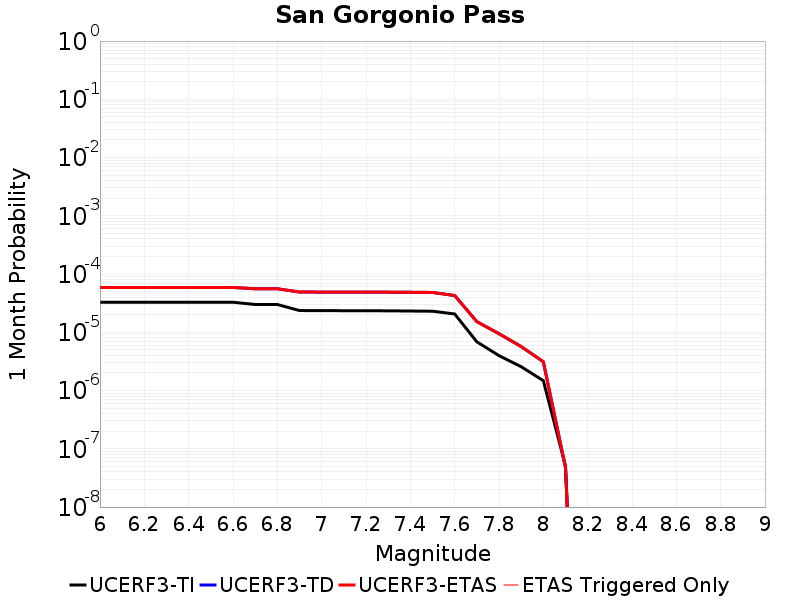 | 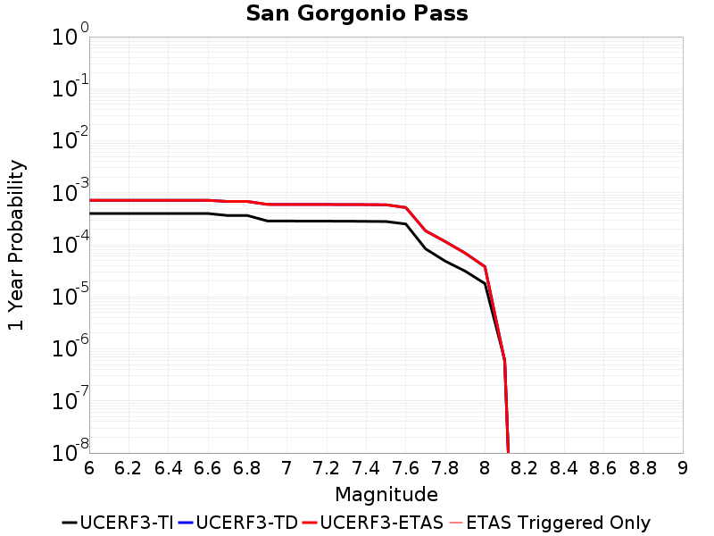 |  |

| Magnitude | 1 wk TI Prob | 1 wk TD Prob | 1 wk ETAS Prob | 1 wk ETAS/TD Gain | 1 wk ETAS Triggered Only | 1 mo TI Prob | 1 mo TD Prob | 1 mo ETAS Prob | 1 mo ETAS/TD Gain | 1 mo ETAS Triggered Only | 1 yr TI Prob | 1 yr TD Prob | 1 yr ETAS Prob | 1 yr ETAS/TD Gain | 1 yr ETAS Triggered Only | 10 yr TI Prob | 10 yr TD Prob | 10 yr ETAS Prob | 10 yr ETAS/TD Gain | 10 yr ETAS Triggered Only |
|-----|-----|-----|-----|-----|-----|-----|-----|-----|-----|-----|-----|-----|-----|-----|-----|-----|-----|-----|-----|-----|
| 6.0 | 7.644328E-6 | 1.3711442E-5 | 1.3711442E-5 | 1.0 | 0.0 | 3.2760996E-5 | 5.8762053E-5 | 5.8762053E-5 | 1.0 | 0.0 | 3.987921E-4 | 7.15202E-4 | 7.15202E-4 | 1.0 | 0.0 | 0.003980772 | 0.00713385 | 0.0071437787 | 1.0013918 | 1.0E-5 |
| 6.1 | 7.644328E-6 | 1.3711442E-5 | 1.3711442E-5 | 1.0 | 0.0 | 3.2760996E-5 | 5.8762053E-5 | 5.8762053E-5 | 1.0 | 0.0 | 3.987921E-4 | 7.15202E-4 | 7.15202E-4 | 1.0 | 0.0 | 0.003980772 | 0.00713385 | 0.0071437787 | 1.0013918 | 1.0E-5 |
| 6.2 | 7.644328E-6 | 1.3711442E-5 | 1.3711442E-5 | 1.0 | 0.0 | 3.2760996E-5 | 5.8762053E-5 | 5.8762053E-5 | 1.0 | 0.0 | 3.987921E-4 | 7.15202E-4 | 7.15202E-4 | 1.0 | 0.0 | 0.003980772 | 0.00713385 | 0.0071437787 | 1.0013918 | 1.0E-5 |
| 6.3 | 7.644328E-6 | 1.3711442E-5 | 1.3711442E-5 | 1.0 | 0.0 | 3.2760996E-5 | 5.8762053E-5 | 5.8762053E-5 | 1.0 | 0.0 | 3.987921E-4 | 7.15202E-4 | 7.15202E-4 | 1.0 | 0.0 | 0.003980772 | 0.00713385 | 0.0071437787 | 1.0013918 | 1.0E-5 |
| 6.4 | 7.644328E-6 | 1.3711442E-5 | 1.3711442E-5 | 1.0 | 0.0 | 3.2760996E-5 | 5.8762053E-5 | 5.8762053E-5 | 1.0 | 0.0 | 3.987921E-4 | 7.15202E-4 | 7.15202E-4 | 1.0 | 0.0 | 0.003980772 | 0.00713385 | 0.0071437787 | 1.0013918 | 1.0E-5 |
| 6.5 | 7.644328E-6 | 1.3711442E-5 | 1.3711442E-5 | 1.0 | 0.0 | 3.2760996E-5 | 5.8762053E-5 | 5.8762053E-5 | 1.0 | 0.0 | 3.987921E-4 | 7.15202E-4 | 7.15202E-4 | 1.0 | 0.0 | 0.003980772 | 0.00713385 | 0.0071437787 | 1.0013918 | 1.0E-5 |
| 6.6 | 7.644328E-6 | 1.3711442E-5 | 1.3711442E-5 | 1.0 | 0.0 | 3.2760996E-5 | 5.8762053E-5 | 5.8762053E-5 | 1.0 | 0.0 | 3.987921E-4 | 7.15202E-4 | 7.15202E-4 | 1.0 | 0.0 | 0.003980772 | 0.00713385 | 0.0071437787 | 1.0013918 | 1.0E-5 |
| 6.7 | 6.987586E-6 | 1.3014427E-5 | 1.3014427E-5 | 1.0 | 0.0 | 2.9946454E-5 | 5.5774974E-5 | 5.5774974E-5 | 1.0 | 0.0 | 3.645371E-4 | 6.788571E-4 | 6.788571E-4 | 1.0 | 0.0 | 0.0036393967 | 0.006772632 | 0.006782564 | 1.0014665 | 1.0E-5 |
| 6.8 | 6.987586E-6 | 1.3014427E-5 | 1.3014427E-5 | 1.0 | 0.0 | 2.9946454E-5 | 5.5774974E-5 | 5.5774974E-5 | 1.0 | 0.0 | 3.645371E-4 | 6.788571E-4 | 6.788571E-4 | 1.0 | 0.0 | 0.0036393967 | 0.006772632 | 0.006782564 | 1.0014665 | 1.0E-5 |
| 6.9 | 5.504702E-6 | 1.1442442E-5 | 1.1442442E-5 | 1.0 | 0.0 | 2.3591367E-5 | 4.9038146E-5 | 4.9038146E-5 | 1.0 | 0.0 | 2.8718702E-4 | 5.968812E-4 | 5.968812E-4 | 1.0 | 0.0 | 0.0028681618 | 0.0059572714 | 0.0059572714 | 1.0 | 0.0 |
| 7.0 | 5.4825764E-6 | 1.1418736E-5 | 1.1418736E-5 | 1.0 | 0.0 | 2.3496545E-5 | 4.8936552E-5 | 4.8936552E-5 | 1.0 | 0.0 | 2.8603288E-4 | 5.95645E-4 | 5.95645E-4 | 1.0 | 0.0 | 0.00285665 | 0.0059449757 | 0.0059449757 | 1.0 | 0.0 |
| 7.1 | 5.4692787E-6 | 1.1404415E-5 | 1.1404415E-5 | 1.0 | 0.0 | 2.3439556E-5 | 4.8875176E-5 | 4.8875176E-5 | 1.0 | 0.0 | 2.8533922E-4 | 5.948982E-4 | 5.948982E-4 | 1.0 | 0.0 | 0.0028497311 | 0.0059375474 | 0.0059375474 | 1.0 | 0.0 |
| 7.2 | 5.453661E-6 | 1.1387397E-5 | 1.1387397E-5 | 1.0 | 0.0 | 2.3372622E-5 | 4.8802245E-5 | 4.8802245E-5 | 1.0 | 0.0 | 2.8452452E-4 | 5.940107E-4 | 5.940107E-4 | 1.0 | 0.0 | 0.002841605 | 0.00592872 | 0.00592872 | 1.0 | 0.0 |
| 7.3 | 5.4422303E-6 | 1.13742435E-5 | 1.13742435E-5 | 1.0 | 0.0 | 2.3323635E-5 | 4.8745875E-5 | 4.8745875E-5 | 1.0 | 0.0 | 2.8392827E-4 | 5.933248E-4 | 5.933248E-4 | 1.0 | 0.0 | 0.0028356577 | 0.0059218975 | 0.0059218975 | 1.0 | 0.0 |
| 7.4 | 5.398595E-6 | 1.1321185E-5 | 1.1321185E-5 | 1.0 | 0.0 | 2.313663E-5 | 4.8518494E-5 | 4.8518494E-5 | 1.0 | 0.0 | 2.8165206E-4 | 5.905579E-4 | 5.905579E-4 | 1.0 | 0.0 | 0.0028129534 | 0.0058943764 | 0.0058943764 | 1.0 | 0.0 |
| 7.5 | 5.3578788E-6 | 1.1246823E-5 | 1.1246823E-5 | 1.0 | 0.0 | 2.2962136E-5 | 4.819981E-5 | 4.819981E-5 | 1.0 | 0.0 | 2.7952815E-4 | 5.8668E-4 | 5.8668E-4 | 1.0 | 0.0 | 0.002791768 | 0.0058558276 | 0.0058558276 | 1.0 | 0.0 |
| 7.6 | 4.8091474E-6 | 9.970377E-6 | 9.970377E-6 | 1.0 | 0.0 | 2.0610469E-5 | 4.2729516E-5 | 4.2729516E-5 | 1.0 | 0.0 | 2.5090357E-4 | 5.2011275E-4 | 5.2011275E-4 | 1.0 | 0.0 | 0.0025062046 | 0.005193716 | 0.005193716 | 1.0 | 0.0 |
| 7.7 | 1.5991155E-6 | 3.5503408E-6 | 3.5503408E-6 | 1.0 | 0.0 | 6.853334E-6 | 1.521566E-5 | 1.521566E-5 | 1.0 | 0.0 | 8.343615E-5 | 1.8523519E-4 | 1.8523519E-4 | 1.0 | 0.0 | 8.340483E-4 | 0.0018557027 | 0.0018557027 | 1.0 | 0.0 |
| 7.8 | 9.258398E-7 | 2.2012355E-6 | 2.2012355E-6 | 1.0 | 0.0 | 3.967879E-6 | 9.433833E-6 | 9.433833E-6 | 1.0 | 0.0 | 4.8307855E-5 | 1.1485088E-4 | 1.1485088E-4 | 1.0 | 0.0 | 4.8297356E-4 | 0.0011527853 | 0.0011527853 | 1.0 | 0.0 |
| 7.9 | 5.975575E-7 | 1.3258705E-6 | 1.3258705E-6 | 1.0 | 0.0 | 2.5609581E-6 | 5.6822896E-6 | 5.6822896E-6 | 1.0 | 0.0 | 3.117922E-5 | 6.9179696E-5 | 6.9179696E-5 | 1.0 | 0.0 | 3.1174847E-4 | 6.962136E-4 | 6.962136E-4 | 1.0 | 0.0 |
| 8.0 | 3.4413725E-7 | 7.2654404E-7 | 7.2654404E-7 | 1.0 | 0.0 | 1.4748731E-6 | 3.1137565E-6 | 3.1137565E-6 | 1.0 | 0.0 | 1.7956432E-5 | 3.7909333E-5 | 3.7909333E-5 | 1.0 | 0.0 | 1.7954981E-4 | 3.821734E-4 | 3.821734E-4 | 1.0 | 0.0 |
| 8.1 | 1.1787731E-8 | 1.1076995E-8 | 1.1076995E-8 | 1.0 | 0.0 | 5.0518846E-8 | 4.7472838E-8 | 4.7472838E-8 | 1.0 | 0.0 | 6.1506677E-7 | 5.7798167E-7 | 5.7798167E-7 | 1.0 | 0.0 | 6.1506507E-6 | 6.0029156E-6 | 6.0029156E-6 | 1.0 | 0.0 |

## Elmore Ranch
*[(top)](#table-of-contents)*

| 1 Week | 1 Month | 1 Year | 10 Year |
|-----|-----|-----|-----|
| 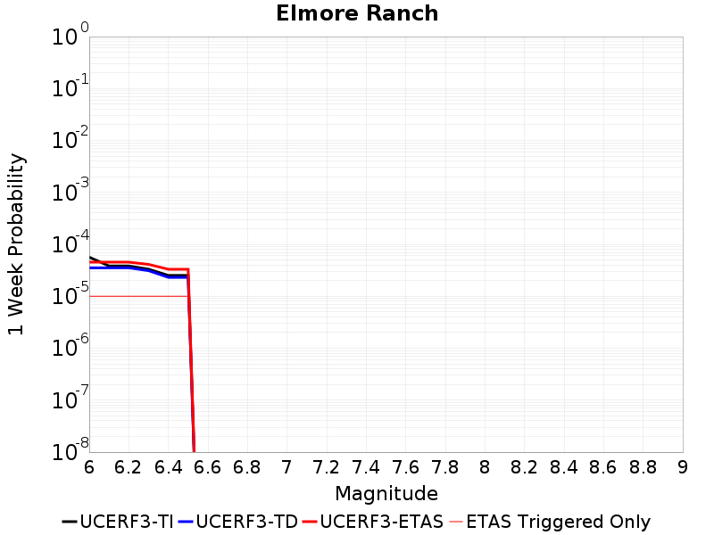 | 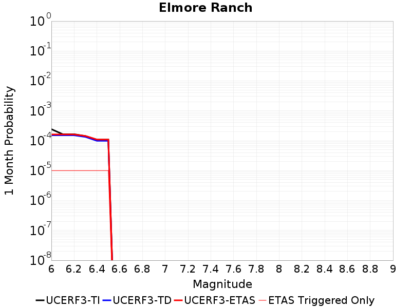 | 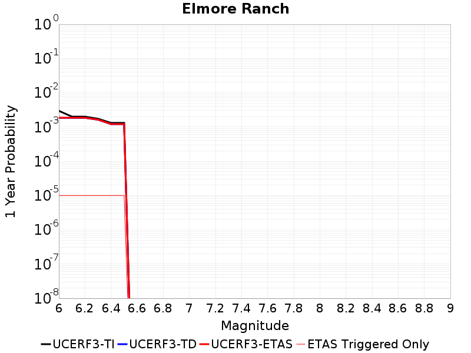 |  |

| Magnitude | 1 wk TI Prob | 1 wk TD Prob | 1 wk ETAS Prob | 1 wk ETAS/TD Gain | 1 wk ETAS Triggered Only | 1 mo TI Prob | 1 mo TD Prob | 1 mo ETAS Prob | 1 mo ETAS/TD Gain | 1 mo ETAS Triggered Only | 1 yr TI Prob | 1 yr TD Prob | 1 yr ETAS Prob | 1 yr ETAS/TD Gain | 1 yr ETAS Triggered Only | 10 yr TI Prob | 10 yr TD Prob | 10 yr ETAS Prob | 10 yr ETAS/TD Gain | 10 yr ETAS Triggered Only |
|-----|-----|-----|-----|-----|-----|-----|-----|-----|-----|-----|-----|-----|-----|-----|-----|-----|-----|-----|-----|-----|
| 6.0 | 5.6540124E-5 | 3.5293906E-5 | 4.5293553E-5 | 1.2833251 | 1.0E-5 | 2.4229231E-4 | 1.512532E-4 | 1.612517E-4 | 1.0661043 | 1.0E-5 | 0.0029459186 | 0.0018404404 | 0.001850422 | 1.0054234 | 1.0E-5 | 0.029071707 | 0.018354772 | 0.018364588 | 1.0005348 | 1.0E-5 |
| 6.1 | 3.8306698E-5 | 3.5293906E-5 | 4.5293553E-5 | 1.2833251 | 1.0E-5 | 1.6416123E-4 | 1.512532E-4 | 1.612517E-4 | 1.0661043 | 1.0E-5 | 0.0019968306 | 0.0018404404 | 0.001850422 | 1.0054234 | 1.0E-5 | 0.019789828 | 0.018354772 | 0.018364588 | 1.0005348 | 1.0E-5 |
| 6.2 | 3.8306698E-5 | 3.5293906E-5 | 4.5293553E-5 | 1.2833251 | 1.0E-5 | 1.6416123E-4 | 1.512532E-4 | 1.612517E-4 | 1.0661043 | 1.0E-5 | 0.0019968306 | 0.0018404404 | 0.001850422 | 1.0054234 | 1.0E-5 | 0.019789828 | 0.018354772 | 0.018364588 | 1.0005348 | 1.0E-5 |
| 6.3 | 3.3197924E-5 | 3.1082767E-5 | 4.1082454E-5 | 1.3217117 | 1.0E-5 | 1.4226905E-4 | 1.3320736E-4 | 1.4320602E-4 | 1.075061 | 1.0E-5 | 0.0017307495 | 0.0016210756 | 0.0016310595 | 1.0061587 | 1.0E-5 | 0.017173318 | 0.01618632 | 0.016196158 | 1.0006078 | 1.0E-5 |
| 6.4 | 2.5148964E-5 | 2.3098508E-5 | 3.3098277E-5 | 1.4329184 | 1.0E-5 | 1.0777682E-4 | 9.899242E-5 | 1.0899144E-4 | 1.1010078 | 1.0E-5 | 0.0013113929 | 0.0012050237 | 0.0012150116 | 1.0082886 | 1.0E-5 | 0.01303681 | 0.012042973 | 0.012052853 | 1.0008204 | 1.0E-5 |
| 6.5 | 2.5148964E-5 | 2.3098508E-5 | 3.3098277E-5 | 1.4329184 | 1.0E-5 | 1.0777682E-4 | 9.899242E-5 | 1.0899144E-4 | 1.1010078 | 1.0E-5 | 0.0013113929 | 0.0012050237 | 0.0012150116 | 1.0082886 | 1.0E-5 | 0.01303681 | 0.012042973 | 0.012052853 | 1.0008204 | 1.0E-5 |

## Rinconada 2011 CFM
*[(top)](#table-of-contents)*

| 1 Week | 1 Month | 1 Year | 10 Year |
|-----|-----|-----|-----|
| 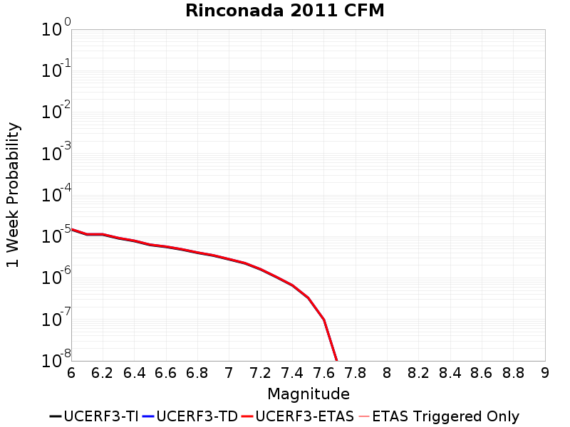 | 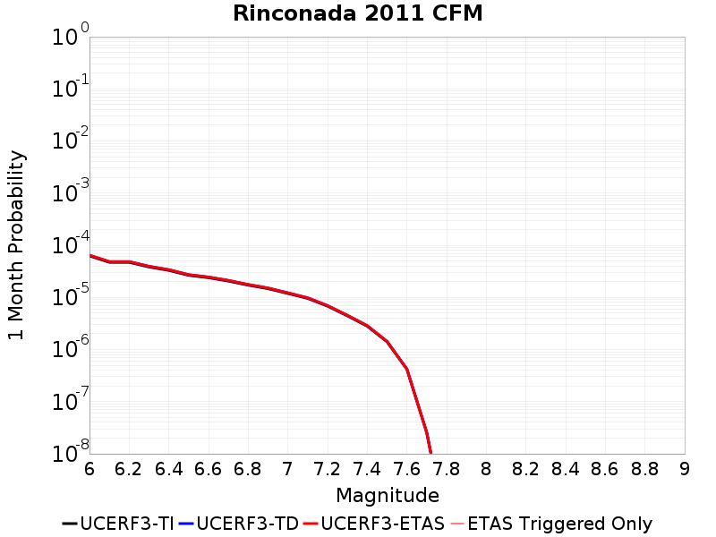 |  | 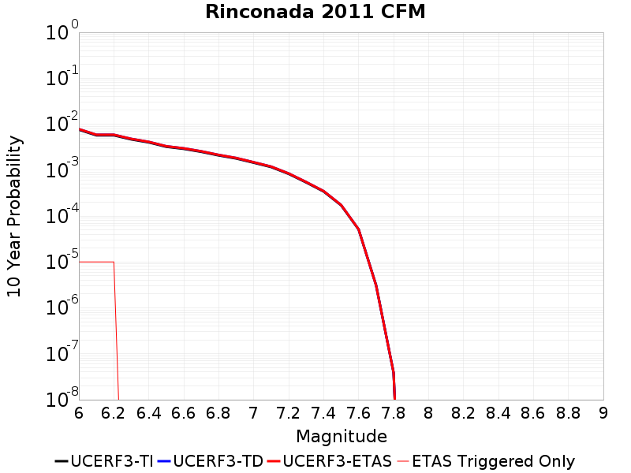 |

| Magnitude | 1 wk TI Prob | 1 wk TD Prob | 1 wk ETAS Prob | 1 wk ETAS/TD Gain | 1 wk ETAS Triggered Only | 1 mo TI Prob | 1 mo TD Prob | 1 mo ETAS Prob | 1 mo ETAS/TD Gain | 1 mo ETAS Triggered Only | 1 yr TI Prob | 1 yr TD Prob | 1 yr ETAS Prob | 1 yr ETAS/TD Gain | 1 yr ETAS Triggered Only | 10 yr TI Prob | 10 yr TD Prob | 10 yr ETAS Prob | 10 yr ETAS/TD Gain | 10 yr ETAS Triggered Only |
|-----|-----|-----|-----|-----|-----|-----|-----|-----|-----|-----|-----|-----|-----|-----|-----|-----|-----|-----|-----|-----|
| 6.0 | 1.4563478E-5 | 1.5023542E-5 | 1.5023542E-5 | 1.0 | 0.0 | 6.241341E-5 | 6.438503E-5 | 6.438503E-5 | 1.0 | 0.0 | 7.5961836E-4 | 7.836078E-4 | 7.836078E-4 | 1.0 | 0.0 | 0.00757027 | 0.0078086974 | 0.00781862 | 1.0012707 | 1.0E-5 |
| 6.1 | 1.0966133E-5 | 1.1309117E-5 | 1.1309117E-5 | 1.0 | 0.0 | 4.6996865E-5 | 4.8466747E-5 | 4.8466747E-5 | 1.0 | 0.0 | 5.720366E-4 | 5.8992364E-4 | 5.8992364E-4 | 1.0 | 0.0 | 0.0057056635 | 0.0058836723 | 0.005893613 | 1.0016897 | 1.0E-5 |
| 6.2 | 1.0966133E-5 | 1.1309117E-5 | 1.1309117E-5 | 1.0 | 0.0 | 4.6996865E-5 | 4.8466747E-5 | 4.8466747E-5 | 1.0 | 0.0 | 5.720366E-4 | 5.8992364E-4 | 5.8992364E-4 | 1.0 | 0.0 | 0.0057056635 | 0.0058836723 | 0.005893613 | 1.0016897 | 1.0E-5 |
| 6.3 | 8.926149E-6 | 9.2023765E-6 | 9.2023765E-6 | 1.0 | 0.0 | 3.8254362E-5 | 3.943816E-5 | 3.943816E-5 | 1.0 | 0.0 | 4.6564735E-4 | 4.8005415E-4 | 4.8005415E-4 | 1.0 | 0.0 | 0.0046467283 | 0.004790216 | 0.004790216 | 1.0 | 0.0 |
| 6.4 | 7.676955E-6 | 7.911847E-6 | 7.911847E-6 | 1.0 | 0.0 | 3.290082E-5 | 3.390748E-5 | 3.390748E-5 | 1.0 | 0.0 | 4.0049385E-4 | 4.1274555E-4 | 4.1274555E-4 | 1.0 | 0.0 | 0.0039977287 | 0.004119816 | 0.004119816 | 1.0 | 0.0 |
| 6.5 | 6.1671026E-6 | 6.35278E-6 | 6.35278E-6 | 1.0 | 0.0 | 2.6430173E-5 | 2.7225915E-5 | 2.7225915E-5 | 1.0 | 0.0 | 3.2173982E-4 | 3.314252E-4 | 3.314252E-4 | 1.0 | 0.0 | 0.003212744 | 0.0033093211 | 0.0033093211 | 1.0 | 0.0 |
| 6.6 | 5.553456E-6 | 5.7194966E-6 | 5.7194966E-6 | 1.0 | 0.0 | 2.3800309E-5 | 2.4511899E-5 | 2.4511899E-5 | 1.0 | 0.0 | 2.897302E-4 | 2.9839156E-4 | 2.9839156E-4 | 1.0 | 0.0 | 0.0028935277 | 0.0029799177 | 0.0029799177 | 1.0 | 0.0 |
| 6.7 | 4.787857E-6 | 4.929035E-6 | 4.929035E-6 | 1.0 | 0.0 | 2.0519226E-5 | 2.1124266E-5 | 2.1124266E-5 | 1.0 | 0.0 | 2.4979294E-4 | 2.5715763E-4 | 2.5715763E-4 | 1.0 | 0.0 | 0.0024951235 | 0.0025686063 | 0.0025686063 | 1.0 | 0.0 |
| 6.8 | 3.9955166E-6 | 4.110406E-6 | 4.110406E-6 | 1.0 | 0.0 | 1.7123532E-5 | 1.7615906E-5 | 1.7615906E-5 | 1.0 | 0.0 | 2.0845905E-4 | 2.1445256E-4 | 2.1445256E-4 | 1.0 | 0.0 | 0.002082636 | 0.0021424599 | 0.0021424599 | 1.0 | 0.0 |
| 6.9 | 3.4250072E-6 | 3.5204E-6 | 3.5204E-6 | 1.0 | 0.0 | 1.46785205E-5 | 1.5087341E-5 | 1.5087341E-5 | 1.0 | 0.0 | 1.7869633E-4 | 1.8367292E-4 | 1.8367292E-4 | 1.0 | 0.0 | 0.001785527 | 0.0018352136 | 0.0018352136 | 1.0 | 0.0 |
| 7.0 | 2.7712713E-6 | 2.8455468E-6 | 2.8455468E-6 | 1.0 | 0.0 | 1.1876823E-5 | 1.2195143E-5 | 1.2195143E-5 | 1.0 | 0.0 | 1.4459073E-4 | 1.4846577E-4 | 1.4846577E-4 | 1.0 | 0.0 | 0.0014449668 | 0.0014836674 | 0.0014836674 | 1.0 | 0.0 |
| 7.1 | 2.227358E-6 | 2.2850845E-6 | 2.2850845E-6 | 1.0 | 0.0 | 9.545785E-6 | 9.7931825E-6 | 9.7931825E-6 | 1.0 | 0.0 | 1.16213734E-4 | 1.1922548E-4 | 1.1922548E-4 | 1.0 | 0.0 | 0.0011615298 | 0.0011916162 | 0.0011916162 | 1.0 | 0.0 |
| 7.2 | 1.581796E-6 | 1.6208368E-6 | 1.6208368E-6 | 1.0 | 0.0 | 6.779108E-6 | 6.9464245E-6 | 6.9464245E-6 | 1.0 | 0.0 | 8.253252E-5 | 8.4569445E-5 | 8.4569445E-5 | 1.0 | 0.0 | 8.250187E-4 | 8.4537314E-4 | 8.4537314E-4 | 1.0 | 0.0 |
| 7.3 | 1.0306567E-6 | 1.0548961E-6 | 1.0548961E-6 | 1.0 | 0.0 | 4.4170924E-6 | 4.5209754E-6 | 4.5209754E-6 | 1.0 | 0.0 | 5.3776774E-5 | 5.5041488E-5 | 5.5041488E-5 | 1.0 | 0.0 | 5.376376E-4 | 5.5027875E-4 | 5.5027875E-4 | 1.0 | 0.0 |
| 7.4 | 6.535541E-7 | 6.685117E-7 | 6.685117E-7 | 1.0 | 0.0 | 2.800943E-6 | 2.8650468E-6 | 2.8650468E-6 | 1.0 | 0.0 | 3.4100947E-5 | 3.488139E-5 | 3.488139E-5 | 1.0 | 0.0 | 3.4095717E-4 | 3.4875926E-4 | 3.4875926E-4 | 1.0 | 0.0 |
| 7.5 | 3.2656962E-7 | 3.333195E-7 | 3.333195E-7 | 1.0 | 0.0 | 1.3995833E-6 | 1.4285113E-6 | 1.4285113E-6 | 1.0 | 0.0 | 1.7039794E-5 | 1.7391987E-5 | 1.7391987E-5 | 1.0 | 0.0 | 1.7038487E-4 | 1.7390629E-4 | 1.7390629E-4 | 1.0 | 0.0 |
| 7.6 | 9.754343E-8 | 9.8294215E-8 | 9.8294215E-8 | 1.0 | 0.0 | 4.180432E-7 | 4.2126084E-7 | 4.2126084E-7 | 1.0 | 0.0 | 5.089664E-6 | 5.128839E-6 | 5.128839E-6 | 1.0 | 0.0 | 5.0895473E-5 | 5.1287214E-5 | 5.1287214E-5 | 1.0 | 0.0 |
| 7.7 | 6.0001453E-9 | 5.863371E-9 | 5.863371E-9 | 1.0 | 0.0 | 2.5714908E-8 | 2.5128733E-8 | 2.5128733E-8 | 1.0 | 0.0 | 3.1307894E-7 | 3.0594228E-7 | 3.0594228E-7 | 1.0 | 0.0 | 3.1307852E-6 | 3.0594188E-6 | 3.0594188E-6 | 1.0 | 0.0 |
| 7.8 | 7.400003E-11 | 7.467171E-11 | 7.467171E-11 | 1.0 | 0.0 | 3.171432E-10 | 3.2002156E-10 | 3.2002156E-10 | 1.0 | 0.0 | 3.861218E-9 | 3.896262E-9 | 3.896262E-9 | 1.0 | 0.0 | 3.861218E-8 | 3.896262E-8 | 3.896262E-8 | 1.0 | 0.0 |

## Santa Susana alt 1
*[(top)](#table-of-contents)*

| 1 Week | 1 Month | 1 Year | 10 Year |
|-----|-----|-----|-----|
| 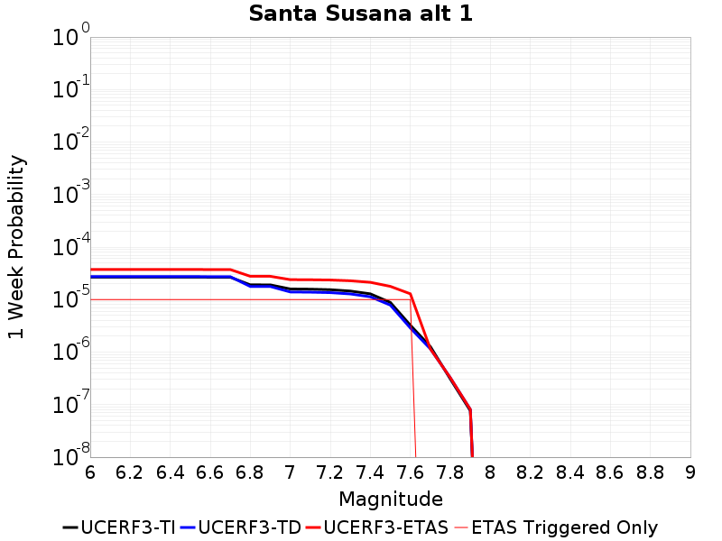 |  |  |  |

| Magnitude | 1 wk TI Prob | 1 wk TD Prob | 1 wk ETAS Prob | 1 wk ETAS/TD Gain | 1 wk ETAS Triggered Only | 1 mo TI Prob | 1 mo TD Prob | 1 mo ETAS Prob | 1 mo ETAS/TD Gain | 1 mo ETAS Triggered Only | 1 yr TI Prob | 1 yr TD Prob | 1 yr ETAS Prob | 1 yr ETAS/TD Gain | 1 yr ETAS Triggered Only | 10 yr TI Prob | 10 yr TD Prob | 10 yr ETAS Prob | 10 yr ETAS/TD Gain | 10 yr ETAS Triggered Only |
|-----|-----|-----|-----|-----|-----|-----|-----|-----|-----|-----|-----|-----|-----|-----|-----|-----|-----|-----|-----|-----|
| 6.0 | 2.674877E-5 | 2.7394402E-5 | 3.739413E-5 | 1.3650281 | 1.0E-5 | 1.1463255E-4 | 1.1739995E-4 | 1.2739877E-4 | 1.085169 | 1.0E-5 | 0.0013947578 | 0.0014285225 | 0.0014385083 | 1.0069902 | 1.0E-5 | 0.013860362 | 0.014205327 | 0.014215185 | 1.0006939 | 1.0E-5 |
| 6.1 | 2.674877E-5 | 2.7394402E-5 | 3.739413E-5 | 1.3650281 | 1.0E-5 | 1.1463255E-4 | 1.1739995E-4 | 1.2739877E-4 | 1.085169 | 1.0E-5 | 0.0013947578 | 0.0014285225 | 0.0014385083 | 1.0069902 | 1.0E-5 | 0.013860362 | 0.014205327 | 0.014215185 | 1.0006939 | 1.0E-5 |
| 6.2 | 2.674877E-5 | 2.7394402E-5 | 3.739413E-5 | 1.3650281 | 1.0E-5 | 1.1463255E-4 | 1.1739995E-4 | 1.2739877E-4 | 1.085169 | 1.0E-5 | 0.0013947578 | 0.0014285225 | 0.0014385083 | 1.0069902 | 1.0E-5 | 0.013860362 | 0.014205327 | 0.014215185 | 1.0006939 | 1.0E-5 |
| 6.3 | 2.674877E-5 | 2.7394402E-5 | 3.739413E-5 | 1.3650281 | 1.0E-5 | 1.1463255E-4 | 1.1739995E-4 | 1.2739877E-4 | 1.085169 | 1.0E-5 | 0.0013947578 | 0.0014285225 | 0.0014385083 | 1.0069902 | 1.0E-5 | 0.013860362 | 0.014205327 | 0.014215185 | 1.0006939 | 1.0E-5 |
| 6.4 | 2.674877E-5 | 2.7394402E-5 | 3.739413E-5 | 1.3650281 | 1.0E-5 | 1.1463255E-4 | 1.1739995E-4 | 1.2739877E-4 | 1.085169 | 1.0E-5 | 0.0013947578 | 0.0014285225 | 0.0014385083 | 1.0069902 | 1.0E-5 | 0.013860362 | 0.014205327 | 0.014215185 | 1.0006939 | 1.0E-5 |
| 6.5 | 2.674877E-5 | 2.7394402E-5 | 3.739413E-5 | 1.3650281 | 1.0E-5 | 1.1463255E-4 | 1.1739995E-4 | 1.2739877E-4 | 1.085169 | 1.0E-5 | 0.0013947578 | 0.0014285225 | 0.0014385083 | 1.0069902 | 1.0E-5 | 0.013860362 | 0.014205327 | 0.014215185 | 1.0006939 | 1.0E-5 |
| 6.6 | 2.6647976E-5 | 2.7269867E-5 | 3.7269594E-5 | 1.3666952 | 1.0E-5 | 1.14200615E-4 | 1.1686627E-4 | 1.2686511E-4 | 1.0855579 | 1.0E-5 | 0.0013895056 | 0.0014220336 | 0.0014320194 | 1.0070221 | 1.0E-5 | 0.013808494 | 0.01414127 | 0.014151129 | 1.0006971 | 1.0E-5 |
| 6.7 | 2.6647976E-5 | 2.7269867E-5 | 3.7269594E-5 | 1.3666952 | 1.0E-5 | 1.14200615E-4 | 1.1686627E-4 | 1.2686511E-4 | 1.0855579 | 1.0E-5 | 0.0013895056 | 0.0014220336 | 0.0014320194 | 1.0070221 | 1.0E-5 | 0.013808494 | 0.01414127 | 0.014151129 | 1.0006971 | 1.0E-5 |
| 6.8 | 1.9073179E-5 | 1.7759854E-5 | 2.7759677E-5 | 1.5630577 | 1.0E-5 | 8.1739636E-5 | 7.6111544E-5 | 8.6110784E-5 | 1.1313761 | 1.0E-5 | 9.947256E-4 | 9.2628255E-4 | 9.3627325E-4 | 1.0107858 | 1.0E-5 | 0.009902848 | 0.0092265 | 0.009236408 | 1.0010738 | 1.0E-5 |
| 6.9 | 1.9041876E-5 | 1.7741677E-5 | 2.77415E-5 | 1.5636345 | 1.0E-5 | 8.160549E-5 | 7.603365E-5 | 8.603289E-5 | 1.1315107 | 1.0E-5 | 9.930939E-4 | 9.253349E-4 | 9.3532563E-4 | 1.0107969 | 1.0E-5 | 0.0098866755 | 0.009217103 | 0.00922701 | 1.0010749 | 1.0E-5 |
| 7.0 | 1.5917482E-5 | 1.3960041E-5 | 2.3959901E-5 | 1.7163203 | 1.0E-5 | 6.8215995E-5 | 5.9827402E-5 | 6.9826805E-5 | 1.1671375 | 1.0E-5 | 8.302132E-4 | 7.281599E-4 | 7.3815265E-4 | 1.0137233 | 1.0E-5 | 0.008271185 | 0.007258643 | 0.0072685704 | 1.0013677 | 1.0E-5 |
| 7.1 | 1.577788E-5 | 1.3839567E-5 | 2.3839428E-5 | 1.722556 | 1.0E-5 | 6.761774E-5 | 5.9311107E-5 | 6.931052E-5 | 1.1685925 | 1.0E-5 | 8.2293496E-4 | 7.218782E-4 | 7.31871E-4 | 1.0138427 | 1.0E-5 | 0.008198941 | 0.007196234 | 0.007206162 | 1.0013796 | 1.0E-5 |
| 7.2 | 1.5416446E-5 | 1.3564258E-5 | 2.3564122E-5 | 1.7372216 | 1.0E-5 | 6.606882E-5 | 5.8131263E-5 | 6.8130685E-5 | 1.1720145 | 1.0E-5 | 8.0409093E-4 | 7.07523E-4 | 7.1751594E-4 | 1.0141238 | 1.0E-5 | 0.008011877 | 0.0070535983 | 0.007063528 | 1.0014077 | 1.0E-5 |
| 7.3 | 1.4534083E-5 | 1.2805123E-5 | 2.2804996E-5 | 1.7809274 | 1.0E-5 | 6.228744E-5 | 5.4877968E-5 | 6.487742E-5 | 1.1822125 | 1.0E-5 | 7.580857E-4 | 6.67939E-4 | 6.7793234E-4 | 1.0149615 | 1.0E-5 | 0.007555048 | 0.006660194 | 0.0066701276 | 1.0014914 | 1.0E-5 |
| 7.4 | 1.2858995E-5 | 1.13067845E-5 | 2.1306672E-5 | 1.8844147 | 1.0E-5 | 5.5108816E-5 | 4.845677E-5 | 5.8456288E-5 | 1.2063595 | 1.0E-5 | 6.7074323E-4 | 5.8980554E-4 | 5.997996E-4 | 1.0169448 | 1.0E-5 | 0.0066872234 | 0.0058831945 | 0.005893136 | 1.0016898 | 1.0E-5 |
| 7.5 | 8.827668E-6 | 7.84528E-6 | 1.7845201E-5 | 2.2746418 | 1.0E-5 | 3.7832317E-5 | 3.362221E-5 | 4.3621872E-5 | 1.2974124 | 1.0E-5 | 4.605111E-4 | 4.0927602E-4 | 4.192719E-4 | 1.0244234 | 1.0E-5 | 0.0045955796 | 0.004085592 | 0.004095551 | 1.0024376 | 1.0E-5 |
| 7.6 | 3.2533426E-6 | 2.8793422E-6 | 1.28793135E-5 | 4.4730053 | 1.0E-5 | 1.3942822E-5 | 1.2339981E-5 | 2.2339858E-5 | 1.810364 | 1.0E-5 | 1.6974064E-4 | 1.5022929E-4 | 1.6022779E-4 | 1.0665549 | 1.0E-5 | 0.0016961104 | 0.0015013143 | 0.0015112993 | 1.0066508 | 1.0E-5 |
| 7.7 | 1.2751709E-6 | 1.15211E-6 | 1.15211E-6 | 1.0 | 0.0 | 5.4650063E-6 | 4.937606E-6 | 4.937606E-6 | 1.0 | 0.0 | 6.653442E-5 | 6.0113784E-5 | 6.0113784E-5 | 1.0 | 0.0 | 6.6514505E-4 | 6.0098415E-4 | 6.0098415E-4 | 1.0 | 0.0 |
| 7.8 | 3.067544E-7 | 3.2465954E-7 | 3.2465954E-7 | 1.0 | 0.0 | 1.3146611E-6 | 1.3913974E-6 | 1.3913974E-6 | 1.0 | 0.0 | 1.600588E-5 | 1.6940143E-5 | 1.6940143E-5 | 1.0 | 0.0 | 1.6004729E-4 | 1.6938955E-4 | 1.6938955E-4 | 1.0 | 0.0 |
| 7.9 | 7.622999E-8 | 8.1040746E-8 | 8.1040746E-8 | 1.0 | 0.0 | 3.2669993E-7 | 3.4731744E-7 | 3.4731744E-7 | 1.0 | 0.0 | 3.977564E-6 | 4.2285837E-6 | 4.2285837E-6 | 1.0 | 0.0 | 3.977493E-5 | 4.2285243E-5 | 4.2285243E-5 | 1.0 | 0.0 |

## San Jacinto (Coyote Creek)
*[(top)](#table-of-contents)*

| 1 Week | 1 Month | 1 Year | 10 Year |
|-----|-----|-----|-----|
|  | 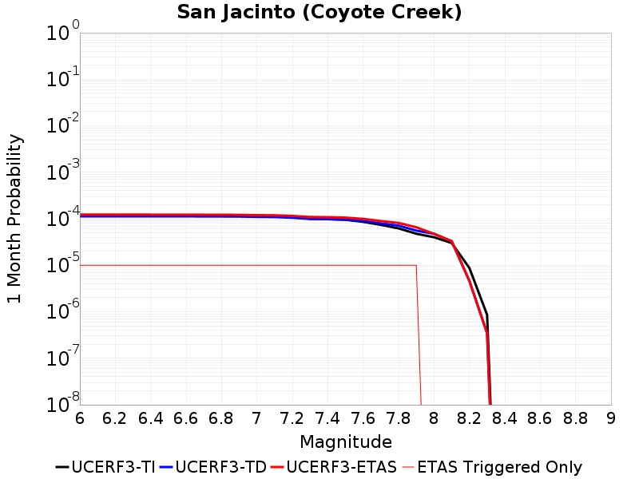 |  |  |

| Magnitude | 1 wk TI Prob | 1 wk TD Prob | 1 wk ETAS Prob | 1 wk ETAS/TD Gain | 1 wk ETAS Triggered Only | 1 mo TI Prob | 1 mo TD Prob | 1 mo ETAS Prob | 1 mo ETAS/TD Gain | 1 mo ETAS Triggered Only | 1 yr TI Prob | 1 yr TD Prob | 1 yr ETAS Prob | 1 yr ETAS/TD Gain | 1 yr ETAS Triggered Only | 10 yr TI Prob | 10 yr TD Prob | 10 yr ETAS Prob | 10 yr ETAS/TD Gain | 10 yr ETAS Triggered Only |
|-----|-----|-----|-----|-----|-----|-----|-----|-----|-----|-----|-----|-----|-----|-----|-----|-----|-----|-----|-----|-----|
| 6.0 | 2.7335038E-5 | 2.631251E-5 | 3.6312245E-5 | 1.3800374 | 1.0E-5 | 1.17144904E-4 | 1.1276304E-4 | 1.227619E-4 | 1.0886716 | 1.0E-5 | 0.001425306 | 0.0013720284 | 0.0013820147 | 1.0072784 | 1.0E-5 | 0.014161989 | 0.014050038 | 0.0140598975 | 1.0007018 | 1.0E-5 |
| 6.1 | 2.7335038E-5 | 2.631251E-5 | 3.6312245E-5 | 1.3800374 | 1.0E-5 | 1.17144904E-4 | 1.1276304E-4 | 1.227619E-4 | 1.0886716 | 1.0E-5 | 0.001425306 | 0.0013720284 | 0.0013820147 | 1.0072784 | 1.0E-5 | 0.014161989 | 0.014050038 | 0.0140598975 | 1.0007018 | 1.0E-5 |
| 6.2 | 2.7335038E-5 | 2.631251E-5 | 3.6312245E-5 | 1.3800374 | 1.0E-5 | 1.17144904E-4 | 1.1276304E-4 | 1.227619E-4 | 1.0886716 | 1.0E-5 | 0.001425306 | 0.0013720284 | 0.0013820147 | 1.0072784 | 1.0E-5 | 0.014161989 | 0.014050038 | 0.0140598975 | 1.0007018 | 1.0E-5 |
| 6.3 | 2.7335038E-5 | 2.631251E-5 | 3.6312245E-5 | 1.3800374 | 1.0E-5 | 1.17144904E-4 | 1.1276304E-4 | 1.227619E-4 | 1.0886716 | 1.0E-5 | 0.001425306 | 0.0013720284 | 0.0013820147 | 1.0072784 | 1.0E-5 | 0.014161989 | 0.014050038 | 0.0140598975 | 1.0007018 | 1.0E-5 |
| 6.4 | 2.7335038E-5 | 2.631251E-5 | 3.6312245E-5 | 1.3800374 | 1.0E-5 | 1.17144904E-4 | 1.1276304E-4 | 1.227619E-4 | 1.0886716 | 1.0E-5 | 0.001425306 | 0.0013720284 | 0.0013820147 | 1.0072784 | 1.0E-5 | 0.014161989 | 0.014050038 | 0.0140598975 | 1.0007018 | 1.0E-5 |
| 6.5 | 2.7282445E-5 | 2.6246937E-5 | 3.6246674E-5 | 1.3809868 | 1.0E-5 | 1.16919524E-4 | 1.1248204E-4 | 1.2248091E-4 | 1.088893 | 1.0E-5 | 0.0014225657 | 0.0013686116 | 0.0013785979 | 1.0072967 | 1.0E-5 | 0.014134934 | 0.014016306 | 0.014026166 | 1.0007035 | 1.0E-5 |
| 6.6 | 2.7282445E-5 | 2.6246937E-5 | 3.6246674E-5 | 1.3809868 | 1.0E-5 | 1.16919524E-4 | 1.1248204E-4 | 1.2248091E-4 | 1.088893 | 1.0E-5 | 0.0014225657 | 0.0013686116 | 0.0013785979 | 1.0072967 | 1.0E-5 | 0.014134934 | 0.014016306 | 0.014026166 | 1.0007035 | 1.0E-5 |
| 6.7 | 2.7216198E-5 | 2.6171298E-5 | 3.6171037E-5 | 1.382088 | 1.0E-5 | 1.1663563E-4 | 1.12157904E-4 | 1.2215678E-4 | 1.0891501 | 1.0E-5 | 0.0014191137 | 0.0013646702 | 0.0013746566 | 1.0073178 | 1.0E-5 | 0.014100855 | 0.01397738 | 0.013987239 | 1.0007055 | 1.0E-5 |
| 6.8 | 2.7078617E-5 | 2.6084319E-5 | 3.6084057E-5 | 1.383362 | 1.0E-5 | 1.1604605E-4 | 1.11785164E-4 | 1.2178405E-4 | 1.0894473 | 1.0E-5 | 0.001411945 | 0.0013601378 | 0.0013701242 | 1.0073422 | 1.0E-5 | 0.014030075 | 0.013932434 | 0.013942295 | 1.0007077 | 1.0E-5 |
| 6.9 | 2.6982952E-5 | 2.6001122E-5 | 3.6000863E-5 | 1.3845887 | 1.0E-5 | 1.15636096E-4 | 1.1142864E-4 | 1.21427525E-4 | 1.0897335 | 1.0E-5 | 0.0014069602 | 0.0013558025 | 0.001365789 | 1.0073657 | 1.0E-5 | 0.013980856 | 0.013889404 | 0.013899265 | 1.00071 | 1.0E-5 |
| 7.0 | 2.6449972E-5 | 2.5557398E-5 | 3.5557143E-5 | 1.3912661 | 1.0E-5 | 1.1335209E-4 | 1.0952712E-4 | 1.1952603E-4 | 1.0912915 | 1.0E-5 | 0.001379188 | 0.00133268 | 0.0013426667 | 1.0074937 | 1.0E-5 | 0.0137065975 | 0.013660385 | 0.013670249 | 1.000722 | 1.0E-5 |
| 7.1 | 2.6257849E-5 | 2.5375664E-5 | 3.537541E-5 | 1.3940684 | 1.0E-5 | 1.1252879E-4 | 1.08748325E-4 | 1.1874724E-4 | 1.0919454 | 1.0E-5 | 0.0013691769 | 0.0013232097 | 0.0013331965 | 1.0075474 | 1.0E-5 | 0.013607717 | 0.013566405 | 0.013576269 | 1.000727 | 1.0E-5 |
| 7.2 | 2.5270041E-5 | 2.4516055E-5 | 3.451581E-5 | 1.4078859 | 1.0E-5 | 1.0829568E-4 | 1.05064595E-4 | 1.1506354E-4 | 1.0951695 | 1.0E-5 | 0.0013177024 | 0.0012784136 | 0.0012884008 | 1.0078121 | 1.0E-5 | 0.013099162 | 0.013120236 | 0.013130105 | 1.0007522 | 1.0E-5 |
| 7.3 | 2.339701E-5 | 2.3156133E-5 | 3.3155902E-5 | 1.431841 | 1.0E-5 | 1.0026905E-4 | 9.923681E-5 | 1.09235814E-4 | 1.100759 | 1.0E-5 | 0.001220092 | 0.001207541 | 0.0012175288 | 1.0082713 | 1.0E-5 | 0.012134149 | 0.012412256 | 0.012422131 | 1.0007956 | 1.0E-5 |
| 7.4 | 2.296333E-5 | 2.286778E-5 | 3.2867552E-5 | 1.4372865 | 1.0E-5 | 9.841056E-5 | 9.80011E-5 | 1.08000124E-4 | 1.1020297 | 1.0E-5 | 0.0011974899 | 0.0011925127 | 0.0012025008 | 1.0083756 | 1.0E-5 | 0.011910575 | 0.012261893 | 0.01227177 | 1.0008055 | 1.0E-5 |
| 7.5 | 2.2188895E-5 | 2.235176E-5 | 3.2351538E-5 | 1.4473821 | 1.0E-5 | 9.50918E-5 | 9.578976E-5 | 1.057888E-4 | 1.1043853 | 1.0E-5 | 0.0011571277 | 0.0011656187 | 0.0011756071 | 1.0085691 | 1.0E-5 | 0.011511209 | 0.011991655 | 0.012001535 | 1.0008239 | 1.0E-5 |
| 7.6 | 2.0013189E-5 | 2.0839761E-5 | 3.0839554E-5 | 1.479842 | 1.0E-5 | 8.5767984E-5 | 8.931021E-5 | 9.930932E-5 | 1.1119592 | 1.0E-5 | 0.001043725 | 0.0010868115 | 0.0010968007 | 1.0091913 | 1.0E-5 | 0.010388365 | 0.0111997295 | 0.011209617 | 1.0008829 | 1.0E-5 |
| 7.7 | 1.7230794E-5 | 1.849613E-5 | 2.8495944E-5 | 1.5406437 | 1.0E-5 | 7.384417E-5 | 7.926673E-5 | 8.926593E-5 | 1.1261463 | 1.0E-5 | 8.986819E-4 | 9.646461E-4 | 9.7463647E-4 | 1.0103565 | 1.0E-5 | 0.008950562 | 0.009975033 | 0.009984933 | 1.0009925 | 1.0E-5 |
| 7.8 | 1.4478809E-5 | 1.6614533E-5 | 2.6614367E-5 | 1.6018727 | 1.0E-5 | 6.205057E-5 | 7.1203205E-5 | 8.1202495E-5 | 1.1404331 | 1.0E-5 | 7.552038E-4 | 8.66555E-4 | 8.765464E-4 | 1.0115299 | 1.0E-5 | 0.0075264242 | 0.008987235 | 0.008997145 | 1.0011027 | 1.0E-5 |
| 7.9 | 1.1114467E-5 | 1.2979699E-5 | 2.297957E-5 | 1.7704239 | 1.0E-5 | 4.7632562E-5 | 5.5626097E-5 | 6.562554E-5 | 1.1797618 | 1.0E-5 | 5.797721E-4 | 6.77038E-4 | 6.8703125E-4 | 1.0147603 | 1.0E-5 | 0.0057826187 | 0.007078156 | 0.007088085 | 1.0014029 | 1.0E-5 |
| 8.0 | 9.327402E-6 | 1.1065519E-5 | 1.1065519E-5 | 1.0 | 0.0 | 3.9973966E-5 | 4.7422796E-5 | 4.7422796E-5 | 1.0 | 0.0 | 4.8657437E-4 | 5.772203E-4 | 5.772203E-4 | 1.0 | 0.0 | 0.0048551033 | 0.0060608536 | 0.0060608536 | 1.0 | 0.0 |
| 8.1 | 7.0235833E-6 | 7.681495E-6 | 7.681495E-6 | 1.0 | 0.0 | 3.0100724E-5 | 3.2920278E-5 | 3.2920278E-5 | 1.0 | 0.0 | 3.664147E-4 | 4.007313E-4 | 4.007313E-4 | 1.0 | 0.0 | 0.003658111 | 0.004238273 | 0.004238273 | 1.0 | 0.0 |
| 8.2 | 2.0358202E-6 | 1.0724519E-6 | 1.0724519E-6 | 1.0 | 0.0 | 8.724915E-6 | 4.5962147E-6 | 4.5962147E-6 | 1.0 | 0.0 | 1.06220665E-4 | 5.595751E-5 | 5.595751E-5 | 1.0 | 0.0 | 0.001061699 | 6.290033E-4 | 6.290033E-4 | 1.0 | 0.0 |
| 8.3 | 2.0051264E-7 | 8.080156E-8 | 8.080156E-8 | 1.0 | 0.0 | 8.5933965E-7 | 3.4629238E-7 | 3.4629238E-7 | 1.0 | 0.0 | 1.046241E-5 | 4.2161023E-6 | 4.2161023E-6 | 1.0 | 0.0 | 1.0461917E-4 | 4.8455597E-5 | 4.8455597E-5 | 1.0 | 0.0 |

## Nelson Lake
*[(top)](#table-of-contents)*

| 1 Week | 1 Month | 1 Year | 10 Year |
|-----|-----|-----|-----|
| 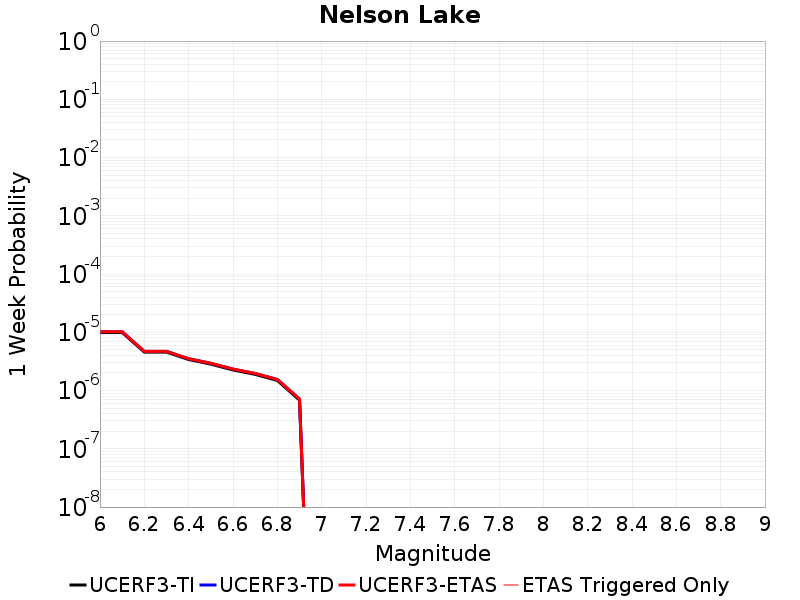 |  |  |  |

| Magnitude | 1 wk TI Prob | 1 wk TD Prob | 1 wk ETAS Prob | 1 wk ETAS/TD Gain | 1 wk ETAS Triggered Only | 1 mo TI Prob | 1 mo TD Prob | 1 mo ETAS Prob | 1 mo ETAS/TD Gain | 1 mo ETAS Triggered Only | 1 yr TI Prob | 1 yr TD Prob | 1 yr ETAS Prob | 1 yr ETAS/TD Gain | 1 yr ETAS Triggered Only | 10 yr TI Prob | 10 yr TD Prob | 10 yr ETAS Prob | 10 yr ETAS/TD Gain | 10 yr ETAS Triggered Only |
|-----|-----|-----|-----|-----|-----|-----|-----|-----|-----|-----|-----|-----|-----|-----|-----|-----|-----|-----|-----|-----|
| 6.0 | 9.913453E-6 | 1.0201206E-5 | 1.0201206E-5 | 1.0 | 0.0 | 4.2485535E-5 | 4.3718785E-5 | 4.3718785E-5 | 1.0 | 0.0 | 5.1713863E-4 | 5.3215655E-4 | 5.3215655E-4 | 1.0 | 0.0 | 0.0051593683 | 0.005309852 | 0.005319799 | 1.0018733 | 1.0E-5 |
| 6.1 | 9.913453E-6 | 1.0201206E-5 | 1.0201206E-5 | 1.0 | 0.0 | 4.2485535E-5 | 4.3718785E-5 | 4.3718785E-5 | 1.0 | 0.0 | 5.1713863E-4 | 5.3215655E-4 | 5.3215655E-4 | 1.0 | 0.0 | 0.0051593683 | 0.005309852 | 0.005319799 | 1.0018733 | 1.0E-5 |
| 6.2 | 4.5596407E-6 | 4.700713E-6 | 4.700713E-6 | 1.0 | 0.0 | 1.954117E-5 | 2.0145764E-5 | 2.0145764E-5 | 1.0 | 0.0 | 2.3788778E-4 | 2.4524835E-4 | 2.4524835E-4 | 1.0 | 0.0 | 0.0023763329 | 0.0024499032 | 0.0024499032 | 1.0 | 0.0 |
| 6.3 | 4.5596407E-6 | 4.700713E-6 | 4.700713E-6 | 1.0 | 0.0 | 1.954117E-5 | 2.0145764E-5 | 2.0145764E-5 | 1.0 | 0.0 | 2.3788778E-4 | 2.4524835E-4 | 2.4524835E-4 | 1.0 | 0.0 | 0.0023763329 | 0.0024499032 | 0.0024499032 | 1.0 | 0.0 |
| 6.4 | 3.4025713E-6 | 3.5133585E-6 | 3.5133585E-6 | 1.0 | 0.0 | 1.4582367E-5 | 1.5057169E-5 | 1.5057169E-5 | 1.0 | 0.0 | 1.7752586E-4 | 1.8330645E-4 | 1.8330645E-4 | 1.0 | 0.0 | 0.001773841 | 0.0018316356 | 0.0018316356 | 1.0 | 0.0 |
| 6.5 | 2.8352947E-6 | 2.9308449E-6 | 2.9308449E-6 | 1.0 | 0.0 | 1.2151207E-5 | 1.2560707E-5 | 1.2560707E-5 | 1.0 | 0.0 | 1.479309E-4 | 1.5291663E-4 | 1.5291663E-4 | 1.0 | 0.0 | 0.0014783246 | 0.0015281881 | 0.0015281881 | 1.0 | 0.0 |
| 6.6 | 2.251518E-6 | 2.3315758E-6 | 2.3315758E-6 | 1.0 | 0.0 | 9.649328E-6 | 9.992434E-6 | 9.992434E-6 | 1.0 | 0.0 | 1.1747423E-4 | 1.2165171E-4 | 1.2165171E-4 | 1.0 | 0.0 | 0.0011741214 | 0.0012159131 | 0.0012159131 | 1.0 | 0.0 |
| 6.7 | 1.8911853E-6 | 1.9613406E-6 | 1.9613406E-6 | 1.0 | 0.0 | 8.105055E-6 | 8.405722E-6 | 8.405722E-6 | 1.0 | 0.0 | 9.867457E-5 | 1.0233544E-4 | 1.0233544E-4 | 1.0 | 0.0 | 9.863076E-4 | 0.0010229409 | 0.0010229409 | 1.0 | 0.0 |
| 6.8 | 1.4874814E-6 | 1.5456585E-6 | 1.5456585E-6 | 1.0 | 0.0 | 6.374905E-6 | 6.624237E-6 | 6.624237E-6 | 1.0 | 0.0 | 7.76117E-5 | 8.0647624E-5 | 8.0647624E-5 | 1.0 | 0.0 | 7.75846E-4 | 8.062348E-4 | 8.062348E-4 | 1.0 | 0.0 |
| 6.9 | 6.835972E-7 | 7.1498346E-7 | 7.1498346E-7 | 1.0 | 0.0 | 2.9296991E-6 | 3.0642132E-6 | 3.0642132E-6 | 1.0 | 0.0 | 3.56685E-5 | 3.7306476E-5 | 3.7306476E-5 | 1.0 | 0.0 | 3.5662777E-4 | 3.730335E-4 | 3.730335E-4 | 1.0 | 0.0 |

## San Andreas (Santa Cruz Mts) 2011 CFM
*[(top)](#table-of-contents)*

| 1 Week | 1 Month | 1 Year | 10 Year |
|-----|-----|-----|-----|
| 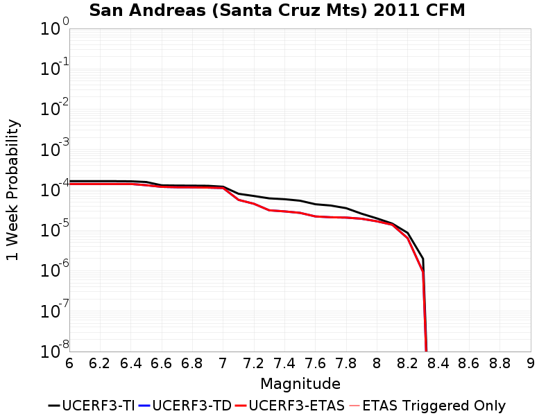 | 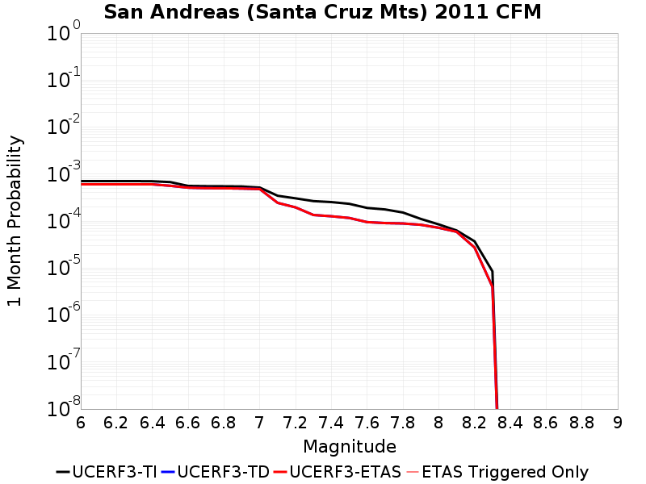 | 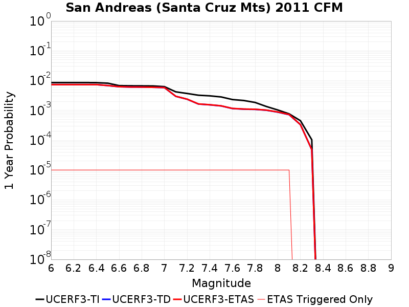 | 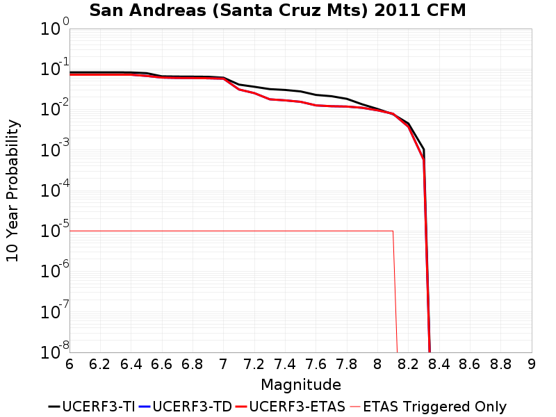 |

| Magnitude | 1 wk TI Prob | 1 wk TD Prob | 1 wk ETAS Prob | 1 wk ETAS/TD Gain | 1 wk ETAS Triggered Only | 1 mo TI Prob | 1 mo TD Prob | 1 mo ETAS Prob | 1 mo ETAS/TD Gain | 1 mo ETAS Triggered Only | 1 yr TI Prob | 1 yr TD Prob | 1 yr ETAS Prob | 1 yr ETAS/TD Gain | 1 yr ETAS Triggered Only | 10 yr TI Prob | 10 yr TD Prob | 10 yr ETAS Prob | 10 yr ETAS/TD Gain | 10 yr ETAS Triggered Only |
|-----|-----|-----|-----|-----|-----|-----|-----|-----|-----|-----|-----|-----|-----|-----|-----|-----|-----|-----|-----|-----|
| 6.0 | 1.6520628E-4 | 1.4092326E-4 | 1.4092326E-4 | 1.0 | 0.0 | 7.078348E-4 | 6.038192E-4 | 6.038192E-4 | 1.0 | 0.0 | 0.008583886 | 0.007327121 | 0.007337048 | 1.0013548 | 1.0E-5 | 0.08259789 | 0.07212971 | 0.07213899 | 1.0001286 | 1.0E-5 |
| 6.1 | 1.6520628E-4 | 1.4092326E-4 | 1.4092326E-4 | 1.0 | 0.0 | 7.078348E-4 | 6.038192E-4 | 6.038192E-4 | 1.0 | 0.0 | 0.008583886 | 0.007327121 | 0.007337048 | 1.0013548 | 1.0E-5 | 0.08259789 | 0.07212971 | 0.07213899 | 1.0001286 | 1.0E-5 |
| 6.2 | 1.6520628E-4 | 1.4092326E-4 | 1.4092326E-4 | 1.0 | 0.0 | 7.078348E-4 | 6.038192E-4 | 6.038192E-4 | 1.0 | 0.0 | 0.008583886 | 0.007327121 | 0.007337048 | 1.0013548 | 1.0E-5 | 0.08259789 | 0.07212971 | 0.07213899 | 1.0001286 | 1.0E-5 |
| 6.3 | 1.6520628E-4 | 1.4092326E-4 | 1.4092326E-4 | 1.0 | 0.0 | 7.078348E-4 | 6.038192E-4 | 6.038192E-4 | 1.0 | 0.0 | 0.008583886 | 0.007327121 | 0.007337048 | 1.0013548 | 1.0E-5 | 0.08259789 | 0.07212971 | 0.07213899 | 1.0001286 | 1.0E-5 |
| 6.4 | 1.6392978E-4 | 1.4090705E-4 | 1.4090705E-4 | 1.0 | 0.0 | 7.02367E-4 | 6.037497E-4 | 6.037497E-4 | 1.0 | 0.0 | 0.008517839 | 0.0073262816 | 0.007336208 | 1.0013549 | 1.0E-5 | 0.08198654 | 0.072110645 | 0.07211992 | 1.0001286 | 1.0E-5 |
| 6.5 | 1.5742714E-4 | 1.3118125E-4 | 1.3118125E-4 | 1.0 | 0.0 | 6.745133E-4 | 5.6208606E-4 | 5.6208606E-4 | 1.0 | 0.0 | 0.00818132 | 0.006822262 | 0.0068321936 | 1.0014558 | 1.0E-5 | 0.078865945 | 0.06743508 | 0.06744441 | 1.0001383 | 1.0E-5 |
| 6.6 | 1.3038084E-4 | 1.1959399E-4 | 1.1959399E-4 | 1.0 | 0.0 | 5.5865536E-4 | 5.1244634E-4 | 5.1244634E-4 | 1.0 | 0.0 | 0.006780438 | 0.0062214346 | 0.0062313722 | 1.0015974 | 1.0E-5 | 0.0657725 | 0.061330963 | 0.06134035 | 1.0001531 | 1.0E-5 |
| 6.7 | 1.2867592E-4 | 1.16798634E-4 | 1.16798634E-4 | 1.0 | 0.0 | 5.5135164E-4 | 5.0047087E-4 | 5.0047087E-4 | 1.0 | 0.0 | 0.0066920654 | 0.006076454 | 0.0060863933 | 1.0016357 | 1.0E-5 | 0.06494093 | 0.060016643 | 0.060026042 | 1.0001566 | 1.0E-5 |
| 6.8 | 1.2801298E-4 | 1.16164156E-4 | 1.16164156E-4 | 1.0 | 0.0 | 5.485117E-4 | 4.977527E-4 | 4.977527E-4 | 1.0 | 0.0 | 0.0066577005 | 0.0060435445 | 0.006053484 | 1.0016446 | 1.0E-5 | 0.06461738 | 0.05972524 | 0.059734643 | 1.0001575 | 1.0E-5 |
| 6.9 | 1.269149E-4 | 1.14566115E-4 | 1.14566115E-4 | 1.0 | 0.0 | 5.4380763E-4 | 4.9090653E-4 | 4.9090653E-4 | 1.0 | 0.0 | 0.006600777 | 0.0059606517 | 0.005970592 | 1.0016676 | 1.0E-5 | 0.06408122 | 0.058988564 | 0.058997974 | 1.0001595 | 1.0E-5 |
| 7.0 | 1.2030331E-4 | 1.11769856E-4 | 1.11769856E-4 | 1.0 | 0.0 | 5.154837E-4 | 4.7892702E-4 | 4.7892702E-4 | 1.0 | 0.0 | 0.006257969 | 0.0058155884 | 0.0058255303 | 1.0017095 | 1.0E-5 | 0.06084648 | 0.057587404 | 0.05759683 | 1.0001637 | 1.0E-5 |
| 7.1 | 8.049617E-5 | 5.6864217E-5 | 5.6864217E-5 | 1.0 | 0.0 | 3.4493793E-4 | 2.4368122E-4 | 2.4368122E-4 | 1.0 | 0.0 | 0.0041915346 | 0.0029628195 | 0.0029727898 | 1.0033652 | 1.0E-5 | 0.041133516 | 0.031168483 | 0.031178173 | 1.0003108 | 1.0E-5 |
| 7.2 | 7.093979E-5 | 4.5535693E-5 | 4.5535693E-5 | 1.0 | 0.0 | 3.0399222E-4 | 1.951385E-4 | 1.951385E-4 | 1.0 | 0.0 | 0.0036948253 | 0.0023732462 | 0.0023832226 | 1.0042037 | 1.0E-5 | 0.03633994 | 0.02531106 | 0.025320807 | 1.000385 | 1.0E-5 |
| 7.3 | 6.193693E-5 | 3.1357533E-5 | 3.1357533E-5 | 1.0 | 0.0 | 2.6541698E-4 | 1.3438251E-4 | 1.3438251E-4 | 1.0 | 0.0 | 0.0032266637 | 0.001634881 | 0.0016448647 | 1.0061066 | 1.0E-5 | 0.031802133 | 0.017806215 | 0.017816037 | 1.0005516 | 1.0E-5 |
| 7.4 | 5.906492E-5 | 2.9485958E-5 | 2.9485958E-5 | 1.0 | 0.0 | 2.5311083E-4 | 1.2636228E-4 | 1.2636228E-4 | 1.0 | 0.0 | 0.0030772698 | 0.0015373767 | 0.0015473613 | 1.0064946 | 1.0E-5 | 0.030350044 | 0.016778024 | 0.016787857 | 1.000586 | 1.0E-5 |
| 7.5 | 5.424296E-5 | 2.7094435E-5 | 2.7094435E-5 | 1.0 | 0.0 | 2.324491E-4 | 1.1611384E-4 | 1.1611384E-4 | 1.0 | 0.0 | 0.002826395 | 0.0014127706 | 0.0014227565 | 1.0070683 | 1.0E-5 | 0.027907165 | 0.015446523 | 0.015456369 | 1.0006374 | 1.0E-5 |
| 7.6 | 4.43084E-5 | 2.2123339E-5 | 2.2123339E-5 | 1.0 | 0.0 | 1.8987931E-4 | 9.4810865E-5 | 9.4810865E-5 | 1.0 | 0.0 | 0.0023093296 | 0.0011537113 | 0.0011636998 | 1.0086577 | 1.0E-5 | 0.022854783 | 0.012596085 | 0.012605959 | 1.0007839 | 1.0E-5 |
| 7.7 | 4.118098E-5 | 2.1096292E-5 | 2.1096292E-5 | 1.0 | 0.0 | 1.7647797E-4 | 9.040954E-5 | 9.040954E-5 | 1.0 | 0.0 | 0.002146502 | 0.0011001807 | 0.0011101697 | 1.0090795 | 1.0E-5 | 0.021258866 | 0.012020773 | 0.012030654 | 1.000822 | 1.0E-5 |
| 7.8 | 3.5408906E-5 | 2.0710533E-5 | 2.0710533E-5 | 1.0 | 0.0 | 1.5174363E-4 | 8.875641E-5 | 8.875641E-5 | 1.0 | 0.0 | 0.0018459131 | 0.0010800739 | 0.0010900631 | 1.0092486 | 1.0E-5 | 0.018306552 | 0.01179178 | 0.011801662 | 1.000838 | 1.0E-5 |
| 7.9 | 2.5860836E-5 | 1.9398414E-5 | 1.9398414E-5 | 1.0 | 0.0 | 1.10827445E-4 | 8.313341E-5 | 8.313341E-5 | 1.0 | 0.0 | 0.001348489 | 0.0010116795 | 0.0010216695 | 1.0098746 | 1.0E-5 | 0.013403354 | 0.011004877 | 0.011014767 | 1.0008987 | 1.0E-5 |
| 8.0 | 1.9777332E-5 | 1.6761755E-5 | 1.6761755E-5 | 1.0 | 0.0 | 8.4757245E-5 | 7.183411E-5 | 7.183411E-5 | 1.0 | 0.0 | 0.0010314309 | 8.7422965E-4 | 8.8422094E-4 | 1.0114286 | 1.0E-5 | 0.010266567 | 0.009515099 | 0.009525004 | 1.0010409 | 1.0E-5 |
| 8.1 | 1.468494E-5 | 1.376793E-5 | 1.376793E-5 | 1.0 | 0.0 | 6.293394E-5 | 5.900408E-5 | 5.900408E-5 | 1.0 | 0.0 | 7.6595135E-4 | 7.181381E-4 | 7.281309E-4 | 1.013915 | 1.0E-5 | 0.0076331664 | 0.007840605 | 0.007850527 | 1.0012654 | 1.0E-5 |
| 8.2 | 8.63836E-6 | 6.3745106E-6 | 6.3745106E-6 | 1.0 | 0.0 | 3.7021015E-5 | 2.7319045E-5 | 2.7319045E-5 | 1.0 | 0.0 | 4.5063766E-4 | 3.325587E-4 | 3.325587E-4 | 1.0 | 0.0 | 0.004497249 | 0.0037341176 | 0.0037341176 | 1.0 | 0.0 |
| 8.3 | 1.983087E-6 | 9.274416E-7 | 9.274416E-7 | 1.0 | 0.0 | 8.498917E-6 | 3.974744E-6 | 3.974744E-6 | 1.0 | 0.0 | 1.034694E-4 | 4.8391455E-5 | 4.8391455E-5 | 1.0 | 0.0 | 0.0010342124 | 5.6326366E-4 | 5.6326366E-4 | 1.0 | 0.0 |

## San Jacinto (Borrego)
*[(top)](#table-of-contents)*

| 1 Week | 1 Month | 1 Year | 10 Year |
|-----|-----|-----|-----|
|  | 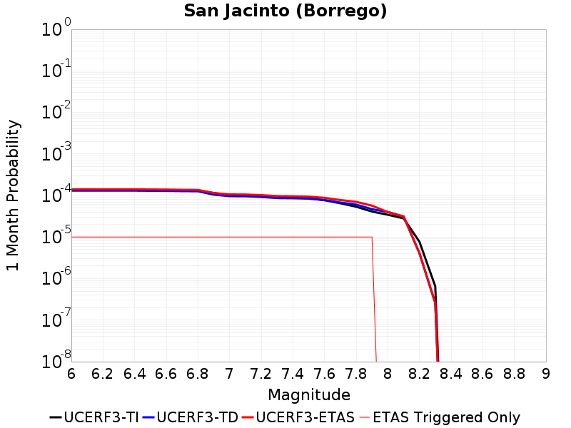 | 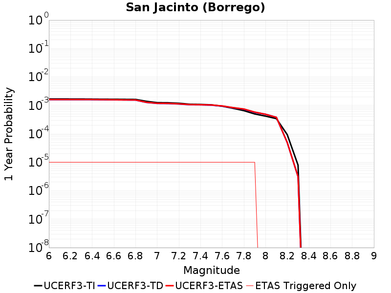 | 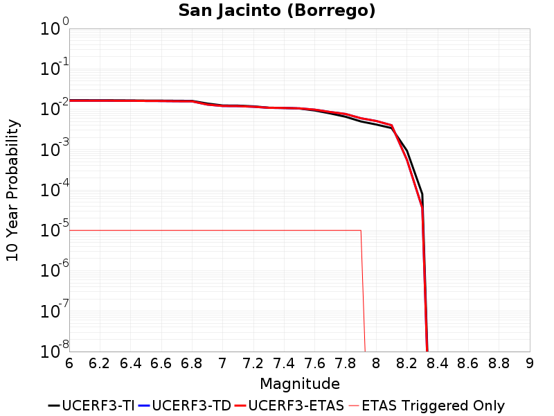 |

| Magnitude | 1 wk TI Prob | 1 wk TD Prob | 1 wk ETAS Prob | 1 wk ETAS/TD Gain | 1 wk ETAS Triggered Only | 1 mo TI Prob | 1 mo TD Prob | 1 mo ETAS Prob | 1 mo ETAS/TD Gain | 1 mo ETAS Triggered Only | 1 yr TI Prob | 1 yr TD Prob | 1 yr ETAS Prob | 1 yr ETAS/TD Gain | 1 yr ETAS Triggered Only | 10 yr TI Prob | 10 yr TD Prob | 10 yr ETAS Prob | 10 yr ETAS/TD Gain | 10 yr ETAS Triggered Only |
|-----|-----|-----|-----|-----|-----|-----|-----|-----|-----|-----|-----|-----|-----|-----|-----|-----|-----|-----|-----|-----|
| 6.0 | 3.228442E-5 | 3.05209E-5 | 4.0520594E-5 | 1.3276343 | 1.0E-5 | 1.3835446E-4 | 1.3079737E-4 | 1.4079607E-4 | 1.0764441 | 1.0E-5 | 0.0016831639 | 0.0015913097 | 0.0016012938 | 1.0062741 | 1.0E-5 | 0.016704723 | 0.016201025 | 0.016210863 | 1.0006073 | 1.0E-5 |
| 6.1 | 3.226985E-5 | 3.05209E-5 | 4.0520594E-5 | 1.3276343 | 1.0E-5 | 1.3829203E-4 | 1.3079737E-4 | 1.4079607E-4 | 1.0764441 | 1.0E-5 | 0.001682405 | 0.0015913097 | 0.0016012938 | 1.0062741 | 1.0E-5 | 0.016697248 | 0.016201025 | 0.016210863 | 1.0006073 | 1.0E-5 |
| 6.2 | 3.2120504E-5 | 3.05209E-5 | 4.0520594E-5 | 1.3276343 | 1.0E-5 | 1.3765205E-4 | 1.3079737E-4 | 1.4079607E-4 | 1.0764441 | 1.0E-5 | 0.0016746253 | 0.0015913097 | 0.0016012937 | 1.0062741 | 1.0E-5 | 0.016620617 | 0.016201025 | 0.016210863 | 1.0006073 | 1.0E-5 |
| 6.3 | 3.206246E-5 | 3.0475243E-5 | 4.0474937E-5 | 1.3281252 | 1.0E-5 | 1.374033E-4 | 1.3060174E-4 | 1.4060043E-4 | 1.0765587 | 1.0E-5 | 0.0016716016 | 0.0015889312 | 0.0015989152 | 1.0062835 | 1.0E-5 | 0.016590832 | 0.016177744 | 0.016187582 | 1.0006081 | 1.0E-5 |
| 6.4 | 3.1828724E-5 | 3.0439278E-5 | 4.0438976E-5 | 1.3285129 | 1.0E-5 | 1.364017E-4 | 1.3044762E-4 | 1.4044631E-4 | 1.0766491 | 1.0E-5 | 0.0016594254 | 0.0015870575 | 0.0015970416 | 1.0062909 | 1.0E-5 | 0.016470885 | 0.016159052 | 0.01616889 | 1.0006088 | 1.0E-5 |
| 6.5 | 3.1563577E-5 | 3.0159847E-5 | 4.0159546E-5 | 1.3315567 | 1.0E-5 | 1.3526545E-4 | 1.2925017E-4 | 1.3924888E-4 | 1.0773593 | 1.0E-5 | 0.0016456128 | 0.0015724996 | 0.0015824839 | 1.0063493 | 1.0E-5 | 0.0163348 | 0.016016532 | 0.01602637 | 1.0006144 | 1.0E-5 |
| 6.6 | 3.1467625E-5 | 2.9995716E-5 | 3.9995415E-5 | 1.3333709 | 1.0E-5 | 1.3485427E-4 | 1.2854682E-4 | 1.3854553E-4 | 1.0777826 | 1.0E-5 | 0.0016406142 | 0.0015639487 | 0.001573933 | 1.006384 | 1.0E-5 | 0.016285548 | 0.0159328 | 0.01594264 | 1.0006176 | 1.0E-5 |
| 6.7 | 3.1223695E-5 | 2.9597984E-5 | 3.959769E-5 | 1.3378508 | 1.0E-5 | 1.3380898E-4 | 1.2684242E-4 | 1.3684115E-4 | 1.078828 | 1.0E-5 | 0.0016279068 | 0.0015432272 | 0.0015532118 | 1.00647 | 1.0E-5 | 0.01616033 | 0.015729558 | 0.0157394 | 1.0006257 | 1.0E-5 |
| 6.8 | 3.1015585E-5 | 2.9401457E-5 | 3.9401162E-5 | 1.3401092 | 1.0E-5 | 1.3291716E-4 | 1.2600023E-4 | 1.3599898E-4 | 1.0793549 | 1.0E-5 | 0.001617065 | 0.0015329882 | 0.0015429728 | 1.0065132 | 1.0E-5 | 0.016053487 | 0.015628153 | 0.015637998 | 1.0006299 | 1.0E-5 |
| 6.9 | 2.6641965E-5 | 2.4348263E-5 | 3.434802E-5 | 1.4106969 | 1.0E-5 | 1.1417485E-4 | 1.0434555E-4 | 1.14344504E-4 | 1.0958254 | 1.0E-5 | 0.0013891924 | 0.0012696714 | 0.0012796588 | 1.007866 | 1.0E-5 | 0.0138054015 | 0.013002276 | 0.013012146 | 1.0007591 | 1.0E-5 |
| 7.0 | 2.3854353E-5 | 2.2438307E-5 | 3.243808E-5 | 1.4456564 | 1.0E-5 | 1.02228936E-4 | 9.616064E-5 | 1.06159685E-4 | 1.1039827 | 1.0E-5 | 0.0012439266 | 0.0011701301 | 0.0011801183 | 1.0085361 | 1.0E-5 | 0.012369866 | 0.011999419 | 0.012009298 | 1.0008234 | 1.0E-5 |
| 7.1 | 2.3672901E-5 | 2.2267299E-5 | 3.2267075E-5 | 1.449079 | 1.0E-5 | 1.0145135E-4 | 9.542781E-5 | 1.0542685E-4 | 1.1047813 | 1.0E-5 | 0.0012344702 | 0.0011612172 | 0.0011712057 | 1.0086017 | 1.0E-5 | 0.0122763505 | 0.011910871 | 0.011920751 | 1.0008296 | 1.0E-5 |
| 7.2 | 2.2717244E-5 | 2.1440972E-5 | 3.144076E-5 | 1.4663868 | 1.0E-5 | 9.735599E-5 | 9.188666E-5 | 1.01885744E-4 | 1.1088197 | 1.0E-5 | 0.0011846646 | 0.0011181487 | 0.0011281375 | 1.0089333 | 1.0E-5 | 0.01178369 | 0.011481261 | 0.011491146 | 1.0008609 | 1.0E-5 |
| 7.3 | 2.1016205E-5 | 2.0194415E-5 | 3.0194213E-5 | 1.4951764 | 1.0E-5 | 9.006634E-5 | 8.6544635E-5 | 9.654377E-5 | 1.1155373 | 1.0E-5 | 0.001096006 | 0.001053174 | 0.0010631635 | 1.0094851 | 1.0E-5 | 0.010906163 | 0.010831707 | 0.010841599 | 1.0009133 | 1.0E-5 |
| 7.4 | 2.0683625E-5 | 1.9980918E-5 | 2.998072E-5 | 1.5004675 | 1.0E-5 | 8.86411E-5 | 8.562971E-5 | 9.562886E-5 | 1.1167719 | 1.0E-5 | 0.001078671 | 0.0010420455 | 0.0010520351 | 1.0095865 | 1.0E-5 | 0.010734501 | 0.010720294 | 0.0107301865 | 1.0009228 | 1.0E-5 |
| 7.5 | 1.9993966E-5 | 1.9539177E-5 | 2.9538982E-5 | 1.5117823 | 1.0E-5 | 8.568561E-5 | 8.373665E-5 | 9.373582E-5 | 1.1194121 | 1.0E-5 | 0.001042723 | 0.0010190193 | 0.0010290091 | 1.0098034 | 1.0E-5 | 0.010378438 | 0.0104884235 | 0.010498318 | 1.0009434 | 1.0E-5 |
| 7.6 | 1.788966E-5 | 1.8095829E-5 | 2.8095648E-5 | 1.5526035 | 1.0E-5 | 7.666772E-5 | 7.755126E-5 | 8.7550485E-5 | 1.128937 | 1.0E-5 | 9.3302975E-4 | 9.4377965E-4 | 9.537702E-4 | 1.0105857 | 1.0E-5 | 0.00929122 | 0.009731061 | 0.009740964 | 1.0010177 | 1.0E-5 |
| 7.7 | 1.5125781E-5 | 1.5773445E-5 | 2.5773286E-5 | 1.6339669 | 1.0E-5 | 6.4823165E-5 | 6.759873E-5 | 7.759805E-5 | 1.1479218 | 1.0E-5 | 7.889362E-4 | 8.2270475E-4 | 8.326965E-4 | 1.012145 | 1.0E-5 | 0.007861412 | 0.008515584 | 0.008525499 | 1.0011643 | 1.0E-5 |
| 7.8 | 1.250089E-5 | 1.4045626E-5 | 2.4045485E-5 | 1.7119554 | 1.0E-5 | 5.3574146E-5 | 6.0194154E-5 | 7.019355E-5 | 1.1661191 | 1.0E-5 | 6.5207E-4 | 7.326182E-4 | 7.426109E-4 | 1.0136397 | 1.0E-5 | 0.006501599 | 0.0076067504 | 0.0076166745 | 1.0013046 | 1.0E-5 |
| 7.9 | 9.561E-6 | 1.0909687E-5 | 2.0909578E-5 | 1.9166065 | 1.0E-5 | 4.0975072E-5 | 4.675497E-5 | 5.67545E-5 | 1.213871 | 1.0E-5 | 4.987573E-4 | 5.6909374E-4 | 5.7908805E-4 | 1.0175618 | 1.0E-5 | 0.0049763937 | 0.0059577255 | 0.005967666 | 1.0016685 | 1.0E-5 |
| 8.0 | 8.01699E-6 | 9.301221E-6 | 9.301221E-6 | 1.0 | 0.0 | 3.4358076E-5 | 3.986177E-5 | 3.986177E-5 | 1.0 | 0.0 | 4.1822926E-4 | 4.8520966E-4 | 4.8520966E-4 | 1.0 | 0.0 | 0.0041744304 | 0.0051023853 | 0.0051023853 | 1.0 | 0.0 |
| 8.1 | 6.541947E-6 | 7.268581E-6 | 7.268581E-6 | 1.0 | 0.0 | 2.8036617E-5 | 3.1150696E-5 | 3.1150696E-5 | 1.0 | 0.0 | 3.4129233E-4 | 3.7919433E-4 | 3.7919433E-4 | 1.0 | 0.0 | 0.0034076865 | 0.0040057544 | 0.0040057544 | 1.0 | 0.0 |
| 8.2 | 1.7968189E-6 | 9.5049324E-7 | 9.5049324E-7 | 1.0 | 0.0 | 7.70063E-6 | 4.0735363E-6 | 4.0735363E-6 | 1.0 | 0.0 | 9.3751136E-5 | 4.959421E-5 | 4.959421E-5 | 1.0 | 0.0 | 9.371159E-4 | 5.566397E-4 | 5.566397E-4 | 1.0 | 0.0 |
| 8.3 | 1.5167889E-7 | 5.990261E-8 | 5.990261E-8 | 1.0 | 0.0 | 6.500522E-7 | 2.5672546E-7 | 2.5672546E-7 | 1.0 | 0.0 | 7.9143565E-6 | 3.1256286E-6 | 3.1256286E-6 | 1.0 | 0.0 | 7.914075E-5 | 3.590857E-5 | 3.590857E-5 | 1.0 | 0.0 |

## Owl Lake
*[(top)](#table-of-contents)*

| 1 Week | 1 Month | 1 Year | 10 Year |
|-----|-----|-----|-----|
| 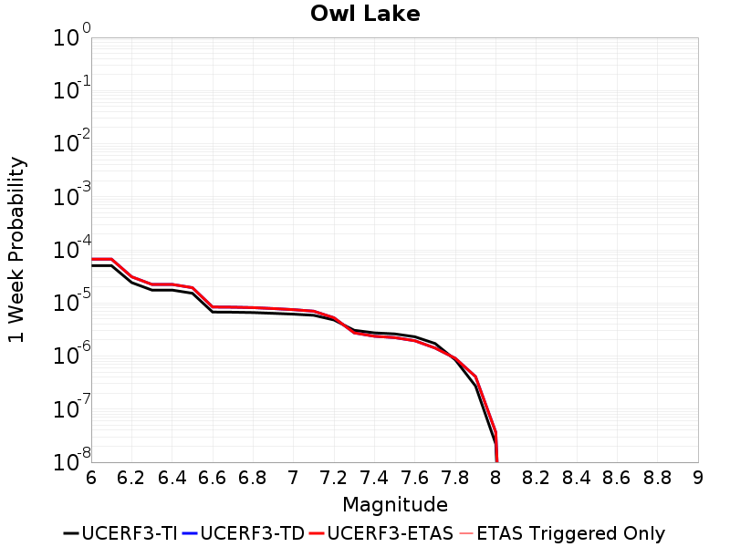 | 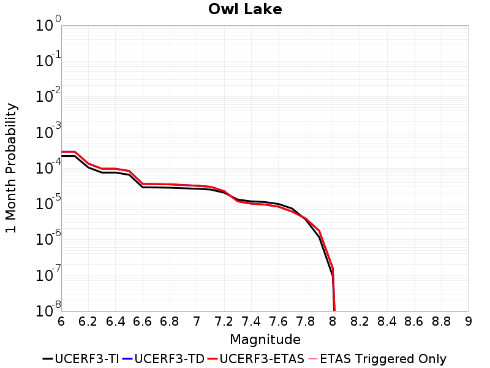 | 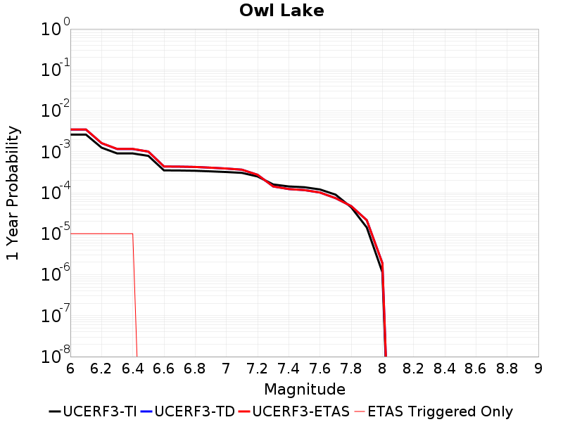 |  |

| Magnitude | 1 wk TI Prob | 1 wk TD Prob | 1 wk ETAS Prob | 1 wk ETAS/TD Gain | 1 wk ETAS Triggered Only | 1 mo TI Prob | 1 mo TD Prob | 1 mo ETAS Prob | 1 mo ETAS/TD Gain | 1 mo ETAS Triggered Only | 1 yr TI Prob | 1 yr TD Prob | 1 yr ETAS Prob | 1 yr ETAS/TD Gain | 1 yr ETAS Triggered Only | 10 yr TI Prob | 10 yr TD Prob | 10 yr ETAS Prob | 10 yr ETAS/TD Gain | 10 yr ETAS Triggered Only |
|-----|-----|-----|-----|-----|-----|-----|-----|-----|-----|-----|-----|-----|-----|-----|-----|-----|-----|-----|-----|-----|
| 6.0 | 5.0320643E-5 | 6.6738015E-5 | 6.6738015E-5 | 1.0 | 0.0 | 2.1564208E-4 | 2.8598966E-4 | 2.8598966E-4 | 1.0 | 0.0 | 0.0026222812 | 0.003477238 | 0.0034872033 | 1.0028658 | 1.0E-5 | 0.02591553 | 0.034330446 | 0.034340102 | 1.0002813 | 1.0E-5 |
| 6.1 | 5.0320643E-5 | 6.6738015E-5 | 6.6738015E-5 | 1.0 | 0.0 | 2.1564208E-4 | 2.8598966E-4 | 2.8598966E-4 | 1.0 | 0.0 | 0.0026222812 | 0.003477238 | 0.0034872033 | 1.0028658 | 1.0E-5 | 0.02591553 | 0.034330446 | 0.034340102 | 1.0002813 | 1.0E-5 |
| 6.2 | 2.4125871E-5 | 3.099886E-5 | 3.099886E-5 | 1.0 | 0.0 | 1.0339249E-4 | 1.3284669E-4 | 1.3284669E-4 | 1.0 | 0.0 | 0.0012580766 | 0.0016163774 | 0.0016263613 | 1.0061767 | 1.0E-5 | 0.012509781 | 0.01607997 | 0.01608981 | 1.0006119 | 1.0E-5 |
| 6.3 | 1.7433485E-5 | 2.229791E-5 | 2.229791E-5 | 1.0 | 0.0 | 7.471279E-5 | 9.555988E-5 | 9.555988E-5 | 1.0 | 0.0 | 9.0924866E-4 | 0.0011629586 | 0.0011729469 | 1.0085888 | 1.0E-5 | 0.009055373 | 0.01159952 | 0.011609404 | 1.0008521 | 1.0E-5 |
| 6.4 | 1.7433485E-5 | 2.229791E-5 | 2.229791E-5 | 1.0 | 0.0 | 7.471279E-5 | 9.555988E-5 | 9.555988E-5 | 1.0 | 0.0 | 9.0924866E-4 | 0.0011629586 | 0.0011729469 | 1.0085888 | 1.0E-5 | 0.009055373 | 0.01159952 | 0.011609404 | 1.0008521 | 1.0E-5 |
| 6.5 | 1.5182742E-5 | 1.9345296E-5 | 1.9345296E-5 | 1.0 | 0.0 | 6.506727E-5 | 8.290665E-5 | 8.290665E-5 | 1.0 | 0.0 | 7.919061E-4 | 0.0010090566 | 0.0010090566 | 1.0 | 0.0 | 0.0078909 | 0.010075493 | 0.010075493 | 1.0 | 0.0 |
| 6.6 | 6.7271576E-6 | 8.368835E-6 | 8.368835E-6 | 1.0 | 0.0 | 2.8830356E-5 | 3.586597E-5 | 3.586597E-5 | 1.0 | 0.0 | 3.5095305E-4 | 4.3658592E-4 | 4.3658592E-4 | 1.0 | 0.0 | 0.0035039932 | 0.0043754955 | 0.0043754955 | 1.0 | 0.0 |
| 6.7 | 6.682835E-6 | 8.301208E-6 | 8.301208E-6 | 1.0 | 0.0 | 2.8640408E-5 | 3.557615E-5 | 3.557615E-5 | 1.0 | 0.0 | 3.4864116E-4 | 4.3305877E-4 | 4.3305877E-4 | 1.0 | 0.0 | 0.003480947 | 0.0043403744 | 0.0043403744 | 1.0 | 0.0 |
| 6.8 | 6.5774975E-6 | 8.147403E-6 | 8.147403E-6 | 1.0 | 0.0 | 2.8188972E-5 | 3.4917E-5 | 3.4917E-5 | 1.0 | 0.0 | 3.4314668E-4 | 4.2503673E-4 | 4.2503673E-4 | 1.0 | 0.0 | 0.0034261728 | 0.0042603742 | 0.0042603742 | 1.0 | 0.0 |
| 6.9 | 6.363419E-6 | 7.821842E-6 | 7.821842E-6 | 1.0 | 0.0 | 2.727151E-5 | 3.3521777E-5 | 3.3521777E-5 | 1.0 | 0.0 | 3.3198006E-4 | 4.0805637E-4 | 4.0805637E-4 | 1.0 | 0.0 | 0.0033148455 | 0.0040909895 | 0.0040909895 | 1.0 | 0.0 |
| 7.0 | 6.1342453E-6 | 7.4590253E-6 | 7.4590253E-6 | 1.0 | 0.0 | 2.6289357E-5 | 3.1966887E-5 | 3.1966887E-5 | 1.0 | 0.0 | 3.2002592E-4 | 3.8913242E-4 | 3.8913242E-4 | 1.0 | 0.0 | 0.0031956544 | 0.003902244 | 0.003902244 | 1.0 | 0.0 |
| 7.1 | 5.842926E-6 | 6.981909E-6 | 6.981909E-6 | 1.0 | 0.0 | 2.504087E-5 | 2.992215E-5 | 2.992215E-5 | 1.0 | 0.0 | 3.0482994E-4 | 3.6424625E-4 | 3.6424625E-4 | 1.0 | 0.0 | 0.0030441214 | 0.0036539773 | 0.0036539773 | 1.0 | 0.0 |
| 7.2 | 4.77173E-6 | 5.245806E-6 | 5.245806E-6 | 1.0 | 0.0 | 2.045011E-5 | 2.2481852E-5 | 2.2481852E-5 | 1.0 | 0.0 | 2.4895166E-4 | 2.7368584E-4 | 2.7368584E-4 | 1.0 | 0.0 | 0.0024867293 | 0.0027494233 | 0.0027494233 | 1.0 | 0.0 |
| 7.3 | 3.0494948E-6 | 2.7291119E-6 | 2.7291119E-6 | 1.0 | 0.0 | 1.3069198E-5 | 1.1696143E-5 | 1.1696143E-5 | 1.0 | 0.0 | 1.5910587E-4 | 1.423914E-4 | 1.423914E-4 | 1.0 | 0.0 | 0.0015899199 | 0.0014325746 | 0.0014325746 | 1.0 | 0.0 |
| 7.4 | 2.7263884E-6 | 2.3531552E-6 | 2.3531552E-6 | 1.0 | 0.0 | 1.1684469E-5 | 1.0084912E-5 | 1.0084912E-5 | 1.0 | 0.0 | 1.4224913E-4 | 1.22777E-4 | 1.22777E-4 | 1.0 | 0.0 | 0.0014215811 | 0.0012357179 | 0.0012357179 | 1.0 | 0.0 |
| 7.5 | 2.6090431E-6 | 2.2209003E-6 | 2.2209003E-6 | 1.0 | 0.0 | 1.1181565E-5 | 9.51811E-6 | 9.51811E-6 | 1.0 | 0.0 | 1.3612706E-4 | 1.1587692E-4 | 1.1587692E-4 | 1.0 | 0.0 | 0.001360437 | 0.0011666085 | 0.0011666085 | 1.0 | 0.0 |
| 7.6 | 2.3008756E-6 | 1.9371082E-6 | 1.9371082E-6 | 1.0 | 0.0 | 9.860858E-6 | 8.301867E-6 | 8.301867E-6 | 1.0 | 0.0 | 1.20049335E-4 | 1.01070626E-4 | 1.01070626E-4 | 1.0 | 0.0 | 0.001199845 | 0.001018418 | 0.001018418 | 1.0 | 0.0 |
| 7.7 | 1.7184348E-6 | 1.4129354E-6 | 1.4129354E-6 | 1.0 | 0.0 | 7.3646997E-6 | 6.0554235E-6 | 6.0554235E-6 | 1.0 | 0.0 | 8.966153E-5 | 7.372233E-5 | 7.372233E-5 | 1.0 | 0.0 | 8.962536E-4 | 7.4491784E-4 | 7.4491784E-4 | 1.0 | 0.0 |
| 7.8 | 8.4612907E-7 | 9.045427E-7 | 9.045427E-7 | 1.0 | 0.0 | 3.6262625E-6 | 3.8766057E-6 | 3.8766057E-6 | 1.0 | 0.0 | 4.4148852E-5 | 4.7196678E-5 | 4.7196678E-5 | 1.0 | 0.0 | 4.414008E-4 | 4.7748216E-4 | 4.7748216E-4 | 1.0 | 0.0 |
| 7.9 | 2.716738E-7 | 4.0904058E-7 | 4.0904058E-7 | 1.0 | 0.0 | 1.1643157E-6 | 1.7530299E-6 | 1.7530299E-6 | 1.0 | 0.0 | 1.4175452E-5 | 2.1342943E-5 | 2.1342943E-5 | 1.0 | 0.0 | 1.4174548E-4 | 2.1526676E-4 | 2.1526676E-4 | 1.0 | 0.0 |
| 8.0 | 2.1995428E-8 | 3.665645E-8 | 3.665645E-8 | 1.0 | 0.0 | 9.426611E-8 | 1.5709907E-7 | 1.5709907E-7 | 1.0 | 0.0 | 1.1476893E-6 | 1.91268E-6 | 1.91268E-6 | 1.0 | 0.0 | 1.14768345E-5 | 1.9424791E-5 | 1.9424791E-5 | 1.0 | 0.0 |

## Santa Ynez (East)
*[(top)](#table-of-contents)*

| 1 Week | 1 Month | 1 Year | 10 Year |
|-----|-----|-----|-----|
|  | 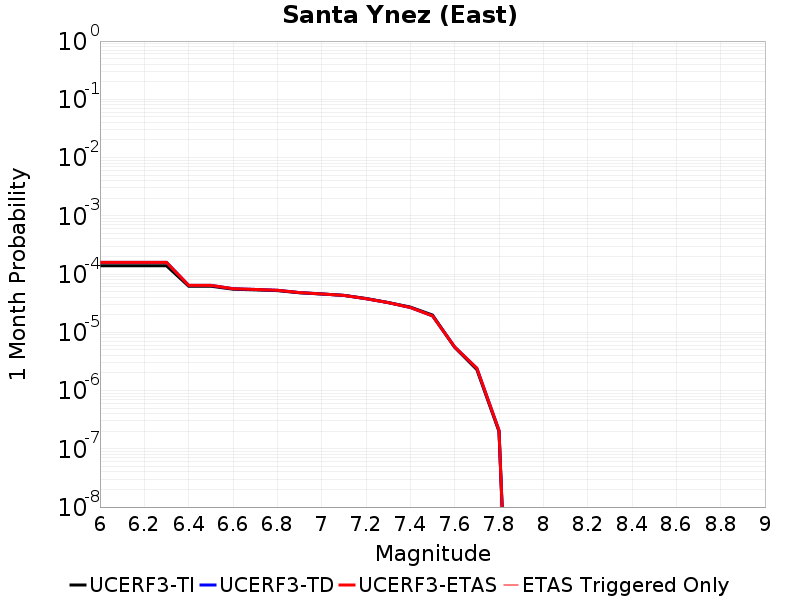 |  |  |

| Magnitude | 1 wk TI Prob | 1 wk TD Prob | 1 wk ETAS Prob | 1 wk ETAS/TD Gain | 1 wk ETAS Triggered Only | 1 mo TI Prob | 1 mo TD Prob | 1 mo ETAS Prob | 1 mo ETAS/TD Gain | 1 mo ETAS Triggered Only | 1 yr TI Prob | 1 yr TD Prob | 1 yr ETAS Prob | 1 yr ETAS/TD Gain | 1 yr ETAS Triggered Only | 10 yr TI Prob | 10 yr TD Prob | 10 yr ETAS Prob | 10 yr ETAS/TD Gain | 10 yr ETAS Triggered Only |
|-----|-----|-----|-----|-----|-----|-----|-----|-----|-----|-----|-----|-----|-----|-----|-----|-----|-----|-----|-----|-----|
| 6.0 | 3.2269712E-5 | 3.6952642E-5 | 3.6952642E-5 | 1.0 | 0.0 | 1.3829143E-4 | 1.5836224E-4 | 1.5836224E-4 | 1.0 | 0.0 | 0.0016823979 | 0.001926948 | 0.001926948 | 1.0 | 0.0 | 0.016697178 | 0.019160483 | 0.019170292 | 1.0005119 | 1.0E-5 |
| 6.1 | 3.2269712E-5 | 3.6952642E-5 | 3.6952642E-5 | 1.0 | 0.0 | 1.3829143E-4 | 1.5836224E-4 | 1.5836224E-4 | 1.0 | 0.0 | 0.0016823979 | 0.001926948 | 0.001926948 | 1.0 | 0.0 | 0.016697178 | 0.019160483 | 0.019170292 | 1.0005119 | 1.0E-5 |
| 6.2 | 3.2269712E-5 | 3.6952642E-5 | 3.6952642E-5 | 1.0 | 0.0 | 1.3829143E-4 | 1.5836224E-4 | 1.5836224E-4 | 1.0 | 0.0 | 0.0016823979 | 0.001926948 | 0.001926948 | 1.0 | 0.0 | 0.016697178 | 0.019160483 | 0.019170292 | 1.0005119 | 1.0E-5 |
| 6.3 | 3.2269712E-5 | 3.6952642E-5 | 3.6952642E-5 | 1.0 | 0.0 | 1.3829143E-4 | 1.5836224E-4 | 1.5836224E-4 | 1.0 | 0.0 | 0.0016823979 | 0.001926948 | 0.001926948 | 1.0 | 0.0 | 0.016697178 | 0.019160483 | 0.019170292 | 1.0005119 | 1.0E-5 |
| 6.4 | 1.4404779E-5 | 1.4896808E-5 | 1.4896808E-5 | 1.0 | 0.0 | 6.1733306E-5 | 6.384193E-5 | 6.384193E-5 | 1.0 | 0.0 | 7.513438E-4 | 7.770034E-4 | 7.770034E-4 | 1.0 | 0.0 | 0.0074880854 | 0.007743422 | 0.0077533447 | 1.0012814 | 1.0E-5 |
| 6.5 | 1.4404779E-5 | 1.4896808E-5 | 1.4896808E-5 | 1.0 | 0.0 | 6.1733306E-5 | 6.384193E-5 | 6.384193E-5 | 1.0 | 0.0 | 7.513438E-4 | 7.770034E-4 | 7.770034E-4 | 1.0 | 0.0 | 0.0074880854 | 0.007743422 | 0.0077533447 | 1.0012814 | 1.0E-5 |
| 6.6 | 1.280208E-5 | 1.3051012E-5 | 1.3051012E-5 | 1.0 | 0.0 | 5.4864904E-5 | 5.5931716E-5 | 5.5931716E-5 | 1.0 | 0.0 | 6.6777546E-4 | 6.807577E-4 | 6.807577E-4 | 1.0 | 0.0 | 0.006657724 | 0.0067869355 | 0.0067968676 | 1.0014634 | 1.0E-5 |
| 6.7 | 1.2457027E-5 | 1.2666226E-5 | 1.2666226E-5 | 1.0 | 0.0 | 5.3386164E-5 | 5.4282704E-5 | 5.4282704E-5 | 1.0 | 0.0 | 6.497827E-4 | 6.606932E-4 | 6.606932E-4 | 1.0 | 0.0 | 0.00647886 | 0.006587489 | 0.006597423 | 1.001508 | 1.0E-5 |
| 6.8 | 1.2095134E-5 | 1.2267607E-5 | 1.2267607E-5 | 1.0 | 0.0 | 5.1835254E-5 | 5.257441E-5 | 5.257441E-5 | 1.0 | 0.0 | 6.309115E-4 | 6.399071E-4 | 6.399071E-4 | 1.0 | 0.0 | 0.0062912325 | 0.0063808346 | 0.006390771 | 1.0015572 | 1.0E-5 |
| 6.9 | 1.1104036E-5 | 1.1192546E-5 | 1.1192546E-5 | 1.0 | 0.0 | 4.758786E-5 | 4.7967176E-5 | 4.7967176E-5 | 1.0 | 0.0 | 5.7922816E-4 | 5.8384513E-4 | 5.8384513E-4 | 1.0 | 0.0 | 0.005777207 | 0.0058232597 | 0.0058332016 | 1.0017072 | 1.0E-5 |
| 7.0 | 1.0577444E-5 | 1.0616042E-5 | 1.0616042E-5 | 1.0 | 0.0 | 4.5331115E-5 | 4.549654E-5 | 4.549654E-5 | 1.0 | 0.0 | 5.5176654E-4 | 5.537808E-4 | 5.537808E-4 | 1.0 | 0.0 | 0.0055039856 | 0.0055241482 | 0.005534093 | 1.0018002 | 1.0E-5 |
| 7.1 | 1.0021775E-5 | 1.0014519E-5 | 1.0014519E-5 | 1.0 | 0.0 | 4.294976E-5 | 4.2918666E-5 | 4.2918666E-5 | 1.0 | 0.0 | 5.2278786E-4 | 5.224107E-4 | 5.224107E-4 | 1.0 | 0.0 | 0.0052155964 | 0.00521196 | 0.005221908 | 1.0019087 | 1.0E-5 |
| 7.2 | 8.874109E-6 | 8.780893E-6 | 8.780893E-6 | 1.0 | 0.0 | 3.8031343E-5 | 3.763186E-5 | 3.763186E-5 | 1.0 | 0.0 | 4.629332E-4 | 4.580727E-4 | 4.580727E-4 | 1.0 | 0.0 | 0.0046197 | 0.0045714043 | 0.0045813587 | 1.0021775 | 1.0E-5 |
| 7.3 | 7.5504267E-6 | 7.5327193E-6 | 7.5327193E-6 | 1.0 | 0.0 | 3.235857E-5 | 3.228269E-5 | 3.228269E-5 | 1.0 | 0.0 | 3.9389438E-4 | 3.9297188E-4 | 3.9297188E-4 | 1.0 | 0.0 | 0.0039319694 | 0.0039228783 | 0.003932839 | 1.0025392 | 1.0E-5 |
| 7.4 | 6.309394E-6 | 6.207775E-6 | 6.207775E-6 | 1.0 | 0.0 | 2.703998E-5 | 2.6604486E-5 | 2.6604486E-5 | 1.0 | 0.0 | 3.2916202E-4 | 3.2386242E-4 | 3.2386242E-4 | 1.0 | 0.0 | 0.003286749 | 0.0032340032 | 0.0032340032 | 1.0 | 0.0 |
| 7.5 | 4.6103073E-6 | 4.460121E-6 | 4.460121E-6 | 1.0 | 0.0 | 1.975831E-5 | 1.9114668E-5 | 1.9114668E-5 | 1.0 | 0.0 | 2.4053088E-4 | 2.3269694E-4 | 2.3269694E-4 | 1.0 | 0.0 | 0.002402707 | 0.0023246033 | 0.0023246033 | 1.0 | 0.0 |
| 7.6 | 1.2858658E-6 | 1.3034523E-6 | 1.3034523E-6 | 1.0 | 0.0 | 5.5108417E-6 | 5.586213E-6 | 5.586213E-6 | 1.0 | 0.0 | 6.7092435E-5 | 6.8010086E-5 | 6.8010086E-5 | 1.0 | 0.0 | 6.707218E-4 | 6.7989965E-4 | 6.7989965E-4 | 1.0 | 0.0 |
| 7.7 | 5.3302307E-7 | 5.620952E-7 | 5.620952E-7 | 1.0 | 0.0 | 2.2843826E-6 | 2.4089775E-6 | 2.4089775E-6 | 1.0 | 0.0 | 2.7812002E-5 | 2.9328941E-5 | 2.9328941E-5 | 1.0 | 0.0 | 2.7808524E-4 | 2.932543E-4 | 2.932543E-4 | 1.0 | 0.0 |
| 7.8 | 4.613933E-8 | 4.8089824E-8 | 4.8089824E-8 | 1.0 | 0.0 | 1.9773998E-7 | 2.0609923E-7 | 2.0609923E-7 | 1.0 | 0.0 | 2.4074816E-6 | 2.5092554E-6 | 2.5092554E-6 | 1.0 | 0.0 | 2.4074554E-5 | 2.509228E-5 | 2.509228E-5 | 1.0 | 0.0 |

## Coyote Canyon
*[(top)](#table-of-contents)*

| 1 Week | 1 Month | 1 Year | 10 Year |
|-----|-----|-----|-----|
| 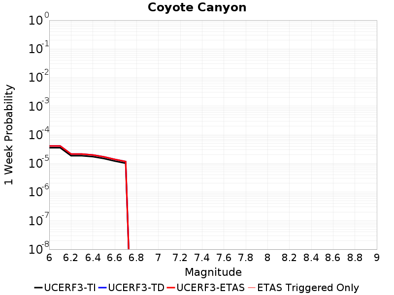 | 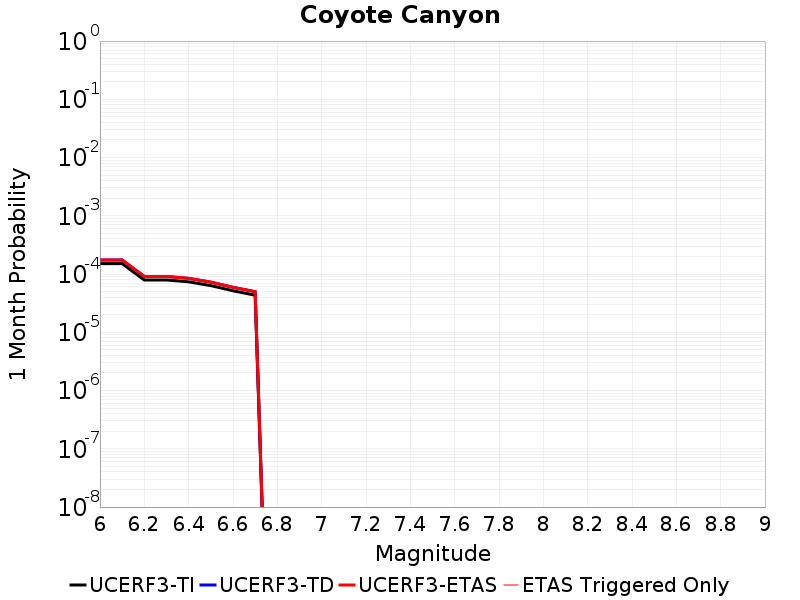 |  |  |

| Magnitude | 1 wk TI Prob | 1 wk TD Prob | 1 wk ETAS Prob | 1 wk ETAS/TD Gain | 1 wk ETAS Triggered Only | 1 mo TI Prob | 1 mo TD Prob | 1 mo ETAS Prob | 1 mo ETAS/TD Gain | 1 mo ETAS Triggered Only | 1 yr TI Prob | 1 yr TD Prob | 1 yr ETAS Prob | 1 yr ETAS/TD Gain | 1 yr ETAS Triggered Only | 10 yr TI Prob | 10 yr TD Prob | 10 yr ETAS Prob | 10 yr ETAS/TD Gain | 10 yr ETAS Triggered Only |
|-----|-----|-----|-----|-----|-----|-----|-----|-----|-----|-----|-----|-----|-----|-----|-----|-----|-----|-----|-----|-----|
| 6.0 | 3.5090034E-5 | 4.0554427E-5 | 4.0554427E-5 | 1.0 | 0.0 | 1.503772E-4 | 1.7379457E-4 | 1.7379457E-4 | 1.0 | 0.0 | 0.0018293047 | 0.002114155 | 0.002114155 | 1.0 | 0.0 | 0.018143194 | 0.020966588 | 0.020976378 | 1.000467 | 1.0E-5 |
| 6.1 | 3.5090034E-5 | 4.0554427E-5 | 4.0554427E-5 | 1.0 | 0.0 | 1.503772E-4 | 1.7379457E-4 | 1.7379457E-4 | 1.0 | 0.0 | 0.0018293047 | 0.002114155 | 0.002114155 | 1.0 | 0.0 | 0.018143194 | 0.020966588 | 0.020976378 | 1.000467 | 1.0E-5 |
| 6.2 | 1.841879E-5 | 2.115435E-5 | 2.115435E-5 | 1.0 | 0.0 | 7.8935285E-5 | 9.065893E-5 | 9.065893E-5 | 1.0 | 0.0 | 9.606133E-4 | 0.0011033166 | 0.0011033166 | 1.0 | 0.0 | 0.0095647145 | 0.010988564 | 0.010988564 | 1.0 | 0.0 |
| 6.3 | 1.841879E-5 | 2.115435E-5 | 2.115435E-5 | 1.0 | 0.0 | 7.8935285E-5 | 9.065893E-5 | 9.065893E-5 | 1.0 | 0.0 | 9.606133E-4 | 0.0011033166 | 0.0011033166 | 1.0 | 0.0 | 0.0095647145 | 0.010988564 | 0.010988564 | 1.0 | 0.0 |
| 6.4 | 1.712201E-5 | 1.965263E-5 | 1.965263E-5 | 1.0 | 0.0 | 7.337798E-5 | 8.4223415E-5 | 8.4223415E-5 | 1.0 | 0.0 | 8.930107E-4 | 0.0010250391 | 0.0010250391 | 1.0 | 0.0 | 0.008894307 | 0.010213118 | 0.010213118 | 1.0 | 0.0 |
| 6.5 | 1.4744935E-5 | 1.6911774E-5 | 1.6911774E-5 | 1.0 | 0.0 | 6.3191044E-5 | 7.247755E-5 | 7.247755E-5 | 1.0 | 0.0 | 7.6907943E-4 | 8.821513E-4 | 8.821513E-4 | 1.0 | 0.0 | 0.007664232 | 0.008795775 | 0.008795775 | 1.0 | 0.0 |
| 6.6 | 1.2017839E-5 | 1.3785106E-5 | 1.3785106E-5 | 1.0 | 0.0 | 5.150401E-5 | 5.9078193E-5 | 5.9078193E-5 | 1.0 | 0.0 | 6.268809E-4 | 7.19129E-4 | 7.19129E-4 | 1.0 | 0.0 | 0.0062511545 | 0.007176791 | 0.007176791 | 1.0 | 0.0 |
| 6.7 | 1.00956095E-5 | 1.1584958E-5 | 1.1584958E-5 | 1.0 | 0.0 | 4.326618E-5 | 4.964937E-5 | 4.964937E-5 | 1.0 | 0.0 | 5.266384E-4 | 6.0440117E-4 | 6.0440117E-4 | 1.0 | 0.0 | 0.005253921 | 0.0060361777 | 0.0060361777 | 1.0 | 0.0 |

## Oak Ridge (Onshore)
*[(top)](#table-of-contents)*

| 1 Week | 1 Month | 1 Year | 10 Year |
|-----|-----|-----|-----|
|  | 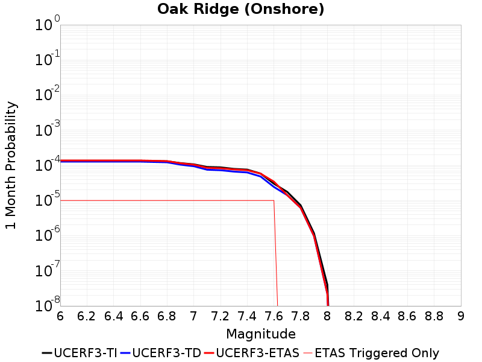 | 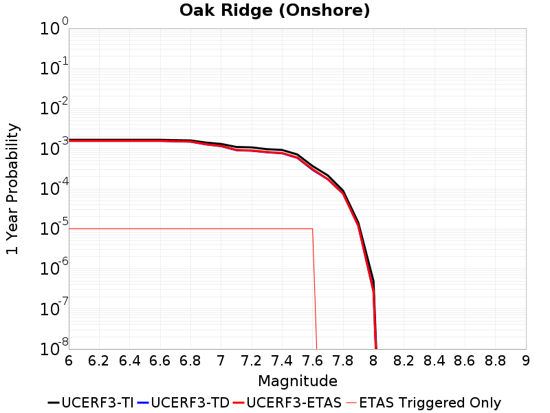 | 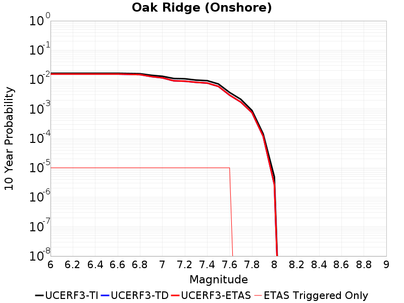 |

| Magnitude | 1 wk TI Prob | 1 wk TD Prob | 1 wk ETAS Prob | 1 wk ETAS/TD Gain | 1 wk ETAS Triggered Only | 1 mo TI Prob | 1 mo TD Prob | 1 mo ETAS Prob | 1 mo ETAS/TD Gain | 1 mo ETAS Triggered Only | 1 yr TI Prob | 1 yr TD Prob | 1 yr ETAS Prob | 1 yr ETAS/TD Gain | 1 yr ETAS Triggered Only | 10 yr TI Prob | 10 yr TD Prob | 10 yr ETAS Prob | 10 yr ETAS/TD Gain | 10 yr ETAS Triggered Only |
|-----|-----|-----|-----|-----|-----|-----|-----|-----|-----|-----|-----|-----|-----|-----|-----|-----|-----|-----|-----|-----|
| 6.0 | 3.155064E-5 | 2.9691255E-5 | 3.9690956E-5 | 1.3367895 | 1.0E-5 | 1.3521002E-4 | 1.2724224E-4 | 1.3724098E-4 | 1.0785803 | 1.0E-5 | 0.001644939 | 0.0015481119 | 0.0015580964 | 1.0064495 | 1.0E-5 | 0.01632816 | 0.01537783 | 0.015387676 | 1.0006403 | 1.0E-5 |
| 6.1 | 3.155064E-5 | 2.9691255E-5 | 3.9690956E-5 | 1.3367895 | 1.0E-5 | 1.3521002E-4 | 1.2724224E-4 | 1.3724098E-4 | 1.0785803 | 1.0E-5 | 0.001644939 | 0.0015481119 | 0.0015580964 | 1.0064495 | 1.0E-5 | 0.01632816 | 0.01537783 | 0.015387676 | 1.0006403 | 1.0E-5 |
| 6.2 | 3.155064E-5 | 2.9691255E-5 | 3.9690956E-5 | 1.3367895 | 1.0E-5 | 1.3521002E-4 | 1.2724224E-4 | 1.3724098E-4 | 1.0785803 | 1.0E-5 | 0.001644939 | 0.0015481119 | 0.0015580964 | 1.0064495 | 1.0E-5 | 0.01632816 | 0.01537783 | 0.015387676 | 1.0006403 | 1.0E-5 |
| 6.3 | 3.155064E-5 | 2.9691255E-5 | 3.9690956E-5 | 1.3367895 | 1.0E-5 | 1.3521002E-4 | 1.2724224E-4 | 1.3724098E-4 | 1.0785803 | 1.0E-5 | 0.001644939 | 0.0015481119 | 0.0015580964 | 1.0064495 | 1.0E-5 | 0.01632816 | 0.01537783 | 0.015387676 | 1.0006403 | 1.0E-5 |
| 6.4 | 3.155064E-5 | 2.9691255E-5 | 3.9690956E-5 | 1.3367895 | 1.0E-5 | 1.3521002E-4 | 1.2724224E-4 | 1.3724098E-4 | 1.0785803 | 1.0E-5 | 0.001644939 | 0.0015481119 | 0.0015580964 | 1.0064495 | 1.0E-5 | 0.01632816 | 0.01537783 | 0.015387676 | 1.0006403 | 1.0E-5 |
| 6.5 | 3.155064E-5 | 2.9691255E-5 | 3.9690956E-5 | 1.3367895 | 1.0E-5 | 1.3521002E-4 | 1.2724224E-4 | 1.3724098E-4 | 1.0785803 | 1.0E-5 | 0.001644939 | 0.0015481119 | 0.0015580964 | 1.0064495 | 1.0E-5 | 0.01632816 | 0.01537783 | 0.015387676 | 1.0006403 | 1.0E-5 |
| 6.6 | 3.155064E-5 | 2.9691255E-5 | 3.9690956E-5 | 1.3367895 | 1.0E-5 | 1.3521002E-4 | 1.2724224E-4 | 1.3724098E-4 | 1.0785803 | 1.0E-5 | 0.001644939 | 0.0015481119 | 0.0015580964 | 1.0064495 | 1.0E-5 | 0.01632816 | 0.01537783 | 0.015387676 | 1.0006403 | 1.0E-5 |
| 6.7 | 3.098897E-5 | 2.9025761E-5 | 3.902547E-5 | 1.3445115 | 1.0E-5 | 1.328031E-4 | 1.2439041E-4 | 1.3438916E-4 | 1.0803821 | 1.0E-5 | 0.0016156785 | 0.0015134391 | 0.001523424 | 1.0065975 | 1.0E-5 | 0.016039822 | 0.015035816 | 0.015045665 | 1.000655 | 1.0E-5 |
| 6.8 | 3.0449872E-5 | 2.839785E-5 | 3.8397564E-5 | 1.3521293 | 1.0E-5 | 1.3049292E-4 | 1.216996E-4 | 1.3169838E-4 | 1.0821595 | 1.0E-5 | 0.0015875935 | 0.0014807231 | 0.0014907083 | 1.0067434 | 1.0E-5 | 0.015762992 | 0.014712991 | 0.014722844 | 1.0006697 | 1.0E-5 |
| 6.9 | 2.697928E-5 | 2.4358254E-5 | 3.435801E-5 | 1.4105284 | 1.0E-5 | 1.15620365E-4 | 1.0438847E-4 | 1.14387425E-4 | 1.095786 | 1.0E-5 | 0.0014067689 | 0.0012702104 | 0.0012801976 | 1.0078627 | 1.0E-5 | 0.0139789665 | 0.012632252 | 0.012642126 | 1.0007817 | 1.0E-5 |
| 7.0 | 2.4893961E-5 | 2.1989366E-5 | 3.1989148E-5 | 1.4547553 | 1.0E-5 | 1.0668404E-4 | 9.423684E-5 | 1.042359E-4 | 1.1061056 | 1.0E-5 | 0.0012981043 | 0.0011467476 | 0.0011567362 | 1.0087103 | 1.0E-5 | 0.012905477 | 0.011410616 | 0.011420502 | 1.0008664 | 1.0E-5 |
| 7.1 | 2.0945363E-5 | 1.7461338E-5 | 2.7461163E-5 | 1.5726838 | 1.0E-5 | 8.976275E-5 | 7.483218E-5 | 8.483143E-5 | 1.1336223 | 1.0E-5 | 0.0010923136 | 9.107058E-4 | 9.206967E-4 | 1.0109705 | 1.0E-5 | 0.0108696 | 0.009070689 | 0.009080598 | 1.0010924 | 1.0E-5 |
| 7.2 | 2.0439404E-5 | 1.6913855E-5 | 2.6913685E-5 | 1.5912213 | 1.0E-5 | 8.7594504E-5 | 7.2485964E-5 | 8.248524E-5 | 1.1379478 | 1.0E-5 | 0.0010659413 | 8.8216405E-4 | 8.921552E-4 | 1.0113257 | 1.0E-5 | 0.010608427 | 0.008787558 | 0.0087974705 | 1.001128 | 1.0E-5 |
| 7.3 | 1.8463334E-5 | 1.5477852E-5 | 2.5477697E-5 | 1.6460745 | 1.0E-5 | 7.912617E-5 | 6.633199E-5 | 7.633132E-5 | 1.1507468 | 1.0E-5 | 9.6293533E-4 | 8.072972E-4 | 8.172891E-4 | 1.012377 | 1.0E-5 | 0.009587734 | 0.008044528 | 0.008054447 | 1.0012331 | 1.0E-5 |
| 7.4 | 1.763139E-5 | 1.4607526E-5 | 2.460738E-5 | 1.6845686 | 1.0E-5 | 7.556091E-5 | 6.260221E-5 | 7.260158E-5 | 1.1597288 | 1.0E-5 | 9.1956573E-4 | 7.6191936E-4 | 7.7191176E-4 | 1.0131147 | 1.0E-5 | 0.009157699 | 0.007593894 | 0.0076038176 | 1.0013069 | 1.0E-5 |
| 7.5 | 1.3594944E-5 | 1.12167245E-5 | 2.1216612E-5 | 1.8915159 | 1.0E-5 | 5.8262744E-5 | 4.8070804E-5 | 5.8070324E-5 | 1.2080165 | 1.0E-5 | 7.0911803E-4 | 5.851074E-4 | 5.9510156E-4 | 1.0170809 | 1.0E-5 | 0.007068595 | 0.005836061 | 0.005846003 | 1.0017035 | 1.0E-5 |
| 7.6 | 6.9889534E-6 | 5.65183E-6 | 1.5651774E-5 | 2.7693284 | 1.0E-5 | 2.9952313E-5 | 2.4221907E-5 | 3.4221666E-5 | 1.4128394 | 1.0E-5 | 3.646084E-4 | 2.9486223E-4 | 3.0485928E-4 | 1.0339042 | 1.0E-5 | 0.0036401073 | 0.0029447542 | 0.0029547247 | 1.0033859 | 1.0E-5 |
| 7.7 | 4.0824193E-6 | 3.2917756E-6 | 3.2917756E-6 | 1.0 | 0.0 | 1.7495966E-5 | 1.4107534E-5 | 1.4107534E-5 | 1.0 | 0.0 | 2.1299256E-4 | 1.7174582E-4 | 1.7174582E-4 | 1.0 | 0.0 | 0.0021278851 | 0.0017161444 | 0.0017161444 | 1.0 | 0.0 |
| 7.8 | 1.7023609E-6 | 1.4400871E-6 | 1.4400871E-6 | 1.0 | 0.0 | 7.295812E-6 | 6.171787E-6 | 6.171787E-6 | 1.0 | 0.0 | 8.882289E-5 | 7.5138945E-5 | 7.5138945E-5 | 1.0 | 0.0 | 8.8787393E-4 | 7.511382E-4 | 7.511382E-4 | 1.0 | 0.0 |
| 7.9 | 2.721225E-7 | 2.267573E-7 | 2.267573E-7 | 1.0 | 0.0 | 1.1662388E-6 | 9.718166E-7 | 9.718166E-7 | 1.0 | 0.0 | 1.4198865E-5 | 1.1831806E-5 | 1.1831806E-5 | 1.0 | 0.0 | 1.4197957E-4 | 1.1831204E-4 | 1.1831204E-4 | 1.0 | 0.0 |
| 8.0 | 9.364255E-9 | 5.1735656E-9 | 5.1735656E-9 | 1.0 | 0.0 | 4.0132523E-8 | 2.2172426E-8 | 2.2172426E-8 | 1.0 | 0.0 | 4.8861335E-7 | 2.6994925E-7 | 2.6994925E-7 | 1.0 | 0.0 | 4.8861225E-6 | 2.6994896E-6 | 2.6994896E-6 | 1.0 | 0.0 |

## Garlock (East)
*[(top)](#table-of-contents)*

| 1 Week | 1 Month | 1 Year | 10 Year |
|-----|-----|-----|-----|
|  | 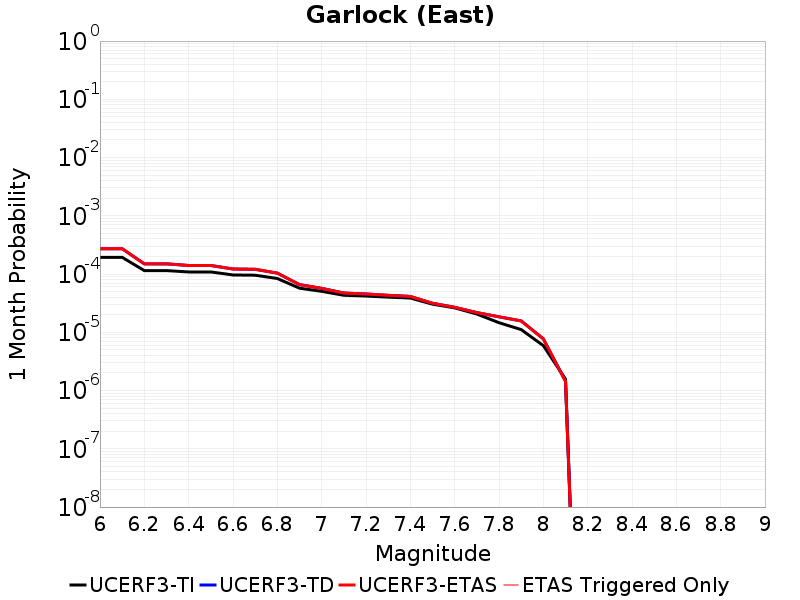 |  | 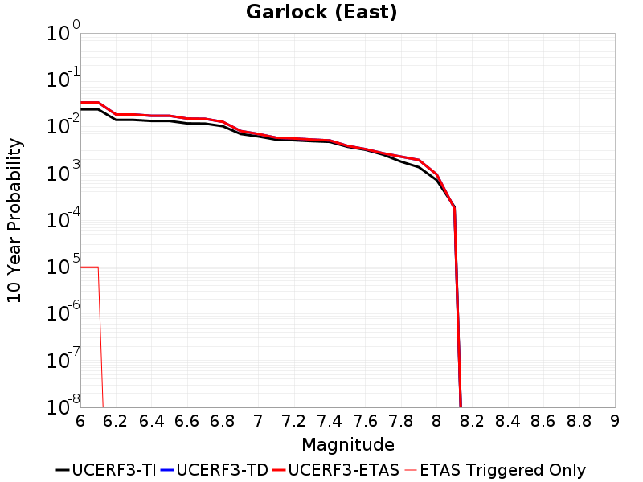 |

| Magnitude | 1 wk TI Prob | 1 wk TD Prob | 1 wk ETAS Prob | 1 wk ETAS/TD Gain | 1 wk ETAS Triggered Only | 1 mo TI Prob | 1 mo TD Prob | 1 mo ETAS Prob | 1 mo ETAS/TD Gain | 1 mo ETAS Triggered Only | 1 yr TI Prob | 1 yr TD Prob | 1 yr ETAS Prob | 1 yr ETAS/TD Gain | 1 yr ETAS Triggered Only | 10 yr TI Prob | 10 yr TD Prob | 10 yr ETAS Prob | 10 yr ETAS/TD Gain | 10 yr ETAS Triggered Only |
|-----|-----|-----|-----|-----|-----|-----|-----|-----|-----|-----|-----|-----|-----|-----|-----|-----|-----|-----|-----|-----|
| 6.0 | 4.5092507E-5 | 6.344619E-5 | 6.344619E-5 | 1.0 | 0.0 | 1.9323928E-4 | 2.7188647E-4 | 2.7188647E-4 | 1.0 | 0.0 | 0.0023501497 | 0.0033056443 | 0.0033056443 | 1.0 | 0.0 | 0.023254504 | 0.03258768 | 0.032597356 | 1.0002968 | 1.0E-5 |
| 6.1 | 4.5092507E-5 | 6.344619E-5 | 6.344619E-5 | 1.0 | 0.0 | 1.9323928E-4 | 2.7188647E-4 | 2.7188647E-4 | 1.0 | 0.0 | 0.0023501497 | 0.0033056443 | 0.0033056443 | 1.0 | 0.0 | 0.023254504 | 0.03258768 | 0.032597356 | 1.0002968 | 1.0E-5 |
| 6.2 | 2.6674514E-5 | 3.4867375E-5 | 3.4867375E-5 | 1.0 | 0.0 | 1.1431433E-4 | 1.4942323E-4 | 1.4942323E-4 | 1.0 | 0.0 | 0.0013908884 | 0.0018177432 | 0.0018177432 | 1.0 | 0.0 | 0.01382215 | 0.018090546 | 0.018090546 | 1.0 | 0.0 |
| 6.3 | 2.6674514E-5 | 3.4867375E-5 | 3.4867375E-5 | 1.0 | 0.0 | 1.1431433E-4 | 1.4942323E-4 | 1.4942323E-4 | 1.0 | 0.0 | 0.0013908884 | 0.0018177432 | 0.0018177432 | 1.0 | 0.0 | 0.01382215 | 0.018090546 | 0.018090546 | 1.0 | 0.0 |
| 6.4 | 2.5312667E-5 | 3.2681404E-5 | 3.2681404E-5 | 1.0 | 0.0 | 1.0847834E-4 | 1.400558E-4 | 1.400558E-4 | 1.0 | 0.0 | 0.0013199237 | 0.0017038754 | 0.0017038754 | 1.0 | 0.0 | 0.013121112 | 0.016954636 | 0.016954636 | 1.0 | 0.0 |
| 6.5 | 2.5312667E-5 | 3.2681404E-5 | 3.2681404E-5 | 1.0 | 0.0 | 1.0847834E-4 | 1.400558E-4 | 1.400558E-4 | 1.0 | 0.0 | 0.0013199237 | 0.0017038754 | 0.0017038754 | 1.0 | 0.0 | 0.013121112 | 0.016954636 | 0.016954636 | 1.0 | 0.0 |
| 6.6 | 2.246556E-5 | 2.8443603E-5 | 2.8443603E-5 | 1.0 | 0.0 | 9.627742E-5 | 1.21895595E-4 | 1.21895595E-4 | 1.0 | 0.0 | 0.0011715472 | 0.0014830923 | 0.0014830923 | 1.0 | 0.0 | 0.011653901 | 0.014779516 | 0.014779516 | 1.0 | 0.0 |
| 6.7 | 2.2241198E-5 | 2.8111172E-5 | 2.8111172E-5 | 1.0 | 0.0 | 9.531594E-5 | 1.2047102E-4 | 1.2047102E-4 | 1.0 | 0.0 | 0.0011598538 | 0.0014657716 | 0.0014657716 | 1.0 | 0.0 | 0.011538187 | 0.014608054 | 0.014608054 | 1.0 | 0.0 |
| 6.8 | 1.9528685E-5 | 2.4154228E-5 | 2.4154228E-5 | 1.0 | 0.0 | 8.369167E-5 | 1.03514125E-4 | 1.03514125E-4 | 1.0 | 0.0 | 0.0010184698 | 0.0012595756 | 0.0012595756 | 1.0 | 0.0 | 0.010138147 | 0.012564467 | 0.012564467 | 1.0 | 0.0 |
| 6.9 | 1.3318621E-5 | 1.5348665E-5 | 1.5348665E-5 | 1.0 | 0.0 | 5.7078556E-5 | 6.577837E-5 | 6.577837E-5 | 1.0 | 0.0 | 6.9470983E-4 | 8.0056285E-4 | 8.0056285E-4 | 1.0 | 0.0 | 0.0069254204 | 0.008012991 | 0.008012991 | 1.0 | 0.0 |
| 7.0 | 1.1760853E-5 | 1.3236995E-5 | 1.3236995E-5 | 1.0 | 0.0 | 5.0402683E-5 | 5.672877E-5 | 5.672877E-5 | 1.0 | 0.0 | 6.134799E-4 | 6.904587E-4 | 6.904587E-4 | 1.0 | 0.0 | 0.0061178906 | 0.0069191004 | 0.0069191004 | 1.0 | 0.0 |
| 7.1 | 1.0064758E-5 | 1.0997533E-5 | 1.0997533E-5 | 1.0 | 0.0 | 4.3133965E-5 | 4.713145E-5 | 4.713145E-5 | 1.0 | 0.0 | 5.2502943E-4 | 5.736775E-4 | 5.736775E-4 | 1.0 | 0.0 | 0.005237907 | 0.005758789 | 0.005758789 | 1.0 | 0.0 |
| 7.2 | 9.768808E-6 | 1.059274E-5 | 1.059274E-5 | 1.0 | 0.0 | 4.186565E-5 | 4.5396686E-5 | 4.5396686E-5 | 1.0 | 0.0 | 5.095951E-4 | 5.5256765E-4 | 5.5256765E-4 | 1.0 | 0.0 | 0.0050842804 | 0.0055486164 | 0.0055486164 | 1.0 | 0.0 |
| 7.3 | 9.344516E-6 | 1.0048115E-5 | 1.0048115E-5 | 1.0 | 0.0 | 4.004731E-5 | 4.3062657E-5 | 4.3062657E-5 | 1.0 | 0.0 | 4.8746695E-4 | 5.241649E-4 | 5.241649E-4 | 1.0 | 0.0 | 0.0048639905 | 0.005265397 | 0.005265397 | 1.0 | 0.0 |
| 7.4 | 9.023491E-6 | 9.61136E-6 | 9.61136E-6 | 1.0 | 0.0 | 3.867153E-5 | 4.119091E-5 | 4.119091E-5 | 1.0 | 0.0 | 4.7072413E-4 | 5.01387E-4 | 5.01387E-4 | 1.0 | 0.0 | 0.004697283 | 0.0050378833 | 0.0050378833 | 1.0 | 0.0 |
| 7.5 | 7.081253E-6 | 7.3403257E-6 | 7.3403257E-6 | 1.0 | 0.0 | 3.0347876E-5 | 3.1458163E-5 | 3.1458163E-5 | 1.0 | 0.0 | 3.6942272E-4 | 3.8293653E-4 | 3.8293653E-4 | 1.0 | 0.0 | 0.003688092 | 0.0038534768 | 0.0038534768 | 1.0 | 0.0 |
| 7.6 | 6.116396E-6 | 6.2616123E-6 | 6.2616123E-6 | 1.0 | 0.0 | 2.6212863E-5 | 2.6835207E-5 | 2.6835207E-5 | 1.0 | 0.0 | 3.1909486E-4 | 3.2666992E-4 | 3.2666992E-4 | 1.0 | 0.0 | 0.0031863707 | 0.0032911235 | 0.0032911235 | 1.0 | 0.0 |
| 7.7 | 4.797145E-6 | 5.078577E-6 | 5.078577E-6 | 1.0 | 0.0 | 2.055903E-5 | 2.1765149E-5 | 2.1765149E-5 | 1.0 | 0.0 | 2.5027743E-4 | 2.649586E-4 | 2.649586E-4 | 1.0 | 0.0 | 0.0024999576 | 0.0026762898 | 0.0026762898 | 1.0 | 0.0 |
| 7.8 | 3.4028885E-6 | 4.2962406E-6 | 4.2962406E-6 | 1.0 | 0.0 | 1.4583726E-5 | 1.8412331E-5 | 1.8412331E-5 | 1.0 | 0.0 | 1.775424E-4 | 2.2414715E-4 | 2.2414715E-4 | 1.0 | 0.0 | 0.0017740062 | 0.00226649 | 0.00226649 | 1.0 | 0.0 |
| 7.9 | 2.5928412E-6 | 3.6537867E-6 | 3.6537867E-6 | 1.0 | 0.0 | 1.1112129E-5 | 1.5658992E-5 | 1.5658992E-5 | 1.0 | 0.0 | 1.3528178E-4 | 1.9063163E-4 | 1.9063163E-4 | 1.0 | 0.0 | 0.0013519945 | 0.0019275937 | 0.0019275937 | 1.0 | 0.0 |
| 8.0 | 1.3743648E-6 | 1.7981823E-6 | 1.7981823E-6 | 1.0 | 0.0 | 5.8901214E-6 | 7.706473E-6 | 7.706473E-6 | 1.0 | 0.0 | 7.1709874E-5 | 9.38223E-5 | 9.38223E-5 | 1.0 | 0.0 | 7.1686733E-4 | 9.486409E-4 | 9.486409E-4 | 1.0 | 0.0 |
| 8.1 | 3.6733252E-7 | 3.3608302E-7 | 3.3608302E-7 | 1.0 | 0.0 | 1.5742813E-6 | 1.440355E-6 | 1.440355E-6 | 1.0 | 0.0 | 1.9166706E-5 | 1.75362E-5 | 1.75362E-5 | 1.0 | 0.0 | 1.9165053E-4 | 1.7747156E-4 | 1.7747156E-4 | 1.0 | 0.0 |

## Monte Vista - Shannon 2011 CFM
*[(top)](#table-of-contents)*

| 1 Week | 1 Month | 1 Year | 10 Year |
|-----|-----|-----|-----|
|  | 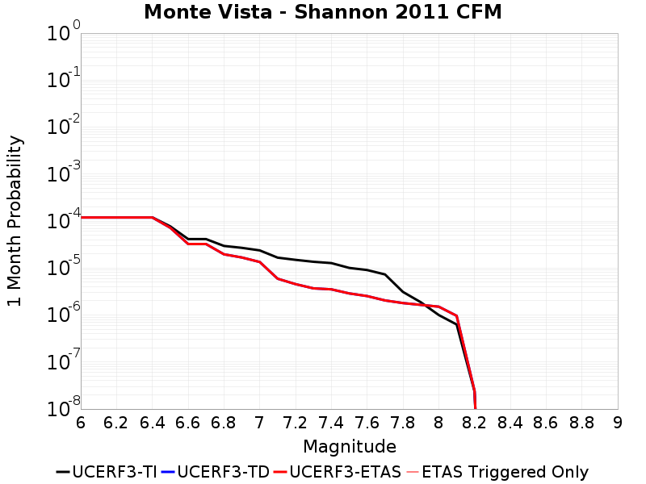 |  | 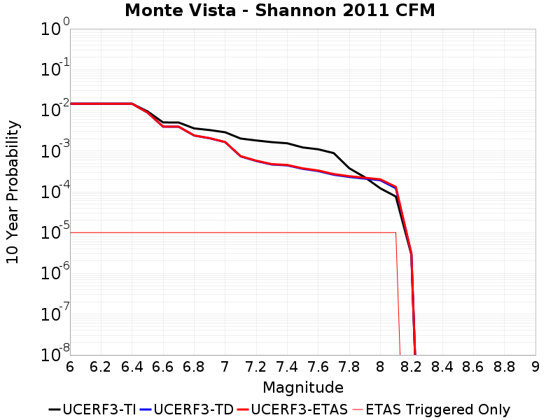 |

| Magnitude | 1 wk TI Prob | 1 wk TD Prob | 1 wk ETAS Prob | 1 wk ETAS/TD Gain | 1 wk ETAS Triggered Only | 1 mo TI Prob | 1 mo TD Prob | 1 mo ETAS Prob | 1 mo ETAS/TD Gain | 1 mo ETAS Triggered Only | 1 yr TI Prob | 1 yr TD Prob | 1 yr ETAS Prob | 1 yr ETAS/TD Gain | 1 yr ETAS Triggered Only | 10 yr TI Prob | 10 yr TD Prob | 10 yr ETAS Prob | 10 yr ETAS/TD Gain | 10 yr ETAS Triggered Only |
|-----|-----|-----|-----|-----|-----|-----|-----|-----|-----|-----|-----|-----|-----|-----|-----|-----|-----|-----|-----|-----|
| 6.0 | 2.7907707E-5 | 2.776583E-5 | 2.776583E-5 | 1.0 | 0.0 | 1.19598975E-4 | 1.1899168E-4 | 1.1899168E-4 | 1.0 | 0.0 | 0.0014551448 | 0.0014478855 | 0.001457871 | 1.0068966 | 1.0E-5 | 0.014456532 | 0.014414291 | 0.014424147 | 1.0006838 | 1.0E-5 |
| 6.1 | 2.7907707E-5 | 2.776583E-5 | 2.776583E-5 | 1.0 | 0.0 | 1.19598975E-4 | 1.1899168E-4 | 1.1899168E-4 | 1.0 | 0.0 | 0.0014551448 | 0.0014478855 | 0.001457871 | 1.0068966 | 1.0E-5 | 0.014456532 | 0.014414291 | 0.014424147 | 1.0006838 | 1.0E-5 |
| 6.2 | 2.7907707E-5 | 2.776583E-5 | 2.776583E-5 | 1.0 | 0.0 | 1.19598975E-4 | 1.1899168E-4 | 1.1899168E-4 | 1.0 | 0.0 | 0.0014551448 | 0.0014478855 | 0.001457871 | 1.0068966 | 1.0E-5 | 0.014456532 | 0.014414291 | 0.014424147 | 1.0006838 | 1.0E-5 |
| 6.3 | 2.7907707E-5 | 2.776583E-5 | 2.776583E-5 | 1.0 | 0.0 | 1.19598975E-4 | 1.1899168E-4 | 1.1899168E-4 | 1.0 | 0.0 | 0.0014551448 | 0.0014478855 | 0.001457871 | 1.0068966 | 1.0E-5 | 0.014456532 | 0.014414291 | 0.014424147 | 1.0006838 | 1.0E-5 |
| 6.4 | 2.7907707E-5 | 2.776583E-5 | 2.776583E-5 | 1.0 | 0.0 | 1.19598975E-4 | 1.1899168E-4 | 1.1899168E-4 | 1.0 | 0.0 | 0.0014551448 | 0.0014478855 | 0.001457871 | 1.0068966 | 1.0E-5 | 0.014456532 | 0.014414291 | 0.014424147 | 1.0006838 | 1.0E-5 |
| 6.5 | 1.7990213E-5 | 1.6786034E-5 | 1.6786034E-5 | 1.0 | 0.0 | 7.709863E-5 | 7.1938535E-5 | 7.1938535E-5 | 1.0 | 0.0 | 9.382716E-4 | 8.755665E-4 | 8.855578E-4 | 1.0114112 | 1.0E-5 | 0.0093431985 | 0.008745188 | 0.008755101 | 1.0011334 | 1.0E-5 |
| 6.6 | 9.650407E-6 | 7.5742764E-6 | 7.5742764E-6 | 1.0 | 0.0 | 4.135823E-5 | 3.2460823E-5 | 3.2460823E-5 | 1.0 | 0.0 | 5.0342013E-4 | 3.9514675E-4 | 4.0514278E-4 | 1.025297 | 1.0E-5 | 0.005022812 | 0.0039627333 | 0.003972694 | 1.0025135 | 1.0E-5 |
| 6.7 | 9.62828E-6 | 7.552002E-6 | 7.552002E-6 | 1.0 | 0.0 | 4.1263404E-5 | 3.2365366E-5 | 3.2365366E-5 | 1.0 | 0.0 | 5.022661E-4 | 3.9398496E-4 | 4.0398102E-4 | 1.0253717 | 1.0E-5 | 0.0050113243 | 0.003951157 | 0.0039611175 | 1.0025209 | 1.0E-5 |
| 6.8 | 6.887523E-6 | 4.5703005E-6 | 4.5703005E-6 | 1.0 | 0.0 | 2.9517621E-5 | 1.9586869E-5 | 1.9586869E-5 | 1.0 | 0.0 | 3.5931775E-4 | 2.3844626E-4 | 2.484439E-4 | 1.0419282 | 1.0E-5 | 0.0035873733 | 0.0023996672 | 0.002409643 | 1.0041572 | 1.0E-5 |
| 6.9 | 6.2722347E-6 | 3.91029E-6 | 3.91029E-6 | 1.0 | 0.0 | 2.6880729E-5 | 1.675829E-5 | 1.675829E-5 | 1.0 | 0.0 | 3.2722374E-4 | 2.0401512E-4 | 2.1401308E-4 | 1.049006 | 1.0E-5 | 0.003267423 | 0.0020560273 | 0.002066007 | 1.0048537 | 1.0E-5 |
| 7.0 | 5.5320347E-6 | 3.1345503E-6 | 3.1345503E-6 | 1.0 | 0.0 | 2.3708504E-5 | 1.3433729E-5 | 1.3433729E-5 | 1.0 | 0.0 | 2.8861282E-4 | 1.6354522E-4 | 1.7354358E-4 | 1.0611352 | 1.0E-5 | 0.0028823826 | 0.0016519842 | 0.0016619676 | 1.0060433 | 1.0E-5 |
| 7.1 | 3.8794055E-6 | 1.3814275E-6 | 1.3814275E-6 | 1.0 | 0.0 | 1.6625918E-5 | 5.92039E-6 | 5.92039E-6 | 1.0 | 0.0 | 2.0240174E-4 | 7.207838E-5 | 8.207766E-5 | 1.1387279 | 1.0E-5 | 0.002022175 | 7.381151E-4 | 7.4810773E-4 | 1.013538 | 1.0E-5 |
| 7.2 | 3.4813652E-6 | 1.0595083E-6 | 1.0595083E-6 | 1.0 | 0.0 | 1.49200505E-5 | 4.540742E-6 | 4.540742E-6 | 1.0 | 0.0 | 1.8163648E-4 | 5.528214E-5 | 6.528159E-5 | 1.1808802 | 1.0E-5 | 0.0018148809 | 5.702357E-4 | 5.8023003E-4 | 1.0175266 | 1.0E-5 |
| 7.3 | 3.1682148E-6 | 8.6118513E-7 | 8.6118513E-7 | 1.0 | 0.0 | 1.3577992E-5 | 3.6907882E-6 | 3.6907882E-6 | 1.0 | 0.0 | 1.6529951E-4 | 4.4934422E-5 | 5.493397E-5 | 1.2225366 | 1.0E-5 | 0.0016517661 | 4.6677404E-4 | 4.7676938E-4 | 1.0214137 | 1.0E-5 |
| 7.4 | 2.9707667E-6 | 8.2054345E-7 | 8.2054345E-7 | 1.0 | 0.0 | 1.2731795E-5 | 3.5166101E-6 | 3.5166101E-6 | 1.0 | 0.0 | 1.5499859E-4 | 4.2813892E-5 | 5.2813462E-5 | 1.233559 | 1.0E-5 | 0.0015489052 | 4.4533584E-4 | 4.5533138E-4 | 1.022445 | 1.0E-5 |
| 7.5 | 2.3462758E-6 | 6.7166025E-7 | 6.7166025E-7 | 1.0 | 0.0 | 1.0055429E-5 | 2.8785407E-6 | 2.8785407E-6 | 1.0 | 0.0 | 1.2241797E-4 | 3.5045672E-5 | 4.5045323E-5 | 1.285332 | 1.0E-5 | 0.0012235056 | 3.6577048E-4 | 3.7576683E-4 | 1.0273296 | 1.0E-5 |
| 7.6 | 2.112783E-6 | 5.9014775E-7 | 5.9014775E-7 | 1.0 | 0.0 | 9.054753E-6 | 2.5292022E-6 | 2.5292022E-6 | 1.0 | 0.0 | 1.1023604E-4 | 3.0792606E-5 | 4.0792296E-5 | 1.3247433 | 1.0E-5 | 0.0011018137 | 3.2277108E-4 | 3.3276784E-4 | 1.0309718 | 1.0E-5 |
| 7.7 | 1.7022471E-6 | 4.7659765E-7 | 4.7659765E-7 | 1.0 | 0.0 | 7.2953244E-6 | 2.0425598E-6 | 2.0425598E-6 | 1.0 | 0.0 | 8.881695E-5 | 2.4867883E-5 | 3.4867633E-5 | 1.4021151 | 1.0E-5 | 8.878146E-4 | 2.6203092E-4 | 2.7202832E-4 | 1.0381534 | 1.0E-5 |
| 7.8 | 7.230914E-7 | 4.1884041E-7 | 4.1884041E-7 | 1.0 | 0.0 | 3.0989595E-6 | 1.7950291E-6 | 1.7950291E-6 | 1.0 | 0.0 | 3.772918E-5 | 2.1854263E-5 | 3.1854044E-5 | 1.4575666 | 1.0E-5 | 3.7722773E-4 | 2.3127897E-4 | 2.4127666E-4 | 1.0432278 | 1.0E-5 |
| 7.9 | 4.3588446E-7 | 3.8347338E-7 | 3.8347338E-7 | 1.0 | 0.0 | 1.868075E-6 | 1.6434564E-6 | 1.6434564E-6 | 1.0 | 0.0 | 2.2743576E-5 | 2.0008898E-5 | 3.00087E-5 | 1.4997677 | 1.0E-5 | 2.2741247E-4 | 2.1086606E-4 | 2.2086395E-4 | 1.0474135 | 1.0E-5 |
| 8.0 | 2.3317523E-7 | 3.5083679E-7 | 3.5083679E-7 | 1.0 | 0.0 | 9.99322E-7 | 1.5035854E-6 | 1.5035854E-6 | 1.0 | 0.0 | 1.2166677E-5 | 1.8306E-5 | 2.8305818E-5 | 1.5462589 | 1.0E-5 | 1.21660116E-4 | 1.922811E-4 | 2.0227919E-4 | 1.0519972 | 1.0E-5 |
| 8.1 | 1.4662456E-7 | 2.2443336E-7 | 2.2443336E-7 | 1.0 | 0.0 | 6.283908E-7 | 9.618569E-7 | 9.618569E-7 | 1.0 | 0.0 | 7.650631E-6 | 1.17105465E-5 | 2.171043E-5 | 1.8539212 | 1.0E-5 | 7.650368E-5 | 1.2224303E-4 | 1.3224181E-4 | 1.0817943 | 1.0E-5 |
| 8.2 | 5.4931775E-9 | 5.6882454E-9 | 5.6882454E-9 | 1.0 | 0.0 | 2.3542189E-8 | 2.4378194E-8 | 2.4378194E-8 | 1.0 | 0.0 | 2.8662612E-7 | 2.9680447E-7 | 2.9680447E-7 | 1.0 | 0.0 | 2.8662573E-6 | 3.0774534E-6 | 3.0774534E-6 | 1.0 | 0.0 |

## Superstition Hills
*[(top)](#table-of-contents)*

| 1 Week | 1 Month | 1 Year | 10 Year |
|-----|-----|-----|-----|
|  | 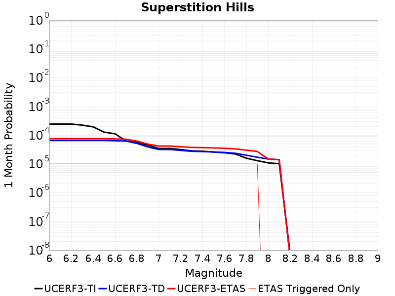 | 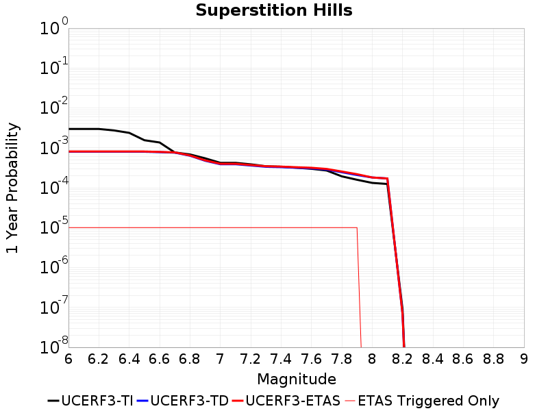 |  |

| Magnitude | 1 wk TI Prob | 1 wk TD Prob | 1 wk ETAS Prob | 1 wk ETAS/TD Gain | 1 wk ETAS Triggered Only | 1 mo TI Prob | 1 mo TD Prob | 1 mo ETAS Prob | 1 mo ETAS/TD Gain | 1 mo ETAS Triggered Only | 1 yr TI Prob | 1 yr TD Prob | 1 yr ETAS Prob | 1 yr ETAS/TD Gain | 1 yr ETAS Triggered Only | 10 yr TI Prob | 10 yr TD Prob | 10 yr ETAS Prob | 10 yr ETAS/TD Gain | 10 yr ETAS Triggered Only |
|-----|-----|-----|-----|-----|-----|-----|-----|-----|-----|-----|-----|-----|-----|-----|-----|-----|-----|-----|-----|-----|
| 6.0 | 5.687118E-5 | 1.5273588E-5 | 2.5273437E-5 | 1.654715 | 1.0E-5 | 2.4371086E-4 | 6.54567E-5 | 7.5456046E-5 | 1.1527628 | 1.0E-5 | 0.0029631425 | 7.966619E-4 | 8.0665393E-4 | 1.0125424 | 1.0E-5 | 0.029239422 | 0.008103535 | 0.008113454 | 1.001224 | 1.0E-5 |
| 6.1 | 5.687118E-5 | 1.5273588E-5 | 2.5273437E-5 | 1.654715 | 1.0E-5 | 2.4371086E-4 | 6.54567E-5 | 7.5456046E-5 | 1.1527628 | 1.0E-5 | 0.0029631425 | 7.966619E-4 | 8.0665393E-4 | 1.0125424 | 1.0E-5 | 0.029239422 | 0.008103535 | 0.008113454 | 1.001224 | 1.0E-5 |
| 6.2 | 5.687118E-5 | 1.5273588E-5 | 2.5273437E-5 | 1.654715 | 1.0E-5 | 2.4371086E-4 | 6.54567E-5 | 7.5456046E-5 | 1.1527628 | 1.0E-5 | 0.0029631425 | 7.966619E-4 | 8.0665393E-4 | 1.0125424 | 1.0E-5 | 0.029239422 | 0.008103535 | 0.008113454 | 1.001224 | 1.0E-5 |
| 6.3 | 5.22535E-5 | 1.5273588E-5 | 2.5273437E-5 | 1.654715 | 1.0E-5 | 2.2392436E-4 | 6.54567E-5 | 7.5456046E-5 | 1.1527628 | 1.0E-5 | 0.0027228706 | 7.966619E-4 | 8.0665393E-4 | 1.0125424 | 1.0E-5 | 0.026897486 | 0.008103535 | 0.008113454 | 1.001224 | 1.0E-5 |
| 6.4 | 4.542238E-5 | 1.5273588E-5 | 2.5273437E-5 | 1.654715 | 1.0E-5 | 1.9465282E-4 | 6.54567E-5 | 7.5456046E-5 | 1.1527628 | 1.0E-5 | 0.0023673223 | 7.966619E-4 | 8.0665393E-4 | 1.0125424 | 1.0E-5 | 0.023422617 | 0.008103535 | 0.008113454 | 1.001224 | 1.0E-5 |
| 6.5 | 2.9672969E-5 | 1.5273588E-5 | 2.5273437E-5 | 1.654715 | 1.0E-5 | 1.2716366E-4 | 6.54567E-5 | 7.5456046E-5 | 1.1527628 | 1.0E-5 | 0.0015471181 | 7.966619E-4 | 8.0665393E-4 | 1.0125424 | 1.0E-5 | 0.015363912 | 0.008103535 | 0.008113454 | 1.001224 | 1.0E-5 |
| 6.6 | 2.6056105E-5 | 1.4931004E-5 | 2.4930856E-5 | 1.6697373 | 1.0E-5 | 1.1166424E-4 | 6.398855E-5 | 7.398791E-5 | 1.156268 | 1.0E-5 | 0.0013586642 | 7.7879993E-4 | 7.8879215E-4 | 1.0128303 | 1.0E-5 | 0.013503874 | 0.007923868 | 0.007933789 | 1.001252 | 1.0E-5 |
| 6.7 | 1.4611248E-5 | 1.4508992E-5 | 2.4508847E-5 | 1.6892178 | 1.0E-5 | 6.261813E-5 | 6.218001E-5 | 7.217939E-5 | 1.1608133 | 1.0E-5 | 7.6210906E-4 | 7.567964E-4 | 7.6678884E-4 | 1.0132036 | 1.0E-5 | 0.0075950073 | 0.00770411 | 0.0077140327 | 1.001288 | 1.0E-5 |
| 6.8 | 1.30607E-5 | 1.2137999E-5 | 2.2137878E-5 | 1.8238491 | 1.0E-5 | 5.597323E-5 | 5.201902E-5 | 6.2018495E-5 | 1.1922274 | 1.0E-5 | 6.8126095E-4 | 6.331582E-4 | 6.4315187E-4 | 1.0157838 | 1.0E-5 | 0.006791762 | 0.006470732 | 0.0064806673 | 1.0015354 | 1.0E-5 |
| 6.9 | 1.0443096E-5 | 9.073631E-6 | 1.907354E-5 | 2.1020846 | 1.0E-5 | 4.4755358E-5 | 3.888643E-5 | 4.888604E-5 | 1.2571491 | 1.0E-5 | 5.447602E-4 | 4.7334234E-4 | 4.8333762E-4 | 1.0211164 | 1.0E-5 | 0.005434267 | 0.0048648473 | 0.0048747985 | 1.0020455 | 1.0E-5 |
| 7.0 | 8.045912E-6 | 7.4323484E-6 | 1.7432274E-5 | 2.3454597 | 1.0E-5 | 3.4482026E-5 | 3.1852538E-5 | 4.185222E-5 | 1.3139367 | 1.0E-5 | 4.197378E-4 | 3.877369E-4 | 3.97733E-4 | 1.0257807 | 1.0E-5 | 0.0041894587 | 0.0039939634 | 0.0040039234 | 1.0024937 | 1.0E-5 |
| 7.1 | 8.045912E-6 | 7.4323484E-6 | 1.7432274E-5 | 2.3454597 | 1.0E-5 | 3.4482026E-5 | 3.1852538E-5 | 4.185222E-5 | 1.3139367 | 1.0E-5 | 4.197378E-4 | 3.877369E-4 | 3.97733E-4 | 1.0257807 | 1.0E-5 | 0.0041894587 | 0.0039939634 | 0.0040039234 | 1.0024937 | 1.0E-5 |
| 7.2 | 7.375506E-6 | 6.9012367E-6 | 1.6901167E-5 | 2.4490056 | 1.0E-5 | 3.1608928E-5 | 2.9576398E-5 | 3.95761E-5 | 1.3380975 | 1.0E-5 | 3.8477074E-4 | 3.600342E-4 | 3.700306E-4 | 1.0277652 | 1.0E-5 | 0.003841052 | 0.0037150024 | 0.0037249653 | 1.0026817 | 1.0E-5 |
| 7.3 | 6.6063913E-6 | 6.4090236E-6 | 1.640896E-5 | 2.56029 | 1.0E-5 | 2.8312797E-5 | 2.746696E-5 | 3.7466685E-5 | 1.3640637 | 1.0E-5 | 3.446538E-4 | 3.343598E-4 | 3.4435643E-4 | 1.0298979 | 1.0E-5 | 0.0034411973 | 0.003456091 | 0.0034660564 | 1.0028834 | 1.0E-5 |
| 7.4 | 6.4313126E-6 | 6.280423E-6 | 1.628036E-5 | 2.5922394 | 1.0E-5 | 2.7562477E-5 | 2.6915824E-5 | 3.6915557E-5 | 1.3715186 | 1.0E-5 | 3.355215E-4 | 3.2765174E-4 | 3.3764847E-4 | 1.0305102 | 1.0E-5 | 0.0033501536 | 0.0033886987 | 0.0033986648 | 1.002941 | 1.0E-5 |
| 7.5 | 6.0742927E-6 | 6.0566845E-6 | 1.6056623E-5 | 2.6510582 | 1.0E-5 | 2.6032423E-5 | 2.5956966E-5 | 3.5956706E-5 | 1.385243 | 1.0E-5 | 3.1689866E-4 | 3.1598104E-4 | 3.259779E-4 | 1.0316374 | 1.0E-5 | 0.0031644711 | 0.0032703886 | 0.0032803558 | 1.0030477 | 1.0E-5 |
| 7.6 | 5.6987187E-6 | 5.8576657E-6 | 1.5857608E-5 | 2.7071548 | 1.0E-5 | 2.4422852E-5 | 2.5104044E-5 | 3.5103792E-5 | 1.3983322 | 1.0E-5 | 2.9730765E-4 | 3.0559968E-4 | 3.155966E-4 | 1.0327126 | 1.0E-5 | 0.002969102 | 0.003164722 | 0.0031746903 | 1.0031499 | 1.0E-5 |
| 7.7 | 5.1658035E-6 | 5.465701E-6 | 1.5465646E-5 | 2.8295813 | 1.0E-5 | 2.2138971E-5 | 2.3424229E-5 | 3.3423992E-5 | 1.4268984 | 1.0E-5 | 2.6950863E-4 | 2.851534E-4 | 2.9515053E-4 | 1.0350589 | 1.0E-5 | 0.00269182 | 0.0029579164 | 0.0029678869 | 1.0033708 | 1.0E-5 |
| 7.8 | 3.6864697E-6 | 4.682433E-6 | 1.4682386E-5 | 3.1356318 | 1.0E-5 | 1.579906E-5 | 2.0067419E-5 | 3.0067218E-5 | 1.4983102 | 1.0E-5 | 1.9233658E-4 | 2.44294E-4 | 2.5429158E-4 | 1.0409243 | 1.0E-5 | 0.0019217018 | 0.002542665 | 0.0025526395 | 1.0039229 | 1.0E-5 |
| 7.9 | 3.0265903E-6 | 3.9854976E-6 | 1.3985457E-5 | 3.509087 | 1.0E-5 | 1.2971037E-5 | 1.7080596E-5 | 2.7080425E-5 | 1.5854497 | 1.0E-5 | 1.5791094E-4 | 2.0793696E-4 | 2.1793487E-4 | 1.0480815 | 1.0E-5 | 0.0015779877 | 0.0021735474 | 0.0021835256 | 1.0045907 | 1.0E-5 |
| 8.0 | 2.5271493E-6 | 3.453897E-6 | 3.453897E-6 | 1.0 | 0.0 | 1.0830595E-5 | 1.48023355E-5 | 1.48023355E-5 | 1.0 | 0.0 | 1.3185451E-4 | 1.8020405E-4 | 1.8020405E-4 | 1.0 | 0.0 | 0.0013177631 | 0.0018888465 | 0.0018888465 | 1.0 | 0.0 |
| 8.1 | 2.3749135E-6 | 3.2636704E-6 | 3.2636704E-6 | 1.0 | 0.0 | 1.0178161E-5 | 1.3987087E-5 | 1.3987087E-5 | 1.0 | 0.0 | 1.2391206E-4 | 1.7028E-4 | 1.7028E-4 | 1.0 | 0.0 | 0.0012384299 | 0.0017854782 | 0.0017854782 | 1.0 | 0.0 |
| 8.2 | 1.7186406E-9 | 1.3110824E-9 | 1.3110824E-9 | 1.0 | 0.0 | 7.3656024E-9 | 5.6189244E-9 | 5.6189244E-9 | 1.0 | 0.0 | 8.9676206E-8 | 6.84104E-8 | 6.84104E-8 | 1.0 | 0.0 | 8.9676166E-7 | 7.2567883E-7 | 7.2567883E-7 | 1.0 | 0.0 |

## So Sierra Nevada
*[(top)](#table-of-contents)*

| 1 Week | 1 Month | 1 Year | 10 Year |
|-----|-----|-----|-----|
| 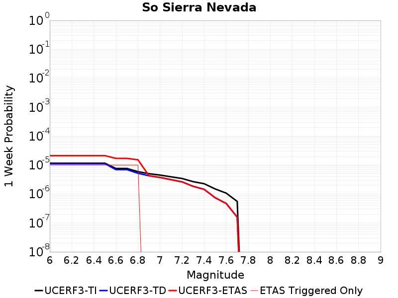 | 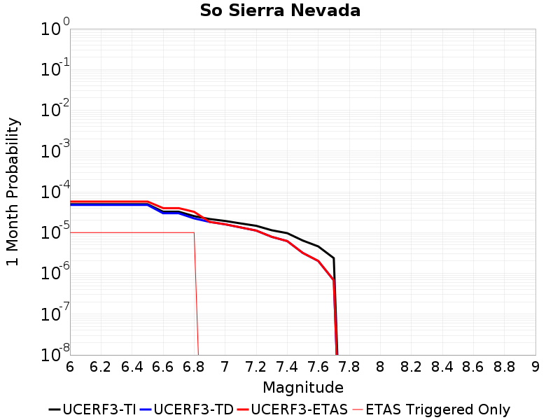 | 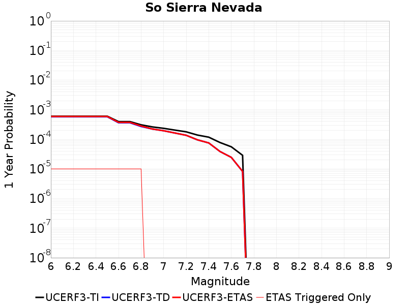 | 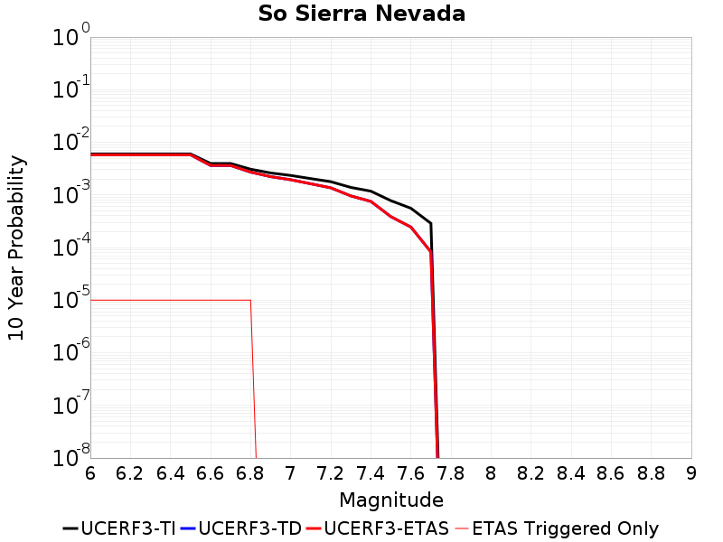 |

| Magnitude | 1 wk TI Prob | 1 wk TD Prob | 1 wk ETAS Prob | 1 wk ETAS/TD Gain | 1 wk ETAS Triggered Only | 1 mo TI Prob | 1 mo TD Prob | 1 mo ETAS Prob | 1 mo ETAS/TD Gain | 1 mo ETAS Triggered Only | 1 yr TI Prob | 1 yr TD Prob | 1 yr ETAS Prob | 1 yr ETAS/TD Gain | 1 yr ETAS Triggered Only | 10 yr TI Prob | 10 yr TD Prob | 10 yr ETAS Prob | 10 yr ETAS/TD Gain | 10 yr ETAS Triggered Only |
|-----|-----|-----|-----|-----|-----|-----|-----|-----|-----|-----|-----|-----|-----|-----|-----|-----|-----|-----|-----|-----|
| 6.0 | 1.15488665E-5 | 1.1098657E-5 | 2.1098545E-5 | 1.901 | 1.0E-5 | 4.9494203E-5 | 4.7564874E-5 | 5.7564397E-5 | 1.2102292 | 1.0E-5 | 6.024253E-4 | 5.789613E-4 | 5.889555E-4 | 1.0172623 | 1.0E-5 | 0.006007948 | 0.0057758023 | 0.0057857446 | 1.0017214 | 1.0E-5 |
| 6.1 | 1.15488665E-5 | 1.1098657E-5 | 2.1098545E-5 | 1.901 | 1.0E-5 | 4.9494203E-5 | 4.7564874E-5 | 5.7564397E-5 | 1.2102292 | 1.0E-5 | 6.024253E-4 | 5.789613E-4 | 5.889555E-4 | 1.0172623 | 1.0E-5 | 0.006007948 | 0.0057758023 | 0.0057857446 | 1.0017214 | 1.0E-5 |
| 6.2 | 1.15488665E-5 | 1.1098657E-5 | 2.1098545E-5 | 1.901 | 1.0E-5 | 4.9494203E-5 | 4.7564874E-5 | 5.7564397E-5 | 1.2102292 | 1.0E-5 | 6.024253E-4 | 5.789613E-4 | 5.889555E-4 | 1.0172623 | 1.0E-5 | 0.006007948 | 0.0057758023 | 0.0057857446 | 1.0017214 | 1.0E-5 |
| 6.3 | 1.15488665E-5 | 1.1098657E-5 | 2.1098545E-5 | 1.901 | 1.0E-5 | 4.9494203E-5 | 4.7564874E-5 | 5.7564397E-5 | 1.2102292 | 1.0E-5 | 6.024253E-4 | 5.789613E-4 | 5.889555E-4 | 1.0172623 | 1.0E-5 | 0.006007948 | 0.0057758023 | 0.0057857446 | 1.0017214 | 1.0E-5 |
| 6.4 | 1.15488665E-5 | 1.1098657E-5 | 2.1098545E-5 | 1.901 | 1.0E-5 | 4.9494203E-5 | 4.7564874E-5 | 5.7564397E-5 | 1.2102292 | 1.0E-5 | 6.024253E-4 | 5.789613E-4 | 5.889555E-4 | 1.0172623 | 1.0E-5 | 0.006007948 | 0.0057758023 | 0.0057857446 | 1.0017214 | 1.0E-5 |
| 6.5 | 1.15488665E-5 | 1.1098657E-5 | 2.1098545E-5 | 1.901 | 1.0E-5 | 4.9494203E-5 | 4.7564874E-5 | 5.7564397E-5 | 1.2102292 | 1.0E-5 | 6.024253E-4 | 5.789613E-4 | 5.889555E-4 | 1.0172623 | 1.0E-5 | 0.006007948 | 0.0057758023 | 0.0057857446 | 1.0017214 | 1.0E-5 |
| 6.6 | 7.587044E-6 | 6.948687E-6 | 1.6948617E-5 | 2.4391108 | 1.0E-5 | 3.2515498E-5 | 2.9779763E-5 | 3.9779465E-5 | 1.3357885 | 1.0E-5 | 3.9580427E-4 | 3.6251123E-4 | 3.725076E-4 | 1.0275754 | 1.0E-5 | 0.003951 | 0.0036194914 | 0.003629455 | 1.0027528 | 1.0E-5 |
| 6.7 | 7.587044E-6 | 6.948687E-6 | 1.6948617E-5 | 2.4391108 | 1.0E-5 | 3.2515498E-5 | 2.9779763E-5 | 3.9779465E-5 | 1.3357885 | 1.0E-5 | 3.9580427E-4 | 3.6251123E-4 | 3.725076E-4 | 1.0275754 | 1.0E-5 | 0.003951 | 0.0036194914 | 0.003629455 | 1.0027528 | 1.0E-5 |
| 6.8 | 5.9026956E-6 | 5.190101E-6 | 1.5190049E-5 | 2.9267347 | 1.0E-5 | 2.5297022E-5 | 2.2243108E-5 | 3.2242886E-5 | 1.4495674 | 1.0E-5 | 3.0794772E-4 | 2.7077735E-4 | 2.8077464E-4 | 1.0369207 | 1.0E-5 | 0.0030752132 | 0.0027045908 | 0.0027145636 | 1.0036874 | 1.0E-5 |
| 6.9 | 5.0118915E-6 | 4.2619586E-6 | 4.2619586E-6 | 1.0 | 0.0 | 2.1479358E-5 | 1.8265413E-5 | 1.8265413E-5 | 1.0 | 0.0 | 2.614798E-4 | 2.2235945E-4 | 2.2235945E-4 | 1.0 | 0.0 | 0.0026117235 | 0.0022214423 | 0.0022214423 | 1.0 | 0.0 |
| 7.0 | 4.4924795E-6 | 3.722816E-6 | 3.722816E-6 | 1.0 | 0.0 | 1.925334E-5 | 1.5954833E-5 | 1.5954833E-5 | 1.0 | 0.0 | 2.3438422E-4 | 1.9423339E-4 | 1.9423339E-4 | 1.0 | 0.0 | 0.0023413717 | 0.0019406994 | 0.0019406994 | 1.0 | 0.0 |
| 7.1 | 3.9118436E-6 | 3.1201096E-6 | 3.1201096E-6 | 1.0 | 0.0 | 1.6764936E-5 | 1.3371833E-5 | 1.3371833E-5 | 1.0 | 0.0 | 2.0409399E-4 | 1.6279047E-4 | 1.6279047E-4 | 1.0 | 0.0 | 0.0020390663 | 0.0016267685 | 0.0016267685 | 1.0 | 0.0 |
| 7.2 | 3.4200818E-6 | 2.6129692E-6 | 2.6129692E-6 | 1.0 | 0.0 | 1.4657411E-5 | 1.11983945E-5 | 1.11983945E-5 | 1.0 | 0.0 | 1.7843937E-4 | 1.3633243E-4 | 1.3633243E-4 | 1.0 | 0.0 | 0.0017829615 | 0.0013625377 | 0.0013625377 | 1.0 | 0.0 |
| 7.3 | 2.6593618E-6 | 1.8350198E-6 | 1.8350198E-6 | 1.0 | 0.0 | 1.13972155E-5 | 7.864349E-6 | 7.864349E-6 | 1.0 | 0.0 | 1.3875226E-4 | 9.574453E-5 | 9.574453E-5 | 1.0 | 0.0 | 0.0013866565 | 9.5706177E-4 | 9.5706177E-4 | 1.0 | 0.0 |
| 7.4 | 2.2577992E-6 | 1.4424628E-6 | 1.4424628E-6 | 1.0 | 0.0 | 9.676246E-6 | 6.18197E-6 | 6.18197E-6 | 1.0 | 0.0 | 1.1780193E-4 | 7.5263146E-5 | 7.5263146E-5 | 1.0 | 0.0 | 0.001177395 | 7.5240165E-4 | 7.5240165E-4 | 1.0 | 0.0 |
| 7.5 | 1.489319E-6 | 7.401191E-7 | 7.401191E-7 | 1.0 | 0.0 | 6.3827797E-6 | 3.1719353E-6 | 3.1719353E-6 | 1.0 | 0.0 | 7.770758E-5 | 3.8617633E-5 | 3.8617633E-5 | 1.0 | 0.0 | 7.7680405E-4 | 3.8610966E-4 | 3.8610966E-4 | 1.0 | 0.0 |
| 7.6 | 1.0680322E-6 | 4.6946536E-7 | 4.6946536E-7 | 1.0 | 0.0 | 4.577273E-6 | 2.0119928E-6 | 2.0119928E-6 | 1.0 | 0.0 | 5.5726876E-5 | 2.4495741E-5 | 2.4495741E-5 | 1.0 | 0.0 | 5.5712904E-4 | 2.4493068E-4 | 2.4493068E-4 | 1.0 | 0.0 |
| 7.7 | 5.509146E-7 | 1.5764483E-7 | 1.5764483E-7 | 1.0 | 0.0 | 2.3610605E-6 | 6.756205E-7 | 6.756205E-7 | 1.0 | 0.0 | 2.8745531E-5 | 8.22565E-6 | 8.22565E-6 | 1.0 | 0.0 | 2.8741814E-4 | 8.225357E-5 | 8.225357E-5 | 1.0 | 0.0 |

## Santa Ynez (West)
*[(top)](#table-of-contents)*

| 1 Week | 1 Month | 1 Year | 10 Year |
|-----|-----|-----|-----|
|  |  |  |  |

| Magnitude | 1 wk TI Prob | 1 wk TD Prob | 1 wk ETAS Prob | 1 wk ETAS/TD Gain | 1 wk ETAS Triggered Only | 1 mo TI Prob | 1 mo TD Prob | 1 mo ETAS Prob | 1 mo ETAS/TD Gain | 1 mo ETAS Triggered Only | 1 yr TI Prob | 1 yr TD Prob | 1 yr ETAS Prob | 1 yr ETAS/TD Gain | 1 yr ETAS Triggered Only | 10 yr TI Prob | 10 yr TD Prob | 10 yr ETAS Prob | 10 yr ETAS/TD Gain | 10 yr ETAS Triggered Only |
|-----|-----|-----|-----|-----|-----|-----|-----|-----|-----|-----|-----|-----|-----|-----|-----|-----|-----|-----|-----|-----|
| 6.0 | 4.7352758E-5 | 5.4560398E-5 | 5.4560398E-5 | 1.0 | 0.0 | 2.0292461E-4 | 2.338109E-4 | 2.338109E-4 | 1.0 | 0.0 | 0.0024678076 | 0.002843205 | 0.002843205 | 1.0 | 0.0 | 0.024405818 | 0.02809669 | 0.02810641 | 1.000346 | 1.0E-5 |
| 6.1 | 4.7352758E-5 | 5.4560398E-5 | 5.4560398E-5 | 1.0 | 0.0 | 2.0292461E-4 | 2.338109E-4 | 2.338109E-4 | 1.0 | 0.0 | 0.0024678076 | 0.002843205 | 0.002843205 | 1.0 | 0.0 | 0.024405818 | 0.02809669 | 0.02810641 | 1.000346 | 1.0E-5 |
| 6.2 | 3.0415853E-5 | 3.3836102E-5 | 3.3836102E-5 | 1.0 | 0.0 | 1.3034715E-4 | 1.4500403E-4 | 1.4500403E-4 | 1.0 | 0.0 | 0.0015858212 | 0.0017640304 | 0.0017640304 | 1.0 | 0.0 | 0.015745522 | 0.017504338 | 0.017514162 | 1.0005612 | 1.0E-5 |
| 6.3 | 3.0415853E-5 | 3.3836102E-5 | 3.3836102E-5 | 1.0 | 0.0 | 1.3034715E-4 | 1.4500403E-4 | 1.4500403E-4 | 1.0 | 0.0 | 0.0015858212 | 0.0017640304 | 0.0017640304 | 1.0 | 0.0 | 0.015745522 | 0.017504338 | 0.017514162 | 1.0005612 | 1.0E-5 |
| 6.4 | 2.5452082E-5 | 2.788343E-5 | 2.788343E-5 | 1.0 | 0.0 | 1.09075794E-4 | 1.1949505E-4 | 1.1949505E-4 | 1.0 | 0.0 | 0.0013271887 | 0.0014539005 | 0.0014539005 | 1.0 | 0.0 | 0.013192902 | 0.014446084 | 0.01445594 | 1.0006822 | 1.0E-5 |
| 6.5 | 2.3143784E-5 | 2.5120718E-5 | 2.5120718E-5 | 1.0 | 0.0 | 9.9183875E-5 | 1.0765586E-4 | 1.0765586E-4 | 1.0 | 0.0 | 0.0012068948 | 0.0013099367 | 0.0013099367 | 1.0 | 0.0 | 0.012003611 | 0.013023829 | 0.013033699 | 1.0007578 | 1.0E-5 |
| 6.6 | 1.9118515E-5 | 2.0368172E-5 | 2.0368172E-5 | 1.0 | 0.0 | 8.193392E-5 | 8.728929E-5 | 8.728929E-5 | 1.0 | 0.0 | 9.97089E-4 | 0.0010622368 | 0.0010622368 | 1.0 | 0.0 | 0.00992627 | 0.010572506 | 0.0105824005 | 1.0009358 | 1.0E-5 |
| 6.7 | 1.722807E-5 | 1.8166602E-5 | 1.8166602E-5 | 1.0 | 0.0 | 7.3832496E-5 | 7.785457E-5 | 7.785457E-5 | 1.0 | 0.0 | 8.985399E-4 | 9.474728E-4 | 9.474728E-4 | 1.0 | 0.0 | 0.008949154 | 0.0094349785 | 0.009444884 | 1.0010499 | 1.0E-5 |
| 6.8 | 1.5317364E-5 | 1.5952133E-5 | 1.5952133E-5 | 1.0 | 0.0 | 6.56442E-5 | 6.836452E-5 | 6.836452E-5 | 1.0 | 0.0 | 7.98925E-4 | 8.3202444E-4 | 8.3202444E-4 | 1.0 | 0.0 | 0.007960589 | 0.008289581 | 0.008299499 | 1.0011964 | 1.0E-5 |
| 6.9 | 1.3071226E-5 | 1.3360972E-5 | 1.3360972E-5 | 1.0 | 0.0 | 5.6018336E-5 | 5.7260066E-5 | 5.7260066E-5 | 1.0 | 0.0 | 6.8180985E-4 | 6.9692056E-4 | 6.9692056E-4 | 1.0 | 0.0 | 0.0067972173 | 0.006947612 | 0.0069575426 | 1.0014293 | 1.0E-5 |
| 7.0 | 1.1836986E-5 | 1.1964757E-5 | 1.1964757E-5 | 1.0 | 0.0 | 5.0728955E-5 | 5.1276533E-5 | 5.1276533E-5 | 1.0 | 0.0 | 6.1745E-4 | 6.2411465E-4 | 6.2411465E-4 | 1.0 | 0.0 | 0.006157372 | 0.006223813 | 0.006233751 | 1.0015967 | 1.0E-5 |
| 7.1 | 1.0597169E-5 | 1.0574612E-5 | 1.0574612E-5 | 1.0 | 0.0 | 4.541565E-5 | 4.5318986E-5 | 4.5318986E-5 | 1.0 | 0.0 | 5.5279525E-4 | 5.516201E-4 | 5.516201E-4 | 1.0 | 0.0 | 0.0055142213 | 0.005502641 | 0.0055125863 | 1.0018073 | 1.0E-5 |
| 7.2 | 9.59113E-6 | 9.4900715E-6 | 9.4900715E-6 | 1.0 | 0.0 | 4.11042E-5 | 4.0671108E-5 | 4.0671108E-5 | 1.0 | 0.0 | 5.0032866E-4 | 4.950593E-4 | 4.950593E-4 | 1.0 | 0.0 | 0.004992037 | 0.004939685 | 0.0049496354 | 1.0020144 | 1.0E-5 |
| 7.3 | 8.586084E-6 | 8.4087105E-6 | 8.4087105E-6 | 1.0 | 0.0 | 3.679698E-5 | 3.603684E-5 | 3.603684E-5 | 1.0 | 0.0 | 4.4791115E-4 | 4.3866123E-4 | 4.3866123E-4 | 1.0 | 0.0 | 0.004470094 | 0.004378066 | 0.0043880222 | 1.0022742 | 1.0E-5 |
| 7.4 | 7.2622997E-6 | 6.9779244E-6 | 6.9779244E-6 | 1.0 | 0.0 | 3.112377E-5 | 2.9905053E-5 | 2.9905053E-5 | 1.0 | 0.0 | 3.78866E-4 | 3.6403417E-4 | 3.6403417E-4 | 1.0 | 0.0 | 0.0037822074 | 0.0036344798 | 0.0036344798 | 1.0 | 0.0 |
| 7.5 | 5.627296E-6 | 5.272893E-6 | 5.272893E-6 | 1.0 | 0.0 | 2.411676E-5 | 2.259792E-5 | 2.259792E-5 | 1.0 | 0.0 | 2.9358198E-4 | 2.7509566E-4 | 2.7509566E-4 | 1.0 | 0.0 | 0.0029319443 | 0.0027476244 | 0.0027476244 | 1.0 | 0.0 |
| 7.6 | 2.265244E-6 | 2.065631E-6 | 2.065631E-6 | 1.0 | 0.0 | 9.708152E-6 | 8.852675E-6 | 8.852675E-6 | 1.0 | 0.0 | 1.18190335E-4 | 1.0777607E-4 | 1.0777607E-4 | 1.0 | 0.0 | 0.001181275 | 0.0010772466 | 0.0010772466 | 1.0 | 0.0 |
| 7.7 | 1.3099874E-6 | 1.104275E-6 | 1.104275E-6 | 1.0 | 0.0 | 5.61422E-6 | 4.732599E-6 | 4.732599E-6 | 1.0 | 0.0 | 6.8350986E-5 | 5.7617894E-5 | 5.7617894E-5 | 1.0 | 0.0 | 6.832996E-4 | 5.760319E-4 | 5.760319E-4 | 1.0 | 0.0 |
| 7.8 | 7.903951E-7 | 6.085256E-7 | 6.085256E-7 | 1.0 | 0.0 | 3.3874032E-6 | 2.6079645E-6 | 2.6079645E-6 | 1.0 | 0.0 | 4.1240855E-5 | 3.175152E-5 | 3.175152E-5 | 1.0 | 0.0 | 4.12332E-4 | 3.1747116E-4 | 3.1747116E-4 | 1.0 | 0.0 |
| 7.9 | 7.0753297E-9 | 5.0973687E-9 | 5.0973687E-9 | 1.0 | 0.0 | 3.032284E-8 | 2.1845866E-8 | 2.1845866E-8 | 1.0 | 0.0 | 3.6918053E-7 | 2.659734E-7 | 2.659734E-7 | 1.0 | 0.0 | 3.691799E-6 | 2.6597318E-6 | 2.6597318E-6 | 1.0 | 0.0 |

## San Andreas (Peninsula) 2011 CFM
*[(top)](#table-of-contents)*

| 1 Week | 1 Month | 1 Year | 10 Year |
|-----|-----|-----|-----|
| 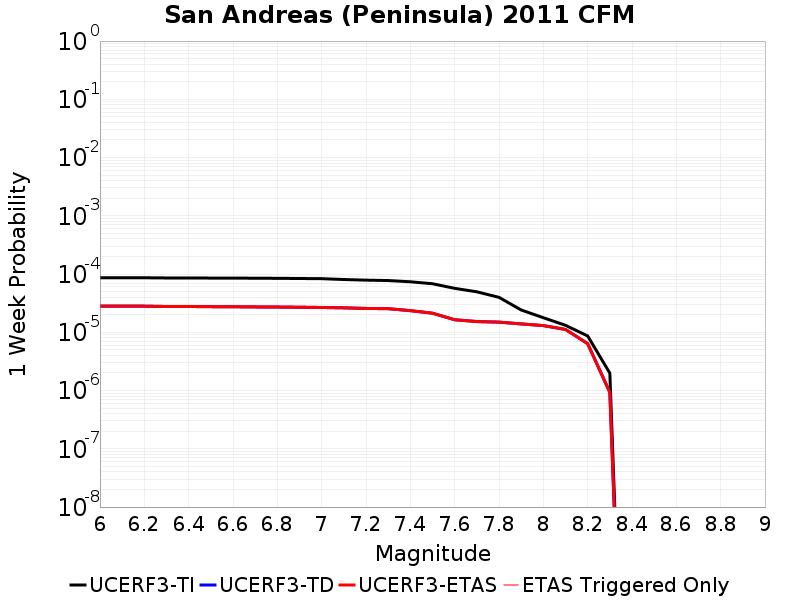 |  |  |  |

| Magnitude | 1 wk TI Prob | 1 wk TD Prob | 1 wk ETAS Prob | 1 wk ETAS/TD Gain | 1 wk ETAS Triggered Only | 1 mo TI Prob | 1 mo TD Prob | 1 mo ETAS Prob | 1 mo ETAS/TD Gain | 1 mo ETAS Triggered Only | 1 yr TI Prob | 1 yr TD Prob | 1 yr ETAS Prob | 1 yr ETAS/TD Gain | 1 yr ETAS Triggered Only | 10 yr TI Prob | 10 yr TD Prob | 10 yr ETAS Prob | 10 yr ETAS/TD Gain | 10 yr ETAS Triggered Only |
|-----|-----|-----|-----|-----|-----|-----|-----|-----|-----|-----|-----|-----|-----|-----|-----|-----|-----|-----|-----|-----|
| 6.0 | 8.6200685E-5 | 2.8021828E-5 | 2.8021828E-5 | 1.0 | 0.0 | 3.6937918E-4 | 1.20088036E-4 | 1.20088036E-4 | 1.0 | 0.0 | 0.0044879215 | 0.001461093 | 0.0014710784 | 1.0068341 | 1.0E-5 | 0.043983612 | 0.016333908 | 0.016343744 | 1.0006022 | 1.0E-5 |
| 6.1 | 8.6200685E-5 | 2.8021828E-5 | 2.8021828E-5 | 1.0 | 0.0 | 3.6937918E-4 | 1.20088036E-4 | 1.20088036E-4 | 1.0 | 0.0 | 0.0044879215 | 0.001461093 | 0.0014710784 | 1.0068341 | 1.0E-5 | 0.043983612 | 0.016333908 | 0.016343744 | 1.0006022 | 1.0E-5 |
| 6.2 | 8.6200685E-5 | 2.8021828E-5 | 2.8021828E-5 | 1.0 | 0.0 | 3.6937918E-4 | 1.20088036E-4 | 1.20088036E-4 | 1.0 | 0.0 | 0.0044879215 | 0.001461093 | 0.0014710784 | 1.0068341 | 1.0E-5 | 0.043983612 | 0.016333908 | 0.016343744 | 1.0006022 | 1.0E-5 |
| 6.3 | 8.551163E-5 | 2.7674281E-5 | 2.7674281E-5 | 1.0 | 0.0 | 3.6642692E-4 | 1.1859868E-4 | 1.1859868E-4 | 1.0 | 0.0 | 0.004452125 | 0.0014429842 | 0.0014529699 | 1.0069201 | 1.0E-5 | 0.043639794 | 0.016140902 | 0.01615074 | 1.0006095 | 1.0E-5 |
| 6.4 | 8.551163E-5 | 2.7674281E-5 | 2.7674281E-5 | 1.0 | 0.0 | 3.6642692E-4 | 1.1859868E-4 | 1.1859868E-4 | 1.0 | 0.0 | 0.004452125 | 0.0014429842 | 0.0014529699 | 1.0069201 | 1.0E-5 | 0.043639794 | 0.016140902 | 0.01615074 | 1.0006095 | 1.0E-5 |
| 6.5 | 8.511146E-5 | 2.7472963E-5 | 2.7472963E-5 | 1.0 | 0.0 | 3.647124E-4 | 1.17735966E-4 | 1.17735966E-4 | 1.0 | 0.0 | 0.004431336 | 0.0014324946 | 0.0014424803 | 1.0069709 | 1.0E-5 | 0.04344007 | 0.016029269 | 0.016039109 | 1.0006138 | 1.0E-5 |
| 6.6 | 8.4985084E-5 | 2.739688E-5 | 2.739688E-5 | 1.0 | 0.0 | 3.6417096E-4 | 1.1740992E-4 | 1.1740992E-4 | 1.0 | 0.0 | 0.0044247704 | 0.0014285302 | 0.001438516 | 1.0069902 | 1.0E-5 | 0.043376986 | 0.015988365 | 0.015998205 | 1.0006155 | 1.0E-5 |
| 6.7 | 8.462618E-5 | 2.7205744E-5 | 2.7205744E-5 | 1.0 | 0.0 | 3.6263323E-4 | 1.1659085E-4 | 1.1659085E-4 | 1.0 | 0.0 | 0.004406125 | 0.001418571 | 0.0014285569 | 1.0070393 | 1.0E-5 | 0.043197807 | 0.015883278 | 0.015893118 | 1.0006196 | 1.0E-5 |
| 6.8 | 8.42337E-5 | 2.7087088E-5 | 2.7087088E-5 | 1.0 | 0.0 | 3.6095164E-4 | 1.1608237E-4 | 1.1608237E-4 | 1.0 | 0.0 | 0.004385734 | 0.0014123883 | 0.0014223742 | 1.0070702 | 1.0E-5 | 0.043001823 | 0.015816098 | 0.01582594 | 1.0006223 | 1.0E-5 |
| 6.9 | 8.365989E-5 | 2.687364E-5 | 2.687364E-5 | 1.0 | 0.0 | 3.5849313E-4 | 1.1516767E-4 | 1.1516767E-4 | 1.0 | 0.0 | 0.004355922 | 0.0014012662 | 0.0014112522 | 1.0071265 | 1.0E-5 | 0.04271523 | 0.015699022 | 0.015708864 | 1.000627 | 1.0E-5 |
| 7.0 | 8.30936E-5 | 2.6616644E-5 | 2.6616644E-5 | 1.0 | 0.0 | 3.560668E-4 | 1.1406636E-4 | 1.1406636E-4 | 1.0 | 0.0 | 0.004326499 | 0.001387875 | 0.001397861 | 1.0071952 | 1.0E-5 | 0.042432297 | 0.0155602535 | 0.015570098 | 1.0006326 | 1.0E-5 |
| 7.1 | 8.041264E-5 | 2.6258613E-5 | 2.6258613E-5 | 1.0 | 0.0 | 3.4458007E-4 | 1.1253207E-4 | 1.1253207E-4 | 1.0 | 0.0 | 0.0041871946 | 0.0013692186 | 0.0013792049 | 1.0072935 | 1.0E-5 | 0.041091725 | 0.015356795 | 0.015366641 | 1.0006412 | 1.0E-5 |
| 7.2 | 7.8427016E-5 | 2.5626485E-5 | 2.5626485E-5 | 1.0 | 0.0 | 3.3607247E-4 | 1.0982317E-4 | 1.0982317E-4 | 1.0 | 0.0 | 0.004084008 | 0.0013362787 | 0.0013462653 | 1.0074735 | 1.0E-5 | 0.040097635 | 0.015010843 | 0.015020693 | 1.0006561 | 1.0E-5 |
| 7.3 | 7.721087E-5 | 2.5393245E-5 | 2.5393245E-5 | 1.0 | 0.0 | 3.3086175E-4 | 1.0882366E-4 | 1.0882366E-4 | 1.0 | 0.0 | 0.004020803 | 0.0013241245 | 0.0013341112 | 1.0075421 | 1.0E-5 | 0.03948827 | 0.014884551 | 0.014894403 | 1.0006618 | 1.0E-5 |
| 7.4 | 7.3536525E-5 | 2.349306E-5 | 2.349306E-5 | 1.0 | 0.0 | 3.1511846E-4 | 1.0068066E-4 | 1.0068066E-4 | 1.0 | 0.0 | 0.0038298194 | 0.0012250992 | 0.0012350869 | 1.0081526 | 1.0E-5 | 0.037644852 | 0.013831296 | 0.013841158 | 1.000713 | 1.0E-5 |
| 7.5 | 6.806207E-5 | 2.1224958E-5 | 2.1224958E-5 | 1.0 | 0.0 | 2.9166197E-4 | 9.0960944E-5 | 9.0960944E-5 | 1.0 | 0.0 | 0.0035452035 | 0.001106888 | 0.001116877 | 1.0090244 | 1.0E-5 | 0.034891766 | 0.012545017 | 0.012554891 | 1.0007871 | 1.0E-5 |
| 7.6 | 5.6731416E-5 | 1.639269E-5 | 1.639269E-5 | 1.0 | 0.0 | 2.43112E-4 | 7.02525E-5 | 7.02525E-5 | 1.0 | 0.0 | 0.0029558712 | 8.549887E-4 | 8.6498016E-4 | 1.0116861 | 1.0E-5 | 0.02916862 | 0.009729093 | 0.009738996 | 1.0010178 | 1.0E-5 |
| 7.7 | 4.946994E-5 | 1.5268428E-5 | 1.5268428E-5 | 1.0 | 0.0 | 2.1199681E-4 | 6.543448E-5 | 6.543448E-5 | 1.0 | 0.0 | 0.002578006 | 7.963737E-4 | 8.0636574E-4 | 1.0125469 | 1.0E-5 | 0.02548303 | 0.009038641 | 0.009048551 | 1.0010964 | 1.0E-5 |
| 7.8 | 3.9718198E-5 | 1.4915536E-5 | 1.4915536E-5 | 1.0 | 0.0 | 1.7020974E-4 | 6.392216E-5 | 6.392216E-5 | 1.0 | 0.0 | 0.0020703338 | 7.779746E-4 | 7.879668E-4 | 1.0128438 | 1.0E-5 | 0.020511515 | 0.008789215 | 0.008799127 | 1.0011277 | 1.0E-5 |
| 7.9 | 2.4115114E-5 | 1.3908534E-5 | 1.3908534E-5 | 1.0 | 0.0 | 1.0334639E-4 | 5.9606642E-5 | 5.9606642E-5 | 1.0 | 0.0 | 0.001257516 | 7.2546944E-4 | 7.354622E-4 | 1.0137742 | 1.0E-5 | 0.012504238 | 0.008085418 | 0.008095336 | 1.0012268 | 1.0E-5 |
| 8.0 | 1.7756569E-5 | 1.301231E-5 | 1.301231E-5 | 1.0 | 0.0 | 7.6097356E-5 | 5.576585E-5 | 5.576585E-5 | 1.0 | 0.0 | 9.260915E-4 | 6.787379E-4 | 6.887311E-4 | 1.0147232 | 1.0E-5 | 0.009222416 | 0.0075096763 | 0.007519601 | 1.0013217 | 1.0E-5 |
| 8.1 | 1.3159258E-5 | 1.1171694E-5 | 1.1171694E-5 | 1.0 | 0.0 | 5.6395602E-5 | 4.7877806E-5 | 4.7877806E-5 | 1.0 | 0.0 | 6.864001E-4 | 5.827566E-4 | 5.9275073E-4 | 1.0171498 | 1.0E-5 | 0.0068428386 | 0.006444969 | 0.006454905 | 1.0015416 | 1.0E-5 |
| 8.2 | 8.635426E-6 | 6.3719976E-6 | 6.3719976E-6 | 1.0 | 0.0 | 3.700844E-5 | 2.7308275E-5 | 2.7308275E-5 | 1.0 | 0.0 | 4.5048463E-4 | 3.3242765E-4 | 3.3242765E-4 | 1.0 | 0.0 | 0.004495725 | 0.0037327367 | 0.0037327367 | 1.0 | 0.0 |
| 8.3 | 1.983087E-6 | 9.274416E-7 | 9.274416E-7 | 1.0 | 0.0 | 8.498917E-6 | 3.974744E-6 | 3.974744E-6 | 1.0 | 0.0 | 1.034694E-4 | 4.8391455E-5 | 4.8391455E-5 | 1.0 | 0.0 | 0.0010342124 | 5.6326366E-4 | 5.6326366E-4 | 1.0 | 0.0 |

## San Juan
*[(top)](#table-of-contents)*

| 1 Week | 1 Month | 1 Year | 10 Year |
|-----|-----|-----|-----|
| 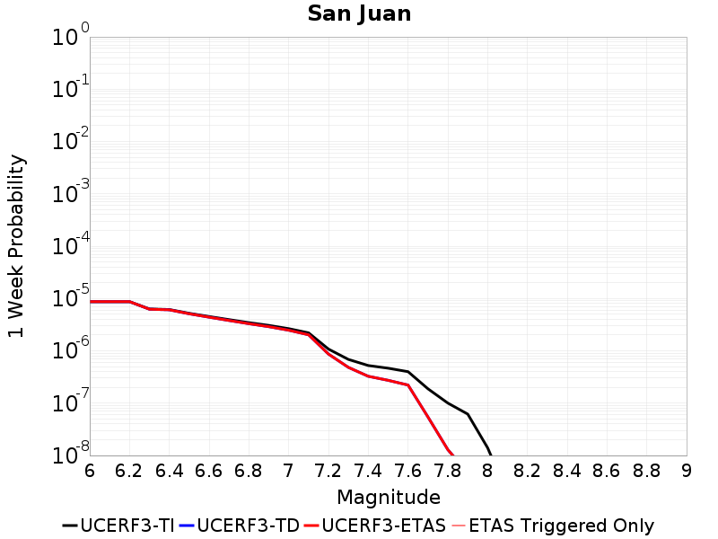 | 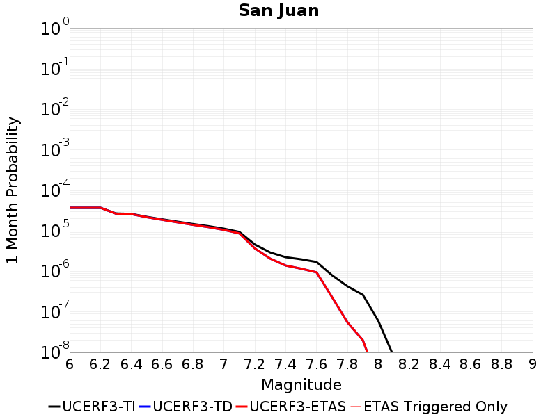 |  |  |

| Magnitude | 1 wk TI Prob | 1 wk TD Prob | 1 wk ETAS Prob | 1 wk ETAS/TD Gain | 1 wk ETAS Triggered Only | 1 mo TI Prob | 1 mo TD Prob | 1 mo ETAS Prob | 1 mo ETAS/TD Gain | 1 mo ETAS Triggered Only | 1 yr TI Prob | 1 yr TD Prob | 1 yr ETAS Prob | 1 yr ETAS/TD Gain | 1 yr ETAS Triggered Only | 10 yr TI Prob | 10 yr TD Prob | 10 yr ETAS Prob | 10 yr ETAS/TD Gain | 10 yr ETAS Triggered Only |
|-----|-----|-----|-----|-----|-----|-----|-----|-----|-----|-----|-----|-----|-----|-----|-----|-----|-----|-----|-----|-----|
| 6.0 | 8.682808E-6 | 8.703172E-6 | 8.703172E-6 | 1.0 | 0.0 | 3.72115E-5 | 3.7298803E-5 | 3.7298803E-5 | 1.0 | 0.0 | 4.5295584E-4 | 4.5402313E-4 | 4.640186E-4 | 1.0220153 | 1.0E-5 | 0.004520337 | 0.004531495 | 0.0045414497 | 1.0021968 | 1.0E-5 |
| 6.1 | 8.682808E-6 | 8.703172E-6 | 8.703172E-6 | 1.0 | 0.0 | 3.72115E-5 | 3.7298803E-5 | 3.7298803E-5 | 1.0 | 0.0 | 4.5295584E-4 | 4.5402313E-4 | 4.640186E-4 | 1.0220153 | 1.0E-5 | 0.004520337 | 0.004531495 | 0.0045414497 | 1.0021968 | 1.0E-5 |
| 6.2 | 8.682808E-6 | 8.703172E-6 | 8.703172E-6 | 1.0 | 0.0 | 3.72115E-5 | 3.7298803E-5 | 3.7298803E-5 | 1.0 | 0.0 | 4.5295584E-4 | 4.5402313E-4 | 4.640186E-4 | 1.0220153 | 1.0E-5 | 0.004520337 | 0.004531495 | 0.0045414497 | 1.0021968 | 1.0E-5 |
| 6.3 | 6.3054235E-6 | 6.233705E-6 | 6.233705E-6 | 1.0 | 0.0 | 2.7022963E-5 | 2.6715612E-5 | 2.6715612E-5 | 1.0 | 0.0 | 3.2895492E-4 | 3.2521543E-4 | 3.2521543E-4 | 1.0 | 0.0 | 0.003284684 | 0.0032475926 | 0.0032475926 | 1.0 | 0.0 |
| 6.4 | 6.1490473E-6 | 6.0725033E-6 | 6.0725033E-6 | 1.0 | 0.0 | 2.6352795E-5 | 2.6024763E-5 | 2.6024763E-5 | 1.0 | 0.0 | 3.2079802E-4 | 3.168068E-4 | 3.168068E-4 | 1.0 | 0.0 | 0.0032033534 | 0.0031637459 | 0.0031637459 | 1.0 | 0.0 |
| 6.5 | 5.204848E-6 | 5.0955086E-6 | 5.0955086E-6 | 1.0 | 0.0 | 2.23063E-5 | 2.1837715E-5 | 2.1837715E-5 | 1.0 | 0.0 | 2.7154534E-4 | 2.658427E-4 | 2.658427E-4 | 1.0 | 0.0 | 0.0027121378 | 0.0026553988 | 0.0026553988 | 1.0 | 0.0 |
| 6.6 | 4.5179986E-6 | 4.3887926E-6 | 4.3887926E-6 | 1.0 | 0.0 | 1.9362706E-5 | 1.880898E-5 | 1.880898E-5 | 1.0 | 0.0 | 2.3571544E-4 | 2.2897605E-4 | 2.2897605E-4 | 1.0 | 0.0 | 0.0023546559 | 0.0022875364 | 0.0022875364 | 1.0 | 0.0 |
| 6.7 | 3.9442616E-6 | 3.797719E-6 | 3.797719E-6 | 1.0 | 0.0 | 1.6903869E-5 | 1.627584E-5 | 1.627584E-5 | 1.0 | 0.0 | 2.0578515E-4 | 1.9814102E-4 | 1.9814102E-4 | 1.0 | 0.0 | 0.002055947 | 0.0019797664 | 0.0019797664 | 1.0 | 0.0 |
| 6.8 | 3.4536245E-6 | 3.2952894E-6 | 3.2952894E-6 | 1.0 | 0.0 | 1.4801163E-5 | 1.4122596E-5 | 1.4122596E-5 | 1.0 | 0.0 | 1.8018926E-4 | 1.7192966E-4 | 1.7192966E-4 | 1.0 | 0.0 | 0.0018004322 | 0.0017180833 | 0.0017180833 | 1.0 | 0.0 |
| 6.9 | 3.059865E-6 | 2.8921895E-6 | 2.8921895E-6 | 1.0 | 0.0 | 1.3113641E-5 | 1.2395042E-5 | 1.2395042E-5 | 1.0 | 0.0 | 1.596469E-4 | 1.5089975E-4 | 1.5089975E-4 | 1.0 | 0.0 | 0.0015953224 | 0.0015080856 | 0.0015080856 | 1.0 | 0.0 |
| 7.0 | 2.6504351E-6 | 2.4737062E-6 | 2.4737062E-6 | 1.0 | 0.0 | 1.1358958E-5 | 1.0601558E-5 | 1.0601558E-5 | 1.0 | 0.0 | 1.3828653E-4 | 1.2906686E-4 | 1.2906686E-4 | 1.0 | 0.0 | 0.0013820052 | 0.001290029 | 0.001290029 | 1.0 | 0.0 |
| 7.1 | 2.2039317E-6 | 2.0216382E-6 | 2.0216382E-6 | 1.0 | 0.0 | 9.445387E-6 | 8.6641385E-6 | 8.6641385E-6 | 1.0 | 0.0 | 1.1499152E-4 | 1.05481304E-4 | 1.05481304E-4 | 1.0 | 0.0 | 0.0011493203 | 0.0010544205 | 0.0010544205 | 1.0 | 0.0 |
| 7.2 | 1.0786707E-6 | 8.658913E-7 | 8.658913E-7 | 1.0 | 0.0 | 4.622866E-6 | 3.7109573E-6 | 3.7109573E-6 | 1.0 | 0.0 | 5.628194E-5 | 4.517998E-5 | 4.517998E-5 | 1.0 | 0.0 | 5.6267687E-4 | 4.517655E-4 | 4.517655E-4 | 1.0 | 0.0 |
| 7.3 | 6.846433E-7 | 4.823489E-7 | 4.823489E-7 | 1.0 | 0.0 | 2.9341822E-6 | 2.067208E-6 | 2.067208E-6 | 1.0 | 0.0 | 3.5723086E-5 | 2.5167968E-5 | 2.5167968E-5 | 1.0 | 0.0 | 3.571734E-4 | 2.5168507E-4 | 2.5168507E-4 | 1.0 | 0.0 |
| 7.4 | 5.23043E-7 | 3.2571137E-7 | 3.2571137E-7 | 1.0 | 0.0 | 2.2416111E-6 | 1.3959051E-6 | 1.3959051E-6 | 1.0 | 0.0 | 2.7291273E-5 | 1.6995013E-5 | 1.6995013E-5 | 1.0 | 0.0 | 2.7287923E-4 | 1.6996961E-4 | 1.6996961E-4 | 1.0 | 0.0 |
| 7.5 | 4.648444E-7 | 2.7276224E-7 | 2.7276224E-7 | 1.0 | 0.0 | 1.9921886E-6 | 1.1689805E-6 | 1.1689805E-6 | 1.0 | 0.0 | 2.4254627E-5 | 1.4232245E-5 | 1.4232245E-5 | 1.0 | 0.0 | 2.425198E-4 | 1.4234356E-4 | 1.4234356E-4 | 1.0 | 0.0 |
| 7.6 | 3.9906567E-7 | 2.2140678E-7 | 2.2140678E-7 | 1.0 | 0.0 | 1.7102802E-6 | 9.488859E-7 | 9.488859E-7 | 1.0 | 0.0 | 2.0822463E-5 | 1.15526245E-5 | 1.15526245E-5 | 1.0 | 0.0 | 2.0820512E-4 | 1.1554565E-4 | 1.1554565E-4 | 1.0 | 0.0 |
| 7.7 | 1.8784601E-7 | 5.432306E-8 | 5.432306E-8 | 1.0 | 0.0 | 8.0505407E-7 | 2.328131E-7 | 2.328131E-7 | 1.0 | 0.0 | 9.80149E-6 | 2.8344957E-6 | 2.8344957E-6 | 1.0 | 0.0 | 9.801057E-5 | 2.8355205E-5 | 2.8355205E-5 | 1.0 | 0.0 |
| 7.8 | 1.00154914E-7 | 1.2898772E-8 | 1.2898772E-8 | 1.0 | 0.0 | 4.2923529E-7 | 5.5280456E-8 | 5.5280456E-8 | 1.0 | 0.0 | 5.225927E-6 | 6.730393E-7 | 6.730393E-7 | 1.0 | 0.0 | 5.225804E-5 | 6.737962E-6 | 6.737962E-6 | 1.0 | 0.0 |
| 7.9 | 6.171429E-8 | 4.6500483E-9 | 4.6500483E-9 | 1.0 | 0.0 | 2.6448978E-7 | 1.9928784E-8 | 1.9928784E-8 | 1.0 | 0.0 | 3.2201583E-6 | 2.426329E-7 | 2.426329E-7 | 1.0 | 0.0 | 3.2201115E-5 | 2.4330975E-6 | 2.4330975E-6 | 1.0 | 0.0 |
| 8.0 | 1.3974572E-8 | 4.2419956E-10 | 4.2419956E-10 | 1.0 | 0.0 | 5.989102E-8 | 1.8180041E-9 | 1.8180041E-9 | 1.0 | 0.0 | 7.2917294E-7 | 2.2134188E-8 | 2.2134188E-8 | 1.0 | 0.0 | 7.2917055E-6 | 2.2672593E-7 | 2.2672593E-7 | 1.0 | 0.0 |
| 8.1 | 1.8403477E-9 | 1.3426649E-10 | 1.3426649E-10 | 1.0 | 0.0 | 7.887204E-9 | 5.754268E-10 | 5.754268E-10 | 1.0 | 0.0 | 9.602671E-8 | 7.0058186E-9 | 7.0058186E-9 | 1.0 | 0.0 | 9.602667E-7 | 7.147419E-8 | 7.147419E-8 | 1.0 | 0.0 |

## Ludlow
*[(top)](#table-of-contents)*

| 1 Week | 1 Month | 1 Year | 10 Year |
|-----|-----|-----|-----|
|  |  | 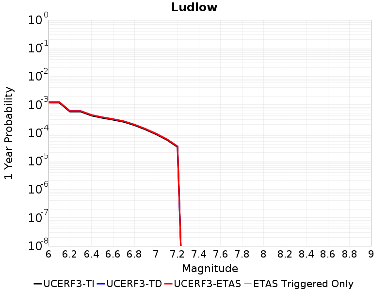 | 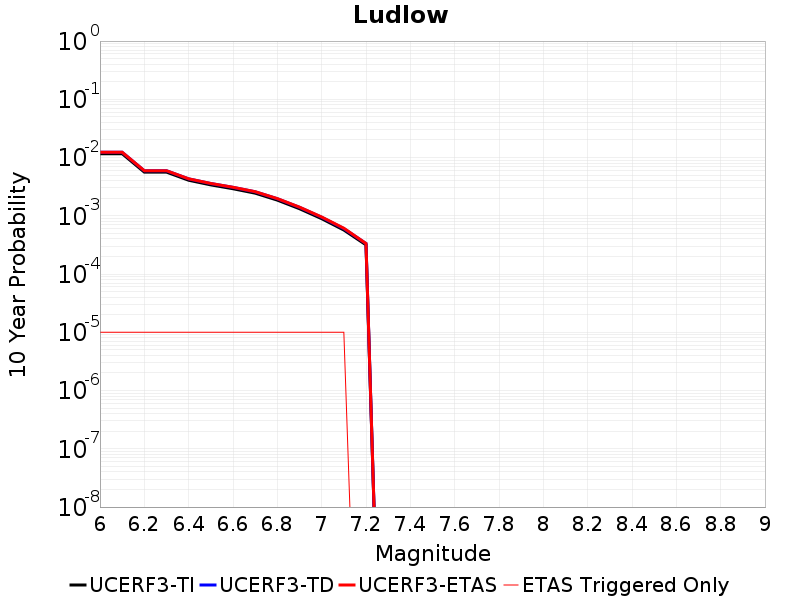 |

| Magnitude | 1 wk TI Prob | 1 wk TD Prob | 1 wk ETAS Prob | 1 wk ETAS/TD Gain | 1 wk ETAS Triggered Only | 1 mo TI Prob | 1 mo TD Prob | 1 mo ETAS Prob | 1 mo ETAS/TD Gain | 1 mo ETAS Triggered Only | 1 yr TI Prob | 1 yr TD Prob | 1 yr ETAS Prob | 1 yr ETAS/TD Gain | 1 yr ETAS Triggered Only | 10 yr TI Prob | 10 yr TD Prob | 10 yr ETAS Prob | 10 yr ETAS/TD Gain | 10 yr ETAS Triggered Only |
|-----|-----|-----|-----|-----|-----|-----|-----|-----|-----|-----|-----|-----|-----|-----|-----|-----|-----|-----|-----|-----|
| 6.0 | 2.2407607E-5 | 2.3698462E-5 | 2.3698462E-5 | 1.0 | 0.0 | 9.602906E-5 | 1.01561134E-4 | 1.01561134E-4 | 1.0 | 0.0 | 0.0011685267 | 0.0012358497 | 0.0012358497 | 1.0 | 0.0 | 0.011624013 | 0.012294298 | 0.012304176 | 1.0008034 | 1.0E-5 |
| 6.1 | 2.2407607E-5 | 2.3698462E-5 | 2.3698462E-5 | 1.0 | 0.0 | 9.602906E-5 | 1.01561134E-4 | 1.01561134E-4 | 1.0 | 0.0 | 0.0011685267 | 0.0012358497 | 0.0012358497 | 1.0 | 0.0 | 0.011624013 | 0.012294298 | 0.012304176 | 1.0008034 | 1.0E-5 |
| 6.2 | 1.0781252E-5 | 1.13849055E-5 | 1.13849055E-5 | 1.0 | 0.0 | 4.620455E-5 | 4.879156E-5 | 4.879156E-5 | 1.0 | 0.0 | 5.623952E-4 | 5.938794E-4 | 5.938794E-4 | 1.0 | 0.0 | 0.00560974 | 0.0059233434 | 0.0059332843 | 1.0016782 | 1.0E-5 |
| 6.3 | 1.0781252E-5 | 1.13849055E-5 | 1.13849055E-5 | 1.0 | 0.0 | 4.620455E-5 | 4.879156E-5 | 4.879156E-5 | 1.0 | 0.0 | 5.623952E-4 | 5.938794E-4 | 5.938794E-4 | 1.0 | 0.0 | 0.00560974 | 0.0059233434 | 0.0059332843 | 1.0016782 | 1.0E-5 |
| 6.4 | 7.814439E-6 | 8.251667E-6 | 8.251667E-6 | 1.0 | 0.0 | 3.3490025E-5 | 3.5363813E-5 | 3.5363813E-5 | 1.0 | 0.0 | 4.0766477E-4 | 4.304708E-4 | 4.304708E-4 | 1.0 | 0.0 | 0.0040691774 | 0.0042965165 | 0.004306474 | 1.0023174 | 1.0E-5 |
| 6.5 | 6.4986366E-6 | 6.862521E-6 | 6.862521E-6 | 1.0 | 0.0 | 2.7851002E-5 | 2.9410478E-5 | 2.9410478E-5 | 1.0 | 0.0 | 3.390332E-4 | 3.5801466E-4 | 3.5801466E-4 | 1.0 | 0.0 | 0.003385164 | 0.0035744754 | 0.0035844396 | 1.0027876 | 1.0E-5 |
| 6.6 | 5.582177E-6 | 5.896014E-6 | 5.896014E-6 | 1.0 | 0.0 | 2.3923398E-5 | 2.526839E-5 | 2.526839E-5 | 1.0 | 0.0 | 2.9122844E-4 | 3.0759993E-4 | 3.0759993E-4 | 1.0 | 0.0 | 0.0029084706 | 0.0030718152 | 0.0030817846 | 1.0032454 | 1.0E-5 |
| 6.7 | 4.6858763E-6 | 4.948811E-6 | 4.948811E-6 | 1.0 | 0.0 | 2.0082172E-5 | 2.120902E-5 | 2.120902E-5 | 1.0 | 0.0 | 2.4447302E-4 | 2.5818977E-4 | 2.5818977E-4 | 1.0 | 0.0 | 0.0024420423 | 0.0025789547 | 0.0025889287 | 1.0038675 | 1.0E-5 |
| 6.8 | 3.5584908E-6 | 3.7583907E-6 | 3.7583907E-6 | 1.0 | 0.0 | 1.5250586E-5 | 1.6107291E-5 | 1.6107291E-5 | 1.0 | 0.0 | 1.8566006E-4 | 1.9608904E-4 | 1.9608904E-4 | 1.0 | 0.0 | 0.0018550502 | 0.0019592014 | 0.0019691817 | 1.0050942 | 1.0E-5 |
| 6.9 | 2.532834E-6 | 2.6755529E-6 | 2.6755529E-6 | 1.0 | 0.0 | 1.0854958E-5 | 1.1466606E-5 | 1.1466606E-5 | 1.0 | 0.0 | 1.3215111E-4 | 1.3959726E-4 | 1.3959726E-4 | 1.0 | 0.0 | 0.0013207254 | 0.0013951234 | 0.0014051095 | 1.0071578 | 1.0E-5 |
| 7.0 | 1.7083285E-6 | 1.805027E-6 | 1.805027E-6 | 1.0 | 0.0 | 7.3213873E-6 | 7.735807E-6 | 7.735807E-6 | 1.0 | 0.0 | 8.913424E-5 | 9.417955E-5 | 9.417955E-5 | 1.0 | 0.0 | 8.9098496E-4 | 9.41413E-4 | 9.514036E-4 | 1.0106124 | 1.0E-5 |
| 7.1 | 1.0905424E-6 | 1.1517113E-6 | 1.1517113E-6 | 1.0 | 0.0 | 4.6737446E-6 | 4.935897E-6 | 4.935897E-6 | 1.0 | 0.0 | 5.6901354E-5 | 6.0092985E-5 | 6.0092985E-5 | 1.0 | 0.0 | 5.6886784E-4 | 6.0077716E-4 | 6.107712E-4 | 1.0166351 | 1.0E-5 |
| 7.2 | 6.06668E-7 | 6.397814E-7 | 6.397814E-7 | 1.0 | 0.0 | 2.600003E-6 | 2.7419178E-6 | 2.7419178E-6 | 1.0 | 0.0 | 3.1654577E-5 | 3.3382406E-5 | 3.3382406E-5 | 1.0 | 0.0 | 3.1650066E-4 | 3.337808E-4 | 3.337808E-4 | 1.0 | 0.0 |

