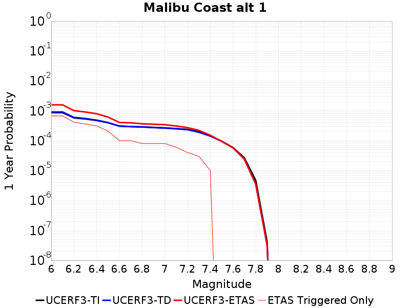
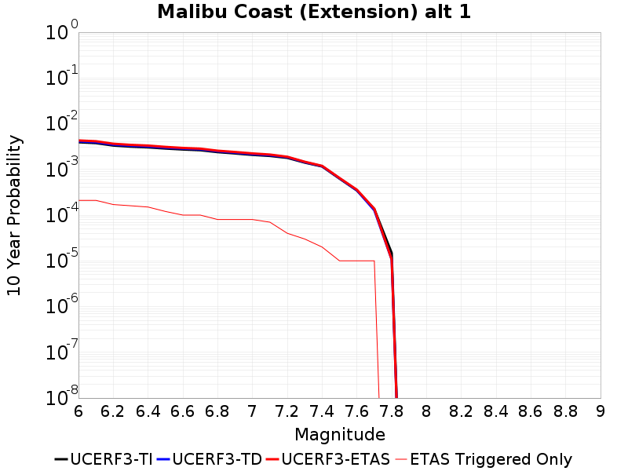
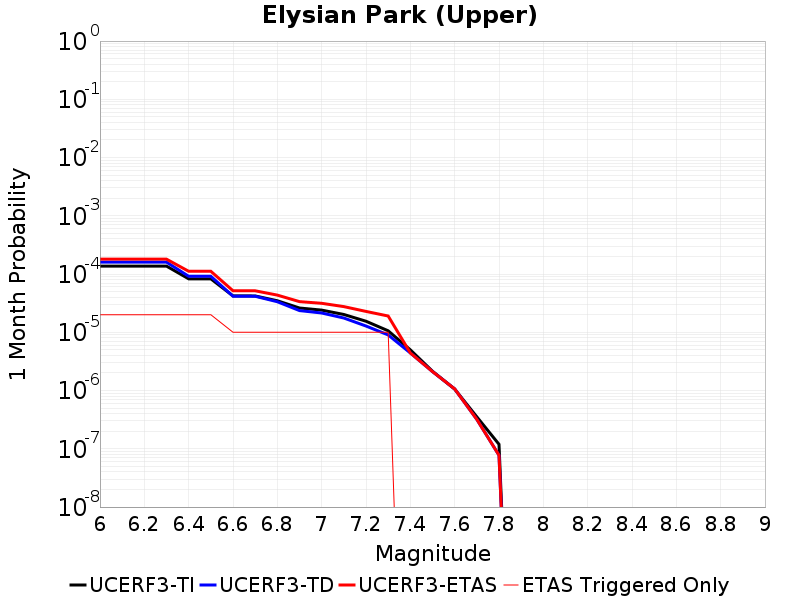
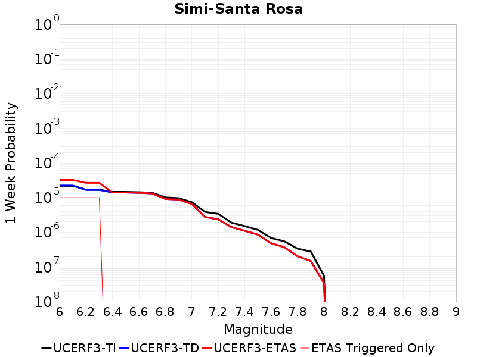
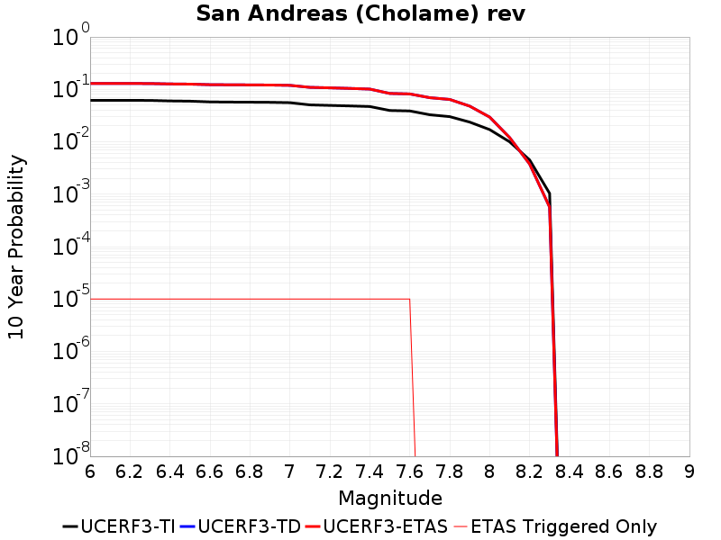
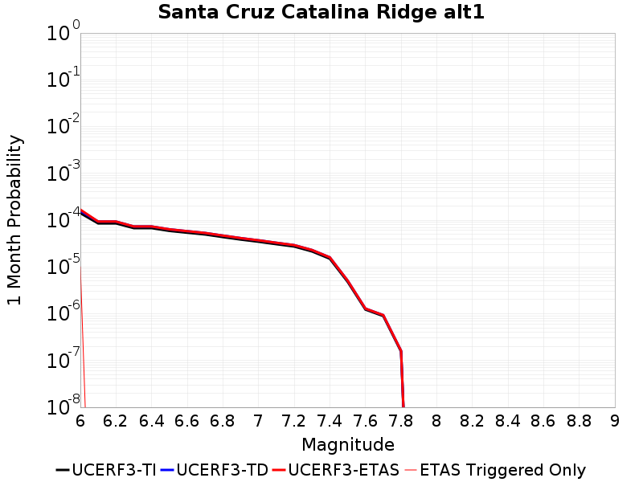
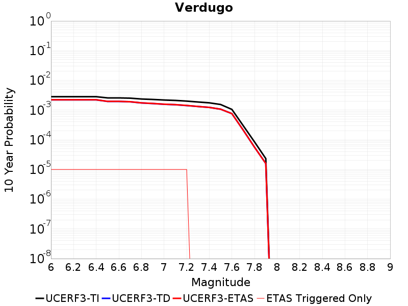
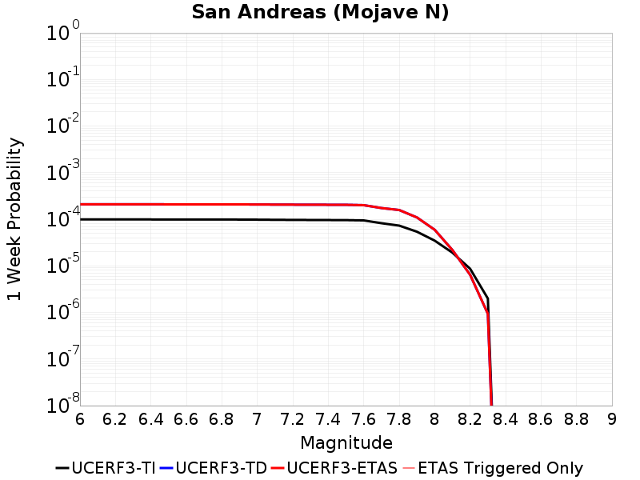
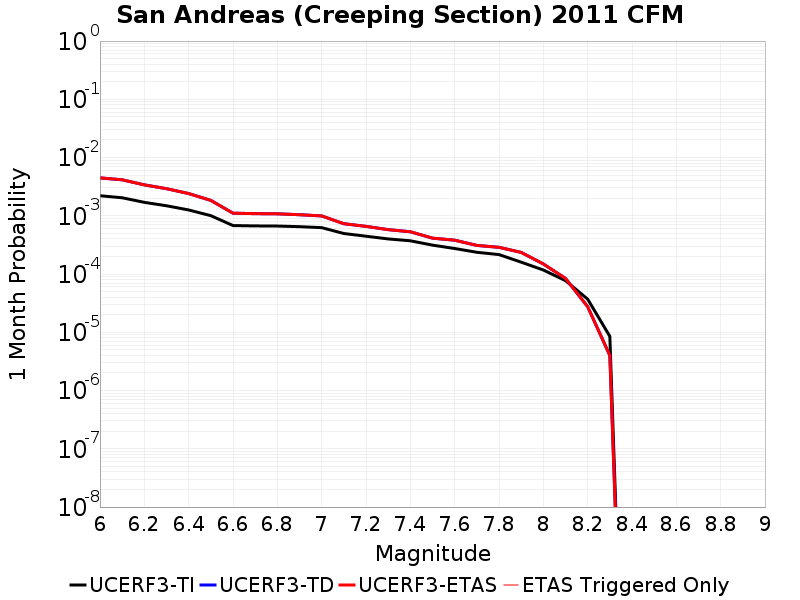

# Parent Section Magnitude-Probability Distributions

Only fault sections with at least one triggered aftershock are plotted. Sections are sorted by total supraseismogenic trigger rate (decreasing)

## Table Of Contents

* [Malibu Coast alt 1](#malibu-coast-alt-1)
* [Malibu Coast (Extension) alt 1](#malibu-coast-extension-alt-1)
* [Anacapa-Dume alt 1](#anacapa-dume-alt-1)
* [San Pedro Basin](#san-pedro-basin)
* [Santa Cruz Island](#santa-cruz-island)
* [Santa Monica alt 1](#santa-monica-alt-1)
* [Hollywood](#hollywood)
* [Elysian Park (Upper)](#elysian-park-upper)
* [Palos Verdes](#palos-verdes)
* [Puente Hills](#puente-hills)
* [Channel Islands Thrust](#channel-islands-thrust)
* [Newport-Inglewood alt 1](#newport-inglewood-alt-1)
* [Channel Islands Western Deep Ramp](#channel-islands-western-deep-ramp)
* [Simi-Santa Rosa](#simi-santa-rosa)
* [Santa Ynez (East)](#santa-ynez-east)
* [Santa Ynez (West)](#santa-ynez-west)
* [Santa Rosa Island](#santa-rosa-island)
* [Ventura-Pitas Point](#ventura-pitas-point)
* [Oak Ridge (Onshore)](#oak-ridge-onshore)
* [San Andreas (Cholame) rev](#san-andreas-cholame-rev)
* [Red Mountain](#red-mountain)
* [San Andreas (Big Bend)](#san-andreas-big-bend)
* [San Andreas (Carrizo) rev](#san-andreas-carrizo-rev)
* [Santa Cruz Catalina Ridge alt1](#santa-cruz-catalina-ridge-alt1)
* [Santa Monica Bay](#santa-monica-bay)
* [San Cayetano](#san-cayetano)
* [Verdugo](#verdugo)
* [Lenwood-Lockhart-Old Woman Springs](#lenwood-lockhart-old-woman-springs)
* [San Andreas (Parkfield)](#san-andreas-parkfield)
* [North Salt Lake](#north-salt-lake)
* [San Vicente](#san-vicente)
* [San Andreas (Mojave N)](#san-andreas-mojave-n)
* [San Clemente](#san-clemente)
* [San Andreas (Creeping Section) 2011 CFM](#san-andreas-creeping-section-2011-cfm)
* [San Andreas (Mojave S)](#san-andreas-mojave-s)
* [Redondo Canyon alt 1](#redondo-canyon-alt-1)

## Malibu Coast alt 1
*[(top)](#table-of-contents)*

| 1 Week | 1 Month | 1 Year | 10 Year |
|-----|-----|-----|-----|
|  |  |  |  |

| Magnitude | 1 wk TI Prob | 1 wk TD Prob | 1 wk ETAS Prob | 1 wk ETAS/TD Gain | 1 wk ETAS Triggered Only | 1 mo TI Prob | 1 mo TD Prob | 1 mo ETAS Prob | 1 mo ETAS/TD Gain | 1 mo ETAS Triggered Only | 1 yr TI Prob | 1 yr TD Prob | 1 yr ETAS Prob | 1 yr ETAS/TD Gain | 1 yr ETAS Triggered Only | 10 yr TI Prob | 10 yr TD Prob | 10 yr ETAS Prob | 10 yr ETAS/TD Gain | 10 yr ETAS Triggered Only |
|-----|-----|-----|-----|-----|-----|-----|-----|-----|-----|-----|-----|-----|-----|-----|-----|-----|-----|-----|-----|-----|
| 6.0 | 1.6572556E-5 | 1.7431825E-5 | 3.4742607E-4 | 19.930563 | 3.3E-4 | 7.102331E-5 | 7.4705786E-5 | 5.0467363E-4 | 6.755483 | 4.3E-4 | 8.6436566E-4 | 9.091816E-4 | 0.0015785724 | 1.7362565 | 6.7E-4 | 0.0086101135 | 0.009056489 | 0.009928519 | 1.0962878 | 8.8E-4 |
| 6.1 | 1.6572556E-5 | 1.7431825E-5 | 3.4742607E-4 | 19.930563 | 3.3E-4 | 7.102331E-5 | 7.4705786E-5 | 5.0467363E-4 | 6.755483 | 4.3E-4 | 8.6436566E-4 | 9.091816E-4 | 0.0015785724 | 1.7362565 | 6.7E-4 | 0.0086101135 | 0.009056489 | 0.009928519 | 1.0962878 | 8.8E-4 |
| 6.2 | 1.1085717E-5 | 1.1480712E-5 | 2.3147819E-4 | 20.162355 | 2.2E-4 | 4.750935E-5 | 4.9202143E-5 | 3.1918887E-4 | 6.487296 | 2.7E-4 | 5.782728E-4 | 5.988749E-4 | 0.0010086293 | 1.6842072 | 4.1E-4 | 0.0057677035 | 0.0059729707 | 0.0065097455 | 1.0898672 | 5.4E-4 |
| 6.3 | 1.0208568E-5 | 1.0530541E-5 | 1.8052875E-4 | 17.14335 | 1.7E-4 | 4.375027E-5 | 4.5130124E-5 | 2.651202E-4 | 5.8745728 | 2.2E-4 | 5.325294E-4 | 5.493236E-4 | 9.0912584E-4 | 1.6549914 | 3.6E-4 | 0.0053125503 | 0.0054799574 | 0.0059374366 | 1.0834823 | 4.6E-4 |
| 6.4 | 9.0682315E-6 | 9.297617E-6 | 1.5929622E-4 | 17.133017 | 1.5E-4 | 3.8863272E-5 | 3.984633E-5 | 2.2983876E-4 | 5.7681284 | 1.9E-4 | 4.730576E-4 | 4.850231E-4 | 7.9487276E-4 | 1.6388348 | 3.1E-4 | 0.0047205184 | 0.004839854 | 0.0052279662 | 1.0801909 | 3.9E-4 |
| 6.5 | 7.605796E-6 | 7.72134E-6 | 1.0772057E-4 | 13.95102 | 1.0E-4 | 3.259586E-5 | 3.3091044E-5 | 1.6308675E-4 | 4.9284253 | 1.3E-4 | 3.9678233E-4 | 4.0281028E-4 | 6.127257E-4 | 1.5211272 | 2.1E-4 | 0.0039607463 | 0.0040209363 | 0.0042898506 | 1.0668786 | 2.7E-4 |
| 6.6 | 5.889873E-6 | 5.8731844E-6 | 5.587289E-5 | 9.513219 | 5.0E-5 | 2.5242069E-5 | 2.5170548E-5 | 8.516904E-5 | 3.3836782 | 6.0E-5 | 3.0727885E-4 | 3.0640844E-4 | 4.063778E-4 | 1.3262618 | 1.0E-4 | 0.003068543 | 0.0030598724 | 0.0031795052 | 1.0390973 | 1.2E-4 |
| 6.7 | 5.66586E-6 | 5.6365507E-6 | 5.563627E-5 | 9.870623 | 5.0E-5 | 2.428203E-5 | 2.4156423E-5 | 8.415498E-5 | 3.4837513 | 6.0E-5 | 2.955936E-4 | 2.9406484E-4 | 3.9403545E-4 | 1.339961 | 1.0E-4 | 0.0029520073 | 0.0029367693 | 0.003056417 | 1.0407412 | 1.2E-4 |
| 6.8 | 5.521556E-6 | 5.4850993E-6 | 5.5484827E-5 | 10.115556 | 5.0E-5 | 2.3663597E-5 | 2.3507357E-5 | 7.3506184E-5 | 3.1269438 | 5.0E-5 | 2.880662E-4 | 2.8616458E-4 | 3.6614167E-4 | 1.2794794 | 8.0E-5 | 0.0028769306 | 0.0028579724 | 0.0029576865 | 1.0348898 | 1.0E-4 |
| 6.9 | 5.29752E-6 | 5.2471496E-6 | 5.524689E-5 | 10.528934 | 5.0E-5 | 2.270346E-5 | 2.248759E-5 | 7.2486466E-5 | 3.2233987 | 5.0E-5 | 2.7637955E-4 | 2.7375208E-4 | 3.537302E-4 | 1.2921553 | 8.0E-5 | 0.0027603607 | 0.002734159 | 0.0028338856 | 1.0364743 | 1.0E-4 |
| 7.0 | 5.106743E-6 | 5.046135E-6 | 5.5045883E-5 | 10.908524 | 5.0E-5 | 2.1885859E-5 | 2.1626114E-5 | 7.162503E-5 | 3.3119698 | 5.0E-5 | 2.6642776E-4 | 2.632662E-4 | 3.4324513E-4 | 1.303795 | 8.0E-5 | 0.0026610855 | 0.0026295527 | 0.0027292897 | 1.0379293 | 1.0E-4 |
| 7.1 | 4.8469647E-6 | 4.7706703E-6 | 4.477048E-5 | 9.384526 | 4.0E-5 | 2.0772539E-5 | 2.044557E-5 | 6.0444752E-5 | 2.956374 | 4.0E-5 | 2.528763E-4 | 2.4889645E-4 | 3.088815E-4 | 1.2410041 | 6.0E-5 | 0.0025258875 | 0.002486185 | 0.002565986 | 1.0320978 | 8.0E-5 |
| 7.2 | 4.545514E-6 | 4.449108E-6 | 2.4449018E-5 | 5.495263 | 2.0E-5 | 1.9480629E-5 | 1.9067467E-5 | 3.9067087E-5 | 2.048887 | 2.0E-5 | 2.3715083E-4 | 2.3212175E-4 | 2.7211246E-4 | 1.1722834 | 4.0E-5 | 0.0023689792 | 0.0023188004 | 0.0023686844 | 1.0215129 | 5.0E-5 |
| 7.3 | 3.794097E-6 | 3.652918E-6 | 1.36528815E-5 | 3.7375276 | 1.0E-5 | 1.6260314E-5 | 1.5655269E-5 | 2.5655112E-5 | 1.6387526 | 1.0E-5 | 1.9795135E-4 | 1.9058626E-4 | 2.2058055E-4 | 1.157379 | 3.0E-5 | 0.001977751 | 0.0019042328 | 0.0019441566 | 1.0209658 | 4.0E-5 |
| 7.4 | 2.808217E-6 | 2.7199962E-6 | 2.7199962E-6 | 1.0 | 0.0 | 1.203516E-5 | 1.16570745E-5 | 1.16570745E-5 | 1.0 | 0.0 | 1.4651821E-4 | 1.4191566E-4 | 1.5191424E-4 | 1.0704544 | 1.0E-5 | 0.0014642165 | 0.001418253 | 0.0014382247 | 1.0140818 | 2.0E-5 |
| 7.5 | 1.83809E-6 | 1.819971E-6 | 1.819971E-6 | 1.0 | 0.0 | 7.877505E-6 | 7.799853E-6 | 7.799853E-6 | 1.0 | 0.0 | 9.59044E-5 | 9.495908E-5 | 9.495908E-5 | 1.0 | 0.0 | 9.5863023E-4 | 9.491871E-4 | 9.591776E-4 | 1.0105253 | 1.0E-5 |
| 7.6 | 1.1292672E-6 | 1.101096E-6 | 1.101096E-6 | 1.0 | 0.0 | 4.839708E-6 | 4.718974E-6 | 4.718974E-6 | 1.0 | 0.0 | 5.8921847E-5 | 5.7452016E-5 | 5.7452016E-5 | 1.0 | 0.0 | 5.890623E-4 | 5.743733E-4 | 5.8436755E-4 | 1.0174003 | 1.0E-5 |
| 7.7 | 5.065272E-7 | 4.6170294E-7 | 4.6170294E-7 | 1.0 | 0.0 | 2.170829E-6 | 1.9787253E-6 | 1.9787253E-6 | 1.0 | 0.0 | 2.6429525E-5 | 2.4090727E-5 | 2.4090727E-5 | 1.0 | 0.0 | 2.642638E-4 | 2.4088228E-4 | 2.5087988E-4 | 1.041504 | 1.0E-5 |
| 7.8 | 8.952991E-8 | 6.748711E-8 | 6.748711E-8 | 1.0 | 0.0 | 3.8369956E-7 | 2.8923043E-7 | 2.8923043E-7 | 1.0 | 0.0 | 4.671532E-6 | 3.521375E-6 | 3.521375E-6 | 1.0 | 0.0 | 4.671434E-5 | 3.5213212E-5 | 3.5213212E-5 | 1.0 | 0.0 |
| 7.9 | 8.007447E-10 | 6.192892E-10 | 6.192892E-10 | 1.0 | 0.0 | 3.4317629E-9 | 2.6540965E-9 | 2.6540965E-9 | 1.0 | 0.0 | 4.1781714E-8 | 3.2313626E-8 | 3.2313626E-8 | 1.0 | 0.0 | 4.1781706E-7 | 3.2313622E-7 | 3.2313622E-7 | 1.0 | 0.0 |

## Malibu Coast (Extension) alt 1
*[(top)](#table-of-contents)*

| 1 Week | 1 Month | 1 Year | 10 Year |
|-----|-----|-----|-----|
|  |  |  |  |

| Magnitude | 1 wk TI Prob | 1 wk TD Prob | 1 wk ETAS Prob | 1 wk ETAS/TD Gain | 1 wk ETAS Triggered Only | 1 mo TI Prob | 1 mo TD Prob | 1 mo ETAS Prob | 1 mo ETAS/TD Gain | 1 mo ETAS Triggered Only | 1 yr TI Prob | 1 yr TD Prob | 1 yr ETAS Prob | 1 yr ETAS/TD Gain | 1 yr ETAS Triggered Only | 10 yr TI Prob | 10 yr TD Prob | 10 yr ETAS Prob | 10 yr ETAS/TD Gain | 10 yr ETAS Triggered Only |
|-----|-----|-----|-----|-----|-----|-----|-----|-----|-----|-----|-----|-----|-----|-----|-----|-----|-----|-----|-----|-----|
| 6.0 | 7.516028E-6 | 7.841694E-6 | 8.7841065E-5 | 11.201797 | 8.0E-5 | 3.221115E-5 | 3.3606833E-5 | 1.2360381E-4 | 3.6779368 | 9.0E-5 | 3.9210016E-4 | 4.09087E-4 | 5.6902156E-4 | 1.3909549 | 1.6E-4 | 0.0039140903 | 0.0040834094 | 0.004292552 | 1.0512176 | 2.1E-4 |
| 6.1 | 7.199952E-6 | 7.5152147E-6 | 8.7514614E-5 | 11.644992 | 8.0E-5 | 3.0856572E-5 | 3.220767E-5 | 1.2220477E-4 | 3.7942755 | 9.0E-5 | 3.75614E-4 | 3.9205843E-4 | 5.519957E-4 | 1.4079424 | 1.6E-4 | 0.0037497976 | 0.003913733 | 0.0041229115 | 1.0534472 | 2.1E-4 |
| 6.2 | 6.3721413E-6 | 6.65604E-6 | 7.6655575E-5 | 11.516694 | 7.0E-5 | 2.7308892E-5 | 2.8525576E-5 | 1.08523294E-4 | 3.8044207 | 8.0E-5 | 3.3243504E-4 | 3.4724388E-4 | 4.7719874E-4 | 1.3742466 | 1.3E-4 | 0.0033193815 | 0.0034670532 | 0.0036364638 | 1.048863 | 1.7E-4 |
| 6.3 | 6.016345E-6 | 6.2861864E-6 | 6.628581E-5 | 10.544678 | 6.0E-5 | 2.578408E-5 | 2.6940523E-5 | 9.693864E-5 | 3.5982463 | 7.0E-5 | 3.1387596E-4 | 3.2795183E-4 | 4.4791246E-4 | 1.3657874 | 1.2E-4 | 0.00313433 | 0.0032747148 | 0.0034341908 | 1.0486993 | 1.6E-4 |
| 6.4 | 5.8104883E-6 | 6.071595E-6 | 6.607123E-5 | 10.882022 | 6.0E-5 | 2.4901856E-5 | 2.6020864E-5 | 9.6019045E-5 | 3.690079 | 7.0E-5 | 3.031379E-4 | 3.1675826E-4 | 4.2672342E-4 | 1.347158 | 1.1E-4 | 0.0030272473 | 0.0031631023 | 0.003312628 | 1.0472718 | 1.5E-4 |
| 6.5 | 5.476925E-6 | 5.7214334E-6 | 5.5721146E-5 | 9.739018 | 5.0E-5 | 2.3472323E-5 | 2.45202E-5 | 8.451873E-5 | 3.446902 | 6.0E-5 | 2.8573806E-4 | 2.9849284E-4 | 3.8846597E-4 | 1.3014247 | 9.0E-5 | 0.0028537093 | 0.002980951 | 0.0031005933 | 1.0401356 | 1.2E-4 |
| 6.6 | 5.222387E-6 | 5.4540615E-6 | 5.5453787E-5 | 10.16743 | 5.0E-5 | 2.2381464E-5 | 2.3374341E-5 | 8.3372935E-5 | 3.5668573 | 6.0E-5 | 2.7246025E-4 | 2.8454573E-4 | 3.6452297E-4 | 1.2810699 | 8.0E-5 | 0.0027212645 | 0.0028418447 | 0.0029415605 | 1.0350884 | 1.0E-4 |
| 6.7 | 5.0337076E-6 | 5.255785E-6 | 5.525552E-5 | 10.513277 | 5.0E-5 | 2.1572854E-5 | 2.25246E-5 | 8.252325E-5 | 3.6636944 | 6.0E-5 | 2.6261783E-4 | 2.742028E-4 | 3.5418084E-4 | 1.2916749 | 8.0E-5 | 0.002623077 | 0.0027386746 | 0.0028384007 | 1.036414 | 1.0E-4 |
| 6.8 | 4.5675624E-6 | 4.755909E-6 | 5.475567E-5 | 11.513187 | 5.0E-5 | 1.9575122E-5 | 2.038231E-5 | 7.038129E-5 | 3.4530578 | 5.0E-5 | 2.3830103E-4 | 2.4812654E-4 | 3.0811163E-4 | 1.2417521 | 6.0E-5 | 0.0023804565 | 0.0024785146 | 0.0025583163 | 1.0321974 | 8.0E-5 |
| 6.9 | 4.2802412E-6 | 4.4501658E-6 | 5.444994E-5 | 12.235486 | 5.0E-5 | 1.8343762E-5 | 1.9072E-5 | 6.9071044E-5 | 3.6215942 | 5.0E-5 | 2.2331243E-4 | 2.3217702E-4 | 2.9216308E-4 | 1.2583635 | 6.0E-5 | 0.0022308815 | 0.0023193613 | 0.0023991757 | 1.0344123 | 8.0E-5 |
| 7.0 | 3.9794063E-6 | 4.1282838E-6 | 5.412808E-5 | 13.111521 | 5.0E-5 | 1.7054486E-5 | 1.7692526E-5 | 6.769164E-5 | 3.8260021 | 5.0E-5 | 2.0761859E-4 | 2.1538533E-4 | 2.753724E-4 | 1.2785105 | 6.0E-5 | 0.0020742472 | 0.0021517794 | 0.0022316072 | 1.0370985 | 8.0E-5 |
| 7.1 | 3.7730424E-6 | 3.9096717E-6 | 4.3909517E-5 | 11.230998 | 4.0E-5 | 1.6170083E-5 | 1.6755628E-5 | 5.6754958E-5 | 3.3872175 | 4.0E-5 | 1.9685295E-4 | 2.039808E-4 | 2.539706E-4 | 1.245071 | 5.0E-5 | 0.0019667868 | 0.0020379485 | 0.0021078058 | 1.0342783 | 7.0E-5 |
| 7.2 | 3.424985E-6 | 3.5405471E-6 | 2.3540477E-5 | 6.648824 | 2.0E-5 | 1.4678424E-5 | 1.5173686E-5 | 3.5173383E-5 | 2.3180513 | 2.0E-5 | 1.7869516E-4 | 1.8472408E-4 | 2.1471854E-4 | 1.1623744 | 3.0E-5 | 0.0017855153 | 0.0018457174 | 0.0018856436 | 1.0216318 | 4.0E-5 |
| 7.3 | 2.6966375E-6 | 2.7586627E-6 | 1.2758635E-5 | 4.6249347 | 1.0E-5 | 1.15569665E-5 | 1.1822787E-5 | 2.1822669E-5 | 1.8458142 | 1.0E-5 | 1.4069698E-4 | 1.4393296E-4 | 1.6393009E-4 | 1.1389335 | 2.0E-5 | 0.0014060794 | 0.0014384015 | 0.0014683584 | 1.0208265 | 3.0E-5 |
| 7.4 | 2.215957E-6 | 2.2488748E-6 | 2.2488748E-6 | 1.0 | 0.0 | 9.496924E-6 | 9.638E-6 | 9.638E-6 | 1.0 | 0.0 | 1.1561892E-4 | 1.1733636E-4 | 1.273352E-4 | 1.0852151 | 1.0E-5 | 0.0011555878 | 0.0011727478 | 0.0011927243 | 1.0170339 | 2.0E-5 |
| 7.5 | 1.2040218E-6 | 1.2216681E-6 | 1.2216681E-6 | 1.0 | 0.0 | 5.160083E-6 | 5.23571E-6 | 5.23571E-6 | 1.0 | 0.0 | 6.2822204E-5 | 6.3742926E-5 | 6.3742926E-5 | 1.0 | 0.0 | 6.280445E-4 | 6.372483E-4 | 6.472419E-4 | 1.0156825 | 1.0E-5 |
| 7.6 | 6.6157446E-7 | 6.679346E-7 | 6.679346E-7 | 1.0 | 0.0 | 2.835316E-6 | 2.8625739E-6 | 2.8625739E-6 | 1.0 | 0.0 | 3.4519428E-5 | 3.4851295E-5 | 3.4851295E-5 | 1.0 | 0.0 | 3.4514067E-4 | 3.484598E-4 | 3.5845634E-4 | 1.0286877 | 1.0E-5 |
| 7.7 | 2.6012302E-7 | 2.4372696E-7 | 2.4372696E-7 | 1.0 | 0.0 | 1.1148124E-6 | 1.0445438E-6 | 1.0445438E-6 | 1.0 | 0.0 | 1.3572758E-5 | 1.2717257E-5 | 1.2717257E-5 | 1.0 | 0.0 | 1.3571928E-4 | 1.2716636E-4 | 1.3716509E-4 | 1.0786271 | 1.0E-5 |
| 7.8 | 2.8323132E-8 | 2.0309335E-8 | 2.0309335E-8 | 1.0 | 0.0 | 1.2138484E-7 | 8.704E-8 | 8.704E-8 | 1.0 | 0.0 | 1.4778595E-6 | 1.0597115E-6 | 1.0597115E-6 | 1.0 | 0.0 | 1.4778497E-5 | 1.0597073E-5 | 1.0597073E-5 | 1.0 | 0.0 |

## Anacapa-Dume alt 1
*[(top)](#table-of-contents)*

| 1 Week | 1 Month | 1 Year | 10 Year |
|-----|-----|-----|-----|
|  |  |  |  |

| Magnitude | 1 wk TI Prob | 1 wk TD Prob | 1 wk ETAS Prob | 1 wk ETAS/TD Gain | 1 wk ETAS Triggered Only | 1 mo TI Prob | 1 mo TD Prob | 1 mo ETAS Prob | 1 mo ETAS/TD Gain | 1 mo ETAS Triggered Only | 1 yr TI Prob | 1 yr TD Prob | 1 yr ETAS Prob | 1 yr ETAS/TD Gain | 1 yr ETAS Triggered Only | 10 yr TI Prob | 10 yr TD Prob | 10 yr ETAS Prob | 10 yr ETAS/TD Gain | 10 yr ETAS Triggered Only |
|-----|-----|-----|-----|-----|-----|-----|-----|-----|-----|-----|-----|-----|-----|-----|-----|-----|-----|-----|-----|-----|
| 6.0 | 5.1871802E-6 | 5.373237E-6 | 5.537297E-5 | 10.305327 | 5.0E-5 | 2.2230583E-5 | 2.302796E-5 | 9.302635E-5 | 4.039713 | 7.0E-5 | 2.7062374E-4 | 2.803302E-4 | 4.2029095E-4 | 1.499271 | 1.4E-4 | 0.002702944 | 0.0027998514 | 0.0029693753 | 1.0605475 | 1.7E-4 |
| 6.1 | 5.1871802E-6 | 5.373237E-6 | 5.537297E-5 | 10.305327 | 5.0E-5 | 2.2230583E-5 | 2.302796E-5 | 9.302635E-5 | 4.039713 | 7.0E-5 | 2.7062374E-4 | 2.803302E-4 | 4.2029095E-4 | 1.499271 | 1.4E-4 | 0.002702944 | 0.0027998514 | 0.0029693753 | 1.0605475 | 1.7E-4 |
| 6.2 | 5.1871802E-6 | 5.373237E-6 | 5.537297E-5 | 10.305327 | 5.0E-5 | 2.2230583E-5 | 2.302796E-5 | 9.302635E-5 | 4.039713 | 7.0E-5 | 2.7062374E-4 | 2.803302E-4 | 4.2029095E-4 | 1.499271 | 1.4E-4 | 0.002702944 | 0.0027998514 | 0.0029693753 | 1.0605475 | 1.7E-4 |
| 6.3 | 5.1871802E-6 | 5.373237E-6 | 5.537297E-5 | 10.305327 | 5.0E-5 | 2.2230583E-5 | 2.302796E-5 | 9.302635E-5 | 4.039713 | 7.0E-5 | 2.7062374E-4 | 2.803302E-4 | 4.2029095E-4 | 1.499271 | 1.4E-4 | 0.002702944 | 0.0027998514 | 0.0029693753 | 1.0605475 | 1.7E-4 |
| 6.4 | 5.1871802E-6 | 5.373237E-6 | 5.537297E-5 | 10.305327 | 5.0E-5 | 2.2230583E-5 | 2.302796E-5 | 9.302635E-5 | 4.039713 | 7.0E-5 | 2.7062374E-4 | 2.803302E-4 | 4.2029095E-4 | 1.499271 | 1.4E-4 | 0.002702944 | 0.0027998514 | 0.0029693753 | 1.0605475 | 1.7E-4 |
| 6.5 | 5.1871802E-6 | 5.373237E-6 | 5.537297E-5 | 10.305327 | 5.0E-5 | 2.2230583E-5 | 2.302796E-5 | 9.302635E-5 | 4.039713 | 7.0E-5 | 2.7062374E-4 | 2.803302E-4 | 4.2029095E-4 | 1.499271 | 1.4E-4 | 0.002702944 | 0.0027998514 | 0.0029693753 | 1.0605475 | 1.7E-4 |
| 6.6 | 5.1871802E-6 | 5.373237E-6 | 5.537297E-5 | 10.305327 | 5.0E-5 | 2.2230583E-5 | 2.302796E-5 | 9.302635E-5 | 4.039713 | 7.0E-5 | 2.7062374E-4 | 2.803302E-4 | 4.2029095E-4 | 1.499271 | 1.4E-4 | 0.002702944 | 0.0027998514 | 0.0029693753 | 1.0605475 | 1.7E-4 |
| 6.7 | 4.7693475E-6 | 4.942115E-6 | 3.4941968E-5 | 7.0702453 | 3.0E-5 | 2.04399E-5 | 2.1180325E-5 | 6.117948E-5 | 2.888505 | 4.0E-5 | 2.4882736E-4 | 2.578407E-4 | 3.5781492E-4 | 1.3877363 | 1.0E-4 | 0.0024854892 | 0.0025754918 | 0.002705157 | 1.0503458 | 1.3E-4 |
| 6.8 | 4.753408E-6 | 4.9256546E-6 | 3.4925506E-5 | 7.090531 | 3.0E-5 | 2.037159E-5 | 2.1109781E-5 | 6.1108934E-5 | 2.8948162 | 4.0E-5 | 2.4799586E-4 | 2.5698205E-4 | 3.5695636E-4 | 1.3890322 | 1.0E-4 | 0.002477193 | 0.0025669248 | 0.0026965912 | 1.0505142 | 1.3E-4 |
| 6.9 | 3.800069E-6 | 3.9415754E-6 | 2.3941497E-5 | 6.0740933 | 2.0E-5 | 1.6285909E-5 | 1.6892358E-5 | 3.689202E-5 | 2.1839473 | 2.0E-5 | 1.9826289E-4 | 2.0564528E-4 | 2.7563088E-4 | 1.340322 | 7.0E-5 | 0.001980861 | 0.0020545735 | 0.0021344093 | 1.0388575 | 8.0E-5 |
| 7.0 | 3.6671938E-6 | 3.8042404E-6 | 2.3804165E-5 | 6.2572713 | 2.0E-5 | 1.571645E-5 | 1.6303788E-5 | 3.630346E-5 | 2.2266889 | 2.0E-5 | 1.9133097E-4 | 1.9848075E-4 | 2.5846885E-4 | 1.3022363 | 6.0E-5 | 0.0019116632 | 0.0019830582 | 0.0020529192 | 1.035229 | 7.0E-5 |
| 7.1 | 3.2394885E-6 | 3.3626964E-6 | 2.3362629E-5 | 6.9475884 | 2.0E-5 | 1.3883448E-5 | 1.44114765E-5 | 3.4411187E-5 | 2.3877628 | 2.0E-5 | 1.6901788E-4 | 1.754457E-4 | 2.3543517E-4 | 1.3419261 | 6.0E-5 | 0.0016888938 | 0.0017530832 | 0.0018229604 | 1.0398597 | 7.0E-5 |
| 7.2 | 3.0935948E-6 | 3.2117155E-6 | 2.321165E-5 | 7.2271814 | 2.0E-5 | 1.3258196E-5 | 1.3764423E-5 | 3.3764147E-5 | 2.4530013 | 2.0E-5 | 1.6140658E-4 | 1.6756907E-4 | 2.2755902E-4 | 1.3580014 | 6.0E-5 | 0.001612894 | 0.0016744382 | 0.0017343378 | 1.0357729 | 6.0E-5 |
| 7.3 | 2.5604163E-6 | 2.6499802E-6 | 2.2649927E-5 | 8.547207 | 2.0E-5 | 1.0973167E-5 | 1.1357009E-5 | 3.135678E-5 | 2.761007 | 2.0E-5 | 1.3359012E-4 | 1.3826284E-4 | 1.9825455E-4 | 1.4338961 | 6.0E-5 | 0.0013350984 | 0.0013817728 | 0.0014416899 | 1.0433625 | 6.0E-5 |
| 7.4 | 2.1429005E-6 | 2.2129661E-6 | 2.2212922E-5 | 10.037623 | 2.0E-5 | 9.1838265E-6 | 9.484106E-6 | 2.9483917E-5 | 3.108771 | 2.0E-5 | 1.11807356E-4 | 1.154629E-4 | 1.5545829E-4 | 1.3463917 | 4.0E-5 | 0.0011175112 | 0.0011540318 | 0.0011939856 | 1.0346211 | 4.0E-5 |
| 7.5 | 1.7237151E-6 | 1.7781412E-6 | 1.1778124E-5 | 6.6238403 | 1.0E-5 | 7.3873293E-6 | 7.620583E-6 | 1.7620507E-5 | 2.3122256 | 1.0E-5 | 8.993702E-5 | 9.277667E-5 | 1.1277481E-4 | 1.2155515 | 2.0E-5 | 8.990063E-4 | 9.273817E-4 | 9.4736315E-4 | 1.0215461 | 2.0E-5 |
| 7.6 | 9.541696E-7 | 9.833857E-7 | 9.833857E-7 | 1.0 | 0.0 | 4.089292E-6 | 4.2145034E-6 | 4.2145034E-6 | 1.0 | 0.0 | 4.9785995E-5 | 5.1310384E-5 | 5.1310384E-5 | 1.0 | 0.0 | 4.9774844E-4 | 5.129867E-4 | 5.129867E-4 | 1.0 | 0.0 |
| 7.7 | 2.7226676E-7 | 2.7198845E-7 | 2.7198845E-7 | 1.0 | 0.0 | 1.166857E-6 | 1.1656643E-6 | 1.1656643E-6 | 1.0 | 0.0 | 1.4206392E-5 | 1.4191871E-5 | 1.4191871E-5 | 1.0 | 0.0 | 1.4205484E-4 | 1.4190972E-4 | 1.4190972E-4 | 1.0 | 0.0 |
| 7.8 | 4.5017995E-8 | 4.2199567E-8 | 4.2199567E-8 | 1.0 | 0.0 | 1.9293425E-7 | 1.8085528E-7 | 1.8085528E-7 | 1.0 | 0.0 | 2.348972E-6 | 2.201911E-6 | 2.201911E-6 | 1.0 | 0.0 | 2.348947E-5 | 2.2018914E-5 | 2.2018914E-5 | 1.0 | 0.0 |
| 7.9 | 8.007447E-10 | 6.192892E-10 | 6.192892E-10 | 1.0 | 0.0 | 3.4317629E-9 | 2.6540965E-9 | 2.6540965E-9 | 1.0 | 0.0 | 4.1781714E-8 | 3.2313626E-8 | 3.2313626E-8 | 1.0 | 0.0 | 4.1781706E-7 | 3.2313622E-7 | 3.2313622E-7 | 1.0 | 0.0 |

## San Pedro Basin
*[(top)](#table-of-contents)*

| 1 Week | 1 Month | 1 Year | 10 Year |
|-----|-----|-----|-----|
|  |  |  |  |

| Magnitude | 1 wk TI Prob | 1 wk TD Prob | 1 wk ETAS Prob | 1 wk ETAS/TD Gain | 1 wk ETAS Triggered Only | 1 mo TI Prob | 1 mo TD Prob | 1 mo ETAS Prob | 1 mo ETAS/TD Gain | 1 mo ETAS Triggered Only | 1 yr TI Prob | 1 yr TD Prob | 1 yr ETAS Prob | 1 yr ETAS/TD Gain | 1 yr ETAS Triggered Only | 10 yr TI Prob | 10 yr TD Prob | 10 yr ETAS Prob | 10 yr ETAS/TD Gain | 10 yr ETAS Triggered Only |
|-----|-----|-----|-----|-----|-----|-----|-----|-----|-----|-----|-----|-----|-----|-----|-----|-----|-----|-----|-----|-----|
| 6.0 | 5.3449043E-5 | 6.3750434E-5 | 1.0374789E-4 | 1.6274067 | 4.0E-5 | 2.2904722E-4 | 2.7319105E-4 | 3.1318012E-4 | 1.1463777 | 4.0E-5 | 0.0027850836 | 0.0033216332 | 0.003421301 | 1.0300057 | 1.0E-4 | 0.027504366 | 0.03278194 | 0.032888334 | 1.0032455 | 1.1E-4 |
| 6.1 | 5.3449043E-5 | 6.3750434E-5 | 1.0374789E-4 | 1.6274067 | 4.0E-5 | 2.2904722E-4 | 2.7319105E-4 | 3.1318012E-4 | 1.1463777 | 4.0E-5 | 0.0027850836 | 0.0033216332 | 0.003421301 | 1.0300057 | 1.0E-4 | 0.027504366 | 0.03278194 | 0.032888334 | 1.0032455 | 1.1E-4 |
| 6.2 | 2.3189454E-5 | 2.6771739E-5 | 5.6770936E-5 | 2.1205547 | 3.0E-5 | 9.9379584E-5 | 1.1473125E-4 | 1.447278E-4 | 1.2614506 | 3.0E-5 | 0.0012092749 | 0.0013960053 | 0.0014858796 | 1.0643797 | 9.0E-5 | 0.012027155 | 0.013877259 | 0.013966009 | 1.0063955 | 9.0E-5 |
| 6.3 | 2.3189454E-5 | 2.6771739E-5 | 5.6770936E-5 | 2.1205547 | 3.0E-5 | 9.9379584E-5 | 1.1473125E-4 | 1.447278E-4 | 1.2614506 | 3.0E-5 | 0.0012092749 | 0.0013960053 | 0.0014858796 | 1.0643797 | 9.0E-5 | 0.012027155 | 0.013877259 | 0.013966009 | 1.0063955 | 9.0E-5 |
| 6.4 | 1.966056E-5 | 2.2567625E-5 | 4.2567175E-5 | 1.8862053 | 2.0E-5 | 8.425682E-5 | 9.671504E-5 | 1.16713105E-4 | 1.206773 | 2.0E-5 | 0.001025344 | 0.00117691 | 0.0012568159 | 1.0678946 | 8.0E-5 | 0.010206259 | 0.011710894 | 0.011789957 | 1.0067513 | 8.0E-5 |
| 6.5 | 1.7342953E-5 | 1.98343E-5 | 3.9833903E-5 | 2.0083342 | 2.0E-5 | 7.4324824E-5 | 8.5001586E-5 | 1.0499988E-4 | 1.2352698 | 2.0E-5 | 9.04529E-4 | 0.0010344402 | 0.0011143575 | 1.0772566 | 8.0E-5 | 0.009008561 | 0.010300009 | 0.010379184 | 1.007687 | 8.0E-5 |
| 6.6 | 1.439804E-5 | 1.6394095E-5 | 3.6393765E-5 | 2.2199316 | 2.0E-5 | 6.170443E-5 | 7.02587E-5 | 9.0257294E-5 | 1.2846422 | 2.0E-5 | 7.509924E-4 | 8.550963E-4 | 9.350279E-4 | 1.0934767 | 8.0E-5 | 0.0074845953 | 0.008521295 | 0.008600613 | 1.0093082 | 8.0E-5 |
| 6.7 | 1.2634884E-5 | 1.4346533E-5 | 3.4346245E-5 | 2.3940449 | 2.0E-5 | 5.414838E-5 | 6.1483865E-5 | 8.1482634E-5 | 1.3252686 | 2.0E-5 | 6.590571E-4 | 7.4833975E-4 | 8.282799E-4 | 1.1068233 | 8.0E-5 | 0.006571059 | 0.0074612494 | 0.007540652 | 1.010642 | 8.0E-5 |
| 6.8 | 1.146091E-5 | 1.2987864E-5 | 3.2987602E-5 | 2.539879 | 2.0E-5 | 4.911726E-5 | 5.5661254E-5 | 7.5660144E-5 | 1.3592963 | 2.0E-5 | 5.9783855E-4 | 6.774951E-4 | 7.574409E-4 | 1.118002 | 8.0E-5 | 0.0059623276 | 0.0067572664 | 0.006836726 | 1.0117592 | 8.0E-5 |
| 6.9 | 9.109035E-6 | 1.0276961E-5 | 3.0276755E-5 | 2.9460807 | 2.0E-5 | 3.9038136E-5 | 4.4043532E-5 | 6.404265E-5 | 1.4540762 | 2.0E-5 | 4.7518566E-4 | 5.361264E-4 | 6.0608884E-4 | 1.1304963 | 7.0E-5 | 0.0047417083 | 0.0053511113 | 0.0054207365 | 1.0130113 | 7.0E-5 |
| 7.0 | 5.9351028E-6 | 6.6083435E-6 | 2.6608212E-5 | 4.0264573 | 2.0E-5 | 2.5435906E-5 | 2.8321298E-5 | 4.8320733E-5 | 1.7061623 | 2.0E-5 | 3.0963816E-4 | 3.4478112E-4 | 4.0476042E-4 | 1.1739634 | 6.0E-5 | 0.0030920706 | 0.0034448022 | 0.0035045955 | 1.0173576 | 6.0E-5 |
| 7.1 | 2.1557585E-6 | 2.2119798E-6 | 2.2211936E-5 | 10.041654 | 2.0E-5 | 9.238933E-6 | 9.47988E-6 | 2.947969E-5 | 3.1097114 | 2.0E-5 | 1.1247819E-4 | 1.15411574E-4 | 1.7540465E-4 | 1.5198185 | 6.0E-5 | 0.0011242128 | 0.0011535318 | 0.0012134626 | 1.0519542 | 6.0E-5 |
| 7.2 | 2.1251979E-6 | 2.1802937E-6 | 2.218025E-5 | 10.173057 | 2.0E-5 | 9.107958E-6 | 9.344083E-6 | 2.9343897E-5 | 3.1403718 | 2.0E-5 | 1.1088375E-4 | 1.13758426E-4 | 1.737516E-4 | 1.5273734 | 6.0E-5 | 0.0011082845 | 0.0011370173 | 0.001196949 | 1.0527097 | 6.0E-5 |
| 7.3 | 1.7145798E-6 | 1.7458096E-6 | 2.1745775E-5 | 12.455983 | 2.0E-5 | 7.3481783E-6 | 7.4820205E-6 | 2.748187E-5 | 3.6730547 | 2.0E-5 | 8.94604E-5 | 9.108988E-5 | 1.5108442E-4 | 1.65863 | 6.0E-5 | 8.9424395E-4 | 9.105346E-4 | 9.7048E-4 | 1.0658354 | 6.0E-5 |
| 7.4 | 1.4467993E-6 | 1.4653045E-6 | 2.1465275E-5 | 14.64902 | 2.0E-5 | 6.200554E-6 | 6.2798617E-6 | 2.6279737E-5 | 4.1847634 | 2.0E-5 | 7.548913E-5 | 7.645471E-5 | 1.1645165E-4 | 1.5231456 | 4.0E-5 | 7.546349E-4 | 7.642913E-4 | 8.042608E-4 | 1.052296 | 4.0E-5 |
| 7.5 | 1.2803735E-6 | 1.2940911E-6 | 1.1294078E-5 | 8.727422 | 1.0E-5 | 5.487303E-6 | 5.5460932E-6 | 1.5546038E-5 | 2.803061 | 1.0E-5 | 6.680587E-5 | 6.7521665E-5 | 8.752031E-5 | 1.2961812 | 2.0E-5 | 6.678579E-4 | 6.750186E-4 | 6.9500506E-4 | 1.0296088 | 2.0E-5 |
| 7.6 | 6.755009E-7 | 6.771393E-7 | 6.771393E-7 | 1.0 | 0.0 | 2.8950008E-6 | 2.9020227E-6 | 2.9020227E-6 | 1.0 | 0.0 | 3.5246063E-5 | 3.533161E-5 | 3.533161E-5 | 1.0 | 0.0 | 3.5240475E-4 | 3.5326567E-4 | 3.5326567E-4 | 1.0 | 0.0 |
| 7.7 | 6.211885E-8 | 4.524297E-8 | 4.524297E-8 | 1.0 | 0.0 | 2.6622362E-7 | 1.9389843E-7 | 1.9389843E-7 | 1.0 | 0.0 | 3.2412677E-6 | 2.360711E-6 | 2.360711E-6 | 1.0 | 0.0 | 3.2412205E-5 | 2.360688E-5 | 2.360688E-5 | 1.0 | 0.0 |
| 7.8 | 2.6580573E-9 | 1.526222E-9 | 1.526222E-9 | 1.0 | 0.0 | 1.1391674E-8 | 6.5409513E-9 | 6.5409513E-9 | 1.0 | 0.0 | 1.3869362E-7 | 7.963608E-8 | 7.963608E-8 | 1.0 | 0.0 | 1.3869354E-6 | 7.9636084E-7 | 7.9636084E-7 | 1.0 | 0.0 |

## Santa Cruz Island
*[(top)](#table-of-contents)*

| 1 Week | 1 Month | 1 Year | 10 Year |
|-----|-----|-----|-----|
|  |  |  |  |

| Magnitude | 1 wk TI Prob | 1 wk TD Prob | 1 wk ETAS Prob | 1 wk ETAS/TD Gain | 1 wk ETAS Triggered Only | 1 mo TI Prob | 1 mo TD Prob | 1 mo ETAS Prob | 1 mo ETAS/TD Gain | 1 mo ETAS Triggered Only | 1 yr TI Prob | 1 yr TD Prob | 1 yr ETAS Prob | 1 yr ETAS/TD Gain | 1 yr ETAS Triggered Only | 10 yr TI Prob | 10 yr TD Prob | 10 yr ETAS Prob | 10 yr ETAS/TD Gain | 10 yr ETAS Triggered Only |
|-----|-----|-----|-----|-----|-----|-----|-----|-----|-----|-----|-----|-----|-----|-----|-----|-----|-----|-----|-----|-----|
| 6.0 | 2.9164563E-5 | 3.1677457E-5 | 6.167651E-5 | 1.9470156 | 3.0E-5 | 1.2498499E-4 | 1.3575425E-4 | 1.8574746E-4 | 1.3682626 | 5.0E-5 | 0.0015206301 | 0.001651692 | 0.0017315599 | 1.0483552 | 8.0E-5 | 0.015102667 | 0.016407985 | 0.016496507 | 1.0053952 | 9.0E-5 |
| 6.1 | 2.9164563E-5 | 3.1677457E-5 | 6.167651E-5 | 1.9470156 | 3.0E-5 | 1.2498499E-4 | 1.3575425E-4 | 1.8574746E-4 | 1.3682626 | 5.0E-5 | 0.0015206301 | 0.001651692 | 0.0017315599 | 1.0483552 | 8.0E-5 | 0.015102667 | 0.016407985 | 0.016496507 | 1.0053952 | 9.0E-5 |
| 6.2 | 2.9164563E-5 | 3.1677457E-5 | 6.167651E-5 | 1.9470156 | 3.0E-5 | 1.2498499E-4 | 1.3575425E-4 | 1.8574746E-4 | 1.3682626 | 5.0E-5 | 0.0015206301 | 0.001651692 | 0.0017315599 | 1.0483552 | 8.0E-5 | 0.015102667 | 0.016407985 | 0.016496507 | 1.0053952 | 9.0E-5 |
| 6.3 | 1.6635553E-5 | 1.7837463E-5 | 3.7837108E-5 | 2.1212156 | 2.0E-5 | 7.1293274E-5 | 7.6444136E-5 | 1.0644184E-4 | 1.3924135 | 3.0E-5 | 8.6765E-4 | 9.303283E-4 | 9.902724E-4 | 1.0644333 | 6.0E-5 | 0.008642701 | 0.009266217 | 0.009325662 | 1.0064151 | 6.0E-5 |
| 6.4 | 1.6635553E-5 | 1.7837463E-5 | 3.7837108E-5 | 2.1212156 | 2.0E-5 | 7.1293274E-5 | 7.6444136E-5 | 1.0644184E-4 | 1.3924135 | 3.0E-5 | 8.6765E-4 | 9.303283E-4 | 9.902724E-4 | 1.0644333 | 6.0E-5 | 0.008642701 | 0.009266217 | 0.009325662 | 1.0064151 | 6.0E-5 |
| 6.5 | 1.2238748E-5 | 1.3063531E-5 | 2.30634E-5 | 1.7654798 | 1.0E-5 | 5.2450723E-5 | 5.598538E-5 | 7.598426E-5 | 1.3572161 | 2.0E-5 | 6.3840044E-4 | 6.814125E-4 | 7.3137844E-4 | 1.073327 | 5.0E-5 | 0.0063656955 | 0.0067936317 | 0.006843292 | 1.0073098 | 5.0E-5 |
| 6.6 | 1.0489767E-5 | 1.1172518E-5 | 2.1172405E-5 | 1.8950435 | 1.0E-5 | 4.495537E-5 | 4.788135E-5 | 6.788039E-5 | 1.4176792 | 2.0E-5 | 5.4719415E-4 | 5.8280176E-4 | 6.3277263E-4 | 1.0857425 | 5.0E-5 | 0.005458487 | 0.0058129756 | 0.005862685 | 1.0085515 | 5.0E-5 |
| 6.7 | 8.699222E-6 | 9.248309E-6 | 1.9248217E-5 | 2.0812688 | 1.0E-5 | 3.7281847E-5 | 3.963501E-5 | 5.9634218E-5 | 1.5045844 | 2.0E-5 | 4.5381195E-4 | 4.8244998E-4 | 5.324258E-4 | 1.1035877 | 5.0E-5 | 0.0045288634 | 0.004814094 | 0.004863853 | 1.0103362 | 5.0E-5 |
| 6.8 | 8.307732E-6 | 8.827576E-6 | 1.8827486E-5 | 2.132804 | 1.0E-5 | 3.560408E-5 | 3.783192E-5 | 5.7831163E-5 | 1.5286341 | 2.0E-5 | 4.3339343E-4 | 4.6050668E-4 | 5.104837E-4 | 1.1085261 | 5.0E-5 | 0.004325492 | 0.0045955777 | 0.004645348 | 1.01083 | 5.0E-5 |
| 6.9 | 8.073121E-6 | 8.575328E-6 | 1.8575243E-5 | 2.166126 | 1.0E-5 | 3.459863E-5 | 3.675089E-5 | 5.6750156E-5 | 1.5441844 | 2.0E-5 | 4.2115687E-4 | 4.4735064E-4 | 4.973283E-4 | 1.1117191 | 5.0E-5 | 0.004203596 | 0.004464553 | 0.0045143296 | 1.0111493 | 5.0E-5 |
| 7.0 | 7.617019E-6 | 8.085128E-6 | 1.8085047E-5 | 2.2368288 | 1.0E-5 | 3.264396E-5 | 3.465009E-5 | 4.4649743E-5 | 1.2885896 | 1.0E-5 | 3.9736772E-4 | 4.2178357E-4 | 4.617667E-4 | 1.0947953 | 4.0E-5 | 0.003966579 | 0.0042098784 | 0.0042497097 | 1.0094615 | 4.0E-5 |
| 7.1 | 7.1224836E-6 | 7.5557386E-6 | 1.7555663E-5 | 2.3234873 | 1.0E-5 | 3.052457E-5 | 3.2381336E-5 | 4.2381012E-5 | 1.3088099 | 1.0E-5 | 3.715733E-4 | 3.9417183E-4 | 4.3415607E-4 | 1.1014386 | 4.0E-5 | 0.003709526 | 0.00393477 | 0.0039746123 | 1.0101258 | 4.0E-5 |
| 7.2 | 6.441115E-6 | 6.83639E-6 | 1.6836322E-5 | 2.4627502 | 1.0E-5 | 2.7604487E-5 | 2.9298486E-5 | 3.9298193E-5 | 1.3413045 | 1.0E-5 | 3.360328E-4 | 3.566509E-4 | 3.9663666E-4 | 1.1121144 | 4.0E-5 | 0.0033552512 | 0.003560814 | 0.0036006717 | 1.0111934 | 4.0E-5 |
| 7.3 | 5.494274E-6 | 5.8274773E-6 | 1.582742E-5 | 2.7159984 | 1.0E-5 | 2.3546674E-5 | 2.4974664E-5 | 3.4974415E-5 | 1.4003958 | 1.0E-5 | 2.8664304E-4 | 3.0402432E-4 | 3.4401217E-4 | 1.1315284 | 4.0E-5 | 0.002862736 | 0.0030361072 | 0.0030759857 | 1.0131347 | 4.0E-5 |
| 7.4 | 4.0802624E-6 | 4.317344E-6 | 1.4317301E-5 | 3.3162289 | 1.0E-5 | 1.7486722E-5 | 1.8502771E-5 | 2.8502587E-5 | 1.5404496 | 1.0E-5 | 2.1288003E-4 | 2.2524803E-4 | 2.5524126E-4 | 1.1331565 | 3.0E-5 | 0.0021267622 | 0.0022502062 | 0.0022801387 | 1.0133021 | 3.0E-5 |
| 7.5 | 2.3584746E-6 | 2.4781937E-6 | 1.2478169E-5 | 5.0351872 | 1.0E-5 | 1.0107709E-5 | 1.0620787E-5 | 2.062068E-5 | 1.9415398 | 1.0E-5 | 1.2305441E-4 | 1.2930046E-4 | 1.4929788E-4 | 1.1546584 | 2.0E-5 | 0.0012298629 | 0.0012922573 | 0.0013122315 | 1.0154568 | 2.0E-5 |
| 7.6 | 9.4981914E-7 | 9.870959E-7 | 9.870959E-7 | 1.0 | 0.0 | 4.0706473E-6 | 4.230404E-6 | 4.230404E-6 | 1.0 | 0.0 | 4.9559E-5 | 5.1503965E-5 | 5.1503965E-5 | 1.0 | 0.0 | 4.954795E-4 | 5.149216E-4 | 5.149216E-4 | 1.0 | 0.0 |
| 7.7 | 2.6013532E-7 | 2.6440986E-7 | 2.6440986E-7 | 1.0 | 0.0 | 1.1148652E-6 | 1.1331847E-6 | 1.1331847E-6 | 1.0 | 0.0 | 1.3573399E-5 | 1.3796437E-5 | 1.3796437E-5 | 1.0 | 0.0 | 1.357257E-4 | 1.3795587E-4 | 1.3795587E-4 | 1.0 | 0.0 |
| 7.8 | 4.1522263E-8 | 3.9689983E-8 | 3.9689983E-8 | 1.0 | 0.0 | 1.7795254E-7 | 1.7009991E-7 | 1.7009991E-7 | 1.0 | 0.0 | 2.16657E-6 | 2.0709647E-6 | 2.0709647E-6 | 1.0 | 0.0 | 2.1665488E-5 | 2.0709476E-5 | 2.0709476E-5 | 1.0 | 0.0 |
| 7.9 | 7.7242046E-10 | 5.977574E-10 | 5.977574E-10 | 1.0 | 0.0 | 3.3103735E-9 | 2.5618174E-9 | 2.5618174E-9 | 1.0 | 0.0 | 4.0303796E-8 | 3.1190126E-8 | 3.1190126E-8 | 1.0 | 0.0 | 4.030379E-7 | 3.1190123E-7 | 3.1190123E-7 | 1.0 | 0.0 |

## Santa Monica alt 1
*[(top)](#table-of-contents)*

| 1 Week | 1 Month | 1 Year | 10 Year |
|-----|-----|-----|-----|
|  |  |  |  |

| Magnitude | 1 wk TI Prob | 1 wk TD Prob | 1 wk ETAS Prob | 1 wk ETAS/TD Gain | 1 wk ETAS Triggered Only | 1 mo TI Prob | 1 mo TD Prob | 1 mo ETAS Prob | 1 mo ETAS/TD Gain | 1 mo ETAS Triggered Only | 1 yr TI Prob | 1 yr TD Prob | 1 yr ETAS Prob | 1 yr ETAS/TD Gain | 1 yr ETAS Triggered Only | 10 yr TI Prob | 10 yr TD Prob | 10 yr ETAS Prob | 10 yr ETAS/TD Gain | 10 yr ETAS Triggered Only |
|-----|-----|-----|-----|-----|-----|-----|-----|-----|-----|-----|-----|-----|-----|-----|-----|-----|-----|-----|-----|-----|
| 6.0 | 1.1066008E-5 | 1.14957575E-5 | 5.14953E-5 | 4.4795046 | 4.0E-5 | 4.742488E-5 | 4.926668E-5 | 8.926471E-5 | 1.8118677 | 4.0E-5 | 5.7724497E-4 | 5.996708E-4 | 6.696288E-4 | 1.1166607 | 7.0E-5 | 0.005757478 | 0.005981921 | 0.0060614427 | 1.0132936 | 8.0E-5 |
| 6.1 | 1.1066008E-5 | 1.14957575E-5 | 5.14953E-5 | 4.4795046 | 4.0E-5 | 4.742488E-5 | 4.926668E-5 | 8.926471E-5 | 1.8118677 | 4.0E-5 | 5.7724497E-4 | 5.996708E-4 | 6.696288E-4 | 1.1166607 | 7.0E-5 | 0.005757478 | 0.005981921 | 0.0060614427 | 1.0132936 | 8.0E-5 |
| 6.2 | 1.1066008E-5 | 1.14957575E-5 | 5.14953E-5 | 4.4795046 | 4.0E-5 | 4.742488E-5 | 4.926668E-5 | 8.926471E-5 | 1.8118677 | 4.0E-5 | 5.7724497E-4 | 5.996708E-4 | 6.696288E-4 | 1.1166607 | 7.0E-5 | 0.005757478 | 0.005981921 | 0.0060614427 | 1.0132936 | 8.0E-5 |
| 6.3 | 1.1066008E-5 | 1.14957575E-5 | 5.14953E-5 | 4.4795046 | 4.0E-5 | 4.742488E-5 | 4.926668E-5 | 8.926471E-5 | 1.8118677 | 4.0E-5 | 5.7724497E-4 | 5.996708E-4 | 6.696288E-4 | 1.1166607 | 7.0E-5 | 0.005757478 | 0.005981921 | 0.0060614427 | 1.0132936 | 8.0E-5 |
| 6.4 | 1.1066008E-5 | 1.14957575E-5 | 5.14953E-5 | 4.4795046 | 4.0E-5 | 4.742488E-5 | 4.926668E-5 | 8.926471E-5 | 1.8118677 | 4.0E-5 | 5.7724497E-4 | 5.996708E-4 | 6.696288E-4 | 1.1166607 | 7.0E-5 | 0.005757478 | 0.005981921 | 0.0060614427 | 1.0132936 | 8.0E-5 |
| 6.5 | 8.183544E-6 | 8.341741E-6 | 4.8341408E-5 | 5.7951226 | 4.0E-5 | 3.5071862E-5 | 3.5749836E-5 | 7.574841E-5 | 2.1188462 | 4.0E-5 | 4.2691626E-4 | 4.351689E-4 | 5.051385E-4 | 1.1607871 | 7.0E-5 | 0.0042609703 | 0.004343334 | 0.004422987 | 1.018339 | 8.0E-5 |
| 6.6 | 8.1543285E-6 | 8.3099685E-6 | 4.8309637E-5 | 5.8134556 | 4.0E-5 | 3.4946657E-5 | 3.5613677E-5 | 7.561225E-5 | 2.1231241 | 4.0E-5 | 4.2539247E-4 | 4.3351183E-4 | 5.034815E-4 | 1.161402 | 7.0E-5 | 0.0042457907 | 0.004326828 | 0.004406482 | 1.0184093 | 8.0E-5 |
| 6.7 | 8.110878E-6 | 8.263427E-6 | 4.8263097E-5 | 5.8405666 | 4.0E-5 | 3.4760444E-5 | 3.5414214E-5 | 7.54128E-5 | 2.12945 | 4.0E-5 | 4.231262E-4 | 4.3108437E-4 | 5.0105416E-4 | 1.1623112 | 7.0E-5 | 0.0042232145 | 0.0043026474 | 0.004382303 | 1.0185132 | 8.0E-5 |
| 6.8 | 7.644036E-6 | 7.757564E-6 | 4.7757254E-5 | 6.156218 | 4.0E-5 | 3.275974E-5 | 3.3246288E-5 | 7.3244955E-5 | 2.2031019 | 4.0E-5 | 3.9877684E-4 | 4.0469976E-4 | 4.7467145E-4 | 1.1728977 | 7.0E-5 | 0.00398062 | 0.004039775 | 0.0041194516 | 1.019723 | 8.0E-5 |
| 6.9 | 7.3698293E-6 | 7.4633253E-6 | 4.746303E-5 | 6.359501 | 4.0E-5 | 3.15846E-5 | 3.1985295E-5 | 7.198402E-5 | 2.2505345 | 4.0E-5 | 3.8447464E-4 | 3.893528E-4 | 4.5932556E-4 | 1.1797155 | 7.0E-5 | 0.0038381014 | 0.0038868508 | 0.00396654 | 1.0205022 | 8.0E-5 |
| 7.0 | 7.209872E-6 | 7.294432E-6 | 4.729414E-5 | 6.4835944 | 4.0E-5 | 3.0899086E-5 | 3.1261487E-5 | 7.1260234E-5 | 2.2794898 | 4.0E-5 | 3.7613141E-4 | 3.8054353E-4 | 4.5051688E-4 | 1.1838775 | 7.0E-5 | 0.0037549543 | 0.0037990622 | 0.0038787583 | 1.0209779 | 8.0E-5 |
| 7.1 | 5.603456E-6 | 5.5295227E-6 | 3.5529356E-5 | 6.425393 | 3.0E-5 | 2.4014591E-5 | 2.3697741E-5 | 5.369703E-5 | 2.2659135 | 3.0E-5 | 2.923384E-4 | 2.884822E-4 | 3.3846777E-4 | 1.173271 | 5.0E-5 | 0.0029195412 | 0.0028811193 | 0.0029409463 | 1.0207652 | 6.0E-5 |
| 7.2 | 4.7483613E-6 | 4.595041E-6 | 2.4594949E-5 | 5.3524985 | 2.0E-5 | 2.0349962E-5 | 1.9692885E-5 | 3.969249E-5 | 2.0155752 | 2.0E-5 | 2.4773262E-4 | 2.3973463E-4 | 2.7972503E-4 | 1.1668111 | 4.0E-5 | 0.0024745662 | 0.0023947742 | 0.0024446545 | 1.0208288 | 5.0E-5 |
| 7.3 | 3.829015E-6 | 3.6376218E-6 | 1.3637586E-5 | 3.749039 | 1.0E-5 | 1.6409962E-5 | 1.5589714E-5 | 2.558956E-5 | 1.6414386 | 1.0E-5 | 1.9977297E-4 | 1.8978833E-4 | 2.1978264E-4 | 1.1580409 | 3.0E-5 | 0.0019959346 | 0.0018962714 | 0.0019361955 | 1.021054 | 4.0E-5 |
| 7.4 | 2.610755E-6 | 2.501834E-6 | 2.501834E-6 | 1.0 | 0.0 | 1.1188902E-5 | 1.0722101E-5 | 1.0722101E-5 | 1.0 | 0.0 | 1.3621636E-4 | 1.3053381E-4 | 1.405325E-4 | 1.0765985 | 1.0E-5 | 0.001361329 | 0.0013045757 | 0.0013245497 | 1.0153106 | 2.0E-5 |
| 7.5 | 1.792146E-6 | 1.7600494E-6 | 1.7600494E-6 | 1.0 | 0.0 | 7.680603E-6 | 7.5430466E-6 | 7.5430466E-6 | 1.0 | 0.0 | 9.3507326E-5 | 9.183276E-5 | 9.183276E-5 | 1.0 | 0.0 | 9.3467993E-4 | 9.179512E-4 | 9.2794205E-4 | 1.0108838 | 1.0E-5 |
| 7.6 | 1.1473018E-6 | 1.104116E-6 | 1.104116E-6 | 1.0 | 0.0 | 4.9169985E-6 | 4.731917E-6 | 4.731917E-6 | 1.0 | 0.0 | 5.986281E-5 | 5.7609584E-5 | 5.7609584E-5 | 1.0 | 0.0 | 5.984669E-4 | 5.7594816E-4 | 5.859424E-4 | 1.0173527 | 1.0E-5 |
| 7.7 | 5.330919E-7 | 4.7557086E-7 | 4.7557086E-7 | 1.0 | 0.0 | 2.2846775E-6 | 2.0381592E-6 | 2.0381592E-6 | 1.0 | 0.0 | 2.7815593E-5 | 2.4814317E-5 | 2.4814317E-5 | 1.0 | 0.0 | 2.7812112E-4 | 2.4811662E-4 | 2.5811413E-4 | 1.0402936 | 1.0E-5 |
| 7.8 | 1.1668574E-7 | 8.362174E-8 | 8.362174E-8 | 1.0 | 0.0 | 5.000816E-7 | 3.5837886E-7 | 3.5837886E-7 | 1.0 | 0.0 | 6.0884768E-6 | 4.363254E-6 | 4.363254E-6 | 1.0 | 0.0 | 6.08831E-5 | 4.3631717E-5 | 4.3631717E-5 | 1.0 | 0.0 |
| 7.9 | 8.007447E-10 | 6.192892E-10 | 6.192892E-10 | 1.0 | 0.0 | 3.4317629E-9 | 2.6540965E-9 | 2.6540965E-9 | 1.0 | 0.0 | 4.1781714E-8 | 3.2313626E-8 | 3.2313626E-8 | 1.0 | 0.0 | 4.1781706E-7 | 3.2313622E-7 | 3.2313622E-7 | 1.0 | 0.0 |

## Hollywood
*[(top)](#table-of-contents)*

| 1 Week | 1 Month | 1 Year | 10 Year |
|-----|-----|-----|-----|
|  |  |  |  |

| Magnitude | 1 wk TI Prob | 1 wk TD Prob | 1 wk ETAS Prob | 1 wk ETAS/TD Gain | 1 wk ETAS Triggered Only | 1 mo TI Prob | 1 mo TD Prob | 1 mo ETAS Prob | 1 mo ETAS/TD Gain | 1 mo ETAS Triggered Only | 1 yr TI Prob | 1 yr TD Prob | 1 yr ETAS Prob | 1 yr ETAS/TD Gain | 1 yr ETAS Triggered Only | 10 yr TI Prob | 10 yr TD Prob | 10 yr ETAS Prob | 10 yr ETAS/TD Gain | 10 yr ETAS Triggered Only |
|-----|-----|-----|-----|-----|-----|-----|-----|-----|-----|-----|-----|-----|-----|-----|-----|-----|-----|-----|-----|-----|
| 6.0 | 1.24487615E-5 | 1.26003415E-5 | 4.2599964E-5 | 3.380858 | 3.0E-5 | 5.3350745E-5 | 5.400037E-5 | 8.399875E-5 | 1.5555217 | 3.0E-5 | 6.4935174E-4 | 6.572608E-4 | 7.1722135E-4 | 1.091228 | 6.0E-5 | 0.0064745755 | 0.0065536536 | 0.006623195 | 1.010611 | 7.0E-5 |
| 6.1 | 1.24487615E-5 | 1.26003415E-5 | 4.2599964E-5 | 3.380858 | 3.0E-5 | 5.3350745E-5 | 5.400037E-5 | 8.399875E-5 | 1.5555217 | 3.0E-5 | 6.4935174E-4 | 6.572608E-4 | 7.1722135E-4 | 1.091228 | 6.0E-5 | 0.0064745755 | 0.0065536536 | 0.006623195 | 1.010611 | 7.0E-5 |
| 6.2 | 1.24487615E-5 | 1.26003415E-5 | 4.2599964E-5 | 3.380858 | 3.0E-5 | 5.3350745E-5 | 5.400037E-5 | 8.399875E-5 | 1.5555217 | 3.0E-5 | 6.4935174E-4 | 6.572608E-4 | 7.1722135E-4 | 1.091228 | 6.0E-5 | 0.0064745755 | 0.0065536536 | 0.006623195 | 1.010611 | 7.0E-5 |
| 6.3 | 1.24487615E-5 | 1.26003415E-5 | 4.2599964E-5 | 3.380858 | 3.0E-5 | 5.3350745E-5 | 5.400037E-5 | 8.399875E-5 | 1.5555217 | 3.0E-5 | 6.4935174E-4 | 6.572608E-4 | 7.1722135E-4 | 1.091228 | 6.0E-5 | 0.0064745755 | 0.0065536536 | 0.006623195 | 1.010611 | 7.0E-5 |
| 6.4 | 1.2431024E-5 | 1.2580897E-5 | 4.258052E-5 | 3.3845377 | 3.0E-5 | 5.327473E-5 | 5.3917043E-5 | 8.391542E-5 | 1.5563804 | 3.0E-5 | 6.4842677E-4 | 6.562469E-4 | 7.162075E-4 | 1.091369 | 6.0E-5 | 0.0064653796 | 0.0065435744 | 0.0066131162 | 1.0106275 | 7.0E-5 |
| 6.5 | 1.1242222E-5 | 1.1340849E-5 | 4.134051E-5 | 3.6452746 | 3.0E-5 | 4.8180063E-5 | 4.860275E-5 | 7.860129E-5 | 1.6172191 | 3.0E-5 | 5.864344E-4 | 5.915805E-4 | 6.51545E-4 | 1.1013632 | 6.0E-5 | 0.0058488925 | 0.0059003457 | 0.005969933 | 1.0117937 | 7.0E-5 |
| 6.6 | 1.1234066E-5 | 1.13319375E-5 | 4.1331597E-5 | 3.6473548 | 3.0E-5 | 4.8145106E-5 | 4.8564558E-5 | 7.85631E-5 | 1.6177044 | 3.0E-5 | 5.86009E-4 | 5.911158E-4 | 6.5108034E-4 | 1.1014429 | 6.0E-5 | 0.005844661 | 0.005895723 | 0.00596531 | 1.011803 | 7.0E-5 |
| 6.7 | 1.12294E-5 | 1.132666E-5 | 4.132632E-5 | 3.6485884 | 3.0E-5 | 4.812511E-5 | 4.854194E-5 | 7.8540485E-5 | 1.6179923 | 3.0E-5 | 5.857657E-4 | 5.9084053E-4 | 6.508051E-4 | 1.1014903 | 6.0E-5 | 0.0058422405 | 0.0058929855 | 0.005962573 | 1.0118085 | 7.0E-5 |
| 6.8 | 1.0252819E-5 | 1.023893E-5 | 4.0238625E-5 | 3.9299636 | 3.0E-5 | 4.3939912E-5 | 4.3880405E-5 | 7.3879084E-5 | 1.6836464 | 3.0E-5 | 5.3483713E-4 | 5.3411507E-4 | 5.9408305E-4 | 1.1122754 | 6.0E-5 | 0.005335517 | 0.005328541 | 0.005398168 | 1.0130668 | 7.0E-5 |
| 6.9 | 9.252289E-6 | 9.128376E-6 | 3.9128103E-5 | 4.286425 | 3.0E-5 | 3.9652066E-5 | 3.9121034E-5 | 6.911986E-5 | 1.7668209 | 3.0E-5 | 4.8265693E-4 | 4.7619615E-4 | 5.361676E-4 | 1.1259385 | 6.0E-5 | 0.0048161 | 0.004751932 | 0.0048215995 | 1.0146608 | 7.0E-5 |
| 7.0 | 8.474604E-6 | 8.275172E-6 | 3.8274924E-5 | 4.6252723 | 3.0E-5 | 3.6319227E-5 | 3.5464553E-5 | 6.5463486E-5 | 1.8458852 | 3.0E-5 | 4.4209688E-4 | 4.316968E-4 | 4.916709E-4 | 1.1389264 | 6.0E-5 | 0.004412184 | 0.004308733 | 0.0043784315 | 1.0161761 | 7.0E-5 |
| 7.1 | 6.643643E-6 | 6.2815375E-6 | 3.6281348E-5 | 5.775871 | 3.0E-5 | 2.8472443E-5 | 2.69206E-5 | 5.691979E-5 | 2.1143582 | 3.0E-5 | 3.4659685E-4 | 3.2770942E-4 | 3.7769304E-4 | 1.1525242 | 5.0E-5 | 0.0034605677 | 0.003272308 | 0.0033321118 | 1.0182757 | 6.0E-5 |
| 7.2 | 5.549002E-6 | 5.119749E-6 | 2.5119647E-5 | 4.9064217 | 2.0E-5 | 2.378122E-5 | 2.1941598E-5 | 4.194116E-5 | 1.9114907 | 2.0E-5 | 2.8949787E-4 | 2.6710634E-4 | 3.0709567E-4 | 1.149713 | 4.0E-5 | 0.0028912104 | 0.0026678694 | 0.0027177362 | 1.0186915 | 5.0E-5 |
| 7.3 | 4.3059727E-6 | 3.9698693E-6 | 1.39698295E-5 | 3.5189645 | 1.0E-5 | 1.8454039E-5 | 1.7013615E-5 | 2.7013446E-5 | 1.5877545 | 1.0E-5 | 2.2465475E-4 | 2.0712118E-4 | 2.3711496E-4 | 1.1448127 | 3.0E-5 | 0.0022442779 | 0.0020692914 | 0.0021092088 | 1.0192903 | 4.0E-5 |
| 7.4 | 2.8550733E-6 | 2.7094343E-6 | 2.7094343E-6 | 1.0 | 0.0 | 1.2235971E-5 | 1.161181E-5 | 1.161181E-5 | 1.0 | 0.0 | 1.4896276E-4 | 1.4136467E-4 | 1.5136325E-4 | 1.070729 | 1.0E-5 | 0.0014886294 | 0.0014127526 | 0.0014327243 | 1.0141368 | 2.0E-5 |
| 7.5 | 1.9927045E-6 | 1.904474E-6 | 1.904474E-6 | 1.0 | 0.0 | 8.540134E-6 | 8.1620055E-6 | 8.1620055E-6 | 1.0 | 0.0 | 1.0397117E-4 | 9.936793E-5 | 9.936793E-5 | 1.0 | 0.0 | 0.0010392254 | 9.932386E-4 | 0.0010032287 | 1.010058 | 1.0E-5 |
| 7.6 | 1.345084E-6 | 1.2268791E-6 | 1.2268791E-6 | 1.0 | 0.0 | 5.764633E-6 | 5.258043E-6 | 5.258043E-6 | 1.0 | 0.0 | 7.018215E-5 | 6.4014814E-5 | 6.4014814E-5 | 1.0 | 0.0 | 7.0159987E-4 | 6.3996576E-4 | 6.499593E-4 | 1.0156158 | 1.0E-5 |
| 7.7 | 7.6835164E-7 | 6.3267686E-7 | 6.3267686E-7 | 1.0 | 0.0 | 3.2929315E-6 | 2.7114695E-6 | 2.7114695E-6 | 1.0 | 0.0 | 4.00907E-5 | 3.3011656E-5 | 3.3011656E-5 | 1.0 | 0.0 | 4.0083472E-4 | 3.3006902E-4 | 3.4006572E-4 | 1.0302867 | 1.0E-5 |
| 7.8 | 3.6562128E-7 | 2.4989993E-7 | 2.4989993E-7 | 1.0 | 0.0 | 1.5669474E-6 | 1.0709992E-6 | 1.0709992E-6 | 1.0 | 0.0 | 1.9077417E-5 | 1.3039343E-5 | 1.3039343E-5 | 1.0 | 0.0 | 1.907578E-4 | 1.3038616E-4 | 1.3038616E-4 | 1.0 | 0.0 |
| 7.9 | 7.5024424E-8 | 5.610432E-8 | 5.610432E-8 | 1.0 | 0.0 | 3.215332E-7 | 2.4044706E-7 | 2.4044706E-7 | 1.0 | 0.0 | 3.91466E-6 | 2.9274406E-6 | 2.9274406E-6 | 1.0 | 0.0 | 3.9145907E-5 | 2.9274162E-5 | 2.9274162E-5 | 1.0 | 0.0 |

## Elysian Park (Upper)
*[(top)](#table-of-contents)*

| 1 Week | 1 Month | 1 Year | 10 Year |
|-----|-----|-----|-----|
|  |  |  |  |

| Magnitude | 1 wk TI Prob | 1 wk TD Prob | 1 wk ETAS Prob | 1 wk ETAS/TD Gain | 1 wk ETAS Triggered Only | 1 mo TI Prob | 1 mo TD Prob | 1 mo ETAS Prob | 1 mo ETAS/TD Gain | 1 mo ETAS Triggered Only | 1 yr TI Prob | 1 yr TD Prob | 1 yr ETAS Prob | 1 yr ETAS/TD Gain | 1 yr ETAS Triggered Only | 10 yr TI Prob | 10 yr TD Prob | 10 yr ETAS Prob | 10 yr ETAS/TD Gain | 10 yr ETAS Triggered Only |
|-----|-----|-----|-----|-----|-----|-----|-----|-----|-----|-----|-----|-----|-----|-----|-----|-----|-----|-----|-----|-----|
| 6.0 | 3.1876025E-5 | 3.727286E-5 | 4.727249E-5 | 1.2682817 | 1.0E-5 | 1.3660437E-4 | 1.5973383E-4 | 1.7973063E-4 | 1.1251882 | 2.0E-5 | 0.0016618895 | 0.0019434983 | 0.0019834205 | 1.0205414 | 4.0E-5 | 0.016495159 | 0.019311825 | 0.019360859 | 1.002539 | 5.0E-5 |
| 6.1 | 3.1876025E-5 | 3.727286E-5 | 4.727249E-5 | 1.2682817 | 1.0E-5 | 1.3660437E-4 | 1.5973383E-4 | 1.7973063E-4 | 1.1251882 | 2.0E-5 | 0.0016618895 | 0.0019434983 | 0.0019834205 | 1.0205414 | 4.0E-5 | 0.016495159 | 0.019311825 | 0.019360859 | 1.002539 | 5.0E-5 |
| 6.2 | 3.1876025E-5 | 3.727286E-5 | 4.727249E-5 | 1.2682817 | 1.0E-5 | 1.3660437E-4 | 1.5973383E-4 | 1.7973063E-4 | 1.1251882 | 2.0E-5 | 0.0016618895 | 0.0019434983 | 0.0019834205 | 1.0205414 | 4.0E-5 | 0.016495159 | 0.019311825 | 0.019360859 | 1.002539 | 5.0E-5 |
| 6.3 | 3.1876025E-5 | 3.727286E-5 | 4.727249E-5 | 1.2682817 | 1.0E-5 | 1.3660437E-4 | 1.5973383E-4 | 1.7973063E-4 | 1.1251882 | 2.0E-5 | 0.0016618895 | 0.0019434983 | 0.0019834205 | 1.0205414 | 4.0E-5 | 0.016495159 | 0.019311825 | 0.019360859 | 1.002539 | 5.0E-5 |
| 6.4 | 1.9273462E-5 | 2.1311684E-5 | 3.1311472E-5 | 1.4692162 | 1.0E-5 | 8.259794E-5 | 9.133358E-5 | 1.11331756E-4 | 1.2189575 | 2.0E-5 | 0.001005166 | 0.0011115916 | 0.0011515472 | 1.0359445 | 4.0E-5 | 0.010006315 | 0.011077278 | 0.011126724 | 1.0044638 | 5.0E-5 |
| 6.5 | 1.9273462E-5 | 2.1311684E-5 | 3.1311472E-5 | 1.4692162 | 1.0E-5 | 8.259794E-5 | 9.133358E-5 | 1.11331756E-4 | 1.2189575 | 2.0E-5 | 0.001005166 | 0.0011115916 | 0.0011515472 | 1.0359445 | 4.0E-5 | 0.010006315 | 0.011077278 | 0.011126724 | 1.0044638 | 5.0E-5 |
| 6.6 | 9.813258E-6 | 9.694071E-6 | 1.9693975E-5 | 2.0315483 | 1.0E-5 | 4.205614E-5 | 4.1545398E-5 | 5.1544983E-5 | 1.2406906 | 1.0E-5 | 5.119132E-4 | 5.0570513E-4 | 5.3569E-4 | 1.0592932 | 3.0E-5 | 0.005107356 | 0.0050462727 | 0.005086071 | 1.0078866 | 4.0E-5 |
| 6.7 | 9.801478E-6 | 9.6816175E-6 | 1.968152E-5 | 2.0328753 | 1.0E-5 | 4.2005657E-5 | 4.149203E-5 | 5.1491614E-5 | 1.2410002 | 1.0E-5 | 5.112989E-4 | 5.0505565E-4 | 5.350405E-4 | 1.0593694 | 3.0E-5 | 0.0051012407 | 0.0050398074 | 0.0050796056 | 1.0078968 | 4.0E-5 |
| 6.8 | 8.102489E-6 | 7.79502E-6 | 1.7794942E-5 | 2.2828605 | 1.0E-5 | 3.4724493E-5 | 3.3406828E-5 | 4.3406493E-5 | 1.29933 | 1.0E-5 | 4.2268867E-4 | 4.0665723E-4 | 4.3664503E-4 | 1.0737422 | 3.0E-5 | 0.004218856 | 0.004059629 | 0.0040994664 | 1.0098131 | 4.0E-5 |
| 6.9 | 6.08275E-6 | 5.493604E-6 | 1.549355E-5 | 2.8202887 | 1.0E-5 | 2.6068668E-5 | 2.354381E-5 | 3.3543576E-5 | 1.4247301 | 1.0E-5 | 3.173398E-4 | 2.8660896E-4 | 3.1660034E-4 | 1.1046423 | 3.0E-5 | 0.0031688702 | 0.0028624714 | 0.0029023567 | 1.0139339 | 4.0E-5 |
| 7.0 | 5.5995934E-6 | 4.9935065E-6 | 1.4993457E-5 | 3.0025907 | 1.0E-5 | 2.3998036E-5 | 2.1400572E-5 | 3.140036E-5 | 1.4672673 | 1.0E-5 | 2.9213692E-4 | 2.6052148E-4 | 2.9051365E-4 | 1.1151236 | 3.0E-5 | 0.0029175316 | 0.0026022284 | 0.0026421242 | 1.0153314 | 4.0E-5 |
| 7.1 | 4.709881E-6 | 4.0956515E-6 | 1.4095611E-5 | 3.441604 | 1.0E-5 | 2.0185047E-5 | 1.7552677E-5 | 2.7552502E-5 | 1.5697037 | 1.0E-5 | 2.4572524E-4 | 2.136833E-4 | 2.4367688E-4 | 1.1403646 | 3.0E-5 | 0.002454537 | 0.00213482 | 0.0021747346 | 1.0186969 | 4.0E-5 |
| 7.2 | 3.6063436E-6 | 2.9830405E-6 | 1.29830105E-5 | 4.3522744 | 1.0E-5 | 1.5455667E-5 | 1.2784398E-5 | 2.278427E-5 | 1.7821934 | 1.0E-5 | 1.881565E-4 | 1.5563903E-4 | 1.8563437E-4 | 1.1927238 | 3.0E-5 | 0.0018799726 | 0.0015553116 | 0.0015952494 | 1.0256783 | 4.0E-5 |
| 7.3 | 2.471135E-6 | 2.0992904E-6 | 1.2099269E-5 | 5.7635045 | 1.0E-5 | 1.0590536E-5 | 8.996928E-6 | 1.8996838E-5 | 2.1114805 | 1.0E-5 | 1.2893214E-4 | 1.09532164E-4 | 1.3952889E-4 | 1.2738621 | 3.0E-5 | 0.0012885736 | 0.001094789 | 0.0011347453 | 1.0364968 | 4.0E-5 |
| 7.4 | 1.163943E-6 | 1.0293138E-6 | 1.0293138E-6 | 1.0 | 0.0 | 4.988318E-6 | 4.4113376E-6 | 4.4113376E-6 | 1.0 | 0.0 | 6.0731076E-5 | 5.3706743E-5 | 6.3706204E-5 | 1.1861863 | 1.0E-5 | 6.071448E-4 | 5.3694064E-4 | 5.569299E-4 | 1.0372281 | 2.0E-5 |
| 7.5 | 4.99459E-7 | 4.925186E-7 | 4.925186E-7 | 1.0 | 0.0 | 2.140537E-6 | 2.1107924E-6 | 2.1107924E-6 | 1.0 | 0.0 | 2.6060725E-5 | 2.569861E-5 | 2.569861E-5 | 1.0 | 0.0 | 2.605767E-4 | 2.5695795E-4 | 2.6695538E-4 | 1.0389068 | 1.0E-5 |
| 7.6 | 2.4667852E-7 | 2.483188E-7 | 2.483188E-7 | 1.0 | 0.0 | 1.0571932E-6 | 1.064223E-6 | 1.064223E-6 | 1.0 | 0.0 | 1.2871251E-5 | 1.2956842E-5 | 1.2956842E-5 | 1.0 | 0.0 | 1.2870505E-4 | 1.2956123E-4 | 1.3955994E-4 | 1.0771736 | 1.0E-5 |
| 7.7 | 8.2312795E-8 | 7.4428065E-8 | 7.4428065E-8 | 1.0 | 0.0 | 3.527691E-7 | 3.189774E-7 | 3.189774E-7 | 1.0 | 0.0 | 4.294955E-6 | 3.883544E-6 | 3.883544E-6 | 1.0 | 0.0 | 4.2948723E-5 | 3.8834878E-5 | 4.8834492E-5 | 1.2574905 | 1.0E-5 |
| 7.8 | 2.7819295E-8 | 1.8029395E-8 | 1.8029395E-8 | 1.0 | 0.0 | 1.1922555E-7 | 7.726884E-8 | 7.726884E-8 | 1.0 | 0.0 | 1.45157E-6 | 9.407478E-7 | 9.407478E-7 | 1.0 | 0.0 | 1.45156055E-5 | 9.407454E-6 | 9.407454E-6 | 1.0 | 0.0 |

## Palos Verdes
*[(top)](#table-of-contents)*

| 1 Week | 1 Month | 1 Year | 10 Year |
|-----|-----|-----|-----|
|  |  |  |  |

| Magnitude | 1 wk TI Prob | 1 wk TD Prob | 1 wk ETAS Prob | 1 wk ETAS/TD Gain | 1 wk ETAS Triggered Only | 1 mo TI Prob | 1 mo TD Prob | 1 mo ETAS Prob | 1 mo ETAS/TD Gain | 1 mo ETAS Triggered Only | 1 yr TI Prob | 1 yr TD Prob | 1 yr ETAS Prob | 1 yr ETAS/TD Gain | 1 yr ETAS Triggered Only | 10 yr TI Prob | 10 yr TD Prob | 10 yr ETAS Prob | 10 yr ETAS/TD Gain | 10 yr ETAS Triggered Only |
|-----|-----|-----|-----|-----|-----|-----|-----|-----|-----|-----|-----|-----|-----|-----|-----|-----|-----|-----|-----|-----|
| 6.0 | 6.126063E-5 | 7.681804E-5 | 8.681727E-5 | 1.1301677 | 1.0E-5 | 2.6251914E-4 | 3.2918202E-4 | 3.3917875E-4 | 1.0303683 | 1.0E-5 | 0.0031914865 | 0.0040009576 | 0.0040208776 | 1.0049788 | 2.0E-5 | 0.031460393 | 0.03934541 | 0.039383836 | 1.0009767 | 4.0E-5 |
| 6.1 | 6.126063E-5 | 7.681804E-5 | 8.681727E-5 | 1.1301677 | 1.0E-5 | 2.6251914E-4 | 3.2918202E-4 | 3.3917875E-4 | 1.0303683 | 1.0E-5 | 0.0031914865 | 0.0040009576 | 0.0040208776 | 1.0049788 | 2.0E-5 | 0.031460393 | 0.03934541 | 0.039383836 | 1.0009767 | 4.0E-5 |
| 6.2 | 6.126063E-5 | 7.681804E-5 | 8.681727E-5 | 1.1301677 | 1.0E-5 | 2.6251914E-4 | 3.2918202E-4 | 3.3917875E-4 | 1.0303683 | 1.0E-5 | 0.0031914865 | 0.0040009576 | 0.0040208776 | 1.0049788 | 2.0E-5 | 0.031460393 | 0.03934541 | 0.039383836 | 1.0009767 | 4.0E-5 |
| 6.3 | 4.0838047E-5 | 5.0097417E-5 | 6.0096918E-5 | 1.199601 | 1.0E-5 | 1.7500846E-4 | 2.1468684E-4 | 2.246847E-4 | 1.0465695 | 1.0E-5 | 0.0021286458 | 0.0026108879 | 0.0026308356 | 1.0076402 | 2.0E-5 | 0.021083709 | 0.025823712 | 0.02586268 | 1.001509 | 4.0E-5 |
| 6.4 | 4.0838047E-5 | 5.0097417E-5 | 6.0096918E-5 | 1.199601 | 1.0E-5 | 1.7500846E-4 | 2.1468684E-4 | 2.246847E-4 | 1.0465695 | 1.0E-5 | 0.0021286458 | 0.0026108879 | 0.0026308356 | 1.0076402 | 2.0E-5 | 0.021083709 | 0.025823712 | 0.02586268 | 1.001509 | 4.0E-5 |
| 6.5 | 3.0512005E-5 | 3.679534E-5 | 3.679534E-5 | 1.0 | 0.0 | 1.3075917E-4 | 1.5768547E-4 | 1.5768547E-4 | 1.0 | 0.0 | 0.0015908304 | 0.0019182466 | 0.0019282274 | 1.0052031 | 1.0E-5 | 0.015794903 | 0.019028878 | 0.019048497 | 1.001031 | 2.0E-5 |
| 6.6 | 2.9255087E-5 | 3.538276E-5 | 3.538276E-5 | 1.0 | 0.0 | 1.2537291E-4 | 1.5163227E-4 | 1.5163227E-4 | 1.0 | 0.0 | 0.0015253464 | 0.0018446737 | 0.0018546552 | 1.005411 | 1.0E-5 | 0.015149189 | 0.018305281 | 0.018324915 | 1.0010725 | 2.0E-5 |
| 6.7 | 2.287198E-5 | 2.7416676E-5 | 2.7416676E-5 | 1.0 | 0.0 | 9.801909E-5 | 1.1749527E-4 | 1.1749527E-4 | 1.0 | 0.0 | 0.001192729 | 0.0014296591 | 0.0014396447 | 1.0069847 | 1.0E-5 | 0.011863477 | 0.014213969 | 0.014233684 | 1.0013871 | 2.0E-5 |
| 6.8 | 2.1325764E-5 | 2.5589981E-5 | 2.5589981E-5 | 1.0 | 0.0 | 9.139293E-5 | 1.0966725E-4 | 1.0966725E-4 | 1.0 | 0.0 | 0.001112141 | 0.0013344723 | 0.001344459 | 1.0074836 | 1.0E-5 | 0.011065915 | 0.013273744 | 0.013293479 | 1.0014868 | 2.0E-5 |
| 6.9 | 1.9009392E-5 | 2.2752067E-5 | 2.2752067E-5 | 1.0 | 0.0 | 8.1466285E-5 | 9.750571E-5 | 9.750571E-5 | 1.0 | 0.0 | 9.914007E-4 | 0.001186574 | 0.0011965622 | 1.0084176 | 1.0E-5 | 0.009869894 | 0.011811184 | 0.011830947 | 1.0016733 | 2.0E-5 |
| 7.0 | 1.7098473E-5 | 2.0443129E-5 | 2.0443129E-5 | 1.0 | 0.0 | 7.3277115E-5 | 8.7610955E-5 | 8.7610955E-5 | 1.0 | 0.0 | 8.917837E-4 | 0.0010662277 | 0.001076217 | 1.0093689 | 1.0E-5 | 0.008882134 | 0.010619667 | 0.010639455 | 1.0018632 | 2.0E-5 |
| 7.1 | 1.5982785E-5 | 1.9110526E-5 | 1.9110526E-5 | 1.0 | 0.0 | 6.849585E-5 | 8.1900165E-5 | 8.1900165E-5 | 1.0 | 0.0 | 8.336179E-4 | 9.967642E-4 | 0.0010067542 | 1.0100225 | 1.0E-5 | 0.008304977 | 0.009931407 | 0.009941308 | 1.000997 | 1.0E-5 |
| 7.2 | 1.4468002E-5 | 1.7302204E-5 | 1.7302204E-5 | 1.0 | 0.0 | 6.200425E-5 | 7.4150674E-5 | 7.4150674E-5 | 1.0 | 0.0 | 7.546402E-4 | 9.0249564E-4 | 9.0249564E-4 | 1.0 | 0.0 | 0.007520827 | 0.008996683 | 0.008996683 | 1.0 | 0.0 |
| 7.3 | 5.288233E-6 | 6.2389554E-6 | 6.2389554E-6 | 1.0 | 0.0 | 2.2663658E-5 | 2.6738306E-5 | 2.6738306E-5 | 1.0 | 0.0 | 2.7589512E-4 | 3.255256E-4 | 3.255256E-4 | 1.0 | 0.0 | 0.0027555283 | 0.0032539556 | 0.0032539556 | 1.0 | 0.0 |
| 7.4 | 8.279556E-7 | 8.412504E-7 | 8.412504E-7 | 1.0 | 0.0 | 3.5483763E-6 | 3.6053546E-6 | 3.6053546E-6 | 1.0 | 0.0 | 4.3200624E-5 | 4.389438E-5 | 4.389438E-5 | 1.0 | 0.0 | 4.3192226E-4 | 4.388643E-4 | 4.388643E-4 | 1.0 | 0.0 |
| 7.5 | 6.559831E-7 | 6.6706986E-7 | 6.6706986E-7 | 1.0 | 0.0 | 2.8113532E-6 | 2.8588681E-6 | 2.8588681E-6 | 1.0 | 0.0 | 3.4227687E-5 | 3.480623E-5 | 3.480623E-5 | 1.0 | 0.0 | 3.4222414E-4 | 3.4801444E-4 | 3.4801444E-4 | 1.0 | 0.0 |
| 7.6 | 3.5018968E-7 | 3.5639437E-7 | 3.5639437E-7 | 1.0 | 0.0 | 1.500812E-6 | 1.5274038E-6 | 1.5274038E-6 | 1.0 | 0.0 | 1.8272232E-5 | 1.8596029E-5 | 1.8596029E-5 | 1.0 | 0.0 | 1.8270731E-4 | 1.8594933E-4 | 1.8594933E-4 | 1.0 | 0.0 |
| 7.7 | 1.1986104E-7 | 1.22052E-7 | 1.22052E-7 | 1.0 | 0.0 | 5.1369005E-7 | 5.230799E-7 | 5.230799E-7 | 1.0 | 0.0 | 6.2541585E-6 | 6.3684793E-6 | 6.3684793E-6 | 1.0 | 0.0 | 6.2539824E-5 | 6.368301E-5 | 6.368301E-5 | 1.0 | 0.0 |
| 7.8 | 3.0445005E-8 | 3.104645E-8 | 3.104645E-8 | 1.0 | 0.0 | 1.3047858E-7 | 1.3305622E-7 | 1.3305622E-7 | 1.0 | 0.0 | 1.5885756E-6 | 1.6199584E-6 | 1.6199584E-6 | 1.0 | 0.0 | 1.5885644E-5 | 1.6199487E-5 | 1.6199487E-5 | 1.0 | 0.0 |

## Puente Hills
*[(top)](#table-of-contents)*

| 1 Week | 1 Month | 1 Year | 10 Year |
|-----|-----|-----|-----|
|  |  |  |  |

| Magnitude | 1 wk TI Prob | 1 wk TD Prob | 1 wk ETAS Prob | 1 wk ETAS/TD Gain | 1 wk ETAS Triggered Only | 1 mo TI Prob | 1 mo TD Prob | 1 mo ETAS Prob | 1 mo ETAS/TD Gain | 1 mo ETAS Triggered Only | 1 yr TI Prob | 1 yr TD Prob | 1 yr ETAS Prob | 1 yr ETAS/TD Gain | 1 yr ETAS Triggered Only | 10 yr TI Prob | 10 yr TD Prob | 10 yr ETAS Prob | 10 yr ETAS/TD Gain | 10 yr ETAS Triggered Only |
|-----|-----|-----|-----|-----|-----|-----|-----|-----|-----|-----|-----|-----|-----|-----|-----|-----|-----|-----|-----|-----|
| 6.0 | 1.2101656E-5 | 8.138249E-6 | 2.8138085E-5 | 3.4575112 | 2.0E-5 | 5.1863204E-5 | 3.4877776E-5 | 5.4877077E-5 | 1.5734111 | 2.0E-5 | 6.312516E-4 | 4.2455984E-4 | 4.6454286E-4 | 1.0941752 | 4.0E-5 | 0.0062946146 | 0.004238051 | 0.0042778812 | 1.0093983 | 4.0E-5 |
| 6.1 | 1.2101656E-5 | 8.138249E-6 | 2.8138085E-5 | 3.4575112 | 2.0E-5 | 5.1863204E-5 | 3.4877776E-5 | 5.4877077E-5 | 1.5734111 | 2.0E-5 | 6.312516E-4 | 4.2455984E-4 | 4.6454286E-4 | 1.0941752 | 4.0E-5 | 0.0062946146 | 0.004238051 | 0.0042778812 | 1.0093983 | 4.0E-5 |
| 6.2 | 1.2101656E-5 | 8.138249E-6 | 2.8138085E-5 | 3.4575112 | 2.0E-5 | 5.1863204E-5 | 3.4877776E-5 | 5.4877077E-5 | 1.5734111 | 2.0E-5 | 6.312516E-4 | 4.2455984E-4 | 4.6454286E-4 | 1.0941752 | 4.0E-5 | 0.0062946146 | 0.004238051 | 0.0042778812 | 1.0093983 | 4.0E-5 |
| 6.3 | 1.2101656E-5 | 8.138249E-6 | 2.8138085E-5 | 3.4575112 | 2.0E-5 | 5.1863204E-5 | 3.4877776E-5 | 5.4877077E-5 | 1.5734111 | 2.0E-5 | 6.312516E-4 | 4.2455984E-4 | 4.6454286E-4 | 1.0941752 | 4.0E-5 | 0.0062946146 | 0.004238051 | 0.0042778812 | 1.0093983 | 4.0E-5 |
| 6.4 | 1.2101656E-5 | 8.138249E-6 | 2.8138085E-5 | 3.4575112 | 2.0E-5 | 5.1863204E-5 | 3.4877776E-5 | 5.4877077E-5 | 1.5734111 | 2.0E-5 | 6.312516E-4 | 4.2455984E-4 | 4.6454286E-4 | 1.0941752 | 4.0E-5 | 0.0062946146 | 0.004238051 | 0.0042778812 | 1.0093983 | 4.0E-5 |
| 6.5 | 1.2101656E-5 | 8.138249E-6 | 2.8138085E-5 | 3.4575112 | 2.0E-5 | 5.1863204E-5 | 3.4877776E-5 | 5.4877077E-5 | 1.5734111 | 2.0E-5 | 6.312516E-4 | 4.2455984E-4 | 4.6454286E-4 | 1.0941752 | 4.0E-5 | 0.0062946146 | 0.004238051 | 0.0042778812 | 1.0093983 | 4.0E-5 |
| 6.6 | 1.0222488E-5 | 6.4350897E-6 | 1.6435026E-5 | 2.5539699 | 1.0E-5 | 4.3809923E-5 | 2.7578679E-5 | 3.7578404E-5 | 1.362589 | 1.0E-5 | 5.332553E-4 | 3.3572115E-4 | 3.6571108E-4 | 1.0893298 | 3.0E-5 | 0.0053197746 | 0.0033523869 | 0.0033822863 | 1.0089189 | 3.0E-5 |
| 6.7 | 1.0222488E-5 | 6.4350897E-6 | 1.6435026E-5 | 2.5539699 | 1.0E-5 | 4.3809923E-5 | 2.7578679E-5 | 3.7578404E-5 | 1.362589 | 1.0E-5 | 5.332553E-4 | 3.3572115E-4 | 3.6571108E-4 | 1.0893298 | 3.0E-5 | 0.0053197746 | 0.0033523869 | 0.0033822863 | 1.0089189 | 3.0E-5 |
| 6.8 | 8.6367845E-6 | 5.0600947E-6 | 1.50600445E-5 | 2.9762375 | 1.0E-5 | 3.7014266E-5 | 2.1685943E-5 | 3.1685726E-5 | 1.4611182 | 1.0E-5 | 4.505555E-4 | 2.639949E-4 | 2.93987E-4 | 1.1136086 | 3.0E-5 | 0.004496431 | 0.0026368701 | 0.002666791 | 1.0113472 | 3.0E-5 |
| 6.9 | 8.066481E-6 | 4.867112E-6 | 1.4867063E-5 | 3.0545967 | 1.0E-5 | 3.4570177E-5 | 2.0858886E-5 | 3.085868E-5 | 1.479402 | 1.0E-5 | 4.2081063E-4 | 2.539279E-4 | 2.8392026E-4 | 1.1181138 | 3.0E-5 | 0.0042001465 | 0.002536432 | 0.0025663557 | 1.0117977 | 3.0E-5 |
| 7.0 | 7.393828E-6 | 4.4468675E-6 | 1.4446823E-5 | 3.248764 | 1.0E-5 | 3.168745E-5 | 1.9057867E-5 | 2.9057677E-5 | 1.5247077 | 1.0E-5 | 3.857264E-4 | 2.3200527E-4 | 2.6199833E-4 | 1.1292773 | 3.0E-5 | 0.0038505755 | 0.0023176768 | 0.0023476072 | 1.012914 | 3.0E-5 |
| 7.1 | 6.4660953E-6 | 3.829661E-6 | 1.3829623E-5 | 3.6111872 | 1.0E-5 | 2.7711543E-5 | 1.6412732E-5 | 2.6412568E-5 | 1.6092731 | 1.0E-5 | 3.373358E-4 | 1.9980705E-4 | 2.2980105E-4 | 1.1501149 | 3.0E-5 | 0.0033682417 | 0.0019963102 | 0.0020262504 | 1.0149977 | 3.0E-5 |
| 7.2 | 5.143232E-6 | 2.8038128E-6 | 1.2803785E-5 | 4.5665617 | 1.0E-5 | 2.2042237E-5 | 1.2016286E-5 | 2.2016166E-5 | 1.8321939 | 1.0E-5 | 2.6833118E-4 | 1.4628856E-4 | 1.7628417E-4 | 1.2050442 | 3.0E-5 | 0.002680074 | 0.0014619324 | 0.0014918885 | 1.0204908 | 3.0E-5 |
| 7.3 | 3.928255E-6 | 2.105977E-6 | 1.2105956E-5 | 5.74838 | 1.0E-5 | 1.683527E-5 | 9.025584E-6 | 1.9025494E-5 | 2.1079514 | 1.0E-5 | 2.0495013E-4 | 1.0988102E-4 | 1.3987772E-4 | 1.2729926 | 3.0E-5 | 0.002047612 | 0.0010982737 | 0.0011282407 | 1.0272856 | 3.0E-5 |
| 7.4 | 2.7894434E-6 | 1.3666037E-6 | 1.3666037E-6 | 1.0 | 0.0 | 1.1954703E-5 | 5.85686E-6 | 5.85686E-6 | 1.0 | 0.0 | 1.4553878E-4 | 7.130498E-5 | 8.1304264E-5 | 1.1402327 | 1.0E-5 | 0.001454435 | 7.128255E-4 | 7.2281837E-4 | 1.0140187 | 1.0E-5 |
| 7.5 | 2.041735E-6 | 8.877377E-7 | 8.877377E-7 | 1.0 | 0.0 | 8.750263E-6 | 3.8045848E-6 | 3.8045848E-6 | 1.0 | 0.0 | 1.06529245E-4 | 4.631987E-5 | 4.631987E-5 | 1.0 | 0.0 | 0.0010647819 | 4.6310556E-4 | 4.6310556E-4 | 1.0 | 0.0 |
| 7.6 | 1.6959062E-6 | 6.767082E-7 | 6.767082E-7 | 1.0 | 0.0 | 7.268149E-6 | 2.900175E-6 | 2.900175E-6 | 1.0 | 0.0 | 8.848612E-5 | 3.5309087E-5 | 3.5309087E-5 | 1.0 | 0.0 | 8.84509E-4 | 3.530377E-4 | 3.530377E-4 | 1.0 | 0.0 |
| 7.7 | 1.4767965E-6 | 5.4592095E-7 | 5.4592095E-7 | 1.0 | 0.0 | 6.3291122E-6 | 2.3396594E-6 | 2.3396594E-6 | 1.0 | 0.0 | 7.705422E-5 | 2.8485007E-5 | 2.8485007E-5 | 1.0 | 0.0 | 7.702751E-4 | 2.8481617E-4 | 2.8481617E-4 | 1.0 | 0.0 |
| 7.8 | 1.8432911E-7 | 7.323214E-8 | 7.323214E-8 | 1.0 | 0.0 | 7.8998164E-7 | 3.1385198E-7 | 3.1385198E-7 | 1.0 | 0.0 | 9.617985E-6 | 3.8211447E-6 | 3.8211447E-6 | 1.0 | 0.0 | 9.617568E-5 | 3.8211117E-5 | 3.8211117E-5 | 1.0 | 0.0 |

## Channel Islands Thrust
*[(top)](#table-of-contents)*

| 1 Week | 1 Month | 1 Year | 10 Year |
|-----|-----|-----|-----|
|  |  |  |  |

| Magnitude | 1 wk TI Prob | 1 wk TD Prob | 1 wk ETAS Prob | 1 wk ETAS/TD Gain | 1 wk ETAS Triggered Only | 1 mo TI Prob | 1 mo TD Prob | 1 mo ETAS Prob | 1 mo ETAS/TD Gain | 1 mo ETAS Triggered Only | 1 yr TI Prob | 1 yr TD Prob | 1 yr ETAS Prob | 1 yr ETAS/TD Gain | 1 yr ETAS Triggered Only | 10 yr TI Prob | 10 yr TD Prob | 10 yr ETAS Prob | 10 yr ETAS/TD Gain | 10 yr ETAS Triggered Only |
|-----|-----|-----|-----|-----|-----|-----|-----|-----|-----|-----|-----|-----|-----|-----|-----|-----|-----|-----|-----|-----|
| 6.0 | 2.2156251E-5 | 2.414898E-5 | 4.4148495E-5 | 1.8281723 | 2.0E-5 | 9.495191E-5 | 1.0349212E-4 | 1.2349006E-4 | 1.1932315 | 2.0E-5 | 0.0011554264 | 0.0012593955 | 0.0012793703 | 1.0158607 | 2.0E-5 | 0.011494373 | 0.012533242 | 0.012562866 | 1.0023637 | 3.0E-5 |
| 6.1 | 2.2156251E-5 | 2.414898E-5 | 4.4148495E-5 | 1.8281723 | 2.0E-5 | 9.495191E-5 | 1.0349212E-4 | 1.2349006E-4 | 1.1932315 | 2.0E-5 | 0.0011554264 | 0.0012593955 | 0.0012793703 | 1.0158607 | 2.0E-5 | 0.011494373 | 0.012533242 | 0.012562866 | 1.0023637 | 3.0E-5 |
| 6.2 | 2.2156251E-5 | 2.414898E-5 | 4.4148495E-5 | 1.8281723 | 2.0E-5 | 9.495191E-5 | 1.0349212E-4 | 1.2349006E-4 | 1.1932315 | 2.0E-5 | 0.0011554264 | 0.0012593955 | 0.0012793703 | 1.0158607 | 2.0E-5 | 0.011494373 | 0.012533242 | 0.012562866 | 1.0023637 | 3.0E-5 |
| 6.3 | 2.2156251E-5 | 2.414898E-5 | 4.4148495E-5 | 1.8281723 | 2.0E-5 | 9.495191E-5 | 1.0349212E-4 | 1.2349006E-4 | 1.1932315 | 2.0E-5 | 0.0011554264 | 0.0012593955 | 0.0012793703 | 1.0158607 | 2.0E-5 | 0.011494373 | 0.012533242 | 0.012562866 | 1.0023637 | 3.0E-5 |
| 6.4 | 2.2156251E-5 | 2.414898E-5 | 4.4148495E-5 | 1.8281723 | 2.0E-5 | 9.495191E-5 | 1.0349212E-4 | 1.2349006E-4 | 1.1932315 | 2.0E-5 | 0.0011554264 | 0.0012593955 | 0.0012793703 | 1.0158607 | 2.0E-5 | 0.011494373 | 0.012533242 | 0.012562866 | 1.0023637 | 3.0E-5 |
| 6.5 | 2.2156251E-5 | 2.414898E-5 | 4.4148495E-5 | 1.8281723 | 2.0E-5 | 9.495191E-5 | 1.0349212E-4 | 1.2349006E-4 | 1.1932315 | 2.0E-5 | 0.0011554264 | 0.0012593955 | 0.0012793703 | 1.0158607 | 2.0E-5 | 0.011494373 | 0.012533242 | 0.012562866 | 1.0023637 | 3.0E-5 |
| 6.6 | 2.2156251E-5 | 2.414898E-5 | 4.4148495E-5 | 1.8281723 | 2.0E-5 | 9.495191E-5 | 1.0349212E-4 | 1.2349006E-4 | 1.1932315 | 2.0E-5 | 0.0011554264 | 0.0012593955 | 0.0012793703 | 1.0158607 | 2.0E-5 | 0.011494373 | 0.012533242 | 0.012562866 | 1.0023637 | 3.0E-5 |
| 6.7 | 1.0601296E-5 | 1.1395832E-5 | 2.139572E-5 | 1.8775038 | 1.0E-5 | 4.5433335E-5 | 4.8838396E-5 | 5.8837908E-5 | 1.204747 | 1.0E-5 | 5.5301044E-4 | 5.9445016E-4 | 6.0444424E-4 | 1.0168123 | 1.0E-5 | 0.005516363 | 0.005929105 | 0.0059489864 | 1.0033532 | 2.0E-5 |
| 6.8 | 1.0246747E-5 | 1.1012744E-5 | 2.1012635E-5 | 1.908029 | 1.0E-5 | 4.391389E-5 | 4.719665E-5 | 5.7196175E-5 | 1.2118695 | 1.0E-5 | 5.345204E-4 | 5.744725E-4 | 5.8446673E-4 | 1.0173973 | 1.0E-5 | 0.0053323656 | 0.0057303673 | 0.005750253 | 1.0034702 | 2.0E-5 |
| 6.9 | 9.049551E-6 | 9.713628E-6 | 1.971353E-5 | 2.0294714 | 1.0E-5 | 3.878322E-5 | 4.162919E-5 | 5.1628776E-5 | 1.240206 | 1.0E-5 | 4.7208337E-4 | 5.0672167E-4 | 5.167166E-4 | 1.0197247 | 1.0E-5 | 0.0047108172 | 0.0050560823 | 0.005075981 | 1.0039356 | 2.0E-5 |
| 7.0 | 8.6542195E-6 | 9.28821E-6 | 1.9288116E-5 | 2.0766237 | 1.0E-5 | 3.7088983E-5 | 3.980603E-5 | 4.980563E-5 | 1.2512082 | 1.0E-5 | 4.5146482E-4 | 4.845347E-4 | 4.945299E-4 | 1.0206283 | 1.0E-5 | 0.004505487 | 0.004835197 | 0.0048551 | 1.0041163 | 2.0E-5 |
| 7.1 | 8.391028E-6 | 9.006525E-6 | 1.9006435E-5 | 2.110296 | 1.0E-5 | 3.5961057E-5 | 3.8598846E-5 | 4.859846E-5 | 1.2590652 | 1.0E-5 | 4.3773788E-4 | 4.698437E-4 | 4.7983901E-4 | 1.0212737 | 1.0E-5 | 0.004368766 | 0.004688916 | 0.0047088224 | 1.0042454 | 2.0E-5 |
| 7.2 | 5.965188E-6 | 6.3793277E-6 | 6.3793277E-6 | 1.0 | 0.0 | 2.556484E-5 | 2.7339693E-5 | 2.7339693E-5 | 1.0 | 0.0 | 3.1120746E-4 | 3.3281048E-4 | 3.3281048E-4 | 1.0 | 0.0 | 0.00310772 | 0.0033231787 | 0.0033331455 | 1.0029992 | 1.0E-5 |
| 7.3 | 4.877518E-6 | 5.2123237E-6 | 5.2123237E-6 | 1.0 | 0.0 | 2.0903482E-5 | 2.2338341E-5 | 2.2338341E-5 | 1.0 | 0.0 | 2.5447016E-4 | 2.719358E-4 | 2.719358E-4 | 1.0 | 0.0 | 0.0025417898 | 0.002716077 | 0.0027260499 | 1.0036718 | 1.0E-5 |
| 7.4 | 3.8829853E-6 | 4.1468716E-6 | 4.1468716E-6 | 1.0 | 0.0 | 1.664126E-5 | 1.7772187E-5 | 1.7772187E-5 | 1.0 | 0.0 | 2.0258849E-4 | 2.1635531E-4 | 2.1635531E-4 | 1.0 | 0.0 | 0.002024039 | 0.0021614886 | 0.002171467 | 1.0046165 | 1.0E-5 |
| 7.5 | 1.3489616E-6 | 1.4283866E-6 | 1.4283866E-6 | 1.0 | 0.0 | 5.7812517E-6 | 6.1216424E-6 | 6.1216424E-6 | 1.0 | 0.0 | 7.038446E-5 | 7.4528485E-5 | 7.4528485E-5 | 1.0 | 0.0 | 7.036218E-4 | 7.450389E-4 | 7.550315E-4 | 1.0134121 | 1.0E-5 |
| 7.6 | 6.058192E-7 | 6.354378E-7 | 6.354378E-7 | 1.0 | 0.0 | 2.5963652E-6 | 2.723302E-6 | 2.723302E-6 | 1.0 | 0.0 | 3.161029E-5 | 3.3155713E-5 | 3.3155713E-5 | 1.0 | 0.0 | 3.1605794E-4 | 3.315093E-4 | 3.4150598E-4 | 1.0301551 | 1.0E-5 |
| 7.7 | 2.2170494E-7 | 2.2618735E-7 | 2.2618735E-7 | 1.0 | 0.0 | 9.5016367E-7 | 9.693741E-7 | 9.693741E-7 | 1.0 | 0.0 | 1.1568181E-5 | 1.1802077E-5 | 1.1802077E-5 | 1.0 | 0.0 | 1.1567579E-4 | 1.1801561E-4 | 1.2801444E-4 | 1.0847245 | 1.0E-5 |
| 7.8 | 2.1613102E-8 | 1.5492196E-8 | 1.5492196E-8 | 1.0 | 0.0 | 9.262757E-8 | 6.6395124E-8 | 6.6395124E-8 | 1.0 | 0.0 | 1.1277401E-6 | 8.0836037E-7 | 8.0836037E-7 | 1.0 | 0.0 | 1.1277344E-5 | 8.083582E-6 | 8.083582E-6 | 1.0 | 0.0 |

## Newport-Inglewood alt 1
*[(top)](#table-of-contents)*

| 1 Week | 1 Month | 1 Year | 10 Year |
|-----|-----|-----|-----|
|  |  |  |  |

| Magnitude | 1 wk TI Prob | 1 wk TD Prob | 1 wk ETAS Prob | 1 wk ETAS/TD Gain | 1 wk ETAS Triggered Only | 1 mo TI Prob | 1 mo TD Prob | 1 mo ETAS Prob | 1 mo ETAS/TD Gain | 1 mo ETAS Triggered Only | 1 yr TI Prob | 1 yr TD Prob | 1 yr ETAS Prob | 1 yr ETAS/TD Gain | 1 yr ETAS Triggered Only | 10 yr TI Prob | 10 yr TD Prob | 10 yr ETAS Prob | 10 yr ETAS/TD Gain | 10 yr ETAS Triggered Only |
|-----|-----|-----|-----|-----|-----|-----|-----|-----|-----|-----|-----|-----|-----|-----|-----|-----|-----|-----|-----|-----|
| 6.0 | 2.9668912E-5 | 3.052335E-5 | 3.052335E-5 | 1.0 | 0.0 | 1.2714628E-4 | 1.3081048E-4 | 1.3081048E-4 | 1.0 | 0.0 | 0.0015469068 | 0.0015919447 | 0.0016019287 | 1.0062716 | 1.0E-5 | 0.015361829 | 0.015853561 | 0.015883084 | 1.0018623 | 3.0E-5 |
| 6.1 | 2.9668912E-5 | 3.052335E-5 | 3.052335E-5 | 1.0 | 0.0 | 1.2714628E-4 | 1.3081048E-4 | 1.3081048E-4 | 1.0 | 0.0 | 0.0015469068 | 0.0015919447 | 0.0016019287 | 1.0062716 | 1.0E-5 | 0.015361829 | 0.015853561 | 0.015883084 | 1.0018623 | 3.0E-5 |
| 6.2 | 2.9668912E-5 | 3.052335E-5 | 3.052335E-5 | 1.0 | 0.0 | 1.2714628E-4 | 1.3081048E-4 | 1.3081048E-4 | 1.0 | 0.0 | 0.0015469068 | 0.0015919447 | 0.0016019287 | 1.0062716 | 1.0E-5 | 0.015361829 | 0.015853561 | 0.015883084 | 1.0018623 | 3.0E-5 |
| 6.3 | 2.9668912E-5 | 3.052335E-5 | 3.052335E-5 | 1.0 | 0.0 | 1.2714628E-4 | 1.3081048E-4 | 1.3081048E-4 | 1.0 | 0.0 | 0.0015469068 | 0.0015919447 | 0.0016019287 | 1.0062716 | 1.0E-5 | 0.015361829 | 0.015853561 | 0.015883084 | 1.0018623 | 3.0E-5 |
| 6.4 | 1.275942E-5 | 1.02619915E-5 | 1.02619915E-5 | 1.0 | 0.0 | 5.4682085E-5 | 4.3979246E-5 | 4.3979246E-5 | 1.0 | 0.0 | 6.65551E-4 | 5.3531997E-4 | 5.453146E-4 | 1.0186704 | 1.0E-5 | 0.0066356123 | 0.0053407317 | 0.0053506787 | 1.0018624 | 1.0E-5 |
| 6.5 | 1.275942E-5 | 1.02619915E-5 | 1.02619915E-5 | 1.0 | 0.0 | 5.4682085E-5 | 4.3979246E-5 | 4.3979246E-5 | 1.0 | 0.0 | 6.65551E-4 | 5.3531997E-4 | 5.453146E-4 | 1.0186704 | 1.0E-5 | 0.0066356123 | 0.0053407317 | 0.0053506787 | 1.0018624 | 1.0E-5 |
| 6.6 | 1.1255358E-5 | 8.644768E-6 | 8.644768E-6 | 1.0 | 0.0 | 4.8236358E-5 | 3.7048492E-5 | 3.7048492E-5 | 1.0 | 0.0 | 5.871194E-4 | 4.5097372E-4 | 4.5097372E-4 | 1.0 | 0.0 | 0.005855706 | 0.0045007635 | 0.0045007635 | 1.0 | 0.0 |
| 6.7 | 1.0504745E-5 | 7.880723E-6 | 7.880723E-6 | 1.0 | 0.0 | 4.5019555E-5 | 3.3774097E-5 | 3.3774097E-5 | 1.0 | 0.0 | 5.4797524E-4 | 4.111233E-4 | 4.111233E-4 | 1.0 | 0.0 | 0.0054662596 | 0.0041037574 | 0.0041037574 | 1.0 | 0.0 |
| 6.8 | 1.0476007E-5 | 7.86227E-6 | 7.86227E-6 | 1.0 | 0.0 | 4.4896402E-5 | 3.369501E-5 | 3.369501E-5 | 1.0 | 0.0 | 5.464766E-4 | 4.101608E-4 | 4.101608E-4 | 1.0 | 0.0 | 0.005451347 | 0.004094168 | 0.004094168 | 1.0 | 0.0 |
| 6.9 | 9.076797E-6 | 6.466901E-6 | 6.466901E-6 | 1.0 | 0.0 | 3.889998E-5 | 2.7714997E-5 | 2.7714997E-5 | 1.0 | 0.0 | 4.7350433E-4 | 3.3737818E-4 | 3.3737818E-4 | 1.0 | 0.0 | 0.004724967 | 0.0033686974 | 0.0033686974 | 1.0 | 0.0 |
| 7.0 | 8.73795E-6 | 6.1893966E-6 | 6.1893966E-6 | 1.0 | 0.0 | 3.7447822E-5 | 2.6525717E-5 | 2.6525717E-5 | 1.0 | 0.0 | 4.5583185E-4 | 3.22903E-4 | 3.22903E-4 | 1.0 | 0.0 | 0.0045489795 | 0.0032243698 | 0.0032243698 | 1.0 | 0.0 |
| 7.1 | 8.391299E-6 | 5.93315E-6 | 5.93315E-6 | 1.0 | 0.0 | 3.5962214E-5 | 2.5427538E-5 | 2.5427538E-5 | 1.0 | 0.0 | 4.37752E-4 | 3.0953658E-4 | 3.0953658E-4 | 1.0 | 0.0 | 0.004368907 | 0.0030910838 | 0.0030910838 | 1.0 | 0.0 |
| 7.2 | 7.796882E-6 | 5.473525E-6 | 5.473525E-6 | 1.0 | 0.0 | 3.341478E-5 | 2.3457756E-5 | 2.3457756E-5 | 1.0 | 0.0 | 4.06749E-4 | 2.8556096E-4 | 2.8556096E-4 | 1.0 | 0.0 | 0.0040600533 | 0.002851964 | 0.002851964 | 1.0 | 0.0 |
| 7.3 | 6.4738833E-6 | 4.624415E-6 | 4.624415E-6 | 1.0 | 0.0 | 2.774492E-5 | 1.9818772E-5 | 1.9818772E-5 | 1.0 | 0.0 | 3.3774204E-4 | 2.4126697E-4 | 2.4126697E-4 | 1.0 | 0.0 | 0.0033722918 | 0.002410067 | 0.002410067 | 1.0 | 0.0 |
| 7.4 | 5.382145E-6 | 3.867702E-6 | 3.867702E-6 | 1.0 | 0.0 | 2.3066134E-5 | 1.6575763E-5 | 1.6575763E-5 | 1.0 | 0.0 | 2.8079396E-4 | 2.0179135E-4 | 2.0179135E-4 | 1.0 | 0.0 | 0.0028043943 | 0.0020160954 | 0.0020160954 | 1.0 | 0.0 |
| 7.5 | 3.648244E-6 | 2.5653562E-6 | 2.5653562E-6 | 1.0 | 0.0 | 1.5635238E-5 | 1.09943385E-5 | 1.09943385E-5 | 1.0 | 0.0 | 1.9034238E-4 | 1.3384795E-4 | 1.3384795E-4 | 1.0 | 0.0 | 0.0019017943 | 0.0013376836 | 0.0013376836 | 1.0 | 0.0 |
| 7.6 | 2.2906888E-6 | 1.5427569E-6 | 1.5427569E-6 | 1.0 | 0.0 | 9.817201E-6 | 6.611799E-6 | 6.611799E-6 | 1.0 | 0.0 | 1.1951787E-4 | 8.0495745E-5 | 8.0495745E-5 | 1.0 | 0.0 | 0.0011945361 | 8.046726E-4 | 8.046726E-4 | 1.0 | 0.0 |
| 7.7 | 6.0479874E-7 | 3.3974214E-7 | 3.3974214E-7 | 1.0 | 0.0 | 2.5919921E-6 | 1.456037E-6 | 1.456037E-6 | 1.0 | 0.0 | 3.1557047E-5 | 1.7727121E-5 | 1.7727121E-5 | 1.0 | 0.0 | 3.1552566E-4 | 1.7725845E-4 | 1.7725845E-4 | 1.0 | 0.0 |
| 7.8 | 1.16056995E-8 | 9.787171E-9 | 9.787171E-9 | 1.0 | 0.0 | 4.9738713E-8 | 4.194502E-8 | 4.194502E-8 | 1.0 | 0.0 | 6.0556863E-7 | 5.1068065E-7 | 5.1068065E-7 | 1.0 | 0.0 | 6.05567E-6 | 5.1068064E-6 | 5.1068064E-6 | 1.0 | 0.0 |

## Channel Islands Western Deep Ramp
*[(top)](#table-of-contents)*

| 1 Week | 1 Month | 1 Year | 10 Year |
|-----|-----|-----|-----|
|  |  |  |  |

| Magnitude | 1 wk TI Prob | 1 wk TD Prob | 1 wk ETAS Prob | 1 wk ETAS/TD Gain | 1 wk ETAS Triggered Only | 1 mo TI Prob | 1 mo TD Prob | 1 mo ETAS Prob | 1 mo ETAS/TD Gain | 1 mo ETAS Triggered Only | 1 yr TI Prob | 1 yr TD Prob | 1 yr ETAS Prob | 1 yr ETAS/TD Gain | 1 yr ETAS Triggered Only | 10 yr TI Prob | 10 yr TD Prob | 10 yr ETAS Prob | 10 yr ETAS/TD Gain | 10 yr ETAS Triggered Only |
|-----|-----|-----|-----|-----|-----|-----|-----|-----|-----|-----|-----|-----|-----|-----|-----|-----|-----|-----|-----|-----|
| 6.0 | 6.0213506E-6 | 6.2615736E-6 | 1.626151E-5 | 2.5970325 | 1.0E-5 | 2.5805533E-5 | 2.6835065E-5 | 3.6834797E-5 | 1.3726368 | 1.0E-5 | 3.1413708E-4 | 3.2667242E-4 | 3.3666915E-4 | 1.0306017 | 1.0E-5 | 0.0031369338 | 0.0032623645 | 0.0032822993 | 1.0061105 | 2.0E-5 |
| 6.1 | 6.0213506E-6 | 6.2615736E-6 | 1.626151E-5 | 2.5970325 | 1.0E-5 | 2.5805533E-5 | 2.6835065E-5 | 3.6834797E-5 | 1.3726368 | 1.0E-5 | 3.1413708E-4 | 3.2667242E-4 | 3.3666915E-4 | 1.0306017 | 1.0E-5 | 0.0031369338 | 0.0032623645 | 0.0032822993 | 1.0061105 | 2.0E-5 |
| 6.2 | 6.0213506E-6 | 6.2615736E-6 | 1.626151E-5 | 2.5970325 | 1.0E-5 | 2.5805533E-5 | 2.6835065E-5 | 3.6834797E-5 | 1.3726368 | 1.0E-5 | 3.1413708E-4 | 3.2667242E-4 | 3.3666915E-4 | 1.0306017 | 1.0E-5 | 0.0031369338 | 0.0032623645 | 0.0032822993 | 1.0061105 | 2.0E-5 |
| 6.3 | 6.0213506E-6 | 6.2615736E-6 | 1.626151E-5 | 2.5970325 | 1.0E-5 | 2.5805533E-5 | 2.6835065E-5 | 3.6834797E-5 | 1.3726368 | 1.0E-5 | 3.1413708E-4 | 3.2667242E-4 | 3.3666915E-4 | 1.0306017 | 1.0E-5 | 0.0031369338 | 0.0032623645 | 0.0032822993 | 1.0061105 | 2.0E-5 |
| 6.4 | 6.0213506E-6 | 6.2615736E-6 | 1.626151E-5 | 2.5970325 | 1.0E-5 | 2.5805533E-5 | 2.6835065E-5 | 3.6834797E-5 | 1.3726368 | 1.0E-5 | 3.1413708E-4 | 3.2667242E-4 | 3.3666915E-4 | 1.0306017 | 1.0E-5 | 0.0031369338 | 0.0032623645 | 0.0032822993 | 1.0061105 | 2.0E-5 |
| 6.5 | 6.0213506E-6 | 6.2615736E-6 | 1.626151E-5 | 2.5970325 | 1.0E-5 | 2.5805533E-5 | 2.6835065E-5 | 3.6834797E-5 | 1.3726368 | 1.0E-5 | 3.1413708E-4 | 3.2667242E-4 | 3.3666915E-4 | 1.0306017 | 1.0E-5 | 0.0031369338 | 0.0032623645 | 0.0032822993 | 1.0061105 | 2.0E-5 |
| 6.6 | 6.0213506E-6 | 6.2615736E-6 | 1.626151E-5 | 2.5970325 | 1.0E-5 | 2.5805533E-5 | 2.6835065E-5 | 3.6834797E-5 | 1.3726368 | 1.0E-5 | 3.1413708E-4 | 3.2667242E-4 | 3.3666915E-4 | 1.0306017 | 1.0E-5 | 0.0031369338 | 0.0032623645 | 0.0032822993 | 1.0061105 | 2.0E-5 |
| 6.7 | 5.313309E-6 | 5.531237E-6 | 1.553118E-5 | 2.8079038 | 1.0E-5 | 2.2771126E-5 | 2.370511E-5 | 3.3704873E-5 | 1.42184 | 1.0E-5 | 2.772032E-4 | 2.885756E-4 | 2.985727E-4 | 1.0346429 | 1.0E-5 | 0.0027685766 | 0.0028824124 | 0.0029023548 | 1.0069187 | 2.0E-5 |
| 6.8 | 5.313309E-6 | 5.531237E-6 | 1.553118E-5 | 2.8079038 | 1.0E-5 | 2.2771126E-5 | 2.370511E-5 | 3.3704873E-5 | 1.42184 | 1.0E-5 | 2.772032E-4 | 2.885756E-4 | 2.985727E-4 | 1.0346429 | 1.0E-5 | 0.0027685766 | 0.0028824124 | 0.0029023548 | 1.0069187 | 2.0E-5 |
| 6.9 | 4.744377E-6 | 4.9448736E-6 | 1.4944824E-5 | 3.0222864 | 1.0E-5 | 2.0332885E-5 | 2.1192163E-5 | 3.119195E-5 | 1.4718626 | 1.0E-5 | 2.4752476E-4 | 2.579878E-4 | 2.679852E-4 | 1.0387515 | 1.0E-5 | 0.0024724922 | 0.002577251 | 0.0025971995 | 1.0077403 | 2.0E-5 |
| 7.0 | 4.722209E-6 | 4.92189E-6 | 1.492184E-5 | 3.03173 | 1.0E-5 | 2.0237881E-5 | 2.1093665E-5 | 3.1093456E-5 | 1.474066 | 1.0E-5 | 2.4636835E-4 | 2.5678886E-4 | 2.667863E-4 | 1.0389324 | 1.0E-5 | 0.002460954 | 0.0025652894 | 0.002585238 | 1.0077764 | 2.0E-5 |
| 7.1 | 4.611174E-6 | 4.8066936E-6 | 1.4806646E-5 | 3.0804222 | 1.0E-5 | 1.9762025E-5 | 2.0599973E-5 | 3.0599767E-5 | 1.4854275 | 1.0E-5 | 2.4057609E-4 | 2.5077956E-4 | 2.6077704E-4 | 1.0398656 | 1.0E-5 | 0.002403158 | 0.0025053332 | 0.002525283 | 1.007963 | 2.0E-5 |
| 7.2 | 4.043994E-6 | 4.2165784E-6 | 1.4216536E-5 | 3.3715813 | 1.0E-5 | 1.7331287E-5 | 1.8070945E-5 | 2.8070765E-5 | 1.5533645 | 1.0E-5 | 2.10988E-4 | 2.1999511E-4 | 2.2999292E-4 | 1.0454456 | 1.0E-5 | 0.002107878 | 0.0021981248 | 0.0022180807 | 1.0090786 | 2.0E-5 |
| 7.3 | 2.1233036E-6 | 2.2323245E-6 | 2.2323245E-6 | 1.0 | 0.0 | 9.099841E-6 | 9.56707E-6 | 9.56707E-6 | 1.0 | 0.0 | 1.1078493E-4 | 1.16472904E-4 | 1.16472904E-4 | 1.0 | 0.0 | 0.0011072971 | 0.0011641242 | 0.0011741125 | 1.0085802 | 1.0E-5 |
| 7.4 | 1.9051884E-6 | 2.0037144E-6 | 2.0037144E-6 | 1.0 | 0.0 | 8.165067E-6 | 8.58732E-6 | 8.58732E-6 | 1.0 | 0.0 | 9.940516E-5 | 1.0454565E-4 | 1.0454565E-4 | 1.0 | 0.0 | 9.93607E-4 | 0.00104497 | 0.0010549595 | 1.0095596 | 1.0E-5 |
| 7.5 | 1.2408497E-6 | 1.3052406E-6 | 1.3052406E-6 | 1.0 | 0.0 | 5.317916E-6 | 5.5938763E-6 | 5.5938763E-6 | 1.0 | 0.0 | 6.4743705E-5 | 6.810334E-5 | 6.810334E-5 | 1.0 | 0.0 | 6.4724847E-4 | 6.8082684E-4 | 6.9082004E-4 | 1.014678 | 1.0E-5 |
| 7.6 | 6.5440025E-7 | 6.8934173E-7 | 6.8934173E-7 | 1.0 | 0.0 | 2.8045695E-6 | 2.9543182E-6 | 2.9543182E-6 | 1.0 | 0.0 | 3.4145098E-5 | 3.5968245E-5 | 3.5968245E-5 | 1.0 | 0.0 | 3.4139853E-4 | 3.5962567E-4 | 3.6962205E-4 | 1.0277967 | 1.0E-5 |
| 7.7 | 3.985963E-7 | 4.197219E-7 | 4.197219E-7 | 1.0 | 0.0 | 1.7082689E-6 | 1.798807E-6 | 1.798807E-6 | 1.0 | 0.0 | 2.0797976E-5 | 2.1900267E-5 | 2.1900267E-5 | 1.0 | 0.0 | 2.0796029E-4 | 2.1898227E-4 | 2.2898008E-4 | 1.0456558 | 1.0E-5 |
| 7.8 | 3.706329E-8 | 3.8642515E-8 | 3.8642515E-8 | 1.0 | 0.0 | 1.5884267E-7 | 1.6561076E-7 | 1.6561076E-7 | 1.0 | 0.0 | 1.9339077E-6 | 2.0163093E-6 | 2.0163093E-6 | 1.0 | 0.0 | 1.933891E-5 | 2.0162923E-5 | 2.0162923E-5 | 1.0 | 0.0 |

## Simi-Santa Rosa
*[(top)](#table-of-contents)*

| 1 Week | 1 Month | 1 Year | 10 Year |
|-----|-----|-----|-----|
|  |  |  |  |

| Magnitude | 1 wk TI Prob | 1 wk TD Prob | 1 wk ETAS Prob | 1 wk ETAS/TD Gain | 1 wk ETAS Triggered Only | 1 mo TI Prob | 1 mo TD Prob | 1 mo ETAS Prob | 1 mo ETAS/TD Gain | 1 mo ETAS Triggered Only | 1 yr TI Prob | 1 yr TD Prob | 1 yr ETAS Prob | 1 yr ETAS/TD Gain | 1 yr ETAS Triggered Only | 10 yr TI Prob | 10 yr TD Prob | 10 yr ETAS Prob | 10 yr ETAS/TD Gain | 10 yr ETAS Triggered Only |
|-----|-----|-----|-----|-----|-----|-----|-----|-----|-----|-----|-----|-----|-----|-----|-----|-----|-----|-----|-----|-----|
| 6.0 | 2.198912E-5 | 2.2372858E-5 | 3.2372634E-5 | 1.4469602 | 1.0E-5 | 9.4235686E-5 | 9.58804E-5 | 1.05879444E-4 | 1.1042866 | 1.0E-5 | 0.0011467156 | 0.001166763 | 0.0011767513 | 1.0085608 | 1.0E-5 | 0.011408163 | 0.011610857 | 0.0116306245 | 1.0017025 | 2.0E-5 |
| 6.1 | 2.198912E-5 | 2.2372858E-5 | 3.2372634E-5 | 1.4469602 | 1.0E-5 | 9.4235686E-5 | 9.58804E-5 | 1.05879444E-4 | 1.1042866 | 1.0E-5 | 0.0011467156 | 0.001166763 | 0.0011767513 | 1.0085608 | 1.0E-5 | 0.011408163 | 0.011610857 | 0.0116306245 | 1.0017025 | 2.0E-5 |
| 6.2 | 1.69983E-5 | 1.6743856E-5 | 2.6743688E-5 | 1.597224 | 1.0E-5 | 7.284782E-5 | 7.1757575E-5 | 8.175686E-5 | 1.1393481 | 1.0E-5 | 8.865613E-4 | 8.733277E-4 | 8.8331895E-4 | 1.0114404 | 1.0E-5 | 0.008830327 | 0.008701903 | 0.008721729 | 1.0022783 | 2.0E-5 |
| 6.3 | 1.69983E-5 | 1.6743856E-5 | 2.6743688E-5 | 1.597224 | 1.0E-5 | 7.284782E-5 | 7.1757575E-5 | 8.175686E-5 | 1.1393481 | 1.0E-5 | 8.865613E-4 | 8.733277E-4 | 8.8331895E-4 | 1.0114404 | 1.0E-5 | 0.008830327 | 0.008701903 | 0.008721729 | 1.0022783 | 2.0E-5 |
| 6.4 | 1.4666188E-5 | 1.4117662E-5 | 1.4117662E-5 | 1.0 | 0.0 | 6.285358E-5 | 6.0503007E-5 | 6.0503007E-5 | 1.0 | 0.0 | 7.6497364E-4 | 7.3640025E-4 | 7.3640025E-4 | 1.0 | 0.0 | 0.0076234564 | 0.007342098 | 0.0073520243 | 1.001352 | 1.0E-5 |
| 6.5 | 1.4666188E-5 | 1.4117662E-5 | 1.4117662E-5 | 1.0 | 0.0 | 6.285358E-5 | 6.0503007E-5 | 6.0503007E-5 | 1.0 | 0.0 | 7.6497364E-4 | 7.3640025E-4 | 7.3640025E-4 | 1.0 | 0.0 | 0.0076234564 | 0.007342098 | 0.0073520243 | 1.001352 | 1.0E-5 |
| 6.6 | 1.4377586E-5 | 1.3793474E-5 | 1.3793474E-5 | 1.0 | 0.0 | 6.1616774E-5 | 5.9113692E-5 | 5.9113692E-5 | 1.0 | 0.0 | 7.4992597E-4 | 7.1949663E-4 | 7.1949663E-4 | 1.0 | 0.0 | 0.007474003 | 0.0071741613 | 0.0071840896 | 1.0013839 | 1.0E-5 |
| 6.7 | 1.3881404E-5 | 1.3269414E-5 | 1.3269414E-5 | 1.0 | 0.0 | 5.9490372E-5 | 5.686782E-5 | 5.686782E-5 | 1.0 | 0.0 | 7.240546E-4 | 6.9217064E-4 | 6.9217064E-4 | 1.0 | 0.0 | 0.007217 | 0.006902619 | 0.00691255 | 1.0014387 | 1.0E-5 |
| 6.8 | 1.0176516E-5 | 9.199556E-6 | 9.199556E-6 | 1.0 | 0.0 | 4.3612912E-5 | 3.942617E-5 | 3.942617E-5 | 1.0 | 0.0 | 5.308578E-4 | 4.799246E-4 | 4.799246E-4 | 1.0 | 0.0 | 0.0052959146 | 0.00479053 | 0.004800482 | 1.0020775 | 1.0E-5 |
| 6.9 | 9.699797E-6 | 8.817883E-6 | 8.817883E-6 | 1.0 | 0.0 | 4.15699E-5 | 3.7790476E-5 | 3.7790476E-5 | 1.0 | 0.0 | 5.05996E-4 | 4.600185E-4 | 4.600185E-4 | 1.0 | 0.0 | 0.005048454 | 0.0045922953 | 0.0046022492 | 1.0021676 | 1.0E-5 |
| 7.0 | 7.4049476E-6 | 6.591265E-6 | 6.591265E-6 | 1.0 | 0.0 | 3.1735104E-5 | 2.8248045E-5 | 2.8248045E-5 | 1.0 | 0.0 | 3.8630638E-4 | 3.4387843E-4 | 3.4387843E-4 | 1.0 | 0.0 | 0.0038563553 | 0.0034347167 | 0.0034446823 | 1.0029014 | 1.0E-5 |
| 7.1 | 3.873439E-6 | 2.7732501E-6 | 2.7732501E-6 | 1.0 | 0.0 | 1.6600346E-5 | 1.1885305E-5 | 1.1885305E-5 | 1.0 | 0.0 | 2.0209046E-4 | 1.4469422E-4 | 1.4469422E-4 | 1.0 | 0.0 | 0.0020190678 | 0.0014460238 | 0.0014460238 | 1.0 | 0.0 |
| 7.2 | 3.417706E-6 | 2.3795865E-6 | 2.3795865E-6 | 1.0 | 0.0 | 1.4647229E-5 | 1.019819E-5 | 1.019819E-5 | 1.0 | 0.0 | 1.7831543E-4 | 1.2415611E-4 | 1.2415611E-4 | 1.0 | 0.0 | 0.0017817242 | 0.0012408899 | 0.0012408899 | 1.0 | 0.0 |
| 7.3 | 1.90225E-6 | 1.4158429E-6 | 1.4158429E-6 | 1.0 | 0.0 | 8.152474E-6 | 6.0678844E-6 | 6.0678844E-6 | 1.0 | 0.0 | 9.9251854E-5 | 7.387401E-5 | 7.387401E-5 | 1.0 | 0.0 | 9.920754E-4 | 7.384968E-4 | 7.384968E-4 | 1.0 | 0.0 |
| 7.4 | 1.5170556E-6 | 1.1101639E-6 | 1.1101639E-6 | 1.0 | 0.0 | 6.5016507E-6 | 4.757837E-6 | 4.757837E-6 | 1.0 | 0.0 | 7.915472E-5 | 5.7925135E-5 | 5.7925135E-5 | 1.0 | 0.0 | 7.9126534E-4 | 5.791015E-4 | 5.791015E-4 | 1.0 | 0.0 |
| 7.5 | 1.178732E-6 | 8.6063324E-7 | 8.6063324E-7 | 1.0 | 0.0 | 5.0516987E-6 | 3.688423E-6 | 3.688423E-6 | 1.0 | 0.0 | 6.1502695E-5 | 4.4905635E-5 | 4.4905635E-5 | 1.0 | 0.0 | 6.148568E-4 | 4.4896654E-4 | 4.4896654E-4 | 1.0 | 0.0 |
| 7.6 | 6.8722386E-7 | 4.853534E-7 | 4.853534E-7 | 1.0 | 0.0 | 2.9452417E-6 | 2.0800842E-6 | 2.0800842E-6 | 1.0 | 0.0 | 3.5857727E-5 | 2.5324733E-5 | 2.5324733E-5 | 1.0 | 0.0 | 3.5851944E-4 | 2.532186E-4 | 2.532186E-4 | 1.0 | 0.0 |
| 7.7 | 5.5126515E-7 | 3.730775E-7 | 3.730775E-7 | 1.0 | 0.0 | 2.3625628E-6 | 1.5989026E-6 | 1.5989026E-6 | 1.0 | 0.0 | 2.8763823E-5 | 1.9466466E-5 | 1.9466466E-5 | 1.0 | 0.0 | 2.87601E-4 | 1.9464773E-4 | 1.9464773E-4 | 1.0 | 0.0 |
| 7.8 | 3.3860243E-7 | 2.041977E-7 | 2.041977E-7 | 1.0 | 0.0 | 1.4511525E-6 | 8.751327E-7 | 8.751327E-7 | 1.0 | 0.0 | 1.7667637E-5 | 1.06546895E-5 | 1.06546895E-5 | 1.0 | 0.0 | 1.7666233E-4 | 1.0654184E-4 | 1.0654184E-4 | 1.0 | 0.0 |
| 7.9 | 2.7955386E-7 | 1.4946754E-7 | 1.4946754E-7 | 1.0 | 0.0 | 1.1980875E-6 | 6.40575E-7 | 6.40575E-7 | 1.0 | 0.0 | 1.4586617E-5 | 7.7989735E-6 | 7.7989735E-6 | 1.0 | 0.0 | 1.458566E-4 | 7.798704E-5 | 7.798704E-5 | 1.0 | 0.0 |
| 8.0 | 5.6259015E-8 | 3.4372608E-8 | 3.4372608E-8 | 1.0 | 0.0 | 2.4111003E-7 | 1.4731117E-7 | 1.4731117E-7 | 1.0 | 0.0 | 2.9355108E-6 | 1.7935122E-6 | 1.7935122E-6 | 1.0 | 0.0 | 2.935472E-5 | 1.7934992E-5 | 1.7934992E-5 | 1.0 | 0.0 |

## Santa Ynez (East)
*[(top)](#table-of-contents)*

| 1 Week | 1 Month | 1 Year | 10 Year |
|-----|-----|-----|-----|
|  |  |  |  |

| Magnitude | 1 wk TI Prob | 1 wk TD Prob | 1 wk ETAS Prob | 1 wk ETAS/TD Gain | 1 wk ETAS Triggered Only | 1 mo TI Prob | 1 mo TD Prob | 1 mo ETAS Prob | 1 mo ETAS/TD Gain | 1 mo ETAS Triggered Only | 1 yr TI Prob | 1 yr TD Prob | 1 yr ETAS Prob | 1 yr ETAS/TD Gain | 1 yr ETAS Triggered Only | 10 yr TI Prob | 10 yr TD Prob | 10 yr ETAS Prob | 10 yr ETAS/TD Gain | 10 yr ETAS Triggered Only |
|-----|-----|-----|-----|-----|-----|-----|-----|-----|-----|-----|-----|-----|-----|-----|-----|-----|-----|-----|-----|-----|
| 6.0 | 3.2269712E-5 | 3.695716E-5 | 3.695716E-5 | 1.0 | 0.0 | 1.3829143E-4 | 1.5838159E-4 | 1.6838E-4 | 1.0631287 | 1.0E-5 | 0.0016823979 | 0.0019271822 | 0.0019471436 | 1.0103579 | 2.0E-5 | 0.016697178 | 0.019162795 | 0.019182412 | 1.0010237 | 2.0E-5 |
| 6.1 | 3.2269712E-5 | 3.695716E-5 | 3.695716E-5 | 1.0 | 0.0 | 1.3829143E-4 | 1.5838159E-4 | 1.6838E-4 | 1.0631287 | 1.0E-5 | 0.0016823979 | 0.0019271822 | 0.0019471436 | 1.0103579 | 2.0E-5 | 0.016697178 | 0.019162795 | 0.019182412 | 1.0010237 | 2.0E-5 |
| 6.2 | 3.2269712E-5 | 3.695716E-5 | 3.695716E-5 | 1.0 | 0.0 | 1.3829143E-4 | 1.5838159E-4 | 1.6838E-4 | 1.0631287 | 1.0E-5 | 0.0016823979 | 0.0019271822 | 0.0019471436 | 1.0103579 | 2.0E-5 | 0.016697178 | 0.019162795 | 0.019182412 | 1.0010237 | 2.0E-5 |
| 6.3 | 3.2269712E-5 | 3.695716E-5 | 3.695716E-5 | 1.0 | 0.0 | 1.3829143E-4 | 1.5838159E-4 | 1.6838E-4 | 1.0631287 | 1.0E-5 | 0.0016823979 | 0.0019271822 | 0.0019471436 | 1.0103579 | 2.0E-5 | 0.016697178 | 0.019162795 | 0.019182412 | 1.0010237 | 2.0E-5 |
| 6.4 | 1.4404779E-5 | 1.4897973E-5 | 1.4897973E-5 | 1.0 | 0.0 | 6.1733306E-5 | 6.384692E-5 | 6.384692E-5 | 1.0 | 0.0 | 7.513438E-4 | 7.770642E-4 | 7.770642E-4 | 1.0 | 0.0 | 0.0074880854 | 0.0077440254 | 0.0077440254 | 1.0 | 0.0 |
| 6.5 | 1.4404779E-5 | 1.4897973E-5 | 1.4897973E-5 | 1.0 | 0.0 | 6.1733306E-5 | 6.384692E-5 | 6.384692E-5 | 1.0 | 0.0 | 7.513438E-4 | 7.770642E-4 | 7.770642E-4 | 1.0 | 0.0 | 0.0074880854 | 0.0077440254 | 0.0077440254 | 1.0 | 0.0 |
| 6.6 | 1.280208E-5 | 1.3051995E-5 | 1.3051995E-5 | 1.0 | 0.0 | 5.4864904E-5 | 5.593593E-5 | 5.593593E-5 | 1.0 | 0.0 | 6.6777546E-4 | 6.808089E-4 | 6.808089E-4 | 1.0 | 0.0 | 0.006657724 | 0.006787445 | 0.006787445 | 1.0 | 0.0 |
| 6.7 | 1.2457027E-5 | 1.266718E-5 | 1.266718E-5 | 1.0 | 0.0 | 5.3386164E-5 | 5.4286797E-5 | 5.4286797E-5 | 1.0 | 0.0 | 6.497827E-4 | 6.60743E-4 | 6.60743E-4 | 1.0 | 0.0 | 0.00647886 | 0.0065879836 | 0.0065879836 | 1.0 | 0.0 |
| 6.8 | 1.2095134E-5 | 1.2268536E-5 | 1.2268536E-5 | 1.0 | 0.0 | 5.1835254E-5 | 5.257839E-5 | 5.257839E-5 | 1.0 | 0.0 | 6.309115E-4 | 6.399555E-4 | 6.399555E-4 | 1.0 | 0.0 | 0.0062912325 | 0.006381316 | 0.006381316 | 1.0 | 0.0 |
| 6.9 | 1.1104036E-5 | 1.1193414E-5 | 1.1193414E-5 | 1.0 | 0.0 | 4.758786E-5 | 4.7970898E-5 | 4.7970898E-5 | 1.0 | 0.0 | 5.7922816E-4 | 5.838904E-4 | 5.838904E-4 | 1.0 | 0.0 | 0.005777207 | 0.0058237105 | 0.0058237105 | 1.0 | 0.0 |
| 7.0 | 1.0577444E-5 | 1.0616876E-5 | 1.0616876E-5 | 1.0 | 0.0 | 4.5331115E-5 | 4.550011E-5 | 4.550011E-5 | 1.0 | 0.0 | 5.5176654E-4 | 5.5382424E-4 | 5.5382424E-4 | 1.0 | 0.0 | 0.0055039856 | 0.0055245804 | 0.0055245804 | 1.0 | 0.0 |
| 7.1 | 1.0021775E-5 | 1.0015319E-5 | 1.0015319E-5 | 1.0 | 0.0 | 4.294976E-5 | 4.2922096E-5 | 4.2922096E-5 | 1.0 | 0.0 | 5.2278786E-4 | 5.224524E-4 | 5.224524E-4 | 1.0 | 0.0 | 0.0052155964 | 0.005212376 | 0.005212376 | 1.0 | 0.0 |
| 7.2 | 8.874109E-6 | 8.781626E-6 | 8.781626E-6 | 1.0 | 0.0 | 3.8031343E-5 | 3.7635004E-5 | 3.7635004E-5 | 1.0 | 0.0 | 4.629332E-4 | 4.581109E-4 | 4.581109E-4 | 1.0 | 0.0 | 0.0046197 | 0.0045717848 | 0.0045717848 | 1.0 | 0.0 |
| 7.3 | 7.5504267E-6 | 7.533324E-6 | 7.533324E-6 | 1.0 | 0.0 | 3.235857E-5 | 3.228528E-5 | 3.228528E-5 | 1.0 | 0.0 | 3.9389438E-4 | 3.9300343E-4 | 3.9300343E-4 | 1.0 | 0.0 | 0.0039319694 | 0.0039231926 | 0.0039231926 | 1.0 | 0.0 |
| 7.4 | 6.309394E-6 | 6.2083022E-6 | 6.2083022E-6 | 1.0 | 0.0 | 2.703998E-5 | 2.6606744E-5 | 2.6606744E-5 | 1.0 | 0.0 | 3.2916202E-4 | 3.2388992E-4 | 3.2388992E-4 | 1.0 | 0.0 | 0.003286749 | 0.0032342772 | 0.0032342772 | 1.0 | 0.0 |
| 7.5 | 4.6103073E-6 | 4.46054E-6 | 4.46054E-6 | 1.0 | 0.0 | 1.975831E-5 | 1.9116464E-5 | 1.9116464E-5 | 1.0 | 0.0 | 2.4053088E-4 | 2.327188E-4 | 2.327188E-4 | 1.0 | 0.0 | 0.002402707 | 0.0023248214 | 0.0023248214 | 1.0 | 0.0 |
| 7.6 | 1.2858658E-6 | 1.3035004E-6 | 1.3035004E-6 | 1.0 | 0.0 | 5.5108417E-6 | 5.586419E-6 | 5.586419E-6 | 1.0 | 0.0 | 6.7092435E-5 | 6.8012596E-5 | 6.8012596E-5 | 1.0 | 0.0 | 6.707218E-4 | 6.7992473E-4 | 6.7992473E-4 | 1.0 | 0.0 |
| 7.7 | 5.3302307E-7 | 5.621151E-7 | 5.621151E-7 | 1.0 | 0.0 | 2.2843826E-6 | 2.4090627E-6 | 2.4090627E-6 | 1.0 | 0.0 | 2.7812002E-5 | 2.932998E-5 | 2.932998E-5 | 1.0 | 0.0 | 2.7808524E-4 | 2.932647E-4 | 2.932647E-4 | 1.0 | 0.0 |
| 7.8 | 4.613933E-8 | 4.8091138E-8 | 4.8091138E-8 | 1.0 | 0.0 | 1.9773998E-7 | 2.0610486E-7 | 2.0610486E-7 | 1.0 | 0.0 | 2.4074816E-6 | 2.5093238E-6 | 2.5093238E-6 | 1.0 | 0.0 | 2.4074554E-5 | 2.5092966E-5 | 2.5092966E-5 | 1.0 | 0.0 |

## Santa Ynez (West)
*[(top)](#table-of-contents)*

| 1 Week | 1 Month | 1 Year | 10 Year |
|-----|-----|-----|-----|
|  |  |  |  |

| Magnitude | 1 wk TI Prob | 1 wk TD Prob | 1 wk ETAS Prob | 1 wk ETAS/TD Gain | 1 wk ETAS Triggered Only | 1 mo TI Prob | 1 mo TD Prob | 1 mo ETAS Prob | 1 mo ETAS/TD Gain | 1 mo ETAS Triggered Only | 1 yr TI Prob | 1 yr TD Prob | 1 yr ETAS Prob | 1 yr ETAS/TD Gain | 1 yr ETAS Triggered Only | 10 yr TI Prob | 10 yr TD Prob | 10 yr ETAS Prob | 10 yr ETAS/TD Gain | 10 yr ETAS Triggered Only |
|-----|-----|-----|-----|-----|-----|-----|-----|-----|-----|-----|-----|-----|-----|-----|-----|-----|-----|-----|-----|-----|
| 6.0 | 4.7352758E-5 | 5.456682E-5 | 6.456627E-5 | 1.1832515 | 1.0E-5 | 2.0292461E-4 | 2.3383842E-4 | 2.4383608E-4 | 1.0427545 | 1.0E-5 | 0.0024678076 | 0.0028435367 | 0.002853508 | 1.0035068 | 1.0E-5 | 0.024405818 | 0.028099922 | 0.028109642 | 1.0003458 | 1.0E-5 |
| 6.1 | 4.7352758E-5 | 5.456682E-5 | 6.456627E-5 | 1.1832515 | 1.0E-5 | 2.0292461E-4 | 2.3383842E-4 | 2.4383608E-4 | 1.0427545 | 1.0E-5 | 0.0024678076 | 0.0028435367 | 0.002853508 | 1.0035068 | 1.0E-5 | 0.024405818 | 0.028099922 | 0.028109642 | 1.0003458 | 1.0E-5 |
| 6.2 | 3.0415853E-5 | 3.3839482E-5 | 4.3839143E-5 | 1.2955028 | 1.0E-5 | 1.3034715E-4 | 1.4501851E-4 | 1.5501706E-4 | 1.0689467 | 1.0E-5 | 0.0015858212 | 0.001764206 | 0.0017741884 | 1.0056583 | 1.0E-5 | 0.015745522 | 0.017506065 | 0.01751589 | 1.0005612 | 1.0E-5 |
| 6.3 | 3.0415853E-5 | 3.3839482E-5 | 4.3839143E-5 | 1.2955028 | 1.0E-5 | 1.3034715E-4 | 1.4501851E-4 | 1.5501706E-4 | 1.0689467 | 1.0E-5 | 0.0015858212 | 0.001764206 | 0.0017741884 | 1.0056583 | 1.0E-5 | 0.015745522 | 0.017506065 | 0.01751589 | 1.0005612 | 1.0E-5 |
| 6.4 | 2.5452082E-5 | 2.7886033E-5 | 2.7886033E-5 | 1.0 | 0.0 | 1.09075794E-4 | 1.19506214E-4 | 1.19506214E-4 | 1.0 | 0.0 | 0.0013271887 | 0.001454036 | 0.0014640214 | 1.0068674 | 1.0E-5 | 0.013192902 | 0.014447422 | 0.014457277 | 1.0006821 | 1.0E-5 |
| 6.5 | 2.3143784E-5 | 2.5122969E-5 | 2.5122969E-5 | 1.0 | 0.0 | 9.9183875E-5 | 1.076655E-4 | 1.076655E-4 | 1.0 | 0.0 | 0.0012068948 | 0.0013100539 | 0.0013200408 | 1.0076233 | 1.0E-5 | 0.012003611 | 0.013024988 | 0.013034857 | 1.0007578 | 1.0E-5 |
| 6.6 | 1.9118515E-5 | 2.0369862E-5 | 2.0369862E-5 | 1.0 | 0.0 | 8.193392E-5 | 8.729653E-5 | 8.729653E-5 | 1.0 | 0.0 | 9.97089E-4 | 0.001062325 | 0.0010723143 | 1.0094033 | 1.0E-5 | 0.00992627 | 0.01057338 | 0.010583274 | 1.0009358 | 1.0E-5 |
| 6.7 | 1.722807E-5 | 1.8168057E-5 | 1.8168057E-5 | 1.0 | 0.0 | 7.3832496E-5 | 7.786081E-5 | 7.786081E-5 | 1.0 | 0.0 | 8.985399E-4 | 9.4754866E-4 | 9.575392E-4 | 1.0105436 | 1.0E-5 | 0.008949154 | 0.00943573 | 0.009445636 | 1.0010498 | 1.0E-5 |
| 6.8 | 1.5317364E-5 | 1.595336E-5 | 1.595336E-5 | 1.0 | 0.0 | 6.56442E-5 | 6.836977E-5 | 6.836977E-5 | 1.0 | 0.0 | 7.98925E-4 | 8.3208835E-4 | 8.4208004E-4 | 1.012008 | 1.0E-5 | 0.007960589 | 0.008290215 | 0.008300133 | 1.0011963 | 1.0E-5 |
| 6.9 | 1.3071226E-5 | 1.3361939E-5 | 1.3361939E-5 | 1.0 | 0.0 | 5.6018336E-5 | 5.726421E-5 | 5.726421E-5 | 1.0 | 0.0 | 6.8180985E-4 | 6.9697096E-4 | 6.9697096E-4 | 1.0 | 0.0 | 0.0067972173 | 0.006948113 | 0.006948113 | 1.0 | 0.0 |
| 7.0 | 1.1836986E-5 | 1.1965604E-5 | 1.1965604E-5 | 1.0 | 0.0 | 5.0728955E-5 | 5.1280163E-5 | 5.1280163E-5 | 1.0 | 0.0 | 6.1745E-4 | 6.241588E-4 | 6.241588E-4 | 1.0 | 0.0 | 0.006157372 | 0.0062242523 | 0.0062242523 | 1.0 | 0.0 |
| 7.1 | 1.0597169E-5 | 1.057535E-5 | 1.057535E-5 | 1.0 | 0.0 | 4.541565E-5 | 4.5322147E-5 | 4.5322147E-5 | 1.0 | 0.0 | 5.5279525E-4 | 5.5165857E-4 | 5.5165857E-4 | 1.0 | 0.0 | 0.0055142213 | 0.005503024 | 0.005503024 | 1.0 | 0.0 |
| 7.2 | 9.59113E-6 | 9.490754E-6 | 9.490754E-6 | 1.0 | 0.0 | 4.11042E-5 | 4.0674033E-5 | 4.0674033E-5 | 1.0 | 0.0 | 5.0032866E-4 | 4.9509486E-4 | 4.9509486E-4 | 1.0 | 0.0 | 0.004992037 | 0.004940039 | 0.004940039 | 1.0 | 0.0 |
| 7.3 | 8.586084E-6 | 8.409339E-6 | 8.409339E-6 | 1.0 | 0.0 | 3.679698E-5 | 3.603953E-5 | 3.603953E-5 | 1.0 | 0.0 | 4.4791115E-4 | 4.38694E-4 | 4.38694E-4 | 1.0 | 0.0 | 0.004470094 | 0.0043783924 | 0.0043783924 | 1.0 | 0.0 |
| 7.4 | 7.2622997E-6 | 6.978476E-6 | 6.978476E-6 | 1.0 | 0.0 | 3.112377E-5 | 2.9907418E-5 | 2.9907418E-5 | 1.0 | 0.0 | 3.78866E-4 | 3.6406296E-4 | 3.6406296E-4 | 1.0 | 0.0 | 0.0037822074 | 0.0036347667 | 0.0036347667 | 1.0 | 0.0 |
| 7.5 | 5.627296E-6 | 5.2733467E-6 | 5.2733467E-6 | 1.0 | 0.0 | 2.411676E-5 | 2.2599866E-5 | 2.2599866E-5 | 1.0 | 0.0 | 2.9358198E-4 | 2.7511935E-4 | 2.7511935E-4 | 1.0 | 0.0 | 0.0029319443 | 0.0027478607 | 0.0027478607 | 1.0 | 0.0 |
| 7.6 | 2.265244E-6 | 2.0657149E-6 | 2.0657149E-6 | 1.0 | 0.0 | 9.708152E-6 | 8.853034E-6 | 8.853034E-6 | 1.0 | 0.0 | 1.18190335E-4 | 1.0778045E-4 | 1.0778045E-4 | 1.0 | 0.0 | 0.001181275 | 0.0010772904 | 0.0010772904 | 1.0 | 0.0 |
| 7.7 | 1.3099874E-6 | 1.1043226E-6 | 1.1043226E-6 | 1.0 | 0.0 | 5.61422E-6 | 4.732802E-6 | 4.732802E-6 | 1.0 | 0.0 | 6.8350986E-5 | 5.7620367E-5 | 5.7620367E-5 | 1.0 | 0.0 | 6.832996E-4 | 5.760567E-4 | 5.760567E-4 | 1.0 | 0.0 |
| 7.8 | 7.903951E-7 | 6.085529E-7 | 6.085529E-7 | 1.0 | 0.0 | 3.3874032E-6 | 2.6080813E-6 | 2.6080813E-6 | 1.0 | 0.0 | 4.1240855E-5 | 3.175294E-5 | 3.175294E-5 | 1.0 | 0.0 | 4.12332E-4 | 3.1748536E-4 | 3.1748536E-4 | 1.0 | 0.0 |
| 7.9 | 7.0753297E-9 | 5.097524E-9 | 5.097524E-9 | 1.0 | 0.0 | 3.032284E-8 | 2.1846533E-8 | 2.1846533E-8 | 1.0 | 0.0 | 3.6918053E-7 | 2.6598153E-7 | 2.6598153E-7 | 1.0 | 0.0 | 3.691799E-6 | 2.659813E-6 | 2.659813E-6 | 1.0 | 0.0 |

## Santa Rosa Island
*[(top)](#table-of-contents)*

| 1 Week | 1 Month | 1 Year | 10 Year |
|-----|-----|-----|-----|
|  |  |  |  |

| Magnitude | 1 wk TI Prob | 1 wk TD Prob | 1 wk ETAS Prob | 1 wk ETAS/TD Gain | 1 wk ETAS Triggered Only | 1 mo TI Prob | 1 mo TD Prob | 1 mo ETAS Prob | 1 mo ETAS/TD Gain | 1 mo ETAS Triggered Only | 1 yr TI Prob | 1 yr TD Prob | 1 yr ETAS Prob | 1 yr ETAS/TD Gain | 1 yr ETAS Triggered Only | 10 yr TI Prob | 10 yr TD Prob | 10 yr ETAS Prob | 10 yr ETAS/TD Gain | 10 yr ETAS Triggered Only |
|-----|-----|-----|-----|-----|-----|-----|-----|-----|-----|-----|-----|-----|-----|-----|-----|-----|-----|-----|-----|-----|
| 6.0 | 3.586062E-5 | 4.0244384E-5 | 4.0244384E-5 | 1.0 | 0.0 | 1.5367931E-4 | 1.7246515E-4 | 1.924617E-4 | 1.1159455 | 2.0E-5 | 0.0018694398 | 0.0020978502 | 0.0021178082 | 1.0095136 | 2.0E-5 | 0.018537914 | 0.020792082 | 0.020811666 | 1.0009419 | 2.0E-5 |
| 6.1 | 2.1061249E-5 | 2.353406E-5 | 2.353406E-5 | 1.0 | 0.0 | 9.0259375E-5 | 1.0085651E-4 | 1.2085449E-4 | 1.1982815 | 2.0E-5 | 0.0010983539 | 0.0012272642 | 0.0012472395 | 1.0162764 | 2.0E-5 | 0.01092941 | 0.012207789 | 0.0122275455 | 1.0016183 | 2.0E-5 |
| 6.2 | 2.1061249E-5 | 2.353406E-5 | 2.353406E-5 | 1.0 | 0.0 | 9.0259375E-5 | 1.0085651E-4 | 1.2085449E-4 | 1.1982815 | 2.0E-5 | 0.0010983539 | 0.0012272642 | 0.0012472395 | 1.0162764 | 2.0E-5 | 0.01092941 | 0.012207789 | 0.0122275455 | 1.0016183 | 2.0E-5 |
| 6.3 | 1.5158236E-5 | 1.6877922E-5 | 1.6877922E-5 | 1.0 | 0.0 | 6.496225E-5 | 7.233201E-5 | 8.233129E-5 | 1.1382414 | 1.0E-5 | 7.906284E-4 | 8.802981E-4 | 8.9028926E-4 | 1.0113498 | 1.0E-5 | 0.007878214 | 0.008769326 | 0.008779238 | 1.0011303 | 1.0E-5 |
| 6.4 | 1.2341918E-5 | 1.3709942E-5 | 1.3709942E-5 | 1.0 | 0.0 | 5.2892858E-5 | 5.8755617E-5 | 6.875503E-5 | 1.1701865 | 1.0E-5 | 6.437803E-4 | 7.1512273E-4 | 7.251156E-4 | 1.0139736 | 1.0E-5 | 0.006419184 | 0.0071290294 | 0.007138958 | 1.0013927 | 1.0E-5 |
| 6.5 | 9.061158E-6 | 1.0027306E-5 | 1.0027306E-5 | 1.0 | 0.0 | 3.883296E-5 | 4.2973494E-5 | 5.2973064E-5 | 1.2326916 | 1.0E-5 | 4.726887E-4 | 5.2308186E-4 | 5.3307664E-4 | 1.0191075 | 1.0E-5 | 0.004716845 | 0.0052190307 | 0.0052289786 | 1.001906 | 1.0E-5 |
| 6.6 | 7.5461685E-6 | 8.3312825E-6 | 8.3312825E-6 | 1.0 | 0.0 | 3.2340322E-5 | 3.570503E-5 | 3.570503E-5 | 1.0 | 0.0 | 3.936723E-4 | 4.346262E-4 | 4.346262E-4 | 1.0 | 0.0 | 0.003929756 | 0.0043381806 | 0.0043381806 | 1.0 | 0.0 |
| 6.7 | 5.5023775E-6 | 6.0441E-6 | 6.0441E-6 | 1.0 | 0.0 | 2.3581404E-5 | 2.5903046E-5 | 2.5903046E-5 | 1.0 | 0.0 | 2.8706578E-4 | 3.1532708E-4 | 3.1532708E-4 | 1.0 | 0.0 | 0.0028669522 | 0.0031491097 | 0.0031491097 | 1.0 | 0.0 |
| 6.8 | 3.7351679E-6 | 4.063661E-6 | 4.063661E-6 | 1.0 | 0.0 | 1.6007763E-5 | 1.7415588E-5 | 1.7415588E-5 | 1.0 | 0.0 | 1.948771E-4 | 2.1201657E-4 | 2.1201657E-4 | 1.0 | 0.0 | 0.0019470629 | 0.0021183814 | 0.0021183814 | 1.0 | 0.0 |
| 6.9 | 2.456366E-6 | 2.6298187E-6 | 2.6298187E-6 | 1.0 | 0.0 | 1.0527241E-5 | 1.1270603E-5 | 1.1270603E-5 | 1.0 | 0.0 | 1.2816161E-4 | 1.3721098E-4 | 1.3721098E-4 | 1.0 | 0.0 | 0.0012808773 | 0.0013712655 | 0.0013712655 | 1.0 | 0.0 |
| 7.0 | 2.3245157E-6 | 2.4840615E-6 | 2.4840615E-6 | 1.0 | 0.0 | 9.962172E-6 | 1.0645934E-5 | 1.0645934E-5 | 1.0 | 0.0 | 1.2128269E-4 | 1.2960656E-4 | 1.2960656E-4 | 1.0 | 0.0 | 0.0012121652 | 0.001295312 | 0.001295312 | 1.0 | 0.0 |
| 7.1 | 2.2248344E-6 | 2.3748414E-6 | 2.3748414E-6 | 1.0 | 0.0 | 9.53497E-6 | 1.0177852E-5 | 1.0177852E-5 | 1.0 | 0.0 | 1.1608207E-4 | 1.2390832E-4 | 1.2390832E-4 | 1.0 | 0.0 | 0.0011602144 | 0.0012383943 | 0.0012383943 | 1.0 | 0.0 |
| 7.2 | 2.1350402E-6 | 2.2777353E-6 | 2.2777353E-6 | 1.0 | 0.0 | 9.150141E-6 | 9.761687E-6 | 9.761687E-6 | 1.0 | 0.0 | 1.1139726E-4 | 1.18842065E-4 | 1.18842065E-4 | 1.0 | 0.0 | 0.0011134144 | 0.001187787 | 0.001187787 | 1.0 | 0.0 |
| 7.3 | 1.9793572E-6 | 2.1102098E-6 | 2.1102098E-6 | 1.0 | 0.0 | 8.482932E-6 | 9.043725E-6 | 9.043725E-6 | 1.0 | 0.0 | 1.032748E-4 | 1.1010181E-4 | 1.1010181E-4 | 1.0 | 0.0 | 0.0010322682 | 0.0011004744 | 0.0011004744 | 1.0 | 0.0 |
| 7.4 | 1.6951194E-6 | 1.8058751E-6 | 1.8058751E-6 | 1.0 | 0.0 | 7.264777E-6 | 7.739442E-6 | 7.739442E-6 | 1.0 | 0.0 | 8.844508E-5 | 9.4223644E-5 | 9.4223644E-5 | 1.0 | 0.0 | 8.840988E-4 | 9.418386E-4 | 9.418386E-4 | 1.0 | 0.0 |
| 7.5 | 8.987207E-7 | 9.521419E-7 | 9.521419E-7 | 1.0 | 0.0 | 3.8516546E-6 | 4.0806017E-6 | 4.0806017E-6 | 1.0 | 0.0 | 4.6892885E-5 | 4.9680206E-5 | 4.9680206E-5 | 1.0 | 0.0 | 4.688299E-4 | 4.9669214E-4 | 4.9669214E-4 | 1.0 | 0.0 |
| 7.6 | 3.8783037E-7 | 4.0571226E-7 | 4.0571226E-7 | 1.0 | 0.0 | 1.6621291E-6 | 1.7387657E-6 | 1.7387657E-6 | 1.0 | 0.0 | 2.0236233E-5 | 2.1169273E-5 | 2.1169273E-5 | 1.0 | 0.0 | 2.023439E-4 | 2.1167322E-4 | 2.1167322E-4 | 1.0 | 0.0 |
| 7.7 | 6.181804E-8 | 6.344531E-8 | 6.344531E-8 | 1.0 | 0.0 | 2.6493444E-7 | 2.7190845E-7 | 2.7190845E-7 | 1.0 | 0.0 | 3.225572E-6 | 3.3104805E-6 | 3.3104805E-6 | 1.0 | 0.0 | 3.225525E-5 | 3.310432E-5 | 3.310432E-5 | 1.0 | 0.0 |
| 7.8 | 1.3704449E-9 | 1.3972167E-9 | 1.3972167E-9 | 1.0 | 0.0 | 5.873335E-9 | 5.988071E-9 | 5.988071E-9 | 1.0 | 0.0 | 7.1507856E-8 | 7.290476E-8 | 7.290476E-8 | 1.0 | 0.0 | 7.1507833E-7 | 7.290475E-7 | 7.290475E-7 | 1.0 | 0.0 |

## Ventura-Pitas Point
*[(top)](#table-of-contents)*

| 1 Week | 1 Month | 1 Year | 10 Year |
|-----|-----|-----|-----|
|  |  |  |  |

| Magnitude | 1 wk TI Prob | 1 wk TD Prob | 1 wk ETAS Prob | 1 wk ETAS/TD Gain | 1 wk ETAS Triggered Only | 1 mo TI Prob | 1 mo TD Prob | 1 mo ETAS Prob | 1 mo ETAS/TD Gain | 1 mo ETAS Triggered Only | 1 yr TI Prob | 1 yr TD Prob | 1 yr ETAS Prob | 1 yr ETAS/TD Gain | 1 yr ETAS Triggered Only | 10 yr TI Prob | 10 yr TD Prob | 10 yr ETAS Prob | 10 yr ETAS/TD Gain | 10 yr ETAS Triggered Only |
|-----|-----|-----|-----|-----|-----|-----|-----|-----|-----|-----|-----|-----|-----|-----|-----|-----|-----|-----|-----|-----|
| 6.0 | 3.3179622E-5 | 3.3916698E-5 | 3.3916698E-5 | 1.0 | 0.0 | 1.4219063E-4 | 1.4535064E-4 | 1.5534919E-4 | 1.0687891 | 1.0E-5 | 0.0017297962 | 0.0017684669 | 0.0017784493 | 1.0056446 | 1.0E-5 | 0.017163932 | 0.017569857 | 0.017589504 | 1.0011183 | 2.0E-5 |
| 6.1 | 3.3179622E-5 | 3.3916698E-5 | 3.3916698E-5 | 1.0 | 0.0 | 1.4219063E-4 | 1.4535064E-4 | 1.5534919E-4 | 1.0687891 | 1.0E-5 | 0.0017297962 | 0.0017684669 | 0.0017784493 | 1.0056446 | 1.0E-5 | 0.017163932 | 0.017569857 | 0.017589504 | 1.0011183 | 2.0E-5 |
| 6.2 | 3.3179622E-5 | 3.3916698E-5 | 3.3916698E-5 | 1.0 | 0.0 | 1.4219063E-4 | 1.4535064E-4 | 1.5534919E-4 | 1.0687891 | 1.0E-5 | 0.0017297962 | 0.0017684669 | 0.0017784493 | 1.0056446 | 1.0E-5 | 0.017163932 | 0.017569857 | 0.017589504 | 1.0011183 | 2.0E-5 |
| 6.3 | 3.3179622E-5 | 3.3916698E-5 | 3.3916698E-5 | 1.0 | 0.0 | 1.4219063E-4 | 1.4535064E-4 | 1.5534919E-4 | 1.0687891 | 1.0E-5 | 0.0017297962 | 0.0017684669 | 0.0017784493 | 1.0056446 | 1.0E-5 | 0.017163932 | 0.017569857 | 0.017589504 | 1.0011183 | 2.0E-5 |
| 6.4 | 1.8754668E-5 | 1.7115985E-5 | 1.7115985E-5 | 1.0 | 0.0 | 8.037467E-5 | 7.335229E-5 | 8.335155E-5 | 1.1363184 | 1.0E-5 | 9.781223E-4 | 8.9272147E-4 | 9.027125E-4 | 1.0111917 | 1.0E-5 | 0.009738282 | 0.008893839 | 0.00890375 | 1.0011144 | 1.0E-5 |
| 6.5 | 1.8754668E-5 | 1.7115985E-5 | 1.7115985E-5 | 1.0 | 0.0 | 8.037467E-5 | 7.335229E-5 | 8.335155E-5 | 1.1363184 | 1.0E-5 | 9.781223E-4 | 8.9272147E-4 | 9.027125E-4 | 1.0111917 | 1.0E-5 | 0.009738282 | 0.008893839 | 0.00890375 | 1.0011144 | 1.0E-5 |
| 6.6 | 1.4361558E-5 | 1.2200684E-5 | 1.2200684E-5 | 1.0 | 0.0 | 6.154808E-5 | 5.228761E-5 | 6.228709E-5 | 1.1912398 | 1.0E-5 | 7.490902E-4 | 6.3641806E-4 | 6.4641173E-4 | 1.015703 | 1.0E-5 | 0.0074657016 | 0.006346347 | 0.006356283 | 1.0015657 | 1.0E-5 |
| 6.7 | 1.4361558E-5 | 1.2200684E-5 | 1.2200684E-5 | 1.0 | 0.0 | 6.154808E-5 | 5.228761E-5 | 6.228709E-5 | 1.1912398 | 1.0E-5 | 7.490902E-4 | 6.3641806E-4 | 6.4641173E-4 | 1.015703 | 1.0E-5 | 0.0074657016 | 0.006346347 | 0.006356283 | 1.0015657 | 1.0E-5 |
| 6.8 | 1.3663846E-5 | 1.1419973E-5 | 1.1419973E-5 | 1.0 | 0.0 | 5.8558027E-5 | 4.894183E-5 | 5.8941343E-5 | 1.2043142 | 1.0E-5 | 7.127108E-4 | 5.957059E-4 | 6.056999E-4 | 1.0167768 | 1.0E-5 | 0.007104293 | 0.0059414404 | 0.0059513813 | 1.0016731 | 1.0E-5 |
| 6.9 | 1.3644157E-5 | 1.1397995E-5 | 1.1397995E-5 | 1.0 | 0.0 | 5.8473648E-5 | 4.8847643E-5 | 5.8847156E-5 | 1.2047082 | 1.0E-5 | 7.116841E-4 | 5.9455977E-4 | 6.045538E-4 | 1.0168092 | 1.0E-5 | 0.007094092 | 0.0059300405 | 0.0059399814 | 1.0016763 | 1.0E-5 |
| 7.0 | 1.3568845E-5 | 1.1316989E-5 | 1.1316989E-5 | 1.0 | 0.0 | 5.8150898E-5 | 4.8500493E-5 | 5.850001E-5 | 1.2061734 | 1.0E-5 | 7.077572E-4 | 5.9033546E-4 | 6.003296E-4 | 1.0169295 | 1.0E-5 | 0.007055073 | 0.0058880225 | 0.0058979634 | 1.0016884 | 1.0E-5 |
| 7.1 | 1.306572E-5 | 1.0791007E-5 | 1.0791007E-5 | 1.0 | 0.0 | 5.599474E-5 | 4.6246365E-5 | 5.6245903E-5 | 1.2162232 | 1.0E-5 | 6.815227E-4 | 5.629059E-4 | 5.729003E-4 | 1.0177549 | 1.0E-5 | 0.0067943637 | 0.00561514 | 0.005625084 | 1.0017709 | 1.0E-5 |
| 7.2 | 1.232604E-5 | 1.005945E-5 | 1.005945E-5 | 1.0 | 0.0 | 5.2824813E-5 | 4.3111224E-5 | 4.3111224E-5 | 1.0 | 0.0 | 6.429523E-4 | 5.247546E-4 | 5.247546E-4 | 1.0 | 0.0 | 0.0064109527 | 0.00523548 | 0.00523548 | 1.0 | 0.0 |
| 7.3 | 1.0917261E-5 | 8.896029E-6 | 8.896029E-6 | 1.0 | 0.0 | 4.678742E-5 | 3.812529E-5 | 3.812529E-5 | 1.0 | 0.0 | 5.69488E-4 | 4.640781E-4 | 4.640781E-4 | 1.0 | 0.0 | 0.0056803077 | 0.004631389 | 0.004631389 | 1.0 | 0.0 |
| 7.4 | 1.039959E-5 | 8.472963E-6 | 8.472963E-6 | 1.0 | 0.0 | 4.456891E-5 | 3.63122E-5 | 3.63122E-5 | 1.0 | 0.0 | 5.424914E-4 | 4.420129E-4 | 4.420129E-4 | 1.0 | 0.0 | 0.0054116896 | 0.004411632 | 0.004411632 | 1.0 | 0.0 |
| 7.5 | 9.015877E-6 | 7.338258E-6 | 7.338258E-6 | 1.0 | 0.0 | 3.86389E-5 | 3.1449308E-5 | 3.1449308E-5 | 1.0 | 0.0 | 4.7032707E-4 | 3.8282946E-4 | 3.8282946E-4 | 1.0 | 0.0 | 0.004693329 | 0.003821978 | 0.003821978 | 1.0 | 0.0 |
| 7.6 | 4.900162E-6 | 3.8881008E-6 | 3.8881008E-6 | 1.0 | 0.0 | 2.1000526E-5 | 1.6663183E-5 | 1.6663183E-5 | 1.0 | 0.0 | 2.556514E-4 | 2.0285552E-4 | 2.0285552E-4 | 1.0 | 0.0 | 0.0025535747 | 0.0020267172 | 0.0020267172 | 1.0 | 0.0 |
| 7.7 | 3.8850626E-6 | 3.1370141E-6 | 3.1370141E-6 | 1.0 | 0.0 | 1.6650163E-5 | 1.3444277E-5 | 1.3444277E-5 | 1.0 | 0.0 | 2.0269687E-4 | 1.6367187E-4 | 1.6367187E-4 | 1.0 | 0.0 | 0.002025121 | 0.0016355227 | 0.0016355227 | 1.0 | 0.0 |
| 7.8 | 2.4654719E-6 | 2.0363623E-6 | 2.0363623E-6 | 1.0 | 0.0 | 1.0566265E-5 | 8.727238E-6 | 8.727238E-6 | 1.0 | 0.0 | 1.2863669E-4 | 1.0624899E-4 | 1.0624899E-4 | 1.0 | 0.0 | 0.0012856225 | 0.0010619867 | 0.0010619867 | 1.0 | 0.0 |
| 7.9 | 4.095894E-7 | 3.2850883E-7 | 3.2850883E-7 | 1.0 | 0.0 | 1.7553821E-6 | 1.4078943E-6 | 1.4078943E-6 | 1.0 | 0.0 | 2.1371567E-5 | 1.7140981E-5 | 1.7140981E-5 | 1.0 | 0.0 | 2.1369511E-4 | 1.713969E-4 | 1.713969E-4 | 1.0 | 0.0 |
| 8.0 | 7.791402E-9 | 5.7062546E-9 | 5.7062546E-9 | 1.0 | 0.0 | 3.3391725E-8 | 2.4455376E-8 | 2.4455376E-8 | 1.0 | 0.0 | 4.0654416E-7 | 2.9774418E-7 | 2.9774418E-7 | 1.0 | 0.0 | 4.065434E-6 | 2.9774399E-6 | 2.9774399E-6 | 1.0 | 0.0 |

## Oak Ridge (Onshore)
*[(top)](#table-of-contents)*

| 1 Week | 1 Month | 1 Year | 10 Year |
|-----|-----|-----|-----|
|  |  |  |  |

| Magnitude | 1 wk TI Prob | 1 wk TD Prob | 1 wk ETAS Prob | 1 wk ETAS/TD Gain | 1 wk ETAS Triggered Only | 1 mo TI Prob | 1 mo TD Prob | 1 mo ETAS Prob | 1 mo ETAS/TD Gain | 1 mo ETAS Triggered Only | 1 yr TI Prob | 1 yr TD Prob | 1 yr ETAS Prob | 1 yr ETAS/TD Gain | 1 yr ETAS Triggered Only | 10 yr TI Prob | 10 yr TD Prob | 10 yr ETAS Prob | 10 yr ETAS/TD Gain | 10 yr ETAS Triggered Only |
|-----|-----|-----|-----|-----|-----|-----|-----|-----|-----|-----|-----|-----|-----|-----|-----|-----|-----|-----|-----|-----|
| 6.0 | 3.155064E-5 | 2.9694129E-5 | 3.969383E-5 | 1.336757 | 1.0E-5 | 1.3521002E-4 | 1.2725456E-4 | 1.3725329E-4 | 1.0785726 | 1.0E-5 | 0.001644939 | 0.0015482616 | 0.0015582462 | 1.0064489 | 1.0E-5 | 0.01632816 | 0.015379205 | 0.015398898 | 1.0012804 | 2.0E-5 |
| 6.1 | 3.155064E-5 | 2.9694129E-5 | 3.969383E-5 | 1.336757 | 1.0E-5 | 1.3521002E-4 | 1.2725456E-4 | 1.3725329E-4 | 1.0785726 | 1.0E-5 | 0.001644939 | 0.0015482616 | 0.0015582462 | 1.0064489 | 1.0E-5 | 0.01632816 | 0.015379205 | 0.015398898 | 1.0012804 | 2.0E-5 |
| 6.2 | 3.155064E-5 | 2.9694129E-5 | 3.969383E-5 | 1.336757 | 1.0E-5 | 1.3521002E-4 | 1.2725456E-4 | 1.3725329E-4 | 1.0785726 | 1.0E-5 | 0.001644939 | 0.0015482616 | 0.0015582462 | 1.0064489 | 1.0E-5 | 0.01632816 | 0.015379205 | 0.015398898 | 1.0012804 | 2.0E-5 |
| 6.3 | 3.155064E-5 | 2.9694129E-5 | 3.969383E-5 | 1.336757 | 1.0E-5 | 1.3521002E-4 | 1.2725456E-4 | 1.3725329E-4 | 1.0785726 | 1.0E-5 | 0.001644939 | 0.0015482616 | 0.0015582462 | 1.0064489 | 1.0E-5 | 0.01632816 | 0.015379205 | 0.015398898 | 1.0012804 | 2.0E-5 |
| 6.4 | 3.155064E-5 | 2.9694129E-5 | 3.969383E-5 | 1.336757 | 1.0E-5 | 1.3521002E-4 | 1.2725456E-4 | 1.3725329E-4 | 1.0785726 | 1.0E-5 | 0.001644939 | 0.0015482616 | 0.0015582462 | 1.0064489 | 1.0E-5 | 0.01632816 | 0.015379205 | 0.015398898 | 1.0012804 | 2.0E-5 |
| 6.5 | 3.155064E-5 | 2.9694129E-5 | 3.969383E-5 | 1.336757 | 1.0E-5 | 1.3521002E-4 | 1.2725456E-4 | 1.3725329E-4 | 1.0785726 | 1.0E-5 | 0.001644939 | 0.0015482616 | 0.0015582462 | 1.0064489 | 1.0E-5 | 0.01632816 | 0.015379205 | 0.015398898 | 1.0012804 | 2.0E-5 |
| 6.6 | 3.155064E-5 | 2.9694129E-5 | 3.969383E-5 | 1.336757 | 1.0E-5 | 1.3521002E-4 | 1.2725456E-4 | 1.3725329E-4 | 1.0785726 | 1.0E-5 | 0.001644939 | 0.0015482616 | 0.0015582462 | 1.0064489 | 1.0E-5 | 0.01632816 | 0.015379205 | 0.015398898 | 1.0012804 | 2.0E-5 |
| 6.7 | 3.098897E-5 | 2.9028555E-5 | 3.9028266E-5 | 1.3444784 | 1.0E-5 | 1.328031E-4 | 1.2440237E-4 | 1.3440114E-4 | 1.0803744 | 1.0E-5 | 0.0016156785 | 0.0015135847 | 0.0015235696 | 1.0065968 | 1.0E-5 | 0.016039822 | 0.015037151 | 0.01505685 | 1.00131 | 2.0E-5 |
| 6.8 | 3.0449872E-5 | 2.8400576E-5 | 3.8400292E-5 | 1.3520955 | 1.0E-5 | 1.3049292E-4 | 1.2171129E-4 | 1.3171007E-4 | 1.0821517 | 1.0E-5 | 0.0015875935 | 0.0014808653 | 0.0014908505 | 1.0067428 | 1.0E-5 | 0.015762992 | 0.014714292 | 0.014733998 | 1.0013392 | 2.0E-5 |
| 6.9 | 2.697928E-5 | 2.4360554E-5 | 2.4360554E-5 | 1.0 | 0.0 | 1.15620365E-4 | 1.04398314E-4 | 1.04398314E-4 | 1.0 | 0.0 | 0.0014067689 | 0.0012703302 | 0.0012703302 | 1.0 | 0.0 | 0.0139789665 | 0.012633335 | 0.012643209 | 1.0007815 | 1.0E-5 |
| 7.0 | 2.4893961E-5 | 2.1991431E-5 | 2.1991431E-5 | 1.0 | 0.0 | 1.0668404E-4 | 9.424568E-5 | 9.424568E-5 | 1.0 | 0.0 | 0.0012981043 | 0.0011468552 | 0.0011468552 | 1.0 | 0.0 | 0.012905477 | 0.011411579 | 0.011421465 | 1.0008663 | 1.0E-5 |
| 7.1 | 2.0945363E-5 | 1.7462962E-5 | 1.7462962E-5 | 1.0 | 0.0 | 8.976275E-5 | 7.483915E-5 | 7.483915E-5 | 1.0 | 0.0 | 0.0010923136 | 9.107905E-4 | 9.107905E-4 | 1.0 | 0.0 | 0.0108696 | 0.009071427 | 0.009071427 | 1.0 | 0.0 |
| 7.2 | 2.0439404E-5 | 1.691543E-5 | 1.691543E-5 | 1.0 | 0.0 | 8.7594504E-5 | 7.2492716E-5 | 7.2492716E-5 | 1.0 | 0.0 | 0.0010659413 | 8.822462E-4 | 8.822462E-4 | 1.0 | 0.0 | 0.010608427 | 0.00878827 | 0.00878827 | 1.0 | 0.0 |
| 7.3 | 1.8463334E-5 | 1.5479289E-5 | 1.5479289E-5 | 1.0 | 0.0 | 7.912617E-5 | 6.633814E-5 | 6.633814E-5 | 1.0 | 0.0 | 9.6293533E-4 | 8.0737204E-4 | 8.0737204E-4 | 1.0 | 0.0 | 0.009587734 | 0.008045165 | 0.008045165 | 1.0 | 0.0 |
| 7.4 | 1.763139E-5 | 1.4608868E-5 | 1.4608868E-5 | 1.0 | 0.0 | 7.556091E-5 | 6.2607956E-5 | 6.2607956E-5 | 1.0 | 0.0 | 9.1956573E-4 | 7.6198933E-4 | 7.6198933E-4 | 1.0 | 0.0 | 0.009157699 | 0.007594482 | 0.007594482 | 1.0 | 0.0 |
| 7.5 | 1.3594944E-5 | 1.1217896E-5 | 1.1217896E-5 | 1.0 | 0.0 | 5.8262744E-5 | 4.8075824E-5 | 4.8075824E-5 | 1.0 | 0.0 | 7.0911803E-4 | 5.8516854E-4 | 5.8516854E-4 | 1.0 | 0.0 | 0.007068595 | 0.005836683 | 0.005836683 | 1.0 | 0.0 |
| 7.6 | 6.9889534E-6 | 5.6521303E-6 | 5.6521303E-6 | 1.0 | 0.0 | 2.9952313E-5 | 2.4223193E-5 | 2.4223193E-5 | 1.0 | 0.0 | 3.646084E-4 | 2.948779E-4 | 2.948779E-4 | 1.0 | 0.0 | 0.0036401073 | 0.0029449104 | 0.0029449104 | 1.0 | 0.0 |
| 7.7 | 4.0824193E-6 | 3.2919602E-6 | 3.2919602E-6 | 1.0 | 0.0 | 1.7495966E-5 | 1.4108326E-5 | 1.4108326E-5 | 1.0 | 0.0 | 2.1299256E-4 | 1.7175546E-4 | 1.7175546E-4 | 1.0 | 0.0 | 0.0021278851 | 0.0017162405 | 0.0017162405 | 1.0 | 0.0 |
| 7.8 | 1.7023609E-6 | 1.4401479E-6 | 1.4401479E-6 | 1.0 | 0.0 | 7.295812E-6 | 6.172048E-6 | 6.172048E-6 | 1.0 | 0.0 | 8.882289E-5 | 7.514212E-5 | 7.514212E-5 | 1.0 | 0.0 | 8.8787393E-4 | 7.511699E-4 | 7.511699E-4 | 1.0 | 0.0 |
| 7.9 | 2.721225E-7 | 2.2676792E-7 | 2.2676792E-7 | 1.0 | 0.0 | 1.1662388E-6 | 9.718622E-7 | 9.718622E-7 | 1.0 | 0.0 | 1.4198865E-5 | 1.18323605E-5 | 1.18323605E-5 | 1.0 | 0.0 | 1.4197957E-4 | 1.1831759E-4 | 1.1831759E-4 | 1.0 | 0.0 |
| 8.0 | 9.364255E-9 | 5.1748827E-9 | 5.1748827E-9 | 1.0 | 0.0 | 4.0132523E-8 | 2.2178071E-8 | 2.2178071E-8 | 1.0 | 0.0 | 4.8861335E-7 | 2.7001798E-7 | 2.7001798E-7 | 1.0 | 0.0 | 4.8861225E-6 | 2.7001768E-6 | 2.7001768E-6 | 1.0 | 0.0 |

## San Andreas (Cholame) rev
*[(top)](#table-of-contents)*

| 1 Week | 1 Month | 1 Year | 10 Year |
|-----|-----|-----|-----|
|  |  |  |  |

| Magnitude | 1 wk TI Prob | 1 wk TD Prob | 1 wk ETAS Prob | 1 wk ETAS/TD Gain | 1 wk ETAS Triggered Only | 1 mo TI Prob | 1 mo TD Prob | 1 mo ETAS Prob | 1 mo ETAS/TD Gain | 1 mo ETAS Triggered Only | 1 yr TI Prob | 1 yr TD Prob | 1 yr ETAS Prob | 1 yr ETAS/TD Gain | 1 yr ETAS Triggered Only | 10 yr TI Prob | 10 yr TD Prob | 10 yr ETAS Prob | 10 yr ETAS/TD Gain | 10 yr ETAS Triggered Only |
|-----|-----|-----|-----|-----|-----|-----|-----|-----|-----|-----|-----|-----|-----|-----|-----|-----|-----|-----|-----|-----|
| 6.0 | 1.2188602E-4 | 2.636642E-4 | 2.636642E-4 | 1.0 | 0.0 | 5.2226405E-4 | 0.0011295018 | 0.0011295018 | 1.0 | 0.0 | 0.0063400427 | 0.013665536 | 0.013665536 | 1.0 | 0.0 | 0.061621845 | 0.12920932 | 0.12921803 | 1.0000674 | 1.0E-5 |
| 6.1 | 1.2188602E-4 | 2.636642E-4 | 2.636642E-4 | 1.0 | 0.0 | 5.2226405E-4 | 0.0011295018 | 0.0011295018 | 1.0 | 0.0 | 0.0063400427 | 0.013665536 | 0.013665536 | 1.0 | 0.0 | 0.061621845 | 0.12920932 | 0.12921803 | 1.0000674 | 1.0E-5 |
| 6.2 | 1.2188602E-4 | 2.636642E-4 | 2.636642E-4 | 1.0 | 0.0 | 5.2226405E-4 | 0.0011295018 | 0.0011295018 | 1.0 | 0.0 | 0.0063400427 | 0.013665536 | 0.013665536 | 1.0 | 0.0 | 0.061621845 | 0.12920932 | 0.12921803 | 1.0000674 | 1.0E-5 |
| 6.3 | 1.2142645E-4 | 2.6279016E-4 | 2.6279016E-4 | 1.0 | 0.0 | 5.202953E-4 | 0.0011257591 | 0.0011257591 | 1.0 | 0.0 | 0.006316212 | 0.01362054 | 0.01362054 | 1.0 | 0.0 | 0.06139677 | 0.12882519 | 0.1288339 | 1.0000676 | 1.0E-5 |
| 6.4 | 1.1865206E-4 | 2.577545E-4 | 2.577545E-4 | 1.0 | 0.0 | 5.0840975E-4 | 0.0011041962 | 0.0011041962 | 1.0 | 0.0 | 0.006172335 | 0.013361256 | 0.013361256 | 1.0 | 0.0 | 0.060036868 | 0.12659635 | 0.1266051 | 1.000069 | 1.0E-5 |
| 6.5 | 1.17443946E-4 | 2.5565707E-4 | 2.5565707E-4 | 1.0 | 0.0 | 5.032341E-4 | 0.0010952147 | 0.0010952147 | 1.0 | 0.0 | 0.006109677 | 0.01325324 | 0.01325324 | 1.0 | 0.0 | 0.059444077 | 0.12566087 | 0.12566961 | 1.0000696 | 1.0E-5 |
| 6.6 | 1.13579066E-4 | 2.488311E-4 | 2.488311E-4 | 1.0 | 0.0 | 4.866766E-4 | 0.0010659847 | 0.0010659847 | 1.0 | 0.0 | 0.0059092017 | 0.01290163 | 0.01290163 | 1.0 | 0.0 | 0.057545185 | 0.12262274 | 0.12263152 | 1.0000715 | 1.0E-5 |
| 6.7 | 1.1271412E-4 | 2.472763E-4 | 2.472763E-4 | 1.0 | 0.0 | 4.829711E-4 | 0.0010593267 | 0.0010593267 | 1.0 | 0.0 | 0.005864331 | 0.012821526 | 0.012821526 | 1.0 | 0.0 | 0.057119697 | 0.1219306 | 0.121939376 | 1.000072 | 1.0E-5 |
| 6.8 | 1.1217975E-4 | 2.461526E-4 | 2.461526E-4 | 1.0 | 0.0 | 4.8068175E-4 | 0.0010545149 | 0.0010545149 | 1.0 | 0.0 | 0.005836608 | 0.01276363 | 0.01276363 | 1.0 | 0.0 | 0.056856725 | 0.121428534 | 0.12143732 | 1.0000724 | 1.0E-5 |
| 6.9 | 1.1146753E-4 | 2.4461892E-4 | 2.4461892E-4 | 1.0 | 0.0 | 4.7763053E-4 | 0.0010479472 | 0.0010479472 | 1.0 | 0.0 | 0.0057996577 | 0.012684602 | 0.012684602 | 1.0 | 0.0 | 0.056506127 | 0.12074474 | 0.120753534 | 1.0000728 | 1.0E-5 |
| 7.0 | 1.0965793E-4 | 2.408276E-4 | 2.408276E-4 | 1.0 | 0.0 | 4.698779E-4 | 0.0010317117 | 0.0010317117 | 1.0 | 0.0 | 0.005705768 | 0.012489218 | 0.012489218 | 1.0 | 0.0 | 0.055614736 | 0.11904666 | 0.11905547 | 1.000074 | 1.0E-5 |
| 7.1 | 9.927982E-5 | 2.1854587E-4 | 2.1854587E-4 | 1.0 | 0.0 | 4.2541555E-4 | 9.362901E-4 | 9.362901E-4 | 1.0 | 0.0 | 0.0051671406 | 0.011340083 | 0.011340083 | 1.0 | 0.0 | 0.05048634 | 0.108998746 | 0.10900766 | 1.0000818 | 1.0E-5 |
| 7.2 | 9.696786E-5 | 2.134789E-4 | 2.134789E-4 | 1.0 | 0.0 | 4.1551032E-4 | 9.1458985E-4 | 9.1458985E-4 | 1.0 | 0.0 | 0.00504711 | 0.011078599 | 0.011078599 | 1.0 | 0.0 | 0.04934009 | 0.10670666 | 0.10671559 | 1.0000837 | 1.0E-5 |
| 7.3 | 9.4727984E-5 | 2.0760312E-4 | 2.0760312E-4 | 1.0 | 0.0 | 4.0591392E-4 | 8.8942534E-4 | 8.8942534E-4 | 1.0 | 0.0 | 0.0049308087 | 0.010775292 | 0.010775292 | 1.0 | 0.0 | 0.048228268 | 0.10402567 | 0.104034625 | 1.0000862 | 1.0E-5 |
| 7.4 | 9.220358E-5 | 2.0108043E-4 | 2.0108043E-4 | 1.0 | 0.0 | 3.9509835E-4 | 8.614896E-4 | 8.614896E-4 | 1.0 | 0.0 | 0.004799717 | 0.010438475 | 0.010438475 | 1.0 | 0.0 | 0.046973653 | 0.10102385 | 0.101032846 | 1.0000889 | 1.0E-5 |
| 7.5 | 7.71631E-5 | 1.6317502E-4 | 1.6317502E-4 | 1.0 | 0.0 | 3.306571E-4 | 6.991343E-4 | 6.991343E-4 | 1.0 | 0.0 | 0.0040183207 | 0.008478826 | 0.008478826 | 1.0 | 0.0 | 0.03946433 | 0.083342165 | 0.08335134 | 1.00011 | 1.0E-5 |
| 7.6 | 7.5634416E-5 | 1.596544E-4 | 1.596544E-4 | 1.0 | 0.0 | 3.241072E-4 | 6.840539E-4 | 6.840539E-4 | 1.0 | 0.0 | 0.0039388672 | 0.008296634 | 0.008296634 | 1.0 | 0.0 | 0.038697794 | 0.08166384 | 0.08167302 | 1.0001124 | 1.0E-5 |
| 7.7 | 6.3783E-5 | 1.3407717E-4 | 1.3407717E-4 | 1.0 | 0.0 | 2.7332708E-4 | 5.7448994E-4 | 5.7448994E-4 | 1.0 | 0.0 | 0.0033226798 | 0.0069720186 | 0.0069720186 | 1.0 | 0.0 | 0.032734364 | 0.069282345 | 0.069282345 | 1.0 | 0.0 |
| 7.8 | 5.863422E-5 | 1.2393578E-4 | 1.2393578E-4 | 1.0 | 0.0 | 2.512653E-4 | 5.3104525E-4 | 5.3104525E-4 | 1.0 | 0.0 | 0.003054864 | 0.006446337 | 0.006446337 | 1.0 | 0.0 | 0.030132094 | 0.06409962 | 0.06409962 | 1.0 | 0.0 |
| 7.9 | 4.595283E-5 | 9.161648E-5 | 9.161648E-5 | 1.0 | 0.0 | 1.9692584E-4 | 3.92583E-4 | 3.92583E-4 | 1.0 | 0.0 | 0.0023949358 | 0.0047692317 | 0.0047692317 | 1.0 | 0.0 | 0.023692891 | 0.04780868 | 0.04780868 | 1.0 | 0.0 |
| 8.0 | 3.2950178E-5 | 5.560955E-5 | 5.560955E-5 | 1.0 | 0.0 | 1.412074E-4 | 2.3830488E-4 | 2.3830488E-4 | 1.0 | 0.0 | 0.0017178444 | 0.002897504 | 0.002897504 | 1.0 | 0.0 | 0.017046256 | 0.029537838 | 0.029537838 | 1.0 | 0.0 |
| 8.1 | 1.9177472E-5 | 2.159956E-5 | 2.159956E-5 | 1.0 | 0.0 | 8.218658E-5 | 9.256627E-5 | 9.256627E-5 | 1.0 | 0.0 | 0.0010001622 | 0.0011264124 | 0.0011264124 | 1.0 | 0.0 | 0.009956728 | 0.012009204 | 0.012009204 | 1.0 | 0.0 |
| 8.2 | 8.643924E-6 | 6.4073997E-6 | 6.4073997E-6 | 1.0 | 0.0 | 3.704486E-5 | 2.7459995E-5 | 2.7459995E-5 | 1.0 | 0.0 | 4.5092785E-4 | 3.3427426E-4 | 3.3427426E-4 | 1.0 | 0.0 | 0.0045001395 | 0.0037517098 | 0.0037517098 | 1.0 | 0.0 |
| 8.3 | 1.983087E-6 | 9.3209604E-7 | 9.3209604E-7 | 1.0 | 0.0 | 8.498917E-6 | 3.9946913E-6 | 3.9946913E-6 | 1.0 | 0.0 | 1.034694E-4 | 4.8634305E-5 | 4.8634305E-5 | 1.0 | 0.0 | 0.0010342124 | 5.6589866E-4 | 5.6589866E-4 | 1.0 | 0.0 |

## Red Mountain
*[(top)](#table-of-contents)*

| 1 Week | 1 Month | 1 Year | 10 Year |
|-----|-----|-----|-----|
|  |  |  |  |

| Magnitude | 1 wk TI Prob | 1 wk TD Prob | 1 wk ETAS Prob | 1 wk ETAS/TD Gain | 1 wk ETAS Triggered Only | 1 mo TI Prob | 1 mo TD Prob | 1 mo ETAS Prob | 1 mo ETAS/TD Gain | 1 mo ETAS Triggered Only | 1 yr TI Prob | 1 yr TD Prob | 1 yr ETAS Prob | 1 yr ETAS/TD Gain | 1 yr ETAS Triggered Only | 10 yr TI Prob | 10 yr TD Prob | 10 yr ETAS Prob | 10 yr ETAS/TD Gain | 10 yr ETAS Triggered Only |
|-----|-----|-----|-----|-----|-----|-----|-----|-----|-----|-----|-----|-----|-----|-----|-----|-----|-----|-----|-----|-----|
| 6.0 | 4.1810763E-5 | 4.7808182E-5 | 4.7808182E-5 | 1.0 | 0.0 | 1.7917668E-4 | 2.0487707E-4 | 2.0487707E-4 | 1.0 | 0.0 | 0.0021792934 | 0.002491691 | 0.002491691 | 1.0 | 0.0 | 0.021580452 | 0.02465531 | 0.024665065 | 1.0003955 | 1.0E-5 |
| 6.1 | 4.1810763E-5 | 4.7808182E-5 | 4.7808182E-5 | 1.0 | 0.0 | 1.7917668E-4 | 2.0487707E-4 | 2.0487707E-4 | 1.0 | 0.0 | 0.0021792934 | 0.002491691 | 0.002491691 | 1.0 | 0.0 | 0.021580452 | 0.02465531 | 0.024665065 | 1.0003955 | 1.0E-5 |
| 6.2 | 4.1810763E-5 | 4.7808182E-5 | 4.7808182E-5 | 1.0 | 0.0 | 1.7917668E-4 | 2.0487707E-4 | 2.0487707E-4 | 1.0 | 0.0 | 0.0021792934 | 0.002491691 | 0.002491691 | 1.0 | 0.0 | 0.021580452 | 0.02465531 | 0.024665065 | 1.0003955 | 1.0E-5 |
| 6.3 | 4.1810763E-5 | 4.7808182E-5 | 4.7808182E-5 | 1.0 | 0.0 | 1.7917668E-4 | 2.0487707E-4 | 2.0487707E-4 | 1.0 | 0.0 | 0.0021792934 | 0.002491691 | 0.002491691 | 1.0 | 0.0 | 0.021580452 | 0.02465531 | 0.024665065 | 1.0003955 | 1.0E-5 |
| 6.4 | 4.1810763E-5 | 4.7808182E-5 | 4.7808182E-5 | 1.0 | 0.0 | 1.7917668E-4 | 2.0487707E-4 | 2.0487707E-4 | 1.0 | 0.0 | 0.0021792934 | 0.002491691 | 0.002491691 | 1.0 | 0.0 | 0.021580452 | 0.02465531 | 0.024665065 | 1.0003955 | 1.0E-5 |
| 6.5 | 3.154503E-5 | 3.5503068E-5 | 3.5503068E-5 | 1.0 | 0.0 | 1.3518598E-4 | 1.5214767E-4 | 1.5214767E-4 | 1.0 | 0.0 | 0.0016446467 | 0.0018509169 | 0.0018509169 | 1.0 | 0.0 | 0.01632528 | 0.018364752 | 0.01837457 | 1.0005345 | 1.0E-5 |
| 6.6 | 3.1535834E-5 | 3.5492474E-5 | 3.5492474E-5 | 1.0 | 0.0 | 1.3514658E-4 | 1.5210225E-4 | 1.5210225E-4 | 1.0 | 0.0 | 0.0016441676 | 0.001850365 | 0.001850365 | 1.0 | 0.0 | 0.01632056 | 0.018359324 | 0.018369142 | 1.0005347 | 1.0E-5 |
| 6.7 | 2.8267326E-5 | 3.159684E-5 | 3.159684E-5 | 1.0 | 0.0 | 1.2114006E-4 | 1.3540848E-4 | 1.3540848E-4 | 1.0 | 0.0 | 0.0014738824 | 0.0016474375 | 0.0016474375 | 1.0 | 0.0 | 0.014641452 | 0.016361104 | 0.016370941 | 1.0006012 | 1.0E-5 |
| 6.8 | 2.8212884E-5 | 3.153483E-5 | 3.153483E-5 | 1.0 | 0.0 | 1.20906756E-4 | 1.3514275E-4 | 1.3514275E-4 | 1.0 | 0.0 | 0.0014710457 | 0.0016442072 | 0.0016442072 | 1.0 | 0.0 | 0.014613459 | 0.016329277 | 0.016339114 | 1.0006024 | 1.0E-5 |
| 6.9 | 2.4227871E-5 | 2.681112E-5 | 2.681112E-5 | 1.0 | 0.0 | 1.03829596E-4 | 1.1490017E-4 | 1.1490017E-4 | 1.0 | 0.0 | 0.0012633923 | 0.0013980885 | 0.0013980885 | 1.0 | 0.0 | 0.012562336 | 0.013900699 | 0.013910561 | 1.0007094 | 1.0E-5 |
| 7.0 | 2.348524E-5 | 2.594078E-5 | 2.594078E-5 | 1.0 | 0.0 | 1.0064714E-4 | 1.1117047E-4 | 1.1117047E-4 | 1.0 | 0.0 | 0.0012246901 | 0.0013527365 | 0.0013527365 | 1.0 | 0.0 | 0.012179627 | 0.0134527385 | 0.013462604 | 1.0007334 | 1.0E-5 |
| 7.1 | 2.2311642E-5 | 2.456355E-5 | 2.456355E-5 | 1.0 | 0.0 | 9.561782E-5 | 1.0526853E-4 | 1.0526853E-4 | 1.0 | 0.0 | 0.0011635252 | 0.0012809664 | 0.0012809664 | 1.0 | 0.0 | 0.01157452 | 0.012743425 | 0.012753297 | 1.0007747 | 1.0E-5 |
| 7.2 | 1.6533986E-5 | 1.7750692E-5 | 1.7750692E-5 | 1.0 | 0.0 | 7.085802E-5 | 7.607254E-5 | 7.607254E-5 | 1.0 | 0.0 | 8.623549E-4 | 9.258538E-4 | 9.258538E-4 | 1.0 | 0.0 | 0.008590161 | 0.009226314 | 0.009236221 | 1.0010738 | 1.0E-5 |
| 7.3 | 1.4703092E-5 | 1.5630085E-5 | 1.5630085E-5 | 1.0 | 0.0 | 6.301173E-5 | 6.698471E-5 | 6.698471E-5 | 1.0 | 0.0 | 7.668978E-4 | 8.1529596E-4 | 8.1529596E-4 | 1.0 | 0.0 | 0.0076425658 | 0.008129192 | 0.008129192 | 1.0 | 0.0 |
| 7.4 | 6.1331984E-6 | 5.544774E-6 | 5.544774E-6 | 1.0 | 0.0 | 2.6284872E-5 | 2.3763103E-5 | 2.3763103E-5 | 1.0 | 0.0 | 3.199713E-4 | 2.892779E-4 | 2.892779E-4 | 1.0 | 0.0 | 0.0031951098 | 0.002889068 | 0.002889068 | 1.0 | 0.0 |
| 7.5 | 5.954766E-6 | 5.3541776E-6 | 5.3541776E-6 | 1.0 | 0.0 | 2.5520176E-5 | 2.2946277E-5 | 2.2946277E-5 | 1.0 | 0.0 | 3.1066386E-4 | 2.7933563E-4 | 2.7933563E-4 | 1.0 | 0.0 | 0.003102299 | 0.0027898995 | 0.0027898995 | 1.0 | 0.0 |
| 7.6 | 4.9726646E-6 | 4.3286914E-6 | 4.3286914E-6 | 1.0 | 0.0 | 2.1311245E-5 | 1.8551404E-5 | 1.8551404E-5 | 1.0 | 0.0 | 2.5943352E-4 | 2.2584027E-4 | 2.2584027E-4 | 1.0 | 0.0 | 0.0025913084 | 0.0022561424 | 0.0022561424 | 1.0 | 0.0 |
| 7.7 | 3.3613894E-6 | 2.8622849E-6 | 2.8622849E-6 | 1.0 | 0.0 | 1.4405875E-5 | 1.2266879E-5 | 1.2266879E-5 | 1.0 | 0.0 | 1.7537741E-4 | 1.4933928E-4 | 1.4933928E-4 | 1.0 | 0.0 | 0.0017523908 | 0.0014924157 | 0.0014924157 | 1.0 | 0.0 |
| 7.8 | 1.1828961E-6 | 1.0163564E-6 | 1.0163564E-6 | 1.0 | 0.0 | 5.069545E-6 | 4.355806E-6 | 4.355806E-6 | 1.0 | 0.0 | 6.171996E-5 | 5.303068E-5 | 5.303068E-5 | 1.0 | 0.0 | 6.170282E-4 | 5.301832E-4 | 5.301832E-4 | 1.0 | 0.0 |
| 7.9 | 2.2967266E-7 | 1.8663644E-7 | 1.8663644E-7 | 1.0 | 0.0 | 9.843111E-7 | 7.9987024E-7 | 7.9987024E-7 | 1.0 | 0.0 | 1.19839215E-5 | 9.73838E-6 | 9.73838E-6 | 1.0 | 0.0 | 1.1983275E-4 | 9.7379816E-5 | 9.7379816E-5 | 1.0 | 0.0 |

## San Andreas (Big Bend)
*[(top)](#table-of-contents)*

| 1 Week | 1 Month | 1 Year | 10 Year |
|-----|-----|-----|-----|
|  |  |  |  |

| Magnitude | 1 wk TI Prob | 1 wk TD Prob | 1 wk ETAS Prob | 1 wk ETAS/TD Gain | 1 wk ETAS Triggered Only | 1 mo TI Prob | 1 mo TD Prob | 1 mo ETAS Prob | 1 mo ETAS/TD Gain | 1 mo ETAS Triggered Only | 1 yr TI Prob | 1 yr TD Prob | 1 yr ETAS Prob | 1 yr ETAS/TD Gain | 1 yr ETAS Triggered Only | 10 yr TI Prob | 10 yr TD Prob | 10 yr ETAS Prob | 10 yr ETAS/TD Gain | 10 yr ETAS Triggered Only |
|-----|-----|-----|-----|-----|-----|-----|-----|-----|-----|-----|-----|-----|-----|-----|-----|-----|-----|-----|-----|-----|
| 6.0 | 9.168226E-5 | 1.9720355E-4 | 1.9720355E-4 | 1.0 | 0.0 | 3.928648E-4 | 8.4488455E-4 | 8.4488455E-4 | 1.0 | 0.0 | 0.0047726436 | 0.010238095 | 0.010238095 | 1.0 | 0.0 | 0.046714354 | 0.099385835 | 0.099394836 | 1.0000906 | 1.0E-5 |
| 6.1 | 9.168226E-5 | 1.9720355E-4 | 1.9720355E-4 | 1.0 | 0.0 | 3.928648E-4 | 8.4488455E-4 | 8.4488455E-4 | 1.0 | 0.0 | 0.0047726436 | 0.010238095 | 0.010238095 | 1.0 | 0.0 | 0.046714354 | 0.099385835 | 0.099394836 | 1.0000906 | 1.0E-5 |
| 6.2 | 9.168226E-5 | 1.9720355E-4 | 1.9720355E-4 | 1.0 | 0.0 | 3.928648E-4 | 8.4488455E-4 | 8.4488455E-4 | 1.0 | 0.0 | 0.0047726436 | 0.010238095 | 0.010238095 | 1.0 | 0.0 | 0.046714354 | 0.099385835 | 0.099394836 | 1.0000906 | 1.0E-5 |
| 6.3 | 9.168226E-5 | 1.9720355E-4 | 1.9720355E-4 | 1.0 | 0.0 | 3.928648E-4 | 8.4488455E-4 | 8.4488455E-4 | 1.0 | 0.0 | 0.0047726436 | 0.010238095 | 0.010238095 | 1.0 | 0.0 | 0.046714354 | 0.099385835 | 0.099394836 | 1.0000906 | 1.0E-5 |
| 6.4 | 9.1639464E-5 | 1.9713782E-4 | 1.9713782E-4 | 1.0 | 0.0 | 3.9268145E-4 | 8.4460306E-4 | 8.4460306E-4 | 1.0 | 0.0 | 0.0047704205 | 0.0102347 | 0.0102347 | 1.0 | 0.0 | 0.046693064 | 0.099355236 | 0.09936424 | 1.0000906 | 1.0E-5 |
| 6.5 | 9.1639464E-5 | 1.9713782E-4 | 1.9713782E-4 | 1.0 | 0.0 | 3.9268145E-4 | 8.4460306E-4 | 8.4460306E-4 | 1.0 | 0.0 | 0.0047704205 | 0.0102347 | 0.0102347 | 1.0 | 0.0 | 0.046693064 | 0.099355236 | 0.09936424 | 1.0000906 | 1.0E-5 |
| 6.6 | 9.042622E-5 | 1.9525734E-4 | 1.9525734E-4 | 1.0 | 0.0 | 3.8748336E-4 | 8.36549E-4 | 8.36549E-4 | 1.0 | 0.0 | 0.0047074095 | 0.010137556 | 0.010137556 | 1.0 | 0.0 | 0.046089325 | 0.098477766 | 0.09848678 | 1.0000916 | 1.0E-5 |
| 6.7 | 8.9836685E-5 | 1.9443186E-4 | 1.9443186E-4 | 1.0 | 0.0 | 3.8495753E-4 | 8.3301356E-4 | 8.3301356E-4 | 1.0 | 0.0 | 0.00467679 | 0.010094911 | 0.010094911 | 1.0 | 0.0 | 0.045795817 | 0.098089226 | 0.09809825 | 1.0000919 | 1.0E-5 |
| 6.8 | 8.9471854E-5 | 1.9391559E-4 | 1.9391559E-4 | 1.0 | 0.0 | 3.8339442E-4 | 8.3080237E-4 | 8.3080237E-4 | 1.0 | 0.0 | 0.004657841 | 0.010068239 | 0.010068239 | 1.0 | 0.0 | 0.04561414 | 0.09784505 | 0.09785407 | 1.0000921 | 1.0E-5 |
| 6.9 | 8.858234E-5 | 1.9277445E-4 | 1.9277445E-4 | 1.0 | 0.0 | 3.7958333E-4 | 8.2591485E-4 | 8.2591485E-4 | 1.0 | 0.0 | 0.004611638 | 0.010009281 | 0.010009281 | 1.0 | 0.0 | 0.04517103 | 0.09730681 | 0.09731583 | 1.0000927 | 1.0E-5 |
| 7.0 | 8.7433385E-5 | 1.912028E-4 | 1.912028E-4 | 1.0 | 0.0 | 3.746607E-4 | 8.191834E-4 | 8.191834E-4 | 1.0 | 0.0 | 0.004551957 | 0.009928076 | 0.009928076 | 1.0 | 0.0 | 0.044598386 | 0.096564576 | 0.096573606 | 1.0000936 | 1.0E-5 |
| 7.1 | 8.684964E-5 | 1.903258E-4 | 1.903258E-4 | 1.0 | 0.0 | 3.7215967E-4 | 8.1542716E-4 | 8.1542716E-4 | 1.0 | 0.0 | 0.0045216335 | 0.009882759 | 0.009882759 | 1.0 | 0.0 | 0.04430731 | 0.09615045 | 0.09615949 | 1.000094 | 1.0E-5 |
| 7.2 | 8.606521E-5 | 1.8923444E-4 | 1.8923444E-4 | 1.0 | 0.0 | 3.6879873E-4 | 8.107529E-4 | 8.107529E-4 | 1.0 | 0.0 | 0.0044808835 | 0.009826365 | 0.009826365 | 1.0 | 0.0 | 0.043916024 | 0.09563545 | 0.09564449 | 1.0000945 | 1.0E-5 |
| 7.3 | 8.568266E-5 | 1.8864048E-4 | 1.8864048E-4 | 1.0 | 0.0 | 3.6715972E-4 | 8.0820895E-4 | 8.0820895E-4 | 1.0 | 0.0 | 0.0044610105 | 0.009795671 | 0.009795671 | 1.0 | 0.0 | 0.043725148 | 0.095352456 | 0.0953615 | 1.0000949 | 1.0E-5 |
| 7.4 | 8.5432206E-5 | 1.8825558E-4 | 1.8825558E-4 | 1.0 | 0.0 | 3.6608664E-4 | 8.065604E-4 | 8.065604E-4 | 1.0 | 0.0 | 0.004447999 | 0.00977578 | 0.00977578 | 1.0 | 0.0 | 0.043600157 | 0.09516905 | 0.095178105 | 1.0000951 | 1.0E-5 |
| 7.5 | 8.4791965E-5 | 1.8688673E-4 | 1.8688673E-4 | 1.0 | 0.0 | 3.633435E-4 | 8.006974E-4 | 8.006974E-4 | 1.0 | 0.0 | 0.0044147377 | 0.009705037 | 0.009705037 | 1.0 | 0.0 | 0.043280575 | 0.09452557 | 0.09453462 | 1.0000958 | 1.0E-5 |
| 7.6 | 8.241105E-5 | 1.8112986E-4 | 1.8112986E-4 | 1.0 | 0.0 | 3.531424E-4 | 7.760401E-4 | 7.760401E-4 | 1.0 | 0.0 | 0.0042910352 | 0.009407464 | 0.009407464 | 1.0 | 0.0 | 0.042091176 | 0.09182965 | 0.09183873 | 1.000099 | 1.0E-5 |
| 7.7 | 7.00432E-5 | 1.5389535E-4 | 1.5389535E-4 | 1.0 | 0.0 | 3.001506E-4 | 6.593848E-4 | 6.593848E-4 | 1.0 | 0.0 | 0.0036482112 | 0.007998511 | 0.007998511 | 1.0 | 0.0 | 0.035888977 | 0.07880874 | 0.07880874 | 1.0 | 0.0 |
| 7.8 | 6.415362E-5 | 1.4059116E-4 | 1.4059116E-4 | 1.0 | 0.0 | 2.749151E-4 | 6.0239446E-4 | 6.0239446E-4 | 1.0 | 0.0 | 0.0033419547 | 0.007309528 | 0.007309528 | 1.0 | 0.0 | 0.03292141 | 0.072155215 | 0.072155215 | 1.0 | 0.0 |
| 7.9 | 4.939911E-5 | 1.0141381E-4 | 1.0141381E-4 | 1.0 | 0.0 | 2.116933E-4 | 4.3455823E-4 | 4.3455823E-4 | 1.0 | 0.0 | 0.0025743195 | 0.005277924 | 0.005277924 | 1.0 | 0.0 | 0.025447013 | 0.05263898 | 0.05263898 | 1.0 | 0.0 |
| 8.0 | 3.344983E-5 | 5.718278E-5 | 5.718278E-5 | 1.0 | 0.0 | 1.4334853E-4 | 2.4504605E-4 | 2.4504605E-4 | 1.0 | 0.0 | 0.0017438711 | 0.002979356 | 0.002979356 | 1.0 | 0.0 | 0.017302496 | 0.03033395 | 0.03033395 | 1.0 | 0.0 |
| 8.1 | 1.9104898E-5 | 2.1584747E-5 | 2.1584747E-5 | 1.0 | 0.0 | 8.1875565E-5 | 9.250278E-5 | 9.250278E-5 | 1.0 | 0.0 | 9.963791E-4 | 0.0011256402 | 0.0011256402 | 1.0 | 0.0 | 0.009919235 | 0.011999187 | 0.011999187 | 1.0 | 0.0 |
| 8.2 | 8.643924E-6 | 6.4073997E-6 | 6.4073997E-6 | 1.0 | 0.0 | 3.704486E-5 | 2.7459995E-5 | 2.7459995E-5 | 1.0 | 0.0 | 4.5092785E-4 | 3.3427426E-4 | 3.3427426E-4 | 1.0 | 0.0 | 0.0045001395 | 0.0037517098 | 0.0037517098 | 1.0 | 0.0 |
| 8.3 | 1.983087E-6 | 9.3209604E-7 | 9.3209604E-7 | 1.0 | 0.0 | 8.498917E-6 | 3.9946913E-6 | 3.9946913E-6 | 1.0 | 0.0 | 1.034694E-4 | 4.8634305E-5 | 4.8634305E-5 | 1.0 | 0.0 | 0.0010342124 | 5.6589866E-4 | 5.6589866E-4 | 1.0 | 0.0 |

## San Andreas (Carrizo) rev
*[(top)](#table-of-contents)*

| 1 Week | 1 Month | 1 Year | 10 Year |
|-----|-----|-----|-----|
|  |  |  |  |

| Magnitude | 1 wk TI Prob | 1 wk TD Prob | 1 wk ETAS Prob | 1 wk ETAS/TD Gain | 1 wk ETAS Triggered Only | 1 mo TI Prob | 1 mo TD Prob | 1 mo ETAS Prob | 1 mo ETAS/TD Gain | 1 mo ETAS Triggered Only | 1 yr TI Prob | 1 yr TD Prob | 1 yr ETAS Prob | 1 yr ETAS/TD Gain | 1 yr ETAS Triggered Only | 10 yr TI Prob | 10 yr TD Prob | 10 yr ETAS Prob | 10 yr ETAS/TD Gain | 10 yr ETAS Triggered Only |
|-----|-----|-----|-----|-----|-----|-----|-----|-----|-----|-----|-----|-----|-----|-----|-----|-----|-----|-----|-----|-----|
| 6.0 | 1.1674632E-4 | 2.579257E-4 | 2.579257E-4 | 1.0 | 0.0 | 5.002454E-4 | 0.0011049294 | 0.0011049294 | 1.0 | 0.0 | 0.006073493 | 0.013370082 | 0.013370082 | 1.0 | 0.0 | 0.0591016 | 0.12674466 | 0.12675339 | 1.0000689 | 1.0E-5 |
| 6.1 | 1.1674632E-4 | 2.579257E-4 | 2.579257E-4 | 1.0 | 0.0 | 5.002454E-4 | 0.0011049294 | 0.0011049294 | 1.0 | 0.0 | 0.006073493 | 0.013370082 | 0.013370082 | 1.0 | 0.0 | 0.0591016 | 0.12674466 | 0.12675339 | 1.0000689 | 1.0E-5 |
| 6.2 | 1.1674632E-4 | 2.579257E-4 | 2.579257E-4 | 1.0 | 0.0 | 5.002454E-4 | 0.0011049294 | 0.0011049294 | 1.0 | 0.0 | 0.006073493 | 0.013370082 | 0.013370082 | 1.0 | 0.0 | 0.0591016 | 0.12674466 | 0.12675339 | 1.0000689 | 1.0E-5 |
| 6.3 | 1.1674632E-4 | 2.579257E-4 | 2.579257E-4 | 1.0 | 0.0 | 5.002454E-4 | 0.0011049294 | 0.0011049294 | 1.0 | 0.0 | 0.006073493 | 0.013370082 | 0.013370082 | 1.0 | 0.0 | 0.0591016 | 0.12674466 | 0.12675339 | 1.0000689 | 1.0E-5 |
| 6.4 | 1.1674632E-4 | 2.579257E-4 | 2.579257E-4 | 1.0 | 0.0 | 5.002454E-4 | 0.0011049294 | 0.0011049294 | 1.0 | 0.0 | 0.006073493 | 0.013370082 | 0.013370082 | 1.0 | 0.0 | 0.0591016 | 0.12674466 | 0.12675339 | 1.0000689 | 1.0E-5 |
| 6.5 | 1.13136164E-4 | 2.5102627E-4 | 2.5102627E-4 | 1.0 | 0.0 | 4.847792E-4 | 0.001075385 | 0.001075385 | 1.0 | 0.0 | 0.0058862255 | 0.013014719 | 0.013014719 | 1.0 | 0.0 | 0.057327334 | 0.12370279 | 0.12371155 | 1.0000708 | 1.0E-5 |
| 6.6 | 1.13136164E-4 | 2.5102627E-4 | 2.5102627E-4 | 1.0 | 0.0 | 4.847792E-4 | 0.001075385 | 0.001075385 | 1.0 | 0.0 | 0.0058862255 | 0.013014719 | 0.013014719 | 1.0 | 0.0 | 0.057327334 | 0.12370279 | 0.12371155 | 1.0000708 | 1.0E-5 |
| 6.7 | 1.1149675E-4 | 2.478932E-4 | 2.478932E-4 | 1.0 | 0.0 | 4.777557E-4 | 0.0010619684 | 0.0010619684 | 1.0 | 0.0 | 0.0058011734 | 0.012853308 | 0.012853308 | 1.0 | 0.0 | 0.05652051 | 0.12231862 | 0.122327395 | 1.0000718 | 1.0E-5 |
| 6.8 | 1.1103589E-4 | 2.4688782E-4 | 2.4688782E-4 | 1.0 | 0.0 | 4.7578133E-4 | 0.0010576632 | 0.0010576632 | 1.0 | 0.0 | 0.005777263 | 0.012801509 | 0.012801509 | 1.0 | 0.0 | 0.056293584 | 0.12187157 | 0.12188035 | 1.000072 | 1.0E-5 |
| 6.9 | 1.1053259E-4 | 2.4578188E-4 | 2.4578188E-4 | 1.0 | 0.0 | 4.7362508E-4 | 0.0010529272 | 0.0010529272 | 1.0 | 0.0 | 0.0057511497 | 0.012744525 | 0.012744525 | 1.0 | 0.0 | 0.05604569 | 0.121379845 | 0.12138863 | 1.0000724 | 1.0E-5 |
| 7.0 | 1.1005377E-4 | 2.4476266E-4 | 2.4476266E-4 | 1.0 | 0.0 | 4.7157376E-4 | 0.0010485628 | 0.0010485628 | 1.0 | 0.0 | 0.0057263062 | 0.012692008 | 0.012692008 | 1.0 | 0.0 | 0.055809796 | 0.12092386 | 0.12093265 | 1.0000727 | 1.0E-5 |
| 7.1 | 1.0308142E-4 | 2.294426E-4 | 2.294426E-4 | 1.0 | 0.0 | 4.417027E-4 | 9.829559E-4 | 9.829559E-4 | 1.0 | 0.0 | 0.0053644776 | 0.01190218 | 0.01190218 | 1.0 | 0.0 | 0.052368138 | 0.11405974 | 0.1140686 | 1.0000777 | 1.0E-5 |
| 7.2 | 1.0027479E-4 | 2.2335946E-4 | 2.2335946E-4 | 1.0 | 0.0 | 4.296783E-4 | 9.569047E-4 | 9.569047E-4 | 1.0 | 0.0 | 0.0052187922 | 0.011588422 | 0.011588422 | 1.0 | 0.0 | 0.050979212 | 0.1113149 | 0.11132378 | 1.0000799 | 1.0E-5 |
| 7.3 | 9.816942E-5 | 2.1786818E-4 | 2.1786818E-4 | 1.0 | 0.0 | 4.2065824E-4 | 9.3338767E-4 | 9.3338767E-4 | 1.0 | 0.0 | 0.005109493 | 0.011305108 | 0.011305108 | 1.0 | 0.0 | 0.049935985 | 0.10881946 | 0.10882837 | 1.0000819 | 1.0E-5 |
| 7.4 | 9.5634205E-5 | 2.1132734E-4 | 2.1132734E-4 | 1.0 | 0.0 | 4.0979648E-4 | 9.053752E-4 | 9.053752E-4 | 1.0 | 0.0 | 0.0049778637 | 0.010967531 | 0.010967531 | 1.0 | 0.0 | 0.048678253 | 0.10582438 | 0.10583332 | 1.0000845 | 1.0E-5 |
| 7.5 | 8.052417E-5 | 1.7326883E-4 | 1.7326883E-4 | 1.0 | 0.0 | 3.4505792E-4 | 7.4236956E-4 | 7.4236956E-4 | 1.0 | 0.0 | 0.0041929903 | 0.009000991 | 0.009000991 | 1.0 | 0.0 | 0.04114753 | 0.08816347 | 0.08817259 | 1.0001035 | 1.0E-5 |
| 7.6 | 7.897024E-5 | 1.6967936E-4 | 1.6967936E-4 | 1.0 | 0.0 | 3.384E-4 | 7.269948E-4 | 7.269948E-4 | 1.0 | 0.0 | 0.0041122385 | 0.008815333 | 0.008815333 | 1.0 | 0.0 | 0.040369697 | 0.0864609 | 0.086470045 | 1.0001056 | 1.0E-5 |
| 7.7 | 6.707427E-5 | 1.4398363E-4 | 1.4398363E-4 | 1.0 | 0.0 | 2.8742946E-4 | 6.169268E-4 | 6.169268E-4 | 1.0 | 0.0 | 0.003493839 | 0.007485259 | 0.007485259 | 1.0 | 0.0 | 0.034394164 | 0.074086584 | 0.074086584 | 1.0 | 0.0 |
| 7.8 | 6.147705E-5 | 1.3236611E-4 | 1.3236611E-4 | 1.0 | 0.0 | 2.6344648E-4 | 5.671601E-4 | 5.671601E-4 | 1.0 | 0.0 | 0.0032027436 | 0.006883344 | 0.006883344 | 1.0 | 0.0 | 0.031569764 | 0.06820931 | 0.06820931 | 1.0 | 0.0 |
| 7.9 | 4.7636717E-5 | 9.648382E-5 | 9.648382E-5 | 1.0 | 0.0 | 2.0414138E-4 | 4.134366E-4 | 4.134366E-4 | 1.0 | 0.0 | 0.0024825884 | 0.0050219833 | 0.0050219833 | 1.0 | 0.0 | 0.024550365 | 0.050217178 | 0.050217178 | 1.0 | 0.0 |
| 8.0 | 3.3554235E-5 | 5.7086847E-5 | 5.7086847E-5 | 1.0 | 0.0 | 1.4379594E-4 | 2.4463498E-4 | 2.4463498E-4 | 1.0 | 0.0 | 0.0017493097 | 0.0029743651 | 0.0029743651 | 1.0 | 0.0 | 0.017356034 | 0.030290436 | 0.030290436 | 1.0 | 0.0 |
| 8.1 | 1.9175432E-5 | 2.1599348E-5 | 2.1599348E-5 | 1.0 | 0.0 | 8.217783E-5 | 9.256535E-5 | 9.256535E-5 | 1.0 | 0.0 | 0.0010000558 | 0.0011264012 | 0.0011264012 | 1.0 | 0.0 | 0.009955673 | 0.012009062 | 0.012009062 | 1.0 | 0.0 |
| 8.2 | 8.643924E-6 | 6.4073997E-6 | 6.4073997E-6 | 1.0 | 0.0 | 3.704486E-5 | 2.7459995E-5 | 2.7459995E-5 | 1.0 | 0.0 | 4.5092785E-4 | 3.3427426E-4 | 3.3427426E-4 | 1.0 | 0.0 | 0.0045001395 | 0.0037517098 | 0.0037517098 | 1.0 | 0.0 |
| 8.3 | 1.983087E-6 | 9.3209604E-7 | 9.3209604E-7 | 1.0 | 0.0 | 8.498917E-6 | 3.9946913E-6 | 3.9946913E-6 | 1.0 | 0.0 | 1.034694E-4 | 4.8634305E-5 | 4.8634305E-5 | 1.0 | 0.0 | 0.0010342124 | 5.6589866E-4 | 5.6589866E-4 | 1.0 | 0.0 |

## Santa Cruz Catalina Ridge alt1
*[(top)](#table-of-contents)*

| 1 Week | 1 Month | 1 Year | 10 Year |
|-----|-----|-----|-----|
|  |  |  |  |

| Magnitude | 1 wk TI Prob | 1 wk TD Prob | 1 wk ETAS Prob | 1 wk ETAS/TD Gain | 1 wk ETAS Triggered Only | 1 mo TI Prob | 1 mo TD Prob | 1 mo ETAS Prob | 1 mo ETAS/TD Gain | 1 mo ETAS Triggered Only | 1 yr TI Prob | 1 yr TD Prob | 1 yr ETAS Prob | 1 yr ETAS/TD Gain | 1 yr ETAS Triggered Only | 10 yr TI Prob | 10 yr TD Prob | 10 yr ETAS Prob | 10 yr ETAS/TD Gain | 10 yr ETAS Triggered Only |
|-----|-----|-----|-----|-----|-----|-----|-----|-----|-----|-----|-----|-----|-----|-----|-----|-----|-----|-----|-----|-----|
| 6.0 | 3.2833184E-5 | 3.669162E-5 | 3.669162E-5 | 1.0 | 0.0 | 1.4070606E-4 | 1.5724126E-4 | 1.6723969E-4 | 1.0635866 | 1.0E-5 | 0.00171175 | 0.0019128993 | 0.0019228802 | 1.0052177 | 1.0E-5 | 0.016986247 | 0.01898141 | 0.018991219 | 1.0005168 | 1.0E-5 |
| 6.1 | 1.9835548E-5 | 2.1722297E-5 | 2.1722297E-5 | 1.0 | 0.0 | 8.500672E-5 | 9.3092356E-5 | 9.3092356E-5 | 1.0 | 0.0 | 0.0010344655 | 0.0011328304 | 0.0011328304 | 1.0 | 0.0 | 0.010296632 | 0.01127271 | 0.01127271 | 1.0 | 0.0 |
| 6.2 | 1.9835548E-5 | 2.1722297E-5 | 2.1722297E-5 | 1.0 | 0.0 | 8.500672E-5 | 9.3092356E-5 | 9.3092356E-5 | 1.0 | 0.0 | 0.0010344655 | 0.0011328304 | 0.0011328304 | 1.0 | 0.0 | 0.010296632 | 0.01127271 | 0.01127271 | 1.0 | 0.0 |
| 6.3 | 1.5728183E-5 | 1.7077966E-5 | 1.7077966E-5 | 1.0 | 0.0 | 6.7404755E-5 | 7.3189265E-5 | 7.3189265E-5 | 1.0 | 0.0 | 8.2034385E-4 | 8.9072116E-4 | 8.9072116E-4 | 1.0 | 0.0 | 0.008173222 | 0.008872196 | 0.008872196 | 1.0 | 0.0 |
| 6.4 | 1.5728183E-5 | 1.7077966E-5 | 1.7077966E-5 | 1.0 | 0.0 | 6.7404755E-5 | 7.3189265E-5 | 7.3189265E-5 | 1.0 | 0.0 | 8.2034385E-4 | 8.9072116E-4 | 8.9072116E-4 | 1.0 | 0.0 | 0.008173222 | 0.008872196 | 0.008872196 | 1.0 | 0.0 |
| 6.5 | 1.3707734E-5 | 1.4830744E-5 | 1.4830744E-5 | 1.0 | 0.0 | 5.8746107E-5 | 6.35588E-5 | 6.35588E-5 | 1.0 | 0.0 | 7.1499916E-4 | 7.735572E-4 | 7.735572E-4 | 1.0 | 0.0 | 0.0071270303 | 0.007709047 | 0.007709047 | 1.0 | 0.0 |
| 6.6 | 1.2539813E-5 | 1.3542341E-5 | 1.3542341E-5 | 1.0 | 0.0 | 5.3740947E-5 | 5.8037327E-5 | 5.8037327E-5 | 1.0 | 0.0 | 6.540996E-4 | 7.063781E-4 | 7.063781E-4 | 1.0 | 0.0 | 0.0065217763 | 0.0070416327 | 0.0070416327 | 1.0 | 0.0 |
| 6.7 | 1.1504083E-5 | 1.2406097E-5 | 1.2406097E-5 | 1.0 | 0.0 | 4.930228E-5 | 5.3167914E-5 | 5.3167914E-5 | 1.0 | 0.0 | 6.0008996E-4 | 6.4712914E-4 | 6.4712914E-4 | 1.0 | 0.0 | 0.005984721 | 0.0064526773 | 0.0064526773 | 1.0 | 0.0 |
| 6.8 | 1.012739E-5 | 1.0901485E-5 | 1.0901485E-5 | 1.0 | 0.0 | 4.340238E-5 | 4.6719822E-5 | 4.6719822E-5 | 1.0 | 0.0 | 5.282958E-4 | 5.686669E-4 | 5.686669E-4 | 1.0 | 0.0 | 0.0052704164 | 0.005672287 | 0.005672287 | 1.0 | 0.0 |
| 6.9 | 8.9607865E-6 | 9.63001E-6 | 9.63001E-6 | 1.0 | 0.0 | 3.8402806E-5 | 4.1270825E-5 | 4.1270825E-5 | 1.0 | 0.0 | 4.6745385E-4 | 5.0235755E-4 | 5.0235755E-4 | 1.0 | 0.0 | 0.0046647177 | 0.0050123394 | 0.0050123394 | 1.0 | 0.0 |
| 7.0 | 8.046829E-6 | 8.6380305E-6 | 8.6380305E-6 | 1.0 | 0.0 | 3.4485955E-5 | 3.701961E-5 | 3.701961E-5 | 1.0 | 0.0 | 4.1978562E-4 | 4.5062133E-4 | 4.5062133E-4 | 1.0 | 0.0 | 0.004189935 | 0.004497167 | 0.004497167 | 1.0 | 0.0 |
| 7.1 | 7.136131E-6 | 7.653483E-6 | 7.653483E-6 | 1.0 | 0.0 | 3.0583058E-5 | 3.2800235E-5 | 3.2800235E-5 | 1.0 | 0.0 | 3.7228514E-4 | 3.9927042E-4 | 3.9927042E-4 | 1.0 | 0.0 | 0.0037166206 | 0.0039856075 | 0.0039856075 | 1.0 | 0.0 |
| 7.2 | 6.362014E-6 | 6.8187983E-6 | 6.8187983E-6 | 1.0 | 0.0 | 2.726549E-5 | 2.9223098E-5 | 2.9223098E-5 | 1.0 | 0.0 | 3.3190678E-4 | 3.557338E-4 | 3.557338E-4 | 1.0 | 0.0 | 0.0033141149 | 0.0035517123 | 0.0035517123 | 1.0 | 0.0 |
| 7.3 | 5.004101E-6 | 5.3624353E-6 | 5.3624353E-6 | 1.0 | 0.0 | 2.1445969E-5 | 2.2981667E-5 | 2.2981667E-5 | 1.0 | 0.0 | 2.6107338E-4 | 2.797664E-4 | 2.797664E-4 | 1.0 | 0.0 | 0.002607669 | 0.002794197 | 0.002794197 | 1.0 | 0.0 |
| 7.4 | 3.4901443E-6 | 3.7394025E-6 | 3.7394025E-6 | 1.0 | 0.0 | 1.4957676E-5 | 1.6025913E-5 | 1.6025913E-5 | 1.0 | 0.0 | 1.8209449E-4 | 1.9509842E-4 | 1.9509842E-4 | 1.0 | 0.0 | 0.0018194534 | 0.0019493102 | 0.0019493102 | 1.0 | 0.0 |
| 7.5 | 1.1215045E-6 | 1.1912905E-6 | 1.1912905E-6 | 1.0 | 0.0 | 4.806439E-6 | 5.105521E-6 | 5.105521E-6 | 1.0 | 0.0 | 5.851682E-5 | 6.2157975E-5 | 6.2157975E-5 | 1.0 | 0.0 | 5.850142E-4 | 6.214089E-4 | 6.214089E-4 | 1.0 | 0.0 |
| 7.6 | 2.8599047E-7 | 2.9996826E-7 | 2.9996826E-7 | 1.0 | 0.0 | 1.2256729E-6 | 1.2855777E-6 | 1.2855777E-6 | 1.0 | 0.0 | 1.4922465E-5 | 1.5651796E-5 | 1.5651796E-5 | 1.0 | 0.0 | 1.4921463E-4 | 1.5650709E-4 | 1.5650709E-4 | 1.0 | 0.0 |
| 7.7 | 2.0781519E-7 | 2.177623E-7 | 2.177623E-7 | 1.0 | 0.0 | 8.906362E-7 | 9.3326673E-7 | 9.3326673E-7 | 1.0 | 0.0 | 1.08434415E-5 | 1.1362464E-5 | 1.1362464E-5 | 1.0 | 0.0 | 1.0842913E-4 | 1.13618924E-4 | 1.13618924E-4 | 1.0 | 0.0 |
| 7.8 | 3.614776E-8 | 3.7690583E-8 | 3.7690583E-8 | 1.0 | 0.0 | 1.5491896E-7 | 1.6153106E-7 | 1.6153106E-7 | 1.0 | 0.0 | 1.8861368E-6 | 1.966639E-6 | 1.966639E-6 | 1.0 | 0.0 | 1.8861208E-5 | 1.9666228E-5 | 1.9666228E-5 | 1.0 | 0.0 |

## Santa Monica Bay
*[(top)](#table-of-contents)*

| 1 Week | 1 Month | 1 Year | 10 Year |
|-----|-----|-----|-----|
|  |  |  |  |

| Magnitude | 1 wk TI Prob | 1 wk TD Prob | 1 wk ETAS Prob | 1 wk ETAS/TD Gain | 1 wk ETAS Triggered Only | 1 mo TI Prob | 1 mo TD Prob | 1 mo ETAS Prob | 1 mo ETAS/TD Gain | 1 mo ETAS Triggered Only | 1 yr TI Prob | 1 yr TD Prob | 1 yr ETAS Prob | 1 yr ETAS/TD Gain | 1 yr ETAS Triggered Only | 10 yr TI Prob | 10 yr TD Prob | 10 yr ETAS Prob | 10 yr ETAS/TD Gain | 10 yr ETAS Triggered Only |
|-----|-----|-----|-----|-----|-----|-----|-----|-----|-----|-----|-----|-----|-----|-----|-----|-----|-----|-----|-----|-----|
| 6.0 | 6.493459E-7 | 6.5733934E-7 | 6.5733934E-7 | 1.0 | 0.0 | 2.782908E-6 | 2.8171658E-6 | 2.8171658E-6 | 1.0 | 0.0 | 3.388138E-5 | 3.429847E-5 | 3.429847E-5 | 1.0 | 0.0 | 3.3876215E-4 | 3.4293358E-4 | 3.5293016E-4 | 1.0291501 | 1.0E-5 |
| 6.1 | 6.493459E-7 | 6.5733934E-7 | 6.5733934E-7 | 1.0 | 0.0 | 2.782908E-6 | 2.8171658E-6 | 2.8171658E-6 | 1.0 | 0.0 | 3.388138E-5 | 3.429847E-5 | 3.429847E-5 | 1.0 | 0.0 | 3.3876215E-4 | 3.4293358E-4 | 3.5293016E-4 | 1.0291501 | 1.0E-5 |
| 6.2 | 6.493459E-7 | 6.5733934E-7 | 6.5733934E-7 | 1.0 | 0.0 | 2.782908E-6 | 2.8171658E-6 | 2.8171658E-6 | 1.0 | 0.0 | 3.388138E-5 | 3.429847E-5 | 3.429847E-5 | 1.0 | 0.0 | 3.3876215E-4 | 3.4293358E-4 | 3.5293016E-4 | 1.0291501 | 1.0E-5 |
| 6.3 | 6.493459E-7 | 6.5733934E-7 | 6.5733934E-7 | 1.0 | 0.0 | 2.782908E-6 | 2.8171658E-6 | 2.8171658E-6 | 1.0 | 0.0 | 3.388138E-5 | 3.429847E-5 | 3.429847E-5 | 1.0 | 0.0 | 3.3876215E-4 | 3.4293358E-4 | 3.5293016E-4 | 1.0291501 | 1.0E-5 |
| 6.4 | 6.493459E-7 | 6.5733934E-7 | 6.5733934E-7 | 1.0 | 0.0 | 2.782908E-6 | 2.8171658E-6 | 2.8171658E-6 | 1.0 | 0.0 | 3.388138E-5 | 3.429847E-5 | 3.429847E-5 | 1.0 | 0.0 | 3.3876215E-4 | 3.4293358E-4 | 3.5293016E-4 | 1.0291501 | 1.0E-5 |
| 6.5 | 6.493459E-7 | 6.5733934E-7 | 6.5733934E-7 | 1.0 | 0.0 | 2.782908E-6 | 2.8171658E-6 | 2.8171658E-6 | 1.0 | 0.0 | 3.388138E-5 | 3.429847E-5 | 3.429847E-5 | 1.0 | 0.0 | 3.3876215E-4 | 3.4293358E-4 | 3.5293016E-4 | 1.0291501 | 1.0E-5 |
| 6.6 | 6.493459E-7 | 6.5733934E-7 | 6.5733934E-7 | 1.0 | 0.0 | 2.782908E-6 | 2.8171658E-6 | 2.8171658E-6 | 1.0 | 0.0 | 3.388138E-5 | 3.429847E-5 | 3.429847E-5 | 1.0 | 0.0 | 3.3876215E-4 | 3.4293358E-4 | 3.5293016E-4 | 1.0291501 | 1.0E-5 |
| 6.7 | 6.493459E-7 | 6.5733934E-7 | 6.5733934E-7 | 1.0 | 0.0 | 2.782908E-6 | 2.8171658E-6 | 2.8171658E-6 | 1.0 | 0.0 | 3.388138E-5 | 3.429847E-5 | 3.429847E-5 | 1.0 | 0.0 | 3.3876215E-4 | 3.4293358E-4 | 3.5293016E-4 | 1.0291501 | 1.0E-5 |
| 6.8 | 6.493459E-7 | 6.5733934E-7 | 6.5733934E-7 | 1.0 | 0.0 | 2.782908E-6 | 2.8171658E-6 | 2.8171658E-6 | 1.0 | 0.0 | 3.388138E-5 | 3.429847E-5 | 3.429847E-5 | 1.0 | 0.0 | 3.3876215E-4 | 3.4293358E-4 | 3.5293016E-4 | 1.0291501 | 1.0E-5 |
| 6.9 | 6.493459E-7 | 6.5733934E-7 | 6.5733934E-7 | 1.0 | 0.0 | 2.782908E-6 | 2.8171658E-6 | 2.8171658E-6 | 1.0 | 0.0 | 3.388138E-5 | 3.429847E-5 | 3.429847E-5 | 1.0 | 0.0 | 3.3876215E-4 | 3.4293358E-4 | 3.5293016E-4 | 1.0291501 | 1.0E-5 |
| 7.0 | 6.3621707E-7 | 6.441439E-7 | 6.441439E-7 | 1.0 | 0.0 | 2.726642E-6 | 2.7606138E-6 | 2.7606138E-6 | 1.0 | 0.0 | 3.319636E-5 | 3.3609973E-5 | 3.3609973E-5 | 1.0 | 0.0 | 3.31914E-4 | 3.3605067E-4 | 3.460473E-4 | 1.0297474 | 1.0E-5 |
| 7.1 | 5.796316E-7 | 5.8718507E-7 | 5.8718507E-7 | 1.0 | 0.0 | 2.4841331E-6 | 2.516505E-6 | 2.516505E-6 | 1.0 | 0.0 | 3.0243902E-5 | 3.0638035E-5 | 3.0638035E-5 | 1.0 | 0.0 | 3.0239785E-4 | 3.0633967E-4 | 3.0633967E-4 | 1.0 | 0.0 |
| 7.2 | 5.2654514E-7 | 5.3369524E-7 | 5.3369524E-7 | 1.0 | 0.0 | 2.25662E-6 | 2.2872634E-6 | 2.2872634E-6 | 1.0 | 0.0 | 2.7474003E-5 | 2.784709E-5 | 2.784709E-5 | 1.0 | 0.0 | 2.7470608E-4 | 2.7843742E-4 | 2.7843742E-4 | 1.0 | 0.0 |
| 7.3 | 4.582996E-7 | 4.6483555E-7 | 4.6483555E-7 | 1.0 | 0.0 | 1.9641398E-6 | 1.9921508E-6 | 1.9921508E-6 | 1.0 | 0.0 | 2.3913139E-5 | 2.425418E-5 | 2.425418E-5 | 1.0 | 0.0 | 2.3910566E-4 | 2.4251656E-4 | 2.4251656E-4 | 1.0 | 0.0 |
| 7.4 | 3.9690556E-7 | 4.0279525E-7 | 4.0279525E-7 | 1.0 | 0.0 | 1.7010227E-6 | 1.7262644E-6 | 1.7262644E-6 | 1.0 | 0.0 | 2.0709755E-5 | 2.1017077E-5 | 2.1017077E-5 | 1.0 | 0.0 | 2.0707825E-4 | 2.1015204E-4 | 2.1015204E-4 | 1.0 | 0.0 |
| 7.5 | 2.514765E-7 | 2.55535E-7 | 2.55535E-7 | 1.0 | 0.0 | 1.077756E-6 | 1.0951496E-6 | 1.0951496E-6 | 1.0 | 0.0 | 1.31216E-5 | 1.3333371E-5 | 1.3333371E-5 | 1.0 | 0.0 | 1.3120825E-4 | 1.3332628E-4 | 1.3332628E-4 | 1.0 | 0.0 |
| 7.6 | 1.6412821E-7 | 1.6699045E-7 | 1.6699045E-7 | 1.0 | 0.0 | 7.0340644E-7 | 7.1567314E-7 | 7.1567314E-7 | 1.0 | 0.0 | 8.563939E-6 | 8.713286E-6 | 8.713286E-6 | 1.0 | 0.0 | 8.56361E-5 | 8.712949E-5 | 8.712949E-5 | 1.0 | 0.0 |
| 7.7 | 1.2030355E-7 | 1.2250135E-7 | 1.2250135E-7 | 1.0 | 0.0 | 5.155865E-7 | 5.2500565E-7 | 5.2500565E-7 | 1.0 | 0.0 | 6.277248E-6 | 6.3919256E-6 | 6.3919256E-6 | 1.0 | 0.0 | 6.2770705E-5 | 6.3917454E-5 | 6.3917454E-5 | 1.0 | 0.0 |
| 7.8 | 3.0539674E-8 | 3.1142786E-8 | 3.1142786E-8 | 1.0 | 0.0 | 1.308843E-7 | 1.3346907E-7 | 1.3346907E-7 | 1.0 | 0.0 | 1.5935152E-6 | 1.624985E-6 | 1.624985E-6 | 1.0 | 0.0 | 1.5935038E-5 | 1.624975E-5 | 1.624975E-5 | 1.0 | 0.0 |

## San Cayetano
*[(top)](#table-of-contents)*

| 1 Week | 1 Month | 1 Year | 10 Year |
|-----|-----|-----|-----|
|  |  |  |  |

| Magnitude | 1 wk TI Prob | 1 wk TD Prob | 1 wk ETAS Prob | 1 wk ETAS/TD Gain | 1 wk ETAS Triggered Only | 1 mo TI Prob | 1 mo TD Prob | 1 mo ETAS Prob | 1 mo ETAS/TD Gain | 1 mo ETAS Triggered Only | 1 yr TI Prob | 1 yr TD Prob | 1 yr ETAS Prob | 1 yr ETAS/TD Gain | 1 yr ETAS Triggered Only | 10 yr TI Prob | 10 yr TD Prob | 10 yr ETAS Prob | 10 yr ETAS/TD Gain | 10 yr ETAS Triggered Only |
|-----|-----|-----|-----|-----|-----|-----|-----|-----|-----|-----|-----|-----|-----|-----|-----|-----|-----|-----|-----|-----|
| 6.0 | 2.3476267E-5 | 1.8313076E-5 | 1.8313076E-5 | 1.0 | 0.0 | 1.0060869E-4 | 7.848228E-5 | 8.848149E-5 | 1.1274073 | 1.0E-5 | 0.0012242225 | 9.551066E-4 | 9.65097E-4 | 1.01046 | 1.0E-5 | 0.012175002 | 0.009510843 | 0.009520749 | 1.0010414 | 1.0E-5 |
| 6.1 | 2.3476267E-5 | 1.8313076E-5 | 1.8313076E-5 | 1.0 | 0.0 | 1.0060869E-4 | 7.848228E-5 | 8.848149E-5 | 1.1274073 | 1.0E-5 | 0.0012242225 | 9.551066E-4 | 9.65097E-4 | 1.01046 | 1.0E-5 | 0.012175002 | 0.009510843 | 0.009520749 | 1.0010414 | 1.0E-5 |
| 6.2 | 2.3476267E-5 | 1.8313076E-5 | 1.8313076E-5 | 1.0 | 0.0 | 1.0060869E-4 | 7.848228E-5 | 8.848149E-5 | 1.1274073 | 1.0E-5 | 0.0012242225 | 9.551066E-4 | 9.65097E-4 | 1.01046 | 1.0E-5 | 0.012175002 | 0.009510843 | 0.009520749 | 1.0010414 | 1.0E-5 |
| 6.3 | 2.3476267E-5 | 1.8313076E-5 | 1.8313076E-5 | 1.0 | 0.0 | 1.0060869E-4 | 7.848228E-5 | 8.848149E-5 | 1.1274073 | 1.0E-5 | 0.0012242225 | 9.551066E-4 | 9.65097E-4 | 1.01046 | 1.0E-5 | 0.012175002 | 0.009510843 | 0.009520749 | 1.0010414 | 1.0E-5 |
| 6.4 | 2.3476267E-5 | 1.8313076E-5 | 1.8313076E-5 | 1.0 | 0.0 | 1.0060869E-4 | 7.848228E-5 | 8.848149E-5 | 1.1274073 | 1.0E-5 | 0.0012242225 | 9.551066E-4 | 9.65097E-4 | 1.01046 | 1.0E-5 | 0.012175002 | 0.009510843 | 0.009520749 | 1.0010414 | 1.0E-5 |
| 6.5 | 2.3476267E-5 | 1.8313076E-5 | 1.8313076E-5 | 1.0 | 0.0 | 1.0060869E-4 | 7.848228E-5 | 8.848149E-5 | 1.1274073 | 1.0E-5 | 0.0012242225 | 9.551066E-4 | 9.65097E-4 | 1.01046 | 1.0E-5 | 0.012175002 | 0.009510843 | 0.009520749 | 1.0010414 | 1.0E-5 |
| 6.6 | 2.3476267E-5 | 1.8313076E-5 | 1.8313076E-5 | 1.0 | 0.0 | 1.0060869E-4 | 7.848228E-5 | 8.848149E-5 | 1.1274073 | 1.0E-5 | 0.0012242225 | 9.551066E-4 | 9.65097E-4 | 1.01046 | 1.0E-5 | 0.012175002 | 0.009510843 | 0.009520749 | 1.0010414 | 1.0E-5 |
| 6.7 | 2.3476267E-5 | 1.8313076E-5 | 1.8313076E-5 | 1.0 | 0.0 | 1.0060869E-4 | 7.848228E-5 | 8.848149E-5 | 1.1274073 | 1.0E-5 | 0.0012242225 | 9.551066E-4 | 9.65097E-4 | 1.01046 | 1.0E-5 | 0.012175002 | 0.009510843 | 0.009520749 | 1.0010414 | 1.0E-5 |
| 6.8 | 2.3241924E-5 | 1.8079265E-5 | 1.8079265E-5 | 1.0 | 0.0 | 9.960445E-5 | 7.748028E-5 | 8.747951E-5 | 1.1290551 | 1.0E-5 | 0.0012120095 | 9.4291783E-4 | 9.529084E-4 | 1.0105953 | 1.0E-5 | 0.012054204 | 0.009389925 | 0.009399831 | 1.001055 | 1.0E-5 |
| 6.9 | 2.2761007E-5 | 1.7573624E-5 | 1.7573624E-5 | 1.0 | 0.0 | 9.7543525E-5 | 7.531338E-5 | 8.5312626E-5 | 1.1327685 | 1.0E-5 | 0.0011869454 | 9.165582E-4 | 9.26549E-4 | 1.0109004 | 1.0E-5 | 0.011806256 | 0.009128509 | 0.009138418 | 1.0010855 | 1.0E-5 |
| 7.0 | 2.240283E-5 | 1.7206316E-5 | 1.7206316E-5 | 1.0 | 0.0 | 9.600859E-5 | 7.373929E-5 | 8.373855E-5 | 1.135603 | 1.0E-5 | 0.0011682777 | 8.9740957E-4 | 9.0740056E-4 | 1.0111332 | 1.0E-5 | 0.011621549 | 0.008938569 | 0.00894848 | 1.0011088 | 1.0E-5 |
| 7.1 | 2.1871154E-5 | 1.6721615E-5 | 1.6721615E-5 | 1.0 | 0.0 | 9.373015E-5 | 7.1662114E-5 | 8.16614E-5 | 1.1395338 | 1.0E-5 | 0.0011405671 | 8.7214046E-4 | 8.8213175E-4 | 1.011456 | 1.0E-5 | 0.011347309 | 0.008687876 | 0.008697789 | 1.0011411 | 1.0E-5 |
| 7.2 | 2.0714133E-5 | 1.5692236E-5 | 1.5692236E-5 | 1.0 | 0.0 | 8.8771834E-5 | 6.725072E-5 | 6.725072E-5 | 1.0 | 0.0 | 0.0010802611 | 8.184733E-4 | 8.184733E-4 | 1.0 | 0.0 | 0.010750249 | 0.00815526 | 0.00815526 | 1.0 | 0.0 |
| 7.3 | 1.8408395E-5 | 1.4104464E-5 | 1.4104464E-5 | 1.0 | 0.0 | 7.8890735E-5 | 6.044632E-5 | 6.044632E-5 | 1.0 | 0.0 | 9.600714E-4 | 7.356885E-4 | 7.356885E-4 | 1.0 | 0.0 | 0.009559342 | 0.007333156 | 0.007333156 | 1.0 | 0.0 |
| 7.4 | 1.6856795E-5 | 1.29488335E-5 | 1.29488335E-5 | 1.0 | 0.0 | 7.2241404E-5 | 5.5493838E-5 | 5.5493838E-5 | 1.0 | 0.0 | 8.7918417E-4 | 6.754309E-4 | 6.754309E-4 | 1.0 | 0.0 | 0.00875714 | 0.006734372 | 0.006734372 | 1.0 | 0.0 |
| 7.5 | 1.2822778E-5 | 9.642384E-6 | 9.642384E-6 | 1.0 | 0.0 | 5.495361E-5 | 4.132386E-5 | 4.132386E-5 | 1.0 | 0.0 | 6.688548E-4 | 5.030034E-4 | 5.030034E-4 | 1.0 | 0.0 | 0.006668452 | 0.005018954 | 0.005018954 | 1.0 | 0.0 |
| 7.6 | 5.6272684E-6 | 3.875741E-6 | 3.875741E-6 | 1.0 | 0.0 | 2.4116642E-5 | 1.6610215E-5 | 1.6610215E-5 | 1.0 | 0.0 | 2.9358055E-4 | 2.022107E-4 | 2.022107E-4 | 1.0 | 0.0 | 0.0029319301 | 0.002020278 | 0.002020278 | 1.0 | 0.0 |
| 7.7 | 3.5261346E-6 | 2.3541595E-6 | 2.3541595E-6 | 1.0 | 0.0 | 1.5111918E-5 | 1.0089217E-5 | 1.0089217E-5 | 1.0 | 0.0 | 1.8397206E-4 | 1.2282935E-4 | 1.2282935E-4 | 1.0 | 0.0 | 0.0018381984 | 0.0012276222 | 0.0012276222 | 1.0 | 0.0 |
| 7.8 | 1.4826929E-6 | 1.0629401E-6 | 1.0629401E-6 | 1.0 | 0.0 | 6.354383E-6 | 4.55545E-6 | 4.55545E-6 | 1.0 | 0.0 | 7.736187E-5 | 5.5461212E-5 | 5.5461212E-5 | 1.0 | 0.0 | 7.733494E-4 | 5.5447576E-4 | 5.5447576E-4 | 1.0 | 0.0 |
| 7.9 | 2.7568166E-7 | 1.7089435E-7 | 1.7089435E-7 | 1.0 | 0.0 | 1.1814923E-6 | 7.3240415E-7 | 7.3240415E-7 | 1.0 | 0.0 | 1.4384574E-5 | 8.916984E-6 | 8.916984E-6 | 1.0 | 0.0 | 1.4383643E-4 | 8.91663E-5 | 8.91663E-5 | 1.0 | 0.0 |
| 8.0 | 5.407832E-8 | 2.7266372E-8 | 2.7266372E-8 | 1.0 | 0.0 | 2.3176422E-7 | 1.1685588E-7 | 1.1685588E-7 | 1.0 | 0.0 | 2.8217257E-6 | 1.4227194E-6 | 1.4227194E-6 | 1.0 | 0.0 | 2.8216898E-5 | 1.4227107E-5 | 1.4227107E-5 | 1.0 | 0.0 |

## Verdugo
*[(top)](#table-of-contents)*

| 1 Week | 1 Month | 1 Year | 10 Year |
|-----|-----|-----|-----|
|  |  |  |  |

| Magnitude | 1 wk TI Prob | 1 wk TD Prob | 1 wk ETAS Prob | 1 wk ETAS/TD Gain | 1 wk ETAS Triggered Only | 1 mo TI Prob | 1 mo TD Prob | 1 mo ETAS Prob | 1 mo ETAS/TD Gain | 1 mo ETAS Triggered Only | 1 yr TI Prob | 1 yr TD Prob | 1 yr ETAS Prob | 1 yr ETAS/TD Gain | 1 yr ETAS Triggered Only | 10 yr TI Prob | 10 yr TD Prob | 10 yr ETAS Prob | 10 yr ETAS/TD Gain | 10 yr ETAS Triggered Only |
|-----|-----|-----|-----|-----|-----|-----|-----|-----|-----|-----|-----|-----|-----|-----|-----|-----|-----|-----|-----|-----|
| 6.0 | 5.392987E-6 | 4.230035E-6 | 1.4229992E-5 | 3.3640368 | 1.0E-5 | 2.3112598E-5 | 1.8128598E-5 | 2.8128416E-5 | 1.5516046 | 1.0E-5 | 2.8135953E-4 | 2.206938E-4 | 2.3069158E-4 | 1.0453017 | 1.0E-5 | 0.0028100356 | 0.0022047942 | 0.0022147722 | 1.0045255 | 1.0E-5 |
| 6.1 | 5.392987E-6 | 4.230035E-6 | 1.4229992E-5 | 3.3640368 | 1.0E-5 | 2.3112598E-5 | 1.8128598E-5 | 2.8128416E-5 | 1.5516046 | 1.0E-5 | 2.8135953E-4 | 2.206938E-4 | 2.3069158E-4 | 1.0453017 | 1.0E-5 | 0.0028100356 | 0.0022047942 | 0.0022147722 | 1.0045255 | 1.0E-5 |
| 6.2 | 5.392987E-6 | 4.230035E-6 | 1.4229992E-5 | 3.3640368 | 1.0E-5 | 2.3112598E-5 | 1.8128598E-5 | 2.8128416E-5 | 1.5516046 | 1.0E-5 | 2.8135953E-4 | 2.206938E-4 | 2.3069158E-4 | 1.0453017 | 1.0E-5 | 0.0028100356 | 0.0022047942 | 0.0022147722 | 1.0045255 | 1.0E-5 |
| 6.3 | 5.392987E-6 | 4.230035E-6 | 1.4229992E-5 | 3.3640368 | 1.0E-5 | 2.3112598E-5 | 1.8128598E-5 | 2.8128416E-5 | 1.5516046 | 1.0E-5 | 2.8135953E-4 | 2.206938E-4 | 2.3069158E-4 | 1.0453017 | 1.0E-5 | 0.0028100356 | 0.0022047942 | 0.0022147722 | 1.0045255 | 1.0E-5 |
| 6.4 | 5.392987E-6 | 4.230035E-6 | 1.4229992E-5 | 3.3640368 | 1.0E-5 | 2.3112598E-5 | 1.8128598E-5 | 2.8128416E-5 | 1.5516046 | 1.0E-5 | 2.8135953E-4 | 2.206938E-4 | 2.3069158E-4 | 1.0453017 | 1.0E-5 | 0.0028100356 | 0.0022047942 | 0.0022147722 | 1.0045255 | 1.0E-5 |
| 6.5 | 4.9154837E-6 | 3.735437E-6 | 1.37354E-5 | 3.677053 | 1.0E-5 | 2.1066187E-5 | 1.6008918E-5 | 2.6008758E-5 | 1.6246418 | 1.0E-5 | 2.5645064E-4 | 1.9489136E-4 | 2.0488941E-4 | 1.0513006 | 1.0E-5 | 0.002561549 | 0.0019472254 | 0.001957206 | 1.0051255 | 1.0E-5 |
| 6.6 | 4.9154837E-6 | 3.735437E-6 | 1.37354E-5 | 3.677053 | 1.0E-5 | 2.1066187E-5 | 1.6008918E-5 | 2.6008758E-5 | 1.6246418 | 1.0E-5 | 2.5645064E-4 | 1.9489136E-4 | 2.0488941E-4 | 1.0513006 | 1.0E-5 | 0.002561549 | 0.0019472254 | 0.001957206 | 1.0051255 | 1.0E-5 |
| 6.7 | 4.817006E-6 | 3.6335139E-6 | 1.36334775E-5 | 3.7521467 | 1.0E-5 | 2.0644147E-5 | 1.557211E-5 | 2.5571955E-5 | 1.6421638 | 1.0E-5 | 2.513135E-4 | 1.8957414E-4 | 1.9957226E-4 | 1.0527399 | 1.0E-5 | 0.0025102948 | 0.001894144 | 0.0019041251 | 1.0052694 | 1.0E-5 |
| 6.8 | 4.507407E-6 | 3.3194415E-6 | 1.3319408E-5 | 4.012545 | 1.0E-5 | 1.9317316E-5 | 1.4226101E-5 | 2.422596E-5 | 1.7029233 | 1.0E-5 | 2.3516294E-4 | 1.7318915E-4 | 1.8318743E-4 | 1.0577303 | 1.0E-5 | 0.0023491425 | 0.0017305563 | 0.0017405389 | 1.0057685 | 1.0E-5 |
| 6.9 | 4.3573054E-6 | 3.1731072E-6 | 1.3173076E-5 | 4.151475 | 1.0E-5 | 1.8674033E-5 | 1.359896E-5 | 2.3598825E-5 | 1.7353404 | 1.0E-5 | 2.2733262E-4 | 1.6555488E-4 | 1.7555323E-4 | 1.060393 | 1.0E-5 | 0.0022710022 | 0.001654328 | 0.0016643114 | 1.0060347 | 1.0E-5 |
| 7.0 | 4.171527E-6 | 2.9954792E-6 | 1.2995449E-5 | 4.338354 | 1.0E-5 | 1.787785E-5 | 1.2837705E-5 | 2.2837577E-5 | 1.7789454 | 1.0E-5 | 2.1764109E-4 | 1.5628796E-4 | 1.662864E-4 | 1.0639745 | 1.0E-5 | 0.0021742806 | 0.0015617919 | 0.0015717762 | 1.006393 | 1.0E-5 |
| 7.1 | 4.0405484E-6 | 2.8938437E-6 | 1.28938145E-5 | 4.4556017 | 1.0E-5 | 1.731652E-5 | 1.2402129E-5 | 2.2402004E-5 | 1.8063031 | 1.0E-5 | 2.1080824E-4 | 1.5098556E-4 | 1.6098405E-4 | 1.0662215 | 1.0E-5 | 0.0021060838 | 0.001508841 | 0.0015188259 | 1.0066175 | 1.0E-5 |
| 7.2 | 3.8306007E-6 | 2.7130177E-6 | 1.2712991E-5 | 4.685922 | 1.0E-5 | 1.6416758E-5 | 1.1627168E-5 | 2.1627051E-5 | 1.8600447 | 1.0E-5 | 1.9985568E-4 | 1.4155167E-4 | 1.5155027E-4 | 1.0706356 | 1.0E-5 | 0.0019967605 | 0.0014146259 | 0.0014246118 | 1.007059 | 1.0E-5 |
| 7.3 | 3.5750938E-6 | 2.5229508E-6 | 2.5229508E-6 | 1.0 | 0.0 | 1.532174E-5 | 1.0812601E-5 | 1.0812601E-5 | 1.0 | 0.0 | 1.8652623E-4 | 1.3163558E-4 | 1.3163558E-4 | 1.0 | 0.0 | 0.0018636974 | 0.0013155866 | 0.0013155866 | 1.0 | 0.0 |
| 7.4 | 3.3510041E-6 | 2.3511732E-6 | 2.3511732E-6 | 1.0 | 0.0 | 1.4361368E-5 | 1.0076417E-5 | 1.0076417E-5 | 1.0 | 0.0 | 1.7483562E-4 | 1.2267358E-4 | 1.2267358E-4 | 1.0 | 0.0 | 0.0017469813 | 0.0012260692 | 0.0012260692 | 1.0 | 0.0 |
| 7.5 | 2.948287E-6 | 2.048245E-6 | 2.048245E-6 | 1.0 | 0.0 | 1.2635454E-5 | 8.778164E-6 | 8.778164E-6 | 1.0 | 0.0 | 1.538258E-4 | 1.06869E-4 | 1.06869E-4 | 1.0 | 0.0 | 0.0015371935 | 0.0010681864 | 0.0010681864 | 1.0 | 0.0 |
| 7.6 | 2.0134323E-6 | 1.4527866E-6 | 1.4527866E-6 | 1.0 | 0.0 | 8.628967E-6 | 6.226214E-6 | 6.226214E-6 | 1.0 | 0.0 | 1.05052604E-4 | 7.58016E-5 | 7.58016E-5 | 1.0 | 0.0 | 0.0010500296 | 7.5776636E-4 | 7.5776636E-4 | 1.0 | 0.0 |
| 7.7 | 5.726436E-7 | 4.06293E-7 | 4.06293E-7 | 1.0 | 0.0 | 2.4541846E-6 | 1.7412547E-6 | 1.7412547E-6 | 1.0 | 0.0 | 2.9879287E-5 | 2.1199596E-5 | 2.1199596E-5 | 1.0 | 0.0 | 2.987527E-4 | 2.1197827E-4 | 2.1197827E-4 | 1.0 | 0.0 |
| 7.8 | 1.6248204E-7 | 1.0784557E-7 | 1.0784557E-7 | 1.0 | 0.0 | 6.963514E-7 | 4.6219523E-7 | 4.6219523E-7 | 1.0 | 0.0 | 8.478045E-6 | 5.627213E-6 | 5.627213E-6 | 1.0 | 0.0 | 8.477722E-5 | 5.627074E-5 | 5.627074E-5 | 1.0 | 0.0 |
| 7.9 | 4.4475744E-8 | 3.0470957E-8 | 3.0470957E-8 | 1.0 | 0.0 | 1.9061031E-7 | 1.3058981E-7 | 1.3058981E-7 | 1.0 | 0.0 | 2.320678E-6 | 1.58993E-6 | 1.58993E-6 | 1.0 | 0.0 | 2.3206538E-5 | 1.5899199E-5 | 1.5899199E-5 | 1.0 | 0.0 |

## Lenwood-Lockhart-Old Woman Springs
*[(top)](#table-of-contents)*

| 1 Week | 1 Month | 1 Year | 10 Year |
|-----|-----|-----|-----|
|  |  |  |  |

| Magnitude | 1 wk TI Prob | 1 wk TD Prob | 1 wk ETAS Prob | 1 wk ETAS/TD Gain | 1 wk ETAS Triggered Only | 1 mo TI Prob | 1 mo TD Prob | 1 mo ETAS Prob | 1 mo ETAS/TD Gain | 1 mo ETAS Triggered Only | 1 yr TI Prob | 1 yr TD Prob | 1 yr ETAS Prob | 1 yr ETAS/TD Gain | 1 yr ETAS Triggered Only | 10 yr TI Prob | 10 yr TD Prob | 10 yr ETAS Prob | 10 yr ETAS/TD Gain | 10 yr ETAS Triggered Only |
|-----|-----|-----|-----|-----|-----|-----|-----|-----|-----|-----|-----|-----|-----|-----|-----|-----|-----|-----|-----|-----|
| 6.0 | 3.744542E-5 | 4.410536E-5 | 5.410492E-5 | 1.2267199 | 1.0E-5 | 1.604705E-4 | 1.8901026E-4 | 1.9900837E-4 | 1.0528972 | 1.0E-5 | 0.0019519776 | 0.0022989446 | 0.0023089217 | 1.0043398 | 1.0E-5 | 0.019349206 | 0.022769777 | 0.022779549 | 1.0004292 | 1.0E-5 |
| 6.1 | 3.744542E-5 | 4.410536E-5 | 5.410492E-5 | 1.2267199 | 1.0E-5 | 1.604705E-4 | 1.8901026E-4 | 1.9900837E-4 | 1.0528972 | 1.0E-5 | 0.0019519776 | 0.0022989446 | 0.0023089217 | 1.0043398 | 1.0E-5 | 0.019349206 | 0.022769777 | 0.022779549 | 1.0004292 | 1.0E-5 |
| 6.2 | 3.744542E-5 | 4.410536E-5 | 5.410492E-5 | 1.2267199 | 1.0E-5 | 1.604705E-4 | 1.8901026E-4 | 1.9900837E-4 | 1.0528972 | 1.0E-5 | 0.0019519776 | 0.0022989446 | 0.0023089217 | 1.0043398 | 1.0E-5 | 0.019349206 | 0.022769777 | 0.022779549 | 1.0004292 | 1.0E-5 |
| 6.3 | 2.1079984E-5 | 2.5427838E-5 | 3.5427583E-5 | 1.3932598 | 1.0E-5 | 9.0339665E-5 | 1.0897201E-4 | 1.1897092E-4 | 1.0917567 | 1.0E-5 | 0.0010993304 | 0.0013259469 | 0.0013359337 | 1.0075318 | 1.0E-5 | 0.010939079 | 0.013182589 | 0.013192457 | 1.0007486 | 1.0E-5 |
| 6.4 | 2.1079984E-5 | 2.5427838E-5 | 3.5427583E-5 | 1.3932598 | 1.0E-5 | 9.0339665E-5 | 1.0897201E-4 | 1.1897092E-4 | 1.0917567 | 1.0E-5 | 0.0010993304 | 0.0013259469 | 0.0013359337 | 1.0075318 | 1.0E-5 | 0.010939079 | 0.013182589 | 0.013192457 | 1.0007486 | 1.0E-5 |
| 6.5 | 1.7397282E-5 | 2.071327E-5 | 3.0713065E-5 | 1.4827722 | 1.0E-5 | 7.455765E-5 | 8.87682E-5 | 9.876732E-5 | 1.112643 | 1.0E-5 | 9.073613E-4 | 0.0010802288 | 0.0010902181 | 1.0092473 | 1.0E-5 | 0.009036654 | 0.010751082 | 0.010760974 | 1.0009202 | 1.0E-5 |
| 6.6 | 1.52050325E-5 | 1.771905E-5 | 2.7718874E-5 | 1.5643543 | 1.0E-5 | 6.51628E-5 | 7.593662E-5 | 8.593586E-5 | 1.1316788 | 1.0E-5 | 7.9306826E-4 | 9.241441E-4 | 9.341349E-4 | 1.0108109 | 1.0E-5 | 0.007902439 | 0.009203876 | 0.009213784 | 1.0010765 | 1.0E-5 |
| 6.7 | 1.332523E-5 | 1.5298912E-5 | 1.5298912E-5 | 1.0 | 0.0 | 5.7106878E-5 | 6.556515E-5 | 6.556515E-5 | 1.0 | 0.0 | 6.950544E-4 | 7.979693E-4 | 7.979693E-4 | 1.0 | 0.0 | 0.006928845 | 0.007951672 | 0.007951672 | 1.0 | 0.0 |
| 6.8 | 1.1525329E-5 | 1.306047E-5 | 1.306047E-5 | 1.0 | 0.0 | 4.9393333E-5 | 5.597227E-5 | 5.597227E-5 | 1.0 | 0.0 | 6.011979E-4 | 6.8125356E-4 | 6.8125356E-4 | 1.0 | 0.0 | 0.00599574 | 0.006792105 | 0.006792105 | 1.0 | 0.0 |
| 6.9 | 1.0253909E-5 | 1.1541127E-5 | 1.1541127E-5 | 1.0 | 0.0 | 4.3944583E-5 | 4.9461054E-5 | 4.9461054E-5 | 1.0 | 0.0 | 5.3489394E-4 | 6.020256E-4 | 6.020256E-4 | 1.0 | 0.0 | 0.0053360825 | 0.006004328 | 0.006004328 | 1.0 | 0.0 |
| 7.0 | 8.104563E-6 | 9.013699E-6 | 9.013699E-6 | 1.0 | 0.0 | 3.4733377E-5 | 3.862958E-5 | 3.862958E-5 | 1.0 | 0.0 | 4.2279682E-4 | 4.7021604E-4 | 4.7021604E-4 | 1.0 | 0.0 | 0.0042199334 | 0.00469246 | 0.00469246 | 1.0 | 0.0 |
| 7.1 | 6.7986157E-6 | 7.5354365E-6 | 7.5354365E-6 | 1.0 | 0.0 | 2.91366E-5 | 3.229434E-5 | 3.229434E-5 | 1.0 | 0.0 | 3.5468035E-4 | 3.931148E-4 | 3.931148E-4 | 1.0 | 0.0 | 0.003541148 | 0.0039244113 | 0.0039244113 | 1.0 | 0.0 |
| 7.2 | 5.6893327E-6 | 6.297892E-6 | 6.297892E-6 | 1.0 | 0.0 | 2.4382627E-5 | 2.6990698E-5 | 2.6990698E-5 | 1.0 | 0.0 | 2.9681803E-4 | 3.285642E-4 | 3.285642E-4 | 1.0 | 0.0 | 0.002964219 | 0.0032809835 | 0.0032809835 | 1.0 | 0.0 |
| 7.3 | 4.253348E-6 | 4.7179847E-6 | 4.7179847E-6 | 1.0 | 0.0 | 1.8228506E-5 | 2.0219788E-5 | 2.0219788E-5 | 1.0 | 0.0 | 2.2190946E-4 | 2.4614992E-4 | 2.4614992E-4 | 1.0 | 0.0 | 0.00221688 | 0.0024589542 | 0.0024589542 | 1.0 | 0.0 |
| 7.4 | 2.5448119E-6 | 2.8541535E-6 | 2.8541535E-6 | 1.0 | 0.0 | 1.0906291E-5 | 1.2232039E-5 | 1.2232039E-5 | 1.0 | 0.0 | 1.3277601E-4 | 1.4891654E-4 | 1.4891654E-4 | 1.0 | 0.0 | 0.001326967 | 0.00148833 | 0.00148833 | 1.0 | 0.0 |
| 7.5 | 4.3706837E-8 | 4.5693053E-8 | 4.5693053E-8 | 1.0 | 0.0 | 1.8731501E-7 | 1.9582735E-7 | 1.9582735E-7 | 1.0 | 0.0 | 2.2805577E-6 | 2.384196E-6 | 2.384196E-6 | 1.0 | 0.0 | 2.2805343E-5 | 2.384176E-5 | 2.384176E-5 | 1.0 | 0.0 |

## San Andreas (Parkfield)
*[(top)](#table-of-contents)*

| 1 Week | 1 Month | 1 Year | 10 Year |
|-----|-----|-----|-----|
|  |  |  |  |

| Magnitude | 1 wk TI Prob | 1 wk TD Prob | 1 wk ETAS Prob | 1 wk ETAS/TD Gain | 1 wk ETAS Triggered Only | 1 mo TI Prob | 1 mo TD Prob | 1 mo ETAS Prob | 1 mo ETAS/TD Gain | 1 mo ETAS Triggered Only | 1 yr TI Prob | 1 yr TD Prob | 1 yr ETAS Prob | 1 yr ETAS/TD Gain | 1 yr ETAS Triggered Only | 10 yr TI Prob | 10 yr TD Prob | 10 yr ETAS Prob | 10 yr ETAS/TD Gain | 10 yr ETAS Triggered Only |
|-----|-----|-----|-----|-----|-----|-----|-----|-----|-----|-----|-----|-----|-----|-----|-----|-----|-----|-----|-----|-----|
| 6.0 | 4.5600464E-4 | 5.0584425E-4 | 5.0584425E-4 | 1.0 | 0.0 | 0.0019528421 | 0.0021662968 | 0.0021662968 | 1.0 | 0.0 | 0.023518132 | 0.026444845 | 0.026444845 | 1.0 | 0.0 | 0.21179019 | 0.26618394 | 0.26619127 | 1.0000275 | 1.0E-5 |
| 6.1 | 1.9252734E-4 | 2.7405485E-4 | 2.7405485E-4 | 1.0 | 0.0 | 8.248562E-4 | 0.0011740365 | 0.0011740365 | 1.0 | 0.0 | 0.009996468 | 0.014320371 | 0.014320371 | 1.0 | 0.0 | 0.09558567 | 0.1446758 | 0.14468436 | 1.0000591 | 1.0E-5 |
| 6.2 | 9.4269315E-5 | 1.910789E-4 | 1.910789E-4 | 1.0 | 0.0 | 4.039488E-4 | 8.186539E-4 | 8.186539E-4 | 1.0 | 0.0 | 0.0049069915 | 0.00992188 | 0.00992188 | 1.0 | 0.0 | 0.048000436 | 0.09573637 | 0.095745414 | 1.0000944 | 1.0E-5 |
| 6.3 | 9.283051E-5 | 1.8833346E-4 | 1.8833346E-4 | 1.0 | 0.0 | 3.9778434E-4 | 8.06895E-4 | 8.06895E-4 | 1.0 | 0.0 | 0.0048322747 | 0.009780005 | 0.009780005 | 1.0 | 0.0 | 0.047285385 | 0.09448787 | 0.09449692 | 1.0000958 | 1.0E-5 |
| 6.4 | 9.138826E-5 | 1.8595716E-4 | 1.8595716E-4 | 1.0 | 0.0 | 3.916052E-4 | 7.967171E-4 | 7.967171E-4 | 1.0 | 0.0 | 0.0047573745 | 0.009657191 | 0.009657191 | 1.0 | 0.0 | 0.046568092 | 0.09339142 | 0.093400486 | 1.000097 | 1.0E-5 |
| 6.5 | 9.000255E-5 | 1.8353082E-4 | 1.8353082E-4 | 1.0 | 0.0 | 3.8566816E-4 | 7.863248E-4 | 7.863248E-4 | 1.0 | 0.0 | 0.0046854047 | 0.0095317755 | 0.0095317755 | 1.0 | 0.0 | 0.045878403 | 0.092271894 | 0.09228097 | 1.0000983 | 1.0E-5 |
| 6.6 | 8.8109264E-5 | 1.8050679E-4 | 1.8050679E-4 | 1.0 | 0.0 | 3.7755648E-4 | 7.733724E-4 | 7.733724E-4 | 1.0 | 0.0 | 0.0045870654 | 0.0093754465 | 0.0093754465 | 1.0 | 0.0 | 0.04493529 | 0.09086819 | 0.09087728 | 1.0001 | 1.0E-5 |
| 6.7 | 8.738073E-5 | 1.7920215E-4 | 1.7920215E-4 | 1.0 | 0.0 | 3.7443507E-4 | 7.677844E-4 | 7.677844E-4 | 1.0 | 0.0 | 0.0045492216 | 0.0093079945 | 0.0093079945 | 1.0 | 0.0 | 0.04457213 | 0.090276085 | 0.09028518 | 1.0001007 | 1.0E-5 |
| 6.8 | 8.710195E-5 | 1.7867275E-4 | 1.7867275E-4 | 1.0 | 0.0 | 3.7324068E-4 | 7.655169E-4 | 7.655169E-4 | 1.0 | 0.0 | 0.0045347405 | 0.009280625 | 0.009280625 | 1.0 | 0.0 | 0.04443313 | 0.09003025 | 0.09003936 | 1.0001011 | 1.0E-5 |
| 6.9 | 8.6801556E-5 | 1.7809441E-4 | 1.7809441E-4 | 1.0 | 0.0 | 3.7195362E-4 | 7.6303974E-4 | 7.6303974E-4 | 1.0 | 0.0 | 0.0045191357 | 0.009250722 | 0.009250722 | 1.0 | 0.0 | 0.044283327 | 0.08976193 | 0.08977103 | 1.0001014 | 1.0E-5 |
| 7.0 | 8.5571606E-5 | 1.7564638E-4 | 1.7564638E-4 | 1.0 | 0.0 | 3.6668387E-4 | 7.525542E-4 | 7.525542E-4 | 1.0 | 0.0 | 0.004455241 | 0.0091241365 | 0.0091241365 | 1.0 | 0.0 | 0.043669727 | 0.08862344 | 0.08863256 | 1.0001029 | 1.0E-5 |
| 7.1 | 7.82589E-5 | 1.6031506E-4 | 1.6031506E-4 | 1.0 | 0.0 | 3.3535215E-4 | 6.868844E-4 | 6.868844E-4 | 1.0 | 0.0 | 0.0040752706 | 0.008330938 | 0.008330938 | 1.0 | 0.0 | 0.040013418 | 0.08149231 | 0.08150149 | 1.0001127 | 1.0E-5 |
| 7.2 | 7.690929E-5 | 1.578268E-4 | 1.578268E-4 | 1.0 | 0.0 | 3.2956956E-4 | 6.76226E-4 | 6.76226E-4 | 1.0 | 0.0 | 0.004005129 | 0.008202156 | 0.008202156 | 1.0 | 0.0 | 0.0393371 | 0.08032214 | 0.08033134 | 1.0001144 | 1.0E-5 |
| 7.3 | 7.5543794E-5 | 1.5478114E-4 | 1.5478114E-4 | 1.0 | 0.0 | 3.2371894E-4 | 6.6317985E-4 | 6.6317985E-4 | 1.0 | 0.0 | 0.003934157 | 0.008044502 | 0.008044502 | 1.0 | 0.0 | 0.038652334 | 0.07888526 | 0.078894466 | 1.0001168 | 1.0E-5 |
| 7.4 | 7.4214564E-5 | 1.5174184E-4 | 1.5174184E-4 | 1.0 | 0.0 | 3.1802364E-4 | 6.501609E-4 | 6.501609E-4 | 1.0 | 0.0 | 0.003865065 | 0.007887154 | 0.007887154 | 1.0 | 0.0 | 0.03798529 | 0.077445224 | 0.077454455 | 1.0001191 | 1.0E-5 |
| 7.5 | 6.149578E-5 | 1.2007699E-4 | 1.2007699E-4 | 1.0 | 0.0 | 2.6352672E-4 | 5.145143E-4 | 5.145143E-4 | 1.0 | 0.0 | 0.0032037178 | 0.0062462566 | 0.0062462566 | 1.0 | 0.0 | 0.03157923 | 0.062301338 | 0.062310718 | 1.0001506 | 1.0E-5 |
| 7.6 | 6.0643448E-5 | 1.1833559E-4 | 1.1833559E-4 | 1.0 | 0.0 | 2.598746E-4 | 5.070541E-4 | 5.070541E-4 | 1.0 | 0.0 | 0.0031593828 | 0.0061559454 | 0.0061559454 | 1.0 | 0.0 | 0.031148417 | 0.061453488 | 0.06146287 | 1.0001527 | 1.0E-5 |
| 7.7 | 5.1652263E-5 | 9.9385004E-5 | 9.9385004E-5 | 1.0 | 0.0 | 2.2134806E-4 | 4.2586622E-4 | 4.2586622E-4 | 1.0 | 0.0 | 0.002691582 | 0.005172608 | 0.005172608 | 1.0 | 0.0 | 0.026592141 | 0.05208214 | 0.05208214 | 1.0 | 0.0 |
| 7.8 | 4.8090482E-5 | 9.286457E-5 | 9.286457E-5 | 1.0 | 0.0 | 2.060858E-4 | 3.9793033E-4 | 3.9793033E-4 | 1.0 | 0.0 | 0.0025062072 | 0.00483405 | 0.00483405 | 1.0 | 0.0 | 0.024781305 | 0.04868769 | 0.04868769 | 1.0 | 0.0 |
| 7.9 | 3.970278E-5 | 7.345233E-5 | 7.345233E-5 | 1.0 | 0.0 | 1.7014367E-4 | 3.1475772E-4 | 3.1475772E-4 | 1.0 | 0.0 | 0.002069531 | 0.0038254464 | 0.0038254464 | 1.0 | 0.0 | 0.020503636 | 0.03871072 | 0.03871072 | 1.0 | 0.0 |
| 8.0 | 2.8982335E-5 | 4.4718447E-5 | 4.4718447E-5 | 1.0 | 0.0 | 1.2420409E-4 | 1.9163641E-4 | 1.9163641E-4 | 1.0 | 0.0 | 0.0015111357 | 0.0023306783 | 0.0023306783 | 1.0 | 0.0 | 0.015009012 | 0.023998939 | 0.023998939 | 1.0 | 0.0 |
| 8.1 | 1.8836186E-5 | 2.1035486E-5 | 2.1035486E-5 | 1.0 | 0.0 | 8.0724014E-5 | 9.014897E-5 | 9.014897E-5 | 1.0 | 0.0 | 9.823717E-4 | 0.0010970118 | 0.0010970118 | 1.0 | 0.0 | 0.009780403 | 0.011708749 | 0.011708749 | 1.0 | 0.0 |
| 8.2 | 8.643924E-6 | 6.4073997E-6 | 6.4073997E-6 | 1.0 | 0.0 | 3.704486E-5 | 2.7459995E-5 | 2.7459995E-5 | 1.0 | 0.0 | 4.5092785E-4 | 3.3427426E-4 | 3.3427426E-4 | 1.0 | 0.0 | 0.0045001395 | 0.0037517098 | 0.0037517098 | 1.0 | 0.0 |
| 8.3 | 1.983087E-6 | 9.3209604E-7 | 9.3209604E-7 | 1.0 | 0.0 | 8.498917E-6 | 3.9946913E-6 | 3.9946913E-6 | 1.0 | 0.0 | 1.034694E-4 | 4.8634305E-5 | 4.8634305E-5 | 1.0 | 0.0 | 0.0010342124 | 5.6589866E-4 | 5.6589866E-4 | 1.0 | 0.0 |

## North Salt Lake
*[(top)](#table-of-contents)*

| 1 Week | 1 Month | 1 Year | 10 Year |
|-----|-----|-----|-----|
|  |  |  |  |

| Magnitude | 1 wk TI Prob | 1 wk TD Prob | 1 wk ETAS Prob | 1 wk ETAS/TD Gain | 1 wk ETAS Triggered Only | 1 mo TI Prob | 1 mo TD Prob | 1 mo ETAS Prob | 1 mo ETAS/TD Gain | 1 mo ETAS Triggered Only | 1 yr TI Prob | 1 yr TD Prob | 1 yr ETAS Prob | 1 yr ETAS/TD Gain | 1 yr ETAS Triggered Only | 10 yr TI Prob | 10 yr TD Prob | 10 yr ETAS Prob | 10 yr ETAS/TD Gain | 10 yr ETAS Triggered Only |
|-----|-----|-----|-----|-----|-----|-----|-----|-----|-----|-----|-----|-----|-----|-----|-----|-----|-----|-----|-----|-----|
| 6.0 | 1.849599E-6 | 1.9339022E-6 | 1.9339022E-6 | 1.0 | 0.0 | 7.926829E-6 | 8.288137E-6 | 8.288137E-6 | 1.0 | 0.0 | 9.650487E-5 | 1.0090537E-4 | 1.1090436E-4 | 1.0990927 | 1.0E-5 | 9.646297E-4 | 0.0010087884 | 0.0010187783 | 1.0099028 | 1.0E-5 |
| 6.1 | 1.849599E-6 | 1.9339022E-6 | 1.9339022E-6 | 1.0 | 0.0 | 7.926829E-6 | 8.288137E-6 | 8.288137E-6 | 1.0 | 0.0 | 9.650487E-5 | 1.0090537E-4 | 1.1090436E-4 | 1.0990927 | 1.0E-5 | 9.646297E-4 | 0.0010087884 | 0.0010187783 | 1.0099028 | 1.0E-5 |
| 6.2 | 1.849599E-6 | 1.9339022E-6 | 1.9339022E-6 | 1.0 | 0.0 | 7.926829E-6 | 8.288137E-6 | 8.288137E-6 | 1.0 | 0.0 | 9.650487E-5 | 1.0090537E-4 | 1.1090436E-4 | 1.0990927 | 1.0E-5 | 9.646297E-4 | 0.0010087884 | 0.0010187783 | 1.0099028 | 1.0E-5 |
| 6.3 | 1.849599E-6 | 1.9339022E-6 | 1.9339022E-6 | 1.0 | 0.0 | 7.926829E-6 | 8.288137E-6 | 8.288137E-6 | 1.0 | 0.0 | 9.650487E-5 | 1.0090537E-4 | 1.1090436E-4 | 1.0990927 | 1.0E-5 | 9.646297E-4 | 0.0010087884 | 0.0010187783 | 1.0099028 | 1.0E-5 |
| 6.4 | 1.7803909E-6 | 1.8644034E-6 | 1.8644034E-6 | 1.0 | 0.0 | 7.630225E-6 | 7.9902875E-6 | 7.9902875E-6 | 1.0 | 0.0 | 9.289402E-5 | 9.7279364E-5 | 1.0727839E-4 | 1.1027868 | 1.0E-5 | 9.28552E-4 | 9.725601E-4 | 9.825503E-4 | 1.0102721 | 1.0E-5 |
| 6.5 | 5.9157696E-7 | 6.2434225E-7 | 6.2434225E-7 | 1.0 | 0.0 | 2.5353274E-6 | 2.67575E-6 | 2.67575E-6 | 1.0 | 0.0 | 3.0867173E-5 | 3.257681E-5 | 4.2576485E-5 | 1.3069569 | 1.0E-5 | 3.0862886E-4 | 3.257242E-4 | 3.3572092E-4 | 1.0306908 | 1.0E-5 |
| 6.6 | 5.9157696E-7 | 6.2434225E-7 | 6.2434225E-7 | 1.0 | 0.0 | 2.5353274E-6 | 2.67575E-6 | 2.67575E-6 | 1.0 | 0.0 | 3.0867173E-5 | 3.257681E-5 | 4.2576485E-5 | 1.3069569 | 1.0E-5 | 3.0862886E-4 | 3.257242E-4 | 3.3572092E-4 | 1.0306908 | 1.0E-5 |
| 6.7 | 5.9157696E-7 | 6.2434225E-7 | 6.2434225E-7 | 1.0 | 0.0 | 2.5353274E-6 | 2.67575E-6 | 2.67575E-6 | 1.0 | 0.0 | 3.0867173E-5 | 3.257681E-5 | 4.2576485E-5 | 1.3069569 | 1.0E-5 | 3.0862886E-4 | 3.257242E-4 | 3.3572092E-4 | 1.0306908 | 1.0E-5 |
| 6.8 | 4.7536267E-7 | 5.020493E-7 | 5.020493E-7 | 1.0 | 0.0 | 2.037267E-6 | 2.1516385E-6 | 2.1516385E-6 | 1.0 | 0.0 | 2.4803443E-5 | 2.6195907E-5 | 3.6195644E-5 | 1.381729 | 1.0E-5 | 2.4800675E-4 | 2.6193057E-4 | 2.7192797E-4 | 1.0381681 | 1.0E-5 |
| 6.9 | 3.6345344E-7 | 3.8405088E-7 | 3.8405088E-7 | 1.0 | 0.0 | 1.5576567E-6 | 1.6459314E-6 | 1.6459314E-6 | 1.0 | 0.0 | 1.8964305E-5 | 2.0039048E-5 | 3.0038847E-5 | 1.4990157 | 1.0E-5 | 1.8962687E-4 | 2.0037407E-4 | 2.1037206E-4 | 1.0498966 | 1.0E-5 |
| 7.0 | 2.4087325E-7 | 2.547896E-7 | 2.547896E-7 | 1.0 | 0.0 | 1.0323135E-6 | 1.091955E-6 | 1.091955E-6 | 1.0 | 0.0 | 1.25683455E-5 | 1.3294484E-5 | 2.3294351E-5 | 1.7521816 | 1.0E-5 | 1.2567634E-4 | 1.3293813E-4 | 1.429368E-4 | 1.075213 | 1.0E-5 |
| 7.1 | 8.551555E-8 | 8.9854375E-8 | 8.9854375E-8 | 1.0 | 0.0 | 3.6649516E-7 | 3.8509012E-7 | 3.8509012E-7 | 1.0 | 0.0 | 4.4620692E-6 | 4.6884634E-6 | 4.6884634E-6 | 1.0 | 0.0 | 4.46198E-5 | 4.688376E-5 | 4.688376E-5 | 1.0 | 0.0 |
| 7.2 | 2.475279E-8 | 2.5805294E-8 | 2.5805294E-8 | 1.0 | 0.0 | 1.0608338E-7 | 1.10594115E-7 | 1.10594115E-7 | 1.0 | 0.0 | 1.2915643E-6 | 1.3464826E-6 | 1.3464826E-6 | 1.0 | 0.0 | 1.2915569E-5 | 1.3464751E-5 | 1.3464751E-5 | 1.0 | 0.0 |
| 7.3 | 1.5212393E-8 | 1.5815015E-8 | 1.5815015E-8 | 1.0 | 0.0 | 6.519597E-8 | 6.777863E-8 | 6.777863E-8 | 1.0 | 0.0 | 7.9376065E-7 | 8.2520455E-7 | 8.2520455E-7 | 1.0 | 0.0 | 7.937579E-6 | 8.252018E-6 | 8.252018E-6 | 1.0 | 0.0 |
| 7.4 | 8.182E-9 | 8.446224E-9 | 8.446224E-9 | 1.0 | 0.0 | 3.5065714E-8 | 3.6198102E-8 | 3.6198102E-8 | 1.0 | 0.0 | 4.26925E-7 | 4.407118E-7 | 4.407118E-7 | 1.0 | 0.0 | 4.269242E-6 | 4.40711E-6 | 4.40711E-6 | 1.0 | 0.0 |
| 7.5 | 5.479913E-9 | 5.6672316E-9 | 5.6672316E-9 | 1.0 | 0.0 | 2.3485342E-8 | 2.4288136E-8 | 2.4288136E-8 | 1.0 | 0.0 | 2.85934E-7 | 2.9570802E-7 | 2.9570802E-7 | 1.0 | 0.0 | 2.8593363E-6 | 2.9570765E-6 | 2.9570765E-6 | 1.0 | 0.0 |
| 7.6 | 2.6813562E-10 | 2.7734626E-10 | 2.7734626E-10 | 1.0 | 0.0 | 1.1491527E-9 | 1.1886264E-9 | 1.1886264E-9 | 1.0 | 0.0 | 1.3990933E-8 | 1.4471527E-8 | 1.4471527E-8 | 1.0 | 0.0 | 1.3990932E-7 | 1.4471527E-7 | 1.4471527E-7 | 1.0 | 0.0 |

## San Vicente
*[(top)](#table-of-contents)*

| 1 Week | 1 Month | 1 Year | 10 Year |
|-----|-----|-----|-----|
|  |  |  |  |

| Magnitude | 1 wk TI Prob | 1 wk TD Prob | 1 wk ETAS Prob | 1 wk ETAS/TD Gain | 1 wk ETAS Triggered Only | 1 mo TI Prob | 1 mo TD Prob | 1 mo ETAS Prob | 1 mo ETAS/TD Gain | 1 mo ETAS Triggered Only | 1 yr TI Prob | 1 yr TD Prob | 1 yr ETAS Prob | 1 yr ETAS/TD Gain | 1 yr ETAS Triggered Only | 10 yr TI Prob | 10 yr TD Prob | 10 yr ETAS Prob | 10 yr ETAS/TD Gain | 10 yr ETAS Triggered Only |
|-----|-----|-----|-----|-----|-----|-----|-----|-----|-----|-----|-----|-----|-----|-----|-----|-----|-----|-----|-----|-----|
| 6.0 | 4.0851268E-7 | 3.870467E-7 | 1.03870425E-5 | 26.836666 | 1.0E-5 | 1.7507675E-6 | 1.6587705E-6 | 1.1658754E-5 | 7.0285516 | 1.0E-5 | 2.1315385E-5 | 2.019535E-5 | 3.0195148E-5 | 1.4951534 | 1.0E-5 | 2.1313342E-4 | 2.0193584E-4 | 2.1193382E-4 | 1.0495107 | 1.0E-5 |
| 6.1 | 4.0851268E-7 | 3.870467E-7 | 1.03870425E-5 | 26.836666 | 1.0E-5 | 1.7507675E-6 | 1.6587705E-6 | 1.1658754E-5 | 7.0285516 | 1.0E-5 | 2.1315385E-5 | 2.019535E-5 | 3.0195148E-5 | 1.4951534 | 1.0E-5 | 2.1313342E-4 | 2.0193584E-4 | 2.1193382E-4 | 1.0495107 | 1.0E-5 |
| 6.2 | 3.9200887E-7 | 3.7049028E-7 | 1.0370487E-5 | 27.991253 | 1.0E-5 | 1.680037E-6 | 1.5878145E-6 | 1.1587798E-5 | 7.297955 | 1.0E-5 | 2.0454258E-5 | 1.9331475E-5 | 2.9331282E-5 | 1.517281 | 1.0E-5 | 2.0452376E-4 | 1.9329859E-4 | 2.0329666E-4 | 1.0517235 | 1.0E-5 |
| 6.3 | 3.9200887E-7 | 3.7049028E-7 | 1.0370487E-5 | 27.991253 | 1.0E-5 | 1.680037E-6 | 1.5878145E-6 | 1.1587798E-5 | 7.297955 | 1.0E-5 | 2.0454258E-5 | 1.9331475E-5 | 2.9331282E-5 | 1.517281 | 1.0E-5 | 2.0452376E-4 | 1.9329859E-4 | 2.0329666E-4 | 1.0517235 | 1.0E-5 |
| 6.4 | 3.2280067E-7 | 3.0099136E-7 | 1.0300988E-5 | 34.223534 | 1.0E-5 | 1.3834307E-6 | 1.2899623E-6 | 1.128995E-5 | 8.752154 | 1.0E-5 | 1.684314E-5 | 1.5705178E-5 | 2.5705021E-5 | 1.6367227 | 1.0E-5 | 1.6841863E-4 | 1.5704073E-4 | 1.6703916E-4 | 1.0636678 | 1.0E-5 |
| 6.5 | 3.2280067E-7 | 3.0099136E-7 | 1.0300988E-5 | 34.223534 | 1.0E-5 | 1.3834307E-6 | 1.2899623E-6 | 1.128995E-5 | 8.752154 | 1.0E-5 | 1.684314E-5 | 1.5705178E-5 | 2.5705021E-5 | 1.6367227 | 1.0E-5 | 1.6841863E-4 | 1.5704073E-4 | 1.6703916E-4 | 1.0636678 | 1.0E-5 |
| 6.6 | 3.1973437E-7 | 2.979146E-7 | 1.0297912E-5 | 34.566654 | 1.0E-5 | 1.3702895E-6 | 1.2767762E-6 | 1.1276764E-5 | 8.832216 | 1.0E-5 | 1.6683147E-5 | 1.554464E-5 | 2.5544485E-5 | 1.6432985 | 1.0E-5 | 1.6681894E-4 | 1.5543558E-4 | 1.6543403E-4 | 1.0643253 | 1.0E-5 |
| 6.7 | 3.0841164E-7 | 2.865124E-7 | 1.028651E-5 | 35.902493 | 1.0E-5 | 1.3217634E-6 | 1.2279097E-6 | 1.1227898E-5 | 9.143911 | 1.0E-5 | 1.6092352E-5 | 1.4949697E-5 | 2.4949548E-5 | 1.6688999 | 1.0E-5 | 1.6091186E-4 | 1.4948696E-4 | 1.5948547E-4 | 1.0668855 | 1.0E-5 |
| 6.8 | 2.883202E-7 | 2.6623908E-7 | 1.0266236E-5 | 38.560215 | 1.0E-5 | 1.2356575E-6 | 1.1410241E-6 | 1.1141013E-5 | 9.764047 | 1.0E-5 | 1.50440255E-5 | 1.389188E-5 | 2.3891742E-5 | 1.7198349 | 1.0E-5 | 1.5043007E-4 | 1.3891015E-4 | 1.4890876E-4 | 1.0719789 | 1.0E-5 |
| 6.9 | 2.66663E-7 | 2.4436082E-7 | 1.0244358E-5 | 41.923077 | 1.0E-5 | 1.1428409E-6 | 1.0472603E-6 | 1.104725E-5 | 10.548715 | 1.0E-5 | 1.3914E-5 | 1.2750319E-5 | 2.2750191E-5 | 1.7842841 | 1.0E-5 | 1.3913128E-4 | 1.2749589E-4 | 1.3749463E-4 | 1.0784239 | 1.0E-5 |
| 7.0 | 2.3733546E-7 | 2.1489818E-7 | 1.0214896E-5 | 47.533657 | 1.0E-5 | 1.0171515E-6 | 9.209918E-7 | 1.0920982E-5 | 11.85785 | 1.0E-5 | 1.238375E-5 | 1.1213017E-5 | 2.1212905E-5 | 1.8918107 | 1.0E-5 | 1.238306E-4 | 1.1212453E-4 | 1.2212341E-4 | 1.0891765 | 1.0E-5 |
| 7.1 | 2.123689E-7 | 1.8984693E-7 | 1.8984693E-7 | 1.0 | 0.0 | 9.1015215E-7 | 8.1362947E-7 | 8.1362947E-7 | 1.0 | 0.0 | 1.1081046E-5 | 9.905893E-6 | 9.905893E-6 | 1.0 | 0.0 | 1.1080493E-4 | 9.905452E-5 | 9.905452E-5 | 1.0 | 0.0 |
| 7.2 | 1.8244859E-7 | 1.5986937E-7 | 1.5986937E-7 | 1.0 | 0.0 | 7.8192227E-7 | 6.8515425E-7 | 6.8515425E-7 | 1.0 | 0.0 | 9.519862E-6 | 8.341721E-6 | 8.341721E-6 | 1.0 | 0.0 | 9.519454E-5 | 8.341408E-5 | 8.341408E-5 | 1.0 | 0.0 |
| 7.3 | 1.611936E-7 | 1.4041916E-7 | 1.4041916E-7 | 1.0 | 0.0 | 6.9082955E-7 | 6.017962E-7 | 6.017962E-7 | 1.0 | 0.0 | 8.410817E-6 | 7.3268443E-6 | 7.3268443E-6 | 1.0 | 0.0 | 8.410499E-5 | 7.3266034E-5 | 7.3266034E-5 | 1.0 | 0.0 |
| 7.4 | 1.414892E-7 | 1.2324327E-7 | 1.2324327E-7 | 1.0 | 0.0 | 6.063821E-7 | 5.2818535E-7 | 5.2818535E-7 | 1.0 | 0.0 | 7.3826773E-6 | 6.4306373E-6 | 6.4306373E-6 | 1.0 | 0.0 | 7.382432E-5 | 6.430452E-5 | 6.430452E-5 | 1.0 | 0.0 |
| 7.5 | 1.0709291E-7 | 9.257504E-8 | 9.257504E-8 | 1.0 | 0.0 | 4.5896954E-7 | 3.9675012E-7 | 3.9675012E-7 | 1.0 | 0.0 | 5.5879395E-6 | 4.830422E-6 | 4.830422E-6 | 1.0 | 0.0 | 5.5877994E-5 | 4.8303173E-5 | 4.8303173E-5 | 1.0 | 0.0 |
| 7.6 | 6.746737E-8 | 5.5052446E-8 | 5.5052446E-8 | 1.0 | 0.0 | 2.8914585E-7 | 2.3593903E-7 | 2.3593903E-7 | 1.0 | 0.0 | 3.5203448E-6 | 2.8725538E-6 | 2.8725538E-6 | 1.0 | 0.0 | 3.520289E-5 | 2.872517E-5 | 2.872517E-5 | 1.0 | 0.0 |
| 7.7 | 2.8940264E-8 | 1.939165E-8 | 1.939165E-8 | 1.0 | 0.0 | 1.240297E-7 | 8.310706E-8 | 8.310706E-8 | 1.0 | 0.0 | 1.5100605E-6 | 1.011828E-6 | 1.011828E-6 | 1.0 | 0.0 | 1.5100502E-5 | 1.0118234E-5 | 1.0118234E-5 | 1.0 | 0.0 |
| 7.8 | 1.0151455E-8 | 6.41883E-9 | 6.41883E-9 | 1.0 | 0.0 | 4.3506233E-8 | 2.750927E-8 | 2.750927E-8 | 1.0 | 0.0 | 5.296883E-7 | 3.3492532E-7 | 3.3492532E-7 | 1.0 | 0.0 | 5.2968703E-6 | 3.3492481E-6 | 3.3492481E-6 | 1.0 | 0.0 |
| 7.9 | 2.8324232E-11 | 2.1531776E-11 | 2.1531776E-11 | 1.0 | 0.0 | 1.2138957E-10 | 9.227907E-11 | 9.227907E-11 | 1.0 | 0.0 | 1.4779177E-9 | 1.1234976E-9 | 1.1234976E-9 | 1.0 | 0.0 | 1.4779177E-8 | 1.12349765E-8 | 1.12349765E-8 | 1.0 | 0.0 |

## San Andreas (Mojave N)
*[(top)](#table-of-contents)*

| 1 Week | 1 Month | 1 Year | 10 Year |
|-----|-----|-----|-----|
|  |  |  |  |

| Magnitude | 1 wk TI Prob | 1 wk TD Prob | 1 wk ETAS Prob | 1 wk ETAS/TD Gain | 1 wk ETAS Triggered Only | 1 mo TI Prob | 1 mo TD Prob | 1 mo ETAS Prob | 1 mo ETAS/TD Gain | 1 mo ETAS Triggered Only | 1 yr TI Prob | 1 yr TD Prob | 1 yr ETAS Prob | 1 yr ETAS/TD Gain | 1 yr ETAS Triggered Only | 10 yr TI Prob | 10 yr TD Prob | 10 yr ETAS Prob | 10 yr ETAS/TD Gain | 10 yr ETAS Triggered Only |
|-----|-----|-----|-----|-----|-----|-----|-----|-----|-----|-----|-----|-----|-----|-----|-----|-----|-----|-----|-----|-----|
| 6.0 | 9.877682E-5 | 2.084883E-4 | 2.084883E-4 | 1.0 | 0.0 | 4.2326056E-4 | 8.9321553E-4 | 8.9321553E-4 | 1.0 | 0.0 | 0.0051410277 | 0.010820829 | 0.010820829 | 1.0 | 0.0 | 0.05023708 | 0.10461426 | 0.104623206 | 1.0000856 | 1.0E-5 |
| 6.1 | 9.877682E-5 | 2.084883E-4 | 2.084883E-4 | 1.0 | 0.0 | 4.2326056E-4 | 8.9321553E-4 | 8.9321553E-4 | 1.0 | 0.0 | 0.0051410277 | 0.010820829 | 0.010820829 | 1.0 | 0.0 | 0.05023708 | 0.10461426 | 0.104623206 | 1.0000856 | 1.0E-5 |
| 6.2 | 9.877682E-5 | 2.084883E-4 | 2.084883E-4 | 1.0 | 0.0 | 4.2326056E-4 | 8.9321553E-4 | 8.9321553E-4 | 1.0 | 0.0 | 0.0051410277 | 0.010820829 | 0.010820829 | 1.0 | 0.0 | 0.05023708 | 0.10461426 | 0.104623206 | 1.0000856 | 1.0E-5 |
| 6.3 | 9.877682E-5 | 2.084883E-4 | 2.084883E-4 | 1.0 | 0.0 | 4.2326056E-4 | 8.9321553E-4 | 8.9321553E-4 | 1.0 | 0.0 | 0.0051410277 | 0.010820829 | 0.010820829 | 1.0 | 0.0 | 0.05023708 | 0.10461426 | 0.104623206 | 1.0000856 | 1.0E-5 |
| 6.4 | 9.877682E-5 | 2.084883E-4 | 2.084883E-4 | 1.0 | 0.0 | 4.2326056E-4 | 8.9321553E-4 | 8.9321553E-4 | 1.0 | 0.0 | 0.0051410277 | 0.010820829 | 0.010820829 | 1.0 | 0.0 | 0.05023708 | 0.10461426 | 0.104623206 | 1.0000856 | 1.0E-5 |
| 6.5 | 9.861474E-5 | 2.0821976E-4 | 2.0821976E-4 | 1.0 | 0.0 | 4.2256617E-4 | 8.920654E-4 | 8.920654E-4 | 1.0 | 0.0 | 0.0051326132 | 0.010806966 | 0.010806966 | 1.0 | 0.0 | 0.050156746 | 0.104490064 | 0.10449902 | 1.0000857 | 1.0E-5 |
| 6.6 | 9.861474E-5 | 2.0821976E-4 | 2.0821976E-4 | 1.0 | 0.0 | 4.2256617E-4 | 8.920654E-4 | 8.920654E-4 | 1.0 | 0.0 | 0.0051326132 | 0.010806966 | 0.010806966 | 1.0 | 0.0 | 0.050156746 | 0.104490064 | 0.10449902 | 1.0000857 | 1.0E-5 |
| 6.7 | 9.8552715E-5 | 2.0811692E-4 | 2.0811692E-4 | 1.0 | 0.0 | 4.223004E-4 | 8.9162495E-4 | 8.9162495E-4 | 1.0 | 0.0 | 0.0051293927 | 0.010801656 | 0.010801656 | 1.0 | 0.0 | 0.050125998 | 0.104442276 | 0.10445123 | 1.0000857 | 1.0E-5 |
| 6.8 | 9.8464974E-5 | 2.0796608E-4 | 2.0796608E-4 | 1.0 | 0.0 | 4.219245E-4 | 8.9097896E-4 | 8.9097896E-4 | 1.0 | 0.0 | 0.0051248376 | 0.010793869 | 0.010793869 | 1.0 | 0.0 | 0.05008251 | 0.104371846 | 0.1043808 | 1.0000858 | 1.0E-5 |
| 6.9 | 9.825824E-5 | 2.0764195E-4 | 2.0764195E-4 | 1.0 | 0.0 | 4.2103877E-4 | 8.8959077E-4 | 8.8959077E-4 | 1.0 | 0.0 | 0.0051141046 | 0.010777135 | 0.010777135 | 1.0 | 0.0 | 0.049980022 | 0.10421981 | 0.104228765 | 1.000086 | 1.0E-5 |
| 7.0 | 9.781462E-5 | 2.0695038E-4 | 2.0695038E-4 | 1.0 | 0.0 | 4.1913814E-4 | 8.866289E-4 | 8.866289E-4 | 1.0 | 0.0 | 0.005091073 | 0.010741431 | 0.010741431 | 1.0 | 0.0 | 0.04976007 | 0.10389624 | 0.1039052 | 1.0000863 | 1.0E-5 |
| 7.1 | 9.7121134E-5 | 2.0595903E-4 | 2.0595903E-4 | 1.0 | 0.0 | 4.1616702E-4 | 8.823832E-4 | 8.823832E-4 | 1.0 | 0.0 | 0.005055068 | 0.010690248 | 0.010690248 | 1.0 | 0.0 | 0.04941613 | 0.10343215 | 0.10344111 | 1.0000867 | 1.0E-5 |
| 7.2 | 9.663819E-5 | 2.0526216E-4 | 2.0526216E-4 | 1.0 | 0.0 | 4.1409794E-4 | 8.7939855E-4 | 8.7939855E-4 | 1.0 | 0.0 | 0.0050299936 | 0.010654266 | 0.010654266 | 1.0 | 0.0 | 0.049176537 | 0.10310552 | 0.10311449 | 1.000087 | 1.0E-5 |
| 7.3 | 9.6277574E-5 | 2.0477468E-4 | 2.0477468E-4 | 1.0 | 0.0 | 4.125529E-4 | 8.773108E-4 | 8.773108E-4 | 1.0 | 0.0 | 0.0050112694 | 0.010629096 | 0.010629096 | 1.0 | 0.0 | 0.04899759 | 0.10287484 | 0.10288381 | 1.0000873 | 1.0E-5 |
| 7.4 | 9.593308E-5 | 2.0415102E-4 | 2.0415102E-4 | 1.0 | 0.0 | 4.1107697E-4 | 8.746397E-4 | 8.746397E-4 | 1.0 | 0.0 | 0.0049933824 | 0.010596893 | 0.010596893 | 1.0 | 0.0 | 0.04882661 | 0.1025864 | 0.102595374 | 1.0000875 | 1.0E-5 |
| 7.5 | 9.561707E-5 | 2.035924E-4 | 2.035924E-4 | 1.0 | 0.0 | 4.0972308E-4 | 8.7224727E-4 | 8.7224727E-4 | 1.0 | 0.0 | 0.0049769743 | 0.010568047 | 0.010568047 | 1.0 | 0.0 | 0.048669744 | 0.102325715 | 0.10233469 | 1.0000877 | 1.0E-5 |
| 7.6 | 9.418194E-5 | 1.9997853E-4 | 1.9997853E-4 | 1.0 | 0.0 | 4.0357444E-4 | 8.5676956E-4 | 8.5676956E-4 | 1.0 | 0.0 | 0.004902454 | 0.010381416 | 0.010381416 | 1.0 | 0.0 | 0.047957025 | 0.100663364 | 0.10067236 | 1.0000893 | 1.0E-5 |
| 7.7 | 8.202141E-5 | 1.73592E-4 | 1.73592E-4 | 1.0 | 0.0 | 3.51473E-4 | 7.437536E-4 | 7.437536E-4 | 1.0 | 0.0 | 0.00427079 | 0.009017677 | 0.009017677 | 1.0 | 0.0 | 0.04189639 | 0.08817846 | 0.08817846 | 1.0 | 0.0 |
| 7.8 | 7.2859846E-5 | 1.5738692E-4 | 1.5738692E-4 | 1.0 | 0.0 | 3.1221908E-4 | 6.7434105E-4 | 6.7434105E-4 | 1.0 | 0.0 | 0.003794643 | 0.00817925 | 0.00817925 | 1.0 | 0.0 | 0.037304975 | 0.08019994 | 0.08019994 | 1.0 | 0.0 |
| 7.9 | 5.3874453E-5 | 1.09088476E-4 | 1.09088476E-4 | 1.0 | 0.0 | 2.3087008E-4 | 4.6743828E-4 | 4.6743828E-4 | 1.0 | 0.0 | 0.0028072202 | 0.0056762258 | 0.0056762258 | 1.0 | 0.0 | 0.02772022 | 0.05644147 | 0.05644147 | 1.0 | 0.0 |
| 8.0 | 3.468538E-5 | 5.936588E-5 | 5.936588E-5 | 1.0 | 0.0 | 1.4864317E-4 | 2.544004E-4 | 2.544004E-4 | 1.0 | 0.0 | 0.0018082283 | 0.003092928 | 0.003092928 | 1.0 | 0.0 | 0.017935853 | 0.03143083 | 0.03143083 | 1.0 | 0.0 |
| 8.1 | 1.9152367E-5 | 2.1823576E-5 | 2.1823576E-5 | 1.0 | 0.0 | 8.207899E-5 | 9.3526265E-5 | 9.3526265E-5 | 1.0 | 0.0 | 9.988535E-4 | 0.0011380883 | 0.0011380883 | 1.0 | 0.0 | 0.009943757 | 0.012109302 | 0.012109302 | 1.0 | 0.0 |
| 8.2 | 8.643924E-6 | 6.4073997E-6 | 6.4073997E-6 | 1.0 | 0.0 | 3.704486E-5 | 2.7459995E-5 | 2.7459995E-5 | 1.0 | 0.0 | 4.5092785E-4 | 3.3427426E-4 | 3.3427426E-4 | 1.0 | 0.0 | 0.0045001395 | 0.0037517098 | 0.0037517098 | 1.0 | 0.0 |
| 8.3 | 1.983087E-6 | 9.3209604E-7 | 9.3209604E-7 | 1.0 | 0.0 | 8.498917E-6 | 3.9946913E-6 | 3.9946913E-6 | 1.0 | 0.0 | 1.034694E-4 | 4.8634305E-5 | 4.8634305E-5 | 1.0 | 0.0 | 0.0010342124 | 5.6589866E-4 | 5.6589866E-4 | 1.0 | 0.0 |

## San Clemente
*[(top)](#table-of-contents)*

| 1 Week | 1 Month | 1 Year | 10 Year |
|-----|-----|-----|-----|
|  |  |  |  |

| Magnitude | 1 wk TI Prob | 1 wk TD Prob | 1 wk ETAS Prob | 1 wk ETAS/TD Gain | 1 wk ETAS Triggered Only | 1 mo TI Prob | 1 mo TD Prob | 1 mo ETAS Prob | 1 mo ETAS/TD Gain | 1 mo ETAS Triggered Only | 1 yr TI Prob | 1 yr TD Prob | 1 yr ETAS Prob | 1 yr ETAS/TD Gain | 1 yr ETAS Triggered Only | 10 yr TI Prob | 10 yr TD Prob | 10 yr ETAS Prob | 10 yr ETAS/TD Gain | 10 yr ETAS Triggered Only |
|-----|-----|-----|-----|-----|-----|-----|-----|-----|-----|-----|-----|-----|-----|-----|-----|-----|-----|-----|-----|-----|
| 6.0 | 6.681379E-5 | 8.0620564E-5 | 8.0620564E-5 | 1.0 | 0.0 | 2.8631336E-4 | 3.4547405E-4 | 3.4547405E-4 | 1.0 | 0.0 | 0.003480294 | 0.0041985447 | 0.004208503 | 1.0023718 | 1.0E-5 | 0.03426291 | 0.041249074 | 0.041258663 | 1.0002325 | 1.0E-5 |
| 6.1 | 6.681379E-5 | 8.0620564E-5 | 8.0620564E-5 | 1.0 | 0.0 | 2.8631336E-4 | 3.4547405E-4 | 3.4547405E-4 | 1.0 | 0.0 | 0.003480294 | 0.0041985447 | 0.004208503 | 1.0023718 | 1.0E-5 | 0.03426291 | 0.041249074 | 0.041258663 | 1.0002325 | 1.0E-5 |
| 6.2 | 3.9400576E-5 | 4.6239573E-5 | 4.6239573E-5 | 1.0 | 0.0 | 1.6884868E-4 | 1.9815487E-4 | 1.9815487E-4 | 1.0 | 0.0 | 0.0020537945 | 0.0024099234 | 0.0024198995 | 1.0041395 | 1.0E-5 | 0.020349167 | 0.023844924 | 0.023854686 | 1.0004094 | 1.0E-5 |
| 6.3 | 3.2590255E-5 | 3.7850605E-5 | 3.7850605E-5 | 1.0 | 0.0 | 1.3966505E-4 | 1.6220695E-4 | 1.6220695E-4 | 1.0 | 0.0 | 0.0016990956 | 0.001973112 | 0.0019830924 | 1.0050582 | 1.0E-5 | 0.01686163 | 0.019559804 | 0.01956961 | 1.0005013 | 1.0E-5 |
| 6.4 | 2.9454652E-5 | 3.405604E-5 | 3.405604E-5 | 1.0 | 0.0 | 1.2622811E-4 | 1.4594644E-4 | 1.4594644E-4 | 1.0 | 0.0 | 0.0015357438 | 0.001775476 | 0.0017854583 | 1.0056223 | 1.0E-5 | 0.015251739 | 0.017616108 | 0.017625932 | 1.0005577 | 1.0E-5 |
| 6.5 | 2.790836E-5 | 3.2215743E-5 | 3.2215743E-5 | 1.0 | 0.0 | 1.1960178E-4 | 1.3806029E-4 | 1.3806029E-4 | 1.0 | 0.0 | 0.001455179 | 0.0016796137 | 0.0016895969 | 1.0059438 | 1.0E-5 | 0.014456868 | 0.01667222 | 0.016682055 | 1.0005898 | 1.0E-5 |
| 6.6 | 2.2492153E-5 | 2.5760062E-5 | 2.5760062E-5 | 1.0 | 0.0 | 9.639138E-5 | 1.1039568E-4 | 1.1039568E-4 | 1.0 | 0.0 | 0.0011729331 | 0.0013432534 | 0.00135324 | 1.0074346 | 1.0E-5 | 0.011667615 | 0.013353059 | 0.0133629255 | 1.0007389 | 1.0E-5 |
| 6.7 | 1.9862755E-5 | 2.2671533E-5 | 2.2671533E-5 | 1.0 | 0.0 | 8.512331E-5 | 9.7160155E-5 | 9.7160155E-5 | 1.0 | 0.0 | 0.0010358836 | 0.0011822942 | 0.0011922824 | 1.0084481 | 1.0E-5 | 0.010310682 | 0.011761336 | 0.011771218 | 1.0008402 | 1.0E-5 |
| 6.8 | 1.6697575E-5 | 1.8987843E-5 | 1.8987843E-5 | 1.0 | 0.0 | 7.155907E-5 | 8.137398E-5 | 8.137398E-5 | 1.0 | 0.0 | 8.7088346E-4 | 9.902873E-4 | 0.0010002775 | 1.0100881 | 1.0E-5 | 0.008674784 | 0.009859773 | 0.009869674 | 1.0010042 | 1.0E-5 |
| 6.9 | 1.5218415E-5 | 1.72804E-5 | 1.72804E-5 | 1.0 | 0.0 | 6.522015E-5 | 7.40568E-5 | 7.40568E-5 | 1.0 | 0.0 | 7.93766E-4 | 9.012774E-4 | 9.1126835E-4 | 1.0110854 | 1.0E-5 | 0.007909367 | 0.008977168 | 0.008987078 | 1.0011039 | 1.0E-5 |
| 7.0 | 1.2392958E-5 | 1.40438E-5 | 1.40438E-5 | 1.0 | 0.0 | 5.3111595E-5 | 6.018637E-5 | 6.018637E-5 | 1.0 | 0.0 | 6.4644177E-4 | 7.3253026E-4 | 7.4252294E-4 | 1.0136414 | 1.0E-5 | 0.0064456454 | 0.0073019434 | 0.0073118703 | 1.0013595 | 1.0E-5 |
| 7.1 | 1.0934128E-5 | 1.2385114E-5 | 1.2385114E-5 | 1.0 | 0.0 | 4.6859706E-5 | 5.307802E-5 | 5.307802E-5 | 1.0 | 0.0 | 5.7036756E-4 | 6.460406E-4 | 6.5603416E-4 | 1.015469 | 1.0E-5 | 0.0056890585 | 0.0064423727 | 0.006452308 | 1.0015422 | 1.0E-5 |
| 7.2 | 9.5798805E-6 | 1.0853756E-5 | 1.0853756E-5 | 1.0 | 0.0 | 4.1055984E-5 | 4.6515306E-5 | 4.6515306E-5 | 1.0 | 0.0 | 4.9974193E-4 | 5.6618394E-4 | 5.7617825E-4 | 1.0176522 | 1.0E-5 | 0.0049861963 | 0.005648139 | 0.0056580827 | 1.0017605 | 1.0E-5 |
| 7.3 | 8.0167365E-6 | 9.091048E-6 | 9.091048E-6 | 1.0 | 0.0 | 3.4356988E-5 | 3.896109E-5 | 3.896109E-5 | 1.0 | 0.0 | 4.1821605E-4 | 4.7425512E-4 | 4.8425037E-4 | 1.0210757 | 1.0E-5 | 0.0041742986 | 0.0047331336 | 0.0047430866 | 1.0021027 | 1.0E-5 |
| 7.4 | 2.9581017E-6 | 3.3640365E-6 | 3.3640365E-6 | 1.0 | 0.0 | 1.2677518E-5 | 1.4417248E-5 | 1.4417248E-5 | 1.0 | 0.0 | 1.5433785E-4 | 1.7552091E-4 | 1.7552091E-4 | 1.0 | 0.0 | 0.001542307 | 0.0017543182 | 0.0017543182 | 1.0 | 0.0 |

## San Andreas (Creeping Section) 2011 CFM
*[(top)](#table-of-contents)*

| 1 Week | 1 Month | 1 Year | 10 Year |
|-----|-----|-----|-----|
|  |  |  |  |

| Magnitude | 1 wk TI Prob | 1 wk TD Prob | 1 wk ETAS Prob | 1 wk ETAS/TD Gain | 1 wk ETAS Triggered Only | 1 mo TI Prob | 1 mo TD Prob | 1 mo ETAS Prob | 1 mo ETAS/TD Gain | 1 mo ETAS Triggered Only | 1 yr TI Prob | 1 yr TD Prob | 1 yr ETAS Prob | 1 yr ETAS/TD Gain | 1 yr ETAS Triggered Only | 10 yr TI Prob | 10 yr TD Prob | 10 yr ETAS Prob | 10 yr ETAS/TD Gain | 10 yr ETAS Triggered Only |
|-----|-----|-----|-----|-----|-----|-----|-----|-----|-----|-----|-----|-----|-----|-----|-----|-----|-----|-----|-----|-----|
| 6.0 | 5.151163E-4 | 0.0010457146 | 0.0010457146 | 1.0 | 0.0 | 0.002205774 | 0.0044703153 | 0.0044703153 | 1.0 | 0.0 | 0.026526777 | 0.05247384 | 0.05247384 | 1.0 | 0.0 | 0.23574181 | 0.3827103 | 0.38271648 | 1.0000161 | 1.0E-5 |
| 6.1 | 4.7540772E-4 | 9.6855004E-4 | 9.6855004E-4 | 1.0 | 0.0 | 0.002035871 | 0.004141094 | 0.004141094 | 1.0 | 0.0 | 0.024506707 | 0.048721354 | 0.048721354 | 1.0 | 0.0 | 0.21973366 | 0.36189112 | 0.3618975 | 1.0000176 | 1.0E-5 |
| 6.2 | 3.9647578E-4 | 7.926776E-4 | 7.926776E-4 | 1.0 | 0.0 | 0.0016980754 | 0.0033903995 | 0.0033903995 | 1.0 | 0.0 | 0.020479038 | 0.04009397 | 0.04009397 | 1.0 | 0.0 | 0.18691239 | 0.31047726 | 0.31048414 | 1.0000222 | 1.0E-5 |
| 6.3 | 3.4640636E-4 | 6.8162876E-4 | 6.8162876E-4 | 1.0 | 0.0 | 0.001483754 | 0.0029161803 | 0.0029161803 | 1.0 | 0.0 | 0.017915692 | 0.034612853 | 0.034612853 | 1.0 | 0.0 | 0.16538206 | 0.27629557 | 0.2763028 | 1.0000262 | 1.0E-5 |
| 6.4 | 2.935057E-4 | 5.620215E-4 | 5.620215E-4 | 1.0 | 0.0 | 0.0012572751 | 0.0024051596 | 0.0024051596 | 1.0 | 0.0 | 0.015200248 | 0.028672138 | 0.028672138 | 1.0 | 0.0 | 0.14201577 | 0.23742391 | 0.23743153 | 1.0000321 | 1.0E-5 |
| 6.5 | 2.3409708E-4 | 4.2846968E-4 | 4.2846968E-4 | 1.0 | 0.0 | 0.0010028875 | 0.0018343491 | 0.0018343491 | 1.0 | 0.0 | 0.012141965 | 0.021985993 | 0.021985993 | 1.0 | 0.0 | 0.11499573 | 0.19087087 | 0.19087896 | 1.0000424 | 1.0E-5 |
| 6.6 | 1.5842178E-4 | 2.5830916E-4 | 2.5830916E-4 | 1.0 | 0.0 | 6.7877385E-4 | 0.0011065619 | 0.0011065619 | 1.0 | 0.0 | 0.0082328 | 0.013388174 | 0.013388174 | 1.0 | 0.0 | 0.07934396 | 0.12658319 | 0.12659192 | 1.000069 | 1.0E-5 |
| 6.7 | 1.5616413E-4 | 2.5369955E-4 | 2.5369955E-4 | 1.0 | 0.0 | 6.691031E-4 | 0.0010868253 | 0.0010868253 | 1.0 | 0.0 | 0.0081159435 | 0.013151269 | 0.013151269 | 1.0 | 0.0 | 0.0782586 | 0.12461504 | 0.12462379 | 1.0000702 | 1.0E-5 |
| 6.8 | 1.5538467E-4 | 2.5196068E-4 | 2.5196068E-4 | 1.0 | 0.0 | 6.6576427E-4 | 0.0010793802 | 0.0010793802 | 1.0 | 0.0 | 0.008075596 | 0.0130618345 | 0.0130618345 | 1.0 | 0.0 | 0.07788358 | 0.123855665 | 0.12386443 | 1.0000707 | 1.0E-5 |
| 6.9 | 1.5153569E-4 | 2.4319938E-4 | 2.4319938E-4 | 1.0 | 0.0 | 6.49277E-4 | 0.0010418688 | 0.0010418688 | 1.0 | 0.0 | 0.007876333 | 0.01261153 | 0.01261153 | 1.0 | 0.0 | 0.07602952 | 0.11999032 | 0.11999912 | 1.0000733 | 1.0E-5 |
| 7.0 | 1.4588932E-4 | 2.3186141E-4 | 2.3186141E-4 | 1.0 | 0.0 | 6.250901E-4 | 9.933154E-4 | 9.933154E-4 | 1.0 | 0.0 | 0.0075839474 | 0.01202708 | 0.01202708 | 1.0 | 0.0 | 0.073302895 | 0.11488512 | 0.11489397 | 1.000077 | 1.0E-5 |
| 7.1 | 1.1565079E-4 | 1.7033785E-4 | 1.7033785E-4 | 1.0 | 0.0 | 4.955521E-4 | 7.2981603E-4 | 7.2981603E-4 | 1.0 | 0.0 | 0.006016669 | 0.008849528 | 0.008849528 | 1.0 | 0.0 | 0.058563538 | 0.08711113 | 0.087120265 | 1.0001048 | 1.0E-5 |
| 7.2 | 1.0393792E-4 | 1.5338311E-4 | 1.5338311E-4 | 1.0 | 0.0 | 4.4537216E-4 | 6.571914E-4 | 6.571914E-4 | 1.0 | 0.0 | 0.005408933 | 0.007972133 | 0.007972133 | 1.0 | 0.0 | 0.052791595 | 0.07893219 | 0.0789414 | 1.0001167 | 1.0E-5 |
| 7.3 | 9.332884E-5 | 1.3485194E-4 | 1.3485194E-4 | 1.0 | 0.0 | 3.999194E-4 | 5.778095E-4 | 5.778095E-4 | 1.0 | 0.0 | 0.0048581534 | 0.0070122853 | 0.0070122853 | 1.0 | 0.0 | 0.047533102 | 0.06973798 | 0.06974728 | 1.0001334 | 1.0E-5 |
| 7.4 | 8.670252E-5 | 1.2392807E-4 | 1.2392807E-4 | 1.0 | 0.0 | 3.715293E-4 | 5.3101283E-4 | 5.3101283E-4 | 1.0 | 0.0 | 0.004513991 | 0.0064460468 | 0.0064460468 | 1.0 | 0.0 | 0.044233937 | 0.064359084 | 0.06436844 | 1.0001454 | 1.0E-5 |
| 7.5 | 7.3036405E-5 | 9.630227E-5 | 9.630227E-5 | 1.0 | 0.0 | 3.129756E-4 | 4.1265882E-4 | 4.1265882E-4 | 1.0 | 0.0 | 0.0038038217 | 0.0050125713 | 0.0050125713 | 1.0 | 0.0 | 0.03739367 | 0.050845973 | 0.05085546 | 1.0001867 | 1.0E-5 |
| 7.6 | 6.3935775E-5 | 8.8808214E-5 | 8.8808214E-5 | 1.0 | 0.0 | 2.7398168E-4 | 3.8055118E-4 | 3.8055118E-4 | 1.0 | 0.0 | 0.0033306254 | 0.004623389 | 0.004623389 | 1.0 | 0.0 | 0.032811474 | 0.046855155 | 0.04686469 | 1.0002034 | 1.0E-5 |
| 7.7 | 5.5050095E-5 | 7.2236144E-5 | 7.2236144E-5 | 1.0 | 0.0 | 2.3590765E-4 | 3.0954674E-4 | 3.0954674E-4 | 1.0 | 0.0 | 0.0028683927 | 0.0037622242 | 0.0037622242 | 1.0 | 0.0 | 0.0283165 | 0.03850651 | 0.03850651 | 1.0 | 0.0 |
| 7.8 | 5.027131E-5 | 6.698118E-5 | 6.698118E-5 | 1.0 | 0.0 | 2.1543067E-4 | 2.8703062E-4 | 2.8703062E-4 | 1.0 | 0.0 | 0.0026197135 | 0.0034890021 | 0.0034890021 | 1.0 | 0.0 | 0.025890453 | 0.035715956 | 0.035715956 | 1.0 | 0.0 |
| 7.9 | 3.7271806E-5 | 5.482129E-5 | 5.482129E-5 | 1.0 | 0.0 | 1.5972654E-4 | 2.3492724E-4 | 2.3492724E-4 | 1.0 | 0.0 | 0.0019429359 | 0.00285649 | 0.00285649 | 1.0 | 0.0 | 0.019260362 | 0.029316014 | 0.029316014 | 1.0 | 0.0 |
| 8.0 | 2.7310243E-5 | 3.471007E-5 | 3.471007E-5 | 1.0 | 0.0 | 1.17038646E-4 | 1.4874896E-4 | 1.4874896E-4 | 1.0 | 0.0 | 0.0014240141 | 0.0018095153 | 0.0018095153 | 1.0 | 0.0 | 0.014149235 | 0.018865796 | 0.018865796 | 1.0 | 0.0 |
| 8.1 | 1.7940547E-5 | 1.9607978E-5 | 1.9607978E-5 | 1.0 | 0.0 | 7.688579E-5 | 8.403149E-5 | 8.403149E-5 | 1.0 | 0.0 | 9.3568244E-4 | 0.0010226038 | 0.0010226038 | 1.0 | 0.0 | 0.009317525 | 0.010944772 | 0.010944772 | 1.0 | 0.0 |
| 8.2 | 8.643924E-6 | 6.4073997E-6 | 6.4073997E-6 | 1.0 | 0.0 | 3.704486E-5 | 2.7459995E-5 | 2.7459995E-5 | 1.0 | 0.0 | 4.5092785E-4 | 3.3427426E-4 | 3.3427426E-4 | 1.0 | 0.0 | 0.0045001395 | 0.0037517098 | 0.0037517098 | 1.0 | 0.0 |
| 8.3 | 1.983087E-6 | 9.3209604E-7 | 9.3209604E-7 | 1.0 | 0.0 | 8.498917E-6 | 3.9946913E-6 | 3.9946913E-6 | 1.0 | 0.0 | 1.034694E-4 | 4.8634305E-5 | 4.8634305E-5 | 1.0 | 0.0 | 0.0010342124 | 5.6589866E-4 | 5.6589866E-4 | 1.0 | 0.0 |

## San Andreas (Mojave S)
*[(top)](#table-of-contents)*

| 1 Week | 1 Month | 1 Year | 10 Year |
|-----|-----|-----|-----|
|  |  |  |  |

| Magnitude | 1 wk TI Prob | 1 wk TD Prob | 1 wk ETAS Prob | 1 wk ETAS/TD Gain | 1 wk ETAS Triggered Only | 1 mo TI Prob | 1 mo TD Prob | 1 mo ETAS Prob | 1 mo ETAS/TD Gain | 1 mo ETAS Triggered Only | 1 yr TI Prob | 1 yr TD Prob | 1 yr ETAS Prob | 1 yr ETAS/TD Gain | 1 yr ETAS Triggered Only | 10 yr TI Prob | 10 yr TD Prob | 10 yr ETAS Prob | 10 yr ETAS/TD Gain | 10 yr ETAS Triggered Only |
|-----|-----|-----|-----|-----|-----|-----|-----|-----|-----|-----|-----|-----|-----|-----|-----|-----|-----|-----|-----|-----|
| 6.0 | 3.1064058E-4 | 6.9295015E-4 | 6.9295015E-4 | 1.0 | 0.0 | 0.0013306376 | 0.0029665357 | 0.0029665357 | 1.0 | 0.0 | 0.016080605 | 0.03548899 | 0.035498634 | 1.0002718 | 1.0E-5 | 0.1496549 | 0.292652 | 0.2926591 | 1.0000242 | 1.0E-5 |
| 6.1 | 3.1064058E-4 | 6.9295015E-4 | 6.9295015E-4 | 1.0 | 0.0 | 0.0013306376 | 0.0029665357 | 0.0029665357 | 1.0 | 0.0 | 0.016080605 | 0.03548899 | 0.035498634 | 1.0002718 | 1.0E-5 | 0.1496549 | 0.292652 | 0.2926591 | 1.0000242 | 1.0E-5 |
| 6.2 | 3.1064058E-4 | 6.9295015E-4 | 6.9295015E-4 | 1.0 | 0.0 | 0.0013306376 | 0.0029665357 | 0.0029665357 | 1.0 | 0.0 | 0.016080605 | 0.03548899 | 0.035498634 | 1.0002718 | 1.0E-5 | 0.1496549 | 0.292652 | 0.2926591 | 1.0000242 | 1.0E-5 |
| 6.3 | 3.1064058E-4 | 6.9295015E-4 | 6.9295015E-4 | 1.0 | 0.0 | 0.0013306376 | 0.0029665357 | 0.0029665357 | 1.0 | 0.0 | 0.016080605 | 0.03548899 | 0.035498634 | 1.0002718 | 1.0E-5 | 0.1496549 | 0.292652 | 0.2926591 | 1.0000242 | 1.0E-5 |
| 6.4 | 1.9872203E-4 | 4.490542E-4 | 4.490542E-4 | 1.0 | 0.0 | 8.5138786E-4 | 0.0019231271 | 0.0019231271 | 1.0 | 0.0 | 0.010316478 | 0.023169056 | 0.023178823 | 1.0004216 | 1.0E-5 | 0.098504856 | 0.20364119 | 0.20364916 | 1.0000391 | 1.0E-5 |
| 6.5 | 1.291105E-4 | 3.036989E-4 | 3.036989E-4 | 1.0 | 0.0 | 5.5321335E-4 | 0.0013009204 | 0.0013009204 | 1.0 | 0.0 | 0.006714592 | 0.01572458 | 0.015734423 | 1.000626 | 1.0E-5 | 0.065152965 | 0.14470118 | 0.14470974 | 1.0000591 | 1.0E-5 |
| 6.6 | 1.291105E-4 | 3.036989E-4 | 3.036989E-4 | 1.0 | 0.0 | 5.5321335E-4 | 0.0013009204 | 0.0013009204 | 1.0 | 0.0 | 0.006714592 | 0.01572458 | 0.015734423 | 1.000626 | 1.0E-5 | 0.065152965 | 0.14470118 | 0.14470974 | 1.0000591 | 1.0E-5 |
| 6.7 | 1.08001186E-4 | 2.5920421E-4 | 2.5920421E-4 | 1.0 | 0.0 | 4.6278012E-4 | 0.001110403 | 0.001110403 | 1.0 | 0.0 | 0.0056198016 | 0.013435705 | 0.01344557 | 1.0007343 | 1.0E-5 | 0.054797906 | 0.12587954 | 0.12588829 | 1.0000695 | 1.0E-5 |
| 6.8 | 1.0624356E-4 | 2.543233E-4 | 2.543233E-4 | 1.0 | 0.0 | 4.5525006E-4 | 0.0010895022 | 0.0010895022 | 1.0 | 0.0 | 0.0055285925 | 0.013184338 | 0.013194206 | 1.0007485 | 1.0E-5 | 0.053930566 | 0.123823516 | 0.12383228 | 1.0000708 | 1.0E-5 |
| 6.9 | 1.0393785E-4 | 2.479505E-4 | 2.479505E-4 | 1.0 | 0.0 | 4.4537184E-4 | 0.0010622127 | 0.0010622127 | 1.0 | 0.0 | 0.0054089287 | 0.01285605 | 0.01285605 | 1.0 | 0.0 | 0.05279156 | 0.121113084 | 0.121113084 | 1.0 | 0.0 |
| 7.0 | 1.0155622E-4 | 2.4155834E-4 | 2.4155834E-4 | 1.0 | 0.0 | 4.3516833E-4 | 0.0010348398 | 0.0010348398 | 1.0 | 0.0 | 0.005285311 | 0.012526658 | 0.012526658 | 1.0 | 0.0 | 0.05161361 | 0.11835967 | 0.11835967 | 1.0 | 0.0 |
| 7.1 | 9.885595E-5 | 2.3434297E-4 | 2.3434297E-4 | 1.0 | 0.0 | 4.2359953E-4 | 0.0010039408 | 0.0010039408 | 1.0 | 0.0 | 0.0051451353 | 0.012154716 | 0.012154716 | 1.0 | 0.0 | 0.05027629 | 0.11522467 | 0.11522467 | 1.0 | 0.0 |
| 7.2 | 9.6411415E-5 | 2.2788123E-4 | 2.2788123E-4 | 1.0 | 0.0 | 4.1312634E-4 | 9.7626867E-4 | 9.7626867E-4 | 1.0 | 0.0 | 0.005018219 | 0.011821512 | 0.011821512 | 1.0 | 0.0 | 0.049064007 | 0.112399146 | 0.112399146 | 1.0 | 0.0 |
| 7.3 | 9.1180635E-5 | 2.0963946E-4 | 2.0963946E-4 | 1.0 | 0.0 | 3.907156E-4 | 8.981456E-4 | 8.981456E-4 | 1.0 | 0.0 | 0.004746591 | 0.010880238 | 0.010880238 | 1.0 | 0.0 | 0.046464786 | 0.104431294 | 0.104431294 | 1.0 | 0.0 |
| 7.4 | 8.887388E-5 | 2.019072E-4 | 2.019072E-4 | 1.0 | 0.0 | 3.8083247E-4 | 8.650297E-4 | 8.650297E-4 | 1.0 | 0.0 | 0.0046267817 | 0.010481003 | 0.010481003 | 1.0 | 0.0 | 0.045316286 | 0.10100532 | 0.10100532 | 1.0 | 0.0 |
| 7.5 | 8.6750515E-5 | 1.9502017E-4 | 1.9502017E-4 | 1.0 | 0.0 | 3.7173493E-4 | 8.355331E-4 | 8.355331E-4 | 1.0 | 0.0 | 0.004516484 | 0.010125277 | 0.010125277 | 1.0 | 0.0 | 0.04425787 | 0.09790912 | 0.09790912 | 1.0 | 0.0 |
| 7.6 | 8.453092E-5 | 1.8867801E-4 | 1.8867801E-4 | 1.0 | 0.0 | 3.6222505E-4 | 8.083695E-4 | 8.083695E-4 | 1.0 | 0.0 | 0.0044011753 | 0.009797582 | 0.009797582 | 1.0 | 0.0 | 0.04315024 | 0.0949981 | 0.0949981 | 1.0 | 0.0 |
| 7.7 | 8.259102E-5 | 1.8371025E-4 | 1.8371025E-4 | 1.0 | 0.0 | 3.539135E-4 | 7.870921E-4 | 7.870921E-4 | 1.0 | 0.0 | 0.004300386 | 0.00954083 | 0.00954083 | 1.0 | 0.0 | 0.042181134 | 0.09268126 | 0.09268126 | 1.0 | 0.0 |
| 7.8 | 7.444844E-5 | 1.6561187E-4 | 1.6561187E-4 | 1.0 | 0.0 | 3.1902574E-4 | 7.0957217E-4 | 7.0957217E-4 | 1.0 | 0.0 | 0.0038772223 | 0.008604885 | 0.008604885 | 1.0 | 0.0 | 0.03810269 | 0.08398567 | 0.08398567 | 1.0 | 0.0 |
| 7.9 | 5.2586525E-5 | 1.0865837E-4 | 1.0865837E-4 | 1.0 | 0.0 | 2.2535135E-4 | 4.6559563E-4 | 4.6559563E-4 | 1.0 | 0.0 | 0.0027402006 | 0.005653908 | 0.005653908 | 1.0 | 0.0 | 0.027066574 | 0.05619845 | 0.05619845 | 1.0 | 0.0 |
| 8.0 | 3.379877E-5 | 5.9150767E-5 | 5.9150767E-5 | 1.0 | 0.0 | 1.4484383E-4 | 2.5347868E-4 | 2.5347868E-4 | 1.0 | 0.0 | 0.0017620471 | 0.0030817378 | 0.0030817378 | 1.0 | 0.0 | 0.017481409 | 0.031302705 | 0.031302705 | 1.0 | 0.0 |
| 8.1 | 1.8668277E-5 | 2.1714011E-5 | 2.1714011E-5 | 1.0 | 0.0 | 8.000444E-5 | 9.305673E-5 | 9.305673E-5 | 1.0 | 0.0 | 9.736188E-4 | 0.0011323777 | 0.0011323777 | 1.0 | 0.0 | 0.009693642 | 0.012042936 | 0.012042936 | 1.0 | 0.0 |
| 8.2 | 8.541571E-6 | 6.3901366E-6 | 6.3901366E-6 | 1.0 | 0.0 | 3.660622E-5 | 2.7386011E-5 | 2.7386011E-5 | 1.0 | 0.0 | 4.455896E-4 | 3.3337378E-4 | 3.3337378E-4 | 1.0 | 0.0 | 0.0044469717 | 0.0037420527 | 0.0037420527 | 1.0 | 0.0 |
| 8.3 | 1.983087E-6 | 9.3209604E-7 | 9.3209604E-7 | 1.0 | 0.0 | 8.498917E-6 | 3.9946913E-6 | 3.9946913E-6 | 1.0 | 0.0 | 1.034694E-4 | 4.8634305E-5 | 4.8634305E-5 | 1.0 | 0.0 | 0.0010342124 | 5.6589866E-4 | 5.6589866E-4 | 1.0 | 0.0 |

## Redondo Canyon alt 1
*[(top)](#table-of-contents)*

| 1 Week | 1 Month | 1 Year | 10 Year |
|-----|-----|-----|-----|
|  |  |  |  |

| Magnitude | 1 wk TI Prob | 1 wk TD Prob | 1 wk ETAS Prob | 1 wk ETAS/TD Gain | 1 wk ETAS Triggered Only | 1 mo TI Prob | 1 mo TD Prob | 1 mo ETAS Prob | 1 mo ETAS/TD Gain | 1 mo ETAS Triggered Only | 1 yr TI Prob | 1 yr TD Prob | 1 yr ETAS Prob | 1 yr ETAS/TD Gain | 1 yr ETAS Triggered Only | 10 yr TI Prob | 10 yr TD Prob | 10 yr ETAS Prob | 10 yr ETAS/TD Gain | 10 yr ETAS Triggered Only |
|-----|-----|-----|-----|-----|-----|-----|-----|-----|-----|-----|-----|-----|-----|-----|-----|-----|-----|-----|-----|-----|
| 6.0 | 1.0346246E-5 | 1.10181945E-5 | 1.10181945E-5 | 1.0 | 0.0 | 4.43403E-5 | 4.7220426E-5 | 5.7219953E-5 | 1.2117628 | 1.0E-5 | 5.3970946E-4 | 5.748364E-4 | 5.8483065E-4 | 1.0173862 | 1.0E-5 | 0.0053840056 | 0.0057412763 | 0.005751219 | 1.0017318 | 1.0E-5 |
| 6.1 | 1.0346246E-5 | 1.10181945E-5 | 1.10181945E-5 | 1.0 | 0.0 | 4.43403E-5 | 4.7220426E-5 | 5.7219953E-5 | 1.2117628 | 1.0E-5 | 5.3970946E-4 | 5.748364E-4 | 5.8483065E-4 | 1.0173862 | 1.0E-5 | 0.0053840056 | 0.0057412763 | 0.005751219 | 1.0017318 | 1.0E-5 |
| 6.2 | 1.0346246E-5 | 1.10181945E-5 | 1.10181945E-5 | 1.0 | 0.0 | 4.43403E-5 | 4.7220426E-5 | 5.7219953E-5 | 1.2117628 | 1.0E-5 | 5.3970946E-4 | 5.748364E-4 | 5.8483065E-4 | 1.0173862 | 1.0E-5 | 0.0053840056 | 0.0057412763 | 0.005751219 | 1.0017318 | 1.0E-5 |
| 6.3 | 3.2052794E-6 | 3.2520525E-6 | 3.2520525E-6 | 1.0 | 0.0 | 1.373684E-5 | 1.3937316E-5 | 1.3937316E-5 | 1.0 | 0.0 | 1.6723319E-4 | 1.6967762E-4 | 1.6967762E-4 | 1.0 | 0.0 | 0.001671074 | 0.0016958734 | 0.0016958734 | 1.0 | 0.0 |
| 6.4 | 3.2052794E-6 | 3.2520525E-6 | 3.2520525E-6 | 1.0 | 0.0 | 1.373684E-5 | 1.3937316E-5 | 1.3937316E-5 | 1.0 | 0.0 | 1.6723319E-4 | 1.6967762E-4 | 1.6967762E-4 | 1.0 | 0.0 | 0.001671074 | 0.0016958734 | 0.0016958734 | 1.0 | 0.0 |
| 6.5 | 3.2052794E-6 | 3.2520525E-6 | 3.2520525E-6 | 1.0 | 0.0 | 1.373684E-5 | 1.3937316E-5 | 1.3937316E-5 | 1.0 | 0.0 | 1.6723319E-4 | 1.6967762E-4 | 1.6967762E-4 | 1.0 | 0.0 | 0.001671074 | 0.0016958734 | 0.0016958734 | 1.0 | 0.0 |
| 6.6 | 1.948328E-6 | 1.8394271E-6 | 1.8394271E-6 | 1.0 | 0.0 | 8.349951E-6 | 7.883244E-6 | 7.883244E-6 | 1.0 | 0.0 | 1.016559E-4 | 9.5975774E-5 | 9.5975774E-5 | 1.0 | 0.0 | 0.0010160941 | 9.5949165E-4 | 9.5949165E-4 | 1.0 | 0.0 |
| 6.7 | 1.948328E-6 | 1.8394271E-6 | 1.8394271E-6 | 1.0 | 0.0 | 8.349951E-6 | 7.883244E-6 | 7.883244E-6 | 1.0 | 0.0 | 1.016559E-4 | 9.5975774E-5 | 9.5975774E-5 | 1.0 | 0.0 | 0.0010160941 | 9.5949165E-4 | 9.5949165E-4 | 1.0 | 0.0 |
| 6.8 | 1.1278219E-6 | 9.100795E-7 | 9.100795E-7 | 1.0 | 0.0 | 4.8335132E-6 | 3.9003376E-6 | 3.9003376E-6 | 1.0 | 0.0 | 5.8846435E-5 | 4.7486006E-5 | 4.7486006E-5 | 1.0 | 0.0 | 5.8830855E-4 | 4.7480114E-4 | 4.7480114E-4 | 1.0 | 0.0 |
| 6.9 | 1.1278219E-6 | 9.100795E-7 | 9.100795E-7 | 1.0 | 0.0 | 4.8335132E-6 | 3.9003376E-6 | 3.9003376E-6 | 1.0 | 0.0 | 5.8846435E-5 | 4.7486006E-5 | 4.7486006E-5 | 1.0 | 0.0 | 5.8830855E-4 | 4.7480114E-4 | 4.7480114E-4 | 1.0 | 0.0 |
| 7.0 | 1.1278219E-6 | 9.100795E-7 | 9.100795E-7 | 1.0 | 0.0 | 4.8335132E-6 | 3.9003376E-6 | 3.9003376E-6 | 1.0 | 0.0 | 5.8846435E-5 | 4.7486006E-5 | 4.7486006E-5 | 1.0 | 0.0 | 5.8830855E-4 | 4.7480114E-4 | 4.7480114E-4 | 1.0 | 0.0 |
| 7.1 | 1.0545139E-6 | 8.6298513E-7 | 8.6298513E-7 | 1.0 | 0.0 | 4.5193374E-6 | 3.6985048E-6 | 3.6985048E-6 | 1.0 | 0.0 | 5.5021545E-5 | 4.5028795E-5 | 4.5028795E-5 | 1.0 | 0.0 | 5.500792E-4 | 4.50239E-4 | 4.50239E-4 | 1.0 | 0.0 |
| 7.2 | 1.0545139E-6 | 8.6298513E-7 | 8.6298513E-7 | 1.0 | 0.0 | 4.5193374E-6 | 3.6985048E-6 | 3.6985048E-6 | 1.0 | 0.0 | 5.5021545E-5 | 4.5028795E-5 | 4.5028795E-5 | 1.0 | 0.0 | 5.500792E-4 | 4.50239E-4 | 4.50239E-4 | 1.0 | 0.0 |
| 7.3 | 9.505161E-8 | 5.9359007E-8 | 5.9359007E-8 | 1.0 | 0.0 | 4.0736398E-7 | 2.5439573E-7 | 2.5439573E-7 | 1.0 | 0.0 | 4.959645E-6 | 3.0972647E-6 | 3.0972647E-6 | 1.0 | 0.0 | 4.9595343E-5 | 3.0972336E-5 | 3.0972336E-5 | 1.0 | 0.0 |
| 7.4 | 3.9520785E-8 | 2.724981E-8 | 2.724981E-8 | 1.0 | 0.0 | 1.6937479E-7 | 1.16784896E-7 | 1.16784896E-7 | 1.0 | 0.0 | 2.062136E-6 | 1.4218555E-6 | 1.4218555E-6 | 1.0 | 0.0 | 2.062117E-5 | 1.4218491E-5 | 1.4218491E-5 | 1.0 | 0.0 |
| 7.5 | 5.6133214E-9 | 3.782663E-9 | 3.782663E-9 | 1.0 | 0.0 | 2.4057092E-8 | 1.6211413E-8 | 1.6211413E-8 | 1.0 | 0.0 | 2.9289507E-7 | 1.9737392E-7 | 1.9737392E-7 | 1.0 | 0.0 | 2.9289467E-6 | 1.9737377E-6 | 1.9737377E-6 | 1.0 | 0.0 |
| 7.6 | 4.1064334E-9 | 2.629468E-9 | 2.629468E-9 | 1.0 | 0.0 | 1.7599E-8 | 1.1269148E-8 | 1.1269148E-8 | 1.0 | 0.0 | 2.142678E-7 | 1.3720188E-7 | 1.3720188E-7 | 1.0 | 0.0 | 2.1426758E-6 | 1.3720181E-6 | 1.3720181E-6 | 1.0 | 0.0 |
| 7.7 | 1.361975E-9 | 6.399391E-10 | 6.399391E-10 | 1.0 | 0.0 | 5.8370353E-9 | 2.7425962E-9 | 2.7425962E-9 | 1.0 | 0.0 | 7.1065905E-8 | 3.339111E-8 | 3.339111E-8 | 1.0 | 0.0 | 7.106588E-7 | 3.3391106E-7 | 3.3391106E-7 | 1.0 | 0.0 |
| 7.8 | 1.361975E-9 | 6.399391E-10 | 6.399391E-10 | 1.0 | 0.0 | 5.8370353E-9 | 2.7425962E-9 | 2.7425962E-9 | 1.0 | 0.0 | 7.1065905E-8 | 3.339111E-8 | 3.339111E-8 | 1.0 | 0.0 | 7.106588E-7 | 3.3391106E-7 | 3.3391106E-7 | 1.0 | 0.0 |

