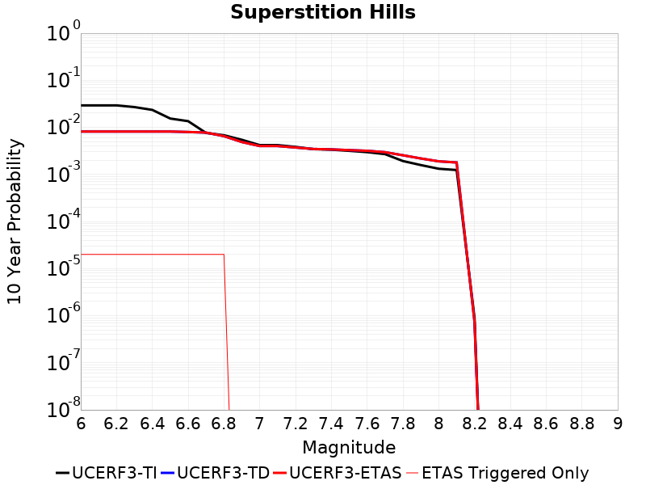
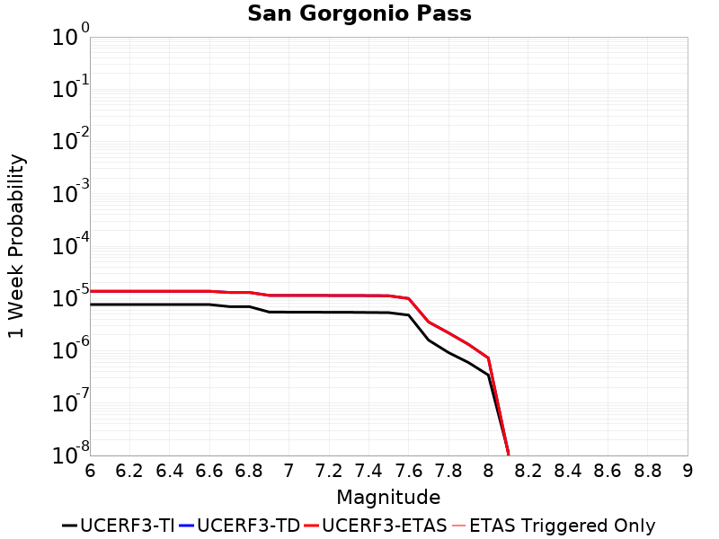
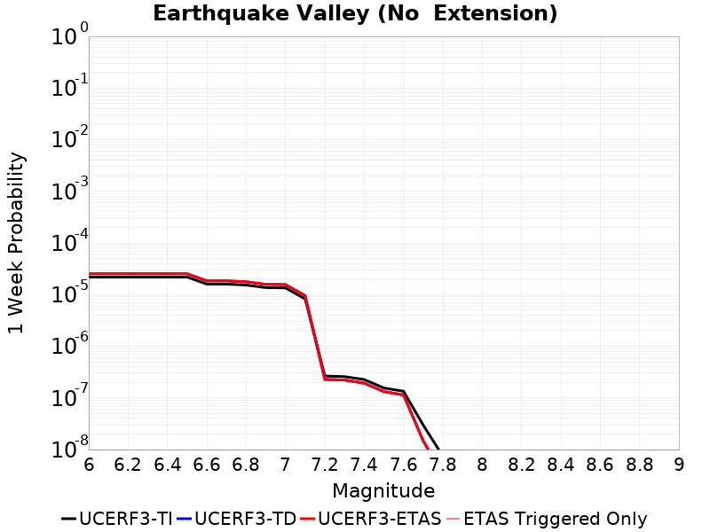

# Parent Section Magnitude-Probability Distributions

Only fault sections with at least one triggered aftershock are plotted. Sections are sorted by total supraseismogenic trigger rate (decreasing)

## Table Of Contents

* [Imperial](#imperial)
* [Brawley (Seismic Zone) alt 1](#brawley-seismic-zone-alt-1)
* [San Andreas (Coachella) rev](#san-andreas-coachella-rev)
* [San Andreas (San Gorgonio Pass-Garnet HIll)](#san-andreas-san-gorgonio-pass-garnet-hill)
* [San Andreas (San Bernardino S)](#san-andreas-san-bernardino-s)
* [San Andreas (San Bernardino N)](#san-andreas-san-bernardino-n)
* [Elmore Ranch](#elmore-ranch)
* [San Jacinto (Superstition Mtn)](#san-jacinto-superstition-mtn)
* [San Andreas (Mojave S)](#san-andreas-mojave-s)
* [Cerro Prieto](#cerro-prieto)
* [San Andreas (North Branch Mill Creek)](#san-andreas-north-branch-mill-creek)
* [San Jacinto (Borrego)](#san-jacinto-borrego)
* [Superstition Hills](#superstition-hills)
* [Blue Cut](#blue-cut)
* [Pinto Mtn](#pinto-mtn)
* [Johnson Valley (No) 2011 rev](#johnson-valley-no-2011-rev)
* [Elsinore (Glen Ivy) rev](#elsinore-glen-ivy-rev)
* [San Gorgonio Pass](#san-gorgonio-pass)
* [Bullion Mountains](#bullion-mountains)
* [San Andreas (Big Bend)](#san-andreas-big-bend)
* [Earthquake Valley (So Extension)](#earthquake-valley-so-extension)
* [Earthquake Valley (No  Extension)](#earthquake-valley-no--extension)
* [Eureka Peak](#eureka-peak)
* [Joshua Tree (Seismicity)](#joshua-tree-seismicity)
* [San Andreas (Mojave N)](#san-andreas-mojave-n)
* [San Andreas (Carrizo) rev](#san-andreas-carrizo-rev)
* [San Andreas (Cholame) rev](#san-andreas-cholame-rev)
* [Earthquake Valley](#earthquake-valley)

## Imperial
*[(top)](#table-of-contents)*

| 1 Week | 1 Month | 1 Year | 10 Year |
|-----|-----|-----|-----|
|  |  |  |  |

| Magnitude | 1 wk TI Prob | 1 wk TD Prob | 1 wk ETAS Prob | 1 wk ETAS/TD Gain | 1 wk ETAS Triggered Only | 1 mo TI Prob | 1 mo TD Prob | 1 mo ETAS Prob | 1 mo ETAS/TD Gain | 1 mo ETAS Triggered Only | 1 yr TI Prob | 1 yr TD Prob | 1 yr ETAS Prob | 1 yr ETAS/TD Gain | 1 yr ETAS Triggered Only | 10 yr TI Prob | 10 yr TD Prob | 10 yr ETAS Prob | 10 yr ETAS/TD Gain | 10 yr ETAS Triggered Only |
|-----|-----|-----|-----|-----|-----|-----|-----|-----|-----|-----|-----|-----|-----|-----|-----|-----|-----|-----|-----|-----|
| 6.0 | 2.6875173E-4 | 4.960425E-4 | 0.0012856507 | 2.5918155 | 7.9E-4 | 0.0011512847 | 0.0021242024 | 0.0033815259 | 1.5919038 | 0.00126 | 0.013927074 | 0.025549255 | 0.027624836 | 1.0812384 | 0.00213 | 0.13085878 | 0.22323042 | 0.22549859 | 1.0101607 | 0.00292 |
| 6.1 | 2.5356023E-4 | 4.960425E-4 | 0.0012856507 | 2.5918155 | 7.9E-4 | 0.001086234 | 0.0021242024 | 0.0033815259 | 1.5919038 | 0.00126 | 0.013144928 | 0.025549255 | 0.027624836 | 1.0812384 | 0.00213 | 0.123940155 | 0.22323042 | 0.22549859 | 1.0101607 | 0.00292 |
| 6.2 | 2.4820742E-4 | 4.868689E-4 | 0.0011565427 | 2.3754704 | 6.7E-4 | 0.0010633124 | 0.00208495 | 0.0031926357 | 1.5312768 | 0.00111 | 0.01286919 | 0.025083007 | 0.0269451 | 1.0742372 | 0.00191 | 0.12148927 | 0.21970448 | 0.22179568 | 1.0095181 | 0.00268 |
| 6.3 | 2.3205351E-4 | 4.6671674E-4 | 0.0010064647 | 2.1564786 | 5.4E-4 | 9.94136E-4 | 0.0019987177 | 0.0028270588 | 1.4144362 | 8.3E-4 | 0.012036599 | 0.024054402 | 0.025489042 | 1.0596415 | 0.00147 | 0.11405133 | 0.21121462 | 0.21283951 | 1.0076932 | 0.00206 |
| 6.4 | 2.0304754E-4 | 4.073039E-4 | 9.1709616E-4 | 2.2516263 | 5.1E-4 | 8.6991355E-4 | 0.001744435 | 0.0025230744 | 1.4463562 | 7.8E-4 | 0.010539869 | 0.021025905 | 0.022337731 | 1.0623909 | 0.00134 | 0.100537635 | 0.1884317 | 0.18997368 | 1.0081832 | 0.0019 |
| 6.5 | 1.854992E-4 | 3.7807284E-4 | 8.3789893E-4 | 2.2162368 | 4.6E-4 | 7.9475436E-4 | 0.0016193184 | 0.0023181848 | 1.4315807 | 7.0E-4 | 0.009633281 | 0.019526854 | 0.020703422 | 1.0602539 | 0.0012 | 0.0922623 | 0.1765246 | 0.17788334 | 1.0076971 | 0.00165 |
| 6.6 | 1.6586106E-4 | 3.4791522E-4 | 7.177865E-4 | 2.0631075 | 3.7E-4 | 7.106394E-4 | 0.0014902235 | 0.002059374 | 1.381923 | 5.7E-4 | 0.008617763 | 0.017992089 | 0.018924996 | 1.051851 | 9.5E-4 | 0.08291132 | 0.16379605 | 0.16492493 | 1.006892 | 0.00135 |
| 6.7 | 1.4224656E-4 | 3.1441014E-4 | 6.143158E-4 | 1.9538677 | 3.0E-4 | 6.094856E-4 | 0.0013467844 | 0.001806165 | 1.3410943 | 4.6E-4 | 0.0073952693 | 0.016274223 | 0.017051367 | 1.047753 | 7.9E-4 | 0.07153955 | 0.14920114 | 0.15016253 | 1.0064436 | 0.00113 |
| 6.8 | 1.2317259E-4 | 2.8478823E-4 | 5.547113E-4 | 1.9478029 | 2.7E-4 | 5.2777573E-4 | 0.0012199563 | 0.0016394439 | 1.3438547 | 4.2E-4 | 0.0064067547 | 0.014753248 | 0.01544292 | 1.0467472 | 7.0E-4 | 0.06225166 | 0.13572994 | 0.13662013 | 1.0065587 | 0.00103 |
| 6.9 | 9.859898E-5 | 2.565408E-4 | 4.8648182E-4 | 1.8963135 | 2.3E-4 | 4.2249862E-4 | 0.0010990017 | 0.0014486171 | 1.3181208 | 3.5E-4 | 0.0051317946 | 0.013299262 | 0.013861682 | 1.0422895 | 5.7E-4 | 0.05014893 | 0.12203585 | 0.12277334 | 1.0060432 | 8.4E-4 |
| 7.0 | 7.3191884E-5 | 2.1868976E-4 | 3.986504E-4 | 1.8229039 | 1.8E-4 | 3.136418E-4 | 9.369085E-4 | 0.0012166462 | 1.2985753 | 2.8E-4 | 0.003811904 | 0.011347921 | 0.0118027 | 1.040076 | 4.6E-4 | 0.037471764 | 0.10457364 | 0.10517357 | 1.005737 | 6.7E-4 |
| 7.1 | 7.1760296E-5 | 2.1568387E-4 | 3.9564504E-4 | 1.8343748 | 1.8E-4 | 3.0750787E-4 | 9.2403527E-4 | 0.0012037766 | 1.3027388 | 2.8E-4 | 0.003737482 | 0.01119281 | 0.011647661 | 1.0406379 | 4.6E-4 | 0.03675245 | 0.1032055 | 0.103806354 | 1.005822 | 6.7E-4 |
| 7.2 | 6.46614E-5 | 1.9729916E-4 | 3.4726955E-4 | 1.7601168 | 1.5E-4 | 2.7709085E-4 | 8.4529695E-4 | 0.0010950856 | 1.2955041 | 2.5E-4 | 0.0033683628 | 0.01024358 | 0.010659277 | 1.0405813 | 4.2E-4 | 0.033177625 | 0.0950027 | 0.0955457 | 1.0057156 | 6.0E-4 |
| 7.3 | 6.088115E-5 | 1.8386959E-4 | 3.2384385E-4 | 1.7612692 | 1.4E-4 | 2.6089314E-4 | 7.8777754E-4 | 0.0010275885 | 1.3044145 | 2.4E-4 | 0.0031717476 | 0.009549618 | 0.009945798 | 1.0414865 | 4.0E-4 | 0.031268585 | 0.089008674 | 0.08952794 | 1.0058339 | 5.7E-4 |
| 7.4 | 4.199346E-5 | 1.1973102E-4 | 1.8972263E-4 | 1.5845739 | 7.0E-5 | 1.7995955E-4 | 5.1303295E-4 | 6.329714E-4 | 1.2337831 | 1.2E-4 | 0.0021888057 | 0.0062284674 | 0.006427222 | 1.0319107 | 2.0E-4 | 0.02167372 | 0.059479076 | 0.059770636 | 1.0049019 | 3.1E-4 |
| 7.5 | 3.130448E-5 | 8.7165936E-5 | 1.2716245E-4 | 1.4588549 | 4.0E-5 | 1.3415517E-4 | 3.7351515E-4 | 4.2349647E-4 | 1.1338134 | 5.0E-5 | 0.0016321153 | 0.0045381286 | 0.0046177655 | 1.0175484 | 8.0E-5 | 0.016201803 | 0.043854512 | 0.043997936 | 1.0032704 | 1.5E-4 |
| 7.6 | 2.3074248E-5 | 6.40622E-5 | 1.0405964E-4 | 1.6243532 | 4.0E-5 | 9.888588E-5 | 2.7452354E-4 | 3.2450983E-4 | 1.1820837 | 5.0E-5 | 0.0012032706 | 0.0033372268 | 0.0034069933 | 1.0209055 | 7.0E-5 | 0.011967761 | 0.032486826 | 0.03260293 | 1.0035738 | 1.2E-4 |
| 7.7 | 1.45864815E-5 | 4.2751628E-5 | 6.2750776E-5 | 1.4677985 | 2.0E-5 | 6.2511994E-5 | 1.8320842E-4 | 2.1320293E-4 | 1.1637179 | 3.0E-5 | 7.608177E-4 | 0.0022282868 | 0.0022681977 | 1.017911 | 4.0E-5 | 0.007582182 | 0.021825137 | 0.021864263 | 1.0017928 | 4.0E-5 |
| 7.8 | 1.0352979E-5 | 3.315318E-5 | 5.315252E-5 | 1.6032404 | 2.0E-5 | 4.4369157E-5 | 1.4207735E-4 | 1.620745E-4 | 1.1407484 | 2.0E-5 | 5.400606E-4 | 0.0017284219 | 0.0017483874 | 1.0115513 | 2.0E-5 | 0.0053875 | 0.017014446 | 0.017034106 | 1.0011555 | 2.0E-5 |
| 7.9 | 8.137906E-6 | 2.383157E-5 | 3.3831333E-5 | 1.4196014 | 1.0E-5 | 3.4876273E-5 | 1.0213131E-4 | 1.12130285E-4 | 1.0979031 | 1.0E-5 | 4.2453592E-4 | 0.0012427405 | 0.001252728 | 1.0080367 | 1.0E-5 | 0.004237258 | 0.012396395 | 0.012406271 | 1.0007967 | 1.0E-5 |
| 8.0 | 6.93792E-6 | 1.9432455E-5 | 2.943226E-5 | 1.514593 | 1.0E-5 | 2.9733603E-5 | 8.3279294E-5 | 9.327846E-5 | 1.1200678 | 1.0E-5 | 3.6194647E-4 | 0.0010134546 | 0.0010234445 | 1.0098573 | 1.0E-5 | 0.0036135751 | 0.010164263 | 0.010174161 | 1.0009738 | 1.0E-5 |
| 8.1 | 3.4286315E-6 | 7.0255314E-6 | 7.0255314E-6 | 1.0 | 0.0 | 1.4694053E-5 | 3.0109073E-5 | 3.0109073E-5 | 1.0 | 0.0 | 1.7888541E-4 | 3.6651644E-4 | 3.6651644E-4 | 1.0 | 0.0 | 0.0017874148 | 0.0038034017 | 0.0038034017 | 1.0 | 0.0 |
| 8.2 | 1.4906886E-6 | 2.2024205E-6 | 2.2024205E-6 | 1.0 | 0.0 | 6.3886496E-6 | 9.438911E-6 | 9.438911E-6 | 1.0 | 0.0 | 7.7779034E-5 | 1.1491272E-4 | 1.1491272E-4 | 1.0 | 0.0 | 7.775182E-4 | 0.0012419608 | 0.0012419608 | 1.0 | 0.0 |
| 8.3 | 2.5758007E-8 | 1.7217188E-8 | 1.7217188E-8 | 1.0 | 0.0 | 1.10391454E-7 | 7.378795E-8 | 7.378795E-8 | 1.0 | 0.0 | 1.3440151E-6 | 8.983683E-7 | 8.983683E-7 | 1.0 | 0.0 | 1.344007E-5 | 9.3144945E-6 | 9.3144945E-6 | 1.0 | 0.0 |

## Brawley (Seismic Zone) alt 1
*[(top)](#table-of-contents)*

| 1 Week | 1 Month | 1 Year | 10 Year |
|-----|-----|-----|-----|
|  |  |  |  |

| Magnitude | 1 wk TI Prob | 1 wk TD Prob | 1 wk ETAS Prob | 1 wk ETAS/TD Gain | 1 wk ETAS Triggered Only | 1 mo TI Prob | 1 mo TD Prob | 1 mo ETAS Prob | 1 mo ETAS/TD Gain | 1 mo ETAS Triggered Only | 1 yr TI Prob | 1 yr TD Prob | 1 yr ETAS Prob | 1 yr ETAS/TD Gain | 1 yr ETAS Triggered Only | 10 yr TI Prob | 10 yr TD Prob | 10 yr ETAS Prob | 10 yr ETAS/TD Gain | 10 yr ETAS Triggered Only |
|-----|-----|-----|-----|-----|-----|-----|-----|-----|-----|-----|-----|-----|-----|-----|-----|-----|-----|-----|-----|-----|
| 6.0 | 2.2521618E-4 | 4.8236633E-4 | 0.0011220577 | 2.3261523 | 6.4E-4 | 9.6485513E-4 | 0.002065683 | 0.0029738033 | 1.4396223 | 9.1E-4 | 0.011683988 | 0.024845604 | 0.026347341 | 1.0604428 | 0.00154 | 0.11088423 | 0.21617176 | 0.21777077 | 1.0073969 | 0.00204 |
| 6.1 | 2.2521618E-4 | 4.8236633E-4 | 0.0011220577 | 2.3261523 | 6.4E-4 | 9.6485513E-4 | 0.002065683 | 0.0029738033 | 1.4396223 | 9.1E-4 | 0.011683988 | 0.024845604 | 0.026347341 | 1.0604428 | 0.00154 | 0.11088423 | 0.21617176 | 0.21777077 | 1.0073969 | 0.00204 |
| 6.2 | 2.198148E-4 | 4.7308454E-4 | 9.928385E-4 | 2.0986493 | 5.2E-4 | 9.417233E-4 | 0.0020259658 | 0.002784426 | 1.3743697 | 7.6E-4 | 0.011405343 | 0.024373513 | 0.02566134 | 1.0528371 | 0.00132 | 0.10837428 | 0.21257152 | 0.21398889 | 1.0066677 | 0.0018 |
| 6.3 | 2.1704129E-4 | 4.6749305E-4 | 9.872499E-4 | 2.111796 | 5.2E-4 | 9.298453E-4 | 0.0020020392 | 0.0027505376 | 1.373868 | 7.5E-4 | 0.011262234 | 0.02408912 | 0.025348045 | 1.0522611 | 0.00129 | 0.107082725 | 0.2104681 | 0.21185768 | 1.0066023 | 0.00176 |
| 6.4 | 1.876142E-4 | 4.071415E-4 | 8.96942E-4 | 2.203023 | 4.9E-4 | 8.038131E-4 | 0.0017437395 | 0.002442519 | 1.4007361 | 7.0E-4 | 0.00974259 | 0.021012757 | 0.022148382 | 1.0540446 | 0.00116 | 0.093263686 | 0.18728605 | 0.1885864 | 1.0069431 | 0.0016 |
| 6.5 | 1.7390939E-4 | 3.8160104E-4 | 8.2143315E-4 | 2.1525967 | 4.4E-4 | 7.45113E-4 | 0.0016344201 | 0.0022733742 | 1.3909361 | 6.4E-4 | 0.009034078 | 0.01970827 | 0.020766985 | 1.0537193 | 0.00108 | 0.086755216 | 0.17711699 | 0.17829372 | 1.0066438 | 0.00143 |
| 6.6 | 1.591791E-4 | 3.5579674E-4 | 7.1566866E-4 | 2.0114536 | 3.6E-4 | 6.8201777E-4 | 0.0015239621 | 0.0020431697 | 1.3406959 | 5.2E-4 | 0.008271996 | 0.018397935 | 0.019261746 | 1.0469514 | 8.8E-4 | 0.07970774 | 0.16653387 | 0.1675507 | 1.0061058 | 0.00122 |
| 6.7 | 1.4268003E-4 | 3.275728E-4 | 6.274745E-4 | 1.915527 | 3.0E-4 | 6.1134255E-4 | 0.0014031364 | 0.001862491 | 1.327377 | 4.6E-4 | 0.007417723 | 0.01694984 | 0.01772645 | 1.0458181 | 7.9E-4 | 0.07174956 | 0.15469483 | 0.15564157 | 1.0061201 | 0.00112 |
| 6.8 | 1.239713E-4 | 2.9771033E-4 | 5.6762993E-4 | 1.9066519 | 2.7E-4 | 5.3119735E-4 | 0.0012752839 | 0.0016947482 | 1.3289185 | 4.2E-4 | 0.0064481674 | 0.0154175265 | 0.016106734 | 1.0447029 | 7.0E-4 | 0.06264243 | 0.14124021 | 0.14211614 | 1.0062017 | 0.00102 |
| 6.9 | 1.0180238E-4 | 2.6946916E-4 | 4.994072E-4 | 1.8533 | 2.3E-4 | 4.3622297E-4 | 0.0011543612 | 0.0015039571 | 1.302848 | 3.5E-4 | 0.005298089 | 0.013964825 | 0.014526865 | 1.0402468 | 5.7E-4 | 0.05173543 | 0.12778208 | 0.12851474 | 1.0057337 | 8.4E-4 |
| 7.0 | 7.6619996E-5 | 2.305737E-4 | 4.105322E-4 | 1.7804815 | 1.8E-4 | 3.283301E-4 | 9.87802E-4 | 0.0012675255 | 1.2831776 | 2.8E-4 | 0.0039900932 | 0.011960919 | 0.0124154175 | 1.0379986 | 4.6E-4 | 0.039192066 | 0.109989084 | 0.11058539 | 1.0054215 | 6.7E-4 |
| 7.1 | 7.5127435E-5 | 2.2738558E-4 | 4.0734463E-4 | 1.7914269 | 1.8E-4 | 3.2193496E-4 | 9.74149E-4 | 0.0012538763 | 1.2871504 | 2.8E-4 | 0.0039125155 | 0.011796504 | 0.012251077 | 1.0385346 | 4.6E-4 | 0.038443442 | 0.10854891 | 0.109146185 | 1.0055023 | 6.7E-4 |
| 7.2 | 6.788582E-5 | 2.0859082E-4 | 3.5855954E-4 | 1.7189612 | 1.5E-4 | 2.9090676E-4 | 8.9365756E-4 | 0.0011434341 | 1.2794992 | 2.5E-4 | 0.0035360386 | 0.010826674 | 0.011242127 | 1.0383731 | 4.2E-4 | 0.034803 | 0.10021098 | 0.10075085 | 1.0053874 | 6.0E-4 |
| 7.3 | 6.399602E-5 | 1.947496E-4 | 3.3472234E-4 | 1.7187318 | 1.4E-4 | 2.7423984E-4 | 8.343772E-4 | 0.0010741769 | 1.2873996 | 2.4E-4 | 0.0033337586 | 0.010111847 | 0.010507802 | 1.0391575 | 4.0E-4 | 0.03284188 | 0.094061434 | 0.09457782 | 1.0054898 | 5.7E-4 |
| 7.4 | 4.506759E-5 | 1.3047042E-4 | 2.0046129E-4 | 1.53645 | 7.0E-5 | 1.9313251E-4 | 5.5904005E-4 | 6.78973E-4 | 1.2145337 | 1.2E-4 | 0.0023488526 | 0.006785258 | 0.006983901 | 1.0292757 | 2.0E-4 | 0.023241805 | 0.06462847 | 0.064918436 | 1.0044867 | 3.1E-4 |
| 7.5 | 3.43289E-5 | 9.7735836E-5 | 1.3773193E-4 | 1.4092264 | 4.0E-5 | 1.4711556E-4 | 4.1880095E-4 | 4.6878002E-4 | 1.1193385 | 5.0E-5 | 0.0017896603 | 0.005087048 | 0.005166641 | 1.0156462 | 8.0E-5 | 0.01775316 | 0.049007833 | 0.04915048 | 1.0029107 | 1.5E-4 |
| 7.6 | 2.5980507E-5 | 7.4292526E-5 | 1.1428955E-4 | 1.5383722 | 4.0E-5 | 1.1134028E-4 | 3.183578E-4 | 3.683419E-4 | 1.157006 | 5.0E-5 | 0.001354725 | 0.003869144 | 0.0039388733 | 1.0180218 | 7.0E-5 | 0.013464959 | 0.037533686 | 0.03764918 | 1.0030771 | 1.2E-4 |
| 7.7 | 1.7292105E-5 | 5.2571228E-5 | 7.2570176E-5 | 1.3804163 | 2.0E-5 | 7.4106916E-5 | 2.2528584E-4 | 2.5527907E-4 | 1.1331341 | 3.0E-5 | 9.018782E-4 | 0.0027394113 | 0.002779302 | 1.0145617 | 4.0E-5 | 0.008982267 | 0.026721016 | 0.026759947 | 1.001457 | 4.0E-5 |
| 7.8 | 1.2927471E-5 | 4.240046E-5 | 6.239961E-5 | 1.471673 | 2.0E-5 | 5.5402274E-5 | 1.8170362E-4 | 2.0169998E-4 | 1.1100494 | 2.0E-5 | 6.743139E-4 | 0.0022099998 | 0.0022299557 | 1.0090297 | 2.0E-5 | 0.0067227143 | 0.021655388 | 0.021674955 | 1.0009036 | 2.0E-5 |
| 7.9 | 1.0200774E-5 | 3.0839154E-5 | 4.0838844E-5 | 1.3242531 | 1.0E-5 | 4.371687E-5 | 1.3216112E-4 | 1.4215978E-4 | 1.0756552 | 1.0E-5 | 5.321229E-4 | 0.0016078752 | 0.0016178591 | 1.0062094 | 1.0E-5 | 0.005308505 | 0.01595367 | 0.01596351 | 1.0006168 | 1.0E-5 |
| 8.0 | 8.650396E-6 | 2.5041318E-5 | 3.5041066E-5 | 1.39933 | 1.0E-5 | 3.70726E-5 | 1.0731552E-4 | 1.1731445E-4 | 1.0931731 | 1.0E-5 | 4.5126543E-4 | 0.0013057843 | 0.0013157713 | 1.0076482 | 1.0E-5 | 0.0045035016 | 0.013026966 | 0.013036836 | 1.0007577 | 1.0E-5 |
| 8.1 | 3.9368224E-6 | 8.065187E-6 | 8.065187E-6 | 1.0 | 0.0 | 1.6871985E-5 | 3.4564633E-5 | 3.4564633E-5 | 1.0 | 0.0 | 2.0539707E-4 | 4.2074328E-4 | 4.2074328E-4 | 1.0 | 0.0 | 0.0020520731 | 0.0043632025 | 0.0043632025 | 1.0 | 0.0 |
| 8.2 | 1.7101195E-6 | 2.5206145E-6 | 2.5206145E-6 | 1.0 | 0.0 | 7.329063E-6 | 1.0802589E-5 | 1.0802589E-5 | 1.0 | 0.0 | 8.922769E-5 | 1.3151362E-4 | 1.3151362E-4 | 1.0 | 0.0 | 8.9191867E-4 | 0.0014198316 | 0.0014198316 | 1.0 | 0.0 |
| 8.3 | 3.0346666E-8 | 2.0438167E-8 | 2.0438167E-8 | 1.0 | 0.0 | 1.3005713E-7 | 8.759214E-8 | 8.759214E-8 | 1.0 | 0.0 | 1.5834444E-6 | 1.0664342E-6 | 1.0664342E-6 | 1.0 | 0.0 | 1.5834332E-5 | 1.1061686E-5 | 1.1061686E-5 | 1.0 | 0.0 |

## San Andreas (Coachella) rev
*[(top)](#table-of-contents)*

| 1 Week | 1 Month | 1 Year | 10 Year |
|-----|-----|-----|-----|
|  |  |  |  |

| Magnitude | 1 wk TI Prob | 1 wk TD Prob | 1 wk ETAS Prob | 1 wk ETAS/TD Gain | 1 wk ETAS Triggered Only | 1 mo TI Prob | 1 mo TD Prob | 1 mo ETAS Prob | 1 mo ETAS/TD Gain | 1 mo ETAS Triggered Only | 1 yr TI Prob | 1 yr TD Prob | 1 yr ETAS Prob | 1 yr ETAS/TD Gain | 1 yr ETAS Triggered Only | 10 yr TI Prob | 10 yr TD Prob | 10 yr ETAS Prob | 10 yr ETAS/TD Gain | 10 yr ETAS Triggered Only |
|-----|-----|-----|-----|-----|-----|-----|-----|-----|-----|-----|-----|-----|-----|-----|-----|-----|-----|-----|-----|-----|
| 6.0 | 1.1925945E-4 | 3.3511998E-4 | 5.450496E-4 | 1.6264312 | 2.1E-4 | 5.110118E-4 | 0.001435443 | 0.0017549836 | 1.2226077 | 3.2E-4 | 0.0062038354 | 0.017337874 | 0.017868511 | 1.0306057 | 5.4E-4 | 0.060334753 | 0.15574087 | 0.15642473 | 1.004391 | 8.1E-4 |
| 6.1 | 1.1925945E-4 | 3.3511998E-4 | 5.450496E-4 | 1.6264312 | 2.1E-4 | 5.110118E-4 | 0.001435443 | 0.0017549836 | 1.2226077 | 3.2E-4 | 0.0062038354 | 0.017337874 | 0.017868511 | 1.0306057 | 5.4E-4 | 0.060334753 | 0.15574087 | 0.15642473 | 1.004391 | 8.1E-4 |
| 6.2 | 1.07432395E-4 | 3.1005172E-4 | 5.199866E-4 | 1.6770964 | 2.1E-4 | 4.603433E-4 | 0.0013281206 | 0.0016476955 | 1.2406219 | 3.2E-4 | 0.005590286 | 0.016051136 | 0.01657263 | 1.0324894 | 5.3E-4 | 0.05451731 | 0.14493243 | 0.14561649 | 1.0047199 | 8.0E-4 |
| 6.3 | 1.0718766E-4 | 3.0950524E-4 | 5.194403E-4 | 1.6782923 | 2.1E-4 | 4.592948E-4 | 0.0013257809 | 0.0016453566 | 1.2410471 | 3.2E-4 | 0.005577586 | 0.016023071 | 0.016544579 | 1.0325474 | 5.3E-4 | 0.054396555 | 0.1447014 | 0.14538565 | 1.0047287 | 8.0E-4 |
| 6.4 | 1.0355944E-4 | 3.015717E-4 | 5.115084E-4 | 1.6961418 | 2.1E-4 | 4.4375064E-4 | 0.0012918141 | 0.0016114007 | 1.2473936 | 3.2E-4 | 0.0053892885 | 0.015615525 | 0.016137248 | 1.0334105 | 5.3E-4 | 0.052604496 | 0.14126232 | 0.14194931 | 1.0048633 | 8.0E-4 |
| 6.5 | 1.0227914E-4 | 2.9876176E-4 | 5.0869904E-4 | 1.7026912 | 2.1E-4 | 4.382655E-4 | 0.0012797833 | 0.0015993738 | 1.2497224 | 3.2E-4 | 0.0053228354 | 0.01547114 | 0.01599294 | 1.0337273 | 5.3E-4 | 0.051971316 | 0.14003995 | 0.1407279 | 1.0049126 | 8.0E-4 |
| 6.6 | 1.0116757E-4 | 2.964137E-4 | 5.0635147E-4 | 1.7082593 | 2.1E-4 | 4.3350324E-4 | 0.00126973 | 0.0015893236 | 1.2517021 | 3.2E-4 | 0.0052651367 | 0.01535047 | 0.015872335 | 1.0339966 | 5.3E-4 | 0.051421247 | 0.13901864 | 0.13970742 | 1.0049546 | 8.0E-4 |
| 6.7 | 1.0050676E-4 | 2.9499695E-4 | 5.04935E-4 | 1.7116617 | 2.1E-4 | 4.3067214E-4 | 0.0012636642 | 0.0015832598 | 1.2529118 | 3.2E-4 | 0.005230834 | 0.015277658 | 0.01579956 | 1.0341612 | 5.3E-4 | 0.051094085 | 0.13840455 | 0.13909383 | 1.0049802 | 8.0E-4 |
| 6.8 | 9.976819E-5 | 2.9302374E-4 | 5.029622E-4 | 1.7164555 | 2.1E-4 | 4.2750788E-4 | 0.0012552157 | 0.001574814 | 1.2546163 | 3.2E-4 | 0.0051924936 | 0.015176235 | 0.01569819 | 1.0343931 | 5.3E-4 | 0.050728295 | 0.13755459 | 0.13824455 | 1.0050159 | 8.0E-4 |
| 6.9 | 9.77719E-5 | 2.879768E-4 | 4.979163E-4 | 1.7290154 | 2.1E-4 | 4.1895514E-4 | 0.0012336066 | 0.0015532118 | 1.259082 | 3.2E-4 | 0.0050888555 | 0.014916777 | 0.0154388705 | 1.0350004 | 5.3E-4 | 0.049738888 | 0.135383 | 0.13607469 | 1.0051092 | 8.0E-4 |
| 7.0 | 8.500761E-5 | 2.552411E-4 | 4.3519516E-4 | 1.7050356 | 1.8E-4 | 3.6426744E-4 | 0.0010934352 | 0.0013731291 | 1.2557937 | 2.8E-4 | 0.0044259406 | 0.013232132 | 0.013686046 | 1.0343039 | 4.6E-4 | 0.04338823 | 0.12125606 | 0.12185361 | 1.004928 | 6.8E-4 |
| 7.1 | 8.319876E-5 | 2.5124353E-4 | 4.311983E-4 | 1.7162564 | 1.8E-4 | 3.5651738E-4 | 0.0010763169 | 0.0013560156 | 1.2598665 | 2.8E-4 | 0.004331963 | 0.013026229 | 0.013480237 | 1.0348533 | 4.6E-4 | 0.042484846 | 0.11947212 | 0.12007088 | 1.0050117 | 6.8E-4 |
| 7.2 | 7.563917E-5 | 2.316501E-4 | 3.8161536E-4 | 1.6473783 | 1.5E-4 | 3.2412758E-4 | 9.924116E-4 | 0.0012421635 | 1.2516617 | 2.5E-4 | 0.0039391145 | 0.012016403 | 0.012431355 | 1.0345322 | 4.2E-4 | 0.03870018 | 0.110872805 | 0.11141518 | 1.0048918 | 6.1E-4 |
| 7.3 | 7.082985E-5 | 2.1462151E-4 | 3.5459147E-4 | 1.6521711 | 1.4E-4 | 3.0352117E-4 | 9.1948523E-4 | 0.0011592646 | 1.2607756 | 2.4E-4 | 0.0036891096 | 0.011137932 | 0.011533476 | 1.0355133 | 4.0E-4 | 0.03628465 | 0.10334229 | 0.10385338 | 1.0049456 | 5.7E-4 |
| 7.4 | 5.146215E-5 | 1.4888178E-4 | 2.1887136E-4 | 1.4701017 | 7.0E-5 | 2.2053342E-4 | 6.379097E-4 | 7.578331E-4 | 1.1879944 | 1.2E-4 | 0.0026816884 | 0.007739096 | 0.007937549 | 1.0256428 | 2.0E-4 | 0.02649557 | 0.07352042 | 0.07380763 | 1.0039065 | 3.1E-4 |
| 7.5 | 4.0285166E-5 | 1.14742405E-4 | 1.5473782E-4 | 1.348567 | 4.0E-5 | 1.7263928E-4 | 4.9166085E-4 | 5.4163625E-4 | 1.1016461 | 5.0E-5 | 0.002099857 | 0.0059696166 | 0.006049139 | 1.0133212 | 8.0E-5 | 0.020801254 | 0.057372008 | 0.0575134 | 1.0024645 | 1.5E-4 |
| 7.6 | 3.1168736E-5 | 8.905536E-5 | 1.290518E-4 | 1.4491189 | 4.0E-5 | 1.3357346E-4 | 3.8161012E-4 | 4.3159103E-4 | 1.1309738 | 5.0E-5 | 0.0016250437 | 0.0046362346 | 0.00470591 | 1.0150285 | 7.0E-5 | 0.016132116 | 0.044902425 | 0.045017038 | 1.0025525 | 1.2E-4 |
| 7.7 | 2.2100989E-5 | 6.644091E-5 | 8.643958E-5 | 1.3009994 | 2.0E-5 | 9.4715084E-5 | 2.847157E-4 | 3.1470717E-4 | 1.1053382 | 3.0E-5 | 0.001152546 | 0.0034609113 | 0.0035007729 | 1.0115176 | 4.0E-5 | 0.011465867 | 0.033730596 | 0.03376925 | 1.0011458 | 4.0E-5 |
| 7.8 | 1.7484861E-5 | 5.5354245E-5 | 7.535314E-5 | 1.3612893 | 2.0E-5 | 7.493296E-5 | 2.3721093E-4 | 2.5720618E-4 | 1.0842931 | 2.0E-5 | 9.1192697E-4 | 0.0028842215 | 0.002904164 | 1.0069143 | 2.0E-5 | 0.009081938 | 0.02825028 | 0.028269717 | 1.000688 | 2.0E-5 |
| 7.9 | 1.3967285E-5 | 4.1022417E-5 | 5.1022005E-5 | 1.2437592 | 1.0E-5 | 5.985842E-5 | 1.7579852E-4 | 1.8579676E-4 | 1.0568733 | 1.0E-5 | 7.2853256E-4 | 0.0021382472 | 0.002148226 | 1.0046667 | 1.0E-5 | 0.0072614877 | 0.021196691 | 0.02120648 | 1.0004618 | 1.0E-5 |
| 8.0 | 1.1887396E-5 | 3.342944E-5 | 4.3429103E-5 | 1.2991276 | 1.0E-5 | 5.094499E-5 | 1.4326116E-4 | 1.5325972E-4 | 1.0697926 | 1.0E-5 | 6.200787E-4 | 0.0017428104 | 0.0017527929 | 1.0057279 | 1.0E-5 | 0.006183513 | 0.017374558 | 0.017384384 | 1.0005655 | 1.0E-5 |
| 8.1 | 5.100864E-6 | 9.906341E-6 | 9.906341E-6 | 1.0 | 0.0 | 2.1860664E-5 | 4.2455056E-5 | 4.2455056E-5 | 1.0 | 0.0 | 2.6612106E-4 | 5.1676785E-4 | 5.1676785E-4 | 1.0 | 0.0 | 0.002658026 | 0.0053782603 | 0.0053782603 | 1.0 | 0.0 |
| 8.2 | 2.3004484E-6 | 3.1802351E-6 | 3.1802351E-6 | 1.0 | 0.0 | 9.859027E-6 | 1.3629508E-5 | 1.3629508E-5 | 1.0 | 0.0 | 1.2002704E-4 | 1.6592667E-4 | 1.6592667E-4 | 1.0 | 0.0 | 0.0011996223 | 0.0017980607 | 0.0017980607 | 1.0 | 0.0 |
| 8.3 | 1.0424446E-7 | 6.929367E-8 | 6.929367E-8 | 1.0 | 0.0 | 4.4676187E-7 | 2.9697284E-7 | 2.9697284E-7 | 1.0 | 0.0 | 5.439312E-6 | 3.615639E-6 | 3.615639E-6 | 1.0 | 0.0 | 5.4391792E-5 | 3.7795446E-5 | 3.7795446E-5 | 1.0 | 0.0 |

## San Andreas (San Gorgonio Pass-Garnet HIll)
*[(top)](#table-of-contents)*

| 1 Week | 1 Month | 1 Year | 10 Year |
|-----|-----|-----|-----|
|  |  |  |  |

| Magnitude | 1 wk TI Prob | 1 wk TD Prob | 1 wk ETAS Prob | 1 wk ETAS/TD Gain | 1 wk ETAS Triggered Only | 1 mo TI Prob | 1 mo TD Prob | 1 mo ETAS Prob | 1 mo ETAS/TD Gain | 1 mo ETAS Triggered Only | 1 yr TI Prob | 1 yr TD Prob | 1 yr ETAS Prob | 1 yr ETAS/TD Gain | 1 yr ETAS Triggered Only | 10 yr TI Prob | 10 yr TD Prob | 10 yr ETAS Prob | 10 yr ETAS/TD Gain | 10 yr ETAS Triggered Only |
|-----|-----|-----|-----|-----|-----|-----|-----|-----|-----|-----|-----|-----|-----|-----|-----|-----|-----|-----|-----|-----|
| 6.0 | 8.31567E-5 | 2.4192008E-4 | 3.7188863E-4 | 1.5372375 | 1.3E-4 | 3.5633717E-4 | 0.0010363889 | 0.0012561609 | 1.2120556 | 2.2E-4 | 0.004329778 | 0.0125449225 | 0.012900406 | 1.0283369 | 3.6E-4 | 0.042463828 | 0.11590419 | 0.11636392 | 1.0039665 | 5.2E-4 |
| 6.1 | 8.31567E-5 | 2.4192008E-4 | 3.7188863E-4 | 1.5372375 | 1.3E-4 | 3.5633717E-4 | 0.0010363889 | 0.0012561609 | 1.2120556 | 2.2E-4 | 0.004329778 | 0.0125449225 | 0.012900406 | 1.0283369 | 3.6E-4 | 0.042463828 | 0.11590419 | 0.11636392 | 1.0039665 | 5.2E-4 |
| 6.2 | 8.31567E-5 | 2.4192008E-4 | 3.7188863E-4 | 1.5372375 | 1.3E-4 | 3.5633717E-4 | 0.0010363889 | 0.0012561609 | 1.2120556 | 2.2E-4 | 0.004329778 | 0.0125449225 | 0.012900406 | 1.0283369 | 3.6E-4 | 0.042463828 | 0.11590419 | 0.11636392 | 1.0039665 | 5.2E-4 |
| 6.3 | 8.31567E-5 | 2.4192008E-4 | 3.7188863E-4 | 1.5372375 | 1.3E-4 | 3.5633717E-4 | 0.0010363889 | 0.0012561609 | 1.2120556 | 2.2E-4 | 0.004329778 | 0.0125449225 | 0.012900406 | 1.0283369 | 3.6E-4 | 0.042463828 | 0.11590419 | 0.11636392 | 1.0039665 | 5.2E-4 |
| 6.4 | 8.059055E-5 | 2.3744024E-4 | 3.6740938E-4 | 1.5473762 | 1.3E-4 | 3.4534236E-4 | 0.0010172059 | 0.0012369822 | 1.2160587 | 2.2E-4 | 0.0041964394 | 0.012314397 | 0.012669964 | 1.028874 | 3.6E-4 | 0.041180745 | 0.1138696 | 0.11433039 | 1.0040467 | 5.2E-4 |
| 6.5 | 8.059055E-5 | 2.3744024E-4 | 3.6740938E-4 | 1.5473762 | 1.3E-4 | 3.4534236E-4 | 0.0010172059 | 0.0012369822 | 1.2160587 | 2.2E-4 | 0.0041964394 | 0.012314397 | 0.012669964 | 1.028874 | 3.6E-4 | 0.041180745 | 0.1138696 | 0.11433039 | 1.0040467 | 5.2E-4 |
| 6.6 | 7.619237E-5 | 2.2980201E-4 | 3.5977212E-4 | 1.5655744 | 1.3E-4 | 3.2649786E-4 | 9.844964E-4 | 0.0012042798 | 1.2232445 | 2.2E-4 | 0.0039678677 | 0.011920951 | 0.01227666 | 1.0298389 | 3.6E-4 | 0.03897764 | 0.1103831 | 0.1108457 | 1.0041909 | 5.2E-4 |
| 6.7 | 7.440636E-5 | 2.2652972E-4 | 3.5650027E-4 | 1.5737461 | 1.3E-4 | 3.188454E-4 | 9.7048277E-4 | 0.0011902692 | 1.2264713 | 2.2E-4 | 0.0038750346 | 0.011752185 | 0.012107954 | 1.0302726 | 3.6E-4 | 0.038081564 | 0.1088837 | 0.10934708 | 1.0042558 | 5.2E-4 |
| 6.8 | 7.3735864E-5 | 2.2498128E-4 | 3.5495203E-4 | 1.5776958 | 1.3E-4 | 3.1597257E-4 | 9.638516E-4 | 0.0011836395 | 1.2280309 | 2.2E-4 | 0.0038401815 | 0.011672321 | 0.012028119 | 1.0304822 | 3.6E-4 | 0.03774495 | 0.10817911 | 0.108642854 | 1.0042869 | 5.2E-4 |
| 6.9 | 7.27575E-5 | 2.2265008E-4 | 3.5262114E-4 | 1.5837458 | 1.3E-4 | 3.117806E-4 | 9.5386803E-4 | 0.0011736582 | 1.2304199 | 2.2E-4 | 0.003789323 | 0.011552067 | 0.011907908 | 1.0308032 | 3.6E-4 | 0.037253562 | 0.10712196 | 0.10758626 | 1.0043343 | 5.2E-4 |
| 7.0 | 7.102591E-5 | 2.1844351E-4 | 3.484151E-4 | 1.5949895 | 1.3E-4 | 3.0436125E-4 | 9.3585294E-4 | 0.001155647 | 1.2348597 | 2.2E-4 | 0.003699303 | 0.011335033 | 0.011690953 | 1.0314 | 3.6E-4 | 0.03638325 | 0.10521123 | 0.10567652 | 1.0044224 | 5.2E-4 |
| 7.1 | 7.028513E-5 | 2.1677543E-4 | 3.4674726E-4 | 1.599569 | 1.3E-4 | 3.0118722E-4 | 9.287091E-4 | 0.0011485048 | 1.236668 | 2.2E-4 | 0.0036607897 | 0.011248959 | 0.01160491 | 1.0316429 | 3.6E-4 | 0.036010686 | 0.10444659 | 0.10491227 | 1.0044587 | 5.2E-4 |
| 7.2 | 6.8498244E-5 | 2.1279647E-4 | 3.427688E-4 | 1.6107824 | 1.3E-4 | 2.9353087E-4 | 9.116684E-4 | 0.0011314679 | 1.2410958 | 2.2E-4 | 0.003567883 | 0.011043608 | 0.011399632 | 1.032238 | 3.6E-4 | 0.035111405 | 0.102620326 | 0.10308696 | 1.0045472 | 5.2E-4 |
| 7.3 | 6.622592E-5 | 2.0494324E-4 | 3.349166E-4 | 1.634192 | 1.3E-4 | 2.8379448E-4 | 8.780348E-4 | 0.0010978417 | 1.2503395 | 2.2E-4 | 0.0034497243 | 0.010638189 | 0.010994359 | 1.0334804 | 3.6E-4 | 0.033966612 | 0.09907614 | 0.09953561 | 1.0046376 | 5.1E-4 |
| 7.4 | 5.1050705E-5 | 1.5346218E-4 | 2.2345145E-4 | 1.4560684 | 7.0E-5 | 2.1877038E-4 | 6.5753027E-4 | 7.774514E-4 | 1.1823812 | 1.2E-4 | 0.002660276 | 0.0079762535 | 0.008164738 | 1.0236307 | 1.9E-4 | 0.02628654 | 0.07569606 | 0.075973354 | 1.0036632 | 3.0E-4 |
| 7.5 | 3.9302922E-5 | 1.16981006E-4 | 1.5697633E-4 | 1.3418958 | 4.0E-5 | 1.6843023E-4 | 5.012512E-4 | 5.5122614E-4 | 1.0997003 | 5.0E-5 | 0.0020487092 | 0.0060857325 | 0.0061553065 | 1.0114323 | 7.0E-5 | 0.020299247 | 0.058509827 | 0.05864164 | 1.0022528 | 1.4E-4 |
| 7.6 | 2.9851626E-5 | 8.993222E-5 | 1.2992862E-4 | 1.4447395 | 4.0E-5 | 1.2792926E-4 | 3.85367E-4 | 4.3534773E-4 | 1.1296965 | 5.0E-5 | 0.0015564259 | 0.0046817777 | 0.004741497 | 1.0127556 | 6.0E-5 | 0.0154556995 | 0.045413002 | 0.045518007 | 1.0023122 | 1.1E-4 |
| 7.7 | 2.1135214E-5 | 6.790655E-5 | 8.7905195E-5 | 1.2945024 | 2.0E-5 | 9.0576345E-5 | 2.9099564E-4 | 3.209869E-4 | 1.1030643 | 3.0E-5 | 0.0011022091 | 0.0035371229 | 0.0035670167 | 1.0084515 | 3.0E-5 | 0.010967582 | 0.0345451 | 0.034574065 | 1.0008384 | 3.0E-5 |
| 7.8 | 1.883379E-5 | 5.9602186E-5 | 7.960099E-5 | 1.3355381 | 2.0E-5 | 8.0713755E-5 | 2.5541295E-4 | 2.7540786E-4 | 1.0782846 | 2.0E-5 | 9.822468E-4 | 0.0031052222 | 0.0031251602 | 1.0064207 | 2.0E-5 | 0.0097791655 | 0.030479677 | 0.030499067 | 1.0006362 | 2.0E-5 |
| 7.9 | 1.5156185E-5 | 4.4785305E-5 | 5.4784858E-5 | 1.2232776 | 1.0E-5 | 6.495346E-5 | 1.9192293E-4 | 2.01921E-4 | 1.0520942 | 1.0E-5 | 7.9052144E-4 | 0.002334159 | 0.0023441357 | 1.0042742 | 1.0E-5 | 0.007877152 | 0.023188462 | 0.02319823 | 1.0004213 | 1.0E-5 |
| 8.0 | 1.1405907E-5 | 3.228181E-5 | 4.228149E-5 | 1.309762 | 1.0E-5 | 4.8881542E-5 | 1.3834328E-4 | 1.483419E-4 | 1.072274 | 1.0E-5 | 5.9497025E-4 | 0.0016830293 | 0.0016930125 | 1.0059316 | 1.0E-5 | 0.005933798 | 0.016837966 | 0.016847797 | 1.0005839 | 1.0E-5 |
| 8.1 | 4.3511436E-6 | 8.183221E-6 | 8.183221E-6 | 1.0 | 0.0 | 1.8647626E-5 | 3.5070476E-5 | 3.5070476E-5 | 1.0 | 0.0 | 2.2701119E-4 | 4.2689955E-4 | 4.2689955E-4 | 1.0 | 0.0 | 0.0022677942 | 0.0045178547 | 0.0045178547 | 1.0 | 0.0 |
| 8.2 | 2.3042528E-6 | 3.1282625E-6 | 3.1282625E-6 | 1.0 | 0.0 | 9.875332E-6 | 1.3406771E-5 | 1.3406771E-5 | 1.0 | 0.0 | 1.2022553E-4 | 1.6321527E-4 | 1.6321527E-4 | 1.0 | 0.0 | 0.0012016051 | 0.0018012342 | 0.0018012342 | 1.0 | 0.0 |
| 8.3 | 5.202968E-7 | 3.7540588E-7 | 3.7540588E-7 | 1.0 | 0.0 | 2.2298414E-6 | 1.6088815E-6 | 1.6088815E-6 | 1.0 | 0.0 | 2.714798E-5 | 1.9587973E-5 | 1.9587973E-5 | 1.0 | 0.0 | 2.7144665E-4 | 2.2834641E-4 | 2.2834641E-4 | 1.0 | 0.0 |

## San Andreas (San Bernardino S)
*[(top)](#table-of-contents)*

| 1 Week | 1 Month | 1 Year | 10 Year |
|-----|-----|-----|-----|
|  |  |  |  |

| Magnitude | 1 wk TI Prob | 1 wk TD Prob | 1 wk ETAS Prob | 1 wk ETAS/TD Gain | 1 wk ETAS Triggered Only | 1 mo TI Prob | 1 mo TD Prob | 1 mo ETAS Prob | 1 mo ETAS/TD Gain | 1 mo ETAS Triggered Only | 1 yr TI Prob | 1 yr TD Prob | 1 yr ETAS Prob | 1 yr ETAS/TD Gain | 1 yr ETAS Triggered Only | 10 yr TI Prob | 10 yr TD Prob | 10 yr ETAS Prob | 10 yr ETAS/TD Gain | 10 yr ETAS Triggered Only |
|-----|-----|-----|-----|-----|-----|-----|-----|-----|-----|-----|-----|-----|-----|-----|-----|-----|-----|-----|-----|-----|
| 6.0 | 1.2336002E-4 | 3.100518E-4 | 3.500394E-4 | 1.1289707 | 4.0E-5 | 5.2857865E-4 | 0.0013281438 | 0.0013780773 | 1.0375966 | 5.0E-5 | 0.006416472 | 0.016055424 | 0.016124299 | 1.0042899 | 7.0E-5 | 0.06234337 | 0.14669098 | 0.1468019 | 1.0007563 | 1.3E-4 |
| 6.1 | 1.2336002E-4 | 3.100518E-4 | 3.500394E-4 | 1.1289707 | 4.0E-5 | 5.2857865E-4 | 0.0013281438 | 0.0013780773 | 1.0375966 | 5.0E-5 | 0.006416472 | 0.016055424 | 0.016124299 | 1.0042899 | 7.0E-5 | 0.06234337 | 0.14669098 | 0.1468019 | 1.0007563 | 1.3E-4 |
| 6.2 | 1.2336002E-4 | 3.100518E-4 | 3.500394E-4 | 1.1289707 | 4.0E-5 | 5.2857865E-4 | 0.0013281438 | 0.0013780773 | 1.0375966 | 5.0E-5 | 0.006416472 | 0.016055424 | 0.016124299 | 1.0042899 | 7.0E-5 | 0.06234337 | 0.14669098 | 0.1468019 | 1.0007563 | 1.3E-4 |
| 6.3 | 1.1712257E-4 | 2.978132E-4 | 3.3780132E-4 | 1.1342723 | 4.0E-5 | 5.018573E-4 | 0.0012757446 | 0.0013256809 | 1.0391428 | 5.0E-5 | 0.006093008 | 0.015426618 | 0.015495538 | 1.0044676 | 7.0E-5 | 0.059286322 | 0.1413718 | 0.14148341 | 1.0007895 | 1.3E-4 |
| 6.4 | 1.1712257E-4 | 2.978132E-4 | 3.3780132E-4 | 1.1342723 | 4.0E-5 | 5.018573E-4 | 0.0012757446 | 0.0013256809 | 1.0391428 | 5.0E-5 | 0.006093008 | 0.015426618 | 0.015495538 | 1.0044676 | 7.0E-5 | 0.059286322 | 0.1413718 | 0.14148341 | 1.0007895 | 1.3E-4 |
| 6.5 | 1.0689076E-4 | 2.7774295E-4 | 3.1773184E-4 | 1.143978 | 4.0E-5 | 4.5802278E-4 | 0.0011898096 | 0.0012397502 | 1.0419735 | 5.0E-5 | 0.0055621783 | 0.0143945245 | 0.014463517 | 1.0047929 | 7.0E-5 | 0.05425003 | 0.13256893 | 0.13268168 | 1.0008507 | 1.3E-4 |
| 6.6 | 9.7648895E-5 | 2.599931E-4 | 2.999827E-4 | 1.1538103 | 4.0E-5 | 4.1842813E-4 | 0.0011138049 | 0.0011637491 | 1.0448412 | 5.0E-5 | 0.005082469 | 0.013480805 | 0.0135498615 | 1.0051225 | 7.0E-5 | 0.049677886 | 0.12469992 | 0.124813706 | 1.0009125 | 1.3E-4 |
| 6.7 | 8.757013E-5 | 2.4050273E-4 | 2.804931E-4 | 1.1662782 | 4.0E-5 | 3.7524657E-4 | 0.001030342 | 0.0010802905 | 1.0484775 | 5.0E-5 | 0.00455906 | 0.012476519 | 0.012545645 | 1.0055405 | 7.0E-5 | 0.04466656 | 0.115936965 | 0.11605189 | 1.0009913 | 1.3E-4 |
| 6.8 | 8.562978E-5 | 2.36018E-4 | 2.7600853E-4 | 1.1694386 | 4.0E-5 | 3.6693315E-4 | 0.0010111367 | 0.0010610861 | 1.0493993 | 5.0E-5 | 0.004458263 | 0.0122453375 | 0.01231448 | 1.0056465 | 7.0E-5 | 0.043698758 | 0.11391633 | 0.11403152 | 1.0010111 | 1.3E-4 |
| 6.9 | 6.124075E-5 | 1.7880581E-4 | 2.1879867E-4 | 1.2236664 | 4.0E-5 | 2.6243398E-4 | 7.6608645E-4 | 8.160481E-4 | 1.0652168 | 5.0E-5 | 0.0031904527 | 0.009287439 | 0.009356789 | 1.007467 | 7.0E-5 | 0.031450346 | 0.08765597 | 0.087774575 | 1.001353 | 1.3E-4 |
| 7.0 | 5.8598747E-5 | 1.7298933E-4 | 2.1298241E-4 | 1.2311882 | 4.0E-5 | 2.5111332E-4 | 7.4117305E-4 | 7.91136E-4 | 1.0674106 | 5.0E-5 | 0.0030530186 | 0.0089866575 | 0.009056029 | 1.0077193 | 7.0E-5 | 0.03011414 | 0.08493954 | 0.0850585 | 1.0014005 | 1.3E-4 |
| 7.1 | 5.613814E-5 | 1.670747E-4 | 2.07068E-4 | 1.2393739 | 4.0E-5 | 2.4056983E-4 | 7.158387E-4 | 7.658029E-4 | 1.0697981 | 5.0E-5 | 0.0029250039 | 0.008680706 | 0.008750098 | 1.0079938 | 7.0E-5 | 0.028868021 | 0.08220257 | 0.08232188 | 1.0014515 | 1.3E-4 |
| 7.2 | 4.991222E-5 | 1.5289769E-4 | 1.9289156E-4 | 1.2615728 | 4.0E-5 | 2.1389198E-4 | 6.551116E-4 | 7.050789E-4 | 1.0762728 | 5.0E-5 | 0.002601025 | 0.007946929 | 0.008016373 | 1.0087384 | 7.0E-5 | 0.025707912 | 0.07556781 | 0.07568799 | 1.0015903 | 1.3E-4 |
| 7.3 | 4.7410045E-5 | 1.4462663E-4 | 1.8462083E-4 | 1.2765342 | 4.0E-5 | 2.0317009E-4 | 6.196815E-4 | 6.696505E-4 | 1.0806366 | 5.0E-5 | 0.0024707897 | 0.0075186184 | 0.0075880922 | 1.0092403 | 7.0E-5 | 0.024434982 | 0.071774386 | 0.071895055 | 1.0016812 | 1.3E-4 |
| 7.4 | 4.5556746E-5 | 1.3854496E-4 | 1.7853941E-4 | 1.288675 | 4.0E-5 | 1.952286E-4 | 5.936293E-4 | 6.435996E-4 | 1.0841776 | 5.0E-5 | 0.002374317 | 0.0072035734 | 0.007273069 | 1.0096474 | 7.0E-5 | 0.023491086 | 0.0689693 | 0.06909033 | 1.0017549 | 1.3E-4 |
| 7.5 | 4.3084514E-5 | 1.3070313E-4 | 1.7069791E-4 | 1.305997 | 4.0E-5 | 1.8463485E-4 | 5.6003634E-4 | 6.1000837E-4 | 1.08923 | 5.0E-5 | 0.0022456115 | 0.006797205 | 0.0068667294 | 1.0102284 | 7.0E-5 | 0.022230545 | 0.065299965 | 0.06542148 | 1.0018609 | 1.3E-4 |
| 7.6 | 3.408608E-5 | 1.048079E-4 | 1.4480371E-4 | 1.3816106 | 4.0E-5 | 1.4607502E-4 | 4.490995E-4 | 4.99077E-4 | 1.1112839 | 5.0E-5 | 0.0017770125 | 0.0054541077 | 0.0055137803 | 1.0109409 | 6.0E-5 | 0.017628696 | 0.05286984 | 0.052964553 | 1.0017915 | 1.0E-4 |
| 7.7 | 2.8315713E-5 | 8.848323E-5 | 1.0848146E-4 | 1.2260115 | 2.0E-5 | 1.2134742E-4 | 3.7915877E-4 | 4.0914738E-4 | 1.0790925 | 3.0E-5 | 0.0014764034 | 0.004606498 | 0.00463636 | 1.0064825 | 3.0E-5 | 0.01466633 | 0.04493988 | 0.044968534 | 1.0006375 | 3.0E-5 |
| 7.8 | 2.6222975E-5 | 8.016914E-5 | 1.0016754E-4 | 1.2494526 | 2.0E-5 | 1.1237934E-4 | 3.435368E-4 | 3.6352995E-4 | 1.058198 | 2.0E-5 | 0.0013673597 | 0.0041745473 | 0.0041944636 | 1.004771 | 2.0E-5 | 0.013589768 | 0.040913753 | 0.040932935 | 1.0004689 | 2.0E-5 |
| 7.9 | 2.1469694E-5 | 6.2297644E-5 | 7.229702E-5 | 1.1605097 | 1.0E-5 | 9.200973E-5 | 2.669626E-4 | 2.769599E-4 | 1.0374484 | 1.0E-5 | 0.0011196428 | 0.0032454291 | 0.0032553966 | 1.0030713 | 1.0E-5 | 0.011140184 | 0.0321563 | 0.032165978 | 1.000301 | 1.0E-5 |
| 8.0 | 1.2420249E-5 | 3.3766337E-5 | 4.3766E-5 | 1.2961429 | 1.0E-5 | 5.322855E-5 | 1.4470486E-4 | 1.547034E-4 | 1.0690962 | 1.0E-5 | 6.478649E-4 | 0.001760359 | 0.0017703414 | 1.0056707 | 1.0E-5 | 0.0064597935 | 0.017656863 | 0.017666686 | 1.0005563 | 1.0E-5 |
| 8.1 | 4.9197724E-6 | 8.70586E-6 | 8.70586E-6 | 1.0 | 0.0 | 2.1084568E-5 | 3.7310292E-5 | 3.7310292E-5 | 1.0 | 0.0 | 2.566744E-4 | 4.541583E-4 | 4.541583E-4 | 1.0 | 0.0 | 0.002563781 | 0.004822959 | 0.004822959 | 1.0 | 0.0 |
| 8.2 | 2.5634774E-6 | 3.3312465E-6 | 3.3312465E-6 | 1.0 | 0.0 | 1.0986286E-5 | 1.4276693E-5 | 1.4276693E-5 | 1.0 | 0.0 | 1.3374983E-4 | 1.7380493E-4 | 1.7380493E-4 | 1.0 | 0.0 | 0.0013366934 | 0.0019241375 | 0.0019241375 | 1.0 | 0.0 |
| 8.3 | 5.2850464E-7 | 3.812266E-7 | 3.812266E-7 | 1.0 | 0.0 | 2.2650179E-6 | 1.6338273E-6 | 1.6338273E-6 | 1.0 | 0.0 | 2.7576245E-5 | 1.9891684E-5 | 1.9891684E-5 | 1.0 | 0.0 | 2.7572823E-4 | 2.3191824E-4 | 2.3191824E-4 | 1.0 | 0.0 |

## San Andreas (San Bernardino N)
*[(top)](#table-of-contents)*

| 1 Week | 1 Month | 1 Year | 10 Year |
|-----|-----|-----|-----|
|  |  |  |  |

| Magnitude | 1 wk TI Prob | 1 wk TD Prob | 1 wk ETAS Prob | 1 wk ETAS/TD Gain | 1 wk ETAS Triggered Only | 1 mo TI Prob | 1 mo TD Prob | 1 mo ETAS Prob | 1 mo ETAS/TD Gain | 1 mo ETAS Triggered Only | 1 yr TI Prob | 1 yr TD Prob | 1 yr ETAS Prob | 1 yr ETAS/TD Gain | 1 yr ETAS Triggered Only | 10 yr TI Prob | 10 yr TD Prob | 10 yr ETAS Prob | 10 yr ETAS/TD Gain | 10 yr ETAS Triggered Only |
|-----|-----|-----|-----|-----|-----|-----|-----|-----|-----|-----|-----|-----|-----|-----|-----|-----|-----|-----|-----|-----|
| 6.0 | 1.4273766E-4 | 3.3053884E-4 | 3.6052894E-4 | 1.0907309 | 3.0E-5 | 6.115894E-4 | 0.0014158321 | 0.0014557755 | 1.028212 | 4.0E-5 | 0.0074207084 | 0.017103104 | 0.01714242 | 1.0022987 | 4.0E-5 | 0.07177748 | 0.15616527 | 0.15623279 | 1.0004323 | 8.0E-5 |
| 6.1 | 1.4273766E-4 | 3.3053884E-4 | 3.6052894E-4 | 1.0907309 | 3.0E-5 | 6.115894E-4 | 0.0014158321 | 0.0014557755 | 1.028212 | 4.0E-5 | 0.0074207084 | 0.017103104 | 0.01714242 | 1.0022987 | 4.0E-5 | 0.07177748 | 0.15616527 | 0.15623279 | 1.0004323 | 8.0E-5 |
| 6.2 | 1.4273766E-4 | 3.3053884E-4 | 3.6052894E-4 | 1.0907309 | 3.0E-5 | 6.115894E-4 | 0.0014158321 | 0.0014557755 | 1.028212 | 4.0E-5 | 0.0074207084 | 0.017103104 | 0.01714242 | 1.0022987 | 4.0E-5 | 0.07177748 | 0.15616527 | 0.15623279 | 1.0004323 | 8.0E-5 |
| 6.3 | 1.3730655E-4 | 3.1949967E-4 | 3.4949006E-4 | 1.0938668 | 3.0E-5 | 5.883239E-4 | 0.0013685715 | 0.0014085168 | 1.0291876 | 4.0E-5 | 0.0071393442 | 0.016536547 | 0.016575886 | 1.002379 | 4.0E-5 | 0.06914291 | 0.15146591 | 0.15153378 | 1.0004482 | 8.0E-5 |
| 6.4 | 1.3730655E-4 | 3.1949967E-4 | 3.4949006E-4 | 1.0938668 | 3.0E-5 | 5.883239E-4 | 0.0013685715 | 0.0014085168 | 1.0291876 | 4.0E-5 | 0.0071393442 | 0.016536547 | 0.016575886 | 1.002379 | 4.0E-5 | 0.06914291 | 0.15146591 | 0.15153378 | 1.0004482 | 8.0E-5 |
| 6.5 | 1.2942807E-4 | 3.035156E-4 | 3.3350653E-4 | 1.0988117 | 3.0E-5 | 5.545738E-4 | 0.0013001381 | 0.001340086 | 1.030726 | 4.0E-5 | 0.0067310524 | 0.01571562 | 0.01575499 | 1.0025052 | 4.0E-5 | 0.06530788 | 0.14461048 | 0.14467892 | 1.0004733 | 8.0E-5 |
| 6.6 | 1.1125901E-4 | 2.6756496E-4 | 2.9755695E-4 | 1.1120923 | 3.0E-5 | 4.767372E-4 | 0.0011462055 | 0.0011861597 | 1.0348577 | 4.0E-5 | 0.005788839 | 0.013866446 | 0.013905891 | 1.0028447 | 4.0E-5 | 0.056403454 | 0.12887838 | 0.12894808 | 1.0005407 | 8.0E-5 |
| 6.7 | 1.02209575E-4 | 2.4878824E-4 | 2.787808E-4 | 1.1205544 | 3.0E-5 | 4.3796748E-4 | 0.0010658011 | 0.0011057585 | 1.0374905 | 4.0E-5 | 0.0053192247 | 0.012899392 | 0.012938876 | 1.0030609 | 4.0E-5 | 0.051936906 | 0.12065007 | 0.12072042 | 1.000583 | 8.0E-5 |
| 6.8 | 9.610582E-5 | 2.3381283E-4 | 2.638058E-4 | 1.1282778 | 3.0E-5 | 4.1181705E-4 | 0.0010016708 | 0.0010416307 | 1.0398933 | 4.0E-5 | 0.0050023515 | 0.012127452 | 0.012166966 | 1.0032583 | 4.0E-5 | 0.048912346 | 0.1140111 | 0.11408198 | 1.0006217 | 8.0E-5 |
| 6.9 | 9.3877505E-5 | 2.2829819E-4 | 2.5829134E-4 | 1.1313771 | 3.0E-5 | 4.0227012E-4 | 9.780546E-4 | 0.0010180156 | 1.0408576 | 4.0E-5 | 0.0048866454 | 0.01184308 | 0.011882606 | 1.0033375 | 4.0E-5 | 0.04780577 | 0.11158722 | 0.1116583 | 1.0006369 | 8.0E-5 |
| 7.0 | 9.1019785E-5 | 2.2146184E-4 | 2.514552E-4 | 1.1354336 | 3.0E-5 | 3.900265E-4 | 9.487776E-4 | 9.887397E-4 | 1.0421195 | 4.0E-5 | 0.0047382377 | 0.011490443 | 0.011529984 | 1.0034411 | 4.0E-5 | 0.046384744 | 0.10853346 | 0.108604774 | 1.0006571 | 8.0E-5 |
| 7.1 | 8.771155E-5 | 2.1308468E-4 | 2.4307829E-4 | 1.1407591 | 3.0E-5 | 3.758525E-4 | 9.129011E-4 | 9.5286453E-4 | 1.0437764 | 4.0E-5 | 0.0045664064 | 0.0110581545 | 0.011097712 | 1.0035772 | 4.0E-5 | 0.044737056 | 0.10481816 | 0.10488977 | 1.0006832 | 8.0E-5 |
| 7.2 | 8.0830236E-5 | 1.9687963E-4 | 2.2687373E-4 | 1.1523473 | 3.0E-5 | 3.4636928E-4 | 8.4349717E-4 | 8.834634E-4 | 1.0473816 | 4.0E-5 | 0.0042088944 | 0.01022135 | 0.010260941 | 1.0038733 | 4.0E-5 | 0.041300658 | 0.09748289 | 0.09754606 | 1.000648 | 7.0E-5 |
| 7.3 | 7.7668235E-5 | 1.8603496E-4 | 2.1602938E-4 | 1.16123 | 3.0E-5 | 3.328214E-4 | 7.970492E-4 | 8.370173E-4 | 1.0501451 | 4.0E-5 | 0.0040445733 | 0.009660995 | 0.0097006075 | 1.0041003 | 4.0E-5 | 0.03971748 | 0.09266625 | 0.09272977 | 1.0006855 | 7.0E-5 |
| 7.4 | 7.520177E-5 | 1.7801559E-4 | 2.0801026E-4 | 1.1684946 | 3.0E-5 | 3.2225347E-4 | 7.62701E-4 | 8.026705E-4 | 1.0524052 | 4.0E-5 | 0.0039163795 | 0.009246431 | 0.009286062 | 1.004286 | 4.0E-5 | 0.038480744 | 0.08905521 | 0.08911897 | 1.000716 | 7.0E-5 |
| 7.5 | 7.274697E-5 | 1.7068675E-4 | 2.0068162E-4 | 1.1757306 | 3.0E-5 | 3.1173544E-4 | 7.313096E-4 | 7.712803E-4 | 1.0546564 | 4.0E-5 | 0.003788775 | 0.008867417 | 0.008907063 | 1.004471 | 4.0E-5 | 0.03724827 | 0.085706994 | 0.085770994 | 1.0007467 | 7.0E-5 |
| 7.6 | 7.1185845E-5 | 1.6625457E-4 | 1.9624957E-4 | 1.1804162 | 3.0E-5 | 3.0504653E-4 | 7.1232504E-4 | 7.522966E-4 | 1.0561142 | 4.0E-5 | 0.0037076178 | 0.008638138 | 0.008677792 | 1.0045906 | 4.0E-5 | 0.036463667 | 0.08365382 | 0.083717965 | 1.0007668 | 7.0E-5 |
| 7.7 | 6.709961E-5 | 1.5499731E-4 | 1.7499422E-4 | 1.1290145 | 2.0E-5 | 2.8753807E-4 | 6.641051E-4 | 6.940852E-4 | 1.0451436 | 3.0E-5 | 0.003495157 | 0.008055555 | 0.008085313 | 1.0036942 | 3.0E-5 | 0.034406938 | 0.07836173 | 0.07838938 | 1.0003529 | 3.0E-5 |
| 7.8 | 6.300812E-5 | 1.4310594E-4 | 1.6310306E-4 | 1.1397367 | 2.0E-5 | 2.7000686E-4 | 6.13167E-4 | 6.331547E-4 | 1.0325975 | 2.0E-5 | 0.0032823787 | 0.0074397926 | 0.0074596438 | 1.0026683 | 2.0E-5 | 0.032343175 | 0.07272826 | 0.072746806 | 1.000255 | 2.0E-5 |
| 7.9 | 4.983037E-5 | 1.0563111E-4 | 1.1563005E-4 | 1.0946591 | 1.0E-5 | 2.1354125E-4 | 4.5262623E-4 | 4.6262168E-4 | 1.0220833 | 1.0E-5 | 0.0025967648 | 0.0054968135 | 0.0055067586 | 1.0018092 | 1.0E-5 | 0.025666296 | 0.054555733 | 0.054565184 | 1.0001733 | 1.0E-5 |
| 8.0 | 3.2211527E-5 | 5.8285626E-5 | 6.8285044E-5 | 1.1715589 | 1.0E-5 | 1.380421E-4 | 2.4977163E-4 | 2.5976912E-4 | 1.0400265 | 1.0E-5 | 0.0016793669 | 0.0030367314 | 0.003046701 | 1.003283 | 1.0E-5 | 0.016667323 | 0.030777175 | 0.030786868 | 1.000315 | 1.0E-5 |
| 8.1 | 1.743376E-5 | 2.1151916E-5 | 2.1151916E-5 | 1.0 | 0.0 | 7.471398E-5 | 9.064792E-5 | 9.064792E-5 | 1.0 | 0.0 | 9.0926304E-4 | 0.0011030805 | 0.0011030805 | 1.0 | 0.0 | 0.009055517 | 0.011684249 | 0.011684249 | 1.0 | 0.0 |
| 8.2 | 7.831616E-6 | 6.031215E-6 | 6.031215E-6 | 1.0 | 0.0 | 3.3563636E-5 | 2.5847809E-5 | 2.5847809E-5 | 1.0 | 0.0 | 4.0856065E-4 | 3.1465173E-4 | 3.1465173E-4 | 1.0 | 0.0 | 0.004078103 | 0.0035126181 | 0.0035126181 | 1.0 | 0.0 |
| 8.3 | 1.983087E-6 | 9.324986E-7 | 9.324986E-7 | 1.0 | 0.0 | 8.498917E-6 | 3.9964166E-6 | 3.9964166E-6 | 1.0 | 0.0 | 1.034694E-4 | 4.865531E-5 | 4.865531E-5 | 1.0 | 0.0 | 0.0010342124 | 5.6606415E-4 | 5.6606415E-4 | 1.0 | 0.0 |

## Elmore Ranch
*[(top)](#table-of-contents)*

| 1 Week | 1 Month | 1 Year | 10 Year |
|-----|-----|-----|-----|
|  |  |  |  |

| Magnitude | 1 wk TI Prob | 1 wk TD Prob | 1 wk ETAS Prob | 1 wk ETAS/TD Gain | 1 wk ETAS Triggered Only | 1 mo TI Prob | 1 mo TD Prob | 1 mo ETAS Prob | 1 mo ETAS/TD Gain | 1 mo ETAS Triggered Only | 1 yr TI Prob | 1 yr TD Prob | 1 yr ETAS Prob | 1 yr ETAS/TD Gain | 1 yr ETAS Triggered Only | 10 yr TI Prob | 10 yr TD Prob | 10 yr ETAS Prob | 10 yr ETAS/TD Gain | 10 yr ETAS Triggered Only |
|-----|-----|-----|-----|-----|-----|-----|-----|-----|-----|-----|-----|-----|-----|-----|-----|-----|-----|-----|-----|-----|
| 6.0 | 5.6540124E-5 | 3.5299403E-5 | 5.5298697E-5 | 1.5665618 | 2.0E-5 | 2.4229231E-4 | 1.5127727E-4 | 1.8127274E-4 | 1.1982813 | 3.0E-5 | 0.0029459186 | 0.001840732 | 0.0018706768 | 1.0162679 | 3.0E-5 | 0.029071707 | 0.018329872 | 0.018398589 | 1.0037489 | 7.0E-5 |
| 6.1 | 3.8306698E-5 | 3.5299403E-5 | 5.5298697E-5 | 1.5665618 | 2.0E-5 | 1.6416123E-4 | 1.5127727E-4 | 1.8127274E-4 | 1.1982813 | 3.0E-5 | 0.0019968306 | 0.001840732 | 0.0018706768 | 1.0162679 | 3.0E-5 | 0.019789828 | 0.018329872 | 0.018398589 | 1.0037489 | 7.0E-5 |
| 6.2 | 3.8306698E-5 | 3.5299403E-5 | 5.5298697E-5 | 1.5665618 | 2.0E-5 | 1.6416123E-4 | 1.5127727E-4 | 1.8127274E-4 | 1.1982813 | 3.0E-5 | 0.0019968306 | 0.001840732 | 0.0018706768 | 1.0162679 | 3.0E-5 | 0.019789828 | 0.018329872 | 0.018398589 | 1.0037489 | 7.0E-5 |
| 6.3 | 3.3197924E-5 | 3.1086638E-5 | 4.108633E-5 | 1.3216716 | 1.0E-5 | 1.4226905E-4 | 1.3322447E-4 | 1.532218E-4 | 1.1501026 | 2.0E-5 | 0.0017307495 | 0.0016212846 | 0.0016412522 | 1.0123159 | 2.0E-5 | 0.017173318 | 0.01616055 | 0.016209742 | 1.003044 | 5.0E-5 |
| 6.4 | 2.5148964E-5 | 2.3101331E-5 | 3.31011E-5 | 1.4328655 | 1.0E-5 | 1.0777682E-4 | 9.900452E-5 | 1.1900254E-4 | 1.201991 | 2.0E-5 | 0.0013113929 | 0.0012051709 | 0.0012251467 | 1.0165752 | 2.0E-5 | 0.01303681 | 0.012016488 | 0.012056008 | 1.0032887 | 4.0E-5 |
| 6.5 | 2.5148964E-5 | 2.3101331E-5 | 3.31011E-5 | 1.4328655 | 1.0E-5 | 1.0777682E-4 | 9.900452E-5 | 1.1900254E-4 | 1.201991 | 2.0E-5 | 0.0013113929 | 0.0012051709 | 0.0012251467 | 1.0165752 | 2.0E-5 | 0.01303681 | 0.012016488 | 0.012056008 | 1.0032887 | 4.0E-5 |

## San Jacinto (Superstition Mtn)
*[(top)](#table-of-contents)*

| 1 Week | 1 Month | 1 Year | 10 Year |
|-----|-----|-----|-----|
|  |  |  |  |

| Magnitude | 1 wk TI Prob | 1 wk TD Prob | 1 wk ETAS Prob | 1 wk ETAS/TD Gain | 1 wk ETAS Triggered Only | 1 mo TI Prob | 1 mo TD Prob | 1 mo ETAS Prob | 1 mo ETAS/TD Gain | 1 mo ETAS Triggered Only | 1 yr TI Prob | 1 yr TD Prob | 1 yr ETAS Prob | 1 yr ETAS/TD Gain | 1 yr ETAS Triggered Only | 10 yr TI Prob | 10 yr TD Prob | 10 yr ETAS Prob | 10 yr ETAS/TD Gain | 10 yr ETAS Triggered Only |
|-----|-----|-----|-----|-----|-----|-----|-----|-----|-----|-----|-----|-----|-----|-----|-----|-----|-----|-----|-----|-----|
| 6.0 | 5.921579E-5 | 8.842312E-5 | 9.8422235E-5 | 1.1130826 | 1.0E-5 | 2.5375726E-4 | 3.7891025E-4 | 4.088989E-4 | 1.0791445 | 3.0E-5 | 0.0030851178 | 0.0046050097 | 0.0046448256 | 1.0086462 | 4.0E-5 | 0.030426376 | 0.045157388 | 0.045205127 | 1.0010573 | 5.0E-5 |
| 6.1 | 5.921579E-5 | 8.842312E-5 | 9.8422235E-5 | 1.1130826 | 1.0E-5 | 2.5375726E-4 | 3.7891025E-4 | 4.088989E-4 | 1.0791445 | 3.0E-5 | 0.0030851178 | 0.0046050097 | 0.0046448256 | 1.0086462 | 4.0E-5 | 0.030426376 | 0.045157388 | 0.045205127 | 1.0010573 | 5.0E-5 |
| 6.2 | 5.6963574E-5 | 8.492358E-5 | 9.492273E-5 | 1.1177429 | 1.0E-5 | 2.4410675E-4 | 3.6391642E-4 | 3.939055E-4 | 1.0824065 | 3.0E-5 | 0.0029679495 | 0.0044233035 | 0.0044631264 | 1.009003 | 4.0E-5 | 0.029286223 | 0.04342149 | 0.043469317 | 1.0011015 | 5.0E-5 |
| 6.3 | 5.6940098E-5 | 8.487793E-5 | 9.487708E-5 | 1.1178063 | 1.0E-5 | 2.4400617E-4 | 3.637208E-4 | 3.937099E-4 | 1.0824509 | 3.0E-5 | 0.002966728 | 0.0044209315 | 0.004460755 | 1.0090078 | 4.0E-5 | 0.029274331 | 0.043398853 | 0.043446682 | 1.0011021 | 5.0E-5 |
| 6.4 | 5.4171585E-5 | 7.939966E-5 | 8.939886E-5 | 1.1259351 | 1.0E-5 | 2.3214328E-4 | 3.4024904E-4 | 3.7023882E-4 | 1.0881407 | 3.0E-5 | 0.0028226813 | 0.004136291 | 0.0041761254 | 1.0096304 | 4.0E-5 | 0.02787096 | 0.040700883 | 0.040748846 | 1.0011785 | 5.0E-5 |
| 6.5 | 4.375144E-5 | 5.8464542E-5 | 6.846396E-5 | 1.1710339 | 1.0E-5 | 1.874927E-4 | 2.505448E-4 | 2.805373E-4 | 1.119709 | 3.0E-5 | 0.0022803338 | 0.0030472772 | 0.0030871553 | 1.0130864 | 4.0E-5 | 0.022570757 | 0.030285653 | 0.03033414 | 1.001601 | 5.0E-5 |
| 6.6 | 2.772192E-5 | 2.7740301E-5 | 3.7740025E-5 | 1.3604764 | 1.0E-5 | 1.1880282E-4 | 1.1888171E-4 | 1.3887933E-4 | 1.1682144 | 2.0E-5 | 0.0014454646 | 0.0014464456 | 0.0014664166 | 1.0138069 | 2.0E-5 | 0.014360986 | 0.014696249 | 0.014715956 | 1.0013409 | 2.0E-5 |
| 6.7 | 2.7124124E-5 | 2.6933807E-5 | 3.6933536E-5 | 1.3712707 | 1.0E-5 | 1.1624106E-4 | 1.1542562E-4 | 1.3542331E-4 | 1.1732517 | 2.0E-5 | 0.0014143161 | 0.0014044226 | 0.0014243944 | 1.0142207 | 2.0E-5 | 0.014053487 | 0.014281635 | 0.014301349 | 1.0013804 | 2.0E-5 |
| 6.8 | 2.5475807E-5 | 2.4418041E-5 | 3.4417797E-5 | 1.4095232 | 1.0E-5 | 1.0917746E-4 | 1.04644634E-4 | 1.2464254E-4 | 1.191103 | 2.0E-5 | 0.001328425 | 0.0012733183 | 0.0012932929 | 1.015687 | 2.0E-5 | 0.0132051185 | 0.01298064 | 0.01300038 | 1.0015208 | 2.0E-5 |
| 6.9 | 2.1162023E-5 | 1.9403635E-5 | 1.9403635E-5 | 1.0 | 0.0 | 9.069123E-5 | 8.3155806E-5 | 8.3155806E-5 | 1.0 | 0.0 | 0.0011036064 | 0.0010119563 | 0.0010119563 | 1.0 | 0.0 | 0.010981417 | 0.010367765 | 0.010367765 | 1.0 | 0.0 |
| 7.0 | 1.8754288E-5 | 1.7751092E-5 | 1.7751092E-5 | 1.0 | 0.0 | 8.037304E-5 | 7.6073906E-5 | 7.6073906E-5 | 1.0 | 0.0 | 9.781026E-4 | 9.2580914E-4 | 9.2580914E-4 | 1.0 | 0.0 | 0.009738087 | 0.009495794 | 0.009495794 | 1.0 | 0.0 |
| 7.1 | 1.8678527E-5 | 1.7670915E-5 | 1.7670915E-5 | 1.0 | 0.0 | 8.0048376E-5 | 7.5730306E-5 | 7.5730306E-5 | 1.0 | 0.0 | 9.7415317E-4 | 9.2162937E-4 | 9.2162937E-4 | 1.0 | 0.0 | 0.009698939 | 0.009454082 | 0.009454082 | 1.0 | 0.0 |
| 7.2 | 1.7804578E-5 | 1.6914091E-5 | 1.6914091E-5 | 1.0 | 0.0 | 7.6303106E-5 | 7.248697E-5 | 7.248697E-5 | 1.0 | 0.0 | 9.285943E-4 | 8.821741E-4 | 8.821741E-4 | 1.0 | 0.0 | 0.009247236 | 0.009059399 | 0.009059399 | 1.0 | 0.0 |
| 7.3 | 1.6583685E-5 | 1.598792E-5 | 1.598792E-5 | 1.0 | 0.0 | 7.1070994E-5 | 6.8517875E-5 | 6.8517875E-5 | 1.0 | 0.0 | 8.649459E-4 | 8.338882E-4 | 8.338882E-4 | 1.0 | 0.0 | 0.00861587 | 0.008575731 | 0.008575731 | 1.0 | 0.0 |
| 7.4 | 1.6387552E-5 | 1.5841399E-5 | 1.5841399E-5 | 1.0 | 0.0 | 7.023047E-5 | 6.788996E-5 | 6.788996E-5 | 1.0 | 0.0 | 8.5472054E-4 | 8.2624913E-4 | 8.2624913E-4 | 1.0 | 0.0 | 0.008514405 | 0.008499289 | 0.008499289 | 1.0 | 0.0 |
| 7.5 | 1.5790754E-5 | 1.5448313E-5 | 1.5448313E-5 | 1.0 | 0.0 | 6.767291E-5 | 6.6205386E-5 | 6.6205386E-5 | 1.0 | 0.0 | 8.236062E-4 | 8.0575485E-4 | 8.0575485E-4 | 1.0 | 0.0 | 0.008205604 | 0.00829253 | 0.00829253 | 1.0 | 0.0 |
| 7.6 | 1.4248672E-5 | 1.4388717E-5 | 1.4388717E-5 | 1.0 | 0.0 | 6.106431E-5 | 6.166448E-5 | 6.166448E-5 | 1.0 | 0.0 | 7.432043E-4 | 7.505085E-4 | 7.505085E-4 | 1.0 | 0.0 | 0.007407237 | 0.007734784 | 0.007734784 | 1.0 | 0.0 |
| 7.7 | 1.15449975E-5 | 1.2113972E-5 | 1.2113972E-5 | 1.0 | 0.0 | 4.947762E-5 | 5.1915995E-5 | 5.1915995E-5 | 1.0 | 0.0 | 6.022235E-4 | 6.3189486E-4 | 6.3189486E-4 | 1.0 | 0.0 | 0.006005941 | 0.0065416573 | 0.0065416573 | 1.0 | 0.0 |
| 7.8 | 9.1391985E-6 | 1.0620301E-5 | 1.0620301E-5 | 1.0 | 0.0 | 3.9167408E-5 | 4.5514782E-5 | 4.5514782E-5 | 1.0 | 0.0 | 4.767588E-4 | 5.5400236E-4 | 5.5400236E-4 | 1.0 | 0.0 | 0.0047573727 | 0.005754412 | 0.005754412 | 1.0 | 0.0 |
| 7.9 | 6.973017E-6 | 8.287863E-6 | 8.287863E-6 | 1.0 | 0.0 | 2.9884017E-5 | 3.5518933E-5 | 3.5518933E-5 | 1.0 | 0.0 | 3.6377716E-4 | 4.3235786E-4 | 4.3235786E-4 | 1.0 | 0.0 | 0.0036318225 | 0.0045261797 | 0.0045261797 | 1.0 | 0.0 |
| 8.0 | 5.7638235E-6 | 7.0486835E-6 | 7.0486835E-6 | 1.0 | 0.0 | 2.4701867E-5 | 3.0208297E-5 | 3.0208297E-5 | 1.0 | 0.0 | 3.0070372E-4 | 3.677246E-4 | 3.677246E-4 | 1.0 | 0.0 | 0.0030029714 | 0.0038670658 | 0.0038670658 | 1.0 | 0.0 |
| 8.1 | 5.1124434E-6 | 6.195842E-6 | 6.195842E-6 | 1.0 | 0.0 | 2.1910288E-5 | 2.6553344E-5 | 2.6553344E-5 | 1.0 | 0.0 | 2.6672508E-4 | 3.232396E-4 | 3.232396E-4 | 1.0 | 0.0 | 0.0026640517 | 0.0034080872 | 0.0034080872 | 1.0 | 0.0 |
| 8.2 | 1.1075938E-6 | 6.360723E-7 | 6.360723E-7 | 1.0 | 0.0 | 4.7468216E-6 | 2.7260212E-6 | 2.7260212E-6 | 1.0 | 0.0 | 5.779102E-5 | 3.3188837E-5 | 3.3188837E-5 | 1.0 | 0.0 | 5.777599E-4 | 3.7021047E-4 | 3.7021047E-4 | 1.0 | 0.0 |
| 8.3 | 1.3584393E-8 | 5.43027E-9 | 5.43027E-9 | 1.0 | 0.0 | 5.8218827E-8 | 2.3272586E-8 | 2.3272586E-8 | 1.0 | 0.0 | 7.0881396E-7 | 2.8334372E-7 | 2.8334372E-7 | 1.0 | 0.0 | 7.0881174E-6 | 3.1488962E-6 | 3.1488962E-6 | 1.0 | 0.0 |

## San Andreas (Mojave S)
*[(top)](#table-of-contents)*

| 1 Week | 1 Month | 1 Year | 10 Year |
|-----|-----|-----|-----|
|  |  |  |  |

| Magnitude | 1 wk TI Prob | 1 wk TD Prob | 1 wk ETAS Prob | 1 wk ETAS/TD Gain | 1 wk ETAS Triggered Only | 1 mo TI Prob | 1 mo TD Prob | 1 mo ETAS Prob | 1 mo ETAS/TD Gain | 1 mo ETAS Triggered Only | 1 yr TI Prob | 1 yr TD Prob | 1 yr ETAS Prob | 1 yr ETAS/TD Gain | 1 yr ETAS Triggered Only | 10 yr TI Prob | 10 yr TD Prob | 10 yr ETAS Prob | 10 yr ETAS/TD Gain | 10 yr ETAS Triggered Only |
|-----|-----|-----|-----|-----|-----|-----|-----|-----|-----|-----|-----|-----|-----|-----|-----|-----|-----|-----|-----|-----|
| 6.0 | 3.1064058E-4 | 6.9298473E-4 | 7.129709E-4 | 1.0288407 | 2.0E-5 | 0.0013306376 | 0.0029666838 | 0.0029965946 | 1.0100822 | 3.0E-5 | 0.016080605 | 0.035490733 | 0.035519667 | 1.0008153 | 3.0E-5 | 0.1496549 | 0.29284155 | 0.29286274 | 1.0000725 | 3.0E-5 |
| 6.1 | 3.1064058E-4 | 6.9298473E-4 | 7.129709E-4 | 1.0288407 | 2.0E-5 | 0.0013306376 | 0.0029666838 | 0.0029965946 | 1.0100822 | 3.0E-5 | 0.016080605 | 0.035490733 | 0.035519667 | 1.0008153 | 3.0E-5 | 0.1496549 | 0.29284155 | 0.29286274 | 1.0000725 | 3.0E-5 |
| 6.2 | 3.1064058E-4 | 6.9298473E-4 | 7.129709E-4 | 1.0288407 | 2.0E-5 | 0.0013306376 | 0.0029666838 | 0.0029965946 | 1.0100822 | 3.0E-5 | 0.016080605 | 0.035490733 | 0.035519667 | 1.0008153 | 3.0E-5 | 0.1496549 | 0.29284155 | 0.29286274 | 1.0000725 | 3.0E-5 |
| 6.3 | 3.1064058E-4 | 6.9298473E-4 | 7.129709E-4 | 1.0288407 | 2.0E-5 | 0.0013306376 | 0.0029666838 | 0.0029965946 | 1.0100822 | 3.0E-5 | 0.016080605 | 0.035490733 | 0.035519667 | 1.0008153 | 3.0E-5 | 0.1496549 | 0.29284155 | 0.29286274 | 1.0000725 | 3.0E-5 |
| 6.4 | 1.9872203E-4 | 4.4908686E-4 | 4.6907787E-4 | 1.0445148 | 2.0E-5 | 8.5138786E-4 | 0.0019232669 | 0.0019532093 | 1.0155685 | 3.0E-5 | 0.010316478 | 0.02317072 | 0.023200026 | 1.0012647 | 3.0E-5 | 0.098504856 | 0.20367551 | 0.2036994 | 1.0001173 | 3.0E-5 |
| 6.5 | 1.291105E-4 | 3.0373124E-4 | 3.237252E-4 | 1.0658277 | 2.0E-5 | 5.5321335E-4 | 0.0013010588 | 0.0013310198 | 1.0230281 | 3.0E-5 | 0.006714592 | 0.015726242 | 0.01575577 | 1.0018777 | 3.0E-5 | 0.065152965 | 0.14474931 | 0.14477496 | 1.0001773 | 3.0E-5 |
| 6.6 | 1.291105E-4 | 3.0373124E-4 | 3.237252E-4 | 1.0658277 | 2.0E-5 | 5.5321335E-4 | 0.0013010588 | 0.0013310198 | 1.0230281 | 3.0E-5 | 0.006714592 | 0.015726242 | 0.01575577 | 1.0018777 | 3.0E-5 | 0.065152965 | 0.14474931 | 0.14477496 | 1.0001773 | 3.0E-5 |
| 6.7 | 1.08001186E-4 | 2.5923658E-4 | 2.792314E-4 | 1.0771296 | 2.0E-5 | 4.6278012E-4 | 0.0011105415 | 0.0011405082 | 1.0269839 | 3.0E-5 | 0.0056198016 | 0.013437371 | 0.013466967 | 1.0022026 | 3.0E-5 | 0.054797906 | 0.12589355 | 0.12591977 | 1.0002083 | 3.0E-5 |
| 6.8 | 1.0624356E-4 | 2.543553E-4 | 2.7435023E-4 | 1.0786102 | 2.0E-5 | 4.5525006E-4 | 0.0010896394 | 0.0011196067 | 1.0275021 | 3.0E-5 | 0.0055285925 | 0.013185986 | 0.01321559 | 1.0022452 | 3.0E-5 | 0.053930566 | 0.12383712 | 0.12386341 | 1.0002123 | 3.0E-5 |
| 6.9 | 1.0393785E-4 | 2.4798227E-4 | 2.6797733E-4 | 1.0806309 | 2.0E-5 | 4.4537184E-4 | 0.0010623488 | 0.0010923169 | 1.0282093 | 3.0E-5 | 0.0054089287 | 0.012857688 | 0.012887302 | 1.0023032 | 3.0E-5 | 0.05279156 | 0.1211277 | 0.12115407 | 1.0002177 | 3.0E-5 |
| 7.0 | 1.0155622E-4 | 2.4159008E-4 | 2.6158526E-4 | 1.0827649 | 2.0E-5 | 4.3516833E-4 | 0.0010349756 | 0.0010649445 | 1.0289562 | 3.0E-5 | 0.005285311 | 0.012528294 | 0.012557918 | 1.0023646 | 3.0E-5 | 0.05161361 | 0.118372805 | 0.11839925 | 1.0002234 | 3.0E-5 |
| 7.1 | 9.885595E-5 | 2.3437438E-4 | 2.543697E-4 | 1.0853136 | 2.0E-5 | 4.2359953E-4 | 0.0010040754 | 0.0010340452 | 1.0298482 | 3.0E-5 | 0.0051451353 | 0.012156337 | 0.012185971 | 1.0024378 | 3.0E-5 | 0.05027629 | 0.115242906 | 0.11526945 | 1.0002303 | 3.0E-5 |
| 7.2 | 9.6411415E-5 | 2.279122E-4 | 2.4790765E-4 | 1.0877331 | 2.0E-5 | 4.1312634E-4 | 9.7640126E-4 | 0.001006372 | 1.0306951 | 3.0E-5 | 0.005018219 | 0.011823109 | 0.011852754 | 1.0025074 | 3.0E-5 | 0.049064007 | 0.112419695 | 0.112446316 | 1.0002369 | 3.0E-5 |
| 7.3 | 9.1180635E-5 | 2.096697E-4 | 2.296655E-4 | 1.0953681 | 2.0E-5 | 3.907156E-4 | 8.9827506E-4 | 9.282481E-4 | 1.0333674 | 3.0E-5 | 0.004746591 | 0.010881798 | 0.010911472 | 1.0027269 | 3.0E-5 | 0.046464786 | 0.10445599 | 0.10448286 | 1.0002573 | 3.0E-5 |
| 7.4 | 8.887388E-5 | 2.0193706E-4 | 2.2193302E-4 | 1.0990207 | 2.0E-5 | 3.8083247E-4 | 8.651576E-4 | 8.9513167E-4 | 1.0346458 | 3.0E-5 | 0.0046267817 | 0.010482545 | 0.010512231 | 1.0028319 | 3.0E-5 | 0.045316286 | 0.10102939 | 0.10105636 | 1.0002669 | 3.0E-5 |
| 7.5 | 8.6750515E-5 | 1.9504975E-4 | 2.1504585E-4 | 1.102518 | 2.0E-5 | 3.7173493E-4 | 8.356598E-4 | 8.656347E-4 | 1.0358698 | 3.0E-5 | 0.004516484 | 0.010126805 | 0.010156501 | 1.0029324 | 3.0E-5 | 0.04425787 | 0.09793249 | 0.09795955 | 1.0002763 | 3.0E-5 |
| 7.6 | 8.453092E-5 | 1.8870739E-4 | 2.0870363E-4 | 1.1059642 | 2.0E-5 | 3.6222505E-4 | 8.084954E-4 | 8.384711E-4 | 1.037076 | 3.0E-5 | 0.0044011753 | 0.009799101 | 0.009828807 | 1.0030315 | 3.0E-5 | 0.04315024 | 0.09502149 | 0.095048636 | 1.0002857 | 3.0E-5 |
| 7.7 | 8.259102E-5 | 1.8373934E-4 | 2.0373566E-4 | 1.1088299 | 2.0E-5 | 3.539135E-4 | 7.872167E-4 | 8.1719307E-4 | 1.0380789 | 3.0E-5 | 0.004300386 | 0.009542333 | 0.009572047 | 1.0031139 | 3.0E-5 | 0.042181134 | 0.09270466 | 0.09273188 | 1.0002936 | 3.0E-5 |
| 7.8 | 7.444844E-5 | 1.6563809E-4 | 1.8563477E-4 | 1.1207252 | 2.0E-5 | 3.1902574E-4 | 7.0968445E-4 | 7.296702E-4 | 1.0281615 | 2.0E-5 | 0.0038772223 | 0.008606241 | 0.008626069 | 1.0023038 | 2.0E-5 | 0.03810269 | 0.0840083 | 0.08402662 | 1.000218 | 2.0E-5 |
| 7.9 | 5.2586525E-5 | 1.0867734E-4 | 1.1867626E-4 | 1.0920055 | 1.0E-5 | 2.2535135E-4 | 4.6567692E-4 | 4.7567228E-4 | 1.0214641 | 1.0E-5 | 0.0027402006 | 0.0056548924 | 0.005664836 | 1.0017583 | 1.0E-5 | 0.027066574 | 0.056207716 | 0.056217153 | 1.000168 | 1.0E-5 |
| 8.0 | 3.379877E-5 | 5.916198E-5 | 6.916139E-5 | 1.1690174 | 1.0E-5 | 1.4484383E-4 | 2.535267E-4 | 2.6352418E-4 | 1.0394336 | 1.0E-5 | 0.0017620471 | 0.003082321 | 0.0030922901 | 1.0032343 | 1.0E-5 | 0.017481409 | 0.03130798 | 0.031317666 | 1.0003093 | 1.0E-5 |
| 8.1 | 1.8668277E-5 | 2.1719412E-5 | 2.1719412E-5 | 1.0 | 0.0 | 8.000444E-5 | 9.307988E-5 | 9.307988E-5 | 1.0 | 0.0 | 9.736188E-4 | 0.0011326591 | 0.0011326591 | 1.0 | 0.0 | 0.009693642 | 0.012045717 | 0.012045717 | 1.0 | 0.0 |
| 8.2 | 8.541571E-6 | 6.3922535E-6 | 6.3922535E-6 | 1.0 | 0.0 | 3.660622E-5 | 2.7395085E-5 | 2.7395085E-5 | 1.0 | 0.0 | 4.455896E-4 | 3.3348423E-4 | 3.3348423E-4 | 1.0 | 0.0 | 0.0044469717 | 0.0037431621 | 0.0037431621 | 1.0 | 0.0 |
| 8.3 | 1.983087E-6 | 9.324986E-7 | 9.324986E-7 | 1.0 | 0.0 | 8.498917E-6 | 3.9964166E-6 | 3.9964166E-6 | 1.0 | 0.0 | 1.034694E-4 | 4.865531E-5 | 4.865531E-5 | 1.0 | 0.0 | 0.0010342124 | 5.6606415E-4 | 5.6606415E-4 | 1.0 | 0.0 |

## Cerro Prieto
*[(top)](#table-of-contents)*

| 1 Week | 1 Month | 1 Year | 10 Year |
|-----|-----|-----|-----|
|  |  |  |  |

| Magnitude | 1 wk TI Prob | 1 wk TD Prob | 1 wk ETAS Prob | 1 wk ETAS/TD Gain | 1 wk ETAS Triggered Only | 1 mo TI Prob | 1 mo TD Prob | 1 mo ETAS Prob | 1 mo ETAS/TD Gain | 1 mo ETAS Triggered Only | 1 yr TI Prob | 1 yr TD Prob | 1 yr ETAS Prob | 1 yr ETAS/TD Gain | 1 yr ETAS Triggered Only | 10 yr TI Prob | 10 yr TD Prob | 10 yr ETAS Prob | 10 yr ETAS/TD Gain | 10 yr ETAS Triggered Only |
|-----|-----|-----|-----|-----|-----|-----|-----|-----|-----|-----|-----|-----|-----|-----|-----|-----|-----|-----|-----|-----|
| 6.0 | 2.863869E-4 | 5.146443E-4 | 5.146443E-4 | 1.0 | 0.0 | 0.001226795 | 0.002203951 | 0.002203951 | 1.0 | 0.0 | 0.014834271 | 0.026311792 | 0.02632153 | 1.00037 | 1.0E-5 | 0.13882194 | 0.22589459 | 0.22591005 | 1.0000685 | 2.0E-5 |
| 6.1 | 2.863869E-4 | 5.146443E-4 | 5.146443E-4 | 1.0 | 0.0 | 0.001226795 | 0.002203951 | 0.002203951 | 1.0 | 0.0 | 0.014834271 | 0.026311792 | 0.02632153 | 1.00037 | 1.0E-5 | 0.13882194 | 0.22589459 | 0.22591005 | 1.0000685 | 2.0E-5 |
| 6.2 | 2.863869E-4 | 5.146443E-4 | 5.146443E-4 | 1.0 | 0.0 | 0.001226795 | 0.002203951 | 0.002203951 | 1.0 | 0.0 | 0.014834271 | 0.026311792 | 0.02632153 | 1.00037 | 1.0E-5 | 0.13882194 | 0.22589459 | 0.22591005 | 1.0000685 | 2.0E-5 |
| 6.3 | 2.863869E-4 | 5.146443E-4 | 5.146443E-4 | 1.0 | 0.0 | 0.001226795 | 0.002203951 | 0.002203951 | 1.0 | 0.0 | 0.014834271 | 0.026311792 | 0.02632153 | 1.00037 | 1.0E-5 | 0.13882194 | 0.22589459 | 0.22591005 | 1.0000685 | 2.0E-5 |
| 6.4 | 2.508648E-4 | 5.146443E-4 | 5.146443E-4 | 1.0 | 0.0 | 0.0010746918 | 0.002203951 | 0.002203951 | 1.0 | 0.0 | 0.013006088 | 0.026311792 | 0.02632153 | 1.00037 | 1.0E-5 | 0.12270685 | 0.22589459 | 0.22591005 | 1.0000685 | 2.0E-5 |
| 6.5 | 2.508648E-4 | 5.146443E-4 | 5.146443E-4 | 1.0 | 0.0 | 0.0010746918 | 0.002203951 | 0.002203951 | 1.0 | 0.0 | 0.013006088 | 0.026311792 | 0.02632153 | 1.00037 | 1.0E-5 | 0.12270685 | 0.22589459 | 0.22591005 | 1.0000685 | 2.0E-5 |
| 6.6 | 2.294914E-4 | 4.7240488E-4 | 4.7240488E-4 | 1.0 | 0.0 | 9.831638E-4 | 0.0020232075 | 0.0020232075 | 1.0 | 0.0 | 0.011904482 | 0.02420563 | 0.024215389 | 1.0004032 | 1.0E-5 | 0.11286586 | 0.21007653 | 0.21009234 | 1.0000752 | 2.0E-5 |
| 6.7 | 1.9621674E-4 | 4.0595143E-4 | 4.0595143E-4 | 1.0 | 0.0 | 8.4065786E-4 | 0.0017387894 | 0.0017387894 | 1.0 | 0.0 | 0.010187071 | 0.020855542 | 0.020865334 | 1.0004694 | 1.0E-5 | 0.09732539 | 0.18437001 | 0.18438633 | 1.0000885 | 2.0E-5 |
| 6.8 | 1.5476145E-4 | 3.0792376E-4 | 3.0792376E-4 | 1.0 | 0.0 | 6.6309475E-4 | 0.0013191084 | 0.0013191084 | 1.0 | 0.0 | 0.008043335 | 0.015916992 | 0.015926834 | 1.0006182 | 1.0E-5 | 0.07758363 | 0.14472069 | 0.1447378 | 1.0001183 | 2.0E-5 |
| 6.9 | 1.20509176E-4 | 2.2830436E-4 | 2.2830436E-4 | 1.0 | 0.0 | 5.1636563E-4 | 9.781444E-4 | 9.781444E-4 | 1.0 | 0.0 | 0.006268645 | 0.011824254 | 0.011834136 | 1.0008358 | 1.0E-5 | 0.060947374 | 0.11069861 | 0.110716395 | 1.0001607 | 2.0E-5 |
| 7.0 | 9.3269155E-5 | 1.6939161E-4 | 1.6939161E-4 | 1.0 | 0.0 | 3.9966372E-4 | 7.2580593E-4 | 7.2580593E-4 | 1.0 | 0.0 | 0.0048550544 | 0.008808672 | 0.008818584 | 1.0011252 | 1.0E-5 | 0.04750344 | 0.084171325 | 0.08418048 | 1.0001088 | 1.0E-5 |
| 7.1 | 5.029709E-5 | 8.320387E-5 | 8.320387E-5 | 1.0 | 0.0 | 2.1554115E-4 | 3.5655912E-4 | 3.5655912E-4 | 1.0 | 0.0 | 0.0026210553 | 0.0043359795 | 0.0043359795 | 1.0 | 0.0 | 0.025903556 | 0.042972077 | 0.042972077 | 1.0 | 0.0 |
| 7.2 | 6.5445185E-8 | 7.068057E-8 | 7.068057E-8 | 1.0 | 0.0 | 2.8047933E-7 | 3.0291673E-7 | 3.0291673E-7 | 1.0 | 0.0 | 3.4148304E-6 | 3.688011E-6 | 3.688011E-6 | 1.0 | 0.0 | 3.414778E-5 | 3.6880112E-5 | 3.6880112E-5 | 1.0 | 0.0 |

## San Andreas (North Branch Mill Creek)
*[(top)](#table-of-contents)*

| 1 Week | 1 Month | 1 Year | 10 Year |
|-----|-----|-----|-----|
|  |  |  |  |

| Magnitude | 1 wk TI Prob | 1 wk TD Prob | 1 wk ETAS Prob | 1 wk ETAS/TD Gain | 1 wk ETAS Triggered Only | 1 mo TI Prob | 1 mo TD Prob | 1 mo ETAS Prob | 1 mo ETAS/TD Gain | 1 mo ETAS Triggered Only | 1 yr TI Prob | 1 yr TD Prob | 1 yr ETAS Prob | 1 yr ETAS/TD Gain | 1 yr ETAS Triggered Only | 10 yr TI Prob | 10 yr TD Prob | 10 yr ETAS Prob | 10 yr ETAS/TD Gain | 10 yr ETAS Triggered Only |
|-----|-----|-----|-----|-----|-----|-----|-----|-----|-----|-----|-----|-----|-----|-----|-----|-----|-----|-----|-----|-----|
| 6.0 | 1.3079164E-5 | 2.4414736E-5 | 2.4414736E-5 | 1.0 | 0.0 | 5.6052355E-5 | 1.0463041E-4 | 1.0463041E-4 | 1.0 | 0.0 | 6.822237E-4 | 0.0012731343 | 0.0012831215 | 1.0078447 | 1.0E-5 | 0.006801331 | 0.012694912 | 0.012714658 | 1.0015554 | 2.0E-5 |
| 6.1 | 1.3079164E-5 | 2.4414736E-5 | 2.4414736E-5 | 1.0 | 0.0 | 5.6052355E-5 | 1.0463041E-4 | 1.0463041E-4 | 1.0 | 0.0 | 6.822237E-4 | 0.0012731343 | 0.0012831215 | 1.0078447 | 1.0E-5 | 0.006801331 | 0.012694912 | 0.012714658 | 1.0015554 | 2.0E-5 |
| 6.2 | 1.3079164E-5 | 2.4414736E-5 | 2.4414736E-5 | 1.0 | 0.0 | 5.6052355E-5 | 1.0463041E-4 | 1.0463041E-4 | 1.0 | 0.0 | 6.822237E-4 | 0.0012731343 | 0.0012831215 | 1.0078447 | 1.0E-5 | 0.006801331 | 0.012694912 | 0.012714658 | 1.0015554 | 2.0E-5 |
| 6.3 | 1.3079164E-5 | 2.4414736E-5 | 2.4414736E-5 | 1.0 | 0.0 | 5.6052355E-5 | 1.0463041E-4 | 1.0463041E-4 | 1.0 | 0.0 | 6.822237E-4 | 0.0012731343 | 0.0012831215 | 1.0078447 | 1.0E-5 | 0.006801331 | 0.012694912 | 0.012714658 | 1.0015554 | 2.0E-5 |
| 6.4 | 1.3079164E-5 | 2.4414736E-5 | 2.4414736E-5 | 1.0 | 0.0 | 5.6052355E-5 | 1.0463041E-4 | 1.0463041E-4 | 1.0 | 0.0 | 6.822237E-4 | 0.0012731343 | 0.0012831215 | 1.0078447 | 1.0E-5 | 0.006801331 | 0.012694912 | 0.012714658 | 1.0015554 | 2.0E-5 |
| 6.5 | 1.3079164E-5 | 2.4414736E-5 | 2.4414736E-5 | 1.0 | 0.0 | 5.6052355E-5 | 1.0463041E-4 | 1.0463041E-4 | 1.0 | 0.0 | 6.822237E-4 | 0.0012731343 | 0.0012831215 | 1.0078447 | 1.0E-5 | 0.006801331 | 0.012694912 | 0.012714658 | 1.0015554 | 2.0E-5 |
| 6.6 | 1.3074523E-5 | 2.4409803E-5 | 2.4409803E-5 | 1.0 | 0.0 | 5.6032466E-5 | 1.04609266E-4 | 1.04609266E-4 | 1.0 | 0.0 | 6.8198174E-4 | 0.0012728772 | 0.0012828645 | 1.0078462 | 1.0E-5 | 0.006798926 | 0.01269237 | 0.012712116 | 1.0015558 | 2.0E-5 |
| 6.7 | 1.3050216E-5 | 2.4385072E-5 | 2.4385072E-5 | 1.0 | 0.0 | 5.59283E-5 | 1.04503284E-4 | 1.04503284E-4 | 1.0 | 0.0 | 6.8071426E-4 | 0.0012715884 | 0.0012815756 | 1.0078542 | 1.0E-5 | 0.0067863287 | 0.012679629 | 0.012699376 | 1.0015574 | 2.0E-5 |
| 6.8 | 1.29049395E-5 | 2.4233525E-5 | 2.4233525E-5 | 1.0 | 0.0 | 5.530571E-5 | 1.0385385E-4 | 1.0385385E-4 | 1.0 | 0.0 | 6.73139E-4 | 0.0012636906 | 0.001273678 | 1.0079033 | 1.0E-5 | 0.0067110364 | 0.01260155 | 0.0126212975 | 1.0015671 | 2.0E-5 |
| 6.9 | 1.2867369E-5 | 2.4192843E-5 | 2.4192843E-5 | 1.0 | 0.0 | 5.51447E-5 | 1.0367951E-4 | 1.0367951E-4 | 1.0 | 0.0 | 6.711799E-4 | 0.0012615705 | 0.0012715579 | 1.0079166 | 1.0E-5 | 0.006691564 | 0.012580588 | 0.012600337 | 1.0015697 | 2.0E-5 |
| 7.0 | 1.2495996E-5 | 2.3581653E-5 | 2.3581653E-5 | 1.0 | 0.0 | 5.3553173E-5 | 1.0106033E-4 | 1.0106033E-4 | 1.0 | 0.0 | 6.518148E-4 | 0.0012297181 | 0.0012397058 | 1.008122 | 1.0E-5 | 0.0064990623 | 0.012265592 | 0.012285347 | 1.0016106 | 2.0E-5 |
| 7.1 | 1.2452067E-5 | 2.3526327E-5 | 2.3526327E-5 | 1.0 | 0.0 | 5.3364907E-5 | 1.00823236E-4 | 1.00823236E-4 | 1.0 | 0.0 | 6.4952404E-4 | 0.0012268347 | 0.0012368225 | 1.008141 | 1.0E-5 | 0.0064762887 | 0.012237077 | 0.012256832 | 1.0016143 | 2.0E-5 |
| 7.2 | 1.2002777E-5 | 2.2896058E-5 | 2.2896058E-5 | 1.0 | 0.0 | 5.143946E-5 | 9.8122284E-5 | 9.8122284E-5 | 1.0 | 0.0 | 6.2609545E-4 | 0.001193987 | 0.001203975 | 1.0083653 | 1.0E-5 | 0.006243344 | 0.011912161 | 0.011922042 | 1.0008295 | 1.0E-5 |
| 7.3 | 1.1923425E-5 | 2.2764596E-5 | 2.2764596E-5 | 1.0 | 0.0 | 5.109939E-5 | 9.755892E-5 | 9.755892E-5 | 1.0 | 0.0 | 6.219575E-4 | 0.0011871356 | 0.0011971237 | 1.0084137 | 1.0E-5 | 0.0062021962 | 0.011844405 | 0.011854286 | 1.0008342 | 1.0E-5 |
| 7.4 | 1.16105175E-5 | 2.213245E-5 | 2.213245E-5 | 1.0 | 0.0 | 4.975841E-5 | 9.484992E-5 | 9.484992E-5 | 1.0 | 0.0 | 6.0564023E-4 | 0.0011541888 | 0.0011641773 | 1.0086541 | 1.0E-5 | 0.006039923 | 0.011519029 | 0.011528913 | 1.0008582 | 1.0E-5 |
| 7.5 | 1.1037265E-5 | 2.0804593E-5 | 2.0804593E-5 | 1.0 | 0.0 | 4.7301706E-5 | 8.9159505E-5 | 8.9159505E-5 | 1.0 | 0.0 | 5.757461E-4 | 0.0010849788 | 0.0010949679 | 1.0092068 | 1.0E-5 | 0.005742567 | 0.010835398 | 0.01084529 | 1.0009129 | 1.0E-5 |
| 7.6 | 1.0720915E-5 | 2.0231326E-5 | 2.0231326E-5 | 1.0 | 0.0 | 4.5945973E-5 | 8.6702814E-5 | 8.6702814E-5 | 1.0 | 0.0 | 5.592486E-4 | 0.0010550979 | 0.0010650874 | 1.0094678 | 1.0E-5 | 0.005578433 | 0.010539473 | 0.010549368 | 1.0009388 | 1.0E-5 |
| 7.7 | 9.276279E-6 | 1.7607603E-5 | 1.7607603E-5 | 1.0 | 0.0 | 3.9754876E-5 | 7.5458986E-5 | 7.5458986E-5 | 1.0 | 0.0 | 4.839081E-4 | 9.183277E-4 | 9.2831854E-4 | 1.0108794 | 1.0E-5 | 0.0048285574 | 0.009183807 | 0.009193716 | 1.0010788 | 1.0E-5 |
| 7.8 | 5.8346777E-6 | 1.2081114E-5 | 1.2081114E-5 | 1.0 | 0.0 | 2.5005522E-5 | 5.1775176E-5 | 5.1775176E-5 | 1.0 | 0.0 | 3.043997E-4 | 6.301806E-4 | 6.301806E-4 | 1.0 | 0.0 | 0.0030398308 | 0.00632206 | 0.00632206 | 1.0 | 0.0 |
| 7.9 | 4.690204E-6 | 9.250505E-6 | 9.250505E-6 | 1.0 | 0.0 | 2.0100719E-5 | 3.964442E-5 | 3.964442E-5 | 1.0 | 0.0 | 2.4469878E-4 | 4.8256404E-4 | 4.8256404E-4 | 1.0 | 0.0 | 0.002444295 | 0.004851206 | 0.004851206 | 1.0 | 0.0 |
| 8.0 | 2.9570454E-6 | 5.2833534E-6 | 5.2833534E-6 | 1.0 | 0.0 | 1.267299E-5 | 2.2642747E-5 | 2.2642747E-5 | 1.0 | 0.0 | 1.5428272E-4 | 2.756406E-4 | 2.756406E-4 | 1.0 | 0.0 | 0.0015417566 | 0.0027755937 | 0.0027755937 | 1.0 | 0.0 |
| 8.1 | 1.6376824E-6 | 2.4216974E-6 | 2.4216974E-6 | 1.0 | 0.0 | 7.01862E-6 | 1.0378662E-5 | 1.0378662E-5 | 1.0 | 0.0 | 8.544835E-5 | 1.2635291E-4 | 1.2635291E-4 | 1.0 | 0.0 | 8.54155E-4 | 0.0012776296 | 0.0012776296 | 1.0 | 0.0 |
| 8.2 | 6.9631557E-7 | 5.294169E-7 | 5.294169E-7 | 1.0 | 0.0 | 2.984206E-6 | 2.2689276E-6 | 2.2689276E-6 | 1.0 | 0.0 | 3.63321E-5 | 2.7623846E-5 | 2.7623846E-5 | 1.0 | 0.0 | 3.6326164E-4 | 2.8509603E-4 | 2.8509603E-4 | 1.0 | 0.0 |
| 8.3 | 1.7876137E-7 | 9.9840165E-8 | 9.9840165E-8 | 1.0 | 0.0 | 7.661199E-7 | 4.2788633E-7 | 4.2788633E-7 | 1.0 | 0.0 | 9.32747E-6 | 5.2095043E-6 | 5.2095043E-6 | 1.0 | 0.0 | 9.3270784E-5 | 5.444395E-5 | 5.444395E-5 | 1.0 | 0.0 |

## San Jacinto (Borrego)
*[(top)](#table-of-contents)*

| 1 Week | 1 Month | 1 Year | 10 Year |
|-----|-----|-----|-----|
|  |  |  |  |

| Magnitude | 1 wk TI Prob | 1 wk TD Prob | 1 wk ETAS Prob | 1 wk ETAS/TD Gain | 1 wk ETAS Triggered Only | 1 mo TI Prob | 1 mo TD Prob | 1 mo ETAS Prob | 1 mo ETAS/TD Gain | 1 mo ETAS Triggered Only | 1 yr TI Prob | 1 yr TD Prob | 1 yr ETAS Prob | 1 yr ETAS/TD Gain | 1 yr ETAS Triggered Only | 10 yr TI Prob | 10 yr TD Prob | 10 yr ETAS Prob | 10 yr ETAS/TD Gain | 10 yr ETAS Triggered Only |
|-----|-----|-----|-----|-----|-----|-----|-----|-----|-----|-----|-----|-----|-----|-----|-----|-----|-----|-----|-----|-----|
| 6.0 | 3.228442E-5 | 3.0562886E-5 | 4.056258E-5 | 1.3271842 | 1.0E-5 | 1.3835446E-4 | 1.3097729E-4 | 1.5097468E-4 | 1.1526783 | 2.0E-5 | 0.0016831639 | 0.001593497 | 0.0016134651 | 1.012531 | 2.0E-5 | 0.016704723 | 0.016222324 | 0.016242 | 1.0012128 | 2.0E-5 |
| 6.1 | 3.226985E-5 | 3.0562886E-5 | 4.056258E-5 | 1.3271842 | 1.0E-5 | 1.3829203E-4 | 1.3097729E-4 | 1.5097468E-4 | 1.1526783 | 2.0E-5 | 0.001682405 | 0.001593497 | 0.0016134651 | 1.012531 | 2.0E-5 | 0.016697248 | 0.016222324 | 0.016242 | 1.0012128 | 2.0E-5 |
| 6.2 | 3.2120504E-5 | 3.0562886E-5 | 4.056258E-5 | 1.3271842 | 1.0E-5 | 1.3765205E-4 | 1.3097729E-4 | 1.5097468E-4 | 1.1526783 | 2.0E-5 | 0.0016746253 | 0.001593497 | 0.0016134651 | 1.012531 | 2.0E-5 | 0.016620617 | 0.016222324 | 0.016242 | 1.0012128 | 2.0E-5 |
| 6.3 | 3.206246E-5 | 3.0517229E-5 | 4.0516923E-5 | 1.3276738 | 1.0E-5 | 1.374033E-4 | 1.3078166E-4 | 1.5077903E-4 | 1.1529067 | 2.0E-5 | 0.0016716016 | 0.0015911185 | 0.0016110867 | 1.0125498 | 2.0E-5 | 0.016590832 | 0.016199043 | 0.016218718 | 1.0012146 | 2.0E-5 |
| 6.4 | 3.1828724E-5 | 3.048125E-5 | 4.0480947E-5 | 1.3280605 | 1.0E-5 | 1.364017E-4 | 1.3062748E-4 | 1.5062487E-4 | 1.1530871 | 2.0E-5 | 0.0016594254 | 0.0015892441 | 0.0016092124 | 1.0125645 | 2.0E-5 | 0.016470885 | 0.016180785 | 0.016200462 | 1.001216 | 2.0E-5 |
| 6.5 | 3.1563577E-5 | 3.02018E-5 | 4.0201496E-5 | 1.331096 | 1.0E-5 | 1.3526545E-4 | 1.2942994E-4 | 1.4942736E-4 | 1.1545037 | 2.0E-5 | 0.0016456128 | 0.0015746853 | 0.0015946538 | 1.012681 | 2.0E-5 | 0.0163348 | 0.016038258 | 0.016057938 | 1.001227 | 2.0E-5 |
| 6.6 | 3.1467625E-5 | 3.003763E-5 | 4.0037332E-5 | 1.3329058 | 1.0E-5 | 1.3485427E-4 | 1.2872643E-4 | 1.4872386E-4 | 1.1553483 | 2.0E-5 | 0.0016406142 | 0.0015661324 | 0.0015861011 | 1.0127503 | 2.0E-5 | 0.016285548 | 0.015954543 | 0.015974224 | 1.0012336 | 2.0E-5 |
| 6.7 | 3.1223695E-5 | 2.963983E-5 | 3.9639533E-5 | 1.3373739 | 1.0E-5 | 1.3380898E-4 | 1.2702175E-4 | 1.4701921E-4 | 1.1574334 | 2.0E-5 | 0.0016279068 | 0.0015454075 | 0.0015653765 | 1.0129216 | 2.0E-5 | 0.01616033 | 0.015751475 | 0.015771162 | 1.0012497 | 2.0E-5 |
| 6.8 | 3.1015585E-5 | 2.9443236E-5 | 3.944294E-5 | 1.3396266 | 1.0E-5 | 1.3291716E-4 | 1.2617928E-4 | 1.4617675E-4 | 1.1584846 | 2.0E-5 | 0.001617065 | 0.0015351649 | 0.0015551342 | 1.0130079 | 2.0E-5 | 0.016053487 | 0.015650054 | 0.01566974 | 1.0012579 | 2.0E-5 |
| 6.9 | 2.6641965E-5 | 2.4387751E-5 | 2.4387751E-5 | 1.0 | 0.0 | 1.1417485E-4 | 1.0451477E-4 | 1.0451477E-4 | 1.0 | 0.0 | 0.0013891924 | 0.0012717294 | 0.0012717294 | 1.0 | 0.0 | 0.0138054015 | 0.01302302 | 0.01302302 | 1.0 | 0.0 |
| 7.0 | 2.3854353E-5 | 2.2476454E-5 | 2.2476454E-5 | 1.0 | 0.0 | 1.02228936E-4 | 9.632412E-5 | 9.632412E-5 | 1.0 | 0.0 | 0.0012439266 | 0.0011721182 | 0.0011721182 | 1.0 | 0.0 | 0.012369866 | 0.012019503 | 0.012019503 | 1.0 | 0.0 |
| 7.1 | 2.3672901E-5 | 2.230541E-5 | 2.230541E-5 | 1.0 | 0.0 | 1.0145135E-4 | 9.5591124E-5 | 9.5591124E-5 | 1.0 | 0.0 | 0.0012344702 | 0.0011632036 | 0.0011632036 | 1.0 | 0.0 | 0.0122763505 | 0.011930933 | 0.011930933 | 1.0 | 0.0 |
| 7.2 | 2.2717244E-5 | 2.1478792E-5 | 2.1478792E-5 | 1.0 | 0.0 | 9.735599E-5 | 9.204873E-5 | 9.204873E-5 | 1.0 | 0.0 | 0.0011846646 | 0.0011201198 | 0.0011201198 | 1.0 | 0.0 | 0.01178369 | 0.011501163 | 0.011501163 | 1.0 | 0.0 |
| 7.3 | 2.1016205E-5 | 2.0231604E-5 | 2.0231604E-5 | 1.0 | 0.0 | 9.006634E-5 | 8.670401E-5 | 8.670401E-5 | 1.0 | 0.0 | 0.001096006 | 0.0010551125 | 0.0010551125 | 1.0 | 0.0 | 0.010906163 | 0.010851136 | 0.010851136 | 1.0 | 0.0 |
| 7.4 | 2.0683625E-5 | 2.0018E-5 | 2.0018E-5 | 1.0 | 0.0 | 8.86411E-5 | 8.578862E-5 | 8.578862E-5 | 1.0 | 0.0 | 0.001078671 | 0.0010439784 | 0.0010439784 | 1.0 | 0.0 | 0.010734501 | 0.010739664 | 0.010739664 | 1.0 | 0.0 |
| 7.5 | 1.9993966E-5 | 1.9575931E-5 | 1.9575931E-5 | 1.0 | 0.0 | 8.568561E-5 | 8.389416E-5 | 8.389416E-5 | 1.0 | 0.0 | 0.001042723 | 0.0010209351 | 0.0010209351 | 1.0 | 0.0 | 0.010378438 | 0.010507644 | 0.010507644 | 1.0 | 0.0 |
| 7.6 | 1.788966E-5 | 1.8131628E-5 | 1.8131628E-5 | 1.0 | 0.0 | 7.666772E-5 | 7.770468E-5 | 7.770468E-5 | 1.0 | 0.0 | 9.3302975E-4 | 9.456459E-4 | 9.456459E-4 | 1.0 | 0.0 | 0.00929122 | 0.009749768 | 0.009749768 | 1.0 | 0.0 |
| 7.7 | 1.5125781E-5 | 1.5808178E-5 | 1.5808178E-5 | 1.0 | 0.0 | 6.4823165E-5 | 6.7747584E-5 | 6.7747584E-5 | 1.0 | 0.0 | 7.889362E-4 | 8.245157E-4 | 8.245157E-4 | 1.0 | 0.0 | 0.007861412 | 0.00853364 | 0.00853364 | 1.0 | 0.0 |
| 7.8 | 1.250089E-5 | 1.4079069E-5 | 1.4079069E-5 | 1.0 | 0.0 | 5.3574146E-5 | 6.0337476E-5 | 6.0337476E-5 | 1.0 | 0.0 | 6.5207E-4 | 7.34362E-4 | 7.34362E-4 | 1.0 | 0.0 | 0.006501599 | 0.00762448 | 0.00762448 | 1.0 | 0.0 |
| 7.9 | 9.561E-6 | 1.09392095E-5 | 1.09392095E-5 | 1.0 | 0.0 | 4.0975072E-5 | 4.6881487E-5 | 4.6881487E-5 | 1.0 | 0.0 | 4.987573E-4 | 5.7063333E-4 | 5.7063333E-4 | 1.0 | 0.0 | 0.0049763937 | 0.005973231 | 0.005973231 | 1.0 | 0.0 |
| 8.0 | 8.01699E-6 | 9.328028E-6 | 9.328028E-6 | 1.0 | 0.0 | 3.4358076E-5 | 3.997665E-5 | 3.997665E-5 | 1.0 | 0.0 | 4.1822926E-4 | 4.866077E-4 | 4.866077E-4 | 1.0 | 0.0 | 0.0041744304 | 0.005116527 | 0.005116527 | 1.0 | 0.0 |
| 8.1 | 6.541947E-6 | 7.2905054E-6 | 7.2905054E-6 | 1.0 | 0.0 | 2.8036617E-5 | 3.1244654E-5 | 3.1244654E-5 | 1.0 | 0.0 | 3.4129233E-4 | 3.803379E-4 | 3.803379E-4 | 1.0 | 0.0 | 0.0034076865 | 0.0040174522 | 0.0040174522 | 1.0 | 0.0 |
| 8.2 | 1.7968189E-6 | 9.548737E-7 | 9.548737E-7 | 1.0 | 0.0 | 7.70063E-6 | 4.0923096E-6 | 4.0923096E-6 | 1.0 | 0.0 | 9.3751136E-5 | 4.9822767E-5 | 4.9822767E-5 | 1.0 | 0.0 | 9.371159E-4 | 5.5907347E-4 | 5.5907347E-4 | 1.0 | 0.0 |
| 8.3 | 1.5167889E-7 | 6.022497E-8 | 6.022497E-8 | 1.0 | 0.0 | 6.500522E-7 | 2.58107E-7 | 2.58107E-7 | 1.0 | 0.0 | 7.9143565E-6 | 3.1424488E-6 | 3.1424488E-6 | 1.0 | 0.0 | 7.914075E-5 | 3.6090234E-5 | 3.6090234E-5 | 1.0 | 0.0 |

## Superstition Hills
*[(top)](#table-of-contents)*

| 1 Week | 1 Month | 1 Year | 10 Year |
|-----|-----|-----|-----|
|  |  |  |  |

| Magnitude | 1 wk TI Prob | 1 wk TD Prob | 1 wk ETAS Prob | 1 wk ETAS/TD Gain | 1 wk ETAS Triggered Only | 1 mo TI Prob | 1 mo TD Prob | 1 mo ETAS Prob | 1 mo ETAS/TD Gain | 1 mo ETAS Triggered Only | 1 yr TI Prob | 1 yr TD Prob | 1 yr ETAS Prob | 1 yr ETAS/TD Gain | 1 yr ETAS Triggered Only | 10 yr TI Prob | 10 yr TD Prob | 10 yr ETAS Prob | 10 yr ETAS/TD Gain | 10 yr ETAS Triggered Only |
|-----|-----|-----|-----|-----|-----|-----|-----|-----|-----|-----|-----|-----|-----|-----|-----|-----|-----|-----|-----|-----|
| 6.0 | 5.687118E-5 | 1.528976E-5 | 2.5289606E-5 | 1.6540225 | 1.0E-5 | 2.4371086E-4 | 6.5526E-5 | 8.552469E-5 | 1.3052024 | 2.0E-5 | 0.0029631425 | 7.97505E-4 | 8.1748905E-4 | 1.0250583 | 2.0E-5 | 0.029239422 | 0.008115261 | 0.008135098 | 1.0024445 | 2.0E-5 |
| 6.1 | 5.687118E-5 | 1.528976E-5 | 2.5289606E-5 | 1.6540225 | 1.0E-5 | 2.4371086E-4 | 6.5526E-5 | 8.552469E-5 | 1.3052024 | 2.0E-5 | 0.0029631425 | 7.97505E-4 | 8.1748905E-4 | 1.0250583 | 2.0E-5 | 0.029239422 | 0.008115261 | 0.008135098 | 1.0024445 | 2.0E-5 |
| 6.2 | 5.687118E-5 | 1.528976E-5 | 2.5289606E-5 | 1.6540225 | 1.0E-5 | 2.4371086E-4 | 6.5526E-5 | 8.552469E-5 | 1.3052024 | 2.0E-5 | 0.0029631425 | 7.97505E-4 | 8.1748905E-4 | 1.0250583 | 2.0E-5 | 0.029239422 | 0.008115261 | 0.008135098 | 1.0024445 | 2.0E-5 |
| 6.3 | 5.22535E-5 | 1.528976E-5 | 2.5289606E-5 | 1.6540225 | 1.0E-5 | 2.2392436E-4 | 6.5526E-5 | 8.552469E-5 | 1.3052024 | 2.0E-5 | 0.0027228706 | 7.97505E-4 | 8.1748905E-4 | 1.0250583 | 2.0E-5 | 0.026897486 | 0.008115261 | 0.008135098 | 1.0024445 | 2.0E-5 |
| 6.4 | 4.542238E-5 | 1.528976E-5 | 2.5289606E-5 | 1.6540225 | 1.0E-5 | 1.9465282E-4 | 6.5526E-5 | 8.552469E-5 | 1.3052024 | 2.0E-5 | 0.0023673223 | 7.97505E-4 | 8.1748905E-4 | 1.0250583 | 2.0E-5 | 0.023422617 | 0.008115261 | 0.008135098 | 1.0024445 | 2.0E-5 |
| 6.5 | 2.9672969E-5 | 1.528976E-5 | 2.5289606E-5 | 1.6540225 | 1.0E-5 | 1.2716366E-4 | 6.5526E-5 | 8.552468E-5 | 1.3052024 | 2.0E-5 | 0.0015471181 | 7.97505E-4 | 8.1748905E-4 | 1.0250583 | 2.0E-5 | 0.015363912 | 0.00811526 | 0.008135098 | 1.0024445 | 2.0E-5 |
| 6.6 | 2.6056105E-5 | 1.4947065E-5 | 2.4946916E-5 | 1.6690177 | 1.0E-5 | 1.1166424E-4 | 6.405738E-5 | 8.40561E-5 | 1.3122001 | 2.0E-5 | 0.0013586642 | 7.7963737E-4 | 7.9962175E-4 | 1.025633 | 2.0E-5 | 0.013503874 | 0.00793539 | 0.007955232 | 1.0025003 | 2.0E-5 |
| 6.7 | 1.4611248E-5 | 1.4524954E-5 | 2.4524808E-5 | 1.6884604 | 1.0E-5 | 6.261813E-5 | 6.2248415E-5 | 8.224717E-5 | 1.3212733 | 2.0E-5 | 7.6210906E-4 | 7.576287E-4 | 7.7761355E-4 | 1.0263782 | 2.0E-5 | 0.0075950073 | 0.0077157277 | 0.007735573 | 1.0025721 | 2.0E-5 |
| 6.8 | 1.30607E-5 | 1.2153359E-5 | 2.2153237E-5 | 1.8228078 | 1.0E-5 | 5.597323E-5 | 5.2084844E-5 | 7.20838E-5 | 1.3839688 | 2.0E-5 | 6.8126095E-4 | 6.339592E-4 | 6.539465E-4 | 1.0315278 | 2.0E-5 | 0.006791762 | 0.0064811055 | 0.006500976 | 1.003066 | 2.0E-5 |
| 6.9 | 1.0443096E-5 | 9.087793E-6 | 9.087793E-6 | 1.0 | 0.0 | 4.4755358E-5 | 3.894712E-5 | 3.894712E-5 | 1.0 | 0.0 | 5.447602E-4 | 4.7408097E-4 | 4.7408097E-4 | 1.0 | 0.0 | 0.005434267 | 0.0048722434 | 0.0048722434 | 1.0 | 0.0 |
| 7.0 | 8.045912E-6 | 7.445225E-6 | 7.445225E-6 | 1.0 | 0.0 | 3.4482026E-5 | 3.1907726E-5 | 3.1907726E-5 | 1.0 | 0.0 | 4.197378E-4 | 3.8840855E-4 | 3.8840855E-4 | 1.0 | 0.0 | 0.0041894587 | 0.004000663 | 0.004000663 | 1.0 | 0.0 |
| 7.1 | 8.045912E-6 | 7.445225E-6 | 7.445225E-6 | 1.0 | 0.0 | 3.4482026E-5 | 3.1907726E-5 | 3.1907726E-5 | 1.0 | 0.0 | 4.197378E-4 | 3.8840855E-4 | 3.8840855E-4 | 1.0 | 0.0 | 0.0041894587 | 0.004000663 | 0.004000663 | 1.0 | 0.0 |
| 7.2 | 7.375506E-6 | 6.9138773E-6 | 6.9138773E-6 | 1.0 | 0.0 | 3.1608928E-5 | 2.9630573E-5 | 2.9630573E-5 | 1.0 | 0.0 | 3.8477074E-4 | 3.6069355E-4 | 3.6069355E-4 | 1.0 | 0.0 | 0.003841052 | 0.003721556 | 0.003721556 | 1.0 | 0.0 |
| 7.3 | 6.6063913E-6 | 6.4214414E-6 | 6.4214414E-6 | 1.0 | 0.0 | 2.8312797E-5 | 2.7520178E-5 | 2.7520178E-5 | 1.0 | 0.0 | 3.446538E-4 | 3.3500753E-4 | 3.3500753E-4 | 1.0 | 0.0 | 0.0034411973 | 0.0034627453 | 0.0034627453 | 1.0 | 0.0 |
| 7.4 | 6.4313126E-6 | 6.2928E-6 | 6.2928E-6 | 1.0 | 0.0 | 2.7562477E-5 | 2.696887E-5 | 2.696887E-5 | 1.0 | 0.0 | 3.355215E-4 | 3.2829738E-4 | 3.2829738E-4 | 1.0 | 0.0 | 0.0033501536 | 0.003395313 | 0.003395313 | 1.0 | 0.0 |
| 7.5 | 6.0742927E-6 | 6.0688967E-6 | 6.0688967E-6 | 1.0 | 0.0 | 2.6032423E-5 | 2.6009302E-5 | 2.6009302E-5 | 1.0 | 0.0 | 3.1689866E-4 | 3.1661807E-4 | 3.1661807E-4 | 1.0 | 0.0 | 0.0031644711 | 0.003276927 | 0.003276927 | 1.0 | 0.0 |
| 7.6 | 5.6987187E-6 | 5.8697065E-6 | 5.8697065E-6 | 1.0 | 0.0 | 2.4422852E-5 | 2.5155648E-5 | 2.5155648E-5 | 1.0 | 0.0 | 2.9730765E-4 | 3.0622777E-4 | 3.0622777E-4 | 1.0 | 0.0 | 0.002969102 | 0.0031711042 | 0.0031711042 | 1.0 | 0.0 |
| 7.7 | 5.1658035E-6 | 5.47754E-6 | 5.47754E-6 | 1.0 | 0.0 | 2.2138971E-5 | 2.3474964E-5 | 2.3474964E-5 | 1.0 | 0.0 | 2.6950863E-4 | 2.8577095E-4 | 2.8577095E-4 | 1.0 | 0.0 | 0.00269182 | 0.0029641578 | 0.0029641578 | 1.0 | 0.0 |
| 7.8 | 3.6864697E-6 | 4.6937994E-6 | 4.6937994E-6 | 1.0 | 0.0 | 1.579906E-5 | 2.0116133E-5 | 2.0116133E-5 | 1.0 | 0.0 | 1.9233658E-4 | 2.4488696E-4 | 2.4488696E-4 | 1.0 | 0.0 | 0.0019217018 | 0.002548793 | 0.002548793 | 1.0 | 0.0 |
| 7.9 | 3.0265903E-6 | 3.9959614E-6 | 3.9959614E-6 | 1.0 | 0.0 | 1.2971037E-5 | 1.712544E-5 | 1.712544E-5 | 1.0 | 0.0 | 1.5791094E-4 | 2.0848282E-4 | 2.0848282E-4 | 1.0 | 0.0 | 0.0015779877 | 0.0021791644 | 0.0021791644 | 1.0 | 0.0 |
| 8.0 | 2.5271493E-6 | 3.463402E-6 | 3.463402E-6 | 1.0 | 0.0 | 1.0830595E-5 | 1.484307E-5 | 1.484307E-5 | 1.0 | 0.0 | 1.3185451E-4 | 1.8069992E-4 | 1.8069992E-4 | 1.0 | 0.0 | 0.0013177631 | 0.0018939843 | 0.0018939843 | 1.0 | 0.0 |
| 8.1 | 2.3749135E-6 | 3.2727087E-6 | 3.2727087E-6 | 1.0 | 0.0 | 1.0178161E-5 | 1.4025823E-5 | 1.4025823E-5 | 1.0 | 0.0 | 1.2391206E-4 | 1.7075152E-4 | 1.7075152E-4 | 1.0 | 0.0 | 0.0012384299 | 0.0017903799 | 0.0017903799 | 1.0 | 0.0 |
| 8.2 | 1.7186406E-9 | 1.3152938E-9 | 1.3152938E-9 | 1.0 | 0.0 | 7.3656024E-9 | 5.636973E-9 | 5.636973E-9 | 1.0 | 0.0 | 8.9676206E-8 | 6.863015E-8 | 6.863015E-8 | 1.0 | 0.0 | 8.9676166E-7 | 7.3296644E-7 | 7.3296644E-7 | 1.0 | 0.0 |

## Blue Cut
*[(top)](#table-of-contents)*

| 1 Week | 1 Month | 1 Year | 10 Year |
|-----|-----|-----|-----|
|  |  |  |  |

| Magnitude | 1 wk TI Prob | 1 wk TD Prob | 1 wk ETAS Prob | 1 wk ETAS/TD Gain | 1 wk ETAS Triggered Only | 1 mo TI Prob | 1 mo TD Prob | 1 mo ETAS Prob | 1 mo ETAS/TD Gain | 1 mo ETAS Triggered Only | 1 yr TI Prob | 1 yr TD Prob | 1 yr ETAS Prob | 1 yr ETAS/TD Gain | 1 yr ETAS Triggered Only | 10 yr TI Prob | 10 yr TD Prob | 10 yr ETAS Prob | 10 yr ETAS/TD Gain | 10 yr ETAS Triggered Only |
|-----|-----|-----|-----|-----|-----|-----|-----|-----|-----|-----|-----|-----|-----|-----|-----|-----|-----|-----|-----|-----|
| 6.0 | 2.1227985E-5 | 2.277067E-5 | 2.277067E-5 | 1.0 | 0.0 | 9.097391E-5 | 9.758526E-5 | 9.758526E-5 | 1.0 | 0.0 | 0.0011070445 | 0.0011875114 | 0.0012074877 | 1.016822 | 2.0E-5 | 0.011015458 | 0.01181753 | 0.011837293 | 1.0016724 | 2.0E-5 |
| 6.1 | 2.1227985E-5 | 2.277067E-5 | 2.277067E-5 | 1.0 | 0.0 | 9.097391E-5 | 9.758526E-5 | 9.758526E-5 | 1.0 | 0.0 | 0.0011070445 | 0.0011875114 | 0.0012074877 | 1.016822 | 2.0E-5 | 0.011015458 | 0.01181753 | 0.011837293 | 1.0016724 | 2.0E-5 |
| 6.2 | 2.1227985E-5 | 2.277067E-5 | 2.277067E-5 | 1.0 | 0.0 | 9.097391E-5 | 9.758526E-5 | 9.758526E-5 | 1.0 | 0.0 | 0.0011070445 | 0.0011875114 | 0.0012074877 | 1.016822 | 2.0E-5 | 0.011015458 | 0.01181753 | 0.011837293 | 1.0016724 | 2.0E-5 |
| 6.3 | 1.1613981E-5 | 1.2378689E-5 | 1.2378689E-5 | 1.0 | 0.0 | 4.9773254E-5 | 5.3050513E-5 | 5.3050513E-5 | 1.0 | 0.0 | 6.0582085E-4 | 6.457111E-4 | 6.5570464E-4 | 1.0154768 | 1.0E-5 | 0.0060417196 | 0.0064396015 | 0.0064495374 | 1.0015429 | 1.0E-5 |
| 6.4 | 1.1613981E-5 | 1.2378689E-5 | 1.2378689E-5 | 1.0 | 0.0 | 4.9773254E-5 | 5.3050513E-5 | 5.3050513E-5 | 1.0 | 0.0 | 6.0582085E-4 | 6.457111E-4 | 6.5570464E-4 | 1.0154768 | 1.0E-5 | 0.0060417196 | 0.0064396015 | 0.0064495374 | 1.0015429 | 1.0E-5 |
| 6.5 | 8.931326E-6 | 9.500265E-6 | 9.500265E-6 | 1.0 | 0.0 | 3.8276554E-5 | 4.071484E-5 | 4.071484E-5 | 1.0 | 0.0 | 4.6591737E-4 | 4.9559964E-4 | 5.0559465E-4 | 1.0201676 | 1.0E-5 | 0.0046494175 | 0.0049458565 | 0.0049558072 | 1.0020119 | 1.0E-5 |
| 6.6 | 7.345353E-6 | 7.805354E-6 | 7.805354E-6 | 1.0 | 0.0 | 3.1479703E-5 | 3.345113E-5 | 3.345113E-5 | 1.0 | 0.0 | 3.83198E-4 | 4.0719946E-4 | 4.171954E-4 | 1.0245479 | 1.0E-5 | 0.0038253788 | 0.004065328 | 0.0040752874 | 1.0024499 | 1.0E-5 |
| 6.7 | 6.2775666E-6 | 6.667936E-6 | 6.667936E-6 | 1.0 | 0.0 | 2.690358E-5 | 2.8576598E-5 | 2.8576598E-5 | 1.0 | 0.0 | 3.2750185E-4 | 3.478721E-4 | 3.5786862E-4 | 1.0287362 | 1.0E-5 | 0.0032701963 | 0.0034740192 | 0.0034839844 | 1.0028685 | 1.0E-5 |
| 6.8 | 5.5234095E-6 | 5.866343E-6 | 5.866343E-6 | 1.0 | 0.0 | 2.367154E-5 | 2.514127E-5 | 2.514127E-5 | 1.0 | 0.0 | 2.8816288E-4 | 3.060593E-4 | 3.060593E-4 | 1.0 | 0.0 | 0.002877895 | 0.0030570964 | 0.0030570964 | 1.0 | 0.0 |
| 6.9 | 4.7780054E-6 | 5.0751537E-6 | 5.0751537E-6 | 1.0 | 0.0 | 2.0477004E-5 | 2.1750517E-5 | 2.1750517E-5 | 1.0 | 0.0 | 2.4927902E-4 | 2.6478744E-4 | 2.6478744E-4 | 1.0 | 0.0 | 0.0024899957 | 0.0026454143 | 0.0026454143 | 1.0 | 0.0 |
| 7.0 | 3.883171E-6 | 4.1264593E-6 | 4.1264593E-6 | 1.0 | 0.0 | 1.6642054E-5 | 1.7684744E-5 | 1.7684744E-5 | 1.0 | 0.0 | 2.0259817E-4 | 2.152974E-4 | 2.152974E-4 | 1.0 | 0.0 | 0.0020241356 | 0.0021515666 | 0.0021515666 | 1.0 | 0.0 |
| 7.1 | 2.8358215E-6 | 3.0156111E-6 | 3.0156111E-6 | 1.0 | 0.0 | 1.2153464E-5 | 1.2924021E-5 | 1.2924021E-5 | 1.0 | 0.0 | 1.4795837E-4 | 1.573452E-4 | 1.573452E-4 | 1.0 | 0.0 | 0.001478599 | 0.0015729857 | 0.0015729857 | 1.0 | 0.0 |

## Pinto Mtn
*[(top)](#table-of-contents)*

| 1 Week | 1 Month | 1 Year | 10 Year |
|-----|-----|-----|-----|
|  |  |  |  |

| Magnitude | 1 wk TI Prob | 1 wk TD Prob | 1 wk ETAS Prob | 1 wk ETAS/TD Gain | 1 wk ETAS Triggered Only | 1 mo TI Prob | 1 mo TD Prob | 1 mo ETAS Prob | 1 mo ETAS/TD Gain | 1 mo ETAS Triggered Only | 1 yr TI Prob | 1 yr TD Prob | 1 yr ETAS Prob | 1 yr ETAS/TD Gain | 1 yr ETAS Triggered Only | 10 yr TI Prob | 10 yr TD Prob | 10 yr ETAS Prob | 10 yr ETAS/TD Gain | 10 yr ETAS Triggered Only |
|-----|-----|-----|-----|-----|-----|-----|-----|-----|-----|-----|-----|-----|-----|-----|-----|-----|-----|-----|-----|-----|
| 6.0 | 4.4194956E-5 | 4.8232683E-5 | 4.8232683E-5 | 1.0 | 0.0 | 1.893932E-4 | 2.0669604E-4 | 2.0669604E-4 | 1.0 | 0.0 | 0.0023034236 | 0.002513785 | 0.0025337348 | 1.0079361 | 2.0E-5 | 0.022796938 | 0.024871215 | 0.024890719 | 1.0007842 | 2.0E-5 |
| 6.1 | 4.4194956E-5 | 4.8232683E-5 | 4.8232683E-5 | 1.0 | 0.0 | 1.893932E-4 | 2.0669604E-4 | 2.0669604E-4 | 1.0 | 0.0 | 0.0023034236 | 0.002513785 | 0.0025337348 | 1.0079361 | 2.0E-5 | 0.022796938 | 0.024871215 | 0.024890719 | 1.0007842 | 2.0E-5 |
| 6.2 | 4.4194956E-5 | 4.8232683E-5 | 4.8232683E-5 | 1.0 | 0.0 | 1.893932E-4 | 2.0669604E-4 | 2.0669604E-4 | 1.0 | 0.0 | 0.0023034236 | 0.002513785 | 0.0025337348 | 1.0079361 | 2.0E-5 | 0.022796938 | 0.024871215 | 0.024890719 | 1.0007842 | 2.0E-5 |
| 6.3 | 4.4194956E-5 | 4.8232683E-5 | 4.8232683E-5 | 1.0 | 0.0 | 1.893932E-4 | 2.0669604E-4 | 2.0669604E-4 | 1.0 | 0.0 | 0.0023034236 | 0.002513785 | 0.0025337348 | 1.0079361 | 2.0E-5 | 0.022796938 | 0.024871215 | 0.024890719 | 1.0007842 | 2.0E-5 |
| 6.4 | 3.729929E-5 | 3.993032E-5 | 3.993032E-5 | 1.0 | 0.0 | 1.5984432E-4 | 1.7111925E-4 | 1.7111925E-4 | 1.0 | 0.0 | 0.0019443673 | 0.00208148 | 0.0020914592 | 1.0047942 | 1.0E-5 | 0.019274427 | 0.020629985 | 0.020639779 | 1.0004747 | 1.0E-5 |
| 6.5 | 3.729929E-5 | 3.993032E-5 | 3.993032E-5 | 1.0 | 0.0 | 1.5984432E-4 | 1.7111925E-4 | 1.7111925E-4 | 1.0 | 0.0 | 0.0019443673 | 0.00208148 | 0.0020914592 | 1.0047942 | 1.0E-5 | 0.019274427 | 0.020629985 | 0.020639779 | 1.0004747 | 1.0E-5 |
| 6.6 | 3.0204548E-5 | 3.1482945E-5 | 3.1482945E-5 | 1.0 | 0.0 | 1.2944164E-4 | 1.3492013E-4 | 1.3492013E-4 | 1.0 | 0.0 | 0.0015748127 | 0.00164145 | 0.0016514335 | 1.0060822 | 1.0E-5 | 0.015636992 | 0.016297178 | 0.016307015 | 1.0006036 | 1.0E-5 |
| 6.7 | 2.9857754E-5 | 3.109075E-5 | 3.109075E-5 | 1.0 | 0.0 | 1.2795553E-4 | 1.3323946E-4 | 1.3323946E-4 | 1.0 | 0.0 | 0.0015567453 | 0.0016210184 | 0.0016310022 | 1.006159 | 1.0E-5 | 0.015458848 | 0.016095836 | 0.016105674 | 1.0006113 | 1.0E-5 |
| 6.8 | 2.4819734E-5 | 2.5256964E-5 | 2.5256964E-5 | 1.0 | 0.0 | 1.0636595E-4 | 1.08239765E-4 | 1.08239765E-4 | 1.0 | 0.0 | 0.0012942362 | 0.0013170444 | 0.0013270313 | 1.0075828 | 1.0E-5 | 0.012867244 | 0.01309479 | 0.0131046595 | 1.0007536 | 1.0E-5 |
| 6.9 | 2.331124E-5 | 2.3579429E-5 | 2.3579429E-5 | 1.0 | 0.0 | 9.990149E-5 | 1.0105089E-4 | 1.0105089E-4 | 1.0 | 0.0 | 0.001215622 | 0.0012296209 | 0.0012396085 | 1.0081226 | 1.0E-5 | 0.012089936 | 0.012230396 | 0.012240274 | 1.0008076 | 1.0E-5 |
| 7.0 | 2.1818534E-5 | 2.1997226E-5 | 2.1997226E-5 | 1.0 | 0.0 | 9.3504656E-5 | 9.427054E-5 | 9.427054E-5 | 1.0 | 0.0 | 0.0011378246 | 0.0011471595 | 0.001157148 | 1.0087072 | 1.0E-5 | 0.011320163 | 0.011414511 | 0.011424397 | 1.000866 | 1.0E-5 |
| 7.1 | 2.066081E-5 | 2.0770567E-5 | 2.0770567E-5 | 1.0 | 0.0 | 8.854332E-5 | 8.901379E-5 | 8.901379E-5 | 1.0 | 0.0 | 0.0010774818 | 0.001083224 | 0.0010932131 | 1.0092217 | 1.0E-5 | 0.010722724 | 0.010781519 | 0.010791411 | 1.0009176 | 1.0E-5 |
| 7.2 | 1.8990233E-5 | 1.9277313E-5 | 1.9277313E-5 | 1.0 | 0.0 | 8.138417E-5 | 8.261455E-5 | 8.261455E-5 | 1.0 | 0.0 | 9.904018E-4 | 0.0010053876 | 0.0010153776 | 1.0099365 | 1.0E-5 | 0.009859995 | 0.0100104185 | 0.010020318 | 1.000989 | 1.0E-5 |
| 7.3 | 1.3335872E-5 | 1.51084605E-5 | 1.51084605E-5 | 1.0 | 0.0 | 5.7152483E-5 | 6.474901E-5 | 6.474901E-5 | 1.0 | 0.0 | 6.956093E-4 | 7.8804704E-4 | 7.9803914E-4 | 1.0126796 | 1.0E-5 | 0.006934359 | 0.007853845 | 0.0078637665 | 1.0012633 | 1.0E-5 |
| 7.4 | 9.414066E-6 | 1.2048524E-5 | 1.2048524E-5 | 1.0 | 0.0 | 4.0345374E-5 | 5.163556E-5 | 5.163556E-5 | 1.0 | 0.0 | 4.910942E-4 | 6.284912E-4 | 6.3848495E-4 | 1.0159011 | 1.0E-5 | 0.0049001034 | 0.0062681027 | 0.00627804 | 1.0015854 | 1.0E-5 |
| 7.5 | 7.2101157E-6 | 9.335927E-6 | 9.335927E-6 | 1.0 | 0.0 | 3.090013E-5 | 4.0010545E-5 | 4.0010545E-5 | 1.0 | 0.0 | 3.7614413E-4 | 4.870275E-4 | 4.970226E-4 | 1.0205227 | 1.0E-5 | 0.0037550807 | 0.004860392 | 0.004870343 | 1.0020474 | 1.0E-5 |
| 7.6 | 3.296375E-6 | 4.7147587E-6 | 4.7147587E-6 | 1.0 | 0.0 | 1.4127245E-5 | 2.020596E-5 | 2.020596E-5 | 1.0 | 0.0 | 1.7198564E-4 | 2.4598133E-4 | 2.5597884E-4 | 1.0406435 | 1.0E-5 | 0.0017185259 | 0.0024572406 | 0.002467216 | 1.0040596 | 1.0E-5 |
| 7.7 | 2.5741092E-6 | 3.741356E-6 | 3.741356E-6 | 1.0 | 0.0 | 1.103185E-5 | 1.6034292E-5 | 1.6034292E-5 | 1.0 | 0.0 | 1.3430449E-4 | 1.9520147E-4 | 2.0519951E-4 | 1.0512191 | 1.0E-5 | 0.0013422335 | 0.0019504424 | 0.0019604228 | 1.005117 | 1.0E-5 |

## Johnson Valley (No) 2011 rev
*[(top)](#table-of-contents)*

| 1 Week | 1 Month | 1 Year | 10 Year |
|-----|-----|-----|-----|
|  |  |  |  |

| Magnitude | 1 wk TI Prob | 1 wk TD Prob | 1 wk ETAS Prob | 1 wk ETAS/TD Gain | 1 wk ETAS Triggered Only | 1 mo TI Prob | 1 mo TD Prob | 1 mo ETAS Prob | 1 mo ETAS/TD Gain | 1 mo ETAS Triggered Only | 1 yr TI Prob | 1 yr TD Prob | 1 yr ETAS Prob | 1 yr ETAS/TD Gain | 1 yr ETAS Triggered Only | 10 yr TI Prob | 10 yr TD Prob | 10 yr ETAS Prob | 10 yr ETAS/TD Gain | 10 yr ETAS Triggered Only |
|-----|-----|-----|-----|-----|-----|-----|-----|-----|-----|-----|-----|-----|-----|-----|-----|-----|-----|-----|-----|-----|
| 6.0 | 2.577707E-5 | 1.2957226E-5 | 1.2957226E-5 | 1.0 | 0.0 | 1.1046848E-4 | 5.5530014E-5 | 5.5530014E-5 | 1.0 | 0.0 | 0.0013441239 | 6.759082E-4 | 6.759082E-4 | 1.0 | 0.0 | 0.013360229 | 0.0067424634 | 0.0067623286 | 1.0029463 | 2.0E-5 |
| 6.1 | 2.577707E-5 | 1.2957226E-5 | 1.2957226E-5 | 1.0 | 0.0 | 1.1046848E-4 | 5.5530014E-5 | 5.5530014E-5 | 1.0 | 0.0 | 0.0013441239 | 6.759082E-4 | 6.759082E-4 | 1.0 | 0.0 | 0.013360229 | 0.0067424634 | 0.0067623286 | 1.0029463 | 2.0E-5 |
| 6.2 | 2.577707E-5 | 1.2957226E-5 | 1.2957226E-5 | 1.0 | 0.0 | 1.1046848E-4 | 5.5530014E-5 | 5.5530014E-5 | 1.0 | 0.0 | 0.0013441239 | 6.759082E-4 | 6.759082E-4 | 1.0 | 0.0 | 0.013360229 | 0.0067424634 | 0.0067623286 | 1.0029463 | 2.0E-5 |
| 6.3 | 2.577707E-5 | 1.2957226E-5 | 1.2957226E-5 | 1.0 | 0.0 | 1.1046848E-4 | 5.5530014E-5 | 5.5530014E-5 | 1.0 | 0.0 | 0.0013441239 | 6.759082E-4 | 6.759082E-4 | 1.0 | 0.0 | 0.013360229 | 0.0067424634 | 0.0067623286 | 1.0029463 | 2.0E-5 |
| 6.4 | 1.5296591E-5 | 7.5724215E-6 | 7.5724215E-6 | 1.0 | 0.0 | 6.555518E-5 | 3.245294E-5 | 3.245294E-5 | 1.0 | 0.0 | 7.97842E-4 | 3.950618E-4 | 3.950618E-4 | 1.0 | 0.0 | 0.007949836 | 0.0039454517 | 0.003955412 | 1.0025246 | 1.0E-5 |
| 6.5 | 1.5296591E-5 | 7.5724215E-6 | 7.5724215E-6 | 1.0 | 0.0 | 6.555518E-5 | 3.245294E-5 | 3.245294E-5 | 1.0 | 0.0 | 7.97842E-4 | 3.950618E-4 | 3.950618E-4 | 1.0 | 0.0 | 0.007949836 | 0.0039454517 | 0.003955412 | 1.0025246 | 1.0E-5 |
| 6.6 | 1.3289383E-5 | 6.019518E-6 | 6.019518E-6 | 1.0 | 0.0 | 5.6953253E-5 | 2.5797775E-5 | 2.5797775E-5 | 1.0 | 0.0 | 6.9318525E-4 | 3.1405975E-4 | 3.1405975E-4 | 1.0 | 0.0 | 0.0069102696 | 0.0031378379 | 0.0031478065 | 1.0031769 | 1.0E-5 |
| 6.7 | 1.3289383E-5 | 6.019518E-6 | 6.019518E-6 | 1.0 | 0.0 | 5.6953253E-5 | 2.5797775E-5 | 2.5797775E-5 | 1.0 | 0.0 | 6.9318525E-4 | 3.1405975E-4 | 3.1405975E-4 | 1.0 | 0.0 | 0.0069102696 | 0.0031378379 | 0.0031478065 | 1.0031769 | 1.0E-5 |
| 6.8 | 8.330789E-6 | 2.9379842E-6 | 2.9379842E-6 | 1.0 | 0.0 | 3.570289E-5 | 1.2591332E-5 | 1.2591332E-5 | 1.0 | 0.0 | 4.34596E-4 | 1.5329446E-4 | 1.5329446E-4 | 1.0 | 0.0 | 0.0043374705 | 0.0015324539 | 0.0015324539 | 1.0 | 0.0 |
| 6.9 | 7.2359003E-6 | 2.3156392E-6 | 2.3156392E-6 | 1.0 | 0.0 | 3.1010633E-5 | 9.924161E-6 | 9.924161E-6 | 1.0 | 0.0 | 3.7748902E-4 | 1.2082535E-4 | 1.2082535E-4 | 1.0 | 0.0 | 0.0037684843 | 0.0012081261 | 0.0012081261 | 1.0 | 0.0 |
| 7.0 | 6.5149957E-6 | 2.1015705E-6 | 2.1015705E-6 | 1.0 | 0.0 | 2.792111E-5 | 9.00673E-6 | 9.00673E-6 | 1.0 | 0.0 | 3.398865E-4 | 1.0965679E-4 | 1.0965679E-4 | 1.0 | 0.0 | 0.003393671 | 0.0010965532 | 0.0010965532 | 1.0 | 0.0 |
| 7.1 | 1.1662233E-6 | 2.8857741E-8 | 2.8857741E-8 | 1.0 | 0.0 | 4.9980904E-6 | 1.2367603E-7 | 1.2367603E-7 | 1.0 | 0.0 | 6.0850052E-5 | 1.5057548E-6 | 1.5057548E-6 | 1.0 | 0.0 | 6.083339E-4 | 1.5057462E-5 | 1.5057462E-5 | 1.0 | 0.0 |
| 7.2 | 5.413881E-7 | 2.8857741E-8 | 2.8857741E-8 | 1.0 | 0.0 | 2.3202326E-6 | 1.2367603E-7 | 1.2367603E-7 | 1.0 | 0.0 | 2.8248465E-5 | 1.5057548E-6 | 1.5057548E-6 | 1.0 | 0.0 | 2.8244875E-4 | 1.5057462E-5 | 1.5057462E-5 | 1.0 | 0.0 |
| 7.3 | 5.076821E-7 | 2.8857741E-8 | 2.8857741E-8 | 1.0 | 0.0 | 2.1757785E-6 | 1.2367603E-7 | 1.2367603E-7 | 1.0 | 0.0 | 2.648978E-5 | 1.5057548E-6 | 1.5057548E-6 | 1.0 | 0.0 | 2.6486625E-4 | 1.5057462E-5 | 1.5057462E-5 | 1.0 | 0.0 |
| 7.4 | 4.7568687E-7 | 2.8839665E-8 | 2.8839665E-8 | 1.0 | 0.0 | 2.0386565E-6 | 1.2359855E-7 | 1.2359855E-7 | 1.0 | 0.0 | 2.482036E-5 | 1.5048116E-6 | 1.5048116E-6 | 1.0 | 0.0 | 2.4817587E-4 | 1.504803E-5 | 1.504803E-5 | 1.0 | 0.0 |
| 7.5 | 3.435626E-7 | 2.539501E-8 | 2.539501E-8 | 1.0 | 0.0 | 1.4724103E-6 | 1.08835756E-7 | 1.08835756E-7 | 1.0 | 0.0 | 1.7926448E-5 | 1.3250747E-6 | 1.3250747E-6 | 1.0 | 0.0 | 1.7925001E-4 | 1.3250684E-5 | 1.3250684E-5 | 1.0 | 0.0 |

## Elsinore (Glen Ivy) rev
*[(top)](#table-of-contents)*

| 1 Week | 1 Month | 1 Year | 10 Year |
|-----|-----|-----|-----|
|  |  |  |  |

| Magnitude | 1 wk TI Prob | 1 wk TD Prob | 1 wk ETAS Prob | 1 wk ETAS/TD Gain | 1 wk ETAS Triggered Only | 1 mo TI Prob | 1 mo TD Prob | 1 mo ETAS Prob | 1 mo ETAS/TD Gain | 1 mo ETAS Triggered Only | 1 yr TI Prob | 1 yr TD Prob | 1 yr ETAS Prob | 1 yr ETAS/TD Gain | 1 yr ETAS Triggered Only | 10 yr TI Prob | 10 yr TD Prob | 10 yr ETAS Prob | 10 yr ETAS/TD Gain | 10 yr ETAS Triggered Only |
|-----|-----|-----|-----|-----|-----|-----|-----|-----|-----|-----|-----|-----|-----|-----|-----|-----|-----|-----|-----|-----|
| 6.0 | 1.6204086E-4 | 2.96565E-4 | 2.96565E-4 | 1.0 | 0.0 | 6.94276E-4 | 0.0012705062 | 0.0012705062 | 1.0 | 0.0 | 0.008420097 | 0.015380141 | 0.015389988 | 1.0006402 | 1.0E-5 | 0.081081145 | 0.14072986 | 0.14073844 | 1.000061 | 1.0E-5 |
| 6.1 | 1.6204086E-4 | 2.96565E-4 | 2.96565E-4 | 1.0 | 0.0 | 6.94276E-4 | 0.0012705062 | 0.0012705062 | 1.0 | 0.0 | 0.008420097 | 0.015380141 | 0.015389988 | 1.0006402 | 1.0E-5 | 0.081081145 | 0.14072986 | 0.14073844 | 1.000061 | 1.0E-5 |
| 6.2 | 1.6204086E-4 | 2.96565E-4 | 2.96565E-4 | 1.0 | 0.0 | 6.94276E-4 | 0.0012705062 | 0.0012705062 | 1.0 | 0.0 | 0.008420097 | 0.015380141 | 0.015389988 | 1.0006402 | 1.0E-5 | 0.081081145 | 0.14072986 | 0.14073844 | 1.000061 | 1.0E-5 |
| 6.3 | 1.0111737E-4 | 1.7846156E-4 | 1.7846156E-4 | 1.0 | 0.0 | 4.332882E-4 | 7.6473E-4 | 7.6473E-4 | 1.0 | 0.0 | 0.005262531 | 0.009291919 | 0.009301826 | 1.0010662 | 1.0E-5 | 0.0513964 | 0.08766827 | 0.0876774 | 1.0001041 | 1.0E-5 |
| 6.4 | 1.0111737E-4 | 1.7846156E-4 | 1.7846156E-4 | 1.0 | 0.0 | 4.332882E-4 | 7.6473E-4 | 7.6473E-4 | 1.0 | 0.0 | 0.005262531 | 0.009291919 | 0.009301826 | 1.0010662 | 1.0E-5 | 0.0513964 | 0.08766827 | 0.0876774 | 1.0001041 | 1.0E-5 |
| 6.5 | 3.6624708E-5 | 4.657066E-5 | 4.657066E-5 | 1.0 | 0.0 | 1.569536E-4 | 1.9957537E-4 | 1.9957537E-4 | 1.0 | 0.0 | 0.001909235 | 0.0024274902 | 0.0024274902 | 1.0 | 0.0 | 0.01892915 | 0.023773586 | 0.023773586 | 1.0 | 0.0 |
| 6.6 | 2.5051324E-5 | 2.6094638E-5 | 2.6094638E-5 | 1.0 | 0.0 | 1.073584E-4 | 1.1182962E-4 | 1.1182962E-4 | 1.0 | 0.0 | 0.0013063047 | 0.0013607191 | 0.0013607191 | 1.0 | 0.0 | 0.012986525 | 0.013538094 | 0.013538094 | 1.0 | 0.0 |
| 6.7 | 2.2189772E-5 | 2.1997506E-5 | 2.1997506E-5 | 1.0 | 0.0 | 9.509556E-5 | 9.427182E-5 | 9.427182E-5 | 1.0 | 0.0 | 0.0011571734 | 0.0011471905 | 0.0011471905 | 1.0 | 0.0 | 0.011511663 | 0.011427456 | 0.011427456 | 1.0 | 0.0 |
| 6.8 | 1.6654378E-5 | 1.4465205E-5 | 1.4465205E-5 | 1.0 | 0.0 | 7.137396E-5 | 6.1992294E-5 | 6.1992294E-5 | 1.0 | 0.0 | 8.686314E-4 | 7.5449975E-4 | 7.5449975E-4 | 1.0 | 0.0 | 0.008652439 | 0.0075237155 | 0.0075237155 | 1.0 | 0.0 |
| 6.9 | 1.5042909E-5 | 1.2464614E-5 | 1.2464614E-5 | 1.0 | 0.0 | 6.446802E-5 | 5.34187E-5 | 5.34187E-5 | 1.0 | 0.0 | 7.8461546E-4 | 6.501818E-4 | 6.501818E-4 | 1.0 | 0.0 | 0.007818509 | 0.0064864494 | 0.0064864494 | 1.0 | 0.0 |
| 7.0 | 1.4361385E-5 | 1.157791E-5 | 1.157791E-5 | 1.0 | 0.0 | 6.154734E-5 | 4.961869E-5 | 4.961869E-5 | 1.0 | 0.0 | 7.490812E-4 | 6.0394313E-4 | 6.0394313E-4 | 1.0 | 0.0 | 0.007465612 | 0.0060265614 | 0.0060265614 | 1.0 | 0.0 |
| 7.1 | 1.3265571E-5 | 1.0358641E-5 | 1.0358641E-5 | 1.0 | 0.0 | 5.6851208E-5 | 4.4393433E-5 | 4.4393433E-5 | 1.0 | 0.0 | 6.919436E-4 | 5.403586E-4 | 5.403586E-4 | 1.0 | 0.0 | 0.006897931 | 0.0053935917 | 0.0053935917 | 1.0 | 0.0 |
| 7.2 | 1.1596403E-5 | 8.587795E-6 | 8.587795E-6 | 1.0 | 0.0 | 4.9697923E-5 | 3.6804322E-5 | 3.6804322E-5 | 1.0 | 0.0 | 6.049042E-4 | 4.4800222E-4 | 4.4800222E-4 | 1.0 | 0.0 | 0.006032603 | 0.0044722985 | 0.0044722985 | 1.0 | 0.0 |
| 7.3 | 1.0150827E-5 | 7.3056194E-6 | 7.3056194E-6 | 1.0 | 0.0 | 4.3502816E-5 | 3.130943E-5 | 3.130943E-5 | 1.0 | 0.0 | 5.2951806E-4 | 3.811271E-4 | 3.811271E-4 | 1.0 | 0.0 | 0.005282581 | 0.0038050723 | 0.0038050723 | 1.0 | 0.0 |
| 7.4 | 9.080705E-6 | 6.406405E-6 | 6.406405E-6 | 1.0 | 0.0 | 3.8916725E-5 | 2.745574E-5 | 2.745574E-5 | 1.0 | 0.0 | 4.7370812E-4 | 3.3422376E-4 | 3.3422376E-4 | 1.0 | 0.0 | 0.004726996 | 0.0033373572 | 0.0033373572 | 1.0 | 0.0 |
| 7.5 | 7.671649E-6 | 5.2628093E-6 | 5.2628093E-6 | 1.0 | 0.0 | 3.287808E-5 | 2.2554708E-5 | 2.2554708E-5 | 1.0 | 0.0 | 4.0021708E-4 | 2.7457025E-4 | 2.7457025E-4 | 1.0 | 0.0 | 0.0039949706 | 0.0027424362 | 0.0027424362 | 1.0 | 0.0 |
| 7.6 | 6.990086E-6 | 4.715294E-6 | 4.715294E-6 | 1.0 | 0.0 | 2.9957167E-5 | 2.0208252E-5 | 2.0208252E-5 | 1.0 | 0.0 | 3.6466747E-4 | 2.4600886E-4 | 2.4600886E-4 | 1.0 | 0.0 | 0.0036406964 | 0.0024574825 | 0.0024574825 | 1.0 | 0.0 |
| 7.7 | 4.163505E-6 | 2.3489029E-6 | 2.3489029E-6 | 1.0 | 0.0 | 1.7843471E-5 | 1.0066692E-5 | 1.0066692E-5 | 1.0 | 0.0 | 2.172226E-4 | 1.2255584E-4 | 1.2255584E-4 | 1.0 | 0.0 | 0.0021701038 | 0.0012249566 | 0.0012249566 | 1.0 | 0.0 |
| 7.8 | 2.2692414E-7 | 9.445411E-8 | 9.445411E-8 | 1.0 | 0.0 | 9.725317E-7 | 4.0480327E-7 | 4.0480327E-7 | 1.0 | 0.0 | 1.1840509E-5 | 4.928472E-6 | 4.928472E-6 | 1.0 | 0.0 | 1.1839878E-4 | 4.928396E-5 | 4.928396E-5 | 1.0 | 0.0 |
| 7.9 | 6.676829E-9 | 3.4693404E-9 | 3.4693404E-9 | 1.0 | 0.0 | 2.861498E-8 | 1.4868602E-8 | 1.4868602E-8 | 1.0 | 0.0 | 3.4838732E-7 | 1.8102523E-7 | 1.8102523E-7 | 1.0 | 0.0 | 3.4838679E-6 | 1.8102509E-6 | 1.8102509E-6 | 1.0 | 0.0 |

## San Gorgonio Pass
*[(top)](#table-of-contents)*

| 1 Week | 1 Month | 1 Year | 10 Year |
|-----|-----|-----|-----|
|  |  |  |  |

| Magnitude | 1 wk TI Prob | 1 wk TD Prob | 1 wk ETAS Prob | 1 wk ETAS/TD Gain | 1 wk ETAS Triggered Only | 1 mo TI Prob | 1 mo TD Prob | 1 mo ETAS Prob | 1 mo ETAS/TD Gain | 1 mo ETAS Triggered Only | 1 yr TI Prob | 1 yr TD Prob | 1 yr ETAS Prob | 1 yr ETAS/TD Gain | 1 yr ETAS Triggered Only | 10 yr TI Prob | 10 yr TD Prob | 10 yr ETAS Prob | 10 yr ETAS/TD Gain | 10 yr ETAS Triggered Only |
|-----|-----|-----|-----|-----|-----|-----|-----|-----|-----|-----|-----|-----|-----|-----|-----|-----|-----|-----|-----|-----|
| 6.0 | 7.644328E-6 | 1.3722593E-5 | 1.3722593E-5 | 1.0 | 0.0 | 3.2760996E-5 | 5.8809837E-5 | 5.8809837E-5 | 1.0 | 0.0 | 3.987921E-4 | 7.157834E-4 | 7.157834E-4 | 1.0 | 0.0 | 0.003980772 | 0.007138937 | 0.0071488656 | 1.0013908 | 1.0E-5 |
| 6.1 | 7.644328E-6 | 1.3722593E-5 | 1.3722593E-5 | 1.0 | 0.0 | 3.2760996E-5 | 5.8809837E-5 | 5.8809837E-5 | 1.0 | 0.0 | 3.987921E-4 | 7.157834E-4 | 7.157834E-4 | 1.0 | 0.0 | 0.003980772 | 0.007138937 | 0.0071488656 | 1.0013908 | 1.0E-5 |
| 6.2 | 7.644328E-6 | 1.3722593E-5 | 1.3722593E-5 | 1.0 | 0.0 | 3.2760996E-5 | 5.8809837E-5 | 5.8809837E-5 | 1.0 | 0.0 | 3.987921E-4 | 7.157834E-4 | 7.157834E-4 | 1.0 | 0.0 | 0.003980772 | 0.007138937 | 0.0071488656 | 1.0013908 | 1.0E-5 |
| 6.3 | 7.644328E-6 | 1.3722593E-5 | 1.3722593E-5 | 1.0 | 0.0 | 3.2760996E-5 | 5.8809837E-5 | 5.8809837E-5 | 1.0 | 0.0 | 3.987921E-4 | 7.157834E-4 | 7.157834E-4 | 1.0 | 0.0 | 0.003980772 | 0.007138937 | 0.0071488656 | 1.0013908 | 1.0E-5 |
| 6.4 | 7.644328E-6 | 1.3722593E-5 | 1.3722593E-5 | 1.0 | 0.0 | 3.2760996E-5 | 5.8809837E-5 | 5.8809837E-5 | 1.0 | 0.0 | 3.987921E-4 | 7.157834E-4 | 7.157834E-4 | 1.0 | 0.0 | 0.003980772 | 0.007138937 | 0.0071488656 | 1.0013908 | 1.0E-5 |
| 6.5 | 7.644328E-6 | 1.3722593E-5 | 1.3722593E-5 | 1.0 | 0.0 | 3.2760996E-5 | 5.8809837E-5 | 5.8809837E-5 | 1.0 | 0.0 | 3.987921E-4 | 7.157834E-4 | 7.157834E-4 | 1.0 | 0.0 | 0.003980772 | 0.007138937 | 0.0071488656 | 1.0013908 | 1.0E-5 |
| 6.6 | 7.644328E-6 | 1.3722593E-5 | 1.3722593E-5 | 1.0 | 0.0 | 3.2760996E-5 | 5.8809837E-5 | 5.8809837E-5 | 1.0 | 0.0 | 3.987921E-4 | 7.157834E-4 | 7.157834E-4 | 1.0 | 0.0 | 0.003980772 | 0.007138937 | 0.0071488656 | 1.0013908 | 1.0E-5 |
| 6.7 | 6.987586E-6 | 1.30255485E-5 | 1.30255485E-5 | 1.0 | 0.0 | 2.9946454E-5 | 5.582263E-5 | 5.582263E-5 | 1.0 | 0.0 | 3.645371E-4 | 6.79437E-4 | 6.79437E-4 | 1.0 | 0.0 | 0.0036393967 | 0.006777705 | 0.0067876372 | 1.0014654 | 1.0E-5 |
| 6.8 | 6.987586E-6 | 1.30255485E-5 | 1.30255485E-5 | 1.0 | 0.0 | 2.9946454E-5 | 5.582263E-5 | 5.582263E-5 | 1.0 | 0.0 | 3.645371E-4 | 6.79437E-4 | 6.79437E-4 | 1.0 | 0.0 | 0.0036393967 | 0.006777705 | 0.0067876372 | 1.0014654 | 1.0E-5 |
| 6.9 | 5.504702E-6 | 1.1453497E-5 | 1.1453497E-5 | 1.0 | 0.0 | 2.3591367E-5 | 4.908552E-5 | 4.908552E-5 | 1.0 | 0.0 | 2.8718702E-4 | 5.974577E-4 | 5.974577E-4 | 1.0 | 0.0 | 0.0028681618 | 0.0059623145 | 0.005972255 | 1.0016671 | 1.0E-5 |
| 7.0 | 5.4825764E-6 | 1.142979E-5 | 1.142979E-5 | 1.0 | 0.0 | 2.3496545E-5 | 4.8983922E-5 | 4.8983922E-5 | 1.0 | 0.0 | 2.8603288E-4 | 5.962214E-4 | 5.962214E-4 | 1.0 | 0.0 | 0.00285665 | 0.0059500183 | 0.005959959 | 1.0016707 | 1.0E-5 |
| 7.1 | 5.4692787E-6 | 1.1415467E-5 | 1.1415467E-5 | 1.0 | 0.0 | 2.3439556E-5 | 4.8922546E-5 | 4.8922546E-5 | 1.0 | 0.0 | 2.8533922E-4 | 5.9547456E-4 | 5.9547456E-4 | 1.0 | 0.0 | 0.0028497311 | 0.0059425896 | 0.00595253 | 1.0016727 | 1.0E-5 |
| 7.2 | 5.453661E-6 | 1.1398449E-5 | 1.1398449E-5 | 1.0 | 0.0 | 2.3372622E-5 | 4.8849608E-5 | 4.8849608E-5 | 1.0 | 0.0 | 2.8452452E-4 | 5.94587E-4 | 5.94587E-4 | 1.0 | 0.0 | 0.002841605 | 0.0059337616 | 0.0059437025 | 1.0016752 | 1.0E-5 |
| 7.3 | 5.4422303E-6 | 1.1385293E-5 | 1.1385293E-5 | 1.0 | 0.0 | 2.3323635E-5 | 4.879323E-5 | 4.879323E-5 | 1.0 | 0.0 | 2.8392827E-4 | 5.9390103E-4 | 5.9390103E-4 | 1.0 | 0.0 | 0.0028356577 | 0.0059269383 | 0.0059368787 | 1.0016772 | 1.0E-5 |
| 7.4 | 5.398595E-6 | 1.13322285E-5 | 1.13322285E-5 | 1.0 | 0.0 | 2.313663E-5 | 4.8565817E-5 | 4.8565817E-5 | 1.0 | 0.0 | 2.8165206E-4 | 5.911338E-4 | 5.911338E-4 | 1.0 | 0.0 | 0.0028129534 | 0.005899413 | 0.005909354 | 1.0016851 | 1.0E-5 |
| 7.5 | 5.3578788E-6 | 1.1257844E-5 | 1.1257844E-5 | 1.0 | 0.0 | 2.2962136E-5 | 4.824704E-5 | 4.824704E-5 | 1.0 | 0.0 | 2.7952815E-4 | 5.8725476E-4 | 5.8725476E-4 | 1.0 | 0.0 | 0.002791768 | 0.005860855 | 0.0058707963 | 1.0016962 | 1.0E-5 |
| 7.6 | 4.8091474E-6 | 9.980782E-6 | 9.980782E-6 | 1.0 | 0.0 | 2.0610469E-5 | 4.2774107E-5 | 4.2774107E-5 | 1.0 | 0.0 | 2.5090357E-4 | 5.206554E-4 | 5.206554E-4 | 1.0 | 0.0 | 0.0025062046 | 0.0051985695 | 0.0052085174 | 1.0019135 | 1.0E-5 |
| 7.7 | 1.5991155E-6 | 3.556003E-6 | 3.556003E-6 | 1.0 | 0.0 | 6.853334E-6 | 1.5239926E-5 | 1.5239926E-5 | 1.0 | 0.0 | 8.343615E-5 | 1.8553057E-4 | 1.8553057E-4 | 1.0 | 0.0 | 8.340483E-4 | 0.0018585887 | 0.0018585887 | 1.0 | 0.0 |
| 7.8 | 9.258398E-7 | 2.2054458E-6 | 2.2054458E-6 | 1.0 | 0.0 | 3.967879E-6 | 9.451876E-6 | 9.451876E-6 | 1.0 | 0.0 | 4.8307855E-5 | 1.1507054E-4 | 1.1507054E-4 | 1.0 | 0.0 | 4.8297356E-4 | 0.0011549111 | 0.0011549111 | 1.0 | 0.0 |
| 7.9 | 5.975575E-7 | 1.3288974E-6 | 1.3288974E-6 | 1.0 | 0.0 | 2.5609581E-6 | 5.695262E-6 | 5.695262E-6 | 1.0 | 0.0 | 3.117922E-5 | 6.933762E-5 | 6.933762E-5 | 1.0 | 0.0 | 3.1174847E-4 | 6.9776335E-4 | 6.9776335E-4 | 1.0 | 0.0 |
| 8.0 | 3.4413725E-7 | 7.283362E-7 | 7.283362E-7 | 1.0 | 0.0 | 1.4748731E-6 | 3.1214372E-6 | 3.1214372E-6 | 1.0 | 0.0 | 1.7956432E-5 | 3.8002843E-5 | 3.8002843E-5 | 1.0 | 0.0 | 1.7954981E-4 | 3.8306077E-4 | 3.8306077E-4 | 1.0 | 0.0 |
| 8.1 | 1.1787731E-8 | 1.1126101E-8 | 1.1126101E-8 | 1.0 | 0.0 | 5.0518846E-8 | 4.768329E-8 | 4.768329E-8 | 1.0 | 0.0 | 6.1506677E-7 | 5.805439E-7 | 5.805439E-7 | 1.0 | 0.0 | 6.1506507E-6 | 6.028329E-6 | 6.028329E-6 | 1.0 | 0.0 |

## Bullion Mountains
*[(top)](#table-of-contents)*

| 1 Week | 1 Month | 1 Year | 10 Year |
|-----|-----|-----|-----|
|  |  |  |  |

| Magnitude | 1 wk TI Prob | 1 wk TD Prob | 1 wk ETAS Prob | 1 wk ETAS/TD Gain | 1 wk ETAS Triggered Only | 1 mo TI Prob | 1 mo TD Prob | 1 mo ETAS Prob | 1 mo ETAS/TD Gain | 1 mo ETAS Triggered Only | 1 yr TI Prob | 1 yr TD Prob | 1 yr ETAS Prob | 1 yr ETAS/TD Gain | 1 yr ETAS Triggered Only | 10 yr TI Prob | 10 yr TD Prob | 10 yr ETAS Prob | 10 yr ETAS/TD Gain | 10 yr ETAS Triggered Only |
|-----|-----|-----|-----|-----|-----|-----|-----|-----|-----|-----|-----|-----|-----|-----|-----|-----|-----|-----|-----|-----|
| 6.0 | 1.6420427E-5 | 1.4769201E-5 | 1.4769201E-5 | 1.0 | 0.0 | 7.037136E-5 | 6.329526E-5 | 7.329462E-5 | 1.1579797 | 1.0E-5 | 8.5643446E-4 | 7.70386E-4 | 7.803783E-4 | 1.0129704 | 1.0E-5 | 0.008531413 | 0.0076809824 | 0.007690905 | 1.0012919 | 1.0E-5 |
| 6.1 | 1.6420427E-5 | 1.4769201E-5 | 1.4769201E-5 | 1.0 | 0.0 | 7.037136E-5 | 6.329526E-5 | 7.329462E-5 | 1.1579797 | 1.0E-5 | 8.5643446E-4 | 7.70386E-4 | 7.803783E-4 | 1.0129704 | 1.0E-5 | 0.008531413 | 0.0076809824 | 0.007690905 | 1.0012919 | 1.0E-5 |
| 6.2 | 1.6420427E-5 | 1.4769201E-5 | 1.4769201E-5 | 1.0 | 0.0 | 7.037136E-5 | 6.329526E-5 | 7.329462E-5 | 1.1579797 | 1.0E-5 | 8.5643446E-4 | 7.70386E-4 | 7.803783E-4 | 1.0129704 | 1.0E-5 | 0.008531413 | 0.0076809824 | 0.007690905 | 1.0012919 | 1.0E-5 |
| 6.3 | 1.2046778E-5 | 9.923325E-6 | 9.923325E-6 | 1.0 | 0.0 | 5.1628023E-5 | 4.2527972E-5 | 4.2527972E-5 | 1.0 | 0.0 | 6.283899E-4 | 5.176785E-4 | 5.176785E-4 | 1.0 | 0.0 | 0.0062661595 | 0.0051670317 | 0.0051670317 | 1.0 | 0.0 |
| 6.4 | 1.2046778E-5 | 9.923325E-6 | 9.923325E-6 | 1.0 | 0.0 | 5.1628023E-5 | 4.2527972E-5 | 4.2527972E-5 | 1.0 | 0.0 | 6.283899E-4 | 5.176785E-4 | 5.176785E-4 | 1.0 | 0.0 | 0.0062661595 | 0.0051670317 | 0.0051670317 | 1.0 | 0.0 |
| 6.5 | 1.0244343E-5 | 7.934096E-6 | 7.934096E-6 | 1.0 | 0.0 | 4.390359E-5 | 3.4002944E-5 | 3.4002944E-5 | 1.0 | 0.0 | 5.343951E-4 | 4.1392812E-4 | 4.1392812E-4 | 1.0 | 0.0 | 0.005331118 | 0.0041336254 | 0.0041336254 | 1.0 | 0.0 |
| 6.6 | 9.605408E-6 | 7.2299194E-6 | 7.2299194E-6 | 1.0 | 0.0 | 4.1165385E-5 | 3.0985117E-5 | 3.0985117E-5 | 1.0 | 0.0 | 5.010733E-4 | 3.771991E-4 | 3.771991E-4 | 1.0 | 0.0 | 0.00499945 | 0.003767608 | 0.003767608 | 1.0 | 0.0 |
| 6.7 | 8.60418E-6 | 6.1729675E-6 | 6.1729675E-6 | 1.0 | 0.0 | 3.687454E-5 | 2.6455416E-5 | 2.6455416E-5 | 1.0 | 0.0 | 4.48855E-4 | 3.220668E-4 | 3.220668E-4 | 1.0 | 0.0 | 0.004479495 | 0.0032179344 | 0.0032179344 | 1.0 | 0.0 |
| 6.8 | 5.187994E-6 | 2.600786E-6 | 2.600786E-6 | 1.0 | 0.0 | 2.223407E-5 | 1.1146201E-5 | 1.1146201E-5 | 1.0 | 0.0 | 2.7066618E-4 | 1.3570067E-4 | 1.3570067E-4 | 1.0 | 0.0 | 0.0027033675 | 0.0013565822 | 0.0013565822 | 1.0 | 0.0 |
| 6.9 | 4.5302368E-6 | 2.3802343E-6 | 2.3802343E-6 | 1.0 | 0.0 | 1.9415156E-5 | 1.0200987E-5 | 1.0200987E-5 | 1.0 | 0.0 | 2.3635388E-4 | 1.2419403E-4 | 1.2419403E-4 | 1.0 | 0.0 | 0.0023610266 | 0.0012416479 | 0.0012416479 | 1.0 | 0.0 |
| 7.0 | 3.431668E-6 | 1.715452E-6 | 1.715452E-6 | 1.0 | 0.0 | 1.4707065E-5 | 7.351937E-6 | 7.351937E-6 | 1.0 | 0.0 | 1.7904381E-4 | 8.950983E-5 | 8.950983E-5 | 1.0 | 0.0 | 0.0017889962 | 8.950983E-4 | 8.950983E-4 | 1.0 | 0.0 |

## San Andreas (Big Bend)
*[(top)](#table-of-contents)*

| 1 Week | 1 Month | 1 Year | 10 Year |
|-----|-----|-----|-----|
|  |  |  |  |

| Magnitude | 1 wk TI Prob | 1 wk TD Prob | 1 wk ETAS Prob | 1 wk ETAS/TD Gain | 1 wk ETAS Triggered Only | 1 mo TI Prob | 1 mo TD Prob | 1 mo ETAS Prob | 1 mo ETAS/TD Gain | 1 mo ETAS Triggered Only | 1 yr TI Prob | 1 yr TD Prob | 1 yr ETAS Prob | 1 yr ETAS/TD Gain | 1 yr ETAS Triggered Only | 10 yr TI Prob | 10 yr TD Prob | 10 yr ETAS Prob | 10 yr ETAS/TD Gain | 10 yr ETAS Triggered Only |
|-----|-----|-----|-----|-----|-----|-----|-----|-----|-----|-----|-----|-----|-----|-----|-----|-----|-----|-----|-----|-----|
| 6.0 | 9.168226E-5 | 1.9723395E-4 | 2.0723198E-4 | 1.0506912 | 1.0E-5 | 3.928648E-4 | 8.450148E-4 | 8.5500634E-4 | 1.0118241 | 1.0E-5 | 0.0047726436 | 0.010239665 | 0.0102495635 | 1.0009665 | 1.0E-5 | 0.046714354 | 0.099404395 | 0.0994134 | 1.0000906 | 1.0E-5 |
| 6.1 | 9.168226E-5 | 1.9723395E-4 | 2.0723198E-4 | 1.0506912 | 1.0E-5 | 3.928648E-4 | 8.450148E-4 | 8.5500634E-4 | 1.0118241 | 1.0E-5 | 0.0047726436 | 0.010239665 | 0.0102495635 | 1.0009665 | 1.0E-5 | 0.046714354 | 0.099404395 | 0.0994134 | 1.0000906 | 1.0E-5 |
| 6.2 | 9.168226E-5 | 1.9723395E-4 | 2.0723198E-4 | 1.0506912 | 1.0E-5 | 3.928648E-4 | 8.450148E-4 | 8.5500634E-4 | 1.0118241 | 1.0E-5 | 0.0047726436 | 0.010239665 | 0.0102495635 | 1.0009665 | 1.0E-5 | 0.046714354 | 0.099404395 | 0.0994134 | 1.0000906 | 1.0E-5 |
| 6.3 | 9.168226E-5 | 1.9723395E-4 | 2.0723198E-4 | 1.0506912 | 1.0E-5 | 3.928648E-4 | 8.450148E-4 | 8.5500634E-4 | 1.0118241 | 1.0E-5 | 0.0047726436 | 0.010239665 | 0.0102495635 | 1.0009665 | 1.0E-5 | 0.046714354 | 0.099404395 | 0.0994134 | 1.0000906 | 1.0E-5 |
| 6.4 | 9.1639464E-5 | 1.9716822E-4 | 2.0716626E-4 | 1.050708 | 1.0E-5 | 3.9268145E-4 | 8.4473327E-4 | 8.5472484E-4 | 1.0118281 | 1.0E-5 | 0.0047704205 | 0.010236271 | 0.010246168 | 1.0009669 | 1.0E-5 | 0.046693064 | 0.0993738 | 0.09938281 | 1.0000906 | 1.0E-5 |
| 6.5 | 9.1639464E-5 | 1.9716822E-4 | 2.0716626E-4 | 1.050708 | 1.0E-5 | 3.9268145E-4 | 8.4473327E-4 | 8.5472484E-4 | 1.0118281 | 1.0E-5 | 0.0047704205 | 0.010236271 | 0.010246168 | 1.0009669 | 1.0E-5 | 0.046693064 | 0.0993738 | 0.09938281 | 1.0000906 | 1.0E-5 |
| 6.6 | 9.042622E-5 | 1.9528774E-4 | 2.0528579E-4 | 1.0511965 | 1.0E-5 | 3.8748336E-4 | 8.366792E-4 | 8.466708E-4 | 1.011942 | 1.0E-5 | 0.0047074095 | 0.010139127 | 0.010149025 | 1.0009763 | 1.0E-5 | 0.046089325 | 0.098496355 | 0.09850537 | 1.0000916 | 1.0E-5 |
| 6.7 | 8.9836685E-5 | 1.9446226E-4 | 2.0446032E-4 | 1.0514139 | 1.0E-5 | 3.8495753E-4 | 8.331437E-4 | 8.4313535E-4 | 1.0119927 | 1.0E-5 | 0.00467679 | 0.010096481 | 0.01010638 | 1.0009805 | 1.0E-5 | 0.045795817 | 0.09810781 | 0.09811683 | 1.0000919 | 1.0E-5 |
| 6.8 | 8.9471854E-5 | 1.9394598E-4 | 2.0394403E-4 | 1.0515507 | 1.0E-5 | 3.8339442E-4 | 8.3093246E-4 | 8.4092416E-4 | 1.0120246 | 1.0E-5 | 0.004657841 | 0.010069809 | 0.010079708 | 1.0009831 | 1.0E-5 | 0.04561414 | 0.09786329 | 0.09787231 | 1.0000921 | 1.0E-5 |
| 6.9 | 8.858234E-5 | 1.9280474E-4 | 2.0280281E-4 | 1.0518559 | 1.0E-5 | 3.7958333E-4 | 8.260446E-4 | 8.3603634E-4 | 1.0120959 | 1.0E-5 | 0.004611638 | 0.010010847 | 0.010020747 | 1.000989 | 1.0E-5 | 0.04517103 | 0.0973253 | 0.097334325 | 1.0000927 | 1.0E-5 |
| 7.0 | 8.7433385E-5 | 1.91233E-4 | 2.0123109E-4 | 1.0522822 | 1.0E-5 | 3.746607E-4 | 8.193128E-4 | 8.293046E-4 | 1.0121953 | 1.0E-5 | 0.004551957 | 0.0099296365 | 0.009939537 | 1.0009971 | 1.0E-5 | 0.044598386 | 0.09658316 | 0.096592195 | 1.0000936 | 1.0E-5 |
| 7.1 | 8.684964E-5 | 1.9035596E-4 | 2.0035406E-4 | 1.0525231 | 1.0E-5 | 3.7215967E-4 | 8.1555644E-4 | 8.2554825E-4 | 1.0122516 | 1.0E-5 | 0.0045216335 | 0.009884318 | 0.00989422 | 1.0010017 | 1.0E-5 | 0.04430731 | 0.096169084 | 0.09617812 | 1.0000939 | 1.0E-5 |
| 7.2 | 8.606521E-5 | 1.8926452E-4 | 1.9926263E-4 | 1.052826 | 1.0E-5 | 3.6879873E-4 | 8.108817E-4 | 8.2087365E-4 | 1.0123223 | 1.0E-5 | 0.0044808835 | 0.009827919 | 0.009837821 | 1.0010076 | 1.0E-5 | 0.043916024 | 0.09565444 | 0.09566349 | 1.0000945 | 1.0E-5 |
| 7.3 | 8.568266E-5 | 1.8867048E-4 | 1.986686E-4 | 1.0529925 | 1.0E-5 | 3.6715972E-4 | 8.083374E-4 | 8.1832934E-4 | 1.012361 | 1.0E-5 | 0.0044610105 | 0.009797222 | 0.009807124 | 1.0010107 | 1.0E-5 | 0.043725148 | 0.095371485 | 0.09538054 | 1.0000949 | 1.0E-5 |
| 7.4 | 8.5432206E-5 | 1.8828554E-4 | 1.9828365E-4 | 1.0531008 | 1.0E-5 | 3.6608664E-4 | 8.0668874E-4 | 8.1668067E-4 | 1.0123863 | 1.0E-5 | 0.004447999 | 0.009777329 | 0.009787231 | 1.0010128 | 1.0E-5 | 0.043600157 | 0.09518807 | 0.09519712 | 1.000095 | 1.0E-5 |
| 7.5 | 8.4791965E-5 | 1.8691653E-4 | 1.9691465E-4 | 1.0534898 | 1.0E-5 | 3.633435E-4 | 8.0082513E-4 | 8.108171E-4 | 1.0124772 | 1.0E-5 | 0.0044147377 | 0.009706578 | 0.009716481 | 1.0010202 | 1.0E-5 | 0.043280575 | 0.09454493 | 0.094553985 | 1.0000957 | 1.0E-5 |
| 7.6 | 8.241105E-5 | 1.8115874E-4 | 1.9115693E-4 | 1.0551902 | 1.0E-5 | 3.531424E-4 | 7.7616377E-4 | 7.86156E-4 | 1.0128739 | 1.0E-5 | 0.0042910352 | 0.009408957 | 0.009418863 | 1.0010529 | 1.0E-5 | 0.042091176 | 0.09185172 | 0.0918608 | 1.0000988 | 1.0E-5 |
| 7.7 | 7.00432E-5 | 1.53922E-4 | 1.6392046E-4 | 1.064958 | 1.0E-5 | 3.001506E-4 | 6.5949897E-4 | 6.6949235E-4 | 1.015153 | 1.0E-5 | 0.0036482112 | 0.0079998905 | 0.00800981 | 1.00124 | 1.0E-5 | 0.035888977 | 0.078831375 | 0.07884058 | 1.0001168 | 1.0E-5 |
| 7.8 | 6.415362E-5 | 1.4061495E-4 | 1.5061354E-4 | 1.0711062 | 1.0E-5 | 2.749151E-4 | 6.024964E-4 | 6.1249034E-4 | 1.0165876 | 1.0E-5 | 0.0033419547 | 0.00731076 | 0.007320687 | 1.0013578 | 1.0E-5 | 0.03292141 | 0.07217684 | 0.07218612 | 1.0001285 | 1.0E-5 |
| 7.9 | 4.939911E-5 | 1.0143202E-4 | 1.1143101E-4 | 1.0985782 | 1.0E-5 | 2.116933E-4 | 4.3463625E-4 | 4.446319E-4 | 1.0229977 | 1.0E-5 | 0.0025743195 | 0.005278869 | 0.005288816 | 1.0018843 | 1.0E-5 | 0.025447013 | 0.052647907 | 0.05265738 | 1.0001799 | 1.0E-5 |
| 8.0 | 3.344983E-5 | 5.7193876E-5 | 6.719331E-5 | 1.1748339 | 1.0E-5 | 1.4334853E-4 | 2.450936E-4 | 2.5509114E-4 | 1.0407908 | 1.0E-5 | 0.0017438711 | 0.0029799335 | 0.0029899038 | 1.0033457 | 1.0E-5 | 0.017302496 | 0.03033909 | 0.030348787 | 1.0003196 | 1.0E-5 |
| 8.1 | 1.9104898E-5 | 2.1590196E-5 | 2.1590196E-5 | 1.0 | 0.0 | 8.1875565E-5 | 9.2526134E-5 | 9.2526134E-5 | 1.0 | 0.0 | 9.963791E-4 | 0.0011259243 | 0.0011259243 | 1.0 | 0.0 | 0.009919235 | 0.012002025 | 0.012002025 | 1.0 | 0.0 |
| 8.2 | 8.643924E-6 | 6.4095243E-6 | 6.4095243E-6 | 1.0 | 0.0 | 3.704486E-5 | 2.7469101E-5 | 2.7469101E-5 | 1.0 | 0.0 | 4.5092785E-4 | 3.343851E-4 | 3.343851E-4 | 1.0 | 0.0 | 0.0045001395 | 0.0037528258 | 0.0037528258 | 1.0 | 0.0 |
| 8.3 | 1.983087E-6 | 9.324986E-7 | 9.324986E-7 | 1.0 | 0.0 | 8.498917E-6 | 3.9964166E-6 | 3.9964166E-6 | 1.0 | 0.0 | 1.034694E-4 | 4.865531E-5 | 4.865531E-5 | 1.0 | 0.0 | 0.0010342124 | 5.6606415E-4 | 5.6606415E-4 | 1.0 | 0.0 |

## Earthquake Valley (So Extension)
*[(top)](#table-of-contents)*

| 1 Week | 1 Month | 1 Year | 10 Year |
|-----|-----|-----|-----|
|  |  |  |  |

| Magnitude | 1 wk TI Prob | 1 wk TD Prob | 1 wk ETAS Prob | 1 wk ETAS/TD Gain | 1 wk ETAS Triggered Only | 1 mo TI Prob | 1 mo TD Prob | 1 mo ETAS Prob | 1 mo ETAS/TD Gain | 1 mo ETAS Triggered Only | 1 yr TI Prob | 1 yr TD Prob | 1 yr ETAS Prob | 1 yr ETAS/TD Gain | 1 yr ETAS Triggered Only | 10 yr TI Prob | 10 yr TD Prob | 10 yr ETAS Prob | 10 yr ETAS/TD Gain | 10 yr ETAS Triggered Only |
|-----|-----|-----|-----|-----|-----|-----|-----|-----|-----|-----|-----|-----|-----|-----|-----|-----|-----|-----|-----|-----|
| 6.0 | 3.0194888E-5 | 3.7345213E-5 | 3.7345213E-5 | 1.0 | 0.0 | 1.2940024E-4 | 1.6004319E-4 | 1.6004319E-4 | 1.0 | 0.0 | 0.0015743093 | 0.0019473033 | 0.0019572838 | 1.0051253 | 1.0E-5 | 0.01563203 | 0.019352933 | 0.019362738 | 1.0005068 | 1.0E-5 |
| 6.1 | 3.0194888E-5 | 3.7345213E-5 | 3.7345213E-5 | 1.0 | 0.0 | 1.2940024E-4 | 1.6004319E-4 | 1.6004319E-4 | 1.0 | 0.0 | 0.0015743093 | 0.0019473033 | 0.0019572838 | 1.0051253 | 1.0E-5 | 0.01563203 | 0.019352933 | 0.019362738 | 1.0005068 | 1.0E-5 |
| 6.2 | 3.0194888E-5 | 3.7345213E-5 | 3.7345213E-5 | 1.0 | 0.0 | 1.2940024E-4 | 1.6004319E-4 | 1.6004319E-4 | 1.0 | 0.0 | 0.0015743093 | 0.0019473033 | 0.0019572838 | 1.0051253 | 1.0E-5 | 0.01563203 | 0.019352933 | 0.019362738 | 1.0005068 | 1.0E-5 |
| 6.3 | 1.5795305E-5 | 1.8548952E-5 | 1.8548952E-5 | 1.0 | 0.0 | 6.769241E-5 | 7.949372E-5 | 7.949372E-5 | 1.0 | 0.0 | 8.238434E-4 | 9.675182E-4 | 9.775085E-4 | 1.0103257 | 1.0E-5 | 0.008207959 | 0.009644062 | 0.009653966 | 1.0010269 | 1.0E-5 |
| 6.4 | 1.5795305E-5 | 1.8548952E-5 | 1.8548952E-5 | 1.0 | 0.0 | 6.769241E-5 | 7.949372E-5 | 7.949372E-5 | 1.0 | 0.0 | 8.238434E-4 | 9.675182E-4 | 9.775085E-4 | 1.0103257 | 1.0E-5 | 0.008207959 | 0.009644062 | 0.009653966 | 1.0010269 | 1.0E-5 |
| 6.5 | 1.5795305E-5 | 1.8548952E-5 | 1.8548952E-5 | 1.0 | 0.0 | 6.769241E-5 | 7.949372E-5 | 7.949372E-5 | 1.0 | 0.0 | 8.238434E-4 | 9.675182E-4 | 9.775085E-4 | 1.0103257 | 1.0E-5 | 0.008207959 | 0.009644062 | 0.009653966 | 1.0010269 | 1.0E-5 |
| 6.6 | 1.5795305E-5 | 1.8548952E-5 | 1.8548952E-5 | 1.0 | 0.0 | 6.769241E-5 | 7.949372E-5 | 7.949372E-5 | 1.0 | 0.0 | 8.238434E-4 | 9.675182E-4 | 9.775085E-4 | 1.0103257 | 1.0E-5 | 0.008207959 | 0.009644062 | 0.009653966 | 1.0010269 | 1.0E-5 |
| 6.7 | 1.1363076E-5 | 1.3207039E-5 | 1.3207039E-5 | 1.0 | 0.0 | 4.8697988E-5 | 5.6600802E-5 | 5.6600802E-5 | 1.0 | 0.0 | 5.927367E-4 | 6.889738E-4 | 6.989669E-4 | 1.0145043 | 1.0E-5 | 0.0059115817 | 0.0068759276 | 0.0068858587 | 1.0014443 | 1.0E-5 |
| 6.8 | 1.0049611E-5 | 1.1654392E-5 | 1.1654392E-5 | 1.0 | 0.0 | 4.306905E-5 | 4.9946855E-5 | 4.9946855E-5 | 1.0 | 0.0 | 5.242395E-4 | 6.080072E-4 | 6.1800116E-4 | 1.0164372 | 1.0E-5 | 0.0052300454 | 0.0060706874 | 0.0060806265 | 1.0016372 | 1.0E-5 |
| 6.9 | 1.0049611E-5 | 1.1654392E-5 | 1.1654392E-5 | 1.0 | 0.0 | 4.306905E-5 | 4.9946855E-5 | 4.9946855E-5 | 1.0 | 0.0 | 5.242395E-4 | 6.080072E-4 | 6.1800116E-4 | 1.0164372 | 1.0E-5 | 0.0052300454 | 0.0060706874 | 0.0060806265 | 1.0016372 | 1.0E-5 |
| 7.0 | 1.0049611E-5 | 1.1654392E-5 | 1.1654392E-5 | 1.0 | 0.0 | 4.306905E-5 | 4.9946855E-5 | 4.9946855E-5 | 1.0 | 0.0 | 5.242395E-4 | 6.080072E-4 | 6.1800116E-4 | 1.0164372 | 1.0E-5 | 0.0052300454 | 0.0060706874 | 0.0060806265 | 1.0016372 | 1.0E-5 |
| 7.1 | 8.140254E-6 | 9.4323295E-6 | 9.4323295E-6 | 1.0 | 0.0 | 3.4886336E-5 | 4.0424024E-5 | 4.0424024E-5 | 1.0 | 0.0 | 4.2465836E-4 | 4.921191E-4 | 4.921191E-4 | 1.0 | 0.0 | 0.0042384774 | 0.0049169366 | 0.0049169366 | 1.0 | 0.0 |
| 7.2 | 1.673835E-7 | 1.4323396E-7 | 1.4323396E-7 | 1.0 | 0.0 | 7.173577E-7 | 6.138597E-7 | 6.138597E-7 | 1.0 | 0.0 | 8.733795E-6 | 7.47372E-6 | 7.47372E-6 | 1.0 | 0.0 | 8.733451E-5 | 7.473505E-5 | 7.473505E-5 | 1.0 | 0.0 |
| 7.3 | 1.6632116E-7 | 1.4220078E-7 | 1.4220078E-7 | 1.0 | 0.0 | 7.1280476E-7 | 6.0943177E-7 | 6.0943177E-7 | 1.0 | 0.0 | 8.678364E-6 | 7.41981E-6 | 7.41981E-6 | 1.0 | 0.0 | 8.6780245E-5 | 7.419599E-5 | 7.419599E-5 | 1.0 | 0.0 |
| 7.4 | 1.6569169E-7 | 1.4164462E-7 | 1.4164462E-7 | 1.0 | 0.0 | 7.1010703E-7 | 6.0704826E-7 | 6.0704826E-7 | 1.0 | 0.0 | 8.645519E-6 | 7.390791E-6 | 7.390791E-6 | 1.0 | 0.0 | 8.645182E-5 | 7.3905816E-5 | 7.3905816E-5 | 1.0 | 0.0 |
| 7.5 | 1.1764555E-7 | 1.01980085E-7 | 1.01980085E-7 | 1.0 | 0.0 | 5.041951E-7 | 4.3705745E-7 | 4.3705745E-7 | 1.0 | 0.0 | 6.138558E-6 | 5.321164E-6 | 5.321164E-6 | 1.0 | 0.0 | 6.1383886E-5 | 5.321058E-5 | 5.321058E-5 | 1.0 | 0.0 |
| 7.6 | 1.07927605E-7 | 9.3583154E-8 | 9.3583154E-8 | 1.0 | 0.0 | 4.6254678E-7 | 4.010706E-7 | 4.010706E-7 | 1.0 | 0.0 | 5.6314925E-6 | 4.8830257E-6 | 4.8830257E-6 | 1.0 | 0.0 | 5.63135E-5 | 4.88294E-5 | 4.88294E-5 | 1.0 | 0.0 |
| 7.7 | 2.1826905E-8 | 1.1314556E-8 | 1.1314556E-8 | 1.0 | 0.0 | 9.3543875E-8 | 4.8490957E-8 | 4.8490957E-8 | 1.0 | 0.0 | 1.1388961E-6 | 5.903773E-7 | 5.903773E-7 | 1.0 | 0.0 | 1.1388902E-5 | 5.9037625E-6 | 5.9037625E-6 | 1.0 | 0.0 |
| 7.8 | 2.6169649E-9 | 1.2109725E-9 | 1.2109725E-9 | 1.0 | 0.0 | 1.1215564E-8 | 5.1898823E-9 | 5.1898823E-9 | 1.0 | 0.0 | 1.3654947E-7 | 6.318682E-8 | 6.318682E-8 | 1.0 | 0.0 | 1.365494E-6 | 6.3186815E-7 | 6.3186815E-7 | 1.0 | 0.0 |

## Earthquake Valley (No  Extension)
*[(top)](#table-of-contents)*

| 1 Week | 1 Month | 1 Year | 10 Year |
|-----|-----|-----|-----|
|  |  |  |  |

| Magnitude | 1 wk TI Prob | 1 wk TD Prob | 1 wk ETAS Prob | 1 wk ETAS/TD Gain | 1 wk ETAS Triggered Only | 1 mo TI Prob | 1 mo TD Prob | 1 mo ETAS Prob | 1 mo ETAS/TD Gain | 1 mo ETAS Triggered Only | 1 yr TI Prob | 1 yr TD Prob | 1 yr ETAS Prob | 1 yr ETAS/TD Gain | 1 yr ETAS Triggered Only | 10 yr TI Prob | 10 yr TD Prob | 10 yr ETAS Prob | 10 yr ETAS/TD Gain | 10 yr ETAS Triggered Only |
|-----|-----|-----|-----|-----|-----|-----|-----|-----|-----|-----|-----|-----|-----|-----|-----|-----|-----|-----|-----|-----|
| 6.0 | 2.1859703E-5 | 2.5325799E-5 | 2.5325799E-5 | 1.0 | 0.0 | 9.3681076E-5 | 1.08535445E-4 | 1.08535445E-4 | 1.0 | 0.0 | 0.0011399703 | 0.0013207645 | 0.0013307513 | 1.0075613 | 1.0E-5 | 0.011341401 | 0.013143654 | 0.013153523 | 1.0007508 | 1.0E-5 |
| 6.1 | 2.1859703E-5 | 2.5325799E-5 | 2.5325799E-5 | 1.0 | 0.0 | 9.3681076E-5 | 1.08535445E-4 | 1.08535445E-4 | 1.0 | 0.0 | 0.0011399703 | 0.0013207645 | 0.0013307513 | 1.0075613 | 1.0E-5 | 0.011341401 | 0.013143654 | 0.013153523 | 1.0007508 | 1.0E-5 |
| 6.2 | 2.1859703E-5 | 2.5325799E-5 | 2.5325799E-5 | 1.0 | 0.0 | 9.3681076E-5 | 1.08535445E-4 | 1.08535445E-4 | 1.0 | 0.0 | 0.0011399703 | 0.0013207645 | 0.0013307513 | 1.0075613 | 1.0E-5 | 0.011341401 | 0.013143654 | 0.013153523 | 1.0007508 | 1.0E-5 |
| 6.3 | 2.1859703E-5 | 2.5325799E-5 | 2.5325799E-5 | 1.0 | 0.0 | 9.3681076E-5 | 1.08535445E-4 | 1.08535445E-4 | 1.0 | 0.0 | 0.0011399703 | 0.0013207645 | 0.0013307513 | 1.0075613 | 1.0E-5 | 0.011341401 | 0.013143654 | 0.013153523 | 1.0007508 | 1.0E-5 |
| 6.4 | 2.1859703E-5 | 2.5325799E-5 | 2.5325799E-5 | 1.0 | 0.0 | 9.3681076E-5 | 1.08535445E-4 | 1.08535445E-4 | 1.0 | 0.0 | 0.0011399703 | 0.0013207645 | 0.0013307513 | 1.0075613 | 1.0E-5 | 0.011341401 | 0.013143654 | 0.013153523 | 1.0007508 | 1.0E-5 |
| 6.5 | 2.1859703E-5 | 2.5325799E-5 | 2.5325799E-5 | 1.0 | 0.0 | 9.3681076E-5 | 1.08535445E-4 | 1.08535445E-4 | 1.0 | 0.0 | 0.0011399703 | 0.0013207645 | 0.0013307513 | 1.0075613 | 1.0E-5 | 0.011341401 | 0.013143654 | 0.013153523 | 1.0007508 | 1.0E-5 |
| 6.6 | 1.597E-5 | 1.8448274E-5 | 1.8448274E-5 | 1.0 | 0.0 | 6.8441055E-5 | 7.9062134E-5 | 7.9062134E-5 | 1.0 | 0.0 | 8.329513E-4 | 9.622445E-4 | 9.7223494E-4 | 1.0103824 | 1.0E-5 | 0.008298361 | 0.009589476 | 0.00959938 | 1.0010328 | 1.0E-5 |
| 6.7 | 1.597E-5 | 1.8448274E-5 | 1.8448274E-5 | 1.0 | 0.0 | 6.8441055E-5 | 7.9062134E-5 | 7.9062134E-5 | 1.0 | 0.0 | 8.329513E-4 | 9.622445E-4 | 9.7223494E-4 | 1.0103824 | 1.0E-5 | 0.008298361 | 0.009589476 | 0.00959938 | 1.0010328 | 1.0E-5 |
| 6.8 | 1.5315149E-5 | 1.7690425E-5 | 1.7690425E-5 | 1.0 | 0.0 | 6.5634704E-5 | 7.5814394E-5 | 7.5814394E-5 | 1.0 | 0.0 | 7.988095E-4 | 9.2273694E-4 | 9.327277E-4 | 1.0108273 | 1.0E-5 | 0.007959441 | 0.009197682 | 0.0092075905 | 1.0010772 | 1.0E-5 |
| 6.9 | 1.3634728E-5 | 1.5755108E-5 | 1.5755108E-5 | 1.0 | 0.0 | 5.8433237E-5 | 6.752061E-5 | 6.752061E-5 | 1.0 | 0.0 | 7.1119244E-4 | 8.218363E-4 | 8.3182805E-4 | 1.0121579 | 1.0E-5 | 0.007089207 | 0.008196123 | 0.0082060415 | 1.0012101 | 1.0E-5 |
| 7.0 | 1.3496271E-5 | 1.559642E-5 | 1.559642E-5 | 1.0 | 0.0 | 5.783988E-5 | 6.684056E-5 | 6.684056E-5 | 1.0 | 0.0 | 7.03973E-4 | 8.135629E-4 | 8.2355476E-4 | 1.0122817 | 1.0E-5 | 0.007017471 | 0.008113995 | 0.008123914 | 1.0012225 | 1.0E-5 |
| 7.1 | 8.242798E-6 | 9.521966E-6 | 9.521966E-6 | 1.0 | 0.0 | 3.53258E-5 | 4.080817E-5 | 4.080817E-5 | 1.0 | 0.0 | 4.300067E-4 | 4.9679395E-4 | 4.9679395E-4 | 1.0 | 0.0 | 0.004291756 | 0.004963477 | 0.004963477 | 1.0 | 0.0 |
| 7.2 | 2.6506527E-7 | 2.2776294E-7 | 2.2776294E-7 | 1.0 | 0.0 | 1.1359936E-6 | 9.761266E-7 | 9.761266E-7 | 1.0 | 0.0 | 1.3830633E-5 | 1.188428E-5 | 1.188428E-5 | 1.0 | 0.0 | 1.3829772E-4 | 1.1883686E-4 | 1.1883686E-4 | 1.0 | 0.0 |
| 7.3 | 2.5810488E-7 | 2.216785E-7 | 2.216785E-7 | 1.0 | 0.0 | 1.1061633E-6 | 9.5005043E-7 | 9.5005043E-7 | 1.0 | 0.0 | 1.3467455E-5 | 1.1566806E-5 | 1.1566806E-5 | 1.0 | 0.0 | 1.3466639E-4 | 1.1566247E-4 | 1.1566247E-4 | 1.0 | 0.0 |
| 7.4 | 2.2676066E-7 | 1.9319991E-7 | 1.9319991E-7 | 1.0 | 0.0 | 9.71831E-7 | 8.279994E-7 | 8.279994E-7 | 1.0 | 0.0 | 1.1831979E-5 | 1.0080849E-5 | 1.0080849E-5 | 1.0 | 0.0 | 1.1831349E-4 | 1.00804325E-4 | 1.00804325E-4 | 1.0 | 0.0 |
| 7.5 | 1.5553917E-7 | 1.3251001E-7 | 1.3251001E-7 | 1.0 | 0.0 | 6.6659624E-7 | 5.678999E-7 | 5.678999E-7 | 1.0 | 0.0 | 8.115779E-6 | 6.914162E-6 | 6.914162E-6 | 1.0 | 0.0 | 8.115482E-5 | 6.9139685E-5 | 6.9139685E-5 | 1.0 | 0.0 |
| 7.6 | 1.3448629E-7 | 1.1411542E-7 | 1.1411542E-7 | 1.0 | 0.0 | 5.7636964E-7 | 4.89066E-7 | 4.89066E-7 | 1.0 | 0.0 | 7.017278E-6 | 5.9543645E-6 | 5.9543645E-6 | 1.0 | 0.0 | 7.0170565E-5 | 5.9542264E-5 | 5.9542264E-5 | 1.0 | 0.0 |
| 7.7 | 2.9719402E-8 | 1.476739E-8 | 1.476739E-8 | 1.0 | 0.0 | 1.2736886E-7 | 6.3288816E-8 | 6.3288816E-8 | 1.0 | 0.0 | 1.5507147E-6 | 7.705411E-7 | 7.705411E-7 | 1.0 | 0.0 | 1.550704E-5 | 7.705389E-6 | 7.705389E-6 | 1.0 | 0.0 |
| 7.8 | 7.4390196E-9 | 3.2904248E-9 | 3.2904248E-9 | 1.0 | 0.0 | 3.1881513E-8 | 1.4101821E-8 | 1.4101821E-8 | 1.0 | 0.0 | 3.8815733E-7 | 1.7168965E-7 | 1.7168965E-7 | 1.0 | 0.0 | 3.8815665E-6 | 1.7168954E-6 | 1.7168954E-6 | 1.0 | 0.0 |
| 7.9 | 1.5373532E-9 | 8.509474E-10 | 8.509474E-10 | 1.0 | 0.0 | 6.5886567E-9 | 3.6469174E-9 | 3.6469174E-9 | 1.0 | 0.0 | 8.021689E-8 | 4.440122E-8 | 4.440122E-8 | 1.0 | 0.0 | 8.0216864E-7 | 4.440122E-7 | 4.440122E-7 | 1.0 | 0.0 |

## Eureka Peak
*[(top)](#table-of-contents)*

| 1 Week | 1 Month | 1 Year | 10 Year |
|-----|-----|-----|-----|
|  |  |  |  |

| Magnitude | 1 wk TI Prob | 1 wk TD Prob | 1 wk ETAS Prob | 1 wk ETAS/TD Gain | 1 wk ETAS Triggered Only | 1 mo TI Prob | 1 mo TD Prob | 1 mo ETAS Prob | 1 mo ETAS/TD Gain | 1 mo ETAS Triggered Only | 1 yr TI Prob | 1 yr TD Prob | 1 yr ETAS Prob | 1 yr ETAS/TD Gain | 1 yr ETAS Triggered Only | 10 yr TI Prob | 10 yr TD Prob | 10 yr ETAS Prob | 10 yr ETAS/TD Gain | 10 yr ETAS Triggered Only |
|-----|-----|-----|-----|-----|-----|-----|-----|-----|-----|-----|-----|-----|-----|-----|-----|-----|-----|-----|-----|-----|
| 6.0 | 3.1949054E-5 | 9.696999E-6 | 9.696999E-6 | 1.0 | 0.0 | 1.3691733E-4 | 4.155838E-5 | 4.155838E-5 | 1.0 | 0.0 | 0.0016656938 | 5.0594093E-4 | 5.159359E-4 | 1.0197551 | 1.0E-5 | 0.016532637 | 0.0051722634 | 0.0051822118 | 1.0019234 | 1.0E-5 |
| 6.1 | 3.1949054E-5 | 9.696999E-6 | 9.696999E-6 | 1.0 | 0.0 | 1.3691733E-4 | 4.155838E-5 | 4.155838E-5 | 1.0 | 0.0 | 0.0016656938 | 5.0594093E-4 | 5.159359E-4 | 1.0197551 | 1.0E-5 | 0.016532637 | 0.0051722634 | 0.0051822118 | 1.0019234 | 1.0E-5 |
| 6.2 | 3.1949054E-5 | 9.696999E-6 | 9.696999E-6 | 1.0 | 0.0 | 1.3691733E-4 | 4.155838E-5 | 4.155838E-5 | 1.0 | 0.0 | 0.0016656938 | 5.0594093E-4 | 5.159359E-4 | 1.0197551 | 1.0E-5 | 0.016532637 | 0.0051722634 | 0.0051822118 | 1.0019234 | 1.0E-5 |
| 6.3 | 2.7339745E-5 | 8.328274E-6 | 8.328274E-6 | 1.0 | 0.0 | 1.1716507E-4 | 3.569258E-5 | 3.569258E-5 | 1.0 | 0.0 | 0.0014255513 | 4.3455328E-4 | 4.4454893E-4 | 1.0230021 | 1.0E-5 | 0.0141644105 | 0.00445701 | 0.0044669653 | 1.0022336 | 1.0E-5 |
| 6.4 | 2.7339745E-5 | 8.328274E-6 | 8.328274E-6 | 1.0 | 0.0 | 1.1716507E-4 | 3.569258E-5 | 3.569258E-5 | 1.0 | 0.0 | 0.0014255513 | 4.3455328E-4 | 4.4454893E-4 | 1.0230021 | 1.0E-5 | 0.0141644105 | 0.00445701 | 0.0044669653 | 1.0022336 | 1.0E-5 |
| 6.5 | 9.738388E-8 | 1.9001278E-7 | 1.9001278E-7 | 1.0 | 0.0 | 4.1735944E-7 | 8.143403E-7 | 8.143403E-7 | 1.0 | 0.0 | 5.081339E-6 | 9.914548E-6 | 1.9914449E-5 | 2.0086088 | 1.0E-5 | 5.0812232E-5 | 9.914115E-5 | 1.0914016E-4 | 1.1008563 | 1.0E-5 |
| 6.6 | 9.3495956E-8 | 1.8708576E-7 | 1.8708576E-7 | 1.0 | 0.0 | 4.0069688E-7 | 8.017959E-7 | 8.017959E-7 | 1.0 | 0.0 | 4.8784736E-6 | 9.761822E-6 | 1.9761725E-5 | 2.0243888 | 1.0E-5 | 4.8783666E-5 | 9.7614015E-5 | 1.0761304E-4 | 1.1024343 | 1.0E-5 |
| 6.7 | 9.3495956E-8 | 1.8708576E-7 | 1.8708576E-7 | 1.0 | 0.0 | 4.0069688E-7 | 8.017959E-7 | 8.017959E-7 | 1.0 | 0.0 | 4.8784736E-6 | 9.761822E-6 | 1.9761725E-5 | 2.0243888 | 1.0E-5 | 4.8783666E-5 | 9.7614015E-5 | 1.0761304E-4 | 1.1024343 | 1.0E-5 |
| 6.8 | 8.591428E-8 | 1.8397277E-7 | 1.8397277E-7 | 1.0 | 0.0 | 3.68204E-7 | 7.8845454E-7 | 7.8845454E-7 | 1.0 | 0.0 | 4.4828744E-6 | 9.599392E-6 | 1.9599296E-5 | 2.0417225 | 1.0E-5 | 4.482784E-5 | 9.598986E-5 | 1.059889E-4 | 1.1041677 | 1.0E-5 |
| 6.9 | 7.749723E-8 | 1.7812155E-7 | 1.7812155E-7 | 1.0 | 0.0 | 3.3213098E-7 | 7.6337784E-7 | 7.6337784E-7 | 1.0 | 0.0 | 4.043687E-6 | 9.294086E-6 | 1.9293993E-5 | 2.075943 | 1.0E-5 | 4.0436134E-5 | 9.293706E-5 | 1.0293613E-4 | 1.1075897 | 1.0E-5 |
| 7.0 | 6.897872E-8 | 1.6777116E-7 | 1.6777116E-7 | 1.0 | 0.0 | 2.9562307E-7 | 7.1901906E-7 | 7.1901906E-7 | 1.0 | 0.0 | 3.5992048E-6 | 8.754023E-6 | 1.8753935E-5 | 2.142322 | 1.0E-5 | 3.5991467E-5 | 8.753686E-5 | 9.753598E-5 | 1.1142277 | 1.0E-5 |
| 7.1 | 5.859318E-8 | 1.5129906E-7 | 1.5129906E-7 | 1.0 | 0.0 | 2.5111362E-7 | 6.484244E-7 | 6.484244E-7 | 1.0 | 0.0 | 3.057304E-6 | 7.8945395E-6 | 1.7894461E-5 | 2.2666883 | 1.0E-5 | 3.0572617E-5 | 7.8942656E-5 | 8.8941866E-5 | 1.1266643 | 1.0E-5 |
| 7.2 | 5.1375338E-8 | 1.3748789E-7 | 1.3748789E-7 | 1.0 | 0.0 | 2.2018E-7 | 5.8923365E-7 | 5.8923365E-7 | 1.0 | 0.0 | 2.680688E-6 | 7.173897E-6 | 1.7173825E-5 | 2.3939326 | 1.0E-5 | 2.6806558E-5 | 7.1736715E-5 | 8.1736E-5 | 1.1393887 | 1.0E-5 |
| 7.3 | 4.5441396E-8 | 1.1939055E-7 | 1.1939055E-7 | 1.0 | 0.0 | 1.9474882E-7 | 5.116737E-7 | 5.116737E-7 | 1.0 | 0.0 | 2.3710643E-6 | 6.22961E-6 | 1.6229547E-5 | 2.605227 | 1.0E-5 | 2.371039E-5 | 6.229441E-5 | 7.229379E-5 | 1.160518 | 1.0E-5 |
| 7.4 | 2.981918E-8 | 7.141693E-8 | 7.141693E-8 | 1.0 | 0.0 | 1.2779647E-7 | 3.060725E-7 | 3.060725E-7 | 1.0 | 0.0 | 1.5559209E-6 | 3.7264267E-6 | 1.372639E-5 | 3.6835258 | 1.0E-5 | 1.55591E-5 | 3.726369E-5 | 4.7263315E-5 | 1.2683477 | 1.0E-5 |
| 7.5 | 4.24214E-9 | 8.68843E-9 | 8.68843E-9 | 1.0 | 0.0 | 1.81806E-8 | 3.723613E-8 | 3.723613E-8 | 1.0 | 0.0 | 2.213488E-7 | 4.5334988E-7 | 4.5334988E-7 | 1.0 | 0.0 | 2.2134857E-6 | 4.5334964E-6 | 4.5334964E-6 | 1.0 | 0.0 |

## Joshua Tree (Seismicity)
*[(top)](#table-of-contents)*

| 1 Week | 1 Month | 1 Year | 10 Year |
|-----|-----|-----|-----|
|  |  |  |  |

| Magnitude | 1 wk TI Prob | 1 wk TD Prob | 1 wk ETAS Prob | 1 wk ETAS/TD Gain | 1 wk ETAS Triggered Only | 1 mo TI Prob | 1 mo TD Prob | 1 mo ETAS Prob | 1 mo ETAS/TD Gain | 1 mo ETAS Triggered Only | 1 yr TI Prob | 1 yr TD Prob | 1 yr ETAS Prob | 1 yr ETAS/TD Gain | 1 yr ETAS Triggered Only | 10 yr TI Prob | 10 yr TD Prob | 10 yr ETAS Prob | 10 yr ETAS/TD Gain | 10 yr ETAS Triggered Only |
|-----|-----|-----|-----|-----|-----|-----|-----|-----|-----|-----|-----|-----|-----|-----|-----|-----|-----|-----|-----|-----|
| 6.0 | 1.4025588E-6 | 2.3029236E-6 | 2.3029236E-6 | 1.0 | 0.0 | 6.0109523E-6 | 9.869639E-6 | 9.869639E-6 | 1.0 | 0.0 | 7.318089E-5 | 1.2015688E-4 | 1.3015568E-4 | 1.0832145 | 1.0E-5 | 7.315679E-4 | 0.0012009837 | 0.0012109716 | 1.0083165 | 1.0E-5 |
| 6.1 | 1.4025588E-6 | 2.3029236E-6 | 2.3029236E-6 | 1.0 | 0.0 | 6.0109523E-6 | 9.869639E-6 | 9.869639E-6 | 1.0 | 0.0 | 7.318089E-5 | 1.2015688E-4 | 1.3015568E-4 | 1.0832145 | 1.0E-5 | 7.315679E-4 | 0.0012009837 | 0.0012109716 | 1.0083165 | 1.0E-5 |
| 6.2 | 1.4025588E-6 | 2.3029236E-6 | 2.3029236E-6 | 1.0 | 0.0 | 6.0109523E-6 | 9.869639E-6 | 9.869639E-6 | 1.0 | 0.0 | 7.318089E-5 | 1.2015688E-4 | 1.3015568E-4 | 1.0832145 | 1.0E-5 | 7.315679E-4 | 0.0012009837 | 0.0012109716 | 1.0083165 | 1.0E-5 |
| 6.3 | 7.3325685E-7 | 1.6267397E-6 | 1.6267397E-6 | 1.0 | 0.0 | 3.1425257E-6 | 6.971724E-6 | 6.971724E-6 | 1.0 | 0.0 | 3.825958E-5 | 8.4877516E-5 | 9.487667E-5 | 1.1178068 | 1.0E-5 | 3.8252992E-4 | 8.4845984E-4 | 8.5845136E-4 | 1.0117761 | 1.0E-5 |
| 6.4 | 6.38256E-7 | 1.5309646E-6 | 1.5309646E-6 | 1.0 | 0.0 | 2.7353801E-6 | 6.5612608E-6 | 6.5612608E-6 | 1.0 | 0.0 | 3.3302742E-5 | 7.98805E-5 | 8.98797E-5 | 1.125177 | 1.0E-5 | 3.3297754E-4 | 7.985255E-4 | 8.0851757E-4 | 1.012513 | 1.0E-5 |
| 6.5 | 6.38256E-7 | 1.5309646E-6 | 1.5309646E-6 | 1.0 | 0.0 | 2.7353801E-6 | 6.5612608E-6 | 6.5612608E-6 | 1.0 | 0.0 | 3.3302742E-5 | 7.98805E-5 | 8.98797E-5 | 1.125177 | 1.0E-5 | 3.3297754E-4 | 7.985255E-4 | 8.0851757E-4 | 1.012513 | 1.0E-5 |
| 6.6 | 6.3436806E-7 | 1.5280375E-6 | 1.5280375E-6 | 1.0 | 0.0 | 2.7187175E-6 | 6.5487166E-6 | 6.5487166E-6 | 1.0 | 0.0 | 3.3099885E-5 | 7.972778E-5 | 8.9726986E-5 | 1.1254168 | 1.0E-5 | 3.3094952E-4 | 7.969995E-4 | 8.069915E-4 | 1.012537 | 1.0E-5 |
| 6.7 | 6.094856E-7 | 1.5027142E-6 | 1.5027142E-6 | 1.0 | 0.0 | 2.6120786E-6 | 6.4401884E-6 | 6.4401884E-6 | 1.0 | 0.0 | 3.1801592E-5 | 7.840655E-5 | 8.8405766E-5 | 1.1275303 | 1.0E-5 | 3.179704E-4 | 7.837964E-4 | 7.9378864E-4 | 1.0127484 | 1.0E-5 |
| 6.8 | 5.984801E-7 | 1.4939093E-6 | 1.4939093E-6 | 1.0 | 0.0 | 2.564912E-6 | 6.402453E-6 | 6.402453E-6 | 1.0 | 0.0 | 3.1227355E-5 | 7.794716E-5 | 8.794638E-5 | 1.1282821 | 1.0E-5 | 3.1222968E-4 | 7.7920576E-4 | 7.89198E-4 | 1.0128236 | 1.0E-5 |
| 6.9 | 4.94631E-7 | 1.3272069E-6 | 1.3272069E-6 | 1.0 | 0.0 | 2.1198455E-6 | 5.688017E-6 | 5.688017E-6 | 1.0 | 0.0 | 2.5808813E-5 | 6.924947E-5 | 7.924878E-5 | 1.1443955 | 1.0E-5 | 2.5805813E-4 | 6.9228513E-4 | 7.022782E-4 | 1.0144349 | 1.0E-5 |
| 7.0 | 4.250375E-7 | 1.1898337E-6 | 1.1898337E-6 | 1.0 | 0.0 | 1.8215881E-6 | 5.0992776E-6 | 5.0992776E-6 | 1.0 | 0.0 | 2.2177608E-5 | 6.208199E-5 | 7.208137E-5 | 1.1610674 | 1.0E-5 | 2.2175396E-4 | 6.2065176E-4 | 6.3064555E-4 | 1.0161021 | 1.0E-5 |
| 7.1 | 3.6888565E-7 | 1.0673472E-6 | 1.0673472E-6 | 1.0 | 0.0 | 1.5809376E-6 | 4.5743377E-6 | 4.5743377E-6 | 1.0 | 0.0 | 1.9247746E-5 | 5.5691184E-5 | 6.569063E-5 | 1.1795516 | 1.0E-5 | 1.9246078E-4 | 5.5677694E-4 | 5.6677137E-4 | 1.0179505 | 1.0E-5 |
| 7.2 | 3.2473773E-7 | 9.614405E-7 | 9.614405E-7 | 1.0 | 0.0 | 1.3917323E-6 | 4.120453E-6 | 4.120453E-6 | 1.0 | 0.0 | 1.694421E-5 | 5.0165407E-5 | 6.0164904E-5 | 1.1993306 | 1.0E-5 | 1.6942917E-4 | 5.0154515E-4 | 5.115401E-4 | 1.0199283 | 1.0E-5 |
| 7.3 | 2.465367E-7 | 6.8198665E-7 | 6.8198665E-7 | 1.0 | 0.0 | 1.0565853E-6 | 2.922797E-6 | 2.922797E-6 | 1.0 | 0.0 | 1.2863851E-5 | 3.5584508E-5 | 4.5584155E-5 | 1.2810111 | 1.0E-5 | 1.2863107E-4 | 3.5579174E-4 | 3.6578818E-4 | 1.0280963 | 1.0E-5 |
| 7.4 | 1.6654941E-7 | 4.3150143E-7 | 4.3150143E-7 | 1.0 | 0.0 | 7.13783E-7 | 1.8492907E-6 | 1.8492907E-6 | 1.0 | 0.0 | 8.690274E-6 | 2.251491E-5 | 3.2514687E-5 | 1.4441401 | 1.0E-5 | 8.689934E-5 | 2.2512922E-4 | 2.3512696E-4 | 1.0444089 | 1.0E-5 |
| 7.5 | 4.24214E-9 | 8.68843E-9 | 8.68843E-9 | 1.0 | 0.0 | 1.81806E-8 | 3.723613E-8 | 3.723613E-8 | 1.0 | 0.0 | 2.213488E-7 | 4.5334988E-7 | 4.5334988E-7 | 1.0 | 0.0 | 2.2134857E-6 | 4.5334964E-6 | 4.5334964E-6 | 1.0 | 0.0 |

## San Andreas (Mojave N)
*[(top)](#table-of-contents)*

| 1 Week | 1 Month | 1 Year | 10 Year |
|-----|-----|-----|-----|
|  |  |  |  |

| Magnitude | 1 wk TI Prob | 1 wk TD Prob | 1 wk ETAS Prob | 1 wk ETAS/TD Gain | 1 wk ETAS Triggered Only | 1 mo TI Prob | 1 mo TD Prob | 1 mo ETAS Prob | 1 mo ETAS/TD Gain | 1 mo ETAS Triggered Only | 1 yr TI Prob | 1 yr TD Prob | 1 yr ETAS Prob | 1 yr ETAS/TD Gain | 1 yr ETAS Triggered Only | 10 yr TI Prob | 10 yr TD Prob | 10 yr ETAS Prob | 10 yr ETAS/TD Gain | 10 yr ETAS Triggered Only |
|-----|-----|-----|-----|-----|-----|-----|-----|-----|-----|-----|-----|-----|-----|-----|-----|-----|-----|-----|-----|-----|
| 6.0 | 9.877682E-5 | 2.0851994E-4 | 2.1851786E-4 | 1.047947 | 1.0E-5 | 4.2326056E-4 | 8.9335104E-4 | 9.033421E-4 | 1.0111839 | 1.0E-5 | 0.0051410277 | 0.010822463 | 0.010832354 | 1.000914 | 1.0E-5 | 0.05023708 | 0.10463674 | 0.1046457 | 1.0000856 | 1.0E-5 |
| 6.1 | 9.877682E-5 | 2.0851994E-4 | 2.1851786E-4 | 1.047947 | 1.0E-5 | 4.2326056E-4 | 8.9335104E-4 | 9.033421E-4 | 1.0111839 | 1.0E-5 | 0.0051410277 | 0.010822463 | 0.010832354 | 1.000914 | 1.0E-5 | 0.05023708 | 0.10463674 | 0.1046457 | 1.0000856 | 1.0E-5 |
| 6.2 | 9.877682E-5 | 2.0851994E-4 | 2.1851786E-4 | 1.047947 | 1.0E-5 | 4.2326056E-4 | 8.9335104E-4 | 9.033421E-4 | 1.0111839 | 1.0E-5 | 0.0051410277 | 0.010822463 | 0.010832354 | 1.000914 | 1.0E-5 | 0.05023708 | 0.10463674 | 0.1046457 | 1.0000856 | 1.0E-5 |
| 6.3 | 9.877682E-5 | 2.0851994E-4 | 2.1851786E-4 | 1.047947 | 1.0E-5 | 4.2326056E-4 | 8.9335104E-4 | 9.033421E-4 | 1.0111839 | 1.0E-5 | 0.0051410277 | 0.010822463 | 0.010832354 | 1.000914 | 1.0E-5 | 0.05023708 | 0.10463674 | 0.1046457 | 1.0000856 | 1.0E-5 |
| 6.4 | 9.877682E-5 | 2.0851994E-4 | 2.1851786E-4 | 1.047947 | 1.0E-5 | 4.2326056E-4 | 8.9335104E-4 | 9.033421E-4 | 1.0111839 | 1.0E-5 | 0.0051410277 | 0.010822463 | 0.010832354 | 1.000914 | 1.0E-5 | 0.05023708 | 0.10463674 | 0.1046457 | 1.0000856 | 1.0E-5 |
| 6.5 | 9.861474E-5 | 2.0825135E-4 | 2.1824928E-4 | 1.0480089 | 1.0E-5 | 4.2256617E-4 | 8.9220074E-4 | 9.021918E-4 | 1.0111983 | 1.0E-5 | 0.0051326132 | 0.010808597 | 0.010818489 | 1.0009152 | 1.0E-5 | 0.050156746 | 0.10451254 | 0.1045215 | 1.0000857 | 1.0E-5 |
| 6.6 | 9.861474E-5 | 2.0825135E-4 | 2.1824928E-4 | 1.0480089 | 1.0E-5 | 4.2256617E-4 | 8.9220074E-4 | 9.021918E-4 | 1.0111983 | 1.0E-5 | 0.0051326132 | 0.010808597 | 0.010818489 | 1.0009152 | 1.0E-5 | 0.050156746 | 0.10451254 | 0.1045215 | 1.0000857 | 1.0E-5 |
| 6.7 | 9.8552715E-5 | 2.081485E-4 | 2.1814642E-4 | 1.0480326 | 1.0E-5 | 4.223004E-4 | 8.917602E-4 | 9.0175134E-4 | 1.0112038 | 1.0E-5 | 0.0051293927 | 0.010803287 | 0.010813179 | 1.0009156 | 1.0E-5 | 0.050125998 | 0.10446492 | 0.104473874 | 1.0000857 | 1.0E-5 |
| 6.8 | 9.8464974E-5 | 2.0799764E-4 | 2.1799555E-4 | 1.0480675 | 1.0E-5 | 4.219245E-4 | 8.911141E-4 | 9.011052E-4 | 1.0112119 | 1.0E-5 | 0.0051248376 | 0.010795498 | 0.010805391 | 1.0009164 | 1.0E-5 | 0.05008251 | 0.10439426 | 0.10440321 | 1.0000858 | 1.0E-5 |
| 6.9 | 9.825824E-5 | 2.0767341E-4 | 2.1767133E-4 | 1.0481426 | 1.0E-5 | 4.2103877E-4 | 8.897255E-4 | 8.9971663E-4 | 1.0112294 | 1.0E-5 | 0.0051141046 | 0.01077876 | 0.010788652 | 1.0009178 | 1.0E-5 | 0.049980022 | 0.104242645 | 0.1042516 | 1.000086 | 1.0E-5 |
| 7.0 | 9.781462E-5 | 2.0698181E-4 | 2.1697974E-4 | 1.0483034 | 1.0E-5 | 4.1913814E-4 | 8.8676356E-4 | 8.967547E-4 | 1.011267 | 1.0E-5 | 0.005091073 | 0.010743054 | 0.010752946 | 1.0009209 | 1.0E-5 | 0.04976007 | 0.10391906 | 0.10392802 | 1.0000862 | 1.0E-5 |
| 7.1 | 9.7121134E-5 | 2.0599042E-4 | 2.1598837E-4 | 1.048536 | 1.0E-5 | 4.1616702E-4 | 8.8251766E-4 | 8.9250883E-4 | 1.0113212 | 1.0E-5 | 0.005055068 | 0.010691869 | 0.010701762 | 1.0009253 | 1.0E-5 | 0.04941613 | 0.103454985 | 0.10346395 | 1.0000867 | 1.0E-5 |
| 7.2 | 9.663819E-5 | 2.052935E-4 | 2.1529145E-4 | 1.0487007 | 1.0E-5 | 4.1409794E-4 | 8.7953283E-4 | 8.8952406E-4 | 1.0113597 | 1.0E-5 | 0.0050299936 | 0.010655886 | 0.010665779 | 1.0009284 | 1.0E-5 | 0.049176537 | 0.103128344 | 0.103137314 | 1.000087 | 1.0E-5 |
| 7.3 | 9.6277574E-5 | 2.0480597E-4 | 2.1480392E-4 | 1.0488167 | 1.0E-5 | 4.125529E-4 | 8.774448E-4 | 8.8743604E-4 | 1.0113868 | 1.0E-5 | 0.0050112694 | 0.010630712 | 0.010640605 | 1.0009307 | 1.0E-5 | 0.04899759 | 0.10289777 | 0.10290674 | 1.0000871 | 1.0E-5 |
| 7.4 | 9.593308E-5 | 2.0418226E-4 | 2.1418023E-4 | 1.0489658 | 1.0E-5 | 4.1107697E-4 | 8.747736E-4 | 8.847648E-4 | 1.0114216 | 1.0E-5 | 0.0049933824 | 0.010598506 | 0.0106084 | 1.0009335 | 1.0E-5 | 0.04882661 | 0.102609314 | 0.10261829 | 1.0000875 | 1.0E-5 |
| 7.5 | 9.561707E-5 | 2.0362347E-4 | 2.1362143E-4 | 1.0491003 | 1.0E-5 | 4.0972308E-4 | 8.7238033E-4 | 8.823716E-4 | 1.0114529 | 1.0E-5 | 0.0049769743 | 0.010569652 | 0.010579546 | 1.0009362 | 1.0E-5 | 0.048669744 | 0.10234921 | 0.102358185 | 1.0000877 | 1.0E-5 |
| 7.6 | 9.418194E-5 | 2.0000954E-4 | 2.1000754E-4 | 1.0499877 | 1.0E-5 | 4.0357444E-4 | 8.5690233E-4 | 8.6689374E-4 | 1.01166 | 1.0E-5 | 0.004902454 | 0.010383017 | 0.010392914 | 1.0009531 | 1.0E-5 | 0.047957025 | 0.10068676 | 0.10069575 | 1.0000893 | 1.0E-5 |
| 7.7 | 8.202141E-5 | 1.7362097E-4 | 1.8361924E-4 | 1.0575867 | 1.0E-5 | 3.51473E-4 | 7.438777E-4 | 7.538703E-4 | 1.0134331 | 1.0E-5 | 0.00427079 | 0.0090191765 | 0.009029086 | 1.0010988 | 1.0E-5 | 0.04189639 | 0.088202015 | 0.088211134 | 1.0001034 | 1.0E-5 |
| 7.8 | 7.2859846E-5 | 1.5741274E-4 | 1.6741116E-4 | 1.0635172 | 1.0E-5 | 3.1221908E-4 | 6.7445164E-4 | 6.844449E-4 | 1.0148169 | 1.0E-5 | 0.003794643 | 0.008180586 | 0.008190504 | 1.0012124 | 1.0E-5 | 0.037304975 | 0.08022242 | 0.080231614 | 1.0001147 | 1.0E-5 |
| 7.9 | 5.3874453E-5 | 1.09107634E-4 | 1.19106546E-4 | 1.0916426 | 1.0E-5 | 2.3087008E-4 | 4.6752038E-4 | 4.7751568E-4 | 1.0213795 | 1.0E-5 | 0.0028072202 | 0.00567722 | 0.005687163 | 1.0017514 | 1.0E-5 | 0.02772022 | 0.056450844 | 0.05646028 | 1.0001671 | 1.0E-5 |
| 8.0 | 3.468538E-5 | 5.937719E-5 | 6.93766E-5 | 1.1684048 | 1.0E-5 | 1.4864317E-4 | 2.5444885E-4 | 2.644463E-4 | 1.0392907 | 1.0E-5 | 0.0018082283 | 0.0030935165 | 0.0031034856 | 1.0032226 | 1.0E-5 | 0.017935853 | 0.031436175 | 0.03144586 | 1.0003082 | 1.0E-5 |
| 8.1 | 1.9152367E-5 | 2.182902E-5 | 2.182902E-5 | 1.0 | 0.0 | 8.207899E-5 | 9.35496E-5 | 9.35496E-5 | 1.0 | 0.0 | 9.988535E-4 | 0.001138372 | 0.001138372 | 1.0 | 0.0 | 0.009943757 | 0.012112126 | 0.012112126 | 1.0 | 0.0 |
| 8.2 | 8.643924E-6 | 6.4095243E-6 | 6.4095243E-6 | 1.0 | 0.0 | 3.704486E-5 | 2.7469101E-5 | 2.7469101E-5 | 1.0 | 0.0 | 4.5092785E-4 | 3.343851E-4 | 3.343851E-4 | 1.0 | 0.0 | 0.0045001395 | 0.0037528258 | 0.0037528258 | 1.0 | 0.0 |
| 8.3 | 1.983087E-6 | 9.324986E-7 | 9.324986E-7 | 1.0 | 0.0 | 8.498917E-6 | 3.9964166E-6 | 3.9964166E-6 | 1.0 | 0.0 | 1.034694E-4 | 4.865531E-5 | 4.865531E-5 | 1.0 | 0.0 | 0.0010342124 | 5.6606415E-4 | 5.6606415E-4 | 1.0 | 0.0 |

## San Andreas (Carrizo) rev
*[(top)](#table-of-contents)*

| 1 Week | 1 Month | 1 Year | 10 Year |
|-----|-----|-----|-----|
|  |  |  |  |

| Magnitude | 1 wk TI Prob | 1 wk TD Prob | 1 wk ETAS Prob | 1 wk ETAS/TD Gain | 1 wk ETAS Triggered Only | 1 mo TI Prob | 1 mo TD Prob | 1 mo ETAS Prob | 1 mo ETAS/TD Gain | 1 mo ETAS Triggered Only | 1 yr TI Prob | 1 yr TD Prob | 1 yr ETAS Prob | 1 yr ETAS/TD Gain | 1 yr ETAS Triggered Only | 10 yr TI Prob | 10 yr TD Prob | 10 yr ETAS Prob | 10 yr ETAS/TD Gain | 10 yr ETAS Triggered Only |
|-----|-----|-----|-----|-----|-----|-----|-----|-----|-----|-----|-----|-----|-----|-----|-----|-----|-----|-----|-----|-----|
| 6.0 | 1.1674632E-4 | 2.5795892E-4 | 2.6795635E-4 | 1.0387559 | 1.0E-5 | 5.002454E-4 | 0.0011050716 | 0.0011150605 | 1.0090392 | 1.0E-5 | 0.006073493 | 0.013371793 | 0.013381659 | 1.0007378 | 1.0E-5 | 0.0591016 | 0.12676172 | 0.12677045 | 1.0000689 | 1.0E-5 |
| 6.1 | 1.1674632E-4 | 2.5795892E-4 | 2.6795635E-4 | 1.0387559 | 1.0E-5 | 5.002454E-4 | 0.0011050716 | 0.0011150605 | 1.0090392 | 1.0E-5 | 0.006073493 | 0.013371793 | 0.013381659 | 1.0007378 | 1.0E-5 | 0.0591016 | 0.12676172 | 0.12677045 | 1.0000689 | 1.0E-5 |
| 6.2 | 1.1674632E-4 | 2.5795892E-4 | 2.6795635E-4 | 1.0387559 | 1.0E-5 | 5.002454E-4 | 0.0011050716 | 0.0011150605 | 1.0090392 | 1.0E-5 | 0.006073493 | 0.013371793 | 0.013381659 | 1.0007378 | 1.0E-5 | 0.0591016 | 0.12676172 | 0.12677045 | 1.0000689 | 1.0E-5 |
| 6.3 | 1.1674632E-4 | 2.5795892E-4 | 2.6795635E-4 | 1.0387559 | 1.0E-5 | 5.002454E-4 | 0.0011050716 | 0.0011150605 | 1.0090392 | 1.0E-5 | 0.006073493 | 0.013371793 | 0.013381659 | 1.0007378 | 1.0E-5 | 0.0591016 | 0.12676172 | 0.12677045 | 1.0000689 | 1.0E-5 |
| 6.4 | 1.1674632E-4 | 2.5795892E-4 | 2.6795635E-4 | 1.0387559 | 1.0E-5 | 5.002454E-4 | 0.0011050716 | 0.0011150605 | 1.0090392 | 1.0E-5 | 0.006073493 | 0.013371793 | 0.013381659 | 1.0007378 | 1.0E-5 | 0.0591016 | 0.12676172 | 0.12677045 | 1.0000689 | 1.0E-5 |
| 6.5 | 1.13136164E-4 | 2.5105913E-4 | 2.6105662E-4 | 1.0398213 | 1.0E-5 | 4.847792E-4 | 0.0010755257 | 0.0010855149 | 1.0092878 | 1.0E-5 | 0.0058862255 | 0.013016411 | 0.013026281 | 1.0007583 | 1.0E-5 | 0.057327334 | 0.12372494 | 0.1237337 | 1.0000708 | 1.0E-5 |
| 6.6 | 1.13136164E-4 | 2.5105913E-4 | 2.6105662E-4 | 1.0398213 | 1.0E-5 | 4.847792E-4 | 0.0010755257 | 0.0010855149 | 1.0092878 | 1.0E-5 | 0.0058862255 | 0.013016411 | 0.013026281 | 1.0007583 | 1.0E-5 | 0.057327334 | 0.12372494 | 0.1237337 | 1.0000708 | 1.0E-5 |
| 6.7 | 1.1149675E-4 | 2.4792604E-4 | 2.5792356E-4 | 1.0403246 | 1.0E-5 | 4.777557E-4 | 0.001062109 | 0.0010720985 | 1.0094053 | 1.0E-5 | 0.0058011734 | 0.012855 | 0.012864872 | 1.000768 | 1.0E-5 | 0.05652051 | 0.122334965 | 0.12234374 | 1.0000718 | 1.0E-5 |
| 6.8 | 1.1103589E-4 | 2.4692065E-4 | 2.569182E-4 | 1.0404888 | 1.0E-5 | 4.7578133E-4 | 0.0010578039 | 0.0010677932 | 1.0094435 | 1.0E-5 | 0.005777263 | 0.012803202 | 0.012813074 | 1.000771 | 1.0E-5 | 0.056293584 | 0.12188793 | 0.12189671 | 1.000072 | 1.0E-5 |
| 6.9 | 1.1053259E-4 | 2.4581462E-4 | 2.5581216E-4 | 1.0406711 | 1.0E-5 | 4.7362508E-4 | 0.0010530675 | 0.001063057 | 1.0094861 | 1.0E-5 | 0.0057511497 | 0.012746213 | 0.012756085 | 1.0007745 | 1.0E-5 | 0.05604569 | 0.121396795 | 0.12140559 | 1.0000724 | 1.0E-5 |
| 7.0 | 1.1005377E-4 | 2.4479534E-4 | 2.547929E-4 | 1.0408405 | 1.0E-5 | 4.7157376E-4 | 0.0010487026 | 0.0010586922 | 1.0095255 | 1.0E-5 | 0.0057263062 | 0.012693692 | 0.012703565 | 1.0007778 | 1.0E-5 | 0.055809796 | 0.12094106 | 0.12094985 | 1.0000727 | 1.0E-5 |
| 7.1 | 1.0308142E-4 | 2.2947462E-4 | 2.3947233E-4 | 1.0435678 | 1.0E-5 | 4.417027E-4 | 9.830932E-4 | 9.930832E-4 | 1.010162 | 1.0E-5 | 0.0053644776 | 0.011903832 | 0.011913712 | 1.00083 | 1.0E-5 | 0.052368138 | 0.1140817 | 0.11409057 | 1.0000776 | 1.0E-5 |
| 7.2 | 1.0027479E-4 | 2.233913E-4 | 2.3338906E-4 | 1.0447545 | 1.0E-5 | 4.296783E-4 | 9.570411E-4 | 9.670315E-4 | 1.0104389 | 1.0E-5 | 0.0052187922 | 0.011590064 | 0.011599948 | 1.0008528 | 1.0E-5 | 0.050979212 | 0.11133592 | 0.11134481 | 1.0000799 | 1.0E-5 |
| 7.3 | 9.816942E-5 | 2.1789958E-4 | 2.278974E-4 | 1.0458827 | 1.0E-5 | 4.2065824E-4 | 9.335222E-4 | 9.435129E-4 | 1.0107021 | 1.0E-5 | 0.005109493 | 0.011306729 | 0.011316616 | 1.0008744 | 1.0E-5 | 0.049935985 | 0.10883751 | 0.10884642 | 1.0000819 | 1.0E-5 |
| 7.4 | 9.5634205E-5 | 2.1135839E-4 | 2.2135628E-4 | 1.047303 | 1.0E-5 | 4.0979648E-4 | 9.0550823E-4 | 9.154992E-4 | 1.0110335 | 1.0E-5 | 0.0049778637 | 0.010969134 | 0.010979025 | 1.0009017 | 1.0E-5 | 0.048678253 | 0.1058419 | 0.10585084 | 1.0000845 | 1.0E-5 |
| 7.5 | 8.052417E-5 | 1.732974E-4 | 1.8329568E-4 | 1.0576943 | 1.0E-5 | 3.4505792E-4 | 7.42492E-4 | 7.5248454E-4 | 1.0134581 | 1.0E-5 | 0.0041929903 | 0.009002469 | 0.009012379 | 1.0011008 | 1.0E-5 | 0.04114753 | 0.08818273 | 0.08819185 | 1.0001034 | 1.0E-5 |
| 7.6 | 7.897024E-5 | 1.6970703E-4 | 1.7970533E-4 | 1.0589151 | 1.0E-5 | 3.384E-4 | 7.271133E-4 | 7.37106E-4 | 1.013743 | 1.0E-5 | 0.0041122385 | 0.008816764 | 0.008826676 | 1.0011241 | 1.0E-5 | 0.040369697 | 0.08648295 | 0.086492084 | 1.0001056 | 1.0E-5 |
| 7.7 | 6.707427E-5 | 1.440091E-4 | 1.5400765E-4 | 1.0694301 | 1.0E-5 | 2.8742946E-4 | 6.170359E-4 | 6.2702975E-4 | 1.0161965 | 1.0E-5 | 0.003493839 | 0.0074865776 | 0.0074965027 | 1.0013257 | 1.0E-5 | 0.034394164 | 0.07410906 | 0.074118316 | 1.0001249 | 1.0E-5 |
| 7.8 | 6.147705E-5 | 1.3238896E-4 | 1.4238764E-4 | 1.075525 | 1.0E-5 | 2.6344648E-4 | 5.672579E-4 | 5.7725224E-4 | 1.0176187 | 1.0E-5 | 0.0032027436 | 0.006884528 | 0.006894459 | 1.0014426 | 1.0E-5 | 0.031569764 | 0.06823067 | 0.068239994 | 1.0001366 | 1.0E-5 |
| 7.9 | 4.7636717E-5 | 9.650145E-5 | 1.0650048E-4 | 1.1036154 | 1.0E-5 | 2.0414138E-4 | 4.1351208E-4 | 4.2350797E-4 | 1.0241731 | 1.0E-5 | 0.0024825884 | 0.0050228983 | 0.005032848 | 1.0019809 | 1.0E-5 | 0.024550365 | 0.050225884 | 0.050235383 | 1.0001891 | 1.0E-5 |
| 8.0 | 3.3554235E-5 | 5.7097946E-5 | 6.7097375E-5 | 1.1751276 | 1.0E-5 | 1.4379594E-4 | 2.4468254E-4 | 2.5468008E-4 | 1.0408593 | 1.0E-5 | 0.0017493097 | 0.0029749426 | 0.0029849128 | 1.0033514 | 1.0E-5 | 0.017356034 | 0.030295582 | 0.03030528 | 1.0003201 | 1.0E-5 |
| 8.1 | 1.9175432E-5 | 2.1604801E-5 | 2.1604801E-5 | 1.0 | 0.0 | 8.217783E-5 | 9.258873E-5 | 9.258873E-5 | 1.0 | 0.0 | 0.0010000558 | 0.0011266855 | 0.0011266855 | 1.0 | 0.0 | 0.009955673 | 0.012011907 | 0.012011907 | 1.0 | 0.0 |
| 8.2 | 8.643924E-6 | 6.4095243E-6 | 6.4095243E-6 | 1.0 | 0.0 | 3.704486E-5 | 2.7469101E-5 | 2.7469101E-5 | 1.0 | 0.0 | 4.5092785E-4 | 3.343851E-4 | 3.343851E-4 | 1.0 | 0.0 | 0.0045001395 | 0.0037528258 | 0.0037528258 | 1.0 | 0.0 |
| 8.3 | 1.983087E-6 | 9.324986E-7 | 9.324986E-7 | 1.0 | 0.0 | 8.498917E-6 | 3.9964166E-6 | 3.9964166E-6 | 1.0 | 0.0 | 1.034694E-4 | 4.865531E-5 | 4.865531E-5 | 1.0 | 0.0 | 0.0010342124 | 5.6606415E-4 | 5.6606415E-4 | 1.0 | 0.0 |

## San Andreas (Cholame) rev
*[(top)](#table-of-contents)*

| 1 Week | 1 Month | 1 Year | 10 Year |
|-----|-----|-----|-----|
|  |  |  |  |

| Magnitude | 1 wk TI Prob | 1 wk TD Prob | 1 wk ETAS Prob | 1 wk ETAS/TD Gain | 1 wk ETAS Triggered Only | 1 mo TI Prob | 1 mo TD Prob | 1 mo ETAS Prob | 1 mo ETAS/TD Gain | 1 mo ETAS Triggered Only | 1 yr TI Prob | 1 yr TD Prob | 1 yr ETAS Prob | 1 yr ETAS/TD Gain | 1 yr ETAS Triggered Only | 10 yr TI Prob | 10 yr TD Prob | 10 yr ETAS Prob | 10 yr ETAS/TD Gain | 10 yr ETAS Triggered Only |
|-----|-----|-----|-----|-----|-----|-----|-----|-----|-----|-----|-----|-----|-----|-----|-----|-----|-----|-----|-----|-----|
| 6.0 | 1.2188602E-4 | 2.6369686E-4 | 2.7369423E-4 | 1.0379124 | 1.0E-5 | 5.2226405E-4 | 0.0011296417 | 0.0011396304 | 1.0088423 | 1.0E-5 | 0.0063400427 | 0.013667217 | 0.013677081 | 1.0007217 | 1.0E-5 | 0.061621845 | 0.12922552 | 0.12923424 | 1.0000674 | 1.0E-5 |
| 6.1 | 1.2188602E-4 | 2.6369686E-4 | 2.7369423E-4 | 1.0379124 | 1.0E-5 | 5.2226405E-4 | 0.0011296417 | 0.0011396304 | 1.0088423 | 1.0E-5 | 0.0063400427 | 0.013667217 | 0.013677081 | 1.0007217 | 1.0E-5 | 0.061621845 | 0.12922552 | 0.12923424 | 1.0000674 | 1.0E-5 |
| 6.2 | 1.2188602E-4 | 2.6369686E-4 | 2.7369423E-4 | 1.0379124 | 1.0E-5 | 5.2226405E-4 | 0.0011296417 | 0.0011396304 | 1.0088423 | 1.0E-5 | 0.0063400427 | 0.013667217 | 0.013677081 | 1.0007217 | 1.0E-5 | 0.061621845 | 0.12922552 | 0.12923424 | 1.0000674 | 1.0E-5 |
| 6.3 | 1.2142645E-4 | 2.628228E-4 | 2.7282018E-4 | 1.0380385 | 1.0E-5 | 5.202953E-4 | 0.0011258989 | 0.0011358877 | 1.0088718 | 1.0E-5 | 0.006316212 | 0.013622221 | 0.013632084 | 1.0007241 | 1.0E-5 | 0.06139677 | 0.12884142 | 0.12885012 | 1.0000676 | 1.0E-5 |
| 6.4 | 1.1865206E-4 | 2.5778712E-4 | 2.6778455E-4 | 1.0387816 | 1.0E-5 | 5.0840975E-4 | 0.0011043359 | 0.0011143248 | 1.0090452 | 1.0E-5 | 0.006172335 | 0.013362936 | 0.013372802 | 1.0007384 | 1.0E-5 | 0.060036868 | 0.12661208 | 0.12662081 | 1.000069 | 1.0E-5 |
| 6.5 | 1.17443946E-4 | 2.556897E-4 | 2.6568715E-4 | 1.0390999 | 1.0E-5 | 5.032341E-4 | 0.0010953546 | 0.0011053436 | 1.0091195 | 1.0E-5 | 0.006109677 | 0.013254921 | 0.013264788 | 1.0007445 | 1.0E-5 | 0.059444077 | 0.1256766 | 0.12568535 | 1.0000696 | 1.0E-5 |
| 6.6 | 1.13579066E-4 | 2.4886345E-4 | 2.5886096E-4 | 1.0401727 | 1.0E-5 | 4.866766E-4 | 0.0010661234 | 0.0010761127 | 1.0093697 | 1.0E-5 | 0.0059092017 | 0.012903298 | 0.012913169 | 1.000765 | 1.0E-5 | 0.057545185 | 0.12263845 | 0.12264722 | 1.0000715 | 1.0E-5 |
| 6.7 | 1.1271412E-4 | 2.4730855E-4 | 2.5730606E-4 | 1.0404253 | 1.0E-5 | 4.829711E-4 | 0.0010594648 | 0.0010694542 | 1.0094287 | 1.0E-5 | 0.005864331 | 0.012823188 | 0.01283306 | 1.0007699 | 1.0E-5 | 0.057119697 | 0.12194597 | 0.121954754 | 1.000072 | 1.0E-5 |
| 6.8 | 1.1217975E-4 | 2.461848E-4 | 2.561823E-4 | 1.0406098 | 1.0E-5 | 4.8068175E-4 | 0.0010546526 | 0.0010646421 | 1.0094718 | 1.0E-5 | 0.005836608 | 0.012765287 | 0.01277516 | 1.0007734 | 1.0E-5 | 0.056856725 | 0.121444106 | 0.12145289 | 1.0000724 | 1.0E-5 |
| 6.9 | 1.1146753E-4 | 2.446509E-4 | 2.5464845E-4 | 1.0408646 | 1.0E-5 | 4.7763053E-4 | 0.0010480841 | 0.0010580737 | 1.0095313 | 1.0E-5 | 0.0057996577 | 0.012686251 | 0.012696124 | 1.0007782 | 1.0E-5 | 0.056506127 | 0.12076132 | 0.12077011 | 1.0000728 | 1.0E-5 |
| 7.0 | 1.0965793E-4 | 2.4085936E-4 | 2.5085695E-4 | 1.041508 | 1.0E-5 | 4.698779E-4 | 0.0010318477 | 0.0010418373 | 1.0096813 | 1.0E-5 | 0.005705768 | 0.012490855 | 0.01250073 | 1.0007906 | 1.0E-5 | 0.055614736 | 0.1190637 | 0.11907251 | 1.000074 | 1.0E-5 |
| 7.1 | 9.927982E-5 | 2.1857668E-4 | 2.285745E-4 | 1.0457405 | 1.0E-5 | 4.2541555E-4 | 9.3642203E-4 | 9.464127E-4 | 1.010669 | 1.0E-5 | 0.0051671406 | 0.011341673 | 0.011351559 | 1.0008717 | 1.0E-5 | 0.05048634 | 0.10902032 | 0.10902923 | 1.0000818 | 1.0E-5 |
| 7.2 | 9.696786E-5 | 2.1350954E-4 | 2.235074E-4 | 1.0468264 | 1.0E-5 | 4.1551032E-4 | 9.147211E-4 | 9.2471193E-4 | 1.0109223 | 1.0E-5 | 0.00504711 | 0.011080181 | 0.01109007 | 1.0008925 | 1.0E-5 | 0.04934009 | 0.1067269 | 0.10673583 | 1.0000837 | 1.0E-5 |
| 7.3 | 9.4727984E-5 | 2.076333E-4 | 2.1763123E-4 | 1.0481519 | 1.0E-5 | 4.0591392E-4 | 8.895546E-4 | 8.9954573E-4 | 1.0112315 | 1.0E-5 | 0.0049308087 | 0.01077685 | 0.010786743 | 1.0009179 | 1.0E-5 | 0.048228268 | 0.10404295 | 0.1040519 | 1.0000861 | 1.0E-5 |
| 7.4 | 9.220358E-5 | 2.0111028E-4 | 2.1110826E-4 | 1.049714 | 1.0E-5 | 3.9509835E-4 | 8.616175E-4 | 8.7160885E-4 | 1.0115961 | 1.0E-5 | 0.004799717 | 0.010440016 | 0.010449912 | 1.0009478 | 1.0E-5 | 0.046973653 | 0.101040564 | 0.10104956 | 1.0000889 | 1.0E-5 |
| 7.5 | 7.71631E-5 | 1.632025E-4 | 1.7320087E-4 | 1.0612636 | 1.0E-5 | 3.306571E-4 | 6.9925195E-4 | 7.09245E-4 | 1.014291 | 1.0E-5 | 0.0040183207 | 0.008480247 | 0.008490162 | 1.0011692 | 1.0E-5 | 0.03946433 | 0.08336026 | 0.083369434 | 1.0001099 | 1.0E-5 |
| 7.6 | 7.5634416E-5 | 1.5968095E-4 | 1.6967935E-4 | 1.0626149 | 1.0E-5 | 3.241072E-4 | 6.841676E-4 | 6.9416076E-4 | 1.0146064 | 1.0E-5 | 0.0039388672 | 0.008298008 | 0.0083079245 | 1.0011951 | 1.0E-5 | 0.038697794 | 0.08168473 | 0.08169392 | 1.0001124 | 1.0E-5 |
| 7.7 | 6.3783E-5 | 1.3410149E-4 | 1.4410015E-4 | 1.0745604 | 1.0E-5 | 2.7332708E-4 | 5.7459413E-4 | 5.845884E-4 | 1.0173936 | 1.0E-5 | 0.0033226798 | 0.006973279 | 0.0069832094 | 1.0014241 | 1.0E-5 | 0.032734364 | 0.06930372 | 0.069313034 | 1.0001343 | 1.0E-5 |
| 7.8 | 5.863422E-5 | 1.2395765E-4 | 1.339564E-4 | 1.0806627 | 1.0E-5 | 2.512653E-4 | 5.3113897E-4 | 5.4113363E-4 | 1.0188174 | 1.0E-5 | 0.003054864 | 0.0064474703 | 0.006457406 | 1.001541 | 1.0E-5 | 0.030132094 | 0.064120285 | 0.06412964 | 1.0001459 | 1.0E-5 |
| 7.9 | 4.595283E-5 | 9.163348E-5 | 1.0163256E-4 | 1.1091204 | 1.0E-5 | 1.9692584E-4 | 3.926558E-4 | 4.026519E-4 | 1.0254576 | 1.0E-5 | 0.0023949358 | 0.0047701146 | 0.0047800667 | 1.0020864 | 1.0E-5 | 0.023692891 | 0.047817133 | 0.047826655 | 1.0001991 | 1.0E-5 |
| 8.0 | 3.2950178E-5 | 5.5620447E-5 | 6.561989E-5 | 1.17978 | 1.0E-5 | 1.412074E-4 | 2.3835158E-4 | 2.4834918E-4 | 1.0419449 | 1.0E-5 | 0.0017178444 | 0.002898071 | 0.002908042 | 1.0034406 | 1.0E-5 | 0.017046256 | 0.02954284 | 0.029552544 | 1.0003285 | 1.0E-5 |
| 8.1 | 1.9177472E-5 | 2.1605016E-5 | 2.1605016E-5 | 1.0 | 0.0 | 8.218658E-5 | 9.2589646E-5 | 9.2589646E-5 | 1.0 | 0.0 | 0.0010001622 | 0.0011266967 | 0.0011266967 | 1.0 | 0.0 | 0.009956728 | 0.01201205 | 0.01201205 | 1.0 | 0.0 |
| 8.2 | 8.643924E-6 | 6.4095243E-6 | 6.4095243E-6 | 1.0 | 0.0 | 3.704486E-5 | 2.7469101E-5 | 2.7469101E-5 | 1.0 | 0.0 | 4.5092785E-4 | 3.343851E-4 | 3.343851E-4 | 1.0 | 0.0 | 0.0045001395 | 0.0037528258 | 0.0037528258 | 1.0 | 0.0 |
| 8.3 | 1.983087E-6 | 9.324986E-7 | 9.324986E-7 | 1.0 | 0.0 | 8.498917E-6 | 3.9964166E-6 | 3.9964166E-6 | 1.0 | 0.0 | 1.034694E-4 | 4.865531E-5 | 4.865531E-5 | 1.0 | 0.0 | 0.0010342124 | 5.6606415E-4 | 5.6606415E-4 | 1.0 | 0.0 |

## Earthquake Valley
*[(top)](#table-of-contents)*

| 1 Week | 1 Month | 1 Year | 10 Year |
|-----|-----|-----|-----|
|  |  |  |  |

| Magnitude | 1 wk TI Prob | 1 wk TD Prob | 1 wk ETAS Prob | 1 wk ETAS/TD Gain | 1 wk ETAS Triggered Only | 1 mo TI Prob | 1 mo TD Prob | 1 mo ETAS Prob | 1 mo ETAS/TD Gain | 1 mo ETAS Triggered Only | 1 yr TI Prob | 1 yr TD Prob | 1 yr ETAS Prob | 1 yr ETAS/TD Gain | 1 yr ETAS Triggered Only | 10 yr TI Prob | 10 yr TD Prob | 10 yr ETAS Prob | 10 yr ETAS/TD Gain | 10 yr ETAS Triggered Only |
|-----|-----|-----|-----|-----|-----|-----|-----|-----|-----|-----|-----|-----|-----|-----|-----|-----|-----|-----|-----|-----|
| 6.0 | 1.9416384E-5 | 2.2706097E-5 | 2.2706097E-5 | 1.0 | 0.0 | 8.321042E-5 | 9.73089E-5 | 9.73089E-5 | 1.0 | 0.0 | 0.001012616 | 0.0011842127 | 0.001194201 | 1.0084344 | 1.0E-5 | 0.010080142 | 0.011790969 | 0.011800852 | 1.0008382 | 1.0E-5 |
| 6.1 | 1.9416384E-5 | 2.2706097E-5 | 2.2706097E-5 | 1.0 | 0.0 | 8.321042E-5 | 9.73089E-5 | 9.73089E-5 | 1.0 | 0.0 | 0.001012616 | 0.0011842127 | 0.001194201 | 1.0084344 | 1.0E-5 | 0.010080142 | 0.011790969 | 0.011800852 | 1.0008382 | 1.0E-5 |
| 6.2 | 1.9416384E-5 | 2.2706097E-5 | 2.2706097E-5 | 1.0 | 0.0 | 8.321042E-5 | 9.73089E-5 | 9.73089E-5 | 1.0 | 0.0 | 0.001012616 | 0.0011842127 | 0.001194201 | 1.0084344 | 1.0E-5 | 0.010080142 | 0.011790969 | 0.011800852 | 1.0008382 | 1.0E-5 |
| 6.3 | 1.9416384E-5 | 2.2706097E-5 | 2.2706097E-5 | 1.0 | 0.0 | 8.321042E-5 | 9.73089E-5 | 9.73089E-5 | 1.0 | 0.0 | 0.001012616 | 0.0011842127 | 0.001194201 | 1.0084344 | 1.0E-5 | 0.010080142 | 0.011790969 | 0.011800852 | 1.0008382 | 1.0E-5 |
| 6.4 | 1.9416384E-5 | 2.2706097E-5 | 2.2706097E-5 | 1.0 | 0.0 | 8.321042E-5 | 9.73089E-5 | 9.73089E-5 | 1.0 | 0.0 | 0.001012616 | 0.0011842127 | 0.001194201 | 1.0084344 | 1.0E-5 | 0.010080142 | 0.011790969 | 0.011800852 | 1.0008382 | 1.0E-5 |
| 6.5 | 1.9389157E-5 | 2.267453E-5 | 2.267453E-5 | 1.0 | 0.0 | 8.309374E-5 | 9.717363E-5 | 9.717363E-5 | 1.0 | 0.0 | 0.0010111968 | 0.0011825677 | 0.0011925559 | 1.0084462 | 1.0E-5 | 0.010066078 | 0.011774693 | 0.011784575 | 1.0008392 | 1.0E-5 |
| 6.6 | 1.9389157E-5 | 2.267453E-5 | 2.267453E-5 | 1.0 | 0.0 | 8.309374E-5 | 9.717363E-5 | 9.717363E-5 | 1.0 | 0.0 | 0.0010111968 | 0.0011825677 | 0.0011925559 | 1.0084462 | 1.0E-5 | 0.010066078 | 0.011774693 | 0.011784575 | 1.0008392 | 1.0E-5 |
| 6.7 | 1.4925434E-5 | 1.7296292E-5 | 1.7296292E-5 | 1.0 | 0.0 | 6.396457E-5 | 7.4125346E-5 | 7.4125346E-5 | 1.0 | 0.0 | 7.7849044E-4 | 9.021883E-4 | 9.121793E-4 | 1.0110742 | 1.0E-5 | 0.007757689 | 0.008993718 | 0.009003628 | 1.0011019 | 1.0E-5 |
| 6.8 | 1.3570335E-5 | 1.569601E-5 | 1.569601E-5 | 1.0 | 0.0 | 5.8157282E-5 | 6.726735E-5 | 6.726735E-5 | 1.0 | 0.0 | 7.0783484E-4 | 8.187552E-4 | 8.28747E-4 | 1.0122037 | 1.0E-5 | 0.0070558446 | 0.008165539 | 0.008175458 | 1.0012146 | 1.0E-5 |
| 6.9 | 1.3570335E-5 | 1.569601E-5 | 1.569601E-5 | 1.0 | 0.0 | 5.8157282E-5 | 6.726735E-5 | 6.726735E-5 | 1.0 | 0.0 | 7.0783484E-4 | 8.187552E-4 | 8.28747E-4 | 1.0122037 | 1.0E-5 | 0.0070558446 | 0.008165539 | 0.008175458 | 1.0012146 | 1.0E-5 |
| 7.0 | 1.3433392E-5 | 1.553884E-5 | 1.553884E-5 | 1.0 | 0.0 | 5.757041E-5 | 6.65938E-5 | 6.65938E-5 | 1.0 | 0.0 | 7.0069433E-4 | 8.1056077E-4 | 8.205527E-4 | 1.0123272 | 1.0E-5 | 0.006984891 | 0.008084193 | 0.008094112 | 1.001227 | 1.0E-5 |
| 7.1 | 8.181609E-6 | 9.466112E-6 | 9.466112E-6 | 1.0 | 0.0 | 3.5063567E-5 | 4.05688E-5 | 4.05688E-5 | 1.0 | 0.0 | 4.268153E-4 | 4.9388094E-4 | 4.9388094E-4 | 1.0 | 0.0 | 0.0042599645 | 0.004934477 | 0.004934477 | 1.0 | 0.0 |
| 7.2 | 2.0663983E-7 | 1.747049E-7 | 1.747049E-7 | 1.0 | 0.0 | 8.855989E-7 | 7.487351E-7 | 7.487351E-7 | 1.0 | 0.0 | 1.0782113E-5 | 9.115815E-6 | 9.115815E-6 | 1.0 | 0.0 | 1.07815904E-4 | 9.1154776E-5 | 9.1154776E-5 | 1.0 | 0.0 |
| 7.3 | 2.0462376E-7 | 1.728349E-7 | 1.728349E-7 | 1.0 | 0.0 | 8.7695867E-7 | 7.407208E-7 | 7.407208E-7 | 1.0 | 0.0 | 1.0676919E-5 | 9.018242E-6 | 9.018242E-6 | 1.0 | 0.0 | 1.0676406E-4 | 9.0179135E-5 | 9.0179135E-5 | 1.0 | 0.0 |
| 7.4 | 2.0171088E-7 | 1.7063637E-7 | 1.7063637E-7 | 1.0 | 0.0 | 8.644749E-7 | 7.3129854E-7 | 7.3129854E-7 | 1.0 | 0.0 | 1.0524931E-5 | 8.9035275E-6 | 8.9035275E-6 | 1.0 | 0.0 | 1.05244326E-4 | 8.903207E-5 | 8.903207E-5 | 1.0 | 0.0 |
| 7.5 | 1.4847944E-7 | 1.2692642E-7 | 1.2692642E-7 | 1.0 | 0.0 | 6.363403E-7 | 5.4397026E-7 | 5.4397026E-7 | 1.0 | 0.0 | 7.747416E-6 | 6.62282E-6 | 6.62282E-6 | 1.0 | 0.0 | 7.747146E-5 | 6.622645E-5 | 6.622645E-5 | 1.0 | 0.0 |
| 7.6 | 1.3185847E-7 | 1.1244599E-7 | 1.1244599E-7 | 1.0 | 0.0 | 5.6510765E-7 | 4.819113E-7 | 4.819113E-7 | 1.0 | 0.0 | 6.8801637E-6 | 5.8672567E-6 | 5.8672567E-6 | 1.0 | 0.0 | 6.8799505E-5 | 5.8671234E-5 | 5.8671234E-5 | 1.0 | 0.0 |
| 7.7 | 2.8609954E-8 | 1.4350696E-8 | 1.4350696E-8 | 1.0 | 0.0 | 1.2261408E-7 | 6.150298E-8 | 6.150298E-8 | 1.0 | 0.0 | 1.4928254E-6 | 7.487986E-7 | 7.487986E-7 | 1.0 | 0.0 | 1.4928154E-5 | 7.4879663E-6 | 7.4879663E-6 | 1.0 | 0.0 |
| 7.8 | 6.527266E-9 | 2.959213E-9 | 2.959213E-9 | 1.0 | 0.0 | 2.7973995E-8 | 1.2682342E-8 | 1.2682342E-8 | 1.0 | 0.0 | 3.4058334E-7 | 1.544075E-7 | 1.544075E-7 | 1.0 | 0.0 | 3.4058282E-6 | 1.5440742E-6 | 1.5440742E-6 | 1.0 | 0.0 |
| 7.9 | 1.2898267E-9 | 7.185481E-10 | 7.185481E-10 | 1.0 | 0.0 | 5.527829E-9 | 3.0794918E-9 | 3.0794918E-9 | 1.0 | 0.0 | 6.7301315E-8 | 3.7492814E-8 | 3.7492814E-8 | 1.0 | 0.0 | 6.7301295E-7 | 3.7492813E-7 | 3.7492813E-7 | 1.0 | 0.0 |

