# Parent Section Magnitude-Probability Distributions

Only fault sections with at least one triggered aftershock are plotted. Sections are sorted by total supraseismogenic trigger rate (decreasing)

## Table Of Contents

* [Keddie Ridge 2011 CFM](#keddie-ridge-2011-cfm)
* [Walker Spring 2011 CFM](#walker-spring-2011-cfm)
* [San Andreas (North Coast) 2011 CFM](#san-andreas-north-coast-2011-cfm)
* [Almanor 2011 CFM](#almanor-2011-cfm)
* [Hat Creek-McArthur-Mayfield](#hat-creek-mcarthur-mayfield)

## Keddie Ridge 2011 CFM
*[(top)](#table-of-contents)*

| 1 Week | 1 Month | 1 Year | 10 Year |
|-----|-----|-----|-----|
| 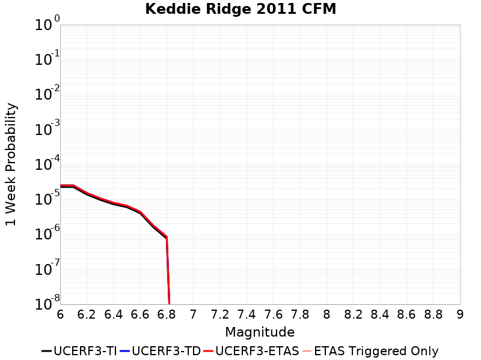 | 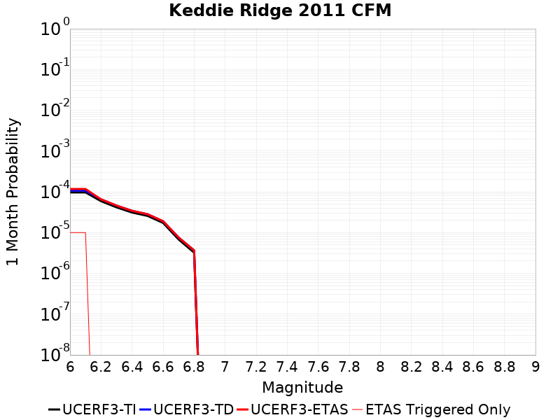 | 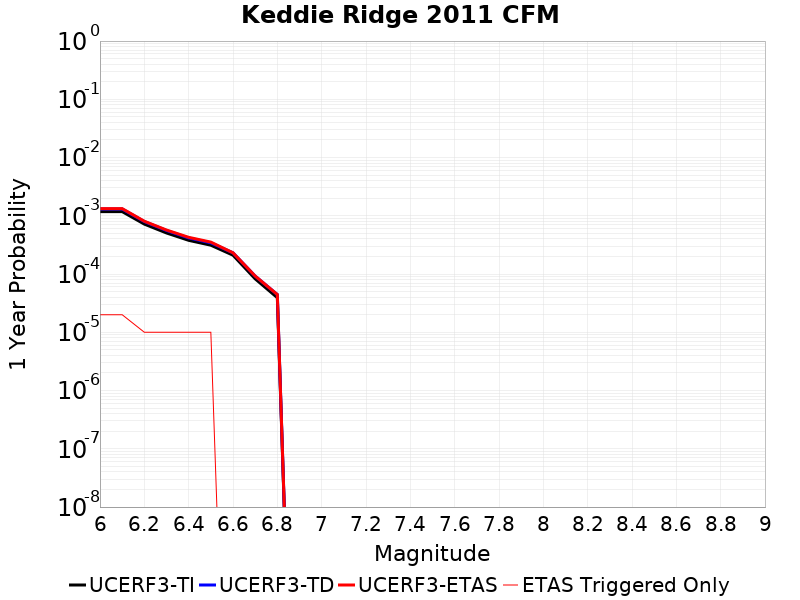 | 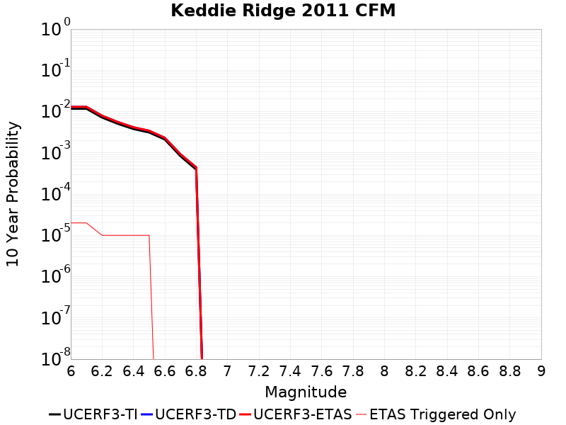 |

| Magnitude | 1 wk TI Prob | 1 wk TD Prob | 1 wk ETAS Prob | 1 wk ETAS/TD Gain | 1 wk ETAS Triggered Only | 1 mo TI Prob | 1 mo TD Prob | 1 mo ETAS Prob | 1 mo ETAS/TD Gain | 1 mo ETAS Triggered Only | 1 yr TI Prob | 1 yr TD Prob | 1 yr ETAS Prob | 1 yr ETAS/TD Gain | 1 yr ETAS Triggered Only | 10 yr TI Prob | 10 yr TD Prob | 10 yr ETAS Prob | 10 yr ETAS/TD Gain | 10 yr ETAS Triggered Only |
|-----|-----|-----|-----|-----|-----|-----|-----|-----|-----|-----|-----|-----|-----|-----|-----|-----|-----|-----|-----|-----|
| 6.0 | 2.2591947E-5 | 2.504563E-5 | 2.504563E-5 | 1.0 | 0.0 | 9.6819036E-5 | 1.0733445E-4 | 1.1733337E-4 | 1.0931567 | 1.0E-5 | 0.0011781343 | 0.0013060917 | 0.0013260655 | 1.0152929 | 2.0E-5 | 0.011719079 | 0.012992009 | 0.013011749 | 1.0015194 | 2.0E-5 |
| 6.1 | 2.2591947E-5 | 2.504563E-5 | 2.504563E-5 | 1.0 | 0.0 | 9.6819036E-5 | 1.0733445E-4 | 1.1733337E-4 | 1.0931567 | 1.0E-5 | 0.0011781343 | 0.0013060917 | 0.0013260655 | 1.0152929 | 2.0E-5 | 0.011719079 | 0.012992009 | 0.013011749 | 1.0015194 | 2.0E-5 |
| 6.2 | 1.3775145E-5 | 1.5243153E-5 | 1.5243153E-5 | 1.0 | 0.0 | 5.9035E-5 | 6.53263E-5 | 6.53263E-5 | 1.0 | 0.0 | 7.185141E-4 | 7.950815E-4 | 8.0507353E-4 | 1.0125673 | 1.0E-5 | 0.0071619535 | 0.00792477 | 0.00793469 | 1.0012518 | 1.0E-5 |
| 6.3 | 9.705435E-6 | 1.0710026E-5 | 1.0710026E-5 | 1.0 | 0.0 | 4.1594063E-5 | 4.5899375E-5 | 4.5899375E-5 | 1.0 | 0.0 | 5.0629E-4 | 5.586939E-4 | 5.686883E-4 | 1.0178889 | 1.0E-5 | 0.005051381 | 0.0055741165 | 0.0055840607 | 1.001784 | 1.0E-5 |
| 6.4 | 7.2549733E-6 | 7.978391E-6 | 7.978391E-6 | 1.0 | 0.0 | 3.109237E-5 | 3.41927E-5 | 3.41927E-5 | 1.0 | 0.0 | 3.7848388E-4 | 4.1622456E-4 | 4.262204E-4 | 1.0240155 | 1.0E-5 | 0.003778399 | 0.004155232 | 0.0041651903 | 1.0023966 | 1.0E-5 |
| 6.5 | 5.983293E-6 | 6.5714094E-6 | 6.5714094E-6 | 1.0 | 0.0 | 2.5642432E-5 | 2.8162916E-5 | 2.8162916E-5 | 1.0 | 0.0 | 3.1215188E-4 | 3.4283625E-4 | 3.5283284E-4 | 1.0291585 | 1.0E-5 | 0.0031171376 | 0.0034237322 | 0.003433698 | 1.0029107 | 1.0E-5 |
| 6.6 | 4.0336154E-6 | 4.42904E-6 | 4.42904E-6 | 1.0 | 0.0 | 1.728681E-5 | 1.8981485E-5 | 1.8981485E-5 | 1.0 | 0.0 | 2.1044657E-4 | 2.310791E-4 | 2.310791E-4 | 1.0 | 0.0 | 0.002102474 | 0.0023087836 | 0.0023087836 | 1.0 | 0.0 |
| 6.7 | 1.5832104E-6 | 1.7663414E-6 | 1.7663414E-6 | 1.0 | 0.0 | 6.7851697E-6 | 7.5700136E-6 | 7.5700136E-6 | 1.0 | 0.0 | 8.260631E-5 | 9.216129E-5 | 9.216129E-5 | 1.0 | 0.0 | 8.2575605E-4 | 9.212569E-4 | 9.212569E-4 | 1.0 | 0.0 |
| 6.8 | 7.5177275E-7 | 8.5085577E-7 | 8.5085577E-7 | 1.0 | 0.0 | 3.221879E-6 | 3.6465206E-6 | 3.6465206E-6 | 1.0 | 0.0 | 3.9225673E-5 | 4.439565E-5 | 4.439565E-5 | 1.0 | 0.0 | 3.921875E-4 | 4.4388406E-4 | 4.4388406E-4 | 1.0 | 0.0 |

## Walker Spring 2011 CFM
*[(top)](#table-of-contents)*

| 1 Week | 1 Month | 1 Year | 10 Year |
|-----|-----|-----|-----|
|  | 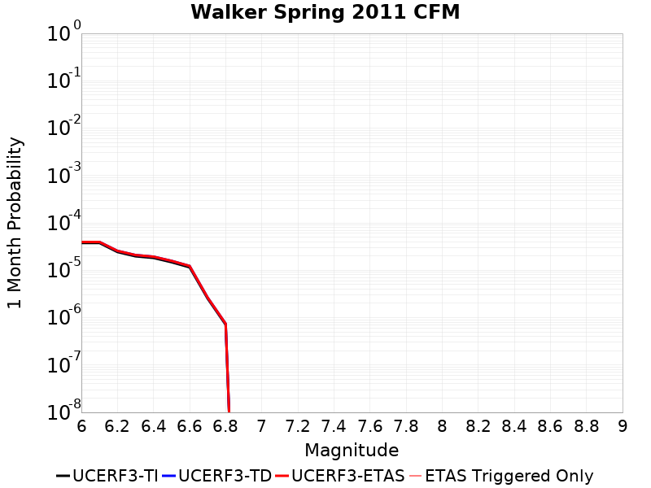 | 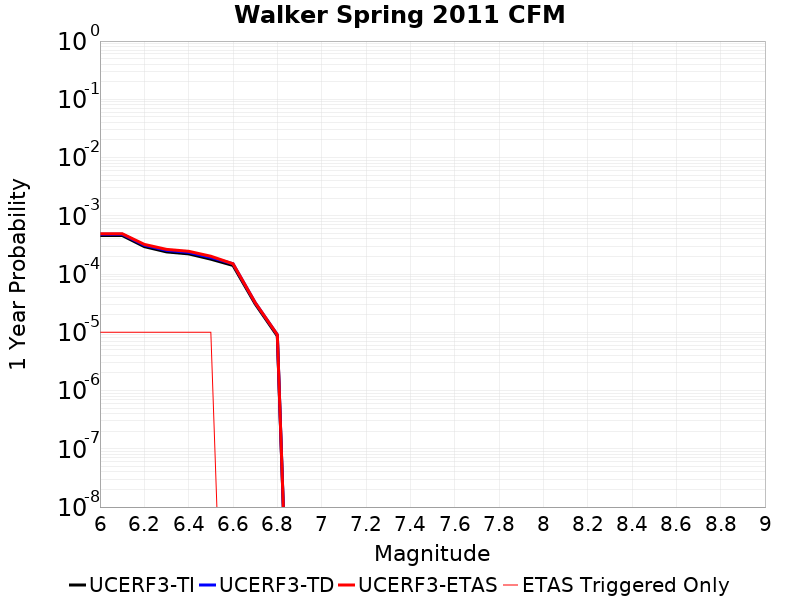 | 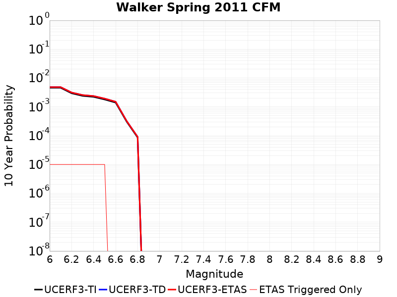 |

| Magnitude | 1 wk TI Prob | 1 wk TD Prob | 1 wk ETAS Prob | 1 wk ETAS/TD Gain | 1 wk ETAS Triggered Only | 1 mo TI Prob | 1 mo TD Prob | 1 mo ETAS Prob | 1 mo ETAS/TD Gain | 1 mo ETAS Triggered Only | 1 yr TI Prob | 1 yr TD Prob | 1 yr ETAS Prob | 1 yr ETAS/TD Gain | 1 yr ETAS Triggered Only | 10 yr TI Prob | 10 yr TD Prob | 10 yr ETAS Prob | 10 yr ETAS/TD Gain | 10 yr ETAS Triggered Only |
|-----|-----|-----|-----|-----|-----|-----|-----|-----|-----|-----|-----|-----|-----|-----|-----|-----|-----|-----|-----|-----|
| 6.0 | 8.791276E-6 | 9.238528E-6 | 9.238528E-6 | 1.0 | 0.0 | 3.767635E-5 | 3.9593153E-5 | 3.9593153E-5 | 1.0 | 0.0 | 4.58613E-4 | 4.819508E-4 | 4.9194595E-4 | 1.020739 | 1.0E-5 | 0.004576677 | 0.004810123 | 0.004820075 | 1.002069 | 1.0E-5 |
| 6.1 | 8.791276E-6 | 9.238528E-6 | 9.238528E-6 | 1.0 | 0.0 | 3.767635E-5 | 3.9593153E-5 | 3.9593153E-5 | 1.0 | 0.0 | 4.58613E-4 | 4.819508E-4 | 4.9194595E-4 | 1.020739 | 1.0E-5 | 0.004576677 | 0.004810123 | 0.004820075 | 1.002069 | 1.0E-5 |
| 6.2 | 5.654515E-6 | 5.9829786E-6 | 5.9829786E-6 | 1.0 | 0.0 | 2.4233412E-5 | 2.5641113E-5 | 2.5641113E-5 | 1.0 | 0.0 | 2.9500184E-4 | 3.1214082E-4 | 3.221377E-4 | 1.0320268 | 1.0E-5 | 0.0029461053 | 0.0031175157 | 0.0031274846 | 1.0031977 | 1.0E-5 |
| 6.3 | 4.591685E-6 | 4.8816896E-6 | 4.8816896E-6 | 1.0 | 0.0 | 1.96785E-5 | 2.0921383E-5 | 2.0921383E-5 | 1.0 | 0.0 | 2.395594E-4 | 2.5469242E-4 | 2.6468985E-4 | 1.039253 | 1.0E-5 | 0.002393013 | 0.0025444326 | 0.0025544073 | 1.0039202 | 1.0E-5 |
| 6.4 | 4.243283E-6 | 4.5103684E-6 | 4.5103684E-6 | 1.0 | 0.0 | 1.8185372E-5 | 1.933003E-5 | 1.933003E-5 | 1.0 | 0.0 | 2.2138441E-4 | 2.353219E-4 | 2.4531956E-4 | 1.042485 | 1.0E-5 | 0.00221164 | 0.0023511404 | 0.002361117 | 1.0042433 | 1.0E-5 |
| 6.5 | 3.4445666E-6 | 3.6759777E-6 | 3.6759777E-6 | 1.0 | 0.0 | 1.4762345E-5 | 1.5754118E-5 | 1.5754118E-5 | 1.0 | 0.0 | 1.7971672E-4 | 1.917935E-4 | 2.0179158E-4 | 1.0521294 | 1.0E-5 | 0.0017957145 | 0.0019166723 | 0.0019266532 | 1.0052074 | 1.0E-5 |
| 6.6 | 2.68766E-6 | 2.8712952E-6 | 2.8712952E-6 | 1.0 | 0.0 | 1.1518492E-5 | 1.2305514E-5 | 1.2305514E-5 | 1.0 | 0.0 | 1.4022861E-4 | 1.4981313E-4 | 1.4981313E-4 | 1.0 | 0.0 | 0.0014014016 | 0.0014974931 | 0.0014974931 | 1.0 | 0.0 |
| 6.7 | 5.880964E-7 | 6.1802143E-7 | 6.1802143E-7 | 1.0 | 0.0 | 2.5204106E-6 | 2.6486612E-6 | 2.6486612E-6 | 1.0 | 0.0 | 3.0685565E-5 | 3.2247066E-5 | 3.2247066E-5 | 1.0 | 0.0 | 3.068133E-4 | 3.224332E-4 | 3.224332E-4 | 1.0 | 0.0 |
| 6.8 | 1.6514163E-7 | 1.7345849E-7 | 1.7345849E-7 | 1.0 | 0.0 | 7.077497E-7 | 7.4339357E-7 | 7.4339357E-7 | 1.0 | 0.0 | 8.616818E-6 | 9.0508165E-6 | 9.0508165E-6 | 1.0 | 0.0 | 8.616484E-5 | 9.050816E-5 | 9.050816E-5 | 1.0 | 0.0 |

## San Andreas (North Coast) 2011 CFM
*[(top)](#table-of-contents)*

| 1 Week | 1 Month | 1 Year | 10 Year |
|-----|-----|-----|-----|
| 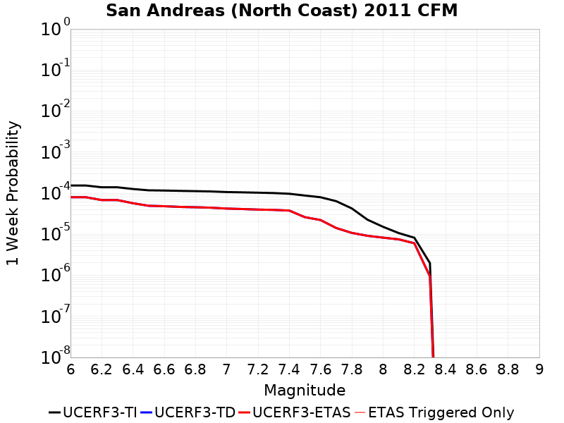 | 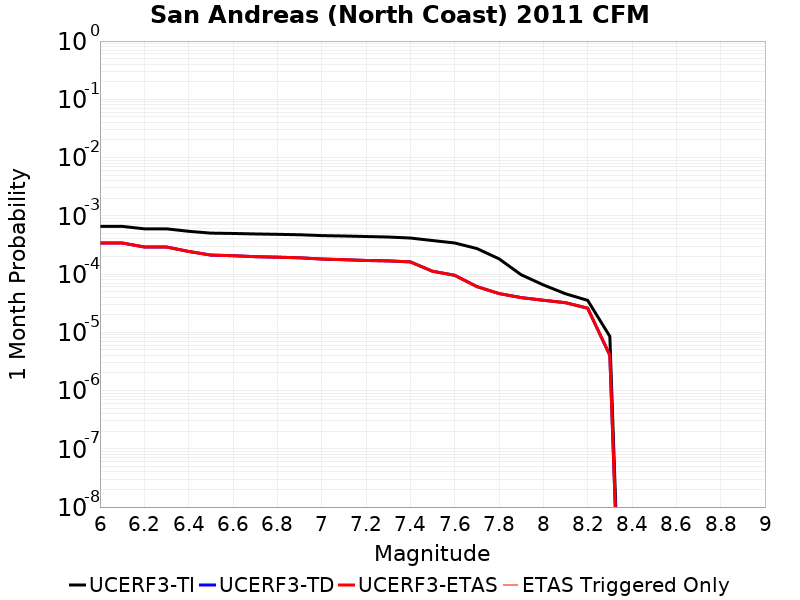 | 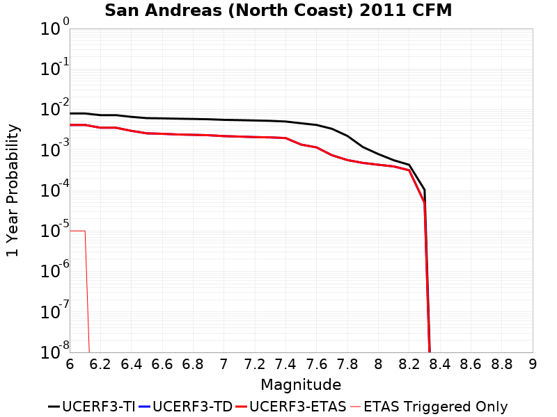 | 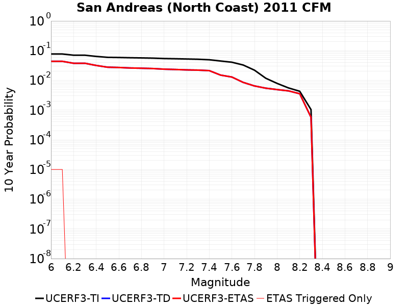 |

| Magnitude | 1 wk TI Prob | 1 wk TD Prob | 1 wk ETAS Prob | 1 wk ETAS/TD Gain | 1 wk ETAS Triggered Only | 1 mo TI Prob | 1 mo TD Prob | 1 mo ETAS Prob | 1 mo ETAS/TD Gain | 1 mo ETAS Triggered Only | 1 yr TI Prob | 1 yr TD Prob | 1 yr ETAS Prob | 1 yr ETAS/TD Gain | 1 yr ETAS Triggered Only | 10 yr TI Prob | 10 yr TD Prob | 10 yr ETAS Prob | 10 yr ETAS/TD Gain | 10 yr ETAS Triggered Only |
|-----|-----|-----|-----|-----|-----|-----|-----|-----|-----|-----|-----|-----|-----|-----|-----|-----|-----|-----|-----|-----|
| 6.0 | 1.5333705E-4 | 7.948784E-5 | 7.948784E-5 | 1.0 | 0.0 | 6.5699324E-4 | 3.4061793E-4 | 3.4061793E-4 | 1.0 | 0.0 | 0.007969595 | 0.004139179 | 0.0041491375 | 1.0024059 | 1.0E-5 | 0.0768977 | 0.04360998 | 0.043619543 | 1.0002193 | 1.0E-5 |
| 6.1 | 1.5333705E-4 | 7.948784E-5 | 7.948784E-5 | 1.0 | 0.0 | 6.5699324E-4 | 3.4061793E-4 | 3.4061793E-4 | 1.0 | 0.0 | 0.007969595 | 0.004139179 | 0.0041491375 | 1.0024059 | 1.0E-5 | 0.0768977 | 0.04360998 | 0.043619543 | 1.0002193 | 1.0E-5 |
| 6.2 | 1.3912938E-4 | 6.786831E-5 | 6.786831E-5 | 1.0 | 0.0 | 5.961325E-4 | 2.9083193E-4 | 2.9083193E-4 | 1.0 | 0.0 | 0.007233787 | 0.0035351622 | 0.0035351622 | 1.0 | 0.0 | 0.07002798 | 0.037493654 | 0.037493654 | 1.0 | 0.0 |
| 6.3 | 1.3912938E-4 | 6.786831E-5 | 6.786831E-5 | 1.0 | 0.0 | 5.961325E-4 | 2.9083193E-4 | 2.9083193E-4 | 1.0 | 0.0 | 0.007233787 | 0.0035351622 | 0.0035351622 | 1.0 | 0.0 | 0.07002798 | 0.037493654 | 0.037493654 | 1.0 | 0.0 |
| 6.4 | 1.2623647E-4 | 5.687355E-5 | 5.687355E-5 | 1.0 | 0.0 | 5.4090127E-4 | 2.4372114E-4 | 2.4372114E-4 | 1.0 | 0.0 | 0.0065656058 | 0.002963291 | 0.002963291 | 1.0 | 0.0 | 0.06374981 | 0.031681668 | 0.031681668 | 1.0 | 0.0 |
| 6.5 | 1.1736096E-4 | 4.9311566E-5 | 4.9311566E-5 | 1.0 | 0.0 | 5.028786E-4 | 2.1131827E-4 | 2.1131827E-4 | 1.0 | 0.0 | 0.006105373 | 0.0025697835 | 0.0025697835 | 1.0 | 0.0 | 0.05940335 | 0.027661536 | 0.027661536 | 1.0 | 0.0 |
| 6.6 | 1.1586959E-4 | 4.810635E-5 | 4.810635E-5 | 1.0 | 0.0 | 4.964894E-4 | 2.0615388E-4 | 2.0615388E-4 | 1.0 | 0.0 | 0.006028018 | 0.0025070535 | 0.0025070535 | 1.0 | 0.0 | 0.058671024 | 0.027019601 | 0.027019601 | 1.0 | 0.0 |
| 6.7 | 1.13693764E-4 | 4.6267352E-5 | 4.6267352E-5 | 1.0 | 0.0 | 4.87168E-4 | 1.9827369E-4 | 1.9827369E-4 | 1.0 | 0.0 | 0.005915152 | 0.0024113287 | 0.0024113287 | 1.0 | 0.0 | 0.057601593 | 0.02604074 | 0.02604074 | 1.0 | 0.0 |
| 6.8 | 1.1204889E-4 | 4.537153E-5 | 4.537153E-5 | 1.0 | 0.0 | 4.8012115E-4 | 1.9443502E-4 | 1.9443502E-4 | 1.0 | 0.0 | 0.005829819 | 0.002364695 | 0.002364695 | 1.0 | 0.0 | 0.05679232 | 0.025542539 | 0.025542539 | 1.0 | 0.0 |
| 6.9 | 1.1005794E-4 | 4.42835E-5 | 4.42835E-5 | 1.0 | 0.0 | 4.7159163E-4 | 1.8977272E-4 | 1.8977272E-4 | 1.0 | 0.0 | 0.0057265228 | 0.0023080534 | 0.0023080534 | 1.0 | 0.0 | 0.055811852 | 0.024934927 | 0.024934927 | 1.0 | 0.0 |
| 7.0 | 1.0647948E-4 | 4.2166554E-5 | 4.2166554E-5 | 1.0 | 0.0 | 4.562608E-4 | 1.8070139E-4 | 1.8070139E-4 | 1.0 | 0.0 | 0.0055408357 | 0.002197838 | 0.002197838 | 1.0 | 0.0 | 0.054047033 | 0.023755288 | 0.023755288 | 1.0 | 0.0 |
| 7.1 | 1.04795035E-4 | 4.108225E-5 | 4.108225E-5 | 1.0 | 0.0 | 4.4904428E-4 | 1.7605501E-4 | 1.7605501E-4 | 1.0 | 0.0 | 0.0054534175 | 0.0021413807 | 0.0021413807 | 1.0 | 0.0 | 0.053215165 | 0.023157494 | 0.023157494 | 1.0 | 0.0 |
| 7.2 | 1.02724036E-4 | 3.983767E-5 | 3.983767E-5 | 1.0 | 0.0 | 4.401716E-4 | 1.7072179E-4 | 1.7072179E-4 | 1.0 | 0.0 | 0.0053459285 | 0.0020765744 | 0.0020765744 | 1.0 | 0.0 | 0.052191395 | 0.022469882 | 0.022469882 | 1.0 | 0.0 |
| 7.3 | 1.00650694E-4 | 3.917433E-5 | 3.917433E-5 | 1.0 | 0.0 | 4.312888E-4 | 1.6787929E-4 | 1.6787929E-4 | 1.0 | 0.0 | 0.005238306 | 0.0020420323 | 0.0020420323 | 1.0 | 0.0 | 0.051165357 | 0.022074545 | 0.022074545 | 1.0 | 0.0 |
| 7.4 | 9.672919E-5 | 3.7683698E-5 | 3.7683698E-5 | 1.0 | 0.0 | 4.144878E-4 | 1.6149165E-4 | 1.6149165E-4 | 1.0 | 0.0 | 0.005034718 | 0.0019644056 | 0.0019644056 | 1.0 | 0.0 | 0.049221683 | 0.021198956 | 0.021198956 | 1.0 | 0.0 |
| 7.5 | 8.7600405E-5 | 2.6015254E-5 | 2.6015254E-5 | 1.0 | 0.0 | 3.753763E-4 | 1.1148919E-4 | 1.1148919E-4 | 1.0 | 0.0 | 0.0045606326 | 0.0013565378 | 0.0013565378 | 1.0 | 0.0 | 0.04468165 | 0.014996527 | 0.014996527 | 1.0 | 0.0 |
| 7.6 | 7.9562284E-5 | 2.2175129E-5 | 2.2175129E-5 | 1.0 | 0.0 | 3.4093665E-4 | 9.503281E-5 | 9.503281E-5 | 1.0 | 0.0 | 0.0041430052 | 0.0011564121 | 0.0011564121 | 1.0 | 0.0 | 0.040666126 | 0.012895617 | 0.012895617 | 1.0 | 0.0 |
| 7.7 | 6.3866544E-5 | 1.4193099E-5 | 1.4193099E-5 | 1.0 | 0.0 | 2.7368503E-4 | 6.082615E-5 | 6.082615E-5 | 1.0 | 0.0 | 0.0033270244 | 7.403071E-4 | 7.403071E-4 | 1.0 | 0.0 | 0.032776527 | 0.0085177 | 0.0085177 | 1.0 | 0.0 |
| 7.8 | 4.2543215E-5 | 1.07745145E-5 | 1.07745145E-5 | 1.0 | 0.0 | 1.8231533E-4 | 4.617567E-5 | 4.617567E-5 | 1.0 | 0.0 | 0.0022174292 | 5.620439E-4 | 5.620439E-4 | 1.0 | 0.0 | 0.021954332 | 0.0064646984 | 0.0064646984 | 1.0 | 0.0 |
| 7.9 | 2.2636612E-5 | 9.176946E-6 | 9.176946E-6 | 1.0 | 0.0 | 9.7010445E-5 | 3.9329178E-5 | 3.9329178E-5 | 1.0 | 0.0 | 0.0011804621 | 4.7872766E-4 | 4.7872766E-4 | 1.0 | 0.0 | 0.011742111 | 0.005437755 | 0.005437755 | 1.0 | 0.0 |
| 8.0 | 1.5167874E-5 | 8.262195E-6 | 8.262195E-6 | 1.0 | 0.0 | 6.500356E-5 | 3.5408924E-5 | 3.5408924E-5 | 1.0 | 0.0 | 7.9113094E-4 | 4.310185E-4 | 4.310185E-4 | 1.0 | 0.0 | 0.007883203 | 0.004875851 | 0.004875851 | 1.0 | 0.0 |
| 8.1 | 1.0681047E-5 | 7.5050393E-6 | 7.5050393E-6 | 1.0 | 0.0 | 4.5775112E-5 | 3.216406E-5 | 3.216406E-5 | 1.0 | 0.0 | 5.5716943E-4 | 3.9152717E-4 | 3.9152717E-4 | 1.0 | 0.0 | 0.0055577457 | 0.0044221524 | 0.0044221524 | 1.0 | 0.0 |
| 8.2 | 8.226114E-6 | 6.03576E-6 | 6.03576E-6 | 1.0 | 0.0 | 3.52543E-5 | 2.5867288E-5 | 2.5867288E-5 | 1.0 | 0.0 | 4.2913653E-4 | 3.1488884E-4 | 3.1488884E-4 | 1.0 | 0.0 | 0.004283088 | 0.0035425327 | 0.0035425327 | 1.0 | 0.0 |
| 8.3 | 1.983087E-6 | 9.39862E-7 | 9.39862E-7 | 1.0 | 0.0 | 8.498917E-6 | 4.027974E-6 | 4.027974E-6 | 1.0 | 0.0 | 1.034694E-4 | 4.9039503E-5 | 4.9039503E-5 | 1.0 | 0.0 | 0.0010342124 | 5.7020213E-4 | 5.7020213E-4 | 1.0 | 0.0 |

## Almanor 2011 CFM
*[(top)](#table-of-contents)*

| 1 Week | 1 Month | 1 Year | 10 Year |
|-----|-----|-----|-----|
| 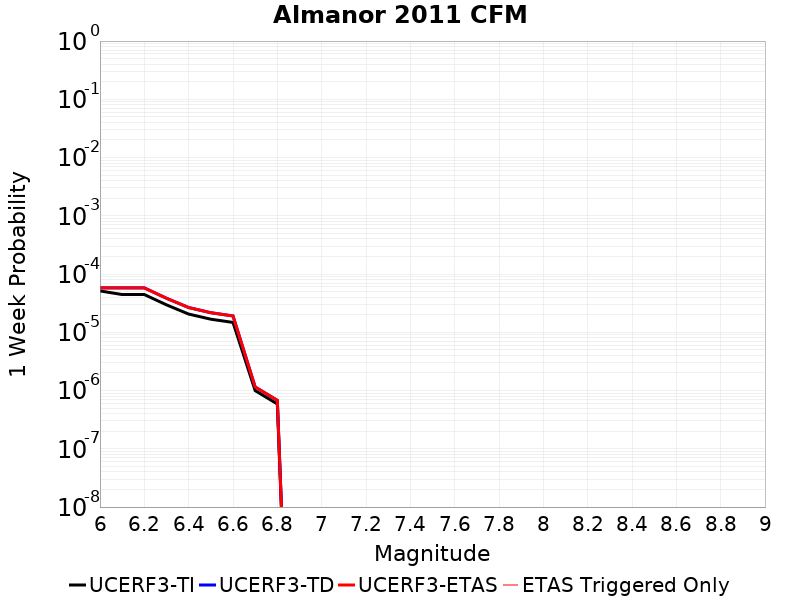 | 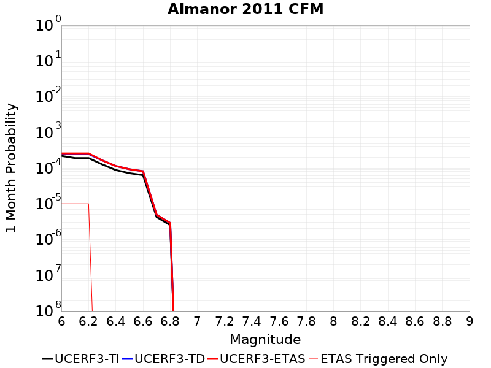 | 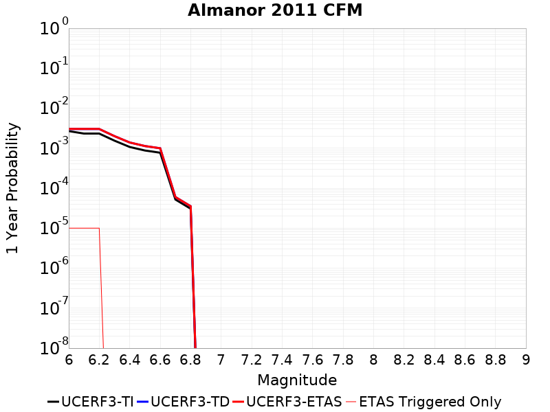 | 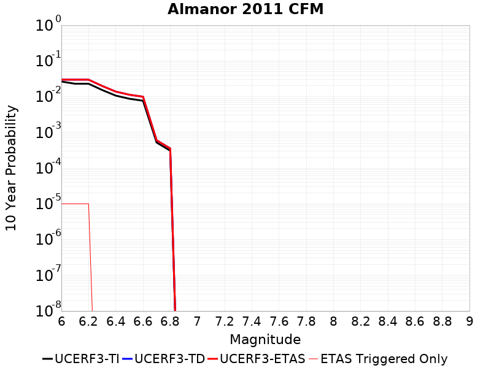 |

| Magnitude | 1 wk TI Prob | 1 wk TD Prob | 1 wk ETAS Prob | 1 wk ETAS/TD Gain | 1 wk ETAS Triggered Only | 1 mo TI Prob | 1 mo TD Prob | 1 mo ETAS Prob | 1 mo ETAS/TD Gain | 1 mo ETAS Triggered Only | 1 yr TI Prob | 1 yr TD Prob | 1 yr ETAS Prob | 1 yr ETAS/TD Gain | 1 yr ETAS Triggered Only | 10 yr TI Prob | 10 yr TD Prob | 10 yr ETAS Prob | 10 yr ETAS/TD Gain | 10 yr ETAS Triggered Only |
|-----|-----|-----|-----|-----|-----|-----|-----|-----|-----|-----|-----|-----|-----|-----|-----|-----|-----|-----|-----|-----|
| 6.0 | 5.1235038E-5 | 5.771906E-5 | 5.771906E-5 | 1.0 | 0.0 | 2.1956026E-4 | 2.473478E-4 | 2.5734532E-4 | 1.0404189 | 1.0E-5 | 0.0026698692 | 0.003007901 | 0.003017871 | 1.0033146 | 1.0E-5 | 0.026380196 | 0.02973034 | 0.029740043 | 1.0003264 | 1.0E-5 |
| 6.1 | 4.4387216E-5 | 5.771906E-5 | 5.771906E-5 | 1.0 | 0.0 | 1.9021705E-4 | 2.473478E-4 | 2.5734532E-4 | 1.0404189 | 1.0E-5 | 0.0023134327 | 0.003007901 | 0.003017871 | 1.0033146 | 1.0E-5 | 0.022894967 | 0.02973034 | 0.029740043 | 1.0003264 | 1.0E-5 |
| 6.2 | 4.4387216E-5 | 5.771906E-5 | 5.771906E-5 | 1.0 | 0.0 | 1.9021705E-4 | 2.473478E-4 | 2.5734532E-4 | 1.0404189 | 1.0E-5 | 0.0023134327 | 0.003007901 | 0.003017871 | 1.0033146 | 1.0E-5 | 0.022894967 | 0.02973034 | 0.029740043 | 1.0003264 | 1.0E-5 |
| 6.3 | 2.9523822E-5 | 3.8307622E-5 | 3.8307622E-5 | 1.0 | 0.0 | 1.2652454E-4 | 1.6416787E-4 | 1.6416787E-4 | 1.0 | 0.0 | 0.0015393476 | 0.001997332 | 0.001997332 | 1.0 | 0.0 | 0.015287281 | 0.019833932 | 0.019833932 | 1.0 | 0.0 |
| 6.4 | 2.0512744E-5 | 2.6561647E-5 | 2.6561647E-5 | 1.0 | 0.0 | 8.79088E-5 | 1.13832866E-4 | 1.13832866E-4 | 1.0 | 0.0 | 0.001069764 | 0.001385395 | 0.001385395 | 1.0 | 0.0 | 0.010646289 | 0.013801638 | 0.013801638 | 1.0 | 0.0 |
| 6.5 | 1.6750226E-5 | 2.1642349E-5 | 2.1642349E-5 | 1.0 | 0.0 | 7.178471E-5 | 9.27518E-5 | 9.27518E-5 | 1.0 | 0.0 | 8.7362836E-4 | 0.001129024 | 0.001129024 | 1.0 | 0.0 | 0.008702018 | 0.011266585 | 0.011266585 | 1.0 | 0.0 |
| 6.6 | 1.4745303E-5 | 1.9038704E-5 | 1.9038704E-5 | 1.0 | 0.0 | 6.319262E-5 | 8.1594044E-5 | 8.1594044E-5 | 1.0 | 0.0 | 7.690986E-4 | 9.93312E-4 | 9.93312E-4 | 1.0 | 0.0 | 0.0076644225 | 0.009922587 | 0.009922587 | 1.0 | 0.0 |
| 6.7 | 9.951145E-7 | 1.1483206E-6 | 1.1483206E-6 | 1.0 | 0.0 | 4.26477E-6 | 4.921366E-6 | 4.921366E-6 | 1.0 | 0.0 | 5.1922336E-5 | 5.991615E-5 | 5.991615E-5 | 1.0 | 0.0 | 5.1910203E-4 | 5.9901684E-4 | 5.9901684E-4 | 1.0 | 0.0 |
| 6.8 | 5.866312E-7 | 6.773974E-7 | 6.773974E-7 | 1.0 | 0.0 | 2.5141312E-6 | 2.9031291E-6 | 2.9031291E-6 | 1.0 | 0.0 | 3.0609117E-5 | 3.5345154E-5 | 3.5345154E-5 | 1.0 | 0.0 | 3.06049E-4 | 3.5340787E-4 | 3.5340787E-4 | 1.0 | 0.0 |

## Hat Creek-McArthur-Mayfield
*[(top)](#table-of-contents)*

| 1 Week | 1 Month | 1 Year | 10 Year |
|-----|-----|-----|-----|
| 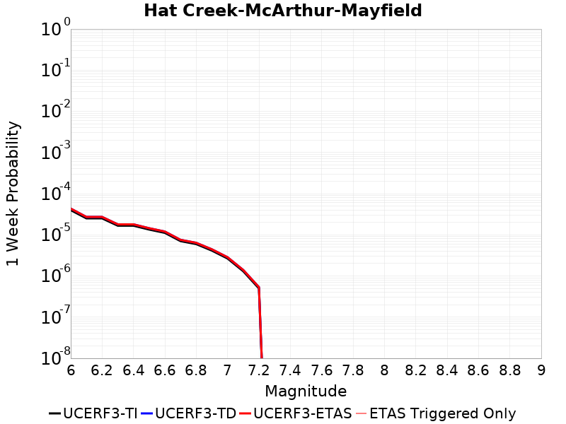 | 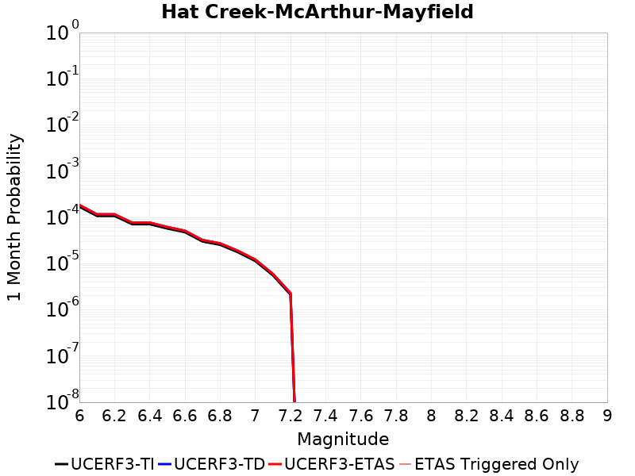 | 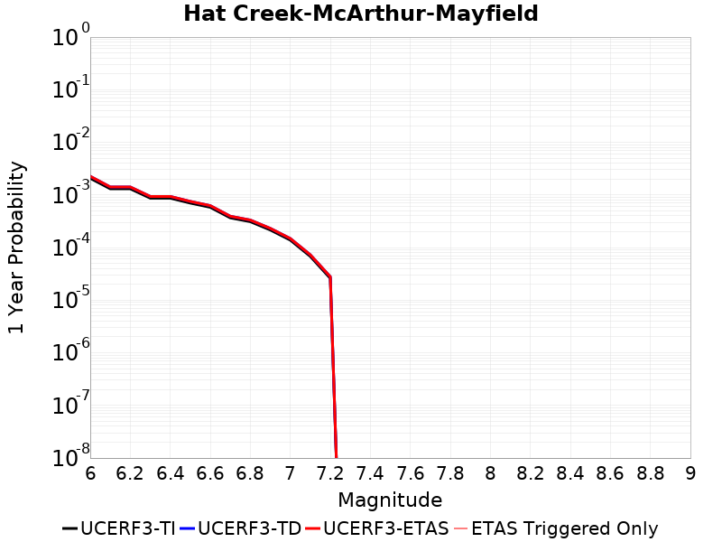 | 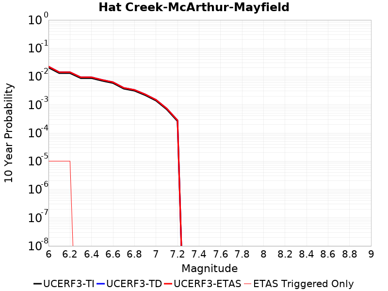 |

| Magnitude | 1 wk TI Prob | 1 wk TD Prob | 1 wk ETAS Prob | 1 wk ETAS/TD Gain | 1 wk ETAS Triggered Only | 1 mo TI Prob | 1 mo TD Prob | 1 mo ETAS Prob | 1 mo ETAS/TD Gain | 1 mo ETAS Triggered Only | 1 yr TI Prob | 1 yr TD Prob | 1 yr ETAS Prob | 1 yr ETAS/TD Gain | 1 yr ETAS Triggered Only | 10 yr TI Prob | 10 yr TD Prob | 10 yr ETAS Prob | 10 yr ETAS/TD Gain | 10 yr ETAS Triggered Only |
|-----|-----|-----|-----|-----|-----|-----|-----|-----|-----|-----|-----|-----|-----|-----|-----|-----|-----|-----|-----|-----|
| 6.0 | 3.967457E-5 | 4.3283897E-5 | 4.3283897E-5 | 1.0 | 0.0 | 1.7002279E-4 | 1.8548989E-4 | 1.8548989E-4 | 1.0 | 0.0 | 0.002068062 | 0.0022561154 | 0.0022561154 | 1.0 | 0.0 | 0.02048922 | 0.022344556 | 0.022354333 | 1.0004375 | 1.0E-5 |
| 6.1 | 2.5044013E-5 | 2.7143653E-5 | 2.7143653E-5 | 1.0 | 0.0 | 1.0732707E-4 | 1.1632494E-4 | 1.1632494E-4 | 1.0 | 0.0 | 0.0013059238 | 0.0014153679 | 0.0014153679 | 1.0 | 0.0 | 0.01298276 | 0.0140669765 | 0.0140768355 | 1.0007008 | 1.0E-5 |
| 6.2 | 2.5044013E-5 | 2.7143653E-5 | 2.7143653E-5 | 1.0 | 0.0 | 1.0732707E-4 | 1.1632494E-4 | 1.1632494E-4 | 1.0 | 0.0 | 0.0013059238 | 0.0014153679 | 0.0014153679 | 1.0 | 0.0 | 0.01298276 | 0.0140669765 | 0.0140768355 | 1.0007008 | 1.0E-5 |
| 6.3 | 1.6624012E-5 | 1.7936116E-5 | 1.7936116E-5 | 1.0 | 0.0 | 7.124382E-5 | 7.6866854E-5 | 7.6866854E-5 | 1.0 | 0.0 | 8.670483E-4 | 9.354608E-4 | 9.354608E-4 | 1.0 | 0.0 | 0.008636732 | 0.00931617 | 0.00931617 | 1.0 | 0.0 |
| 6.4 | 1.6624012E-5 | 1.7936116E-5 | 1.7936116E-5 | 1.0 | 0.0 | 7.124382E-5 | 7.6866854E-5 | 7.6866854E-5 | 1.0 | 0.0 | 8.670483E-4 | 9.354608E-4 | 9.354608E-4 | 1.0 | 0.0 | 0.008636732 | 0.00931617 | 0.00931617 | 1.0 | 0.0 |
| 6.5 | 1.3394842E-5 | 1.4427513E-5 | 1.4427513E-5 | 1.0 | 0.0 | 5.7405203E-5 | 6.183076E-5 | 6.183076E-5 | 1.0 | 0.0 | 6.986842E-4 | 7.525351E-4 | 7.525351E-4 | 1.0 | 0.0 | 0.006964916 | 0.007500464 | 0.007500464 | 1.0 | 0.0 |
| 6.6 | 1.1137514E-5 | 1.1983489E-5 | 1.1983489E-5 | 1.0 | 0.0 | 4.7731326E-5 | 5.135682E-5 | 5.135682E-5 | 1.0 | 0.0 | 5.809739E-4 | 6.2509393E-4 | 6.2509393E-4 | 1.0 | 0.0 | 0.005794574 | 0.00623378 | 0.00623378 | 1.0 | 0.0 |
| 6.7 | 7.0200663E-6 | 7.5421167E-6 | 7.5421167E-6 | 1.0 | 0.0 | 3.008565E-5 | 3.2322965E-5 | 3.2322965E-5 | 1.0 | 0.0 | 3.6623122E-4 | 3.9346263E-4 | 3.9346263E-4 | 1.0 | 0.0 | 0.0036562826 | 0.0039278236 | 0.0039278236 | 1.0 | 0.0 |
| 6.8 | 5.940172E-6 | 6.3805082E-6 | 6.3805082E-6 | 1.0 | 0.0 | 2.545763E-5 | 2.7344757E-5 | 2.7344757E-5 | 1.0 | 0.0 | 3.0990256E-4 | 3.3287282E-4 | 3.3287282E-4 | 1.0 | 0.0 | 0.0030947074 | 0.0033238714 | 0.0033238714 | 1.0 | 0.0 |
| 6.9 | 4.129831E-6 | 4.4339217E-6 | 4.4339217E-6 | 1.0 | 0.0 | 1.7699154E-5 | 1.9002387E-5 | 1.9002387E-5 | 1.0 | 0.0 | 2.154659E-4 | 2.313303E-4 | 2.313303E-4 | 1.0 | 0.0 | 0.002152571 | 0.0023109736 | 0.0023109736 | 1.0 | 0.0 |
| 7.0 | 2.6512955E-6 | 2.8439665E-6 | 2.8439665E-6 | 1.0 | 0.0 | 1.1362646E-5 | 1.2188373E-5 | 1.2188373E-5 | 1.0 | 0.0 | 1.3833142E-4 | 1.4838377E-4 | 1.4838377E-4 | 1.0 | 0.0 | 0.0013824535 | 0.0014828898 | 0.0014828898 | 1.0 | 0.0 |
| 7.1 | 1.2992575E-6 | 1.3941672E-6 | 1.3941672E-6 | 1.0 | 0.0 | 5.568235E-6 | 5.9749896E-6 | 5.9749896E-6 | 1.0 | 0.0 | 6.779115E-5 | 7.274329E-5 | 7.274329E-5 | 1.0 | 0.0 | 6.7770475E-4 | 7.272165E-4 | 7.272165E-4 | 1.0 | 0.0 |
| 7.2 | 4.968191E-7 | 5.339836E-7 | 5.339836E-7 | 1.0 | 0.0 | 2.1292228E-6 | 2.2885E-6 | 2.2885E-6 | 1.0 | 0.0 | 2.592298E-5 | 2.7862257E-5 | 2.7862257E-5 | 1.0 | 0.0 | 2.5919956E-4 | 2.7860006E-4 | 2.7860006E-4 | 1.0 | 0.0 |

