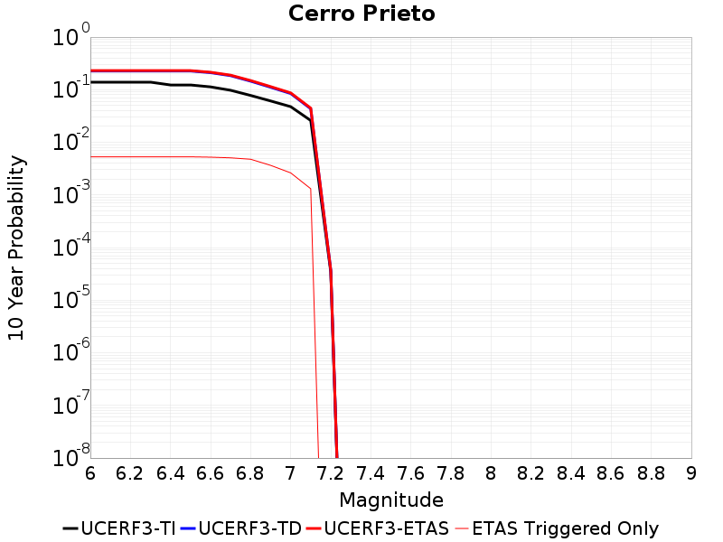
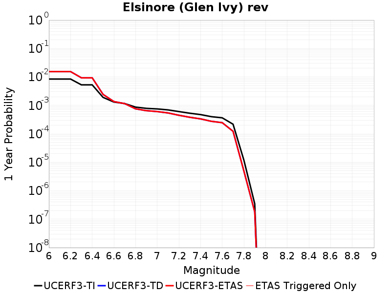

# Parent Section Magnitude-Probability Distributions

Only fault sections with at least one triggered aftershock are plotted. Sections are sorted by total supraseismogenic trigger rate (decreasing)

## Table Of Contents

* [Cerro Prieto](#cerro-prieto)
* [Laguna Salada](#laguna-salada)
* [Imperial](#imperial)
* [San Diego Trough south](#san-diego-trough-south)
* [Brawley (Seismic Zone) alt 1](#brawley-seismic-zone-alt-1)
* [San Diego Trough north alt1](#san-diego-trough-north-alt1)
* [Blue Cut](#blue-cut)
* [San Andreas (Coachella) rev](#san-andreas-coachella-rev)
* [Elsinore (Glen Ivy) rev](#elsinore-glen-ivy-rev)

## Cerro Prieto
*[(top)](#table-of-contents)*

| 1 Week | 1 Month | 1 Year | 10 Year |
|-----|-----|-----|-----|
|  |  |  |  |

| Magnitude | 1 wk TI Prob | 1 wk TD Prob | 1 wk ETAS Prob | 1 wk ETAS/TD Gain | 1 wk ETAS Triggered Only | 1 mo TI Prob | 1 mo TD Prob | 1 mo ETAS Prob | 1 mo ETAS/TD Gain | 1 mo ETAS Triggered Only | 1 yr TI Prob | 1 yr TD Prob | 1 yr ETAS Prob | 1 yr ETAS/TD Gain | 1 yr ETAS Triggered Only | 10 yr TI Prob | 10 yr TD Prob | 10 yr ETAS Prob | 10 yr ETAS/TD Gain | 10 yr ETAS Triggered Only |
|-----|-----|-----|-----|-----|-----|-----|-----|-----|-----|-----|-----|-----|-----|-----|-----|-----|-----|-----|-----|-----|
| 6.0 | 2.863869E-4 | 5.159012E-4 | 0.0022350138 | 4.3322515 | 0.00172 | 0.001226795 | 0.0022093293 | 0.0046838503 | 2.1200325 | 0.00248 | 0.014834271 | 0.026511446 | 0.0304054 | 1.1468782 | 0.004 | 0.13882194 | 0.22604083 | 0.23013507 | 1.0181129 | 0.00529 |
| 6.1 | 2.863869E-4 | 5.159012E-4 | 0.0022350138 | 4.3322515 | 0.00172 | 0.001226795 | 0.0022093293 | 0.0046838503 | 2.1200325 | 0.00248 | 0.014834271 | 0.026511446 | 0.0304054 | 1.1468782 | 0.004 | 0.13882194 | 0.22604083 | 0.23013507 | 1.0181129 | 0.00529 |
| 6.2 | 2.863869E-4 | 5.159012E-4 | 0.0022350138 | 4.3322515 | 0.00172 | 0.001226795 | 0.0022093293 | 0.0046838503 | 2.1200325 | 0.00248 | 0.014834271 | 0.026511446 | 0.0304054 | 1.1468782 | 0.004 | 0.13882194 | 0.22604083 | 0.23013507 | 1.0181129 | 0.00529 |
| 6.3 | 2.863869E-4 | 5.159012E-4 | 0.0022350138 | 4.3322515 | 0.00172 | 0.001226795 | 0.0022093293 | 0.0046838503 | 2.1200325 | 0.00248 | 0.014834271 | 0.026511446 | 0.0304054 | 1.1468782 | 0.004 | 0.13882194 | 0.22604083 | 0.23013507 | 1.0181129 | 0.00529 |
| 6.4 | 2.508648E-4 | 5.159012E-4 | 0.0022350138 | 4.3322515 | 0.00172 | 0.0010746918 | 0.0022093293 | 0.0046838503 | 2.1200325 | 0.00248 | 0.013006088 | 0.026511446 | 0.0304054 | 1.1468782 | 0.004 | 0.12270685 | 0.22604083 | 0.23013507 | 1.0181129 | 0.00529 |
| 6.5 | 2.508648E-4 | 5.159012E-4 | 0.0022350138 | 4.3322515 | 0.00172 | 0.0010746918 | 0.0022093293 | 0.0046838503 | 2.1200325 | 0.00248 | 0.013006088 | 0.026511446 | 0.0304054 | 1.1468782 | 0.004 | 0.12270685 | 0.22604083 | 0.23013507 | 1.0181129 | 0.00529 |
| 6.6 | 2.294914E-4 | 4.7361845E-4 | 0.0021528227 | 4.5454793 | 0.00168 | 9.831638E-4 | 0.0020284012 | 0.0044534723 | 2.1955578 | 0.00243 | 0.011904482 | 0.024401397 | 0.028235499 | 1.1571263 | 0.00393 | 0.11286586 | 0.21021098 | 0.21432579 | 1.0195746 | 0.00521 |
| 6.7 | 1.9621674E-4 | 4.0709565E-4 | 0.0020164403 | 4.9532347 | 0.00161 | 8.4065786E-4 | 0.0017436874 | 0.0040895897 | 2.3453686 | 0.00235 | 0.010187071 | 0.021048484 | 0.02478808 | 1.1776657 | 0.00382 | 0.09732539 | 0.1844873 | 0.1886138 | 1.0223674 | 0.00506 |
| 6.8 | 1.5476145E-4 | 3.0885552E-4 | 0.0018283861 | 5.919875 | 0.00152 | 6.6309475E-4 | 0.0013230981 | 0.0035501476 | 2.6832082 | 0.00223 | 0.008043335 | 0.016100181 | 0.01964222 | 1.2199999 | 0.0036 | 0.07758363 | 0.14491412 | 0.14898433 | 1.028087 | 0.00476 |
| 6.9 | 1.20509176E-4 | 2.2904093E-4 | 0.0013687798 | 5.976136 | 0.00114 | 5.1636563E-4 | 9.812991E-4 | 0.0026496605 | 2.7001555 | 0.00167 | 0.006268645 | 0.011998159 | 0.014744804 | 1.2289222 | 0.00278 | 0.060947374 | 0.11096731 | 0.114203386 | 1.0291624 | 0.00364 |
| 7.0 | 9.3269155E-5 | 1.699769E-4 | 0.0010098341 | 5.941008 | 8.4E-4 | 3.9966372E-4 | 7.2831317E-4 | 0.0018774756 | 2.577841 | 0.00115 | 0.0048550544 | 0.008839002 | 0.010771766 | 1.2186631 | 0.00195 | 0.04750344 | 0.08440139 | 0.08680026 | 1.0284221 | 0.00262 |
| 7.1 | 5.029709E-5 | 8.350535E-5 | 5.3346774E-4 | 6.3884263 | 4.5E-4 | 2.1554115E-4 | 3.5785095E-4 | 9.376434E-4 | 2.6202066 | 5.8E-4 | 0.0026210553 | 0.00435167 | 0.005337362 | 1.2265089 | 9.9E-4 | 0.025903556 | 0.043311 | 0.044564262 | 1.0289364 | 0.00131 |
| 7.2 | 6.5445185E-8 | 7.149468E-8 | 7.149468E-8 | 1.0 | 0.0 | 2.8047933E-7 | 3.0640578E-7 | 3.0640578E-7 | 1.0 | 0.0 | 3.4148304E-6 | 3.7304903E-6 | 3.7304903E-6 | 1.0 | 0.0 | 3.414778E-5 | 3.7304904E-5 | 3.7304904E-5 | 1.0 | 0.0 |

## Laguna Salada
*[(top)](#table-of-contents)*

| 1 Week | 1 Month | 1 Year | 10 Year |
|-----|-----|-----|-----|
|  |  |  |  |

| Magnitude | 1 wk TI Prob | 1 wk TD Prob | 1 wk ETAS Prob | 1 wk ETAS/TD Gain | 1 wk ETAS Triggered Only | 1 mo TI Prob | 1 mo TD Prob | 1 mo ETAS Prob | 1 mo ETAS/TD Gain | 1 mo ETAS Triggered Only | 1 yr TI Prob | 1 yr TD Prob | 1 yr ETAS Prob | 1 yr ETAS/TD Gain | 1 yr ETAS Triggered Only | 10 yr TI Prob | 10 yr TD Prob | 10 yr ETAS Prob | 10 yr ETAS/TD Gain | 10 yr ETAS Triggered Only |
|-----|-----|-----|-----|-----|-----|-----|-----|-----|-----|-----|-----|-----|-----|-----|-----|-----|-----|-----|-----|-----|
| 6.0 | 4.3960263E-5 | 3.1898104E-5 | 7.189683E-5 | 2.253953 | 4.0E-5 | 1.8838752E-4 | 1.366995E-4 | 1.966913E-4 | 1.438859 | 6.0E-5 | 0.0022912053 | 0.0016631386 | 0.0017629723 | 1.0600272 | 1.0E-4 | 0.022677258 | 0.016553767 | 0.01671112 | 1.0095055 | 1.6E-4 |
| 6.1 | 3.7353202E-5 | 3.1898104E-5 | 7.189683E-5 | 2.253953 | 4.0E-5 | 1.6007533E-4 | 1.366995E-4 | 1.966913E-4 | 1.438859 | 6.0E-5 | 0.0019471749 | 0.0016631386 | 0.0017629723 | 1.0600272 | 1.0E-4 | 0.019302014 | 0.016553767 | 0.01671112 | 1.0095055 | 1.6E-4 |
| 6.2 | 3.3633605E-5 | 2.7787311E-5 | 4.7786754E-5 | 1.719733 | 2.0E-5 | 1.4413605E-4 | 1.1908351E-4 | 1.5907874E-4 | 1.3358587 | 4.0E-5 | 0.0017534439 | 0.0014489612 | 0.0015288453 | 1.0551319 | 8.0E-5 | 0.017396728 | 0.014438304 | 0.014576282 | 1.0095564 | 1.4E-4 |
| 6.3 | 3.0459405E-5 | 2.4419649E-5 | 3.4419405E-5 | 1.4094963 | 1.0E-5 | 1.3053378E-4 | 1.0465187E-4 | 1.3464873E-4 | 1.2866348 | 3.0E-5 | 0.0015880901 | 0.001273469 | 0.0013433798 | 1.054898 | 7.0E-5 | 0.01576789 | 0.01270273 | 0.012811332 | 1.0085496 | 1.1E-4 |
| 6.4 | 2.8078504E-5 | 2.2103392E-5 | 2.2103392E-5 | 1.0 | 0.0 | 1.203309E-4 | 9.47258E-5 | 1.147239E-4 | 1.2111157 | 2.0E-5 | 0.0014640441 | 0.0011527509 | 0.0011927048 | 1.0346596 | 4.0E-5 | 0.014544362 | 0.011506702 | 0.011585781 | 1.0068724 | 8.0E-5 |
| 6.5 | 2.6691412E-5 | 2.085777E-5 | 2.085777E-5 | 1.0 | 0.0 | 1.1438675E-4 | 8.9387795E-5 | 1.09386005E-4 | 1.2237242 | 2.0E-5 | 0.0013917689 | 0.0010878268 | 0.0011277832 | 1.0367305 | 4.0E-5 | 0.013830846 | 0.01086272 | 0.010931959 | 1.006374 | 7.0E-5 |
| 6.6 | 2.207987E-5 | 1.7034472E-5 | 1.7034472E-5 | 1.0 | 0.0 | 9.4624585E-5 | 7.300322E-5 | 9.300176E-5 | 1.2739406 | 2.0E-5 | 0.0011514454 | 8.885205E-4 | 9.1849384E-4 | 1.033734 | 3.0E-5 | 0.011454974 | 0.008882537 | 0.008932092 | 1.005579 | 5.0E-5 |
| 6.7 | 1.9458053E-5 | 1.4802965E-5 | 1.4802965E-5 | 1.0 | 0.0 | 8.338899E-5 | 6.3440115E-5 | 7.3439485E-5 | 1.157619 | 1.0E-5 | 0.001014788 | 7.721771E-4 | 7.821694E-4 | 1.0129404 | 1.0E-5 | 0.010101665 | 0.007724541 | 0.007754309 | 1.0038537 | 3.0E-5 |
| 6.8 | 1.0767866E-5 | 8.55404E-6 | 8.55404E-6 | 1.0 | 0.0 | 4.614718E-5 | 3.6659978E-5 | 4.6659614E-5 | 1.2727671 | 1.0E-5 | 5.6169706E-4 | 4.463012E-4 | 4.5629672E-4 | 1.0223964 | 1.0E-5 | 0.0056027942 | 0.0044705514 | 0.004490462 | 1.0044538 | 2.0E-5 |
| 6.9 | 2.1384765E-6 | 1.8012311E-6 | 1.8012311E-6 | 1.0 | 0.0 | 9.164866E-6 | 7.719541E-6 | 7.719541E-6 | 1.0 | 0.0 | 1.1157654E-4 | 9.3981755E-5 | 9.3981755E-5 | 1.0 | 0.0 | 0.0011152053 | 9.394588E-4 | 9.394588E-4 | 1.0 | 0.0 |
| 7.0 | 2.0952946E-6 | 1.7590743E-6 | 1.7590743E-6 | 1.0 | 0.0 | 8.979802E-6 | 7.5388702E-6 | 7.5388702E-6 | 1.0 | 0.0 | 1.0932361E-4 | 9.178227E-5 | 9.178227E-5 | 1.0 | 0.0 | 0.0010926984 | 9.1748225E-4 | 9.1748225E-4 | 1.0 | 0.0 |
| 7.1 | 1.7887576E-6 | 1.459271E-6 | 1.459271E-6 | 1.0 | 0.0 | 7.666081E-6 | 6.2540053E-6 | 6.2540053E-6 | 1.0 | 0.0 | 9.333054E-5 | 7.614017E-5 | 7.614017E-5 | 1.0 | 0.0 | 9.329135E-4 | 7.6117157E-4 | 7.6117157E-4 | 1.0 | 0.0 |
| 7.2 | 9.723109E-7 | 7.198895E-7 | 7.198895E-7 | 1.0 | 0.0 | 4.16704E-6 | 3.085238E-6 | 3.085238E-6 | 1.0 | 0.0 | 5.073253E-5 | 3.7562295E-5 | 3.7562295E-5 | 1.0 | 0.0 | 5.072095E-4 | 3.75576E-4 | 3.75576E-4 | 1.0 | 0.0 |

## Imperial
*[(top)](#table-of-contents)*

| 1 Week | 1 Month | 1 Year | 10 Year |
|-----|-----|-----|-----|
|  |  |  |  |

| Magnitude | 1 wk TI Prob | 1 wk TD Prob | 1 wk ETAS Prob | 1 wk ETAS/TD Gain | 1 wk ETAS Triggered Only | 1 mo TI Prob | 1 mo TD Prob | 1 mo ETAS Prob | 1 mo ETAS/TD Gain | 1 mo ETAS Triggered Only | 1 yr TI Prob | 1 yr TD Prob | 1 yr ETAS Prob | 1 yr ETAS/TD Gain | 1 yr ETAS Triggered Only | 10 yr TI Prob | 10 yr TD Prob | 10 yr ETAS Prob | 10 yr ETAS/TD Gain | 10 yr ETAS Triggered Only |
|-----|-----|-----|-----|-----|-----|-----|-----|-----|-----|-----|-----|-----|-----|-----|-----|-----|-----|-----|-----|-----|
| 6.0 | 2.6875173E-4 | 4.981419E-4 | 4.981419E-4 | 1.0 | 0.0 | 0.0011512847 | 0.0021331855 | 0.0021331855 | 1.0 | 0.0 | 0.013927074 | 0.02568235 | 0.025692094 | 1.0003793 | 1.0E-5 | 0.13085878 | 0.22399786 | 0.22401337 | 1.0000693 | 2.0E-5 |
| 6.1 | 2.5356023E-4 | 4.981419E-4 | 4.981419E-4 | 1.0 | 0.0 | 0.001086234 | 0.0021331855 | 0.0021331855 | 1.0 | 0.0 | 0.013144928 | 0.02568235 | 0.025692094 | 1.0003793 | 1.0E-5 | 0.123940155 | 0.22399786 | 0.22401337 | 1.0000693 | 2.0E-5 |
| 6.2 | 2.4820742E-4 | 4.88933E-4 | 4.88933E-4 | 1.0 | 0.0 | 0.0010633124 | 0.0020937822 | 0.0020937822 | 1.0 | 0.0 | 0.01286919 | 0.025214482 | 0.02522423 | 1.0003866 | 1.0E-5 | 0.12148927 | 0.22046565 | 0.22048125 | 1.0000707 | 2.0E-5 |
| 6.3 | 2.3205351E-4 | 4.686477E-4 | 4.686477E-4 | 1.0 | 0.0 | 9.94136E-4 | 0.0020069806 | 0.0020069806 | 1.0 | 0.0 | 0.012036599 | 0.024174724 | 0.024184482 | 1.0004036 | 1.0E-5 | 0.11405133 | 0.21191654 | 0.2119323 | 1.0000744 | 2.0E-5 |
| 6.4 | 2.0304754E-4 | 4.0913525E-4 | 4.0913525E-4 | 1.0 | 0.0 | 8.6991355E-4 | 0.0017522733 | 0.0017522733 | 1.0 | 0.0 | 0.010539869 | 0.021141814 | 0.021151602 | 1.000463 | 1.0E-5 | 0.100537635 | 0.18912475 | 0.18914096 | 1.0000857 | 2.0E-5 |
| 6.5 | 1.854992E-4 | 3.7979882E-4 | 3.7979882E-4 | 1.0 | 0.0 | 7.9475436E-4 | 0.0016267063 | 0.0016267063 | 1.0 | 0.0 | 0.009633281 | 0.01964514 | 0.019654943 | 1.000499 | 1.0E-5 | 0.0922623 | 0.17719474 | 0.1772112 | 1.0000929 | 2.0E-5 |
| 6.6 | 1.6586106E-4 | 3.4951352E-4 | 3.4951352E-4 | 1.0 | 0.0 | 7.106394E-4 | 0.0014970655 | 0.0014970655 | 1.0 | 0.0 | 0.008617763 | 0.018085323 | 0.018095143 | 1.0005429 | 1.0E-5 | 0.08291132 | 0.16441011 | 0.16442682 | 1.0001017 | 2.0E-5 |
| 6.7 | 1.4224656E-4 | 3.158459E-4 | 3.158459E-4 | 1.0 | 0.0 | 6.094856E-4 | 0.0013529314 | 0.0013529314 | 1.0 | 0.0 | 0.0073952693 | 0.016350754 | 0.01636059 | 1.0006016 | 1.0E-5 | 0.07153955 | 0.14975885 | 0.14977586 | 1.0001136 | 2.0E-5 |
| 6.8 | 1.2317259E-4 | 2.859891E-4 | 2.859891E-4 | 1.0 | 0.0 | 5.2777573E-4 | 0.0012250983 | 0.0012250983 | 1.0 | 0.0 | 0.0064067547 | 0.014815013 | 0.014824864 | 1.000665 | 1.0E-5 | 0.06225166 | 0.13621111 | 0.13622838 | 1.0001268 | 2.0E-5 |
| 6.9 | 9.859898E-5 | 2.5745048E-4 | 2.5745048E-4 | 1.0 | 0.0 | 4.2249862E-4 | 0.0011028971 | 0.0011028971 | 1.0 | 0.0 | 0.0051317946 | 0.013346113 | 0.013346113 | 1.0 | 0.0 | 0.05014893 | 0.12240512 | 0.122413896 | 1.0000716 | 1.0E-5 |
| 7.0 | 7.3191884E-5 | 2.1937945E-4 | 2.1937945E-4 | 1.0 | 0.0 | 3.136418E-4 | 9.3986216E-4 | 9.3986216E-4 | 1.0 | 0.0 | 0.003811904 | 0.011383509 | 0.011383509 | 1.0 | 0.0 | 0.037471764 | 0.104857825 | 0.10486677 | 1.0000854 | 1.0E-5 |
| 7.1 | 7.1760296E-5 | 2.1636447E-4 | 2.1636447E-4 | 1.0 | 0.0 | 3.0750787E-4 | 9.269501E-4 | 9.269501E-4 | 1.0 | 0.0 | 0.003737482 | 0.011227935 | 0.011227935 | 1.0 | 0.0 | 0.03675245 | 0.10348649 | 0.10349546 | 1.0000867 | 1.0E-5 |
| 7.2 | 6.46614E-5 | 1.9795597E-4 | 1.9795597E-4 | 1.0 | 0.0 | 2.7709085E-4 | 8.4811007E-4 | 8.4811007E-4 | 1.0 | 0.0 | 0.0033683628 | 0.01027751 | 0.01027751 | 1.0 | 0.0 | 0.033177625 | 0.09527701 | 0.09528606 | 1.000095 | 1.0E-5 |
| 7.3 | 6.088115E-5 | 1.8450244E-4 | 1.8450244E-4 | 1.0 | 0.0 | 2.6089314E-4 | 7.9048815E-4 | 7.9048815E-4 | 1.0 | 0.0 | 0.0031717476 | 0.009582331 | 0.009582331 | 1.0 | 0.0 | 0.031268585 | 0.08927644 | 0.089285545 | 1.000102 | 1.0E-5 |
| 7.4 | 4.199346E-5 | 1.20258264E-4 | 1.20258264E-4 | 1.0 | 0.0 | 1.7995955E-4 | 5.152917E-4 | 5.152917E-4 | 1.0 | 0.0 | 0.0021888057 | 0.006255811 | 0.006255811 | 1.0 | 0.0 | 0.02167372 | 0.05970753 | 0.05970753 | 1.0 | 0.0 |
| 7.5 | 3.130448E-5 | 8.761667E-5 | 8.761667E-5 | 1.0 | 0.0 | 1.3415517E-4 | 3.754463E-4 | 3.754463E-4 | 1.0 | 0.0 | 0.0016321153 | 0.004561543 | 0.004561543 | 1.0 | 0.0 | 0.016201803 | 0.044053648 | 0.044053648 | 1.0 | 0.0 |
| 7.6 | 2.3074248E-5 | 6.439198E-5 | 6.439198E-5 | 1.0 | 0.0 | 9.888588E-5 | 2.7593656E-4 | 2.7593656E-4 | 1.0 | 0.0 | 0.0012032706 | 0.0033543776 | 0.0033543776 | 1.0 | 0.0 | 0.011967761 | 0.03263595 | 0.03263595 | 1.0 | 0.0 |
| 7.7 | 1.45864815E-5 | 4.2996086E-5 | 4.2996086E-5 | 1.0 | 0.0 | 6.2511994E-5 | 1.8425596E-4 | 1.8425596E-4 | 1.0 | 0.0 | 7.608177E-4 | 0.0022410145 | 0.0022410145 | 1.0 | 0.0 | 0.007582182 | 0.02193362 | 0.02193362 | 1.0 | 0.0 |
| 7.8 | 1.0352979E-5 | 3.335158E-5 | 3.335158E-5 | 1.0 | 0.0 | 4.4369157E-5 | 1.4292754E-4 | 1.4292754E-4 | 1.0 | 0.0 | 5.400606E-4 | 0.0017387565 | 0.0017387565 | 1.0 | 0.0 | 0.0053875 | 0.017102247 | 0.017102247 | 1.0 | 0.0 |
| 7.9 | 8.137906E-6 | 2.3976827E-5 | 2.3976827E-5 | 1.0 | 0.0 | 3.4876273E-5 | 1.0275379E-4 | 1.0275379E-4 | 1.0 | 0.0 | 4.2453592E-4 | 0.0012503106 | 0.0012503106 | 1.0 | 0.0 | 0.004237258 | 0.012462683 | 0.012462683 | 1.0 | 0.0 |
| 8.0 | 6.93792E-6 | 1.95513E-5 | 1.95513E-5 | 1.0 | 0.0 | 2.9733603E-5 | 8.37886E-5 | 8.37886E-5 | 1.0 | 0.0 | 3.6194647E-4 | 0.0010196497 | 0.0010196497 | 1.0 | 0.0 | 0.0036135751 | 0.010219033 | 0.010219033 | 1.0 | 0.0 |
| 8.1 | 3.4286315E-6 | 7.0722117E-6 | 7.0722117E-6 | 1.0 | 0.0 | 1.4694053E-5 | 3.0309127E-5 | 3.0309127E-5 | 1.0 | 0.0 | 1.7888541E-4 | 3.689513E-4 | 3.689513E-4 | 1.0 | 0.0 | 0.0017874148 | 0.003826418 | 0.003826418 | 1.0 | 0.0 |
| 8.2 | 1.4906886E-6 | 2.221172E-6 | 2.221172E-6 | 1.0 | 0.0 | 6.3886496E-6 | 9.519274E-6 | 9.519274E-6 | 1.0 | 0.0 | 7.7779034E-5 | 1.1589104E-4 | 1.1589104E-4 | 1.0 | 0.0 | 7.775182E-4 | 0.0012514169 | 0.0012514169 | 1.0 | 0.0 |
| 8.3 | 2.5758007E-8 | 1.7419866E-8 | 1.7419866E-8 | 1.0 | 0.0 | 1.10391454E-7 | 7.4656576E-8 | 7.4656576E-8 | 1.0 | 0.0 | 1.3440151E-6 | 9.089438E-7 | 9.089438E-7 | 1.0 | 0.0 | 1.344007E-5 | 9.422125E-6 | 9.422125E-6 | 1.0 | 0.0 |

## San Diego Trough south
*[(top)](#table-of-contents)*

| 1 Week | 1 Month | 1 Year | 10 Year |
|-----|-----|-----|-----|
|  |  |  |  |

| Magnitude | 1 wk TI Prob | 1 wk TD Prob | 1 wk ETAS Prob | 1 wk ETAS/TD Gain | 1 wk ETAS Triggered Only | 1 mo TI Prob | 1 mo TD Prob | 1 mo ETAS Prob | 1 mo ETAS/TD Gain | 1 mo ETAS Triggered Only | 1 yr TI Prob | 1 yr TD Prob | 1 yr ETAS Prob | 1 yr ETAS/TD Gain | 1 yr ETAS Triggered Only | 10 yr TI Prob | 10 yr TD Prob | 10 yr ETAS Prob | 10 yr ETAS/TD Gain | 10 yr ETAS Triggered Only |
|-----|-----|-----|-----|-----|-----|-----|-----|-----|-----|-----|-----|-----|-----|-----|-----|-----|-----|-----|-----|-----|
| 6.0 | 5.618514E-5 | 6.746336E-5 | 7.746269E-5 | 1.1482186 | 1.0E-5 | 2.4077125E-4 | 2.8909778E-4 | 2.9909489E-4 | 1.0345803 | 1.0E-5 | 0.0029274495 | 0.0035142465 | 0.0035341764 | 1.0056711 | 2.0E-5 | 0.028891841 | 0.034607127 | 0.03462643 | 1.0005579 | 2.0E-5 |
| 6.1 | 4.6961468E-5 | 5.60856E-5 | 6.608504E-5 | 1.1782889 | 1.0E-5 | 2.0124791E-4 | 2.4034557E-4 | 2.5034318E-4 | 1.0415968 | 1.0E-5 | 0.00244744 | 0.0029224074 | 0.0029423488 | 1.0068237 | 2.0E-5 | 0.024206603 | 0.028854769 | 0.02887419 | 1.0006732 | 2.0E-5 |
| 6.2 | 3.5079658E-5 | 4.131771E-5 | 5.13173E-5 | 1.2420169 | 1.0E-5 | 1.5033272E-4 | 1.7706412E-4 | 1.8706235E-4 | 1.0564667 | 1.0E-5 | 0.0018287642 | 0.0021536595 | 0.0021736163 | 1.0092665 | 2.0E-5 | 0.018137876 | 0.021332351 | 0.021351924 | 1.0009176 | 2.0E-5 |
| 6.3 | 3.5079658E-5 | 4.131771E-5 | 5.13173E-5 | 1.2420169 | 1.0E-5 | 1.5033272E-4 | 1.7706412E-4 | 1.8706235E-4 | 1.0564667 | 1.0E-5 | 0.0018287642 | 0.0021536595 | 0.0021736163 | 1.0092665 | 2.0E-5 | 0.018137876 | 0.021332351 | 0.021351924 | 1.0009176 | 2.0E-5 |
| 6.4 | 2.7196904E-5 | 3.1643973E-5 | 4.1643656E-5 | 1.316006 | 1.0E-5 | 1.16552954E-4 | 1.3561005E-4 | 1.456087E-4 | 1.0737308 | 1.0E-5 | 0.0014181085 | 0.0016498166 | 0.0016697836 | 1.0121026 | 2.0E-5 | 0.014090929 | 0.016377604 | 0.016397277 | 1.0012012 | 2.0E-5 |
| 6.5 | 2.5584688E-5 | 2.9707064E-5 | 3.9706767E-5 | 1.3366103 | 1.0E-5 | 1.0964406E-4 | 1.2730986E-4 | 1.3730858E-4 | 1.0785385 | 1.0E-5 | 0.0013340989 | 0.0015489091 | 0.0015688782 | 1.0128924 | 2.0E-5 | 0.013261181 | 0.015382882 | 0.015402574 | 1.0012802 | 2.0E-5 |
| 6.6 | 2.2034688E-5 | 2.5446547E-5 | 3.5446294E-5 | 1.3929707 | 1.0E-5 | 9.443096E-5 | 1.0905212E-4 | 1.1905103E-4 | 1.0916892 | 1.0E-5 | 0.0011490905 | 0.0013269087 | 0.0013468821 | 1.0150527 | 2.0E-5 | 0.011431668 | 0.013190897 | 0.013210634 | 1.0014962 | 2.0E-5 |
| 6.7 | 1.9394853E-5 | 2.2303871E-5 | 2.2303871E-5 | 1.0 | 0.0 | 8.311815E-5 | 9.5584546E-5 | 9.5584546E-5 | 1.0 | 0.0 | 0.0010114936 | 0.0011631257 | 0.001173114 | 1.0085875 | 1.0E-5 | 0.01006902 | 0.011571067 | 0.0115809515 | 1.0008543 | 1.0E-5 |
| 6.8 | 1.7615313E-5 | 2.0197584E-5 | 2.0197584E-5 | 1.0 | 0.0 | 7.549201E-5 | 8.655822E-5 | 8.655822E-5 | 1.0 | 0.0 | 9.1872766E-4 | 0.0010533411 | 0.0010633306 | 1.0094836 | 1.0E-5 | 0.009149387 | 0.010484037 | 0.010493932 | 1.0009438 | 1.0E-5 |
| 6.9 | 1.5621423E-5 | 1.785121E-5 | 1.785121E-5 | 1.0 | 0.0 | 6.6947236E-5 | 7.6502954E-5 | 7.6502954E-5 | 1.0 | 0.0 | 8.147778E-4 | 9.310289E-4 | 9.410196E-4 | 1.0107309 | 1.0E-5 | 0.008117969 | 0.009271719 | 0.009281626 | 1.0010686 | 1.0E-5 |
| 7.0 | 1.3444376E-5 | 1.5302814E-5 | 1.5302814E-5 | 1.0 | 0.0 | 5.7617483E-5 | 6.558186E-5 | 6.558186E-5 | 1.0 | 0.0 | 7.0126704E-4 | 7.9816935E-4 | 8.0816133E-4 | 1.0125186 | 1.0E-5 | 0.006990582 | 0.007953351 | 0.007963272 | 1.0012473 | 1.0E-5 |
| 7.1 | 1.2268361E-5 | 1.3940485E-5 | 1.3940485E-5 | 1.0 | 0.0 | 5.2577634E-5 | 5.9743583E-5 | 5.9743583E-5 | 1.0 | 0.0 | 6.399447E-4 | 7.2713796E-4 | 7.371307E-4 | 1.0137426 | 1.0E-5 | 0.0063810493 | 0.007247886 | 0.0072578136 | 1.0013697 | 1.0E-5 |
| 7.2 | 1.0922655E-5 | 1.2394141E-5 | 1.2394141E-5 | 1.0 | 0.0 | 4.681054E-5 | 5.3116677E-5 | 5.3116677E-5 | 1.0 | 0.0 | 5.697693E-4 | 6.4650615E-4 | 6.564997E-4 | 1.0154577 | 1.0E-5 | 0.0056831064 | 0.0064465282 | 0.0064564636 | 1.0015413 | 1.0E-5 |
| 7.3 | 6.1106753E-6 | 6.8644476E-6 | 6.8644476E-6 | 1.0 | 0.0 | 2.6188345E-5 | 2.9418732E-5 | 2.9418732E-5 | 1.0 | 0.0 | 3.1879646E-4 | 3.581146E-4 | 3.68111E-4 | 1.027914 | 1.0E-5 | 0.0031833951 | 0.0035754193 | 0.0035853838 | 1.0027869 | 1.0E-5 |
| 7.4 | 4.933187E-6 | 5.5384735E-6 | 5.5384735E-6 | 1.0 | 0.0 | 2.114206E-5 | 2.37361E-5 | 2.37361E-5 | 1.0 | 0.0 | 2.5737417E-4 | 2.889491E-4 | 2.989462E-4 | 1.0345982 | 1.0E-5 | 0.002570763 | 0.0028857742 | 0.0028957454 | 1.0034553 | 1.0E-5 |
| 7.5 | 1.7489613E-6 | 1.9525614E-6 | 1.9525614E-6 | 1.0 | 0.0 | 7.495527E-6 | 8.368095E-6 | 8.368095E-6 | 1.0 | 0.0 | 9.125422E-5 | 1.0187701E-4 | 1.11876E-4 | 1.0981475 | 1.0E-5 | 9.1216754E-4 | 0.0010183246 | 0.0010283145 | 1.0098101 | 1.0E-5 |
| 7.6 | 1.6988751E-7 | 1.7545253E-7 | 1.7545253E-7 | 1.0 | 0.0 | 7.2808916E-7 | 7.519392E-7 | 7.519392E-7 | 1.0 | 0.0 | 8.864449E-6 | 9.154823E-6 | 9.154823E-6 | 1.0 | 0.0 | 8.8640954E-5 | 9.154466E-5 | 9.154466E-5 | 1.0 | 0.0 |

## Brawley (Seismic Zone) alt 1
*[(top)](#table-of-contents)*

| 1 Week | 1 Month | 1 Year | 10 Year |
|-----|-----|-----|-----|
|  |  |  |  |

| Magnitude | 1 wk TI Prob | 1 wk TD Prob | 1 wk ETAS Prob | 1 wk ETAS/TD Gain | 1 wk ETAS Triggered Only | 1 mo TI Prob | 1 mo TD Prob | 1 mo ETAS Prob | 1 mo ETAS/TD Gain | 1 mo ETAS Triggered Only | 1 yr TI Prob | 1 yr TD Prob | 1 yr ETAS Prob | 1 yr ETAS/TD Gain | 1 yr ETAS Triggered Only | 10 yr TI Prob | 10 yr TD Prob | 10 yr ETAS Prob | 10 yr ETAS/TD Gain | 10 yr ETAS Triggered Only |
|-----|-----|-----|-----|-----|-----|-----|-----|-----|-----|-----|-----|-----|-----|-----|-----|-----|-----|-----|-----|-----|
| 6.0 | 2.2521618E-4 | 4.8419996E-4 | 4.8419996E-4 | 1.0 | 0.0 | 9.6485513E-4 | 0.0020735292 | 0.0020735292 | 1.0 | 0.0 | 0.011683988 | 0.024960166 | 0.024969917 | 1.0003906 | 1.0E-5 | 0.11088423 | 0.21681143 | 0.2168271 | 1.0000722 | 2.0E-5 |
| 6.1 | 2.2521618E-4 | 4.8419996E-4 | 4.8419996E-4 | 1.0 | 0.0 | 9.6485513E-4 | 0.0020735292 | 0.0020735292 | 1.0 | 0.0 | 0.011683988 | 0.024960166 | 0.024969917 | 1.0003906 | 1.0E-5 | 0.11088423 | 0.21681143 | 0.2168271 | 1.0000722 | 2.0E-5 |
| 6.2 | 2.198148E-4 | 4.748828E-4 | 4.748828E-4 | 1.0 | 0.0 | 9.417233E-4 | 0.002033661 | 0.002033661 | 1.0 | 0.0 | 0.011405343 | 0.024486445 | 0.024496201 | 1.0003984 | 1.0E-5 | 0.10837428 | 0.21320426 | 0.21322 | 1.0000738 | 2.0E-5 |
| 6.3 | 2.1704129E-4 | 4.6928387E-4 | 4.6928387E-4 | 1.0 | 0.0 | 9.298453E-4 | 0.0020097026 | 0.0020097026 | 1.0 | 0.0 | 0.011262234 | 0.024201894 | 0.024211653 | 1.0004032 | 1.0E-5 | 0.107082725 | 0.21110067 | 0.21111645 | 1.0000747 | 2.0E-5 |
| 6.4 | 1.876142E-4 | 4.0883262E-4 | 4.0883262E-4 | 1.0 | 0.0 | 8.038131E-4 | 0.0017509777 | 0.0017509777 | 1.0 | 0.0 | 0.00974259 | 0.021121096 | 0.021130884 | 1.0004635 | 1.0E-5 | 0.093263686 | 0.18790793 | 0.18792418 | 1.0000864 | 2.0E-5 |
| 6.5 | 1.7390939E-4 | 3.832268E-4 | 3.832268E-4 | 1.0 | 0.0 | 7.45113E-4 | 0.0016413792 | 0.0016413792 | 1.0 | 0.0 | 0.009034078 | 0.019812128 | 0.019821929 | 1.0004947 | 1.0E-5 | 0.086755216 | 0.17772715 | 0.1777436 | 1.0000925 | 2.0E-5 |
| 6.6 | 1.591791E-4 | 3.5733994E-4 | 3.5733994E-4 | 1.0 | 0.0 | 6.8201777E-4 | 0.0015305683 | 0.0015305683 | 1.0 | 0.0 | 0.008271996 | 0.018479021 | 0.018488836 | 1.0005312 | 1.0E-5 | 0.07970774 | 0.1671122 | 0.16712886 | 1.0000997 | 2.0E-5 |
| 6.7 | 1.4268003E-4 | 3.290199E-4 | 3.290199E-4 | 1.0 | 0.0 | 6.1134255E-4 | 0.0014093317 | 0.0014093317 | 1.0 | 0.0 | 0.007417723 | 0.0170269 | 0.01703673 | 1.0005773 | 1.0E-5 | 0.07174956 | 0.15525033 | 0.15526722 | 1.0001088 | 2.0E-5 |
| 6.8 | 1.239713E-4 | 2.9892576E-4 | 2.9892576E-4 | 1.0 | 0.0 | 5.3119735E-4 | 0.0012804877 | 0.0012804877 | 1.0 | 0.0 | 0.0064481674 | 0.015479998 | 0.015489843 | 1.000636 | 1.0E-5 | 0.06264243 | 0.1417213 | 0.14173846 | 1.0001211 | 2.0E-5 |
| 6.9 | 1.0180238E-4 | 2.7041437E-4 | 2.7041437E-4 | 1.0 | 0.0 | 4.3622297E-4 | 0.0011584085 | 0.0011584085 | 1.0 | 0.0 | 0.005298089 | 0.014013474 | 0.014013474 | 1.0 | 0.0 | 0.05173543 | 0.12816255 | 0.12817127 | 1.0000681 | 1.0E-5 |
| 7.0 | 7.6619996E-5 | 2.3130157E-4 | 2.3130157E-4 | 1.0 | 0.0 | 3.283301E-4 | 9.909192E-4 | 9.909192E-4 | 1.0 | 0.0 | 0.0039900932 | 0.011998455 | 0.011998455 | 1.0 | 0.0 | 0.039192066 | 0.110287085 | 0.11029598 | 1.0000807 | 1.0E-5 |
| 7.1 | 7.5127435E-5 | 2.2810431E-4 | 2.2810431E-4 | 1.0 | 0.0 | 3.2193496E-4 | 9.77227E-4 | 9.77227E-4 | 1.0 | 0.0 | 0.0039125155 | 0.011833575 | 0.011833575 | 1.0 | 0.0 | 0.038443442 | 0.10884377 | 0.108852684 | 1.0000819 | 1.0E-5 |
| 7.2 | 6.788582E-5 | 2.0928569E-4 | 2.0928569E-4 | 1.0 | 0.0 | 2.9090676E-4 | 8.9663354E-4 | 8.9663354E-4 | 1.0 | 0.0 | 0.0035360386 | 0.010862549 | 0.010862549 | 1.0 | 0.0 | 0.034803 | 0.10049931 | 0.1005083 | 1.0000895 | 1.0E-5 |
| 7.3 | 6.399602E-5 | 1.9542023E-4 | 1.9542023E-4 | 1.0 | 0.0 | 2.7423984E-4 | 8.3724945E-4 | 8.3724945E-4 | 1.0 | 0.0 | 0.0033337586 | 0.010146493 | 0.010146493 | 1.0 | 0.0 | 0.03284188 | 0.0943433 | 0.09435236 | 1.000096 | 1.0E-5 |
| 7.4 | 4.506759E-5 | 1.3103535E-4 | 1.3103535E-4 | 1.0 | 0.0 | 1.9313251E-4 | 5.6146015E-4 | 5.6146015E-4 | 1.0 | 0.0 | 0.0023488526 | 0.0068145404 | 0.0068145404 | 1.0 | 0.0 | 0.023241805 | 0.06487172 | 0.06487172 | 1.0 | 0.0 |
| 7.5 | 3.43289E-5 | 9.822407E-5 | 9.822407E-5 | 1.0 | 0.0 | 1.4711556E-4 | 4.2089273E-4 | 4.2089273E-4 | 1.0 | 0.0 | 0.0017896603 | 0.0051123966 | 0.0051123966 | 1.0 | 0.0 | 0.01775316 | 0.049222134 | 0.049222134 | 1.0 | 0.0 |
| 7.6 | 2.5980507E-5 | 7.4659496E-5 | 7.4659496E-5 | 1.0 | 0.0 | 1.1134028E-4 | 3.1993014E-4 | 3.1993014E-4 | 1.0 | 0.0 | 0.001354725 | 0.0038882194 | 0.0038882194 | 1.0 | 0.0 | 0.013464959 | 0.037698332 | 0.037698332 | 1.0 | 0.0 |
| 7.7 | 1.7292105E-5 | 5.2852356E-5 | 5.2852356E-5 | 1.0 | 0.0 | 7.4106916E-5 | 2.2649046E-4 | 2.2649046E-4 | 1.0 | 0.0 | 9.018782E-4 | 0.002754041 | 0.002754041 | 1.0 | 0.0 | 0.008982267 | 0.026845176 | 0.026845176 | 1.0 | 0.0 |
| 7.8 | 1.2927471E-5 | 4.263417E-5 | 4.263417E-5 | 1.0 | 0.0 | 5.5402274E-5 | 1.8270509E-4 | 1.8270509E-4 | 1.0 | 0.0 | 6.743139E-4 | 0.002222168 | 0.002222168 | 1.0 | 0.0 | 0.0067227143 | 0.021758426 | 0.021758426 | 1.0 | 0.0 |
| 7.9 | 1.0200774E-5 | 3.1013584E-5 | 3.1013584E-5 | 1.0 | 0.0 | 4.371687E-5 | 1.329086E-4 | 1.329086E-4 | 1.0 | 0.0 | 5.321229E-4 | 0.0016169623 | 0.0016169623 | 1.0 | 0.0 | 0.005308505 | 0.016032787 | 0.016032787 | 1.0 | 0.0 |
| 8.0 | 8.650396E-6 | 2.5184541E-5 | 2.5184541E-5 | 1.0 | 0.0 | 3.70726E-5 | 1.07929285E-4 | 1.07929285E-4 | 1.0 | 0.0 | 4.5126543E-4 | 0.001313248 | 0.001313248 | 1.0 | 0.0 | 0.0045035016 | 0.01309254 | 0.01309254 | 1.0 | 0.0 |
| 8.1 | 3.9368224E-6 | 8.11844E-6 | 8.11844E-6 | 1.0 | 0.0 | 1.6871985E-5 | 3.4792847E-5 | 3.4792847E-5 | 1.0 | 0.0 | 2.0539707E-4 | 4.2352075E-4 | 4.2352075E-4 | 1.0 | 0.0 | 0.0020520731 | 0.0043894425 | 0.0043894425 | 1.0 | 0.0 |
| 8.2 | 1.7101195E-6 | 2.5419768E-6 | 2.5419768E-6 | 1.0 | 0.0 | 7.329063E-6 | 1.089414E-5 | 1.089414E-5 | 1.0 | 0.0 | 8.922769E-5 | 1.3262813E-4 | 1.3262813E-4 | 1.0 | 0.0 | 8.9191867E-4 | 0.0014306089 | 0.0014306089 | 1.0 | 0.0 |
| 8.3 | 3.0346666E-8 | 2.0677147E-8 | 2.0677147E-8 | 1.0 | 0.0 | 1.3005713E-7 | 8.8616346E-8 | 8.8616346E-8 | 1.0 | 0.0 | 1.5834444E-6 | 1.0789039E-6 | 1.0789039E-6 | 1.0 | 0.0 | 1.5834332E-5 | 1.1188894E-5 | 1.1188894E-5 | 1.0 | 0.0 |

## San Diego Trough north alt1
*[(top)](#table-of-contents)*

| 1 Week | 1 Month | 1 Year | 10 Year |
|-----|-----|-----|-----|
|  |  |  |  |

| Magnitude | 1 wk TI Prob | 1 wk TD Prob | 1 wk ETAS Prob | 1 wk ETAS/TD Gain | 1 wk ETAS Triggered Only | 1 mo TI Prob | 1 mo TD Prob | 1 mo ETAS Prob | 1 mo ETAS/TD Gain | 1 mo ETAS Triggered Only | 1 yr TI Prob | 1 yr TD Prob | 1 yr ETAS Prob | 1 yr ETAS/TD Gain | 1 yr ETAS Triggered Only | 10 yr TI Prob | 10 yr TD Prob | 10 yr ETAS Prob | 10 yr ETAS/TD Gain | 10 yr ETAS Triggered Only |
|-----|-----|-----|-----|-----|-----|-----|-----|-----|-----|-----|-----|-----|-----|-----|-----|-----|-----|-----|-----|-----|
| 6.0 | 4.6490888E-5 | 5.3603155E-5 | 5.3603155E-5 | 1.0 | 0.0 | 1.9923145E-4 | 2.2970825E-4 | 2.2970825E-4 | 1.0 | 0.0 | 0.0024229444 | 0.0027932273 | 0.0028031995 | 1.0035701 | 1.0E-5 | 0.023966964 | 0.02759483 | 0.027604556 | 1.0003524 | 1.0E-5 |
| 6.1 | 3.7940346E-5 | 4.3667853E-5 | 4.3667853E-5 | 1.0 | 0.0 | 1.6259136E-4 | 1.8713501E-4 | 1.8713501E-4 | 1.0 | 0.0 | 0.0019777524 | 0.0022760734 | 0.0022860505 | 1.0043836 | 1.0E-5 | 0.019602431 | 0.022537207 | 0.02254698 | 1.0004337 | 1.0E-5 |
| 6.2 | 2.8645263E-5 | 3.2658714E-5 | 3.2658714E-5 | 1.0 | 0.0 | 1.2275964E-4 | 1.3995855E-4 | 1.3995855E-4 | 1.0 | 0.0 | 0.0014935739 | 0.001702688 | 0.001712671 | 1.0058631 | 1.0E-5 | 0.0148357535 | 0.016899379 | 0.01690921 | 1.0005817 | 1.0E-5 |
| 6.3 | 2.8645263E-5 | 3.2658714E-5 | 3.2658714E-5 | 1.0 | 0.0 | 1.2275964E-4 | 1.3995855E-4 | 1.3995855E-4 | 1.0 | 0.0 | 0.0014935739 | 0.001702688 | 0.001712671 | 1.0058631 | 1.0E-5 | 0.0148357535 | 0.016899379 | 0.01690921 | 1.0005817 | 1.0E-5 |
| 6.4 | 2.2204576E-5 | 2.5099376E-5 | 2.5099376E-5 | 1.0 | 0.0 | 9.5159E-5 | 1.07564374E-4 | 1.07564374E-4 | 1.0 | 0.0 | 0.001157945 | 0.001308819 | 0.001318806 | 1.0076305 | 1.0E-5 | 0.011519298 | 0.013012301 | 0.01302217 | 1.0007585 | 1.0E-5 |
| 6.5 | 2.1004838E-5 | 2.3712071E-5 | 2.3712071E-5 | 1.0 | 0.0 | 9.0017624E-5 | 1.01619255E-4 | 1.01619255E-4 | 1.0 | 0.0 | 0.0010954136 | 0.001236521 | 0.0012465087 | 1.0080773 | 1.0E-5 | 0.010900296 | 0.012297496 | 0.012307373 | 1.0008032 | 1.0E-5 |
| 6.6 | 1.820557E-5 | 2.0470705E-5 | 2.0470705E-5 | 1.0 | 0.0 | 7.802154E-5 | 8.772867E-5 | 8.772867E-5 | 1.0 | 0.0 | 9.4949827E-4 | 0.0010675786 | 0.0010775678 | 1.009357 | 1.0E-5 | 0.009454516 | 0.010625158 | 0.010635053 | 1.0009311 | 1.0E-5 |
| 6.7 | 1.5884485E-5 | 1.7799677E-5 | 1.7799677E-5 | 1.0 | 0.0 | 6.807459E-5 | 7.6282115E-5 | 7.6282115E-5 | 1.0 | 0.0 | 8.284929E-4 | 9.2834164E-4 | 9.3833235E-4 | 1.0107619 | 1.0E-5 | 0.008254109 | 0.009244992 | 0.009254901 | 1.0010717 | 1.0E-5 |
| 6.8 | 1.4331171E-5 | 1.60421E-5 | 1.60421E-5 | 1.0 | 0.0 | 6.141786E-5 | 6.875006E-5 | 6.875006E-5 | 1.0 | 0.0 | 7.4750587E-4 | 8.367125E-4 | 8.467041E-4 | 1.0119416 | 1.0E-5 | 0.0074499645 | 0.008335882 | 0.008345799 | 1.0011896 | 1.0E-5 |
| 6.9 | 1.2574203E-5 | 1.4069932E-5 | 1.4069932E-5 | 1.0 | 0.0 | 5.3888325E-5 | 6.0298324E-5 | 6.0298324E-5 | 1.0 | 0.0 | 6.558929E-4 | 7.338862E-4 | 7.4387883E-4 | 1.0136161 | 1.0E-5 | 0.0065396037 | 0.007314808 | 0.0073247347 | 1.0013571 | 1.0E-5 |
| 7.0 | 1.0883844E-5 | 1.2173195E-5 | 1.2173195E-5 | 1.0 | 0.0 | 4.664421E-5 | 5.21698E-5 | 5.21698E-5 | 1.0 | 0.0 | 5.677453E-4 | 6.349831E-4 | 6.449768E-4 | 1.0157385 | 1.0E-5 | 0.00566297 | 0.006331813 | 0.00634175 | 1.0015693 | 1.0E-5 |
| 7.1 | 9.393088E-6 | 1.0506526E-5 | 1.0506526E-5 | 1.0 | 0.0 | 4.025547E-5 | 4.50272E-5 | 4.50272E-5 | 1.0 | 0.0 | 4.900001E-4 | 5.48069E-4 | 5.580635E-4 | 1.0182359 | 1.0E-5 | 0.0048892107 | 0.0054672677 | 0.005477213 | 1.001819 | 1.0E-5 |
| 7.2 | 8.190791E-6 | 9.170887E-6 | 9.170887E-6 | 1.0 | 0.0 | 3.510292E-5 | 3.9303213E-5 | 3.9303213E-5 | 1.0 | 0.0 | 4.2729423E-4 | 4.7841223E-4 | 4.8840744E-4 | 1.0208925 | 1.0E-5 | 0.0042647356 | 0.0047739013 | 0.004783854 | 1.0020847 | 1.0E-5 |
| 7.3 | 6.268162E-6 | 7.02534E-6 | 7.02534E-6 | 1.0 | 0.0 | 2.6863276E-5 | 3.0108255E-5 | 3.0108255E-5 | 1.0 | 0.0 | 3.2701128E-4 | 3.6650675E-4 | 3.7650307E-4 | 1.0272746 | 1.0E-5 | 0.003265305 | 0.003659068 | 0.0036690314 | 1.002723 | 1.0E-5 |
| 7.4 | 4.985186E-6 | 5.591635E-6 | 5.591635E-6 | 1.0 | 0.0 | 2.1364907E-5 | 2.396393E-5 | 2.396393E-5 | 1.0 | 0.0 | 2.600867E-4 | 2.917222E-4 | 3.0171926E-4 | 1.0342692 | 1.0E-5 | 0.002597825 | 0.002913433 | 0.0029234036 | 1.0034224 | 1.0E-5 |
| 7.5 | 1.7489613E-6 | 1.9525614E-6 | 1.9525614E-6 | 1.0 | 0.0 | 7.495527E-6 | 8.368095E-6 | 8.368095E-6 | 1.0 | 0.0 | 9.125422E-5 | 1.0187701E-4 | 1.11876E-4 | 1.0981475 | 1.0E-5 | 9.1216754E-4 | 0.0010183246 | 0.0010283145 | 1.0098101 | 1.0E-5 |
| 7.6 | 1.6988751E-7 | 1.7545253E-7 | 1.7545253E-7 | 1.0 | 0.0 | 7.2808916E-7 | 7.519392E-7 | 7.519392E-7 | 1.0 | 0.0 | 8.864449E-6 | 9.154823E-6 | 9.154823E-6 | 1.0 | 0.0 | 8.8640954E-5 | 9.154466E-5 | 9.154466E-5 | 1.0 | 0.0 |

## Blue Cut
*[(top)](#table-of-contents)*

| 1 Week | 1 Month | 1 Year | 10 Year |
|-----|-----|-----|-----|
|  |  |  |  |

| Magnitude | 1 wk TI Prob | 1 wk TD Prob | 1 wk ETAS Prob | 1 wk ETAS/TD Gain | 1 wk ETAS Triggered Only | 1 mo TI Prob | 1 mo TD Prob | 1 mo ETAS Prob | 1 mo ETAS/TD Gain | 1 mo ETAS Triggered Only | 1 yr TI Prob | 1 yr TD Prob | 1 yr ETAS Prob | 1 yr ETAS/TD Gain | 1 yr ETAS Triggered Only | 10 yr TI Prob | 10 yr TD Prob | 10 yr ETAS Prob | 10 yr ETAS/TD Gain | 10 yr ETAS Triggered Only |
|-----|-----|-----|-----|-----|-----|-----|-----|-----|-----|-----|-----|-----|-----|-----|-----|-----|-----|-----|-----|-----|
| 6.0 | 2.1227985E-5 | 2.2773418E-5 | 2.2773418E-5 | 1.0 | 0.0 | 9.097391E-5 | 9.759704E-5 | 9.759704E-5 | 1.0 | 0.0 | 0.0011070445 | 0.0011876547 | 0.0011976428 | 1.00841 | 1.0E-5 | 0.011015458 | 0.011818949 | 0.0118288305 | 1.0008361 | 1.0E-5 |
| 6.1 | 2.1227985E-5 | 2.2773418E-5 | 2.2773418E-5 | 1.0 | 0.0 | 9.097391E-5 | 9.759704E-5 | 9.759704E-5 | 1.0 | 0.0 | 0.0011070445 | 0.0011876547 | 0.0011976428 | 1.00841 | 1.0E-5 | 0.011015458 | 0.011818949 | 0.0118288305 | 1.0008361 | 1.0E-5 |
| 6.2 | 2.1227985E-5 | 2.2773418E-5 | 2.2773418E-5 | 1.0 | 0.0 | 9.097391E-5 | 9.759704E-5 | 9.759704E-5 | 1.0 | 0.0 | 0.0011070445 | 0.0011876547 | 0.0011976428 | 1.00841 | 1.0E-5 | 0.011015458 | 0.011818949 | 0.0118288305 | 1.0008361 | 1.0E-5 |
| 6.3 | 1.1613981E-5 | 1.2380041E-5 | 1.2380041E-5 | 1.0 | 0.0 | 4.9773254E-5 | 5.305631E-5 | 5.305631E-5 | 1.0 | 0.0 | 6.0582085E-4 | 6.4578163E-4 | 6.557752E-4 | 1.0154752 | 1.0E-5 | 0.0060417196 | 0.0064403033 | 0.0064502386 | 1.0015427 | 1.0E-5 |
| 6.4 | 1.1613981E-5 | 1.2380041E-5 | 1.2380041E-5 | 1.0 | 0.0 | 4.9773254E-5 | 5.305631E-5 | 5.305631E-5 | 1.0 | 0.0 | 6.0582085E-4 | 6.4578163E-4 | 6.557752E-4 | 1.0154752 | 1.0E-5 | 0.0060417196 | 0.0064403033 | 0.0064502386 | 1.0015427 | 1.0E-5 |
| 6.5 | 8.931326E-6 | 9.501269E-6 | 9.501269E-6 | 1.0 | 0.0 | 3.8276554E-5 | 4.071914E-5 | 4.071914E-5 | 1.0 | 0.0 | 4.6591737E-4 | 4.9565197E-4 | 5.0564704E-4 | 1.0201654 | 1.0E-5 | 0.0046494175 | 0.004946378 | 0.0049563283 | 1.0020117 | 1.0E-5 |
| 6.6 | 7.345353E-6 | 7.806165E-6 | 7.806165E-6 | 1.0 | 0.0 | 3.1479703E-5 | 3.3454606E-5 | 3.3454606E-5 | 1.0 | 0.0 | 3.83198E-4 | 4.0724175E-4 | 4.172377E-4 | 1.0245454 | 1.0E-5 | 0.0038253788 | 0.0040657497 | 0.004075709 | 1.0024495 | 1.0E-5 |
| 6.7 | 6.2775666E-6 | 6.6686234E-6 | 6.6686234E-6 | 1.0 | 0.0 | 2.690358E-5 | 2.8579545E-5 | 2.8579545E-5 | 1.0 | 0.0 | 3.2750185E-4 | 3.4790795E-4 | 3.5790447E-4 | 1.0287333 | 1.0E-5 | 0.0032701963 | 0.0034743769 | 0.0034843422 | 1.0028682 | 1.0E-5 |
| 6.8 | 5.5234095E-6 | 5.866947E-6 | 5.866947E-6 | 1.0 | 0.0 | 2.367154E-5 | 2.5143858E-5 | 2.5143858E-5 | 1.0 | 0.0 | 2.8816288E-4 | 3.0609078E-4 | 3.0609078E-4 | 1.0 | 0.0 | 0.002877895 | 0.003057411 | 0.003057411 | 1.0 | 0.0 |
| 6.9 | 4.7780054E-6 | 5.075677E-6 | 5.075677E-6 | 1.0 | 0.0 | 2.0477004E-5 | 2.1752761E-5 | 2.1752761E-5 | 1.0 | 0.0 | 2.4927902E-4 | 2.6481476E-4 | 2.6481476E-4 | 1.0 | 0.0 | 0.0024899957 | 0.002645687 | 0.002645687 | 1.0 | 0.0 |
| 7.0 | 3.883171E-6 | 4.126888E-6 | 4.126888E-6 | 1.0 | 0.0 | 1.6642054E-5 | 1.7686581E-5 | 1.7686581E-5 | 1.0 | 0.0 | 2.0259817E-4 | 2.1531977E-4 | 2.1531977E-4 | 1.0 | 0.0 | 0.0020241356 | 0.00215179 | 0.00215179 | 1.0 | 0.0 |
| 7.1 | 2.8358215E-6 | 3.0159283E-6 | 3.0159283E-6 | 1.0 | 0.0 | 1.2153464E-5 | 1.2925379E-5 | 1.2925379E-5 | 1.0 | 0.0 | 1.4795837E-4 | 1.5736175E-4 | 1.5736175E-4 | 1.0 | 0.0 | 0.001478599 | 0.001573151 | 0.001573151 | 1.0 | 0.0 |

## San Andreas (Coachella) rev
*[(top)](#table-of-contents)*

| 1 Week | 1 Month | 1 Year | 10 Year |
|-----|-----|-----|-----|
|  |  |  |  |

| Magnitude | 1 wk TI Prob | 1 wk TD Prob | 1 wk ETAS Prob | 1 wk ETAS/TD Gain | 1 wk ETAS Triggered Only | 1 mo TI Prob | 1 mo TD Prob | 1 mo ETAS Prob | 1 mo ETAS/TD Gain | 1 mo ETAS Triggered Only | 1 yr TI Prob | 1 yr TD Prob | 1 yr ETAS Prob | 1 yr ETAS/TD Gain | 1 yr ETAS Triggered Only | 10 yr TI Prob | 10 yr TD Prob | 10 yr ETAS Prob | 10 yr ETAS/TD Gain | 10 yr ETAS Triggered Only |
|-----|-----|-----|-----|-----|-----|-----|-----|-----|-----|-----|-----|-----|-----|-----|-----|-----|-----|-----|-----|-----|
| 6.0 | 1.1925945E-4 | 3.3597584E-4 | 3.3597584E-4 | 1.0 | 0.0 | 5.110118E-4 | 0.0014391068 | 0.0014391068 | 1.0 | 0.0 | 0.0062038354 | 0.017381772 | 0.017381772 | 1.0 | 0.0 | 0.060334753 | 0.15610772 | 0.15611616 | 1.000054 | 1.0E-5 |
| 6.1 | 1.1925945E-4 | 3.3597584E-4 | 3.3597584E-4 | 1.0 | 0.0 | 5.110118E-4 | 0.0014391068 | 0.0014391068 | 1.0 | 0.0 | 0.0062038354 | 0.017381772 | 0.017381772 | 1.0 | 0.0 | 0.060334753 | 0.15610772 | 0.15611616 | 1.000054 | 1.0E-5 |
| 6.2 | 1.07432395E-4 | 3.109045E-4 | 3.109045E-4 | 1.0 | 0.0 | 4.603433E-4 | 0.0013317716 | 0.0013317716 | 1.0 | 0.0 | 0.005590286 | 0.016094936 | 0.016094936 | 1.0 | 0.0 | 0.05451731 | 0.14527416 | 0.14528272 | 1.0000589 | 1.0E-5 |
| 6.3 | 1.0718766E-4 | 3.10358E-4 | 3.10358E-4 | 1.0 | 0.0 | 4.592948E-4 | 0.0013294319 | 0.0013294319 | 1.0 | 0.0 | 0.005577586 | 0.01606687 | 0.01606687 | 1.0 | 0.0 | 0.054396555 | 0.14504325 | 0.1450518 | 1.0000589 | 1.0E-5 |
| 6.4 | 1.0355944E-4 | 3.0242364E-4 | 3.0242364E-4 | 1.0 | 0.0 | 4.4375064E-4 | 0.0012954616 | 0.0012954616 | 1.0 | 0.0 | 0.0053892885 | 0.015659299 | 0.015659299 | 1.0 | 0.0 | 0.052604496 | 0.14160356 | 0.14161214 | 1.0000607 | 1.0E-5 |
| 6.5 | 1.0227914E-4 | 2.996134E-4 | 2.996134E-4 | 1.0 | 0.0 | 4.382655E-4 | 0.0012834297 | 0.0012834297 | 1.0 | 0.0 | 0.0053228354 | 0.015514906 | 0.015514906 | 1.0 | 0.0 | 0.051971316 | 0.14038321 | 0.14039181 | 1.0000613 | 1.0E-5 |
| 6.6 | 1.0116757E-4 | 2.9726507E-4 | 2.9726507E-4 | 1.0 | 0.0 | 4.3350324E-4 | 0.0012733751 | 0.0012733751 | 1.0 | 0.0 | 0.0052651367 | 0.015394227 | 0.015394227 | 1.0 | 0.0 | 0.051421247 | 0.13936257 | 0.13937117 | 1.0000618 | 1.0E-5 |
| 6.7 | 1.0050676E-4 | 2.9584812E-4 | 2.9584812E-4 | 1.0 | 0.0 | 4.3067214E-4 | 0.0012673085 | 0.0012673085 | 1.0 | 0.0 | 0.005230834 | 0.0153214075 | 0.0153214075 | 1.0 | 0.0 | 0.051094085 | 0.13874868 | 0.13875729 | 1.0000621 | 1.0E-5 |
| 6.8 | 9.976819E-5 | 2.9387398E-4 | 2.9387398E-4 | 1.0 | 0.0 | 4.2750788E-4 | 0.001258856 | 0.001258856 | 1.0 | 0.0 | 0.0051924936 | 0.01521994 | 0.01521994 | 1.0 | 0.0 | 0.050728295 | 0.13789903 | 0.13790765 | 1.0000625 | 1.0E-5 |
| 6.9 | 9.77719E-5 | 2.8882074E-4 | 2.8882074E-4 | 1.0 | 0.0 | 4.1895514E-4 | 0.00123722 | 0.00123722 | 1.0 | 0.0 | 0.0050888555 | 0.014960169 | 0.014960169 | 1.0 | 0.0 | 0.049738888 | 0.13572554 | 0.13573419 | 1.0000637 | 1.0E-5 |
| 7.0 | 8.500761E-5 | 2.5603498E-4 | 2.5603498E-4 | 1.0 | 0.0 | 3.6426744E-4 | 0.0010968348 | 0.0010968348 | 1.0 | 0.0 | 0.0044259406 | 0.01327302 | 0.01327302 | 1.0 | 0.0 | 0.04338823 | 0.121578045 | 0.12158683 | 1.0000722 | 1.0E-5 |
| 7.1 | 8.319876E-5 | 2.5202808E-4 | 2.5202808E-4 | 1.0 | 0.0 | 3.5651738E-4 | 0.0010796766 | 0.0010796766 | 1.0 | 0.0 | 0.004331963 | 0.013066645 | 0.013066645 | 1.0 | 0.0 | 0.042484846 | 0.11979089 | 0.11979969 | 1.0000734 | 1.0E-5 |
| 7.2 | 7.563917E-5 | 2.3241056E-4 | 2.3241056E-4 | 1.0 | 0.0 | 3.2412758E-4 | 9.956682E-4 | 9.956682E-4 | 1.0 | 0.0 | 0.0039391145 | 0.012055616 | 0.012055616 | 1.0 | 0.0 | 0.03870018 | 0.11118539 | 0.111194275 | 1.00008 | 1.0E-5 |
| 7.3 | 7.082985E-5 | 2.1535598E-4 | 2.1535598E-4 | 1.0 | 0.0 | 3.0352117E-4 | 9.226307E-4 | 9.226307E-4 | 1.0 | 0.0 | 0.0036891096 | 0.011175838 | 0.011175838 | 1.0 | 0.0 | 0.03628465 | 0.10364854 | 0.10365751 | 1.0000864 | 1.0E-5 |
| 7.4 | 5.146215E-5 | 1.4950974E-4 | 1.4950974E-4 | 1.0 | 0.0 | 2.2053342E-4 | 6.405996E-4 | 6.405996E-4 | 1.0 | 0.0 | 0.0026816884 | 0.0077716135 | 0.0077716135 | 1.0 | 0.0 | 0.02649557 | 0.073789 | 0.073789 | 1.0 | 0.0 |
| 7.5 | 4.0285166E-5 | 1.152927E-4 | 1.152927E-4 | 1.0 | 0.0 | 1.7263928E-4 | 4.940183E-4 | 4.940183E-4 | 1.0 | 0.0 | 0.002099857 | 0.005998162 | 0.005998162 | 1.0 | 0.0 | 0.020801254 | 0.05761215 | 0.05761215 | 1.0 | 0.0 |
| 7.6 | 3.1168736E-5 | 8.948253E-5 | 8.948253E-5 | 1.0 | 0.0 | 1.3357346E-4 | 3.8344032E-4 | 3.8344032E-4 | 1.0 | 0.0 | 0.0016250437 | 0.0046584224 | 0.0046584224 | 1.0 | 0.0 | 0.016132116 | 0.04509303 | 0.04509303 | 1.0 | 0.0 |
| 7.7 | 2.2100989E-5 | 6.678142E-5 | 6.678142E-5 | 1.0 | 0.0 | 9.4715084E-5 | 2.861747E-4 | 2.861747E-4 | 1.0 | 0.0 | 0.001152546 | 0.003478618 | 0.003478618 | 1.0 | 0.0 | 0.011465867 | 0.03388092 | 0.03388092 | 1.0 | 0.0 |
| 7.8 | 1.7484861E-5 | 5.564532E-5 | 5.564532E-5 | 1.0 | 0.0 | 7.493296E-5 | 2.3845816E-4 | 2.3845816E-4 | 1.0 | 0.0 | 9.1192697E-4 | 0.0028993664 | 0.0028993664 | 1.0 | 0.0 | 0.009081938 | 0.02837891 | 0.02837891 | 1.0 | 0.0 |
| 7.9 | 1.3967285E-5 | 4.124591E-5 | 4.124591E-5 | 1.0 | 0.0 | 5.985842E-5 | 1.7675622E-4 | 1.7675622E-4 | 1.0 | 0.0 | 7.2853256E-4 | 0.0021498844 | 0.0021498844 | 1.0 | 0.0 | 0.0072614877 | 0.021297937 | 0.021297937 | 1.0 | 0.0 |
| 8.0 | 1.1887396E-5 | 3.3615124E-5 | 3.3615124E-5 | 1.0 | 0.0 | 5.094499E-5 | 1.4405686E-4 | 1.4405686E-4 | 1.0 | 0.0 | 6.200787E-4 | 0.0017524825 | 0.0017524825 | 1.0 | 0.0 | 0.006183513 | 0.017459532 | 0.017459532 | 1.0 | 0.0 |
| 8.1 | 5.100864E-6 | 9.973438E-6 | 9.973438E-6 | 1.0 | 0.0 | 2.1860664E-5 | 4.2742606E-5 | 4.2742606E-5 | 1.0 | 0.0 | 2.6612106E-4 | 5.202671E-4 | 5.202671E-4 | 1.0 | 0.0 | 0.002658026 | 0.005411436 | 0.005411436 | 1.0 | 0.0 |
| 8.2 | 2.3004484E-6 | 3.2079467E-6 | 3.2079467E-6 | 1.0 | 0.0 | 9.859027E-6 | 1.374827E-5 | 1.374827E-5 | 1.0 | 0.0 | 1.2002704E-4 | 1.6737237E-4 | 1.6737237E-4 | 1.0 | 0.0 | 0.0011996223 | 0.001812118 | 0.001812118 | 1.0 | 0.0 |
| 8.3 | 1.0424446E-7 | 7.0100725E-8 | 7.0100725E-8 | 1.0 | 0.0 | 4.4676187E-7 | 3.0043165E-7 | 3.0043165E-7 | 1.0 | 0.0 | 5.439312E-6 | 3.6577499E-6 | 3.6577499E-6 | 1.0 | 0.0 | 5.4391792E-5 | 3.8220747E-5 | 3.8220747E-5 | 1.0 | 0.0 |

## Elsinore (Glen Ivy) rev
*[(top)](#table-of-contents)*

| 1 Week | 1 Month | 1 Year | 10 Year |
|-----|-----|-----|-----|
|  |  |  |  |

| Magnitude | 1 wk TI Prob | 1 wk TD Prob | 1 wk ETAS Prob | 1 wk ETAS/TD Gain | 1 wk ETAS Triggered Only | 1 mo TI Prob | 1 mo TD Prob | 1 mo ETAS Prob | 1 mo ETAS/TD Gain | 1 mo ETAS Triggered Only | 1 yr TI Prob | 1 yr TD Prob | 1 yr ETAS Prob | 1 yr ETAS/TD Gain | 1 yr ETAS Triggered Only | 10 yr TI Prob | 10 yr TD Prob | 10 yr ETAS Prob | 10 yr ETAS/TD Gain | 10 yr ETAS Triggered Only |
|-----|-----|-----|-----|-----|-----|-----|-----|-----|-----|-----|-----|-----|-----|-----|-----|-----|-----|-----|-----|-----|
| 6.0 | 1.6204086E-4 | 2.9691673E-4 | 2.9691673E-4 | 1.0 | 0.0 | 6.94276E-4 | 0.0012720117 | 0.0012720117 | 1.0 | 0.0 | 0.008420097 | 0.015398287 | 0.015398287 | 1.0 | 0.0 | 0.081081145 | 0.14092937 | 0.14093797 | 1.0000609 | 1.0E-5 |
| 6.1 | 1.6204086E-4 | 2.9691673E-4 | 2.9691673E-4 | 1.0 | 0.0 | 6.94276E-4 | 0.0012720117 | 0.0012720117 | 1.0 | 0.0 | 0.008420097 | 0.015398287 | 0.015398287 | 1.0 | 0.0 | 0.081081145 | 0.14092937 | 0.14093797 | 1.0000609 | 1.0E-5 |
| 6.2 | 1.6204086E-4 | 2.9691673E-4 | 2.9691673E-4 | 1.0 | 0.0 | 6.94276E-4 | 0.0012720117 | 0.0012720117 | 1.0 | 0.0 | 0.008420097 | 0.015398287 | 0.015398287 | 1.0 | 0.0 | 0.081081145 | 0.14092937 | 0.14093797 | 1.0000609 | 1.0E-5 |
| 6.3 | 1.0111737E-4 | 1.7876925E-4 | 1.7876925E-4 | 1.0 | 0.0 | 4.332882E-4 | 7.660483E-4 | 7.660483E-4 | 1.0 | 0.0 | 0.005262531 | 0.00930792 | 0.00930792 | 1.0 | 0.0 | 0.0513964 | 0.087647475 | 0.087656595 | 1.0001041 | 1.0E-5 |
| 6.4 | 1.0111737E-4 | 1.7876925E-4 | 1.7876925E-4 | 1.0 | 0.0 | 4.332882E-4 | 7.660483E-4 | 7.660483E-4 | 1.0 | 0.0 | 0.005262531 | 0.00930792 | 0.00930792 | 1.0 | 0.0 | 0.0513964 | 0.087647475 | 0.087656595 | 1.0001041 | 1.0E-5 |
| 6.5 | 3.6624708E-5 | 4.660712E-5 | 4.660712E-5 | 1.0 | 0.0 | 1.569536E-4 | 1.997316E-4 | 1.997316E-4 | 1.0 | 0.0 | 0.001909235 | 0.0024293885 | 0.0024293885 | 1.0 | 0.0 | 0.01892915 | 0.023791574 | 0.023791574 | 1.0 | 0.0 |
| 6.6 | 2.5051324E-5 | 2.6123462E-5 | 2.6123462E-5 | 1.0 | 0.0 | 1.073584E-4 | 1.1195314E-4 | 1.1195314E-4 | 1.0 | 0.0 | 0.0013063047 | 0.0013622211 | 0.0013622211 | 1.0 | 0.0 | 0.012986525 | 0.013552803 | 0.013552803 | 1.0 | 0.0 |
| 6.7 | 2.2189772E-5 | 2.2024085E-5 | 2.2024085E-5 | 1.0 | 0.0 | 9.509556E-5 | 9.438572E-5 | 9.438572E-5 | 1.0 | 0.0 | 0.0011571734 | 0.0011485759 | 0.0011485759 | 1.0 | 0.0 | 0.011511663 | 0.0114412345 | 0.0114412345 | 1.0 | 0.0 |
| 6.8 | 1.6654378E-5 | 1.4485187E-5 | 1.4485187E-5 | 1.0 | 0.0 | 7.137396E-5 | 6.2077925E-5 | 6.2077925E-5 | 1.0 | 0.0 | 8.686314E-4 | 7.5554167E-4 | 7.5554167E-4 | 1.0 | 0.0 | 0.008652439 | 0.0075342557 | 0.0075342557 | 1.0 | 0.0 |
| 6.9 | 1.5042909E-5 | 1.24835005E-5 | 1.24835005E-5 | 1.0 | 0.0 | 6.446802E-5 | 5.3499636E-5 | 5.3499636E-5 | 1.0 | 0.0 | 7.8461546E-4 | 6.5116666E-4 | 6.5116666E-4 | 1.0 | 0.0 | 0.007818509 | 0.0064967223 | 0.0064967223 | 1.0 | 0.0 |
| 7.0 | 1.4361385E-5 | 1.15963785E-5 | 1.15963785E-5 | 1.0 | 0.0 | 6.154734E-5 | 4.9697835E-5 | 4.9697835E-5 | 1.0 | 0.0 | 7.490812E-4 | 6.049062E-4 | 6.049062E-4 | 1.0 | 0.0 | 0.007465612 | 0.0060363854 | 0.0060363854 | 1.0 | 0.0 |
| 7.1 | 1.3265571E-5 | 1.0372168E-5 | 1.0372168E-5 | 1.0 | 0.0 | 5.6851208E-5 | 4.4451404E-5 | 4.4451404E-5 | 1.0 | 0.0 | 6.919436E-4 | 5.410641E-4 | 5.410641E-4 | 1.0 | 0.0 | 0.006897931 | 0.0054003857 | 0.0054003857 | 1.0 | 0.0 |
| 7.2 | 1.1596403E-5 | 8.599574E-6 | 8.599574E-6 | 1.0 | 0.0 | 4.9697923E-5 | 3.6854806E-5 | 3.6854806E-5 | 1.0 | 0.0 | 6.049042E-4 | 4.486166E-4 | 4.486166E-4 | 1.0 | 0.0 | 0.006032603 | 0.0044783107 | 0.0044783107 | 1.0 | 0.0 |
| 7.3 | 1.0150827E-5 | 7.311064E-6 | 7.311064E-6 | 1.0 | 0.0 | 4.3502816E-5 | 3.1332766E-5 | 3.1332766E-5 | 1.0 | 0.0 | 5.2951806E-4 | 3.8141108E-4 | 3.8141108E-4 | 1.0 | 0.0 | 0.005282581 | 0.0038078884 | 0.0038078884 | 1.0 | 0.0 |
| 7.4 | 9.080705E-6 | 6.4102683E-6 | 6.4102683E-6 | 1.0 | 0.0 | 3.8916725E-5 | 2.7472297E-5 | 2.7472297E-5 | 1.0 | 0.0 | 4.7370812E-4 | 3.3442525E-4 | 3.3442525E-4 | 1.0 | 0.0 | 0.004726996 | 0.0033393693 | 0.0033393693 | 1.0 | 0.0 |
| 7.5 | 7.671649E-6 | 5.2659843E-6 | 5.2659843E-6 | 1.0 | 0.0 | 3.287808E-5 | 2.2568316E-5 | 2.2568316E-5 | 1.0 | 0.0 | 4.0021708E-4 | 2.7473588E-4 | 2.7473588E-4 | 1.0 | 0.0 | 0.0039949706 | 0.0027440886 | 0.0027440886 | 1.0 | 0.0 |
| 7.6 | 6.990086E-6 | 4.718167E-6 | 4.718167E-6 | 1.0 | 0.0 | 2.9957167E-5 | 2.0220567E-5 | 2.0220567E-5 | 1.0 | 0.0 | 3.6466747E-4 | 2.4615877E-4 | 2.4615877E-4 | 1.0 | 0.0 | 0.0036406964 | 0.0024589782 | 0.0024589782 | 1.0 | 0.0 |
| 7.7 | 4.163505E-6 | 2.3502193E-6 | 2.3502193E-6 | 1.0 | 0.0 | 1.7843471E-5 | 1.0072335E-5 | 1.0072335E-5 | 1.0 | 0.0 | 2.172226E-4 | 1.2262452E-4 | 1.2262452E-4 | 1.0 | 0.0 | 0.0021701038 | 0.0012256427 | 0.0012256427 | 1.0 | 0.0 |
| 7.8 | 2.2692414E-7 | 9.450852E-8 | 9.450852E-8 | 1.0 | 0.0 | 9.725317E-7 | 4.0503647E-7 | 4.0503647E-7 | 1.0 | 0.0 | 1.1840509E-5 | 4.931311E-6 | 4.931311E-6 | 1.0 | 0.0 | 1.1839878E-4 | 4.931235E-5 | 4.931235E-5 | 1.0 | 0.0 |
| 7.9 | 6.676829E-9 | 3.4752925E-9 | 3.4752925E-9 | 1.0 | 0.0 | 2.861498E-8 | 1.4894111E-8 | 1.4894111E-8 | 1.0 | 0.0 | 3.4838732E-7 | 1.8133578E-7 | 1.8133578E-7 | 1.0 | 0.0 | 3.4838679E-6 | 1.8133566E-6 | 1.8133566E-6 | 1.0 | 0.0 |

