# Parent Section Magnitude-Probability Distributions

Only fault sections with at least one triggered aftershock are plotted. Sections are sorted by total supraseismogenic trigger rate (decreasing)

## Table Of Contents

* [Cerro Prieto](#cerro-prieto)
* [Laguna Salada](#laguna-salada)
* [Imperial](#imperial)
* [Brawley (Seismic Zone) alt 1](#brawley-seismic-zone-alt-1)
* [San Andreas (Coachella) rev](#san-andreas-coachella-rev)
* [San Jacinto (Superstition Mtn)](#san-jacinto-superstition-mtn)
* [Elsinore (Coyote Mountains)](#elsinore-coyote-mountains)
* [San Andreas (North Branch Mill Creek)](#san-andreas-north-branch-mill-creek)
* [Coyote Canyon](#coyote-canyon)
* [San Andreas (San Gorgonio Pass-Garnet HIll)](#san-andreas-san-gorgonio-pass-garnet-hill)

## Cerro Prieto
*[(top)](#table-of-contents)*

| 1 Week | 1 Month | 1 Year | 10 Year |
|-----|-----|-----|-----|
|  | 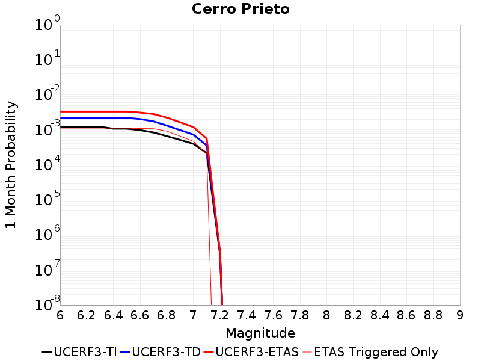 |  | 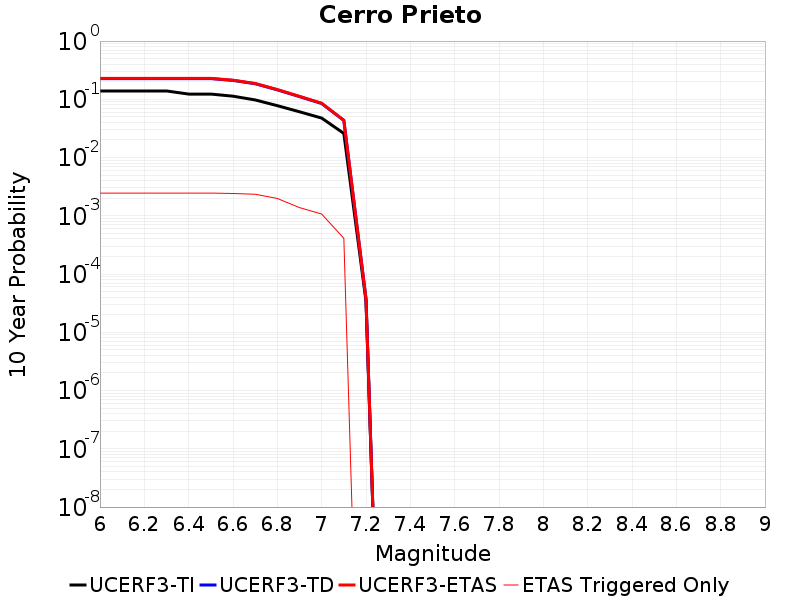 |

| Magnitude | 1 wk TI Prob | 1 wk TD Prob | 1 wk ETAS Prob | 1 wk ETAS/TD Gain | 1 wk ETAS Triggered Only | 1 mo TI Prob | 1 mo TD Prob | 1 mo ETAS Prob | 1 mo ETAS/TD Gain | 1 mo ETAS Triggered Only | 1 yr TI Prob | 1 yr TD Prob | 1 yr ETAS Prob | 1 yr ETAS/TD Gain | 1 yr ETAS Triggered Only | 10 yr TI Prob | 10 yr TD Prob | 10 yr ETAS Prob | 10 yr ETAS/TD Gain | 10 yr ETAS Triggered Only |
|-----|-----|-----|-----|-----|-----|-----|-----|-----|-----|-----|-----|-----|-----|-----|-----|-----|-----|-----|-----|-----|
| 6.0 | 2.863869E-4 | 5.162672E-4 | 0.0012458904 | 2.4132664 | 7.3E-4 | 0.001226795 | 0.0022108955 | 0.0033284193 | 1.505462 | 0.00112 | 0.014834271 | 0.026796974 | 0.028626597 | 1.0682771 | 0.00188 | 0.13882194 | 0.22630471 | 0.22820026 | 1.0083761 | 0.00245 |
| 6.1 | 2.863869E-4 | 5.162672E-4 | 0.0012458904 | 2.4132664 | 7.3E-4 | 0.001226795 | 0.0022108955 | 0.0033284193 | 1.505462 | 0.00112 | 0.014834271 | 0.026796974 | 0.028626597 | 1.0682771 | 0.00188 | 0.13882194 | 0.22630471 | 0.22820026 | 1.0083761 | 0.00245 |
| 6.2 | 2.863869E-4 | 5.162672E-4 | 0.0012458904 | 2.4132664 | 7.3E-4 | 0.001226795 | 0.0022108955 | 0.0033284193 | 1.505462 | 0.00112 | 0.014834271 | 0.026796974 | 0.028626597 | 1.0682771 | 0.00188 | 0.13882194 | 0.22630471 | 0.22820026 | 1.0083761 | 0.00245 |
| 6.3 | 2.863869E-4 | 5.162672E-4 | 0.0012458904 | 2.4132664 | 7.3E-4 | 0.001226795 | 0.0022108955 | 0.0033284193 | 1.505462 | 0.00112 | 0.014834271 | 0.026796974 | 0.028626597 | 1.0682771 | 0.00188 | 0.13882194 | 0.22630471 | 0.22820026 | 1.0083761 | 0.00245 |
| 6.4 | 2.508648E-4 | 5.162672E-4 | 0.0012458904 | 2.4132664 | 7.3E-4 | 0.0010746918 | 0.0022108955 | 0.0033284193 | 1.505462 | 0.00112 | 0.013006088 | 0.026796974 | 0.028626597 | 1.0682771 | 0.00188 | 0.12270685 | 0.22630471 | 0.22820026 | 1.0083761 | 0.00245 |
| 6.5 | 2.508648E-4 | 5.162672E-4 | 0.0012458904 | 2.4132664 | 7.3E-4 | 0.0010746918 | 0.0022108955 | 0.0033284193 | 1.505462 | 0.00112 | 0.013006088 | 0.026796974 | 0.028626597 | 1.0682771 | 0.00188 | 0.12270685 | 0.22630471 | 0.22820026 | 1.0083761 | 0.00245 |
| 6.6 | 2.294914E-4 | 4.7397657E-4 | 0.0011736448 | 2.4761662 | 7.0E-4 | 9.831638E-4 | 0.002029934 | 0.0031177213 | 1.5358733 | 0.00109 | 0.011904482 | 0.024609342 | 0.026404062 | 1.0729283 | 0.00184 | 0.11286586 | 0.21047968 | 0.21238242 | 1.00904 | 0.00241 |
| 6.7 | 1.9621674E-4 | 4.0744193E-4 | 0.0011071567 | 2.7173362 | 7.0E-4 | 8.4065786E-4 | 0.0017451696 | 0.0028232848 | 1.617771 | 0.00108 | 0.010187071 | 0.021122532 | 0.022874722 | 1.0829536 | 0.00179 | 0.09732539 | 0.18476067 | 0.18666834 | 1.0103251 | 0.00234 |
| 6.8 | 1.5476145E-4 | 3.091651E-4 | 9.2897343E-4 | 3.004781 | 6.2E-4 | 6.6309475E-4 | 0.0013244237 | 0.0022432052 | 1.6937218 | 9.2E-4 | 0.008043335 | 0.015980722 | 0.017446911 | 1.0917473 | 0.00149 | 0.07758363 | 0.14504454 | 0.14673734 | 1.011671 | 0.00198 |
| 6.9 | 1.20509176E-4 | 2.2931531E-4 | 6.8920985E-4 | 3.0055118 | 4.6E-4 | 5.1636563E-4 | 9.824743E-4 | 0.0016418258 | 1.6711134 | 6.6E-4 | 0.006268645 | 0.0118763875 | 0.012904036 | 1.0865288 | 0.00104 | 0.060947374 | 0.11095742 | 0.1121843 | 1.0110573 | 0.00138 |
| 7.0 | 9.3269155E-5 | 1.7019441E-4 | 4.9013994E-4 | 2.8798828 | 3.2E-4 | 3.9966372E-4 | 7.2924496E-4 | 0.0011989023 | 1.6440322 | 4.7E-4 | 0.0048550544 | 0.008850274 | 0.00962337 | 1.0873529 | 7.8E-4 | 0.04750344 | 0.08447449 | 0.0854541 | 1.0115966 | 0.00107 |
| 7.1 | 5.029709E-5 | 8.366497E-5 | 2.2365326E-4 | 2.6732008 | 1.4E-4 | 2.1554115E-4 | 3.5853492E-4 | 5.584632E-4 | 1.5576258 | 2.0E-4 | 0.0026210553 | 0.004359978 | 0.004678583 | 1.0730748 | 3.2E-4 | 0.025903556 | 0.04323468 | 0.043626953 | 1.0090731 | 4.1E-4 |
| 7.2 | 6.5445185E-8 | 7.169843E-8 | 7.169843E-8 | 1.0 | 0.0 | 2.8047933E-7 | 3.0727898E-7 | 3.0727898E-7 | 1.0 | 0.0 | 3.4148304E-6 | 3.7411219E-6 | 3.7411219E-6 | 1.0 | 0.0 | 3.414778E-5 | 3.7411217E-5 | 3.7411217E-5 | 1.0 | 0.0 |

## Laguna Salada
*[(top)](#table-of-contents)*

| 1 Week | 1 Month | 1 Year | 10 Year |
|-----|-----|-----|-----|
|  |  | 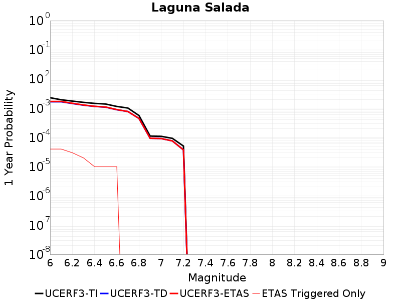 |  |

| Magnitude | 1 wk TI Prob | 1 wk TD Prob | 1 wk ETAS Prob | 1 wk ETAS/TD Gain | 1 wk ETAS Triggered Only | 1 mo TI Prob | 1 mo TD Prob | 1 mo ETAS Prob | 1 mo ETAS/TD Gain | 1 mo ETAS Triggered Only | 1 yr TI Prob | 1 yr TD Prob | 1 yr ETAS Prob | 1 yr ETAS/TD Gain | 1 yr ETAS Triggered Only | 10 yr TI Prob | 10 yr TD Prob | 10 yr ETAS Prob | 10 yr ETAS/TD Gain | 10 yr ETAS Triggered Only |
|-----|-----|-----|-----|-----|-----|-----|-----|-----|-----|-----|-----|-----|-----|-----|-----|-----|-----|-----|-----|-----|
| 6.0 | 4.3960263E-5 | 3.1901924E-5 | 4.1901603E-5 | 1.3134507 | 1.0E-5 | 1.8838752E-4 | 1.3671588E-4 | 1.6671179E-4 | 1.2194031 | 3.0E-5 | 0.0022912053 | 0.0016633383 | 0.0017032718 | 1.024008 | 4.0E-5 | 0.022677258 | 0.016552364 | 0.016611371 | 1.0035648 | 6.0E-5 |
| 6.1 | 3.7353202E-5 | 3.1901924E-5 | 4.1901603E-5 | 1.3134507 | 1.0E-5 | 1.6007533E-4 | 1.3671588E-4 | 1.6671179E-4 | 1.2194031 | 3.0E-5 | 0.0019471749 | 0.0016633383 | 0.0017032718 | 1.024008 | 4.0E-5 | 0.019302014 | 0.016552364 | 0.016611371 | 1.0035648 | 6.0E-5 |
| 6.2 | 3.3633605E-5 | 2.7790755E-5 | 3.7790476E-5 | 1.3598219 | 1.0E-5 | 1.4413605E-4 | 1.19098266E-4 | 1.3909588E-4 | 1.1679085 | 2.0E-5 | 0.0017534439 | 0.0014491408 | 0.0014790974 | 1.020672 | 3.0E-5 | 0.017396728 | 0.014439282 | 0.014468849 | 1.0020477 | 3.0E-5 |
| 6.3 | 3.0459405E-5 | 2.4422723E-5 | 3.442248E-5 | 1.4094447 | 1.0E-5 | 1.3053378E-4 | 1.0466506E-4 | 1.2466297E-4 | 1.1910658 | 2.0E-5 | 0.0015880901 | 0.0012736296 | 0.0012936041 | 1.0156832 | 2.0E-5 | 0.01576789 | 0.012703442 | 0.012723188 | 1.0015544 | 2.0E-5 |
| 6.4 | 2.8078504E-5 | 2.2106151E-5 | 2.2106151E-5 | 1.0 | 0.0 | 1.203309E-4 | 9.4737625E-5 | 1.0473668E-4 | 1.1055447 | 1.0E-5 | 0.0014640441 | 0.0011528947 | 0.0011628832 | 1.0086638 | 1.0E-5 | 0.014544362 | 0.01150749 | 0.011517375 | 1.000859 | 1.0E-5 |
| 6.5 | 2.6691412E-5 | 2.0860343E-5 | 2.0860343E-5 | 1.0 | 0.0 | 1.1438675E-4 | 8.9398825E-5 | 9.9397934E-5 | 1.1118482 | 1.0E-5 | 0.0013917689 | 0.001087961 | 0.00109795 | 1.0091815 | 1.0E-5 | 0.013830846 | 0.010863419 | 0.01087331 | 1.0009105 | 1.0E-5 |
| 6.6 | 2.207987E-5 | 1.7036567E-5 | 1.7036567E-5 | 1.0 | 0.0 | 9.4624585E-5 | 7.30122E-5 | 8.301147E-5 | 1.1369534 | 1.0E-5 | 0.0011514454 | 8.8862976E-4 | 8.9862087E-4 | 1.0112432 | 1.0E-5 | 0.011454974 | 0.008882088 | 0.008891999 | 1.0011159 | 1.0E-5 |
| 6.7 | 1.9458053E-5 | 1.4804462E-5 | 1.4804462E-5 | 1.0 | 0.0 | 8.338899E-5 | 6.344653E-5 | 6.344653E-5 | 1.0 | 0.0 | 0.001014788 | 7.722552E-4 | 7.722552E-4 | 1.0 | 0.0 | 0.010101665 | 0.007723772 | 0.007723772 | 1.0 | 0.0 |
| 6.8 | 1.0767866E-5 | 8.55484E-6 | 8.55484E-6 | 1.0 | 0.0 | 4.614718E-5 | 3.666341E-5 | 3.666341E-5 | 1.0 | 0.0 | 5.6169706E-4 | 4.4634292E-4 | 4.4634292E-4 | 1.0 | 0.0 | 0.0056027942 | 0.0044695283 | 0.0044695283 | 1.0 | 0.0 |
| 6.9 | 2.1384765E-6 | 1.8012852E-6 | 1.8012852E-6 | 1.0 | 0.0 | 9.164866E-6 | 7.719773E-6 | 7.719773E-6 | 1.0 | 0.0 | 1.1157654E-4 | 9.398457E-5 | 9.398457E-5 | 1.0 | 0.0 | 0.0011152053 | 9.3948696E-4 | 9.3948696E-4 | 1.0 | 0.0 |
| 7.0 | 2.0952946E-6 | 1.7591279E-6 | 1.7591279E-6 | 1.0 | 0.0 | 8.979802E-6 | 7.5391004E-6 | 7.5391004E-6 | 1.0 | 0.0 | 1.0932361E-4 | 9.178508E-5 | 9.178508E-5 | 1.0 | 0.0 | 0.0010926984 | 9.1751025E-4 | 9.1751025E-4 | 1.0 | 0.0 |
| 7.1 | 1.7887576E-6 | 1.4593188E-6 | 1.4593188E-6 | 1.0 | 0.0 | 7.666081E-6 | 6.25421E-6 | 6.25421E-6 | 1.0 | 0.0 | 9.333054E-5 | 7.614266E-5 | 7.614266E-5 | 1.0 | 0.0 | 9.329135E-4 | 7.611965E-4 | 7.611965E-4 | 1.0 | 0.0 |
| 7.2 | 9.723109E-7 | 7.199231E-7 | 7.199231E-7 | 1.0 | 0.0 | 4.16704E-6 | 3.0853819E-6 | 3.0853819E-6 | 1.0 | 0.0 | 5.073253E-5 | 3.7564045E-5 | 3.7564045E-5 | 1.0 | 0.0 | 5.072095E-4 | 3.755935E-4 | 3.755935E-4 | 1.0 | 0.0 |

## Imperial
*[(top)](#table-of-contents)*

| 1 Week | 1 Month | 1 Year | 10 Year |
|-----|-----|-----|-----|
| 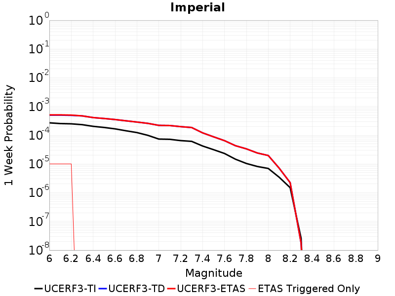 | 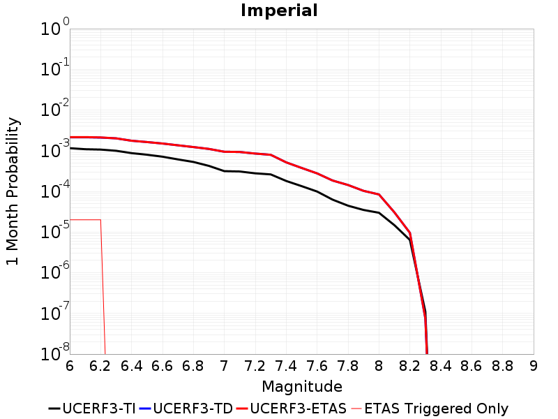 |  |  |

| Magnitude | 1 wk TI Prob | 1 wk TD Prob | 1 wk ETAS Prob | 1 wk ETAS/TD Gain | 1 wk ETAS Triggered Only | 1 mo TI Prob | 1 mo TD Prob | 1 mo ETAS Prob | 1 mo ETAS/TD Gain | 1 mo ETAS Triggered Only | 1 yr TI Prob | 1 yr TD Prob | 1 yr ETAS Prob | 1 yr ETAS/TD Gain | 1 yr ETAS Triggered Only | 10 yr TI Prob | 10 yr TD Prob | 10 yr ETAS Prob | 10 yr ETAS/TD Gain | 10 yr ETAS Triggered Only |
|-----|-----|-----|-----|-----|-----|-----|-----|-----|-----|-----|-----|-----|-----|-----|-----|-----|-----|-----|-----|-----|
| 6.0 | 2.6875173E-4 | 4.985228E-4 | 5.085178E-4 | 1.0200492 | 1.0E-5 | 0.0011512847 | 0.002134815 | 0.0021547724 | 1.0093485 | 2.0E-5 | 0.013927074 | 0.025685288 | 0.025714519 | 1.001138 | 3.0E-5 | 0.13085878 | 0.22408308 | 0.22412188 | 1.0001731 | 5.0E-5 |
| 6.1 | 2.5356023E-4 | 4.985228E-4 | 5.085178E-4 | 1.0200492 | 1.0E-5 | 0.001086234 | 0.002134815 | 0.0021547724 | 1.0093485 | 2.0E-5 | 0.013144928 | 0.025685288 | 0.025714519 | 1.001138 | 3.0E-5 | 0.123940155 | 0.22408308 | 0.22412188 | 1.0001731 | 5.0E-5 |
| 6.2 | 2.4820742E-4 | 4.893077E-4 | 4.993028E-4 | 1.020427 | 1.0E-5 | 0.0010633124 | 0.0020953857 | 0.0021153437 | 1.0095248 | 2.0E-5 | 0.01286919 | 0.025216669 | 0.025245912 | 1.0011597 | 3.0E-5 | 0.12148927 | 0.22054939 | 0.22058837 | 1.0001767 | 5.0E-5 |
| 6.3 | 2.3205351E-4 | 4.6897907E-4 | 4.6897907E-4 | 1.0 | 0.0 | 9.94136E-4 | 0.0020083988 | 0.0020083988 | 1.0 | 0.0 | 0.012036599 | 0.024179364 | 0.024189122 | 1.0004035 | 1.0E-5 | 0.11405133 | 0.21201394 | 0.2120376 | 1.0001115 | 3.0E-5 |
| 6.4 | 2.0304754E-4 | 4.0945783E-4 | 4.0945783E-4 | 1.0 | 0.0 | 8.6991355E-4 | 0.001753654 | 0.001753654 | 1.0 | 0.0 | 0.010539869 | 0.021142092 | 0.02115188 | 1.000463 | 1.0E-5 | 0.100537635 | 0.18922049 | 0.18924482 | 1.0001285 | 3.0E-5 |
| 6.5 | 1.854992E-4 | 3.8009865E-4 | 3.8009865E-4 | 1.0 | 0.0 | 7.9475436E-4 | 0.0016279898 | 0.0016279898 | 1.0 | 0.0 | 0.009633281 | 0.01964427 | 0.01964427 | 1.0 | 0.0 | 0.0922623 | 0.17728381 | 0.17730026 | 1.0000929 | 2.0E-5 |
| 6.6 | 1.6586106E-4 | 3.4978238E-4 | 3.4978238E-4 | 1.0 | 0.0 | 7.106394E-4 | 0.0014982165 | 0.0014982165 | 1.0 | 0.0 | 0.008617763 | 0.01808992 | 0.01808992 | 1.0 | 0.0 | 0.08291132 | 0.16450606 | 0.16452278 | 1.0001016 | 2.0E-5 |
| 6.7 | 1.4224656E-4 | 3.160784E-4 | 3.160784E-4 | 1.0 | 0.0 | 6.094856E-4 | 0.0013539268 | 0.0013539268 | 1.0 | 0.0 | 0.0073952693 | 0.016363423 | 0.016363423 | 1.0 | 0.0 | 0.07153955 | 0.14985323 | 0.14987023 | 1.0001135 | 2.0E-5 |
| 6.8 | 1.2317259E-4 | 2.86185E-4 | 2.86185E-4 | 1.0 | 0.0 | 5.2777573E-4 | 0.001225937 | 0.001225937 | 1.0 | 0.0 | 0.0064067547 | 0.014825087 | 0.014825087 | 1.0 | 0.0 | 0.06225166 | 0.136294 | 0.1363113 | 1.0001267 | 2.0E-5 |
| 6.9 | 9.859898E-5 | 2.5759707E-4 | 2.5759707E-4 | 1.0 | 0.0 | 4.2249862E-4 | 0.0011035248 | 0.0011035248 | 1.0 | 0.0 | 0.0051317946 | 0.013353663 | 0.013353663 | 1.0 | 0.0 | 0.05014893 | 0.122470014 | 0.12248756 | 1.0001433 | 2.0E-5 |
| 7.0 | 7.3191884E-5 | 2.1948887E-4 | 2.1948887E-4 | 1.0 | 0.0 | 3.136418E-4 | 9.403308E-4 | 9.403308E-4 | 1.0 | 0.0 | 0.003811904 | 0.011389156 | 0.011389156 | 1.0 | 0.0 | 0.037471764 | 0.104908876 | 0.10492678 | 1.0001706 | 2.0E-5 |
| 7.1 | 7.1760296E-5 | 2.1647241E-4 | 2.1647241E-4 | 1.0 | 0.0 | 3.0750787E-4 | 9.2741236E-4 | 9.2741236E-4 | 1.0 | 0.0 | 0.003737482 | 0.011233506 | 0.011233506 | 1.0 | 0.0 | 0.03675245 | 0.10353701 | 0.10355494 | 1.0001732 | 2.0E-5 |
| 7.2 | 6.46614E-5 | 1.9805998E-4 | 1.9805998E-4 | 1.0 | 0.0 | 2.7709085E-4 | 8.4855553E-4 | 8.4855553E-4 | 1.0 | 0.0 | 0.0033683628 | 0.0102828825 | 0.0102828825 | 1.0 | 0.0 | 0.033177625 | 0.09532642 | 0.09534452 | 1.0001898 | 2.0E-5 |
| 7.3 | 6.088115E-5 | 1.8460184E-4 | 1.8460184E-4 | 1.0 | 0.0 | 2.6089314E-4 | 7.909139E-4 | 7.909139E-4 | 1.0 | 0.0 | 0.0031717476 | 0.0095874695 | 0.0095874695 | 1.0 | 0.0 | 0.031268585 | 0.08932452 | 0.08934273 | 1.0002038 | 2.0E-5 |
| 7.4 | 4.199346E-5 | 1.2033568E-4 | 1.2033568E-4 | 1.0 | 0.0 | 1.7995955E-4 | 5.1562337E-4 | 5.1562337E-4 | 1.0 | 0.0 | 0.0021888057 | 0.006259826 | 0.006259826 | 1.0 | 0.0 | 0.02167372 | 0.059747763 | 0.059757166 | 1.0001574 | 1.0E-5 |
| 7.5 | 3.130448E-5 | 8.768122E-5 | 8.768122E-5 | 1.0 | 0.0 | 1.3415517E-4 | 3.7572288E-4 | 3.7572288E-4 | 1.0 | 0.0 | 0.0016321153 | 0.004564896 | 0.004564896 | 1.0 | 0.0 | 0.016201803 | 0.044087045 | 0.044087045 | 1.0 | 0.0 |
| 7.6 | 2.3074248E-5 | 6.444782E-5 | 6.444782E-5 | 1.0 | 0.0 | 9.888588E-5 | 2.7617585E-4 | 2.7617585E-4 | 1.0 | 0.0 | 0.0012032706 | 0.0033572821 | 0.0033572821 | 1.0 | 0.0 | 0.011967761 | 0.03266095 | 0.03266095 | 1.0 | 0.0 |
| 7.7 | 1.45864815E-5 | 4.304283E-5 | 4.304283E-5 | 1.0 | 0.0 | 6.2511994E-5 | 1.8445625E-4 | 1.8445625E-4 | 1.0 | 0.0 | 7.608177E-4 | 0.002243448 | 0.002243448 | 1.0 | 0.0 | 0.007582182 | 0.021956049 | 0.021956049 | 1.0 | 0.0 |
| 7.8 | 1.0352979E-5 | 3.339155E-5 | 3.339155E-5 | 1.0 | 0.0 | 4.4369157E-5 | 1.4309879E-4 | 1.4309879E-4 | 1.0 | 0.0 | 5.400606E-4 | 0.0017408383 | 0.0017408383 | 1.0 | 0.0 | 0.0053875 | 0.017121576 | 0.017121576 | 1.0 | 0.0 |
| 7.9 | 8.137906E-6 | 2.4009603E-5 | 2.4009603E-5 | 1.0 | 0.0 | 3.4876273E-5 | 1.0289424E-4 | 1.0289424E-4 | 1.0 | 0.0 | 4.2453592E-4 | 0.0012520186 | 0.0012520186 | 1.0 | 0.0 | 0.004237258 | 0.012477979 | 0.012477979 | 1.0 | 0.0 |
| 8.0 | 6.93792E-6 | 1.9579787E-5 | 1.9579787E-5 | 1.0 | 0.0 | 2.9733603E-5 | 8.391068E-5 | 8.391068E-5 | 1.0 | 0.0 | 3.6194647E-4 | 0.0010211347 | 0.0010211347 | 1.0 | 0.0 | 0.0036135751 | 0.0102323275 | 0.0102323275 | 1.0 | 0.0 |
| 8.1 | 3.4286315E-6 | 7.086894E-6 | 7.086894E-6 | 1.0 | 0.0 | 1.4694053E-5 | 3.037205E-5 | 3.037205E-5 | 1.0 | 0.0 | 1.7888541E-4 | 3.6971713E-4 | 3.6971713E-4 | 1.0 | 0.0 | 0.0017874148 | 0.0038334767 | 0.0038334767 | 1.0 | 0.0 |
| 8.2 | 1.4906886E-6 | 2.2260976E-6 | 2.2260976E-6 | 1.0 | 0.0 | 6.3886496E-6 | 9.540384E-6 | 9.540384E-6 | 1.0 | 0.0 | 7.7779034E-5 | 1.16148025E-4 | 1.16148025E-4 | 1.0 | 0.0 | 7.775182E-4 | 0.0012538887 | 0.0012538887 | 1.0 | 0.0 |
| 8.3 | 2.5758007E-8 | 1.7468153E-8 | 1.7468153E-8 | 1.0 | 0.0 | 1.10391454E-7 | 7.4863514E-8 | 7.4863514E-8 | 1.0 | 0.0 | 1.3440151E-6 | 9.1146325E-7 | 9.1146325E-7 | 1.0 | 0.0 | 1.344007E-5 | 9.462885E-6 | 9.462885E-6 | 1.0 | 0.0 |

## Brawley (Seismic Zone) alt 1
*[(top)](#table-of-contents)*

| 1 Week | 1 Month | 1 Year | 10 Year |
|-----|-----|-----|-----|
|  | 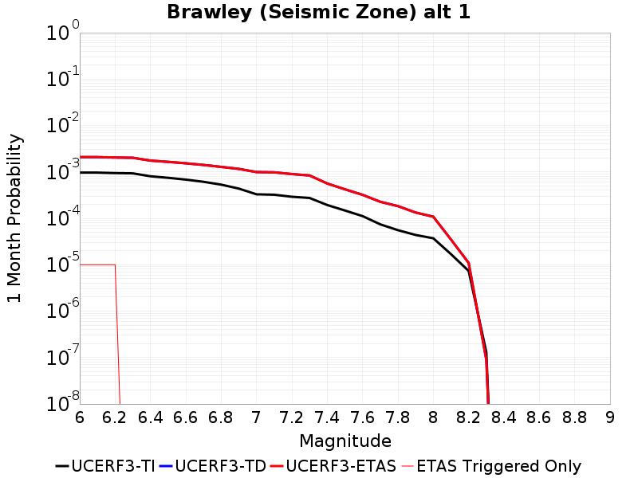 |  |  |

| Magnitude | 1 wk TI Prob | 1 wk TD Prob | 1 wk ETAS Prob | 1 wk ETAS/TD Gain | 1 wk ETAS Triggered Only | 1 mo TI Prob | 1 mo TD Prob | 1 mo ETAS Prob | 1 mo ETAS/TD Gain | 1 mo ETAS Triggered Only | 1 yr TI Prob | 1 yr TD Prob | 1 yr ETAS Prob | 1 yr ETAS/TD Gain | 1 yr ETAS Triggered Only | 10 yr TI Prob | 10 yr TD Prob | 10 yr ETAS Prob | 10 yr ETAS/TD Gain | 10 yr ETAS Triggered Only |
|-----|-----|-----|-----|-----|-----|-----|-----|-----|-----|-----|-----|-----|-----|-----|-----|-----|-----|-----|-----|-----|
| 6.0 | 2.2521618E-4 | 4.8449042E-4 | 4.944856E-4 | 1.0206302 | 1.0E-5 | 9.6485513E-4 | 0.002074772 | 0.0020847511 | 1.0048099 | 1.0E-5 | 0.011683988 | 0.024972176 | 0.024991678 | 1.0007809 | 2.0E-5 | 0.11088423 | 0.2169126 | 0.21694392 | 1.0001444 | 4.0E-5 |
| 6.1 | 2.2521618E-4 | 4.8449042E-4 | 4.944856E-4 | 1.0206302 | 1.0E-5 | 9.6485513E-4 | 0.002074772 | 0.0020847511 | 1.0048099 | 1.0E-5 | 0.011683988 | 0.024972176 | 0.024991678 | 1.0007809 | 2.0E-5 | 0.11088423 | 0.2169126 | 0.21694392 | 1.0001444 | 4.0E-5 |
| 6.2 | 2.198148E-4 | 4.7516715E-4 | 4.851624E-4 | 1.0210352 | 1.0E-5 | 9.417233E-4 | 0.0020348777 | 0.0020448572 | 1.0049043 | 1.0E-5 | 0.011405343 | 0.02449771 | 0.02451722 | 1.0007964 | 2.0E-5 | 0.10837428 | 0.213304 | 0.21333547 | 1.0001476 | 4.0E-5 |
| 6.3 | 2.1704129E-4 | 4.695671E-4 | 4.695671E-4 | 1.0 | 0.0 | 9.298453E-4 | 0.0020109145 | 0.0020109145 | 1.0 | 0.0 | 0.011262234 | 0.024213038 | 0.024222797 | 1.000403 | 1.0E-5 | 0.107082725 | 0.21120016 | 0.21122383 | 1.000112 | 3.0E-5 |
| 6.4 | 1.876142E-4 | 4.0910704E-4 | 4.0910704E-4 | 1.0 | 0.0 | 8.038131E-4 | 0.0017521522 | 0.0017521522 | 1.0 | 0.0 | 0.00974259 | 0.021127898 | 0.021137688 | 1.0004634 | 1.0E-5 | 0.093263686 | 0.18800588 | 0.18803024 | 1.0001296 | 3.0E-5 |
| 6.5 | 1.7390939E-4 | 3.8349166E-4 | 3.8349166E-4 | 1.0 | 0.0 | 7.45113E-4 | 0.0016425127 | 0.0016425127 | 1.0 | 0.0 | 0.009034078 | 0.019818772 | 0.019818772 | 1.0 | 0.0 | 0.086755216 | 0.17782274 | 0.17783919 | 1.0000925 | 2.0E-5 |
| 6.6 | 1.591791E-4 | 3.575911E-4 | 3.575911E-4 | 1.0 | 0.0 | 6.8201777E-4 | 0.0015316434 | 0.0015316434 | 1.0 | 0.0 | 0.008271996 | 0.018492026 | 0.018492026 | 1.0 | 0.0 | 0.07970774 | 0.16721013 | 0.16722678 | 1.0000997 | 2.0E-5 |
| 6.7 | 1.4268003E-4 | 3.2925606E-4 | 3.2925606E-4 | 1.0 | 0.0 | 6.1134255E-4 | 0.0014103426 | 0.0014103426 | 1.0 | 0.0 | 0.007417723 | 0.017039748 | 0.017039748 | 1.0 | 0.0 | 0.07174956 | 0.15534465 | 0.15536155 | 1.0001087 | 2.0E-5 |
| 6.8 | 1.239713E-4 | 2.9912606E-4 | 2.9912606E-4 | 1.0 | 0.0 | 5.3119735E-4 | 0.0012813454 | 0.0012813454 | 1.0 | 0.0 | 0.0064481674 | 0.0154902935 | 0.0154902935 | 1.0 | 0.0 | 0.06264243 | 0.14180464 | 0.1418218 | 1.000121 | 2.0E-5 |
| 6.9 | 1.0180238E-4 | 2.705697E-4 | 2.705697E-4 | 1.0 | 0.0 | 4.3622297E-4 | 0.0011590736 | 0.0011590736 | 1.0 | 0.0 | 0.005298089 | 0.014021467 | 0.014021467 | 1.0 | 0.0 | 0.05173543 | 0.12823029 | 0.12824772 | 1.000136 | 2.0E-5 |
| 7.0 | 7.6619996E-5 | 2.314204E-4 | 2.314204E-4 | 1.0 | 0.0 | 3.283301E-4 | 9.91428E-4 | 9.91428E-4 | 1.0 | 0.0 | 0.0039900932 | 0.012004582 | 0.012004582 | 1.0 | 0.0 | 0.039192066 | 0.11034167 | 0.11035947 | 1.0001613 | 2.0E-5 |
| 7.1 | 7.5127435E-5 | 2.2822164E-4 | 2.2822164E-4 | 1.0 | 0.0 | 3.2193496E-4 | 9.777294E-4 | 9.777294E-4 | 1.0 | 0.0 | 0.0039125155 | 0.011839626 | 0.011839626 | 1.0 | 0.0 | 0.038443442 | 0.10889783 | 0.10891565 | 1.0001637 | 2.0E-5 |
| 7.2 | 6.788582E-5 | 2.0939906E-4 | 2.0939906E-4 | 1.0 | 0.0 | 2.9090676E-4 | 8.9711905E-4 | 8.9711905E-4 | 1.0 | 0.0 | 0.0035360386 | 0.010868402 | 0.010868402 | 1.0 | 0.0 | 0.034803 | 0.10055235 | 0.10057034 | 1.0001789 | 2.0E-5 |
| 7.3 | 6.399602E-5 | 1.9552895E-4 | 1.9552895E-4 | 1.0 | 0.0 | 2.7423984E-4 | 8.3771505E-4 | 8.3771505E-4 | 1.0 | 0.0 | 0.0033337586 | 0.01015211 | 0.01015211 | 1.0 | 0.0 | 0.03284188 | 0.094395034 | 0.09441315 | 1.0001919 | 2.0E-5 |
| 7.4 | 4.506759E-5 | 1.3112207E-4 | 1.3112207E-4 | 1.0 | 0.0 | 1.9313251E-4 | 5.6183164E-4 | 5.6183164E-4 | 1.0 | 0.0 | 0.0023488526 | 0.0068190345 | 0.0068190345 | 1.0 | 0.0 | 0.023241805 | 0.064915776 | 0.06492513 | 1.000144 | 1.0E-5 |
| 7.5 | 3.43289E-5 | 9.829788E-5 | 9.829788E-5 | 1.0 | 0.0 | 1.4711556E-4 | 4.2120897E-4 | 4.2120897E-4 | 1.0 | 0.0 | 0.0017896603 | 0.0051162285 | 0.0051162285 | 1.0 | 0.0 | 0.01775316 | 0.049259458 | 0.049259458 | 1.0 | 0.0 |
| 7.6 | 2.5980507E-5 | 7.4724536E-5 | 7.4724536E-5 | 1.0 | 0.0 | 1.1134028E-4 | 3.2020884E-4 | 3.2020884E-4 | 1.0 | 0.0 | 0.001354725 | 0.0038916003 | 0.0038916003 | 1.0 | 0.0 | 0.013464959 | 0.03772735 | 0.03772735 | 1.0 | 0.0 |
| 7.7 | 1.7292105E-5 | 5.290819E-5 | 5.290819E-5 | 1.0 | 0.0 | 7.4106916E-5 | 2.2672972E-4 | 2.2672972E-4 | 1.0 | 0.0 | 9.018782E-4 | 0.0027569465 | 0.0027569465 | 1.0 | 0.0 | 0.008982267 | 0.026871633 | 0.026871633 | 1.0 | 0.0 |
| 7.8 | 1.2927471E-5 | 4.268287E-5 | 4.268287E-5 | 1.0 | 0.0 | 5.5402274E-5 | 1.8291378E-4 | 1.8291378E-4 | 1.0 | 0.0 | 6.743139E-4 | 0.0022247038 | 0.0022247038 | 1.0 | 0.0 | 0.0067227143 | 0.021781707 | 0.021781707 | 1.0 | 0.0 |
| 7.9 | 1.0200774E-5 | 3.105359E-5 | 3.105359E-5 | 1.0 | 0.0 | 4.371687E-5 | 1.3308004E-4 | 1.3308004E-4 | 1.0 | 0.0 | 5.321229E-4 | 0.0016190466 | 0.0016190466 | 1.0 | 0.0 | 0.005308505 | 0.016051337 | 0.016051337 | 1.0 | 0.0 |
| 8.0 | 8.650396E-6 | 2.5219122E-5 | 2.5219122E-5 | 1.0 | 0.0 | 3.70726E-5 | 1.0807748E-4 | 1.0807748E-4 | 1.0 | 0.0 | 4.5126543E-4 | 0.0013150501 | 0.0013150501 | 1.0 | 0.0 | 0.0045035016 | 0.013108613 | 0.013108613 | 1.0 | 0.0 |
| 8.1 | 3.9368224E-6 | 8.134844E-6 | 8.134844E-6 | 1.0 | 0.0 | 1.6871985E-5 | 3.4863155E-5 | 3.4863155E-5 | 1.0 | 0.0 | 2.0539707E-4 | 4.2437637E-4 | 4.2437637E-4 | 1.0 | 0.0 | 0.0020520731 | 0.0043973303 | 0.0043973303 | 1.0 | 0.0 |
| 8.2 | 1.7101195E-6 | 2.5475833E-6 | 2.5475833E-6 | 1.0 | 0.0 | 7.329063E-6 | 1.0918169E-5 | 1.0918169E-5 | 1.0 | 0.0 | 8.922769E-5 | 1.3292064E-4 | 1.3292064E-4 | 1.0 | 0.0 | 8.9191867E-4 | 0.0014334372 | 0.0014334372 | 1.0 | 0.0 |
| 8.3 | 3.0346666E-8 | 2.0735031E-8 | 2.0735031E-8 | 1.0 | 0.0 | 1.3005713E-7 | 8.886442E-8 | 8.886442E-8 | 1.0 | 0.0 | 1.5834444E-6 | 1.0819241E-6 | 1.0819241E-6 | 1.0 | 0.0 | 1.5834332E-5 | 1.1234617E-5 | 1.1234617E-5 | 1.0 | 0.0 |

## San Andreas (Coachella) rev
*[(top)](#table-of-contents)*

| 1 Week | 1 Month | 1 Year | 10 Year |
|-----|-----|-----|-----|
|  |  | 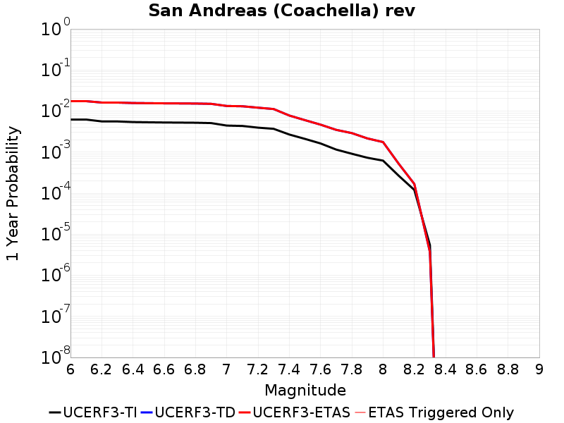 |  |

| Magnitude | 1 wk TI Prob | 1 wk TD Prob | 1 wk ETAS Prob | 1 wk ETAS/TD Gain | 1 wk ETAS Triggered Only | 1 mo TI Prob | 1 mo TD Prob | 1 mo ETAS Prob | 1 mo ETAS/TD Gain | 1 mo ETAS Triggered Only | 1 yr TI Prob | 1 yr TD Prob | 1 yr ETAS Prob | 1 yr ETAS/TD Gain | 1 yr ETAS Triggered Only | 10 yr TI Prob | 10 yr TD Prob | 10 yr ETAS Prob | 10 yr ETAS/TD Gain | 10 yr ETAS Triggered Only |
|-----|-----|-----|-----|-----|-----|-----|-----|-----|-----|-----|-----|-----|-----|-----|-----|-----|-----|-----|-----|-----|
| 6.0 | 1.1925945E-4 | 3.3612354E-4 | 3.3612354E-4 | 1.0 | 0.0 | 5.110118E-4 | 0.001439739 | 0.001439739 | 1.0 | 0.0 | 0.0062038354 | 0.017389348 | 0.017389348 | 1.0 | 0.0 | 0.060334753 | 0.15613455 | 0.15615141 | 1.0001081 | 2.0E-5 |
| 6.1 | 1.1925945E-4 | 3.3612354E-4 | 3.3612354E-4 | 1.0 | 0.0 | 5.110118E-4 | 0.001439739 | 0.001439739 | 1.0 | 0.0 | 0.0062038354 | 0.017389348 | 0.017389348 | 1.0 | 0.0 | 0.060334753 | 0.15613455 | 0.15615141 | 1.0001081 | 2.0E-5 |
| 6.2 | 1.07432395E-4 | 3.1104984E-4 | 3.1104984E-4 | 1.0 | 0.0 | 4.603433E-4 | 0.0013323938 | 0.0013323938 | 1.0 | 0.0 | 0.005590286 | 0.0161024 | 0.0161024 | 1.0 | 0.0 | 0.05451731 | 0.14532776 | 0.14534485 | 1.0001177 | 2.0E-5 |
| 6.3 | 1.0718766E-4 | 3.1050332E-4 | 3.1050332E-4 | 1.0 | 0.0 | 4.592948E-4 | 0.001330054 | 0.001330054 | 1.0 | 0.0 | 0.005577586 | 0.016074333 | 0.016074333 | 1.0 | 0.0 | 0.054396555 | 0.14509687 | 0.14511396 | 1.0001179 | 2.0E-5 |
| 6.4 | 1.0355944E-4 | 3.025688E-4 | 3.025688E-4 | 1.0 | 0.0 | 4.4375064E-4 | 0.0012960832 | 0.0012960832 | 1.0 | 0.0 | 0.0053892885 | 0.015666757 | 0.015666757 | 1.0 | 0.0 | 0.052604496 | 0.14166461 | 0.14168178 | 1.0001212 | 2.0E-5 |
| 6.5 | 1.0227914E-4 | 2.9975848E-4 | 2.9975848E-4 | 1.0 | 0.0 | 4.382655E-4 | 0.0012840509 | 0.0012840509 | 1.0 | 0.0 | 0.0053228354 | 0.015522361 | 0.015522361 | 1.0 | 0.0 | 0.051971316 | 0.14045233 | 0.1404695 | 1.0001224 | 2.0E-5 |
| 6.6 | 1.0116757E-4 | 2.9741006E-4 | 2.9741006E-4 | 1.0 | 0.0 | 4.3350324E-4 | 0.0012739961 | 0.0012739961 | 1.0 | 0.0 | 0.0052651367 | 0.01540168 | 0.01540168 | 1.0 | 0.0 | 0.051421247 | 0.13943326 | 0.13945048 | 1.0001234 | 2.0E-5 |
| 6.7 | 1.0050676E-4 | 2.959931E-4 | 2.959931E-4 | 1.0 | 0.0 | 4.3067214E-4 | 0.0012679292 | 0.0012679292 | 1.0 | 0.0 | 0.005230834 | 0.015328858 | 0.015328858 | 1.0 | 0.0 | 0.051094085 | 0.1388189 | 0.13883613 | 1.0001241 | 2.0E-5 |
| 6.8 | 9.976819E-5 | 2.9401874E-4 | 2.9401874E-4 | 1.0 | 0.0 | 4.2750788E-4 | 0.001259476 | 0.001259476 | 1.0 | 0.0 | 0.0051924936 | 0.015227383 | 0.015227383 | 1.0 | 0.0 | 0.050728295 | 0.13796933 | 0.13798657 | 1.0001249 | 2.0E-5 |
| 6.9 | 9.77719E-5 | 2.889645E-4 | 2.889645E-4 | 1.0 | 0.0 | 4.1895514E-4 | 0.0012378356 | 0.0012378356 | 1.0 | 0.0 | 0.0050888555 | 0.014967562 | 0.014967562 | 1.0 | 0.0 | 0.049738888 | 0.13579606 | 0.13581334 | 1.0001273 | 2.0E-5 |
| 7.0 | 8.500761E-5 | 2.5617075E-4 | 2.5617075E-4 | 1.0 | 0.0 | 3.6426744E-4 | 0.001097416 | 0.001097416 | 1.0 | 0.0 | 0.0044259406 | 0.013280013 | 0.013280013 | 1.0 | 0.0 | 0.04338823 | 0.12163899 | 0.12165656 | 1.0001444 | 2.0E-5 |
| 7.1 | 8.319876E-5 | 2.5216228E-4 | 2.5216228E-4 | 1.0 | 0.0 | 3.5651738E-4 | 0.0010802513 | 0.0010802513 | 1.0 | 0.0 | 0.004331963 | 0.013073558 | 0.013073558 | 1.0 | 0.0 | 0.042484846 | 0.119851515 | 0.11986911 | 1.0001469 | 2.0E-5 |
| 7.2 | 7.563917E-5 | 2.3254074E-4 | 2.3254074E-4 | 1.0 | 0.0 | 3.2412758E-4 | 9.962257E-4 | 9.962257E-4 | 1.0 | 0.0 | 0.0039391145 | 0.012062328 | 0.012062328 | 1.0 | 0.0 | 0.03870018 | 0.111245066 | 0.111262836 | 1.0001597 | 2.0E-5 |
| 7.3 | 7.082985E-5 | 2.1548105E-4 | 2.1548105E-4 | 1.0 | 0.0 | 3.0352117E-4 | 9.231664E-4 | 9.231664E-4 | 1.0 | 0.0 | 0.0036891096 | 0.011182293 | 0.011182293 | 1.0 | 0.0 | 0.03628465 | 0.10370693 | 0.10372486 | 1.0001729 | 2.0E-5 |
| 7.4 | 5.146215E-5 | 1.4961258E-4 | 1.4961258E-4 | 1.0 | 0.0 | 2.2053342E-4 | 6.4104015E-4 | 6.4104015E-4 | 1.0 | 0.0 | 0.0026816884 | 0.0077769393 | 0.0077769393 | 1.0 | 0.0 | 0.02649557 | 0.07383988 | 0.07384914 | 1.0001254 | 1.0E-5 |
| 7.5 | 4.0285166E-5 | 1.1538239E-4 | 1.1538239E-4 | 1.0 | 0.0 | 1.7263928E-4 | 4.944026E-4 | 4.944026E-4 | 1.0 | 0.0 | 0.002099857 | 0.006002815 | 0.006002815 | 1.0 | 0.0 | 0.020801254 | 0.057656385 | 0.057656385 | 1.0 | 0.0 |
| 7.6 | 3.1168736E-5 | 8.956297E-5 | 8.956297E-5 | 1.0 | 0.0 | 1.3357346E-4 | 3.83785E-4 | 3.83785E-4 | 1.0 | 0.0 | 0.0016250437 | 0.004662601 | 0.004662601 | 1.0 | 0.0 | 0.016132116 | 0.045128856 | 0.045128856 | 1.0 | 0.0 |
| 7.7 | 2.2100989E-5 | 6.685244E-5 | 6.685244E-5 | 1.0 | 0.0 | 9.4715084E-5 | 2.8647901E-4 | 2.8647901E-4 | 1.0 | 0.0 | 0.001152546 | 0.0034823113 | 0.0034823113 | 1.0 | 0.0 | 0.011465867 | 0.03391423 | 0.03391423 | 1.0 | 0.0 |
| 7.8 | 1.7484861E-5 | 5.570868E-5 | 5.570868E-5 | 1.0 | 0.0 | 7.493296E-5 | 2.3872964E-4 | 2.3872964E-4 | 1.0 | 0.0 | 9.1192697E-4 | 0.0029026628 | 0.0029026628 | 1.0 | 0.0 | 0.009081938 | 0.02840896 | 0.02840896 | 1.0 | 0.0 |
| 7.9 | 1.3967285E-5 | 4.129839E-5 | 4.129839E-5 | 1.0 | 0.0 | 5.985842E-5 | 1.769811E-4 | 1.769811E-4 | 1.0 | 0.0 | 7.2853256E-4 | 0.0021526169 | 0.0021526169 | 1.0 | 0.0 | 0.0072614877 | 0.0213224 | 0.0213224 | 1.0 | 0.0 |
| 8.0 | 1.1887396E-5 | 3.3660446E-5 | 3.3660446E-5 | 1.0 | 0.0 | 5.094499E-5 | 1.4425108E-4 | 1.4425108E-4 | 1.0 | 0.0 | 6.200787E-4 | 0.0017548433 | 0.0017548433 | 1.0 | 0.0 | 0.006183513 | 0.017480725 | 0.017480725 | 1.0 | 0.0 |
| 8.1 | 5.100864E-6 | 9.993478E-6 | 9.993478E-6 | 1.0 | 0.0 | 2.1860664E-5 | 4.282849E-5 | 4.282849E-5 | 1.0 | 0.0 | 2.6612106E-4 | 5.213123E-4 | 5.213123E-4 | 1.0 | 0.0 | 0.002658026 | 0.005421123 | 0.005421123 | 1.0 | 0.0 |
| 8.2 | 2.3004484E-6 | 3.2152143E-6 | 3.2152143E-6 | 1.0 | 0.0 | 9.859027E-6 | 1.3779417E-5 | 1.3779417E-5 | 1.0 | 0.0 | 1.2002704E-4 | 1.6775152E-4 | 1.6775152E-4 | 1.0 | 0.0 | 0.0011996223 | 0.0018158075 | 0.0018158075 | 1.0 | 0.0 |
| 8.3 | 1.0424446E-7 | 7.030902E-8 | 7.030902E-8 | 1.0 | 0.0 | 4.4676187E-7 | 3.0132435E-7 | 3.0132435E-7 | 1.0 | 0.0 | 5.439312E-6 | 3.6686183E-6 | 3.6686183E-6 | 1.0 | 0.0 | 5.4391792E-5 | 3.834421E-5 | 3.834421E-5 | 1.0 | 0.0 |

## San Jacinto (Superstition Mtn)
*[(top)](#table-of-contents)*

| 1 Week | 1 Month | 1 Year | 10 Year |
|-----|-----|-----|-----|
|  | 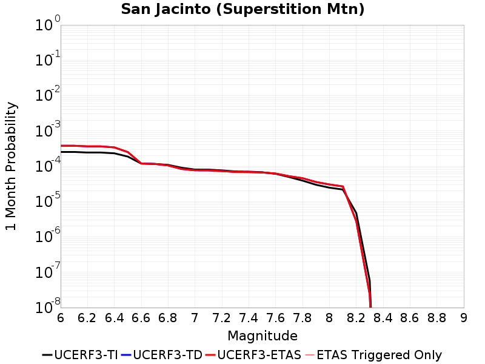 |  | 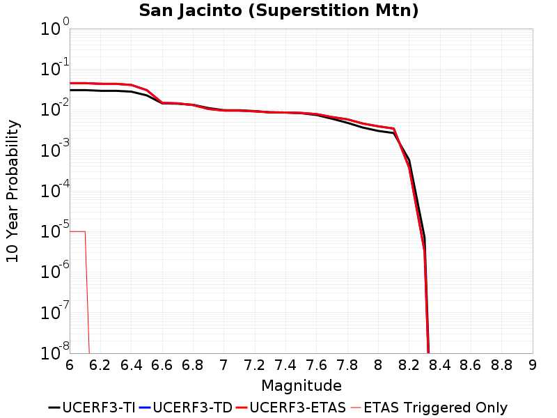 |

| Magnitude | 1 wk TI Prob | 1 wk TD Prob | 1 wk ETAS Prob | 1 wk ETAS/TD Gain | 1 wk ETAS Triggered Only | 1 mo TI Prob | 1 mo TD Prob | 1 mo ETAS Prob | 1 mo ETAS/TD Gain | 1 mo ETAS Triggered Only | 1 yr TI Prob | 1 yr TD Prob | 1 yr ETAS Prob | 1 yr ETAS/TD Gain | 1 yr ETAS Triggered Only | 10 yr TI Prob | 10 yr TD Prob | 10 yr ETAS Prob | 10 yr ETAS/TD Gain | 10 yr ETAS Triggered Only |
|-----|-----|-----|-----|-----|-----|-----|-----|-----|-----|-----|-----|-----|-----|-----|-----|-----|-----|-----|-----|-----|
| 6.0 | 5.921579E-5 | 8.8547604E-5 | 8.8547604E-5 | 1.0 | 0.0 | 2.5375726E-4 | 3.794425E-4 | 3.794425E-4 | 1.0 | 0.0 | 0.0030851178 | 0.0046114735 | 0.0046214275 | 1.0021585 | 1.0E-5 | 0.030426376 | 0.04523291 | 0.045242455 | 1.0002111 | 1.0E-5 |
| 6.1 | 5.921579E-5 | 8.8547604E-5 | 8.8547604E-5 | 1.0 | 0.0 | 2.5375726E-4 | 3.794425E-4 | 3.794425E-4 | 1.0 | 0.0 | 0.0030851178 | 0.0046114735 | 0.0046214275 | 1.0021585 | 1.0E-5 | 0.030426376 | 0.04523291 | 0.045242455 | 1.0002111 | 1.0E-5 |
| 6.2 | 5.6963574E-5 | 8.5044936E-5 | 8.5044936E-5 | 1.0 | 0.0 | 2.4410675E-4 | 3.6443668E-4 | 3.6443668E-4 | 1.0 | 0.0 | 0.0029679495 | 0.004429612 | 0.004429612 | 1.0 | 0.0 | 0.029286223 | 0.043495715 | 0.043495715 | 1.0 | 0.0 |
| 6.3 | 5.6940098E-5 | 8.4999265E-5 | 8.4999265E-5 | 1.0 | 0.0 | 2.4400617E-4 | 3.64241E-4 | 3.64241E-4 | 1.0 | 0.0 | 0.002966728 | 0.004427239 | 0.004427239 | 1.0 | 0.0 | 0.029274331 | 0.04347307 | 0.04347307 | 1.0 | 0.0 |
| 6.4 | 5.4171585E-5 | 7.9519734E-5 | 7.9519734E-5 | 1.0 | 0.0 | 2.3214328E-4 | 3.4076354E-4 | 3.4076354E-4 | 1.0 | 0.0 | 0.0028226813 | 0.004142531 | 0.004142531 | 1.0 | 0.0 | 0.02787096 | 0.04077516 | 0.04077516 | 1.0 | 0.0 |
| 6.5 | 4.375144E-5 | 5.8581667E-5 | 5.8581667E-5 | 1.0 | 0.0 | 1.874927E-4 | 2.5104667E-4 | 2.5104667E-4 | 1.0 | 0.0 | 0.0022803338 | 0.0030533706 | 0.0030533706 | 1.0 | 0.0 | 0.022570757 | 0.030347472 | 0.030347472 | 1.0 | 0.0 |
| 6.6 | 2.772192E-5 | 2.784731E-5 | 2.784731E-5 | 1.0 | 0.0 | 1.1880282E-4 | 1.19340286E-4 | 1.19340286E-4 | 1.0 | 0.0 | 0.0014454646 | 0.0014520214 | 0.0014520214 | 1.0 | 0.0 | 0.014360986 | 0.014752112 | 0.014752112 | 1.0 | 0.0 |
| 6.7 | 2.7124124E-5 | 2.7040396E-5 | 2.7040396E-5 | 1.0 | 0.0 | 1.1624106E-4 | 1.1588239E-4 | 1.1588239E-4 | 1.0 | 0.0 | 0.0014143161 | 0.0014099766 | 0.0014099766 | 1.0 | 0.0 | 0.014053487 | 0.014337232 | 0.014337232 | 1.0 | 0.0 |
| 6.8 | 2.5475807E-5 | 2.452221E-5 | 2.452221E-5 | 1.0 | 0.0 | 1.0917746E-4 | 1.0509104E-4 | 1.0509104E-4 | 1.0 | 0.0 | 0.001328425 | 0.0012787471 | 0.0012787471 | 1.0 | 0.0 | 0.0132051185 | 0.013035489 | 0.013035489 | 1.0 | 0.0 |
| 6.9 | 2.1162023E-5 | 1.9501156E-5 | 1.9501156E-5 | 1.0 | 0.0 | 9.069123E-5 | 8.357373E-5 | 8.357373E-5 | 1.0 | 0.0 | 0.0011036064 | 0.0010170398 | 0.0010170398 | 1.0 | 0.0 | 0.010981417 | 0.010417648 | 0.010417648 | 1.0 | 0.0 |
| 7.0 | 1.8754288E-5 | 1.7844695E-5 | 1.7844695E-5 | 1.0 | 0.0 | 8.037304E-5 | 7.647504E-5 | 7.647504E-5 | 1.0 | 0.0 | 9.781026E-4 | 9.3068875E-4 | 9.3068875E-4 | 1.0 | 0.0 | 0.009738087 | 0.009543539 | 0.009543539 | 1.0 | 0.0 |
| 7.1 | 1.8678527E-5 | 1.776444E-5 | 1.776444E-5 | 1.0 | 0.0 | 8.0048376E-5 | 7.613111E-5 | 7.613111E-5 | 1.0 | 0.0 | 9.7415317E-4 | 9.26505E-4 | 9.26505E-4 | 1.0 | 0.0 | 0.009698939 | 0.009501792 | 0.009501792 | 1.0 | 0.0 |
| 7.2 | 1.7804578E-5 | 1.7006734E-5 | 1.7006734E-5 | 1.0 | 0.0 | 7.6303106E-5 | 7.288399E-5 | 7.288399E-5 | 1.0 | 0.0 | 9.285943E-4 | 8.870039E-4 | 8.870039E-4 | 1.0 | 0.0 | 0.009247236 | 0.009106661 | 0.009106661 | 1.0 | 0.0 |
| 7.3 | 1.6583685E-5 | 1.6079657E-5 | 1.6079657E-5 | 1.0 | 0.0 | 7.1070994E-5 | 6.891101E-5 | 6.891101E-5 | 1.0 | 0.0 | 8.649459E-4 | 8.3867094E-4 | 8.3867094E-4 | 1.0 | 0.0 | 0.00861587 | 0.008623603 | 0.008623603 | 1.0 | 0.0 |
| 7.4 | 1.6387552E-5 | 1.5932977E-5 | 1.5932977E-5 | 1.0 | 0.0 | 7.023047E-5 | 6.828241E-5 | 6.828241E-5 | 1.0 | 0.0 | 8.5472054E-4 | 8.310237E-4 | 8.310237E-4 | 1.0 | 0.0 | 0.008514405 | 0.008547099 | 0.008547099 | 1.0 | 0.0 |
| 7.5 | 1.5790754E-5 | 1.553902E-5 | 1.553902E-5 | 1.0 | 0.0 | 6.767291E-5 | 6.659411E-5 | 6.659411E-5 | 1.0 | 0.0 | 8.236062E-4 | 8.1048405E-4 | 8.1048405E-4 | 1.0 | 0.0 | 0.008205604 | 0.008339874 | 0.008339874 | 1.0 | 0.0 |
| 7.6 | 1.4248672E-5 | 1.4477248E-5 | 1.4477248E-5 | 1.0 | 0.0 | 6.106431E-5 | 6.204389E-5 | 6.204389E-5 | 1.0 | 0.0 | 7.432043E-4 | 7.551246E-4 | 7.551246E-4 | 1.0 | 0.0 | 0.007407237 | 0.007780925 | 0.007780925 | 1.0 | 0.0 |
| 7.7 | 1.15449975E-5 | 1.2192212E-5 | 1.2192212E-5 | 1.0 | 0.0 | 4.947762E-5 | 5.2251296E-5 | 5.2251296E-5 | 1.0 | 0.0 | 6.022235E-4 | 6.359748E-4 | 6.359748E-4 | 1.0 | 0.0 | 0.006005941 | 0.006582422 | 0.006582422 | 1.0 | 0.0 |
| 7.8 | 9.1391985E-6 | 1.0695435E-5 | 1.0695435E-5 | 1.0 | 0.0 | 3.9167408E-5 | 4.5836776E-5 | 4.5836776E-5 | 1.0 | 0.0 | 4.767588E-4 | 5.579206E-4 | 5.579206E-4 | 1.0 | 0.0 | 0.0047573727 | 0.0057935207 | 0.0057935207 | 1.0 | 0.0 |
| 7.9 | 6.973017E-6 | 8.354581E-6 | 8.354581E-6 | 1.0 | 0.0 | 2.9884017E-5 | 3.580486E-5 | 3.580486E-5 | 1.0 | 0.0 | 3.6377716E-4 | 4.3583766E-4 | 4.3583766E-4 | 1.0 | 0.0 | 0.0036318225 | 0.0045609483 | 0.0045609483 | 1.0 | 0.0 |
| 8.0 | 5.7638235E-6 | 7.109407E-6 | 7.109407E-6 | 1.0 | 0.0 | 2.4701867E-5 | 3.0468533E-5 | 3.0468533E-5 | 1.0 | 0.0 | 3.0070372E-4 | 3.708919E-4 | 3.708919E-4 | 1.0 | 0.0 | 0.0030029714 | 0.0038987708 | 0.0038987708 | 1.0 | 0.0 |
| 8.1 | 5.1124434E-6 | 6.2509625E-6 | 6.2509625E-6 | 1.0 | 0.0 | 2.1910288E-5 | 2.6789568E-5 | 2.6789568E-5 | 1.0 | 0.0 | 2.6672508E-4 | 3.2611482E-4 | 3.2611482E-4 | 1.0 | 0.0 | 0.0026640517 | 0.0034369314 | 0.0034369314 | 1.0 | 0.0 |
| 8.2 | 1.1075938E-6 | 6.445326E-7 | 6.445326E-7 | 1.0 | 0.0 | 4.7468216E-6 | 2.7622798E-6 | 2.7622798E-6 | 1.0 | 0.0 | 5.779102E-5 | 3.363027E-5 | 3.363027E-5 | 1.0 | 0.0 | 5.777599E-4 | 3.7490265E-4 | 3.7490265E-4 | 1.0 | 0.0 |
| 8.3 | 1.3584393E-8 | 5.513106E-9 | 5.513106E-9 | 1.0 | 0.0 | 5.8218827E-8 | 2.3627596E-8 | 2.3627596E-8 | 1.0 | 0.0 | 7.0881396E-7 | 2.8766598E-7 | 2.8766598E-7 | 1.0 | 0.0 | 7.0881174E-6 | 3.1939987E-6 | 3.1939987E-6 | 1.0 | 0.0 |

## Elsinore (Coyote Mountains)
*[(top)](#table-of-contents)*

| 1 Week | 1 Month | 1 Year | 10 Year |
|-----|-----|-----|-----|
| 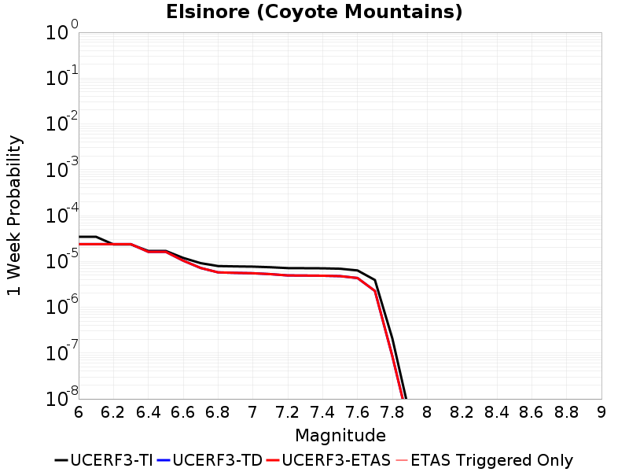 |  |  |  |

| Magnitude | 1 wk TI Prob | 1 wk TD Prob | 1 wk ETAS Prob | 1 wk ETAS/TD Gain | 1 wk ETAS Triggered Only | 1 mo TI Prob | 1 mo TD Prob | 1 mo ETAS Prob | 1 mo ETAS/TD Gain | 1 mo ETAS Triggered Only | 1 yr TI Prob | 1 yr TD Prob | 1 yr ETAS Prob | 1 yr ETAS/TD Gain | 1 yr ETAS Triggered Only | 10 yr TI Prob | 10 yr TD Prob | 10 yr ETAS Prob | 10 yr ETAS/TD Gain | 10 yr ETAS Triggered Only |
|-----|-----|-----|-----|-----|-----|-----|-----|-----|-----|-----|-----|-----|-----|-----|-----|-----|-----|-----|-----|-----|
| 6.0 | 3.4392266E-5 | 2.372393E-5 | 2.372393E-5 | 1.0 | 0.0 | 1.473871E-4 | 1.0167049E-4 | 1.0167049E-4 | 1.0 | 0.0 | 0.0017929609 | 0.0012372191 | 0.0012472067 | 1.0080726 | 1.0E-5 | 0.017785637 | 0.012311668 | 0.012321545 | 1.0008023 | 1.0E-5 |
| 6.1 | 3.4392266E-5 | 2.372393E-5 | 2.372393E-5 | 1.0 | 0.0 | 1.473871E-4 | 1.0167049E-4 | 1.0167049E-4 | 1.0 | 0.0 | 0.0017929609 | 0.0012372191 | 0.0012472067 | 1.0080726 | 1.0E-5 | 0.017785637 | 0.012311668 | 0.012321545 | 1.0008023 | 1.0E-5 |
| 6.2 | 2.3413893E-5 | 2.372393E-5 | 2.372393E-5 | 1.0 | 0.0 | 1.0034139E-4 | 1.0167049E-4 | 1.0167049E-4 | 1.0 | 0.0 | 0.0012209718 | 0.0012372191 | 0.0012472067 | 1.0080726 | 1.0E-5 | 0.012142851 | 0.012311668 | 0.012321545 | 1.0008023 | 1.0E-5 |
| 6.3 | 2.3413893E-5 | 2.372393E-5 | 2.372393E-5 | 1.0 | 0.0 | 1.0034139E-4 | 1.0167049E-4 | 1.0167049E-4 | 1.0 | 0.0 | 0.0012209718 | 0.0012372191 | 0.0012472067 | 1.0080726 | 1.0E-5 | 0.012142851 | 0.012311668 | 0.012321545 | 1.0008023 | 1.0E-5 |
| 6.4 | 1.6894814E-5 | 1.6147E-5 | 1.6147E-5 | 1.0 | 0.0 | 7.240433E-5 | 6.919979E-5 | 6.919979E-5 | 1.0 | 0.0 | 8.811662E-4 | 8.422172E-4 | 8.422172E-4 | 1.0 | 0.0 | 0.0087768035 | 0.00839377 | 0.00839377 | 1.0 | 0.0 |
| 6.5 | 1.6894814E-5 | 1.6147E-5 | 1.6147E-5 | 1.0 | 0.0 | 7.240433E-5 | 6.919979E-5 | 6.919979E-5 | 1.0 | 0.0 | 8.811662E-4 | 8.422172E-4 | 8.422172E-4 | 1.0 | 0.0 | 0.0087768035 | 0.00839377 | 0.00839377 | 1.0 | 0.0 |
| 6.6 | 1.1910969E-5 | 1.0370604E-5 | 1.0370604E-5 | 1.0 | 0.0 | 5.1046012E-5 | 4.444476E-5 | 4.444476E-5 | 1.0 | 0.0 | 6.21308E-4 | 5.409932E-4 | 5.409932E-4 | 1.0 | 0.0 | 0.0061957375 | 0.005398008 | 0.005398008 | 1.0 | 0.0 |
| 6.7 | 9.1486E-6 | 7.1781883E-6 | 7.1781883E-6 | 1.0 | 0.0 | 3.9207694E-5 | 3.0763324E-5 | 3.0763324E-5 | 1.0 | 0.0 | 4.7724912E-4 | 3.744827E-4 | 3.744827E-4 | 1.0 | 0.0 | 0.0047622547 | 0.0037388797 | 0.0037388797 | 1.0 | 0.0 |
| 6.8 | 7.90441E-6 | 5.7558755E-6 | 5.7558755E-6 | 1.0 | 0.0 | 3.3875604E-5 | 2.4667812E-5 | 2.4667812E-5 | 1.0 | 0.0 | 4.1235742E-4 | 3.002905E-4 | 3.002905E-4 | 1.0 | 0.0 | 0.0041159308 | 0.0029989772 | 0.0029989772 | 1.0 | 0.0 |
| 6.9 | 7.77015E-6 | 5.6099557E-6 | 5.6099557E-6 | 1.0 | 0.0 | 3.3300217E-5 | 2.4042454E-5 | 2.4042454E-5 | 1.0 | 0.0 | 4.0535472E-4 | 2.9267883E-4 | 2.9267883E-4 | 1.0 | 0.0 | 0.004046161 | 0.0029230618 | 0.0029230618 | 1.0 | 0.0 |
| 7.0 | 7.675798E-6 | 5.5071832E-6 | 5.5071832E-6 | 1.0 | 0.0 | 3.289586E-5 | 2.3602008E-5 | 2.3602008E-5 | 1.0 | 0.0 | 4.004335E-4 | 2.8731785E-4 | 2.8731785E-4 | 1.0 | 0.0 | 0.003997127 | 0.0028695913 | 0.0028695913 | 1.0 | 0.0 |
| 7.1 | 7.447814E-6 | 5.2663822E-6 | 5.2663822E-6 | 1.0 | 0.0 | 3.191881E-5 | 2.2570022E-5 | 2.2570022E-5 | 1.0 | 0.0 | 3.8854225E-4 | 2.7475663E-4 | 2.7475663E-4 | 1.0 | 0.0 | 0.003878636 | 0.0027442947 | 0.0027442947 | 1.0 | 0.0 |
| 7.2 | 7.128185E-6 | 4.933017E-6 | 4.933017E-6 | 1.0 | 0.0 | 3.0549007E-5 | 2.1141335E-5 | 2.1141335E-5 | 1.0 | 0.0 | 3.7187067E-4 | 2.5736657E-4 | 2.5736657E-4 | 1.0 | 0.0 | 0.00371249 | 0.0025708044 | 0.0025708044 | 1.0 | 0.0 |
| 7.3 | 7.0913875E-6 | 4.9017067E-6 | 4.9017067E-6 | 1.0 | 0.0 | 3.0391306E-5 | 2.1007152E-5 | 2.1007152E-5 | 1.0 | 0.0 | 3.6995133E-4 | 2.5573326E-4 | 2.5573326E-4 | 1.0 | 0.0 | 0.0036933604 | 0.002554509 | 0.002554509 | 1.0 | 0.0 |
| 7.4 | 7.051521E-6 | 4.8655556E-6 | 4.8655556E-6 | 1.0 | 0.0 | 3.0220453E-5 | 2.0852221E-5 | 2.0852221E-5 | 1.0 | 0.0 | 3.6787192E-4 | 2.5384742E-4 | 2.5384742E-4 | 1.0 | 0.0 | 0.0036726352 | 0.0025356938 | 0.0025356938 | 1.0 | 0.0 |
| 7.5 | 6.910666E-6 | 4.760734E-6 | 4.760734E-6 | 1.0 | 0.0 | 2.9616802E-5 | 2.0402995E-5 | 2.0402995E-5 | 1.0 | 0.0 | 3.605249E-4 | 2.4837934E-4 | 2.4837934E-4 | 1.0 | 0.0 | 0.0035994058 | 0.0024811365 | 0.0024811365 | 1.0 | 0.0 |
| 7.6 | 6.341753E-6 | 4.3324303E-6 | 4.3324303E-6 | 1.0 | 0.0 | 2.7178658E-5 | 1.8567433E-5 | 1.8567433E-5 | 1.0 | 0.0 | 3.3084993E-4 | 2.2603622E-4 | 2.2603622E-4 | 1.0 | 0.0 | 0.0033035777 | 0.0022581795 | 0.0022581795 | 1.0 | 0.0 |
| 7.7 | 3.9205916E-6 | 2.2635113E-6 | 2.2635113E-6 | 1.0 | 0.0 | 1.6802427E-5 | 9.7007305E-6 | 9.7007305E-6 | 1.0 | 0.0 | 2.0455034E-4 | 1.18100754E-4 | 1.18100754E-4 | 1.0 | 0.0 | 0.0020436216 | 0.001180454 | 0.001180454 | 1.0 | 0.0 |
| 7.8 | 2.0846227E-7 | 8.543253E-8 | 8.543253E-8 | 1.0 | 0.0 | 8.9340944E-7 | 3.6613937E-7 | 3.6613937E-7 | 1.0 | 0.0 | 1.0877206E-5 | 4.4577414E-6 | 4.4577414E-6 | 1.0 | 0.0 | 1.0876673E-4 | 4.457685E-5 | 4.457685E-5 | 1.0 | 0.0 |
| 7.9 | 4.4969806E-9 | 2.2944142E-9 | 2.2944142E-9 | 1.0 | 0.0 | 1.9272775E-8 | 9.833204E-9 | 9.833204E-9 | 1.0 | 0.0 | 2.3464601E-7 | 1.1971925E-7 | 1.1971925E-7 | 1.0 | 0.0 | 2.3464577E-6 | 1.1971919E-6 | 1.1971919E-6 | 1.0 | 0.0 |

## San Andreas (North Branch Mill Creek)
*[(top)](#table-of-contents)*

| 1 Week | 1 Month | 1 Year | 10 Year |
|-----|-----|-----|-----|
| 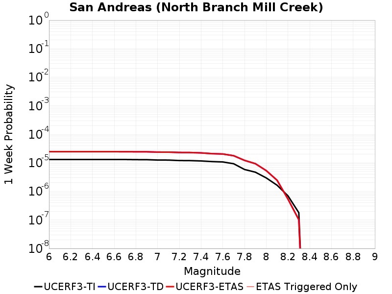 | 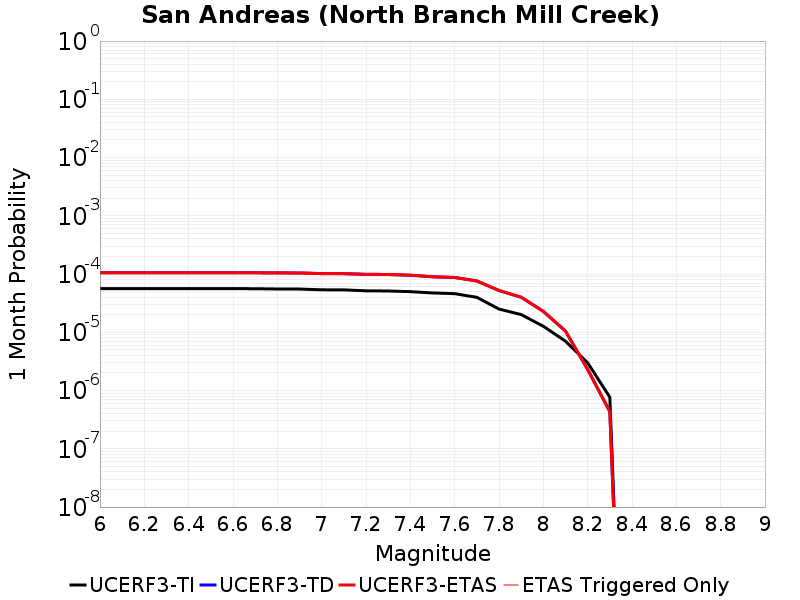 | 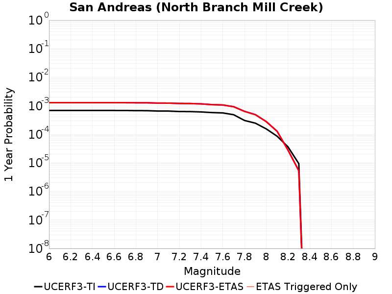 |  |

| Magnitude | 1 wk TI Prob | 1 wk TD Prob | 1 wk ETAS Prob | 1 wk ETAS/TD Gain | 1 wk ETAS Triggered Only | 1 mo TI Prob | 1 mo TD Prob | 1 mo ETAS Prob | 1 mo ETAS/TD Gain | 1 mo ETAS Triggered Only | 1 yr TI Prob | 1 yr TD Prob | 1 yr ETAS Prob | 1 yr ETAS/TD Gain | 1 yr ETAS Triggered Only | 10 yr TI Prob | 10 yr TD Prob | 10 yr ETAS Prob | 10 yr ETAS/TD Gain | 10 yr ETAS Triggered Only |
|-----|-----|-----|-----|-----|-----|-----|-----|-----|-----|-----|-----|-----|-----|-----|-----|-----|-----|-----|-----|-----|
| 6.0 | 1.3079164E-5 | 2.4533654E-5 | 2.4533654E-5 | 1.0 | 0.0 | 5.6052355E-5 | 1.0514002E-4 | 1.0514002E-4 | 1.0 | 0.0 | 6.822237E-4 | 0.0012793315 | 0.0012793315 | 1.0 | 0.0 | 0.006801331 | 0.012756932 | 0.012766805 | 1.0007739 | 1.0E-5 |
| 6.1 | 1.3079164E-5 | 2.4533654E-5 | 2.4533654E-5 | 1.0 | 0.0 | 5.6052355E-5 | 1.0514002E-4 | 1.0514002E-4 | 1.0 | 0.0 | 6.822237E-4 | 0.0012793315 | 0.0012793315 | 1.0 | 0.0 | 0.006801331 | 0.012756932 | 0.012766805 | 1.0007739 | 1.0E-5 |
| 6.2 | 1.3079164E-5 | 2.4533654E-5 | 2.4533654E-5 | 1.0 | 0.0 | 5.6052355E-5 | 1.0514002E-4 | 1.0514002E-4 | 1.0 | 0.0 | 6.822237E-4 | 0.0012793315 | 0.0012793315 | 1.0 | 0.0 | 0.006801331 | 0.012756932 | 0.012766805 | 1.0007739 | 1.0E-5 |
| 6.3 | 1.3079164E-5 | 2.4533654E-5 | 2.4533654E-5 | 1.0 | 0.0 | 5.6052355E-5 | 1.0514002E-4 | 1.0514002E-4 | 1.0 | 0.0 | 6.822237E-4 | 0.0012793315 | 0.0012793315 | 1.0 | 0.0 | 0.006801331 | 0.012756932 | 0.012766805 | 1.0007739 | 1.0E-5 |
| 6.4 | 1.3079164E-5 | 2.4533654E-5 | 2.4533654E-5 | 1.0 | 0.0 | 5.6052355E-5 | 1.0514002E-4 | 1.0514002E-4 | 1.0 | 0.0 | 6.822237E-4 | 0.0012793315 | 0.0012793315 | 1.0 | 0.0 | 0.006801331 | 0.012756932 | 0.012766805 | 1.0007739 | 1.0E-5 |
| 6.5 | 1.3079164E-5 | 2.4533654E-5 | 2.4533654E-5 | 1.0 | 0.0 | 5.6052355E-5 | 1.0514002E-4 | 1.0514002E-4 | 1.0 | 0.0 | 6.822237E-4 | 0.0012793315 | 0.0012793315 | 1.0 | 0.0 | 0.006801331 | 0.012756932 | 0.012766805 | 1.0007739 | 1.0E-5 |
| 6.6 | 1.3074523E-5 | 2.4528721E-5 | 2.4528721E-5 | 1.0 | 0.0 | 5.6032466E-5 | 1.05118874E-4 | 1.05118874E-4 | 1.0 | 0.0 | 6.8198174E-4 | 0.0012790743 | 0.0012790743 | 1.0 | 0.0 | 0.006798926 | 0.01275439 | 0.012764263 | 1.000774 | 1.0E-5 |
| 6.7 | 1.3050216E-5 | 2.4503983E-5 | 2.4503983E-5 | 1.0 | 0.0 | 5.59283E-5 | 1.05012856E-4 | 1.05012856E-4 | 1.0 | 0.0 | 6.8071426E-4 | 0.0012777852 | 0.0012777852 | 1.0 | 0.0 | 0.0067863287 | 0.012741646 | 0.012751519 | 1.0007749 | 1.0E-5 |
| 6.8 | 1.29049395E-5 | 2.4352414E-5 | 2.4352414E-5 | 1.0 | 0.0 | 5.530571E-5 | 1.0436333E-4 | 1.0436333E-4 | 1.0 | 0.0 | 6.73139E-4 | 0.0012698864 | 0.0012698864 | 1.0 | 0.0 | 0.0067110364 | 0.01266356 | 0.012673434 | 1.0007796 | 1.0E-5 |
| 6.9 | 1.2867369E-5 | 2.4311714E-5 | 2.4311714E-5 | 1.0 | 0.0 | 5.51447E-5 | 1.0418891E-4 | 1.0418891E-4 | 1.0 | 0.0 | 6.711799E-4 | 0.0012677654 | 0.0012677654 | 1.0 | 0.0 | 0.006691564 | 0.012642591 | 0.012652465 | 1.0007809 | 1.0E-5 |
| 7.0 | 1.2495996E-5 | 2.3699758E-5 | 2.3699758E-5 | 1.0 | 0.0 | 5.3553173E-5 | 1.0156646E-4 | 1.0156646E-4 | 1.0 | 0.0 | 6.518148E-4 | 0.0012358733 | 0.0012358733 | 1.0 | 0.0 | 0.0064990623 | 0.01232722 | 0.012337097 | 1.0008012 | 1.0E-5 |
| 7.1 | 1.2452067E-5 | 2.36444E-5 | 2.36444E-5 | 1.0 | 0.0 | 5.3364907E-5 | 1.0132922E-4 | 1.0132922E-4 | 1.0 | 0.0 | 6.4952404E-4 | 0.0012329882 | 0.0012329882 | 1.0 | 0.0 | 0.0064762887 | 0.012298689 | 0.012308567 | 1.0008031 | 1.0E-5 |
| 7.2 | 1.2002777E-5 | 2.301352E-5 | 2.301352E-5 | 1.0 | 0.0 | 5.143946E-5 | 9.862566E-5 | 9.862566E-5 | 1.0 | 0.0 | 6.2609545E-4 | 0.0012001088 | 0.0012001088 | 1.0 | 0.0 | 0.006243344 | 0.011973449 | 0.011983329 | 1.0008252 | 1.0E-5 |
| 7.3 | 1.1923425E-5 | 2.2881923E-5 | 2.2881923E-5 | 1.0 | 0.0 | 5.109939E-5 | 9.806171E-5 | 9.806171E-5 | 1.0 | 0.0 | 6.219575E-4 | 0.0011932503 | 0.0011932503 | 1.0 | 0.0 | 0.0062021962 | 0.011905628 | 0.011915509 | 1.0008299 | 1.0E-5 |
| 7.4 | 1.16105175E-5 | 2.224843E-5 | 2.224843E-5 | 1.0 | 0.0 | 4.975841E-5 | 9.534695E-5 | 9.534695E-5 | 1.0 | 0.0 | 6.0564023E-4 | 0.0011602337 | 0.0011602337 | 1.0 | 0.0 | 0.006039923 | 0.011579454 | 0.011579454 | 1.0 | 0.0 |
| 7.5 | 1.1037265E-5 | 2.0916192E-5 | 2.0916192E-5 | 1.0 | 0.0 | 4.7301706E-5 | 8.963775E-5 | 8.963775E-5 | 1.0 | 0.0 | 5.757461E-4 | 0.0010907957 | 0.0010907957 | 1.0 | 0.0 | 0.005742567 | 0.010892626 | 0.010892626 | 1.0 | 0.0 |
| 7.6 | 1.0720915E-5 | 2.0341631E-5 | 2.0341631E-5 | 1.0 | 0.0 | 4.5945973E-5 | 8.717552E-5 | 8.717552E-5 | 1.0 | 0.0 | 5.592486E-4 | 0.0010608475 | 0.0010608475 | 1.0 | 0.0 | 0.005578433 | 0.01059605 | 0.01059605 | 1.0 | 0.0 |
| 7.7 | 9.276279E-6 | 1.7712426E-5 | 1.7712426E-5 | 1.0 | 0.0 | 3.9754876E-5 | 7.5908196E-5 | 7.5908196E-5 | 1.0 | 0.0 | 4.839081E-4 | 9.237923E-4 | 9.237923E-4 | 1.0 | 0.0 | 0.0048285574 | 0.009237614 | 0.009237614 | 1.0 | 0.0 |
| 7.8 | 5.8346777E-6 | 1.2161944E-5 | 1.2161944E-5 | 1.0 | 0.0 | 2.5005522E-5 | 5.2121577E-5 | 5.2121577E-5 | 1.0 | 0.0 | 3.043997E-4 | 6.343956E-4 | 6.343956E-4 | 1.0 | 0.0 | 0.0030398308 | 0.006363622 | 0.006363622 | 1.0 | 0.0 |
| 7.9 | 4.690204E-6 | 9.317712E-6 | 9.317712E-6 | 1.0 | 0.0 | 2.0100719E-5 | 3.993244E-5 | 3.993244E-5 | 1.0 | 0.0 | 2.4469878E-4 | 4.8606916E-4 | 4.8606916E-4 | 1.0 | 0.0 | 0.002444295 | 0.0048857806 | 0.0048857806 | 1.0 | 0.0 |
| 8.0 | 2.9570454E-6 | 5.3244353E-6 | 5.3244353E-6 | 1.0 | 0.0 | 1.267299E-5 | 2.281881E-5 | 2.281881E-5 | 1.0 | 0.0 | 1.5428272E-4 | 2.777836E-4 | 2.777836E-4 | 1.0 | 0.0 | 0.0015417566 | 0.0027970672 | 0.0027970672 | 1.0 | 0.0 |
| 8.1 | 1.6376824E-6 | 2.443411E-6 | 2.443411E-6 | 1.0 | 0.0 | 7.01862E-6 | 1.0471719E-5 | 1.0471719E-5 | 1.0 | 0.0 | 8.544835E-5 | 1.2748573E-4 | 1.2748573E-4 | 1.0 | 0.0 | 8.54155E-4 | 0.0012890658 | 0.0012890658 | 1.0 | 0.0 |
| 8.2 | 6.9631557E-7 | 5.365408E-7 | 5.365408E-7 | 1.0 | 0.0 | 2.984206E-6 | 2.2994586E-6 | 2.2994586E-6 | 1.0 | 0.0 | 3.63321E-5 | 2.7995551E-5 | 2.7995551E-5 | 1.0 | 0.0 | 3.6326164E-4 | 2.888836E-4 | 2.888836E-4 | 1.0 | 0.0 |
| 8.3 | 1.7876137E-7 | 1.0132249E-7 | 1.0132249E-7 | 1.0 | 0.0 | 7.661199E-7 | 4.3423918E-7 | 4.3423918E-7 | 1.0 | 0.0 | 9.32747E-6 | 5.2868495E-6 | 5.2868495E-6 | 1.0 | 0.0 | 9.3270784E-5 | 5.524545E-5 | 5.524545E-5 | 1.0 | 0.0 |

## Coyote Canyon
*[(top)](#table-of-contents)*

| 1 Week | 1 Month | 1 Year | 10 Year |
|-----|-----|-----|-----|
| 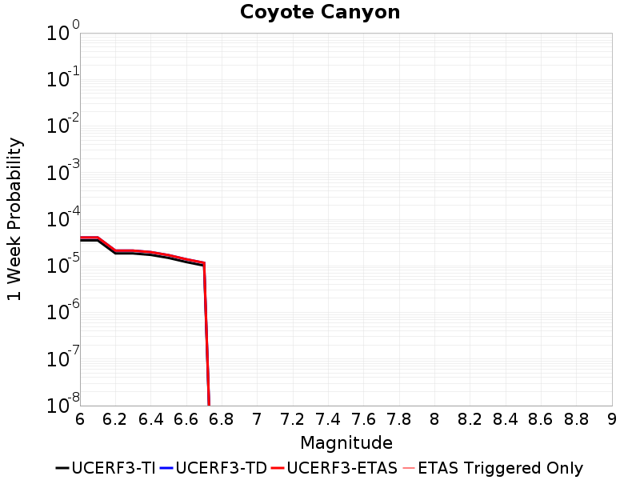 |  | 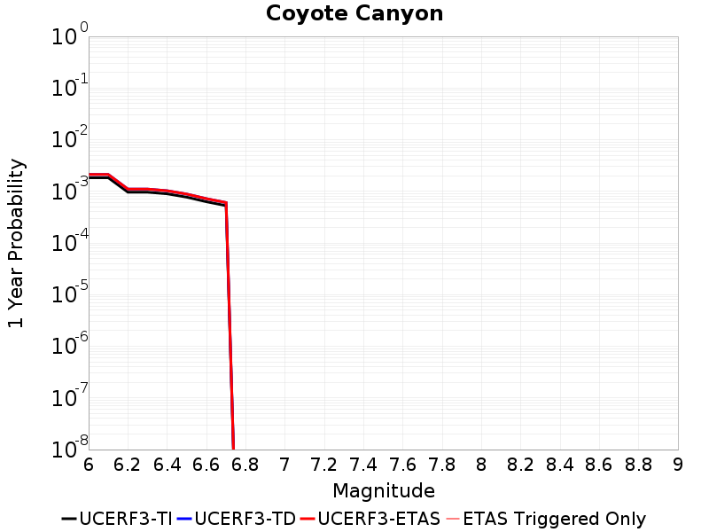 |  |

| Magnitude | 1 wk TI Prob | 1 wk TD Prob | 1 wk ETAS Prob | 1 wk ETAS/TD Gain | 1 wk ETAS Triggered Only | 1 mo TI Prob | 1 mo TD Prob | 1 mo ETAS Prob | 1 mo ETAS/TD Gain | 1 mo ETAS Triggered Only | 1 yr TI Prob | 1 yr TD Prob | 1 yr ETAS Prob | 1 yr ETAS/TD Gain | 1 yr ETAS Triggered Only | 10 yr TI Prob | 10 yr TD Prob | 10 yr ETAS Prob | 10 yr ETAS/TD Gain | 10 yr ETAS Triggered Only |
|-----|-----|-----|-----|-----|-----|-----|-----|-----|-----|-----|-----|-----|-----|-----|-----|-----|-----|-----|-----|-----|
| 6.0 | 3.5090034E-5 | 4.0572082E-5 | 4.0572082E-5 | 1.0 | 0.0 | 1.503772E-4 | 1.7387024E-4 | 1.7387024E-4 | 1.0 | 0.0 | 0.0018293047 | 0.0021150748 | 0.0021150748 | 1.0 | 0.0 | 0.018143194 | 0.020975633 | 0.020985423 | 1.0004667 | 1.0E-5 |
| 6.1 | 3.5090034E-5 | 4.0572082E-5 | 4.0572082E-5 | 1.0 | 0.0 | 1.503772E-4 | 1.7387024E-4 | 1.7387024E-4 | 1.0 | 0.0 | 0.0018293047 | 0.0021150748 | 0.0021150748 | 1.0 | 0.0 | 0.018143194 | 0.020975633 | 0.020985423 | 1.0004667 | 1.0E-5 |
| 6.2 | 1.841879E-5 | 2.116313E-5 | 2.116313E-5 | 1.0 | 0.0 | 7.8935285E-5 | 9.069656E-5 | 9.069656E-5 | 1.0 | 0.0 | 9.606133E-4 | 0.0011037742 | 0.0011037742 | 1.0 | 0.0 | 0.0095647145 | 0.010993104 | 0.010993104 | 1.0 | 0.0 |
| 6.3 | 1.841879E-5 | 2.116313E-5 | 2.116313E-5 | 1.0 | 0.0 | 7.8935285E-5 | 9.069656E-5 | 9.069656E-5 | 1.0 | 0.0 | 9.606133E-4 | 0.0011037742 | 0.0011037742 | 1.0 | 0.0 | 0.0095647145 | 0.010993104 | 0.010993104 | 1.0 | 0.0 |
| 6.4 | 1.712201E-5 | 1.9660747E-5 | 1.9660747E-5 | 1.0 | 0.0 | 7.337798E-5 | 8.42582E-5 | 8.42582E-5 | 1.0 | 0.0 | 8.930107E-4 | 0.0010254623 | 0.0010254623 | 1.0 | 0.0 | 0.008894307 | 0.010217319 | 0.010217319 | 1.0 | 0.0 |
| 6.5 | 1.4744935E-5 | 1.691872E-5 | 1.691872E-5 | 1.0 | 0.0 | 6.3191044E-5 | 7.250732E-5 | 7.250732E-5 | 1.0 | 0.0 | 7.6907943E-4 | 8.825135E-4 | 8.825135E-4 | 1.0 | 0.0 | 0.007664232 | 0.008799375 | 0.008799375 | 1.0 | 0.0 |
| 6.6 | 1.2017839E-5 | 1.3790772E-5 | 1.3790772E-5 | 1.0 | 0.0 | 5.150401E-5 | 5.9102473E-5 | 5.9102473E-5 | 1.0 | 0.0 | 6.268809E-4 | 7.194245E-4 | 7.194245E-4 | 1.0 | 0.0 | 0.0062511545 | 0.007179734 | 0.007179734 | 1.0 | 0.0 |
| 6.7 | 1.00956095E-5 | 1.1589735E-5 | 1.1589735E-5 | 1.0 | 0.0 | 4.326618E-5 | 4.966984E-5 | 4.966984E-5 | 1.0 | 0.0 | 5.266384E-4 | 6.0465035E-4 | 6.0465035E-4 | 1.0 | 0.0 | 0.005253921 | 0.0060386634 | 0.0060386634 | 1.0 | 0.0 |

## San Andreas (San Gorgonio Pass-Garnet HIll)
*[(top)](#table-of-contents)*

| 1 Week | 1 Month | 1 Year | 10 Year |
|-----|-----|-----|-----|
|  |  | 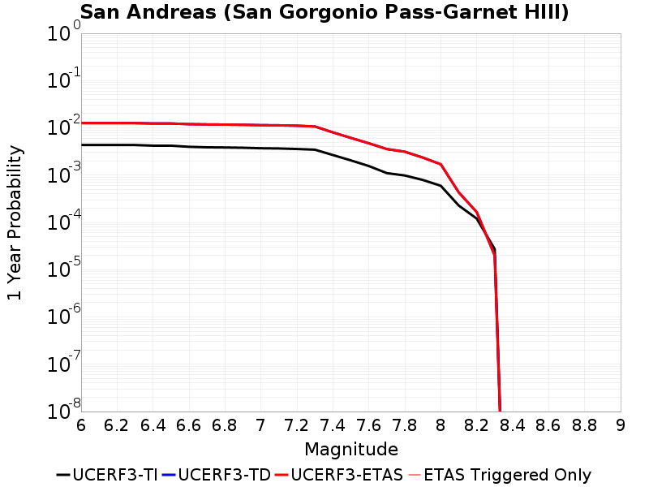 |  |

| Magnitude | 1 wk TI Prob | 1 wk TD Prob | 1 wk ETAS Prob | 1 wk ETAS/TD Gain | 1 wk ETAS Triggered Only | 1 mo TI Prob | 1 mo TD Prob | 1 mo ETAS Prob | 1 mo ETAS/TD Gain | 1 mo ETAS Triggered Only | 1 yr TI Prob | 1 yr TD Prob | 1 yr ETAS Prob | 1 yr ETAS/TD Gain | 1 yr ETAS Triggered Only | 10 yr TI Prob | 10 yr TD Prob | 10 yr ETAS Prob | 10 yr ETAS/TD Gain | 10 yr ETAS Triggered Only |
|-----|-----|-----|-----|-----|-----|-----|-----|-----|-----|-----|-----|-----|-----|-----|-----|-----|-----|-----|-----|-----|
| 6.0 | 8.31567E-5 | 2.4279066E-4 | 2.4279066E-4 | 1.0 | 0.0 | 3.5633717E-4 | 0.0010401139 | 0.0010401139 | 1.0 | 0.0 | 0.004329778 | 0.012589752 | 0.012589752 | 1.0 | 0.0 | 0.042463828 | 0.11626236 | 0.1162712 | 1.000076 | 1.0E-5 |
| 6.1 | 8.31567E-5 | 2.4279066E-4 | 2.4279066E-4 | 1.0 | 0.0 | 3.5633717E-4 | 0.0010401139 | 0.0010401139 | 1.0 | 0.0 | 0.004329778 | 0.012589752 | 0.012589752 | 1.0 | 0.0 | 0.042463828 | 0.11626236 | 0.1162712 | 1.000076 | 1.0E-5 |
| 6.2 | 8.31567E-5 | 2.4279066E-4 | 2.4279066E-4 | 1.0 | 0.0 | 3.5633717E-4 | 0.0010401139 | 0.0010401139 | 1.0 | 0.0 | 0.004329778 | 0.012589752 | 0.012589752 | 1.0 | 0.0 | 0.042463828 | 0.11626236 | 0.1162712 | 1.000076 | 1.0E-5 |
| 6.3 | 8.31567E-5 | 2.4279066E-4 | 2.4279066E-4 | 1.0 | 0.0 | 3.5633717E-4 | 0.0010401139 | 0.0010401139 | 1.0 | 0.0 | 0.004329778 | 0.012589752 | 0.012589752 | 1.0 | 0.0 | 0.042463828 | 0.11626236 | 0.1162712 | 1.000076 | 1.0E-5 |
| 6.4 | 8.059055E-5 | 2.3830665E-4 | 2.3830665E-4 | 1.0 | 0.0 | 3.4534236E-4 | 0.001020917 | 0.001020917 | 1.0 | 0.0 | 0.0041964394 | 0.012359049 | 0.012359049 | 1.0 | 0.0 | 0.041180745 | 0.11422705 | 0.11423591 | 1.0000775 | 1.0E-5 |
| 6.5 | 8.059055E-5 | 2.3830665E-4 | 2.3830665E-4 | 1.0 | 0.0 | 3.4534236E-4 | 0.001020917 | 0.001020917 | 1.0 | 0.0 | 0.0041964394 | 0.012359049 | 0.012359049 | 1.0 | 0.0 | 0.041180745 | 0.11422705 | 0.11423591 | 1.0000775 | 1.0E-5 |
| 6.6 | 7.619237E-5 | 2.3066274E-4 | 2.3066274E-4 | 1.0 | 0.0 | 3.2649786E-4 | 9.881825E-4 | 9.881825E-4 | 1.0 | 0.0 | 0.0039678677 | 0.01196534 | 0.01196534 | 1.0 | 0.0 | 0.03897764 | 0.11073951 | 0.110748395 | 1.0000803 | 1.0E-5 |
| 6.7 | 7.440636E-5 | 2.2738907E-4 | 2.2738907E-4 | 1.0 | 0.0 | 3.188454E-4 | 9.74163E-4 | 9.74163E-4 | 1.0 | 0.0 | 0.0038750346 | 0.011796509 | 0.011796509 | 1.0 | 0.0 | 0.038081564 | 0.10924017 | 0.10924908 | 1.0000815 | 1.0E-5 |
| 6.8 | 7.3735864E-5 | 2.2583983E-4 | 2.2583983E-4 | 1.0 | 0.0 | 3.1597257E-4 | 9.675283E-4 | 9.675283E-4 | 1.0 | 0.0 | 0.0038401815 | 0.011716607 | 0.011716607 | 1.0 | 0.0 | 0.03774495 | 0.10853561 | 0.10854453 | 1.0000821 | 1.0E-5 |
| 6.9 | 7.27575E-5 | 2.2350765E-4 | 2.2350765E-4 | 1.0 | 0.0 | 3.117806E-4 | 9.5754064E-4 | 9.5754064E-4 | 1.0 | 0.0 | 0.003789323 | 0.011596308 | 0.011596308 | 1.0 | 0.0 | 0.037253562 | 0.10747854 | 0.107487455 | 1.0000831 | 1.0E-5 |
| 7.0 | 7.102591E-5 | 2.1929831E-4 | 2.1929831E-4 | 1.0 | 0.0 | 3.0436125E-4 | 9.3951373E-4 | 9.3951373E-4 | 1.0 | 0.0 | 0.003699303 | 0.01137914 | 0.01137914 | 1.0 | 0.0 | 0.03638325 | 0.105567046 | 0.105575986 | 1.0000848 | 1.0E-5 |
| 7.1 | 7.028513E-5 | 2.1762904E-4 | 2.1762904E-4 | 1.0 | 0.0 | 3.0118722E-4 | 9.3236484E-4 | 9.3236484E-4 | 1.0 | 0.0 | 0.0036607897 | 0.01129301 | 0.01129301 | 1.0 | 0.0 | 0.036010686 | 0.104801774 | 0.10481073 | 1.0000855 | 1.0E-5 |
| 7.2 | 6.8498244E-5 | 2.1364713E-4 | 2.1364713E-4 | 1.0 | 0.0 | 2.9353087E-4 | 9.1531157E-4 | 9.1531157E-4 | 1.0 | 0.0 | 0.003567883 | 0.011087514 | 0.011087514 | 1.0 | 0.0 | 0.035111405 | 0.102974944 | 0.102983914 | 1.0000871 | 1.0E-5 |
| 7.3 | 6.622592E-5 | 2.057859E-4 | 2.057859E-4 | 1.0 | 0.0 | 2.8379448E-4 | 8.816438E-4 | 8.816438E-4 | 1.0 | 0.0 | 0.0034497243 | 0.010681699 | 0.010681699 | 1.0 | 0.0 | 0.033966612 | 0.09942915 | 0.09943816 | 1.0000906 | 1.0E-5 |
| 7.4 | 5.1050705E-5 | 1.5421376E-4 | 1.5421376E-4 | 1.0 | 0.0 | 2.1877038E-4 | 6.607497E-4 | 6.607497E-4 | 1.0 | 0.0 | 0.002660276 | 0.008015163 | 0.008015163 | 1.0 | 0.0 | 0.02628654 | 0.07602012 | 0.07602936 | 1.0001216 | 1.0E-5 |
| 7.5 | 3.9302922E-5 | 1.1763988E-4 | 1.1763988E-4 | 1.0 | 0.0 | 1.6843023E-4 | 5.040738E-4 | 5.040738E-4 | 1.0 | 0.0 | 0.0020487092 | 0.006119906 | 0.006119906 | 1.0 | 0.0 | 0.020299247 | 0.05880004 | 0.05880004 | 1.0 | 0.0 |
| 7.6 | 2.9851626E-5 | 9.0456546E-5 | 9.0456546E-5 | 1.0 | 0.0 | 1.2792926E-4 | 3.8761343E-4 | 3.8761343E-4 | 1.0 | 0.0 | 0.0015564259 | 0.0047090105 | 0.0047090105 | 1.0 | 0.0 | 0.0154556995 | 0.045644794 | 0.045644794 | 1.0 | 0.0 |
| 7.7 | 2.1135214E-5 | 6.833617E-5 | 6.833617E-5 | 1.0 | 0.0 | 9.0576345E-5 | 2.9283646E-4 | 2.9283646E-4 | 1.0 | 0.0 | 0.0011022091 | 0.0035594618 | 0.0035594618 | 1.0 | 0.0 | 0.010967582 | 0.034734834 | 0.034734834 | 1.0 | 0.0 |
| 7.8 | 1.883379E-5 | 5.998673E-5 | 5.998673E-5 | 1.0 | 0.0 | 8.0713755E-5 | 2.570607E-4 | 2.570607E-4 | 1.0 | 0.0 | 9.822468E-4 | 0.003125226 | 0.003125226 | 1.0 | 0.0 | 0.0097791655 | 0.030650666 | 0.030650666 | 1.0 | 0.0 |
| 7.9 | 1.5156185E-5 | 4.5086963E-5 | 4.5086963E-5 | 1.0 | 0.0 | 6.495346E-5 | 1.9321553E-4 | 1.9321553E-4 | 1.0 | 0.0 | 7.9052144E-4 | 0.0023498628 | 0.0023498628 | 1.0 | 0.0 | 0.007877152 | 0.02332481 | 0.02332481 | 1.0 | 0.0 |
| 8.0 | 1.1405907E-5 | 3.250684E-5 | 3.250684E-5 | 1.0 | 0.0 | 4.8881542E-5 | 1.393076E-4 | 1.393076E-4 | 1.0 | 0.0 | 5.9497025E-4 | 0.0016947516 | 0.0016947516 | 1.0 | 0.0 | 0.005933798 | 0.016940808 | 0.016940808 | 1.0 | 0.0 |
| 8.1 | 4.3511436E-6 | 8.258616E-6 | 8.258616E-6 | 1.0 | 0.0 | 1.8647626E-5 | 3.539359E-5 | 3.539359E-5 | 1.0 | 0.0 | 2.2701119E-4 | 4.308319E-4 | 4.308319E-4 | 1.0 | 0.0 | 0.0022677942 | 0.0045547513 | 0.0045547513 | 1.0 | 0.0 |
| 8.2 | 2.3042528E-6 | 3.1633647E-6 | 3.1633647E-6 | 1.0 | 0.0 | 9.875332E-6 | 1.3557207E-5 | 1.3557207E-5 | 1.0 | 0.0 | 1.2022553E-4 | 1.6504656E-4 | 1.6504656E-4 | 1.0 | 0.0 | 0.0012016051 | 0.0018191914 | 0.0018191914 | 1.0 | 0.0 |
| 8.3 | 5.202968E-7 | 3.8101953E-7 | 3.8101953E-7 | 1.0 | 0.0 | 2.2298414E-6 | 1.63294E-6 | 1.63294E-6 | 1.0 | 0.0 | 2.714798E-5 | 1.9880881E-5 | 1.9880881E-5 | 1.0 | 0.0 | 2.7144665E-4 | 2.3144762E-4 | 2.3144762E-4 | 1.0 | 0.0 |

