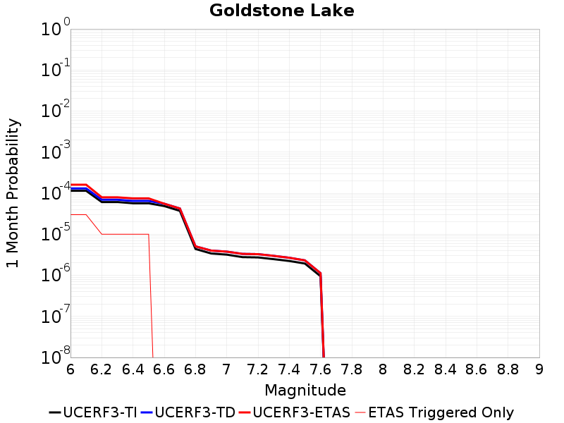
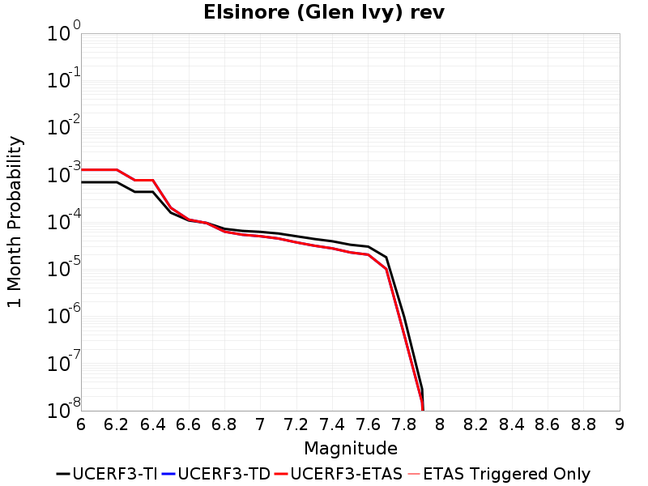

# Parent Section Magnitude-Probability Distributions

Only fault sections with at least one triggered aftershock are plotted. Sections are sorted by total supraseismogenic trigger rate (decreasing)

## Table Of Contents

* [Calico-Hidalgo](#calico-hidalgo)
* [Manix-Afton Hills](#manix-afton-hills)
* [Cady](#cady)
* [Goldstone Lake](#goldstone-lake)
* [Paradise](#paradise)
* [Coyote Lake](#coyote-lake)
* [Bicycle Lake](#bicycle-lake)
* [Coyote Canyon](#coyote-canyon)
* [Pinto Mtn](#pinto-mtn)
* [Lenwood-Lockhart-Old Woman Springs](#lenwood-lockhart-old-woman-springs)
* [Garlic Springs](#garlic-springs)
* [McLean Lake](#mclean-lake)
* [Nelson Lake](#nelson-lake)
* [Pisgah-Bullion Mtn-Mesquite Lk](#pisgah-bullion-mtn-mesquite-lk)
* [Red Pass](#red-pass)
* [Garlock (East)](#garlock-east)
* [Blackwater](#blackwater)
* [Ludlow](#ludlow)
* [Gravel Hills-Harper Lk](#gravel-hills-harper-lk)
* [Emerson-Copper Mtn 2011](#emerson-copper-mtn-2011)
* [Camp Rock 2011](#camp-rock-2011)
* [Owl Lake](#owl-lake)
* [Garlock (Central)](#garlock-central)
* [Death Valley (So)](#death-valley-so)
* [San Andreas (San Bernardino S)](#san-andreas-san-bernardino-s)
* [Cleghorn Pass](#cleghorn-pass)
* [Garlock (West)](#garlock-west)
* [Elsinore (Glen Ivy) rev](#elsinore-glen-ivy-rev)
* [Blue Cut](#blue-cut)
* [San Diego Trough north alt1](#san-diego-trough-north-alt1)
* [San Andreas (San Bernardino N)](#san-andreas-san-bernardino-n)
* [Baker](#baker)

## Calico-Hidalgo
*[(top)](#table-of-contents)*

| 1 Week | 1 Month | 1 Year | 10 Year |
|-----|-----|-----|-----|
|  |  |  |  |

| Magnitude | 1 wk TI Prob | 1 wk TD Prob | 1 wk ETAS Prob | 1 wk ETAS/TD Gain | 1 wk ETAS Triggered Only | 1 mo TI Prob | 1 mo TD Prob | 1 mo ETAS Prob | 1 mo ETAS/TD Gain | 1 mo ETAS Triggered Only | 1 yr TI Prob | 1 yr TD Prob | 1 yr ETAS Prob | 1 yr ETAS/TD Gain | 1 yr ETAS Triggered Only | 10 yr TI Prob | 10 yr TD Prob | 10 yr ETAS Prob | 10 yr ETAS/TD Gain | 10 yr ETAS Triggered Only |
|-----|-----|-----|-----|-----|-----|-----|-----|-----|-----|-----|-----|-----|-----|-----|-----|-----|-----|-----|-----|-----|
| 6.0 | 4.0906612E-5 | 5.1016486E-5 | 2.410068E-4 | 4.7240963 | 1.9E-4 | 1.7530227E-4 | 2.1862591E-4 | 7.585079E-4 | 3.4694326 | 5.4E-4 | 0.0021322158 | 0.0026589215 | 0.004005332 | 1.5063747 | 0.00135 | 0.02111873 | 0.026311772 | 0.028570728 | 1.0858535 | 0.00232 |
| 6.1 | 4.0906612E-5 | 5.1016486E-5 | 2.410068E-4 | 4.7240963 | 1.9E-4 | 1.7530227E-4 | 2.1862591E-4 | 7.585079E-4 | 3.4694326 | 5.4E-4 | 0.0021322158 | 0.0026589215 | 0.004005332 | 1.5063747 | 0.00135 | 0.02111873 | 0.026311772 | 0.028570728 | 1.0858535 | 0.00232 |
| 6.2 | 4.0906612E-5 | 5.1016486E-5 | 2.410068E-4 | 4.7240963 | 1.9E-4 | 1.7530227E-4 | 2.1862591E-4 | 7.585079E-4 | 3.4694326 | 5.4E-4 | 0.0021322158 | 0.0026589215 | 0.004005332 | 1.5063747 | 0.00135 | 0.02111873 | 0.026311772 | 0.028570728 | 1.0858535 | 0.00232 |
| 6.3 | 2.4242801E-5 | 3.0242421E-5 | 1.0024031E-4 | 3.3145595 | 7.0E-5 | 1.0389358E-4 | 1.2960413E-4 | 3.7957172E-4 | 2.928701 | 2.5E-4 | 0.0012641704 | 0.0015768218 | 0.0020960018 | 1.3292572 | 5.2E-4 | 0.01257003 | 0.01566004 | 0.016605007 | 1.0603426 | 9.6E-4 |
| 6.4 | 2.4242801E-5 | 3.0242421E-5 | 1.0024031E-4 | 3.3145595 | 7.0E-5 | 1.0389358E-4 | 1.2960413E-4 | 3.7957172E-4 | 2.928701 | 2.5E-4 | 0.0012641704 | 0.0015768218 | 0.0020960018 | 1.3292572 | 5.2E-4 | 0.01257003 | 0.01566004 | 0.016605007 | 1.0603426 | 9.6E-4 |
| 6.5 | 2.0286952E-5 | 2.5436337E-5 | 6.543532E-5 | 2.5725136 | 4.0E-5 | 8.694118E-5 | 1.0900841E-4 | 2.5899205E-4 | 2.3758905 | 1.5E-4 | 0.0010579949 | 0.0013263867 | 0.0016559489 | 1.2484663 | 3.3E-4 | 0.010529719 | 0.013186652 | 0.013847817 | 1.050139 | 6.7E-4 |
| 6.6 | 2.0269223E-5 | 2.5417236E-5 | 6.541622E-5 | 2.5736952 | 4.0E-5 | 8.6865206E-5 | 1.0892656E-4 | 2.589102E-4 | 2.3769245 | 1.5E-4 | 0.0010570707 | 0.0013253913 | 0.0016549539 | 1.248653 | 3.3E-4 | 0.010520565 | 0.0131768165 | 0.013837988 | 1.0501769 | 6.7E-4 |
| 6.7 | 1.799852E-5 | 2.2648439E-5 | 6.264753E-5 | 2.766086 | 4.0E-5 | 7.713423E-5 | 9.706121E-5 | 2.4704664E-4 | 2.5452666 | 1.5E-4 | 9.3870464E-4 | 0.0011810943 | 0.0014807399 | 1.2537017 | 3.0E-4 | 0.009347493 | 0.011749797 | 0.012322982 | 1.0487826 | 5.8E-4 |
| 6.8 | 1.7458793E-5 | 2.1947339E-5 | 6.194646E-5 | 2.8225045 | 4.0E-5 | 7.4821255E-5 | 9.405671E-5 | 2.440426E-4 | 2.5946326 | 1.5E-4 | 9.10568E-4 | 0.0011445534 | 0.001424233 | 1.2443569 | 2.8E-4 | 0.009068459 | 0.0113881845 | 0.011922035 | 1.0468776 | 5.4E-4 |
| 6.9 | 1.542884E-5 | 1.9121435E-5 | 5.912067E-5 | 3.0918531 | 4.0E-5 | 6.612192E-5 | 8.1946506E-5 | 2.0193667E-4 | 2.4642498 | 1.2E-4 | 8.04737E-4 | 9.972553E-4 | 0.0012170359 | 1.2203856 | 2.2E-4 | 0.008018291 | 0.009929212 | 0.0103747435 | 1.0448709 | 4.5E-4 |
| 7.0 | 1.468253E-5 | 1.8122777E-5 | 5.8122052E-5 | 3.207127 | 4.0E-5 | 6.292361E-5 | 7.766681E-5 | 1.8765827E-4 | 2.4161963 | 1.1E-4 | 7.658257E-4 | 9.451963E-4 | 0.0011549979 | 1.221966 | 2.1E-4 | 0.0076319184 | 0.00941314 | 0.009848998 | 1.0463032 | 4.4E-4 |
| 7.1 | 1.3139281E-5 | 1.6287197E-5 | 5.6286546E-5 | 3.4558768 | 4.0E-5 | 5.6309986E-5 | 6.980047E-5 | 1.697935E-4 | 2.432555 | 1.0E-4 | 6.853584E-4 | 8.495021E-4 | 0.0010193577 | 1.1999472 | 1.7E-4 | 0.0068324856 | 0.008463857 | 0.00882081 | 1.0421737 | 3.6E-4 |
| 7.2 | 1.1127404E-5 | 1.3945712E-5 | 3.3945435E-5 | 2.4341125 | 2.0E-5 | 4.7688E-5 | 5.976603E-5 | 1.09763045E-4 | 1.8365456 | 5.0E-5 | 5.8044674E-4 | 7.274195E-4 | 7.973686E-4 | 1.0961605 | 7.0E-5 | 0.0057893298 | 0.0072515025 | 0.007450052 | 1.0273805 | 2.0E-4 |
| 7.3 | 9.808154E-6 | 1.22428E-5 | 3.2242555E-5 | 2.6335933 | 2.0E-5 | 4.2034266E-5 | 5.246815E-5 | 9.246605E-5 | 1.7623273 | 4.0E-5 | 5.11647E-4 | 6.3862326E-4 | 6.9858495E-4 | 1.0938921 | 6.0E-5 | 0.0051047057 | 0.0063689663 | 0.00654782 | 1.028082 | 1.8E-4 |
| 7.4 | 7.942452E-6 | 9.837811E-6 | 1.9837713E-5 | 2.0164762 | 1.0E-5 | 3.4038632E-5 | 4.216142E-5 | 6.216058E-5 | 1.4743474 | 2.0E-5 | 4.1434157E-4 | 5.132039E-4 | 5.4318854E-4 | 1.0584263 | 3.0E-5 | 0.0041356985 | 0.005121135 | 0.0052405205 | 1.0233123 | 1.2E-4 |
| 7.5 | 4.7121216E-6 | 5.795996E-6 | 1.5795938E-5 | 2.725319 | 1.0E-5 | 2.019465E-5 | 2.483979E-5 | 4.4839293E-5 | 1.8051398 | 2.0E-5 | 2.4584212E-4 | 3.0239017E-4 | 3.323811E-4 | 1.0991796 | 3.0E-5 | 0.0024557032 | 0.0030205448 | 0.003100303 | 1.0264053 | 8.0E-5 |
| 7.6 | 2.21172E-7 | 2.627326E-7 | 2.627326E-7 | 1.0 | 0.0 | 9.478797E-7 | 1.1259966E-6 | 1.1259966E-6 | 1.0 | 0.0 | 1.1540374E-5 | 1.3708952E-5 | 1.3708952E-5 | 1.0 | 0.0 | 1.1539775E-4 | 1.3708393E-4 | 1.4708255E-4 | 1.072938 | 1.0E-5 |

## Manix-Afton Hills
*[(top)](#table-of-contents)*

| 1 Week | 1 Month | 1 Year | 10 Year |
|-----|-----|-----|-----|
|  |  |  |  |

| Magnitude | 1 wk TI Prob | 1 wk TD Prob | 1 wk ETAS Prob | 1 wk ETAS/TD Gain | 1 wk ETAS Triggered Only | 1 mo TI Prob | 1 mo TD Prob | 1 mo ETAS Prob | 1 mo ETAS/TD Gain | 1 mo ETAS Triggered Only | 1 yr TI Prob | 1 yr TD Prob | 1 yr ETAS Prob | 1 yr ETAS/TD Gain | 1 yr ETAS Triggered Only | 10 yr TI Prob | 10 yr TD Prob | 10 yr ETAS Prob | 10 yr ETAS/TD Gain | 10 yr ETAS Triggered Only |
|-----|-----|-----|-----|-----|-----|-----|-----|-----|-----|-----|-----|-----|-----|-----|-----|-----|-----|-----|-----|-----|
| 6.0 | 1.3783202E-5 | 1.4746123E-5 | 5.4745535E-5 | 3.7125373 | 4.0E-5 | 5.906953E-5 | 6.319624E-5 | 1.3319182E-4 | 2.107591 | 7.0E-5 | 7.189342E-4 | 7.6916016E-4 | 9.390294E-4 | 1.2208503 | 1.7E-4 | 0.0071661277 | 0.007666745 | 0.008004138 | 1.0440074 | 3.4E-4 |
| 6.1 | 1.3783202E-5 | 1.4746123E-5 | 5.4745535E-5 | 3.7125373 | 4.0E-5 | 5.906953E-5 | 6.319624E-5 | 1.3319182E-4 | 2.107591 | 7.0E-5 | 7.189342E-4 | 7.6916016E-4 | 9.390294E-4 | 1.2208503 | 1.7E-4 | 0.0071661277 | 0.007666745 | 0.008004138 | 1.0440074 | 3.4E-4 |
| 6.2 | 1.3783202E-5 | 1.4746123E-5 | 5.4745535E-5 | 3.7125373 | 4.0E-5 | 5.906953E-5 | 6.319624E-5 | 1.3319182E-4 | 2.107591 | 7.0E-5 | 7.189342E-4 | 7.6916016E-4 | 9.390294E-4 | 1.2208503 | 1.7E-4 | 0.0071661277 | 0.007666745 | 0.008004138 | 1.0440074 | 3.4E-4 |
| 6.3 | 1.10494875E-5 | 1.1821222E-5 | 4.182087E-5 | 3.5377786 | 3.0E-5 | 4.7354086E-5 | 5.0661456E-5 | 1.1065842E-4 | 2.1842723 | 6.0E-5 | 5.763835E-4 | 6.166391E-4 | 7.665466E-4 | 1.2431041 | 1.5E-4 | 0.005748908 | 0.006150326 | 0.006468358 | 1.0517098 | 3.2E-4 |
| 6.4 | 1.10494875E-5 | 1.1821222E-5 | 4.182087E-5 | 3.5377786 | 3.0E-5 | 4.7354086E-5 | 5.0661456E-5 | 1.1065842E-4 | 2.1842723 | 6.0E-5 | 5.763835E-4 | 6.166391E-4 | 7.665466E-4 | 1.2431041 | 1.5E-4 | 0.005748908 | 0.006150326 | 0.006468358 | 1.0517098 | 3.2E-4 |
| 6.5 | 9.788949E-6 | 1.0479471E-5 | 4.0479157E-5 | 3.86271 | 3.0E-5 | 4.1951964E-5 | 4.4911296E-5 | 1.049086E-4 | 2.3359067 | 6.0E-5 | 5.1064545E-4 | 5.466672E-4 | 6.9658516E-4 | 1.27424 | 1.5E-4 | 0.0050947363 | 0.005454155 | 0.0057425736 | 1.0528805 | 2.9E-4 |
| 6.6 | 8.810006E-6 | 9.4364605E-6 | 2.9436273E-5 | 3.1194189 | 2.0E-5 | 3.775662E-5 | 4.04414E-5 | 9.0439375E-5 | 2.236307 | 5.0E-5 | 4.5958988E-4 | 4.922717E-4 | 6.322028E-4 | 1.2842557 | 1.4E-4 | 0.0045864056 | 0.004912699 | 0.0051813726 | 1.0546896 | 2.7E-4 |
| 6.7 | 8.80128E-6 | 9.42691E-6 | 2.9426721E-5 | 3.121566 | 2.0E-5 | 3.7719226E-5 | 4.0400468E-5 | 9.039845E-5 | 2.2375596 | 5.0E-5 | 4.591348E-4 | 4.917736E-4 | 6.3170475E-4 | 1.2845439 | 1.4E-4 | 0.004581874 | 0.00490774 | 0.0051764147 | 1.0547452 | 2.7E-4 |
| 6.8 | 6.8994877E-6 | 7.3982774E-6 | 2.739813E-5 | 3.703312 | 2.0E-5 | 2.9568899E-5 | 3.1706564E-5 | 8.170498E-5 | 2.5769105 | 5.0E-5 | 3.5994186E-4 | 3.8596726E-4 | 5.259132E-4 | 1.3625851 | 1.4E-4 | 0.003593594 | 0.003853778 | 0.0041028145 | 1.0646214 | 2.5E-4 |
| 6.9 | 4.9328037E-6 | 5.2837568E-6 | 2.528365E-5 | 4.785166 | 2.0E-5 | 2.1140417E-5 | 2.264451E-5 | 6.26436E-5 | 2.7663927 | 4.0E-5 | 2.5735417E-4 | 2.7566822E-4 | 3.9563514E-4 | 1.4351859 | 1.2E-4 | 0.0025705635 | 0.0027538706 | 0.0029632922 | 1.0760463 | 2.1E-4 |
| 7.0 | 3.347973E-6 | 3.5992232E-6 | 2.3599152E-5 | 6.5567346 | 2.0E-5 | 1.4348378E-5 | 1.5425174E-5 | 5.5424556E-5 | 3.5931234 | 4.0E-5 | 1.746775E-4 | 1.8778944E-4 | 3.077669E-4 | 1.6388936 | 1.2E-4 | 0.0017454025 | 0.0018767121 | 0.0020763366 | 1.1063694 | 2.0E-4 |
| 7.1 | 1.2073567E-6 | 1.29674E-6 | 2.1296713E-5 | 16.423273 | 2.0E-5 | 5.1743755E-6 | 5.5574546E-6 | 3.555729E-5 | 6.3981247 | 3.0E-5 | 6.29962E-5 | 6.7661545E-5 | 1.4765613E-4 | 2.1822755 | 8.0E-5 | 6.297835E-4 | 6.7657046E-4 | 7.9648924E-4 | 1.1772451 | 1.2E-4 |

## Cady
*[(top)](#table-of-contents)*

| 1 Week | 1 Month | 1 Year | 10 Year |
|-----|-----|-----|-----|
|  |  |  |  |

| Magnitude | 1 wk TI Prob | 1 wk TD Prob | 1 wk ETAS Prob | 1 wk ETAS/TD Gain | 1 wk ETAS Triggered Only | 1 mo TI Prob | 1 mo TD Prob | 1 mo ETAS Prob | 1 mo ETAS/TD Gain | 1 mo ETAS Triggered Only | 1 yr TI Prob | 1 yr TD Prob | 1 yr ETAS Prob | 1 yr ETAS/TD Gain | 1 yr ETAS Triggered Only | 10 yr TI Prob | 10 yr TD Prob | 10 yr ETAS Prob | 10 yr ETAS/TD Gain | 10 yr ETAS Triggered Only |
|-----|-----|-----|-----|-----|-----|-----|-----|-----|-----|-----|-----|-----|-----|-----|-----|-----|-----|-----|-----|-----|
| 6.0 | 1.9892565E-5 | 2.193514E-5 | 3.193492E-5 | 1.4558794 | 1.0E-5 | 8.525106E-5 | 9.400488E-5 | 1.3400112E-4 | 1.4254699 | 4.0E-5 | 0.0010374374 | 0.001144 | 0.0013138055 | 1.1484314 | 1.7E-4 | 0.010326075 | 0.01139019 | 0.011676886 | 1.0251706 | 2.9E-4 |
| 6.1 | 1.9892565E-5 | 2.193514E-5 | 3.193492E-5 | 1.4558794 | 1.0E-5 | 8.525106E-5 | 9.400488E-5 | 1.3400112E-4 | 1.4254699 | 4.0E-5 | 0.0010374374 | 0.001144 | 0.0013138055 | 1.1484314 | 1.7E-4 | 0.010326075 | 0.01139019 | 0.011676886 | 1.0251706 | 2.9E-4 |
| 6.2 | 1.9892565E-5 | 2.193514E-5 | 3.193492E-5 | 1.4558794 | 1.0E-5 | 8.525106E-5 | 9.400488E-5 | 1.3400112E-4 | 1.4254699 | 4.0E-5 | 0.0010374374 | 0.001144 | 0.0013138055 | 1.1484314 | 1.7E-4 | 0.010326075 | 0.01139019 | 0.011676886 | 1.0251706 | 2.9E-4 |
| 6.3 | 1.1117327E-5 | 1.2217608E-5 | 2.2217486E-5 | 1.8184808 | 1.0E-5 | 4.764482E-5 | 5.2360305E-5 | 6.235978E-5 | 1.1909744 | 1.0E-5 | 5.7992124E-4 | 6.37332E-4 | 7.3726824E-4 | 1.1568041 | 1.0E-4 | 0.0057841022 | 0.0063581695 | 0.0065469616 | 1.0296928 | 1.9E-4 |
| 6.4 | 1.1117327E-5 | 1.2217608E-5 | 2.2217486E-5 | 1.8184808 | 1.0E-5 | 4.764482E-5 | 5.2360305E-5 | 6.235978E-5 | 1.1909744 | 1.0E-5 | 5.7992124E-4 | 6.37332E-4 | 7.3726824E-4 | 1.1568041 | 1.0E-4 | 0.0057841022 | 0.0063581695 | 0.0065469616 | 1.0296928 | 1.9E-4 |
| 6.5 | 6.103093E-6 | 6.6940183E-6 | 1.6693952E-5 | 2.493861 | 1.0E-5 | 2.615585E-5 | 2.8688406E-5 | 3.868812E-5 | 1.3485628 | 1.0E-5 | 3.1840094E-4 | 3.4923802E-4 | 4.1921355E-4 | 1.2003664 | 7.0E-5 | 0.0031794512 | 0.0034881341 | 0.0036176806 | 1.0371392 | 1.3E-4 |
| 6.6 | 5.817237E-6 | 6.38688E-6 | 1.6386817E-5 | 2.5656996 | 1.0E-5 | 2.4930776E-5 | 2.7372127E-5 | 3.7371854E-5 | 1.3653251 | 1.0E-5 | 3.034899E-4 | 3.332172E-4 | 4.031939E-4 | 1.2100031 | 7.0E-5 | 0.0030307577 | 0.0033284063 | 0.0034579735 | 1.0389277 | 1.3E-4 |
| 6.7 | 4.8846314E-6 | 5.358197E-6 | 1.5358144E-5 | 2.8662894 | 1.0E-5 | 2.0933967E-5 | 2.2963566E-5 | 3.2963337E-5 | 1.4354625 | 1.0E-5 | 2.5484123E-4 | 2.795574E-4 | 3.4953782E-4 | 1.2503258 | 7.0E-5 | 0.0025454918 | 0.0027932206 | 0.0029228576 | 1.0464113 | 1.3E-4 |
| 6.8 | 1.7788773E-6 | 1.9461177E-6 | 1.9461177E-6 | 1.0 | 0.0 | 7.6237375E-6 | 8.340487E-6 | 8.340487E-6 | 1.0 | 0.0 | 9.281505E-5 | 1.0154228E-4 | 1.3153923E-4 | 1.2954134 | 3.0E-5 | 9.2776294E-4 | 0.0010151144 | 0.0010750535 | 1.0590466 | 6.0E-5 |
| 6.9 | 7.5455404E-7 | 8.3263023E-7 | 8.3263023E-7 | 1.0 | 0.0 | 3.233799E-6 | 3.5684125E-6 | 3.5684125E-6 | 1.0 | 0.0 | 3.937079E-5 | 4.3444892E-5 | 6.344402E-5 | 1.4603333 | 2.0E-5 | 3.9363815E-4 | 4.3439717E-4 | 4.6438415E-4 | 1.0690312 | 3.0E-5 |
| 7.0 | 6.8578805E-7 | 7.5684017E-7 | 7.5684017E-7 | 1.0 | 0.0 | 2.9390883E-6 | 3.2435985E-6 | 3.2435985E-6 | 1.0 | 0.0 | 3.578281E-5 | 3.949043E-5 | 5.948964E-5 | 1.5064318 | 2.0E-5 | 3.577705E-4 | 3.9486683E-4 | 4.2485498E-4 | 1.075945 | 3.0E-5 |

## Goldstone Lake
*[(top)](#table-of-contents)*

| 1 Week | 1 Month | 1 Year | 10 Year |
|-----|-----|-----|-----|
|  |  |  |  |

| Magnitude | 1 wk TI Prob | 1 wk TD Prob | 1 wk ETAS Prob | 1 wk ETAS/TD Gain | 1 wk ETAS Triggered Only | 1 mo TI Prob | 1 mo TD Prob | 1 mo ETAS Prob | 1 mo ETAS/TD Gain | 1 mo ETAS Triggered Only | 1 yr TI Prob | 1 yr TD Prob | 1 yr ETAS Prob | 1 yr ETAS/TD Gain | 1 yr ETAS Triggered Only | 10 yr TI Prob | 10 yr TD Prob | 10 yr ETAS Prob | 10 yr ETAS/TD Gain | 10 yr ETAS Triggered Only |
|-----|-----|-----|-----|-----|-----|-----|-----|-----|-----|-----|-----|-----|-----|-----|-----|-----|-----|-----|-----|-----|
| 6.0 | 2.671352E-5 | 3.0523162E-5 | 3.0523162E-5 | 1.0 | 0.0 | 1.1448149E-4 | 1.3080811E-4 | 1.6080418E-4 | 1.2293136 | 3.0E-5 | 0.001392921 | 0.0015916235 | 0.0017014485 | 1.0690018 | 1.1E-4 | 0.013842222 | 0.015821932 | 0.016058134 | 1.0149288 | 2.4E-4 |
| 6.1 | 2.671352E-5 | 3.0523162E-5 | 3.0523162E-5 | 1.0 | 0.0 | 1.1448149E-4 | 1.3080811E-4 | 1.6080418E-4 | 1.2293136 | 3.0E-5 | 0.001392921 | 0.0015916235 | 0.0017014485 | 1.0690018 | 1.1E-4 | 0.013842222 | 0.015821932 | 0.016058134 | 1.0149288 | 2.4E-4 |
| 6.2 | 1.4197047E-5 | 1.6172055E-5 | 1.6172055E-5 | 1.0 | 0.0 | 6.0843064E-5 | 6.930753E-5 | 7.930683E-5 | 1.1442745 | 1.0E-5 | 7.4051257E-4 | 8.43592E-4 | 8.8355824E-4 | 1.0473763 | 4.0E-5 | 0.007380498 | 0.0084136855 | 0.0085525075 | 1.0164995 | 1.4E-4 |
| 6.3 | 1.4197047E-5 | 1.6172055E-5 | 1.6172055E-5 | 1.0 | 0.0 | 6.0843064E-5 | 6.930753E-5 | 7.930683E-5 | 1.1442745 | 1.0E-5 | 7.4051257E-4 | 8.43592E-4 | 8.8355824E-4 | 1.0473763 | 4.0E-5 | 0.007380498 | 0.0084136855 | 0.0085525075 | 1.0164995 | 1.4E-4 |
| 6.4 | 1.3238931E-5 | 1.5079058E-5 | 1.5079058E-5 | 1.0 | 0.0 | 5.6737044E-5 | 6.462349E-5 | 7.462285E-5 | 1.1547325 | 1.0E-5 | 6.9055456E-4 | 7.8660593E-4 | 8.265745E-4 | 1.0508114 | 4.0E-5 | 0.006884126 | 0.007847934 | 0.007986835 | 1.0176991 | 1.4E-4 |
| 6.5 | 1.3238931E-5 | 1.5079058E-5 | 1.5079058E-5 | 1.0 | 0.0 | 5.6737044E-5 | 6.462349E-5 | 7.462285E-5 | 1.1547325 | 1.0E-5 | 6.9055456E-4 | 7.8660593E-4 | 8.265745E-4 | 1.0508114 | 4.0E-5 | 0.006884126 | 0.007847934 | 0.007986835 | 1.0176991 | 1.4E-4 |
| 6.6 | 1.1328278E-5 | 1.2916084E-5 | 1.2916084E-5 | 1.0 | 0.0 | 4.8548856E-5 | 5.535402E-5 | 5.535402E-5 | 1.0 | 0.0 | 5.90922E-4 | 6.738234E-4 | 6.838166E-4 | 1.0148307 | 1.0E-5 | 0.0058935313 | 0.006727281 | 0.006836541 | 1.0162413 | 1.1E-4 |
| 6.7 | 8.651175E-6 | 9.871317E-6 | 9.871317E-6 | 1.0 | 0.0 | 3.707594E-5 | 4.2305473E-5 | 4.2305473E-5 | 1.0 | 0.0 | 4.5130608E-4 | 5.1503885E-4 | 5.250337E-4 | 1.019406 | 1.0E-5 | 0.0045039062 | 0.0051474147 | 0.0052469 | 1.0193273 | 1.0E-4 |
| 6.8 | 1.0215377E-6 | 1.1813205E-6 | 1.1813205E-6 | 1.0 | 0.0 | 4.378012E-6 | 5.062793E-6 | 5.062793E-6 | 1.0 | 0.0 | 5.3300988E-5 | 6.1637875E-5 | 6.1637875E-5 | 1.0 | 0.0 | 5.3288206E-4 | 6.162192E-4 | 6.462007E-4 | 1.048654 | 3.0E-5 |
| 6.9 | 7.9360774E-7 | 9.334545E-7 | 9.334545E-7 | 1.0 | 0.0 | 3.4011714E-6 | 4.0005134E-6 | 4.0005134E-6 | 1.0 | 0.0 | 4.1408475E-5 | 4.8705235E-5 | 4.8705235E-5 | 1.0 | 0.0 | 4.140076E-4 | 4.869527E-4 | 5.169381E-4 | 1.0615777 | 3.0E-5 |
| 7.0 | 7.4382757E-7 | 8.7970216E-7 | 8.7970216E-7 | 1.0 | 0.0 | 3.1878285E-6 | 3.770147E-6 | 3.770147E-6 | 1.0 | 0.0 | 3.8811122E-5 | 4.590064E-5 | 4.590064E-5 | 1.0 | 0.0 | 3.8804344E-4 | 4.5891834E-4 | 4.889046E-4 | 1.0653411 | 3.0E-5 |
| 7.1 | 6.4709513E-7 | 7.7583945E-7 | 7.7583945E-7 | 1.0 | 0.0 | 2.773262E-6 | 3.3250224E-6 | 3.3250224E-6 | 1.0 | 0.0 | 3.376394E-5 | 4.0481456E-5 | 4.0481456E-5 | 1.0 | 0.0 | 3.375881E-4 | 4.0474685E-4 | 4.2473877E-4 | 1.0493937 | 2.0E-5 |
| 7.2 | 6.356704E-7 | 7.635124E-7 | 7.635124E-7 | 1.0 | 0.0 | 2.7242988E-6 | 3.2721923E-6 | 3.2721923E-6 | 1.0 | 0.0 | 3.3167835E-5 | 3.9838273E-5 | 3.9838273E-5 | 1.0 | 0.0 | 3.3162883E-4 | 3.9831732E-4 | 4.1830936E-4 | 1.0501912 | 2.0E-5 |
| 7.3 | 5.7695723E-7 | 6.942357E-7 | 6.942357E-7 | 1.0 | 0.0 | 2.4726714E-6 | 2.9752928E-6 | 2.9752928E-6 | 1.0 | 0.0 | 3.0104358E-5 | 3.6223646E-5 | 3.6223646E-5 | 1.0 | 0.0 | 3.0100282E-4 | 3.6218323E-4 | 3.82176E-4 | 1.0552007 | 2.0E-5 |
| 7.4 | 5.209647E-7 | 6.237529E-7 | 6.237529E-7 | 1.0 | 0.0 | 2.232704E-6 | 2.6732241E-6 | 2.6732241E-6 | 1.0 | 0.0 | 2.718283E-5 | 3.2546075E-5 | 3.2546075E-5 | 1.0 | 0.0 | 2.7179506E-4 | 3.2541872E-4 | 3.3541548E-4 | 1.0307196 | 1.0E-5 |
| 7.5 | 4.512955E-7 | 5.387519E-7 | 5.387519E-7 | 1.0 | 0.0 | 1.934122E-6 | 2.308935E-6 | 2.308935E-6 | 1.0 | 0.0 | 2.3547682E-5 | 2.8110977E-5 | 2.8110977E-5 | 1.0 | 0.0 | 2.3545188E-4 | 2.8107958E-4 | 2.9107678E-4 | 1.0355672 | 1.0E-5 |
| 7.6 | 2.21172E-7 | 2.627326E-7 | 2.627326E-7 | 1.0 | 0.0 | 9.478797E-7 | 1.1259966E-6 | 1.1259966E-6 | 1.0 | 0.0 | 1.1540374E-5 | 1.3708952E-5 | 1.3708952E-5 | 1.0 | 0.0 | 1.1539775E-4 | 1.3708393E-4 | 1.4708255E-4 | 1.072938 | 1.0E-5 |

## Paradise
*[(top)](#table-of-contents)*

| 1 Week | 1 Month | 1 Year | 10 Year |
|-----|-----|-----|-----|
|  |  |  |  |

| Magnitude | 1 wk TI Prob | 1 wk TD Prob | 1 wk ETAS Prob | 1 wk ETAS/TD Gain | 1 wk ETAS Triggered Only | 1 mo TI Prob | 1 mo TD Prob | 1 mo ETAS Prob | 1 mo ETAS/TD Gain | 1 mo ETAS Triggered Only | 1 yr TI Prob | 1 yr TD Prob | 1 yr ETAS Prob | 1 yr ETAS/TD Gain | 1 yr ETAS Triggered Only | 10 yr TI Prob | 10 yr TD Prob | 10 yr ETAS Prob | 10 yr ETAS/TD Gain | 10 yr ETAS Triggered Only |
|-----|-----|-----|-----|-----|-----|-----|-----|-----|-----|-----|-----|-----|-----|-----|-----|-----|-----|-----|-----|-----|
| 6.0 | 1.4851273E-5 | 1.6765198E-5 | 1.6765198E-5 | 1.0 | 0.0 | 6.364676E-5 | 7.1849005E-5 | 1.3184469E-4 | 1.8350247 | 6.0E-5 | 7.7462377E-4 | 8.744343E-4 | 0.0010143119 | 1.1599635 | 1.4E-4 | 0.0077192914 | 0.008712333 | 0.008960155 | 1.028445 | 2.5E-4 |
| 6.1 | 1.4851273E-5 | 1.6765198E-5 | 1.6765198E-5 | 1.0 | 0.0 | 6.364676E-5 | 7.1849005E-5 | 1.3184469E-4 | 1.8350247 | 6.0E-5 | 7.7462377E-4 | 8.744343E-4 | 0.0010143119 | 1.1599635 | 1.4E-4 | 0.0077192914 | 0.008712333 | 0.008960155 | 1.028445 | 2.5E-4 |
| 6.2 | 1.4851273E-5 | 1.6765198E-5 | 1.6765198E-5 | 1.0 | 0.0 | 6.364676E-5 | 7.1849005E-5 | 1.3184469E-4 | 1.8350247 | 6.0E-5 | 7.7462377E-4 | 8.744343E-4 | 0.0010143119 | 1.1599635 | 1.4E-4 | 0.0077192914 | 0.008712333 | 0.008960155 | 1.028445 | 2.5E-4 |
| 6.3 | 1.0426831E-5 | 1.1944458E-5 | 1.1944458E-5 | 1.0 | 0.0 | 4.4685654E-5 | 5.1189563E-5 | 1.1118649E-4 | 2.1720538 | 6.0E-5 | 5.43912E-4 | 6.2306074E-4 | 7.329922E-4 | 1.1764379 | 1.1E-4 | 0.0054258266 | 0.006213753 | 0.006432386 | 1.0351853 | 2.2E-4 |
| 6.4 | 1.0426831E-5 | 1.1944458E-5 | 1.1944458E-5 | 1.0 | 0.0 | 4.4685654E-5 | 5.1189563E-5 | 1.1118649E-4 | 2.1720538 | 6.0E-5 | 5.43912E-4 | 6.2306074E-4 | 7.329922E-4 | 1.1764379 | 1.1E-4 | 0.0054258266 | 0.006213753 | 0.006432386 | 1.0351853 | 2.2E-4 |
| 6.5 | 9.25027E-6 | 1.0672285E-5 | 1.0672285E-5 | 1.0 | 0.0 | 3.964341E-5 | 4.573759E-5 | 1.0573484E-4 | 2.3117712 | 6.0E-5 | 4.8255164E-4 | 5.5671786E-4 | 6.5666216E-4 | 1.1795242 | 1.0E-4 | 0.0048150513 | 0.005553737 | 0.0057625705 | 1.0376024 | 2.1E-4 |
| 6.6 | 7.904275E-6 | 9.20745E-6 | 9.20745E-6 | 1.0 | 0.0 | 3.3875025E-5 | 3.9459926E-5 | 9.945756E-5 | 2.52047 | 6.0E-5 | 4.1235037E-4 | 4.8032266E-4 | 5.802746E-4 | 1.2080934 | 1.0E-4 | 0.0041158604 | 0.0047932467 | 0.00500224 | 1.0436016 | 2.1E-4 |
| 6.7 | 7.2061953E-6 | 8.453107E-6 | 8.453107E-6 | 1.0 | 0.0 | 3.088333E-5 | 3.6227117E-5 | 9.622495E-5 | 2.656158 | 6.0E-5 | 3.7593965E-4 | 4.409796E-4 | 5.409355E-4 | 1.2266679 | 1.0E-4 | 0.003753043 | 0.0044014193 | 0.004610495 | 1.0475019 | 2.1E-4 |
| 6.8 | 6.6948724E-6 | 7.885937E-6 | 7.885937E-6 | 1.0 | 0.0 | 2.8691995E-5 | 3.3796456E-5 | 9.379443E-5 | 2.775274 | 6.0E-5 | 3.4926904E-4 | 4.1139778E-4 | 5.1135663E-4 | 1.2429738 | 1.0E-4 | 0.003487206 | 0.0041067237 | 0.0043158615 | 1.0509256 | 2.1E-4 |
| 6.9 | 6.0421025E-6 | 7.172427E-6 | 7.172427E-6 | 1.0 | 0.0 | 2.5894467E-5 | 3.073863E-5 | 9.073679E-5 | 2.9518812 | 6.0E-5 | 3.1521954E-4 | 3.74182E-4 | 4.6414832E-4 | 1.2404346 | 9.0E-5 | 0.0031477278 | 0.0037358624 | 0.003935115 | 1.0533352 | 2.0E-4 |
| 7.0 | 4.134091E-6 | 5.1173956E-6 | 5.1173956E-6 | 1.0 | 0.0 | 1.7717413E-5 | 2.1931519E-5 | 7.193042E-5 | 3.2797737 | 5.0E-5 | 2.1568815E-4 | 2.6698512E-4 | 3.2696908E-4 | 1.2246716 | 6.0E-5 | 0.0021547892 | 0.0026668003 | 0.0028263736 | 1.059837 | 1.6E-4 |
| 7.1 | 3.7674888E-6 | 4.6676546E-6 | 4.6676546E-6 | 1.0 | 0.0 | 1.6146281E-5 | 2.000409E-5 | 6.000329E-5 | 2.999551 | 4.0E-5 | 1.9656324E-4 | 2.4352413E-4 | 2.9351196E-4 | 1.2052685 | 5.0E-5 | 0.0019638946 | 0.002432727 | 0.0025624107 | 1.053308 | 1.3E-4 |
| 7.2 | 3.4065345E-6 | 4.190932E-6 | 4.190932E-6 | 1.0 | 0.0 | 1.4599351E-5 | 1.7961023E-5 | 3.7960664E-5 | 2.1135023 | 2.0E-5 | 1.777326E-4 | 2.1865506E-4 | 2.486485E-4 | 1.1371725 | 3.0E-5 | 0.0017759053 | 0.002184551 | 0.0022743542 | 1.0411084 | 9.0E-5 |
| 7.3 | 2.9934936E-6 | 3.660031E-6 | 3.660031E-6 | 1.0 | 0.0 | 1.2829195E-5 | 1.5685762E-5 | 2.5685606E-5 | 1.6375108 | 1.0E-5 | 1.5618425E-4 | 1.9095893E-4 | 2.1095511E-4 | 1.1047145 | 2.0E-5 | 0.0015607453 | 0.0019080973 | 0.0019879446 | 1.0418466 | 8.0E-5 |
| 7.4 | 2.4049796E-6 | 2.9161295E-6 | 2.9161295E-6 | 1.0 | 0.0 | 1.0307015E-5 | 1.2497647E-5 | 1.2497647E-5 | 1.0 | 0.0 | 1.2548068E-4 | 1.5214969E-4 | 1.5214969E-4 | 1.0 | 0.0 | 0.0012540985 | 0.0015206002 | 0.0015605394 | 1.0262654 | 4.0E-5 |
| 7.5 | 1.2710091E-6 | 1.5297552E-6 | 1.5297552E-6 | 1.0 | 0.0 | 5.44717E-6 | 6.5560844E-6 | 6.5560844E-6 | 1.0 | 0.0 | 6.631728E-5 | 7.981868E-5 | 7.981868E-5 | 1.0 | 0.0 | 6.6297496E-4 | 7.9802587E-4 | 8.180099E-4 | 1.0250418 | 2.0E-5 |
| 7.6 | 2.21172E-7 | 2.627326E-7 | 2.627326E-7 | 1.0 | 0.0 | 9.478797E-7 | 1.1259966E-6 | 1.1259966E-6 | 1.0 | 0.0 | 1.1540374E-5 | 1.3708952E-5 | 1.3708952E-5 | 1.0 | 0.0 | 1.1539775E-4 | 1.3708393E-4 | 1.4708255E-4 | 1.072938 | 1.0E-5 |

## Coyote Lake
*[(top)](#table-of-contents)*

| 1 Week | 1 Month | 1 Year | 10 Year |
|-----|-----|-----|-----|
|  |  |  |  |

| Magnitude | 1 wk TI Prob | 1 wk TD Prob | 1 wk ETAS Prob | 1 wk ETAS/TD Gain | 1 wk ETAS Triggered Only | 1 mo TI Prob | 1 mo TD Prob | 1 mo ETAS Prob | 1 mo ETAS/TD Gain | 1 mo ETAS Triggered Only | 1 yr TI Prob | 1 yr TD Prob | 1 yr ETAS Prob | 1 yr ETAS/TD Gain | 1 yr ETAS Triggered Only | 10 yr TI Prob | 10 yr TD Prob | 10 yr ETAS Prob | 10 yr ETAS/TD Gain | 10 yr ETAS Triggered Only |
|-----|-----|-----|-----|-----|-----|-----|-----|-----|-----|-----|-----|-----|-----|-----|-----|-----|-----|-----|-----|-----|
| 6.0 | 1.980352E-5 | 2.1707978E-5 | 2.1707978E-5 | 1.0 | 0.0 | 8.486947E-5 | 9.303128E-5 | 9.303128E-5 | 1.0 | 0.0 | 0.0010327959 | 0.0011321391 | 0.0011720939 | 1.0352913 | 4.0E-5 | 0.010280091 | 0.011270874 | 0.011448845 | 1.0157903 | 1.8E-4 |
| 6.1 | 1.980352E-5 | 2.1707978E-5 | 2.1707978E-5 | 1.0 | 0.0 | 8.486947E-5 | 9.303128E-5 | 9.303128E-5 | 1.0 | 0.0 | 0.0010327959 | 0.0011321391 | 0.0011720939 | 1.0352913 | 4.0E-5 | 0.010280091 | 0.011270874 | 0.011448845 | 1.0157903 | 1.8E-4 |
| 6.2 | 1.980352E-5 | 2.1707978E-5 | 2.1707978E-5 | 1.0 | 0.0 | 8.486947E-5 | 9.303128E-5 | 9.303128E-5 | 1.0 | 0.0 | 0.0010327959 | 0.0011321391 | 0.0011720939 | 1.0352913 | 4.0E-5 | 0.010280091 | 0.011270874 | 0.011448845 | 1.0157903 | 1.8E-4 |
| 6.3 | 1.5344787E-5 | 1.680535E-5 | 1.680535E-5 | 1.0 | 0.0 | 6.576172E-5 | 7.2021285E-5 | 7.2021285E-5 | 1.0 | 0.0 | 8.003548E-4 | 8.765673E-4 | 8.9654984E-4 | 1.0227963 | 2.0E-5 | 0.007974784 | 0.008737118 | 0.008846156 | 1.01248 | 1.1E-4 |
| 6.4 | 1.5344787E-5 | 1.680535E-5 | 1.680535E-5 | 1.0 | 0.0 | 6.576172E-5 | 7.2021285E-5 | 7.2021285E-5 | 1.0 | 0.0 | 8.003548E-4 | 8.765673E-4 | 8.9654984E-4 | 1.0227963 | 2.0E-5 | 0.007974784 | 0.008737118 | 0.008846156 | 1.01248 | 1.1E-4 |
| 6.5 | 1.4189697E-5 | 1.5538511E-5 | 1.5538511E-5 | 1.0 | 0.0 | 6.081157E-5 | 6.6592256E-5 | 6.6592256E-5 | 1.0 | 0.0 | 7.401293E-4 | 8.105192E-4 | 8.30503E-4 | 1.0246556 | 2.0E-5 | 0.0073766913 | 0.008081547 | 0.008190658 | 1.0135013 | 1.1E-4 |
| 6.6 | 1.3469301E-5 | 1.4749801E-5 | 1.4749801E-5 | 1.0 | 0.0 | 5.7724297E-5 | 6.321224E-5 | 6.321224E-5 | 1.0 | 0.0 | 7.025667E-4 | 7.69397E-4 | 7.893816E-4 | 1.0259744 | 2.0E-5 | 0.0070034964 | 0.00767321 | 0.007772443 | 1.0129323 | 1.0E-4 |
| 6.7 | 1.3027966E-5 | 1.4266967E-5 | 1.4266967E-5 | 1.0 | 0.0 | 5.5832945E-5 | 6.1143044E-5 | 6.1143044E-5 | 1.0 | 0.0 | 6.7955407E-4 | 7.4422185E-4 | 7.642069E-4 | 1.0268537 | 2.0E-5 | 0.006774798 | 0.0074231466 | 0.0075124786 | 1.0120343 | 9.0E-5 |
| 6.8 | 5.695434E-6 | 6.2448453E-6 | 6.2448453E-6 | 1.0 | 0.0 | 2.4408775E-5 | 2.6763519E-5 | 2.6763519E-5 | 1.0 | 0.0 | 2.971363E-4 | 3.258273E-4 | 3.3582406E-4 | 1.0306811 | 1.0E-5 | 0.0029673933 | 0.0032564562 | 0.0033262281 | 1.0214257 | 7.0E-5 |
| 6.9 | 4.385688E-6 | 4.808787E-6 | 4.808787E-6 | 1.0 | 0.0 | 1.879567E-5 | 2.0609086E-5 | 2.0609086E-5 | 1.0 | 0.0 | 2.2881327E-4 | 2.5091562E-4 | 2.609131E-4 | 1.039844 | 1.0E-5 | 0.002285778 | 0.0025091562 | 0.0025690056 | 1.0238525 | 6.0E-5 |

## Bicycle Lake
*[(top)](#table-of-contents)*

| 1 Week | 1 Month | 1 Year | 10 Year |
|-----|-----|-----|-----|
|  |  |  |  |

| Magnitude | 1 wk TI Prob | 1 wk TD Prob | 1 wk ETAS Prob | 1 wk ETAS/TD Gain | 1 wk ETAS Triggered Only | 1 mo TI Prob | 1 mo TD Prob | 1 mo ETAS Prob | 1 mo ETAS/TD Gain | 1 mo ETAS Triggered Only | 1 yr TI Prob | 1 yr TD Prob | 1 yr ETAS Prob | 1 yr ETAS/TD Gain | 1 yr ETAS Triggered Only | 10 yr TI Prob | 10 yr TD Prob | 10 yr ETAS Prob | 10 yr ETAS/TD Gain | 10 yr ETAS Triggered Only |
|-----|-----|-----|-----|-----|-----|-----|-----|-----|-----|-----|-----|-----|-----|-----|-----|-----|-----|-----|-----|-----|
| 6.0 | 1.9621975E-5 | 2.2195753E-5 | 4.219531E-5 | 1.9010533 | 2.0E-5 | 8.4091465E-5 | 9.5121955E-5 | 1.451172E-4 | 1.525591 | 5.0E-5 | 0.0010233327 | 0.0011576307 | 0.0012475265 | 1.077655 | 9.0E-5 | 0.01018633 | 0.011529436 | 0.011697477 | 1.0145749 | 1.7E-4 |
| 6.1 | 1.9621975E-5 | 2.2195753E-5 | 4.219531E-5 | 1.9010533 | 2.0E-5 | 8.4091465E-5 | 9.5121955E-5 | 1.451172E-4 | 1.525591 | 5.0E-5 | 0.0010233327 | 0.0011576307 | 0.0012475265 | 1.077655 | 9.0E-5 | 0.01018633 | 0.011529436 | 0.011697477 | 1.0145749 | 1.7E-4 |
| 6.2 | 9.9971285E-6 | 1.1305779E-5 | 2.1305665E-5 | 1.8844935 | 1.0E-5 | 4.2844134E-5 | 4.845273E-5 | 7.8451274E-5 | 1.6191301 | 3.0E-5 | 5.2150246E-4 | 5.898048E-4 | 6.397753E-4 | 1.0847238 | 5.0E-5 | 0.0052028033 | 0.0058875447 | 0.005967074 | 1.013508 | 8.0E-5 |
| 6.3 | 9.589428E-6 | 1.08465165E-5 | 2.0846408E-5 | 1.921945 | 1.0E-5 | 4.10969E-5 | 4.648454E-5 | 7.648314E-5 | 1.6453459 | 3.0E-5 | 5.002399E-4 | 5.6585466E-4 | 6.1582634E-4 | 1.0883119 | 5.0E-5 | 0.0049911533 | 0.005649273 | 0.005728821 | 1.0140811 | 8.0E-5 |
| 6.4 | 9.589428E-6 | 1.08465165E-5 | 2.0846408E-5 | 1.921945 | 1.0E-5 | 4.10969E-5 | 4.648454E-5 | 7.648314E-5 | 1.6453459 | 3.0E-5 | 5.002399E-4 | 5.6585466E-4 | 6.1582634E-4 | 1.0883119 | 5.0E-5 | 0.0049911533 | 0.005649273 | 0.005728821 | 1.0140811 | 8.0E-5 |
| 6.5 | 5.557707E-6 | 6.3147295E-6 | 1.6314667E-5 | 2.583589 | 1.0E-5 | 2.3818526E-5 | 2.7062999E-5 | 4.7062458E-5 | 1.7389964 | 2.0E-5 | 2.8995197E-4 | 3.2946933E-4 | 3.5945946E-4 | 1.0910255 | 3.0E-5 | 0.0028957394 | 0.0032924693 | 0.0033423048 | 1.0151361 | 5.0E-5 |
| 6.6 | 4.8742945E-6 | 5.538863E-6 | 1.5538808E-5 | 2.8054147 | 1.0E-5 | 2.0889667E-5 | 2.3737919E-5 | 4.3737444E-5 | 1.8425138 | 2.0E-5 | 2.54302E-4 | 2.8899728E-4 | 3.189886E-4 | 1.1037772 | 3.0E-5 | 0.002540112 | 0.0028888073 | 0.002938663 | 1.0172582 | 5.0E-5 |
| 6.7 | 3.991108E-6 | 4.5369216E-6 | 1.4536876E-5 | 3.2041278 | 1.0E-5 | 1.7104636E-5 | 1.9443949E-5 | 2.9443754E-5 | 1.5142888 | 1.0E-5 | 2.0822904E-4 | 2.3673008E-4 | 2.5672533E-4 | 1.0844644 | 2.0E-5 | 0.0020803404 | 0.0023673007 | 0.0023972297 | 1.0126426 | 3.0E-5 |

## Coyote Canyon
*[(top)](#table-of-contents)*

| 1 Week | 1 Month | 1 Year | 10 Year |
|-----|-----|-----|-----|
|  |  |  |  |

| Magnitude | 1 wk TI Prob | 1 wk TD Prob | 1 wk ETAS Prob | 1 wk ETAS/TD Gain | 1 wk ETAS Triggered Only | 1 mo TI Prob | 1 mo TD Prob | 1 mo ETAS Prob | 1 mo ETAS/TD Gain | 1 mo ETAS Triggered Only | 1 yr TI Prob | 1 yr TD Prob | 1 yr ETAS Prob | 1 yr ETAS/TD Gain | 1 yr ETAS Triggered Only | 10 yr TI Prob | 10 yr TD Prob | 10 yr ETAS Prob | 10 yr ETAS/TD Gain | 10 yr ETAS Triggered Only |
|-----|-----|-----|-----|-----|-----|-----|-----|-----|-----|-----|-----|-----|-----|-----|-----|-----|-----|-----|-----|-----|
| 6.0 | 3.5090034E-5 | 4.057932E-5 | 5.0578918E-5 | 1.246421 | 1.0E-5 | 1.503772E-4 | 1.7390127E-4 | 2.0389604E-4 | 1.1724817 | 3.0E-5 | 0.0018293047 | 0.0021154517 | 0.0021853037 | 1.0330199 | 7.0E-5 | 0.018143194 | 0.02097934 | 0.021116402 | 1.0065333 | 1.4E-4 |
| 6.1 | 3.5090034E-5 | 4.057932E-5 | 5.0578918E-5 | 1.246421 | 1.0E-5 | 1.503772E-4 | 1.7390127E-4 | 2.0389604E-4 | 1.1724817 | 3.0E-5 | 0.0018293047 | 0.0021154517 | 0.0021853037 | 1.0330199 | 7.0E-5 | 0.018143194 | 0.02097934 | 0.021116402 | 1.0065333 | 1.4E-4 |
| 6.2 | 1.841879E-5 | 2.1166728E-5 | 3.1166517E-5 | 1.4724295 | 1.0E-5 | 7.8935285E-5 | 9.071198E-5 | 1.2070926E-4 | 1.330687 | 3.0E-5 | 9.606133E-4 | 0.0011039618 | 0.0011539067 | 1.0452415 | 5.0E-5 | 0.0095647145 | 0.010994966 | 0.011083976 | 1.0080956 | 9.0E-5 |
| 6.3 | 1.841879E-5 | 2.1166728E-5 | 3.1166517E-5 | 1.4724295 | 1.0E-5 | 7.8935285E-5 | 9.071198E-5 | 1.2070926E-4 | 1.330687 | 3.0E-5 | 9.606133E-4 | 0.0011039618 | 0.0011539067 | 1.0452415 | 5.0E-5 | 0.0095647145 | 0.010994966 | 0.011083976 | 1.0080956 | 9.0E-5 |
| 6.4 | 1.712201E-5 | 1.9664076E-5 | 2.966388E-5 | 1.5085316 | 1.0E-5 | 7.337798E-5 | 8.4272455E-5 | 1.1426993E-4 | 1.3559582 | 3.0E-5 | 8.930107E-4 | 0.0010256359 | 0.0010755846 | 1.0487002 | 5.0E-5 | 0.008894307 | 0.010219041 | 0.010308122 | 1.0087171 | 9.0E-5 |
| 6.5 | 1.4744935E-5 | 1.6921567E-5 | 2.6921398E-5 | 1.5909518 | 1.0E-5 | 6.3191044E-5 | 7.251952E-5 | 1.0251734E-4 | 1.4136517 | 3.0E-5 | 7.6907943E-4 | 8.8266196E-4 | 9.326178E-4 | 1.0565969 | 5.0E-5 | 0.007664232 | 0.008800851 | 0.008890059 | 1.0101362 | 9.0E-5 |
| 6.6 | 1.2017839E-5 | 1.3793094E-5 | 2.3792956E-5 | 1.7249905 | 1.0E-5 | 5.150401E-5 | 5.9112426E-5 | 8.9110654E-5 | 1.5074775 | 3.0E-5 | 6.268809E-4 | 7.1954564E-4 | 7.6950964E-4 | 1.0694383 | 5.0E-5 | 0.0062511545 | 0.0071809404 | 0.007260366 | 1.0110606 | 8.0E-5 |
| 6.7 | 1.00956095E-5 | 1.1591693E-5 | 2.1591577E-5 | 1.8626767 | 1.0E-5 | 4.326618E-5 | 4.967823E-5 | 6.967724E-5 | 1.4025708 | 2.0E-5 | 5.266384E-4 | 6.047525E-4 | 6.447283E-4 | 1.0661027 | 4.0E-5 | 0.005253921 | 0.006039682 | 0.0060993196 | 1.0098743 | 6.0E-5 |

## Pinto Mtn
*[(top)](#table-of-contents)*

| 1 Week | 1 Month | 1 Year | 10 Year |
|-----|-----|-----|-----|
|  |  |  |  |

| Magnitude | 1 wk TI Prob | 1 wk TD Prob | 1 wk ETAS Prob | 1 wk ETAS/TD Gain | 1 wk ETAS Triggered Only | 1 mo TI Prob | 1 mo TD Prob | 1 mo ETAS Prob | 1 mo ETAS/TD Gain | 1 mo ETAS Triggered Only | 1 yr TI Prob | 1 yr TD Prob | 1 yr ETAS Prob | 1 yr ETAS/TD Gain | 1 yr ETAS Triggered Only | 10 yr TI Prob | 10 yr TD Prob | 10 yr ETAS Prob | 10 yr ETAS/TD Gain | 10 yr ETAS Triggered Only |
|-----|-----|-----|-----|-----|-----|-----|-----|-----|-----|-----|-----|-----|-----|-----|-----|-----|-----|-----|-----|-----|
| 6.0 | 4.4194956E-5 | 4.8283182E-5 | 5.8282698E-5 | 1.2071015 | 1.0E-5 | 1.893932E-4 | 2.0691242E-4 | 2.2690828E-4 | 1.0966393 | 2.0E-5 | 0.0023034236 | 0.0025164136 | 0.0025463381 | 1.0118917 | 3.0E-5 | 0.022796938 | 0.024896927 | 0.024984686 | 1.0035249 | 9.0E-5 |
| 6.1 | 4.4194956E-5 | 4.8283182E-5 | 5.8282698E-5 | 1.2071015 | 1.0E-5 | 1.893932E-4 | 2.0691242E-4 | 2.2690828E-4 | 1.0966393 | 2.0E-5 | 0.0023034236 | 0.0025164136 | 0.0025463381 | 1.0118917 | 3.0E-5 | 0.022796938 | 0.024896927 | 0.024984686 | 1.0035249 | 9.0E-5 |
| 6.2 | 4.4194956E-5 | 4.8283182E-5 | 5.8282698E-5 | 1.2071015 | 1.0E-5 | 1.893932E-4 | 2.0691242E-4 | 2.2690828E-4 | 1.0966393 | 2.0E-5 | 0.0023034236 | 0.0025164136 | 0.0025463381 | 1.0118917 | 3.0E-5 | 0.022796938 | 0.024896927 | 0.024984686 | 1.0035249 | 9.0E-5 |
| 6.3 | 4.4194956E-5 | 4.8283182E-5 | 5.8282698E-5 | 1.2071015 | 1.0E-5 | 1.893932E-4 | 2.0691242E-4 | 2.2690828E-4 | 1.0966393 | 2.0E-5 | 0.0023034236 | 0.0025164136 | 0.0025463381 | 1.0118917 | 3.0E-5 | 0.022796938 | 0.024896927 | 0.024984686 | 1.0035249 | 9.0E-5 |
| 6.4 | 3.729929E-5 | 3.997534E-5 | 4.9974944E-5 | 1.2501442 | 1.0E-5 | 1.5984432E-4 | 1.7131215E-4 | 1.9130872E-4 | 1.1167259 | 2.0E-5 | 0.0019443673 | 0.0020838245 | 0.002113762 | 1.0143666 | 3.0E-5 | 0.019274427 | 0.020653002 | 0.020741144 | 1.0042677 | 9.0E-5 |
| 6.5 | 3.729929E-5 | 3.997534E-5 | 4.9974944E-5 | 1.2501442 | 1.0E-5 | 1.5984432E-4 | 1.7131215E-4 | 1.9130872E-4 | 1.1167259 | 2.0E-5 | 0.0019443673 | 0.0020838245 | 0.002113762 | 1.0143666 | 3.0E-5 | 0.019274427 | 0.020653002 | 0.020741144 | 1.0042677 | 9.0E-5 |
| 6.6 | 3.0204548E-5 | 3.152275E-5 | 4.1522435E-5 | 1.3172212 | 1.0E-5 | 1.2944164E-4 | 1.3509071E-4 | 1.5508801E-4 | 1.1480287 | 2.0E-5 | 0.0015748127 | 0.0016435237 | 0.0016734743 | 1.0182234 | 3.0E-5 | 0.015636992 | 0.016317615 | 0.016406147 | 1.0054255 | 9.0E-5 |
| 6.7 | 2.9857754E-5 | 3.113039E-5 | 4.113008E-5 | 1.3212196 | 1.0E-5 | 1.2795553E-4 | 1.3340932E-4 | 1.5340667E-4 | 1.1498946 | 2.0E-5 | 0.0015567453 | 0.0016230835 | 0.0016530348 | 1.0184534 | 3.0E-5 | 0.015458848 | 0.01611619 | 0.01620474 | 1.0054945 | 9.0E-5 |
| 6.8 | 2.4819734E-5 | 2.5293604E-5 | 3.5293353E-5 | 1.3953469 | 1.0E-5 | 1.0636595E-4 | 1.0839679E-4 | 1.2839462E-4 | 1.1844873 | 2.0E-5 | 0.0012942362 | 0.0013189538 | 0.0013489142 | 1.0227153 | 3.0E-5 | 0.012867244 | 0.013113662 | 0.013202482 | 1.0067731 | 9.0E-5 |
| 6.9 | 2.331124E-5 | 2.3615457E-5 | 3.361522E-5 | 1.4234415 | 1.0E-5 | 9.990149E-5 | 1.0120529E-4 | 1.21203266E-4 | 1.1975981 | 2.0E-5 | 0.001215622 | 0.0012314986 | 0.0012614616 | 1.0243306 | 3.0E-5 | 0.012089936 | 0.01224897 | 0.012337867 | 1.0072576 | 9.0E-5 |
| 7.0 | 2.1818534E-5 | 2.2032746E-5 | 3.2032527E-5 | 1.4538599 | 1.0E-5 | 9.3504656E-5 | 9.442275E-5 | 1.1442086E-4 | 1.2117933 | 2.0E-5 | 0.0011378246 | 0.0011490108 | 0.0011789764 | 1.0260794 | 3.0E-5 | 0.011320163 | 0.011432837 | 0.011521808 | 1.0077821 | 9.0E-5 |
| 7.1 | 2.066081E-5 | 2.0805599E-5 | 3.080539E-5 | 1.4806299 | 1.0E-5 | 8.854332E-5 | 8.9163914E-5 | 1.0916213E-4 | 1.224286 | 2.0E-5 | 0.0010774818 | 0.0010850498 | 0.0011150173 | 1.0276185 | 3.0E-5 | 0.010722724 | 0.010799604 | 0.010888632 | 1.0082437 | 9.0E-5 |
| 7.2 | 1.8990233E-5 | 1.9311861E-5 | 2.9311668E-5 | 1.5178065 | 1.0E-5 | 8.138417E-5 | 8.2762606E-5 | 1.0276095E-4 | 1.2416351 | 2.0E-5 | 9.904018E-4 | 0.0010071885 | 0.0010371583 | 1.0297558 | 3.0E-5 | 0.009859995 | 0.010028268 | 0.010117365 | 1.0088847 | 9.0E-5 |
| 7.3 | 1.3335872E-5 | 1.5138827E-5 | 2.5138675E-5 | 1.6605432 | 1.0E-5 | 5.7152483E-5 | 6.487915E-5 | 8.487784E-5 | 1.3082454 | 2.0E-5 | 6.956093E-4 | 7.896303E-4 | 8.196066E-4 | 1.0379624 | 3.0E-5 | 0.006934359 | 0.007869568 | 0.007958859 | 1.0113465 | 9.0E-5 |
| 7.4 | 9.414066E-6 | 1.20776685E-5 | 2.2077547E-5 | 1.8279643 | 1.0E-5 | 4.0345374E-5 | 5.1760464E-5 | 7.175943E-5 | 1.3863753 | 2.0E-5 | 4.910942E-4 | 6.30011E-4 | 6.5999216E-4 | 1.0475882 | 3.0E-5 | 0.0049001034 | 0.0062832166 | 0.0063726516 | 1.0142338 | 9.0E-5 |
| 7.5 | 7.2101157E-6 | 9.36294E-6 | 1.9362846E-5 | 2.0680306 | 1.0E-5 | 3.090013E-5 | 4.0126313E-5 | 6.0125512E-5 | 1.498406 | 2.0E-5 | 3.7614413E-4 | 4.884363E-4 | 5.1842164E-4 | 1.0613905 | 3.0E-5 | 0.0037550807 | 0.0048744204 | 0.004944079 | 1.0142907 | 7.0E-5 |
| 7.6 | 3.296375E-6 | 4.740863E-6 | 4.740863E-6 | 1.0 | 0.0 | 1.4127245E-5 | 2.0317835E-5 | 2.0317835E-5 | 1.0 | 0.0 | 1.7198564E-4 | 2.473431E-4 | 2.473431E-4 | 1.0 | 0.0 | 0.0017185259 | 0.0024708298 | 0.0024808052 | 1.0040373 | 1.0E-5 |
| 7.7 | 2.5741092E-6 | 3.7657105E-6 | 3.7657105E-6 | 1.0 | 0.0 | 1.103185E-5 | 1.6138669E-5 | 1.6138669E-5 | 1.0 | 0.0 | 1.3430449E-4 | 1.9647203E-4 | 1.9647203E-4 | 1.0 | 0.0 | 0.0013422335 | 0.0019631272 | 0.0019631272 | 1.0 | 0.0 |

## Lenwood-Lockhart-Old Woman Springs
*[(top)](#table-of-contents)*

| 1 Week | 1 Month | 1 Year | 10 Year |
|-----|-----|-----|-----|
|  |  |  |  |

| Magnitude | 1 wk TI Prob | 1 wk TD Prob | 1 wk ETAS Prob | 1 wk ETAS/TD Gain | 1 wk ETAS Triggered Only | 1 mo TI Prob | 1 mo TD Prob | 1 mo ETAS Prob | 1 mo ETAS/TD Gain | 1 mo ETAS Triggered Only | 1 yr TI Prob | 1 yr TD Prob | 1 yr ETAS Prob | 1 yr ETAS/TD Gain | 1 yr ETAS Triggered Only | 10 yr TI Prob | 10 yr TD Prob | 10 yr ETAS Prob | 10 yr ETAS/TD Gain | 10 yr ETAS Triggered Only |
|-----|-----|-----|-----|-----|-----|-----|-----|-----|-----|-----|-----|-----|-----|-----|-----|-----|-----|-----|-----|-----|
| 6.0 | 3.744542E-5 | 4.411861E-5 | 5.411817E-5 | 1.2266517 | 1.0E-5 | 1.604705E-4 | 1.8906702E-4 | 2.0906325E-4 | 1.1057626 | 2.0E-5 | 0.0019519776 | 0.0022996345 | 0.0023594967 | 1.0260311 | 6.0E-5 | 0.019349206 | 0.022776548 | 0.022864496 | 1.0038614 | 9.0E-5 |
| 6.1 | 3.744542E-5 | 4.411861E-5 | 5.411817E-5 | 1.2266517 | 1.0E-5 | 1.604705E-4 | 1.8906702E-4 | 2.0906325E-4 | 1.1057626 | 2.0E-5 | 0.0019519776 | 0.0022996345 | 0.0023594967 | 1.0260311 | 6.0E-5 | 0.019349206 | 0.022776548 | 0.022864496 | 1.0038614 | 9.0E-5 |
| 6.2 | 3.744542E-5 | 4.411861E-5 | 5.411817E-5 | 1.2266517 | 1.0E-5 | 1.604705E-4 | 1.8906702E-4 | 2.0906325E-4 | 1.1057626 | 2.0E-5 | 0.0019519776 | 0.0022996345 | 0.0023594967 | 1.0260311 | 6.0E-5 | 0.019349206 | 0.022776548 | 0.022864496 | 1.0038614 | 9.0E-5 |
| 6.3 | 2.1079984E-5 | 2.543387E-5 | 3.5433615E-5 | 1.3931665 | 1.0E-5 | 9.0339665E-5 | 1.0899786E-4 | 1.2899569E-4 | 1.1834699 | 2.0E-5 | 0.0010993304 | 0.0013262612 | 0.0013562215 | 1.0225899 | 3.0E-5 | 0.010939079 | 0.013185696 | 0.013225168 | 1.0029936 | 4.0E-5 |
| 6.4 | 2.1079984E-5 | 2.543387E-5 | 3.5433615E-5 | 1.3931665 | 1.0E-5 | 9.0339665E-5 | 1.0899786E-4 | 1.2899569E-4 | 1.1834699 | 2.0E-5 | 0.0010993304 | 0.0013262612 | 0.0013562215 | 1.0225899 | 3.0E-5 | 0.010939079 | 0.013185696 | 0.013225168 | 1.0029936 | 4.0E-5 |
| 6.5 | 1.7397282E-5 | 2.071863E-5 | 3.0718424E-5 | 1.4826474 | 1.0E-5 | 7.455765E-5 | 8.8791174E-5 | 1.087894E-4 | 1.2252276 | 2.0E-5 | 9.073613E-4 | 0.0010805082 | 0.0011104759 | 1.0277348 | 3.0E-5 | 0.009036654 | 0.010753849 | 0.010793419 | 1.0036796 | 4.0E-5 |
| 6.6 | 1.52050325E-5 | 1.7724136E-5 | 2.772396E-5 | 1.5641924 | 1.0E-5 | 6.51628E-5 | 7.5958415E-5 | 9.59569E-5 | 1.263282 | 2.0E-5 | 7.9306826E-4 | 9.2440925E-4 | 9.443908E-4 | 1.0216154 | 2.0E-5 | 0.007902439 | 0.009206506 | 0.00923623 | 1.0032285 | 3.0E-5 |
| 6.7 | 1.332523E-5 | 1.530375E-5 | 2.5303598E-5 | 1.6534246 | 1.0E-5 | 5.7106878E-5 | 6.558588E-5 | 8.558457E-5 | 1.3049237 | 2.0E-5 | 6.950544E-4 | 7.982215E-4 | 8.1820553E-4 | 1.0250357 | 2.0E-5 | 0.006928845 | 0.0079541765 | 0.007983938 | 1.0037416 | 3.0E-5 |
| 6.8 | 1.1525329E-5 | 1.3065061E-5 | 2.306493E-5 | 1.7653903 | 1.0E-5 | 4.9393333E-5 | 5.599194E-5 | 7.5990814E-5 | 1.3571743 | 2.0E-5 | 6.011979E-4 | 6.8149285E-4 | 7.0147926E-4 | 1.0293274 | 2.0E-5 | 0.00599574 | 0.0067944834 | 0.0068242797 | 1.0043854 | 3.0E-5 |
| 6.9 | 1.0253909E-5 | 1.1545426E-5 | 2.1545311E-5 | 1.8661339 | 1.0E-5 | 4.3944583E-5 | 4.9479477E-5 | 6.947849E-5 | 1.404188 | 2.0E-5 | 5.3489394E-4 | 6.0224975E-4 | 6.2223774E-4 | 1.0331888 | 2.0E-5 | 0.0053360825 | 0.0060065575 | 0.0060264375 | 1.0033097 | 2.0E-5 |
| 7.0 | 8.104563E-6 | 9.014743E-6 | 1.9014653E-5 | 2.109284 | 1.0E-5 | 3.4733377E-5 | 3.8634054E-5 | 5.8633283E-5 | 1.517658 | 2.0E-5 | 4.2279682E-4 | 4.7027052E-4 | 4.902611E-4 | 1.0425087 | 2.0E-5 | 0.0042199334 | 0.004693003 | 0.004712909 | 1.0042417 | 2.0E-5 |
| 7.1 | 6.7986157E-6 | 7.5362927E-6 | 1.7536217E-5 | 2.3269024 | 1.0E-5 | 2.91366E-5 | 3.229801E-5 | 4.229769E-5 | 1.3096066 | 1.0E-5 | 3.5468035E-4 | 3.9315945E-4 | 4.0315554E-4 | 1.025425 | 1.0E-5 | 0.003541148 | 0.0039248564 | 0.003934817 | 1.0025378 | 1.0E-5 |
| 7.2 | 5.6893327E-6 | 6.29859E-6 | 6.29859E-6 | 1.0 | 0.0 | 2.4382627E-5 | 2.699369E-5 | 2.699369E-5 | 1.0 | 0.0 | 2.9681803E-4 | 3.286006E-4 | 3.286006E-4 | 1.0 | 0.0 | 0.002964219 | 0.0032813465 | 0.0032813465 | 1.0 | 0.0 |
| 7.3 | 4.253348E-6 | 4.7183194E-6 | 4.7183194E-6 | 1.0 | 0.0 | 1.8228506E-5 | 2.0221223E-5 | 2.0221223E-5 | 1.0 | 0.0 | 2.2190946E-4 | 2.4616742E-4 | 2.4616742E-4 | 1.0 | 0.0 | 0.00221688 | 0.0024591286 | 0.0024591286 | 1.0 | 0.0 |
| 7.4 | 2.5448119E-6 | 2.8543134E-6 | 2.8543134E-6 | 1.0 | 0.0 | 1.0906291E-5 | 1.2232724E-5 | 1.2232724E-5 | 1.0 | 0.0 | 1.3277601E-4 | 1.4892488E-4 | 1.4892488E-4 | 1.0 | 0.0 | 0.001326967 | 0.0014884132 | 0.0014884132 | 1.0 | 0.0 |
| 7.5 | 4.3706837E-8 | 4.569988E-8 | 4.569988E-8 | 1.0 | 0.0 | 1.8731501E-7 | 1.9585663E-7 | 1.9585663E-7 | 1.0 | 0.0 | 2.2805577E-6 | 2.3845523E-6 | 2.3845523E-6 | 1.0 | 0.0 | 2.2805343E-5 | 2.3845323E-5 | 2.3845323E-5 | 1.0 | 0.0 |

## Garlic Springs
*[(top)](#table-of-contents)*

| 1 Week | 1 Month | 1 Year | 10 Year |
|-----|-----|-----|-----|
|  |  |  |  |

| Magnitude | 1 wk TI Prob | 1 wk TD Prob | 1 wk ETAS Prob | 1 wk ETAS/TD Gain | 1 wk ETAS Triggered Only | 1 mo TI Prob | 1 mo TD Prob | 1 mo ETAS Prob | 1 mo ETAS/TD Gain | 1 mo ETAS Triggered Only | 1 yr TI Prob | 1 yr TD Prob | 1 yr ETAS Prob | 1 yr ETAS/TD Gain | 1 yr ETAS Triggered Only | 10 yr TI Prob | 10 yr TD Prob | 10 yr ETAS Prob | 10 yr ETAS/TD Gain | 10 yr ETAS Triggered Only |
|-----|-----|-----|-----|-----|-----|-----|-----|-----|-----|-----|-----|-----|-----|-----|-----|-----|-----|-----|-----|-----|
| 6.0 | 1.1578536E-5 | 1.0719707E-5 | 2.0719599E-5 | 1.9328513 | 1.0E-5 | 4.9621354E-5 | 4.594117E-5 | 5.5940713E-5 | 1.2176597 | 1.0E-5 | 6.039725E-4 | 5.5925763E-4 | 5.992353E-4 | 1.0714834 | 4.0E-5 | 0.006023336 | 0.005585113 | 0.005664666 | 1.0142438 | 8.0E-5 |
| 6.1 | 9.852767E-6 | 1.0719707E-5 | 2.0719599E-5 | 1.9328513 | 1.0E-5 | 4.222546E-5 | 4.594117E-5 | 5.5940713E-5 | 1.2176597 | 1.0E-5 | 5.139737E-4 | 5.5925763E-4 | 5.992353E-4 | 1.0714834 | 4.0E-5 | 0.005127866 | 0.005585113 | 0.005664666 | 1.0142438 | 8.0E-5 |
| 6.2 | 9.852767E-6 | 1.0719707E-5 | 2.0719599E-5 | 1.9328513 | 1.0E-5 | 4.222546E-5 | 4.594117E-5 | 5.5940713E-5 | 1.2176597 | 1.0E-5 | 5.139737E-4 | 5.5925763E-4 | 5.992353E-4 | 1.0714834 | 4.0E-5 | 0.005127866 | 0.005585113 | 0.005664666 | 1.0142438 | 8.0E-5 |
| 6.3 | 4.3167724E-6 | 4.723558E-6 | 4.723558E-6 | 1.0 | 0.0 | 1.8500323E-5 | 2.024379E-5 | 2.024379E-5 | 1.0 | 0.0 | 2.2521814E-4 | 2.464628E-4 | 2.5646033E-4 | 1.0405641 | 1.0E-5 | 0.0022499003 | 0.002464103 | 0.0024840536 | 1.0080966 | 2.0E-5 |
| 6.4 | 4.3167724E-6 | 4.723558E-6 | 4.723558E-6 | 1.0 | 0.0 | 1.8500323E-5 | 2.024379E-5 | 2.024379E-5 | 1.0 | 0.0 | 2.2521814E-4 | 2.464628E-4 | 2.5646033E-4 | 1.0405641 | 1.0E-5 | 0.0022499003 | 0.002464103 | 0.0024840536 | 1.0080966 | 2.0E-5 |
| 6.5 | 4.3167724E-6 | 4.723558E-6 | 4.723558E-6 | 1.0 | 0.0 | 1.8500323E-5 | 2.024379E-5 | 2.024379E-5 | 1.0 | 0.0 | 2.2521814E-4 | 2.464628E-4 | 2.5646033E-4 | 1.0405641 | 1.0E-5 | 0.0022499003 | 0.002464103 | 0.0024840536 | 1.0080966 | 2.0E-5 |
| 6.6 | 4.301311E-6 | 4.7066073E-6 | 4.7066073E-6 | 1.0 | 0.0 | 1.8434059E-5 | 2.0171146E-5 | 2.0171146E-5 | 1.0 | 0.0 | 2.2441156E-4 | 2.4557856E-4 | 2.555761E-4 | 1.0407102 | 1.0E-5 | 0.0022418506 | 0.00245528 | 0.002475231 | 1.0081257 | 2.0E-5 |
| 6.7 | 3.8599724E-6 | 4.223768E-6 | 4.223768E-6 | 1.0 | 0.0 | 1.6542634E-5 | 1.8101862E-5 | 1.8101862E-5 | 1.0 | 0.0 | 2.0138794E-4 | 2.2039018E-4 | 2.3038797E-4 | 1.045364 | 1.0E-5 | 0.0020120554 | 0.0022039018 | 0.0022138797 | 1.0045274 | 1.0E-5 |

## McLean Lake
*[(top)](#table-of-contents)*

| 1 Week | 1 Month | 1 Year | 10 Year |
|-----|-----|-----|-----|
|  |  |  |  |

| Magnitude | 1 wk TI Prob | 1 wk TD Prob | 1 wk ETAS Prob | 1 wk ETAS/TD Gain | 1 wk ETAS Triggered Only | 1 mo TI Prob | 1 mo TD Prob | 1 mo ETAS Prob | 1 mo ETAS/TD Gain | 1 mo ETAS Triggered Only | 1 yr TI Prob | 1 yr TD Prob | 1 yr ETAS Prob | 1 yr ETAS/TD Gain | 1 yr ETAS Triggered Only | 10 yr TI Prob | 10 yr TD Prob | 10 yr ETAS Prob | 10 yr ETAS/TD Gain | 10 yr ETAS Triggered Only |
|-----|-----|-----|-----|-----|-----|-----|-----|-----|-----|-----|-----|-----|-----|-----|-----|-----|-----|-----|-----|-----|
| 6.0 | 1.7360222E-5 | 1.8544653E-5 | 1.8544653E-5 | 1.0 | 0.0 | 7.439883E-5 | 7.9474936E-5 | 7.9474936E-5 | 1.0 | 0.0 | 9.0542925E-4 | 9.672267E-4 | 9.971977E-4 | 1.0309865 | 3.0E-5 | 0.009017491 | 0.009635036 | 0.009694458 | 1.0061673 | 6.0E-5 |
| 6.1 | 9.062689E-6 | 9.611997E-6 | 9.611997E-6 | 1.0 | 0.0 | 3.8839516E-5 | 4.119367E-5 | 4.119367E-5 | 1.0 | 0.0 | 4.727685E-4 | 5.014264E-4 | 5.014264E-4 | 1.0 | 0.0 | 0.0047176396 | 0.005003837 | 0.0050336868 | 1.0059654 | 3.0E-5 |
| 6.2 | 9.062689E-6 | 9.611997E-6 | 9.611997E-6 | 1.0 | 0.0 | 3.8839516E-5 | 4.119367E-5 | 4.119367E-5 | 1.0 | 0.0 | 4.727685E-4 | 5.014264E-4 | 5.014264E-4 | 1.0 | 0.0 | 0.0047176396 | 0.005003837 | 0.0050336868 | 1.0059654 | 3.0E-5 |
| 6.3 | 7.2575485E-6 | 7.683017E-6 | 7.683017E-6 | 1.0 | 0.0 | 3.110341E-5 | 3.292684E-5 | 3.292684E-5 | 1.0 | 0.0 | 3.786182E-4 | 4.0081772E-4 | 4.0081772E-4 | 1.0 | 0.0 | 0.0037797375 | 0.0040016556 | 0.0040215757 | 1.004978 | 2.0E-5 |
| 6.4 | 7.2575485E-6 | 7.683017E-6 | 7.683017E-6 | 1.0 | 0.0 | 3.110341E-5 | 3.292684E-5 | 3.292684E-5 | 1.0 | 0.0 | 3.786182E-4 | 4.0081772E-4 | 4.0081772E-4 | 1.0 | 0.0 | 0.0037797375 | 0.0040016556 | 0.0040215757 | 1.004978 | 2.0E-5 |
| 6.5 | 6.06582E-6 | 6.4164833E-6 | 6.4164833E-6 | 1.0 | 0.0 | 2.5996113E-5 | 2.7498962E-5 | 2.7498962E-5 | 1.0 | 0.0 | 3.164567E-4 | 3.3475494E-4 | 3.3475494E-4 | 1.0 | 0.0 | 0.0031600643 | 0.003343148 | 0.0033531145 | 1.0029812 | 1.0E-5 |
| 6.6 | 5.598744E-6 | 5.9218773E-6 | 5.9218773E-6 | 1.0 | 0.0 | 2.3994397E-5 | 2.5379264E-5 | 2.5379264E-5 | 1.0 | 0.0 | 2.9209262E-4 | 3.0895515E-4 | 3.0895515E-4 | 1.0 | 0.0 | 0.0029170897 | 0.003085888 | 0.003095857 | 1.0032306 | 1.0E-5 |
| 6.7 | 5.246996E-6 | 5.550056E-6 | 5.550056E-6 | 1.0 | 0.0 | 2.2486933E-5 | 2.3785773E-5 | 2.3785773E-5 | 1.0 | 0.0 | 2.73744E-4 | 2.8955968E-4 | 2.8955968E-4 | 1.0 | 0.0 | 0.0027340704 | 0.0028924504 | 0.0029024214 | 1.0034473 | 1.0E-5 |
| 6.8 | 4.02324E-6 | 4.255244E-6 | 4.255244E-6 | 1.0 | 0.0 | 1.7242342E-5 | 1.8236668E-5 | 1.8236668E-5 | 1.0 | 0.0 | 2.099053E-4 | 2.2201479E-4 | 2.2201479E-4 | 1.0 | 0.0 | 0.0020970714 | 0.0022185165 | 0.0022185165 | 1.0 | 0.0 |
| 6.9 | 6.835972E-7 | 7.151127E-7 | 7.151127E-7 | 1.0 | 0.0 | 2.9296991E-6 | 3.064767E-6 | 3.064767E-6 | 1.0 | 0.0 | 3.56685E-5 | 3.731322E-5 | 3.731322E-5 | 1.0 | 0.0 | 3.5662777E-4 | 3.731009E-4 | 3.731009E-4 | 1.0 | 0.0 |

## Nelson Lake
*[(top)](#table-of-contents)*

| 1 Week | 1 Month | 1 Year | 10 Year |
|-----|-----|-----|-----|
|  |  |  |  |

| Magnitude | 1 wk TI Prob | 1 wk TD Prob | 1 wk ETAS Prob | 1 wk ETAS/TD Gain | 1 wk ETAS Triggered Only | 1 mo TI Prob | 1 mo TD Prob | 1 mo ETAS Prob | 1 mo ETAS/TD Gain | 1 mo ETAS Triggered Only | 1 yr TI Prob | 1 yr TD Prob | 1 yr ETAS Prob | 1 yr ETAS/TD Gain | 1 yr ETAS Triggered Only | 10 yr TI Prob | 10 yr TD Prob | 10 yr ETAS Prob | 10 yr ETAS/TD Gain | 10 yr ETAS Triggered Only |
|-----|-----|-----|-----|-----|-----|-----|-----|-----|-----|-----|-----|-----|-----|-----|-----|-----|-----|-----|-----|-----|
| 6.0 | 9.913453E-6 | 1.0202374E-5 | 1.0202374E-5 | 1.0 | 0.0 | 4.2485535E-5 | 4.3723787E-5 | 4.3723787E-5 | 1.0 | 0.0 | 5.1713863E-4 | 5.3221744E-4 | 5.422121E-4 | 1.0187793 | 1.0E-5 | 0.0051593683 | 0.005310458 | 0.005390033 | 1.0149846 | 8.0E-5 |
| 6.1 | 9.913453E-6 | 1.0202374E-5 | 1.0202374E-5 | 1.0 | 0.0 | 4.2485535E-5 | 4.3723787E-5 | 4.3723787E-5 | 1.0 | 0.0 | 5.1713863E-4 | 5.3221744E-4 | 5.422121E-4 | 1.0187793 | 1.0E-5 | 0.0051593683 | 0.005310458 | 0.005390033 | 1.0149846 | 8.0E-5 |
| 6.2 | 4.5596407E-6 | 4.701287E-6 | 4.701287E-6 | 1.0 | 0.0 | 1.954117E-5 | 2.0148223E-5 | 2.0148223E-5 | 1.0 | 0.0 | 2.3788778E-4 | 2.4527826E-4 | 2.4527826E-4 | 1.0 | 0.0 | 0.0023763329 | 0.002450202 | 0.002470153 | 1.0081426 | 2.0E-5 |
| 6.3 | 4.5596407E-6 | 4.701287E-6 | 4.701287E-6 | 1.0 | 0.0 | 1.954117E-5 | 2.0148223E-5 | 2.0148223E-5 | 1.0 | 0.0 | 2.3788778E-4 | 2.4527826E-4 | 2.4527826E-4 | 1.0 | 0.0 | 0.0023763329 | 0.002450202 | 0.002470153 | 1.0081426 | 2.0E-5 |
| 6.4 | 3.4025713E-6 | 3.5138098E-6 | 3.5138098E-6 | 1.0 | 0.0 | 1.4582367E-5 | 1.5059103E-5 | 1.5059103E-5 | 1.0 | 0.0 | 1.7752586E-4 | 1.8332999E-4 | 1.8332999E-4 | 1.0 | 0.0 | 0.001773841 | 0.0018318706 | 0.0018418523 | 1.0054489 | 1.0E-5 |
| 6.5 | 2.8352947E-6 | 2.9312346E-6 | 2.9312346E-6 | 1.0 | 0.0 | 1.2151207E-5 | 1.2562377E-5 | 1.2562377E-5 | 1.0 | 0.0 | 1.479309E-4 | 1.5293696E-4 | 1.5293696E-4 | 1.0 | 0.0 | 0.0014783246 | 0.0015283911 | 0.0015383759 | 1.0065328 | 1.0E-5 |
| 6.6 | 2.251518E-6 | 2.331903E-6 | 2.331903E-6 | 1.0 | 0.0 | 9.649328E-6 | 9.993835E-6 | 9.993835E-6 | 1.0 | 0.0 | 1.1747423E-4 | 1.2166878E-4 | 1.2166878E-4 | 1.0 | 0.0 | 0.0011741214 | 0.0012160836 | 0.0012260714 | 1.0082132 | 1.0E-5 |
| 6.7 | 1.8911853E-6 | 1.9616277E-6 | 1.9616277E-6 | 1.0 | 0.0 | 8.105055E-6 | 8.406952E-6 | 8.406952E-6 | 1.0 | 0.0 | 9.867457E-5 | 1.02350416E-4 | 1.02350416E-4 | 1.0 | 0.0 | 9.863076E-4 | 0.0010230904 | 0.0010330803 | 1.0097643 | 1.0E-5 |
| 6.8 | 1.4874814E-6 | 1.545897E-6 | 1.545897E-6 | 1.0 | 0.0 | 6.374905E-6 | 6.625259E-6 | 6.625259E-6 | 1.0 | 0.0 | 7.76117E-5 | 8.0660066E-5 | 8.0660066E-5 | 1.0 | 0.0 | 7.75846E-4 | 8.063591E-4 | 8.063591E-4 | 1.0 | 0.0 |
| 6.9 | 6.835972E-7 | 7.151127E-7 | 7.151127E-7 | 1.0 | 0.0 | 2.9296991E-6 | 3.064767E-6 | 3.064767E-6 | 1.0 | 0.0 | 3.56685E-5 | 3.731322E-5 | 3.731322E-5 | 1.0 | 0.0 | 3.5662777E-4 | 3.731009E-4 | 3.731009E-4 | 1.0 | 0.0 |

## Pisgah-Bullion Mtn-Mesquite Lk
*[(top)](#table-of-contents)*

| 1 Week | 1 Month | 1 Year | 10 Year |
|-----|-----|-----|-----|
|  |  |  |  |

| Magnitude | 1 wk TI Prob | 1 wk TD Prob | 1 wk ETAS Prob | 1 wk ETAS/TD Gain | 1 wk ETAS Triggered Only | 1 mo TI Prob | 1 mo TD Prob | 1 mo ETAS Prob | 1 mo ETAS/TD Gain | 1 mo ETAS Triggered Only | 1 yr TI Prob | 1 yr TD Prob | 1 yr ETAS Prob | 1 yr ETAS/TD Gain | 1 yr ETAS Triggered Only | 10 yr TI Prob | 10 yr TD Prob | 10 yr ETAS Prob | 10 yr ETAS/TD Gain | 10 yr ETAS Triggered Only |
|-----|-----|-----|-----|-----|-----|-----|-----|-----|-----|-----|-----|-----|-----|-----|-----|-----|-----|-----|-----|-----|
| 6.0 | 3.0240792E-5 | 2.4209245E-5 | 3.4209002E-5 | 1.4130553 | 1.0E-5 | 1.2959696E-4 | 1.0375035E-4 | 1.3374723E-4 | 1.2891257 | 3.0E-5 | 0.0015767008 | 0.0012625303 | 0.0012924924 | 1.0237318 | 3.0E-5 | 0.015655609 | 0.0125637 | 0.012613072 | 1.0039297 | 5.0E-5 |
| 6.1 | 3.0240792E-5 | 2.4209245E-5 | 3.4209002E-5 | 1.4130553 | 1.0E-5 | 1.2959696E-4 | 1.0375035E-4 | 1.3374723E-4 | 1.2891257 | 3.0E-5 | 0.0015767008 | 0.0012625303 | 0.0012924924 | 1.0237318 | 3.0E-5 | 0.015655609 | 0.0125637 | 0.012613072 | 1.0039297 | 5.0E-5 |
| 6.2 | 3.0240792E-5 | 2.4209245E-5 | 3.4209002E-5 | 1.4130553 | 1.0E-5 | 1.2959696E-4 | 1.0375035E-4 | 1.3374723E-4 | 1.2891257 | 3.0E-5 | 0.0015767008 | 0.0012625303 | 0.0012924924 | 1.0237318 | 3.0E-5 | 0.015655609 | 0.0125637 | 0.012613072 | 1.0039297 | 5.0E-5 |
| 6.3 | 2.0498217E-5 | 1.3703397E-5 | 2.370326E-5 | 1.7297361 | 1.0E-5 | 8.784654E-5 | 5.872761E-5 | 7.8726436E-5 | 1.3405353 | 2.0E-5 | 0.0010690069 | 7.147905E-4 | 7.347762E-4 | 1.0279602 | 2.0E-5 | 0.01063879 | 0.0071265525 | 0.007156339 | 1.0041796 | 3.0E-5 |
| 6.4 | 2.0498217E-5 | 1.3703397E-5 | 2.370326E-5 | 1.7297361 | 1.0E-5 | 8.784654E-5 | 5.872761E-5 | 7.8726436E-5 | 1.3405353 | 2.0E-5 | 0.0010690069 | 7.147905E-4 | 7.347762E-4 | 1.0279602 | 2.0E-5 | 0.01063879 | 0.0071265525 | 0.007156339 | 1.0041796 | 3.0E-5 |
| 6.5 | 1.7316182E-5 | 1.0524998E-5 | 2.0524893E-5 | 1.9501089 | 1.0E-5 | 7.42101E-5 | 4.5106415E-5 | 5.5105964E-5 | 1.2216879 | 1.0E-5 | 9.0313336E-4 | 5.4904225E-4 | 5.590368E-4 | 1.0182035 | 1.0E-5 | 0.008994718 | 0.00547786 | 0.0054977504 | 1.0036311 | 2.0E-5 |
| 6.6 | 1.5251077E-5 | 8.453672E-6 | 1.8453587E-5 | 2.1829078 | 1.0E-5 | 6.536012E-5 | 3.622956E-5 | 4.62292E-5 | 1.2760077 | 1.0E-5 | 7.9546886E-4 | 4.410129E-4 | 4.510085E-4 | 1.022665 | 1.0E-5 | 0.007926274 | 0.0044020987 | 0.0044120545 | 1.0022616 | 1.0E-5 |
| 6.7 | 1.2997425E-5 | 6.4431033E-6 | 1.6443038E-5 | 2.5520372 | 1.0E-5 | 5.570206E-5 | 2.7613034E-5 | 3.7612757E-5 | 1.3621378 | 1.0E-5 | 6.7796157E-4 | 3.361415E-4 | 3.4613814E-4 | 1.0297394 | 1.0E-5 | 0.0067589693 | 0.0033567925 | 0.003366759 | 1.002969 | 1.0E-5 |
| 6.8 | 1.035386E-5 | 4.361341E-6 | 1.4361297E-5 | 3.2928627 | 1.0E-5 | 4.437293E-5 | 1.8691333E-5 | 2.8691145E-5 | 1.5349973 | 1.0E-5 | 5.401065E-4 | 2.275441E-4 | 2.3754181E-4 | 1.0439376 | 1.0E-5 | 0.0053879567 | 0.0022731987 | 0.002283176 | 1.004389 | 1.0E-5 |
| 6.9 | 8.816252E-6 | 3.6062956E-6 | 1.360626E-5 | 3.7729185 | 1.0E-5 | 3.778339E-5 | 1.5455464E-5 | 2.545531E-5 | 1.6470103 | 1.0E-5 | 4.5991567E-4 | 1.8815462E-4 | 1.9815275E-4 | 1.0531378 | 1.0E-5 | 0.00458965 | 0.0018800123 | 0.0018899936 | 1.0053091 | 1.0E-5 |
| 7.0 | 6.8232207E-6 | 2.5892082E-6 | 1.2589182E-5 | 4.862175 | 1.0E-5 | 2.9242048E-5 | 1.109656E-5 | 2.109645E-5 | 1.9011701 | 1.0E-5 | 3.5596377E-4 | 1.3509257E-4 | 1.4509122E-4 | 1.0740134 | 1.0E-5 | 0.0035539411 | 0.001350136 | 0.0013601225 | 1.0073967 | 1.0E-5 |
| 7.1 | 5.837013E-6 | 2.246173E-6 | 1.2246151E-5 | 5.452007 | 1.0E-5 | 2.501553E-5 | 9.626422E-6 | 1.9626326E-5 | 2.0387976 | 1.0E-5 | 3.045215E-4 | 1.1719568E-4 | 1.2719451E-4 | 1.0853174 | 1.0E-5 | 0.0030410455 | 0.0011713683 | 0.0011813565 | 1.008527 | 1.0E-5 |
| 7.2 | 4.278052E-6 | 1.6411476E-6 | 1.1641131E-5 | 7.093287 | 1.0E-5 | 1.833438E-5 | 7.0334722E-6 | 1.7033402E-5 | 2.421763 | 1.0E-5 | 2.231982E-4 | 8.56294E-5 | 9.5628544E-5 | 1.1167723 | 1.0E-5 | 0.0022297418 | 8.559876E-4 | 8.65979E-4 | 1.0116724 | 1.0E-5 |
| 7.3 | 1.8803692E-6 | 8.410532E-7 | 8.410532E-7 | 1.0 | 0.0 | 8.0587E-6 | 3.6045096E-6 | 3.6045096E-6 | 1.0 | 0.0 | 9.811026E-5 | 4.388417E-5 | 4.388417E-5 | 1.0 | 0.0 | 9.806695E-4 | 4.387697E-4 | 4.387697E-4 | 1.0 | 0.0 |

## Red Pass
*[(top)](#table-of-contents)*

| 1 Week | 1 Month | 1 Year | 10 Year |
|-----|-----|-----|-----|
|  |  |  |  |

| Magnitude | 1 wk TI Prob | 1 wk TD Prob | 1 wk ETAS Prob | 1 wk ETAS/TD Gain | 1 wk ETAS Triggered Only | 1 mo TI Prob | 1 mo TD Prob | 1 mo ETAS Prob | 1 mo ETAS/TD Gain | 1 mo ETAS Triggered Only | 1 yr TI Prob | 1 yr TD Prob | 1 yr ETAS Prob | 1 yr ETAS/TD Gain | 1 yr ETAS Triggered Only | 10 yr TI Prob | 10 yr TD Prob | 10 yr ETAS Prob | 10 yr ETAS/TD Gain | 10 yr ETAS Triggered Only |
|-----|-----|-----|-----|-----|-----|-----|-----|-----|-----|-----|-----|-----|-----|-----|-----|-----|-----|-----|-----|-----|
| 6.0 | 8.258278E-6 | 8.561964E-6 | 1.8561877E-5 | 2.1679463 | 1.0E-5 | 3.539214E-5 | 3.6693713E-5 | 4.669335E-5 | 1.2725163 | 1.0E-5 | 4.308141E-4 | 4.4667232E-4 | 4.666634E-4 | 1.0447556 | 2.0E-5 | 0.0042997985 | 0.0044595073 | 0.004509284 | 1.011162 | 5.0E-5 |
| 6.1 | 3.649988E-6 | 3.7798873E-6 | 3.7798873E-6 | 1.0 | 0.0 | 1.5642712E-5 | 1.6199443E-5 | 1.6199443E-5 | 1.0 | 0.0 | 1.9043336E-4 | 1.9721514E-4 | 1.9721514E-4 | 1.0 | 0.0 | 0.0019027026 | 0.0019708697 | 0.0019908303 | 1.0101278 | 2.0E-5 |
| 6.2 | 3.649988E-6 | 3.7798873E-6 | 3.7798873E-6 | 1.0 | 0.0 | 1.5642712E-5 | 1.6199443E-5 | 1.6199443E-5 | 1.0 | 0.0 | 1.9043336E-4 | 1.9721514E-4 | 1.9721514E-4 | 1.0 | 0.0 | 0.0019027026 | 0.0019708697 | 0.0019908303 | 1.0101278 | 2.0E-5 |
| 6.3 | 1.3924937E-6 | 1.4428911E-6 | 1.4428911E-6 | 1.0 | 0.0 | 5.9678164E-6 | 6.1838123E-6 | 6.1838123E-6 | 1.0 | 0.0 | 7.265574E-5 | 7.5286734E-5 | 7.5286734E-5 | 1.0 | 0.0 | 7.263199E-4 | 7.5275137E-4 | 7.627439E-4 | 1.0132746 | 1.0E-5 |
| 6.4 | 1.3924937E-6 | 1.4428911E-6 | 1.4428911E-6 | 1.0 | 0.0 | 5.9678164E-6 | 6.1838123E-6 | 6.1838123E-6 | 1.0 | 0.0 | 7.265574E-5 | 7.5286734E-5 | 7.5286734E-5 | 1.0 | 0.0 | 7.263199E-4 | 7.5275137E-4 | 7.627439E-4 | 1.0132746 | 1.0E-5 |
| 6.5 | 9.876812E-7 | 1.0234506E-6 | 1.0234506E-6 | 1.0 | 0.0 | 4.2329125E-6 | 4.386217E-6 | 4.386217E-6 | 1.0 | 0.0 | 5.153449E-5 | 5.3402193E-5 | 5.3402193E-5 | 1.0 | 0.0 | 5.1522546E-4 | 5.3402194E-4 | 5.440166E-4 | 1.0187159 | 1.0E-5 |

## Garlock (East)
*[(top)](#table-of-contents)*

| 1 Week | 1 Month | 1 Year | 10 Year |
|-----|-----|-----|-----|
|  |  |  |  |

| Magnitude | 1 wk TI Prob | 1 wk TD Prob | 1 wk ETAS Prob | 1 wk ETAS/TD Gain | 1 wk ETAS Triggered Only | 1 mo TI Prob | 1 mo TD Prob | 1 mo ETAS Prob | 1 mo ETAS/TD Gain | 1 mo ETAS Triggered Only | 1 yr TI Prob | 1 yr TD Prob | 1 yr ETAS Prob | 1 yr ETAS/TD Gain | 1 yr ETAS Triggered Only | 10 yr TI Prob | 10 yr TD Prob | 10 yr ETAS Prob | 10 yr ETAS/TD Gain | 10 yr ETAS Triggered Only |
|-----|-----|-----|-----|-----|-----|-----|-----|-----|-----|-----|-----|-----|-----|-----|-----|-----|-----|-----|-----|-----|
| 6.0 | 4.5092507E-5 | 6.3559964E-5 | 6.3559964E-5 | 1.0 | 0.0 | 1.9323928E-4 | 2.7237396E-4 | 2.7237396E-4 | 1.0 | 0.0 | 0.0023501497 | 0.0033115621 | 0.0033414627 | 1.0090292 | 3.0E-5 | 0.023254504 | 0.03267614 | 0.032714833 | 1.0011841 | 4.0E-5 |
| 6.1 | 4.5092507E-5 | 6.3559964E-5 | 6.3559964E-5 | 1.0 | 0.0 | 1.9323928E-4 | 2.7237396E-4 | 2.7237396E-4 | 1.0 | 0.0 | 0.0023501497 | 0.0033115621 | 0.0033414627 | 1.0090292 | 3.0E-5 | 0.023254504 | 0.03267614 | 0.032714833 | 1.0011841 | 4.0E-5 |
| 6.2 | 2.6674514E-5 | 3.495873E-5 | 3.495873E-5 | 1.0 | 0.0 | 1.1431433E-4 | 1.4981473E-4 | 1.4981473E-4 | 1.0 | 0.0 | 0.0013908884 | 0.0018225018 | 0.001852447 | 1.0164309 | 3.0E-5 | 0.01382215 | 0.01811498 | 0.018154256 | 1.002168 | 4.0E-5 |
| 6.3 | 2.6674514E-5 | 3.495873E-5 | 3.495873E-5 | 1.0 | 0.0 | 1.1431433E-4 | 1.4981473E-4 | 1.4981473E-4 | 1.0 | 0.0 | 0.0013908884 | 0.0018225018 | 0.001852447 | 1.0164309 | 3.0E-5 | 0.01382215 | 0.01811498 | 0.018154256 | 1.002168 | 4.0E-5 |
| 6.4 | 2.5312667E-5 | 3.2770626E-5 | 3.2770626E-5 | 1.0 | 0.0 | 1.0847834E-4 | 1.4043815E-4 | 1.4043815E-4 | 1.0 | 0.0 | 0.0013199237 | 0.0017085231 | 0.0017384719 | 1.017529 | 3.0E-5 | 0.013121112 | 0.017006569 | 0.017045887 | 1.0023121 | 4.0E-5 |
| 6.5 | 2.5312667E-5 | 3.2770626E-5 | 3.2770626E-5 | 1.0 | 0.0 | 1.0847834E-4 | 1.4043815E-4 | 1.4043815E-4 | 1.0 | 0.0 | 0.0013199237 | 0.0017085231 | 0.0017384719 | 1.017529 | 3.0E-5 | 0.013121112 | 0.017006569 | 0.017045887 | 1.0023121 | 4.0E-5 |
| 6.6 | 2.246556E-5 | 2.852962E-5 | 2.852962E-5 | 1.0 | 0.0 | 9.627742E-5 | 1.222642E-4 | 1.222642E-4 | 1.0 | 0.0 | 0.0011715472 | 0.0014875741 | 0.0015175294 | 1.0201371 | 3.0E-5 | 0.011653901 | 0.014815375 | 0.014844931 | 1.001995 | 3.0E-5 |
| 6.7 | 2.2241198E-5 | 2.8196933E-5 | 2.8196933E-5 | 1.0 | 0.0 | 9.531594E-5 | 1.2083854E-4 | 1.2083854E-4 | 1.0 | 0.0 | 0.0011598538 | 0.0014702401 | 0.001500196 | 1.0203748 | 3.0E-5 | 0.011538187 | 0.0146438135 | 0.014673375 | 1.0020187 | 3.0E-5 |
| 6.8 | 1.9528685E-5 | 2.423455E-5 | 2.423455E-5 | 1.0 | 0.0 | 8.369167E-5 | 1.03858336E-4 | 1.03858336E-4 | 1.0 | 0.0 | 0.0010184698 | 0.0012637615 | 0.0012937237 | 1.0237087 | 3.0E-5 | 0.010138147 | 0.012607217 | 0.0126368385 | 1.0023496 | 3.0E-5 |
| 6.9 | 1.3318621E-5 | 1.541858E-5 | 1.541858E-5 | 1.0 | 0.0 | 5.7078556E-5 | 6.6077984E-5 | 6.6077984E-5 | 1.0 | 0.0 | 6.9470983E-4 | 8.04208E-4 | 8.142E-4 | 1.0124246 | 1.0E-5 | 0.0069254204 | 0.008050507 | 0.008060426 | 1.0012321 | 1.0E-5 |
| 7.0 | 1.1760853E-5 | 1.3304268E-5 | 1.3304268E-5 | 1.0 | 0.0 | 5.0402683E-5 | 5.701707E-5 | 5.701707E-5 | 1.0 | 0.0 | 6.134799E-4 | 6.939665E-4 | 7.039596E-4 | 1.0143999 | 1.0E-5 | 0.0061178906 | 0.0069551477 | 0.006965078 | 1.0014278 | 1.0E-5 |
| 7.1 | 1.0064758E-5 | 1.106268E-5 | 1.106268E-5 | 1.0 | 0.0 | 4.3133965E-5 | 4.7410642E-5 | 4.7410642E-5 | 1.0 | 0.0 | 5.2502943E-4 | 5.770749E-4 | 5.8706914E-4 | 1.0173187 | 1.0E-5 | 0.005237907 | 0.005792729 | 0.0058026714 | 1.0017163 | 1.0E-5 |
| 7.2 | 9.768808E-6 | 1.065711E-5 | 1.065711E-5 | 1.0 | 0.0 | 4.186565E-5 | 4.5672547E-5 | 4.5672547E-5 | 1.0 | 0.0 | 5.095951E-4 | 5.5592455E-4 | 5.6591904E-4 | 1.0179781 | 1.0E-5 | 0.0050842804 | 0.0055821384 | 0.0055920826 | 1.0017815 | 1.0E-5 |
| 7.3 | 9.344516E-6 | 1.011136E-5 | 1.011136E-5 | 1.0 | 0.0 | 4.004731E-5 | 4.33337E-5 | 4.33337E-5 | 1.0 | 0.0 | 4.8746695E-4 | 5.274632E-4 | 5.37458E-4 | 1.0189487 | 1.0E-5 | 0.0048639905 | 0.0052983295 | 0.0053082765 | 1.0018774 | 1.0E-5 |
| 7.4 | 9.023491E-6 | 9.673454E-6 | 9.673454E-6 | 1.0 | 0.0 | 3.867153E-5 | 4.1457017E-5 | 4.1457017E-5 | 1.0 | 0.0 | 4.7072413E-4 | 5.046254E-4 | 5.1462033E-4 | 1.0198066 | 1.0E-5 | 0.004697283 | 0.0050701476 | 0.005080097 | 1.0019623 | 1.0E-5 |
| 7.5 | 7.081253E-6 | 7.3963356E-6 | 7.3963356E-6 | 1.0 | 0.0 | 3.0347876E-5 | 3.16982E-5 | 3.16982E-5 | 1.0 | 0.0 | 3.6942272E-4 | 3.8585794E-4 | 3.958541E-4 | 1.0259063 | 1.0E-5 | 0.003688092 | 0.0038823818 | 0.003892343 | 1.0025657 | 1.0E-5 |
| 7.6 | 6.116396E-6 | 6.31516E-6 | 6.31516E-6 | 1.0 | 0.0 | 2.6212863E-5 | 2.7064692E-5 | 2.7064692E-5 | 1.0 | 0.0 | 3.1909486E-4 | 3.2946307E-4 | 3.2946307E-4 | 1.0 | 0.0 | 0.0031863707 | 0.003318862 | 0.003318862 | 1.0 | 0.0 |
| 7.7 | 4.797145E-6 | 5.1282946E-6 | 5.1282946E-6 | 1.0 | 0.0 | 2.055903E-5 | 2.1978221E-5 | 2.1978221E-5 | 1.0 | 0.0 | 2.5027743E-4 | 2.6755212E-4 | 2.6755212E-4 | 1.0 | 0.0 | 0.0024999576 | 0.0027020976 | 0.0027020976 | 1.0 | 0.0 |
| 7.8 | 3.4028885E-6 | 4.3408168E-6 | 4.3408168E-6 | 1.0 | 0.0 | 1.4583726E-5 | 1.8603369E-5 | 1.8603369E-5 | 1.0 | 0.0 | 1.775424E-4 | 2.2647255E-4 | 2.2647255E-4 | 1.0 | 0.0 | 0.0017740062 | 0.0022896715 | 0.0022896715 | 1.0 | 0.0 |
| 7.9 | 2.5928412E-6 | 3.6915708E-6 | 3.6915708E-6 | 1.0 | 0.0 | 1.1112129E-5 | 1.5820922E-5 | 1.5820922E-5 | 1.0 | 0.0 | 1.3528178E-4 | 1.9260278E-4 | 1.9260278E-4 | 1.0 | 0.0 | 0.0013519945 | 0.0019471153 | 0.0019471153 | 1.0 | 0.0 |
| 8.0 | 1.3743648E-6 | 1.8152554E-6 | 1.8152554E-6 | 1.0 | 0.0 | 5.8901214E-6 | 7.779642E-6 | 7.779642E-6 | 1.0 | 0.0 | 7.1709874E-5 | 9.471307E-5 | 9.471307E-5 | 1.0 | 0.0 | 7.1686733E-4 | 9.5743255E-4 | 9.5743255E-4 | 1.0 | 0.0 |
| 8.1 | 3.6733252E-7 | 3.3908918E-7 | 3.3908918E-7 | 1.0 | 0.0 | 1.5742813E-6 | 1.4532386E-6 | 1.4532386E-6 | 1.0 | 0.0 | 1.9166706E-5 | 1.7693055E-5 | 1.7693055E-5 | 1.0 | 0.0 | 1.9165053E-4 | 1.7905585E-4 | 1.7905585E-4 | 1.0 | 0.0 |

## Blackwater
*[(top)](#table-of-contents)*

| 1 Week | 1 Month | 1 Year | 10 Year |
|-----|-----|-----|-----|
|  |  |  |  |

| Magnitude | 1 wk TI Prob | 1 wk TD Prob | 1 wk ETAS Prob | 1 wk ETAS/TD Gain | 1 wk ETAS Triggered Only | 1 mo TI Prob | 1 mo TD Prob | 1 mo ETAS Prob | 1 mo ETAS/TD Gain | 1 mo ETAS Triggered Only | 1 yr TI Prob | 1 yr TD Prob | 1 yr ETAS Prob | 1 yr ETAS/TD Gain | 1 yr ETAS Triggered Only | 10 yr TI Prob | 10 yr TD Prob | 10 yr ETAS Prob | 10 yr ETAS/TD Gain | 10 yr ETAS Triggered Only |
|-----|-----|-----|-----|-----|-----|-----|-----|-----|-----|-----|-----|-----|-----|-----|-----|-----|-----|-----|-----|-----|
| 6.0 | 3.0708583E-5 | 3.318687E-5 | 3.318687E-5 | 1.0 | 0.0 | 1.3160157E-4 | 1.4222246E-4 | 1.5222104E-4 | 1.0703024 | 1.0E-5 | 0.0016010714 | 0.0017303206 | 0.0017702514 | 1.0230771 | 4.0E-5 | 0.015895851 | 0.017182404 | 0.017231544 | 1.00286 | 5.0E-5 |
| 6.1 | 3.0708583E-5 | 3.318687E-5 | 3.318687E-5 | 1.0 | 0.0 | 1.3160157E-4 | 1.4222246E-4 | 1.5222104E-4 | 1.0703024 | 1.0E-5 | 0.0016010714 | 0.0017303206 | 0.0017702514 | 1.0230771 | 4.0E-5 | 0.015895851 | 0.017182404 | 0.017231544 | 1.00286 | 5.0E-5 |
| 6.2 | 1.1707779E-5 | 1.2576823E-5 | 1.2576823E-5 | 1.0 | 0.0 | 5.017523E-5 | 5.389961E-5 | 6.389907E-5 | 1.18552 | 1.0E-5 | 6.107122E-4 | 6.560398E-4 | 6.760267E-4 | 1.030466 | 2.0E-5 | 0.006090366 | 0.006542008 | 0.006561877 | 1.0030372 | 2.0E-5 |
| 6.3 | 1.1707779E-5 | 1.2576823E-5 | 1.2576823E-5 | 1.0 | 0.0 | 5.017523E-5 | 5.389961E-5 | 6.389907E-5 | 1.18552 | 1.0E-5 | 6.107122E-4 | 6.560398E-4 | 6.760267E-4 | 1.030466 | 2.0E-5 | 0.006090366 | 0.006542008 | 0.006561877 | 1.0030372 | 2.0E-5 |
| 6.4 | 7.929244E-6 | 8.500904E-6 | 8.500904E-6 | 1.0 | 0.0 | 3.3982033E-5 | 3.643196E-5 | 4.6431596E-5 | 1.2744743 | 1.0E-5 | 4.136527E-4 | 4.434729E-4 | 4.6346404E-4 | 1.0450786 | 2.0E-5 | 0.0041288356 | 0.0044262866 | 0.004446198 | 1.0044985 | 2.0E-5 |
| 6.5 | 5.8832115E-6 | 6.3011867E-6 | 6.3011867E-6 | 1.0 | 0.0 | 2.521352E-5 | 2.700482E-5 | 3.7004553E-5 | 1.3702942 | 1.0E-5 | 3.0693135E-4 | 3.2873664E-4 | 3.4873007E-4 | 1.060819 | 2.0E-5 | 0.0030650778 | 0.0032827582 | 0.0033026924 | 1.0060724 | 2.0E-5 |
| 6.6 | 5.8832115E-6 | 6.3011867E-6 | 6.3011867E-6 | 1.0 | 0.0 | 2.521352E-5 | 2.700482E-5 | 3.7004553E-5 | 1.3702942 | 1.0E-5 | 3.0693135E-4 | 3.2873664E-4 | 3.4873007E-4 | 1.060819 | 2.0E-5 | 0.0030650778 | 0.0032827582 | 0.0033026924 | 1.0060724 | 2.0E-5 |
| 6.7 | 3.0715053E-6 | 3.2893859E-6 | 3.2893859E-6 | 1.0 | 0.0 | 1.3163528E-5 | 1.4097299E-5 | 1.4097299E-5 | 1.0 | 0.0 | 1.6025416E-4 | 1.7162226E-4 | 1.7162226E-4 | 1.0 | 0.0 | 0.0016013865 | 0.0017150124 | 0.0017150124 | 1.0 | 0.0 |
| 6.8 | 2.2722281E-6 | 2.4346607E-6 | 2.4346607E-6 | 1.0 | 0.0 | 9.738084E-6 | 1.0434224E-5 | 1.0434224E-5 | 1.0 | 0.0 | 1.1855473E-4 | 1.2703019E-4 | 1.2703019E-4 | 1.0 | 0.0 | 0.001184915 | 0.0012696665 | 0.0012696665 | 1.0 | 0.0 |
| 6.9 | 9.952399E-7 | 1.0679986E-6 | 1.0679986E-6 | 1.0 | 0.0 | 4.265307E-6 | 4.5771317E-6 | 4.5771317E-6 | 1.0 | 0.0 | 5.1928873E-5 | 5.5725675E-5 | 5.5725675E-5 | 1.0 | 0.0 | 5.191674E-4 | 5.5716786E-4 | 5.5716786E-4 | 1.0 | 0.0 |
| 7.0 | 4.7385504E-7 | 5.088305E-7 | 5.088305E-7 | 1.0 | 0.0 | 2.0308057E-6 | 2.180702E-6 | 2.180702E-6 | 1.0 | 0.0 | 2.4724779E-5 | 2.655005E-5 | 2.655005E-5 | 1.0 | 0.0 | 2.4722028E-4 | 2.6550048E-4 | 2.6550048E-4 | 1.0 | 0.0 |

## Ludlow
*[(top)](#table-of-contents)*

| 1 Week | 1 Month | 1 Year | 10 Year |
|-----|-----|-----|-----|
|  |  |  |  |

| Magnitude | 1 wk TI Prob | 1 wk TD Prob | 1 wk ETAS Prob | 1 wk ETAS/TD Gain | 1 wk ETAS Triggered Only | 1 mo TI Prob | 1 mo TD Prob | 1 mo ETAS Prob | 1 mo ETAS/TD Gain | 1 mo ETAS Triggered Only | 1 yr TI Prob | 1 yr TD Prob | 1 yr ETAS Prob | 1 yr ETAS/TD Gain | 1 yr ETAS Triggered Only | 10 yr TI Prob | 10 yr TD Prob | 10 yr ETAS Prob | 10 yr ETAS/TD Gain | 10 yr ETAS Triggered Only |
|-----|-----|-----|-----|-----|-----|-----|-----|-----|-----|-----|-----|-----|-----|-----|-----|-----|-----|-----|-----|-----|
| 6.0 | 2.2407607E-5 | 2.370384E-5 | 3.3703604E-5 | 1.4218626 | 1.0E-5 | 9.602906E-5 | 1.01584184E-4 | 1.21582154E-4 | 1.196861 | 2.0E-5 | 0.0011685267 | 0.00123613 | 0.0012561053 | 1.0161595 | 2.0E-5 | 0.011624013 | 0.012297072 | 0.012346458 | 1.004016 | 5.0E-5 |
| 6.1 | 2.2407607E-5 | 2.370384E-5 | 3.3703604E-5 | 1.4218626 | 1.0E-5 | 9.602906E-5 | 1.01584184E-4 | 1.21582154E-4 | 1.196861 | 2.0E-5 | 0.0011685267 | 0.00123613 | 0.0012561053 | 1.0161595 | 2.0E-5 | 0.011624013 | 0.012297072 | 0.012346458 | 1.004016 | 5.0E-5 |
| 6.2 | 1.0781252E-5 | 1.1387417E-5 | 1.1387417E-5 | 1.0 | 0.0 | 4.620455E-5 | 4.8802325E-5 | 4.8802325E-5 | 1.0 | 0.0 | 5.623952E-4 | 5.9401034E-4 | 5.9401034E-4 | 1.0 | 0.0 | 0.00560974 | 0.0059246463 | 0.0059246463 | 1.0 | 0.0 |
| 6.3 | 1.0781252E-5 | 1.1387417E-5 | 1.1387417E-5 | 1.0 | 0.0 | 4.620455E-5 | 4.8802325E-5 | 4.8802325E-5 | 1.0 | 0.0 | 5.623952E-4 | 5.9401034E-4 | 5.9401034E-4 | 1.0 | 0.0 | 0.00560974 | 0.0059246463 | 0.0059246463 | 1.0 | 0.0 |
| 6.4 | 7.814439E-6 | 8.253486E-6 | 8.253486E-6 | 1.0 | 0.0 | 3.3490025E-5 | 3.537161E-5 | 3.537161E-5 | 1.0 | 0.0 | 4.0766477E-4 | 4.3056568E-4 | 4.3056568E-4 | 1.0 | 0.0 | 0.0040691774 | 0.004297462 | 0.004297462 | 1.0 | 0.0 |
| 6.5 | 6.4986366E-6 | 6.8640347E-6 | 6.8640347E-6 | 1.0 | 0.0 | 2.7851002E-5 | 2.9416966E-5 | 2.9416966E-5 | 1.0 | 0.0 | 3.390332E-4 | 3.5809362E-4 | 3.5809362E-4 | 1.0 | 0.0 | 0.003385164 | 0.0035752626 | 0.0035752626 | 1.0 | 0.0 |
| 6.6 | 5.582177E-6 | 5.89732E-6 | 5.89732E-6 | 1.0 | 0.0 | 2.3923398E-5 | 2.5273988E-5 | 2.5273988E-5 | 1.0 | 0.0 | 2.9122844E-4 | 3.076681E-4 | 3.076681E-4 | 1.0 | 0.0 | 0.0029084706 | 0.0030724949 | 0.0030724949 | 1.0 | 0.0 |
| 6.7 | 4.6858763E-6 | 4.949905E-6 | 4.949905E-6 | 1.0 | 0.0 | 2.0082172E-5 | 2.1213707E-5 | 2.1213707E-5 | 1.0 | 0.0 | 2.4447302E-4 | 2.5824684E-4 | 2.5824684E-4 | 1.0 | 0.0 | 0.0024420423 | 0.002579524 | 0.002579524 | 1.0 | 0.0 |
| 6.8 | 3.5584908E-6 | 3.7592224E-6 | 3.7592224E-6 | 1.0 | 0.0 | 1.5250586E-5 | 1.6110856E-5 | 1.6110856E-5 | 1.0 | 0.0 | 1.8566006E-4 | 1.9613243E-4 | 1.9613243E-4 | 1.0 | 0.0 | 0.0018550502 | 0.0019596345 | 0.0019596345 | 1.0 | 0.0 |
| 6.9 | 2.532834E-6 | 2.6761466E-6 | 2.6761466E-6 | 1.0 | 0.0 | 1.0854958E-5 | 1.1469151E-5 | 1.1469151E-5 | 1.0 | 0.0 | 1.3215111E-4 | 1.3962825E-4 | 1.3962825E-4 | 1.0 | 0.0 | 0.0013207254 | 0.0013954329 | 0.0013954329 | 1.0 | 0.0 |
| 7.0 | 1.7083285E-6 | 1.8054293E-6 | 1.8054293E-6 | 1.0 | 0.0 | 7.3213873E-6 | 7.737532E-6 | 7.737532E-6 | 1.0 | 0.0 | 8.913424E-5 | 9.420055E-5 | 9.420055E-5 | 1.0 | 0.0 | 8.9098496E-4 | 9.4162277E-4 | 9.4162277E-4 | 1.0 | 0.0 |
| 7.1 | 1.0905424E-6 | 1.1519656E-6 | 1.1519656E-6 | 1.0 | 0.0 | 4.6737446E-6 | 4.936987E-6 | 4.936987E-6 | 1.0 | 0.0 | 5.6901354E-5 | 6.010626E-5 | 6.010626E-5 | 1.0 | 0.0 | 5.6886784E-4 | 6.009098E-4 | 6.009098E-4 | 1.0 | 0.0 |
| 7.2 | 6.06668E-7 | 6.399189E-7 | 6.399189E-7 | 1.0 | 0.0 | 2.600003E-6 | 2.7425071E-6 | 2.7425071E-6 | 1.0 | 0.0 | 3.1654577E-5 | 3.338958E-5 | 3.338958E-5 | 1.0 | 0.0 | 3.1650066E-4 | 3.338525E-4 | 3.338525E-4 | 1.0 | 0.0 |

## Gravel Hills-Harper Lk
*[(top)](#table-of-contents)*

| 1 Week | 1 Month | 1 Year | 10 Year |
|-----|-----|-----|-----|
|  |  |  |  |

| Magnitude | 1 wk TI Prob | 1 wk TD Prob | 1 wk ETAS Prob | 1 wk ETAS/TD Gain | 1 wk ETAS Triggered Only | 1 mo TI Prob | 1 mo TD Prob | 1 mo ETAS Prob | 1 mo ETAS/TD Gain | 1 mo ETAS Triggered Only | 1 yr TI Prob | 1 yr TD Prob | 1 yr ETAS Prob | 1 yr ETAS/TD Gain | 1 yr ETAS Triggered Only | 10 yr TI Prob | 10 yr TD Prob | 10 yr ETAS Prob | 10 yr ETAS/TD Gain | 10 yr ETAS Triggered Only |
|-----|-----|-----|-----|-----|-----|-----|-----|-----|-----|-----|-----|-----|-----|-----|-----|-----|-----|-----|-----|-----|
| 6.0 | 3.0679566E-5 | 3.161105E-5 | 3.161105E-5 | 1.0 | 0.0 | 1.3147724E-4 | 1.3547011E-4 | 1.3547011E-4 | 1.0 | 0.0 | 0.0015995599 | 0.0016483202 | 0.0016483202 | 1.0 | 0.0 | 0.015880952 | 0.016382756 | 0.0164221 | 1.0024016 | 4.0E-5 |
| 6.1 | 3.0679566E-5 | 3.161105E-5 | 3.161105E-5 | 1.0 | 0.0 | 1.3147724E-4 | 1.3547011E-4 | 1.3547011E-4 | 1.0 | 0.0 | 0.0015995599 | 0.0016483202 | 0.0016483202 | 1.0 | 0.0 | 0.015880952 | 0.016382756 | 0.0164221 | 1.0024016 | 4.0E-5 |
| 6.2 | 1.514536E-5 | 1.3687388E-5 | 1.3687388E-5 | 1.0 | 0.0 | 6.490707E-5 | 5.865898E-5 | 5.865898E-5 | 1.0 | 0.0 | 7.8995706E-4 | 7.1395107E-4 | 7.1395107E-4 | 1.0 | 0.0 | 0.007871548 | 0.0071177855 | 0.0071277143 | 1.001395 | 1.0E-5 |
| 6.3 | 1.514536E-5 | 1.3687388E-5 | 1.3687388E-5 | 1.0 | 0.0 | 6.490707E-5 | 5.865898E-5 | 5.865898E-5 | 1.0 | 0.0 | 7.8995706E-4 | 7.1395107E-4 | 7.1395107E-4 | 1.0 | 0.0 | 0.007871548 | 0.0071177855 | 0.0071277143 | 1.001395 | 1.0E-5 |
| 6.4 | 1.2532521E-5 | 1.0728519E-5 | 1.0728519E-5 | 1.0 | 0.0 | 5.37097E-5 | 4.5978588E-5 | 4.5978588E-5 | 1.0 | 0.0 | 6.537194E-4 | 5.596514E-4 | 5.596514E-4 | 1.0 | 0.0 | 0.0065179965 | 0.005583015 | 0.005592959 | 1.0017811 | 1.0E-5 |
| 6.5 | 1.1094058E-5 | 9.115846E-6 | 9.115846E-6 | 1.0 | 0.0 | 4.7545094E-5 | 3.906735E-5 | 3.906735E-5 | 1.0 | 0.0 | 5.787078E-4 | 4.7554524E-4 | 4.7554524E-4 | 1.0 | 0.0 | 0.0057720304 | 0.004745687 | 0.0047556395 | 1.0020971 | 1.0E-5 |
| 6.6 | 9.688328E-6 | 7.5581474E-6 | 7.5581474E-6 | 1.0 | 0.0 | 4.1520743E-5 | 3.2391672E-5 | 3.2391672E-5 | 1.0 | 0.0 | 5.053978E-4 | 3.9429983E-4 | 3.9429983E-4 | 1.0 | 0.0 | 0.0050424994 | 0.003936261 | 0.0039462214 | 1.0025305 | 1.0E-5 |
| 6.7 | 8.974824E-6 | 6.773192E-6 | 6.773192E-6 | 1.0 | 0.0 | 3.8462964E-5 | 2.9027657E-5 | 2.9027657E-5 | 1.0 | 0.0 | 4.6818596E-4 | 3.5335662E-4 | 3.5335662E-4 | 1.0 | 0.0 | 0.004672008 | 0.00352817 | 0.0035381347 | 1.0028243 | 1.0E-5 |
| 6.8 | 7.4780046E-6 | 5.1347038E-6 | 5.1347038E-6 | 1.0 | 0.0 | 3.20482E-5 | 2.2005697E-5 | 2.2005697E-5 | 1.0 | 0.0 | 3.9011694E-4 | 2.678878E-4 | 2.678878E-4 | 1.0 | 0.0 | 0.0038943281 | 0.002675788 | 0.002685761 | 1.0037272 | 1.0E-5 |
| 6.9 | 6.3409307E-6 | 3.922529E-6 | 3.922529E-6 | 1.0 | 0.0 | 2.7175134E-5 | 1.6810734E-5 | 1.6810734E-5 | 1.0 | 0.0 | 3.3080703E-4 | 2.0465248E-4 | 2.0465248E-4 | 1.0 | 0.0 | 0.0033031502 | 0.0020447387 | 0.0020547183 | 1.0048805 | 1.0E-5 |
| 7.0 | 5.1239335E-6 | 2.6171967E-6 | 2.6171967E-6 | 1.0 | 0.0 | 2.195953E-5 | 1.1216511E-5 | 1.1216511E-5 | 1.0 | 0.0 | 2.6732447E-4 | 1.3655271E-4 | 1.3655271E-4 | 1.0 | 0.0 | 0.0026700313 | 0.0013647134 | 0.0013746999 | 1.0073175 | 1.0E-5 |
| 7.1 | 4.438899E-6 | 2.1081744E-6 | 2.1081744E-6 | 1.0 | 0.0 | 1.9023713E-5 | 9.035003E-6 | 9.035003E-6 | 1.0 | 0.0 | 2.315891E-4 | 1.09995824E-4 | 1.09995824E-4 | 1.0 | 0.0 | 0.002313479 | 0.0010994358 | 0.0010994358 | 1.0 | 0.0 |
| 7.2 | 3.50367E-6 | 1.2685283E-6 | 1.2685283E-6 | 1.0 | 0.0 | 1.5015643E-5 | 5.4365387E-6 | 5.4365387E-6 | 1.0 | 0.0 | 1.8280011E-4 | 6.618793E-5 | 6.618793E-5 | 1.0 | 0.0 | 0.0018264982 | 6.616905E-4 | 6.616905E-4 | 1.0 | 0.0 |
| 7.3 | 2.561638E-6 | 7.17252E-7 | 7.17252E-7 | 1.0 | 0.0 | 1.0978401E-5 | 3.0739336E-6 | 3.0739336E-6 | 1.0 | 0.0 | 1.3365384E-4 | 3.742452E-5 | 3.742452E-5 | 1.0 | 0.0 | 0.0013357349 | 3.741842E-4 | 3.741842E-4 | 1.0 | 0.0 |
| 7.4 | 2.0368864E-6 | 5.349636E-7 | 5.349636E-7 | 1.0 | 0.0 | 8.729483E-6 | 2.292699E-6 | 2.292699E-6 | 1.0 | 0.0 | 1.06276275E-4 | 2.7913258E-5 | 2.7913258E-5 | 1.0 | 0.0 | 0.0010622547 | 2.7909808E-4 | 2.7909808E-4 | 1.0 | 0.0 |
| 7.5 | 1.1681728E-6 | 3.6319676E-7 | 3.6319676E-7 | 1.0 | 0.0 | 5.0064455E-6 | 1.5565566E-6 | 1.5565566E-6 | 1.0 | 0.0 | 6.0951766E-5 | 1.8950917E-5 | 1.8950917E-5 | 1.0 | 0.0 | 6.093505E-4 | 1.8949348E-4 | 1.8949348E-4 | 1.0 | 0.0 |
| 7.6 | 1.3154387E-7 | 7.198781E-8 | 7.198781E-8 | 1.0 | 0.0 | 5.6375933E-7 | 3.0851916E-7 | 3.0851916E-7 | 1.0 | 0.0 | 6.863748E-6 | 3.756216E-6 | 3.756216E-6 | 1.0 | 0.0 | 6.863536E-5 | 3.7561687E-5 | 3.7561687E-5 | 1.0 | 0.0 |

## Emerson-Copper Mtn 2011
*[(top)](#table-of-contents)*

| 1 Week | 1 Month | 1 Year | 10 Year |
|-----|-----|-----|-----|
|  |  |  |  |

| Magnitude | 1 wk TI Prob | 1 wk TD Prob | 1 wk ETAS Prob | 1 wk ETAS/TD Gain | 1 wk ETAS Triggered Only | 1 mo TI Prob | 1 mo TD Prob | 1 mo ETAS Prob | 1 mo ETAS/TD Gain | 1 mo ETAS Triggered Only | 1 yr TI Prob | 1 yr TD Prob | 1 yr ETAS Prob | 1 yr ETAS/TD Gain | 1 yr ETAS Triggered Only | 10 yr TI Prob | 10 yr TD Prob | 10 yr ETAS Prob | 10 yr ETAS/TD Gain | 10 yr ETAS Triggered Only |
|-----|-----|-----|-----|-----|-----|-----|-----|-----|-----|-----|-----|-----|-----|-----|-----|-----|-----|-----|-----|-----|
| 6.0 | 2.1364202E-5 | 1.0044034E-5 | 1.0044034E-5 | 1.0 | 0.0 | 9.1557646E-5 | 4.30452E-5 | 5.304477E-5 | 1.232304 | 1.0E-5 | 0.0011141442 | 5.239582E-4 | 5.5394246E-4 | 1.0572265 | 3.0E-5 | 0.011085749 | 0.005228114 | 0.0052679046 | 1.0076109 | 4.0E-5 |
| 6.1 | 2.1364202E-5 | 1.0044034E-5 | 1.0044034E-5 | 1.0 | 0.0 | 9.1557646E-5 | 4.30452E-5 | 5.304477E-5 | 1.232304 | 1.0E-5 | 0.0011141442 | 5.239582E-4 | 5.5394246E-4 | 1.0572265 | 3.0E-5 | 0.011085749 | 0.005228114 | 0.0052679046 | 1.0076109 | 4.0E-5 |
| 6.2 | 2.1364202E-5 | 1.0044034E-5 | 1.0044034E-5 | 1.0 | 0.0 | 9.1557646E-5 | 4.30452E-5 | 5.304477E-5 | 1.232304 | 1.0E-5 | 0.0011141442 | 5.239582E-4 | 5.5394246E-4 | 1.0572265 | 3.0E-5 | 0.011085749 | 0.005228114 | 0.0052679046 | 1.0076109 | 4.0E-5 |
| 6.3 | 1.7751237E-5 | 8.158453E-6 | 8.158453E-6 | 1.0 | 0.0 | 7.607452E-5 | 3.4964367E-5 | 4.4964017E-5 | 1.2859955 | 1.0E-5 | 9.258136E-4 | 4.2561442E-4 | 4.4560593E-4 | 1.0469708 | 2.0E-5 | 0.00921966 | 0.00424863 | 0.0042785024 | 1.0070311 | 3.0E-5 |
| 6.4 | 1.7751237E-5 | 8.158453E-6 | 8.158453E-6 | 1.0 | 0.0 | 7.607452E-5 | 3.4964367E-5 | 4.4964017E-5 | 1.2859955 | 1.0E-5 | 9.258136E-4 | 4.2561442E-4 | 4.4560593E-4 | 1.0469708 | 2.0E-5 | 0.00921966 | 0.00424863 | 0.0042785024 | 1.0070311 | 3.0E-5 |
| 6.5 | 1.5886664E-5 | 6.667188E-6 | 6.667188E-6 | 1.0 | 0.0 | 6.808392E-5 | 2.8573375E-5 | 2.8573375E-5 | 1.0 | 0.0 | 8.286065E-4 | 3.4783015E-4 | 3.5782668E-4 | 1.0287397 | 1.0E-5 | 0.008255237 | 0.0034733347 | 0.0034932652 | 1.0057381 | 2.0E-5 |
| 6.6 | 1.5886664E-5 | 6.667188E-6 | 6.667188E-6 | 1.0 | 0.0 | 6.808392E-5 | 2.8573375E-5 | 2.8573375E-5 | 1.0 | 0.0 | 8.286065E-4 | 3.4783015E-4 | 3.5782668E-4 | 1.0287397 | 1.0E-5 | 0.008255237 | 0.0034733347 | 0.0034932652 | 1.0057381 | 2.0E-5 |
| 6.7 | 1.428471E-5 | 5.5294545E-6 | 5.5294545E-6 | 1.0 | 0.0 | 6.121875E-5 | 2.369747E-5 | 2.369747E-5 | 1.0 | 0.0 | 7.450834E-4 | 2.8848258E-4 | 2.984797E-4 | 1.0346541 | 1.0E-5 | 0.007425902 | 0.0028814813 | 0.0029014237 | 1.0069209 | 2.0E-5 |
| 6.8 | 1.3490684E-5 | 5.1311E-6 | 5.1311E-6 | 1.0 | 0.0 | 5.7815934E-5 | 2.1990267E-5 | 2.1990267E-5 | 1.0 | 0.0 | 7.0368167E-4 | 2.677026E-4 | 2.7769993E-4 | 1.0373449 | 1.0E-5 | 0.007014576 | 0.0026741945 | 0.0026941411 | 1.0074589 | 2.0E-5 |
| 6.9 | 1.2235421E-5 | 4.3423447E-6 | 4.3423447E-6 | 1.0 | 0.0 | 5.2436466E-5 | 1.8609937E-5 | 1.8609937E-5 | 1.0 | 0.0 | 6.38227E-4 | 2.2655616E-4 | 2.2655616E-4 | 1.0 | 0.0 | 0.0063639707 | 0.0022636184 | 0.002273596 | 1.0044078 | 1.0E-5 |
| 7.0 | 1.1009851E-5 | 3.7662007E-6 | 3.7662007E-6 | 1.0 | 0.0 | 4.7184225E-5 | 1.614078E-5 | 1.614078E-5 | 1.0 | 0.0 | 5.743165E-4 | 1.9649984E-4 | 1.9649984E-4 | 1.0 | 0.0 | 0.005728345 | 0.0019636105 | 0.001973591 | 1.0050826 | 1.0E-5 |
| 7.1 | 9.726373E-6 | 3.2529072E-6 | 3.2529072E-6 | 1.0 | 0.0 | 4.168379E-5 | 1.3940976E-5 | 1.3940976E-5 | 1.0 | 0.0 | 5.07382E-4 | 1.6972165E-4 | 1.6972165E-4 | 1.0 | 0.0 | 0.0050622504 | 0.0016962632 | 0.0017062463 | 1.0058854 | 1.0E-5 |
| 7.2 | 3.9335127E-6 | 1.1621498E-6 | 1.1621498E-6 | 1.0 | 0.0 | 1.6857803E-5 | 4.9806326E-6 | 4.9806326E-6 | 1.0 | 0.0 | 2.0522442E-4 | 6.063758E-5 | 6.063758E-5 | 1.0 | 0.0 | 0.00205035 | 6.062164E-4 | 6.062164E-4 | 1.0 | 0.0 |
| 7.3 | 2.661632E-6 | 6.9679527E-7 | 6.9679527E-7 | 1.0 | 0.0 | 1.14069435E-5 | 2.9862622E-6 | 2.9862622E-6 | 1.0 | 0.0 | 1.3887069E-4 | 3.6357145E-5 | 3.6357145E-5 | 1.0 | 0.0 | 0.0013878393 | 3.63513E-4 | 3.63513E-4 | 1.0 | 0.0 |
| 7.4 | 2.0893426E-6 | 5.50802E-7 | 5.50802E-7 | 1.0 | 0.0 | 8.954295E-6 | 2.3605778E-6 | 2.3605778E-6 | 1.0 | 0.0 | 1.0901308E-4 | 2.8739662E-5 | 2.8739662E-5 | 1.0 | 0.0 | 0.0010895962 | 2.8736E-4 | 2.8736E-4 | 1.0 | 0.0 |
| 7.5 | 1.1681728E-6 | 3.6319676E-7 | 3.6319676E-7 | 1.0 | 0.0 | 5.0064455E-6 | 1.5565566E-6 | 1.5565566E-6 | 1.0 | 0.0 | 6.0951766E-5 | 1.8950917E-5 | 1.8950917E-5 | 1.0 | 0.0 | 6.093505E-4 | 1.8949348E-4 | 1.8949348E-4 | 1.0 | 0.0 |
| 7.6 | 1.3154387E-7 | 7.198781E-8 | 7.198781E-8 | 1.0 | 0.0 | 5.6375933E-7 | 3.0851916E-7 | 3.0851916E-7 | 1.0 | 0.0 | 6.863748E-6 | 3.756216E-6 | 3.756216E-6 | 1.0 | 0.0 | 6.863536E-5 | 3.7561687E-5 | 3.7561687E-5 | 1.0 | 0.0 |

## Camp Rock 2011
*[(top)](#table-of-contents)*

| 1 Week | 1 Month | 1 Year | 10 Year |
|-----|-----|-----|-----|
|  |  |  |  |

| Magnitude | 1 wk TI Prob | 1 wk TD Prob | 1 wk ETAS Prob | 1 wk ETAS/TD Gain | 1 wk ETAS Triggered Only | 1 mo TI Prob | 1 mo TD Prob | 1 mo ETAS Prob | 1 mo ETAS/TD Gain | 1 mo ETAS Triggered Only | 1 yr TI Prob | 1 yr TD Prob | 1 yr ETAS Prob | 1 yr ETAS/TD Gain | 1 yr ETAS Triggered Only | 10 yr TI Prob | 10 yr TD Prob | 10 yr ETAS Prob | 10 yr ETAS/TD Gain | 10 yr ETAS Triggered Only |
|-----|-----|-----|-----|-----|-----|-----|-----|-----|-----|-----|-----|-----|-----|-----|-----|-----|-----|-----|-----|-----|
| 6.0 | 1.6710783E-5 | 4.266484E-6 | 4.266484E-6 | 1.0 | 0.0 | 7.161568E-5 | 1.8284807E-5 | 2.8284625E-5 | 1.5468922 | 1.0E-5 | 8.7157206E-4 | 2.225953E-4 | 2.3259308E-4 | 1.0449146 | 1.0E-5 | 0.008681616 | 0.0022237767 | 0.002243732 | 1.0089737 | 2.0E-5 |
| 6.1 | 1.6710783E-5 | 4.266484E-6 | 4.266484E-6 | 1.0 | 0.0 | 7.161568E-5 | 1.8284807E-5 | 2.8284625E-5 | 1.5468922 | 1.0E-5 | 8.7157206E-4 | 2.225953E-4 | 2.3259308E-4 | 1.0449146 | 1.0E-5 | 0.008681616 | 0.0022237767 | 0.002243732 | 1.0089737 | 2.0E-5 |
| 6.2 | 1.6710783E-5 | 4.266484E-6 | 4.266484E-6 | 1.0 | 0.0 | 7.161568E-5 | 1.8284807E-5 | 2.8284625E-5 | 1.5468922 | 1.0E-5 | 8.7157206E-4 | 2.225953E-4 | 2.3259308E-4 | 1.0449146 | 1.0E-5 | 0.008681616 | 0.0022237767 | 0.002243732 | 1.0089737 | 2.0E-5 |
| 6.3 | 1.6710783E-5 | 4.266484E-6 | 4.266484E-6 | 1.0 | 0.0 | 7.161568E-5 | 1.8284807E-5 | 2.8284625E-5 | 1.5468922 | 1.0E-5 | 8.7157206E-4 | 2.225953E-4 | 2.3259308E-4 | 1.0449146 | 1.0E-5 | 0.008681616 | 0.0022237767 | 0.002243732 | 1.0089737 | 2.0E-5 |
| 6.4 | 7.982846E-6 | 3.6968754E-6 | 3.6968754E-6 | 1.0 | 0.0 | 3.421175E-5 | 1.5843658E-5 | 2.58435E-5 | 1.6311574 | 1.0E-5 | 4.1644843E-4 | 1.928798E-4 | 2.0287787E-4 | 1.0518358 | 1.0E-5 | 0.0041566887 | 0.001927159 | 0.0019471204 | 1.010358 | 2.0E-5 |
| 6.5 | 7.982846E-6 | 3.6968754E-6 | 3.6968754E-6 | 1.0 | 0.0 | 3.421175E-5 | 1.5843658E-5 | 2.58435E-5 | 1.6311574 | 1.0E-5 | 4.1644843E-4 | 1.928798E-4 | 2.0287787E-4 | 1.0518358 | 1.0E-5 | 0.0041566887 | 0.001927159 | 0.0019471204 | 1.010358 | 2.0E-5 |
| 6.6 | 7.048869E-6 | 3.4386258E-6 | 3.4386258E-6 | 1.0 | 0.0 | 3.0209088E-5 | 1.47368855E-5 | 2.4736739E-5 | 1.6785594 | 1.0E-5 | 3.677336E-4 | 1.7940713E-4 | 1.8940534E-4 | 1.0557292 | 1.0E-5 | 0.0036712566 | 0.0017926547 | 0.0018126189 | 1.0111367 | 2.0E-5 |
| 6.7 | 6.987307E-6 | 3.376475E-6 | 3.376475E-6 | 1.0 | 0.0 | 2.9945259E-5 | 1.4470528E-5 | 2.4470384E-5 | 1.6910498 | 1.0E-5 | 3.6452254E-4 | 1.7616474E-4 | 1.8616299E-4 | 1.0567551 | 1.0E-5 | 0.0036392517 | 0.0017602823 | 0.0017802471 | 1.0113418 | 2.0E-5 |
| 6.8 | 6.3737602E-6 | 3.1314182E-6 | 3.1314182E-6 | 1.0 | 0.0 | 2.731583E-5 | 1.3420296E-5 | 2.3420162E-5 | 1.7451301 | 1.0E-5 | 3.3251947E-4 | 1.6338014E-4 | 1.7337852E-4 | 1.0611969 | 1.0E-5 | 0.0033202237 | 0.0016326291 | 0.0016525964 | 1.0122302 | 2.0E-5 |
| 6.9 | 6.112211E-6 | 2.9462078E-6 | 2.9462078E-6 | 1.0 | 0.0 | 2.6194928E-5 | 1.2626546E-5 | 2.262642E-5 | 1.7919723 | 1.0E-5 | 3.1887658E-4 | 1.5371763E-4 | 1.6371609E-4 | 1.0650444 | 1.0E-5 | 0.003184194 | 0.0015361409 | 0.0015561102 | 1.0129997 | 2.0E-5 |
| 7.0 | 5.5140117E-6 | 2.6537616E-6 | 2.6537616E-6 | 1.0 | 0.0 | 2.3631264E-5 | 1.1373216E-5 | 1.1373216E-5 | 1.0 | 0.0 | 2.8767265E-4 | 1.3846035E-4 | 1.3846035E-4 | 1.0 | 0.0 | 0.0028730053 | 0.0013837663 | 0.0013937525 | 1.0072167 | 1.0E-5 |
| 7.1 | 4.8151105E-6 | 2.1444646E-6 | 2.1444646E-6 | 1.0 | 0.0 | 2.0636026E-5 | 9.190531E-6 | 9.190531E-6 | 1.0 | 0.0 | 2.5121463E-4 | 1.1188919E-4 | 1.1188919E-4 | 1.0 | 0.0 | 0.0025093083 | 0.0011183505 | 0.0011183505 | 1.0 | 0.0 |
| 7.2 | 3.818335E-6 | 1.3011324E-6 | 1.3011324E-6 | 1.0 | 0.0 | 1.6364189E-5 | 5.5762707E-6 | 5.5762707E-6 | 1.0 | 0.0 | 1.9921579E-4 | 6.7889065E-5 | 6.7889065E-5 | 1.0 | 0.0 | 0.0019903728 | 6.786915E-4 | 6.786915E-4 | 1.0 | 0.0 |
| 7.3 | 2.7166698E-6 | 7.440128E-7 | 7.440128E-7 | 1.0 | 0.0 | 1.1642818E-5 | 3.1886227E-6 | 3.1886227E-6 | 1.0 | 0.0 | 1.4174209E-4 | 3.882081E-5 | 3.882081E-5 | 1.0 | 0.0 | 0.0014165172 | 3.881423E-4 | 3.881423E-4 | 1.0 | 0.0 |
| 7.4 | 2.0893426E-6 | 5.50802E-7 | 5.50802E-7 | 1.0 | 0.0 | 8.954295E-6 | 2.3605778E-6 | 2.3605778E-6 | 1.0 | 0.0 | 1.0901308E-4 | 2.8739662E-5 | 2.8739662E-5 | 1.0 | 0.0 | 0.0010895962 | 2.8736E-4 | 2.8736E-4 | 1.0 | 0.0 |
| 7.5 | 1.1681728E-6 | 3.6319676E-7 | 3.6319676E-7 | 1.0 | 0.0 | 5.0064455E-6 | 1.5565566E-6 | 1.5565566E-6 | 1.0 | 0.0 | 6.0951766E-5 | 1.8950917E-5 | 1.8950917E-5 | 1.0 | 0.0 | 6.093505E-4 | 1.8949348E-4 | 1.8949348E-4 | 1.0 | 0.0 |
| 7.6 | 1.3154387E-7 | 7.198781E-8 | 7.198781E-8 | 1.0 | 0.0 | 5.6375933E-7 | 3.0851916E-7 | 3.0851916E-7 | 1.0 | 0.0 | 6.863748E-6 | 3.756216E-6 | 3.756216E-6 | 1.0 | 0.0 | 6.863536E-5 | 3.7561687E-5 | 3.7561687E-5 | 1.0 | 0.0 |

## Owl Lake
*[(top)](#table-of-contents)*

| 1 Week | 1 Month | 1 Year | 10 Year |
|-----|-----|-----|-----|
|  |  |  |  |

| Magnitude | 1 wk TI Prob | 1 wk TD Prob | 1 wk ETAS Prob | 1 wk ETAS/TD Gain | 1 wk ETAS Triggered Only | 1 mo TI Prob | 1 mo TD Prob | 1 mo ETAS Prob | 1 mo ETAS/TD Gain | 1 mo ETAS Triggered Only | 1 yr TI Prob | 1 yr TD Prob | 1 yr ETAS Prob | 1 yr ETAS/TD Gain | 1 yr ETAS Triggered Only | 10 yr TI Prob | 10 yr TD Prob | 10 yr ETAS Prob | 10 yr ETAS/TD Gain | 10 yr ETAS Triggered Only |
|-----|-----|-----|-----|-----|-----|-----|-----|-----|-----|-----|-----|-----|-----|-----|-----|-----|-----|-----|-----|-----|
| 6.0 | 5.0320643E-5 | 6.684608E-5 | 6.684608E-5 | 1.0 | 0.0 | 2.1564208E-4 | 2.8645791E-4 | 2.8645791E-4 | 1.0 | 0.0 | 0.0026222812 | 0.0034829334 | 0.0034928985 | 1.0028611 | 1.0E-5 | 0.02591553 | 0.03438503 | 0.03440434 | 1.0005616 | 2.0E-5 |
| 6.1 | 5.0320643E-5 | 6.684608E-5 | 6.684608E-5 | 1.0 | 0.0 | 2.1564208E-4 | 2.8645791E-4 | 2.8645791E-4 | 1.0 | 0.0 | 0.0026222812 | 0.0034829334 | 0.0034928985 | 1.0028611 | 1.0E-5 | 0.02591553 | 0.03438503 | 0.03440434 | 1.0005616 | 2.0E-5 |
| 6.2 | 2.4125871E-5 | 3.1061292E-5 | 3.1061292E-5 | 1.0 | 0.0 | 1.0339249E-4 | 1.331141E-4 | 1.331141E-4 | 1.0 | 0.0 | 0.0012580766 | 0.0016196304 | 0.0016296142 | 1.0061642 | 1.0E-5 | 0.012509781 | 0.016111627 | 0.016121466 | 1.0006107 | 1.0E-5 |
| 6.3 | 1.7433485E-5 | 2.2350405E-5 | 2.2350405E-5 | 1.0 | 0.0 | 7.471279E-5 | 9.578472E-5 | 9.578472E-5 | 1.0 | 0.0 | 9.0924866E-4 | 0.0011656947 | 0.0011756831 | 1.0085685 | 1.0E-5 | 0.009055373 | 0.011626231 | 0.011636115 | 1.0008501 | 1.0E-5 |
| 6.4 | 1.7433485E-5 | 2.2350405E-5 | 2.2350405E-5 | 1.0 | 0.0 | 7.471279E-5 | 9.578472E-5 | 9.578472E-5 | 1.0 | 0.0 | 9.0924866E-4 | 0.0011656947 | 0.0011756831 | 1.0085685 | 1.0E-5 | 0.009055373 | 0.011626231 | 0.011636115 | 1.0008501 | 1.0E-5 |
| 6.5 | 1.5182742E-5 | 1.9394334E-5 | 1.9394334E-5 | 1.0 | 0.0 | 6.506727E-5 | 8.311679E-5 | 8.311679E-5 | 1.0 | 0.0 | 7.919061E-4 | 0.0010116148 | 0.0010216048 | 1.0098752 | 1.0E-5 | 0.0078909 | 0.010100498 | 0.010110397 | 1.00098 | 1.0E-5 |
| 6.6 | 6.7271576E-6 | 8.405125E-6 | 8.405125E-6 | 1.0 | 0.0 | 2.8830356E-5 | 3.6021498E-5 | 3.6021498E-5 | 1.0 | 0.0 | 3.5095305E-4 | 4.3847872E-4 | 4.3847872E-4 | 1.0 | 0.0 | 0.0035039932 | 0.004394024 | 0.004394024 | 1.0 | 0.0 |
| 6.7 | 6.682835E-6 | 8.337325E-6 | 8.337325E-6 | 1.0 | 0.0 | 2.8640408E-5 | 3.5730933E-5 | 3.5730933E-5 | 1.0 | 0.0 | 3.4864116E-4 | 4.349425E-4 | 4.349425E-4 | 1.0 | 0.0 | 0.003480947 | 0.0043588425 | 0.0043588425 | 1.0 | 0.0 |
| 6.8 | 6.5774975E-6 | 8.182071E-6 | 8.182071E-6 | 1.0 | 0.0 | 2.8188972E-5 | 3.5065576E-5 | 3.5065576E-5 | 1.0 | 0.0 | 3.4314668E-4 | 4.2684496E-4 | 4.2684496E-4 | 1.0 | 0.0 | 0.0034261728 | 0.0042780787 | 0.0042780787 | 1.0 | 0.0 |
| 6.9 | 6.363419E-6 | 7.853724E-6 | 7.853724E-6 | 1.0 | 0.0 | 2.727151E-5 | 3.3658413E-5 | 3.3658413E-5 | 1.0 | 0.0 | 3.3198006E-4 | 4.0971927E-4 | 4.0971927E-4 | 1.0 | 0.0 | 0.0033148455 | 0.004107264 | 0.004107264 | 1.0 | 0.0 |
| 7.0 | 6.1342453E-6 | 7.488383E-6 | 7.488383E-6 | 1.0 | 0.0 | 2.6289357E-5 | 3.2092703E-5 | 3.2092703E-5 | 1.0 | 0.0 | 3.2002592E-4 | 3.9066368E-4 | 3.9066368E-4 | 1.0 | 0.0 | 0.0031956544 | 0.00391721 | 0.00391721 | 1.0 | 0.0 |
| 7.1 | 5.842926E-6 | 7.008685E-6 | 7.008685E-6 | 1.0 | 0.0 | 2.504087E-5 | 3.0036903E-5 | 3.0036903E-5 | 1.0 | 0.0 | 3.0482994E-4 | 3.6564292E-4 | 3.6564292E-4 | 1.0 | 0.0 | 0.0030441214 | 0.0036676791 | 0.0036676791 | 1.0 | 0.0 |
| 7.2 | 4.77173E-6 | 5.2697173E-6 | 5.2697173E-6 | 1.0 | 0.0 | 2.045011E-5 | 2.2584327E-5 | 2.2584327E-5 | 1.0 | 0.0 | 2.4895166E-4 | 2.7493318E-4 | 2.7493318E-4 | 1.0 | 0.0 | 0.0024867293 | 0.002762029 | 0.002762029 | 1.0 | 0.0 |
| 7.3 | 3.0494948E-6 | 2.74776E-6 | 2.74776E-6 | 1.0 | 0.0 | 1.3069198E-5 | 1.1776061E-5 | 1.1776061E-5 | 1.0 | 0.0 | 1.5910587E-4 | 1.4336428E-4 | 1.4336428E-4 | 1.0 | 0.0 | 0.0015899199 | 0.0014424018 | 0.0014424018 | 1.0 | 0.0 |
| 7.4 | 2.7263884E-6 | 2.369298E-6 | 2.369298E-6 | 1.0 | 0.0 | 1.1684469E-5 | 1.0154095E-5 | 1.0154095E-5 | 1.0 | 0.0 | 1.4224913E-4 | 1.236192E-4 | 1.236192E-4 | 1.0 | 0.0 | 0.0014215811 | 0.0012442153 | 0.0012442153 | 1.0 | 0.0 |
| 7.5 | 2.6090431E-6 | 2.236646E-6 | 2.236646E-6 | 1.0 | 0.0 | 1.1181565E-5 | 9.58559E-6 | 9.58559E-6 | 1.0 | 0.0 | 1.3612706E-4 | 1.16698415E-4 | 1.16698415E-4 | 1.0 | 0.0 | 0.001360437 | 0.0011749407 | 0.0011749407 | 1.0 | 0.0 |
| 7.6 | 2.3008756E-6 | 1.9523357E-6 | 1.9523357E-6 | 1.0 | 0.0 | 9.860858E-6 | 8.367127E-6 | 8.367127E-6 | 1.0 | 0.0 | 1.20049335E-4 | 1.0186509E-4 | 1.0186509E-4 | 1.0 | 0.0 | 0.001199845 | 0.0010264488 | 0.0010264488 | 1.0 | 0.0 |
| 7.7 | 1.7184348E-6 | 1.4266941E-6 | 1.4266941E-6 | 1.0 | 0.0 | 7.3646997E-6 | 6.114389E-6 | 6.114389E-6 | 1.0 | 0.0 | 8.966153E-5 | 7.444019E-5 | 7.444019E-5 | 1.0 | 0.0 | 8.962536E-4 | 7.520948E-4 | 7.520948E-4 | 1.0 | 0.0 |
| 7.8 | 8.4612907E-7 | 9.14571E-7 | 9.14571E-7 | 1.0 | 0.0 | 3.6262625E-6 | 3.9195843E-6 | 3.9195843E-6 | 1.0 | 0.0 | 4.4148852E-5 | 4.7719917E-5 | 4.7719917E-5 | 1.0 | 0.0 | 4.414008E-4 | 4.8269148E-4 | 4.8269148E-4 | 1.0 | 0.0 |
| 7.9 | 2.716738E-7 | 4.137011E-7 | 4.137011E-7 | 1.0 | 0.0 | 1.1643157E-6 | 1.7730035E-6 | 1.7730035E-6 | 1.0 | 0.0 | 1.4175452E-5 | 2.1586116E-5 | 2.1586116E-5 | 1.0 | 0.0 | 1.4174548E-4 | 2.1768082E-4 | 2.1768082E-4 | 1.0 | 0.0 |
| 8.0 | 2.1995428E-8 | 3.7271263E-8 | 3.7271263E-8 | 1.0 | 0.0 | 9.426611E-8 | 1.5973399E-7 | 1.5973399E-7 | 1.0 | 0.0 | 1.1476893E-6 | 1.9447602E-6 | 1.9447602E-6 | 1.0 | 0.0 | 1.14768345E-5 | 1.9745357E-5 | 1.9745357E-5 | 1.0 | 0.0 |

## Garlock (Central)
*[(top)](#table-of-contents)*

| 1 Week | 1 Month | 1 Year | 10 Year |
|-----|-----|-----|-----|
|  |  |  |  |

| Magnitude | 1 wk TI Prob | 1 wk TD Prob | 1 wk ETAS Prob | 1 wk ETAS/TD Gain | 1 wk ETAS Triggered Only | 1 mo TI Prob | 1 mo TD Prob | 1 mo ETAS Prob | 1 mo ETAS/TD Gain | 1 mo ETAS Triggered Only | 1 yr TI Prob | 1 yr TD Prob | 1 yr ETAS Prob | 1 yr ETAS/TD Gain | 1 yr ETAS Triggered Only | 10 yr TI Prob | 10 yr TD Prob | 10 yr ETAS Prob | 10 yr ETAS/TD Gain | 10 yr ETAS Triggered Only |
|-----|-----|-----|-----|-----|-----|-----|-----|-----|-----|-----|-----|-----|-----|-----|-----|-----|-----|-----|-----|-----|
| 6.0 | 4.2243486E-5 | 5.1496365E-5 | 5.1496365E-5 | 1.0 | 0.0 | 1.8103095E-4 | 2.2068022E-4 | 2.2068022E-4 | 1.0 | 0.0 | 0.0022018238 | 0.0026835005 | 0.002703447 | 1.0074329 | 2.0E-5 | 0.021801353 | 0.026604656 | 0.026624124 | 1.0007317 | 2.0E-5 |
| 6.1 | 4.2243486E-5 | 5.1496365E-5 | 5.1496365E-5 | 1.0 | 0.0 | 1.8103095E-4 | 2.2068022E-4 | 2.2068022E-4 | 1.0 | 0.0 | 0.0022018238 | 0.0026835005 | 0.002703447 | 1.0074329 | 2.0E-5 | 0.021801353 | 0.026604656 | 0.026624124 | 1.0007317 | 2.0E-5 |
| 6.2 | 4.216245E-5 | 5.136346E-5 | 5.136346E-5 | 1.0 | 0.0 | 1.806837E-4 | 2.201107E-4 | 2.201107E-4 | 1.0 | 0.0 | 0.0021976046 | 0.0026765838 | 0.0026965302 | 1.0074522 | 2.0E-5 | 0.021759989 | 0.026538132 | 0.0265576 | 1.0007336 | 2.0E-5 |
| 6.3 | 4.216245E-5 | 5.136346E-5 | 5.136346E-5 | 1.0 | 0.0 | 1.806837E-4 | 2.201107E-4 | 2.201107E-4 | 1.0 | 0.0 | 0.0021976046 | 0.0026765838 | 0.0026965302 | 1.0074522 | 2.0E-5 | 0.021759989 | 0.026538132 | 0.0265576 | 1.0007336 | 2.0E-5 |
| 6.4 | 3.6858168E-5 | 4.414362E-5 | 4.414362E-5 | 1.0 | 0.0 | 1.5795401E-4 | 1.8917336E-4 | 1.8917336E-4 | 1.0 | 0.0 | 0.0019213937 | 0.0023007763 | 0.0023107533 | 1.0043364 | 1.0E-5 | 0.019048655 | 0.022863079 | 0.02287285 | 1.0004274 | 1.0E-5 |
| 6.5 | 3.39199E-5 | 4.0264946E-5 | 4.0264946E-5 | 1.0 | 0.0 | 1.453629E-4 | 1.7255275E-4 | 1.7255275E-4 | 1.0 | 0.0 | 0.0017683565 | 0.0020988262 | 0.0021088053 | 1.0047545 | 1.0E-5 | 0.017543508 | 0.020893056 | 0.020902848 | 1.0004686 | 1.0E-5 |
| 6.6 | 3.3571985E-5 | 3.9719027E-5 | 3.9719027E-5 | 1.0 | 0.0 | 1.4387199E-4 | 1.702134E-4 | 1.702134E-4 | 1.0 | 0.0 | 0.0017502342 | 0.002070399 | 0.0020803784 | 1.00482 | 1.0E-5 | 0.017365133 | 0.020614058 | 0.020623852 | 1.000475 | 1.0E-5 |
| 6.7 | 3.2580007E-5 | 3.839528E-5 | 3.839528E-5 | 1.0 | 0.0 | 1.3962112E-4 | 1.6454094E-4 | 1.6454094E-4 | 1.0 | 0.0 | 0.0016985617 | 0.0020014655 | 0.0020114456 | 1.0049863 | 1.0E-5 | 0.016856372 | 0.019929089 | 0.019938888 | 1.0004917 | 1.0E-5 |
| 6.8 | 3.2185937E-5 | 3.7833073E-5 | 3.7833073E-5 | 1.0 | 0.0 | 1.3793244E-4 | 1.6213178E-4 | 1.6213178E-4 | 1.0 | 0.0 | 0.0016780337 | 0.0019721875 | 0.0019821678 | 1.0050606 | 1.0E-5 | 0.016654192 | 0.01964156 | 0.019651365 | 1.0004991 | 1.0E-5 |
| 6.9 | 3.165394E-5 | 3.7051163E-5 | 3.7051163E-5 | 1.0 | 0.0 | 1.3565269E-4 | 1.5878114E-4 | 1.5878114E-4 | 1.0 | 0.0 | 0.0016503202 | 0.0019314666 | 0.0019414473 | 1.0051674 | 1.0E-5 | 0.01638118 | 0.019241348 | 0.019251157 | 1.0005097 | 1.0E-5 |
| 7.0 | 3.0903822E-5 | 3.5983157E-5 | 3.5983157E-5 | 1.0 | 0.0 | 1.3243823E-4 | 1.5420452E-4 | 1.5420452E-4 | 1.0 | 0.0 | 0.0016112428 | 0.0018758435 | 0.0018858247 | 1.0053209 | 1.0E-5 | 0.015996104 | 0.018691884 | 0.018701697 | 1.000525 | 1.0E-5 |
| 7.1 | 3.0069863E-5 | 3.4780678E-5 | 3.4780678E-5 | 1.0 | 0.0 | 1.2886449E-4 | 1.4905164E-4 | 1.4905164E-4 | 1.0 | 0.0 | 0.0015677959 | 0.0018132132 | 0.001823195 | 1.0055051 | 1.0E-5 | 0.01556781 | 0.018075608 | 0.018085428 | 1.0005432 | 1.0E-5 |
| 7.2 | 2.7957109E-5 | 3.173547E-5 | 3.173547E-5 | 1.0 | 0.0 | 1.1981068E-4 | 1.3600217E-4 | 1.3600217E-4 | 1.0 | 0.0 | 0.0014577188 | 0.0016545873 | 0.0016645708 | 1.0060338 | 1.0E-5 | 0.014481937 | 0.016512562 | 0.016522396 | 1.0005956 | 1.0E-5 |
| 7.3 | 2.4519275E-5 | 2.7355532E-5 | 2.7355532E-5 | 1.0 | 0.0 | 1.0507837E-4 | 1.17232805E-4 | 1.17232805E-4 | 1.0 | 0.0 | 0.0012785783 | 0.001426389 | 0.0014363747 | 1.0070007 | 1.0E-5 | 0.012712469 | 0.014253829 | 0.014263687 | 1.0006915 | 1.0E-5 |
| 7.4 | 2.3225532E-5 | 2.5890376E-5 | 2.5890376E-5 | 1.0 | 0.0 | 9.95342E-5 | 1.1095412E-4 | 1.1095412E-4 | 1.0 | 0.0 | 0.0012111551 | 0.0013500431 | 0.0013600296 | 1.0073972 | 1.0E-5 | 0.012045753 | 0.013497892 | 0.013507757 | 1.0007309 | 1.0E-5 |
| 7.5 | 2.097765E-5 | 2.3310184E-5 | 2.3310184E-5 | 1.0 | 0.0 | 8.9901114E-5 | 9.989702E-5 | 9.989702E-5 | 1.0 | 0.0 | 0.0010939965 | 0.0012155791 | 0.001225567 | 1.0082165 | 1.0E-5 | 0.010886264 | 0.012163782 | 0.01217366 | 1.000812 | 1.0E-5 |
| 7.6 | 1.511254E-5 | 1.6953369E-5 | 1.6953369E-5 | 1.0 | 0.0 | 6.476642E-5 | 7.265531E-5 | 7.265531E-5 | 1.0 | 0.0 | 7.882459E-4 | 8.8422705E-4 | 8.8422705E-4 | 1.0 | 0.0 | 0.007854558 | 0.008879157 | 0.008879157 | 1.0 | 0.0 |
| 7.7 | 9.934069E-6 | 1.1721281E-5 | 1.1721281E-5 | 1.0 | 0.0 | 4.2573887E-5 | 5.02331E-5 | 5.02331E-5 | 1.0 | 0.0 | 5.182138E-4 | 6.114168E-4 | 6.114168E-4 | 1.0 | 0.0 | 0.00517007 | 0.0061679385 | 0.0061679385 | 1.0 | 0.0 |
| 7.8 | 6.7562896E-6 | 9.310386E-6 | 9.310386E-6 | 1.0 | 0.0 | 2.8955206E-5 | 3.990105E-5 | 3.990105E-5 | 1.0 | 0.0 | 3.5247262E-4 | 4.8568717E-4 | 4.8568717E-4 | 1.0 | 0.0 | 0.0035191406 | 0.004904172 | 0.004904172 | 1.0 | 0.0 |
| 7.9 | 3.975453E-6 | 5.9050262E-6 | 5.9050262E-6 | 1.0 | 0.0 | 1.7037546E-5 | 2.530701E-5 | 2.530701E-5 | 1.0 | 0.0 | 2.0741238E-4 | 3.080694E-4 | 3.080694E-4 | 1.0 | 0.0 | 0.002072189 | 0.0031109725 | 0.0031109725 | 1.0 | 0.0 |
| 8.0 | 1.6729537E-6 | 2.2562078E-6 | 2.2562078E-6 | 1.0 | 0.0 | 7.169782E-6 | 9.669427E-6 | 9.669427E-6 | 1.0 | 0.0 | 8.7288594E-5 | 1.1771895E-4 | 1.1771895E-4 | 1.0 | 0.0 | 8.7254314E-4 | 0.0011898333 | 0.0011898333 | 1.0 | 0.0 |
| 8.1 | 3.6733252E-7 | 3.3908918E-7 | 3.3908918E-7 | 1.0 | 0.0 | 1.5742813E-6 | 1.4532386E-6 | 1.4532386E-6 | 1.0 | 0.0 | 1.9166706E-5 | 1.7693055E-5 | 1.7693055E-5 | 1.0 | 0.0 | 1.9165053E-4 | 1.7905585E-4 | 1.7905585E-4 | 1.0 | 0.0 |

## Death Valley (So)
*[(top)](#table-of-contents)*

| 1 Week | 1 Month | 1 Year | 10 Year |
|-----|-----|-----|-----|
|  |  |  |  |

| Magnitude | 1 wk TI Prob | 1 wk TD Prob | 1 wk ETAS Prob | 1 wk ETAS/TD Gain | 1 wk ETAS Triggered Only | 1 mo TI Prob | 1 mo TD Prob | 1 mo ETAS Prob | 1 mo ETAS/TD Gain | 1 mo ETAS Triggered Only | 1 yr TI Prob | 1 yr TD Prob | 1 yr ETAS Prob | 1 yr ETAS/TD Gain | 1 yr ETAS Triggered Only | 10 yr TI Prob | 10 yr TD Prob | 10 yr ETAS Prob | 10 yr ETAS/TD Gain | 10 yr ETAS Triggered Only |
|-----|-----|-----|-----|-----|-----|-----|-----|-----|-----|-----|-----|-----|-----|-----|-----|-----|-----|-----|-----|-----|
| 6.0 | 2.0684236E-5 | 2.5852494E-5 | 2.5852494E-5 | 1.0 | 0.0 | 8.864371E-5 | 1.1079179E-4 | 1.1079179E-4 | 1.0 | 0.0 | 0.0010787029 | 0.0013480727 | 0.0013680458 | 1.014816 | 2.0E-5 | 0.010734817 | 0.013404507 | 0.013424239 | 1.001472 | 2.0E-5 |
| 6.1 | 2.0684236E-5 | 2.5852494E-5 | 2.5852494E-5 | 1.0 | 0.0 | 8.864371E-5 | 1.1079179E-4 | 1.1079179E-4 | 1.0 | 0.0 | 0.0010787029 | 0.0013480727 | 0.0013680458 | 1.014816 | 2.0E-5 | 0.010734817 | 0.013404507 | 0.013424239 | 1.001472 | 2.0E-5 |
| 6.2 | 2.0684236E-5 | 2.5852494E-5 | 2.5852494E-5 | 1.0 | 0.0 | 8.864371E-5 | 1.1079179E-4 | 1.1079179E-4 | 1.0 | 0.0 | 0.0010787029 | 0.0013480727 | 0.0013680458 | 1.014816 | 2.0E-5 | 0.010734817 | 0.013404507 | 0.013424239 | 1.001472 | 2.0E-5 |
| 6.3 | 2.0240292E-5 | 2.5350344E-5 | 2.5350344E-5 | 1.0 | 0.0 | 8.6741224E-5 | 1.08639906E-4 | 1.08639906E-4 | 1.0 | 0.0 | 0.0010555626 | 0.0013219054 | 0.001341879 | 1.0151097 | 2.0E-5 | 0.010505628 | 0.013145948 | 0.013165685 | 1.0015013 | 2.0E-5 |
| 6.4 | 2.0240292E-5 | 2.5350344E-5 | 2.5350344E-5 | 1.0 | 0.0 | 8.6741224E-5 | 1.08639906E-4 | 1.08639906E-4 | 1.0 | 0.0 | 0.0010555626 | 0.0013219054 | 0.001341879 | 1.0151097 | 2.0E-5 | 0.010505628 | 0.013145948 | 0.013165685 | 1.0015013 | 2.0E-5 |
| 6.5 | 1.9962767E-5 | 2.503828E-5 | 2.503828E-5 | 1.0 | 0.0 | 8.55519E-5 | 1.0730259E-4 | 1.0730259E-4 | 1.0 | 0.0 | 0.0010410968 | 0.0013056432 | 0.0013256172 | 1.0152981 | 2.0E-5 | 0.010362327 | 0.012985236 | 0.013004975 | 1.0015202 | 2.0E-5 |
| 6.6 | 1.8937297E-5 | 2.3527693E-5 | 2.3527693E-5 | 1.0 | 0.0 | 8.115732E-5 | 1.0082916E-4 | 1.0082916E-4 | 1.0 | 0.0 | 9.876423E-4 | 0.0012269185 | 0.001246894 | 1.016281 | 2.0E-5 | 0.009832645 | 0.012206666 | 0.012226422 | 1.0016185 | 2.0E-5 |
| 6.7 | 1.8621096E-5 | 2.3126277E-5 | 2.3126277E-5 | 1.0 | 0.0 | 7.980225E-5 | 9.910893E-5 | 9.910893E-5 | 1.0 | 0.0 | 9.711593E-4 | 0.0012059981 | 0.0012259741 | 1.0165638 | 2.0E-5 | 0.009669261 | 0.011999747 | 0.012019507 | 1.0016468 | 2.0E-5 |
| 6.8 | 1.7830353E-5 | 2.2006498E-5 | 2.2006498E-5 | 1.0 | 0.0 | 7.641356E-5 | 9.4310235E-5 | 9.4310235E-5 | 1.0 | 0.0 | 9.29938E-4 | 0.0011476367 | 0.0011676137 | 1.0174071 | 2.0E-5 | 0.009260561 | 0.011420583 | 0.011440355 | 1.0017313 | 2.0E-5 |
| 6.9 | 1.3135183E-5 | 1.5413272E-5 | 1.5413272E-5 | 1.0 | 0.0 | 5.6292425E-5 | 6.605525E-5 | 6.605525E-5 | 1.0 | 0.0 | 6.8514474E-4 | 8.0393243E-4 | 8.0393243E-4 | 1.0 | 0.0 | 0.006830362 | 0.008011403 | 0.008011403 | 1.0 | 0.0 |
| 7.0 | 1.1507512E-5 | 1.3239855E-5 | 1.3239855E-5 | 1.0 | 0.0 | 4.9316975E-5 | 5.674104E-5 | 5.674104E-5 | 1.0 | 0.0 | 6.002687E-4 | 6.9060904E-4 | 6.9060904E-4 | 1.0 | 0.0 | 0.0059864987 | 0.0068854108 | 0.0068854108 | 1.0 | 0.0 |
| 7.1 | 9.715903E-6 | 1.0913189E-5 | 1.0913189E-5 | 1.0 | 0.0 | 4.1638916E-5 | 4.6769994E-5 | 4.6769994E-5 | 1.0 | 0.0 | 5.068359E-4 | 5.692802E-4 | 5.692802E-4 | 1.0 | 0.0 | 0.0050568148 | 0.005678788 | 0.005678788 | 1.0 | 0.0 |
| 7.2 | 9.233269E-6 | 1.032986E-5 | 1.032986E-5 | 1.0 | 0.0 | 3.9570554E-5 | 4.42701E-5 | 4.42701E-5 | 1.0 | 0.0 | 4.81665E-4 | 5.388594E-4 | 5.388594E-4 | 1.0 | 0.0 | 0.0048062233 | 0.005375963 | 0.005375963 | 1.0 | 0.0 |
| 7.3 | 8.8041315E-6 | 9.847923E-6 | 9.847923E-6 | 1.0 | 0.0 | 3.7731446E-5 | 4.2204727E-5 | 4.2204727E-5 | 1.0 | 0.0 | 4.592835E-4 | 5.137256E-4 | 5.137256E-4 | 1.0 | 0.0 | 0.0045833546 | 0.0051258113 | 0.0051258113 | 1.0 | 0.0 |
| 7.4 | 8.708749E-6 | 9.746718E-6 | 9.746718E-6 | 1.0 | 0.0 | 3.7322676E-5 | 4.1771007E-5 | 4.1771007E-5 | 1.0 | 0.0 | 4.5430884E-4 | 5.084476E-4 | 5.084476E-4 | 1.0 | 0.0 | 0.004533812 | 0.0050732726 | 0.0050732726 | 1.0 | 0.0 |
| 7.5 | 8.612678E-6 | 9.644118E-6 | 9.644118E-6 | 1.0 | 0.0 | 3.6910955E-5 | 4.1331303E-5 | 4.1331303E-5 | 1.0 | 0.0 | 4.492982E-4 | 5.030967E-4 | 5.030967E-4 | 1.0 | 0.0 | 0.004483909 | 0.0050200066 | 0.0050200066 | 1.0 | 0.0 |
| 7.6 | 8.319024E-6 | 9.32215E-6 | 9.32215E-6 | 1.0 | 0.0 | 3.5652476E-5 | 3.9951483E-5 | 3.9951483E-5 | 1.0 | 0.0 | 4.3398244E-4 | 4.8630498E-4 | 4.8630498E-4 | 1.0 | 0.0 | 0.0043313587 | 0.0048528356 | 0.0048528356 | 1.0 | 0.0 |
| 7.7 | 7.4718328E-6 | 8.379793E-6 | 8.379793E-6 | 1.0 | 0.0 | 3.2021748E-5 | 3.591293E-5 | 3.591293E-5 | 1.0 | 0.0 | 3.8979502E-4 | 4.3715627E-4 | 4.3715627E-4 | 1.0 | 0.0 | 0.00389112 | 0.004363372 | 0.004363372 | 1.0 | 0.0 |
| 7.8 | 3.4586725E-7 | 3.655357E-7 | 3.655357E-7 | 1.0 | 0.0 | 1.4822873E-6 | 1.5665806E-6 | 1.5665806E-6 | 1.0 | 0.0 | 1.80467E-5 | 1.9072957E-5 | 1.9072957E-5 | 1.0 | 0.0 | 1.8045233E-4 | 1.9071365E-4 | 1.9071365E-4 | 1.0 | 0.0 |
| 7.9 | 2.5591178E-9 | 2.67374E-9 | 2.67374E-9 | 1.0 | 0.0 | 1.0967647E-8 | 1.1458885E-8 | 1.1458885E-8 | 1.0 | 0.0 | 1.335311E-7 | 1.3951193E-7 | 1.3951193E-7 | 1.0 | 0.0 | 1.3353102E-6 | 1.3951193E-6 | 1.3951193E-6 | 1.0 | 0.0 |

## San Andreas (San Bernardino S)
*[(top)](#table-of-contents)*

| 1 Week | 1 Month | 1 Year | 10 Year |
|-----|-----|-----|-----|
|  |  |  |  |

| Magnitude | 1 wk TI Prob | 1 wk TD Prob | 1 wk ETAS Prob | 1 wk ETAS/TD Gain | 1 wk ETAS Triggered Only | 1 mo TI Prob | 1 mo TD Prob | 1 mo ETAS Prob | 1 mo ETAS/TD Gain | 1 mo ETAS Triggered Only | 1 yr TI Prob | 1 yr TD Prob | 1 yr ETAS Prob | 1 yr ETAS/TD Gain | 1 yr ETAS Triggered Only | 10 yr TI Prob | 10 yr TD Prob | 10 yr ETAS Prob | 10 yr ETAS/TD Gain | 10 yr ETAS Triggered Only |
|-----|-----|-----|-----|-----|-----|-----|-----|-----|-----|-----|-----|-----|-----|-----|-----|-----|-----|-----|-----|-----|
| 6.0 | 1.2336002E-4 | 3.114818E-4 | 3.114818E-4 | 1.0 | 0.0 | 5.2857865E-4 | 0.0013342662 | 0.0013442528 | 1.0074848 | 1.0E-5 | 0.006416472 | 0.016128877 | 0.016148554 | 1.00122 | 2.0E-5 | 0.06234337 | 0.14746203 | 0.14747907 | 1.0001156 | 2.0E-5 |
| 6.1 | 1.2336002E-4 | 3.114818E-4 | 3.114818E-4 | 1.0 | 0.0 | 5.2857865E-4 | 0.0013342662 | 0.0013442528 | 1.0074848 | 1.0E-5 | 0.006416472 | 0.016128877 | 0.016148554 | 1.00122 | 2.0E-5 | 0.06234337 | 0.14746203 | 0.14747907 | 1.0001156 | 2.0E-5 |
| 6.2 | 1.2336002E-4 | 3.114818E-4 | 3.114818E-4 | 1.0 | 0.0 | 5.2857865E-4 | 0.0013342662 | 0.0013442528 | 1.0074848 | 1.0E-5 | 0.006416472 | 0.016128877 | 0.016148554 | 1.00122 | 2.0E-5 | 0.06234337 | 0.14746203 | 0.14747907 | 1.0001156 | 2.0E-5 |
| 6.3 | 1.1712257E-4 | 2.9923156E-4 | 2.9923156E-4 | 1.0 | 0.0 | 5.018573E-4 | 0.0012818173 | 0.0012918046 | 1.0077914 | 1.0E-5 | 0.006093008 | 0.015499518 | 0.015519208 | 1.0012704 | 2.0E-5 | 0.059286322 | 0.14212152 | 0.14213869 | 1.0001208 | 2.0E-5 |
| 6.4 | 1.1712257E-4 | 2.9923156E-4 | 2.9923156E-4 | 1.0 | 0.0 | 5.018573E-4 | 0.0012818173 | 0.0012918046 | 1.0077914 | 1.0E-5 | 0.006093008 | 0.015499518 | 0.015519208 | 1.0012704 | 2.0E-5 | 0.059286322 | 0.14212152 | 0.14213869 | 1.0001208 | 2.0E-5 |
| 6.5 | 1.0689076E-4 | 2.7913938E-4 | 2.7913938E-4 | 1.0 | 0.0 | 4.5802278E-4 | 0.001195789 | 0.001205777 | 1.0083526 | 1.0E-5 | 0.0055621783 | 0.014466373 | 0.0144762285 | 1.0006813 | 1.0E-5 | 0.05425003 | 0.1333194 | 0.13332807 | 1.000065 | 1.0E-5 |
| 6.6 | 9.7648895E-5 | 2.613715E-4 | 2.613715E-4 | 1.0 | 0.0 | 4.1842813E-4 | 0.0011197072 | 0.001129696 | 1.0089209 | 1.0E-5 | 0.005082469 | 0.013551789 | 0.013561654 | 1.0007279 | 1.0E-5 | 0.049677886 | 0.12542672 | 0.12543547 | 1.0000697 | 1.0E-5 |
| 6.7 | 8.757013E-5 | 2.4186041E-4 | 2.4186041E-4 | 1.0 | 0.0 | 3.7524657E-4 | 0.0010361561 | 0.0010461457 | 1.009641 | 1.0E-5 | 0.00455906 | 0.012546506 | 0.012556381 | 1.000787 | 1.0E-5 | 0.04466656 | 0.116735816 | 0.11674465 | 1.0000757 | 1.0E-5 |
| 6.8 | 8.562978E-5 | 2.3736677E-4 | 2.3736677E-4 | 1.0 | 0.0 | 3.6693315E-4 | 0.0010169126 | 0.0010269025 | 1.0098237 | 1.0E-5 | 0.004458263 | 0.012314881 | 0.012324759 | 1.000802 | 1.0E-5 | 0.043698758 | 0.11472303 | 0.11473188 | 1.0000771 | 1.0E-5 |
| 6.9 | 6.124075E-5 | 1.8006083E-4 | 1.8006083E-4 | 1.0 | 0.0 | 2.6243398E-4 | 7.714619E-4 | 7.814542E-4 | 1.0129524 | 1.0E-5 | 0.0031904527 | 0.009352326 | 0.009362233 | 1.0010593 | 1.0E-5 | 0.031450346 | 0.088177666 | 0.088186786 | 1.0001034 | 1.0E-5 |
| 7.0 | 5.8598747E-5 | 1.7423417E-4 | 1.7423417E-4 | 1.0 | 0.0 | 2.5111332E-4 | 7.4650504E-4 | 7.4650504E-4 | 1.0 | 0.0 | 0.0030530186 | 0.009051038 | 0.009051038 | 1.0 | 0.0 | 0.03011414 | 0.085450724 | 0.085450724 | 1.0 | 0.0 |
| 7.1 | 5.613814E-5 | 1.6830929E-4 | 1.6830929E-4 | 1.0 | 0.0 | 2.4056983E-4 | 7.211269E-4 | 7.211269E-4 | 1.0 | 0.0 | 0.0029250039 | 0.008744575 | 0.008744575 | 1.0 | 0.0 | 0.028868021 | 0.08271561 | 0.08271561 | 1.0 | 0.0 |
| 7.2 | 4.991222E-5 | 1.5410142E-4 | 1.5410142E-4 | 1.0 | 0.0 | 2.1389198E-4 | 6.6026795E-4 | 6.6026795E-4 | 1.0 | 0.0 | 0.002601025 | 0.008009248 | 0.008009248 | 1.0 | 0.0 | 0.025707912 | 0.07607098 | 0.07607098 | 1.0 | 0.0 |
| 7.3 | 4.7410045E-5 | 1.4580318E-4 | 1.4580318E-4 | 1.0 | 0.0 | 2.0317009E-4 | 6.2472146E-4 | 6.2472146E-4 | 1.0 | 0.0 | 0.0024707897 | 0.0075795553 | 0.0075795553 | 1.0 | 0.0 | 0.024434982 | 0.07226874 | 0.07226874 | 1.0 | 0.0 |
| 7.4 | 4.5556746E-5 | 1.3970344E-4 | 1.3970344E-4 | 1.0 | 0.0 | 1.952286E-4 | 5.985919E-4 | 5.985919E-4 | 1.0 | 0.0 | 0.002374317 | 0.0072635934 | 0.0072635934 | 1.0 | 0.0 | 0.023491086 | 0.069461785 | 0.069461785 | 1.0 | 0.0 |
| 7.5 | 4.3084514E-5 | 1.318369E-4 | 1.318369E-4 | 1.0 | 0.0 | 1.8463485E-4 | 5.648933E-4 | 5.648933E-4 | 1.0 | 0.0 | 0.0022456115 | 0.006855969 | 0.006855969 | 1.0 | 0.0 | 0.022230545 | 0.065785 | 0.065785 | 1.0 | 0.0 |
| 7.6 | 3.408608E-5 | 1.0577973E-4 | 1.0577973E-4 | 1.0 | 0.0 | 1.4607502E-4 | 4.5326303E-4 | 4.5326303E-4 | 1.0 | 0.0 | 0.0017770125 | 0.005504544 | 0.005504544 | 1.0 | 0.0 | 0.017628696 | 0.053290512 | 0.053290512 | 1.0 | 0.0 |
| 7.7 | 2.8315713E-5 | 8.9354326E-5 | 8.9354326E-5 | 1.0 | 0.0 | 1.2134742E-4 | 3.8289092E-4 | 3.8289092E-4 | 1.0 | 0.0 | 0.0014764034 | 0.0046517444 | 0.0046517444 | 1.0 | 0.0 | 0.01466633 | 0.045319654 | 0.045319654 | 1.0 | 0.0 |
| 7.8 | 2.6222975E-5 | 8.097261E-5 | 8.097261E-5 | 1.0 | 0.0 | 1.1237934E-4 | 3.4697936E-4 | 3.4697936E-4 | 1.0 | 0.0 | 0.0013673597 | 0.0042162985 | 0.0042162985 | 1.0 | 0.0 | 0.013589768 | 0.04126798 | 0.04126798 | 1.0 | 0.0 |
| 7.9 | 2.1469694E-5 | 6.295E-5 | 6.295E-5 | 1.0 | 0.0 | 9.200973E-5 | 2.6975782E-4 | 2.6975782E-4 | 1.0 | 0.0 | 0.0011196428 | 0.0032793593 | 0.0032793593 | 1.0 | 0.0 | 0.011140184 | 0.03244915 | 0.03244915 | 1.0 | 0.0 |
| 8.0 | 1.2420249E-5 | 3.413633E-5 | 3.413633E-5 | 1.0 | 0.0 | 5.322855E-5 | 1.4629036E-4 | 1.4629036E-4 | 1.0 | 0.0 | 6.478649E-4 | 0.0017796312 | 0.0017796312 | 1.0 | 0.0 | 0.0064597935 | 0.017827222 | 0.017827222 | 1.0 | 0.0 |
| 8.1 | 4.9197724E-6 | 8.834606E-6 | 8.834606E-6 | 1.0 | 0.0 | 2.1084568E-5 | 3.7862046E-5 | 3.7862046E-5 | 1.0 | 0.0 | 2.566744E-4 | 4.608731E-4 | 4.608731E-4 | 1.0 | 0.0 | 0.002563781 | 0.0048867916 | 0.0048867916 | 1.0 | 0.0 |
| 8.2 | 2.5634774E-6 | 3.3914248E-6 | 3.3914248E-6 | 1.0 | 0.0 | 1.0986286E-5 | 1.45345975E-5 | 1.45345975E-5 | 1.0 | 0.0 | 1.3374983E-4 | 1.7694442E-4 | 1.7694442E-4 | 1.0 | 0.0 | 0.0013366934 | 0.0019551888 | 0.0019551888 | 1.0 | 0.0 |
| 8.3 | 5.2850464E-7 | 3.902558E-7 | 3.902558E-7 | 1.0 | 0.0 | 2.2650179E-6 | 1.6725239E-6 | 1.6725239E-6 | 1.0 | 0.0 | 2.7576245E-5 | 2.0362806E-5 | 2.0362806E-5 | 1.0 | 0.0 | 2.7572823E-4 | 2.3688981E-4 | 2.3688981E-4 | 1.0 | 0.0 |

## Cleghorn Pass
*[(top)](#table-of-contents)*

| 1 Week | 1 Month | 1 Year | 10 Year |
|-----|-----|-----|-----|
|  |  |  |  |

| Magnitude | 1 wk TI Prob | 1 wk TD Prob | 1 wk ETAS Prob | 1 wk ETAS/TD Gain | 1 wk ETAS Triggered Only | 1 mo TI Prob | 1 mo TD Prob | 1 mo ETAS Prob | 1 mo ETAS/TD Gain | 1 mo ETAS Triggered Only | 1 yr TI Prob | 1 yr TD Prob | 1 yr ETAS Prob | 1 yr ETAS/TD Gain | 1 yr ETAS Triggered Only | 10 yr TI Prob | 10 yr TD Prob | 10 yr ETAS Prob | 10 yr ETAS/TD Gain | 10 yr ETAS Triggered Only |
|-----|-----|-----|-----|-----|-----|-----|-----|-----|-----|-----|-----|-----|-----|-----|-----|-----|-----|-----|-----|-----|
| 6.0 | 1.0522846E-5 | 1.10598085E-5 | 2.1059697E-5 | 1.9041648 | 1.0E-5 | 4.509713E-5 | 4.7398615E-5 | 5.739814E-5 | 1.2109666 | 1.0E-5 | 5.4891926E-4 | 5.769782E-4 | 5.869724E-4 | 1.0173217 | 1.0E-5 | 0.0054756533 | 0.005759985 | 0.0057699275 | 1.0017262 | 1.0E-5 |
| 6.1 | 1.0522846E-5 | 1.10598085E-5 | 2.1059697E-5 | 1.9041648 | 1.0E-5 | 4.509713E-5 | 4.7398615E-5 | 5.739814E-5 | 1.2109666 | 1.0E-5 | 5.4891926E-4 | 5.769782E-4 | 5.869724E-4 | 1.0173217 | 1.0E-5 | 0.0054756533 | 0.005759985 | 0.0057699275 | 1.0017262 | 1.0E-5 |
| 6.2 | 2.1045846E-6 | 2.2120382E-6 | 1.2212016E-5 | 5.5207076 | 1.0E-5 | 9.019617E-6 | 9.480153E-6 | 1.9480058E-5 | 2.0548253 | 1.0E-5 | 1.098083E-4 | 1.1541896E-4 | 1.254178E-4 | 1.0866308 | 1.0E-5 | 0.0010975406 | 0.001154003 | 0.0011639914 | 1.0086555 | 1.0E-5 |
| 6.3 | 2.1045846E-6 | 2.2120382E-6 | 1.2212016E-5 | 5.5207076 | 1.0E-5 | 9.019617E-6 | 9.480153E-6 | 1.9480058E-5 | 2.0548253 | 1.0E-5 | 1.098083E-4 | 1.1541896E-4 | 1.254178E-4 | 1.0866308 | 1.0E-5 | 0.0010975406 | 0.001154003 | 0.0011639914 | 1.0086555 | 1.0E-5 |
| 6.4 | 1.7259927E-6 | 1.8140191E-6 | 1.1814001E-5 | 6.512611 | 1.0E-5 | 7.3970905E-6 | 7.774368E-6 | 1.777429E-5 | 2.2862682 | 1.0E-5 | 9.005586E-5 | 9.4652925E-5 | 1.0465198E-4 | 1.1056391 | 1.0E-5 | 9.001937E-4 | 9.4652927E-4 | 9.565198E-4 | 1.0105549 | 1.0E-5 |

## Garlock (West)
*[(top)](#table-of-contents)*

| 1 Week | 1 Month | 1 Year | 10 Year |
|-----|-----|-----|-----|
|  |  |  |  |

| Magnitude | 1 wk TI Prob | 1 wk TD Prob | 1 wk ETAS Prob | 1 wk ETAS/TD Gain | 1 wk ETAS Triggered Only | 1 mo TI Prob | 1 mo TD Prob | 1 mo ETAS Prob | 1 mo ETAS/TD Gain | 1 mo ETAS Triggered Only | 1 yr TI Prob | 1 yr TD Prob | 1 yr ETAS Prob | 1 yr ETAS/TD Gain | 1 yr ETAS Triggered Only | 10 yr TI Prob | 10 yr TD Prob | 10 yr ETAS Prob | 10 yr ETAS/TD Gain | 10 yr ETAS Triggered Only |
|-----|-----|-----|-----|-----|-----|-----|-----|-----|-----|-----|-----|-----|-----|-----|-----|-----|-----|-----|-----|-----|
| 6.0 | 2.4267689E-5 | 2.4508043E-5 | 2.4508043E-5 | 1.0 | 0.0 | 1.0400023E-4 | 1.0503025E-4 | 1.0503025E-4 | 1.0 | 0.0 | 0.0012654673 | 0.0012779962 | 0.0012879834 | 1.0078148 | 1.0E-5 | 0.0125828525 | 0.012780398 | 0.01279027 | 1.0007725 | 1.0E-5 |
| 6.1 | 2.4267689E-5 | 2.4508043E-5 | 2.4508043E-5 | 1.0 | 0.0 | 1.0400023E-4 | 1.0503025E-4 | 1.0503025E-4 | 1.0 | 0.0 | 0.0012654673 | 0.0012779962 | 0.0012879834 | 1.0078148 | 1.0E-5 | 0.0125828525 | 0.012780398 | 0.01279027 | 1.0007725 | 1.0E-5 |
| 6.2 | 2.4267689E-5 | 2.4508043E-5 | 2.4508043E-5 | 1.0 | 0.0 | 1.0400023E-4 | 1.0503025E-4 | 1.0503025E-4 | 1.0 | 0.0 | 0.0012654673 | 0.0012779962 | 0.0012879834 | 1.0078148 | 1.0E-5 | 0.0125828525 | 0.012780398 | 0.01279027 | 1.0007725 | 1.0E-5 |
| 6.3 | 2.4170902E-5 | 2.4508043E-5 | 2.4508043E-5 | 1.0 | 0.0 | 1.03585466E-4 | 1.0503025E-4 | 1.0503025E-4 | 1.0 | 0.0 | 0.0012604233 | 0.0012779962 | 0.0012879834 | 1.0078148 | 1.0E-5 | 0.012532983 | 0.012780398 | 0.01279027 | 1.0007725 | 1.0E-5 |
| 6.4 | 2.2870605E-5 | 2.4215453E-5 | 2.4215453E-5 | 1.0 | 0.0 | 9.8013195E-5 | 1.037764E-4 | 1.037764E-4 | 1.0 | 0.0 | 0.0011926574 | 0.0012627483 | 0.0012727357 | 1.0079092 | 1.0E-5 | 0.011862768 | 0.012629654 | 0.012639527 | 1.0007818 | 1.0E-5 |
| 6.5 | 2.2672486E-5 | 2.4105268E-5 | 2.4105268E-5 | 1.0 | 0.0 | 9.716418E-5 | 1.0330421E-4 | 1.0330421E-4 | 1.0 | 0.0 | 0.0011823318 | 0.001257006 | 0.0012669933 | 1.0079454 | 1.0E-5 | 0.011760611 | 0.012572883 | 0.0125827575 | 1.0007854 | 1.0E-5 |
| 6.6 | 2.1276646E-5 | 2.289472E-5 | 2.289472E-5 | 1.0 | 0.0 | 9.118244E-5 | 9.811655E-5 | 9.811655E-5 | 1.0 | 0.0 | 0.0011095807 | 0.0011939168 | 0.0012039047 | 1.0083658 | 1.0E-5 | 0.011040569 | 0.011948916 | 0.0119587965 | 1.000827 | 1.0E-5 |
| 6.7 | 1.9706355E-5 | 2.1543081E-5 | 2.1543081E-5 | 1.0 | 0.0 | 8.445307E-5 | 9.232423E-5 | 9.232423E-5 | 1.0 | 0.0 | 0.0010277311 | 0.0011234697 | 0.0011334585 | 1.008891 | 1.0E-5 | 0.010229911 | 0.011251751 | 0.011261638 | 1.0008787 | 1.0E-5 |
| 6.8 | 1.8744462E-5 | 2.1043394E-5 | 2.1043394E-5 | 1.0 | 0.0 | 8.033094E-5 | 9.018286E-5 | 9.018286E-5 | 1.0 | 0.0 | 9.775903E-4 | 0.001097425 | 0.001107414 | 1.0091022 | 1.0E-5 | 0.009733009 | 0.010993906 | 0.011003797 | 1.0008996 | 1.0E-5 |
| 6.9 | 1.7559682E-5 | 2.0082754E-5 | 2.0082754E-5 | 1.0 | 0.0 | 7.5253614E-5 | 8.606612E-5 | 8.606612E-5 | 1.0 | 0.0 | 9.158276E-4 | 0.0010473527 | 0.0010573423 | 1.0095379 | 1.0E-5 | 0.0091206245 | 0.010497978 | 0.010507873 | 1.0009426 | 1.0E-5 |
| 7.0 | 1.6794445E-5 | 1.9343168E-5 | 1.9343168E-5 | 1.0 | 0.0 | 7.197421E-5 | 8.2896666E-5 | 8.2896666E-5 | 1.0 | 0.0 | 8.759337E-4 | 0.001008801 | 0.0010187909 | 1.0099027 | 1.0E-5 | 0.008724891 | 0.010115934 | 0.010125832 | 1.0009786 | 1.0E-5 |
| 7.1 | 1.6337795E-5 | 1.8839766E-5 | 1.8839766E-5 | 1.0 | 0.0 | 7.0017246E-5 | 8.0739366E-5 | 8.0739366E-5 | 1.0 | 0.0 | 8.521265E-4 | 9.825599E-4 | 9.9255E-4 | 1.0101675 | 1.0E-5 | 0.008488664 | 0.009855773 | 0.009865675 | 1.0010046 | 1.0E-5 |
| 7.2 | 1.5780008E-5 | 1.8286826E-5 | 1.8286826E-5 | 1.0 | 0.0 | 6.762685E-5 | 7.836976E-5 | 7.836976E-5 | 1.0 | 0.0 | 8.2304585E-4 | 9.5373555E-4 | 9.63726E-4 | 1.010475 | 1.0E-5 | 0.008200042 | 0.009569973 | 0.009579877 | 1.001035 | 1.0E-5 |
| 7.3 | 1.5058865E-5 | 1.7740984E-5 | 1.7740984E-5 | 1.0 | 0.0 | 6.45364E-5 | 7.603058E-5 | 7.603058E-5 | 1.0 | 0.0 | 7.854473E-4 | 9.2528044E-4 | 9.352712E-4 | 1.0107975 | 1.0E-5 | 0.00782677 | 0.0092874635 | 0.00929737 | 1.0010667 | 1.0E-5 |
| 7.4 | 1.4887923E-5 | 1.7580309E-5 | 1.7580309E-5 | 1.0 | 0.0 | 6.380382E-5 | 7.534201E-5 | 7.534201E-5 | 1.0 | 0.0 | 7.7653467E-4 | 9.1690425E-4 | 9.2689507E-4 | 1.0108962 | 1.0E-5 | 0.0077382675 | 0.009204153 | 0.009214061 | 1.0010765 | 1.0E-5 |
| 7.5 | 1.4509299E-5 | 1.7187685E-5 | 1.7187685E-5 | 1.0 | 0.0 | 6.218123E-5 | 7.365944E-5 | 7.365944E-5 | 1.0 | 0.0 | 7.567935E-4 | 8.9643593E-4 | 9.06427E-4 | 1.0111452 | 1.0E-5 | 0.0075422134 | 0.0090007065 | 0.009010617 | 1.001101 | 1.0E-5 |
| 7.6 | 1.2756717E-5 | 1.5234425E-5 | 1.5234425E-5 | 1.0 | 0.0 | 5.4670498E-5 | 6.528876E-5 | 6.528876E-5 | 1.0 | 0.0 | 6.6541E-4 | 7.946015E-4 | 7.946015E-4 | 1.0 | 0.0 | 0.006634211 | 0.007989419 | 0.007989419 | 1.0 | 0.0 |
| 7.7 | 1.0328985E-5 | 1.2618532E-5 | 1.2618532E-5 | 1.0 | 0.0 | 4.4266326E-5 | 5.4078308E-5 | 5.4078308E-5 | 1.0 | 0.0 | 5.388092E-4 | 6.5820495E-4 | 6.5820495E-4 | 1.0 | 0.0 | 0.0053750467 | 0.0066372524 | 0.0066372524 | 1.0 | 0.0 |
| 7.8 | 7.0306583E-6 | 9.8543815E-6 | 9.8543815E-6 | 1.0 | 0.0 | 3.0131043E-5 | 4.223238E-5 | 4.223238E-5 | 1.0 | 0.0 | 3.667837E-4 | 5.140581E-4 | 5.140581E-4 | 1.0 | 0.0 | 0.003661789 | 0.0051900987 | 0.0051900987 | 1.0 | 0.0 |
| 7.9 | 4.060633E-6 | 6.0118723E-6 | 6.0118723E-6 | 1.0 | 0.0 | 1.7402595E-5 | 2.5764914E-5 | 2.5764914E-5 | 1.0 | 0.0 | 2.11856E-4 | 3.1364278E-4 | 3.1364278E-4 | 1.0 | 0.0 | 0.0021165414 | 0.0031680577 | 0.0031680577 | 1.0 | 0.0 |
| 8.0 | 1.6729537E-6 | 2.2562078E-6 | 2.2562078E-6 | 1.0 | 0.0 | 7.169782E-6 | 9.669427E-6 | 9.669427E-6 | 1.0 | 0.0 | 8.7288594E-5 | 1.1771895E-4 | 1.1771895E-4 | 1.0 | 0.0 | 8.7254314E-4 | 0.0011898333 | 0.0011898333 | 1.0 | 0.0 |
| 8.1 | 3.6733252E-7 | 3.3908918E-7 | 3.3908918E-7 | 1.0 | 0.0 | 1.5742813E-6 | 1.4532386E-6 | 1.4532386E-6 | 1.0 | 0.0 | 1.9166706E-5 | 1.7693055E-5 | 1.7693055E-5 | 1.0 | 0.0 | 1.9165053E-4 | 1.7905585E-4 | 1.7905585E-4 | 1.0 | 0.0 |

## Elsinore (Glen Ivy) rev
*[(top)](#table-of-contents)*

| 1 Week | 1 Month | 1 Year | 10 Year |
|-----|-----|-----|-----|
|  |  |  |  |

| Magnitude | 1 wk TI Prob | 1 wk TD Prob | 1 wk ETAS Prob | 1 wk ETAS/TD Gain | 1 wk ETAS Triggered Only | 1 mo TI Prob | 1 mo TD Prob | 1 mo ETAS Prob | 1 mo ETAS/TD Gain | 1 mo ETAS Triggered Only | 1 yr TI Prob | 1 yr TD Prob | 1 yr ETAS Prob | 1 yr ETAS/TD Gain | 1 yr ETAS Triggered Only | 10 yr TI Prob | 10 yr TD Prob | 10 yr ETAS Prob | 10 yr ETAS/TD Gain | 10 yr ETAS Triggered Only |
|-----|-----|-----|-----|-----|-----|-----|-----|-----|-----|-----|-----|-----|-----|-----|-----|-----|-----|-----|-----|-----|
| 6.0 | 1.6204086E-4 | 2.9700683E-4 | 2.9700683E-4 | 1.0 | 0.0 | 6.94276E-4 | 0.0012724176 | 0.0012724176 | 1.0 | 0.0 | 0.008420097 | 0.015403071 | 0.015403071 | 1.0 | 0.0 | 0.081081145 | 0.14102648 | 0.14103507 | 1.0000609 | 1.0E-5 |
| 6.1 | 1.6204086E-4 | 2.9700683E-4 | 2.9700683E-4 | 1.0 | 0.0 | 6.94276E-4 | 0.0012724176 | 0.0012724176 | 1.0 | 0.0 | 0.008420097 | 0.015403071 | 0.015403071 | 1.0 | 0.0 | 0.081081145 | 0.14102648 | 0.14103507 | 1.0000609 | 1.0E-5 |
| 6.2 | 1.6204086E-4 | 2.9700683E-4 | 2.9700683E-4 | 1.0 | 0.0 | 6.94276E-4 | 0.0012724176 | 0.0012724176 | 1.0 | 0.0 | 0.008420097 | 0.015403071 | 0.015403071 | 1.0 | 0.0 | 0.081081145 | 0.14102648 | 0.14103507 | 1.0000609 | 1.0E-5 |
| 6.3 | 1.0111737E-4 | 1.7880768E-4 | 1.7880768E-4 | 1.0 | 0.0 | 4.332882E-4 | 7.662129E-4 | 7.662129E-4 | 1.0 | 0.0 | 0.005262531 | 0.009309912 | 0.009309912 | 1.0 | 0.0 | 0.0513964 | 0.0877277 | 0.08773682 | 1.000104 | 1.0E-5 |
| 6.4 | 1.0111737E-4 | 1.7880768E-4 | 1.7880768E-4 | 1.0 | 0.0 | 4.332882E-4 | 7.662129E-4 | 7.662129E-4 | 1.0 | 0.0 | 0.005262531 | 0.009309912 | 0.009309912 | 1.0 | 0.0 | 0.0513964 | 0.0877277 | 0.08773682 | 1.000104 | 1.0E-5 |
| 6.5 | 3.6624708E-5 | 4.662587E-5 | 4.662587E-5 | 1.0 | 0.0 | 1.569536E-4 | 1.9981188E-4 | 1.9981188E-4 | 1.0 | 0.0 | 0.001909235 | 0.0024303633 | 0.0024303633 | 1.0 | 0.0 | 0.01892915 | 0.023868622 | 0.023868622 | 1.0 | 0.0 |
| 6.6 | 2.5051324E-5 | 2.613892E-5 | 2.613892E-5 | 1.0 | 0.0 | 1.073584E-4 | 1.1201938E-4 | 1.1201938E-4 | 1.0 | 0.0 | 0.0013063047 | 0.0013630266 | 0.0013630266 | 1.0 | 0.0 | 0.012986525 | 0.013551532 | 0.013551532 | 1.0 | 0.0 |
| 6.7 | 2.2189772E-5 | 2.2037366E-5 | 2.2037366E-5 | 1.0 | 0.0 | 9.509556E-5 | 9.4442636E-5 | 9.4442636E-5 | 1.0 | 0.0 | 0.0011571734 | 0.0011492681 | 0.0011492681 | 1.0 | 0.0 | 0.011511663 | 0.011438803 | 0.011438803 | 1.0 | 0.0 |
| 6.8 | 1.6654378E-5 | 1.4493689E-5 | 1.4493689E-5 | 1.0 | 0.0 | 7.137396E-5 | 6.211436E-5 | 6.211436E-5 | 1.0 | 0.0 | 8.686314E-4 | 7.55985E-4 | 7.55985E-4 | 1.0 | 0.0 | 0.008652439 | 0.0075388523 | 0.0075388523 | 1.0 | 0.0 |
| 6.9 | 1.5042909E-5 | 1.2490974E-5 | 1.2490974E-5 | 1.0 | 0.0 | 6.446802E-5 | 5.3531665E-5 | 5.3531665E-5 | 1.0 | 0.0 | 7.8461546E-4 | 6.5155636E-4 | 6.5155636E-4 | 1.0 | 0.0 | 0.007818509 | 0.0065006255 | 0.0065006255 | 1.0 | 0.0 |
| 7.0 | 1.4361385E-5 | 1.16034425E-5 | 1.16034425E-5 | 1.0 | 0.0 | 6.154734E-5 | 4.972811E-5 | 4.972811E-5 | 1.0 | 0.0 | 7.490812E-4 | 6.052746E-4 | 6.052746E-4 | 1.0 | 0.0 | 0.007465612 | 0.0060401335 | 0.0060401335 | 1.0 | 0.0 |
| 7.1 | 1.3265571E-5 | 1.0378554E-5 | 1.0378554E-5 | 1.0 | 0.0 | 5.6851208E-5 | 4.4478777E-5 | 4.4478777E-5 | 1.0 | 0.0 | 6.919436E-4 | 5.4139714E-4 | 5.4139714E-4 | 1.0 | 0.0 | 0.006897931 | 0.0054039764 | 0.0054039764 | 1.0 | 0.0 |
| 7.2 | 1.1596403E-5 | 8.6049595E-6 | 8.6049595E-6 | 1.0 | 0.0 | 4.9697923E-5 | 3.6877886E-5 | 3.6877886E-5 | 1.0 | 0.0 | 6.049042E-4 | 4.4889748E-4 | 4.4889748E-4 | 1.0 | 0.0 | 0.006032603 | 0.0044811815 | 0.0044811815 | 1.0 | 0.0 |
| 7.3 | 1.0150827E-5 | 7.3155625E-6 | 7.3155625E-6 | 1.0 | 0.0 | 4.3502816E-5 | 3.1352043E-5 | 3.1352043E-5 | 1.0 | 0.0 | 5.2951806E-4 | 3.8164572E-4 | 3.8164572E-4 | 1.0 | 0.0 | 0.005282581 | 0.0038102046 | 0.0038102046 | 1.0 | 0.0 |
| 7.4 | 9.080705E-6 | 6.4142237E-6 | 6.4142237E-6 | 1.0 | 0.0 | 3.8916725E-5 | 2.7489248E-5 | 2.7489248E-5 | 1.0 | 0.0 | 4.7370812E-4 | 3.3463156E-4 | 3.3463156E-4 | 1.0 | 0.0 | 0.004726996 | 0.003341424 | 0.003341424 | 1.0 | 0.0 |
| 7.5 | 7.671649E-6 | 5.2693267E-6 | 5.2693267E-6 | 1.0 | 0.0 | 3.287808E-5 | 2.258264E-5 | 2.258264E-5 | 1.0 | 0.0 | 4.0021708E-4 | 2.749102E-4 | 2.749102E-4 | 1.0 | 0.0 | 0.0039949706 | 0.002745828 | 0.002745828 | 1.0 | 0.0 |
| 7.6 | 6.990086E-6 | 4.7212247E-6 | 4.7212247E-6 | 1.0 | 0.0 | 2.9957167E-5 | 2.023367E-5 | 2.023367E-5 | 1.0 | 0.0 | 3.6466747E-4 | 2.4631826E-4 | 2.4631826E-4 | 1.0 | 0.0 | 0.0036406964 | 0.0024605698 | 0.0024605698 | 1.0 | 0.0 |
| 7.7 | 4.163505E-6 | 2.3515904E-6 | 2.3515904E-6 | 1.0 | 0.0 | 1.7843471E-5 | 1.007821E-5 | 1.007821E-5 | 1.0 | 0.0 | 2.172226E-4 | 1.2269606E-4 | 1.2269606E-4 | 1.0 | 0.0 | 0.0021701038 | 0.0012263574 | 0.0012263574 | 1.0 | 0.0 |
| 7.8 | 2.2692414E-7 | 9.456637E-8 | 9.456637E-8 | 1.0 | 0.0 | 9.725317E-7 | 4.052844E-7 | 4.052844E-7 | 1.0 | 0.0 | 1.1840509E-5 | 4.93433E-6 | 4.93433E-6 | 1.0 | 0.0 | 1.1839878E-4 | 4.9342532E-5 | 4.9342532E-5 | 1.0 | 0.0 |
| 7.9 | 6.676829E-9 | 3.4768677E-9 | 3.4768677E-9 | 1.0 | 0.0 | 2.861498E-8 | 1.4900862E-8 | 1.4900862E-8 | 1.0 | 0.0 | 3.4838732E-7 | 1.8141797E-7 | 1.8141797E-7 | 1.0 | 0.0 | 3.4838679E-6 | 1.8141785E-6 | 1.8141785E-6 | 1.0 | 0.0 |

## Blue Cut
*[(top)](#table-of-contents)*

| 1 Week | 1 Month | 1 Year | 10 Year |
|-----|-----|-----|-----|
|  |  |  |  |

| Magnitude | 1 wk TI Prob | 1 wk TD Prob | 1 wk ETAS Prob | 1 wk ETAS/TD Gain | 1 wk ETAS Triggered Only | 1 mo TI Prob | 1 mo TD Prob | 1 mo ETAS Prob | 1 mo ETAS/TD Gain | 1 mo ETAS Triggered Only | 1 yr TI Prob | 1 yr TD Prob | 1 yr ETAS Prob | 1 yr ETAS/TD Gain | 1 yr ETAS Triggered Only | 10 yr TI Prob | 10 yr TD Prob | 10 yr ETAS Prob | 10 yr ETAS/TD Gain | 10 yr ETAS Triggered Only |
|-----|-----|-----|-----|-----|-----|-----|-----|-----|-----|-----|-----|-----|-----|-----|-----|-----|-----|-----|-----|-----|
| 6.0 | 2.1227985E-5 | 2.2776036E-5 | 2.2776036E-5 | 1.0 | 0.0 | 9.097391E-5 | 9.760826E-5 | 9.760826E-5 | 1.0 | 0.0 | 0.0011070445 | 0.001187791 | 0.001187791 | 1.0 | 0.0 | 0.011015458 | 0.0118203 | 0.011830182 | 1.000836 | 1.0E-5 |
| 6.1 | 2.1227985E-5 | 2.2776036E-5 | 2.2776036E-5 | 1.0 | 0.0 | 9.097391E-5 | 9.760826E-5 | 9.760826E-5 | 1.0 | 0.0 | 0.0011070445 | 0.001187791 | 0.001187791 | 1.0 | 0.0 | 0.011015458 | 0.0118203 | 0.011830182 | 1.000836 | 1.0E-5 |
| 6.2 | 2.1227985E-5 | 2.2776036E-5 | 2.2776036E-5 | 1.0 | 0.0 | 9.097391E-5 | 9.760826E-5 | 9.760826E-5 | 1.0 | 0.0 | 0.0011070445 | 0.001187791 | 0.001187791 | 1.0 | 0.0 | 0.011015458 | 0.0118203 | 0.011830182 | 1.000836 | 1.0E-5 |
| 6.3 | 1.1613981E-5 | 1.2381328E-5 | 1.2381328E-5 | 1.0 | 0.0 | 4.9773254E-5 | 5.3061827E-5 | 5.3061827E-5 | 1.0 | 0.0 | 6.0582085E-4 | 6.4584875E-4 | 6.4584875E-4 | 1.0 | 0.0 | 0.0060417196 | 0.006440971 | 0.0064509064 | 1.0015426 | 1.0E-5 |
| 6.4 | 1.1613981E-5 | 1.2381328E-5 | 1.2381328E-5 | 1.0 | 0.0 | 4.9773254E-5 | 5.3061827E-5 | 5.3061827E-5 | 1.0 | 0.0 | 6.0582085E-4 | 6.4584875E-4 | 6.4584875E-4 | 1.0 | 0.0 | 0.0060417196 | 0.006440971 | 0.0064509064 | 1.0015426 | 1.0E-5 |
| 6.5 | 8.931326E-6 | 9.502225E-6 | 9.502225E-6 | 1.0 | 0.0 | 3.8276554E-5 | 4.0723236E-5 | 4.0723236E-5 | 1.0 | 0.0 | 4.6591737E-4 | 4.957018E-4 | 4.957018E-4 | 1.0 | 0.0 | 0.0046494175 | 0.0049468745 | 0.0049568247 | 1.0020115 | 1.0E-5 |
| 6.6 | 7.345353E-6 | 7.806936E-6 | 7.806936E-6 | 1.0 | 0.0 | 3.1479703E-5 | 3.3457913E-5 | 3.3457913E-5 | 1.0 | 0.0 | 3.83198E-4 | 4.07282E-4 | 4.07282E-4 | 1.0 | 0.0 | 0.0038253788 | 0.0040661506 | 0.00407611 | 1.0024493 | 1.0E-5 |
| 6.7 | 6.2775666E-6 | 6.6692783E-6 | 6.6692783E-6 | 1.0 | 0.0 | 2.690358E-5 | 2.858235E-5 | 2.858235E-5 | 1.0 | 0.0 | 3.2750185E-4 | 3.479421E-4 | 3.479421E-4 | 1.0 | 0.0 | 0.0032701963 | 0.0034747175 | 0.0034846826 | 1.0028679 | 1.0E-5 |
| 6.8 | 5.5234095E-6 | 5.8675223E-6 | 5.8675223E-6 | 1.0 | 0.0 | 2.367154E-5 | 2.5146323E-5 | 2.5146323E-5 | 1.0 | 0.0 | 2.8816288E-4 | 3.0612078E-4 | 3.0612078E-4 | 1.0 | 0.0 | 0.002877895 | 0.0030577101 | 0.0030676795 | 1.0032604 | 1.0E-5 |
| 6.9 | 4.7780054E-6 | 5.0761755E-6 | 5.0761755E-6 | 1.0 | 0.0 | 2.0477004E-5 | 2.1754895E-5 | 2.1754895E-5 | 1.0 | 0.0 | 2.4927902E-4 | 2.6484075E-4 | 2.6484075E-4 | 1.0 | 0.0 | 0.0024899957 | 0.0026459463 | 0.0026559199 | 1.0037694 | 1.0E-5 |
| 7.0 | 3.883171E-6 | 4.127296E-6 | 4.127296E-6 | 1.0 | 0.0 | 1.6642054E-5 | 1.7688331E-5 | 1.7688331E-5 | 1.0 | 0.0 | 2.0259817E-4 | 2.1534106E-4 | 2.1534106E-4 | 1.0 | 0.0 | 0.0020241356 | 0.0021520026 | 0.002161981 | 1.0046369 | 1.0E-5 |
| 7.1 | 2.8358215E-6 | 3.01623E-6 | 3.01623E-6 | 1.0 | 0.0 | 1.2153464E-5 | 1.2926674E-5 | 1.2926674E-5 | 1.0 | 0.0 | 1.4795837E-4 | 1.573775E-4 | 1.573775E-4 | 1.0 | 0.0 | 0.001478599 | 0.0015733084 | 0.0015733084 | 1.0 | 0.0 |

## San Diego Trough north alt1
*[(top)](#table-of-contents)*

| 1 Week | 1 Month | 1 Year | 10 Year |
|-----|-----|-----|-----|
|  |  |  |  |

| Magnitude | 1 wk TI Prob | 1 wk TD Prob | 1 wk ETAS Prob | 1 wk ETAS/TD Gain | 1 wk ETAS Triggered Only | 1 mo TI Prob | 1 mo TD Prob | 1 mo ETAS Prob | 1 mo ETAS/TD Gain | 1 mo ETAS Triggered Only | 1 yr TI Prob | 1 yr TD Prob | 1 yr ETAS Prob | 1 yr ETAS/TD Gain | 1 yr ETAS Triggered Only | 10 yr TI Prob | 10 yr TD Prob | 10 yr ETAS Prob | 10 yr ETAS/TD Gain | 10 yr ETAS Triggered Only |
|-----|-----|-----|-----|-----|-----|-----|-----|-----|-----|-----|-----|-----|-----|-----|-----|-----|-----|-----|-----|-----|
| 6.0 | 4.6490888E-5 | 5.3616266E-5 | 5.3616266E-5 | 1.0 | 0.0 | 1.9923145E-4 | 2.297644E-4 | 2.297644E-4 | 1.0 | 0.0 | 0.0024229444 | 0.0027939095 | 0.0028038814 | 1.0035692 | 1.0E-5 | 0.023966964 | 0.027601484 | 0.02761121 | 1.0003523 | 1.0E-5 |
| 6.1 | 3.7940346E-5 | 4.3678374E-5 | 4.3678374E-5 | 1.0 | 0.0 | 1.6259136E-4 | 1.8718008E-4 | 1.8718008E-4 | 1.0 | 0.0 | 0.0019777524 | 0.0022766215 | 0.0022865988 | 1.0043825 | 1.0E-5 | 0.019602431 | 0.02254258 | 0.022552352 | 1.0004336 | 1.0E-5 |
| 6.2 | 2.8645263E-5 | 3.266601E-5 | 3.266601E-5 | 1.0 | 0.0 | 1.2275964E-4 | 1.399898E-4 | 1.399898E-4 | 1.0 | 0.0 | 0.0014935739 | 0.001703068 | 0.001703068 | 1.0 | 0.0 | 0.0148357535 | 0.016903121 | 0.016903121 | 1.0 | 0.0 |
| 6.3 | 2.8645263E-5 | 3.266601E-5 | 3.266601E-5 | 1.0 | 0.0 | 1.2275964E-4 | 1.399898E-4 | 1.399898E-4 | 1.0 | 0.0 | 0.0014935739 | 0.001703068 | 0.001703068 | 1.0 | 0.0 | 0.0148357535 | 0.016903121 | 0.016903121 | 1.0 | 0.0 |
| 6.4 | 2.2204576E-5 | 2.5104579E-5 | 2.5104579E-5 | 1.0 | 0.0 | 9.5159E-5 | 1.07586675E-4 | 1.07586675E-4 | 1.0 | 0.0 | 0.001157945 | 0.0013090902 | 0.0013090902 | 1.0 | 0.0 | 0.011519298 | 0.013014981 | 0.013014981 | 1.0 | 0.0 |
| 6.5 | 2.1004838E-5 | 2.3716928E-5 | 2.3716928E-5 | 1.0 | 0.0 | 9.0017624E-5 | 1.0164007E-4 | 1.0164007E-4 | 1.0 | 0.0 | 0.0010954136 | 0.0012367743 | 0.0012367743 | 1.0 | 0.0 | 0.010900296 | 0.0123 | 0.0123 | 1.0 | 0.0 |
| 6.6 | 1.820557E-5 | 2.047475E-5 | 2.047475E-5 | 1.0 | 0.0 | 7.802154E-5 | 8.7746004E-5 | 8.7746004E-5 | 1.0 | 0.0 | 9.4949827E-4 | 0.0010677894 | 0.0010677894 | 1.0 | 0.0 | 0.009454516 | 0.010627247 | 0.010627247 | 1.0 | 0.0 |
| 6.7 | 1.5884485E-5 | 1.7803084E-5 | 1.7803084E-5 | 1.0 | 0.0 | 6.807459E-5 | 7.629671E-5 | 7.629671E-5 | 1.0 | 0.0 | 8.284929E-4 | 9.285193E-4 | 9.285193E-4 | 1.0 | 0.0 | 0.008254109 | 0.009246754 | 0.009246754 | 1.0 | 0.0 |
| 6.8 | 1.4331171E-5 | 1.604514E-5 | 1.604514E-5 | 1.0 | 0.0 | 6.141786E-5 | 6.876308E-5 | 6.876308E-5 | 1.0 | 0.0 | 7.4750587E-4 | 8.3687087E-4 | 8.3687087E-4 | 1.0 | 0.0 | 0.0074499645 | 0.008337455 | 0.008337455 | 1.0 | 0.0 |
| 6.9 | 1.2574203E-5 | 1.4072586E-5 | 1.4072586E-5 | 1.0 | 0.0 | 5.3888325E-5 | 6.0309696E-5 | 6.0309696E-5 | 1.0 | 0.0 | 6.558929E-4 | 7.3402456E-4 | 7.3402456E-4 | 1.0 | 0.0 | 0.0065396037 | 0.0073161824 | 0.0073161824 | 1.0 | 0.0 |
| 7.0 | 1.0883844E-5 | 1.2175481E-5 | 1.2175481E-5 | 1.0 | 0.0 | 4.664421E-5 | 5.2179596E-5 | 5.2179596E-5 | 1.0 | 0.0 | 5.677453E-4 | 6.351024E-4 | 6.351024E-4 | 1.0 | 0.0 | 0.00566297 | 0.0063329986 | 0.0063329986 | 1.0 | 0.0 |
| 7.1 | 9.393088E-6 | 1.0508502E-5 | 1.0508502E-5 | 1.0 | 0.0 | 4.025547E-5 | 4.5035664E-5 | 4.5035664E-5 | 1.0 | 0.0 | 4.900001E-4 | 5.4817204E-4 | 5.4817204E-4 | 1.0 | 0.0 | 0.0048892107 | 0.0054682926 | 0.0054682926 | 1.0 | 0.0 |
| 7.2 | 8.190791E-6 | 9.172628E-6 | 9.172628E-6 | 1.0 | 0.0 | 3.510292E-5 | 3.9310675E-5 | 3.9310675E-5 | 1.0 | 0.0 | 4.2729423E-4 | 4.7850303E-4 | 4.7850303E-4 | 1.0 | 0.0 | 0.0042647356 | 0.0047748056 | 0.0047748056 | 1.0 | 0.0 |
| 7.3 | 6.268162E-6 | 7.0266856E-6 | 7.0266856E-6 | 1.0 | 0.0 | 2.6863276E-5 | 3.011402E-5 | 3.011402E-5 | 1.0 | 0.0 | 3.2701128E-4 | 3.6657692E-4 | 3.6657692E-4 | 1.0 | 0.0 | 0.003265305 | 0.0036597676 | 0.0036597676 | 1.0 | 0.0 |
| 7.4 | 4.985186E-6 | 5.592713E-6 | 5.592713E-6 | 1.0 | 0.0 | 2.1364907E-5 | 2.396855E-5 | 2.396855E-5 | 1.0 | 0.0 | 2.600867E-4 | 2.9177841E-4 | 2.9177841E-4 | 1.0 | 0.0 | 0.002597825 | 0.0029139938 | 0.0029139938 | 1.0 | 0.0 |
| 7.5 | 1.7489613E-6 | 1.9529239E-6 | 1.9529239E-6 | 1.0 | 0.0 | 7.495527E-6 | 8.369648E-6 | 8.369648E-6 | 1.0 | 0.0 | 9.125422E-5 | 1.01895916E-4 | 1.01895916E-4 | 1.0 | 0.0 | 9.1216754E-4 | 0.0010185136 | 0.0010185136 | 1.0 | 0.0 |
| 7.6 | 1.6988751E-7 | 1.7546158E-7 | 1.7546158E-7 | 1.0 | 0.0 | 7.2808916E-7 | 7.51978E-7 | 7.51978E-7 | 1.0 | 0.0 | 8.864449E-6 | 9.155296E-6 | 9.155296E-6 | 1.0 | 0.0 | 8.8640954E-5 | 9.154938E-5 | 9.154938E-5 | 1.0 | 0.0 |

## San Andreas (San Bernardino N)
*[(top)](#table-of-contents)*

| 1 Week | 1 Month | 1 Year | 10 Year |
|-----|-----|-----|-----|
|  |  |  |  |

| Magnitude | 1 wk TI Prob | 1 wk TD Prob | 1 wk ETAS Prob | 1 wk ETAS/TD Gain | 1 wk ETAS Triggered Only | 1 mo TI Prob | 1 mo TD Prob | 1 mo ETAS Prob | 1 mo ETAS/TD Gain | 1 mo ETAS Triggered Only | 1 yr TI Prob | 1 yr TD Prob | 1 yr ETAS Prob | 1 yr ETAS/TD Gain | 1 yr ETAS Triggered Only | 10 yr TI Prob | 10 yr TD Prob | 10 yr ETAS Prob | 10 yr ETAS/TD Gain | 10 yr ETAS Triggered Only |
|-----|-----|-----|-----|-----|-----|-----|-----|-----|-----|-----|-----|-----|-----|-----|-----|-----|-----|-----|-----|-----|
| 6.0 | 1.4273766E-4 | 3.324772E-4 | 3.324772E-4 | 1.0 | 0.0 | 6.115894E-4 | 0.0014241303 | 0.001434116 | 1.0070118 | 1.0E-5 | 0.0074207084 | 0.017202545 | 0.017212374 | 1.0005713 | 1.0E-5 | 0.07177748 | 0.15696098 | 0.15696941 | 1.0000538 | 1.0E-5 |
| 6.1 | 1.4273766E-4 | 3.324772E-4 | 3.324772E-4 | 1.0 | 0.0 | 6.115894E-4 | 0.0014241303 | 0.001434116 | 1.0070118 | 1.0E-5 | 0.0074207084 | 0.017202545 | 0.017212374 | 1.0005713 | 1.0E-5 | 0.07177748 | 0.15696098 | 0.15696941 | 1.0000538 | 1.0E-5 |
| 6.2 | 1.4273766E-4 | 3.324772E-4 | 3.324772E-4 | 1.0 | 0.0 | 6.115894E-4 | 0.0014241303 | 0.001434116 | 1.0070118 | 1.0E-5 | 0.0074207084 | 0.017202545 | 0.017212374 | 1.0005713 | 1.0E-5 | 0.07177748 | 0.15696098 | 0.15696941 | 1.0000538 | 1.0E-5 |
| 6.3 | 1.3730655E-4 | 3.2142925E-4 | 3.2142925E-4 | 1.0 | 0.0 | 5.883239E-4 | 0.0013768325 | 0.0013868187 | 1.007253 | 1.0E-5 | 0.0071393442 | 0.016635593 | 0.016645428 | 1.0005912 | 1.0E-5 | 0.06914291 | 0.15225673 | 0.1522652 | 1.0000557 | 1.0E-5 |
| 6.4 | 1.3730655E-4 | 3.2142925E-4 | 3.2142925E-4 | 1.0 | 0.0 | 5.883239E-4 | 0.0013768325 | 0.0013868187 | 1.007253 | 1.0E-5 | 0.0071393442 | 0.016635593 | 0.016645428 | 1.0005912 | 1.0E-5 | 0.06914291 | 0.15225673 | 0.1522652 | 1.0000557 | 1.0E-5 |
| 6.5 | 1.2942807E-4 | 3.054322E-4 | 3.054322E-4 | 1.0 | 0.0 | 5.545738E-4 | 0.0013083437 | 0.0013183305 | 1.0076332 | 1.0E-5 | 0.0067310524 | 0.015814079 | 0.01582392 | 1.0006224 | 1.0E-5 | 0.06530788 | 0.14541556 | 0.1454241 | 1.0000588 | 1.0E-5 |
| 6.6 | 1.1125901E-4 | 2.6945007E-4 | 2.6945007E-4 | 1.0 | 0.0 | 4.767372E-4 | 0.0011542774 | 0.0011642659 | 1.0086534 | 1.0E-5 | 0.005788839 | 0.013963467 | 0.013973327 | 1.0007062 | 1.0E-5 | 0.056403454 | 0.129648 | 0.12965672 | 1.0000671 | 1.0E-5 |
| 6.7 | 1.02209575E-4 | 2.5066087E-4 | 2.5066087E-4 | 1.0 | 0.0 | 4.3796748E-4 | 0.00107382 | 0.0010838093 | 1.0093025 | 1.0E-5 | 0.0053192247 | 0.012995863 | 0.0130057335 | 1.0007595 | 1.0E-5 | 0.051936906 | 0.121434614 | 0.1214434 | 1.0000724 | 1.0E-5 |
| 6.8 | 9.610582E-5 | 2.3566105E-4 | 2.3566105E-4 | 1.0 | 0.0 | 4.1181705E-4 | 0.0010095857 | 0.0010195756 | 1.0098951 | 1.0E-5 | 0.0050023515 | 0.012222738 | 0.012232616 | 1.0008081 | 1.0E-5 | 0.048912346 | 0.11479172 | 0.11480057 | 1.0000771 | 1.0E-5 |
| 6.9 | 9.3877505E-5 | 2.3013915E-4 | 2.3013915E-4 | 1.0 | 0.0 | 4.0227012E-4 | 9.859385E-4 | 9.959287E-4 | 1.0101327 | 1.0E-5 | 0.0048866454 | 0.011938019 | 0.011947899 | 1.0008277 | 1.0E-5 | 0.04780577 | 0.11237237 | 0.11238124 | 1.000079 | 1.0E-5 |
| 7.0 | 9.1019785E-5 | 2.2329246E-4 | 2.2329246E-4 | 1.0 | 0.0 | 3.900265E-4 | 9.5661735E-4 | 9.5661735E-4 | 1.0 | 0.0 | 0.0047382377 | 0.011584881 | 0.011584881 | 1.0 | 0.0 | 0.046384744 | 0.10930964 | 0.10930964 | 1.0 | 0.0 |
| 7.1 | 8.771155E-5 | 2.1490252E-4 | 2.1490252E-4 | 1.0 | 0.0 | 3.758525E-4 | 9.206863E-4 | 9.206863E-4 | 1.0 | 0.0 | 0.0045664064 | 0.011151974 | 0.011151974 | 1.0 | 0.0 | 0.044737056 | 0.10559311 | 0.10559311 | 1.0 | 0.0 |
| 7.2 | 8.0830236E-5 | 1.9867052E-4 | 1.9867052E-4 | 1.0 | 0.0 | 3.4636928E-4 | 8.511674E-4 | 8.511674E-4 | 1.0 | 0.0 | 0.0042088944 | 0.010313855 | 0.010313855 | 1.0 | 0.0 | 0.041300658 | 0.09824929 | 0.09824929 | 1.0 | 0.0 |
| 7.3 | 7.7668235E-5 | 1.8779757E-4 | 1.8779757E-4 | 1.0 | 0.0 | 3.328214E-4 | 8.045986E-4 | 8.045986E-4 | 1.0 | 0.0 | 0.0040445733 | 0.00975209 | 0.00975209 | 1.0 | 0.0 | 0.03971748 | 0.09342778 | 0.09342778 | 1.0 | 0.0 |
| 7.4 | 7.520177E-5 | 1.7975591E-4 | 1.7975591E-4 | 1.0 | 0.0 | 3.2225347E-4 | 7.701551E-4 | 7.701551E-4 | 1.0 | 0.0 | 0.0039163795 | 0.009336411 | 0.009336411 | 1.0 | 0.0 | 0.038480744 | 0.08981471 | 0.08981471 | 1.0 | 0.0 |
| 7.5 | 7.274697E-5 | 1.7240611E-4 | 1.7240611E-4 | 1.0 | 0.0 | 3.1173544E-4 | 7.386742E-4 | 7.386742E-4 | 1.0 | 0.0 | 0.003788775 | 0.008956348 | 0.008956348 | 1.0 | 0.0 | 0.03724827 | 0.08646177 | 0.08646177 | 1.0 | 0.0 |
| 7.6 | 7.1185845E-5 | 1.6795918E-4 | 1.6795918E-4 | 1.0 | 0.0 | 3.0504653E-4 | 7.1962655E-4 | 7.1962655E-4 | 1.0 | 0.0 | 0.0037076178 | 0.008726325 | 0.008726325 | 1.0 | 0.0 | 0.036463667 | 0.084403165 | 0.084403165 | 1.0 | 0.0 |
| 7.7 | 6.709961E-5 | 1.5664115E-4 | 1.5664115E-4 | 1.0 | 0.0 | 2.8753807E-4 | 6.7114655E-4 | 6.7114655E-4 | 1.0 | 0.0 | 0.003495157 | 0.008140647 | 0.008140647 | 1.0 | 0.0 | 0.034406938 | 0.079089165 | 0.079089165 | 1.0 | 0.0 |
| 7.8 | 6.300812E-5 | 1.4465251E-4 | 1.4465251E-4 | 1.0 | 0.0 | 2.7000686E-4 | 6.197921E-4 | 6.197921E-4 | 1.0 | 0.0 | 0.0032823787 | 0.0075198994 | 0.0075198994 | 1.0 | 0.0 | 0.032343175 | 0.07341966 | 0.07341966 | 1.0 | 0.0 |
| 7.9 | 4.983037E-5 | 1.06837586E-4 | 1.06837586E-4 | 1.0 | 0.0 | 2.1354125E-4 | 4.5779505E-4 | 4.5779505E-4 | 1.0 | 0.0 | 0.0025967648 | 0.005559425 | 0.005559425 | 1.0 | 0.0 | 0.025666296 | 0.055110212 | 0.055110212 | 1.0 | 0.0 |
| 8.0 | 3.2211527E-5 | 5.90041E-5 | 5.90041E-5 | 1.0 | 0.0 | 1.380421E-4 | 2.528502E-4 | 2.528502E-4 | 1.0 | 0.0 | 0.0016793669 | 0.0030741082 | 0.0030741082 | 1.0 | 0.0 | 0.016667323 | 0.031122983 | 0.031122983 | 1.0 | 0.0 |
| 8.1 | 1.743376E-5 | 2.1479576E-5 | 2.1479576E-5 | 1.0 | 0.0 | 7.471398E-5 | 9.205208E-5 | 9.205208E-5 | 1.0 | 0.0 | 9.0926304E-4 | 0.0011201587 | 0.0011201587 | 1.0 | 0.0 | 0.009055517 | 0.011852767 | 0.011852767 | 1.0 | 0.0 |
| 8.2 | 7.831616E-6 | 6.156389E-6 | 6.156389E-6 | 1.0 | 0.0 | 3.3563636E-5 | 2.638426E-5 | 2.638426E-5 | 1.0 | 0.0 | 4.0856065E-4 | 3.211811E-4 | 3.211811E-4 | 1.0 | 0.0 | 0.004078103 | 0.0035797053 | 0.0035797053 | 1.0 | 0.0 |
| 8.3 | 1.983087E-6 | 9.56708E-7 | 9.56708E-7 | 1.0 | 0.0 | 8.498917E-6 | 4.1001713E-6 | 4.1001713E-6 | 1.0 | 0.0 | 1.034694E-4 | 4.9918468E-5 | 4.9918468E-5 | 1.0 | 0.0 | 0.0010342124 | 5.796892E-4 | 5.796892E-4 | 1.0 | 0.0 |

## Baker
*[(top)](#table-of-contents)*

| 1 Week | 1 Month | 1 Year | 10 Year |
|-----|-----|-----|-----|
|  |  |  |  |

| Magnitude | 1 wk TI Prob | 1 wk TD Prob | 1 wk ETAS Prob | 1 wk ETAS/TD Gain | 1 wk ETAS Triggered Only | 1 mo TI Prob | 1 mo TD Prob | 1 mo ETAS Prob | 1 mo ETAS/TD Gain | 1 mo ETAS Triggered Only | 1 yr TI Prob | 1 yr TD Prob | 1 yr ETAS Prob | 1 yr ETAS/TD Gain | 1 yr ETAS Triggered Only | 10 yr TI Prob | 10 yr TD Prob | 10 yr ETAS Prob | 10 yr ETAS/TD Gain | 10 yr ETAS Triggered Only |
|-----|-----|-----|-----|-----|-----|-----|-----|-----|-----|-----|-----|-----|-----|-----|-----|-----|-----|-----|-----|-----|
| 6.0 | 5.695525E-6 | 5.8399005E-6 | 5.8399005E-6 | 1.0 | 0.0 | 2.4409164E-5 | 2.5027928E-5 | 2.5027928E-5 | 1.0 | 0.0 | 2.9714106E-4 | 3.0467645E-4 | 3.0467645E-4 | 1.0 | 0.0 | 0.0029674405 | 0.0030429836 | 0.0030529532 | 1.0032762 | 1.0E-5 |
| 6.1 | 5.695525E-6 | 5.8399005E-6 | 5.8399005E-6 | 1.0 | 0.0 | 2.4409164E-5 | 2.5027928E-5 | 2.5027928E-5 | 1.0 | 0.0 | 2.9714106E-4 | 3.0467645E-4 | 3.0467645E-4 | 1.0 | 0.0 | 0.0029674405 | 0.0030429836 | 0.0030529532 | 1.0032762 | 1.0E-5 |
| 6.2 | 5.695525E-6 | 5.8399005E-6 | 5.8399005E-6 | 1.0 | 0.0 | 2.4409164E-5 | 2.5027928E-5 | 2.5027928E-5 | 1.0 | 0.0 | 2.9714106E-4 | 3.0467645E-4 | 3.0467645E-4 | 1.0 | 0.0 | 0.0029674405 | 0.0030429836 | 0.0030529532 | 1.0032762 | 1.0E-5 |
| 6.3 | 3.2995713E-6 | 3.3867357E-6 | 3.3867357E-6 | 1.0 | 0.0 | 1.4140943E-5 | 1.4514503E-5 | 1.4514503E-5 | 1.0 | 0.0 | 1.7215237E-4 | 1.7670022E-4 | 1.7670022E-4 | 1.0 | 0.0 | 0.0017201907 | 0.0017656444 | 0.0017656444 | 1.0 | 0.0 |
| 6.4 | 3.2995713E-6 | 3.3867357E-6 | 3.3867357E-6 | 1.0 | 0.0 | 1.4140943E-5 | 1.4514503E-5 | 1.4514503E-5 | 1.0 | 0.0 | 1.7215237E-4 | 1.7670022E-4 | 1.7670022E-4 | 1.0 | 0.0 | 0.0017201907 | 0.0017656444 | 0.0017656444 | 1.0 | 0.0 |
| 6.5 | 2.782202E-6 | 2.8585325E-6 | 2.8585325E-6 | 1.0 | 0.0 | 1.1923668E-5 | 1.2250798E-5 | 1.2250798E-5 | 1.0 | 0.0 | 1.4516099E-4 | 1.4914358E-4 | 1.4914358E-4 | 1.0 | 0.0 | 0.001450662 | 0.0014904677 | 0.0014904677 | 1.0 | 0.0 |
| 6.6 | 2.3163404E-6 | 2.3832863E-6 | 2.3832863E-6 | 1.0 | 0.0 | 9.927136E-6 | 1.0214046E-5 | 1.0214046E-5 | 1.0 | 0.0 | 1.20856166E-4 | 1.2434911E-4 | 1.2434911E-4 | 1.0 | 0.0 | 0.0012079047 | 0.0012428155 | 0.0012428155 | 1.0 | 0.0 |
| 6.7 | 2.037056E-6 | 2.0986824E-6 | 2.0986824E-6 | 1.0 | 0.0 | 8.7302105E-6 | 8.994323E-6 | 8.994323E-6 | 1.0 | 0.0 | 1.0628513E-4 | 1.0950054E-4 | 1.0950054E-4 | 1.0 | 0.0 | 0.0010623431 | 0.001094482 | 0.001094482 | 1.0 | 0.0 |
| 6.8 | 1.8356744E-6 | 1.8935818E-6 | 1.8935818E-6 | 1.0 | 0.0 | 7.867153E-6 | 8.115326E-6 | 8.115326E-6 | 1.0 | 0.0 | 9.577837E-5 | 9.8799756E-5 | 9.8799756E-5 | 1.0 | 0.0 | 9.57371E-4 | 9.875722E-4 | 9.875722E-4 | 1.0 | 0.0 |
| 6.9 | 1.6310546E-6 | 1.6851274E-6 | 1.6851274E-6 | 1.0 | 0.0 | 6.9902153E-6 | 7.221955E-6 | 7.221955E-6 | 1.0 | 0.0 | 8.510255E-5 | 8.792387E-5 | 8.792387E-5 | 1.0 | 0.0 | 8.5069967E-4 | 8.789021E-4 | 8.789021E-4 | 1.0 | 0.0 |
| 7.0 | 1.2058036E-6 | 1.2525327E-6 | 1.2525327E-6 | 1.0 | 0.0 | 5.1677193E-6 | 5.367986E-6 | 5.367986E-6 | 1.0 | 0.0 | 6.291517E-5 | 6.535329E-5 | 6.535329E-5 | 1.0 | 0.0 | 6.289736E-4 | 6.533431E-4 | 6.533431E-4 | 1.0 | 0.0 |
| 7.1 | 1.052382E-6 | 1.0967452E-6 | 1.0967452E-6 | 1.0 | 0.0 | 4.5102006E-6 | 4.700328E-6 | 4.700328E-6 | 1.0 | 0.0 | 5.491031E-5 | 5.7225003E-5 | 5.7225003E-5 | 1.0 | 0.0 | 5.4896745E-4 | 5.7210354E-4 | 5.7210354E-4 | 1.0 | 0.0 |
| 7.2 | 1.0067454E-6 | 1.0503284E-6 | 1.0503284E-6 | 1.0 | 0.0 | 4.3146156E-6 | 4.5013994E-6 | 4.5013994E-6 | 1.0 | 0.0 | 5.252918E-5 | 5.480317E-5 | 5.480317E-5 | 1.0 | 0.0 | 5.251676E-4 | 5.478974E-4 | 5.478974E-4 | 1.0 | 0.0 |
| 7.3 | 9.3596316E-7 | 9.782859E-7 | 9.782859E-7 | 1.0 | 0.0 | 4.0112645E-6 | 4.1926473E-6 | 4.1926473E-6 | 1.0 | 0.0 | 4.8836053E-5 | 5.104429E-5 | 5.104429E-5 | 1.0 | 0.0 | 4.8825322E-4 | 5.1032647E-4 | 5.1032647E-4 | 1.0 | 0.0 |
| 7.4 | 8.8117395E-7 | 9.2223587E-7 | 9.2223587E-7 | 1.0 | 0.0 | 3.7764542E-6 | 3.9524334E-6 | 3.9524334E-6 | 1.0 | 0.0 | 4.5977362E-5 | 4.8119822E-5 | 4.8119822E-5 | 1.0 | 0.0 | 4.596785E-4 | 4.810948E-4 | 4.810948E-4 | 1.0 | 0.0 |
| 7.5 | 8.292386E-7 | 8.688793E-7 | 8.688793E-7 | 1.0 | 0.0 | 3.5538749E-6 | 3.723763E-6 | 3.723763E-6 | 1.0 | 0.0 | 4.326757E-5 | 4.533588E-5 | 4.533588E-5 | 1.0 | 0.0 | 4.3259145E-4 | 4.5326704E-4 | 4.5326704E-4 | 1.0 | 0.0 |
| 7.6 | 7.553842E-7 | 7.9278817E-7 | 7.9278817E-7 | 1.0 | 0.0 | 3.2373566E-6 | 3.3976592E-6 | 3.3976592E-6 | 1.0 | 0.0 | 3.9414106E-5 | 4.136572E-5 | 4.136572E-5 | 1.0 | 0.0 | 3.9407116E-4 | 4.1358094E-4 | 4.1358094E-4 | 1.0 | 0.0 |
| 7.7 | 6.5285366E-7 | 6.864875E-7 | 6.864875E-7 | 1.0 | 0.0 | 2.797941E-6 | 2.942086E-6 | 2.942086E-6 | 1.0 | 0.0 | 3.40644E-5 | 3.5819314E-5 | 3.5819314E-5 | 1.0 | 0.0 | 3.405918E-4 | 3.5813608E-4 | 3.5813608E-4 | 1.0 | 0.0 |
| 7.8 | 3.4586725E-7 | 3.655357E-7 | 3.655357E-7 | 1.0 | 0.0 | 1.4822873E-6 | 1.5665806E-6 | 1.5665806E-6 | 1.0 | 0.0 | 1.80467E-5 | 1.9072957E-5 | 1.9072957E-5 | 1.0 | 0.0 | 1.8045233E-4 | 1.9071365E-4 | 1.9071365E-4 | 1.0 | 0.0 |
| 7.9 | 2.5591178E-9 | 2.67374E-9 | 2.67374E-9 | 1.0 | 0.0 | 1.0967647E-8 | 1.1458885E-8 | 1.1458885E-8 | 1.0 | 0.0 | 1.335311E-7 | 1.3951193E-7 | 1.3951193E-7 | 1.0 | 0.0 | 1.3353102E-6 | 1.3951193E-6 | 1.3951193E-6 | 1.0 | 0.0 |

