# Parent Section Magnitude-Probability Distributions

Only fault sections with at least one triggered aftershock are plotted. Sections are sorted by total supraseismogenic trigger rate (decreasing)

## Table Of Contents

* [Elysian Park (Upper)](#elysian-park-upper)
* [Raymond](#raymond)
* [Puente Hills](#puente-hills)
* [Hollywood](#hollywood)
* [Santa Monica alt 1](#santa-monica-alt-1)
* [San Andreas (Mojave S)](#san-andreas-mojave-s)
* [Whittier alt 1](#whittier-alt-1)
* [Malibu Coast alt 1](#malibu-coast-alt-1)
* [Newport-Inglewood alt 1](#newport-inglewood-alt-1)
* [San Andreas (San Bernardino N)](#san-andreas-san-bernardino-n)
* [Elsinore (Glen Ivy) rev](#elsinore-glen-ivy-rev)
* [Sierra Madre](#sierra-madre)
* [Cucamonga](#cucamonga)
* [Verdugo](#verdugo)
* [San Pedro Basin](#san-pedro-basin)
* [Elysian Park (Lower CFM)](#elysian-park-lower-cfm)
* [San Jose](#san-jose)
* [Clamshell-Sawpit](#clamshell-sawpit)
* [San Gabriel (Extension)](#san-gabriel-extension)
* [Palos Verdes](#palos-verdes)
* [Santa Ynez (East)](#santa-ynez-east)
* [Northridge](#northridge)
* [San Andreas (Big Bend)](#san-andreas-big-bend)
* [Malibu Coast (Extension) alt 1](#malibu-coast-extension-alt-1)
* [Elsinore (Stepovers Combined)](#elsinore-stepovers-combined)
* [Chino alt 1](#chino-alt-1)
* [San Pedro Escarpment](#san-pedro-escarpment)
* [Santa Susana East (connector)](#santa-susana-east-connector)
* [Oak Ridge (Onshore)](#oak-ridge-onshore)
* [Cleghorn](#cleghorn)
* [Yorba Linda](#yorba-linda)
* [Peralta Hills](#peralta-hills)
* [San Andreas (San Bernardino S)](#san-andreas-san-bernardino-s)
* [San Andreas (Carrizo) rev](#san-andreas-carrizo-rev)
* [San Andreas (Mojave N)](#san-andreas-mojave-n)
* [Santa Ynez (West)](#santa-ynez-west)
* [San Andreas (Cholame) rev](#san-andreas-cholame-rev)
* [San Jacinto (Superstition Mtn)](#san-jacinto-superstition-mtn)

## Elysian Park (Upper)
*[(top)](#table-of-contents)*

| 1 Week | 1 Month | 1 Year | 10 Year |
|-----|-----|-----|-----|
| 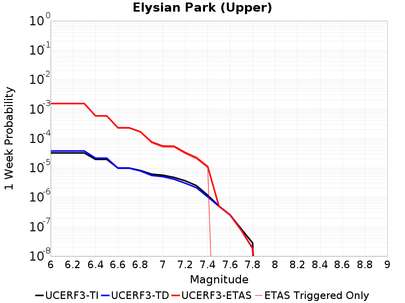 | 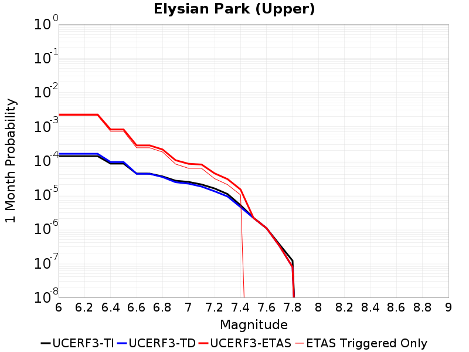 | 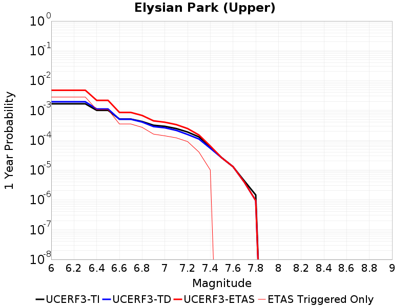 | 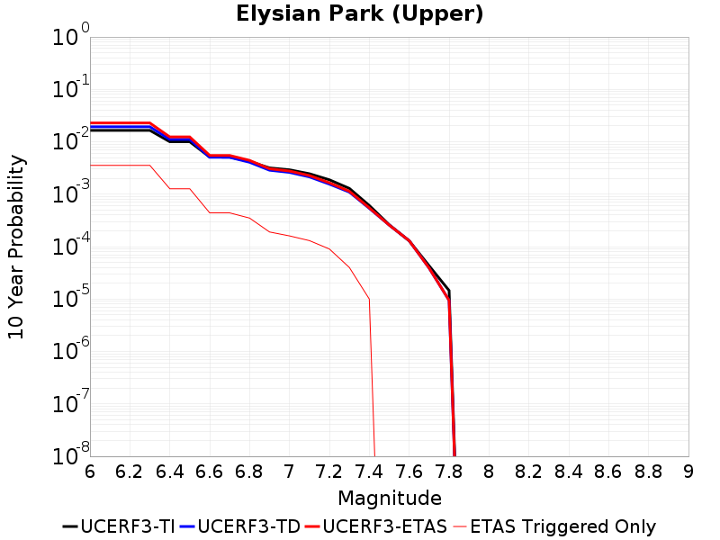 |

| Magnitude | 1 wk TI Prob | 1 wk TD Prob | 1 wk ETAS Prob | 1 wk ETAS/TD Gain | 1 wk ETAS Triggered Only | 1 mo TI Prob | 1 mo TD Prob | 1 mo ETAS Prob | 1 mo ETAS/TD Gain | 1 mo ETAS Triggered Only | 1 yr TI Prob | 1 yr TD Prob | 1 yr ETAS Prob | 1 yr ETAS/TD Gain | 1 yr ETAS Triggered Only | 10 yr TI Prob | 10 yr TD Prob | 10 yr ETAS Prob | 10 yr ETAS/TD Gain | 10 yr ETAS Triggered Only |
|-----|-----|-----|-----|-----|-----|-----|-----|-----|-----|-----|-----|-----|-----|-----|-----|-----|-----|-----|-----|-----|
| 6.0 | 3.1876025E-5 | 3.7299425E-5 | 0.0015272439 | 40.945507 | 0.00149 | 1.3660437E-4 | 1.5984758E-4 | 0.0022495135 | 14.0728655 | 0.00209 | 0.0016618895 | 0.001944887 | 0.0047394414 | 2.4368722 | 0.0028 | 0.016495159 | 0.019325502 | 0.022806898 | 1.1801451 | 0.00355 |
| 6.1 | 3.1876025E-5 | 3.7299425E-5 | 0.0015272439 | 40.945507 | 0.00149 | 1.3660437E-4 | 1.5984758E-4 | 0.0022495135 | 14.0728655 | 0.00209 | 0.0016618895 | 0.001944887 | 0.0047394414 | 2.4368722 | 0.0028 | 0.016495159 | 0.019325502 | 0.022806898 | 1.1801451 | 0.00355 |
| 6.2 | 3.1876025E-5 | 3.7299425E-5 | 0.0015272439 | 40.945507 | 0.00149 | 1.3660437E-4 | 1.5984758E-4 | 0.0022495135 | 14.0728655 | 0.00209 | 0.0016618895 | 0.001944887 | 0.0047394414 | 2.4368722 | 0.0028 | 0.016495159 | 0.019325502 | 0.022806898 | 1.1801451 | 0.00355 |
| 6.3 | 3.1876025E-5 | 3.7299425E-5 | 0.0015272439 | 40.945507 | 0.00149 | 1.3660437E-4 | 1.5984758E-4 | 0.0022495135 | 14.0728655 | 0.00209 | 0.0016618895 | 0.001944887 | 0.0047394414 | 2.4368722 | 0.0028 | 0.016495159 | 0.019325502 | 0.022806898 | 1.1801451 | 0.00355 |
| 6.4 | 1.9273462E-5 | 2.132413E-5 | 5.8131217E-4 | 27.260769 | 5.6E-4 | 8.259794E-5 | 9.1386835E-5 | 8.213201E-4 | 8.987291 | 7.3E-4 | 0.001005166 | 0.0011122398 | 0.0021710608 | 1.951972 | 0.00106 | 0.010006315 | 0.011083712 | 0.012339636 | 1.1133126 | 0.00127 |
| 6.5 | 1.9273462E-5 | 2.132413E-5 | 5.8131217E-4 | 27.260769 | 5.6E-4 | 8.259794E-5 | 9.1386835E-5 | 8.213201E-4 | 8.987291 | 7.3E-4 | 0.001005166 | 0.0011122398 | 0.0021710608 | 1.951972 | 0.00106 | 0.010006315 | 0.011083712 | 0.012339636 | 1.1133126 | 0.00127 |
| 6.6 | 9.813258E-6 | 9.697557E-6 | 2.2969542E-4 | 23.685904 | 2.2E-4 | 4.205614E-5 | 4.156034E-5 | 2.8155037E-4 | 6.774496 | 2.4E-4 | 5.119132E-4 | 5.05887E-4 | 8.557099E-4 | 1.6915041 | 3.5E-4 | 0.005107356 | 0.0050480836 | 0.0054858625 | 1.0867218 | 4.4E-4 |
| 6.7 | 9.801478E-6 | 9.685102E-6 | 2.2968298E-4 | 23.715082 | 2.2E-4 | 4.2005657E-5 | 4.150696E-5 | 2.81497E-4 | 6.781923 | 2.4E-4 | 5.112989E-4 | 5.052374E-4 | 8.550605E-4 | 1.6923937 | 3.5E-4 | 0.0051012407 | 0.005041617 | 0.0054793986 | 1.0868336 | 4.4E-4 |
| 6.8 | 8.102489E-6 | 7.797792E-6 | 1.6779655E-4 | 21.518467 | 1.6E-4 | 3.4724493E-5 | 3.341871E-5 | 2.134127E-4 | 6.3860245 | 1.8E-4 | 4.2268867E-4 | 4.0680185E-4 | 6.76692E-4 | 1.6634438 | 2.7E-4 | 0.004218856 | 0.0040610703 | 0.004409649 | 1.0858341 | 3.5E-4 |
| 6.9 | 6.08275E-6 | 5.4952866E-6 | 7.54949E-5 | 13.738119 | 7.0E-5 | 2.6068668E-5 | 2.355102E-5 | 1.0354914E-4 | 4.3968005 | 8.0E-5 | 3.173398E-4 | 2.866967E-4 | 4.4665084E-4 | 1.557921 | 1.6E-4 | 0.0031688702 | 0.0028633466 | 0.0030528025 | 1.0661659 | 1.9E-4 |
| 7.0 | 5.5995934E-6 | 4.995031E-6 | 5.499478E-5 | 11.009898 | 5.0E-5 | 2.3998036E-5 | 2.1407104E-5 | 8.140582E-5 | 3.802748 | 6.0E-5 | 2.9213692E-4 | 2.60601E-4 | 4.0056452E-4 | 1.5370798 | 1.4E-4 | 0.0029175316 | 0.0026030217 | 0.0027626052 | 1.0613071 | 1.6E-4 |
| 7.1 | 4.709881E-6 | 4.0969E-6 | 5.4096694E-5 | 13.2043 | 5.0E-5 | 2.0185047E-5 | 1.7558026E-5 | 7.755697E-5 | 4.4171805 | 6.0E-5 | 2.4572524E-4 | 2.1374843E-4 | 3.3372277E-4 | 1.5612876 | 1.2E-4 | 0.002454537 | 0.00213547 | 0.0022651923 | 1.0607466 | 1.3E-4 |
| 7.2 | 3.6063436E-6 | 2.9839398E-6 | 3.298385E-5 | 11.053792 | 3.0E-5 | 1.5455667E-5 | 1.2788251E-5 | 4.278787E-5 | 3.345873 | 3.0E-5 | 1.881565E-4 | 1.5568595E-4 | 2.4567195E-4 | 1.5779969 | 9.0E-5 | 0.0018799726 | 0.0015557801 | 0.0016456401 | 1.0577588 | 9.0E-5 |
| 7.3 | 2.471135E-6 | 2.0998812E-6 | 2.2099839E-5 | 10.524328 | 2.0E-5 | 1.0590536E-5 | 8.99946E-6 | 2.899928E-5 | 3.2223353 | 2.0E-5 | 1.2893214E-4 | 1.0956299E-4 | 1.4955862E-4 | 1.3650467 | 4.0E-5 | 0.0012885736 | 0.001095097 | 0.0011350532 | 1.0364864 | 4.0E-5 |
| 7.4 | 1.163943E-6 | 1.0296288E-6 | 1.1029619E-5 | 10.712228 | 1.0E-5 | 4.988318E-6 | 4.4126878E-6 | 1.4412643E-5 | 3.2661824 | 1.0E-5 | 6.0731076E-5 | 5.372318E-5 | 6.372264E-5 | 1.1861293 | 1.0E-5 | 6.071448E-4 | 5.371049E-4 | 5.4709957E-4 | 1.0186083 | 1.0E-5 |
| 7.5 | 4.99459E-7 | 4.92665E-7 | 4.92665E-7 | 1.0 | 0.0 | 2.140537E-6 | 2.1114197E-6 | 2.1114197E-6 | 1.0 | 0.0 | 2.6060725E-5 | 2.5706247E-5 | 2.5706247E-5 | 1.0 | 0.0 | 2.605767E-4 | 2.5703432E-4 | 2.5703432E-4 | 1.0 | 0.0 |
| 7.6 | 2.4667852E-7 | 2.4840548E-7 | 2.4840548E-7 | 1.0 | 0.0 | 1.0571932E-6 | 1.0645945E-6 | 1.0645945E-6 | 1.0 | 0.0 | 1.2871251E-5 | 1.29613645E-5 | 1.29613645E-5 | 1.0 | 0.0 | 1.2870505E-4 | 1.2960646E-4 | 1.2960646E-4 | 1.0 | 0.0 |
| 7.7 | 8.2312795E-8 | 7.4475196E-8 | 7.4475196E-8 | 1.0 | 0.0 | 3.527691E-7 | 3.1917938E-7 | 3.1917938E-7 | 1.0 | 0.0 | 4.294955E-6 | 3.8860035E-6 | 3.8860035E-6 | 1.0 | 0.0 | 4.2948723E-5 | 3.885947E-5 | 3.885947E-5 | 1.0 | 0.0 |
| 7.8 | 2.7819295E-8 | 1.8062455E-8 | 1.8062455E-8 | 1.0 | 0.0 | 1.1922555E-7 | 7.741052E-8 | 7.741052E-8 | 1.0 | 0.0 | 1.45157E-6 | 9.4247275E-7 | 9.4247275E-7 | 1.0 | 0.0 | 1.45156055E-5 | 9.424703E-6 | 9.424703E-6 | 1.0 | 0.0 |

## Raymond
*[(top)](#table-of-contents)*

| 1 Week | 1 Month | 1 Year | 10 Year |
|-----|-----|-----|-----|
| 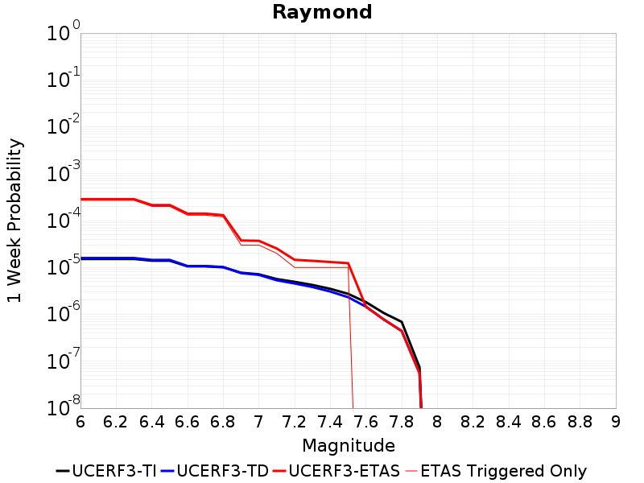 | 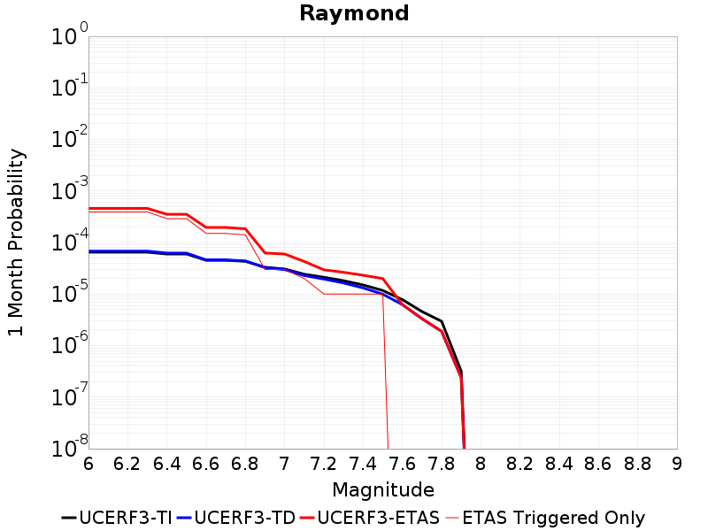 | 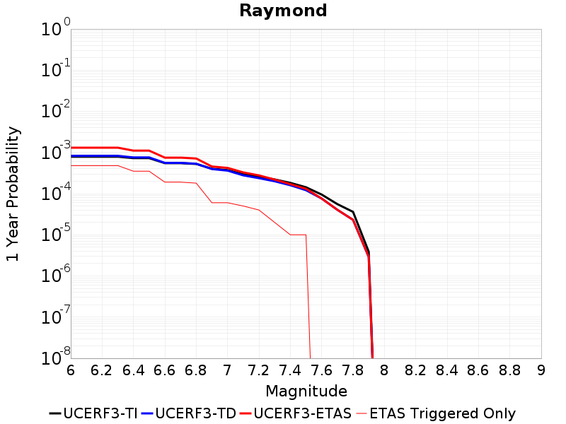 | 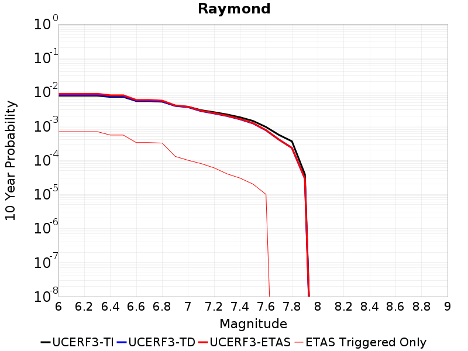 |

| Magnitude | 1 wk TI Prob | 1 wk TD Prob | 1 wk ETAS Prob | 1 wk ETAS/TD Gain | 1 wk ETAS Triggered Only | 1 mo TI Prob | 1 mo TD Prob | 1 mo ETAS Prob | 1 mo ETAS/TD Gain | 1 mo ETAS Triggered Only | 1 yr TI Prob | 1 yr TD Prob | 1 yr ETAS Prob | 1 yr ETAS/TD Gain | 1 yr ETAS Triggered Only | 10 yr TI Prob | 10 yr TD Prob | 10 yr ETAS Prob | 10 yr ETAS/TD Gain | 10 yr ETAS Triggered Only |
|-----|-----|-----|-----|-----|-----|-----|-----|-----|-----|-----|-----|-----|-----|-----|-----|-----|-----|-----|-----|-----|
| 6.0 | 1.5157413E-5 | 1.5876243E-5 | 2.8587197E-4 | 18.006271 | 2.7E-4 | 6.4958724E-5 | 6.803941E-5 | 4.580129E-4 | 6.731582 | 3.9E-4 | 7.905855E-4 | 8.280903E-4 | 0.0013076928 | 1.5791669 | 4.8E-4 | 0.007877788 | 0.00825259 | 0.008936895 | 1.0829201 | 6.9E-4 |
| 6.1 | 1.5157413E-5 | 1.5876243E-5 | 2.8587197E-4 | 18.006271 | 2.7E-4 | 6.4958724E-5 | 6.803941E-5 | 4.580129E-4 | 6.731582 | 3.9E-4 | 7.905855E-4 | 8.280903E-4 | 0.0013076928 | 1.5791669 | 4.8E-4 | 0.007877788 | 0.00825259 | 0.008936895 | 1.0829201 | 6.9E-4 |
| 6.2 | 1.5157413E-5 | 1.5876243E-5 | 2.8587197E-4 | 18.006271 | 2.7E-4 | 6.4958724E-5 | 6.803941E-5 | 4.580129E-4 | 6.731582 | 3.9E-4 | 7.905855E-4 | 8.280903E-4 | 0.0013076928 | 1.5791669 | 4.8E-4 | 0.007877788 | 0.00825259 | 0.008936895 | 1.0829201 | 6.9E-4 |
| 6.3 | 1.5157413E-5 | 1.5876243E-5 | 2.8587197E-4 | 18.006271 | 2.7E-4 | 6.4958724E-5 | 6.803941E-5 | 4.580129E-4 | 6.731582 | 3.9E-4 | 7.905855E-4 | 8.280903E-4 | 0.0013076928 | 1.5791669 | 4.8E-4 | 0.007877788 | 0.00825259 | 0.008936895 | 1.0829201 | 6.9E-4 |
| 6.4 | 1.3941944E-5 | 1.4515269E-5 | 2.1451237E-4 | 14.778394 | 2.0E-4 | 5.9749822E-5 | 6.220694E-5 | 3.5218892E-4 | 5.661569 | 2.9E-4 | 7.2721124E-4 | 7.571299E-4 | 0.0011068649 | 1.461922 | 3.5E-4 | 0.007248361 | 0.0075478614 | 0.00809371 | 1.0723183 | 5.5E-4 |
| 6.5 | 1.3941944E-5 | 1.4515269E-5 | 2.1451237E-4 | 14.778394 | 2.0E-4 | 5.9749822E-5 | 6.220694E-5 | 3.5218892E-4 | 5.661569 | 2.9E-4 | 7.2721124E-4 | 7.571299E-4 | 0.0011068649 | 1.461922 | 3.5E-4 | 0.007248361 | 0.0075478614 | 0.00809371 | 1.0723183 | 5.5E-4 |
| 6.6 | 1.0542609E-5 | 1.07165215E-5 | 1.4071513E-4 | 13.130672 | 1.3E-4 | 4.5181827E-5 | 4.592717E-5 | 1.9592028E-4 | 4.2658906 | 1.5E-4 | 5.499499E-4 | 5.590253E-4 | 7.4891915E-4 | 1.3396872 | 1.9E-4 | 0.005485909 | 0.005576762 | 0.0059049213 | 1.0588441 | 3.3E-4 |
| 6.7 | 1.0542609E-5 | 1.07165215E-5 | 1.4071513E-4 | 13.130672 | 1.3E-4 | 4.5181827E-5 | 4.592717E-5 | 1.9592028E-4 | 4.2658906 | 1.5E-4 | 5.499499E-4 | 5.590253E-4 | 7.4891915E-4 | 1.3396872 | 1.9E-4 | 0.005485909 | 0.005576762 | 0.0059049213 | 1.0588441 | 3.3E-4 |
| 6.8 | 1.0079132E-5 | 1.0220856E-5 | 1.3021963E-4 | 12.74058 | 1.2E-4 | 4.3195567E-5 | 4.3802964E-5 | 1.8379683E-4 | 4.1959906 | 1.4E-4 | 5.257791E-4 | 5.33176E-4 | 7.1308005E-4 | 1.3374196 | 1.8E-4 | 0.0052453685 | 0.005319527 | 0.0056378245 | 1.0598357 | 3.2E-4 |
| 6.9 | 7.721598E-6 | 7.582315E-6 | 3.758209E-5 | 4.9565454 | 3.0E-5 | 3.3092143E-5 | 3.2495238E-5 | 6.249426E-5 | 1.9231822 | 3.0E-5 | 4.0282236E-4 | 3.9555892E-4 | 4.555352E-4 | 1.1516241 | 6.0E-5 | 0.0040209293 | 0.0039486876 | 0.004078174 | 1.0327923 | 1.3E-4 |
| 7.0 | 7.137566E-6 | 6.942626E-6 | 3.694242E-5 | 5.321101 | 3.0E-5 | 3.058921E-5 | 2.9753779E-5 | 5.9752885E-5 | 2.0082452 | 3.0E-5 | 3.7236E-4 | 3.6219312E-4 | 4.221714E-4 | 1.1655974 | 6.0E-5 | 0.0037173668 | 0.0036161519 | 0.0037157903 | 1.0275537 | 1.0E-4 |
| 7.1 | 5.654976E-6 | 5.325883E-6 | 2.5325777E-5 | 4.7552257 | 2.0E-5 | 2.4235387E-5 | 2.2825014E-5 | 4.282456E-5 | 1.8762116 | 2.0E-5 | 2.9502588E-4 | 2.7785933E-4 | 3.2784542E-4 | 1.1798972 | 5.0E-5 | 0.0029463451 | 0.002775155 | 0.002854933 | 1.0287472 | 8.0E-5 |
| 7.2 | 4.9358455E-6 | 4.550845E-6 | 1.4550799E-5 | 3.197384 | 1.0E-5 | 2.1153453E-5 | 1.9503475E-5 | 2.950328E-5 | 1.5127192 | 1.0E-5 | 2.5751285E-4 | 2.3742909E-4 | 2.7741957E-4 | 1.1684314 | 4.0E-5 | 0.0025721465 | 0.002371781 | 0.0024316388 | 1.0252374 | 6.0E-5 |
| 7.3 | 4.2368597E-6 | 3.828595E-6 | 1.3828556E-5 | 3.6119144 | 1.0E-5 | 1.8157843E-5 | 1.640816E-5 | 2.6407995E-5 | 1.6094428 | 1.0E-5 | 2.2104931E-4 | 1.9975114E-4 | 2.1974715E-4 | 1.1001046 | 2.0E-5 | 0.0022082955 | 0.0019957395 | 0.0020356595 | 1.0200027 | 4.0E-5 |
| 7.4 | 3.4999923E-6 | 3.0649126E-6 | 1.3064882E-5 | 4.262726 | 1.0E-5 | 1.49998805E-5 | 1.3135274E-5 | 2.3135142E-5 | 1.7612989 | 1.0E-5 | 1.8260824E-4 | 1.599103E-4 | 1.699087E-4 | 1.062525 | 1.0E-5 | 0.0018245826 | 0.0015979728 | 0.0016279249 | 1.0187438 | 3.0E-5 |
| 7.5 | 2.738017E-6 | 2.32065E-6 | 1.2320627E-5 | 5.3091273 | 1.0E-5 | 1.1734306E-5 | 9.945606E-6 | 1.9945506E-5 | 2.005459 | 1.0E-5 | 1.428558E-4 | 1.21081095E-4 | 1.3107988E-4 | 1.0825793 | 1.0E-5 | 0.0014276401 | 0.0012101703 | 0.001230146 | 1.0165066 | 2.0E-5 |
| 7.6 | 1.8186392E-6 | 1.45538E-6 | 1.45538E-6 | 1.0 | 0.0 | 7.794145E-6 | 6.2373283E-6 | 6.2373283E-6 | 1.0 | 0.0 | 9.488958E-5 | 7.593686E-5 | 7.593686E-5 | 1.0 | 0.0 | 9.4849075E-4 | 7.5912534E-4 | 7.691178E-4 | 1.0131631 | 1.0E-5 |
| 7.7 | 1.0660348E-6 | 7.7576334E-7 | 7.7576334E-7 | 1.0 | 0.0 | 4.5687125E-6 | 3.3246959E-6 | 3.3246959E-6 | 1.0 | 0.0 | 5.5622655E-5 | 4.047744E-5 | 4.047744E-5 | 1.0 | 0.0 | 5.5608735E-4 | 4.0471443E-4 | 4.0471443E-4 | 1.0 | 0.0 |
| 7.8 | 6.913602E-7 | 4.4219067E-7 | 4.4219067E-7 | 1.0 | 0.0 | 2.962969E-6 | 1.8951015E-6 | 1.8951015E-6 | 1.0 | 0.0 | 3.607355E-5 | 2.3072622E-5 | 2.3072622E-5 | 1.0 | 0.0 | 3.6067693E-4 | 2.3071772E-4 | 2.3071772E-4 | 1.0 | 0.0 |
| 7.9 | 7.425201E-8 | 5.561763E-8 | 5.561763E-8 | 1.0 | 0.0 | 3.1822285E-7 | 2.3836125E-7 | 2.3836125E-7 | 1.0 | 0.0 | 3.874356E-6 | 2.9020457E-6 | 2.9020457E-6 | 1.0 | 0.0 | 3.8742884E-5 | 2.902022E-5 | 2.902022E-5 | 1.0 | 0.0 |

## Puente Hills
*[(top)](#table-of-contents)*

| 1 Week | 1 Month | 1 Year | 10 Year |
|-----|-----|-----|-----|
| 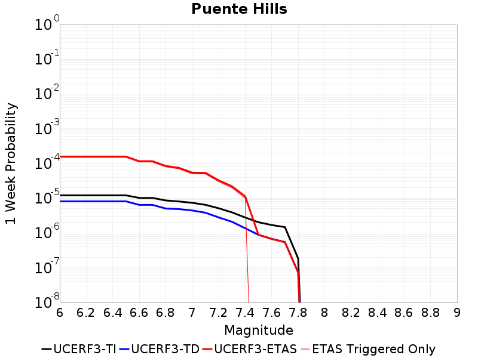 | 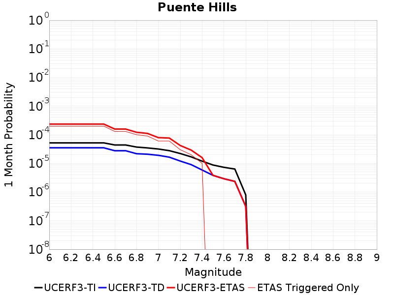 | 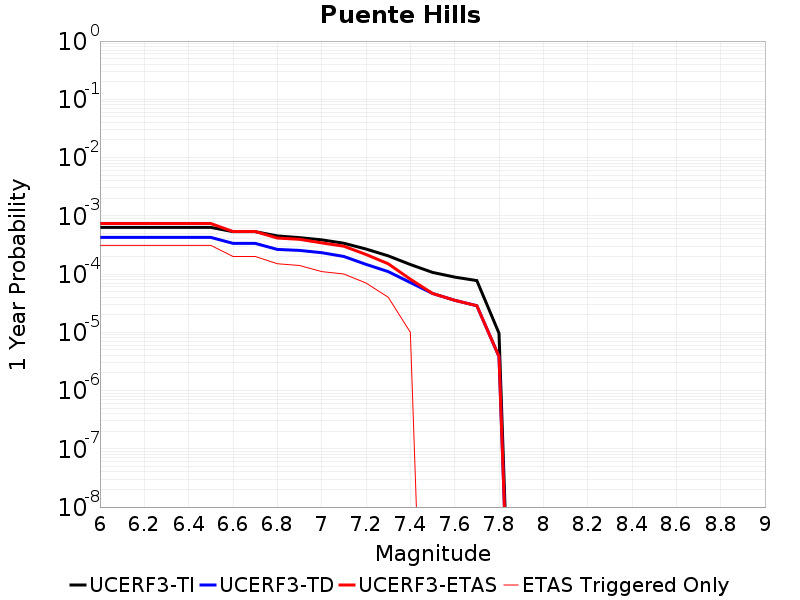 | 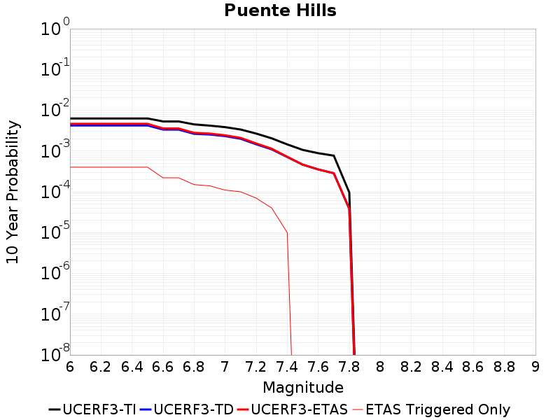 |

| Magnitude | 1 wk TI Prob | 1 wk TD Prob | 1 wk ETAS Prob | 1 wk ETAS/TD Gain | 1 wk ETAS Triggered Only | 1 mo TI Prob | 1 mo TD Prob | 1 mo ETAS Prob | 1 mo ETAS/TD Gain | 1 mo ETAS Triggered Only | 1 yr TI Prob | 1 yr TD Prob | 1 yr ETAS Prob | 1 yr ETAS/TD Gain | 1 yr ETAS Triggered Only | 10 yr TI Prob | 10 yr TD Prob | 10 yr ETAS Prob | 10 yr ETAS/TD Gain | 10 yr ETAS Triggered Only |
|-----|-----|-----|-----|-----|-----|-----|-----|-----|-----|-----|-----|-----|-----|-----|-----|-----|-----|-----|-----|-----|
| 6.0 | 1.2101656E-5 | 8.142637E-6 | 1.5814141E-4 | 19.421402 | 1.5E-4 | 5.1863204E-5 | 3.489658E-5 | 2.348896E-4 | 6.731021 | 2.0E-4 | 6.312516E-4 | 4.247887E-4 | 7.34657E-4 | 1.7294645 | 3.1E-4 | 0.0062946146 | 0.004240331 | 0.0046386346 | 1.0939323 | 4.0E-4 |
| 6.1 | 1.2101656E-5 | 8.142637E-6 | 1.5814141E-4 | 19.421402 | 1.5E-4 | 5.1863204E-5 | 3.489658E-5 | 2.348896E-4 | 6.731021 | 2.0E-4 | 6.312516E-4 | 4.247887E-4 | 7.34657E-4 | 1.7294645 | 3.1E-4 | 0.0062946146 | 0.004240331 | 0.0046386346 | 1.0939323 | 4.0E-4 |
| 6.2 | 1.2101656E-5 | 8.142637E-6 | 1.5814141E-4 | 19.421402 | 1.5E-4 | 5.1863204E-5 | 3.489658E-5 | 2.348896E-4 | 6.731021 | 2.0E-4 | 6.312516E-4 | 4.247887E-4 | 7.34657E-4 | 1.7294645 | 3.1E-4 | 0.0062946146 | 0.004240331 | 0.0046386346 | 1.0939323 | 4.0E-4 |
| 6.3 | 1.2101656E-5 | 8.142637E-6 | 1.5814141E-4 | 19.421402 | 1.5E-4 | 5.1863204E-5 | 3.489658E-5 | 2.348896E-4 | 6.731021 | 2.0E-4 | 6.312516E-4 | 4.247887E-4 | 7.34657E-4 | 1.7294645 | 3.1E-4 | 0.0062946146 | 0.004240331 | 0.0046386346 | 1.0939323 | 4.0E-4 |
| 6.4 | 1.2101656E-5 | 8.142637E-6 | 1.5814141E-4 | 19.421402 | 1.5E-4 | 5.1863204E-5 | 3.489658E-5 | 2.348896E-4 | 6.731021 | 2.0E-4 | 6.312516E-4 | 4.247887E-4 | 7.34657E-4 | 1.7294645 | 3.1E-4 | 0.0062946146 | 0.004240331 | 0.0046386346 | 1.0939323 | 4.0E-4 |
| 6.5 | 1.2101656E-5 | 8.142637E-6 | 1.5814141E-4 | 19.421402 | 1.5E-4 | 5.1863204E-5 | 3.489658E-5 | 2.348896E-4 | 6.731021 | 2.0E-4 | 6.312516E-4 | 4.247887E-4 | 7.34657E-4 | 1.7294645 | 3.1E-4 | 0.0062946146 | 0.004240331 | 0.0046386346 | 1.0939323 | 4.0E-4 |
| 6.6 | 1.0222488E-5 | 6.4391047E-6 | 1.16438394E-4 | 18.08301 | 1.1E-4 | 4.3809923E-5 | 2.7595886E-5 | 1.575923E-4 | 5.710717 | 1.3E-4 | 5.332553E-4 | 3.3593058E-4 | 5.358634E-4 | 1.5951611 | 2.0E-4 | 0.0053197746 | 0.003354475 | 0.0035737369 | 1.065364 | 2.2E-4 |
| 6.7 | 1.0222488E-5 | 6.4391047E-6 | 1.16438394E-4 | 18.08301 | 1.1E-4 | 4.3809923E-5 | 2.7595886E-5 | 1.575923E-4 | 5.710717 | 1.3E-4 | 5.332553E-4 | 3.3593058E-4 | 5.358634E-4 | 1.5951611 | 2.0E-4 | 0.0053197746 | 0.003354475 | 0.0035737369 | 1.065364 | 2.2E-4 |
| 6.8 | 8.6367845E-6 | 5.063669E-6 | 8.5063264E-5 | 16.79874 | 8.0E-5 | 3.7014266E-5 | 2.1701262E-5 | 1.2169909E-4 | 5.6079273 | 1.0E-4 | 4.505555E-4 | 2.6418138E-4 | 4.1414174E-4 | 1.5676417 | 1.5E-4 | 0.004496431 | 0.0026387302 | 0.0027883344 | 1.0566956 | 1.5E-4 |
| 6.9 | 8.066481E-6 | 4.870623E-6 | 7.487028E-5 | 15.371809 | 7.0E-5 | 3.4570177E-5 | 2.0873933E-5 | 1.1087205E-4 | 5.3115077 | 9.0E-5 | 4.2081063E-4 | 2.5411104E-4 | 3.9407547E-4 | 1.5508002 | 1.4E-4 | 0.0042001465 | 0.0025382591 | 0.002677904 | 1.0550159 | 1.4E-4 |
| 7.0 | 7.393828E-6 | 4.450161E-6 | 5.4449938E-5 | 12.235497 | 5.0E-5 | 3.168745E-5 | 1.9071984E-5 | 7.907084E-5 | 4.145916 | 6.0E-5 | 3.857264E-4 | 2.3217712E-4 | 3.4215156E-4 | 1.4736662 | 1.1E-4 | 0.0038505755 | 0.0023193916 | 0.0024291363 | 1.0473162 | 1.1E-4 |
| 7.1 | 6.4660953E-6 | 3.832491E-6 | 5.38323E-5 | 14.046295 | 5.0E-5 | 2.7711543E-5 | 1.642486E-5 | 7.642387E-5 | 4.6529393 | 6.0E-5 | 3.373358E-4 | 1.9995468E-4 | 2.9993468E-4 | 1.5000134 | 1.0E-4 | 0.0033682417 | 0.001997784 | 0.0020975843 | 1.0499555 | 1.0E-4 |
| 7.2 | 5.143232E-6 | 2.8059706E-6 | 3.2805885E-5 | 11.691458 | 3.0E-5 | 2.2042237E-5 | 1.2025534E-5 | 4.2025174E-5 | 3.4946618 | 3.0E-5 | 2.6833118E-4 | 1.4640113E-4 | 2.1639088E-4 | 1.4780684 | 7.0E-5 | 0.002680074 | 0.0014630568 | 0.0015329543 | 1.047775 | 7.0E-5 |
| 7.3 | 3.928255E-6 | 2.1076446E-6 | 2.2107602E-5 | 10.489246 | 2.0E-5 | 1.683527E-5 | 9.032731E-6 | 2.903255E-5 | 3.2141497 | 2.0E-5 | 2.0495013E-4 | 1.0996802E-4 | 1.4996363E-4 | 1.363702 | 4.0E-5 | 0.002047612 | 0.0010991428 | 0.0011390988 | 1.036352 | 4.0E-5 |
| 7.4 | 2.7894434E-6 | 1.3680102E-6 | 1.1367996E-5 | 8.309876 | 1.0E-5 | 1.1954703E-5 | 5.862888E-6 | 1.586283E-5 | 2.705634 | 1.0E-5 | 1.4553878E-4 | 7.1378374E-5 | 8.137766E-5 | 1.1400884 | 1.0E-5 | 0.001454435 | 7.135589E-4 | 7.235518E-4 | 1.0140042 | 1.0E-5 |
| 7.5 | 2.041735E-6 | 8.888298E-7 | 8.888298E-7 | 1.0 | 0.0 | 8.750263E-6 | 3.809265E-6 | 3.809265E-6 | 1.0 | 0.0 | 1.06529245E-4 | 4.6376852E-5 | 4.6376852E-5 | 1.0 | 0.0 | 0.0010647819 | 4.6367515E-4 | 4.6367515E-4 | 1.0 | 0.0 |
| 7.6 | 1.6959062E-6 | 6.775917E-7 | 6.775917E-7 | 1.0 | 0.0 | 7.268149E-6 | 2.9039613E-6 | 2.9039613E-6 | 1.0 | 0.0 | 8.848612E-5 | 3.5355184E-5 | 3.5355184E-5 | 1.0 | 0.0 | 8.84509E-4 | 3.5349853E-4 | 3.5349853E-4 | 1.0 | 0.0 |
| 7.7 | 1.4767965E-6 | 5.466639E-7 | 5.466639E-7 | 1.0 | 0.0 | 6.3291122E-6 | 2.3428433E-6 | 2.3428433E-6 | 1.0 | 0.0 | 7.705422E-5 | 2.852377E-5 | 2.852377E-5 | 1.0 | 0.0 | 7.702751E-4 | 2.852037E-4 | 2.852037E-4 | 1.0 | 0.0 |
| 7.8 | 1.8432911E-7 | 7.331886E-8 | 7.331886E-8 | 1.0 | 0.0 | 7.8998164E-7 | 3.1422366E-7 | 3.1422366E-7 | 1.0 | 0.0 | 9.617985E-6 | 3.82567E-6 | 3.82567E-6 | 1.0 | 0.0 | 9.617568E-5 | 3.8256367E-5 | 3.8256367E-5 | 1.0 | 0.0 |

## Hollywood
*[(top)](#table-of-contents)*

| 1 Week | 1 Month | 1 Year | 10 Year |
|-----|-----|-----|-----|
| 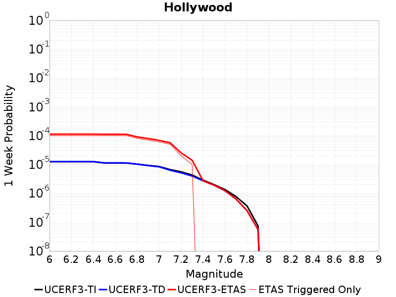 | 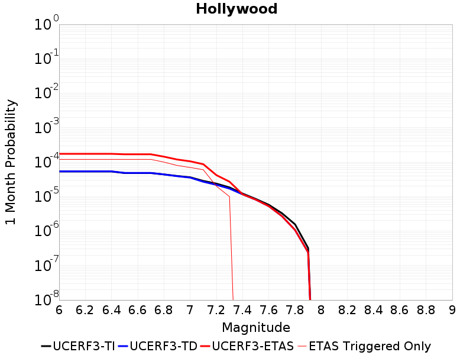 | 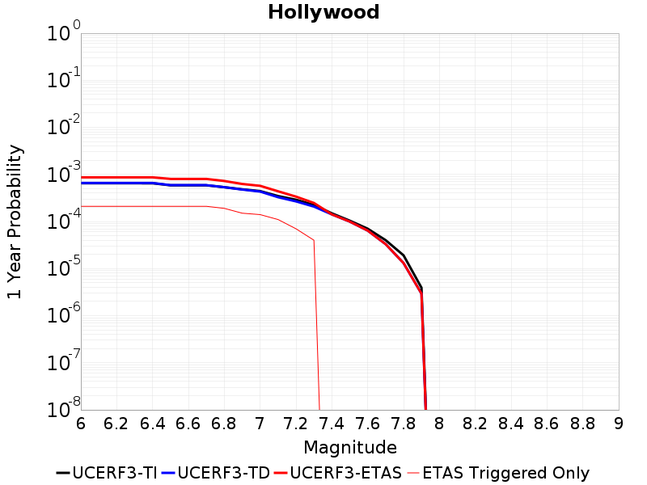 | 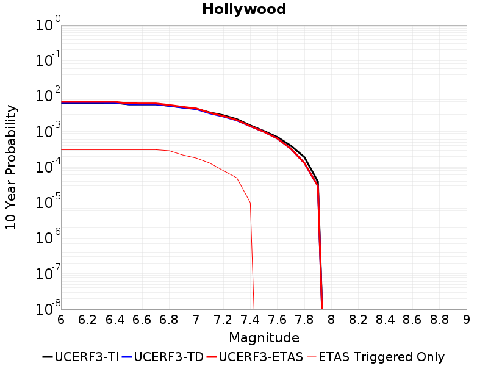 |

| Magnitude | 1 wk TI Prob | 1 wk TD Prob | 1 wk ETAS Prob | 1 wk ETAS/TD Gain | 1 wk ETAS Triggered Only | 1 mo TI Prob | 1 mo TD Prob | 1 mo ETAS Prob | 1 mo ETAS/TD Gain | 1 mo ETAS Triggered Only | 1 yr TI Prob | 1 yr TD Prob | 1 yr ETAS Prob | 1 yr ETAS/TD Gain | 1 yr ETAS Triggered Only | 10 yr TI Prob | 10 yr TD Prob | 10 yr ETAS Prob | 10 yr ETAS/TD Gain | 10 yr ETAS Triggered Only |
|-----|-----|-----|-----|-----|-----|-----|-----|-----|-----|-----|-----|-----|-----|-----|-----|-----|-----|-----|-----|-----|
| 6.0 | 1.24487615E-5 | 1.2604454E-5 | 1.1260319E-4 | 8.933603 | 1.0E-4 | 5.3350745E-5 | 5.4017997E-5 | 1.7401151E-4 | 3.2213619 | 1.2E-4 | 6.4935174E-4 | 6.5747526E-4 | 8.673372E-4 | 1.3191936 | 2.1E-4 | 0.0064745755 | 0.006555786 | 0.006863754 | 1.0469764 | 3.1E-4 |
| 6.1 | 1.24487615E-5 | 1.2604454E-5 | 1.1260319E-4 | 8.933603 | 1.0E-4 | 5.3350745E-5 | 5.4017997E-5 | 1.7401151E-4 | 3.2213619 | 1.2E-4 | 6.4935174E-4 | 6.5747526E-4 | 8.673372E-4 | 1.3191936 | 2.1E-4 | 0.0064745755 | 0.006555786 | 0.006863754 | 1.0469764 | 3.1E-4 |
| 6.2 | 1.24487615E-5 | 1.2604454E-5 | 1.1260319E-4 | 8.933603 | 1.0E-4 | 5.3350745E-5 | 5.4017997E-5 | 1.7401151E-4 | 3.2213619 | 1.2E-4 | 6.4935174E-4 | 6.5747526E-4 | 8.673372E-4 | 1.3191936 | 2.1E-4 | 0.0064745755 | 0.006555786 | 0.006863754 | 1.0469764 | 3.1E-4 |
| 6.3 | 1.24487615E-5 | 1.2604454E-5 | 1.1260319E-4 | 8.933603 | 1.0E-4 | 5.3350745E-5 | 5.4017997E-5 | 1.7401151E-4 | 3.2213619 | 1.2E-4 | 6.4935174E-4 | 6.5747526E-4 | 8.673372E-4 | 1.3191936 | 2.1E-4 | 0.0064745755 | 0.006555786 | 0.006863754 | 1.0469764 | 3.1E-4 |
| 6.4 | 1.2431024E-5 | 1.2585004E-5 | 1.12583744E-4 | 8.945866 | 1.0E-4 | 5.327473E-5 | 5.393464E-5 | 1.7392817E-4 | 3.224795 | 1.2E-4 | 6.4842677E-4 | 6.5646105E-4 | 8.663232E-4 | 1.3196871 | 2.1E-4 | 0.0064653796 | 0.0065457034 | 0.006853674 | 1.0470493 | 3.1E-4 |
| 6.5 | 1.1242222E-5 | 1.1344774E-5 | 1.1134364E-4 | 9.814531 | 1.0E-4 | 4.8180063E-5 | 4.861957E-5 | 1.6861374E-4 | 3.4680219 | 1.2E-4 | 5.864344E-4 | 5.917852E-4 | 8.0166094E-4 | 1.3546485 | 2.1E-4 | 0.0058488925 | 0.0059023816 | 0.006210552 | 1.0522112 | 3.1E-4 |
| 6.6 | 1.1234066E-5 | 1.133586E-5 | 1.11334724E-4 | 9.821463 | 1.0E-4 | 4.8145106E-5 | 4.8581365E-5 | 1.6857554E-4 | 3.4699628 | 1.2E-4 | 5.86009E-4 | 5.9132033E-4 | 8.0119615E-4 | 1.3549274 | 2.1E-4 | 0.005844661 | 0.0058977576 | 0.0062059294 | 1.0522523 | 3.1E-4 |
| 6.7 | 1.12294E-5 | 1.133058E-5 | 1.1132945E-4 | 9.825574 | 1.0E-4 | 4.812511E-5 | 4.8558737E-5 | 1.6855291E-4 | 3.471114 | 1.2E-4 | 5.857657E-4 | 5.9104495E-4 | 8.009208E-4 | 1.3550929 | 2.1E-4 | 0.0058422405 | 0.005895019 | 0.0062031914 | 1.0522767 | 3.1E-4 |
| 6.8 | 1.0252819E-5 | 1.02424265E-5 | 9.024161E-5 | 8.810569 | 8.0E-5 | 4.3939912E-5 | 4.3895387E-5 | 1.43891E-4 | 3.2780437 | 1.0E-4 | 5.3483713E-4 | 5.3429743E-4 | 7.241959E-4 | 1.3554171 | 1.9E-4 | 0.005335517 | 0.0053303563 | 0.00561881 | 1.0541154 | 2.9E-4 |
| 6.9 | 9.252289E-6 | 9.131456E-6 | 7.913082E-5 | 8.665739 | 7.0E-5 | 3.9652066E-5 | 3.9134233E-5 | 1.191311E-4 | 3.044166 | 8.0E-5 | 4.8265693E-4 | 4.7635677E-4 | 6.262853E-4 | 1.3147401 | 1.5E-4 | 0.0048161 | 0.0047535314 | 0.004972486 | 1.0460614 | 2.2E-4 |
| 7.0 | 8.474604E-6 | 8.27797E-6 | 6.827747E-5 | 8.248095 | 6.0E-5 | 3.6319227E-5 | 3.547654E-5 | 1.0547406E-4 | 2.973065 | 7.0E-5 | 4.4209688E-4 | 4.318427E-4 | 5.7178224E-4 | 1.3240521 | 1.4E-4 | 0.004412184 | 0.0043101865 | 0.0044894107 | 1.0415815 | 1.8E-4 |
| 7.1 | 6.643643E-6 | 6.283682E-6 | 5.6283367E-5 | 8.957068 | 5.0E-5 | 2.8472443E-5 | 2.692979E-5 | 8.692817E-5 | 3.2279558 | 6.0E-5 | 3.4659685E-4 | 3.278213E-4 | 4.3778523E-4 | 1.3354387 | 1.1E-4 | 0.0034605677 | 0.0032734233 | 0.0034029977 | 1.0395838 | 1.3E-4 |
| 7.2 | 5.549002E-6 | 5.121553E-6 | 2.512145E-5 | 4.9050455 | 2.0E-5 | 2.378122E-5 | 2.1949329E-5 | 4.194889E-5 | 1.9111696 | 2.0E-5 | 2.8949787E-4 | 2.6720046E-4 | 3.3718176E-4 | 1.2619056 | 7.0E-5 | 0.0028912104 | 0.0026688084 | 0.0027485949 | 1.0298959 | 8.0E-5 |
| 7.3 | 4.3059727E-6 | 3.971313E-6 | 1.3971274E-5 | 3.5180488 | 1.0E-5 | 1.8454039E-5 | 1.7019804E-5 | 2.7019632E-5 | 1.5875409 | 1.0E-5 | 2.2465475E-4 | 2.0719648E-4 | 2.471882E-4 | 1.1930134 | 4.0E-5 | 0.0022442779 | 0.0020700432 | 0.0021199398 | 1.0241041 | 5.0E-5 |
| 7.4 | 2.8550733E-6 | 2.710584E-6 | 2.710584E-6 | 1.0 | 0.0 | 1.2235971E-5 | 1.16167375E-5 | 1.16167375E-5 | 1.0 | 0.0 | 1.4896276E-4 | 1.4142465E-4 | 1.4142465E-4 | 1.0 | 0.0 | 0.0014886294 | 0.0014133515 | 0.0014233374 | 1.0070654 | 1.0E-5 |
| 7.5 | 1.9927045E-6 | 1.9053925E-6 | 1.9053925E-6 | 1.0 | 0.0 | 8.540134E-6 | 8.165943E-6 | 8.165943E-6 | 1.0 | 0.0 | 1.0397117E-4 | 9.9415854E-5 | 9.9415854E-5 | 1.0 | 0.0 | 0.0010392254 | 9.937175E-4 | 9.937175E-4 | 1.0 | 0.0 |
| 7.6 | 1.345084E-6 | 1.2275266E-6 | 1.2275266E-6 | 1.0 | 0.0 | 5.764633E-6 | 5.2608175E-6 | 5.2608175E-6 | 1.0 | 0.0 | 7.018215E-5 | 6.4048596E-5 | 6.4048596E-5 | 1.0 | 0.0 | 7.0159987E-4 | 6.4030336E-4 | 6.4030336E-4 | 1.0 | 0.0 |
| 7.7 | 7.6835164E-7 | 6.331738E-7 | 6.331738E-7 | 1.0 | 0.0 | 3.2929315E-6 | 2.713599E-6 | 2.713599E-6 | 1.0 | 0.0 | 4.00907E-5 | 3.3037584E-5 | 3.3037584E-5 | 1.0 | 0.0 | 4.0083472E-4 | 3.303282E-4 | 3.303282E-4 | 1.0 | 0.0 |
| 7.8 | 3.6562128E-7 | 2.503151E-7 | 2.503151E-7 | 1.0 | 0.0 | 1.5669474E-6 | 1.0727787E-6 | 1.0727787E-6 | 1.0 | 0.0 | 1.9077417E-5 | 1.3061006E-5 | 1.3061006E-5 | 1.0 | 0.0 | 1.907578E-4 | 1.3060277E-4 | 1.3060277E-4 | 1.0 | 0.0 |
| 7.9 | 7.5024424E-8 | 5.6215473E-8 | 5.6215473E-8 | 1.0 | 0.0 | 3.215332E-7 | 2.4092344E-7 | 2.4092344E-7 | 1.0 | 0.0 | 3.91466E-6 | 2.9332405E-6 | 2.9332405E-6 | 1.0 | 0.0 | 3.9145907E-5 | 2.933216E-5 | 2.933216E-5 | 1.0 | 0.0 |

## Santa Monica alt 1
*[(top)](#table-of-contents)*

| 1 Week | 1 Month | 1 Year | 10 Year |
|-----|-----|-----|-----|
|  | 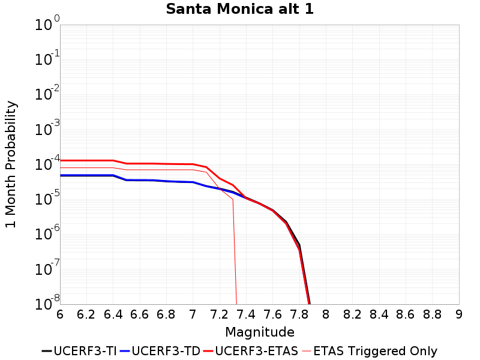 | 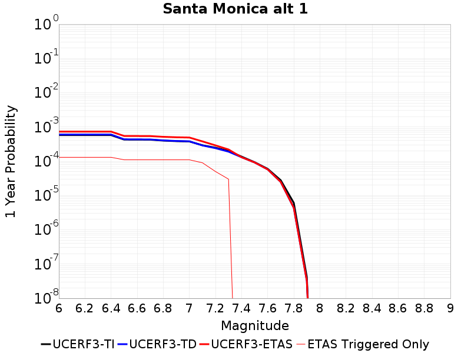 | 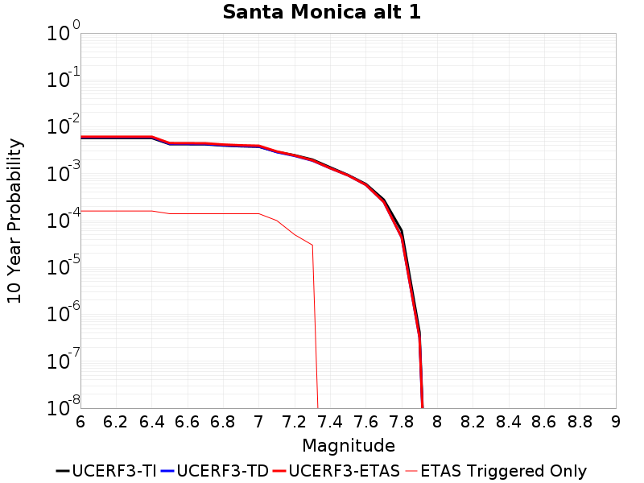 |

| Magnitude | 1 wk TI Prob | 1 wk TD Prob | 1 wk ETAS Prob | 1 wk ETAS/TD Gain | 1 wk ETAS Triggered Only | 1 mo TI Prob | 1 mo TD Prob | 1 mo ETAS Prob | 1 mo ETAS/TD Gain | 1 mo ETAS Triggered Only | 1 yr TI Prob | 1 yr TD Prob | 1 yr ETAS Prob | 1 yr ETAS/TD Gain | 1 yr ETAS Triggered Only | 10 yr TI Prob | 10 yr TD Prob | 10 yr ETAS Prob | 10 yr ETAS/TD Gain | 10 yr ETAS Triggered Only |
|-----|-----|-----|-----|-----|-----|-----|-----|-----|-----|-----|-----|-----|-----|-----|-----|-----|-----|-----|-----|-----|
| 6.0 | 1.1066008E-5 | 1.1499038E-5 | 8.1498234E-5 | 7.0873957 | 7.0E-5 | 4.742488E-5 | 4.928074E-5 | 1.292768E-4 | 2.6232722 | 8.0E-5 | 5.7724497E-4 | 5.998419E-4 | 7.297639E-4 | 1.2165937 | 1.3E-4 | 0.005757478 | 0.0059836237 | 0.006142666 | 1.0265796 | 1.6E-4 |
| 6.1 | 1.1066008E-5 | 1.1499038E-5 | 8.1498234E-5 | 7.0873957 | 7.0E-5 | 4.742488E-5 | 4.928074E-5 | 1.292768E-4 | 2.6232722 | 8.0E-5 | 5.7724497E-4 | 5.998419E-4 | 7.297639E-4 | 1.2165937 | 1.3E-4 | 0.005757478 | 0.0059836237 | 0.006142666 | 1.0265796 | 1.6E-4 |
| 6.2 | 1.1066008E-5 | 1.1499038E-5 | 8.1498234E-5 | 7.0873957 | 7.0E-5 | 4.742488E-5 | 4.928074E-5 | 1.292768E-4 | 2.6232722 | 8.0E-5 | 5.7724497E-4 | 5.998419E-4 | 7.297639E-4 | 1.2165937 | 1.3E-4 | 0.005757478 | 0.0059836237 | 0.006142666 | 1.0265796 | 1.6E-4 |
| 6.3 | 1.1066008E-5 | 1.1499038E-5 | 8.1498234E-5 | 7.0873957 | 7.0E-5 | 4.742488E-5 | 4.928074E-5 | 1.292768E-4 | 2.6232722 | 8.0E-5 | 5.7724497E-4 | 5.998419E-4 | 7.297639E-4 | 1.2165937 | 1.3E-4 | 0.005757478 | 0.0059836237 | 0.006142666 | 1.0265796 | 1.6E-4 |
| 6.4 | 1.1066008E-5 | 1.1499038E-5 | 8.1498234E-5 | 7.0873957 | 7.0E-5 | 4.742488E-5 | 4.928074E-5 | 1.292768E-4 | 2.6232722 | 8.0E-5 | 5.7724497E-4 | 5.998419E-4 | 7.297639E-4 | 1.2165937 | 1.3E-4 | 0.005757478 | 0.0059836237 | 0.006142666 | 1.0265796 | 1.6E-4 |
| 6.5 | 8.183544E-6 | 8.344012E-6 | 6.8343514E-5 | 8.190725 | 6.0E-5 | 3.5071862E-5 | 3.575957E-5 | 1.0575707E-4 | 2.957448 | 7.0E-5 | 4.2691626E-4 | 4.352874E-4 | 5.452395E-4 | 1.2525966 | 1.1E-4 | 0.0042609703 | 0.0043445146 | 0.004483906 | 1.0320846 | 1.4E-4 |
| 6.6 | 8.1543285E-6 | 8.312231E-6 | 6.831173E-5 | 8.218219 | 6.0E-5 | 3.4946657E-5 | 3.562337E-5 | 1.0562088E-4 | 2.9649322 | 7.0E-5 | 4.2539247E-4 | 4.3362982E-4 | 5.4358214E-4 | 1.2535626 | 1.1E-4 | 0.0042457907 | 0.004328003 | 0.0044673975 | 1.0322075 | 1.4E-4 |
| 6.7 | 8.110878E-6 | 8.265678E-6 | 6.826518E-5 | 8.258873 | 6.0E-5 | 3.4760444E-5 | 3.5423862E-5 | 1.0542138E-4 | 2.975999 | 7.0E-5 | 4.231262E-4 | 4.3120174E-4 | 5.411543E-4 | 1.254991 | 1.1E-4 | 0.0042232145 | 0.0043038167 | 0.0044432143 | 1.0323893 | 1.4E-4 |
| 6.8 | 7.644036E-6 | 7.759671E-6 | 6.77592E-5 | 8.732227 | 6.0E-5 | 3.275974E-5 | 3.3255314E-5 | 1.0325298E-4 | 3.1048567 | 7.0E-5 | 3.9877684E-4 | 4.0480963E-4 | 5.147651E-4 | 1.2716227 | 1.1E-4 | 0.00398062 | 0.00404087 | 0.004180304 | 1.034506 | 1.4E-4 |
| 6.9 | 7.3698293E-6 | 7.4653585E-6 | 6.746491E-5 | 9.037063 | 6.0E-5 | 3.15846E-5 | 3.1994008E-5 | 1.0199177E-4 | 3.1878397 | 7.0E-5 | 3.8447464E-4 | 3.8945884E-4 | 4.99416E-4 | 1.2823333 | 1.1E-4 | 0.0038381014 | 0.0038879076 | 0.0040273634 | 1.0358691 | 1.4E-4 |
| 7.0 | 7.209872E-6 | 7.296433E-6 | 6.7295994E-5 | 9.223136 | 6.0E-5 | 3.0899086E-5 | 3.127006E-5 | 1.0126787E-4 | 3.238493 | 7.0E-5 | 3.7613141E-4 | 3.8064786E-4 | 4.90606E-4 | 1.288871 | 1.1E-4 | 0.0037549543 | 0.0038001023 | 0.0039395704 | 1.0367011 | 1.4E-4 |
| 7.1 | 5.603456E-6 | 5.53093E-6 | 5.5530654E-5 | 10.04002 | 5.0E-5 | 2.4014591E-5 | 2.3703775E-5 | 8.3702354E-5 | 3.5311825 | 6.0E-5 | 2.923384E-4 | 2.8855563E-4 | 3.7852966E-4 | 1.3118082 | 9.0E-5 | 0.0029195412 | 0.0028818515 | 0.0029815633 | 1.0345999 | 1.0E-4 |
| 7.2 | 4.7483613E-6 | 4.596152E-6 | 2.459606E-5 | 5.351446 | 2.0E-5 | 2.0349962E-5 | 1.9697647E-5 | 3.9697254E-5 | 2.0153298 | 2.0E-5 | 2.4773262E-4 | 2.3979259E-4 | 2.8978058E-4 | 1.2084635 | 5.0E-5 | 0.0024745662 | 0.0023953526 | 0.0024452328 | 1.0208237 | 5.0E-5 |
| 7.3 | 3.829015E-6 | 3.6384947E-6 | 1.3638458E-5 | 3.7483792 | 1.0E-5 | 1.6409962E-5 | 1.5593456E-5 | 2.55933E-5 | 1.6412847 | 1.0E-5 | 1.9977297E-4 | 1.8983387E-4 | 2.1982817E-4 | 1.158003 | 3.0E-5 | 0.0019959346 | 0.001896726 | 0.001926669 | 1.0157868 | 3.0E-5 |
| 7.4 | 2.610755E-6 | 2.5024483E-6 | 2.5024483E-6 | 1.0 | 0.0 | 1.1188902E-5 | 1.0724735E-5 | 1.0724735E-5 | 1.0 | 0.0 | 1.3621636E-4 | 1.3056587E-4 | 1.3056587E-4 | 1.0 | 0.0 | 0.001361329 | 0.001304896 | 0.001304896 | 1.0 | 0.0 |
| 7.5 | 1.792146E-6 | 1.7605043E-6 | 1.7605043E-6 | 1.0 | 0.0 | 7.680603E-6 | 7.5449966E-6 | 7.5449966E-6 | 1.0 | 0.0 | 9.3507326E-5 | 9.18565E-5 | 9.18565E-5 | 1.0 | 0.0 | 9.3467993E-4 | 9.181884E-4 | 9.181884E-4 | 1.0 | 0.0 |
| 7.6 | 1.1473018E-6 | 1.1044189E-6 | 1.1044189E-6 | 1.0 | 0.0 | 4.9169985E-6 | 4.733215E-6 | 4.733215E-6 | 1.0 | 0.0 | 5.986281E-5 | 5.7625388E-5 | 5.7625388E-5 | 1.0 | 0.0 | 5.984669E-4 | 5.7610613E-4 | 5.7610613E-4 | 1.0 | 0.0 |
| 7.7 | 5.330919E-7 | 4.7574312E-7 | 4.7574312E-7 | 1.0 | 0.0 | 2.2846775E-6 | 2.0388975E-6 | 2.0388975E-6 | 1.0 | 0.0 | 2.7815593E-5 | 2.4823306E-5 | 2.4823306E-5 | 1.0 | 0.0 | 2.7812112E-4 | 2.482065E-4 | 2.482065E-4 | 1.0 | 0.0 |
| 7.8 | 1.1668574E-7 | 8.370888E-8 | 8.370888E-8 | 1.0 | 0.0 | 5.000816E-7 | 3.5875232E-7 | 3.5875232E-7 | 1.0 | 0.0 | 6.0884768E-6 | 4.367801E-6 | 4.367801E-6 | 1.0 | 0.0 | 6.08831E-5 | 4.3677184E-5 | 4.3677184E-5 | 1.0 | 0.0 |
| 7.9 | 8.007447E-10 | 6.194234E-10 | 6.194234E-10 | 1.0 | 0.0 | 3.4317629E-9 | 2.654672E-9 | 2.654672E-9 | 1.0 | 0.0 | 4.1781714E-8 | 3.232063E-8 | 3.232063E-8 | 1.0 | 0.0 | 4.1781706E-7 | 3.2320628E-7 | 3.2320628E-7 | 1.0 | 0.0 |

## San Andreas (Mojave S)
*[(top)](#table-of-contents)*

| 1 Week | 1 Month | 1 Year | 10 Year |
|-----|-----|-----|-----|
| 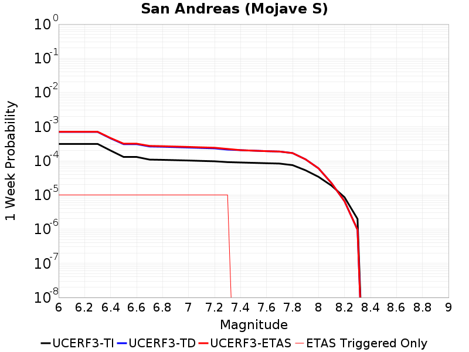 |  | 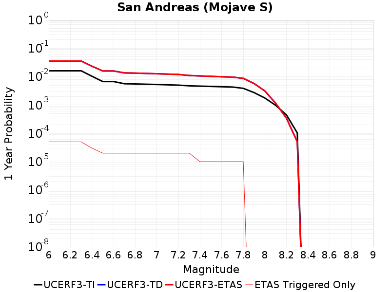 | 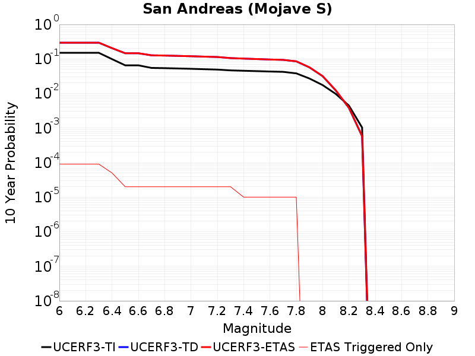 |

| Magnitude | 1 wk TI Prob | 1 wk TD Prob | 1 wk ETAS Prob | 1 wk ETAS/TD Gain | 1 wk ETAS Triggered Only | 1 mo TI Prob | 1 mo TD Prob | 1 mo ETAS Prob | 1 mo ETAS/TD Gain | 1 mo ETAS Triggered Only | 1 yr TI Prob | 1 yr TD Prob | 1 yr ETAS Prob | 1 yr ETAS/TD Gain | 1 yr ETAS Triggered Only | 10 yr TI Prob | 10 yr TD Prob | 10 yr ETAS Prob | 10 yr ETAS/TD Gain | 10 yr ETAS Triggered Only |
|-----|-----|-----|-----|-----|-----|-----|-----|-----|-----|-----|-----|-----|-----|-----|-----|-----|-----|-----|-----|-----|
| 6.0 | 3.1064058E-4 | 6.9553894E-4 | 7.05532E-4 | 1.0143673 | 1.0E-5 | 0.0013306376 | 0.0029776054 | 0.003007516 | 1.0100452 | 3.0E-5 | 0.016080605 | 0.03561936 | 0.03566758 | 1.0013537 | 5.0E-5 | 0.1496549 | 0.29366046 | 0.29372403 | 1.0002165 | 9.0E-5 |
| 6.1 | 3.1064058E-4 | 6.9553894E-4 | 7.05532E-4 | 1.0143673 | 1.0E-5 | 0.0013306376 | 0.0029776054 | 0.003007516 | 1.0100452 | 3.0E-5 | 0.016080605 | 0.03561936 | 0.03566758 | 1.0013537 | 5.0E-5 | 0.1496549 | 0.29366046 | 0.29372403 | 1.0002165 | 9.0E-5 |
| 6.2 | 3.1064058E-4 | 6.9553894E-4 | 7.05532E-4 | 1.0143673 | 1.0E-5 | 0.0013306376 | 0.0029776054 | 0.003007516 | 1.0100452 | 3.0E-5 | 0.016080605 | 0.03561936 | 0.03566758 | 1.0013537 | 5.0E-5 | 0.1496549 | 0.29366046 | 0.29372403 | 1.0002165 | 9.0E-5 |
| 6.3 | 3.1064058E-4 | 6.9553894E-4 | 7.05532E-4 | 1.0143673 | 1.0E-5 | 0.0013306376 | 0.0029776054 | 0.003007516 | 1.0100452 | 3.0E-5 | 0.016080605 | 0.03561936 | 0.03566758 | 1.0013537 | 5.0E-5 | 0.1496549 | 0.29366046 | 0.29372403 | 1.0002165 | 9.0E-5 |
| 6.4 | 1.9872203E-4 | 4.5153467E-4 | 4.6153014E-4 | 1.0221367 | 1.0E-5 | 8.5138786E-4 | 0.001933742 | 0.001963684 | 1.015484 | 3.0E-5 | 0.010316478 | 0.023295538 | 0.02332484 | 1.0012578 | 3.0E-5 | 0.098504856 | 0.2044527 | 0.20449246 | 1.0001945 | 5.0E-5 |
| 6.5 | 1.291105E-4 | 3.0606694E-4 | 3.1606387E-4 | 1.0326626 | 1.0E-5 | 5.5321335E-4 | 0.0013110589 | 0.0013310326 | 1.0152348 | 2.0E-5 | 0.006714592 | 0.01584623 | 0.015865913 | 1.0012422 | 2.0E-5 | 0.065152965 | 0.14563614 | 0.14565322 | 1.0001173 | 2.0E-5 |
| 6.6 | 1.291105E-4 | 3.0606694E-4 | 3.1606387E-4 | 1.0326626 | 1.0E-5 | 5.5321335E-4 | 0.0013110589 | 0.0013310326 | 1.0152348 | 2.0E-5 | 0.006714592 | 0.01584623 | 0.015865913 | 1.0012422 | 2.0E-5 | 0.065152965 | 0.14563614 | 0.14565322 | 1.0001173 | 2.0E-5 |
| 6.7 | 1.08001186E-4 | 2.6153977E-4 | 2.7153714E-4 | 1.038225 | 1.0E-5 | 4.6278012E-4 | 0.0011204039 | 0.0011403814 | 1.0178307 | 2.0E-5 | 0.0056198016 | 0.013555957 | 0.013575686 | 1.0014553 | 2.0E-5 | 0.054797906 | 0.12682423 | 0.1268417 | 1.0001377 | 2.0E-5 |
| 6.8 | 1.0624356E-4 | 2.5665245E-4 | 2.6664988E-4 | 1.0389532 | 1.0E-5 | 4.5525006E-4 | 0.001099476 | 0.0011194539 | 1.0181705 | 2.0E-5 | 0.0055285925 | 0.013304291 | 0.013324025 | 1.0014833 | 2.0E-5 | 0.053930566 | 0.12476811 | 0.12478561 | 1.0001403 | 2.0E-5 |
| 6.9 | 1.0393785E-4 | 2.5027146E-4 | 2.6026898E-4 | 1.0399466 | 1.0E-5 | 4.4537184E-4 | 0.0010721516 | 0.0010921302 | 1.0186341 | 2.0E-5 | 0.0054089287 | 0.012975621 | 0.012995361 | 1.0015213 | 2.0E-5 | 0.05279156 | 0.12205642 | 0.12207398 | 1.0001439 | 2.0E-5 |
| 7.0 | 1.0155622E-4 | 2.438699E-4 | 2.5386747E-4 | 1.0409955 | 1.0E-5 | 4.3516833E-4 | 0.0010447386 | 0.0010647177 | 1.0191236 | 2.0E-5 | 0.005285311 | 0.012645784 | 0.012665531 | 1.0015615 | 2.0E-5 | 0.05161361 | 0.119310685 | 0.1193283 | 1.0001476 | 2.0E-5 |
| 7.1 | 9.885595E-5 | 2.3664393E-4 | 2.4664158E-4 | 1.0422475 | 1.0E-5 | 4.2359953E-4 | 0.0010137944 | 0.0010337742 | 1.0197079 | 2.0E-5 | 0.0051451353 | 0.01227334 | 0.012293094 | 1.0016096 | 2.0E-5 | 0.05027629 | 0.11617745 | 0.11619513 | 1.0001521 | 2.0E-5 |
| 7.2 | 9.6411415E-5 | 2.3017218E-4 | 2.4016989E-4 | 1.0434357 | 1.0E-5 | 4.1312634E-4 | 9.860797E-4 | 0.0010060599 | 1.0202624 | 2.0E-5 | 0.005018219 | 0.011939659 | 0.01195942 | 1.0016551 | 2.0E-5 | 0.049064007 | 0.11335286 | 0.11337059 | 1.0001564 | 2.0E-5 |
| 7.3 | 9.1180635E-5 | 2.1187271E-4 | 2.2187059E-4 | 1.0471882 | 1.0E-5 | 3.907156E-4 | 9.0771005E-4 | 9.276919E-4 | 1.0220134 | 2.0E-5 | 0.004746591 | 0.010995516 | 0.011015296 | 1.0017989 | 2.0E-5 | 0.046464786 | 0.10539672 | 0.10541461 | 1.0001698 | 2.0E-5 |
| 7.4 | 8.887388E-5 | 2.0411657E-4 | 2.0411657E-4 | 1.0 | 0.0 | 3.8083247E-4 | 8.744921E-4 | 8.844834E-4 | 1.0114253 | 1.0E-5 | 0.0046267817 | 0.0105950935 | 0.010604988 | 1.0009339 | 1.0E-5 | 0.045316286 | 0.101969026 | 0.10197801 | 1.0000881 | 1.0E-5 |
| 7.5 | 8.6750515E-5 | 1.9720776E-4 | 1.9720776E-4 | 1.0 | 0.0 | 3.7173493E-4 | 8.449024E-4 | 8.54894E-4 | 1.0118257 | 1.0E-5 | 0.004516484 | 0.010238282 | 0.0102481805 | 1.0009667 | 1.0E-5 | 0.04425787 | 0.098868765 | 0.09887778 | 1.0000912 | 1.0E-5 |
| 7.6 | 8.453092E-5 | 1.9083881E-4 | 1.9083881E-4 | 1.0 | 0.0 | 3.6222505E-4 | 8.176243E-4 | 8.2761614E-4 | 1.0122205 | 1.0E-5 | 0.0044011753 | 0.0099092405 | 0.009919141 | 1.0009992 | 1.0E-5 | 0.04315024 | 0.095946364 | 0.09595541 | 1.0000942 | 1.0E-5 |
| 7.7 | 8.259102E-5 | 1.8584763E-4 | 1.8584763E-4 | 1.0 | 0.0 | 3.539135E-4 | 7.962468E-4 | 8.0623885E-4 | 1.0125489 | 1.0E-5 | 0.004300386 | 0.009651306 | 0.00966121 | 1.0010262 | 1.0E-5 | 0.042181134 | 0.09362232 | 0.09363139 | 1.0000968 | 1.0E-5 |
| 7.8 | 7.444844E-5 | 1.6755445E-4 | 1.6755445E-4 | 1.0 | 0.0 | 3.1902574E-4 | 7.1789295E-4 | 7.2788575E-4 | 1.0139197 | 1.0E-5 | 0.0038772223 | 0.008705386 | 0.008715299 | 1.0011387 | 1.0E-5 | 0.03810269 | 0.084849395 | 0.08485855 | 1.0001079 | 1.0E-5 |
| 7.9 | 5.2586525E-5 | 1.0998512E-4 | 1.0998512E-4 | 1.0 | 0.0 | 2.2535135E-4 | 4.712797E-4 | 4.712797E-4 | 1.0 | 0.0 | 0.0027402006 | 0.00572275 | 0.00572275 | 1.0 | 0.0 | 0.027066574 | 0.056809913 | 0.056809913 | 1.0 | 0.0 |
| 8.0 | 3.379877E-5 | 5.9930222E-5 | 5.9930222E-5 | 1.0 | 0.0 | 1.4484383E-4 | 2.5681854E-4 | 2.5681854E-4 | 1.0 | 0.0 | 0.0017620471 | 0.003122285 | 0.003122285 | 1.0 | 0.0 | 0.017481409 | 0.031680163 | 0.031680163 | 1.0 | 0.0 |
| 8.1 | 1.8668277E-5 | 2.2077258E-5 | 2.2077258E-5 | 1.0 | 0.0 | 8.000444E-5 | 9.461339E-5 | 9.461339E-5 | 1.0 | 0.0 | 9.736188E-4 | 0.0011513102 | 0.0011513102 | 1.0 | 0.0 | 0.009693642 | 0.012231419 | 0.012231419 | 1.0 | 0.0 |
| 8.2 | 8.541571E-6 | 6.533366E-6 | 6.533366E-6 | 1.0 | 0.0 | 3.660622E-5 | 2.799984E-5 | 2.799984E-5 | 1.0 | 0.0 | 4.455896E-4 | 3.4084485E-4 | 3.4084485E-4 | 1.0 | 0.0 | 0.0044469717 | 0.0038193879 | 0.0038193879 | 1.0 | 0.0 |
| 8.3 | 1.983087E-6 | 9.574791E-7 | 9.574791E-7 | 1.0 | 0.0 | 8.498917E-6 | 4.1034755E-6 | 4.1034755E-6 | 1.0 | 0.0 | 1.034694E-4 | 4.9958693E-5 | 4.9958693E-5 | 1.0 | 0.0 | 0.0010342124 | 5.8023055E-4 | 5.8023055E-4 | 1.0 | 0.0 |

## Whittier alt 1
*[(top)](#table-of-contents)*

| 1 Week | 1 Month | 1 Year | 10 Year |
|-----|-----|-----|-----|
| 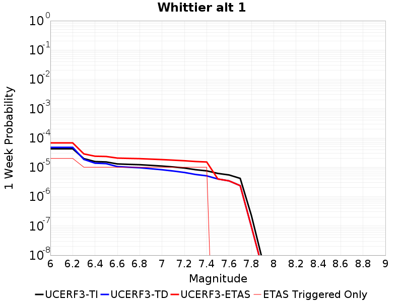 | 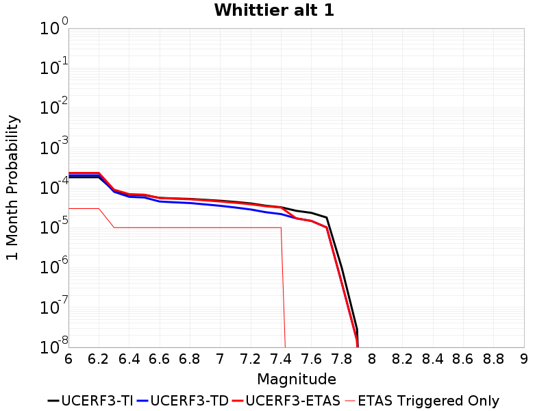 | 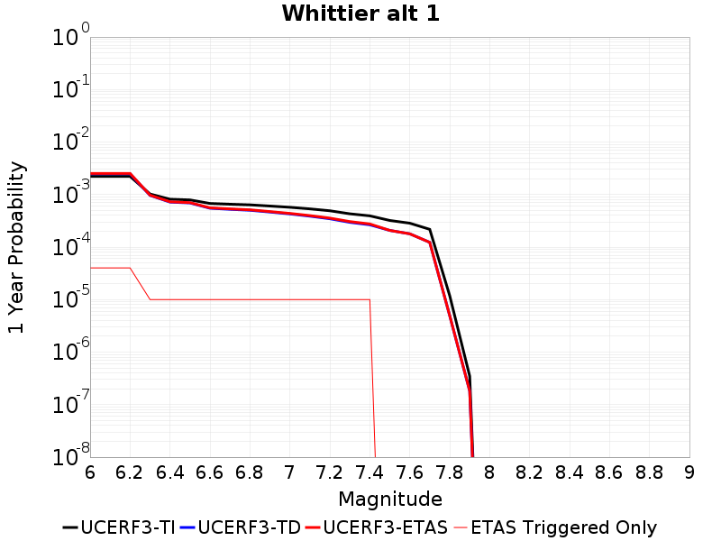 | 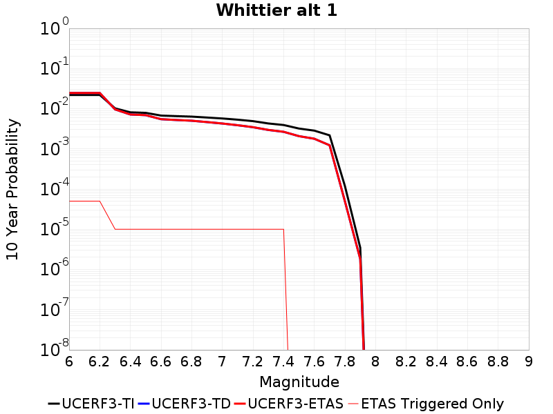 |

| Magnitude | 1 wk TI Prob | 1 wk TD Prob | 1 wk ETAS Prob | 1 wk ETAS/TD Gain | 1 wk ETAS Triggered Only | 1 mo TI Prob | 1 mo TD Prob | 1 mo ETAS Prob | 1 mo ETAS/TD Gain | 1 mo ETAS Triggered Only | 1 yr TI Prob | 1 yr TD Prob | 1 yr ETAS Prob | 1 yr ETAS/TD Gain | 1 yr ETAS Triggered Only | 10 yr TI Prob | 10 yr TD Prob | 10 yr ETAS Prob | 10 yr ETAS/TD Gain | 10 yr ETAS Triggered Only |
|-----|-----|-----|-----|-----|-----|-----|-----|-----|-----|-----|-----|-----|-----|-----|-----|-----|-----|-----|-----|-----|
| 6.0 | 4.2554693E-5 | 4.7600577E-5 | 6.759963E-5 | 1.420143 | 2.0E-5 | 1.8236451E-4 | 2.0398835E-4 | 2.3398224E-4 | 1.1470373 | 3.0E-5 | 0.002218027 | 0.002481055 | 0.0025209556 | 1.0160822 | 4.0E-5 | 0.02196019 | 0.024567805 | 0.024616577 | 1.0019852 | 5.0E-5 |
| 6.1 | 4.2554693E-5 | 4.7600577E-5 | 6.759963E-5 | 1.420143 | 2.0E-5 | 1.8236451E-4 | 2.0398835E-4 | 2.3398224E-4 | 1.1470373 | 3.0E-5 | 0.002218027 | 0.002481055 | 0.0025209556 | 1.0160822 | 4.0E-5 | 0.02196019 | 0.024567805 | 0.024616577 | 1.0019852 | 5.0E-5 |
| 6.2 | 4.2554693E-5 | 4.7600577E-5 | 6.759963E-5 | 1.420143 | 2.0E-5 | 1.8236451E-4 | 2.0398835E-4 | 2.3398224E-4 | 1.1470373 | 3.0E-5 | 0.002218027 | 0.002481055 | 0.0025209556 | 1.0160822 | 4.0E-5 | 0.02196019 | 0.024567805 | 0.024616577 | 1.0019852 | 5.0E-5 |
| 6.3 | 1.9617712E-5 | 1.8449338E-5 | 2.8449153E-5 | 1.5420148 | 1.0E-5 | 8.40732E-5 | 7.90663E-5 | 8.9065514E-5 | 1.1264662 | 1.0E-5 | 0.0010231105 | 9.6222636E-4 | 9.722168E-4 | 1.0103825 | 1.0E-5 | 0.01018413 | 0.009583742 | 0.009593646 | 1.0010334 | 1.0E-5 |
| 6.4 | 1.5611336E-5 | 1.3758261E-5 | 2.3758124E-5 | 1.7268261 | 1.0E-5 | 6.690401E-5 | 5.896268E-5 | 6.896209E-5 | 1.1695888 | 1.0E-5 | 8.142519E-4 | 7.176403E-4 | 7.276331E-4 | 1.0139246 | 1.0E-5 | 0.008112748 | 0.0071550338 | 0.007164962 | 1.0013876 | 1.0E-5 |
| 6.5 | 1.5150166E-5 | 1.3255541E-5 | 2.3255408E-5 | 1.7543916 | 1.0E-5 | 6.492767E-5 | 5.6808254E-5 | 6.680769E-5 | 1.1760207 | 1.0E-5 | 7.9020765E-4 | 6.9142703E-4 | 7.014201E-4 | 1.0144528 | 1.0E-5 | 0.007874036 | 0.0068945484 | 0.006904479 | 1.0014404 | 1.0E-5 |
| 6.6 | 1.295588E-5 | 1.051018E-5 | 2.0510075E-5 | 1.9514486 | 1.0E-5 | 5.552402E-5 | 4.504286E-5 | 5.504241E-5 | 1.2220007 | 1.0E-5 | 6.7579525E-4 | 5.482608E-4 | 5.5825536E-4 | 1.0182295 | 1.0E-5 | 0.006737438 | 0.0054705422 | 0.0054804874 | 1.001818 | 1.0E-5 |
| 6.7 | 1.2542085E-5 | 1.0026749E-5 | 2.002665E-5 | 1.9973222 | 1.0E-5 | 5.3750682E-5 | 4.2971085E-5 | 5.2970656E-5 | 1.2327046 | 1.0E-5 | 6.542181E-4 | 5.2304927E-4 | 5.3304405E-4 | 1.0191087 | 1.0E-5 | 0.006522954 | 0.005219639 | 0.0052295863 | 1.0019058 | 1.0E-5 |
| 6.8 | 1.2195878E-5 | 9.619587E-6 | 1.961949E-5 | 2.0395358 | 1.0E-5 | 5.2267E-5 | 4.122616E-5 | 5.122575E-5 | 1.2425544 | 1.0E-5 | 6.36165E-4 | 5.018148E-4 | 5.118098E-4 | 1.0199177 | 1.0E-5 | 0.0063434686 | 0.005008239 | 0.005018189 | 1.0019867 | 1.0E-5 |
| 6.9 | 1.1580298E-5 | 8.894617E-6 | 1.8894529E-5 | 2.1242654 | 1.0E-5 | 4.9628903E-5 | 3.811924E-5 | 4.811886E-5 | 1.2623247 | 1.0E-5 | 6.040644E-4 | 4.6400464E-4 | 4.74E-4 | 1.0215415 | 1.0E-5 | 0.00602425 | 0.004631686 | 0.00464164 | 1.002149 | 1.0E-5 |
| 7.0 | 1.0964795E-5 | 8.19684E-6 | 1.8196759E-5 | 2.2199724 | 1.0E-5 | 4.6991136E-5 | 3.512885E-5 | 4.51285E-5 | 1.2846563 | 1.0E-5 | 5.7196687E-4 | 4.276114E-4 | 4.3760714E-4 | 1.0233757 | 1.0E-5 | 0.0057049696 | 0.00426918 | 0.004279137 | 1.0023323 | 1.0E-5 |
| 7.1 | 1.0230601E-5 | 7.426253E-6 | 1.7426179E-5 | 2.346564 | 1.0E-5 | 4.3844695E-5 | 3.1826417E-5 | 4.18261E-5 | 1.3141944 | 1.0E-5 | 5.336784E-4 | 3.8741907E-4 | 3.974152E-4 | 1.0258019 | 1.0E-5 | 0.005323986 | 0.0038685994 | 0.0038785606 | 1.0025749 | 1.0E-5 |
| 7.2 | 9.40865E-6 | 6.6318594E-6 | 1.6631793E-5 | 2.5078628 | 1.0E-5 | 4.032216E-5 | 2.8421951E-5 | 3.8421666E-5 | 1.3518307 | 1.0E-5 | 4.908117E-4 | 3.4598357E-4 | 3.559801E-4 | 1.0288931 | 1.0E-5 | 0.0048972913 | 0.0034555222 | 0.0034654876 | 1.0028839 | 1.0E-5 |
| 7.3 | 8.237384E-6 | 5.666415E-6 | 1.5666357E-5 | 2.7647743 | 1.0E-5 | 3.5302593E-5 | 2.4284414E-5 | 3.428417E-5 | 1.4117768 | 1.0E-5 | 4.2972428E-4 | 2.956237E-4 | 3.0562075E-4 | 1.0338168 | 1.0E-5 | 0.0042889426 | 0.002952558 | 0.0029625285 | 1.0033768 | 1.0E-5 |
| 7.4 | 7.5316966E-6 | 5.0870444E-6 | 1.5086994E-5 | 2.965768 | 1.0E-5 | 3.2278298E-5 | 2.1801441E-5 | 3.1801224E-5 | 1.4586753 | 1.0E-5 | 3.9291743E-4 | 2.6540126E-4 | 2.753986E-4 | 1.0376688 | 1.0E-5 | 0.0039222343 | 0.0026509536 | 0.0026609271 | 1.0037622 | 1.0E-5 |
| 7.5 | 6.149649E-6 | 3.9748675E-6 | 3.9748675E-6 | 1.0 | 0.0 | 2.6355372E-5 | 1.703504E-5 | 1.703504E-5 | 1.0 | 0.0 | 3.208294E-4 | 2.0738279E-4 | 2.0738279E-4 | 1.0 | 0.0 | 0.003203666 | 0.0020719836 | 0.0020719836 | 1.0 | 0.0 |
| 7.6 | 5.457711E-6 | 3.4265338E-6 | 3.4265338E-6 | 1.0 | 0.0 | 2.338998E-5 | 1.4685067E-5 | 1.4685067E-5 | 1.0 | 0.0 | 2.8473578E-4 | 1.7877684E-4 | 1.7877684E-4 | 1.0 | 0.0 | 0.0028437122 | 0.0017864123 | 0.0017864123 | 1.0 | 0.0 |
| 7.7 | 4.1676276E-6 | 2.3553332E-6 | 2.3553332E-6 | 1.0 | 0.0 | 1.7861139E-5 | 1.0094251E-5 | 1.0094251E-5 | 1.0 | 0.0 | 2.1743766E-4 | 1.2289132E-4 | 1.2289132E-4 | 1.0 | 0.0 | 0.0021722503 | 0.001228308 | 0.001228308 | 1.0 | 0.0 |
| 7.8 | 2.2692414E-7 | 9.457049E-8 | 9.457049E-8 | 1.0 | 0.0 | 9.725317E-7 | 4.0530205E-7 | 4.0530205E-7 | 1.0 | 0.0 | 1.1840509E-5 | 4.934545E-6 | 4.934545E-6 | 1.0 | 0.0 | 1.1839878E-4 | 4.9344682E-5 | 4.9344682E-5 | 1.0 | 0.0 |
| 7.9 | 6.676829E-9 | 3.4768928E-9 | 3.4768928E-9 | 1.0 | 0.0 | 2.861498E-8 | 1.490097E-8 | 1.490097E-8 | 1.0 | 0.0 | 3.4838732E-7 | 1.814193E-7 | 1.814193E-7 | 1.0 | 0.0 | 3.4838679E-6 | 1.8141917E-6 | 1.8141917E-6 | 1.0 | 0.0 |

## Malibu Coast alt 1
*[(top)](#table-of-contents)*

| 1 Week | 1 Month | 1 Year | 10 Year |
|-----|-----|-----|-----|
| 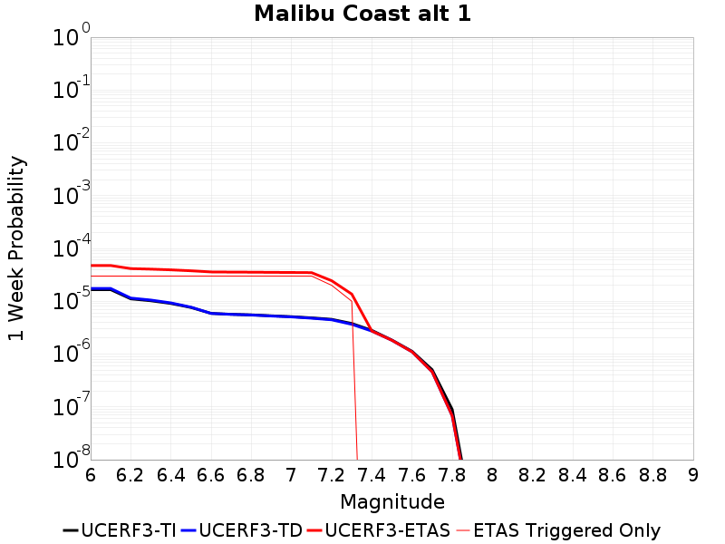 |  | 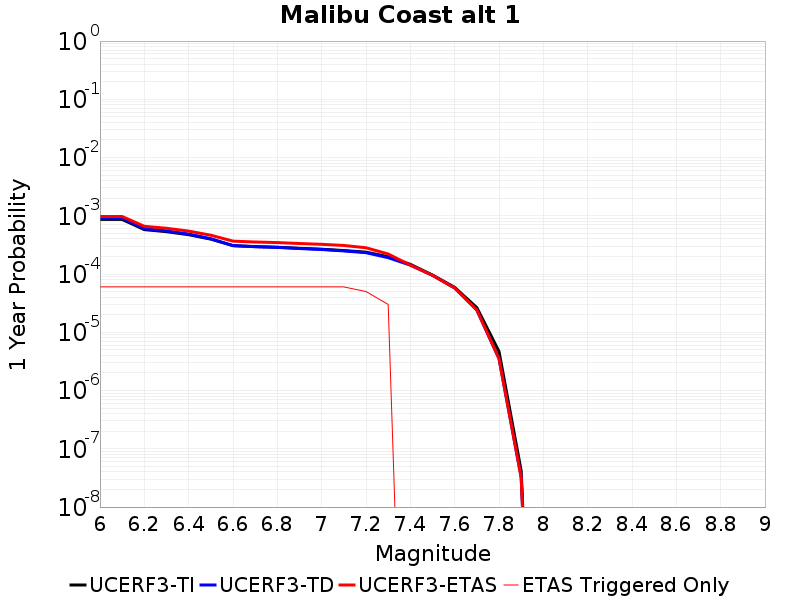 | 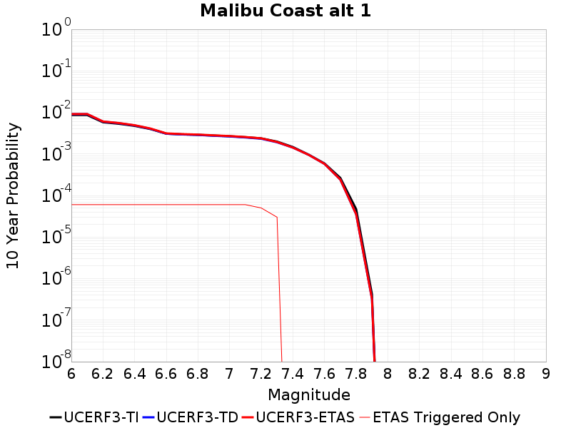 |

| Magnitude | 1 wk TI Prob | 1 wk TD Prob | 1 wk ETAS Prob | 1 wk ETAS/TD Gain | 1 wk ETAS Triggered Only | 1 mo TI Prob | 1 mo TD Prob | 1 mo ETAS Prob | 1 mo ETAS/TD Gain | 1 mo ETAS Triggered Only | 1 yr TI Prob | 1 yr TD Prob | 1 yr ETAS Prob | 1 yr ETAS/TD Gain | 1 yr ETAS Triggered Only | 10 yr TI Prob | 10 yr TD Prob | 10 yr ETAS Prob | 10 yr ETAS/TD Gain | 10 yr ETAS Triggered Only |
|-----|-----|-----|-----|-----|-----|-----|-----|-----|-----|-----|-----|-----|-----|-----|-----|-----|-----|-----|-----|-----|
| 6.0 | 1.6572556E-5 | 1.7436336E-5 | 4.7435813E-5 | 2.720515 | 3.0E-5 | 7.102331E-5 | 7.472512E-5 | 1.0472287E-4 | 1.4014415 | 3.0E-5 | 8.6436566E-4 | 9.094168E-4 | 9.6936227E-4 | 1.0659163 | 6.0E-5 | 0.0086101135 | 0.009058823 | 0.009118279 | 1.0065634 | 6.0E-5 |
| 6.1 | 1.6572556E-5 | 1.7436336E-5 | 4.7435813E-5 | 2.720515 | 3.0E-5 | 7.102331E-5 | 7.472512E-5 | 1.0472287E-4 | 1.4014415 | 3.0E-5 | 8.6436566E-4 | 9.094168E-4 | 9.6936227E-4 | 1.0659163 | 6.0E-5 | 0.0086101135 | 0.009058823 | 0.009118279 | 1.0065634 | 6.0E-5 |
| 6.2 | 1.1085717E-5 | 1.148351E-5 | 4.1483167E-5 | 3.6124115 | 3.0E-5 | 4.750935E-5 | 4.9214137E-5 | 7.921266E-5 | 1.609551 | 3.0E-5 | 5.782728E-4 | 5.990208E-4 | 6.589849E-4 | 1.1001035 | 6.0E-5 | 0.0057677035 | 0.0059744227 | 0.006034064 | 1.0099828 | 6.0E-5 |
| 6.3 | 1.0208568E-5 | 1.053307E-5 | 4.0532756E-5 | 3.8481424 | 3.0E-5 | 4.375027E-5 | 4.5140965E-5 | 7.5139615E-5 | 1.6645548 | 3.0E-5 | 5.325294E-4 | 5.494555E-4 | 6.0942257E-4 | 1.109139 | 6.0E-5 | 0.0053125503 | 0.00548127 | 0.0055409414 | 1.0108863 | 6.0E-5 |
| 6.4 | 9.0682315E-6 | 9.299806E-6 | 3.9299528E-5 | 4.225844 | 3.0E-5 | 3.8863272E-5 | 3.9855713E-5 | 6.985452E-5 | 1.7526852 | 3.0E-5 | 4.730576E-4 | 4.8513728E-4 | 5.4510817E-4 | 1.1236163 | 6.0E-5 | 0.0047205184 | 0.0048409905 | 0.0049007 | 1.0123341 | 6.0E-5 |
| 6.5 | 7.605796E-6 | 7.723112E-6 | 3.772288E-5 | 4.8844147 | 3.0E-5 | 3.259586E-5 | 3.3098637E-5 | 6.309764E-5 | 1.9063517 | 3.0E-5 | 3.9678233E-4 | 4.029027E-4 | 4.6287852E-4 | 1.1488594 | 6.0E-5 | 0.0039607463 | 0.004021857 | 0.0040816157 | 1.0148585 | 6.0E-5 |
| 6.6 | 5.889873E-6 | 5.8744718E-6 | 3.5874295E-5 | 6.106812 | 3.0E-5 | 2.5242069E-5 | 2.5176065E-5 | 5.517531E-5 | 2.191578 | 3.0E-5 | 3.0727885E-4 | 3.064756E-4 | 3.6645719E-4 | 1.1957141 | 6.0E-5 | 0.003068543 | 0.003060542 | 0.0031203583 | 1.0195444 | 6.0E-5 |
| 6.7 | 5.66586E-6 | 5.6377926E-6 | 3.5637622E-5 | 6.3212013 | 3.0E-5 | 2.428203E-5 | 2.4161745E-5 | 5.416102E-5 | 2.2416022 | 3.0E-5 | 2.955936E-4 | 2.9412963E-4 | 3.5411198E-4 | 1.2039317 | 6.0E-5 | 0.0029520073 | 0.0029374154 | 0.0029972391 | 1.0203661 | 6.0E-5 |
| 6.8 | 5.521556E-6 | 5.4863153E-6 | 3.548615E-5 | 6.468121 | 3.0E-5 | 2.3663597E-5 | 2.3512568E-5 | 5.3511863E-5 | 2.2758834 | 3.0E-5 | 2.880662E-4 | 2.8622802E-4 | 3.4621084E-4 | 1.2095631 | 6.0E-5 | 0.0028769306 | 0.0028586052 | 0.0029184336 | 1.0209292 | 6.0E-5 |
| 6.9 | 5.29752E-6 | 5.248315E-6 | 3.524816E-5 | 6.71609 | 3.0E-5 | 2.270346E-5 | 2.2492584E-5 | 5.249191E-5 | 2.3337429 | 3.0E-5 | 2.7637955E-4 | 2.7381288E-4 | 3.3379646E-4 | 1.2190677 | 6.0E-5 | 0.0027603607 | 0.0027347656 | 0.0027946015 | 1.0218797 | 6.0E-5 |
| 7.0 | 5.106743E-6 | 5.0472636E-6 | 3.5047113E-5 | 6.9437847 | 3.0E-5 | 2.1885859E-5 | 2.163095E-5 | 5.16303E-5 | 2.3868716 | 3.0E-5 | 2.6642776E-4 | 2.6332508E-4 | 3.2330927E-4 | 1.2277952 | 6.0E-5 | 0.0026610855 | 0.0026301402 | 0.0026899823 | 1.0227525 | 6.0E-5 |
| 7.1 | 4.8469647E-6 | 4.771742E-6 | 3.4771598E-5 | 7.286982 | 3.0E-5 | 2.0772539E-5 | 2.0450165E-5 | 5.044955E-5 | 2.466951 | 3.0E-5 | 2.528763E-4 | 2.4895236E-4 | 3.0893742E-4 | 1.24095 | 6.0E-5 | 0.0025258875 | 0.0024867428 | 0.0025465935 | 1.024068 | 6.0E-5 |
| 7.2 | 4.545514E-6 | 4.450106E-6 | 2.4450017E-5 | 5.4942546 | 2.0E-5 | 1.9480629E-5 | 1.9071744E-5 | 3.9071365E-5 | 2.0486517 | 2.0E-5 | 2.3715083E-4 | 2.3217381E-4 | 2.821622E-4 | 1.2153059 | 5.0E-5 | 0.0023689792 | 0.0023193199 | 0.002369204 | 1.0215081 | 5.0E-5 |
| 7.3 | 3.794097E-6 | 3.6537078E-6 | 1.3653671E-5 | 3.7369359 | 1.0E-5 | 1.6260314E-5 | 1.5658654E-5 | 2.5658497E-5 | 1.6386145 | 1.0E-5 | 1.9795135E-4 | 1.9062747E-4 | 2.2062175E-4 | 1.157345 | 3.0E-5 | 0.001977751 | 0.0019046442 | 0.001934587 | 1.015721 | 3.0E-5 |
| 7.4 | 2.808217E-6 | 2.7205963E-6 | 2.7205963E-6 | 1.0 | 0.0 | 1.203516E-5 | 1.1659646E-5 | 1.1659646E-5 | 1.0 | 0.0 | 1.4651821E-4 | 1.4194696E-4 | 1.4194696E-4 | 1.0 | 0.0 | 0.0014642165 | 0.0014185657 | 0.0014185657 | 1.0 | 0.0 |
| 7.5 | 1.83809E-6 | 1.8203896E-6 | 1.8203896E-6 | 1.0 | 0.0 | 7.877505E-6 | 7.8016465E-6 | 7.8016465E-6 | 1.0 | 0.0 | 9.59044E-5 | 9.4980925E-5 | 9.4980925E-5 | 1.0 | 0.0 | 9.5863023E-4 | 9.494053E-4 | 9.494053E-4 | 1.0 | 0.0 |
| 7.6 | 1.1292672E-6 | 1.1013685E-6 | 1.1013685E-6 | 1.0 | 0.0 | 4.839708E-6 | 4.7201424E-6 | 4.7201424E-6 | 1.0 | 0.0 | 5.8921847E-5 | 5.7466234E-5 | 5.7466234E-5 | 1.0 | 0.0 | 5.890623E-4 | 5.745154E-4 | 5.745154E-4 | 1.0 | 0.0 |
| 7.7 | 5.065272E-7 | 4.6184323E-7 | 4.6184323E-7 | 1.0 | 0.0 | 2.170829E-6 | 1.9793267E-6 | 1.9793267E-6 | 1.0 | 0.0 | 2.6429525E-5 | 2.4098048E-5 | 2.4098048E-5 | 1.0 | 0.0 | 2.642638E-4 | 2.4095547E-4 | 2.4095547E-4 | 1.0 | 0.0 |
| 7.8 | 8.952991E-8 | 6.7542544E-8 | 6.7542544E-8 | 1.0 | 0.0 | 3.8369956E-7 | 2.8946803E-7 | 2.8946803E-7 | 1.0 | 0.0 | 4.671532E-6 | 3.5242676E-6 | 3.5242676E-6 | 1.0 | 0.0 | 4.671434E-5 | 3.5242138E-5 | 3.5242138E-5 | 1.0 | 0.0 |
| 7.9 | 8.007447E-10 | 6.194234E-10 | 6.194234E-10 | 1.0 | 0.0 | 3.4317629E-9 | 2.654672E-9 | 2.654672E-9 | 1.0 | 0.0 | 4.1781714E-8 | 3.232063E-8 | 3.232063E-8 | 1.0 | 0.0 | 4.1781706E-7 | 3.2320628E-7 | 3.2320628E-7 | 1.0 | 0.0 |

## Newport-Inglewood alt 1
*[(top)](#table-of-contents)*

| 1 Week | 1 Month | 1 Year | 10 Year |
|-----|-----|-----|-----|
| 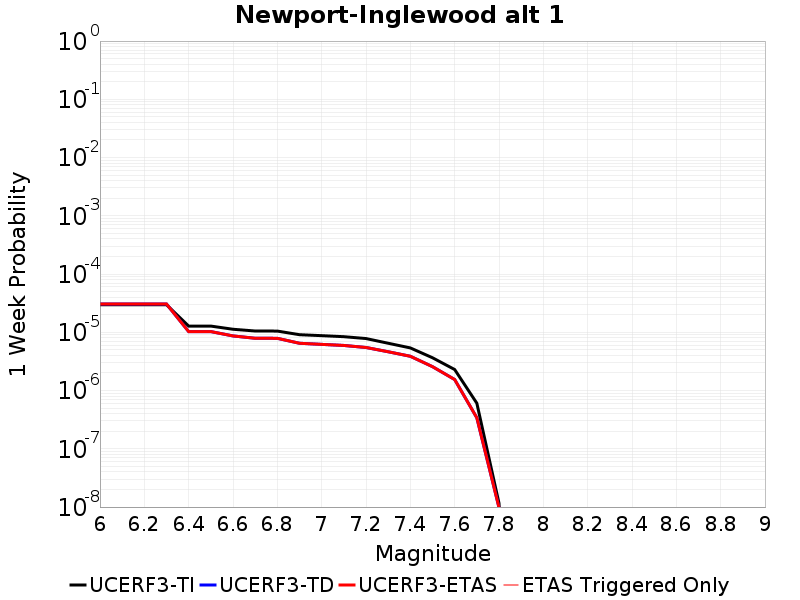 | 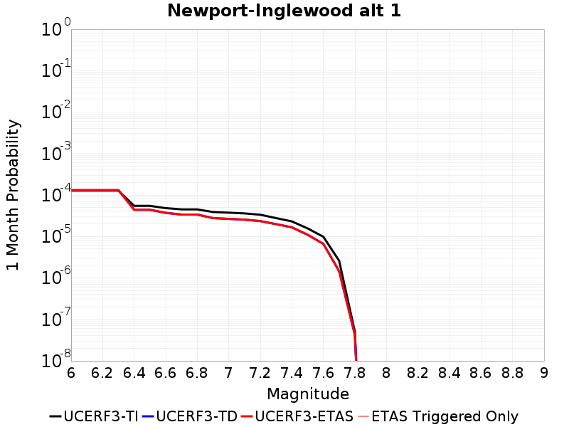 | 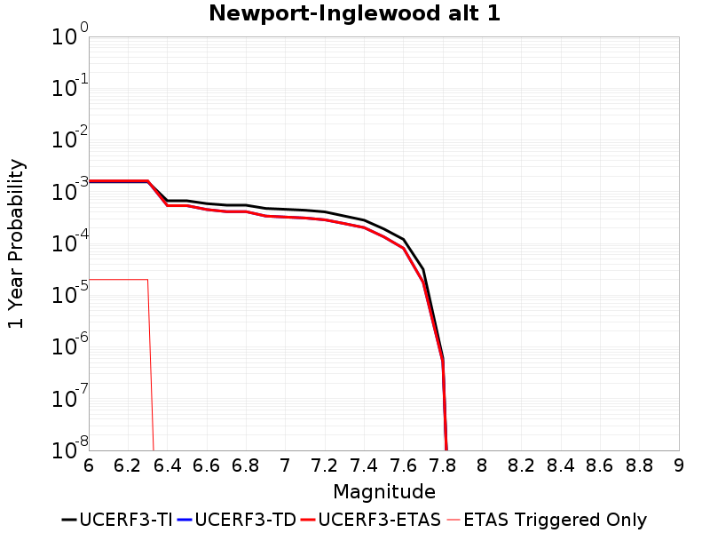 | 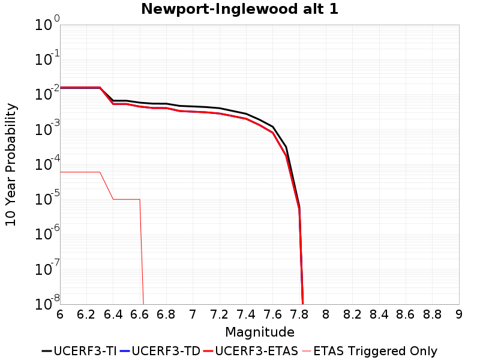 |

| Magnitude | 1 wk TI Prob | 1 wk TD Prob | 1 wk ETAS Prob | 1 wk ETAS/TD Gain | 1 wk ETAS Triggered Only | 1 mo TI Prob | 1 mo TD Prob | 1 mo ETAS Prob | 1 mo ETAS/TD Gain | 1 mo ETAS Triggered Only | 1 yr TI Prob | 1 yr TD Prob | 1 yr ETAS Prob | 1 yr ETAS/TD Gain | 1 yr ETAS Triggered Only | 10 yr TI Prob | 10 yr TD Prob | 10 yr ETAS Prob | 10 yr ETAS/TD Gain | 10 yr ETAS Triggered Only |
|-----|-----|-----|-----|-----|-----|-----|-----|-----|-----|-----|-----|-----|-----|-----|-----|-----|-----|-----|-----|-----|
| 6.0 | 2.9668912E-5 | 3.0541833E-5 | 3.0541833E-5 | 1.0 | 0.0 | 1.2714628E-4 | 1.3088979E-4 | 1.3088979E-4 | 1.0 | 0.0 | 0.0015469068 | 0.00159291 | 0.0016128782 | 1.0125357 | 2.0E-5 | 0.015361829 | 0.015863135 | 0.015922183 | 1.0037223 | 6.0E-5 |
| 6.1 | 2.9668912E-5 | 3.0541833E-5 | 3.0541833E-5 | 1.0 | 0.0 | 1.2714628E-4 | 1.3088979E-4 | 1.3088979E-4 | 1.0 | 0.0 | 0.0015469068 | 0.00159291 | 0.0016128782 | 1.0125357 | 2.0E-5 | 0.015361829 | 0.015863135 | 0.015922183 | 1.0037223 | 6.0E-5 |
| 6.2 | 2.9668912E-5 | 3.0541833E-5 | 3.0541833E-5 | 1.0 | 0.0 | 1.2714628E-4 | 1.3088979E-4 | 1.3088979E-4 | 1.0 | 0.0 | 0.0015469068 | 0.00159291 | 0.0016128782 | 1.0125357 | 2.0E-5 | 0.015361829 | 0.015863135 | 0.015922183 | 1.0037223 | 6.0E-5 |
| 6.3 | 2.9668912E-5 | 3.0541833E-5 | 3.0541833E-5 | 1.0 | 0.0 | 1.2714628E-4 | 1.3088979E-4 | 1.3088979E-4 | 1.0 | 0.0 | 0.0015469068 | 0.00159291 | 0.0016128782 | 1.0125357 | 2.0E-5 | 0.015361829 | 0.015863135 | 0.015922183 | 1.0037223 | 6.0E-5 |
| 6.4 | 1.275942E-5 | 1.0266259E-5 | 1.0266259E-5 | 1.0 | 0.0 | 5.4682085E-5 | 4.3997534E-5 | 4.3997534E-5 | 1.0 | 0.0 | 6.65551E-4 | 5.355425E-4 | 5.355425E-4 | 1.0 | 0.0 | 0.0066356123 | 0.005342947 | 0.0053528934 | 1.0018616 | 1.0E-5 |
| 6.5 | 1.275942E-5 | 1.0266259E-5 | 1.0266259E-5 | 1.0 | 0.0 | 5.4682085E-5 | 4.3997534E-5 | 4.3997534E-5 | 1.0 | 0.0 | 6.65551E-4 | 5.355425E-4 | 5.355425E-4 | 1.0 | 0.0 | 0.0066356123 | 0.005342947 | 0.0053528934 | 1.0018616 | 1.0E-5 |
| 6.6 | 1.1255358E-5 | 8.648285E-6 | 8.648285E-6 | 1.0 | 0.0 | 4.8236358E-5 | 3.7063564E-5 | 3.7063564E-5 | 1.0 | 0.0 | 5.871194E-4 | 4.5115716E-4 | 4.5115716E-4 | 1.0 | 0.0 | 0.005855706 | 0.0045025903 | 0.0045125457 | 1.002211 | 1.0E-5 |
| 6.7 | 1.0504745E-5 | 7.883985E-6 | 7.883985E-6 | 1.0 | 0.0 | 4.5019555E-5 | 3.3788074E-5 | 3.3788074E-5 | 1.0 | 0.0 | 5.4797524E-4 | 4.112934E-4 | 4.112934E-4 | 1.0 | 0.0 | 0.0054662596 | 0.0041054524 | 0.0041054524 | 1.0 | 0.0 |
| 6.8 | 1.0476007E-5 | 7.865527E-6 | 7.865527E-6 | 1.0 | 0.0 | 4.4896402E-5 | 3.3708973E-5 | 3.3708973E-5 | 1.0 | 0.0 | 5.464766E-4 | 4.1033071E-4 | 4.1033071E-4 | 1.0 | 0.0 | 0.005451347 | 0.004095861 | 0.004095861 | 1.0 | 0.0 |
| 6.9 | 9.076797E-6 | 6.468954E-6 | 6.468954E-6 | 1.0 | 0.0 | 3.889998E-5 | 2.7723796E-5 | 2.7723796E-5 | 1.0 | 0.0 | 4.7350433E-4 | 3.3748528E-4 | 3.3748528E-4 | 1.0 | 0.0 | 0.004724967 | 0.003369765 | 0.003369765 | 1.0 | 0.0 |
| 7.0 | 8.73795E-6 | 6.19139E-6 | 6.19139E-6 | 1.0 | 0.0 | 3.7447822E-5 | 2.6534262E-5 | 2.6534262E-5 | 1.0 | 0.0 | 4.5583185E-4 | 3.2300703E-4 | 3.2300703E-4 | 1.0 | 0.0 | 0.0045489795 | 0.0032254069 | 0.0032254069 | 1.0 | 0.0 |
| 7.1 | 8.391299E-6 | 5.935111E-6 | 5.935111E-6 | 1.0 | 0.0 | 3.5962214E-5 | 2.5435944E-5 | 2.5435944E-5 | 1.0 | 0.0 | 4.37752E-4 | 3.0963888E-4 | 3.0963888E-4 | 1.0 | 0.0 | 0.004368907 | 0.0030921039 | 0.0030921039 | 1.0 | 0.0 |
| 7.2 | 7.796882E-6 | 5.475366E-6 | 5.475366E-6 | 1.0 | 0.0 | 3.341478E-5 | 2.3465644E-5 | 2.3465644E-5 | 1.0 | 0.0 | 4.06749E-4 | 2.8565698E-4 | 2.8565698E-4 | 1.0 | 0.0 | 0.0040600533 | 0.0028529216 | 0.0028529216 | 1.0 | 0.0 |
| 7.3 | 6.4738833E-6 | 4.6259197E-6 | 4.6259197E-6 | 1.0 | 0.0 | 2.774492E-5 | 1.9825222E-5 | 1.9825222E-5 | 1.0 | 0.0 | 3.3774204E-4 | 2.4134548E-4 | 2.4134548E-4 | 1.0 | 0.0 | 0.0033722918 | 0.0024108503 | 0.0024108503 | 1.0 | 0.0 |
| 7.4 | 5.382145E-6 | 3.869014E-6 | 3.869014E-6 | 1.0 | 0.0 | 2.3066134E-5 | 1.6581384E-5 | 1.6581384E-5 | 1.0 | 0.0 | 2.8079396E-4 | 2.0185977E-4 | 2.0185977E-4 | 1.0 | 0.0 | 0.0028043943 | 0.0020167786 | 0.0020167786 | 1.0 | 0.0 |
| 7.5 | 3.648244E-6 | 2.5662637E-6 | 2.5662637E-6 | 1.0 | 0.0 | 1.5635238E-5 | 1.0998227E-5 | 1.0998227E-5 | 1.0 | 0.0 | 1.9034238E-4 | 1.3389529E-4 | 1.3389529E-4 | 1.0 | 0.0 | 0.0019017943 | 0.0013381565 | 0.0013381565 | 1.0 | 0.0 |
| 7.6 | 2.2906888E-6 | 1.5431167E-6 | 1.5431167E-6 | 1.0 | 0.0 | 9.817201E-6 | 6.6133407E-6 | 6.6133407E-6 | 1.0 | 0.0 | 1.1951787E-4 | 8.051452E-5 | 8.051452E-5 | 1.0 | 0.0 | 0.0011945361 | 8.0486014E-4 | 8.0486014E-4 | 1.0 | 0.0 |
| 7.7 | 6.0479874E-7 | 3.3983548E-7 | 3.3983548E-7 | 1.0 | 0.0 | 2.5919921E-6 | 1.4564371E-6 | 1.4564371E-6 | 1.0 | 0.0 | 3.1557047E-5 | 1.773199E-5 | 1.773199E-5 | 1.0 | 0.0 | 3.1552566E-4 | 1.7730716E-4 | 1.7730716E-4 | 1.0 | 0.0 |
| 7.8 | 1.16056995E-8 | 9.7878505E-9 | 9.7878505E-9 | 1.0 | 0.0 | 4.9738713E-8 | 4.194793E-8 | 4.194793E-8 | 1.0 | 0.0 | 6.0556863E-7 | 5.1071606E-7 | 5.1071606E-7 | 1.0 | 0.0 | 6.05567E-6 | 5.1071606E-6 | 5.1071606E-6 | 1.0 | 0.0 |

## San Andreas (San Bernardino N)
*[(top)](#table-of-contents)*

| 1 Week | 1 Month | 1 Year | 10 Year |
|-----|-----|-----|-----|
| 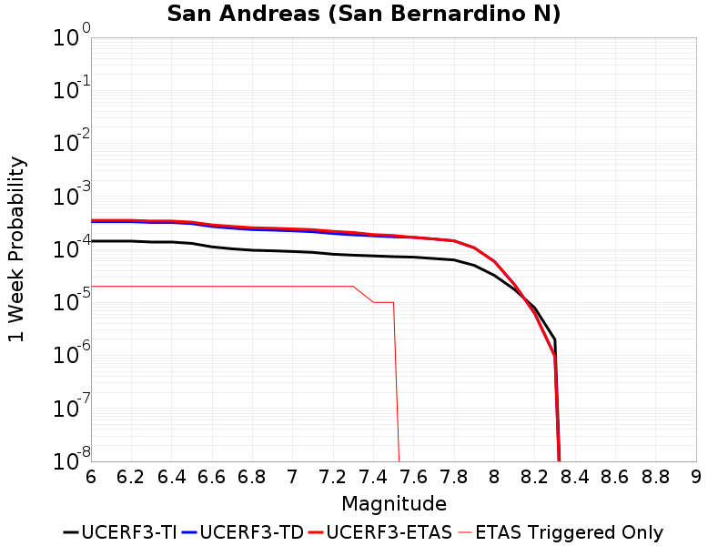 | 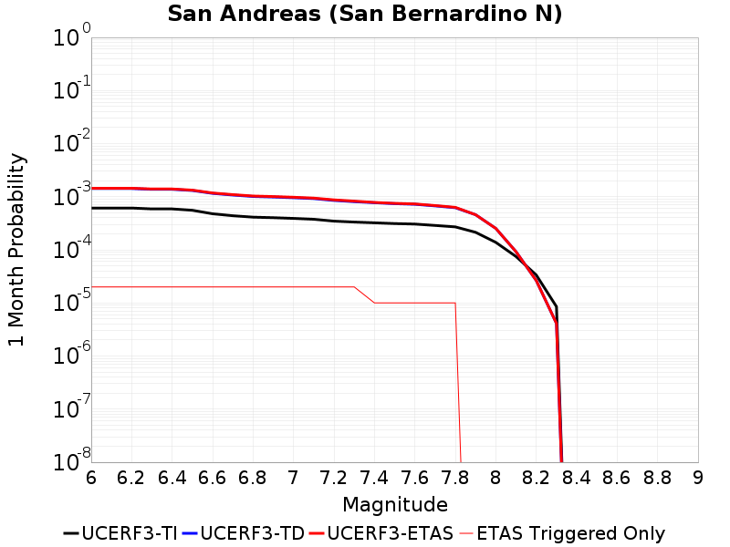 | 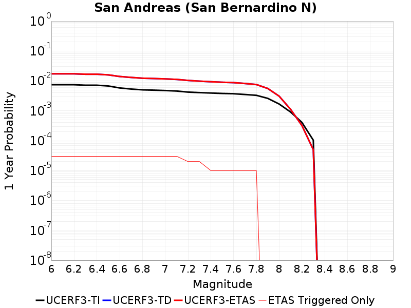 | 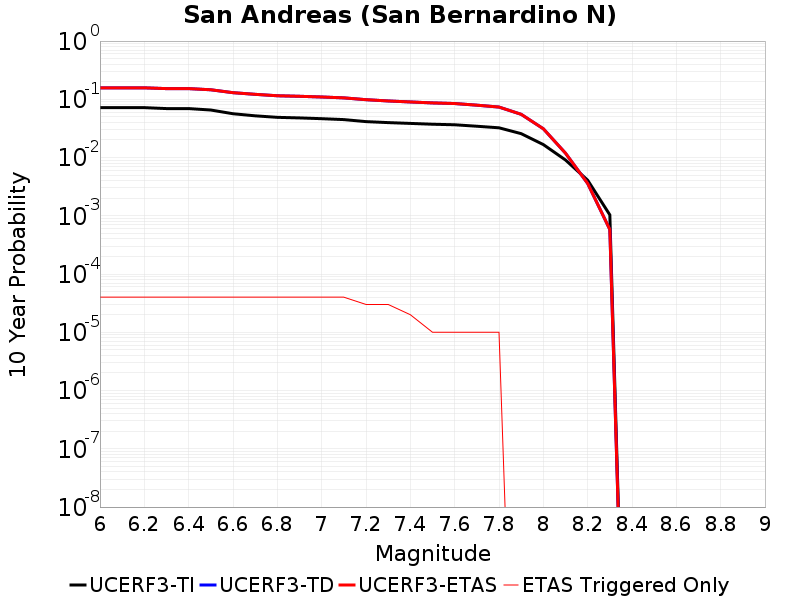 |

| Magnitude | 1 wk TI Prob | 1 wk TD Prob | 1 wk ETAS Prob | 1 wk ETAS/TD Gain | 1 wk ETAS Triggered Only | 1 mo TI Prob | 1 mo TD Prob | 1 mo ETAS Prob | 1 mo ETAS/TD Gain | 1 mo ETAS Triggered Only | 1 yr TI Prob | 1 yr TD Prob | 1 yr ETAS Prob | 1 yr ETAS/TD Gain | 1 yr ETAS Triggered Only | 10 yr TI Prob | 10 yr TD Prob | 10 yr ETAS Prob | 10 yr ETAS/TD Gain | 10 yr ETAS Triggered Only |
|-----|-----|-----|-----|-----|-----|-----|-----|-----|-----|-----|-----|-----|-----|-----|-----|-----|-----|-----|-----|-----|
| 6.0 | 1.4273766E-4 | 3.325369E-4 | 3.5253025E-4 | 1.0601237 | 2.0E-5 | 6.115894E-4 | 0.0014243858 | 0.0014443573 | 1.0140212 | 2.0E-5 | 0.0074207084 | 0.017205609 | 0.017235093 | 1.0017136 | 3.0E-5 | 0.07177748 | 0.15695731 | 0.15699103 | 1.0002148 | 4.0E-5 |
| 6.1 | 1.4273766E-4 | 3.325369E-4 | 3.5253025E-4 | 1.0601237 | 2.0E-5 | 6.115894E-4 | 0.0014243858 | 0.0014443573 | 1.0140212 | 2.0E-5 | 0.0074207084 | 0.017205609 | 0.017235093 | 1.0017136 | 3.0E-5 | 0.07177748 | 0.15695731 | 0.15699103 | 1.0002148 | 4.0E-5 |
| 6.2 | 1.4273766E-4 | 3.325369E-4 | 3.5253025E-4 | 1.0601237 | 2.0E-5 | 6.115894E-4 | 0.0014243858 | 0.0014443573 | 1.0140212 | 2.0E-5 | 0.0074207084 | 0.017205609 | 0.017235093 | 1.0017136 | 3.0E-5 | 0.07177748 | 0.15695731 | 0.15699103 | 1.0002148 | 4.0E-5 |
| 6.3 | 1.3730655E-4 | 3.2148845E-4 | 3.41482E-4 | 1.0621907 | 2.0E-5 | 5.883239E-4 | 0.0013770859 | 0.0013970584 | 1.0145035 | 2.0E-5 | 0.0071393442 | 0.016638633 | 0.016668133 | 1.001773 | 3.0E-5 | 0.06914291 | 0.15225932 | 0.15229324 | 1.0002227 | 4.0E-5 |
| 6.4 | 1.3730655E-4 | 3.2148845E-4 | 3.41482E-4 | 1.0621907 | 2.0E-5 | 5.883239E-4 | 0.0013770859 | 0.0013970584 | 1.0145035 | 2.0E-5 | 0.0071393442 | 0.016638633 | 0.016668133 | 1.001773 | 3.0E-5 | 0.06914291 | 0.15225932 | 0.15229324 | 1.0002227 | 4.0E-5 |
| 6.5 | 1.2942807E-4 | 3.0549138E-4 | 3.2548525E-4 | 1.0654483 | 2.0E-5 | 5.545738E-4 | 0.0013085972 | 0.0013285709 | 1.0152636 | 2.0E-5 | 0.0067310524 | 0.015817119 | 0.015846645 | 1.0018667 | 3.0E-5 | 0.06530788 | 0.14539579 | 0.14542997 | 1.0002351 | 4.0E-5 |
| 6.6 | 1.1125901E-4 | 2.6950927E-4 | 2.895039E-4 | 1.074189 | 2.0E-5 | 4.767372E-4 | 0.0011545309 | 0.0011745078 | 1.0173031 | 2.0E-5 | 0.005788839 | 0.013966514 | 0.013996095 | 1.002118 | 3.0E-5 | 0.056403454 | 0.12962787 | 0.12966269 | 1.0002686 | 4.0E-5 |
| 6.7 | 1.02209575E-4 | 2.507197E-4 | 2.7071466E-4 | 1.0797504 | 2.0E-5 | 4.3796748E-4 | 0.0010740719 | 0.0010940505 | 1.0186007 | 2.0E-5 | 0.0053192247 | 0.012998893 | 0.013028502 | 1.0022779 | 3.0E-5 | 0.051936906 | 0.1214229 | 0.121458046 | 1.0002894 | 4.0E-5 |
| 6.8 | 9.610582E-5 | 2.3571978E-4 | 2.5571507E-4 | 1.0848265 | 2.0E-5 | 4.1181705E-4 | 0.0010098373 | 0.001029817 | 1.0197852 | 2.0E-5 | 0.0050023515 | 0.012225767 | 0.0122553995 | 1.0024239 | 3.0E-5 | 0.048912346 | 0.11477998 | 0.114815384 | 1.0003085 | 4.0E-5 |
| 6.9 | 9.3877505E-5 | 2.3019771E-4 | 2.5019312E-4 | 1.0868618 | 2.0E-5 | 4.0227012E-4 | 9.861892E-4 | 0.0010061696 | 1.0202601 | 2.0E-5 | 0.0048866454 | 0.011941038 | 0.01197068 | 1.0024823 | 3.0E-5 | 0.04780577 | 0.1123562 | 0.11239171 | 1.000316 | 4.0E-5 |
| 7.0 | 9.1019785E-5 | 2.2335011E-4 | 2.4334564E-4 | 1.0895255 | 2.0E-5 | 3.900265E-4 | 9.5686427E-4 | 9.768452E-4 | 1.0208817 | 2.0E-5 | 0.0047382377 | 0.011587855 | 0.011617508 | 1.002559 | 3.0E-5 | 0.046384744 | 0.10930401 | 0.10933964 | 1.0003259 | 4.0E-5 |
| 7.1 | 8.771155E-5 | 2.1496006E-4 | 2.3495576E-4 | 1.0930206 | 2.0E-5 | 3.758525E-4 | 9.209327E-4 | 9.4091427E-4 | 1.0216972 | 2.0E-5 | 0.0045664064 | 0.011154943 | 0.011184609 | 1.0026594 | 3.0E-5 | 0.044737056 | 0.105583094 | 0.10561887 | 1.0003388 | 4.0E-5 |
| 7.2 | 8.0830236E-5 | 1.9872499E-4 | 2.1872102E-4 | 1.1006216 | 2.0E-5 | 3.4636928E-4 | 8.514007E-4 | 8.713837E-4 | 1.0234708 | 2.0E-5 | 0.0042088944 | 0.010316668 | 0.010336462 | 1.0019186 | 2.0E-5 | 0.041300658 | 0.09827318 | 0.09830023 | 1.0002753 | 3.0E-5 |
| 7.3 | 7.7668235E-5 | 1.8785158E-4 | 2.0784783E-4 | 1.106447 | 2.0E-5 | 3.328214E-4 | 8.048299E-4 | 8.248138E-4 | 1.02483 | 2.0E-5 | 0.0040445733 | 0.00975488 | 0.009774685 | 1.0020303 | 2.0E-5 | 0.03971748 | 0.09345213 | 0.09347933 | 1.000291 | 3.0E-5 |
| 7.4 | 7.520177E-5 | 1.7980923E-4 | 1.8980743E-4 | 1.0556045 | 1.0E-5 | 3.2225347E-4 | 7.7038346E-4 | 7.803758E-4 | 1.0129706 | 1.0E-5 | 0.0039163795 | 0.009339168 | 0.009349074 | 1.0010607 | 1.0E-5 | 0.038480744 | 0.08983989 | 0.08985809 | 1.0002027 | 2.0E-5 |
| 7.5 | 7.274697E-5 | 1.7245863E-4 | 1.824569E-4 | 1.0579749 | 1.0E-5 | 3.1173544E-4 | 7.388991E-4 | 7.4889173E-4 | 1.0135237 | 1.0E-5 | 0.003788775 | 0.008959064 | 0.008968974 | 1.0011061 | 1.0E-5 | 0.03724827 | 0.08648767 | 0.08649681 | 1.0001056 | 1.0E-5 |
| 7.6 | 7.1185845E-5 | 1.680113E-4 | 1.680113E-4 | 1.0 | 0.0 | 3.0504653E-4 | 7.198498E-4 | 7.298426E-4 | 1.0138818 | 1.0E-5 | 0.0037076178 | 0.008729021 | 0.008738934 | 1.0011356 | 1.0E-5 | 0.036463667 | 0.08442902 | 0.084438175 | 1.0001085 | 1.0E-5 |
| 7.7 | 6.709961E-5 | 1.5669207E-4 | 1.5669207E-4 | 1.0 | 0.0 | 2.8753807E-4 | 6.7136466E-4 | 6.813579E-4 | 1.0148851 | 1.0E-5 | 0.003495157 | 0.0081432825 | 0.008153201 | 1.001218 | 1.0E-5 | 0.034406938 | 0.079115406 | 0.079124615 | 1.0001163 | 1.0E-5 |
| 7.8 | 6.300812E-5 | 1.4470109E-4 | 1.4470109E-4 | 1.0 | 0.0 | 2.7000686E-4 | 6.200002E-4 | 6.2999397E-4 | 1.016119 | 1.0E-5 | 0.0032823787 | 0.007522415 | 0.00753234 | 1.0013194 | 1.0E-5 | 0.032343175 | 0.073442705 | 0.07345197 | 1.0001261 | 1.0E-5 |
| 7.9 | 4.983037E-5 | 1.06875115E-4 | 1.06875115E-4 | 1.0 | 0.0 | 2.1354125E-4 | 4.5795582E-4 | 4.5795582E-4 | 1.0 | 0.0 | 0.0025967648 | 0.0055613723 | 0.0055613723 | 1.0 | 0.0 | 0.025666296 | 0.055127382 | 0.055127382 | 1.0 | 0.0 |
| 8.0 | 3.2211527E-5 | 5.9026275E-5 | 5.9026275E-5 | 1.0 | 0.0 | 1.380421E-4 | 2.5294523E-4 | 2.5294523E-4 | 1.0 | 0.0 | 0.0016793669 | 0.0030752616 | 0.0030752616 | 1.0 | 0.0 | 0.016667323 | 0.031134358 | 0.031134358 | 1.0 | 0.0 |
| 8.1 | 1.743376E-5 | 2.1490072E-5 | 2.1490072E-5 | 1.0 | 0.0 | 7.471398E-5 | 9.2097056E-5 | 9.2097056E-5 | 1.0 | 0.0 | 9.0926304E-4 | 0.0011207057 | 0.0011207057 | 1.0 | 0.0 | 0.009055517 | 0.011858722 | 0.011858722 | 1.0 | 0.0 |
| 8.2 | 7.831616E-6 | 6.1604974E-6 | 6.1604974E-6 | 1.0 | 0.0 | 3.3563636E-5 | 2.6401865E-5 | 2.6401865E-5 | 1.0 | 0.0 | 4.0856065E-4 | 3.213954E-4 | 3.213954E-4 | 1.0 | 0.0 | 0.004078103 | 0.003582076 | 0.003582076 | 1.0 | 0.0 |
| 8.3 | 1.983087E-6 | 9.574791E-7 | 9.574791E-7 | 1.0 | 0.0 | 8.498917E-6 | 4.1034755E-6 | 4.1034755E-6 | 1.0 | 0.0 | 1.034694E-4 | 4.9958693E-5 | 4.9958693E-5 | 1.0 | 0.0 | 0.0010342124 | 5.8023055E-4 | 5.8023055E-4 | 1.0 | 0.0 |

## Elsinore (Glen Ivy) rev
*[(top)](#table-of-contents)*

| 1 Week | 1 Month | 1 Year | 10 Year |
|-----|-----|-----|-----|
| 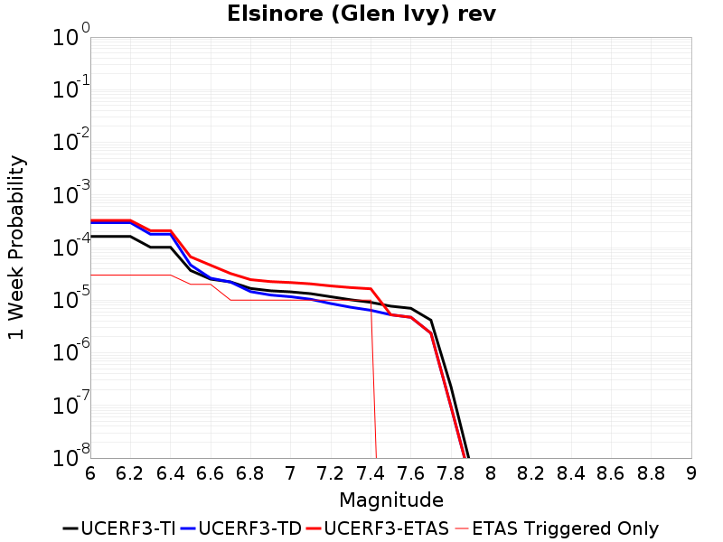 | 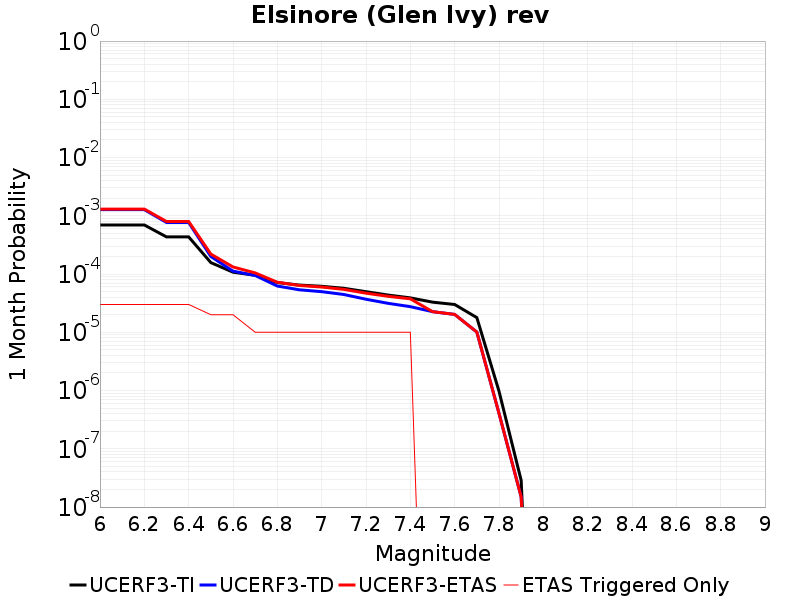 | 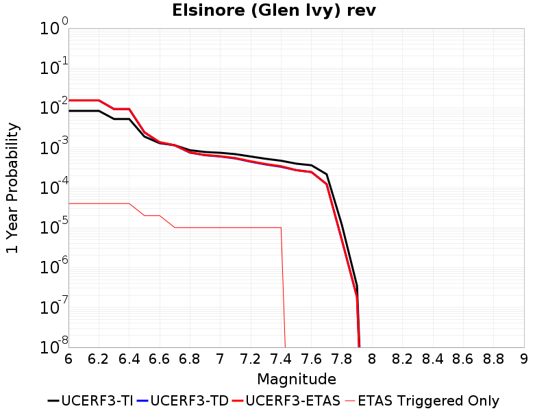 | 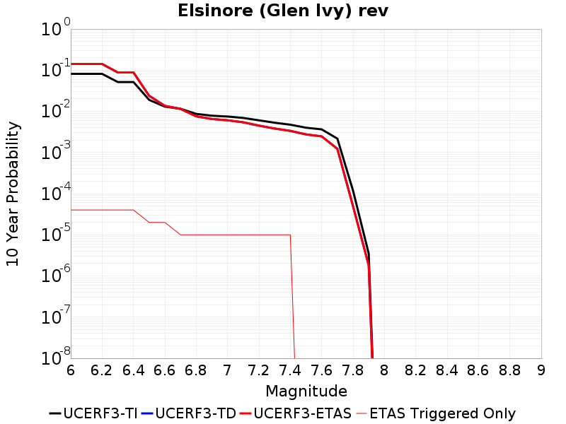 |

| Magnitude | 1 wk TI Prob | 1 wk TD Prob | 1 wk ETAS Prob | 1 wk ETAS/TD Gain | 1 wk ETAS Triggered Only | 1 mo TI Prob | 1 mo TD Prob | 1 mo ETAS Prob | 1 mo ETAS/TD Gain | 1 mo ETAS Triggered Only | 1 yr TI Prob | 1 yr TD Prob | 1 yr ETAS Prob | 1 yr ETAS/TD Gain | 1 yr ETAS Triggered Only | 10 yr TI Prob | 10 yr TD Prob | 10 yr ETAS Prob | 10 yr ETAS/TD Gain | 10 yr ETAS Triggered Only |
|-----|-----|-----|-----|-----|-----|-----|-----|-----|-----|-----|-----|-----|-----|-----|-----|-----|-----|-----|-----|-----|
| 6.0 | 1.6204086E-4 | 2.9701888E-4 | 3.2700997E-4 | 1.1009737 | 3.0E-5 | 6.94276E-4 | 0.0012724411 | 0.0013024029 | 1.0235467 | 3.0E-5 | 0.008420097 | 0.015403468 | 0.015442852 | 1.0025568 | 4.0E-5 | 0.081081145 | 0.14110398 | 0.14113835 | 1.0002434 | 4.0E-5 |
| 6.1 | 1.6204086E-4 | 2.9701888E-4 | 3.2700997E-4 | 1.1009737 | 3.0E-5 | 6.94276E-4 | 0.0012724411 | 0.0013024029 | 1.0235467 | 3.0E-5 | 0.008420097 | 0.015403468 | 0.015442852 | 1.0025568 | 4.0E-5 | 0.081081145 | 0.14110398 | 0.14113835 | 1.0002434 | 4.0E-5 |
| 6.2 | 1.6204086E-4 | 2.9701888E-4 | 3.2700997E-4 | 1.1009737 | 3.0E-5 | 6.94276E-4 | 0.0012724411 | 0.0013024029 | 1.0235467 | 3.0E-5 | 0.008420097 | 0.015403468 | 0.015442852 | 1.0025568 | 4.0E-5 | 0.081081145 | 0.14110398 | 0.14113835 | 1.0002434 | 4.0E-5 |
| 6.3 | 1.0111737E-4 | 1.7881334E-4 | 2.0880798E-4 | 1.1677427 | 3.0E-5 | 4.332882E-4 | 7.6623715E-4 | 7.9621415E-4 | 1.0391223 | 3.0E-5 | 0.005262531 | 0.0093102055 | 0.009349832 | 1.0042564 | 4.0E-5 | 0.0513964 | 0.08780915 | 0.08784564 | 1.0004156 | 4.0E-5 |
| 6.4 | 1.0111737E-4 | 1.7881334E-4 | 2.0880798E-4 | 1.1677427 | 3.0E-5 | 4.332882E-4 | 7.6623715E-4 | 7.9621415E-4 | 1.0391223 | 3.0E-5 | 0.005262531 | 0.0093102055 | 0.009349832 | 1.0042564 | 4.0E-5 | 0.0513964 | 0.08780915 | 0.08784564 | 1.0004156 | 4.0E-5 |
| 6.5 | 3.6624708E-5 | 4.6631547E-5 | 6.6630615E-5 | 1.4288743 | 2.0E-5 | 1.569536E-4 | 1.9983617E-4 | 2.1983216E-4 | 1.100062 | 2.0E-5 | 0.001909235 | 0.0024306588 | 0.00245061 | 1.0082083 | 2.0E-5 | 0.01892915 | 0.023794279 | 0.023813803 | 1.0008205 | 2.0E-5 |
| 6.6 | 2.5051324E-5 | 2.6140106E-5 | 4.6139583E-5 | 1.7650878 | 2.0E-5 | 1.073584E-4 | 1.1202446E-4 | 1.3202222E-4 | 1.1785125 | 2.0E-5 | 0.0013063047 | 0.0013630884 | 0.0013830612 | 1.0146526 | 2.0E-5 | 0.012986525 | 0.013551939 | 0.013571668 | 1.0014558 | 2.0E-5 |
| 6.7 | 2.2189772E-5 | 2.2038392E-5 | 3.203817E-5 | 1.4537436 | 1.0E-5 | 9.509556E-5 | 9.444703E-5 | 1.0444609E-4 | 1.1058694 | 1.0E-5 | 0.0011571734 | 0.0011493216 | 0.0011593101 | 1.0086908 | 1.0E-5 | 0.011511663 | 0.011439387 | 0.011449273 | 1.0008641 | 1.0E-5 |
| 6.8 | 1.6654378E-5 | 1.4494188E-5 | 2.4494044E-5 | 1.6899217 | 1.0E-5 | 7.137396E-5 | 6.21165E-5 | 7.211588E-5 | 1.1609778 | 1.0E-5 | 8.686314E-4 | 7.5601094E-4 | 7.660034E-4 | 1.0132173 | 1.0E-5 | 0.008652439 | 0.0075392593 | 0.007549184 | 1.0013164 | 1.0E-5 |
| 6.9 | 1.5042909E-5 | 1.24913995E-5 | 2.2491275E-5 | 1.8005408 | 1.0E-5 | 6.446802E-5 | 5.3533488E-5 | 6.3532956E-5 | 1.1867889 | 1.0E-5 | 7.8461546E-4 | 6.5157854E-4 | 6.6157203E-4 | 1.0153373 | 1.0E-5 | 0.007818509 | 0.006501018 | 0.006510953 | 1.0015283 | 1.0E-5 |
| 7.0 | 1.4361385E-5 | 1.160385E-5 | 2.1603733E-5 | 1.8617729 | 1.0E-5 | 6.154734E-5 | 4.9729857E-5 | 5.972936E-5 | 1.2010765 | 1.0E-5 | 7.490812E-4 | 6.052958E-4 | 6.152897E-4 | 1.0165108 | 1.0E-5 | 0.007465612 | 0.006040636 | 0.0060505755 | 1.0016454 | 1.0E-5 |
| 7.1 | 1.3265571E-5 | 1.0378933E-5 | 2.037883E-5 | 1.9634801 | 1.0E-5 | 5.6851208E-5 | 4.44804E-5 | 5.4479955E-5 | 1.2248081 | 1.0E-5 | 6.919436E-4 | 5.4141687E-4 | 5.514115E-4 | 1.01846 | 1.0E-5 | 0.006897931 | 0.005404066 | 0.005414012 | 1.0018405 | 1.0E-5 |
| 7.2 | 1.1596403E-5 | 8.605263E-6 | 1.8605177E-5 | 2.1620696 | 1.0E-5 | 4.9697923E-5 | 3.6879188E-5 | 4.6878817E-5 | 1.2711457 | 1.0E-5 | 6.049042E-4 | 4.489133E-4 | 4.5890882E-4 | 1.022266 | 1.0E-5 | 0.006032603 | 0.0044813575 | 0.004491313 | 1.0022215 | 1.0E-5 |
| 7.3 | 1.0150827E-5 | 7.3158085E-6 | 1.7315735E-5 | 2.366893 | 1.0E-5 | 4.3502816E-5 | 3.1353095E-5 | 4.135278E-5 | 1.3189378 | 1.0E-5 | 5.2951806E-4 | 3.8165855E-4 | 3.9165473E-4 | 1.0261915 | 1.0E-5 | 0.005282581 | 0.003810346 | 0.0038203078 | 1.0026144 | 1.0E-5 |
| 7.4 | 9.080705E-6 | 6.4144383E-6 | 1.6414375E-5 | 2.5589728 | 1.0E-5 | 3.8916725E-5 | 2.7490169E-5 | 3.7489892E-5 | 1.3637564 | 1.0E-5 | 4.7370812E-4 | 3.3464277E-4 | 3.4463944E-4 | 1.0298727 | 1.0E-5 | 0.004726996 | 0.0033415358 | 0.0033515024 | 1.0029826 | 1.0E-5 |
| 7.5 | 7.671649E-6 | 5.2694936E-6 | 5.2694936E-6 | 1.0 | 0.0 | 3.287808E-5 | 2.2583356E-5 | 2.2583356E-5 | 1.0 | 0.0 | 4.0021708E-4 | 2.7491894E-4 | 2.7491894E-4 | 1.0 | 0.0 | 0.0039949706 | 0.002745915 | 0.002745915 | 1.0 | 0.0 |
| 7.6 | 6.990086E-6 | 4.721364E-6 | 4.721364E-6 | 1.0 | 0.0 | 2.9957167E-5 | 2.0234267E-5 | 2.0234267E-5 | 1.0 | 0.0 | 3.6466747E-4 | 2.4632554E-4 | 2.4632554E-4 | 1.0 | 0.0 | 0.0036406964 | 0.0024606423 | 0.0024606423 | 1.0 | 0.0 |
| 7.7 | 4.163505E-6 | 2.3516693E-6 | 2.3516693E-6 | 1.0 | 0.0 | 1.7843471E-5 | 1.0078548E-5 | 1.0078548E-5 | 1.0 | 0.0 | 2.172226E-4 | 1.2270018E-4 | 1.2270018E-4 | 1.0 | 0.0 | 0.0021701038 | 0.0012263985 | 0.0012263985 | 1.0 | 0.0 |
| 7.8 | 2.2692414E-7 | 9.457049E-8 | 9.457049E-8 | 1.0 | 0.0 | 9.725317E-7 | 4.0530205E-7 | 4.0530205E-7 | 1.0 | 0.0 | 1.1840509E-5 | 4.934545E-6 | 4.934545E-6 | 1.0 | 0.0 | 1.1839878E-4 | 4.9344682E-5 | 4.9344682E-5 | 1.0 | 0.0 |
| 7.9 | 6.676829E-9 | 3.4768928E-9 | 3.4768928E-9 | 1.0 | 0.0 | 2.861498E-8 | 1.490097E-8 | 1.490097E-8 | 1.0 | 0.0 | 3.4838732E-7 | 1.814193E-7 | 1.814193E-7 | 1.0 | 0.0 | 3.4838679E-6 | 1.8141917E-6 | 1.8141917E-6 | 1.0 | 0.0 |

## Sierra Madre
*[(top)](#table-of-contents)*

| 1 Week | 1 Month | 1 Year | 10 Year |
|-----|-----|-----|-----|
| 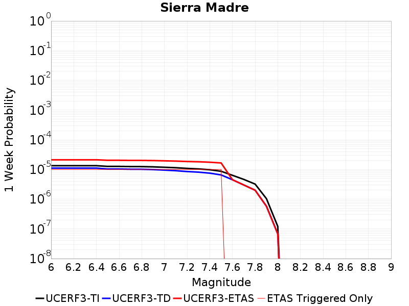 | 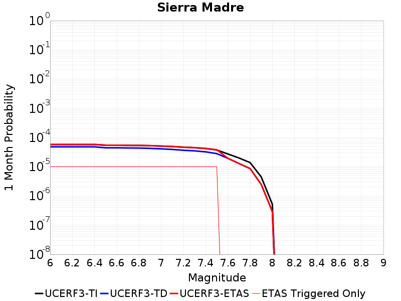 | 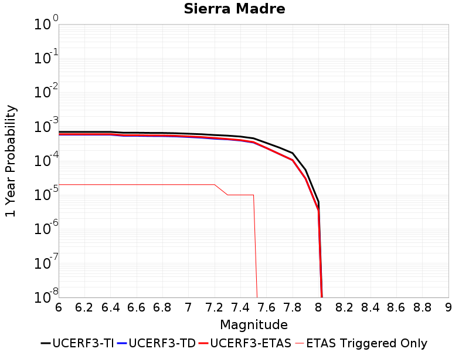 | 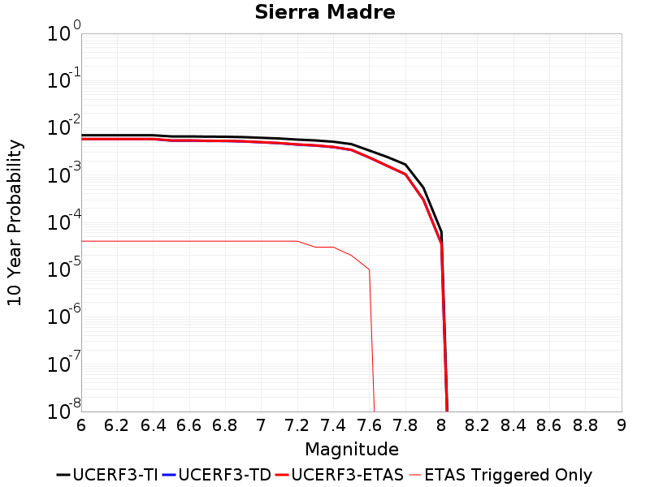 |

| Magnitude | 1 wk TI Prob | 1 wk TD Prob | 1 wk ETAS Prob | 1 wk ETAS/TD Gain | 1 wk ETAS Triggered Only | 1 mo TI Prob | 1 mo TD Prob | 1 mo ETAS Prob | 1 mo ETAS/TD Gain | 1 mo ETAS Triggered Only | 1 yr TI Prob | 1 yr TD Prob | 1 yr ETAS Prob | 1 yr ETAS/TD Gain | 1 yr ETAS Triggered Only | 10 yr TI Prob | 10 yr TD Prob | 10 yr ETAS Prob | 10 yr ETAS/TD Gain | 10 yr ETAS Triggered Only |
|-----|-----|-----|-----|-----|-----|-----|-----|-----|-----|-----|-----|-----|-----|-----|-----|-----|-----|-----|-----|-----|
| 6.0 | 1.3379373E-5 | 1.1107754E-5 | 2.1107644E-5 | 1.900262 | 1.0E-5 | 5.7338908E-5 | 4.7603804E-5 | 5.7603327E-5 | 1.2100573 | 1.0E-5 | 6.978776E-4 | 5.794237E-4 | 5.994121E-4 | 1.034497 | 2.0E-5 | 0.0069569005 | 0.005779443 | 0.0058192117 | 1.0068811 | 4.0E-5 |
| 6.1 | 1.3379373E-5 | 1.1107754E-5 | 2.1107644E-5 | 1.900262 | 1.0E-5 | 5.7338908E-5 | 4.7603804E-5 | 5.7603327E-5 | 1.2100573 | 1.0E-5 | 6.978776E-4 | 5.794237E-4 | 5.994121E-4 | 1.034497 | 2.0E-5 | 0.0069569005 | 0.005779443 | 0.0058192117 | 1.0068811 | 4.0E-5 |
| 6.2 | 1.3379373E-5 | 1.1107754E-5 | 2.1107644E-5 | 1.900262 | 1.0E-5 | 5.7338908E-5 | 4.7603804E-5 | 5.7603327E-5 | 1.2100573 | 1.0E-5 | 6.978776E-4 | 5.794237E-4 | 5.994121E-4 | 1.034497 | 2.0E-5 | 0.0069569005 | 0.005779443 | 0.0058192117 | 1.0068811 | 4.0E-5 |
| 6.3 | 1.3379373E-5 | 1.1107754E-5 | 2.1107644E-5 | 1.900262 | 1.0E-5 | 5.7338908E-5 | 4.7603804E-5 | 5.7603327E-5 | 1.2100573 | 1.0E-5 | 6.978776E-4 | 5.794237E-4 | 5.994121E-4 | 1.034497 | 2.0E-5 | 0.0069569005 | 0.005779443 | 0.0058192117 | 1.0068811 | 4.0E-5 |
| 6.4 | 1.3379373E-5 | 1.1107754E-5 | 2.1107644E-5 | 1.900262 | 1.0E-5 | 5.7338908E-5 | 4.7603804E-5 | 5.7603327E-5 | 1.2100573 | 1.0E-5 | 6.978776E-4 | 5.794237E-4 | 5.994121E-4 | 1.034497 | 2.0E-5 | 0.0069569005 | 0.005779443 | 0.0058192117 | 1.0068811 | 4.0E-5 |
| 6.5 | 1.26563245E-5 | 1.0335418E-5 | 2.0335316E-5 | 1.9675367 | 1.0E-5 | 5.4240263E-5 | 4.42939E-5 | 5.429346E-5 | 1.2257547 | 1.0E-5 | 6.601751E-4 | 5.3914596E-4 | 5.5913517E-4 | 1.0370758 | 2.0E-5 | 0.006582173 | 0.00537865 | 0.005418435 | 1.0073968 | 4.0E-5 |
| 6.6 | 1.26563245E-5 | 1.0335418E-5 | 2.0335316E-5 | 1.9675367 | 1.0E-5 | 5.4240263E-5 | 4.42939E-5 | 5.429346E-5 | 1.2257547 | 1.0E-5 | 6.601751E-4 | 5.3914596E-4 | 5.5913517E-4 | 1.0370758 | 2.0E-5 | 0.006582173 | 0.00537865 | 0.005418435 | 1.0073968 | 4.0E-5 |
| 6.7 | 1.2502474E-5 | 1.0171185E-5 | 2.0171083E-5 | 1.9831597 | 1.0E-5 | 5.3580934E-5 | 4.359007E-5 | 5.3589636E-5 | 1.2294 | 1.0E-5 | 6.521526E-4 | 5.3058093E-4 | 5.505703E-4 | 1.0376745 | 2.0E-5 | 0.0065024206 | 0.0052934103 | 0.0053331987 | 1.0075166 | 4.0E-5 |
| 6.8 | 1.2454966E-5 | 1.0123326E-5 | 2.0123225E-5 | 1.9878076 | 1.0E-5 | 5.3377335E-5 | 4.338497E-5 | 5.3384534E-5 | 1.2304846 | 1.0E-5 | 6.4967526E-4 | 5.2808505E-4 | 5.480745E-4 | 1.0378526 | 2.0E-5 | 0.006477792 | 0.0052685696 | 0.005308359 | 1.0075521 | 4.0E-5 |
| 6.9 | 1.2225574E-5 | 9.896627E-6 | 1.9896528E-5 | 2.0104353 | 1.0E-5 | 5.2394265E-5 | 4.241343E-5 | 5.241301E-5 | 1.2357644 | 1.0E-5 | 6.3771347E-4 | 5.1626225E-4 | 5.3625193E-4 | 1.03872 | 2.0E-5 | 0.006358865 | 0.0051508946 | 0.005190688 | 1.0077256 | 4.0E-5 |
| 7.0 | 1.182946E-5 | 9.502231E-6 | 1.9502137E-5 | 2.0523744 | 1.0E-5 | 5.06967E-5 | 4.0723215E-5 | 5.072281E-5 | 1.2455502 | 1.0E-5 | 6.1705755E-4 | 4.956934E-4 | 5.156835E-4 | 1.0403275 | 2.0E-5 | 0.006153469 | 0.0049461382 | 0.00498594 | 1.0080471 | 4.0E-5 |
| 7.1 | 1.14369095E-5 | 9.085567E-6 | 1.9085477E-5 | 2.1006367 | 1.0E-5 | 4.9014405E-5 | 3.893757E-5 | 4.893718E-5 | 1.2568114 | 1.0E-5 | 5.9658696E-4 | 4.7396278E-4 | 4.939533E-4 | 1.0421774 | 2.0E-5 | 0.005949879 | 0.0047297743 | 0.004769585 | 1.008417 | 4.0E-5 |
| 7.2 | 1.0836419E-5 | 8.4956E-6 | 1.8495515E-5 | 2.17707 | 1.0E-5 | 4.644097E-5 | 3.640921E-5 | 4.6408844E-5 | 1.2746458 | 1.0E-5 | 5.652721E-4 | 4.431929E-4 | 4.6318403E-4 | 1.0451071 | 2.0E-5 | 0.0056383642 | 0.0044233366 | 0.0044631595 | 1.0090029 | 4.0E-5 |
| 7.3 | 1.0403439E-5 | 8.115203E-6 | 1.811512E-5 | 2.2322452 | 1.0E-5 | 4.4585406E-5 | 3.4778983E-5 | 4.4778633E-5 | 1.2875199 | 1.0E-5 | 5.426921E-4 | 4.2335276E-4 | 4.3334853E-4 | 1.023611 | 1.0E-5 | 0.005413687 | 0.0042257067 | 0.00425558 | 1.0070693 | 3.0E-5 |
| 7.4 | 9.768864E-6 | 7.5061216E-6 | 1.7506047E-5 | 2.3322358 | 1.0E-5 | 4.186589E-5 | 3.21687E-5 | 4.216838E-5 | 1.3108512 | 1.0E-5 | 5.09598E-4 | 3.9158444E-4 | 4.0158053E-4 | 1.0255272 | 1.0E-5 | 0.0050843097 | 0.003909185 | 0.003939068 | 1.0076442 | 3.0E-5 |
| 7.5 | 8.687089E-6 | 6.537738E-6 | 1.6537673E-5 | 2.529571 | 1.0E-5 | 3.722985E-5 | 2.801858E-5 | 3.80183E-5 | 1.356896 | 1.0E-5 | 4.5317915E-4 | 3.410737E-4 | 3.5107028E-4 | 1.0293092 | 1.0E-5 | 0.004522561 | 0.003405738 | 0.0034256699 | 1.0058525 | 2.0E-5 |
| 7.6 | 6.3506063E-6 | 4.502906E-6 | 4.502906E-6 | 1.0 | 0.0 | 2.72166E-5 | 1.9298026E-5 | 1.9298026E-5 | 1.0 | 0.0 | 3.3131172E-4 | 2.349284E-4 | 2.349284E-4 | 1.0 | 0.0 | 0.003308182 | 0.0023469725 | 0.002356949 | 1.0042508 | 1.0E-5 |
| 7.7 | 4.62223E-6 | 3.000093E-6 | 3.000093E-6 | 1.0 | 0.0 | 1.9809406E-5 | 1.2857478E-5 | 1.2857478E-5 | 1.0 | 0.0 | 2.4115283E-4 | 1.5652858E-4 | 1.5652858E-4 | 1.0 | 0.0 | 0.0024089129 | 0.0015643317 | 0.0015643317 | 1.0 | 0.0 |
| 7.8 | 3.2145008E-6 | 2.0012353E-6 | 2.0012353E-6 | 1.0 | 0.0 | 1.3776359E-5 | 8.576695E-6 | 8.576695E-6 | 1.0 | 0.0 | 1.6771426E-4 | 1.0441627E-4 | 1.0441627E-4 | 1.0 | 0.0 | 0.0016758774 | 0.0010437943 | 0.0010437943 | 1.0 | 0.0 |
| 7.9 | 1.0391769E-6 | 5.762451E-7 | 5.762451E-7 | 1.0 | 0.0 | 4.4536077E-6 | 2.4696196E-6 | 2.4696196E-6 | 1.0 | 0.0 | 5.4221324E-5 | 3.0067209E-5 | 3.0067209E-5 | 1.0 | 0.0 | 5.4208096E-4 | 3.0063186E-4 | 3.0063186E-4 | 1.0 | 0.0 |
| 8.0 | 1.210983E-7 | 6.770698E-8 | 6.770698E-8 | 1.0 | 0.0 | 5.1899264E-7 | 2.9017275E-7 | 2.9017275E-7 | 1.0 | 0.0 | 6.3187167E-6 | 3.5328476E-6 | 3.5328476E-6 | 1.0 | 0.0 | 6.318537E-5 | 3.5327932E-5 | 3.5327932E-5 | 1.0 | 0.0 |

## Cucamonga
*[(top)](#table-of-contents)*

| 1 Week | 1 Month | 1 Year | 10 Year |
|-----|-----|-----|-----|
| 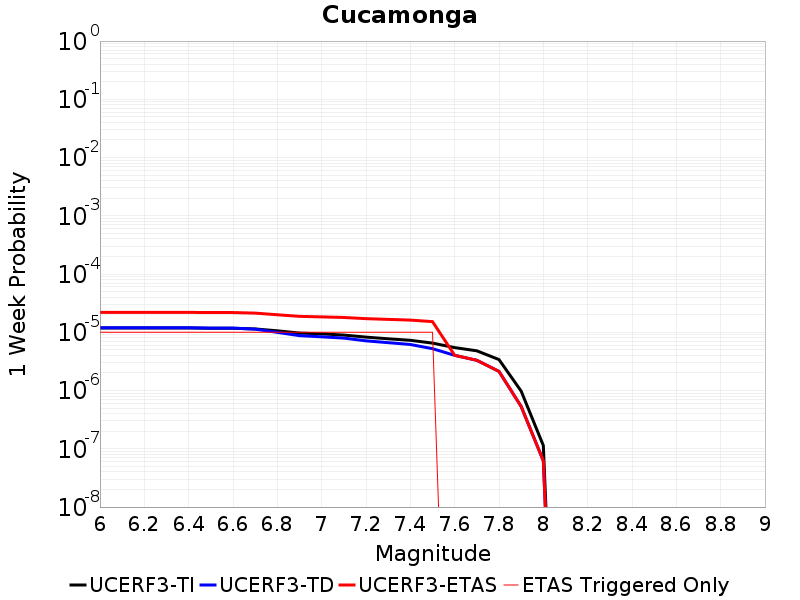 | 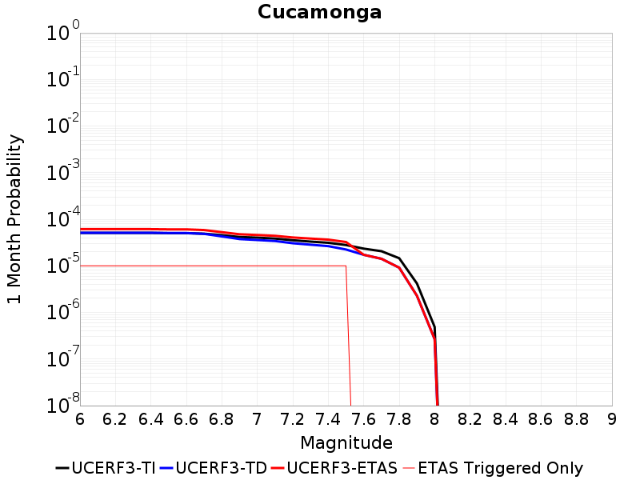 |  | 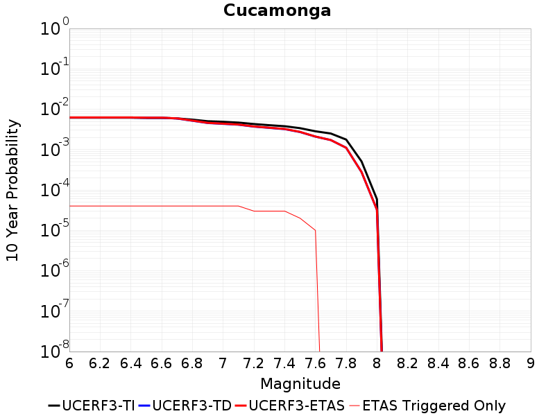 |

| Magnitude | 1 wk TI Prob | 1 wk TD Prob | 1 wk ETAS Prob | 1 wk ETAS/TD Gain | 1 wk ETAS Triggered Only | 1 mo TI Prob | 1 mo TD Prob | 1 mo ETAS Prob | 1 mo ETAS/TD Gain | 1 mo ETAS Triggered Only | 1 yr TI Prob | 1 yr TD Prob | 1 yr ETAS Prob | 1 yr ETAS/TD Gain | 1 yr ETAS Triggered Only | 10 yr TI Prob | 10 yr TD Prob | 10 yr ETAS Prob | 10 yr ETAS/TD Gain | 10 yr ETAS Triggered Only |
|-----|-----|-----|-----|-----|-----|-----|-----|-----|-----|-----|-----|-----|-----|-----|-----|-----|-----|-----|-----|-----|
| 6.0 | 1.1848348E-5 | 1.1938798E-5 | 2.1938678E-5 | 1.8375953 | 1.0E-5 | 5.0777642E-5 | 5.1165287E-5 | 6.116478E-5 | 1.195435 | 1.0E-5 | 6.180424E-4 | 6.2276213E-4 | 6.4274966E-4 | 1.032095 | 2.0E-5 | 0.0061632637 | 0.006210983 | 0.006250734 | 1.0064002 | 4.0E-5 |
| 6.1 | 1.1848348E-5 | 1.1938798E-5 | 2.1938678E-5 | 1.8375953 | 1.0E-5 | 5.0777642E-5 | 5.1165287E-5 | 6.116478E-5 | 1.195435 | 1.0E-5 | 6.180424E-4 | 6.2276213E-4 | 6.4274966E-4 | 1.032095 | 2.0E-5 | 0.0061632637 | 0.006210983 | 0.006250734 | 1.0064002 | 4.0E-5 |
| 6.2 | 1.1848348E-5 | 1.1938798E-5 | 2.1938678E-5 | 1.8375953 | 1.0E-5 | 5.0777642E-5 | 5.1165287E-5 | 6.116478E-5 | 1.195435 | 1.0E-5 | 6.180424E-4 | 6.2276213E-4 | 6.4274966E-4 | 1.032095 | 2.0E-5 | 0.0061632637 | 0.006210983 | 0.006250734 | 1.0064002 | 4.0E-5 |
| 6.3 | 1.1848348E-5 | 1.1938798E-5 | 2.1938678E-5 | 1.8375953 | 1.0E-5 | 5.0777642E-5 | 5.1165287E-5 | 6.116478E-5 | 1.195435 | 1.0E-5 | 6.180424E-4 | 6.2276213E-4 | 6.4274966E-4 | 1.032095 | 2.0E-5 | 0.0061632637 | 0.006210983 | 0.006250734 | 1.0064002 | 4.0E-5 |
| 6.4 | 1.1848348E-5 | 1.1938798E-5 | 2.1938678E-5 | 1.8375953 | 1.0E-5 | 5.0777642E-5 | 5.1165287E-5 | 6.116478E-5 | 1.195435 | 1.0E-5 | 6.180424E-4 | 6.2276213E-4 | 6.4274966E-4 | 1.032095 | 2.0E-5 | 0.0061632637 | 0.006210983 | 0.006250734 | 1.0064002 | 4.0E-5 |
| 6.5 | 1.16988695E-5 | 1.177739E-5 | 2.1777272E-5 | 1.8490746 | 1.0E-5 | 5.013705E-5 | 5.047357E-5 | 6.0473063E-5 | 1.1981136 | 1.0E-5 | 6.102476E-4 | 6.143452E-4 | 6.343329E-4 | 1.032535 | 2.0E-5 | 0.006085745 | 0.0061272783 | 0.006167033 | 1.0064882 | 4.0E-5 |
| 6.6 | 1.16988695E-5 | 1.177739E-5 | 2.1777272E-5 | 1.8490746 | 1.0E-5 | 5.013705E-5 | 5.047357E-5 | 6.0473063E-5 | 1.1981136 | 1.0E-5 | 6.102476E-4 | 6.143452E-4 | 6.343329E-4 | 1.032535 | 2.0E-5 | 0.006085745 | 0.0061272783 | 0.006167033 | 1.0064882 | 4.0E-5 |
| 6.7 | 1.1397107E-5 | 1.1311768E-5 | 2.1311655E-5 | 1.8840251 | 1.0E-5 | 4.884383E-5 | 4.8478116E-5 | 5.847763E-5 | 1.2062687 | 1.0E-5 | 5.9451134E-4 | 5.900638E-4 | 6.10052E-4 | 1.0338746 | 2.0E-5 | 0.005929234 | 0.005885759 | 0.0059255236 | 1.0067561 | 4.0E-5 |
| 6.8 | 1.058387E-5 | 9.960922E-6 | 1.9960824E-5 | 2.0039132 | 1.0E-5 | 4.5358654E-5 | 4.268898E-5 | 5.268855E-5 | 1.2342426 | 1.0E-5 | 5.521017E-4 | 5.196155E-4 | 5.396051E-4 | 1.03847 | 2.0E-5 | 0.00550732 | 0.0051846458 | 0.0052244384 | 1.007675 | 4.0E-5 |
| 6.9 | 9.690046E-6 | 8.741597E-6 | 1.874151E-5 | 2.1439457 | 1.0E-5 | 4.1528107E-5 | 3.7463455E-5 | 4.746308E-5 | 1.2669168 | 1.0E-5 | 5.054874E-4 | 4.560225E-4 | 4.760134E-4 | 1.0438374 | 2.0E-5 | 0.005043391 | 0.004551432 | 0.00459125 | 1.0087484 | 4.0E-5 |
| 7.0 | 9.381461E-6 | 8.345519E-6 | 1.8345436E-5 | 2.198238 | 1.0E-5 | 4.020564E-5 | 3.576602E-5 | 4.5765664E-5 | 1.279585 | 1.0E-5 | 4.893937E-4 | 4.353647E-4 | 4.55356E-4 | 1.0459185 | 2.0E-5 | 0.0048831734 | 0.004345684 | 0.00438551 | 1.0091646 | 4.0E-5 |
| 7.1 | 8.946492E-6 | 7.936128E-6 | 1.7936049E-5 | 2.2600503 | 1.0E-5 | 3.8341543E-5 | 3.4011533E-5 | 4.4011194E-5 | 1.2940079 | 1.0E-5 | 4.667083E-4 | 4.140121E-4 | 4.340038E-4 | 1.0482877 | 2.0E-5 | 0.0046572937 | 0.0041329777 | 0.004172812 | 1.0096383 | 4.0E-5 |
| 7.2 | 8.251016E-6 | 7.1190207E-6 | 1.711895E-5 | 2.4046776 | 1.0E-5 | 3.5361016E-5 | 3.0509733E-5 | 4.050943E-5 | 1.3277543 | 1.0E-5 | 4.3043532E-4 | 3.7139293E-4 | 3.8138923E-4 | 1.0269157 | 1.0E-5 | 0.0042960253 | 0.0037082892 | 0.003738178 | 1.00806 | 3.0E-5 |
| 7.3 | 7.717881E-6 | 6.625537E-6 | 1.662547E-5 | 2.5093017 | 1.0E-5 | 3.3076216E-5 | 2.839485E-5 | 3.8394566E-5 | 1.3521665 | 1.0E-5 | 4.026285E-4 | 3.456527E-4 | 3.5564924E-4 | 1.0289208 | 1.0E-5 | 0.004018998 | 0.0034517192 | 0.0034816158 | 1.0086613 | 3.0E-5 |
| 7.4 | 7.275623E-6 | 6.1662563E-6 | 1.6166194E-5 | 2.6217196 | 1.0E-5 | 3.118087E-5 | 2.6426545E-5 | 3.642628E-5 | 1.3783973 | 1.0E-5 | 3.7956095E-4 | 3.2169593E-4 | 3.3169272E-4 | 1.0310752 | 1.0E-5 | 0.0037891332 | 0.0032128703 | 0.003242774 | 1.0093075 | 3.0E-5 |
| 7.5 | 6.5109502E-6 | 5.2215955E-6 | 1.5221543E-5 | 2.9151134 | 1.0E-5 | 2.7903774E-5 | 2.2378075E-5 | 3.237785E-5 | 1.4468559 | 1.0E-5 | 3.3967546E-4 | 2.7241916E-4 | 2.8241644E-4 | 1.0366981 | 1.0E-5 | 0.0033915674 | 0.002721407 | 0.0027413527 | 1.0073291 | 2.0E-5 |
| 7.6 | 5.4495326E-6 | 4.0179816E-6 | 4.0179816E-6 | 1.0 | 0.0 | 2.335493E-5 | 1.7219809E-5 | 1.7219809E-5 | 1.0 | 0.0 | 2.8430918E-4 | 2.0963106E-4 | 2.0963106E-4 | 1.0 | 0.0 | 0.0028394572 | 0.0020948863 | 0.0021048654 | 1.0047635 | 1.0E-5 |
| 7.7 | 4.7997164E-6 | 3.300441E-6 | 3.300441E-6 | 1.0 | 0.0 | 2.057005E-5 | 1.4144671E-5 | 1.4144671E-5 | 1.0 | 0.0 | 2.504116E-4 | 1.7219779E-4 | 1.7219779E-4 | 1.0 | 0.0 | 0.002501296 | 0.0017212266 | 0.0017212266 | 1.0 | 0.0 |
| 7.8 | 3.3941733E-6 | 2.125991E-6 | 2.125991E-6 | 1.0 | 0.0 | 1.4546376E-5 | 9.111358E-6 | 9.111358E-6 | 1.0 | 0.0 | 1.7708774E-4 | 1.1092515E-4 | 1.1092515E-4 | 1.0 | 0.0 | 0.0017694668 | 0.0011089201 | 0.0011089201 | 1.0 | 0.0 |
| 7.9 | 9.750552E-7 | 5.313717E-7 | 5.313717E-7 | 1.0 | 0.0 | 4.178801E-6 | 2.2773054E-6 | 2.2773054E-6 | 1.0 | 0.0 | 5.0875715E-5 | 2.7725846E-5 | 2.7725846E-5 | 1.0 | 0.0 | 5.086407E-4 | 2.7722432E-4 | 2.7722432E-4 | 1.0 | 0.0 |
| 8.0 | 1.133857E-7 | 6.2081696E-8 | 6.2081696E-8 | 1.0 | 0.0 | 4.8593864E-7 | 2.660644E-7 | 2.660644E-7 | 1.0 | 0.0 | 5.9162867E-6 | 3.2393293E-6 | 3.2393293E-6 | 1.0 | 0.0 | 5.916129E-5 | 3.239284E-5 | 3.239284E-5 | 1.0 | 0.0 |

## Verdugo
*[(top)](#table-of-contents)*

| 1 Week | 1 Month | 1 Year | 10 Year |
|-----|-----|-----|-----|
| 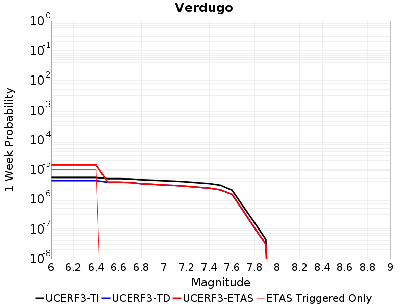 | 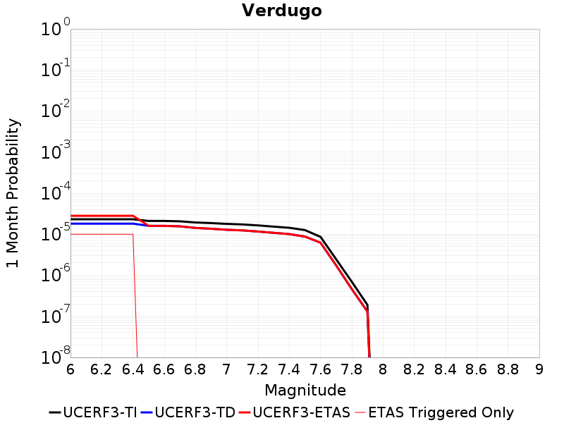 |  | 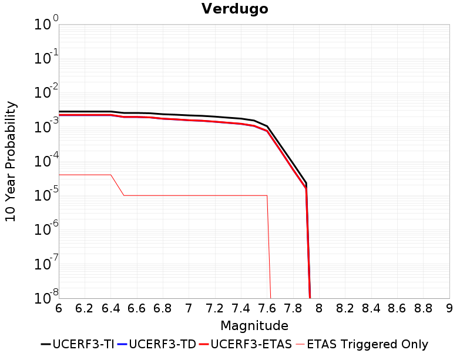 |

| Magnitude | 1 wk TI Prob | 1 wk TD Prob | 1 wk ETAS Prob | 1 wk ETAS/TD Gain | 1 wk ETAS Triggered Only | 1 mo TI Prob | 1 mo TD Prob | 1 mo ETAS Prob | 1 mo ETAS/TD Gain | 1 mo ETAS Triggered Only | 1 yr TI Prob | 1 yr TD Prob | 1 yr ETAS Prob | 1 yr ETAS/TD Gain | 1 yr ETAS Triggered Only | 10 yr TI Prob | 10 yr TD Prob | 10 yr ETAS Prob | 10 yr ETAS/TD Gain | 10 yr ETAS Triggered Only |
|-----|-----|-----|-----|-----|-----|-----|-----|-----|-----|-----|-----|-----|-----|-----|-----|-----|-----|-----|-----|-----|
| 6.0 | 5.392987E-6 | 4.2315155E-6 | 1.4231473E-5 | 3.3632095 | 1.0E-5 | 2.3112598E-5 | 1.8134942E-5 | 2.8134762E-5 | 1.5514116 | 1.0E-5 | 2.8135953E-4 | 2.2077103E-4 | 2.3076883E-4 | 1.0452858 | 1.0E-5 | 0.0028100356 | 0.002205565 | 0.0022454767 | 1.018096 | 4.0E-5 |
| 6.1 | 5.392987E-6 | 4.2315155E-6 | 1.4231473E-5 | 3.3632095 | 1.0E-5 | 2.3112598E-5 | 1.8134942E-5 | 2.8134762E-5 | 1.5514116 | 1.0E-5 | 2.8135953E-4 | 2.2077103E-4 | 2.3076883E-4 | 1.0452858 | 1.0E-5 | 0.0028100356 | 0.002205565 | 0.0022454767 | 1.018096 | 4.0E-5 |
| 6.2 | 5.392987E-6 | 4.2315155E-6 | 1.4231473E-5 | 3.3632095 | 1.0E-5 | 2.3112598E-5 | 1.8134942E-5 | 2.8134762E-5 | 1.5514116 | 1.0E-5 | 2.8135953E-4 | 2.2077103E-4 | 2.3076883E-4 | 1.0452858 | 1.0E-5 | 0.0028100356 | 0.002205565 | 0.0022454767 | 1.018096 | 4.0E-5 |
| 6.3 | 5.392987E-6 | 4.2315155E-6 | 1.4231473E-5 | 3.3632095 | 1.0E-5 | 2.3112598E-5 | 1.8134942E-5 | 2.8134762E-5 | 1.5514116 | 1.0E-5 | 2.8135953E-4 | 2.2077103E-4 | 2.3076883E-4 | 1.0452858 | 1.0E-5 | 0.0028100356 | 0.002205565 | 0.0022454767 | 1.018096 | 4.0E-5 |
| 6.4 | 5.392987E-6 | 4.2315155E-6 | 1.4231473E-5 | 3.3632095 | 1.0E-5 | 2.3112598E-5 | 1.8134942E-5 | 2.8134762E-5 | 1.5514116 | 1.0E-5 | 2.8135953E-4 | 2.2077103E-4 | 2.3076883E-4 | 1.0452858 | 1.0E-5 | 0.0028100356 | 0.002205565 | 0.0022454767 | 1.018096 | 4.0E-5 |
| 6.5 | 4.9154837E-6 | 3.7368577E-6 | 3.7368577E-6 | 1.0 | 0.0 | 2.1066187E-5 | 1.6015007E-5 | 1.6015007E-5 | 1.0 | 0.0 | 2.5645064E-4 | 1.9496547E-4 | 1.9496547E-4 | 1.0 | 0.0 | 0.002561549 | 0.0019479652 | 0.0019579458 | 1.0051236 | 1.0E-5 |
| 6.6 | 4.9154837E-6 | 3.7368577E-6 | 3.7368577E-6 | 1.0 | 0.0 | 2.1066187E-5 | 1.6015007E-5 | 1.6015007E-5 | 1.0 | 0.0 | 2.5645064E-4 | 1.9496547E-4 | 1.9496547E-4 | 1.0 | 0.0 | 0.002561549 | 0.0019479652 | 0.0019579458 | 1.0051236 | 1.0E-5 |
| 6.7 | 4.817006E-6 | 3.6349225E-6 | 3.6349225E-6 | 1.0 | 0.0 | 2.0644147E-5 | 1.5578147E-5 | 1.5578147E-5 | 1.0 | 0.0 | 2.513135E-4 | 1.8964762E-4 | 1.8964762E-4 | 1.0 | 0.0 | 0.0025102948 | 0.0018948775 | 0.0019048586 | 1.0052674 | 1.0E-5 |
| 6.8 | 4.507407E-6 | 3.3207918E-6 | 3.3207918E-6 | 1.0 | 0.0 | 1.9317316E-5 | 1.4231889E-5 | 1.4231889E-5 | 1.0 | 0.0 | 2.3516294E-4 | 1.732596E-4 | 1.732596E-4 | 1.0 | 0.0 | 0.0023491425 | 0.0017312596 | 0.0017412424 | 1.0057662 | 1.0E-5 |
| 6.9 | 4.3573054E-6 | 3.174431E-6 | 3.174431E-6 | 1.0 | 0.0 | 1.8674033E-5 | 1.3604634E-5 | 1.3604634E-5 | 1.0 | 0.0 | 2.2733262E-4 | 1.6562395E-4 | 1.6562395E-4 | 1.0 | 0.0 | 0.0022710022 | 0.0016550176 | 0.001665001 | 1.0060322 | 1.0E-5 |
| 7.0 | 4.171527E-6 | 2.9967696E-6 | 2.9967696E-6 | 1.0 | 0.0 | 1.787785E-5 | 1.2843236E-5 | 1.2843236E-5 | 1.0 | 0.0 | 2.1764109E-4 | 1.563553E-4 | 1.563553E-4 | 1.0 | 0.0 | 0.0021742806 | 0.0015624642 | 0.0015724485 | 1.0063901 | 1.0E-5 |
| 7.1 | 4.0405484E-6 | 2.895109E-6 | 2.895109E-6 | 1.0 | 0.0 | 1.731652E-5 | 1.2407551E-5 | 1.2407551E-5 | 1.0 | 0.0 | 2.1080824E-4 | 1.5105159E-4 | 1.5105159E-4 | 1.0 | 0.0 | 0.0021060838 | 0.0015095002 | 0.0015194851 | 1.0066147 | 1.0E-5 |
| 7.2 | 3.8306007E-6 | 2.7142398E-6 | 2.7142398E-6 | 1.0 | 0.0 | 1.6416758E-5 | 1.1632405E-5 | 1.1632405E-5 | 1.0 | 0.0 | 1.9985568E-4 | 1.4161544E-4 | 1.4161544E-4 | 1.0 | 0.0 | 0.0019967605 | 0.0014152627 | 0.0014252486 | 1.0070559 | 1.0E-5 |
| 7.3 | 3.5750938E-6 | 2.524127E-6 | 2.524127E-6 | 1.0 | 0.0 | 1.532174E-5 | 1.0817643E-5 | 1.0817643E-5 | 1.0 | 0.0 | 1.8652623E-4 | 1.3169694E-4 | 1.3169694E-4 | 1.0 | 0.0 | 0.0018636974 | 0.0013161997 | 0.0013261865 | 1.0075877 | 1.0E-5 |
| 7.4 | 3.3510041E-6 | 2.3523057E-6 | 2.3523057E-6 | 1.0 | 0.0 | 1.4361368E-5 | 1.0081272E-5 | 1.0081272E-5 | 1.0 | 0.0 | 1.7483562E-4 | 1.2273269E-4 | 1.2273269E-4 | 1.0 | 0.0 | 0.0017469813 | 0.0012266595 | 0.0012366473 | 1.0081422 | 1.0E-5 |
| 7.5 | 2.948287E-6 | 2.0492128E-6 | 2.0492128E-6 | 1.0 | 0.0 | 1.2635454E-5 | 8.782311E-6 | 8.782311E-6 | 1.0 | 0.0 | 1.538258E-4 | 1.0691949E-4 | 1.0691949E-4 | 1.0 | 0.0 | 0.0015371935 | 0.0010686908 | 0.0010786802 | 1.0093472 | 1.0E-5 |
| 7.6 | 2.0134323E-6 | 1.4534669E-6 | 1.4534669E-6 | 1.0 | 0.0 | 8.628967E-6 | 6.2291297E-6 | 6.2291297E-6 | 1.0 | 0.0 | 1.05052604E-4 | 7.58371E-5 | 7.58371E-5 | 1.0 | 0.0 | 0.0010500296 | 7.581211E-4 | 7.6811353E-4 | 1.0131805 | 1.0E-5 |
| 7.7 | 5.726436E-7 | 4.0646933E-7 | 4.0646933E-7 | 1.0 | 0.0 | 2.4541846E-6 | 1.7420103E-6 | 1.7420103E-6 | 1.0 | 0.0 | 2.9879287E-5 | 2.1208796E-5 | 2.1208796E-5 | 1.0 | 0.0 | 2.987527E-4 | 2.1207027E-4 | 2.1207027E-4 | 1.0 | 0.0 |
| 7.8 | 1.6248204E-7 | 1.0796315E-7 | 1.0796315E-7 | 1.0 | 0.0 | 6.963514E-7 | 4.6269915E-7 | 4.6269915E-7 | 1.0 | 0.0 | 8.478045E-6 | 5.633348E-6 | 5.633348E-6 | 1.0 | 0.0 | 8.477722E-5 | 5.6332086E-5 | 5.6332086E-5 | 1.0 | 0.0 |
| 7.9 | 4.4475744E-8 | 3.0479097E-8 | 3.0479097E-8 | 1.0 | 0.0 | 1.9061031E-7 | 1.306247E-7 | 1.306247E-7 | 1.0 | 0.0 | 2.320678E-6 | 1.5903547E-6 | 1.5903547E-6 | 1.0 | 0.0 | 2.3206538E-5 | 1.5903446E-5 | 1.5903446E-5 | 1.0 | 0.0 |

## San Pedro Basin
*[(top)](#table-of-contents)*

| 1 Week | 1 Month | 1 Year | 10 Year |
|-----|-----|-----|-----|
| 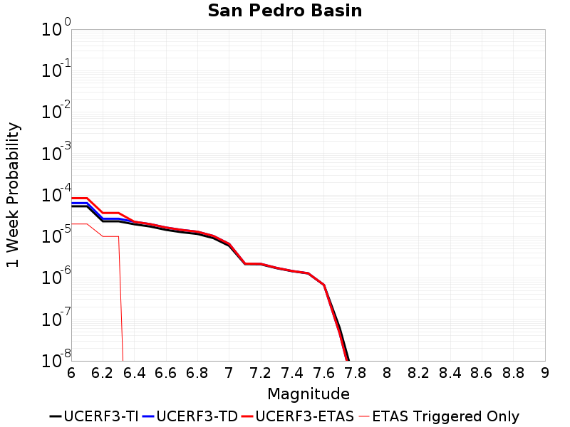 |  | 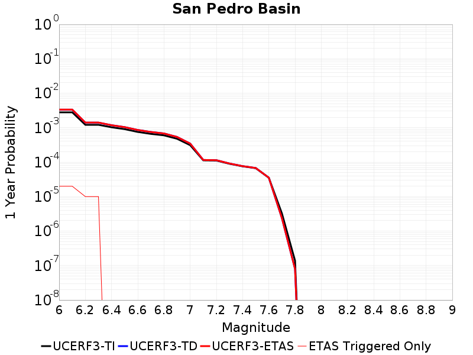 | 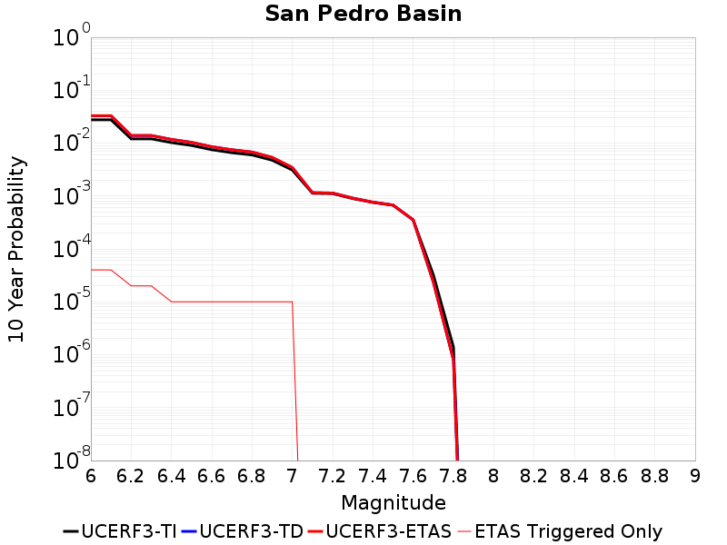 |

| Magnitude | 1 wk TI Prob | 1 wk TD Prob | 1 wk ETAS Prob | 1 wk ETAS/TD Gain | 1 wk ETAS Triggered Only | 1 mo TI Prob | 1 mo TD Prob | 1 mo ETAS Prob | 1 mo ETAS/TD Gain | 1 mo ETAS Triggered Only | 1 yr TI Prob | 1 yr TD Prob | 1 yr ETAS Prob | 1 yr ETAS/TD Gain | 1 yr ETAS Triggered Only | 10 yr TI Prob | 10 yr TD Prob | 10 yr ETAS Prob | 10 yr ETAS/TD Gain | 10 yr ETAS Triggered Only |
|-----|-----|-----|-----|-----|-----|-----|-----|-----|-----|-----|-----|-----|-----|-----|-----|-----|-----|-----|-----|-----|
| 6.0 | 5.3449043E-5 | 6.3792504E-5 | 8.379123E-5 | 1.3134965 | 2.0E-5 | 2.2904722E-4 | 2.7337132E-4 | 2.9336585E-4 | 1.0731406 | 2.0E-5 | 0.0027850836 | 0.0033238276 | 0.0033437612 | 1.0059972 | 2.0E-5 | 0.027504366 | 0.032803286 | 0.032841973 | 1.0011793 | 4.0E-5 |
| 6.1 | 5.3449043E-5 | 6.3792504E-5 | 8.379123E-5 | 1.3134965 | 2.0E-5 | 2.2904722E-4 | 2.7337132E-4 | 2.9336585E-4 | 1.0731406 | 2.0E-5 | 0.0027850836 | 0.0033238276 | 0.0033437612 | 1.0059972 | 2.0E-5 | 0.027504366 | 0.032803286 | 0.032841973 | 1.0011793 | 4.0E-5 |
| 6.2 | 2.3189454E-5 | 2.6786087E-5 | 3.678582E-5 | 1.3733182 | 1.0E-5 | 9.9379584E-5 | 1.1479273E-4 | 1.2479158E-4 | 1.0871035 | 1.0E-5 | 0.0012092749 | 0.0013967528 | 0.0014067389 | 1.0071495 | 1.0E-5 | 0.012027155 | 0.013884644 | 0.013904366 | 1.0014205 | 2.0E-5 |
| 6.3 | 2.3189454E-5 | 2.6786087E-5 | 3.678582E-5 | 1.3733182 | 1.0E-5 | 9.9379584E-5 | 1.1479273E-4 | 1.2479158E-4 | 1.0871035 | 1.0E-5 | 0.0012092749 | 0.0013967528 | 0.0014067389 | 1.0071495 | 1.0E-5 | 0.012027155 | 0.013884644 | 0.013904366 | 1.0014205 | 2.0E-5 |
| 6.4 | 1.966056E-5 | 2.2579236E-5 | 2.2579236E-5 | 1.0 | 0.0 | 8.425682E-5 | 9.6764794E-5 | 9.6764794E-5 | 1.0 | 0.0 | 0.001025344 | 0.0011775151 | 0.0011775151 | 1.0 | 0.0 | 0.010206259 | 0.0117168855 | 0.011726768 | 1.0008435 | 1.0E-5 |
| 6.5 | 1.7342953E-5 | 1.9844243E-5 | 1.9844243E-5 | 1.0 | 0.0 | 7.4324824E-5 | 8.5044194E-5 | 8.5044194E-5 | 1.0 | 0.0 | 9.04529E-4 | 0.0010349585 | 0.0010349585 | 1.0 | 0.0 | 0.009008561 | 0.010305147 | 0.010315044 | 1.0009604 | 1.0E-5 |
| 6.6 | 1.439804E-5 | 1.6402071E-5 | 1.6402071E-5 | 1.0 | 0.0 | 6.170443E-5 | 7.0292874E-5 | 7.0292874E-5 | 1.0 | 0.0 | 7.509924E-4 | 8.555122E-4 | 8.555122E-4 | 1.0 | 0.0 | 0.0074845953 | 0.008525425 | 0.0085353395 | 1.001163 | 1.0E-5 |
| 6.7 | 1.2634884E-5 | 1.4353387E-5 | 1.4353387E-5 | 1.0 | 0.0 | 5.414838E-5 | 6.151324E-5 | 6.151324E-5 | 1.0 | 0.0 | 6.590571E-4 | 7.4869714E-4 | 7.4869714E-4 | 1.0 | 0.0 | 0.006571059 | 0.0074648024 | 0.007474728 | 1.0013297 | 1.0E-5 |
| 6.8 | 1.146091E-5 | 1.2993991E-5 | 1.2993991E-5 | 1.0 | 0.0 | 4.911726E-5 | 5.5687513E-5 | 5.5687513E-5 | 1.0 | 0.0 | 5.9783855E-4 | 6.7781465E-4 | 6.7781465E-4 | 1.0 | 0.0 | 0.0059623276 | 0.0067604454 | 0.006770378 | 1.0014691 | 1.0E-5 |
| 6.9 | 9.109035E-6 | 1.028168E-5 | 1.028168E-5 | 1.0 | 0.0 | 3.9038136E-5 | 4.406376E-5 | 4.406376E-5 | 1.0 | 0.0 | 4.7518566E-4 | 5.3637254E-4 | 5.3637254E-4 | 1.0 | 0.0 | 0.0047417083 | 0.0053535644 | 0.0053635105 | 1.0018579 | 1.0E-5 |
| 7.0 | 5.9351028E-6 | 6.611119E-6 | 6.611119E-6 | 1.0 | 0.0 | 2.5435906E-5 | 2.8333194E-5 | 2.8333194E-5 | 1.0 | 0.0 | 3.0963816E-4 | 3.449259E-4 | 3.449259E-4 | 1.0 | 0.0 | 0.0030920706 | 0.0034462486 | 0.003456214 | 1.0028917 | 1.0E-5 |
| 7.1 | 2.1557585E-6 | 2.2123154E-6 | 2.2123154E-6 | 1.0 | 0.0 | 9.238933E-6 | 9.481318E-6 | 9.481318E-6 | 1.0 | 0.0 | 1.1247819E-4 | 1.1542909E-4 | 1.1542909E-4 | 1.0 | 0.0 | 0.0011242128 | 0.0011537067 | 0.0011537067 | 1.0 | 0.0 |
| 7.2 | 2.1251979E-6 | 2.1806254E-6 | 2.1806254E-6 | 1.0 | 0.0 | 9.107958E-6 | 9.345505E-6 | 9.345505E-6 | 1.0 | 0.0 | 1.1088375E-4 | 1.13775735E-4 | 1.13775735E-4 | 1.0 | 0.0 | 0.0011082845 | 0.0011371901 | 0.0011371901 | 1.0 | 0.0 |
| 7.3 | 1.7145798E-6 | 1.7460554E-6 | 1.7460554E-6 | 1.0 | 0.0 | 7.3481783E-6 | 7.4830737E-6 | 7.4830737E-6 | 1.0 | 0.0 | 8.94604E-5 | 9.11027E-5 | 9.11027E-5 | 1.0 | 0.0 | 8.9424395E-4 | 9.106627E-4 | 9.106627E-4 | 1.0 | 0.0 |
| 7.4 | 1.4467993E-6 | 1.4655049E-6 | 1.4655049E-6 | 1.0 | 0.0 | 6.200554E-6 | 6.2807203E-6 | 6.2807203E-6 | 1.0 | 0.0 | 7.548913E-5 | 7.646516E-5 | 7.646516E-5 | 1.0 | 0.0 | 7.546349E-4 | 7.643958E-4 | 7.643958E-4 | 1.0 | 0.0 |
| 7.5 | 1.2803735E-6 | 1.294268E-6 | 1.294268E-6 | 1.0 | 0.0 | 5.487303E-6 | 5.5468513E-6 | 5.5468513E-6 | 1.0 | 0.0 | 6.680587E-5 | 6.75309E-5 | 6.75309E-5 | 1.0 | 0.0 | 6.678579E-4 | 6.7511084E-4 | 6.7511084E-4 | 1.0 | 0.0 |
| 7.6 | 6.755009E-7 | 6.7723255E-7 | 6.7723255E-7 | 1.0 | 0.0 | 2.8950008E-6 | 2.9024222E-6 | 2.9024222E-6 | 1.0 | 0.0 | 3.5246063E-5 | 3.5336478E-5 | 3.5336478E-5 | 1.0 | 0.0 | 3.5240475E-4 | 3.533143E-4 | 3.533143E-4 | 1.0 | 0.0 |
| 7.7 | 6.211885E-8 | 4.525185E-8 | 4.525185E-8 | 1.0 | 0.0 | 2.6622362E-7 | 1.9393649E-7 | 1.9393649E-7 | 1.0 | 0.0 | 3.2412677E-6 | 2.3611742E-6 | 2.3611742E-6 | 1.0 | 0.0 | 3.2412205E-5 | 2.3611512E-5 | 2.3611512E-5 | 1.0 | 0.0 |
| 7.8 | 2.6580573E-9 | 1.5276094E-9 | 1.5276094E-9 | 1.0 | 0.0 | 1.1391674E-8 | 6.5468972E-9 | 6.5468972E-9 | 1.0 | 0.0 | 1.3869362E-7 | 7.970848E-8 | 7.970848E-8 | 1.0 | 0.0 | 1.3869354E-6 | 7.9708474E-7 | 7.9708474E-7 | 1.0 | 0.0 |

## Elysian Park (Lower CFM)
*[(top)](#table-of-contents)*

| 1 Week | 1 Month | 1 Year | 10 Year |
|-----|-----|-----|-----|
| 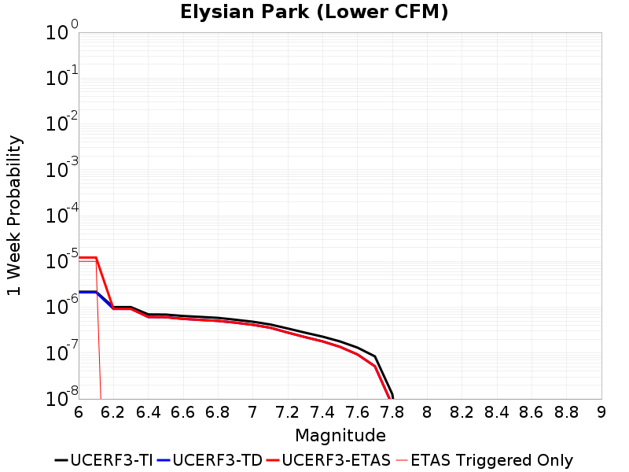 | 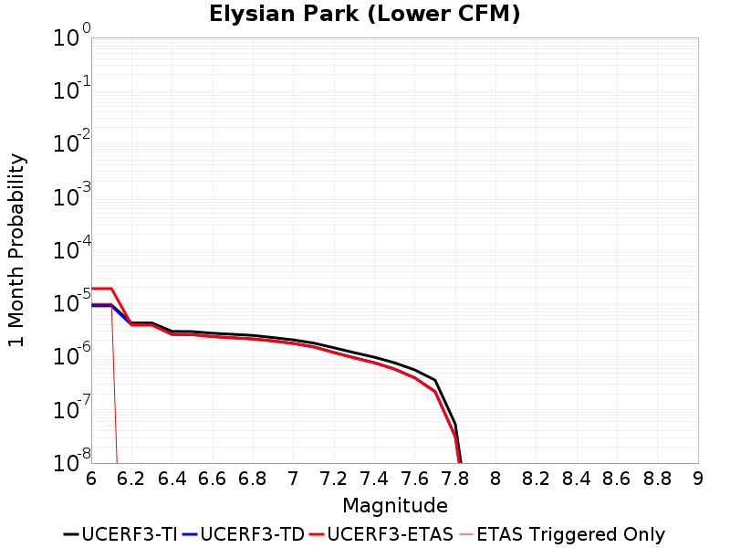 | 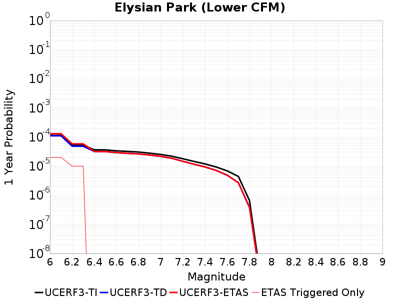 | 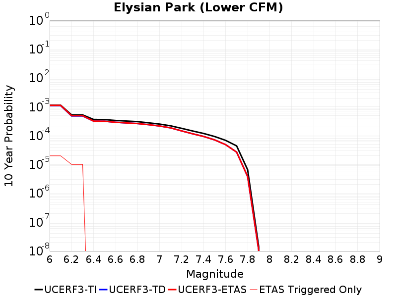 |

| Magnitude | 1 wk TI Prob | 1 wk TD Prob | 1 wk ETAS Prob | 1 wk ETAS/TD Gain | 1 wk ETAS Triggered Only | 1 mo TI Prob | 1 mo TD Prob | 1 mo ETAS Prob | 1 mo ETAS/TD Gain | 1 mo ETAS Triggered Only | 1 yr TI Prob | 1 yr TD Prob | 1 yr ETAS Prob | 1 yr ETAS/TD Gain | 1 yr ETAS Triggered Only | 10 yr TI Prob | 10 yr TD Prob | 10 yr ETAS Prob | 10 yr ETAS/TD Gain | 10 yr ETAS Triggered Only |
|-----|-----|-----|-----|-----|-----|-----|-----|-----|-----|-----|-----|-----|-----|-----|-----|-----|-----|-----|-----|-----|
| 6.0 | 2.1766498E-6 | 2.1059743E-6 | 1.2105953E-5 | 5.748386 | 1.0E-5 | 9.328466E-6 | 9.025582E-6 | 1.902549E-5 | 2.1079519 | 1.0E-5 | 1.1356815E-4 | 1.09882356E-4 | 1.2988017E-4 | 1.1819929 | 2.0E-5 | 0.0011351013 | 0.0010984223 | 0.0011184004 | 1.0181879 | 2.0E-5 |
| 6.1 | 2.1766498E-6 | 2.1059743E-6 | 1.2105953E-5 | 5.748386 | 1.0E-5 | 9.328466E-6 | 9.025582E-6 | 1.902549E-5 | 2.1079519 | 1.0E-5 | 1.1356815E-4 | 1.09882356E-4 | 1.2988017E-4 | 1.1819929 | 2.0E-5 | 0.0011351013 | 0.0010984223 | 0.0011184004 | 1.0181879 | 2.0E-5 |
| 6.2 | 1.0031182E-6 | 9.2039073E-7 | 9.2039073E-7 | 1.0 | 0.0 | 4.299071E-6 | 3.9445263E-6 | 3.9445263E-6 | 1.0 | 0.0 | 5.2339932E-5 | 4.802365E-5 | 5.8023168E-5 | 1.2082207 | 1.0E-5 | 5.2327604E-4 | 4.801425E-4 | 4.901377E-4 | 1.0208172 | 1.0E-5 |
| 6.3 | 1.0031182E-6 | 9.2039073E-7 | 9.2039073E-7 | 1.0 | 0.0 | 4.299071E-6 | 3.9445263E-6 | 3.9445263E-6 | 1.0 | 0.0 | 5.2339932E-5 | 4.802365E-5 | 5.8023168E-5 | 1.2082207 | 1.0E-5 | 5.2327604E-4 | 4.801425E-4 | 4.901377E-4 | 1.0208172 | 1.0E-5 |
| 6.4 | 6.9606244E-7 | 6.1087917E-7 | 6.1087917E-7 | 1.0 | 0.0 | 2.9831212E-6 | 2.6180508E-6 | 2.6180508E-6 | 1.0 | 0.0 | 3.6318896E-5 | 3.1874304E-5 | 3.1874304E-5 | 1.0 | 0.0 | 3.6312963E-4 | 3.1869757E-4 | 3.1869757E-4 | 1.0 | 0.0 |
| 6.5 | 6.901879E-7 | 6.0494966E-7 | 6.0494966E-7 | 1.0 | 0.0 | 2.9579448E-6 | 2.5926386E-6 | 2.5926386E-6 | 1.0 | 0.0 | 3.6012385E-5 | 3.156492E-5 | 3.156492E-5 | 1.0 | 0.0 | 3.600655E-4 | 3.1560462E-4 | 3.1560462E-4 | 1.0 | 0.0 |
| 6.6 | 6.4198554E-7 | 5.563664E-7 | 5.563664E-7 | 1.0 | 0.0 | 2.7513638E-6 | 2.384425E-6 | 2.384425E-6 | 1.0 | 0.0 | 3.3497337E-5 | 2.9029989E-5 | 2.9029989E-5 | 1.0 | 0.0 | 3.349229E-4 | 2.902621E-4 | 2.902621E-4 | 1.0 | 0.0 |
| 6.7 | 6.138733E-7 | 5.280445E-7 | 5.280445E-7 | 1.0 | 0.0 | 2.6308828E-6 | 2.2630459E-6 | 2.2630459E-6 | 1.0 | 0.0 | 3.203053E-5 | 2.7552234E-5 | 2.7552234E-5 | 1.0 | 0.0 | 3.2025913E-4 | 2.7548833E-4 | 2.7548833E-4 | 1.0 | 0.0 |
| 6.8 | 5.84778E-7 | 5.0198423E-7 | 5.0198423E-7 | 1.0 | 0.0 | 2.506189E-6 | 2.151359E-6 | 2.151359E-6 | 1.0 | 0.0 | 3.0512423E-5 | 2.6192483E-5 | 2.6192483E-5 | 1.0 | 0.0 | 3.0508233E-4 | 2.6189408E-4 | 2.6189408E-4 | 1.0 | 0.0 |
| 6.9 | 5.322785E-7 | 4.5966237E-7 | 4.5966237E-7 | 1.0 | 0.0 | 2.2811914E-6 | 1.96998E-6 | 1.96998E-6 | 1.0 | 0.0 | 2.7773152E-5 | 2.3984245E-5 | 2.3984245E-5 | 1.0 | 0.0 | 2.7769682E-4 | 2.3981665E-4 | 2.3981665E-4 | 1.0 | 0.0 |
| 7.0 | 4.8147206E-7 | 4.1286623E-7 | 4.1286623E-7 | 1.0 | 0.0 | 2.06345E-6 | 1.7694255E-6 | 1.7694255E-6 | 1.0 | 0.0 | 2.5122214E-5 | 2.1542543E-5 | 2.1542543E-5 | 1.0 | 0.0 | 2.5119373E-4 | 2.1540464E-4 | 2.1540464E-4 | 1.0 | 0.0 |
| 7.1 | 4.1932955E-7 | 3.5602676E-7 | 3.5602676E-7 | 1.0 | 0.0 | 1.7971255E-6 | 1.525828E-6 | 1.525828E-6 | 1.0 | 0.0 | 2.1879783E-5 | 1.8576799E-5 | 1.8576799E-5 | 1.0 | 0.0 | 2.1877629E-4 | 1.857525E-4 | 1.857525E-4 | 1.0 | 0.0 |
| 7.2 | 3.426051E-7 | 2.793269E-7 | 2.793269E-7 | 1.0 | 0.0 | 1.4683067E-6 | 1.1971148E-6 | 1.1971148E-6 | 1.0 | 0.0 | 1.7876488E-5 | 1.45747745E-5 | 1.45747745E-5 | 1.0 | 0.0 | 1.787505E-4 | 1.4573822E-4 | 1.4573822E-4 | 1.0 | 0.0 |
| 7.3 | 2.7771645E-7 | 2.2200204E-7 | 2.2200204E-7 | 1.0 | 0.0 | 1.1902127E-6 | 9.5143696E-7 | 9.5143696E-7 | 1.0 | 0.0 | 1.4490744E-5 | 1.1583683E-5 | 1.1583683E-5 | 1.0 | 0.0 | 1.4489799E-4 | 1.15830815E-4 | 1.15830815E-4 | 1.0 | 0.0 |
| 7.4 | 2.2756493E-7 | 1.793265E-7 | 1.793265E-7 | 1.0 | 0.0 | 9.752779E-7 | 7.685419E-7 | 7.685419E-7 | 1.0 | 0.0 | 1.1873944E-5 | 9.356957E-6 | 9.356957E-6 | 1.0 | 0.0 | 1.18733085E-4 | 9.356565E-5 | 9.356565E-5 | 1.0 | 0.0 |
| 7.5 | 1.7874558E-7 | 1.3619412E-7 | 1.3619412E-7 | 1.0 | 0.0 | 7.660522E-7 | 5.836889E-7 | 5.836889E-7 | 1.0 | 0.0 | 9.326646E-6 | 7.1063896E-6 | 7.1063896E-6 | 1.0 | 0.0 | 9.326255E-5 | 7.106164E-5 | 7.106164E-5 | 1.0 | 0.0 |
| 7.6 | 1.3124549E-7 | 9.309064E-8 | 9.309064E-8 | 1.0 | 0.0 | 5.624805E-7 | 3.989598E-7 | 3.989598E-7 | 1.0 | 0.0 | 6.8481786E-6 | 4.8573247E-6 | 4.8573247E-6 | 1.0 | 0.0 | 6.8479676E-5 | 4.85722E-5 | 4.85722E-5 | 1.0 | 0.0 |
| 7.7 | 8.439993E-8 | 5.134768E-8 | 5.134768E-8 | 1.0 | 0.0 | 3.6171392E-7 | 2.2006147E-7 | 2.2006147E-7 | 1.0 | 0.0 | 4.403858E-6 | 2.6792452E-6 | 2.6792452E-6 | 1.0 | 0.0 | 4.4037708E-5 | 2.6792142E-5 | 2.6792142E-5 | 1.0 | 0.0 |
| 7.8 | 1.2591407E-8 | 7.307468E-9 | 7.307468E-9 | 1.0 | 0.0 | 5.3963173E-8 | 3.1317718E-8 | 3.1317718E-8 | 1.0 | 0.0 | 6.570014E-7 | 3.8129318E-7 | 3.8129318E-7 | 1.0 | 0.0 | 6.5699946E-6 | 3.8129253E-6 | 3.8129253E-6 | 1.0 | 0.0 |
| 7.9 | 2.8324232E-11 | 2.157674E-11 | 2.157674E-11 | 1.0 | 0.0 | 1.2138957E-10 | 9.247203E-11 | 9.247203E-11 | 1.0 | 0.0 | 1.4779177E-9 | 1.1258475E-9 | 1.1258475E-9 | 1.0 | 0.0 | 1.4779177E-8 | 1.1258475E-8 | 1.1258475E-8 | 1.0 | 0.0 |

## San Jose
*[(top)](#table-of-contents)*

| 1 Week | 1 Month | 1 Year | 10 Year |
|-----|-----|-----|-----|
| 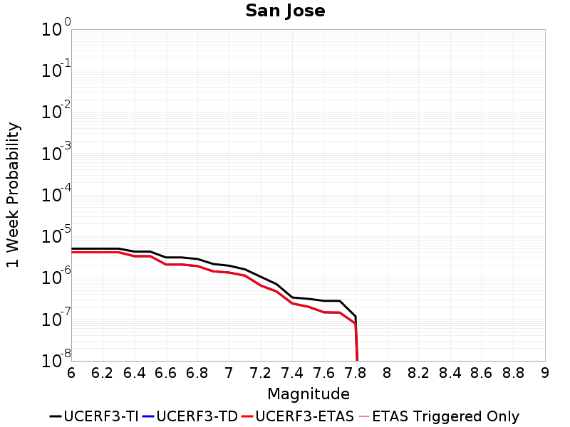 | 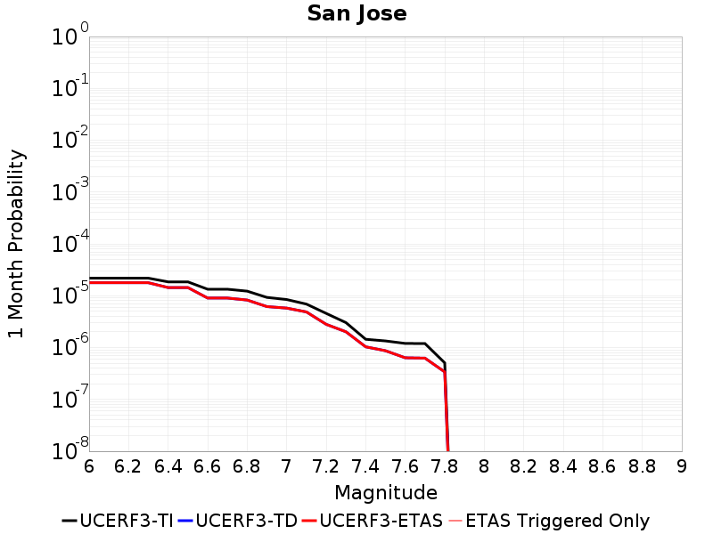 | 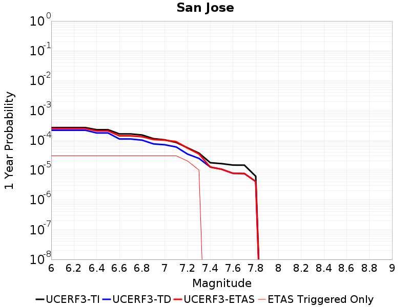 | 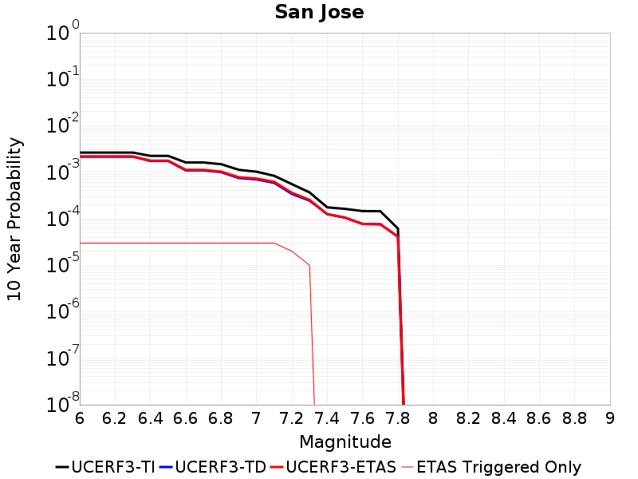 |

| Magnitude | 1 wk TI Prob | 1 wk TD Prob | 1 wk ETAS Prob | 1 wk ETAS/TD Gain | 1 wk ETAS Triggered Only | 1 mo TI Prob | 1 mo TD Prob | 1 mo ETAS Prob | 1 mo ETAS/TD Gain | 1 mo ETAS Triggered Only | 1 yr TI Prob | 1 yr TD Prob | 1 yr ETAS Prob | 1 yr ETAS/TD Gain | 1 yr ETAS Triggered Only | 10 yr TI Prob | 10 yr TD Prob | 10 yr ETAS Prob | 10 yr ETAS/TD Gain | 10 yr ETAS Triggered Only |
|-----|-----|-----|-----|-----|-----|-----|-----|-----|-----|-----|-----|-----|-----|-----|-----|-----|-----|-----|-----|-----|
| 6.0 | 5.0851277E-6 | 4.149557E-6 | 4.149557E-6 | 1.0 | 0.0 | 2.1793223E-5 | 1.778371E-5 | 1.778371E-5 | 1.0 | 0.0 | 2.653002E-4 | 2.1649779E-4 | 2.4649128E-4 | 1.1385396 | 3.0E-5 | 0.0026498367 | 0.0021631732 | 0.0021931082 | 1.0138385 | 3.0E-5 |
| 6.1 | 5.0851277E-6 | 4.149557E-6 | 4.149557E-6 | 1.0 | 0.0 | 2.1793223E-5 | 1.778371E-5 | 1.778371E-5 | 1.0 | 0.0 | 2.653002E-4 | 2.1649779E-4 | 2.4649128E-4 | 1.1385396 | 3.0E-5 | 0.0026498367 | 0.0021631732 | 0.0021931082 | 1.0138385 | 3.0E-5 |
| 6.2 | 5.0851277E-6 | 4.149557E-6 | 4.149557E-6 | 1.0 | 0.0 | 2.1793223E-5 | 1.778371E-5 | 1.778371E-5 | 1.0 | 0.0 | 2.653002E-4 | 2.1649779E-4 | 2.4649128E-4 | 1.1385396 | 3.0E-5 | 0.0026498367 | 0.0021631732 | 0.0021931082 | 1.0138385 | 3.0E-5 |
| 6.3 | 5.0851277E-6 | 4.149557E-6 | 4.149557E-6 | 1.0 | 0.0 | 2.1793223E-5 | 1.778371E-5 | 1.778371E-5 | 1.0 | 0.0 | 2.653002E-4 | 2.1649779E-4 | 2.4649128E-4 | 1.1385396 | 3.0E-5 | 0.0026498367 | 0.0021631732 | 0.0021931082 | 1.0138385 | 3.0E-5 |
| 6.4 | 4.3115124E-6 | 3.3466308E-6 | 3.3466308E-6 | 1.0 | 0.0 | 1.8477778E-5 | 1.4342637E-5 | 1.4342637E-5 | 1.0 | 0.0 | 2.2494372E-4 | 1.7460983E-4 | 2.0460458E-4 | 1.1717817 | 3.0E-5 | 0.0022471617 | 0.0017449892 | 0.0017749368 | 1.0171621 | 3.0E-5 |
| 6.5 | 4.3115124E-6 | 3.3466308E-6 | 3.3466308E-6 | 1.0 | 0.0 | 1.8477778E-5 | 1.4342637E-5 | 1.4342637E-5 | 1.0 | 0.0 | 2.2494372E-4 | 1.7460983E-4 | 2.0460458E-4 | 1.1717817 | 3.0E-5 | 0.0022471617 | 0.0017449892 | 0.0017749368 | 1.0171621 | 3.0E-5 |
| 6.6 | 3.110396E-6 | 2.1012709E-6 | 2.1012709E-6 | 1.0 | 0.0 | 1.33302E-5 | 9.005417E-6 | 9.005417E-6 | 1.0 | 0.0 | 1.622831E-4 | 1.09635715E-4 | 1.3963242E-4 | 1.2736034 | 3.0E-5 | 0.0016216465 | 0.001095889 | 0.0011258561 | 1.0273451 | 3.0E-5 |
| 6.7 | 3.110396E-6 | 2.1012709E-6 | 2.1012709E-6 | 1.0 | 0.0 | 1.33302E-5 | 9.005417E-6 | 9.005417E-6 | 1.0 | 0.0 | 1.622831E-4 | 1.09635715E-4 | 1.3963242E-4 | 1.2736034 | 3.0E-5 | 0.0016216465 | 0.001095889 | 0.0011258561 | 1.0273451 | 3.0E-5 |
| 6.8 | 2.856651E-6 | 1.92326E-6 | 1.92326E-6 | 1.0 | 0.0 | 1.2242733E-5 | 8.242519E-6 | 8.242519E-6 | 1.0 | 0.0 | 1.4904508E-4 | 1.0034829E-4 | 1.3034527E-4 | 1.2989287 | 3.0E-5 | 0.0014894515 | 0.0010030995 | 0.0010330693 | 1.0298773 | 3.0E-5 |
| 6.9 | 2.1618725E-6 | 1.4382887E-6 | 1.4382887E-6 | 1.0 | 0.0 | 9.265135E-6 | 6.1640803E-6 | 6.1640803E-6 | 1.0 | 0.0 | 1.12797185E-4 | 7.504518E-5 | 1.05042935E-4 | 1.3997291 | 3.0E-5 | 0.0011273995 | 7.502522E-4 | 7.802297E-4 | 1.0399566 | 3.0E-5 |
| 7.0 | 1.9684312E-6 | 1.3449495E-6 | 1.3449495E-6 | 1.0 | 0.0 | 8.436106E-6 | 5.7640573E-6 | 5.7640573E-6 | 1.0 | 0.0 | 1.02704755E-4 | 7.017522E-5 | 1.00173114E-4 | 1.4274713 | 3.0E-5 | 0.001026573 | 7.0158386E-4 | 7.315628E-4 | 1.0427305 | 3.0E-5 |
| 7.1 | 1.6070337E-6 | 1.1340062E-6 | 1.1340062E-6 | 1.0 | 0.0 | 6.887269E-6 | 4.8600177E-6 | 4.8600177E-6 | 1.0 | 0.0 | 8.384928E-5 | 5.916917E-5 | 8.91674E-5 | 1.5069908 | 3.0E-5 | 8.3817646E-4 | 5.915854E-4 | 6.215677E-4 | 1.0506812 | 3.0E-5 |
| 7.2 | 1.0631658E-6 | 6.543308E-7 | 6.543308E-7 | 1.0 | 0.0 | 4.556417E-6 | 2.8042718E-6 | 2.8042718E-6 | 1.0 | 0.0 | 5.5472963E-5 | 3.414149E-5 | 5.4140808E-5 | 1.5857775 | 2.0E-5 | 5.545912E-4 | 3.414088E-4 | 3.6140197E-4 | 1.0585608 | 2.0E-5 |
| 7.3 | 7.060711E-7 | 4.6969674E-7 | 4.6969674E-7 | 1.0 | 0.0 | 3.0260155E-6 | 2.0129844E-6 | 2.0129844E-6 | 1.0 | 0.0 | 3.6841117E-5 | 2.450782E-5 | 3.4507575E-5 | 1.408023 | 1.0E-5 | 3.6835007E-4 | 2.45097E-4 | 2.5509455E-4 | 1.0407902 | 1.0E-5 |
| 7.4 | 3.3677085E-7 | 2.4081487E-7 | 2.4081487E-7 | 1.0 | 0.0 | 1.4433028E-6 | 1.0320633E-6 | 1.0320633E-6 | 1.0 | 0.0 | 1.757207E-5 | 1.2565301E-5 | 1.2565301E-5 | 1.0 | 0.0 | 1.7570681E-4 | 1.2569113E-4 | 1.2569113E-4 | 1.0 | 0.0 |
| 7.5 | 3.129161E-7 | 2.0256624E-7 | 2.0256624E-7 | 1.0 | 0.0 | 1.3410682E-6 | 8.681408E-7 | 8.681408E-7 | 1.0 | 0.0 | 1.6327383E-5 | 1.0569565E-5 | 1.0569565E-5 | 1.0 | 0.0 | 1.6326184E-4 | 1.05735795E-4 | 1.05735795E-4 | 1.0 | 0.0 |
| 7.6 | 2.8008668E-7 | 1.479975E-7 | 1.479975E-7 | 1.0 | 0.0 | 1.2003709E-6 | 6.3427484E-7 | 6.3427484E-7 | 1.0 | 0.0 | 1.46144175E-5 | 7.722271E-6 | 7.722271E-6 | 1.0 | 0.0 | 1.4613457E-4 | 7.7264776E-5 | 7.7264776E-5 | 1.0 | 0.0 |
| 7.7 | 2.7852005E-7 | 1.456904E-7 | 1.456904E-7 | 1.0 | 0.0 | 1.1936568E-6 | 6.2438727E-7 | 6.2438727E-7 | 1.0 | 0.0 | 1.4532674E-5 | 7.6018905E-6 | 7.6018905E-6 | 1.0 | 0.0 | 1.4531724E-4 | 7.606106E-5 | 7.606106E-5 | 1.0 | 0.0 |
| 7.8 | 1.1810797E-7 | 7.898749E-8 | 7.898749E-8 | 1.0 | 0.0 | 5.0617695E-7 | 3.3851776E-7 | 3.3851776E-7 | 1.0 | 0.0 | 6.1626865E-6 | 4.1214466E-6 | 4.1214466E-6 | 1.0 | 0.0 | 6.162516E-5 | 4.1245825E-5 | 4.1245825E-5 | 1.0 | 0.0 |

## Clamshell-Sawpit
*[(top)](#table-of-contents)*

| 1 Week | 1 Month | 1 Year | 10 Year |
|-----|-----|-----|-----|
| 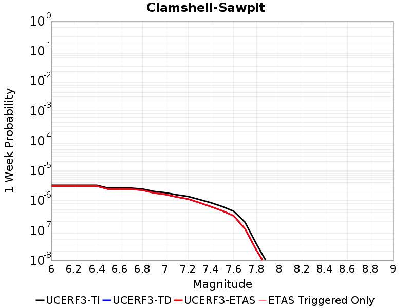 | 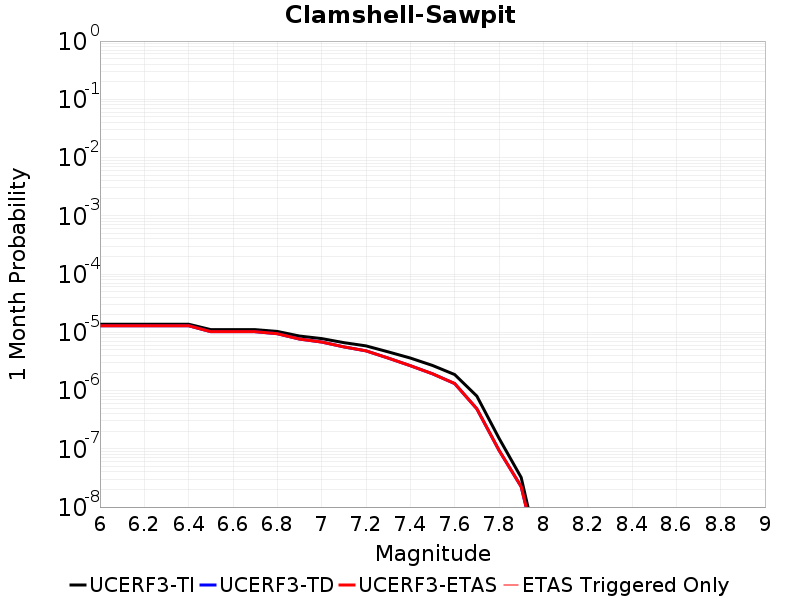 | 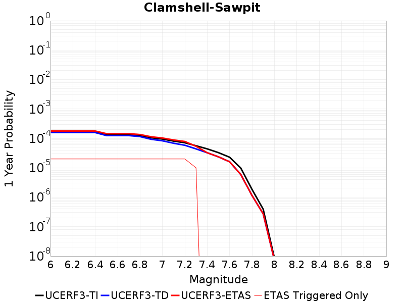 | 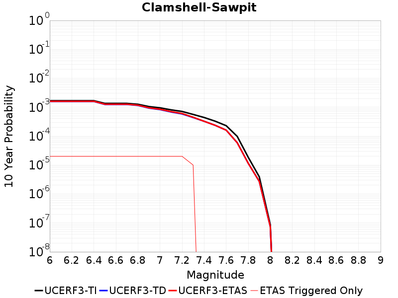 |

| Magnitude | 1 wk TI Prob | 1 wk TD Prob | 1 wk ETAS Prob | 1 wk ETAS/TD Gain | 1 wk ETAS Triggered Only | 1 mo TI Prob | 1 mo TD Prob | 1 mo ETAS Prob | 1 mo ETAS/TD Gain | 1 mo ETAS Triggered Only | 1 yr TI Prob | 1 yr TD Prob | 1 yr ETAS Prob | 1 yr ETAS/TD Gain | 1 yr ETAS Triggered Only | 10 yr TI Prob | 10 yr TD Prob | 10 yr ETAS Prob | 10 yr ETAS/TD Gain | 10 yr ETAS Triggered Only |
|-----|-----|-----|-----|-----|-----|-----|-----|-----|-----|-----|-----|-----|-----|-----|-----|-----|-----|-----|-----|-----|
| 6.0 | 3.202998E-6 | 3.0185204E-6 | 3.0185204E-6 | 1.0 | 0.0 | 1.3727062E-5 | 1.2936456E-5 | 1.2936456E-5 | 1.0 | 0.0 | 1.6711417E-4 | 1.5749078E-4 | 1.7748763E-4 | 1.1269716 | 2.0E-5 | 0.0016698855 | 0.0015738712 | 0.0015938397 | 1.0126876 | 2.0E-5 |
| 6.1 | 3.202998E-6 | 3.0185204E-6 | 3.0185204E-6 | 1.0 | 0.0 | 1.3727062E-5 | 1.2936456E-5 | 1.2936456E-5 | 1.0 | 0.0 | 1.6711417E-4 | 1.5749078E-4 | 1.7748763E-4 | 1.1269716 | 2.0E-5 | 0.0016698855 | 0.0015738712 | 0.0015938397 | 1.0126876 | 2.0E-5 |
| 6.2 | 3.202998E-6 | 3.0185204E-6 | 3.0185204E-6 | 1.0 | 0.0 | 1.3727062E-5 | 1.2936456E-5 | 1.2936456E-5 | 1.0 | 0.0 | 1.6711417E-4 | 1.5749078E-4 | 1.7748763E-4 | 1.1269716 | 2.0E-5 | 0.0016698855 | 0.0015738712 | 0.0015938397 | 1.0126876 | 2.0E-5 |
| 6.3 | 3.202998E-6 | 3.0185204E-6 | 3.0185204E-6 | 1.0 | 0.0 | 1.3727062E-5 | 1.2936456E-5 | 1.2936456E-5 | 1.0 | 0.0 | 1.6711417E-4 | 1.5749078E-4 | 1.7748763E-4 | 1.1269716 | 2.0E-5 | 0.0016698855 | 0.0015738712 | 0.0015938397 | 1.0126876 | 2.0E-5 |
| 6.4 | 3.202998E-6 | 3.0185204E-6 | 3.0185204E-6 | 1.0 | 0.0 | 1.3727062E-5 | 1.2936456E-5 | 1.2936456E-5 | 1.0 | 0.0 | 1.6711417E-4 | 1.5749078E-4 | 1.7748763E-4 | 1.1269716 | 2.0E-5 | 0.0016698855 | 0.0015738712 | 0.0015938397 | 1.0126876 | 2.0E-5 |
| 6.5 | 2.5862723E-6 | 2.385978E-6 | 2.385978E-6 | 1.0 | 0.0 | 1.1083977E-5 | 1.0225581E-5 | 1.0225581E-5 | 1.0 | 0.0 | 1.3493907E-4 | 1.2448964E-4 | 1.4448716E-4 | 1.160636 | 2.0E-5 | 0.0013485716 | 0.0012442295 | 0.0012642046 | 1.0160542 | 2.0E-5 |
| 6.6 | 2.5862723E-6 | 2.385978E-6 | 2.385978E-6 | 1.0 | 0.0 | 1.1083977E-5 | 1.0225581E-5 | 1.0225581E-5 | 1.0 | 0.0 | 1.3493907E-4 | 1.2448964E-4 | 1.4448716E-4 | 1.160636 | 2.0E-5 | 0.0013485716 | 0.0012442295 | 0.0012642046 | 1.0160542 | 2.0E-5 |
| 6.7 | 2.5862723E-6 | 2.385978E-6 | 2.385978E-6 | 1.0 | 0.0 | 1.1083977E-5 | 1.0225581E-5 | 1.0225581E-5 | 1.0 | 0.0 | 1.3493907E-4 | 1.2448964E-4 | 1.4448716E-4 | 1.160636 | 2.0E-5 | 0.0013485716 | 0.0012442295 | 0.0012642046 | 1.0160542 | 2.0E-5 |
| 6.8 | 2.4098806E-6 | 2.2026895E-6 | 2.2026895E-6 | 1.0 | 0.0 | 1.0328019E-5 | 9.440065E-6 | 9.440065E-6 | 1.0 | 0.0 | 1.2573638E-4 | 1.14927E-4 | 1.349247E-4 | 1.1740035 | 2.0E-5 | 0.0012566525 | 0.0011487023 | 0.0011686793 | 1.017391 | 2.0E-5 |
| 6.9 | 2.0073985E-6 | 1.7827632E-6 | 1.7827632E-6 | 1.0 | 0.0 | 8.603109E-6 | 7.640392E-6 | 7.640392E-6 | 1.0 | 0.0 | 1.0473781E-4 | 9.301792E-5 | 1.1301606E-4 | 1.2149923 | 2.0E-5 | 0.0010468846 | 9.298018E-4 | 9.497832E-4 | 1.02149 | 2.0E-5 |
| 7.0 | 1.8166766E-6 | 1.5847913E-6 | 1.5847913E-6 | 1.0 | 0.0 | 7.785734E-6 | 6.791946E-6 | 6.791946E-6 | 1.0 | 0.0 | 9.478718E-5 | 8.268891E-5 | 1.02687256E-4 | 1.2418504 | 2.0E-5 | 9.4746763E-4 | 8.265915E-4 | 8.4657496E-4 | 1.0241758 | 2.0E-5 |
| 7.1 | 1.5471421E-6 | 1.3088836E-6 | 1.3088836E-6 | 1.0 | 0.0 | 6.6305925E-6 | 5.6094896E-6 | 5.6094896E-6 | 1.0 | 0.0 | 8.072447E-5 | 6.829345E-5 | 8.829209E-5 | 1.2928338 | 2.0E-5 | 8.0695155E-4 | 6.827301E-4 | 7.0271647E-4 | 1.0292741 | 2.0E-5 |
| 7.2 | 1.3608037E-6 | 1.1185938E-6 | 1.1185938E-6 | 1.0 | 0.0 | 5.8320024E-6 | 4.7939648E-6 | 4.7939648E-6 | 1.0 | 0.0 | 7.1002316E-5 | 5.8365003E-5 | 7.836383E-5 | 1.3426511 | 2.0E-5 | 7.097964E-4 | 5.835014E-4 | 6.034897E-4 | 1.0342559 | 2.0E-5 |
| 7.3 | 1.0749634E-6 | 8.4113793E-7 | 8.4113793E-7 | 1.0 | 0.0 | 4.6069777E-6 | 3.604872E-6 | 3.604872E-6 | 1.0 | 0.0 | 5.608851E-5 | 4.3888464E-5 | 5.3888023E-5 | 1.2278403 | 1.0E-5 | 5.6074356E-4 | 4.3880078E-4 | 4.487964E-4 | 1.0227793 | 1.0E-5 |
| 7.4 | 8.416856E-7 | 6.222997E-7 | 6.222997E-7 | 1.0 | 0.0 | 3.607219E-6 | 2.6669961E-6 | 2.6669961E-6 | 1.0 | 0.0 | 4.3917007E-5 | 3.2470212E-5 | 3.2470212E-5 | 1.0 | 0.0 | 4.390833E-4 | 3.246567E-4 | 3.246567E-4 | 1.0 | 0.0 |
| 7.5 | 6.2779594E-7 | 4.516845E-7 | 4.516845E-7 | 1.0 | 0.0 | 2.6905511E-6 | 1.9357894E-6 | 1.9357894E-6 | 1.0 | 0.0 | 3.275697E-5 | 2.3568E-5 | 2.3568E-5 | 1.0 | 0.0 | 3.275214E-4 | 2.356569E-4 | 2.356569E-4 | 1.0 | 0.0 |
| 7.6 | 4.3822078E-7 | 3.0709157E-7 | 3.0709157E-7 | 1.0 | 0.0 | 1.8780877E-6 | 1.3161061E-6 | 1.3161061E-6 | 1.0 | 0.0 | 2.2865479E-5 | 1.602349E-5 | 1.602349E-5 | 1.0 | 0.0 | 2.2863125E-4 | 1.602249E-4 | 1.602249E-4 | 1.0 | 0.0 |
| 7.7 | 1.8704569E-7 | 1.1314773E-7 | 1.1314773E-7 | 1.0 | 0.0 | 8.0162414E-7 | 4.8491876E-7 | 4.8491876E-7 | 1.0 | 0.0 | 9.75973E-6 | 5.9038703E-6 | 5.9038703E-6 | 1.0 | 0.0 | 9.7593016E-5 | 5.90372E-5 | 5.90372E-5 | 1.0 | 0.0 |
| 7.8 | 3.5378733E-8 | 2.196589E-8 | 2.196589E-8 | 1.0 | 0.0 | 1.5162313E-7 | 9.413952E-8 | 9.413952E-8 | 1.0 | 0.0 | 1.84601E-6 | 1.1461482E-6 | 1.1461482E-6 | 1.0 | 0.0 | 1.8459947E-5 | 1.1461425E-5 | 1.1461425E-5 | 1.0 | 0.0 |
| 7.9 | 7.504945E-9 | 5.222767E-9 | 5.222767E-9 | 1.0 | 0.0 | 3.2164053E-8 | 2.2383288E-8 | 2.2383288E-8 | 1.0 | 0.0 | 3.9159727E-7 | 2.725165E-7 | 2.725165E-7 | 1.0 | 0.0 | 3.915966E-6 | 2.7251624E-6 | 2.7251624E-6 | 1.0 | 0.0 |
| 8.0 | 1.6554036E-10 | 1.4191659E-10 | 1.4191659E-10 | 1.0 | 0.0 | 7.0945894E-10 | 6.0821403E-10 | 6.0821403E-10 | 1.0 | 0.0 | 8.637662E-9 | 7.4050055E-9 | 7.4050055E-9 | 1.0 | 0.0 | 8.6376616E-8 | 7.405006E-8 | 7.405006E-8 | 1.0 | 0.0 |

## San Gabriel (Extension)
*[(top)](#table-of-contents)*

| 1 Week | 1 Month | 1 Year | 10 Year |
|-----|-----|-----|-----|
| 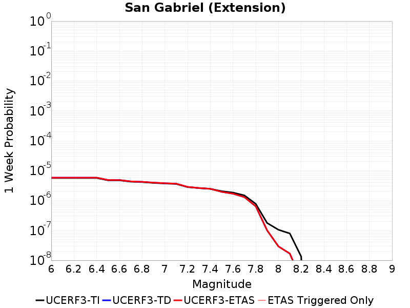 | 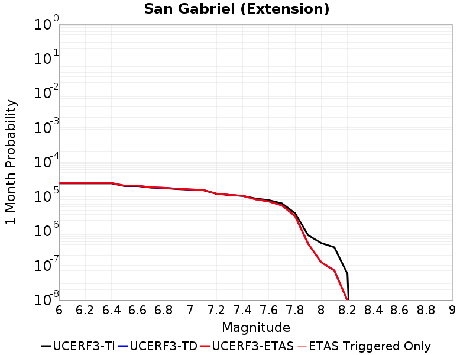 | 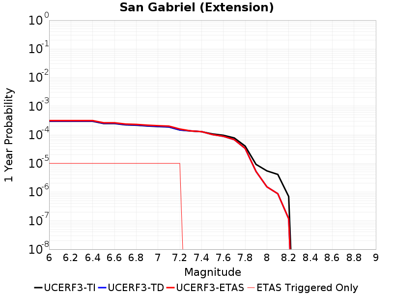 | 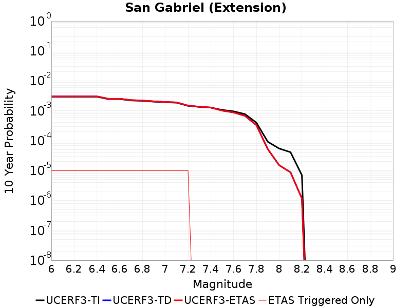 |

| Magnitude | 1 wk TI Prob | 1 wk TD Prob | 1 wk ETAS Prob | 1 wk ETAS/TD Gain | 1 wk ETAS Triggered Only | 1 mo TI Prob | 1 mo TD Prob | 1 mo ETAS Prob | 1 mo ETAS/TD Gain | 1 mo ETAS Triggered Only | 1 yr TI Prob | 1 yr TD Prob | 1 yr ETAS Prob | 1 yr ETAS/TD Gain | 1 yr ETAS Triggered Only | 10 yr TI Prob | 10 yr TD Prob | 10 yr ETAS Prob | 10 yr ETAS/TD Gain | 10 yr ETAS Triggered Only |
|-----|-----|-----|-----|-----|-----|-----|-----|-----|-----|-----|-----|-----|-----|-----|-----|-----|-----|-----|-----|-----|
| 6.0 | 5.6486106E-6 | 5.781473E-6 | 5.781473E-6 | 1.0 | 0.0 | 2.4208108E-5 | 2.4777513E-5 | 2.4777513E-5 | 1.0 | 0.0 | 2.9469383E-4 | 3.0162575E-4 | 3.1162272E-4 | 1.0331436 | 1.0E-5 | 0.0029430336 | 0.0030122944 | 0.0030222642 | 1.0033097 | 1.0E-5 |
| 6.1 | 5.6486106E-6 | 5.781473E-6 | 5.781473E-6 | 1.0 | 0.0 | 2.4208108E-5 | 2.4777513E-5 | 2.4777513E-5 | 1.0 | 0.0 | 2.9469383E-4 | 3.0162575E-4 | 3.1162272E-4 | 1.0331436 | 1.0E-5 | 0.0029430336 | 0.0030122944 | 0.0030222642 | 1.0033097 | 1.0E-5 |
| 6.2 | 5.6486106E-6 | 5.781473E-6 | 5.781473E-6 | 1.0 | 0.0 | 2.4208108E-5 | 2.4777513E-5 | 2.4777513E-5 | 1.0 | 0.0 | 2.9469383E-4 | 3.0162575E-4 | 3.1162272E-4 | 1.0331436 | 1.0E-5 | 0.0029430336 | 0.0030122944 | 0.0030222642 | 1.0033097 | 1.0E-5 |
| 6.3 | 5.6486106E-6 | 5.781473E-6 | 5.781473E-6 | 1.0 | 0.0 | 2.4208108E-5 | 2.4777513E-5 | 2.4777513E-5 | 1.0 | 0.0 | 2.9469383E-4 | 3.0162575E-4 | 3.1162272E-4 | 1.0331436 | 1.0E-5 | 0.0029430336 | 0.0030122944 | 0.0030222642 | 1.0033097 | 1.0E-5 |
| 6.4 | 5.6486106E-6 | 5.781473E-6 | 5.781473E-6 | 1.0 | 0.0 | 2.4208108E-5 | 2.4777513E-5 | 2.4777513E-5 | 1.0 | 0.0 | 2.9469383E-4 | 3.0162575E-4 | 3.1162272E-4 | 1.0331436 | 1.0E-5 | 0.0029430336 | 0.0030122944 | 0.0030222642 | 1.0033097 | 1.0E-5 |
| 6.5 | 4.7134554E-6 | 4.817899E-6 | 4.817899E-6 | 1.0 | 0.0 | 2.0200367E-5 | 2.064798E-5 | 2.064798E-5 | 1.0 | 0.0 | 2.459117E-4 | 2.5136102E-4 | 2.613585E-4 | 1.0397735 | 1.0E-5 | 0.0024563975 | 0.0025108554 | 0.0025208304 | 1.0039726 | 1.0E-5 |
| 6.6 | 4.7134554E-6 | 4.817899E-6 | 4.817899E-6 | 1.0 | 0.0 | 2.0200367E-5 | 2.064798E-5 | 2.064798E-5 | 1.0 | 0.0 | 2.459117E-4 | 2.5136102E-4 | 2.613585E-4 | 1.0397735 | 1.0E-5 | 0.0024563975 | 0.0025108554 | 0.0025208304 | 1.0039726 | 1.0E-5 |
| 6.7 | 4.2468837E-6 | 4.337221E-6 | 4.337221E-6 | 1.0 | 0.0 | 1.8200803E-5 | 1.8587962E-5 | 1.8587962E-5 | 1.0 | 0.0 | 2.2157225E-4 | 2.2628566E-4 | 2.3628339E-4 | 1.044182 | 1.0E-5 | 0.0022135144 | 0.0022606286 | 0.0022706059 | 1.0044136 | 1.0E-5 |
| 6.8 | 4.1180615E-6 | 4.2044726E-6 | 4.2044726E-6 | 1.0 | 0.0 | 1.7648716E-5 | 1.8019047E-5 | 1.8019047E-5 | 1.0 | 0.0 | 2.1485193E-4 | 2.1936055E-4 | 2.2935835E-4 | 1.045577 | 1.0E-5 | 0.0021464431 | 0.0021915154 | 0.0022014936 | 1.0045531 | 1.0E-5 |
| 6.9 | 3.863861E-6 | 3.9425154E-6 | 3.9425154E-6 | 1.0 | 0.0 | 1.65593E-5 | 1.6896389E-5 | 1.6896389E-5 | 1.0 | 0.0 | 2.0159081E-4 | 2.056948E-4 | 2.1569275E-4 | 1.0486057 | 1.0E-5 | 0.0020140803 | 0.0020551158 | 0.0020650954 | 1.0048559 | 1.0E-5 |
| 7.0 | 3.6947372E-6 | 3.7682335E-6 | 3.7682335E-6 | 1.0 | 0.0 | 1.5834492E-5 | 1.6149475E-5 | 1.6149475E-5 | 1.0 | 0.0 | 1.9276788E-4 | 1.966028E-4 | 2.0660083E-4 | 1.050854 | 1.0E-5 | 0.0019260074 | 0.001964359 | 0.0019743396 | 1.0050807 | 1.0E-5 |
| 7.1 | 3.5686835E-6 | 3.635173E-6 | 3.635173E-6 | 1.0 | 0.0 | 1.5294268E-5 | 1.5579224E-5 | 1.5579224E-5 | 1.0 | 0.0 | 1.861918E-4 | 1.8966121E-4 | 1.9965932E-4 | 1.0527155 | 1.0E-5 | 0.0018603588 | 0.0018950633 | 0.0019050444 | 1.0052669 | 1.0E-5 |
| 7.2 | 2.8023446E-6 | 2.8378074E-6 | 2.8378074E-6 | 1.0 | 0.0 | 1.2009994E-5 | 1.2161976E-5 | 1.2161976E-5 | 1.0 | 0.0 | 1.4621185E-4 | 1.4806211E-4 | 1.5806063E-4 | 1.0675292 | 1.0E-5 | 0.001461157 | 0.0014796493 | 0.0014896345 | 1.0067483 | 1.0E-5 |
| 7.3 | 2.5843012E-6 | 2.6061516E-6 | 2.6061516E-6 | 1.0 | 0.0 | 1.1075529E-5 | 1.1169174E-5 | 1.1169174E-5 | 1.0 | 0.0 | 1.3483623E-4 | 1.3597631E-4 | 1.3597631E-4 | 1.0 | 0.0 | 0.0013475444 | 0.0013589447 | 0.0013589447 | 1.0 | 0.0 |
| 7.4 | 2.4464468E-6 | 2.4556855E-6 | 2.4556855E-6 | 1.0 | 0.0 | 1.04847295E-5 | 1.0524324E-5 | 1.0524324E-5 | 1.0 | 0.0 | 1.276441E-4 | 1.2812621E-4 | 1.2812621E-4 | 1.0 | 0.0 | 0.0012757082 | 0.0012805369 | 0.0012805369 | 1.0 | 0.0 |
| 7.5 | 2.0420266E-6 | 1.940914E-6 | 1.940914E-6 | 1.0 | 0.0 | 8.751514E-6 | 8.318177E-6 | 8.318177E-6 | 1.0 | 0.0 | 1.0654447E-4 | 1.0126913E-4 | 1.0126913E-4 | 1.0 | 0.0 | 0.001064934 | 0.0010122368 | 0.0010122368 | 1.0 | 0.0 |
| 7.6 | 1.8326596E-6 | 1.6853029E-6 | 1.6853029E-6 | 1.0 | 0.0 | 7.854232E-6 | 7.2227067E-6 | 7.2227067E-6 | 1.0 | 0.0 | 9.562107E-5 | 8.793293E-5 | 8.793293E-5 | 1.0 | 0.0 | 9.5579936E-4 | 8.78987E-4 | 8.78987E-4 | 1.0 | 0.0 |
| 7.7 | 1.4786998E-6 | 1.2926498E-6 | 1.2926498E-6 | 1.0 | 0.0 | 6.3372695E-6 | 5.539916E-6 | 5.539916E-6 | 1.0 | 0.0 | 7.715353E-5 | 6.74464E-5 | 6.74464E-5 | 1.0 | 0.0 | 7.7126746E-4 | 6.7426433E-4 | 6.7426433E-4 | 1.0 | 0.0 |
| 7.8 | 7.6975533E-7 | 6.3894663E-7 | 6.3894663E-7 | 1.0 | 0.0 | 3.2989474E-6 | 2.7383398E-6 | 2.7383398E-6 | 1.0 | 0.0 | 4.0163945E-5 | 3.3338783E-5 | 3.3338783E-5 | 1.0 | 0.0 | 4.0156685E-4 | 3.3334372E-4 | 3.3334372E-4 | 1.0 | 0.0 |
| 7.9 | 1.7645915E-7 | 1.0005547E-7 | 1.0005547E-7 | 1.0 | 0.0 | 7.562533E-7 | 4.288091E-7 | 4.288091E-7 | 1.0 | 0.0 | 9.207345E-6 | 5.2207383E-6 | 5.2207383E-6 | 1.0 | 0.0 | 9.206964E-5 | 5.2211235E-5 | 5.2211235E-5 | 1.0 | 0.0 |
| 8.0 | 1.0463461E-7 | 2.8977347E-8 | 2.8977347E-8 | 1.0 | 0.0 | 4.4843398E-7 | 1.2418862E-7 | 1.2418862E-7 | 1.0 | 0.0 | 5.45967E-6 | 1.5119954E-6 | 1.5119954E-6 | 1.0 | 0.0 | 5.459536E-5 | 1.5124924E-5 | 1.5124924E-5 | 1.0 | 0.0 |
| 8.1 | 7.875717E-8 | 1.6692063E-8 | 1.6692063E-8 | 1.0 | 0.0 | 3.3753068E-7 | 7.153741E-8 | 7.153741E-8 | 1.0 | 0.0 | 4.109428E-6 | 8.709676E-7 | 8.709676E-7 | 1.0 | 0.0 | 4.109352E-5 | 8.714715E-6 | 8.714715E-6 | 1.0 | 0.0 |
| 8.2 | 1.33163E-8 | 2.2295823E-9 | 2.2295823E-9 | 1.0 | 0.0 | 5.7069855E-8 | 9.555352E-9 | 9.555352E-9 | 1.0 | 0.0 | 6.9482525E-7 | 1.163364E-7 | 1.163364E-7 | 1.0 | 0.0 | 6.9482307E-6 | 1.1657855E-6 | 1.1657855E-6 | 1.0 | 0.0 |

## Palos Verdes
*[(top)](#table-of-contents)*

| 1 Week | 1 Month | 1 Year | 10 Year |
|-----|-----|-----|-----|
| 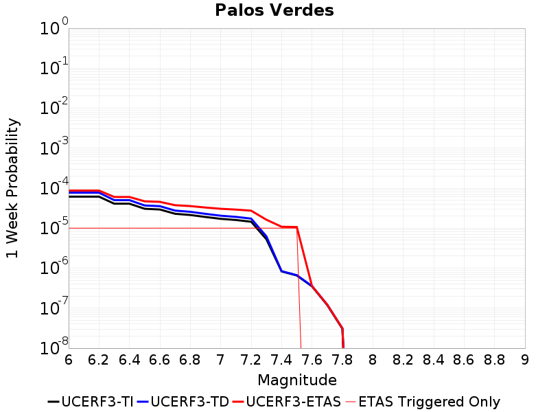 | 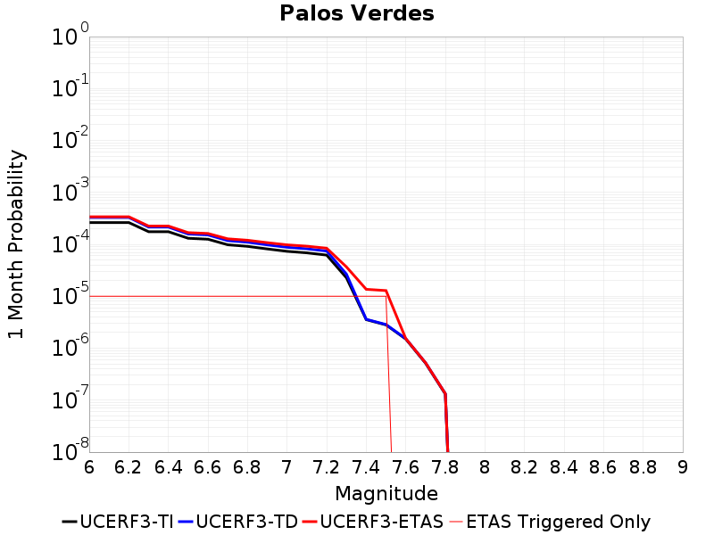 | 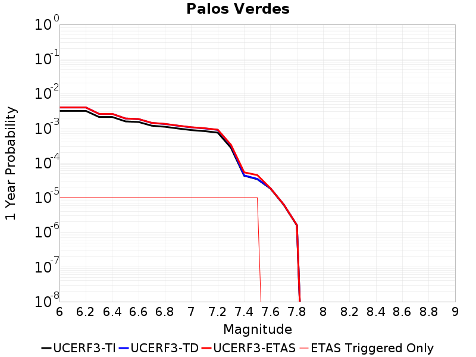 | 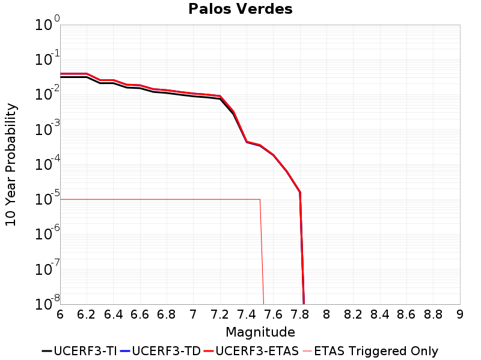 |

| Magnitude | 1 wk TI Prob | 1 wk TD Prob | 1 wk ETAS Prob | 1 wk ETAS/TD Gain | 1 wk ETAS Triggered Only | 1 mo TI Prob | 1 mo TD Prob | 1 mo ETAS Prob | 1 mo ETAS/TD Gain | 1 mo ETAS Triggered Only | 1 yr TI Prob | 1 yr TD Prob | 1 yr ETAS Prob | 1 yr ETAS/TD Gain | 1 yr ETAS Triggered Only | 10 yr TI Prob | 10 yr TD Prob | 10 yr ETAS Prob | 10 yr ETAS/TD Gain | 10 yr ETAS Triggered Only |
|-----|-----|-----|-----|-----|-----|-----|-----|-----|-----|-----|-----|-----|-----|-----|-----|-----|-----|-----|-----|-----|
| 6.0 | 6.126063E-5 | 7.6884164E-5 | 8.6883396E-5 | 1.1300558 | 1.0E-5 | 2.6251914E-4 | 3.2946374E-4 | 3.3946044E-4 | 1.0303423 | 1.0E-5 | 0.0031914865 | 0.004004367 | 0.004014327 | 1.0024873 | 1.0E-5 | 0.031460393 | 0.03937821 | 0.03938782 | 1.0002439 | 1.0E-5 |
| 6.1 | 6.126063E-5 | 7.6884164E-5 | 8.6883396E-5 | 1.1300558 | 1.0E-5 | 2.6251914E-4 | 3.2946374E-4 | 3.3946044E-4 | 1.0303423 | 1.0E-5 | 0.0031914865 | 0.004004367 | 0.004014327 | 1.0024873 | 1.0E-5 | 0.031460393 | 0.03937821 | 0.03938782 | 1.0002439 | 1.0E-5 |
| 6.2 | 6.126063E-5 | 7.6884164E-5 | 8.6883396E-5 | 1.1300558 | 1.0E-5 | 2.6251914E-4 | 3.2946374E-4 | 3.3946044E-4 | 1.0303423 | 1.0E-5 | 0.0031914865 | 0.004004367 | 0.004014327 | 1.0024873 | 1.0E-5 | 0.031460393 | 0.03937821 | 0.03938782 | 1.0002439 | 1.0E-5 |
| 6.3 | 4.0838047E-5 | 5.0136186E-5 | 6.0135684E-5 | 1.1994468 | 1.0E-5 | 1.7500846E-4 | 2.1485287E-4 | 2.2485072E-4 | 1.0465335 | 1.0E-5 | 0.0021286458 | 0.0026128972 | 0.002622871 | 1.0038172 | 1.0E-5 | 0.021083709 | 0.025843317 | 0.025853058 | 1.0003769 | 1.0E-5 |
| 6.4 | 4.0838047E-5 | 5.0136186E-5 | 6.0135684E-5 | 1.1994468 | 1.0E-5 | 1.7500846E-4 | 2.1485287E-4 | 2.2485072E-4 | 1.0465335 | 1.0E-5 | 0.0021286458 | 0.0026128972 | 0.002622871 | 1.0038172 | 1.0E-5 | 0.021083709 | 0.025843317 | 0.025853058 | 1.0003769 | 1.0E-5 |
| 6.5 | 3.0512005E-5 | 3.6821275E-5 | 4.6820907E-5 | 1.2715721 | 1.0E-5 | 1.3075917E-4 | 1.5779654E-4 | 1.6779498E-4 | 1.0633627 | 1.0E-5 | 0.0015908304 | 0.0019195958 | 0.0019295765 | 1.0051994 | 1.0E-5 | 0.015794903 | 0.019042142 | 0.01905195 | 1.0005151 | 1.0E-5 |
| 6.6 | 2.9255087E-5 | 3.5408102E-5 | 4.540775E-5 | 1.2824112 | 1.0E-5 | 1.2537291E-4 | 1.5174081E-4 | 1.6173928E-4 | 1.0658919 | 1.0E-5 | 0.0015253464 | 0.0018459919 | 0.0018559735 | 1.0054071 | 1.0E-5 | 0.015149189 | 0.01831825 | 0.018328067 | 1.0005358 | 1.0E-5 |
| 6.7 | 2.287198E-5 | 2.743534E-5 | 3.7435067E-5 | 1.3644834 | 1.0E-5 | 9.801909E-5 | 1.17575255E-4 | 1.2757408E-4 | 1.0850419 | 1.0E-5 | 0.001192729 | 0.0014306317 | 0.0014406175 | 1.00698 | 1.0E-5 | 0.011863477 | 0.014223584 | 0.014233442 | 1.0006931 | 1.0E-5 |
| 6.8 | 2.1325764E-5 | 2.5607505E-5 | 3.560725E-5 | 1.3905005 | 1.0E-5 | 9.139293E-5 | 1.0974235E-4 | 1.1974126E-4 | 1.0911125 | 1.0E-5 | 0.001112141 | 0.0013353857 | 0.0013453724 | 1.0074785 | 1.0E-5 | 0.011065915 | 0.013282781 | 0.013292648 | 1.0007429 | 1.0E-5 |
| 6.9 | 1.9009392E-5 | 2.276742E-5 | 3.276719E-5 | 1.4392141 | 1.0E-5 | 8.1466285E-5 | 9.757151E-5 | 1.0757054E-4 | 1.102479 | 1.0E-5 | 9.914007E-4 | 0.0011873743 | 0.0011973624 | 1.0084119 | 1.0E-5 | 0.009869894 | 0.011819114 | 0.011828995 | 1.0008361 | 1.0E-5 |
| 7.0 | 1.7098473E-5 | 2.0456848E-5 | 3.0456642E-5 | 1.4888239 | 1.0E-5 | 7.3277115E-5 | 8.7669745E-5 | 9.766887E-5 | 1.1140544 | 1.0E-5 | 8.917837E-4 | 0.0010669429 | 0.0010769323 | 1.0093626 | 1.0E-5 | 0.008882134 | 0.010626763 | 0.010636657 | 1.000931 | 1.0E-5 |
| 7.1 | 1.5982785E-5 | 1.9123358E-5 | 2.9123166E-5 | 1.5229107 | 1.0E-5 | 6.849585E-5 | 8.195516E-5 | 9.195433E-5 | 1.122008 | 1.0E-5 | 8.336179E-4 | 9.974332E-4 | 0.0010074232 | 1.0100157 | 1.0E-5 | 0.008304977 | 0.009938049 | 0.009947949 | 1.0009962 | 1.0E-5 |
| 7.2 | 1.4468002E-5 | 1.7313838E-5 | 2.7313665E-5 | 1.5775627 | 1.0E-5 | 6.200425E-5 | 7.4200536E-5 | 8.419979E-5 | 1.1347599 | 1.0E-5 | 7.546402E-4 | 9.031023E-4 | 9.130933E-4 | 1.011063 | 1.0E-5 | 0.007520827 | 0.009002713 | 0.009012622 | 1.0011008 | 1.0E-5 |
| 7.3 | 5.288233E-6 | 6.242866E-6 | 1.6242804E-5 | 2.6018183 | 1.0E-5 | 2.2663658E-5 | 2.6755066E-5 | 3.67548E-5 | 1.373751 | 1.0E-5 | 2.7589512E-4 | 3.2572966E-4 | 3.357264E-4 | 1.0306903 | 1.0E-5 | 0.0027555283 | 0.0032559952 | 0.0032659627 | 1.0030613 | 1.0E-5 |
| 7.4 | 8.279556E-7 | 8.412963E-7 | 1.0841288E-5 | 12.886409 | 1.0E-5 | 3.5483763E-6 | 3.605551E-6 | 1.3605515E-5 | 3.7734911 | 1.0E-5 | 4.3200624E-5 | 4.3896773E-5 | 5.3896336E-5 | 1.2277972 | 1.0E-5 | 4.3192226E-4 | 4.3888827E-4 | 4.4888386E-4 | 1.0227748 | 1.0E-5 |
| 7.5 | 6.559831E-7 | 6.671081E-7 | 1.0667101E-5 | 15.990064 | 1.0E-5 | 2.8113532E-6 | 2.859032E-6 | 1.2859004E-5 | 4.4976773 | 1.0E-5 | 3.4227687E-5 | 3.480823E-5 | 4.480788E-5 | 1.2872784 | 1.0E-5 | 3.4222414E-4 | 3.480344E-4 | 3.580309E-4 | 1.0287228 | 1.0E-5 |
| 7.6 | 3.5018968E-7 | 3.564158E-7 | 3.564158E-7 | 1.0 | 0.0 | 1.500812E-6 | 1.5274957E-6 | 1.5274957E-6 | 1.0 | 0.0 | 1.8272232E-5 | 1.8597148E-5 | 1.8597148E-5 | 1.0 | 0.0 | 1.8270731E-4 | 1.8596053E-4 | 1.8596053E-4 | 1.0 | 0.0 |
| 7.7 | 1.1986104E-7 | 1.2205957E-7 | 1.2205957E-7 | 1.0 | 0.0 | 5.1369005E-7 | 5.2311236E-7 | 5.2311236E-7 | 1.0 | 0.0 | 6.2541585E-6 | 6.368875E-6 | 6.368875E-6 | 1.0 | 0.0 | 6.2539824E-5 | 6.3686966E-5 | 6.3686966E-5 | 1.0 | 0.0 |
| 7.8 | 3.0445005E-8 | 3.1048533E-8 | 3.1048533E-8 | 1.0 | 0.0 | 1.3047858E-7 | 1.3306514E-7 | 1.3306514E-7 | 1.0 | 0.0 | 1.5885756E-6 | 1.620067E-6 | 1.620067E-6 | 1.0 | 0.0 | 1.5885644E-5 | 1.6200573E-5 | 1.6200573E-5 | 1.0 | 0.0 |

## Santa Ynez (East)
*[(top)](#table-of-contents)*

| 1 Week | 1 Month | 1 Year | 10 Year |
|-----|-----|-----|-----|
| 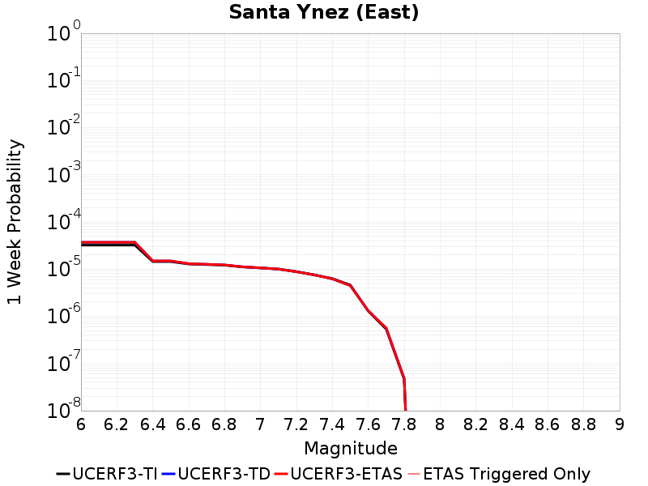 | 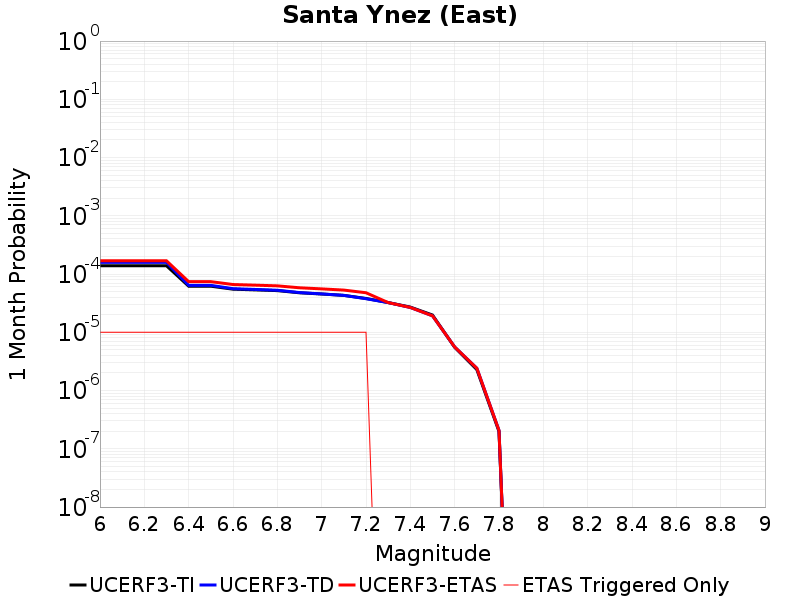 | 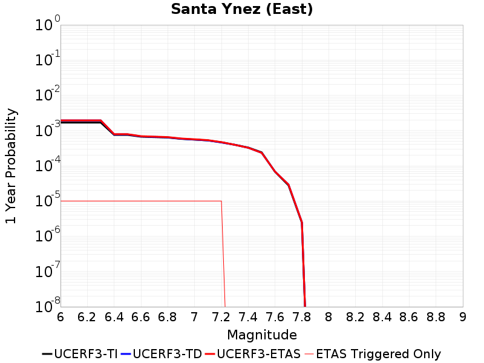 | 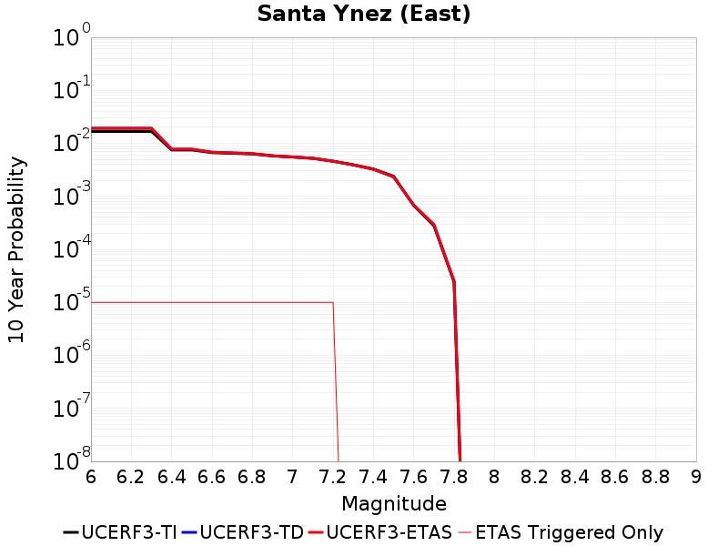 |

| Magnitude | 1 wk TI Prob | 1 wk TD Prob | 1 wk ETAS Prob | 1 wk ETAS/TD Gain | 1 wk ETAS Triggered Only | 1 mo TI Prob | 1 mo TD Prob | 1 mo ETAS Prob | 1 mo ETAS/TD Gain | 1 mo ETAS Triggered Only | 1 yr TI Prob | 1 yr TD Prob | 1 yr ETAS Prob | 1 yr ETAS/TD Gain | 1 yr ETAS Triggered Only | 10 yr TI Prob | 10 yr TD Prob | 10 yr ETAS Prob | 10 yr ETAS/TD Gain | 10 yr ETAS Triggered Only |
|-----|-----|-----|-----|-----|-----|-----|-----|-----|-----|-----|-----|-----|-----|-----|-----|-----|-----|-----|-----|-----|
| 6.0 | 3.2269712E-5 | 3.698279E-5 | 3.698279E-5 | 1.0 | 0.0 | 1.3829143E-4 | 1.5849143E-4 | 1.6848985E-4 | 1.0630848 | 1.0E-5 | 0.0016823979 | 0.0019285162 | 0.0019384968 | 1.0051754 | 1.0E-5 | 0.016697178 | 0.019175973 | 0.019185781 | 1.0005115 | 1.0E-5 |
| 6.1 | 3.2269712E-5 | 3.698279E-5 | 3.698279E-5 | 1.0 | 0.0 | 1.3829143E-4 | 1.5849143E-4 | 1.6848985E-4 | 1.0630848 | 1.0E-5 | 0.0016823979 | 0.0019285162 | 0.0019384968 | 1.0051754 | 1.0E-5 | 0.016697178 | 0.019175973 | 0.019185781 | 1.0005115 | 1.0E-5 |
| 6.2 | 3.2269712E-5 | 3.698279E-5 | 3.698279E-5 | 1.0 | 0.0 | 1.3829143E-4 | 1.5849143E-4 | 1.6848985E-4 | 1.0630848 | 1.0E-5 | 0.0016823979 | 0.0019285162 | 0.0019384968 | 1.0051754 | 1.0E-5 | 0.016697178 | 0.019175973 | 0.019185781 | 1.0005115 | 1.0E-5 |
| 6.3 | 3.2269712E-5 | 3.698279E-5 | 3.698279E-5 | 1.0 | 0.0 | 1.3829143E-4 | 1.5849143E-4 | 1.6848985E-4 | 1.0630848 | 1.0E-5 | 0.0016823979 | 0.0019285162 | 0.0019384968 | 1.0051754 | 1.0E-5 | 0.016697178 | 0.019175973 | 0.019185781 | 1.0005115 | 1.0E-5 |
| 6.4 | 1.4404779E-5 | 1.4906093E-5 | 1.4906093E-5 | 1.0 | 0.0 | 6.1733306E-5 | 6.388172E-5 | 7.3881085E-5 | 1.1565293 | 1.0E-5 | 7.513438E-4 | 7.774875E-4 | 7.874798E-4 | 1.012852 | 1.0E-5 | 0.0074880854 | 0.0077482304 | 0.0077581527 | 1.0012807 | 1.0E-5 |
| 6.5 | 1.4404779E-5 | 1.4906093E-5 | 1.4906093E-5 | 1.0 | 0.0 | 6.1733306E-5 | 6.388172E-5 | 7.3881085E-5 | 1.1565293 | 1.0E-5 | 7.513438E-4 | 7.774875E-4 | 7.874798E-4 | 1.012852 | 1.0E-5 | 0.0074880854 | 0.0077482304 | 0.0077581527 | 1.0012807 | 1.0E-5 |
| 6.6 | 1.280208E-5 | 1.305916E-5 | 1.305916E-5 | 1.0 | 0.0 | 5.4864904E-5 | 5.5966637E-5 | 6.596608E-5 | 1.1786679 | 1.0E-5 | 6.6777546E-4 | 6.8118254E-4 | 6.9117575E-4 | 1.0146704 | 1.0E-5 | 0.006657724 | 0.0067911586 | 0.0068010907 | 1.0014625 | 1.0E-5 |
| 6.7 | 1.2457027E-5 | 1.2674194E-5 | 1.2674194E-5 | 1.0 | 0.0 | 5.3386164E-5 | 5.4316857E-5 | 6.4316315E-5 | 1.1840949 | 1.0E-5 | 6.497827E-4 | 6.6110876E-4 | 6.7110214E-4 | 1.0151161 | 1.0E-5 | 0.00647886 | 0.00659162 | 0.006601554 | 1.001507 | 1.0E-5 |
| 6.8 | 1.2095134E-5 | 1.2275413E-5 | 1.2275413E-5 | 1.0 | 0.0 | 5.1835254E-5 | 5.260786E-5 | 6.260733E-5 | 1.1900756 | 1.0E-5 | 6.309115E-4 | 6.403141E-4 | 6.503077E-4 | 1.0156074 | 1.0E-5 | 0.0062912325 | 0.0063848817 | 0.0063948175 | 1.0015562 | 1.0E-5 |
| 6.9 | 1.1104036E-5 | 1.1199976E-5 | 1.1199976E-5 | 1.0 | 0.0 | 4.758786E-5 | 4.7999023E-5 | 5.7998543E-5 | 1.2083275 | 1.0E-5 | 5.7922816E-4 | 5.842327E-4 | 5.942268E-4 | 1.0171064 | 1.0E-5 | 0.005777207 | 0.005827115 | 0.0058370563 | 1.0017061 | 1.0E-5 |
| 7.0 | 1.0577444E-5 | 1.0623252E-5 | 1.0623252E-5 | 1.0 | 0.0 | 4.5331115E-5 | 4.5527435E-5 | 5.552698E-5 | 1.2196378 | 1.0E-5 | 5.5176654E-4 | 5.541568E-4 | 5.641512E-4 | 1.0180354 | 1.0E-5 | 0.0055039856 | 0.0055278894 | 0.005537834 | 1.001799 | 1.0E-5 |
| 7.1 | 1.0021775E-5 | 1.0021525E-5 | 1.0021525E-5 | 1.0 | 0.0 | 4.294976E-5 | 4.294869E-5 | 5.294826E-5 | 1.232826 | 1.0E-5 | 5.2278786E-4 | 5.2277604E-4 | 5.327708E-4 | 1.0191187 | 1.0E-5 | 0.0052155964 | 0.005215597 | 0.005225545 | 1.0019073 | 1.0E-5 |
| 7.2 | 8.874109E-6 | 8.787474E-6 | 8.787474E-6 | 1.0 | 0.0 | 3.8031343E-5 | 3.766007E-5 | 4.765969E-5 | 1.2655232 | 1.0E-5 | 4.629332E-4 | 4.5841595E-4 | 4.6841137E-4 | 1.0218042 | 1.0E-5 | 0.0046197 | 0.004574823 | 0.004584777 | 1.0021759 | 1.0E-5 |
| 7.3 | 7.5504267E-6 | 7.53868E-6 | 7.53868E-6 | 1.0 | 0.0 | 3.235857E-5 | 3.2308235E-5 | 3.2308235E-5 | 1.0 | 0.0 | 3.9389438E-4 | 3.932828E-4 | 3.932828E-4 | 1.0 | 0.0 | 0.0039319694 | 0.0039259763 | 0.0039259763 | 1.0 | 0.0 |
| 7.4 | 6.309394E-6 | 6.213187E-6 | 6.213187E-6 | 1.0 | 0.0 | 2.703998E-5 | 2.6627678E-5 | 2.6627678E-5 | 1.0 | 0.0 | 3.2916202E-4 | 3.2414473E-4 | 3.2414473E-4 | 1.0 | 0.0 | 0.003286749 | 0.003236818 | 0.003236818 | 1.0 | 0.0 |
| 7.5 | 4.6103073E-6 | 4.4647018E-6 | 4.4647018E-6 | 1.0 | 0.0 | 1.975831E-5 | 1.9134299E-5 | 1.9134299E-5 | 1.0 | 0.0 | 2.4053088E-4 | 2.329359E-4 | 2.329359E-4 | 1.0 | 0.0 | 0.002402707 | 0.0023269881 | 0.0023269881 | 1.0 | 0.0 |
| 7.6 | 1.2858658E-6 | 1.3037547E-6 | 1.3037547E-6 | 1.0 | 0.0 | 5.5108417E-6 | 5.5875084E-6 | 5.5875084E-6 | 1.0 | 0.0 | 6.7092435E-5 | 6.802587E-5 | 6.802587E-5 | 1.0 | 0.0 | 6.707218E-4 | 6.8005733E-4 | 6.8005733E-4 | 1.0 | 0.0 |
| 7.7 | 5.3302307E-7 | 5.6221984E-7 | 5.6221984E-7 | 1.0 | 0.0 | 2.2843826E-6 | 2.4095116E-6 | 2.4095116E-6 | 1.0 | 0.0 | 2.7812002E-5 | 2.9335446E-5 | 2.9335446E-5 | 1.0 | 0.0 | 2.7808524E-4 | 2.9331932E-4 | 2.9331932E-4 | 1.0 | 0.0 |
| 7.8 | 4.613933E-8 | 4.8098048E-8 | 4.8098048E-8 | 1.0 | 0.0 | 1.9773998E-7 | 2.0613447E-7 | 2.0613447E-7 | 1.0 | 0.0 | 2.4074816E-6 | 2.5096845E-6 | 2.5096845E-6 | 1.0 | 0.0 | 2.4074554E-5 | 2.5096571E-5 | 2.5096571E-5 | 1.0 | 0.0 |

## Northridge
*[(top)](#table-of-contents)*

| 1 Week | 1 Month | 1 Year | 10 Year |
|-----|-----|-----|-----|
| 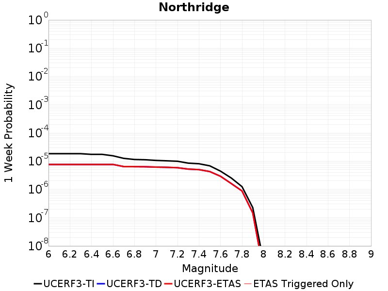 | 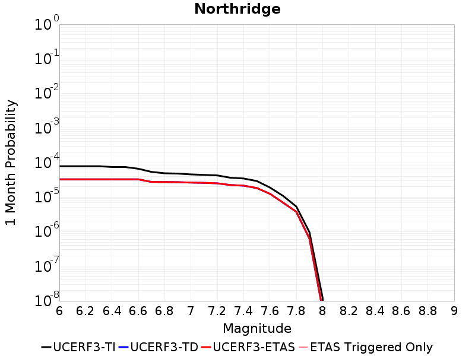 | 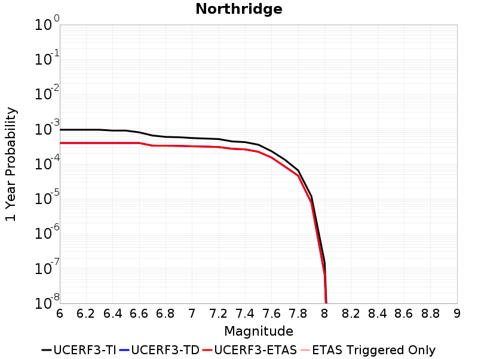 | 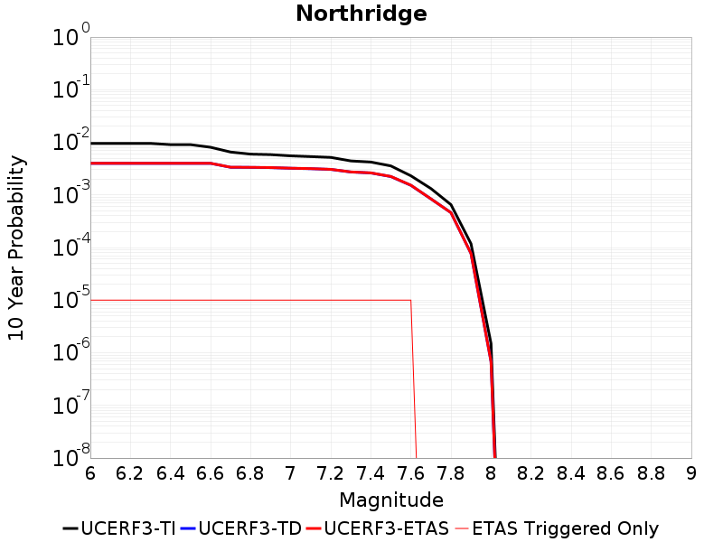 |

| Magnitude | 1 wk TI Prob | 1 wk TD Prob | 1 wk ETAS Prob | 1 wk ETAS/TD Gain | 1 wk ETAS Triggered Only | 1 mo TI Prob | 1 mo TD Prob | 1 mo ETAS Prob | 1 mo ETAS/TD Gain | 1 mo ETAS Triggered Only | 1 yr TI Prob | 1 yr TD Prob | 1 yr ETAS Prob | 1 yr ETAS/TD Gain | 1 yr ETAS Triggered Only | 10 yr TI Prob | 10 yr TD Prob | 10 yr ETAS Prob | 10 yr ETAS/TD Gain | 10 yr ETAS Triggered Only |
|-----|-----|-----|-----|-----|-----|-----|-----|-----|-----|-----|-----|-----|-----|-----|-----|-----|-----|-----|-----|-----|
| 6.0 | 1.8340852E-5 | 7.638255E-6 | 7.638255E-6 | 1.0 | 0.0 | 7.860128E-5 | 3.2734977E-5 | 3.2734977E-5 | 1.0 | 0.0 | 9.565505E-4 | 3.9847768E-4 | 3.9847768E-4 | 1.0 | 0.0 | 0.009524435 | 0.003977878 | 0.0039878385 | 1.0025039 | 1.0E-5 |
| 6.1 | 1.8340852E-5 | 7.638255E-6 | 7.638255E-6 | 1.0 | 0.0 | 7.860128E-5 | 3.2734977E-5 | 3.2734977E-5 | 1.0 | 0.0 | 9.565505E-4 | 3.9847768E-4 | 3.9847768E-4 | 1.0 | 0.0 | 0.009524435 | 0.003977878 | 0.0039878385 | 1.0025039 | 1.0E-5 |
| 6.2 | 1.8340852E-5 | 7.638255E-6 | 7.638255E-6 | 1.0 | 0.0 | 7.860128E-5 | 3.2734977E-5 | 3.2734977E-5 | 1.0 | 0.0 | 9.565505E-4 | 3.9847768E-4 | 3.9847768E-4 | 1.0 | 0.0 | 0.009524435 | 0.003977878 | 0.0039878385 | 1.0025039 | 1.0E-5 |
| 6.3 | 1.8340852E-5 | 7.638255E-6 | 7.638255E-6 | 1.0 | 0.0 | 7.860128E-5 | 3.2734977E-5 | 3.2734977E-5 | 1.0 | 0.0 | 9.565505E-4 | 3.9847768E-4 | 3.9847768E-4 | 1.0 | 0.0 | 0.009524435 | 0.003977878 | 0.0039878385 | 1.0025039 | 1.0E-5 |
| 6.4 | 1.7361892E-5 | 7.638255E-6 | 7.638255E-6 | 1.0 | 0.0 | 7.440598E-5 | 3.2734977E-5 | 3.2734977E-5 | 1.0 | 0.0 | 9.055163E-4 | 3.9847768E-4 | 3.9847768E-4 | 1.0 | 0.0 | 0.009018354 | 0.003977878 | 0.0039878385 | 1.0025039 | 1.0E-5 |
| 6.5 | 1.7361892E-5 | 7.638255E-6 | 7.638255E-6 | 1.0 | 0.0 | 7.440598E-5 | 3.2734977E-5 | 3.2734977E-5 | 1.0 | 0.0 | 9.055163E-4 | 3.9847768E-4 | 3.9847768E-4 | 1.0 | 0.0 | 0.009018354 | 0.003977878 | 0.0039878385 | 1.0025039 | 1.0E-5 |
| 6.6 | 1.5458201E-5 | 7.638255E-6 | 7.638255E-6 | 1.0 | 0.0 | 6.624775E-5 | 3.2734977E-5 | 3.2734977E-5 | 1.0 | 0.0 | 8.0626784E-4 | 3.9847768E-4 | 3.9847768E-4 | 1.0 | 0.0 | 0.008033488 | 0.003977878 | 0.0039878385 | 1.0025039 | 1.0E-5 |
| 6.7 | 1.2538368E-5 | 6.4238197E-6 | 6.4238197E-6 | 1.0 | 0.0 | 5.3734755E-5 | 2.7530366E-5 | 2.7530366E-5 | 1.0 | 0.0 | 6.5402425E-4 | 3.351311E-4 | 3.351311E-4 | 1.0 | 0.0 | 0.0065210275 | 0.0033463268 | 0.003356293 | 1.0029783 | 1.0E-5 |
| 6.8 | 1.1438097E-5 | 6.3920183E-6 | 6.3920183E-6 | 1.0 | 0.0 | 4.9019498E-5 | 2.7394079E-5 | 2.7394079E-5 | 1.0 | 0.0 | 5.9664896E-4 | 3.334723E-4 | 3.334723E-4 | 1.0 | 0.0 | 0.005950495 | 0.0033297886 | 0.003339755 | 1.0029932 | 1.0E-5 |
| 6.9 | 1.1204891E-5 | 6.3274633E-6 | 6.3274633E-6 | 1.0 | 0.0 | 4.8020076E-5 | 2.7117421E-5 | 2.7117421E-5 | 1.0 | 0.0 | 5.8448757E-4 | 3.3010502E-4 | 3.3010502E-4 | 1.0 | 0.0 | 0.0058295266 | 0.0032962158 | 0.003306183 | 1.0030237 | 1.0E-5 |
| 7.0 | 1.061046E-5 | 6.1534447E-6 | 6.1534447E-6 | 1.0 | 0.0 | 4.5472607E-5 | 2.6371643E-5 | 2.6371643E-5 | 1.0 | 0.0 | 5.534883E-4 | 3.2102788E-4 | 3.2102788E-4 | 1.0 | 0.0 | 0.0055211177 | 0.003205688 | 0.003215656 | 1.0031095 | 1.0E-5 |
| 7.1 | 1.0266979E-5 | 6.04057E-6 | 6.04057E-6 | 1.0 | 0.0 | 4.40006E-5 | 2.5887903E-5 | 2.5887903E-5 | 1.0 | 0.0 | 5.355756E-4 | 3.1514006E-4 | 3.1514006E-4 | 1.0 | 0.0 | 0.0053428668 | 0.003146978 | 0.0031569465 | 1.0031676 | 1.0E-5 |
| 7.2 | 9.91273E-6 | 5.8550336E-6 | 5.8550336E-6 | 1.0 | 0.0 | 4.248244E-5 | 2.509276E-5 | 2.509276E-5 | 1.0 | 0.0 | 5.171009E-4 | 3.0546196E-4 | 3.0546196E-4 | 1.0 | 0.0 | 0.0051589934 | 0.0030504663 | 0.0030604359 | 1.0032682 | 1.0E-5 |
| 7.3 | 8.4959265E-6 | 5.2247988E-6 | 5.2247988E-6 | 1.0 | 0.0 | 3.6410605E-5 | 2.2391803E-5 | 2.2391803E-5 | 1.0 | 0.0 | 4.4320893E-4 | 2.7258636E-4 | 2.7258636E-4 | 1.0 | 0.0 | 0.00442326 | 0.0027225465 | 0.0027325193 | 1.0036631 | 1.0E-5 |
| 7.4 | 8.0847185E-6 | 5.012343E-6 | 5.012343E-6 | 1.0 | 0.0 | 3.4648332E-5 | 2.1481294E-5 | 2.1481294E-5 | 1.0 | 0.0 | 4.2176177E-4 | 2.6150362E-4 | 2.6150362E-4 | 1.0 | 0.0 | 0.0042096223 | 0.002611985 | 0.0026219587 | 1.0038185 | 1.0E-5 |
| 7.5 | 6.8220684E-6 | 4.2776114E-6 | 4.2776114E-6 | 1.0 | 0.0 | 2.9237108E-5 | 1.8332492E-5 | 1.8332492E-5 | 1.0 | 0.0 | 3.5590364E-4 | 2.2317543E-4 | 2.2317543E-4 | 1.0 | 0.0 | 0.0035533418 | 0.0022295343 | 0.002239512 | 1.0044752 | 1.0E-5 |
| 7.6 | 4.4224143E-6 | 2.9120426E-6 | 2.9120426E-6 | 1.0 | 0.0 | 1.8953066E-5 | 1.2480124E-5 | 1.2480124E-5 | 1.0 | 0.0 | 2.3072914E-4 | 1.5193502E-4 | 1.5193502E-4 | 1.0 | 0.0 | 0.0023048974 | 0.0015183232 | 0.0015283079 | 1.0065762 | 1.0E-5 |
| 7.7 | 2.5297056E-6 | 1.6106784E-6 | 1.6106784E-6 | 1.0 | 0.0 | 1.0841551E-5 | 6.9028893E-6 | 6.9028893E-6 | 1.0 | 0.0 | 1.319879E-4 | 8.4039486E-5 | 8.4039486E-5 | 1.0 | 0.0 | 0.0013190953 | 8.400818E-4 | 8.400818E-4 | 1.0 | 0.0 |
| 7.8 | 1.2508156E-6 | 8.80575E-7 | 8.80575E-7 | 1.0 | 0.0 | 5.3606273E-6 | 3.7738873E-6 | 3.7738873E-6 | 1.0 | 0.0 | 6.526368E-5 | 4.5946123E-5 | 4.5946123E-5 | 1.0 | 0.0 | 6.524452E-4 | 4.5936753E-4 | 4.5936753E-4 | 1.0 | 0.0 |
| 7.9 | 2.262199E-7 | 1.4731394E-7 | 1.4731394E-7 | 1.0 | 0.0 | 9.695135E-7 | 6.313453E-7 | 6.313453E-7 | 1.0 | 0.0 | 1.1803763E-5 | 7.686603E-6 | 7.686603E-6 | 1.0 | 0.0 | 1.1803136E-4 | 7.686345E-5 | 7.686345E-5 | 1.0 | 0.0 |
| 8.0 | 2.865362E-9 | 1.2947293E-9 | 1.2947293E-9 | 1.0 | 0.0 | 1.2280123E-8 | 5.5488396E-9 | 5.5488396E-9 | 1.0 | 0.0 | 1.4951048E-7 | 6.7557124E-8 | 6.7557124E-8 | 1.0 | 0.0 | 1.4951038E-6 | 6.7557124E-7 | 6.7557124E-7 | 1.0 | 0.0 |

## San Andreas (Big Bend)
*[(top)](#table-of-contents)*

| 1 Week | 1 Month | 1 Year | 10 Year |
|-----|-----|-----|-----|
| 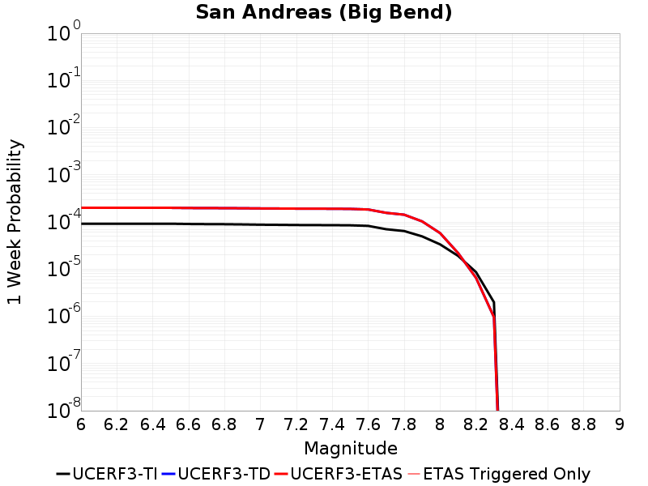 | 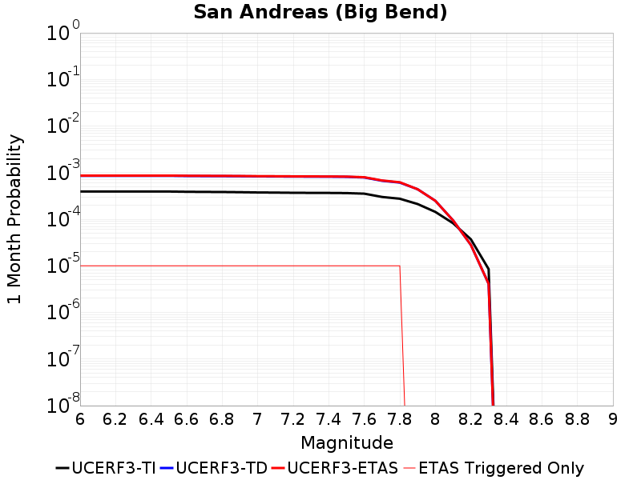 |  | 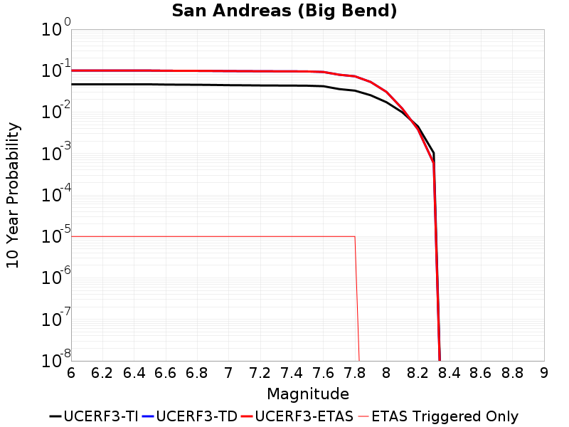 |

| Magnitude | 1 wk TI Prob | 1 wk TD Prob | 1 wk ETAS Prob | 1 wk ETAS/TD Gain | 1 wk ETAS Triggered Only | 1 mo TI Prob | 1 mo TD Prob | 1 mo ETAS Prob | 1 mo ETAS/TD Gain | 1 mo ETAS Triggered Only | 1 yr TI Prob | 1 yr TD Prob | 1 yr ETAS Prob | 1 yr ETAS/TD Gain | 1 yr ETAS Triggered Only | 10 yr TI Prob | 10 yr TD Prob | 10 yr ETAS Prob | 10 yr ETAS/TD Gain | 10 yr ETAS Triggered Only |
|-----|-----|-----|-----|-----|-----|-----|-----|-----|-----|-----|-----|-----|-----|-----|-----|-----|-----|-----|-----|-----|
| 6.0 | 9.168226E-5 | 1.9941274E-4 | 1.9941274E-4 | 1.0 | 0.0 | 3.928648E-4 | 8.543463E-4 | 8.643378E-4 | 1.0116949 | 1.0E-5 | 0.0047726436 | 0.010352204 | 0.0103621 | 1.0009559 | 1.0E-5 | 0.046714354 | 0.10035179 | 0.10036078 | 1.0000896 | 1.0E-5 |
| 6.1 | 9.168226E-5 | 1.9941274E-4 | 1.9941274E-4 | 1.0 | 0.0 | 3.928648E-4 | 8.543463E-4 | 8.643378E-4 | 1.0116949 | 1.0E-5 | 0.0047726436 | 0.010352204 | 0.0103621 | 1.0009559 | 1.0E-5 | 0.046714354 | 0.10035179 | 0.10036078 | 1.0000896 | 1.0E-5 |
| 6.2 | 9.168226E-5 | 1.9941274E-4 | 1.9941274E-4 | 1.0 | 0.0 | 3.928648E-4 | 8.543463E-4 | 8.643378E-4 | 1.0116949 | 1.0E-5 | 0.0047726436 | 0.010352204 | 0.0103621 | 1.0009559 | 1.0E-5 | 0.046714354 | 0.10035179 | 0.10036078 | 1.0000896 | 1.0E-5 |
| 6.3 | 9.168226E-5 | 1.9941274E-4 | 1.9941274E-4 | 1.0 | 0.0 | 3.928648E-4 | 8.543463E-4 | 8.643378E-4 | 1.0116949 | 1.0E-5 | 0.0047726436 | 0.010352204 | 0.0103621 | 1.0009559 | 1.0E-5 | 0.046714354 | 0.10035179 | 0.10036078 | 1.0000896 | 1.0E-5 |
| 6.4 | 9.1639464E-5 | 1.9934683E-4 | 1.9934683E-4 | 1.0 | 0.0 | 3.9268145E-4 | 8.5406407E-4 | 8.6405553E-4 | 1.0116987 | 1.0E-5 | 0.0047704205 | 0.0103488 | 0.010358696 | 1.0009563 | 1.0E-5 | 0.046693064 | 0.100321144 | 0.100330144 | 1.0000896 | 1.0E-5 |
| 6.5 | 9.1639464E-5 | 1.9934683E-4 | 1.9934683E-4 | 1.0 | 0.0 | 3.9268145E-4 | 8.5406407E-4 | 8.6405553E-4 | 1.0116987 | 1.0E-5 | 0.0047704205 | 0.0103488 | 0.010358696 | 1.0009563 | 1.0E-5 | 0.046693064 | 0.100321144 | 0.100330144 | 1.0000896 | 1.0E-5 |
| 6.6 | 9.042622E-5 | 1.9746127E-4 | 1.9746127E-4 | 1.0 | 0.0 | 3.8748336E-4 | 8.4598834E-4 | 8.5597986E-4 | 1.0118105 | 1.0E-5 | 0.0047074095 | 0.010251405 | 0.010261303 | 1.0009655 | 1.0E-5 | 0.046089325 | 0.09943461 | 0.099443614 | 1.0000906 | 1.0E-5 |
| 6.7 | 8.9836685E-5 | 1.96634E-4 | 1.96634E-4 | 1.0 | 0.0 | 3.8495753E-4 | 8.424452E-4 | 8.5243676E-4 | 1.0118603 | 1.0E-5 | 0.00467679 | 0.010208672 | 0.01021857 | 1.0009695 | 1.0E-5 | 0.045795817 | 0.09904563 | 0.09905464 | 1.000091 | 1.0E-5 |
| 6.8 | 8.9471854E-5 | 1.9611578E-4 | 1.9611578E-4 | 1.0 | 0.0 | 3.8339442E-4 | 8.402257E-4 | 8.502173E-4 | 1.0118916 | 1.0E-5 | 0.004657841 | 0.010181902 | 0.0101918 | 1.0009722 | 1.0E-5 | 0.04561414 | 0.09880073 | 0.09880975 | 1.0000912 | 1.0E-5 |
| 6.9 | 8.858234E-5 | 1.9497126E-4 | 1.9497126E-4 | 1.0 | 0.0 | 3.7958333E-4 | 8.3532376E-4 | 8.453154E-4 | 1.0119615 | 1.0E-5 | 0.004611638 | 0.010122777 | 0.010132675 | 1.0009779 | 1.0E-5 | 0.04517103 | 0.098261744 | 0.09827076 | 1.0000918 | 1.0E-5 |
| 7.0 | 8.7433385E-5 | 1.9339421E-4 | 1.9339421E-4 | 1.0 | 0.0 | 3.746607E-4 | 8.285693E-4 | 8.38561E-4 | 1.012059 | 1.0E-5 | 0.004551957 | 0.010041302 | 0.010051201 | 1.0009859 | 1.0E-5 | 0.044598386 | 0.097518556 | 0.09752758 | 1.0000925 | 1.0E-5 |
| 7.1 | 8.684964E-5 | 1.9251391E-4 | 1.9251391E-4 | 1.0 | 0.0 | 3.7215967E-4 | 8.2479895E-4 | 8.347907E-4 | 1.0121142 | 1.0E-5 | 0.0045216335 | 0.00999582 | 0.01000572 | 1.0009904 | 1.0E-5 | 0.04430731 | 0.09710303 | 0.09711205 | 1.000093 | 1.0E-5 |
| 7.2 | 8.606521E-5 | 1.914192E-4 | 1.914192E-4 | 1.0 | 0.0 | 3.6879873E-4 | 8.2011026E-4 | 8.301021E-4 | 1.0121834 | 1.0E-5 | 0.0044808835 | 0.009939258 | 0.009949158 | 1.0009961 | 1.0E-5 | 0.043916024 | 0.09658763 | 0.09659666 | 1.0000936 | 1.0E-5 |
| 7.3 | 8.568266E-5 | 1.9082126E-4 | 1.9082126E-4 | 1.0 | 0.0 | 3.6715972E-4 | 8.175493E-4 | 8.275411E-4 | 1.0122217 | 1.0E-5 | 0.0044610105 | 0.009908362 | 0.009918263 | 1.0009992 | 1.0E-5 | 0.043725148 | 0.09630271 | 0.09631175 | 1.0000938 | 1.0E-5 |
| 7.4 | 8.5432206E-5 | 1.9043376E-4 | 1.9043376E-4 | 1.0 | 0.0 | 3.6608664E-4 | 8.158896E-4 | 8.258815E-4 | 1.0122466 | 1.0E-5 | 0.004447999 | 0.009888339 | 0.009898241 | 1.0010012 | 1.0E-5 | 0.043600157 | 0.096118234 | 0.09612727 | 1.000094 | 1.0E-5 |
| 7.5 | 8.4791965E-5 | 1.8905639E-4 | 1.8905639E-4 | 1.0 | 0.0 | 3.633435E-4 | 8.099903E-4 | 8.1998215E-4 | 1.0123358 | 1.0E-5 | 0.0044147377 | 0.009817163 | 0.009827065 | 1.0010086 | 1.0E-5 | 0.043280575 | 0.09547019 | 0.095479235 | 1.0000948 | 1.0E-5 |
| 7.6 | 8.241105E-5 | 1.83264E-4 | 1.83264E-4 | 1.0 | 0.0 | 3.531424E-4 | 7.851809E-4 | 7.9517305E-4 | 1.012726 | 1.0E-5 | 0.0042910352 | 0.009517788 | 0.009527693 | 1.0010407 | 1.0E-5 | 0.042091176 | 0.09276315 | 0.092772216 | 1.0000978 | 1.0E-5 |
| 7.7 | 7.00432E-5 | 1.558372E-4 | 1.558372E-4 | 1.0 | 0.0 | 3.001506E-4 | 6.677028E-4 | 6.7769614E-4 | 1.0149667 | 1.0E-5 | 0.0036482112 | 0.008099034 | 0.008108954 | 1.0012248 | 1.0E-5 | 0.035888977 | 0.07968013 | 0.07968933 | 1.0001155 | 1.0E-5 |
| 7.8 | 6.415362E-5 | 1.4234886E-4 | 1.4234886E-4 | 1.0 | 0.0 | 2.749151E-4 | 6.099239E-4 | 6.199178E-4 | 1.0163854 | 1.0E-5 | 0.0033419547 | 0.00740058 | 0.0074105063 | 1.0013412 | 1.0E-5 | 0.03292141 | 0.07294902 | 0.07295829 | 1.0001271 | 1.0E-5 |
| 7.9 | 4.939911E-5 | 1.02690596E-4 | 1.02690596E-4 | 1.0 | 0.0 | 2.116933E-4 | 4.4002835E-4 | 4.4002835E-4 | 1.0 | 0.0 | 0.0025743195 | 0.0053441976 | 0.0053441976 | 1.0 | 0.0 | 0.025447013 | 0.053229842 | 0.053229842 | 1.0 | 0.0 |
| 8.0 | 3.344983E-5 | 5.795541E-5 | 5.795541E-5 | 1.0 | 0.0 | 1.4334853E-4 | 2.483567E-4 | 2.483567E-4 | 1.0 | 0.0 | 0.0017438711 | 0.0030195524 | 0.0030195524 | 1.0 | 0.0 | 0.017302496 | 0.030709328 | 0.030709328 | 1.0 | 0.0 |
| 8.1 | 1.9104898E-5 | 2.195396E-5 | 2.195396E-5 | 1.0 | 0.0 | 8.1875565E-5 | 9.408501E-5 | 9.408501E-5 | 1.0 | 0.0 | 9.963791E-4 | 0.0011448838 | 0.0011448838 | 1.0 | 0.0 | 0.009919235 | 0.012191342 | 0.012191342 | 1.0 | 0.0 |
| 8.2 | 8.643924E-6 | 6.551165E-6 | 6.551165E-6 | 1.0 | 0.0 | 3.704486E-5 | 2.807612E-5 | 2.807612E-5 | 1.0 | 0.0 | 4.5092785E-4 | 3.4177324E-4 | 3.4177324E-4 | 1.0 | 0.0 | 0.0045001395 | 0.0038293393 | 0.0038293393 | 1.0 | 0.0 |
| 8.3 | 1.983087E-6 | 9.574791E-7 | 9.574791E-7 | 1.0 | 0.0 | 8.498917E-6 | 4.1034755E-6 | 4.1034755E-6 | 1.0 | 0.0 | 1.034694E-4 | 4.9958693E-5 | 4.9958693E-5 | 1.0 | 0.0 | 0.0010342124 | 5.8023055E-4 | 5.8023055E-4 | 1.0 | 0.0 |

## Malibu Coast (Extension) alt 1
*[(top)](#table-of-contents)*

| 1 Week | 1 Month | 1 Year | 10 Year |
|-----|-----|-----|-----|
| 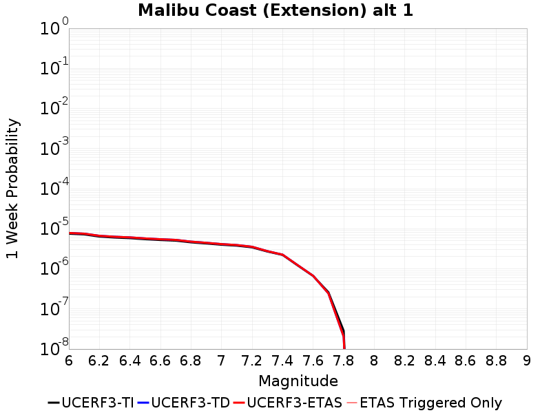 |  |  | 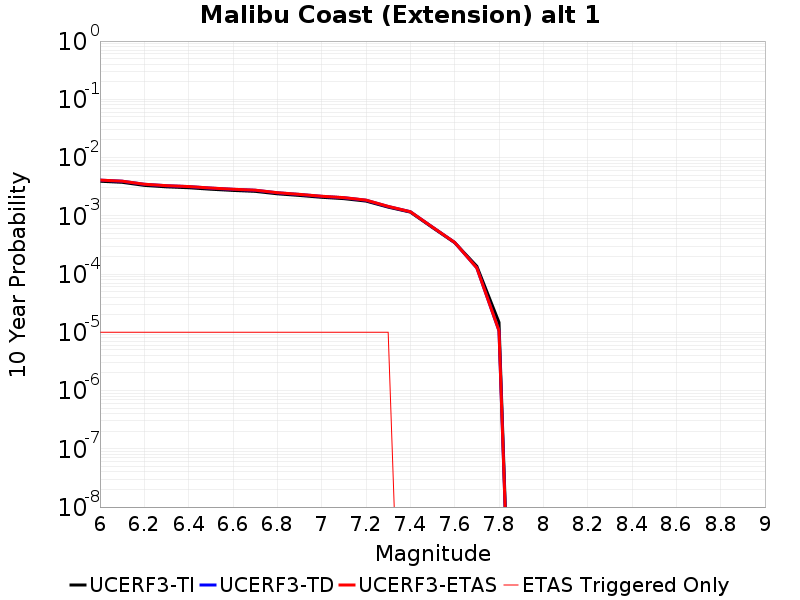 |

| Magnitude | 1 wk TI Prob | 1 wk TD Prob | 1 wk ETAS Prob | 1 wk ETAS/TD Gain | 1 wk ETAS Triggered Only | 1 mo TI Prob | 1 mo TD Prob | 1 mo ETAS Prob | 1 mo ETAS/TD Gain | 1 mo ETAS Triggered Only | 1 yr TI Prob | 1 yr TD Prob | 1 yr ETAS Prob | 1 yr ETAS/TD Gain | 1 yr ETAS Triggered Only | 10 yr TI Prob | 10 yr TD Prob | 10 yr ETAS Prob | 10 yr ETAS/TD Gain | 10 yr ETAS Triggered Only |
|-----|-----|-----|-----|-----|-----|-----|-----|-----|-----|-----|-----|-----|-----|-----|-----|-----|-----|-----|-----|-----|
| 6.0 | 7.516028E-6 | 7.8432195E-6 | 7.8432195E-6 | 1.0 | 0.0 | 3.221115E-5 | 3.361337E-5 | 3.361337E-5 | 1.0 | 0.0 | 3.9210016E-4 | 4.0916656E-4 | 4.1916245E-4 | 1.0244299 | 1.0E-5 | 0.0039140903 | 0.004084202 | 0.004094161 | 1.0024384 | 1.0E-5 |
| 6.1 | 7.199952E-6 | 7.5167036E-6 | 7.5167036E-6 | 1.0 | 0.0 | 3.0856572E-5 | 3.221405E-5 | 3.221405E-5 | 1.0 | 0.0 | 3.75614E-4 | 3.9213608E-4 | 4.0213214E-4 | 1.0254914 | 1.0E-5 | 0.0037497976 | 0.003914507 | 0.003924468 | 1.0025446 | 1.0E-5 |
| 6.2 | 6.3721413E-6 | 6.657418E-6 | 6.657418E-6 | 1.0 | 0.0 | 2.7308892E-5 | 2.8531482E-5 | 2.8531482E-5 | 1.0 | 0.0 | 3.3243504E-4 | 3.4731577E-4 | 3.573123E-4 | 1.0287822 | 1.0E-5 | 0.0033193815 | 0.0034677696 | 0.003477735 | 1.0028737 | 1.0E-5 |
| 6.3 | 6.016345E-6 | 6.287515E-6 | 6.287515E-6 | 1.0 | 0.0 | 2.578408E-5 | 2.6946216E-5 | 2.6946216E-5 | 1.0 | 0.0 | 3.1387596E-4 | 3.2802112E-4 | 3.3801782E-4 | 1.0304759 | 1.0E-5 | 0.00313433 | 0.0032754056 | 0.0032853729 | 1.003043 | 1.0E-5 |
| 6.4 | 5.8104883E-6 | 6.072892E-6 | 6.072892E-6 | 1.0 | 0.0 | 2.4901856E-5 | 2.6026424E-5 | 2.6026424E-5 | 1.0 | 0.0 | 3.031379E-4 | 3.1682596E-4 | 3.2682277E-4 | 1.031553 | 1.0E-5 | 0.0030272473 | 0.0031637773 | 0.0031737457 | 1.0031508 | 1.0E-5 |
| 6.5 | 5.476925E-6 | 5.7226716E-6 | 5.7226716E-6 | 1.0 | 0.0 | 2.3472323E-5 | 2.4525507E-5 | 2.4525507E-5 | 1.0 | 0.0 | 2.8573806E-4 | 2.9855742E-4 | 3.0855444E-4 | 1.0334843 | 1.0E-5 | 0.0028537093 | 0.0029815952 | 0.0029915653 | 1.0033439 | 1.0E-5 |
| 6.6 | 5.222387E-6 | 5.455254E-6 | 5.455254E-6 | 1.0 | 0.0 | 2.2381464E-5 | 2.337945E-5 | 2.337945E-5 | 1.0 | 0.0 | 2.7246025E-4 | 2.846079E-4 | 2.9460507E-4 | 1.0351261 | 1.0E-5 | 0.0027212645 | 0.002842465 | 0.0028524366 | 1.0035081 | 1.0E-5 |
| 6.7 | 5.0337076E-6 | 5.256943E-6 | 5.256943E-6 | 1.0 | 0.0 | 2.1572854E-5 | 2.2529563E-5 | 2.2529563E-5 | 1.0 | 0.0 | 2.6261783E-4 | 2.7426318E-4 | 2.8426043E-4 | 1.0364513 | 1.0E-5 | 0.002623077 | 0.002739277 | 0.0027492496 | 1.0036407 | 1.0E-5 |
| 6.8 | 4.5675624E-6 | 4.756944E-6 | 4.756944E-6 | 1.0 | 0.0 | 1.9575122E-5 | 2.0386744E-5 | 2.0386744E-5 | 1.0 | 0.0 | 2.3830103E-4 | 2.481805E-4 | 2.58178E-4 | 1.0402832 | 1.0E-5 | 0.0023804565 | 0.0024790533 | 0.0024890285 | 1.0040238 | 1.0E-5 |
| 6.9 | 4.2802412E-6 | 4.451134E-6 | 4.451134E-6 | 1.0 | 0.0 | 1.8343762E-5 | 1.907615E-5 | 1.907615E-5 | 1.0 | 0.0 | 2.2331243E-4 | 2.3222752E-4 | 2.422252E-4 | 1.0430512 | 1.0E-5 | 0.0022308815 | 0.0023198652 | 0.002329842 | 1.0043006 | 1.0E-5 |
| 7.0 | 3.9794063E-6 | 4.129175E-6 | 4.129175E-6 | 1.0 | 0.0 | 1.7054486E-5 | 1.7696346E-5 | 1.7696346E-5 | 1.0 | 0.0 | 2.0761859E-4 | 2.1543184E-4 | 2.2542969E-4 | 1.0464084 | 1.0E-5 | 0.0020742472 | 0.0021522434 | 0.002162222 | 1.0046363 | 1.0E-5 |
| 7.1 | 3.7730424E-6 | 3.910519E-6 | 3.910519E-6 | 1.0 | 0.0 | 1.6170083E-5 | 1.6759259E-5 | 1.6759259E-5 | 1.0 | 0.0 | 1.9685295E-4 | 2.04025E-4 | 2.1402296E-4 | 1.0490036 | 1.0E-5 | 0.0019667868 | 0.0020383897 | 0.0020483693 | 1.0048958 | 1.0E-5 |
| 7.2 | 3.424985E-6 | 3.5413184E-6 | 3.5413184E-6 | 1.0 | 0.0 | 1.4678424E-5 | 1.5176991E-5 | 1.5176991E-5 | 1.0 | 0.0 | 1.7869516E-4 | 1.8476431E-4 | 1.9476247E-4 | 1.054113 | 1.0E-5 | 0.0017855153 | 0.0018461191 | 0.0018561006 | 1.0054067 | 1.0E-5 |
| 7.3 | 2.6966375E-6 | 2.7592384E-6 | 2.7592384E-6 | 1.0 | 0.0 | 1.15569665E-5 | 1.1825254E-5 | 1.1825254E-5 | 1.0 | 0.0 | 1.4069698E-4 | 1.4396299E-4 | 1.5396155E-4 | 1.0694523 | 1.0E-5 | 0.0014060794 | 0.0014387014 | 0.001448687 | 1.0069407 | 1.0E-5 |
| 7.4 | 2.215957E-6 | 2.2493384E-6 | 2.2493384E-6 | 1.0 | 0.0 | 9.496924E-6 | 9.639986E-6 | 9.639986E-6 | 1.0 | 0.0 | 1.1561892E-4 | 1.1736054E-4 | 1.1736054E-4 | 1.0 | 0.0 | 0.0011555878 | 0.0011729894 | 0.0011729894 | 1.0 | 0.0 |
| 7.5 | 1.2040218E-6 | 1.2219313E-6 | 1.2219313E-6 | 1.0 | 0.0 | 5.160083E-6 | 5.2368378E-6 | 5.2368378E-6 | 1.0 | 0.0 | 6.2822204E-5 | 6.3756655E-5 | 6.3756655E-5 | 1.0 | 0.0 | 6.280445E-4 | 6.3738547E-4 | 6.3738547E-4 | 1.0 | 0.0 |
| 7.6 | 6.6157446E-7 | 6.68084E-7 | 6.68084E-7 | 1.0 | 0.0 | 2.835316E-6 | 2.863214E-6 | 2.863214E-6 | 1.0 | 0.0 | 3.4519428E-5 | 3.4859087E-5 | 3.4859087E-5 | 1.0 | 0.0 | 3.4514067E-4 | 3.4853772E-4 | 3.4853772E-4 | 1.0 | 0.0 |
| 7.7 | 2.6012302E-7 | 2.4377889E-7 | 2.4377889E-7 | 1.0 | 0.0 | 1.1148124E-6 | 1.0447663E-6 | 1.0447663E-6 | 1.0 | 0.0 | 1.3572758E-5 | 1.2719966E-5 | 1.2719966E-5 | 1.0 | 0.0 | 1.3571928E-4 | 1.2719346E-4 | 1.2719346E-4 | 1.0 | 0.0 |
| 7.8 | 2.8323132E-8 | 2.0314808E-8 | 2.0314808E-8 | 1.0 | 0.0 | 1.2138484E-7 | 8.7063455E-8 | 8.7063455E-8 | 1.0 | 0.0 | 1.4778595E-6 | 1.0599972E-6 | 1.0599972E-6 | 1.0 | 0.0 | 1.4778497E-5 | 1.0599929E-5 | 1.0599929E-5 | 1.0 | 0.0 |

## Elsinore (Stepovers Combined)
*[(top)](#table-of-contents)*

| 1 Week | 1 Month | 1 Year | 10 Year |
|-----|-----|-----|-----|
| 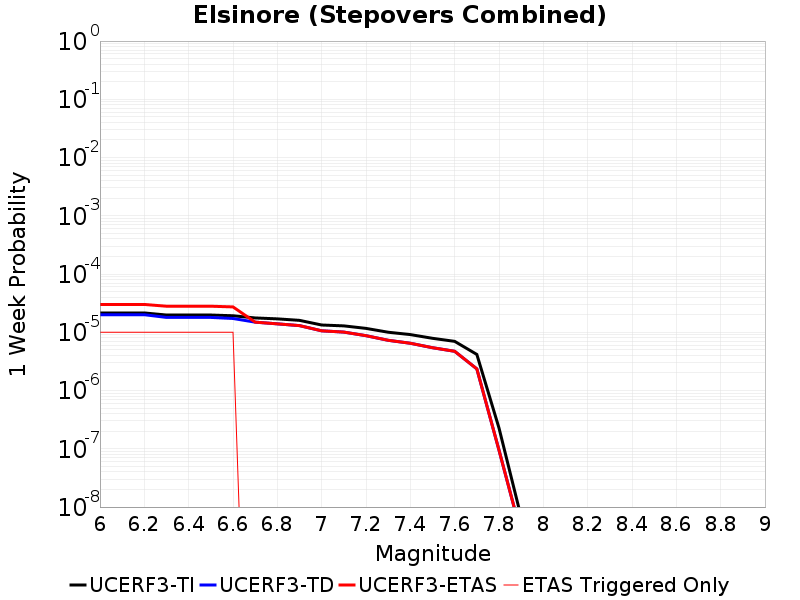 | 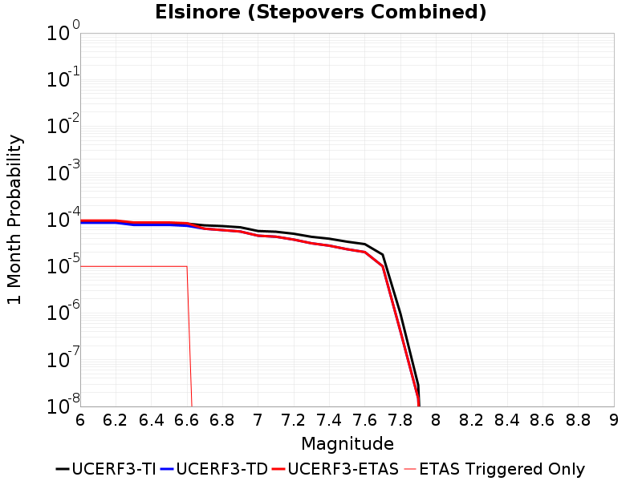 |  | 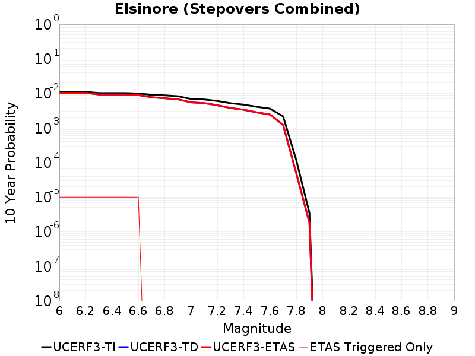 |

| Magnitude | 1 wk TI Prob | 1 wk TD Prob | 1 wk ETAS Prob | 1 wk ETAS/TD Gain | 1 wk ETAS Triggered Only | 1 mo TI Prob | 1 mo TD Prob | 1 mo ETAS Prob | 1 mo ETAS/TD Gain | 1 mo ETAS Triggered Only | 1 yr TI Prob | 1 yr TD Prob | 1 yr ETAS Prob | 1 yr ETAS/TD Gain | 1 yr ETAS Triggered Only | 10 yr TI Prob | 10 yr TD Prob | 10 yr ETAS Prob | 10 yr ETAS/TD Gain | 10 yr ETAS Triggered Only |
|-----|-----|-----|-----|-----|-----|-----|-----|-----|-----|-----|-----|-----|-----|-----|-----|-----|-----|-----|-----|-----|
| 6.0 | 2.144392E-5 | 2.0007257E-5 | 3.0007057E-5 | 1.4998087 | 1.0E-5 | 9.189928E-5 | 8.57426E-5 | 9.5741736E-5 | 1.1166182 | 1.0E-5 | 0.0011182994 | 0.0010434358 | 0.0010534254 | 1.0095737 | 1.0E-5 | 0.011126885 | 0.01039236 | 0.010402257 | 1.0009522 | 1.0E-5 |
| 6.1 | 2.144392E-5 | 2.0007257E-5 | 3.0007057E-5 | 1.4998087 | 1.0E-5 | 9.189928E-5 | 8.57426E-5 | 9.5741736E-5 | 1.1166182 | 1.0E-5 | 0.0011182994 | 0.0010434358 | 0.0010534254 | 1.0095737 | 1.0E-5 | 0.011126885 | 0.01039236 | 0.010402257 | 1.0009522 | 1.0E-5 |
| 6.2 | 2.144392E-5 | 2.0007257E-5 | 3.0007057E-5 | 1.4998087 | 1.0E-5 | 9.189928E-5 | 8.57426E-5 | 9.5741736E-5 | 1.1166182 | 1.0E-5 | 0.0011182994 | 0.0010434358 | 0.0010534254 | 1.0095737 | 1.0E-5 | 0.011126885 | 0.01039236 | 0.010402257 | 1.0009522 | 1.0E-5 |
| 6.3 | 1.9751555E-5 | 1.797469E-5 | 2.7974509E-5 | 1.5563278 | 1.0E-5 | 8.4646774E-5 | 7.7032106E-5 | 8.703133E-5 | 1.129806 | 1.0E-5 | 0.0010300872 | 9.3747705E-4 | 9.474677E-4 | 1.010657 | 1.0E-5 | 0.010253254 | 0.0093417065 | 0.009351613 | 1.0010605 | 1.0E-5 |
| 6.4 | 1.9751555E-5 | 1.797469E-5 | 2.7974509E-5 | 1.5563278 | 1.0E-5 | 8.4646774E-5 | 7.7032106E-5 | 8.703133E-5 | 1.129806 | 1.0E-5 | 0.0010300872 | 9.3747705E-4 | 9.474677E-4 | 1.010657 | 1.0E-5 | 0.010253254 | 0.0093417065 | 0.009351613 | 1.0010605 | 1.0E-5 |
| 6.5 | 1.9751555E-5 | 1.797469E-5 | 2.7974509E-5 | 1.5563278 | 1.0E-5 | 8.4646774E-5 | 7.7032106E-5 | 8.703133E-5 | 1.129806 | 1.0E-5 | 0.0010300872 | 9.3747705E-4 | 9.474677E-4 | 1.010657 | 1.0E-5 | 0.010253254 | 0.0093417065 | 0.009351613 | 1.0010605 | 1.0E-5 |
| 6.6 | 1.9188685E-5 | 1.7228775E-5 | 2.7228602E-5 | 1.5804143 | 1.0E-5 | 8.2234634E-5 | 7.383561E-5 | 8.383487E-5 | 1.135426 | 1.0E-5 | 0.0010007467 | 8.9859444E-4 | 9.0858544E-4 | 1.0111185 | 1.0E-5 | 0.00996252 | 0.008956333 | 0.008966243 | 1.0011065 | 1.0E-5 |
| 6.7 | 1.7608272E-5 | 1.4911163E-5 | 1.4911163E-5 | 1.0 | 0.0 | 7.546184E-5 | 6.390348E-5 | 6.390348E-5 | 1.0 | 0.0 | 9.183606E-4 | 7.77757E-4 | 7.77757E-4 | 1.0 | 0.0 | 0.009145746 | 0.0077577904 | 0.0077577904 | 1.0 | 0.0 |
| 6.8 | 1.697165E-5 | 1.3938184E-5 | 1.3938184E-5 | 1.0 | 0.0 | 7.273361E-5 | 5.9733753E-5 | 5.9733753E-5 | 1.0 | 0.0 | 8.8517193E-4 | 7.270246E-4 | 7.270246E-4 | 1.0 | 0.0 | 0.008816543 | 0.0072535505 | 0.0072535505 | 1.0 | 0.0 |
| 6.9 | 1.600365E-5 | 1.2995679E-5 | 1.2995679E-5 | 1.0 | 0.0 | 6.858527E-5 | 5.569462E-5 | 5.569462E-5 | 1.0 | 0.0 | 8.347058E-4 | 6.77879E-4 | 6.77879E-4 | 1.0 | 0.0 | 0.008315775 | 0.006764126 | 0.006764126 | 1.0 | 0.0 |
| 7.0 | 1.3314581E-5 | 1.0580189E-5 | 1.0580189E-5 | 1.0 | 0.0 | 5.7061243E-5 | 4.5342895E-5 | 4.5342895E-5 | 1.0 | 0.0 | 6.944992E-4 | 5.519127E-4 | 5.519127E-4 | 1.0 | 0.0 | 0.006923327 | 0.0055094417 | 0.0055094417 | 1.0 | 0.0 |
| 7.1 | 1.2865345E-5 | 1.0064291E-5 | 1.0064291E-5 | 1.0 | 0.0 | 5.5136024E-5 | 4.313198E-5 | 4.313198E-5 | 1.0 | 0.0 | 6.710743E-4 | 5.250079E-4 | 5.250079E-4 | 1.0 | 0.0 | 0.0066905143 | 0.0052407403 | 0.0052407403 | 1.0 | 0.0 |
| 7.2 | 1.1650051E-5 | 8.733488E-6 | 8.733488E-6 | 1.0 | 0.0 | 4.9927836E-5 | 3.742871E-5 | 3.742871E-5 | 1.0 | 0.0 | 6.0770183E-4 | 4.5560102E-4 | 4.5560102E-4 | 1.0 | 0.0 | 0.0060604266 | 0.0045479713 | 0.0045479713 | 1.0 | 0.0 |
| 7.3 | 1.0008533E-5 | 7.276219E-6 | 7.276219E-6 | 1.0 | 0.0 | 4.2893007E-5 | 3.1183434E-5 | 3.1183434E-5 | 1.0 | 0.0 | 5.220972E-4 | 3.795936E-4 | 3.795936E-4 | 1.0 | 0.0 | 0.005208723 | 0.003789768 | 0.003789768 | 1.0 | 0.0 |
| 7.4 | 9.116759E-6 | 6.4716232E-6 | 6.4716232E-6 | 1.0 | 0.0 | 3.907124E-5 | 2.7735241E-5 | 2.7735241E-5 | 1.0 | 0.0 | 4.7558855E-4 | 3.3762562E-4 | 3.3762562E-4 | 1.0 | 0.0 | 0.00474572 | 0.003371275 | 0.003371275 | 1.0 | 0.0 |
| 7.5 | 7.870524E-6 | 5.4271586E-6 | 5.4271586E-6 | 1.0 | 0.0 | 3.3730383E-5 | 2.325905E-5 | 2.325905E-5 | 1.0 | 0.0 | 4.1059E-4 | 2.8314342E-4 | 2.8314342E-4 | 1.0 | 0.0 | 0.0040983222 | 0.002827955 | 0.002827955 | 1.0 | 0.0 |
| 7.6 | 6.9774537E-6 | 4.711373E-6 | 4.711373E-6 | 1.0 | 0.0 | 2.990303E-5 | 2.0191448E-5 | 2.0191448E-5 | 1.0 | 0.0 | 3.640086E-4 | 2.4580435E-4 | 2.4580435E-4 | 1.0 | 0.0 | 0.003634129 | 0.002455442 | 0.002455442 | 1.0 | 0.0 |
| 7.7 | 4.1616954E-6 | 2.350467E-6 | 2.350467E-6 | 1.0 | 0.0 | 1.7835715E-5 | 1.0073395E-5 | 1.0073395E-5 | 1.0 | 0.0 | 2.171282E-4 | 1.2263744E-4 | 1.2263744E-4 | 1.0 | 0.0 | 0.0021691616 | 0.0012257718 | 0.0012257718 | 1.0 | 0.0 |
| 7.8 | 2.2692414E-7 | 9.457049E-8 | 9.457049E-8 | 1.0 | 0.0 | 9.725317E-7 | 4.0530205E-7 | 4.0530205E-7 | 1.0 | 0.0 | 1.1840509E-5 | 4.934545E-6 | 4.934545E-6 | 1.0 | 0.0 | 1.1839878E-4 | 4.9344682E-5 | 4.9344682E-5 | 1.0 | 0.0 |
| 7.9 | 6.676829E-9 | 3.4768928E-9 | 3.4768928E-9 | 1.0 | 0.0 | 2.861498E-8 | 1.490097E-8 | 1.490097E-8 | 1.0 | 0.0 | 3.4838732E-7 | 1.814193E-7 | 1.814193E-7 | 1.0 | 0.0 | 3.4838679E-6 | 1.8141917E-6 | 1.8141917E-6 | 1.0 | 0.0 |

## Chino alt 1
*[(top)](#table-of-contents)*

| 1 Week | 1 Month | 1 Year | 10 Year |
|-----|-----|-----|-----|
| 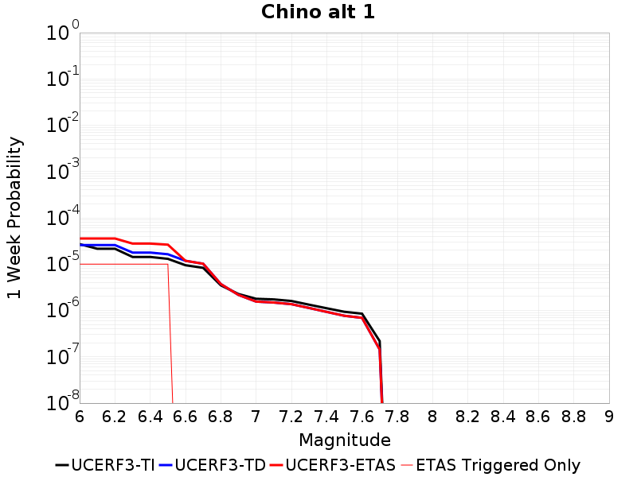 | 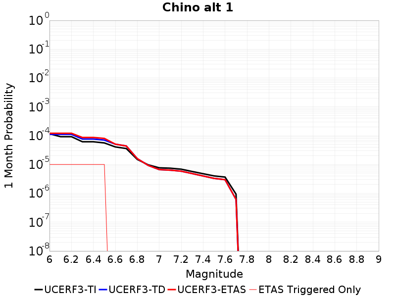 | 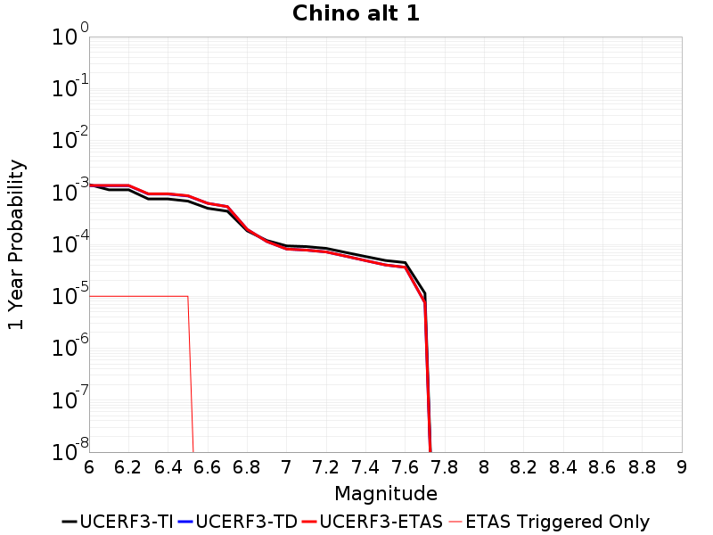 | 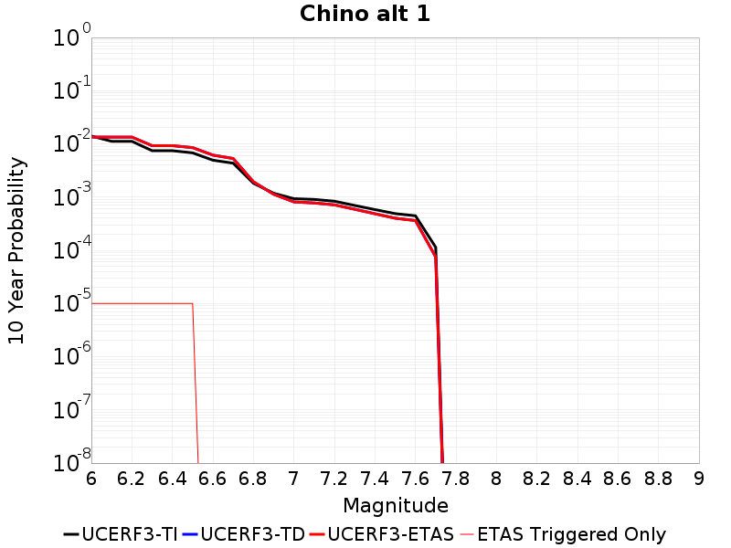 |

| Magnitude | 1 wk TI Prob | 1 wk TD Prob | 1 wk ETAS Prob | 1 wk ETAS/TD Gain | 1 wk ETAS Triggered Only | 1 mo TI Prob | 1 mo TD Prob | 1 mo ETAS Prob | 1 mo ETAS/TD Gain | 1 mo ETAS Triggered Only | 1 yr TI Prob | 1 yr TD Prob | 1 yr ETAS Prob | 1 yr ETAS/TD Gain | 1 yr ETAS Triggered Only | 10 yr TI Prob | 10 yr TD Prob | 10 yr ETAS Prob | 10 yr ETAS/TD Gain | 10 yr ETAS Triggered Only |
|-----|-----|-----|-----|-----|-----|-----|-----|-----|-----|-----|-----|-----|-----|-----|-----|-----|-----|-----|-----|-----|
| 6.0 | 2.7059663E-5 | 2.5850588E-5 | 3.5850328E-5 | 1.3868284 | 1.0E-5 | 1.1596483E-4 | 1.1078409E-4 | 1.20782985E-4 | 1.0902556 | 1.0E-5 | 0.0014109573 | 0.001348061 | 0.0013580476 | 1.007408 | 1.0E-5 | 0.014020323 | 0.013405009 | 0.013414875 | 1.000736 | 1.0E-5 |
| 6.1 | 2.1505624E-5 | 2.5850588E-5 | 3.5850328E-5 | 1.3868284 | 1.0E-5 | 9.2163704E-5 | 1.1078409E-4 | 1.20782985E-4 | 1.0902556 | 1.0E-5 | 0.0011215154 | 0.001348061 | 0.0013580476 | 1.007408 | 1.0E-5 | 0.011158722 | 0.013405009 | 0.013414875 | 1.000736 | 1.0E-5 |
| 6.2 | 2.1505624E-5 | 2.5850588E-5 | 3.5850328E-5 | 1.3868284 | 1.0E-5 | 9.2163704E-5 | 1.1078409E-4 | 1.20782985E-4 | 1.0902556 | 1.0E-5 | 0.0011215154 | 0.001348061 | 0.0013580476 | 1.007408 | 1.0E-5 | 0.011158722 | 0.013405009 | 0.013414875 | 1.000736 | 1.0E-5 |
| 6.3 | 1.4290785E-5 | 1.7774395E-5 | 2.7774218E-5 | 1.562597 | 1.0E-5 | 6.1244784E-5 | 7.6174E-5 | 8.617324E-5 | 1.1312684 | 1.0E-5 | 7.454001E-4 | 9.2706777E-4 | 9.370585E-4 | 1.0107766 | 1.0E-5 | 0.007429048 | 0.009232596 | 0.009242503 | 1.0010731 | 1.0E-5 |
| 6.4 | 1.4290785E-5 | 1.7774395E-5 | 2.7774218E-5 | 1.562597 | 1.0E-5 | 6.1244784E-5 | 7.6174E-5 | 8.617324E-5 | 1.1312684 | 1.0E-5 | 7.454001E-4 | 9.2706777E-4 | 9.370585E-4 | 1.0107766 | 1.0E-5 | 0.007429048 | 0.009232596 | 0.009242503 | 1.0010731 | 1.0E-5 |
| 6.5 | 1.3017944E-5 | 1.6341606E-5 | 2.6341442E-5 | 1.6119249 | 1.0E-5 | 5.5789995E-5 | 7.003381E-5 | 8.003312E-5 | 1.1427782 | 1.0E-5 | 6.790315E-4 | 8.5237063E-4 | 8.623621E-4 | 1.011722 | 1.0E-5 | 0.0067696036 | 0.008491449 | 0.008501364 | 1.0011677 | 1.0E-5 |
| 6.6 | 9.470016E-6 | 1.18018315E-5 | 1.18018315E-5 | 1.0 | 0.0 | 4.058515E-5 | 5.0578485E-5 | 5.0578485E-5 | 1.0 | 0.0 | 4.940122E-4 | 6.15652E-4 | 6.15652E-4 | 1.0 | 0.0 | 0.004929154 | 0.0061402465 | 0.0061402465 | 1.0 | 0.0 |
| 6.7 | 8.314155E-6 | 1.019348E-5 | 1.019348E-5 | 1.0 | 0.0 | 3.5631605E-5 | 4.3685788E-5 | 4.3685788E-5 | 1.0 | 0.0 | 4.3372845E-4 | 5.3177594E-4 | 5.3177594E-4 | 1.0 | 0.0 | 0.004328829 | 0.0053061303 | 0.0053061303 | 1.0 | 0.0 |
| 6.8 | 3.4856364E-6 | 3.71567E-6 | 3.71567E-6 | 1.0 | 0.0 | 1.4938357E-5 | 1.5924214E-5 | 1.5924214E-5 | 1.0 | 0.0 | 1.8185932E-4 | 1.9386187E-4 | 1.9386187E-4 | 1.0 | 0.0 | 0.0018171056 | 0.0019377369 | 0.0019377369 | 1.0 | 0.0 |
| 6.9 | 2.2645952E-6 | 2.1637597E-6 | 2.1637597E-6 | 1.0 | 0.0 | 9.705372E-6 | 9.273224E-6 | 9.273224E-6 | 1.0 | 0.0 | 1.18156495E-4 | 1.1289587E-4 | 1.1289587E-4 | 1.0 | 0.0 | 0.0011809369 | 0.0011287624 | 0.0011287624 | 1.0 | 0.0 |
| 7.0 | 1.7864003E-6 | 1.5529201E-6 | 1.5529201E-6 | 1.0 | 0.0 | 7.655979E-6 | 6.6553553E-6 | 6.6553553E-6 | 1.0 | 0.0 | 9.3207556E-5 | 8.1025995E-5 | 8.1025995E-5 | 1.0 | 0.0 | 9.316847E-4 | 8.102405E-4 | 8.102405E-4 | 1.0 | 0.0 |
| 7.1 | 1.7315456E-6 | 1.4834243E-6 | 1.4834243E-6 | 1.0 | 0.0 | 7.420889E-6 | 6.3575176E-6 | 6.3575176E-6 | 1.0 | 0.0 | 9.034557E-5 | 7.740008E-5 | 7.740008E-5 | 1.0 | 0.0 | 9.0308854E-4 | 7.740052E-4 | 7.740052E-4 | 1.0 | 0.0 |
| 7.2 | 1.6008337E-6 | 1.3665541E-6 | 1.3665541E-6 | 1.0 | 0.0 | 6.860698E-6 | 5.8566475E-6 | 5.8566475E-6 | 1.0 | 0.0 | 8.352579E-5 | 7.1302406E-5 | 7.1302406E-5 | 1.0 | 0.0 | 8.34944E-4 | 7.1305543E-4 | 7.1305543E-4 | 1.0 | 0.0 |
| 7.3 | 1.3320939E-6 | 1.1305239E-6 | 1.1305239E-6 | 1.0 | 0.0 | 5.7089615E-6 | 4.8450934E-6 | 4.8450934E-6 | 1.0 | 0.0 | 6.9504385E-5 | 5.898746E-5 | 5.898746E-5 | 1.0 | 0.0 | 6.9482654E-4 | 5.8980274E-4 | 5.8980274E-4 | 1.0 | 0.0 |
| 7.4 | 1.114294E-6 | 9.3036385E-7 | 9.3036385E-7 | 1.0 | 0.0 | 4.775537E-6 | 3.987268E-6 | 3.987268E-6 | 1.0 | 0.0 | 5.8140613E-5 | 4.854394E-5 | 4.854394E-5 | 1.0 | 0.0 | 5.81254E-4 | 4.8534432E-4 | 4.8534432E-4 | 1.0 | 0.0 |
| 7.5 | 9.354081E-7 | 7.6755043E-7 | 7.6755043E-7 | 1.0 | 0.0 | 4.0088858E-6 | 3.289498E-6 | 3.289498E-6 | 1.0 | 0.0 | 4.8807087E-5 | 4.0048933E-5 | 4.0048933E-5 | 1.0 | 0.0 | 4.879637E-4 | 4.004206E-4 | 4.004206E-4 | 1.0 | 0.0 |
| 7.6 | 8.521771E-7 | 6.9202827E-7 | 6.9202827E-7 | 1.0 | 0.0 | 3.6521824E-6 | 2.9658322E-6 | 2.9658322E-6 | 1.0 | 0.0 | 4.4464414E-5 | 3.6108442E-5 | 3.6108442E-5 | 1.0 | 0.0 | 4.4455516E-4 | 3.6102894E-4 | 3.6102894E-4 | 1.0 | 0.0 |
| 7.7 | 2.1803626E-7 | 1.4339074E-7 | 1.4339074E-7 | 1.0 | 0.0 | 9.344408E-7 | 6.1453164E-7 | 6.1453164E-7 | 1.0 | 0.0 | 1.1376757E-5 | 7.481907E-6 | 7.481907E-6 | 1.0 | 0.0 | 1.13761744E-4 | 7.481753E-5 | 7.481753E-5 | 1.0 | 0.0 |

## San Pedro Escarpment
*[(top)](#table-of-contents)*

| 1 Week | 1 Month | 1 Year | 10 Year |
|-----|-----|-----|-----|
| 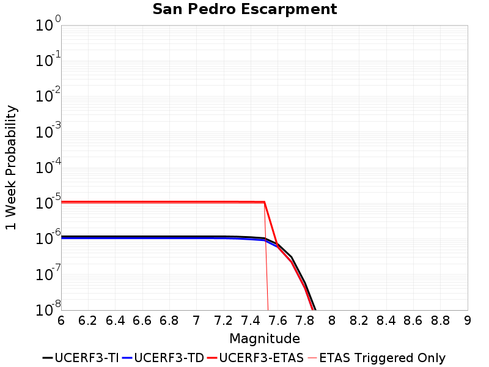 | 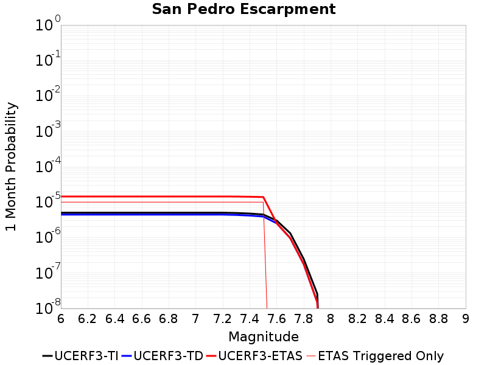 | 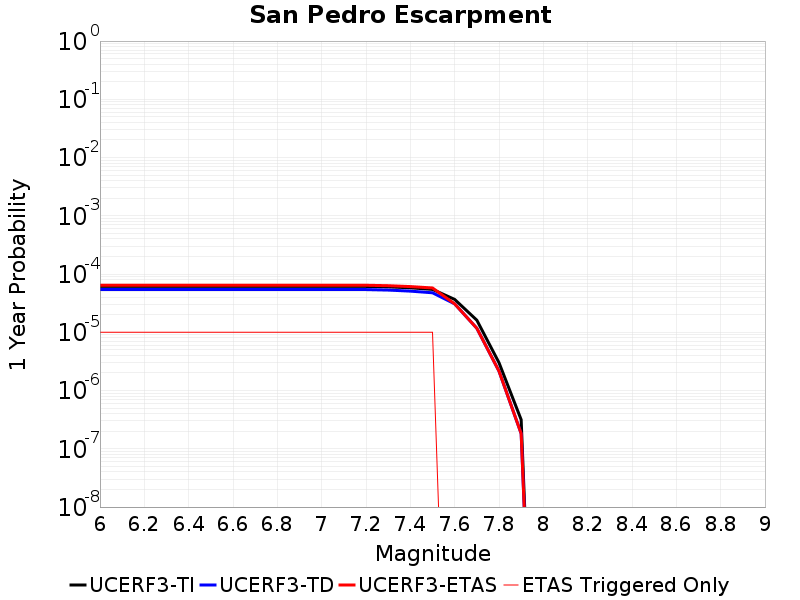 | 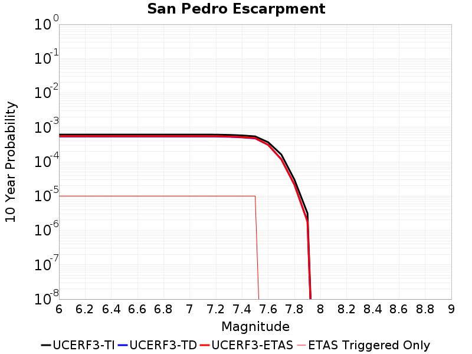 |

| Magnitude | 1 wk TI Prob | 1 wk TD Prob | 1 wk ETAS Prob | 1 wk ETAS/TD Gain | 1 wk ETAS Triggered Only | 1 mo TI Prob | 1 mo TD Prob | 1 mo ETAS Prob | 1 mo ETAS/TD Gain | 1 mo ETAS Triggered Only | 1 yr TI Prob | 1 yr TD Prob | 1 yr ETAS Prob | 1 yr ETAS/TD Gain | 1 yr ETAS Triggered Only | 10 yr TI Prob | 10 yr TD Prob | 10 yr ETAS Prob | 10 yr ETAS/TD Gain | 10 yr ETAS Triggered Only |
|-----|-----|-----|-----|-----|-----|-----|-----|-----|-----|-----|-----|-----|-----|-----|-----|-----|-----|-----|-----|-----|
| 6.0 | 1.1740281E-6 | 1.0382523E-6 | 1.1038242E-5 | 10.63156 | 1.0E-5 | 5.031539E-6 | 4.4496455E-6 | 1.4449601E-5 | 3.24736 | 1.0E-5 | 6.125726E-5 | 5.4173153E-5 | 6.4172615E-5 | 1.1845833 | 1.0E-5 | 6.124038E-4 | 5.4160587E-4 | 5.516005E-4 | 1.0184536 | 1.0E-5 |
| 6.1 | 1.1740281E-6 | 1.0382523E-6 | 1.1038242E-5 | 10.63156 | 1.0E-5 | 5.031539E-6 | 4.4496455E-6 | 1.4449601E-5 | 3.24736 | 1.0E-5 | 6.125726E-5 | 5.4173153E-5 | 6.4172615E-5 | 1.1845833 | 1.0E-5 | 6.124038E-4 | 5.4160587E-4 | 5.516005E-4 | 1.0184536 | 1.0E-5 |
| 6.2 | 1.1740281E-6 | 1.0382523E-6 | 1.1038242E-5 | 10.63156 | 1.0E-5 | 5.031539E-6 | 4.4496455E-6 | 1.4449601E-5 | 3.24736 | 1.0E-5 | 6.125726E-5 | 5.4173153E-5 | 6.4172615E-5 | 1.1845833 | 1.0E-5 | 6.124038E-4 | 5.4160587E-4 | 5.516005E-4 | 1.0184536 | 1.0E-5 |
| 6.3 | 1.1740281E-6 | 1.0382523E-6 | 1.1038242E-5 | 10.63156 | 1.0E-5 | 5.031539E-6 | 4.4496455E-6 | 1.4449601E-5 | 3.24736 | 1.0E-5 | 6.125726E-5 | 5.4173153E-5 | 6.4172615E-5 | 1.1845833 | 1.0E-5 | 6.124038E-4 | 5.4160587E-4 | 5.516005E-4 | 1.0184536 | 1.0E-5 |
| 6.4 | 1.1740281E-6 | 1.0382523E-6 | 1.1038242E-5 | 10.63156 | 1.0E-5 | 5.031539E-6 | 4.4496455E-6 | 1.4449601E-5 | 3.24736 | 1.0E-5 | 6.125726E-5 | 5.4173153E-5 | 6.4172615E-5 | 1.1845833 | 1.0E-5 | 6.124038E-4 | 5.4160587E-4 | 5.516005E-4 | 1.0184536 | 1.0E-5 |
| 6.5 | 1.1740281E-6 | 1.0382523E-6 | 1.1038242E-5 | 10.63156 | 1.0E-5 | 5.031539E-6 | 4.4496455E-6 | 1.4449601E-5 | 3.24736 | 1.0E-5 | 6.125726E-5 | 5.4173153E-5 | 6.4172615E-5 | 1.1845833 | 1.0E-5 | 6.124038E-4 | 5.4160587E-4 | 5.516005E-4 | 1.0184536 | 1.0E-5 |
| 6.6 | 1.1740281E-6 | 1.0382523E-6 | 1.1038242E-5 | 10.63156 | 1.0E-5 | 5.031539E-6 | 4.4496455E-6 | 1.4449601E-5 | 3.24736 | 1.0E-5 | 6.125726E-5 | 5.4173153E-5 | 6.4172615E-5 | 1.1845833 | 1.0E-5 | 6.124038E-4 | 5.4160587E-4 | 5.516005E-4 | 1.0184536 | 1.0E-5 |
| 6.7 | 1.1740281E-6 | 1.0382523E-6 | 1.1038242E-5 | 10.63156 | 1.0E-5 | 5.031539E-6 | 4.4496455E-6 | 1.4449601E-5 | 3.24736 | 1.0E-5 | 6.125726E-5 | 5.4173153E-5 | 6.4172615E-5 | 1.1845833 | 1.0E-5 | 6.124038E-4 | 5.4160587E-4 | 5.516005E-4 | 1.0184536 | 1.0E-5 |
| 6.8 | 1.1740281E-6 | 1.0382523E-6 | 1.1038242E-5 | 10.63156 | 1.0E-5 | 5.031539E-6 | 4.4496455E-6 | 1.4449601E-5 | 3.24736 | 1.0E-5 | 6.125726E-5 | 5.4173153E-5 | 6.4172615E-5 | 1.1845833 | 1.0E-5 | 6.124038E-4 | 5.4160587E-4 | 5.516005E-4 | 1.0184536 | 1.0E-5 |
| 6.9 | 1.1740281E-6 | 1.0382523E-6 | 1.1038242E-5 | 10.63156 | 1.0E-5 | 5.031539E-6 | 4.4496455E-6 | 1.4449601E-5 | 3.24736 | 1.0E-5 | 6.125726E-5 | 5.4173153E-5 | 6.4172615E-5 | 1.1845833 | 1.0E-5 | 6.124038E-4 | 5.4160587E-4 | 5.516005E-4 | 1.0184536 | 1.0E-5 |
| 7.0 | 1.1740281E-6 | 1.0382523E-6 | 1.1038242E-5 | 10.63156 | 1.0E-5 | 5.031539E-6 | 4.4496455E-6 | 1.4449601E-5 | 3.24736 | 1.0E-5 | 6.125726E-5 | 5.4173153E-5 | 6.4172615E-5 | 1.1845833 | 1.0E-5 | 6.124038E-4 | 5.4160587E-4 | 5.516005E-4 | 1.0184536 | 1.0E-5 |
| 7.1 | 1.1740281E-6 | 1.0382523E-6 | 1.1038242E-5 | 10.63156 | 1.0E-5 | 5.031539E-6 | 4.4496455E-6 | 1.4449601E-5 | 3.24736 | 1.0E-5 | 6.125726E-5 | 5.4173153E-5 | 6.4172615E-5 | 1.1845833 | 1.0E-5 | 6.124038E-4 | 5.4160587E-4 | 5.516005E-4 | 1.0184536 | 1.0E-5 |
| 7.2 | 1.1722314E-6 | 1.036439E-6 | 1.1036429E-5 | 10.648411 | 1.0E-5 | 5.023839E-6 | 4.4418744E-6 | 1.444183E-5 | 3.251292 | 1.0E-5 | 6.116352E-5 | 5.407854E-5 | 6.4078E-5 | 1.1849062 | 1.0E-5 | 6.114669E-4 | 5.406602E-4 | 5.5065483E-4 | 1.0184859 | 1.0E-5 |
| 7.3 | 1.1515234E-6 | 1.0155053E-6 | 1.1015495E-5 | 10.847304 | 1.0E-5 | 4.935091E-6 | 4.3521586E-6 | 1.4352115E-5 | 3.2977004 | 1.0E-5 | 6.008308E-5 | 5.2986306E-5 | 6.2985775E-5 | 1.188718 | 1.0E-5 | 6.0066837E-4 | 5.2974315E-4 | 5.397378E-4 | 1.018867 | 1.0E-5 |
| 7.4 | 1.1103637E-6 | 9.738472E-7 | 1.0973838E-5 | 11.26854 | 1.0E-5 | 4.7586927E-6 | 4.173625E-6 | 1.4173583E-5 | 3.3959887 | 1.0E-5 | 5.793554E-5 | 5.0812763E-5 | 6.0812254E-5 | 1.1967909 | 1.0E-5 | 5.792044E-4 | 5.080178E-4 | 5.1801273E-4 | 1.0196743 | 1.0E-5 |
| 7.5 | 1.0425391E-6 | 9.120361E-7 | 1.0912027E-5 | 11.964468 | 1.0E-5 | 4.4680173E-6 | 3.908721E-6 | 1.39086815E-5 | 3.5583718 | 1.0E-5 | 5.439675E-5 | 4.75877E-5 | 5.758722E-5 | 1.2101283 | 1.0E-5 | 5.438344E-4 | 4.7578142E-4 | 4.8577666E-4 | 1.021008 | 1.0E-5 |
| 7.6 | 7.0184194E-7 | 5.8854914E-7 | 5.8854914E-7 | 1.0 | 0.0 | 3.0078907E-6 | 2.5223512E-6 | 2.5223512E-6 | 1.0 | 0.0 | 3.6620455E-5 | 3.070924E-5 | 3.070924E-5 | 1.0 | 0.0 | 3.661442E-4 | 3.0705475E-4 | 3.0705475E-4 | 1.0 | 0.0 |
| 7.7 | 3.0871365E-7 | 2.2415276E-7 | 2.2415276E-7 | 1.0 | 0.0 | 1.3230577E-6 | 9.606543E-7 | 9.606543E-7 | 1.0 | 0.0 | 1.610811E-5 | 1.16959045E-5 | 1.16959045E-5 | 1.0 | 0.0 | 1.6106942E-4 | 1.16953E-4 | 1.16953E-4 | 1.0 | 0.0 |
| 7.8 | 5.7512665E-8 | 4.1171774E-8 | 4.1171774E-8 | 1.0 | 0.0 | 2.464828E-7 | 1.7645044E-7 | 1.7645044E-7 | 1.0 | 0.0 | 3.0009242E-6 | 2.1482822E-6 | 2.1482822E-6 | 1.0 | 0.0 | 3.0008836E-5 | 2.1482636E-5 | 2.1482636E-5 | 1.0 | 0.0 |
| 7.9 | 6.040053E-9 | 3.4892373E-9 | 3.4892373E-9 | 1.0 | 0.0 | 2.5885942E-8 | 1.4953875E-8 | 1.4953875E-8 | 1.0 | 0.0 | 3.151613E-7 | 1.8206342E-7 | 1.8206342E-7 | 1.0 | 0.0 | 3.1516086E-6 | 1.8206329E-6 | 1.8206329E-6 | 1.0 | 0.0 |

## Santa Susana East (connector)
*[(top)](#table-of-contents)*

| 1 Week | 1 Month | 1 Year | 10 Year |
|-----|-----|-----|-----|
| 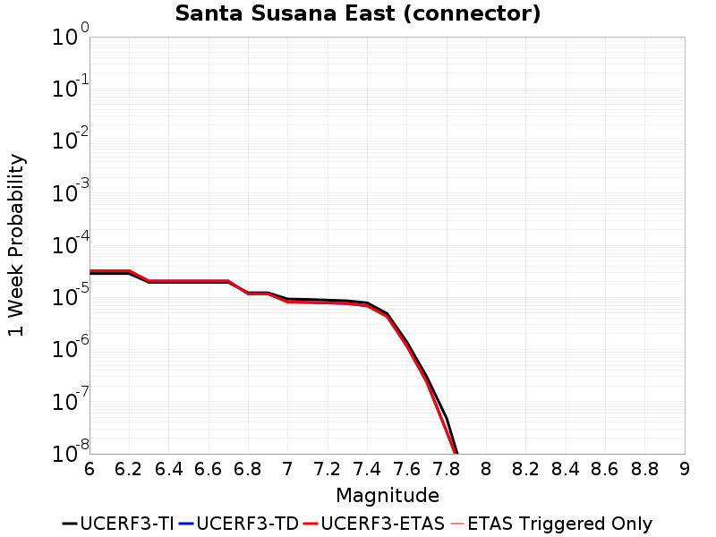 | 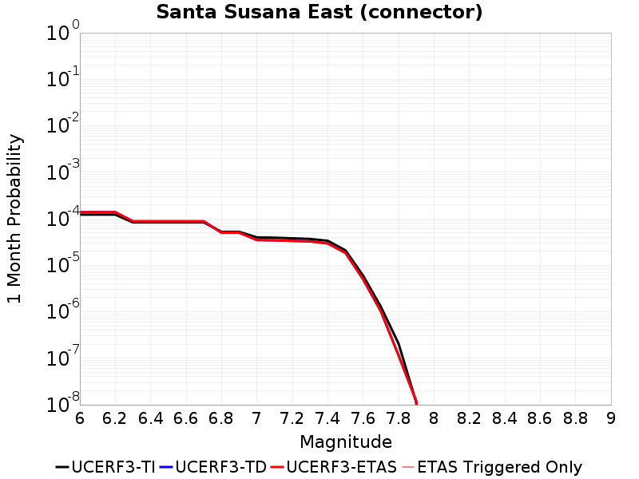 | 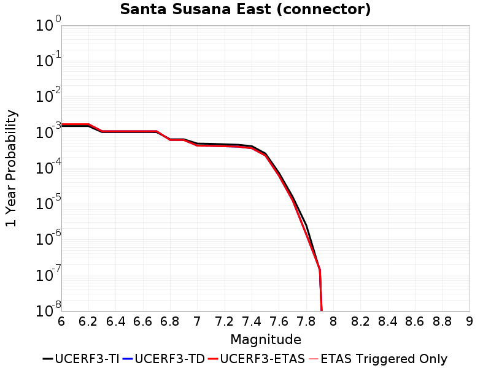 | 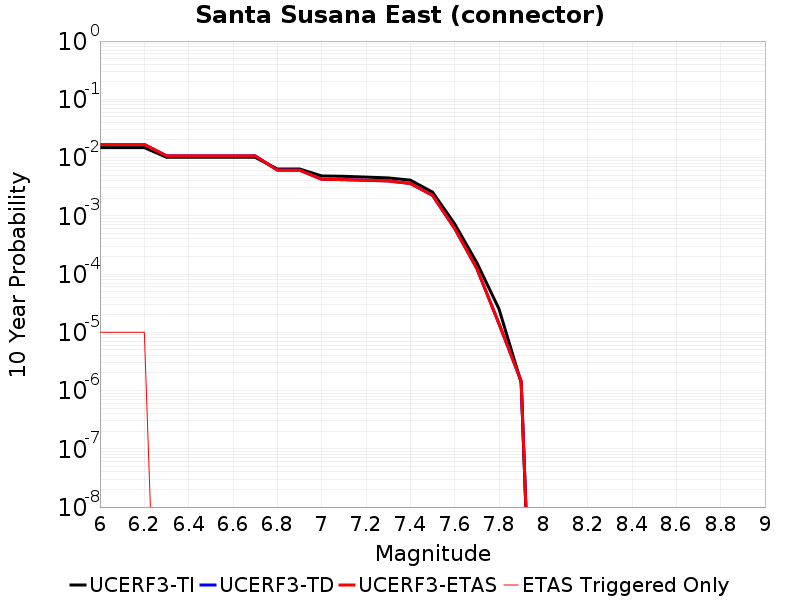 |

| Magnitude | 1 wk TI Prob | 1 wk TD Prob | 1 wk ETAS Prob | 1 wk ETAS/TD Gain | 1 wk ETAS Triggered Only | 1 mo TI Prob | 1 mo TD Prob | 1 mo ETAS Prob | 1 mo ETAS/TD Gain | 1 mo ETAS Triggered Only | 1 yr TI Prob | 1 yr TD Prob | 1 yr ETAS Prob | 1 yr ETAS/TD Gain | 1 yr ETAS Triggered Only | 10 yr TI Prob | 10 yr TD Prob | 10 yr ETAS Prob | 10 yr ETAS/TD Gain | 10 yr ETAS Triggered Only |
|-----|-----|-----|-----|-----|-----|-----|-----|-----|-----|-----|-----|-----|-----|-----|-----|-----|-----|-----|-----|-----|
| 6.0 | 2.858397E-5 | 3.2303997E-5 | 3.2303997E-5 | 1.0 | 0.0 | 1.2249697E-4 | 1.3843998E-4 | 1.3843998E-4 | 1.0 | 0.0 | 0.0014903803 | 0.0016844765 | 0.0016844765 | 1.0 | 0.0 | 0.014804244 | 0.016743962 | 0.016753795 | 1.0005872 | 1.0E-5 |
| 6.1 | 2.858397E-5 | 3.2303997E-5 | 3.2303997E-5 | 1.0 | 0.0 | 1.2249697E-4 | 1.3843998E-4 | 1.3843998E-4 | 1.0 | 0.0 | 0.0014903803 | 0.0016844765 | 0.0016844765 | 1.0 | 0.0 | 0.014804244 | 0.016743962 | 0.016753795 | 1.0005872 | 1.0E-5 |
| 6.2 | 2.858397E-5 | 3.2303997E-5 | 3.2303997E-5 | 1.0 | 0.0 | 1.2249697E-4 | 1.3843998E-4 | 1.3843998E-4 | 1.0 | 0.0 | 0.0014903803 | 0.0016844765 | 0.0016844765 | 1.0 | 0.0 | 0.014804244 | 0.016743962 | 0.016753795 | 1.0005872 | 1.0E-5 |
| 6.3 | 1.943582E-5 | 2.0538162E-5 | 2.0538162E-5 | 1.0 | 0.0 | 8.329371E-5 | 8.801837E-5 | 8.801837E-5 | 1.0 | 0.0 | 0.001013629 | 0.0010712107 | 0.0010712107 | 1.0 | 0.0 | 0.010090181 | 0.010671885 | 0.010671885 | 1.0 | 0.0 |
| 6.4 | 1.943582E-5 | 2.0538162E-5 | 2.0538162E-5 | 1.0 | 0.0 | 8.329371E-5 | 8.801837E-5 | 8.801837E-5 | 1.0 | 0.0 | 0.001013629 | 0.0010712107 | 0.0010712107 | 1.0 | 0.0 | 0.010090181 | 0.010671885 | 0.010671885 | 1.0 | 0.0 |
| 6.5 | 1.943582E-5 | 2.0538162E-5 | 2.0538162E-5 | 1.0 | 0.0 | 8.329371E-5 | 8.801837E-5 | 8.801837E-5 | 1.0 | 0.0 | 0.001013629 | 0.0010712107 | 0.0010712107 | 1.0 | 0.0 | 0.010090181 | 0.010671885 | 0.010671885 | 1.0 | 0.0 |
| 6.6 | 1.943582E-5 | 2.0538162E-5 | 2.0538162E-5 | 1.0 | 0.0 | 8.329371E-5 | 8.801837E-5 | 8.801837E-5 | 1.0 | 0.0 | 0.001013629 | 0.0010712107 | 0.0010712107 | 1.0 | 0.0 | 0.010090181 | 0.010671885 | 0.010671885 | 1.0 | 0.0 |
| 6.7 | 1.9404439E-5 | 2.0525322E-5 | 2.0525322E-5 | 1.0 | 0.0 | 8.3159226E-5 | 8.7963344E-5 | 8.7963344E-5 | 1.0 | 0.0 | 0.0010119933 | 0.0010705414 | 0.0010705414 | 1.0 | 0.0 | 0.010073971 | 0.010665256 | 0.010665256 | 1.0 | 0.0 |
| 6.8 | 1.2217526E-5 | 1.168491E-5 | 1.168491E-5 | 1.0 | 0.0 | 5.2359774E-5 | 5.007732E-5 | 5.007732E-5 | 1.0 | 0.0 | 6.372938E-4 | 6.0953794E-4 | 6.0953794E-4 | 1.0 | 0.0 | 0.0063546924 | 0.0060805324 | 0.0060805324 | 1.0 | 0.0 |
| 6.9 | 1.2217526E-5 | 1.168491E-5 | 1.168491E-5 | 1.0 | 0.0 | 5.2359774E-5 | 5.007732E-5 | 5.007732E-5 | 1.0 | 0.0 | 6.372938E-4 | 6.0953794E-4 | 6.0953794E-4 | 1.0 | 0.0 | 0.0063546924 | 0.0060805324 | 0.0060805324 | 1.0 | 0.0 |
| 7.0 | 9.276017E-6 | 8.124398E-6 | 8.124398E-6 | 1.0 | 0.0 | 3.9753755E-5 | 3.4818404E-5 | 3.4818404E-5 | 1.0 | 0.0 | 4.8389446E-4 | 4.2383512E-4 | 4.2383512E-4 | 1.0 | 0.0 | 0.0048284214 | 0.0042307987 | 0.0042307987 | 1.0 | 0.0 |
| 7.1 | 9.130355E-6 | 8.006634E-6 | 8.006634E-6 | 1.0 | 0.0 | 3.9129503E-5 | 3.4313714E-5 | 3.4313714E-5 | 1.0 | 0.0 | 4.7629757E-4 | 4.176929E-4 | 4.176929E-4 | 1.0 | 0.0 | 0.00475278 | 0.004169608 | 0.004169608 | 1.0 | 0.0 |
| 7.2 | 8.851015E-6 | 7.803427E-6 | 7.803427E-6 | 1.0 | 0.0 | 3.7932372E-5 | 3.344285E-5 | 3.344285E-5 | 1.0 | 0.0 | 4.6172875E-4 | 4.0709414E-4 | 4.0709414E-4 | 1.0 | 0.0 | 0.0046077054 | 0.004064011 | 0.004064011 | 1.0 | 0.0 |
| 7.3 | 8.573006E-6 | 7.610831E-6 | 7.610831E-6 | 1.0 | 0.0 | 3.6740938E-5 | 3.2617456E-5 | 3.2617456E-5 | 1.0 | 0.0 | 4.472291E-4 | 3.9704866E-4 | 3.9704866E-4 | 1.0 | 0.0 | 0.004463301 | 0.00396391 | 0.00396391 | 1.0 | 0.0 |
| 7.4 | 7.852282E-6 | 6.8731642E-6 | 6.8731642E-6 | 1.0 | 0.0 | 3.36522E-5 | 2.9456103E-5 | 2.9456103E-5 | 1.0 | 0.0 | 4.096385E-4 | 3.5857214E-4 | 3.5857214E-4 | 1.0 | 0.0 | 0.0040888423 | 0.0035804021 | 0.0035804021 | 1.0 | 0.0 |
| 7.5 | 4.8869324E-6 | 4.3033638E-6 | 4.3033638E-6 | 1.0 | 0.0 | 2.0943828E-5 | 1.8442866E-5 | 1.8442866E-5 | 1.0 | 0.0 | 2.5496128E-4 | 2.2452044E-4 | 2.2452044E-4 | 1.0 | 0.0 | 0.0025466895 | 0.0022430595 | 0.0022430595 | 1.0 | 0.0 |
| 7.6 | 1.3894544E-6 | 1.1606381E-6 | 1.1606381E-6 | 1.0 | 0.0 | 5.954791E-6 | 4.974155E-6 | 4.974155E-6 | 1.0 | 0.0 | 7.249717E-5 | 6.0558883E-5 | 6.0558883E-5 | 1.0 | 0.0 | 7.247352E-4 | 6.054457E-4 | 6.054457E-4 | 1.0 | 0.0 |
| 7.7 | 2.9924632E-7 | 2.383775E-7 | 2.383775E-7 | 1.0 | 0.0 | 1.2824837E-6 | 1.0216174E-6 | 1.0216174E-6 | 1.0 | 0.0 | 1.5614127E-5 | 1.2438129E-5 | 1.2438129E-5 | 1.0 | 0.0 | 1.5613029E-4 | 1.2437504E-4 | 1.2437504E-4 | 1.0 | 0.0 |
| 7.8 | 4.8188564E-8 | 2.6822235E-8 | 2.6822235E-8 | 1.0 | 0.0 | 2.065224E-7 | 1.14952435E-7 | 1.14952435E-7 | 1.0 | 0.0 | 2.5144072E-6 | 1.3995451E-6 | 1.3995451E-6 | 1.0 | 0.0 | 2.5143789E-5 | 1.3995371E-5 | 1.3995371E-5 | 1.0 | 0.0 |
| 7.9 | 2.6127251E-9 | 2.7739389E-9 | 2.7739389E-9 | 1.0 | 0.0 | 1.1197393E-8 | 1.1888309E-8 | 1.1888309E-8 | 1.0 | 0.0 | 1.3632825E-7 | 1.4474016E-7 | 1.4474016E-7 | 1.0 | 0.0 | 1.3632817E-6 | 1.4474016E-6 | 1.4474016E-6 | 1.0 | 0.0 |

## Oak Ridge (Onshore)
*[(top)](#table-of-contents)*

| 1 Week | 1 Month | 1 Year | 10 Year |
|-----|-----|-----|-----|
| 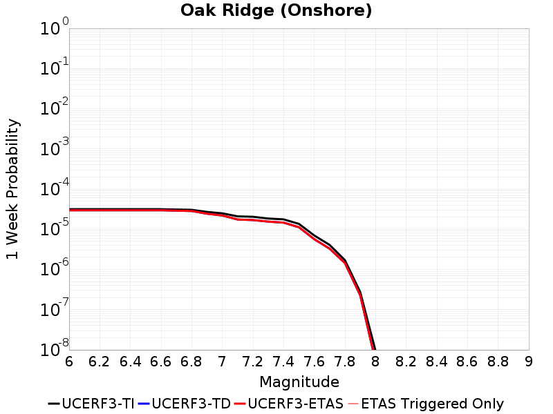 | 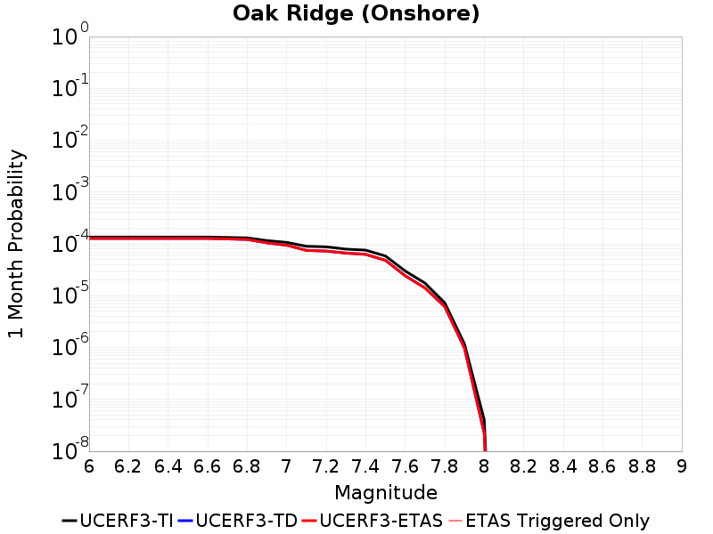 |  | 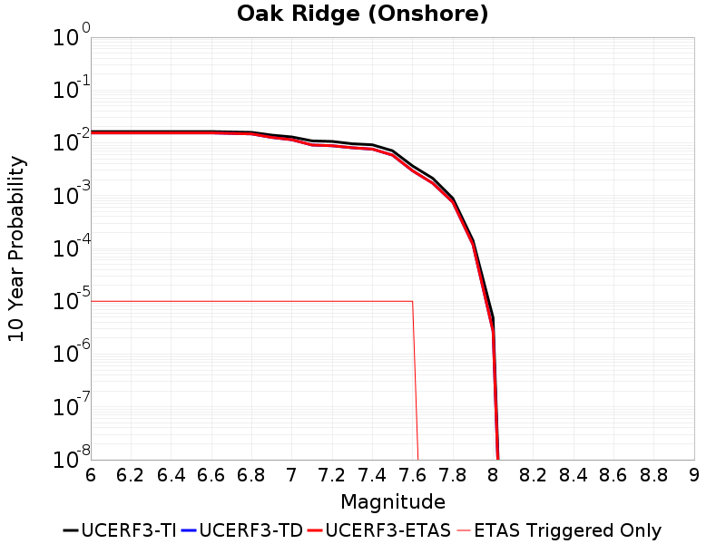 |

| Magnitude | 1 wk TI Prob | 1 wk TD Prob | 1 wk ETAS Prob | 1 wk ETAS/TD Gain | 1 wk ETAS Triggered Only | 1 mo TI Prob | 1 mo TD Prob | 1 mo ETAS Prob | 1 mo ETAS/TD Gain | 1 mo ETAS Triggered Only | 1 yr TI Prob | 1 yr TD Prob | 1 yr ETAS Prob | 1 yr ETAS/TD Gain | 1 yr ETAS Triggered Only | 10 yr TI Prob | 10 yr TD Prob | 10 yr ETAS Prob | 10 yr ETAS/TD Gain | 10 yr ETAS Triggered Only |
|-----|-----|-----|-----|-----|-----|-----|-----|-----|-----|-----|-----|-----|-----|-----|-----|-----|-----|-----|-----|-----|
| 6.0 | 3.155064E-5 | 2.970987E-5 | 2.970987E-5 | 1.0 | 0.0 | 1.3521002E-4 | 1.2732203E-4 | 1.2732203E-4 | 1.0 | 0.0 | 0.001644939 | 0.0015490819 | 0.0015490819 | 1.0 | 0.0 | 0.01632816 | 0.015387188 | 0.015397035 | 1.0006399 | 1.0E-5 |
| 6.1 | 3.155064E-5 | 2.970987E-5 | 2.970987E-5 | 1.0 | 0.0 | 1.3521002E-4 | 1.2732203E-4 | 1.2732203E-4 | 1.0 | 0.0 | 0.001644939 | 0.0015490819 | 0.0015490819 | 1.0 | 0.0 | 0.01632816 | 0.015387188 | 0.015397035 | 1.0006399 | 1.0E-5 |
| 6.2 | 3.155064E-5 | 2.970987E-5 | 2.970987E-5 | 1.0 | 0.0 | 1.3521002E-4 | 1.2732203E-4 | 1.2732203E-4 | 1.0 | 0.0 | 0.001644939 | 0.0015490819 | 0.0015490819 | 1.0 | 0.0 | 0.01632816 | 0.015387188 | 0.015397035 | 1.0006399 | 1.0E-5 |
| 6.3 | 3.155064E-5 | 2.970987E-5 | 2.970987E-5 | 1.0 | 0.0 | 1.3521002E-4 | 1.2732203E-4 | 1.2732203E-4 | 1.0 | 0.0 | 0.001644939 | 0.0015490819 | 0.0015490819 | 1.0 | 0.0 | 0.01632816 | 0.015387188 | 0.015397035 | 1.0006399 | 1.0E-5 |
| 6.4 | 3.155064E-5 | 2.970987E-5 | 2.970987E-5 | 1.0 | 0.0 | 1.3521002E-4 | 1.2732203E-4 | 1.2732203E-4 | 1.0 | 0.0 | 0.001644939 | 0.0015490819 | 0.0015490819 | 1.0 | 0.0 | 0.01632816 | 0.015387188 | 0.015397035 | 1.0006399 | 1.0E-5 |
| 6.5 | 3.155064E-5 | 2.970987E-5 | 2.970987E-5 | 1.0 | 0.0 | 1.3521002E-4 | 1.2732203E-4 | 1.2732203E-4 | 1.0 | 0.0 | 0.001644939 | 0.0015490819 | 0.0015490819 | 1.0 | 0.0 | 0.01632816 | 0.015387188 | 0.015397035 | 1.0006399 | 1.0E-5 |
| 6.6 | 3.155064E-5 | 2.970987E-5 | 2.970987E-5 | 1.0 | 0.0 | 1.3521002E-4 | 1.2732203E-4 | 1.2732203E-4 | 1.0 | 0.0 | 0.001644939 | 0.0015490819 | 0.0015490819 | 1.0 | 0.0 | 0.01632816 | 0.015387188 | 0.015397035 | 1.0006399 | 1.0E-5 |
| 6.7 | 3.098897E-5 | 2.904388E-5 | 2.904388E-5 | 1.0 | 0.0 | 1.328031E-4 | 1.2446805E-4 | 1.2446805E-4 | 1.0 | 0.0 | 0.0016156785 | 0.0015143832 | 0.0015143832 | 1.0 | 0.0 | 0.016039822 | 0.015044921 | 0.015054771 | 1.0006547 | 1.0E-5 |
| 6.8 | 3.0449872E-5 | 2.8415549E-5 | 2.8415549E-5 | 1.0 | 0.0 | 1.3049292E-4 | 1.21775454E-4 | 1.21775454E-4 | 1.0 | 0.0 | 0.0015875935 | 0.0014816454 | 0.0014816454 | 1.0 | 0.0 | 0.015762992 | 0.014721884 | 0.014731738 | 1.0006692 | 1.0E-5 |
| 6.9 | 2.697928E-5 | 2.4373268E-5 | 2.4373268E-5 | 1.0 | 0.0 | 1.15620365E-4 | 1.044528E-4 | 1.044528E-4 | 1.0 | 0.0 | 0.0014067689 | 0.0012709928 | 0.0012709928 | 1.0 | 0.0 | 0.0139789665 | 0.012639778 | 0.012649651 | 1.0007812 | 1.0E-5 |
| 7.0 | 2.4893961E-5 | 2.200291E-5 | 2.200291E-5 | 1.0 | 0.0 | 1.0668404E-4 | 9.429488E-5 | 9.429488E-5 | 1.0 | 0.0 | 0.0012981043 | 0.0011474534 | 0.0011474534 | 1.0 | 0.0 | 0.012905477 | 0.011417393 | 0.011427279 | 1.0008658 | 1.0E-5 |
| 7.1 | 2.0945363E-5 | 1.7472134E-5 | 1.7472134E-5 | 1.0 | 0.0 | 8.976275E-5 | 7.487845E-5 | 7.487845E-5 | 1.0 | 0.0 | 0.0010923136 | 9.1126864E-4 | 9.1126864E-4 | 1.0 | 0.0 | 0.0108696 | 0.009076059 | 0.009085968 | 1.0010918 | 1.0E-5 |
| 7.2 | 2.0439404E-5 | 1.6924343E-5 | 1.6924343E-5 | 1.0 | 0.0 | 8.7594504E-5 | 7.253091E-5 | 7.253091E-5 | 1.0 | 0.0 | 0.0010659413 | 8.827108E-4 | 8.827108E-4 | 1.0 | 0.0 | 0.010608427 | 0.008792768 | 0.00880268 | 1.0011272 | 1.0E-5 |
| 7.3 | 1.8463334E-5 | 1.5487418E-5 | 1.5487418E-5 | 1.0 | 0.0 | 7.912617E-5 | 6.637298E-5 | 6.637298E-5 | 1.0 | 0.0 | 9.6293533E-4 | 8.077959E-4 | 8.077959E-4 | 1.0 | 0.0 | 0.009587734 | 0.008049265 | 0.008059184 | 1.0012324 | 1.0E-5 |
| 7.4 | 1.763139E-5 | 1.4616494E-5 | 1.4616494E-5 | 1.0 | 0.0 | 7.556091E-5 | 6.264064E-5 | 6.264064E-5 | 1.0 | 0.0 | 9.1956573E-4 | 7.6238695E-4 | 7.6238695E-4 | 1.0 | 0.0 | 0.009157699 | 0.0075983233 | 0.007608247 | 1.001306 | 1.0E-5 |
| 7.5 | 1.3594944E-5 | 1.1223559E-5 | 1.1223559E-5 | 1.0 | 0.0 | 5.8262744E-5 | 4.8100097E-5 | 4.8100097E-5 | 1.0 | 0.0 | 7.0911803E-4 | 5.854639E-4 | 5.854639E-4 | 1.0 | 0.0 | 0.007068595 | 0.0058394475 | 0.005849389 | 1.0017025 | 1.0E-5 |
| 7.6 | 6.9889534E-6 | 5.653923E-6 | 5.653923E-6 | 1.0 | 0.0 | 2.9952313E-5 | 2.4230876E-5 | 2.4230876E-5 | 1.0 | 0.0 | 3.646084E-4 | 2.949714E-4 | 2.949714E-4 | 1.0 | 0.0 | 0.0036401073 | 0.002945843 | 0.0029558137 | 1.0033846 | 1.0E-5 |
| 7.7 | 4.0824193E-6 | 3.2930632E-6 | 3.2930632E-6 | 1.0 | 0.0 | 1.7495966E-5 | 1.4113052E-5 | 1.4113052E-5 | 1.0 | 0.0 | 2.1299256E-4 | 1.71813E-4 | 1.71813E-4 | 1.0 | 0.0 | 0.0021278851 | 0.001716815 | 0.001716815 | 1.0 | 0.0 |
| 7.8 | 1.7023609E-6 | 1.4404472E-6 | 1.4404472E-6 | 1.0 | 0.0 | 7.295812E-6 | 6.1733313E-6 | 6.1733313E-6 | 1.0 | 0.0 | 8.882289E-5 | 7.515774E-5 | 7.515774E-5 | 1.0 | 0.0 | 8.8787393E-4 | 7.5132604E-4 | 7.5132604E-4 | 1.0 | 0.0 |
| 7.9 | 2.721225E-7 | 2.2685285E-7 | 2.2685285E-7 | 1.0 | 0.0 | 1.1662388E-6 | 9.722262E-7 | 9.722262E-7 | 1.0 | 0.0 | 1.4198865E-5 | 1.1836792E-5 | 1.1836792E-5 | 1.0 | 0.0 | 1.4197957E-4 | 1.18361895E-4 | 1.18361895E-4 | 1.0 | 0.0 |
| 8.0 | 9.364255E-9 | 5.1818003E-9 | 5.1818003E-9 | 1.0 | 0.0 | 4.0132523E-8 | 2.2207717E-8 | 2.2207717E-8 | 1.0 | 0.0 | 4.8861335E-7 | 2.703789E-7 | 2.703789E-7 | 1.0 | 0.0 | 4.8861225E-6 | 2.703786E-6 | 2.703786E-6 | 1.0 | 0.0 |

## Cleghorn
*[(top)](#table-of-contents)*

| 1 Week | 1 Month | 1 Year | 10 Year |
|-----|-----|-----|-----|
|  | 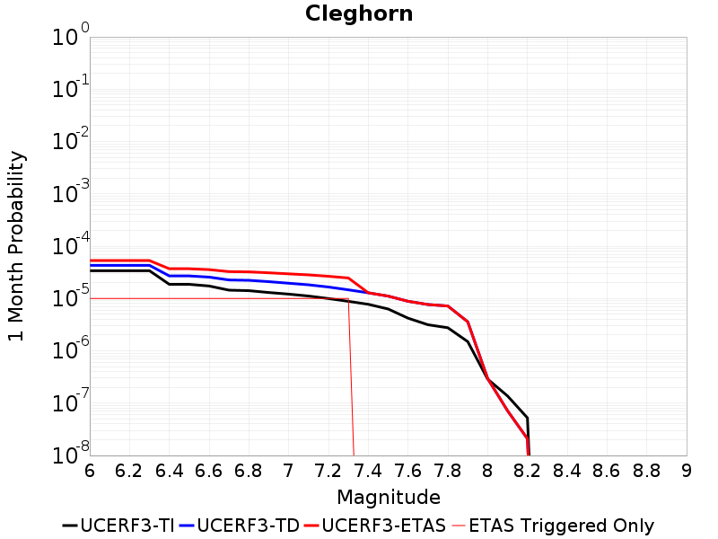 | 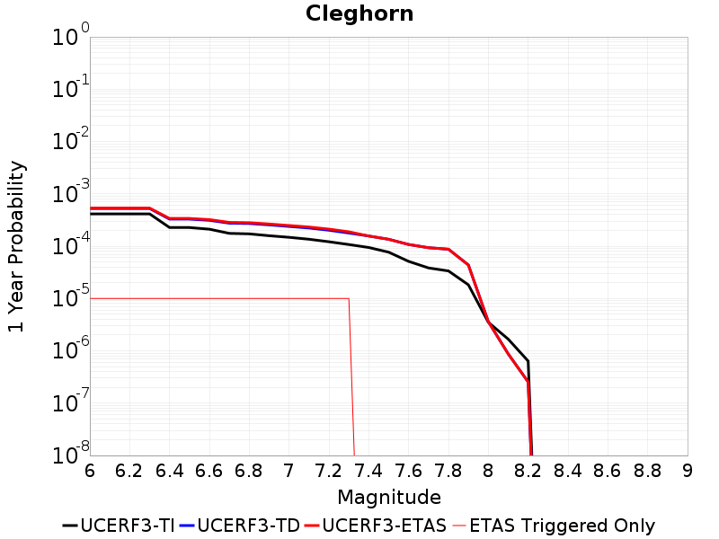 | 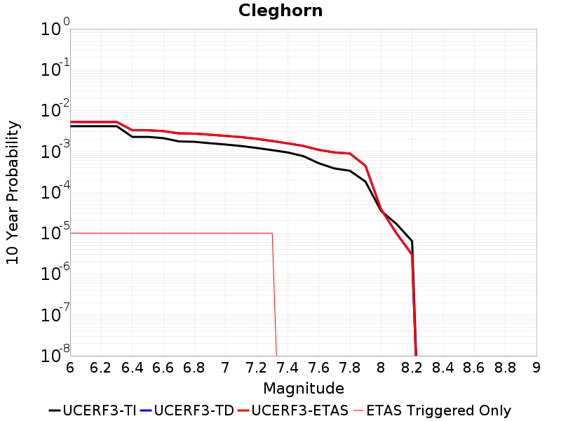 |

| Magnitude | 1 wk TI Prob | 1 wk TD Prob | 1 wk ETAS Prob | 1 wk ETAS/TD Gain | 1 wk ETAS Triggered Only | 1 mo TI Prob | 1 mo TD Prob | 1 mo ETAS Prob | 1 mo ETAS/TD Gain | 1 mo ETAS Triggered Only | 1 yr TI Prob | 1 yr TD Prob | 1 yr ETAS Prob | 1 yr ETAS/TD Gain | 1 yr ETAS Triggered Only | 10 yr TI Prob | 10 yr TD Prob | 10 yr ETAS Prob | 10 yr ETAS/TD Gain | 10 yr ETAS Triggered Only |
|-----|-----|-----|-----|-----|-----|-----|-----|-----|-----|-----|-----|-----|-----|-----|-----|-----|-----|-----|-----|-----|
| 6.0 | 7.9267165E-6 | 1.0036763E-5 | 2.0036663E-5 | 1.996327 | 1.0E-5 | 3.39712E-5 | 4.3014054E-5 | 5.3013624E-5 | 1.2324722 | 1.0E-5 | 4.1352084E-4 | 5.2358094E-4 | 5.3357566E-4 | 1.0190892 | 1.0E-5 | 0.004127522 | 0.0052352464 | 0.0052451943 | 1.0019001 | 1.0E-5 |
| 6.1 | 7.9267165E-6 | 1.0036763E-5 | 2.0036663E-5 | 1.996327 | 1.0E-5 | 3.39712E-5 | 4.3014054E-5 | 5.3013624E-5 | 1.2324722 | 1.0E-5 | 4.1352084E-4 | 5.2358094E-4 | 5.3357566E-4 | 1.0190892 | 1.0E-5 | 0.004127522 | 0.0052352464 | 0.0052451943 | 1.0019001 | 1.0E-5 |
| 6.2 | 7.9267165E-6 | 1.0036763E-5 | 2.0036663E-5 | 1.996327 | 1.0E-5 | 3.39712E-5 | 4.3014054E-5 | 5.3013624E-5 | 1.2324722 | 1.0E-5 | 4.1352084E-4 | 5.2358094E-4 | 5.3357566E-4 | 1.0190892 | 1.0E-5 | 0.004127522 | 0.0052352464 | 0.0052451943 | 1.0019001 | 1.0E-5 |
| 6.3 | 7.9267165E-6 | 1.0036763E-5 | 2.0036663E-5 | 1.996327 | 1.0E-5 | 3.39712E-5 | 4.3014054E-5 | 5.3013624E-5 | 1.2324722 | 1.0E-5 | 4.1352084E-4 | 5.2358094E-4 | 5.3357566E-4 | 1.0190892 | 1.0E-5 | 0.004127522 | 0.0052352464 | 0.0052451943 | 1.0019001 | 1.0E-5 |
| 6.4 | 4.3445207E-6 | 6.2907866E-6 | 1.6290724E-5 | 2.5896163 | 1.0E-5 | 1.8619241E-5 | 2.696024E-5 | 3.695997E-5 | 1.3709066 | 1.0E-5 | 2.2666567E-4 | 3.2819252E-4 | 3.3818925E-4 | 1.0304599 | 1.0E-5 | 0.0022643462 | 0.0032879184 | 0.0032978856 | 1.0030315 | 1.0E-5 |
| 6.5 | 4.3445207E-6 | 6.2907866E-6 | 1.6290724E-5 | 2.5896163 | 1.0E-5 | 1.8619241E-5 | 2.696024E-5 | 3.695997E-5 | 1.3709066 | 1.0E-5 | 2.2666567E-4 | 3.2819252E-4 | 3.3818925E-4 | 1.0304599 | 1.0E-5 | 0.0022643462 | 0.0032879184 | 0.0032978856 | 1.0030315 | 1.0E-5 |
| 6.6 | 4.040109E-6 | 5.9727076E-6 | 1.5972648E-5 | 2.6742725 | 1.0E-5 | 1.7314638E-5 | 2.5597074E-5 | 3.5596815E-5 | 1.3906597 | 1.0E-5 | 2.1078532E-4 | 3.1160074E-4 | 3.2159762E-4 | 1.0320823 | 1.0E-5 | 0.002105855 | 0.0031224715 | 0.0031324404 | 1.0031925 | 1.0E-5 |
| 6.7 | 3.3632055E-6 | 5.265129E-6 | 1.5265075E-5 | 2.8992786 | 1.0E-5 | 1.4413658E-5 | 2.2564645E-5 | 3.2564418E-5 | 1.4431611 | 1.0E-5 | 1.7547216E-4 | 2.7469025E-4 | 2.846875E-4 | 1.0363946 | 1.0E-5 | 0.0017533366 | 0.002754283 | 0.0027642553 | 1.0036207 | 1.0E-5 |
| 6.8 | 3.2902772E-6 | 5.1868083E-6 | 1.5186756E-5 | 2.927958 | 1.0E-5 | 1.4101111E-5 | 2.222899E-5 | 3.2228767E-5 | 1.449853 | 1.0E-5 | 1.716675E-4 | 2.7060465E-4 | 2.8060196E-4 | 1.0369443 | 1.0E-5 | 0.0017153495 | 0.0027135268 | 0.0027234997 | 1.0036752 | 1.0E-5 |
| 6.9 | 3.031547E-6 | 4.8870334E-6 | 1.4886985E-5 | 3.0462213 | 1.0E-5 | 1.299228E-5 | 2.0944262E-5 | 3.094405E-5 | 1.4774477 | 1.0E-5 | 1.5816953E-4 | 2.5496684E-4 | 2.6496427E-4 | 1.0392108 | 1.0E-5 | 0.00158057 | 0.0025575156 | 0.00256749 | 1.0039 | 1.0E-5 |
| 7.0 | 2.8259715E-6 | 4.5621546E-6 | 1.4562109E-5 | 3.1919367 | 1.0E-5 | 1.211125E-5 | 1.9551946E-5 | 2.9551751E-5 | 1.511448 | 1.0E-5 | 1.4744449E-4 | 2.3801919E-4 | 2.4801682E-4 | 1.0420034 | 1.0E-5 | 0.001473467 | 0.0023884133 | 0.0023983894 | 1.0041769 | 1.0E-5 |
| 7.1 | 2.5962665E-6 | 4.2549473E-6 | 1.4254904E-5 | 3.3501954 | 1.0E-5 | 1.1126809E-5 | 1.8235361E-5 | 2.823518E-5 | 1.548375 | 1.0E-5 | 1.3546048E-4 | 2.2199313E-4 | 2.3199093E-4 | 1.0450364 | 1.0E-5 | 0.0013537793 | 0.0022284836 | 0.0022384613 | 1.0044774 | 1.0E-5 |
| 7.2 | 2.3247253E-6 | 3.8618177E-6 | 1.3861779E-5 | 3.5894442 | 1.0E-5 | 9.96307E-6 | 1.6550544E-5 | 2.6550379E-5 | 1.6041998 | 1.0E-5 | 1.21293626E-4 | 2.0148444E-4 | 2.1148242E-4 | 1.0496216 | 1.0E-5 | 0.0012122744 | 0.00202381 | 0.0020337896 | 1.0049312 | 1.0E-5 |
| 7.3 | 2.056928E-6 | 3.4121415E-6 | 1.3412107E-5 | 3.9307008 | 1.0E-5 | 8.815376E-6 | 1.4623383E-5 | 2.4623238E-5 | 1.6838263 | 1.0E-5 | 1.0732192E-4 | 1.7802531E-4 | 1.8802352E-4 | 1.0561618 | 1.0E-5 | 0.001072701 | 0.0017896938 | 0.0017996759 | 1.0055776 | 1.0E-5 |
| 7.4 | 1.8055999E-6 | 2.9937146E-6 | 2.9937146E-6 | 1.0 | 0.0 | 7.738263E-6 | 1.28301435E-5 | 1.28301435E-5 | 1.0 | 0.0 | 9.4209274E-5 | 1.5619594E-4 | 1.5619594E-4 | 1.0 | 0.0 | 9.4169343E-4 | 0.0015718624 | 0.0015718624 | 1.0 | 0.0 |
| 7.5 | 1.4683443E-6 | 2.5889376E-6 | 2.5889376E-6 | 1.0 | 0.0 | 6.292889E-6 | 1.1095401E-5 | 1.1095401E-5 | 1.0 | 0.0 | 7.661323E-5 | 1.3507823E-4 | 1.3507823E-4 | 1.0 | 0.0 | 7.658682E-4 | 0.0013610037 | 0.0013610037 | 1.0 | 0.0 |
| 7.6 | 9.804088E-7 | 2.0617986E-6 | 2.0617986E-6 | 1.0 | 0.0 | 4.201745E-6 | 8.836249E-6 | 8.836249E-6 | 1.0 | 0.0 | 5.1155046E-5 | 1.0757608E-4 | 1.0757608E-4 | 1.0 | 0.0 | 5.114327E-4 | 0.0010863357 | 0.0010863357 | 1.0 | 0.0 |
| 7.7 | 7.3434086E-7 | 1.7878422E-6 | 1.7878422E-6 | 1.0 | 0.0 | 3.1471714E-6 | 7.662158E-6 | 7.662158E-6 | 1.0 | 0.0 | 3.831614E-5 | 9.328281E-5 | 9.328281E-5 | 1.0 | 0.0 | 3.8309532E-4 | 9.4358384E-4 | 9.4358384E-4 | 1.0 | 0.0 |
| 7.8 | 6.434184E-7 | 1.6752065E-6 | 1.6752065E-6 | 1.0 | 0.0 | 2.7575045E-6 | 7.1794366E-6 | 7.1794366E-6 | 1.0 | 0.0 | 3.35721E-5 | 8.7406166E-5 | 8.7406166E-5 | 1.0 | 0.0 | 3.3567028E-4 | 8.846403E-4 | 8.846403E-4 | 1.0 | 0.0 |
| 7.9 | 3.4943926E-7 | 8.3574713E-7 | 8.3574713E-7 | 1.0 | 0.0 | 1.497596E-6 | 3.5817686E-6 | 3.5817686E-6 | 1.0 | 0.0 | 1.8233079E-5 | 4.360717E-5 | 4.360717E-5 | 1.0 | 0.0 | 1.8231584E-4 | 4.4355018E-4 | 4.4355018E-4 | 1.0 | 0.0 |
| 8.0 | 6.717524E-8 | 6.897946E-8 | 6.897946E-8 | 1.0 | 0.0 | 2.8789387E-7 | 2.9562622E-7 | 2.9562622E-7 | 1.0 | 0.0 | 3.505102E-6 | 3.5992434E-6 | 3.5992434E-6 | 1.0 | 0.0 | 3.5050467E-5 | 3.8383783E-5 | 3.8383783E-5 | 1.0 | 0.0 |
| 8.1 | 3.1984914E-8 | 1.6693448E-8 | 1.6693448E-8 | 1.0 | 0.0 | 1.370782E-7 | 7.154335E-8 | 7.154335E-8 | 1.0 | 0.0 | 1.6689258E-6 | 8.7103996E-7 | 8.7103996E-7 | 1.0 | 0.0 | 1.6689133E-5 | 9.8287555E-6 | 9.8287555E-6 | 1.0 | 0.0 |
| 8.2 | 1.21887656E-8 | 4.8665205E-9 | 4.8665205E-9 | 1.0 | 0.0 | 5.2237567E-8 | 2.0856518E-8 | 2.0856518E-8 | 1.0 | 0.0 | 6.359922E-7 | 2.5392808E-7 | 2.5392808E-7 | 1.0 | 0.0 | 6.3599036E-6 | 2.9406212E-6 | 2.9406212E-6 | 1.0 | 0.0 |

## Yorba Linda
*[(top)](#table-of-contents)*

| 1 Week | 1 Month | 1 Year | 10 Year |
|-----|-----|-----|-----|
| 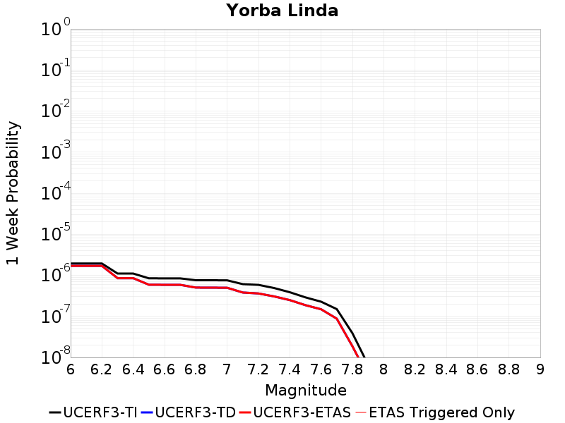 | 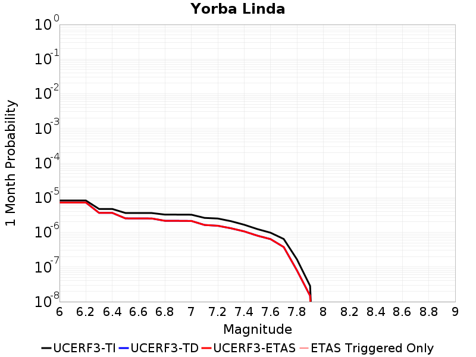 | 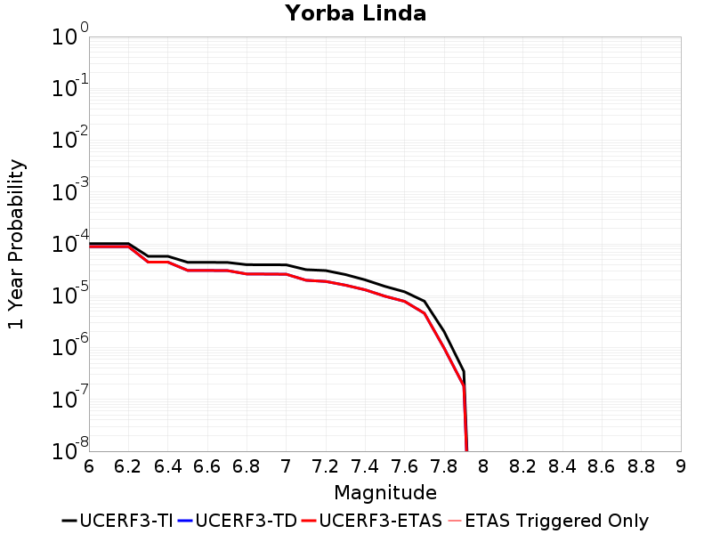 | 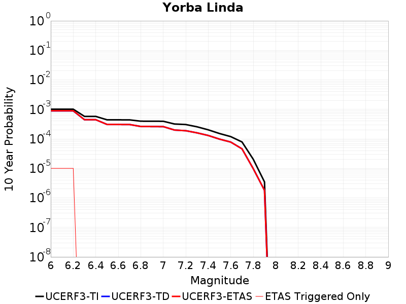 |

| Magnitude | 1 wk TI Prob | 1 wk TD Prob | 1 wk ETAS Prob | 1 wk ETAS/TD Gain | 1 wk ETAS Triggered Only | 1 mo TI Prob | 1 mo TD Prob | 1 mo ETAS Prob | 1 mo ETAS/TD Gain | 1 mo ETAS Triggered Only | 1 yr TI Prob | 1 yr TD Prob | 1 yr ETAS Prob | 1 yr ETAS/TD Gain | 1 yr ETAS Triggered Only | 10 yr TI Prob | 10 yr TD Prob | 10 yr ETAS Prob | 10 yr ETAS/TD Gain | 10 yr ETAS Triggered Only |
|-----|-----|-----|-----|-----|-----|-----|-----|-----|-----|-----|-----|-----|-----|-----|-----|-----|-----|-----|-----|-----|
| 6.0 | 1.9346849E-6 | 1.6942553E-6 | 1.6942553E-6 | 1.0 | 0.0 | 8.29148E-6 | 7.261079E-6 | 7.261079E-6 | 1.0 | 0.0 | 1.009441E-4 | 8.8401E-5 | 8.8401E-5 | 1.0 | 0.0 | 0.0010089825 | 8.8375155E-4 | 8.937427E-4 | 1.0113055 | 1.0E-5 |
| 6.1 | 1.9346849E-6 | 1.6942553E-6 | 1.6942553E-6 | 1.0 | 0.0 | 8.29148E-6 | 7.261079E-6 | 7.261079E-6 | 1.0 | 0.0 | 1.009441E-4 | 8.8401E-5 | 8.8401E-5 | 1.0 | 0.0 | 0.0010089825 | 8.8375155E-4 | 8.937427E-4 | 1.0113055 | 1.0E-5 |
| 6.2 | 1.9346849E-6 | 1.6942553E-6 | 1.6942553E-6 | 1.0 | 0.0 | 8.29148E-6 | 7.261079E-6 | 7.261079E-6 | 1.0 | 0.0 | 1.009441E-4 | 8.8401E-5 | 8.8401E-5 | 1.0 | 0.0 | 0.0010089825 | 8.8375155E-4 | 8.937427E-4 | 1.0113055 | 1.0E-5 |
| 6.3 | 1.1028608E-6 | 8.5114004E-7 | 8.5114004E-7 | 1.0 | 0.0 | 4.7265376E-6 | 3.6477384E-6 | 3.6477384E-6 | 1.0 | 0.0 | 5.754407E-5 | 4.4410375E-5 | 4.4410375E-5 | 1.0 | 0.0 | 5.7529175E-4 | 4.4402154E-4 | 4.4402154E-4 | 1.0 | 0.0 |
| 6.4 | 1.1028608E-6 | 8.5114004E-7 | 8.5114004E-7 | 1.0 | 0.0 | 4.7265376E-6 | 3.6477384E-6 | 3.6477384E-6 | 1.0 | 0.0 | 5.754407E-5 | 4.4410375E-5 | 4.4410375E-5 | 1.0 | 0.0 | 5.7529175E-4 | 4.4402154E-4 | 4.4402154E-4 | 1.0 | 0.0 |
| 6.5 | 8.4451364E-7 | 5.8976E-7 | 5.8976E-7 | 1.0 | 0.0 | 3.619339E-6 | 2.5275406E-6 | 2.5275406E-6 | 1.0 | 0.0 | 4.406456E-5 | 3.0772397E-5 | 3.0772397E-5 | 1.0 | 0.0 | 4.4055824E-4 | 3.0768348E-4 | 3.0768348E-4 | 1.0 | 0.0 |
| 6.6 | 8.422957E-7 | 5.8731143E-7 | 5.8731143E-7 | 1.0 | 0.0 | 3.6098338E-6 | 2.5170468E-6 | 2.5170468E-6 | 1.0 | 0.0 | 4.3948843E-5 | 3.0644635E-5 | 3.0644635E-5 | 1.0 | 0.0 | 4.394015E-4 | 3.0640623E-4 | 3.0640623E-4 | 1.0 | 0.0 |
| 6.7 | 8.4119705E-7 | 5.8609464E-7 | 5.8609464E-7 | 1.0 | 0.0 | 3.6051254E-6 | 2.5118318E-6 | 2.5118318E-6 | 1.0 | 0.0 | 4.3891516E-5 | 3.0581145E-5 | 3.0581145E-5 | 1.0 | 0.0 | 4.388285E-4 | 3.057715E-4 | 3.057715E-4 | 1.0 | 0.0 |
| 6.8 | 7.5919155E-7 | 5.022871E-7 | 5.022871E-7 | 1.0 | 0.0 | 3.253674E-6 | 2.1526573E-6 | 2.1526573E-6 | 1.0 | 0.0 | 3.961276E-5 | 2.6208305E-5 | 2.6208305E-5 | 1.0 | 0.0 | 3.9605703E-4 | 2.6205386E-4 | 2.6205386E-4 | 1.0 | 0.0 |
| 6.9 | 7.5804564E-7 | 5.0090415E-7 | 5.0090415E-7 | 1.0 | 0.0 | 3.248763E-6 | 2.1467304E-6 | 2.1467304E-6 | 1.0 | 0.0 | 3.955297E-5 | 2.6136147E-5 | 2.6136147E-5 | 1.0 | 0.0 | 3.9545933E-4 | 2.6133246E-4 | 2.6133246E-4 | 1.0 | 0.0 |
| 7.0 | 7.539293E-7 | 4.9711423E-7 | 4.9711423E-7 | 1.0 | 0.0 | 3.2311218E-6 | 2.130488E-6 | 2.130488E-6 | 1.0 | 0.0 | 3.9338196E-5 | 2.59384E-5 | 2.59384E-5 | 1.0 | 0.0 | 3.9331234E-4 | 2.5935544E-4 | 2.5935544E-4 | 1.0 | 0.0 |
| 7.1 | 6.0900885E-7 | 3.8070706E-7 | 3.8070706E-7 | 1.0 | 0.0 | 2.6100352E-6 | 1.6316008E-6 | 1.6316008E-6 | 1.0 | 0.0 | 3.1776715E-5 | 1.9864561E-5 | 1.9864561E-5 | 1.0 | 0.0 | 3.1772171E-4 | 1.9862822E-4 | 1.9862822E-4 | 1.0 | 0.0 |
| 7.2 | 5.849925E-7 | 3.6114278E-7 | 3.6114278E-7 | 1.0 | 0.0 | 2.5071083E-6 | 1.5477539E-6 | 1.5477539E-6 | 1.0 | 0.0 | 3.0523614E-5 | 1.8843744E-5 | 1.8843744E-5 | 1.0 | 0.0 | 3.0519423E-4 | 1.8842179E-4 | 1.8842179E-4 | 1.0 | 0.0 |
| 7.3 | 4.89808E-7 | 3.0572883E-7 | 3.0572883E-7 | 1.0 | 0.0 | 2.0991754E-6 | 1.3102658E-6 | 1.3102658E-6 | 1.0 | 0.0 | 2.5557161E-5 | 1.5952372E-5 | 1.5952372E-5 | 1.0 | 0.0 | 2.5554223E-4 | 1.5951249E-4 | 1.5951249E-4 | 1.0 | 0.0 |
| 7.4 | 3.8700415E-7 | 2.487568E-7 | 2.487568E-7 | 1.0 | 0.0 | 1.6585881E-6 | 1.0661001E-6 | 1.0661001E-6 | 1.0 | 0.0 | 2.0193123E-5 | 1.2979694E-5 | 1.2979694E-5 | 1.0 | 0.0 | 2.0191289E-4 | 1.2978948E-4 | 1.2978948E-4 | 1.0 | 0.0 |
| 7.5 | 2.900565E-7 | 1.8729882E-7 | 1.8729882E-7 | 1.0 | 0.0 | 1.2430987E-6 | 8.0270894E-7 | 8.0270894E-7 | 1.0 | 0.0 | 1.5134622E-5 | 9.772939E-6 | 9.772939E-6 | 1.0 | 0.0 | 1.5133592E-4 | 9.772517E-5 | 9.772517E-5 | 1.0 | 0.0 |
| 7.6 | 2.2770318E-7 | 1.4882357E-7 | 1.4882357E-7 | 1.0 | 0.0 | 9.758704E-7 | 6.378151E-7 | 6.378151E-7 | 1.0 | 0.0 | 1.1881158E-5 | 7.765372E-6 | 7.765372E-6 | 1.0 | 0.0 | 1.1880523E-4 | 7.7651064E-5 | 7.7651064E-5 | 1.0 | 0.0 |
| 7.7 | 1.5017194E-7 | 8.782216E-8 | 8.782216E-8 | 1.0 | 0.0 | 6.4359386E-7 | 3.7638063E-7 | 3.7638063E-7 | 1.0 | 0.0 | 7.835727E-6 | 4.582425E-6 | 4.582425E-6 | 1.0 | 0.0 | 7.835451E-5 | 4.582333E-5 | 4.582333E-5 | 1.0 | 0.0 |
| 7.8 | 3.895753E-8 | 1.8717557E-8 | 1.8717557E-8 | 1.0 | 0.0 | 1.6696083E-7 | 8.02181E-8 | 8.02181E-8 | 1.0 | 0.0 | 2.0327461E-6 | 9.76655E-7 | 9.76655E-7 | 1.0 | 0.0 | 2.0327276E-5 | 9.766509E-6 | 9.766509E-6 | 1.0 | 0.0 |
| 7.9 | 6.648505E-9 | 3.455316E-9 | 3.455316E-9 | 1.0 | 0.0 | 2.8493591E-8 | 1.4808498E-8 | 1.4808498E-8 | 1.0 | 0.0 | 3.4690942E-7 | 1.8029345E-7 | 1.8029345E-7 | 1.0 | 0.0 | 3.4690888E-6 | 1.8029332E-6 | 1.8029332E-6 | 1.0 | 0.0 |

## Peralta Hills
*[(top)](#table-of-contents)*

| 1 Week | 1 Month | 1 Year | 10 Year |
|-----|-----|-----|-----|
| 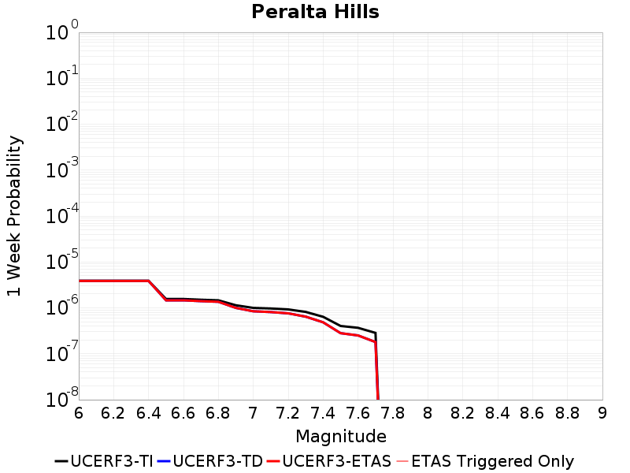 | 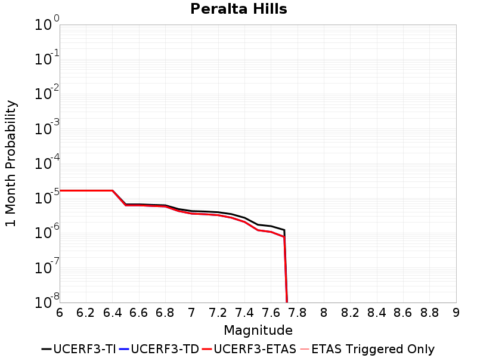 | 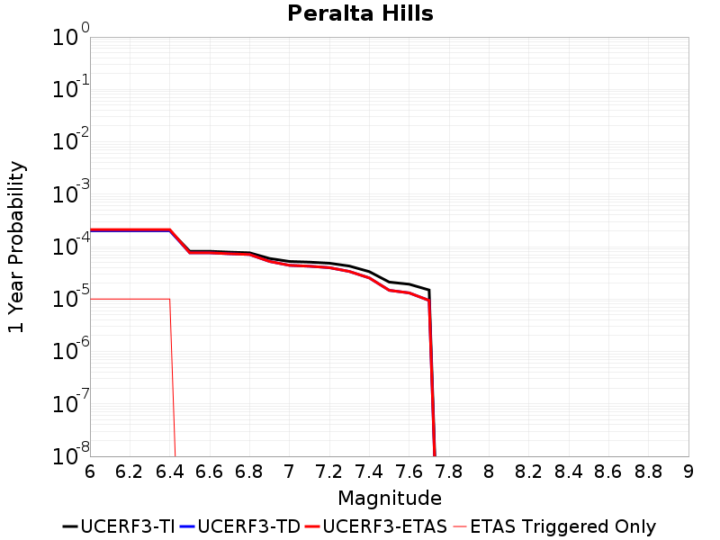 | 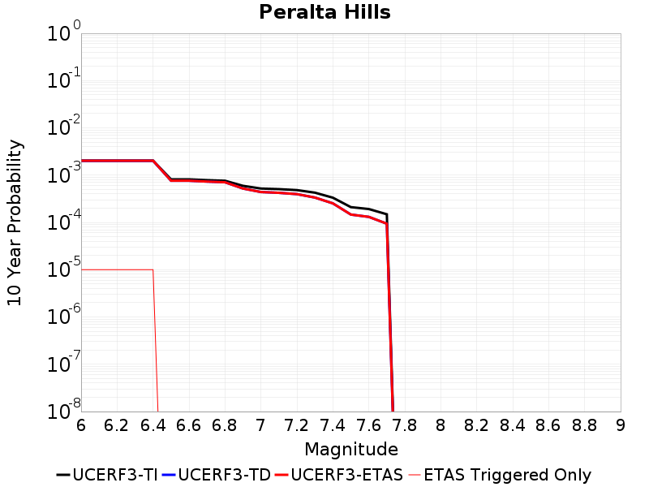 |

| Magnitude | 1 wk TI Prob | 1 wk TD Prob | 1 wk ETAS Prob | 1 wk ETAS/TD Gain | 1 wk ETAS Triggered Only | 1 mo TI Prob | 1 mo TD Prob | 1 mo ETAS Prob | 1 mo ETAS/TD Gain | 1 mo ETAS Triggered Only | 1 yr TI Prob | 1 yr TD Prob | 1 yr ETAS Prob | 1 yr ETAS/TD Gain | 1 yr ETAS Triggered Only | 10 yr TI Prob | 10 yr TD Prob | 10 yr ETAS Prob | 10 yr ETAS/TD Gain | 10 yr ETAS Triggered Only |
|-----|-----|-----|-----|-----|-----|-----|-----|-----|-----|-----|-----|-----|-----|-----|-----|-----|-----|-----|-----|-----|
| 6.0 | 3.8850067E-6 | 3.8579315E-6 | 3.8579315E-6 | 1.0 | 0.0 | 1.6649923E-5 | 1.653393E-5 | 1.653393E-5 | 1.0 | 0.0 | 2.0269395E-4 | 2.0128943E-4 | 2.1128742E-4 | 1.0496697 | 1.0E-5 | 0.0020250916 | 0.0020118007 | 0.0020217807 | 1.0049607 | 1.0E-5 |
| 6.1 | 3.8850067E-6 | 3.8579315E-6 | 3.8579315E-6 | 1.0 | 0.0 | 1.6649923E-5 | 1.653393E-5 | 1.653393E-5 | 1.0 | 0.0 | 2.0269395E-4 | 2.0128943E-4 | 2.1128742E-4 | 1.0496697 | 1.0E-5 | 0.0020250916 | 0.0020118007 | 0.0020217807 | 1.0049607 | 1.0E-5 |
| 6.2 | 3.8850067E-6 | 3.8579315E-6 | 3.8579315E-6 | 1.0 | 0.0 | 1.6649923E-5 | 1.653393E-5 | 1.653393E-5 | 1.0 | 0.0 | 2.0269395E-4 | 2.0128943E-4 | 2.1128742E-4 | 1.0496697 | 1.0E-5 | 0.0020250916 | 0.0020118007 | 0.0020217807 | 1.0049607 | 1.0E-5 |
| 6.3 | 3.8850067E-6 | 3.8579315E-6 | 3.8579315E-6 | 1.0 | 0.0 | 1.6649923E-5 | 1.653393E-5 | 1.653393E-5 | 1.0 | 0.0 | 2.0269395E-4 | 2.0128943E-4 | 2.1128742E-4 | 1.0496697 | 1.0E-5 | 0.0020250916 | 0.0020118007 | 0.0020217807 | 1.0049607 | 1.0E-5 |
| 6.4 | 3.8850067E-6 | 3.8579315E-6 | 3.8579315E-6 | 1.0 | 0.0 | 1.6649923E-5 | 1.653393E-5 | 1.653393E-5 | 1.0 | 0.0 | 2.0269395E-4 | 2.0128943E-4 | 2.1128742E-4 | 1.0496697 | 1.0E-5 | 0.0020250916 | 0.0020118007 | 0.0020217807 | 1.0049607 | 1.0E-5 |
| 6.5 | 1.5587785E-6 | 1.4589415E-6 | 1.4589415E-6 | 1.0 | 0.0 | 6.6804623E-6 | 6.2525924E-6 | 6.2525924E-6 | 1.0 | 0.0 | 8.133159E-5 | 7.61229E-5 | 7.61229E-5 | 1.0 | 0.0 | 8.1301836E-4 | 7.609928E-4 | 7.609928E-4 | 1.0 | 0.0 |
| 6.6 | 1.5587785E-6 | 1.4589415E-6 | 1.4589415E-6 | 1.0 | 0.0 | 6.6804623E-6 | 6.2525924E-6 | 6.2525924E-6 | 1.0 | 0.0 | 8.133159E-5 | 7.61229E-5 | 7.61229E-5 | 1.0 | 0.0 | 8.1301836E-4 | 7.609928E-4 | 7.609928E-4 | 1.0 | 0.0 |
| 6.7 | 1.5018579E-6 | 1.3994734E-6 | 1.3994734E-6 | 1.0 | 0.0 | 6.436518E-6 | 5.9977306E-6 | 5.9977306E-6 | 1.0 | 0.0 | 7.836179E-5 | 7.3020165E-5 | 7.3020165E-5 | 1.0 | 0.0 | 7.833416E-4 | 7.299858E-4 | 7.299858E-4 | 1.0 | 0.0 |
| 6.8 | 1.4584314E-6 | 1.3538347E-6 | 1.3538347E-6 | 1.0 | 0.0 | 6.250405E-6 | 5.802137E-6 | 5.802137E-6 | 1.0 | 0.0 | 7.6096025E-5 | 7.063897E-5 | 7.063897E-5 | 1.0 | 0.0 | 7.6069974E-4 | 7.061891E-4 | 7.061891E-4 | 1.0 | 0.0 |
| 6.9 | 1.1382393E-6 | 9.981954E-7 | 9.981954E-7 | 1.0 | 0.0 | 4.8781594E-6 | 4.277974E-6 | 4.277974E-6 | 1.0 | 0.0 | 5.9389975E-5 | 5.2083175E-5 | 5.2083175E-5 | 1.0 | 0.0 | 5.93741E-4 | 5.207181E-4 | 5.207181E-4 | 1.0 | 0.0 |
| 7.0 | 9.970413E-7 | 8.414326E-7 | 8.414326E-7 | 1.0 | 0.0 | 4.273027E-6 | 3.6061351E-6 | 3.6061351E-6 | 1.0 | 0.0 | 5.2022864E-5 | 4.390388E-5 | 4.390388E-5 | 1.0 | 0.0 | 5.2010687E-4 | 4.3895905E-4 | 4.3895905E-4 | 1.0 | 0.0 |
| 7.1 | 9.684443E-7 | 8.093646E-7 | 8.093646E-7 | 1.0 | 0.0 | 4.150469E-6 | 3.4687014E-6 | 3.4687014E-6 | 1.0 | 0.0 | 5.053079E-5 | 4.223069E-5 | 4.223069E-5 | 1.0 | 0.0 | 5.05193E-4 | 4.2223354E-4 | 4.2223354E-4 | 1.0 | 0.0 |
| 7.2 | 9.240811E-7 | 7.599412E-7 | 7.599412E-7 | 1.0 | 0.0 | 3.960342E-6 | 3.256887E-6 | 3.256887E-6 | 1.0 | 0.0 | 4.8216094E-5 | 3.965195E-5 | 3.965195E-5 | 1.0 | 0.0 | 4.8205635E-4 | 3.9645543E-4 | 3.9645543E-4 | 1.0 | 0.0 |
| 7.3 | 8.158643E-7 | 6.429372E-7 | 6.429372E-7 | 1.0 | 0.0 | 3.4965567E-6 | 2.7554424E-6 | 2.7554424E-6 | 1.0 | 0.0 | 4.2569747E-5 | 3.354706E-5 | 3.354706E-5 | 1.0 | 0.0 | 4.2561593E-4 | 3.3542624E-4 | 3.3542624E-4 | 1.0 | 0.0 |
| 7.4 | 6.3822824E-7 | 4.841265E-7 | 4.841265E-7 | 1.0 | 0.0 | 2.7352612E-6 | 2.0748264E-6 | 2.0748264E-6 | 1.0 | 0.0 | 3.3301294E-5 | 2.5260772E-5 | 2.5260772E-5 | 1.0 | 0.0 | 3.3296304E-4 | 2.5258423E-4 | 2.5258423E-4 | 1.0 | 0.0 |
| 7.5 | 4.0292628E-7 | 2.8083693E-7 | 2.8083693E-7 | 1.0 | 0.0 | 1.7268258E-6 | 1.2035864E-6 | 1.2035864E-6 | 1.0 | 0.0 | 2.1023901E-5 | 1.4653595E-5 | 1.4653595E-5 | 1.0 | 0.0 | 2.1021912E-4 | 1.4652913E-4 | 1.4652913E-4 | 1.0 | 0.0 |
| 7.6 | 3.672993E-7 | 2.505959E-7 | 2.505959E-7 | 1.0 | 0.0 | 1.5741389E-6 | 1.073982E-6 | 1.073982E-6 | 1.0 | 0.0 | 1.9164972E-5 | 1.3075682E-5 | 1.3075682E-5 | 1.0 | 0.0 | 1.916332E-4 | 1.3075188E-4 | 1.3075188E-4 | 1.0 | 0.0 |
| 7.7 | 2.8466823E-7 | 1.8000041E-7 | 1.8000041E-7 | 1.0 | 0.0 | 1.2200061E-6 | 7.714303E-7 | 7.714303E-7 | 1.0 | 0.0 | 1.4853474E-5 | 9.39215E-6 | 9.39215E-6 | 1.0 | 0.0 | 1.485248E-4 | 9.392017E-5 | 9.392017E-5 | 1.0 | 0.0 |

## San Andreas (San Bernardino S)
*[(top)](#table-of-contents)*

| 1 Week | 1 Month | 1 Year | 10 Year |
|-----|-----|-----|-----|
| 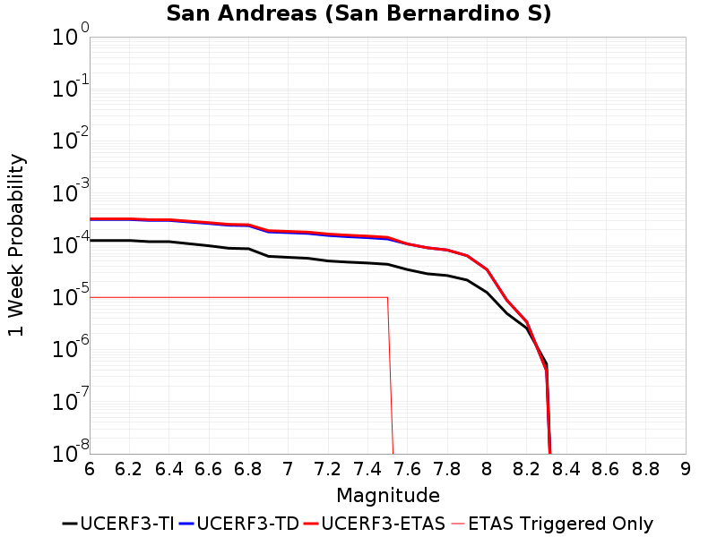 | 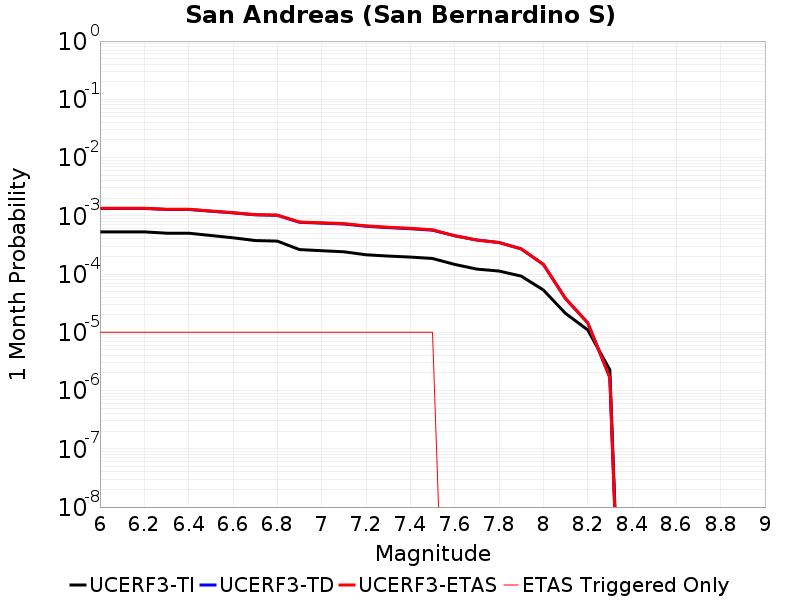 | 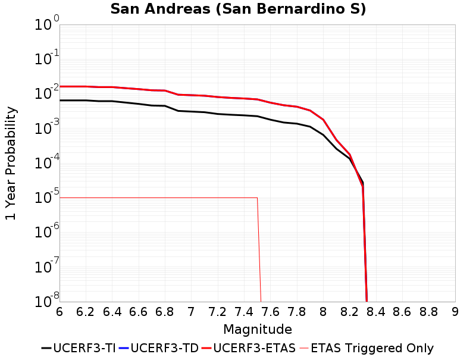 | 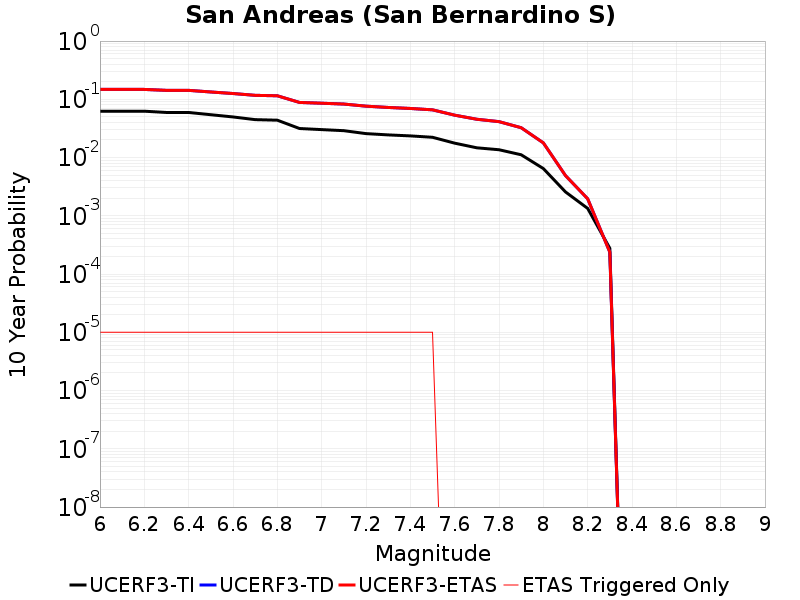 |

| Magnitude | 1 wk TI Prob | 1 wk TD Prob | 1 wk ETAS Prob | 1 wk ETAS/TD Gain | 1 wk ETAS Triggered Only | 1 mo TI Prob | 1 mo TD Prob | 1 mo ETAS Prob | 1 mo ETAS/TD Gain | 1 mo ETAS Triggered Only | 1 yr TI Prob | 1 yr TD Prob | 1 yr ETAS Prob | 1 yr ETAS/TD Gain | 1 yr ETAS Triggered Only | 10 yr TI Prob | 10 yr TD Prob | 10 yr ETAS Prob | 10 yr ETAS/TD Gain | 10 yr ETAS Triggered Only |
|-----|-----|-----|-----|-----|-----|-----|-----|-----|-----|-----|-----|-----|-----|-----|-----|-----|-----|-----|-----|-----|
| 6.0 | 1.2336002E-4 | 3.1151756E-4 | 3.2151444E-4 | 1.0320909 | 1.0E-5 | 5.2857865E-4 | 0.0013344192 | 0.0013444059 | 1.0074838 | 1.0E-5 | 0.006416472 | 0.016130714 | 0.016140552 | 1.00061 | 1.0E-5 | 0.06234337 | 0.14740933 | 0.14741786 | 1.0000578 | 1.0E-5 |
| 6.1 | 1.2336002E-4 | 3.1151756E-4 | 3.2151444E-4 | 1.0320909 | 1.0E-5 | 5.2857865E-4 | 0.0013344192 | 0.0013444059 | 1.0074838 | 1.0E-5 | 0.006416472 | 0.016130714 | 0.016140552 | 1.00061 | 1.0E-5 | 0.06234337 | 0.14740933 | 0.14741786 | 1.0000578 | 1.0E-5 |
| 6.2 | 1.2336002E-4 | 3.1151756E-4 | 3.2151444E-4 | 1.0320909 | 1.0E-5 | 5.2857865E-4 | 0.0013344192 | 0.0013444059 | 1.0074838 | 1.0E-5 | 0.006416472 | 0.016130714 | 0.016140552 | 1.00061 | 1.0E-5 | 0.06234337 | 0.14740933 | 0.14741786 | 1.0000578 | 1.0E-5 |
| 6.3 | 1.1712257E-4 | 2.9926578E-4 | 3.092628E-4 | 1.0334051 | 1.0E-5 | 5.018573E-4 | 0.0012819639 | 0.0012919512 | 1.0077906 | 1.0E-5 | 0.006093008 | 0.0155012775 | 0.0155111225 | 1.0006351 | 1.0E-5 | 0.059286322 | 0.14209886 | 0.14210743 | 1.0000603 | 1.0E-5 |
| 6.4 | 1.1712257E-4 | 2.9926578E-4 | 3.092628E-4 | 1.0334051 | 1.0E-5 | 5.018573E-4 | 0.0012819639 | 0.0012919512 | 1.0077906 | 1.0E-5 | 0.006093008 | 0.0155012775 | 0.0155111225 | 1.0006351 | 1.0E-5 | 0.059286322 | 0.14209886 | 0.14210743 | 1.0000603 | 1.0E-5 |
| 6.5 | 1.0689076E-4 | 2.7917363E-4 | 2.8917083E-4 | 1.03581 | 1.0E-5 | 4.5802278E-4 | 0.0011959355 | 0.0012059236 | 1.0083517 | 1.0E-5 | 0.0055621783 | 0.014468134 | 0.01447799 | 1.0006812 | 1.0E-5 | 0.05425003 | 0.13329649 | 0.13330516 | 1.000065 | 1.0E-5 |
| 6.6 | 9.7648895E-5 | 2.6140534E-4 | 2.7140274E-4 | 1.0382447 | 1.0E-5 | 4.1842813E-4 | 0.0011198522 | 0.001129841 | 1.0089197 | 1.0E-5 | 0.005082469 | 0.013553532 | 0.013563396 | 1.0007278 | 1.0E-5 | 0.049677886 | 0.1254115 | 0.12542024 | 1.0000697 | 1.0E-5 |
| 6.7 | 8.757013E-5 | 2.418942E-4 | 2.518918E-4 | 1.0413303 | 1.0E-5 | 3.7524657E-4 | 0.0010363008 | 0.0010462905 | 1.0096397 | 1.0E-5 | 0.00455906 | 0.012548247 | 0.012558122 | 1.0007869 | 1.0E-5 | 0.04466656 | 0.11672063 | 0.11672947 | 1.0000757 | 1.0E-5 |
| 6.8 | 8.562978E-5 | 2.3740053E-4 | 2.4739816E-4 | 1.042113 | 1.0E-5 | 3.6693315E-4 | 0.0010170573 | 0.0010270472 | 1.0098222 | 1.0E-5 | 0.004458263 | 0.012316623 | 0.012326499 | 1.0008019 | 1.0E-5 | 0.043698758 | 0.114707865 | 0.114716716 | 1.0000771 | 1.0E-5 |
| 6.9 | 6.124075E-5 | 1.8009459E-4 | 1.9009279E-4 | 1.0555164 | 1.0E-5 | 2.6243398E-4 | 7.716065E-4 | 7.815988E-4 | 1.01295 | 1.0E-5 | 0.0031904527 | 0.009354073 | 0.009363979 | 1.001059 | 1.0E-5 | 0.031450346 | 0.08816205 | 0.08817117 | 1.0001035 | 1.0E-5 |
| 7.0 | 5.8598747E-5 | 1.7426736E-4 | 1.8426562E-4 | 1.057373 | 1.0E-5 | 2.5111332E-4 | 7.466472E-4 | 7.5663975E-4 | 1.0133832 | 1.0E-5 | 0.0030530186 | 0.009052754 | 0.009062665 | 1.0010946 | 1.0E-5 | 0.03011414 | 0.08543932 | 0.08544846 | 1.000107 | 1.0E-5 |
| 7.1 | 5.613814E-5 | 1.683424E-4 | 1.7834072E-4 | 1.0593927 | 1.0E-5 | 2.4056983E-4 | 7.2126876E-4 | 7.3126156E-4 | 1.0138545 | 1.0E-5 | 0.0029250039 | 0.008746289 | 0.008756202 | 1.0011333 | 1.0E-5 | 0.028868021 | 0.082699284 | 0.082708456 | 1.0001109 | 1.0E-5 |
| 7.2 | 4.991222E-5 | 1.5413169E-4 | 1.6413014E-4 | 1.0648696 | 1.0E-5 | 2.1389198E-4 | 6.603975E-4 | 6.7039096E-4 | 1.0151324 | 1.0E-5 | 0.002601025 | 0.008010815 | 0.008020734 | 1.0012383 | 1.0E-5 | 0.025707912 | 0.07608587 | 0.07609511 | 1.0001215 | 1.0E-5 |
| 7.3 | 4.7410045E-5 | 1.4583307E-4 | 1.5583161E-4 | 1.0685616 | 1.0E-5 | 2.0317009E-4 | 6.248495E-4 | 6.3484325E-4 | 1.0159938 | 1.0E-5 | 0.0024707897 | 0.0075811036 | 0.0075910278 | 1.001309 | 1.0E-5 | 0.024434982 | 0.07228503 | 0.0722943 | 1.0001284 | 1.0E-5 |
| 7.4 | 4.5556746E-5 | 1.3973287E-4 | 1.4973148E-4 | 1.0715551 | 1.0E-5 | 1.952286E-4 | 5.9871806E-4 | 6.087121E-4 | 1.0166924 | 1.0E-5 | 0.002374317 | 0.0072651184 | 0.007275046 | 1.0013665 | 1.0E-5 | 0.023491086 | 0.06947863 | 0.06948794 | 1.0001339 | 1.0E-5 |
| 7.5 | 4.3084514E-5 | 1.3186566E-4 | 1.4186434E-4 | 1.0758247 | 1.0E-5 | 1.8463485E-4 | 5.6501647E-4 | 5.7501084E-4 | 1.0176886 | 1.0E-5 | 0.0022456115 | 0.006857459 | 0.00686739 | 1.0014483 | 1.0E-5 | 0.022230545 | 0.06580186 | 0.0658112 | 1.000142 | 1.0E-5 |
| 7.6 | 3.408608E-5 | 1.0580627E-4 | 1.0580627E-4 | 1.0 | 0.0 | 1.4607502E-4 | 4.5337676E-4 | 4.5337676E-4 | 1.0 | 0.0 | 0.0017770125 | 0.005505922 | 0.005505922 | 1.0 | 0.0 | 0.017628696 | 0.053305607 | 0.053305607 | 1.0 | 0.0 |
| 7.7 | 2.8315713E-5 | 8.937934E-5 | 8.937934E-5 | 1.0 | 0.0 | 1.2134742E-4 | 3.829981E-4 | 3.829981E-4 | 1.0 | 0.0 | 0.0014764034 | 0.0046530436 | 0.0046530436 | 1.0 | 0.0 | 0.01466633 | 0.04533386 | 0.04533386 | 1.0 | 0.0 |
| 7.8 | 2.6222975E-5 | 8.099624E-5 | 8.099624E-5 | 1.0 | 0.0 | 1.1237934E-4 | 3.4708058E-4 | 3.4708058E-4 | 1.0 | 0.0 | 0.0013673597 | 0.004217526 | 0.004217526 | 1.0 | 0.0 | 0.013589768 | 0.041279227 | 0.041279227 | 1.0 | 0.0 |
| 7.9 | 2.1469694E-5 | 6.296981E-5 | 6.296981E-5 | 1.0 | 0.0 | 9.200973E-5 | 2.6984274E-4 | 2.6984274E-4 | 1.0 | 0.0 | 0.0011196428 | 0.0032803898 | 0.0032803898 | 1.0 | 0.0 | 0.011140184 | 0.032456934 | 0.032456934 | 1.0 | 0.0 |
| 8.0 | 1.2420249E-5 | 3.4147324E-5 | 3.4147324E-5 | 1.0 | 0.0 | 5.322855E-5 | 1.4633748E-4 | 1.4633748E-4 | 1.0 | 0.0 | 6.478649E-4 | 0.0017802039 | 0.0017802039 | 1.0 | 0.0 | 0.0064597935 | 0.017832262 | 0.017832262 | 1.0 | 0.0 |
| 8.1 | 4.9197724E-6 | 8.838701E-6 | 8.838701E-6 | 1.0 | 0.0 | 2.1084568E-5 | 3.78796E-5 | 3.78796E-5 | 1.0 | 0.0 | 2.566744E-4 | 4.610867E-4 | 4.610867E-4 | 1.0 | 0.0 | 0.002563781 | 0.0048889406 | 0.0048889406 | 1.0 | 0.0 |
| 8.2 | 2.5634774E-6 | 3.3933843E-6 | 3.3933843E-6 | 1.0 | 0.0 | 1.0986286E-5 | 1.4542995E-5 | 1.4542995E-5 | 1.0 | 0.0 | 1.3374983E-4 | 1.7704663E-4 | 1.7704663E-4 | 1.0 | 0.0 | 0.0013366934 | 0.0019562736 | 0.0019562736 | 1.0 | 0.0 |
| 8.3 | 5.2850464E-7 | 3.9050474E-7 | 3.9050474E-7 | 1.0 | 0.0 | 2.2650179E-6 | 1.6735909E-6 | 1.6735909E-6 | 1.0 | 0.0 | 2.7576245E-5 | 2.0375795E-5 | 2.0375795E-5 | 1.0 | 0.0 | 2.7572823E-4 | 2.3708533E-4 | 2.3708533E-4 | 1.0 | 0.0 |

## San Andreas (Carrizo) rev
*[(top)](#table-of-contents)*

| 1 Week | 1 Month | 1 Year | 10 Year |
|-----|-----|-----|-----|
| 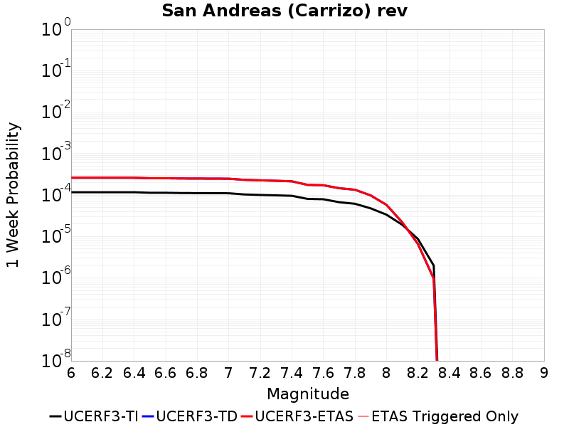 | 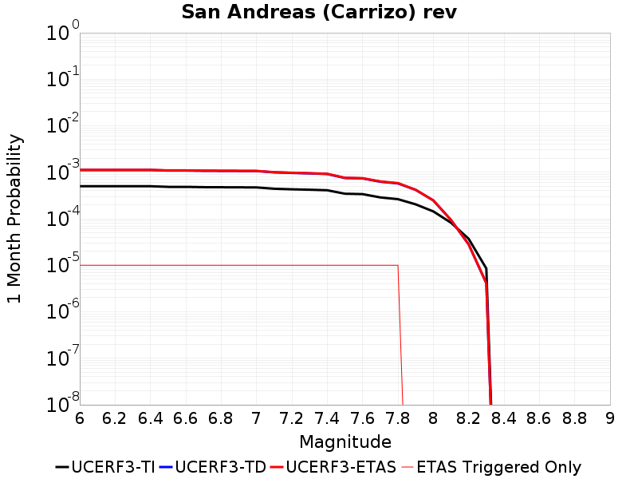 | 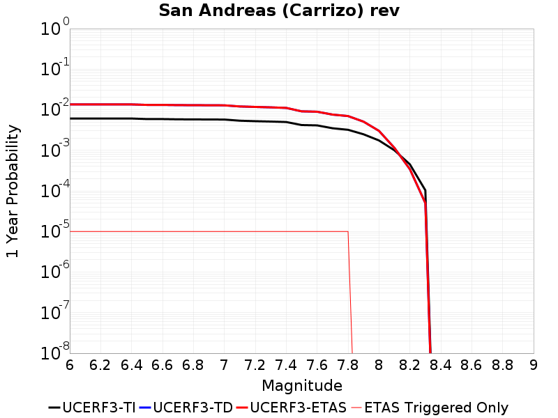 |  |

| Magnitude | 1 wk TI Prob | 1 wk TD Prob | 1 wk ETAS Prob | 1 wk ETAS/TD Gain | 1 wk ETAS Triggered Only | 1 mo TI Prob | 1 mo TD Prob | 1 mo ETAS Prob | 1 mo ETAS/TD Gain | 1 mo ETAS Triggered Only | 1 yr TI Prob | 1 yr TD Prob | 1 yr ETAS Prob | 1 yr ETAS/TD Gain | 1 yr ETAS Triggered Only | 10 yr TI Prob | 10 yr TD Prob | 10 yr ETAS Prob | 10 yr ETAS/TD Gain | 10 yr ETAS Triggered Only |
|-----|-----|-----|-----|-----|-----|-----|-----|-----|-----|-----|-----|-----|-----|-----|-----|-----|-----|-----|-----|-----|
| 6.0 | 1.1674632E-4 | 2.6040524E-4 | 2.6040524E-4 | 1.0 | 0.0 | 5.002454E-4 | 0.0011155469 | 0.0011255358 | 1.0089542 | 1.0E-5 | 0.006073493 | 0.01349776 | 0.013507624 | 1.0007309 | 1.0E-5 | 0.0591016 | 0.12775306 | 0.12776178 | 1.0000683 | 1.0E-5 |
| 6.1 | 1.1674632E-4 | 2.6040524E-4 | 2.6040524E-4 | 1.0 | 0.0 | 5.002454E-4 | 0.0011155469 | 0.0011255358 | 1.0089542 | 1.0E-5 | 0.006073493 | 0.01349776 | 0.013507624 | 1.0007309 | 1.0E-5 | 0.0591016 | 0.12775306 | 0.12776178 | 1.0000683 | 1.0E-5 |
| 6.2 | 1.1674632E-4 | 2.6040524E-4 | 2.6040524E-4 | 1.0 | 0.0 | 5.002454E-4 | 0.0011155469 | 0.0011255358 | 1.0089542 | 1.0E-5 | 0.006073493 | 0.01349776 | 0.013507624 | 1.0007309 | 1.0E-5 | 0.0591016 | 0.12775306 | 0.12776178 | 1.0000683 | 1.0E-5 |
| 6.3 | 1.1674632E-4 | 2.6040524E-4 | 2.6040524E-4 | 1.0 | 0.0 | 5.002454E-4 | 0.0011155469 | 0.0011255358 | 1.0089542 | 1.0E-5 | 0.006073493 | 0.01349776 | 0.013507624 | 1.0007309 | 1.0E-5 | 0.0591016 | 0.12775306 | 0.12776178 | 1.0000683 | 1.0E-5 |
| 6.4 | 1.1674632E-4 | 2.6040524E-4 | 2.6040524E-4 | 1.0 | 0.0 | 5.002454E-4 | 0.0011155469 | 0.0011255358 | 1.0089542 | 1.0E-5 | 0.006073493 | 0.01349776 | 0.013507624 | 1.0007309 | 1.0E-5 | 0.0591016 | 0.12775306 | 0.12776178 | 1.0000683 | 1.0E-5 |
| 6.5 | 1.13136164E-4 | 2.5349512E-4 | 2.5349512E-4 | 1.0 | 0.0 | 4.847792E-4 | 0.0010859569 | 0.0010959461 | 1.0091984 | 1.0E-5 | 0.0058862255 | 0.01314189 | 0.013151758 | 1.0007509 | 1.0E-5 | 0.057327334 | 0.12471147 | 0.12472022 | 1.0000702 | 1.0E-5 |
| 6.6 | 1.13136164E-4 | 2.5349512E-4 | 2.5349512E-4 | 1.0 | 0.0 | 4.847792E-4 | 0.0010859569 | 0.0010959461 | 1.0091984 | 1.0E-5 | 0.0058862255 | 0.01314189 | 0.013151758 | 1.0007509 | 1.0E-5 | 0.057327334 | 0.12471147 | 0.12472022 | 1.0000702 | 1.0E-5 |
| 6.7 | 1.1149675E-4 | 2.5035714E-4 | 2.5035714E-4 | 1.0 | 0.0 | 4.777557E-4 | 0.0010725196 | 0.0010825088 | 1.0093138 | 1.0E-5 | 0.0058011734 | 0.012980248 | 0.012990118 | 1.0007604 | 1.0E-5 | 0.05652051 | 0.12333062 | 0.12333939 | 1.000071 | 1.0E-5 |
| 6.8 | 1.1103589E-4 | 2.4934884E-4 | 2.4934884E-4 | 1.0 | 0.0 | 4.7578133E-4 | 0.0010682018 | 0.0010781912 | 1.0093515 | 1.0E-5 | 0.005777263 | 0.012928305 | 0.012938175 | 1.0007635 | 1.0E-5 | 0.056293584 | 0.12288292 | 0.12289169 | 1.0000714 | 1.0E-5 |
| 6.9 | 1.1053259E-4 | 2.482399E-4 | 2.482399E-4 | 1.0 | 0.0 | 4.7362508E-4 | 0.0010634531 | 0.0010734425 | 1.0093933 | 1.0E-5 | 0.0057511497 | 0.012871173 | 0.012881044 | 1.0007669 | 1.0E-5 | 0.05604569 | 0.12238947 | 0.12239825 | 1.0000718 | 1.0E-5 |
| 7.0 | 1.1005377E-4 | 2.472177E-4 | 2.472177E-4 | 1.0 | 0.0 | 4.7157376E-4 | 0.0010590758 | 0.0010690652 | 1.0094322 | 1.0E-5 | 0.0057263062 | 0.012818508 | 0.01282838 | 1.0007701 | 1.0E-5 | 0.055809796 | 0.12193292 | 0.1219417 | 1.000072 | 1.0E-5 |
| 7.1 | 1.0308142E-4 | 2.3185465E-4 | 2.3185465E-4 | 1.0 | 0.0 | 4.417027E-4 | 9.932856E-4 | 0.0010032756 | 1.0100576 | 1.0E-5 | 0.0053644776 | 0.012026563 | 0.012036443 | 1.0008215 | 1.0E-5 | 0.052368138 | 0.1150761 | 0.11508495 | 1.0000769 | 1.0E-5 |
| 7.2 | 1.0027479E-4 | 2.257527E-4 | 2.257527E-4 | 1.0 | 0.0 | 4.296783E-4 | 9.671539E-4 | 9.771442E-4 | 1.0103296 | 1.0E-5 | 0.0052187922 | 0.011711872 | 0.011721755 | 1.0008439 | 1.0E-5 | 0.050979212 | 0.11233078 | 0.11233966 | 1.000079 | 1.0E-5 |
| 7.3 | 9.816942E-5 | 2.2023014E-4 | 2.2023014E-4 | 1.0 | 0.0 | 4.2065824E-4 | 9.435031E-4 | 9.534937E-4 | 1.0105888 | 1.0E-5 | 0.005109493 | 0.011426981 | 0.011436867 | 1.0008651 | 1.0E-5 | 0.049935985 | 0.10982201 | 0.10983091 | 1.0000811 | 1.0E-5 |
| 7.4 | 9.5634205E-5 | 2.1364848E-4 | 2.1364848E-4 | 1.0 | 0.0 | 4.0979648E-4 | 9.1531605E-4 | 9.2530693E-4 | 1.0109152 | 1.0E-5 | 0.0049778637 | 0.0110873375 | 0.011097227 | 1.0008919 | 1.0E-5 | 0.048678253 | 0.10681356 | 0.10682248 | 1.0000836 | 1.0E-5 |
| 7.5 | 8.052417E-5 | 1.7533504E-4 | 1.7533504E-4 | 1.0 | 0.0 | 3.4505792E-4 | 7.5121963E-4 | 7.6121214E-4 | 1.0133017 | 1.0E-5 | 0.0041929903 | 0.009107846 | 0.009117754 | 1.0010879 | 1.0E-5 | 0.04114753 | 0.08906831 | 0.08907742 | 1.0001023 | 1.0E-5 |
| 7.6 | 7.897024E-5 | 1.7172028E-4 | 1.7172028E-4 | 1.0 | 0.0 | 3.384E-4 | 7.357367E-4 | 7.4572937E-4 | 1.0135819 | 1.0E-5 | 0.0041122385 | 0.0089209 | 0.008930811 | 1.0011109 | 1.0E-5 | 0.040369697 | 0.08736102 | 0.08737015 | 1.0001044 | 1.0E-5 |
| 7.7 | 6.707427E-5 | 1.4583713E-4 | 1.4583713E-4 | 1.0 | 0.0 | 2.8742946E-4 | 6.248666E-4 | 6.3486036E-4 | 1.0159934 | 1.0E-5 | 0.003493839 | 0.0075812573 | 0.0075911814 | 1.001309 | 1.0E-5 | 0.034394164 | 0.074924804 | 0.07493405 | 1.0001235 | 1.0E-5 |
| 7.8 | 6.147705E-5 | 1.340487E-4 | 1.340487E-4 | 1.0 | 0.0 | 2.6344648E-4 | 5.74368E-4 | 5.8436225E-4 | 1.0174004 | 1.0E-5 | 0.0032027436 | 0.0069705425 | 0.0069804727 | 1.0014246 | 1.0E-5 | 0.031569764 | 0.06897419 | 0.068983495 | 1.000135 | 1.0E-5 |
| 7.9 | 4.7636717E-5 | 9.771316E-5 | 9.771316E-5 | 1.0 | 0.0 | 2.0414138E-4 | 4.1870348E-4 | 4.1870348E-4 | 1.0 | 0.0 | 0.0024825884 | 0.0050858106 | 0.0050858106 | 1.0 | 0.0 | 0.024550365 | 0.050788667 | 0.050788667 | 1.0 | 0.0 |
| 8.0 | 3.3554235E-5 | 5.7860125E-5 | 5.7860125E-5 | 1.0 | 0.0 | 1.4379594E-4 | 2.479484E-4 | 2.479484E-4 | 1.0 | 0.0 | 0.0017493097 | 0.0030145952 | 0.0030145952 | 1.0 | 0.0 | 0.017356034 | 0.030666351 | 0.030666351 | 1.0 | 0.0 |
| 8.1 | 1.9175432E-5 | 2.1969197E-5 | 2.1969197E-5 | 1.0 | 0.0 | 8.217783E-5 | 9.415031E-5 | 9.415031E-5 | 1.0 | 0.0 | 0.0010000558 | 0.0011456781 | 0.0011456781 | 1.0 | 0.0 | 0.009955673 | 0.01220161 | 0.01220161 | 1.0 | 0.0 |
| 8.2 | 8.643924E-6 | 6.551165E-6 | 6.551165E-6 | 1.0 | 0.0 | 3.704486E-5 | 2.807612E-5 | 2.807612E-5 | 1.0 | 0.0 | 4.5092785E-4 | 3.4177324E-4 | 3.4177324E-4 | 1.0 | 0.0 | 0.0045001395 | 0.0038293393 | 0.0038293393 | 1.0 | 0.0 |
| 8.3 | 1.983087E-6 | 9.574791E-7 | 9.574791E-7 | 1.0 | 0.0 | 8.498917E-6 | 4.1034755E-6 | 4.1034755E-6 | 1.0 | 0.0 | 1.034694E-4 | 4.9958693E-5 | 4.9958693E-5 | 1.0 | 0.0 | 0.0010342124 | 5.8023055E-4 | 5.8023055E-4 | 1.0 | 0.0 |

## San Andreas (Mojave N)
*[(top)](#table-of-contents)*

| 1 Week | 1 Month | 1 Year | 10 Year |
|-----|-----|-----|-----|
| 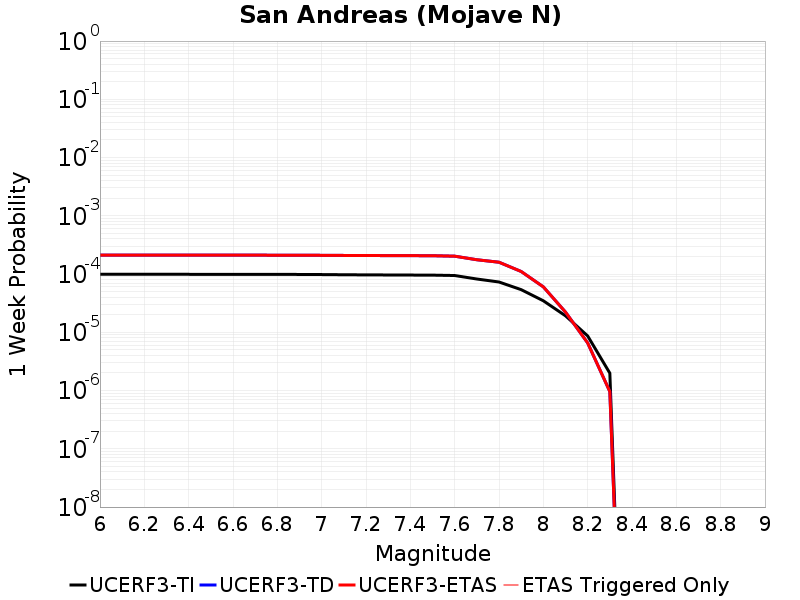 | 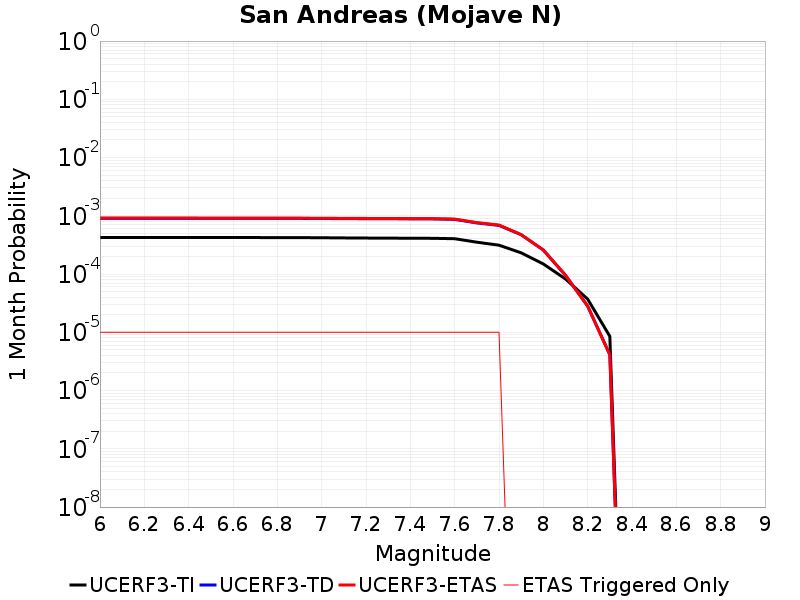 |  | 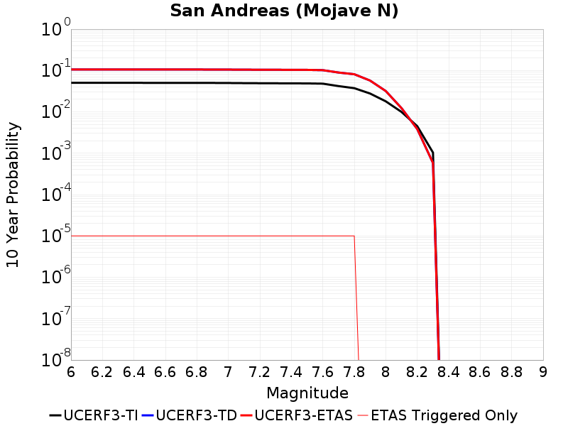 |

| Magnitude | 1 wk TI Prob | 1 wk TD Prob | 1 wk ETAS Prob | 1 wk ETAS/TD Gain | 1 wk ETAS Triggered Only | 1 mo TI Prob | 1 mo TD Prob | 1 mo ETAS Prob | 1 mo ETAS/TD Gain | 1 mo ETAS Triggered Only | 1 yr TI Prob | 1 yr TD Prob | 1 yr ETAS Prob | 1 yr ETAS/TD Gain | 1 yr ETAS Triggered Only | 10 yr TI Prob | 10 yr TD Prob | 10 yr ETAS Prob | 10 yr ETAS/TD Gain | 10 yr ETAS Triggered Only |
|-----|-----|-----|-----|-----|-----|-----|-----|-----|-----|-----|-----|-----|-----|-----|-----|-----|-----|-----|-----|-----|
| 6.0 | 9.877682E-5 | 2.1081089E-4 | 2.1081089E-4 | 1.0 | 0.0 | 4.2326056E-4 | 9.0316264E-4 | 9.131536E-4 | 1.0110621 | 1.0E-5 | 0.0051410277 | 0.010940726 | 0.010950617 | 1.000904 | 1.0E-5 | 0.05023708 | 0.10562158 | 0.105630524 | 1.0000846 | 1.0E-5 |
| 6.1 | 9.877682E-5 | 2.1081089E-4 | 2.1081089E-4 | 1.0 | 0.0 | 4.2326056E-4 | 9.0316264E-4 | 9.131536E-4 | 1.0110621 | 1.0E-5 | 0.0051410277 | 0.010940726 | 0.010950617 | 1.000904 | 1.0E-5 | 0.05023708 | 0.10562158 | 0.105630524 | 1.0000846 | 1.0E-5 |
| 6.2 | 9.877682E-5 | 2.1081089E-4 | 2.1081089E-4 | 1.0 | 0.0 | 4.2326056E-4 | 9.0316264E-4 | 9.131536E-4 | 1.0110621 | 1.0E-5 | 0.0051410277 | 0.010940726 | 0.010950617 | 1.000904 | 1.0E-5 | 0.05023708 | 0.10562158 | 0.105630524 | 1.0000846 | 1.0E-5 |
| 6.3 | 9.877682E-5 | 2.1081089E-4 | 2.1081089E-4 | 1.0 | 0.0 | 4.2326056E-4 | 9.0316264E-4 | 9.131536E-4 | 1.0110621 | 1.0E-5 | 0.0051410277 | 0.010940726 | 0.010950617 | 1.000904 | 1.0E-5 | 0.05023708 | 0.10562158 | 0.105630524 | 1.0000846 | 1.0E-5 |
| 6.4 | 9.877682E-5 | 2.1081089E-4 | 2.1081089E-4 | 1.0 | 0.0 | 4.2326056E-4 | 9.0316264E-4 | 9.131536E-4 | 1.0110621 | 1.0E-5 | 0.0051410277 | 0.010940726 | 0.010950617 | 1.000904 | 1.0E-5 | 0.05023708 | 0.10562158 | 0.105630524 | 1.0000846 | 1.0E-5 |
| 6.5 | 9.861474E-5 | 2.1054164E-4 | 2.1054164E-4 | 1.0 | 0.0 | 4.2256617E-4 | 9.020095E-4 | 9.120004E-4 | 1.0110763 | 1.0E-5 | 0.0051326132 | 0.010926827 | 0.0109367175 | 1.0009052 | 1.0E-5 | 0.050156746 | 0.10549757 | 0.10550652 | 1.0000848 | 1.0E-5 |
| 6.6 | 9.861474E-5 | 2.1054164E-4 | 2.1054164E-4 | 1.0 | 0.0 | 4.2256617E-4 | 9.020095E-4 | 9.120004E-4 | 1.0110763 | 1.0E-5 | 0.0051326132 | 0.010926827 | 0.0109367175 | 1.0009052 | 1.0E-5 | 0.050156746 | 0.10549757 | 0.10550652 | 1.0000848 | 1.0E-5 |
| 6.7 | 9.8552715E-5 | 2.1043852E-4 | 2.1043852E-4 | 1.0 | 0.0 | 4.223004E-4 | 9.0156787E-4 | 9.1155886E-4 | 1.0110818 | 1.0E-5 | 0.0051293927 | 0.010921504 | 0.010931396 | 1.0009056 | 1.0E-5 | 0.050125998 | 0.105450064 | 0.105459005 | 1.0000849 | 1.0E-5 |
| 6.8 | 9.8464974E-5 | 2.1028703E-4 | 2.1028703E-4 | 1.0 | 0.0 | 4.219245E-4 | 9.009191E-4 | 9.109101E-4 | 1.0110898 | 1.0E-5 | 0.0051248376 | 0.010913685 | 0.010923576 | 1.0009062 | 1.0E-5 | 0.05008251 | 0.10537936 | 0.105388306 | 1.0000849 | 1.0E-5 |
| 6.9 | 9.825824E-5 | 2.0996168E-4 | 2.0996168E-4 | 1.0 | 0.0 | 4.2103877E-4 | 8.9952565E-4 | 9.0951665E-4 | 1.011107 | 1.0E-5 | 0.0051141046 | 0.0108968895 | 0.010906781 | 1.0009077 | 1.0E-5 | 0.049980022 | 0.105227195 | 0.10523614 | 1.000085 | 1.0E-5 |
| 7.0 | 9.781462E-5 | 2.0926754E-4 | 2.0926754E-4 | 1.0 | 0.0 | 4.1913814E-4 | 8.965528E-4 | 9.0654386E-4 | 1.0111438 | 1.0E-5 | 0.005091073 | 0.010861057 | 0.010870948 | 1.0009108 | 1.0E-5 | 0.04976007 | 0.10490259 | 0.104911536 | 1.0000854 | 1.0E-5 |
| 7.1 | 9.7121134E-5 | 2.082727E-4 | 2.082727E-4 | 1.0 | 0.0 | 4.1616702E-4 | 8.922921E-4 | 9.0228324E-4 | 1.0111971 | 1.0E-5 | 0.005055068 | 0.010809699 | 0.010819591 | 1.000915 | 1.0E-5 | 0.04941613 | 0.10443733 | 0.104446284 | 1.0000857 | 1.0E-5 |
| 7.2 | 9.663819E-5 | 2.0757325E-4 | 2.0757325E-4 | 1.0 | 0.0 | 4.1409794E-4 | 8.892966E-4 | 8.992877E-4 | 1.0112349 | 1.0E-5 | 0.0050299936 | 0.01077359 | 0.010783481 | 1.0009181 | 1.0E-5 | 0.049176537 | 0.10411013 | 0.104119085 | 1.0000861 | 1.0E-5 |
| 7.3 | 9.6277574E-5 | 2.0708262E-4 | 2.0708262E-4 | 1.0 | 0.0 | 4.125529E-4 | 8.871953E-4 | 8.971864E-4 | 1.0112615 | 1.0E-5 | 0.0050112694 | 0.010748259 | 0.010758151 | 1.0009204 | 1.0E-5 | 0.04899759 | 0.10387832 | 0.10388728 | 1.0000863 | 1.0E-5 |
| 7.4 | 9.593308E-5 | 2.0645552E-4 | 2.0645552E-4 | 1.0 | 0.0 | 4.1107697E-4 | 8.8450947E-4 | 8.9450064E-4 | 1.0112957 | 1.0E-5 | 0.0049933824 | 0.010715881 | 0.010725775 | 1.0009232 | 1.0E-5 | 0.04882661 | 0.1035886 | 0.10359757 | 1.0000865 | 1.0E-5 |
| 7.5 | 9.561707E-5 | 2.0589372E-4 | 2.0589372E-4 | 1.0 | 0.0 | 4.0972308E-4 | 8.821035E-4 | 8.920947E-4 | 1.0113266 | 1.0E-5 | 0.0049769743 | 0.010686876 | 0.01069677 | 1.0009258 | 1.0E-5 | 0.048669744 | 0.103326894 | 0.103335865 | 1.0000868 | 1.0E-5 |
| 7.6 | 9.418194E-5 | 2.0226177E-4 | 2.0226177E-4 | 1.0 | 0.0 | 4.0357444E-4 | 8.665484E-4 | 8.765397E-4 | 1.01153 | 1.0E-5 | 0.004902454 | 0.010499333 | 0.010509227 | 1.0009425 | 1.0E-5 | 0.047957025 | 0.101655684 | 0.10166467 | 1.0000883 | 1.0E-5 |
| 7.7 | 8.202141E-5 | 1.7569441E-4 | 1.7569441E-4 | 1.0 | 0.0 | 3.51473E-4 | 7.527588E-4 | 7.6275127E-4 | 1.0132744 | 1.0E-5 | 0.00427079 | 0.009126402 | 0.009136312 | 1.0010858 | 1.0E-5 | 0.04189639 | 0.0891137 | 0.08912281 | 1.0001022 | 1.0E-5 |
| 7.8 | 7.2859846E-5 | 1.5928374E-4 | 1.5928374E-4 | 1.0 | 0.0 | 3.1221908E-4 | 6.82466E-4 | 6.924592E-4 | 1.0146427 | 1.0E-5 | 0.003794643 | 0.008277425 | 0.008287341 | 1.001198 | 1.0E-5 | 0.037304975 | 0.08104991 | 0.0810591 | 1.0001134 | 1.0E-5 |
| 7.9 | 5.3874453E-5 | 1.1043012E-4 | 1.1043012E-4 | 1.0 | 0.0 | 2.3087008E-4 | 4.731861E-4 | 4.731861E-4 | 1.0 | 0.0 | 0.0028072202 | 0.005745839 | 0.005745839 | 1.0 | 0.0 | 0.02772022 | 0.057060726 | 0.057060726 | 1.0 | 0.0 |
| 8.0 | 3.468538E-5 | 6.0153452E-5 | 6.0153452E-5 | 1.0 | 0.0 | 1.4864317E-4 | 2.5777504E-4 | 2.5777504E-4 | 1.0 | 0.0 | 0.0018082283 | 0.003133897 | 0.003133897 | 1.0 | 0.0 | 0.017935853 | 0.03181282 | 0.03181282 | 1.0 | 0.0 |
| 8.1 | 1.9152367E-5 | 2.2190956E-5 | 2.2190956E-5 | 1.0 | 0.0 | 8.207899E-5 | 9.510064E-5 | 9.510064E-5 | 1.0 | 0.0 | 9.988535E-4 | 0.001157236 | 0.001157236 | 1.0 | 0.0 | 0.009943757 | 0.012300128 | 0.012300128 | 1.0 | 0.0 |
| 8.2 | 8.643924E-6 | 6.551165E-6 | 6.551165E-6 | 1.0 | 0.0 | 3.704486E-5 | 2.807612E-5 | 2.807612E-5 | 1.0 | 0.0 | 4.5092785E-4 | 3.4177324E-4 | 3.4177324E-4 | 1.0 | 0.0 | 0.0045001395 | 0.0038293393 | 0.0038293393 | 1.0 | 0.0 |
| 8.3 | 1.983087E-6 | 9.574791E-7 | 9.574791E-7 | 1.0 | 0.0 | 8.498917E-6 | 4.1034755E-6 | 4.1034755E-6 | 1.0 | 0.0 | 1.034694E-4 | 4.9958693E-5 | 4.9958693E-5 | 1.0 | 0.0 | 0.0010342124 | 5.8023055E-4 | 5.8023055E-4 | 1.0 | 0.0 |

## Santa Ynez (West)
*[(top)](#table-of-contents)*

| 1 Week | 1 Month | 1 Year | 10 Year |
|-----|-----|-----|-----|
| 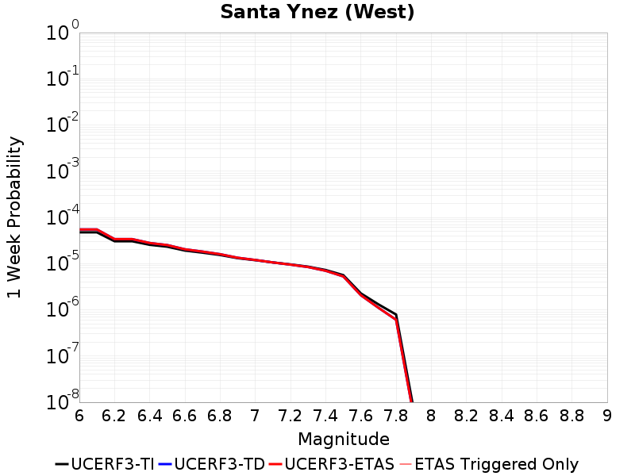 |  | 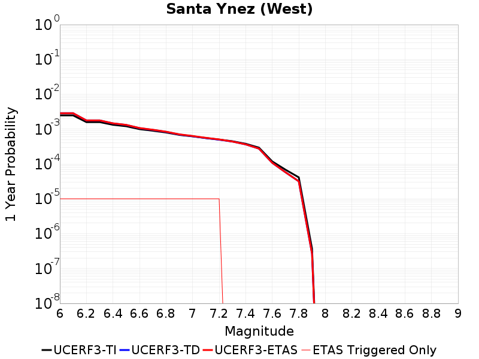 | 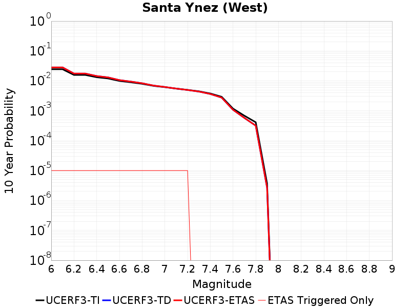 |

| Magnitude | 1 wk TI Prob | 1 wk TD Prob | 1 wk ETAS Prob | 1 wk ETAS/TD Gain | 1 wk ETAS Triggered Only | 1 mo TI Prob | 1 mo TD Prob | 1 mo ETAS Prob | 1 mo ETAS/TD Gain | 1 mo ETAS Triggered Only | 1 yr TI Prob | 1 yr TD Prob | 1 yr ETAS Prob | 1 yr ETAS/TD Gain | 1 yr ETAS Triggered Only | 10 yr TI Prob | 10 yr TD Prob | 10 yr ETAS Prob | 10 yr ETAS/TD Gain | 10 yr ETAS Triggered Only |
|-----|-----|-----|-----|-----|-----|-----|-----|-----|-----|-----|-----|-----|-----|-----|-----|-----|-----|-----|-----|-----|
| 6.0 | 4.7352758E-5 | 5.4602413E-5 | 5.4602413E-5 | 1.0 | 0.0 | 2.0292461E-4 | 2.3399094E-4 | 2.439886E-4 | 1.0427268 | 1.0E-5 | 0.0024678076 | 0.0028453846 | 0.0028553563 | 1.0035045 | 1.0E-5 | 0.024405818 | 0.028117945 | 0.028127663 | 1.0003456 | 1.0E-5 |
| 6.1 | 4.7352758E-5 | 5.4602413E-5 | 5.4602413E-5 | 1.0 | 0.0 | 2.0292461E-4 | 2.3399094E-4 | 2.439886E-4 | 1.0427268 | 1.0E-5 | 0.0024678076 | 0.0028453846 | 0.0028553563 | 1.0035045 | 1.0E-5 | 0.024405818 | 0.028117945 | 0.028127663 | 1.0003456 | 1.0E-5 |
| 6.2 | 3.0415853E-5 | 3.385924E-5 | 3.385924E-5 | 1.0 | 0.0 | 1.3034715E-4 | 1.4510317E-4 | 1.5510172E-4 | 1.0689064 | 1.0E-5 | 0.0015858212 | 0.0017652349 | 0.0017752172 | 1.0056549 | 1.0E-5 | 0.015745522 | 0.01751619 | 0.017526014 | 1.0005609 | 1.0E-5 |
| 6.3 | 3.0415853E-5 | 3.385924E-5 | 3.385924E-5 | 1.0 | 0.0 | 1.3034715E-4 | 1.4510317E-4 | 1.5510172E-4 | 1.0689064 | 1.0E-5 | 0.0015858212 | 0.0017652349 | 0.0017752172 | 1.0056549 | 1.0E-5 | 0.015745522 | 0.01751619 | 0.017526014 | 1.0005609 | 1.0E-5 |
| 6.4 | 2.5452082E-5 | 2.790173E-5 | 2.790173E-5 | 1.0 | 0.0 | 1.09075794E-4 | 1.1957347E-4 | 1.2957228E-4 | 1.0836205 | 1.0E-5 | 0.0013271887 | 0.0014548539 | 0.0014648394 | 1.0068636 | 1.0E-5 | 0.013192902 | 0.0144554945 | 0.01446535 | 1.0006818 | 1.0E-5 |
| 6.5 | 2.3143784E-5 | 2.5136813E-5 | 2.5136813E-5 | 1.0 | 0.0 | 9.9183875E-5 | 1.0772483E-4 | 1.1772376E-4 | 1.0928191 | 1.0E-5 | 0.0012068948 | 0.0013107753 | 0.0013207622 | 1.007619 | 1.0E-5 | 0.012003611 | 0.013032117 | 0.013041987 | 1.0007573 | 1.0E-5 |
| 6.6 | 1.9118515E-5 | 2.0380772E-5 | 2.0380772E-5 | 1.0 | 0.0 | 8.193392E-5 | 8.734329E-5 | 9.734242E-5 | 1.1144807 | 1.0E-5 | 9.97089E-4 | 0.0010628937 | 0.001072883 | 1.0093982 | 1.0E-5 | 0.00992627 | 0.010579012 | 0.010588907 | 1.0009353 | 1.0E-5 |
| 6.7 | 1.722807E-5 | 1.8177729E-5 | 1.8177729E-5 | 1.0 | 0.0 | 7.3832496E-5 | 7.790225E-5 | 8.790148E-5 | 1.128356 | 1.0E-5 | 8.985399E-4 | 9.480528E-4 | 9.580433E-4 | 1.010538 | 1.0E-5 | 0.008949154 | 0.009440729 | 0.009450635 | 1.0010493 | 1.0E-5 |
| 6.8 | 1.5317364E-5 | 1.5961823E-5 | 1.5961823E-5 | 1.0 | 0.0 | 6.56442E-5 | 6.840604E-5 | 7.840536E-5 | 1.1461759 | 1.0E-5 | 7.98925E-4 | 8.325296E-4 | 8.425213E-4 | 1.0120016 | 1.0E-5 | 0.007960589 | 0.008294596 | 0.008304513 | 1.0011955 | 1.0E-5 |
| 6.9 | 1.3071226E-5 | 1.3369043E-5 | 1.3369043E-5 | 1.0 | 0.0 | 5.6018336E-5 | 5.7294652E-5 | 6.729408E-5 | 1.1745263 | 1.0E-5 | 6.8180985E-4 | 6.973414E-4 | 7.0733443E-4 | 1.0143301 | 1.0E-5 | 0.0067972173 | 0.006951794 | 0.0069617247 | 1.0014285 | 1.0E-5 |
| 7.0 | 1.1836986E-5 | 1.197208E-5 | 1.197208E-5 | 1.0 | 0.0 | 5.0728955E-5 | 5.1307914E-5 | 6.13074E-5 | 1.1948917 | 1.0E-5 | 6.1745E-4 | 6.244965E-4 | 6.344902E-4 | 1.0160029 | 1.0E-5 | 0.006157372 | 0.0062276106 | 0.0062375483 | 1.0015957 | 1.0E-5 |
| 7.1 | 1.0597169E-5 | 1.0581246E-5 | 1.0581246E-5 | 1.0 | 0.0 | 4.541565E-5 | 4.5347417E-5 | 5.534696E-5 | 1.2205098 | 1.0E-5 | 5.5279525E-4 | 5.519661E-4 | 5.6196057E-4 | 1.018107 | 1.0E-5 | 0.0055142213 | 0.005506084 | 0.005516029 | 1.0018061 | 1.0E-5 |
| 7.2 | 9.59113E-6 | 9.49636E-6 | 9.49636E-6 | 1.0 | 0.0 | 4.11042E-5 | 4.0698054E-5 | 5.0697647E-5 | 1.245702 | 1.0E-5 | 5.0032866E-4 | 4.9538724E-4 | 5.053823E-4 | 1.0201762 | 1.0E-5 | 0.004992037 | 0.00494295 | 0.0049529 | 1.0020131 | 1.0E-5 |
| 7.3 | 8.586084E-6 | 8.414663E-6 | 8.414663E-6 | 1.0 | 0.0 | 3.679698E-5 | 3.606235E-5 | 3.606235E-5 | 1.0 | 0.0 | 4.4791115E-4 | 4.389717E-4 | 4.389717E-4 | 1.0 | 0.0 | 0.004470094 | 0.004381159 | 0.004381159 | 1.0 | 0.0 |
| 7.4 | 7.2622997E-6 | 6.9833964E-6 | 6.9833964E-6 | 1.0 | 0.0 | 3.112377E-5 | 2.9928504E-5 | 2.9928504E-5 | 1.0 | 0.0 | 3.78866E-4 | 3.643196E-4 | 3.643196E-4 | 1.0 | 0.0 | 0.0037822074 | 0.003637325 | 0.003637325 | 1.0 | 0.0 |
| 7.5 | 5.627296E-6 | 5.2775886E-6 | 5.2775886E-6 | 1.0 | 0.0 | 2.411676E-5 | 2.2618045E-5 | 2.2618045E-5 | 1.0 | 0.0 | 2.9358198E-4 | 2.7534063E-4 | 2.7534063E-4 | 1.0 | 0.0 | 0.0029319443 | 0.002750068 | 0.002750068 | 1.0 | 0.0 |
| 7.6 | 2.265244E-6 | 2.066136E-6 | 2.066136E-6 | 1.0 | 0.0 | 9.708152E-6 | 8.854839E-6 | 8.854839E-6 | 1.0 | 0.0 | 1.18190335E-4 | 1.07802414E-4 | 1.07802414E-4 | 1.0 | 0.0 | 0.001181275 | 0.0010775098 | 0.0010775098 | 1.0 | 0.0 |
| 7.7 | 1.3099874E-6 | 1.1045527E-6 | 1.1045527E-6 | 1.0 | 0.0 | 5.61422E-6 | 4.7337885E-6 | 4.7337885E-6 | 1.0 | 0.0 | 6.8350986E-5 | 5.7632376E-5 | 5.7632376E-5 | 1.0 | 0.0 | 6.832996E-4 | 5.761767E-4 | 5.761767E-4 | 1.0 | 0.0 |
| 7.8 | 7.903951E-7 | 6.08675E-7 | 6.08675E-7 | 1.0 | 0.0 | 3.3874032E-6 | 2.6086047E-6 | 2.6086047E-6 | 1.0 | 0.0 | 4.1240855E-5 | 3.1759315E-5 | 3.1759315E-5 | 1.0 | 0.0 | 4.12332E-4 | 3.1754907E-4 | 3.1754907E-4 | 1.0 | 0.0 |
| 7.9 | 7.0753297E-9 | 5.0982307E-9 | 5.0982307E-9 | 1.0 | 0.0 | 3.032284E-8 | 2.184956E-8 | 2.184956E-8 | 1.0 | 0.0 | 3.6918053E-7 | 2.6601836E-7 | 2.6601836E-7 | 1.0 | 0.0 | 3.691799E-6 | 2.6601815E-6 | 2.6601815E-6 | 1.0 | 0.0 |

## San Andreas (Cholame) rev
*[(top)](#table-of-contents)*

| 1 Week | 1 Month | 1 Year | 10 Year |
|-----|-----|-----|-----|
| 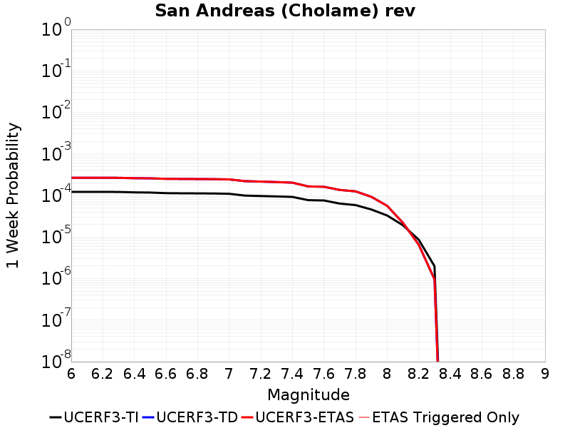 | 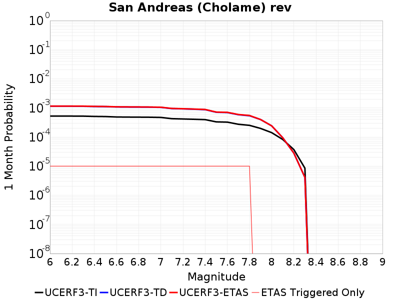 | 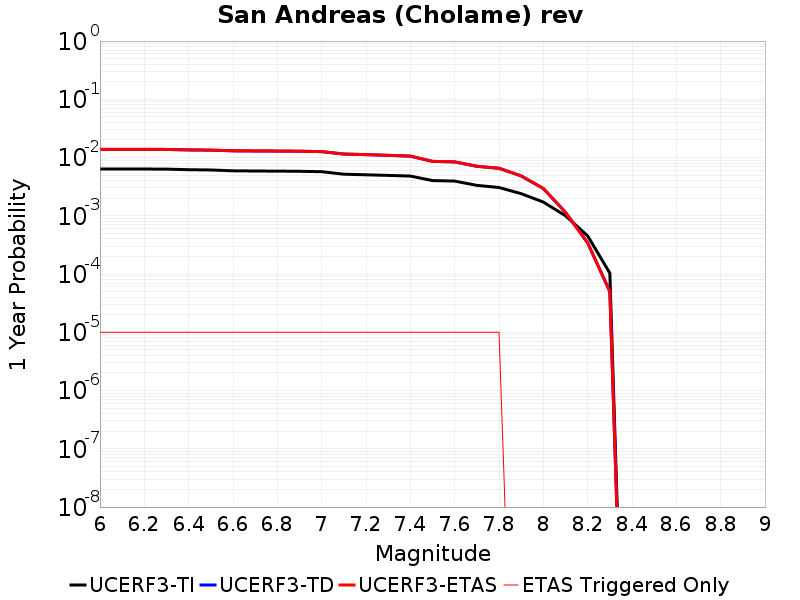 |  |

| Magnitude | 1 wk TI Prob | 1 wk TD Prob | 1 wk ETAS Prob | 1 wk ETAS/TD Gain | 1 wk ETAS Triggered Only | 1 mo TI Prob | 1 mo TD Prob | 1 mo ETAS Prob | 1 mo ETAS/TD Gain | 1 mo ETAS Triggered Only | 1 yr TI Prob | 1 yr TD Prob | 1 yr ETAS Prob | 1 yr ETAS/TD Gain | 1 yr ETAS Triggered Only | 10 yr TI Prob | 10 yr TD Prob | 10 yr ETAS Prob | 10 yr ETAS/TD Gain | 10 yr ETAS Triggered Only |
|-----|-----|-----|-----|-----|-----|-----|-----|-----|-----|-----|-----|-----|-----|-----|-----|-----|-----|-----|-----|-----|
| 6.0 | 1.2188602E-4 | 2.6614562E-4 | 2.6614562E-4 | 1.0 | 0.0 | 5.2226405E-4 | 0.0011401272 | 0.0011501159 | 1.0087609 | 1.0E-5 | 0.0063400427 | 0.013793272 | 0.013803135 | 1.000715 | 1.0E-5 | 0.061621845 | 0.13022245 | 0.13023116 | 1.0000668 | 1.0E-5 |
| 6.1 | 1.2188602E-4 | 2.6614562E-4 | 2.6614562E-4 | 1.0 | 0.0 | 5.2226405E-4 | 0.0011401272 | 0.0011501159 | 1.0087609 | 1.0E-5 | 0.0063400427 | 0.013793272 | 0.013803135 | 1.000715 | 1.0E-5 | 0.061621845 | 0.13022245 | 0.13023116 | 1.0000668 | 1.0E-5 |
| 6.2 | 1.2188602E-4 | 2.6614562E-4 | 2.6614562E-4 | 1.0 | 0.0 | 5.2226405E-4 | 0.0011401272 | 0.0011501159 | 1.0087609 | 1.0E-5 | 0.0063400427 | 0.013793272 | 0.013803135 | 1.000715 | 1.0E-5 | 0.061621845 | 0.13022245 | 0.13023116 | 1.0000668 | 1.0E-5 |
| 6.3 | 1.2142645E-4 | 2.6527024E-4 | 2.6527024E-4 | 1.0 | 0.0 | 5.202953E-4 | 0.0011363789 | 0.0011463675 | 1.0087899 | 1.0E-5 | 0.006316212 | 0.013748214 | 0.013758075 | 1.0007174 | 1.0E-5 | 0.06139677 | 0.12983762 | 0.12984632 | 1.000067 | 1.0E-5 |
| 6.4 | 1.1865206E-4 | 2.6022113E-4 | 2.6022113E-4 | 1.0 | 0.0 | 5.0840975E-4 | 0.0011147585 | 0.0011247473 | 1.0089606 | 1.0E-5 | 0.006172335 | 0.01348827 | 0.013498136 | 1.0007313 | 1.0E-5 | 0.060036868 | 0.12760499 | 0.12761371 | 1.0000684 | 1.0E-5 |
| 6.5 | 1.17443946E-4 | 2.5811468E-4 | 2.5811468E-4 | 1.0 | 0.0 | 5.032341E-4 | 0.0011057385 | 0.0011157275 | 1.0090337 | 1.0E-5 | 0.006109677 | 0.013379803 | 0.013389669 | 1.0007374 | 1.0E-5 | 0.059444077 | 0.12667315 | 0.12668188 | 1.0000689 | 1.0E-5 |
| 6.6 | 1.13579066E-4 | 2.5126222E-4 | 2.5126222E-4 | 1.0 | 0.0 | 4.866766E-4 | 0.0010763953 | 0.0010863845 | 1.0092803 | 1.0E-5 | 0.0059092017 | 0.013026874 | 0.013036743 | 1.0007577 | 1.0E-5 | 0.057545185 | 0.12362652 | 0.123635285 | 1.0000709 | 1.0E-5 |
| 6.7 | 1.1271412E-4 | 2.4970216E-4 | 2.4970216E-4 | 1.0 | 0.0 | 4.829711E-4 | 0.0010697149 | 0.0010797041 | 1.0093383 | 1.0E-5 | 0.005864331 | 0.012946509 | 0.01295638 | 1.0007625 | 1.0E-5 | 0.057119697 | 0.12293398 | 0.122942746 | 1.0000713 | 1.0E-5 |
| 6.8 | 1.1217975E-4 | 2.4857328E-4 | 2.4857328E-4 | 1.0 | 0.0 | 4.8068175E-4 | 0.0010648808 | 0.0010748701 | 1.0093807 | 1.0E-5 | 0.005836608 | 0.012888351 | 0.012898223 | 1.0007659 | 1.0E-5 | 0.056856725 | 0.12242998 | 0.12243876 | 1.0000716 | 1.0E-5 |
| 6.9 | 1.1146753E-4 | 2.470338E-4 | 2.470338E-4 | 1.0 | 0.0 | 4.7763053E-4 | 0.0010582884 | 0.0010682778 | 1.0094392 | 1.0E-5 | 0.0057996577 | 0.012809036 | 0.012818908 | 1.0007707 | 1.0E-5 | 0.056506127 | 0.1217438 | 0.12175258 | 1.0000721 | 1.0E-5 |
| 7.0 | 1.0965793E-4 | 2.4322554E-4 | 2.4322554E-4 | 1.0 | 0.0 | 4.698779E-4 | 0.0010419803 | 0.00105197 | 1.0095872 | 1.0E-5 | 0.005705768 | 0.012612803 | 0.012622676 | 1.0007828 | 1.0E-5 | 0.055614736 | 0.12003985 | 0.12004865 | 1.0000733 | 1.0E-5 |
| 7.1 | 9.927982E-5 | 2.2085753E-4 | 2.2085753E-4 | 1.0 | 0.0 | 4.2541555E-4 | 9.4619003E-4 | 9.5618056E-4 | 1.0105587 | 1.0E-5 | 0.0051671406 | 0.011459356 | 0.011469241 | 1.0008626 | 1.0E-5 | 0.05048634 | 0.10998121 | 0.109990105 | 1.000081 | 1.0E-5 |
| 7.2 | 9.696786E-5 | 2.1577462E-4 | 2.1577462E-4 | 1.0 | 0.0 | 4.1551032E-4 | 9.244217E-4 | 9.3441247E-4 | 1.0108075 | 1.0E-5 | 0.00504711 | 0.011197081 | 0.011206969 | 1.0008831 | 1.0E-5 | 0.04934009 | 0.107683375 | 0.107692294 | 1.0000829 | 1.0E-5 |
| 7.3 | 9.4727984E-5 | 2.0986218E-4 | 2.0986218E-4 | 1.0 | 0.0 | 4.0591392E-4 | 8.991004E-4 | 9.090914E-4 | 1.0111122 | 1.0E-5 | 0.0049308087 | 0.010891917 | 0.010901808 | 1.0009081 | 1.0E-5 | 0.048228268 | 0.10498755 | 0.104996495 | 1.0000852 | 1.0E-5 |
| 7.4 | 9.220358E-5 | 2.0329877E-4 | 2.0329877E-4 | 1.0 | 0.0 | 3.9509835E-4 | 8.709905E-4 | 8.809818E-4 | 1.0114712 | 1.0E-5 | 0.004799717 | 0.010553036 | 0.01056293 | 1.0009376 | 1.0E-5 | 0.046973653 | 0.10197214 | 0.10198112 | 1.0000881 | 1.0E-5 |
| 7.5 | 7.71631E-5 | 1.6513938E-4 | 1.6513938E-4 | 1.0 | 0.0 | 3.306571E-4 | 7.0754846E-4 | 7.175414E-4 | 1.0141233 | 1.0E-5 | 0.0040183207 | 0.008580466 | 0.008590381 | 1.0011555 | 1.0E-5 | 0.03946433 | 0.08420511 | 0.08421427 | 1.0001087 | 1.0E-5 |
| 7.6 | 7.5634416E-5 | 1.6159377E-4 | 1.6159377E-4 | 1.0 | 0.0 | 3.241072E-4 | 6.923611E-4 | 7.023542E-4 | 1.0144334 | 1.0E-5 | 0.0039388672 | 0.008397 | 0.008406916 | 1.0011809 | 1.0E-5 | 0.038697794 | 0.08252197 | 0.08253114 | 1.0001112 | 1.0E-5 |
| 7.7 | 6.3783E-5 | 1.358298E-4 | 1.358298E-4 | 1.0 | 0.0 | 2.7332708E-4 | 5.819979E-4 | 5.9199205E-4 | 1.0171722 | 1.0E-5 | 0.0033226798 | 0.007062839 | 0.007072768 | 1.0014058 | 1.0E-5 | 0.032734364 | 0.070077986 | 0.070087284 | 1.0001327 | 1.0E-5 |
| 7.8 | 5.863422E-5 | 1.2553278E-4 | 1.2553278E-4 | 1.0 | 0.0 | 2.512653E-4 | 5.3788675E-4 | 5.4788135E-4 | 1.0185813 | 1.0E-5 | 0.003054864 | 0.006529135 | 0.00653907 | 1.0015216 | 1.0E-5 | 0.030132094 | 0.06482843 | 0.06483779 | 1.0001442 | 1.0E-5 |
| 7.9 | 4.595283E-5 | 9.279643E-5 | 9.279643E-5 | 1.0 | 0.0 | 1.9692584E-4 | 3.976384E-4 | 3.976384E-4 | 1.0 | 0.0 | 0.0023949358 | 0.00483051 | 0.00483051 | 1.0 | 0.0 | 0.023692891 | 0.04835967 | 0.04835967 | 1.0 | 0.0 |
| 8.0 | 3.2950178E-5 | 5.636637E-5 | 5.636637E-5 | 1.0 | 0.0 | 1.412074E-4 | 2.415478E-4 | 2.415478E-4 | 1.0 | 0.0 | 0.0017178444 | 0.0029368808 | 0.0029368808 | 1.0 | 0.0 | 0.017046256 | 0.02990642 | 0.02990642 | 1.0 | 0.0 |
| 8.1 | 1.9177472E-5 | 2.196942E-5 | 2.196942E-5 | 1.0 | 0.0 | 8.218658E-5 | 9.415126E-5 | 9.415126E-5 | 1.0 | 0.0 | 0.0010001622 | 0.0011456896 | 0.0011456896 | 1.0 | 0.0 | 0.009956728 | 0.012201757 | 0.012201757 | 1.0 | 0.0 |
| 8.2 | 8.643924E-6 | 6.551165E-6 | 6.551165E-6 | 1.0 | 0.0 | 3.704486E-5 | 2.807612E-5 | 2.807612E-5 | 1.0 | 0.0 | 4.5092785E-4 | 3.4177324E-4 | 3.4177324E-4 | 1.0 | 0.0 | 0.0045001395 | 0.0038293393 | 0.0038293393 | 1.0 | 0.0 |
| 8.3 | 1.983087E-6 | 9.574791E-7 | 9.574791E-7 | 1.0 | 0.0 | 8.498917E-6 | 4.1034755E-6 | 4.1034755E-6 | 1.0 | 0.0 | 1.034694E-4 | 4.9958693E-5 | 4.9958693E-5 | 1.0 | 0.0 | 0.0010342124 | 5.8023055E-4 | 5.8023055E-4 | 1.0 | 0.0 |

## San Jacinto (Superstition Mtn)
*[(top)](#table-of-contents)*

| 1 Week | 1 Month | 1 Year | 10 Year |
|-----|-----|-----|-----|
| 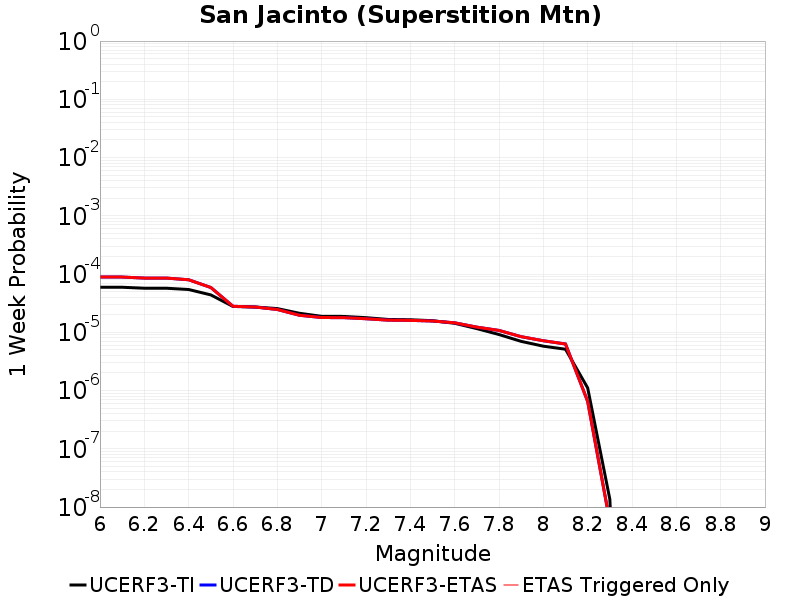 | 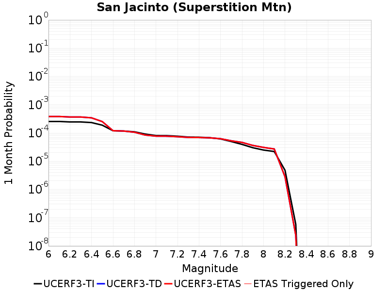 | 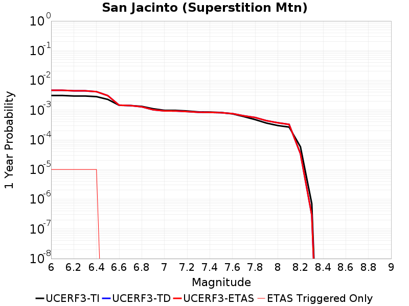 |  |

| Magnitude | 1 wk TI Prob | 1 wk TD Prob | 1 wk ETAS Prob | 1 wk ETAS/TD Gain | 1 wk ETAS Triggered Only | 1 mo TI Prob | 1 mo TD Prob | 1 mo ETAS Prob | 1 mo ETAS/TD Gain | 1 mo ETAS Triggered Only | 1 yr TI Prob | 1 yr TD Prob | 1 yr ETAS Prob | 1 yr ETAS/TD Gain | 1 yr ETAS Triggered Only | 10 yr TI Prob | 10 yr TD Prob | 10 yr ETAS Prob | 10 yr ETAS/TD Gain | 10 yr ETAS Triggered Only |
|-----|-----|-----|-----|-----|-----|-----|-----|-----|-----|-----|-----|-----|-----|-----|-----|-----|-----|-----|-----|-----|
| 6.0 | 5.921579E-5 | 8.862057E-5 | 8.862057E-5 | 1.0 | 0.0 | 2.5375726E-4 | 3.7975385E-4 | 3.7975385E-4 | 1.0 | 0.0 | 0.0030851178 | 0.004615246 | 0.0046252 | 1.0021567 | 1.0E-5 | 0.030426376 | 0.045246985 | 0.045256533 | 1.000211 | 1.0E-5 |
| 6.1 | 5.921579E-5 | 8.862057E-5 | 8.862057E-5 | 1.0 | 0.0 | 2.5375726E-4 | 3.7975385E-4 | 3.7975385E-4 | 1.0 | 0.0 | 0.0030851178 | 0.004615246 | 0.0046252 | 1.0021567 | 1.0E-5 | 0.030426376 | 0.045246985 | 0.045256533 | 1.000211 | 1.0E-5 |
| 6.2 | 5.6963574E-5 | 8.511575E-5 | 8.511575E-5 | 1.0 | 0.0 | 2.4410675E-4 | 3.647401E-4 | 3.647401E-4 | 1.0 | 0.0 | 0.0029679495 | 0.004433291 | 0.004443247 | 1.0022457 | 1.0E-5 | 0.029286223 | 0.043508958 | 0.04351852 | 1.0002198 | 1.0E-5 |
| 6.3 | 5.6940098E-5 | 8.507007E-5 | 8.507007E-5 | 1.0 | 0.0 | 2.4400617E-4 | 3.6454436E-4 | 3.6454436E-4 | 1.0 | 0.0 | 0.002966728 | 0.0044309176 | 0.0044408734 | 1.0022469 | 1.0E-5 | 0.029274331 | 0.04348631 | 0.04349587 | 1.00022 | 1.0E-5 |
| 6.4 | 5.4171585E-5 | 7.958976E-5 | 7.958976E-5 | 1.0 | 0.0 | 2.3214328E-4 | 3.4106354E-4 | 3.4106354E-4 | 1.0 | 0.0 | 0.0028226813 | 0.0041461703 | 0.004156129 | 1.0024018 | 1.0E-5 | 0.02787096 | 0.040787507 | 0.0407971 | 1.0002352 | 1.0E-5 |
| 6.5 | 4.375144E-5 | 5.8649617E-5 | 5.8649617E-5 | 1.0 | 0.0 | 1.874927E-4 | 2.5133783E-4 | 2.5133783E-4 | 1.0 | 0.0 | 0.0022803338 | 0.003056906 | 0.003056906 | 1.0 | 0.0 | 0.022570757 | 0.030386034 | 0.030386034 | 1.0 | 0.0 |
| 6.6 | 2.772192E-5 | 2.791245E-5 | 2.791245E-5 | 1.0 | 0.0 | 1.1880282E-4 | 1.1961943E-4 | 1.1961943E-4 | 1.0 | 0.0 | 0.0014454646 | 0.0014554155 | 0.0014554155 | 1.0 | 0.0 | 0.014360986 | 0.014785946 | 0.014785946 | 1.0 | 0.0 |
| 6.7 | 2.7124124E-5 | 2.7105278E-5 | 2.7105278E-5 | 1.0 | 0.0 | 1.1624106E-4 | 1.1616042E-4 | 1.1616042E-4 | 1.0 | 0.0 | 0.0014143161 | 0.0014133574 | 0.0014133574 | 1.0 | 0.0 | 0.014053487 | 0.014370987 | 0.014370987 | 1.0 | 0.0 |
| 6.8 | 2.5475807E-5 | 2.4585719E-5 | 2.4585719E-5 | 1.0 | 0.0 | 1.0917746E-4 | 1.0536319E-4 | 1.0536319E-4 | 1.0 | 0.0 | 0.001328425 | 0.0012820567 | 0.0012820567 | 1.0 | 0.0 | 0.0132051185 | 0.01306857 | 0.01306857 | 1.0 | 0.0 |
| 6.9 | 2.1162023E-5 | 1.9560317E-5 | 1.9560317E-5 | 1.0 | 0.0 | 9.069123E-5 | 8.382727E-5 | 8.382727E-5 | 1.0 | 0.0 | 0.0011036064 | 0.0010201237 | 0.0010201237 | 1.0 | 0.0 | 0.010981417 | 0.010448523 | 0.010448523 | 1.0 | 0.0 |
| 7.0 | 1.8754288E-5 | 1.7901539E-5 | 1.7901539E-5 | 1.0 | 0.0 | 8.037304E-5 | 7.671864E-5 | 7.671864E-5 | 1.0 | 0.0 | 9.781026E-4 | 9.336521E-4 | 9.336521E-4 | 1.0 | 0.0 | 0.009738087 | 0.00957318 | 0.00957318 | 1.0 | 0.0 |
| 7.1 | 1.8678527E-5 | 1.7821238E-5 | 1.7821238E-5 | 1.0 | 0.0 | 8.0048376E-5 | 7.637451E-5 | 7.637451E-5 | 1.0 | 0.0 | 9.7415317E-4 | 9.29466E-4 | 9.29466E-4 | 1.0 | 0.0 | 0.009698939 | 0.009531407 | 0.009531407 | 1.0 | 0.0 |
| 7.2 | 1.7804578E-5 | 1.7063028E-5 | 1.7063028E-5 | 1.0 | 0.0 | 7.6303106E-5 | 7.312523E-5 | 7.312523E-5 | 1.0 | 0.0 | 9.285943E-4 | 8.899387E-4 | 8.899387E-4 | 1.0 | 0.0 | 0.009247236 | 0.009136089 | 0.009136089 | 1.0 | 0.0 |
| 7.3 | 1.6583685E-5 | 1.61355E-5 | 1.61355E-5 | 1.0 | 0.0 | 7.1070994E-5 | 6.915032E-5 | 6.915032E-5 | 1.0 | 0.0 | 8.649459E-4 | 8.415824E-4 | 8.415824E-4 | 1.0 | 0.0 | 0.00861587 | 0.00865282 | 0.00865282 | 1.0 | 0.0 |
| 7.4 | 1.6387552E-5 | 1.5988726E-5 | 1.5988726E-5 | 1.0 | 0.0 | 7.023047E-5 | 6.852132E-5 | 6.852132E-5 | 1.0 | 0.0 | 8.5472054E-4 | 8.339302E-4 | 8.339302E-4 | 1.0 | 0.0 | 0.008514405 | 0.008576272 | 0.008576272 | 1.0 | 0.0 |
| 7.5 | 1.5790754E-5 | 1.5594229E-5 | 1.5594229E-5 | 1.0 | 0.0 | 6.767291E-5 | 6.683071E-5 | 6.683071E-5 | 1.0 | 0.0 | 8.236062E-4 | 8.133625E-4 | 8.133625E-4 | 1.0 | 0.0 | 0.008205604 | 0.0083687855 | 0.0083687855 | 1.0 | 0.0 |
| 7.6 | 1.4248672E-5 | 1.4531145E-5 | 1.4531145E-5 | 1.0 | 0.0 | 6.106431E-5 | 6.227486E-5 | 6.227486E-5 | 1.0 | 0.0 | 7.432043E-4 | 7.5793476E-4 | 7.5793476E-4 | 1.0 | 0.0 | 0.007407237 | 0.007809293 | 0.007809293 | 1.0 | 0.0 |
| 7.7 | 1.15449975E-5 | 1.22442125E-5 | 1.22442125E-5 | 1.0 | 0.0 | 4.947762E-5 | 5.2474144E-5 | 5.2474144E-5 | 1.0 | 0.0 | 6.022235E-4 | 6.386864E-4 | 6.386864E-4 | 1.0 | 0.0 | 0.006005941 | 0.0066098804 | 0.0066098804 | 1.0 | 0.0 |
| 7.8 | 9.1391985E-6 | 1.0744801E-5 | 1.0744801E-5 | 1.0 | 0.0 | 3.9167408E-5 | 4.604834E-5 | 4.604834E-5 | 1.0 | 0.0 | 4.767588E-4 | 5.604951E-4 | 5.604951E-4 | 1.0 | 0.0 | 0.0047573727 | 0.0058194483 | 0.0058194483 | 1.0 | 0.0 |
| 7.9 | 6.973017E-6 | 8.396698E-6 | 8.396698E-6 | 1.0 | 0.0 | 2.9884017E-5 | 3.5985355E-5 | 3.5985355E-5 | 1.0 | 0.0 | 3.6377716E-4 | 4.3803433E-4 | 4.3803433E-4 | 1.0 | 0.0 | 0.0036318225 | 0.0045831236 | 0.0045831236 | 1.0 | 0.0 |
| 8.0 | 5.7638235E-6 | 7.147437E-6 | 7.147437E-6 | 1.0 | 0.0 | 2.4701867E-5 | 3.0631516E-5 | 3.0631516E-5 | 1.0 | 0.0 | 3.0070372E-4 | 3.7287554E-4 | 3.7287554E-4 | 1.0 | 0.0 | 0.0030029714 | 0.0039188364 | 0.0039188364 | 1.0 | 0.0 |
| 8.1 | 5.1124434E-6 | 6.28502E-6 | 6.28502E-6 | 1.0 | 0.0 | 2.1910288E-5 | 2.6935524E-5 | 2.6935524E-5 | 1.0 | 0.0 | 2.6672508E-4 | 3.278913E-4 | 3.278913E-4 | 1.0 | 0.0 | 0.0026640517 | 0.0034548258 | 0.0034548258 | 1.0 | 0.0 |
| 8.2 | 1.1075938E-6 | 6.4967344E-7 | 6.4967344E-7 | 1.0 | 0.0 | 4.7468216E-6 | 2.784312E-6 | 2.784312E-6 | 1.0 | 0.0 | 5.779102E-5 | 3.3898505E-5 | 3.3898505E-5 | 1.0 | 0.0 | 5.777599E-4 | 3.776793E-4 | 3.776793E-4 | 1.0 | 0.0 |
| 8.3 | 1.3584393E-8 | 5.5631526E-9 | 5.5631526E-9 | 1.0 | 0.0 | 5.8218827E-8 | 2.3842084E-8 | 2.3842084E-8 | 1.0 | 0.0 | 7.0881396E-7 | 2.9027737E-7 | 2.9027737E-7 | 1.0 | 0.0 | 7.0881174E-6 | 3.2216835E-6 | 3.2216835E-6 | 1.0 | 0.0 |

