# Parent Section Magnitude-Probability Distributions

Only fault sections with at least one triggered aftershock are plotted. Sections are sorted by total supraseismogenic trigger rate (decreasing)

## Table Of Contents

* [Mendocino](#mendocino)
* [San Andreas (Offshore) 2011 CFM](#san-andreas-offshore-2011-cfm)
* [Bear River fault zone](#bear-river-fault-zone)
* [San Andreas (North Coast) 2011 CFM](#san-andreas-north-coast-2011-cfm)
* [King Range 2011 CFM](#king-range-2011-cfm)
* [Garberville - Briceland 2011 CFM](#garberville---briceland-2011-cfm)
* [Trinidad (alt1)](#trinidad-alt1)
* [Russ 2011 CFM](#russ-2011-cfm)
* [Little Salmon (Onshore)](#little-salmon-onshore)
* [Eaton Roughs 2011 CFM](#eaton-roughs-2011-cfm)
* [Little Salmon (Offshore)](#little-salmon-offshore)
* [Maacama 2011 CFM](#maacama-2011-cfm)
* [Table Bluff](#table-bluff)
* [Big Lagoon - Bald Mtn 2011 CFM](#big-lagoon---bald-mtn-2011-cfm)
* [Bartlett Springs 2011 CFM](#bartlett-springs-2011-cfm)
* [McKinleyville (alt1)](#mckinleyville-alt1)
* [San Andreas (Peninsula) 2011 CFM](#san-andreas-peninsula-2011-cfm)
* [Mad River (alt1)](#mad-river-alt1)
* [Hunting Creek - Berryessa 2011 CFM](#hunting-creek---berryessa-2011-cfm)
* [San Andreas (Mojave S)](#san-andreas-mojave-s)
* [San Andreas (Parkfield)](#san-andreas-parkfield)
* [Green Valley 2011 CFM](#green-valley-2011-cfm)
* [San Andreas (Creeping Section) 2011 CFM](#san-andreas-creeping-section-2011-cfm)
* [San Andreas (Santa Cruz Mts) 2011 CFM](#san-andreas-santa-cruz-mts-2011-cfm)
* [San Andreas (Cholame) rev](#san-andreas-cholame-rev)
* [Great Valley 03 Mysterious Ridge](#great-valley-03-mysterious-ridge)
* [San Andreas (Mojave N)](#san-andreas-mojave-n)
* [San Andreas (Carrizo) rev](#san-andreas-carrizo-rev)
* [San Andreas (Big Bend)](#san-andreas-big-bend)
* [Calaveras (So) 2011 CFM](#calaveras-so-2011-cfm)
* [Calaveras (Central) 2011 CFM](#calaveras-central-2011-cfm)
* [Surprise Valley 2011 CFM](#surprise-valley-2011-cfm)
* [San Gregorio (North) 2011 CFM](#san-gregorio-north-2011-cfm)
* [Monte Vista - Shannon 2011 CFM](#monte-vista---shannon-2011-cfm)
* [Likely 2011 CFM](#likely-2011-cfm)
* [Hat Creek-McArthur-Mayfield](#hat-creek-mcarthur-mayfield)
* [South Klamath Lake East](#south-klamath-lake-east)
* [San Andreas (San Bernardino N)](#san-andreas-san-bernardino-n)
* [Hunting Creek - Bartlett Springs connector 2011](#hunting-creek---bartlett-springs-connector-2011)
* [Cedar Mtn-Mahogany Mtn](#cedar-mtn-mahogany-mtn)
* [Gillem - Big Crack 2011 CFM](#gillem---big-crack-2011-cfm)
* [West Napa 2011 CFM](#west-napa-2011-cfm)
* [Fickle Hill (alt1)](#fickle-hill-alt1)
* [Calaveras (So) - Paicines extension 2011 CFM](#calaveras-so---paicines-extension-2011-cfm)
* [Point Reyes 2011 CFM](#point-reyes-2011-cfm)
* [Pleito](#pleito)
* [Great Valley 05 Pittsburg - Kirby Hills alt1](#great-valley-05-pittsburg---kirby-hills-alt1)
* [Hayward (So) extension 2011 CFM](#hayward-so-extension-2011-cfm)
* [Davis Creek](#davis-creek)
* [Hayward (No) 2011 CFM](#hayward-no-2011-cfm)
* [Franklin 2011 CFM](#franklin-2011-cfm)
* [Elsinore (Glen Ivy) rev](#elsinore-glen-ivy-rev)
* [Great Valley 03a Dunnigan Hills](#great-valley-03a-dunnigan-hills)
* [San Andreas (San Bernardino S)](#san-andreas-san-bernardino-s)
* [Calaveras (No) 2011 CFM](#calaveras-no-2011-cfm)
* [Swain Ravine - Spenceville](#swain-ravine---spenceville)
* [Rocky Ledge 2011 CFM](#rocky-ledge-2011-cfm)
* [Fitzhugh Creek](#fitzhugh-creek)
* [Pittville 2011 CFM](#pittville-2011-cfm)
* [Rodgers Creek - Healdsburg 2011 CFM](#rodgers-creek---healdsburg-2011-cfm)
* [Monterey Bay-Tularcitos](#monterey-bay-tularcitos)
* [San Andreas (San Gorgonio Pass-Garnet HIll)](#san-andreas-san-gorgonio-pass-garnet-hill)
* [Contra Costa (Lafayette) 2011 CFM](#contra-costa-lafayette-2011-cfm)
* [Honey Lake 2011 CFM](#honey-lake-2011-cfm)
* [Rinconada 2011 CFM](#rinconada-2011-cfm)
* [Lost Hills](#lost-hills)
* [Great Valley 04b Gordon Valley](#great-valley-04b-gordon-valley)
* [Whittier alt 1](#whittier-alt-1)
* [Reliz 2011 CFM](#reliz-2011-cfm)
* [Sargent 2011 CFM](#sargent-2011-cfm)
* [Santa Cruz Island](#santa-cruz-island)
* [Hayward (So) 2011 CFM](#hayward-so-2011-cfm)
* [Great Valley 02](#great-valley-02)
* [Great Valley 06 (Midland) 2011 CFM alt1](#great-valley-06-midland-2011-cfm-alt1)
* [Carson Range (Genoa)](#carson-range-genoa)
* [Great Valley 04a Trout Creek](#great-valley-04a-trout-creek)
* [West Tahoe](#west-tahoe)
* [Ortigalita (South)](#ortigalita-south)
* [Red Pass](#red-pass)
* [South Klamath Lake West](#south-klamath-lake-west)
* [Greenville (No) 2011 CFM](#greenville-no-2011-cfm)

## Mendocino
*[(top)](#table-of-contents)*

| 1 Week | 1 Month | 1 Year | 10 Year |
|-----|-----|-----|-----|
| 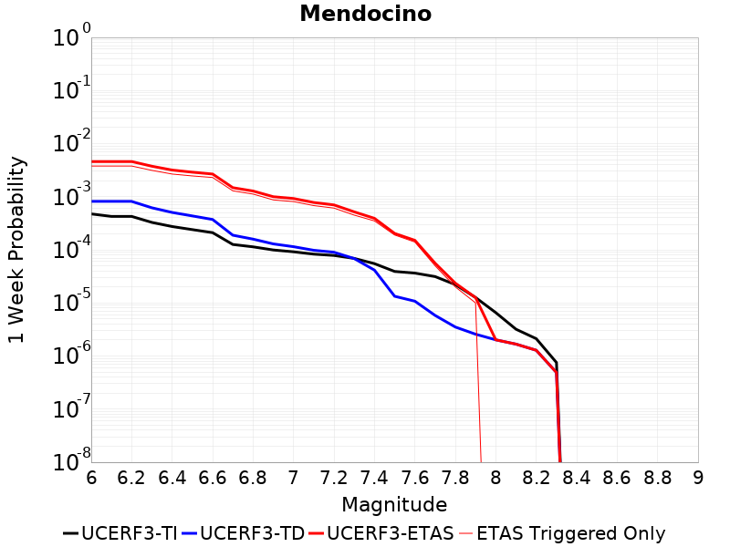 | 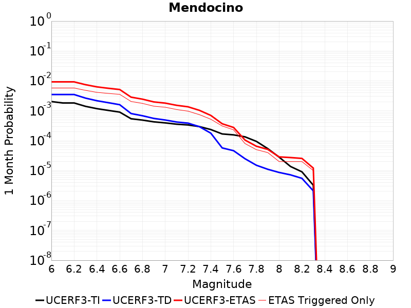 | 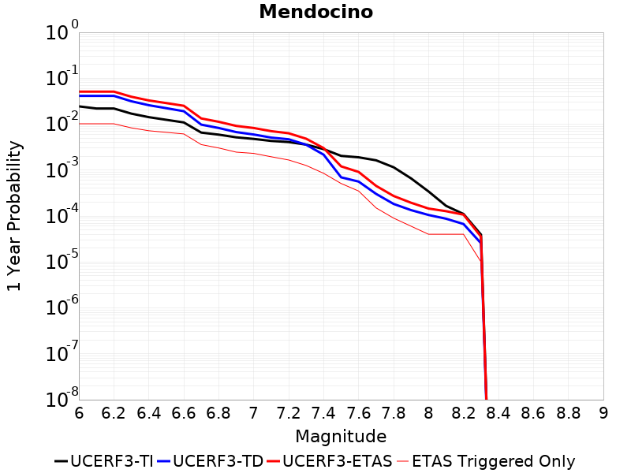 |  |

| Magnitude | 1 wk TI Prob | 1 wk TD Prob | 1 wk ETAS Prob | 1 wk ETAS/TD Gain | 1 wk ETAS Triggered Only | 1 mo TI Prob | 1 mo TD Prob | 1 mo ETAS Prob | 1 mo ETAS/TD Gain | 1 mo ETAS Triggered Only | 1 yr TI Prob | 1 yr TD Prob | 1 yr ETAS Prob | 1 yr ETAS/TD Gain | 1 yr ETAS Triggered Only | 10 yr TI Prob | 10 yr TD Prob | 10 yr ETAS Prob | 10 yr ETAS/TD Gain | 10 yr ETAS Triggered Only |
|-----|-----|-----|-----|-----|-----|-----|-----|-----|-----|-----|-----|-----|-----|-----|-----|-----|-----|-----|-----|-----|
| 6.0 | 4.7364764E-4 | 8.146905E-4 | 0.0045916107 | 5.6360188 | 0.00378 | 0.0020283395 | 0.0034854028 | 0.009225327 | 2.6468468 | 0.00576 | 0.024417073 | 0.041367225 | 0.051135693 | 1.2361403 | 0.01019 | 0.2190164 | 0.32862392 | 0.33823803 | 1.0292556 | 0.01432 |
| 6.1 | 4.2515888E-4 | 8.146905E-4 | 0.0045916107 | 5.6360188 | 0.00378 | 0.0018208373 | 0.0034854028 | 0.009225327 | 2.6468468 | 0.00576 | 0.021944538 | 0.041367225 | 0.051135693 | 1.2361403 | 0.01019 | 0.19899574 | 0.32862392 | 0.33823803 | 1.0292556 | 0.01432 |
| 6.2 | 4.2515888E-4 | 8.146905E-4 | 0.0045916107 | 5.6360188 | 0.00378 | 0.0018208373 | 0.0034854028 | 0.009225327 | 2.6468468 | 0.00576 | 0.021944538 | 0.041367225 | 0.051135693 | 1.2361403 | 0.01019 | 0.19899574 | 0.32862392 | 0.33823803 | 1.0292556 | 0.01432 |
| 6.3 | 3.2773745E-4 | 6.177127E-4 | 0.0037457792 | 6.0639505 | 0.00313 | 0.0014038329 | 0.0026435866 | 0.007440871 | 2.814688 | 0.00481 | 0.016958237 | 0.03152527 | 0.039573293 | 1.2552881 | 0.00831 | 0.1572094 | 0.2609855 | 0.26962456 | 1.0331018 | 0.01169 |
| 6.4 | 2.7417165E-4 | 5.051069E-4 | 0.0031737583 | 6.28334 | 0.00267 | 0.0011744922 | 0.0021621292 | 0.0062831994 | 2.9060242 | 0.00413 | 0.014205975 | 0.0258661 | 0.032870125 | 1.27078 | 0.00719 | 0.13331394 | 0.22021048 | 0.22817212 | 1.0361547 | 0.01021 |
| 6.5 | 2.3984899E-4 | 4.3418768E-4 | 0.0028931196 | 6.663293 | 0.00246 | 0.0010275192 | 0.0018587956 | 0.005641751 | 3.0351646 | 0.00379 | 0.012438473 | 0.022282925 | 0.028765189 | 1.2909073 | 0.00663 | 0.11764851 | 0.19322652 | 0.2008344 | 1.0393728 | 0.00943 |
| 6.6 | 2.1023539E-4 | 3.7223636E-4 | 0.0026713803 | 7.1765695 | 0.0023 | 9.0069766E-4 | 0.0015937969 | 0.005128155 | 3.2175713 | 0.00354 | 0.010910975 | 0.019144421 | 0.025157066 | 1.3140677 | 0.00613 | 0.10390546 | 0.1690295 | 0.17620909 | 1.0424753 | 0.00864 |
| 6.7 | 1.2592976E-4 | 1.8826367E-4 | 0.0014780208 | 7.850802 | 0.00129 | 5.395873E-4 | 8.0654875E-4 | 0.0028449034 | 3.5272553 | 0.00204 | 0.006549705 | 0.009766019 | 0.013320959 | 1.3640112 | 0.00359 | 0.063599944 | 0.09291439 | 0.09755867 | 1.0499845 | 0.00512 |
| 6.8 | 1.13663555E-4 | 1.5883686E-4 | 0.001278659 | 8.050139 | 0.00112 | 4.8703855E-4 | 6.805371E-4 | 0.0024393394 | 3.5844326 | 0.00176 | 0.0059135845 | 0.008251261 | 0.011256259 | 1.3641866 | 0.00303 | 0.057586733 | 0.079696 | 0.0836441 | 1.0495396 | 0.00429 |
| 6.9 | 9.926894E-5 | 1.290984E-4 | 9.989861E-4 | 7.738176 | 8.7E-4 | 4.2536893E-4 | 5.5315706E-4 | 0.0019723717 | 3.5656629 | 0.00142 | 0.0051665753 | 0.006713441 | 0.009156927 | 1.3639691 | 0.00246 | 0.050480947 | 0.06573656 | 0.06896911 | 1.0491743 | 0.00346 |
| 7.0 | 9.168125E-5 | 1.1441569E-4 | 9.24323E-4 | 8.078639 | 8.1E-4 | 3.9286047E-4 | 4.902601E-4 | 0.0017996179 | 3.670741 | 0.00131 | 0.004772591 | 0.0059524598 | 0.008248709 | 1.3857648 | 0.00231 | 0.04671385 | 0.058731187 | 0.061752662 | 1.0514458 | 0.00321 |
| 7.1 | 8.2854116E-5 | 9.798192E-5 | 7.779153E-4 | 7.9393754 | 6.8E-4 | 3.5504074E-4 | 4.1985558E-4 | 0.0015193938 | 3.6188486 | 0.0011 | 0.004314056 | 0.0050998777 | 0.007039933 | 1.3804121 | 0.00195 | 0.042312626 | 0.05078074 | 0.053353123 | 1.0506567 | 0.00271 |
| 7.2 | 7.8255274E-5 | 8.997046E-5 | 6.999156E-4 | 7.779393 | 6.1E-4 | 3.3533663E-4 | 3.8553166E-4 | 0.0013551577 | 3.515036 | 9.7E-4 | 0.0040750825 | 0.004683919 | 0.0063361432 | 1.3527441 | 0.00166 | 0.040011603 | 0.04685813 | 0.049031295 | 1.0463775 | 0.00228 |
| 7.3 | 6.887904E-5 | 6.842679E-5 | 5.18396E-4 | 7.575922 | 4.5E-4 | 2.9516246E-4 | 2.9322534E-4 | 0.0010330083 | 3.5229166 | 7.4E-4 | 0.0035876823 | 0.0035642895 | 0.0048197983 | 1.3522466 | 0.00126 | 0.035303112 | 0.036228936 | 0.03789626 | 1.0460219 | 0.00173 |
| 7.4 | 5.4898497E-5 | 4.1488744E-5 | 3.9147423E-4 | 9.435673 | 3.5E-4 | 2.3525805E-4 | 1.7779716E-4 | 6.9770473E-4 | 3.924161 | 5.2E-4 | 0.0028605047 | 0.0021625983 | 0.00301076 | 1.3921957 | 8.5E-4 | 0.02823963 | 0.022528516 | 0.023681933 | 1.051198 | 0.00118 |
| 7.5 | 3.9103943E-5 | 1.3333589E-5 | 2.0333106E-4 | 15.249537 | 1.9E-4 | 1.6757756E-4 | 5.714271E-5 | 3.67125E-4 | 6.424704 | 3.1E-4 | 0.0020383475 | 6.954924E-4 | 0.0012051377 | 1.7327834 | 5.1E-4 | 0.020197518 | 0.007802035 | 0.008486652 | 1.0877484 | 6.9E-4 |
| 7.6 | 3.641042E-5 | 1.0770212E-5 | 1.507687E-4 | 13.998675 | 1.4E-4 | 1.5603533E-4 | 4.6157245E-5 | 2.7614663E-4 | 5.9827366 | 2.3E-4 | 0.0018980748 | 5.6182116E-4 | 9.116245E-4 | 1.622624 | 3.5E-4 | 0.018819444 | 0.0064025223 | 0.006869513 | 1.0729386 | 4.7E-4 |
| 7.7 | 3.1318774E-5 | 5.8115443E-6 | 5.5811255E-5 | 9.603516 | 5.0E-5 | 1.342164E-4 | 2.4906381E-5 | 1.04904386E-4 | 4.2119484 | 8.0E-5 | 0.0016328598 | 3.0319326E-4 | 4.5314778E-4 | 1.494584 | 1.5E-4 | 0.016209139 | 0.0036998433 | 0.0039289924 | 1.0619348 | 2.3E-4 |
| 7.8 | 2.209241E-5 | 3.5130195E-6 | 2.3512948E-5 | 6.6930885 | 2.0E-5 | 9.467832E-5 | 1.5055711E-5 | 6.5054955E-5 | 4.320949 | 5.0E-5 | 0.001152099 | 1.832879E-4 | 2.732714E-4 | 1.4909408 | 9.0E-5 | 0.011461443 | 0.0022496886 | 0.0023993512 | 1.0665259 | 1.5E-4 |
| 7.9 | 1.2640477E-5 | 2.574562E-6 | 1.2574536E-5 | 4.8841457 | 1.0E-5 | 5.4172346E-5 | 1.10337905E-5 | 5.103335E-5 | 4.6251874 | 4.0E-5 | 6.593487E-4 | 1.3432816E-4 | 1.9432009E-4 | 1.4466074 | 6.0E-5 | 0.006573958 | 0.0016148378 | 0.0016947086 | 1.0494605 | 8.0E-5 |
| 8.0 | 6.5548907E-6 | 2.0171033E-6 | 2.0171033E-6 | 1.0 | 0.0 | 2.8092087E-5 | 8.6447E-6 | 2.8644527E-5 | 3.3135364 | 2.0E-5 | 3.4196748E-4 | 1.05244166E-4 | 1.4523996E-4 | 1.3800286 | 4.0E-5 | 0.0034144172 | 0.0012488529 | 0.001308778 | 1.0479841 | 6.0E-5 |
| 8.1 | 3.1916707E-6 | 1.6740947E-6 | 1.6740947E-6 | 1.0 | 0.0 | 1.3678517E-5 | 7.174672E-6 | 2.7174528E-5 | 3.7875638 | 2.0E-5 | 1.6652321E-4 | 8.734817E-5 | 1.2734467E-4 | 1.4578975 | 4.0E-5 | 0.0016639848 | 0.0010416756 | 0.0010916234 | 1.0479496 | 5.0E-5 |
| 8.2 | 2.1193785E-6 | 1.2817612E-6 | 1.2817612E-6 | 1.0 | 0.0 | 9.083019E-6 | 5.493251E-6 | 2.5493142E-5 | 4.640811 | 2.0E-5 | 1.1058014E-4 | 6.687831E-5 | 1.0687563E-4 | 1.5980612 | 4.0E-5 | 0.0011052513 | 7.91511E-4 | 8.414714E-4 | 1.0631204 | 5.0E-5 |
| 8.3 | 7.536878E-7 | 4.8886784E-7 | 4.8886784E-7 | 1.0 | 0.0 | 3.2300866E-6 | 2.0951463E-6 | 1.2095125E-5 | 5.7729263 | 1.0E-5 | 3.9325594E-5 | 2.5508129E-5 | 3.5507874E-5 | 1.3920219 | 1.0E-5 | 3.9318635E-4 | 2.9458335E-4 | 3.0458043E-4 | 1.0339363 | 1.0E-5 |

## San Andreas (Offshore) 2011 CFM
*[(top)](#table-of-contents)*

| 1 Week | 1 Month | 1 Year | 10 Year |
|-----|-----|-----|-----|
| 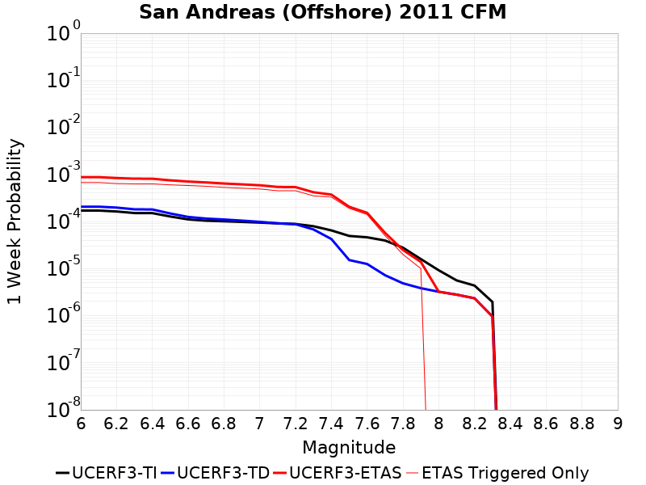 |  | 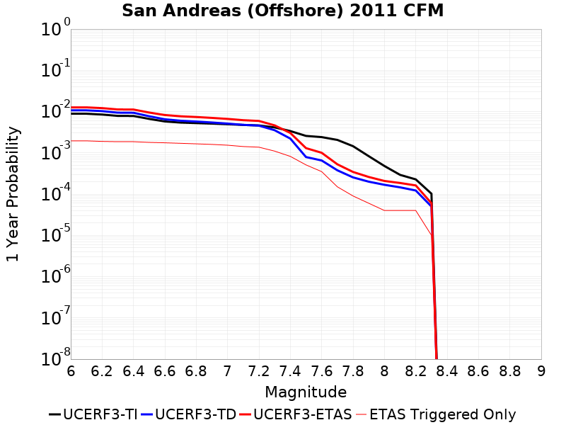 |  |

| Magnitude | 1 wk TI Prob | 1 wk TD Prob | 1 wk ETAS Prob | 1 wk ETAS/TD Gain | 1 wk ETAS Triggered Only | 1 mo TI Prob | 1 mo TD Prob | 1 mo ETAS Prob | 1 mo ETAS/TD Gain | 1 mo ETAS Triggered Only | 1 yr TI Prob | 1 yr TD Prob | 1 yr ETAS Prob | 1 yr ETAS/TD Gain | 1 yr ETAS Triggered Only | 10 yr TI Prob | 10 yr TD Prob | 10 yr ETAS Prob | 10 yr ETAS/TD Gain | 10 yr ETAS Triggered Only |
|-----|-----|-----|-----|-----|-----|-----|-----|-----|-----|-----|-----|-----|-----|-----|-----|-----|-----|-----|-----|-----|
| 6.0 | 1.7072787E-4 | 2.0614758E-4 | 8.7600946E-4 | 4.2494287 | 6.7E-4 | 7.3148566E-4 | 8.8319316E-4 | 0.0019522482 | 2.210443 | 0.00107 | 0.008869528 | 0.010700449 | 0.012629583 | 1.1802853 | 0.00195 | 0.085237645 | 0.10295942 | 0.105507016 | 1.0247437 | 0.00284 |
| 6.1 | 1.7072787E-4 | 2.0614758E-4 | 8.7600946E-4 | 4.2494287 | 6.7E-4 | 7.3148566E-4 | 8.8319316E-4 | 0.0019522482 | 2.210443 | 0.00107 | 0.008869528 | 0.010700449 | 0.012629583 | 1.1802853 | 0.00195 | 0.085237645 | 0.10295942 | 0.105507016 | 1.0247437 | 0.00284 |
| 6.2 | 1.6312556E-4 | 1.9734865E-4 | 8.372223E-4 | 4.2423515 | 6.4E-4 | 6.989222E-4 | 8.455084E-4 | 0.0018846291 | 2.2289891 | 0.00104 | 0.008476226 | 0.010246045 | 0.01211668 | 1.1825714 | 0.00189 | 0.08160117 | 0.09874415 | 0.1012226 | 1.0250998 | 0.00275 |
| 6.3 | 1.5103363E-4 | 1.8114784E-4 | 8.110337E-4 | 4.477192 | 6.3E-4 | 6.471264E-4 | 7.7611936E-4 | 0.00180532 | 2.3260853 | 0.00103 | 0.007850339 | 0.009408819 | 0.011251318 | 1.1958269 | 0.00186 | 0.075787395 | 0.09103918 | 0.09348429 | 1.0268577 | 0.00269 |
| 6.4 | 1.5047993E-4 | 1.7999749E-4 | 8.098841E-4 | 4.499419 | 6.3E-4 | 6.4475456E-4 | 7.7119214E-4 | 0.0018003979 | 2.3345644 | 0.00103 | 0.007821669 | 0.009349344 | 0.011191955 | 1.1970844 | 0.00186 | 0.0755203 | 0.09051859 | 0.092965096 | 1.0270276 | 0.00269 |
| 6.5 | 1.2760791E-4 | 1.4797946E-4 | 7.478907E-4 | 5.0540166 | 6.0E-4 | 5.467764E-4 | 6.340451E-4 | 0.0016134238 | 2.5446513 | 9.8E-4 | 0.0066367025 | 0.0076924893 | 0.009468719 | 1.2309045 | 0.00179 | 0.064419635 | 0.07516169 | 0.07749228 | 1.0310078 | 0.00252 |
| 6.6 | 1.1063525E-4 | 1.249151E-4 | 7.048426E-4 | 5.642574 | 5.8E-4 | 4.740649E-4 | 5.352418E-4 | 0.0014947279 | 2.792622 | 9.6E-4 | 0.0057564764 | 0.0064973286 | 0.008235958 | 1.2675915 | 0.00175 | 0.05609626 | 0.06390169 | 0.06619513 | 1.0358901 | 0.00245 |
| 6.7 | 1.0391049E-4 | 1.1532675E-4 | 6.752622E-4 | 5.8552084 | 5.6E-4 | 4.4525467E-4 | 4.94165E-4 | 0.0014237055 | 2.8810325 | 9.3E-4 | 0.0054075094 | 0.006000077 | 0.0076898765 | 1.2816297 | 0.0017 | 0.052778035 | 0.059219062 | 0.061458122 | 1.0378097 | 0.00238 |
| 6.8 | 1.0096706E-4 | 1.1023629E-4 | 6.4017787E-4 | 5.8073244 | 5.3E-4 | 4.3264418E-4 | 4.7235677E-4 | 0.0013619363 | 2.883279 | 8.9E-4 | 0.0052547283 | 0.0057359827 | 0.007376518 | 1.2860078 | 0.00165 | 0.051321987 | 0.056830026 | 0.059008747 | 1.0383375 | 0.00231 |
| 6.9 | 9.800265E-5 | 1.0435905E-4 | 6.1430584E-4 | 5.886464 | 5.1E-4 | 4.1994374E-4 | 4.4717747E-4 | 0.001306793 | 2.9223137 | 8.6E-4 | 0.0051008356 | 0.005430989 | 0.0070222993 | 1.2930056 | 0.0016 | 0.049853306 | 0.054083314 | 0.05617379 | 1.0386529 | 0.00221 |
| 7.0 | 9.4642375E-5 | 9.826973E-5 | 5.882216E-4 | 5.985786 | 4.9E-4 | 4.0554712E-4 | 4.2108903E-4 | 0.0012507396 | 2.9702497 | 8.3E-4 | 0.004926363 | 0.005114895 | 0.0066370694 | 1.2975963 | 0.00153 | 0.048185747 | 0.051171105 | 0.053163648 | 1.0389388 | 0.0021 |
| 7.1 | 9.0996844E-5 | 9.154501E-5 | 5.4150383E-4 | 5.915165 | 4.5E-4 | 3.8992817E-4 | 3.9227775E-4 | 0.0011519797 | 2.936643 | 7.6E-4 | 0.004737046 | 0.004765704 | 0.0061789365 | 1.2965423 | 0.00142 | 0.04637333 | 0.04792424 | 0.049780786 | 1.0387392 | 0.00195 |
| 7.2 | 8.848287E-5 | 8.761507E-5 | 5.3757563E-4 | 6.1356525 | 4.5E-4 | 3.791572E-4 | 3.754401E-4 | 0.0011251585 | 2.9969056 | 7.5E-4 | 0.004606472 | 0.004561581 | 0.0059253317 | 1.2989645 | 0.00137 | 0.045121472 | 0.045978807 | 0.047781907 | 1.0392159 | 0.00189 |
| 7.3 | 7.9280784E-5 | 6.778968E-5 | 4.1776596E-4 | 6.162678 | 3.5E-4 | 3.3973053E-4 | 2.9049552E-4 | 8.903212E-4 | 3.0648363 | 6.0E-4 | 0.004128377 | 0.0035311668 | 0.0046272827 | 1.3104118 | 0.0011 | 0.040525194 | 0.036153607 | 0.037609015 | 1.0402563 | 0.00151 |
| 7.4 | 6.468038E-5 | 4.2458792E-5 | 3.7244477E-4 | 8.771912 | 3.3E-4 | 2.771722E-4 | 1.8195395E-4 | 6.718648E-4 | 3.6924992 | 4.9E-4 | 0.0033693502 | 0.0022131067 | 0.003031292 | 1.3696998 | 8.2E-4 | 0.0331872 | 0.023185454 | 0.024289256 | 1.0476074 | 0.00113 |
| 7.5 | 4.930574E-5 | 1.5146388E-5 | 2.0514351E-4 | 13.544055 | 1.9E-4 | 2.1129321E-4 | 6.491149E-5 | 3.7489136E-4 | 5.775424 | 3.1E-4 | 0.0025694598 | 7.9001277E-4 | 0.0012996099 | 1.6450492 | 5.1E-4 | 0.02539953 | 0.008897891 | 0.009581752 | 1.0768565 | 6.9E-4 |
| 7.6 | 4.612566E-5 | 1.250579E-5 | 1.5250404E-4 | 12.194674 | 1.4E-4 | 1.9766642E-4 | 5.3595155E-5 | 2.8358283E-4 | 5.291203 | 2.3E-4 | 0.0024039324 | 6.5232726E-4 | 0.001002099 | 1.5361905 | 3.5E-4 | 0.023780935 | 0.007446242 | 0.007912742 | 1.0626491 | 4.7E-4 |
| 7.7 | 3.9435414E-5 | 7.224983E-6 | 5.722462E-5 | 7.9203815 | 5.0E-5 | 1.6899795E-4 | 3.0963845E-5 | 1.1096137E-4 | 3.5835783 | 8.0E-5 | 0.0020556084 | 3.769199E-4 | 5.268633E-4 | 1.3978126 | 1.5E-4 | 0.020366974 | 0.0045439107 | 0.004772865 | 1.0503871 | 2.3E-4 |
| 7.8 | 2.7787428E-5 | 4.865158E-6 | 2.4865061E-5 | 5.110843 | 2.0E-5 | 1.1908354E-4 | 2.085051E-5 | 7.084947E-5 | 3.3979728 | 5.0E-5 | 0.0014488777 | 2.5382545E-4 | 3.4380262E-4 | 1.3544843 | 9.0E-5 | 0.014394675 | 0.0030580298 | 0.003207571 | 1.0489012 | 1.5E-4 |
| 7.9 | 1.590671E-5 | 3.830364E-6 | 1.3830326E-5 | 3.6107078 | 1.0E-5 | 6.816983E-5 | 1.6415745E-5 | 5.6415087E-5 | 3.4366453 | 4.0E-5 | 8.2965166E-4 | 1.998434E-4 | 2.598314E-4 | 1.3001751 | 6.0E-5 | 0.008265611 | 0.0023667612 | 0.0024465718 | 1.0337214 | 8.0E-5 |
| 8.0 | 9.193638E-6 | 3.219301E-6 | 3.219301E-6 | 1.0 | 0.0 | 3.940071E-5 | 1.3796932E-5 | 3.3796656E-5 | 2.4495776 | 2.0E-5 | 4.7959806E-4 | 1.6796474E-4 | 2.0795803E-4 | 1.2381052 | 4.0E-5 | 0.0047856434 | 0.0019698362 | 0.0020297181 | 1.0303994 | 6.0E-5 |
| 8.1 | 5.601576E-6 | 2.7924384E-6 | 2.7924384E-6 | 1.0 | 0.0 | 2.4006533E-5 | 1.1967539E-5 | 3.1967298E-5 | 2.6711674 | 2.0E-5 | 2.9224035E-4 | 1.4569508E-4 | 1.8568926E-4 | 1.274506 | 4.0E-5 | 0.0029185633 | 0.0017180283 | 0.0017679423 | 1.0290531 | 5.0E-5 |
| 8.2 | 4.3508785E-6 | 2.3392286E-6 | 2.3392286E-6 | 1.0 | 0.0 | 1.864649E-5 | 1.0025227E-5 | 3.0025027E-5 | 2.9949472 | 2.0E-5 | 2.2699735E-4 | 1.2205034E-4 | 1.6204546E-4 | 1.3276936 | 4.0E-5 | 0.0022676561 | 0.0014308058 | 0.0014807343 | 1.0348953 | 5.0E-5 |
| 8.3 | 1.9573292E-6 | 9.584129E-7 | 9.584129E-7 | 1.0 | 0.0 | 8.388526E-6 | 4.1074773E-6 | 1.4107436E-5 | 3.4345744 | 1.0E-5 | 1.0212552E-4 | 5.0007417E-5 | 6.0006914E-5 | 1.1999604 | 1.0E-5 | 0.001020786 | 5.812352E-4 | 5.912294E-4 | 1.0171947 | 1.0E-5 |

## Bear River fault zone
*[(top)](#table-of-contents)*

| 1 Week | 1 Month | 1 Year | 10 Year |
|-----|-----|-----|-----|
| 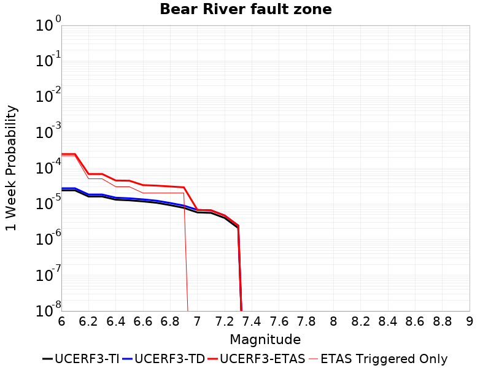 |  |  | 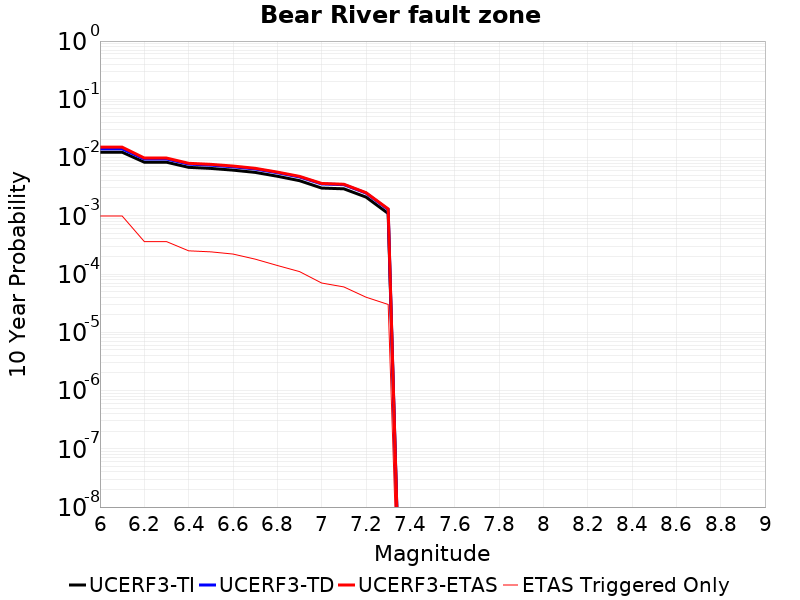 |

| Magnitude | 1 wk TI Prob | 1 wk TD Prob | 1 wk ETAS Prob | 1 wk ETAS/TD Gain | 1 wk ETAS Triggered Only | 1 mo TI Prob | 1 mo TD Prob | 1 mo ETAS Prob | 1 mo ETAS/TD Gain | 1 mo ETAS Triggered Only | 1 yr TI Prob | 1 yr TD Prob | 1 yr ETAS Prob | 1 yr ETAS/TD Gain | 1 yr ETAS Triggered Only | 10 yr TI Prob | 10 yr TD Prob | 10 yr ETAS Prob | 10 yr ETAS/TD Gain | 10 yr ETAS Triggered Only |
|-----|-----|-----|-----|-----|-----|-----|-----|-----|-----|-----|-----|-----|-----|-----|-----|-----|-----|-----|-----|-----|
| 6.0 | 2.3773342E-5 | 2.7119E-5 | 2.4711303E-4 | 9.112173 | 2.2E-4 | 1.0188177E-4 | 1.1621964E-4 | 5.26172E-4 | 4.527393 | 4.1E-4 | 0.0012397047 | 0.0014141502 | 0.0020532452 | 1.4519286 | 6.4E-4 | 0.012328116 | 0.014061022 | 0.015037102 | 1.0694174 | 9.9E-4 |
| 6.1 | 2.3773342E-5 | 2.7119E-5 | 2.4711303E-4 | 9.112173 | 2.2E-4 | 1.0188177E-4 | 1.1621964E-4 | 5.26172E-4 | 4.527393 | 4.1E-4 | 0.0012397047 | 0.0014141502 | 0.0020532452 | 1.4519286 | 6.4E-4 | 0.012328116 | 0.014061022 | 0.015037102 | 1.0694174 | 9.9E-4 |
| 6.2 | 1.5973403E-5 | 1.8152024E-5 | 6.8151116E-5 | 3.7544637 | 5.0E-5 | 6.845564E-5 | 7.77922E-5 | 1.8778365E-4 | 2.4139135 | 1.1E-4 | 8.3312875E-4 | 9.4673235E-4 | 0.0011865052 | 1.2532636 | 2.4E-4 | 0.008300122 | 0.009429408 | 0.0097860135 | 1.0378184 | 3.6E-4 |
| 6.3 | 1.5973403E-5 | 1.8152024E-5 | 6.8151116E-5 | 3.7544637 | 5.0E-5 | 6.845564E-5 | 7.77922E-5 | 1.8778365E-4 | 2.4139135 | 1.1E-4 | 8.3312875E-4 | 9.4673235E-4 | 0.0011865052 | 1.2532636 | 2.4E-4 | 0.008300122 | 0.009429408 | 0.0097860135 | 1.0378184 | 3.6E-4 |
| 6.4 | 1.3027338E-5 | 1.4814947E-5 | 4.48145E-5 | 3.024952 | 3.0E-5 | 5.5830256E-5 | 6.349116E-5 | 1.2348735E-4 | 1.9449534 | 6.0E-5 | 6.7952136E-4 | 7.7274465E-4 | 9.32621E-4 | 1.2068942 | 1.6E-4 | 0.0067744725 | 0.0077019897 | 0.007950064 | 1.0322092 | 2.5E-4 |
| 6.5 | 1.2489152E-5 | 1.4215147E-5 | 4.421472E-5 | 3.110395 | 3.0E-5 | 5.352384E-5 | 6.092071E-5 | 1.2091705E-4 | 1.9848268 | 6.0E-5 | 6.514579E-4 | 7.4147095E-4 | 8.9135976E-4 | 1.2021506 | 1.5E-4 | 0.0064955144 | 0.007391358 | 0.0076295836 | 1.0322304 | 2.4E-4 |
| 6.6 | 1.1662849E-5 | 1.3295865E-5 | 3.32956E-5 | 2.5042071 | 2.0E-5 | 4.9982682E-5 | 5.6981105E-5 | 9.697883E-5 | 1.7019471 | 4.0E-5 | 6.083692E-4 | 6.935372E-4 | 8.23447E-4 | 1.1873149 | 1.3E-4 | 0.006067064 | 0.00691504 | 0.0071335183 | 1.0315948 | 2.2E-4 |
| 6.7 | 1.0667623E-5 | 1.2191412E-5 | 3.219117E-5 | 2.640479 | 2.0E-5 | 4.5717585E-5 | 5.224793E-5 | 9.224584E-5 | 1.7655406 | 4.0E-5 | 5.5646943E-4 | 6.359448E-4 | 7.558685E-4 | 1.1885756 | 1.2E-4 | 0.0055507803 | 0.006342442 | 0.0065213 | 1.0282003 | 1.8E-4 |
| 6.8 | 9.154534E-6 | 1.0516196E-5 | 3.0515987E-5 | 2.9018083 | 2.0E-5 | 3.923313E-5 | 4.5068693E-5 | 8.5066895E-5 | 1.8874941 | 4.0E-5 | 4.7755867E-4 | 5.485838E-4 | 6.48529E-4 | 1.1821876 | 1.0E-4 | 0.004765337 | 0.0054733525 | 0.005612586 | 1.0254384 | 1.4E-4 |
| 6.9 | 7.68501E-6 | 8.896847E-6 | 2.889667E-5 | 3.2479672 | 2.0E-5 | 3.2935342E-5 | 3.812884E-5 | 6.81277E-5 | 1.786776 | 3.0E-5 | 4.0091402E-4 | 4.6412917E-4 | 5.340967E-4 | 1.15075 | 7.0E-5 | 0.004001915 | 0.004632528 | 0.0047420184 | 1.0236351 | 1.1E-4 |
| 7.0 | 5.7315733E-6 | 6.7467995E-6 | 6.7467995E-6 | 1.0 | 0.0 | 2.4563653E-5 | 2.891456E-5 | 2.891456E-5 | 1.0 | 0.0 | 2.9902143E-4 | 3.5198222E-4 | 3.9196812E-4 | 1.1136022 | 4.0E-5 | 0.0029861939 | 0.0035146736 | 0.0035844275 | 1.0198466 | 7.0E-5 |
| 7.1 | 5.566844E-6 | 6.554078E-6 | 6.554078E-6 | 1.0 | 0.0 | 2.3857683E-5 | 2.8088629E-5 | 2.8088629E-5 | 1.0 | 0.0 | 2.9042858E-4 | 3.419297E-4 | 3.7191942E-4 | 1.0877073 | 3.0E-5 | 0.002900493 | 0.0034144612 | 0.0034742563 | 1.0175123 | 6.0E-5 |
| 7.2 | 4.011353E-6 | 4.703827E-6 | 4.703827E-6 | 1.0 | 0.0 | 1.7191402E-5 | 2.0159123E-5 | 2.0159123E-5 | 1.0 | 0.0 | 2.0928521E-4 | 2.4541316E-4 | 2.754058E-4 | 1.1222129 | 3.0E-5 | 0.0020908823 | 0.0024517633 | 0.002491665 | 1.0162748 | 4.0E-5 |
| 7.3 | 2.0974871E-6 | 2.4546116E-6 | 2.4546116E-6 | 1.0 | 0.0 | 8.989199E-6 | 1.0519736E-5 | 1.0519736E-5 | 1.0 | 0.0 | 1.09438006E-4 | 1.2807279E-4 | 1.4807023E-4 | 1.1561412 | 2.0E-5 | 0.0010938413 | 0.001280238 | 0.0013101996 | 1.0234032 | 3.0E-5 |

## San Andreas (North Coast) 2011 CFM
*[(top)](#table-of-contents)*

| 1 Week | 1 Month | 1 Year | 10 Year |
|-----|-----|-----|-----|
| 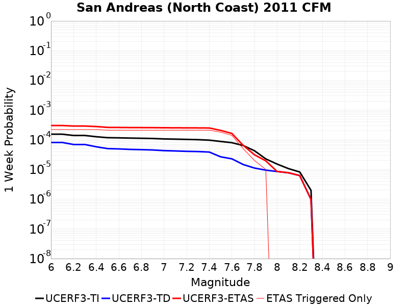 | 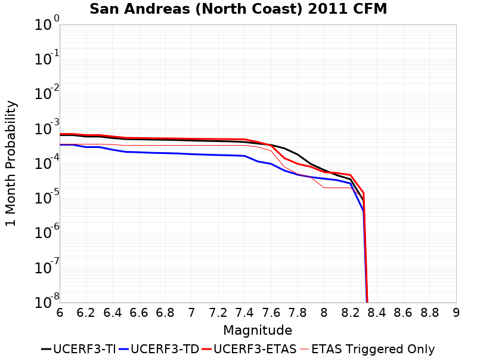 |  |  |

| Magnitude | 1 wk TI Prob | 1 wk TD Prob | 1 wk ETAS Prob | 1 wk ETAS/TD Gain | 1 wk ETAS Triggered Only | 1 mo TI Prob | 1 mo TD Prob | 1 mo ETAS Prob | 1 mo ETAS/TD Gain | 1 mo ETAS Triggered Only | 1 yr TI Prob | 1 yr TD Prob | 1 yr ETAS Prob | 1 yr ETAS/TD Gain | 1 yr ETAS Triggered Only | 10 yr TI Prob | 10 yr TD Prob | 10 yr ETAS Prob | 10 yr ETAS/TD Gain | 10 yr ETAS Triggered Only |
|-----|-----|-----|-----|-----|-----|-----|-----|-----|-----|-----|-----|-----|-----|-----|-----|-----|-----|-----|-----|-----|
| 6.0 | 1.5333705E-4 | 8.087721E-5 | 3.0085942E-4 | 3.7199528 | 2.2E-4 | 6.5699324E-4 | 3.465708E-4 | 7.06446E-4 | 2.0383887 | 3.6E-4 | 0.007969595 | 0.0042113783 | 0.0047988934 | 1.1395067 | 5.9E-4 | 0.0768977 | 0.04436841 | 0.04517114 | 1.0180924 | 8.4E-4 |
| 6.1 | 1.5333705E-4 | 8.087721E-5 | 3.0085942E-4 | 3.7199528 | 2.2E-4 | 6.5699324E-4 | 3.465708E-4 | 7.06446E-4 | 2.0383887 | 3.6E-4 | 0.007969595 | 0.0042113783 | 0.0047988934 | 1.1395067 | 5.9E-4 | 0.0768977 | 0.04436841 | 0.04517114 | 1.0180924 | 8.4E-4 |
| 6.2 | 1.3912938E-4 | 6.9118185E-5 | 2.89103E-4 | 4.182734 | 2.2E-4 | 5.961325E-4 | 2.9618735E-4 | 6.560807E-4 | 2.215087 | 3.6E-4 | 0.007233787 | 0.0036001517 | 0.0041780635 | 1.1605244 | 5.8E-4 | 0.07002798 | 0.038181346 | 0.038979653 | 1.0209084 | 8.3E-4 |
| 6.3 | 1.3912938E-4 | 6.9118185E-5 | 2.89103E-4 | 4.182734 | 2.2E-4 | 5.961325E-4 | 2.9618735E-4 | 6.560807E-4 | 2.215087 | 3.6E-4 | 0.007233787 | 0.0036001517 | 0.0041780635 | 1.1605244 | 5.8E-4 | 0.07002798 | 0.038181346 | 0.038979653 | 1.0209084 | 8.3E-4 |
| 6.4 | 1.2623647E-4 | 5.7997804E-5 | 2.7798503E-4 | 4.7930274 | 2.2E-4 | 5.4090127E-4 | 2.4853848E-4 | 5.984515E-4 | 2.4078827 | 3.5E-4 | 0.0065656058 | 0.0030217816 | 0.0035800894 | 1.1847612 | 5.6E-4 | 0.06374981 | 0.03228897 | 0.033072814 | 1.024276 | 8.1E-4 |
| 6.5 | 1.1736096E-4 | 5.034713E-5 | 2.6033656E-4 | 5.170832 | 2.1E-4 | 5.028786E-4 | 2.1575567E-4 | 5.456845E-4 | 2.529178 | 3.3E-4 | 0.006105373 | 0.0026236807 | 0.0031622641 | 1.2052777 | 5.4E-4 | 0.05940335 | 0.02822055 | 0.028978538 | 1.0268594 | 7.8E-4 |
| 6.6 | 1.1586959E-4 | 4.9127524E-5 | 2.591172E-4 | 5.2743797 | 2.1E-4 | 4.964894E-4 | 2.1052964E-4 | 5.4046017E-4 | 2.567145 | 3.3E-4 | 0.006028018 | 0.0025602053 | 0.0030988227 | 1.2103806 | 5.4E-4 | 0.058671024 | 0.027570624 | 0.02832912 | 1.027511 | 7.8E-4 |
| 6.7 | 1.13693764E-4 | 4.7267316E-5 | 2.572574E-4 | 5.4426064 | 2.1E-4 | 4.87168E-4 | 2.0255859E-4 | 5.324918E-4 | 2.6288283 | 3.3E-4 | 0.005915152 | 0.002463381 | 0.0030020508 | 1.218671 | 5.4E-4 | 0.057601593 | 0.026581742 | 0.027341008 | 1.0285635 | 7.8E-4 |
| 6.8 | 1.1204889E-4 | 4.635501E-5 | 2.563453E-4 | 5.530045 | 2.1E-4 | 4.8012115E-4 | 1.986493E-4 | 5.2858377E-4 | 2.660889 | 3.3E-4 | 0.005829819 | 0.002415892 | 0.0029545876 | 1.2229799 | 5.4E-4 | 0.05679232 | 0.026076194 | 0.026835855 | 1.0291324 | 7.8E-4 |
| 6.9 | 1.1005794E-4 | 4.52461E-5 | 2.552366E-4 | 5.641074 | 2.1E-4 | 4.7159163E-4 | 1.9389755E-4 | 5.2383356E-4 | 2.7015996 | 3.3E-4 | 0.0057265228 | 0.0023581663 | 0.0028968928 | 1.2284515 | 5.4E-4 | 0.055811852 | 0.02545952 | 0.026219662 | 1.0298569 | 7.8E-4 |
| 7.0 | 1.0647948E-4 | 4.308817E-5 | 2.530791E-4 | 5.8735175 | 2.1E-4 | 4.562608E-4 | 1.8465062E-4 | 5.145897E-4 | 2.786829 | 3.3E-4 | 0.0055408357 | 0.0022458222 | 0.0027846096 | 1.2399064 | 5.4E-4 | 0.054047033 | 0.024262806 | 0.025014125 | 1.0309658 | 7.7E-4 |
| 7.1 | 1.04795035E-4 | 4.1984604E-5 | 2.5197578E-4 | 6.0016236 | 2.1E-4 | 4.4904428E-4 | 1.7992171E-4 | 5.098623E-4 | 2.833801 | 3.3E-4 | 0.0054534175 | 0.0021883647 | 0.002727183 | 1.2462196 | 5.4E-4 | 0.053215165 | 0.023656039 | 0.02439806 | 1.0313671 | 7.6E-4 |
| 7.2 | 1.02724036E-4 | 4.0717874E-5 | 2.5070933E-4 | 6.1572304 | 2.1E-4 | 4.401716E-4 | 1.744936E-4 | 5.0443603E-4 | 2.8908567 | 3.3E-4 | 0.0053459285 | 0.0021224082 | 0.0026612622 | 1.253888 | 5.4E-4 | 0.052191395 | 0.0229572 | 0.023699751 | 1.032345 | 7.6E-4 |
| 7.3 | 1.00650694E-4 | 4.003493E-5 | 2.5002653E-4 | 6.2452097 | 2.1E-4 | 4.312888E-4 | 1.715671E-4 | 5.0151045E-4 | 2.9231157 | 3.3E-4 | 0.005238306 | 0.0020868466 | 0.0026257199 | 1.2582237 | 5.4E-4 | 0.051165357 | 0.022550503 | 0.023293363 | 1.0329422 | 7.6E-4 |
| 7.4 | 9.672919E-5 | 3.8501807E-5 | 2.484937E-4 | 6.4540796 | 2.1E-4 | 4.144878E-4 | 1.649974E-4 | 4.9494294E-4 | 2.9997015 | 3.3E-4 | 0.005034718 | 0.0020070109 | 0.0025359471 | 1.2635443 | 5.3E-4 | 0.049221683 | 0.021651374 | 0.022375353 | 1.033438 | 7.4E-4 |
| 7.5 | 8.7600405E-5 | 2.665924E-5 | 2.0665444E-4 | 7.7517004 | 1.8E-4 | 3.753763E-4 | 1.1424889E-4 | 4.1421462E-4 | 3.625546 | 3.0E-4 | 0.0045606326 | 0.0013900949 | 0.0018594415 | 1.3376364 | 4.7E-4 | 0.04468165 | 0.015367475 | 0.016007487 | 1.0416471 | 6.5E-4 |
| 7.6 | 7.9562284E-5 | 2.2764068E-5 | 1.6276089E-4 | 7.149903 | 1.4E-4 | 3.4093665E-4 | 9.755665E-5 | 3.2753422E-4 | 3.3573744 | 2.3E-4 | 0.0041430052 | 0.001187107 | 0.0015366914 | 1.2944845 | 3.5E-4 | 0.040666126 | 0.0132364705 | 0.013700249 | 1.035038 | 4.7E-4 |
| 7.7 | 6.3866544E-5 | 1.4661511E-5 | 6.466078E-5 | 4.4102397 | 5.0E-5 | 2.7368503E-4 | 6.283354E-5 | 1.428285E-4 | 2.2731254 | 8.0E-5 | 0.0033270244 | 7.6473015E-4 | 9.1461546E-4 | 1.1959976 | 1.5E-4 | 0.032776527 | 0.008790816 | 0.009018794 | 1.0259336 | 2.3E-4 |
| 7.8 | 4.2543215E-5 | 1.1141812E-5 | 3.114159E-5 | 2.79502 | 2.0E-5 | 1.8231533E-4 | 4.7749752E-5 | 9.774736E-5 | 2.047076 | 5.0E-5 | 0.0022174292 | 5.811983E-4 | 6.71146E-4 | 1.1547625 | 9.0E-5 | 0.021954332 | 0.006676604 | 0.0068256026 | 1.0223165 | 1.5E-4 |
| 7.9 | 2.2636612E-5 | 9.4761635E-6 | 1.9476069E-5 | 2.0552695 | 1.0E-5 | 9.7010445E-5 | 4.0611496E-5 | 8.0609876E-5 | 1.9849027 | 4.0E-5 | 0.0011804621 | 4.943329E-4 | 5.543033E-4 | 1.1213157 | 6.0E-5 | 0.011742111 | 0.0056048282 | 0.00568438 | 1.0141934 | 8.0E-5 |
| 8.0 | 1.5167874E-5 | 8.528013E-6 | 8.528013E-6 | 1.0 | 0.0 | 6.500356E-5 | 3.6548114E-5 | 5.6547382E-5 | 1.5472039 | 2.0E-5 | 7.9113094E-4 | 4.4488255E-4 | 4.8486475E-4 | 1.0898714 | 4.0E-5 | 0.007883203 | 0.0050218552 | 0.005081554 | 1.0118878 | 6.0E-5 |
| 8.1 | 1.0681047E-5 | 7.745078E-6 | 7.745078E-6 | 1.0 | 0.0 | 4.5775112E-5 | 3.3192766E-5 | 5.3192103E-5 | 1.602521 | 2.0E-5 | 5.5716943E-4 | 4.0404714E-4 | 4.4403097E-4 | 1.0989584 | 4.0E-5 | 0.0055577457 | 0.004552818 | 0.0046025906 | 1.0109322 | 5.0E-5 |
| 8.2 | 8.226114E-6 | 6.223126E-6 | 6.223126E-6 | 1.0 | 0.0 | 3.52543E-5 | 2.6670268E-5 | 4.6669735E-5 | 1.7498788 | 2.0E-5 | 4.2913653E-4 | 3.2466225E-4 | 3.6464926E-4 | 1.123165 | 4.0E-5 | 0.004283088 | 0.0036441132 | 0.003693931 | 1.0136708 | 5.0E-5 |
| 8.3 | 1.983087E-6 | 9.763005E-7 | 9.763005E-7 | 1.0 | 0.0 | 8.498917E-6 | 4.184138E-6 | 1.41840965E-5 | 3.3899684 | 1.0E-5 | 1.034694E-4 | 5.094072E-5 | 6.094021E-5 | 1.1962966 | 1.0E-5 | 0.0010342124 | 5.909015E-4 | 6.0089555E-4 | 1.0169133 | 1.0E-5 |

## King Range 2011 CFM
*[(top)](#table-of-contents)*

| 1 Week | 1 Month | 1 Year | 10 Year |
|-----|-----|-----|-----|
|  | 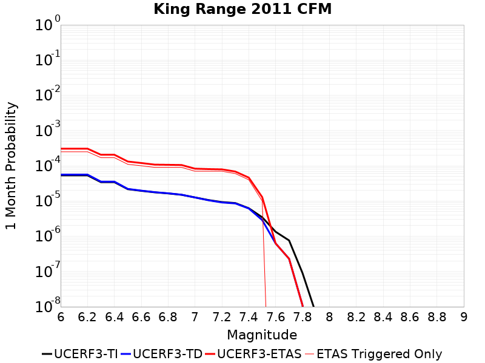 |  | 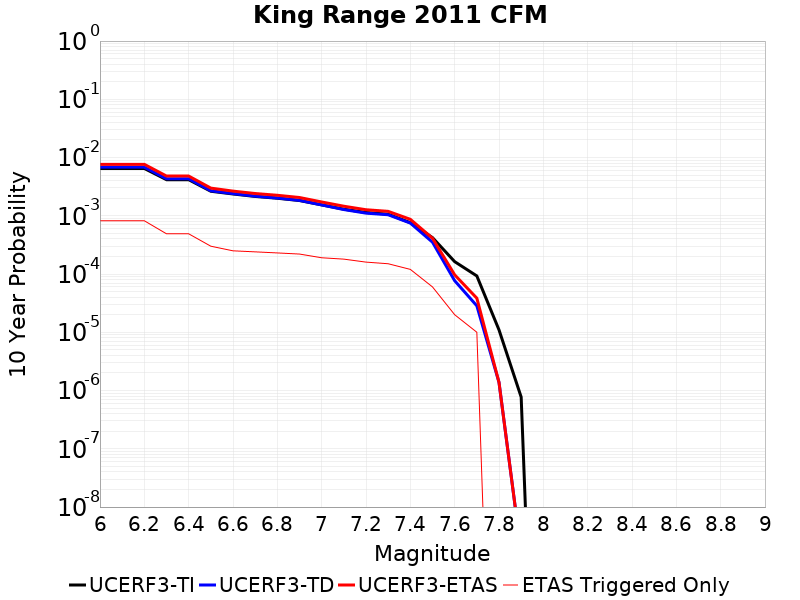 |

| Magnitude | 1 wk TI Prob | 1 wk TD Prob | 1 wk ETAS Prob | 1 wk ETAS/TD Gain | 1 wk ETAS Triggered Only | 1 mo TI Prob | 1 mo TD Prob | 1 mo ETAS Prob | 1 mo ETAS/TD Gain | 1 mo ETAS Triggered Only | 1 yr TI Prob | 1 yr TD Prob | 1 yr ETAS Prob | 1 yr ETAS/TD Gain | 1 yr ETAS Triggered Only | 10 yr TI Prob | 10 yr TD Prob | 10 yr ETAS Prob | 10 yr ETAS/TD Gain | 10 yr ETAS Triggered Only |
|-----|-----|-----|-----|-----|-----|-----|-----|-----|-----|-----|-----|-----|-----|-----|-----|-----|-----|-----|-----|-----|
| 6.0 | 1.2462566E-5 | 1.3106776E-5 | 1.8310455E-4 | 13.97022 | 1.7E-4 | 5.34099E-5 | 5.6170888E-5 | 3.0615684E-4 | 5.450454 | 2.5E-4 | 6.5007154E-4 | 6.837011E-4 | 0.0012233319 | 1.7892789 | 5.4E-4 | 0.0064817313 | 0.006820445 | 0.007634852 | 1.1194068 | 8.2E-4 |
| 6.1 | 1.2462566E-5 | 1.3106776E-5 | 1.8310455E-4 | 13.97022 | 1.7E-4 | 5.34099E-5 | 5.6170888E-5 | 3.0615684E-4 | 5.450454 | 2.5E-4 | 6.5007154E-4 | 6.837011E-4 | 0.0012233319 | 1.7892789 | 5.4E-4 | 0.0064817313 | 0.006820445 | 0.007634852 | 1.1194068 | 8.2E-4 |
| 6.2 | 1.2462566E-5 | 1.3106776E-5 | 1.8310455E-4 | 13.97022 | 1.7E-4 | 5.34099E-5 | 5.6170888E-5 | 3.0615684E-4 | 5.450454 | 2.5E-4 | 6.5007154E-4 | 6.837011E-4 | 0.0012233319 | 1.7892789 | 5.4E-4 | 0.0064817313 | 0.006820445 | 0.007634852 | 1.1194068 | 8.2E-4 |
| 6.3 | 7.988484E-6 | 8.284347E-6 | 1.2828335E-4 | 15.485028 | 1.2E-4 | 3.423591E-5 | 3.5503937E-5 | 2.054979E-4 | 5.7880316 | 1.7E-4 | 4.1674246E-4 | 4.321877E-4 | 7.7204074E-4 | 1.7863553 | 3.4E-4 | 0.004159618 | 0.0043157586 | 0.004803644 | 1.1130474 | 4.9E-4 |
| 6.4 | 7.988484E-6 | 8.284347E-6 | 1.2828335E-4 | 15.485028 | 1.2E-4 | 3.423591E-5 | 3.5503937E-5 | 2.054979E-4 | 5.7880316 | 1.7E-4 | 4.1674246E-4 | 4.321877E-4 | 7.7204074E-4 | 1.7863553 | 3.4E-4 | 0.004159618 | 0.0043157586 | 0.004803644 | 1.1130474 | 4.9E-4 |
| 6.5 | 5.0522513E-6 | 5.1449792E-6 | 7.514462E-5 | 14.605427 | 7.0E-5 | 2.1652326E-5 | 2.204973E-5 | 1.3204731E-4 | 5.988613 | 1.1E-4 | 2.6358519E-4 | 2.6842335E-4 | 4.7836697E-4 | 1.7821363 | 2.1E-4 | 0.0026327274 | 0.002682094 | 0.0029812893 | 1.111553 | 3.0E-4 |
| 6.6 | 4.53682E-6 | 4.600293E-6 | 7.459997E-5 | 16.216352 | 7.0E-5 | 1.944337E-5 | 1.9715395E-5 | 1.19713426E-4 | 6.0720787 | 1.0E-4 | 2.3669732E-4 | 2.400091E-4 | 4.299635E-4 | 1.7914467 | 1.9E-4 | 0.0023644536 | 0.0023985691 | 0.0026479696 | 1.1039788 | 2.5E-4 |
| 6.7 | 4.1144335E-6 | 4.157455E-6 | 6.4157204E-5 | 15.431847 | 6.0E-5 | 1.7633167E-5 | 1.7817543E-5 | 1.0781594E-4 | 6.051111 | 9.0E-5 | 2.1466266E-4 | 2.169074E-4 | 3.9686836E-4 | 1.8296672 | 1.8E-4 | 0.0021445542 | 0.0021680063 | 0.0024074859 | 1.1104608 | 2.4E-4 |
| 6.8 | 3.8321214E-6 | 3.86623E-6 | 6.3866E-5 | 16.518934 | 6.0E-5 | 1.6423275E-5 | 1.6569455E-5 | 1.0656796E-4 | 6.4315915 | 9.0E-5 | 1.9993502E-4 | 2.0171476E-4 | 3.7168048E-4 | 1.8426042 | 1.7E-4 | 0.0019975523 | 0.0020163597 | 0.002245896 | 1.113837 | 2.3E-4 |
| 6.9 | 3.4999944E-6 | 3.5210987E-6 | 6.3520885E-5 | 18.040075 | 6.0E-5 | 1.499989E-5 | 1.5090338E-5 | 1.0508898E-4 | 6.963991 | 9.0E-5 | 1.8260835E-4 | 1.8370964E-4 | 3.4368024E-4 | 1.8707796 | 1.6E-4 | 0.0018245836 | 0.0018366128 | 0.002056209 | 1.1195657 | 2.2E-4 |
| 7.0 | 2.9470837E-6 | 2.9410623E-6 | 4.2940945E-5 | 14.600488 | 4.0E-5 | 1.26302975E-5 | 1.2604493E-5 | 8.260361E-5 | 6.553505 | 7.0E-5 | 1.5376302E-4 | 1.5344907E-4 | 2.8342914E-4 | 1.8470566 | 1.3E-4 | 0.0015365666 | 0.0015344572 | 0.0017241657 | 1.1236323 | 1.9E-4 |
| 7.1 | 2.4850247E-6 | 2.4482865E-6 | 4.2448188E-5 | 17.337917 | 4.0E-5 | 1.0650062E-5 | 1.0492615E-5 | 8.049188E-5 | 7.6712885 | 7.0E-5 | 1.296568E-4 | 1.2774025E-4 | 2.5772364E-4 | 2.0175602 | 1.3E-4 | 0.0012958117 | 0.0012776898 | 0.0014574599 | 1.1406993 | 1.8E-4 |
| 7.2 | 2.1800304E-6 | 2.1238816E-6 | 4.2123796E-5 | 19.833403 | 4.0E-5 | 9.342954E-6 | 9.1023185E-6 | 7.910168E-5 | 8.690279 | 7.0E-5 | 1.1374453E-4 | 1.1081518E-4 | 2.3080187E-4 | 2.0827641 | 1.2E-4 | 0.0011368633 | 0.0011086067 | 0.0012684293 | 1.1441653 | 1.6E-4 |
| 7.3 | 2.0378504E-6 | 1.9924453E-6 | 4.1992367E-5 | 21.075792 | 4.0E-5 | 8.733615E-6 | 8.539024E-6 | 6.853851E-5 | 8.0265045 | 6.0E-5 | 1.0632657E-4 | 1.0395775E-4 | 2.1394632E-4 | 2.0580122 | 1.1E-4 | 0.0010627571 | 0.0010400845 | 0.0011899285 | 1.1440691 | 1.5E-4 |
| 7.4 | 1.4577047E-6 | 1.4333425E-6 | 3.14333E-5 | 21.930067 | 3.0E-5 | 6.247291E-6 | 6.1428827E-6 | 4.6142635E-5 | 7.511561 | 4.0E-5 | 7.605811E-5 | 7.47871E-5 | 1.5478113E-4 | 2.0696232 | 8.0E-5 | 7.603208E-4 | 7.485363E-4 | 8.684465E-4 | 1.1601928 | 1.2E-4 |
| 7.5 | 8.0685743E-7 | 6.723496E-7 | 1.0672343E-5 | 15.873205 | 1.0E-5 | 3.457956E-6 | 2.8814952E-6 | 1.2881466E-5 | 4.4704103 | 1.0E-5 | 4.20998E-5 | 3.5081688E-5 | 7.508029E-5 | 2.140156 | 4.0E-5 | 4.2091825E-4 | 3.5151537E-4 | 4.114943E-4 | 1.1706295 | 6.0E-5 |
| 7.6 | 3.1239435E-7 | 1.457028E-7 | 1.457028E-7 | 1.0 | 0.0 | 1.3388321E-6 | 6.244404E-7 | 6.244404E-7 | 1.0 | 0.0 | 1.630016E-5 | 7.6025362E-6 | 7.6025362E-6 | 1.0 | 0.0 | 1.6298964E-4 | 7.672693E-5 | 9.6725395E-5 | 1.2606447 | 2.0E-5 |
| 7.7 | 1.7747207E-7 | 5.3602044E-8 | 5.3602044E-8 | 1.0 | 0.0 | 7.605944E-7 | 2.2972303E-7 | 2.2972303E-7 | 1.0 | 0.0 | 9.260198E-6 | 2.7968745E-6 | 2.7968745E-6 | 1.0 | 0.0 | 9.2598115E-5 | 2.8429604E-5 | 3.842932E-5 | 1.3517361 | 1.0E-5 |
| 7.8 | 2.1035538E-8 | 2.559041E-9 | 2.559041E-9 | 1.0 | 0.0 | 9.0152305E-8 | 1.0967317E-8 | 1.0967317E-8 | 1.0 | 0.0 | 1.0976038E-6 | 1.3352708E-7 | 1.3352708E-7 | 1.0 | 0.0 | 1.0975983E-5 | 1.3785158E-6 | 1.3785158E-6 | 1.0 | 0.0 |
| 7.9 | 1.4782963E-9 | 2.2420954E-12 | 2.2420954E-12 | 1.0 | 0.0 | 6.335555E-9 | 9.608758E-12 | 9.608758E-12 | 1.0 | 0.0 | 7.713538E-8 | 1.1698464E-10 | 1.1698464E-10 | 1.0 | 0.0 | 7.7135354E-7 | 1.6408503E-9 | 1.6408503E-9 | 1.0 | 0.0 |

## Garberville - Briceland 2011 CFM
*[(top)](#table-of-contents)*

| 1 Week | 1 Month | 1 Year | 10 Year |
|-----|-----|-----|-----|
|  |  | 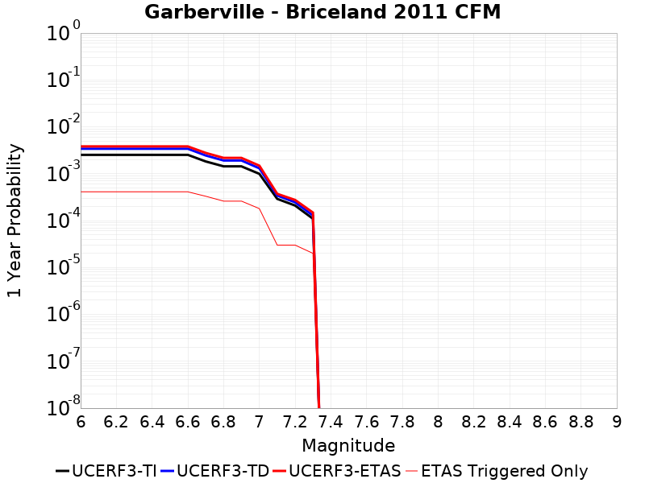 |  |

| Magnitude | 1 wk TI Prob | 1 wk TD Prob | 1 wk ETAS Prob | 1 wk ETAS/TD Gain | 1 wk ETAS Triggered Only | 1 mo TI Prob | 1 mo TD Prob | 1 mo ETAS Prob | 1 mo ETAS/TD Gain | 1 mo ETAS Triggered Only | 1 yr TI Prob | 1 yr TD Prob | 1 yr ETAS Prob | 1 yr ETAS/TD Gain | 1 yr ETAS Triggered Only | 10 yr TI Prob | 10 yr TD Prob | 10 yr ETAS Prob | 10 yr ETAS/TD Gain | 10 yr ETAS Triggered Only |
|-----|-----|-----|-----|-----|-----|-----|-----|-----|-----|-----|-----|-----|-----|-----|-----|-----|-----|-----|-----|-----|
| 6.0 | 4.8399295E-5 | 6.532883E-5 | 1.8532098E-4 | 2.8367414 | 1.2E-4 | 2.0740906E-4 | 2.7995504E-4 | 4.7989906E-4 | 1.7142004 | 2.0E-4 | 0.002522281 | 0.0034037887 | 0.0038123932 | 1.120044 | 4.1E-4 | 0.024938442 | 0.033582047 | 0.034229547 | 1.0192811 | 6.7E-4 |
| 6.1 | 4.8399295E-5 | 6.532883E-5 | 1.8532098E-4 | 2.8367414 | 1.2E-4 | 2.0740906E-4 | 2.7995504E-4 | 4.7989906E-4 | 1.7142004 | 2.0E-4 | 0.002522281 | 0.0034037887 | 0.0038123932 | 1.120044 | 4.1E-4 | 0.024938442 | 0.033582047 | 0.034229547 | 1.0192811 | 6.7E-4 |
| 6.2 | 4.8399295E-5 | 6.532883E-5 | 1.8532098E-4 | 2.8367414 | 1.2E-4 | 2.0740906E-4 | 2.7995504E-4 | 4.7989906E-4 | 1.7142004 | 2.0E-4 | 0.002522281 | 0.0034037887 | 0.0038123932 | 1.120044 | 4.1E-4 | 0.024938442 | 0.033582047 | 0.034229547 | 1.0192811 | 6.7E-4 |
| 6.3 | 4.8399295E-5 | 6.532883E-5 | 1.8532098E-4 | 2.8367414 | 1.2E-4 | 2.0740906E-4 | 2.7995504E-4 | 4.7989906E-4 | 1.7142004 | 2.0E-4 | 0.002522281 | 0.0034037887 | 0.0038123932 | 1.120044 | 4.1E-4 | 0.024938442 | 0.033582047 | 0.034229547 | 1.0192811 | 6.7E-4 |
| 6.4 | 4.8399295E-5 | 6.532883E-5 | 1.8532098E-4 | 2.8367414 | 1.2E-4 | 2.0740906E-4 | 2.7995504E-4 | 4.7989906E-4 | 1.7142004 | 2.0E-4 | 0.002522281 | 0.0034037887 | 0.0038123932 | 1.120044 | 4.1E-4 | 0.024938442 | 0.033582047 | 0.034229547 | 1.0192811 | 6.7E-4 |
| 6.5 | 4.8399295E-5 | 6.532883E-5 | 1.8532098E-4 | 2.8367414 | 1.2E-4 | 2.0740906E-4 | 2.7995504E-4 | 4.7989906E-4 | 1.7142004 | 2.0E-4 | 0.002522281 | 0.0034037887 | 0.0038123932 | 1.120044 | 4.1E-4 | 0.024938442 | 0.033582047 | 0.034229547 | 1.0192811 | 6.7E-4 |
| 6.6 | 4.8399295E-5 | 6.532883E-5 | 1.8532098E-4 | 2.8367414 | 1.2E-4 | 2.0740906E-4 | 2.7995504E-4 | 4.7989906E-4 | 1.7142004 | 2.0E-4 | 0.002522281 | 0.0034037887 | 0.0038123932 | 1.120044 | 4.1E-4 | 0.024938442 | 0.033582047 | 0.034229547 | 1.0192811 | 6.7E-4 |
| 6.7 | 3.495179E-5 | 4.688256E-5 | 1.268788E-4 | 2.7063115 | 8.0E-5 | 1.4978478E-4 | 2.0091297E-4 | 3.6088083E-4 | 1.7962047 | 1.6E-4 | 0.0018221042 | 0.002443908 | 0.0027731014 | 1.1346996 | 3.3E-4 | 0.018072363 | 0.024223221 | 0.024740383 | 1.0213498 | 5.3E-4 |
| 6.8 | 2.7517597E-5 | 3.6680813E-5 | 9.667861E-5 | 2.6356726 | 6.0E-5 | 1.1792722E-4 | 1.5719683E-4 | 2.871764E-4 | 1.8268586 | 1.3E-4 | 0.0014348183 | 0.0019126703 | 0.002172173 | 1.1356755 | 2.6E-4 | 0.014255894 | 0.019008953 | 0.019391539 | 1.0201267 | 3.9E-4 |
| 6.9 | 2.74461E-5 | 3.6598067E-5 | 9.6595875E-5 | 2.6393707 | 6.0E-5 | 1.1762084E-4 | 1.5684227E-4 | 2.868219E-4 | 1.8287282 | 1.3E-4 | 0.001431093 | 0.0019083611 | 0.002167865 | 1.1359825 | 2.6E-4 | 0.014219119 | 0.018966597 | 0.019349199 | 1.0201725 | 3.9E-4 |
| 7.0 | 1.9023773E-5 | 2.499127E-5 | 5.499052E-5 | 2.2003891 | 3.0E-5 | 8.152791E-5 | 1.0710341E-4 | 1.8709485E-4 | 1.7468617 | 8.0E-5 | 9.921503E-4 | 0.0013036106 | 0.001483376 | 1.1378981 | 1.8E-4 | 0.009877323 | 0.012999319 | 0.0132361995 | 1.0182225 | 2.4E-4 |
| 7.1 | 5.566844E-6 | 6.554078E-6 | 6.554078E-6 | 1.0 | 0.0 | 2.3857683E-5 | 2.8088629E-5 | 2.8088629E-5 | 1.0 | 0.0 | 2.9042858E-4 | 3.419297E-4 | 3.7191942E-4 | 1.0877073 | 3.0E-5 | 0.002900493 | 0.0034144612 | 0.0034742563 | 1.0175123 | 6.0E-5 |
| 7.2 | 4.011353E-6 | 4.703827E-6 | 4.703827E-6 | 1.0 | 0.0 | 1.7191402E-5 | 2.0159123E-5 | 2.0159123E-5 | 1.0 | 0.0 | 2.0928521E-4 | 2.4541316E-4 | 2.754058E-4 | 1.1222129 | 3.0E-5 | 0.0020908823 | 0.0024517633 | 0.002491665 | 1.0162748 | 4.0E-5 |
| 7.3 | 2.0974871E-6 | 2.4546116E-6 | 2.4546116E-6 | 1.0 | 0.0 | 8.989199E-6 | 1.0519736E-5 | 1.0519736E-5 | 1.0 | 0.0 | 1.09438006E-4 | 1.2807279E-4 | 1.4807023E-4 | 1.1561412 | 2.0E-5 | 0.0010938413 | 0.001280238 | 0.0013101996 | 1.0234032 | 3.0E-5 |

## Trinidad (alt1)
*[(top)](#table-of-contents)*

| 1 Week | 1 Month | 1 Year | 10 Year |
|-----|-----|-----|-----|
| 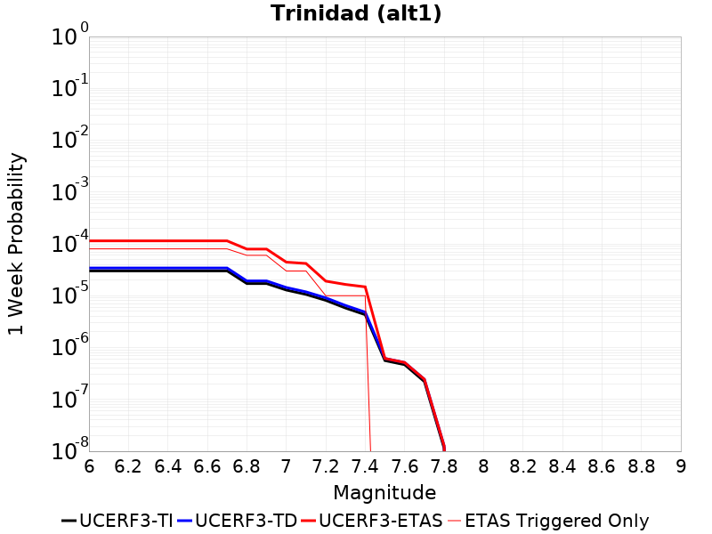 | 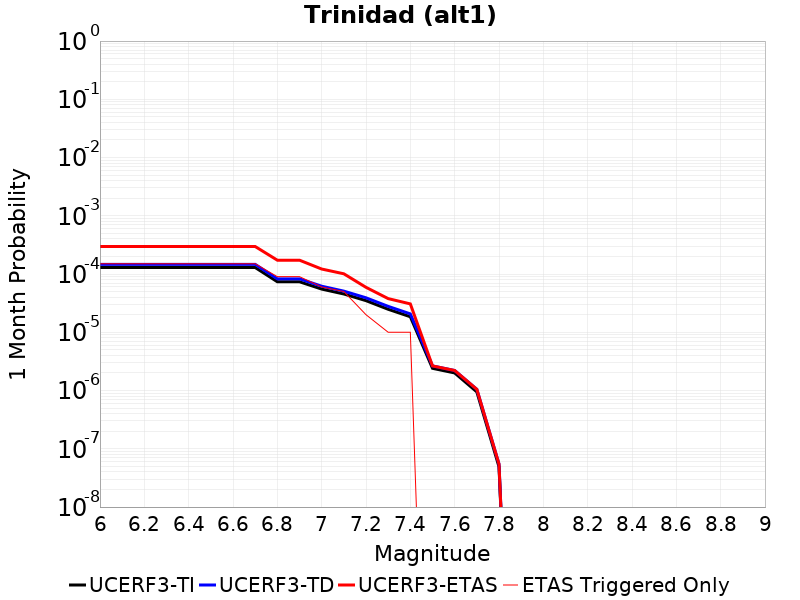 | 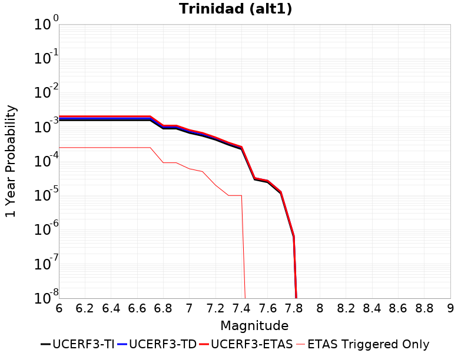 |  |

| Magnitude | 1 wk TI Prob | 1 wk TD Prob | 1 wk ETAS Prob | 1 wk ETAS/TD Gain | 1 wk ETAS Triggered Only | 1 mo TI Prob | 1 mo TD Prob | 1 mo ETAS Prob | 1 mo ETAS/TD Gain | 1 mo ETAS Triggered Only | 1 yr TI Prob | 1 yr TD Prob | 1 yr ETAS Prob | 1 yr ETAS/TD Gain | 1 yr ETAS Triggered Only | 10 yr TI Prob | 10 yr TD Prob | 10 yr ETAS Prob | 10 yr ETAS/TD Gain | 10 yr ETAS Triggered Only |
|-----|-----|-----|-----|-----|-----|-----|-----|-----|-----|-----|-----|-----|-----|-----|-----|-----|-----|-----|-----|-----|
| 6.0 | 3.0167168E-5 | 3.4197827E-5 | 1.1419509E-4 | 3.3392498 | 8.0E-5 | 1.2928146E-4 | 1.4655484E-4 | 2.9653287E-4 | 2.0233576 | 1.5E-4 | 0.0015728653 | 0.0017830151 | 0.0020325694 | 1.139962 | 2.5E-4 | 0.0156177925 | 0.017704228 | 0.018116793 | 1.0233032 | 4.2E-4 |
| 6.1 | 3.0167168E-5 | 3.4197827E-5 | 1.1419509E-4 | 3.3392498 | 8.0E-5 | 1.2928146E-4 | 1.4655484E-4 | 2.9653287E-4 | 2.0233576 | 1.5E-4 | 0.0015728653 | 0.0017830151 | 0.0020325694 | 1.139962 | 2.5E-4 | 0.0156177925 | 0.017704228 | 0.018116793 | 1.0233032 | 4.2E-4 |
| 6.2 | 3.0167168E-5 | 3.4197827E-5 | 1.1419509E-4 | 3.3392498 | 8.0E-5 | 1.2928146E-4 | 1.4655484E-4 | 2.9653287E-4 | 2.0233576 | 1.5E-4 | 0.0015728653 | 0.0017830151 | 0.0020325694 | 1.139962 | 2.5E-4 | 0.0156177925 | 0.017704228 | 0.018116793 | 1.0233032 | 4.2E-4 |
| 6.3 | 3.0167168E-5 | 3.4197827E-5 | 1.1419509E-4 | 3.3392498 | 8.0E-5 | 1.2928146E-4 | 1.4655484E-4 | 2.9653287E-4 | 2.0233576 | 1.5E-4 | 0.0015728653 | 0.0017830151 | 0.0020325694 | 1.139962 | 2.5E-4 | 0.0156177925 | 0.017704228 | 0.018116793 | 1.0233032 | 4.2E-4 |
| 6.4 | 3.0167168E-5 | 3.4197827E-5 | 1.1419509E-4 | 3.3392498 | 8.0E-5 | 1.2928146E-4 | 1.4655484E-4 | 2.9653287E-4 | 2.0233576 | 1.5E-4 | 0.0015728653 | 0.0017830151 | 0.0020325694 | 1.139962 | 2.5E-4 | 0.0156177925 | 0.017704228 | 0.018116793 | 1.0233032 | 4.2E-4 |
| 6.5 | 3.0167168E-5 | 3.4197827E-5 | 1.1419509E-4 | 3.3392498 | 8.0E-5 | 1.2928146E-4 | 1.4655484E-4 | 2.9653287E-4 | 2.0233576 | 1.5E-4 | 0.0015728653 | 0.0017830151 | 0.0020325694 | 1.139962 | 2.5E-4 | 0.0156177925 | 0.017704228 | 0.018116793 | 1.0233032 | 4.2E-4 |
| 6.6 | 3.0167168E-5 | 3.4197827E-5 | 1.1419509E-4 | 3.3392498 | 8.0E-5 | 1.2928146E-4 | 1.4655484E-4 | 2.9653287E-4 | 2.0233576 | 1.5E-4 | 0.0015728653 | 0.0017830151 | 0.0020325694 | 1.139962 | 2.5E-4 | 0.0156177925 | 0.017704228 | 0.018116793 | 1.0233032 | 4.2E-4 |
| 6.7 | 3.0167168E-5 | 3.4197827E-5 | 1.1419509E-4 | 3.3392498 | 8.0E-5 | 1.2928146E-4 | 1.4655484E-4 | 2.9653287E-4 | 2.0233576 | 1.5E-4 | 0.0015728653 | 0.0017830151 | 0.0020325694 | 1.139962 | 2.5E-4 | 0.0156177925 | 0.017704228 | 0.018116793 | 1.0233032 | 4.2E-4 |
| 6.8 | 1.717077E-5 | 1.9281013E-5 | 7.927985E-5 | 4.1118097 | 6.0E-5 | 7.358694E-5 | 8.263055E-5 | 1.7262311E-4 | 2.0890956 | 9.0E-5 | 8.9555274E-4 | 0.0010056075 | 0.001095517 | 1.0894082 | 9.0E-5 | 0.008919522 | 0.010015062 | 0.010203159 | 1.0187814 | 1.9E-4 |
| 6.9 | 1.717077E-5 | 1.9281013E-5 | 7.927985E-5 | 4.1118097 | 6.0E-5 | 7.358694E-5 | 8.263055E-5 | 1.7262311E-4 | 2.0890956 | 9.0E-5 | 8.9555274E-4 | 0.0010056075 | 0.001095517 | 1.0894082 | 9.0E-5 | 0.008919522 | 0.010015062 | 0.010203159 | 1.0187814 | 1.9E-4 |
| 7.0 | 1.2858572E-5 | 1.43994985E-5 | 4.4399065E-5 | 3.083376 | 3.0E-5 | 5.5107E-5 | 6.171086E-5 | 1.21707155E-4 | 1.9722162 | 6.0E-5 | 6.707212E-4 | 7.511031E-4 | 8.11058E-4 | 1.0798225 | 6.0E-5 | 0.006687004 | 0.0074888524 | 0.007627804 | 1.0185544 | 1.4E-4 |
| 7.1 | 1.0588431E-5 | 1.18521875E-5 | 4.1851832E-5 | 3.5311484 | 3.0E-5 | 4.53782E-5 | 5.0794264E-5 | 1.0079172E-4 | 1.9843131 | 5.0E-5 | 5.5233954E-4 | 6.1827386E-4 | 6.682429E-4 | 1.0808203 | 5.0E-5 | 0.005509687 | 0.0061684125 | 0.0062976102 | 1.0209451 | 1.3E-4 |
| 7.2 | 8.138061E-6 | 9.106204E-6 | 1.9106114E-5 | 2.0981424 | 1.0E-5 | 3.487694E-5 | 3.9026145E-5 | 5.9025366E-5 | 1.5124569 | 2.0E-5 | 4.2454398E-4 | 4.750648E-4 | 4.950553E-4 | 1.0420796 | 2.0E-5 | 0.0042373384 | 0.0047429553 | 0.0048126234 | 1.0146887 | 7.0E-5 |
| 7.3 | 5.787542E-6 | 6.488575E-6 | 1.648851E-5 | 2.5411603 | 1.0E-5 | 2.4803514E-5 | 2.7808004E-5 | 3.7807727E-5 | 1.3595986 | 1.0E-5 | 3.0194095E-4 | 3.3853156E-4 | 3.4852818E-4 | 1.0295293 | 1.0E-5 | 0.00301531 | 0.0033822889 | 0.0034121873 | 1.0088397 | 3.0E-5 |
| 7.4 | 4.303563E-6 | 4.82171E-6 | 1.4821661E-5 | 3.073943 | 1.0E-5 | 1.844371E-5 | 2.066442E-5 | 3.0664214E-5 | 1.4839135 | 1.0E-5 | 2.2452902E-4 | 2.515802E-4 | 2.615777E-4 | 1.0397388 | 1.0E-5 | 0.0022430231 | 0.00251491 | 0.0025448345 | 1.0118989 | 3.0E-5 |
| 7.5 | 5.6063425E-7 | 6.164466E-7 | 6.164466E-7 | 1.0 | 0.0 | 2.402716E-6 | 2.6419114E-6 | 2.6419114E-6 | 1.0 | 0.0 | 2.9252675E-5 | 3.216481E-5 | 3.216481E-5 | 1.0 | 0.0 | 2.9248823E-4 | 3.2160315E-4 | 3.2160315E-4 | 1.0 | 0.0 |
| 7.6 | 4.6699128E-7 | 5.143996E-7 | 5.143996E-7 | 1.0 | 0.0 | 2.0013897E-6 | 2.2045676E-6 | 2.2045676E-6 | 1.0 | 0.0 | 2.4366647E-5 | 2.6840296E-5 | 2.6840296E-5 | 1.0 | 0.0 | 2.4363975E-4 | 2.6837195E-4 | 2.6837195E-4 | 1.0 | 0.0 |
| 7.7 | 2.2080937E-7 | 2.4435846E-7 | 2.4435846E-7 | 1.0 | 0.0 | 9.4632554E-7 | 1.0472501E-6 | 1.0472501E-6 | 1.0 | 0.0 | 1.15214525E-5 | 1.2750202E-5 | 1.2750202E-5 | 1.0 | 0.0 | 1.1520855E-4 | 1.2749531E-4 | 1.2749531E-4 | 1.0 | 0.0 |
| 7.8 | 1.1438307E-8 | 1.2729359E-8 | 1.2729359E-8 | 1.0 | 0.0 | 4.9021317E-8 | 5.45544E-8 | 5.45544E-8 | 1.0 | 0.0 | 5.9683435E-7 | 6.641998E-7 | 6.641998E-7 | 1.0 | 0.0 | 5.9683275E-6 | 6.641998E-6 | 6.641998E-6 | 1.0 | 0.0 |

## Russ 2011 CFM
*[(top)](#table-of-contents)*

| 1 Week | 1 Month | 1 Year | 10 Year |
|-----|-----|-----|-----|
|  | 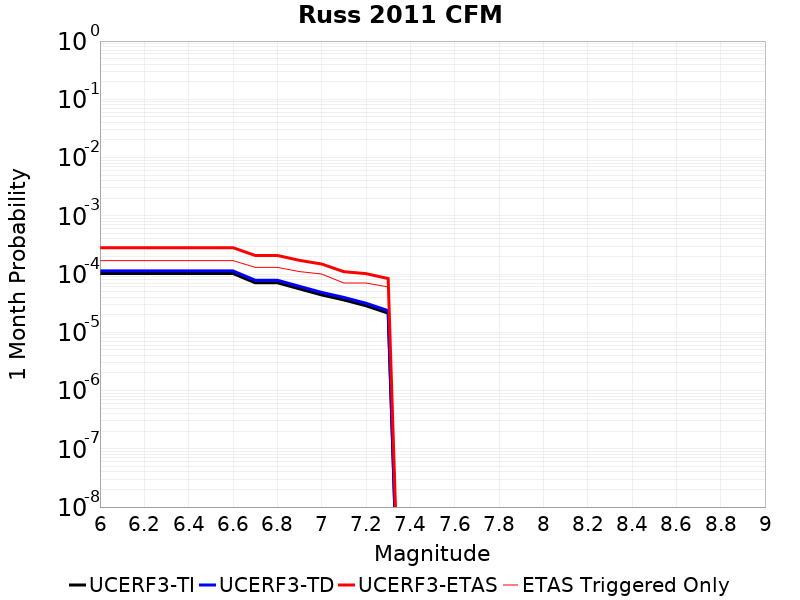 | 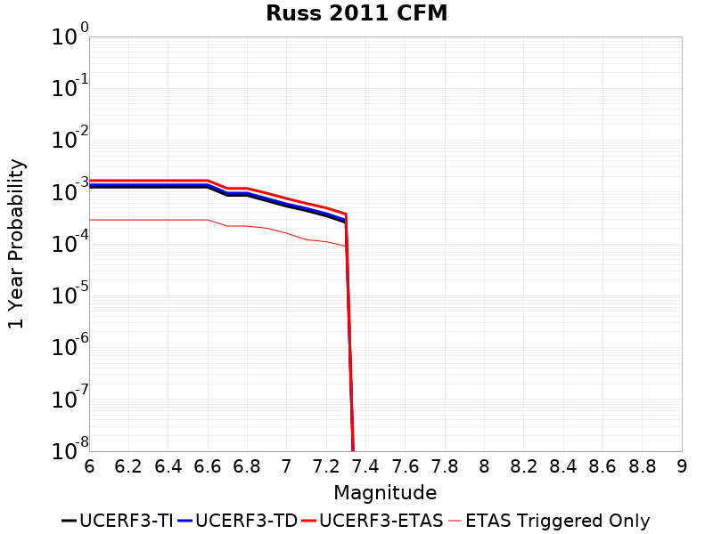 |  |

| Magnitude | 1 wk TI Prob | 1 wk TD Prob | 1 wk ETAS Prob | 1 wk ETAS/TD Gain | 1 wk ETAS Triggered Only | 1 mo TI Prob | 1 mo TD Prob | 1 mo ETAS Prob | 1 mo ETAS/TD Gain | 1 mo ETAS Triggered Only | 1 yr TI Prob | 1 yr TD Prob | 1 yr ETAS Prob | 1 yr ETAS/TD Gain | 1 yr ETAS Triggered Only | 10 yr TI Prob | 10 yr TD Prob | 10 yr ETAS Prob | 10 yr ETAS/TD Gain | 10 yr ETAS Triggered Only |
|-----|-----|-----|-----|-----|-----|-----|-----|-----|-----|-----|-----|-----|-----|-----|-----|-----|-----|-----|-----|-----|
| 6.0 | 2.3806366E-5 | 2.6355834E-5 | 9.635399E-5 | 3.6558883 | 7.0E-5 | 1.0202329E-4 | 1.1294905E-4 | 2.8292986E-4 | 2.5049334 | 1.7E-4 | 0.0012414258 | 0.0013743513 | 0.0016639528 | 1.2107186 | 2.9E-4 | 0.012345135 | 0.01366505 | 0.014039858 | 1.0274282 | 3.8E-4 |
| 6.1 | 2.3806366E-5 | 2.6355834E-5 | 9.635399E-5 | 3.6558883 | 7.0E-5 | 1.0202329E-4 | 1.1294905E-4 | 2.8292986E-4 | 2.5049334 | 1.7E-4 | 0.0012414258 | 0.0013743513 | 0.0016639528 | 1.2107186 | 2.9E-4 | 0.012345135 | 0.01366505 | 0.014039858 | 1.0274282 | 3.8E-4 |
| 6.2 | 2.3806366E-5 | 2.6355834E-5 | 9.635399E-5 | 3.6558883 | 7.0E-5 | 1.0202329E-4 | 1.1294905E-4 | 2.8292986E-4 | 2.5049334 | 1.7E-4 | 0.0012414258 | 0.0013743513 | 0.0016639528 | 1.2107186 | 2.9E-4 | 0.012345135 | 0.01366505 | 0.014039858 | 1.0274282 | 3.8E-4 |
| 6.3 | 2.3806366E-5 | 2.6355834E-5 | 9.635399E-5 | 3.6558883 | 7.0E-5 | 1.0202329E-4 | 1.1294905E-4 | 2.8292986E-4 | 2.5049334 | 1.7E-4 | 0.0012414258 | 0.0013743513 | 0.0016639528 | 1.2107186 | 2.9E-4 | 0.012345135 | 0.01366505 | 0.014039858 | 1.0274282 | 3.8E-4 |
| 6.4 | 2.3806366E-5 | 2.6355834E-5 | 9.635399E-5 | 3.6558883 | 7.0E-5 | 1.0202329E-4 | 1.1294905E-4 | 2.8292986E-4 | 2.5049334 | 1.7E-4 | 0.0012414258 | 0.0013743513 | 0.0016639528 | 1.2107186 | 2.9E-4 | 0.012345135 | 0.01366505 | 0.014039858 | 1.0274282 | 3.8E-4 |
| 6.5 | 2.3806366E-5 | 2.6355834E-5 | 9.635399E-5 | 3.6558883 | 7.0E-5 | 1.0202329E-4 | 1.1294905E-4 | 2.8292986E-4 | 2.5049334 | 1.7E-4 | 0.0012414258 | 0.0013743513 | 0.0016639528 | 1.2107186 | 2.9E-4 | 0.012345135 | 0.01366505 | 0.014039858 | 1.0274282 | 3.8E-4 |
| 6.6 | 2.3806366E-5 | 2.6355834E-5 | 9.635399E-5 | 3.6558883 | 7.0E-5 | 1.0202329E-4 | 1.1294905E-4 | 2.8292986E-4 | 2.5049334 | 1.7E-4 | 0.0012414258 | 0.0013743513 | 0.0016639528 | 1.2107186 | 2.9E-4 | 0.012345135 | 0.01366505 | 0.014039858 | 1.0274282 | 3.8E-4 |
| 6.7 | 1.6515693E-5 | 1.82573E-5 | 8.825602E-5 | 4.8340125 | 7.0E-5 | 7.077962E-5 | 7.8243414E-5 | 2.0823325E-4 | 2.6613517 | 1.3E-4 | 8.6140115E-4 | 9.5223135E-4 | 0.0011720218 | 1.2308162 | 2.2E-4 | 0.008580698 | 0.009484931 | 0.009762275 | 1.0292405 | 2.8E-4 |
| 6.8 | 1.6515693E-5 | 1.82573E-5 | 8.825602E-5 | 4.8340125 | 7.0E-5 | 7.077962E-5 | 7.8243414E-5 | 2.0823325E-4 | 2.6613517 | 1.3E-4 | 8.6140115E-4 | 9.5223135E-4 | 0.0011720218 | 1.2308162 | 2.2E-4 | 0.008580698 | 0.009484931 | 0.009762275 | 1.0292405 | 2.8E-4 |
| 6.9 | 1.2971182E-5 | 1.4327813E-5 | 7.4326956E-5 | 5.187599 | 6.0E-5 | 5.5589593E-5 | 6.140362E-5 | 1.7139687E-4 | 2.7913153 | 1.1E-4 | 6.765931E-4 | 7.473587E-4 | 9.4720925E-4 | 1.2674091 | 2.0E-4 | 0.0067453682 | 0.007451047 | 0.0076892585 | 1.0319703 | 2.4E-4 |
| 7.0 | 1.0201805E-5 | 1.1264167E-5 | 7.1263494E-5 | 6.3265653 | 6.0E-5 | 4.3721288E-5 | 4.827423E-5 | 1.482694E-4 | 3.0713987 | 1.0E-4 | 5.3217664E-4 | 5.8760116E-4 | 7.4750715E-4 | 1.2721336 | 1.6E-4 | 0.00530904 | 0.005862542 | 0.0060414867 | 1.0305234 | 1.8E-4 |
| 7.1 | 8.3744935E-6 | 9.24739E-6 | 4.924702E-5 | 5.325505 | 4.0E-5 | 3.5890193E-5 | 3.9631173E-5 | 1.096284E-4 | 2.7662163 | 7.0E-5 | 4.368755E-4 | 4.824214E-4 | 6.023635E-4 | 1.2486252 | 1.2E-4 | 0.004360176 | 0.004815581 | 0.0049549066 | 1.0289323 | 1.4E-4 |
| 7.2 | 6.649391E-6 | 7.3446745E-6 | 4.734438E-5 | 6.4460826 | 4.0E-5 | 2.8497077E-5 | 3.147689E-5 | 1.0147469E-4 | 3.2237837 | 7.0E-5 | 3.4689668E-4 | 3.8318048E-4 | 4.9313833E-4 | 1.286961 | 1.1E-4 | 0.0034635565 | 0.0038268405 | 0.0039463816 | 1.0312375 | 1.2E-4 |
| 7.3 | 4.9549312E-6 | 5.475307E-6 | 4.5475088E-5 | 8.305487 | 4.0E-5 | 2.1235246E-5 | 2.3465473E-5 | 8.346407E-5 | 3.5568883 | 6.0E-5 | 2.5850846E-4 | 2.8566952E-4 | 3.756438E-4 | 1.3149594 | 9.0E-5 | 0.0025820795 | 0.0028544778 | 0.002944221 | 1.0314394 | 9.0E-5 |

## Little Salmon (Onshore)
*[(top)](#table-of-contents)*

| 1 Week | 1 Month | 1 Year | 10 Year |
|-----|-----|-----|-----|
|  |  | 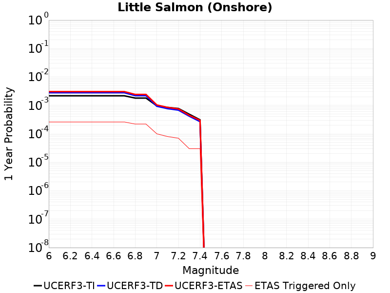 | 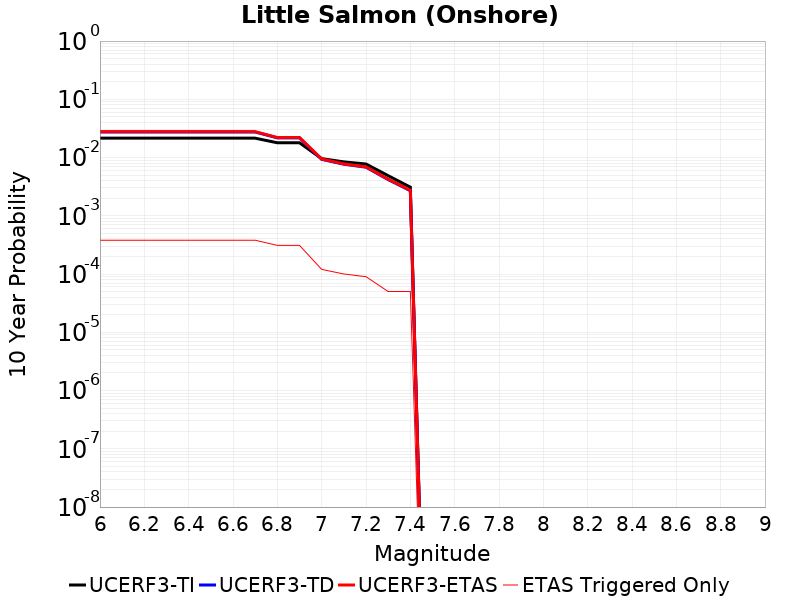 |

| Magnitude | 1 wk TI Prob | 1 wk TD Prob | 1 wk ETAS Prob | 1 wk ETAS/TD Gain | 1 wk ETAS Triggered Only | 1 mo TI Prob | 1 mo TD Prob | 1 mo ETAS Prob | 1 mo ETAS/TD Gain | 1 mo ETAS Triggered Only | 1 yr TI Prob | 1 yr TD Prob | 1 yr ETAS Prob | 1 yr ETAS/TD Gain | 1 yr ETAS Triggered Only | 10 yr TI Prob | 10 yr TD Prob | 10 yr ETAS Prob | 10 yr ETAS/TD Gain | 10 yr ETAS Triggered Only |
|-----|-----|-----|-----|-----|-----|-----|-----|-----|-----|-----|-----|-----|-----|-----|-----|-----|-----|-----|-----|-----|
| 6.0 | 4.1582247E-5 | 5.3306485E-5 | 1.6330062E-4 | 3.0634289 | 1.1E-4 | 1.7819746E-4 | 2.2844128E-4 | 3.8840473E-4 | 1.7002388 | 1.6E-4 | 0.0021673953 | 0.0027785986 | 0.003037876 | 1.0933124 | 2.6E-4 | 0.021463778 | 0.027385507 | 0.0277551 | 1.0134959 | 3.8E-4 |
| 6.1 | 4.1582247E-5 | 5.3306485E-5 | 1.6330062E-4 | 3.0634289 | 1.1E-4 | 1.7819746E-4 | 2.2844128E-4 | 3.8840473E-4 | 1.7002388 | 1.6E-4 | 0.0021673953 | 0.0027785986 | 0.003037876 | 1.0933124 | 2.6E-4 | 0.021463778 | 0.027385507 | 0.0277551 | 1.0134959 | 3.8E-4 |
| 6.2 | 4.1582247E-5 | 5.3306485E-5 | 1.6330062E-4 | 3.0634289 | 1.1E-4 | 1.7819746E-4 | 2.2844128E-4 | 3.8840473E-4 | 1.7002388 | 1.6E-4 | 0.0021673953 | 0.0027785986 | 0.003037876 | 1.0933124 | 2.6E-4 | 0.021463778 | 0.027385507 | 0.0277551 | 1.0134959 | 3.8E-4 |
| 6.3 | 4.1582247E-5 | 5.3306485E-5 | 1.6330062E-4 | 3.0634289 | 1.1E-4 | 1.7819746E-4 | 2.2844128E-4 | 3.8840473E-4 | 1.7002388 | 1.6E-4 | 0.0021673953 | 0.0027785986 | 0.003037876 | 1.0933124 | 2.6E-4 | 0.021463778 | 0.027385507 | 0.0277551 | 1.0134959 | 3.8E-4 |
| 6.4 | 4.1582247E-5 | 5.3306485E-5 | 1.6330062E-4 | 3.0634289 | 1.1E-4 | 1.7819746E-4 | 2.2844128E-4 | 3.8840473E-4 | 1.7002388 | 1.6E-4 | 0.0021673953 | 0.0027785986 | 0.003037876 | 1.0933124 | 2.6E-4 | 0.021463778 | 0.027385507 | 0.0277551 | 1.0134959 | 3.8E-4 |
| 6.5 | 4.1582247E-5 | 5.3306485E-5 | 1.6330062E-4 | 3.0634289 | 1.1E-4 | 1.7819746E-4 | 2.2844128E-4 | 3.8840473E-4 | 1.7002388 | 1.6E-4 | 0.0021673953 | 0.0027785986 | 0.003037876 | 1.0933124 | 2.6E-4 | 0.021463778 | 0.027385507 | 0.0277551 | 1.0134959 | 3.8E-4 |
| 6.6 | 4.1582247E-5 | 5.3306485E-5 | 1.6330062E-4 | 3.0634289 | 1.1E-4 | 1.7819746E-4 | 2.2844128E-4 | 3.8840473E-4 | 1.7002388 | 1.6E-4 | 0.0021673953 | 0.0027785986 | 0.003037876 | 1.0933124 | 2.6E-4 | 0.021463778 | 0.027385507 | 0.0277551 | 1.0134959 | 3.8E-4 |
| 6.7 | 4.1582247E-5 | 5.3306485E-5 | 1.6330062E-4 | 3.0634289 | 1.1E-4 | 1.7819746E-4 | 2.2844128E-4 | 3.8840473E-4 | 1.7002388 | 1.6E-4 | 0.0021673953 | 0.0027785986 | 0.003037876 | 1.0933124 | 2.6E-4 | 0.021463778 | 0.027385507 | 0.0277551 | 1.0134959 | 3.8E-4 |
| 6.8 | 3.4607925E-5 | 4.21577E-5 | 1.5215306E-4 | 3.6091406 | 1.1E-4 | 1.4831126E-4 | 1.8066782E-4 | 3.4063892E-4 | 1.8854432 | 1.6E-4 | 0.001804194 | 0.002198206 | 0.0024177225 | 1.0998616 | 2.2E-4 | 0.01789616 | 0.021736242 | 0.022039505 | 1.0139519 | 3.1E-4 |
| 6.9 | 3.4607925E-5 | 4.21577E-5 | 1.5215306E-4 | 3.6091406 | 1.1E-4 | 1.4831126E-4 | 1.8066782E-4 | 3.4063892E-4 | 1.8854432 | 1.6E-4 | 0.001804194 | 0.002198206 | 0.0024177225 | 1.0998616 | 2.2E-4 | 0.01789616 | 0.021736242 | 0.022039505 | 1.0139519 | 3.1E-4 |
| 7.0 | 1.8411014E-5 | 1.7849728E-5 | 7.784866E-5 | 4.3613358 | 6.0E-5 | 7.8901954E-5 | 7.6496915E-5 | 1.5649079E-4 | 2.045714 | 8.0E-5 | 9.6020795E-4 | 9.3100924E-4 | 0.0010309161 | 1.1073103 | 1.0E-4 | 0.009560696 | 0.009298273 | 0.009417157 | 1.0127857 | 1.2E-4 |
| 7.1 | 1.6183103E-5 | 1.4713985E-5 | 6.471325E-5 | 4.3980775 | 5.0E-5 | 6.935431E-5 | 6.30587E-5 | 1.3305429E-4 | 2.1100068 | 7.0E-5 | 8.440616E-4 | 7.6752034E-4 | 8.4745896E-4 | 1.1041517 | 8.0E-5 | 0.008408628 | 0.0076752743 | 0.0077745067 | 1.0129288 | 1.0E-4 |
| 7.2 | 1.4868988E-5 | 1.305316E-5 | 6.305251E-5 | 4.83044 | 5.0E-5 | 6.372268E-5 | 5.5941186E-5 | 1.1593783E-4 | 2.072495 | 6.0E-5 | 7.755474E-4 | 6.809197E-4 | 7.50872E-4 | 1.1027322 | 7.0E-5 | 0.0077284635 | 0.00681423 | 0.0069036162 | 1.0131177 | 9.0E-5 |
| 7.3 | 9.3599865E-6 | 7.990617E-6 | 2.7990458E-5 | 3.5029156 | 2.0E-5 | 4.011361E-5 | 3.424527E-5 | 5.4244585E-5 | 1.5840023 | 2.0E-5 | 4.8827377E-4 | 4.1689482E-4 | 4.468823E-4 | 1.0719306 | 3.0E-5 | 0.004872023 | 0.004178645 | 0.0042284364 | 1.0119156 | 5.0E-5 |
| 7.4 | 5.941556E-6 | 5.1425695E-6 | 2.5142466E-5 | 4.8890862 | 2.0E-5 | 2.5463563E-5 | 2.2039585E-5 | 4.2039144E-5 | 1.9074382 | 2.0E-5 | 3.0997477E-4 | 2.6833193E-4 | 2.983239E-4 | 1.1117718 | 3.0E-5 | 0.0030954275 | 0.0026926342 | 0.0027424998 | 1.0185192 | 5.0E-5 |

## Eaton Roughs 2011 CFM
*[(top)](#table-of-contents)*

| 1 Week | 1 Month | 1 Year | 10 Year |
|-----|-----|-----|-----|
|  |  | 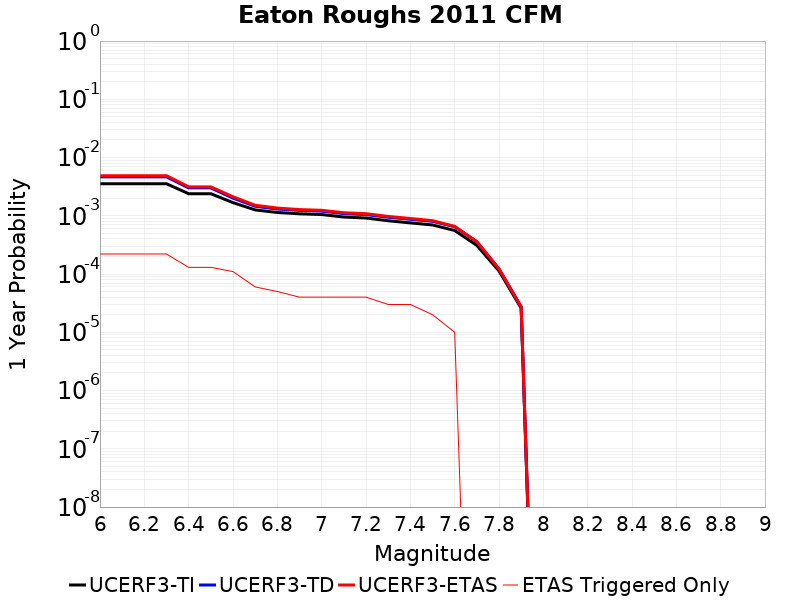 |  |

| Magnitude | 1 wk TI Prob | 1 wk TD Prob | 1 wk ETAS Prob | 1 wk ETAS/TD Gain | 1 wk ETAS Triggered Only | 1 mo TI Prob | 1 mo TD Prob | 1 mo ETAS Prob | 1 mo ETAS/TD Gain | 1 mo ETAS Triggered Only | 1 yr TI Prob | 1 yr TD Prob | 1 yr ETAS Prob | 1 yr ETAS/TD Gain | 1 yr ETAS Triggered Only | 10 yr TI Prob | 10 yr TD Prob | 10 yr ETAS Prob | 10 yr ETAS/TD Gain | 10 yr ETAS Triggered Only |
|-----|-----|-----|-----|-----|-----|-----|-----|-----|-----|-----|-----|-----|-----|-----|-----|-----|-----|-----|-----|-----|
| 6.0 | 6.8044945E-5 | 8.9332214E-5 | 1.4932685E-4 | 1.6715902 | 6.0E-5 | 2.9158857E-4 | 3.827952E-4 | 4.8275694E-4 | 1.2611363 | 1.0E-4 | 0.0035443127 | 0.0046511907 | 0.0048701675 | 1.0470797 | 2.2E-4 | 0.03488314 | 0.045603372 | 0.04589924 | 1.0064877 | 3.1E-4 |
| 6.1 | 6.8044945E-5 | 8.9332214E-5 | 1.4932685E-4 | 1.6715902 | 6.0E-5 | 2.9158857E-4 | 3.827952E-4 | 4.8275694E-4 | 1.2611363 | 1.0E-4 | 0.0035443127 | 0.0046511907 | 0.0048701675 | 1.0470797 | 2.2E-4 | 0.03488314 | 0.045603372 | 0.04589924 | 1.0064877 | 3.1E-4 |
| 6.2 | 6.8044945E-5 | 8.9332214E-5 | 1.4932685E-4 | 1.6715902 | 6.0E-5 | 2.9158857E-4 | 3.827952E-4 | 4.8275694E-4 | 1.2611363 | 1.0E-4 | 0.0035443127 | 0.0046511907 | 0.0048701675 | 1.0470797 | 2.2E-4 | 0.03488314 | 0.045603372 | 0.04589924 | 1.0064877 | 3.1E-4 |
| 6.3 | 6.8044945E-5 | 8.9332214E-5 | 1.4932685E-4 | 1.6715902 | 6.0E-5 | 2.9158857E-4 | 3.827952E-4 | 4.8275694E-4 | 1.2611363 | 1.0E-4 | 0.0035443127 | 0.0046511907 | 0.0048701675 | 1.0470797 | 2.2E-4 | 0.03488314 | 0.045603372 | 0.04589924 | 1.0064877 | 3.1E-4 |
| 6.4 | 4.5830013E-5 | 5.762963E-5 | 9.762732E-5 | 1.6940475 | 4.0E-5 | 1.9639956E-4 | 2.4695855E-4 | 3.1694127E-4 | 1.2833784 | 7.0E-5 | 0.0023885423 | 0.0030029442 | 0.0031325538 | 1.0431608 | 1.3E-4 | 0.023630321 | 0.029659236 | 0.029833898 | 1.0058889 | 1.8E-4 |
| 6.5 | 4.5830013E-5 | 5.762963E-5 | 9.762732E-5 | 1.6940475 | 4.0E-5 | 1.9639956E-4 | 2.4695855E-4 | 3.1694127E-4 | 1.2833784 | 7.0E-5 | 0.0023885423 | 0.0030029442 | 0.0031325538 | 1.0431608 | 1.3E-4 | 0.023630321 | 0.029659236 | 0.029833898 | 1.0058889 | 1.8E-4 |
| 6.6 | 3.222194E-5 | 3.848565E-5 | 7.848411E-5 | 2.0393083 | 4.0E-5 | 1.3808672E-4 | 1.6492784E-4 | 2.349163E-4 | 1.424358 | 7.0E-5 | 0.0016799092 | 0.0020062372 | 0.0021160166 | 1.054719 | 1.1E-4 | 0.016672665 | 0.019890137 | 0.020027352 | 1.0068986 | 1.4E-4 |
| 6.7 | 2.4155654E-5 | 2.7894517E-5 | 4.789396E-5 | 1.7169667 | 2.0E-5 | 1.0352012E-4 | 1.195425E-4 | 1.5953771E-4 | 1.3345691 | 4.0E-5 | 0.0012596287 | 0.0014544665 | 0.0015143792 | 1.0411923 | 6.0E-5 | 0.012525126 | 0.01445063 | 0.014529474 | 1.0054561 | 8.0E-5 |
| 6.8 | 2.1814667E-5 | 2.5025742E-5 | 4.502524E-5 | 1.7991571 | 2.0E-5 | 9.348808E-5 | 1.07248794E-4 | 1.472445E-4 | 1.3729246 | 4.0E-5 | 0.001137623 | 0.0013049757 | 0.0013549104 | 1.0382649 | 5.0E-5 | 0.011318169 | 0.012973749 | 0.013042841 | 1.0053256 | 7.0E-5 |
| 6.9 | 2.0700467E-5 | 2.3705095E-5 | 3.370486E-5 | 1.4218402 | 1.0E-5 | 8.871327E-5 | 1.0158933E-4 | 1.3158628E-4 | 1.2952766 | 3.0E-5 | 0.0010795488 | 0.0012361516 | 0.001276102 | 1.0323185 | 4.0E-5 | 0.010743194 | 0.012293285 | 0.012352548 | 1.0048207 | 6.0E-5 |
| 7.0 | 2.0104066E-5 | 2.3008535E-5 | 3.3008306E-5 | 1.4346113 | 1.0E-5 | 8.615744E-5 | 9.8604294E-5 | 1.2860134E-4 | 1.3042164 | 3.0E-5 | 0.0010484619 | 0.0011998492 | 0.0012398013 | 1.0332975 | 4.0E-5 | 0.010435291 | 0.011934209 | 0.011993492 | 1.0049676 | 6.0E-5 |
| 7.1 | 1.8225232E-5 | 2.0832735E-5 | 3.0832525E-5 | 1.4800038 | 1.0E-5 | 7.81058E-5 | 8.92801E-5 | 1.1927742E-4 | 1.3359911 | 3.0E-5 | 9.5052324E-4 | 0.0010864447 | 0.0011264014 | 1.0367774 | 4.0E-5 | 0.009464677 | 0.010811628 | 0.010870979 | 1.0054896 | 6.0E-5 |
| 7.2 | 1.7526572E-5 | 2.0049885E-5 | 3.0049685E-5 | 1.4987459 | 1.0E-5 | 7.511172E-5 | 8.592526E-5 | 1.1592268E-4 | 1.3491106 | 3.0E-5 | 9.141015E-4 | 0.0010456394 | 0.0010855977 | 1.0382141 | 4.0E-5 | 0.009103506 | 0.010407467 | 0.010466843 | 1.0057051 | 6.0E-5 |
| 7.3 | 1.5727232E-5 | 1.8071256E-5 | 2.8071074E-5 | 1.553355 | 1.0E-5 | 6.740067E-5 | 7.744594E-5 | 9.74444E-5 | 1.2582246 | 2.0E-5 | 8.2029426E-4 | 9.4249775E-4 | 9.724695E-4 | 1.0318003 | 3.0E-5 | 0.008172729 | 0.00938522 | 0.00943475 | 1.0052775 | 5.0E-5 |
| 7.4 | 1.4457361E-5 | 1.6642336E-5 | 2.664217E-5 | 1.6008672 | 1.0E-5 | 6.195865E-5 | 7.1322356E-5 | 9.132093E-5 | 1.2803969 | 2.0E-5 | 7.540854E-4 | 8.6800463E-4 | 8.979786E-4 | 1.0345321 | 3.0E-5 | 0.007515317 | 0.008646298 | 0.008695866 | 1.0057328 | 5.0E-5 |
| 7.5 | 1.33280955E-5 | 1.5385845E-5 | 1.5385845E-5 | 1.0 | 0.0 | 5.711916E-5 | 6.5937675E-5 | 7.5937016E-5 | 1.1516484 | 1.0E-5 | 6.9520384E-4 | 8.024964E-4 | 8.2248036E-4 | 1.0249022 | 2.0E-5 | 0.00693033 | 0.00799612 | 0.00802588 | 1.0037218 | 3.0E-5 |
| 7.6 | 1.0699478E-5 | 1.2419681E-5 | 1.2419681E-5 | 1.0 | 0.0 | 4.5854096E-5 | 5.3226122E-5 | 5.3226122E-5 | 1.0 | 0.0 | 5.581306E-4 | 6.478359E-4 | 6.5782946E-4 | 1.015426 | 1.0E-5 | 0.005567309 | 0.006459548 | 0.0064694835 | 1.001538 | 1.0E-5 |
| 7.7 | 5.9390236E-6 | 6.8712397E-6 | 6.8712397E-6 | 1.0 | 0.0 | 2.545271E-5 | 2.944784E-5 | 2.944784E-5 | 1.0 | 0.0 | 3.0984267E-4 | 3.584687E-4 | 3.584687E-4 | 1.0 | 0.0 | 0.0030941102 | 0.0035789295 | 0.0035789295 | 1.0 | 0.0 |
| 7.8 | 2.1622036E-6 | 2.335729E-6 | 2.335729E-6 | 1.0 | 0.0 | 9.266554E-6 | 1.001023E-5 | 1.001023E-5 | 1.0 | 0.0 | 1.1281446E-4 | 1.218678E-4 | 1.218678E-4 | 1.0 | 0.0 | 0.001127572 | 0.0012180164 | 0.0012180164 | 1.0 | 0.0 |
| 7.9 | 4.9586197E-7 | 5.2292205E-7 | 5.2292205E-7 | 1.0 | 0.0 | 2.125121E-6 | 2.2410927E-6 | 2.2410927E-6 | 1.0 | 0.0 | 2.5873042E-5 | 2.7284983E-5 | 2.7284983E-5 | 1.0 | 0.0 | 2.5870028E-4 | 2.7281843E-4 | 2.7281843E-4 | 1.0 | 0.0 |

## Little Salmon (Offshore)
*[(top)](#table-of-contents)*

| 1 Week | 1 Month | 1 Year | 10 Year |
|-----|-----|-----|-----|
| 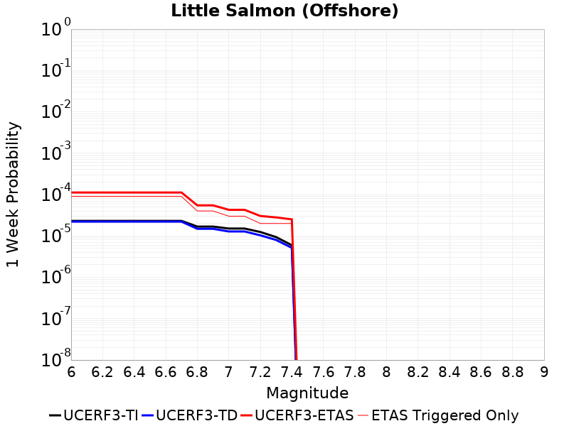 | 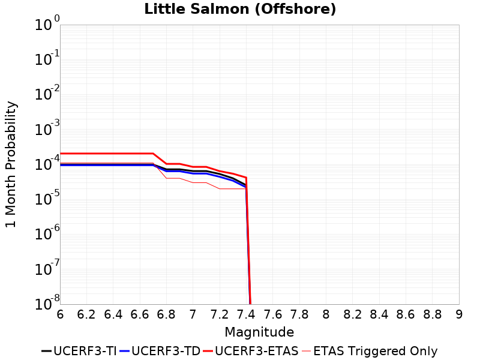 |  | 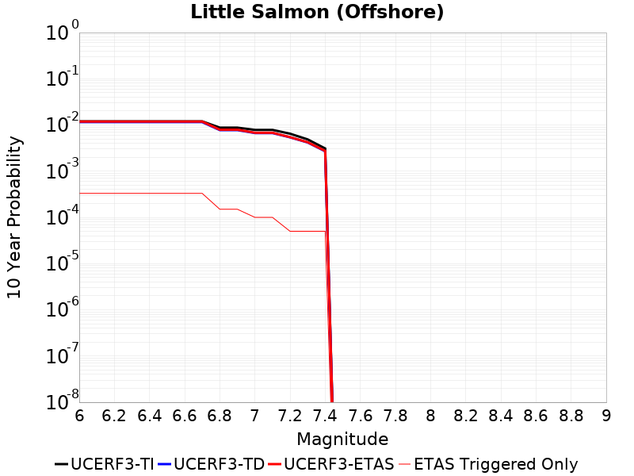 |

| Magnitude | 1 wk TI Prob | 1 wk TD Prob | 1 wk ETAS Prob | 1 wk ETAS/TD Gain | 1 wk ETAS Triggered Only | 1 mo TI Prob | 1 mo TD Prob | 1 mo ETAS Prob | 1 mo ETAS/TD Gain | 1 mo ETAS Triggered Only | 1 yr TI Prob | 1 yr TD Prob | 1 yr ETAS Prob | 1 yr ETAS/TD Gain | 1 yr ETAS Triggered Only | 10 yr TI Prob | 10 yr TD Prob | 10 yr ETAS Prob | 10 yr ETAS/TD Gain | 10 yr ETAS Triggered Only |
|-----|-----|-----|-----|-----|-----|-----|-----|-----|-----|-----|-----|-----|-----|-----|-----|-----|-----|-----|-----|-----|
| 6.0 | 2.3052053E-5 | 2.2124721E-5 | 1.1212273E-4 | 5.067758 | 9.0E-5 | 9.879077E-5 | 9.481746E-5 | 2.0480703E-4 | 2.160014 | 1.1E-4 | 0.0012021139 | 0.0011539104 | 0.0013536797 | 1.1731237 | 2.0E-4 | 0.011956319 | 0.0115124285 | 0.01183863 | 1.0283346 | 3.3E-4 |
| 6.1 | 2.3052053E-5 | 2.2124721E-5 | 1.1212273E-4 | 5.067758 | 9.0E-5 | 9.879077E-5 | 9.481746E-5 | 2.0480703E-4 | 2.160014 | 1.1E-4 | 0.0012021139 | 0.0011539104 | 0.0013536797 | 1.1731237 | 2.0E-4 | 0.011956319 | 0.0115124285 | 0.01183863 | 1.0283346 | 3.3E-4 |
| 6.2 | 2.3052053E-5 | 2.2124721E-5 | 1.1212273E-4 | 5.067758 | 9.0E-5 | 9.879077E-5 | 9.481746E-5 | 2.0480703E-4 | 2.160014 | 1.1E-4 | 0.0012021139 | 0.0011539104 | 0.0013536797 | 1.1731237 | 2.0E-4 | 0.011956319 | 0.0115124285 | 0.01183863 | 1.0283346 | 3.3E-4 |
| 6.3 | 2.3052053E-5 | 2.2124721E-5 | 1.1212273E-4 | 5.067758 | 9.0E-5 | 9.879077E-5 | 9.481746E-5 | 2.0480703E-4 | 2.160014 | 1.1E-4 | 0.0012021139 | 0.0011539104 | 0.0013536797 | 1.1731237 | 2.0E-4 | 0.011956319 | 0.0115124285 | 0.01183863 | 1.0283346 | 3.3E-4 |
| 6.4 | 2.3052053E-5 | 2.2124721E-5 | 1.1212273E-4 | 5.067758 | 9.0E-5 | 9.879077E-5 | 9.481746E-5 | 2.0480703E-4 | 2.160014 | 1.1E-4 | 0.0012021139 | 0.0011539104 | 0.0013536797 | 1.1731237 | 2.0E-4 | 0.011956319 | 0.0115124285 | 0.01183863 | 1.0283346 | 3.3E-4 |
| 6.5 | 2.3052053E-5 | 2.2124721E-5 | 1.1212273E-4 | 5.067758 | 9.0E-5 | 9.879077E-5 | 9.481746E-5 | 2.0480703E-4 | 2.160014 | 1.1E-4 | 0.0012021139 | 0.0011539104 | 0.0013536797 | 1.1731237 | 2.0E-4 | 0.011956319 | 0.0115124285 | 0.01183863 | 1.0283346 | 3.3E-4 |
| 6.6 | 2.3052053E-5 | 2.2124721E-5 | 1.1212273E-4 | 5.067758 | 9.0E-5 | 9.879077E-5 | 9.481746E-5 | 2.0480703E-4 | 2.160014 | 1.1E-4 | 0.0012021139 | 0.0011539104 | 0.0013536797 | 1.1731237 | 2.0E-4 | 0.011956319 | 0.0115124285 | 0.01183863 | 1.0283346 | 3.3E-4 |
| 6.7 | 2.3052053E-5 | 2.2124721E-5 | 1.1212273E-4 | 5.067758 | 9.0E-5 | 9.879077E-5 | 9.481746E-5 | 2.0480703E-4 | 2.160014 | 1.1E-4 | 0.0012021139 | 0.0011539104 | 0.0013536797 | 1.1731237 | 2.0E-4 | 0.011956319 | 0.0115124285 | 0.01183863 | 1.0283346 | 3.3E-4 |
| 6.8 | 1.683878E-5 | 1.4857179E-5 | 5.4856584E-5 | 3.6922612 | 4.0E-5 | 7.21642E-5 | 6.367238E-5 | 1.0366983E-4 | 1.6281759 | 4.0E-5 | 8.78245E-4 | 7.7498995E-4 | 8.449357E-4 | 1.0902537 | 7.0E-5 | 0.008747822 | 0.0077497824 | 0.00789862 | 1.0192053 | 1.5E-4 |
| 6.9 | 1.683878E-5 | 1.4857179E-5 | 5.4856584E-5 | 3.6922612 | 4.0E-5 | 7.21642E-5 | 6.367238E-5 | 1.0366983E-4 | 1.6281759 | 4.0E-5 | 8.78245E-4 | 7.7498995E-4 | 8.449357E-4 | 1.0902537 | 7.0E-5 | 0.008747822 | 0.0077497824 | 0.00789862 | 1.0192053 | 1.5E-4 |
| 7.0 | 1.5051273E-5 | 1.2792199E-5 | 4.2791817E-5 | 3.345149 | 3.0E-5 | 6.450386E-5 | 5.4822838E-5 | 8.482119E-5 | 1.5471872 | 3.0E-5 | 7.8505155E-4 | 6.673131E-4 | 7.1727973E-4 | 1.0748774 | 5.0E-5 | 0.00782284 | 0.0066795205 | 0.0067788525 | 1.0148711 | 1.0E-4 |
| 7.1 | 1.5051273E-5 | 1.2792199E-5 | 4.2791817E-5 | 3.345149 | 3.0E-5 | 6.450386E-5 | 5.4822838E-5 | 8.482119E-5 | 1.5471872 | 3.0E-5 | 7.8505155E-4 | 6.673131E-4 | 7.1727973E-4 | 1.0748774 | 5.0E-5 | 0.00782284 | 0.0066795205 | 0.0067788525 | 1.0148711 | 1.0E-4 |
| 7.2 | 1.24301405E-5 | 1.0322308E-5 | 3.0322102E-5 | 2.9375312 | 2.0E-5 | 5.3270942E-5 | 4.4237957E-5 | 6.423707E-5 | 1.4520805 | 2.0E-5 | 6.483807E-4 | 5.3850736E-4 | 5.684912E-4 | 1.0556796 | 3.0E-5 | 0.006464922 | 0.005397424 | 0.0054471544 | 1.0092137 | 5.0E-5 |
| 7.3 | 9.3599865E-6 | 7.990617E-6 | 2.7990458E-5 | 3.5029156 | 2.0E-5 | 4.011361E-5 | 3.424527E-5 | 5.4244585E-5 | 1.5840023 | 2.0E-5 | 4.8827377E-4 | 4.1689482E-4 | 4.468823E-4 | 1.0719306 | 3.0E-5 | 0.004872023 | 0.004178645 | 0.0042284364 | 1.0119156 | 5.0E-5 |
| 7.4 | 5.941556E-6 | 5.1425695E-6 | 2.5142466E-5 | 4.8890862 | 2.0E-5 | 2.5463563E-5 | 2.2039585E-5 | 4.2039144E-5 | 1.9074382 | 2.0E-5 | 3.0997477E-4 | 2.6833193E-4 | 2.983239E-4 | 1.1117718 | 3.0E-5 | 0.0030954275 | 0.0026926342 | 0.0027424998 | 1.0185192 | 5.0E-5 |

## Maacama 2011 CFM
*[(top)](#table-of-contents)*

| 1 Week | 1 Month | 1 Year | 10 Year |
|-----|-----|-----|-----|
| 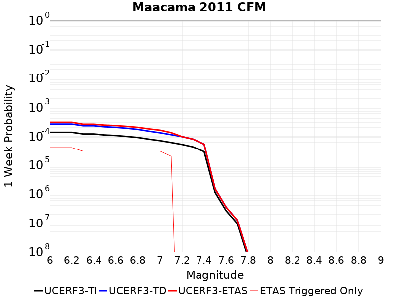 |  |  |  |

| Magnitude | 1 wk TI Prob | 1 wk TD Prob | 1 wk ETAS Prob | 1 wk ETAS/TD Gain | 1 wk ETAS Triggered Only | 1 mo TI Prob | 1 mo TD Prob | 1 mo ETAS Prob | 1 mo ETAS/TD Gain | 1 mo ETAS Triggered Only | 1 yr TI Prob | 1 yr TD Prob | 1 yr ETAS Prob | 1 yr ETAS/TD Gain | 1 yr ETAS Triggered Only | 10 yr TI Prob | 10 yr TD Prob | 10 yr ETAS Prob | 10 yr ETAS/TD Gain | 10 yr ETAS Triggered Only |
|-----|-----|-----|-----|-----|-----|-----|-----|-----|-----|-----|-----|-----|-----|-----|-----|-----|-----|-----|-----|-----|
| 6.0 | 1.3538804E-4 | 2.6081278E-4 | 3.0080235E-4 | 1.1533267 | 4.0E-5 | 5.8010535E-4 | 0.0011172281 | 0.0011871498 | 1.0625851 | 7.0E-5 | 0.007039935 | 0.013498539 | 0.01363665 | 1.0102315 | 1.4E-4 | 0.068210475 | 0.12537831 | 0.12562321 | 1.0019532 | 2.8E-4 |
| 6.1 | 1.3538804E-4 | 2.6081278E-4 | 3.0080235E-4 | 1.1533267 | 4.0E-5 | 5.8010535E-4 | 0.0011172281 | 0.0011871498 | 1.0625851 | 7.0E-5 | 0.007039935 | 0.013498539 | 0.01363665 | 1.0102315 | 1.4E-4 | 0.068210475 | 0.12537831 | 0.12562321 | 1.0019532 | 2.8E-4 |
| 6.2 | 1.3538804E-4 | 2.6081278E-4 | 3.0080235E-4 | 1.1533267 | 4.0E-5 | 5.8010535E-4 | 0.0011172281 | 0.0011871498 | 1.0625851 | 7.0E-5 | 0.007039935 | 0.013498539 | 0.01363665 | 1.0102315 | 1.4E-4 | 0.068210475 | 0.12537831 | 0.12562321 | 1.0019532 | 2.8E-4 |
| 6.3 | 1.1917239E-4 | 2.2861995E-4 | 2.586131E-4 | 1.1311921 | 3.0E-5 | 5.1063887E-4 | 9.793626E-4 | 0.0010293137 | 1.0510036 | 5.0E-5 | 0.0061993203 | 0.011844519 | 0.011943335 | 1.0083427 | 1.0E-4 | 0.060292065 | 0.111035116 | 0.11124847 | 1.0019215 | 2.4E-4 |
| 6.4 | 1.1859289E-4 | 2.2764243E-4 | 2.576356E-4 | 1.1317556 | 3.0E-5 | 5.0815626E-4 | 9.751765E-4 | 0.0010251278 | 1.0512228 | 5.0E-5 | 0.006169266 | 0.011794164 | 0.011892985 | 1.0083787 | 1.0E-4 | 0.06000784 | 0.11058726 | 0.11080072 | 1.0019302 | 2.4E-4 |
| 6.5 | 1.09512424E-4 | 2.0998536E-4 | 2.3997907E-4 | 1.142837 | 3.0E-5 | 4.6925453E-4 | 8.995727E-4 | 9.4952766E-4 | 1.055532 | 5.0E-5 | 0.005698218 | 0.010885984 | 0.010975004 | 1.0081775 | 9.0E-5 | 0.055543028 | 0.10261955 | 0.10279005 | 1.0016615 | 1.9E-4 |
| 6.6 | 1.0502928E-4 | 2.014634E-4 | 2.3145735E-4 | 1.1488805 | 3.0E-5 | 4.500478E-4 | 8.6307497E-4 | 9.130318E-4 | 1.0578824 | 5.0E-5 | 0.0054655746 | 0.010447204 | 0.010536264 | 1.0085248 | 9.0E-5 | 0.053330887 | 0.09874064 | 0.098911874 | 1.0017343 | 1.9E-4 |
| 6.7 | 9.739358E-5 | 1.8713254E-4 | 2.1712693E-4 | 1.1602842 | 3.0E-5 | 4.173343E-4 | 8.016964E-4 | 8.416643E-4 | 1.0498542 | 4.0E-5 | 0.0050692135 | 0.009708652 | 0.009787875 | 1.0081601 | 8.0E-5 | 0.049551267 | 0.09215636 | 0.092301615 | 1.0015762 | 1.6E-4 |
| 6.8 | 8.969524E-5 | 1.7078366E-4 | 2.0077854E-4 | 1.1756308 | 3.0E-5 | 3.8435153E-4 | 7.316707E-4 | 7.7164144E-4 | 1.0546294 | 4.0E-5 | 0.0046694432 | 0.008865185 | 0.008944476 | 1.008944 | 8.0E-5 | 0.045725387 | 0.08455995 | 0.084688105 | 1.0015156 | 1.4E-4 |
| 6.9 | 7.838291E-5 | 1.4791278E-4 | 1.7790835E-4 | 1.2027922 | 3.0E-5 | 3.358835E-4 | 6.337209E-4 | 6.637019E-4 | 1.0473094 | 3.0E-5 | 0.0040817154 | 0.007683653 | 0.007733269 | 1.0064573 | 5.0E-5 | 0.04007554 | 0.07377332 | 0.073865935 | 1.0012555 | 1.0E-4 |
| 7.0 | 6.961957E-5 | 1.3043961E-4 | 1.604357E-4 | 1.2299615 | 3.0E-5 | 2.9833548E-4 | 5.588889E-4 | 5.888721E-4 | 1.0536479 | 3.0E-5 | 0.0036261857 | 0.006780069 | 0.00682973 | 1.0073246 | 5.0E-5 | 0.035675827 | 0.06544543 | 0.06552954 | 1.0012852 | 9.0E-5 |
| 7.1 | 5.999398E-5 | 1.1202521E-4 | 1.3202298E-4 | 1.1785113 | 2.0E-5 | 2.570917E-4 | 4.8001125E-4 | 5.0000165E-4 | 1.0416456 | 2.0E-5 | 0.0031255994 | 0.0058265147 | 0.00585634 | 1.0051188 | 3.0E-5 | 0.030820016 | 0.05655237 | 0.056608975 | 1.001001 | 6.0E-5 |
| 7.2 | 5.116532E-5 | 9.568626E-5 | 9.568626E-5 | 1.0 | 0.0 | 2.1926152E-4 | 4.100156E-4 | 4.100156E-4 | 1.0 | 0.0 | 0.002666241 | 0.00497946 | 0.0049894103 | 1.0019983 | 1.0E-5 | 0.026344774 | 0.04857186 | 0.0486004 | 1.0005876 | 3.0E-5 |
| 7.3 | 4.2087835E-5 | 7.8309924E-5 | 7.8309924E-5 | 1.0 | 0.0 | 1.8036396E-4 | 3.355686E-4 | 3.355686E-4 | 1.0 | 0.0 | 0.0021937196 | 0.004077185 | 0.0040871445 | 1.0024427 | 1.0E-5 | 0.0217219 | 0.039947517 | 0.039966717 | 1.0004807 | 2.0E-5 |
| 7.4 | 2.8991652E-5 | 5.254117E-5 | 5.254117E-5 | 1.0 | 0.0 | 1.2424402E-4 | 2.2515647E-4 | 2.2515647E-4 | 1.0 | 0.0 | 0.0015116213 | 0.0027376842 | 0.0027476568 | 1.0036427 | 1.0E-5 | 0.015013801 | 0.02701682 | 0.02703628 | 1.0007203 | 2.0E-5 |
| 7.5 | 1.1292299E-6 | 1.5148414E-6 | 1.5148414E-6 | 1.0 | 0.0 | 4.8395473E-6 | 6.4921687E-6 | 6.4921687E-6 | 1.0 | 0.0 | 5.8919897E-5 | 7.904056E-5 | 7.904056E-5 | 1.0 | 0.0 | 5.890428E-4 | 7.9076865E-4 | 7.9076865E-4 | 1.0 | 0.0 |
| 7.6 | 2.6535366E-7 | 3.532638E-7 | 3.532638E-7 | 1.0 | 0.0 | 1.1372296E-6 | 1.5139868E-6 | 1.5139868E-6 | 1.0 | 0.0 | 1.3845682E-5 | 1.8432635E-5 | 1.8432635E-5 | 1.0 | 0.0 | 1.3844819E-4 | 1.8478581E-4 | 1.8478581E-4 | 1.0 | 0.0 |
| 7.7 | 9.727789E-8 | 1.2618081E-7 | 1.2618081E-7 | 1.0 | 0.0 | 4.1690518E-7 | 5.4077475E-7 | 5.4077475E-7 | 1.0 | 0.0 | 5.0758085E-6 | 6.583913E-6 | 6.583913E-6 | 1.0 | 0.0 | 5.0756928E-5 | 6.620469E-5 | 6.620469E-5 | 1.0 | 0.0 |
| 7.8 | 6.1939325E-9 | 7.98317E-9 | 7.98317E-9 | 1.0 | 0.0 | 2.6545425E-8 | 3.4213585E-8 | 3.4213585E-8 | 1.0 | 0.0 | 3.231905E-7 | 4.165503E-7 | 4.165503E-7 | 1.0 | 0.0 | 3.2319003E-6 | 4.2011275E-6 | 4.2011275E-6 | 1.0 | 0.0 |

## Table Bluff
*[(top)](#table-of-contents)*

| 1 Week | 1 Month | 1 Year | 10 Year |
|-----|-----|-----|-----|
|  | 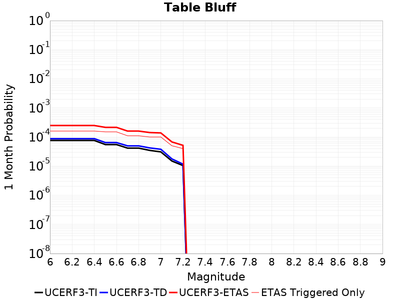 |  | 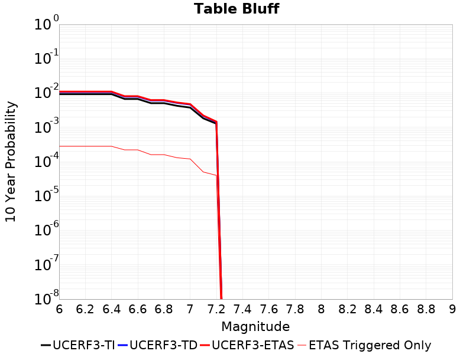 |

| Magnitude | 1 wk TI Prob | 1 wk TD Prob | 1 wk ETAS Prob | 1 wk ETAS/TD Gain | 1 wk ETAS Triggered Only | 1 mo TI Prob | 1 mo TD Prob | 1 mo ETAS Prob | 1 mo ETAS/TD Gain | 1 mo ETAS Triggered Only | 1 yr TI Prob | 1 yr TD Prob | 1 yr ETAS Prob | 1 yr ETAS/TD Gain | 1 yr ETAS Triggered Only | 10 yr TI Prob | 10 yr TD Prob | 10 yr ETAS Prob | 10 yr ETAS/TD Gain | 10 yr ETAS Triggered Only |
|-----|-----|-----|-----|-----|-----|-----|-----|-----|-----|-----|-----|-----|-----|-----|-----|-----|-----|-----|-----|-----|
| 6.0 | 1.7744695E-5 | 2.0464708E-5 | 1.4046225E-4 | 6.8636336 | 1.2E-4 | 7.6046475E-5 | 8.770328E-5 | 2.4768926E-4 | 2.8241732 | 1.6E-4 | 9.2547253E-4 | 0.0010673249 | 0.0012671114 | 1.1871843 | 2.0E-4 | 0.009216278 | 0.010628015 | 0.0109050395 | 1.0260655 | 2.8E-4 |
| 6.1 | 1.7744695E-5 | 2.0464708E-5 | 1.4046225E-4 | 6.8636336 | 1.2E-4 | 7.6046475E-5 | 8.770328E-5 | 2.4768926E-4 | 2.8241732 | 1.6E-4 | 9.2547253E-4 | 0.0010673249 | 0.0012671114 | 1.1871843 | 2.0E-4 | 0.009216278 | 0.010628015 | 0.0109050395 | 1.0260655 | 2.8E-4 |
| 6.2 | 1.7744695E-5 | 2.0464708E-5 | 1.4046225E-4 | 6.8636336 | 1.2E-4 | 7.6046475E-5 | 8.770328E-5 | 2.4768926E-4 | 2.8241732 | 1.6E-4 | 9.2547253E-4 | 0.0010673249 | 0.0012671114 | 1.1871843 | 2.0E-4 | 0.009216278 | 0.010628015 | 0.0109050395 | 1.0260655 | 2.8E-4 |
| 6.3 | 1.7744695E-5 | 2.0464708E-5 | 1.4046225E-4 | 6.8636336 | 1.2E-4 | 7.6046475E-5 | 8.770328E-5 | 2.4768926E-4 | 2.8241732 | 1.6E-4 | 9.2547253E-4 | 0.0010673249 | 0.0012671114 | 1.1871843 | 2.0E-4 | 0.009216278 | 0.010628015 | 0.0109050395 | 1.0260655 | 2.8E-4 |
| 6.4 | 1.7744695E-5 | 2.0464708E-5 | 1.4046225E-4 | 6.8636336 | 1.2E-4 | 7.6046475E-5 | 8.770328E-5 | 2.4768926E-4 | 2.8241732 | 1.6E-4 | 9.2547253E-4 | 0.0010673249 | 0.0012671114 | 1.1871843 | 2.0E-4 | 0.009216278 | 0.010628015 | 0.0109050395 | 1.0260655 | 2.8E-4 |
| 6.5 | 1.2822383E-5 | 1.5018107E-5 | 1.2501645E-4 | 8.324382 | 1.1E-4 | 5.4951914E-5 | 6.43619E-5 | 2.1435224E-4 | 3.3304214 | 1.5E-4 | 6.6883414E-4 | 7.8335474E-4 | 9.6321374E-4 | 1.2296009 | 1.8E-4 | 0.0066682473 | 0.00780895 | 0.008027232 | 1.0279528 | 2.2E-4 |
| 6.6 | 1.2822383E-5 | 1.5018107E-5 | 1.2501645E-4 | 8.324382 | 1.1E-4 | 5.4951914E-5 | 6.43619E-5 | 2.1435224E-4 | 3.3304214 | 1.5E-4 | 6.6883414E-4 | 7.8335474E-4 | 9.6321374E-4 | 1.2296009 | 1.8E-4 | 0.0066682473 | 0.00780895 | 0.008027232 | 1.0279528 | 2.2E-4 |
| 6.7 | 9.690175E-6 | 1.1582673E-5 | 9.158174E-5 | 7.9067883 | 8.0E-5 | 4.1528663E-5 | 4.9639202E-5 | 1.5963374E-4 | 3.2158806 | 1.1E-4 | 5.054941E-4 | 6.0421036E-4 | 7.3413184E-4 | 1.2150269 | 1.3E-4 | 0.005043458 | 0.0060277227 | 0.006186758 | 1.026384 | 1.6E-4 |
| 6.8 | 9.690175E-6 | 1.1582673E-5 | 9.158174E-5 | 7.9067883 | 8.0E-5 | 4.1528663E-5 | 4.9639202E-5 | 1.5963374E-4 | 3.2158806 | 1.1E-4 | 5.054941E-4 | 6.0421036E-4 | 7.3413184E-4 | 1.2150269 | 1.3E-4 | 0.005043458 | 0.0060277227 | 0.006186758 | 1.026384 | 1.6E-4 |
| 6.9 | 8.096043E-6 | 9.841261E-6 | 7.9840574E-5 | 8.11284 | 7.0E-5 | 3.4696863E-5 | 4.2176252E-5 | 1.4217204E-4 | 3.3709025 | 1.0E-4 | 4.223524E-4 | 5.1339285E-4 | 6.3333125E-4 | 1.2336191 | 1.2E-4 | 0.004215506 | 0.0051238406 | 0.0052531743 | 1.0252416 | 1.3E-4 |
| 7.0 | 7.185906E-6 | 8.849477E-6 | 7.884886E-5 | 8.910002 | 7.0E-5 | 3.0796375E-5 | 3.7925878E-5 | 1.3792208E-4 | 3.6366222 | 1.0E-4 | 3.7488135E-4 | 4.6166682E-4 | 5.816114E-4 | 1.2598077 | 1.2E-4 | 0.0037424958 | 0.0046087583 | 0.0047282055 | 1.0259174 | 1.2E-4 |
| 7.1 | 3.4937343E-6 | 4.123303E-6 | 3.412318E-5 | 8.27569 | 3.0E-5 | 1.497306E-5 | 1.7671222E-5 | 6.767034E-5 | 3.8294091 | 5.0E-5 | 1.8228177E-4 | 2.1513358E-4 | 2.6512283E-4 | 1.2323637 | 5.0E-5 | 0.0018213232 | 0.0021500078 | 0.0021999003 | 1.0232058 | 5.0E-5 |
| 7.2 | 2.4388776E-6 | 2.7308793E-6 | 3.2730797E-5 | 11.985442 | 3.0E-5 | 1.0452291E-5 | 1.1703746E-5 | 5.170328E-5 | 4.4176693 | 4.0E-5 | 1.2724921E-4 | 1.4248907E-4 | 1.8248336E-4 | 1.2806833 | 4.0E-5 | 0.0012717636 | 0.001424494 | 0.001464437 | 1.0280402 | 4.0E-5 |

## Big Lagoon - Bald Mtn 2011 CFM
*[(top)](#table-of-contents)*

| 1 Week | 1 Month | 1 Year | 10 Year |
|-----|-----|-----|-----|
|  | 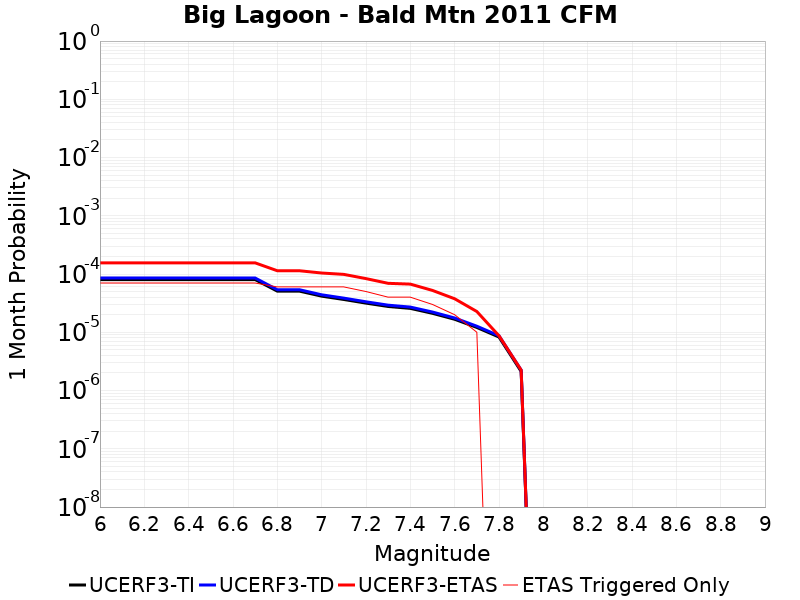 |  | 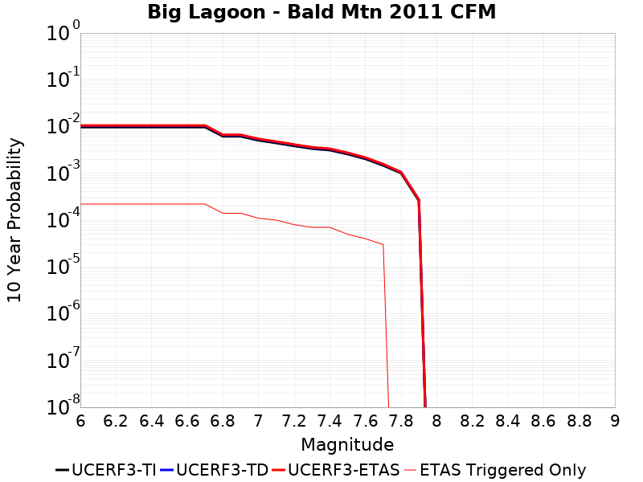 |

| Magnitude | 1 wk TI Prob | 1 wk TD Prob | 1 wk ETAS Prob | 1 wk ETAS/TD Gain | 1 wk ETAS Triggered Only | 1 mo TI Prob | 1 mo TD Prob | 1 mo ETAS Prob | 1 mo ETAS/TD Gain | 1 mo ETAS Triggered Only | 1 yr TI Prob | 1 yr TD Prob | 1 yr ETAS Prob | 1 yr ETAS/TD Gain | 1 yr ETAS Triggered Only | 10 yr TI Prob | 10 yr TD Prob | 10 yr ETAS Prob | 10 yr ETAS/TD Gain | 10 yr ETAS Triggered Only |
|-----|-----|-----|-----|-----|-----|-----|-----|-----|-----|-----|-----|-----|-----|-----|-----|-----|-----|-----|-----|-----|
| 6.0 | 1.8699735E-5 | 1.9896317E-5 | 6.989532E-5 | 3.5129778 | 5.0E-5 | 8.013926E-5 | 8.526736E-5 | 1.552614E-4 | 1.8208772 | 7.0E-5 | 9.752587E-4 | 0.0010376738 | 0.0011575492 | 1.1155233 | 1.2E-4 | 0.009709897 | 0.010332124 | 0.010549852 | 1.0210729 | 2.2E-4 |
| 6.1 | 1.8699735E-5 | 1.9896317E-5 | 6.989532E-5 | 3.5129778 | 5.0E-5 | 8.013926E-5 | 8.526736E-5 | 1.552614E-4 | 1.8208772 | 7.0E-5 | 9.752587E-4 | 0.0010376738 | 0.0011575492 | 1.1155233 | 1.2E-4 | 0.009709897 | 0.010332124 | 0.010549852 | 1.0210729 | 2.2E-4 |
| 6.2 | 1.8699735E-5 | 1.9896317E-5 | 6.989532E-5 | 3.5129778 | 5.0E-5 | 8.013926E-5 | 8.526736E-5 | 1.552614E-4 | 1.8208772 | 7.0E-5 | 9.752587E-4 | 0.0010376738 | 0.0011575492 | 1.1155233 | 1.2E-4 | 0.009709897 | 0.010332124 | 0.010549852 | 1.0210729 | 2.2E-4 |
| 6.3 | 1.8699735E-5 | 1.9896317E-5 | 6.989532E-5 | 3.5129778 | 5.0E-5 | 8.013926E-5 | 8.526736E-5 | 1.552614E-4 | 1.8208772 | 7.0E-5 | 9.752587E-4 | 0.0010376738 | 0.0011575492 | 1.1155233 | 1.2E-4 | 0.009709897 | 0.010332124 | 0.010549852 | 1.0210729 | 2.2E-4 |
| 6.4 | 1.8699735E-5 | 1.9896317E-5 | 6.989532E-5 | 3.5129778 | 5.0E-5 | 8.013926E-5 | 8.526736E-5 | 1.552614E-4 | 1.8208772 | 7.0E-5 | 9.752587E-4 | 0.0010376738 | 0.0011575492 | 1.1155233 | 1.2E-4 | 0.009709897 | 0.010332124 | 0.010549852 | 1.0210729 | 2.2E-4 |
| 6.5 | 1.8699735E-5 | 1.9896317E-5 | 6.989532E-5 | 3.5129778 | 5.0E-5 | 8.013926E-5 | 8.526736E-5 | 1.552614E-4 | 1.8208772 | 7.0E-5 | 9.752587E-4 | 0.0010376738 | 0.0011575492 | 1.1155233 | 1.2E-4 | 0.009709897 | 0.010332124 | 0.010549852 | 1.0210729 | 2.2E-4 |
| 6.6 | 1.8699735E-5 | 1.9896317E-5 | 6.989532E-5 | 3.5129778 | 5.0E-5 | 8.013926E-5 | 8.526736E-5 | 1.552614E-4 | 1.8208772 | 7.0E-5 | 9.752587E-4 | 0.0010376738 | 0.0011575492 | 1.1155233 | 1.2E-4 | 0.009709897 | 0.010332124 | 0.010549852 | 1.0210729 | 2.2E-4 |
| 6.7 | 1.8699735E-5 | 1.9896317E-5 | 6.989532E-5 | 3.5129778 | 5.0E-5 | 8.013926E-5 | 8.526736E-5 | 1.552614E-4 | 1.8208772 | 7.0E-5 | 9.752587E-4 | 0.0010376738 | 0.0011575492 | 1.1155233 | 1.2E-4 | 0.009709897 | 0.010332124 | 0.010549852 | 1.0210729 | 2.2E-4 |
| 6.8 | 1.18505095E-5 | 1.2525625E-5 | 5.2525123E-5 | 4.1934137 | 4.0E-5 | 5.078691E-5 | 5.368017E-5 | 1.1367695E-4 | 2.1176713 | 6.0E-5 | 6.181552E-4 | 6.533649E-4 | 7.532996E-4 | 1.1529539 | 1.0E-4 | 0.006164385 | 0.0065149465 | 0.0066540344 | 1.0213491 | 1.4E-4 |
| 6.9 | 1.18505095E-5 | 1.2525625E-5 | 5.2525123E-5 | 4.1934137 | 4.0E-5 | 5.078691E-5 | 5.368017E-5 | 1.1367695E-4 | 2.1176713 | 6.0E-5 | 6.181552E-4 | 6.533649E-4 | 7.532996E-4 | 1.1529539 | 1.0E-4 | 0.006164385 | 0.0065149465 | 0.0066540344 | 1.0213491 | 1.4E-4 |
| 7.0 | 9.719786E-6 | 1.0255953E-5 | 5.025554E-5 | 4.900134 | 4.0E-5 | 4.1655563E-5 | 4.3953358E-5 | 1.0395072E-4 | 2.3650234 | 6.0E-5 | 5.0703844E-4 | 5.350031E-4 | 6.349496E-4 | 1.1868148 | 1.0E-4 | 0.005058831 | 0.0053373985 | 0.005446811 | 1.0204993 | 1.1E-4 |
| 7.1 | 8.523418E-6 | 8.987152E-6 | 4.8986793E-5 | 5.4507585 | 4.0E-5 | 3.652842E-5 | 3.8515805E-5 | 9.851349E-5 | 2.557742 | 6.0E-5 | 4.4464276E-4 | 4.6883058E-4 | 5.5878836E-4 | 1.191877 | 9.0E-5 | 0.0044375416 | 0.0046785795 | 0.0047781114 | 1.021274 | 1.0E-4 |
| 7.2 | 7.378894E-6 | 7.7762625E-6 | 3.777603E-5 | 4.8578644 | 3.0E-5 | 3.162345E-5 | 3.3326418E-5 | 8.3324754E-5 | 2.5002613 | 5.0E-5 | 3.8494746E-4 | 4.056745E-4 | 4.756461E-4 | 1.1724821 | 7.0E-5 | 0.0038428132 | 0.0040494357 | 0.0041291118 | 1.0196759 | 8.0E-5 |
| 7.3 | 6.4640294E-6 | 6.8054437E-6 | 2.6805308E-5 | 3.938804 | 2.0E-5 | 2.7702688E-5 | 2.9165863E-5 | 6.91647E-5 | 2.3714263 | 4.0E-5 | 3.3722803E-4 | 3.550372E-4 | 4.150159E-4 | 1.1689364 | 6.0E-5 | 0.0033671674 | 0.0035447702 | 0.003614522 | 1.0196774 | 7.0E-5 |
| 7.4 | 5.9959093E-6 | 6.3107855E-6 | 2.631066E-5 | 4.1691575 | 2.0E-5 | 2.5696501E-5 | 2.7045946E-5 | 6.7044864E-5 | 2.4789248 | 4.0E-5 | 3.1280998E-4 | 3.2923525E-4 | 3.8921548E-4 | 1.1821805 | 6.0E-5 | 0.0031237002 | 0.003287537 | 0.003357307 | 1.0212226 | 7.0E-5 |
| 7.5 | 4.929265E-6 | 5.186166E-6 | 2.5186062E-5 | 4.8563933 | 2.0E-5 | 2.112525E-5 | 2.2226239E-5 | 5.2225572E-5 | 2.349726 | 3.0E-5 | 2.5716957E-4 | 2.7057124E-4 | 3.1056043E-4 | 1.1477953 | 4.0E-5 | 0.0025687215 | 0.0027024592 | 0.002752324 | 1.0184517 | 5.0E-5 |
| 7.6 | 3.8982403E-6 | 4.0964505E-6 | 2.4096369E-5 | 5.8822556 | 2.0E-5 | 1.6706637E-5 | 1.75561E-5 | 3.7555747E-5 | 2.1391852 | 2.0E-5 | 2.0338432E-4 | 2.1372481E-4 | 2.437184E-4 | 1.1403375 | 3.0E-5 | 0.0020319829 | 0.0021352207 | 0.002175135 | 1.0186934 | 4.0E-5 |
| 7.7 | 2.820968E-6 | 2.9625814E-6 | 1.2962551E-5 | 4.3754244 | 1.0E-5 | 1.2089806E-5 | 1.2696717E-5 | 2.269659E-5 | 1.7875952 | 1.0E-5 | 1.4718344E-4 | 1.5457174E-4 | 1.7456865E-4 | 1.1293697 | 2.0E-5 | 0.00147086 | 0.0015446601 | 0.0015746137 | 1.0193918 | 3.0E-5 |
| 7.8 | 1.9314455E-6 | 2.029748E-6 | 2.029748E-6 | 1.0 | 0.0 | 8.277597E-6 | 8.698891E-6 | 8.698891E-6 | 1.0 | 0.0 | 1.0077508E-4 | 1.05903986E-4 | 1.05903986E-4 | 1.0 | 0.0 | 0.0010072939 | 0.0010585481 | 0.0010585481 | 1.0 | 0.0 |
| 7.9 | 4.9586197E-7 | 5.2292205E-7 | 5.2292205E-7 | 1.0 | 0.0 | 2.125121E-6 | 2.2410927E-6 | 2.2410927E-6 | 1.0 | 0.0 | 2.5873042E-5 | 2.7284983E-5 | 2.7284983E-5 | 1.0 | 0.0 | 2.5870028E-4 | 2.7281843E-4 | 2.7281843E-4 | 1.0 | 0.0 |

## Bartlett Springs 2011 CFM
*[(top)](#table-of-contents)*

| 1 Week | 1 Month | 1 Year | 10 Year |
|-----|-----|-----|-----|
|  | 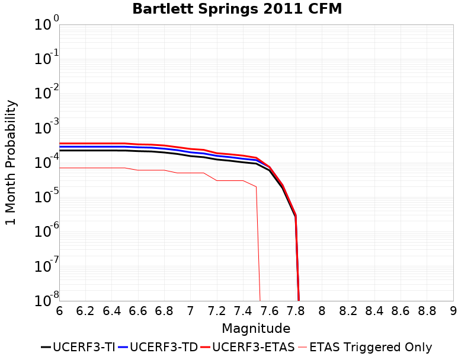 | 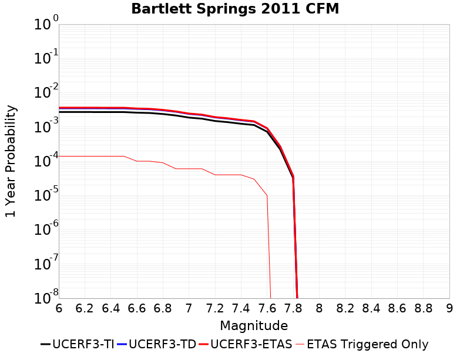 |  |

| Magnitude | 1 wk TI Prob | 1 wk TD Prob | 1 wk ETAS Prob | 1 wk ETAS/TD Gain | 1 wk ETAS Triggered Only | 1 mo TI Prob | 1 mo TD Prob | 1 mo ETAS Prob | 1 mo ETAS/TD Gain | 1 mo ETAS Triggered Only | 1 yr TI Prob | 1 yr TD Prob | 1 yr ETAS Prob | 1 yr ETAS/TD Gain | 1 yr ETAS Triggered Only | 10 yr TI Prob | 10 yr TD Prob | 10 yr ETAS Prob | 10 yr ETAS/TD Gain | 10 yr ETAS Triggered Only |
|-----|-----|-----|-----|-----|-----|-----|-----|-----|-----|-----|-----|-----|-----|-----|-----|-----|-----|-----|-----|-----|
| 6.0 | 5.2219133E-5 | 6.722162E-5 | 8.722027E-5 | 1.2975034 | 2.0E-5 | 2.237771E-4 | 2.8806113E-4 | 3.5804097E-4 | 1.242934 | 7.0E-5 | 0.0027210822 | 0.0035015545 | 0.0036410643 | 1.0398422 | 1.4E-4 | 0.026880035 | 0.034473564 | 0.03464736 | 1.0050414 | 1.8E-4 |
| 6.1 | 5.2212024E-5 | 6.722162E-5 | 8.722027E-5 | 1.2975034 | 2.0E-5 | 2.2374663E-4 | 2.8806113E-4 | 3.5804097E-4 | 1.242934 | 7.0E-5 | 0.002720712 | 0.0035015545 | 0.0036410643 | 1.0398422 | 1.4E-4 | 0.026876424 | 0.034473564 | 0.03464736 | 1.0050414 | 1.8E-4 |
| 6.2 | 5.2204425E-5 | 6.722162E-5 | 8.722027E-5 | 1.2975034 | 2.0E-5 | 2.2371406E-4 | 2.8806113E-4 | 3.5804097E-4 | 1.242934 | 7.0E-5 | 0.0027203166 | 0.0035015545 | 0.0036410643 | 1.0398422 | 1.4E-4 | 0.026872564 | 0.034473564 | 0.03464736 | 1.0050414 | 1.8E-4 |
| 6.3 | 5.219004E-5 | 6.722162E-5 | 8.722027E-5 | 1.2975034 | 2.0E-5 | 2.2365242E-4 | 2.8806113E-4 | 3.5804097E-4 | 1.242934 | 7.0E-5 | 0.002719568 | 0.0035015545 | 0.0036410643 | 1.0398422 | 1.4E-4 | 0.02686526 | 0.034473564 | 0.03464736 | 1.0050414 | 1.8E-4 |
| 6.4 | 5.211827E-5 | 6.715655E-5 | 8.7155204E-5 | 1.2977916 | 2.0E-5 | 2.2334489E-4 | 2.877823E-4 | 3.5776218E-4 | 1.2431694 | 7.0E-5 | 0.0027158333 | 0.003498171 | 0.0036376812 | 1.0398809 | 1.4E-4 | 0.026828816 | 0.034440786 | 0.034614585 | 1.0050464 | 1.8E-4 |
| 6.5 | 5.204509E-5 | 6.7064546E-5 | 8.706321E-5 | 1.2982001 | 2.0E-5 | 2.2303131E-4 | 2.873881E-4 | 3.57368E-4 | 1.2435031 | 7.0E-5 | 0.0027120248 | 0.003493387 | 0.003632898 | 1.0399357 | 1.4E-4 | 0.026791653 | 0.034394436 | 0.034568243 | 1.0050534 | 1.8E-4 |
| 6.6 | 5.0085426E-5 | 6.45167E-5 | 8.451541E-5 | 1.3099773 | 2.0E-5 | 2.1463417E-4 | 2.764711E-4 | 3.3645454E-4 | 1.2169609 | 6.0E-5 | 0.0026100394 | 0.0033608903 | 0.0034605544 | 1.029654 | 1.0E-4 | 0.025795965 | 0.0331098 | 0.033245165 | 1.0040884 | 1.4E-4 |
| 6.7 | 4.8930866E-5 | 6.30442E-5 | 8.3042934E-5 | 1.3172177 | 2.0E-5 | 2.0968684E-4 | 2.701617E-4 | 3.3014547E-4 | 1.2220292 | 6.0E-5 | 0.0025499484 | 0.0032843072 | 0.0033839787 | 1.0303478 | 1.0E-4 | 0.025208864 | 0.03236658 | 0.03250205 | 1.0041854 | 1.4E-4 |
| 6.8 | 4.5679535E-5 | 5.8816142E-5 | 7.881497E-5 | 1.3400227 | 2.0E-5 | 1.9575475E-4 | 2.5204502E-4 | 3.1202988E-4 | 1.2379928 | 6.0E-5 | 0.002380709 | 0.0030643675 | 0.0031540918 | 1.0292798 | 9.0E-5 | 0.023553653 | 0.030228117 | 0.030354187 | 1.0041707 | 1.3E-4 |
| 6.9 | 4.1439176E-5 | 5.331763E-5 | 7.3316565E-5 | 1.3750905 | 2.0E-5 | 1.7758438E-4 | 2.2848425E-4 | 2.784728E-4 | 1.2187835 | 5.0E-5 | 0.002159946 | 0.0027782724 | 0.0028381057 | 1.0215361 | 6.0E-5 | 0.021390721 | 0.027440384 | 0.027527913 | 1.0031898 | 9.0E-5 |
| 7.0 | 3.5920104E-5 | 4.6105528E-5 | 6.610461E-5 | 1.4337674 | 2.0E-5 | 1.5393422E-4 | 1.9758024E-4 | 2.4757037E-4 | 1.2530117 | 5.0E-5 | 0.001872538 | 0.0024029014 | 0.0024627573 | 1.0249099 | 6.0E-5 | 0.018568378 | 0.023772432 | 0.02385053 | 1.0032853 | 8.0E-5 |
| 7.1 | 3.338812E-5 | 4.277339E-5 | 6.277253E-5 | 1.4675604 | 2.0E-5 | 1.430841E-4 | 1.8330173E-4 | 2.3329257E-4 | 1.2727243 | 5.0E-5 | 0.0017406568 | 0.0022294289 | 0.002289295 | 1.0268527 | 6.0E-5 | 0.017270854 | 0.02207343 | 0.022151662 | 1.0035442 | 8.0E-5 |
| 7.2 | 2.8619615E-5 | 3.6487872E-5 | 5.6487144E-5 | 1.5481074 | 2.0E-5 | 1.2264973E-4 | 1.5636728E-4 | 1.8636258E-4 | 1.191826 | 3.0E-5 | 0.0014922376 | 0.001902119 | 0.001942043 | 1.0209892 | 4.0E-5 | 0.014822568 | 0.018860325 | 0.018919192 | 1.0031213 | 6.0E-5 |
| 7.3 | 2.6376783E-5 | 3.3490767E-5 | 5.3490097E-5 | 1.5971595 | 2.0E-5 | 1.13038455E-4 | 1.4352401E-4 | 1.7351971E-4 | 1.2089943 | 3.0E-5 | 0.0013753743 | 0.0017460136 | 0.0017859438 | 1.0228693 | 4.0E-5 | 0.01366893 | 0.017324638 | 0.01737377 | 1.0028361 | 5.0E-5 |
| 7.4 | 2.3738676E-5 | 3.0030247E-5 | 5.002965E-5 | 1.6659752 | 2.0E-5 | 1.0173322E-4 | 1.2869475E-4 | 1.5869089E-4 | 1.2330797 | 3.0E-5 | 0.0012378981 | 0.0015657406 | 0.0016056779 | 1.025507 | 4.0E-5 | 0.012310251 | 0.015548481 | 0.015597703 | 1.0031657 | 5.0E-5 |
| 7.5 | 2.1789481E-5 | 2.7483818E-5 | 3.7483544E-5 | 1.3638405 | 1.0E-5 | 9.338015E-5 | 1.17782525E-4 | 1.3778017E-4 | 1.1697844 | 2.0E-5 | 0.0011363103 | 0.0014330668 | 0.0014630238 | 1.0209042 | 3.0E-5 | 0.011305175 | 0.014239388 | 0.014278818 | 1.0027691 | 4.0E-5 |
| 7.6 | 1.3895281E-5 | 1.7399116E-5 | 1.7399116E-5 | 1.0 | 0.0 | 5.9549846E-5 | 7.456552E-5 | 7.456552E-5 | 1.0 | 0.0 | 7.2477816E-4 | 9.0746E-4 | 9.1745093E-4 | 1.0110098 | 1.0E-5 | 0.0072241887 | 0.009037868 | 0.009047778 | 1.0010965 | 1.0E-5 |
| 7.7 | 4.245981E-6 | 5.177554E-6 | 5.177554E-6 | 1.0 | 0.0 | 1.8196934E-5 | 2.218933E-5 | 2.218933E-5 | 1.0 | 0.0 | 2.2152514E-4 | 2.701218E-4 | 2.701218E-4 | 1.0 | 0.0 | 0.0022130446 | 0.0026979186 | 0.0026979186 | 1.0 | 0.0 |
| 7.8 | 6.145192E-7 | 7.0767845E-7 | 7.0767845E-7 | 1.0 | 0.0 | 2.633651E-6 | 3.0329043E-6 | 3.0329043E-6 | 1.0 | 0.0 | 3.206423E-5 | 3.6924994E-5 | 3.6924994E-5 | 1.0 | 0.0 | 3.2059604E-4 | 3.6918902E-4 | 3.6918902E-4 | 1.0 | 0.0 |

## McKinleyville (alt1)
*[(top)](#table-of-contents)*

| 1 Week | 1 Month | 1 Year | 10 Year |
|-----|-----|-----|-----|
| 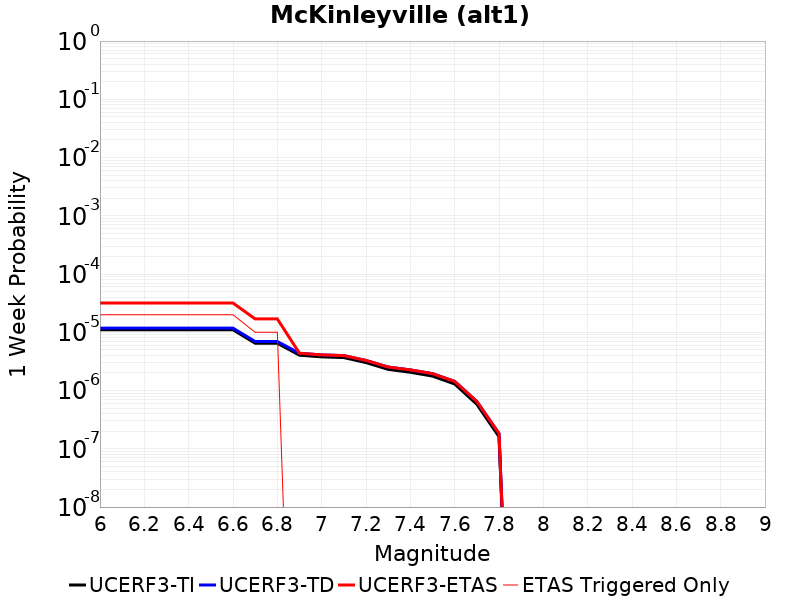 |  | 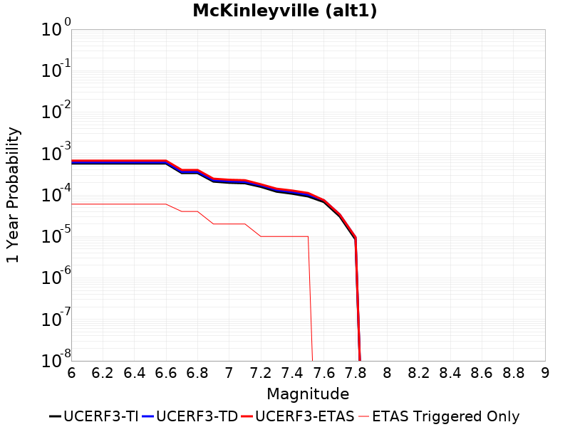 |  |

| Magnitude | 1 wk TI Prob | 1 wk TD Prob | 1 wk ETAS Prob | 1 wk ETAS/TD Gain | 1 wk ETAS Triggered Only | 1 mo TI Prob | 1 mo TD Prob | 1 mo ETAS Prob | 1 mo ETAS/TD Gain | 1 mo ETAS Triggered Only | 1 yr TI Prob | 1 yr TD Prob | 1 yr ETAS Prob | 1 yr ETAS/TD Gain | 1 yr ETAS Triggered Only | 10 yr TI Prob | 10 yr TD Prob | 10 yr ETAS Prob | 10 yr ETAS/TD Gain | 10 yr ETAS Triggered Only |
|-----|-----|-----|-----|-----|-----|-----|-----|-----|-----|-----|-----|-----|-----|-----|-----|-----|-----|-----|-----|-----|
| 6.0 | 1.1028524E-5 | 1.1754655E-5 | 3.175442E-5 | 2.7014337 | 2.0E-5 | 4.7264242E-5 | 5.0376264E-5 | 1.0037375E-4 | 1.9924809 | 5.0E-5 | 5.7529024E-4 | 6.1318395E-4 | 6.7314715E-4 | 1.0977899 | 6.0E-5 | 0.005738032 | 0.0061174408 | 0.006266523 | 1.0243701 | 1.5E-4 |
| 6.1 | 1.1028524E-5 | 1.1754655E-5 | 3.175442E-5 | 2.7014337 | 2.0E-5 | 4.7264242E-5 | 5.0376264E-5 | 1.0037375E-4 | 1.9924809 | 5.0E-5 | 5.7529024E-4 | 6.1318395E-4 | 6.7314715E-4 | 1.0977899 | 6.0E-5 | 0.005738032 | 0.0061174408 | 0.006266523 | 1.0243701 | 1.5E-4 |
| 6.2 | 1.1028524E-5 | 1.1754655E-5 | 3.175442E-5 | 2.7014337 | 2.0E-5 | 4.7264242E-5 | 5.0376264E-5 | 1.0037375E-4 | 1.9924809 | 5.0E-5 | 5.7529024E-4 | 6.1318395E-4 | 6.7314715E-4 | 1.0977899 | 6.0E-5 | 0.005738032 | 0.0061174408 | 0.006266523 | 1.0243701 | 1.5E-4 |
| 6.3 | 1.1028524E-5 | 1.1754655E-5 | 3.175442E-5 | 2.7014337 | 2.0E-5 | 4.7264242E-5 | 5.0376264E-5 | 1.0037375E-4 | 1.9924809 | 5.0E-5 | 5.7529024E-4 | 6.1318395E-4 | 6.7314715E-4 | 1.0977899 | 6.0E-5 | 0.005738032 | 0.0061174408 | 0.006266523 | 1.0243701 | 1.5E-4 |
| 6.4 | 1.1028524E-5 | 1.1754655E-5 | 3.175442E-5 | 2.7014337 | 2.0E-5 | 4.7264242E-5 | 5.0376264E-5 | 1.0037375E-4 | 1.9924809 | 5.0E-5 | 5.7529024E-4 | 6.1318395E-4 | 6.7314715E-4 | 1.0977899 | 6.0E-5 | 0.005738032 | 0.0061174408 | 0.006266523 | 1.0243701 | 1.5E-4 |
| 6.5 | 1.1028524E-5 | 1.1754655E-5 | 3.175442E-5 | 2.7014337 | 2.0E-5 | 4.7264242E-5 | 5.0376264E-5 | 1.0037375E-4 | 1.9924809 | 5.0E-5 | 5.7529024E-4 | 6.1318395E-4 | 6.7314715E-4 | 1.0977899 | 6.0E-5 | 0.005738032 | 0.0061174408 | 0.006266523 | 1.0243701 | 1.5E-4 |
| 6.6 | 1.1028524E-5 | 1.1754655E-5 | 3.175442E-5 | 2.7014337 | 2.0E-5 | 4.7264242E-5 | 5.0376264E-5 | 1.0037375E-4 | 1.9924809 | 5.0E-5 | 5.7529024E-4 | 6.1318395E-4 | 6.7314715E-4 | 1.0977899 | 6.0E-5 | 0.005738032 | 0.0061174408 | 0.006266523 | 1.0243701 | 1.5E-4 |
| 6.7 | 6.483374E-6 | 6.933399E-6 | 1.693333E-5 | 2.442284 | 1.0E-5 | 2.7785592E-5 | 2.9714265E-5 | 5.9713373E-5 | 2.009586 | 3.0E-5 | 3.3823706E-4 | 3.6171736E-4 | 4.0170288E-4 | 1.1105436 | 4.0E-5 | 0.003377227 | 0.0036119013 | 0.0036816483 | 1.0193104 | 7.0E-5 |
| 6.8 | 6.483374E-6 | 6.933399E-6 | 1.693333E-5 | 2.442284 | 1.0E-5 | 2.7785592E-5 | 2.9714265E-5 | 5.9713373E-5 | 2.009586 | 3.0E-5 | 3.3823706E-4 | 3.6171736E-4 | 4.0170288E-4 | 1.1105436 | 4.0E-5 | 0.003377227 | 0.0036119013 | 0.0036816483 | 1.0193104 | 7.0E-5 |
| 6.9 | 4.0394048E-6 | 4.356603E-6 | 4.356603E-6 | 1.0 | 0.0 | 1.731162E-5 | 1.8671024E-5 | 3.867065E-5 | 2.0711586 | 2.0E-5 | 2.1074859E-4 | 2.2729655E-4 | 2.4729202E-4 | 1.0879707 | 2.0E-5 | 0.0021054882 | 0.002270696 | 0.002310605 | 1.0175757 | 4.0E-5 |
| 7.0 | 3.7791233E-6 | 4.0829514E-6 | 4.0829514E-6 | 1.0 | 0.0 | 1.6196142E-5 | 1.7498249E-5 | 3.74979E-5 | 2.1429515 | 2.0E-5 | 1.9717019E-4 | 2.1302086E-4 | 2.330166E-4 | 1.0938675 | 2.0E-5 | 0.0019699533 | 0.0021282167 | 0.0021681315 | 1.0187551 | 4.0E-5 |
| 7.1 | 3.675443E-6 | 3.9740535E-6 | 3.9740535E-6 | 1.0 | 0.0 | 1.5751802E-5 | 1.703155E-5 | 3.703121E-5 | 2.174271 | 2.0E-5 | 1.9176133E-4 | 2.073399E-4 | 2.2733574E-4 | 1.09644 | 2.0E-5 | 0.0019159593 | 0.0020715143 | 0.0021114314 | 1.0192696 | 4.0E-5 |
| 7.2 | 3.0165843E-6 | 3.2813705E-6 | 3.2813705E-6 | 1.0 | 0.0 | 1.2928153E-5 | 1.4062942E-5 | 2.4062801E-5 | 1.7110788 | 1.0E-5 | 1.573889E-4 | 1.7120305E-4 | 1.8120134E-4 | 1.0584002 | 1.0E-5 | 0.0015727748 | 0.0017107305 | 0.0017406791 | 1.0175064 | 3.0E-5 |
| 7.3 | 2.307633E-6 | 2.5264133E-6 | 2.5264133E-6 | 1.0 | 0.0 | 9.889818E-6 | 1.0827441E-5 | 2.0827332E-5 | 1.9235693 | 1.0E-5 | 1.2040188E-4 | 1.318162E-4 | 1.4181487E-4 | 1.0758532 | 1.0E-5 | 0.0012033667 | 0.0013173886 | 0.001347349 | 1.0227423 | 3.0E-5 |
| 7.4 | 2.0568484E-6 | 2.2585639E-6 | 2.2585639E-6 | 1.0 | 0.0 | 8.8150355E-6 | 9.679525E-6 | 1.9679428E-5 | 2.0330987 | 1.0E-5 | 1.0731777E-4 | 1.1784191E-4 | 1.2784073E-4 | 1.0848495 | 1.0E-5 | 0.0010726595 | 0.0011778019 | 0.0012077666 | 1.0254412 | 3.0E-5 |
| 7.5 | 1.7674889E-6 | 1.9474255E-6 | 1.9474255E-6 | 1.0 | 0.0 | 7.5749304E-6 | 8.346083E-6 | 1.8346E-5 | 2.1981568 | 1.0E-5 | 9.222087E-5 | 1.0160889E-4 | 1.1160787E-4 | 1.0984066 | 1.0E-5 | 9.218261E-4 | 0.001015631 | 0.0010356107 | 1.0196722 | 2.0E-5 |
| 7.6 | 1.2944297E-6 | 1.4341474E-6 | 1.4341474E-6 | 1.0 | 0.0 | 5.547544E-6 | 6.146332E-6 | 6.146332E-6 | 1.0 | 0.0 | 6.753925E-5 | 7.482907E-5 | 7.482907E-5 | 1.0 | 0.0 | 6.7518733E-4 | 7.480436E-4 | 7.480436E-4 | 1.0 | 0.0 |
| 7.7 | 5.806243E-7 | 6.482297E-7 | 6.482297E-7 | 1.0 | 0.0 | 2.4883875E-6 | 2.7781243E-6 | 2.7781243E-6 | 1.0 | 0.0 | 3.0295698E-5 | 3.3823155E-5 | 3.3823155E-5 | 1.0 | 0.0 | 3.0291567E-4 | 3.3818177E-4 | 3.3818177E-4 | 1.0 | 0.0 |
| 7.8 | 1.6121008E-7 | 1.8249054E-7 | 1.8249054E-7 | 1.0 | 0.0 | 6.909002E-7 | 7.8210206E-7 | 7.8210206E-7 | 1.0 | 0.0 | 8.411677E-6 | 9.522054E-6 | 9.522054E-6 | 1.0 | 0.0 | 8.411359E-5 | 9.521671E-5 | 9.521671E-5 | 1.0 | 0.0 |

## San Andreas (Peninsula) 2011 CFM
*[(top)](#table-of-contents)*

| 1 Week | 1 Month | 1 Year | 10 Year |
|-----|-----|-----|-----|
| 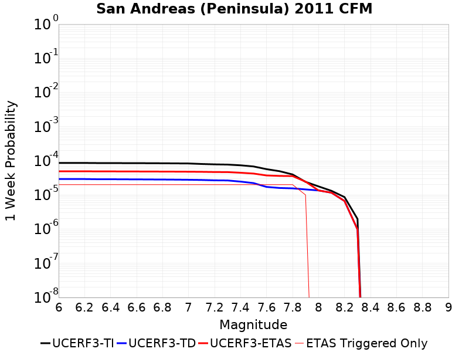 |  | 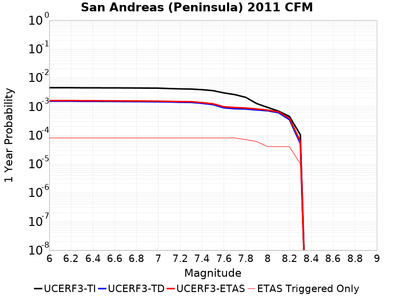 |  |

| Magnitude | 1 wk TI Prob | 1 wk TD Prob | 1 wk ETAS Prob | 1 wk ETAS/TD Gain | 1 wk ETAS Triggered Only | 1 mo TI Prob | 1 mo TD Prob | 1 mo ETAS Prob | 1 mo ETAS/TD Gain | 1 mo ETAS Triggered Only | 1 yr TI Prob | 1 yr TD Prob | 1 yr ETAS Prob | 1 yr ETAS/TD Gain | 1 yr ETAS Triggered Only | 10 yr TI Prob | 10 yr TD Prob | 10 yr ETAS Prob | 10 yr ETAS/TD Gain | 10 yr ETAS Triggered Only |
|-----|-----|-----|-----|-----|-----|-----|-----|-----|-----|-----|-----|-----|-----|-----|-----|-----|-----|-----|-----|-----|
| 6.0 | 8.6200685E-5 | 2.9168496E-5 | 4.9167913E-5 | 1.6856513 | 2.0E-5 | 3.6937918E-4 | 1.2500187E-4 | 1.7499561E-4 | 1.3999441 | 5.0E-5 | 0.0044879215 | 0.0015208371 | 0.0016007154 | 1.0525227 | 8.0E-5 | 0.043983612 | 0.016961437 | 0.0170794 | 1.0069549 | 1.2E-4 |
| 6.1 | 8.6200685E-5 | 2.9168496E-5 | 4.9167913E-5 | 1.6856513 | 2.0E-5 | 3.6937918E-4 | 1.2500187E-4 | 1.7499561E-4 | 1.3999441 | 5.0E-5 | 0.0044879215 | 0.0015208371 | 0.0016007154 | 1.0525227 | 8.0E-5 | 0.043983612 | 0.016961437 | 0.0170794 | 1.0069549 | 1.2E-4 |
| 6.2 | 8.6200685E-5 | 2.9168496E-5 | 4.9167913E-5 | 1.6856513 | 2.0E-5 | 3.6937918E-4 | 1.2500187E-4 | 1.7499561E-4 | 1.3999441 | 5.0E-5 | 0.0044879215 | 0.0015208371 | 0.0016007154 | 1.0525227 | 8.0E-5 | 0.043983612 | 0.016961437 | 0.0170794 | 1.0069549 | 1.2E-4 |
| 6.3 | 8.551163E-5 | 2.8812927E-5 | 4.881235E-5 | 1.6941129 | 2.0E-5 | 3.6642692E-4 | 1.2347814E-4 | 1.7347197E-4 | 1.4048799 | 5.0E-5 | 0.004452125 | 0.0015023114 | 0.0015821913 | 1.0531713 | 8.0E-5 | 0.043639794 | 0.016764466 | 0.016882453 | 1.007038 | 1.2E-4 |
| 6.4 | 8.551163E-5 | 2.8812927E-5 | 4.881235E-5 | 1.6941129 | 2.0E-5 | 3.6642692E-4 | 1.2347814E-4 | 1.7347197E-4 | 1.4048799 | 5.0E-5 | 0.004452125 | 0.0015023114 | 0.0015821913 | 1.0531713 | 8.0E-5 | 0.043639794 | 0.016764466 | 0.016882453 | 1.007038 | 1.2E-4 |
| 6.5 | 8.511146E-5 | 2.8606917E-5 | 4.8606344E-5 | 1.6991116 | 2.0E-5 | 3.647124E-4 | 1.2259532E-4 | 1.7258919E-4 | 1.4077959 | 5.0E-5 | 0.004431336 | 0.001491578 | 0.0015714586 | 1.0535545 | 8.0E-5 | 0.04344007 | 0.016650738 | 0.01676874 | 1.0070869 | 1.2E-4 |
| 6.6 | 8.4985084E-5 | 2.8529486E-5 | 4.8528917E-5 | 1.7010092 | 2.0E-5 | 3.6417096E-4 | 1.222635E-4 | 1.722574E-4 | 1.4089028 | 5.0E-5 | 0.0044247704 | 0.0014875437 | 0.0015674246 | 1.0537 | 8.0E-5 | 0.043376986 | 0.016608652 | 0.01672666 | 1.0071051 | 1.2E-4 |
| 6.7 | 8.462618E-5 | 2.8334372E-5 | 4.8333804E-5 | 1.7058364 | 2.0E-5 | 3.6263323E-4 | 1.2142739E-4 | 1.7142131E-4 | 1.4117187 | 5.0E-5 | 0.004406125 | 0.0014773777 | 0.0015572595 | 1.05407 | 8.0E-5 | 0.043197807 | 0.016501311 | 0.01661933 | 1.0071522 | 1.2E-4 |
| 6.8 | 8.42337E-5 | 2.8212235E-5 | 4.821167E-5 | 1.7088923 | 2.0E-5 | 3.6095164E-4 | 1.20903984E-4 | 1.7089794E-4 | 1.4135013 | 5.0E-5 | 0.004385734 | 0.0014710139 | 0.0015508962 | 1.0543042 | 8.0E-5 | 0.043001823 | 0.016432432 | 0.01655046 | 1.0071826 | 1.2E-4 |
| 6.9 | 8.365989E-5 | 2.7994267E-5 | 4.7993708E-5 | 1.714412 | 2.0E-5 | 3.5849313E-4 | 1.19969925E-4 | 1.6996393E-4 | 1.4167211 | 5.0E-5 | 0.004355922 | 0.001459657 | 0.0015395402 | 1.0547274 | 8.0E-5 | 0.04271523 | 0.016313054 | 0.016431097 | 1.0072361 | 1.2E-4 |
| 7.0 | 8.30936E-5 | 2.7732984E-5 | 4.773243E-5 | 1.721143 | 2.0E-5 | 3.560668E-4 | 1.18850236E-4 | 1.688443E-4 | 1.4206475 | 5.0E-5 | 0.004326499 | 0.001446043 | 0.0015259273 | 1.0552434 | 8.0E-5 | 0.042432297 | 0.0161722 | 0.01629026 | 1.0073001 | 1.2E-4 |
| 7.1 | 8.041264E-5 | 2.7364298E-5 | 4.7363752E-5 | 1.7308594 | 2.0E-5 | 3.4458007E-4 | 1.172703E-4 | 1.6726443E-4 | 1.4263154 | 5.0E-5 | 0.0041871946 | 0.0014268326 | 0.0015067185 | 1.0559882 | 8.0E-5 | 0.041091725 | 0.015962185 | 0.01608027 | 1.0073978 | 1.2E-4 |
| 7.2 | 7.8427016E-5 | 2.6719477E-5 | 4.6718942E-5 | 1.7484976 | 2.0E-5 | 3.3607247E-4 | 1.14507035E-4 | 1.6450131E-4 | 1.4366044 | 5.0E-5 | 0.004084008 | 0.0013932334 | 0.0014731219 | 1.0573404 | 8.0E-5 | 0.040097635 | 0.0156088015 | 0.015726928 | 1.007568 | 1.2E-4 |
| 7.3 | 7.721087E-5 | 2.6481843E-5 | 4.6481313E-5 | 1.7552145 | 2.0E-5 | 3.3086175E-4 | 1.13488684E-4 | 1.6348301E-4 | 1.4405226 | 5.0E-5 | 0.004020803 | 0.0013808508 | 0.0014607402 | 1.0578552 | 8.0E-5 | 0.03948827 | 0.015480034 | 0.015598176 | 1.0076319 | 1.2E-4 |
| 7.4 | 7.3536525E-5 | 2.4525296E-5 | 4.4524804E-5 | 1.8154645 | 2.0E-5 | 3.1511846E-4 | 1.0510418E-4 | 1.5509893E-4 | 1.4756684 | 5.0E-5 | 0.0038298194 | 0.0012788938 | 0.0013587915 | 1.062474 | 8.0E-5 | 0.037644852 | 0.014399106 | 0.014517378 | 1.0082139 | 1.2E-4 |
| 7.5 | 6.806207E-5 | 2.217807E-5 | 4.2177628E-5 | 1.9017717 | 2.0E-5 | 2.9166197E-4 | 9.504542E-5 | 1.4504067E-4 | 1.5260143 | 5.0E-5 | 0.0035452035 | 0.0011565649 | 0.0012364724 | 1.0690904 | 8.0E-5 | 0.034891766 | 0.013072461 | 0.013190892 | 1.0090595 | 1.2E-4 |
| 7.6 | 5.6731416E-5 | 1.7146947E-5 | 3.7146605E-5 | 2.1663682 | 2.0E-5 | 2.43112E-4 | 7.348485E-5 | 1.2348118E-4 | 1.6803623 | 5.0E-5 | 0.0029558712 | 8.9431106E-4 | 9.742395E-4 | 1.0893743 | 8.0E-5 | 0.02916862 | 0.010152186 | 0.010270968 | 1.0117002 | 1.2E-4 |
| 7.7 | 4.946994E-5 | 1.5963933E-5 | 3.5963614E-5 | 2.252804 | 2.0E-5 | 2.1199681E-4 | 6.8415065E-5 | 1.1841164E-4 | 1.7307832 | 5.0E-5 | 0.002578006 | 8.3263527E-4 | 9.125687E-4 | 1.0960004 | 8.0E-5 | 0.02548303 | 0.009428039 | 0.009546909 | 1.0126079 | 1.2E-4 |
| 7.8 | 3.9718198E-5 | 1.5578067E-5 | 3.5577756E-5 | 2.2838364 | 2.0E-5 | 1.7020974E-4 | 6.676144E-5 | 1.167581E-4 | 1.7488854 | 5.0E-5 | 0.0020703338 | 8.125176E-4 | 8.8246074E-4 | 1.086082 | 7.0E-5 | 0.020511515 | 0.009157045 | 0.0092660375 | 1.0119026 | 1.1E-4 |
| 7.9 | 2.4115114E-5 | 1.4482862E-5 | 2.4482717E-5 | 1.6904613 | 1.0E-5 | 1.0334639E-4 | 6.206793E-5 | 1.02065445E-4 | 1.6444151 | 4.0E-5 | 0.001257516 | 7.5541524E-4 | 8.1536995E-4 | 1.0793666 | 6.0E-5 | 0.012504238 | 0.008395632 | 0.00847496 | 1.0094488 | 8.0E-5 |
| 8.0 | 1.7756569E-5 | 1.35263535E-5 | 1.35263535E-5 | 1.0 | 0.0 | 7.6097356E-5 | 5.7968802E-5 | 7.796764E-5 | 1.3449932 | 2.0E-5 | 9.260915E-4 | 7.055418E-4 | 7.455136E-4 | 1.056654 | 4.0E-5 | 0.009222416 | 0.0077836853 | 0.007843218 | 1.0076485 | 6.0E-5 |
| 8.1 | 1.3159258E-5 | 1.1607519E-5 | 1.1607519E-5 | 1.0 | 0.0 | 5.6395602E-5 | 4.9745562E-5 | 6.9744565E-5 | 1.4020259 | 2.0E-5 | 6.864001E-4 | 6.0548406E-4 | 6.4545986E-4 | 1.0660229 | 4.0E-5 | 0.0068428386 | 0.0066771167 | 0.0067267832 | 1.0074383 | 5.0E-5 |
| 8.2 | 8.635426E-6 | 6.6390226E-6 | 6.6390226E-6 | 1.0 | 0.0 | 3.700844E-5 | 2.8452645E-5 | 4.8452075E-5 | 1.7029023 | 2.0E-5 | 4.5048463E-4 | 3.46356E-4 | 3.8634214E-4 | 1.1154481 | 4.0E-5 | 0.004495725 | 0.0038770703 | 0.0039268765 | 1.0128464 | 5.0E-5 |
| 8.3 | 1.983087E-6 | 9.763005E-7 | 9.763005E-7 | 1.0 | 0.0 | 8.498917E-6 | 4.184138E-6 | 1.41840965E-5 | 3.3899684 | 1.0E-5 | 1.034694E-4 | 5.094072E-5 | 6.094021E-5 | 1.1962966 | 1.0E-5 | 0.0010342124 | 5.909015E-4 | 6.0089555E-4 | 1.0169133 | 1.0E-5 |

## Mad River (alt1)
*[(top)](#table-of-contents)*

| 1 Week | 1 Month | 1 Year | 10 Year |
|-----|-----|-----|-----|
|  | 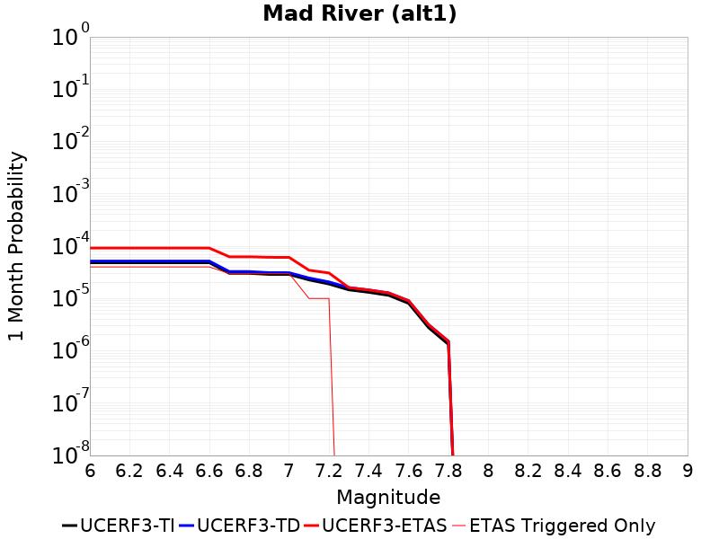 | 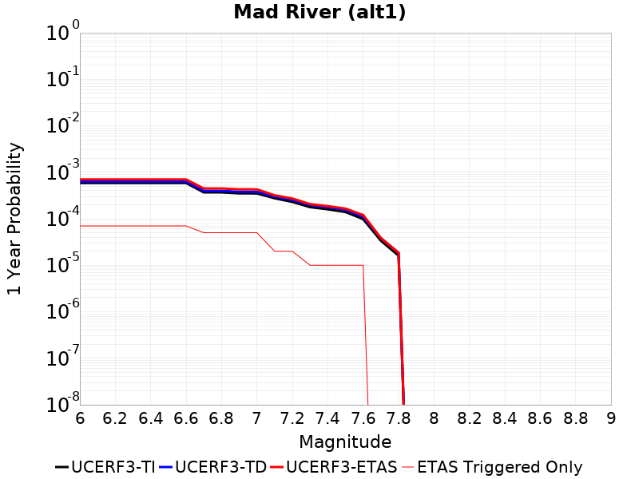 |  |

| Magnitude | 1 wk TI Prob | 1 wk TD Prob | 1 wk ETAS Prob | 1 wk ETAS/TD Gain | 1 wk ETAS Triggered Only | 1 mo TI Prob | 1 mo TD Prob | 1 mo ETAS Prob | 1 mo ETAS/TD Gain | 1 mo ETAS Triggered Only | 1 yr TI Prob | 1 yr TD Prob | 1 yr ETAS Prob | 1 yr ETAS/TD Gain | 1 yr ETAS Triggered Only | 10 yr TI Prob | 10 yr TD Prob | 10 yr ETAS Prob | 10 yr ETAS/TD Gain | 10 yr ETAS Triggered Only |
|-----|-----|-----|-----|-----|-----|-----|-----|-----|-----|-----|-----|-----|-----|-----|-----|-----|-----|-----|-----|-----|
| 6.0 | 1.1255216E-5 | 1.2068978E-5 | 3.2068736E-5 | 2.6571212 | 2.0E-5 | 4.8235746E-5 | 5.1723247E-5 | 9.172118E-5 | 1.7733066 | 4.0E-5 | 5.87112E-4 | 6.295631E-4 | 6.99519E-4 | 1.1111182 | 7.0E-5 | 0.0058556325 | 0.006279241 | 0.00638855 | 1.017408 | 1.1E-4 |
| 6.1 | 1.1255216E-5 | 1.2068978E-5 | 3.2068736E-5 | 2.6571212 | 2.0E-5 | 4.8235746E-5 | 5.1723247E-5 | 9.172118E-5 | 1.7733066 | 4.0E-5 | 5.87112E-4 | 6.295631E-4 | 6.99519E-4 | 1.1111182 | 7.0E-5 | 0.0058556325 | 0.006279241 | 0.00638855 | 1.017408 | 1.1E-4 |
| 6.2 | 1.1255216E-5 | 1.2068978E-5 | 3.2068736E-5 | 2.6571212 | 2.0E-5 | 4.8235746E-5 | 5.1723247E-5 | 9.172118E-5 | 1.7733066 | 4.0E-5 | 5.87112E-4 | 6.295631E-4 | 6.99519E-4 | 1.1111182 | 7.0E-5 | 0.0058556325 | 0.006279241 | 0.00638855 | 1.017408 | 1.1E-4 |
| 6.3 | 1.1255216E-5 | 1.2068978E-5 | 3.2068736E-5 | 2.6571212 | 2.0E-5 | 4.8235746E-5 | 5.1723247E-5 | 9.172118E-5 | 1.7733066 | 4.0E-5 | 5.87112E-4 | 6.295631E-4 | 6.99519E-4 | 1.1111182 | 7.0E-5 | 0.0058556325 | 0.006279241 | 0.00638855 | 1.017408 | 1.1E-4 |
| 6.4 | 1.1255216E-5 | 1.2068978E-5 | 3.2068736E-5 | 2.6571212 | 2.0E-5 | 4.8235746E-5 | 5.1723247E-5 | 9.172118E-5 | 1.7733066 | 4.0E-5 | 5.87112E-4 | 6.295631E-4 | 6.99519E-4 | 1.1111182 | 7.0E-5 | 0.0058556325 | 0.006279241 | 0.00638855 | 1.017408 | 1.1E-4 |
| 6.5 | 1.1255216E-5 | 1.2068978E-5 | 3.2068736E-5 | 2.6571212 | 2.0E-5 | 4.8235746E-5 | 5.1723247E-5 | 9.172118E-5 | 1.7733066 | 4.0E-5 | 5.87112E-4 | 6.295631E-4 | 6.99519E-4 | 1.1111182 | 7.0E-5 | 0.0058556325 | 0.006279241 | 0.00638855 | 1.017408 | 1.1E-4 |
| 6.6 | 1.1255216E-5 | 1.2068978E-5 | 3.2068736E-5 | 2.6571212 | 2.0E-5 | 4.8235746E-5 | 5.1723247E-5 | 9.172118E-5 | 1.7733066 | 4.0E-5 | 5.87112E-4 | 6.295631E-4 | 6.99519E-4 | 1.1111182 | 7.0E-5 | 0.0058556325 | 0.006279241 | 0.00638855 | 1.017408 | 1.1E-4 |
| 6.7 | 7.0564884E-6 | 7.625399E-6 | 1.7625323E-5 | 2.3113968 | 1.0E-5 | 3.0241743E-5 | 3.2679884E-5 | 6.2678904E-5 | 1.9179659 | 3.0E-5 | 3.68131E-4 | 3.9780716E-4 | 4.477873E-4 | 1.1256391 | 5.0E-5 | 0.0036752177 | 0.003971174 | 0.004050856 | 1.0200652 | 8.0E-5 |
| 6.8 | 7.0564884E-6 | 7.625399E-6 | 1.7625323E-5 | 2.3113968 | 1.0E-5 | 3.0241743E-5 | 3.2679884E-5 | 6.2678904E-5 | 1.9179659 | 3.0E-5 | 3.68131E-4 | 3.9780716E-4 | 4.477873E-4 | 1.1256391 | 5.0E-5 | 0.0036752177 | 0.003971174 | 0.004050856 | 1.0200652 | 8.0E-5 |
| 6.9 | 6.727494E-6 | 7.2764888E-6 | 1.7276416E-5 | 2.3742793 | 1.0E-5 | 2.8831799E-5 | 3.118459E-5 | 6.118366E-5 | 1.9619836 | 3.0E-5 | 3.509706E-4 | 3.796084E-4 | 4.2958942E-4 | 1.1316646 | 5.0E-5 | 0.003504168 | 0.003789816 | 0.0038695128 | 1.0210292 | 8.0E-5 |
| 7.0 | 6.7021124E-6 | 7.2492576E-6 | 1.7249185E-5 | 2.3794417 | 1.0E-5 | 2.8723021E-5 | 3.1067888E-5 | 6.106696E-5 | 1.9655973 | 3.0E-5 | 3.4964667E-4 | 3.7818804E-4 | 4.2816912E-4 | 1.1321594 | 5.0E-5 | 0.0034909705 | 0.0037756606 | 0.0038553586 | 1.0211084 | 8.0E-5 |
| 7.1 | 5.2784667E-6 | 5.748434E-6 | 5.748434E-6 | 1.0 | 0.0 | 2.2621804E-5 | 2.4635918E-5 | 3.4635672E-5 | 1.4059014 | 1.0E-5 | 2.7538565E-4 | 2.9990193E-4 | 3.1989595E-4 | 1.0666685 | 2.0E-5 | 0.0027504463 | 0.0029950647 | 0.0030249748 | 1.0099865 | 3.0E-5 |
| 7.2 | 4.4085446E-6 | 4.8340494E-6 | 4.8340494E-6 | 1.0 | 0.0 | 1.8893625E-5 | 2.0717192E-5 | 3.0716987E-5 | 1.4826809 | 1.0E-5 | 2.3000561E-4 | 2.5220303E-4 | 2.7219797E-4 | 1.0792812 | 2.0E-5 | 0.0022976769 | 0.0025192092 | 0.0025491335 | 1.0118785 | 3.0E-5 |
| 7.3 | 3.4060627E-6 | 3.7651128E-6 | 3.7651128E-6 | 1.0 | 0.0 | 1.459733E-5 | 1.6136099E-5 | 1.6136099E-5 | 1.0 | 0.0 | 1.77708E-4 | 1.9643952E-4 | 2.0643756E-4 | 1.0508963 | 1.0E-5 | 0.0017756595 | 0.0019626825 | 0.0019826433 | 1.0101701 | 2.0E-5 |
| 7.4 | 3.0570902E-6 | 3.391271E-6 | 3.391271E-6 | 1.0 | 0.0 | 1.310175E-5 | 1.453394E-5 | 1.453394E-5 | 1.0 | 0.0 | 1.5950213E-4 | 1.7693656E-4 | 1.8693479E-4 | 1.0565075 | 1.0E-5 | 0.0015938769 | 0.0017679785 | 0.0017879432 | 1.0112923 | 2.0E-5 |
| 7.5 | 2.674048E-6 | 2.9791236E-6 | 2.9791236E-6 | 1.0 | 0.0 | 1.1460155E-5 | 1.2767611E-5 | 1.2767611E-5 | 1.0 | 0.0 | 1.3951845E-4 | 1.5543478E-4 | 1.6543323E-4 | 1.0643257 | 1.0E-5 | 0.0013943089 | 0.0015532804 | 0.0015632649 | 1.006428 | 1.0E-5 |
| 7.6 | 1.8806261E-6 | 2.11174E-6 | 2.11174E-6 | 1.0 | 0.0 | 8.059801E-6 | 9.050284E-6 | 9.050284E-6 | 1.0 | 0.0 | 9.812366E-5 | 1.1018176E-4 | 1.2018066E-4 | 1.0907491 | 1.0E-5 | 9.808034E-4 | 0.0011012838 | 0.0011112728 | 1.0090703 | 1.0E-5 |
| 7.7 | 6.461283E-7 | 7.3675415E-7 | 7.3675415E-7 | 1.0 | 0.0 | 2.7691183E-6 | 3.1575141E-6 | 3.1575141E-6 | 1.0 | 0.0 | 3.371349E-5 | 3.844207E-5 | 3.844207E-5 | 1.0 | 0.0 | 3.370838E-4 | 3.8435575E-4 | 3.8435575E-4 | 1.0 | 0.0 |
| 7.8 | 3.0785324E-7 | 3.542205E-7 | 3.542205E-7 | 1.0 | 0.0 | 1.3193703E-6 | 1.518087E-6 | 1.518087E-6 | 1.0 | 0.0 | 1.6063215E-5 | 1.8482559E-5 | 1.8482559E-5 | 1.0 | 0.0 | 1.6062055E-4 | 1.8481085E-4 | 1.8481085E-4 | 1.0 | 0.0 |

## Hunting Creek - Berryessa 2011 CFM
*[(top)](#table-of-contents)*

| 1 Week | 1 Month | 1 Year | 10 Year |
|-----|-----|-----|-----|
|  | 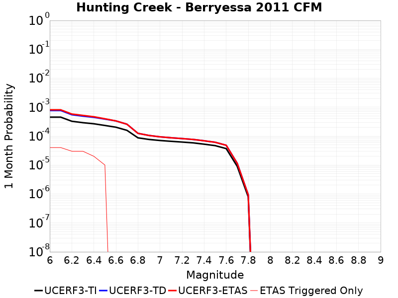 |  | 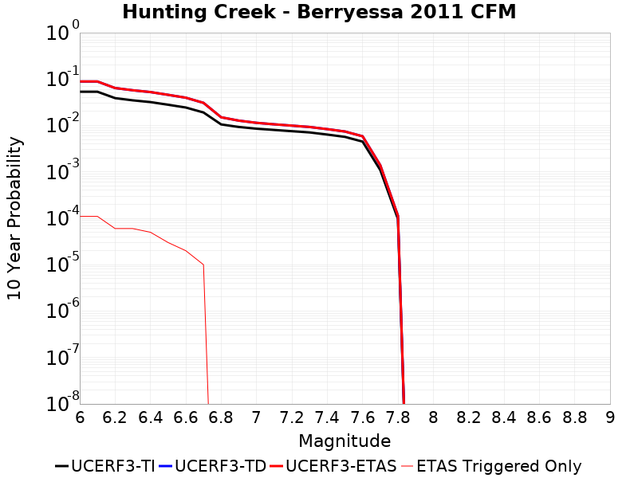 |

| Magnitude | 1 wk TI Prob | 1 wk TD Prob | 1 wk ETAS Prob | 1 wk ETAS/TD Gain | 1 wk ETAS Triggered Only | 1 mo TI Prob | 1 mo TD Prob | 1 mo ETAS Prob | 1 mo ETAS/TD Gain | 1 mo ETAS Triggered Only | 1 yr TI Prob | 1 yr TD Prob | 1 yr ETAS Prob | 1 yr ETAS/TD Gain | 1 yr ETAS Triggered Only | 10 yr TI Prob | 10 yr TD Prob | 10 yr ETAS Prob | 10 yr ETAS/TD Gain | 10 yr ETAS Triggered Only |
|-----|-----|-----|-----|-----|-----|-----|-----|-----|-----|-----|-----|-----|-----|-----|-----|-----|-----|-----|-----|-----|
| 6.0 | 1.0533147E-4 | 1.7910414E-4 | 1.8910234E-4 | 1.0558234 | 1.0E-5 | 4.5134246E-4 | 7.6733774E-4 | 8.07307E-4 | 1.0520883 | 4.0E-5 | 0.005481258 | 0.0092977 | 0.009367049 | 1.0074587 | 7.0E-5 | 0.053480163 | 0.08857991 | 0.08868016 | 1.0011318 | 1.1E-4 |
| 6.1 | 1.0510782E-4 | 1.7897812E-4 | 1.8897634E-4 | 1.0558628 | 1.0E-5 | 4.503843E-4 | 7.66798E-4 | 8.067673E-4 | 1.052125 | 4.0E-5 | 0.005469651 | 0.00929119 | 0.009360539 | 1.007464 | 7.0E-5 | 0.05336969 | 0.08852051 | 0.088620774 | 1.0011326 | 1.1E-4 |
| 6.2 | 7.595682E-5 | 1.2800877E-4 | 1.380075E-4 | 1.0781096 | 1.0E-5 | 3.254886E-4 | 5.484517E-4 | 5.784352E-4 | 1.0546695 | 3.0E-5 | 0.0039556245 | 0.00665342 | 0.006693154 | 1.0059719 | 4.0E-5 | 0.03885951 | 0.06405566 | 0.064111814 | 1.0008767 | 6.0E-5 |
| 6.3 | 6.787612E-5 | 1.14146E-4 | 1.2414486E-4 | 1.0875971 | 1.0E-5 | 2.9086522E-4 | 4.890679E-4 | 5.1905325E-4 | 1.0613111 | 3.0E-5 | 0.0035355345 | 0.005935349 | 0.0059751114 | 1.0066993 | 4.0E-5 | 0.034798115 | 0.0573378 | 0.057394356 | 1.0009865 | 6.0E-5 |
| 6.4 | 6.2165134E-5 | 1.0405673E-4 | 1.1405569E-4 | 1.0960914 | 1.0E-5 | 2.6639478E-4 | 4.458467E-4 | 4.6583777E-4 | 1.0448384 | 2.0E-5 | 0.0032385332 | 0.005412384 | 0.0054422216 | 1.0055128 | 3.0E-5 | 0.03191742 | 0.05243889 | 0.052486267 | 1.0009035 | 5.0E-5 |
| 6.5 | 5.4368087E-5 | 9.029306E-5 | 1.0029216E-4 | 1.1107404 | 1.0E-5 | 2.3298527E-4 | 3.8688435E-4 | 3.9688047E-4 | 1.0258375 | 1.0E-5 | 0.0028329059 | 0.0046985196 | 0.0047184257 | 1.0042367 | 2.0E-5 | 0.027970633 | 0.045711476 | 0.045740105 | 1.0006263 | 3.0E-5 |
| 6.6 | 4.729947E-5 | 7.801355E-5 | 7.801355E-5 | 1.0 | 0.0 | 2.0269625E-4 | 3.3428372E-4 | 3.3428372E-4 | 1.0 | 0.0 | 0.002465034 | 0.0040611927 | 0.0040711523 | 1.0024524 | 1.0E-5 | 0.02437869 | 0.0396579 | 0.039677106 | 1.0004843 | 2.0E-5 |
| 6.7 | 3.6875328E-5 | 6.0026396E-5 | 6.0026396E-5 | 1.0 | 0.0 | 1.5802756E-4 | 2.5722123E-4 | 2.5722123E-4 | 1.0 | 0.0 | 0.0019222875 | 0.003126717 | 0.003126717 | 1.0 | 0.0 | 0.019057442 | 0.030709885 | 0.030719578 | 1.0003157 | 1.0E-5 |
| 6.8 | 2.0292036E-5 | 2.9031162E-5 | 2.9031162E-5 | 1.0 | 0.0 | 8.6962966E-5 | 1.2441326E-4 | 1.2441326E-4 | 1.0 | 0.0 | 0.0010582599 | 0.0015136681 | 0.0015136681 | 1.0 | 0.0 | 0.010532344 | 0.015009214 | 0.015009214 | 1.0 | 0.0 |
| 6.9 | 1.7871042E-5 | 2.4532988E-5 | 2.4532988E-5 | 1.0 | 0.0 | 7.658793E-5 | 1.051371E-4 | 1.051371E-4 | 1.0 | 0.0 | 9.320591E-4 | 0.0012792923 | 0.0012792923 | 1.0 | 0.0 | 0.009281595 | 0.01271177 | 0.01271177 | 1.0 | 0.0 |
| 7.0 | 1.6415532E-5 | 2.1970485E-5 | 2.1970485E-5 | 1.0 | 0.0 | 7.035038E-5 | 9.415582E-5 | 9.415582E-5 | 1.0 | 0.0 | 8.561793E-4 | 0.0011457456 | 0.0011457456 | 1.0 | 0.0 | 0.008528882 | 0.011397741 | 0.011397741 | 1.0 | 0.0 |
| 7.1 | 1.5409885E-5 | 2.0403726E-5 | 2.0403726E-5 | 1.0 | 0.0 | 6.6040695E-5 | 8.744163E-5 | 8.744163E-5 | 1.0 | 0.0 | 8.0374884E-4 | 0.0010640846 | 0.0010640846 | 1.0 | 0.0 | 0.00800848 | 0.0105902655 | 0.0105902655 | 1.0 | 0.0 |
| 7.2 | 1.4497423E-5 | 1.9106363E-5 | 1.9106363E-5 | 1.0 | 0.0 | 6.213033E-5 | 8.188186E-5 | 8.188186E-5 | 1.0 | 0.0 | 7.5617427E-4 | 9.964588E-4 | 9.964588E-4 | 1.0 | 0.0 | 0.0075360634 | 0.009920496 | 0.009920496 | 1.0 | 0.0 |
| 7.3 | 1.3615175E-5 | 1.786206E-5 | 1.786206E-5 | 1.0 | 0.0 | 5.8349444E-5 | 7.6549455E-5 | 7.6549455E-5 | 1.0 | 0.0 | 7.101729E-4 | 9.3159406E-4 | 9.3159406E-4 | 1.0 | 0.0 | 0.0070790765 | 0.009277392 | 0.009277392 | 1.0 | 0.0 |
| 7.4 | 1.2252825E-5 | 1.6050786E-5 | 1.6050786E-5 | 1.0 | 0.0 | 5.251105E-5 | 6.878729E-5 | 6.878729E-5 | 1.0 | 0.0 | 6.391345E-4 | 8.3716627E-4 | 8.3716627E-4 | 1.0 | 0.0 | 0.0063729943 | 0.0083406195 | 0.0083406195 | 1.0 | 0.0 |
| 7.5 | 1.0913301E-5 | 1.4258986E-5 | 1.4258986E-5 | 1.0 | 0.0 | 4.6770452E-5 | 6.110853E-5 | 6.110853E-5 | 1.0 | 0.0 | 5.6928146E-4 | 7.4374507E-4 | 7.4374507E-4 | 1.0 | 0.0 | 0.0056782532 | 0.0074128616 | 0.0074128616 | 1.0 | 0.0 |
| 7.6 | 8.623192E-6 | 1.124637E-5 | 1.124637E-5 | 1.0 | 0.0 | 3.6956015E-5 | 4.8197857E-5 | 4.8197857E-5 | 1.0 | 0.0 | 4.4984656E-4 | 5.866535E-4 | 5.866535E-4 | 1.0 | 0.0 | 0.00448937 | 0.0058512767 | 0.0058512767 | 1.0 | 0.0 |
| 7.7 | 2.0993634E-6 | 2.6690113E-6 | 2.6690113E-6 | 1.0 | 0.0 | 8.997241E-6 | 1.143857E-5 | 1.143857E-5 | 1.0 | 0.0 | 1.09535904E-4 | 1.3925576E-4 | 1.3925576E-4 | 1.0 | 0.0 | 0.0010948193 | 0.0013916558 | 0.0013916558 | 1.0 | 0.0 |
| 7.8 | 1.8428308E-7 | 2.1791521E-7 | 2.1791521E-7 | 1.0 | 0.0 | 7.897844E-7 | 9.33922E-7 | 9.33922E-7 | 1.0 | 0.0 | 9.615583E-6 | 1.1370445E-5 | 1.1370445E-5 | 1.0 | 0.0 | 9.615166E-5 | 1.1369824E-4 | 1.1369824E-4 | 1.0 | 0.0 |

## San Andreas (Mojave S)
*[(top)](#table-of-contents)*

| 1 Week | 1 Month | 1 Year | 10 Year |
|-----|-----|-----|-----|
| 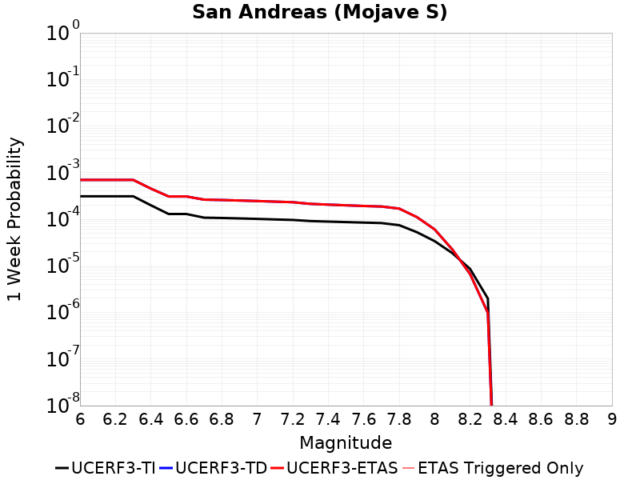 |  |  |  |

| Magnitude | 1 wk TI Prob | 1 wk TD Prob | 1 wk ETAS Prob | 1 wk ETAS/TD Gain | 1 wk ETAS Triggered Only | 1 mo TI Prob | 1 mo TD Prob | 1 mo ETAS Prob | 1 mo ETAS/TD Gain | 1 mo ETAS Triggered Only | 1 yr TI Prob | 1 yr TD Prob | 1 yr ETAS Prob | 1 yr ETAS/TD Gain | 1 yr ETAS Triggered Only | 10 yr TI Prob | 10 yr TD Prob | 10 yr ETAS Prob | 10 yr ETAS/TD Gain | 10 yr ETAS Triggered Only |
|-----|-----|-----|-----|-----|-----|-----|-----|-----|-----|-----|-----|-----|-----|-----|-----|-----|-----|-----|-----|-----|
| 6.0 | 3.1064058E-4 | 6.971073E-4 | 6.971073E-4 | 1.0 | 0.0 | 0.0013306376 | 0.0029843114 | 0.0030042517 | 1.0066817 | 2.0E-5 | 0.016080605 | 0.03585678 | 0.03590499 | 1.0013444 | 5.0E-5 | 0.1496549 | 0.29429743 | 0.29433978 | 1.0001439 | 6.0E-5 |
| 6.1 | 3.1064058E-4 | 6.971073E-4 | 6.971073E-4 | 1.0 | 0.0 | 0.0013306376 | 0.0029843114 | 0.0030042517 | 1.0066817 | 2.0E-5 | 0.016080605 | 0.03585678 | 0.03590499 | 1.0013444 | 5.0E-5 | 0.1496549 | 0.29429743 | 0.29433978 | 1.0001439 | 6.0E-5 |
| 6.2 | 3.1064058E-4 | 6.971073E-4 | 6.971073E-4 | 1.0 | 0.0 | 0.0013306376 | 0.0029843114 | 0.0030042517 | 1.0066817 | 2.0E-5 | 0.016080605 | 0.03585678 | 0.03590499 | 1.0013444 | 5.0E-5 | 0.1496549 | 0.29429743 | 0.29433978 | 1.0001439 | 6.0E-5 |
| 6.3 | 3.1064058E-4 | 6.971073E-4 | 6.971073E-4 | 1.0 | 0.0 | 0.0013306376 | 0.0029843114 | 0.0030042517 | 1.0066817 | 2.0E-5 | 0.016080605 | 0.03585678 | 0.03590499 | 1.0013444 | 5.0E-5 | 0.1496549 | 0.29429743 | 0.29433978 | 1.0001439 | 6.0E-5 |
| 6.4 | 1.9872203E-4 | 4.5303724E-4 | 4.5303724E-4 | 1.0 | 0.0 | 8.5138786E-4 | 0.001940172 | 0.0019601332 | 1.0102884 | 2.0E-5 | 0.010316478 | 0.023372151 | 0.023411216 | 1.0016714 | 4.0E-5 | 0.098504856 | 0.205031 | 0.20507075 | 1.0001938 | 5.0E-5 |
| 6.5 | 1.291105E-4 | 3.074981E-4 | 3.074981E-4 | 1.0 | 0.0 | 5.5321335E-4 | 0.0013171863 | 0.0013371599 | 1.0151639 | 2.0E-5 | 0.006714592 | 0.015919743 | 0.015959106 | 1.0024726 | 4.0E-5 | 0.065152965 | 0.14623283 | 0.1462755 | 1.000292 | 5.0E-5 |
| 6.6 | 1.291105E-4 | 3.074981E-4 | 3.074981E-4 | 1.0 | 0.0 | 5.5321335E-4 | 0.0013171863 | 0.0013371599 | 1.0151639 | 2.0E-5 | 0.006714592 | 0.015919743 | 0.015959106 | 1.0024726 | 4.0E-5 | 0.065152965 | 0.14623283 | 0.1462755 | 1.000292 | 5.0E-5 |
| 6.7 | 1.08001186E-4 | 2.6295136E-4 | 2.6295136E-4 | 1.0 | 0.0 | 4.6278012E-4 | 0.0011264483 | 0.0011464257 | 1.0177349 | 2.0E-5 | 0.0056198016 | 0.01362863 | 0.0136680845 | 1.002895 | 4.0E-5 | 0.054797906 | 0.12742029 | 0.12746392 | 1.0003424 | 5.0E-5 |
| 6.8 | 1.0624356E-4 | 2.5806058E-4 | 2.5806058E-4 | 1.0 | 0.0 | 4.5525006E-4 | 0.0011055057 | 0.0011254837 | 1.0180713 | 2.0E-5 | 0.0055285925 | 0.013376804 | 0.01341627 | 1.0029502 | 4.0E-5 | 0.053930566 | 0.12536447 | 0.1254082 | 1.0003488 | 5.0E-5 |
| 6.9 | 1.0393785E-4 | 2.516746E-4 | 2.516746E-4 | 1.0 | 0.0 | 4.4537184E-4 | 0.00107816 | 0.0010981384 | 1.0185301 | 2.0E-5 | 0.0054089287 | 0.013047899 | 0.013087378 | 1.0030257 | 4.0E-5 | 0.05279156 | 0.122656815 | 0.122700684 | 1.0003576 | 5.0E-5 |
| 7.0 | 1.0155622E-4 | 2.4526755E-4 | 2.4526755E-4 | 1.0 | 0.0 | 4.3516833E-4 | 0.0010507236 | 0.0010707027 | 1.0190145 | 2.0E-5 | 0.005285311 | 0.012717805 | 0.012757296 | 1.0031052 | 4.0E-5 | 0.05161361 | 0.11990757 | 0.119951576 | 1.000367 | 5.0E-5 |
| 7.1 | 9.885595E-5 | 2.380353E-4 | 2.380353E-4 | 1.0 | 0.0 | 4.2359953E-4 | 0.0010197528 | 0.0010397324 | 1.0195926 | 2.0E-5 | 0.0051451353 | 0.012345063 | 0.012384568 | 1.0032002 | 4.0E-5 | 0.05027629 | 0.11677155 | 0.11681571 | 1.0003781 | 5.0E-5 |
| 7.2 | 9.6411415E-5 | 2.3155757E-4 | 2.3155757E-4 | 1.0 | 0.0 | 4.1312634E-4 | 9.920126E-4 | 0.0010119927 | 1.020141 | 2.0E-5 | 0.005018219 | 0.012011097 | 0.012050617 | 1.0032903 | 4.0E-5 | 0.049064007 | 0.113943964 | 0.11398827 | 1.0003889 | 5.0E-5 |
| 7.3 | 9.1180635E-5 | 2.1322304E-4 | 2.1322304E-4 | 1.0 | 0.0 | 3.907156E-4 | 9.1349316E-4 | 9.3347486E-4 | 1.021874 | 2.0E-5 | 0.004746591 | 0.011065212 | 0.01110477 | 1.003575 | 4.0E-5 | 0.046464786 | 0.10598096 | 0.106025666 | 1.0004218 | 5.0E-5 |
| 7.4 | 8.887388E-5 | 2.0545216E-4 | 2.0545216E-4 | 1.0 | 0.0 | 3.8083247E-4 | 8.8021223E-4 | 9.0019463E-4 | 1.0227017 | 2.0E-5 | 0.0046267817 | 0.010664056 | 0.01070363 | 1.0037109 | 4.0E-5 | 0.045316286 | 0.10254888 | 0.10259376 | 1.0004376 | 5.0E-5 |
| 7.5 | 8.6750515E-5 | 1.985291E-4 | 1.985291E-4 | 1.0 | 0.0 | 3.7173493E-4 | 8.5056166E-4 | 8.7054464E-4 | 1.0234939 | 2.0E-5 | 0.004516484 | 0.010306533 | 0.010346121 | 1.003841 | 4.0E-5 | 0.04425787 | 0.099444546 | 0.09948958 | 1.0004528 | 5.0E-5 |
| 7.6 | 8.453092E-5 | 1.9214362E-4 | 1.9214362E-4 | 1.0 | 0.0 | 3.6222505E-4 | 8.2321285E-4 | 8.431964E-4 | 1.0242751 | 2.0E-5 | 0.0044011753 | 0.00997666 | 0.010016261 | 1.0039693 | 4.0E-5 | 0.04315024 | 0.09652008 | 0.096565254 | 1.000468 | 5.0E-5 |
| 7.7 | 8.259102E-5 | 1.8713828E-4 | 1.8713828E-4 | 1.0 | 0.0 | 3.539135E-4 | 8.017748E-4 | 8.2175876E-4 | 1.0249246 | 2.0E-5 | 0.004300386 | 0.009718011 | 0.009757622 | 1.0040761 | 4.0E-5 | 0.042181134 | 0.09419124 | 0.09423652 | 1.0004809 | 5.0E-5 |
| 7.8 | 7.444844E-5 | 1.6872969E-4 | 1.6872969E-4 | 1.0 | 0.0 | 3.1902574E-4 | 7.229269E-4 | 7.4291247E-4 | 1.0276453 | 2.0E-5 | 0.0038772223 | 0.008766183 | 0.008805832 | 1.004523 | 4.0E-5 | 0.03810269 | 0.08537703 | 0.08542276 | 1.0005356 | 5.0E-5 |
| 7.9 | 5.2586525E-5 | 1.1079895E-4 | 1.1079895E-4 | 1.0 | 0.0 | 2.2535135E-4 | 4.7476625E-4 | 4.9475674E-4 | 1.042106 | 2.0E-5 | 0.0027402006 | 0.005764975 | 0.0058047445 | 1.0068984 | 4.0E-5 | 0.027066574 | 0.057185315 | 0.057232454 | 1.0008243 | 5.0E-5 |
| 8.0 | 3.379877E-5 | 6.0410403E-5 | 6.0410403E-5 | 1.0 | 0.0 | 1.4484383E-4 | 2.5887604E-4 | 2.7887087E-4 | 1.077237 | 2.0E-5 | 0.0017620471 | 0.003147263 | 0.0031871372 | 1.0126694 | 4.0E-5 | 0.017481409 | 0.031913444 | 0.03196185 | 1.0015167 | 5.0E-5 |
| 8.1 | 1.8668277E-5 | 2.2315045E-5 | 2.2315045E-5 | 1.0 | 0.0 | 8.000444E-5 | 9.5632415E-5 | 1.156305E-4 | 1.2091141 | 2.0E-5 | 9.736188E-4 | 0.0011637035 | 0.001203657 | 1.034333 | 4.0E-5 | 0.009693642 | 0.012354735 | 0.012404117 | 1.0039971 | 5.0E-5 |
| 8.2 | 8.541571E-6 | 6.6299326E-6 | 6.6299326E-6 | 1.0 | 0.0 | 3.660622E-5 | 2.8413688E-5 | 4.841312E-5 | 1.7038661 | 2.0E-5 | 4.455896E-4 | 3.4588185E-4 | 3.85868E-4 | 1.1156064 | 4.0E-5 | 0.0044469717 | 0.0038717107 | 0.003921517 | 1.0128642 | 5.0E-5 |
| 8.3 | 1.983087E-6 | 9.763005E-7 | 9.763005E-7 | 1.0 | 0.0 | 8.498917E-6 | 4.184138E-6 | 1.41840965E-5 | 3.3899684 | 1.0E-5 | 1.034694E-4 | 5.094072E-5 | 6.094021E-5 | 1.1962966 | 1.0E-5 | 0.0010342124 | 5.909015E-4 | 6.0089555E-4 | 1.0169133 | 1.0E-5 |

## San Andreas (Parkfield)
*[(top)](#table-of-contents)*

| 1 Week | 1 Month | 1 Year | 10 Year |
|-----|-----|-----|-----|
|  | 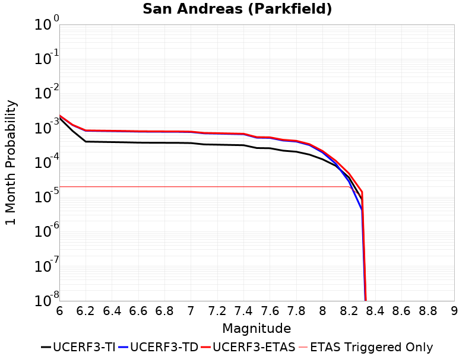 |  | 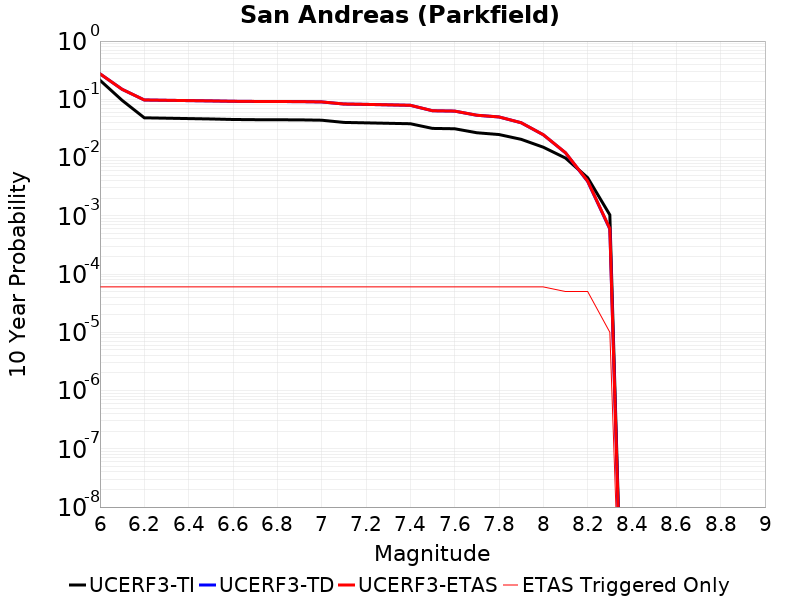 |

| Magnitude | 1 wk TI Prob | 1 wk TD Prob | 1 wk ETAS Prob | 1 wk ETAS/TD Gain | 1 wk ETAS Triggered Only | 1 mo TI Prob | 1 mo TD Prob | 1 mo ETAS Prob | 1 mo ETAS/TD Gain | 1 mo ETAS Triggered Only | 1 yr TI Prob | 1 yr TD Prob | 1 yr ETAS Prob | 1 yr ETAS/TD Gain | 1 yr ETAS Triggered Only | 10 yr TI Prob | 10 yr TD Prob | 10 yr ETAS Prob | 10 yr ETAS/TD Gain | 10 yr ETAS Triggered Only |
|-----|-----|-----|-----|-----|-----|-----|-----|-----|-----|-----|-----|-----|-----|-----|-----|-----|-----|-----|-----|-----|
| 6.0 | 4.5600464E-4 | 5.3509726E-4 | 5.3509726E-4 | 1.0 | 0.0 | 0.0019528421 | 0.0022914861 | 0.0023114404 | 1.008708 | 2.0E-5 | 0.023518132 | 0.027803333 | 0.027842222 | 1.0013987 | 4.0E-5 | 0.21179019 | 0.27331173 | 0.27335533 | 1.0001595 | 6.0E-5 |
| 6.1 | 1.9252734E-4 | 2.8425935E-4 | 2.8425935E-4 | 1.0 | 0.0 | 8.248562E-4 | 0.001217738 | 0.0012377137 | 1.0164039 | 2.0E-5 | 0.009996468 | 0.014737356 | 0.014776767 | 1.0026742 | 4.0E-5 | 0.09558567 | 0.14791171 | 0.14796284 | 1.0003457 | 6.0E-5 |
| 6.2 | 9.4269315E-5 | 1.9422578E-4 | 1.9422578E-4 | 1.0 | 0.0 | 4.039488E-4 | 8.32132E-4 | 8.5211534E-4 | 1.0240146 | 2.0E-5 | 0.0049069915 | 0.010084472 | 0.010124069 | 1.0039265 | 4.0E-5 | 0.048000436 | 0.0971153 | 0.097169474 | 1.0005578 | 6.0E-5 |
| 6.3 | 9.283051E-5 | 1.9146429E-4 | 1.9146429E-4 | 1.0 | 0.0 | 3.9778434E-4 | 8.203045E-4 | 8.4028806E-4 | 1.0243611 | 2.0E-5 | 0.0048322747 | 0.009941786 | 0.009981388 | 1.0039834 | 4.0E-5 | 0.047285385 | 0.09586246 | 0.09591671 | 1.0005659 | 6.0E-5 |
| 6.4 | 9.138826E-5 | 1.8906887E-4 | 1.8906887E-4 | 1.0 | 0.0 | 3.916052E-4 | 8.100448E-4 | 8.300286E-4 | 1.02467 | 2.0E-5 | 0.0047573745 | 0.009818004 | 0.009857612 | 1.0040342 | 4.0E-5 | 0.046568092 | 0.0947649 | 0.09481922 | 1.0005732 | 6.0E-5 |
| 6.5 | 9.000255E-5 | 1.8662628E-4 | 1.8662628E-4 | 1.0 | 0.0 | 3.8566816E-4 | 7.99583E-4 | 8.19567E-4 | 1.0249931 | 2.0E-5 | 0.0046854047 | 0.009691768 | 0.00973138 | 1.0040872 | 4.0E-5 | 0.045878403 | 0.09364085 | 0.09369523 | 1.0005808 | 6.0E-5 |
| 6.6 | 8.8109264E-5 | 1.8356806E-4 | 1.8356806E-4 | 1.0 | 0.0 | 3.7755648E-4 | 7.864843E-4 | 8.064686E-4 | 1.0254096 | 2.0E-5 | 0.0045870654 | 0.009533697 | 0.009573315 | 1.0041556 | 4.0E-5 | 0.04493529 | 0.09222429 | 0.09227876 | 1.0005906 | 6.0E-5 |
| 6.7 | 8.738073E-5 | 1.8225604E-4 | 1.8225604E-4 | 1.0 | 0.0 | 3.7443507E-4 | 7.808648E-4 | 8.008492E-4 | 1.0255927 | 2.0E-5 | 0.0045492216 | 0.00946588 | 0.009505502 | 1.0041857 | 4.0E-5 | 0.04457213 | 0.09163023 | 0.09168473 | 1.0005949 | 6.0E-5 |
| 6.8 | 8.710195E-5 | 1.8172094E-4 | 1.8172094E-4 | 1.0 | 0.0 | 3.7324068E-4 | 7.785728E-4 | 7.9855724E-4 | 1.025668 | 2.0E-5 | 0.0045347405 | 0.009438219 | 0.009477842 | 1.0041981 | 4.0E-5 | 0.04443313 | 0.09138238 | 0.09143689 | 1.0005965 | 6.0E-5 |
| 6.9 | 8.6801556E-5 | 1.811372E-4 | 1.811372E-4 | 1.0 | 0.0 | 3.7195362E-4 | 7.760726E-4 | 7.960571E-4 | 1.0257508 | 2.0E-5 | 0.0045191357 | 0.009408043 | 0.009447666 | 1.0042117 | 4.0E-5 | 0.044283327 | 0.09111217 | 0.0911667 | 1.0005985 | 6.0E-5 |
| 7.0 | 8.5571606E-5 | 1.786681E-4 | 1.786681E-4 | 1.0 | 0.0 | 3.6668387E-4 | 7.654969E-4 | 7.8548165E-4 | 1.0261068 | 2.0E-5 | 0.004455241 | 0.009280387 | 0.009320016 | 1.0042702 | 4.0E-5 | 0.043669727 | 0.089966774 | 0.09002138 | 1.0006069 | 6.0E-5 |
| 7.1 | 7.82589E-5 | 1.6323141E-4 | 1.6323141E-4 | 1.0 | 0.0 | 3.3535215E-4 | 6.993764E-4 | 7.193624E-4 | 1.0285769 | 2.0E-5 | 0.0040752706 | 0.008481857 | 0.008521519 | 1.004676 | 4.0E-5 | 0.040013418 | 0.08279804 | 0.08285307 | 1.0006647 | 6.0E-5 |
| 7.2 | 7.690929E-5 | 1.607197E-4 | 1.607197E-4 | 1.0 | 0.0 | 3.2956956E-4 | 6.886177E-4 | 7.0860394E-4 | 1.0290236 | 2.0E-5 | 0.004005129 | 0.008351882 | 0.008391548 | 1.0047493 | 4.0E-5 | 0.0393371 | 0.08162138 | 0.081676476 | 1.0006751 | 6.0E-5 |
| 7.3 | 7.5543794E-5 | 1.5764E-4 | 1.5764E-4 | 1.0 | 0.0 | 3.2371894E-4 | 6.754258E-4 | 6.9541234E-4 | 1.029591 | 2.0E-5 | 0.003934157 | 0.008192489 | 0.008232161 | 1.0048425 | 4.0E-5 | 0.038652334 | 0.08016942 | 0.0802246 | 1.0006884 | 6.0E-5 |
| 7.4 | 7.4214564E-5 | 1.545665E-4 | 1.545665E-4 | 1.0 | 0.0 | 3.1802364E-4 | 6.6226046E-4 | 6.822472E-4 | 1.0301796 | 2.0E-5 | 0.003865065 | 0.008033393 | 0.008073072 | 1.0049392 | 4.0E-5 | 0.03798529 | 0.07871734 | 0.07877262 | 1.0007023 | 6.0E-5 |
| 7.5 | 6.149578E-5 | 1.2254939E-4 | 1.2254939E-4 | 1.0 | 0.0 | 2.6352672E-4 | 5.2510604E-4 | 5.4509554E-4 | 1.0380676 | 2.0E-5 | 0.0032037178 | 0.006374465 | 0.0064142095 | 1.006235 | 4.0E-5 | 0.03157923 | 0.06343282 | 0.06348901 | 1.0008858 | 6.0E-5 |
| 7.6 | 6.0643448E-5 | 1.20787445E-4 | 1.20787445E-4 | 1.0 | 0.0 | 2.598746E-4 | 5.175579E-4 | 5.375476E-4 | 1.038623 | 2.0E-5 | 0.0031593828 | 0.0062830998 | 0.0063228486 | 1.0063263 | 4.0E-5 | 0.031148417 | 0.06257722 | 0.06263346 | 1.0008988 | 6.0E-5 |
| 7.7 | 5.1652263E-5 | 1.01602265E-4 | 1.01602265E-4 | 1.0 | 0.0 | 2.2134806E-4 | 4.3536563E-4 | 4.5535693E-4 | 1.0459183 | 2.0E-5 | 0.002691582 | 0.005287708 | 0.005327496 | 1.0075247 | 4.0E-5 | 0.026592141 | 0.053111587 | 0.0531684 | 1.0010697 | 6.0E-5 |
| 7.8 | 4.8090482E-5 | 9.491033E-5 | 9.491033E-5 | 1.0 | 0.0 | 2.060858E-4 | 4.0669518E-4 | 4.2668704E-4 | 1.0491569 | 2.0E-5 | 0.0025062072 | 0.0049402835 | 0.0049800854 | 1.0080568 | 4.0E-5 | 0.024781305 | 0.049641762 | 0.049698785 | 1.0011487 | 6.0E-5 |
| 7.9 | 3.970278E-5 | 7.506271E-5 | 7.506271E-5 | 1.0 | 0.0 | 1.7014367E-4 | 3.2165766E-4 | 3.4165123E-4 | 1.0621579 | 2.0E-5 | 0.002069531 | 0.0039091553 | 0.0039489986 | 1.0101924 | 4.0E-5 | 0.020503636 | 0.03947569 | 0.03953332 | 1.00146 | 6.0E-5 |
| 8.0 | 2.8982335E-5 | 4.576518E-5 | 4.576518E-5 | 1.0 | 0.0 | 1.2420409E-4 | 1.9612175E-4 | 2.1611783E-4 | 1.1019574 | 2.0E-5 | 0.0015111357 | 0.002385169 | 0.0024250736 | 1.0167303 | 4.0E-5 | 0.015009012 | 0.02451712 | 0.024575649 | 1.0023873 | 6.0E-5 |
| 8.1 | 1.8836186E-5 | 2.1635818E-5 | 2.1635818E-5 | 1.0 | 0.0 | 8.0724014E-5 | 9.272164E-5 | 1.1271979E-4 | 1.2156794 | 2.0E-5 | 9.823717E-4 | 0.0011283022 | 0.001168257 | 1.0354115 | 4.0E-5 | 0.009780403 | 0.012021215 | 0.012070614 | 1.0041093 | 5.0E-5 |
| 8.2 | 8.643924E-6 | 6.6480648E-6 | 6.6480648E-6 | 1.0 | 0.0 | 3.704486E-5 | 2.8491397E-5 | 4.8490827E-5 | 1.7019463 | 2.0E-5 | 4.5092785E-4 | 3.4682767E-4 | 3.8681377E-4 | 1.115291 | 4.0E-5 | 0.0045001395 | 0.003881846 | 0.0039316523 | 1.0128305 | 5.0E-5 |
| 8.3 | 1.983087E-6 | 9.763005E-7 | 9.763005E-7 | 1.0 | 0.0 | 8.498917E-6 | 4.184138E-6 | 1.41840965E-5 | 3.3899684 | 1.0E-5 | 1.034694E-4 | 5.094072E-5 | 6.094021E-5 | 1.1962966 | 1.0E-5 | 0.0010342124 | 5.909015E-4 | 6.0089555E-4 | 1.0169133 | 1.0E-5 |

## Green Valley 2011 CFM
*[(top)](#table-of-contents)*

| 1 Week | 1 Month | 1 Year | 10 Year |
|-----|-----|-----|-----|
|  |  |  |  |

| Magnitude | 1 wk TI Prob | 1 wk TD Prob | 1 wk ETAS Prob | 1 wk ETAS/TD Gain | 1 wk ETAS Triggered Only | 1 mo TI Prob | 1 mo TD Prob | 1 mo ETAS Prob | 1 mo ETAS/TD Gain | 1 mo ETAS Triggered Only | 1 yr TI Prob | 1 yr TD Prob | 1 yr ETAS Prob | 1 yr ETAS/TD Gain | 1 yr ETAS Triggered Only | 10 yr TI Prob | 10 yr TD Prob | 10 yr ETAS Prob | 10 yr ETAS/TD Gain | 10 yr ETAS Triggered Only |
|-----|-----|-----|-----|-----|-----|-----|-----|-----|-----|-----|-----|-----|-----|-----|-----|-----|-----|-----|-----|-----|
| 6.0 | 9.938062E-5 | 1.7345884E-4 | 1.7345884E-4 | 1.0 | 0.0 | 4.2584742E-4 | 7.431617E-4 | 7.6314685E-4 | 1.0268921 | 2.0E-5 | 0.0051723733 | 0.009009119 | 0.009038849 | 1.0033 | 3.0E-5 | 0.050536286 | 0.0857244 | 0.08577926 | 1.0006399 | 6.0E-5 |
| 6.1 | 9.862786E-5 | 1.7202295E-4 | 1.7202295E-4 | 1.0 | 0.0 | 4.2262237E-4 | 7.3701143E-4 | 7.569967E-4 | 1.0271167 | 2.0E-5 | 0.005133294 | 0.00893486 | 0.008964592 | 1.0033276 | 3.0E-5 | 0.050163247 | 0.08505507 | 0.085109964 | 1.0006454 | 6.0E-5 |
| 6.2 | 9.695835E-5 | 1.6887591E-4 | 1.6887591E-4 | 1.0 | 0.0 | 4.154696E-4 | 7.23532E-4 | 7.4351754E-4 | 1.0276222 | 2.0E-5 | 0.0050466163 | 0.008772173 | 0.00880191 | 1.00339 | 3.0E-5 | 0.049335375 | 0.08358267 | 0.083637655 | 1.0006578 | 6.0E-5 |
| 6.3 | 9.274664E-5 | 1.6060003E-4 | 1.6060003E-4 | 1.0 | 0.0 | 3.9742506E-4 | 6.88083E-4 | 7.0806924E-4 | 1.0290463 | 2.0E-5 | 0.00482792 | 0.008343934 | 0.008373683 | 1.0035654 | 3.0E-5 | 0.047243692 | 0.07969211 | 0.079738125 | 1.0005774 | 5.0E-5 |
| 6.4 | 8.391499E-5 | 1.4435562E-4 | 1.4435562E-4 | 1.0 | 0.0 | 3.595861E-4 | 6.184989E-4 | 6.284927E-4 | 1.0161582 | 1.0E-5 | 0.004369175 | 0.007503224 | 0.007523074 | 1.0026455 | 2.0E-5 | 0.04284265 | 0.07197148 | 0.07200861 | 1.0005158 | 4.0E-5 |
| 6.5 | 5.9519385E-5 | 9.947632E-5 | 9.947632E-5 | 1.0 | 0.0 | 2.5505814E-4 | 4.2623776E-4 | 4.2623776E-4 | 1.0 | 0.0 | 0.0031009112 | 0.005176114 | 0.005186062 | 1.0019219 | 1.0E-5 | 0.030579966 | 0.050234355 | 0.05025335 | 1.0003781 | 2.0E-5 |
| 6.6 | 4.5361558E-5 | 7.383943E-5 | 7.383943E-5 | 1.0 | 0.0 | 1.9439218E-4 | 3.1640427E-4 | 3.1640427E-4 | 1.0 | 0.0 | 0.0023641558 | 0.00384462 | 0.0038545814 | 1.002591 | 1.0E-5 | 0.023391623 | 0.037599254 | 0.037618503 | 1.0005119 | 2.0E-5 |
| 6.7 | 3.8808106E-5 | 6.2330524E-5 | 6.2330524E-5 | 1.0 | 0.0 | 1.6630985E-4 | 2.6709415E-4 | 2.6709415E-4 | 1.0 | 0.0 | 0.0020229418 | 0.0032465805 | 0.0032465805 | 1.0 | 0.0 | 0.020046256 | 0.03187569 | 0.03188537 | 1.0003037 | 1.0E-5 |
| 6.8 | 2.2284667E-5 | 3.1442865E-5 | 3.1442865E-5 | 1.0 | 0.0 | 9.550222E-5 | 1.3474816E-4 | 1.3474816E-4 | 1.0 | 0.0 | 0.0011621192 | 0.0016393249 | 0.0016393249 | 1.0 | 0.0 | 0.011560607 | 0.016248956 | 0.016248956 | 1.0 | 0.0 |
| 6.9 | 1.8050168E-5 | 2.4566742E-5 | 2.4566742E-5 | 1.0 | 0.0 | 7.735557E-5 | 1.05281775E-4 | 1.05281775E-4 | 1.0 | 0.0 | 9.4139716E-4 | 0.001281055 | 0.001281055 | 1.0 | 0.0 | 0.009374191 | 0.012728746 | 0.012728746 | 1.0 | 0.0 |
| 7.0 | 1.4763166E-5 | 1.9688305E-5 | 1.9688305E-5 | 1.0 | 0.0 | 6.326917E-5 | 8.437572E-5 | 8.437572E-5 | 1.0 | 0.0 | 7.7002996E-4 | 0.0010267916 | 0.0010267916 | 1.0 | 0.0 | 0.007673672 | 0.0102194585 | 0.0102194585 | 1.0 | 0.0 |
| 7.1 | 1.2399713E-5 | 1.6386428E-5 | 1.6386428E-5 | 1.0 | 0.0 | 5.3140546E-5 | 7.0225666E-5 | 7.0225666E-5 | 1.0 | 0.0 | 6.467941E-4 | 8.546641E-4 | 8.546641E-4 | 1.0 | 0.0 | 0.006449148 | 0.008513677 | 0.008513677 | 1.0 | 0.0 |
| 7.2 | 1.0584195E-5 | 1.3988173E-5 | 1.3988173E-5 | 1.0 | 0.0 | 4.5360044E-5 | 5.9947946E-5 | 5.9947946E-5 | 1.0 | 0.0 | 5.521186E-4 | 7.296235E-4 | 7.296235E-4 | 1.0 | 0.0 | 0.0055074887 | 0.0072725965 | 0.0072725965 | 1.0 | 0.0 |
| 7.3 | 7.998173E-6 | 1.0579942E-5 | 1.0579942E-5 | 1.0 | 0.0 | 3.4277433E-5 | 4.5341825E-5 | 4.5341825E-5 | 1.0 | 0.0 | 4.1724785E-4 | 5.51898E-4 | 5.51898E-4 | 1.0 | 0.0 | 0.004164653 | 0.0055054245 | 0.0055054245 | 1.0 | 0.0 |
| 7.4 | 6.7571127E-6 | 8.9568075E-6 | 8.9568075E-6 | 1.0 | 0.0 | 2.8958733E-5 | 3.838576E-5 | 3.838576E-5 | 1.0 | 0.0 | 3.5251552E-4 | 4.6724736E-4 | 4.6724736E-4 | 1.0 | 0.0 | 0.0035195686 | 0.0046629044 | 0.0046629044 | 1.0 | 0.0 |
| 7.5 | 5.69878E-6 | 7.533628E-6 | 7.533628E-6 | 1.0 | 0.0 | 2.4423114E-5 | 3.228658E-5 | 3.228658E-5 | 1.0 | 0.0 | 2.9731085E-4 | 3.9301912E-4 | 3.9301912E-4 | 1.0 | 0.0 | 0.002969134 | 0.0039233193 | 0.0039233193 | 1.0 | 0.0 |
| 7.6 | 4.503664E-6 | 5.948172E-6 | 5.948172E-6 | 1.0 | 0.0 | 1.9301275E-5 | 2.5491921E-5 | 2.5491921E-5 | 1.0 | 0.0 | 2.3496768E-4 | 3.103208E-4 | 3.103208E-4 | 1.0 | 0.0 | 0.002347194 | 0.003098914 | 0.003098914 | 1.0 | 0.0 |
| 7.7 | 1.0873546E-6 | 1.414181E-6 | 1.414181E-6 | 1.0 | 0.0 | 4.6600826E-6 | 6.060762E-6 | 6.060762E-6 | 1.0 | 0.0 | 5.6735033E-5 | 7.3787305E-5 | 7.3787305E-5 | 1.0 | 0.0 | 5.672055E-4 | 7.375943E-4 | 7.375943E-4 | 1.0 | 0.0 |
| 7.8 | 4.9373917E-8 | 6.24165E-8 | 6.24165E-8 | 1.0 | 0.0 | 2.1160248E-7 | 2.6749925E-7 | 2.6749925E-7 | 1.0 | 0.0 | 2.5762572E-6 | 3.2568E-6 | 3.2568E-6 | 1.0 | 0.0 | 2.5762274E-5 | 3.2566895E-5 | 3.2566895E-5 | 1.0 | 0.0 |

## San Andreas (Creeping Section) 2011 CFM
*[(top)](#table-of-contents)*

| 1 Week | 1 Month | 1 Year | 10 Year |
|-----|-----|-----|-----|
| 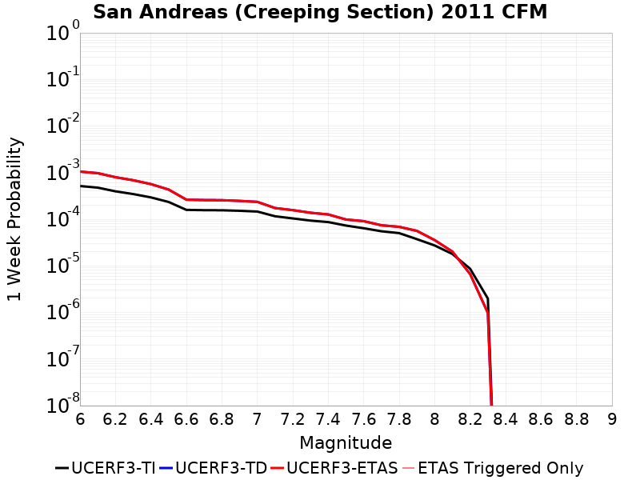 | 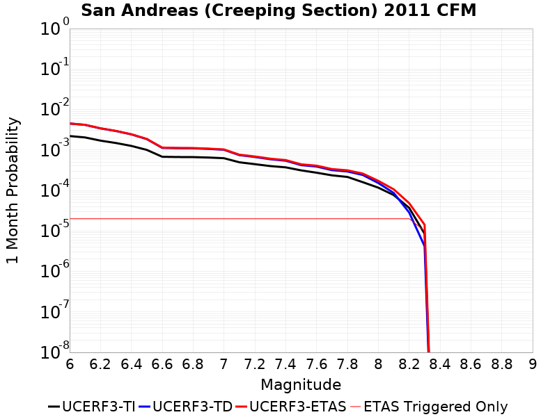 | 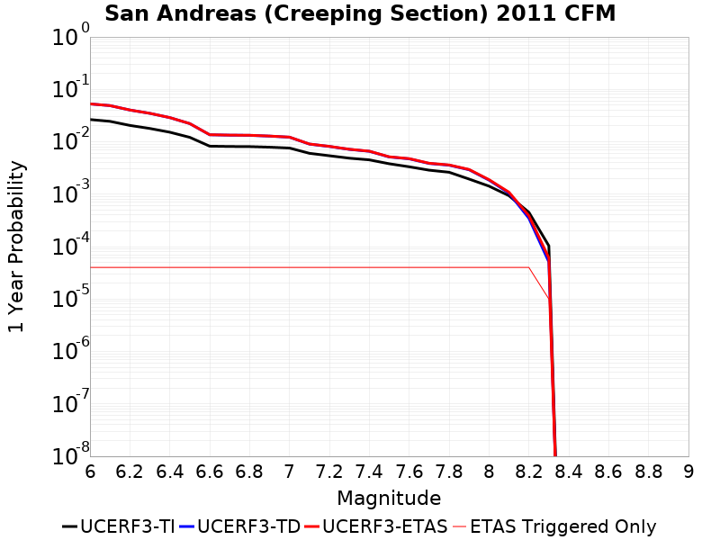 |  |

| Magnitude | 1 wk TI Prob | 1 wk TD Prob | 1 wk ETAS Prob | 1 wk ETAS/TD Gain | 1 wk ETAS Triggered Only | 1 mo TI Prob | 1 mo TD Prob | 1 mo ETAS Prob | 1 mo ETAS/TD Gain | 1 mo ETAS Triggered Only | 1 yr TI Prob | 1 yr TD Prob | 1 yr ETAS Prob | 1 yr ETAS/TD Gain | 1 yr ETAS Triggered Only | 10 yr TI Prob | 10 yr TD Prob | 10 yr ETAS Prob | 10 yr ETAS/TD Gain | 10 yr ETAS Triggered Only |
|-----|-----|-----|-----|-----|-----|-----|-----|-----|-----|-----|-----|-----|-----|-----|-----|-----|-----|-----|-----|-----|
| 6.0 | 5.151163E-4 | 0.0010495804 | 0.0010495804 | 1.0 | 0.0 | 0.002205774 | 0.004486876 | 0.0045067864 | 1.0044374 | 2.0E-5 | 0.026526777 | 0.052665792 | 0.052703686 | 1.0007195 | 4.0E-5 | 0.23574181 | 0.3838726 | 0.38390958 | 1.0000963 | 6.0E-5 |
| 6.1 | 4.7540772E-4 | 9.724277E-4 | 9.724277E-4 | 1.0 | 0.0 | 0.002035871 | 0.0041577024 | 0.0041776197 | 1.0047903 | 2.0E-5 | 0.024506707 | 0.048914623 | 0.048952665 | 1.0007777 | 4.0E-5 | 0.21973366 | 0.3630951 | 0.36313334 | 1.0001053 | 6.0E-5 |
| 6.2 | 3.9647578E-4 | 7.9650374E-4 | 7.9650374E-4 | 1.0 | 0.0 | 0.0016980754 | 0.0034067328 | 0.0034266645 | 1.0058507 | 2.0E-5 | 0.020479038 | 0.04028554 | 0.040323928 | 1.000953 | 4.0E-5 | 0.18691239 | 0.31175745 | 0.31179875 | 1.0001324 | 6.0E-5 |
| 6.3 | 3.4640636E-4 | 6.854587E-4 | 6.854587E-4 | 1.0 | 0.0 | 0.001483754 | 0.0029325176 | 0.0029524588 | 1.0068 | 2.0E-5 | 0.017915692 | 0.034805354 | 0.034843963 | 1.0011092 | 4.0E-5 | 0.16538206 | 0.2776378 | 0.27768114 | 1.0001562 | 6.0E-5 |
| 6.4 | 2.935057E-4 | 5.6585297E-4 | 5.6585297E-4 | 1.0 | 0.0 | 0.0012572751 | 0.0024215397 | 0.0024414915 | 1.0082392 | 2.0E-5 | 0.015200248 | 0.028866287 | 0.028905133 | 1.0013458 | 4.0E-5 | 0.14201577 | 0.238841 | 0.23888665 | 1.0001912 | 6.0E-5 |
| 6.5 | 2.3409708E-4 | 4.323109E-4 | 4.323109E-4 | 1.0 | 0.0 | 0.0010028875 | 0.0018507325 | 0.0018706954 | 1.0107865 | 2.0E-5 | 0.012141965 | 0.02218135 | 0.022220464 | 1.0017633 | 4.0E-5 | 0.11499573 | 0.19237155 | 0.19242 | 1.0002519 | 6.0E-5 |
| 6.6 | 1.5842178E-4 | 2.6210924E-4 | 2.6210924E-4 | 1.0 | 0.0 | 6.7877385E-4 | 0.001122834 | 0.0011428116 | 1.0177921 | 2.0E-5 | 0.0082328 | 0.013583818 | 0.013623276 | 1.0029047 | 4.0E-5 | 0.07934396 | 0.12819295 | 0.12824525 | 1.000408 | 6.0E-5 |
| 6.7 | 1.5616413E-4 | 2.5749026E-4 | 2.5749026E-4 | 1.0 | 0.0 | 6.691031E-4 | 0.0011030585 | 0.0011230364 | 1.0181113 | 2.0E-5 | 0.0081159435 | 0.013346495 | 0.013385962 | 1.002957 | 4.0E-5 | 0.0782586 | 0.12622502 | 0.12627745 | 1.0004153 | 6.0E-5 |
| 6.8 | 1.5538467E-4 | 2.557432E-4 | 2.557432E-4 | 1.0 | 0.0 | 6.6576427E-4 | 0.0010955785 | 0.0011155567 | 1.0182352 | 2.0E-5 | 0.008075596 | 0.013256659 | 0.013296128 | 1.0029774 | 4.0E-5 | 0.07788358 | 0.12546389 | 0.12551636 | 1.0004182 | 6.0E-5 |
| 6.9 | 1.5153569E-4 | 2.4694973E-4 | 2.4694973E-4 | 1.0 | 0.0 | 6.49277E-4 | 0.0010579288 | 0.0010779076 | 1.0188849 | 2.0E-5 | 0.007876333 | 0.012804786 | 0.012844274 | 1.0030838 | 4.0E-5 | 0.07602952 | 0.12159314 | 0.121645845 | 1.0004334 | 6.0E-5 |
| 7.0 | 1.4588932E-4 | 2.3552678E-4 | 2.3552678E-4 | 1.0 | 0.0 | 6.250901E-4 | 0.0010090121 | 0.0010289919 | 1.0198014 | 2.0E-5 | 0.0075839474 | 0.012216067 | 0.012255578 | 1.0032344 | 4.0E-5 | 0.073302895 | 0.11646068 | 0.11651369 | 1.0004551 | 6.0E-5 |
| 7.1 | 1.1565079E-4 | 1.7352916E-4 | 1.7352916E-4 | 1.0 | 0.0 | 4.955521E-4 | 7.4348535E-4 | 7.634705E-4 | 1.0268804 | 2.0E-5 | 0.006016669 | 0.009014592 | 0.009054231 | 1.0043973 | 4.0E-5 | 0.058563538 | 0.088537276 | 0.08859196 | 1.0006176 | 6.0E-5 |
| 7.2 | 1.0393792E-4 | 1.5637696E-4 | 1.5637696E-4 | 1.0 | 0.0 | 4.4537216E-4 | 6.700157E-4 | 6.900023E-4 | 1.0298301 | 2.0E-5 | 0.005408933 | 0.008127119 | 0.008166795 | 1.0048817 | 4.0E-5 | 0.052791595 | 0.080285065 | 0.08034025 | 1.0006874 | 6.0E-5 |
| 7.3 | 9.332884E-5 | 1.3748852E-4 | 1.3748852E-4 | 1.0 | 0.0 | 3.999194E-4 | 5.8910414E-4 | 6.0909236E-4 | 1.0339298 | 2.0E-5 | 0.0048581534 | 0.007148906 | 0.00718862 | 1.0055553 | 4.0E-5 | 0.047533102 | 0.07094983 | 0.07100557 | 1.0007857 | 6.0E-5 |
| 7.4 | 8.670252E-5 | 1.2641965E-4 | 1.2641965E-4 | 1.0 | 0.0 | 3.715293E-4 | 5.416866E-4 | 5.6167576E-4 | 1.0369017 | 2.0E-5 | 0.004513991 | 0.006575226 | 0.006614963 | 1.0060434 | 4.0E-5 | 0.044233937 | 0.06551156 | 0.06556763 | 1.0008559 | 6.0E-5 |
| 7.5 | 7.3036405E-5 | 9.844159E-5 | 9.844159E-5 | 1.0 | 0.0 | 3.129756E-4 | 4.218244E-4 | 4.4181597E-4 | 1.0473931 | 2.0E-5 | 0.0038038217 | 0.0051236437 | 0.0051634386 | 1.007767 | 4.0E-5 | 0.03739367 | 0.05186315 | 0.051920038 | 1.0010968 | 6.0E-5 |
| 7.6 | 6.3935775E-5 | 9.075684E-5 | 9.075684E-5 | 1.0 | 0.0 | 2.7398168E-4 | 3.8889996E-4 | 4.088922E-4 | 1.0514071 | 2.0E-5 | 0.0033306254 | 0.0047246 | 0.0047644107 | 1.0084263 | 4.0E-5 | 0.032811474 | 0.047781654 | 0.04783879 | 1.0011957 | 6.0E-5 |
| 7.7 | 5.5050095E-5 | 7.397476E-5 | 7.397476E-5 | 1.0 | 0.0 | 2.3590765E-4 | 3.1699621E-4 | 3.3698988E-4 | 1.0630722 | 2.0E-5 | 0.0028683927 | 0.0038526047 | 0.0038924504 | 1.0103426 | 4.0E-5 | 0.0283165 | 0.03934513 | 0.039402768 | 1.001465 | 6.0E-5 |
| 7.8 | 5.027131E-5 | 6.857591E-5 | 6.857591E-5 | 1.0 | 0.0 | 2.1543067E-4 | 2.9386365E-4 | 3.1385777E-4 | 1.0680388 | 2.0E-5 | 0.0026197135 | 0.003571925 | 0.003611782 | 1.0111585 | 4.0E-5 | 0.025890453 | 0.03648692 | 0.036544733 | 1.0015844 | 6.0E-5 |
| 7.9 | 3.7271806E-5 | 5.6114757E-5 | 5.6114757E-5 | 1.0 | 0.0 | 1.5972654E-4 | 2.4046966E-4 | 2.6046485E-4 | 1.0831506 | 2.0E-5 | 0.0019429359 | 0.0029237901 | 0.002963673 | 1.0136409 | 4.0E-5 | 0.019260362 | 0.02994772 | 0.030005924 | 1.0019435 | 6.0E-5 |
| 8.0 | 2.7310243E-5 | 3.5581248E-5 | 3.5581248E-5 | 1.0 | 0.0 | 1.17038646E-4 | 1.5248216E-4 | 1.7247911E-4 | 1.1311429 | 2.0E-5 | 0.0014240141 | 0.0018548906 | 0.0018948164 | 1.0215247 | 4.0E-5 | 0.014149235 | 0.01930545 | 0.019364292 | 1.003048 | 6.0E-5 |
| 8.1 | 1.7940547E-5 | 2.0178286E-5 | 2.0178286E-5 | 1.0 | 0.0 | 7.688579E-5 | 8.6475506E-5 | 1.0647377E-4 | 1.2312593 | 2.0E-5 | 9.3568244E-4 | 0.0010523314 | 0.0010922893 | 1.0379708 | 4.0E-5 | 0.009317525 | 0.0112419985 | 0.011291437 | 1.0043976 | 5.0E-5 |
| 8.2 | 8.643924E-6 | 6.6480648E-6 | 6.6480648E-6 | 1.0 | 0.0 | 3.704486E-5 | 2.8491397E-5 | 4.8490827E-5 | 1.7019463 | 2.0E-5 | 4.5092785E-4 | 3.4682767E-4 | 3.8681377E-4 | 1.115291 | 4.0E-5 | 0.0045001395 | 0.003881846 | 0.0039316523 | 1.0128305 | 5.0E-5 |
| 8.3 | 1.983087E-6 | 9.763005E-7 | 9.763005E-7 | 1.0 | 0.0 | 8.498917E-6 | 4.184138E-6 | 1.41840965E-5 | 3.3899684 | 1.0E-5 | 1.034694E-4 | 5.094072E-5 | 6.094021E-5 | 1.1962966 | 1.0E-5 | 0.0010342124 | 5.909015E-4 | 6.0089555E-4 | 1.0169133 | 1.0E-5 |

## San Andreas (Santa Cruz Mts) 2011 CFM
*[(top)](#table-of-contents)*

| 1 Week | 1 Month | 1 Year | 10 Year |
|-----|-----|-----|-----|
| 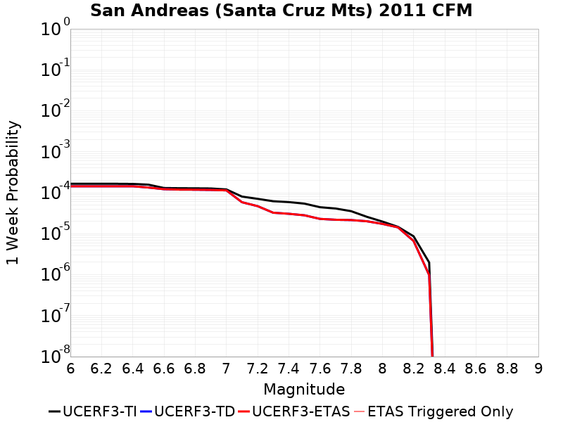 | 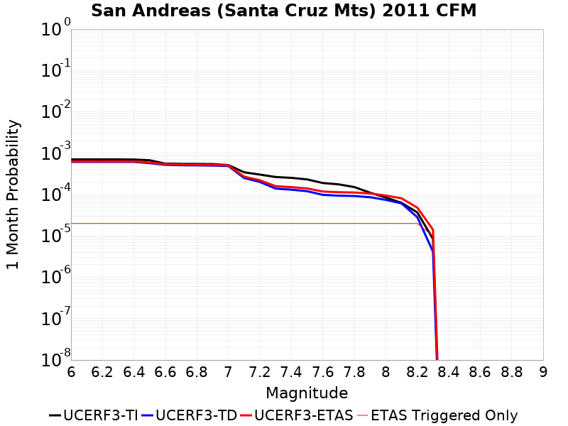 | 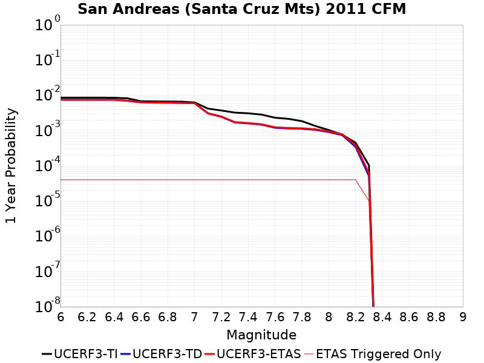 |  |

| Magnitude | 1 wk TI Prob | 1 wk TD Prob | 1 wk ETAS Prob | 1 wk ETAS/TD Gain | 1 wk ETAS Triggered Only | 1 mo TI Prob | 1 mo TD Prob | 1 mo ETAS Prob | 1 mo ETAS/TD Gain | 1 mo ETAS Triggered Only | 1 yr TI Prob | 1 yr TD Prob | 1 yr ETAS Prob | 1 yr ETAS/TD Gain | 1 yr ETAS Triggered Only | 10 yr TI Prob | 10 yr TD Prob | 10 yr ETAS Prob | 10 yr ETAS/TD Gain | 10 yr ETAS Triggered Only |
|-----|-----|-----|-----|-----|-----|-----|-----|-----|-----|-----|-----|-----|-----|-----|-----|-----|-----|-----|-----|-----|
| 6.0 | 1.6520628E-4 | 1.4362222E-4 | 1.4362222E-4 | 1.0 | 0.0 | 7.078348E-4 | 6.153808E-4 | 6.3536846E-4 | 1.0324802 | 2.0E-5 | 0.008583886 | 0.0074669356 | 0.007506637 | 1.005317 | 4.0E-5 | 0.08259789 | 0.07342673 | 0.07348233 | 1.0007571 | 6.0E-5 |
| 6.1 | 1.6520628E-4 | 1.4362222E-4 | 1.4362222E-4 | 1.0 | 0.0 | 7.078348E-4 | 6.153808E-4 | 6.3536846E-4 | 1.0324802 | 2.0E-5 | 0.008583886 | 0.0074669356 | 0.007506637 | 1.005317 | 4.0E-5 | 0.08259789 | 0.07342673 | 0.07348233 | 1.0007571 | 6.0E-5 |
| 6.2 | 1.6520628E-4 | 1.4362222E-4 | 1.4362222E-4 | 1.0 | 0.0 | 7.078348E-4 | 6.153808E-4 | 6.3536846E-4 | 1.0324802 | 2.0E-5 | 0.008583886 | 0.0074669356 | 0.007506637 | 1.005317 | 4.0E-5 | 0.08259789 | 0.07342673 | 0.07348233 | 1.0007571 | 6.0E-5 |
| 6.3 | 1.6520628E-4 | 1.4362222E-4 | 1.4362222E-4 | 1.0 | 0.0 | 7.078348E-4 | 6.153808E-4 | 6.3536846E-4 | 1.0324802 | 2.0E-5 | 0.008583886 | 0.0074669356 | 0.007506637 | 1.005317 | 4.0E-5 | 0.08259789 | 0.07342673 | 0.07348233 | 1.0007571 | 6.0E-5 |
| 6.4 | 1.6392978E-4 | 1.4360229E-4 | 1.4360229E-4 | 1.0 | 0.0 | 7.02367E-4 | 6.152954E-4 | 6.3528307E-4 | 1.0324848 | 2.0E-5 | 0.008517839 | 0.0074659027 | 0.007505604 | 1.0053177 | 4.0E-5 | 0.08198654 | 0.07340454 | 0.07346014 | 1.0007573 | 6.0E-5 |
| 6.5 | 1.5742714E-4 | 1.337908E-4 | 1.337908E-4 | 1.0 | 0.0 | 6.745133E-4 | 5.73265E-4 | 5.932535E-4 | 1.0348679 | 2.0E-5 | 0.00818132 | 0.0069575114 | 0.0069972333 | 1.0057092 | 4.0E-5 | 0.078865945 | 0.06869923 | 0.068755105 | 1.0008134 | 6.0E-5 |
| 6.6 | 1.3038084E-4 | 1.21917285E-4 | 1.21917285E-4 | 1.0 | 0.0 | 5.5865536E-4 | 5.223994E-4 | 5.4238894E-4 | 1.0382649 | 2.0E-5 | 0.006780438 | 0.0063419193 | 0.0063816654 | 1.0062672 | 4.0E-5 | 0.0657725 | 0.06244183 | 0.06249808 | 1.0009009 | 6.0E-5 |
| 6.7 | 1.2867592E-4 | 1.1910527E-4 | 1.1910527E-4 | 1.0 | 0.0 | 5.5135164E-4 | 5.1035266E-4 | 5.3034246E-4 | 1.0391686 | 2.0E-5 | 0.0066920654 | 0.0061960923 | 0.0062358445 | 1.0064157 | 4.0E-5 | 0.06494093 | 0.061123207 | 0.061179537 | 1.0009216 | 6.0E-5 |
| 6.8 | 1.2801298E-4 | 1.1846668E-4 | 1.1846668E-4 | 1.0 | 0.0 | 5.485117E-4 | 5.076169E-4 | 5.2760675E-4 | 1.0393798 | 2.0E-5 | 0.0066577005 | 0.0061629736 | 0.006202727 | 1.0064504 | 4.0E-5 | 0.06461738 | 0.06083021 | 0.06088656 | 1.0009264 | 6.0E-5 |
| 6.9 | 1.269149E-4 | 1.1685979E-4 | 1.1685979E-4 | 1.0 | 0.0 | 5.4380763E-4 | 5.0073286E-4 | 5.207228E-4 | 1.0399214 | 2.0E-5 | 0.006600777 | 0.006079631 | 0.0061193877 | 1.0065393 | 4.0E-5 | 0.06408122 | 0.06009064 | 0.060147036 | 1.0009385 | 6.0E-5 |
| 7.0 | 1.2030331E-4 | 1.1401323E-4 | 1.1401323E-4 | 1.0 | 0.0 | 5.154837E-4 | 4.8853795E-4 | 5.0852814E-4 | 1.0409185 | 2.0E-5 | 0.006257969 | 0.0059319753 | 0.005971738 | 1.0067031 | 4.0E-5 | 0.06084648 | 0.058661327 | 0.058717806 | 1.0009629 | 6.0E-5 |
| 7.1 | 8.049617E-5 | 5.858636E-5 | 5.858636E-5 | 1.0 | 0.0 | 3.4493793E-4 | 2.5106044E-4 | 2.710554E-4 | 1.079642 | 2.0E-5 | 0.0041915346 | 0.003052415 | 0.0030922932 | 1.0130644 | 4.0E-5 | 0.041133516 | 0.032025736 | 0.032083817 | 1.0018135 | 6.0E-5 |
| 7.2 | 7.093979E-5 | 4.706097E-5 | 4.706097E-5 | 1.0 | 0.0 | 3.0399222E-4 | 2.0167443E-4 | 2.2167039E-4 | 1.0991497 | 2.0E-5 | 0.0036948253 | 0.0024526461 | 0.002492548 | 1.016269 | 4.0E-5 | 0.03633994 | 0.02608178 | 0.026140215 | 1.0022404 | 6.0E-5 |
| 7.3 | 6.193693E-5 | 3.2513643E-5 | 3.2513643E-5 | 1.0 | 0.0 | 2.6541698E-4 | 1.3933676E-4 | 1.5933397E-4 | 1.1435171 | 2.0E-5 | 0.0032266637 | 0.001695107 | 0.001735039 | 1.0235573 | 4.0E-5 | 0.031802133 | 0.018413225 | 0.01847212 | 1.0031985 | 6.0E-5 |
| 7.4 | 5.906492E-5 | 3.0588395E-5 | 3.0588395E-5 | 1.0 | 0.0 | 2.5311083E-4 | 1.3108653E-4 | 1.5108392E-4 | 1.1525509 | 2.0E-5 | 0.0030772698 | 0.0015948119 | 0.0016347481 | 1.0250413 | 4.0E-5 | 0.030350044 | 0.01735922 | 0.01741818 | 1.0033964 | 6.0E-5 |
| 7.5 | 5.424296E-5 | 2.8120217E-5 | 2.8120217E-5 | 1.0 | 0.0 | 2.324491E-4 | 1.20509656E-4 | 1.4050725E-4 | 1.1659418 | 2.0E-5 | 0.002826395 | 0.0014662191 | 0.0015061604 | 1.0272411 | 4.0E-5 | 0.027907165 | 0.015989605 | 0.016048646 | 1.0036924 | 6.0E-5 |
| 7.6 | 4.43084E-5 | 2.2958458E-5 | 2.2958458E-5 | 1.0 | 0.0 | 1.8987931E-4 | 9.838969E-5 | 1.1838772E-4 | 1.2032534 | 2.0E-5 | 0.0023093296 | 0.0011972365 | 0.0012371886 | 1.0333703 | 4.0E-5 | 0.022854783 | 0.013040498 | 0.013099715 | 1.004541 | 6.0E-5 |
| 7.7 | 4.118098E-5 | 2.1896769E-5 | 2.1896769E-5 | 1.0 | 0.0 | 1.7647797E-4 | 9.383992E-5 | 1.1383804E-4 | 1.2131089 | 2.0E-5 | 0.002146502 | 0.0011419025 | 0.0011818568 | 1.0349892 | 4.0E-5 | 0.021258866 | 0.012446965 | 0.012506219 | 1.0047605 | 6.0E-5 |
| 7.8 | 3.5408906E-5 | 2.1490952E-5 | 2.1490952E-5 | 1.0 | 0.0 | 1.5174363E-4 | 9.210083E-5 | 1.1209899E-4 | 1.2171333 | 2.0E-5 | 0.0018459131 | 0.0011207511 | 0.0011607063 | 1.0356504 | 4.0E-5 | 0.018306552 | 0.012205988 | 0.012265256 | 1.0048556 | 6.0E-5 |
| 7.9 | 2.5860836E-5 | 2.0108684E-5 | 2.0108684E-5 | 1.0 | 0.0 | 1.10827445E-4 | 8.617723E-5 | 1.061755E-4 | 1.2320598 | 2.0E-5 | 0.001348489 | 0.001048703 | 0.001088661 | 1.0381024 | 4.0E-5 | 0.013403354 | 0.011378448 | 0.011437765 | 1.0052131 | 6.0E-5 |
| 8.0 | 1.9777332E-5 | 1.7368518E-5 | 1.7368518E-5 | 1.0 | 0.0 | 8.4757245E-5 | 7.4434385E-5 | 9.443289E-5 | 1.2686731 | 2.0E-5 | 0.0010314309 | 9.058621E-4 | 9.458258E-4 | 1.0441169 | 4.0E-5 | 0.010266567 | 0.0098339 | 0.00989331 | 1.0060413 | 6.0E-5 |
| 8.1 | 1.468494E-5 | 1.4268263E-5 | 1.4268263E-5 | 1.0 | 0.0 | 6.293394E-5 | 6.114827E-5 | 8.1147045E-5 | 1.3270539 | 2.0E-5 | 7.6595135E-4 | 7.442261E-4 | 7.841963E-4 | 1.0537071 | 4.0E-5 | 0.0076331664 | 0.008104405 | 0.008154 | 1.0061195 | 5.0E-5 |
| 8.2 | 8.63836E-6 | 6.641656E-6 | 6.641656E-6 | 1.0 | 0.0 | 3.7021015E-5 | 2.846393E-5 | 4.846336E-5 | 1.7026236 | 2.0E-5 | 4.5063766E-4 | 3.4649335E-4 | 3.864795E-4 | 1.1154023 | 4.0E-5 | 0.004497249 | 0.003878515 | 0.003928321 | 1.0128416 | 5.0E-5 |
| 8.3 | 1.983087E-6 | 9.763005E-7 | 9.763005E-7 | 1.0 | 0.0 | 8.498917E-6 | 4.184138E-6 | 1.41840965E-5 | 3.3899684 | 1.0E-5 | 1.034694E-4 | 5.094072E-5 | 6.094021E-5 | 1.1962966 | 1.0E-5 | 0.0010342124 | 5.909015E-4 | 6.0089555E-4 | 1.0169133 | 1.0E-5 |

## San Andreas (Cholame) rev
*[(top)](#table-of-contents)*

| 1 Week | 1 Month | 1 Year | 10 Year |
|-----|-----|-----|-----|
| 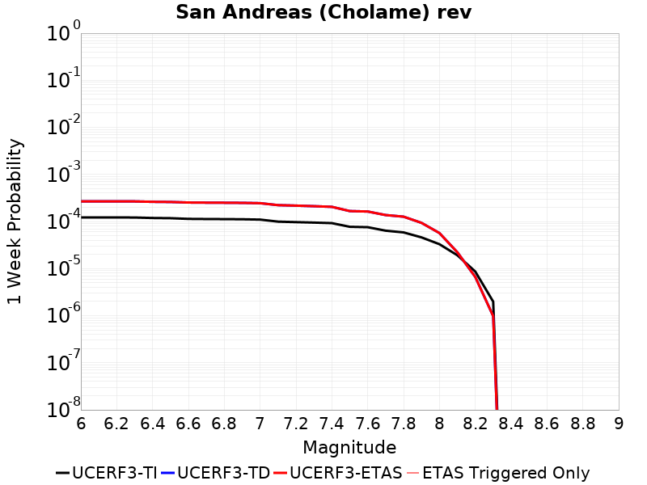 | 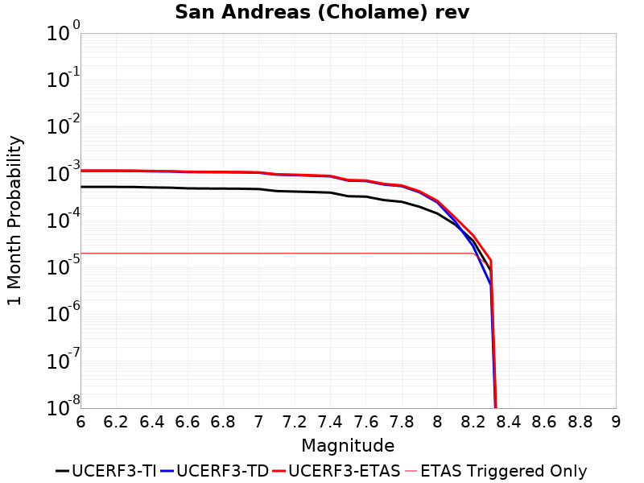 | 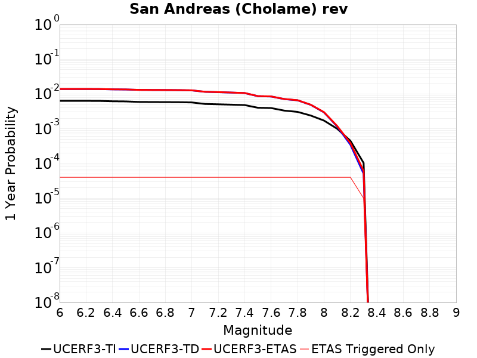 |  |

| Magnitude | 1 wk TI Prob | 1 wk TD Prob | 1 wk ETAS Prob | 1 wk ETAS/TD Gain | 1 wk ETAS Triggered Only | 1 mo TI Prob | 1 mo TD Prob | 1 mo ETAS Prob | 1 mo ETAS/TD Gain | 1 mo ETAS Triggered Only | 1 yr TI Prob | 1 yr TD Prob | 1 yr ETAS Prob | 1 yr ETAS/TD Gain | 1 yr ETAS Triggered Only | 10 yr TI Prob | 10 yr TD Prob | 10 yr ETAS Prob | 10 yr ETAS/TD Gain | 10 yr ETAS Triggered Only |
|-----|-----|-----|-----|-----|-----|-----|-----|-----|-----|-----|-----|-----|-----|-----|-----|-----|-----|-----|-----|-----|
| 6.0 | 1.2188602E-4 | 2.6766988E-4 | 2.6766988E-4 | 1.0 | 0.0 | 5.2226405E-4 | 0.001146654 | 0.0011666311 | 1.0174221 | 2.0E-5 | 0.0063400427 | 0.013871728 | 0.013911174 | 1.0028436 | 4.0E-5 | 0.061621845 | 0.13087025 | 0.1309224 | 1.0003985 | 6.0E-5 |
| 6.1 | 1.2188602E-4 | 2.6766988E-4 | 2.6766988E-4 | 1.0 | 0.0 | 5.2226405E-4 | 0.001146654 | 0.0011666311 | 1.0174221 | 2.0E-5 | 0.0063400427 | 0.013871728 | 0.013911174 | 1.0028436 | 4.0E-5 | 0.061621845 | 0.13087025 | 0.1309224 | 1.0003985 | 6.0E-5 |
| 6.2 | 1.2188602E-4 | 2.6766988E-4 | 2.6766988E-4 | 1.0 | 0.0 | 5.2226405E-4 | 0.001146654 | 0.0011666311 | 1.0174221 | 2.0E-5 | 0.0063400427 | 0.013871728 | 0.013911174 | 1.0028436 | 4.0E-5 | 0.061621845 | 0.13087025 | 0.1309224 | 1.0003985 | 6.0E-5 |
| 6.3 | 1.2142645E-4 | 2.6679356E-4 | 2.6679356E-4 | 1.0 | 0.0 | 5.202953E-4 | 0.0011429017 | 0.0011628788 | 1.0174793 | 2.0E-5 | 0.006316212 | 0.0138266245 | 0.013866072 | 1.0028529 | 4.0E-5 | 0.06139677 | 0.13048626 | 0.13053843 | 1.0003998 | 6.0E-5 |
| 6.4 | 1.1865206E-4 | 2.6173514E-4 | 2.6173514E-4 | 1.0 | 0.0 | 5.0840975E-4 | 0.0011212415 | 0.001141219 | 1.0178174 | 2.0E-5 | 0.006172335 | 0.013566223 | 0.01360568 | 1.0029085 | 4.0E-5 | 0.060036868 | 0.12825726 | 0.12830956 | 1.0004078 | 6.0E-5 |
| 6.5 | 1.17443946E-4 | 2.5962346E-4 | 2.5962346E-4 | 1.0 | 0.0 | 5.032341E-4 | 0.0011121992 | 0.001132177 | 1.0179623 | 2.0E-5 | 0.006109677 | 0.013457495 | 0.013496956 | 1.0029323 | 4.0E-5 | 0.059444077 | 0.12731834 | 0.1273707 | 1.0004113 | 6.0E-5 |
| 6.6 | 1.13579066E-4 | 2.5275507E-4 | 2.5275507E-4 | 1.0 | 0.0 | 4.866766E-4 | 0.001082788 | 0.0011027663 | 1.0184509 | 2.0E-5 | 0.0059092017 | 0.013103772 | 0.013143248 | 1.0030125 | 4.0E-5 | 0.057545185 | 0.12426846 | 0.124321 | 1.0004228 | 6.0E-5 |
| 6.7 | 1.1271412E-4 | 2.5119196E-4 | 2.5119196E-4 | 1.0 | 0.0 | 4.829711E-4 | 0.0010760945 | 0.001096073 | 1.0185658 | 2.0E-5 | 0.005864331 | 0.013023257 | 0.013062736 | 1.0030314 | 4.0E-5 | 0.057119697 | 0.12357435 | 0.12362693 | 1.0004256 | 6.0E-5 |
| 6.8 | 1.1217975E-4 | 2.5005982E-4 | 2.5005982E-4 | 1.0 | 0.0 | 4.8068175E-4 | 0.0010712465 | 0.001091225 | 1.0186498 | 2.0E-5 | 0.005836608 | 0.012964936 | 0.013004417 | 1.0030452 | 4.0E-5 | 0.056856725 | 0.12307159 | 0.123124205 | 1.0004275 | 6.0E-5 |
| 6.9 | 1.1146753E-4 | 2.4851665E-4 | 2.4851665E-4 | 1.0 | 0.0 | 4.7763053E-4 | 0.0010646383 | 0.001084617 | 1.0187657 | 2.0E-5 | 0.0057996577 | 0.012885436 | 0.012924921 | 1.0030643 | 4.0E-5 | 0.056506127 | 0.122385345 | 0.122438 | 1.0004302 | 6.0E-5 |
| 7.0 | 1.0965793E-4 | 2.4469805E-4 | 2.4469805E-4 | 1.0 | 0.0 | 4.698779E-4 | 0.0010482861 | 0.0010682652 | 1.0190587 | 2.0E-5 | 0.005705768 | 0.012688685 | 0.012728177 | 1.0031124 | 4.0E-5 | 0.055614736 | 0.120680876 | 0.12073363 | 1.0004371 | 6.0E-5 |
| 7.1 | 9.927982E-5 | 2.2227924E-4 | 2.2227924E-4 | 1.0 | 0.0 | 4.2541555E-4 | 9.522787E-4 | 9.722596E-4 | 1.0209823 | 2.0E-5 | 0.0051671406 | 0.011532704 | 0.011572244 | 1.0034283 | 4.0E-5 | 0.05048634 | 0.11061179 | 0.11066516 | 1.0004824 | 6.0E-5 |
| 7.2 | 9.696786E-5 | 2.171864E-4 | 2.171864E-4 | 1.0 | 0.0 | 4.1551032E-4 | 9.304679E-4 | 9.504493E-4 | 1.0214746 | 2.0E-5 | 0.00504711 | 0.011269935 | 0.011309485 | 1.0035093 | 4.0E-5 | 0.04934009 | 0.10831839 | 0.10837189 | 1.0004939 | 6.0E-5 |
| 7.3 | 9.4727984E-5 | 2.1125271E-4 | 2.1125271E-4 | 1.0 | 0.0 | 4.0591392E-4 | 9.050557E-4 | 9.250376E-4 | 1.022078 | 2.0E-5 | 0.0049308087 | 0.010963697 | 0.011003259 | 1.0036083 | 4.0E-5 | 0.048228268 | 0.105612576 | 0.105666235 | 1.0005081 | 6.0E-5 |
| 7.4 | 9.220358E-5 | 2.0466348E-4 | 2.0466348E-4 | 1.0 | 0.0 | 3.9509835E-4 | 8.768354E-4 | 8.9681783E-4 | 1.0227892 | 2.0E-5 | 0.004799717 | 0.010623506 | 0.010663082 | 1.0037253 | 4.0E-5 | 0.046973653 | 0.10260106 | 0.102654904 | 1.0005248 | 6.0E-5 |
| 7.5 | 7.71631E-5 | 1.6635166E-4 | 1.6635166E-4 | 1.0 | 0.0 | 3.306571E-4 | 7.1274105E-4 | 7.327268E-4 | 1.0280406 | 2.0E-5 | 0.0040183207 | 0.008643187 | 0.0086828405 | 1.0045879 | 4.0E-5 | 0.03946433 | 0.08477069 | 0.084825605 | 1.0006478 | 6.0E-5 |
| 7.6 | 7.5634416E-5 | 1.6279194E-4 | 1.6279194E-4 | 1.0 | 0.0 | 3.241072E-4 | 6.974934E-4 | 7.1747944E-4 | 1.0286541 | 2.0E-5 | 0.0039388672 | 0.008459003 | 0.008498664 | 1.0046887 | 4.0E-5 | 0.038697794 | 0.08307873 | 0.08313374 | 1.0006622 | 6.0E-5 |
| 7.7 | 6.3783E-5 | 1.3691126E-4 | 1.3691126E-4 | 1.0 | 0.0 | 2.7332708E-4 | 5.8663066E-4 | 6.066189E-4 | 1.034073 | 2.0E-5 | 0.0033226798 | 0.0071188756 | 0.007158591 | 1.0055789 | 4.0E-5 | 0.032734364 | 0.07057083 | 0.070626594 | 1.0007902 | 6.0E-5 |
| 7.8 | 5.863422E-5 | 1.2651592E-4 | 1.2651592E-4 | 1.0 | 0.0 | 2.512653E-4 | 5.420984E-4 | 5.6208763E-4 | 1.0368737 | 2.0E-5 | 0.003054864 | 0.0065801046 | 0.0066198413 | 1.0060389 | 4.0E-5 | 0.030132094 | 0.065282114 | 0.0653382 | 1.0008591 | 6.0E-5 |
| 7.9 | 4.595283E-5 | 9.35261E-5 | 9.35261E-5 | 1.0 | 0.0 | 1.9692584E-4 | 4.0076458E-4 | 4.2075655E-4 | 1.0498846 | 2.0E-5 | 0.0023949358 | 0.0048684017 | 0.0049082073 | 1.0081762 | 4.0E-5 | 0.023692891 | 0.04869999 | 0.04875707 | 1.0011721 | 6.0E-5 |
| 8.0 | 3.2950178E-5 | 5.6834255E-5 | 5.6834255E-5 | 1.0 | 0.0 | 1.412074E-4 | 2.4355265E-4 | 2.635478E-4 | 1.0820978 | 2.0E-5 | 0.0017178444 | 0.0029612237 | 0.0030011053 | 1.0134679 | 4.0E-5 | 0.017046256 | 0.03013486 | 0.030193053 | 1.0019311 | 6.0E-5 |
| 8.1 | 1.9177472E-5 | 2.2210708E-5 | 2.2210708E-5 | 1.0 | 0.0 | 8.218658E-5 | 9.518528E-5 | 1.1518338E-4 | 1.2100965 | 2.0E-5 | 0.0010001622 | 0.0011582655 | 0.0011982193 | 1.0344944 | 4.0E-5 | 0.009956728 | 0.01232714 | 0.012376524 | 1.0040061 | 5.0E-5 |
| 8.2 | 8.643924E-6 | 6.6480648E-6 | 6.6480648E-6 | 1.0 | 0.0 | 3.704486E-5 | 2.8491397E-5 | 4.8490827E-5 | 1.7019463 | 2.0E-5 | 4.5092785E-4 | 3.4682767E-4 | 3.8681377E-4 | 1.115291 | 4.0E-5 | 0.0045001395 | 0.003881846 | 0.0039316523 | 1.0128305 | 5.0E-5 |
| 8.3 | 1.983087E-6 | 9.763005E-7 | 9.763005E-7 | 1.0 | 0.0 | 8.498917E-6 | 4.184138E-6 | 1.41840965E-5 | 3.3899684 | 1.0E-5 | 1.034694E-4 | 5.094072E-5 | 6.094021E-5 | 1.1962966 | 1.0E-5 | 0.0010342124 | 5.909015E-4 | 6.0089555E-4 | 1.0169133 | 1.0E-5 |

## Great Valley 03 Mysterious Ridge
*[(top)](#table-of-contents)*

| 1 Week | 1 Month | 1 Year | 10 Year |
|-----|-----|-----|-----|
|  | 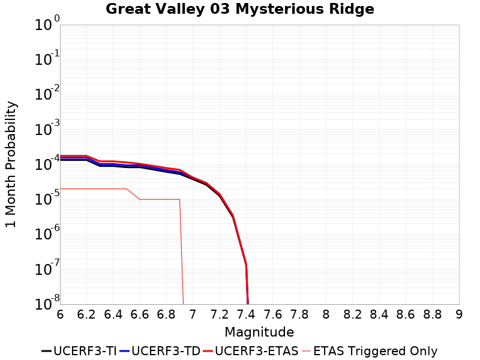 | 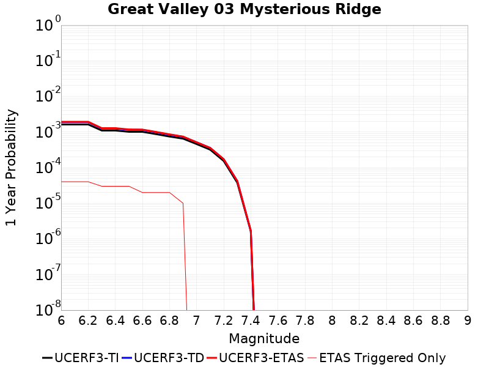 |  |

| Magnitude | 1 wk TI Prob | 1 wk TD Prob | 1 wk ETAS Prob | 1 wk ETAS/TD Gain | 1 wk ETAS Triggered Only | 1 mo TI Prob | 1 mo TD Prob | 1 mo ETAS Prob | 1 mo ETAS/TD Gain | 1 mo ETAS Triggered Only | 1 yr TI Prob | 1 yr TD Prob | 1 yr ETAS Prob | 1 yr ETAS/TD Gain | 1 yr ETAS Triggered Only | 10 yr TI Prob | 10 yr TD Prob | 10 yr ETAS Prob | 10 yr ETAS/TD Gain | 10 yr ETAS Triggered Only |
|-----|-----|-----|-----|-----|-----|-----|-----|-----|-----|-----|-----|-----|-----|-----|-----|-----|-----|-----|-----|-----|
| 6.0 | 3.1182444E-5 | 3.624585E-5 | 4.624549E-5 | 1.2758837 | 1.0E-5 | 1.336322E-4 | 1.5533106E-4 | 1.7532796E-4 | 1.1287372 | 2.0E-5 | 0.0016257578 | 0.0018897037 | 0.0019296281 | 1.0211273 | 4.0E-5 | 0.016139153 | 0.018755298 | 0.018804362 | 1.0026159 | 5.0E-5 |
| 6.1 | 3.1182444E-5 | 3.624585E-5 | 4.624549E-5 | 1.2758837 | 1.0E-5 | 1.336322E-4 | 1.5533106E-4 | 1.7532796E-4 | 1.1287372 | 2.0E-5 | 0.0016257578 | 0.0018897037 | 0.0019296281 | 1.0211273 | 4.0E-5 | 0.016139153 | 0.018755298 | 0.018804362 | 1.0026159 | 5.0E-5 |
| 6.2 | 3.1182444E-5 | 3.624585E-5 | 4.624549E-5 | 1.2758837 | 1.0E-5 | 1.336322E-4 | 1.5533106E-4 | 1.7532796E-4 | 1.1287372 | 2.0E-5 | 0.0016257578 | 0.0018897037 | 0.0019296281 | 1.0211273 | 4.0E-5 | 0.016139153 | 0.018755298 | 0.018804362 | 1.0026159 | 5.0E-5 |
| 6.3 | 2.106934E-5 | 2.396785E-5 | 3.396761E-5 | 1.4172156 | 1.0E-5 | 9.0294045E-5 | 1.0271549E-4 | 1.2271343E-4 | 1.1946926 | 2.0E-5 | 0.0010987755 | 0.0012498751 | 0.0012798376 | 1.0239724 | 3.0E-5 | 0.010933585 | 0.012431735 | 0.0124613615 | 1.0023832 | 3.0E-5 |
| 6.4 | 2.106934E-5 | 2.396785E-5 | 3.396761E-5 | 1.4172156 | 1.0E-5 | 9.0294045E-5 | 1.0271549E-4 | 1.2271343E-4 | 1.1946926 | 2.0E-5 | 0.0010987755 | 0.0012498751 | 0.0012798376 | 1.0239724 | 3.0E-5 | 0.010933585 | 0.012431735 | 0.0124613615 | 1.0023832 | 3.0E-5 |
| 6.5 | 1.9389783E-5 | 2.1989898E-5 | 3.1989675E-5 | 1.4547443 | 1.0E-5 | 8.309642E-5 | 9.423917E-5 | 1.14237286E-4 | 1.212206 | 2.0E-5 | 0.0010112294 | 0.001146786 | 0.0011767516 | 1.0261301 | 3.0E-5 | 0.010066401 | 0.011411586 | 0.011441244 | 1.0025989 | 3.0E-5 |
| 6.6 | 1.9370193E-5 | 2.1969818E-5 | 3.1969597E-5 | 1.4551599 | 1.0E-5 | 8.301247E-5 | 9.415312E-5 | 1.04152175E-4 | 1.1062 | 1.0E-5 | 0.0010102082 | 0.0011457395 | 0.0011657166 | 1.017436 | 2.0E-5 | 0.010056281 | 0.011401228 | 0.011421 | 1.0017341 | 2.0E-5 |
| 6.7 | 1.6723505E-5 | 1.8885914E-5 | 2.8885726E-5 | 1.5294851 | 1.0E-5 | 7.16702E-5 | 8.0937236E-5 | 9.0936424E-5 | 1.1235425 | 1.0E-5 | 8.722353E-4 | 9.84985E-4 | 0.0010049654 | 1.0202849 | 2.0E-5 | 0.008688197 | 0.009808224 | 0.009828027 | 1.002019 | 2.0E-5 |
| 6.8 | 1.426937E-5 | 1.6068905E-5 | 2.6068745E-5 | 1.6223099 | 1.0E-5 | 6.115301E-5 | 6.8864996E-5 | 7.886431E-5 | 1.1452017 | 1.0E-5 | 7.4428355E-4 | 8.3812344E-4 | 8.581067E-4 | 1.0238428 | 2.0E-5 | 0.007417957 | 0.008351118 | 0.008370952 | 1.0023749 | 2.0E-5 |
| 6.9 | 1.2469891E-5 | 1.4018415E-5 | 2.4018274E-5 | 1.7133374 | 1.0E-5 | 5.3441294E-5 | 6.0077604E-5 | 7.0077E-5 | 1.1664413 | 1.0E-5 | 6.504535E-4 | 7.3121156E-4 | 7.4120425E-4 | 1.0136659 | 1.0E-5 | 0.006485529 | 0.0072892923 | 0.0072992197 | 1.0013618 | 1.0E-5 |
| 7.0 | 8.7746275E-6 | 9.8334085E-6 | 9.8334085E-6 | 1.0 | 0.0 | 3.7605005E-5 | 4.214254E-5 | 4.214254E-5 | 1.0 | 0.0 | 4.5774475E-4 | 5.12972E-4 | 5.12972E-4 | 1.0 | 0.0 | 0.00456803 | 0.005118619 | 0.005118619 | 1.0 | 0.0 |
| 7.1 | 6.1067153E-6 | 6.8425975E-6 | 6.8425975E-6 | 1.0 | 0.0 | 2.6171374E-5 | 2.932512E-5 | 2.932512E-5 | 1.0 | 0.0 | 3.1858988E-4 | 3.5698048E-4 | 3.5698048E-4 | 1.0 | 0.0 | 0.0031813353 | 0.0035646264 | 0.0035646264 | 1.0 | 0.0 |
| 7.2 | 2.939283E-6 | 3.2875319E-6 | 3.2875319E-6 | 1.0 | 0.0 | 1.2596866E-5 | 1.4089356E-5 | 1.4089356E-5 | 1.0 | 0.0 | 1.5335606E-4 | 1.7152618E-4 | 1.7152618E-4 | 1.0 | 0.0 | 0.0015325027 | 0.0017141114 | 0.0017141114 | 1.0 | 0.0 |
| 7.3 | 7.2387763E-7 | 8.036499E-7 | 8.036499E-7 | 1.0 | 0.0 | 3.102329E-6 | 3.444212E-6 | 3.444212E-6 | 1.0 | 0.0 | 3.77702E-5 | 4.1932937E-5 | 4.1932937E-5 | 1.0 | 0.0 | 3.7763783E-4 | 4.1929565E-4 | 4.1929565E-4 | 1.0 | 0.0 |
| 7.4 | 3.112171E-8 | 3.1989167E-8 | 3.1989167E-8 | 1.0 | 0.0 | 1.3337875E-7 | 1.3709642E-7 | 1.3709642E-7 | 1.0 | 0.0 | 1.6238852E-6 | 1.6691478E-6 | 1.6691478E-6 | 1.0 | 0.0 | 1.6238733E-5 | 1.6691361E-5 | 1.6691361E-5 | 1.0 | 0.0 |

## San Andreas (Mojave N)
*[(top)](#table-of-contents)*

| 1 Week | 1 Month | 1 Year | 10 Year |
|-----|-----|-----|-----|
|  | 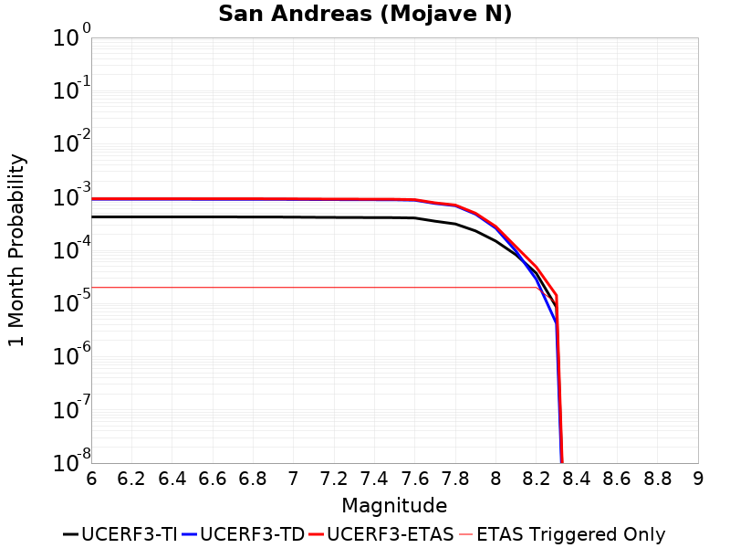 |  | 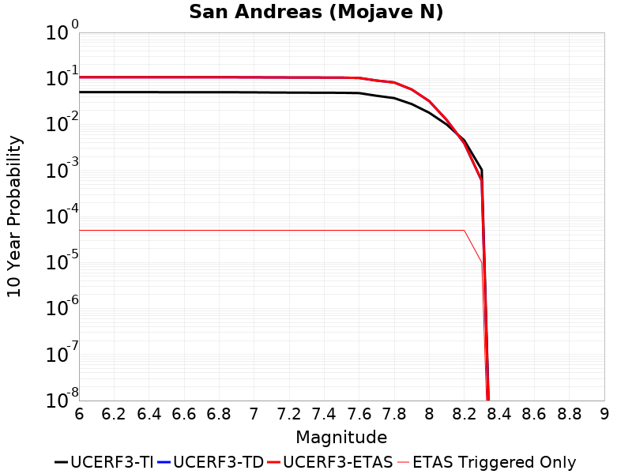 |

| Magnitude | 1 wk TI Prob | 1 wk TD Prob | 1 wk ETAS Prob | 1 wk ETAS/TD Gain | 1 wk ETAS Triggered Only | 1 mo TI Prob | 1 mo TD Prob | 1 mo ETAS Prob | 1 mo ETAS/TD Gain | 1 mo ETAS Triggered Only | 1 yr TI Prob | 1 yr TD Prob | 1 yr ETAS Prob | 1 yr ETAS/TD Gain | 1 yr ETAS Triggered Only | 10 yr TI Prob | 10 yr TD Prob | 10 yr ETAS Prob | 10 yr ETAS/TD Gain | 10 yr ETAS Triggered Only |
|-----|-----|-----|-----|-----|-----|-----|-----|-----|-----|-----|-----|-----|-----|-----|-----|-----|-----|-----|-----|-----|
| 6.0 | 9.877682E-5 | 2.1223143E-4 | 2.1223143E-4 | 1.0 | 0.0 | 4.2326056E-4 | 9.0924645E-4 | 9.2922826E-4 | 1.0219762 | 2.0E-5 | 0.0051410277 | 0.01101405 | 0.01105361 | 1.0035918 | 4.0E-5 | 0.05023708 | 0.10625731 | 0.106302 | 1.0004206 | 5.0E-5 |
| 6.1 | 9.877682E-5 | 2.1223143E-4 | 2.1223143E-4 | 1.0 | 0.0 | 4.2326056E-4 | 9.0924645E-4 | 9.2922826E-4 | 1.0219762 | 2.0E-5 | 0.0051410277 | 0.01101405 | 0.01105361 | 1.0035918 | 4.0E-5 | 0.05023708 | 0.10625731 | 0.106302 | 1.0004206 | 5.0E-5 |
| 6.2 | 9.877682E-5 | 2.1223143E-4 | 2.1223143E-4 | 1.0 | 0.0 | 4.2326056E-4 | 9.0924645E-4 | 9.2922826E-4 | 1.0219762 | 2.0E-5 | 0.0051410277 | 0.01101405 | 0.01105361 | 1.0035918 | 4.0E-5 | 0.05023708 | 0.10625731 | 0.106302 | 1.0004206 | 5.0E-5 |
| 6.3 | 9.877682E-5 | 2.1223143E-4 | 2.1223143E-4 | 1.0 | 0.0 | 4.2326056E-4 | 9.0924645E-4 | 9.2922826E-4 | 1.0219762 | 2.0E-5 | 0.0051410277 | 0.01101405 | 0.01105361 | 1.0035918 | 4.0E-5 | 0.05023708 | 0.10625731 | 0.106302 | 1.0004206 | 5.0E-5 |
| 6.4 | 9.877682E-5 | 2.1223143E-4 | 2.1223143E-4 | 1.0 | 0.0 | 4.2326056E-4 | 9.0924645E-4 | 9.2922826E-4 | 1.0219762 | 2.0E-5 | 0.0051410277 | 0.01101405 | 0.01105361 | 1.0035918 | 4.0E-5 | 0.05023708 | 0.10625731 | 0.106302 | 1.0004206 | 5.0E-5 |
| 6.5 | 9.861474E-5 | 2.1196176E-4 | 2.1196176E-4 | 1.0 | 0.0 | 4.2256617E-4 | 9.080915E-4 | 9.280733E-4 | 1.0220042 | 2.0E-5 | 0.0051326132 | 0.01100013 | 0.011039691 | 1.0035963 | 4.0E-5 | 0.050156746 | 0.106133215 | 0.10617791 | 1.000421 | 5.0E-5 |
| 6.6 | 9.861474E-5 | 2.1196176E-4 | 2.1196176E-4 | 1.0 | 0.0 | 4.2256617E-4 | 9.080915E-4 | 9.280733E-4 | 1.0220042 | 2.0E-5 | 0.0051326132 | 0.01100013 | 0.011039691 | 1.0035963 | 4.0E-5 | 0.050156746 | 0.106133215 | 0.10617791 | 1.000421 | 5.0E-5 |
| 6.7 | 9.8552715E-5 | 2.1185848E-4 | 2.1185848E-4 | 1.0 | 0.0 | 4.223004E-4 | 9.076492E-4 | 9.2763104E-4 | 1.022015 | 2.0E-5 | 0.0051293927 | 0.0109948 | 0.01103436 | 1.0035981 | 4.0E-5 | 0.050125998 | 0.10608567 | 0.10613037 | 1.0004213 | 5.0E-5 |
| 6.8 | 9.8464974E-5 | 2.1170659E-4 | 2.1170659E-4 | 1.0 | 0.0 | 4.219245E-4 | 9.069987E-4 | 9.269806E-4 | 1.0220307 | 2.0E-5 | 0.0051248376 | 0.0109869605 | 0.011026521 | 1.0036007 | 4.0E-5 | 0.05008251 | 0.10601471 | 0.10605941 | 1.0004216 | 5.0E-5 |
| 6.9 | 9.825824E-5 | 2.1138045E-4 | 2.1138045E-4 | 1.0 | 0.0 | 4.2103877E-4 | 9.0560195E-4 | 9.255838E-4 | 1.0220648 | 2.0E-5 | 0.0051141046 | 0.010970126 | 0.011009688 | 1.0036063 | 4.0E-5 | 0.049980022 | 0.10586232 | 0.10590703 | 1.0004224 | 5.0E-5 |
| 7.0 | 9.781462E-5 | 2.1068471E-4 | 2.1068471E-4 | 1.0 | 0.0 | 4.1913814E-4 | 9.026222E-4 | 9.226042E-4 | 1.0221376 | 2.0E-5 | 0.005091073 | 0.010934212 | 0.010973775 | 1.0036182 | 4.0E-5 | 0.04976007 | 0.10553724 | 0.10558197 | 1.0004238 | 5.0E-5 |
| 7.1 | 9.7121134E-5 | 2.0968764E-4 | 2.0968764E-4 | 1.0 | 0.0 | 4.1616702E-4 | 8.98352E-4 | 9.1833406E-4 | 1.022243 | 2.0E-5 | 0.005055068 | 0.010882744 | 0.010922309 | 1.0036355 | 4.0E-5 | 0.04941613 | 0.10507124 | 0.10511599 | 1.0004258 | 5.0E-5 |
| 7.2 | 9.663819E-5 | 2.0898668E-4 | 2.0898668E-4 | 1.0 | 0.0 | 4.1409794E-4 | 8.9534995E-4 | 9.1533206E-4 | 1.0223176 | 2.0E-5 | 0.0050299936 | 0.010846558 | 0.010886124 | 1.0036478 | 4.0E-5 | 0.049176537 | 0.104743406 | 0.10478817 | 1.0004274 | 5.0E-5 |
| 7.3 | 9.6277574E-5 | 2.0849406E-4 | 2.0849406E-4 | 1.0 | 0.0 | 4.125529E-4 | 8.932402E-4 | 9.132223E-4 | 1.0223703 | 2.0E-5 | 0.0050112694 | 0.010821127 | 0.010860695 | 1.0036565 | 4.0E-5 | 0.04899759 | 0.104510725 | 0.104555495 | 1.0004284 | 5.0E-5 |
| 7.4 | 9.593308E-5 | 2.0786477E-4 | 2.0786477E-4 | 1.0 | 0.0 | 4.1107697E-4 | 8.90545E-4 | 9.1052725E-4 | 1.0224382 | 2.0E-5 | 0.0049933824 | 0.010788639 | 0.010828208 | 1.0036676 | 4.0E-5 | 0.04882661 | 0.104220346 | 0.10426513 | 1.0004297 | 5.0E-5 |
| 7.5 | 9.561707E-5 | 2.0730085E-4 | 2.0730085E-4 | 1.0 | 0.0 | 4.0972308E-4 | 8.8813E-4 | 9.081122E-4 | 1.0224992 | 2.0E-5 | 0.0049769743 | 0.010759527 | 0.010799096 | 1.0036776 | 4.0E-5 | 0.048669744 | 0.103958495 | 0.104003295 | 1.000431 | 5.0E-5 |
| 7.6 | 9.418194E-5 | 2.0365774E-4 | 2.0365774E-4 | 1.0 | 0.0 | 4.0357444E-4 | 8.725271E-4 | 8.9250965E-4 | 1.0229019 | 2.0E-5 | 0.004902454 | 0.01057142 | 0.010610997 | 1.0037438 | 4.0E-5 | 0.047957025 | 0.10228654 | 0.10233142 | 1.0004388 | 5.0E-5 |
| 7.7 | 8.202141E-5 | 1.7697965E-4 | 1.7697965E-4 | 1.0 | 0.0 | 3.51473E-4 | 7.582638E-4 | 7.782486E-4 | 1.0263561 | 2.0E-5 | 0.00427079 | 0.009192863 | 0.009232495 | 1.0043112 | 4.0E-5 | 0.04189639 | 0.08968598 | 0.08973149 | 1.0005075 | 5.0E-5 |
| 7.8 | 7.2859846E-5 | 1.6044074E-4 | 1.6044074E-4 | 1.0 | 0.0 | 3.1221908E-4 | 6.87422E-4 | 7.074083E-4 | 1.0290742 | 2.0E-5 | 0.003794643 | 0.008337303 | 0.00837697 | 1.0047578 | 4.0E-5 | 0.037304975 | 0.08157307 | 0.08161899 | 1.0005629 | 5.0E-5 |
| 7.9 | 5.3874453E-5 | 1.1125247E-4 | 1.1125247E-4 | 1.0 | 0.0 | 2.3087008E-4 | 4.767092E-4 | 4.9669965E-4 | 1.0419343 | 2.0E-5 | 0.0028072202 | 0.005788505 | 0.0058282735 | 1.0068703 | 4.0E-5 | 0.02772022 | 0.057440534 | 0.05748766 | 1.0008205 | 5.0E-5 |
| 8.0 | 3.468538E-5 | 6.0638307E-5 | 6.0638307E-5 | 1.0 | 0.0 | 1.4864317E-4 | 2.598526E-4 | 2.798474E-4 | 1.0769467 | 2.0E-5 | 0.0018082283 | 0.0031591181 | 0.0031989918 | 1.0126218 | 4.0E-5 | 0.017935853 | 0.032048665 | 0.03209706 | 1.0015101 | 5.0E-5 |
| 8.1 | 1.9152367E-5 | 2.243112E-5 | 2.243112E-5 | 1.0 | 0.0 | 8.207899E-5 | 9.6129836E-5 | 1.16127914E-4 | 1.2080319 | 2.0E-5 | 9.988535E-4 | 0.0011697533 | 0.0012097064 | 1.0341552 | 4.0E-5 | 0.009943757 | 0.012424767 | 0.012474146 | 1.0039742 | 5.0E-5 |
| 8.2 | 8.643924E-6 | 6.6480648E-6 | 6.6480648E-6 | 1.0 | 0.0 | 3.704486E-5 | 2.8491397E-5 | 4.8490827E-5 | 1.7019463 | 2.0E-5 | 4.5092785E-4 | 3.4682767E-4 | 3.8681377E-4 | 1.115291 | 4.0E-5 | 0.0045001395 | 0.003881846 | 0.0039316523 | 1.0128305 | 5.0E-5 |
| 8.3 | 1.983087E-6 | 9.763005E-7 | 9.763005E-7 | 1.0 | 0.0 | 8.498917E-6 | 4.184138E-6 | 1.41840965E-5 | 3.3899684 | 1.0E-5 | 1.034694E-4 | 5.094072E-5 | 6.094021E-5 | 1.1962966 | 1.0E-5 | 0.0010342124 | 5.909015E-4 | 6.0089555E-4 | 1.0169133 | 1.0E-5 |

## San Andreas (Carrizo) rev
*[(top)](#table-of-contents)*

| 1 Week | 1 Month | 1 Year | 10 Year |
|-----|-----|-----|-----|
|  |  |  |  |

| Magnitude | 1 wk TI Prob | 1 wk TD Prob | 1 wk ETAS Prob | 1 wk ETAS/TD Gain | 1 wk ETAS Triggered Only | 1 mo TI Prob | 1 mo TD Prob | 1 mo ETAS Prob | 1 mo ETAS/TD Gain | 1 mo ETAS Triggered Only | 1 yr TI Prob | 1 yr TD Prob | 1 yr ETAS Prob | 1 yr ETAS/TD Gain | 1 yr ETAS Triggered Only | 10 yr TI Prob | 10 yr TD Prob | 10 yr ETAS Prob | 10 yr ETAS/TD Gain | 10 yr ETAS Triggered Only |
|-----|-----|-----|-----|-----|-----|-----|-----|-----|-----|-----|-----|-----|-----|-----|-----|-----|-----|-----|-----|-----|
| 6.0 | 1.1674632E-4 | 2.6193258E-4 | 2.6193258E-4 | 1.0 | 0.0 | 5.002454E-4 | 0.001122087 | 0.0011420646 | 1.0178039 | 2.0E-5 | 0.006073493 | 0.013576398 | 0.013615854 | 1.0029063 | 4.0E-5 | 0.0591016 | 0.12843351 | 0.12847708 | 1.0003393 | 5.0E-5 |
| 6.1 | 1.1674632E-4 | 2.6193258E-4 | 2.6193258E-4 | 1.0 | 0.0 | 5.002454E-4 | 0.001122087 | 0.0011420646 | 1.0178039 | 2.0E-5 | 0.006073493 | 0.013576398 | 0.013615854 | 1.0029063 | 4.0E-5 | 0.0591016 | 0.12843351 | 0.12847708 | 1.0003393 | 5.0E-5 |
| 6.2 | 1.1674632E-4 | 2.6193258E-4 | 2.6193258E-4 | 1.0 | 0.0 | 5.002454E-4 | 0.001122087 | 0.0011420646 | 1.0178039 | 2.0E-5 | 0.006073493 | 0.013576398 | 0.013615854 | 1.0029063 | 4.0E-5 | 0.0591016 | 0.12843351 | 0.12847708 | 1.0003393 | 5.0E-5 |
| 6.3 | 1.1674632E-4 | 2.6193258E-4 | 2.6193258E-4 | 1.0 | 0.0 | 5.002454E-4 | 0.001122087 | 0.0011420646 | 1.0178039 | 2.0E-5 | 0.006073493 | 0.013576398 | 0.013615854 | 1.0029063 | 4.0E-5 | 0.0591016 | 0.12843351 | 0.12847708 | 1.0003393 | 5.0E-5 |
| 6.4 | 1.1674632E-4 | 2.6193258E-4 | 2.6193258E-4 | 1.0 | 0.0 | 5.002454E-4 | 0.001122087 | 0.0011420646 | 1.0178039 | 2.0E-5 | 0.006073493 | 0.013576398 | 0.013615854 | 1.0029063 | 4.0E-5 | 0.0591016 | 0.12843351 | 0.12847708 | 1.0003393 | 5.0E-5 |
| 6.5 | 1.13136164E-4 | 2.5501585E-4 | 2.5501585E-4 | 1.0 | 0.0 | 4.847792E-4 | 0.001092469 | 0.0011124471 | 1.0182872 | 2.0E-5 | 0.0058862255 | 0.013220216 | 0.013259687 | 1.0029857 | 4.0E-5 | 0.057327334 | 0.1253904 | 0.12543413 | 1.0003488 | 5.0E-5 |
| 6.6 | 1.13136164E-4 | 2.5501585E-4 | 2.5501585E-4 | 1.0 | 0.0 | 4.847792E-4 | 0.001092469 | 0.0011124471 | 1.0182872 | 2.0E-5 | 0.0058862255 | 0.013220216 | 0.013259687 | 1.0029857 | 4.0E-5 | 0.057327334 | 0.1253904 | 0.12543413 | 1.0003488 | 5.0E-5 |
| 6.7 | 1.1149675E-4 | 2.5187532E-4 | 2.5187532E-4 | 1.0 | 0.0 | 4.777557E-4 | 0.0010790207 | 0.001098999 | 1.0185153 | 2.0E-5 | 0.0058011734 | 0.013058454 | 0.013097932 | 1.0030231 | 4.0E-5 | 0.05652051 | 0.12400037 | 0.124044165 | 1.0003532 | 5.0E-5 |
| 6.8 | 1.1103589E-4 | 2.5086524E-4 | 2.5086524E-4 | 1.0 | 0.0 | 4.7578133E-4 | 0.0010746954 | 0.0010946739 | 1.01859 | 2.0E-5 | 0.005777263 | 0.013006424 | 0.013045903 | 1.0030354 | 4.0E-5 | 0.056293584 | 0.12355333 | 0.12359715 | 1.0003546 | 5.0E-5 |
| 6.9 | 1.1053259E-4 | 2.497542E-4 | 2.497542E-4 | 1.0 | 0.0 | 4.7362508E-4 | 0.0010699377 | 0.0010899163 | 1.0186727 | 2.0E-5 | 0.0057511497 | 0.012949189 | 0.012988671 | 1.003049 | 4.0E-5 | 0.05604569 | 0.12306009 | 0.12310394 | 1.0003563 | 5.0E-5 |
| 7.0 | 1.1005377E-4 | 2.4873012E-4 | 2.4873012E-4 | 1.0 | 0.0 | 4.7157376E-4 | 0.0010655524 | 0.0010855311 | 1.0187496 | 2.0E-5 | 0.0057263062 | 0.012896432 | 0.012935916 | 1.0030617 | 4.0E-5 | 0.055809796 | 0.12260379 | 0.12264766 | 1.0003579 | 5.0E-5 |
| 7.1 | 1.0308142E-4 | 2.333376E-4 | 2.333376E-4 | 1.0 | 0.0 | 4.417027E-4 | 9.996361E-4 | 0.0010196161 | 1.0199872 | 2.0E-5 | 0.0053644776 | 0.012103028 | 0.012142544 | 1.0032649 | 4.0E-5 | 0.052368138 | 0.11573396 | 0.11577818 | 1.0003821 | 5.0E-5 |
| 7.2 | 1.0027479E-4 | 2.2722439E-4 | 2.2722439E-4 | 1.0 | 0.0 | 4.296783E-4 | 9.734565E-4 | 9.93437E-4 | 1.0205253 | 2.0E-5 | 0.0052187922 | 0.011787781 | 0.011827309 | 1.0033534 | 4.0E-5 | 0.050979212 | 0.11298715 | 0.11303151 | 1.0003926 | 5.0E-5 |
| 7.3 | 9.816942E-5 | 2.216821E-4 | 2.216821E-4 | 1.0 | 0.0 | 4.2065824E-4 | 9.497213E-4 | 9.697023E-4 | 1.0210388 | 2.0E-5 | 0.005109493 | 0.011501892 | 0.011541432 | 1.0034376 | 4.0E-5 | 0.049935985 | 0.11046913 | 0.11051361 | 1.0004026 | 5.0E-5 |
| 7.4 | 9.5634205E-5 | 2.1507448E-4 | 2.1507448E-4 | 1.0 | 0.0 | 4.0979648E-4 | 9.214232E-4 | 9.414048E-4 | 1.0216856 | 2.0E-5 | 0.0049778637 | 0.011160934 | 0.011200488 | 1.003544 | 4.0E-5 | 0.048678253 | 0.107464604 | 0.10750923 | 1.0004153 | 5.0E-5 |
| 7.5 | 8.052417E-5 | 1.7660786E-4 | 1.7660786E-4 | 1.0 | 0.0 | 3.4505792E-4 | 7.566715E-4 | 7.766564E-4 | 1.0264115 | 2.0E-5 | 0.0041929903 | 0.009173665 | 0.009213299 | 1.0043203 | 4.0E-5 | 0.04114753 | 0.08965699 | 0.0897025 | 1.0005077 | 5.0E-5 |
| 7.6 | 7.897024E-5 | 1.729788E-4 | 1.729788E-4 | 1.0 | 0.0 | 3.384E-4 | 7.411273E-4 | 7.611125E-4 | 1.026966 | 2.0E-5 | 0.0041122385 | 0.008985992 | 0.0090256315 | 1.0044113 | 4.0E-5 | 0.040369697 | 0.08794081 | 0.08798642 | 1.0005186 | 5.0E-5 |
| 7.7 | 6.707427E-5 | 1.4697845E-4 | 1.4697845E-4 | 1.0 | 0.0 | 2.8742946E-4 | 6.297556E-4 | 6.49743E-4 | 1.0317384 | 2.0E-5 | 0.003493839 | 0.0076403655 | 0.00768006 | 1.0051954 | 4.0E-5 | 0.034394164 | 0.07544119 | 0.07548742 | 1.0006127 | 5.0E-5 |
| 7.8 | 6.147705E-5 | 1.3508149E-4 | 1.3508149E-4 | 1.0 | 0.0 | 2.6344648E-4 | 5.7879224E-4 | 5.987807E-4 | 1.0345347 | 2.0E-5 | 0.0032027436 | 0.0070240623 | 0.0070637814 | 1.0056547 | 4.0E-5 | 0.031569764 | 0.06944836 | 0.06949489 | 1.00067 | 5.0E-5 |
| 7.9 | 4.7636717E-5 | 9.846976E-5 | 9.846976E-5 | 1.0 | 0.0 | 2.0414138E-4 | 4.2194503E-4 | 4.4193657E-4 | 1.0473795 | 2.0E-5 | 0.0024825884 | 0.005125091 | 0.0051648864 | 1.0077647 | 4.0E-5 | 0.024550365 | 0.051140327 | 0.05118777 | 1.0009277 | 5.0E-5 |
| 8.0 | 3.3554235E-5 | 5.8336922E-5 | 5.8336922E-5 | 1.0 | 0.0 | 1.4379594E-4 | 2.4999143E-4 | 2.6998643E-4 | 1.0799828 | 2.0E-5 | 0.0017493097 | 0.0030394 | 0.0030792786 | 1.0131205 | 4.0E-5 | 0.017356034 | 0.030898832 | 0.030947287 | 1.0015682 | 5.0E-5 |
| 8.1 | 1.9175432E-5 | 2.221048E-5 | 2.221048E-5 | 1.0 | 0.0 | 8.217783E-5 | 9.51843E-5 | 1.151824E-4 | 1.2100986 | 2.0E-5 | 0.0010000558 | 0.0011582536 | 0.0011982074 | 1.0344948 | 4.0E-5 | 0.009955673 | 0.012326989 | 0.012376373 | 1.0040061 | 5.0E-5 |
| 8.2 | 8.643924E-6 | 6.6480648E-6 | 6.6480648E-6 | 1.0 | 0.0 | 3.704486E-5 | 2.8491397E-5 | 4.8490827E-5 | 1.7019463 | 2.0E-5 | 4.5092785E-4 | 3.4682767E-4 | 3.8681377E-4 | 1.115291 | 4.0E-5 | 0.0045001395 | 0.003881846 | 0.0039316523 | 1.0128305 | 5.0E-5 |
| 8.3 | 1.983087E-6 | 9.763005E-7 | 9.763005E-7 | 1.0 | 0.0 | 8.498917E-6 | 4.184138E-6 | 1.41840965E-5 | 3.3899684 | 1.0E-5 | 1.034694E-4 | 5.094072E-5 | 6.094021E-5 | 1.1962966 | 1.0E-5 | 0.0010342124 | 5.909015E-4 | 6.0089555E-4 | 1.0169133 | 1.0E-5 |

## San Andreas (Big Bend)
*[(top)](#table-of-contents)*

| 1 Week | 1 Month | 1 Year | 10 Year |
|-----|-----|-----|-----|
|  | 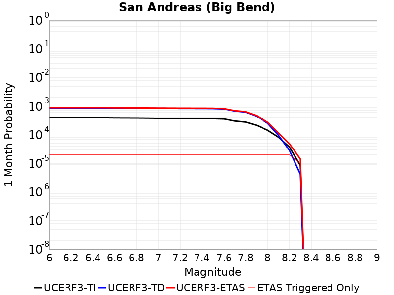 | 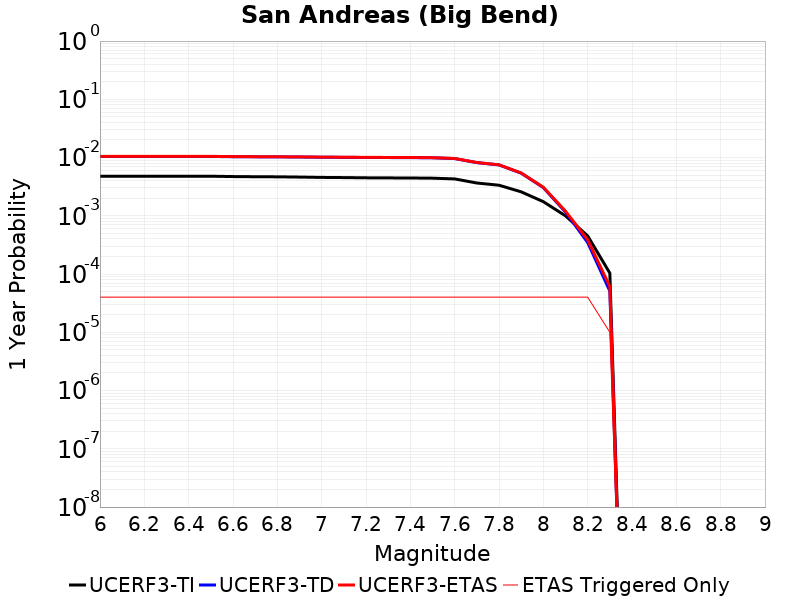 | 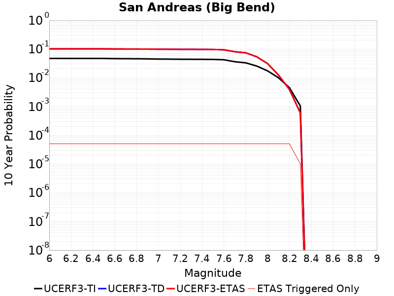 |

| Magnitude | 1 wk TI Prob | 1 wk TD Prob | 1 wk ETAS Prob | 1 wk ETAS/TD Gain | 1 wk ETAS Triggered Only | 1 mo TI Prob | 1 mo TD Prob | 1 mo ETAS Prob | 1 mo ETAS/TD Gain | 1 mo ETAS Triggered Only | 1 yr TI Prob | 1 yr TD Prob | 1 yr ETAS Prob | 1 yr ETAS/TD Gain | 1 yr ETAS Triggered Only | 10 yr TI Prob | 10 yr TD Prob | 10 yr ETAS Prob | 10 yr ETAS/TD Gain | 10 yr ETAS Triggered Only |
|-----|-----|-----|-----|-----|-----|-----|-----|-----|-----|-----|-----|-----|-----|-----|-----|-----|-----|-----|-----|-----|
| 6.0 | 9.168226E-5 | 2.0076505E-4 | 2.0076505E-4 | 1.0 | 0.0 | 3.928648E-4 | 8.6013816E-4 | 8.801209E-4 | 1.0232321 | 2.0E-5 | 0.0047726436 | 0.010422046 | 0.010461629 | 1.003798 | 4.0E-5 | 0.046714354 | 0.10095529 | 0.10100024 | 1.0004452 | 5.0E-5 |
| 6.1 | 9.168226E-5 | 2.0076505E-4 | 2.0076505E-4 | 1.0 | 0.0 | 3.928648E-4 | 8.6013816E-4 | 8.801209E-4 | 1.0232321 | 2.0E-5 | 0.0047726436 | 0.010422046 | 0.010461629 | 1.003798 | 4.0E-5 | 0.046714354 | 0.10095529 | 0.10100024 | 1.0004452 | 5.0E-5 |
| 6.2 | 9.168226E-5 | 2.0076505E-4 | 2.0076505E-4 | 1.0 | 0.0 | 3.928648E-4 | 8.6013816E-4 | 8.801209E-4 | 1.0232321 | 2.0E-5 | 0.0047726436 | 0.010422046 | 0.010461629 | 1.003798 | 4.0E-5 | 0.046714354 | 0.10095529 | 0.10100024 | 1.0004452 | 5.0E-5 |
| 6.3 | 9.168226E-5 | 2.0076505E-4 | 2.0076505E-4 | 1.0 | 0.0 | 3.928648E-4 | 8.6013816E-4 | 8.801209E-4 | 1.0232321 | 2.0E-5 | 0.0047726436 | 0.010422046 | 0.010461629 | 1.003798 | 4.0E-5 | 0.046714354 | 0.10095529 | 0.10100024 | 1.0004452 | 5.0E-5 |
| 6.4 | 9.1639464E-5 | 2.00699E-4 | 2.00699E-4 | 1.0 | 0.0 | 3.9268145E-4 | 8.5985527E-4 | 8.798381E-4 | 1.0232397 | 2.0E-5 | 0.0047704205 | 0.010418636 | 0.010458219 | 1.0037993 | 4.0E-5 | 0.046693064 | 0.10092462 | 0.10096957 | 1.0004454 | 5.0E-5 |
| 6.5 | 9.1639464E-5 | 2.00699E-4 | 2.00699E-4 | 1.0 | 0.0 | 3.9268145E-4 | 8.5985527E-4 | 8.798381E-4 | 1.0232397 | 2.0E-5 | 0.0047704205 | 0.010418636 | 0.010458219 | 1.0037993 | 4.0E-5 | 0.046693064 | 0.10092462 | 0.10096957 | 1.0004454 | 5.0E-5 |
| 6.6 | 9.042622E-5 | 1.988097E-4 | 1.988097E-4 | 1.0 | 0.0 | 3.8748336E-4 | 8.5176365E-4 | 8.717466E-4 | 1.0234607 | 2.0E-5 | 0.0047074095 | 0.010321056 | 0.010360642 | 1.0038356 | 4.0E-5 | 0.046089325 | 0.10004494 | 0.100089945 | 1.0004498 | 5.0E-5 |
| 6.7 | 8.9836685E-5 | 1.9798137E-4 | 1.9798137E-4 | 1.0 | 0.0 | 3.8495753E-4 | 8.482159E-4 | 8.681989E-4 | 1.0235589 | 2.0E-5 | 0.00467679 | 0.01027827 | 0.010317858 | 1.0038517 | 4.0E-5 | 0.045795817 | 0.09965572 | 0.099700734 | 1.0004517 | 5.0E-5 |
| 6.8 | 8.9471854E-5 | 1.9746184E-4 | 1.9746184E-4 | 1.0 | 0.0 | 3.8339442E-4 | 8.459908E-4 | 8.659739E-4 | 1.023621 | 2.0E-5 | 0.004657841 | 0.010251434 | 0.010291024 | 1.0038619 | 4.0E-5 | 0.04561414 | 0.09941028 | 0.09945531 | 1.000453 | 5.0E-5 |
| 6.9 | 8.858234E-5 | 1.9631526E-4 | 1.9631526E-4 | 1.0 | 0.0 | 3.7958333E-4 | 8.4108004E-4 | 8.610632E-4 | 1.023759 | 2.0E-5 | 0.004611638 | 0.010192206 | 0.0102317985 | 1.0038846 | 4.0E-5 | 0.04517103 | 0.09887045 | 0.0989155 | 1.0004557 | 5.0E-5 |
| 7.0 | 8.7433385E-5 | 1.9473504E-4 | 1.9473504E-4 | 1.0 | 0.0 | 3.746607E-4 | 8.3431206E-4 | 8.542954E-4 | 1.0239519 | 2.0E-5 | 0.004551957 | 0.010110574 | 0.010150169 | 1.0039163 | 4.0E-5 | 0.044598386 | 0.098125316 | 0.09817041 | 1.0004596 | 5.0E-5 |
| 7.1 | 8.684964E-5 | 1.938526E-4 | 1.938526E-4 | 1.0 | 0.0 | 3.7215967E-4 | 8.305325E-4 | 8.505159E-4 | 1.024061 | 2.0E-5 | 0.0045216335 | 0.010064984 | 0.010104581 | 1.0039341 | 4.0E-5 | 0.04430731 | 0.0977095 | 0.09775461 | 1.0004617 | 5.0E-5 |
| 7.2 | 8.606521E-5 | 1.9275582E-4 | 1.9275582E-4 | 1.0 | 0.0 | 3.6879873E-4 | 8.2583504E-4 | 8.4581855E-4 | 1.0241979 | 2.0E-5 | 0.0044808835 | 0.010008319 | 0.010047918 | 1.0039567 | 4.0E-5 | 0.043916024 | 0.09719299 | 0.09723812 | 1.0004644 | 5.0E-5 |
| 7.3 | 8.568266E-5 | 1.921554E-4 | 1.921554E-4 | 1.0 | 0.0 | 3.6715972E-4 | 8.232635E-4 | 8.43247E-4 | 1.0242735 | 2.0E-5 | 0.0044610105 | 0.009977298 | 0.010016899 | 1.0039691 | 4.0E-5 | 0.043725148 | 0.0969074 | 0.09695256 | 1.000466 | 5.0E-5 |
| 7.4 | 8.5432206E-5 | 1.9176629E-4 | 1.9176629E-4 | 1.0 | 0.0 | 3.6608664E-4 | 8.215969E-4 | 8.4158045E-4 | 1.0243229 | 2.0E-5 | 0.004447999 | 0.0099571925 | 0.009996794 | 1.0039772 | 4.0E-5 | 0.043600157 | 0.096722476 | 0.09676764 | 1.000467 | 5.0E-5 |
| 7.5 | 8.4791965E-5 | 1.9038303E-4 | 1.9038303E-4 | 1.0 | 0.0 | 3.633435E-4 | 8.156724E-4 | 8.356561E-4 | 1.0244997 | 2.0E-5 | 0.0044147377 | 0.009885718 | 0.009925323 | 1.0040063 | 4.0E-5 | 0.043280575 | 0.096074596 | 0.09611979 | 1.0004704 | 5.0E-5 |
| 7.6 | 8.241105E-5 | 1.8457012E-4 | 1.8457012E-4 | 1.0 | 0.0 | 3.531424E-4 | 7.907752E-4 | 8.107594E-4 | 1.0252717 | 2.0E-5 | 0.0042910352 | 0.009585301 | 0.009624918 | 1.0041331 | 4.0E-5 | 0.042091176 | 0.09335992 | 0.09340525 | 1.0004855 | 5.0E-5 |
| 7.7 | 7.00432E-5 | 1.5702602E-4 | 1.5702602E-4 | 1.0 | 0.0 | 3.001506E-4 | 6.7279517E-4 | 6.927817E-4 | 1.0297067 | 2.0E-5 | 0.0036482112 | 0.008160572 | 0.008200245 | 1.0048616 | 4.0E-5 | 0.035888977 | 0.08021439 | 0.08026037 | 1.0005733 | 5.0E-5 |
| 7.8 | 6.415362E-5 | 1.4342263E-4 | 1.4342263E-4 | 1.0 | 0.0 | 2.749151E-4 | 6.145237E-4 | 6.345114E-4 | 1.0325255 | 2.0E-5 | 0.0033419547 | 0.0074562007 | 0.0074959025 | 1.0053247 | 4.0E-5 | 0.03292141 | 0.073439054 | 0.07348538 | 1.0006309 | 5.0E-5 |
| 7.9 | 4.939911E-5 | 1.034725E-4 | 1.034725E-4 | 1.0 | 0.0 | 2.116933E-4 | 4.433782E-4 | 4.6336933E-4 | 1.0450882 | 2.0E-5 | 0.0025743195 | 0.0053847814 | 0.005424566 | 1.0073884 | 4.0E-5 | 0.025447013 | 0.053591795 | 0.053639114 | 1.000883 | 5.0E-5 |
| 8.0 | 3.344983E-5 | 5.8431968E-5 | 5.8431968E-5 | 1.0 | 0.0 | 1.4334853E-4 | 2.5039868E-4 | 2.7039368E-4 | 1.0798526 | 2.0E-5 | 0.0017438711 | 0.0030443445 | 0.0030842228 | 1.0130991 | 4.0E-5 | 0.017302496 | 0.030941546 | 0.030989999 | 1.0015659 | 5.0E-5 |
| 8.1 | 1.9104898E-5 | 2.219487E-5 | 2.219487E-5 | 1.0 | 0.0 | 8.1875565E-5 | 9.511741E-5 | 1.151155E-4 | 1.2102464 | 2.0E-5 | 9.963791E-4 | 0.00115744 | 0.0011973938 | 1.0345191 | 4.0E-5 | 0.009919235 | 0.012316493 | 0.012365878 | 1.0040096 | 5.0E-5 |
| 8.2 | 8.643924E-6 | 6.6480648E-6 | 6.6480648E-6 | 1.0 | 0.0 | 3.704486E-5 | 2.8491397E-5 | 4.8490827E-5 | 1.7019463 | 2.0E-5 | 4.5092785E-4 | 3.4682767E-4 | 3.8681377E-4 | 1.115291 | 4.0E-5 | 0.0045001395 | 0.003881846 | 0.0039316523 | 1.0128305 | 5.0E-5 |
| 8.3 | 1.983087E-6 | 9.763005E-7 | 9.763005E-7 | 1.0 | 0.0 | 8.498917E-6 | 4.184138E-6 | 1.41840965E-5 | 3.3899684 | 1.0E-5 | 1.034694E-4 | 5.094072E-5 | 6.094021E-5 | 1.1962966 | 1.0E-5 | 0.0010342124 | 5.909015E-4 | 6.0089555E-4 | 1.0169133 | 1.0E-5 |

## Calaveras (So) 2011 CFM
*[(top)](#table-of-contents)*

| 1 Week | 1 Month | 1 Year | 10 Year |
|-----|-----|-----|-----|
|  | 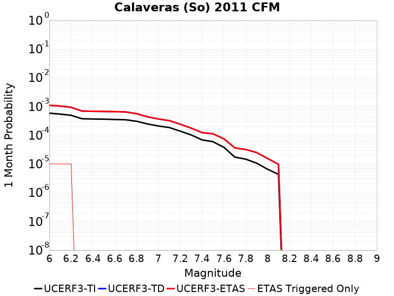 | 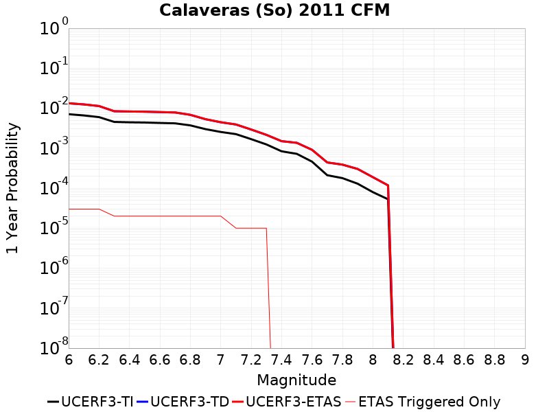 |  |

| Magnitude | 1 wk TI Prob | 1 wk TD Prob | 1 wk ETAS Prob | 1 wk ETAS/TD Gain | 1 wk ETAS Triggered Only | 1 mo TI Prob | 1 mo TD Prob | 1 mo ETAS Prob | 1 mo ETAS/TD Gain | 1 mo ETAS Triggered Only | 1 yr TI Prob | 1 yr TD Prob | 1 yr ETAS Prob | 1 yr ETAS/TD Gain | 1 yr ETAS Triggered Only | 10 yr TI Prob | 10 yr TD Prob | 10 yr ETAS Prob | 10 yr ETAS/TD Gain | 10 yr ETAS Triggered Only |
|-----|-----|-----|-----|-----|-----|-----|-----|-----|-----|-----|-----|-----|-----|-----|-----|-----|-----|-----|-----|-----|
| 6.0 | 1.358289E-4 | 2.5567153E-4 | 2.5567153E-4 | 1.0 | 0.0 | 5.8199395E-4 | 0.0010951364 | 0.0011051254 | 1.0091213 | 1.0E-5 | 0.0070627797 | 0.013228457 | 0.01325806 | 1.0022378 | 3.0E-5 | 0.06842483 | 0.12261173 | 0.12264682 | 1.0002862 | 4.0E-5 |
| 6.1 | 1.2634568E-4 | 2.3947282E-4 | 2.3947282E-4 | 1.0 | 0.0 | 5.4136914E-4 | 0.0010257843 | 0.001035774 | 1.0097387 | 1.0E-5 | 0.0065712677 | 0.012396069 | 0.012425697 | 1.0023901 | 3.0E-5 | 0.06380317 | 0.11535835 | 0.115393735 | 1.0003067 | 4.0E-5 |
| 6.2 | 1.1466059E-4 | 2.1746487E-4 | 2.1746487E-4 | 1.0 | 0.0 | 4.9130997E-4 | 9.315486E-4 | 9.415393E-4 | 1.0107248 | 1.0E-5 | 0.005965305 | 0.011265228 | 0.011294889 | 1.0026331 | 3.0E-5 | 0.05807694 | 0.10552641 | 0.10556219 | 1.000339 | 4.0E-5 |
| 6.3 | 8.691518E-5 | 1.6107428E-4 | 1.6107428E-4 | 1.0 | 0.0 | 3.7244044E-4 | 6.900961E-4 | 6.900961E-4 | 1.0 | 0.0 | 0.004525038 | 0.00836371 | 0.008383543 | 1.0023713 | 2.0E-5 | 0.044339992 | 0.0799598 | 0.0799874 | 1.0003452 | 3.0E-5 |
| 6.4 | 8.50982E-5 | 1.5833434E-4 | 1.5833434E-4 | 1.0 | 0.0 | 3.646556E-4 | 6.7835965E-4 | 6.7835965E-4 | 1.0 | 0.0 | 0.0044306475 | 0.008221903 | 0.008241738 | 1.0024126 | 2.0E-5 | 0.04343345 | 0.07864953 | 0.07867717 | 1.0003514 | 3.0E-5 |
| 6.5 | 8.4062965E-5 | 1.5672685E-4 | 1.5672685E-4 | 1.0 | 0.0 | 3.602201E-4 | 6.714747E-4 | 6.714747E-4 | 1.0 | 0.0 | 0.004376863 | 0.0081388 | 0.008158637 | 1.0024374 | 2.0E-5 | 0.042916555 | 0.077886395 | 0.07791406 | 1.0003551 | 3.0E-5 |
| 6.6 | 8.194716E-5 | 1.5327269E-4 | 1.5327269E-4 | 1.0 | 0.0 | 3.5115483E-4 | 6.566813E-4 | 6.566813E-4 | 1.0 | 0.0 | 0.0042669317 | 0.007960367 | 0.007980208 | 1.0024924 | 2.0E-5 | 0.04185927 | 0.07625697 | 0.07628468 | 1.0003633 | 3.0E-5 |
| 6.7 | 8.012326E-5 | 1.4998984E-4 | 1.4998984E-4 | 1.0 | 0.0 | 3.433402E-4 | 6.42621E-4 | 6.42621E-4 | 1.0 | 0.0 | 0.004172157 | 0.0077908323 | 0.0078106765 | 1.0025471 | 2.0E-5 | 0.040946912 | 0.07471623 | 0.07474399 | 1.0003716 | 3.0E-5 |
| 6.8 | 7.119773E-5 | 1.3081348E-4 | 1.3081348E-4 | 1.0 | 0.0 | 3.0509746E-4 | 5.604945E-4 | 5.604945E-4 | 1.0 | 0.0 | 0.0037082357 | 0.0067999056 | 0.0068197693 | 1.0029212 | 2.0E-5 | 0.036469642 | 0.06565326 | 0.065681286 | 1.0004269 | 3.0E-5 |
| 6.9 | 5.7343088E-5 | 1.0155538E-4 | 1.0155538E-4 | 1.0 | 0.0 | 2.4573295E-4 | 4.351652E-4 | 4.351652E-4 | 1.0 | 0.0 | 0.0029876942 | 0.005285346 | 0.0053052404 | 1.003764 | 2.0E-5 | 0.02947844 | 0.05162775 | 0.0516562 | 1.0005511 | 3.0E-5 |
| 7.0 | 4.8746577E-5 | 8.518558E-5 | 8.518558E-5 | 1.0 | 0.0 | 2.0889717E-4 | 3.6503034E-4 | 3.6503034E-4 | 1.0 | 0.0 | 0.0025403565 | 0.0044352575 | 0.0044551687 | 1.0044893 | 2.0E-5 | 0.025115121 | 0.04359224 | 0.043620933 | 1.0006582 | 3.0E-5 |
| 7.1 | 4.2998014E-5 | 7.487723E-5 | 7.487723E-5 | 1.0 | 0.0 | 1.8426418E-4 | 3.208633E-4 | 3.208633E-4 | 1.0 | 0.0 | 0.002241108 | 0.0038995761 | 0.003909537 | 1.0025544 | 1.0E-5 | 0.022186412 | 0.038482204 | 0.03849182 | 1.0002499 | 1.0E-5 |
| 7.2 | 3.221292E-5 | 5.6022283E-5 | 5.6022283E-5 | 1.0 | 0.0 | 1.3804805E-4 | 2.4007358E-4 | 2.4007358E-4 | 1.0 | 0.0 | 0.0016794393 | 0.0029190083 | 0.002928979 | 1.0034158 | 1.0E-5 | 0.016668037 | 0.02904768 | 0.02905739 | 1.0003343 | 1.0E-5 |
| 7.3 | 2.3756531E-5 | 4.117224E-5 | 4.117224E-5 | 1.0 | 0.0 | 1.0180973E-4 | 1.7644062E-4 | 1.7644062E-4 | 1.0 | 0.0 | 0.0012388286 | 0.0021460664 | 0.0021560448 | 1.0046496 | 1.0E-5 | 0.012319452 | 0.0214628 | 0.021472584 | 1.000456 | 1.0E-5 |
| 7.4 | 1.5997684E-5 | 2.866579E-5 | 2.866579E-5 | 1.0 | 0.0 | 6.8559704E-5 | 1.2284762E-4 | 1.2284762E-4 | 1.0 | 0.0 | 8.343947E-4 | 0.0014946463 | 0.0014946463 | 1.0 | 0.0 | 0.008312687 | 0.015016495 | 0.015016495 | 1.0 | 0.0 |
| 7.5 | 1.3814293E-5 | 2.6055723E-5 | 2.6055723E-5 | 1.0 | 0.0 | 5.9202768E-5 | 1.1166262E-4 | 1.1166262E-4 | 1.0 | 0.0 | 7.205553E-4 | 0.0013586471 | 0.0013586471 | 1.0 | 0.0 | 0.007182234 | 0.013670589 | 0.013670589 | 1.0 | 0.0 |
| 7.6 | 8.817309E-6 | 1.7438924E-5 | 1.7438924E-5 | 1.0 | 0.0 | 3.7787922E-5 | 7.473612E-5 | 7.473612E-5 | 1.0 | 0.0 | 4.5997082E-4 | 9.095338E-4 | 9.095338E-4 | 1.0 | 0.0 | 0.004590199 | 0.009207928 | 0.009207928 | 1.0 | 0.0 |
| 7.7 | 4.0352206E-6 | 8.4188505E-6 | 8.4188505E-6 | 1.0 | 0.0 | 1.7293689E-5 | 3.608029E-5 | 3.608029E-5 | 1.0 | 0.0 | 2.1053031E-4 | 4.3918908E-4 | 4.3918908E-4 | 1.0 | 0.0 | 0.0021033096 | 0.004509564 | 0.004509564 | 1.0 | 0.0 |
| 7.8 | 3.413169E-6 | 7.4210466E-6 | 7.4210466E-6 | 1.0 | 0.0 | 1.4627784E-5 | 3.18041E-5 | 3.18041E-5 | 1.0 | 0.0 | 1.7807873E-4 | 3.8714617E-4 | 3.8714617E-4 | 1.0 | 0.0 | 0.0017793609 | 0.00397236 | 0.00397236 | 1.0 | 0.0 |
| 7.9 | 2.4740732E-6 | 5.7824486E-6 | 5.7824486E-6 | 1.0 | 0.0 | 1.06031275E-5 | 2.4781686E-5 | 2.4781686E-5 | 1.0 | 0.0 | 1.2908543E-4 | 3.0167535E-4 | 3.0167535E-4 | 1.0 | 0.0 | 0.0012901047 | 0.0030771163 | 0.0030771163 | 1.0 | 0.0 |
| 8.0 | 1.5231818E-6 | 3.6065576E-6 | 3.6065576E-6 | 1.0 | 0.0 | 6.527906E-6 | 1.5456584E-5 | 1.5456584E-5 | 1.0 | 0.0 | 7.9474354E-5 | 1.8816772E-4 | 1.8816772E-4 | 1.0 | 0.0 | 7.944594E-4 | 0.0019105156 | 0.0019105156 | 1.0 | 0.0 |
| 8.1 | 1.0104524E-6 | 2.247366E-6 | 2.247366E-6 | 1.0 | 0.0 | 4.330503E-6 | 9.6315325E-6 | 9.6315325E-6 | 1.0 | 0.0 | 5.2722597E-5 | 1.1725764E-4 | 1.1725764E-4 | 1.0 | 0.0 | 5.271009E-4 | 0.0011917526 | 0.0011917526 | 1.0 | 0.0 |

## Calaveras (Central) 2011 CFM
*[(top)](#table-of-contents)*

| 1 Week | 1 Month | 1 Year | 10 Year |
|-----|-----|-----|-----|
|  |  |  | 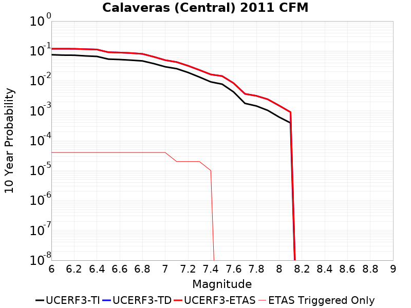 |

| Magnitude | 1 wk TI Prob | 1 wk TD Prob | 1 wk ETAS Prob | 1 wk ETAS/TD Gain | 1 wk ETAS Triggered Only | 1 mo TI Prob | 1 mo TD Prob | 1 mo ETAS Prob | 1 mo ETAS/TD Gain | 1 mo ETAS Triggered Only | 1 yr TI Prob | 1 yr TD Prob | 1 yr ETAS Prob | 1 yr ETAS/TD Gain | 1 yr ETAS Triggered Only | 10 yr TI Prob | 10 yr TD Prob | 10 yr ETAS Prob | 10 yr ETAS/TD Gain | 10 yr ETAS Triggered Only |
|-----|-----|-----|-----|-----|-----|-----|-----|-----|-----|-----|-----|-----|-----|-----|-----|-----|-----|-----|-----|-----|
| 6.0 | 1.4873758E-4 | 2.4281873E-4 | 2.4281873E-4 | 1.0 | 0.0 | 6.3729106E-4 | 0.0010402272 | 0.0010402272 | 1.0 | 0.0 | 0.0077314493 | 0.012585713 | 0.01260546 | 1.0015692 | 2.0E-5 | 0.074679315 | 0.11823196 | 0.11826723 | 1.0002983 | 4.0E-5 |
| 6.1 | 1.4409686E-4 | 2.4275933E-4 | 2.4275933E-4 | 1.0 | 0.0 | 6.174118E-4 | 0.0010399729 | 0.0010399729 | 1.0 | 0.0 | 0.0074911113 | 0.01258265 | 0.012602399 | 1.0015695 | 2.0E-5 | 0.07243565 | 0.1182042 | 0.11823947 | 1.0002984 | 4.0E-5 |
| 6.2 | 1.4297929E-4 | 2.42079E-4 | 2.42079E-4 | 1.0 | 0.0 | 6.1262446E-4 | 0.0010370596 | 0.0010370596 | 1.0 | 0.0 | 0.007433224 | 0.01254762 | 0.012567368 | 1.0015739 | 2.0E-5 | 0.07189451 | 0.11787474 | 0.11791003 | 1.0002993 | 4.0E-5 |
| 6.3 | 1.3536085E-4 | 2.349182E-4 | 2.349182E-4 | 1.0 | 0.0 | 5.79989E-4 | 0.0010064001 | 0.0010064001 | 1.0 | 0.0 | 0.0070385267 | 0.012179148 | 0.0121989045 | 1.0016222 | 2.0E-5 | 0.068197265 | 0.114528514 | 0.11456393 | 1.0003092 | 4.0E-5 |
| 6.4 | 1.2993296E-4 | 2.2889936E-4 | 2.2889936E-4 | 1.0 | 0.0 | 5.5673666E-4 | 9.806248E-4 | 9.806248E-4 | 1.0 | 0.0 | 0.006757223 | 0.011868851 | 0.011888614 | 1.0016651 | 2.0E-5 | 0.06555412 | 0.111688696 | 0.11172423 | 1.0003182 | 4.0E-5 |
| 6.5 | 1.0498927E-4 | 1.8308911E-4 | 1.8308911E-4 | 1.0 | 0.0 | 4.498764E-4 | 7.8443123E-4 | 7.8443123E-4 | 1.0 | 0.0 | 0.005463498 | 0.009508613 | 0.009528423 | 1.0020833 | 2.0E-5 | 0.053311124 | 0.090654135 | 0.090690516 | 1.0004013 | 4.0E-5 |
| 6.6 | 1.0157505E-4 | 1.7819702E-4 | 1.7819702E-4 | 1.0 | 0.0 | 4.35249E-4 | 7.634775E-4 | 7.634775E-4 | 1.0 | 0.0 | 0.0052862884 | 0.0092557175 | 0.009275532 | 1.0021409 | 2.0E-5 | 0.05162293 | 0.088340946 | 0.08837741 | 1.0004128 | 4.0E-5 |
| 6.7 | 9.660386E-5 | 1.7075946E-4 | 1.7075946E-4 | 1.0 | 0.0 | 4.1395082E-4 | 7.316207E-4 | 7.316207E-4 | 1.0 | 0.0 | 0.0050282106 | 0.008871115 | 0.008890937 | 1.0022345 | 2.0E-5 | 0.049159497 | 0.08482516 | 0.08486176 | 1.0004315 | 4.0E-5 |
| 6.8 | 9.089927E-5 | 1.597736E-4 | 1.597736E-4 | 1.0 | 0.0 | 3.8951015E-4 | 6.8456377E-4 | 6.8456377E-4 | 1.0 | 0.0 | 0.0047319788 | 0.00830273 | 0.008322563 | 1.0023888 | 2.0E-5 | 0.046324775 | 0.07967296 | 0.079709776 | 1.000462 | 4.0E-5 |
| 6.9 | 7.353187E-5 | 1.2580196E-4 | 1.2580196E-4 | 1.0 | 0.0 | 3.150985E-4 | 5.390404E-4 | 5.390404E-4 | 1.0 | 0.0 | 0.0038295772 | 0.006543196 | 0.0065630646 | 1.0030366 | 2.0E-5 | 0.037642512 | 0.06350893 | 0.06354638 | 1.0005898 | 4.0E-5 |
| 7.0 | 5.746064E-5 | 9.6381795E-5 | 9.6381795E-5 | 1.0 | 0.0 | 2.4623662E-4 | 4.1299983E-4 | 4.1299983E-4 | 1.0 | 0.0 | 0.0029938098 | 0.0050167544 | 0.005036654 | 1.0039667 | 2.0E-5 | 0.02953797 | 0.04916355 | 0.04920158 | 1.0007737 | 4.0E-5 |
| 7.1 | 4.9557195E-5 | 8.2822124E-5 | 8.2822124E-5 | 1.0 | 0.0 | 2.123707E-4 | 3.54904E-4 | 3.54904E-4 | 1.0 | 0.0 | 0.0025825473 | 0.0043124612 | 0.004322418 | 1.0023088 | 1.0E-5 | 0.0255274 | 0.04246394 | 0.042483088 | 1.000451 | 2.0E-5 |
| 7.2 | 3.687595E-5 | 6.169754E-5 | 6.169754E-5 | 1.0 | 0.0 | 1.5803022E-4 | 2.643914E-4 | 2.643914E-4 | 1.0 | 0.0 | 0.0019223199 | 0.0032142452 | 0.003224213 | 1.0031011 | 1.0E-5 | 0.01905776 | 0.031922556 | 0.031941917 | 1.0006065 | 2.0E-5 |
| 7.3 | 2.5846984E-5 | 4.418778E-5 | 4.418778E-5 | 1.0 | 0.0 | 1.1076809E-4 | 1.8936256E-4 | 1.8936256E-4 | 1.0 | 0.0 | 0.0013477671 | 0.0023030702 | 0.0023130472 | 1.0043321 | 1.0E-5 | 0.013396223 | 0.023003513 | 0.023023054 | 1.0008495 | 2.0E-5 |
| 7.4 | 1.7747854E-5 | 3.1268417E-5 | 3.1268417E-5 | 1.0 | 0.0 | 7.6060016E-5 | 1.3400064E-4 | 1.3400064E-4 | 1.0 | 0.0 | 9.2563726E-4 | 0.0016302399 | 0.0016302399 | 1.0 | 0.0 | 0.009217911 | 0.01635445 | 0.016364286 | 1.0006014 | 1.0E-5 |
| 7.5 | 1.4883479E-5 | 2.749876E-5 | 2.749876E-5 | 1.0 | 0.0 | 6.378478E-5 | 1.17846525E-4 | 1.17846525E-4 | 1.0 | 0.0 | 7.76303E-4 | 0.0014338401 | 0.0014338401 | 1.0 | 0.0 | 0.0077359667 | 0.014410961 | 0.014410961 | 1.0 | 0.0 |
| 7.6 | 8.166975E-6 | 1.5843907E-5 | 1.5843907E-5 | 1.0 | 0.0 | 3.5000852E-5 | 6.7900706E-5 | 6.7900706E-5 | 1.0 | 0.0 | 4.2605202E-4 | 8.2637894E-4 | 8.2637894E-4 | 1.0 | 0.0 | 0.004252361 | 0.00836691 | 0.00836691 | 1.0 | 0.0 |
| 7.7 | 3.3858064E-6 | 6.8375493E-6 | 6.8375493E-6 | 1.0 | 0.0 | 1.4510518E-5 | 2.9303454E-5 | 2.9303454E-5 | 1.0 | 0.0 | 1.7665124E-4 | 3.567112E-4 | 3.567112E-4 | 1.0 | 0.0 | 0.0017651088 | 0.003671539 | 0.003671539 | 1.0 | 0.0 |
| 7.8 | 2.7721615E-6 | 5.8753376E-6 | 5.8753376E-6 | 1.0 | 0.0 | 1.1880637E-5 | 2.5179776E-5 | 2.5179776E-5 | 1.0 | 0.0 | 1.4463716E-4 | 3.065207E-4 | 3.065207E-4 | 1.0 | 0.0 | 0.0014454306 | 0.0031536552 | 0.0031536552 | 1.0 | 0.0 |
| 7.9 | 1.9736292E-6 | 4.527871E-6 | 4.527871E-6 | 1.0 | 0.0 | 8.4583835E-6 | 1.9405019E-5 | 1.9405019E-5 | 1.0 | 0.0 | 1.0297595E-4 | 2.3623054E-4 | 2.3623054E-4 | 1.0 | 0.0 | 0.0010292825 | 0.002416136 | 0.002416136 | 1.0 | 0.0 |
| 8.0 | 1.1767289E-6 | 2.8029876E-6 | 2.8029876E-6 | 1.0 | 0.0 | 5.0431145E-6 | 1.2012749E-5 | 1.2012749E-5 | 1.0 | 0.0 | 6.139818E-5 | 1.4624544E-4 | 1.4624544E-4 | 1.0 | 0.0 | 6.1381224E-4 | 0.0014863462 | 0.0014863462 | 1.0 | 0.0 |
| 8.1 | 7.5112825E-7 | 1.6923427E-6 | 1.6923427E-6 | 1.0 | 0.0 | 3.2191172E-6 | 7.2528774E-6 | 7.2528774E-6 | 1.0 | 0.0 | 3.9192048E-5 | 8.830023E-5 | 8.830023E-5 | 1.0 | 0.0 | 3.9185135E-4 | 8.974075E-4 | 8.974075E-4 | 1.0 | 0.0 |

## Surprise Valley 2011 CFM
*[(top)](#table-of-contents)*

| 1 Week | 1 Month | 1 Year | 10 Year |
|-----|-----|-----|-----|
| 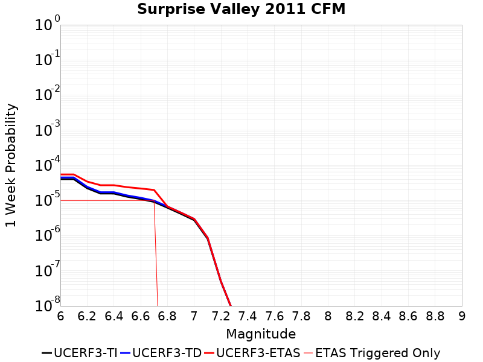 | 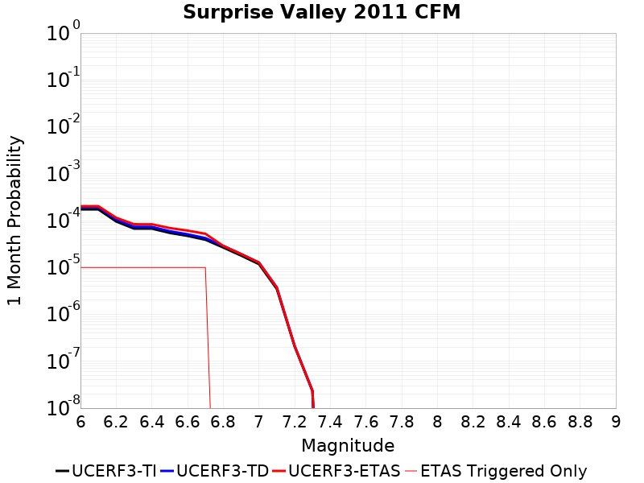 | 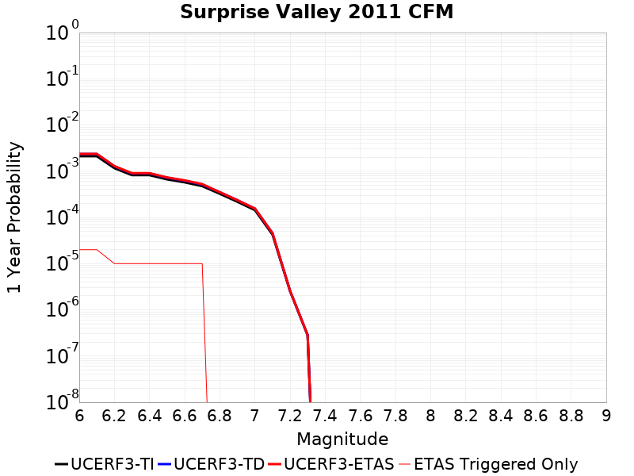 | 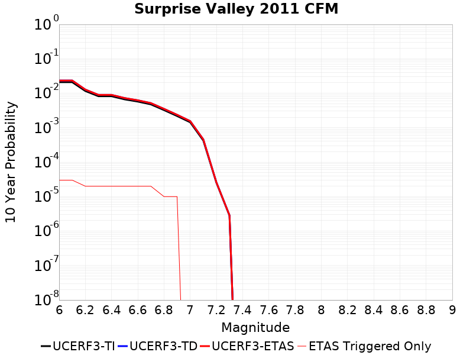 |

| Magnitude | 1 wk TI Prob | 1 wk TD Prob | 1 wk ETAS Prob | 1 wk ETAS/TD Gain | 1 wk ETAS Triggered Only | 1 mo TI Prob | 1 mo TD Prob | 1 mo ETAS Prob | 1 mo ETAS/TD Gain | 1 mo ETAS Triggered Only | 1 yr TI Prob | 1 yr TD Prob | 1 yr ETAS Prob | 1 yr ETAS/TD Gain | 1 yr ETAS Triggered Only | 10 yr TI Prob | 10 yr TD Prob | 10 yr ETAS Prob | 10 yr ETAS/TD Gain | 10 yr ETAS Triggered Only |
|-----|-----|-----|-----|-----|-----|-----|-----|-----|-----|-----|-----|-----|-----|-----|-----|-----|-----|-----|-----|-----|
| 6.0 | 4.0396248E-5 | 4.503789E-5 | 5.503744E-5 | 1.2220253 | 1.0E-5 | 1.7311527E-4 | 1.9300645E-4 | 2.0300451E-4 | 1.0518018 | 1.0E-5 | 0.002105641 | 0.002347533 | 0.002367486 | 1.0084996 | 2.0E-5 | 0.020858008 | 0.023249295 | 0.023278598 | 1.0012604 | 3.0E-5 |
| 6.1 | 4.0396248E-5 | 4.503789E-5 | 5.503744E-5 | 1.2220253 | 1.0E-5 | 1.7311527E-4 | 1.9300645E-4 | 2.0300451E-4 | 1.0518018 | 1.0E-5 | 0.002105641 | 0.002347533 | 0.002367486 | 1.0084996 | 2.0E-5 | 0.020858008 | 0.023249295 | 0.023278598 | 1.0012604 | 3.0E-5 |
| 6.2 | 2.2295266E-5 | 2.4487412E-5 | 3.4487166E-5 | 1.4083631 | 1.0E-5 | 9.554764E-5 | 1.04942E-4 | 1.1494095E-4 | 1.0952808 | 1.0E-5 | 0.0011626717 | 0.001276951 | 0.0012869383 | 1.0078212 | 1.0E-5 | 0.011566074 | 0.012699398 | 0.012719144 | 1.0015548 | 2.0E-5 |
| 6.3 | 1.572643E-5 | 1.7152064E-5 | 2.7151893E-5 | 1.5830102 | 1.0E-5 | 6.7397246E-5 | 7.350684E-5 | 8.35061E-5 | 1.1360317 | 1.0E-5 | 8.202525E-4 | 8.945889E-4 | 9.0457994E-4 | 1.0111684 | 1.0E-5 | 0.008172315 | 0.008910992 | 0.0089308135 | 1.0022244 | 2.0E-5 |
| 6.4 | 1.5714395E-5 | 1.7139888E-5 | 2.7139717E-5 | 1.5834244 | 1.0E-5 | 6.734567E-5 | 7.345465E-5 | 8.345392E-5 | 1.1361284 | 1.0E-5 | 8.1962504E-4 | 8.93954E-4 | 9.0394507E-4 | 1.0111762 | 1.0E-5 | 0.008166086 | 0.008904695 | 0.008924516 | 1.002226 | 2.0E-5 |
| 6.5 | 1.2733495E-5 | 1.3844308E-5 | 2.384417E-5 | 1.7223085 | 1.0E-5 | 5.457098E-5 | 5.9331436E-5 | 6.933085E-5 | 1.1685348 | 1.0E-5 | 6.641992E-4 | 7.2212756E-4 | 7.321203E-4 | 1.0138379 | 1.0E-5 | 0.0066221743 | 0.007198509 | 0.007218365 | 1.0027584 | 2.0E-5 |
| 6.6 | 1.0983784E-5 | 1.192246E-5 | 2.192234E-5 | 1.8387431 | 1.0E-5 | 4.7072506E-5 | 5.1095285E-5 | 6.1094775E-5 | 1.1957028 | 1.0E-5 | 5.7295704E-4 | 6.219129E-4 | 6.319067E-4 | 1.0160694 | 1.0E-5 | 0.0057148207 | 0.0062022777 | 0.0062221535 | 1.0032046 | 2.0E-5 |
| 6.7 | 9.104806E-6 | 9.868533E-6 | 1.9868434E-5 | 2.0133119 | 1.0E-5 | 3.902001E-5 | 4.229305E-5 | 5.2292628E-5 | 1.2364354 | 1.0E-5 | 4.7496508E-4 | 5.1480014E-4 | 5.24795E-4 | 1.019415 | 1.0E-5 | 0.004739512 | 0.005136476 | 0.005156373 | 1.0038737 | 2.0E-5 |
| 6.8 | 6.2162403E-6 | 6.723149E-6 | 6.723149E-6 | 1.0 | 0.0 | 2.6640759E-5 | 2.881319E-5 | 2.881319E-5 | 1.0 | 0.0 | 3.2430296E-4 | 3.5074638E-4 | 3.5074638E-4 | 1.0 | 0.0 | 0.003238301 | 0.0035021526 | 0.0035121175 | 1.0028454 | 1.0E-5 |
| 6.9 | 4.1792696E-6 | 4.515656E-6 | 4.515656E-6 | 1.0 | 0.0 | 1.7911032E-5 | 1.9352678E-5 | 1.9352678E-5 | 1.0 | 0.0 | 2.1804498E-4 | 2.3559493E-4 | 2.3559493E-4 | 1.0 | 0.0 | 0.0021783116 | 0.0023536058 | 0.0023635824 | 1.0042388 | 1.0E-5 |
| 7.0 | 2.7478413E-6 | 2.9703983E-6 | 2.9703983E-6 | 1.0 | 0.0 | 1.177641E-5 | 1.2730224E-5 | 1.2730224E-5 | 1.0 | 0.0 | 1.4336836E-4 | 1.549807E-4 | 1.549807E-4 | 1.0 | 0.0 | 0.001432759 | 0.0015488494 | 0.0015488494 | 1.0 | 0.0 |
| 7.1 | 8.128648E-7 | 8.7455936E-7 | 8.7455936E-7 | 1.0 | 0.0 | 3.4837017E-6 | 3.7481095E-6 | 3.7481095E-6 | 1.0 | 0.0 | 4.2413245E-5 | 4.563288E-5 | 4.563288E-5 | 1.0 | 0.0 | 4.2405148E-4 | 4.5629434E-4 | 4.5629434E-4 | 1.0 | 0.0 |
| 7.2 | 4.8641045E-8 | 4.9320466E-8 | 4.9320466E-8 | 1.0 | 0.0 | 2.084616E-7 | 2.113734E-7 | 2.113734E-7 | 1.0 | 0.0 | 2.538017E-6 | 2.5734682E-6 | 2.5734682E-6 | 1.0 | 0.0 | 2.537988E-5 | 2.5734396E-5 | 2.5734396E-5 | 1.0 | 0.0 |
| 7.3 | 5.3911844E-9 | 5.463444E-9 | 5.463444E-9 | 1.0 | 0.0 | 2.3105075E-8 | 2.3414758E-8 | 2.3414758E-8 | 1.0 | 0.0 | 2.8130427E-7 | 2.8507466E-7 | 2.8507466E-7 | 1.0 | 0.0 | 2.8130391E-6 | 2.8507445E-6 | 2.8507445E-6 | 1.0 | 0.0 |

## San Gregorio (North) 2011 CFM
*[(top)](#table-of-contents)*

| 1 Week | 1 Month | 1 Year | 10 Year |
|-----|-----|-----|-----|
| 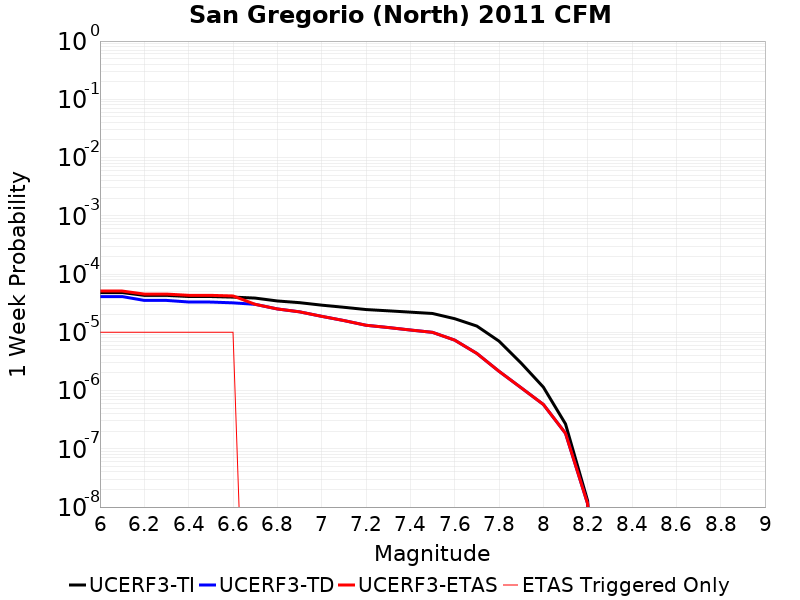 | 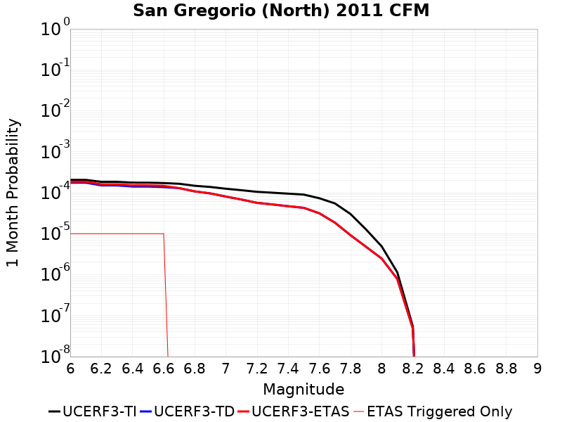 |  |  |

| Magnitude | 1 wk TI Prob | 1 wk TD Prob | 1 wk ETAS Prob | 1 wk ETAS/TD Gain | 1 wk ETAS Triggered Only | 1 mo TI Prob | 1 mo TD Prob | 1 mo ETAS Prob | 1 mo ETAS/TD Gain | 1 mo ETAS Triggered Only | 1 yr TI Prob | 1 yr TD Prob | 1 yr ETAS Prob | 1 yr ETAS/TD Gain | 1 yr ETAS Triggered Only | 10 yr TI Prob | 10 yr TD Prob | 10 yr ETAS Prob | 10 yr ETAS/TD Gain | 10 yr ETAS Triggered Only |
|-----|-----|-----|-----|-----|-----|-----|-----|-----|-----|-----|-----|-----|-----|-----|-----|-----|-----|-----|-----|-----|
| 6.0 | 4.8002043E-5 | 4.098687E-5 | 5.098646E-5 | 1.2439706 | 1.0E-5 | 2.0570682E-4 | 1.7564622E-4 | 1.8564447E-4 | 1.0569227 | 1.0E-5 | 0.002501604 | 0.0021364104 | 0.0021663464 | 1.0140122 | 3.0E-5 | 0.024736298 | 0.021247553 | 0.021286704 | 1.0018426 | 4.0E-5 |
| 6.1 | 4.8002043E-5 | 4.098687E-5 | 5.098646E-5 | 1.2439706 | 1.0E-5 | 2.0570682E-4 | 1.7564622E-4 | 1.8564447E-4 | 1.0569227 | 1.0E-5 | 0.002501604 | 0.0021364104 | 0.0021663464 | 1.0140122 | 3.0E-5 | 0.024736298 | 0.021247553 | 0.021286704 | 1.0018426 | 4.0E-5 |
| 6.2 | 4.2998647E-5 | 3.5193836E-5 | 4.5193487E-5 | 1.2841307 | 1.0E-5 | 1.842669E-4 | 1.5082207E-4 | 1.6082056E-4 | 1.0662932 | 1.0E-5 | 0.0022411412 | 0.0018347247 | 0.0018546879 | 1.0108808 | 2.0E-5 | 0.022186736 | 0.018283352 | 0.018312804 | 1.0016109 | 3.0E-5 |
| 6.3 | 4.2998647E-5 | 3.5193836E-5 | 4.5193487E-5 | 1.2841307 | 1.0E-5 | 1.842669E-4 | 1.5082207E-4 | 1.6082056E-4 | 1.0662932 | 1.0E-5 | 0.0022411412 | 0.0018347247 | 0.0018546879 | 1.0108808 | 2.0E-5 | 0.022186736 | 0.018283352 | 0.018312804 | 1.0016109 | 3.0E-5 |
| 6.4 | 4.1101295E-5 | 3.3058266E-5 | 4.3057935E-5 | 1.3024862 | 1.0E-5 | 1.7613651E-4 | 1.4167067E-4 | 1.5166924E-4 | 1.0705762 | 1.0E-5 | 0.0021423528 | 0.0017234891 | 0.0017434547 | 1.0115844 | 2.0E-5 | 0.02121817 | 0.017188016 | 0.017217502 | 1.0017154 | 3.0E-5 |
| 6.5 | 4.1032585E-5 | 3.2976288E-5 | 4.297596E-5 | 1.3032382 | 1.0E-5 | 1.7584208E-4 | 1.4131937E-4 | 1.5131796E-4 | 1.0707517 | 1.0E-5 | 0.0021387753 | 0.0017192191 | 0.0017391847 | 1.0116131 | 2.0E-5 | 0.021183075 | 0.017145982 | 0.017175468 | 1.0017197 | 3.0E-5 |
| 6.6 | 4.011629E-5 | 3.1986376E-5 | 4.1986055E-5 | 1.3126231 | 1.0E-5 | 1.7191563E-4 | 1.3707734E-4 | 1.4707597E-4 | 1.0729415 | 1.0E-5 | 0.0020910634 | 0.0016676531 | 0.0016876197 | 1.0119729 | 2.0E-5 | 0.020714961 | 0.016636431 | 0.016665934 | 1.0017732 | 3.0E-5 |
| 6.7 | 3.8583938E-5 | 3.015607E-5 | 3.015607E-5 | 1.0 | 0.0 | 1.6534925E-4 | 1.2923399E-4 | 1.2923399E-4 | 1.0 | 0.0 | 0.0020112682 | 0.0015723025 | 0.0015822868 | 1.00635 | 1.0E-5 | 0.019931622 | 0.015697483 | 0.01571717 | 1.0012541 | 2.0E-5 |
| 6.8 | 3.44341E-5 | 2.5114667E-5 | 2.5114667E-5 | 1.0 | 0.0 | 1.4756636E-4 | 1.0762991E-4 | 1.0762991E-4 | 1.0 | 0.0 | 0.0017951399 | 0.001309617 | 0.0013196039 | 1.0076258 | 1.0E-5 | 0.017807078 | 0.01310324 | 0.013122978 | 1.0015063 | 2.0E-5 |
| 6.9 | 3.221199E-5 | 2.24199E-5 | 2.24199E-5 | 1.0 | 0.0 | 1.3804408E-4 | 9.608179E-5 | 9.608179E-5 | 1.0 | 0.0 | 0.0016793909 | 0.0011691764 | 0.0011791647 | 1.008543 | 1.0E-5 | 0.01666756 | 0.011713623 | 0.0117333885 | 1.0016874 | 2.0E-5 |
| 7.0 | 2.9186718E-5 | 1.8763014E-5 | 1.8763014E-5 | 1.0 | 0.0 | 1.2507994E-4 | 8.0410464E-5 | 8.0410464E-5 | 1.0 | 0.0 | 0.0015217843 | 9.785622E-4 | 9.885525E-4 | 1.0102091 | 1.0E-5 | 0.015114053 | 0.009825024 | 0.0098448275 | 1.0020156 | 2.0E-5 |
| 7.1 | 2.6840138E-5 | 1.5881773E-5 | 1.5881773E-5 | 1.0 | 0.0 | 1.1502409E-4 | 6.8062975E-5 | 6.8062975E-5 | 1.0 | 0.0 | 0.0013995186 | 8.283537E-4 | 8.3834544E-4 | 1.0120622 | 1.0E-5 | 0.013907375 | 0.008334581 | 0.008354414 | 1.0023797 | 2.0E-5 |
| 7.2 | 2.453002E-5 | 1.318612E-5 | 1.318612E-5 | 1.0 | 0.0 | 1.05124425E-4 | 5.651072E-5 | 5.651072E-5 | 1.0 | 0.0 | 0.0012791384 | 6.8780145E-4 | 6.9779454E-4 | 1.0145291 | 1.0E-5 | 0.012718005 | 0.0069373357 | 0.0069571966 | 1.0028629 | 2.0E-5 |
| 7.3 | 2.3330727E-5 | 1.2057002E-5 | 1.2057002E-5 | 1.0 | 0.0 | 9.9985E-5 | 5.1671846E-5 | 5.1671846E-5 | 1.0 | 0.0 | 0.0012166376 | 6.2892365E-4 | 6.389173E-4 | 1.0158902 | 1.0E-5 | 0.012099981 | 0.006350463 | 0.006370336 | 1.0031294 | 2.0E-5 |
| 7.4 | 2.2136466E-5 | 1.0924584E-5 | 1.0924584E-5 | 1.0 | 0.0 | 9.486712E-5 | 4.6818805E-5 | 4.6818805E-5 | 1.0 | 0.0 | 0.0011543952 | 5.698702E-4 | 5.698702E-4 | 1.0 | 0.0 | 0.011484168 | 0.0057617035 | 0.005771646 | 1.0017256 | 1.0E-5 |
| 7.5 | 2.0994974E-5 | 9.964309E-6 | 9.964309E-6 | 1.0 | 0.0 | 8.997535E-5 | 4.2703483E-5 | 4.2703483E-5 | 1.0 | 0.0 | 0.0010948994 | 5.1979115E-4 | 5.1979115E-4 | 1.0 | 0.0 | 0.010895205 | 0.0052612848 | 0.005271232 | 1.0018907 | 1.0E-5 |
| 7.6 | 1.7091823E-5 | 7.330336E-6 | 7.330336E-6 | 1.0 | 0.0 | 7.3248615E-5 | 3.1415348E-5 | 3.1415348E-5 | 1.0 | 0.0 | 8.9143694E-4 | 3.8241484E-4 | 3.8241484E-4 | 1.0 | 0.0 | 0.008878695 | 0.003884028 | 0.003893989 | 1.0025647 | 1.0E-5 |
| 7.7 | 1.2772179E-5 | 4.3298146E-6 | 4.3298146E-6 | 1.0 | 0.0 | 5.473676E-5 | 1.8556217E-5 | 1.8556217E-5 | 1.0 | 0.0 | 6.6621625E-4 | 2.2589853E-4 | 2.2589853E-4 | 1.0 | 0.0 | 0.006642225 | 0.0023055978 | 0.0023155746 | 1.0043273 | 1.0E-5 |
| 7.8 | 7.041923E-6 | 2.137814E-6 | 2.137814E-6 | 1.0 | 0.0 | 3.017932E-5 | 9.162027E-6 | 9.162027E-6 | 1.0 | 0.0 | 3.6737128E-4 | 1.11541965E-4 | 1.11541965E-4 | 1.0 | 0.0 | 0.0036676454 | 0.001145728 | 0.0011557166 | 1.0087181 | 1.0E-5 |
| 7.9 | 2.946768E-6 | 1.1132206E-6 | 1.1132206E-6 | 1.0 | 0.0 | 1.2628945E-5 | 4.7709364E-6 | 4.7709364E-6 | 1.0 | 0.0 | 1.5374656E-4 | 5.8084606E-5 | 5.8084606E-5 | 1.0 | 0.0 | 0.0015364023 | 5.924571E-4 | 5.924571E-4 | 1.0 | 0.0 |
| 8.0 | 1.1433375E-6 | 5.765309E-7 | 5.765309E-7 | 1.0 | 0.0 | 4.9000087E-6 | 2.4708445E-6 | 2.4708445E-6 | 1.0 | 0.0 | 5.965597E-5 | 3.0082116E-5 | 3.0082116E-5 | 1.0 | 0.0 | 5.963996E-4 | 3.0459158E-4 | 3.0459158E-4 | 1.0 | 0.0 |
| 8.1 | 2.6675295E-7 | 1.8398946E-7 | 1.8398946E-7 | 1.0 | 0.0 | 1.1432264E-6 | 7.88526E-7 | 7.88526E-7 | 1.0 | 0.0 | 1.3918692E-5 | 9.600261E-6 | 9.600261E-6 | 1.0 | 0.0 | 1.391782E-4 | 9.745809E-5 | 9.745809E-5 | 1.0 | 0.0 |
| 8.2 | 1.2704569E-8 | 1.1317119E-8 | 1.1317119E-8 | 1.0 | 0.0 | 5.444815E-8 | 4.8501942E-8 | 4.8501942E-8 | 1.0 | 0.0 | 6.629061E-7 | 5.90511E-7 | 5.90511E-7 | 1.0 | 0.0 | 6.629041E-6 | 6.1107116E-6 | 6.1107116E-6 | 1.0 | 0.0 |

## Monte Vista - Shannon 2011 CFM
*[(top)](#table-of-contents)*

| 1 Week | 1 Month | 1 Year | 10 Year |
|-----|-----|-----|-----|
|  | 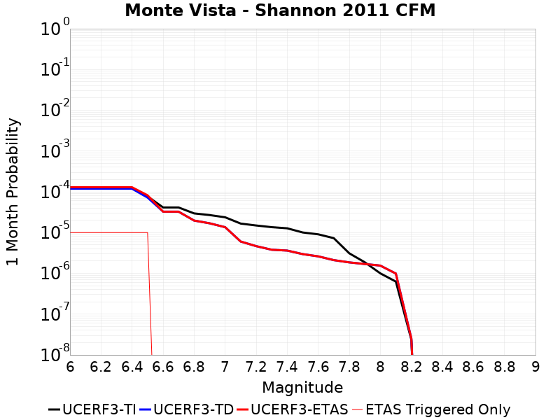 |  | 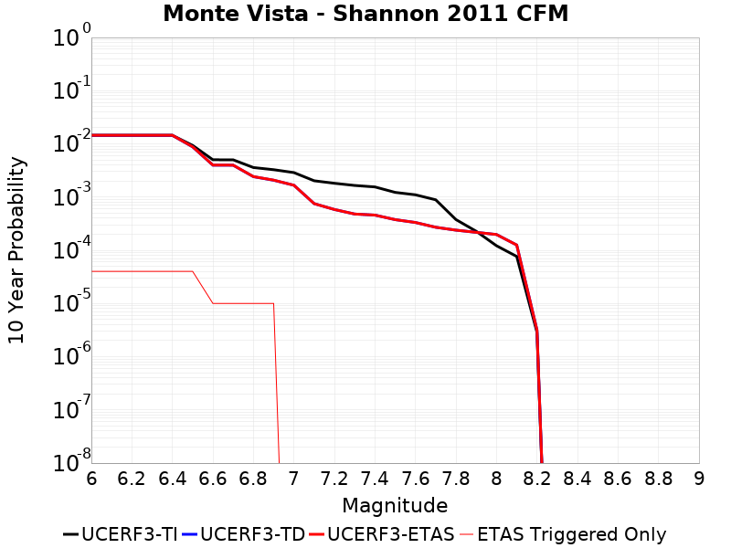 |

| Magnitude | 1 wk TI Prob | 1 wk TD Prob | 1 wk ETAS Prob | 1 wk ETAS/TD Gain | 1 wk ETAS Triggered Only | 1 mo TI Prob | 1 mo TD Prob | 1 mo ETAS Prob | 1 mo ETAS/TD Gain | 1 mo ETAS Triggered Only | 1 yr TI Prob | 1 yr TD Prob | 1 yr ETAS Prob | 1 yr ETAS/TD Gain | 1 yr ETAS Triggered Only | 10 yr TI Prob | 10 yr TD Prob | 10 yr ETAS Prob | 10 yr ETAS/TD Gain | 10 yr ETAS Triggered Only |
|-----|-----|-----|-----|-----|-----|-----|-----|-----|-----|-----|-----|-----|-----|-----|-----|-----|-----|-----|-----|-----|
| 6.0 | 2.7907707E-5 | 2.7809341E-5 | 2.7809341E-5 | 1.0 | 0.0 | 1.19598975E-4 | 1.19178156E-4 | 1.2917696E-4 | 1.083898 | 1.0E-5 | 0.0014551448 | 0.001450153 | 0.0014701239 | 1.0137717 | 2.0E-5 | 0.014456532 | 0.014436853 | 0.014476276 | 1.0027307 | 4.0E-5 |
| 6.1 | 2.7907707E-5 | 2.7809341E-5 | 2.7809341E-5 | 1.0 | 0.0 | 1.19598975E-4 | 1.19178156E-4 | 1.2917696E-4 | 1.083898 | 1.0E-5 | 0.0014551448 | 0.001450153 | 0.0014701239 | 1.0137717 | 2.0E-5 | 0.014456532 | 0.014436853 | 0.014476276 | 1.0027307 | 4.0E-5 |
| 6.2 | 2.7907707E-5 | 2.7809341E-5 | 2.7809341E-5 | 1.0 | 0.0 | 1.19598975E-4 | 1.19178156E-4 | 1.2917696E-4 | 1.083898 | 1.0E-5 | 0.0014551448 | 0.001450153 | 0.0014701239 | 1.0137717 | 2.0E-5 | 0.014456532 | 0.014436853 | 0.014476276 | 1.0027307 | 4.0E-5 |
| 6.3 | 2.7907707E-5 | 2.7809341E-5 | 2.7809341E-5 | 1.0 | 0.0 | 1.19598975E-4 | 1.19178156E-4 | 1.2917696E-4 | 1.083898 | 1.0E-5 | 0.0014551448 | 0.001450153 | 0.0014701239 | 1.0137717 | 2.0E-5 | 0.014456532 | 0.014436853 | 0.014476276 | 1.0027307 | 4.0E-5 |
| 6.4 | 2.7907707E-5 | 2.7809341E-5 | 2.7809341E-5 | 1.0 | 0.0 | 1.19598975E-4 | 1.19178156E-4 | 1.2917696E-4 | 1.083898 | 1.0E-5 | 0.0014551448 | 0.001450153 | 0.0014701239 | 1.0137717 | 2.0E-5 | 0.014456532 | 0.014436853 | 0.014476276 | 1.0027307 | 4.0E-5 |
| 6.5 | 1.7990213E-5 | 1.6822285E-5 | 1.6822285E-5 | 1.0 | 0.0 | 7.709863E-5 | 7.209389E-5 | 8.209317E-5 | 1.138698 | 1.0E-5 | 9.382716E-4 | 8.774565E-4 | 8.9743896E-4 | 1.0227731 | 2.0E-5 | 0.0093431985 | 0.008764115 | 0.008803764 | 1.0045241 | 4.0E-5 |
| 6.6 | 9.650407E-6 | 7.604586E-6 | 7.604586E-6 | 1.0 | 0.0 | 4.135823E-5 | 3.259072E-5 | 3.259072E-5 | 1.0 | 0.0 | 5.0342013E-4 | 3.9672764E-4 | 4.0672367E-4 | 1.0251962 | 1.0E-5 | 0.005022812 | 0.0039786547 | 0.0039886152 | 1.0025034 | 1.0E-5 |
| 6.7 | 9.62828E-6 | 7.582277E-6 | 7.582277E-6 | 1.0 | 0.0 | 4.1263404E-5 | 3.249511E-5 | 3.249511E-5 | 1.0 | 0.0 | 5.022661E-4 | 3.9556404E-4 | 4.055601E-4 | 1.0252703 | 1.0E-5 | 0.0050113243 | 0.0039670602 | 0.0039770207 | 1.0025108 | 1.0E-5 |
| 6.8 | 6.887523E-6 | 4.598897E-6 | 4.598897E-6 | 1.0 | 0.0 | 2.9517621E-5 | 1.9709421E-5 | 1.9709421E-5 | 1.0 | 0.0 | 3.5931775E-4 | 2.3993802E-4 | 2.499356E-4 | 1.0416675 | 1.0E-5 | 0.0035873733 | 0.002414721 | 0.002424697 | 1.0041313 | 1.0E-5 |
| 6.9 | 6.2722347E-6 | 3.9385004E-6 | 3.9385004E-6 | 1.0 | 0.0 | 2.6880729E-5 | 1.687919E-5 | 1.687919E-5 | 1.0 | 0.0 | 3.2722374E-4 | 2.054868E-4 | 2.1548475E-4 | 1.0486549 | 1.0E-5 | 0.003267423 | 0.0020708854 | 0.0020808647 | 1.0048188 | 1.0E-5 |
| 7.0 | 5.5320347E-6 | 3.162168E-6 | 3.162168E-6 | 1.0 | 0.0 | 2.3708504E-5 | 1.3552089E-5 | 1.3552089E-5 | 1.0 | 0.0 | 2.8861282E-4 | 1.6498604E-4 | 1.6498604E-4 | 1.0 | 0.0 | 0.0028823826 | 0.001666538 | 0.001666538 | 1.0 | 0.0 |
| 7.1 | 3.8794055E-6 | 1.4077539E-6 | 1.4077539E-6 | 1.0 | 0.0 | 1.6625918E-5 | 6.0332172E-6 | 6.0332172E-6 | 1.0 | 0.0 | 2.0240174E-4 | 7.3451956E-5 | 7.3451956E-5 | 1.0 | 0.0 | 0.002022175 | 7.52009E-4 | 7.52009E-4 | 1.0 | 0.0 |
| 7.2 | 3.4813652E-6 | 1.0846584E-6 | 1.0846584E-6 | 1.0 | 0.0 | 1.49200505E-5 | 4.6485275E-6 | 4.6485275E-6 | 1.0 | 0.0 | 1.8163648E-4 | 5.6594363E-5 | 5.6594363E-5 | 1.0 | 0.0 | 0.0018148809 | 5.835186E-4 | 5.835186E-4 | 1.0 | 0.0 |
| 7.3 | 3.1682148E-6 | 8.855634E-7 | 8.855634E-7 | 1.0 | 0.0 | 1.3577992E-5 | 3.7952661E-6 | 3.7952661E-6 | 1.0 | 0.0 | 1.6529951E-4 | 4.620639E-5 | 4.620639E-5 | 1.0 | 0.0 | 0.0016517661 | 4.796542E-4 | 4.796542E-4 | 1.0 | 0.0 |
| 7.4 | 2.9707667E-6 | 8.4414086E-7 | 8.4414086E-7 | 1.0 | 0.0 | 1.2731795E-5 | 3.6177414E-6 | 3.6177414E-6 | 1.0 | 0.0 | 1.5499859E-4 | 4.4045115E-5 | 4.4045115E-5 | 1.0 | 0.0 | 0.0015489052 | 4.5779836E-4 | 4.5779836E-4 | 1.0 | 0.0 |
| 7.5 | 2.3462758E-6 | 6.915609E-7 | 6.915609E-7 | 1.0 | 0.0 | 1.0055429E-5 | 2.963829E-6 | 2.963829E-6 | 1.0 | 0.0 | 1.2241797E-4 | 3.6084024E-5 | 3.6084024E-5 | 1.0 | 0.0 | 0.0012235056 | 3.7626328E-4 | 3.7626328E-4 | 1.0 | 0.0 |
| 7.6 | 2.112783E-6 | 6.0873015E-7 | 6.0873015E-7 | 1.0 | 0.0 | 9.054753E-6 | 2.6088408E-6 | 2.6088408E-6 | 1.0 | 0.0 | 1.1023604E-4 | 3.1762174E-5 | 3.1762174E-5 | 1.0 | 0.0 | 0.0011018137 | 3.325646E-4 | 3.325646E-4 | 1.0 | 0.0 |
| 7.7 | 1.7022471E-6 | 4.925704E-7 | 4.925704E-7 | 1.0 | 0.0 | 7.2953244E-6 | 2.1110143E-6 | 2.1110143E-6 | 1.0 | 0.0 | 8.881695E-5 | 2.5701296E-5 | 2.5701296E-5 | 1.0 | 0.0 | 8.878146E-4 | 2.704211E-4 | 2.704211E-4 | 1.0 | 0.0 |
| 7.8 | 7.230914E-7 | 4.330234E-7 | 4.330234E-7 | 1.0 | 0.0 | 3.0989595E-6 | 1.8558131E-6 | 1.8558131E-6 | 1.0 | 0.0 | 3.772918E-5 | 2.2594293E-5 | 2.2594293E-5 | 1.0 | 0.0 | 3.7722773E-4 | 2.38697E-4 | 2.38697E-4 | 1.0 | 0.0 |
| 7.9 | 4.3588446E-7 | 3.956876E-7 | 3.956876E-7 | 1.0 | 0.0 | 1.868075E-6 | 1.6958029E-6 | 1.6958029E-6 | 1.0 | 0.0 | 2.2743576E-5 | 2.0646206E-5 | 2.0646206E-5 | 1.0 | 0.0 | 2.2741247E-4 | 2.171941E-4 | 2.171941E-4 | 1.0 | 0.0 |
| 8.0 | 2.3317523E-7 | 3.614242E-7 | 3.614242E-7 | 1.0 | 0.0 | 9.99322E-7 | 1.54896E-6 | 1.54896E-6 | 1.0 | 0.0 | 1.2166677E-5 | 1.8858425E-5 | 1.8858425E-5 | 1.0 | 0.0 | 1.21660116E-4 | 1.9771233E-4 | 1.9771233E-4 | 1.0 | 0.0 |
| 8.1 | 1.4662456E-7 | 2.3069863E-7 | 2.3069863E-7 | 1.0 | 0.0 | 6.283908E-7 | 9.88708E-7 | 9.88708E-7 | 1.0 | 0.0 | 7.650631E-6 | 1.2037455E-5 | 1.2037455E-5 | 1.0 | 0.0 | 7.650368E-5 | 1.2545503E-4 | 1.2545503E-4 | 1.0 | 0.0 |
| 8.2 | 5.4931775E-9 | 5.8585146E-9 | 5.8585146E-9 | 1.0 | 0.0 | 2.3542189E-8 | 2.5107921E-8 | 2.5107921E-8 | 1.0 | 0.0 | 2.8662612E-7 | 3.056889E-7 | 3.056889E-7 | 1.0 | 0.0 | 2.8662573E-6 | 3.1661355E-6 | 3.1661355E-6 | 1.0 | 0.0 |

## Likely 2011 CFM
*[(top)](#table-of-contents)*

| 1 Week | 1 Month | 1 Year | 10 Year |
|-----|-----|-----|-----|
|  | 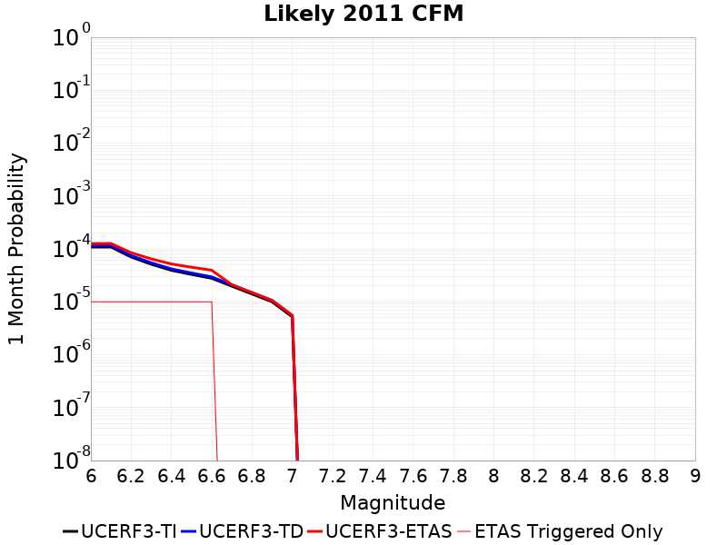 |  | 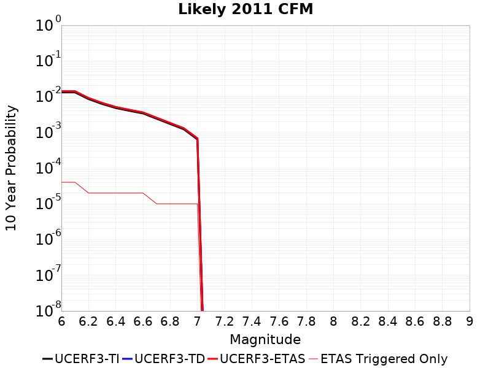 |

| Magnitude | 1 wk TI Prob | 1 wk TD Prob | 1 wk ETAS Prob | 1 wk ETAS/TD Gain | 1 wk ETAS Triggered Only | 1 mo TI Prob | 1 mo TD Prob | 1 mo ETAS Prob | 1 mo ETAS/TD Gain | 1 mo ETAS Triggered Only | 1 yr TI Prob | 1 yr TD Prob | 1 yr ETAS Prob | 1 yr ETAS/TD Gain | 1 yr ETAS Triggered Only | 10 yr TI Prob | 10 yr TD Prob | 10 yr ETAS Prob | 10 yr ETAS/TD Gain | 10 yr ETAS Triggered Only |
|-----|-----|-----|-----|-----|-----|-----|-----|-----|-----|-----|-----|-----|-----|-----|-----|-----|-----|-----|-----|-----|
| 6.0 | 2.5315949E-5 | 2.7072894E-5 | 3.7072623E-5 | 1.3693632 | 1.0E-5 | 1.0849241E-4 | 1.1602178E-4 | 1.2602062E-4 | 1.0861807 | 1.0E-5 | 0.0013200947 | 0.0014116941 | 0.0014316658 | 1.0141474 | 2.0E-5 | 0.013122803 | 0.014031892 | 0.01407133 | 1.0028106 | 4.0E-5 |
| 6.1 | 2.5315949E-5 | 2.7072894E-5 | 3.7072623E-5 | 1.3693632 | 1.0E-5 | 1.0849241E-4 | 1.1602178E-4 | 1.2602062E-4 | 1.0861807 | 1.0E-5 | 0.0013200947 | 0.0014116941 | 0.0014316658 | 1.0141474 | 2.0E-5 | 0.013122803 | 0.014031892 | 0.01407133 | 1.0028106 | 4.0E-5 |
| 6.2 | 1.6375941E-5 | 1.7460017E-5 | 2.7459842E-5 | 1.5727271 | 1.0E-5 | 7.0180715E-5 | 7.482657E-5 | 8.482582E-5 | 1.1336324 | 1.0E-5 | 8.5411523E-4 | 9.1064494E-4 | 9.206358E-4 | 1.0109712 | 1.0E-5 | 0.008508399 | 0.009070416 | 0.0090902345 | 1.002185 | 2.0E-5 |
| 6.3 | 1.1945543E-5 | 1.2713173E-5 | 2.2713046E-5 | 1.7865757 | 1.0E-5 | 5.119418E-5 | 5.448392E-5 | 6.448338E-5 | 1.1835304 | 1.0E-5 | 6.2311086E-4 | 6.6314515E-4 | 6.7313854E-4 | 1.0150696 | 1.0E-5 | 0.0062136655 | 0.0066122175 | 0.0066320854 | 1.0030047 | 2.0E-5 |
| 6.4 | 9.192729E-6 | 9.77105E-6 | 1.9770952E-5 | 2.0234215 | 1.0E-5 | 3.939681E-5 | 4.187527E-5 | 5.1874853E-5 | 1.2387944 | 1.0E-5 | 4.7955062E-4 | 5.097149E-4 | 5.197098E-4 | 1.0196089 | 1.0E-5 | 0.004785171 | 0.0050857393 | 0.0051056375 | 1.0039126 | 2.0E-5 |
| 6.5 | 7.67906E-6 | 8.155727E-6 | 1.8155646E-5 | 2.2261221 | 1.0E-5 | 3.2909844E-5 | 3.495266E-5 | 4.495231E-5 | 1.2860912 | 1.0E-5 | 4.006037E-4 | 4.254674E-4 | 4.3546318E-4 | 1.0234935 | 1.0E-5 | 0.0039988225 | 0.0042467215 | 0.0042666364 | 1.0046896 | 2.0E-5 |
| 6.6 | 6.4884057E-6 | 6.8878426E-6 | 1.6887774E-5 | 2.4518235 | 1.0E-5 | 2.7807157E-5 | 2.9519E-5 | 3.9518705E-5 | 1.3387549 | 1.0E-5 | 3.3849955E-4 | 3.5933597E-4 | 3.6933238E-4 | 1.0278192 | 1.0E-5 | 0.003379844 | 0.0035876944 | 0.0036076226 | 1.0055546 | 2.0E-5 |
| 6.7 | 4.6060636E-6 | 4.886628E-6 | 4.886628E-6 | 1.0 | 0.0 | 1.9740122E-5 | 2.0942529E-5 | 2.0942529E-5 | 1.0 | 0.0 | 2.403095E-4 | 2.549463E-4 | 2.549463E-4 | 1.0 | 0.0 | 0.002400498 | 0.002546621 | 0.0025565957 | 1.0039167 | 1.0E-5 |
| 6.8 | 3.2795615E-6 | 3.4792952E-6 | 3.4792952E-6 | 1.0 | 0.0 | 1.4055187E-5 | 1.4911183E-5 | 1.4911183E-5 | 1.0 | 0.0 | 1.7110848E-4 | 1.8152909E-4 | 1.8152909E-4 | 1.0 | 0.0 | 0.0017097679 | 0.0018138634 | 0.0018238452 | 1.005503 | 1.0E-5 |
| 6.9 | 2.3289967E-6 | 2.4718584E-6 | 2.4718584E-6 | 1.0 | 0.0 | 9.981376E-6 | 1.0593639E-5 | 1.0593639E-5 | 1.0 | 0.0 | 1.2151648E-4 | 1.2897035E-4 | 1.2897035E-4 | 1.0 | 0.0 | 0.0012145005 | 0.0012889979 | 0.0012989851 | 1.007748 | 1.0E-5 |
| 7.0 | 1.211292E-6 | 1.2869222E-6 | 1.2869222E-6 | 1.0 | 0.0 | 5.1912407E-6 | 5.515371E-6 | 5.515371E-6 | 1.0 | 0.0 | 6.320152E-5 | 6.714788E-5 | 6.714788E-5 | 1.0 | 0.0 | 6.3183554E-4 | 6.7130575E-4 | 6.81299E-4 | 1.0148864 | 1.0E-5 |

## Hat Creek-McArthur-Mayfield
*[(top)](#table-of-contents)*

| 1 Week | 1 Month | 1 Year | 10 Year |
|-----|-----|-----|-----|
| 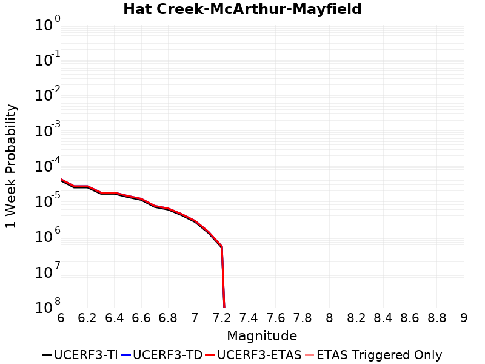 | 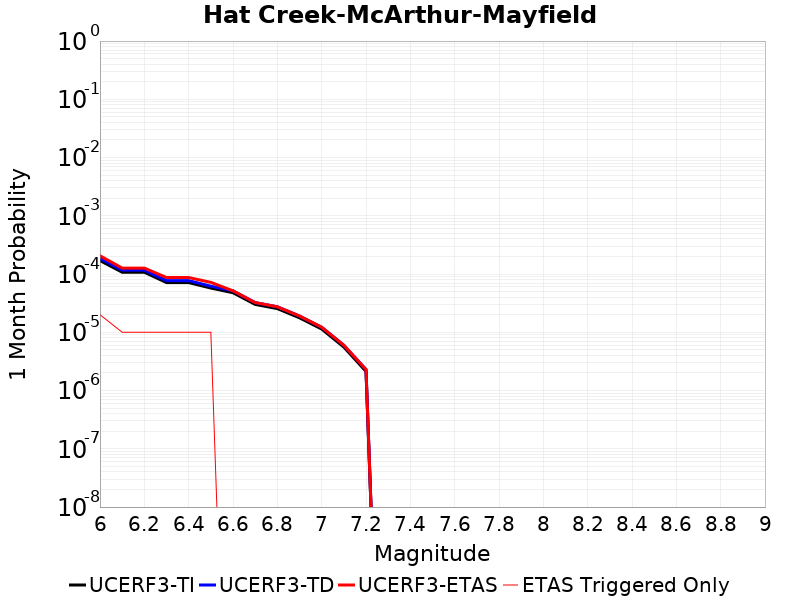 | 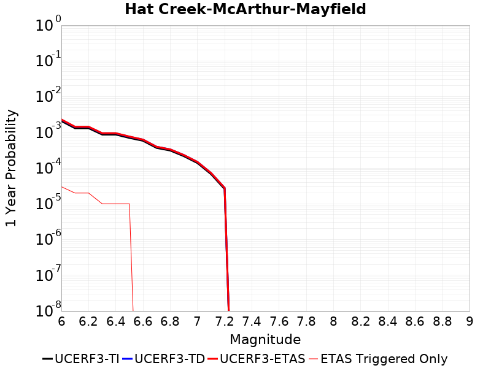 |  |

| Magnitude | 1 wk TI Prob | 1 wk TD Prob | 1 wk ETAS Prob | 1 wk ETAS/TD Gain | 1 wk ETAS Triggered Only | 1 mo TI Prob | 1 mo TD Prob | 1 mo ETAS Prob | 1 mo ETAS/TD Gain | 1 mo ETAS Triggered Only | 1 yr TI Prob | 1 yr TD Prob | 1 yr ETAS Prob | 1 yr ETAS/TD Gain | 1 yr ETAS Triggered Only | 10 yr TI Prob | 10 yr TD Prob | 10 yr ETAS Prob | 10 yr ETAS/TD Gain | 10 yr ETAS Triggered Only |
|-----|-----|-----|-----|-----|-----|-----|-----|-----|-----|-----|-----|-----|-----|-----|-----|-----|-----|-----|-----|-----|
| 6.0 | 3.967457E-5 | 4.3301636E-5 | 4.3301636E-5 | 1.0 | 0.0 | 1.7002279E-4 | 1.8556589E-4 | 2.0556217E-4 | 1.1077584 | 2.0E-5 | 0.002068062 | 0.0022570388 | 0.002286971 | 1.0132618 | 3.0E-5 | 0.02048922 | 0.022353616 | 0.022392722 | 1.0017494 | 4.0E-5 |
| 6.1 | 2.5044013E-5 | 2.7153888E-5 | 2.7153888E-5 | 1.0 | 0.0 | 1.0732707E-4 | 1.163688E-4 | 1.2636764E-4 | 1.0859237 | 1.0E-5 | 0.0013059238 | 0.0014159014 | 0.001435873 | 1.0141053 | 2.0E-5 | 0.01298276 | 0.014072245 | 0.014101823 | 1.0021019 | 3.0E-5 |
| 6.2 | 2.5044013E-5 | 2.7153888E-5 | 2.7153888E-5 | 1.0 | 0.0 | 1.0732707E-4 | 1.163688E-4 | 1.2636764E-4 | 1.0859237 | 1.0E-5 | 0.0013059238 | 0.0014159014 | 0.001435873 | 1.0141053 | 2.0E-5 | 0.01298276 | 0.014072245 | 0.014101823 | 1.0021019 | 3.0E-5 |
| 6.3 | 1.6624012E-5 | 1.7942475E-5 | 1.7942475E-5 | 1.0 | 0.0 | 7.124382E-5 | 7.68941E-5 | 8.6893335E-5 | 1.130039 | 1.0E-5 | 8.670483E-4 | 9.357922E-4 | 9.457829E-4 | 1.0106761 | 1.0E-5 | 0.008636732 | 0.009319457 | 0.009339271 | 1.0021261 | 2.0E-5 |
| 6.4 | 1.6624012E-5 | 1.7942475E-5 | 1.7942475E-5 | 1.0 | 0.0 | 7.124382E-5 | 7.68941E-5 | 8.6893335E-5 | 1.130039 | 1.0E-5 | 8.670483E-4 | 9.357922E-4 | 9.457829E-4 | 1.0106761 | 1.0E-5 | 0.008636732 | 0.009319457 | 0.009339271 | 1.0021261 | 2.0E-5 |
| 6.5 | 1.3394842E-5 | 1.4432506E-5 | 1.4432506E-5 | 1.0 | 0.0 | 5.7405203E-5 | 6.185216E-5 | 7.1851544E-5 | 1.1616658 | 1.0E-5 | 6.986842E-4 | 7.5279543E-4 | 7.6278794E-4 | 1.0132738 | 1.0E-5 | 0.006964916 | 0.0075030504 | 0.0075129755 | 1.0013227 | 1.0E-5 |
| 6.6 | 1.1137514E-5 | 1.1987573E-5 | 1.1987573E-5 | 1.0 | 0.0 | 4.7731326E-5 | 5.137432E-5 | 5.137432E-5 | 1.0 | 0.0 | 5.809739E-4 | 6.253069E-4 | 6.253069E-4 | 1.0 | 0.0 | 0.005794574 | 0.0062358985 | 0.0062358985 | 1.0 | 0.0 |
| 6.7 | 7.0200663E-6 | 7.5446324E-6 | 7.5446324E-6 | 1.0 | 0.0 | 3.008565E-5 | 3.2333748E-5 | 3.2333748E-5 | 1.0 | 0.0 | 3.6623122E-4 | 3.9359386E-4 | 3.9359386E-4 | 1.0 | 0.0 | 0.0036562826 | 0.003929131 | 0.003929131 | 1.0 | 0.0 |
| 6.8 | 5.940172E-6 | 6.3826296E-6 | 6.3826296E-6 | 1.0 | 0.0 | 2.545763E-5 | 2.7353846E-5 | 2.7353846E-5 | 1.0 | 0.0 | 3.0990256E-4 | 3.3298347E-4 | 3.3298347E-4 | 1.0 | 0.0 | 0.0030947074 | 0.0033249748 | 0.0033249748 | 1.0 | 0.0 |
| 6.9 | 4.129831E-6 | 4.4353856E-6 | 4.4353856E-6 | 1.0 | 0.0 | 1.7699154E-5 | 1.9008661E-5 | 1.9008661E-5 | 1.0 | 0.0 | 2.154659E-4 | 2.3140667E-4 | 2.3140667E-4 | 1.0 | 0.0 | 0.002152571 | 0.0023117359 | 0.0023117359 | 1.0 | 0.0 |
| 7.0 | 2.6512955E-6 | 2.844893E-6 | 2.844893E-6 | 1.0 | 0.0 | 1.1362646E-5 | 1.2192344E-5 | 1.2192344E-5 | 1.0 | 0.0 | 1.3833142E-4 | 1.4843211E-4 | 1.4843211E-4 | 1.0 | 0.0 | 0.0013824535 | 0.0014833725 | 0.0014833725 | 1.0 | 0.0 |
| 7.1 | 1.2992575E-6 | 1.3946236E-6 | 1.3946236E-6 | 1.0 | 0.0 | 5.568235E-6 | 5.976946E-6 | 5.976946E-6 | 1.0 | 0.0 | 6.779115E-5 | 7.276711E-5 | 7.276711E-5 | 1.0 | 0.0 | 6.7770475E-4 | 7.2745455E-4 | 7.2745455E-4 | 1.0 | 0.0 |
| 7.2 | 4.968191E-7 | 5.3416267E-7 | 5.3416267E-7 | 1.0 | 0.0 | 2.1292228E-6 | 2.2892673E-6 | 2.2892673E-6 | 1.0 | 0.0 | 2.592298E-5 | 2.78716E-5 | 2.78716E-5 | 1.0 | 0.0 | 2.5919956E-4 | 2.7869348E-4 | 2.7869348E-4 | 1.0 | 0.0 |

## South Klamath Lake East
*[(top)](#table-of-contents)*

| 1 Week | 1 Month | 1 Year | 10 Year |
|-----|-----|-----|-----|
|  |  | 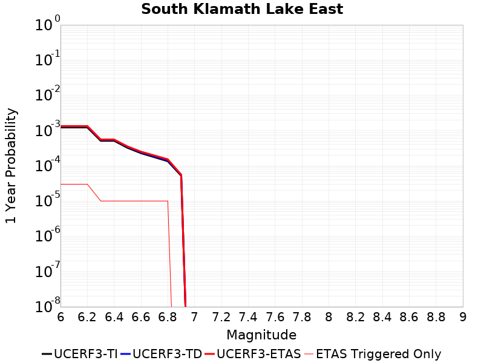 | 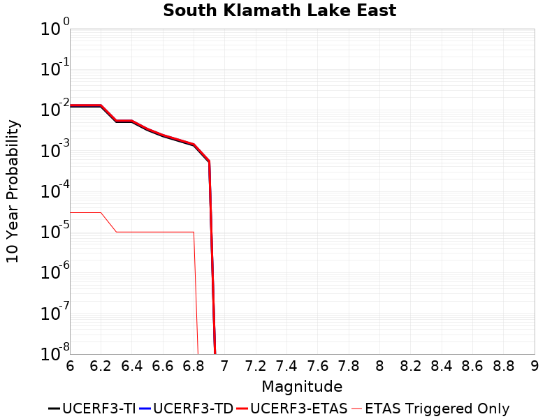 |

| Magnitude | 1 wk TI Prob | 1 wk TD Prob | 1 wk ETAS Prob | 1 wk ETAS/TD Gain | 1 wk ETAS Triggered Only | 1 mo TI Prob | 1 mo TD Prob | 1 mo ETAS Prob | 1 mo ETAS/TD Gain | 1 mo ETAS Triggered Only | 1 yr TI Prob | 1 yr TD Prob | 1 yr ETAS Prob | 1 yr ETAS/TD Gain | 1 yr ETAS Triggered Only | 10 yr TI Prob | 10 yr TD Prob | 10 yr ETAS Prob | 10 yr ETAS/TD Gain | 10 yr ETAS Triggered Only |
|-----|-----|-----|-----|-----|-----|-----|-----|-----|-----|-----|-----|-----|-----|-----|-----|-----|-----|-----|-----|-----|
| 6.0 | 2.3539369E-5 | 2.51077E-5 | 3.510745E-5 | 1.3982742 | 1.0E-5 | 1.0087911E-4 | 1.0760046E-4 | 1.1759939E-4 | 1.0929264 | 1.0E-5 | 0.0012275111 | 0.0013093321 | 0.0013392927 | 1.0228825 | 3.0E-5 | 0.012207527 | 0.013024568 | 0.013054176 | 1.0022733 | 3.0E-5 |
| 6.1 | 2.3539369E-5 | 2.51077E-5 | 3.510745E-5 | 1.3982742 | 1.0E-5 | 1.0087911E-4 | 1.0760046E-4 | 1.1759939E-4 | 1.0929264 | 1.0E-5 | 0.0012275111 | 0.0013093321 | 0.0013392927 | 1.0228825 | 3.0E-5 | 0.012207527 | 0.013024568 | 0.013054176 | 1.0022733 | 3.0E-5 |
| 6.2 | 2.3539369E-5 | 2.51077E-5 | 3.510745E-5 | 1.3982742 | 1.0E-5 | 1.0087911E-4 | 1.0760046E-4 | 1.1759939E-4 | 1.0929264 | 1.0E-5 | 0.0012275111 | 0.0013093321 | 0.0013392927 | 1.0228825 | 3.0E-5 | 0.012207527 | 0.013024568 | 0.013054176 | 1.0022733 | 3.0E-5 |
| 6.3 | 9.807823E-6 | 1.0419499E-5 | 1.0419499E-5 | 1.0 | 0.0 | 4.2032847E-5 | 4.4654276E-5 | 4.4654276E-5 | 1.0 | 0.0 | 5.1162974E-4 | 5.435386E-4 | 5.535332E-4 | 1.0183879 | 1.0E-5 | 0.005104534 | 0.0054229326 | 0.0054328786 | 1.001834 | 1.0E-5 |
| 6.4 | 9.807823E-6 | 1.0419499E-5 | 1.0419499E-5 | 1.0 | 0.0 | 4.2032847E-5 | 4.4654276E-5 | 4.4654276E-5 | 1.0 | 0.0 | 5.1162974E-4 | 5.435386E-4 | 5.535332E-4 | 1.0183879 | 1.0E-5 | 0.005104534 | 0.0054229326 | 0.0054328786 | 1.001834 | 1.0E-5 |
| 6.5 | 6.191981E-6 | 6.565118E-6 | 6.565118E-6 | 1.0 | 0.0 | 2.653679E-5 | 2.8135932E-5 | 2.8135932E-5 | 1.0 | 0.0 | 3.2303753E-4 | 3.4250392E-4 | 3.525005E-4 | 1.0291867 | 1.0E-5 | 0.0032256835 | 0.00342004 | 0.0034300059 | 1.002914 | 1.0E-5 |
| 6.6 | 4.3693776E-6 | 4.626377E-6 | 4.626377E-6 | 1.0 | 0.0 | 1.8725768E-5 | 1.9827188E-5 | 1.9827188E-5 | 1.0 | 0.0 | 2.2796239E-4 | 2.413704E-4 | 2.5136798E-4 | 1.0414201 | 1.0E-5 | 0.0022772867 | 0.0024111955 | 0.0024211714 | 1.0041373 | 1.0E-5 |
| 6.7 | 3.360834E-6 | 3.5588052E-6 | 3.5588052E-6 | 1.0 | 0.0 | 1.4403494E-5 | 1.5251938E-5 | 1.5251938E-5 | 1.0 | 0.0 | 1.7534842E-4 | 1.8567733E-4 | 1.9567547E-4 | 1.0538468 | 1.0E-5 | 0.0017521014 | 0.0018553021 | 0.0018652836 | 1.0053799 | 1.0E-5 |
| 6.8 | 2.57873E-6 | 2.7309898E-6 | 2.7309898E-6 | 1.0 | 0.0 | 1.1051653E-5 | 1.1704193E-5 | 1.1704193E-5 | 1.0 | 0.0 | 1.3454557E-4 | 1.4248985E-4 | 1.5248841E-4 | 1.0701704 | 1.0E-5 | 0.0013446413 | 0.0014240458 | 0.0014340315 | 1.0070122 | 1.0E-5 |
| 6.9 | 9.987825E-7 | 1.058922E-6 | 1.058922E-6 | 1.0 | 0.0 | 4.2804895E-6 | 4.538231E-6 | 4.538231E-6 | 1.0 | 0.0 | 5.211371E-5 | 5.525189E-5 | 5.525189E-5 | 1.0 | 0.0 | 5.210149E-4 | 5.5241387E-4 | 5.5241387E-4 | 1.0 | 0.0 |

## San Andreas (San Bernardino N)
*[(top)](#table-of-contents)*

| 1 Week | 1 Month | 1 Year | 10 Year |
|-----|-----|-----|-----|
| 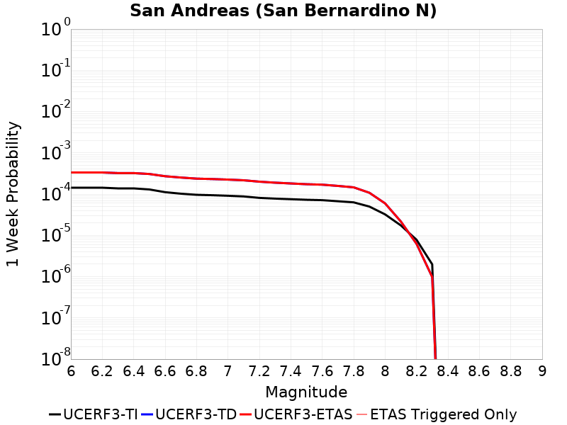 | 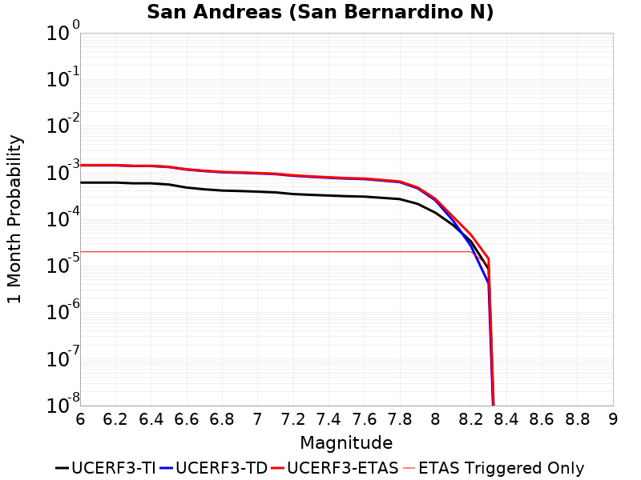 | 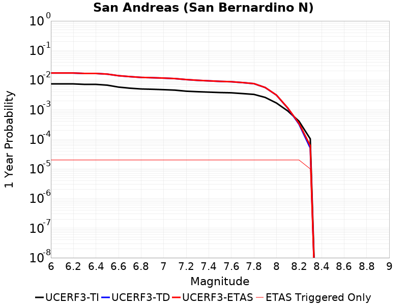 |  |

| Magnitude | 1 wk TI Prob | 1 wk TD Prob | 1 wk ETAS Prob | 1 wk ETAS/TD Gain | 1 wk ETAS Triggered Only | 1 mo TI Prob | 1 mo TD Prob | 1 mo ETAS Prob | 1 mo ETAS/TD Gain | 1 mo ETAS Triggered Only | 1 yr TI Prob | 1 yr TD Prob | 1 yr ETAS Prob | 1 yr ETAS/TD Gain | 1 yr ETAS Triggered Only | 10 yr TI Prob | 10 yr TD Prob | 10 yr ETAS Prob | 10 yr ETAS/TD Gain | 10 yr ETAS Triggered Only |
|-----|-----|-----|-----|-----|-----|-----|-----|-----|-----|-----|-----|-----|-----|-----|-----|-----|-----|-----|-----|-----|
| 6.0 | 1.4273766E-4 | 3.3374786E-4 | 3.3374786E-4 | 1.0 | 0.0 | 6.115894E-4 | 0.0014295699 | 0.0014495414 | 1.0139703 | 2.0E-5 | 0.0074207084 | 0.017267726 | 0.017287381 | 1.0011382 | 2.0E-5 | 0.07177748 | 0.15739876 | 0.15742403 | 1.0001606 | 3.0E-5 |
| 6.1 | 1.4273766E-4 | 3.3374786E-4 | 3.3374786E-4 | 1.0 | 0.0 | 6.115894E-4 | 0.0014295699 | 0.0014495414 | 1.0139703 | 2.0E-5 | 0.0074207084 | 0.017267726 | 0.017287381 | 1.0011382 | 2.0E-5 | 0.07177748 | 0.15739876 | 0.15742403 | 1.0001606 | 3.0E-5 |
| 6.2 | 1.4273766E-4 | 3.3374786E-4 | 3.3374786E-4 | 1.0 | 0.0 | 6.115894E-4 | 0.0014295699 | 0.0014495414 | 1.0139703 | 2.0E-5 | 0.0074207084 | 0.017267726 | 0.017287381 | 1.0011382 | 2.0E-5 | 0.07177748 | 0.15739876 | 0.15742403 | 1.0001606 | 3.0E-5 |
| 6.3 | 1.3730655E-4 | 3.2269408E-4 | 3.2269408E-4 | 1.0 | 0.0 | 5.883239E-4 | 0.0013822475 | 0.0014022199 | 1.0144492 | 2.0E-5 | 0.0071393442 | 0.016700514 | 0.01672018 | 1.0011775 | 2.0E-5 | 0.06914291 | 0.1527012 | 0.15272662 | 1.0001664 | 3.0E-5 |
| 6.4 | 1.3730655E-4 | 3.2269408E-4 | 3.2269408E-4 | 1.0 | 0.0 | 5.883239E-4 | 0.0013822475 | 0.0014022199 | 1.0144492 | 2.0E-5 | 0.0071393442 | 0.016700514 | 0.01672018 | 1.0011775 | 2.0E-5 | 0.06914291 | 0.1527012 | 0.15272662 | 1.0001664 | 3.0E-5 |
| 6.5 | 1.2942807E-4 | 3.0668845E-4 | 3.0668845E-4 | 1.0 | 0.0 | 5.545738E-4 | 0.0013137222 | 0.001333696 | 1.015204 | 2.0E-5 | 0.0067310524 | 0.01587861 | 0.015898293 | 1.0012395 | 2.0E-5 | 0.06530788 | 0.14584738 | 0.145873 | 1.0001757 | 3.0E-5 |
| 6.6 | 1.1125901E-4 | 2.7068236E-4 | 2.7068236E-4 | 1.0 | 0.0 | 4.767372E-4 | 0.001159554 | 0.0011795308 | 1.017228 | 2.0E-5 | 0.005788839 | 0.014026885 | 0.014046604 | 1.0014058 | 2.0E-5 | 0.056403454 | 0.1300854 | 0.13011149 | 1.0002006 | 3.0E-5 |
| 6.7 | 1.02209575E-4 | 2.518837E-4 | 2.518837E-4 | 1.0 | 0.0 | 4.3796748E-4 | 0.0010790564 | 0.0010990348 | 1.0185148 | 2.0E-5 | 0.0053192247 | 0.013058853 | 0.013078592 | 1.0015116 | 2.0E-5 | 0.051936906 | 0.121914655 | 0.121941 | 1.0002161 | 3.0E-5 |
| 6.8 | 9.610582E-5 | 2.3686918E-4 | 2.3686918E-4 | 1.0 | 0.0 | 4.1181705E-4 | 0.0010147594 | 0.0010347391 | 1.0196891 | 2.0E-5 | 0.0050023515 | 0.012285019 | 0.012304774 | 1.001608 | 2.0E-5 | 0.048912346 | 0.11526947 | 0.115296006 | 1.0002303 | 3.0E-5 |
| 6.9 | 9.3877505E-5 | 2.3134236E-4 | 2.3134236E-4 | 1.0 | 0.0 | 4.0227012E-4 | 9.910912E-4 | 0.0010110714 | 1.0201597 | 2.0E-5 | 0.0048866454 | 0.012000063 | 0.012019823 | 1.0016466 | 2.0E-5 | 0.04780577 | 0.11284947 | 0.11287608 | 1.0002358 | 3.0E-5 |
| 7.0 | 9.1019785E-5 | 2.2448787E-4 | 2.2448787E-4 | 1.0 | 0.0 | 3.900265E-4 | 9.617368E-4 | 9.817175E-4 | 1.0207757 | 2.0E-5 | 0.0047382377 | 0.0116465455 | 0.011666313 | 1.0016973 | 2.0E-5 | 0.046384744 | 0.10979545 | 0.109822154 | 1.0002432 | 3.0E-5 |
| 7.1 | 8.771155E-5 | 2.1608995E-4 | 2.1608995E-4 | 1.0 | 0.0 | 3.758525E-4 | 9.2577166E-4 | 9.457531E-4 | 1.0215836 | 2.0E-5 | 0.0045664064 | 0.011213253 | 0.011233029 | 1.0017636 | 2.0E-5 | 0.044737056 | 0.106071934 | 0.106098756 | 1.0002528 | 3.0E-5 |
| 7.2 | 8.0830236E-5 | 1.9983815E-4 | 1.9983815E-4 | 1.0 | 0.0 | 3.4636928E-4 | 8.561683E-4 | 8.7615114E-4 | 1.0233399 | 2.0E-5 | 0.0042088944 | 0.010374162 | 0.010393955 | 1.0019078 | 2.0E-5 | 0.041300658 | 0.098756015 | 0.09878305 | 1.0002738 | 3.0E-5 |
| 7.3 | 7.7668235E-5 | 1.8894562E-4 | 1.8894562E-4 | 1.0 | 0.0 | 3.328214E-4 | 8.0951577E-4 | 8.2949956E-4 | 1.0246861 | 2.0E-5 | 0.0040445733 | 0.009811418 | 0.009831222 | 1.0020185 | 2.0E-5 | 0.03971748 | 0.093929864 | 0.093957044 | 1.0002894 | 3.0E-5 |
| 7.4 | 7.520177E-5 | 1.8088869E-4 | 1.8088869E-4 | 1.0 | 0.0 | 3.2225347E-4 | 7.75007E-4 | 7.949915E-4 | 1.0257862 | 2.0E-5 | 0.0039163795 | 0.009394975 | 0.009414787 | 1.0021088 | 2.0E-5 | 0.038480744 | 0.09031278 | 0.09034007 | 1.0003022 | 3.0E-5 |
| 7.5 | 7.274697E-5 | 1.7352395E-4 | 1.7352395E-4 | 1.0 | 0.0 | 3.1173544E-4 | 7.434622E-4 | 7.634473E-4 | 1.0268812 | 2.0E-5 | 0.003788775 | 0.00901416 | 0.009033981 | 1.0021987 | 2.0E-5 | 0.03724827 | 0.08695618 | 0.08698358 | 1.000315 | 3.0E-5 |
| 7.6 | 7.1185845E-5 | 1.6906747E-4 | 1.6906747E-4 | 1.0 | 0.0 | 3.0504653E-4 | 7.2437373E-4 | 7.443592E-4 | 1.02759 | 2.0E-5 | 0.0037076178 | 0.008783657 | 0.008803481 | 1.002257 | 2.0E-5 | 0.036463667 | 0.08489515 | 0.084922604 | 1.0003234 | 3.0E-5 |
| 7.7 | 6.709961E-5 | 1.5772291E-4 | 1.5772291E-4 | 1.0 | 0.0 | 2.8753807E-4 | 6.7578023E-4 | 6.9576676E-4 | 1.0295755 | 2.0E-5 | 0.003495157 | 0.008196639 | 0.008216475 | 1.0024201 | 2.0E-5 | 0.034406938 | 0.0795739 | 0.07960152 | 1.000347 | 3.0E-5 |
| 7.8 | 6.300812E-5 | 1.4567947E-4 | 1.4567947E-4 | 1.0 | 0.0 | 2.7000686E-4 | 6.241912E-4 | 6.441787E-4 | 1.0320215 | 2.0E-5 | 0.0032823787 | 0.0075730877 | 0.007592936 | 1.0026209 | 2.0E-5 | 0.032343175 | 0.07388154 | 0.07390933 | 1.0003761 | 3.0E-5 |
| 7.9 | 4.983037E-5 | 1.07650114E-4 | 1.07650114E-4 | 1.0 | 0.0 | 2.1354125E-4 | 4.6127607E-4 | 4.8126685E-4 | 1.043338 | 2.0E-5 | 0.0025967648 | 0.005601589 | 0.005621477 | 1.0035504 | 2.0E-5 | 0.025666296 | 0.055484213 | 0.055512547 | 1.0005107 | 3.0E-5 |
| 8.0 | 3.2211527E-5 | 5.949045E-5 | 5.949045E-5 | 1.0 | 0.0 | 1.380421E-4 | 2.5493416E-4 | 2.7492907E-4 | 1.0784316 | 2.0E-5 | 0.0016793669 | 0.0030994082 | 0.0031193462 | 1.0064329 | 2.0E-5 | 0.016667323 | 0.03135887 | 0.03138793 | 1.0009266 | 3.0E-5 |
| 8.1 | 1.743376E-5 | 2.1716236E-5 | 2.1716236E-5 | 1.0 | 0.0 | 7.471398E-5 | 9.306627E-5 | 1.1306441E-4 | 1.2148806 | 2.0E-5 | 9.0926304E-4 | 0.0011324937 | 0.001152471 | 1.0176401 | 2.0E-5 | 0.009055517 | 0.011975389 | 0.012005029 | 1.0024751 | 3.0E-5 |
| 8.2 | 7.831616E-6 | 6.249834E-6 | 6.249834E-6 | 1.0 | 0.0 | 3.3563636E-5 | 2.6784726E-5 | 4.6784193E-5 | 1.7466742 | 2.0E-5 | 4.0856065E-4 | 3.2605536E-4 | 3.4604885E-4 | 1.0613192 | 2.0E-5 | 0.004078103 | 0.0036302411 | 0.0036601322 | 1.0082339 | 3.0E-5 |
| 8.3 | 1.983087E-6 | 9.763005E-7 | 9.763005E-7 | 1.0 | 0.0 | 8.498917E-6 | 4.184138E-6 | 1.41840965E-5 | 3.3899684 | 1.0E-5 | 1.034694E-4 | 5.094072E-5 | 6.094021E-5 | 1.1962966 | 1.0E-5 | 0.0010342124 | 5.909015E-4 | 6.0089555E-4 | 1.0169133 | 1.0E-5 |

## Hunting Creek - Bartlett Springs connector 2011
*[(top)](#table-of-contents)*

| 1 Week | 1 Month | 1 Year | 10 Year |
|-----|-----|-----|-----|
| 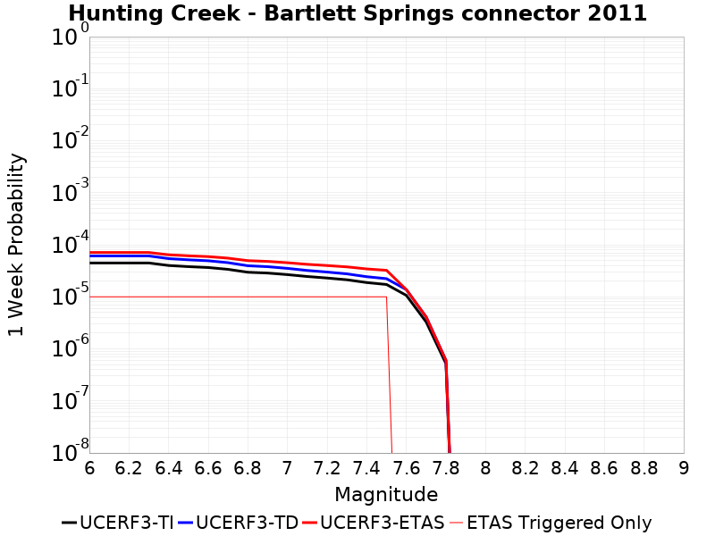 |  |  | 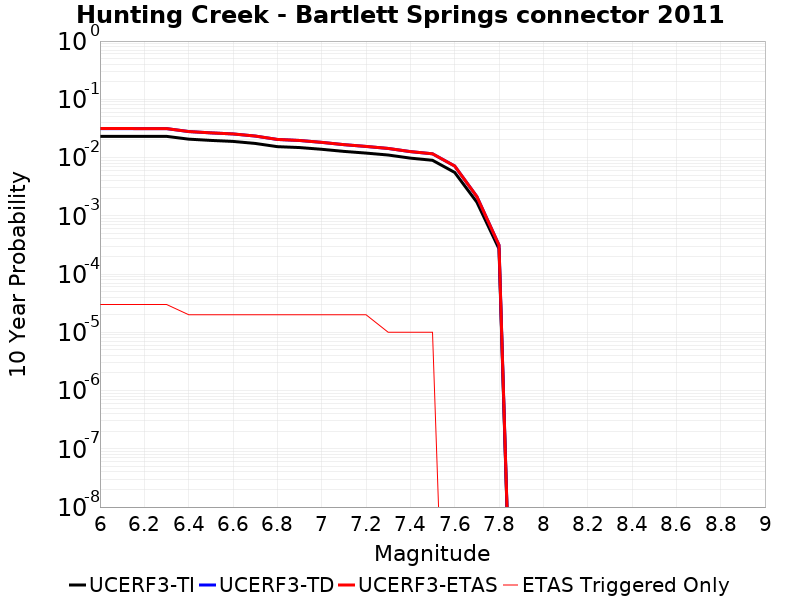 |

| Magnitude | 1 wk TI Prob | 1 wk TD Prob | 1 wk ETAS Prob | 1 wk ETAS/TD Gain | 1 wk ETAS Triggered Only | 1 mo TI Prob | 1 mo TD Prob | 1 mo ETAS Prob | 1 mo ETAS/TD Gain | 1 mo ETAS Triggered Only | 1 yr TI Prob | 1 yr TD Prob | 1 yr ETAS Prob | 1 yr ETAS/TD Gain | 1 yr ETAS Triggered Only | 10 yr TI Prob | 10 yr TD Prob | 10 yr ETAS Prob | 10 yr ETAS/TD Gain | 10 yr ETAS Triggered Only |
|-----|-----|-----|-----|-----|-----|-----|-----|-----|-----|-----|-----|-----|-----|-----|-----|-----|-----|-----|-----|-----|
| 6.0 | 4.4793655E-5 | 6.113125E-5 | 7.113064E-5 | 1.1635724 | 1.0E-5 | 1.9195868E-4 | 2.6196477E-4 | 2.7196214E-4 | 1.0381631 | 1.0E-5 | 0.002334592 | 0.00318468 | 0.0032046163 | 1.00626 | 2.0E-5 | 0.023102175 | 0.03138382 | 0.031412877 | 1.0009259 | 3.0E-5 |
| 6.1 | 4.4793655E-5 | 6.113125E-5 | 7.113064E-5 | 1.1635724 | 1.0E-5 | 1.9195868E-4 | 2.6196477E-4 | 2.7196214E-4 | 1.0381631 | 1.0E-5 | 0.002334592 | 0.00318468 | 0.0032046163 | 1.00626 | 2.0E-5 | 0.023102175 | 0.03138382 | 0.031412877 | 1.0009259 | 3.0E-5 |
| 6.2 | 4.472471E-5 | 6.103791E-5 | 7.10373E-5 | 1.1638227 | 1.0E-5 | 1.9166325E-4 | 2.615648E-4 | 2.7156217E-4 | 1.0382215 | 1.0E-5 | 0.0023310026 | 0.0031798247 | 0.0031997613 | 1.0062697 | 2.0E-5 | 0.02306703 | 0.03133668 | 0.03136574 | 1.0009273 | 3.0E-5 |
| 6.3 | 4.472471E-5 | 6.103791E-5 | 7.10373E-5 | 1.1638227 | 1.0E-5 | 1.9166325E-4 | 2.615648E-4 | 2.7156217E-4 | 1.0382215 | 1.0E-5 | 0.0023310026 | 0.0031798247 | 0.0031997613 | 1.0062697 | 2.0E-5 | 0.02306703 | 0.03133668 | 0.03136574 | 1.0009273 | 3.0E-5 |
| 6.4 | 4.0001003E-5 | 5.4224227E-5 | 6.4223685E-5 | 1.1844094 | 1.0E-5 | 1.714216E-4 | 2.3236853E-4 | 2.4236622E-4 | 1.0430251 | 1.0E-5 | 0.0020850603 | 0.00282537 | 0.0028353417 | 1.0035293 | 1.0E-5 | 0.02065605 | 0.02789003 | 0.027909473 | 1.0006971 | 2.0E-5 |
| 6.5 | 3.8033053E-5 | 5.140193E-5 | 6.140141E-5 | 1.1945353 | 1.0E-5 | 1.6298861E-4 | 2.2027503E-4 | 2.3027284E-4 | 1.0453877 | 1.0E-5 | 0.0019825802 | 0.0026785303 | 0.0026885036 | 1.0037234 | 1.0E-5 | 0.019649856 | 0.026459996 | 0.026479466 | 1.0007359 | 2.0E-5 |
| 6.6 | 3.653754E-5 | 4.9268954E-5 | 5.9268463E-5 | 1.2029575 | 1.0E-5 | 1.5658008E-4 | 2.1113522E-4 | 2.211331E-4 | 1.047353 | 1.0E-5 | 0.0019046954 | 0.0025675385 | 0.002577513 | 1.0038848 | 1.0E-5 | 0.018884527 | 0.025377812 | 0.025397304 | 1.0007681 | 2.0E-5 |
| 6.7 | 3.372024E-5 | 4.527584E-5 | 5.5275385E-5 | 1.2208583 | 1.0E-5 | 1.4450731E-4 | 1.94025E-4 | 2.0402305E-4 | 1.0515298 | 1.0E-5 | 0.0017579567 | 0.0023597158 | 0.002369692 | 1.0042278 | 1.0E-5 | 0.017441148 | 0.023347626 | 0.023367159 | 1.0008366 | 2.0E-5 |
| 6.8 | 2.9650024E-5 | 3.9529223E-5 | 4.952883E-5 | 1.2529674 | 1.0E-5 | 1.2706534E-4 | 1.6939986E-4 | 1.7939818E-4 | 1.059022 | 1.0E-5 | 0.0015459227 | 0.0020604846 | 0.002070464 | 1.0048432 | 1.0E-5 | 0.015352124 | 0.020411685 | 0.020431276 | 1.0009599 | 2.0E-5 |
| 6.9 | 2.860775E-5 | 3.7928672E-5 | 4.792829E-5 | 1.2636428 | 1.0E-5 | 1.2259888E-4 | 1.625413E-4 | 1.7253967E-4 | 1.0615128 | 1.0E-5 | 0.0014916194 | 0.0019771508 | 0.001987131 | 1.0050478 | 1.0E-5 | 0.014816469 | 0.019595273 | 0.01961488 | 1.0010006 | 2.0E-5 |
| 7.0 | 2.6696067E-5 | 3.517238E-5 | 4.517203E-5 | 1.284304 | 1.0E-5 | 1.144067E-4 | 1.507301E-4 | 1.607286E-4 | 1.0663338 | 1.0E-5 | 0.0013920115 | 0.0018336027 | 0.0018435844 | 1.0054437 | 1.0E-5 | 0.013833242 | 0.018185314 | 0.01820495 | 1.0010798 | 2.0E-5 |
| 7.1 | 2.456087E-5 | 3.210068E-5 | 4.210036E-5 | 1.3115098 | 1.0E-5 | 1.0525662E-4 | 1.3756714E-4 | 1.4756576E-4 | 1.0726818 | 1.0E-5 | 0.001280746 | 0.0016736021 | 0.0016835853 | 1.0059651 | 1.0E-5 | 0.012733897 | 0.01661136 | 0.016631028 | 1.001184 | 2.0E-5 |
| 7.2 | 2.295761E-5 | 2.9897985E-5 | 3.9897684E-5 | 1.3344607 | 1.0E-5 | 9.8386045E-5 | 1.2812797E-4 | 1.3812669E-4 | 1.078037 | 1.0E-5 | 0.0011971919 | 0.0015588511 | 0.0015688355 | 1.006405 | 1.0E-5 | 0.011907627 | 0.015480648 | 0.015500338 | 1.001272 | 2.0E-5 |
| 7.3 | 2.1256936E-5 | 2.7594819E-5 | 3.7594542E-5 | 1.3623768 | 1.0E-5 | 9.109797E-5 | 1.182582E-4 | 1.2825702E-4 | 1.0845507 | 1.0E-5 | 0.0011085535 | 0.0014388515 | 0.0014488371 | 1.00694 | 1.0E-5 | 0.011030397 | 0.014296677 | 0.014306534 | 1.0006895 | 1.0E-5 |
| 7.4 | 1.8784336E-5 | 2.434224E-5 | 3.4341996E-5 | 1.4107985 | 1.0E-5 | 8.050181E-5 | 1.04319755E-4 | 1.1431871E-4 | 1.0958492 | 1.0E-5 | 9.796688E-4 | 0.0012693607 | 0.0012793479 | 1.0078679 | 1.0E-5 | 0.009753612 | 0.012622203 | 0.012632077 | 1.0007823 | 1.0E-5 |
| 7.5 | 1.7248298E-5 | 2.2297663E-5 | 3.229744E-5 | 1.4484675 | 1.0E-5 | 7.391918E-5 | 9.555795E-5 | 1.05557E-4 | 1.1046386 | 1.0E-5 | 8.9959445E-4 | 0.0011628047 | 0.0011727931 | 1.0085899 | 1.0E-5 | 0.008959615 | 0.011568108 | 0.011577993 | 1.0008545 | 1.0E-5 |
| 7.6 | 1.0653709E-5 | 1.3741079E-5 | 1.3741079E-5 | 1.0 | 0.0 | 4.5657955E-5 | 5.8889025E-5 | 5.8889025E-5 | 1.0 | 0.0 | 5.557438E-4 | 7.1674073E-4 | 7.1674073E-4 | 1.0 | 0.0 | 0.0055435603 | 0.0071445536 | 0.0071445536 | 1.0 | 0.0 |
| 7.7 | 3.286316E-6 | 4.1018093E-6 | 4.1018093E-6 | 1.0 | 0.0 | 1.4084137E-5 | 1.7579066E-5 | 1.7579066E-5 | 1.0 | 0.0 | 1.7146087E-4 | 2.1400426E-4 | 2.1400426E-4 | 1.0 | 0.0 | 0.0017132863 | 0.0021379618 | 0.0021379618 | 1.0 | 0.0 |
| 7.8 | 5.1855085E-7 | 5.9979624E-7 | 5.9979624E-7 | 1.0 | 0.0 | 2.222359E-6 | 2.5705529E-6 | 2.5705529E-6 | 1.0 | 0.0 | 2.7056883E-5 | 3.129604E-5 | 3.129604E-5 | 1.0 | 0.0 | 2.705359E-4 | 3.1291659E-4 | 3.1291659E-4 | 1.0 | 0.0 |

## Cedar Mtn-Mahogany Mtn
*[(top)](#table-of-contents)*

| 1 Week | 1 Month | 1 Year | 10 Year |
|-----|-----|-----|-----|
| 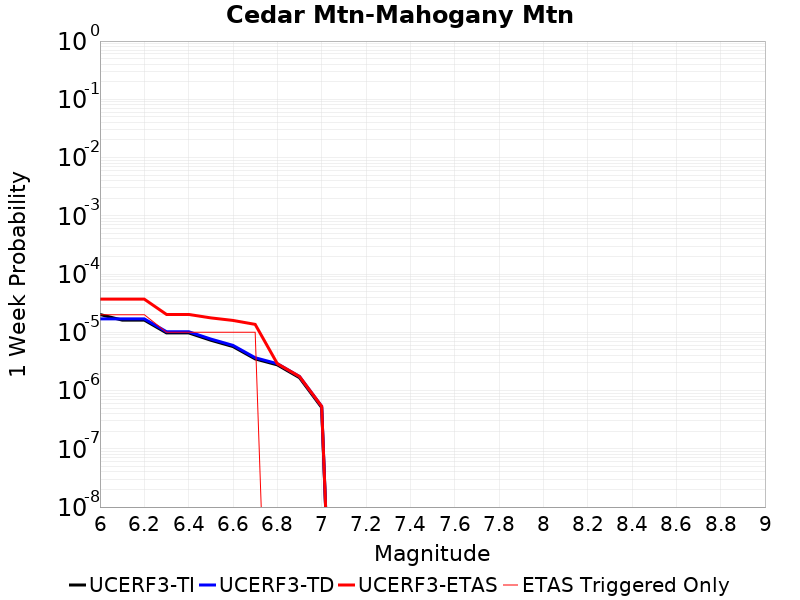 | 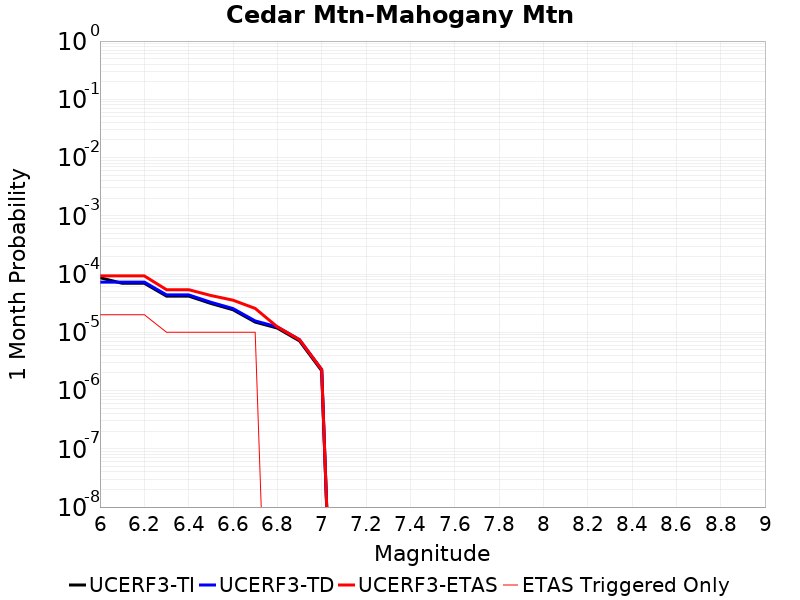 | 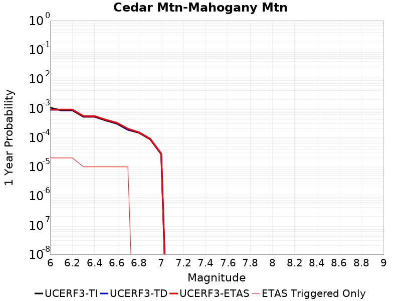 | 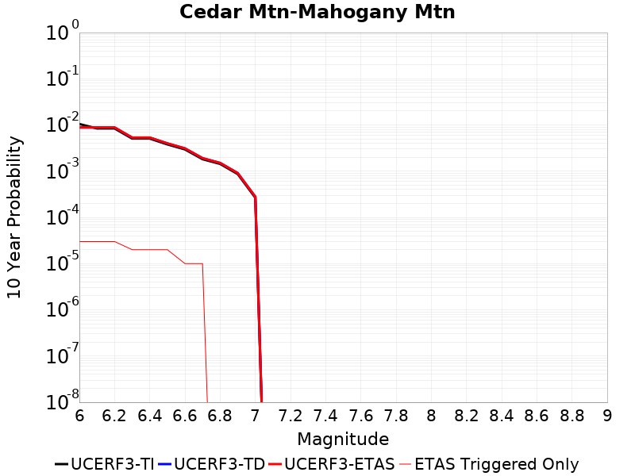 |

| Magnitude | 1 wk TI Prob | 1 wk TD Prob | 1 wk ETAS Prob | 1 wk ETAS/TD Gain | 1 wk ETAS Triggered Only | 1 mo TI Prob | 1 mo TD Prob | 1 mo ETAS Prob | 1 mo ETAS/TD Gain | 1 mo ETAS Triggered Only | 1 yr TI Prob | 1 yr TD Prob | 1 yr ETAS Prob | 1 yr ETAS/TD Gain | 1 yr ETAS Triggered Only | 10 yr TI Prob | 10 yr TD Prob | 10 yr ETAS Prob | 10 yr ETAS/TD Gain | 10 yr ETAS Triggered Only |
|-----|-----|-----|-----|-----|-----|-----|-----|-----|-----|-----|-----|-----|-----|-----|-----|-----|-----|-----|-----|-----|
| 6.0 | 2.0167738E-5 | 1.6950415E-5 | 3.6950078E-5 | 2.179892 | 2.0E-5 | 8.643029E-5 | 7.264271E-5 | 9.264126E-5 | 1.2753001 | 2.0E-5 | 0.0010517809 | 8.840832E-4 | 9.040655E-4 | 1.0226023 | 2.0E-5 | 0.010468166 | 0.008807406 | 0.008837141 | 1.0033762 | 3.0E-5 |
| 6.1 | 1.6162443E-5 | 1.6950415E-5 | 3.6950078E-5 | 2.179892 | 2.0E-5 | 6.926578E-5 | 7.264271E-5 | 9.264126E-5 | 1.2753001 | 2.0E-5 | 8.4298453E-4 | 8.840832E-4 | 9.040655E-4 | 1.0226023 | 2.0E-5 | 0.008397939 | 0.008807406 | 0.008837141 | 1.0033762 | 3.0E-5 |
| 6.2 | 1.6162443E-5 | 1.6950415E-5 | 3.6950078E-5 | 2.179892 | 2.0E-5 | 6.926578E-5 | 7.264271E-5 | 9.264126E-5 | 1.2753001 | 2.0E-5 | 8.4298453E-4 | 8.840832E-4 | 9.040655E-4 | 1.0226023 | 2.0E-5 | 0.008397939 | 0.008807406 | 0.008837141 | 1.0033762 | 3.0E-5 |
| 6.3 | 9.746053E-6 | 1.02168115E-5 | 2.021671E-5 | 1.978769 | 1.0E-5 | 4.1768133E-5 | 4.378562E-5 | 5.3785185E-5 | 1.2283754 | 1.0E-5 | 5.0840835E-4 | 5.3296355E-4 | 5.429582E-4 | 1.018753 | 1.0E-5 | 0.0050724675 | 0.0053172624 | 0.005337156 | 1.0037414 | 2.0E-5 |
| 6.4 | 9.746053E-6 | 1.02168115E-5 | 2.021671E-5 | 1.978769 | 1.0E-5 | 4.1768133E-5 | 4.378562E-5 | 5.3785185E-5 | 1.2283754 | 1.0E-5 | 5.0840835E-4 | 5.3296355E-4 | 5.429582E-4 | 1.018753 | 1.0E-5 | 0.0050724675 | 0.0053172624 | 0.005337156 | 1.0037414 | 2.0E-5 |
| 6.5 | 7.290083E-6 | 7.640284E-6 | 1.7640208E-5 | 2.308842 | 1.0E-5 | 3.124284E-5 | 3.2743676E-5 | 4.2743348E-5 | 1.3053925 | 1.0E-5 | 3.8031515E-4 | 3.9858345E-4 | 4.0857948E-4 | 1.0250789 | 1.0E-5 | 0.0037966494 | 0.0039789015 | 0.003998822 | 1.0050066 | 2.0E-5 |
| 6.6 | 5.67907E-6 | 5.950668E-6 | 1.5950609E-5 | 2.6804736 | 1.0E-5 | 2.4338644E-5 | 2.550262E-5 | 3.5502366E-5 | 1.3921065 | 1.0E-5 | 2.962827E-4 | 3.104515E-4 | 3.204484E-4 | 1.0322012 | 1.0E-5 | 0.0029588798 | 0.0031003118 | 0.003110281 | 1.0032154 | 1.0E-5 |
| 6.7 | 3.4853963E-6 | 3.651419E-6 | 1.3651383E-5 | 3.7386513 | 1.0E-5 | 1.4937327E-5 | 1.564885E-5 | 2.5648693E-5 | 1.6390146 | 1.0E-5 | 1.8184677E-4 | 1.905087E-4 | 2.005068E-4 | 1.052481 | 1.0E-5 | 0.0018169804 | 0.001903515 | 0.001913496 | 1.0052434 | 1.0E-5 |
| 6.8 | 2.7535168E-6 | 2.884835E-6 | 2.884835E-6 | 1.0 | 0.0 | 1.1800733E-5 | 1.2363524E-5 | 1.2363524E-5 | 1.0 | 0.0 | 1.4366445E-4 | 1.5051597E-4 | 1.5051597E-4 | 1.0 | 0.0 | 0.0014357162 | 0.0015041869 | 0.0015041869 | 1.0 | 0.0 |
| 6.9 | 1.6594106E-6 | 1.7389148E-6 | 1.7389148E-6 | 1.0 | 0.0 | 7.1117406E-6 | 7.4524723E-6 | 7.4524723E-6 | 1.0 | 0.0 | 8.6582E-5 | 9.073038E-5 | 9.073038E-5 | 1.0 | 0.0 | 8.654827E-4 | 9.069634E-4 | 9.069634E-4 | 1.0 | 0.0 |
| 7.0 | 5.10215E-7 | 5.3475907E-7 | 5.3475907E-7 | 1.0 | 0.0 | 2.186634E-6 | 2.2918232E-6 | 2.2918232E-6 | 1.0 | 0.0 | 2.6621943E-5 | 2.7902715E-5 | 2.7902715E-5 | 1.0 | 0.0 | 2.6618753E-4 | 2.7900448E-4 | 2.7900448E-4 | 1.0 | 0.0 |

## Gillem - Big Crack 2011 CFM
*[(top)](#table-of-contents)*

| 1 Week | 1 Month | 1 Year | 10 Year |
|-----|-----|-----|-----|
|  |  | 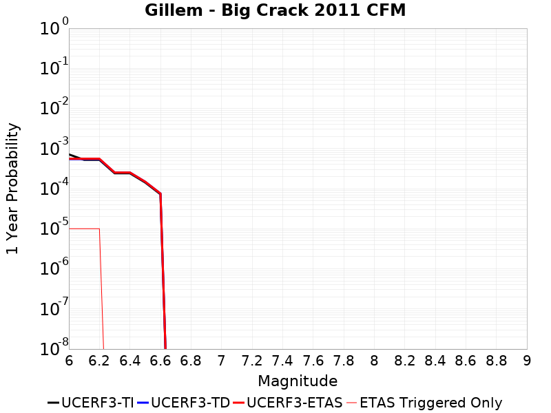 |  |

| Magnitude | 1 wk TI Prob | 1 wk TD Prob | 1 wk ETAS Prob | 1 wk ETAS/TD Gain | 1 wk ETAS Triggered Only | 1 mo TI Prob | 1 mo TD Prob | 1 mo ETAS Prob | 1 mo ETAS/TD Gain | 1 mo ETAS Triggered Only | 1 yr TI Prob | 1 yr TD Prob | 1 yr ETAS Prob | 1 yr ETAS/TD Gain | 1 yr ETAS Triggered Only | 10 yr TI Prob | 10 yr TD Prob | 10 yr ETAS Prob | 10 yr ETAS/TD Gain | 10 yr ETAS Triggered Only |
|-----|-----|-----|-----|-----|-----|-----|-----|-----|-----|-----|-----|-----|-----|-----|-----|-----|-----|-----|-----|-----|
| 6.0 | 1.3671493E-5 | 1.045698E-5 | 2.0456875E-5 | 1.956289 | 1.0E-5 | 5.85908E-5 | 4.4814955E-5 | 5.4814507E-5 | 1.2231297 | 1.0E-5 | 7.1310945E-4 | 5.455029E-4 | 5.554974E-4 | 1.0183218 | 1.0E-5 | 0.0071082544 | 0.0054433583 | 0.0054632495 | 1.0036542 | 2.0E-5 |
| 6.1 | 9.992795E-6 | 1.045698E-5 | 2.0456875E-5 | 1.956289 | 1.0E-5 | 4.2825563E-5 | 4.4814955E-5 | 5.4814507E-5 | 1.2231297 | 1.0E-5 | 5.2127644E-4 | 5.455029E-4 | 5.554974E-4 | 1.0183218 | 1.0E-5 | 0.0052005537 | 0.0054433583 | 0.0054632495 | 1.0036542 | 2.0E-5 |
| 6.2 | 9.992795E-6 | 1.045698E-5 | 2.0456875E-5 | 1.956289 | 1.0E-5 | 4.2825563E-5 | 4.4814955E-5 | 5.4814507E-5 | 1.2231297 | 1.0E-5 | 5.2127644E-4 | 5.455029E-4 | 5.554974E-4 | 1.0183218 | 1.0E-5 | 0.0052005537 | 0.0054433583 | 0.0054632495 | 1.0036542 | 2.0E-5 |
| 6.3 | 4.6127884E-6 | 4.8262914E-6 | 4.8262914E-6 | 1.0 | 0.0 | 1.9768944E-5 | 2.0683967E-5 | 2.0683967E-5 | 1.0 | 0.0 | 2.406603E-4 | 2.5180244E-4 | 2.5180244E-4 | 1.0 | 0.0 | 0.0024039985 | 0.0025155887 | 0.0025255634 | 1.0039653 | 1.0E-5 |
| 6.4 | 4.6127884E-6 | 4.8262914E-6 | 4.8262914E-6 | 1.0 | 0.0 | 1.9768944E-5 | 2.0683967E-5 | 2.0683967E-5 | 1.0 | 0.0 | 2.406603E-4 | 2.5180244E-4 | 2.5180244E-4 | 1.0 | 0.0 | 0.0024039985 | 0.0025155887 | 0.0025255634 | 1.0039653 | 1.0E-5 |
| 6.5 | 2.716712E-6 | 2.8430084E-6 | 2.8430084E-6 | 1.0 | 0.0 | 1.1643E-5 | 1.2184278E-5 | 1.2184278E-5 | 1.0 | 0.0 | 1.417443E-4 | 1.4833579E-4 | 1.4833579E-4 | 1.0 | 0.0 | 0.0014165393 | 0.0014825948 | 0.0014825948 | 1.0 | 0.0 |
| 6.6 | 1.3818255E-6 | 1.4447619E-6 | 1.4447619E-6 | 1.0 | 0.0 | 5.922096E-6 | 6.1918286E-6 | 6.1918286E-6 | 1.0 | 0.0 | 7.209913E-5 | 7.538407E-5 | 7.538407E-5 | 1.0 | 0.0 | 7.2075747E-4 | 7.536998E-4 | 7.536998E-4 | 1.0 | 0.0 |

## West Napa 2011 CFM
*[(top)](#table-of-contents)*

| 1 Week | 1 Month | 1 Year | 10 Year |
|-----|-----|-----|-----|
|  | 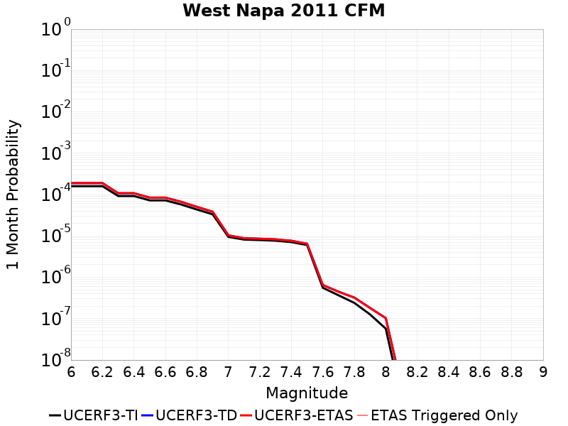 |  | 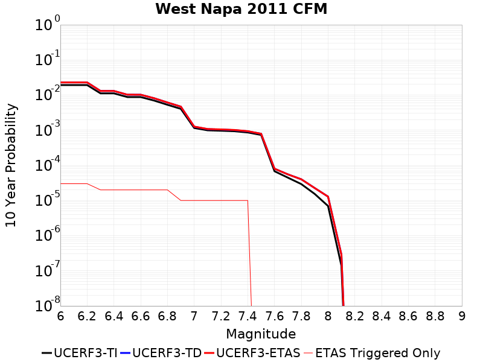 |

| Magnitude | 1 wk TI Prob | 1 wk TD Prob | 1 wk ETAS Prob | 1 wk ETAS/TD Gain | 1 wk ETAS Triggered Only | 1 mo TI Prob | 1 mo TD Prob | 1 mo ETAS Prob | 1 mo ETAS/TD Gain | 1 mo ETAS Triggered Only | 1 yr TI Prob | 1 yr TD Prob | 1 yr ETAS Prob | 1 yr ETAS/TD Gain | 1 yr ETAS Triggered Only | 10 yr TI Prob | 10 yr TD Prob | 10 yr ETAS Prob | 10 yr ETAS/TD Gain | 10 yr ETAS Triggered Only |
|-----|-----|-----|-----|-----|-----|-----|-----|-----|-----|-----|-----|-----|-----|-----|-----|-----|-----|-----|-----|-----|
| 6.0 | 3.716238E-5 | 4.415045E-5 | 4.415045E-5 | 1.0 | 0.0 | 1.5925762E-4 | 1.8920432E-4 | 1.8920432E-4 | 1.0 | 0.0 | 0.001937237 | 0.0023014497 | 0.0023014497 | 1.0 | 0.0 | 0.01920436 | 0.022809831 | 0.022839148 | 1.0012852 | 3.0E-5 |
| 6.1 | 3.716238E-5 | 4.415045E-5 | 4.415045E-5 | 1.0 | 0.0 | 1.5925762E-4 | 1.8920432E-4 | 1.8920432E-4 | 1.0 | 0.0 | 0.001937237 | 0.0023014497 | 0.0023014497 | 1.0 | 0.0 | 0.01920436 | 0.022809831 | 0.022839148 | 1.0012852 | 3.0E-5 |
| 6.2 | 3.716238E-5 | 4.415045E-5 | 4.415045E-5 | 1.0 | 0.0 | 1.5925762E-4 | 1.8920432E-4 | 1.8920432E-4 | 1.0 | 0.0 | 0.001937237 | 0.0023014497 | 0.0023014497 | 1.0 | 0.0 | 0.01920436 | 0.022809831 | 0.022839148 | 1.0012852 | 3.0E-5 |
| 6.3 | 2.147964E-5 | 2.5129872E-5 | 2.5129872E-5 | 1.0 | 0.0 | 9.2052345E-5 | 1.0769552E-4 | 1.0769552E-4 | 1.0 | 0.0 | 0.001120161 | 0.0013104968 | 0.0013104968 | 1.0 | 0.0 | 0.011145315 | 0.013038356 | 0.013058095 | 1.001514 | 2.0E-5 |
| 6.4 | 2.147964E-5 | 2.5129872E-5 | 2.5129872E-5 | 1.0 | 0.0 | 9.2052345E-5 | 1.0769552E-4 | 1.0769552E-4 | 1.0 | 0.0 | 0.001120161 | 0.0013104968 | 0.0013104968 | 1.0 | 0.0 | 0.011145315 | 0.013038356 | 0.013058095 | 1.001514 | 2.0E-5 |
| 6.5 | 1.688201E-5 | 1.9661027E-5 | 1.9661027E-5 | 1.0 | 0.0 | 7.234947E-5 | 8.425924E-5 | 8.425924E-5 | 1.0 | 0.0 | 8.804988E-4 | 0.0010254468 | 0.0010254468 | 1.0 | 0.0 | 0.008770182 | 0.010215855 | 0.01023565 | 1.0019377 | 2.0E-5 |
| 6.6 | 1.6846381E-5 | 1.9620527E-5 | 1.9620527E-5 | 1.0 | 0.0 | 7.219678E-5 | 8.4085674E-5 | 8.4085674E-5 | 1.0 | 0.0 | 8.7864127E-4 | 0.0010233356 | 0.0010233356 | 1.0 | 0.0 | 0.008751754 | 0.010194938 | 0.010214734 | 1.0019418 | 2.0E-5 |
| 6.7 | 1.3396501E-5 | 1.5563708E-5 | 1.5563708E-5 | 1.0 | 0.0 | 5.7412315E-5 | 6.670027E-5 | 6.670027E-5 | 1.0 | 0.0 | 6.9877075E-4 | 8.1183726E-4 | 8.1183726E-4 | 1.0 | 0.0 | 0.0069657755 | 0.008096469 | 0.008116307 | 1.0024502 | 2.0E-5 |
| 6.8 | 1.0139058E-5 | 1.1752736E-5 | 1.1752736E-5 | 1.0 | 0.0 | 4.3452383E-5 | 5.0368213E-5 | 5.0368213E-5 | 1.0 | 0.0 | 5.289043E-4 | 6.131165E-4 | 6.131165E-4 | 1.0 | 0.0 | 0.005276473 | 0.006121193 | 0.0061410703 | 1.0032474 | 2.0E-5 |
| 6.9 | 7.761281E-6 | 8.95905E-6 | 8.95905E-6 | 1.0 | 0.0 | 3.326221E-5 | 3.8395658E-5 | 3.8395658E-5 | 1.0 | 0.0 | 4.0489217E-4 | 4.6741872E-4 | 4.6741872E-4 | 1.0 | 0.0 | 0.0040415525 | 0.004670888 | 0.0046808417 | 1.0021309 | 1.0E-5 |
| 7.0 | 2.2109202E-6 | 2.4038332E-6 | 2.4038332E-6 | 1.0 | 0.0 | 9.475338E-6 | 1.0302102E-5 | 1.0302102E-5 | 1.0 | 0.0 | 1.1535613E-4 | 1.2542095E-4 | 1.2542095E-4 | 1.0 | 0.0 | 0.0011529627 | 0.0012549573 | 0.0012649447 | 1.0079584 | 1.0E-5 |
| 7.1 | 1.9008926E-6 | 2.0490024E-6 | 2.0490024E-6 | 1.0 | 0.0 | 8.146657E-6 | 8.78141E-6 | 8.78141E-6 | 1.0 | 0.0 | 9.918104E-5 | 1.0690844E-4 | 1.0690844E-4 | 1.0 | 0.0 | 9.913679E-4 | 0.0010700205 | 0.0010800099 | 1.0093356 | 1.0E-5 |
| 7.2 | 1.8495944E-6 | 1.9916013E-6 | 1.9916013E-6 | 1.0 | 0.0 | 7.926808E-6 | 8.535407E-6 | 8.535407E-6 | 1.0 | 0.0 | 9.650462E-5 | 1.0391365E-4 | 1.0391365E-4 | 1.0 | 0.0 | 9.6462725E-4 | 0.001040101 | 0.0010500907 | 1.0096045 | 1.0E-5 |
| 7.3 | 1.7883189E-6 | 1.9232882E-6 | 1.9232882E-6 | 1.0 | 0.0 | 7.664201E-6 | 8.242638E-6 | 8.242638E-6 | 1.0 | 0.0 | 9.330765E-5 | 1.0034952E-4 | 1.0034952E-4 | 1.0 | 0.0 | 9.3268487E-4 | 0.0010044925 | 0.0010144825 | 1.0099453 | 1.0E-5 |
| 7.4 | 1.6520572E-6 | 1.7756265E-6 | 1.7756265E-6 | 1.0 | 0.0 | 7.0802257E-6 | 7.609806E-6 | 7.609806E-6 | 1.0 | 0.0 | 8.6198335E-5 | 9.2645474E-5 | 9.2645474E-5 | 1.0 | 0.0 | 8.616491E-4 | 9.275161E-4 | 9.375068E-4 | 1.0107715 | 1.0E-5 |
| 7.5 | 1.4040345E-6 | 1.5111988E-6 | 1.5111988E-6 | 1.0 | 0.0 | 6.0172765E-6 | 6.4765504E-6 | 6.4765504E-6 | 1.0 | 0.0 | 7.325788E-5 | 7.8849174E-5 | 7.8849174E-5 | 1.0 | 0.0 | 7.3233736E-4 | 7.8962196E-4 | 7.8962196E-4 | 1.0 | 0.0 |
| 7.6 | 1.3013842E-7 | 1.5180576E-7 | 1.5180576E-7 | 1.0 | 0.0 | 5.57736E-7 | 6.5059595E-7 | 6.5059595E-7 | 1.0 | 0.0 | 6.790414E-6 | 7.920977E-6 | 7.920977E-6 | 1.0 | 0.0 | 6.790207E-5 | 8.009672E-5 | 8.009672E-5 | 1.0 | 0.0 |
| 7.7 | 8.541512E-8 | 1.0424582E-7 | 1.0424582E-7 | 1.0 | 0.0 | 3.6606474E-7 | 4.4676773E-7 | 4.4676773E-7 | 1.0 | 0.0 | 4.456829E-6 | 5.4393836E-6 | 5.4393836E-6 | 1.0 | 0.0 | 4.4567398E-5 | 5.5261364E-5 | 5.5261364E-5 | 1.0 | 0.0 |
| 7.8 | 5.6074793E-8 | 7.526674E-8 | 7.526674E-8 | 1.0 | 0.0 | 2.403205E-7 | 3.2257174E-7 | 3.2257174E-7 | 1.0 | 0.0 | 2.9258983E-6 | 3.9273036E-6 | 3.9273036E-6 | 1.0 | 0.0 | 2.9258597E-5 | 4.0073544E-5 | 4.0073544E-5 | 1.0 | 0.0 |
| 7.9 | 2.9475839E-8 | 4.2324494E-8 | 4.2324494E-8 | 1.0 | 0.0 | 1.2632502E-7 | 1.8139067E-7 | 1.8139067E-7 | 1.0 | 0.0 | 1.538006E-6 | 2.2084291E-6 | 2.2084291E-6 | 1.0 | 0.0 | 1.5379954E-5 | 2.259967E-5 | 2.259967E-5 | 1.0 | 0.0 |
| 8.0 | 1.3337122E-8 | 2.4018455E-8 | 2.4018455E-8 | 1.0 | 0.0 | 5.7159088E-8 | 1.0293624E-7 | 1.0293624E-7 | 1.0 | 0.0 | 6.959117E-7 | 1.253248E-6 | 1.253248E-6 | 1.0 | 0.0 | 6.959095E-6 | 1.2864722E-5 | 1.2864722E-5 | 1.0 | 0.0 |
| 8.1 | 2.6589986E-10 | 5.384536E-10 | 5.384536E-10 | 1.0 | 0.0 | 1.1395708E-9 | 2.3076572E-9 | 2.3076572E-9 | 1.0 | 0.0 | 1.3874274E-8 | 2.8095728E-8 | 2.8095728E-8 | 1.0 | 0.0 | 1.3874273E-7 | 2.869979E-7 | 2.869979E-7 | 1.0 | 0.0 |

## Fickle Hill (alt1)
*[(top)](#table-of-contents)*

| 1 Week | 1 Month | 1 Year | 10 Year |
|-----|-----|-----|-----|
|  |  | 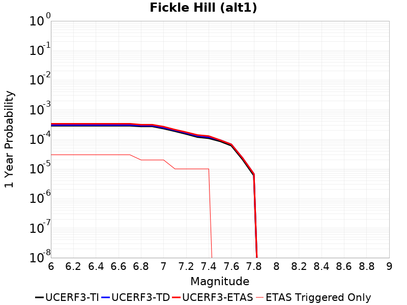 | 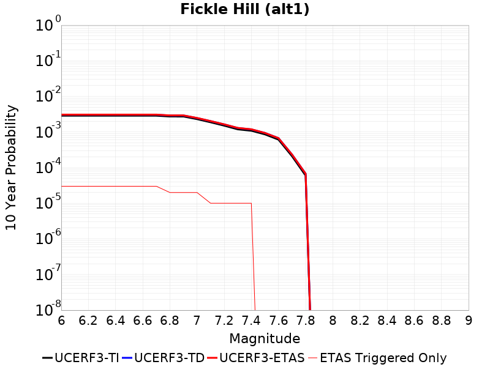 |

| Magnitude | 1 wk TI Prob | 1 wk TD Prob | 1 wk ETAS Prob | 1 wk ETAS/TD Gain | 1 wk ETAS Triggered Only | 1 mo TI Prob | 1 mo TD Prob | 1 mo ETAS Prob | 1 mo ETAS/TD Gain | 1 mo ETAS Triggered Only | 1 yr TI Prob | 1 yr TD Prob | 1 yr ETAS Prob | 1 yr ETAS/TD Gain | 1 yr ETAS Triggered Only | 10 yr TI Prob | 10 yr TD Prob | 10 yr ETAS Prob | 10 yr ETAS/TD Gain | 10 yr ETAS Triggered Only |
|-----|-----|-----|-----|-----|-----|-----|-----|-----|-----|-----|-----|-----|-----|-----|-----|-----|-----|-----|-----|-----|
| 6.0 | 5.491893E-6 | 5.8398005E-6 | 2.5839683E-5 | 4.4247546 | 2.0E-5 | 2.3536471E-5 | 2.5027488E-5 | 5.502674E-5 | 2.198652 | 3.0E-5 | 2.8651886E-4 | 3.0466935E-4 | 3.346602E-4 | 1.0984374 | 3.0E-5 | 0.0028614972 | 0.0030427414 | 0.0030726502 | 1.0098295 | 3.0E-5 |
| 6.1 | 5.491893E-6 | 5.8398005E-6 | 2.5839683E-5 | 4.4247546 | 2.0E-5 | 2.3536471E-5 | 2.5027488E-5 | 5.502674E-5 | 2.198652 | 3.0E-5 | 2.8651886E-4 | 3.0466935E-4 | 3.346602E-4 | 1.0984374 | 3.0E-5 | 0.0028614972 | 0.0030427414 | 0.0030726502 | 1.0098295 | 3.0E-5 |
| 6.2 | 5.491893E-6 | 5.8398005E-6 | 2.5839683E-5 | 4.4247546 | 2.0E-5 | 2.3536471E-5 | 2.5027488E-5 | 5.502674E-5 | 2.198652 | 3.0E-5 | 2.8651886E-4 | 3.0466935E-4 | 3.346602E-4 | 1.0984374 | 3.0E-5 | 0.0028614972 | 0.0030427414 | 0.0030726502 | 1.0098295 | 3.0E-5 |
| 6.3 | 5.491893E-6 | 5.8398005E-6 | 2.5839683E-5 | 4.4247546 | 2.0E-5 | 2.3536471E-5 | 2.5027488E-5 | 5.502674E-5 | 2.198652 | 3.0E-5 | 2.8651886E-4 | 3.0466935E-4 | 3.346602E-4 | 1.0984374 | 3.0E-5 | 0.0028614972 | 0.0030427414 | 0.0030726502 | 1.0098295 | 3.0E-5 |
| 6.4 | 5.491893E-6 | 5.8398005E-6 | 2.5839683E-5 | 4.4247546 | 2.0E-5 | 2.3536471E-5 | 2.5027488E-5 | 5.502674E-5 | 2.198652 | 3.0E-5 | 2.8651886E-4 | 3.0466935E-4 | 3.346602E-4 | 1.0984374 | 3.0E-5 | 0.0028614972 | 0.0030427414 | 0.0030726502 | 1.0098295 | 3.0E-5 |
| 6.5 | 5.491893E-6 | 5.8398005E-6 | 2.5839683E-5 | 4.4247546 | 2.0E-5 | 2.3536471E-5 | 2.5027488E-5 | 5.502674E-5 | 2.198652 | 3.0E-5 | 2.8651886E-4 | 3.0466935E-4 | 3.346602E-4 | 1.0984374 | 3.0E-5 | 0.0028614972 | 0.0030427414 | 0.0030726502 | 1.0098295 | 3.0E-5 |
| 6.6 | 5.491893E-6 | 5.8398005E-6 | 2.5839683E-5 | 4.4247546 | 2.0E-5 | 2.3536471E-5 | 2.5027488E-5 | 5.502674E-5 | 2.198652 | 3.0E-5 | 2.8651886E-4 | 3.0466935E-4 | 3.346602E-4 | 1.0984374 | 3.0E-5 | 0.0028614972 | 0.0030427414 | 0.0030726502 | 1.0098295 | 3.0E-5 |
| 6.7 | 5.491893E-6 | 5.8398005E-6 | 2.5839683E-5 | 4.4247546 | 2.0E-5 | 2.3536471E-5 | 2.5027488E-5 | 5.502674E-5 | 2.198652 | 3.0E-5 | 2.8651886E-4 | 3.0466935E-4 | 3.346602E-4 | 1.0984374 | 3.0E-5 | 0.0028614972 | 0.0030427414 | 0.0030726502 | 1.0098295 | 3.0E-5 |
| 6.8 | 5.2207747E-6 | 5.558133E-6 | 1.5558078E-5 | 2.7991552 | 1.0E-5 | 2.2374557E-5 | 2.3820365E-5 | 4.3819888E-5 | 1.8395977 | 2.0E-5 | 2.7237617E-4 | 2.8997657E-4 | 3.0997075E-4 | 1.0689511 | 2.0E-5 | 0.0027204256 | 0.0028962009 | 0.0029161428 | 1.0068856 | 2.0E-5 |
| 6.9 | 5.2186956E-6 | 5.5559494E-6 | 1.5555894E-5 | 2.7998624 | 1.0E-5 | 2.2365646E-5 | 2.3811008E-5 | 4.381053E-5 | 1.8399277 | 2.0E-5 | 2.722677E-4 | 2.8986266E-4 | 3.0985687E-4 | 1.0689782 | 2.0E-5 | 0.0027193436 | 0.0028950647 | 0.0029150068 | 1.0068883 | 2.0E-5 |
| 7.0 | 4.403045E-6 | 4.7097383E-6 | 1.4709691E-5 | 3.1232502 | 1.0E-5 | 1.8870056E-5 | 2.0184443E-5 | 4.018404E-5 | 1.9908421 | 2.0E-5 | 2.297187E-4 | 2.4571922E-4 | 2.657143E-4 | 1.0813737 | 2.0E-5 | 0.0022948137 | 0.002454606 | 0.002474557 | 1.0081279 | 2.0E-5 |
| 7.1 | 3.5911396E-6 | 3.857692E-6 | 1.3857653E-5 | 3.5922139 | 1.0E-5 | 1.5390508E-5 | 1.6532864E-5 | 2.6532698E-5 | 1.6048459 | 1.0E-5 | 1.8736332E-4 | 2.0126977E-4 | 2.1126775E-4 | 1.0496745 | 1.0E-5 | 0.0018720542 | 0.0020109485 | 0.0020209283 | 1.0049628 | 1.0E-5 |
| 7.2 | 2.888171E-6 | 3.1226853E-6 | 1.3122654E-5 | 4.202362 | 1.0E-5 | 1.2377816E-5 | 1.338287E-5 | 2.3382736E-5 | 1.7472138 | 1.0E-5 | 1.5068949E-4 | 1.6292451E-4 | 1.7292288E-4 | 1.0613681 | 1.0E-5 | 0.0015058735 | 0.0016280755 | 0.0016380592 | 1.0061322 | 1.0E-5 |
| 7.3 | 2.275019E-6 | 2.4747196E-6 | 1.2474695E-5 | 5.0408516 | 1.0E-5 | 9.750045E-6 | 1.0605899E-5 | 2.0605792E-5 | 1.9428616 | 1.0E-5 | 1.1870033E-4 | 1.291193E-4 | 1.3911801E-4 | 1.0774378 | 1.0E-5 | 0.0011863695 | 0.0012904569 | 0.001300444 | 1.0077392 | 1.0E-5 |
| 7.4 | 2.076662E-6 | 2.2643503E-6 | 1.2264328E-5 | 5.416268 | 1.0E-5 | 8.8999495E-6 | 9.704323E-6 | 1.9704226E-5 | 2.0304587 | 1.0E-5 | 1.08351494E-4 | 1.1814386E-4 | 1.2814268E-4 | 1.0846325 | 1.0E-5 | 0.0010829868 | 0.0011808237 | 0.0011908119 | 1.0084586 | 1.0E-5 |
| 7.5 | 1.6450799E-6 | 1.8009208E-6 | 1.8009208E-6 | 1.0 | 0.0 | 7.0503233E-6 | 7.718209E-6 | 7.718209E-6 | 1.0 | 0.0 | 8.5834305E-5 | 9.396523E-5 | 9.396523E-5 | 1.0 | 0.0 | 8.580116E-4 | 9.392627E-4 | 9.392627E-4 | 1.0 | 0.0 |
| 7.6 | 1.168891E-6 | 1.2870477E-6 | 1.2870477E-6 | 1.0 | 0.0 | 5.009523E-6 | 5.515907E-6 | 5.515907E-6 | 1.0 | 0.0 | 6.098924E-5 | 6.715416E-5 | 6.715416E-5 | 1.0 | 0.0 | 6.09725E-4 | 6.713443E-4 | 6.713443E-4 | 1.0 | 0.0 |
| 7.7 | 3.9871026E-7 | 4.442663E-7 | 4.442663E-7 | 1.0 | 0.0 | 1.708757E-6 | 1.9039971E-6 | 1.9039971E-6 | 1.0 | 0.0 | 2.0803918E-5 | 2.3180928E-5 | 2.3180928E-5 | 1.0 | 0.0 | 2.0801972E-4 | 2.3178593E-4 | 2.3178593E-4 | 1.0 | 0.0 |
| 7.8 | 1.14295965E-7 | 1.2897287E-7 | 1.2897287E-7 | 1.0 | 0.0 | 4.8983975E-7 | 5.5274074E-7 | 5.5274074E-7 | 1.0 | 0.0 | 5.9637828E-6 | 6.7295996E-6 | 6.7295996E-6 | 1.0 | 0.0 | 5.9636226E-5 | 6.729411E-5 | 6.729411E-5 | 1.0 | 0.0 |

## Calaveras (So) - Paicines extension 2011 CFM
*[(top)](#table-of-contents)*

| 1 Week | 1 Month | 1 Year | 10 Year |
|-----|-----|-----|-----|
|  |  | 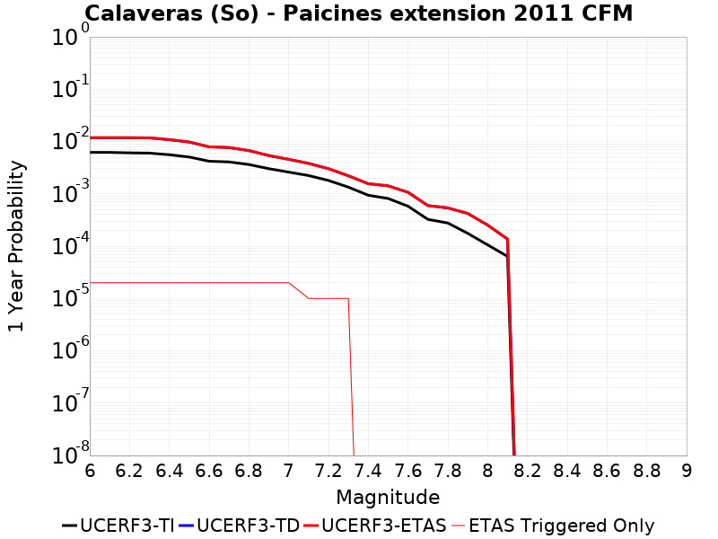 |  |

| Magnitude | 1 wk TI Prob | 1 wk TD Prob | 1 wk ETAS Prob | 1 wk ETAS/TD Gain | 1 wk ETAS Triggered Only | 1 mo TI Prob | 1 mo TD Prob | 1 mo ETAS Prob | 1 mo ETAS/TD Gain | 1 mo ETAS Triggered Only | 1 yr TI Prob | 1 yr TD Prob | 1 yr ETAS Prob | 1 yr ETAS/TD Gain | 1 yr ETAS Triggered Only | 10 yr TI Prob | 10 yr TD Prob | 10 yr ETAS Prob | 10 yr ETAS/TD Gain | 10 yr ETAS Triggered Only |
|-----|-----|-----|-----|-----|-----|-----|-----|-----|-----|-----|-----|-----|-----|-----|-----|-----|-----|-----|-----|-----|
| 6.0 | 1.1894548E-4 | 2.2810035E-4 | 2.2810035E-4 | 1.0 | 0.0 | 5.0966674E-4 | 9.769541E-4 | 9.769541E-4 | 1.0 | 0.0 | 0.006187552 | 0.011786157 | 0.011805922 | 1.0016769 | 2.0E-5 | 0.060180783 | 0.108081646 | 0.1081084 | 1.0002476 | 3.0E-5 |
| 6.1 | 1.1894548E-4 | 2.2810035E-4 | 2.2810035E-4 | 1.0 | 0.0 | 5.0966674E-4 | 9.769541E-4 | 9.769541E-4 | 1.0 | 0.0 | 0.006187552 | 0.011786157 | 0.011805922 | 1.0016769 | 2.0E-5 | 0.060180783 | 0.108081646 | 0.1081084 | 1.0002476 | 3.0E-5 |
| 6.2 | 1.1656485E-4 | 2.2810035E-4 | 2.2810035E-4 | 1.0 | 0.0 | 4.99468E-4 | 9.769541E-4 | 9.769541E-4 | 1.0 | 0.0 | 0.0060640806 | 0.011786157 | 0.011805922 | 1.0016769 | 2.0E-5 | 0.059012495 | 0.108081646 | 0.1081084 | 1.0002476 | 3.0E-5 |
| 6.3 | 1.152476E-4 | 2.2684356E-4 | 2.2684356E-4 | 1.0 | 0.0 | 4.938248E-4 | 9.7157364E-4 | 9.7157364E-4 | 1.0 | 0.0 | 0.005995755 | 0.011721532 | 0.011741297 | 1.0016862 | 2.0E-5 | 0.058365438 | 0.10751426 | 0.10754104 | 1.000249 | 3.0E-5 |
| 6.4 | 1.07200925E-4 | 2.0933259E-4 | 2.0933259E-4 | 1.0 | 0.0 | 4.5935164E-4 | 8.966137E-4 | 8.966137E-4 | 1.0 | 0.0 | 0.0055782744 | 0.010827591 | 0.010847375 | 1.0018271 | 2.0E-5 | 0.0544031 | 0.10017224 | 0.10019924 | 1.0002695 | 3.0E-5 |
| 6.5 | 9.69631E-5 | 1.8853441E-4 | 1.8853441E-4 | 1.0 | 0.0 | 4.1548995E-4 | 8.0757844E-4 | 8.0757844E-4 | 1.0 | 0.0 | 0.0050468626 | 0.009761289 | 0.009781094 | 1.002029 | 2.0E-5 | 0.04933773 | 0.091054365 | 0.091081634 | 1.0002995 | 3.0E-5 |
| 6.6 | 8.0552316E-5 | 1.5194171E-4 | 1.5194171E-4 | 1.0 | 0.0 | 3.4517853E-4 | 6.509797E-4 | 6.509797E-4 | 1.0 | 0.0 | 0.0041944524 | 0.007891204 | 0.007911047 | 1.0025145 | 2.0E-5 | 0.04116161 | 0.07552672 | 0.07555445 | 1.0003672 | 3.0E-5 |
| 6.7 | 7.815757E-5 | 1.4735984E-4 | 1.4735984E-4 | 1.0 | 0.0 | 3.34918E-4 | 6.313551E-4 | 6.313551E-4 | 1.0 | 0.0 | 0.004070005 | 0.0076546273 | 0.0076744743 | 1.0025928 | 2.0E-5 | 0.039962657 | 0.07337998 | 0.073407784 | 1.0003788 | 3.0E-5 |
| 6.8 | 6.965264E-5 | 1.2868925E-4 | 1.2868925E-4 | 1.0 | 0.0 | 2.9847719E-4 | 5.513946E-4 | 5.513946E-4 | 1.0 | 0.0 | 0.0036279052 | 0.0066898097 | 0.006709676 | 1.0029696 | 2.0E-5 | 0.03569247 | 0.064557396 | 0.06458546 | 1.0004348 | 3.0E-5 |
| 6.9 | 5.8000453E-5 | 1.0324567E-4 | 1.0324567E-4 | 1.0 | 0.0 | 2.4854968E-4 | 4.4240698E-4 | 4.4240698E-4 | 1.0 | 0.0 | 0.0030218933 | 0.0053731026 | 0.0053929947 | 1.0037023 | 2.0E-5 | 0.029811295 | 0.052392617 | 0.052421045 | 1.0005426 | 3.0E-5 |
| 7.0 | 4.9865852E-5 | 8.746433E-5 | 8.746433E-5 | 1.0 | 0.0 | 2.1369329E-4 | 3.7479374E-4 | 3.7479374E-4 | 1.0 | 0.0 | 0.0025986114 | 0.004553655 | 0.0045735645 | 1.0043721 | 2.0E-5 | 0.025684336 | 0.04466029 | 0.04468895 | 1.0006417 | 3.0E-5 |
| 7.1 | 4.283875E-5 | 7.315107E-5 | 7.315107E-5 | 1.0 | 0.0 | 1.8358172E-4 | 3.1346726E-4 | 3.1346726E-4 | 1.0 | 0.0 | 0.0022328163 | 0.0038098434 | 0.0038198053 | 1.0026147 | 1.0E-5 | 0.022105146 | 0.037698943 | 0.037708566 | 1.0002552 | 1.0E-5 |
| 7.2 | 3.450115E-5 | 5.7829435E-5 | 5.7829435E-5 | 1.0 | 0.0 | 1.478537E-4 | 2.4781708E-4 | 2.4781708E-4 | 1.0 | 0.0 | 0.0017986323 | 0.0030130292 | 0.003022999 | 1.0033089 | 1.0E-5 | 0.017841442 | 0.03005628 | 0.030065978 | 1.0003227 | 1.0E-5 |
| 7.3 | 2.5709045E-5 | 4.235167E-5 | 4.235167E-5 | 1.0 | 0.0 | 1.1017697E-4 | 1.8149463E-4 | 1.8149463E-4 | 1.0 | 0.0 | 0.0013405791 | 0.002207476 | 0.002217454 | 1.00452 | 1.0E-5 | 0.013325208 | 0.022138827 | 0.022148605 | 1.0004417 | 1.0E-5 |
| 7.4 | 1.8003093E-5 | 2.9932346E-5 | 2.9932346E-5 | 1.0 | 0.0 | 7.715383E-5 | 1.2827519E-4 | 1.2827519E-4 | 1.0 | 0.0 | 9.3894306E-4 | 0.001560634 | 0.001560634 | 1.0 | 0.0 | 0.009349857 | 0.015731899 | 0.015731899 | 1.0 | 0.0 |
| 7.5 | 1.5595824E-5 | 2.7222417E-5 | 2.7222417E-5 | 1.0 | 0.0 | 6.683753E-5 | 1.166623E-4 | 1.166623E-4 | 1.0 | 0.0 | 8.134431E-4 | 0.0014194405 | 0.0014194405 | 1.0 | 0.0 | 0.008104719 | 0.0143221365 | 0.0143221365 | 1.0 | 0.0 |
| 7.6 | 1.1110309E-5 | 2.0483949E-5 | 2.0483949E-5 | 1.0 | 0.0 | 4.761474E-5 | 8.77854E-5 | 8.77854E-5 | 1.0 | 0.0 | 5.795553E-4 | 0.0010682647 | 0.0010682647 | 1.0 | 0.0 | 0.0057804612 | 0.0108112395 | 0.0108112395 | 1.0 | 0.0 |
| 7.7 | 6.2140443E-6 | 1.1402534E-5 | 1.1402534E-5 | 1.0 | 0.0 | 2.6631347E-5 | 4.886709E-5 | 4.886709E-5 | 1.0 | 0.0 | 3.241884E-4 | 5.947945E-4 | 5.947945E-4 | 1.0 | 0.0 | 0.0032371588 | 0.0060849604 | 0.0060849604 | 1.0 | 0.0 |
| 7.8 | 5.305533E-6 | 1.03136745E-5 | 1.03136745E-5 | 1.0 | 0.0 | 2.27378E-5 | 4.420071E-5 | 4.420071E-5 | 1.0 | 0.0 | 2.7679754E-4 | 5.380109E-4 | 5.380109E-4 | 1.0 | 0.0 | 0.0027645302 | 0.005497614 | 0.005497614 | 1.0 | 0.0 |
| 7.9 | 3.363505E-6 | 8.083913E-6 | 8.083913E-6 | 1.0 | 0.0 | 1.4414942E-5 | 3.4644883E-5 | 3.4644883E-5 | 1.0 | 0.0 | 1.7548777E-4 | 4.217199E-4 | 4.217199E-4 | 1.0 | 0.0 | 0.0017534926 | 0.0042839237 | 0.0042839237 | 1.0 | 0.0 |
| 8.0 | 2.0271132E-6 | 4.8366965E-6 | 4.8366965E-6 | 1.0 | 0.0 | 8.687599E-6 | 2.0728536E-5 | 2.0728536E-5 | 1.0 | 0.0 | 1.05766376E-4 | 2.5234075E-4 | 2.5234075E-4 | 1.0 | 0.0 | 0.0010571606 | 0.002556558 | 0.002556558 | 1.0 | 0.0 |
| 8.1 | 1.2206116E-6 | 2.6158118E-6 | 2.6158118E-6 | 1.0 | 0.0 | 5.2311816E-6 | 1.12105745E-5 | 1.12105745E-5 | 1.0 | 0.0 | 6.3687774E-5 | 1.3648023E-4 | 1.3648023E-4 | 1.0 | 0.0 | 6.366953E-4 | 0.0013893716 | 0.0013893716 | 1.0 | 0.0 |

## Point Reyes 2011 CFM
*[(top)](#table-of-contents)*

| 1 Week | 1 Month | 1 Year | 10 Year |
|-----|-----|-----|-----|
|  |  | 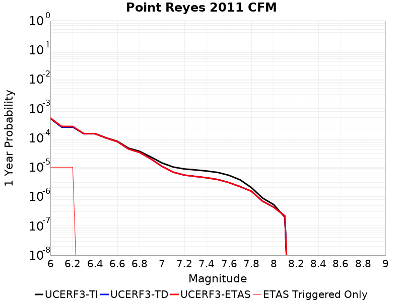 |  |

| Magnitude | 1 wk TI Prob | 1 wk TD Prob | 1 wk ETAS Prob | 1 wk ETAS/TD Gain | 1 wk ETAS Triggered Only | 1 mo TI Prob | 1 mo TD Prob | 1 mo ETAS Prob | 1 mo ETAS/TD Gain | 1 mo ETAS Triggered Only | 1 yr TI Prob | 1 yr TD Prob | 1 yr ETAS Prob | 1 yr ETAS/TD Gain | 1 yr ETAS Triggered Only | 10 yr TI Prob | 10 yr TD Prob | 10 yr ETAS Prob | 10 yr ETAS/TD Gain | 10 yr ETAS Triggered Only |
|-----|-----|-----|-----|-----|-----|-----|-----|-----|-----|-----|-----|-----|-----|-----|-----|-----|-----|-----|-----|-----|
| 6.0 | 8.8644965E-6 | 8.9744E-6 | 8.9744E-6 | 1.0 | 0.0 | 3.7990147E-5 | 3.846118E-5 | 4.84608E-5 | 1.2599924 | 1.0E-5 | 4.624319E-4 | 4.681706E-4 | 4.781659E-4 | 1.0213498 | 1.0E-5 | 0.0046147075 | 0.00467247 | 0.0046923766 | 1.0042604 | 2.0E-5 |
| 6.1 | 4.526405E-6 | 4.5430097E-6 | 4.5430097E-6 | 1.0 | 0.0 | 1.9398734E-5 | 1.9469902E-5 | 2.9469707E-5 | 1.5136032 | 1.0E-5 | 2.36154E-4 | 2.3702133E-4 | 2.4701896E-4 | 1.0421803 | 1.0E-5 | 0.002359032 | 0.0023677894 | 0.002387742 | 1.0084267 | 2.0E-5 |
| 6.2 | 4.526405E-6 | 4.5430097E-6 | 4.5430097E-6 | 1.0 | 0.0 | 1.9398734E-5 | 1.9469902E-5 | 2.9469707E-5 | 1.5136032 | 1.0E-5 | 2.36154E-4 | 2.3702133E-4 | 2.4701896E-4 | 1.0421803 | 1.0E-5 | 0.002359032 | 0.0023677894 | 0.002387742 | 1.0084267 | 2.0E-5 |
| 6.3 | 2.6842322E-6 | 2.6630746E-6 | 2.6630746E-6 | 1.0 | 0.0 | 1.1503801E-5 | 1.1413128E-5 | 1.1413128E-5 | 1.0 | 0.0 | 1.4004979E-4 | 1.3894617E-4 | 1.3894617E-4 | 1.0 | 0.0 | 0.0013996155 | 0.0013886126 | 0.0013985987 | 1.0071914 | 1.0E-5 |
| 6.4 | 2.6842322E-6 | 2.6630746E-6 | 2.6630746E-6 | 1.0 | 0.0 | 1.1503801E-5 | 1.1413128E-5 | 1.1413128E-5 | 1.0 | 0.0 | 1.4004979E-4 | 1.3894617E-4 | 1.3894617E-4 | 1.0 | 0.0 | 0.0013996155 | 0.0013886126 | 0.0013985987 | 1.0071914 | 1.0E-5 |
| 6.5 | 1.9281833E-6 | 1.8930349E-6 | 1.8930349E-6 | 1.0 | 0.0 | 8.263617E-6 | 8.112982E-6 | 8.112982E-6 | 1.0 | 0.0 | 1.0060489E-4 | 9.877116E-5 | 9.877116E-5 | 1.0 | 0.0 | 0.0010055936 | 9.872812E-4 | 9.972713E-4 | 1.0101188 | 1.0E-5 |
| 6.6 | 1.4726726E-6 | 1.4293972E-6 | 1.4293972E-6 | 1.0 | 0.0 | 6.3114385E-6 | 6.1259743E-6 | 6.1259743E-6 | 1.0 | 0.0 | 7.683905E-5 | 7.458123E-5 | 7.458123E-5 | 1.0 | 0.0 | 7.6812494E-4 | 7.455669E-4 | 7.555594E-4 | 1.0134026 | 1.0E-5 |
| 6.7 | 8.572307E-7 | 8.031614E-7 | 8.031614E-7 | 1.0 | 0.0 | 3.6738406E-6 | 3.4421157E-6 | 3.4421157E-6 | 1.0 | 0.0 | 4.472809E-5 | 4.190697E-5 | 4.190697E-5 | 1.0 | 0.0 | 4.471909E-4 | 4.189923E-4 | 4.189923E-4 | 1.0 | 0.0 |
| 6.8 | 6.6745434E-7 | 6.102239E-7 | 6.102239E-7 | 1.0 | 0.0 | 2.8605155E-6 | 2.6152427E-6 | 2.6152427E-6 | 1.0 | 0.0 | 3.482622E-5 | 3.1840125E-5 | 3.1840125E-5 | 1.0 | 0.0 | 3.4820763E-4 | 3.1835664E-4 | 3.1835664E-4 | 1.0 | 0.0 |
| 6.9 | 4.291521E-7 | 3.6790712E-7 | 3.6790712E-7 | 1.0 | 0.0 | 1.839222E-6 | 1.5767439E-6 | 1.5767439E-6 | 1.0 | 0.0 | 2.2392298E-5 | 1.9196692E-5 | 1.9196692E-5 | 1.0 | 0.0 | 2.2390042E-4 | 1.919507E-4 | 1.919507E-4 | 1.0 | 0.0 |
| 7.0 | 2.6812808E-7 | 2.045601E-7 | 2.045601E-7 | 1.0 | 0.0 | 1.1491198E-6 | 8.766858E-7 | 8.766858E-7 | 1.0 | 0.0 | 1.3990444E-5 | 1.0673598E-5 | 1.0673598E-5 | 1.0 | 0.0 | 1.3989564E-4 | 1.0673093E-4 | 1.0673093E-4 | 1.0 | 0.0 |
| 7.1 | 1.9451231E-7 | 1.3005356E-7 | 1.3005356E-7 | 1.0 | 0.0 | 8.336239E-7 | 5.573723E-7 | 5.573723E-7 | 1.0 | 0.0 | 1.0149324E-5 | 6.785986E-6 | 6.785986E-6 | 1.0 | 0.0 | 1.014886E-4 | 6.78578E-5 | 6.78578E-5 | 1.0 | 0.0 |
| 7.2 | 1.6715143E-7 | 1.03245746E-7 | 1.03245746E-7 | 1.0 | 0.0 | 7.1636305E-7 | 4.424817E-7 | 4.424817E-7 | 1.0 | 0.0 | 8.721685E-6 | 5.3872013E-6 | 5.3872013E-6 | 1.0 | 0.0 | 8.721343E-5 | 5.3870706E-5 | 5.3870706E-5 | 1.0 | 0.0 |
| 7.3 | 1.5503173E-7 | 9.290476E-8 | 9.290476E-8 | 1.0 | 0.0 | 6.644215E-7 | 3.9816322E-7 | 3.9816322E-7 | 1.0 | 0.0 | 8.089301E-6 | 4.847626E-6 | 4.847626E-6 | 1.0 | 0.0 | 8.089007E-5 | 4.8475205E-5 | 4.8475205E-5 | 1.0 | 0.0 |
| 7.4 | 1.4251614E-7 | 8.367638E-8 | 8.367638E-8 | 1.0 | 0.0 | 6.1078333E-7 | 3.5861302E-7 | 3.5861302E-7 | 1.0 | 0.0 | 7.4362615E-6 | 4.3661043E-6 | 4.3661043E-6 | 1.0 | 0.0 | 7.436013E-5 | 4.3660188E-5 | 4.3660188E-5 | 1.0 | 0.0 |
| 7.5 | 1.2710186E-7 | 7.289283E-8 | 7.289283E-8 | 1.0 | 0.0 | 5.447221E-7 | 3.1239782E-7 | 3.1239782E-7 | 1.0 | 0.0 | 6.6319717E-6 | 3.8034366E-6 | 3.8034366E-6 | 1.0 | 0.0 | 6.6317734E-5 | 3.8033715E-5 | 3.8033715E-5 | 1.0 | 0.0 |
| 7.6 | 1.0144708E-7 | 5.7278726E-8 | 5.7278726E-8 | 1.0 | 0.0 | 4.347731E-7 | 2.4548024E-7 | 2.4548024E-7 | 1.0 | 0.0 | 5.2933497E-6 | 2.9887176E-6 | 2.9887176E-6 | 1.0 | 0.0 | 5.293224E-5 | 2.9886774E-5 | 2.9886774E-5 | 1.0 | 0.0 |
| 7.7 | 7.090527E-8 | 4.1686196E-8 | 4.1686196E-8 | 1.0 | 0.0 | 3.038797E-7 | 1.786551E-7 | 1.786551E-7 | 1.0 | 0.0 | 3.699729E-6 | 2.1751237E-6 | 2.1751237E-6 | 1.0 | 0.0 | 3.6996673E-5 | 2.1751024E-5 | 2.1751024E-5 | 1.0 | 0.0 |
| 7.8 | 3.8712045E-8 | 2.9076057E-8 | 2.9076057E-8 | 1.0 | 0.0 | 1.6590876E-7 | 1.2461166E-7 | 1.2461166E-7 | 1.0 | 0.0 | 2.0199373E-6 | 1.5171458E-6 | 1.5171458E-6 | 1.0 | 0.0 | 2.0199188E-5 | 1.5171356E-5 | 1.5171356E-5 | 1.0 | 0.0 |
| 7.9 | 1.7068782E-8 | 1.3309036E-8 | 1.3309036E-8 | 1.0 | 0.0 | 7.315192E-8 | 5.703872E-8 | 5.703872E-8 | 1.0 | 0.0 | 8.906242E-7 | 6.9444616E-7 | 6.9444616E-7 | 1.0 | 0.0 | 8.906207E-6 | 6.9444404E-6 | 6.9444404E-6 | 1.0 | 0.0 |
| 8.0 | 1.0172592E-8 | 8.302691E-9 | 8.302691E-9 | 1.0 | 0.0 | 4.359682E-8 | 3.5582957E-8 | 3.5582957E-8 | 1.0 | 0.0 | 5.3079117E-7 | 4.3322243E-7 | 4.3322243E-7 | 1.0 | 0.0 | 5.307899E-6 | 4.3322157E-6 | 4.3322157E-6 | 1.0 | 0.0 |
| 8.1 | 3.7861243E-9 | 4.1862425E-9 | 4.1862425E-9 | 1.0 | 0.0 | 1.6226247E-8 | 1.7941035E-8 | 1.7941035E-8 | 1.0 | 0.0 | 1.9755454E-7 | 2.1843208E-7 | 2.1843208E-7 | 1.0 | 0.0 | 1.9755437E-6 | 2.1843186E-6 | 2.1843186E-6 | 1.0 | 0.0 |

## Pleito
*[(top)](#table-of-contents)*

| 1 Week | 1 Month | 1 Year | 10 Year |
|-----|-----|-----|-----|
| 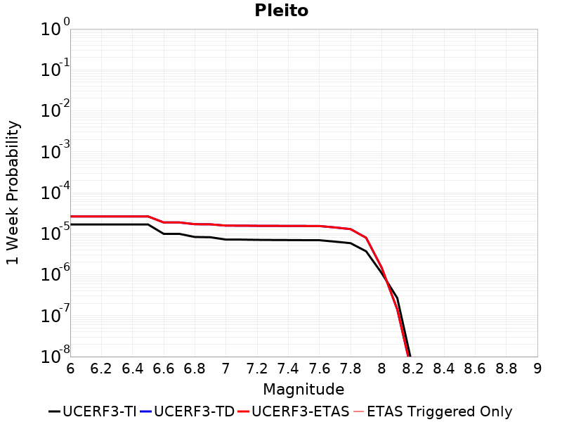 |  | 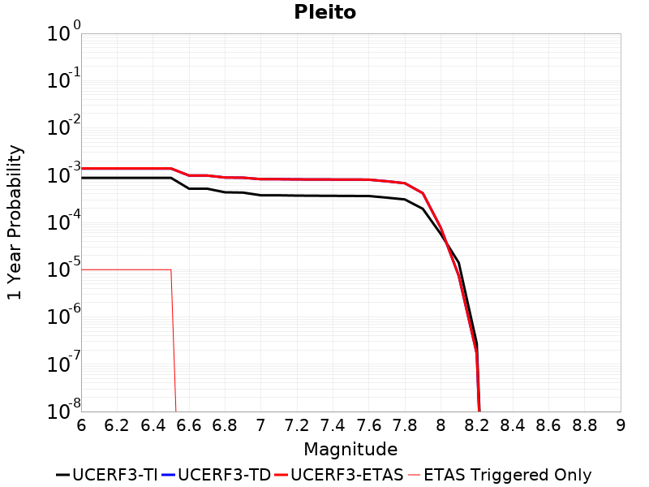 |  |

| Magnitude | 1 wk TI Prob | 1 wk TD Prob | 1 wk ETAS Prob | 1 wk ETAS/TD Gain | 1 wk ETAS Triggered Only | 1 mo TI Prob | 1 mo TD Prob | 1 mo ETAS Prob | 1 mo ETAS/TD Gain | 1 mo ETAS Triggered Only | 1 yr TI Prob | 1 yr TD Prob | 1 yr ETAS Prob | 1 yr ETAS/TD Gain | 1 yr ETAS Triggered Only | 10 yr TI Prob | 10 yr TD Prob | 10 yr ETAS Prob | 10 yr ETAS/TD Gain | 10 yr ETAS Triggered Only |
|-----|-----|-----|-----|-----|-----|-----|-----|-----|-----|-----|-----|-----|-----|-----|-----|-----|-----|-----|-----|-----|
| 6.0 | 1.6763008E-5 | 2.6373762E-5 | 2.6373762E-5 | 1.0 | 0.0 | 7.183948E-5 | 1.1302592E-4 | 1.2302479E-4 | 1.0884653 | 1.0E-5 | 8.742947E-4 | 0.0013752945 | 0.0013852809 | 1.0072612 | 1.0E-5 | 0.00870863 | 0.01376355 | 0.013783274 | 1.0014331 | 2.0E-5 |
| 6.1 | 1.6763008E-5 | 2.6373762E-5 | 2.6373762E-5 | 1.0 | 0.0 | 7.183948E-5 | 1.1302592E-4 | 1.2302479E-4 | 1.0884653 | 1.0E-5 | 8.742947E-4 | 0.0013752945 | 0.0013852809 | 1.0072612 | 1.0E-5 | 0.00870863 | 0.01376355 | 0.013783274 | 1.0014331 | 2.0E-5 |
| 6.2 | 1.6763008E-5 | 2.6373762E-5 | 2.6373762E-5 | 1.0 | 0.0 | 7.183948E-5 | 1.1302592E-4 | 1.2302479E-4 | 1.0884653 | 1.0E-5 | 8.742947E-4 | 0.0013752945 | 0.0013852809 | 1.0072612 | 1.0E-5 | 0.00870863 | 0.01376355 | 0.013783274 | 1.0014331 | 2.0E-5 |
| 6.3 | 1.6763008E-5 | 2.6373762E-5 | 2.6373762E-5 | 1.0 | 0.0 | 7.183948E-5 | 1.1302592E-4 | 1.2302479E-4 | 1.0884653 | 1.0E-5 | 8.742947E-4 | 0.0013752945 | 0.0013852809 | 1.0072612 | 1.0E-5 | 0.00870863 | 0.01376355 | 0.013783274 | 1.0014331 | 2.0E-5 |
| 6.4 | 1.6763008E-5 | 2.6373762E-5 | 2.6373762E-5 | 1.0 | 0.0 | 7.183948E-5 | 1.1302592E-4 | 1.2302479E-4 | 1.0884653 | 1.0E-5 | 8.742947E-4 | 0.0013752945 | 0.0013852809 | 1.0072612 | 1.0E-5 | 0.00870863 | 0.01376355 | 0.013783274 | 1.0014331 | 2.0E-5 |
| 6.5 | 1.6763008E-5 | 2.6373762E-5 | 2.6373762E-5 | 1.0 | 0.0 | 7.183948E-5 | 1.1302592E-4 | 1.2302479E-4 | 1.0884653 | 1.0E-5 | 8.742947E-4 | 0.0013752945 | 0.0013852809 | 1.0072612 | 1.0E-5 | 0.00870863 | 0.01376355 | 0.013783274 | 1.0014331 | 2.0E-5 |
| 6.6 | 9.910213E-6 | 1.8795656E-5 | 1.8795656E-5 | 1.0 | 0.0 | 4.247165E-5 | 8.0550344E-5 | 8.0550344E-5 | 1.0 | 0.0 | 5.169696E-4 | 9.80263E-4 | 9.80263E-4 | 1.0 | 0.0 | 0.0051576863 | 0.009848573 | 0.009848573 | 1.0 | 0.0 |
| 6.7 | 9.910213E-6 | 1.8795656E-5 | 1.8795656E-5 | 1.0 | 0.0 | 4.247165E-5 | 8.0550344E-5 | 8.0550344E-5 | 1.0 | 0.0 | 5.169696E-4 | 9.80263E-4 | 9.80263E-4 | 1.0 | 0.0 | 0.0051576863 | 0.009848573 | 0.009848573 | 1.0 | 0.0 |
| 6.8 | 8.300162E-6 | 1.7049957E-5 | 1.7049957E-5 | 1.0 | 0.0 | 3.557164E-5 | 7.3069205E-5 | 7.3069205E-5 | 1.0 | 0.0 | 4.3299864E-4 | 8.89256E-4 | 8.89256E-4 | 1.0 | 0.0 | 0.004321559 | 0.008945988 | 0.008945988 | 1.0 | 0.0 |
| 6.9 | 8.183114E-6 | 1.692078E-5 | 1.692078E-5 | 1.0 | 0.0 | 3.5070017E-5 | 7.251562E-5 | 7.251562E-5 | 1.0 | 0.0 | 4.2689382E-4 | 8.825215E-4 | 8.825215E-4 | 1.0 | 0.0 | 0.0042607468 | 0.008879182 | 0.008879182 | 1.0 | 0.0 |
| 7.0 | 7.1748823E-6 | 1.5721904E-5 | 1.5721904E-5 | 1.0 | 0.0 | 3.0749135E-5 | 6.737785E-5 | 6.737785E-5 | 1.0 | 0.0 | 3.743064E-4 | 8.200172E-4 | 8.200172E-4 | 1.0 | 0.0 | 0.0037367654 | 0.008258349 | 0.008258349 | 1.0 | 0.0 |
| 7.1 | 7.1671807E-6 | 1.5712023E-5 | 1.5712023E-5 | 1.0 | 0.0 | 3.0716128E-5 | 6.73355E-5 | 6.73355E-5 | 1.0 | 0.0 | 3.7390468E-4 | 8.19502E-4 | 8.19502E-4 | 1.0 | 0.0 | 0.0037327618 | 0.008253235 | 0.008253235 | 1.0 | 0.0 |
| 7.2 | 7.0649667E-6 | 1.5559615E-5 | 1.5559615E-5 | 1.0 | 0.0 | 3.0278077E-5 | 6.668236E-5 | 6.668236E-5 | 1.0 | 0.0 | 3.6857324E-4 | 8.11556E-4 | 8.11556E-4 | 1.0 | 0.0 | 0.0036796255 | 0.008174194 | 0.008174194 | 1.0 | 0.0 |
| 7.3 | 7.02082E-6 | 1.5502077E-5 | 1.5502077E-5 | 1.0 | 0.0 | 3.008888E-5 | 6.643579E-5 | 6.643579E-5 | 1.0 | 0.0 | 3.6627054E-4 | 8.085561E-4 | 8.085561E-4 | 1.0 | 0.0 | 0.0036566744 | 0.008144206 | 0.008144206 | 1.0 | 0.0 |
| 7.4 | 6.987146E-6 | 1.546045E-5 | 1.546045E-5 | 1.0 | 0.0 | 2.9944567E-5 | 6.6257395E-5 | 6.6257395E-5 | 1.0 | 0.0 | 3.6451413E-4 | 8.0638577E-4 | 8.0638577E-4 | 1.0 | 0.0 | 0.0036391679 | 0.00812255 | 0.00812255 | 1.0 | 0.0 |
| 7.5 | 6.9494554E-6 | 1.5416439E-5 | 1.5416439E-5 | 1.0 | 0.0 | 2.9783041E-5 | 6.606879E-5 | 6.606879E-5 | 1.0 | 0.0 | 3.625482E-4 | 8.040912E-4 | 8.040912E-4 | 1.0 | 0.0 | 0.0036195726 | 0.0080997255 | 0.0080997255 | 1.0 | 0.0 |
| 7.6 | 6.92694E-6 | 1.537298E-5 | 1.537298E-5 | 1.0 | 0.0 | 2.9686547E-5 | 6.588254E-5 | 6.588254E-5 | 1.0 | 0.0 | 3.6137376E-4 | 8.018253E-4 | 8.018253E-4 | 1.0 | 0.0 | 0.0036078666 | 0.008077187 | 0.008077187 | 1.0 | 0.0 |
| 7.7 | 6.395867E-6 | 1.4190619E-5 | 1.4190619E-5 | 1.0 | 0.0 | 2.741057E-5 | 6.0815524E-5 | 6.0815524E-5 | 1.0 | 0.0 | 3.336726E-4 | 7.401779E-4 | 7.401779E-4 | 1.0 | 0.0 | 0.0033317201 | 0.0074653984 | 0.0074653984 | 1.0 | 0.0 |
| 7.8 | 5.8664327E-6 | 1.2927152E-5 | 1.2927152E-5 | 1.0 | 0.0 | 2.5141611E-5 | 5.5400906E-5 | 5.5400906E-5 | 1.0 | 0.0 | 3.060561E-4 | 6.7429757E-4 | 6.7429757E-4 | 1.0 | 0.0 | 0.0030563495 | 0.0068050777 | 0.0068050777 | 1.0 | 0.0 |
| 7.9 | 3.7167474E-6 | 7.956481E-6 | 7.956481E-6 | 1.0 | 0.0 | 1.592882E-5 | 3.4098757E-5 | 3.4098757E-5 | 1.0 | 0.0 | 1.9391612E-4 | 4.1507347E-4 | 4.1507347E-4 | 1.0 | 0.0 | 0.0019374699 | 0.004194687 | 0.004194687 | 1.0 | 0.0 |
| 8.0 | 1.0903841E-6 | 1.4765961E-6 | 1.4765961E-6 | 1.0 | 0.0 | 4.6730665E-6 | 6.3282537E-6 | 6.3282537E-6 | 1.0 | 0.0 | 5.68931E-5 | 7.7043784E-5 | 7.7043784E-5 | 1.0 | 0.0 | 5.6878536E-4 | 7.9288706E-4 | 7.9288706E-4 | 1.0 | 0.0 |
| 8.1 | 2.6894583E-7 | 1.4246733E-7 | 1.4246733E-7 | 1.0 | 0.0 | 1.1526245E-6 | 6.105741E-7 | 6.105741E-7 | 1.0 | 0.0 | 1.4033113E-5 | 7.433715E-6 | 7.433715E-6 | 1.0 | 0.0 | 1.4032227E-4 | 8.220219E-5 | 8.220219E-5 | 1.0 | 0.0 |
| 8.2 | 5.2967013E-9 | 3.2376457E-9 | 3.2376457E-9 | 1.0 | 0.0 | 2.2700148E-8 | 1.3875624E-8 | 1.3875624E-8 | 1.0 | 0.0 | 2.7637427E-7 | 1.6893571E-7 | 1.6893571E-7 | 1.0 | 0.0 | 2.7637393E-6 | 1.8906994E-6 | 1.8906994E-6 | 1.0 | 0.0 |

## Great Valley 05 Pittsburg - Kirby Hills alt1
*[(top)](#table-of-contents)*

| 1 Week | 1 Month | 1 Year | 10 Year |
|-----|-----|-----|-----|
| 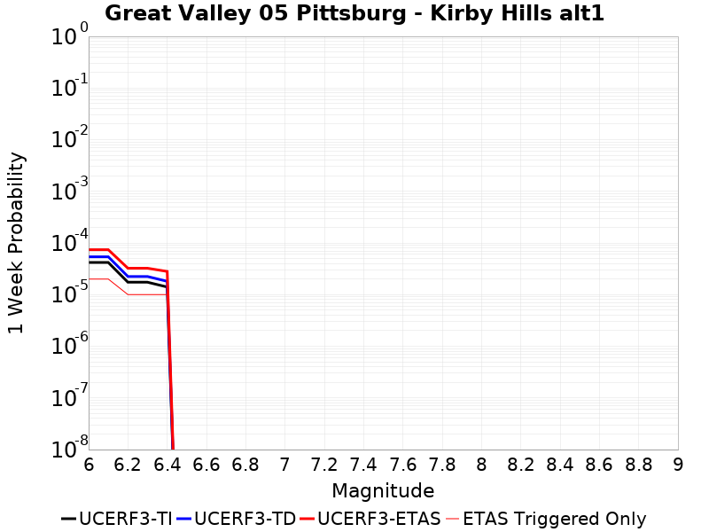 |  | 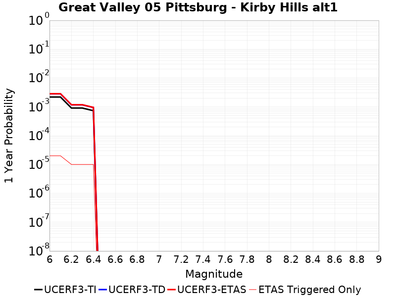 |  |

| Magnitude | 1 wk TI Prob | 1 wk TD Prob | 1 wk ETAS Prob | 1 wk ETAS/TD Gain | 1 wk ETAS Triggered Only | 1 mo TI Prob | 1 mo TD Prob | 1 mo ETAS Prob | 1 mo ETAS/TD Gain | 1 mo ETAS Triggered Only | 1 yr TI Prob | 1 yr TD Prob | 1 yr ETAS Prob | 1 yr ETAS/TD Gain | 1 yr ETAS Triggered Only | 10 yr TI Prob | 10 yr TD Prob | 10 yr ETAS Prob | 10 yr ETAS/TD Gain | 10 yr ETAS Triggered Only |
|-----|-----|-----|-----|-----|-----|-----|-----|-----|-----|-----|-----|-----|-----|-----|-----|-----|-----|-----|-----|-----|
| 6.0 | 4.187212E-5 | 5.399027E-5 | 7.398919E-5 | 1.3704171 | 2.0E-5 | 1.794396E-4 | 2.3137113E-4 | 2.513665E-4 | 1.0864213 | 2.0E-5 | 0.002182488 | 0.0028142738 | 0.0028342176 | 1.0070866 | 2.0E-5 | 0.021611776 | 0.027881052 | 0.027900495 | 1.0006974 | 2.0E-5 |
| 6.1 | 4.187212E-5 | 5.399027E-5 | 7.398919E-5 | 1.3704171 | 2.0E-5 | 1.794396E-4 | 2.3137113E-4 | 2.513665E-4 | 1.0864213 | 2.0E-5 | 0.002182488 | 0.0028142738 | 0.0028342176 | 1.0070866 | 2.0E-5 | 0.021611776 | 0.027881052 | 0.027900495 | 1.0006974 | 2.0E-5 |
| 6.2 | 1.7353306E-5 | 2.2381866E-5 | 3.2381642E-5 | 1.4467803 | 1.0E-5 | 7.436919E-5 | 9.592004E-5 | 1.0591908E-4 | 1.1042435 | 1.0E-5 | 9.050688E-4 | 0.0011675929 | 0.0011775813 | 1.0085546 | 1.0E-5 | 0.009013915 | 0.011652383 | 0.011662266 | 1.0008482 | 1.0E-5 |
| 6.3 | 1.7353306E-5 | 2.2381866E-5 | 3.2381642E-5 | 1.4467803 | 1.0E-5 | 7.436919E-5 | 9.592004E-5 | 1.0591908E-4 | 1.1042435 | 1.0E-5 | 9.050688E-4 | 0.0011675929 | 0.0011775813 | 1.0085546 | 1.0E-5 | 0.009013915 | 0.011652383 | 0.011662266 | 1.0008482 | 1.0E-5 |
| 6.4 | 1.4028824E-5 | 1.8084236E-5 | 2.8084056E-5 | 1.5529578 | 1.0E-5 | 6.0122147E-5 | 7.750297E-5 | 8.7502194E-5 | 1.1290174 | 1.0E-5 | 7.3174125E-4 | 9.4357686E-4 | 9.535674E-4 | 1.0105879 | 1.0E-5 | 0.0072933645 | 0.009433065 | 0.00944297 | 1.0010501 | 1.0E-5 |

## Hayward (So) extension 2011 CFM
*[(top)](#table-of-contents)*

| 1 Week | 1 Month | 1 Year | 10 Year |
|-----|-----|-----|-----|
| 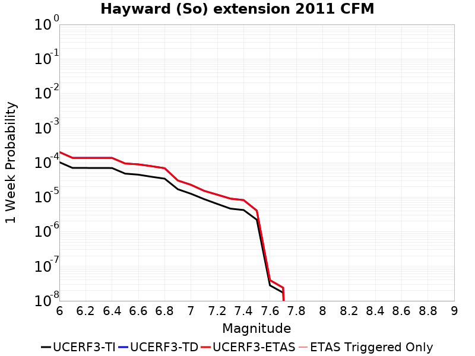 | 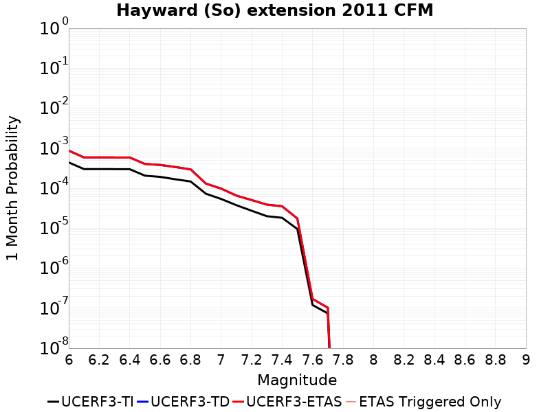 |  |  |

| Magnitude | 1 wk TI Prob | 1 wk TD Prob | 1 wk ETAS Prob | 1 wk ETAS/TD Gain | 1 wk ETAS Triggered Only | 1 mo TI Prob | 1 mo TD Prob | 1 mo ETAS Prob | 1 mo ETAS/TD Gain | 1 mo ETAS Triggered Only | 1 yr TI Prob | 1 yr TD Prob | 1 yr ETAS Prob | 1 yr ETAS/TD Gain | 1 yr ETAS Triggered Only | 10 yr TI Prob | 10 yr TD Prob | 10 yr ETAS Prob | 10 yr ETAS/TD Gain | 10 yr ETAS Triggered Only |
|-----|-----|-----|-----|-----|-----|-----|-----|-----|-----|-----|-----|-----|-----|-----|-----|-----|-----|-----|-----|-----|
| 6.0 | 1.0263006E-4 | 2.0169423E-4 | 2.0169423E-4 | 1.0 | 0.0 | 4.3976895E-4 | 8.6413196E-4 | 8.6413196E-4 | 1.0 | 0.0 | 0.00534105 | 0.010458234 | 0.010478024 | 1.0018923 | 2.0E-5 | 0.05214491 | 0.09776594 | 0.09778398 | 1.0001845 | 2.0E-5 |
| 6.1 | 6.99169E-5 | 1.368456E-4 | 1.368456E-4 | 1.0 | 0.0 | 2.9960944E-4 | 5.863483E-4 | 5.863483E-4 | 1.0 | 0.0 | 0.0036416445 | 0.007110812 | 0.0071207406 | 1.0013963 | 1.0E-5 | 0.035825435 | 0.067459695 | 0.067469016 | 1.0001383 | 1.0E-5 |
| 6.2 | 6.99169E-5 | 1.368456E-4 | 1.368456E-4 | 1.0 | 0.0 | 2.9960944E-4 | 5.863483E-4 | 5.863483E-4 | 1.0 | 0.0 | 0.0036416445 | 0.007110812 | 0.0071207406 | 1.0013963 | 1.0E-5 | 0.035825435 | 0.067459695 | 0.067469016 | 1.0001383 | 1.0E-5 |
| 6.3 | 6.970908E-5 | 1.3652908E-4 | 1.3652908E-4 | 1.0 | 0.0 | 2.9871898E-4 | 5.849927E-4 | 5.849927E-4 | 1.0 | 0.0 | 0.0036308395 | 0.00709445 | 0.0071043787 | 1.0013995 | 1.0E-5 | 0.035720866 | 0.06730923 | 0.06731855 | 1.0001385 | 1.0E-5 |
| 6.4 | 6.9517155E-5 | 1.3620433E-4 | 1.3620433E-4 | 1.0 | 0.0 | 2.9789665E-4 | 5.836016E-4 | 5.836016E-4 | 1.0 | 0.0 | 0.0036208609 | 0.0070776637 | 0.007087593 | 1.0014029 | 1.0E-5 | 0.03562429 | 0.067155294 | 0.06716462 | 1.0001389 | 1.0E-5 |
| 6.5 | 4.786248E-5 | 9.397996E-5 | 9.397996E-5 | 1.0 | 0.0 | 2.0510878E-4 | 4.0271165E-4 | 4.0271165E-4 | 1.0 | 0.0 | 0.0024943394 | 0.0048924354 | 0.0049023866 | 1.002034 | 1.0E-5 | 0.02466527 | 0.046901684 | 0.046911214 | 1.0002033 | 1.0E-5 |
| 6.6 | 4.4662214E-5 | 8.873434E-5 | 8.873434E-5 | 1.0 | 0.0 | 1.9139545E-4 | 3.8023718E-4 | 3.8023718E-4 | 1.0 | 0.0 | 0.0023277493 | 0.0046200184 | 0.004629972 | 1.0021545 | 1.0E-5 | 0.02303517 | 0.04433136 | 0.044340916 | 1.0002155 | 1.0E-5 |
| 6.7 | 3.884542E-5 | 7.863826E-5 | 7.863826E-5 | 1.0 | 0.0 | 1.6646975E-4 | 3.3698004E-4 | 3.3698004E-4 | 1.0 | 0.0 | 0.002024885 | 0.00409545 | 0.004105409 | 1.0024318 | 1.0E-5 | 0.020065336 | 0.03940124 | 0.03941085 | 1.0002438 | 1.0E-5 |
| 6.8 | 3.4221863E-5 | 6.860017E-5 | 6.860017E-5 | 1.0 | 0.0 | 1.4665688E-4 | 2.9396993E-4 | 2.9396993E-4 | 1.0 | 0.0 | 0.0017840851 | 0.0035736233 | 0.0035835875 | 1.0027883 | 1.0E-5 | 0.017698295 | 0.0345022 | 0.034511853 | 1.0002798 | 1.0E-5 |
| 6.9 | 1.6927712E-5 | 3.0322508E-5 | 3.0322508E-5 | 1.0 | 0.0 | 7.2545314E-5 | 1.2994745E-4 | 1.2994745E-4 | 1.0 | 0.0 | 8.828813E-4 | 0.0015810188 | 0.0015910029 | 1.006315 | 1.0E-5 | 0.008793819 | 0.015600322 | 0.015610166 | 1.000631 | 1.0E-5 |
| 7.0 | 1.2509653E-5 | 2.2706523E-5 | 2.2706523E-5 | 1.0 | 0.0 | 5.3611697E-5 | 9.731028E-5 | 9.731028E-5 | 1.0 | 0.0 | 6.525269E-4 | 0.0011841524 | 0.0011941406 | 1.0084349 | 1.0E-5 | 0.0065061417 | 0.011709483 | 0.011719367 | 1.000844 | 1.0E-5 |
| 7.1 | 8.751583E-6 | 1.5207723E-5 | 1.5207723E-5 | 1.0 | 0.0 | 3.750624E-5 | 6.517436E-5 | 6.517436E-5 | 1.0 | 0.0 | 4.5654282E-4 | 7.9321506E-4 | 8.032071E-4 | 1.012597 | 1.0E-5 | 0.0045560603 | 0.007904325 | 0.007914246 | 1.0012552 | 1.0E-5 |
| 7.2 | 6.354379E-6 | 1.1760165E-5 | 1.1760165E-5 | 1.0 | 0.0 | 2.7232769E-5 | 5.039976E-5 | 5.039976E-5 | 1.0 | 0.0 | 3.3150852E-4 | 6.1344943E-4 | 6.1344943E-4 | 1.0 | 0.0 | 0.0033101442 | 0.0061303605 | 0.0061303605 | 1.0 | 0.0 |
| 7.3 | 4.645554E-6 | 9.047369E-6 | 9.047369E-6 | 1.0 | 0.0 | 1.9909365E-5 | 3.8773884E-5 | 3.8773884E-5 | 1.0 | 0.0 | 2.4236954E-4 | 4.7197394E-4 | 4.7197394E-4 | 1.0 | 0.0 | 0.0024210536 | 0.004725367 | 0.004725367 | 1.0 | 0.0 |
| 7.4 | 4.23437E-6 | 8.206134E-6 | 8.206134E-6 | 1.0 | 0.0 | 1.8147173E-5 | 3.5168698E-5 | 3.5168698E-5 | 1.0 | 0.0 | 2.2091944E-4 | 4.280988E-4 | 4.280988E-4 | 1.0 | 0.0 | 0.0022069993 | 0.004289131 | 0.004289131 | 1.0 | 0.0 |
| 7.5 | 2.2187417E-6 | 4.0672157E-6 | 4.0672157E-6 | 1.0 | 0.0 | 9.508858E-6 | 1.7430822E-5 | 1.7430822E-5 | 1.0 | 0.0 | 1.157642E-4 | 2.1220236E-4 | 2.1220236E-4 | 1.0 | 0.0 | 0.0011570391 | 0.0021322956 | 0.0021322956 | 1.0 | 0.0 |
| 7.6 | 2.7952495E-8 | 3.956659E-8 | 3.956659E-8 | 1.0 | 0.0 | 1.1979641E-7 | 1.6957108E-7 | 1.6957108E-7 | 1.0 | 0.0 | 1.4585203E-6 | 2.0645261E-6 | 2.0645261E-6 | 1.0 | 0.0 | 1.4585107E-5 | 2.0738908E-5 | 2.0738908E-5 | 1.0 | 0.0 |
| 7.7 | 1.7192724E-8 | 2.3942059E-8 | 2.3942059E-8 | 1.0 | 0.0 | 7.36831E-8 | 1.0260882E-7 | 1.0260882E-7 | 1.0 | 0.0 | 8.9709135E-7 | 1.2492617E-6 | 1.2492617E-6 | 1.0 | 0.0 | 8.970877E-6 | 1.2556869E-5 | 1.2556869E-5 | 1.0 | 0.0 |

## Davis Creek
*[(top)](#table-of-contents)*

| 1 Week | 1 Month | 1 Year | 10 Year |
|-----|-----|-----|-----|
| 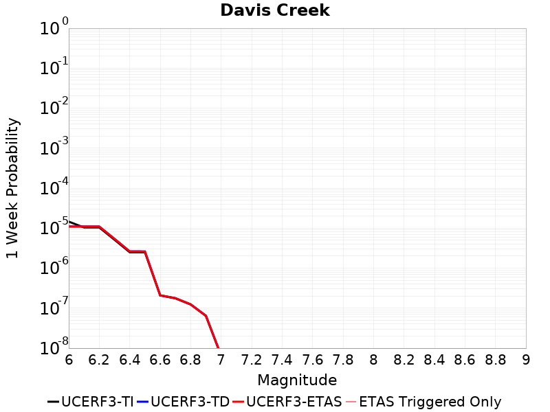 | 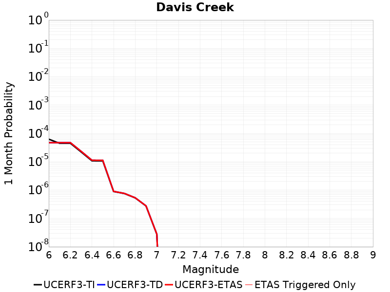 | 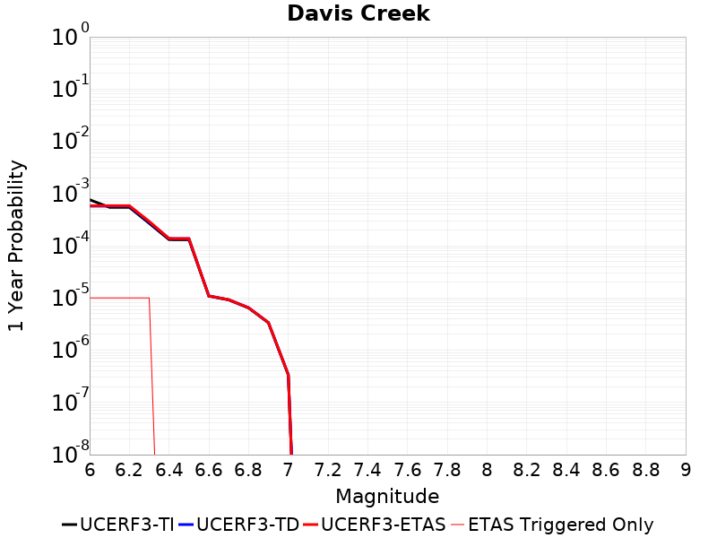 |  |

| Magnitude | 1 wk TI Prob | 1 wk TD Prob | 1 wk ETAS Prob | 1 wk ETAS/TD Gain | 1 wk ETAS Triggered Only | 1 mo TI Prob | 1 mo TD Prob | 1 mo ETAS Prob | 1 mo ETAS/TD Gain | 1 mo ETAS Triggered Only | 1 yr TI Prob | 1 yr TD Prob | 1 yr ETAS Prob | 1 yr ETAS/TD Gain | 1 yr ETAS Triggered Only | 10 yr TI Prob | 10 yr TD Prob | 10 yr ETAS Prob | 10 yr ETAS/TD Gain | 10 yr ETAS Triggered Only |
|-----|-----|-----|-----|-----|-----|-----|-----|-----|-----|-----|-----|-----|-----|-----|-----|-----|-----|-----|-----|-----|
| 6.0 | 1.4540828E-5 | 1.0971189E-5 | 1.0971189E-5 | 1.0 | 0.0 | 6.231634E-5 | 4.701868E-5 | 4.701868E-5 | 1.0 | 0.0 | 7.584374E-4 | 5.7232747E-4 | 5.823218E-4 | 1.0174625 | 1.0E-5 | 0.007558541 | 0.0057110395 | 0.005730925 | 1.003482 | 2.0E-5 |
| 6.1 | 1.0407654E-5 | 1.0971189E-5 | 1.0971189E-5 | 1.0 | 0.0 | 4.4603472E-5 | 4.701868E-5 | 4.701868E-5 | 1.0 | 0.0 | 5.4291193E-4 | 5.7232747E-4 | 5.823218E-4 | 1.0174625 | 1.0E-5 | 0.0054158745 | 0.0057110395 | 0.005730925 | 1.003482 | 2.0E-5 |
| 6.2 | 1.0407654E-5 | 1.0971189E-5 | 1.0971189E-5 | 1.0 | 0.0 | 4.4603472E-5 | 4.701868E-5 | 4.701868E-5 | 1.0 | 0.0 | 5.4291193E-4 | 5.7232747E-4 | 5.823218E-4 | 1.0174625 | 1.0E-5 | 0.0054158745 | 0.0057110395 | 0.005730925 | 1.003482 | 2.0E-5 |
| 6.3 | 5.1323277E-6 | 5.4078796E-6 | 5.4078796E-6 | 1.0 | 0.0 | 2.1995505E-5 | 2.3176466E-5 | 2.3176466E-5 | 1.0 | 0.0 | 2.6776237E-4 | 2.8214505E-4 | 2.921422E-4 | 1.0354328 | 1.0E-5 | 0.0026743996 | 0.0028186643 | 0.002828636 | 1.0035378 | 1.0E-5 |
| 6.4 | 2.4985154E-6 | 2.625218E-6 | 2.625218E-6 | 1.0 | 0.0 | 1.07078795E-5 | 1.1250905E-5 | 1.1250905E-5 | 1.0 | 0.0 | 1.3036063E-4 | 1.3697454E-4 | 1.3697454E-4 | 1.0 | 0.0 | 0.0013028418 | 0.0013692332 | 0.0013692332 | 1.0 | 0.0 |
| 6.5 | 2.4846438E-6 | 2.6111716E-6 | 2.6111716E-6 | 1.0 | 0.0 | 1.064843E-5 | 1.1190707E-5 | 1.1190707E-5 | 1.0 | 0.0 | 1.2963692E-4 | 1.3624172E-4 | 1.3624172E-4 | 1.0 | 0.0 | 0.0012956132 | 0.001361914 | 0.001361914 | 1.0 | 0.0 |
| 6.6 | 2.072566E-7 | 2.097562E-7 | 2.097562E-7 | 1.0 | 0.0 | 8.882423E-7 | 8.9895485E-7 | 8.9895485E-7 | 1.0 | 0.0 | 1.0814296E-5 | 1.0944722E-5 | 1.0944722E-5 | 1.0 | 0.0 | 1.081377E-4 | 1.09442015E-4 | 1.09442015E-4 | 1.0 | 0.0 |
| 6.7 | 1.7544528E-7 | 1.7753673E-7 | 1.7753673E-7 | 1.0 | 0.0 | 7.5190815E-7 | 7.608715E-7 | 7.608715E-7 | 1.0 | 0.0 | 9.154443E-6 | 9.263573E-6 | 9.263573E-6 | 1.0 | 0.0 | 9.1540656E-5 | 9.263202E-5 | 9.263202E-5 | 1.0 | 0.0 |
| 6.8 | 1.2320395E-7 | 1.2454998E-7 | 1.2454998E-7 | 1.0 | 0.0 | 5.280168E-7 | 5.3378557E-7 | 5.3378557E-7 | 1.0 | 0.0 | 6.428586E-6 | 6.498821E-6 | 6.498821E-6 | 1.0 | 0.0 | 6.4284E-5 | 6.498642E-5 | 6.498642E-5 | 1.0 | 0.0 |
| 6.9 | 6.399997E-8 | 6.471264E-8 | 6.471264E-8 | 1.0 | 0.0 | 2.7428555E-7 | 2.7733986E-7 | 2.7733986E-7 | 1.0 | 0.0 | 3.3394215E-6 | 3.376608E-6 | 3.376608E-6 | 1.0 | 0.0 | 3.3393713E-5 | 3.376563E-5 | 3.376563E-5 | 1.0 | 0.0 |
| 7.0 | 6.4455685E-9 | 6.515837E-9 | 6.515837E-9 | 1.0 | 0.0 | 2.7623864E-8 | 2.7925017E-8 | 2.7925017E-8 | 1.0 | 0.0 | 3.3632048E-7 | 3.3998708E-7 | 3.3998708E-7 | 1.0 | 0.0 | 3.3631998E-6 | 3.3998708E-6 | 3.3998708E-6 | 1.0 | 0.0 |

## Hayward (No) 2011 CFM
*[(top)](#table-of-contents)*

| 1 Week | 1 Month | 1 Year | 10 Year |
|-----|-----|-----|-----|
|  |  |  |  |

| Magnitude | 1 wk TI Prob | 1 wk TD Prob | 1 wk ETAS Prob | 1 wk ETAS/TD Gain | 1 wk ETAS Triggered Only | 1 mo TI Prob | 1 mo TD Prob | 1 mo ETAS Prob | 1 mo ETAS/TD Gain | 1 mo ETAS Triggered Only | 1 yr TI Prob | 1 yr TD Prob | 1 yr ETAS Prob | 1 yr ETAS/TD Gain | 1 yr ETAS Triggered Only | 10 yr TI Prob | 10 yr TD Prob | 10 yr ETAS Prob | 10 yr ETAS/TD Gain | 10 yr ETAS Triggered Only |
|-----|-----|-----|-----|-----|-----|-----|-----|-----|-----|-----|-----|-----|-----|-----|-----|-----|-----|-----|-----|-----|
| 6.0 | 9.0370086E-5 | 1.7196416E-4 | 1.7196416E-4 | 1.0 | 0.0 | 3.8724288E-4 | 7.3678134E-4 | 7.3678134E-4 | 1.0 | 0.0 | 0.004704494 | 0.008933515 | 0.0089434255 | 1.0011094 | 1.0E-5 | 0.04606138 | 0.08539386 | 0.08541215 | 1.0002142 | 2.0E-5 |
| 6.1 | 9.0370086E-5 | 1.7196416E-4 | 1.7196416E-4 | 1.0 | 0.0 | 3.8724288E-4 | 7.3678134E-4 | 7.3678134E-4 | 1.0 | 0.0 | 0.004704494 | 0.008933515 | 0.0089434255 | 1.0011094 | 1.0E-5 | 0.04606138 | 0.08539386 | 0.08541215 | 1.0002142 | 2.0E-5 |
| 6.2 | 9.006742E-5 | 1.7156937E-4 | 1.7156937E-4 | 1.0 | 0.0 | 3.859461E-4 | 7.350904E-4 | 7.350904E-4 | 1.0 | 0.0 | 0.0046887742 | 0.008913115 | 0.008923026 | 1.001112 | 1.0E-5 | 0.0459107 | 0.08520733 | 0.08522562 | 1.0002147 | 2.0E-5 |
| 6.3 | 8.8336754E-5 | 1.6834299E-4 | 1.6834299E-4 | 1.0 | 0.0 | 3.7853114E-4 | 7.21271E-4 | 7.21271E-4 | 1.0 | 0.0 | 0.004598882 | 0.008746281 | 0.008756193 | 1.0011333 | 1.0E-5 | 0.04504866 | 0.08369405 | 0.08371238 | 1.000219 | 2.0E-5 |
| 6.4 | 8.526157E-5 | 1.6257165E-4 | 1.6257165E-4 | 1.0 | 0.0 | 3.6535555E-4 | 6.965501E-4 | 6.965501E-4 | 1.0 | 0.0 | 0.0044391346 | 0.008447688 | 0.008457603 | 1.0011737 | 1.0E-5 | 0.043514993 | 0.080974124 | 0.080992505 | 1.000227 | 2.0E-5 |
| 6.5 | 8.152396E-5 | 1.5584906E-4 | 1.5584906E-4 | 1.0 | 0.0 | 3.493416E-4 | 6.677541E-4 | 6.677541E-4 | 1.0 | 0.0 | 0.0042449418 | 0.008099757 | 0.008109677 | 1.0012246 | 1.0E-5 | 0.04164765 | 0.07778675 | 0.077795975 | 1.0001186 | 1.0E-5 |
| 6.6 | 7.987405E-5 | 1.5287177E-4 | 1.5287177E-4 | 1.0 | 0.0 | 3.4227243E-4 | 6.5500085E-4 | 6.5500085E-4 | 1.0 | 0.0 | 0.0041592065 | 0.00794564 | 0.00795556 | 1.0012486 | 1.0E-5 | 0.04082218 | 0.07637221 | 0.07638145 | 1.0001209 | 1.0E-5 |
| 6.7 | 7.777665E-5 | 1.4922432E-4 | 1.4922432E-4 | 1.0 | 0.0 | 3.332859E-4 | 6.3937675E-4 | 6.3937675E-4 | 1.0 | 0.0 | 0.004050208 | 0.0077567883 | 0.0077667106 | 1.0012792 | 1.0E-5 | 0.039771806 | 0.07463271 | 0.074641965 | 1.000124 | 1.0E-5 |
| 6.8 | 7.3284005E-5 | 1.4059845E-4 | 1.4059845E-4 | 1.0 | 0.0 | 3.140365E-4 | 6.0242624E-4 | 6.0242624E-4 | 1.0 | 0.0 | 0.0038166929 | 0.007310016 | 0.007319943 | 1.001358 | 1.0E-5 | 0.037518036 | 0.07049172 | 0.070501015 | 1.0001318 | 1.0E-5 |
| 6.9 | 6.458263E-5 | 1.2370209E-4 | 1.2370209E-4 | 1.0 | 0.0 | 2.7675333E-4 | 5.300446E-4 | 5.300446E-4 | 1.0 | 0.0 | 0.0033642664 | 0.0064343032 | 0.006444239 | 1.0015441 | 1.0E-5 | 0.033137884 | 0.062338684 | 0.06234806 | 1.0001504 | 1.0E-5 |
| 7.0 | 5.3853604E-5 | 1.023903E-4 | 1.023903E-4 | 1.0 | 0.0 | 2.3078074E-4 | 4.387421E-4 | 4.387421E-4 | 1.0 | 0.0 | 0.0028061352 | 0.005328669 | 0.0053386157 | 1.0018667 | 1.0E-5 | 0.027709642 | 0.051967975 | 0.051977456 | 1.0001824 | 1.0E-5 |
| 7.1 | 4.4308683E-5 | 8.360396E-5 | 8.360396E-5 | 1.0 | 0.0 | 1.8988053E-4 | 3.5825372E-4 | 3.5825372E-4 | 1.0 | 0.0 | 0.0023093442 | 0.004353059 | 0.0043630153 | 1.0022873 | 1.0E-5 | 0.022854926 | 0.042730216 | 0.04273979 | 1.000224 | 1.0E-5 |
| 7.2 | 3.295973E-5 | 6.240202E-5 | 6.240202E-5 | 1.0 | 0.0 | 1.4124835E-4 | 2.6740995E-4 | 2.6740995E-4 | 1.0 | 0.0 | 0.0017183421 | 0.0032508797 | 0.0032508797 | 1.0 | 0.0 | 0.017051157 | 0.032156255 | 0.032156255 | 1.0 | 0.0 |
| 7.3 | 2.452256E-5 | 4.646256E-5 | 4.646256E-5 | 1.0 | 0.0 | 1.05092455E-4 | 1.9911015E-4 | 1.9911015E-4 | 1.0 | 0.0 | 0.0012787496 | 0.0024214855 | 0.0024214855 | 1.0 | 0.0 | 0.0127141625 | 0.024063716 | 0.024063716 | 1.0 | 0.0 |
| 7.4 | 1.8829967E-5 | 3.5673926E-5 | 3.5673926E-5 | 1.0 | 0.0 | 8.069736E-5 | 1.5287935E-4 | 1.5287935E-4 | 1.0 | 0.0 | 9.820475E-4 | 0.0018597274 | 0.0018597274 | 1.0 | 0.0 | 0.009777189 | 0.018542828 | 0.018542828 | 1.0 | 0.0 |
| 7.5 | 1.26374125E-5 | 2.3718665E-5 | 2.3718665E-5 | 1.0 | 0.0 | 5.4159216E-5 | 1.016475E-4 | 1.016475E-4 | 1.0 | 0.0 | 6.5918895E-4 | 0.0012368619 | 0.0012368619 | 1.0 | 0.0 | 0.00657237 | 0.012380905 | 0.012380905 | 1.0 | 0.0 |
| 7.6 | 4.666429E-6 | 8.792819E-6 | 8.792819E-6 | 1.0 | 0.0 | 1.9998828E-5 | 3.7682974E-5 | 3.7682974E-5 | 1.0 | 0.0 | 2.4345852E-4 | 4.5869494E-4 | 4.5869494E-4 | 1.0 | 0.0 | 0.0024319198 | 0.0046129674 | 0.0046129674 | 1.0 | 0.0 |
| 7.7 | 3.8399318E-7 | 7.6492694E-7 | 7.6492694E-7 | 1.0 | 0.0 | 1.6456839E-6 | 3.278254E-6 | 3.278254E-6 | 1.0 | 0.0 | 2.003602E-5 | 3.9912014E-5 | 3.9912014E-5 | 1.0 | 0.0 | 2.0034213E-4 | 4.109734E-4 | 4.109734E-4 | 1.0 | 0.0 |
| 7.8 | 2.5637698E-7 | 5.819019E-7 | 5.819019E-7 | 1.0 | 0.0 | 1.098758E-6 | 2.493863E-6 | 2.493863E-6 | 1.0 | 0.0 | 1.3377297E-5 | 3.0362358E-5 | 3.0362358E-5 | 1.0 | 0.0 | 1.3376492E-4 | 3.1414838E-4 | 3.1414838E-4 | 1.0 | 0.0 |
| 7.9 | 1.7141245E-7 | 4.0603177E-7 | 4.0603177E-7 | 1.0 | 0.0 | 7.3462456E-7 | 1.740135E-6 | 1.740135E-6 | 1.0 | 0.0 | 8.944017E-6 | 2.1185937E-5 | 2.1185937E-5 | 1.0 | 0.0 | 8.943657E-5 | 2.1830735E-4 | 2.1830735E-4 | 1.0 | 0.0 |
| 8.0 | 1.1808895E-7 | 2.9998245E-7 | 2.9998245E-7 | 1.0 | 0.0 | 5.060954E-7 | 1.2856383E-6 | 1.2856383E-6 | 1.0 | 0.0 | 6.161694E-6 | 1.5652535E-5 | 1.5652535E-5 | 1.0 | 0.0 | 6.161523E-5 | 1.600193E-4 | 1.600193E-4 | 1.0 | 0.0 |
| 8.1 | 5.138535E-8 | 1.2264294E-7 | 1.2264294E-7 | 1.0 | 0.0 | 2.2022292E-7 | 5.256125E-7 | 5.256125E-7 | 1.0 | 0.0 | 2.6812106E-6 | 6.3993134E-6 | 6.3993134E-6 | 1.0 | 0.0 | 2.6811784E-5 | 6.5187945E-5 | 6.5187945E-5 | 1.0 | 0.0 |

## Franklin 2011 CFM
*[(top)](#table-of-contents)*

| 1 Week | 1 Month | 1 Year | 10 Year |
|-----|-----|-----|-----|
|  | 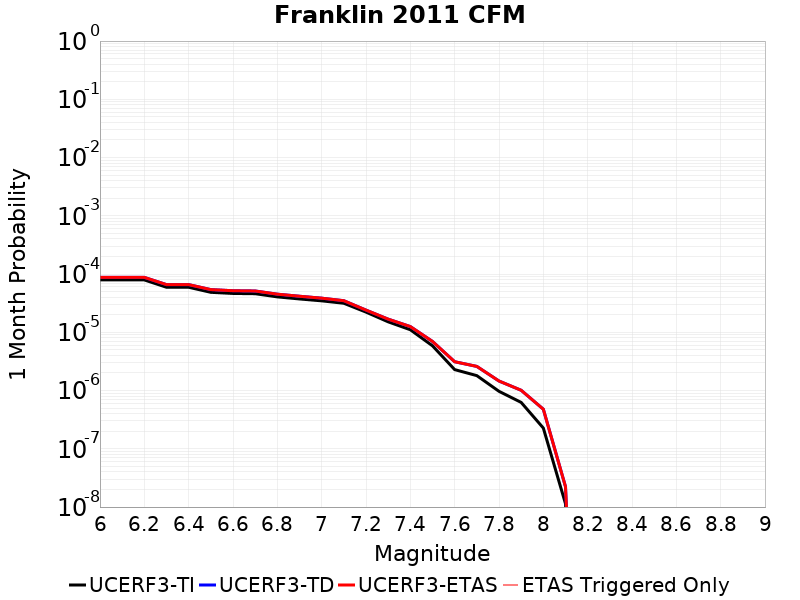 | 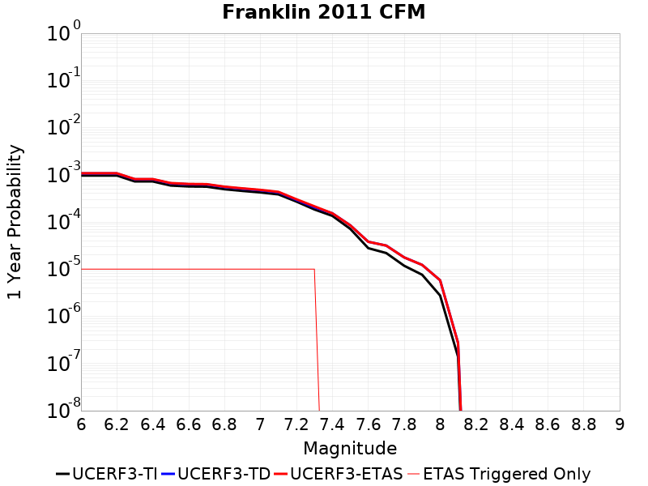 |  |

| Magnitude | 1 wk TI Prob | 1 wk TD Prob | 1 wk ETAS Prob | 1 wk ETAS/TD Gain | 1 wk ETAS Triggered Only | 1 mo TI Prob | 1 mo TD Prob | 1 mo ETAS Prob | 1 mo ETAS/TD Gain | 1 mo ETAS Triggered Only | 1 yr TI Prob | 1 yr TD Prob | 1 yr ETAS Prob | 1 yr ETAS/TD Gain | 1 yr ETAS Triggered Only | 10 yr TI Prob | 10 yr TD Prob | 10 yr ETAS Prob | 10 yr ETAS/TD Gain | 10 yr ETAS Triggered Only |
|-----|-----|-----|-----|-----|-----|-----|-----|-----|-----|-----|-----|-----|-----|-----|-----|-----|-----|-----|-----|-----|
| 6.0 | 1.845602E-5 | 2.040899E-5 | 2.040899E-5 | 1.0 | 0.0 | 7.9094825E-5 | 8.746434E-5 | 8.746434E-5 | 1.0 | 0.0 | 9.6255407E-4 | 0.0010643873 | 0.0010743766 | 1.0093851 | 1.0E-5 | 0.009583955 | 0.01060995 | 0.010629738 | 1.001865 | 2.0E-5 |
| 6.1 | 1.845602E-5 | 2.040899E-5 | 2.040899E-5 | 1.0 | 0.0 | 7.9094825E-5 | 8.746434E-5 | 8.746434E-5 | 1.0 | 0.0 | 9.6255407E-4 | 0.0010643873 | 0.0010743766 | 1.0093851 | 1.0E-5 | 0.009583955 | 0.01060995 | 0.010629738 | 1.001865 | 2.0E-5 |
| 6.2 | 1.845602E-5 | 2.040899E-5 | 2.040899E-5 | 1.0 | 0.0 | 7.9094825E-5 | 8.746434E-5 | 8.746434E-5 | 1.0 | 0.0 | 9.6255407E-4 | 0.0010643873 | 0.0010743766 | 1.0093851 | 1.0E-5 | 0.009583955 | 0.01060995 | 0.010629738 | 1.001865 | 2.0E-5 |
| 6.3 | 1.3813506E-5 | 1.5334164E-5 | 1.5334164E-5 | 1.0 | 0.0 | 5.9199396E-5 | 6.571624E-5 | 6.571624E-5 | 1.0 | 0.0 | 7.205143E-4 | 7.9980923E-4 | 8.098012E-4 | 1.012493 | 1.0E-5 | 0.007181826 | 0.007984231 | 0.008004072 | 1.0024849 | 2.0E-5 |
| 6.4 | 1.3813506E-5 | 1.5334164E-5 | 1.5334164E-5 | 1.0 | 0.0 | 5.9199396E-5 | 6.571624E-5 | 6.571624E-5 | 1.0 | 0.0 | 7.205143E-4 | 7.9980923E-4 | 8.098012E-4 | 1.012493 | 1.0E-5 | 0.007181826 | 0.007984231 | 0.008004072 | 1.0024849 | 2.0E-5 |
| 6.5 | 1.1308949E-5 | 1.2587572E-5 | 1.2587572E-5 | 1.0 | 0.0 | 4.8466023E-5 | 5.3945634E-5 | 5.3945634E-5 | 1.0 | 0.0 | 5.899141E-4 | 6.5659225E-4 | 6.665857E-4 | 1.0152202 | 1.0E-5 | 0.0058835056 | 0.006560888 | 0.006580757 | 1.0030284 | 2.0E-5 |
| 6.6 | 1.0813164E-5 | 1.2043938E-5 | 1.2043938E-5 | 1.0 | 0.0 | 4.6341313E-5 | 5.1615865E-5 | 5.1615865E-5 | 1.0 | 0.0 | 5.640594E-4 | 6.282439E-4 | 6.3823763E-4 | 1.0159074 | 1.0E-5 | 0.005626298 | 0.006279027 | 0.0062989015 | 1.0031652 | 2.0E-5 |
| 6.7 | 1.0706348E-5 | 1.1925312E-5 | 1.1925312E-5 | 1.0 | 0.0 | 4.5883542E-5 | 5.110749E-5 | 5.110749E-5 | 1.0 | 0.0 | 5.5848894E-4 | 6.2205794E-4 | 6.320517E-4 | 1.0160657 | 1.0E-5 | 0.005570874 | 0.0062175156 | 0.006237391 | 1.0031967 | 2.0E-5 |
| 6.8 | 9.443655E-6 | 1.0512095E-5 | 1.0512095E-5 | 1.0 | 0.0 | 4.0472176E-5 | 4.5051067E-5 | 4.5051067E-5 | 1.0 | 0.0 | 4.9263734E-4 | 5.4836005E-4 | 5.583546E-4 | 1.0182261 | 1.0E-5 | 0.0049154665 | 0.0054843677 | 0.005504258 | 1.0036267 | 2.0E-5 |
| 6.9 | 8.7001645E-6 | 9.68266E-6 | 9.68266E-6 | 1.0 | 0.0 | 3.728589E-5 | 4.149646E-5 | 4.149646E-5 | 1.0 | 0.0 | 4.538611E-4 | 5.0510356E-4 | 5.1509845E-4 | 1.0197879 | 1.0E-5 | 0.0045293528 | 0.0050538373 | 0.0050737364 | 1.0039374 | 2.0E-5 |
| 7.0 | 8.074731E-6 | 8.973979E-6 | 8.973979E-6 | 1.0 | 0.0 | 3.460553E-5 | 3.8459348E-5 | 3.8459348E-5 | 1.0 | 0.0 | 4.212409E-4 | 4.6814306E-4 | 4.7813836E-4 | 1.021351 | 1.0E-5 | 0.004204433 | 0.004685833 | 0.0047057397 | 1.0042481 | 2.0E-5 |
| 7.1 | 7.3370957E-6 | 8.116179E-6 | 8.116179E-6 | 1.0 | 0.0 | 3.1444317E-5 | 3.4783166E-5 | 3.4783166E-5 | 1.0 | 0.0 | 3.8276732E-4 | 4.2340378E-4 | 4.3339955E-4 | 1.0236081 | 1.0E-5 | 0.0038210868 | 0.0042400807 | 0.004259996 | 1.0046968 | 2.0E-5 |
| 7.2 | 5.1750103E-6 | 5.600009E-6 | 5.600009E-6 | 1.0 | 0.0 | 2.2178427E-5 | 2.3999819E-5 | 2.3999819E-5 | 1.0 | 0.0 | 2.699889E-4 | 2.9215895E-4 | 3.0215603E-4 | 1.034218 | 1.0E-5 | 0.002696611 | 0.0029310954 | 0.002951037 | 1.0068034 | 2.0E-5 |
| 7.3 | 3.5221371E-6 | 3.917499E-6 | 3.917499E-6 | 1.0 | 0.0 | 1.5094786E-5 | 1.6789174E-5 | 1.6789174E-5 | 1.0 | 0.0 | 1.8376352E-4 | 2.0438913E-4 | 2.1438708E-4 | 1.0489163 | 1.0E-5 | 0.0018361164 | 0.0020549065 | 0.0020748654 | 1.0097128 | 2.0E-5 |
| 7.4 | 2.5749775E-6 | 2.919924E-6 | 2.919924E-6 | 1.0 | 0.0 | 1.1035571E-5 | 1.2513901E-5 | 1.2513901E-5 | 1.0 | 0.0 | 1.343498E-4 | 1.5234617E-4 | 1.5234617E-4 | 1.0 | 0.0 | 0.001342686 | 0.0015341548 | 0.0015441395 | 1.0065082 | 1.0E-5 |
| 7.5 | 1.3642131E-6 | 1.6224556E-6 | 1.6224556E-6 | 1.0 | 0.0 | 5.8466144E-6 | 6.9533626E-6 | 6.9533626E-6 | 1.0 | 0.0 | 7.1180206E-5 | 8.4653926E-5 | 8.4653926E-5 | 1.0 | 0.0 | 7.115741E-4 | 8.5659773E-4 | 8.5659773E-4 | 1.0 | 0.0 |
| 7.6 | 5.329124E-7 | 7.2772264E-7 | 7.2772264E-7 | 1.0 | 0.0 | 2.2839083E-6 | 3.1188076E-6 | 3.1188076E-6 | 1.0 | 0.0 | 2.7806227E-5 | 3.7970825E-5 | 3.7970825E-5 | 1.0 | 0.0 | 2.780275E-4 | 3.8956592E-4 | 3.8956592E-4 | 1.0 | 0.0 |
| 7.7 | 4.199127E-7 | 6.0459615E-7 | 6.0459615E-7 | 1.0 | 0.0 | 1.7996247E-6 | 2.5911238E-6 | 2.5911238E-6 | 1.0 | 0.0 | 2.191021E-5 | 3.154648E-5 | 3.154648E-5 | 1.0 | 0.0 | 2.190805E-4 | 3.2518347E-4 | 3.2518347E-4 | 1.0 | 0.0 |
| 7.8 | 2.2586491E-7 | 3.3943144E-7 | 3.3943144E-7 | 1.0 | 0.0 | 9.67992E-7 | 1.4547053E-6 | 1.4547053E-6 | 1.0 | 0.0 | 1.178524E-5 | 1.7710894E-5 | 1.7710894E-5 | 1.0 | 0.0 | 1.17846146E-4 | 1.8307277E-4 | 1.8307277E-4 | 1.0 | 0.0 |
| 7.9 | 1.4568845E-7 | 2.354254E-7 | 2.354254E-7 | 1.0 | 0.0 | 6.243789E-7 | 1.0089657E-6 | 1.0089657E-6 | 1.0 | 0.0 | 7.601787E-6 | 1.2284088E-5 | 1.2284088E-5 | 1.0 | 0.0 | 7.601527E-5 | 1.2698899E-4 | 1.2698899E-4 | 1.0 | 0.0 |
| 8.0 | 5.2868224E-8 | 1.11360094E-7 | 1.11360094E-7 | 1.0 | 0.0 | 2.2657808E-7 | 4.7725746E-7 | 4.7725746E-7 | 1.0 | 0.0 | 2.7585847E-6 | 5.8105943E-6 | 5.8105943E-6 | 1.0 | 0.0 | 2.7585504E-5 | 5.973833E-5 | 5.973833E-5 | 1.0 | 0.0 |
| 8.1 | 2.654434E-9 | 5.2125597E-9 | 5.2125597E-9 | 1.0 | 0.0 | 1.1376145E-8 | 2.233954E-8 | 2.233954E-8 | 1.0 | 0.0 | 1.3850456E-7 | 2.7198385E-7 | 2.7198385E-7 | 1.0 | 0.0 | 1.3850448E-6 | 2.7801232E-6 | 2.7801232E-6 | 1.0 | 0.0 |

## Elsinore (Glen Ivy) rev
*[(top)](#table-of-contents)*

| 1 Week | 1 Month | 1 Year | 10 Year |
|-----|-----|-----|-----|
| 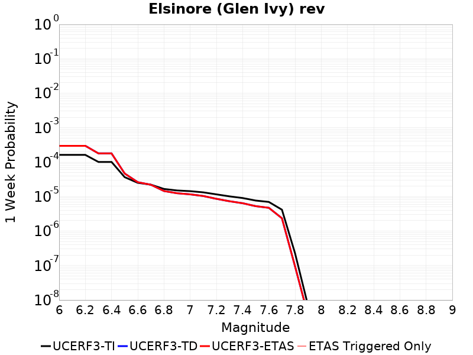 |  | 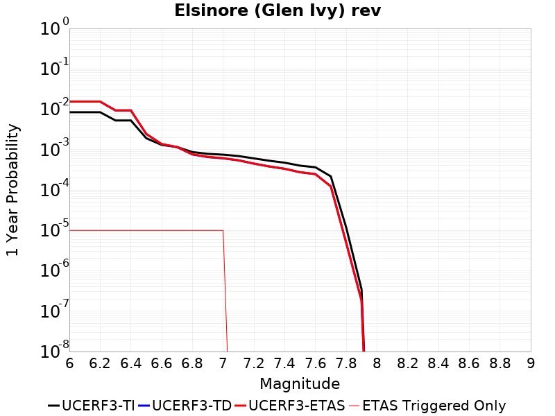 |  |

| Magnitude | 1 wk TI Prob | 1 wk TD Prob | 1 wk ETAS Prob | 1 wk ETAS/TD Gain | 1 wk ETAS Triggered Only | 1 mo TI Prob | 1 mo TD Prob | 1 mo ETAS Prob | 1 mo ETAS/TD Gain | 1 mo ETAS Triggered Only | 1 yr TI Prob | 1 yr TD Prob | 1 yr ETAS Prob | 1 yr ETAS/TD Gain | 1 yr ETAS Triggered Only | 10 yr TI Prob | 10 yr TD Prob | 10 yr ETAS Prob | 10 yr ETAS/TD Gain | 10 yr ETAS Triggered Only |
|-----|-----|-----|-----|-----|-----|-----|-----|-----|-----|-----|-----|-----|-----|-----|-----|-----|-----|-----|-----|-----|
| 6.0 | 1.6204086E-4 | 2.9722264E-4 | 2.9722264E-4 | 1.0 | 0.0 | 6.94276E-4 | 0.0012733481 | 0.0012733481 | 1.0 | 0.0 | 0.008420097 | 0.015414698 | 0.015424544 | 1.0006387 | 1.0E-5 | 0.081081145 | 0.14105381 | 0.14106241 | 1.0000609 | 1.0E-5 |
| 6.1 | 1.6204086E-4 | 2.9722264E-4 | 2.9722264E-4 | 1.0 | 0.0 | 6.94276E-4 | 0.0012733481 | 0.0012733481 | 1.0 | 0.0 | 0.008420097 | 0.015414698 | 0.015424544 | 1.0006387 | 1.0E-5 | 0.081081145 | 0.14105381 | 0.14106241 | 1.0000609 | 1.0E-5 |
| 6.2 | 1.6204086E-4 | 2.9722264E-4 | 2.9722264E-4 | 1.0 | 0.0 | 6.94276E-4 | 0.0012733481 | 0.0012733481 | 1.0 | 0.0 | 0.008420097 | 0.015414698 | 0.015424544 | 1.0006387 | 1.0E-5 | 0.081081145 | 0.14105381 | 0.14106241 | 1.0000609 | 1.0E-5 |
| 6.3 | 1.0111737E-4 | 1.7894212E-4 | 1.7894212E-4 | 1.0 | 0.0 | 4.332882E-4 | 7.667889E-4 | 7.667889E-4 | 1.0 | 0.0 | 0.005262531 | 0.009316877 | 0.009326785 | 1.0010633 | 1.0E-5 | 0.0513964 | 0.08771877 | 0.0877279 | 1.000104 | 1.0E-5 |
| 6.4 | 1.0111737E-4 | 1.7894212E-4 | 1.7894212E-4 | 1.0 | 0.0 | 4.332882E-4 | 7.667889E-4 | 7.667889E-4 | 1.0 | 0.0 | 0.005262531 | 0.009316877 | 0.009326785 | 1.0010633 | 1.0E-5 | 0.0513964 | 0.08771877 | 0.0877279 | 1.000104 | 1.0E-5 |
| 6.5 | 3.6624708E-5 | 4.67276E-5 | 4.67276E-5 | 1.0 | 0.0 | 1.569536E-4 | 2.0024787E-4 | 2.0024787E-4 | 1.0 | 0.0 | 0.001909235 | 0.0024356628 | 0.0024456386 | 1.0040957 | 1.0E-5 | 0.01892915 | 0.023841325 | 0.023851087 | 1.0004095 | 1.0E-5 |
| 6.6 | 2.5051324E-5 | 2.6169064E-5 | 2.6169064E-5 | 1.0 | 0.0 | 1.073584E-4 | 1.1214856E-4 | 1.1214856E-4 | 1.0 | 0.0 | 0.0013063047 | 0.0013645975 | 0.0013745839 | 1.0073181 | 1.0E-5 | 0.012986525 | 0.01356696 | 0.013576824 | 1.000727 | 1.0E-5 |
| 6.7 | 2.2189772E-5 | 2.205827E-5 | 2.205827E-5 | 1.0 | 0.0 | 9.509556E-5 | 9.453222E-5 | 9.453222E-5 | 1.0 | 0.0 | 0.0011571734 | 0.0011503578 | 0.0011603462 | 1.008683 | 1.0E-5 | 0.011511663 | 0.0114498865 | 0.0114597725 | 1.0008633 | 1.0E-5 |
| 6.8 | 1.6654378E-5 | 1.4507354E-5 | 1.4507354E-5 | 1.0 | 0.0 | 7.137396E-5 | 6.217292E-5 | 6.217292E-5 | 1.0 | 0.0 | 8.686314E-4 | 7.566974E-4 | 7.6668983E-4 | 1.0132053 | 1.0E-5 | 0.008652439 | 0.007545316 | 0.0075552408 | 1.0013154 | 1.0E-5 |
| 6.9 | 1.5042909E-5 | 1.2503178E-5 | 1.2503178E-5 | 1.0 | 0.0 | 6.446802E-5 | 5.3583968E-5 | 5.3583968E-5 | 1.0 | 0.0 | 7.8461546E-4 | 6.5219274E-4 | 6.6218624E-4 | 1.0153229 | 1.0E-5 | 0.007818509 | 0.0065064942 | 0.0065164296 | 1.001527 | 1.0E-5 |
| 7.0 | 1.4361385E-5 | 1.1615076E-5 | 1.1615076E-5 | 1.0 | 0.0 | 6.154734E-5 | 4.9777962E-5 | 4.9777962E-5 | 1.0 | 0.0 | 7.490812E-4 | 6.058812E-4 | 6.158751E-4 | 1.0164949 | 1.0E-5 | 0.007465612 | 0.006045822 | 0.0060557616 | 1.001644 | 1.0E-5 |
| 7.1 | 1.3265571E-5 | 1.0389204E-5 | 1.0389204E-5 | 1.0 | 0.0 | 5.6851208E-5 | 4.452442E-5 | 4.452442E-5 | 1.0 | 0.0 | 6.919436E-4 | 5.4195256E-4 | 5.4195256E-4 | 1.0 | 0.0 | 0.006897931 | 0.0054094335 | 0.0054094335 | 1.0 | 0.0 |
| 7.2 | 1.1596403E-5 | 8.611936E-6 | 8.611936E-6 | 1.0 | 0.0 | 4.9697923E-5 | 3.6907786E-5 | 3.6907786E-5 | 1.0 | 0.0 | 6.049042E-4 | 4.4926137E-4 | 4.4926137E-4 | 1.0 | 0.0 | 0.006032603 | 0.0044848537 | 0.0044848537 | 1.0 | 0.0 |
| 7.3 | 1.0150827E-5 | 7.3213905E-6 | 7.3213905E-6 | 1.0 | 0.0 | 4.3502816E-5 | 3.1377018E-5 | 3.1377018E-5 | 1.0 | 0.0 | 5.2951806E-4 | 3.819497E-4 | 3.819497E-4 | 1.0 | 0.0 | 0.005282581 | 0.00381327 | 0.00381327 | 1.0 | 0.0 |
| 7.4 | 9.080705E-6 | 6.4191554E-6 | 6.4191554E-6 | 1.0 | 0.0 | 3.8916725E-5 | 2.7510383E-5 | 2.7510383E-5 | 1.0 | 0.0 | 4.7370812E-4 | 3.3488884E-4 | 3.3488884E-4 | 1.0 | 0.0 | 0.004726996 | 0.0033439887 | 0.0033439887 | 1.0 | 0.0 |
| 7.5 | 7.671649E-6 | 5.2734035E-6 | 5.2734035E-6 | 1.0 | 0.0 | 3.287808E-5 | 2.2600112E-5 | 2.2600112E-5 | 1.0 | 0.0 | 4.0021708E-4 | 2.7512287E-4 | 2.7512287E-4 | 1.0 | 0.0 | 0.0039949706 | 0.0027479494 | 0.0027479494 | 1.0 | 0.0 |
| 7.6 | 6.990086E-6 | 4.724901E-6 | 4.724901E-6 | 1.0 | 0.0 | 2.9957167E-5 | 2.0249425E-5 | 2.0249425E-5 | 1.0 | 0.0 | 3.6466747E-4 | 2.4651006E-4 | 2.4651006E-4 | 1.0 | 0.0 | 0.0036406964 | 0.0024624837 | 0.0024624837 | 1.0 | 0.0 |
| 7.7 | 4.163505E-6 | 2.35372E-6 | 2.35372E-6 | 1.0 | 0.0 | 1.7843471E-5 | 1.0087337E-5 | 1.0087337E-5 | 1.0 | 0.0 | 2.172226E-4 | 1.2280716E-4 | 1.2280716E-4 | 1.0 | 0.0 | 0.0021701038 | 0.0012274673 | 0.0012274673 | 1.0 | 0.0 |
| 7.8 | 2.2692414E-7 | 9.469906E-8 | 9.469906E-8 | 1.0 | 0.0 | 9.725317E-7 | 4.058531E-7 | 4.058531E-7 | 1.0 | 0.0 | 1.1840509E-5 | 4.9412533E-6 | 4.9412533E-6 | 1.0 | 0.0 | 1.1839878E-4 | 4.941177E-5 | 4.941177E-5 | 1.0 | 0.0 |
| 7.9 | 6.676829E-9 | 3.4789571E-9 | 3.4789571E-9 | 1.0 | 0.0 | 2.861498E-8 | 1.4909816E-8 | 1.4909816E-8 | 1.0 | 0.0 | 3.4838732E-7 | 1.81527E-7 | 1.81527E-7 | 1.0 | 0.0 | 3.4838679E-6 | 1.8152687E-6 | 1.8152687E-6 | 1.0 | 0.0 |

## Great Valley 03a Dunnigan Hills
*[(top)](#table-of-contents)*

| 1 Week | 1 Month | 1 Year | 10 Year |
|-----|-----|-----|-----|
| 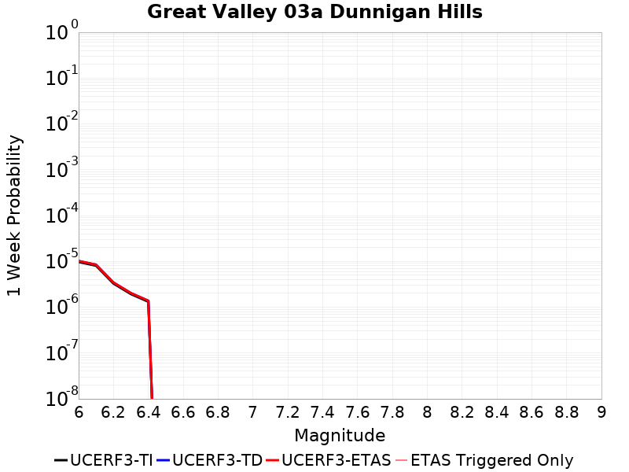 | 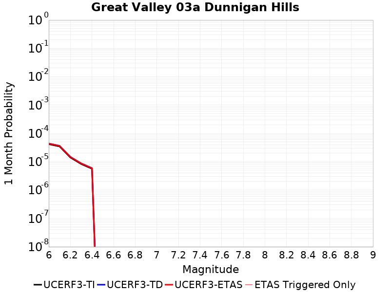 |  |  |

| Magnitude | 1 wk TI Prob | 1 wk TD Prob | 1 wk ETAS Prob | 1 wk ETAS/TD Gain | 1 wk ETAS Triggered Only | 1 mo TI Prob | 1 mo TD Prob | 1 mo ETAS Prob | 1 mo ETAS/TD Gain | 1 mo ETAS Triggered Only | 1 yr TI Prob | 1 yr TD Prob | 1 yr ETAS Prob | 1 yr ETAS/TD Gain | 1 yr ETAS Triggered Only | 10 yr TI Prob | 10 yr TD Prob | 10 yr ETAS Prob | 10 yr ETAS/TD Gain | 10 yr ETAS Triggered Only |
|-----|-----|-----|-----|-----|-----|-----|-----|-----|-----|-----|-----|-----|-----|-----|-----|-----|-----|-----|-----|-----|
| 6.0 | 9.6893855E-6 | 1.0187059E-5 | 1.0187059E-5 | 1.0 | 0.0 | 4.1525276E-5 | 4.365821E-5 | 4.365821E-5 | 1.0 | 0.0 | 5.05453E-4 | 5.314293E-4 | 5.41424E-4 | 1.0188072 | 1.0E-5 | 0.0050430484 | 0.0053035785 | 0.0053135254 | 1.0018755 | 1.0E-5 |
| 6.1 | 8.041125E-6 | 8.456637E-6 | 8.456637E-6 | 1.0 | 0.0 | 3.4461507E-5 | 3.6242334E-5 | 3.6242334E-5 | 1.0 | 0.0 | 4.194881E-4 | 4.4118E-4 | 4.5117558E-4 | 1.0226564 | 1.0E-5 | 0.004186971 | 0.004404899 | 0.004414855 | 1.0022602 | 1.0E-5 |
| 6.2 | 3.2807004E-6 | 3.448967E-6 | 3.448967E-6 | 1.0 | 0.0 | 1.4060069E-5 | 1.4781225E-5 | 1.4781225E-5 | 1.0 | 0.0 | 1.7116789E-4 | 1.7995041E-4 | 1.7995041E-4 | 1.0 | 0.0 | 0.0017103611 | 0.0017984255 | 0.0017984255 | 1.0 | 0.0 |
| 6.3 | 1.9339366E-6 | 2.0315108E-6 | 2.0315108E-6 | 1.0 | 0.0 | 8.288273E-6 | 8.706461E-6 | 8.706461E-6 | 1.0 | 0.0 | 1.00905054E-4 | 1.0599865E-4 | 1.0599865E-4 | 1.0 | 0.0 | 0.0010085925 | 0.0010597402 | 0.0010597402 | 1.0 | 0.0 |
| 6.4 | 1.3142635E-6 | 1.3799993E-6 | 1.3799993E-6 | 1.0 | 0.0 | 5.6325457E-6 | 5.9142826E-6 | 5.9142826E-6 | 1.0 | 0.0 | 6.857408E-5 | 7.200639E-5 | 7.200639E-5 | 1.0 | 0.0 | 6.8552926E-4 | 7.200639E-4 | 7.200639E-4 | 1.0 | 0.0 |

## San Andreas (San Bernardino S)
*[(top)](#table-of-contents)*

| 1 Week | 1 Month | 1 Year | 10 Year |
|-----|-----|-----|-----|
|  |  |  |  |

| Magnitude | 1 wk TI Prob | 1 wk TD Prob | 1 wk ETAS Prob | 1 wk ETAS/TD Gain | 1 wk ETAS Triggered Only | 1 mo TI Prob | 1 mo TD Prob | 1 mo ETAS Prob | 1 mo ETAS/TD Gain | 1 mo ETAS Triggered Only | 1 yr TI Prob | 1 yr TD Prob | 1 yr ETAS Prob | 1 yr ETAS/TD Gain | 1 yr ETAS Triggered Only | 10 yr TI Prob | 10 yr TD Prob | 10 yr ETAS Prob | 10 yr ETAS/TD Gain | 10 yr ETAS Triggered Only |
|-----|-----|-----|-----|-----|-----|-----|-----|-----|-----|-----|-----|-----|-----|-----|-----|-----|-----|-----|-----|-----|
| 6.0 | 1.2336002E-4 | 3.1230063E-4 | 3.1230063E-4 | 1.0 | 0.0 | 5.2857865E-4 | 0.0013377719 | 0.0013477586 | 1.0074651 | 1.0E-5 | 0.006416472 | 0.016170938 | 0.016180776 | 1.0006084 | 1.0E-5 | 0.06234337 | 0.14772509 | 0.14774214 | 1.0001154 | 2.0E-5 |
| 6.1 | 1.2336002E-4 | 3.1230063E-4 | 3.1230063E-4 | 1.0 | 0.0 | 5.2857865E-4 | 0.0013377719 | 0.0013477586 | 1.0074651 | 1.0E-5 | 0.006416472 | 0.016170938 | 0.016180776 | 1.0006084 | 1.0E-5 | 0.06234337 | 0.14772509 | 0.14774214 | 1.0001154 | 2.0E-5 |
| 6.2 | 1.2336002E-4 | 3.1230063E-4 | 3.1230063E-4 | 1.0 | 0.0 | 5.2857865E-4 | 0.0013377719 | 0.0013477586 | 1.0074651 | 1.0E-5 | 0.006416472 | 0.016170938 | 0.016180776 | 1.0006084 | 1.0E-5 | 0.06234337 | 0.14772509 | 0.14774214 | 1.0001154 | 2.0E-5 |
| 6.3 | 1.1712257E-4 | 3.000409E-4 | 3.000409E-4 | 1.0 | 0.0 | 5.018573E-4 | 0.0012852827 | 0.0012952698 | 1.0077704 | 1.0E-5 | 0.006093008 | 0.015541118 | 0.015550963 | 1.0006335 | 1.0E-5 | 0.059286322 | 0.14240548 | 0.14242263 | 1.0001204 | 2.0E-5 |
| 6.4 | 1.1712257E-4 | 3.000409E-4 | 3.000409E-4 | 1.0 | 0.0 | 5.018573E-4 | 0.0012852827 | 0.0012952698 | 1.0077704 | 1.0E-5 | 0.006093008 | 0.015541118 | 0.015550963 | 1.0006335 | 1.0E-5 | 0.059286322 | 0.14240548 | 0.14242263 | 1.0001204 | 2.0E-5 |
| 6.5 | 1.0689076E-4 | 2.7993566E-4 | 2.7993566E-4 | 1.0 | 0.0 | 4.5802278E-4 | 0.0011991985 | 0.0012091865 | 1.0083289 | 1.0E-5 | 0.0055621783 | 0.014507343 | 0.014517198 | 1.0006793 | 1.0E-5 | 0.05425003 | 0.13360105 | 0.13361837 | 1.0001297 | 2.0E-5 |
| 6.6 | 9.7648895E-5 | 2.6215392E-4 | 2.6215392E-4 | 1.0 | 0.0 | 4.1842813E-4 | 0.0011230577 | 0.0011330465 | 1.0088942 | 1.0E-5 | 0.005082469 | 0.013592083 | 0.013601947 | 1.0007257 | 1.0E-5 | 0.049677886 | 0.12571333 | 0.12573083 | 1.0001391 | 2.0E-5 |
| 6.7 | 8.757013E-5 | 2.4263025E-4 | 2.4263025E-4 | 1.0 | 0.0 | 3.7524657E-4 | 0.0010394529 | 0.0010494424 | 1.0096104 | 1.0E-5 | 0.00455906 | 0.01258619 | 0.012596064 | 1.0007845 | 1.0E-5 | 0.04466656 | 0.11702035 | 0.11703802 | 1.0001509 | 2.0E-5 |
| 6.8 | 8.562978E-5 | 2.3813122E-4 | 2.3813122E-4 | 1.0 | 0.0 | 3.6693315E-4 | 0.0010201865 | 0.0010301763 | 1.0097921 | 1.0E-5 | 0.004458263 | 0.0123542985 | 0.012364175 | 1.0007994 | 1.0E-5 | 0.043698758 | 0.11500596 | 0.11502366 | 1.0001539 | 2.0E-5 |
| 6.9 | 6.124075E-5 | 1.8075401E-4 | 1.8075401E-4 | 1.0 | 0.0 | 2.6243398E-4 | 7.744309E-4 | 7.844232E-4 | 1.0129027 | 1.0E-5 | 0.0031904527 | 0.009388164 | 0.00939807 | 1.0010551 | 1.0E-5 | 0.031450346 | 0.0884384 | 0.08845663 | 1.0002061 | 2.0E-5 |
| 7.0 | 5.8598747E-5 | 1.7491948E-4 | 1.7491948E-4 | 1.0 | 0.0 | 2.5111332E-4 | 7.494404E-4 | 7.5943285E-4 | 1.0133333 | 1.0E-5 | 0.0030530186 | 0.0090864785 | 0.009096388 | 1.0010905 | 1.0E-5 | 0.03011414 | 0.085713185 | 0.08573147 | 1.0002134 | 2.0E-5 |
| 7.1 | 5.613814E-5 | 1.6898756E-4 | 1.6898756E-4 | 1.0 | 0.0 | 2.4056983E-4 | 7.2403223E-4 | 7.34025E-4 | 1.0138016 | 1.0E-5 | 0.0029250039 | 0.008779664 | 0.008789576 | 1.001129 | 1.0E-5 | 0.028868021 | 0.0829698 | 0.082988136 | 1.000221 | 2.0E-5 |
| 7.2 | 4.991222E-5 | 1.5476135E-4 | 1.5476135E-4 | 1.0 | 0.0 | 2.1389198E-4 | 6.6309475E-4 | 6.730881E-4 | 1.0150708 | 1.0E-5 | 0.002601025 | 0.008043412 | 0.008053332 | 1.0012332 | 1.0E-5 | 0.025707912 | 0.07635365 | 0.07637212 | 1.000242 | 2.0E-5 |
| 7.3 | 4.7410045E-5 | 1.4644847E-4 | 1.4644847E-4 | 1.0 | 0.0 | 2.0317009E-4 | 6.274856E-4 | 6.3747936E-4 | 1.0159266 | 1.0E-5 | 0.0024707897 | 0.007612975 | 0.007622899 | 1.0013036 | 1.0E-5 | 0.024434982 | 0.07254692 | 0.072565466 | 1.0002557 | 2.0E-5 |
| 7.4 | 4.5556746E-5 | 1.4033767E-4 | 1.4033767E-4 | 1.0 | 0.0 | 1.952286E-4 | 6.013088E-4 | 6.1130285E-4 | 1.0166204 | 1.0E-5 | 0.002374317 | 0.0072964504 | 0.0073063774 | 1.0013605 | 1.0E-5 | 0.023491086 | 0.06973607 | 0.069754675 | 1.0002668 | 2.0E-5 |
| 7.5 | 4.3084514E-5 | 1.3245709E-4 | 1.3245709E-4 | 1.0 | 0.0 | 1.8463485E-4 | 5.675501E-4 | 5.775444E-4 | 1.0176096 | 1.0E-5 | 0.0022456115 | 0.006888111 | 0.0068980423 | 1.0014418 | 1.0E-5 | 0.022230545 | 0.06605496 | 0.06607364 | 1.0002828 | 2.0E-5 |
| 7.6 | 3.408608E-5 | 1.0634999E-4 | 1.0634999E-4 | 1.0 | 0.0 | 1.4607502E-4 | 4.5570615E-4 | 4.657016E-4 | 1.0219339 | 1.0E-5 | 0.0017770125 | 0.0055341385 | 0.005544083 | 1.001797 | 1.0E-5 | 0.017628696 | 0.053541165 | 0.053560093 | 1.0003536 | 2.0E-5 |
| 7.7 | 2.8315713E-5 | 8.988984E-5 | 8.988984E-5 | 1.0 | 0.0 | 1.2134742E-4 | 3.8518535E-4 | 3.951815E-4 | 1.0259515 | 1.0E-5 | 0.0014764034 | 0.0046795593 | 0.0046895123 | 1.0021269 | 1.0E-5 | 0.01466633 | 0.045558106 | 0.045577195 | 1.000419 | 2.0E-5 |
| 7.8 | 2.6222975E-5 | 8.147371E-5 | 8.147371E-5 | 1.0 | 0.0 | 1.1237934E-4 | 3.4912632E-4 | 3.5912282E-4 | 1.0286329 | 1.0E-5 | 0.0013673597 | 0.0042423364 | 0.004252294 | 1.0023472 | 1.0E-5 | 0.013589768 | 0.041490454 | 0.041509625 | 1.000462 | 2.0E-5 |
| 7.9 | 2.1469694E-5 | 6.336701E-5 | 6.336701E-5 | 1.0 | 0.0 | 9.200973E-5 | 2.7154465E-4 | 2.8154193E-4 | 1.0368164 | 1.0E-5 | 0.0011196428 | 0.0033010482 | 0.0033110152 | 1.0030193 | 1.0E-5 | 0.011140184 | 0.032634884 | 0.032654233 | 1.0005928 | 2.0E-5 |
| 8.0 | 1.2420249E-5 | 3.436793E-5 | 3.436793E-5 | 1.0 | 0.0 | 5.322855E-5 | 1.4728283E-4 | 1.5728135E-4 | 1.0678866 | 1.0E-5 | 6.478649E-4 | 0.0017916948 | 0.0018016768 | 1.0055714 | 1.0E-5 | 0.0064597935 | 0.017933855 | 0.017953495 | 1.0010952 | 2.0E-5 |
| 8.1 | 4.9197724E-6 | 8.920691E-6 | 8.920691E-6 | 1.0 | 0.0 | 2.1084568E-5 | 3.8230974E-5 | 4.823059E-5 | 1.261558 | 1.0E-5 | 2.566744E-4 | 4.6536286E-4 | 4.7535822E-4 | 1.0214787 | 1.0E-5 | 0.002563781 | 0.0049295197 | 0.004949421 | 1.0040371 | 2.0E-5 |
| 8.2 | 2.5634774E-6 | 3.4326151E-6 | 3.4326151E-6 | 1.0 | 0.0 | 1.0986286E-5 | 1.4711125E-5 | 2.4710978E-5 | 1.6797477 | 1.0E-5 | 1.3374983E-4 | 1.7909329E-4 | 1.890915E-4 | 1.0558268 | 1.0E-5 | 0.0013366934 | 0.001976518 | 0.0019964783 | 1.0100988 | 2.0E-5 |
| 8.3 | 5.2850464E-7 | 3.9639573E-7 | 3.9639573E-7 | 1.0 | 0.0 | 2.2650179E-6 | 1.6988379E-6 | 1.1698821E-5 | 6.886367 | 1.0E-5 | 2.7576245E-5 | 2.0683174E-5 | 3.0682968E-5 | 1.4834749 | 1.0E-5 | 2.7572823E-4 | 2.4037067E-4 | 2.5036826E-4 | 1.0415924 | 1.0E-5 |

## Calaveras (No) 2011 CFM
*[(top)](#table-of-contents)*

| 1 Week | 1 Month | 1 Year | 10 Year |
|-----|-----|-----|-----|
| 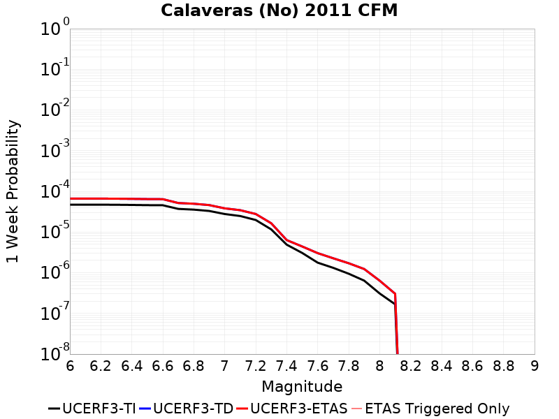 |  |  | 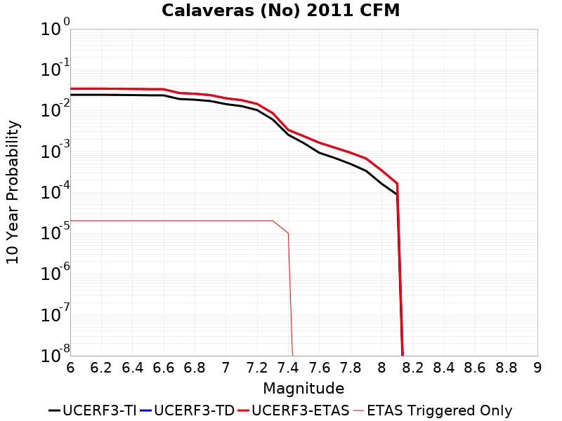 |

| Magnitude | 1 wk TI Prob | 1 wk TD Prob | 1 wk ETAS Prob | 1 wk ETAS/TD Gain | 1 wk ETAS Triggered Only | 1 mo TI Prob | 1 mo TD Prob | 1 mo ETAS Prob | 1 mo ETAS/TD Gain | 1 mo ETAS Triggered Only | 1 yr TI Prob | 1 yr TD Prob | 1 yr ETAS Prob | 1 yr ETAS/TD Gain | 1 yr ETAS Triggered Only | 10 yr TI Prob | 10 yr TD Prob | 10 yr ETAS Prob | 10 yr ETAS/TD Gain | 10 yr ETAS Triggered Only |
|-----|-----|-----|-----|-----|-----|-----|-----|-----|-----|-----|-----|-----|-----|-----|-----|-----|-----|-----|-----|-----|
| 6.0 | 4.698747E-5 | 6.6367225E-5 | 6.6367225E-5 | 1.0 | 0.0 | 2.0135932E-4 | 2.844007E-4 | 2.844007E-4 | 1.0 | 0.0 | 0.0024487933 | 0.0034571195 | 0.0034670848 | 1.0028826 | 1.0E-5 | 0.02421984 | 0.03419609 | 0.034215406 | 1.0005648 | 2.0E-5 |
| 6.1 | 4.698747E-5 | 6.6367225E-5 | 6.6367225E-5 | 1.0 | 0.0 | 2.0135932E-4 | 2.844007E-4 | 2.844007E-4 | 1.0 | 0.0 | 0.0024487933 | 0.0034571195 | 0.0034670848 | 1.0028826 | 1.0E-5 | 0.02421984 | 0.03419609 | 0.034215406 | 1.0005648 | 2.0E-5 |
| 6.2 | 4.698747E-5 | 6.6367225E-5 | 6.6367225E-5 | 1.0 | 0.0 | 2.0135932E-4 | 2.844007E-4 | 2.844007E-4 | 1.0 | 0.0 | 0.0024487933 | 0.0034571195 | 0.0034670848 | 1.0028826 | 1.0E-5 | 0.02421984 | 0.03419609 | 0.034215406 | 1.0005648 | 2.0E-5 |
| 6.3 | 4.6717287E-5 | 6.599544E-5 | 6.599544E-5 | 1.0 | 0.0 | 2.0020158E-4 | 2.828077E-4 | 2.828077E-4 | 1.0 | 0.0 | 0.0024347296 | 0.0034377857 | 0.0034477513 | 1.0028988 | 1.0E-5 | 0.024082264 | 0.03400841 | 0.03402773 | 1.000568 | 2.0E-5 |
| 6.4 | 4.6276386E-5 | 6.535323E-5 | 6.535323E-5 | 1.0 | 0.0 | 1.983123E-4 | 2.800561E-4 | 2.800561E-4 | 1.0 | 0.0 | 0.0024117786 | 0.0034043978 | 0.0034143638 | 1.0029274 | 1.0E-5 | 0.02385771 | 0.033685595 | 0.03370492 | 1.0005738 | 2.0E-5 |
| 6.5 | 4.5720994E-5 | 6.454907E-5 | 6.454907E-5 | 1.0 | 0.0 | 1.9593239E-4 | 2.7661063E-4 | 2.7661063E-4 | 1.0 | 0.0 | 0.002382867 | 0.0033625886 | 0.003372555 | 1.0029639 | 1.0E-5 | 0.023574775 | 0.033281066 | 0.0333004 | 1.0005809 | 2.0E-5 |
| 6.6 | 4.549134E-5 | 6.419803E-5 | 6.419803E-5 | 1.0 | 0.0 | 1.949483E-4 | 2.751065E-4 | 2.751065E-4 | 1.0 | 0.0 | 0.0023709119 | 0.0033443319 | 0.0033542984 | 1.0029801 | 1.0E-5 | 0.023457756 | 0.033104546 | 0.033123884 | 1.0005841 | 2.0E-5 |
| 6.7 | 3.701047E-5 | 5.1619678E-5 | 5.1619678E-5 | 1.0 | 0.0 | 1.5860666E-4 | 2.2120868E-4 | 2.2120868E-4 | 1.0 | 0.0 | 0.0019293258 | 0.002689935 | 0.002699908 | 1.0037075 | 1.0E-5 | 0.019126613 | 0.026744796 | 0.026764262 | 1.0007278 | 2.0E-5 |
| 6.8 | 3.5523568E-5 | 4.9587754E-5 | 4.9587754E-5 | 1.0 | 0.0 | 1.5223498E-4 | 2.125019E-4 | 2.125019E-4 | 1.0 | 0.0 | 0.0018518851 | 0.0025841861 | 0.0025941604 | 1.0038596 | 1.0E-5 | 0.018365284 | 0.025710938 | 0.025730424 | 1.0007579 | 2.0E-5 |
| 6.9 | 3.2946147E-5 | 4.586576E-5 | 4.586576E-5 | 1.0 | 0.0 | 1.4119013E-4 | 1.9655298E-4 | 1.9655298E-4 | 1.0 | 0.0 | 0.0017176344 | 0.0023904506 | 0.0024004267 | 1.0041733 | 1.0E-5 | 0.017044188 | 0.02381273 | 0.023832252 | 1.0008199 | 2.0E-5 |
| 7.0 | 2.7682381E-5 | 3.8190094E-5 | 3.8190094E-5 | 1.0 | 0.0 | 1.1863338E-4 | 1.6366175E-4 | 1.6366175E-4 | 1.0 | 0.0 | 0.0014434044 | 0.001990793 | 0.002000773 | 1.0050131 | 1.0E-5 | 0.01434065 | 0.01988842 | 0.019908022 | 1.0009856 | 2.0E-5 |
| 7.1 | 2.471967E-5 | 3.4377474E-5 | 3.4377474E-5 | 1.0 | 0.0 | 1.05937135E-4 | 1.4732388E-4 | 1.4732388E-4 | 1.0 | 0.0 | 0.0012890215 | 0.0017922235 | 0.0018022057 | 1.0055697 | 1.0E-5 | 0.0128157 | 0.017926252 | 0.017945893 | 1.0010957 | 2.0E-5 |
| 7.2 | 1.9748062E-5 | 2.7736216E-5 | 2.7736216E-5 | 1.0 | 0.0 | 8.463181E-5 | 1.1886423E-4 | 1.1886423E-4 | 1.0 | 0.0 | 0.0010299052 | 0.0014462365 | 0.001456222 | 1.0069045 | 1.0E-5 | 0.01025145 | 0.014508379 | 0.014528088 | 1.0013585 | 2.0E-5 |
| 7.3 | 1.1603734E-5 | 1.6418777E-5 | 1.6418777E-5 | 1.0 | 0.0 | 4.9729337E-5 | 7.0364375E-5 | 7.0364375E-5 | 1.0 | 0.0 | 6.052865E-4 | 8.5636484E-4 | 8.663563E-4 | 1.0116673 | 1.0E-5 | 0.0060364045 | 0.00862551 | 0.008645337 | 1.0022987 | 2.0E-5 |
| 7.4 | 4.885381E-6 | 6.331879E-6 | 6.331879E-6 | 1.0 | 0.0 | 2.0937177E-5 | 2.7136342E-5 | 2.7136342E-5 | 1.0 | 0.0 | 2.5488032E-4 | 3.3033508E-4 | 3.3033508E-4 | 1.0 | 0.0 | 0.0025458818 | 0.0033498253 | 0.0033597916 | 1.0029752 | 1.0E-5 |
| 7.5 | 3.0571264E-6 | 4.409521E-6 | 4.409521E-6 | 1.0 | 0.0 | 1.3101904E-5 | 1.889781E-5 | 1.889781E-5 | 1.0 | 0.0 | 1.5950401E-4 | 2.3005666E-4 | 2.3005666E-4 | 1.0 | 0.0 | 0.0015938957 | 0.0023477154 | 0.0023477154 | 1.0 | 0.0 |
| 7.6 | 1.764948E-6 | 3.0257916E-6 | 3.0257916E-6 | 1.0 | 0.0 | 7.564041E-6 | 1.2967614E-5 | 1.2967614E-5 | 1.0 | 0.0 | 9.208831E-5 | 1.5786935E-4 | 1.5786935E-4 | 1.0 | 0.0 | 9.205016E-4 | 0.0016265527 | 0.0016265527 | 1.0 | 0.0 |
| 7.7 | 1.3173734E-6 | 2.2646898E-6 | 2.2646898E-6 | 1.0 | 0.0 | 5.645874E-6 | 9.705777E-6 | 9.705777E-6 | 1.0 | 0.0 | 6.873634E-5 | 1.18161464E-4 | 1.18161464E-4 | 1.0 | 0.0 | 6.8715087E-4 | 0.0012288735 | 0.0012288735 | 1.0 | 0.0 |
| 7.8 | 9.4429885E-7 | 1.7080695E-6 | 1.7080695E-6 | 1.0 | 0.0 | 4.0469886E-6 | 7.3202773E-6 | 7.3202773E-6 | 1.0 | 0.0 | 4.9270973E-5 | 8.9120746E-5 | 8.9120746E-5 | 1.0 | 0.0 | 4.926005E-4 | 9.2901895E-4 | 9.2901895E-4 | 1.0 | 0.0 |
| 7.9 | 6.388233E-7 | 1.2329798E-6 | 1.2329798E-6 | 1.0 | 0.0 | 2.7378112E-6 | 5.2841883E-6 | 5.2841883E-6 | 1.0 | 0.0 | 3.3332344E-5 | 6.433311E-5 | 6.433311E-5 | 1.0 | 0.0 | 3.3327343E-4 | 6.6800934E-4 | 6.6800934E-4 | 1.0 | 0.0 |
| 8.0 | 3.087986E-7 | 6.369486E-7 | 6.369486E-7 | 1.0 | 0.0 | 1.323422E-6 | 2.7297767E-6 | 2.7297767E-6 | 1.0 | 0.0 | 1.6112543E-5 | 3.323453E-5 | 3.323453E-5 | 1.0 | 0.0 | 1.6111376E-4 | 3.4159215E-4 | 3.4159215E-4 | 1.0 | 0.0 |
| 8.1 | 1.6725647E-7 | 3.0371388E-7 | 3.0371388E-7 | 1.0 | 0.0 | 7.168133E-7 | 1.3016303E-6 | 1.3016303E-6 | 1.0 | 0.0 | 8.7271665E-6 | 1.5847236E-5 | 1.5847236E-5 | 1.0 | 0.0 | 8.726824E-5 | 1.6344231E-4 | 1.6344231E-4 | 1.0 | 0.0 |

## Swain Ravine - Spenceville
*[(top)](#table-of-contents)*

| 1 Week | 1 Month | 1 Year | 10 Year |
|-----|-----|-----|-----|
| 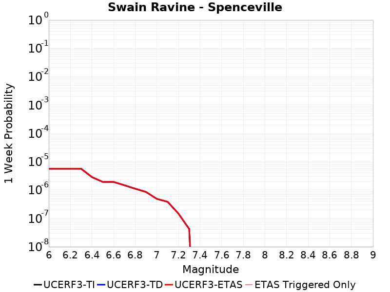 | 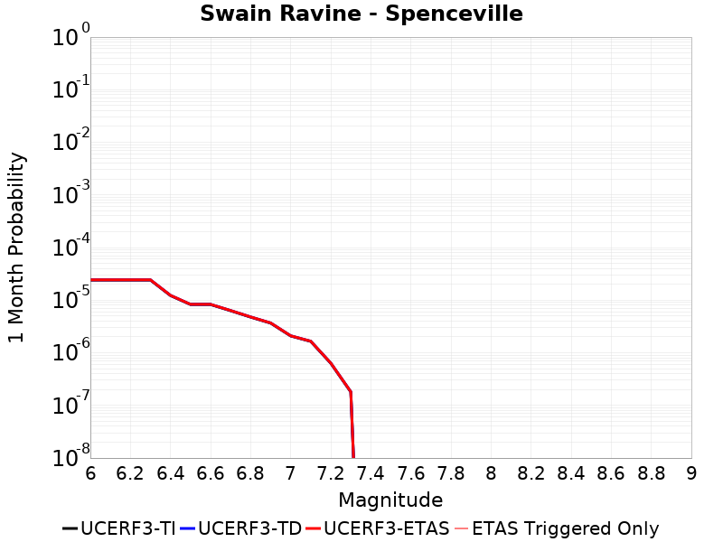 |  | 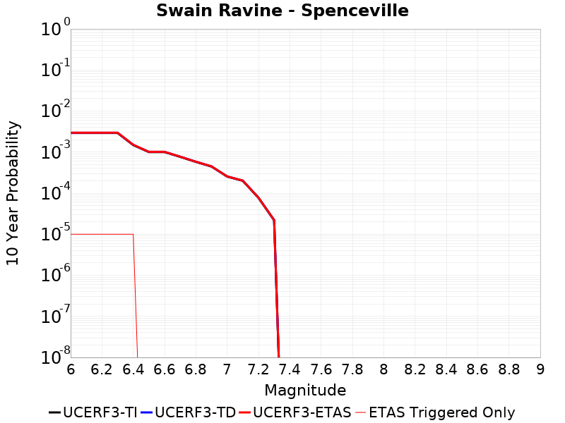 |

| Magnitude | 1 wk TI Prob | 1 wk TD Prob | 1 wk ETAS Prob | 1 wk ETAS/TD Gain | 1 wk ETAS Triggered Only | 1 mo TI Prob | 1 mo TD Prob | 1 mo ETAS Prob | 1 mo ETAS/TD Gain | 1 mo ETAS Triggered Only | 1 yr TI Prob | 1 yr TD Prob | 1 yr ETAS Prob | 1 yr ETAS/TD Gain | 1 yr ETAS Triggered Only | 10 yr TI Prob | 10 yr TD Prob | 10 yr ETAS Prob | 10 yr ETAS/TD Gain | 10 yr ETAS Triggered Only |
|-----|-----|-----|-----|-----|-----|-----|-----|-----|-----|-----|-----|-----|-----|-----|-----|-----|-----|-----|-----|-----|
| 6.0 | 5.596169E-6 | 5.6663644E-6 | 5.6663644E-6 | 1.0 | 0.0 | 2.398336E-5 | 2.4284207E-5 | 2.4284207E-5 | 1.0 | 0.0 | 2.9195828E-4 | 2.9562283E-4 | 2.9562283E-4 | 1.0 | 0.0 | 0.00291575 | 0.0029525652 | 0.0029625357 | 1.0033768 | 1.0E-5 |
| 6.1 | 5.596169E-6 | 5.6663644E-6 | 5.6663644E-6 | 1.0 | 0.0 | 2.398336E-5 | 2.4284207E-5 | 2.4284207E-5 | 1.0 | 0.0 | 2.9195828E-4 | 2.9562283E-4 | 2.9562283E-4 | 1.0 | 0.0 | 0.00291575 | 0.0029525652 | 0.0029625357 | 1.0033768 | 1.0E-5 |
| 6.2 | 5.596169E-6 | 5.6663644E-6 | 5.6663644E-6 | 1.0 | 0.0 | 2.398336E-5 | 2.4284207E-5 | 2.4284207E-5 | 1.0 | 0.0 | 2.9195828E-4 | 2.9562283E-4 | 2.9562283E-4 | 1.0 | 0.0 | 0.00291575 | 0.0029525652 | 0.0029625357 | 1.0033768 | 1.0E-5 |
| 6.3 | 5.596169E-6 | 5.6663644E-6 | 5.6663644E-6 | 1.0 | 0.0 | 2.398336E-5 | 2.4284207E-5 | 2.4284207E-5 | 1.0 | 0.0 | 2.9195828E-4 | 2.9562283E-4 | 2.9562283E-4 | 1.0 | 0.0 | 0.00291575 | 0.0029525652 | 0.0029625357 | 1.0033768 | 1.0E-5 |
| 6.4 | 2.8426775E-6 | 2.8753382E-6 | 2.8753382E-6 | 1.0 | 0.0 | 1.2182847E-5 | 1.2322822E-5 | 1.2322822E-5 | 1.0 | 0.0 | 1.4831607E-4 | 1.5002042E-4 | 1.5002042E-4 | 1.0 | 0.0 | 0.0014821711 | 0.0014992299 | 0.001509215 | 1.0066601 | 1.0E-5 |
| 6.5 | 1.9210793E-6 | 1.9421861E-6 | 1.9421861E-6 | 1.0 | 0.0 | 8.233172E-6 | 8.323629E-6 | 8.323629E-6 | 1.0 | 0.0 | 1.0023425E-4 | 1.013356E-4 | 1.013356E-4 | 1.0 | 0.0 | 0.0010018905 | 0.0010129074 | 0.0010129074 | 1.0 | 0.0 |
| 6.6 | 1.9210793E-6 | 1.9421861E-6 | 1.9421861E-6 | 1.0 | 0.0 | 8.233172E-6 | 8.323629E-6 | 8.323629E-6 | 1.0 | 0.0 | 1.0023425E-4 | 1.013356E-4 | 1.013356E-4 | 1.0 | 0.0 | 0.0010018905 | 0.0010129074 | 0.0010129074 | 1.0 | 0.0 |
| 6.7 | 1.4667394E-6 | 1.482468E-6 | 1.482468E-6 | 1.0 | 0.0 | 6.286011E-6 | 6.3534194E-6 | 6.3534194E-6 | 1.0 | 0.0 | 7.65295E-5 | 7.735021E-5 | 7.735021E-5 | 1.0 | 0.0 | 7.6503144E-4 | 7.7324064E-4 | 7.7324064E-4 | 1.0 | 0.0 |
| 6.8 | 1.1076943E-6 | 1.1193804E-6 | 1.1193804E-6 | 1.0 | 0.0 | 4.747252E-6 | 4.797336E-6 | 4.797336E-6 | 1.0 | 0.0 | 5.7796264E-5 | 5.8406044E-5 | 5.8406044E-5 | 1.0 | 0.0 | 5.778124E-4 | 5.839114E-4 | 5.839114E-4 | 1.0 | 0.0 |
| 6.9 | 8.514296E-7 | 8.6033475E-7 | 8.6033475E-7 | 1.0 | 0.0 | 3.648979E-6 | 3.6871438E-6 | 3.6871438E-6 | 1.0 | 0.0 | 4.442541E-5 | 4.489008E-5 | 4.489008E-5 | 1.0 | 0.0 | 4.441653E-4 | 4.48813E-4 | 4.48813E-4 | 1.0 | 0.0 |
| 7.0 | 4.8544706E-7 | 4.905151E-7 | 4.905151E-7 | 1.0 | 0.0 | 2.0804857E-6 | 2.102206E-6 | 2.102206E-6 | 1.0 | 0.0 | 2.532962E-5 | 2.5594072E-5 | 2.5594072E-5 | 1.0 | 0.0 | 2.5326732E-4 | 2.5591254E-4 | 2.5591254E-4 | 1.0 | 0.0 |
| 7.1 | 3.829186E-7 | 3.8693452E-7 | 3.8693452E-7 | 1.0 | 0.0 | 1.6410787E-6 | 1.6582898E-6 | 1.6582898E-6 | 1.0 | 0.0 | 1.997995E-5 | 2.0189502E-5 | 2.0189502E-5 | 1.0 | 0.0 | 1.9978154E-4 | 2.0187773E-4 | 2.0187773E-4 | 1.0 | 0.0 |
| 7.2 | 1.4726595E-7 | 1.4885234E-7 | 1.4885234E-7 | 1.0 | 0.0 | 6.3113964E-7 | 6.3793846E-7 | 6.3793846E-7 | 1.0 | 0.0 | 7.684098E-6 | 7.766878E-6 | 7.766878E-6 | 1.0 | 0.0 | 7.6838325E-5 | 7.7666606E-5 | 7.7666606E-5 | 1.0 | 0.0 |
| 7.3 | 4.1880604E-8 | 4.2341135E-8 | 4.2341135E-8 | 1.0 | 0.0 | 1.7948828E-7 | 1.81462E-7 | 1.81462E-7 | 1.0 | 0.0 | 2.1852677E-6 | 2.2093E-6 | 2.2093E-6 | 1.0 | 0.0 | 2.1852462E-5 | 2.2093E-5 | 2.2093E-5 | 1.0 | 0.0 |

## Rocky Ledge 2011 CFM
*[(top)](#table-of-contents)*

| 1 Week | 1 Month | 1 Year | 10 Year |
|-----|-----|-----|-----|
|  |  | 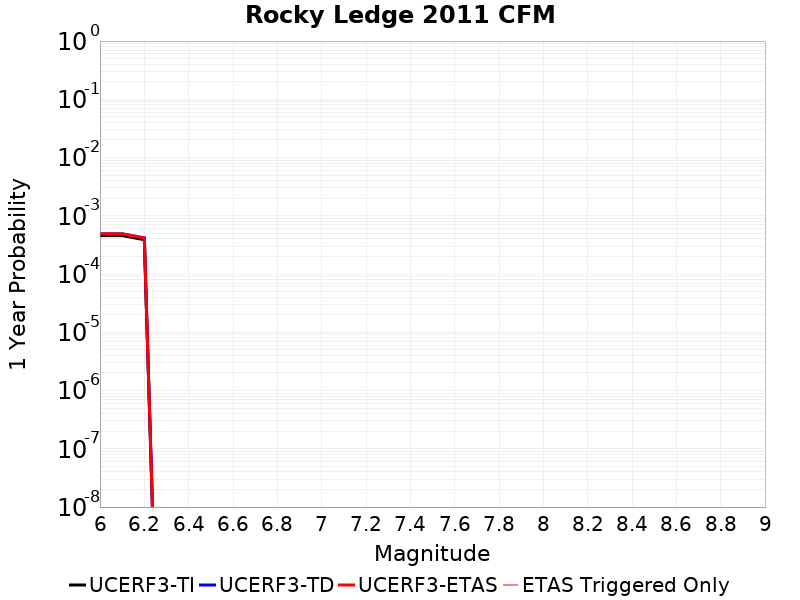 | 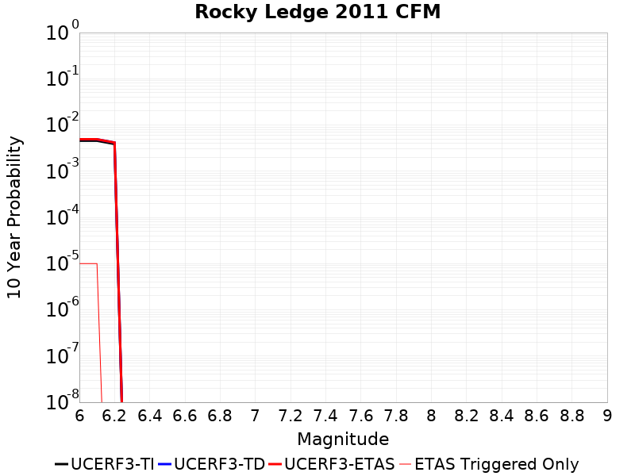 |

| Magnitude | 1 wk TI Prob | 1 wk TD Prob | 1 wk ETAS Prob | 1 wk ETAS/TD Gain | 1 wk ETAS Triggered Only | 1 mo TI Prob | 1 mo TD Prob | 1 mo ETAS Prob | 1 mo ETAS/TD Gain | 1 mo ETAS Triggered Only | 1 yr TI Prob | 1 yr TD Prob | 1 yr ETAS Prob | 1 yr ETAS/TD Gain | 1 yr ETAS Triggered Only | 10 yr TI Prob | 10 yr TD Prob | 10 yr ETAS Prob | 10 yr ETAS/TD Gain | 10 yr ETAS Triggered Only |
|-----|-----|-----|-----|-----|-----|-----|-----|-----|-----|-----|-----|-----|-----|-----|-----|-----|-----|-----|-----|-----|
| 6.0 | 8.7550525E-6 | 9.373294E-6 | 9.373294E-6 | 1.0 | 0.0 | 3.7521113E-5 | 4.0171093E-5 | 4.0171093E-5 | 1.0 | 0.0 | 4.567238E-4 | 4.8905384E-4 | 4.8905384E-4 | 1.0 | 0.0 | 0.0045578624 | 0.004887672 | 0.004897623 | 1.002036 | 1.0E-5 |
| 6.1 | 8.7550525E-6 | 9.373294E-6 | 9.373294E-6 | 1.0 | 0.0 | 3.7521113E-5 | 4.0171093E-5 | 4.0171093E-5 | 1.0 | 0.0 | 4.567238E-4 | 4.8905384E-4 | 4.8905384E-4 | 1.0 | 0.0 | 0.0045578624 | 0.004887672 | 0.004897623 | 1.002036 | 1.0E-5 |
| 6.2 | 7.442295E-6 | 7.966732E-6 | 7.966732E-6 | 1.0 | 0.0 | 3.189516E-5 | 3.4143137E-5 | 3.4143137E-5 | 1.0 | 0.0 | 3.8825438E-4 | 4.156927E-4 | 4.156927E-4 | 1.0 | 0.0 | 0.0038757676 | 0.0041569266 | 0.0041569266 | 1.0 | 0.0 |

## Fitzhugh Creek
*[(top)](#table-of-contents)*

| 1 Week | 1 Month | 1 Year | 10 Year |
|-----|-----|-----|-----|
| 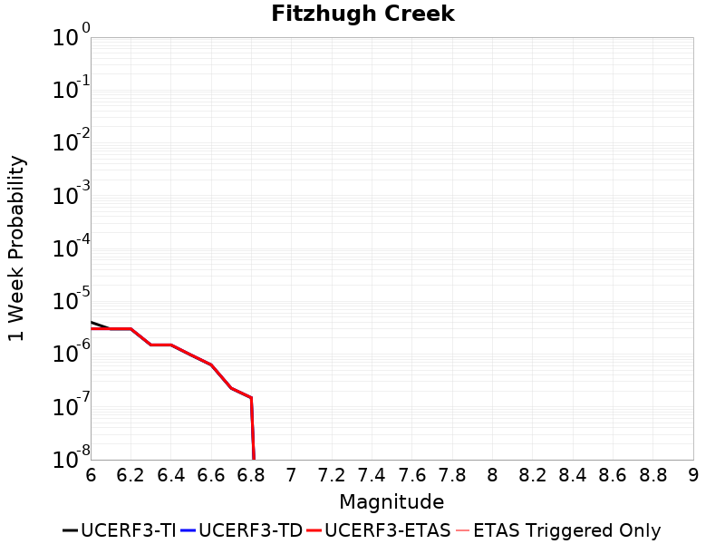 | 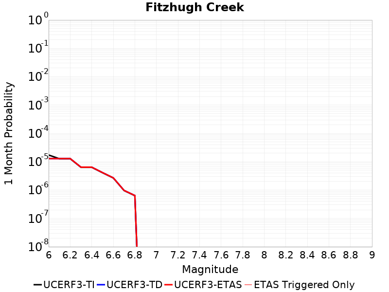 | 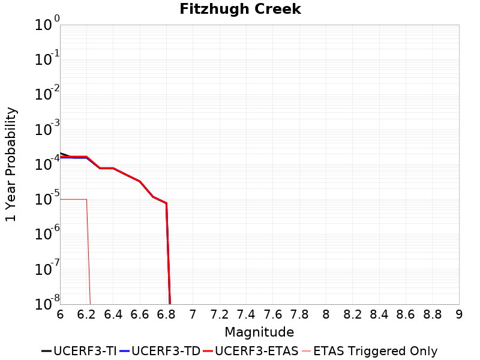 |  |

| Magnitude | 1 wk TI Prob | 1 wk TD Prob | 1 wk ETAS Prob | 1 wk ETAS/TD Gain | 1 wk ETAS Triggered Only | 1 mo TI Prob | 1 mo TD Prob | 1 mo ETAS Prob | 1 mo ETAS/TD Gain | 1 mo ETAS Triggered Only | 1 yr TI Prob | 1 yr TD Prob | 1 yr ETAS Prob | 1 yr ETAS/TD Gain | 1 yr ETAS Triggered Only | 10 yr TI Prob | 10 yr TD Prob | 10 yr ETAS Prob | 10 yr ETAS/TD Gain | 10 yr ETAS Triggered Only |
|-----|-----|-----|-----|-----|-----|-----|-----|-----|-----|-----|-----|-----|-----|-----|-----|-----|-----|-----|-----|-----|
| 6.0 | 4.0164323E-6 | 3.0074991E-6 | 3.0074991E-6 | 1.0 | 0.0 | 1.7213168E-5 | 1.2889223E-5 | 1.2889223E-5 | 1.0 | 0.0 | 2.0955017E-4 | 1.5691594E-4 | 1.6691437E-4 | 1.0637184 | 1.0E-5 | 0.0020935268 | 0.0015681433 | 0.0015781276 | 1.006367 | 1.0E-5 |
| 6.1 | 2.9741811E-6 | 3.0074991E-6 | 3.0074991E-6 | 1.0 | 0.0 | 1.2746428E-5 | 1.2889223E-5 | 1.2889223E-5 | 1.0 | 0.0 | 1.5517672E-4 | 1.5691594E-4 | 1.6691437E-4 | 1.0637184 | 1.0E-5 | 0.001550684 | 0.0015681433 | 0.0015781276 | 1.006367 | 1.0E-5 |
| 6.2 | 2.9741811E-6 | 3.0074991E-6 | 3.0074991E-6 | 1.0 | 0.0 | 1.2746428E-5 | 1.2889223E-5 | 1.2889223E-5 | 1.0 | 0.0 | 1.5517672E-4 | 1.5691594E-4 | 1.6691437E-4 | 1.0637184 | 1.0E-5 | 0.001550684 | 0.0015681433 | 0.0015781276 | 1.006367 | 1.0E-5 |
| 6.3 | 1.4781198E-6 | 1.4948305E-6 | 1.4948305E-6 | 1.0 | 0.0 | 6.3347834E-6 | 6.4064016E-6 | 6.4064016E-6 | 1.0 | 0.0 | 7.712326E-5 | 7.799535E-5 | 7.799535E-5 | 1.0 | 0.0 | 7.70965E-4 | 7.796995E-4 | 7.796995E-4 | 1.0 | 0.0 |
| 6.4 | 1.4781198E-6 | 1.4948305E-6 | 1.4948305E-6 | 1.0 | 0.0 | 6.3347834E-6 | 6.4064016E-6 | 6.4064016E-6 | 1.0 | 0.0 | 7.712326E-5 | 7.799535E-5 | 7.799535E-5 | 1.0 | 0.0 | 7.70965E-4 | 7.796995E-4 | 7.796995E-4 | 1.0 | 0.0 |
| 6.5 | 9.5176676E-7 | 9.625677E-7 | 9.625677E-7 | 1.0 | 0.0 | 4.078994E-6 | 4.1252842E-6 | 4.1252842E-6 | 1.0 | 0.0 | 4.9660623E-5 | 5.0224284E-5 | 5.0224284E-5 | 1.0 | 0.0 | 4.964952E-4 | 5.021397E-4 | 5.021397E-4 | 1.0 | 0.0 |
| 6.6 | 6.21145E-7 | 6.28172E-7 | 6.28172E-7 | 1.0 | 0.0 | 2.662047E-6 | 2.6921634E-6 | 2.6921634E-6 | 1.0 | 0.0 | 3.2409942E-5 | 3.2776665E-5 | 3.2776665E-5 | 1.0 | 0.0 | 3.2405215E-4 | 3.2772482E-4 | 3.2772482E-4 | 1.0 | 0.0 |
| 6.7 | 2.2377962E-7 | 2.2625927E-7 | 2.2625927E-7 | 1.0 | 0.0 | 9.590551E-7 | 9.696824E-7 | 9.696824E-7 | 1.0 | 0.0 | 1.1676434E-5 | 1.1805851E-5 | 1.1805851E-5 | 1.0 | 0.0 | 1.1675821E-4 | 1.18055345E-4 | 1.18055345E-4 | 1.0 | 0.0 |
| 6.8 | 1.4785022E-7 | 1.4947287E-7 | 1.4947287E-7 | 1.0 | 0.0 | 6.3364365E-7 | 6.40598E-7 | 6.40598E-7 | 1.0 | 0.0 | 7.714584E-6 | 7.799281E-6 | 7.799281E-6 | 1.0 | 0.0 | 7.714316E-5 | 7.79928E-5 | 7.79928E-5 | 1.0 | 0.0 |

## Pittville 2011 CFM
*[(top)](#table-of-contents)*

| 1 Week | 1 Month | 1 Year | 10 Year |
|-----|-----|-----|-----|
|  | 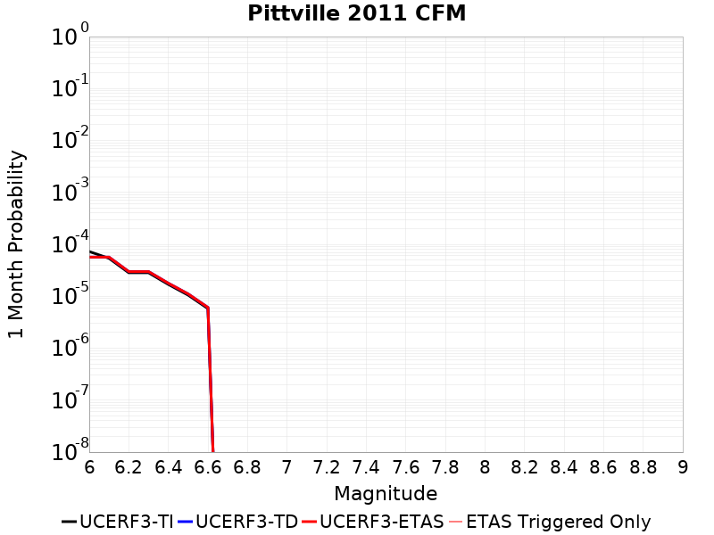 | 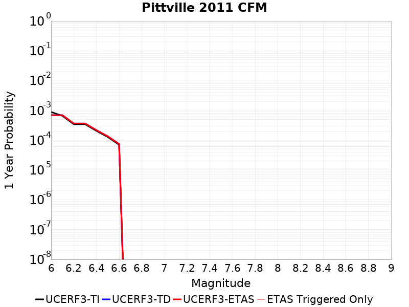 |  |

| Magnitude | 1 wk TI Prob | 1 wk TD Prob | 1 wk ETAS Prob | 1 wk ETAS/TD Gain | 1 wk ETAS Triggered Only | 1 mo TI Prob | 1 mo TD Prob | 1 mo ETAS Prob | 1 mo ETAS/TD Gain | 1 mo ETAS Triggered Only | 1 yr TI Prob | 1 yr TD Prob | 1 yr ETAS Prob | 1 yr ETAS/TD Gain | 1 yr ETAS Triggered Only | 10 yr TI Prob | 10 yr TD Prob | 10 yr ETAS Prob | 10 yr ETAS/TD Gain | 10 yr ETAS Triggered Only |
|-----|-----|-----|-----|-----|-----|-----|-----|-----|-----|-----|-----|-----|-----|-----|-----|-----|-----|-----|-----|-----|
| 6.0 | 1.6934118E-5 | 1.32227515E-5 | 1.32227515E-5 | 1.0 | 0.0 | 7.257277E-5 | 5.6667825E-5 | 5.6667825E-5 | 1.0 | 0.0 | 8.832153E-4 | 6.897338E-4 | 6.897338E-4 | 1.0 | 0.0 | 0.008797132 | 0.006878055 | 0.0068879863 | 1.0014439 | 1.0E-5 |
| 6.1 | 1.2540113E-5 | 1.32227515E-5 | 1.32227515E-5 | 1.0 | 0.0 | 5.3742235E-5 | 5.6667825E-5 | 5.6667825E-5 | 1.0 | 0.0 | 6.541153E-4 | 6.897338E-4 | 6.897338E-4 | 1.0 | 0.0 | 0.0065219323 | 0.006878055 | 0.0068879863 | 1.0014439 | 1.0E-5 |
| 6.2 | 6.603218E-6 | 6.9656253E-6 | 6.9656253E-6 | 1.0 | 0.0 | 2.8299199E-5 | 2.9852374E-5 | 2.9852374E-5 | 1.0 | 0.0 | 3.4448825E-4 | 3.6339826E-4 | 3.6339826E-4 | 1.0 | 0.0 | 0.0034395473 | 0.0036286542 | 0.003638618 | 1.0027459 | 1.0E-5 |
| 6.3 | 6.603218E-6 | 6.9656253E-6 | 6.9656253E-6 | 1.0 | 0.0 | 2.8299199E-5 | 2.9852374E-5 | 2.9852374E-5 | 1.0 | 0.0 | 3.4448825E-4 | 3.6339826E-4 | 3.6339826E-4 | 1.0 | 0.0 | 0.0034395473 | 0.0036286542 | 0.003638618 | 1.0027459 | 1.0E-5 |
| 6.4 | 3.9389015E-6 | 4.154847E-6 | 4.154847E-6 | 1.0 | 0.0 | 1.6880897E-5 | 1.7806382E-5 | 1.7806382E-5 | 1.0 | 0.0 | 2.0550552E-4 | 2.167741E-4 | 2.167741E-4 | 1.0 | 0.0 | 0.0020531558 | 0.0021659192 | 0.0021758976 | 1.004607 | 1.0E-5 |
| 6.5 | 2.4533072E-6 | 2.587739E-6 | 2.587739E-6 | 1.0 | 0.0 | 1.0514132E-5 | 1.1090273E-5 | 1.1090273E-5 | 1.0 | 0.0 | 1.2800204E-4 | 1.3501756E-4 | 1.3501756E-4 | 1.0 | 0.0 | 0.0012792832 | 0.0013495376 | 0.0013595242 | 1.0073999 | 1.0E-5 |
| 6.6 | 1.3482367E-6 | 1.4209888E-6 | 1.4209888E-6 | 1.0 | 0.0 | 5.778144E-6 | 6.0899442E-6 | 6.0899442E-6 | 1.0 | 0.0 | 7.0346636E-5 | 7.414363E-5 | 7.414363E-5 | 1.0 | 0.0 | 7.032437E-4 | 7.4129505E-4 | 7.512877E-4 | 1.01348 | 1.0E-5 |

## Rodgers Creek - Healdsburg 2011 CFM
*[(top)](#table-of-contents)*

| 1 Week | 1 Month | 1 Year | 10 Year |
|-----|-----|-----|-----|
| 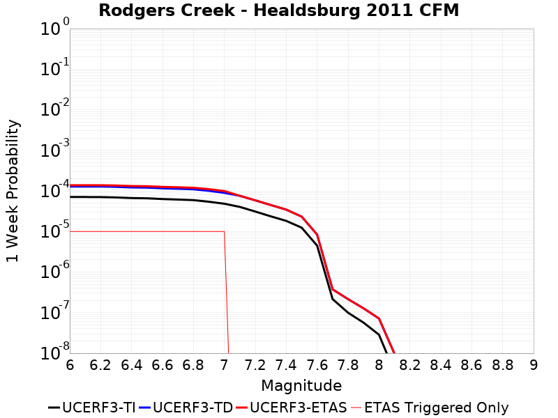 | 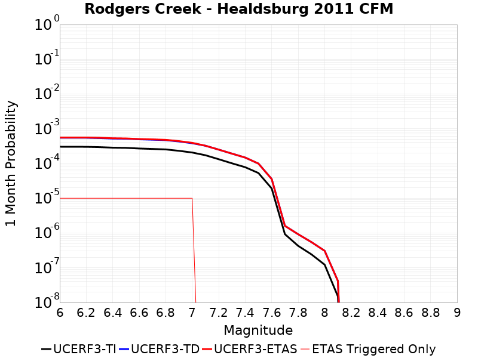 | 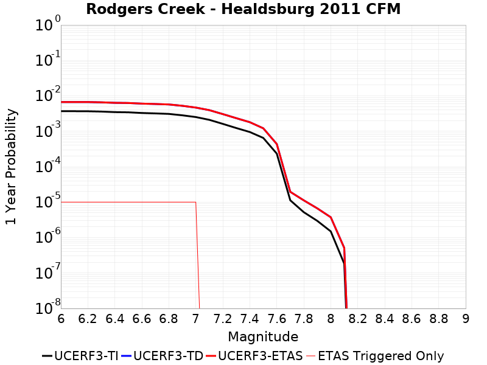 | 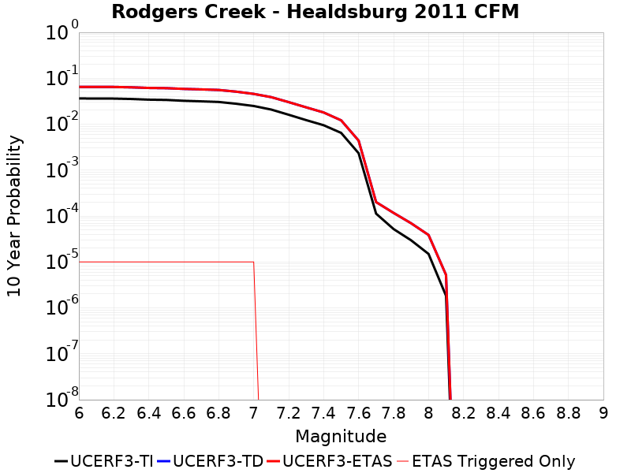 |

| Magnitude | 1 wk TI Prob | 1 wk TD Prob | 1 wk ETAS Prob | 1 wk ETAS/TD Gain | 1 wk ETAS Triggered Only | 1 mo TI Prob | 1 mo TD Prob | 1 mo ETAS Prob | 1 mo ETAS/TD Gain | 1 mo ETAS Triggered Only | 1 yr TI Prob | 1 yr TD Prob | 1 yr ETAS Prob | 1 yr ETAS/TD Gain | 1 yr ETAS Triggered Only | 10 yr TI Prob | 10 yr TD Prob | 10 yr ETAS Prob | 10 yr ETAS/TD Gain | 10 yr ETAS Triggered Only |
|-----|-----|-----|-----|-----|-----|-----|-----|-----|-----|-----|-----|-----|-----|-----|-----|-----|-----|-----|-----|-----|
| 6.0 | 7.0775226E-5 | 1.2812819E-4 | 1.3812691E-4 | 1.0780368 | 1.0E-5 | 3.0328715E-4 | 5.4900476E-4 | 5.5899925E-4 | 1.0182048 | 1.0E-5 | 0.00368627 | 0.006663646 | 0.0066735796 | 1.0014907 | 1.0E-5 | 0.036257185 | 0.06458576 | 0.06459511 | 1.0001448 | 1.0E-5 |
| 6.1 | 7.062078E-5 | 1.2812819E-4 | 1.3812691E-4 | 1.0780368 | 1.0E-5 | 3.0262535E-4 | 5.4900476E-4 | 5.5899925E-4 | 1.0182048 | 1.0E-5 | 0.00367824 | 0.006663646 | 0.0066735796 | 1.0014907 | 1.0E-5 | 0.03617951 | 0.06458576 | 0.06459511 | 1.0001448 | 1.0E-5 |
| 6.2 | 7.035022E-5 | 1.2812819E-4 | 1.3812691E-4 | 1.0780368 | 1.0E-5 | 3.0146612E-4 | 5.4900476E-4 | 5.5899925E-4 | 1.0182048 | 1.0E-5 | 0.003664174 | 0.006663646 | 0.0066735796 | 1.0014907 | 1.0E-5 | 0.036043428 | 0.06458576 | 0.06459511 | 1.0001448 | 1.0E-5 |
| 6.3 | 6.894245E-5 | 1.257238E-4 | 1.3572256E-4 | 1.0795294 | 1.0E-5 | 2.9543418E-4 | 5.387053E-4 | 5.486999E-4 | 1.018553 | 1.0E-5 | 0.0035909796 | 0.0065390635 | 0.0065489984 | 1.0015193 | 1.0E-5 | 0.035335038 | 0.063426495 | 0.06343586 | 1.0001477 | 1.0E-5 |
| 6.4 | 6.662423E-5 | 1.2169726E-4 | 1.3169604E-4 | 1.0821611 | 1.0E-5 | 2.8550113E-4 | 5.214558E-4 | 5.3145055E-4 | 1.0191671 | 1.0E-5 | 0.0034704367 | 0.006330318 | 0.0063402546 | 1.0015697 | 1.0E-5 | 0.034167375 | 0.06148056 | 0.061489943 | 1.0001527 | 1.0E-5 |
| 6.5 | 6.569133E-5 | 1.2029127E-4 | 1.3029006E-4 | 1.0831215 | 1.0E-5 | 2.8150392E-4 | 5.1543256E-4 | 5.254274E-4 | 1.0193912 | 1.0E-5 | 0.0034219243 | 0.006257422 | 0.006267359 | 1.0015881 | 1.0E-5 | 0.03369709 | 0.06079627 | 0.06080566 | 1.0001545 | 1.0E-5 |
| 6.6 | 6.289601E-5 | 1.1567766E-4 | 1.2567651E-4 | 1.0864371 | 1.0E-5 | 2.6952647E-4 | 4.956676E-4 | 5.0566264E-4 | 1.0201648 | 1.0E-5 | 0.0032765474 | 0.006018138 | 0.006028078 | 1.0016516 | 1.0E-5 | 0.032286562 | 0.058552653 | 0.058562066 | 1.0001608 | 1.0E-5 |
| 6.7 | 6.115274E-5 | 1.1283475E-4 | 1.2283362E-4 | 1.0886152 | 1.0E-5 | 2.6205686E-4 | 4.8348826E-4 | 4.9348344E-4 | 1.020673 | 1.0E-5 | 0.0031858748 | 0.005870664 | 0.0058806054 | 1.0016934 | 1.0E-5 | 0.031405866 | 0.05716616 | 0.057175588 | 1.000165 | 1.0E-5 |
| 6.8 | 5.9232367E-5 | 1.09473134E-4 | 1.1947204E-4 | 1.0913366 | 1.0E-5 | 2.538283E-4 | 4.690866E-4 | 4.790819E-4 | 1.0213081 | 1.0E-5 | 0.0030859804 | 0.0056962534 | 0.0057061967 | 1.0017456 | 1.0E-5 | 0.030434765 | 0.055517957 | 0.0555274 | 1.0001701 | 1.0E-5 |
| 6.9 | 5.4030377E-5 | 1.0030023E-4 | 1.1029923E-4 | 1.0996907 | 1.0E-5 | 2.315382E-4 | 4.2978767E-4 | 4.3978338E-4 | 1.0232573 | 1.0E-5 | 0.0028153337 | 0.005220179 | 0.005230127 | 1.0019057 | 1.0E-5 | 0.027799325 | 0.05100308 | 0.05101257 | 1.0001861 | 1.0E-5 |
| 7.0 | 4.8260714E-5 | 8.935057E-5 | 9.934967E-5 | 1.1119087 | 1.0E-5 | 2.0681522E-4 | 3.828751E-4 | 3.9287127E-4 | 1.0261081 | 1.0E-5 | 0.0025150678 | 0.0046515972 | 0.0046615507 | 1.0021398 | 1.0E-5 | 0.024867928 | 0.045598924 | 0.04560847 | 1.0002093 | 1.0E-5 |
| 7.1 | 4.0294493E-5 | 7.565254E-5 | 7.565254E-5 | 1.0 | 0.0 | 1.7267925E-4 | 3.241851E-4 | 3.241851E-4 | 1.0 | 0.0 | 0.0021003427 | 0.00393985 | 0.00393985 | 1.0 | 0.0 | 0.02080602 | 0.0387709 | 0.0387709 | 1.0 | 0.0 |
| 7.2 | 3.096388E-5 | 5.8515965E-5 | 5.8515965E-5 | 1.0 | 0.0 | 1.326956E-4 | 2.5075872E-4 | 2.5075872E-4 | 1.0 | 0.0 | 0.0016143717 | 0.0030487366 | 0.0030487366 | 1.0 | 0.0 | 0.01602694 | 0.030182904 | 0.030182904 | 1.0 | 0.0 |
| 7.3 | 2.3615226E-5 | 4.4864897E-5 | 4.4864897E-5 | 1.0 | 0.0 | 1.0120418E-4 | 1.9226404E-4 | 1.9226404E-4 | 1.0 | 0.0 | 0.0012314644 | 0.0023383163 | 0.0023383163 | 1.0 | 0.0 | 0.0122466255 | 0.02323967 | 0.02323967 | 1.0 | 0.0 |
| 7.4 | 1.8251132E-5 | 3.4573553E-5 | 3.4573553E-5 | 1.0 | 0.0 | 7.821679E-5 | 1.4816402E-4 | 1.4816402E-4 | 1.0 | 0.0 | 9.518733E-4 | 0.0018024148 | 0.0018024148 | 1.0 | 0.0 | 0.009478063 | 0.017971272 | 0.017971272 | 1.0 | 0.0 |
| 7.5 | 1.2411432E-5 | 2.3225195E-5 | 2.3225195E-5 | 1.0 | 0.0 | 5.3190768E-5 | 9.953279E-5 | 9.953279E-5 | 1.0 | 0.0 | 6.4740516E-4 | 0.0012111441 | 0.0012111441 | 1.0 | 0.0 | 0.006455223 | 0.012120159 | 0.012120159 | 1.0 | 0.0 |
| 7.6 | 4.4771446E-6 | 8.366221E-6 | 8.366221E-6 | 1.0 | 0.0 | 1.918762E-5 | 3.5854744E-5 | 3.5854744E-5 | 1.0 | 0.0 | 2.3358424E-4 | 4.364454E-4 | 4.364454E-4 | 1.0 | 0.0 | 0.0023333887 | 0.0043850094 | 0.0043850094 | 1.0 | 0.0 |
| 7.7 | 2.157941E-7 | 3.7424186E-7 | 3.7424186E-7 | 1.0 | 0.0 | 9.248315E-7 | 1.6038927E-6 | 1.6038927E-6 | 1.0 | 0.0 | 1.1259765E-5 | 1.9527219E-5 | 1.9527219E-5 | 1.0 | 0.0 | 1.1259195E-4 | 2.0080741E-4 | 2.0080741E-4 | 1.0 | 0.0 |
| 7.8 | 9.9623286E-8 | 2.150953E-7 | 2.150953E-7 | 1.0 | 0.0 | 4.269569E-7 | 9.2183666E-7 | 9.2183666E-7 | 1.0 | 0.0 | 5.1981874E-6 | 1.1223304E-5 | 1.1223304E-5 | 1.0 | 0.0 | 5.198066E-5 | 1.1678399E-4 | 1.1678399E-4 | 1.0 | 0.0 |
| 7.9 | 5.6745257E-8 | 1.2786863E-7 | 1.2786863E-7 | 1.0 | 0.0 | 2.4319394E-7 | 5.480083E-7 | 5.480083E-7 | 1.0 | 0.0 | 2.960882E-6 | 6.6719804E-6 | 6.6719804E-6 | 1.0 | 0.0 | 2.9608427E-5 | 6.95666E-5 | 6.95666E-5 | 1.0 | 0.0 |
| 8.0 | 2.8614323E-8 | 7.171191E-8 | 7.171191E-8 | 1.0 | 0.0 | 1.2263281E-7 | 3.0733673E-7 | 3.0733673E-7 | 1.0 | 0.0 | 1.4930534E-6 | 3.7418183E-6 | 3.7418183E-6 | 1.0 | 0.0 | 1.4930434E-5 | 3.86321E-5 | 3.86321E-5 | 1.0 | 0.0 |
| 8.1 | 3.5045191E-9 | 9.76819E-9 | 9.76819E-9 | 1.0 | 0.0 | 1.5019367E-8 | 4.186367E-8 | 4.186367E-8 | 1.0 | 0.0 | 1.8286079E-7 | 5.096901E-7 | 5.096901E-7 | 1.0 | 0.0 | 1.8286064E-6 | 5.2082337E-6 | 5.2082337E-6 | 1.0 | 0.0 |

## Monterey Bay-Tularcitos
*[(top)](#table-of-contents)*

| 1 Week | 1 Month | 1 Year | 10 Year |
|-----|-----|-----|-----|
| 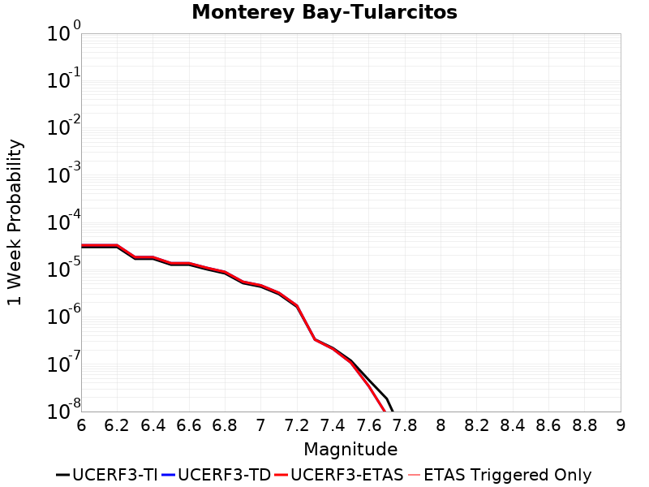 |  | 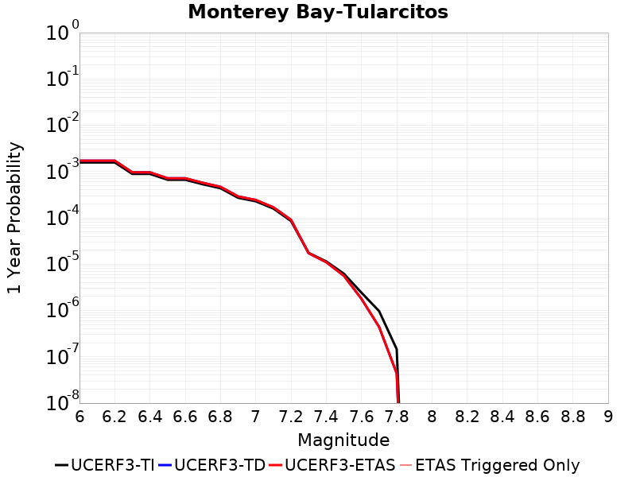 |  |

| Magnitude | 1 wk TI Prob | 1 wk TD Prob | 1 wk ETAS Prob | 1 wk ETAS/TD Gain | 1 wk ETAS Triggered Only | 1 mo TI Prob | 1 mo TD Prob | 1 mo ETAS Prob | 1 mo ETAS/TD Gain | 1 mo ETAS Triggered Only | 1 yr TI Prob | 1 yr TD Prob | 1 yr ETAS Prob | 1 yr ETAS/TD Gain | 1 yr ETAS Triggered Only | 10 yr TI Prob | 10 yr TD Prob | 10 yr ETAS Prob | 10 yr ETAS/TD Gain | 10 yr ETAS Triggered Only |
|-----|-----|-----|-----|-----|-----|-----|-----|-----|-----|-----|-----|-----|-----|-----|-----|-----|-----|-----|-----|-----|
| 6.0 | 3.0131365E-5 | 3.290998E-5 | 3.290998E-5 | 1.0 | 0.0 | 1.2912804E-4 | 1.4103574E-4 | 1.4103574E-4 | 1.0 | 0.0 | 0.001571 | 0.0017158639 | 0.0017158639 | 1.0 | 0.0 | 0.015599402 | 0.017037047 | 0.017046876 | 1.000577 | 1.0E-5 |
| 6.1 | 3.0131365E-5 | 3.290998E-5 | 3.290998E-5 | 1.0 | 0.0 | 1.2912804E-4 | 1.4103574E-4 | 1.4103574E-4 | 1.0 | 0.0 | 0.001571 | 0.0017158639 | 0.0017158639 | 1.0 | 0.0 | 0.015599402 | 0.017037047 | 0.017046876 | 1.000577 | 1.0E-5 |
| 6.2 | 3.0131365E-5 | 3.290998E-5 | 3.290998E-5 | 1.0 | 0.0 | 1.2912804E-4 | 1.4103574E-4 | 1.4103574E-4 | 1.0 | 0.0 | 0.001571 | 0.0017158639 | 0.0017158639 | 1.0 | 0.0 | 0.015599402 | 0.017037047 | 0.017046876 | 1.000577 | 1.0E-5 |
| 6.3 | 1.6998249E-5 | 1.8386509E-5 | 1.8386509E-5 | 1.0 | 0.0 | 7.28476E-5 | 7.879705E-5 | 7.879705E-5 | 1.0 | 0.0 | 8.865586E-4 | 9.5895067E-4 | 9.5895067E-4 | 1.0 | 0.0 | 0.0088303005 | 0.009550064 | 0.0095599685 | 1.0010371 | 1.0E-5 |
| 6.4 | 1.6998249E-5 | 1.8386509E-5 | 1.8386509E-5 | 1.0 | 0.0 | 7.28476E-5 | 7.879705E-5 | 7.879705E-5 | 1.0 | 0.0 | 8.865586E-4 | 9.5895067E-4 | 9.5895067E-4 | 1.0 | 0.0 | 0.0088303005 | 0.009550064 | 0.0095599685 | 1.0010371 | 1.0E-5 |
| 6.5 | 1.27470785E-5 | 1.3733135E-5 | 1.3733135E-5 | 1.0 | 0.0 | 5.4629192E-5 | 5.885503E-5 | 5.885503E-5 | 1.0 | 0.0 | 6.649074E-4 | 7.163348E-4 | 7.163348E-4 | 1.0 | 0.0 | 0.0066292146 | 0.007141317 | 0.007151245 | 1.0013903 | 1.0E-5 |
| 6.6 | 1.2739422E-5 | 1.3725213E-5 | 1.3725213E-5 | 1.0 | 0.0 | 5.4596385E-5 | 5.882107E-5 | 5.882107E-5 | 1.0 | 0.0 | 6.645082E-4 | 7.1592163E-4 | 7.1592163E-4 | 1.0 | 0.0 | 0.0066252467 | 0.007137212 | 0.007147141 | 1.001391 | 1.0E-5 |
| 6.7 | 1.0160109E-5 | 1.0916559E-5 | 1.0916559E-5 | 1.0 | 0.0 | 4.35426E-5 | 4.6784455E-5 | 4.6784455E-5 | 1.0 | 0.0 | 5.300022E-4 | 5.69459E-4 | 5.69459E-4 | 1.0 | 0.0 | 0.005287399 | 0.0056807133 | 0.0056906566 | 1.0017503 | 1.0E-5 |
| 6.8 | 8.349859E-6 | 8.957583E-6 | 8.957583E-6 | 1.0 | 0.0 | 3.578462E-5 | 3.838911E-5 | 3.838911E-5 | 1.0 | 0.0 | 4.3559066E-4 | 4.6729288E-4 | 4.6729288E-4 | 1.0 | 0.0 | 0.004347378 | 0.004663671 | 0.0046736244 | 1.0021342 | 1.0E-5 |
| 6.9 | 5.193639E-6 | 5.5517075E-6 | 5.5517075E-6 | 1.0 | 0.0 | 2.2258262E-5 | 2.3792834E-5 | 2.3792834E-5 | 1.0 | 0.0 | 2.7096065E-4 | 2.896425E-4 | 2.896425E-4 | 1.0 | 0.0 | 0.0027063051 | 0.0028929731 | 0.0028929731 | 1.0 | 0.0 |
| 7.0 | 4.359381E-6 | 4.656271E-6 | 4.656271E-6 | 1.0 | 0.0 | 1.8682927E-5 | 1.9955312E-5 | 1.9955312E-5 | 1.0 | 0.0 | 2.274409E-4 | 2.4293183E-4 | 2.4293183E-4 | 1.0 | 0.0 | 0.0022720827 | 0.0024269572 | 0.0024269572 | 1.0 | 0.0 |
| 7.1 | 3.0398533E-6 | 3.2402063E-6 | 3.2402063E-6 | 1.0 | 0.0 | 1.3027877E-5 | 1.3886539E-5 | 1.3886539E-5 | 1.0 | 0.0 | 1.5860285E-4 | 1.6905814E-4 | 1.6905814E-4 | 1.0 | 0.0 | 0.001584897 | 0.0016895544 | 0.0016895544 | 1.0 | 0.0 |
| 7.2 | 1.642335E-6 | 1.7384314E-6 | 1.7384314E-6 | 1.0 | 0.0 | 7.0385595E-6 | 7.4504105E-6 | 7.4504105E-6 | 1.0 | 0.0 | 8.569109E-5 | 9.070705E-5 | 9.070705E-5 | 1.0 | 0.0 | 8.5658056E-4 | 9.0690417E-4 | 9.0690417E-4 | 1.0 | 0.0 |
| 7.3 | 3.356842E-7 | 3.3070552E-7 | 3.3070552E-7 | 1.0 | 0.0 | 1.4386458E-6 | 1.4173086E-6 | 1.4173086E-6 | 1.0 | 0.0 | 1.7515373E-5 | 1.7255597E-5 | 1.7255597E-5 | 1.0 | 0.0 | 1.7513991E-4 | 1.7254267E-4 | 1.7254267E-4 | 1.0 | 0.0 |
| 7.4 | 2.1973483E-7 | 2.1111791E-7 | 2.1111791E-7 | 1.0 | 0.0 | 9.417204E-7 | 9.0479074E-7 | 9.0479074E-7 | 1.0 | 0.0 | 1.1465385E-5 | 1.1015772E-5 | 1.1015772E-5 | 1.0 | 0.0 | 1.1464794E-4 | 1.10152294E-4 | 1.10152294E-4 | 1.0 | 0.0 |
| 7.5 | 1.1944135E-7 | 1.0787855E-7 | 1.0787855E-7 | 1.0 | 0.0 | 5.118914E-7 | 4.6233654E-7 | 4.6233654E-7 | 1.0 | 0.0 | 6.23226E-6 | 5.628933E-6 | 5.628933E-6 | 1.0 | 0.0 | 6.2320854E-5 | 5.6287918E-5 | 5.6287918E-5 | 1.0 | 0.0 |
| 7.6 | 4.636058E-8 | 3.4174086E-8 | 3.4174086E-8 | 1.0 | 0.0 | 1.9868818E-7 | 1.4646037E-7 | 1.4646037E-7 | 1.0 | 0.0 | 2.419026E-6 | 1.7831535E-6 | 1.7831535E-6 | 1.0 | 0.0 | 2.4189996E-5 | 1.7831393E-5 | 1.7831393E-5 | 1.0 | 0.0 |
| 7.7 | 1.8588572E-8 | 8.470126E-9 | 8.470126E-9 | 1.0 | 0.0 | 7.9665305E-8 | 3.6300545E-8 | 3.6300545E-8 | 1.0 | 0.0 | 9.699246E-7 | 4.41959E-7 | 4.41959E-7 | 1.0 | 0.0 | 9.699204E-6 | 4.4195817E-6 | 4.4195817E-6 | 1.0 | 0.0 |
| 7.8 | 2.7960154E-9 | 8.3712437E-10 | 8.3712437E-10 | 1.0 | 0.0 | 1.1982923E-8 | 3.5876757E-9 | 3.5876757E-9 | 1.0 | 0.0 | 1.4589209E-7 | 4.367995E-8 | 4.367995E-8 | 1.0 | 0.0 | 1.4589199E-6 | 4.3679947E-7 | 4.3679947E-7 | 1.0 | 0.0 |

## San Andreas (San Gorgonio Pass-Garnet HIll)
*[(top)](#table-of-contents)*

| 1 Week | 1 Month | 1 Year | 10 Year |
|-----|-----|-----|-----|
| 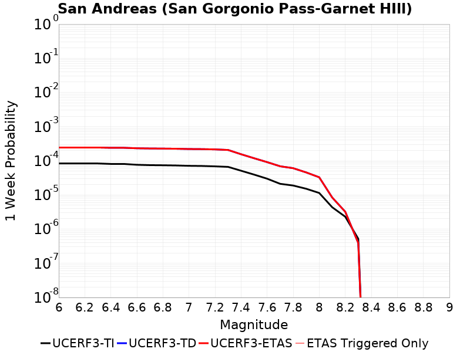 | 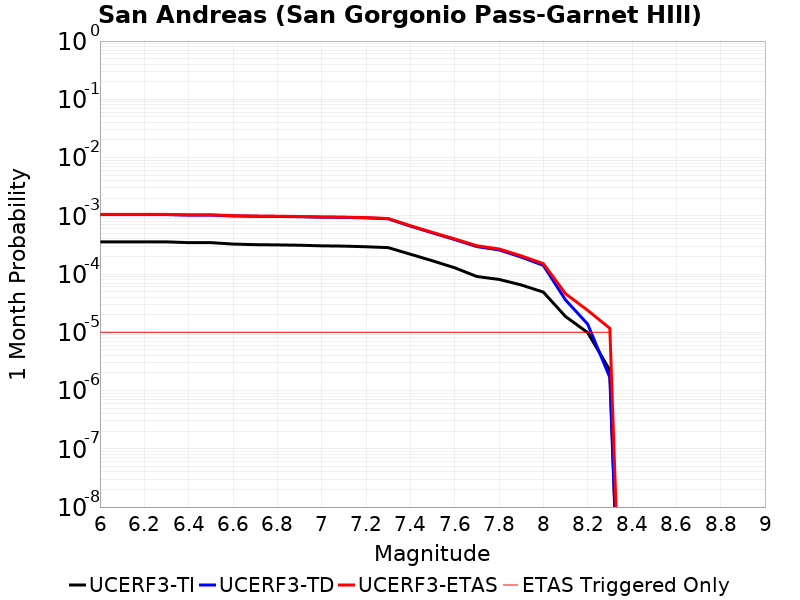 |  | 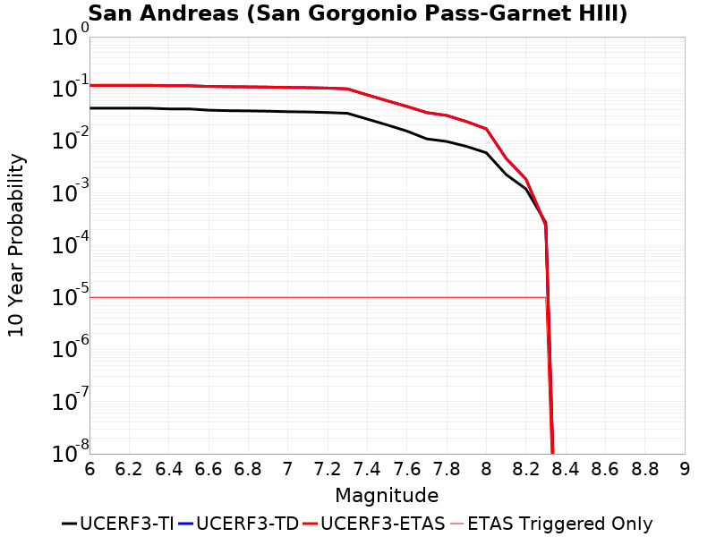 |

| Magnitude | 1 wk TI Prob | 1 wk TD Prob | 1 wk ETAS Prob | 1 wk ETAS/TD Gain | 1 wk ETAS Triggered Only | 1 mo TI Prob | 1 mo TD Prob | 1 mo ETAS Prob | 1 mo ETAS/TD Gain | 1 mo ETAS Triggered Only | 1 yr TI Prob | 1 yr TD Prob | 1 yr ETAS Prob | 1 yr ETAS/TD Gain | 1 yr ETAS Triggered Only | 10 yr TI Prob | 10 yr TD Prob | 10 yr ETAS Prob | 10 yr ETAS/TD Gain | 10 yr ETAS Triggered Only |
|-----|-----|-----|-----|-----|-----|-----|-----|-----|-----|-----|-----|-----|-----|-----|-----|-----|-----|-----|-----|-----|
| 6.0 | 8.31567E-5 | 2.4389273E-4 | 2.4389273E-4 | 1.0 | 0.0 | 3.5633717E-4 | 0.001044831 | 0.0010548206 | 1.009561 | 1.0E-5 | 0.004329778 | 0.012646502 | 0.012656376 | 1.0007807 | 1.0E-5 | 0.042463828 | 0.11670702 | 0.11671585 | 1.0000757 | 1.0E-5 |
| 6.1 | 8.31567E-5 | 2.4389273E-4 | 2.4389273E-4 | 1.0 | 0.0 | 3.5633717E-4 | 0.001044831 | 0.0010548206 | 1.009561 | 1.0E-5 | 0.004329778 | 0.012646502 | 0.012656376 | 1.0007807 | 1.0E-5 | 0.042463828 | 0.11670702 | 0.11671585 | 1.0000757 | 1.0E-5 |
| 6.2 | 8.31567E-5 | 2.4389273E-4 | 2.4389273E-4 | 1.0 | 0.0 | 3.5633717E-4 | 0.001044831 | 0.0010548206 | 1.009561 | 1.0E-5 | 0.004329778 | 0.012646502 | 0.012656376 | 1.0007807 | 1.0E-5 | 0.042463828 | 0.11670702 | 0.11671585 | 1.0000757 | 1.0E-5 |
| 6.3 | 8.31567E-5 | 2.4389273E-4 | 2.4389273E-4 | 1.0 | 0.0 | 3.5633717E-4 | 0.001044831 | 0.0010548206 | 1.009561 | 1.0E-5 | 0.004329778 | 0.012646502 | 0.012656376 | 1.0007807 | 1.0E-5 | 0.042463828 | 0.11670702 | 0.11671585 | 1.0000757 | 1.0E-5 |
| 6.4 | 8.059055E-5 | 2.3940328E-4 | 2.3940328E-4 | 1.0 | 0.0 | 3.4534236E-4 | 0.0010256073 | 0.0010355971 | 1.0097404 | 1.0E-5 | 0.0041964394 | 0.0124155115 | 0.012425387 | 1.0007955 | 1.0E-5 | 0.041180745 | 0.11467025 | 0.114679106 | 1.0000772 | 1.0E-5 |
| 6.5 | 8.059055E-5 | 2.3940328E-4 | 2.3940328E-4 | 1.0 | 0.0 | 3.4534236E-4 | 0.0010256073 | 0.0010355971 | 1.0097404 | 1.0E-5 | 0.0041964394 | 0.0124155115 | 0.012425387 | 1.0007955 | 1.0E-5 | 0.041180745 | 0.11467025 | 0.114679106 | 1.0000772 | 1.0E-5 |
| 6.6 | 7.619237E-5 | 2.317471E-4 | 2.317471E-4 | 1.0 | 0.0 | 3.2649786E-4 | 9.928262E-4 | 0.0010028163 | 1.0100622 | 1.0E-5 | 0.0039678677 | 0.012021257 | 0.012031137 | 1.0008218 | 1.0E-5 | 0.03897764 | 0.11117956 | 0.11118845 | 1.00008 | 1.0E-5 |
| 6.7 | 7.440636E-5 | 2.2847051E-4 | 2.2847051E-4 | 1.0 | 0.0 | 3.188454E-4 | 9.787942E-4 | 9.887845E-4 | 1.0102067 | 1.0E-5 | 0.0038750346 | 0.011852285 | 0.011862167 | 1.0008337 | 1.0E-5 | 0.038081564 | 0.10967952 | 0.10968842 | 1.0000812 | 1.0E-5 |
| 6.8 | 7.3735864E-5 | 2.2691926E-4 | 2.2691926E-4 | 1.0 | 0.0 | 3.1597257E-4 | 9.72151E-4 | 9.821412E-4 | 1.0102764 | 1.0E-5 | 0.0038401815 | 0.011772283 | 0.011782166 | 1.0008395 | 1.0E-5 | 0.03774495 | 0.1089743 | 0.10898321 | 1.0000818 | 1.0E-5 |
| 6.9 | 7.27575E-5 | 2.2458278E-4 | 2.2458278E-4 | 1.0 | 0.0 | 3.117806E-4 | 9.62145E-4 | 9.7213534E-4 | 1.0103835 | 1.0E-5 | 0.003789323 | 0.011651769 | 0.011661653 | 1.0008483 | 1.0E-5 | 0.037253562 | 0.10791529 | 0.107924215 | 1.0000826 | 1.0E-5 |
| 7.0 | 7.102591E-5 | 2.2036707E-4 | 2.2036707E-4 | 1.0 | 0.0 | 3.0436125E-4 | 9.4409083E-4 | 9.540814E-4 | 1.0105822 | 1.0E-5 | 0.003699303 | 0.011434286 | 0.011444172 | 1.0008645 | 1.0E-5 | 0.03638325 | 0.106003165 | 0.106012106 | 1.0000843 | 1.0E-5 |
| 7.1 | 7.028513E-5 | 2.1869484E-4 | 2.1869484E-4 | 1.0 | 0.0 | 3.0118722E-4 | 9.369293E-4 | 9.469199E-4 | 1.0106632 | 1.0E-5 | 0.0036607897 | 0.011348006 | 0.011357893 | 1.0008712 | 1.0E-5 | 0.036010686 | 0.105237 | 0.10524595 | 1.000085 | 1.0E-5 |
| 7.2 | 6.8498244E-5 | 2.1469813E-4 | 2.1469813E-4 | 1.0 | 0.0 | 2.9353087E-4 | 9.198127E-4 | 9.2980353E-4 | 1.0108618 | 1.0E-5 | 0.003567883 | 0.011141759 | 0.011151648 | 1.0008875 | 1.0E-5 | 0.035111405 | 0.1034043 | 0.10341327 | 1.0000867 | 1.0E-5 |
| 7.3 | 6.622592E-5 | 2.0681477E-4 | 2.0681477E-4 | 1.0 | 0.0 | 2.8379448E-4 | 8.860502E-4 | 8.960414E-4 | 1.011276 | 1.0E-5 | 0.0034497243 | 0.0107348235 | 0.010744716 | 1.0009216 | 1.0E-5 | 0.033966612 | 0.0998508 | 0.099859804 | 1.0000901 | 1.0E-5 |
| 7.4 | 5.1050705E-5 | 1.5507087E-4 | 1.5507087E-4 | 1.0 | 0.0 | 2.1877038E-4 | 6.644211E-4 | 6.744145E-4 | 1.0150406 | 1.0E-5 | 0.002660276 | 0.008059534 | 0.008069454 | 1.0012307 | 1.0E-5 | 0.02628654 | 0.076383345 | 0.07639258 | 1.0001209 | 1.0E-5 |
| 7.5 | 3.9302922E-5 | 1.1838608E-4 | 1.1838608E-4 | 1.0 | 0.0 | 1.6843023E-4 | 5.072706E-4 | 5.172655E-4 | 1.0197034 | 1.0E-5 | 0.0020487092 | 0.006158608 | 0.006168546 | 1.0016137 | 1.0E-5 | 0.020299247 | 0.059122935 | 0.059132345 | 1.0001591 | 1.0E-5 |
| 7.6 | 2.9851626E-5 | 9.111975E-5 | 9.111975E-5 | 1.0 | 0.0 | 1.2792926E-4 | 3.9045492E-4 | 4.00451E-4 | 1.0256011 | 1.0E-5 | 0.0015564259 | 0.0047434554 | 0.004753408 | 1.0020982 | 1.0E-5 | 0.0154556995 | 0.045937758 | 0.0459473 | 1.0002077 | 1.0E-5 |
| 7.7 | 2.1135214E-5 | 6.892676E-5 | 6.892676E-5 | 1.0 | 0.0 | 9.0576345E-5 | 2.95367E-4 | 3.0536405E-4 | 1.0338461 | 1.0E-5 | 0.0011022091 | 0.00359017 | 0.0036001343 | 1.0027754 | 1.0E-5 | 0.010967582 | 0.034997184 | 0.035006836 | 1.0002757 | 1.0E-5 |
| 7.8 | 1.883379E-5 | 6.0528622E-5 | 6.0528622E-5 | 1.0 | 0.0 | 8.0713755E-5 | 2.5938262E-4 | 2.6938002E-4 | 1.0385431 | 1.0E-5 | 9.822468E-4 | 0.003153414 | 0.0031633826 | 1.0031612 | 1.0E-5 | 0.0097791655 | 0.030892512 | 0.030902203 | 1.0003138 | 1.0E-5 |
| 7.9 | 1.5156185E-5 | 4.5530058E-5 | 4.5530058E-5 | 1.0 | 0.0 | 6.495346E-5 | 1.9511423E-4 | 2.0511229E-4 | 1.051242 | 1.0E-5 | 7.9052144E-4 | 0.0023729296 | 0.0023829057 | 1.0042042 | 1.0E-5 | 0.007877152 | 0.023525553 | 0.023535317 | 1.0004151 | 1.0E-5 |
| 8.0 | 1.1405907E-5 | 3.283808E-5 | 3.283808E-5 | 1.0 | 0.0 | 4.8881542E-5 | 1.4072705E-4 | 1.5072564E-4 | 1.0710496 | 1.0E-5 | 5.9497025E-4 | 0.0017120065 | 0.0017219894 | 1.0058311 | 1.0E-5 | 0.005933798 | 0.017092718 | 0.017102547 | 1.0005751 | 1.0E-5 |
| 8.1 | 4.3511436E-6 | 8.376981E-6 | 8.376981E-6 | 1.0 | 0.0 | 1.8647626E-5 | 3.5900855E-5 | 4.5900495E-5 | 1.2785349 | 1.0E-5 | 2.2701119E-4 | 4.370054E-4 | 4.4700102E-4 | 1.022873 | 1.0E-5 | 0.0022677942 | 0.004613192 | 0.0046231453 | 1.0021577 | 1.0E-5 |
| 8.2 | 2.3042528E-6 | 3.220598E-6 | 3.220598E-6 | 1.0 | 0.0 | 9.875332E-6 | 1.380249E-5 | 2.3802351E-5 | 1.724497 | 1.0E-5 | 1.2022553E-4 | 1.6803242E-4 | 1.7803074E-4 | 1.0595024 | 1.0E-5 | 0.0012016051 | 0.0018486867 | 0.0018586682 | 1.0053992 | 1.0E-5 |
| 8.3 | 5.202968E-7 | 3.9032875E-7 | 3.9032875E-7 | 1.0 | 0.0 | 2.2298414E-6 | 1.6728366E-6 | 1.167282E-5 | 6.9778605 | 1.0E-5 | 2.714798E-5 | 2.0366613E-5 | 3.036641E-5 | 1.4909897 | 1.0E-5 | 2.7144665E-4 | 2.3666132E-4 | 2.4665895E-4 | 1.0422444 | 1.0E-5 |

## Contra Costa (Lafayette) 2011 CFM
*[(top)](#table-of-contents)*

| 1 Week | 1 Month | 1 Year | 10 Year |
|-----|-----|-----|-----|
|  | 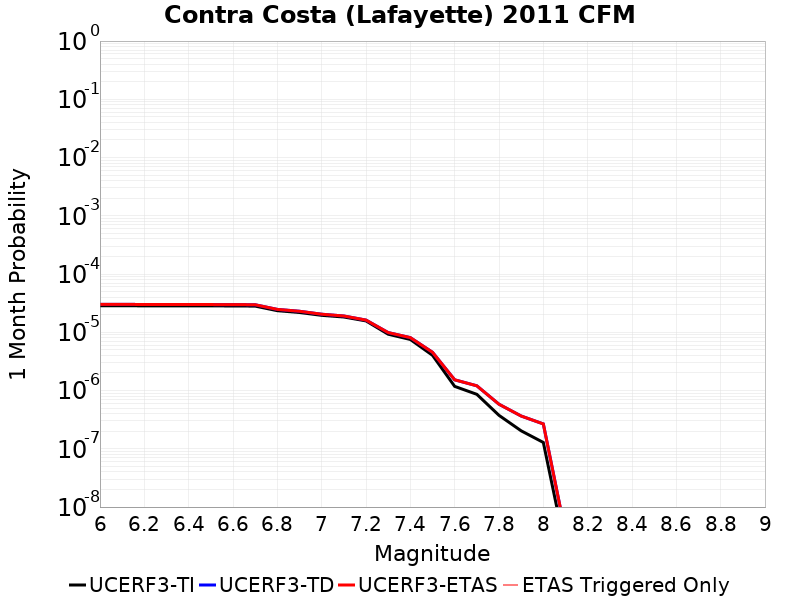 | 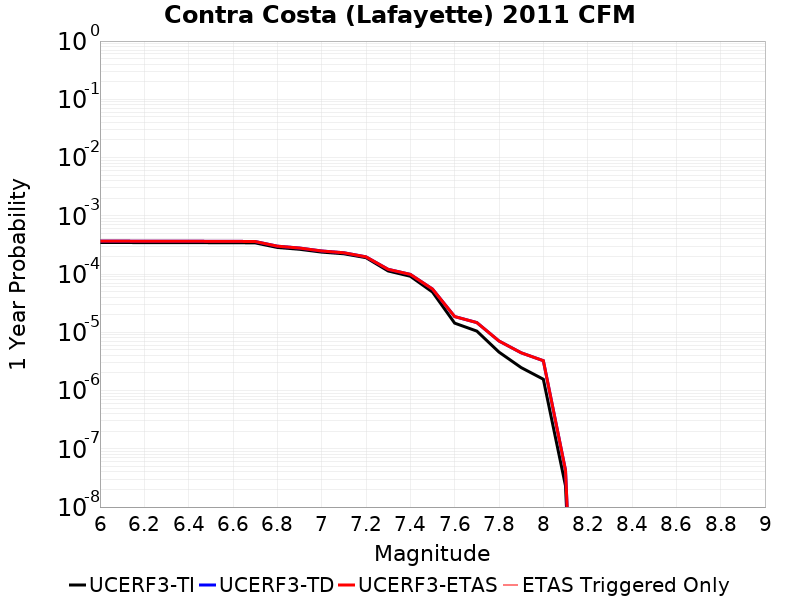 | 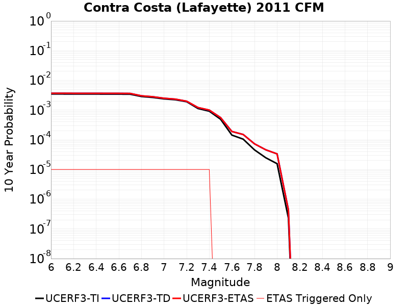 |

| Magnitude | 1 wk TI Prob | 1 wk TD Prob | 1 wk ETAS Prob | 1 wk ETAS/TD Gain | 1 wk ETAS Triggered Only | 1 mo TI Prob | 1 mo TD Prob | 1 mo ETAS Prob | 1 mo ETAS/TD Gain | 1 mo ETAS Triggered Only | 1 yr TI Prob | 1 yr TD Prob | 1 yr ETAS Prob | 1 yr ETAS/TD Gain | 1 yr ETAS Triggered Only | 10 yr TI Prob | 10 yr TD Prob | 10 yr ETAS Prob | 10 yr ETAS/TD Gain | 10 yr ETAS Triggered Only |
|-----|-----|-----|-----|-----|-----|-----|-----|-----|-----|-----|-----|-----|-----|-----|-----|-----|-----|-----|-----|-----|
| 6.0 | 6.655419E-6 | 7.024149E-6 | 7.024149E-6 | 1.0 | 0.0 | 2.8522913E-5 | 3.010316E-5 | 3.010316E-5 | 1.0 | 0.0 | 3.472111E-4 | 3.6644633E-4 | 3.6644633E-4 | 1.0 | 0.0 | 0.0034666911 | 0.0036631485 | 0.0036731118 | 1.0027199 | 1.0E-5 |
| 6.1 | 6.655419E-6 | 7.024149E-6 | 7.024149E-6 | 1.0 | 0.0 | 2.8522913E-5 | 3.010316E-5 | 3.010316E-5 | 1.0 | 0.0 | 3.472111E-4 | 3.6644633E-4 | 3.6644633E-4 | 1.0 | 0.0 | 0.0034666911 | 0.0036631485 | 0.0036731118 | 1.0027199 | 1.0E-5 |
| 6.2 | 6.6254133E-6 | 6.992496E-6 | 6.992496E-6 | 1.0 | 0.0 | 2.839432E-5 | 2.9967505E-5 | 2.9967505E-5 | 1.0 | 0.0 | 3.45646E-4 | 3.647953E-4 | 3.647953E-4 | 1.0 | 0.0 | 0.003451089 | 0.0036466923 | 0.0036566558 | 1.0027322 | 1.0E-5 |
| 6.3 | 6.6254133E-6 | 6.992496E-6 | 6.992496E-6 | 1.0 | 0.0 | 2.839432E-5 | 2.9967505E-5 | 2.9967505E-5 | 1.0 | 0.0 | 3.45646E-4 | 3.647953E-4 | 3.647953E-4 | 1.0 | 0.0 | 0.003451089 | 0.0036466923 | 0.0036566558 | 1.0027322 | 1.0E-5 |
| 6.4 | 6.6254133E-6 | 6.992496E-6 | 6.992496E-6 | 1.0 | 0.0 | 2.839432E-5 | 2.9967505E-5 | 2.9967505E-5 | 1.0 | 0.0 | 3.45646E-4 | 3.647953E-4 | 3.647953E-4 | 1.0 | 0.0 | 0.003451089 | 0.0036466923 | 0.0036566558 | 1.0027322 | 1.0E-5 |
| 6.5 | 6.606445E-6 | 6.9720036E-6 | 6.9720036E-6 | 1.0 | 0.0 | 2.8313027E-5 | 2.9879684E-5 | 2.9879684E-5 | 1.0 | 0.0 | 3.4465658E-4 | 3.6372643E-4 | 3.6372643E-4 | 1.0 | 0.0 | 0.0034412253 | 0.0036360386 | 0.0036460022 | 1.0027403 | 1.0E-5 |
| 6.6 | 6.59966E-6 | 6.9645253E-6 | 6.9645253E-6 | 1.0 | 0.0 | 2.828395E-5 | 2.9847635E-5 | 2.9847635E-5 | 1.0 | 0.0 | 3.4430268E-4 | 3.6333635E-4 | 3.6333635E-4 | 1.0 | 0.0 | 0.0034376972 | 0.0036321508 | 0.0036421143 | 1.0027432 | 1.0E-5 |
| 6.7 | 6.5570975E-6 | 6.9184184E-6 | 6.9184184E-6 | 1.0 | 0.0 | 2.8101544E-5 | 2.9650038E-5 | 2.9650038E-5 | 1.0 | 0.0 | 3.4208258E-4 | 3.6093142E-4 | 3.6093142E-4 | 1.0 | 0.0 | 0.0034155648 | 0.0036081797 | 0.0036181435 | 1.0027615 | 1.0E-5 |
| 6.8 | 5.472255E-6 | 5.75857E-6 | 5.75857E-6 | 1.0 | 0.0 | 2.345231E-5 | 2.4679353E-5 | 2.4679353E-5 | 1.0 | 0.0 | 2.8549446E-4 | 3.0043017E-4 | 3.0043017E-4 | 1.0 | 0.0 | 0.0028512797 | 0.0030048192 | 0.003014789 | 1.003318 | 1.0E-5 |
| 6.9 | 5.092346E-6 | 5.3478557E-6 | 5.3478557E-6 | 1.0 | 0.0 | 2.1824157E-5 | 2.2919183E-5 | 2.2919183E-5 | 1.0 | 0.0 | 2.656767E-4 | 2.790057E-4 | 2.790057E-4 | 1.0 | 0.0 | 0.002653593 | 0.0027911249 | 0.002801097 | 1.0035728 | 1.0E-5 |
| 7.0 | 4.5525762E-6 | 4.7596873E-6 | 4.7596873E-6 | 1.0 | 0.0 | 1.9510895E-5 | 2.0398502E-5 | 2.0398502E-5 | 1.0 | 0.0 | 2.3751926E-4 | 2.4832375E-4 | 2.4832375E-4 | 1.0 | 0.0 | 0.0023726553 | 0.0024850243 | 0.0024949994 | 1.0040141 | 1.0E-5 |
| 7.1 | 4.261504E-6 | 4.437903E-6 | 4.437903E-6 | 1.0 | 0.0 | 1.826346E-5 | 1.9019446E-5 | 1.9019446E-5 | 1.0 | 0.0 | 2.2233493E-4 | 2.3153744E-4 | 2.3153744E-4 | 1.0 | 0.0 | 0.002221126 | 0.002317512 | 0.0023274887 | 1.004305 | 1.0E-5 |
| 7.2 | 3.654114E-6 | 3.7750501E-6 | 3.7750501E-6 | 1.0 | 0.0 | 1.5660395E-5 | 1.6178688E-5 | 1.6178688E-5 | 1.0 | 0.0 | 1.9064861E-4 | 1.9695798E-4 | 1.9695798E-4 | 1.0 | 0.0 | 0.0019048514 | 0.0019723778 | 0.001982358 | 1.0050601 | 1.0E-5 |
| 7.3 | 2.1595129E-6 | 2.3042746E-6 | 2.3042746E-6 | 1.0 | 0.0 | 9.255023E-6 | 9.875425E-6 | 9.875425E-6 | 1.0 | 0.0 | 1.1267407E-4 | 1.2022672E-4 | 1.2022672E-4 | 1.0 | 0.0 | 0.0011261696 | 0.0012061371 | 0.0012161251 | 1.0082809 | 1.0E-5 |
| 7.4 | 1.7532738E-6 | 1.8875575E-6 | 1.8875575E-6 | 1.0 | 0.0 | 7.5140088E-6 | 8.089507E-6 | 8.089507E-6 | 1.0 | 0.0 | 9.147922E-5 | 9.848534E-5 | 9.848534E-5 | 1.0 | 0.0 | 9.144157E-4 | 9.888234E-4 | 9.988134E-4 | 1.010103 | 1.0E-5 |
| 7.5 | 9.387875E-7 | 1.057186E-6 | 1.057186E-6 | 1.0 | 0.0 | 4.0233685E-6 | 4.5307893E-6 | 4.5307893E-6 | 1.0 | 0.0 | 4.8983413E-5 | 5.5160977E-5 | 5.5160977E-5 | 1.0 | 0.0 | 4.897262E-4 | 5.5535906E-4 | 5.5535906E-4 | 1.0 | 0.0 |
| 7.6 | 2.7471893E-7 | 3.561766E-7 | 3.561766E-7 | 1.0 | 0.0 | 1.1773664E-6 | 1.5264702E-6 | 1.5264702E-6 | 1.0 | 0.0 | 1.433434E-5 | 1.8584618E-5 | 1.8584618E-5 | 1.0 | 0.0 | 1.4333417E-4 | 1.8953625E-4 | 1.8953625E-4 | 1.0 | 0.0 |
| 7.7 | 2.0057985E-7 | 2.8084716E-7 | 2.8084716E-7 | 1.0 | 0.0 | 8.596276E-7 | 1.2036302E-6 | 1.2036302E-6 | 1.0 | 0.0 | 1.0465916E-5 | 1.46541E-5 | 1.46541E-5 | 1.0 | 0.0 | 1.0465423E-4 | 1.5019954E-4 | 1.5019954E-4 | 1.0 | 0.0 |
| 7.8 | 8.7403905E-8 | 1.3556541E-7 | 1.3556541E-7 | 1.0 | 0.0 | 3.745881E-7 | 5.8099454E-7 | 5.8099454E-7 | 1.0 | 0.0 | 4.5606007E-6 | 7.0735855E-6 | 7.0735855E-6 | 1.0 | 0.0 | 4.560507E-5 | 7.286597E-5 | 7.286597E-5 | 1.0 | 0.0 |
| 7.9 | 4.740233E-8 | 8.507922E-8 | 8.507922E-8 | 1.0 | 0.0 | 2.0315284E-7 | 3.6462518E-7 | 3.6462518E-7 | 1.0 | 0.0 | 2.473383E-6 | 4.4393028E-6 | 4.4393028E-6 | 1.0 | 0.0 | 2.4733554E-5 | 4.5807286E-5 | 4.5807286E-5 | 1.0 | 0.0 |
| 8.0 | 2.99164E-8 | 6.22364E-8 | 6.22364E-8 | 1.0 | 0.0 | 1.2821314E-7 | 2.667274E-7 | 2.667274E-7 | 1.0 | 0.0 | 1.5609938E-6 | 3.2474013E-6 | 3.2474013E-6 | 1.0 | 0.0 | 1.5609829E-5 | 3.3384385E-5 | 3.3384385E-5 | 1.0 | 0.0 |
| 8.1 | 4.431212E-10 | 8.209816E-10 | 8.209816E-10 | 1.0 | 0.0 | 1.899091E-9 | 3.5184915E-9 | 3.5184915E-9 | 1.0 | 0.0 | 2.3121432E-8 | 4.283763E-8 | 4.283763E-8 | 1.0 | 0.0 | 2.312143E-7 | 4.3673964E-7 | 4.3673964E-7 | 1.0 | 0.0 |

## Honey Lake 2011 CFM
*[(top)](#table-of-contents)*

| 1 Week | 1 Month | 1 Year | 10 Year |
|-----|-----|-----|-----|
|  |  |  |  |

| Magnitude | 1 wk TI Prob | 1 wk TD Prob | 1 wk ETAS Prob | 1 wk ETAS/TD Gain | 1 wk ETAS Triggered Only | 1 mo TI Prob | 1 mo TD Prob | 1 mo ETAS Prob | 1 mo ETAS/TD Gain | 1 mo ETAS Triggered Only | 1 yr TI Prob | 1 yr TD Prob | 1 yr ETAS Prob | 1 yr ETAS/TD Gain | 1 yr ETAS Triggered Only | 10 yr TI Prob | 10 yr TD Prob | 10 yr ETAS Prob | 10 yr ETAS/TD Gain | 10 yr ETAS Triggered Only |
|-----|-----|-----|-----|-----|-----|-----|-----|-----|-----|-----|-----|-----|-----|-----|-----|-----|-----|-----|-----|-----|
| 6.0 | 6.155506E-5 | 7.960052E-5 | 7.960052E-5 | 1.0 | 0.0 | 2.6378073E-4 | 3.4110362E-4 | 3.4110362E-4 | 1.0 | 0.0 | 0.0032068014 | 0.0041454914 | 0.00415545 | 1.0024023 | 1.0E-5 | 0.03160919 | 0.040731356 | 0.04074095 | 1.0002356 | 1.0E-5 |
| 6.1 | 6.155506E-5 | 7.960052E-5 | 7.960052E-5 | 1.0 | 0.0 | 2.6378073E-4 | 3.4110362E-4 | 3.4110362E-4 | 1.0 | 0.0 | 0.0032068014 | 0.0041454914 | 0.00415545 | 1.0024023 | 1.0E-5 | 0.03160919 | 0.040731356 | 0.04074095 | 1.0002356 | 1.0E-5 |
| 6.2 | 4.1335024E-5 | 5.274938E-5 | 5.274938E-5 | 1.0 | 0.0 | 1.7713808E-4 | 2.2605018E-4 | 2.2605018E-4 | 1.0 | 0.0 | 0.0021545228 | 0.0027488403 | 0.0027588126 | 1.0036279 | 1.0E-5 | 0.021337535 | 0.027164718 | 0.027174447 | 1.0003581 | 1.0E-5 |
| 6.3 | 4.1335024E-5 | 5.274938E-5 | 5.274938E-5 | 1.0 | 0.0 | 1.7713808E-4 | 2.2605018E-4 | 2.2605018E-4 | 1.0 | 0.0 | 0.0021545228 | 0.0027488403 | 0.0027588126 | 1.0036279 | 1.0E-5 | 0.021337535 | 0.027164718 | 0.027174447 | 1.0003581 | 1.0E-5 |
| 6.4 | 3.2393702E-5 | 4.1062463E-5 | 4.1062463E-5 | 1.0 | 0.0 | 1.3882275E-4 | 1.7597072E-4 | 1.7597072E-4 | 1.0 | 0.0 | 0.0016888566 | 0.0021404438 | 0.0021504224 | 1.0046619 | 1.0E-5 | 0.016760793 | 0.021209326 | 0.021219114 | 1.0004615 | 1.0E-5 |
| 6.5 | 2.7205504E-5 | 3.437339E-5 | 3.437339E-5 | 1.0 | 0.0 | 1.1658981E-4 | 1.4730668E-4 | 1.4730668E-4 | 1.0 | 0.0 | 0.0014185566 | 0.0017920773 | 0.0018020594 | 1.0055702 | 1.0E-5 | 0.014095354 | 0.017785786 | 0.017795607 | 1.0005523 | 1.0E-5 |
| 6.6 | 2.069265E-5 | 2.6086185E-5 | 2.6086185E-5 | 1.0 | 0.0 | 8.867977E-5 | 1.1179363E-4 | 1.1179363E-4 | 1.0 | 0.0 | 0.0010791414 | 0.0013603219 | 0.0013703082 | 1.0073411 | 1.0E-5 | 0.010739161 | 0.01352836 | 0.013538225 | 1.0007292 | 1.0E-5 |
| 6.7 | 1.8060919E-5 | 2.2771621E-5 | 2.2771621E-5 | 1.0 | 0.0 | 7.7401644E-5 | 9.758947E-5 | 9.758947E-5 | 1.0 | 0.0 | 9.419576E-4 | 0.0011875856 | 0.0011975737 | 1.0084105 | 1.0E-5 | 0.009379748 | 0.011820494 | 0.011830376 | 1.000836 | 1.0E-5 |
| 6.8 | 1.4474663E-5 | 1.8271998E-5 | 1.8271998E-5 | 1.0 | 0.0 | 6.203279E-5 | 7.830664E-5 | 7.830664E-5 | 1.0 | 0.0 | 7.5498753E-4 | 9.530433E-4 | 9.6303376E-4 | 1.0104827 | 1.0E-5 | 0.007524277 | 0.009497145 | 0.00950705 | 1.001043 | 1.0E-5 |
| 6.9 | 8.564552E-6 | 1.08511695E-5 | 1.08511695E-5 | 1.0 | 0.0 | 3.6704707E-5 | 4.6504556E-5 | 4.6504556E-5 | 1.0 | 0.0 | 4.4678818E-4 | 5.6611275E-4 | 5.7610706E-4 | 1.0176543 | 1.0E-5 | 0.0044589094 | 0.005653253 | 0.005663196 | 1.0017589 | 1.0E-5 |

## Rinconada 2011 CFM
*[(top)](#table-of-contents)*

| 1 Week | 1 Month | 1 Year | 10 Year |
|-----|-----|-----|-----|
| 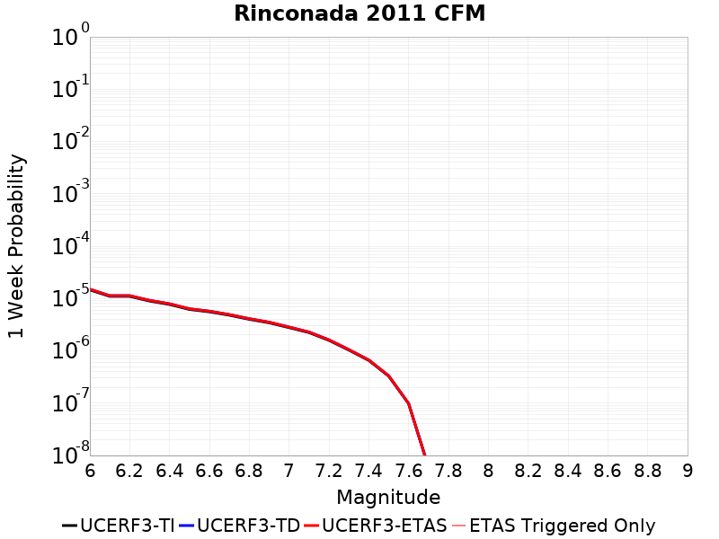 | 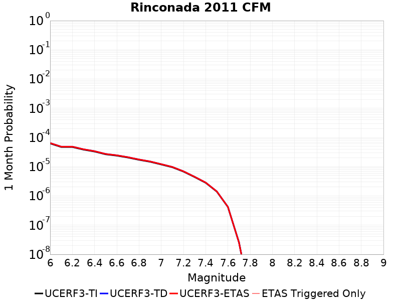 |  | 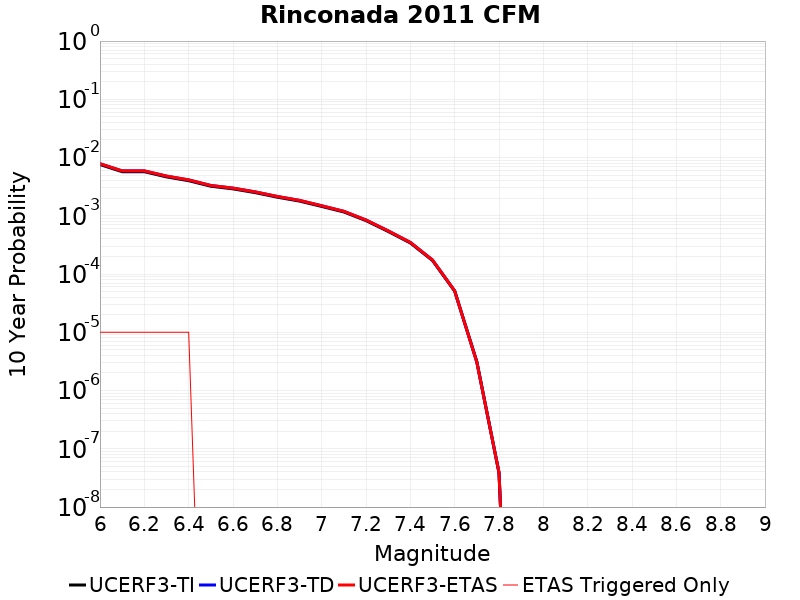 |

| Magnitude | 1 wk TI Prob | 1 wk TD Prob | 1 wk ETAS Prob | 1 wk ETAS/TD Gain | 1 wk ETAS Triggered Only | 1 mo TI Prob | 1 mo TD Prob | 1 mo ETAS Prob | 1 mo ETAS/TD Gain | 1 mo ETAS Triggered Only | 1 yr TI Prob | 1 yr TD Prob | 1 yr ETAS Prob | 1 yr ETAS/TD Gain | 1 yr ETAS Triggered Only | 10 yr TI Prob | 10 yr TD Prob | 10 yr ETAS Prob | 10 yr ETAS/TD Gain | 10 yr ETAS Triggered Only |
|-----|-----|-----|-----|-----|-----|-----|-----|-----|-----|-----|-----|-----|-----|-----|-----|-----|-----|-----|-----|-----|
| 6.0 | 1.4563478E-5 | 1.5026482E-5 | 1.5026482E-5 | 1.0 | 0.0 | 6.241341E-5 | 6.439763E-5 | 6.439763E-5 | 1.0 | 0.0 | 7.5961836E-4 | 7.837611E-4 | 7.9375325E-4 | 1.012749 | 1.0E-5 | 0.00757027 | 0.00781022 | 0.007820142 | 1.0012704 | 1.0E-5 |
| 6.1 | 1.0966133E-5 | 1.1311313E-5 | 1.1311313E-5 | 1.0 | 0.0 | 4.6996865E-5 | 4.847616E-5 | 4.847616E-5 | 1.0 | 0.0 | 5.720366E-4 | 5.9003814E-4 | 6.000322E-4 | 1.0169381 | 1.0E-5 | 0.0057056635 | 0.0058848113 | 0.005894752 | 1.0016893 | 1.0E-5 |
| 6.2 | 1.0966133E-5 | 1.1311313E-5 | 1.1311313E-5 | 1.0 | 0.0 | 4.6996865E-5 | 4.847616E-5 | 4.847616E-5 | 1.0 | 0.0 | 5.720366E-4 | 5.9003814E-4 | 6.000322E-4 | 1.0169381 | 1.0E-5 | 0.0057056635 | 0.0058848113 | 0.005894752 | 1.0016893 | 1.0E-5 |
| 6.3 | 8.926149E-6 | 9.204147E-6 | 9.204147E-6 | 1.0 | 0.0 | 3.8254362E-5 | 3.944575E-5 | 3.944575E-5 | 1.0 | 0.0 | 4.6564735E-4 | 4.801465E-4 | 4.901417E-4 | 1.0208169 | 1.0E-5 | 0.0046467283 | 0.004791136 | 0.004801088 | 1.0020772 | 1.0E-5 |
| 6.4 | 7.676955E-6 | 7.913355E-6 | 7.913355E-6 | 1.0 | 0.0 | 3.290082E-5 | 3.391394E-5 | 3.391394E-5 | 1.0 | 0.0 | 4.0049385E-4 | 4.1282416E-4 | 4.2282004E-4 | 1.0242134 | 1.0E-5 | 0.0039977287 | 0.004120599 | 0.0041305576 | 1.0024168 | 1.0E-5 |
| 6.5 | 6.1671026E-6 | 6.3539737E-6 | 6.3539737E-6 | 1.0 | 0.0 | 2.6430173E-5 | 2.7231034E-5 | 2.7231034E-5 | 1.0 | 0.0 | 3.2173982E-4 | 3.3148748E-4 | 3.3148748E-4 | 1.0 | 0.0 | 0.003212744 | 0.003309942 | 0.003309942 | 1.0 | 0.0 |
| 6.6 | 5.553456E-6 | 5.7205657E-6 | 5.7205657E-6 | 1.0 | 0.0 | 2.3800309E-5 | 2.451648E-5 | 2.451648E-5 | 1.0 | 0.0 | 2.897302E-4 | 2.9844732E-4 | 2.9844732E-4 | 1.0 | 0.0 | 0.0028935277 | 0.0029804737 | 0.0029804737 | 1.0 | 0.0 |
| 6.7 | 4.787857E-6 | 4.929946E-6 | 4.929946E-6 | 1.0 | 0.0 | 2.0519226E-5 | 2.112817E-5 | 2.112817E-5 | 1.0 | 0.0 | 2.4979294E-4 | 2.5720513E-4 | 2.5720513E-4 | 1.0 | 0.0 | 0.0024951235 | 0.0025690803 | 0.0025690803 | 1.0 | 0.0 |
| 6.8 | 3.9955166E-6 | 4.1111484E-6 | 4.1111484E-6 | 1.0 | 0.0 | 1.7123532E-5 | 1.761909E-5 | 1.761909E-5 | 1.0 | 0.0 | 2.0845905E-4 | 2.1449132E-4 | 2.1449132E-4 | 1.0 | 0.0 | 0.002082636 | 0.0021428466 | 0.0021428466 | 1.0 | 0.0 |
| 6.9 | 3.4250072E-6 | 3.5210182E-6 | 3.5210182E-6 | 1.0 | 0.0 | 1.46785205E-5 | 1.50899905E-5 | 1.50899905E-5 | 1.0 | 0.0 | 1.7869633E-4 | 1.8370517E-4 | 1.8370517E-4 | 1.0 | 0.0 | 0.001785527 | 0.0018355355 | 0.0018355355 | 1.0 | 0.0 |
| 7.0 | 2.7712713E-6 | 2.8460302E-6 | 2.8460302E-6 | 1.0 | 0.0 | 1.1876823E-5 | 1.2197215E-5 | 1.2197215E-5 | 1.0 | 0.0 | 1.4459073E-4 | 1.4849099E-4 | 1.4849099E-4 | 1.0 | 0.0 | 0.0014449668 | 0.0014839193 | 0.0014839193 | 1.0 | 0.0 |
| 7.1 | 2.227358E-6 | 2.2854626E-6 | 2.2854626E-6 | 1.0 | 0.0 | 9.545785E-6 | 9.794803E-6 | 9.794803E-6 | 1.0 | 0.0 | 1.16213734E-4 | 1.1924521E-4 | 1.1924521E-4 | 1.0 | 0.0 | 0.0011615298 | 0.0011918134 | 0.0011918134 | 1.0 | 0.0 |
| 7.2 | 1.581796E-6 | 1.6210961E-6 | 1.6210961E-6 | 1.0 | 0.0 | 6.779108E-6 | 6.947536E-6 | 6.947536E-6 | 1.0 | 0.0 | 8.253252E-5 | 8.458297E-5 | 8.458297E-5 | 1.0 | 0.0 | 8.250187E-4 | 8.4550836E-4 | 8.4550836E-4 | 1.0 | 0.0 |
| 7.3 | 1.0306567E-6 | 1.0550614E-6 | 1.0550614E-6 | 1.0 | 0.0 | 4.4170924E-6 | 4.521684E-6 | 4.521684E-6 | 1.0 | 0.0 | 5.3776774E-5 | 5.5050114E-5 | 5.5050114E-5 | 1.0 | 0.0 | 5.376376E-4 | 5.50365E-4 | 5.50365E-4 | 1.0 | 0.0 |
| 7.4 | 6.535541E-7 | 6.6861827E-7 | 6.6861827E-7 | 1.0 | 0.0 | 2.800943E-6 | 2.8655036E-6 | 2.8655036E-6 | 1.0 | 0.0 | 3.4100947E-5 | 3.488695E-5 | 3.488695E-5 | 1.0 | 0.0 | 3.4095717E-4 | 3.4881485E-4 | 3.4881485E-4 | 1.0 | 0.0 |
| 7.5 | 3.2656962E-7 | 3.3337415E-7 | 3.3337415E-7 | 1.0 | 0.0 | 1.3995833E-6 | 1.4287456E-6 | 1.4287456E-6 | 1.0 | 0.0 | 1.7039794E-5 | 1.739484E-5 | 1.739484E-5 | 1.0 | 0.0 | 1.7038487E-4 | 1.7393481E-4 | 1.7393481E-4 | 1.0 | 0.0 |
| 7.6 | 9.754343E-8 | 9.8310856E-8 | 9.8310856E-8 | 1.0 | 0.0 | 4.180432E-7 | 4.2133215E-7 | 4.2133215E-7 | 1.0 | 0.0 | 5.089664E-6 | 5.129707E-6 | 5.129707E-6 | 1.0 | 0.0 | 5.0895473E-5 | 5.1295894E-5 | 5.1295894E-5 | 1.0 | 0.0 |
| 7.7 | 6.0001453E-9 | 5.8660543E-9 | 5.8660543E-9 | 1.0 | 0.0 | 2.5714908E-8 | 2.5140231E-8 | 2.5140231E-8 | 1.0 | 0.0 | 3.1307894E-7 | 3.0608228E-7 | 3.0608228E-7 | 1.0 | 0.0 | 3.1307852E-6 | 3.0608187E-6 | 3.0608187E-6 | 1.0 | 0.0 |
| 7.8 | 7.400003E-11 | 7.467582E-11 | 7.467582E-11 | 1.0 | 0.0 | 3.171432E-10 | 3.2003944E-10 | 3.2003944E-10 | 1.0 | 0.0 | 3.861218E-9 | 3.89648E-9 | 3.89648E-9 | 1.0 | 0.0 | 3.861218E-8 | 3.89648E-8 | 3.89648E-8 | 1.0 | 0.0 |

## Lost Hills
*[(top)](#table-of-contents)*

| 1 Week | 1 Month | 1 Year | 10 Year |
|-----|-----|-----|-----|
| 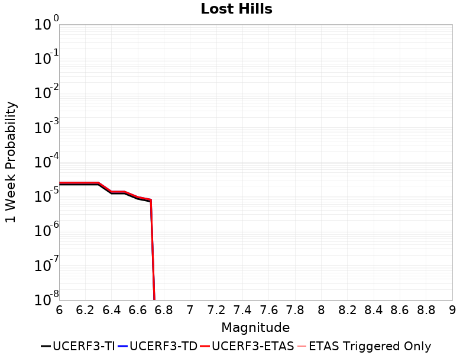 | 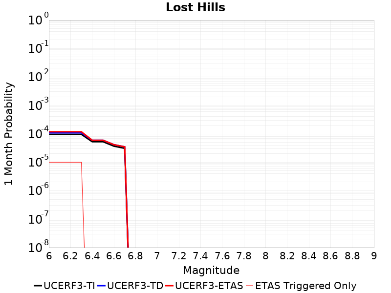 |  |  |

| Magnitude | 1 wk TI Prob | 1 wk TD Prob | 1 wk ETAS Prob | 1 wk ETAS/TD Gain | 1 wk ETAS Triggered Only | 1 mo TI Prob | 1 mo TD Prob | 1 mo ETAS Prob | 1 mo ETAS/TD Gain | 1 mo ETAS Triggered Only | 1 yr TI Prob | 1 yr TD Prob | 1 yr ETAS Prob | 1 yr ETAS/TD Gain | 1 yr ETAS Triggered Only | 10 yr TI Prob | 10 yr TD Prob | 10 yr ETAS Prob | 10 yr ETAS/TD Gain | 10 yr ETAS Triggered Only |
|-----|-----|-----|-----|-----|-----|-----|-----|-----|-----|-----|-----|-----|-----|-----|-----|-----|-----|-----|-----|-----|
| 6.0 | 2.233523E-5 | 2.5224006E-5 | 2.5224006E-5 | 1.0 | 0.0 | 9.571891E-5 | 1.0809936E-4 | 1.1809828E-4 | 1.0924975 | 1.0E-5 | 0.0011647546 | 0.0013154848 | 0.0013254717 | 1.0075917 | 1.0E-5 | 0.011586686 | 0.013093732 | 0.013103601 | 1.0007538 | 1.0E-5 |
| 6.1 | 2.233523E-5 | 2.5224006E-5 | 2.5224006E-5 | 1.0 | 0.0 | 9.571891E-5 | 1.0809936E-4 | 1.1809828E-4 | 1.0924975 | 1.0E-5 | 0.0011647546 | 0.0013154848 | 0.0013254717 | 1.0075917 | 1.0E-5 | 0.011586686 | 0.013093732 | 0.013103601 | 1.0007538 | 1.0E-5 |
| 6.2 | 2.233523E-5 | 2.5224006E-5 | 2.5224006E-5 | 1.0 | 0.0 | 9.571891E-5 | 1.0809936E-4 | 1.1809828E-4 | 1.0924975 | 1.0E-5 | 0.0011647546 | 0.0013154848 | 0.0013254717 | 1.0075917 | 1.0E-5 | 0.011586686 | 0.013093732 | 0.013103601 | 1.0007538 | 1.0E-5 |
| 6.3 | 2.233523E-5 | 2.5224006E-5 | 2.5224006E-5 | 1.0 | 0.0 | 9.571891E-5 | 1.0809936E-4 | 1.1809828E-4 | 1.0924975 | 1.0E-5 | 0.0011647546 | 0.0013154848 | 0.0013254717 | 1.0075917 | 1.0E-5 | 0.011586686 | 0.013093732 | 0.013103601 | 1.0007538 | 1.0E-5 |
| 6.4 | 1.2288092E-5 | 1.3844212E-5 | 1.3844212E-5 | 1.0 | 0.0 | 5.2662188E-5 | 5.9331524E-5 | 5.9331524E-5 | 1.0 | 0.0 | 6.409735E-4 | 7.2221656E-4 | 7.2221656E-4 | 1.0 | 0.0 | 0.006391279 | 0.0072079855 | 0.0072079855 | 1.0 | 0.0 |
| 6.5 | 1.2288092E-5 | 1.3844212E-5 | 1.3844212E-5 | 1.0 | 0.0 | 5.2662188E-5 | 5.9331524E-5 | 5.9331524E-5 | 1.0 | 0.0 | 6.409735E-4 | 7.2221656E-4 | 7.2221656E-4 | 1.0 | 0.0 | 0.006391279 | 0.0072079855 | 0.0072079855 | 1.0 | 0.0 |
| 6.6 | 8.58281E-6 | 9.678229E-6 | 9.678229E-6 | 1.0 | 0.0 | 3.6782953E-5 | 4.147794E-5 | 4.147794E-5 | 1.0 | 0.0 | 4.4774043E-4 | 5.0496083E-4 | 5.0496083E-4 | 1.0 | 0.0 | 0.0044683935 | 0.00504637 | 0.00504637 | 1.0 | 0.0 |
| 6.7 | 7.205685E-6 | 8.12564E-6 | 8.12564E-6 | 1.0 | 0.0 | 3.088114E-5 | 3.4824174E-5 | 3.4824174E-5 | 1.0 | 0.0 | 3.7591302E-4 | 4.239843E-4 | 4.239843E-4 | 1.0 | 0.0 | 0.0037527776 | 0.004239843 | 0.004239843 | 1.0 | 0.0 |

## Great Valley 04b Gordon Valley
*[(top)](#table-of-contents)*

| 1 Week | 1 Month | 1 Year | 10 Year |
|-----|-----|-----|-----|
|  | 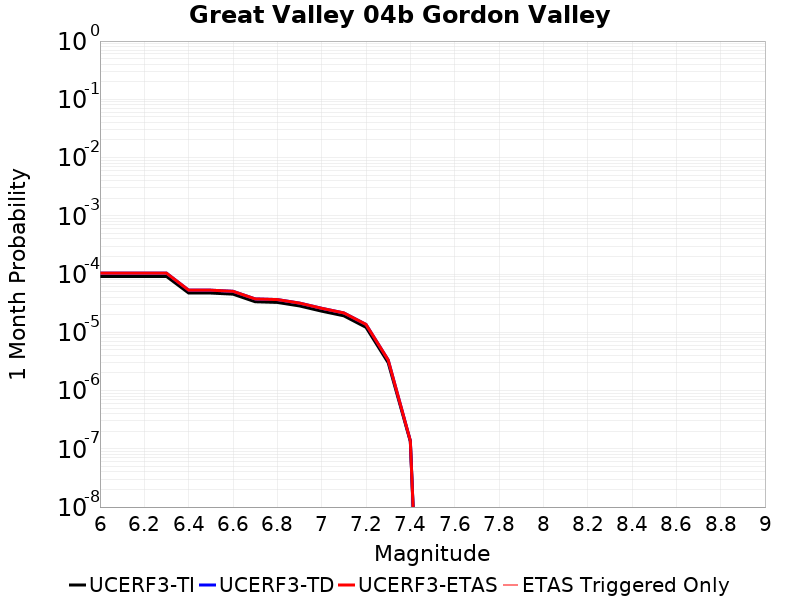 | 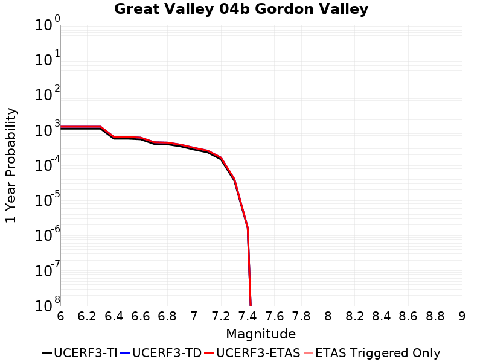 |  |

| Magnitude | 1 wk TI Prob | 1 wk TD Prob | 1 wk ETAS Prob | 1 wk ETAS/TD Gain | 1 wk ETAS Triggered Only | 1 mo TI Prob | 1 mo TD Prob | 1 mo ETAS Prob | 1 mo ETAS/TD Gain | 1 mo ETAS Triggered Only | 1 yr TI Prob | 1 yr TD Prob | 1 yr ETAS Prob | 1 yr ETAS/TD Gain | 1 yr ETAS Triggered Only | 10 yr TI Prob | 10 yr TD Prob | 10 yr ETAS Prob | 10 yr ETAS/TD Gain | 10 yr ETAS Triggered Only |
|-----|-----|-----|-----|-----|-----|-----|-----|-----|-----|-----|-----|-----|-----|-----|-----|-----|-----|-----|-----|-----|
| 6.0 | 2.1181217E-5 | 2.4101482E-5 | 2.4101482E-5 | 1.0 | 0.0 | 9.077348E-5 | 1.0328893E-4 | 1.0328893E-4 | 1.0 | 0.0 | 0.0011046068 | 0.0012569857 | 0.0012569857 | 1.0 | 0.0 | 0.010991322 | 0.012515393 | 0.012525268 | 1.000789 | 1.0E-5 |
| 6.1 | 2.1181217E-5 | 2.4101482E-5 | 2.4101482E-5 | 1.0 | 0.0 | 9.077348E-5 | 1.0328893E-4 | 1.0328893E-4 | 1.0 | 0.0 | 0.0011046068 | 0.0012569857 | 0.0012569857 | 1.0 | 0.0 | 0.010991322 | 0.012515393 | 0.012525268 | 1.000789 | 1.0E-5 |
| 6.2 | 2.1181217E-5 | 2.4101482E-5 | 2.4101482E-5 | 1.0 | 0.0 | 9.077348E-5 | 1.0328893E-4 | 1.0328893E-4 | 1.0 | 0.0 | 0.0011046068 | 0.0012569857 | 0.0012569857 | 1.0 | 0.0 | 0.010991322 | 0.012515393 | 0.012525268 | 1.000789 | 1.0E-5 |
| 6.3 | 2.1181217E-5 | 2.4101482E-5 | 2.4101482E-5 | 1.0 | 0.0 | 9.077348E-5 | 1.0328893E-4 | 1.0328893E-4 | 1.0 | 0.0 | 0.0011046068 | 0.0012569857 | 0.0012569857 | 1.0 | 0.0 | 0.010991322 | 0.012515393 | 0.012525268 | 1.000789 | 1.0E-5 |
| 6.4 | 1.0988268E-5 | 1.2307345E-5 | 1.2307345E-5 | 1.0 | 0.0 | 4.7091726E-5 | 5.274479E-5 | 5.274479E-5 | 1.0 | 0.0 | 5.731909E-4 | 6.4199464E-4 | 6.4199464E-4 | 1.0 | 0.0 | 0.005717147 | 0.0064030015 | 0.0064129373 | 1.0015517 | 1.0E-5 |
| 6.5 | 1.0988268E-5 | 1.2307345E-5 | 1.2307345E-5 | 1.0 | 0.0 | 4.7091726E-5 | 5.274479E-5 | 5.274479E-5 | 1.0 | 0.0 | 5.731909E-4 | 6.4199464E-4 | 6.4199464E-4 | 1.0 | 0.0 | 0.005717147 | 0.0064030015 | 0.0064129373 | 1.0015517 | 1.0E-5 |
| 6.6 | 1.0517822E-5 | 1.17743575E-5 | 1.17743575E-5 | 1.0 | 0.0 | 4.5075605E-5 | 5.0460647E-5 | 5.0460647E-5 | 1.0 | 0.0 | 5.4865726E-4 | 6.1420095E-4 | 6.1420095E-4 | 1.0 | 0.0 | 0.0054730466 | 0.0061266017 | 0.0061365403 | 1.0016222 | 1.0E-5 |
| 6.7 | 7.789219E-6 | 8.714569E-6 | 8.714569E-6 | 1.0 | 0.0 | 3.3381937E-5 | 3.7347647E-5 | 3.7347647E-5 | 1.0 | 0.0 | 4.063493E-4 | 4.5461798E-4 | 4.5461798E-4 | 1.0 | 0.0 | 0.004056071 | 0.0045374013 | 0.0045374013 | 1.0 | 0.0 |
| 6.8 | 7.5850853E-6 | 8.488436E-6 | 8.488436E-6 | 1.0 | 0.0 | 3.2507105E-5 | 3.6378533E-5 | 3.6378533E-5 | 1.0 | 0.0 | 3.957021E-4 | 4.428238E-4 | 4.428238E-4 | 1.0 | 0.0 | 0.0039499826 | 0.004419931 | 0.004419931 | 1.0 | 0.0 |
| 6.9 | 6.604105E-6 | 7.389854E-6 | 7.389854E-6 | 1.0 | 0.0 | 2.8303E-5 | 3.1670443E-5 | 3.1670443E-5 | 1.0 | 0.0 | 3.4453452E-4 | 3.855233E-4 | 3.855233E-4 | 1.0 | 0.0 | 0.0034400085 | 0.003848935 | 0.003848935 | 1.0 | 0.0 |
| 7.0 | 5.3701115E-6 | 6.0140287E-6 | 6.0140287E-6 | 1.0 | 0.0 | 2.301456E-5 | 2.577417E-5 | 2.577417E-5 | 1.0 | 0.0 | 2.8016625E-4 | 3.1375827E-4 | 3.1375827E-4 | 1.0 | 0.0 | 0.0027981328 | 0.0031334439 | 0.0031334439 | 1.0 | 0.0 |
| 7.1 | 4.4685607E-6 | 5.007885E-6 | 5.007885E-6 | 1.0 | 0.0 | 1.9150835E-5 | 2.1462201E-5 | 2.1462201E-5 | 1.0 | 0.0 | 2.3313647E-4 | 2.6127347E-4 | 2.6127347E-4 | 1.0 | 0.0 | 0.0023289204 | 0.00260991 | 0.00260991 | 1.0 | 0.0 |
| 7.2 | 2.833378E-6 | 3.17798E-6 | 3.17798E-6 | 1.0 | 0.0 | 1.2142991E-5 | 1.3619853E-5 | 1.3619853E-5 | 1.0 | 0.0 | 1.4783088E-4 | 1.6581087E-4 | 1.6581087E-4 | 1.0 | 0.0 | 0.0014773258 | 0.0016570449 | 0.0016570449 | 1.0 | 0.0 |
| 7.3 | 7.0087293E-7 | 7.801374E-7 | 7.801374E-7 | 1.0 | 0.0 | 3.0037377E-6 | 3.3434444E-6 | 3.3434444E-6 | 1.0 | 0.0 | 3.656989E-5 | 4.0706138E-5 | 4.0706138E-5 | 1.0 | 0.0 | 3.6563876E-4 | 4.070322E-4 | 4.070322E-4 | 1.0 | 0.0 |
| 7.4 | 3.112171E-8 | 3.1989167E-8 | 3.1989167E-8 | 1.0 | 0.0 | 1.3337875E-7 | 1.3709642E-7 | 1.3709642E-7 | 1.0 | 0.0 | 1.6238852E-6 | 1.6691478E-6 | 1.6691478E-6 | 1.0 | 0.0 | 1.6238733E-5 | 1.6691361E-5 | 1.6691361E-5 | 1.0 | 0.0 |

## Whittier alt 1
*[(top)](#table-of-contents)*

| 1 Week | 1 Month | 1 Year | 10 Year |
|-----|-----|-----|-----|
|  |  | 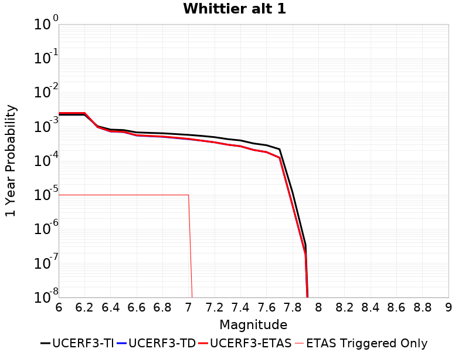 | 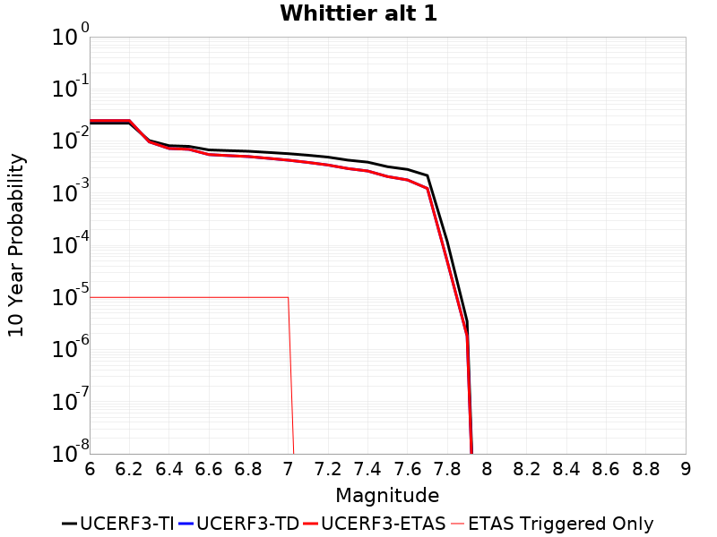 |

| Magnitude | 1 wk TI Prob | 1 wk TD Prob | 1 wk ETAS Prob | 1 wk ETAS/TD Gain | 1 wk ETAS Triggered Only | 1 mo TI Prob | 1 mo TD Prob | 1 mo ETAS Prob | 1 mo ETAS/TD Gain | 1 mo ETAS Triggered Only | 1 yr TI Prob | 1 yr TD Prob | 1 yr ETAS Prob | 1 yr ETAS/TD Gain | 1 yr ETAS Triggered Only | 10 yr TI Prob | 10 yr TD Prob | 10 yr ETAS Prob | 10 yr ETAS/TD Gain | 10 yr ETAS Triggered Only |
|-----|-----|-----|-----|-----|-----|-----|-----|-----|-----|-----|-----|-----|-----|-----|-----|-----|-----|-----|-----|-----|
| 6.0 | 4.2554693E-5 | 4.762241E-5 | 4.762241E-5 | 1.0 | 0.0 | 1.8236451E-4 | 2.0408192E-4 | 2.0408192E-4 | 1.0 | 0.0 | 0.002218027 | 0.002482192 | 0.002492167 | 1.0040187 | 1.0E-5 | 0.02196019 | 0.024578914 | 0.024588669 | 1.0003968 | 1.0E-5 |
| 6.1 | 4.2554693E-5 | 4.762241E-5 | 4.762241E-5 | 1.0 | 0.0 | 1.8236451E-4 | 2.0408192E-4 | 2.0408192E-4 | 1.0 | 0.0 | 0.002218027 | 0.002482192 | 0.002492167 | 1.0040187 | 1.0E-5 | 0.02196019 | 0.024578914 | 0.024588669 | 1.0003968 | 1.0E-5 |
| 6.2 | 4.2554693E-5 | 4.762241E-5 | 4.762241E-5 | 1.0 | 0.0 | 1.8236451E-4 | 2.0408192E-4 | 2.0408192E-4 | 1.0 | 0.0 | 0.002218027 | 0.002482192 | 0.002492167 | 1.0040187 | 1.0E-5 | 0.02196019 | 0.024578914 | 0.024588669 | 1.0003968 | 1.0E-5 |
| 6.3 | 1.9617712E-5 | 1.8462246E-5 | 1.8462246E-5 | 1.0 | 0.0 | 8.40732E-5 | 7.912162E-5 | 7.912162E-5 | 1.0 | 0.0 | 0.0010231105 | 9.628993E-4 | 9.728897E-4 | 1.0103753 | 1.0E-5 | 0.01018413 | 0.009590386 | 0.00960029 | 1.0010327 | 1.0E-5 |
| 6.4 | 1.5611336E-5 | 1.3769518E-5 | 1.3769518E-5 | 1.0 | 0.0 | 6.690401E-5 | 5.901092E-5 | 5.901092E-5 | 1.0 | 0.0 | 8.142519E-4 | 7.1822724E-4 | 7.2822004E-4 | 1.0139132 | 1.0E-5 | 0.008112748 | 0.0071608373 | 0.0071707657 | 1.0013865 | 1.0E-5 |
| 6.5 | 1.5150166E-5 | 1.3266698E-5 | 1.3266698E-5 | 1.0 | 0.0 | 6.492767E-5 | 5.685607E-5 | 5.685607E-5 | 1.0 | 0.0 | 7.9020765E-4 | 6.920088E-4 | 7.020019E-4 | 1.0144407 | 1.0E-5 | 0.007874036 | 0.0069003017 | 0.006910233 | 1.0014392 | 1.0E-5 |
| 6.6 | 1.295588E-5 | 1.0519824E-5 | 1.0519824E-5 | 1.0 | 0.0 | 5.552402E-5 | 4.5084194E-5 | 4.5084194E-5 | 1.0 | 0.0 | 6.7579525E-4 | 5.487638E-4 | 5.5875833E-4 | 1.0182128 | 1.0E-5 | 0.006737438 | 0.005475539 | 0.005485484 | 1.0018163 | 1.0E-5 |
| 6.7 | 1.2542085E-5 | 1.0036217E-5 | 1.0036217E-5 | 1.0 | 0.0 | 5.3750682E-5 | 4.301166E-5 | 4.301166E-5 | 1.0 | 0.0 | 6.542181E-4 | 5.2354304E-4 | 5.335378E-4 | 1.0190907 | 1.0E-5 | 0.006522954 | 0.005224554 | 0.005234502 | 1.001904 | 1.0E-5 |
| 6.8 | 1.2195878E-5 | 9.628812E-6 | 9.628812E-6 | 1.0 | 0.0 | 5.2267E-5 | 4.12657E-5 | 4.12657E-5 | 1.0 | 0.0 | 6.36165E-4 | 5.0229597E-4 | 5.122909E-4 | 1.0198985 | 1.0E-5 | 0.0063434686 | 0.0050129914 | 0.0050229416 | 1.0019848 | 1.0E-5 |
| 6.9 | 1.1580298E-5 | 8.903372E-6 | 8.903372E-6 | 1.0 | 0.0 | 4.9628903E-5 | 3.815676E-5 | 3.815676E-5 | 1.0 | 0.0 | 6.040644E-4 | 4.6446122E-4 | 4.7445658E-4 | 1.0215204 | 1.0E-5 | 0.00602425 | 0.004636268 | 0.004646222 | 1.002147 | 1.0E-5 |
| 7.0 | 1.0964795E-5 | 8.20526E-6 | 8.20526E-6 | 1.0 | 0.0 | 4.6991136E-5 | 3.5164936E-5 | 3.5164936E-5 | 1.0 | 0.0 | 5.7196687E-4 | 4.2805058E-4 | 4.380463E-4 | 1.0233517 | 1.0E-5 | 0.0057049696 | 0.004273545 | 0.004283502 | 1.00233 | 1.0E-5 |
| 7.1 | 1.0230601E-5 | 7.434139E-6 | 7.434139E-6 | 1.0 | 0.0 | 4.3844695E-5 | 3.1860214E-5 | 3.1860214E-5 | 1.0 | 0.0 | 5.336784E-4 | 3.8783043E-4 | 3.8783043E-4 | 1.0 | 0.0 | 0.005323986 | 0.0038727033 | 0.0038727033 | 1.0 | 0.0 |
| 7.2 | 9.40865E-6 | 6.6370235E-6 | 6.6370235E-6 | 1.0 | 0.0 | 4.032216E-5 | 2.8444083E-5 | 2.8444083E-5 | 1.0 | 0.0 | 4.908117E-4 | 3.4625293E-4 | 3.4625293E-4 | 1.0 | 0.0 | 0.0048972913 | 0.0034582585 | 0.0034582585 | 1.0 | 0.0 |
| 7.3 | 8.237384E-6 | 5.6708554E-6 | 5.6708554E-6 | 1.0 | 0.0 | 3.5302593E-5 | 2.4303446E-5 | 2.4303446E-5 | 1.0 | 0.0 | 4.2972428E-4 | 2.9585534E-4 | 2.9585534E-4 | 1.0 | 0.0 | 0.0042889426 | 0.0029548919 | 0.0029548919 | 1.0 | 0.0 |
| 7.4 | 7.5316966E-6 | 5.090969E-6 | 5.090969E-6 | 1.0 | 0.0 | 3.2278298E-5 | 2.1818261E-5 | 2.1818261E-5 | 1.0 | 0.0 | 3.9291743E-4 | 2.6560598E-4 | 2.6560598E-4 | 1.0 | 0.0 | 0.0039222343 | 0.0026529958 | 0.0026529958 | 1.0 | 0.0 |
| 7.5 | 6.149649E-6 | 3.9780252E-6 | 3.9780252E-6 | 1.0 | 0.0 | 2.6355372E-5 | 1.7048575E-5 | 1.7048575E-5 | 1.0 | 0.0 | 3.208294E-4 | 2.0754753E-4 | 2.0754753E-4 | 1.0 | 0.0 | 0.003203666 | 0.0020736281 | 0.0020736281 | 1.0 | 0.0 |
| 7.6 | 5.457711E-6 | 3.4293273E-6 | 3.4293273E-6 | 1.0 | 0.0 | 2.338998E-5 | 1.4697039E-5 | 1.4697039E-5 | 1.0 | 0.0 | 2.8473578E-4 | 1.789226E-4 | 1.789226E-4 | 1.0 | 0.0 | 0.0028437122 | 0.0017878675 | 0.0017878675 | 1.0 | 0.0 |
| 7.7 | 4.1676276E-6 | 2.357384E-6 | 2.357384E-6 | 1.0 | 0.0 | 1.7861139E-5 | 1.0103039E-5 | 1.0103039E-5 | 1.0 | 0.0 | 2.1743766E-4 | 1.2299832E-4 | 1.2299832E-4 | 1.0 | 0.0 | 0.0021722503 | 0.0012293768 | 0.0012293768 | 1.0 | 0.0 |
| 7.8 | 2.2692414E-7 | 9.469906E-8 | 9.469906E-8 | 1.0 | 0.0 | 9.725317E-7 | 4.058531E-7 | 4.058531E-7 | 1.0 | 0.0 | 1.1840509E-5 | 4.9412533E-6 | 4.9412533E-6 | 1.0 | 0.0 | 1.1839878E-4 | 4.941177E-5 | 4.941177E-5 | 1.0 | 0.0 |
| 7.9 | 6.676829E-9 | 3.4789571E-9 | 3.4789571E-9 | 1.0 | 0.0 | 2.861498E-8 | 1.4909816E-8 | 1.4909816E-8 | 1.0 | 0.0 | 3.4838732E-7 | 1.81527E-7 | 1.81527E-7 | 1.0 | 0.0 | 3.4838679E-6 | 1.8152687E-6 | 1.8152687E-6 | 1.0 | 0.0 |

## Reliz 2011 CFM
*[(top)](#table-of-contents)*

| 1 Week | 1 Month | 1 Year | 10 Year |
|-----|-----|-----|-----|
|  | 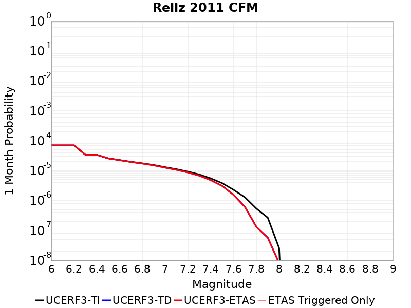 |  | 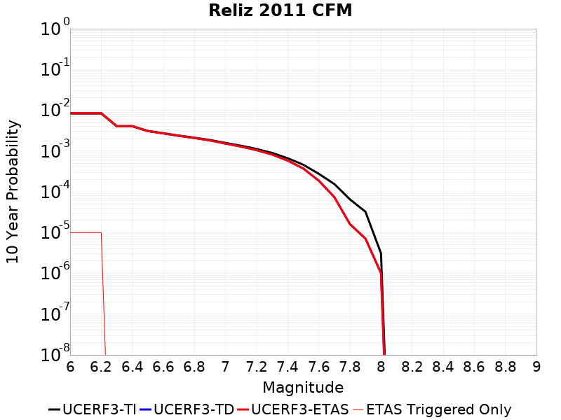 |

| Magnitude | 1 wk TI Prob | 1 wk TD Prob | 1 wk ETAS Prob | 1 wk ETAS/TD Gain | 1 wk ETAS Triggered Only | 1 mo TI Prob | 1 mo TD Prob | 1 mo ETAS Prob | 1 mo ETAS/TD Gain | 1 mo ETAS Triggered Only | 1 yr TI Prob | 1 yr TD Prob | 1 yr ETAS Prob | 1 yr ETAS/TD Gain | 1 yr ETAS Triggered Only | 10 yr TI Prob | 10 yr TD Prob | 10 yr ETAS Prob | 10 yr ETAS/TD Gain | 10 yr ETAS Triggered Only |
|-----|-----|-----|-----|-----|-----|-----|-----|-----|-----|-----|-----|-----|-----|-----|-----|-----|-----|-----|-----|-----|
| 6.0 | 1.6002472E-5 | 1.630837E-5 | 1.630837E-5 | 1.0 | 0.0 | 6.8580215E-5 | 6.989125E-5 | 6.989125E-5 | 1.0 | 0.0 | 8.3464425E-4 | 8.5061364E-4 | 8.5061364E-4 | 1.0 | 0.0 | 0.008315164 | 0.008475801 | 0.008485716 | 1.0011698 | 1.0E-5 |
| 6.1 | 1.6002472E-5 | 1.630837E-5 | 1.630837E-5 | 1.0 | 0.0 | 6.8580215E-5 | 6.989125E-5 | 6.989125E-5 | 1.0 | 0.0 | 8.3464425E-4 | 8.5061364E-4 | 8.5061364E-4 | 1.0 | 0.0 | 0.008315164 | 0.008475801 | 0.008485716 | 1.0011698 | 1.0E-5 |
| 6.2 | 1.6002472E-5 | 1.630837E-5 | 1.630837E-5 | 1.0 | 0.0 | 6.8580215E-5 | 6.989125E-5 | 6.989125E-5 | 1.0 | 0.0 | 8.3464425E-4 | 8.5061364E-4 | 8.5061364E-4 | 1.0 | 0.0 | 0.008315164 | 0.008475801 | 0.008485716 | 1.0011698 | 1.0E-5 |
| 6.3 | 7.792404E-6 | 7.81891E-6 | 7.81891E-6 | 1.0 | 0.0 | 3.339559E-5 | 3.3509186E-5 | 3.3509186E-5 | 1.0 | 0.0 | 4.0651546E-4 | 4.0789874E-4 | 4.0789874E-4 | 1.0 | 0.0 | 0.0040577264 | 0.0040717977 | 0.0040717977 | 1.0 | 0.0 |
| 6.4 | 7.792404E-6 | 7.81891E-6 | 7.81891E-6 | 1.0 | 0.0 | 3.339559E-5 | 3.3509186E-5 | 3.3509186E-5 | 1.0 | 0.0 | 4.0651546E-4 | 4.0789874E-4 | 4.0789874E-4 | 1.0 | 0.0 | 0.0040577264 | 0.0040717977 | 0.0040717977 | 1.0 | 0.0 |
| 6.5 | 5.9659374E-6 | 5.942008E-6 | 5.942008E-6 | 1.0 | 0.0 | 2.5568053E-5 | 2.5465502E-5 | 2.5465502E-5 | 1.0 | 0.0 | 3.1124658E-4 | 3.099986E-4 | 3.099986E-4 | 1.0 | 0.0 | 0.00310811 | 0.0030958997 | 0.0030958997 | 1.0 | 0.0 |
| 6.6 | 5.2350692E-6 | 5.191584E-6 | 5.191584E-6 | 1.0 | 0.0 | 2.2435817E-5 | 2.2249456E-5 | 2.2249456E-5 | 1.0 | 0.0 | 2.7312184E-4 | 2.708536E-4 | 2.708536E-4 | 1.0 | 0.0 | 0.002727864 | 0.0027054653 | 0.0027054653 | 1.0 | 0.0 |
| 6.7 | 4.580206E-6 | 4.5180846E-6 | 4.5180846E-6 | 1.0 | 0.0 | 1.9629308E-5 | 1.9363077E-5 | 1.9363077E-5 | 1.0 | 0.0 | 2.389606E-4 | 2.3572003E-4 | 2.3572003E-4 | 1.0 | 0.0 | 0.002387038 | 0.0023549222 | 0.0023549222 | 1.0 | 0.0 |
| 6.8 | 4.0765017E-6 | 3.999717E-6 | 3.999717E-6 | 1.0 | 0.0 | 1.7470604E-5 | 1.7141532E-5 | 1.7141532E-5 | 1.0 | 0.0 | 2.1268385E-4 | 2.086782E-4 | 2.086782E-4 | 1.0 | 0.0 | 0.002124804 | 0.0020850408 | 0.0020850408 | 1.0 | 0.0 |
| 6.9 | 3.5752896E-6 | 3.4835075E-6 | 3.4835075E-6 | 1.0 | 0.0 | 1.532258E-5 | 1.4929233E-5 | 1.4929233E-5 | 1.0 | 0.0 | 1.8653645E-4 | 1.8174827E-4 | 1.8174827E-4 | 1.0 | 0.0 | 0.0018637994 | 0.001816213 | 0.001816213 | 1.0 | 0.0 |
| 7.0 | 3.0259848E-6 | 2.9184287E-6 | 2.9184287E-6 | 1.0 | 0.0 | 1.2968442E-5 | 1.2507492E-5 | 1.2507492E-5 | 1.0 | 0.0 | 1.5787935E-4 | 1.5226808E-4 | 1.5226808E-4 | 1.0 | 0.0 | 0.0015776722 | 0.001521853 | 0.001521853 | 1.0 | 0.0 |
| 7.1 | 2.5861116E-6 | 2.4652388E-6 | 2.4652388E-6 | 1.0 | 0.0 | 1.1083288E-5 | 1.0565266E-5 | 1.0565266E-5 | 1.0 | 0.0 | 1.3493067E-4 | 1.2862452E-4 | 1.2862452E-4 | 1.0 | 0.0 | 0.0013484878 | 0.0012857157 | 0.0012857157 | 1.0 | 0.0 |
| 7.2 | 2.1482588E-6 | 2.0128814E-6 | 2.0128814E-6 | 1.0 | 0.0 | 9.20679E-6 | 8.626606E-6 | 8.626606E-6 | 1.0 | 0.0 | 1.12086906E-4 | 1.0502387E-4 | 1.0502387E-4 | 1.0 | 0.0 | 0.0011203039 | 0.0010499569 | 0.0010499569 | 1.0 | 0.0 |
| 7.3 | 1.7194744E-6 | 1.5704113E-6 | 1.5704113E-6 | 1.0 | 0.0 | 7.3691554E-6 | 6.7303167E-6 | 6.7303167E-6 | 1.0 | 0.0 | 8.971577E-5 | 8.1938524E-5 | 8.1938524E-5 | 1.0 | 0.0 | 8.967956E-4 | 8.192974E-4 | 8.192974E-4 | 1.0 | 0.0 |
| 7.4 | 1.2755178E-6 | 1.1145643E-6 | 1.1145643E-6 | 1.0 | 0.0 | 5.4664933E-6 | 4.7766953E-6 | 4.7766953E-6 | 1.0 | 0.0 | 6.655252E-5 | 5.8154714E-5 | 5.8154714E-5 | 1.0 | 0.0 | 6.6532596E-4 | 5.816091E-4 | 5.816091E-4 | 1.0 | 0.0 |
| 7.5 | 8.8463224E-7 | 7.143542E-7 | 7.143542E-7 | 1.0 | 0.0 | 3.7912755E-6 | 3.0615142E-6 | 3.0615142E-6 | 1.0 | 0.0 | 4.6157802E-5 | 3.7273297E-5 | 3.7273297E-5 | 1.0 | 0.0 | 4.6148215E-4 | 3.728844E-4 | 3.728844E-4 | 1.0 | 0.0 |
| 7.6 | 5.291355E-7 | 3.579693E-7 | 3.579693E-7 | 1.0 | 0.0 | 2.2677216E-6 | 1.5341532E-6 | 1.5341532E-6 | 1.0 | 0.0 | 2.760916E-5 | 1.8678154E-5 | 1.8678154E-5 | 1.0 | 0.0 | 2.760573E-4 | 1.8697897E-4 | 1.8697897E-4 | 1.0 | 0.0 |
| 7.7 | 2.9663357E-7 | 1.411811E-7 | 1.411811E-7 | 1.0 | 0.0 | 1.2712861E-6 | 6.0506176E-7 | 6.0506176E-7 | 1.0 | 0.0 | 1.5477797E-5 | 7.366602E-6 | 7.366602E-6 | 1.0 | 0.0 | 1.547672E-4 | 7.386939E-5 | 7.386939E-5 | 1.0 | 0.0 |
| 7.8 | 1.2509386E-7 | 3.0580033E-8 | 3.0580033E-8 | 1.0 | 0.0 | 5.3611643E-7 | 1.3105728E-7 | 1.3105728E-7 | 1.0 | 0.0 | 6.527198E-6 | 1.5956211E-6 | 1.5956211E-6 | 1.0 | 0.0 | 6.527006E-5 | 1.6131726E-5 | 1.6131726E-5 | 1.0 | 0.0 |
| 7.9 | 6.213493E-8 | 1.3343403E-8 | 1.3343403E-8 | 1.0 | 0.0 | 2.6629255E-7 | 5.7186014E-8 | 5.7186014E-8 | 1.0 | 0.0 | 3.242107E-6 | 6.9623945E-7 | 6.9623945E-7 | 1.0 | 0.0 | 3.2420594E-5 | 7.1091804E-6 | 7.1091804E-6 | 1.0 | 0.0 |
| 8.0 | 5.92383E-9 | 1.8831647E-9 | 1.8831647E-9 | 1.0 | 0.0 | 2.5387841E-8 | 8.070706E-9 | 8.070706E-9 | 1.0 | 0.0 | 3.0909692E-7 | 9.826084E-8 | 9.826084E-8 | 1.0 | 0.0 | 3.090965E-6 | 1.0083166E-6 | 1.0083166E-6 | 1.0 | 0.0 |

## Sargent 2011 CFM
*[(top)](#table-of-contents)*

| 1 Week | 1 Month | 1 Year | 10 Year |
|-----|-----|-----|-----|
| 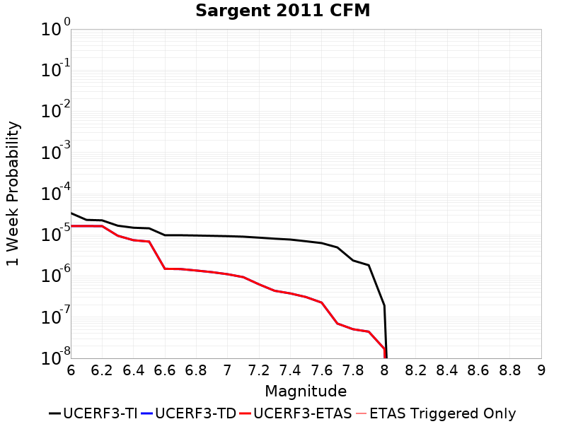 |  | 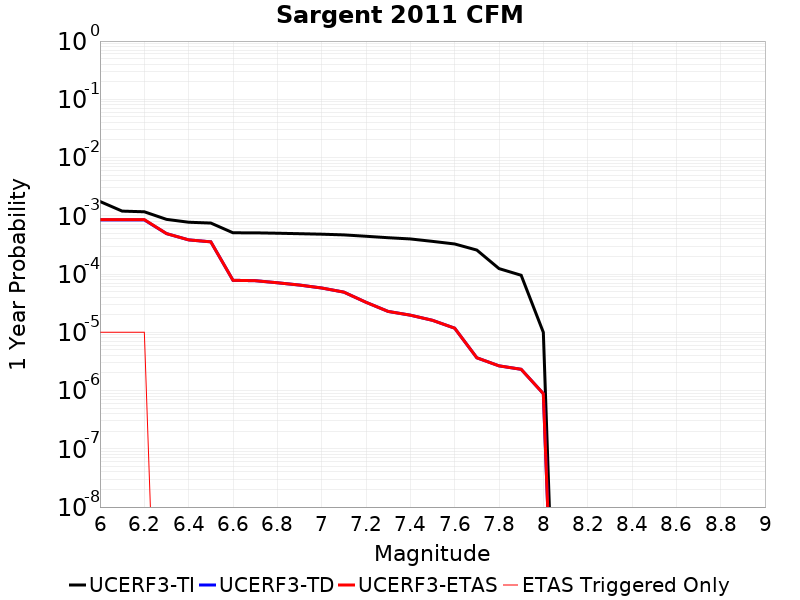 |  |

| Magnitude | 1 wk TI Prob | 1 wk TD Prob | 1 wk ETAS Prob | 1 wk ETAS/TD Gain | 1 wk ETAS Triggered Only | 1 mo TI Prob | 1 mo TD Prob | 1 mo ETAS Prob | 1 mo ETAS/TD Gain | 1 mo ETAS Triggered Only | 1 yr TI Prob | 1 yr TD Prob | 1 yr ETAS Prob | 1 yr ETAS/TD Gain | 1 yr ETAS Triggered Only | 10 yr TI Prob | 10 yr TD Prob | 10 yr ETAS Prob | 10 yr ETAS/TD Gain | 10 yr ETAS Triggered Only |
|-----|-----|-----|-----|-----|-----|-----|-----|-----|-----|-----|-----|-----|-----|-----|-----|-----|-----|-----|-----|-----|
| 6.0 | 3.3699627E-5 | 1.6282376E-5 | 1.6282376E-5 | 1.0 | 0.0 | 1.4441897E-4 | 6.978016E-5 | 6.978016E-5 | 1.0 | 0.0 | 0.0017568829 | 8.49316E-4 | 8.5930753E-4 | 1.0117642 | 1.0E-5 | 0.01743058 | 0.008503472 | 0.008513387 | 1.001166 | 1.0E-5 |
| 6.1 | 2.303065E-5 | 1.6282376E-5 | 1.6282376E-5 | 1.0 | 0.0 | 9.8699056E-5 | 6.978016E-5 | 6.978016E-5 | 1.0 | 0.0 | 0.0012009986 | 8.49316E-4 | 8.5930753E-4 | 1.0117642 | 1.0E-5 | 0.011945285 | 0.008503472 | 0.008513387 | 1.001166 | 1.0E-5 |
| 6.2 | 2.24246E-5 | 1.6253569E-5 | 1.6253569E-5 | 1.0 | 0.0 | 9.610189E-5 | 6.965671E-5 | 6.965671E-5 | 1.0 | 0.0 | 0.0011694124 | 8.478142E-4 | 8.578057E-4 | 1.011785 | 1.0E-5 | 0.011632777 | 0.0084885685 | 0.008498483 | 1.001168 | 1.0E-5 |
| 6.3 | 1.6621638E-5 | 9.466327E-6 | 9.466327E-6 | 1.0 | 0.0 | 7.123365E-5 | 4.0569565E-5 | 4.0569565E-5 | 1.0 | 0.0 | 8.669246E-4 | 4.9386243E-4 | 4.9386243E-4 | 1.0 | 0.0 | 0.008635503 | 0.0049672034 | 0.0049672034 | 1.0 | 0.0 |
| 6.4 | 1.48395575E-5 | 7.382387E-6 | 7.382387E-6 | 1.0 | 0.0 | 6.3596555E-5 | 3.1638618E-5 | 3.1638618E-5 | 1.0 | 0.0 | 7.7401294E-4 | 3.8516778E-4 | 3.8516778E-4 | 1.0 | 0.0 | 0.0077132257 | 0.0038841765 | 0.0038841765 | 1.0 | 0.0 |
| 6.5 | 1.4358964E-5 | 6.831588E-6 | 6.831588E-6 | 1.0 | 0.0 | 6.1536964E-5 | 2.9278104E-5 | 2.9278104E-5 | 1.0 | 0.0 | 7.48955E-4 | 3.5643813E-4 | 3.5643813E-4 | 1.0 | 0.0 | 0.0074643586 | 0.003597833 | 0.003597833 | 1.0 | 0.0 |
| 6.6 | 9.772591E-6 | 1.4929751E-6 | 1.4929751E-6 | 1.0 | 0.0 | 4.188186E-5 | 6.398449E-6 | 6.398449E-6 | 1.0 | 0.0 | 5.097923E-4 | 7.789837E-5 | 7.789837E-5 | 1.0 | 0.0 | 0.005086244 | 8.144987E-4 | 8.144987E-4 | 1.0 | 0.0 |
| 6.7 | 9.752745E-6 | 1.4716918E-6 | 1.4716918E-6 | 1.0 | 0.0 | 4.179681E-5 | 6.3072353E-6 | 6.3072353E-6 | 1.0 | 0.0 | 5.0875737E-4 | 7.678792E-5 | 7.678792E-5 | 1.0 | 0.0 | 0.005075942 | 8.0340233E-4 | 8.0340233E-4 | 1.0 | 0.0 |
| 6.8 | 9.608213E-6 | 1.3553234E-6 | 1.3553234E-6 | 1.0 | 0.0 | 4.1177405E-5 | 5.8085166E-6 | 5.8085166E-6 | 1.0 | 0.0 | 5.012196E-4 | 7.071642E-5 | 7.071642E-5 | 1.0 | 0.0 | 0.005000906 | 7.424192E-4 | 7.424192E-4 | 1.0 | 0.0 |
| 6.9 | 9.427164E-6 | 1.2380851E-6 | 1.2380851E-6 | 1.0 | 0.0 | 4.04015E-5 | 5.3060685E-6 | 5.3060685E-6 | 1.0 | 0.0 | 4.9177726E-4 | 6.4599495E-5 | 6.4599495E-5 | 1.0 | 0.0 | 0.004906904 | 6.807888E-4 | 6.807888E-4 | 1.0 | 0.0 |
| 7.0 | 9.247601E-6 | 1.1021231E-6 | 1.1021231E-6 | 1.0 | 0.0 | 3.9631974E-5 | 4.7233757E-6 | 4.7233757E-6 | 1.0 | 0.0 | 4.8241246E-4 | 5.75056E-5 | 5.75056E-5 | 1.0 | 0.0 | 0.0048136655 | 6.0952135E-4 | 6.0952135E-4 | 1.0 | 0.0 |
| 7.1 | 8.995454E-6 | 9.3652443E-7 | 9.3652443E-7 | 1.0 | 0.0 | 3.8551374E-5 | 4.01367E-6 | 4.01367E-6 | 1.0 | 0.0 | 4.6926187E-4 | 4.886535E-5 | 4.886535E-5 | 1.0 | 0.0 | 0.004682722 | 5.224449E-4 | 5.224449E-4 | 1.0 | 0.0 |
| 7.2 | 8.520861E-6 | 6.265075E-7 | 6.265075E-7 | 1.0 | 0.0 | 3.6517464E-5 | 2.6850294E-6 | 2.6850294E-6 | 1.0 | 0.0 | 4.445094E-4 | 3.268975E-5 | 3.268975E-5 | 1.0 | 0.0 | 0.004436213 | 3.5929913E-4 | 3.5929913E-4 | 1.0 | 0.0 |
| 7.3 | 8.043592E-6 | 4.36232E-7 | 4.36232E-7 | 1.0 | 0.0 | 3.4472083E-5 | 1.8695644E-6 | 1.8695644E-6 | 1.0 | 0.0 | 4.196168E-4 | 2.2761711E-5 | 2.2761711E-5 | 1.0 | 0.0 | 0.004188253 | 2.588342E-4 | 2.588342E-4 | 1.0 | 0.0 |
| 7.4 | 7.662316E-6 | 3.765496E-7 | 3.765496E-7 | 1.0 | 0.0 | 3.2838085E-5 | 1.613783E-6 | 1.613783E-6 | 1.0 | 0.0 | 3.9973034E-4 | 1.9647632E-5 | 1.9647632E-5 | 1.0 | 0.0 | 0.0039901207 | 2.2589801E-4 | 2.2589801E-4 | 1.0 | 0.0 |
| 7.5 | 6.961638E-6 | 3.0718533E-7 | 3.0718533E-7 | 1.0 | 0.0 | 2.9835252E-5 | 1.3165079E-6 | 1.3165079E-6 | 1.0 | 0.0 | 3.6318362E-4 | 1.6028367E-5 | 1.6028367E-5 | 1.0 | 0.0 | 0.0036259065 | 1.8599529E-4 | 1.8599529E-4 | 1.0 | 0.0 |
| 7.6 | 6.282332E-6 | 2.2510287E-7 | 2.2510287E-7 | 1.0 | 0.0 | 2.6924003E-5 | 9.647262E-7 | 9.647262E-7 | 1.0 | 0.0 | 3.2775043E-4 | 1.1745479E-5 | 1.1745479E-5 | 1.0 | 0.0 | 0.0032726745 | 1.3849726E-4 | 1.3849726E-4 | 1.0 | 0.0 |
| 7.7 | 4.934408E-6 | 6.982826E-8 | 6.982826E-8 | 1.0 | 0.0 | 2.114729E-5 | 2.9926395E-7 | 2.9926395E-7 | 1.0 | 0.0 | 2.5743784E-4 | 3.6435326E-6 | 3.6435326E-6 | 1.0 | 0.0 | 0.0025713982 | 4.560468E-5 | 4.560468E-5 | 1.0 | 0.0 |
| 7.8 | 2.373212E-6 | 5.0783033E-8 | 5.0783033E-8 | 1.0 | 0.0 | 1.0170869E-5 | 2.1764157E-7 | 2.1764157E-7 | 1.0 | 0.0 | 1.238233E-4 | 2.6497828E-6 | 2.6497828E-6 | 1.0 | 0.0 | 0.0012375432 | 3.4451077E-5 | 3.4451077E-5 | 1.0 | 0.0 |
| 7.9 | 1.8227792E-6 | 4.4293174E-8 | 4.4293174E-8 | 1.0 | 0.0 | 7.811887E-6 | 1.8982789E-7 | 1.8982789E-7 | 1.0 | 0.0 | 9.510558E-5 | 2.311152E-6 | 2.311152E-6 | 1.0 | 0.0 | 9.5064886E-4 | 3.045689E-5 | 3.045689E-5 | 1.0 | 0.0 |
| 8.0 | 1.9095137E-7 | 1.6915536E-8 | 1.6915536E-8 | 1.0 | 0.0 | 8.1836276E-7 | 7.249515E-8 | 7.249515E-8 | 1.0 | 0.0 | 9.963521E-6 | 8.826281E-7 | 8.826281E-7 | 1.0 | 0.0 | 9.963074E-5 | 1.0580796E-5 | 1.0580796E-5 | 1.0 | 0.0 |

## Santa Cruz Island
*[(top)](#table-of-contents)*

| 1 Week | 1 Month | 1 Year | 10 Year |
|-----|-----|-----|-----|
|  |  |  |  |

| Magnitude | 1 wk TI Prob | 1 wk TD Prob | 1 wk ETAS Prob | 1 wk ETAS/TD Gain | 1 wk ETAS Triggered Only | 1 mo TI Prob | 1 mo TD Prob | 1 mo ETAS Prob | 1 mo ETAS/TD Gain | 1 mo ETAS Triggered Only | 1 yr TI Prob | 1 yr TD Prob | 1 yr ETAS Prob | 1 yr ETAS/TD Gain | 1 yr ETAS Triggered Only | 10 yr TI Prob | 10 yr TD Prob | 10 yr ETAS Prob | 10 yr ETAS/TD Gain | 10 yr ETAS Triggered Only |
|-----|-----|-----|-----|-----|-----|-----|-----|-----|-----|-----|-----|-----|-----|-----|-----|-----|-----|-----|-----|-----|
| 6.0 | 2.9164563E-5 | 3.1692634E-5 | 3.1692634E-5 | 1.0 | 0.0 | 1.2498499E-4 | 1.3581928E-4 | 1.3581928E-4 | 1.0 | 0.0 | 0.0015206301 | 0.0016524828 | 0.0016524828 | 1.0 | 0.0 | 0.015102667 | 0.016415792 | 0.016425628 | 1.0005991 | 1.0E-5 |
| 6.1 | 2.9164563E-5 | 3.1692634E-5 | 3.1692634E-5 | 1.0 | 0.0 | 1.2498499E-4 | 1.3581928E-4 | 1.3581928E-4 | 1.0 | 0.0 | 0.0015206301 | 0.0016524828 | 0.0016524828 | 1.0 | 0.0 | 0.015102667 | 0.016415792 | 0.016425628 | 1.0005991 | 1.0E-5 |
| 6.2 | 2.9164563E-5 | 3.1692634E-5 | 3.1692634E-5 | 1.0 | 0.0 | 1.2498499E-4 | 1.3581928E-4 | 1.3581928E-4 | 1.0 | 0.0 | 0.0015206301 | 0.0016524828 | 0.0016524828 | 1.0 | 0.0 | 0.015102667 | 0.016415792 | 0.016425628 | 1.0005991 | 1.0E-5 |
| 6.3 | 1.6635553E-5 | 1.7844635E-5 | 1.7844635E-5 | 1.0 | 0.0 | 7.1293274E-5 | 7.647487E-5 | 7.647487E-5 | 1.0 | 0.0 | 8.6765E-4 | 9.307022E-4 | 9.307022E-4 | 1.0 | 0.0 | 0.008642701 | 0.009269928 | 0.009269928 | 1.0 | 0.0 |
| 6.4 | 1.6635553E-5 | 1.7844635E-5 | 1.7844635E-5 | 1.0 | 0.0 | 7.1293274E-5 | 7.647487E-5 | 7.647487E-5 | 1.0 | 0.0 | 8.6765E-4 | 9.307022E-4 | 9.307022E-4 | 1.0 | 0.0 | 0.008642701 | 0.009269928 | 0.009269928 | 1.0 | 0.0 |
| 6.5 | 1.2238748E-5 | 1.3068443E-5 | 1.3068443E-5 | 1.0 | 0.0 | 5.2450723E-5 | 5.6006433E-5 | 5.6006433E-5 | 1.0 | 0.0 | 6.3840044E-4 | 6.816687E-4 | 6.816687E-4 | 1.0 | 0.0 | 0.0063656955 | 0.006796178 | 0.006796178 | 1.0 | 0.0 |
| 6.6 | 1.0489767E-5 | 1.1176582E-5 | 1.1176582E-5 | 1.0 | 0.0 | 4.495537E-5 | 4.789877E-5 | 4.789877E-5 | 1.0 | 0.0 | 5.4719415E-4 | 5.8301375E-4 | 5.8301375E-4 | 1.0 | 0.0 | 0.005458487 | 0.0058150846 | 0.0058150846 | 1.0 | 0.0 |
| 6.7 | 8.699222E-6 | 9.251581E-6 | 9.251581E-6 | 1.0 | 0.0 | 3.7281847E-5 | 3.9649036E-5 | 3.9649036E-5 | 1.0 | 0.0 | 4.5381195E-4 | 4.8262064E-4 | 4.8262064E-4 | 1.0 | 0.0 | 0.0045288634 | 0.004815793 | 0.004815793 | 1.0 | 0.0 |
| 6.8 | 8.307732E-6 | 8.830674E-6 | 8.830674E-6 | 1.0 | 0.0 | 3.560408E-5 | 3.78452E-5 | 3.78452E-5 | 1.0 | 0.0 | 4.3339343E-4 | 4.6066832E-4 | 4.6066832E-4 | 1.0 | 0.0 | 0.004325492 | 0.0045971875 | 0.0045971875 | 1.0 | 0.0 |
| 6.9 | 8.073121E-6 | 8.578322E-6 | 8.578322E-6 | 1.0 | 0.0 | 3.459863E-5 | 3.6763722E-5 | 3.6763722E-5 | 1.0 | 0.0 | 4.2115687E-4 | 4.475068E-4 | 4.475068E-4 | 1.0 | 0.0 | 0.004203596 | 0.0044661085 | 0.0044661085 | 1.0 | 0.0 |
| 7.0 | 7.617019E-6 | 8.087918E-6 | 8.087918E-6 | 1.0 | 0.0 | 3.264396E-5 | 3.4662047E-5 | 3.4662047E-5 | 1.0 | 0.0 | 3.9736772E-4 | 4.2192911E-4 | 4.2192911E-4 | 1.0 | 0.0 | 0.003966579 | 0.004211328 | 0.004211328 | 1.0 | 0.0 |
| 7.1 | 7.1224836E-6 | 7.558322E-6 | 7.558322E-6 | 1.0 | 0.0 | 3.052457E-5 | 3.2392407E-5 | 3.2392407E-5 | 1.0 | 0.0 | 3.715733E-4 | 3.9430655E-4 | 3.9430655E-4 | 1.0 | 0.0 | 0.003709526 | 0.0039361124 | 0.0039361124 | 1.0 | 0.0 |
| 7.2 | 6.441115E-6 | 6.838751E-6 | 6.838751E-6 | 1.0 | 0.0 | 2.7604487E-5 | 2.9308603E-5 | 2.9308603E-5 | 1.0 | 0.0 | 3.360328E-4 | 3.5677405E-4 | 3.5677405E-4 | 1.0 | 0.0 | 0.0033552512 | 0.0035620413 | 0.0035620413 | 1.0 | 0.0 |
| 7.3 | 5.494274E-6 | 5.8294722E-6 | 5.8294722E-6 | 1.0 | 0.0 | 2.3546674E-5 | 2.4983214E-5 | 2.4983214E-5 | 1.0 | 0.0 | 2.8664304E-4 | 3.0412836E-4 | 3.0412836E-4 | 1.0 | 0.0 | 0.002862736 | 0.003037145 | 0.003037145 | 1.0 | 0.0 |
| 7.4 | 4.0802624E-6 | 4.318771E-6 | 4.318771E-6 | 1.0 | 0.0 | 1.7486722E-5 | 1.8508888E-5 | 1.8508888E-5 | 1.0 | 0.0 | 2.1288003E-4 | 2.253225E-4 | 2.253225E-4 | 1.0 | 0.0 | 0.0021267622 | 0.0022509494 | 0.0022509494 | 1.0 | 0.0 |
| 7.5 | 2.3584746E-6 | 2.4789279E-6 | 2.4789279E-6 | 1.0 | 0.0 | 1.0107709E-5 | 1.0623933E-5 | 1.0623933E-5 | 1.0 | 0.0 | 1.2305441E-4 | 1.2933876E-4 | 1.2933876E-4 | 1.0 | 0.0 | 0.0012298629 | 0.0012926399 | 0.0012926399 | 1.0 | 0.0 |
| 7.6 | 9.4981914E-7 | 9.87344E-7 | 9.87344E-7 | 1.0 | 0.0 | 4.0706473E-6 | 4.2314673E-6 | 4.2314673E-6 | 1.0 | 0.0 | 4.9559E-5 | 5.1516912E-5 | 5.1516912E-5 | 1.0 | 0.0 | 4.954795E-4 | 5.15051E-4 | 5.15051E-4 | 1.0 | 0.0 |
| 7.7 | 2.6013532E-7 | 2.6446133E-7 | 2.6446133E-7 | 1.0 | 0.0 | 1.1148652E-6 | 1.1334052E-6 | 1.1334052E-6 | 1.0 | 0.0 | 1.3573399E-5 | 1.3799122E-5 | 1.3799122E-5 | 1.0 | 0.0 | 1.357257E-4 | 1.3798272E-4 | 1.3798272E-4 | 1.0 | 0.0 |
| 7.8 | 4.1522263E-8 | 3.9697532E-8 | 3.9697532E-8 | 1.0 | 0.0 | 1.7795254E-7 | 1.7013228E-7 | 1.7013228E-7 | 1.0 | 0.0 | 2.16657E-6 | 2.0713587E-6 | 2.0713587E-6 | 1.0 | 0.0 | 2.1665488E-5 | 2.0713416E-5 | 2.0713416E-5 | 1.0 | 0.0 |
| 7.9 | 7.7242046E-10 | 5.9971017E-10 | 5.9971017E-10 | 1.0 | 0.0 | 3.3103735E-9 | 2.5701865E-9 | 2.5701865E-9 | 1.0 | 0.0 | 4.0303796E-8 | 3.1292018E-8 | 3.1292018E-8 | 1.0 | 0.0 | 4.030379E-7 | 3.1292018E-7 | 3.1292018E-7 | 1.0 | 0.0 |

## Hayward (So) 2011 CFM
*[(top)](#table-of-contents)*

| 1 Week | 1 Month | 1 Year | 10 Year |
|-----|-----|-----|-----|
|  |  | 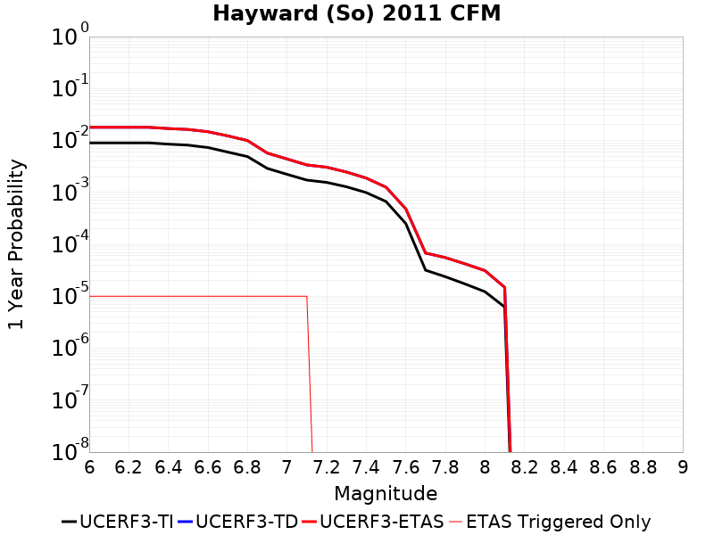 |  |

| Magnitude | 1 wk TI Prob | 1 wk TD Prob | 1 wk ETAS Prob | 1 wk ETAS/TD Gain | 1 wk ETAS Triggered Only | 1 mo TI Prob | 1 mo TD Prob | 1 mo ETAS Prob | 1 mo ETAS/TD Gain | 1 mo ETAS Triggered Only | 1 yr TI Prob | 1 yr TD Prob | 1 yr ETAS Prob | 1 yr ETAS/TD Gain | 1 yr ETAS Triggered Only | 10 yr TI Prob | 10 yr TD Prob | 10 yr ETAS Prob | 10 yr ETAS/TD Gain | 10 yr ETAS Triggered Only |
|-----|-----|-----|-----|-----|-----|-----|-----|-----|-----|-----|-----|-----|-----|-----|-----|-----|-----|-----|-----|-----|
| 6.0 | 1.7309593E-4 | 3.4598875E-4 | 3.4598875E-4 | 1.0 | 0.0 | 7.4162876E-4 | 0.001481976 | 0.001481976 | 1.0 | 0.0 | 0.008992008 | 0.017896093 | 0.017905915 | 1.0005488 | 1.0E-5 | 0.086367436 | 0.16210094 | 0.16210933 | 1.0000517 | 1.0E-5 |
| 6.1 | 1.7309593E-4 | 3.4598875E-4 | 3.4598875E-4 | 1.0 | 0.0 | 7.4162876E-4 | 0.001481976 | 0.001481976 | 1.0 | 0.0 | 0.008992008 | 0.017896093 | 0.017905915 | 1.0005488 | 1.0E-5 | 0.086367436 | 0.16210094 | 0.16210933 | 1.0000517 | 1.0E-5 |
| 6.2 | 1.7309593E-4 | 3.4598875E-4 | 3.4598875E-4 | 1.0 | 0.0 | 7.4162876E-4 | 0.001481976 | 0.001481976 | 1.0 | 0.0 | 0.008992008 | 0.017896093 | 0.017905915 | 1.0005488 | 1.0E-5 | 0.086367436 | 0.16210094 | 0.16210933 | 1.0000517 | 1.0E-5 |
| 6.3 | 1.7308246E-4 | 3.4598875E-4 | 3.4598875E-4 | 1.0 | 0.0 | 7.41571E-4 | 0.001481976 | 0.001481976 | 1.0 | 0.0 | 0.008991311 | 0.017896093 | 0.017905915 | 1.0005488 | 1.0E-5 | 0.08636101 | 0.16210094 | 0.16210933 | 1.0000517 | 1.0E-5 |
| 6.4 | 1.6334097E-4 | 3.2728197E-4 | 3.2728197E-4 | 1.0 | 0.0 | 6.998449E-4 | 0.0014018918 | 0.0014018918 | 1.0 | 0.0 | 0.008487372 | 0.016936503 | 0.016946333 | 1.0005804 | 1.0E-5 | 0.081704415 | 0.1541943 | 0.15420276 | 1.0000548 | 1.0E-5 |
| 6.5 | 1.5600289E-4 | 3.139239E-4 | 3.139239E-4 | 1.0 | 0.0 | 6.684125E-4 | 0.0013447028 | 0.0013447028 | 1.0 | 0.0 | 0.008107598 | 0.01625078 | 0.016260618 | 1.0006053 | 1.0E-5 | 0.078181036 | 0.14842616 | 0.14843468 | 1.0000573 | 1.0E-5 |
| 6.6 | 1.4046066E-4 | 2.8393228E-4 | 2.8393228E-4 | 1.0 | 0.0 | 6.018354E-4 | 0.001216292 | 0.001216292 | 1.0 | 0.0 | 0.0073027555 | 0.014709334 | 0.014719187 | 1.0006698 | 1.0E-5 | 0.07067384 | 0.13548428 | 0.13549292 | 1.0000638 | 1.0E-5 |
| 6.7 | 1.14696966E-4 | 2.360375E-4 | 2.360375E-4 | 1.0 | 0.0 | 4.914658E-4 | 0.0010112022 | 0.0010112022 | 1.0 | 0.0 | 0.0059671924 | 0.012242968 | 0.012252846 | 1.0008068 | 1.0E-5 | 0.058094822 | 0.114200465 | 0.114209324 | 1.0000776 | 1.0E-5 |
| 6.8 | 9.3874296E-5 | 1.9150128E-4 | 1.9150128E-4 | 1.0 | 0.0 | 4.0225635E-4 | 8.204653E-4 | 8.204653E-4 | 1.0 | 0.0 | 0.0048864787 | 0.009944154 | 0.009954055 | 1.0009956 | 1.0E-5 | 0.047804173 | 0.09390177 | 0.09391083 | 1.0000964 | 1.0E-5 |
| 6.9 | 5.551852E-5 | 1.0957589E-4 | 1.0957589E-4 | 1.0 | 0.0 | 2.3791482E-4 | 4.695271E-4 | 4.695271E-4 | 1.0 | 0.0 | 0.0028927654 | 0.005701631 | 0.0057115736 | 1.0017439 | 1.0E-5 | 0.028553981 | 0.05529996 | 0.055309407 | 1.0001708 | 1.0E-5 |
| 7.0 | 4.2662363E-5 | 8.426418E-5 | 8.426418E-5 | 1.0 | 0.0 | 1.8282588E-4 | 3.610826E-4 | 3.610826E-4 | 1.0 | 0.0 | 0.0022236328 | 0.0043873936 | 0.00439735 | 1.0022693 | 1.0E-5 | 0.022015138 | 0.042915285 | 0.04292486 | 1.000223 | 1.0E-5 |
| 7.1 | 3.305886E-5 | 6.467172E-5 | 6.467172E-5 | 1.0 | 0.0 | 1.4167312E-4 | 2.7713517E-4 | 2.7713517E-4 | 1.0 | 0.0 | 0.0017235056 | 0.0033689204 | 0.0033788867 | 1.0029583 | 1.0E-5 | 0.017101998 | 0.033239756 | 0.033249423 | 1.0002909 | 1.0E-5 |
| 7.2 | 2.9856887E-5 | 5.859135E-5 | 5.859135E-5 | 1.0 | 0.0 | 1.2795182E-4 | 2.510817E-4 | 2.510817E-4 | 1.0 | 0.0 | 0.0015567001 | 0.0030526526 | 0.0030526526 | 1.0 | 0.0 | 0.015458403 | 0.030207545 | 0.030207545 | 1.0 | 0.0 |
| 7.3 | 2.4559737E-5 | 4.732198E-5 | 4.732198E-5 | 1.0 | 0.0 | 1.0525176E-4 | 2.027928E-4 | 2.027928E-4 | 1.0 | 0.0 | 0.0012806869 | 0.0024662204 | 0.0024662204 | 1.0 | 0.0 | 0.012733313 | 0.024501044 | 0.024501044 | 1.0 | 0.0 |
| 7.4 | 1.9002231E-5 | 3.6164583E-5 | 3.6164583E-5 | 1.0 | 0.0 | 8.143559E-5 | 1.5498193E-4 | 1.5498193E-4 | 1.0 | 0.0 | 9.910273E-4 | 0.0018852823 | 0.0018852823 | 1.0 | 0.0 | 0.009866194 | 0.01880199 | 0.01880199 | 1.0 | 0.0 |
| 7.5 | 1.2783333E-5 | 2.4171459E-5 | 2.4171459E-5 | 1.0 | 0.0 | 5.4784563E-5 | 1.0358789E-4 | 1.0358789E-4 | 1.0 | 0.0 | 6.667979E-4 | 0.0012604591 | 0.0012604591 | 1.0 | 0.0 | 0.006648007 | 0.012622163 | 0.012622163 | 1.0 | 0.0 |
| 7.6 | 4.8149627E-6 | 9.244939E-6 | 9.244939E-6 | 1.0 | 0.0 | 2.063539E-5 | 3.9620576E-5 | 3.9620576E-5 | 1.0 | 0.0 | 2.5120692E-4 | 4.8227503E-4 | 4.8227503E-4 | 1.0 | 0.0 | 0.0025092314 | 0.004855792 | 0.004855792 | 1.0 | 0.0 |
| 7.7 | 6.0838227E-7 | 1.300733E-6 | 1.300733E-6 | 1.0 | 0.0 | 2.6073499E-6 | 5.574558E-6 | 5.574558E-6 | 1.0 | 0.0 | 3.174402E-5 | 6.786813E-5 | 6.786813E-5 | 1.0 | 0.0 | 3.1739488E-4 | 6.984701E-4 | 6.984701E-4 | 1.0 | 0.0 |
| 7.8 | 4.5542808E-7 | 1.0641579E-6 | 1.0641579E-6 | 1.0 | 0.0 | 1.9518332E-6 | 4.5606685E-6 | 4.5606685E-6 | 1.0 | 0.0 | 2.376331E-5 | 5.5524728E-5 | 5.5524728E-5 | 1.0 | 0.0 | 2.3760769E-4 | 5.727516E-4 | 5.727516E-4 | 1.0 | 0.0 |
| 7.9 | 3.3016747E-7 | 8.054936E-7 | 8.054936E-7 | 1.0 | 0.0 | 1.4150027E-6 | 3.4521108E-6 | 3.4521108E-6 | 1.0 | 0.0 | 1.7227521E-5 | 4.202864E-5 | 4.202864E-5 | 1.0 | 0.0 | 1.7226185E-4 | 4.3125998E-4 | 4.3125998E-4 | 1.0 | 0.0 |
| 8.0 | 2.347038E-7 | 5.976381E-7 | 5.976381E-7 | 1.0 | 0.0 | 1.0058731E-6 | 2.5613037E-6 | 2.5613037E-6 | 1.0 | 0.0 | 1.2246436E-5 | 3.1183426E-5 | 3.1183426E-5 | 1.0 | 0.0 | 1.2245761E-4 | 3.1772326E-4 | 3.1772326E-4 | 1.0 | 0.0 |
| 8.1 | 1.18822804E-7 | 2.8472132E-7 | 2.8472132E-7 | 1.0 | 0.0 | 5.092405E-7 | 1.2202336E-6 | 1.2202336E-6 | 1.0 | 0.0 | 6.1999854E-6 | 1.4856244E-5 | 1.4856244E-5 | 1.0 | 0.0 | 6.199812E-5 | 1.5093895E-4 | 1.5093895E-4 | 1.0 | 0.0 |

## Great Valley 02
*[(top)](#table-of-contents)*

| 1 Week | 1 Month | 1 Year | 10 Year |
|-----|-----|-----|-----|
|  |  | 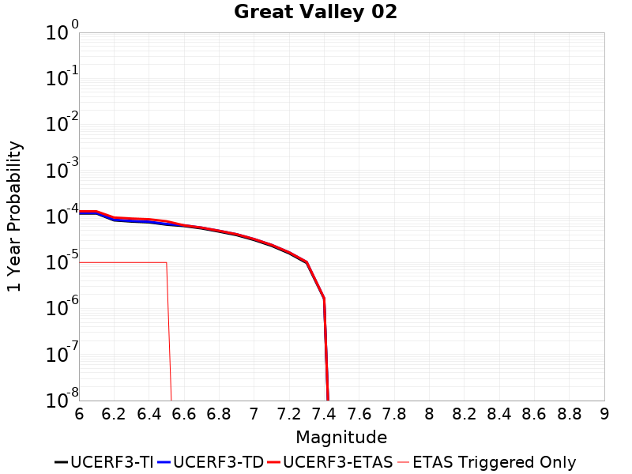 | 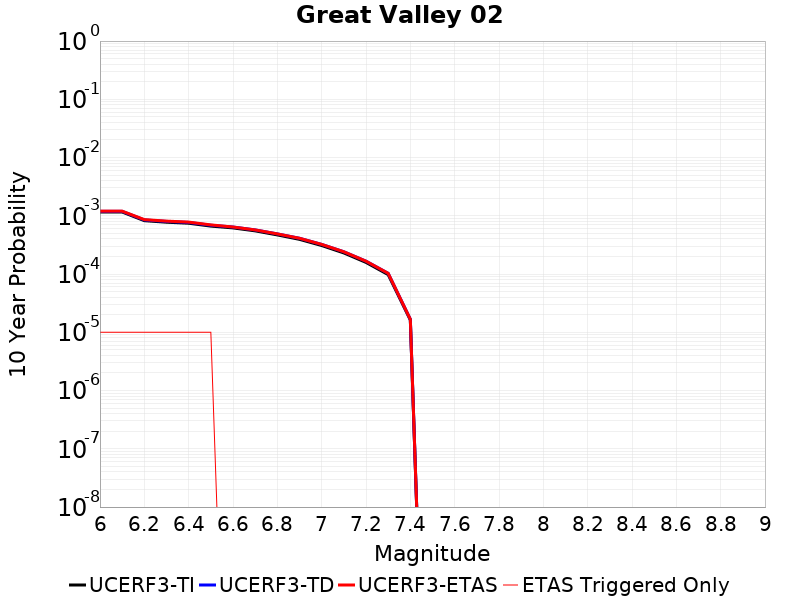 |

| Magnitude | 1 wk TI Prob | 1 wk TD Prob | 1 wk ETAS Prob | 1 wk ETAS/TD Gain | 1 wk ETAS Triggered Only | 1 mo TI Prob | 1 mo TD Prob | 1 mo ETAS Prob | 1 mo ETAS/TD Gain | 1 mo ETAS Triggered Only | 1 yr TI Prob | 1 yr TD Prob | 1 yr ETAS Prob | 1 yr ETAS/TD Gain | 1 yr ETAS Triggered Only | 10 yr TI Prob | 10 yr TD Prob | 10 yr ETAS Prob | 10 yr ETAS/TD Gain | 10 yr ETAS Triggered Only |
|-----|-----|-----|-----|-----|-----|-----|-----|-----|-----|-----|-----|-----|-----|-----|-----|-----|-----|-----|-----|-----|
| 6.0 | 2.2243487E-6 | 2.280483E-6 | 2.280483E-6 | 1.0 | 0.0 | 9.532888E-6 | 9.773465E-6 | 1.9773368E-5 | 2.0231686 | 1.0E-5 | 1.1605673E-4 | 1.1898594E-4 | 1.2898476E-4 | 1.0840335 | 1.0E-5 | 0.0011599615 | 0.0011892722 | 0.0011992602 | 1.0083985 | 1.0E-5 |
| 6.1 | 2.2243487E-6 | 2.280483E-6 | 2.280483E-6 | 1.0 | 0.0 | 9.532888E-6 | 9.773465E-6 | 1.9773368E-5 | 2.0231686 | 1.0E-5 | 1.1605673E-4 | 1.1898594E-4 | 1.2898476E-4 | 1.0840335 | 1.0E-5 | 0.0011599615 | 0.0011892722 | 0.0011992602 | 1.0083985 | 1.0E-5 |
| 6.2 | 1.5787732E-6 | 1.6265739E-6 | 1.6265739E-6 | 1.0 | 0.0 | 6.7661535E-6 | 6.9710127E-6 | 1.6970944E-5 | 2.434502 | 1.0E-5 | 8.2374805E-5 | 8.486882E-5 | 9.486797E-5 | 1.117819 | 1.0E-5 | 8.2344277E-4 | 8.4836886E-4 | 8.583604E-4 | 1.0117773 | 1.0E-5 |
| 6.3 | 1.4850314E-6 | 1.5316791E-6 | 1.5316791E-6 | 1.0 | 0.0 | 6.3644047E-6 | 6.564323E-6 | 1.6564258E-5 | 2.5233765 | 1.0E-5 | 7.748387E-5 | 7.9917736E-5 | 8.991694E-5 | 1.1251186 | 1.0E-5 | 7.745686E-4 | 7.9889386E-4 | 8.0888584E-4 | 1.0125073 | 1.0E-5 |
| 6.4 | 1.4266972E-6 | 1.472867E-6 | 1.472867E-6 | 1.0 | 0.0 | 6.114402E-6 | 6.312272E-6 | 1.631221E-5 | 2.5842056 | 1.0E-5 | 7.44403E-5 | 7.684924E-5 | 8.684847E-5 | 1.1301149 | 1.0E-5 | 7.441537E-4 | 7.6823006E-4 | 7.7822234E-4 | 1.0130069 | 1.0E-5 |
| 6.5 | 1.2728015E-6 | 1.3166218E-6 | 1.3166218E-6 | 1.0 | 0.0 | 5.4548523E-6 | 5.642653E-6 | 1.5642596E-5 | 2.772206 | 1.0E-5 | 6.64108E-5 | 6.869716E-5 | 7.8696474E-5 | 1.1455564 | 1.0E-5 | 6.639096E-4 | 6.8676186E-4 | 6.96755E-4 | 1.014551 | 1.0E-5 |
| 6.6 | 1.1857247E-6 | 1.228491E-6 | 1.228491E-6 | 1.0 | 0.0 | 5.0816675E-6 | 5.264951E-6 | 5.264951E-6 | 1.0 | 0.0 | 6.186755E-5 | 6.409892E-5 | 6.409892E-5 | 1.0 | 0.0 | 6.1850325E-4 | 6.4080674E-4 | 6.4080674E-4 | 1.0 | 0.0 |
| 6.7 | 1.0550715E-6 | 1.0949365E-6 | 1.0949365E-6 | 1.0 | 0.0 | 4.521727E-6 | 4.6925766E-6 | 4.6925766E-6 | 1.0 | 0.0 | 5.5050637E-5 | 5.713064E-5 | 5.713064E-5 | 1.0 | 0.0 | 5.5037E-4 | 5.711616E-4 | 5.711616E-4 | 1.0 | 0.0 |
| 6.8 | 8.9881183E-7 | 9.3524994E-7 | 9.3524994E-7 | 1.0 | 0.0 | 3.8520448E-6 | 4.008208E-6 | 4.008208E-6 | 1.0 | 0.0 | 4.689764E-5 | 4.879886E-5 | 4.879886E-5 | 1.0 | 0.0 | 4.688774E-4 | 4.8788317E-4 | 4.8788317E-4 | 1.0 | 0.0 |
| 6.9 | 7.5417256E-7 | 7.8690124E-7 | 7.8690124E-7 | 1.0 | 0.0 | 3.232164E-6 | 3.3724295E-6 | 3.3724295E-6 | 1.0 | 0.0 | 3.9350885E-5 | 4.105857E-5 | 4.105857E-5 | 1.0 | 0.0 | 3.934392E-4 | 4.105113E-4 | 4.105113E-4 | 1.0 | 0.0 |
| 7.0 | 5.909726E-7 | 6.176172E-7 | 6.176172E-7 | 1.0 | 0.0 | 2.5327372E-6 | 2.6469284E-6 | 2.6469284E-6 | 1.0 | 0.0 | 3.083564E-5 | 3.2225886E-5 | 3.2225886E-5 | 1.0 | 0.0 | 3.083136E-4 | 3.2221313E-4 | 3.2221313E-4 | 1.0 | 0.0 |
| 7.1 | 4.4054178E-7 | 4.6159712E-7 | 4.6159712E-7 | 1.0 | 0.0 | 1.8880348E-6 | 1.978272E-6 | 1.978272E-6 | 1.0 | 0.0 | 2.2986582E-5 | 2.4085202E-5 | 2.4085202E-5 | 1.0 | 0.0 | 2.2984203E-4 | 2.4082664E-4 | 2.4082664E-4 | 1.0 | 0.0 |
| 7.2 | 3.029834E-7 | 3.1814017E-7 | 3.1814017E-7 | 1.0 | 0.0 | 1.2984997E-6 | 1.3634572E-6 | 1.3634572E-6 | 1.0 | 0.0 | 1.5809119E-5 | 1.659997E-5 | 1.659997E-5 | 1.0 | 0.0 | 1.5807994E-4 | 1.6598775E-4 | 1.6598775E-4 | 1.0 | 0.0 |
| 7.3 | 1.8700909E-7 | 1.9675186E-7 | 1.9675186E-7 | 1.0 | 0.0 | 8.0146725E-7 | 8.4322204E-7 | 8.4322204E-7 | 1.0 | 0.0 | 9.75782E-6 | 1.02661825E-5 | 1.02661825E-5 | 1.0 | 0.0 | 9.757392E-5 | 1.0265736E-4 | 1.0265736E-4 | 1.0 | 0.0 |
| 7.4 | 3.112171E-8 | 3.1989167E-8 | 3.1989167E-8 | 1.0 | 0.0 | 1.3337875E-7 | 1.3709642E-7 | 1.3709642E-7 | 1.0 | 0.0 | 1.6238852E-6 | 1.6691478E-6 | 1.6691478E-6 | 1.0 | 0.0 | 1.6238733E-5 | 1.6691361E-5 | 1.6691361E-5 | 1.0 | 0.0 |

## Great Valley 06 (Midland) 2011 CFM alt1
*[(top)](#table-of-contents)*

| 1 Week | 1 Month | 1 Year | 10 Year |
|-----|-----|-----|-----|
|  | 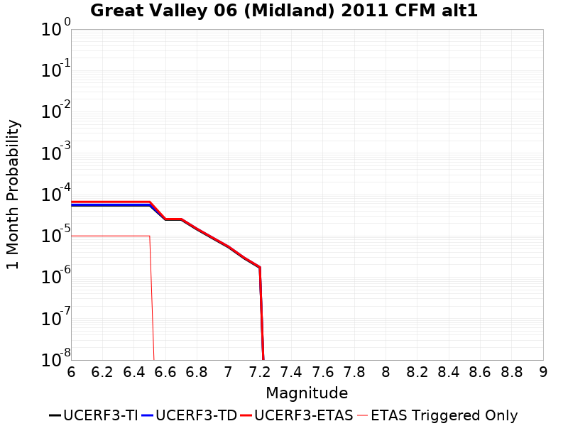 | 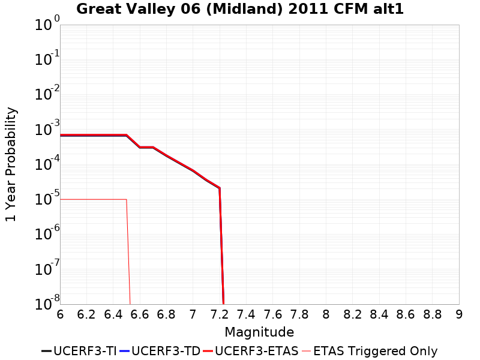 | 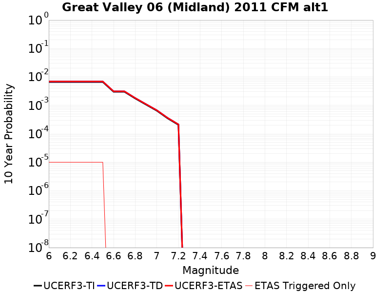 |

| Magnitude | 1 wk TI Prob | 1 wk TD Prob | 1 wk ETAS Prob | 1 wk ETAS/TD Gain | 1 wk ETAS Triggered Only | 1 mo TI Prob | 1 mo TD Prob | 1 mo ETAS Prob | 1 mo ETAS/TD Gain | 1 mo ETAS Triggered Only | 1 yr TI Prob | 1 yr TD Prob | 1 yr ETAS Prob | 1 yr ETAS/TD Gain | 1 yr ETAS Triggered Only | 10 yr TI Prob | 10 yr TD Prob | 10 yr ETAS Prob | 10 yr ETAS/TD Gain | 10 yr ETAS Triggered Only |
|-----|-----|-----|-----|-----|-----|-----|-----|-----|-----|-----|-----|-----|-----|-----|-----|-----|-----|-----|-----|-----|
| 6.0 | 1.2712525E-5 | 1.3230028E-5 | 1.3230028E-5 | 1.0 | 0.0 | 5.4481112E-5 | 5.669903E-5 | 6.669846E-5 | 1.1763599 | 1.0E-5 | 6.6310563E-4 | 6.9011754E-4 | 7.001106E-4 | 1.0144802 | 1.0E-5 | 0.0066113044 | 0.006882268 | 0.006892199 | 1.001443 | 1.0E-5 |
| 6.1 | 1.2712525E-5 | 1.3230028E-5 | 1.3230028E-5 | 1.0 | 0.0 | 5.4481112E-5 | 5.669903E-5 | 6.669846E-5 | 1.1763599 | 1.0E-5 | 6.6310563E-4 | 6.9011754E-4 | 7.001106E-4 | 1.0144802 | 1.0E-5 | 0.0066113044 | 0.006882268 | 0.006892199 | 1.001443 | 1.0E-5 |
| 6.2 | 1.2712525E-5 | 1.3230028E-5 | 1.3230028E-5 | 1.0 | 0.0 | 5.4481112E-5 | 5.669903E-5 | 6.669846E-5 | 1.1763599 | 1.0E-5 | 6.6310563E-4 | 6.9011754E-4 | 7.001106E-4 | 1.0144802 | 1.0E-5 | 0.0066113044 | 0.006882268 | 0.006892199 | 1.001443 | 1.0E-5 |
| 6.3 | 1.2712525E-5 | 1.3230028E-5 | 1.3230028E-5 | 1.0 | 0.0 | 5.4481112E-5 | 5.669903E-5 | 6.669846E-5 | 1.1763599 | 1.0E-5 | 6.6310563E-4 | 6.9011754E-4 | 7.001106E-4 | 1.0144802 | 1.0E-5 | 0.0066113044 | 0.006882268 | 0.006892199 | 1.001443 | 1.0E-5 |
| 6.4 | 1.2712525E-5 | 1.3230028E-5 | 1.3230028E-5 | 1.0 | 0.0 | 5.4481112E-5 | 5.669903E-5 | 6.669846E-5 | 1.1763599 | 1.0E-5 | 6.6310563E-4 | 6.9011754E-4 | 7.001106E-4 | 1.0144802 | 1.0E-5 | 0.0066113044 | 0.006882268 | 0.006892199 | 1.001443 | 1.0E-5 |
| 6.5 | 1.2712525E-5 | 1.3230028E-5 | 1.3230028E-5 | 1.0 | 0.0 | 5.4481112E-5 | 5.669903E-5 | 6.669846E-5 | 1.1763599 | 1.0E-5 | 6.6310563E-4 | 6.9011754E-4 | 7.001106E-4 | 1.0144802 | 1.0E-5 | 0.0066113044 | 0.006882268 | 0.006892199 | 1.001443 | 1.0E-5 |
| 6.6 | 5.7574384E-6 | 5.9789536E-6 | 5.9789536E-6 | 1.0 | 0.0 | 2.4674504E-5 | 2.5623858E-5 | 2.5623858E-5 | 1.0 | 0.0 | 3.0037065E-4 | 3.1192973E-4 | 3.1192973E-4 | 1.0 | 0.0 | 0.0029996498 | 0.0031153066 | 0.0031153066 | 1.0 | 0.0 |
| 6.7 | 5.7574384E-6 | 5.9789536E-6 | 5.9789536E-6 | 1.0 | 0.0 | 2.4674504E-5 | 2.5623858E-5 | 2.5623858E-5 | 1.0 | 0.0 | 3.0037065E-4 | 3.1192973E-4 | 3.1192973E-4 | 1.0 | 0.0 | 0.0029996498 | 0.0031153066 | 0.0031153066 | 1.0 | 0.0 |
| 6.8 | 3.3474828E-6 | 3.4741313E-6 | 3.4741313E-6 | 1.0 | 0.0 | 1.4346277E-5 | 1.4889058E-5 | 1.4889058E-5 | 1.0 | 0.0 | 1.7465191E-4 | 1.812607E-4 | 1.812607E-4 | 1.0 | 0.0 | 0.0017451472 | 0.0018112758 | 0.0018112758 | 1.0 | 0.0 |
| 6.9 | 2.035106E-6 | 2.1119138E-6 | 2.1119138E-6 | 1.0 | 0.0 | 8.721853E-6 | 9.051032E-6 | 9.051032E-6 | 1.0 | 0.0 | 1.0618339E-4 | 1.1019148E-4 | 1.1019148E-4 | 1.0 | 0.0 | 0.0010613267 | 0.0011014409 | 0.0011014409 | 1.0 | 0.0 |
| 7.0 | 1.2424716E-6 | 1.2896443E-6 | 1.2896443E-6 | 1.0 | 0.0 | 5.3248673E-6 | 5.527038E-6 | 5.527038E-6 | 1.0 | 0.0 | 6.482833E-5 | 6.729006E-5 | 6.729006E-5 | 1.0 | 0.0 | 6.480942E-4 | 6.7274127E-4 | 6.7274127E-4 | 1.0 | 0.0 |
| 7.1 | 6.6904556E-7 | 6.94872E-7 | 6.94872E-7 | 1.0 | 0.0 | 2.867335E-6 | 2.978021E-6 | 2.978021E-6 | 1.0 | 0.0 | 3.4909244E-5 | 3.6257064E-5 | 3.6257064E-5 | 1.0 | 0.0 | 3.490376E-4 | 3.6253707E-4 | 3.6253707E-4 | 1.0 | 0.0 |
| 7.2 | 3.948168E-7 | 4.1014547E-7 | 4.1014547E-7 | 1.0 | 0.0 | 1.6920709E-6 | 1.7577663E-6 | 1.7577663E-6 | 1.0 | 0.0 | 2.0600768E-5 | 2.1400805E-5 | 2.1400805E-5 | 1.0 | 0.0 | 2.0598859E-4 | 2.1400805E-4 | 2.1400805E-4 | 1.0 | 0.0 |

## Carson Range (Genoa)
*[(top)](#table-of-contents)*

| 1 Week | 1 Month | 1 Year | 10 Year |
|-----|-----|-----|-----|
| 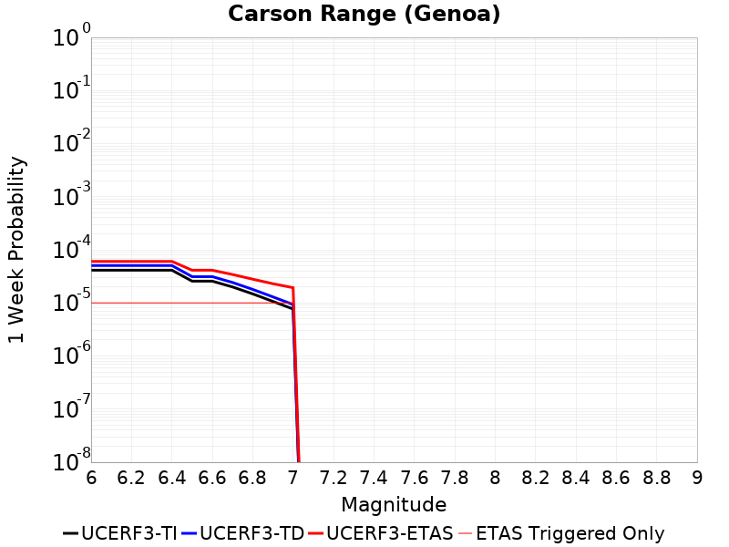 | 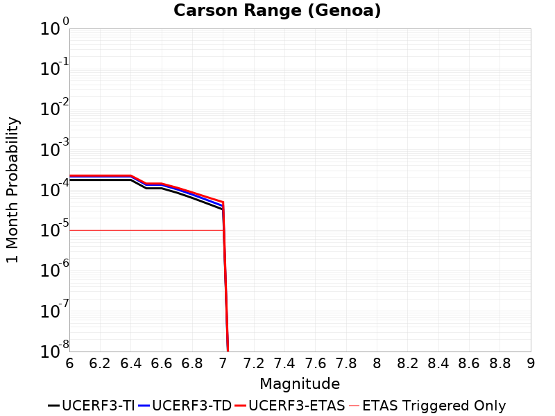 |  |  |

| Magnitude | 1 wk TI Prob | 1 wk TD Prob | 1 wk ETAS Prob | 1 wk ETAS/TD Gain | 1 wk ETAS Triggered Only | 1 mo TI Prob | 1 mo TD Prob | 1 mo ETAS Prob | 1 mo ETAS/TD Gain | 1 mo ETAS Triggered Only | 1 yr TI Prob | 1 yr TD Prob | 1 yr ETAS Prob | 1 yr ETAS/TD Gain | 1 yr ETAS Triggered Only | 10 yr TI Prob | 10 yr TD Prob | 10 yr ETAS Prob | 10 yr ETAS/TD Gain | 10 yr ETAS Triggered Only |
|-----|-----|-----|-----|-----|-----|-----|-----|-----|-----|-----|-----|-----|-----|-----|-----|-----|-----|-----|-----|-----|
| 6.0 | 4.1268457E-5 | 5.055373E-5 | 6.0553222E-5 | 1.1977993 | 1.0E-5 | 1.7685282E-4 | 2.16643E-4 | 2.2664084E-4 | 1.0461489 | 1.0E-5 | 0.0021510567 | 0.0026348354 | 0.0026448092 | 1.0037853 | 1.0E-5 | 0.02130354 | 0.026076043 | 0.026085783 | 1.0003735 | 1.0E-5 |
| 6.1 | 4.1268457E-5 | 5.055373E-5 | 6.0553222E-5 | 1.1977993 | 1.0E-5 | 1.7685282E-4 | 2.16643E-4 | 2.2664084E-4 | 1.0461489 | 1.0E-5 | 0.0021510567 | 0.0026348354 | 0.0026448092 | 1.0037853 | 1.0E-5 | 0.02130354 | 0.026076043 | 0.026085783 | 1.0003735 | 1.0E-5 |
| 6.2 | 4.1268457E-5 | 5.055373E-5 | 6.0553222E-5 | 1.1977993 | 1.0E-5 | 1.7685282E-4 | 2.16643E-4 | 2.2664084E-4 | 1.0461489 | 1.0E-5 | 0.0021510567 | 0.0026348354 | 0.0026448092 | 1.0037853 | 1.0E-5 | 0.02130354 | 0.026076043 | 0.026085783 | 1.0003735 | 1.0E-5 |
| 6.3 | 4.1268457E-5 | 5.055373E-5 | 6.0553222E-5 | 1.1977993 | 1.0E-5 | 1.7685282E-4 | 2.16643E-4 | 2.2664084E-4 | 1.0461489 | 1.0E-5 | 0.0021510567 | 0.0026348354 | 0.0026448092 | 1.0037853 | 1.0E-5 | 0.02130354 | 0.026076043 | 0.026085783 | 1.0003735 | 1.0E-5 |
| 6.4 | 4.1268457E-5 | 5.055373E-5 | 6.0553222E-5 | 1.1977993 | 1.0E-5 | 1.7685282E-4 | 2.16643E-4 | 2.2664084E-4 | 1.0461489 | 1.0E-5 | 0.0021510567 | 0.0026348354 | 0.0026448092 | 1.0037853 | 1.0E-5 | 0.02130354 | 0.026076043 | 0.026085783 | 1.0003735 | 1.0E-5 |
| 6.5 | 2.5677185E-5 | 3.1219883E-5 | 4.1219573E-5 | 1.3202987 | 1.0E-5 | 1.1004044E-4 | 1.3379368E-4 | 1.4379233E-4 | 1.074732 | 1.0E-5 | 0.0013389189 | 0.0016279034 | 0.0016378872 | 1.0061328 | 1.0E-5 | 0.0133088045 | 0.016177943 | 0.016187781 | 1.0006081 | 1.0E-5 |
| 6.6 | 2.5677185E-5 | 3.1219883E-5 | 4.1219573E-5 | 1.3202987 | 1.0E-5 | 1.1004044E-4 | 1.3379368E-4 | 1.4379233E-4 | 1.074732 | 1.0E-5 | 0.0013389189 | 0.0016279034 | 0.0016378872 | 1.0061328 | 1.0E-5 | 0.0133088045 | 0.016177943 | 0.016187781 | 1.0006081 | 1.0E-5 |
| 6.7 | 1.9969408E-5 | 2.4249986E-5 | 3.4249744E-5 | 1.4123614 | 1.0E-5 | 8.558037E-5 | 1.0392525E-4 | 1.1392421E-4 | 1.096213 | 1.0E-5 | 0.0010414429 | 0.0012647114 | 0.0012746988 | 1.0078969 | 1.0E-5 | 0.010365757 | 0.012590531 | 0.012600405 | 1.0007843 | 1.0E-5 |
| 6.8 | 1.4783156E-5 | 1.7955837E-5 | 2.7955659E-5 | 1.556912 | 1.0E-5 | 6.335485E-5 | 7.695207E-5 | 8.6951295E-5 | 1.129941 | 1.0E-5 | 7.710722E-4 | 9.366209E-4 | 9.466115E-4 | 1.0106667 | 1.0E-5 | 0.0076840227 | 0.009339719 | 0.009349626 | 1.0010607 | 1.0E-5 |
| 6.9 | 1.06660555E-5 | 1.2977946E-5 | 2.2977816E-5 | 1.770528 | 1.0E-5 | 4.5710865E-5 | 5.5619243E-5 | 6.561869E-5 | 1.1797839 | 1.0E-5 | 5.5638765E-4 | 6.7707093E-4 | 6.8706414E-4 | 1.0147595 | 1.0E-5 | 0.005549967 | 0.006761555 | 0.0067714876 | 1.0014689 | 1.0E-5 |
| 7.0 | 7.664838E-6 | 9.331077E-6 | 1.9330984E-5 | 2.0716777 | 1.0E-5 | 3.2848893E-5 | 3.999033E-5 | 4.9989932E-5 | 1.2500504 | 1.0E-5 | 3.998619E-4 | 4.8688226E-4 | 4.9687736E-4 | 1.0205288 | 1.0E-5 | 0.0039914316 | 0.004868819 | 0.00487877 | 1.0020438 | 1.0E-5 |

## Great Valley 04a Trout Creek
*[(top)](#table-of-contents)*

| 1 Week | 1 Month | 1 Year | 10 Year |
|-----|-----|-----|-----|
| 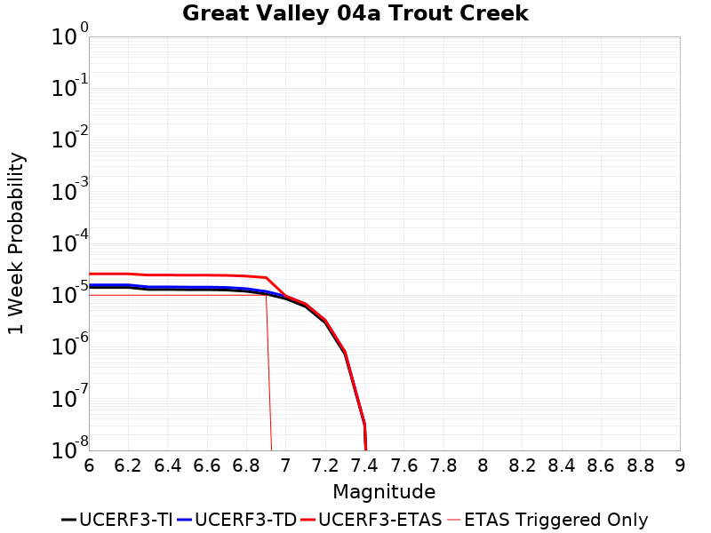 |  |  | 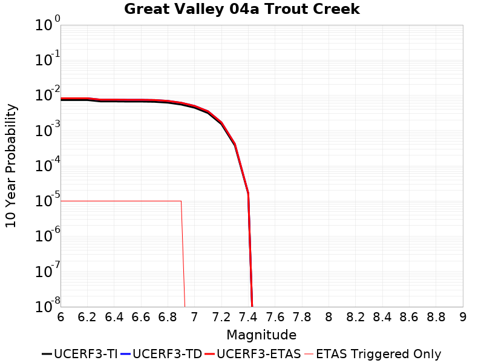 |

| Magnitude | 1 wk TI Prob | 1 wk TD Prob | 1 wk ETAS Prob | 1 wk ETAS/TD Gain | 1 wk ETAS Triggered Only | 1 mo TI Prob | 1 mo TD Prob | 1 mo ETAS Prob | 1 mo ETAS/TD Gain | 1 mo ETAS Triggered Only | 1 yr TI Prob | 1 yr TD Prob | 1 yr ETAS Prob | 1 yr ETAS/TD Gain | 1 yr ETAS Triggered Only | 10 yr TI Prob | 10 yr TD Prob | 10 yr ETAS Prob | 10 yr ETAS/TD Gain | 10 yr ETAS Triggered Only |
|-----|-----|-----|-----|-----|-----|-----|-----|-----|-----|-----|-----|-----|-----|-----|-----|-----|-----|-----|-----|-----|
| 6.0 | 1.4088538E-5 | 1.5787522E-5 | 2.5787363E-5 | 1.6334016 | 1.0E-5 | 6.037805E-5 | 6.765912E-5 | 7.765845E-5 | 1.1477897 | 1.0E-5 | 7.3485484E-4 | 8.2345115E-4 | 8.334429E-4 | 1.012134 | 1.0E-5 | 0.007324295 | 0.008205296 | 0.008215213 | 1.0012088 | 1.0E-5 |
| 6.1 | 1.4088538E-5 | 1.5787522E-5 | 2.5787363E-5 | 1.6334016 | 1.0E-5 | 6.037805E-5 | 6.765912E-5 | 7.765845E-5 | 1.1477897 | 1.0E-5 | 7.3485484E-4 | 8.2345115E-4 | 8.334429E-4 | 1.012134 | 1.0E-5 | 0.007324295 | 0.008205296 | 0.008215213 | 1.0012088 | 1.0E-5 |
| 6.2 | 1.4088538E-5 | 1.5787522E-5 | 2.5787363E-5 | 1.6334016 | 1.0E-5 | 6.037805E-5 | 6.765912E-5 | 7.765845E-5 | 1.1477897 | 1.0E-5 | 7.3485484E-4 | 8.2345115E-4 | 8.334429E-4 | 1.012134 | 1.0E-5 | 0.007324295 | 0.008205296 | 0.008215213 | 1.0012088 | 1.0E-5 |
| 6.3 | 1.2882862E-5 | 1.4440902E-5 | 2.4440758E-5 | 1.6924675 | 1.0E-5 | 5.5211098E-5 | 6.1888175E-5 | 7.188755E-5 | 1.1615717 | 1.0E-5 | 6.7198783E-4 | 7.532385E-4 | 7.6323096E-4 | 1.013266 | 1.0E-5 | 0.0066995937 | 0.0075079273 | 0.0075178524 | 1.0013219 | 1.0E-5 |
| 6.4 | 1.2882862E-5 | 1.4440902E-5 | 2.4440758E-5 | 1.6924675 | 1.0E-5 | 5.5211098E-5 | 6.1888175E-5 | 7.188755E-5 | 1.1615717 | 1.0E-5 | 6.7198783E-4 | 7.532385E-4 | 7.6323096E-4 | 1.013266 | 1.0E-5 | 0.0066995937 | 0.0075079273 | 0.0075178524 | 1.0013219 | 1.0E-5 |
| 6.5 | 1.2762329E-5 | 1.4306921E-5 | 2.4306779E-5 | 1.6989524 | 1.0E-5 | 5.469455E-5 | 6.131399E-5 | 7.131338E-5 | 1.1630849 | 1.0E-5 | 6.657027E-4 | 7.4625266E-4 | 7.562452E-4 | 1.0133903 | 1.0E-5 | 0.00663712 | 0.0074385367 | 0.0074484623 | 1.0013343 | 1.0E-5 |
| 6.6 | 1.2762329E-5 | 1.4306921E-5 | 2.4306779E-5 | 1.6989524 | 1.0E-5 | 5.469455E-5 | 6.131399E-5 | 7.131338E-5 | 1.1630849 | 1.0E-5 | 6.657027E-4 | 7.4625266E-4 | 7.562452E-4 | 1.0133903 | 1.0E-5 | 0.00663712 | 0.0074385367 | 0.0074484623 | 1.0013343 | 1.0E-5 |
| 6.7 | 1.2557959E-5 | 1.4080267E-5 | 2.4080126E-5 | 1.7102039 | 1.0E-5 | 5.3818712E-5 | 6.034266E-5 | 7.034206E-5 | 1.1657102 | 1.0E-5 | 6.5504585E-4 | 7.344347E-4 | 7.444273E-4 | 1.013606 | 1.0E-5 | 0.006531183 | 0.007321139 | 0.0073310654 | 1.0013559 | 1.0E-5 |
| 6.8 | 1.1871544E-5 | 1.3316599E-5 | 2.3316466E-5 | 1.7509325 | 1.0E-5 | 5.0877054E-5 | 5.7069945E-5 | 6.706938E-5 | 1.1752136 | 1.0E-5 | 6.1925204E-4 | 6.946152E-4 | 7.046083E-4 | 1.0143864 | 1.0E-5 | 0.0061752927 | 0.006925467 | 0.0069353976 | 1.001434 | 1.0E-5 |
| 6.9 | 1.0500373E-5 | 1.1782472E-5 | 2.1782354E-5 | 1.8487083 | 1.0E-5 | 4.5000823E-5 | 5.049538E-5 | 6.0494876E-5 | 1.198028 | 1.0E-5 | 5.4774724E-4 | 6.146165E-4 | 6.2461034E-4 | 1.0162603 | 1.0E-5 | 0.005463991 | 0.0061300406 | 0.006139979 | 1.0016214 | 1.0E-5 |
| 7.0 | 8.524332E-6 | 9.575402E-6 | 9.575402E-6 | 1.0 | 0.0 | 3.653234E-5 | 4.1036834E-5 | 4.1036834E-5 | 1.0 | 0.0 | 4.4469046E-4 | 4.995163E-4 | 4.995163E-4 | 1.0 | 0.0 | 0.0044380166 | 0.0049846736 | 0.0049846736 | 1.0 | 0.0 |
| 7.1 | 6.006849E-6 | 6.7406095E-6 | 6.7406095E-6 | 1.0 | 0.0 | 2.5743384E-5 | 2.8888038E-5 | 2.8888038E-5 | 1.0 | 0.0 | 3.1338062E-4 | 3.5166074E-4 | 3.5166074E-4 | 1.0 | 0.0 | 0.0031293905 | 0.0035115983 | 0.0035115983 | 1.0 | 0.0 |
| 7.2 | 2.9122193E-6 | 3.2600233E-6 | 3.2600233E-6 | 1.0 | 0.0 | 1.248088E-5 | 1.3971464E-5 | 1.3971464E-5 | 1.0 | 0.0 | 1.5194413E-4 | 1.7009107E-4 | 1.7009107E-4 | 1.0 | 0.0 | 0.0015184027 | 0.0016997823 | 0.0016997823 | 1.0 | 0.0 |
| 7.3 | 7.2194007E-7 | 8.0168223E-7 | 8.0168223E-7 | 1.0 | 0.0 | 3.0940253E-6 | 3.435779E-6 | 3.435779E-6 | 1.0 | 0.0 | 3.7669106E-5 | 4.183027E-5 | 4.183027E-5 | 1.0 | 0.0 | 3.766272E-4 | 4.1826934E-4 | 4.1826934E-4 | 1.0 | 0.0 |
| 7.4 | 3.112171E-8 | 3.1989167E-8 | 3.1989167E-8 | 1.0 | 0.0 | 1.3337875E-7 | 1.3709642E-7 | 1.3709642E-7 | 1.0 | 0.0 | 1.6238852E-6 | 1.6691478E-6 | 1.6691478E-6 | 1.0 | 0.0 | 1.6238733E-5 | 1.6691361E-5 | 1.6691361E-5 | 1.0 | 0.0 |

## West Tahoe
*[(top)](#table-of-contents)*

| 1 Week | 1 Month | 1 Year | 10 Year |
|-----|-----|-----|-----|
|  |  | 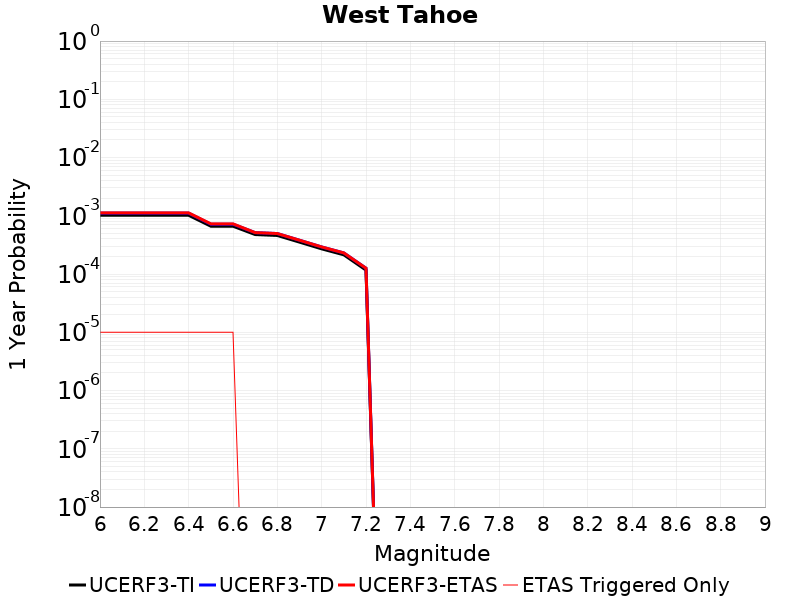 | 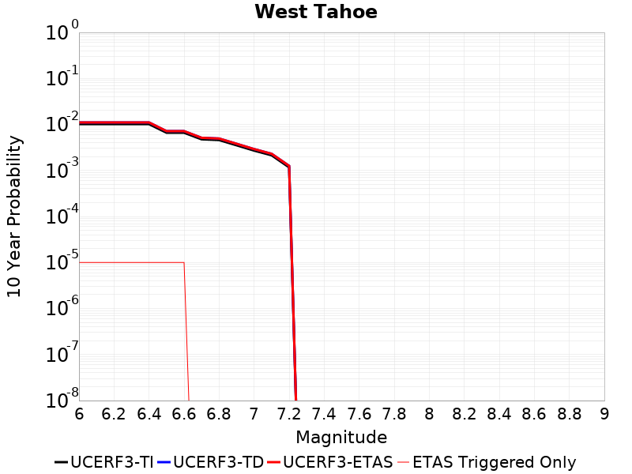 |

| Magnitude | 1 wk TI Prob | 1 wk TD Prob | 1 wk ETAS Prob | 1 wk ETAS/TD Gain | 1 wk ETAS Triggered Only | 1 mo TI Prob | 1 mo TD Prob | 1 mo ETAS Prob | 1 mo ETAS/TD Gain | 1 mo ETAS Triggered Only | 1 yr TI Prob | 1 yr TD Prob | 1 yr ETAS Prob | 1 yr ETAS/TD Gain | 1 yr ETAS Triggered Only | 10 yr TI Prob | 10 yr TD Prob | 10 yr ETAS Prob | 10 yr ETAS/TD Gain | 10 yr ETAS Triggered Only |
|-----|-----|-----|-----|-----|-----|-----|-----|-----|-----|-----|-----|-----|-----|-----|-----|-----|-----|-----|-----|-----|
| 6.0 | 1.952444E-5 | 2.1251046E-5 | 2.1251046E-5 | 1.0 | 0.0 | 8.367348E-5 | 9.107304E-5 | 9.107304E-5 | 1.0 | 0.0 | 0.0010182485 | 0.0011083054 | 0.0011182943 | 1.0090128 | 1.0E-5 | 0.010135954 | 0.011033306 | 0.011043196 | 1.0008963 | 1.0E-5 |
| 6.1 | 1.952444E-5 | 2.1251046E-5 | 2.1251046E-5 | 1.0 | 0.0 | 8.367348E-5 | 9.107304E-5 | 9.107304E-5 | 1.0 | 0.0 | 0.0010182485 | 0.0011083054 | 0.0011182943 | 1.0090128 | 1.0E-5 | 0.010135954 | 0.011033306 | 0.011043196 | 1.0008963 | 1.0E-5 |
| 6.2 | 1.952444E-5 | 2.1251046E-5 | 2.1251046E-5 | 1.0 | 0.0 | 8.367348E-5 | 9.107304E-5 | 9.107304E-5 | 1.0 | 0.0 | 0.0010182485 | 0.0011083054 | 0.0011182943 | 1.0090128 | 1.0E-5 | 0.010135954 | 0.011033306 | 0.011043196 | 1.0008963 | 1.0E-5 |
| 6.3 | 1.952444E-5 | 2.1251046E-5 | 2.1251046E-5 | 1.0 | 0.0 | 8.367348E-5 | 9.107304E-5 | 9.107304E-5 | 1.0 | 0.0 | 0.0010182485 | 0.0011083054 | 0.0011182943 | 1.0090128 | 1.0E-5 | 0.010135954 | 0.011033306 | 0.011043196 | 1.0008963 | 1.0E-5 |
| 6.4 | 1.952444E-5 | 2.1251046E-5 | 2.1251046E-5 | 1.0 | 0.0 | 8.367348E-5 | 9.107304E-5 | 9.107304E-5 | 1.0 | 0.0 | 0.0010182485 | 0.0011083054 | 0.0011182943 | 1.0090128 | 1.0E-5 | 0.010135954 | 0.011033306 | 0.011043196 | 1.0008963 | 1.0E-5 |
| 6.5 | 1.2685271E-5 | 1.3731502E-5 | 1.3731502E-5 | 1.0 | 0.0 | 5.4364315E-5 | 5.884806E-5 | 5.884806E-5 | 1.0 | 0.0 | 6.616845E-4 | 7.162562E-4 | 7.2624907E-4 | 1.0139515 | 1.0E-5 | 0.0065971776 | 0.0071411375 | 0.007151066 | 1.0013903 | 1.0E-5 |
| 6.6 | 1.2685271E-5 | 1.3731502E-5 | 1.3731502E-5 | 1.0 | 0.0 | 5.4364315E-5 | 5.884806E-5 | 5.884806E-5 | 1.0 | 0.0 | 6.616845E-4 | 7.162562E-4 | 7.2624907E-4 | 1.0139515 | 1.0E-5 | 0.0065971776 | 0.0071411375 | 0.007151066 | 1.0013903 | 1.0E-5 |
| 6.7 | 9.117886E-6 | 9.837874E-6 | 9.837874E-6 | 1.0 | 0.0 | 3.9076072E-5 | 4.2161675E-5 | 4.2161675E-5 | 1.0 | 0.0 | 4.756473E-4 | 5.132047E-4 | 5.132047E-4 | 1.0 | 0.0 | 0.0047463053 | 0.0051209177 | 0.0051209177 | 1.0 | 0.0 |
| 6.8 | 8.786828E-6 | 9.485054E-6 | 9.485054E-6 | 1.0 | 0.0 | 3.7657293E-5 | 4.0649637E-5 | 4.0649637E-5 | 1.0 | 0.0 | 4.5838108E-4 | 4.94804E-4 | 4.94804E-4 | 1.0 | 0.0 | 0.0045743673 | 0.004937729 | 0.004937729 | 1.0 | 0.0 |
| 6.9 | 6.7562123E-6 | 7.2843477E-6 | 7.2843477E-6 | 1.0 | 0.0 | 2.8954875E-5 | 3.1218286E-5 | 3.1218286E-5 | 1.0 | 0.0 | 3.5246857E-4 | 3.8002114E-4 | 3.8002114E-4 | 1.0 | 0.0 | 0.0035191004 | 0.0037941877 | 0.0037941877 | 1.0 | 0.0 |
| 7.0 | 5.1792854E-6 | 5.583035E-6 | 5.583035E-6 | 1.0 | 0.0 | 2.2196748E-5 | 2.3927096E-5 | 2.3927096E-5 | 1.0 | 0.0 | 2.702119E-4 | 2.9127728E-4 | 2.9127728E-4 | 1.0 | 0.0 | 0.0026988357 | 0.0029093325 | 0.0029093325 | 1.0 | 0.0 |
| 7.1 | 4.090765E-6 | 4.4098265E-6 | 4.4098265E-6 | 1.0 | 0.0 | 1.7531731E-5 | 1.889914E-5 | 1.889914E-5 | 1.0 | 0.0 | 2.134279E-4 | 2.3007614E-4 | 2.3007614E-4 | 1.0 | 0.0 | 0.0021322304 | 0.0022987158 | 0.0022987158 | 1.0 | 0.0 |
| 7.2 | 2.2356758E-6 | 2.409107E-6 | 2.409107E-6 | 1.0 | 0.0 | 9.581432E-6 | 1.0324715E-5 | 1.0324715E-5 | 1.0 | 0.0 | 1.1664769E-4 | 1.2569806E-4 | 1.2569806E-4 | 1.0 | 0.0 | 0.0011658648 | 0.0012564564 | 0.0012564564 | 1.0 | 0.0 |

## Ortigalita (South)
*[(top)](#table-of-contents)*

| 1 Week | 1 Month | 1 Year | 10 Year |
|-----|-----|-----|-----|
| 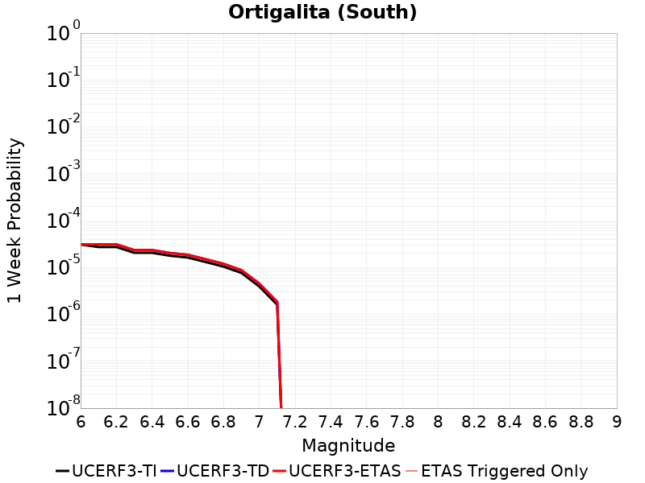 |  |  |  |

| Magnitude | 1 wk TI Prob | 1 wk TD Prob | 1 wk ETAS Prob | 1 wk ETAS/TD Gain | 1 wk ETAS Triggered Only | 1 mo TI Prob | 1 mo TD Prob | 1 mo ETAS Prob | 1 mo ETAS/TD Gain | 1 mo ETAS Triggered Only | 1 yr TI Prob | 1 yr TD Prob | 1 yr ETAS Prob | 1 yr ETAS/TD Gain | 1 yr ETAS Triggered Only | 10 yr TI Prob | 10 yr TD Prob | 10 yr ETAS Prob | 10 yr ETAS/TD Gain | 10 yr ETAS Triggered Only |
|-----|-----|-----|-----|-----|-----|-----|-----|-----|-----|-----|-----|-----|-----|-----|-----|-----|-----|-----|-----|-----|
| 6.0 | 3.08484E-5 | 3.1137053E-5 | 3.1137053E-5 | 1.0 | 0.0 | 1.3220073E-4 | 1.3343799E-4 | 1.3343799E-4 | 1.0 | 0.0 | 0.0016083556 | 0.00162345 | 0.00162345 | 1.0 | 0.0 | 0.015967647 | 0.01612155 | 0.016131388 | 1.0006102 | 1.0E-5 |
| 6.1 | 2.7299884E-5 | 3.1137053E-5 | 3.1137053E-5 | 1.0 | 0.0 | 1.16994255E-4 | 1.3343799E-4 | 1.3343799E-4 | 1.0 | 0.0 | 0.0014234743 | 0.00162345 | 0.00162345 | 1.0 | 0.0 | 0.014143906 | 0.01612155 | 0.016131388 | 1.0006102 | 1.0E-5 |
| 6.2 | 2.7299884E-5 | 3.1137053E-5 | 3.1137053E-5 | 1.0 | 0.0 | 1.16994255E-4 | 1.3343799E-4 | 1.3343799E-4 | 1.0 | 0.0 | 0.0014234743 | 0.00162345 | 0.00162345 | 1.0 | 0.0 | 0.014143906 | 0.01612155 | 0.016131388 | 1.0006102 | 1.0E-5 |
| 6.3 | 2.0546433E-5 | 2.3474624E-5 | 2.3474624E-5 | 1.0 | 0.0 | 8.805317E-5 | 1.00601756E-4 | 1.00601756E-4 | 1.0 | 0.0 | 0.00107152 | 0.0012241567 | 0.0012241567 | 1.0 | 0.0 | 0.010663681 | 0.012176153 | 0.012176153 | 1.0 | 0.0 |
| 6.4 | 2.0546433E-5 | 2.3474624E-5 | 2.3474624E-5 | 1.0 | 0.0 | 8.805317E-5 | 1.00601756E-4 | 1.00601756E-4 | 1.0 | 0.0 | 0.00107152 | 0.0012241567 | 0.0012241567 | 1.0 | 0.0 | 0.010663681 | 0.012176153 | 0.012176153 | 1.0 | 0.0 |
| 6.5 | 1.7779594E-5 | 2.0340698E-5 | 2.0340698E-5 | 1.0 | 0.0 | 7.619603E-5 | 8.717158E-5 | 8.717158E-5 | 1.0 | 0.0 | 9.272918E-4 | 0.0010608106 | 0.0010608106 | 1.0 | 0.0 | 0.009234319 | 0.010558914 | 0.010558914 | 1.0 | 0.0 |
| 6.6 | 1.6272212E-5 | 1.8628138E-5 | 1.8628138E-5 | 1.0 | 0.0 | 6.973618E-5 | 7.98325E-5 | 7.98325E-5 | 1.0 | 0.0 | 8.487073E-4 | 9.7153935E-4 | 9.7153935E-4 | 1.0 | 0.0 | 0.008454733 | 0.009674205 | 0.009674205 | 1.0 | 0.0 |
| 6.7 | 1.3051484E-5 | 1.4977926E-5 | 1.4977926E-5 | 1.0 | 0.0 | 5.593373E-5 | 6.418958E-5 | 6.418958E-5 | 1.0 | 0.0 | 6.807804E-4 | 7.812374E-4 | 7.812374E-4 | 1.0 | 0.0 | 0.006786986 | 0.007785883 | 0.007785883 | 1.0 | 0.0 |
| 6.8 | 1.04277415E-5 | 1.1941271E-5 | 1.1941271E-5 | 1.0 | 0.0 | 4.4689557E-5 | 5.1175914E-5 | 5.1175914E-5 | 1.0 | 0.0 | 5.439595E-4 | 6.2289595E-4 | 6.2289595E-4 | 1.0 | 0.0 | 0.0054262993 | 0.0062122466 | 0.0062122466 | 1.0 | 0.0 |
| 6.9 | 7.639968E-6 | 8.756911E-6 | 8.756911E-6 | 1.0 | 0.0 | 3.274231E-5 | 3.752911E-5 | 3.752911E-5 | 1.0 | 0.0 | 3.9856473E-4 | 4.568269E-4 | 4.568269E-4 | 1.0 | 0.0 | 0.003978506 | 0.0045594582 | 0.0045594582 | 1.0 | 0.0 |
| 7.0 | 3.919831E-6 | 4.5136003E-6 | 4.5136003E-6 | 1.0 | 0.0 | 1.679917E-5 | 1.934387E-5 | 1.934387E-5 | 1.0 | 0.0 | 2.045107E-4 | 2.3548826E-4 | 2.3548826E-4 | 1.0 | 0.0 | 0.0020432258 | 0.0023525935 | 0.0023525935 | 1.0 | 0.0 |
| 7.1 | 1.6017933E-6 | 1.8452196E-6 | 1.8452196E-6 | 1.0 | 0.0 | 6.8648105E-6 | 7.9080655E-6 | 7.9080655E-6 | 1.0 | 0.0 | 8.357586E-5 | 9.62775E-5 | 9.62775E-5 | 1.0 | 0.0 | 8.3544437E-4 | 9.6246105E-4 | 9.6246105E-4 | 1.0 | 0.0 |

## Red Pass
*[(top)](#table-of-contents)*

| 1 Week | 1 Month | 1 Year | 10 Year |
|-----|-----|-----|-----|
|  | 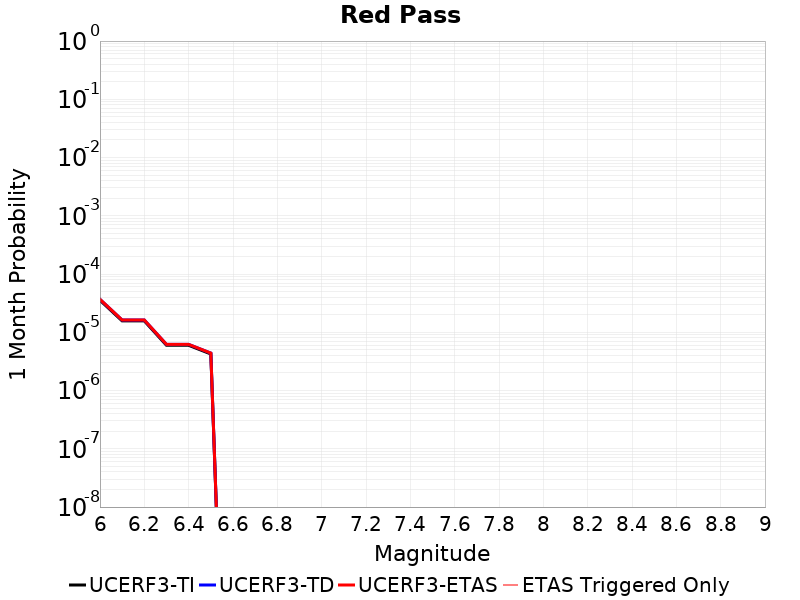 | 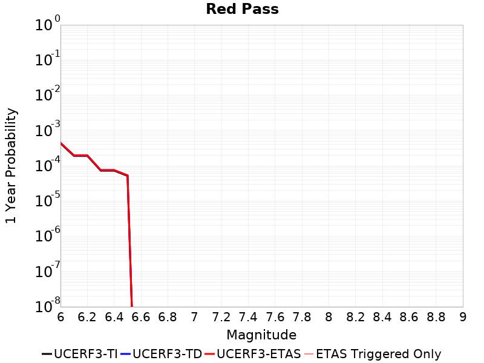 | 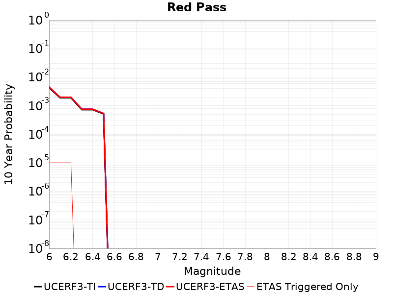 |

| Magnitude | 1 wk TI Prob | 1 wk TD Prob | 1 wk ETAS Prob | 1 wk ETAS/TD Gain | 1 wk ETAS Triggered Only | 1 mo TI Prob | 1 mo TD Prob | 1 mo ETAS Prob | 1 mo ETAS/TD Gain | 1 mo ETAS Triggered Only | 1 yr TI Prob | 1 yr TD Prob | 1 yr ETAS Prob | 1 yr ETAS/TD Gain | 1 yr ETAS Triggered Only | 10 yr TI Prob | 10 yr TD Prob | 10 yr ETAS Prob | 10 yr ETAS/TD Gain | 10 yr ETAS Triggered Only |
|-----|-----|-----|-----|-----|-----|-----|-----|-----|-----|-----|-----|-----|-----|-----|-----|-----|-----|-----|-----|-----|
| 6.0 | 8.258278E-6 | 8.562662E-6 | 8.562662E-6 | 1.0 | 0.0 | 3.539214E-5 | 3.6696707E-5 | 3.6696707E-5 | 1.0 | 0.0 | 4.308141E-4 | 4.4670876E-4 | 4.4670876E-4 | 1.0 | 0.0 | 0.0042997985 | 0.0044598705 | 0.004469826 | 1.0022322 | 1.0E-5 |
| 6.1 | 3.649988E-6 | 3.7801856E-6 | 3.7801856E-6 | 1.0 | 0.0 | 1.5642712E-5 | 1.6200722E-5 | 1.6200722E-5 | 1.0 | 0.0 | 1.9043336E-4 | 1.972307E-4 | 1.972307E-4 | 1.0 | 0.0 | 0.0019027026 | 0.0019710253 | 0.0019810055 | 1.0050635 | 1.0E-5 |
| 6.2 | 3.649988E-6 | 3.7801856E-6 | 3.7801856E-6 | 1.0 | 0.0 | 1.5642712E-5 | 1.6200722E-5 | 1.6200722E-5 | 1.0 | 0.0 | 1.9043336E-4 | 1.972307E-4 | 1.972307E-4 | 1.0 | 0.0 | 0.0019027026 | 0.0019710253 | 0.0019810055 | 1.0050635 | 1.0E-5 |
| 6.3 | 1.3924937E-6 | 1.4430069E-6 | 1.4430069E-6 | 1.0 | 0.0 | 5.9678164E-6 | 6.184309E-6 | 6.184309E-6 | 1.0 | 0.0 | 7.265574E-5 | 7.529277E-5 | 7.529277E-5 | 1.0 | 0.0 | 7.263199E-4 | 7.528118E-4 | 7.528118E-4 | 1.0 | 0.0 |
| 6.4 | 1.3924937E-6 | 1.4430069E-6 | 1.4430069E-6 | 1.0 | 0.0 | 5.9678164E-6 | 6.184309E-6 | 6.184309E-6 | 1.0 | 0.0 | 7.265574E-5 | 7.529277E-5 | 7.529277E-5 | 1.0 | 0.0 | 7.263199E-4 | 7.528118E-4 | 7.528118E-4 | 1.0 | 0.0 |
| 6.5 | 9.876812E-7 | 1.0235328E-6 | 1.0235328E-6 | 1.0 | 0.0 | 4.2329125E-6 | 4.3865693E-6 | 4.3865693E-6 | 1.0 | 0.0 | 5.153449E-5 | 5.3406482E-5 | 5.3406482E-5 | 1.0 | 0.0 | 5.1522546E-4 | 5.3406483E-4 | 5.3406483E-4 | 1.0 | 0.0 |

## South Klamath Lake West
*[(top)](#table-of-contents)*

| 1 Week | 1 Month | 1 Year | 10 Year |
|-----|-----|-----|-----|
|  |  |  |  |

| Magnitude | 1 wk TI Prob | 1 wk TD Prob | 1 wk ETAS Prob | 1 wk ETAS/TD Gain | 1 wk ETAS Triggered Only | 1 mo TI Prob | 1 mo TD Prob | 1 mo ETAS Prob | 1 mo ETAS/TD Gain | 1 mo ETAS Triggered Only | 1 yr TI Prob | 1 yr TD Prob | 1 yr ETAS Prob | 1 yr ETAS/TD Gain | 1 yr ETAS Triggered Only | 10 yr TI Prob | 10 yr TD Prob | 10 yr ETAS Prob | 10 yr ETAS/TD Gain | 10 yr ETAS Triggered Only |
|-----|-----|-----|-----|-----|-----|-----|-----|-----|-----|-----|-----|-----|-----|-----|-----|-----|-----|-----|-----|-----|
| 6.0 | 2.174025E-5 | 2.3093939E-5 | 2.3093939E-5 | 1.0 | 0.0 | 9.3169176E-5 | 9.897064E-5 | 9.897064E-5 | 1.0 | 0.0 | 0.0011337444 | 0.0012043676 | 0.0012143556 | 1.0082932 | 1.0E-5 | 0.011279777 | 0.011985039 | 0.011994919 | 1.0008243 | 1.0E-5 |
| 6.1 | 2.174025E-5 | 2.3093939E-5 | 2.3093939E-5 | 1.0 | 0.0 | 9.3169176E-5 | 9.897064E-5 | 9.897064E-5 | 1.0 | 0.0 | 0.0011337444 | 0.0012043676 | 0.0012143556 | 1.0082932 | 1.0E-5 | 0.011279777 | 0.011985039 | 0.011994919 | 1.0008243 | 1.0E-5 |
| 6.2 | 9.834929E-6 | 1.0416056E-5 | 1.0416056E-5 | 1.0 | 0.0 | 4.2149015E-5 | 4.4639528E-5 | 4.4639528E-5 | 1.0 | 0.0 | 5.1304343E-4 | 5.433598E-4 | 5.533544E-4 | 1.018394 | 1.0E-5 | 0.0051186057 | 0.0054212185 | 0.0054311645 | 1.0018346 | 1.0E-5 |
| 6.3 | 9.834929E-6 | 1.0416056E-5 | 1.0416056E-5 | 1.0 | 0.0 | 4.2149015E-5 | 4.4639528E-5 | 4.4639528E-5 | 1.0 | 0.0 | 5.1304343E-4 | 5.433598E-4 | 5.533544E-4 | 1.018394 | 1.0E-5 | 0.0051186057 | 0.0054212185 | 0.0054311645 | 1.0018346 | 1.0E-5 |
| 6.4 | 6.066321E-6 | 6.413684E-6 | 6.413684E-6 | 1.0 | 0.0 | 2.5998259E-5 | 2.7486942E-5 | 2.7486942E-5 | 1.0 | 0.0 | 3.1648282E-4 | 3.3460488E-4 | 3.4460152E-4 | 1.029876 | 1.0E-5 | 0.0031603249 | 0.003341282 | 0.0033512486 | 1.0029829 | 1.0E-5 |
| 6.5 | 6.066321E-6 | 6.413684E-6 | 6.413684E-6 | 1.0 | 0.0 | 2.5998259E-5 | 2.7486942E-5 | 2.7486942E-5 | 1.0 | 0.0 | 3.1648282E-4 | 3.3460488E-4 | 3.4460152E-4 | 1.029876 | 1.0E-5 | 0.0031603249 | 0.003341282 | 0.0033512486 | 1.0029829 | 1.0E-5 |
| 6.6 | 4.2321803E-6 | 4.4703706E-6 | 4.4703706E-6 | 1.0 | 0.0 | 1.8137789E-5 | 1.9158597E-5 | 1.9158597E-5 | 1.0 | 0.0 | 2.208052E-4 | 2.3323199E-4 | 2.4322965E-4 | 1.0428658 | 1.0E-5 | 0.0022058594 | 0.0023299744 | 0.002339951 | 1.0042819 | 1.0E-5 |
| 6.7 | 3.186646E-6 | 3.3671895E-6 | 3.3671895E-6 | 1.0 | 0.0 | 1.3656982E-5 | 1.4430736E-5 | 1.4430736E-5 | 1.0 | 0.0 | 1.6626107E-4 | 1.7568073E-4 | 1.8567897E-4 | 1.0569115 | 1.0E-5 | 0.0016613674 | 0.0017554859 | 0.0017654683 | 1.0056864 | 1.0E-5 |
| 6.8 | 2.380121E-6 | 2.5160941E-6 | 2.5160941E-6 | 1.0 | 0.0 | 1.0200479E-5 | 1.0783218E-5 | 1.0783218E-5 | 1.0 | 0.0 | 1.2418375E-4 | 1.3127824E-4 | 1.4127692E-4 | 1.0761641 | 1.0E-5 | 0.0012411437 | 0.001312053 | 0.0013220398 | 1.0076116 | 1.0E-5 |
| 6.9 | 8.928287E-7 | 9.4501826E-7 | 9.4501826E-7 | 1.0 | 0.0 | 3.826403E-6 | 4.050073E-6 | 4.050073E-6 | 1.0 | 0.0 | 4.658546E-5 | 4.930875E-5 | 4.930875E-5 | 1.0 | 0.0 | 4.6575698E-4 | 4.929998E-4 | 4.929998E-4 | 1.0 | 0.0 |

## Greenville (No) 2011 CFM
*[(top)](#table-of-contents)*

| 1 Week | 1 Month | 1 Year | 10 Year |
|-----|-----|-----|-----|
| 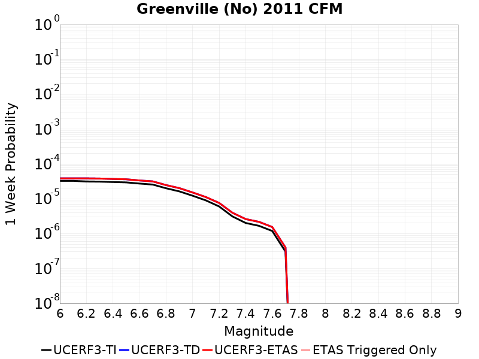 | 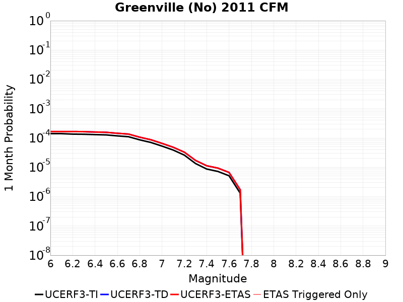 |  |  |

| Magnitude | 1 wk TI Prob | 1 wk TD Prob | 1 wk ETAS Prob | 1 wk ETAS/TD Gain | 1 wk ETAS Triggered Only | 1 mo TI Prob | 1 mo TD Prob | 1 mo ETAS Prob | 1 mo ETAS/TD Gain | 1 mo ETAS Triggered Only | 1 yr TI Prob | 1 yr TD Prob | 1 yr ETAS Prob | 1 yr ETAS/TD Gain | 1 yr ETAS Triggered Only | 10 yr TI Prob | 10 yr TD Prob | 10 yr ETAS Prob | 10 yr ETAS/TD Gain | 10 yr ETAS Triggered Only |
|-----|-----|-----|-----|-----|-----|-----|-----|-----|-----|-----|-----|-----|-----|-----|-----|-----|-----|-----|-----|-----|
| 6.0 | 3.2611348E-5 | 3.85245E-5 | 3.85245E-5 | 1.0 | 0.0 | 1.3975543E-4 | 1.6509477E-4 | 1.6509477E-4 | 1.0 | 0.0 | 0.0017001943 | 0.0020082123 | 0.0020181923 | 1.0049696 | 1.0E-5 | 0.01687245 | 0.01990451 | 0.01991431 | 1.0004925 | 1.0E-5 |
| 6.1 | 3.2611348E-5 | 3.85245E-5 | 3.85245E-5 | 1.0 | 0.0 | 1.3975543E-4 | 1.6509477E-4 | 1.6509477E-4 | 1.0 | 0.0 | 0.0017001943 | 0.0020082123 | 0.0020181923 | 1.0049696 | 1.0E-5 | 0.01687245 | 0.01990451 | 0.01991431 | 1.0004925 | 1.0E-5 |
| 6.2 | 3.144285E-5 | 3.85245E-5 | 3.85245E-5 | 1.0 | 0.0 | 1.347481E-4 | 1.6509477E-4 | 1.6509477E-4 | 1.0 | 0.0 | 0.0016393235 | 0.0020082123 | 0.0020181923 | 1.0049696 | 1.0E-5 | 0.016272832 | 0.01990451 | 0.01991431 | 1.0004925 | 1.0E-5 |
| 6.3 | 3.1108408E-5 | 3.8117523E-5 | 3.8117523E-5 | 1.0 | 0.0 | 1.3331493E-4 | 1.6335079E-4 | 1.6335079E-4 | 1.0 | 0.0 | 0.0016219008 | 0.0019870184 | 0.0019870184 | 1.0 | 0.0 | 0.016101142 | 0.01969635 | 0.01969635 | 1.0 | 0.0 |
| 6.4 | 3.0225197E-5 | 3.7043505E-5 | 3.7043505E-5 | 1.0 | 0.0 | 1.2953013E-4 | 1.5874841E-4 | 1.5874841E-4 | 1.0 | 0.0 | 0.0015758885 | 0.0019310849 | 0.0019310849 | 1.0 | 0.0 | 0.0156476 | 0.019146767 | 0.019146767 | 1.0 | 0.0 |
| 6.5 | 2.9534416E-5 | 3.620521E-5 | 3.620521E-5 | 1.0 | 0.0 | 1.2656992E-4 | 1.5515616E-4 | 1.5515616E-4 | 1.0 | 0.0 | 0.0015398995 | 0.0018874255 | 0.0018874255 | 1.0 | 0.0 | 0.015292724 | 0.018717604 | 0.018717604 | 1.0 | 0.0 |
| 6.6 | 2.7345395E-5 | 3.3544577E-5 | 3.3544577E-5 | 1.0 | 0.0 | 1.1718928E-4 | 1.4375472E-4 | 1.4375472E-4 | 1.0 | 0.0 | 0.0014258457 | 0.0017488394 | 0.0017488394 | 1.0 | 0.0 | 0.014167317 | 0.01735376 | 0.01735376 | 1.0 | 0.0 |
| 6.7 | 2.5615784E-5 | 3.152303E-5 | 3.152303E-5 | 1.0 | 0.0 | 1.09777306E-4 | 1.3509188E-4 | 1.3509188E-4 | 1.0 | 0.0 | 0.0013357193 | 0.001643533 | 0.001643533 | 1.0 | 0.0 | 0.013277191 | 0.016316624 | 0.016316624 | 1.0 | 0.0 |
| 6.8 | 2.0059057E-5 | 2.4720457E-5 | 2.4720457E-5 | 1.0 | 0.0 | 8.596455E-5 | 1.05940606E-4 | 1.05940606E-4 | 1.0 | 0.0 | 0.0010461159 | 0.0012890798 | 0.0012890798 | 1.0 | 0.0 | 0.0104120495 | 0.012817234 | 0.012817234 | 1.0 | 0.0 |
| 6.9 | 1.6321746E-5 | 2.0214511E-5 | 2.0214511E-5 | 1.0 | 0.0 | 6.9948466E-5 | 8.663081E-5 | 8.663081E-5 | 1.0 | 0.0 | 8.5128983E-4 | 0.001054232 | 0.001054232 | 1.0 | 0.0 | 0.008480361 | 0.010493032 | 0.010493032 | 1.0 | 0.0 |
| 7.0 | 1.22527645E-5 | 1.5178724E-5 | 1.5178724E-5 | 1.0 | 0.0 | 5.2510793E-5 | 6.505008E-5 | 6.505008E-5 | 1.0 | 0.0 | 6.3913135E-4 | 7.917012E-4 | 7.917012E-4 | 1.0 | 0.0 | 0.0063729626 | 0.00788892 | 0.00788892 | 1.0 | 0.0 |
| 7.1 | 8.996482E-6 | 1.1207954E-5 | 1.1207954E-5 | 1.0 | 0.0 | 3.8555783E-5 | 4.8033213E-5 | 4.8033213E-5 | 1.0 | 0.0 | 4.6931554E-4 | 5.846487E-4 | 5.846487E-4 | 1.0 | 0.0 | 0.004683256 | 0.005830911 | 0.005830911 | 1.0 | 0.0 |
| 7.2 | 6.0273087E-6 | 7.6002884E-6 | 7.6002884E-6 | 1.0 | 0.0 | 2.5831067E-5 | 3.257226E-5 | 3.257226E-5 | 1.0 | 0.0 | 3.1444785E-4 | 3.9649583E-4 | 3.9649583E-4 | 1.0 | 0.0 | 0.0031400328 | 0.003957925 | 0.003957925 | 1.0 | 0.0 |
| 7.3 | 3.1209995E-6 | 3.980458E-6 | 3.980458E-6 | 1.0 | 0.0 | 1.3375643E-5 | 1.7058996E-5 | 1.7058996E-5 | 1.0 | 0.0 | 1.6283628E-4 | 2.0767364E-4 | 2.0767364E-4 | 1.0 | 0.0 | 0.0016271701 | 0.0020747266 | 0.0020747266 | 1.0 | 0.0 |
| 7.4 | 2.0254208E-6 | 2.6179187E-6 | 2.6179187E-6 | 1.0 | 0.0 | 8.680347E-6 | 1.1219604E-5 | 1.1219604E-5 | 1.0 | 0.0 | 1.0567809E-4 | 1.3659017E-4 | 1.3659017E-4 | 1.0 | 0.0 | 0.0010562785 | 0.0013650967 | 0.0013650967 | 1.0 | 0.0 |
| 7.5 | 1.6763418E-6 | 2.180139E-6 | 2.180139E-6 | 1.0 | 0.0 | 7.184302E-6 | 9.34342E-6 | 9.34342E-6 | 1.0 | 0.0 | 8.746537E-5 | 1.1375026E-4 | 1.1375026E-4 | 1.0 | 0.0 | 8.743095E-4 | 0.0011369339 | 0.0011369339 | 1.0 | 0.0 |
| 7.6 | 1.1935462E-6 | 1.5505988E-6 | 1.5505988E-6 | 1.0 | 0.0 | 5.115188E-6 | 6.6454068E-6 | 6.6454068E-6 | 1.0 | 0.0 | 6.2275634E-5 | 8.0904865E-5 | 8.0904865E-5 | 1.0 | 0.0 | 6.2258187E-4 | 8.0875563E-4 | 8.0875563E-4 | 1.0 | 0.0 |
| 7.7 | 3.0464201E-7 | 3.994262E-7 | 3.994262E-7 | 1.0 | 0.0 | 1.3056081E-6 | 1.7118255E-6 | 1.7118255E-6 | 1.0 | 0.0 | 1.589566E-5 | 2.084128E-5 | 2.084128E-5 | 1.0 | 0.0 | 1.5894524E-4 | 2.0836094E-4 | 2.0836094E-4 | 1.0 | 0.0 |

