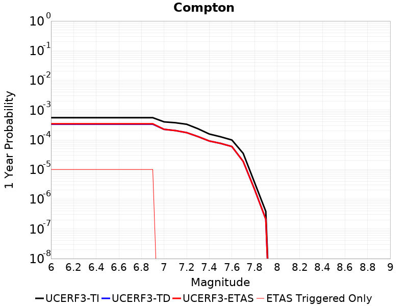

# Parent Section Magnitude-Probability Distributions

Only fault sections with at least one triggered aftershock are plotted. Sections are sorted by total supraseismogenic trigger rate (decreasing)

## Table Of Contents

* [Malibu Coast alt 1](#malibu-coast-alt-1)
* [Malibu Coast (Extension) alt 1](#malibu-coast-extension-alt-1)
* [Santa Monica alt 1](#santa-monica-alt-1)
* [Santa Ynez (West)](#santa-ynez-west)
* [Channel Islands Thrust](#channel-islands-thrust)
* [Anacapa-Dume alt 1](#anacapa-dume-alt-1)
* [Santa Cruz Island](#santa-cruz-island)
* [Hollywood](#hollywood)
* [Oceanside alt1](#oceanside-alt1)
* [Ventura-Pitas Point](#ventura-pitas-point)
* [Palos Verdes](#palos-verdes)
* [Pitas Point (Lower West)](#pitas-point-lower-west)
* [Lenwood-Lockhart-Old Woman Springs](#lenwood-lockhart-old-woman-springs)
* [Compton](#compton)
* [Oak Ridge (Onshore)](#oak-ridge-onshore)
* [Red Mountain](#red-mountain)
* [Raymond](#raymond)
* [Northridge](#northridge)
* [Pitas Point (Lower)-Montalvo](#pitas-point-lower-montalvo)

## Malibu Coast alt 1
*[(top)](#table-of-contents)*

| 1 Week | 1 Month | 1 Year | 10 Year |
|-----|-----|-----|-----|
|  |  |  |  |

| Magnitude | 1 wk TI Prob | 1 wk TD Prob | 1 wk ETAS Prob | 1 wk ETAS/TD Gain | 1 wk ETAS Triggered Only | 1 mo TI Prob | 1 mo TD Prob | 1 mo ETAS Prob | 1 mo ETAS/TD Gain | 1 mo ETAS Triggered Only | 1 yr TI Prob | 1 yr TD Prob | 1 yr ETAS Prob | 1 yr ETAS/TD Gain | 1 yr ETAS Triggered Only | 10 yr TI Prob | 10 yr TD Prob | 10 yr ETAS Prob | 10 yr ETAS/TD Gain | 10 yr ETAS Triggered Only |
|-----|-----|-----|-----|-----|-----|-----|-----|-----|-----|-----|-----|-----|-----|-----|-----|-----|-----|-----|-----|-----|
| 6.0 | 1.6572556E-5 | 1.7440892E-5 | 5.7440193E-5 | 3.2934208 | 4.0E-5 | 7.102331E-5 | 7.474464E-5 | 1.447394E-4 | 1.936452 | 7.0E-5 | 8.6436566E-4 | 9.0965437E-4 | 0.0010095633 | 1.1098318 | 1.0E-4 | 0.0086101135 | 0.00906118 | 0.009180092 | 1.0131233 | 1.2E-4 |
| 6.1 | 1.6572556E-5 | 1.7440892E-5 | 5.7440193E-5 | 3.2934208 | 4.0E-5 | 7.102331E-5 | 7.474464E-5 | 1.447394E-4 | 1.936452 | 7.0E-5 | 8.6436566E-4 | 9.0965437E-4 | 0.0010095633 | 1.1098318 | 1.0E-4 | 0.0086101135 | 0.00906118 | 0.009180092 | 1.0131233 | 1.2E-4 |
| 6.2 | 1.1085717E-5 | 1.1486333E-5 | 5.1485873E-5 | 4.4823594 | 4.0E-5 | 4.750935E-5 | 4.9226233E-5 | 1.1922279E-4 | 2.421936 | 7.0E-5 | 5.782728E-4 | 5.99168E-4 | 6.6912605E-4 | 1.1167587 | 7.0E-5 | 0.0057677035 | 0.005975887 | 0.006065349 | 1.0149705 | 9.0E-5 |
| 6.3 | 1.0208568E-5 | 1.0535621E-5 | 5.05352E-5 | 4.7966037 | 4.0E-5 | 4.375027E-5 | 4.5151897E-5 | 1.1514874E-4 | 2.5502524 | 7.0E-5 | 5.325294E-4 | 5.495885E-4 | 6.1955006E-4 | 1.127298 | 7.0E-5 | 0.0053125503 | 0.005482594 | 0.0055721006 | 1.0163256 | 9.0E-5 |
| 6.4 | 9.0682315E-6 | 9.302013E-6 | 2.9301826E-5 | 3.1500523 | 2.0E-5 | 3.8863272E-5 | 3.986517E-5 | 8.986318E-5 | 2.2541778 | 5.0E-5 | 4.730576E-4 | 4.8525233E-4 | 5.3522806E-4 | 1.1029892 | 5.0E-5 | 0.0047205184 | 0.0048421365 | 0.004901846 | 1.0123312 | 6.0E-5 |
| 6.5 | 7.605796E-6 | 7.724895E-6 | 2.7724742E-5 | 3.5890117 | 2.0E-5 | 3.259586E-5 | 3.3106284E-5 | 8.310463E-5 | 2.5102375 | 5.0E-5 | 3.9678233E-4 | 4.0299573E-4 | 4.529756E-4 | 1.1240208 | 5.0E-5 | 0.0039607463 | 0.004022784 | 0.004082543 | 1.014855 | 6.0E-5 |
| 6.6 | 5.889873E-6 | 5.875766E-6 | 1.5875707E-5 | 2.7018957 | 1.0E-5 | 2.5242069E-5 | 2.518161E-5 | 5.5180855E-5 | 2.1913157 | 3.0E-5 | 3.0727885E-4 | 3.0654308E-4 | 3.3653388E-4 | 1.0978355 | 3.0E-5 | 0.003068543 | 0.0030612152 | 0.0031010928 | 1.0130267 | 4.0E-5 |
| 6.7 | 5.66586E-6 | 5.639041E-6 | 1.5638985E-5 | 2.7733412 | 1.0E-5 | 2.428203E-5 | 2.4167093E-5 | 5.416637E-5 | 2.2413273 | 3.0E-5 | 2.955936E-4 | 2.9419473E-4 | 3.241859E-4 | 1.1019433 | 3.0E-5 | 0.0029520073 | 0.0029380647 | 0.0029779472 | 1.0135744 | 4.0E-5 |
| 6.8 | 5.521556E-6 | 5.4875377E-6 | 1.5487483E-5 | 2.822301 | 1.0E-5 | 2.3663597E-5 | 2.3517807E-5 | 5.3517102E-5 | 2.2755992 | 3.0E-5 | 2.880662E-4 | 2.8629176E-4 | 3.1628317E-4 | 1.1047583 | 3.0E-5 | 0.0028769306 | 0.002859241 | 0.0028991266 | 1.0139498 | 4.0E-5 |
| 6.9 | 5.29752E-6 | 5.249486E-6 | 1.5249434E-5 | 2.9049385 | 1.0E-5 | 2.270346E-5 | 2.2497605E-5 | 5.249693E-5 | 2.3334453 | 3.0E-5 | 2.7637955E-4 | 2.7387397E-4 | 3.0386576E-4 | 1.1095095 | 3.0E-5 | 0.0027603607 | 0.002735375 | 0.0027752656 | 1.0145832 | 4.0E-5 |
| 7.0 | 5.106743E-6 | 5.0483973E-6 | 1.50483465E-5 | 2.9808166 | 1.0E-5 | 2.1885859E-5 | 2.163581E-5 | 4.1635376E-5 | 1.9243734 | 2.0E-5 | 2.6642776E-4 | 2.6338422E-4 | 2.8337896E-4 | 1.0759147 | 2.0E-5 | 0.0026610855 | 0.0026307302 | 0.0026606512 | 1.0113736 | 3.0E-5 |
| 7.1 | 4.8469647E-6 | 4.7728186E-6 | 1.4772771E-5 | 3.0951881 | 1.0E-5 | 2.0772539E-5 | 2.0454776E-5 | 4.0454368E-5 | 1.9777467 | 2.0E-5 | 2.528763E-4 | 2.490085E-4 | 2.6900353E-4 | 1.0802985 | 2.0E-5 | 0.0025258875 | 0.002487303 | 0.0025172285 | 1.0120312 | 3.0E-5 |
| 7.2 | 4.545514E-6 | 4.451108E-6 | 1.4451063E-5 | 3.2466218 | 1.0E-5 | 1.9480629E-5 | 1.9076037E-5 | 3.9075654E-5 | 2.048416 | 2.0E-5 | 2.3715083E-4 | 2.3222606E-4 | 2.5222142E-4 | 1.086103 | 2.0E-5 | 0.0023689792 | 0.0023198414 | 0.002339795 | 1.0086013 | 2.0E-5 |
| 7.3 | 3.794097E-6 | 3.654501E-6 | 3.654501E-6 | 1.0 | 0.0 | 1.6260314E-5 | 1.5662052E-5 | 2.5661895E-5 | 1.6384759 | 1.0E-5 | 1.9795135E-4 | 1.9066884E-4 | 2.0066694E-4 | 1.052437 | 1.0E-5 | 0.001977751 | 0.0019050572 | 0.0019150381 | 1.0052391 | 1.0E-5 |
| 7.4 | 2.808217E-6 | 2.7212009E-6 | 2.7212009E-6 | 1.0 | 0.0 | 1.203516E-5 | 1.1662238E-5 | 2.1662121E-5 | 1.8574584 | 1.0E-5 | 1.4651821E-4 | 1.4197851E-4 | 1.5197709E-4 | 1.0704232 | 1.0E-5 | 0.0014642165 | 0.0014188808 | 0.0014288665 | 1.0070378 | 1.0E-5 |
| 7.5 | 1.83809E-6 | 1.8208093E-6 | 1.8208093E-6 | 1.0 | 0.0 | 7.877505E-6 | 7.803445E-6 | 1.7803368E-5 | 2.2814753 | 1.0E-5 | 9.59044E-5 | 9.500282E-5 | 1.0500187E-4 | 1.10525 | 1.0E-5 | 9.5863023E-4 | 9.496241E-4 | 9.596146E-4 | 1.0105205 | 1.0E-5 |
| 7.6 | 1.1292672E-6 | 1.1016409E-6 | 1.1016409E-6 | 1.0 | 0.0 | 4.839708E-6 | 4.7213093E-6 | 4.7213093E-6 | 1.0 | 0.0 | 5.8921847E-5 | 5.7480444E-5 | 5.7480444E-5 | 1.0 | 0.0 | 5.890623E-4 | 5.746574E-4 | 5.746574E-4 | 1.0 | 0.0 |
| 7.7 | 5.065272E-7 | 4.6198105E-7 | 4.6198105E-7 | 1.0 | 0.0 | 2.170829E-6 | 1.9799172E-6 | 1.9799172E-6 | 1.0 | 0.0 | 2.6429525E-5 | 2.4105238E-5 | 2.4105238E-5 | 1.0 | 0.0 | 2.642638E-4 | 2.4102736E-4 | 2.4102736E-4 | 1.0 | 0.0 |
| 7.8 | 8.952991E-8 | 6.759617E-8 | 6.759617E-8 | 1.0 | 0.0 | 3.8369956E-7 | 2.8969785E-7 | 2.8969785E-7 | 1.0 | 0.0 | 4.671532E-6 | 3.5270657E-6 | 3.5270657E-6 | 1.0 | 0.0 | 4.671434E-5 | 3.5270117E-5 | 3.5270117E-5 | 1.0 | 0.0 |
| 7.9 | 8.007447E-10 | 6.2134997E-10 | 6.2134997E-10 | 1.0 | 0.0 | 3.4317629E-9 | 2.6629283E-9 | 2.6629283E-9 | 1.0 | 0.0 | 4.1781714E-8 | 3.2421152E-8 | 3.2421152E-8 | 1.0 | 0.0 | 4.1781706E-7 | 3.242115E-7 | 3.242115E-7 | 1.0 | 0.0 |

## Malibu Coast (Extension) alt 1
*[(top)](#table-of-contents)*

| 1 Week | 1 Month | 1 Year | 10 Year |
|-----|-----|-----|-----|
|  |  |  |  |

| Magnitude | 1 wk TI Prob | 1 wk TD Prob | 1 wk ETAS Prob | 1 wk ETAS/TD Gain | 1 wk ETAS Triggered Only | 1 mo TI Prob | 1 mo TD Prob | 1 mo ETAS Prob | 1 mo ETAS/TD Gain | 1 mo ETAS Triggered Only | 1 yr TI Prob | 1 yr TD Prob | 1 yr ETAS Prob | 1 yr ETAS/TD Gain | 1 yr ETAS Triggered Only | 10 yr TI Prob | 10 yr TD Prob | 10 yr ETAS Prob | 10 yr ETAS/TD Gain | 10 yr ETAS Triggered Only |
|-----|-----|-----|-----|-----|-----|-----|-----|-----|-----|-----|-----|-----|-----|-----|-----|-----|-----|-----|-----|-----|
| 6.0 | 7.516028E-6 | 7.844765E-6 | 7.844765E-6 | 1.0 | 0.0 | 3.221115E-5 | 3.361999E-5 | 5.3619315E-5 | 1.5948642 | 2.0E-5 | 3.9210016E-4 | 4.0924712E-4 | 4.2923892E-4 | 1.0488502 | 2.0E-5 | 0.0039140903 | 0.004085005 | 0.004114882 | 1.007314 | 3.0E-5 |
| 6.1 | 7.199952E-6 | 7.5182115E-6 | 7.5182115E-6 | 1.0 | 0.0 | 3.0856572E-5 | 3.2220512E-5 | 5.2219868E-5 | 1.6207026 | 2.0E-5 | 3.75614E-4 | 3.9221472E-4 | 4.1220686E-4 | 1.0509725 | 2.0E-5 | 0.0037497976 | 0.003915291 | 0.003945173 | 1.0076323 | 3.0E-5 |
| 6.2 | 6.3721413E-6 | 6.658814E-6 | 6.658814E-6 | 1.0 | 0.0 | 2.7308892E-5 | 2.8537464E-5 | 4.8536895E-5 | 1.7008132 | 2.0E-5 | 3.3243504E-4 | 3.473886E-4 | 3.6738164E-4 | 1.0575525 | 2.0E-5 | 0.0033193815 | 0.0034684956 | 0.0034983915 | 1.0086193 | 3.0E-5 |
| 6.3 | 6.016345E-6 | 6.2888603E-6 | 6.2888603E-6 | 1.0 | 0.0 | 2.578408E-5 | 2.6951982E-5 | 4.6951445E-5 | 1.7420404 | 2.0E-5 | 3.1387596E-4 | 3.280913E-4 | 3.4808475E-4 | 1.0609386 | 2.0E-5 | 0.00313433 | 0.0032761055 | 0.003306007 | 1.0091273 | 3.0E-5 |
| 6.4 | 5.8104883E-6 | 6.0742063E-6 | 6.0742063E-6 | 1.0 | 0.0 | 2.4901856E-5 | 2.6032056E-5 | 4.6031535E-5 | 1.7682636 | 2.0E-5 | 3.031379E-4 | 3.168945E-4 | 3.3688816E-4 | 1.0630925 | 2.0E-5 | 0.0030272473 | 0.0031644609 | 0.0031943659 | 1.0094503 | 3.0E-5 |
| 6.5 | 5.476925E-6 | 5.723926E-6 | 5.723926E-6 | 1.0 | 0.0 | 2.3472323E-5 | 2.4530882E-5 | 4.4530392E-5 | 1.8152789 | 2.0E-5 | 2.8573806E-4 | 2.9862285E-4 | 3.1861686E-4 | 1.0669541 | 2.0E-5 | 0.0028537093 | 0.0029822476 | 0.0030121582 | 1.0100296 | 3.0E-5 |
| 6.6 | 5.222387E-6 | 5.4564616E-6 | 5.4564616E-6 | 1.0 | 0.0 | 2.2381464E-5 | 2.3384628E-5 | 4.338416E-5 | 1.8552427 | 2.0E-5 | 2.7246025E-4 | 2.846709E-4 | 3.0466524E-4 | 1.0702366 | 2.0E-5 | 0.0027212645 | 0.0028430934 | 0.0028730081 | 1.0105219 | 3.0E-5 |
| 6.7 | 5.0337076E-6 | 5.2581163E-6 | 5.2581163E-6 | 1.0 | 0.0 | 2.1572854E-5 | 2.253459E-5 | 4.253414E-5 | 1.8875045 | 2.0E-5 | 2.6261783E-4 | 2.7432438E-4 | 2.943189E-4 | 1.0728863 | 2.0E-5 | 0.002623077 | 0.0027398877 | 0.0027698055 | 1.0109193 | 3.0E-5 |
| 6.8 | 4.5675624E-6 | 4.7579924E-6 | 4.7579924E-6 | 1.0 | 0.0 | 1.9575122E-5 | 2.0391237E-5 | 4.039083E-5 | 1.9807935 | 2.0E-5 | 2.3830103E-4 | 2.482352E-4 | 2.6823024E-4 | 1.0805488 | 2.0E-5 | 0.0023804565 | 0.002479599 | 0.0025095246 | 1.0120687 | 3.0E-5 |
| 6.9 | 4.2802412E-6 | 4.4521153E-6 | 4.4521153E-6 | 1.0 | 0.0 | 1.8343762E-5 | 1.9080355E-5 | 3.9079972E-5 | 2.0481784 | 2.0E-5 | 2.2331243E-4 | 2.322787E-4 | 2.5227407E-4 | 1.0860834 | 2.0E-5 | 0.0022308815 | 0.002320376 | 0.0023503064 | 1.0128989 | 3.0E-5 |
| 7.0 | 3.9794063E-6 | 4.130079E-6 | 4.130079E-6 | 1.0 | 0.0 | 1.7054486E-5 | 1.7700218E-5 | 2.7700042E-5 | 1.5649548 | 1.0E-5 | 2.0761859E-4 | 2.1547898E-4 | 2.2547682E-4 | 1.0463983 | 1.0E-5 | 0.0020742472 | 0.002152714 | 0.002172671 | 1.0092705 | 2.0E-5 |
| 7.1 | 3.7730424E-6 | 3.911378E-6 | 3.911378E-6 | 1.0 | 0.0 | 1.6170083E-5 | 1.676294E-5 | 2.6762773E-5 | 1.596544 | 1.0E-5 | 1.9685295E-4 | 2.040698E-4 | 2.1406777E-4 | 1.0489929 | 1.0E-5 | 0.0019667868 | 0.002038837 | 0.0020587964 | 1.0097895 | 2.0E-5 |
| 7.2 | 3.424985E-6 | 3.5421003E-6 | 3.5421003E-6 | 1.0 | 0.0 | 1.4678424E-5 | 1.5180342E-5 | 2.518019E-5 | 1.6587367 | 1.0E-5 | 1.7869516E-4 | 1.848051E-4 | 1.9480326E-4 | 1.0541011 | 1.0E-5 | 0.0017855153 | 0.0018465263 | 0.0018565078 | 1.0054055 | 1.0E-5 |
| 7.3 | 2.6966375E-6 | 2.7598226E-6 | 2.7598226E-6 | 1.0 | 0.0 | 1.15569665E-5 | 1.1827758E-5 | 2.1827638E-5 | 1.8454589 | 1.0E-5 | 1.4069698E-4 | 1.4399347E-4 | 1.5399203E-4 | 1.0694376 | 1.0E-5 | 0.0014060794 | 0.0014390058 | 0.0014489915 | 1.0069393 | 1.0E-5 |
| 7.4 | 2.215957E-6 | 2.2498098E-6 | 2.2498098E-6 | 1.0 | 0.0 | 9.496924E-6 | 9.642006E-6 | 1.964191E-5 | 2.0371184 | 1.0E-5 | 1.1561892E-4 | 1.1738514E-4 | 1.2738397E-4 | 1.0851797 | 1.0E-5 | 0.0011555878 | 0.0011732351 | 0.0011832233 | 1.0085135 | 1.0E-5 |
| 7.5 | 1.2040218E-6 | 1.222199E-6 | 1.222199E-6 | 1.0 | 0.0 | 5.160083E-6 | 5.2379855E-6 | 1.5237933E-5 | 2.909121 | 1.0E-5 | 6.2822204E-5 | 6.3770625E-5 | 7.376999E-5 | 1.156802 | 1.0E-5 | 6.280445E-4 | 6.375251E-4 | 6.475187E-4 | 1.0156757 | 1.0E-5 |
| 7.6 | 6.6157446E-7 | 6.6823674E-7 | 6.6823674E-7 | 1.0 | 0.0 | 2.835316E-6 | 2.8638685E-6 | 2.8638685E-6 | 1.0 | 0.0 | 3.4519428E-5 | 3.486706E-5 | 3.486706E-5 | 1.0 | 0.0 | 3.4514067E-4 | 3.4861738E-4 | 3.4861738E-4 | 1.0 | 0.0 |
| 7.7 | 2.6012302E-7 | 2.4383294E-7 | 2.4383294E-7 | 1.0 | 0.0 | 1.1148124E-6 | 1.0449979E-6 | 1.0449979E-6 | 1.0 | 0.0 | 1.3572758E-5 | 1.2722787E-5 | 1.2722787E-5 | 1.0 | 0.0 | 1.3571928E-4 | 1.2722165E-4 | 1.2722165E-4 | 1.0 | 0.0 |
| 7.8 | 2.8323132E-8 | 2.0319769E-8 | 2.0319769E-8 | 1.0 | 0.0 | 1.2138484E-7 | 8.708472E-8 | 8.708472E-8 | 1.0 | 0.0 | 1.4778595E-6 | 1.060256E-6 | 1.060256E-6 | 1.0 | 0.0 | 1.4778497E-5 | 1.0602517E-5 | 1.0602517E-5 | 1.0 | 0.0 |

## Santa Monica alt 1
*[(top)](#table-of-contents)*

| 1 Week | 1 Month | 1 Year | 10 Year |
|-----|-----|-----|-----|
|  |  |  |  |

| Magnitude | 1 wk TI Prob | 1 wk TD Prob | 1 wk ETAS Prob | 1 wk ETAS/TD Gain | 1 wk ETAS Triggered Only | 1 mo TI Prob | 1 mo TD Prob | 1 mo ETAS Prob | 1 mo ETAS/TD Gain | 1 mo ETAS Triggered Only | 1 yr TI Prob | 1 yr TD Prob | 1 yr ETAS Prob | 1 yr ETAS/TD Gain | 1 yr ETAS Triggered Only | 10 yr TI Prob | 10 yr TD Prob | 10 yr ETAS Prob | 10 yr ETAS/TD Gain | 10 yr ETAS Triggered Only |
|-----|-----|-----|-----|-----|-----|-----|-----|-----|-----|-----|-----|-----|-----|-----|-----|-----|-----|-----|-----|-----|
| 6.0 | 1.1066008E-5 | 1.1502348E-5 | 2.1502234E-5 | 1.8693777 | 1.0E-5 | 4.742488E-5 | 4.9294926E-5 | 7.9293444E-5 | 1.608552 | 3.0E-5 | 5.7724497E-4 | 6.0001446E-4 | 6.299965E-4 | 1.0499688 | 3.0E-5 | 0.005757478 | 0.0059853415 | 0.0060151615 | 1.0049822 | 3.0E-5 |
| 6.1 | 1.1066008E-5 | 1.1502348E-5 | 2.1502234E-5 | 1.8693777 | 1.0E-5 | 4.742488E-5 | 4.9294926E-5 | 7.9293444E-5 | 1.608552 | 3.0E-5 | 5.7724497E-4 | 6.0001446E-4 | 6.299965E-4 | 1.0499688 | 3.0E-5 | 0.005757478 | 0.0059853415 | 0.0060151615 | 1.0049822 | 3.0E-5 |
| 6.2 | 1.1066008E-5 | 1.1502348E-5 | 2.1502234E-5 | 1.8693777 | 1.0E-5 | 4.742488E-5 | 4.9294926E-5 | 7.9293444E-5 | 1.608552 | 3.0E-5 | 5.7724497E-4 | 6.0001446E-4 | 6.299965E-4 | 1.0499688 | 3.0E-5 | 0.005757478 | 0.0059853415 | 0.0060151615 | 1.0049822 | 3.0E-5 |
| 6.3 | 1.1066008E-5 | 1.1502348E-5 | 2.1502234E-5 | 1.8693777 | 1.0E-5 | 4.742488E-5 | 4.9294926E-5 | 7.9293444E-5 | 1.608552 | 3.0E-5 | 5.7724497E-4 | 6.0001446E-4 | 6.299965E-4 | 1.0499688 | 3.0E-5 | 0.005757478 | 0.0059853415 | 0.0060151615 | 1.0049822 | 3.0E-5 |
| 6.4 | 1.1066008E-5 | 1.1502348E-5 | 2.1502234E-5 | 1.8693777 | 1.0E-5 | 4.742488E-5 | 4.9294926E-5 | 7.9293444E-5 | 1.608552 | 3.0E-5 | 5.7724497E-4 | 6.0001446E-4 | 6.299965E-4 | 1.0499688 | 3.0E-5 | 0.005757478 | 0.0059853415 | 0.0060151615 | 1.0049822 | 3.0E-5 |
| 6.5 | 8.183544E-6 | 8.346301E-6 | 1.8346218E-5 | 2.1981256 | 1.0E-5 | 3.5071862E-5 | 3.576938E-5 | 6.5768305E-5 | 1.8386762 | 3.0E-5 | 4.2691626E-4 | 4.3540678E-4 | 4.653937E-4 | 1.0688711 | 3.0E-5 | 0.0042609703 | 0.004345704 | 0.0043755732 | 1.0068734 | 3.0E-5 |
| 6.6 | 8.1543285E-6 | 8.3145105E-6 | 1.8314428E-5 | 2.2027066 | 1.0E-5 | 3.4946657E-5 | 3.563314E-5 | 6.563207E-5 | 1.841883 | 3.0E-5 | 4.2539247E-4 | 4.337487E-4 | 4.637357E-4 | 1.0691345 | 3.0E-5 | 0.0042457907 | 0.004329188 | 0.0043590576 | 1.0068997 | 3.0E-5 |
| 6.7 | 8.110878E-6 | 8.267945E-6 | 1.8267863E-5 | 2.2094803 | 1.0E-5 | 3.4760444E-5 | 3.543358E-5 | 6.543252E-5 | 1.8466245 | 3.0E-5 | 4.231262E-4 | 4.3132005E-4 | 4.613071E-4 | 1.0695239 | 3.0E-5 | 0.0042232145 | 0.0043049953 | 0.004334866 | 1.0069387 | 3.0E-5 |
| 6.8 | 7.644036E-6 | 7.761792E-6 | 1.7761715E-5 | 2.2883523 | 1.0E-5 | 3.275974E-5 | 3.326441E-5 | 5.3263742E-5 | 1.6012232 | 2.0E-5 | 3.9877684E-4 | 4.049203E-4 | 4.2491223E-4 | 1.0493724 | 2.0E-5 | 0.00398062 | 0.0040419726 | 0.0040618917 | 1.0049281 | 2.0E-5 |
| 6.9 | 7.3698293E-6 | 7.4674062E-6 | 1.7467331E-5 | 2.339143 | 1.0E-5 | 3.15846E-5 | 3.2002783E-5 | 5.2002146E-5 | 1.6249256 | 2.0E-5 | 3.8447464E-4 | 3.8956566E-4 | 4.0955786E-4 | 1.0513192 | 2.0E-5 | 0.0038381014 | 0.0038889719 | 0.003908894 | 1.0051228 | 2.0E-5 |
| 7.0 | 7.209872E-6 | 7.298448E-6 | 1.7298375E-5 | 2.3701444 | 1.0E-5 | 3.0899086E-5 | 3.1278694E-5 | 5.127807E-5 | 1.6393929 | 2.0E-5 | 3.7613141E-4 | 3.80753E-4 | 4.0074537E-4 | 1.0525075 | 2.0E-5 | 0.0037549543 | 0.0038011498 | 0.0038210738 | 1.0052415 | 2.0E-5 |
| 7.1 | 5.603456E-6 | 5.5323453E-6 | 1.553229E-5 | 2.8075416 | 1.0E-5 | 2.4014591E-5 | 2.370984E-5 | 4.3709366E-5 | 1.8435117 | 2.0E-5 | 2.923384E-4 | 2.8862944E-4 | 3.0862368E-4 | 1.069273 | 2.0E-5 | 0.0029195412 | 0.0028825877 | 0.0029025301 | 1.0069182 | 2.0E-5 |
| 7.2 | 4.7483613E-6 | 4.597267E-6 | 1.4597221E-5 | 3.1751952 | 1.0E-5 | 2.0349962E-5 | 1.9702426E-5 | 3.970203E-5 | 2.0150836 | 2.0E-5 | 2.4773262E-4 | 2.3985075E-4 | 2.5984595E-4 | 1.0833652 | 2.0E-5 | 0.0024745662 | 0.002395933 | 0.0024158852 | 1.0083275 | 2.0E-5 |
| 7.3 | 3.829015E-6 | 3.6393708E-6 | 3.6393708E-6 | 1.0 | 0.0 | 1.6409962E-5 | 1.559721E-5 | 2.5597055E-5 | 1.6411303 | 1.0E-5 | 1.9977297E-4 | 1.8987957E-4 | 1.9987767E-4 | 1.052655 | 1.0E-5 | 0.0019959346 | 0.0018971823 | 0.0019071633 | 1.005261 | 1.0E-5 |
| 7.4 | 2.610755E-6 | 2.503069E-6 | 2.503069E-6 | 1.0 | 0.0 | 1.1188902E-5 | 1.07273945E-5 | 2.0727288E-5 | 1.9321828 | 1.0E-5 | 1.3621636E-4 | 1.3059824E-4 | 1.4059694E-4 | 1.0765607 | 1.0E-5 | 0.001361329 | 0.0013052194 | 0.0013152064 | 1.0076516 | 1.0E-5 |
| 7.5 | 1.792146E-6 | 1.7609623E-6 | 1.7609623E-6 | 1.0 | 0.0 | 7.680603E-6 | 7.5469593E-6 | 1.7546883E-5 | 2.325027 | 1.0E-5 | 9.3507326E-5 | 9.1880385E-5 | 1.01879465E-4 | 1.1088271 | 1.0E-5 | 9.3467993E-4 | 9.184272E-4 | 9.28418E-4 | 1.0108782 | 1.0E-5 |
| 7.6 | 1.1473018E-6 | 1.1047233E-6 | 1.1047233E-6 | 1.0 | 0.0 | 4.9169985E-6 | 4.7345197E-6 | 4.7345197E-6 | 1.0 | 0.0 | 5.986281E-5 | 5.764127E-5 | 5.764127E-5 | 1.0 | 0.0 | 5.984669E-4 | 5.7626487E-4 | 5.7626487E-4 | 1.0 | 0.0 |
| 7.7 | 5.330919E-7 | 4.7591465E-7 | 4.7591465E-7 | 1.0 | 0.0 | 2.2846775E-6 | 2.0396326E-6 | 2.0396326E-6 | 1.0 | 0.0 | 2.7815593E-5 | 2.4832256E-5 | 2.4832256E-5 | 1.0 | 0.0 | 2.7812112E-4 | 2.4829595E-4 | 2.4829595E-4 | 1.0 | 0.0 |
| 7.8 | 1.1668574E-7 | 8.379592E-8 | 8.379592E-8 | 1.0 | 0.0 | 5.000816E-7 | 3.591253E-7 | 3.591253E-7 | 1.0 | 0.0 | 6.0884768E-6 | 4.372342E-6 | 4.372342E-6 | 1.0 | 0.0 | 6.08831E-5 | 4.3722594E-5 | 4.3722594E-5 | 1.0 | 0.0 |
| 7.9 | 8.007447E-10 | 6.2134997E-10 | 6.2134997E-10 | 1.0 | 0.0 | 3.4317629E-9 | 2.6629283E-9 | 2.6629283E-9 | 1.0 | 0.0 | 4.1781714E-8 | 3.2421152E-8 | 3.2421152E-8 | 1.0 | 0.0 | 4.1781706E-7 | 3.242115E-7 | 3.242115E-7 | 1.0 | 0.0 |

## Santa Ynez (West)
*[(top)](#table-of-contents)*

| 1 Week | 1 Month | 1 Year | 10 Year |
|-----|-----|-----|-----|
|  |  |  |  |

| Magnitude | 1 wk TI Prob | 1 wk TD Prob | 1 wk ETAS Prob | 1 wk ETAS/TD Gain | 1 wk ETAS Triggered Only | 1 mo TI Prob | 1 mo TD Prob | 1 mo ETAS Prob | 1 mo ETAS/TD Gain | 1 mo ETAS Triggered Only | 1 yr TI Prob | 1 yr TD Prob | 1 yr ETAS Prob | 1 yr ETAS/TD Gain | 1 yr ETAS Triggered Only | 10 yr TI Prob | 10 yr TD Prob | 10 yr ETAS Prob | 10 yr ETAS/TD Gain | 10 yr ETAS Triggered Only |
|-----|-----|-----|-----|-----|-----|-----|-----|-----|-----|-----|-----|-----|-----|-----|-----|-----|-----|-----|-----|-----|
| 6.0 | 4.7352758E-5 | 5.46354E-5 | 5.46354E-5 | 1.0 | 0.0 | 2.0292461E-4 | 2.341323E-4 | 2.341323E-4 | 1.0 | 0.0 | 0.0024678076 | 0.002847107 | 0.0028570783 | 1.0035024 | 1.0E-5 | 0.024405818 | 0.028134733 | 0.02815417 | 1.0006908 | 2.0E-5 |
| 6.1 | 4.7352758E-5 | 5.46354E-5 | 5.46354E-5 | 1.0 | 0.0 | 2.0292461E-4 | 2.341323E-4 | 2.341323E-4 | 1.0 | 0.0 | 0.0024678076 | 0.002847107 | 0.0028570783 | 1.0035024 | 1.0E-5 | 0.024405818 | 0.028134733 | 0.02815417 | 1.0006908 | 2.0E-5 |
| 6.2 | 3.0415853E-5 | 3.3876357E-5 | 3.3876357E-5 | 1.0 | 0.0 | 1.3034715E-4 | 1.4517653E-4 | 1.4517653E-4 | 1.0 | 0.0 | 0.0015858212 | 0.0017661271 | 0.0017761094 | 1.0056521 | 1.0E-5 | 0.015745522 | 0.017524969 | 0.017544618 | 1.0011213 | 2.0E-5 |
| 6.3 | 3.0415853E-5 | 3.3876357E-5 | 3.3876357E-5 | 1.0 | 0.0 | 1.3034715E-4 | 1.4517653E-4 | 1.4517653E-4 | 1.0 | 0.0 | 0.0015858212 | 0.0017661271 | 0.0017761094 | 1.0056521 | 1.0E-5 | 0.015745522 | 0.017524969 | 0.017544618 | 1.0011213 | 2.0E-5 |
| 6.4 | 2.5452082E-5 | 2.7914759E-5 | 2.7914759E-5 | 1.0 | 0.0 | 1.09075794E-4 | 1.1962931E-4 | 1.1962931E-4 | 1.0 | 0.0 | 0.0013271887 | 0.0014555327 | 0.0014655181 | 1.0068604 | 1.0E-5 | 0.013192902 | 0.014462193 | 0.014472049 | 1.0006814 | 1.0E-5 |
| 6.5 | 2.3143784E-5 | 2.5147963E-5 | 2.5147963E-5 | 1.0 | 0.0 | 9.9183875E-5 | 1.0777262E-4 | 1.0777262E-4 | 1.0 | 0.0 | 0.0012068948 | 0.0013113563 | 0.0013213432 | 1.0076157 | 1.0E-5 | 0.012003611 | 0.013037859 | 0.013047729 | 1.000757 | 1.0E-5 |
| 6.6 | 1.9118515E-5 | 2.0388952E-5 | 2.0388952E-5 | 1.0 | 0.0 | 8.193392E-5 | 8.737834E-5 | 8.737834E-5 | 1.0 | 0.0 | 9.97089E-4 | 0.0010633201 | 0.0010733095 | 1.0093945 | 1.0E-5 | 0.00992627 | 0.010583237 | 0.01059313 | 1.0009348 | 1.0E-5 |
| 6.7 | 1.722807E-5 | 1.8184654E-5 | 1.8184654E-5 | 1.0 | 0.0 | 7.3832496E-5 | 7.793193E-5 | 7.793193E-5 | 1.0 | 0.0 | 8.985399E-4 | 9.4841386E-4 | 9.5840433E-4 | 1.0105339 | 1.0E-5 | 0.008949154 | 0.009444309 | 0.009454215 | 1.0010488 | 1.0E-5 |
| 6.8 | 1.5317364E-5 | 1.5967527E-5 | 1.5967527E-5 | 1.0 | 0.0 | 6.56442E-5 | 6.843049E-5 | 6.843049E-5 | 1.0 | 0.0 | 7.98925E-4 | 8.3282706E-4 | 8.4281876E-4 | 1.0119973 | 1.0E-5 | 0.007960589 | 0.008297549 | 0.008307465 | 1.0011952 | 1.0E-5 |
| 6.9 | 1.3071226E-5 | 1.337337E-5 | 1.337337E-5 | 1.0 | 0.0 | 5.6018336E-5 | 5.7313195E-5 | 5.7313195E-5 | 1.0 | 0.0 | 6.8180985E-4 | 6.97567E-4 | 7.0756004E-4 | 1.0143255 | 1.0E-5 | 0.0067972173 | 0.0069540367 | 0.006963967 | 1.001428 | 1.0E-5 |
| 7.0 | 1.1836986E-5 | 1.19757715E-5 | 1.19757715E-5 | 1.0 | 0.0 | 5.0728955E-5 | 5.1323736E-5 | 5.1323736E-5 | 1.0 | 0.0 | 6.1745E-4 | 6.24689E-4 | 6.346828E-4 | 1.015998 | 1.0E-5 | 0.006157372 | 0.006229525 | 0.0062394626 | 1.0015953 | 1.0E-5 |
| 7.1 | 1.0597169E-5 | 1.0584353E-5 | 1.0584353E-5 | 1.0 | 0.0 | 4.541565E-5 | 4.5360728E-5 | 4.5360728E-5 | 1.0 | 0.0 | 5.5279525E-4 | 5.5212807E-4 | 5.6212256E-4 | 1.0181017 | 1.0E-5 | 0.0055142213 | 0.005507696 | 0.0055176406 | 1.0018057 | 1.0E-5 |
| 7.2 | 9.59113E-6 | 9.499172E-6 | 9.499172E-6 | 1.0 | 0.0 | 4.11042E-5 | 4.0710107E-5 | 4.0710107E-5 | 1.0 | 0.0 | 5.0032866E-4 | 4.955339E-4 | 5.0552894E-4 | 1.0201702 | 1.0E-5 | 0.004992037 | 0.0049444097 | 0.0049543604 | 1.0020125 | 1.0E-5 |
| 7.3 | 8.586084E-6 | 8.417191E-6 | 8.417191E-6 | 1.0 | 0.0 | 3.679698E-5 | 3.6073183E-5 | 3.6073183E-5 | 1.0 | 0.0 | 4.4791115E-4 | 4.3910352E-4 | 4.4909914E-4 | 1.0227637 | 1.0E-5 | 0.004470094 | 0.004382472 | 0.0043924283 | 1.0022718 | 1.0E-5 |
| 7.4 | 7.2622997E-6 | 6.9855146E-6 | 6.9855146E-6 | 1.0 | 0.0 | 3.112377E-5 | 2.9937582E-5 | 2.9937582E-5 | 1.0 | 0.0 | 3.78866E-4 | 3.6443007E-4 | 3.7442642E-4 | 1.02743 | 1.0E-5 | 0.0037822074 | 0.0036384263 | 0.00364839 | 1.0027385 | 1.0E-5 |
| 7.5 | 5.627296E-6 | 5.279017E-6 | 5.279017E-6 | 1.0 | 0.0 | 2.411676E-5 | 2.2624166E-5 | 2.2624166E-5 | 1.0 | 0.0 | 2.9358198E-4 | 2.7541514E-4 | 2.854124E-4 | 1.0362989 | 1.0E-5 | 0.0029319443 | 0.0027508114 | 0.0027607838 | 1.0036253 | 1.0E-5 |
| 7.6 | 2.265244E-6 | 2.0666935E-6 | 2.0666935E-6 | 1.0 | 0.0 | 9.708152E-6 | 8.857228E-6 | 8.857228E-6 | 1.0 | 0.0 | 1.18190335E-4 | 1.07831496E-4 | 1.1783042E-4 | 1.0927273 | 1.0E-5 | 0.001181275 | 0.0010778004 | 0.0010877897 | 1.0092682 | 1.0E-5 |
| 7.7 | 1.3099874E-6 | 1.1049043E-6 | 1.1049043E-6 | 1.0 | 0.0 | 5.61422E-6 | 4.7352955E-6 | 4.7352955E-6 | 1.0 | 0.0 | 6.8350986E-5 | 5.7650723E-5 | 6.765015E-5 | 1.1734483 | 1.0E-5 | 6.832996E-4 | 5.763601E-4 | 5.8635435E-4 | 1.0173403 | 1.0E-5 |
| 7.8 | 7.903951E-7 | 6.088046E-7 | 6.088046E-7 | 1.0 | 0.0 | 3.3874032E-6 | 2.60916E-6 | 2.60916E-6 | 1.0 | 0.0 | 4.1240855E-5 | 3.1766074E-5 | 4.1765757E-5 | 1.3147912 | 1.0E-5 | 4.12332E-4 | 3.1761668E-4 | 3.276135E-4 | 1.0314745 | 1.0E-5 |
| 7.9 | 7.0753297E-9 | 5.0991145E-9 | 5.0991145E-9 | 1.0 | 0.0 | 3.032284E-8 | 2.1853348E-8 | 2.1853348E-8 | 1.0 | 0.0 | 3.6918053E-7 | 2.660645E-7 | 2.660645E-7 | 1.0 | 0.0 | 3.691799E-6 | 2.6606426E-6 | 2.6606426E-6 | 1.0 | 0.0 |

## Channel Islands Thrust
*[(top)](#table-of-contents)*

| 1 Week | 1 Month | 1 Year | 10 Year |
|-----|-----|-----|-----|
|  |  |  |  |

| Magnitude | 1 wk TI Prob | 1 wk TD Prob | 1 wk ETAS Prob | 1 wk ETAS/TD Gain | 1 wk ETAS Triggered Only | 1 mo TI Prob | 1 mo TD Prob | 1 mo ETAS Prob | 1 mo ETAS/TD Gain | 1 mo ETAS Triggered Only | 1 yr TI Prob | 1 yr TD Prob | 1 yr ETAS Prob | 1 yr ETAS/TD Gain | 1 yr ETAS Triggered Only | 10 yr TI Prob | 10 yr TD Prob | 10 yr ETAS Prob | 10 yr ETAS/TD Gain | 10 yr ETAS Triggered Only |
|-----|-----|-----|-----|-----|-----|-----|-----|-----|-----|-----|-----|-----|-----|-----|-----|-----|-----|-----|-----|-----|
| 6.0 | 2.2156251E-5 | 2.4163928E-5 | 2.4163928E-5 | 1.0 | 0.0 | 9.495191E-5 | 1.0355619E-4 | 1.2355411E-4 | 1.1931119 | 2.0E-5 | 0.0011554264 | 0.0012601748 | 0.0012801496 | 1.0158508 | 2.0E-5 | 0.011494373 | 0.012540962 | 0.012570585 | 1.0023621 | 3.0E-5 |
| 6.1 | 2.2156251E-5 | 2.4163928E-5 | 2.4163928E-5 | 1.0 | 0.0 | 9.495191E-5 | 1.0355619E-4 | 1.2355411E-4 | 1.1931119 | 2.0E-5 | 0.0011554264 | 0.0012601748 | 0.0012801496 | 1.0158508 | 2.0E-5 | 0.011494373 | 0.012540962 | 0.012570585 | 1.0023621 | 3.0E-5 |
| 6.2 | 2.2156251E-5 | 2.4163928E-5 | 2.4163928E-5 | 1.0 | 0.0 | 9.495191E-5 | 1.0355619E-4 | 1.2355411E-4 | 1.1931119 | 2.0E-5 | 0.0011554264 | 0.0012601748 | 0.0012801496 | 1.0158508 | 2.0E-5 | 0.011494373 | 0.012540962 | 0.012570585 | 1.0023621 | 3.0E-5 |
| 6.3 | 2.2156251E-5 | 2.4163928E-5 | 2.4163928E-5 | 1.0 | 0.0 | 9.495191E-5 | 1.0355619E-4 | 1.2355411E-4 | 1.1931119 | 2.0E-5 | 0.0011554264 | 0.0012601748 | 0.0012801496 | 1.0158508 | 2.0E-5 | 0.011494373 | 0.012540962 | 0.012570585 | 1.0023621 | 3.0E-5 |
| 6.4 | 2.2156251E-5 | 2.4163928E-5 | 2.4163928E-5 | 1.0 | 0.0 | 9.495191E-5 | 1.0355619E-4 | 1.2355411E-4 | 1.1931119 | 2.0E-5 | 0.0011554264 | 0.0012601748 | 0.0012801496 | 1.0158508 | 2.0E-5 | 0.011494373 | 0.012540962 | 0.012570585 | 1.0023621 | 3.0E-5 |
| 6.5 | 2.2156251E-5 | 2.4163928E-5 | 2.4163928E-5 | 1.0 | 0.0 | 9.495191E-5 | 1.0355619E-4 | 1.2355411E-4 | 1.1931119 | 2.0E-5 | 0.0011554264 | 0.0012601748 | 0.0012801496 | 1.0158508 | 2.0E-5 | 0.011494373 | 0.012540962 | 0.012570585 | 1.0023621 | 3.0E-5 |
| 6.6 | 2.2156251E-5 | 2.4163928E-5 | 2.4163928E-5 | 1.0 | 0.0 | 9.495191E-5 | 1.0355619E-4 | 1.2355411E-4 | 1.1931119 | 2.0E-5 | 0.0011554264 | 0.0012601748 | 0.0012801496 | 1.0158508 | 2.0E-5 | 0.011494373 | 0.012540962 | 0.012570585 | 1.0023621 | 3.0E-5 |
| 6.7 | 1.0601296E-5 | 1.1401747E-5 | 1.1401747E-5 | 1.0 | 0.0 | 4.5433335E-5 | 4.886374E-5 | 6.886276E-5 | 1.4092815 | 2.0E-5 | 5.5301044E-4 | 5.947586E-4 | 6.147467E-4 | 1.0336071 | 2.0E-5 | 0.005516363 | 0.005932173 | 0.0059619956 | 1.0050272 | 3.0E-5 |
| 6.8 | 1.0246747E-5 | 1.1018447E-5 | 1.1018447E-5 | 1.0 | 0.0 | 4.391389E-5 | 4.722109E-5 | 6.722015E-5 | 1.4235196 | 2.0E-5 | 5.345204E-4 | 5.747699E-4 | 5.947584E-4 | 1.0347766 | 2.0E-5 | 0.0053323656 | 0.005733327 | 0.005763155 | 1.0052025 | 3.0E-5 |
| 6.9 | 9.049551E-6 | 9.718575E-6 | 9.718575E-6 | 1.0 | 0.0 | 3.878322E-5 | 4.1650394E-5 | 6.164956E-5 | 1.4801675 | 2.0E-5 | 4.7208337E-4 | 5.069797E-4 | 5.2696955E-4 | 1.0394293 | 2.0E-5 | 0.0047108172 | 0.0050586513 | 0.0050884993 | 1.0059004 | 3.0E-5 |
| 7.0 | 8.6542195E-6 | 9.292936E-6 | 9.292936E-6 | 1.0 | 0.0 | 3.7088983E-5 | 3.9826282E-5 | 4.9825885E-5 | 1.2510805 | 1.0E-5 | 4.5146482E-4 | 4.847812E-4 | 4.9477635E-4 | 1.0206178 | 1.0E-5 | 0.004505487 | 0.0048376517 | 0.004857555 | 1.0041143 | 2.0E-5 |
| 7.1 | 8.391028E-6 | 9.011116E-6 | 9.011116E-6 | 1.0 | 0.0 | 3.5961057E-5 | 3.861852E-5 | 4.8618134E-5 | 1.2589331 | 1.0E-5 | 4.3773788E-4 | 4.7008315E-4 | 4.8007845E-4 | 1.0212629 | 1.0E-5 | 0.004368766 | 0.004691301 | 0.004711207 | 1.0042433 | 2.0E-5 |
| 7.2 | 5.965188E-6 | 6.382426E-6 | 6.382426E-6 | 1.0 | 0.0 | 2.556484E-5 | 2.7352971E-5 | 3.7352696E-5 | 1.365581 | 1.0E-5 | 3.1120746E-4 | 3.329721E-4 | 3.4296876E-4 | 1.0300225 | 1.0E-5 | 0.00310772 | 0.0033247902 | 0.003334757 | 1.0029978 | 1.0E-5 |
| 7.3 | 4.877518E-6 | 5.2148393E-6 | 5.2148393E-6 | 1.0 | 0.0 | 2.0903482E-5 | 2.2349122E-5 | 3.23489E-5 | 1.4474349 | 1.0E-5 | 2.5447016E-4 | 2.7206706E-4 | 2.8206434E-4 | 1.0367457 | 1.0E-5 | 0.0025417898 | 0.0027173862 | 0.002727359 | 1.00367 | 1.0E-5 |
| 7.4 | 3.8829853E-6 | 4.148868E-6 | 4.148868E-6 | 1.0 | 0.0 | 1.664126E-5 | 1.7780743E-5 | 2.7780567E-5 | 1.5623962 | 1.0E-5 | 2.0258849E-4 | 2.1645948E-4 | 2.2645731E-4 | 1.046188 | 1.0E-5 | 0.002024039 | 0.0021625282 | 0.0021725066 | 1.0046142 | 1.0E-5 |
| 7.5 | 1.3489616E-6 | 1.4290296E-6 | 1.4290296E-6 | 1.0 | 0.0 | 5.7812517E-6 | 6.124398E-6 | 1.6124337E-5 | 2.6328034 | 1.0E-5 | 7.038446E-5 | 7.456204E-5 | 8.4561296E-5 | 1.1341065 | 1.0E-5 | 7.036218E-4 | 7.453742E-4 | 7.5536675E-4 | 1.013406 | 1.0E-5 |
| 7.6 | 6.058192E-7 | 6.3571633E-7 | 6.3571633E-7 | 1.0 | 0.0 | 2.5963652E-6 | 2.724496E-6 | 2.724496E-6 | 1.0 | 0.0 | 3.161029E-5 | 3.317025E-5 | 3.317025E-5 | 1.0 | 0.0 | 3.1605794E-4 | 3.316546E-4 | 3.316546E-4 | 1.0 | 0.0 |
| 7.7 | 2.2170494E-7 | 2.2627978E-7 | 2.2627978E-7 | 1.0 | 0.0 | 9.5016367E-7 | 9.697702E-7 | 9.697702E-7 | 1.0 | 0.0 | 1.1568181E-5 | 1.1806899E-5 | 1.1806899E-5 | 1.0 | 0.0 | 1.1567579E-4 | 1.18063836E-4 | 1.18063836E-4 | 1.0 | 0.0 |
| 7.8 | 2.1613102E-8 | 1.5498427E-8 | 1.5498427E-8 | 1.0 | 0.0 | 9.262757E-8 | 6.6421826E-8 | 6.6421826E-8 | 1.0 | 0.0 | 1.1277401E-6 | 8.086855E-7 | 8.086855E-7 | 1.0 | 0.0 | 1.1277344E-5 | 8.086834E-6 | 8.086834E-6 | 1.0 | 0.0 |

## Anacapa-Dume alt 1
*[(top)](#table-of-contents)*

| 1 Week | 1 Month | 1 Year | 10 Year |
|-----|-----|-----|-----|
|  |  |  |  |

| Magnitude | 1 wk TI Prob | 1 wk TD Prob | 1 wk ETAS Prob | 1 wk ETAS/TD Gain | 1 wk ETAS Triggered Only | 1 mo TI Prob | 1 mo TD Prob | 1 mo ETAS Prob | 1 mo ETAS/TD Gain | 1 mo ETAS Triggered Only | 1 yr TI Prob | 1 yr TD Prob | 1 yr ETAS Prob | 1 yr ETAS/TD Gain | 1 yr ETAS Triggered Only | 10 yr TI Prob | 10 yr TD Prob | 10 yr ETAS Prob | 10 yr ETAS/TD Gain | 10 yr ETAS Triggered Only |
|-----|-----|-----|-----|-----|-----|-----|-----|-----|-----|-----|-----|-----|-----|-----|-----|-----|-----|-----|-----|-----|
| 6.0 | 5.1871802E-6 | 5.374727E-6 | 5.374727E-6 | 1.0 | 0.0 | 2.2230583E-5 | 2.3034345E-5 | 3.3034114E-5 | 1.4341244 | 1.0E-5 | 2.7062374E-4 | 2.8040793E-4 | 3.0040232E-4 | 1.0713047 | 2.0E-5 | 0.002702944 | 0.0028006267 | 0.0028205705 | 1.0071212 | 2.0E-5 |
| 6.1 | 5.1871802E-6 | 5.374727E-6 | 5.374727E-6 | 1.0 | 0.0 | 2.2230583E-5 | 2.3034345E-5 | 3.3034114E-5 | 1.4341244 | 1.0E-5 | 2.7062374E-4 | 2.8040793E-4 | 3.0040232E-4 | 1.0713047 | 2.0E-5 | 0.002702944 | 0.0028006267 | 0.0028205705 | 1.0071212 | 2.0E-5 |
| 6.2 | 5.1871802E-6 | 5.374727E-6 | 5.374727E-6 | 1.0 | 0.0 | 2.2230583E-5 | 2.3034345E-5 | 3.3034114E-5 | 1.4341244 | 1.0E-5 | 2.7062374E-4 | 2.8040793E-4 | 3.0040232E-4 | 1.0713047 | 2.0E-5 | 0.002702944 | 0.0028006267 | 0.0028205705 | 1.0071212 | 2.0E-5 |
| 6.3 | 5.1871802E-6 | 5.374727E-6 | 5.374727E-6 | 1.0 | 0.0 | 2.2230583E-5 | 2.3034345E-5 | 3.3034114E-5 | 1.4341244 | 1.0E-5 | 2.7062374E-4 | 2.8040793E-4 | 3.0040232E-4 | 1.0713047 | 2.0E-5 | 0.002702944 | 0.0028006267 | 0.0028205705 | 1.0071212 | 2.0E-5 |
| 6.4 | 5.1871802E-6 | 5.374727E-6 | 5.374727E-6 | 1.0 | 0.0 | 2.2230583E-5 | 2.3034345E-5 | 3.3034114E-5 | 1.4341244 | 1.0E-5 | 2.7062374E-4 | 2.8040793E-4 | 3.0040232E-4 | 1.0713047 | 2.0E-5 | 0.002702944 | 0.0028006267 | 0.0028205705 | 1.0071212 | 2.0E-5 |
| 6.5 | 5.1871802E-6 | 5.374727E-6 | 5.374727E-6 | 1.0 | 0.0 | 2.2230583E-5 | 2.3034345E-5 | 3.3034114E-5 | 1.4341244 | 1.0E-5 | 2.7062374E-4 | 2.8040793E-4 | 3.0040232E-4 | 1.0713047 | 2.0E-5 | 0.002702944 | 0.0028006267 | 0.0028205705 | 1.0071212 | 2.0E-5 |
| 6.6 | 5.1871802E-6 | 5.374727E-6 | 5.374727E-6 | 1.0 | 0.0 | 2.2230583E-5 | 2.3034345E-5 | 3.3034114E-5 | 1.4341244 | 1.0E-5 | 2.7062374E-4 | 2.8040793E-4 | 3.0040232E-4 | 1.0713047 | 2.0E-5 | 0.002702944 | 0.0028006267 | 0.0028205705 | 1.0071212 | 2.0E-5 |
| 6.7 | 4.7693475E-6 | 4.9435116E-6 | 4.9435116E-6 | 1.0 | 0.0 | 2.04399E-5 | 2.118631E-5 | 3.11861E-5 | 1.4719929 | 1.0E-5 | 2.4882736E-4 | 2.5791355E-4 | 2.779084E-4 | 1.0775254 | 2.0E-5 | 0.0024854892 | 0.0025762185 | 0.002596167 | 1.0077434 | 2.0E-5 |
| 6.8 | 4.753408E-6 | 4.9270475E-6 | 4.9270475E-6 | 1.0 | 0.0 | 2.037159E-5 | 2.1115751E-5 | 3.1115538E-5 | 1.4735701 | 1.0E-5 | 2.4799586E-4 | 2.570547E-4 | 2.7704955E-4 | 1.0777844 | 2.0E-5 | 0.002477193 | 0.0025676498 | 0.0025875985 | 1.0077692 | 2.0E-5 |
| 6.9 | 3.800069E-6 | 3.9427514E-6 | 3.9427514E-6 | 1.0 | 0.0 | 1.6285909E-5 | 1.6897397E-5 | 2.6897229E-5 | 1.5917971 | 1.0E-5 | 1.9826289E-4 | 2.0570663E-4 | 2.1570457E-4 | 1.0486029 | 1.0E-5 | 0.001980861 | 0.002055186 | 0.0020651654 | 1.0048558 | 1.0E-5 |
| 7.0 | 3.6671938E-6 | 3.805385E-6 | 3.805385E-6 | 1.0 | 0.0 | 1.571645E-5 | 1.6308692E-5 | 2.630853E-5 | 1.61316 | 1.0E-5 | 1.9133097E-4 | 1.9854047E-4 | 2.0853848E-4 | 1.0503576 | 1.0E-5 | 0.0019116632 | 0.0019836542 | 0.0019936343 | 1.0050312 | 1.0E-5 |
| 7.1 | 3.2394885E-6 | 3.3637432E-6 | 3.3637432E-6 | 1.0 | 0.0 | 1.3883448E-5 | 1.4415963E-5 | 2.441582E-5 | 1.6936655 | 1.0E-5 | 1.6901788E-4 | 1.7550033E-4 | 1.8549857E-4 | 1.05697 | 1.0E-5 | 0.0016888938 | 0.0017536285 | 0.001763611 | 1.0056925 | 1.0E-5 |
| 7.2 | 3.0935948E-6 | 3.2127266E-6 | 3.2127266E-6 | 1.0 | 0.0 | 1.3258196E-5 | 1.3768756E-5 | 2.3768618E-5 | 1.726272 | 1.0E-5 | 1.6140658E-4 | 1.6762181E-4 | 1.7762014E-4 | 1.0596482 | 1.0E-5 | 0.001612894 | 0.0016749649 | 0.0016849481 | 1.0059602 | 1.0E-5 |
| 7.3 | 2.5604163E-6 | 2.650785E-6 | 2.650785E-6 | 1.0 | 0.0 | 1.0973167E-5 | 1.1360457E-5 | 2.1360343E-5 | 1.8802363 | 1.0E-5 | 1.3359012E-4 | 1.3830484E-4 | 1.4830346E-4 | 1.072294 | 1.0E-5 | 0.0013350984 | 0.0013821922 | 0.0013921785 | 1.0072249 | 1.0E-5 |
| 7.4 | 2.1429005E-6 | 2.2136314E-6 | 2.2136314E-6 | 1.0 | 0.0 | 9.1838265E-6 | 9.486957E-6 | 1.9486863E-5 | 2.0540688 | 1.0E-5 | 1.11807356E-4 | 1.15497605E-4 | 1.2549646E-4 | 1.0865719 | 1.0E-5 | 0.0011175112 | 0.0011543785 | 0.001164367 | 1.0086527 | 1.0E-5 |
| 7.5 | 1.7237151E-6 | 1.7786784E-6 | 1.7786784E-6 | 1.0 | 0.0 | 7.3873293E-6 | 7.6228853E-6 | 1.762281E-5 | 2.3118293 | 1.0E-5 | 8.993702E-5 | 9.28047E-5 | 1.0280377E-4 | 1.1077431 | 1.0E-5 | 8.990063E-4 | 9.276618E-4 | 9.376525E-4 | 1.0107698 | 1.0E-5 |
| 7.6 | 9.541696E-7 | 9.836835E-7 | 9.836835E-7 | 1.0 | 0.0 | 4.089292E-6 | 4.21578E-6 | 4.21578E-6 | 1.0 | 0.0 | 4.9785995E-5 | 5.1325926E-5 | 5.1325926E-5 | 1.0 | 0.0 | 4.9774844E-4 | 5.13142E-4 | 5.13142E-4 | 1.0 | 0.0 |
| 7.7 | 2.7226676E-7 | 2.7205624E-7 | 2.7205624E-7 | 1.0 | 0.0 | 1.166857E-6 | 1.1659548E-6 | 1.1659548E-6 | 1.0 | 0.0 | 1.4206392E-5 | 1.4195408E-5 | 1.4195408E-5 | 1.0 | 0.0 | 1.4205484E-4 | 1.4194509E-4 | 1.4194509E-4 | 1.0 | 0.0 |
| 7.8 | 4.5017995E-8 | 4.2210452E-8 | 4.2210452E-8 | 1.0 | 0.0 | 1.9293425E-7 | 1.8090192E-7 | 1.8090192E-7 | 1.0 | 0.0 | 2.348972E-6 | 2.2024788E-6 | 2.2024788E-6 | 1.0 | 0.0 | 2.348947E-5 | 2.2024591E-5 | 2.2024591E-5 | 1.0 | 0.0 |
| 7.9 | 8.007447E-10 | 6.2134997E-10 | 6.2134997E-10 | 1.0 | 0.0 | 3.4317629E-9 | 2.6629283E-9 | 2.6629283E-9 | 1.0 | 0.0 | 4.1781714E-8 | 3.2421152E-8 | 3.2421152E-8 | 1.0 | 0.0 | 4.1781706E-7 | 3.242115E-7 | 3.242115E-7 | 1.0 | 0.0 |

## Santa Cruz Island
*[(top)](#table-of-contents)*

| 1 Week | 1 Month | 1 Year | 10 Year |
|-----|-----|-----|-----|
|  |  |  |  |

| Magnitude | 1 wk TI Prob | 1 wk TD Prob | 1 wk ETAS Prob | 1 wk ETAS/TD Gain | 1 wk ETAS Triggered Only | 1 mo TI Prob | 1 mo TD Prob | 1 mo ETAS Prob | 1 mo ETAS/TD Gain | 1 mo ETAS Triggered Only | 1 yr TI Prob | 1 yr TD Prob | 1 yr ETAS Prob | 1 yr ETAS/TD Gain | 1 yr ETAS Triggered Only | 10 yr TI Prob | 10 yr TD Prob | 10 yr ETAS Prob | 10 yr ETAS/TD Gain | 10 yr ETAS Triggered Only |
|-----|-----|-----|-----|-----|-----|-----|-----|-----|-----|-----|-----|-----|-----|-----|-----|-----|-----|-----|-----|-----|
| 6.0 | 2.9164563E-5 | 3.169625E-5 | 3.169625E-5 | 1.0 | 0.0 | 1.2498499E-4 | 1.3583478E-4 | 1.4583343E-4 | 1.0736089 | 1.0E-5 | 0.0015206301 | 0.0016526713 | 0.0016626547 | 1.0060408 | 1.0E-5 | 0.015102667 | 0.016417652 | 0.016427489 | 1.0005991 | 1.0E-5 |
| 6.1 | 2.9164563E-5 | 3.169625E-5 | 3.169625E-5 | 1.0 | 0.0 | 1.2498499E-4 | 1.3583478E-4 | 1.4583343E-4 | 1.0736089 | 1.0E-5 | 0.0015206301 | 0.0016526713 | 0.0016626547 | 1.0060408 | 1.0E-5 | 0.015102667 | 0.016417652 | 0.016427489 | 1.0005991 | 1.0E-5 |
| 6.2 | 2.9164563E-5 | 3.169625E-5 | 3.169625E-5 | 1.0 | 0.0 | 1.2498499E-4 | 1.3583478E-4 | 1.4583343E-4 | 1.0736089 | 1.0E-5 | 0.0015206301 | 0.0016526713 | 0.0016626547 | 1.0060408 | 1.0E-5 | 0.015102667 | 0.016417652 | 0.016427489 | 1.0005991 | 1.0E-5 |
| 6.3 | 1.6635553E-5 | 1.7846345E-5 | 1.7846345E-5 | 1.0 | 0.0 | 7.1293274E-5 | 7.6482196E-5 | 8.648143E-5 | 1.1307393 | 1.0E-5 | 8.6765E-4 | 9.3079126E-4 | 9.4078196E-4 | 1.0107336 | 1.0E-5 | 0.008642701 | 0.009270811 | 0.009280719 | 1.0010687 | 1.0E-5 |
| 6.4 | 1.6635553E-5 | 1.7846345E-5 | 1.7846345E-5 | 1.0 | 0.0 | 7.1293274E-5 | 7.6482196E-5 | 8.648143E-5 | 1.1307393 | 1.0E-5 | 8.6765E-4 | 9.3079126E-4 | 9.4078196E-4 | 1.0107336 | 1.0E-5 | 0.008642701 | 0.009270811 | 0.009280719 | 1.0010687 | 1.0E-5 |
| 6.5 | 1.2238748E-5 | 1.30696135E-5 | 1.30696135E-5 | 1.0 | 0.0 | 5.2450723E-5 | 5.6011446E-5 | 6.6010885E-5 | 1.178525 | 1.0E-5 | 6.3840044E-4 | 6.817297E-4 | 6.917229E-4 | 1.0146586 | 1.0E-5 | 0.0063656955 | 0.0067967847 | 0.006806717 | 1.0014613 | 1.0E-5 |
| 6.6 | 1.0489767E-5 | 1.1177551E-5 | 1.1177551E-5 | 1.0 | 0.0 | 4.495537E-5 | 4.790292E-5 | 5.790244E-5 | 1.2087456 | 1.0E-5 | 5.4719415E-4 | 5.830642E-4 | 5.930584E-4 | 1.0171407 | 1.0E-5 | 0.005458487 | 0.0058155865 | 0.0058255284 | 1.0017095 | 1.0E-5 |
| 6.7 | 8.699222E-6 | 9.2523605E-6 | 9.2523605E-6 | 1.0 | 0.0 | 3.7281847E-5 | 3.9652376E-5 | 4.965198E-5 | 1.2521816 | 1.0E-5 | 4.5381195E-4 | 4.8266127E-4 | 4.926564E-4 | 1.0207084 | 1.0E-5 | 0.0045288634 | 0.004816198 | 0.00482615 | 1.0020664 | 1.0E-5 |
| 6.8 | 8.307732E-6 | 8.831412E-6 | 8.831412E-6 | 1.0 | 0.0 | 3.560408E-5 | 3.7848364E-5 | 4.7847985E-5 | 1.2642022 | 1.0E-5 | 4.3339343E-4 | 4.6070683E-4 | 4.7070222E-4 | 1.0216957 | 1.0E-5 | 0.004325492 | 0.0045975707 | 0.0046075247 | 1.0021651 | 1.0E-5 |
| 6.9 | 8.073121E-6 | 8.579035E-6 | 8.579035E-6 | 1.0 | 0.0 | 3.459863E-5 | 3.6766778E-5 | 4.676641E-5 | 1.2719747 | 1.0E-5 | 4.2115687E-4 | 4.47544E-4 | 4.575395E-4 | 1.0223342 | 1.0E-5 | 0.004203596 | 0.0044664787 | 0.004476434 | 1.0022289 | 1.0E-5 |
| 7.0 | 7.617019E-6 | 8.088583E-6 | 8.088583E-6 | 1.0 | 0.0 | 3.264396E-5 | 3.4664896E-5 | 4.466455E-5 | 1.2884663 | 1.0E-5 | 3.9736772E-4 | 4.2196378E-4 | 4.3195955E-4 | 1.0236887 | 1.0E-5 | 0.003966579 | 0.004211673 | 0.004221631 | 1.0023644 | 1.0E-5 |
| 7.1 | 7.1224836E-6 | 7.558937E-6 | 7.558937E-6 | 1.0 | 0.0 | 3.052457E-5 | 3.2395044E-5 | 4.239472E-5 | 1.3086792 | 1.0E-5 | 3.715733E-4 | 3.9433865E-4 | 4.043347E-4 | 1.0253489 | 1.0E-5 | 0.003709526 | 0.0039364323 | 0.003946393 | 1.0025303 | 1.0E-5 |
| 7.2 | 6.441115E-6 | 6.839313E-6 | 6.839313E-6 | 1.0 | 0.0 | 2.7604487E-5 | 2.9311012E-5 | 3.931072E-5 | 1.3411587 | 1.0E-5 | 3.360328E-4 | 3.568034E-4 | 3.667998E-4 | 1.0280167 | 1.0E-5 | 0.0033552512 | 0.0035623335 | 0.003572298 | 1.0027971 | 1.0E-5 |
| 7.3 | 5.494274E-6 | 5.829947E-6 | 5.829947E-6 | 1.0 | 0.0 | 2.3546674E-5 | 2.498525E-5 | 3.4984998E-5 | 1.4002261 | 1.0E-5 | 2.8664304E-4 | 3.0415313E-4 | 3.141501E-4 | 1.0328681 | 1.0E-5 | 0.002862736 | 0.003037392 | 0.0030473615 | 1.0032823 | 1.0E-5 |
| 7.4 | 4.0802624E-6 | 4.3191108E-6 | 4.3191108E-6 | 1.0 | 0.0 | 1.7486722E-5 | 1.8510344E-5 | 2.851016E-5 | 1.5402285 | 1.0E-5 | 2.1288003E-4 | 2.253402E-4 | 2.3533795E-4 | 1.0443673 | 1.0E-5 | 0.0021267622 | 0.002251126 | 0.0022611036 | 1.0044322 | 1.0E-5 |
| 7.5 | 2.3584746E-6 | 2.4791022E-6 | 2.4791022E-6 | 1.0 | 0.0 | 1.0107709E-5 | 1.0624681E-5 | 2.0624575E-5 | 1.9411948 | 1.0E-5 | 1.2305441E-4 | 1.2934786E-4 | 1.3934656E-4 | 1.0773009 | 1.0E-5 | 0.0012298629 | 0.0012927308 | 0.0013027178 | 1.0077256 | 1.0E-5 |
| 7.6 | 9.4981914E-7 | 9.874026E-7 | 9.874026E-7 | 1.0 | 0.0 | 4.0706473E-6 | 4.2317183E-6 | 4.2317183E-6 | 1.0 | 0.0 | 4.9559E-5 | 5.1519968E-5 | 5.1519968E-5 | 1.0 | 0.0 | 4.954795E-4 | 5.1508157E-4 | 5.1508157E-4 | 1.0 | 0.0 |
| 7.7 | 2.6013532E-7 | 2.6447307E-7 | 2.6447307E-7 | 1.0 | 0.0 | 1.1148652E-6 | 1.1334555E-6 | 1.1334555E-6 | 1.0 | 0.0 | 1.3573399E-5 | 1.3799734E-5 | 1.3799734E-5 | 1.0 | 0.0 | 1.357257E-4 | 1.3798884E-4 | 1.3798884E-4 | 1.0 | 0.0 |
| 7.8 | 4.1522263E-8 | 3.9698808E-8 | 3.9698808E-8 | 1.0 | 0.0 | 1.7795254E-7 | 1.7013774E-7 | 1.7013774E-7 | 1.0 | 0.0 | 2.16657E-6 | 2.0714251E-6 | 2.0714251E-6 | 1.0 | 0.0 | 2.1665488E-5 | 2.071408E-5 | 2.071408E-5 | 1.0 | 0.0 |
| 7.9 | 7.7242046E-10 | 5.9975824E-10 | 5.9975824E-10 | 1.0 | 0.0 | 3.3103735E-9 | 2.5703923E-9 | 2.5703923E-9 | 1.0 | 0.0 | 4.0303796E-8 | 3.1294526E-8 | 3.1294526E-8 | 1.0 | 0.0 | 4.030379E-7 | 3.1294525E-7 | 3.1294525E-7 | 1.0 | 0.0 |

## Hollywood
*[(top)](#table-of-contents)*

| 1 Week | 1 Month | 1 Year | 10 Year |
|-----|-----|-----|-----|
|  |  |  |  |

| Magnitude | 1 wk TI Prob | 1 wk TD Prob | 1 wk ETAS Prob | 1 wk ETAS/TD Gain | 1 wk ETAS Triggered Only | 1 mo TI Prob | 1 mo TD Prob | 1 mo ETAS Prob | 1 mo ETAS/TD Gain | 1 mo ETAS Triggered Only | 1 yr TI Prob | 1 yr TD Prob | 1 yr ETAS Prob | 1 yr ETAS/TD Gain | 1 yr ETAS Triggered Only | 10 yr TI Prob | 10 yr TD Prob | 10 yr ETAS Prob | 10 yr ETAS/TD Gain | 10 yr ETAS Triggered Only |
|-----|-----|-----|-----|-----|-----|-----|-----|-----|-----|-----|-----|-----|-----|-----|-----|-----|-----|-----|-----|-----|
| 6.0 | 1.24487615E-5 | 1.2608508E-5 | 2.2608381E-5 | 1.7931052 | 1.0E-5 | 5.3350745E-5 | 5.403537E-5 | 7.403429E-5 | 1.3701079 | 2.0E-5 | 6.4935174E-4 | 6.576867E-4 | 6.776735E-4 | 1.0303897 | 2.0E-5 | 0.0064745755 | 0.006557888 | 0.0065777567 | 1.0030297 | 2.0E-5 |
| 6.1 | 1.24487615E-5 | 1.2608508E-5 | 2.2608381E-5 | 1.7931052 | 1.0E-5 | 5.3350745E-5 | 5.403537E-5 | 7.403429E-5 | 1.3701079 | 2.0E-5 | 6.4935174E-4 | 6.576867E-4 | 6.776735E-4 | 1.0303897 | 2.0E-5 | 0.0064745755 | 0.006557888 | 0.0065777567 | 1.0030297 | 2.0E-5 |
| 6.2 | 1.24487615E-5 | 1.2608508E-5 | 2.2608381E-5 | 1.7931052 | 1.0E-5 | 5.3350745E-5 | 5.403537E-5 | 7.403429E-5 | 1.3701079 | 2.0E-5 | 6.4935174E-4 | 6.576867E-4 | 6.776735E-4 | 1.0303897 | 2.0E-5 | 0.0064745755 | 0.006557888 | 0.0065777567 | 1.0030297 | 2.0E-5 |
| 6.3 | 1.24487615E-5 | 1.2608508E-5 | 2.2608381E-5 | 1.7931052 | 1.0E-5 | 5.3350745E-5 | 5.403537E-5 | 7.403429E-5 | 1.3701079 | 2.0E-5 | 6.4935174E-4 | 6.576867E-4 | 6.776735E-4 | 1.0303897 | 2.0E-5 | 0.0064745755 | 0.006557888 | 0.0065777567 | 1.0030297 | 2.0E-5 |
| 6.4 | 1.2431024E-5 | 1.2589051E-5 | 2.2588925E-5 | 1.7943311 | 1.0E-5 | 5.327473E-5 | 5.3951986E-5 | 7.3950905E-5 | 1.37068 | 2.0E-5 | 6.4842677E-4 | 6.566721E-4 | 6.7665894E-4 | 1.0304366 | 2.0E-5 | 0.0064653796 | 0.0065478017 | 0.006567671 | 1.0030345 | 2.0E-5 |
| 6.5 | 1.1242222E-5 | 1.13486385E-5 | 2.1348525E-5 | 1.881153 | 1.0E-5 | 4.8180063E-5 | 4.8636128E-5 | 6.8635156E-5 | 1.411197 | 2.0E-5 | 5.864344E-4 | 5.919867E-4 | 6.1197486E-4 | 1.0337646 | 2.0E-5 | 0.0058488925 | 0.0059043863 | 0.005924268 | 1.0033673 | 2.0E-5 |
| 6.6 | 1.1234066E-5 | 1.1339721E-5 | 2.1339607E-5 | 1.881846 | 1.0E-5 | 4.8145106E-5 | 4.8597914E-5 | 6.859694E-5 | 1.4115202 | 2.0E-5 | 5.86009E-4 | 5.915217E-4 | 6.1150984E-4 | 1.0337911 | 2.0E-5 | 0.005844661 | 0.005899761 | 0.0059196427 | 1.0033699 | 2.0E-5 |
| 6.7 | 1.12294E-5 | 1.1334439E-5 | 2.1334325E-5 | 1.8822569 | 1.0E-5 | 4.812511E-5 | 4.8575275E-5 | 6.857431E-5 | 1.411712 | 2.0E-5 | 5.857657E-4 | 5.912462E-4 | 6.112344E-4 | 1.0338068 | 2.0E-5 | 0.0058422405 | 0.005897021 | 0.005916903 | 1.0033716 | 2.0E-5 |
| 6.8 | 1.0252819E-5 | 1.0245857E-5 | 2.0245754E-5 | 1.9759942 | 1.0E-5 | 4.3939912E-5 | 4.3910088E-5 | 5.3909647E-5 | 1.2277281 | 1.0E-5 | 5.3483713E-4 | 5.344763E-4 | 5.4447097E-4 | 1.0186999 | 1.0E-5 | 0.005335517 | 0.0053321365 | 0.005342083 | 1.0018654 | 1.0E-5 |
| 6.9 | 9.252289E-6 | 9.134465E-6 | 1.9134373E-5 | 2.094745 | 1.0E-5 | 3.9652066E-5 | 3.9147126E-5 | 4.9146736E-5 | 1.2554365 | 1.0E-5 | 4.8265693E-4 | 4.765137E-4 | 4.8650894E-4 | 1.0209757 | 1.0E-5 | 0.0048161 | 0.004755094 | 0.0047650463 | 1.002093 | 1.0E-5 |
| 7.0 | 8.474604E-6 | 8.280693E-6 | 1.828061E-5 | 2.2076185 | 1.0E-5 | 3.6319227E-5 | 3.5488207E-5 | 4.5487854E-5 | 1.2817737 | 1.0E-5 | 4.4209688E-4 | 4.3198472E-4 | 4.419804E-4 | 1.023139 | 1.0E-5 | 0.004412184 | 0.004311601 | 0.0043215584 | 1.0023093 | 1.0E-5 |
| 7.1 | 6.643643E-6 | 6.2857443E-6 | 1.6285681E-5 | 2.5908914 | 1.0E-5 | 2.8472443E-5 | 2.693863E-5 | 3.693836E-5 | 1.3712041 | 1.0E-5 | 3.4659685E-4 | 3.2792886E-4 | 3.379256E-4 | 1.0304844 | 1.0E-5 | 0.0034605677 | 0.0032744962 | 0.0032844634 | 1.0030439 | 1.0E-5 |
| 7.2 | 5.549002E-6 | 5.123273E-6 | 1.5123222E-5 | 2.9518673 | 1.0E-5 | 2.378122E-5 | 2.19567E-5 | 3.195648E-5 | 1.4554318 | 1.0E-5 | 2.8949787E-4 | 2.6729016E-4 | 2.772875E-4 | 1.0374025 | 1.0E-5 | 0.0028912104 | 0.0026697034 | 0.0026796767 | 1.0037358 | 1.0E-5 |
| 7.3 | 4.3059727E-6 | 3.972736E-6 | 3.972736E-6 | 1.0 | 0.0 | 1.8454039E-5 | 1.7025903E-5 | 1.7025903E-5 | 1.0 | 0.0 | 2.2465475E-4 | 2.0727073E-4 | 2.0727073E-4 | 1.0 | 0.0 | 0.0022442779 | 0.0020707843 | 0.0020707843 | 1.0 | 0.0 |
| 7.4 | 2.8550733E-6 | 2.711714E-6 | 2.711714E-6 | 1.0 | 0.0 | 1.2235971E-5 | 1.162158E-5 | 1.162158E-5 | 1.0 | 0.0 | 1.4896276E-4 | 1.414836E-4 | 1.414836E-4 | 1.0 | 0.0 | 0.0014886294 | 0.0014139403 | 0.0014139403 | 1.0 | 0.0 |
| 7.5 | 1.9927045E-6 | 1.9062892E-6 | 1.9062892E-6 | 1.0 | 0.0 | 8.540134E-6 | 8.169785E-6 | 8.169785E-6 | 1.0 | 0.0 | 1.0397117E-4 | 9.946263E-5 | 9.946263E-5 | 1.0 | 0.0 | 0.0010392254 | 9.941848E-4 | 9.941848E-4 | 1.0 | 0.0 |
| 7.6 | 1.345084E-6 | 1.2281513E-6 | 1.2281513E-6 | 1.0 | 0.0 | 5.764633E-6 | 5.263495E-6 | 5.263495E-6 | 1.0 | 0.0 | 7.018215E-5 | 6.408119E-5 | 6.408119E-5 | 1.0 | 0.0 | 7.0159987E-4 | 6.4062915E-4 | 6.4062915E-4 | 1.0 | 0.0 |
| 7.7 | 7.6835164E-7 | 6.3364547E-7 | 6.3364547E-7 | 1.0 | 0.0 | 3.2929315E-6 | 2.7156207E-6 | 2.7156207E-6 | 1.0 | 0.0 | 4.00907E-5 | 3.3062195E-5 | 3.3062195E-5 | 1.0 | 0.0 | 4.0083472E-4 | 3.3057426E-4 | 3.3057426E-4 | 1.0 | 0.0 |
| 7.8 | 3.6562128E-7 | 2.5070528E-7 | 2.5070528E-7 | 1.0 | 0.0 | 1.5669474E-6 | 1.0744508E-6 | 1.0744508E-6 | 1.0 | 0.0 | 1.9077417E-5 | 1.3081363E-5 | 1.3081363E-5 | 1.0 | 0.0 | 1.907578E-4 | 1.3080632E-4 | 1.3080632E-4 | 1.0 | 0.0 |
| 7.9 | 7.5024424E-8 | 5.630108E-8 | 5.630108E-8 | 1.0 | 0.0 | 3.215332E-7 | 2.412903E-7 | 2.412903E-7 | 1.0 | 0.0 | 3.91466E-6 | 2.9377072E-6 | 2.9377072E-6 | 1.0 | 0.0 | 3.9145907E-5 | 2.9376826E-5 | 2.9376826E-5 | 1.0 | 0.0 |

## Oceanside alt1
*[(top)](#table-of-contents)*

| 1 Week | 1 Month | 1 Year | 10 Year |
|-----|-----|-----|-----|
|  |  |  |  |

| Magnitude | 1 wk TI Prob | 1 wk TD Prob | 1 wk ETAS Prob | 1 wk ETAS/TD Gain | 1 wk ETAS Triggered Only | 1 mo TI Prob | 1 mo TD Prob | 1 mo ETAS Prob | 1 mo ETAS/TD Gain | 1 mo ETAS Triggered Only | 1 yr TI Prob | 1 yr TD Prob | 1 yr ETAS Prob | 1 yr ETAS/TD Gain | 1 yr ETAS Triggered Only | 10 yr TI Prob | 10 yr TD Prob | 10 yr ETAS Prob | 10 yr ETAS/TD Gain | 10 yr ETAS Triggered Only |
|-----|-----|-----|-----|-----|-----|-----|-----|-----|-----|-----|-----|-----|-----|-----|-----|-----|-----|-----|-----|-----|
| 6.0 | 1.1617542E-5 | 1.1428179E-5 | 1.1428179E-5 | 1.0 | 0.0 | 4.9788516E-5 | 4.8977083E-5 | 4.8977083E-5 | 1.0 | 0.0 | 6.060066E-4 | 5.96149E-4 | 5.96149E-4 | 1.0 | 0.0 | 0.0060435664 | 0.0059471033 | 0.0059570437 | 1.0016714 | 1.0E-5 |
| 6.1 | 1.1617542E-5 | 1.1428179E-5 | 1.1428179E-5 | 1.0 | 0.0 | 4.9788516E-5 | 4.8977083E-5 | 4.8977083E-5 | 1.0 | 0.0 | 6.060066E-4 | 5.96149E-4 | 5.96149E-4 | 1.0 | 0.0 | 0.0060435664 | 0.0059471033 | 0.0059570437 | 1.0016714 | 1.0E-5 |
| 6.2 | 1.1617542E-5 | 1.1428179E-5 | 1.1428179E-5 | 1.0 | 0.0 | 4.9788516E-5 | 4.8977083E-5 | 4.8977083E-5 | 1.0 | 0.0 | 6.060066E-4 | 5.96149E-4 | 5.96149E-4 | 1.0 | 0.0 | 0.0060435664 | 0.0059471033 | 0.0059570437 | 1.0016714 | 1.0E-5 |
| 6.3 | 1.1617542E-5 | 1.1428179E-5 | 1.1428179E-5 | 1.0 | 0.0 | 4.9788516E-5 | 4.8977083E-5 | 4.8977083E-5 | 1.0 | 0.0 | 6.060066E-4 | 5.96149E-4 | 5.96149E-4 | 1.0 | 0.0 | 0.0060435664 | 0.0059471033 | 0.0059570437 | 1.0016714 | 1.0E-5 |
| 6.4 | 1.1617542E-5 | 1.1428179E-5 | 1.1428179E-5 | 1.0 | 0.0 | 4.9788516E-5 | 4.8977083E-5 | 4.8977083E-5 | 1.0 | 0.0 | 6.060066E-4 | 5.96149E-4 | 5.96149E-4 | 1.0 | 0.0 | 0.0060435664 | 0.0059471033 | 0.0059570437 | 1.0016714 | 1.0E-5 |
| 6.5 | 1.1617542E-5 | 1.1428179E-5 | 1.1428179E-5 | 1.0 | 0.0 | 4.9788516E-5 | 4.8977083E-5 | 4.8977083E-5 | 1.0 | 0.0 | 6.060066E-4 | 5.96149E-4 | 5.96149E-4 | 1.0 | 0.0 | 0.0060435664 | 0.0059471033 | 0.0059570437 | 1.0016714 | 1.0E-5 |
| 6.6 | 7.561768E-6 | 7.1286427E-6 | 7.1286427E-6 | 1.0 | 0.0 | 3.2407173E-5 | 3.0550975E-5 | 3.0550975E-5 | 1.0 | 0.0 | 3.9448592E-4 | 3.718957E-4 | 3.718957E-4 | 1.0 | 0.0 | 0.0039378637 | 0.003712845 | 0.003712845 | 1.0 | 0.0 |
| 6.7 | 7.1042605E-6 | 6.651086E-6 | 6.651086E-6 | 1.0 | 0.0 | 3.0446476E-5 | 2.8504348E-5 | 2.8504348E-5 | 1.0 | 0.0 | 3.706228E-4 | 3.4698597E-4 | 3.4698597E-4 | 1.0 | 0.0 | 0.0037000529 | 0.0034645256 | 0.0034645256 | 1.0 | 0.0 |
| 6.8 | 6.285554E-6 | 5.793683E-6 | 5.793683E-6 | 1.0 | 0.0 | 2.693781E-5 | 2.4829838E-5 | 2.4829838E-5 | 1.0 | 0.0 | 3.2791847E-4 | 3.022619E-4 | 3.022619E-4 | 1.0 | 0.0 | 0.0032743502 | 0.0030185652 | 0.0030185652 | 1.0 | 0.0 |
| 6.9 | 6.148883E-6 | 5.650487E-6 | 5.650487E-6 | 1.0 | 0.0 | 2.635209E-5 | 2.421615E-5 | 2.421615E-5 | 1.0 | 0.0 | 3.2078946E-4 | 2.947923E-4 | 2.947923E-4 | 1.0 | 0.0 | 0.003203268 | 0.0029440694 | 0.0029440694 | 1.0 | 0.0 |
| 7.0 | 5.253857E-6 | 4.715353E-6 | 4.715353E-6 | 1.0 | 0.0 | 2.2516335E-5 | 2.0208501E-5 | 2.0208501E-5 | 1.0 | 0.0 | 2.7410188E-4 | 2.4601104E-4 | 2.4601104E-4 | 1.0 | 0.0 | 0.0027376404 | 0.0024574185 | 0.0024574185 | 1.0 | 0.0 |
| 7.1 | 4.730754E-6 | 4.1717512E-6 | 4.1717512E-6 | 1.0 | 0.0 | 2.0274503E-5 | 1.7878812E-5 | 1.7878812E-5 | 1.0 | 0.0 | 2.468141E-4 | 2.1765305E-4 | 2.1765305E-4 | 1.0 | 0.0 | 0.0024654015 | 0.0021744254 | 0.0021744254 | 1.0 | 0.0 |
| 7.2 | 3.7998386E-6 | 3.2089554E-6 | 3.2089554E-6 | 1.0 | 0.0 | 1.6284921E-5 | 1.3752594E-5 | 1.3752594E-5 | 1.0 | 0.0 | 1.9825088E-4 | 1.6742508E-4 | 1.6742508E-4 | 1.0 | 0.0 | 0.001980741 | 0.0016730017 | 0.0016730017 | 1.0 | 0.0 |
| 7.3 | 3.2656465E-6 | 2.6963667E-6 | 2.6963667E-6 | 1.0 | 0.0 | 1.3995553E-5 | 1.1555806E-5 | 1.1555806E-5 | 1.0 | 0.0 | 1.7038253E-4 | 1.4068297E-4 | 1.4068297E-4 | 1.0 | 0.0 | 0.0017025196 | 0.0014059502 | 0.0014059502 | 1.0 | 0.0 |
| 7.4 | 2.593703E-6 | 2.0712519E-6 | 2.0712519E-6 | 1.0 | 0.0 | 1.1115822E-5 | 8.876764E-6 | 8.876764E-6 | 1.0 | 0.0 | 1.3532673E-4 | 1.0806933E-4 | 1.0806933E-4 | 1.0 | 0.0 | 0.0013524436 | 0.0010801767 | 0.0010801767 | 1.0 | 0.0 |
| 7.5 | 1.8715585E-6 | 1.4165192E-6 | 1.4165192E-6 | 1.0 | 0.0 | 8.020941E-6 | 6.070783E-6 | 6.070783E-6 | 1.0 | 0.0 | 9.7650576E-5 | 7.390934E-5 | 7.390934E-5 | 1.0 | 0.0 | 9.7607676E-4 | 7.388537E-4 | 7.388537E-4 | 1.0 | 0.0 |
| 7.6 | 1.2246786E-6 | 8.5520526E-7 | 8.5520526E-7 | 1.0 | 0.0 | 5.248612E-6 | 3.6651606E-6 | 3.6651606E-6 | 1.0 | 0.0 | 6.389998E-5 | 4.4622462E-5 | 4.4622462E-5 | 1.0 | 0.0 | 6.3881604E-4 | 4.4613954E-4 | 4.4613954E-4 | 1.0 | 0.0 |
| 7.7 | 5.140719E-7 | 2.7436639E-7 | 2.7436639E-7 | 1.0 | 0.0 | 2.2031636E-6 | 1.1758555E-6 | 1.1758555E-6 | 1.0 | 0.0 | 2.6823185E-5 | 1.43159605E-5 | 1.43159605E-5 | 1.0 | 0.0 | 2.6819948E-4 | 1.4315174E-4 | 1.4315174E-4 | 1.0 | 0.0 |
| 7.8 | 1.16056995E-8 | 9.7881125E-9 | 9.7881125E-9 | 1.0 | 0.0 | 4.9738713E-8 | 4.1949054E-8 | 4.1949054E-8 | 1.0 | 0.0 | 6.0556863E-7 | 5.1072976E-7 | 5.1072976E-7 | 1.0 | 0.0 | 6.05567E-6 | 5.1072975E-6 | 5.1072975E-6 | 1.0 | 0.0 |

## Ventura-Pitas Point
*[(top)](#table-of-contents)*

| 1 Week | 1 Month | 1 Year | 10 Year |
|-----|-----|-----|-----|
|  |  |  |  |

| Magnitude | 1 wk TI Prob | 1 wk TD Prob | 1 wk ETAS Prob | 1 wk ETAS/TD Gain | 1 wk ETAS Triggered Only | 1 mo TI Prob | 1 mo TD Prob | 1 mo ETAS Prob | 1 mo ETAS/TD Gain | 1 mo ETAS Triggered Only | 1 yr TI Prob | 1 yr TD Prob | 1 yr ETAS Prob | 1 yr ETAS/TD Gain | 1 yr ETAS Triggered Only | 10 yr TI Prob | 10 yr TD Prob | 10 yr ETAS Prob | 10 yr ETAS/TD Gain | 10 yr ETAS Triggered Only |
|-----|-----|-----|-----|-----|-----|-----|-----|-----|-----|-----|-----|-----|-----|-----|-----|-----|-----|-----|-----|-----|
| 6.0 | 3.3179622E-5 | 3.3956032E-5 | 3.3956032E-5 | 1.0 | 0.0 | 1.4219063E-4 | 1.4551921E-4 | 1.4551921E-4 | 1.0 | 0.0 | 0.0017297962 | 0.0017705165 | 0.0017804988 | 1.0056381 | 1.0E-5 | 0.017163932 | 0.017589921 | 0.017599747 | 1.0005585 | 1.0E-5 |
| 6.1 | 3.3179622E-5 | 3.3956032E-5 | 3.3956032E-5 | 1.0 | 0.0 | 1.4219063E-4 | 1.4551921E-4 | 1.4551921E-4 | 1.0 | 0.0 | 0.0017297962 | 0.0017705165 | 0.0017804988 | 1.0056381 | 1.0E-5 | 0.017163932 | 0.017589921 | 0.017599747 | 1.0005585 | 1.0E-5 |
| 6.2 | 3.3179622E-5 | 3.3956032E-5 | 3.3956032E-5 | 1.0 | 0.0 | 1.4219063E-4 | 1.4551921E-4 | 1.4551921E-4 | 1.0 | 0.0 | 0.0017297962 | 0.0017705165 | 0.0017804988 | 1.0056381 | 1.0E-5 | 0.017163932 | 0.017589921 | 0.017599747 | 1.0005585 | 1.0E-5 |
| 6.3 | 3.3179622E-5 | 3.3956032E-5 | 3.3956032E-5 | 1.0 | 0.0 | 1.4219063E-4 | 1.4551921E-4 | 1.4551921E-4 | 1.0 | 0.0 | 0.0017297962 | 0.0017705165 | 0.0017804988 | 1.0056381 | 1.0E-5 | 0.017163932 | 0.017589921 | 0.017599747 | 1.0005585 | 1.0E-5 |
| 6.4 | 1.8754668E-5 | 1.7136366E-5 | 1.7136366E-5 | 1.0 | 0.0 | 8.037467E-5 | 7.343963E-5 | 7.343963E-5 | 1.0 | 0.0 | 9.781223E-4 | 8.9378405E-4 | 9.0377516E-4 | 1.0111784 | 1.0E-5 | 0.009738282 | 0.0089042215 | 0.008914133 | 1.001113 | 1.0E-5 |
| 6.5 | 1.8754668E-5 | 1.7136366E-5 | 1.7136366E-5 | 1.0 | 0.0 | 8.037467E-5 | 7.343963E-5 | 7.343963E-5 | 1.0 | 0.0 | 9.781223E-4 | 8.9378405E-4 | 9.0377516E-4 | 1.0111784 | 1.0E-5 | 0.009738282 | 0.0089042215 | 0.008914133 | 1.001113 | 1.0E-5 |
| 6.6 | 1.4361558E-5 | 1.2217073E-5 | 1.2217073E-5 | 1.0 | 0.0 | 6.154808E-5 | 5.2357846E-5 | 5.2357846E-5 | 1.0 | 0.0 | 7.490902E-4 | 6.3727266E-4 | 6.472663E-4 | 1.0156819 | 1.0E-5 | 0.0074657016 | 0.006354681 | 0.0063646175 | 1.0015637 | 1.0E-5 |
| 6.7 | 1.4361558E-5 | 1.2217073E-5 | 1.2217073E-5 | 1.0 | 0.0 | 6.154808E-5 | 5.2357846E-5 | 5.2357846E-5 | 1.0 | 0.0 | 7.490902E-4 | 6.3727266E-4 | 6.472663E-4 | 1.0156819 | 1.0E-5 | 0.0074657016 | 0.006354681 | 0.0063646175 | 1.0015637 | 1.0E-5 |
| 6.8 | 1.3663846E-5 | 1.1435726E-5 | 1.1435726E-5 | 1.0 | 0.0 | 5.8558027E-5 | 4.9009344E-5 | 4.9009344E-5 | 1.0 | 0.0 | 7.127108E-4 | 5.965274E-4 | 6.0652144E-4 | 1.0167537 | 1.0E-5 | 0.007104293 | 0.0059494493 | 0.0059593897 | 1.0016708 | 1.0E-5 |
| 6.9 | 1.3644157E-5 | 1.1413731E-5 | 1.1413731E-5 | 1.0 | 0.0 | 5.8473648E-5 | 4.8915084E-5 | 4.8915084E-5 | 1.0 | 0.0 | 7.116841E-4 | 5.953804E-4 | 6.053744E-4 | 1.016786 | 1.0E-5 | 0.007094092 | 0.0059380406 | 0.005947981 | 1.001674 | 1.0E-5 |
| 7.0 | 1.3568845E-5 | 1.1332647E-5 | 1.1332647E-5 | 1.0 | 0.0 | 5.8150898E-5 | 4.8567592E-5 | 4.8567592E-5 | 1.0 | 0.0 | 7.077572E-4 | 5.91152E-4 | 6.011461E-4 | 1.0169061 | 1.0E-5 | 0.007055073 | 0.0058959816 | 0.0059059225 | 1.0016861 | 1.0E-5 |
| 7.1 | 1.306572E-5 | 1.0806174E-5 | 1.0806174E-5 | 1.0 | 0.0 | 5.599474E-5 | 4.6311365E-5 | 4.6311365E-5 | 1.0 | 0.0 | 6.815227E-4 | 5.636969E-4 | 5.736913E-4 | 1.01773 | 1.0E-5 | 0.0067943637 | 0.005622847 | 0.0056327907 | 1.0017685 | 1.0E-5 |
| 7.2 | 1.232604E-5 | 1.0073721E-5 | 1.0073721E-5 | 1.0 | 0.0 | 5.2824813E-5 | 4.3172386E-5 | 4.3172386E-5 | 1.0 | 0.0 | 6.429523E-4 | 5.254988E-4 | 5.354936E-4 | 1.0190195 | 1.0E-5 | 0.0064109527 | 0.005242725 | 0.005252673 | 1.0018975 | 1.0E-5 |
| 7.3 | 1.0917261E-5 | 8.908765E-6 | 8.908765E-6 | 1.0 | 0.0 | 4.678742E-5 | 3.8179875E-5 | 3.8179875E-5 | 1.0 | 0.0 | 5.69488E-4 | 4.647424E-4 | 4.7473775E-4 | 1.0215073 | 1.0E-5 | 0.0056803077 | 0.004637841 | 0.0046477946 | 1.0021461 | 1.0E-5 |
| 7.4 | 1.039959E-5 | 8.48519E-6 | 8.48519E-6 | 1.0 | 0.0 | 4.456891E-5 | 3.6364603E-5 | 3.6364603E-5 | 1.0 | 0.0 | 5.424914E-4 | 4.4265063E-4 | 4.5264623E-4 | 1.0225812 | 1.0E-5 | 0.0054116896 | 0.0044178213 | 0.004427777 | 1.0022535 | 1.0E-5 |
| 7.5 | 9.015877E-6 | 7.3489273E-6 | 7.3489273E-6 | 1.0 | 0.0 | 3.86389E-5 | 3.149503E-5 | 3.149503E-5 | 1.0 | 0.0 | 4.7032707E-4 | 3.8338595E-4 | 3.9338213E-4 | 1.0260733 | 1.0E-5 | 0.004693329 | 0.003827361 | 0.0038373228 | 1.0026028 | 1.0E-5 |
| 7.6 | 4.900162E-6 | 3.890989E-6 | 3.890989E-6 | 1.0 | 0.0 | 2.1000526E-5 | 1.667556E-5 | 1.667556E-5 | 1.0 | 0.0 | 2.556514E-4 | 2.0300616E-4 | 2.1300414E-4 | 1.0492495 | 1.0E-5 | 0.0025535747 | 0.002028221 | 0.0020382006 | 1.0049205 | 1.0E-5 |
| 7.7 | 3.8850626E-6 | 3.139071E-6 | 3.139071E-6 | 1.0 | 0.0 | 1.6650163E-5 | 1.3453092E-5 | 1.3453092E-5 | 1.0 | 0.0 | 2.0269687E-4 | 1.6377917E-4 | 1.7377753E-4 | 1.0610478 | 1.0E-5 | 0.002025121 | 0.0016365941 | 0.0016465777 | 1.0061003 | 1.0E-5 |
| 7.8 | 2.4654719E-6 | 2.0374057E-6 | 2.0374057E-6 | 1.0 | 0.0 | 1.0566265E-5 | 8.731709E-6 | 8.731709E-6 | 1.0 | 0.0 | 1.2863669E-4 | 1.0630343E-4 | 1.1630236E-4 | 1.0940603 | 1.0E-5 | 0.0012856225 | 0.0010625306 | 0.0010725199 | 1.0094014 | 1.0E-5 |
| 7.9 | 4.095894E-7 | 3.287318E-7 | 3.287318E-7 | 1.0 | 0.0 | 1.7553821E-6 | 1.4088498E-6 | 1.4088498E-6 | 1.0 | 0.0 | 2.1371567E-5 | 1.7152615E-5 | 1.7152615E-5 | 1.0 | 0.0 | 2.1369511E-4 | 1.7151322E-4 | 1.7151322E-4 | 1.0 | 0.0 |
| 8.0 | 7.791402E-9 | 5.7097598E-9 | 5.7097598E-9 | 1.0 | 0.0 | 3.3391725E-8 | 2.4470399E-8 | 2.4470399E-8 | 1.0 | 0.0 | 4.0654416E-7 | 2.9792707E-7 | 2.9792707E-7 | 1.0 | 0.0 | 4.065434E-6 | 2.9792689E-6 | 2.9792689E-6 | 1.0 | 0.0 |

## Palos Verdes
*[(top)](#table-of-contents)*

| 1 Week | 1 Month | 1 Year | 10 Year |
|-----|-----|-----|-----|
|  |  |  |  |

| Magnitude | 1 wk TI Prob | 1 wk TD Prob | 1 wk ETAS Prob | 1 wk ETAS/TD Gain | 1 wk ETAS Triggered Only | 1 mo TI Prob | 1 mo TD Prob | 1 mo ETAS Prob | 1 mo ETAS/TD Gain | 1 mo ETAS Triggered Only | 1 yr TI Prob | 1 yr TD Prob | 1 yr ETAS Prob | 1 yr ETAS/TD Gain | 1 yr ETAS Triggered Only | 10 yr TI Prob | 10 yr TD Prob | 10 yr ETAS Prob | 10 yr ETAS/TD Gain | 10 yr ETAS Triggered Only |
|-----|-----|-----|-----|-----|-----|-----|-----|-----|-----|-----|-----|-----|-----|-----|-----|-----|-----|-----|-----|-----|
| 6.0 | 6.126063E-5 | 7.69503E-5 | 7.69503E-5 | 1.0 | 0.0 | 2.6251914E-4 | 3.2974876E-4 | 3.2974876E-4 | 1.0 | 0.0 | 0.0031914865 | 0.004007819 | 0.004007819 | 1.0 | 0.0 | 0.031460393 | 0.03941141 | 0.039421014 | 1.0002438 | 1.0E-5 |
| 6.1 | 6.126063E-5 | 7.69503E-5 | 7.69503E-5 | 1.0 | 0.0 | 2.6251914E-4 | 3.2974876E-4 | 3.2974876E-4 | 1.0 | 0.0 | 0.0031914865 | 0.004007819 | 0.004007819 | 1.0 | 0.0 | 0.031460393 | 0.03941141 | 0.039421014 | 1.0002438 | 1.0E-5 |
| 6.2 | 6.126063E-5 | 7.69503E-5 | 7.69503E-5 | 1.0 | 0.0 | 2.6251914E-4 | 3.2974876E-4 | 3.2974876E-4 | 1.0 | 0.0 | 0.0031914865 | 0.004007819 | 0.004007819 | 1.0 | 0.0 | 0.031460393 | 0.03941141 | 0.039421014 | 1.0002438 | 1.0E-5 |
| 6.3 | 4.0838047E-5 | 5.0175116E-5 | 5.0175116E-5 | 1.0 | 0.0 | 1.7500846E-4 | 2.1501978E-4 | 2.1501978E-4 | 1.0 | 0.0 | 0.0021286458 | 0.0026149312 | 0.0026149312 | 1.0 | 0.0 | 0.021083709 | 0.025863156 | 0.025863156 | 1.0 | 0.0 |
| 6.4 | 4.0838047E-5 | 5.0175116E-5 | 5.0175116E-5 | 1.0 | 0.0 | 1.7500846E-4 | 2.1501978E-4 | 2.1501978E-4 | 1.0 | 0.0 | 0.0021286458 | 0.0026149312 | 0.0026149312 | 1.0 | 0.0 | 0.021083709 | 0.025863156 | 0.025863156 | 1.0 | 0.0 |
| 6.5 | 3.0512005E-5 | 3.6847458E-5 | 3.6847458E-5 | 1.0 | 0.0 | 1.3075917E-4 | 1.579088E-4 | 1.579088E-4 | 1.0 | 0.0 | 0.0015908304 | 0.0019209617 | 0.0019209617 | 1.0 | 0.0 | 0.015794903 | 0.01905557 | 0.01905557 | 1.0 | 0.0 |
| 6.6 | 2.9255087E-5 | 3.5433684E-5 | 3.5433684E-5 | 1.0 | 0.0 | 1.2537291E-4 | 1.5185049E-4 | 1.5185049E-4 | 1.0 | 0.0 | 0.0015253464 | 0.0018473266 | 0.0018473266 | 1.0 | 0.0 | 0.015149189 | 0.018331379 | 0.018331379 | 1.0 | 0.0 |
| 6.7 | 2.287198E-5 | 2.7454238E-5 | 2.7454238E-5 | 1.0 | 0.0 | 9.801909E-5 | 1.1765624E-4 | 1.1765624E-4 | 1.0 | 0.0 | 0.001192729 | 0.0014316165 | 0.0014316165 | 1.0 | 0.0 | 0.011863477 | 0.014233318 | 0.014233318 | 1.0 | 0.0 |
| 6.8 | 2.1325764E-5 | 2.5625248E-5 | 2.5625248E-5 | 1.0 | 0.0 | 9.139293E-5 | 1.09818386E-4 | 1.09818386E-4 | 1.0 | 0.0 | 0.001112141 | 0.0013363104 | 0.0013363104 | 1.0 | 0.0 | 0.011065915 | 0.01329193 | 0.01329193 | 1.0 | 0.0 |
| 6.9 | 1.9009392E-5 | 2.2782964E-5 | 2.2782964E-5 | 1.0 | 0.0 | 8.1466285E-5 | 9.763812E-5 | 9.763812E-5 | 1.0 | 0.0 | 9.914007E-4 | 0.0011881846 | 0.0011881846 | 1.0 | 0.0 | 0.009869894 | 0.011827142 | 0.011827142 | 1.0 | 0.0 |
| 7.0 | 1.7098473E-5 | 2.0470736E-5 | 2.0470736E-5 | 1.0 | 0.0 | 7.3277115E-5 | 8.772926E-5 | 8.772926E-5 | 1.0 | 0.0 | 8.917837E-4 | 0.0010676669 | 0.0010676669 | 1.0 | 0.0 | 0.008882134 | 0.010633946 | 0.010633946 | 1.0 | 0.0 |
| 7.1 | 1.5982785E-5 | 1.9136347E-5 | 1.9136347E-5 | 1.0 | 0.0 | 6.849585E-5 | 8.201082E-5 | 8.201082E-5 | 1.0 | 0.0 | 8.336179E-4 | 9.981104E-4 | 9.981104E-4 | 1.0 | 0.0 | 0.008304977 | 0.009944773 | 0.009944773 | 1.0 | 0.0 |
| 7.2 | 1.4468002E-5 | 1.7325618E-5 | 1.7325618E-5 | 1.0 | 0.0 | 6.200425E-5 | 7.425101E-5 | 7.425101E-5 | 1.0 | 0.0 | 7.546402E-4 | 9.037165E-4 | 9.037165E-4 | 1.0 | 0.0 | 0.007520827 | 0.009008816 | 0.009008816 | 1.0 | 0.0 |
| 7.3 | 5.288233E-6 | 6.2468257E-6 | 6.2468257E-6 | 1.0 | 0.0 | 2.2663658E-5 | 2.6772035E-5 | 2.6772035E-5 | 1.0 | 0.0 | 2.7589512E-4 | 3.2593624E-4 | 3.2593624E-4 | 1.0 | 0.0 | 0.0027555283 | 0.00325806 | 0.00325806 | 1.0 | 0.0 |
| 7.4 | 8.279556E-7 | 8.413427E-7 | 8.413427E-7 | 1.0 | 0.0 | 3.5483763E-6 | 3.6057497E-6 | 3.6057497E-6 | 1.0 | 0.0 | 4.3200624E-5 | 4.3899192E-5 | 4.3899192E-5 | 1.0 | 0.0 | 4.3192226E-4 | 4.3891245E-4 | 4.3891245E-4 | 1.0 | 0.0 |
| 7.5 | 6.559831E-7 | 6.671468E-7 | 6.671468E-7 | 1.0 | 0.0 | 2.8113532E-6 | 2.859198E-6 | 2.859198E-6 | 1.0 | 0.0 | 3.4227687E-5 | 3.4810248E-5 | 3.4810248E-5 | 1.0 | 0.0 | 3.4222414E-4 | 3.4805457E-4 | 3.4805457E-4 | 1.0 | 0.0 |
| 7.6 | 3.5018968E-7 | 3.5643748E-7 | 3.5643748E-7 | 1.0 | 0.0 | 1.500812E-6 | 1.5275886E-6 | 1.5275886E-6 | 1.0 | 0.0 | 1.8272232E-5 | 1.8598279E-5 | 1.8598279E-5 | 1.0 | 0.0 | 1.8270731E-4 | 1.8597183E-4 | 1.8597183E-4 | 1.0 | 0.0 |
| 7.7 | 1.1986104E-7 | 1.2206723E-7 | 1.2206723E-7 | 1.0 | 0.0 | 5.1369005E-7 | 5.2314516E-7 | 5.2314516E-7 | 1.0 | 0.0 | 6.2541585E-6 | 6.369274E-6 | 6.369274E-6 | 1.0 | 0.0 | 6.2539824E-5 | 6.369096E-5 | 6.369096E-5 | 1.0 | 0.0 |
| 7.8 | 3.0445005E-8 | 3.105064E-8 | 3.105064E-8 | 1.0 | 0.0 | 1.3047858E-7 | 1.3307415E-7 | 1.3307415E-7 | 1.0 | 0.0 | 1.5885756E-6 | 1.6201769E-6 | 1.6201769E-6 | 1.0 | 0.0 | 1.5885644E-5 | 1.6201671E-5 | 1.6201671E-5 | 1.0 | 0.0 |

## Pitas Point (Lower West)
*[(top)](#table-of-contents)*

| 1 Week | 1 Month | 1 Year | 10 Year |
|-----|-----|-----|-----|
|  |  |  |  |

| Magnitude | 1 wk TI Prob | 1 wk TD Prob | 1 wk ETAS Prob | 1 wk ETAS/TD Gain | 1 wk ETAS Triggered Only | 1 mo TI Prob | 1 mo TD Prob | 1 mo ETAS Prob | 1 mo ETAS/TD Gain | 1 mo ETAS Triggered Only | 1 yr TI Prob | 1 yr TD Prob | 1 yr ETAS Prob | 1 yr ETAS/TD Gain | 1 yr ETAS Triggered Only | 10 yr TI Prob | 10 yr TD Prob | 10 yr ETAS Prob | 10 yr ETAS/TD Gain | 10 yr ETAS Triggered Only |
|-----|-----|-----|-----|-----|-----|-----|-----|-----|-----|-----|-----|-----|-----|-----|-----|-----|-----|-----|-----|-----|
| 6.0 | 8.151497E-6 | 7.877736E-6 | 7.877736E-6 | 1.0 | 0.0 | 3.493452E-5 | 3.376129E-5 | 3.376129E-5 | 1.0 | 0.0 | 4.252448E-4 | 4.1096695E-4 | 4.2096284E-4 | 1.0243229 | 1.0E-5 | 0.0042443196 | 0.0041021504 | 0.0041121095 | 1.0024277 | 1.0E-5 |
| 6.1 | 8.151497E-6 | 7.877736E-6 | 7.877736E-6 | 1.0 | 0.0 | 3.493452E-5 | 3.376129E-5 | 3.376129E-5 | 1.0 | 0.0 | 4.252448E-4 | 4.1096695E-4 | 4.2096284E-4 | 1.0243229 | 1.0E-5 | 0.0042443196 | 0.0041021504 | 0.0041121095 | 1.0024277 | 1.0E-5 |
| 6.2 | 8.151497E-6 | 7.877736E-6 | 7.877736E-6 | 1.0 | 0.0 | 3.493452E-5 | 3.376129E-5 | 3.376129E-5 | 1.0 | 0.0 | 4.252448E-4 | 4.1096695E-4 | 4.2096284E-4 | 1.0243229 | 1.0E-5 | 0.0042443196 | 0.0041021504 | 0.0041121095 | 1.0024277 | 1.0E-5 |
| 6.3 | 8.151497E-6 | 7.877736E-6 | 7.877736E-6 | 1.0 | 0.0 | 3.493452E-5 | 3.376129E-5 | 3.376129E-5 | 1.0 | 0.0 | 4.252448E-4 | 4.1096695E-4 | 4.2096284E-4 | 1.0243229 | 1.0E-5 | 0.0042443196 | 0.0041021504 | 0.0041121095 | 1.0024277 | 1.0E-5 |
| 6.4 | 8.151497E-6 | 7.877736E-6 | 7.877736E-6 | 1.0 | 0.0 | 3.493452E-5 | 3.376129E-5 | 3.376129E-5 | 1.0 | 0.0 | 4.252448E-4 | 4.1096695E-4 | 4.2096284E-4 | 1.0243229 | 1.0E-5 | 0.0042443196 | 0.0041021504 | 0.0041121095 | 1.0024277 | 1.0E-5 |
| 6.5 | 8.151497E-6 | 7.877736E-6 | 7.877736E-6 | 1.0 | 0.0 | 3.493452E-5 | 3.376129E-5 | 3.376129E-5 | 1.0 | 0.0 | 4.252448E-4 | 4.1096695E-4 | 4.2096284E-4 | 1.0243229 | 1.0E-5 | 0.0042443196 | 0.0041021504 | 0.0041121095 | 1.0024277 | 1.0E-5 |
| 6.6 | 8.151497E-6 | 7.877736E-6 | 7.877736E-6 | 1.0 | 0.0 | 3.493452E-5 | 3.376129E-5 | 3.376129E-5 | 1.0 | 0.0 | 4.252448E-4 | 4.1096695E-4 | 4.2096284E-4 | 1.0243229 | 1.0E-5 | 0.0042443196 | 0.0041021504 | 0.0041121095 | 1.0024277 | 1.0E-5 |
| 6.7 | 8.151497E-6 | 7.877736E-6 | 7.877736E-6 | 1.0 | 0.0 | 3.493452E-5 | 3.376129E-5 | 3.376129E-5 | 1.0 | 0.0 | 4.252448E-4 | 4.1096695E-4 | 4.2096284E-4 | 1.0243229 | 1.0E-5 | 0.0042443196 | 0.0041021504 | 0.0041121095 | 1.0024277 | 1.0E-5 |
| 6.8 | 8.151497E-6 | 7.877736E-6 | 7.877736E-6 | 1.0 | 0.0 | 3.493452E-5 | 3.376129E-5 | 3.376129E-5 | 1.0 | 0.0 | 4.252448E-4 | 4.1096695E-4 | 4.2096284E-4 | 1.0243229 | 1.0E-5 | 0.0042443196 | 0.0041021504 | 0.0041121095 | 1.0024277 | 1.0E-5 |
| 6.9 | 8.151497E-6 | 7.877736E-6 | 7.877736E-6 | 1.0 | 0.0 | 3.493452E-5 | 3.376129E-5 | 3.376129E-5 | 1.0 | 0.0 | 4.252448E-4 | 4.1096695E-4 | 4.2096284E-4 | 1.0243229 | 1.0E-5 | 0.0042443196 | 0.0041021504 | 0.0041121095 | 1.0024277 | 1.0E-5 |
| 7.0 | 8.103535E-6 | 7.827064E-6 | 7.827064E-6 | 1.0 | 0.0 | 3.4728975E-5 | 3.3544133E-5 | 3.3544133E-5 | 1.0 | 0.0 | 4.2274324E-4 | 4.08324E-4 | 4.1831992E-4 | 1.0244803 | 1.0E-5 | 0.0042193993 | 0.004075818 | 0.004085778 | 1.0024436 | 1.0E-5 |
| 7.1 | 7.853298E-6 | 7.5621897E-6 | 7.5621897E-6 | 1.0 | 0.0 | 3.3656554E-5 | 3.2408985E-5 | 3.2408985E-5 | 1.0 | 0.0 | 4.096915E-4 | 3.9450868E-4 | 4.045047E-4 | 1.0253379 | 1.0E-5 | 0.00408937 | 0.00393816 | 0.0039481204 | 1.0025293 | 1.0E-5 |
| 7.2 | 7.771102E-6 | 7.4742707E-6 | 7.4742707E-6 | 1.0 | 0.0 | 3.33043E-5 | 3.20322E-5 | 3.20322E-5 | 1.0 | 0.0 | 4.0540437E-4 | 3.8992293E-4 | 3.9991905E-4 | 1.0256361 | 1.0E-5 | 0.0040466557 | 0.0038924639 | 0.003902425 | 1.0025591 | 1.0E-5 |
| 7.3 | 7.3945344E-6 | 7.069319E-6 | 7.069319E-6 | 1.0 | 0.0 | 3.1690477E-5 | 3.0296733E-5 | 3.0296733E-5 | 1.0 | 0.0 | 3.8576324E-4 | 3.6880092E-4 | 3.7879724E-4 | 1.0271049 | 1.0E-5 | 0.0038509427 | 0.0036819568 | 0.00369192 | 1.0027059 | 1.0E-5 |
| 7.4 | 6.964645E-6 | 6.609058E-6 | 6.609058E-6 | 1.0 | 0.0 | 2.9848137E-5 | 2.8324228E-5 | 2.8324228E-5 | 1.0 | 0.0 | 3.6334046E-4 | 3.447934E-4 | 3.5478995E-4 | 1.0289929 | 1.0E-5 | 0.0036274698 | 0.003442638 | 0.0034526037 | 1.0028948 | 1.0E-5 |
| 7.5 | 6.6525035E-6 | 6.277436E-6 | 6.277436E-6 | 1.0 | 0.0 | 2.851042E-5 | 2.6903024E-5 | 2.6903024E-5 | 1.0 | 0.0 | 3.4705905E-4 | 3.2749557E-4 | 3.374923E-4 | 1.0305247 | 1.0E-5 | 0.0034651754 | 0.0032701814 | 0.0032801486 | 1.003048 | 1.0E-5 |
| 7.6 | 5.613338E-6 | 5.166954E-6 | 5.166954E-6 | 1.0 | 0.0 | 2.405694E-5 | 2.2143902E-5 | 2.2143902E-5 | 1.0 | 0.0 | 2.928539E-4 | 2.6956896E-4 | 2.7956627E-4 | 1.0370862 | 1.0E-5 | 0.0029246826 | 0.0026924515 | 0.0027024245 | 1.0037041 | 1.0E-5 |
| 7.7 | 4.494704E-6 | 4.0099444E-6 | 4.0099444E-6 | 1.0 | 0.0 | 1.9262876E-5 | 1.7185364E-5 | 1.7185364E-5 | 1.0 | 0.0 | 2.3450027E-4 | 2.0921197E-4 | 2.1920988E-4 | 1.0477884 | 1.0E-5 | 0.0023425296 | 0.0020901742 | 0.0021001534 | 1.0047743 | 1.0E-5 |
| 7.8 | 2.6075882E-6 | 2.191508E-6 | 2.191508E-6 | 1.0 | 0.0 | 1.117533E-5 | 9.3921435E-6 | 9.3921435E-6 | 1.0 | 0.0 | 1.3605114E-4 | 1.143434E-4 | 1.2434226E-4 | 1.0874459 | 1.0E-5 | 0.0013596788 | 0.0011428504 | 0.001152839 | 1.0087401 | 1.0E-5 |
| 7.9 | 4.045984E-7 | 3.252981E-7 | 3.252981E-7 | 1.0 | 0.0 | 1.733992E-6 | 1.394134E-6 | 1.394134E-6 | 1.0 | 0.0 | 2.1111147E-5 | 1.6973452E-5 | 1.6973452E-5 | 1.0 | 0.0 | 2.1109142E-4 | 1.6972187E-4 | 1.6972187E-4 | 1.0 | 0.0 |
| 8.0 | 7.791402E-9 | 5.7097598E-9 | 5.7097598E-9 | 1.0 | 0.0 | 3.3391725E-8 | 2.4470399E-8 | 2.4470399E-8 | 1.0 | 0.0 | 4.0654416E-7 | 2.9792707E-7 | 2.9792707E-7 | 1.0 | 0.0 | 4.065434E-6 | 2.9792689E-6 | 2.9792689E-6 | 1.0 | 0.0 |

## Lenwood-Lockhart-Old Woman Springs
*[(top)](#table-of-contents)*

| 1 Week | 1 Month | 1 Year | 10 Year |
|-----|-----|-----|-----|
|  |  |  |  |

| Magnitude | 1 wk TI Prob | 1 wk TD Prob | 1 wk ETAS Prob | 1 wk ETAS/TD Gain | 1 wk ETAS Triggered Only | 1 mo TI Prob | 1 mo TD Prob | 1 mo ETAS Prob | 1 mo ETAS/TD Gain | 1 mo ETAS Triggered Only | 1 yr TI Prob | 1 yr TD Prob | 1 yr ETAS Prob | 1 yr ETAS/TD Gain | 1 yr ETAS Triggered Only | 10 yr TI Prob | 10 yr TD Prob | 10 yr ETAS Prob | 10 yr ETAS/TD Gain | 10 yr ETAS Triggered Only |
|-----|-----|-----|-----|-----|-----|-----|-----|-----|-----|-----|-----|-----|-----|-----|-----|-----|-----|-----|-----|-----|
| 6.0 | 3.744542E-5 | 4.4131793E-5 | 4.4131793E-5 | 1.0 | 0.0 | 1.604705E-4 | 1.8912353E-4 | 1.8912353E-4 | 1.0 | 0.0 | 0.0019519776 | 0.0023003211 | 0.0023102982 | 1.0043372 | 1.0E-5 | 0.019349206 | 0.022783287 | 0.022793058 | 1.0004289 | 1.0E-5 |
| 6.1 | 3.744542E-5 | 4.4131793E-5 | 4.4131793E-5 | 1.0 | 0.0 | 1.604705E-4 | 1.8912353E-4 | 1.8912353E-4 | 1.0 | 0.0 | 0.0019519776 | 0.0023003211 | 0.0023102982 | 1.0043372 | 1.0E-5 | 0.019349206 | 0.022783287 | 0.022793058 | 1.0004289 | 1.0E-5 |
| 6.2 | 3.744542E-5 | 4.4131793E-5 | 4.4131793E-5 | 1.0 | 0.0 | 1.604705E-4 | 1.8912353E-4 | 1.8912353E-4 | 1.0 | 0.0 | 0.0019519776 | 0.0023003211 | 0.0023102982 | 1.0043372 | 1.0E-5 | 0.019349206 | 0.022783287 | 0.022793058 | 1.0004289 | 1.0E-5 |
| 6.3 | 2.1079984E-5 | 2.5439102E-5 | 2.5439102E-5 | 1.0 | 0.0 | 9.0339665E-5 | 1.0902028E-4 | 1.0902028E-4 | 1.0 | 0.0 | 0.0010993304 | 0.0013265338 | 0.0013365205 | 1.0075284 | 1.0E-5 | 0.010939079 | 0.01318839 | 0.013198258 | 1.0007483 | 1.0E-5 |
| 6.4 | 2.1079984E-5 | 2.5439102E-5 | 2.5439102E-5 | 1.0 | 0.0 | 9.0339665E-5 | 1.0902028E-4 | 1.0902028E-4 | 1.0 | 0.0 | 0.0010993304 | 0.0013265338 | 0.0013365205 | 1.0075284 | 1.0E-5 | 0.010939079 | 0.01318839 | 0.013198258 | 1.0007483 | 1.0E-5 |
| 6.5 | 1.7397282E-5 | 2.0722637E-5 | 2.0722637E-5 | 1.0 | 0.0 | 7.455765E-5 | 8.8808345E-5 | 8.8808345E-5 | 1.0 | 0.0 | 9.073613E-4 | 0.0010807171 | 0.0010807171 | 1.0 | 0.0 | 0.009036654 | 0.010755917 | 0.010755917 | 1.0 | 0.0 |
| 6.6 | 1.52050325E-5 | 1.7727849E-5 | 1.7727849E-5 | 1.0 | 0.0 | 6.51628E-5 | 7.597433E-5 | 7.597433E-5 | 1.0 | 0.0 | 7.9306826E-4 | 9.2460285E-4 | 9.2460285E-4 | 1.0 | 0.0 | 0.007902439 | 0.009208426 | 0.009208426 | 1.0 | 0.0 |
| 6.7 | 1.332523E-5 | 1.5307194E-5 | 1.5307194E-5 | 1.0 | 0.0 | 5.7106878E-5 | 6.5600645E-5 | 6.5600645E-5 | 1.0 | 0.0 | 6.950544E-4 | 7.984011E-4 | 7.984011E-4 | 1.0 | 0.0 | 0.006928845 | 0.00795596 | 0.00795596 | 1.0 | 0.0 |
| 6.8 | 1.1525329E-5 | 1.3067571E-5 | 1.3067571E-5 | 1.0 | 0.0 | 4.9393333E-5 | 5.6002697E-5 | 5.6002697E-5 | 1.0 | 0.0 | 6.011979E-4 | 6.8162376E-4 | 6.8162376E-4 | 1.0 | 0.0 | 0.00599574 | 0.006795785 | 0.006795785 | 1.0 | 0.0 |
| 6.9 | 1.0253909E-5 | 1.1547164E-5 | 1.1547164E-5 | 1.0 | 0.0 | 4.3944583E-5 | 4.9486927E-5 | 4.9486927E-5 | 1.0 | 0.0 | 5.3489394E-4 | 6.0234044E-4 | 6.0234044E-4 | 1.0 | 0.0 | 0.0053360825 | 0.0060074595 | 0.0060074595 | 1.0 | 0.0 |
| 7.0 | 8.104563E-6 | 9.016146E-6 | 9.016146E-6 | 1.0 | 0.0 | 3.4733377E-5 | 3.8640068E-5 | 3.8640068E-5 | 1.0 | 0.0 | 4.2279682E-4 | 4.703437E-4 | 4.703437E-4 | 1.0 | 0.0 | 0.0042199334 | 0.004693731 | 0.004693731 | 1.0 | 0.0 |
| 7.1 | 6.7986157E-6 | 7.5374933E-6 | 7.5374933E-6 | 1.0 | 0.0 | 2.91366E-5 | 3.2303156E-5 | 3.2303156E-5 | 1.0 | 0.0 | 3.5468035E-4 | 3.932221E-4 | 3.932221E-4 | 1.0 | 0.0 | 0.003541148 | 0.0039254804 | 0.0039254804 | 1.0 | 0.0 |
| 7.2 | 5.6893327E-6 | 6.2992954E-6 | 6.2992954E-6 | 1.0 | 0.0 | 2.4382627E-5 | 2.6996711E-5 | 2.6996711E-5 | 1.0 | 0.0 | 2.9681803E-4 | 3.286374E-4 | 3.286374E-4 | 1.0 | 0.0 | 0.002964219 | 0.0032817132 | 0.0032817132 | 1.0 | 0.0 |
| 7.3 | 4.253348E-6 | 4.7188023E-6 | 4.7188023E-6 | 1.0 | 0.0 | 1.8228506E-5 | 2.0223291E-5 | 2.0223291E-5 | 1.0 | 0.0 | 2.2190946E-4 | 2.461926E-4 | 2.461926E-4 | 1.0 | 0.0 | 0.00221688 | 0.00245938 | 0.00245938 | 1.0 | 0.0 |
| 7.4 | 2.5448119E-6 | 2.854583E-6 | 2.854583E-6 | 1.0 | 0.0 | 1.0906291E-5 | 1.223388E-5 | 1.223388E-5 | 1.0 | 0.0 | 1.3277601E-4 | 1.4893895E-4 | 1.4893895E-4 | 1.0 | 0.0 | 0.001326967 | 0.0014885538 | 0.0014885538 | 1.0 | 0.0 |
| 7.5 | 4.3706837E-8 | 4.5707232E-8 | 4.5707232E-8 | 1.0 | 0.0 | 1.8731501E-7 | 1.9588813E-7 | 1.9588813E-7 | 1.0 | 0.0 | 2.2805577E-6 | 2.384936E-6 | 2.384936E-6 | 1.0 | 0.0 | 2.2805343E-5 | 2.3849158E-5 | 2.3849158E-5 | 1.0 | 0.0 |

## Compton
*[(top)](#table-of-contents)*

| 1 Week | 1 Month | 1 Year | 10 Year |
|-----|-----|-----|-----|
|  |  |  |  |

| Magnitude | 1 wk TI Prob | 1 wk TD Prob | 1 wk ETAS Prob | 1 wk ETAS/TD Gain | 1 wk ETAS Triggered Only | 1 mo TI Prob | 1 mo TD Prob | 1 mo ETAS Prob | 1 mo ETAS/TD Gain | 1 mo ETAS Triggered Only | 1 yr TI Prob | 1 yr TD Prob | 1 yr ETAS Prob | 1 yr ETAS/TD Gain | 1 yr ETAS Triggered Only | 10 yr TI Prob | 10 yr TD Prob | 10 yr ETAS Prob | 10 yr ETAS/TD Gain | 10 yr ETAS Triggered Only |
|-----|-----|-----|-----|-----|-----|-----|-----|-----|-----|-----|-----|-----|-----|-----|-----|-----|-----|-----|-----|-----|
| 6.0 | 1.06050875E-5 | 6.3992607E-6 | 6.3992607E-6 | 1.0 | 0.0 | 4.5449582E-5 | 2.742513E-5 | 3.7424856E-5 | 1.3646191 | 1.0E-5 | 5.5320817E-4 | 3.3385272E-4 | 3.4384936E-4 | 1.0299433 | 1.0E-5 | 0.0055183303 | 0.003333801 | 0.0033437675 | 1.0029895 | 1.0E-5 |
| 6.1 | 1.06050875E-5 | 6.3992607E-6 | 6.3992607E-6 | 1.0 | 0.0 | 4.5449582E-5 | 2.742513E-5 | 3.7424856E-5 | 1.3646191 | 1.0E-5 | 5.5320817E-4 | 3.3385272E-4 | 3.4384936E-4 | 1.0299433 | 1.0E-5 | 0.0055183303 | 0.003333801 | 0.0033437675 | 1.0029895 | 1.0E-5 |
| 6.2 | 1.06050875E-5 | 6.3992607E-6 | 6.3992607E-6 | 1.0 | 0.0 | 4.5449582E-5 | 2.742513E-5 | 3.7424856E-5 | 1.3646191 | 1.0E-5 | 5.5320817E-4 | 3.3385272E-4 | 3.4384936E-4 | 1.0299433 | 1.0E-5 | 0.0055183303 | 0.003333801 | 0.0033437675 | 1.0029895 | 1.0E-5 |
| 6.3 | 1.06050875E-5 | 6.3992607E-6 | 6.3992607E-6 | 1.0 | 0.0 | 4.5449582E-5 | 2.742513E-5 | 3.7424856E-5 | 1.3646191 | 1.0E-5 | 5.5320817E-4 | 3.3385272E-4 | 3.4384936E-4 | 1.0299433 | 1.0E-5 | 0.0055183303 | 0.003333801 | 0.0033437675 | 1.0029895 | 1.0E-5 |
| 6.4 | 1.06050875E-5 | 6.3992607E-6 | 6.3992607E-6 | 1.0 | 0.0 | 4.5449582E-5 | 2.742513E-5 | 3.7424856E-5 | 1.3646191 | 1.0E-5 | 5.5320817E-4 | 3.3385272E-4 | 3.4384936E-4 | 1.0299433 | 1.0E-5 | 0.0055183303 | 0.003333801 | 0.0033437675 | 1.0029895 | 1.0E-5 |
| 6.5 | 1.06050875E-5 | 6.3992607E-6 | 6.3992607E-6 | 1.0 | 0.0 | 4.5449582E-5 | 2.742513E-5 | 3.7424856E-5 | 1.3646191 | 1.0E-5 | 5.5320817E-4 | 3.3385272E-4 | 3.4384936E-4 | 1.0299433 | 1.0E-5 | 0.0055183303 | 0.003333801 | 0.0033437675 | 1.0029895 | 1.0E-5 |
| 6.6 | 1.06050875E-5 | 6.3992607E-6 | 6.3992607E-6 | 1.0 | 0.0 | 4.5449582E-5 | 2.742513E-5 | 3.7424856E-5 | 1.3646191 | 1.0E-5 | 5.5320817E-4 | 3.3385272E-4 | 3.4384936E-4 | 1.0299433 | 1.0E-5 | 0.0055183303 | 0.003333801 | 0.0033437675 | 1.0029895 | 1.0E-5 |
| 6.7 | 1.06050875E-5 | 6.3992607E-6 | 6.3992607E-6 | 1.0 | 0.0 | 4.5449582E-5 | 2.742513E-5 | 3.7424856E-5 | 1.3646191 | 1.0E-5 | 5.5320817E-4 | 3.3385272E-4 | 3.4384936E-4 | 1.0299433 | 1.0E-5 | 0.0055183303 | 0.003333801 | 0.0033437675 | 1.0029895 | 1.0E-5 |
| 6.8 | 1.06050875E-5 | 6.3992607E-6 | 6.3992607E-6 | 1.0 | 0.0 | 4.5449582E-5 | 2.742513E-5 | 3.7424856E-5 | 1.3646191 | 1.0E-5 | 5.5320817E-4 | 3.3385272E-4 | 3.4384936E-4 | 1.0299433 | 1.0E-5 | 0.0055183303 | 0.003333801 | 0.0033437675 | 1.0029895 | 1.0E-5 |
| 6.9 | 1.06050875E-5 | 6.3992607E-6 | 6.3992607E-6 | 1.0 | 0.0 | 4.5449582E-5 | 2.742513E-5 | 3.7424856E-5 | 1.3646191 | 1.0E-5 | 5.5320817E-4 | 3.3385272E-4 | 3.4384936E-4 | 1.0299433 | 1.0E-5 | 0.0055183303 | 0.003333801 | 0.0033437675 | 1.0029895 | 1.0E-5 |
| 7.0 | 7.672486E-6 | 4.291324E-6 | 4.291324E-6 | 1.0 | 0.0 | 3.288167E-5 | 1.8391262E-5 | 1.8391262E-5 | 1.0 | 0.0 | 4.0026082E-4 | 2.2389124E-4 | 2.2389124E-4 | 1.0 | 0.0 | 0.0039954064 | 0.0022367197 | 0.0022367197 | 1.0 | 0.0 |
| 7.1 | 7.163992E-6 | 3.9016786E-6 | 3.9016786E-6 | 1.0 | 0.0 | 3.0702464E-5 | 1.6721377E-5 | 1.6721377E-5 | 1.0 | 0.0 | 3.7373835E-4 | 2.0356431E-4 | 2.0356431E-4 | 1.0 | 0.0 | 0.0037311043 | 0.0020338364 | 0.0020338364 | 1.0 | 0.0 |
| 7.2 | 6.3689185E-6 | 3.3226454E-6 | 3.3226454E-6 | 1.0 | 0.0 | 2.729508E-5 | 1.4239834E-5 | 1.4239834E-5 | 1.0 | 0.0 | 3.322669E-4 | 1.7335662E-4 | 1.7335662E-4 | 1.0 | 0.0 | 0.0033177056 | 0.0017322561 | 0.0017322561 | 1.0 | 0.0 |
| 7.3 | 4.4987873E-6 | 2.4509538E-6 | 2.4509538E-6 | 1.0 | 0.0 | 1.9280375E-5 | 1.0504048E-5 | 1.0504048E-5 | 1.0 | 0.0 | 2.3471327E-4 | 1.2787958E-4 | 1.2787958E-4 | 1.0 | 0.0 | 0.002344655 | 0.0012780905 | 0.0012780905 | 1.0 | 0.0 |
| 7.4 | 2.987296E-6 | 1.7380044E-6 | 1.7380044E-6 | 1.0 | 0.0 | 1.2802635E-5 | 7.448569E-6 | 7.448569E-6 | 1.0 | 0.0 | 1.5586092E-4 | 9.068261E-5 | 9.068261E-5 | 1.0 | 0.0 | 0.0015575165 | 9.064618E-4 | 9.064618E-4 | 1.0 | 0.0 |
| 7.5 | 2.4111696E-6 | 1.4443968E-6 | 1.4443968E-6 | 1.0 | 0.0 | 1.0333543E-5 | 6.190258E-6 | 6.190258E-6 | 1.0 | 0.0 | 1.2580362E-4 | 7.536383E-5 | 7.536383E-5 | 1.0 | 0.0 | 0.0012573242 | 7.5338734E-4 | 7.5338734E-4 | 1.0 | 0.0 |
| 7.6 | 1.8783096E-6 | 1.1323167E-6 | 1.1323167E-6 | 1.0 | 0.0 | 8.049874E-6 | 4.852777E-6 | 4.852777E-6 | 1.0 | 0.0 | 9.8002805E-5 | 5.9080998E-5 | 5.9080998E-5 | 1.0 | 0.0 | 9.795959E-4 | 5.906568E-4 | 5.906568E-4 | 1.0 | 0.0 |
| 7.7 | 6.6646817E-7 | 3.5751546E-7 | 3.5751546E-7 | 1.0 | 0.0 | 2.856289E-6 | 1.5322082E-6 | 1.5322082E-6 | 1.0 | 0.0 | 3.4774763E-5 | 1.865449E-5 | 1.865449E-5 | 1.0 | 0.0 | 3.4769322E-4 | 1.8653058E-4 | 1.8653058E-4 | 1.0 | 0.0 |
| 7.8 | 7.054689E-8 | 4.162662E-8 | 4.162662E-8 | 1.0 | 0.0 | 3.0234378E-7 | 1.7839979E-7 | 1.7839979E-7 | 1.0 | 0.0 | 3.6810293E-6 | 2.1720155E-6 | 2.1720155E-6 | 1.0 | 0.0 | 3.6809684E-5 | 2.1719952E-5 | 2.1719952E-5 | 1.0 | 0.0 |
| 7.9 | 7.420925E-9 | 4.058402E-9 | 4.058402E-9 | 1.0 | 0.0 | 3.1803964E-8 | 1.7393152E-8 | 1.7393152E-8 | 1.0 | 0.0 | 3.872132E-7 | 2.1176159E-7 | 2.1176159E-7 | 1.0 | 0.0 | 3.872125E-6 | 2.117614E-6 | 2.117614E-6 | 1.0 | 0.0 |

## Oak Ridge (Onshore)
*[(top)](#table-of-contents)*

| 1 Week | 1 Month | 1 Year | 10 Year |
|-----|-----|-----|-----|
|  |  |  |  |

| Magnitude | 1 wk TI Prob | 1 wk TD Prob | 1 wk ETAS Prob | 1 wk ETAS/TD Gain | 1 wk ETAS Triggered Only | 1 mo TI Prob | 1 mo TD Prob | 1 mo ETAS Prob | 1 mo ETAS/TD Gain | 1 mo ETAS Triggered Only | 1 yr TI Prob | 1 yr TD Prob | 1 yr ETAS Prob | 1 yr ETAS/TD Gain | 1 yr ETAS Triggered Only | 10 yr TI Prob | 10 yr TD Prob | 10 yr ETAS Prob | 10 yr ETAS/TD Gain | 10 yr ETAS Triggered Only |
|-----|-----|-----|-----|-----|-----|-----|-----|-----|-----|-----|-----|-----|-----|-----|-----|-----|-----|-----|-----|-----|
| 6.0 | 3.155064E-5 | 2.9727207E-5 | 2.9727207E-5 | 1.0 | 0.0 | 1.3521002E-4 | 1.2739631E-4 | 1.2739631E-4 | 1.0 | 0.0 | 0.001644939 | 0.0015499851 | 0.0015599696 | 1.0064417 | 1.0E-5 | 0.01632816 | 0.015396149 | 0.015405995 | 1.0006396 | 1.0E-5 |
| 6.1 | 3.155064E-5 | 2.9727207E-5 | 2.9727207E-5 | 1.0 | 0.0 | 1.3521002E-4 | 1.2739631E-4 | 1.2739631E-4 | 1.0 | 0.0 | 0.001644939 | 0.0015499851 | 0.0015599696 | 1.0064417 | 1.0E-5 | 0.01632816 | 0.015396149 | 0.015405995 | 1.0006396 | 1.0E-5 |
| 6.2 | 3.155064E-5 | 2.9727207E-5 | 2.9727207E-5 | 1.0 | 0.0 | 1.3521002E-4 | 1.2739631E-4 | 1.2739631E-4 | 1.0 | 0.0 | 0.001644939 | 0.0015499851 | 0.0015599696 | 1.0064417 | 1.0E-5 | 0.01632816 | 0.015396149 | 0.015405995 | 1.0006396 | 1.0E-5 |
| 6.3 | 3.155064E-5 | 2.9727207E-5 | 2.9727207E-5 | 1.0 | 0.0 | 1.3521002E-4 | 1.2739631E-4 | 1.2739631E-4 | 1.0 | 0.0 | 0.001644939 | 0.0015499851 | 0.0015599696 | 1.0064417 | 1.0E-5 | 0.01632816 | 0.015396149 | 0.015405995 | 1.0006396 | 1.0E-5 |
| 6.4 | 3.155064E-5 | 2.9727207E-5 | 2.9727207E-5 | 1.0 | 0.0 | 1.3521002E-4 | 1.2739631E-4 | 1.2739631E-4 | 1.0 | 0.0 | 0.001644939 | 0.0015499851 | 0.0015599696 | 1.0064417 | 1.0E-5 | 0.01632816 | 0.015396149 | 0.015405995 | 1.0006396 | 1.0E-5 |
| 6.5 | 3.155064E-5 | 2.9727207E-5 | 2.9727207E-5 | 1.0 | 0.0 | 1.3521002E-4 | 1.2739631E-4 | 1.2739631E-4 | 1.0 | 0.0 | 0.001644939 | 0.0015499851 | 0.0015599696 | 1.0064417 | 1.0E-5 | 0.01632816 | 0.015396149 | 0.015405995 | 1.0006396 | 1.0E-5 |
| 6.6 | 3.155064E-5 | 2.9727207E-5 | 2.9727207E-5 | 1.0 | 0.0 | 1.3521002E-4 | 1.2739631E-4 | 1.2739631E-4 | 1.0 | 0.0 | 0.001644939 | 0.0015499851 | 0.0015599696 | 1.0064417 | 1.0E-5 | 0.01632816 | 0.015396149 | 0.015405995 | 1.0006396 | 1.0E-5 |
| 6.7 | 3.098897E-5 | 2.9060795E-5 | 2.9060795E-5 | 1.0 | 0.0 | 1.328031E-4 | 1.2454053E-4 | 1.2454053E-4 | 1.0 | 0.0 | 0.0016156785 | 0.0015152645 | 0.0015252493 | 1.0065895 | 1.0E-5 | 0.016039822 | 0.015053668 | 0.015063518 | 1.0006543 | 1.0E-5 |
| 6.8 | 3.0449872E-5 | 2.8432107E-5 | 2.8432107E-5 | 1.0 | 0.0 | 1.3049292E-4 | 1.2184641E-4 | 1.2184641E-4 | 1.0 | 0.0 | 0.0015875935 | 0.0014825081 | 0.0014924933 | 1.0067353 | 1.0E-5 | 0.015762992 | 0.014730451 | 0.014740303 | 1.0006689 | 1.0E-5 |
| 6.9 | 2.697928E-5 | 2.438754E-5 | 2.438754E-5 | 1.0 | 0.0 | 1.15620365E-4 | 1.04513965E-4 | 1.04513965E-4 | 1.0 | 0.0 | 0.0014067689 | 0.0012717366 | 0.0012817238 | 1.0078533 | 1.0E-5 | 0.0139789665 | 0.012647183 | 0.012657056 | 1.0007807 | 1.0E-5 |
| 7.0 | 2.4893961E-5 | 2.2015933E-5 | 2.2015933E-5 | 1.0 | 0.0 | 1.0668404E-4 | 9.435069E-5 | 9.435069E-5 | 1.0 | 0.0 | 0.0012981043 | 0.0011481323 | 0.0011581208 | 1.0086998 | 1.0E-5 | 0.012905477 | 0.0114241615 | 0.0114340475 | 1.0008653 | 1.0E-5 |
| 7.1 | 2.0945363E-5 | 1.7482822E-5 | 1.7482822E-5 | 1.0 | 0.0 | 8.976275E-5 | 7.492425E-5 | 7.492425E-5 | 1.0 | 0.0 | 0.0010923136 | 9.1182586E-4 | 9.2181674E-4 | 1.010957 | 1.0E-5 | 0.0108696 | 0.009081636 | 0.009091544 | 1.0010911 | 1.0E-5 |
| 7.2 | 2.0439404E-5 | 1.6934753E-5 | 1.6934753E-5 | 1.0 | 0.0 | 8.7594504E-5 | 7.2575516E-5 | 7.2575516E-5 | 1.0 | 0.0 | 0.0010659413 | 8.832535E-4 | 8.932447E-4 | 1.0113118 | 1.0E-5 | 0.010608427 | 0.0087982025 | 0.008808114 | 1.0011266 | 1.0E-5 |
| 7.3 | 1.8463334E-5 | 1.5497035E-5 | 1.5497035E-5 | 1.0 | 0.0 | 7.912617E-5 | 6.64142E-5 | 6.64142E-5 | 1.0 | 0.0 | 9.6293533E-4 | 8.082973E-4 | 8.1828923E-4 | 1.0123616 | 1.0E-5 | 0.009587734 | 0.008054291 | 0.00806421 | 1.0012316 | 1.0E-5 |
| 7.4 | 1.763139E-5 | 1.4625593E-5 | 1.4625593E-5 | 1.0 | 0.0 | 7.556091E-5 | 6.267963E-5 | 6.267963E-5 | 1.0 | 0.0 | 9.1956573E-4 | 7.6286134E-4 | 7.7285373E-4 | 1.0130986 | 1.0E-5 | 0.009157699 | 0.0076030833 | 0.007613007 | 1.0013052 | 1.0E-5 |
| 7.5 | 1.3594944E-5 | 1.1231076E-5 | 1.1231076E-5 | 1.0 | 0.0 | 5.8262744E-5 | 4.813231E-5 | 4.813231E-5 | 1.0 | 0.0 | 7.0911803E-4 | 5.858559E-4 | 5.9585006E-4 | 1.0170591 | 1.0E-5 | 0.007068595 | 0.005843358 | 0.0058532995 | 1.0017014 | 1.0E-5 |
| 7.6 | 6.9889534E-6 | 5.6573544E-6 | 5.6573544E-6 | 1.0 | 0.0 | 2.9952313E-5 | 2.424558E-5 | 2.424558E-5 | 1.0 | 0.0 | 3.646084E-4 | 2.9515038E-4 | 3.0514743E-4 | 1.033871 | 1.0E-5 | 0.0036401073 | 0.0029476283 | 0.0029575988 | 1.0033826 | 1.0E-5 |
| 7.7 | 4.0824193E-6 | 3.2944308E-6 | 3.2944308E-6 | 1.0 | 0.0 | 1.7495966E-5 | 1.4118914E-5 | 1.4118914E-5 | 1.0 | 0.0 | 2.1299256E-4 | 1.7188434E-4 | 1.8188263E-4 | 1.0581686 | 1.0E-5 | 0.0021278851 | 0.0017175275 | 0.0017275104 | 1.0058123 | 1.0E-5 |
| 7.8 | 1.7023609E-6 | 1.4407543E-6 | 1.4407543E-6 | 1.0 | 0.0 | 7.295812E-6 | 6.174647E-6 | 6.174647E-6 | 1.0 | 0.0 | 8.882289E-5 | 7.517376E-5 | 8.517301E-5 | 1.1330152 | 1.0E-5 | 8.8787393E-4 | 7.5148616E-4 | 7.614786E-4 | 1.013297 | 1.0E-5 |
| 7.9 | 2.721225E-7 | 2.269206E-7 | 2.269206E-7 | 1.0 | 0.0 | 1.1662388E-6 | 9.725165E-7 | 9.725165E-7 | 1.0 | 0.0 | 1.4198865E-5 | 1.1840327E-5 | 1.1840327E-5 | 1.0 | 0.0 | 1.4197957E-4 | 1.1839724E-4 | 1.1839724E-4 | 1.0 | 0.0 |
| 8.0 | 9.364255E-9 | 5.1898614E-9 | 5.1898614E-9 | 1.0 | 0.0 | 4.0132523E-8 | 2.2242263E-8 | 2.2242263E-8 | 1.0 | 0.0 | 4.8861335E-7 | 2.7079952E-7 | 2.7079952E-7 | 1.0 | 0.0 | 4.8861225E-6 | 2.7079923E-6 | 2.7079923E-6 | 1.0 | 0.0 |

## Red Mountain
*[(top)](#table-of-contents)*

| 1 Week | 1 Month | 1 Year | 10 Year |
|-----|-----|-----|-----|
|  |  |  |  |

| Magnitude | 1 wk TI Prob | 1 wk TD Prob | 1 wk ETAS Prob | 1 wk ETAS/TD Gain | 1 wk ETAS Triggered Only | 1 mo TI Prob | 1 mo TD Prob | 1 mo ETAS Prob | 1 mo ETAS/TD Gain | 1 mo ETAS Triggered Only | 1 yr TI Prob | 1 yr TD Prob | 1 yr ETAS Prob | 1 yr ETAS/TD Gain | 1 yr ETAS Triggered Only | 10 yr TI Prob | 10 yr TD Prob | 10 yr ETAS Prob | 10 yr ETAS/TD Gain | 10 yr ETAS Triggered Only |
|-----|-----|-----|-----|-----|-----|-----|-----|-----|-----|-----|-----|-----|-----|-----|-----|-----|-----|-----|-----|-----|
| 6.0 | 4.1810763E-5 | 4.7865615E-5 | 4.7865615E-5 | 1.0 | 0.0 | 1.7917668E-4 | 2.0512314E-4 | 2.0512314E-4 | 1.0 | 0.0 | 0.0021792934 | 0.0024946807 | 0.0025046556 | 1.0039985 | 1.0E-5 | 0.021580452 | 0.024684576 | 0.02469433 | 1.000395 | 1.0E-5 |
| 6.1 | 4.1810763E-5 | 4.7865615E-5 | 4.7865615E-5 | 1.0 | 0.0 | 1.7917668E-4 | 2.0512314E-4 | 2.0512314E-4 | 1.0 | 0.0 | 0.0021792934 | 0.0024946807 | 0.0025046556 | 1.0039985 | 1.0E-5 | 0.021580452 | 0.024684576 | 0.02469433 | 1.000395 | 1.0E-5 |
| 6.2 | 4.1810763E-5 | 4.7865615E-5 | 4.7865615E-5 | 1.0 | 0.0 | 1.7917668E-4 | 2.0512314E-4 | 2.0512314E-4 | 1.0 | 0.0 | 0.0021792934 | 0.0024946807 | 0.0025046556 | 1.0039985 | 1.0E-5 | 0.021580452 | 0.024684576 | 0.02469433 | 1.000395 | 1.0E-5 |
| 6.3 | 4.1810763E-5 | 4.7865615E-5 | 4.7865615E-5 | 1.0 | 0.0 | 1.7917668E-4 | 2.0512314E-4 | 2.0512314E-4 | 1.0 | 0.0 | 0.0021792934 | 0.0024946807 | 0.0025046556 | 1.0039985 | 1.0E-5 | 0.021580452 | 0.024684576 | 0.02469433 | 1.000395 | 1.0E-5 |
| 6.4 | 4.1810763E-5 | 4.7865615E-5 | 4.7865615E-5 | 1.0 | 0.0 | 1.7917668E-4 | 2.0512314E-4 | 2.0512314E-4 | 1.0 | 0.0 | 0.0021792934 | 0.0024946807 | 0.0025046556 | 1.0039985 | 1.0E-5 | 0.021580452 | 0.024684576 | 0.02469433 | 1.000395 | 1.0E-5 |
| 6.5 | 3.154503E-5 | 3.5543813E-5 | 3.5543813E-5 | 1.0 | 0.0 | 1.3518598E-4 | 1.5232227E-4 | 1.5232227E-4 | 1.0 | 0.0 | 0.0016446467 | 0.0018530395 | 0.0018630209 | 1.0053866 | 1.0E-5 | 0.01632528 | 0.018385647 | 0.018395463 | 1.0005339 | 1.0E-5 |
| 6.6 | 3.1535834E-5 | 3.553321E-5 | 3.553321E-5 | 1.0 | 0.0 | 1.3514658E-4 | 1.5227681E-4 | 1.5227681E-4 | 1.0 | 0.0 | 0.0016441676 | 0.001852487 | 0.0018624684 | 1.0053881 | 1.0E-5 | 0.01632056 | 0.018380214 | 0.01839003 | 1.000534 | 1.0E-5 |
| 6.7 | 2.8267326E-5 | 3.163247E-5 | 3.163247E-5 | 1.0 | 0.0 | 1.2114006E-4 | 1.3556117E-4 | 1.3556117E-4 | 1.0 | 0.0 | 0.0014738824 | 0.0016492939 | 0.0016592775 | 1.0060532 | 1.0E-5 | 0.014641452 | 0.016379416 | 0.016389253 | 1.0006006 | 1.0E-5 |
| 6.8 | 2.8212884E-5 | 3.1570402E-5 | 3.1570402E-5 | 1.0 | 0.0 | 1.20906756E-4 | 1.352952E-4 | 1.352952E-4 | 1.0 | 0.0 | 0.0014710457 | 0.0016460605 | 0.001656044 | 1.0060651 | 1.0E-5 | 0.014613459 | 0.01634756 | 0.016357394 | 1.0006018 | 1.0E-5 |
| 6.9 | 2.4227871E-5 | 2.6840702E-5 | 2.6840702E-5 | 1.0 | 0.0 | 1.03829596E-4 | 1.1502694E-4 | 1.1502694E-4 | 1.0 | 0.0 | 0.0012633923 | 0.0013996302 | 0.0014096162 | 1.0071348 | 1.0E-5 | 0.012562336 | 0.013915941 | 0.013925802 | 1.0007086 | 1.0E-5 |
| 7.0 | 2.348524E-5 | 2.5969337E-5 | 2.5969337E-5 | 1.0 | 0.0 | 1.0064714E-4 | 1.11292844E-4 | 1.11292844E-4 | 1.0 | 0.0 | 0.0012246901 | 0.0013542247 | 0.0013642112 | 1.0073743 | 1.0E-5 | 0.012179627 | 0.013467459 | 0.0134773245 | 1.0007325 | 1.0E-5 |
| 7.1 | 2.2311642E-5 | 2.4590463E-5 | 2.4590463E-5 | 1.0 | 0.0 | 9.561782E-5 | 1.05383864E-4 | 1.05383864E-4 | 1.0 | 0.0 | 0.0011635252 | 0.0012823693 | 0.0012923564 | 1.0077881 | 1.0E-5 | 0.01157452 | 0.012757309 | 0.012767182 | 1.0007739 | 1.0E-5 |
| 7.2 | 1.6533986E-5 | 1.7769256E-5 | 1.7769256E-5 | 1.0 | 0.0 | 7.085802E-5 | 7.615209E-5 | 7.615209E-5 | 1.0 | 0.0 | 8.623549E-4 | 9.2682167E-4 | 9.3681243E-4 | 1.0107796 | 1.0E-5 | 0.008590161 | 0.009235928 | 0.009245835 | 1.0010728 | 1.0E-5 |
| 7.3 | 1.4703092E-5 | 1.5646334E-5 | 1.5646334E-5 | 1.0 | 0.0 | 6.301173E-5 | 6.7054345E-5 | 6.7054345E-5 | 1.0 | 0.0 | 7.668978E-4 | 8.161433E-4 | 8.261351E-4 | 1.0122428 | 1.0E-5 | 0.0076425658 | 0.008137618 | 0.008147537 | 1.0012189 | 1.0E-5 |
| 7.4 | 6.1331984E-6 | 5.5487976E-6 | 5.5487976E-6 | 1.0 | 0.0 | 2.6284872E-5 | 2.3780347E-5 | 2.3780347E-5 | 1.0 | 0.0 | 3.199713E-4 | 2.894878E-4 | 2.894878E-4 | 1.0 | 0.0 | 0.0031951098 | 0.0028911617 | 0.0028911617 | 1.0 | 0.0 |
| 7.5 | 5.954766E-6 | 5.3580884E-6 | 5.3580884E-6 | 1.0 | 0.0 | 2.5520176E-5 | 2.2963037E-5 | 2.2963037E-5 | 1.0 | 0.0 | 3.1066386E-4 | 2.795396E-4 | 2.795396E-4 | 1.0 | 0.0 | 0.003102299 | 0.0027919342 | 0.0027919342 | 1.0 | 0.0 |
| 7.6 | 4.9726646E-6 | 4.332017E-6 | 4.332017E-6 | 1.0 | 0.0 | 2.1311245E-5 | 1.8565657E-5 | 1.8565657E-5 | 1.0 | 0.0 | 2.5943352E-4 | 2.2601377E-4 | 2.2601377E-4 | 1.0 | 0.0 | 0.0025913084 | 0.002257874 | 0.002257874 | 1.0 | 0.0 |
| 7.7 | 3.3613894E-6 | 2.8646032E-6 | 2.8646032E-6 | 1.0 | 0.0 | 1.4405875E-5 | 1.2276815E-5 | 1.2276815E-5 | 1.0 | 0.0 | 1.7537741E-4 | 1.4946023E-4 | 1.4946023E-4 | 1.0 | 0.0 | 0.0017523908 | 0.0014936236 | 0.0014936236 | 1.0 | 0.0 |
| 7.8 | 1.1828961E-6 | 1.0169565E-6 | 1.0169565E-6 | 1.0 | 0.0 | 5.069545E-6 | 4.3583777E-6 | 4.3583777E-6 | 1.0 | 0.0 | 6.171996E-5 | 5.3061987E-5 | 5.3061987E-5 | 1.0 | 0.0 | 6.170282E-4 | 5.304962E-4 | 5.304962E-4 | 1.0 | 0.0 |
| 7.9 | 2.2967266E-7 | 1.8673241E-7 | 1.8673241E-7 | 1.0 | 0.0 | 9.843111E-7 | 8.002815E-7 | 8.002815E-7 | 1.0 | 0.0 | 1.19839215E-5 | 9.743387E-6 | 9.743387E-6 | 1.0 | 0.0 | 1.1983275E-4 | 9.742988E-5 | 9.742988E-5 | 1.0 | 0.0 |

## Raymond
*[(top)](#table-of-contents)*

| 1 Week | 1 Month | 1 Year | 10 Year |
|-----|-----|-----|-----|
|  |  |  |  |

| Magnitude | 1 wk TI Prob | 1 wk TD Prob | 1 wk ETAS Prob | 1 wk ETAS/TD Gain | 1 wk ETAS Triggered Only | 1 mo TI Prob | 1 mo TD Prob | 1 mo ETAS Prob | 1 mo ETAS/TD Gain | 1 mo ETAS Triggered Only | 1 yr TI Prob | 1 yr TD Prob | 1 yr ETAS Prob | 1 yr ETAS/TD Gain | 1 yr ETAS Triggered Only | 10 yr TI Prob | 10 yr TD Prob | 10 yr ETAS Prob | 10 yr ETAS/TD Gain | 10 yr ETAS Triggered Only |
|-----|-----|-----|-----|-----|-----|-----|-----|-----|-----|-----|-----|-----|-----|-----|-----|-----|-----|-----|-----|-----|
| 6.0 | 1.5157413E-5 | 1.588435E-5 | 2.5884192E-5 | 1.6295404 | 1.0E-5 | 6.4958724E-5 | 6.807416E-5 | 7.807347E-5 | 1.1468886 | 1.0E-5 | 7.905855E-4 | 8.28513E-4 | 8.385047E-4 | 1.0120598 | 1.0E-5 | 0.007877788 | 0.0082567865 | 0.008266704 | 1.0012012 | 1.0E-5 |
| 6.1 | 1.5157413E-5 | 1.588435E-5 | 2.5884192E-5 | 1.6295404 | 1.0E-5 | 6.4958724E-5 | 6.807416E-5 | 7.807347E-5 | 1.1468886 | 1.0E-5 | 7.905855E-4 | 8.28513E-4 | 8.385047E-4 | 1.0120598 | 1.0E-5 | 0.007877788 | 0.0082567865 | 0.008266704 | 1.0012012 | 1.0E-5 |
| 6.2 | 1.5157413E-5 | 1.588435E-5 | 2.5884192E-5 | 1.6295404 | 1.0E-5 | 6.4958724E-5 | 6.807416E-5 | 7.807347E-5 | 1.1468886 | 1.0E-5 | 7.905855E-4 | 8.28513E-4 | 8.385047E-4 | 1.0120598 | 1.0E-5 | 0.007877788 | 0.0082567865 | 0.008266704 | 1.0012012 | 1.0E-5 |
| 6.3 | 1.5157413E-5 | 1.588435E-5 | 2.5884192E-5 | 1.6295404 | 1.0E-5 | 6.4958724E-5 | 6.807416E-5 | 7.807347E-5 | 1.1468886 | 1.0E-5 | 7.905855E-4 | 8.28513E-4 | 8.385047E-4 | 1.0120598 | 1.0E-5 | 0.007877788 | 0.0082567865 | 0.008266704 | 1.0012012 | 1.0E-5 |
| 6.4 | 1.3941944E-5 | 1.4522819E-5 | 2.4522673E-5 | 1.6885616 | 1.0E-5 | 5.9749822E-5 | 6.22393E-5 | 7.2238676E-5 | 1.1606601 | 1.0E-5 | 7.2721124E-4 | 7.575236E-4 | 7.67516E-4 | 1.0131909 | 1.0E-5 | 0.007248361 | 0.007551773 | 0.007561697 | 1.0013142 | 1.0E-5 |
| 6.5 | 1.3941944E-5 | 1.4522819E-5 | 2.4522673E-5 | 1.6885616 | 1.0E-5 | 5.9749822E-5 | 6.22393E-5 | 7.2238676E-5 | 1.1606601 | 1.0E-5 | 7.2721124E-4 | 7.575236E-4 | 7.67516E-4 | 1.0131909 | 1.0E-5 | 0.007248361 | 0.007551773 | 0.007561697 | 1.0013142 | 1.0E-5 |
| 6.6 | 1.0542609E-5 | 1.0722543E-5 | 2.0722437E-5 | 1.9326046 | 1.0E-5 | 4.5181827E-5 | 4.595298E-5 | 5.595252E-5 | 1.2176037 | 1.0E-5 | 5.499499E-4 | 5.593394E-4 | 5.6933385E-4 | 1.0178683 | 1.0E-5 | 0.005485909 | 0.005579887 | 0.005589831 | 1.0017822 | 1.0E-5 |
| 6.7 | 1.0542609E-5 | 1.0722543E-5 | 2.0722437E-5 | 1.9326046 | 1.0E-5 | 4.5181827E-5 | 4.595298E-5 | 5.595252E-5 | 1.2176037 | 1.0E-5 | 5.499499E-4 | 5.593394E-4 | 5.6933385E-4 | 1.0178683 | 1.0E-5 | 0.005485909 | 0.005579887 | 0.005589831 | 1.0017822 | 1.0E-5 |
| 6.8 | 1.0079132E-5 | 1.0226758E-5 | 2.0226656E-5 | 1.9778169 | 1.0E-5 | 4.3195567E-5 | 4.382826E-5 | 5.382782E-5 | 1.2281533 | 1.0E-5 | 5.257791E-4 | 5.334838E-4 | 5.4347847E-4 | 1.0187347 | 1.0E-5 | 0.0052453685 | 0.0053225905 | 0.0053325375 | 1.0018687 | 1.0E-5 |
| 6.9 | 7.721598E-6 | 7.587129E-6 | 1.7587054E-5 | 2.3180115 | 1.0E-5 | 3.3092143E-5 | 3.251587E-5 | 4.2515545E-5 | 1.3075322 | 1.0E-5 | 4.0282236E-4 | 3.9581003E-4 | 4.0580606E-4 | 1.0252546 | 1.0E-5 | 0.0040209293 | 0.0039511896 | 0.00396115 | 1.0025209 | 1.0E-5 |
| 7.0 | 7.137566E-6 | 6.9472303E-6 | 1.694716E-5 | 2.4394126 | 1.0E-5 | 3.058921E-5 | 2.977351E-5 | 3.977321E-5 | 1.3358591 | 1.0E-5 | 3.7236E-4 | 3.6243326E-4 | 3.7242964E-4 | 1.0275813 | 1.0E-5 | 0.0037173668 | 0.0036185454 | 0.0036285091 | 1.0027535 | 1.0E-5 |
| 7.1 | 5.654976E-6 | 5.3299846E-6 | 1.5329932E-5 | 2.876168 | 1.0E-5 | 2.4235387E-5 | 2.2842592E-5 | 3.2842363E-5 | 1.4377687 | 1.0E-5 | 2.9502588E-4 | 2.7807328E-4 | 2.880705E-4 | 1.0359517 | 1.0E-5 | 0.0029463451 | 0.0027772891 | 0.0027872613 | 1.0035906 | 1.0E-5 |
| 7.2 | 4.9358455E-6 | 4.5547167E-6 | 1.4554671E-5 | 3.1955163 | 1.0E-5 | 2.1153453E-5 | 1.9520068E-5 | 2.9519873E-5 | 1.5122833 | 1.0E-5 | 2.5751285E-4 | 2.3763106E-4 | 2.476287E-4 | 1.042072 | 1.0E-5 | 0.0025721465 | 0.0023737962 | 0.0023837725 | 1.0042026 | 1.0E-5 |
| 7.3 | 4.2368597E-6 | 3.8322737E-6 | 3.8322737E-6 | 1.0 | 0.0 | 1.8157843E-5 | 1.6423926E-5 | 1.6423926E-5 | 1.0 | 0.0 | 2.2104931E-4 | 1.9994307E-4 | 1.9994307E-4 | 1.0 | 0.0 | 0.0022082955 | 0.001997655 | 0.001997655 | 1.0 | 0.0 |
| 7.4 | 3.4999923E-6 | 3.0683339E-6 | 3.0683339E-6 | 1.0 | 0.0 | 1.49998805E-5 | 1.3149936E-5 | 1.3149936E-5 | 1.0 | 0.0 | 1.8260824E-4 | 1.600888E-4 | 1.600888E-4 | 1.0 | 0.0 | 0.0018245826 | 0.001599755 | 0.001599755 | 1.0 | 0.0 |
| 7.5 | 2.738017E-6 | 2.3237833E-6 | 2.3237833E-6 | 1.0 | 0.0 | 1.1734306E-5 | 9.959033E-6 | 9.959033E-6 | 1.0 | 0.0 | 1.428558E-4 | 1.2124456E-4 | 1.2124456E-4 | 1.0 | 0.0 | 0.0014276401 | 0.0012118029 | 0.0012118029 | 1.0 | 0.0 |
| 7.6 | 1.8186392E-6 | 1.4579834E-6 | 1.4579834E-6 | 1.0 | 0.0 | 7.794145E-6 | 6.248486E-6 | 6.248486E-6 | 1.0 | 0.0 | 9.488958E-5 | 7.60727E-5 | 7.60727E-5 | 1.0 | 0.0 | 9.4849075E-4 | 7.6048257E-4 | 7.6048257E-4 | 1.0 | 0.0 |
| 7.7 | 1.0660348E-6 | 7.768103E-7 | 7.768103E-7 | 1.0 | 0.0 | 4.5687125E-6 | 3.3291826E-6 | 3.3291826E-6 | 1.0 | 0.0 | 5.5622655E-5 | 4.0532064E-5 | 4.0532064E-5 | 1.0 | 0.0 | 5.5608735E-4 | 4.0526022E-4 | 4.0526022E-4 | 1.0 | 0.0 |
| 7.8 | 6.913602E-7 | 4.430757E-7 | 4.430757E-7 | 1.0 | 0.0 | 2.962969E-6 | 1.8988944E-6 | 1.8988944E-6 | 1.0 | 0.0 | 3.607355E-5 | 2.31188E-5 | 2.31188E-5 | 1.0 | 0.0 | 3.6067693E-4 | 2.3117906E-4 | 2.3117906E-4 | 1.0 | 0.0 |
| 7.9 | 7.425201E-8 | 5.570132E-8 | 5.570132E-8 | 1.0 | 0.0 | 3.1822285E-7 | 2.3871993E-7 | 2.3871993E-7 | 1.0 | 0.0 | 3.874356E-6 | 2.9064126E-6 | 2.9064126E-6 | 1.0 | 0.0 | 3.8742884E-5 | 2.9063889E-5 | 2.9063889E-5 | 1.0 | 0.0 |

## Northridge
*[(top)](#table-of-contents)*

| 1 Week | 1 Month | 1 Year | 10 Year |
|-----|-----|-----|-----|
|  |  |  |  |

| Magnitude | 1 wk TI Prob | 1 wk TD Prob | 1 wk ETAS Prob | 1 wk ETAS/TD Gain | 1 wk ETAS Triggered Only | 1 mo TI Prob | 1 mo TD Prob | 1 mo ETAS Prob | 1 mo ETAS/TD Gain | 1 mo ETAS Triggered Only | 1 yr TI Prob | 1 yr TD Prob | 1 yr ETAS Prob | 1 yr ETAS/TD Gain | 1 yr ETAS Triggered Only | 10 yr TI Prob | 10 yr TD Prob | 10 yr ETAS Prob | 10 yr ETAS/TD Gain | 10 yr ETAS Triggered Only |
|-----|-----|-----|-----|-----|-----|-----|-----|-----|-----|-----|-----|-----|-----|-----|-----|-----|-----|-----|-----|-----|
| 6.0 | 1.8340852E-5 | 7.646989E-6 | 7.646989E-6 | 1.0 | 0.0 | 7.860128E-5 | 3.277241E-5 | 3.277241E-5 | 1.0 | 0.0 | 9.565505E-4 | 3.9893325E-4 | 4.0892925E-4 | 1.0250568 | 1.0E-5 | 0.009524435 | 0.003982388 | 0.0039923484 | 1.002501 | 1.0E-5 |
| 6.1 | 1.8340852E-5 | 7.646989E-6 | 7.646989E-6 | 1.0 | 0.0 | 7.860128E-5 | 3.277241E-5 | 3.277241E-5 | 1.0 | 0.0 | 9.565505E-4 | 3.9893325E-4 | 4.0892925E-4 | 1.0250568 | 1.0E-5 | 0.009524435 | 0.003982388 | 0.0039923484 | 1.002501 | 1.0E-5 |
| 6.2 | 1.8340852E-5 | 7.646989E-6 | 7.646989E-6 | 1.0 | 0.0 | 7.860128E-5 | 3.277241E-5 | 3.277241E-5 | 1.0 | 0.0 | 9.565505E-4 | 3.9893325E-4 | 4.0892925E-4 | 1.0250568 | 1.0E-5 | 0.009524435 | 0.003982388 | 0.0039923484 | 1.002501 | 1.0E-5 |
| 6.3 | 1.8340852E-5 | 7.646989E-6 | 7.646989E-6 | 1.0 | 0.0 | 7.860128E-5 | 3.277241E-5 | 3.277241E-5 | 1.0 | 0.0 | 9.565505E-4 | 3.9893325E-4 | 4.0892925E-4 | 1.0250568 | 1.0E-5 | 0.009524435 | 0.003982388 | 0.0039923484 | 1.002501 | 1.0E-5 |
| 6.4 | 1.7361892E-5 | 7.646989E-6 | 7.646989E-6 | 1.0 | 0.0 | 7.440598E-5 | 3.277241E-5 | 3.277241E-5 | 1.0 | 0.0 | 9.055163E-4 | 3.9893325E-4 | 4.0892925E-4 | 1.0250568 | 1.0E-5 | 0.009018354 | 0.003982388 | 0.0039923484 | 1.002501 | 1.0E-5 |
| 6.5 | 1.7361892E-5 | 7.646989E-6 | 7.646989E-6 | 1.0 | 0.0 | 7.440598E-5 | 3.277241E-5 | 3.277241E-5 | 1.0 | 0.0 | 9.055163E-4 | 3.9893325E-4 | 4.0892925E-4 | 1.0250568 | 1.0E-5 | 0.009018354 | 0.003982388 | 0.0039923484 | 1.002501 | 1.0E-5 |
| 6.6 | 1.5458201E-5 | 7.646989E-6 | 7.646989E-6 | 1.0 | 0.0 | 6.624775E-5 | 3.277241E-5 | 3.277241E-5 | 1.0 | 0.0 | 8.0626784E-4 | 3.9893325E-4 | 4.0892925E-4 | 1.0250568 | 1.0E-5 | 0.008033488 | 0.003982388 | 0.0039923484 | 1.002501 | 1.0E-5 |
| 6.7 | 1.2538368E-5 | 6.431761E-6 | 6.431761E-6 | 1.0 | 0.0 | 5.3734755E-5 | 2.7564402E-5 | 2.7564402E-5 | 1.0 | 0.0 | 6.5402425E-4 | 3.3554534E-4 | 3.4554198E-4 | 1.0297922 | 1.0E-5 | 0.0065210275 | 0.003350427 | 0.0033603935 | 1.0029747 | 1.0E-5 |
| 6.8 | 1.1438097E-5 | 6.3999196E-6 | 6.3999196E-6 | 1.0 | 0.0 | 4.9019498E-5 | 2.7427941E-5 | 2.7427941E-5 | 1.0 | 0.0 | 5.9664896E-4 | 3.3388447E-4 | 3.438811E-4 | 1.0299405 | 1.0E-5 | 0.005950495 | 0.0033338682 | 0.0033438348 | 1.0029895 | 1.0E-5 |
| 6.9 | 1.1204891E-5 | 6.335314E-6 | 6.335314E-6 | 1.0 | 0.0 | 4.8020076E-5 | 2.7151065E-5 | 2.7151065E-5 | 1.0 | 0.0 | 5.8448757E-4 | 3.3051454E-4 | 3.405112E-4 | 1.0302459 | 1.0E-5 | 0.0058295266 | 0.0033002691 | 0.0033102361 | 1.00302 | 1.0E-5 |
| 7.0 | 1.061046E-5 | 6.1612022E-6 | 6.1612022E-6 | 1.0 | 0.0 | 4.5472607E-5 | 2.6404889E-5 | 2.6404889E-5 | 1.0 | 0.0 | 5.534883E-4 | 3.2143254E-4 | 3.314293E-4 | 1.0311007 | 1.0E-5 | 0.0055211177 | 0.0032097234 | 0.0032196913 | 1.0031055 | 1.0E-5 |
| 7.1 | 1.0266979E-5 | 6.048251E-6 | 6.048251E-6 | 1.0 | 0.0 | 4.40006E-5 | 2.5920821E-5 | 2.5920821E-5 | 1.0 | 0.0 | 5.355756E-4 | 3.1554073E-4 | 3.2553758E-4 | 1.0316817 | 1.0E-5 | 0.0053428668 | 0.0031509737 | 0.003160942 | 1.0031636 | 1.0E-5 |
| 7.2 | 9.91273E-6 | 5.8626374E-6 | 5.8626374E-6 | 1.0 | 0.0 | 4.248244E-5 | 2.512535E-5 | 2.512535E-5 | 1.0 | 0.0 | 5.171009E-4 | 3.0585862E-4 | 3.1585555E-4 | 1.0326848 | 1.0E-5 | 0.0051589934 | 0.0030544223 | 0.0030643917 | 1.003264 | 1.0E-5 |
| 7.3 | 8.4959265E-6 | 5.232064E-6 | 5.232064E-6 | 1.0 | 0.0 | 3.6410605E-5 | 2.2422939E-5 | 2.2422939E-5 | 1.0 | 0.0 | 4.4320893E-4 | 2.7296532E-4 | 2.829626E-4 | 1.0366247 | 1.0E-5 | 0.00442326 | 0.0027263274 | 0.0027363 | 1.0036579 | 1.0E-5 |
| 7.4 | 8.0847185E-6 | 5.019328E-6 | 5.019328E-6 | 1.0 | 0.0 | 3.4648332E-5 | 2.151123E-5 | 2.151123E-5 | 1.0 | 0.0 | 4.2176177E-4 | 2.61868E-4 | 2.7186537E-4 | 1.0381771 | 1.0E-5 | 0.0042096223 | 0.0026156204 | 0.0026255941 | 1.0038131 | 1.0E-5 |
| 7.5 | 6.8220684E-6 | 4.2839897E-6 | 4.2839897E-6 | 1.0 | 0.0 | 2.9237108E-5 | 1.8359828E-5 | 1.8359828E-5 | 1.0 | 0.0 | 3.5590364E-4 | 2.2350818E-4 | 2.3350594E-4 | 1.0447311 | 1.0E-5 | 0.0035533418 | 0.0022328552 | 0.002242833 | 1.0044686 | 1.0E-5 |
| 7.6 | 4.4224143E-6 | 2.914558E-6 | 2.914558E-6 | 1.0 | 0.0 | 1.8953066E-5 | 1.2490904E-5 | 1.2490904E-5 | 1.0 | 0.0 | 2.3072914E-4 | 1.5206625E-4 | 1.6206474E-4 | 1.0657508 | 1.0E-5 | 0.0023048974 | 0.0015196337 | 0.0015296185 | 1.0065706 | 1.0E-5 |
| 7.7 | 2.5297056E-6 | 1.6111657E-6 | 1.6111657E-6 | 1.0 | 0.0 | 1.0841551E-5 | 6.9049775E-6 | 6.9049775E-6 | 1.0 | 0.0 | 1.319879E-4 | 8.406491E-5 | 9.406407E-5 | 1.1189457 | 1.0E-5 | 0.0013190953 | 8.403358E-4 | 8.503274E-4 | 1.01189 | 1.0E-5 |
| 7.8 | 1.2508156E-6 | 8.807895E-7 | 8.807895E-7 | 1.0 | 0.0 | 5.3606273E-6 | 3.7748068E-6 | 3.7748068E-6 | 1.0 | 0.0 | 6.526368E-5 | 4.5957317E-5 | 5.5956858E-5 | 1.2175832 | 1.0E-5 | 6.524452E-4 | 4.5947943E-4 | 4.6947485E-4 | 1.0217538 | 1.0E-5 |
| 7.9 | 2.262199E-7 | 1.4738134E-7 | 1.4738134E-7 | 1.0 | 0.0 | 9.695135E-7 | 6.316342E-7 | 6.316342E-7 | 1.0 | 0.0 | 1.1803763E-5 | 7.69012E-6 | 7.69012E-6 | 1.0 | 0.0 | 1.1803136E-4 | 7.6898614E-5 | 7.6898614E-5 | 1.0 | 0.0 |
| 8.0 | 2.865362E-9 | 1.2970076E-9 | 1.2970076E-9 | 1.0 | 0.0 | 1.2280123E-8 | 5.5586042E-9 | 5.5586042E-9 | 1.0 | 0.0 | 1.4951048E-7 | 6.7676005E-8 | 6.7676005E-8 | 1.0 | 0.0 | 1.4951038E-6 | 6.7676007E-7 | 6.7676007E-7 | 1.0 | 0.0 |

## Pitas Point (Lower)-Montalvo
*[(top)](#table-of-contents)*

| 1 Week | 1 Month | 1 Year | 10 Year |
|-----|-----|-----|-----|
|  |  |  |  |

| Magnitude | 1 wk TI Prob | 1 wk TD Prob | 1 wk ETAS Prob | 1 wk ETAS/TD Gain | 1 wk ETAS Triggered Only | 1 mo TI Prob | 1 mo TD Prob | 1 mo ETAS Prob | 1 mo ETAS/TD Gain | 1 mo ETAS Triggered Only | 1 yr TI Prob | 1 yr TD Prob | 1 yr ETAS Prob | 1 yr ETAS/TD Gain | 1 yr ETAS Triggered Only | 10 yr TI Prob | 10 yr TD Prob | 10 yr ETAS Prob | 10 yr ETAS/TD Gain | 10 yr ETAS Triggered Only |
|-----|-----|-----|-----|-----|-----|-----|-----|-----|-----|-----|-----|-----|-----|-----|-----|-----|-----|-----|-----|-----|
| 6.0 | 5.2543637E-6 | 4.8527045E-6 | 4.8527045E-6 | 1.0 | 0.0 | 2.2518509E-5 | 2.079714E-5 | 2.079714E-5 | 1.0 | 0.0 | 2.7412834E-4 | 2.5317608E-4 | 2.6317354E-4 | 1.0394882 | 1.0E-5 | 0.0027379042 | 0.0025289091 | 0.0025388838 | 1.0039443 | 1.0E-5 |
| 6.1 | 5.2543637E-6 | 4.8527045E-6 | 4.8527045E-6 | 1.0 | 0.0 | 2.2518509E-5 | 2.079714E-5 | 2.079714E-5 | 1.0 | 0.0 | 2.7412834E-4 | 2.5317608E-4 | 2.6317354E-4 | 1.0394882 | 1.0E-5 | 0.0027379042 | 0.0025289091 | 0.0025388838 | 1.0039443 | 1.0E-5 |
| 6.2 | 5.2543637E-6 | 4.8527045E-6 | 4.8527045E-6 | 1.0 | 0.0 | 2.2518509E-5 | 2.079714E-5 | 2.079714E-5 | 1.0 | 0.0 | 2.7412834E-4 | 2.5317608E-4 | 2.6317354E-4 | 1.0394882 | 1.0E-5 | 0.0027379042 | 0.0025289091 | 0.0025388838 | 1.0039443 | 1.0E-5 |
| 6.3 | 5.2543637E-6 | 4.8527045E-6 | 4.8527045E-6 | 1.0 | 0.0 | 2.2518509E-5 | 2.079714E-5 | 2.079714E-5 | 1.0 | 0.0 | 2.7412834E-4 | 2.5317608E-4 | 2.6317354E-4 | 1.0394882 | 1.0E-5 | 0.0027379042 | 0.0025289091 | 0.0025388838 | 1.0039443 | 1.0E-5 |
| 6.4 | 5.2543637E-6 | 4.8527045E-6 | 4.8527045E-6 | 1.0 | 0.0 | 2.2518509E-5 | 2.079714E-5 | 2.079714E-5 | 1.0 | 0.0 | 2.7412834E-4 | 2.5317608E-4 | 2.6317354E-4 | 1.0394882 | 1.0E-5 | 0.0027379042 | 0.0025289091 | 0.0025388838 | 1.0039443 | 1.0E-5 |
| 6.5 | 5.2543637E-6 | 4.8527045E-6 | 4.8527045E-6 | 1.0 | 0.0 | 2.2518509E-5 | 2.079714E-5 | 2.079714E-5 | 1.0 | 0.0 | 2.7412834E-4 | 2.5317608E-4 | 2.6317354E-4 | 1.0394882 | 1.0E-5 | 0.0027379042 | 0.0025289091 | 0.0025388838 | 1.0039443 | 1.0E-5 |
| 6.6 | 5.2543637E-6 | 4.8527045E-6 | 4.8527045E-6 | 1.0 | 0.0 | 2.2518509E-5 | 2.079714E-5 | 2.079714E-5 | 1.0 | 0.0 | 2.7412834E-4 | 2.5317608E-4 | 2.6317354E-4 | 1.0394882 | 1.0E-5 | 0.0027379042 | 0.0025289091 | 0.0025388838 | 1.0039443 | 1.0E-5 |
| 6.7 | 5.2543637E-6 | 4.8527045E-6 | 4.8527045E-6 | 1.0 | 0.0 | 2.2518509E-5 | 2.079714E-5 | 2.079714E-5 | 1.0 | 0.0 | 2.7412834E-4 | 2.5317608E-4 | 2.6317354E-4 | 1.0394882 | 1.0E-5 | 0.0027379042 | 0.0025289091 | 0.0025388838 | 1.0039443 | 1.0E-5 |
| 6.8 | 5.2543637E-6 | 4.8527045E-6 | 4.8527045E-6 | 1.0 | 0.0 | 2.2518509E-5 | 2.079714E-5 | 2.079714E-5 | 1.0 | 0.0 | 2.7412834E-4 | 2.5317608E-4 | 2.6317354E-4 | 1.0394882 | 1.0E-5 | 0.0027379042 | 0.0025289091 | 0.0025388838 | 1.0039443 | 1.0E-5 |
| 6.9 | 5.2543637E-6 | 4.8527045E-6 | 4.8527045E-6 | 1.0 | 0.0 | 2.2518509E-5 | 2.079714E-5 | 2.079714E-5 | 1.0 | 0.0 | 2.7412834E-4 | 2.5317608E-4 | 2.6317354E-4 | 1.0394882 | 1.0E-5 | 0.0027379042 | 0.0025289091 | 0.0025388838 | 1.0039443 | 1.0E-5 |
| 7.0 | 5.2543637E-6 | 4.8527045E-6 | 4.8527045E-6 | 1.0 | 0.0 | 2.2518509E-5 | 2.079714E-5 | 2.079714E-5 | 1.0 | 0.0 | 2.7412834E-4 | 2.5317608E-4 | 2.6317354E-4 | 1.0394882 | 1.0E-5 | 0.0027379042 | 0.0025289091 | 0.0025388838 | 1.0039443 | 1.0E-5 |
| 7.1 | 5.2543637E-6 | 4.8527045E-6 | 4.8527045E-6 | 1.0 | 0.0 | 2.2518509E-5 | 2.079714E-5 | 2.079714E-5 | 1.0 | 0.0 | 2.7412834E-4 | 2.5317608E-4 | 2.6317354E-4 | 1.0394882 | 1.0E-5 | 0.0027379042 | 0.0025289091 | 0.0025388838 | 1.0039443 | 1.0E-5 |
| 7.2 | 5.2458695E-6 | 4.843844E-6 | 4.843844E-6 | 1.0 | 0.0 | 2.2482105E-5 | 2.075917E-5 | 2.075917E-5 | 1.0 | 0.0 | 2.7368523E-4 | 2.527139E-4 | 2.6271137E-4 | 1.0395604 | 1.0E-5 | 0.0027334841 | 0.0025242977 | 0.0025342726 | 1.0039515 | 1.0E-5 |
| 7.3 | 5.22665E-6 | 4.8237275E-6 | 4.8237275E-6 | 1.0 | 0.0 | 2.2399736E-5 | 2.0672956E-5 | 2.0672956E-5 | 1.0 | 0.0 | 2.7268266E-4 | 2.516645E-4 | 2.6166197E-4 | 1.0397254 | 1.0E-5 | 0.002723483 | 0.0025138275 | 0.0025238025 | 1.003968 | 1.0E-5 |
| 7.4 | 5.210642E-6 | 4.8069082E-6 | 4.8069082E-6 | 1.0 | 0.0 | 2.233113E-5 | 2.0600875E-5 | 2.0600875E-5 | 1.0 | 0.0 | 2.718476E-4 | 2.507871E-4 | 2.6078458E-4 | 1.0398644 | 1.0E-5 | 0.002715153 | 0.0025050736 | 0.0025150485 | 1.003982 | 1.0E-5 |
| 7.5 | 5.1226016E-6 | 4.714631E-6 | 4.714631E-6 | 1.0 | 0.0 | 2.1953823E-5 | 2.0205407E-5 | 2.0205407E-5 | 1.0 | 0.0 | 2.67255E-4 | 2.4597335E-4 | 2.559709E-4 | 1.0406448 | 1.0E-5 | 0.0026693381 | 0.002457043 | 0.0024670183 | 1.0040599 | 1.0E-5 |
| 7.6 | 4.8796987E-6 | 4.45902E-6 | 4.45902E-6 | 1.0 | 0.0 | 2.0912828E-5 | 1.9109948E-5 | 1.9109948E-5 | 1.0 | 0.0 | 2.5458392E-4 | 2.3263908E-4 | 2.4263674E-4 | 1.0429751 | 1.0E-5 | 0.0025429246 | 0.0023239863 | 0.002333963 | 1.004293 | 1.0E-5 |
| 7.7 | 4.0834398E-6 | 3.621406E-6 | 3.621406E-6 | 1.0 | 0.0 | 1.7500339E-5 | 1.552022E-5 | 1.552022E-5 | 1.0 | 0.0 | 2.1304579E-4 | 1.8894253E-4 | 1.9894064E-4 | 1.0529162 | 1.0E-5 | 0.0021284167 | 0.0018878428 | 0.001897824 | 1.005287 | 1.0E-5 |
| 7.8 | 2.5445438E-6 | 2.128947E-6 | 2.128947E-6 | 1.0 | 0.0 | 1.0905142E-5 | 9.124027E-6 | 9.124027E-6 | 1.0 | 0.0 | 1.3276201E-4 | 1.1107942E-4 | 1.2107831E-4 | 1.0900156 | 1.0E-5 | 0.0013268272 | 0.0011102437 | 0.0011202326 | 1.0089971 | 1.0E-5 |
| 7.9 | 4.1677114E-7 | 3.3404285E-7 | 3.3404285E-7 | 1.0 | 0.0 | 1.7861609E-6 | 1.4316115E-6 | 1.4316115E-6 | 1.0 | 0.0 | 2.1746291E-5 | 1.7429733E-5 | 1.7429733E-5 | 1.0 | 0.0 | 2.1744163E-4 | 1.7428397E-4 | 1.7428397E-4 | 1.0 | 0.0 |
| 8.0 | 7.791402E-9 | 5.7097598E-9 | 5.7097598E-9 | 1.0 | 0.0 | 3.3391725E-8 | 2.4470399E-8 | 2.4470399E-8 | 1.0 | 0.0 | 4.0654416E-7 | 2.9792707E-7 | 2.9792707E-7 | 1.0 | 0.0 | 4.065434E-6 | 2.9792689E-6 | 2.9792689E-6 | 1.0 | 0.0 |

