# Parent Section Magnitude-Probability Distributions

Only fault sections with at least one triggered aftershock are plotted. Sections are sorted by total supraseismogenic trigger rate (decreasing)

## Table Of Contents

* [Elysian Park (Upper)](#elysian-park-upper)
* [Hollywood](#hollywood)
* [North Salt Lake](#north-salt-lake)
* [Raymond](#raymond)
* [San Vicente](#san-vicente)
* [Anaheim](#anaheim)
* [Compton](#compton)
* [Clamshell-Sawpit](#clamshell-sawpit)
* [San Andreas (Mojave S)](#san-andreas-mojave-s)
* [Santa Monica alt 1](#santa-monica-alt-1)

## Elysian Park (Upper)
*[(top)](#table-of-contents)*

| 1 Week | 1 Month | 1 Year | 10 Year |
|-----|-----|-----|-----|
| 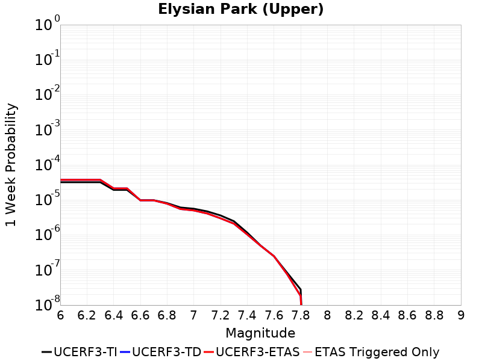 | 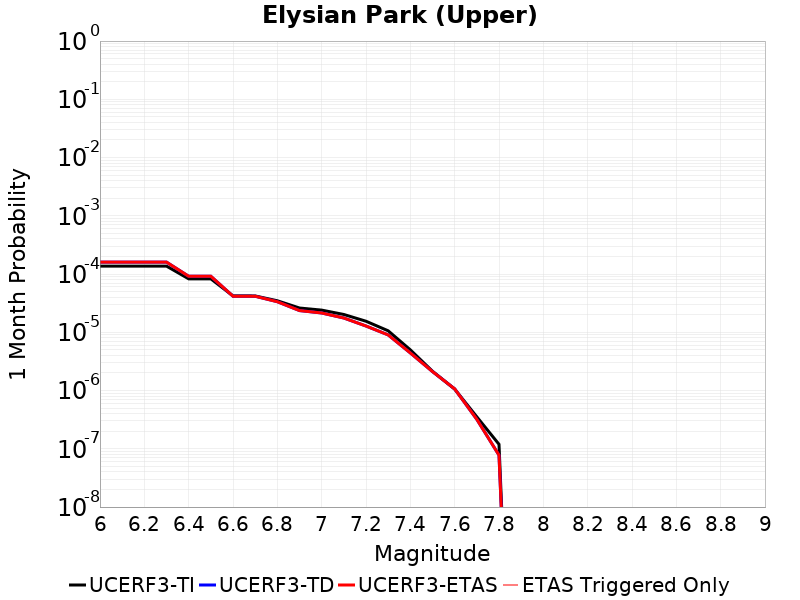 | 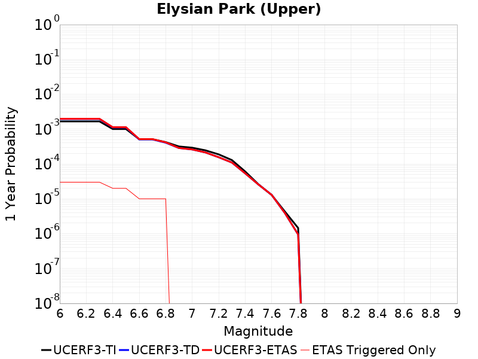 | 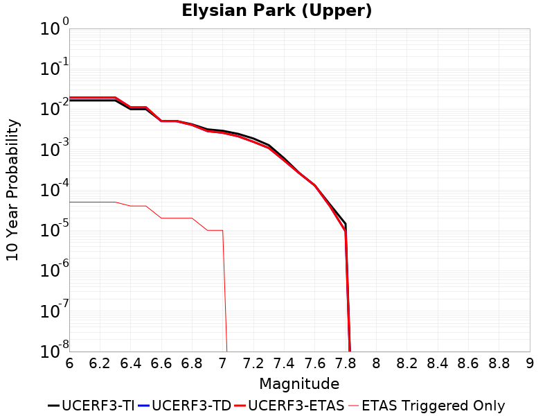 |

| Magnitude | 1 wk TI Prob | 1 wk TD Prob | 1 wk ETAS Prob | 1 wk ETAS/TD Gain | 1 wk ETAS Triggered Only | 1 mo TI Prob | 1 mo TD Prob | 1 mo ETAS Prob | 1 mo ETAS/TD Gain | 1 mo ETAS Triggered Only | 1 yr TI Prob | 1 yr TD Prob | 1 yr ETAS Prob | 1 yr ETAS/TD Gain | 1 yr ETAS Triggered Only | 10 yr TI Prob | 10 yr TD Prob | 10 yr ETAS Prob | 10 yr ETAS/TD Gain | 10 yr ETAS Triggered Only |
|-----|-----|-----|-----|-----|-----|-----|-----|-----|-----|-----|-----|-----|-----|-----|-----|-----|-----|-----|-----|-----|
| 6.0 | 3.1876025E-5 | 3.7329886E-5 | 3.7329886E-5 | 1.0 | 0.0 | 1.3660437E-4 | 1.5997814E-4 | 1.5997814E-4 | 1.0 | 0.0 | 0.0016618895 | 0.0019464688 | 0.0019764104 | 1.0153825 | 3.0E-5 | 0.016495159 | 0.019341089 | 0.019390121 | 1.0025352 | 5.0E-5 |
| 6.1 | 3.1876025E-5 | 3.7329886E-5 | 3.7329886E-5 | 1.0 | 0.0 | 1.3660437E-4 | 1.5997814E-4 | 1.5997814E-4 | 1.0 | 0.0 | 0.0016618895 | 0.0019464688 | 0.0019764104 | 1.0153825 | 3.0E-5 | 0.016495159 | 0.019341089 | 0.019390121 | 1.0025352 | 5.0E-5 |
| 6.2 | 3.1876025E-5 | 3.7329886E-5 | 3.7329886E-5 | 1.0 | 0.0 | 1.3660437E-4 | 1.5997814E-4 | 1.5997814E-4 | 1.0 | 0.0 | 0.0016618895 | 0.0019464688 | 0.0019764104 | 1.0153825 | 3.0E-5 | 0.016495159 | 0.019341089 | 0.019390121 | 1.0025352 | 5.0E-5 |
| 6.3 | 3.1876025E-5 | 3.7329886E-5 | 3.7329886E-5 | 1.0 | 0.0 | 1.3660437E-4 | 1.5997814E-4 | 1.5997814E-4 | 1.0 | 0.0 | 0.0016618895 | 0.0019464688 | 0.0019764104 | 1.0153825 | 3.0E-5 | 0.016495159 | 0.019341089 | 0.019390121 | 1.0025352 | 5.0E-5 |
| 6.4 | 1.9273462E-5 | 2.1338234E-5 | 2.1338234E-5 | 1.0 | 0.0 | 8.259794E-5 | 9.144736E-5 | 9.144736E-5 | 1.0 | 0.0 | 0.001005166 | 0.0011129766 | 0.0011329543 | 1.0179498 | 2.0E-5 | 0.010006315 | 0.011091024 | 0.01113058 | 1.0035665 | 4.0E-5 |
| 6.5 | 1.9273462E-5 | 2.1338234E-5 | 2.1338234E-5 | 1.0 | 0.0 | 8.259794E-5 | 9.144736E-5 | 9.144736E-5 | 1.0 | 0.0 | 0.001005166 | 0.0011129766 | 0.0011329543 | 1.0179498 | 2.0E-5 | 0.010006315 | 0.011091024 | 0.01113058 | 1.0035665 | 4.0E-5 |
| 6.6 | 9.813258E-6 | 9.701469E-6 | 9.701469E-6 | 1.0 | 0.0 | 4.205614E-5 | 4.1577106E-5 | 4.1577106E-5 | 1.0 | 0.0 | 5.119132E-4 | 5.06091E-4 | 5.1608594E-4 | 1.0197493 | 1.0E-5 | 0.005107356 | 0.0050501153 | 0.005070014 | 1.0039403 | 2.0E-5 |
| 6.7 | 9.801478E-6 | 9.68901E-6 | 9.68901E-6 | 1.0 | 0.0 | 4.2005657E-5 | 4.152371E-5 | 4.152371E-5 | 1.0 | 0.0 | 5.112989E-4 | 5.054412E-4 | 5.154362E-4 | 1.0197747 | 1.0E-5 | 0.0051012407 | 0.005043647 | 0.005063546 | 1.0039454 | 2.0E-5 |
| 6.8 | 8.102489E-6 | 7.80089E-6 | 7.80089E-6 | 1.0 | 0.0 | 3.4724493E-5 | 3.3431985E-5 | 3.3431985E-5 | 1.0 | 0.0 | 4.2268867E-4 | 4.069634E-4 | 4.1695934E-4 | 1.0245622 | 1.0E-5 | 0.004218856 | 0.0040626805 | 0.004082599 | 1.0049028 | 2.0E-5 |
| 6.9 | 6.08275E-6 | 5.4971388E-6 | 5.4971388E-6 | 1.0 | 0.0 | 2.6068668E-5 | 2.3558958E-5 | 2.3558958E-5 | 1.0 | 0.0 | 3.173398E-4 | 2.8679334E-4 | 2.8679334E-4 | 1.0 | 0.0 | 0.0031688702 | 0.0028643105 | 0.0028742817 | 1.0034813 | 1.0E-5 |
| 7.0 | 5.5995934E-6 | 4.9967043E-6 | 4.9967043E-6 | 1.0 | 0.0 | 2.3998036E-5 | 2.1414275E-5 | 2.1414275E-5 | 1.0 | 0.0 | 2.9213692E-4 | 2.6068828E-4 | 2.6068828E-4 | 1.0 | 0.0 | 0.0029175316 | 0.0026038925 | 0.0026138665 | 1.0038304 | 1.0E-5 |
| 7.1 | 4.709881E-6 | 4.098258E-6 | 4.098258E-6 | 1.0 | 0.0 | 2.0185047E-5 | 1.7563849E-5 | 1.7563849E-5 | 1.0 | 0.0 | 2.4572524E-4 | 2.1381928E-4 | 2.1381928E-4 | 1.0 | 0.0 | 0.002454537 | 0.0021361774 | 0.0021361774 | 1.0 | 0.0 |
| 7.2 | 3.6063436E-6 | 2.9849023E-6 | 2.9849023E-6 | 1.0 | 0.0 | 1.5455667E-5 | 1.2792376E-5 | 1.2792376E-5 | 1.0 | 0.0 | 1.881565E-4 | 1.5573615E-4 | 1.5573615E-4 | 1.0 | 0.0 | 0.0018799726 | 0.0015562815 | 0.0015562815 | 1.0 | 0.0 |
| 7.3 | 2.471135E-6 | 2.1005558E-6 | 2.1005558E-6 | 1.0 | 0.0 | 1.0590536E-5 | 9.002351E-6 | 9.002351E-6 | 1.0 | 0.0 | 1.2893214E-4 | 1.09598186E-4 | 1.09598186E-4 | 1.0 | 0.0 | 0.0012885736 | 0.0010954486 | 0.0010954486 | 1.0 | 0.0 |
| 7.4 | 1.163943E-6 | 1.0299932E-6 | 1.0299932E-6 | 1.0 | 0.0 | 4.988318E-6 | 4.4142494E-6 | 4.4142494E-6 | 1.0 | 0.0 | 6.0731076E-5 | 5.374219E-5 | 5.374219E-5 | 1.0 | 0.0 | 6.071448E-4 | 5.3729495E-4 | 5.3729495E-4 | 1.0 | 0.0 |
| 7.5 | 4.99459E-7 | 4.928382E-7 | 4.928382E-7 | 1.0 | 0.0 | 2.140537E-6 | 2.112162E-6 | 2.112162E-6 | 1.0 | 0.0 | 2.6060725E-5 | 2.5715286E-5 | 2.5715286E-5 | 1.0 | 0.0 | 2.605767E-4 | 2.571247E-4 | 2.571247E-4 | 1.0 | 0.0 |
| 7.6 | 2.4667852E-7 | 2.4850993E-7 | 2.4850993E-7 | 1.0 | 0.0 | 1.0571932E-6 | 1.0650422E-6 | 1.0650422E-6 | 1.0 | 0.0 | 1.2871251E-5 | 1.2966815E-5 | 1.2966815E-5 | 1.0 | 0.0 | 1.2870505E-4 | 1.2966096E-4 | 1.2966096E-4 | 1.0 | 0.0 |
| 7.7 | 8.2312795E-8 | 7.4531094E-8 | 7.4531094E-8 | 1.0 | 0.0 | 3.527691E-7 | 3.1941894E-7 | 3.1941894E-7 | 1.0 | 0.0 | 4.294955E-6 | 3.88892E-6 | 3.88892E-6 | 1.0 | 0.0 | 4.2948723E-5 | 3.8888636E-5 | 3.8888636E-5 | 1.0 | 0.0 |
| 7.8 | 2.7819295E-8 | 1.8102305E-8 | 1.8102305E-8 | 1.0 | 0.0 | 1.1922555E-7 | 7.758131E-8 | 7.758131E-8 | 1.0 | 0.0 | 1.45157E-6 | 9.445522E-7 | 9.445522E-7 | 1.0 | 0.0 | 1.45156055E-5 | 9.445497E-6 | 9.445497E-6 | 1.0 | 0.0 |

## Hollywood
*[(top)](#table-of-contents)*

| 1 Week | 1 Month | 1 Year | 10 Year |
|-----|-----|-----|-----|
| 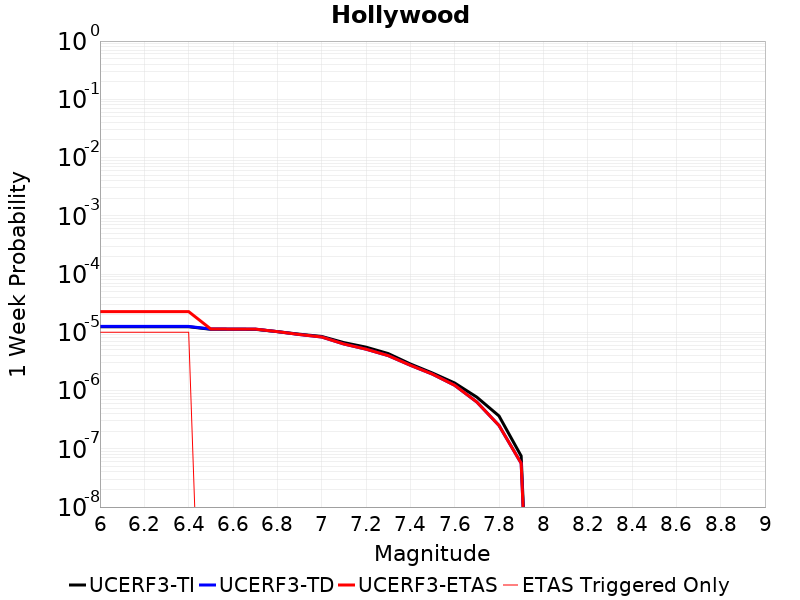 | 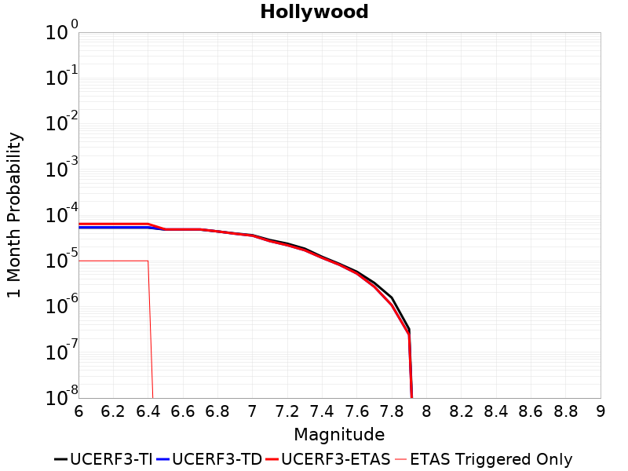 | 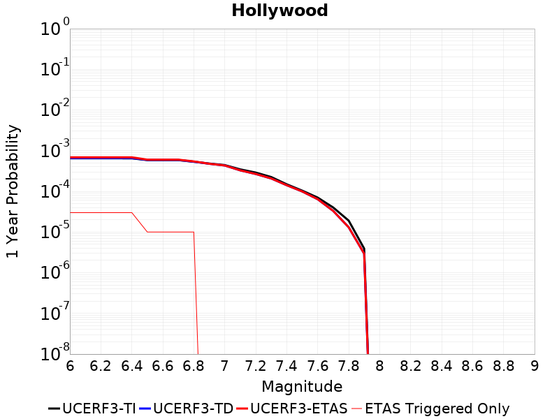 | 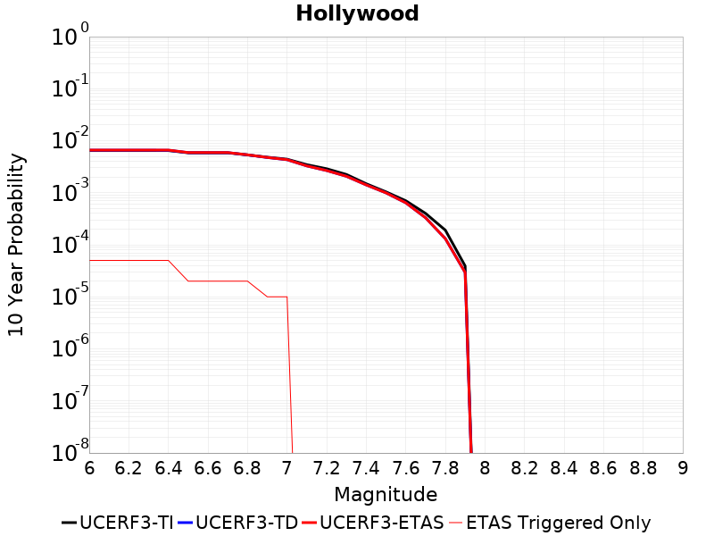 |

| Magnitude | 1 wk TI Prob | 1 wk TD Prob | 1 wk ETAS Prob | 1 wk ETAS/TD Gain | 1 wk ETAS Triggered Only | 1 mo TI Prob | 1 mo TD Prob | 1 mo ETAS Prob | 1 mo ETAS/TD Gain | 1 mo ETAS Triggered Only | 1 yr TI Prob | 1 yr TD Prob | 1 yr ETAS Prob | 1 yr ETAS/TD Gain | 1 yr ETAS Triggered Only | 10 yr TI Prob | 10 yr TD Prob | 10 yr ETAS Prob | 10 yr ETAS/TD Gain | 10 yr ETAS Triggered Only |
|-----|-----|-----|-----|-----|-----|-----|-----|-----|-----|-----|-----|-----|-----|-----|-----|-----|-----|-----|-----|-----|
| 6.0 | 1.24487615E-5 | 1.2609026E-5 | 2.26089E-5 | 1.7930727 | 1.0E-5 | 5.3350745E-5 | 5.403759E-5 | 6.403705E-5 | 1.1850463 | 1.0E-5 | 6.4935174E-4 | 6.577137E-4 | 6.8769394E-4 | 1.0455825 | 3.0E-5 | 0.0064745755 | 0.0065581566 | 0.0066078287 | 1.0075741 | 5.0E-5 |
| 6.1 | 1.24487615E-5 | 1.2609026E-5 | 2.26089E-5 | 1.7930727 | 1.0E-5 | 5.3350745E-5 | 5.403759E-5 | 6.403705E-5 | 1.1850463 | 1.0E-5 | 6.4935174E-4 | 6.577137E-4 | 6.8769394E-4 | 1.0455825 | 3.0E-5 | 0.0064745755 | 0.0065581566 | 0.0066078287 | 1.0075741 | 5.0E-5 |
| 6.2 | 1.24487615E-5 | 1.2609026E-5 | 2.26089E-5 | 1.7930727 | 1.0E-5 | 5.3350745E-5 | 5.403759E-5 | 6.403705E-5 | 1.1850463 | 1.0E-5 | 6.4935174E-4 | 6.577137E-4 | 6.8769394E-4 | 1.0455825 | 3.0E-5 | 0.0064745755 | 0.0065581566 | 0.0066078287 | 1.0075741 | 5.0E-5 |
| 6.3 | 1.24487615E-5 | 1.2609026E-5 | 2.26089E-5 | 1.7930727 | 1.0E-5 | 5.3350745E-5 | 5.403759E-5 | 6.403705E-5 | 1.1850463 | 1.0E-5 | 6.4935174E-4 | 6.577137E-4 | 6.8769394E-4 | 1.0455825 | 3.0E-5 | 0.0064745755 | 0.0065581566 | 0.0066078287 | 1.0075741 | 5.0E-5 |
| 6.4 | 1.2431024E-5 | 1.25895685E-5 | 2.2589442E-5 | 1.7942984 | 1.0E-5 | 5.327473E-5 | 5.39542E-5 | 6.395367E-5 | 1.1853324 | 1.0E-5 | 6.4842677E-4 | 6.5669906E-4 | 6.866794E-4 | 1.045653 | 3.0E-5 | 0.0064653796 | 0.00654807 | 0.0065977424 | 1.0075859 | 5.0E-5 |
| 6.5 | 1.1242222E-5 | 1.13491315E-5 | 1.13491315E-5 | 1.0 | 0.0 | 4.8180063E-5 | 4.8638245E-5 | 4.8638245E-5 | 1.0 | 0.0 | 5.864344E-4 | 5.920124E-4 | 6.020065E-4 | 1.0168816 | 1.0E-5 | 0.0058488925 | 0.0059046424 | 0.0059245243 | 1.0033672 | 2.0E-5 |
| 6.6 | 1.1234066E-5 | 1.1340215E-5 | 1.1340215E-5 | 1.0 | 0.0 | 4.8145106E-5 | 4.8600028E-5 | 4.8600028E-5 | 1.0 | 0.0 | 5.86009E-4 | 5.915474E-4 | 6.015415E-4 | 1.0168948 | 1.0E-5 | 0.005844661 | 0.005900017 | 0.005919899 | 1.0033698 | 2.0E-5 |
| 6.7 | 1.12294E-5 | 1.13349315E-5 | 1.13349315E-5 | 1.0 | 0.0 | 4.812511E-5 | 4.857739E-5 | 4.857739E-5 | 1.0 | 0.0 | 5.857657E-4 | 5.912719E-4 | 6.01266E-4 | 1.0169027 | 1.0E-5 | 0.0058422405 | 0.0058972766 | 0.0059171584 | 1.0033714 | 2.0E-5 |
| 6.8 | 1.0252819E-5 | 1.0246295E-5 | 1.0246295E-5 | 1.0 | 0.0 | 4.3939912E-5 | 4.3911965E-5 | 4.3911965E-5 | 1.0 | 0.0 | 5.3483713E-4 | 5.344992E-4 | 5.4449384E-4 | 1.018699 | 1.0E-5 | 0.005335517 | 0.005332364 | 0.0053522573 | 1.0037307 | 2.0E-5 |
| 6.9 | 9.252289E-6 | 9.134848E-6 | 9.134848E-6 | 1.0 | 0.0 | 3.9652066E-5 | 3.9148774E-5 | 3.9148774E-5 | 1.0 | 0.0 | 4.8265693E-4 | 4.7653372E-4 | 4.7653372E-4 | 1.0 | 0.0 | 0.0048161 | 0.0047552935 | 0.004765246 | 1.002093 | 1.0E-5 |
| 7.0 | 8.474604E-6 | 8.28104E-6 | 8.28104E-6 | 1.0 | 0.0 | 3.6319227E-5 | 3.54897E-5 | 3.54897E-5 | 1.0 | 0.0 | 4.4209688E-4 | 4.3200285E-4 | 4.3200285E-4 | 1.0 | 0.0 | 0.004412184 | 0.004311782 | 0.0043217386 | 1.0023092 | 1.0E-5 |
| 7.1 | 6.643643E-6 | 6.286008E-6 | 6.286008E-6 | 1.0 | 0.0 | 2.8472443E-5 | 2.6939759E-5 | 2.6939759E-5 | 1.0 | 0.0 | 3.4659685E-4 | 3.2794263E-4 | 3.2794263E-4 | 1.0 | 0.0 | 0.0034605677 | 0.003274633 | 0.003274633 | 1.0 | 0.0 |
| 7.2 | 5.549002E-6 | 5.123493E-6 | 5.123493E-6 | 1.0 | 0.0 | 2.378122E-5 | 2.1957641E-5 | 2.1957641E-5 | 1.0 | 0.0 | 2.8949787E-4 | 2.6730163E-4 | 2.6730163E-4 | 1.0 | 0.0 | 0.0028912104 | 0.0026698178 | 0.0026698178 | 1.0 | 0.0 |
| 7.3 | 4.3059727E-6 | 3.9729107E-6 | 3.9729107E-6 | 1.0 | 0.0 | 1.8454039E-5 | 1.702665E-5 | 1.702665E-5 | 1.0 | 0.0 | 2.2465475E-4 | 2.0727984E-4 | 2.0727984E-4 | 1.0 | 0.0 | 0.0022442779 | 0.0020708751 | 0.0020708751 | 1.0 | 0.0 |
| 7.4 | 2.8550733E-6 | 2.7118508E-6 | 2.7118508E-6 | 1.0 | 0.0 | 1.2235971E-5 | 1.1622166E-5 | 1.1622166E-5 | 1.0 | 0.0 | 1.4896276E-4 | 1.4149073E-4 | 1.4149073E-4 | 1.0 | 0.0 | 0.0014886294 | 0.0014140117 | 0.0014140117 | 1.0 | 0.0 |
| 7.5 | 1.9927045E-6 | 1.9063966E-6 | 1.9063966E-6 | 1.0 | 0.0 | 8.540134E-6 | 8.170246E-6 | 8.170246E-6 | 1.0 | 0.0 | 1.0397117E-4 | 9.9468234E-5 | 9.9468234E-5 | 1.0 | 0.0 | 0.0010392254 | 9.942407E-4 | 9.942407E-4 | 1.0 | 0.0 |
| 7.6 | 1.345084E-6 | 1.2282233E-6 | 1.2282233E-6 | 1.0 | 0.0 | 5.764633E-6 | 5.263804E-6 | 5.263804E-6 | 1.0 | 0.0 | 7.018215E-5 | 6.408495E-5 | 6.408495E-5 | 1.0 | 0.0 | 7.0159987E-4 | 6.4066664E-4 | 6.4066664E-4 | 1.0 | 0.0 |
| 7.7 | 7.6835164E-7 | 6.336974E-7 | 6.336974E-7 | 1.0 | 0.0 | 3.2929315E-6 | 2.7158433E-6 | 2.7158433E-6 | 1.0 | 0.0 | 4.00907E-5 | 3.3064905E-5 | 3.3064905E-5 | 1.0 | 0.0 | 4.0083472E-4 | 3.3060135E-4 | 3.3060135E-4 | 1.0 | 0.0 |
| 7.8 | 3.6562128E-7 | 2.5074735E-7 | 2.5074735E-7 | 1.0 | 0.0 | 1.5669474E-6 | 1.0746311E-6 | 1.0746311E-6 | 1.0 | 0.0 | 1.9077417E-5 | 1.3083559E-5 | 1.3083559E-5 | 1.0 | 0.0 | 1.907578E-4 | 1.3082827E-4 | 1.3082827E-4 | 1.0 | 0.0 |
| 7.9 | 7.5024424E-8 | 5.63059E-8 | 5.63059E-8 | 1.0 | 0.0 | 3.215332E-7 | 2.4131097E-7 | 2.4131097E-7 | 1.0 | 0.0 | 3.91466E-6 | 2.9379587E-6 | 2.9379587E-6 | 1.0 | 0.0 | 3.9145907E-5 | 2.9379342E-5 | 2.9379342E-5 | 1.0 | 0.0 |

## North Salt Lake
*[(top)](#table-of-contents)*

| 1 Week | 1 Month | 1 Year | 10 Year |
|-----|-----|-----|-----|
| 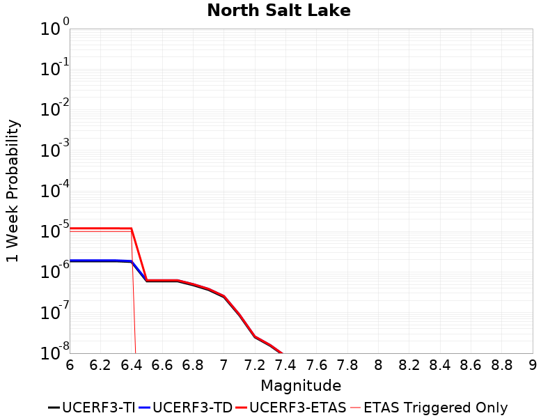 | 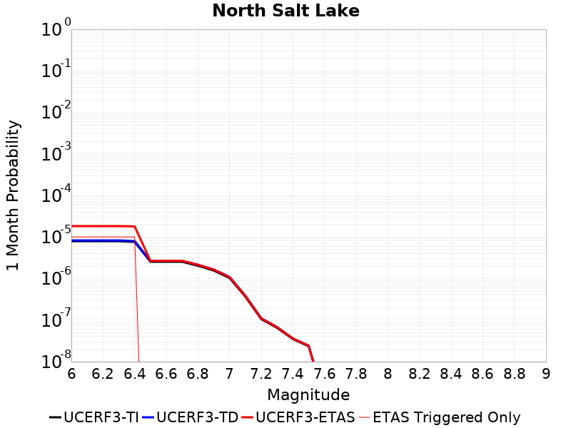 | 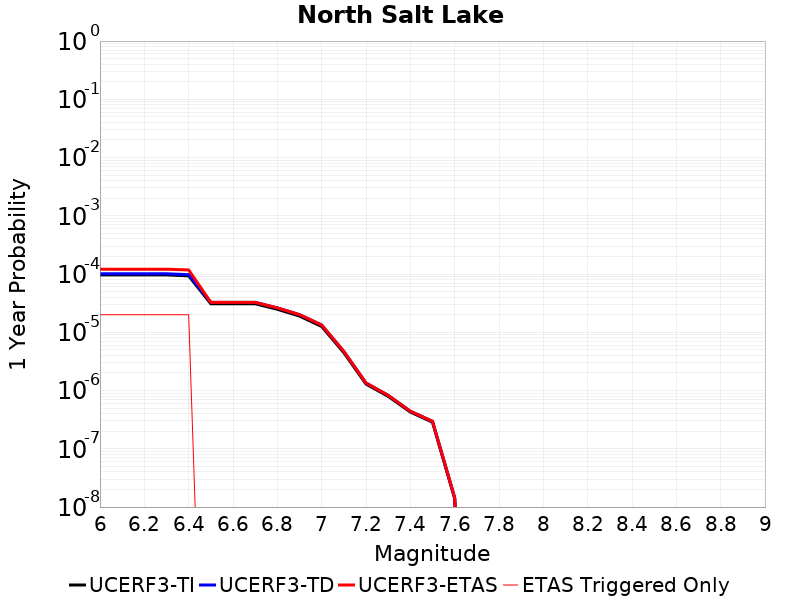 | 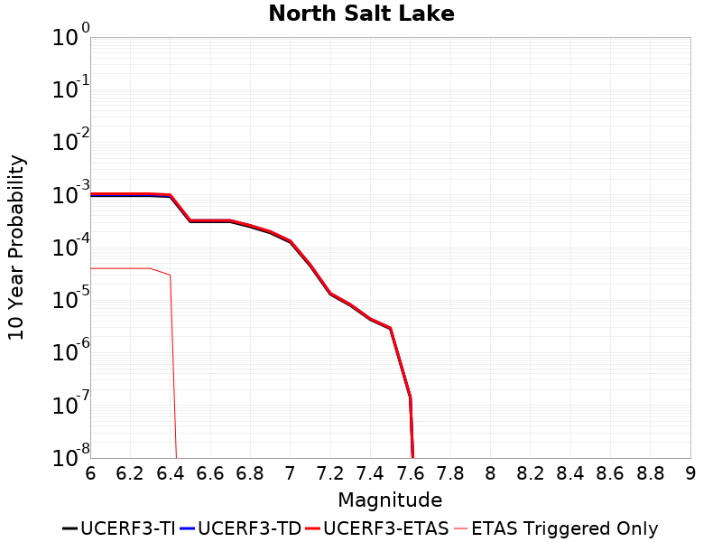 |

| Magnitude | 1 wk TI Prob | 1 wk TD Prob | 1 wk ETAS Prob | 1 wk ETAS/TD Gain | 1 wk ETAS Triggered Only | 1 mo TI Prob | 1 mo TD Prob | 1 mo ETAS Prob | 1 mo ETAS/TD Gain | 1 mo ETAS Triggered Only | 1 yr TI Prob | 1 yr TD Prob | 1 yr ETAS Prob | 1 yr ETAS/TD Gain | 1 yr ETAS Triggered Only | 10 yr TI Prob | 10 yr TD Prob | 10 yr ETAS Prob | 10 yr ETAS/TD Gain | 10 yr ETAS Triggered Only |
|-----|-----|-----|-----|-----|-----|-----|-----|-----|-----|-----|-----|-----|-----|-----|-----|-----|-----|-----|-----|-----|
| 6.0 | 1.849599E-6 | 1.9345453E-6 | 1.1934526E-5 | 6.1691637 | 1.0E-5 | 7.926829E-6 | 8.290893E-6 | 1.829081E-5 | 2.2061327 | 1.0E-5 | 9.650487E-5 | 1.0093891E-4 | 1.2093689E-4 | 1.1981196 | 2.0E-5 | 9.646297E-4 | 0.0010091236 | 0.0010490832 | 1.0395983 | 4.0E-5 |
| 6.1 | 1.849599E-6 | 1.9345453E-6 | 1.1934526E-5 | 6.1691637 | 1.0E-5 | 7.926829E-6 | 8.290893E-6 | 1.829081E-5 | 2.2061327 | 1.0E-5 | 9.650487E-5 | 1.0093891E-4 | 1.2093689E-4 | 1.1981196 | 2.0E-5 | 9.646297E-4 | 0.0010091236 | 0.0010490832 | 1.0395983 | 4.0E-5 |
| 6.2 | 1.849599E-6 | 1.9345453E-6 | 1.1934526E-5 | 6.1691637 | 1.0E-5 | 7.926829E-6 | 8.290893E-6 | 1.829081E-5 | 2.2061327 | 1.0E-5 | 9.650487E-5 | 1.0093891E-4 | 1.2093689E-4 | 1.1981196 | 2.0E-5 | 9.646297E-4 | 0.0010091236 | 0.0010490832 | 1.0395983 | 4.0E-5 |
| 6.3 | 1.849599E-6 | 1.9345453E-6 | 1.1934526E-5 | 6.1691637 | 1.0E-5 | 7.926829E-6 | 8.290893E-6 | 1.829081E-5 | 2.2061327 | 1.0E-5 | 9.650487E-5 | 1.0093891E-4 | 1.2093689E-4 | 1.1981196 | 2.0E-5 | 9.646297E-4 | 0.0010091236 | 0.0010490832 | 1.0395983 | 4.0E-5 |
| 6.4 | 1.7803909E-6 | 1.8650443E-6 | 1.1865026E-5 | 6.361793 | 1.0E-5 | 7.630225E-6 | 7.993033E-6 | 1.7992954E-5 | 2.2510796 | 1.0E-5 | 9.289402E-5 | 9.73128E-5 | 1.17310854E-4 | 1.2055029 | 2.0E-5 | 9.28552E-4 | 9.7289425E-4 | 0.001002865 | 1.0308058 | 3.0E-5 |
| 6.5 | 5.9157696E-7 | 6.245945E-7 | 6.245945E-7 | 1.0 | 0.0 | 2.5353274E-6 | 2.6768312E-6 | 2.6768312E-6 | 1.0 | 0.0 | 3.0867173E-5 | 3.258997E-5 | 3.258997E-5 | 1.0 | 0.0 | 3.0862886E-4 | 3.258558E-4 | 3.258558E-4 | 1.0 | 0.0 |
| 6.6 | 5.9157696E-7 | 6.245945E-7 | 6.245945E-7 | 1.0 | 0.0 | 2.5353274E-6 | 2.6768312E-6 | 2.6768312E-6 | 1.0 | 0.0 | 3.0867173E-5 | 3.258997E-5 | 3.258997E-5 | 1.0 | 0.0 | 3.0862886E-4 | 3.258558E-4 | 3.258558E-4 | 1.0 | 0.0 |
| 6.7 | 5.9157696E-7 | 6.245945E-7 | 6.245945E-7 | 1.0 | 0.0 | 2.5353274E-6 | 2.6768312E-6 | 2.6768312E-6 | 1.0 | 0.0 | 3.0867173E-5 | 3.258997E-5 | 3.258997E-5 | 1.0 | 0.0 | 3.0862886E-4 | 3.258558E-4 | 3.258558E-4 | 1.0 | 0.0 |
| 6.8 | 4.7536267E-7 | 5.022549E-7 | 5.022549E-7 | 1.0 | 0.0 | 2.037267E-6 | 2.1525193E-6 | 2.1525193E-6 | 1.0 | 0.0 | 2.4803443E-5 | 2.6206633E-5 | 2.6206633E-5 | 1.0 | 0.0 | 2.4800675E-4 | 2.6203782E-4 | 2.6203782E-4 | 1.0 | 0.0 |
| 6.9 | 3.6345344E-7 | 3.8420964E-7 | 3.8420964E-7 | 1.0 | 0.0 | 1.5576567E-6 | 1.6466117E-6 | 1.6466117E-6 | 1.0 | 0.0 | 1.8964305E-5 | 2.0047331E-5 | 2.0047331E-5 | 1.0 | 0.0 | 1.8962687E-4 | 2.0045688E-4 | 2.0045688E-4 | 1.0 | 0.0 |
| 7.0 | 2.4087325E-7 | 2.548969E-7 | 2.548969E-7 | 1.0 | 0.0 | 1.0323135E-6 | 1.0924149E-6 | 1.0924149E-6 | 1.0 | 0.0 | 1.25683455E-5 | 1.3300082E-5 | 1.3300082E-5 | 1.0 | 0.0 | 1.2567634E-4 | 1.329941E-4 | 1.329941E-4 | 1.0 | 0.0 |
| 7.1 | 8.551555E-8 | 8.9887635E-8 | 8.9887635E-8 | 1.0 | 0.0 | 3.6649516E-7 | 3.8523265E-7 | 3.8523265E-7 | 1.0 | 0.0 | 4.4620692E-6 | 4.6901987E-6 | 4.6901987E-6 | 1.0 | 0.0 | 4.46198E-5 | 4.6901114E-5 | 4.6901114E-5 | 1.0 | 0.0 |
| 7.2 | 2.475279E-8 | 2.5813302E-8 | 2.5813302E-8 | 1.0 | 0.0 | 1.0608338E-7 | 1.1062843E-7 | 1.1062843E-7 | 1.0 | 0.0 | 1.2915643E-6 | 1.3469004E-6 | 1.3469004E-6 | 1.0 | 0.0 | 1.2915569E-5 | 1.3468928E-5 | 1.3468928E-5 | 1.0 | 0.0 |
| 7.3 | 1.5212393E-8 | 1.5819591E-8 | 1.5819591E-8 | 1.0 | 0.0 | 6.519597E-8 | 6.779824E-8 | 6.779824E-8 | 1.0 | 0.0 | 7.9376065E-7 | 8.254433E-7 | 8.254433E-7 | 1.0 | 0.0 | 7.937579E-6 | 8.254406E-6 | 8.254406E-6 | 1.0 | 0.0 |
| 7.4 | 8.182E-9 | 8.44821E-9 | 8.44821E-9 | 1.0 | 0.0 | 3.5065714E-8 | 3.6206615E-8 | 3.6206615E-8 | 1.0 | 0.0 | 4.26925E-7 | 4.4081546E-7 | 4.4081546E-7 | 1.0 | 0.0 | 4.269242E-6 | 4.408146E-6 | 4.408146E-6 | 1.0 | 0.0 |
| 7.5 | 5.479913E-9 | 5.6686416E-9 | 5.6686416E-9 | 1.0 | 0.0 | 2.3485342E-8 | 2.429418E-8 | 2.429418E-8 | 1.0 | 0.0 | 2.85934E-7 | 2.9578158E-7 | 2.9578158E-7 | 1.0 | 0.0 | 2.8593363E-6 | 2.9578123E-6 | 2.9578123E-6 | 1.0 | 0.0 |
| 7.6 | 2.6813562E-10 | 2.7741565E-10 | 2.7741565E-10 | 1.0 | 0.0 | 1.1491527E-9 | 1.1889238E-9 | 1.1889238E-9 | 1.0 | 0.0 | 1.3990933E-8 | 1.4475148E-8 | 1.4475148E-8 | 1.0 | 0.0 | 1.3990932E-7 | 1.4475148E-7 | 1.4475148E-7 | 1.0 | 0.0 |

## Raymond
*[(top)](#table-of-contents)*

| 1 Week | 1 Month | 1 Year | 10 Year |
|-----|-----|-----|-----|
| 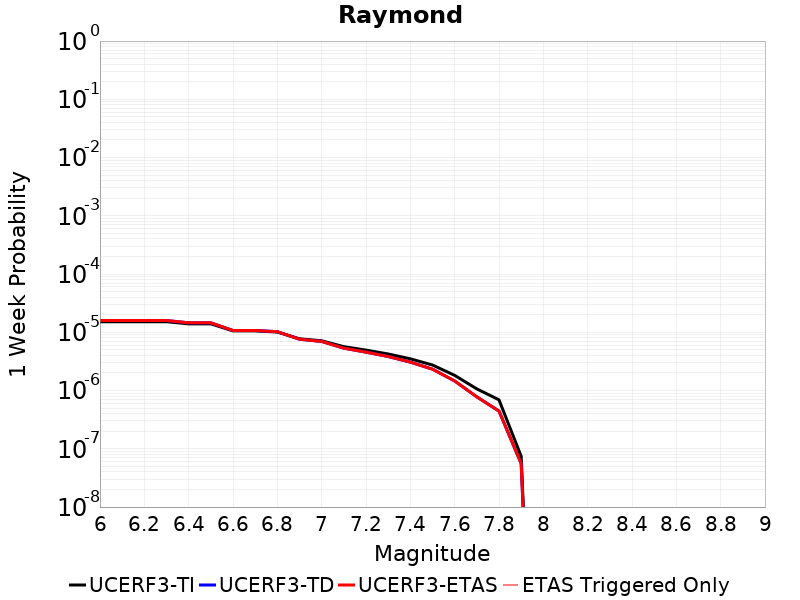 | 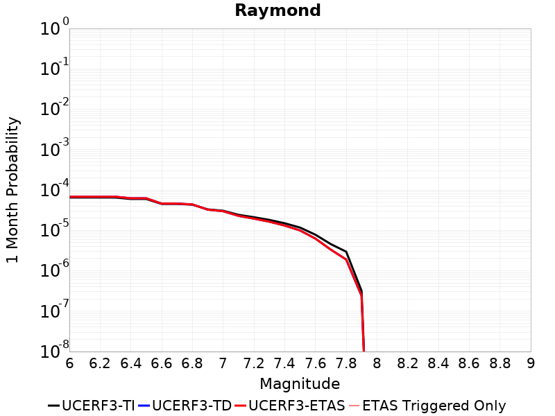 | 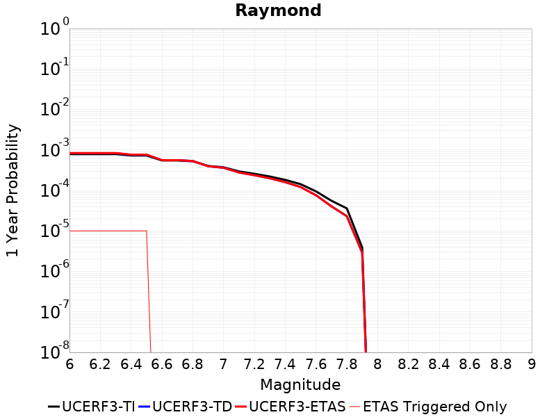 | 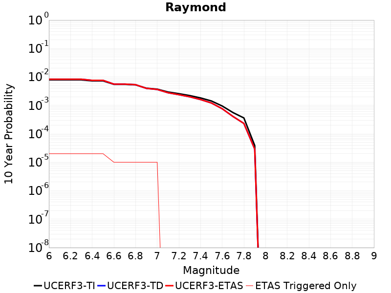 |

| Magnitude | 1 wk TI Prob | 1 wk TD Prob | 1 wk ETAS Prob | 1 wk ETAS/TD Gain | 1 wk ETAS Triggered Only | 1 mo TI Prob | 1 mo TD Prob | 1 mo ETAS Prob | 1 mo ETAS/TD Gain | 1 mo ETAS Triggered Only | 1 yr TI Prob | 1 yr TD Prob | 1 yr ETAS Prob | 1 yr ETAS/TD Gain | 1 yr ETAS Triggered Only | 10 yr TI Prob | 10 yr TD Prob | 10 yr ETAS Prob | 10 yr ETAS/TD Gain | 10 yr ETAS Triggered Only |
|-----|-----|-----|-----|-----|-----|-----|-----|-----|-----|-----|-----|-----|-----|-----|-----|-----|-----|-----|-----|-----|
| 6.0 | 1.5157413E-5 | 1.5885202E-5 | 1.5885202E-5 | 1.0 | 0.0 | 6.4958724E-5 | 6.80778E-5 | 6.80778E-5 | 1.0 | 0.0 | 7.905855E-4 | 8.2855736E-4 | 8.3854905E-4 | 1.0120592 | 1.0E-5 | 0.007877788 | 0.008257213 | 0.008277048 | 1.0024021 | 2.0E-5 |
| 6.1 | 1.5157413E-5 | 1.5885202E-5 | 1.5885202E-5 | 1.0 | 0.0 | 6.4958724E-5 | 6.80778E-5 | 6.80778E-5 | 1.0 | 0.0 | 7.905855E-4 | 8.2855736E-4 | 8.3854905E-4 | 1.0120592 | 1.0E-5 | 0.007877788 | 0.008257213 | 0.008277048 | 1.0024021 | 2.0E-5 |
| 6.2 | 1.5157413E-5 | 1.5885202E-5 | 1.5885202E-5 | 1.0 | 0.0 | 6.4958724E-5 | 6.80778E-5 | 6.80778E-5 | 1.0 | 0.0 | 7.905855E-4 | 8.2855736E-4 | 8.3854905E-4 | 1.0120592 | 1.0E-5 | 0.007877788 | 0.008257213 | 0.008277048 | 1.0024021 | 2.0E-5 |
| 6.3 | 1.5157413E-5 | 1.5885202E-5 | 1.5885202E-5 | 1.0 | 0.0 | 6.4958724E-5 | 6.80778E-5 | 6.80778E-5 | 1.0 | 0.0 | 7.905855E-4 | 8.2855736E-4 | 8.3854905E-4 | 1.0120592 | 1.0E-5 | 0.007877788 | 0.008257213 | 0.008277048 | 1.0024021 | 2.0E-5 |
| 6.4 | 1.3941944E-5 | 1.4523598E-5 | 1.4523598E-5 | 1.0 | 0.0 | 5.9749822E-5 | 6.224264E-5 | 6.224264E-5 | 1.0 | 0.0 | 7.2721124E-4 | 7.575642E-4 | 7.675566E-4 | 1.0131902 | 1.0E-5 | 0.007248361 | 0.0075521627 | 0.0075720116 | 1.0026282 | 2.0E-5 |
| 6.5 | 1.3941944E-5 | 1.4523598E-5 | 1.4523598E-5 | 1.0 | 0.0 | 5.9749822E-5 | 6.224264E-5 | 6.224264E-5 | 1.0 | 0.0 | 7.2721124E-4 | 7.575642E-4 | 7.675566E-4 | 1.0131902 | 1.0E-5 | 0.007248361 | 0.0075521627 | 0.0075720116 | 1.0026282 | 2.0E-5 |
| 6.6 | 1.0542609E-5 | 1.0723127E-5 | 1.0723127E-5 | 1.0 | 0.0 | 4.5181827E-5 | 4.595548E-5 | 4.595548E-5 | 1.0 | 0.0 | 5.499499E-4 | 5.5936986E-4 | 5.5936986E-4 | 1.0 | 0.0 | 0.005485909 | 0.005580176 | 0.0055901203 | 1.0017821 | 1.0E-5 |
| 6.7 | 1.0542609E-5 | 1.0723127E-5 | 1.0723127E-5 | 1.0 | 0.0 | 4.5181827E-5 | 4.595548E-5 | 4.595548E-5 | 1.0 | 0.0 | 5.499499E-4 | 5.5936986E-4 | 5.5936986E-4 | 1.0 | 0.0 | 0.005485909 | 0.005580176 | 0.0055901203 | 1.0017821 | 1.0E-5 |
| 6.8 | 1.0079132E-5 | 1.0227326E-5 | 1.0227326E-5 | 1.0 | 0.0 | 4.3195567E-5 | 4.3830692E-5 | 4.3830692E-5 | 1.0 | 0.0 | 5.257791E-4 | 5.3351343E-4 | 5.3351343E-4 | 1.0 | 0.0 | 0.0052453685 | 0.0053228713 | 0.0053328183 | 1.0018687 | 1.0E-5 |
| 6.9 | 7.721598E-6 | 7.587558E-6 | 7.587558E-6 | 1.0 | 0.0 | 3.3092143E-5 | 3.2517706E-5 | 3.2517706E-5 | 1.0 | 0.0 | 4.0282236E-4 | 3.9583238E-4 | 3.9583238E-4 | 1.0 | 0.0 | 0.0040209293 | 0.003951398 | 0.0039613587 | 1.0025208 | 1.0E-5 |
| 7.0 | 7.137566E-6 | 6.947632E-6 | 6.947632E-6 | 1.0 | 0.0 | 3.058921E-5 | 2.977523E-5 | 2.977523E-5 | 1.0 | 0.0 | 3.7236E-4 | 3.6245422E-4 | 3.6245422E-4 | 1.0 | 0.0 | 0.0037173668 | 0.0036187402 | 0.003628704 | 1.0027534 | 1.0E-5 |
| 7.1 | 5.654976E-6 | 5.330322E-6 | 5.330322E-6 | 1.0 | 0.0 | 2.4235387E-5 | 2.2844039E-5 | 2.2844039E-5 | 1.0 | 0.0 | 2.9502588E-4 | 2.7809088E-4 | 2.7809088E-4 | 1.0 | 0.0 | 0.0029463451 | 0.0027774505 | 0.0027774505 | 1.0 | 0.0 |
| 7.2 | 4.9358455E-6 | 4.555024E-6 | 4.555024E-6 | 1.0 | 0.0 | 2.1153453E-5 | 1.9521387E-5 | 1.9521387E-5 | 1.0 | 0.0 | 2.5751285E-4 | 2.3764711E-4 | 2.3764711E-4 | 1.0 | 0.0 | 0.0025721465 | 0.0023739424 | 0.0023739424 | 1.0 | 0.0 |
| 7.3 | 4.2368597E-6 | 3.832556E-6 | 3.832556E-6 | 1.0 | 0.0 | 1.8157843E-5 | 1.6425138E-5 | 1.6425138E-5 | 1.0 | 0.0 | 2.2104931E-4 | 1.9995781E-4 | 1.9995781E-4 | 1.0 | 0.0 | 0.0022082955 | 0.001997788 | 0.001997788 | 1.0 | 0.0 |
| 7.4 | 3.4999923E-6 | 3.0685853E-6 | 3.0685853E-6 | 1.0 | 0.0 | 1.49998805E-5 | 1.3151014E-5 | 1.3151014E-5 | 1.0 | 0.0 | 1.8260824E-4 | 1.6010192E-4 | 1.6010192E-4 | 1.0 | 0.0 | 0.0018245826 | 0.0015998719 | 0.0015998719 | 1.0 | 0.0 |
| 7.5 | 2.738017E-6 | 2.3239961E-6 | 2.3239961E-6 | 1.0 | 0.0 | 1.1734306E-5 | 9.959946E-6 | 9.959946E-6 | 1.0 | 0.0 | 1.428558E-4 | 1.2125566E-4 | 1.2125566E-4 | 1.0 | 0.0 | 0.0014276401 | 0.0012118998 | 0.0012118998 | 1.0 | 0.0 |
| 7.6 | 1.8186392E-6 | 1.4581348E-6 | 1.4581348E-6 | 1.0 | 0.0 | 7.794145E-6 | 6.249134E-6 | 6.249134E-6 | 1.0 | 0.0 | 9.488958E-5 | 7.608059E-5 | 7.608059E-5 | 1.0 | 0.0 | 9.4849075E-4 | 7.6054735E-4 | 7.6054735E-4 | 1.0 | 0.0 |
| 7.7 | 1.0660348E-6 | 7.76927E-7 | 7.76927E-7 | 1.0 | 0.0 | 4.5687125E-6 | 3.3296828E-6 | 3.3296828E-6 | 1.0 | 0.0 | 5.5622655E-5 | 4.053815E-5 | 4.053815E-5 | 1.0 | 0.0 | 5.5608735E-4 | 4.0530702E-4 | 4.0530702E-4 | 1.0 | 0.0 |
| 7.8 | 6.913602E-7 | 4.4317196E-7 | 4.4317196E-7 | 1.0 | 0.0 | 2.962969E-6 | 1.8993071E-6 | 1.8993071E-6 | 1.0 | 0.0 | 3.607355E-5 | 2.3123825E-5 | 2.3123825E-5 | 1.0 | 0.0 | 3.6067693E-4 | 2.3121605E-4 | 2.3121605E-4 | 1.0 | 0.0 |
| 7.9 | 7.425201E-8 | 5.5706128E-8 | 5.5706128E-8 | 1.0 | 0.0 | 3.1822285E-7 | 2.3874054E-7 | 2.3874054E-7 | 1.0 | 0.0 | 3.874356E-6 | 2.9066634E-6 | 2.9066634E-6 | 1.0 | 0.0 | 3.8742884E-5 | 2.9066397E-5 | 2.9066397E-5 | 1.0 | 0.0 |

## San Vicente
*[(top)](#table-of-contents)*

| 1 Week | 1 Month | 1 Year | 10 Year |
|-----|-----|-----|-----|
| 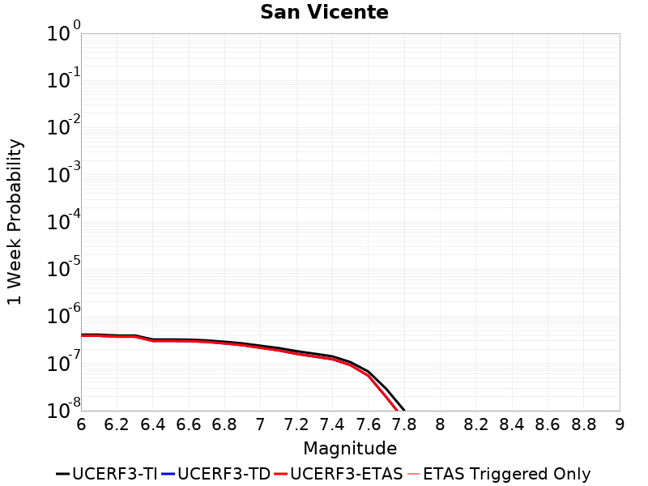 | 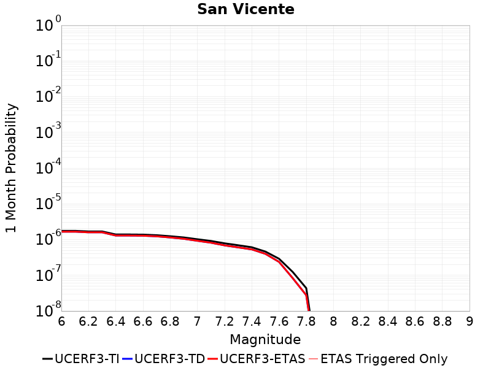 | 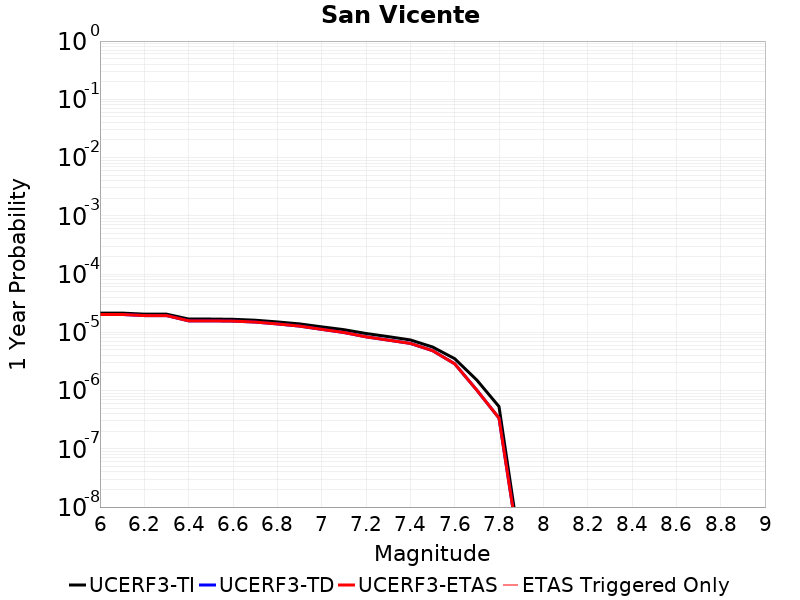 | 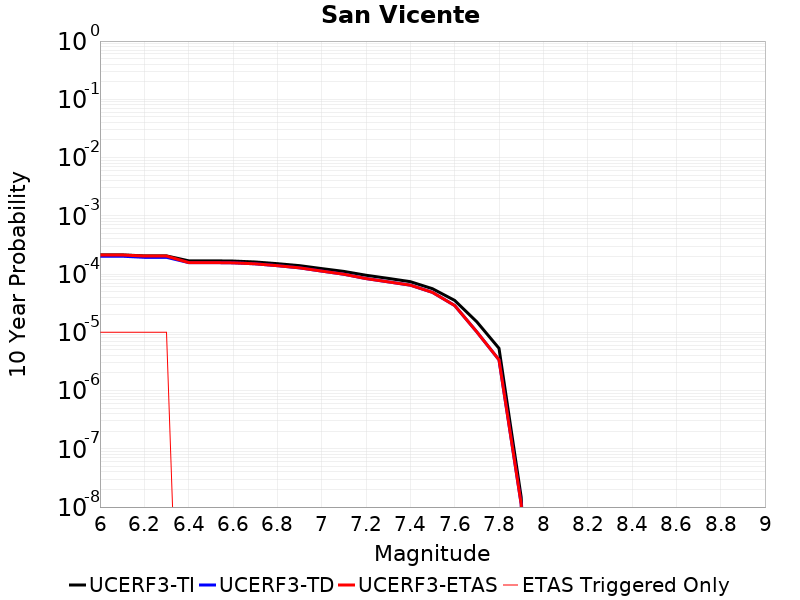 |

| Magnitude | 1 wk TI Prob | 1 wk TD Prob | 1 wk ETAS Prob | 1 wk ETAS/TD Gain | 1 wk ETAS Triggered Only | 1 mo TI Prob | 1 mo TD Prob | 1 mo ETAS Prob | 1 mo ETAS/TD Gain | 1 mo ETAS Triggered Only | 1 yr TI Prob | 1 yr TD Prob | 1 yr ETAS Prob | 1 yr ETAS/TD Gain | 1 yr ETAS Triggered Only | 10 yr TI Prob | 10 yr TD Prob | 10 yr ETAS Prob | 10 yr ETAS/TD Gain | 10 yr ETAS Triggered Only |
|-----|-----|-----|-----|-----|-----|-----|-----|-----|-----|-----|-----|-----|-----|-----|-----|-----|-----|-----|-----|-----|
| 6.0 | 4.0851268E-7 | 3.8715794E-7 | 3.8715794E-7 | 1.0 | 0.0 | 1.7507675E-6 | 1.6592472E-6 | 1.6592472E-6 | 1.0 | 0.0 | 2.1315385E-5 | 2.0201154E-5 | 2.0201154E-5 | 1.0 | 0.0 | 2.1313342E-4 | 2.0199387E-4 | 2.1199185E-4 | 1.0494964 | 1.0E-5 |
| 6.1 | 4.0851268E-7 | 3.8715794E-7 | 3.8715794E-7 | 1.0 | 0.0 | 1.7507675E-6 | 1.6592472E-6 | 1.6592472E-6 | 1.0 | 0.0 | 2.1315385E-5 | 2.0201154E-5 | 2.0201154E-5 | 1.0 | 0.0 | 2.1313342E-4 | 2.0199387E-4 | 2.1199185E-4 | 1.0494964 | 1.0E-5 |
| 6.2 | 3.9200887E-7 | 3.7060113E-7 | 3.7060113E-7 | 1.0 | 0.0 | 1.680037E-6 | 1.5882896E-6 | 1.5882896E-6 | 1.0 | 0.0 | 2.0454258E-5 | 1.933726E-5 | 1.933726E-5 | 1.0 | 0.0 | 2.0452376E-4 | 1.9335642E-4 | 2.0335449E-4 | 1.051708 | 1.0E-5 |
| 6.3 | 3.9200887E-7 | 3.7060113E-7 | 3.7060113E-7 | 1.0 | 0.0 | 1.680037E-6 | 1.5882896E-6 | 1.5882896E-6 | 1.0 | 0.0 | 2.0454258E-5 | 1.933726E-5 | 1.933726E-5 | 1.0 | 0.0 | 2.0452376E-4 | 1.9335642E-4 | 2.0335449E-4 | 1.051708 | 1.0E-5 |
| 6.4 | 3.2280067E-7 | 3.011001E-7 | 3.011001E-7 | 1.0 | 0.0 | 1.3834307E-6 | 1.2904283E-6 | 1.2904283E-6 | 1.0 | 0.0 | 1.684314E-5 | 1.5710852E-5 | 1.5710852E-5 | 1.0 | 0.0 | 1.6841863E-4 | 1.5709747E-4 | 1.5709747E-4 | 1.0 | 0.0 |
| 6.5 | 3.2280067E-7 | 3.011001E-7 | 3.011001E-7 | 1.0 | 0.0 | 1.3834307E-6 | 1.2904283E-6 | 1.2904283E-6 | 1.0 | 0.0 | 1.684314E-5 | 1.5710852E-5 | 1.5710852E-5 | 1.0 | 0.0 | 1.6841863E-4 | 1.5709747E-4 | 1.5709747E-4 | 1.0 | 0.0 |
| 6.6 | 3.1973437E-7 | 2.9802328E-7 | 2.9802328E-7 | 1.0 | 0.0 | 1.3702895E-6 | 1.277242E-6 | 1.277242E-6 | 1.0 | 0.0 | 1.6683147E-5 | 1.555031E-5 | 1.555031E-5 | 1.0 | 0.0 | 1.6681894E-4 | 1.5549226E-4 | 1.5549226E-4 | 1.0 | 0.0 |
| 6.7 | 3.0841164E-7 | 2.866205E-7 | 2.866205E-7 | 1.0 | 0.0 | 1.3217634E-6 | 1.2283729E-6 | 1.2283729E-6 | 1.0 | 0.0 | 1.6092352E-5 | 1.4955337E-5 | 1.4955337E-5 | 1.0 | 0.0 | 1.6091186E-4 | 1.4954335E-4 | 1.4954335E-4 | 1.0 | 0.0 |
| 6.8 | 2.883202E-7 | 2.6634584E-7 | 2.6634584E-7 | 1.0 | 0.0 | 1.2356575E-6 | 1.1414816E-6 | 1.1414816E-6 | 1.0 | 0.0 | 1.50440255E-5 | 1.389745E-5 | 1.389745E-5 | 1.0 | 0.0 | 1.5043007E-4 | 1.3896584E-4 | 1.3896584E-4 | 1.0 | 0.0 |
| 6.9 | 2.66663E-7 | 2.4446595E-7 | 2.4446595E-7 | 1.0 | 0.0 | 1.1428409E-6 | 1.0477108E-6 | 1.0477108E-6 | 1.0 | 0.0 | 1.3914E-5 | 1.2755804E-5 | 1.2755804E-5 | 1.0 | 0.0 | 1.3913128E-4 | 1.2755074E-4 | 1.2755074E-4 | 1.0 | 0.0 |
| 7.0 | 2.3733546E-7 | 2.1500088E-7 | 2.1500088E-7 | 1.0 | 0.0 | 1.0171515E-6 | 9.21432E-7 | 9.21432E-7 | 1.0 | 0.0 | 1.238375E-5 | 1.1218377E-5 | 1.1218377E-5 | 1.0 | 0.0 | 1.238306E-4 | 1.1217812E-4 | 1.1217812E-4 | 1.0 | 0.0 |
| 7.1 | 2.123689E-7 | 1.8994751E-7 | 1.8994751E-7 | 1.0 | 0.0 | 9.1015215E-7 | 8.140605E-7 | 8.140605E-7 | 1.0 | 0.0 | 1.1081046E-5 | 9.911141E-6 | 9.911141E-6 | 1.0 | 0.0 | 1.1080493E-4 | 9.9107005E-5 | 9.9107005E-5 | 1.0 | 0.0 |
| 7.2 | 1.8244859E-7 | 1.5996716E-7 | 1.5996716E-7 | 1.0 | 0.0 | 7.8192227E-7 | 6.855733E-7 | 6.855733E-7 | 1.0 | 0.0 | 9.519862E-6 | 8.346823E-6 | 8.346823E-6 | 1.0 | 0.0 | 9.519454E-5 | 8.34651E-5 | 8.34651E-5 | 1.0 | 0.0 |
| 7.3 | 1.611936E-7 | 1.4051346E-7 | 1.4051346E-7 | 1.0 | 0.0 | 6.9082955E-7 | 6.0220043E-7 | 6.0220043E-7 | 1.0 | 0.0 | 8.410817E-6 | 7.3317656E-6 | 7.3317656E-6 | 1.0 | 0.0 | 8.410499E-5 | 7.331524E-5 | 7.331524E-5 | 1.0 | 0.0 |
| 7.4 | 1.414892E-7 | 1.2333139E-7 | 1.2333139E-7 | 1.0 | 0.0 | 6.063821E-7 | 5.2856296E-7 | 5.2856296E-7 | 1.0 | 0.0 | 7.3826773E-6 | 6.435235E-6 | 6.435235E-6 | 1.0 | 0.0 | 7.382432E-5 | 6.435049E-5 | 6.435049E-5 | 1.0 | 0.0 |
| 7.5 | 1.0709291E-7 | 9.2647E-8 | 9.2647E-8 | 1.0 | 0.0 | 4.5896954E-7 | 3.970585E-7 | 3.970585E-7 | 1.0 | 0.0 | 5.5879395E-6 | 4.8341763E-6 | 4.8341763E-6 | 1.0 | 0.0 | 5.5877994E-5 | 4.8340717E-5 | 4.8340717E-5 | 1.0 | 0.0 |
| 7.6 | 6.746737E-8 | 5.5101772E-8 | 5.5101772E-8 | 1.0 | 0.0 | 2.8914585E-7 | 2.3615043E-7 | 2.3615043E-7 | 1.0 | 0.0 | 3.5203448E-6 | 2.8751276E-6 | 2.8751276E-6 | 1.0 | 0.0 | 3.520289E-5 | 2.8750906E-5 | 2.8750906E-5 | 1.0 | 0.0 |
| 7.7 | 2.8940264E-8 | 1.9426016E-8 | 1.9426016E-8 | 1.0 | 0.0 | 1.240297E-7 | 8.3254356E-8 | 8.3254356E-8 | 1.0 | 0.0 | 1.5100605E-6 | 1.0136213E-6 | 1.0136213E-6 | 1.0 | 0.0 | 1.5100502E-5 | 1.01361675E-5 | 1.01361675E-5 | 1.0 | 0.0 |
| 7.8 | 1.0151455E-8 | 6.4375514E-9 | 6.4375514E-9 | 1.0 | 0.0 | 4.3506233E-8 | 2.7589504E-8 | 2.7589504E-8 | 1.0 | 0.0 | 5.296883E-7 | 3.3590217E-7 | 3.3590217E-7 | 1.0 | 0.0 | 5.2968703E-6 | 3.3590168E-6 | 3.3590168E-6 | 1.0 | 0.0 |
| 7.9 | 2.8324232E-11 | 2.1593616E-11 | 2.1593616E-11 | 1.0 | 0.0 | 1.2138957E-10 | 9.254386E-11 | 9.254386E-11 | 1.0 | 0.0 | 1.4779177E-9 | 1.1267215E-9 | 1.1267215E-9 | 1.0 | 0.0 | 1.4779177E-8 | 1.1267214E-8 | 1.1267214E-8 | 1.0 | 0.0 |

## Anaheim
*[(top)](#table-of-contents)*

| 1 Week | 1 Month | 1 Year | 10 Year |
|-----|-----|-----|-----|
| 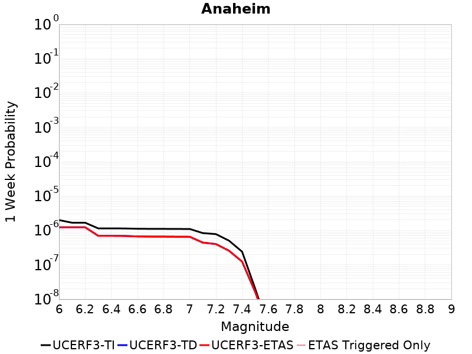 | 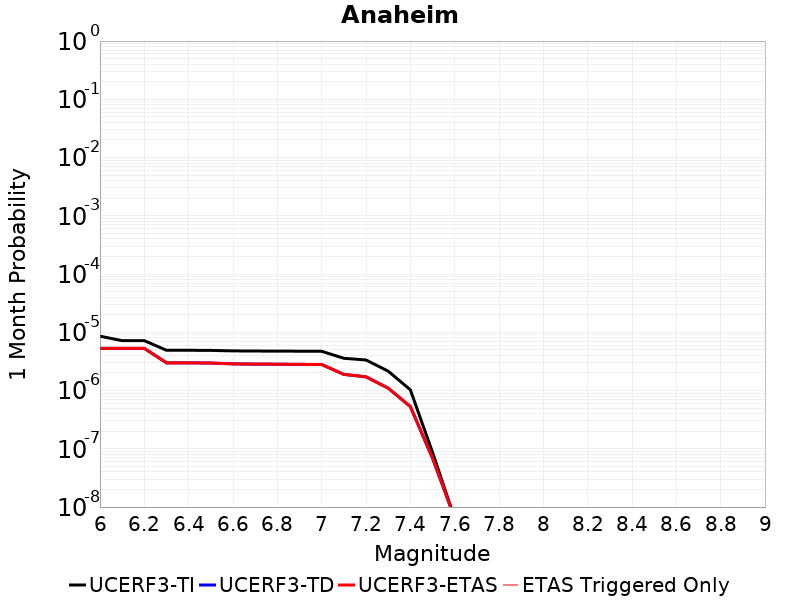 | 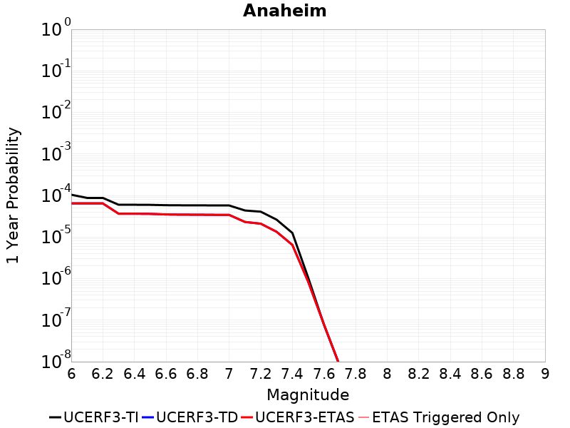 | 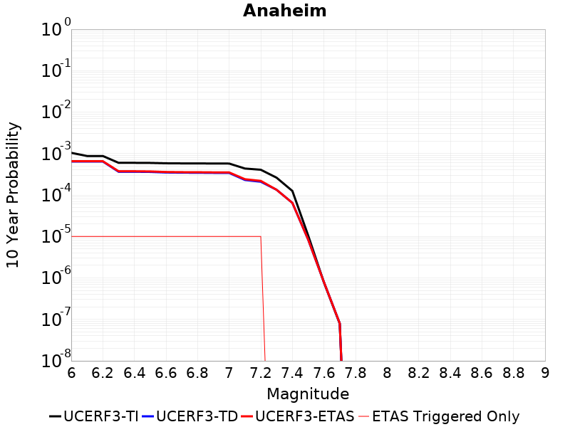 |

| Magnitude | 1 wk TI Prob | 1 wk TD Prob | 1 wk ETAS Prob | 1 wk ETAS/TD Gain | 1 wk ETAS Triggered Only | 1 mo TI Prob | 1 mo TD Prob | 1 mo ETAS Prob | 1 mo ETAS/TD Gain | 1 mo ETAS Triggered Only | 1 yr TI Prob | 1 yr TD Prob | 1 yr ETAS Prob | 1 yr ETAS/TD Gain | 1 yr ETAS Triggered Only | 10 yr TI Prob | 10 yr TD Prob | 10 yr ETAS Prob | 10 yr ETAS/TD Gain | 10 yr ETAS Triggered Only |
|-----|-----|-----|-----|-----|-----|-----|-----|-----|-----|-----|-----|-----|-----|-----|-----|-----|-----|-----|-----|-----|
| 6.0 | 1.9952497E-6 | 1.2317162E-6 | 1.2317162E-6 | 1.0 | 0.0 | 8.551043E-6 | 5.2787755E-6 | 5.2787755E-6 | 1.0 | 0.0 | 1.04103965E-4 | 6.426761E-5 | 6.426761E-5 | 1.0 | 0.0 | 0.0010405522 | 6.425308E-4 | 6.525244E-4 | 1.0155535 | 1.0E-5 |
| 6.1 | 1.6729715E-6 | 1.2317162E-6 | 1.2317162E-6 | 1.0 | 0.0 | 7.1698582E-6 | 5.2787755E-6 | 5.2787755E-6 | 1.0 | 0.0 | 8.7289525E-5 | 6.426761E-5 | 6.426761E-5 | 1.0 | 0.0 | 8.7255245E-4 | 6.425308E-4 | 6.525244E-4 | 1.0155535 | 1.0E-5 |
| 6.2 | 1.6729715E-6 | 1.2317162E-6 | 1.2317162E-6 | 1.0 | 0.0 | 7.1698582E-6 | 5.2787755E-6 | 5.2787755E-6 | 1.0 | 0.0 | 8.7289525E-5 | 6.426761E-5 | 6.426761E-5 | 1.0 | 0.0 | 8.7255245E-4 | 6.425308E-4 | 6.525244E-4 | 1.0155535 | 1.0E-5 |
| 6.3 | 1.1444064E-6 | 6.9671813E-7 | 6.9671813E-7 | 1.0 | 0.0 | 4.9045893E-6 | 2.9859318E-6 | 2.9859318E-6 | 1.0 | 0.0 | 5.971174E-5 | 3.635317E-5 | 3.635317E-5 | 1.0 | 0.0 | 5.96957E-4 | 3.6347774E-4 | 3.734741E-4 | 1.0275021 | 1.0E-5 |
| 6.4 | 1.1444064E-6 | 6.9671813E-7 | 6.9671813E-7 | 1.0 | 0.0 | 4.9045893E-6 | 2.9859318E-6 | 2.9859318E-6 | 1.0 | 0.0 | 5.971174E-5 | 3.635317E-5 | 3.635317E-5 | 1.0 | 0.0 | 5.96957E-4 | 3.6347774E-4 | 3.734741E-4 | 1.0275021 | 1.0E-5 |
| 6.5 | 1.1385318E-6 | 6.907884E-7 | 6.907884E-7 | 1.0 | 0.0 | 4.879413E-6 | 2.9605187E-6 | 2.9605187E-6 | 1.0 | 0.0 | 5.9405233E-5 | 3.6043773E-5 | 3.6043773E-5 | 1.0 | 0.0 | 5.938936E-4 | 3.603848E-4 | 3.703812E-4 | 1.0277381 | 1.0E-5 |
| 6.6 | 1.1165511E-6 | 6.685991E-7 | 6.685991E-7 | 1.0 | 0.0 | 4.78521E-6 | 2.865422E-6 | 2.865422E-6 | 1.0 | 0.0 | 5.8258374E-5 | 3.488601E-5 | 3.488601E-5 | 1.0 | 0.0 | 5.8243104E-4 | 3.4881078E-4 | 3.588073E-4 | 1.0286589 | 1.0E-5 |
| 6.7 | 1.1098243E-6 | 6.618212E-7 | 6.618212E-7 | 1.0 | 0.0 | 4.7563813E-6 | 2.8363738E-6 | 2.8363738E-6 | 1.0 | 0.0 | 5.7907404E-5 | 3.453236E-5 | 3.453236E-5 | 1.0 | 0.0 | 5.7892315E-4 | 3.452754E-4 | 3.5527194E-4 | 1.0289524 | 1.0E-5 |
| 6.8 | 1.1077587E-6 | 6.5974183E-7 | 6.5974183E-7 | 1.0 | 0.0 | 4.7475287E-6 | 2.8274624E-6 | 2.8274624E-6 | 1.0 | 0.0 | 5.779963E-5 | 3.4423865E-5 | 3.4423865E-5 | 1.0 | 0.0 | 5.77846E-4 | 3.4419078E-4 | 3.5418733E-4 | 1.0290437 | 1.0E-5 |
| 6.9 | 1.1024468E-6 | 6.543996E-7 | 6.543996E-7 | 1.0 | 0.0 | 4.7247636E-6 | 2.8045672E-6 | 2.8045672E-6 | 1.0 | 0.0 | 5.752248E-5 | 3.4145127E-5 | 3.4145127E-5 | 1.0 | 0.0 | 5.750759E-4 | 3.4140423E-4 | 3.514008E-4 | 1.0292808 | 1.0E-5 |
| 7.0 | 1.0993066E-6 | 6.5180825E-7 | 6.5180825E-7 | 1.0 | 0.0 | 4.7113053E-6 | 2.7934611E-6 | 2.7934611E-6 | 1.0 | 0.0 | 5.7358633E-5 | 3.4009914E-5 | 3.4009914E-5 | 1.0 | 0.0 | 5.734383E-4 | 3.4005253E-4 | 3.5004914E-4 | 1.0293972 | 1.0E-5 |
| 7.1 | 8.334877E-7 | 4.4126878E-7 | 4.4126878E-7 | 1.0 | 0.0 | 3.5720855E-6 | 1.8911508E-6 | 1.8911508E-6 | 1.0 | 0.0 | 4.348927E-5 | 2.3024539E-5 | 2.3024539E-5 | 1.0 | 0.0 | 4.3480762E-4 | 2.3022378E-4 | 2.4022147E-4 | 1.043426 | 1.0E-5 |
| 7.2 | 7.794411E-7 | 4.007023E-7 | 4.007023E-7 | 1.0 | 0.0 | 3.3404576E-6 | 1.7172945E-6 | 1.7172945E-6 | 1.0 | 0.0 | 4.0669314E-5 | 2.090788E-5 | 2.090788E-5 | 1.0 | 0.0 | 4.066187E-4 | 2.090612E-4 | 2.190591E-4 | 1.0478228 | 1.0E-5 |
| 7.3 | 5.01704E-7 | 2.5617484E-7 | 2.5617484E-7 | 1.0 | 0.0 | 2.150158E-6 | 1.0978918E-6 | 1.0978918E-6 | 1.0 | 0.0 | 2.617786E-5 | 1.3366763E-5 | 1.3366763E-5 | 1.0 | 0.0 | 2.6174777E-4 | 1.3366084E-4 | 1.3366084E-4 | 1.0 | 0.0 |
| 7.4 | 2.4008182E-7 | 1.2373896E-7 | 1.2373896E-7 | 1.0 | 0.0 | 1.0289217E-6 | 5.3030976E-7 | 5.3030976E-7 | 1.0 | 0.0 | 1.252705E-5 | 6.4565097E-6 | 6.4565097E-6 | 1.0 | 0.0 | 1.2526344E-4 | 6.456398E-5 | 6.456398E-5 | 1.0 | 0.0 |
| 7.5 | 2.0263876E-8 | 1.6152912E-8 | 1.6152912E-8 | 1.0 | 0.0 | 8.684518E-8 | 6.9226765E-8 | 6.9226765E-8 | 1.0 | 0.0 | 1.0573395E-6 | 8.428356E-7 | 8.428356E-7 | 1.0 | 0.0 | 1.0573345E-5 | 8.428334E-6 | 8.428334E-6 | 1.0 | 0.0 |
| 7.6 | 1.4871431E-9 | 1.5087452E-9 | 1.5087452E-9 | 1.0 | 0.0 | 6.37347E-9 | 6.466052E-9 | 6.466052E-9 | 1.0 | 0.0 | 7.7596994E-8 | 7.872418E-8 | 7.872418E-8 | 1.0 | 0.0 | 7.759697E-7 | 7.872415E-7 | 7.872415E-7 | 1.0 | 0.0 |
| 7.7 | 1.5093293E-10 | 1.5338586E-10 | 1.5338586E-10 | 1.0 | 0.0 | 6.4685546E-10 | 6.573688E-10 | 6.573688E-10 | 1.0 | 0.0 | 7.875465E-9 | 8.003463E-9 | 8.003463E-9 | 1.0 | 0.0 | 7.8754645E-8 | 8.0034624E-8 | 8.0034624E-8 | 1.0 | 0.0 |

## Compton
*[(top)](#table-of-contents)*

| 1 Week | 1 Month | 1 Year | 10 Year |
|-----|-----|-----|-----|
| 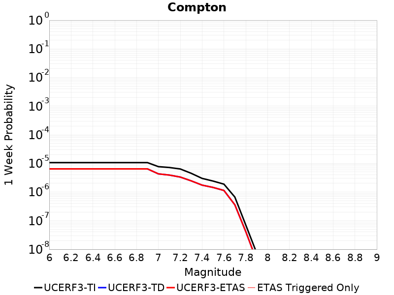 | 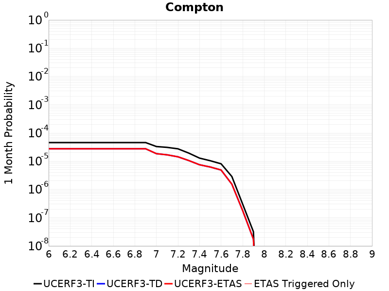 | 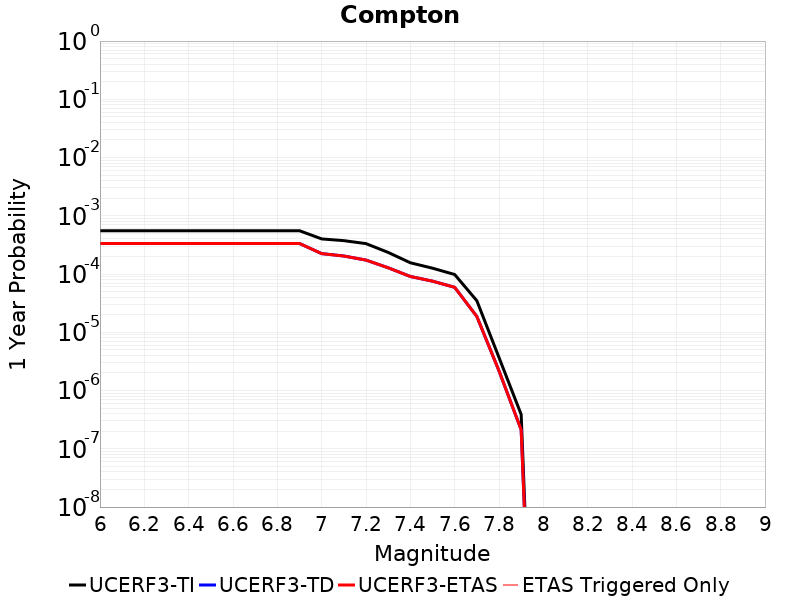 |  |

| Magnitude | 1 wk TI Prob | 1 wk TD Prob | 1 wk ETAS Prob | 1 wk ETAS/TD Gain | 1 wk ETAS Triggered Only | 1 mo TI Prob | 1 mo TD Prob | 1 mo ETAS Prob | 1 mo ETAS/TD Gain | 1 mo ETAS Triggered Only | 1 yr TI Prob | 1 yr TD Prob | 1 yr ETAS Prob | 1 yr ETAS/TD Gain | 1 yr ETAS Triggered Only | 10 yr TI Prob | 10 yr TD Prob | 10 yr ETAS Prob | 10 yr ETAS/TD Gain | 10 yr ETAS Triggered Only |
|-----|-----|-----|-----|-----|-----|-----|-----|-----|-----|-----|-----|-----|-----|-----|-----|-----|-----|-----|-----|-----|
| 6.0 | 1.06050875E-5 | 6.399461E-6 | 6.399461E-6 | 1.0 | 0.0 | 4.5449582E-5 | 2.7425991E-5 | 2.7425991E-5 | 1.0 | 0.0 | 5.5320817E-4 | 3.338632E-4 | 3.338632E-4 | 1.0 | 0.0 | 0.0055183303 | 0.0033339052 | 0.003343872 | 1.0029895 | 1.0E-5 |
| 6.1 | 1.06050875E-5 | 6.399461E-6 | 6.399461E-6 | 1.0 | 0.0 | 4.5449582E-5 | 2.7425991E-5 | 2.7425991E-5 | 1.0 | 0.0 | 5.5320817E-4 | 3.338632E-4 | 3.338632E-4 | 1.0 | 0.0 | 0.0055183303 | 0.0033339052 | 0.003343872 | 1.0029895 | 1.0E-5 |
| 6.2 | 1.06050875E-5 | 6.399461E-6 | 6.399461E-6 | 1.0 | 0.0 | 4.5449582E-5 | 2.7425991E-5 | 2.7425991E-5 | 1.0 | 0.0 | 5.5320817E-4 | 3.338632E-4 | 3.338632E-4 | 1.0 | 0.0 | 0.0055183303 | 0.0033339052 | 0.003343872 | 1.0029895 | 1.0E-5 |
| 6.3 | 1.06050875E-5 | 6.399461E-6 | 6.399461E-6 | 1.0 | 0.0 | 4.5449582E-5 | 2.7425991E-5 | 2.7425991E-5 | 1.0 | 0.0 | 5.5320817E-4 | 3.338632E-4 | 3.338632E-4 | 1.0 | 0.0 | 0.0055183303 | 0.0033339052 | 0.003343872 | 1.0029895 | 1.0E-5 |
| 6.4 | 1.06050875E-5 | 6.399461E-6 | 6.399461E-6 | 1.0 | 0.0 | 4.5449582E-5 | 2.7425991E-5 | 2.7425991E-5 | 1.0 | 0.0 | 5.5320817E-4 | 3.338632E-4 | 3.338632E-4 | 1.0 | 0.0 | 0.0055183303 | 0.0033339052 | 0.003343872 | 1.0029895 | 1.0E-5 |
| 6.5 | 1.06050875E-5 | 6.399461E-6 | 6.399461E-6 | 1.0 | 0.0 | 4.5449582E-5 | 2.7425991E-5 | 2.7425991E-5 | 1.0 | 0.0 | 5.5320817E-4 | 3.338632E-4 | 3.338632E-4 | 1.0 | 0.0 | 0.0055183303 | 0.0033339052 | 0.003343872 | 1.0029895 | 1.0E-5 |
| 6.6 | 1.06050875E-5 | 6.399461E-6 | 6.399461E-6 | 1.0 | 0.0 | 4.5449582E-5 | 2.7425991E-5 | 2.7425991E-5 | 1.0 | 0.0 | 5.5320817E-4 | 3.338632E-4 | 3.338632E-4 | 1.0 | 0.0 | 0.0055183303 | 0.0033339052 | 0.003343872 | 1.0029895 | 1.0E-5 |
| 6.7 | 1.06050875E-5 | 6.399461E-6 | 6.399461E-6 | 1.0 | 0.0 | 4.5449582E-5 | 2.7425991E-5 | 2.7425991E-5 | 1.0 | 0.0 | 5.5320817E-4 | 3.338632E-4 | 3.338632E-4 | 1.0 | 0.0 | 0.0055183303 | 0.0033339052 | 0.003343872 | 1.0029895 | 1.0E-5 |
| 6.8 | 1.06050875E-5 | 6.399461E-6 | 6.399461E-6 | 1.0 | 0.0 | 4.5449582E-5 | 2.7425991E-5 | 2.7425991E-5 | 1.0 | 0.0 | 5.5320817E-4 | 3.338632E-4 | 3.338632E-4 | 1.0 | 0.0 | 0.0055183303 | 0.0033339052 | 0.003343872 | 1.0029895 | 1.0E-5 |
| 6.9 | 1.06050875E-5 | 6.399461E-6 | 6.399461E-6 | 1.0 | 0.0 | 4.5449582E-5 | 2.7425991E-5 | 2.7425991E-5 | 1.0 | 0.0 | 5.5320817E-4 | 3.338632E-4 | 3.338632E-4 | 1.0 | 0.0 | 0.0055183303 | 0.0033339052 | 0.003343872 | 1.0029895 | 1.0E-5 |
| 7.0 | 7.672486E-6 | 4.291525E-6 | 4.291525E-6 | 1.0 | 0.0 | 3.288167E-5 | 1.8392124E-5 | 1.8392124E-5 | 1.0 | 0.0 | 4.0026082E-4 | 2.2390172E-4 | 2.2390172E-4 | 1.0 | 0.0 | 0.0039954064 | 0.0022368242 | 0.002246802 | 1.0044606 | 1.0E-5 |
| 7.1 | 7.163992E-6 | 3.9018514E-6 | 3.9018514E-6 | 1.0 | 0.0 | 3.0702464E-5 | 1.6722115E-5 | 1.6722115E-5 | 1.0 | 0.0 | 3.7373835E-4 | 2.0357332E-4 | 2.0357332E-4 | 1.0 | 0.0 | 0.0037311043 | 0.002033926 | 0.002043906 | 1.0049067 | 1.0E-5 |
| 7.2 | 6.3689185E-6 | 3.3228137E-6 | 3.3228137E-6 | 1.0 | 0.0 | 2.729508E-5 | 1.4240554E-5 | 1.4240554E-5 | 1.0 | 0.0 | 3.322669E-4 | 1.7336538E-4 | 1.7336538E-4 | 1.0 | 0.0 | 0.0033177056 | 0.0017323437 | 0.0017423264 | 1.0057626 | 1.0E-5 |
| 7.3 | 4.4987873E-6 | 2.4510703E-6 | 2.4510703E-6 | 1.0 | 0.0 | 1.9280375E-5 | 1.05045465E-5 | 1.05045465E-5 | 1.0 | 0.0 | 2.3471327E-4 | 1.2788565E-4 | 1.2788565E-4 | 1.0 | 0.0 | 0.002344655 | 0.0012781512 | 0.0012781512 | 1.0 | 0.0 |
| 7.4 | 2.987296E-6 | 1.7381E-6 | 1.7381E-6 | 1.0 | 0.0 | 1.2802635E-5 | 7.448979E-6 | 7.448979E-6 | 1.0 | 0.0 | 1.5586092E-4 | 9.06876E-5 | 9.06876E-5 | 1.0 | 0.0 | 0.0015575165 | 9.065117E-4 | 9.065117E-4 | 1.0 | 0.0 |
| 7.5 | 2.4111696E-6 | 1.4444669E-6 | 1.4444669E-6 | 1.0 | 0.0 | 1.0333543E-5 | 6.190558E-6 | 6.190558E-6 | 1.0 | 0.0 | 1.2580362E-4 | 7.536748E-5 | 7.536748E-5 | 1.0 | 0.0 | 0.0012573242 | 7.5342384E-4 | 7.5342384E-4 | 1.0 | 0.0 |
| 7.6 | 1.8783096E-6 | 1.1323741E-6 | 1.1323741E-6 | 1.0 | 0.0 | 8.049874E-6 | 4.853023E-6 | 4.853023E-6 | 1.0 | 0.0 | 9.8002805E-5 | 5.908399E-5 | 5.908399E-5 | 1.0 | 0.0 | 9.795959E-4 | 5.906868E-4 | 5.906868E-4 | 1.0 | 0.0 |
| 7.7 | 6.6646817E-7 | 3.5753132E-7 | 3.5753132E-7 | 1.0 | 0.0 | 2.856289E-6 | 1.5322762E-6 | 1.5322762E-6 | 1.0 | 0.0 | 3.4774763E-5 | 1.8655317E-5 | 1.8655317E-5 | 1.0 | 0.0 | 3.4769322E-4 | 1.8653886E-4 | 1.8653886E-4 | 1.0 | 0.0 |
| 7.8 | 7.054689E-8 | 4.1629644E-8 | 4.1629644E-8 | 1.0 | 0.0 | 3.0234378E-7 | 1.7841275E-7 | 1.7841275E-7 | 1.0 | 0.0 | 3.6810293E-6 | 2.172173E-6 | 2.172173E-6 | 1.0 | 0.0 | 3.6809684E-5 | 2.172153E-5 | 2.172153E-5 | 1.0 | 0.0 |
| 7.9 | 7.420925E-9 | 4.0587853E-9 | 4.0587853E-9 | 1.0 | 0.0 | 3.1803964E-8 | 1.7394795E-8 | 1.7394795E-8 | 1.0 | 0.0 | 3.872132E-7 | 2.1178161E-7 | 2.1178161E-7 | 1.0 | 0.0 | 3.872125E-6 | 2.1178141E-6 | 2.1178141E-6 | 1.0 | 0.0 |

## Clamshell-Sawpit
*[(top)](#table-of-contents)*

| 1 Week | 1 Month | 1 Year | 10 Year |
|-----|-----|-----|-----|
| 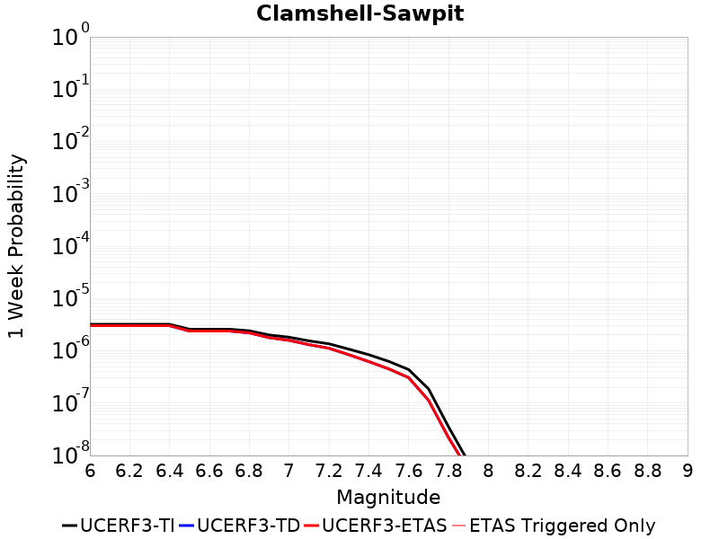 | 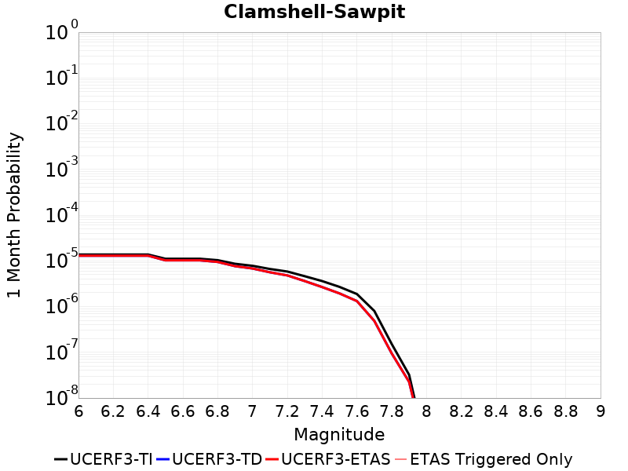 | 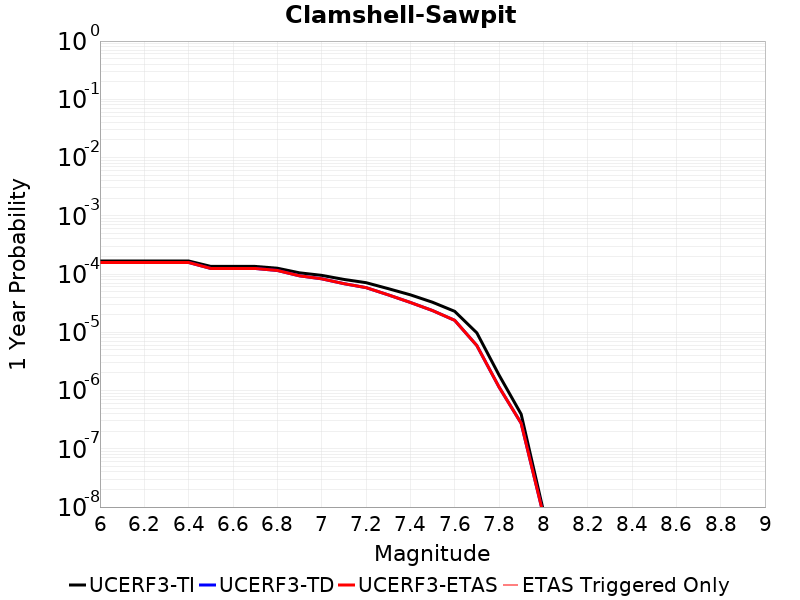 | 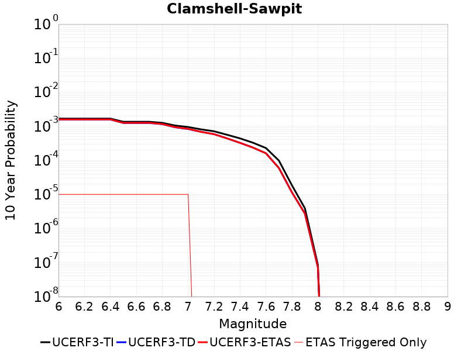 |

| Magnitude | 1 wk TI Prob | 1 wk TD Prob | 1 wk ETAS Prob | 1 wk ETAS/TD Gain | 1 wk ETAS Triggered Only | 1 mo TI Prob | 1 mo TD Prob | 1 mo ETAS Prob | 1 mo ETAS/TD Gain | 1 mo ETAS Triggered Only | 1 yr TI Prob | 1 yr TD Prob | 1 yr ETAS Prob | 1 yr ETAS/TD Gain | 1 yr ETAS Triggered Only | 10 yr TI Prob | 10 yr TD Prob | 10 yr ETAS Prob | 10 yr ETAS/TD Gain | 10 yr ETAS Triggered Only |
|-----|-----|-----|-----|-----|-----|-----|-----|-----|-----|-----|-----|-----|-----|-----|-----|-----|-----|-----|-----|-----|
| 6.0 | 3.202998E-6 | 3.0191218E-6 | 3.0191218E-6 | 1.0 | 0.0 | 1.3727062E-5 | 1.2939034E-5 | 1.2939034E-5 | 1.0 | 0.0 | 1.6711417E-4 | 1.5752215E-4 | 1.5752215E-4 | 1.0 | 0.0 | 0.0016698855 | 0.0015741846 | 0.0015841689 | 1.0063425 | 1.0E-5 |
| 6.1 | 3.202998E-6 | 3.0191218E-6 | 3.0191218E-6 | 1.0 | 0.0 | 1.3727062E-5 | 1.2939034E-5 | 1.2939034E-5 | 1.0 | 0.0 | 1.6711417E-4 | 1.5752215E-4 | 1.5752215E-4 | 1.0 | 0.0 | 0.0016698855 | 0.0015741846 | 0.0015841689 | 1.0063425 | 1.0E-5 |
| 6.2 | 3.202998E-6 | 3.0191218E-6 | 3.0191218E-6 | 1.0 | 0.0 | 1.3727062E-5 | 1.2939034E-5 | 1.2939034E-5 | 1.0 | 0.0 | 1.6711417E-4 | 1.5752215E-4 | 1.5752215E-4 | 1.0 | 0.0 | 0.0016698855 | 0.0015741846 | 0.0015841689 | 1.0063425 | 1.0E-5 |
| 6.3 | 3.202998E-6 | 3.0191218E-6 | 3.0191218E-6 | 1.0 | 0.0 | 1.3727062E-5 | 1.2939034E-5 | 1.2939034E-5 | 1.0 | 0.0 | 1.6711417E-4 | 1.5752215E-4 | 1.5752215E-4 | 1.0 | 0.0 | 0.0016698855 | 0.0015741846 | 0.0015841689 | 1.0063425 | 1.0E-5 |
| 6.4 | 3.202998E-6 | 3.0191218E-6 | 3.0191218E-6 | 1.0 | 0.0 | 1.3727062E-5 | 1.2939034E-5 | 1.2939034E-5 | 1.0 | 0.0 | 1.6711417E-4 | 1.5752215E-4 | 1.5752215E-4 | 1.0 | 0.0 | 0.0016698855 | 0.0015741846 | 0.0015841689 | 1.0063425 | 1.0E-5 |
| 6.5 | 2.5862723E-6 | 2.3865166E-6 | 2.3865166E-6 | 1.0 | 0.0 | 1.1083977E-5 | 1.022789E-5 | 1.022789E-5 | 1.0 | 0.0 | 1.3493907E-4 | 1.2451776E-4 | 1.2451776E-4 | 1.0 | 0.0 | 0.0013485716 | 0.0012445103 | 0.0012544978 | 1.0080253 | 1.0E-5 |
| 6.6 | 2.5862723E-6 | 2.3865166E-6 | 2.3865166E-6 | 1.0 | 0.0 | 1.1083977E-5 | 1.022789E-5 | 1.022789E-5 | 1.0 | 0.0 | 1.3493907E-4 | 1.2451776E-4 | 1.2451776E-4 | 1.0 | 0.0 | 0.0013485716 | 0.0012445103 | 0.0012544978 | 1.0080253 | 1.0E-5 |
| 6.7 | 2.5862723E-6 | 2.3865166E-6 | 2.3865166E-6 | 1.0 | 0.0 | 1.1083977E-5 | 1.022789E-5 | 1.022789E-5 | 1.0 | 0.0 | 1.3493907E-4 | 1.2451776E-4 | 1.2451776E-4 | 1.0 | 0.0 | 0.0013485716 | 0.0012445103 | 0.0012544978 | 1.0080253 | 1.0E-5 |
| 6.8 | 2.4098806E-6 | 2.2032007E-6 | 2.2032007E-6 | 1.0 | 0.0 | 1.0328019E-5 | 9.442256E-6 | 9.442256E-6 | 1.0 | 0.0 | 1.2573638E-4 | 1.1495367E-4 | 1.1495367E-4 | 1.0 | 0.0 | 0.0012566525 | 0.0011489688 | 0.0011589573 | 1.0086935 | 1.0E-5 |
| 6.9 | 2.0073985E-6 | 1.7832041E-6 | 1.7832041E-6 | 1.0 | 0.0 | 8.603109E-6 | 7.642282E-6 | 7.642282E-6 | 1.0 | 0.0 | 1.0473781E-4 | 9.304093E-5 | 9.304093E-5 | 1.0 | 0.0 | 0.0010468846 | 9.3003165E-4 | 9.4002235E-4 | 1.0107423 | 1.0E-5 |
| 7.0 | 1.8166766E-6 | 1.5852032E-6 | 1.5852032E-6 | 1.0 | 0.0 | 7.785734E-6 | 6.7937112E-6 | 6.7937112E-6 | 1.0 | 0.0 | 9.478718E-5 | 8.2710394E-5 | 8.2710394E-5 | 1.0 | 0.0 | 9.4746763E-4 | 8.2680624E-4 | 8.36798E-4 | 1.0120847 | 1.0E-5 |
| 7.1 | 1.5471421E-6 | 1.3092396E-6 | 1.3092396E-6 | 1.0 | 0.0 | 6.6305925E-6 | 5.611015E-6 | 5.611015E-6 | 1.0 | 0.0 | 8.072447E-5 | 6.831202E-5 | 6.831202E-5 | 1.0 | 0.0 | 8.0695155E-4 | 6.8291574E-4 | 6.8291574E-4 | 1.0 | 0.0 |
| 7.2 | 1.3608037E-6 | 1.1189114E-6 | 1.1189114E-6 | 1.0 | 0.0 | 5.8320024E-6 | 4.7953263E-6 | 4.7953263E-6 | 1.0 | 0.0 | 7.1002316E-5 | 5.838158E-5 | 5.838158E-5 | 1.0 | 0.0 | 7.097964E-4 | 5.836671E-4 | 5.836671E-4 | 1.0 | 0.0 |
| 7.3 | 1.0749634E-6 | 8.413922E-7 | 8.413922E-7 | 1.0 | 0.0 | 4.6069777E-6 | 3.6059619E-6 | 3.6059619E-6 | 1.0 | 0.0 | 5.608851E-5 | 4.390173E-5 | 4.390173E-5 | 1.0 | 0.0 | 5.6074356E-4 | 4.389334E-4 | 4.389334E-4 | 1.0 | 0.0 |
| 7.4 | 8.416856E-7 | 6.2249967E-7 | 6.2249967E-7 | 1.0 | 0.0 | 3.607219E-6 | 2.667853E-6 | 2.667853E-6 | 1.0 | 0.0 | 4.3917007E-5 | 3.248065E-5 | 3.248065E-5 | 1.0 | 0.0 | 4.390833E-4 | 3.24761E-4 | 3.24761E-4 | 1.0 | 0.0 |
| 7.5 | 6.2779594E-7 | 4.5184467E-7 | 4.5184467E-7 | 1.0 | 0.0 | 2.6905511E-6 | 1.9364759E-6 | 1.9364759E-6 | 1.0 | 0.0 | 3.275697E-5 | 2.3576358E-5 | 2.3576358E-5 | 1.0 | 0.0 | 3.275214E-4 | 2.3574046E-4 | 2.3574046E-4 | 1.0 | 0.0 |
| 7.6 | 4.3822078E-7 | 3.0721674E-7 | 3.0721674E-7 | 1.0 | 0.0 | 1.8780877E-6 | 1.3166426E-6 | 1.3166426E-6 | 1.0 | 0.0 | 2.2865479E-5 | 1.6030022E-5 | 1.6030022E-5 | 1.0 | 0.0 | 2.2863125E-4 | 1.602902E-4 | 1.602902E-4 | 1.0 | 0.0 |
| 7.7 | 1.8704569E-7 | 1.1322918E-7 | 1.1322918E-7 | 1.0 | 0.0 | 8.0162414E-7 | 4.8526783E-7 | 4.8526783E-7 | 1.0 | 0.0 | 9.75973E-6 | 5.9081203E-6 | 5.9081203E-6 | 1.0 | 0.0 | 9.7593016E-5 | 5.90797E-5 | 5.90797E-5 | 1.0 | 0.0 |
| 7.8 | 3.5378733E-8 | 2.2013612E-8 | 2.2013612E-8 | 1.0 | 0.0 | 1.5162313E-7 | 9.434405E-8 | 9.434405E-8 | 1.0 | 0.0 | 1.84601E-6 | 1.1486383E-6 | 1.1486383E-6 | 1.0 | 0.0 | 1.8459947E-5 | 1.1486326E-5 | 1.1486326E-5 | 1.0 | 0.0 |
| 7.9 | 7.504945E-9 | 5.24655E-9 | 5.24655E-9 | 1.0 | 0.0 | 3.2164053E-8 | 2.2485215E-8 | 2.2485215E-8 | 1.0 | 0.0 | 3.9159727E-7 | 2.7375748E-7 | 2.7375748E-7 | 1.0 | 0.0 | 3.915966E-6 | 2.737572E-6 | 2.737572E-6 | 1.0 | 0.0 |
| 8.0 | 1.6554036E-10 | 1.4191659E-10 | 1.4191659E-10 | 1.0 | 0.0 | 7.0945894E-10 | 6.0821415E-10 | 6.0821415E-10 | 1.0 | 0.0 | 8.637662E-9 | 7.405007E-9 | 7.405007E-9 | 1.0 | 0.0 | 8.6376616E-8 | 7.405007E-8 | 7.405007E-8 | 1.0 | 0.0 |

## San Andreas (Mojave S)
*[(top)](#table-of-contents)*

| 1 Week | 1 Month | 1 Year | 10 Year |
|-----|-----|-----|-----|
| 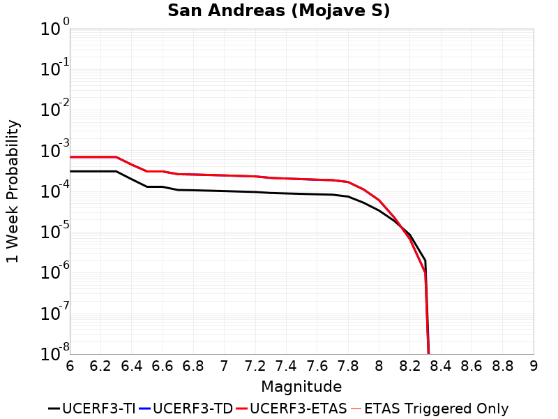 | 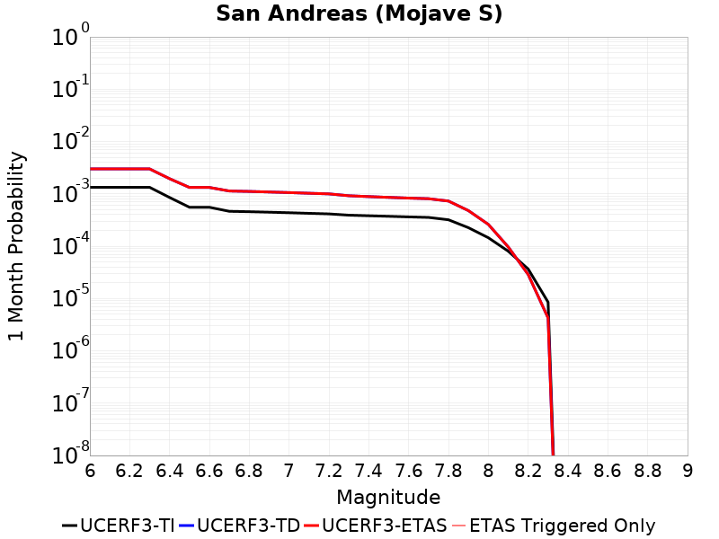 |  | 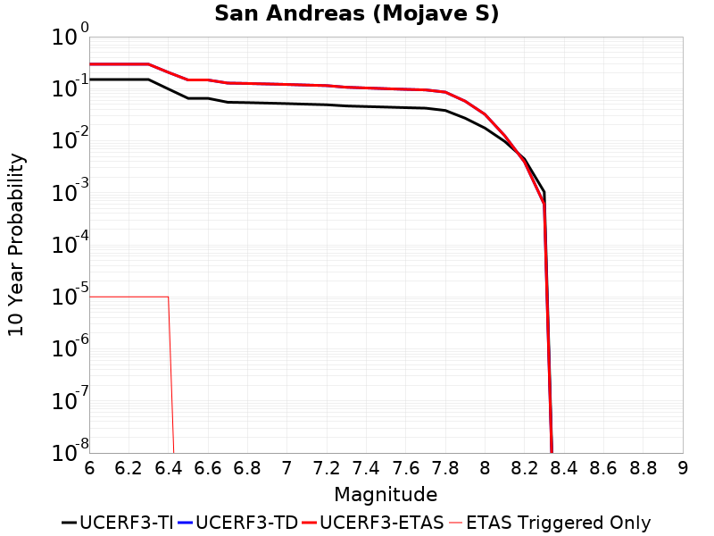 |

| Magnitude | 1 wk TI Prob | 1 wk TD Prob | 1 wk ETAS Prob | 1 wk ETAS/TD Gain | 1 wk ETAS Triggered Only | 1 mo TI Prob | 1 mo TD Prob | 1 mo ETAS Prob | 1 mo ETAS/TD Gain | 1 mo ETAS Triggered Only | 1 yr TI Prob | 1 yr TD Prob | 1 yr ETAS Prob | 1 yr ETAS/TD Gain | 1 yr ETAS Triggered Only | 10 yr TI Prob | 10 yr TD Prob | 10 yr ETAS Prob | 10 yr ETAS/TD Gain | 10 yr ETAS Triggered Only |
|-----|-----|-----|-----|-----|-----|-----|-----|-----|-----|-----|-----|-----|-----|-----|-----|-----|-----|-----|-----|-----|
| 6.0 | 3.1064058E-4 | 6.9840596E-4 | 6.9840596E-4 | 1.0 | 0.0 | 0.0013306376 | 0.0029898647 | 0.0029898647 | 1.0 | 0.0 | 0.016080605 | 0.035763722 | 0.035773367 | 1.0002697 | 1.0E-5 | 0.1496549 | 0.2945828 | 0.29458988 | 1.000024 | 1.0E-5 |
| 6.1 | 3.1064058E-4 | 6.9840596E-4 | 6.9840596E-4 | 1.0 | 0.0 | 0.0013306376 | 0.0029898647 | 0.0029898647 | 1.0 | 0.0 | 0.016080605 | 0.035763722 | 0.035773367 | 1.0002697 | 1.0E-5 | 0.1496549 | 0.2945828 | 0.29458988 | 1.000024 | 1.0E-5 |
| 6.2 | 3.1064058E-4 | 6.9840596E-4 | 6.9840596E-4 | 1.0 | 0.0 | 0.0013306376 | 0.0029898647 | 0.0029898647 | 1.0 | 0.0 | 0.016080605 | 0.035763722 | 0.035773367 | 1.0002697 | 1.0E-5 | 0.1496549 | 0.2945828 | 0.29458988 | 1.000024 | 1.0E-5 |
| 6.3 | 3.1064058E-4 | 6.9840596E-4 | 6.9840596E-4 | 1.0 | 0.0 | 0.0013306376 | 0.0029898647 | 0.0029898647 | 1.0 | 0.0 | 0.016080605 | 0.035763722 | 0.035773367 | 1.0002697 | 1.0E-5 | 0.1496549 | 0.2945828 | 0.29458988 | 1.000024 | 1.0E-5 |
| 6.4 | 1.9872203E-4 | 4.5427677E-4 | 4.5427677E-4 | 1.0 | 0.0 | 8.5138786E-4 | 0.0019454765 | 0.0019454765 | 1.0 | 0.0 | 0.010316478 | 0.023435347 | 0.023445113 | 1.0004168 | 1.0E-5 | 0.098504856 | 0.20552228 | 0.20553023 | 1.0000386 | 1.0E-5 |
| 6.5 | 1.291105E-4 | 3.086806E-4 | 3.086806E-4 | 1.0 | 0.0 | 5.5321335E-4 | 0.0013222491 | 0.0013222491 | 1.0 | 0.0 | 0.006714592 | 0.01598048 | 0.01598048 | 1.0 | 0.0 | 0.065152965 | 0.14671645 | 0.14671645 | 1.0 | 0.0 |
| 6.6 | 1.291105E-4 | 3.086806E-4 | 3.086806E-4 | 1.0 | 0.0 | 5.5321335E-4 | 0.0013222491 | 0.0013222491 | 1.0 | 0.0 | 0.006714592 | 0.01598048 | 0.01598048 | 1.0 | 0.0 | 0.065152965 | 0.14671645 | 0.14671645 | 1.0 | 0.0 |
| 6.7 | 1.08001186E-4 | 2.641176E-4 | 2.641176E-4 | 1.0 | 0.0 | 4.6278012E-4 | 0.0011314423 | 0.0011314423 | 1.0 | 0.0 | 0.0056198016 | 0.013688669 | 0.013688669 | 1.0 | 0.0 | 0.054797906 | 0.1279049 | 0.1279049 | 1.0 | 0.0 |
| 6.8 | 1.0624356E-4 | 2.5922357E-4 | 2.5922357E-4 | 1.0 | 0.0 | 4.5525006E-4 | 0.0011104858 | 0.0011104858 | 1.0 | 0.0 | 0.0055285925 | 0.013436689 | 0.013436689 | 1.0 | 0.0 | 0.053930566 | 0.12584884 | 0.12584884 | 1.0 | 0.0 |
| 6.9 | 1.0393785E-4 | 2.5283374E-4 | 2.5283374E-4 | 1.0 | 0.0 | 4.4537184E-4 | 0.0010831237 | 0.0010831237 | 1.0 | 0.0 | 0.0054089287 | 0.013107608 | 0.013107608 | 1.0 | 0.0 | 0.05279156 | 0.123132065 | 0.123132065 | 1.0 | 0.0 |
| 7.0 | 1.0155622E-4 | 2.464219E-4 | 2.464219E-4 | 1.0 | 0.0 | 4.3516833E-4 | 0.0010556668 | 0.0010556668 | 1.0 | 0.0 | 0.005285311 | 0.012777284 | 0.012777284 | 1.0 | 0.0 | 0.05161361 | 0.12038262 | 0.12038262 | 1.0 | 0.0 |
| 7.1 | 9.885595E-5 | 2.3918411E-4 | 2.3918411E-4 | 1.0 | 0.0 | 4.2359953E-4 | 0.0010246724 | 0.0010246724 | 1.0 | 0.0 | 0.0051451353 | 0.012404279 | 0.012404279 | 1.0 | 0.0 | 0.05027629 | 0.11725203 | 0.11725203 | 1.0 | 0.0 |
| 7.2 | 9.6411415E-5 | 2.3270116E-4 | 2.3270116E-4 | 1.0 | 0.0 | 4.1312634E-4 | 9.969099E-4 | 9.969099E-4 | 1.0 | 0.0 | 0.005018219 | 0.0120700635 | 0.0120700635 | 1.0 | 0.0 | 0.049064007 | 0.114428595 | 0.114428595 | 1.0 | 0.0 |
| 7.3 | 9.1180635E-5 | 2.1433632E-4 | 2.1433632E-4 | 1.0 | 0.0 | 3.907156E-4 | 9.1826095E-4 | 9.1826095E-4 | 1.0 | 0.0 | 0.004746591 | 0.011122669 | 0.011122669 | 1.0 | 0.0 | 0.046464786 | 0.10645965 | 0.10645965 | 1.0 | 0.0 |
| 7.4 | 8.887388E-5 | 2.0655333E-4 | 2.0655333E-4 | 1.0 | 0.0 | 3.8083247E-4 | 8.849284E-4 | 8.849284E-4 | 1.0 | 0.0 | 0.0046267817 | 0.010720911 | 0.010720911 | 1.0 | 0.0 | 0.045316286 | 0.103021555 | 0.103021555 | 1.0 | 0.0 |
| 7.5 | 8.6750515E-5 | 1.9961913E-4 | 1.9961913E-4 | 1.0 | 0.0 | 3.7173493E-4 | 8.5523014E-4 | 8.5523014E-4 | 1.0 | 0.0 | 0.004516484 | 0.010362833 | 0.010362833 | 1.0 | 0.0 | 0.04425787 | 0.09991475 | 0.09991475 | 1.0 | 0.0 |
| 7.6 | 8.453092E-5 | 1.932201E-4 | 1.932201E-4 | 1.0 | 0.0 | 3.6222505E-4 | 8.278234E-4 | 8.278234E-4 | 1.0 | 0.0 | 0.0044011753 | 0.0100322785 | 0.0100322785 | 1.0 | 0.0 | 0.04315024 | 0.09698627 | 0.09698627 | 1.0 | 0.0 |
| 7.7 | 8.259102E-5 | 1.8820314E-4 | 1.8820314E-4 | 1.0 | 0.0 | 3.539135E-4 | 8.063356E-4 | 8.063356E-4 | 1.0 | 0.0 | 0.004300386 | 0.009773042 | 0.009773042 | 1.0 | 0.0 | 0.042181134 | 0.09465303 | 0.09465303 | 1.0 | 0.0 |
| 7.8 | 7.444844E-5 | 1.6969937E-4 | 1.6969937E-4 | 1.0 | 0.0 | 3.1902574E-4 | 7.270804E-4 | 7.270804E-4 | 1.0 | 0.0 | 0.0038772223 | 0.008816344 | 0.008816344 | 1.0 | 0.0 | 0.03810269 | 0.085802965 | 0.085802965 | 1.0 | 0.0 |
| 7.9 | 5.2586525E-5 | 1.1145911E-4 | 1.1145911E-4 | 1.0 | 0.0 | 2.2535135E-4 | 4.7759444E-4 | 4.7759444E-4 | 1.0 | 0.0 | 0.0027402006 | 0.005799226 | 0.005799226 | 1.0 | 0.0 | 0.027066574 | 0.057488784 | 0.057488784 | 1.0 | 0.0 |
| 8.0 | 3.379877E-5 | 6.0795315E-5 | 6.0795315E-5 | 1.0 | 0.0 | 1.4484383E-4 | 2.6052535E-4 | 2.6052535E-4 | 1.0 | 0.0 | 0.0017620471 | 0.0031672851 | 0.0031672851 | 1.0 | 0.0 | 0.017481409 | 0.032099348 | 0.032099348 | 1.0 | 0.0 |
| 8.1 | 1.8668277E-5 | 2.2500746E-5 | 2.2500746E-5 | 1.0 | 0.0 | 8.000444E-5 | 9.642821E-5 | 9.642821E-5 | 1.0 | 0.0 | 9.736188E-4 | 0.001173382 | 0.001173382 | 1.0 | 0.0 | 0.009693642 | 0.01245067 | 0.01245067 | 1.0 | 0.0 |
| 8.2 | 8.541571E-6 | 6.704312E-6 | 6.704312E-6 | 1.0 | 0.0 | 3.660622E-5 | 2.873245E-5 | 2.873245E-5 | 1.0 | 0.0 | 4.455896E-4 | 3.4976154E-4 | 3.4976154E-4 | 1.0 | 0.0 | 0.0044469717 | 0.0039115916 | 0.0039115916 | 1.0 | 0.0 |
| 8.3 | 1.983087E-6 | 9.897171E-7 | 9.897171E-7 | 1.0 | 0.0 | 8.498917E-6 | 4.241638E-6 | 4.241638E-6 | 1.0 | 0.0 | 1.034694E-4 | 5.164075E-5 | 5.164075E-5 | 1.0 | 0.0 | 0.0010342124 | 5.983526E-4 | 5.983526E-4 | 1.0 | 0.0 |

## Santa Monica alt 1
*[(top)](#table-of-contents)*

| 1 Week | 1 Month | 1 Year | 10 Year |
|-----|-----|-----|-----|
|  | 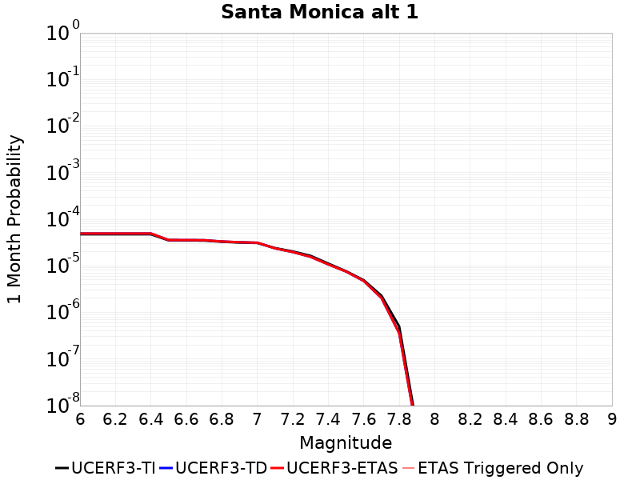 | 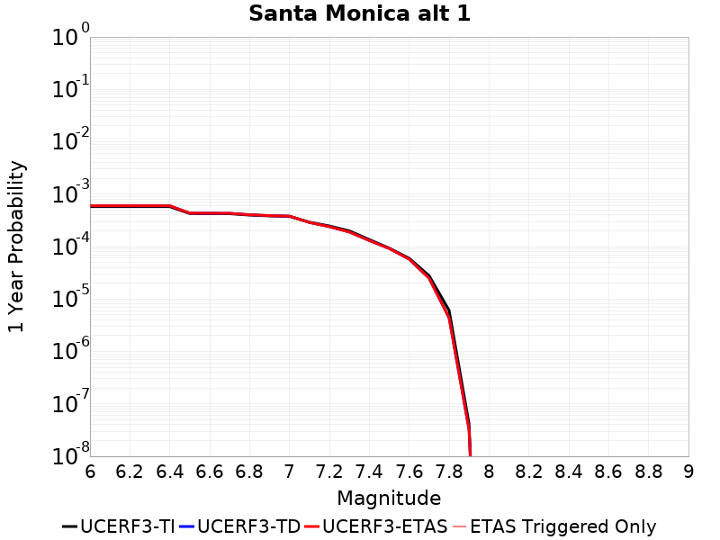 | 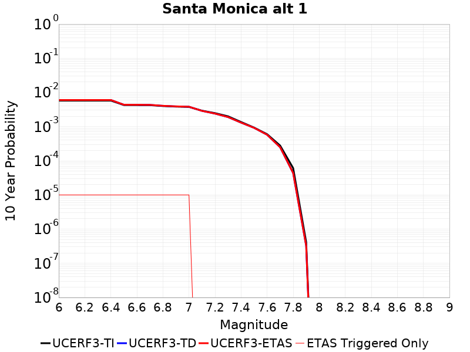 |

| Magnitude | 1 wk TI Prob | 1 wk TD Prob | 1 wk ETAS Prob | 1 wk ETAS/TD Gain | 1 wk ETAS Triggered Only | 1 mo TI Prob | 1 mo TD Prob | 1 mo ETAS Prob | 1 mo ETAS/TD Gain | 1 mo ETAS Triggered Only | 1 yr TI Prob | 1 yr TD Prob | 1 yr ETAS Prob | 1 yr ETAS/TD Gain | 1 yr ETAS Triggered Only | 10 yr TI Prob | 10 yr TD Prob | 10 yr ETAS Prob | 10 yr ETAS/TD Gain | 10 yr ETAS Triggered Only |
|-----|-----|-----|-----|-----|-----|-----|-----|-----|-----|-----|-----|-----|-----|-----|-----|-----|-----|-----|-----|-----|
| 6.0 | 1.1066008E-5 | 1.1502775E-5 | 1.1502775E-5 | 1.0 | 0.0 | 4.742488E-5 | 4.9296756E-5 | 4.9296756E-5 | 1.0 | 0.0 | 5.7724497E-4 | 6.0003676E-4 | 6.0003676E-4 | 1.0 | 0.0 | 0.005757478 | 0.005985563 | 0.005995503 | 1.0016607 | 1.0E-5 |
| 6.1 | 1.1066008E-5 | 1.1502775E-5 | 1.1502775E-5 | 1.0 | 0.0 | 4.742488E-5 | 4.9296756E-5 | 4.9296756E-5 | 1.0 | 0.0 | 5.7724497E-4 | 6.0003676E-4 | 6.0003676E-4 | 1.0 | 0.0 | 0.005757478 | 0.005985563 | 0.005995503 | 1.0016607 | 1.0E-5 |
| 6.2 | 1.1066008E-5 | 1.1502775E-5 | 1.1502775E-5 | 1.0 | 0.0 | 4.742488E-5 | 4.9296756E-5 | 4.9296756E-5 | 1.0 | 0.0 | 5.7724497E-4 | 6.0003676E-4 | 6.0003676E-4 | 1.0 | 0.0 | 0.005757478 | 0.005985563 | 0.005995503 | 1.0016607 | 1.0E-5 |
| 6.3 | 1.1066008E-5 | 1.1502775E-5 | 1.1502775E-5 | 1.0 | 0.0 | 4.742488E-5 | 4.9296756E-5 | 4.9296756E-5 | 1.0 | 0.0 | 5.7724497E-4 | 6.0003676E-4 | 6.0003676E-4 | 1.0 | 0.0 | 0.005757478 | 0.005985563 | 0.005995503 | 1.0016607 | 1.0E-5 |
| 6.4 | 1.1066008E-5 | 1.1502775E-5 | 1.1502775E-5 | 1.0 | 0.0 | 4.742488E-5 | 4.9296756E-5 | 4.9296756E-5 | 1.0 | 0.0 | 5.7724497E-4 | 6.0003676E-4 | 6.0003676E-4 | 1.0 | 0.0 | 0.005757478 | 0.005985563 | 0.005995503 | 1.0016607 | 1.0E-5 |
| 6.5 | 8.183544E-6 | 8.3465975E-6 | 8.3465975E-6 | 1.0 | 0.0 | 3.5071862E-5 | 3.5770652E-5 | 3.5770652E-5 | 1.0 | 0.0 | 4.2691626E-4 | 4.3542226E-4 | 4.3542226E-4 | 1.0 | 0.0 | 0.0042609703 | 0.004345858 | 0.0043558143 | 1.0022911 | 1.0E-5 |
| 6.6 | 8.1543285E-6 | 8.314806E-6 | 8.314806E-6 | 1.0 | 0.0 | 3.4946657E-5 | 3.5634406E-5 | 3.5634406E-5 | 1.0 | 0.0 | 4.2539247E-4 | 4.337641E-4 | 4.337641E-4 | 1.0 | 0.0 | 0.0042457907 | 0.004329341 | 0.004339298 | 1.0022998 | 1.0E-5 |
| 6.7 | 8.110878E-6 | 8.268239E-6 | 8.268239E-6 | 1.0 | 0.0 | 3.4760444E-5 | 3.543484E-5 | 3.543484E-5 | 1.0 | 0.0 | 4.231262E-4 | 4.3133536E-4 | 4.3133536E-4 | 1.0 | 0.0 | 0.0042232145 | 0.004305148 | 0.004315105 | 1.0023128 | 1.0E-5 |
| 6.8 | 7.644036E-6 | 7.762067E-6 | 7.762067E-6 | 1.0 | 0.0 | 3.275974E-5 | 3.3265587E-5 | 3.3265587E-5 | 1.0 | 0.0 | 3.9877684E-4 | 4.049347E-4 | 4.049347E-4 | 1.0 | 0.0 | 0.00398062 | 0.0040421155 | 0.004052075 | 1.0024639 | 1.0E-5 |
| 6.9 | 7.3698293E-6 | 7.467672E-6 | 7.467672E-6 | 1.0 | 0.0 | 3.15846E-5 | 3.200392E-5 | 3.200392E-5 | 1.0 | 0.0 | 3.8447464E-4 | 3.895795E-4 | 3.895795E-4 | 1.0 | 0.0 | 0.0038381014 | 0.0038891102 | 0.0038990711 | 1.0025613 | 1.0E-5 |
| 7.0 | 7.209872E-6 | 7.2987095E-6 | 7.2987095E-6 | 1.0 | 0.0 | 3.0899086E-5 | 3.1279815E-5 | 3.1279815E-5 | 1.0 | 0.0 | 3.7613141E-4 | 3.807666E-4 | 3.807666E-4 | 1.0 | 0.0 | 0.0037549543 | 0.0038012858 | 0.0038112479 | 1.0026207 | 1.0E-5 |
| 7.1 | 5.603456E-6 | 5.53253E-6 | 5.53253E-6 | 1.0 | 0.0 | 2.4014591E-5 | 2.371063E-5 | 2.371063E-5 | 1.0 | 0.0 | 2.923384E-4 | 2.8863907E-4 | 2.8863907E-4 | 1.0 | 0.0 | 0.0029195412 | 0.0028826839 | 0.0028826839 | 1.0 | 0.0 |
| 7.2 | 4.7483613E-6 | 4.5974134E-6 | 4.5974134E-6 | 1.0 | 0.0 | 2.0349962E-5 | 1.9703051E-5 | 1.9703051E-5 | 1.0 | 0.0 | 2.4773262E-4 | 2.3985837E-4 | 2.3985837E-4 | 1.0 | 0.0 | 0.0024745662 | 0.0023960092 | 0.0023960092 | 1.0 | 0.0 |
| 7.3 | 3.829015E-6 | 3.6394827E-6 | 3.6394827E-6 | 1.0 | 0.0 | 1.6409962E-5 | 1.559769E-5 | 1.559769E-5 | 1.0 | 0.0 | 1.9977297E-4 | 1.8988541E-4 | 1.8988541E-4 | 1.0 | 0.0 | 0.0019959346 | 0.0018972405 | 0.0018972405 | 1.0 | 0.0 |
| 7.4 | 2.610755E-6 | 2.5031468E-6 | 2.5031468E-6 | 1.0 | 0.0 | 1.1188902E-5 | 1.0727728E-5 | 1.0727728E-5 | 1.0 | 0.0 | 1.3621636E-4 | 1.306023E-4 | 1.306023E-4 | 1.0 | 0.0 | 0.001361329 | 0.00130526 | 0.00130526 | 1.0 | 0.0 |
| 7.5 | 1.792146E-6 | 1.76102E-6 | 1.76102E-6 | 1.0 | 0.0 | 7.680603E-6 | 7.547207E-6 | 7.547207E-6 | 1.0 | 0.0 | 9.3507326E-5 | 9.1883405E-5 | 9.1883405E-5 | 1.0 | 0.0 | 9.3467993E-4 | 9.184573E-4 | 9.184573E-4 | 1.0 | 0.0 |
| 7.6 | 1.1473018E-6 | 1.1047612E-6 | 1.1047612E-6 | 1.0 | 0.0 | 4.9169985E-6 | 4.734682E-6 | 4.734682E-6 | 1.0 | 0.0 | 5.986281E-5 | 5.7643247E-5 | 5.7643247E-5 | 1.0 | 0.0 | 5.984669E-4 | 5.762846E-4 | 5.762846E-4 | 1.0 | 0.0 |
| 7.7 | 5.330919E-7 | 4.7593565E-7 | 4.7593565E-7 | 1.0 | 0.0 | 2.2846775E-6 | 2.0397226E-6 | 2.0397226E-6 | 1.0 | 0.0 | 2.7815593E-5 | 2.483335E-5 | 2.483335E-5 | 1.0 | 0.0 | 2.7812112E-4 | 2.483069E-4 | 2.483069E-4 | 1.0 | 0.0 |
| 7.8 | 1.1668574E-7 | 8.380663E-8 | 8.380663E-8 | 1.0 | 0.0 | 5.000816E-7 | 3.5917122E-7 | 3.5917122E-7 | 1.0 | 0.0 | 6.0884768E-6 | 4.3729015E-6 | 4.3729015E-6 | 1.0 | 0.0 | 6.08831E-5 | 4.3728185E-5 | 4.3728185E-5 | 1.0 | 0.0 |
| 7.9 | 8.007447E-10 | 6.2136607E-10 | 6.2136607E-10 | 1.0 | 0.0 | 3.4317629E-9 | 2.6629972E-9 | 2.6629972E-9 | 1.0 | 0.0 | 4.1781714E-8 | 3.242199E-8 | 3.242199E-8 | 1.0 | 0.0 | 4.1781706E-7 | 3.2421985E-7 | 3.2421985E-7 | 1.0 | 0.0 |

