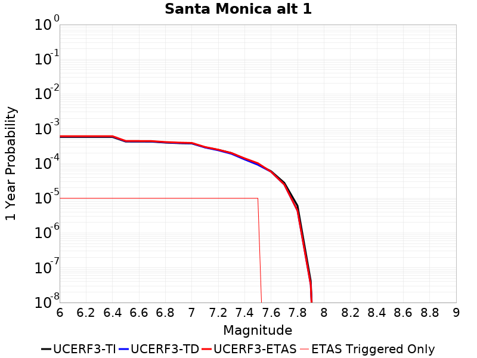
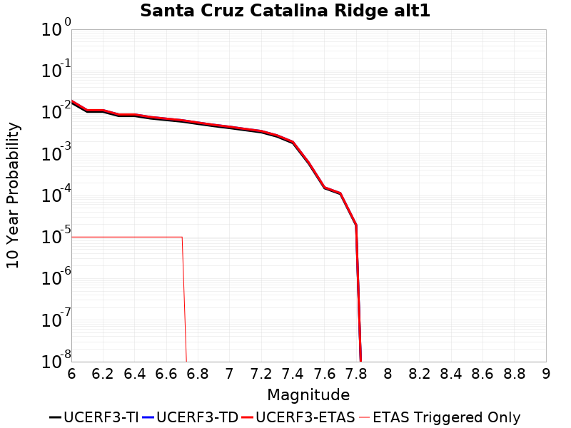

# Parent Section Magnitude-Probability Distributions

Only fault sections with at least one triggered aftershock are plotted. Sections are sorted by total supraseismogenic trigger rate (decreasing)

## Table Of Contents

* [Malibu Coast alt 1](#malibu-coast-alt-1)
* [Malibu Coast (Extension) alt 1](#malibu-coast-extension-alt-1)
* [Anacapa-Dume alt 1](#anacapa-dume-alt-1)
* [San Pedro Basin](#san-pedro-basin)
* [Channel Islands Thrust](#channel-islands-thrust)
* [Simi-Santa Rosa](#simi-santa-rosa)
* [Santa Cruz Island](#santa-cruz-island)
* [Oak Ridge (Onshore)](#oak-ridge-onshore)
* [Raymond](#raymond)
* [Hollywood](#hollywood)
* [Santa Monica alt 1](#santa-monica-alt-1)
* [Santa Cruz Catalina Ridge alt1](#santa-cruz-catalina-ridge-alt1)
* [Channel Islands Western Deep Ramp](#channel-islands-western-deep-ramp)
* [Elysian Park (Upper)](#elysian-park-upper)
* [Santa Rosa Island](#santa-rosa-island)
* [Santa Ynez (East)](#santa-ynez-east)

## Malibu Coast alt 1
*[(top)](#table-of-contents)*

| 1 Week | 1 Month | 1 Year | 10 Year |
|-----|-----|-----|-----|
|  |  |  |  |

| Magnitude | 1 wk TI Prob | 1 wk TD Prob | 1 wk ETAS Prob | 1 wk ETAS/TD Gain | 1 wk ETAS Triggered Only | 1 mo TI Prob | 1 mo TD Prob | 1 mo ETAS Prob | 1 mo ETAS/TD Gain | 1 mo ETAS Triggered Only | 1 yr TI Prob | 1 yr TD Prob | 1 yr ETAS Prob | 1 yr ETAS/TD Gain | 1 yr ETAS Triggered Only | 10 yr TI Prob | 10 yr TD Prob | 10 yr ETAS Prob | 10 yr ETAS/TD Gain | 10 yr ETAS Triggered Only |
|-----|-----|-----|-----|-----|-----|-----|-----|-----|-----|-----|-----|-----|-----|-----|-----|-----|-----|-----|-----|-----|
| 6.0 | 1.6572556E-5 | 1.7441474E-5 | 5.744078E-5 | 3.293344 | 4.0E-5 | 7.102331E-5 | 7.4747135E-5 | 1.247434E-4 | 1.6688719 | 5.0E-5 | 8.6436566E-4 | 9.0968475E-4 | 0.001089521 | 1.1976907 | 1.8E-4 | 0.0086101135 | 0.009061481 | 0.009299306 | 1.0262457 | 2.4E-4 |
| 6.1 | 1.6572556E-5 | 1.7441474E-5 | 5.744078E-5 | 3.293344 | 4.0E-5 | 7.102331E-5 | 7.4747135E-5 | 1.247434E-4 | 1.6688719 | 5.0E-5 | 8.6436566E-4 | 9.0968475E-4 | 0.001089521 | 1.1976907 | 1.8E-4 | 0.0086101135 | 0.009061481 | 0.009299306 | 1.0262457 | 2.4E-4 |
| 6.2 | 1.1085717E-5 | 1.1486695E-5 | 3.1486466E-5 | 2.7411249 | 2.0E-5 | 4.750935E-5 | 4.9227783E-5 | 7.922631E-5 | 1.6093819 | 3.0E-5 | 5.782728E-4 | 5.9918687E-4 | 7.1911496E-4 | 1.2001514 | 1.2E-4 | 0.0057677035 | 0.005976075 | 0.0060953577 | 1.01996 | 1.2E-4 |
| 6.3 | 1.0208568E-5 | 1.0535948E-5 | 3.053574E-5 | 2.898243 | 2.0E-5 | 4.375027E-5 | 4.5153298E-5 | 7.515194E-5 | 1.6643733 | 3.0E-5 | 5.325294E-4 | 5.496056E-4 | 6.695396E-4 | 1.2182184 | 1.2E-4 | 0.0053125503 | 0.0054827635 | 0.005602106 | 1.0217668 | 1.2E-4 |
| 6.4 | 9.0682315E-6 | 9.302295E-6 | 2.930211E-5 | 3.149987 | 2.0E-5 | 3.8863272E-5 | 3.9866383E-5 | 6.9865186E-5 | 1.7524837 | 3.0E-5 | 4.730576E-4 | 4.8526708E-4 | 6.0520886E-4 | 1.2471665 | 1.2E-4 | 0.0047205184 | 0.004842283 | 0.004961702 | 1.0246617 | 1.2E-4 |
| 6.5 | 7.605796E-6 | 7.725124E-6 | 2.772497E-5 | 3.588935 | 2.0E-5 | 3.259586E-5 | 3.3107262E-5 | 5.3106603E-5 | 1.604077 | 2.0E-5 | 3.9678233E-4 | 4.030077E-4 | 4.8297545E-4 | 1.1984274 | 8.0E-5 | 0.0039607463 | 0.0040229033 | 0.0041025816 | 1.0198061 | 8.0E-5 |
| 6.6 | 5.889873E-6 | 5.8759324E-6 | 1.5875874E-5 | 2.7018476 | 1.0E-5 | 2.5242069E-5 | 2.5182324E-5 | 3.5182074E-5 | 1.3970939 | 1.0E-5 | 3.0727885E-4 | 3.0655175E-4 | 3.2654565E-4 | 1.0652218 | 2.0E-5 | 0.003068543 | 0.0030613018 | 0.0030812405 | 1.0065131 | 2.0E-5 |
| 6.7 | 5.66586E-6 | 5.6392014E-6 | 1.5639145E-5 | 2.7732906 | 1.0E-5 | 2.428203E-5 | 2.4167783E-5 | 3.416754E-5 | 1.413764 | 1.0E-5 | 2.955936E-4 | 2.942031E-4 | 3.1419724E-4 | 1.0679603 | 2.0E-5 | 0.0029520073 | 0.0029381483 | 0.0029580896 | 1.0067871 | 2.0E-5 |
| 6.8 | 5.521556E-6 | 5.487695E-6 | 1.548764E-5 | 2.8222487 | 1.0E-5 | 2.3663597E-5 | 2.3518482E-5 | 3.3518245E-5 | 1.4251875 | 1.0E-5 | 2.880662E-4 | 2.8629997E-4 | 3.0629424E-4 | 1.0698369 | 2.0E-5 | 0.0028769306 | 0.0028593228 | 0.0028792657 | 1.0069747 | 2.0E-5 |
| 6.9 | 5.29752E-6 | 5.249637E-6 | 5.249637E-6 | 1.0 | 0.0 | 2.270346E-5 | 2.249825E-5 | 2.249825E-5 | 1.0 | 0.0 | 2.7637955E-4 | 2.7388186E-4 | 2.838791E-4 | 1.0365021 | 1.0E-5 | 0.0027603607 | 0.0027354534 | 0.002745426 | 1.0036457 | 1.0E-5 |
| 7.0 | 5.106743E-6 | 5.0485437E-6 | 5.0485437E-6 | 1.0 | 0.0 | 2.1885859E-5 | 2.1636435E-5 | 2.1636435E-5 | 1.0 | 0.0 | 2.6642776E-4 | 2.6339185E-4 | 2.7338922E-4 | 1.0379562 | 1.0E-5 | 0.0026610855 | 0.0026308063 | 0.0026407798 | 1.0037911 | 1.0E-5 |
| 7.1 | 4.8469647E-6 | 4.7729573E-6 | 4.7729573E-6 | 1.0 | 0.0 | 2.0772539E-5 | 2.045537E-5 | 2.045537E-5 | 1.0 | 0.0 | 2.528763E-4 | 2.4901575E-4 | 2.5901326E-4 | 1.0401481 | 1.0E-5 | 0.0025258875 | 0.0024873752 | 0.0024973503 | 1.0040103 | 1.0E-5 |
| 7.2 | 4.545514E-6 | 4.451237E-6 | 4.451237E-6 | 1.0 | 0.0 | 1.9480629E-5 | 1.9076591E-5 | 1.9076591E-5 | 1.0 | 0.0 | 2.3715083E-4 | 2.322328E-4 | 2.4223048E-4 | 1.0430503 | 1.0E-5 | 0.0023689792 | 0.0023199087 | 0.0023298855 | 1.0043005 | 1.0E-5 |
| 7.3 | 3.794097E-6 | 3.6546014E-6 | 3.6546014E-6 | 1.0 | 0.0 | 1.6260314E-5 | 1.5662485E-5 | 1.5662485E-5 | 1.0 | 0.0 | 1.9795135E-4 | 1.906741E-4 | 2.0067219E-4 | 1.0524355 | 1.0E-5 | 0.001977751 | 0.0019051096 | 0.0019150906 | 1.005239 | 1.0E-5 |
| 7.4 | 2.808217E-6 | 2.7212766E-6 | 2.7212766E-6 | 1.0 | 0.0 | 1.203516E-5 | 1.16625615E-5 | 1.16625615E-5 | 1.0 | 0.0 | 1.4651821E-4 | 1.4198245E-4 | 1.5198105E-4 | 1.0704212 | 1.0E-5 | 0.0014642165 | 0.0014189202 | 0.001428906 | 1.0070376 | 1.0E-5 |
| 7.5 | 1.83809E-6 | 1.8208622E-6 | 1.8208622E-6 | 1.0 | 0.0 | 7.877505E-6 | 7.803672E-6 | 7.803672E-6 | 1.0 | 0.0 | 9.59044E-5 | 9.5005584E-5 | 1.05004634E-4 | 1.105247 | 1.0E-5 | 9.5863023E-4 | 9.4965164E-4 | 9.596422E-4 | 1.0105202 | 1.0E-5 |
| 7.6 | 1.1292672E-6 | 1.1016747E-6 | 1.1016747E-6 | 1.0 | 0.0 | 4.839708E-6 | 4.7214544E-6 | 4.7214544E-6 | 1.0 | 0.0 | 5.8921847E-5 | 5.748221E-5 | 5.748221E-5 | 1.0 | 0.0 | 5.890623E-4 | 5.7467504E-4 | 5.7467504E-4 | 1.0 | 0.0 |
| 7.7 | 5.065272E-7 | 4.6199787E-7 | 4.6199787E-7 | 1.0 | 0.0 | 2.170829E-6 | 1.9799895E-6 | 1.9799895E-6 | 1.0 | 0.0 | 2.6429525E-5 | 2.4106117E-5 | 2.4106117E-5 | 1.0 | 0.0 | 2.642638E-4 | 2.4103613E-4 | 2.4103613E-4 | 1.0 | 0.0 |
| 7.8 | 8.952991E-8 | 6.760284E-8 | 6.760284E-8 | 1.0 | 0.0 | 3.8369956E-7 | 2.8972644E-7 | 2.8972644E-7 | 1.0 | 0.0 | 4.671532E-6 | 3.5274138E-6 | 3.5274138E-6 | 1.0 | 0.0 | 4.671434E-5 | 3.52736E-5 | 3.52736E-5 | 1.0 | 0.0 |
| 7.9 | 8.007447E-10 | 6.2136607E-10 | 6.2136607E-10 | 1.0 | 0.0 | 3.4317629E-9 | 2.6629972E-9 | 2.6629972E-9 | 1.0 | 0.0 | 4.1781714E-8 | 3.242199E-8 | 3.242199E-8 | 1.0 | 0.0 | 4.1781706E-7 | 3.2421985E-7 | 3.2421985E-7 | 1.0 | 0.0 |

## Malibu Coast (Extension) alt 1
*[(top)](#table-of-contents)*

| 1 Week | 1 Month | 1 Year | 10 Year |
|-----|-----|-----|-----|
|  |  |  |  |

| Magnitude | 1 wk TI Prob | 1 wk TD Prob | 1 wk ETAS Prob | 1 wk ETAS/TD Gain | 1 wk ETAS Triggered Only | 1 mo TI Prob | 1 mo TD Prob | 1 mo ETAS Prob | 1 mo ETAS/TD Gain | 1 mo ETAS Triggered Only | 1 yr TI Prob | 1 yr TD Prob | 1 yr ETAS Prob | 1 yr ETAS/TD Gain | 1 yr ETAS Triggered Only | 10 yr TI Prob | 10 yr TD Prob | 10 yr ETAS Prob | 10 yr ETAS/TD Gain | 10 yr ETAS Triggered Only |
|-----|-----|-----|-----|-----|-----|-----|-----|-----|-----|-----|-----|-----|-----|-----|-----|-----|-----|-----|-----|-----|
| 6.0 | 7.516028E-6 | 7.844962E-6 | 3.7844726E-5 | 4.82408 | 3.0E-5 | 3.221115E-5 | 3.3620836E-5 | 6.361983E-5 | 1.8922738 | 3.0E-5 | 3.9210016E-4 | 4.0925742E-4 | 4.5923697E-4 | 1.1221225 | 5.0E-5 | 0.0039140903 | 0.0040851077 | 0.0041448623 | 1.0146275 | 6.0E-5 |
| 6.1 | 7.199952E-6 | 7.5184043E-6 | 3.751818E-5 | 4.990178 | 3.0E-5 | 3.0856572E-5 | 3.222134E-5 | 6.222037E-5 | 1.93103 | 3.0E-5 | 3.75614E-4 | 3.9222479E-4 | 4.4220517E-4 | 1.1274279 | 5.0E-5 | 0.0037497976 | 0.0039153914 | 0.003975156 | 1.0152642 | 6.0E-5 |
| 6.2 | 6.3721413E-6 | 6.658993E-6 | 2.665886E-5 | 4.003437 | 2.0E-5 | 2.7308892E-5 | 2.853823E-5 | 4.853766E-5 | 1.7007943 | 2.0E-5 | 3.3243504E-4 | 3.473979E-4 | 3.8738403E-4 | 1.1151017 | 4.0E-5 | 0.0033193815 | 0.0034685885 | 0.0035084498 | 1.011492 | 4.0E-5 |
| 6.3 | 6.016345E-6 | 6.289033E-6 | 2.6288908E-5 | 4.180119 | 2.0E-5 | 2.578408E-5 | 2.695272E-5 | 4.6952184E-5 | 1.7420201 | 2.0E-5 | 3.1387596E-4 | 3.2810032E-4 | 3.6808717E-4 | 1.121874 | 4.0E-5 | 0.00313433 | 0.0032761951 | 0.0033160641 | 1.0121692 | 4.0E-5 |
| 6.4 | 5.8104883E-6 | 6.074375E-6 | 2.6074253E-5 | 4.2925 | 2.0E-5 | 2.4901856E-5 | 2.6032778E-5 | 4.6032255E-5 | 1.7682422 | 2.0E-5 | 3.031379E-4 | 3.169033E-4 | 3.568906E-4 | 1.1261815 | 4.0E-5 | 0.0030272473 | 0.0031645484 | 0.0032044218 | 1.0126001 | 4.0E-5 |
| 6.5 | 5.476925E-6 | 5.724087E-6 | 2.5723972E-5 | 4.493987 | 2.0E-5 | 2.3472323E-5 | 2.4531571E-5 | 4.453108E-5 | 1.815256 | 2.0E-5 | 2.8573806E-4 | 2.9863123E-4 | 3.3861928E-4 | 1.1339045 | 4.0E-5 | 0.0028537093 | 0.0029823314 | 0.003022212 | 1.0133723 | 4.0E-5 |
| 6.6 | 5.222387E-6 | 5.4566162E-6 | 2.5456508E-5 | 4.665255 | 2.0E-5 | 2.2381464E-5 | 2.3385292E-5 | 4.338482E-5 | 1.8552184 | 2.0E-5 | 2.7246025E-4 | 2.84679E-4 | 3.1467047E-4 | 1.1053518 | 3.0E-5 | 0.0027212645 | 0.0028431742 | 0.0028730887 | 1.0105215 | 3.0E-5 |
| 6.7 | 5.0337076E-6 | 5.2582664E-6 | 2.5258161E-5 | 4.803515 | 2.0E-5 | 2.1572854E-5 | 2.2535234E-5 | 4.2534783E-5 | 1.8874791 | 2.0E-5 | 2.6261783E-4 | 2.7433224E-4 | 3.04324E-4 | 1.1093265 | 3.0E-5 | 0.002623077 | 0.002739966 | 0.0027698837 | 1.0109191 | 3.0E-5 |
| 6.8 | 4.5675624E-6 | 4.758127E-6 | 2.4758032E-5 | 5.203315 | 2.0E-5 | 1.9575122E-5 | 2.0391813E-5 | 4.0391405E-5 | 1.9807657 | 2.0E-5 | 2.3830103E-4 | 2.4824223E-4 | 2.7823477E-4 | 1.1208197 | 3.0E-5 | 0.0023804565 | 0.0024796692 | 0.0025095947 | 1.0120684 | 3.0E-5 |
| 6.9 | 4.2802412E-6 | 4.4522412E-6 | 1.4452196E-5 | 3.24605 | 1.0E-5 | 1.8343762E-5 | 1.9080895E-5 | 2.9080704E-5 | 1.5240744 | 1.0E-5 | 2.2331243E-4 | 2.3228528E-4 | 2.5228065E-4 | 1.086081 | 2.0E-5 | 0.0022308815 | 0.0023204417 | 0.0023403952 | 1.008599 | 2.0E-5 |
| 7.0 | 3.9794063E-6 | 4.130195E-6 | 1.4130153E-5 | 3.421183 | 1.0E-5 | 1.7054486E-5 | 1.7700717E-5 | 2.770054E-5 | 1.5649389 | 1.0E-5 | 2.0761859E-4 | 2.1548504E-4 | 2.3548072E-4 | 1.0927938 | 2.0E-5 | 0.0020742472 | 0.0021527745 | 0.0021727313 | 1.0092703 | 2.0E-5 |
| 7.1 | 3.7730424E-6 | 3.911488E-6 | 1.3911449E-5 | 3.5565617 | 1.0E-5 | 1.6170083E-5 | 1.6763413E-5 | 2.6763246E-5 | 1.5965272 | 1.0E-5 | 1.9685295E-4 | 2.0407556E-4 | 2.2407148E-4 | 1.0979829 | 2.0E-5 | 0.0019667868 | 0.0020388945 | 0.0020588539 | 1.0097892 | 2.0E-5 |
| 7.2 | 3.424985E-6 | 3.5422008E-6 | 3.5422008E-6 | 1.0 | 0.0 | 1.4678424E-5 | 1.51807735E-5 | 1.51807735E-5 | 1.0 | 0.0 | 1.7869516E-4 | 1.8481036E-4 | 1.948085E-4 | 1.0540996 | 1.0E-5 | 0.0017855153 | 0.0018465787 | 0.0018565602 | 1.0054054 | 1.0E-5 |
| 7.3 | 2.6966375E-6 | 2.7598978E-6 | 2.7598978E-6 | 1.0 | 0.0 | 1.15569665E-5 | 1.18280805E-5 | 1.18280805E-5 | 1.0 | 0.0 | 1.4069698E-4 | 1.439974E-4 | 1.5399596E-4 | 1.0694357 | 1.0E-5 | 0.0014060794 | 0.0014390451 | 0.0014490307 | 1.006939 | 1.0E-5 |
| 7.4 | 2.215957E-6 | 2.2498707E-6 | 2.2498707E-6 | 1.0 | 0.0 | 9.496924E-6 | 9.642267E-6 | 9.642267E-6 | 1.0 | 0.0 | 1.1561892E-4 | 1.17388314E-4 | 1.2738715E-4 | 1.0851773 | 1.0E-5 | 0.0011555878 | 0.0011732668 | 0.001183255 | 1.0085132 | 1.0E-5 |
| 7.5 | 1.2040218E-6 | 1.2222334E-6 | 1.2222334E-6 | 1.0 | 0.0 | 5.160083E-6 | 5.238133E-6 | 5.238133E-6 | 1.0 | 0.0 | 6.2822204E-5 | 6.377242E-5 | 7.3771786E-5 | 1.1567976 | 1.0E-5 | 6.280445E-4 | 6.3754304E-4 | 6.475367E-4 | 1.0156752 | 1.0E-5 |
| 7.6 | 6.6157446E-7 | 6.6825635E-7 | 6.6825635E-7 | 1.0 | 0.0 | 2.835316E-6 | 2.8639527E-6 | 2.8639527E-6 | 1.0 | 0.0 | 3.4519428E-5 | 3.486808E-5 | 3.486808E-5 | 1.0 | 0.0 | 3.4514067E-4 | 3.4862763E-4 | 3.4862763E-4 | 1.0 | 0.0 |
| 7.7 | 2.6012302E-7 | 2.4383993E-7 | 2.4383993E-7 | 1.0 | 0.0 | 1.1148124E-6 | 1.045028E-6 | 1.045028E-6 | 1.0 | 0.0 | 1.3572758E-5 | 1.27231515E-5 | 1.27231515E-5 | 1.0 | 0.0 | 1.3571928E-4 | 1.272253E-4 | 1.272253E-4 | 1.0 | 0.0 |
| 7.8 | 2.8323132E-8 | 2.0320394E-8 | 2.0320394E-8 | 1.0 | 0.0 | 1.2138484E-7 | 8.70874E-8 | 8.70874E-8 | 1.0 | 0.0 | 1.4778595E-6 | 1.0602886E-6 | 1.0602886E-6 | 1.0 | 0.0 | 1.4778497E-5 | 1.0602844E-5 | 1.0602844E-5 | 1.0 | 0.0 |

## Anacapa-Dume alt 1
*[(top)](#table-of-contents)*

| 1 Week | 1 Month | 1 Year | 10 Year |
|-----|-----|-----|-----|
|  |  |  |  |

| Magnitude | 1 wk TI Prob | 1 wk TD Prob | 1 wk ETAS Prob | 1 wk ETAS/TD Gain | 1 wk ETAS Triggered Only | 1 mo TI Prob | 1 mo TD Prob | 1 mo ETAS Prob | 1 mo ETAS/TD Gain | 1 mo ETAS Triggered Only | 1 yr TI Prob | 1 yr TD Prob | 1 yr ETAS Prob | 1 yr ETAS/TD Gain | 1 yr ETAS Triggered Only | 10 yr TI Prob | 10 yr TD Prob | 10 yr ETAS Prob | 10 yr ETAS/TD Gain | 10 yr ETAS Triggered Only |
|-----|-----|-----|-----|-----|-----|-----|-----|-----|-----|-----|-----|-----|-----|-----|-----|-----|-----|-----|-----|-----|
| 6.0 | 5.1871802E-6 | 5.374822E-6 | 1.5374768E-5 | 2.8605165 | 1.0E-5 | 2.2230583E-5 | 2.3034754E-5 | 3.3034525E-5 | 1.4341166 | 1.0E-5 | 2.7062374E-4 | 2.804129E-4 | 3.104045E-4 | 1.106955 | 3.0E-5 | 0.002702944 | 0.0028006763 | 0.0028605082 | 1.0213634 | 6.0E-5 |
| 6.1 | 5.1871802E-6 | 5.374822E-6 | 1.5374768E-5 | 2.8605165 | 1.0E-5 | 2.2230583E-5 | 2.3034754E-5 | 3.3034525E-5 | 1.4341166 | 1.0E-5 | 2.7062374E-4 | 2.804129E-4 | 3.104045E-4 | 1.106955 | 3.0E-5 | 0.002702944 | 0.0028006763 | 0.0028605082 | 1.0213634 | 6.0E-5 |
| 6.2 | 5.1871802E-6 | 5.374822E-6 | 1.5374768E-5 | 2.8605165 | 1.0E-5 | 2.2230583E-5 | 2.3034754E-5 | 3.3034525E-5 | 1.4341166 | 1.0E-5 | 2.7062374E-4 | 2.804129E-4 | 3.104045E-4 | 1.106955 | 3.0E-5 | 0.002702944 | 0.0028006763 | 0.0028605082 | 1.0213634 | 6.0E-5 |
| 6.3 | 5.1871802E-6 | 5.374822E-6 | 1.5374768E-5 | 2.8605165 | 1.0E-5 | 2.2230583E-5 | 2.3034754E-5 | 3.3034525E-5 | 1.4341166 | 1.0E-5 | 2.7062374E-4 | 2.804129E-4 | 3.104045E-4 | 1.106955 | 3.0E-5 | 0.002702944 | 0.0028006763 | 0.0028605082 | 1.0213634 | 6.0E-5 |
| 6.4 | 5.1871802E-6 | 5.374822E-6 | 1.5374768E-5 | 2.8605165 | 1.0E-5 | 2.2230583E-5 | 2.3034754E-5 | 3.3034525E-5 | 1.4341166 | 1.0E-5 | 2.7062374E-4 | 2.804129E-4 | 3.104045E-4 | 1.106955 | 3.0E-5 | 0.002702944 | 0.0028006763 | 0.0028605082 | 1.0213634 | 6.0E-5 |
| 6.5 | 5.1871802E-6 | 5.374822E-6 | 1.5374768E-5 | 2.8605165 | 1.0E-5 | 2.2230583E-5 | 2.3034754E-5 | 3.3034525E-5 | 1.4341166 | 1.0E-5 | 2.7062374E-4 | 2.804129E-4 | 3.104045E-4 | 1.106955 | 3.0E-5 | 0.002702944 | 0.0028006763 | 0.0028605082 | 1.0213634 | 6.0E-5 |
| 6.6 | 5.1871802E-6 | 5.374822E-6 | 1.5374768E-5 | 2.8605165 | 1.0E-5 | 2.2230583E-5 | 2.3034754E-5 | 3.3034525E-5 | 1.4341166 | 1.0E-5 | 2.7062374E-4 | 2.804129E-4 | 3.104045E-4 | 1.106955 | 3.0E-5 | 0.002702944 | 0.0028006763 | 0.0028605082 | 1.0213634 | 6.0E-5 |
| 6.7 | 4.7693475E-6 | 4.943601E-6 | 1.4943552E-5 | 3.022807 | 1.0E-5 | 2.04399E-5 | 2.1186694E-5 | 3.1186482E-5 | 1.4719844 | 1.0E-5 | 2.4882736E-4 | 2.5791823E-4 | 2.879105E-4 | 1.1162859 | 3.0E-5 | 0.0024854892 | 0.002576265 | 0.0026361104 | 1.0232295 | 6.0E-5 |
| 6.8 | 4.753408E-6 | 4.9271366E-6 | 1.4927087E-5 | 3.0295663 | 1.0E-5 | 2.037159E-5 | 2.1116133E-5 | 3.111592E-5 | 1.4735615 | 1.0E-5 | 2.4799586E-4 | 2.5705935E-4 | 2.8705163E-4 | 1.1166745 | 3.0E-5 | 0.002477193 | 0.0025676962 | 0.002627542 | 1.0233072 | 6.0E-5 |
| 6.9 | 3.800069E-6 | 3.9428264E-6 | 3.9428264E-6 | 1.0 | 0.0 | 1.6285909E-5 | 1.689772E-5 | 1.689772E-5 | 1.0 | 0.0 | 1.9826289E-4 | 2.0571054E-4 | 2.157085E-4 | 1.048602 | 1.0E-5 | 0.001980861 | 0.0020552252 | 0.0020851635 | 1.0145669 | 3.0E-5 |
| 7.0 | 3.6671938E-6 | 3.8054582E-6 | 3.8054582E-6 | 1.0 | 0.0 | 1.571645E-5 | 1.6309006E-5 | 1.6309006E-5 | 1.0 | 0.0 | 1.9133097E-4 | 1.9854428E-4 | 2.0854229E-4 | 1.0503566 | 1.0E-5 | 0.0019116632 | 0.0019836924 | 0.0020036527 | 1.0100622 | 2.0E-5 |
| 7.1 | 3.2394885E-6 | 3.3638103E-6 | 3.3638103E-6 | 1.0 | 0.0 | 1.3883448E-5 | 1.441625E-5 | 1.441625E-5 | 1.0 | 0.0 | 1.6901788E-4 | 1.7550382E-4 | 1.8550207E-4 | 1.0569688 | 1.0E-5 | 0.0016888938 | 0.0017536634 | 0.0017636459 | 1.0056924 | 1.0E-5 |
| 7.2 | 3.0935948E-6 | 3.2127912E-6 | 3.2127912E-6 | 1.0 | 0.0 | 1.3258196E-5 | 1.3769033E-5 | 1.3769033E-5 | 1.0 | 0.0 | 1.6140658E-4 | 1.6762518E-4 | 1.7762351E-4 | 1.059647 | 1.0E-5 | 0.001612894 | 0.0016749986 | 0.0016849819 | 1.0059601 | 1.0E-5 |
| 7.3 | 2.5604163E-6 | 2.6508364E-6 | 2.6508364E-6 | 1.0 | 0.0 | 1.0973167E-5 | 1.1360678E-5 | 1.1360678E-5 | 1.0 | 0.0 | 1.3359012E-4 | 1.3830753E-4 | 1.3830753E-4 | 1.0 | 0.0 | 0.0013350984 | 0.001382219 | 0.001382219 | 1.0 | 0.0 |
| 7.4 | 2.1429005E-6 | 2.213674E-6 | 2.213674E-6 | 1.0 | 0.0 | 9.1838265E-6 | 9.487139E-6 | 9.487139E-6 | 1.0 | 0.0 | 1.11807356E-4 | 1.15499824E-4 | 1.15499824E-4 | 1.0 | 0.0 | 0.0011175112 | 0.0011544006 | 0.0011544006 | 1.0 | 0.0 |
| 7.5 | 1.7237151E-6 | 1.7787128E-6 | 1.7787128E-6 | 1.0 | 0.0 | 7.3873293E-6 | 7.6230326E-6 | 7.6230326E-6 | 1.0 | 0.0 | 8.993702E-5 | 9.280649E-5 | 9.280649E-5 | 1.0 | 0.0 | 8.990063E-4 | 9.276797E-4 | 9.276797E-4 | 1.0 | 0.0 |
| 7.6 | 9.541696E-7 | 9.837025E-7 | 9.837025E-7 | 1.0 | 0.0 | 4.089292E-6 | 4.215861E-6 | 4.215861E-6 | 1.0 | 0.0 | 4.9785995E-5 | 5.132691E-5 | 5.132691E-5 | 1.0 | 0.0 | 4.9774844E-4 | 5.1315187E-4 | 5.1315187E-4 | 1.0 | 0.0 |
| 7.7 | 2.7226676E-7 | 2.720604E-7 | 2.720604E-7 | 1.0 | 0.0 | 1.166857E-6 | 1.1659725E-6 | 1.1659725E-6 | 1.0 | 0.0 | 1.4206392E-5 | 1.4195624E-5 | 1.4195624E-5 | 1.0 | 0.0 | 1.4205484E-4 | 1.4194724E-4 | 1.4194724E-4 | 1.0 | 0.0 |
| 7.8 | 4.5017995E-8 | 4.221106E-8 | 4.221106E-8 | 1.0 | 0.0 | 1.9293425E-7 | 1.8090454E-7 | 1.8090454E-7 | 1.0 | 0.0 | 2.348972E-6 | 2.2025108E-6 | 2.2025108E-6 | 1.0 | 0.0 | 2.348947E-5 | 2.2024911E-5 | 2.2024911E-5 | 1.0 | 0.0 |
| 7.9 | 8.007447E-10 | 6.2136607E-10 | 6.2136607E-10 | 1.0 | 0.0 | 3.4317629E-9 | 2.6629972E-9 | 2.6629972E-9 | 1.0 | 0.0 | 4.1781714E-8 | 3.242199E-8 | 3.242199E-8 | 1.0 | 0.0 | 4.1781706E-7 | 3.2421985E-7 | 3.2421985E-7 | 1.0 | 0.0 |

## San Pedro Basin
*[(top)](#table-of-contents)*

| 1 Week | 1 Month | 1 Year | 10 Year |
|-----|-----|-----|-----|
|  |  |  |  |

| Magnitude | 1 wk TI Prob | 1 wk TD Prob | 1 wk ETAS Prob | 1 wk ETAS/TD Gain | 1 wk ETAS Triggered Only | 1 mo TI Prob | 1 mo TD Prob | 1 mo ETAS Prob | 1 mo ETAS/TD Gain | 1 mo ETAS Triggered Only | 1 yr TI Prob | 1 yr TD Prob | 1 yr ETAS Prob | 1 yr ETAS/TD Gain | 1 yr ETAS Triggered Only | 10 yr TI Prob | 10 yr TD Prob | 10 yr ETAS Prob | 10 yr ETAS/TD Gain | 10 yr ETAS Triggered Only |
|-----|-----|-----|-----|-----|-----|-----|-----|-----|-----|-----|-----|-----|-----|-----|-----|-----|-----|-----|-----|-----|
| 6.0 | 5.3449043E-5 | 6.384082E-5 | 6.384082E-5 | 1.0 | 0.0 | 2.2904722E-4 | 2.735783E-4 | 2.735783E-4 | 1.0 | 0.0 | 0.0027850836 | 0.0033263331 | 0.0033462665 | 1.0059927 | 2.0E-5 | 0.027504366 | 0.032827653 | 0.03285667 | 1.0008838 | 3.0E-5 |
| 6.1 | 5.3449043E-5 | 6.384082E-5 | 6.384082E-5 | 1.0 | 0.0 | 2.2904722E-4 | 2.735783E-4 | 2.735783E-4 | 1.0 | 0.0 | 0.0027850836 | 0.0033263331 | 0.0033462665 | 1.0059927 | 2.0E-5 | 0.027504366 | 0.032827653 | 0.03285667 | 1.0008838 | 3.0E-5 |
| 6.2 | 2.3189454E-5 | 2.680247E-5 | 2.680247E-5 | 1.0 | 0.0 | 9.9379584E-5 | 1.1486294E-4 | 1.1486294E-4 | 1.0 | 0.0 | 0.0012092749 | 0.0013976065 | 0.0014075924 | 1.007145 | 1.0E-5 | 0.012027155 | 0.013893076 | 0.013912799 | 1.0014195 | 2.0E-5 |
| 6.3 | 2.3189454E-5 | 2.680247E-5 | 2.680247E-5 | 1.0 | 0.0 | 9.9379584E-5 | 1.1486294E-4 | 1.1486294E-4 | 1.0 | 0.0 | 0.0012092749 | 0.0013976065 | 0.0014075924 | 1.007145 | 1.0E-5 | 0.012027155 | 0.013893076 | 0.013912799 | 1.0014195 | 2.0E-5 |
| 6.4 | 1.966056E-5 | 2.2592494E-5 | 2.2592494E-5 | 1.0 | 0.0 | 8.425682E-5 | 9.682161E-5 | 9.682161E-5 | 1.0 | 0.0 | 0.001025344 | 0.0011782062 | 0.0011881944 | 1.0084774 | 1.0E-5 | 0.010206259 | 0.011723726 | 0.011743492 | 1.001686 | 2.0E-5 |
| 6.5 | 1.7342953E-5 | 1.9855599E-5 | 1.9855599E-5 | 1.0 | 0.0 | 7.4324824E-5 | 8.5092855E-5 | 8.5092855E-5 | 1.0 | 0.0 | 9.04529E-4 | 0.0010355505 | 0.0010455401 | 1.0096467 | 1.0E-5 | 0.009008561 | 0.010311016 | 0.010330809 | 1.0019196 | 2.0E-5 |
| 6.6 | 1.439804E-5 | 1.641118E-5 | 1.641118E-5 | 1.0 | 0.0 | 6.170443E-5 | 7.0331924E-5 | 7.0331924E-5 | 1.0 | 0.0 | 7.509924E-4 | 8.5598725E-4 | 8.6597865E-4 | 1.0116724 | 1.0E-5 | 0.0074845953 | 0.008530143 | 0.008549972 | 1.0023246 | 2.0E-5 |
| 6.7 | 1.2634884E-5 | 1.4361217E-5 | 1.4361217E-5 | 1.0 | 0.0 | 5.414838E-5 | 6.1546794E-5 | 6.1546794E-5 | 1.0 | 0.0 | 6.590571E-4 | 7.491055E-4 | 7.59098E-4 | 1.0133393 | 1.0E-5 | 0.006571059 | 0.0074688615 | 0.007488712 | 1.0026578 | 2.0E-5 |
| 6.8 | 1.146091E-5 | 1.3000992E-5 | 1.3000992E-5 | 1.0 | 0.0 | 4.911726E-5 | 5.5717515E-5 | 5.5717515E-5 | 1.0 | 0.0 | 5.9783855E-4 | 6.781797E-4 | 6.8817294E-4 | 1.0147353 | 1.0E-5 | 0.0059623276 | 0.006764078 | 0.0067839427 | 1.0029368 | 2.0E-5 |
| 6.9 | 9.109035E-6 | 1.0287075E-5 | 1.0287075E-5 | 1.0 | 0.0 | 3.9038136E-5 | 4.408688E-5 | 4.408688E-5 | 1.0 | 0.0 | 4.7518566E-4 | 5.366539E-4 | 5.466486E-4 | 1.018624 | 1.0E-5 | 0.0047417083 | 0.005356368 | 0.0053762607 | 1.0037138 | 2.0E-5 |
| 7.0 | 5.9351028E-6 | 6.614295E-6 | 6.614295E-6 | 1.0 | 0.0 | 2.5435906E-5 | 2.8346807E-5 | 2.8346807E-5 | 1.0 | 0.0 | 3.0963816E-4 | 3.4509163E-4 | 3.5508818E-4 | 1.0289679 | 1.0E-5 | 0.0030920706 | 0.0034479033 | 0.003457869 | 1.0028903 | 1.0E-5 |
| 7.1 | 2.1557585E-6 | 2.212707E-6 | 2.212707E-6 | 1.0 | 0.0 | 9.238933E-6 | 9.482996E-6 | 9.482996E-6 | 1.0 | 0.0 | 1.1247819E-4 | 1.1544951E-4 | 1.2544836E-4 | 1.0866079 | 1.0E-5 | 0.0011242128 | 0.0011539108 | 0.0011638992 | 1.0086561 | 1.0E-5 |
| 7.2 | 2.1251979E-6 | 2.1810124E-6 | 2.1810124E-6 | 1.0 | 0.0 | 9.107958E-6 | 9.3471635E-6 | 9.3471635E-6 | 1.0 | 0.0 | 1.1088375E-4 | 1.13795926E-4 | 1.2379479E-4 | 1.0878667 | 1.0E-5 | 0.0011082845 | 0.0011373919 | 0.0011473806 | 1.008782 | 1.0E-5 |
| 7.3 | 1.7145798E-6 | 1.7463444E-6 | 1.7463444E-6 | 1.0 | 0.0 | 7.3481783E-6 | 7.4843124E-6 | 7.4843124E-6 | 1.0 | 0.0 | 8.94604E-5 | 9.1117785E-5 | 9.1117785E-5 | 1.0 | 0.0 | 8.9424395E-4 | 9.108134E-4 | 9.108134E-4 | 1.0 | 0.0 |
| 7.4 | 1.4467993E-6 | 1.4657421E-6 | 1.4657421E-6 | 1.0 | 0.0 | 6.200554E-6 | 6.281737E-6 | 6.281737E-6 | 1.0 | 0.0 | 7.548913E-5 | 7.647754E-5 | 7.647754E-5 | 1.0 | 0.0 | 7.546349E-4 | 7.645195E-4 | 7.645195E-4 | 1.0 | 0.0 |
| 7.5 | 1.2803735E-6 | 1.2944664E-6 | 1.2944664E-6 | 1.0 | 0.0 | 5.487303E-6 | 5.5477017E-6 | 5.5477017E-6 | 1.0 | 0.0 | 6.680587E-5 | 6.7541245E-5 | 6.7541245E-5 | 1.0 | 0.0 | 6.678579E-4 | 6.752143E-4 | 6.752143E-4 | 1.0 | 0.0 |
| 7.6 | 6.755009E-7 | 6.773361E-7 | 6.773361E-7 | 1.0 | 0.0 | 2.8950008E-6 | 2.902866E-6 | 2.902866E-6 | 1.0 | 0.0 | 3.5246063E-5 | 3.534188E-5 | 3.534188E-5 | 1.0 | 0.0 | 3.5240475E-4 | 3.5336832E-4 | 3.5336832E-4 | 1.0 | 0.0 |
| 7.7 | 6.211885E-8 | 4.5259142E-8 | 4.5259142E-8 | 1.0 | 0.0 | 2.6622362E-7 | 1.9396775E-7 | 1.9396775E-7 | 1.0 | 0.0 | 3.2412677E-6 | 2.3615548E-6 | 2.3615548E-6 | 1.0 | 0.0 | 3.2412205E-5 | 2.361532E-5 | 2.361532E-5 | 1.0 | 0.0 |
| 7.8 | 2.6580573E-9 | 1.5292152E-9 | 1.5292152E-9 | 1.0 | 0.0 | 1.1391674E-8 | 6.5537797E-9 | 6.5537797E-9 | 1.0 | 0.0 | 1.3869362E-7 | 7.9792265E-8 | 7.9792265E-8 | 1.0 | 0.0 | 1.3869354E-6 | 7.9792267E-7 | 7.9792267E-7 | 1.0 | 0.0 |

## Channel Islands Thrust
*[(top)](#table-of-contents)*

| 1 Week | 1 Month | 1 Year | 10 Year |
|-----|-----|-----|-----|
|  |  |  |  |

| Magnitude | 1 wk TI Prob | 1 wk TD Prob | 1 wk ETAS Prob | 1 wk ETAS/TD Gain | 1 wk ETAS Triggered Only | 1 mo TI Prob | 1 mo TD Prob | 1 mo ETAS Prob | 1 mo ETAS/TD Gain | 1 mo ETAS Triggered Only | 1 yr TI Prob | 1 yr TD Prob | 1 yr ETAS Prob | 1 yr ETAS/TD Gain | 1 yr ETAS Triggered Only | 10 yr TI Prob | 10 yr TD Prob | 10 yr ETAS Prob | 10 yr ETAS/TD Gain | 10 yr ETAS Triggered Only |
|-----|-----|-----|-----|-----|-----|-----|-----|-----|-----|-----|-----|-----|-----|-----|-----|-----|-----|-----|-----|-----|
| 6.0 | 2.2156251E-5 | 2.4164889E-5 | 3.4164645E-5 | 1.4138136 | 1.0E-5 | 9.495191E-5 | 1.035603E-4 | 1.1355926E-4 | 1.0965521 | 1.0E-5 | 0.0011554264 | 0.0012602247 | 0.0012801995 | 1.0158502 | 2.0E-5 | 0.011494373 | 0.012541456 | 0.012561206 | 1.0015748 | 2.0E-5 |
| 6.1 | 2.2156251E-5 | 2.4164889E-5 | 3.4164645E-5 | 1.4138136 | 1.0E-5 | 9.495191E-5 | 1.035603E-4 | 1.1355926E-4 | 1.0965521 | 1.0E-5 | 0.0011554264 | 0.0012602247 | 0.0012801995 | 1.0158502 | 2.0E-5 | 0.011494373 | 0.012541456 | 0.012561206 | 1.0015748 | 2.0E-5 |
| 6.2 | 2.2156251E-5 | 2.4164889E-5 | 3.4164645E-5 | 1.4138136 | 1.0E-5 | 9.495191E-5 | 1.035603E-4 | 1.1355926E-4 | 1.0965521 | 1.0E-5 | 0.0011554264 | 0.0012602247 | 0.0012801995 | 1.0158502 | 2.0E-5 | 0.011494373 | 0.012541456 | 0.012561206 | 1.0015748 | 2.0E-5 |
| 6.3 | 2.2156251E-5 | 2.4164889E-5 | 3.4164645E-5 | 1.4138136 | 1.0E-5 | 9.495191E-5 | 1.035603E-4 | 1.1355926E-4 | 1.0965521 | 1.0E-5 | 0.0011554264 | 0.0012602247 | 0.0012801995 | 1.0158502 | 2.0E-5 | 0.011494373 | 0.012541456 | 0.012561206 | 1.0015748 | 2.0E-5 |
| 6.4 | 2.2156251E-5 | 2.4164889E-5 | 3.4164645E-5 | 1.4138136 | 1.0E-5 | 9.495191E-5 | 1.035603E-4 | 1.1355926E-4 | 1.0965521 | 1.0E-5 | 0.0011554264 | 0.0012602247 | 0.0012801995 | 1.0158502 | 2.0E-5 | 0.011494373 | 0.012541456 | 0.012561206 | 1.0015748 | 2.0E-5 |
| 6.5 | 2.2156251E-5 | 2.4164889E-5 | 3.4164645E-5 | 1.4138136 | 1.0E-5 | 9.495191E-5 | 1.035603E-4 | 1.1355926E-4 | 1.0965521 | 1.0E-5 | 0.0011554264 | 0.0012602247 | 0.0012801995 | 1.0158502 | 2.0E-5 | 0.011494373 | 0.012541456 | 0.012561206 | 1.0015748 | 2.0E-5 |
| 6.6 | 2.2156251E-5 | 2.4164889E-5 | 3.4164645E-5 | 1.4138136 | 1.0E-5 | 9.495191E-5 | 1.035603E-4 | 1.1355926E-4 | 1.0965521 | 1.0E-5 | 0.0011554264 | 0.0012602247 | 0.0012801995 | 1.0158502 | 2.0E-5 | 0.011494373 | 0.012541456 | 0.012561206 | 1.0015748 | 2.0E-5 |
| 6.7 | 1.0601296E-5 | 1.1402126E-5 | 2.1402013E-5 | 1.8770194 | 1.0E-5 | 4.5433335E-5 | 4.8865368E-5 | 5.886488E-5 | 1.204634 | 1.0E-5 | 5.5301044E-4 | 5.9477834E-4 | 6.1476644E-4 | 1.0336059 | 2.0E-5 | 0.005516363 | 0.00593237 | 0.0059522516 | 1.0033513 | 2.0E-5 |
| 6.8 | 1.0246747E-5 | 1.1018813E-5 | 2.1018703E-5 | 1.9075288 | 1.0E-5 | 4.391389E-5 | 4.722266E-5 | 5.7222187E-5 | 1.2117528 | 1.0E-5 | 5.345204E-4 | 5.74789E-4 | 5.947775E-4 | 1.0347754 | 2.0E-5 | 0.0053323656 | 0.005733517 | 0.005753402 | 1.0034683 | 2.0E-5 |
| 6.9 | 9.049551E-6 | 9.718892E-6 | 1.9718795E-5 | 2.0289137 | 1.0E-5 | 3.878322E-5 | 4.1651754E-5 | 5.165134E-5 | 1.240076 | 1.0E-5 | 4.7208337E-4 | 5.0699624E-4 | 5.269861E-4 | 1.039428 | 2.0E-5 | 0.0047108172 | 0.0050588157 | 0.005078715 | 1.0039335 | 2.0E-5 |
| 7.0 | 8.6542195E-6 | 9.293239E-6 | 1.9293146E-5 | 2.0760412 | 1.0E-5 | 3.7088983E-5 | 3.982758E-5 | 4.9827184E-5 | 1.2510723 | 1.0E-5 | 4.5146482E-4 | 4.8479703E-4 | 5.047873E-4 | 1.0412344 | 2.0E-5 | 0.004505487 | 0.004837809 | 0.0048577124 | 1.0041142 | 2.0E-5 |
| 7.1 | 8.391028E-6 | 9.011411E-6 | 1.901132E-5 | 2.1096942 | 1.0E-5 | 3.5961057E-5 | 3.8619783E-5 | 4.8619397E-5 | 1.2589246 | 1.0E-5 | 4.3773788E-4 | 4.7009852E-4 | 4.900891E-4 | 1.0425242 | 2.0E-5 | 0.004368766 | 0.0046914537 | 0.0047113597 | 1.004243 | 2.0E-5 |
| 7.2 | 5.965188E-6 | 6.3826246E-6 | 6.3826246E-6 | 1.0 | 0.0 | 2.556484E-5 | 2.7353823E-5 | 2.7353823E-5 | 1.0 | 0.0 | 3.1120746E-4 | 3.3298245E-4 | 3.4297912E-4 | 1.0300217 | 1.0E-5 | 0.00310772 | 0.0033248935 | 0.0033348603 | 1.0029976 | 1.0E-5 |
| 7.3 | 4.877518E-6 | 5.215001E-6 | 5.215001E-6 | 1.0 | 0.0 | 2.0903482E-5 | 2.2349815E-5 | 2.2349815E-5 | 1.0 | 0.0 | 2.5447016E-4 | 2.7207547E-4 | 2.8207275E-4 | 1.0367445 | 1.0E-5 | 0.0025417898 | 0.0027174703 | 0.0027274431 | 1.0036699 | 1.0E-5 |
| 7.4 | 3.8829853E-6 | 4.148996E-6 | 4.148996E-6 | 1.0 | 0.0 | 1.664126E-5 | 1.7781293E-5 | 1.7781293E-5 | 1.0 | 0.0 | 2.0258849E-4 | 2.1646614E-4 | 2.2646398E-4 | 1.0461866 | 1.0E-5 | 0.002024039 | 0.002162595 | 0.0021725732 | 1.0046141 | 1.0E-5 |
| 7.5 | 1.3489616E-6 | 1.4290707E-6 | 1.4290707E-6 | 1.0 | 0.0 | 5.7812517E-6 | 6.1245746E-6 | 6.1245746E-6 | 1.0 | 0.0 | 7.038446E-5 | 7.456419E-5 | 8.456344E-5 | 1.1341027 | 1.0E-5 | 7.036218E-4 | 7.4539566E-4 | 7.553882E-4 | 1.0134057 | 1.0E-5 |
| 7.6 | 6.058192E-7 | 6.357341E-7 | 6.357341E-7 | 1.0 | 0.0 | 2.5963652E-6 | 2.7245721E-6 | 2.7245721E-6 | 1.0 | 0.0 | 3.161029E-5 | 3.3171174E-5 | 3.3171174E-5 | 1.0 | 0.0 | 3.1605794E-4 | 3.3166388E-4 | 3.3166388E-4 | 1.0 | 0.0 |
| 7.7 | 2.2170494E-7 | 2.2628561E-7 | 2.2628561E-7 | 1.0 | 0.0 | 9.5016367E-7 | 9.697951E-7 | 9.697951E-7 | 1.0 | 0.0 | 1.1568181E-5 | 1.1807203E-5 | 1.1807203E-5 | 1.0 | 0.0 | 1.1567579E-4 | 1.1806687E-4 | 1.1806687E-4 | 1.0 | 0.0 |
| 7.8 | 2.1613102E-8 | 1.5498742E-8 | 1.5498742E-8 | 1.0 | 0.0 | 9.262757E-8 | 6.642318E-8 | 6.642318E-8 | 1.0 | 0.0 | 1.1277401E-6 | 8.08702E-7 | 8.08702E-7 | 1.0 | 0.0 | 1.1277344E-5 | 8.086999E-6 | 8.086999E-6 | 1.0 | 0.0 |

## Simi-Santa Rosa
*[(top)](#table-of-contents)*

| 1 Week | 1 Month | 1 Year | 10 Year |
|-----|-----|-----|-----|
|  |  |  |  |

| Magnitude | 1 wk TI Prob | 1 wk TD Prob | 1 wk ETAS Prob | 1 wk ETAS/TD Gain | 1 wk ETAS Triggered Only | 1 mo TI Prob | 1 mo TD Prob | 1 mo ETAS Prob | 1 mo ETAS/TD Gain | 1 mo ETAS Triggered Only | 1 yr TI Prob | 1 yr TD Prob | 1 yr ETAS Prob | 1 yr ETAS/TD Gain | 1 yr ETAS Triggered Only | 10 yr TI Prob | 10 yr TD Prob | 10 yr ETAS Prob | 10 yr ETAS/TD Gain | 10 yr ETAS Triggered Only |
|-----|-----|-----|-----|-----|-----|-----|-----|-----|-----|-----|-----|-----|-----|-----|-----|-----|-----|-----|-----|-----|
| 6.0 | 2.198912E-5 | 2.2395478E-5 | 2.2395478E-5 | 1.0 | 0.0 | 9.4235686E-5 | 9.597734E-5 | 1.05976374E-4 | 1.1041813 | 1.0E-5 | 0.0011467156 | 0.001167942 | 0.0011779303 | 1.0085521 | 1.0E-5 | 0.011408163 | 0.011622532 | 0.0116423 | 1.0017008 | 2.0E-5 |
| 6.1 | 2.198912E-5 | 2.2395478E-5 | 2.2395478E-5 | 1.0 | 0.0 | 9.4235686E-5 | 9.597734E-5 | 1.05976374E-4 | 1.1041813 | 1.0E-5 | 0.0011467156 | 0.001167942 | 0.0011779303 | 1.0085521 | 1.0E-5 | 0.011408163 | 0.011622532 | 0.0116423 | 1.0017008 | 2.0E-5 |
| 6.2 | 1.69983E-5 | 1.676124E-5 | 1.676124E-5 | 1.0 | 0.0 | 7.284782E-5 | 7.183207E-5 | 7.183207E-5 | 1.0 | 0.0 | 8.865613E-4 | 8.742341E-4 | 8.742341E-4 | 1.0 | 0.0 | 0.008830327 | 0.008710901 | 0.008720814 | 1.001138 | 1.0E-5 |
| 6.3 | 1.69983E-5 | 1.676124E-5 | 1.676124E-5 | 1.0 | 0.0 | 7.284782E-5 | 7.183207E-5 | 7.183207E-5 | 1.0 | 0.0 | 8.865613E-4 | 8.742341E-4 | 8.742341E-4 | 1.0 | 0.0 | 0.008830327 | 0.008710901 | 0.008720814 | 1.001138 | 1.0E-5 |
| 6.4 | 1.4666188E-5 | 1.413264E-5 | 1.413264E-5 | 1.0 | 0.0 | 6.285358E-5 | 6.0567192E-5 | 6.0567192E-5 | 1.0 | 0.0 | 7.6497364E-4 | 7.371812E-4 | 7.371812E-4 | 1.0 | 0.0 | 0.0076234564 | 0.007349861 | 0.0073597874 | 1.0013505 | 1.0E-5 |
| 6.5 | 1.4666188E-5 | 1.413264E-5 | 1.413264E-5 | 1.0 | 0.0 | 6.285358E-5 | 6.0567192E-5 | 6.0567192E-5 | 1.0 | 0.0 | 7.6497364E-4 | 7.371812E-4 | 7.371812E-4 | 1.0 | 0.0 | 0.0076234564 | 0.007349861 | 0.0073597874 | 1.0013505 | 1.0E-5 |
| 6.6 | 1.4377586E-5 | 1.38081605E-5 | 1.38081605E-5 | 1.0 | 0.0 | 6.1616774E-5 | 5.917663E-5 | 5.917663E-5 | 1.0 | 0.0 | 7.4992597E-4 | 7.202624E-4 | 7.202624E-4 | 1.0 | 0.0 | 0.007474003 | 0.0071817753 | 0.007191703 | 1.0013825 | 1.0E-5 |
| 6.7 | 1.3881404E-5 | 1.328362E-5 | 1.328362E-5 | 1.0 | 0.0 | 5.9490372E-5 | 5.69287E-5 | 5.69287E-5 | 1.0 | 0.0 | 7.240546E-4 | 6.929115E-4 | 6.929115E-4 | 1.0 | 0.0 | 0.007217 | 0.006909986 | 0.006919917 | 1.0014372 | 1.0E-5 |
| 6.8 | 1.0176516E-5 | 9.209883E-6 | 9.209883E-6 | 1.0 | 0.0 | 4.3612912E-5 | 3.9470422E-5 | 3.9470422E-5 | 1.0 | 0.0 | 5.308578E-4 | 4.804632E-4 | 4.804632E-4 | 1.0 | 0.0 | 0.0052959146 | 0.004795896 | 0.004805848 | 1.0020751 | 1.0E-5 |
| 6.9 | 9.699797E-6 | 8.82774E-6 | 8.82774E-6 | 1.0 | 0.0 | 4.15699E-5 | 3.7832717E-5 | 3.7832717E-5 | 1.0 | 0.0 | 5.05996E-4 | 4.6053258E-4 | 4.6053258E-4 | 1.0 | 0.0 | 0.005048454 | 0.0045974185 | 0.0046073725 | 1.0021651 | 1.0E-5 |
| 7.0 | 7.4049476E-6 | 6.5986355E-6 | 6.5986355E-6 | 1.0 | 0.0 | 3.1735104E-5 | 2.8279632E-5 | 2.8279632E-5 | 1.0 | 0.0 | 3.8630638E-4 | 3.442629E-4 | 3.442629E-4 | 1.0 | 0.0 | 0.0038563553 | 0.0034385521 | 0.0034485178 | 1.0028982 | 1.0E-5 |
| 7.1 | 3.873439E-6 | 2.776533E-6 | 2.776533E-6 | 1.0 | 0.0 | 1.6600346E-5 | 1.1899374E-5 | 1.1899374E-5 | 1.0 | 0.0 | 2.0209046E-4 | 1.4486548E-4 | 1.4486548E-4 | 1.0 | 0.0 | 0.0020190678 | 0.0014477343 | 0.0014477343 | 1.0 | 0.0 |
| 7.2 | 3.417706E-6 | 2.3825353E-6 | 2.3825353E-6 | 1.0 | 0.0 | 1.4647229E-5 | 1.0210827E-5 | 1.0210827E-5 | 1.0 | 0.0 | 1.7831543E-4 | 1.2430995E-4 | 1.2430995E-4 | 1.0 | 0.0 | 0.0017817242 | 0.0012424267 | 0.0012424267 | 1.0 | 0.0 |
| 7.3 | 1.90225E-6 | 1.417971E-6 | 1.417971E-6 | 1.0 | 0.0 | 8.152474E-6 | 6.077005E-6 | 6.077005E-6 | 1.0 | 0.0 | 9.9251854E-5 | 7.3985044E-5 | 7.3985044E-5 | 1.0 | 0.0 | 9.920754E-4 | 7.396064E-4 | 7.396064E-4 | 1.0 | 0.0 |
| 7.4 | 1.5170556E-6 | 1.111847E-6 | 1.111847E-6 | 1.0 | 0.0 | 6.5016507E-6 | 4.76505E-6 | 4.76505E-6 | 1.0 | 0.0 | 7.915472E-5 | 5.8012953E-5 | 5.8012953E-5 | 1.0 | 0.0 | 7.9126534E-4 | 5.799792E-4 | 5.799792E-4 | 1.0 | 0.0 |
| 7.5 | 1.178732E-6 | 8.6196906E-7 | 8.6196906E-7 | 1.0 | 0.0 | 5.0516987E-6 | 3.6941478E-6 | 3.6941478E-6 | 1.0 | 0.0 | 6.1502695E-5 | 4.497533E-5 | 4.497533E-5 | 1.0 | 0.0 | 6.148568E-4 | 4.4966326E-4 | 4.4966326E-4 | 1.0 | 0.0 |
| 7.6 | 6.8722386E-7 | 4.865005E-7 | 4.865005E-7 | 1.0 | 0.0 | 2.9452417E-6 | 2.0850005E-6 | 2.0850005E-6 | 1.0 | 0.0 | 3.5857727E-5 | 2.5384586E-5 | 2.5384586E-5 | 1.0 | 0.0 | 3.5851944E-4 | 2.53817E-4 | 2.53817E-4 | 1.0 | 0.0 |
| 7.7 | 5.5126515E-7 | 3.741653E-7 | 3.741653E-7 | 1.0 | 0.0 | 2.3625628E-6 | 1.6035646E-6 | 1.6035646E-6 | 1.0 | 0.0 | 2.8763823E-5 | 1.9523226E-5 | 1.9523226E-5 | 1.0 | 0.0 | 2.87601E-4 | 1.9521521E-4 | 1.9521521E-4 | 1.0 | 0.0 |
| 7.8 | 3.3860243E-7 | 2.048113E-7 | 2.048113E-7 | 1.0 | 0.0 | 1.4511525E-6 | 8.777624E-7 | 8.777624E-7 | 1.0 | 0.0 | 1.7667637E-5 | 1.06867055E-5 | 1.06867055E-5 | 1.0 | 0.0 | 1.7666233E-4 | 1.06861975E-4 | 1.06861975E-4 | 1.0 | 0.0 |
| 7.9 | 2.7955386E-7 | 1.4998942E-7 | 1.4998942E-7 | 1.0 | 0.0 | 1.1980875E-6 | 6.4281164E-7 | 6.4281164E-7 | 1.0 | 0.0 | 1.4586617E-5 | 7.826204E-6 | 7.826204E-6 | 1.0 | 0.0 | 1.458566E-4 | 7.825933E-5 | 7.825933E-5 | 1.0 | 0.0 |
| 8.0 | 5.6259015E-8 | 3.4470652E-8 | 3.4470652E-8 | 1.0 | 0.0 | 2.4111003E-7 | 1.4773137E-7 | 1.4773137E-7 | 1.0 | 0.0 | 2.9355108E-6 | 1.7986281E-6 | 1.7986281E-6 | 1.0 | 0.0 | 2.935472E-5 | 1.7986149E-5 | 1.7986149E-5 | 1.0 | 0.0 |

## Santa Cruz Island
*[(top)](#table-of-contents)*

| 1 Week | 1 Month | 1 Year | 10 Year |
|-----|-----|-----|-----|
|  |  |  |  |

| Magnitude | 1 wk TI Prob | 1 wk TD Prob | 1 wk ETAS Prob | 1 wk ETAS/TD Gain | 1 wk ETAS Triggered Only | 1 mo TI Prob | 1 mo TD Prob | 1 mo ETAS Prob | 1 mo ETAS/TD Gain | 1 mo ETAS Triggered Only | 1 yr TI Prob | 1 yr TD Prob | 1 yr ETAS Prob | 1 yr ETAS/TD Gain | 1 yr ETAS Triggered Only | 10 yr TI Prob | 10 yr TD Prob | 10 yr ETAS Prob | 10 yr ETAS/TD Gain | 10 yr ETAS Triggered Only |
|-----|-----|-----|-----|-----|-----|-----|-----|-----|-----|-----|-----|-----|-----|-----|-----|-----|-----|-----|-----|-----|
| 6.0 | 2.9164563E-5 | 3.169746E-5 | 3.169746E-5 | 1.0 | 0.0 | 1.2498499E-4 | 1.3583995E-4 | 1.3583995E-4 | 1.0 | 0.0 | 0.0015206301 | 0.0016527341 | 0.0016627176 | 1.0060406 | 1.0E-5 | 0.015102667 | 0.016418273 | 0.01642811 | 1.000599 | 1.0E-5 |
| 6.1 | 2.9164563E-5 | 3.169746E-5 | 3.169746E-5 | 1.0 | 0.0 | 1.2498499E-4 | 1.3583995E-4 | 1.3583995E-4 | 1.0 | 0.0 | 0.0015206301 | 0.0016527341 | 0.0016627176 | 1.0060406 | 1.0E-5 | 0.015102667 | 0.016418273 | 0.01642811 | 1.000599 | 1.0E-5 |
| 6.2 | 2.9164563E-5 | 3.169746E-5 | 3.169746E-5 | 1.0 | 0.0 | 1.2498499E-4 | 1.3583995E-4 | 1.3583995E-4 | 1.0 | 0.0 | 0.0015206301 | 0.0016527341 | 0.0016627176 | 1.0060406 | 1.0E-5 | 0.015102667 | 0.016418273 | 0.01642811 | 1.000599 | 1.0E-5 |
| 6.3 | 1.6635553E-5 | 1.7846914E-5 | 1.7846914E-5 | 1.0 | 0.0 | 7.1293274E-5 | 7.648463E-5 | 7.648463E-5 | 1.0 | 0.0 | 8.6765E-4 | 9.3082094E-4 | 9.4081165E-4 | 1.0107332 | 1.0E-5 | 0.008642701 | 0.009271106 | 0.009281013 | 1.0010686 | 1.0E-5 |
| 6.4 | 1.6635553E-5 | 1.7846914E-5 | 1.7846914E-5 | 1.0 | 0.0 | 7.1293274E-5 | 7.648463E-5 | 7.648463E-5 | 1.0 | 0.0 | 8.6765E-4 | 9.3082094E-4 | 9.4081165E-4 | 1.0107332 | 1.0E-5 | 0.008642701 | 0.009271106 | 0.009281013 | 1.0010686 | 1.0E-5 |
| 6.5 | 1.2238748E-5 | 1.3070004E-5 | 1.3070004E-5 | 1.0 | 0.0 | 5.2450723E-5 | 5.601312E-5 | 5.601312E-5 | 1.0 | 0.0 | 6.3840044E-4 | 6.8175007E-4 | 6.917432E-4 | 1.0146581 | 1.0E-5 | 0.0063656955 | 0.006796987 | 0.006806919 | 1.0014613 | 1.0E-5 |
| 6.6 | 1.0489767E-5 | 1.1177874E-5 | 1.1177874E-5 | 1.0 | 0.0 | 4.495537E-5 | 4.7904305E-5 | 4.7904305E-5 | 1.0 | 0.0 | 5.4719415E-4 | 5.8308104E-4 | 5.8308104E-4 | 1.0 | 0.0 | 0.005458487 | 0.005815754 | 0.005825696 | 1.0017095 | 1.0E-5 |
| 6.7 | 8.699222E-6 | 9.252621E-6 | 9.252621E-6 | 1.0 | 0.0 | 3.7281847E-5 | 3.965349E-5 | 3.965349E-5 | 1.0 | 0.0 | 4.5381195E-4 | 4.8267483E-4 | 4.8267483E-4 | 1.0 | 0.0 | 0.0045288634 | 0.004816333 | 0.0048262845 | 1.0020663 | 1.0E-5 |
| 6.8 | 8.307732E-6 | 8.831658E-6 | 8.831658E-6 | 1.0 | 0.0 | 3.560408E-5 | 3.784942E-5 | 3.784942E-5 | 1.0 | 0.0 | 4.3339343E-4 | 4.6071963E-4 | 4.6071963E-4 | 1.0 | 0.0 | 0.004325492 | 0.004597699 | 0.004607653 | 1.002165 | 1.0E-5 |
| 6.9 | 8.073121E-6 | 8.579273E-6 | 8.579273E-6 | 1.0 | 0.0 | 3.459863E-5 | 3.6767797E-5 | 3.6767797E-5 | 1.0 | 0.0 | 4.2115687E-4 | 4.475564E-4 | 4.475564E-4 | 1.0 | 0.0 | 0.004203596 | 0.004466602 | 0.0044765575 | 1.0022289 | 1.0E-5 |
| 7.0 | 7.617019E-6 | 8.088804E-6 | 8.088804E-6 | 1.0 | 0.0 | 3.264396E-5 | 3.4665845E-5 | 3.4665845E-5 | 1.0 | 0.0 | 3.9736772E-4 | 4.2197533E-4 | 4.2197533E-4 | 1.0 | 0.0 | 0.003966579 | 0.0042117885 | 0.004221746 | 1.0023643 | 1.0E-5 |
| 7.1 | 7.1224836E-6 | 7.559142E-6 | 7.559142E-6 | 1.0 | 0.0 | 3.052457E-5 | 3.2395925E-5 | 3.2395925E-5 | 1.0 | 0.0 | 3.715733E-4 | 3.9434934E-4 | 3.9434934E-4 | 1.0 | 0.0 | 0.003709526 | 0.003936539 | 0.0039464994 | 1.0025303 | 1.0E-5 |
| 7.2 | 6.441115E-6 | 6.8395E-6 | 6.8395E-6 | 1.0 | 0.0 | 2.7604487E-5 | 2.9311816E-5 | 2.9311816E-5 | 1.0 | 0.0 | 3.360328E-4 | 3.5681314E-4 | 3.5681314E-4 | 1.0 | 0.0 | 0.0033552512 | 0.003562431 | 0.003562431 | 1.0 | 0.0 |
| 7.3 | 5.494274E-6 | 5.8301052E-6 | 5.8301052E-6 | 1.0 | 0.0 | 2.3546674E-5 | 2.4985926E-5 | 2.4985926E-5 | 1.0 | 0.0 | 2.8664304E-4 | 3.041614E-4 | 3.041614E-4 | 1.0 | 0.0 | 0.002862736 | 0.0030374741 | 0.0030374741 | 1.0 | 0.0 |
| 7.4 | 4.0802624E-6 | 4.319224E-6 | 4.319224E-6 | 1.0 | 0.0 | 1.7486722E-5 | 1.851083E-5 | 1.851083E-5 | 1.0 | 0.0 | 2.1288003E-4 | 2.2534611E-4 | 2.2534611E-4 | 1.0 | 0.0 | 0.0021267622 | 0.0022511852 | 0.0022511852 | 1.0 | 0.0 |
| 7.5 | 2.3584746E-6 | 2.4791602E-6 | 2.4791602E-6 | 1.0 | 0.0 | 1.0107709E-5 | 1.062493E-5 | 1.062493E-5 | 1.0 | 0.0 | 1.2305441E-4 | 1.2935088E-4 | 1.2935088E-4 | 1.0 | 0.0 | 0.0012298629 | 0.0012927611 | 0.0012927611 | 1.0 | 0.0 |
| 7.6 | 9.4981914E-7 | 9.874221E-7 | 9.874221E-7 | 1.0 | 0.0 | 4.0706473E-6 | 4.2318024E-6 | 4.2318024E-6 | 1.0 | 0.0 | 4.9559E-5 | 5.1520987E-5 | 5.1520987E-5 | 1.0 | 0.0 | 4.954795E-4 | 5.1509176E-4 | 5.1509176E-4 | 1.0 | 0.0 |
| 7.7 | 2.6013532E-7 | 2.6447697E-7 | 2.6447697E-7 | 1.0 | 0.0 | 1.1148652E-6 | 1.1334722E-6 | 1.1334722E-6 | 1.0 | 0.0 | 1.3573399E-5 | 1.3799938E-5 | 1.3799938E-5 | 1.0 | 0.0 | 1.357257E-4 | 1.3799088E-4 | 1.3799088E-4 | 1.0 | 0.0 |
| 7.8 | 4.1522263E-8 | 3.96992E-8 | 3.96992E-8 | 1.0 | 0.0 | 1.7795254E-7 | 1.701394E-7 | 1.701394E-7 | 1.0 | 0.0 | 2.16657E-6 | 2.0714456E-6 | 2.0714456E-6 | 1.0 | 0.0 | 2.1665488E-5 | 2.0714284E-5 | 2.0714284E-5 | 1.0 | 0.0 |
| 7.9 | 7.7242046E-10 | 5.9977245E-10 | 5.9977245E-10 | 1.0 | 0.0 | 3.3103735E-9 | 2.5704532E-9 | 2.5704532E-9 | 1.0 | 0.0 | 4.0303796E-8 | 3.129527E-8 | 3.129527E-8 | 1.0 | 0.0 | 4.030379E-7 | 3.1295266E-7 | 3.1295266E-7 | 1.0 | 0.0 |

## Oak Ridge (Onshore)
*[(top)](#table-of-contents)*

| 1 Week | 1 Month | 1 Year | 10 Year |
|-----|-----|-----|-----|
|  |  |  |  |

| Magnitude | 1 wk TI Prob | 1 wk TD Prob | 1 wk ETAS Prob | 1 wk ETAS/TD Gain | 1 wk ETAS Triggered Only | 1 mo TI Prob | 1 mo TD Prob | 1 mo ETAS Prob | 1 mo ETAS/TD Gain | 1 mo ETAS Triggered Only | 1 yr TI Prob | 1 yr TD Prob | 1 yr ETAS Prob | 1 yr ETAS/TD Gain | 1 yr ETAS Triggered Only | 10 yr TI Prob | 10 yr TD Prob | 10 yr ETAS Prob | 10 yr ETAS/TD Gain | 10 yr ETAS Triggered Only |
|-----|-----|-----|-----|-----|-----|-----|-----|-----|-----|-----|-----|-----|-----|-----|-----|-----|-----|-----|-----|-----|
| 6.0 | 3.155064E-5 | 2.9729317E-5 | 2.9729317E-5 | 1.0 | 0.0 | 1.3521002E-4 | 1.2740536E-4 | 1.2740536E-4 | 1.0 | 0.0 | 0.001644939 | 0.001550095 | 0.001550095 | 1.0 | 0.0 | 0.01632816 | 0.015397393 | 0.015407239 | 1.0006394 | 1.0E-5 |
| 6.1 | 3.155064E-5 | 2.9729317E-5 | 2.9729317E-5 | 1.0 | 0.0 | 1.3521002E-4 | 1.2740536E-4 | 1.2740536E-4 | 1.0 | 0.0 | 0.001644939 | 0.001550095 | 0.001550095 | 1.0 | 0.0 | 0.01632816 | 0.015397393 | 0.015407239 | 1.0006394 | 1.0E-5 |
| 6.2 | 3.155064E-5 | 2.9729317E-5 | 2.9729317E-5 | 1.0 | 0.0 | 1.3521002E-4 | 1.2740536E-4 | 1.2740536E-4 | 1.0 | 0.0 | 0.001644939 | 0.001550095 | 0.001550095 | 1.0 | 0.0 | 0.01632816 | 0.015397393 | 0.015407239 | 1.0006394 | 1.0E-5 |
| 6.3 | 3.155064E-5 | 2.9729317E-5 | 2.9729317E-5 | 1.0 | 0.0 | 1.3521002E-4 | 1.2740536E-4 | 1.2740536E-4 | 1.0 | 0.0 | 0.001644939 | 0.001550095 | 0.001550095 | 1.0 | 0.0 | 0.01632816 | 0.015397393 | 0.015407239 | 1.0006394 | 1.0E-5 |
| 6.4 | 3.155064E-5 | 2.9729317E-5 | 2.9729317E-5 | 1.0 | 0.0 | 1.3521002E-4 | 1.2740536E-4 | 1.2740536E-4 | 1.0 | 0.0 | 0.001644939 | 0.001550095 | 0.001550095 | 1.0 | 0.0 | 0.01632816 | 0.015397393 | 0.015407239 | 1.0006394 | 1.0E-5 |
| 6.5 | 3.155064E-5 | 2.9729317E-5 | 2.9729317E-5 | 1.0 | 0.0 | 1.3521002E-4 | 1.2740536E-4 | 1.2740536E-4 | 1.0 | 0.0 | 0.001644939 | 0.001550095 | 0.001550095 | 1.0 | 0.0 | 0.01632816 | 0.015397393 | 0.015407239 | 1.0006394 | 1.0E-5 |
| 6.6 | 3.155064E-5 | 2.9729317E-5 | 2.9729317E-5 | 1.0 | 0.0 | 1.3521002E-4 | 1.2740536E-4 | 1.2740536E-4 | 1.0 | 0.0 | 0.001644939 | 0.001550095 | 0.001550095 | 1.0 | 0.0 | 0.01632816 | 0.015397393 | 0.015407239 | 1.0006394 | 1.0E-5 |
| 6.7 | 3.098897E-5 | 2.906285E-5 | 2.906285E-5 | 1.0 | 0.0 | 1.328031E-4 | 1.2454935E-4 | 1.2454935E-4 | 1.0 | 0.0 | 0.0016156785 | 0.0015153716 | 0.0015153716 | 1.0 | 0.0 | 0.016039822 | 0.015054885 | 0.015064735 | 1.0006542 | 1.0E-5 |
| 6.8 | 3.0449872E-5 | 2.8434119E-5 | 2.8434119E-5 | 1.0 | 0.0 | 1.3049292E-4 | 1.21855024E-4 | 1.21855024E-4 | 1.0 | 0.0 | 0.0015875935 | 0.001482613 | 0.001482613 | 1.0 | 0.0 | 0.015762992 | 0.014731646 | 0.014741498 | 1.0006688 | 1.0E-5 |
| 6.9 | 2.697928E-5 | 2.4389261E-5 | 2.4389261E-5 | 1.0 | 0.0 | 1.15620365E-4 | 1.04521336E-4 | 1.04521336E-4 | 1.0 | 0.0 | 0.0014067689 | 0.0012718262 | 0.0012718262 | 1.0 | 0.0 | 0.0139789665 | 0.012648229 | 0.012658102 | 1.0007806 | 1.0E-5 |
| 7.0 | 2.4893961E-5 | 2.2017493E-5 | 2.2017493E-5 | 1.0 | 0.0 | 1.0668404E-4 | 9.4357376E-5 | 9.4357376E-5 | 1.0 | 0.0 | 0.0012981043 | 0.0011482136 | 0.0011482136 | 1.0 | 0.0 | 0.012905477 | 0.011425127 | 0.011435013 | 1.0008652 | 1.0E-5 |
| 7.1 | 2.0945363E-5 | 1.7484082E-5 | 1.7484082E-5 | 1.0 | 0.0 | 8.976275E-5 | 7.492966E-5 | 7.492966E-5 | 1.0 | 0.0 | 0.0010923136 | 9.1189164E-4 | 9.1189164E-4 | 1.0 | 0.0 | 0.0108696 | 0.009082449 | 0.009082449 | 1.0 | 0.0 |
| 7.2 | 2.0439404E-5 | 1.6935981E-5 | 1.6935981E-5 | 1.0 | 0.0 | 8.7594504E-5 | 7.2580784E-5 | 7.2580784E-5 | 1.0 | 0.0 | 0.0010659413 | 8.8331755E-4 | 8.8331755E-4 | 1.0 | 0.0 | 0.010608427 | 0.008798999 | 0.008798999 | 1.0 | 0.0 |
| 7.3 | 1.8463334E-5 | 1.5498168E-5 | 1.5498168E-5 | 1.0 | 0.0 | 7.912617E-5 | 6.641906E-5 | 6.641906E-5 | 1.0 | 0.0 | 9.6293533E-4 | 8.0835645E-4 | 8.0835645E-4 | 1.0 | 0.0 | 0.009587734 | 0.008055038 | 0.008055038 | 1.0 | 0.0 |
| 7.4 | 1.763139E-5 | 1.4626662E-5 | 1.4626662E-5 | 1.0 | 0.0 | 7.556091E-5 | 6.2684216E-5 | 6.2684216E-5 | 1.0 | 0.0 | 9.1956573E-4 | 7.629171E-4 | 7.629171E-4 | 1.0 | 0.0 | 0.009157699 | 0.0076037943 | 0.0076037943 | 1.0 | 0.0 |
| 7.5 | 1.3594944E-5 | 1.1231527E-5 | 1.1231527E-5 | 1.0 | 0.0 | 5.8262744E-5 | 4.8134243E-5 | 4.8134243E-5 | 1.0 | 0.0 | 7.0911803E-4 | 5.858794E-4 | 5.858794E-4 | 1.0 | 0.0 | 0.007068595 | 0.0058437916 | 0.0058437916 | 1.0 | 0.0 |
| 7.6 | 6.9889534E-6 | 5.657524E-6 | 5.657524E-6 | 1.0 | 0.0 | 2.9952313E-5 | 2.424631E-5 | 2.424631E-5 | 1.0 | 0.0 | 3.646084E-4 | 2.9515926E-4 | 2.9515926E-4 | 1.0 | 0.0 | 0.0036401073 | 0.0029477165 | 0.0029477165 | 1.0 | 0.0 |
| 7.7 | 4.0824193E-6 | 3.2945302E-6 | 3.2945302E-6 | 1.0 | 0.0 | 1.7495966E-5 | 1.41193395E-5 | 1.41193395E-5 | 1.0 | 0.0 | 2.1299256E-4 | 1.7188952E-4 | 1.7188952E-4 | 1.0 | 0.0 | 0.0021278851 | 0.0017175793 | 0.0017175793 | 1.0 | 0.0 |
| 7.8 | 1.7023609E-6 | 1.4407926E-6 | 1.4407926E-6 | 1.0 | 0.0 | 7.295812E-6 | 6.1748115E-6 | 6.1748115E-6 | 1.0 | 0.0 | 8.882289E-5 | 7.517576E-5 | 7.517576E-5 | 1.0 | 0.0 | 8.8787393E-4 | 7.5150613E-4 | 7.5150613E-4 | 1.0 | 0.0 |
| 7.9 | 2.721225E-7 | 2.2692771E-7 | 2.2692771E-7 | 1.0 | 0.0 | 1.1662388E-6 | 9.725469E-7 | 9.725469E-7 | 1.0 | 0.0 | 1.4198865E-5 | 1.1840698E-5 | 1.1840698E-5 | 1.0 | 0.0 | 1.4197957E-4 | 1.1840095E-4 | 1.1840095E-4 | 1.0 | 0.0 |
| 8.0 | 9.364255E-9 | 5.190745E-9 | 5.190745E-9 | 1.0 | 0.0 | 4.0132523E-8 | 2.2246052E-8 | 2.2246052E-8 | 1.0 | 0.0 | 4.8861335E-7 | 2.7084565E-7 | 2.7084565E-7 | 1.0 | 0.0 | 4.8861225E-6 | 2.7084534E-6 | 2.7084534E-6 | 1.0 | 0.0 |

## Raymond
*[(top)](#table-of-contents)*

| 1 Week | 1 Month | 1 Year | 10 Year |
|-----|-----|-----|-----|
|  |  |  |  |

| Magnitude | 1 wk TI Prob | 1 wk TD Prob | 1 wk ETAS Prob | 1 wk ETAS/TD Gain | 1 wk ETAS Triggered Only | 1 mo TI Prob | 1 mo TD Prob | 1 mo ETAS Prob | 1 mo ETAS/TD Gain | 1 mo ETAS Triggered Only | 1 yr TI Prob | 1 yr TD Prob | 1 yr ETAS Prob | 1 yr ETAS/TD Gain | 1 yr ETAS Triggered Only | 10 yr TI Prob | 10 yr TD Prob | 10 yr ETAS Prob | 10 yr ETAS/TD Gain | 10 yr ETAS Triggered Only |
|-----|-----|-----|-----|-----|-----|-----|-----|-----|-----|-----|-----|-----|-----|-----|-----|-----|-----|-----|-----|-----|
| 6.0 | 1.5157413E-5 | 1.5885198E-5 | 1.5885198E-5 | 1.0 | 0.0 | 6.4958724E-5 | 6.807778E-5 | 6.807778E-5 | 1.0 | 0.0 | 7.905855E-4 | 8.285571E-4 | 8.385489E-4 | 1.0120592 | 1.0E-5 | 0.007877788 | 0.008257211 | 0.008267129 | 1.001201 | 1.0E-5 |
| 6.1 | 1.5157413E-5 | 1.5885198E-5 | 1.5885198E-5 | 1.0 | 0.0 | 6.4958724E-5 | 6.807778E-5 | 6.807778E-5 | 1.0 | 0.0 | 7.905855E-4 | 8.285571E-4 | 8.385489E-4 | 1.0120592 | 1.0E-5 | 0.007877788 | 0.008257211 | 0.008267129 | 1.001201 | 1.0E-5 |
| 6.2 | 1.5157413E-5 | 1.5885198E-5 | 1.5885198E-5 | 1.0 | 0.0 | 6.4958724E-5 | 6.807778E-5 | 6.807778E-5 | 1.0 | 0.0 | 7.905855E-4 | 8.285571E-4 | 8.385489E-4 | 1.0120592 | 1.0E-5 | 0.007877788 | 0.008257211 | 0.008267129 | 1.001201 | 1.0E-5 |
| 6.3 | 1.5157413E-5 | 1.5885198E-5 | 1.5885198E-5 | 1.0 | 0.0 | 6.4958724E-5 | 6.807778E-5 | 6.807778E-5 | 1.0 | 0.0 | 7.905855E-4 | 8.285571E-4 | 8.385489E-4 | 1.0120592 | 1.0E-5 | 0.007877788 | 0.008257211 | 0.008267129 | 1.001201 | 1.0E-5 |
| 6.4 | 1.3941944E-5 | 1.45235945E-5 | 1.45235945E-5 | 1.0 | 0.0 | 5.9749822E-5 | 6.224262E-5 | 6.224262E-5 | 1.0 | 0.0 | 7.2721124E-4 | 7.5756403E-4 | 7.675564E-4 | 1.0131902 | 1.0E-5 | 0.007248361 | 0.0075521604 | 0.007562085 | 1.0013142 | 1.0E-5 |
| 6.5 | 1.3941944E-5 | 1.45235945E-5 | 1.45235945E-5 | 1.0 | 0.0 | 5.9749822E-5 | 6.224262E-5 | 6.224262E-5 | 1.0 | 0.0 | 7.2721124E-4 | 7.5756403E-4 | 7.675564E-4 | 1.0131902 | 1.0E-5 | 0.007248361 | 0.0075521604 | 0.007562085 | 1.0013142 | 1.0E-5 |
| 6.6 | 1.0542609E-5 | 1.0723124E-5 | 1.0723124E-5 | 1.0 | 0.0 | 4.5181827E-5 | 4.595547E-5 | 4.595547E-5 | 1.0 | 0.0 | 5.499499E-4 | 5.5936974E-4 | 5.693641E-4 | 1.0178672 | 1.0E-5 | 0.005485909 | 0.0055801743 | 0.0055901185 | 1.0017821 | 1.0E-5 |
| 6.7 | 1.0542609E-5 | 1.0723124E-5 | 1.0723124E-5 | 1.0 | 0.0 | 4.5181827E-5 | 4.595547E-5 | 4.595547E-5 | 1.0 | 0.0 | 5.499499E-4 | 5.5936974E-4 | 5.693641E-4 | 1.0178672 | 1.0E-5 | 0.005485909 | 0.0055801743 | 0.0055901185 | 1.0017821 | 1.0E-5 |
| 6.8 | 1.0079132E-5 | 1.0227323E-5 | 1.0227323E-5 | 1.0 | 0.0 | 4.3195567E-5 | 4.383068E-5 | 4.383068E-5 | 1.0 | 0.0 | 5.257791E-4 | 5.335133E-4 | 5.43508E-4 | 1.0187336 | 1.0E-5 | 0.0052453685 | 0.00532287 | 0.0053328164 | 1.0018687 | 1.0E-5 |
| 6.9 | 7.721598E-6 | 7.587556E-6 | 7.587556E-6 | 1.0 | 0.0 | 3.3092143E-5 | 3.25177E-5 | 3.25177E-5 | 1.0 | 0.0 | 4.0282236E-4 | 3.9583226E-4 | 4.0582832E-4 | 1.0252532 | 1.0E-5 | 0.0040209293 | 0.003951397 | 0.0039613573 | 1.0025208 | 1.0E-5 |
| 7.0 | 7.137566E-6 | 6.94763E-6 | 6.94763E-6 | 1.0 | 0.0 | 3.058921E-5 | 2.9775223E-5 | 2.9775223E-5 | 1.0 | 0.0 | 3.7236E-4 | 3.6245413E-4 | 3.724505E-4 | 1.0275797 | 1.0E-5 | 0.0037173668 | 0.0036187388 | 0.0036287028 | 1.0027534 | 1.0E-5 |
| 7.1 | 5.654976E-6 | 5.3303206E-6 | 5.3303206E-6 | 1.0 | 0.0 | 2.4235387E-5 | 2.2844031E-5 | 2.2844031E-5 | 1.0 | 0.0 | 2.9502588E-4 | 2.780908E-4 | 2.8808802E-4 | 1.0359495 | 1.0E-5 | 0.0029463451 | 0.0027774493 | 0.0027874217 | 1.0035905 | 1.0E-5 |
| 7.2 | 4.9358455E-6 | 4.5550228E-6 | 4.5550228E-6 | 1.0 | 0.0 | 2.1153453E-5 | 1.9521382E-5 | 1.9521382E-5 | 1.0 | 0.0 | 2.5751285E-4 | 2.3764704E-4 | 2.4764467E-4 | 1.0420692 | 1.0E-5 | 0.0025721465 | 0.0023739412 | 0.0023839176 | 1.0042024 | 1.0E-5 |
| 7.3 | 4.2368597E-6 | 3.8325547E-6 | 3.8325547E-6 | 1.0 | 0.0 | 1.8157843E-5 | 1.6425132E-5 | 1.6425132E-5 | 1.0 | 0.0 | 2.2104931E-4 | 1.9995774E-4 | 2.0995575E-4 | 1.0500005 | 1.0E-5 | 0.0022082955 | 0.001997787 | 0.002007767 | 1.0049956 | 1.0E-5 |
| 7.4 | 3.4999923E-6 | 3.0685844E-6 | 3.0685844E-6 | 1.0 | 0.0 | 1.49998805E-5 | 1.315101E-5 | 1.315101E-5 | 1.0 | 0.0 | 1.8260824E-4 | 1.6010186E-4 | 1.7010026E-4 | 1.0624503 | 1.0E-5 | 0.0018245826 | 0.001599871 | 0.001609855 | 1.0062405 | 1.0E-5 |
| 7.5 | 2.738017E-6 | 2.3239954E-6 | 2.3239954E-6 | 1.0 | 0.0 | 1.1734306E-5 | 9.959943E-6 | 9.959943E-6 | 1.0 | 0.0 | 1.428558E-4 | 1.2125563E-4 | 1.3125442E-4 | 1.0824604 | 1.0E-5 | 0.0014276401 | 0.0012118991 | 0.001221887 | 1.0082415 | 1.0E-5 |
| 7.6 | 1.8186392E-6 | 1.4581342E-6 | 1.4581342E-6 | 1.0 | 0.0 | 7.794145E-6 | 6.249132E-6 | 6.249132E-6 | 1.0 | 0.0 | 9.488958E-5 | 7.608057E-5 | 7.608057E-5 | 1.0 | 0.0 | 9.4849075E-4 | 7.605467E-4 | 7.605467E-4 | 1.0 | 0.0 |
| 7.7 | 1.0660348E-6 | 7.7692664E-7 | 7.7692664E-7 | 1.0 | 0.0 | 4.5687125E-6 | 3.3296815E-6 | 3.3296815E-6 | 1.0 | 0.0 | 5.5622655E-5 | 4.0538136E-5 | 4.0538136E-5 | 1.0 | 0.0 | 5.5608735E-4 | 4.0530646E-4 | 4.0530646E-4 | 1.0 | 0.0 |
| 7.8 | 6.913602E-7 | 4.4317167E-7 | 4.4317167E-7 | 1.0 | 0.0 | 2.962969E-6 | 1.8993059E-6 | 1.8993059E-6 | 1.0 | 0.0 | 3.607355E-5 | 2.312381E-5 | 2.312381E-5 | 1.0 | 0.0 | 3.6067693E-4 | 2.3121551E-4 | 2.3121551E-4 | 1.0 | 0.0 |
| 7.9 | 7.425201E-8 | 5.5706128E-8 | 5.5706128E-8 | 1.0 | 0.0 | 3.1822285E-7 | 2.3874054E-7 | 2.3874054E-7 | 1.0 | 0.0 | 3.874356E-6 | 2.9066634E-6 | 2.9066634E-6 | 1.0 | 0.0 | 3.8742884E-5 | 2.9066397E-5 | 2.9066397E-5 | 1.0 | 0.0 |

## Hollywood
*[(top)](#table-of-contents)*

| 1 Week | 1 Month | 1 Year | 10 Year |
|-----|-----|-----|-----|
|  |  |  |  |

| Magnitude | 1 wk TI Prob | 1 wk TD Prob | 1 wk ETAS Prob | 1 wk ETAS/TD Gain | 1 wk ETAS Triggered Only | 1 mo TI Prob | 1 mo TD Prob | 1 mo ETAS Prob | 1 mo ETAS/TD Gain | 1 mo ETAS Triggered Only | 1 yr TI Prob | 1 yr TD Prob | 1 yr ETAS Prob | 1 yr ETAS/TD Gain | 1 yr ETAS Triggered Only | 10 yr TI Prob | 10 yr TD Prob | 10 yr ETAS Prob | 10 yr ETAS/TD Gain | 10 yr ETAS Triggered Only |
|-----|-----|-----|-----|-----|-----|-----|-----|-----|-----|-----|-----|-----|-----|-----|-----|-----|-----|-----|-----|-----|
| 6.0 | 1.24487615E-5 | 1.26090235E-5 | 1.26090235E-5 | 1.0 | 0.0 | 5.3350745E-5 | 5.403758E-5 | 5.403758E-5 | 1.0 | 0.0 | 6.4935174E-4 | 6.5771356E-4 | 6.67707E-4 | 1.0151942 | 1.0E-5 | 0.0064745755 | 0.006558155 | 0.0065680896 | 1.0015148 | 1.0E-5 |
| 6.1 | 1.24487615E-5 | 1.26090235E-5 | 1.26090235E-5 | 1.0 | 0.0 | 5.3350745E-5 | 5.403758E-5 | 5.403758E-5 | 1.0 | 0.0 | 6.4935174E-4 | 6.5771356E-4 | 6.67707E-4 | 1.0151942 | 1.0E-5 | 0.0064745755 | 0.006558155 | 0.0065680896 | 1.0015148 | 1.0E-5 |
| 6.2 | 1.24487615E-5 | 1.26090235E-5 | 1.26090235E-5 | 1.0 | 0.0 | 5.3350745E-5 | 5.403758E-5 | 5.403758E-5 | 1.0 | 0.0 | 6.4935174E-4 | 6.5771356E-4 | 6.67707E-4 | 1.0151942 | 1.0E-5 | 0.0064745755 | 0.006558155 | 0.0065680896 | 1.0015148 | 1.0E-5 |
| 6.3 | 1.24487615E-5 | 1.26090235E-5 | 1.26090235E-5 | 1.0 | 0.0 | 5.3350745E-5 | 5.403758E-5 | 5.403758E-5 | 1.0 | 0.0 | 6.4935174E-4 | 6.5771356E-4 | 6.67707E-4 | 1.0151942 | 1.0E-5 | 0.0064745755 | 0.006558155 | 0.0065680896 | 1.0015148 | 1.0E-5 |
| 6.4 | 1.2431024E-5 | 1.2589566E-5 | 1.2589566E-5 | 1.0 | 0.0 | 5.327473E-5 | 5.3954194E-5 | 5.3954194E-5 | 1.0 | 0.0 | 6.4842677E-4 | 6.5669895E-4 | 6.666924E-4 | 1.0152177 | 1.0E-5 | 0.0064653796 | 0.006548069 | 0.0065580034 | 1.0015172 | 1.0E-5 |
| 6.5 | 1.1242222E-5 | 1.134913E-5 | 1.134913E-5 | 1.0 | 0.0 | 4.8180063E-5 | 4.8638238E-5 | 4.8638238E-5 | 1.0 | 0.0 | 5.864344E-4 | 5.920123E-4 | 6.020064E-4 | 1.0168816 | 1.0E-5 | 0.0058488925 | 0.0059046415 | 0.0059145824 | 1.0016836 | 1.0E-5 |
| 6.6 | 1.1234066E-5 | 1.1340212E-5 | 1.1340212E-5 | 1.0 | 0.0 | 4.8145106E-5 | 4.860002E-5 | 4.860002E-5 | 1.0 | 0.0 | 5.86009E-4 | 5.915473E-4 | 6.0154137E-4 | 1.0168948 | 1.0E-5 | 0.005844661 | 0.0059000156 | 0.0059099565 | 1.0016849 | 1.0E-5 |
| 6.7 | 1.12294E-5 | 1.133493E-5 | 1.133493E-5 | 1.0 | 0.0 | 4.812511E-5 | 4.8577378E-5 | 4.8577378E-5 | 1.0 | 0.0 | 5.857657E-4 | 5.912718E-4 | 6.0126587E-4 | 1.0169027 | 1.0E-5 | 0.0058422405 | 0.005897275 | 0.0059072166 | 1.0016857 | 1.0E-5 |
| 6.8 | 1.0252819E-5 | 1.0246293E-5 | 1.0246293E-5 | 1.0 | 0.0 | 4.3939912E-5 | 4.3911958E-5 | 4.3911958E-5 | 1.0 | 0.0 | 5.3483713E-4 | 5.3449906E-4 | 5.444937E-4 | 1.018699 | 1.0E-5 | 0.005335517 | 0.005332363 | 0.00534231 | 1.0018654 | 1.0E-5 |
| 6.9 | 9.252289E-6 | 9.1348475E-6 | 9.1348475E-6 | 1.0 | 0.0 | 3.9652066E-5 | 3.9148767E-5 | 3.9148767E-5 | 1.0 | 0.0 | 4.8265693E-4 | 4.7653363E-4 | 4.8652888E-4 | 1.0209749 | 1.0E-5 | 0.0048161 | 0.0047552926 | 0.004765245 | 1.002093 | 1.0E-5 |
| 7.0 | 8.474604E-6 | 8.281038E-6 | 8.281038E-6 | 1.0 | 0.0 | 3.6319227E-5 | 3.548969E-5 | 3.548969E-5 | 1.0 | 0.0 | 4.4209688E-4 | 4.3200277E-4 | 4.4199845E-4 | 1.023138 | 1.0E-5 | 0.004412184 | 0.004311781 | 0.004321738 | 1.0023092 | 1.0E-5 |
| 7.1 | 6.643643E-6 | 6.2860067E-6 | 6.2860067E-6 | 1.0 | 0.0 | 2.8472443E-5 | 2.6939753E-5 | 2.6939753E-5 | 1.0 | 0.0 | 3.4659685E-4 | 3.2794257E-4 | 3.379393E-4 | 1.0304831 | 1.0E-5 | 0.0034605677 | 0.0032746326 | 0.0032845999 | 1.0030438 | 1.0E-5 |
| 7.2 | 5.549002E-6 | 5.123492E-6 | 5.123492E-6 | 1.0 | 0.0 | 2.378122E-5 | 2.1957638E-5 | 2.1957638E-5 | 1.0 | 0.0 | 2.8949787E-4 | 2.673016E-4 | 2.772989E-4 | 1.037401 | 1.0E-5 | 0.0028912104 | 0.0026698173 | 0.0026797906 | 1.0037355 | 1.0E-5 |
| 7.3 | 4.3059727E-6 | 3.9729102E-6 | 3.9729102E-6 | 1.0 | 0.0 | 1.8454039E-5 | 1.7026647E-5 | 1.7026647E-5 | 1.0 | 0.0 | 2.2465475E-4 | 2.072798E-4 | 2.1727773E-4 | 1.048234 | 1.0E-5 | 0.0022442779 | 0.002070875 | 0.002080854 | 1.0048189 | 1.0E-5 |
| 7.4 | 2.8550733E-6 | 2.7118504E-6 | 2.7118504E-6 | 1.0 | 0.0 | 1.2235971E-5 | 1.1622164E-5 | 1.1622164E-5 | 1.0 | 0.0 | 1.4896276E-4 | 1.414907E-4 | 1.514893E-4 | 1.0706661 | 1.0E-5 | 0.0014886294 | 0.0014140113 | 0.0014239972 | 1.0070621 | 1.0E-5 |
| 7.5 | 1.9927045E-6 | 1.906396E-6 | 1.906396E-6 | 1.0 | 0.0 | 8.540134E-6 | 8.170244E-6 | 8.170244E-6 | 1.0 | 0.0 | 1.0397117E-4 | 9.9468205E-5 | 1.0946721E-4 | 1.1005247 | 1.0E-5 | 0.0010392254 | 9.942405E-4 | 0.0010042306 | 1.0100479 | 1.0E-5 |
| 7.6 | 1.345084E-6 | 1.2282228E-6 | 1.2282228E-6 | 1.0 | 0.0 | 5.764633E-6 | 5.2638015E-6 | 5.2638015E-6 | 1.0 | 0.0 | 7.018215E-5 | 6.408492E-5 | 6.408492E-5 | 1.0 | 0.0 | 7.0159987E-4 | 6.406664E-4 | 6.406664E-4 | 1.0 | 0.0 |
| 7.7 | 7.6835164E-7 | 6.3369714E-7 | 6.3369714E-7 | 1.0 | 0.0 | 3.2929315E-6 | 2.7158421E-6 | 2.7158421E-6 | 1.0 | 0.0 | 4.00907E-5 | 3.306489E-5 | 3.306489E-5 | 1.0 | 0.0 | 4.0083472E-4 | 3.306012E-4 | 3.306012E-4 | 1.0 | 0.0 |
| 7.8 | 3.6562128E-7 | 2.5074706E-7 | 2.5074706E-7 | 1.0 | 0.0 | 1.5669474E-6 | 1.0746298E-6 | 1.0746298E-6 | 1.0 | 0.0 | 1.9077417E-5 | 1.3083544E-5 | 1.3083544E-5 | 1.0 | 0.0 | 1.907578E-4 | 1.3082814E-4 | 1.3082814E-4 | 1.0 | 0.0 |
| 7.9 | 7.5024424E-8 | 5.63059E-8 | 5.63059E-8 | 1.0 | 0.0 | 3.215332E-7 | 2.4131097E-7 | 2.4131097E-7 | 1.0 | 0.0 | 3.91466E-6 | 2.9379587E-6 | 2.9379587E-6 | 1.0 | 0.0 | 3.9145907E-5 | 2.9379342E-5 | 2.9379342E-5 | 1.0 | 0.0 |

## Santa Monica alt 1
*[(top)](#table-of-contents)*

| 1 Week | 1 Month | 1 Year | 10 Year |
|-----|-----|-----|-----|
|  |  |  |  |

| Magnitude | 1 wk TI Prob | 1 wk TD Prob | 1 wk ETAS Prob | 1 wk ETAS/TD Gain | 1 wk ETAS Triggered Only | 1 mo TI Prob | 1 mo TD Prob | 1 mo ETAS Prob | 1 mo ETAS/TD Gain | 1 mo ETAS Triggered Only | 1 yr TI Prob | 1 yr TD Prob | 1 yr ETAS Prob | 1 yr ETAS/TD Gain | 1 yr ETAS Triggered Only | 10 yr TI Prob | 10 yr TD Prob | 10 yr ETAS Prob | 10 yr ETAS/TD Gain | 10 yr ETAS Triggered Only |
|-----|-----|-----|-----|-----|-----|-----|-----|-----|-----|-----|-----|-----|-----|-----|-----|-----|-----|-----|-----|-----|
| 6.0 | 1.1066008E-5 | 1.1502773E-5 | 1.1502773E-5 | 1.0 | 0.0 | 4.742488E-5 | 4.929675E-5 | 4.929675E-5 | 1.0 | 0.0 | 5.7724497E-4 | 6.000367E-4 | 6.1003066E-4 | 1.0166557 | 1.0E-5 | 0.005757478 | 0.005985562 | 0.005995502 | 1.0016607 | 1.0E-5 |
| 6.1 | 1.1066008E-5 | 1.1502773E-5 | 1.1502773E-5 | 1.0 | 0.0 | 4.742488E-5 | 4.929675E-5 | 4.929675E-5 | 1.0 | 0.0 | 5.7724497E-4 | 6.000367E-4 | 6.1003066E-4 | 1.0166557 | 1.0E-5 | 0.005757478 | 0.005985562 | 0.005995502 | 1.0016607 | 1.0E-5 |
| 6.2 | 1.1066008E-5 | 1.1502773E-5 | 1.1502773E-5 | 1.0 | 0.0 | 4.742488E-5 | 4.929675E-5 | 4.929675E-5 | 1.0 | 0.0 | 5.7724497E-4 | 6.000367E-4 | 6.1003066E-4 | 1.0166557 | 1.0E-5 | 0.005757478 | 0.005985562 | 0.005995502 | 1.0016607 | 1.0E-5 |
| 6.3 | 1.1066008E-5 | 1.1502773E-5 | 1.1502773E-5 | 1.0 | 0.0 | 4.742488E-5 | 4.929675E-5 | 4.929675E-5 | 1.0 | 0.0 | 5.7724497E-4 | 6.000367E-4 | 6.1003066E-4 | 1.0166557 | 1.0E-5 | 0.005757478 | 0.005985562 | 0.005995502 | 1.0016607 | 1.0E-5 |
| 6.4 | 1.1066008E-5 | 1.1502773E-5 | 1.1502773E-5 | 1.0 | 0.0 | 4.742488E-5 | 4.929675E-5 | 4.929675E-5 | 1.0 | 0.0 | 5.7724497E-4 | 6.000367E-4 | 6.1003066E-4 | 1.0166557 | 1.0E-5 | 0.005757478 | 0.005985562 | 0.005995502 | 1.0016607 | 1.0E-5 |
| 6.5 | 8.183544E-6 | 8.346597E-6 | 8.346597E-6 | 1.0 | 0.0 | 3.5071862E-5 | 3.5770645E-5 | 3.5770645E-5 | 1.0 | 0.0 | 4.2691626E-4 | 4.354222E-4 | 4.4541783E-4 | 1.0229563 | 1.0E-5 | 0.0042609703 | 0.004345857 | 0.004355814 | 1.0022911 | 1.0E-5 |
| 6.6 | 8.1543285E-6 | 8.314804E-6 | 8.314804E-6 | 1.0 | 0.0 | 3.4946657E-5 | 3.56344E-5 | 3.56344E-5 | 1.0 | 0.0 | 4.2539247E-4 | 4.3376404E-4 | 4.4375972E-4 | 1.023044 | 1.0E-5 | 0.0042457907 | 0.0043293405 | 0.0043392973 | 1.0022998 | 1.0E-5 |
| 6.7 | 8.110878E-6 | 8.268238E-6 | 8.268238E-6 | 1.0 | 0.0 | 3.4760444E-5 | 3.5434834E-5 | 3.5434834E-5 | 1.0 | 0.0 | 4.231262E-4 | 4.313353E-4 | 4.41331E-4 | 1.0231738 | 1.0E-5 | 0.0042232145 | 0.0043051476 | 0.0043151043 | 1.0023128 | 1.0E-5 |
| 6.8 | 7.644036E-6 | 7.762066E-6 | 7.762066E-6 | 1.0 | 0.0 | 3.275974E-5 | 3.3265584E-5 | 3.3265584E-5 | 1.0 | 0.0 | 3.9877684E-4 | 4.0493463E-4 | 4.1493058E-4 | 1.0246854 | 1.0E-5 | 0.00398062 | 0.004042115 | 0.0040520746 | 1.0024639 | 1.0E-5 |
| 6.9 | 7.3698293E-6 | 7.467671E-6 | 7.467671E-6 | 1.0 | 0.0 | 3.15846E-5 | 3.2003918E-5 | 3.2003918E-5 | 1.0 | 0.0 | 3.8447464E-4 | 3.8957945E-4 | 3.9957554E-4 | 1.0256587 | 1.0E-5 | 0.0038381014 | 0.0038891095 | 0.0038990707 | 1.0025613 | 1.0E-5 |
| 7.0 | 7.209872E-6 | 7.2987086E-6 | 7.2987086E-6 | 1.0 | 0.0 | 3.0899086E-5 | 3.127981E-5 | 3.127981E-5 | 1.0 | 0.0 | 3.7613141E-4 | 3.8076655E-4 | 3.9076275E-4 | 1.0262529 | 1.0E-5 | 0.0037549543 | 0.0038012853 | 0.0038112472 | 1.0026207 | 1.0E-5 |
| 7.1 | 5.603456E-6 | 5.5325295E-6 | 5.5325295E-6 | 1.0 | 0.0 | 2.4014591E-5 | 2.3710627E-5 | 2.3710627E-5 | 1.0 | 0.0 | 2.923384E-4 | 2.8863904E-4 | 2.9863615E-4 | 1.0346353 | 1.0E-5 | 0.0029195412 | 0.0028826834 | 0.0028926546 | 1.003459 | 1.0E-5 |
| 7.2 | 4.7483613E-6 | 4.597413E-6 | 4.597413E-6 | 1.0 | 0.0 | 2.0349962E-5 | 1.970305E-5 | 1.970305E-5 | 1.0 | 0.0 | 2.4773262E-4 | 2.3985835E-4 | 2.4985595E-4 | 1.0416813 | 1.0E-5 | 0.0024745662 | 0.002396009 | 0.002405985 | 1.0041636 | 1.0E-5 |
| 7.3 | 3.829015E-6 | 3.6394822E-6 | 3.6394822E-6 | 1.0 | 0.0 | 1.6409962E-5 | 1.5597689E-5 | 1.5597689E-5 | 1.0 | 0.0 | 1.9977297E-4 | 1.8988538E-4 | 1.9988349E-4 | 1.0526533 | 1.0E-5 | 0.0019959346 | 0.0018972403 | 0.0019072213 | 1.0052608 | 1.0E-5 |
| 7.4 | 2.610755E-6 | 2.5031466E-6 | 2.5031466E-6 | 1.0 | 0.0 | 1.1188902E-5 | 1.0727727E-5 | 1.0727727E-5 | 1.0 | 0.0 | 1.3621636E-4 | 1.3060229E-4 | 1.4060098E-4 | 1.0765584 | 1.0E-5 | 0.001361329 | 0.0013052598 | 0.0013152468 | 1.0076513 | 1.0E-5 |
| 7.5 | 1.792146E-6 | 1.7610198E-6 | 1.7610198E-6 | 1.0 | 0.0 | 7.680603E-6 | 7.547206E-6 | 7.547206E-6 | 1.0 | 0.0 | 9.3507326E-5 | 9.188339E-5 | 1.0188247E-4 | 1.1088235 | 1.0E-5 | 9.3467993E-4 | 9.1845717E-4 | 9.28448E-4 | 1.0108778 | 1.0E-5 |
| 7.6 | 1.1473018E-6 | 1.104761E-6 | 1.104761E-6 | 1.0 | 0.0 | 4.9169985E-6 | 4.7346816E-6 | 4.7346816E-6 | 1.0 | 0.0 | 5.986281E-5 | 5.7643243E-5 | 5.7643243E-5 | 1.0 | 0.0 | 5.984669E-4 | 5.7628454E-4 | 5.7628454E-4 | 1.0 | 0.0 |
| 7.7 | 5.330919E-7 | 4.759356E-7 | 4.759356E-7 | 1.0 | 0.0 | 2.2846775E-6 | 2.0397224E-6 | 2.0397224E-6 | 1.0 | 0.0 | 2.7815593E-5 | 2.4833349E-5 | 2.4833349E-5 | 1.0 | 0.0 | 2.7812112E-4 | 2.4830687E-4 | 2.4830687E-4 | 1.0 | 0.0 |
| 7.8 | 1.1668574E-7 | 8.380663E-8 | 8.380663E-8 | 1.0 | 0.0 | 5.000816E-7 | 3.5917122E-7 | 3.5917122E-7 | 1.0 | 0.0 | 6.0884768E-6 | 4.3729015E-6 | 4.3729015E-6 | 1.0 | 0.0 | 6.08831E-5 | 4.3728185E-5 | 4.3728185E-5 | 1.0 | 0.0 |
| 7.9 | 8.007447E-10 | 6.2136607E-10 | 6.2136607E-10 | 1.0 | 0.0 | 3.4317629E-9 | 2.6629972E-9 | 2.6629972E-9 | 1.0 | 0.0 | 4.1781714E-8 | 3.242199E-8 | 3.242199E-8 | 1.0 | 0.0 | 4.1781706E-7 | 3.2421985E-7 | 3.2421985E-7 | 1.0 | 0.0 |

## Santa Cruz Catalina Ridge alt1
*[(top)](#table-of-contents)*

| 1 Week | 1 Month | 1 Year | 10 Year |
|-----|-----|-----|-----|
|  |  |  |  |

| Magnitude | 1 wk TI Prob | 1 wk TD Prob | 1 wk ETAS Prob | 1 wk ETAS/TD Gain | 1 wk ETAS Triggered Only | 1 mo TI Prob | 1 mo TD Prob | 1 mo ETAS Prob | 1 mo ETAS/TD Gain | 1 mo ETAS Triggered Only | 1 yr TI Prob | 1 yr TD Prob | 1 yr ETAS Prob | 1 yr ETAS/TD Gain | 1 yr ETAS Triggered Only | 10 yr TI Prob | 10 yr TD Prob | 10 yr ETAS Prob | 10 yr ETAS/TD Gain | 10 yr ETAS Triggered Only |
|-----|-----|-----|-----|-----|-----|-----|-----|-----|-----|-----|-----|-----|-----|-----|-----|-----|-----|-----|-----|-----|
| 6.0 | 3.2833184E-5 | 3.6723453E-5 | 3.6723453E-5 | 1.0 | 0.0 | 1.4070606E-4 | 1.5737768E-4 | 1.5737768E-4 | 1.0 | 0.0 | 0.00171175 | 0.0019145579 | 0.0019245388 | 1.0052131 | 1.0E-5 | 0.016986247 | 0.01899775 | 0.01900756 | 1.0005164 | 1.0E-5 |
| 6.1 | 1.9835548E-5 | 2.1737447E-5 | 2.1737447E-5 | 1.0 | 0.0 | 8.500672E-5 | 9.315728E-5 | 9.315728E-5 | 1.0 | 0.0 | 0.0010344655 | 0.0011336202 | 0.0011436088 | 1.0088114 | 1.0E-5 | 0.010296632 | 0.01128053 | 0.011290417 | 1.0008764 | 1.0E-5 |
| 6.2 | 1.9835548E-5 | 2.1737447E-5 | 2.1737447E-5 | 1.0 | 0.0 | 8.500672E-5 | 9.315728E-5 | 9.315728E-5 | 1.0 | 0.0 | 0.0010344655 | 0.0011336202 | 0.0011436088 | 1.0088114 | 1.0E-5 | 0.010296632 | 0.01128053 | 0.011290417 | 1.0008764 | 1.0E-5 |
| 6.3 | 1.5728183E-5 | 1.708867E-5 | 1.708867E-5 | 1.0 | 0.0 | 6.7404755E-5 | 7.323514E-5 | 7.323514E-5 | 1.0 | 0.0 | 8.2034385E-4 | 8.9127925E-4 | 9.0127037E-4 | 1.0112098 | 1.0E-5 | 0.008173222 | 0.008877733 | 0.008887644 | 1.0011164 | 1.0E-5 |
| 6.4 | 1.5728183E-5 | 1.708867E-5 | 1.708867E-5 | 1.0 | 0.0 | 6.7404755E-5 | 7.323514E-5 | 7.323514E-5 | 1.0 | 0.0 | 8.2034385E-4 | 8.9127925E-4 | 9.0127037E-4 | 1.0112098 | 1.0E-5 | 0.008173222 | 0.008877733 | 0.008887644 | 1.0011164 | 1.0E-5 |
| 6.5 | 1.3707734E-5 | 1.4839605E-5 | 1.4839605E-5 | 1.0 | 0.0 | 5.8746107E-5 | 6.359677E-5 | 6.359677E-5 | 1.0 | 0.0 | 7.1499916E-4 | 7.740192E-4 | 7.840115E-4 | 1.0129095 | 1.0E-5 | 0.0071270303 | 0.0077136355 | 0.007723558 | 1.0012864 | 1.0E-5 |
| 6.6 | 1.2539813E-5 | 1.3550231E-5 | 1.3550231E-5 | 1.0 | 0.0 | 5.3740947E-5 | 5.8071146E-5 | 5.8071146E-5 | 1.0 | 0.0 | 6.540996E-4 | 7.0678955E-4 | 7.1678247E-4 | 1.0141385 | 1.0E-5 | 0.0065217763 | 0.0070457216 | 0.0070556514 | 1.0014093 | 1.0E-5 |
| 6.7 | 1.1504083E-5 | 1.2413185E-5 | 1.2413185E-5 | 1.0 | 0.0 | 4.930228E-5 | 5.3198288E-5 | 5.3198288E-5 | 1.0 | 0.0 | 6.0008996E-4 | 6.474987E-4 | 6.5749226E-4 | 1.015434 | 1.0E-5 | 0.005984721 | 0.0064563523 | 0.0064662877 | 1.0015389 | 1.0E-5 |
| 6.8 | 1.012739E-5 | 1.09075545E-5 | 1.09075545E-5 | 1.0 | 0.0 | 4.340238E-5 | 4.6745834E-5 | 4.6745834E-5 | 1.0 | 0.0 | 5.282958E-4 | 5.6898344E-4 | 5.6898344E-4 | 1.0 | 0.0 | 0.0052704164 | 0.0056754365 | 0.0056754365 | 1.0 | 0.0 |
| 6.9 | 8.9607865E-6 | 9.635248E-6 | 9.635248E-6 | 1.0 | 0.0 | 3.8402806E-5 | 4.129327E-5 | 4.129327E-5 | 1.0 | 0.0 | 4.6745385E-4 | 5.0263066E-4 | 5.0263066E-4 | 1.0 | 0.0 | 0.0046647177 | 0.005015059 | 0.005015059 | 1.0 | 0.0 |
| 7.0 | 8.046829E-6 | 8.642652E-6 | 8.642652E-6 | 1.0 | 0.0 | 3.4485955E-5 | 3.7039412E-5 | 3.7039412E-5 | 1.0 | 0.0 | 4.1978562E-4 | 4.5086237E-4 | 4.5086237E-4 | 1.0 | 0.0 | 0.004189935 | 0.0044995677 | 0.0044995677 | 1.0 | 0.0 |
| 7.1 | 7.136131E-6 | 7.657523E-6 | 7.657523E-6 | 1.0 | 0.0 | 3.0583058E-5 | 3.2817552E-5 | 3.2817552E-5 | 1.0 | 0.0 | 3.7228514E-4 | 3.9948113E-4 | 3.9948113E-4 | 1.0 | 0.0 | 0.0037166206 | 0.003987707 | 0.003987707 | 1.0 | 0.0 |
| 7.2 | 6.362014E-6 | 6.8223635E-6 | 6.8223635E-6 | 1.0 | 0.0 | 2.726549E-5 | 2.9238377E-5 | 2.9238377E-5 | 1.0 | 0.0 | 3.3190678E-4 | 3.5591974E-4 | 3.5591974E-4 | 1.0 | 0.0 | 0.0033141149 | 0.0035535658 | 0.0035535658 | 1.0 | 0.0 |
| 7.3 | 5.004101E-6 | 5.3652316E-6 | 5.3652316E-6 | 1.0 | 0.0 | 2.1445969E-5 | 2.299365E-5 | 2.299365E-5 | 1.0 | 0.0 | 2.6107338E-4 | 2.7991226E-4 | 2.7991226E-4 | 1.0 | 0.0 | 0.002607669 | 0.002795652 | 0.002795652 | 1.0 | 0.0 |
| 7.4 | 3.4901443E-6 | 3.7413479E-6 | 3.7413479E-6 | 1.0 | 0.0 | 1.4957676E-5 | 1.6034252E-5 | 1.6034252E-5 | 1.0 | 0.0 | 1.8209449E-4 | 1.9519991E-4 | 1.9519991E-4 | 1.0 | 0.0 | 0.0018194534 | 0.0019503233 | 0.0019503233 | 1.0 | 0.0 |
| 7.5 | 1.1215045E-6 | 1.1918313E-6 | 1.1918313E-6 | 1.0 | 0.0 | 4.806439E-6 | 5.1078387E-6 | 5.1078387E-6 | 1.0 | 0.0 | 5.851682E-5 | 6.218619E-5 | 6.218619E-5 | 1.0 | 0.0 | 5.850142E-4 | 6.21691E-4 | 6.21691E-4 | 1.0 | 0.0 |
| 7.6 | 2.8599047E-7 | 3.000749E-7 | 3.000749E-7 | 1.0 | 0.0 | 1.2256729E-6 | 1.2860346E-6 | 1.2860346E-6 | 1.0 | 0.0 | 1.4922465E-5 | 1.565736E-5 | 1.565736E-5 | 1.0 | 0.0 | 1.4921463E-4 | 1.565627E-4 | 1.565627E-4 | 1.0 | 0.0 |
| 7.7 | 2.0781519E-7 | 2.178381E-7 | 2.178381E-7 | 1.0 | 0.0 | 8.906362E-7 | 9.3359154E-7 | 9.3359154E-7 | 1.0 | 0.0 | 1.08434415E-5 | 1.1366418E-5 | 1.1366418E-5 | 1.0 | 0.0 | 1.0842913E-4 | 1.1365847E-4 | 1.1365847E-4 | 1.0 | 0.0 |
| 7.8 | 3.614776E-8 | 3.7702275E-8 | 3.7702275E-8 | 1.0 | 0.0 | 1.5491896E-7 | 1.6158117E-7 | 1.6158117E-7 | 1.0 | 0.0 | 1.8861368E-6 | 1.967249E-6 | 1.967249E-6 | 1.0 | 0.0 | 1.8861208E-5 | 1.9672329E-5 | 1.9672329E-5 | 1.0 | 0.0 |

## Channel Islands Western Deep Ramp
*[(top)](#table-of-contents)*

| 1 Week | 1 Month | 1 Year | 10 Year |
|-----|-----|-----|-----|
|  |  |  |  |

| Magnitude | 1 wk TI Prob | 1 wk TD Prob | 1 wk ETAS Prob | 1 wk ETAS/TD Gain | 1 wk ETAS Triggered Only | 1 mo TI Prob | 1 mo TD Prob | 1 mo ETAS Prob | 1 mo ETAS/TD Gain | 1 mo ETAS Triggered Only | 1 yr TI Prob | 1 yr TD Prob | 1 yr ETAS Prob | 1 yr ETAS/TD Gain | 1 yr ETAS Triggered Only | 10 yr TI Prob | 10 yr TD Prob | 10 yr ETAS Prob | 10 yr ETAS/TD Gain | 10 yr ETAS Triggered Only |
|-----|-----|-----|-----|-----|-----|-----|-----|-----|-----|-----|-----|-----|-----|-----|-----|-----|-----|-----|-----|-----|
| 6.0 | 6.0213506E-6 | 6.2633935E-6 | 6.2633935E-6 | 1.0 | 0.0 | 2.5805533E-5 | 2.6842863E-5 | 2.6842863E-5 | 1.0 | 0.0 | 3.1413708E-4 | 3.2676733E-4 | 3.2676733E-4 | 1.0 | 0.0 | 0.0031369338 | 0.0032633112 | 0.0032732787 | 1.0030544 | 1.0E-5 |
| 6.1 | 6.0213506E-6 | 6.2633935E-6 | 6.2633935E-6 | 1.0 | 0.0 | 2.5805533E-5 | 2.6842863E-5 | 2.6842863E-5 | 1.0 | 0.0 | 3.1413708E-4 | 3.2676733E-4 | 3.2676733E-4 | 1.0 | 0.0 | 0.0031369338 | 0.0032633112 | 0.0032732787 | 1.0030544 | 1.0E-5 |
| 6.2 | 6.0213506E-6 | 6.2633935E-6 | 6.2633935E-6 | 1.0 | 0.0 | 2.5805533E-5 | 2.6842863E-5 | 2.6842863E-5 | 1.0 | 0.0 | 3.1413708E-4 | 3.2676733E-4 | 3.2676733E-4 | 1.0 | 0.0 | 0.0031369338 | 0.0032633112 | 0.0032732787 | 1.0030544 | 1.0E-5 |
| 6.3 | 6.0213506E-6 | 6.2633935E-6 | 6.2633935E-6 | 1.0 | 0.0 | 2.5805533E-5 | 2.6842863E-5 | 2.6842863E-5 | 1.0 | 0.0 | 3.1413708E-4 | 3.2676733E-4 | 3.2676733E-4 | 1.0 | 0.0 | 0.0031369338 | 0.0032633112 | 0.0032732787 | 1.0030544 | 1.0E-5 |
| 6.4 | 6.0213506E-6 | 6.2633935E-6 | 6.2633935E-6 | 1.0 | 0.0 | 2.5805533E-5 | 2.6842863E-5 | 2.6842863E-5 | 1.0 | 0.0 | 3.1413708E-4 | 3.2676733E-4 | 3.2676733E-4 | 1.0 | 0.0 | 0.0031369338 | 0.0032633112 | 0.0032732787 | 1.0030544 | 1.0E-5 |
| 6.5 | 6.0213506E-6 | 6.2633935E-6 | 6.2633935E-6 | 1.0 | 0.0 | 2.5805533E-5 | 2.6842863E-5 | 2.6842863E-5 | 1.0 | 0.0 | 3.1413708E-4 | 3.2676733E-4 | 3.2676733E-4 | 1.0 | 0.0 | 0.0031369338 | 0.0032633112 | 0.0032732787 | 1.0030544 | 1.0E-5 |
| 6.6 | 6.0213506E-6 | 6.2633935E-6 | 6.2633935E-6 | 1.0 | 0.0 | 2.5805533E-5 | 2.6842863E-5 | 2.6842863E-5 | 1.0 | 0.0 | 3.1413708E-4 | 3.2676733E-4 | 3.2676733E-4 | 1.0 | 0.0 | 0.0031369338 | 0.0032633112 | 0.0032732787 | 1.0030544 | 1.0E-5 |
| 6.7 | 5.313309E-6 | 5.5328896E-6 | 5.5328896E-6 | 1.0 | 0.0 | 2.2771126E-5 | 2.3712193E-5 | 2.3712193E-5 | 1.0 | 0.0 | 2.772032E-4 | 2.886618E-4 | 2.886618E-4 | 1.0 | 0.0 | 0.0027685766 | 0.0028832725 | 0.0028932437 | 1.0034583 | 1.0E-5 |
| 6.8 | 5.313309E-6 | 5.5328896E-6 | 5.5328896E-6 | 1.0 | 0.0 | 2.2771126E-5 | 2.3712193E-5 | 2.3712193E-5 | 1.0 | 0.0 | 2.772032E-4 | 2.886618E-4 | 2.886618E-4 | 1.0 | 0.0 | 0.0027685766 | 0.0028832725 | 0.0028932437 | 1.0034583 | 1.0E-5 |
| 6.9 | 4.744377E-6 | 4.9463956E-6 | 4.9463956E-6 | 1.0 | 0.0 | 2.0332885E-5 | 2.1198688E-5 | 2.1198688E-5 | 1.0 | 0.0 | 2.4752476E-4 | 2.580672E-4 | 2.580672E-4 | 1.0 | 0.0 | 0.0024724922 | 0.0025780434 | 0.0025880176 | 1.0038689 | 1.0E-5 |
| 7.0 | 4.722209E-6 | 4.923406E-6 | 4.923406E-6 | 1.0 | 0.0 | 2.0237881E-5 | 2.1100162E-5 | 2.1100162E-5 | 1.0 | 0.0 | 2.4636835E-4 | 2.5686793E-4 | 2.5686793E-4 | 1.0 | 0.0 | 0.002460954 | 0.0025660787 | 0.002576053 | 1.0038869 | 1.0E-5 |
| 7.1 | 4.611174E-6 | 4.8081783E-6 | 4.8081783E-6 | 1.0 | 0.0 | 1.9762025E-5 | 2.0606336E-5 | 2.0606336E-5 | 1.0 | 0.0 | 2.4057609E-4 | 2.50857E-4 | 2.50857E-4 | 1.0 | 0.0 | 0.002403158 | 0.0025061062 | 0.002516081 | 1.0039803 | 1.0E-5 |
| 7.2 | 4.043994E-6 | 4.2178895E-6 | 4.2178895E-6 | 1.0 | 0.0 | 1.7331287E-5 | 1.8076564E-5 | 1.8076564E-5 | 1.0 | 0.0 | 2.10988E-4 | 2.2006352E-4 | 2.2006352E-4 | 1.0 | 0.0 | 0.002107878 | 0.0021988077 | 0.0021988077 | 1.0 | 0.0 |
| 7.3 | 2.1233036E-6 | 2.233158E-6 | 2.233158E-6 | 1.0 | 0.0 | 9.099841E-6 | 9.570643E-6 | 9.570643E-6 | 1.0 | 0.0 | 1.1078493E-4 | 1.165164E-4 | 1.165164E-4 | 1.0 | 0.0 | 0.0011072971 | 0.0011645587 | 0.0011645587 | 1.0 | 0.0 |
| 7.4 | 1.9051884E-6 | 2.0044681E-6 | 2.0044681E-6 | 1.0 | 0.0 | 8.165067E-6 | 8.590549E-6 | 8.590549E-6 | 1.0 | 0.0 | 9.940516E-5 | 1.0458497E-4 | 1.0458497E-4 | 1.0 | 0.0 | 9.93607E-4 | 0.0010453628 | 0.0010453628 | 1.0 | 0.0 |
| 7.5 | 1.2408497E-6 | 1.3057333E-6 | 1.3057333E-6 | 1.0 | 0.0 | 5.317916E-6 | 5.5959886E-6 | 5.5959886E-6 | 1.0 | 0.0 | 6.4743705E-5 | 6.812905E-5 | 6.812905E-5 | 1.0 | 0.0 | 6.4724847E-4 | 6.810838E-4 | 6.810838E-4 | 1.0 | 0.0 |
| 7.6 | 6.5440025E-7 | 6.896096E-7 | 6.896096E-7 | 1.0 | 0.0 | 2.8045695E-6 | 2.9554665E-6 | 2.9554665E-6 | 1.0 | 0.0 | 3.4145098E-5 | 3.5982222E-5 | 3.5982222E-5 | 1.0 | 0.0 | 3.4139853E-4 | 3.597654E-4 | 3.597654E-4 | 1.0 | 0.0 |
| 7.7 | 3.985963E-7 | 4.1988378E-7 | 4.1988378E-7 | 1.0 | 0.0 | 1.7082689E-6 | 1.7995008E-6 | 1.7995008E-6 | 1.0 | 0.0 | 2.0797976E-5 | 2.1908712E-5 | 2.1908712E-5 | 1.0 | 0.0 | 2.0796029E-4 | 2.190667E-4 | 2.190667E-4 | 1.0 | 0.0 |
| 7.8 | 3.706329E-8 | 3.865448E-8 | 3.865448E-8 | 1.0 | 0.0 | 1.5884267E-7 | 1.6566204E-7 | 1.6566204E-7 | 1.0 | 0.0 | 1.9339077E-6 | 2.0169336E-6 | 2.0169336E-6 | 1.0 | 0.0 | 1.933891E-5 | 2.0169166E-5 | 2.0169166E-5 | 1.0 | 0.0 |

## Elysian Park (Upper)
*[(top)](#table-of-contents)*

| 1 Week | 1 Month | 1 Year | 10 Year |
|-----|-----|-----|-----|
|  |  |  |  |

| Magnitude | 1 wk TI Prob | 1 wk TD Prob | 1 wk ETAS Prob | 1 wk ETAS/TD Gain | 1 wk ETAS Triggered Only | 1 mo TI Prob | 1 mo TD Prob | 1 mo ETAS Prob | 1 mo ETAS/TD Gain | 1 mo ETAS Triggered Only | 1 yr TI Prob | 1 yr TD Prob | 1 yr ETAS Prob | 1 yr ETAS/TD Gain | 1 yr ETAS Triggered Only | 10 yr TI Prob | 10 yr TD Prob | 10 yr ETAS Prob | 10 yr ETAS/TD Gain | 10 yr ETAS Triggered Only |
|-----|-----|-----|-----|-----|-----|-----|-----|-----|-----|-----|-----|-----|-----|-----|-----|-----|-----|-----|-----|-----|
| 6.0 | 3.1876025E-5 | 3.732987E-5 | 3.732987E-5 | 1.0 | 0.0 | 1.3660437E-4 | 1.5997808E-4 | 1.5997808E-4 | 1.0 | 0.0 | 0.0016618895 | 0.0019464681 | 0.0019564487 | 1.0051275 | 1.0E-5 | 0.016495159 | 0.019341081 | 0.019350886 | 1.000507 | 1.0E-5 |
| 6.1 | 3.1876025E-5 | 3.732987E-5 | 3.732987E-5 | 1.0 | 0.0 | 1.3660437E-4 | 1.5997808E-4 | 1.5997808E-4 | 1.0 | 0.0 | 0.0016618895 | 0.0019464681 | 0.0019564487 | 1.0051275 | 1.0E-5 | 0.016495159 | 0.019341081 | 0.019350886 | 1.000507 | 1.0E-5 |
| 6.2 | 3.1876025E-5 | 3.732987E-5 | 3.732987E-5 | 1.0 | 0.0 | 1.3660437E-4 | 1.5997808E-4 | 1.5997808E-4 | 1.0 | 0.0 | 0.0016618895 | 0.0019464681 | 0.0019564487 | 1.0051275 | 1.0E-5 | 0.016495159 | 0.019341081 | 0.019350886 | 1.000507 | 1.0E-5 |
| 6.3 | 3.1876025E-5 | 3.732987E-5 | 3.732987E-5 | 1.0 | 0.0 | 1.3660437E-4 | 1.5997808E-4 | 1.5997808E-4 | 1.0 | 0.0 | 0.0016618895 | 0.0019464681 | 0.0019564487 | 1.0051275 | 1.0E-5 | 0.016495159 | 0.019341081 | 0.019350886 | 1.000507 | 1.0E-5 |
| 6.4 | 1.9273462E-5 | 2.1338226E-5 | 2.1338226E-5 | 1.0 | 0.0 | 8.259794E-5 | 9.144733E-5 | 9.144733E-5 | 1.0 | 0.0 | 0.001005166 | 0.0011129761 | 0.001122965 | 1.0089749 | 1.0E-5 | 0.010006315 | 0.01109102 | 0.01110091 | 1.0008917 | 1.0E-5 |
| 6.5 | 1.9273462E-5 | 2.1338226E-5 | 2.1338226E-5 | 1.0 | 0.0 | 8.259794E-5 | 9.144733E-5 | 9.144733E-5 | 1.0 | 0.0 | 0.001005166 | 0.0011129761 | 0.001122965 | 1.0089749 | 1.0E-5 | 0.010006315 | 0.01109102 | 0.01110091 | 1.0008917 | 1.0E-5 |
| 6.6 | 9.813258E-6 | 9.701468E-6 | 9.701468E-6 | 1.0 | 0.0 | 4.205614E-5 | 4.15771E-5 | 4.15771E-5 | 1.0 | 0.0 | 5.119132E-4 | 5.0609093E-4 | 5.160858E-4 | 1.0197493 | 1.0E-5 | 0.005107356 | 0.0050501144 | 0.0050600637 | 1.0019702 | 1.0E-5 |
| 6.7 | 9.801478E-6 | 9.689009E-6 | 9.689009E-6 | 1.0 | 0.0 | 4.2005657E-5 | 4.15237E-5 | 4.15237E-5 | 1.0 | 0.0 | 5.112989E-4 | 5.054411E-4 | 5.1543606E-4 | 1.0197747 | 1.0E-5 | 0.0051012407 | 0.005043646 | 0.0050535956 | 1.0019727 | 1.0E-5 |
| 6.8 | 8.102489E-6 | 7.800889E-6 | 7.800889E-6 | 1.0 | 0.0 | 3.4724493E-5 | 3.3431977E-5 | 3.3431977E-5 | 1.0 | 0.0 | 4.2268867E-4 | 4.0696334E-4 | 4.169593E-4 | 1.0245622 | 1.0E-5 | 0.004218856 | 0.00406268 | 0.004072639 | 1.0024514 | 1.0E-5 |
| 6.9 | 6.08275E-6 | 5.4971383E-6 | 5.4971383E-6 | 1.0 | 0.0 | 2.6068668E-5 | 2.3558956E-5 | 2.3558956E-5 | 1.0 | 0.0 | 3.173398E-4 | 2.867933E-4 | 2.9679044E-4 | 1.0348583 | 1.0E-5 | 0.0031688702 | 0.00286431 | 0.0028742815 | 1.0034813 | 1.0E-5 |
| 7.0 | 5.5995934E-6 | 4.996704E-6 | 4.996704E-6 | 1.0 | 0.0 | 2.3998036E-5 | 2.1414273E-5 | 2.1414273E-5 | 1.0 | 0.0 | 2.9213692E-4 | 2.6068825E-4 | 2.7068565E-4 | 1.03835 | 1.0E-5 | 0.0029175316 | 0.0026038922 | 0.0026138662 | 1.0038304 | 1.0E-5 |
| 7.1 | 4.709881E-6 | 4.0982577E-6 | 4.0982577E-6 | 1.0 | 0.0 | 2.0185047E-5 | 1.7563847E-5 | 1.7563847E-5 | 1.0 | 0.0 | 2.4572524E-4 | 2.1381926E-4 | 2.2381713E-4 | 1.0467584 | 1.0E-5 | 0.002454537 | 0.0021361772 | 0.0021461556 | 1.0046712 | 1.0E-5 |
| 7.2 | 3.6063436E-6 | 2.9849018E-6 | 2.9849018E-6 | 1.0 | 0.0 | 1.5455667E-5 | 1.2792375E-5 | 1.2792375E-5 | 1.0 | 0.0 | 1.881565E-4 | 1.5573614E-4 | 1.6573459E-4 | 1.0642011 | 1.0E-5 | 0.0018799726 | 0.0015562813 | 0.0015662657 | 1.0064156 | 1.0E-5 |
| 7.3 | 2.471135E-6 | 2.1005555E-6 | 2.1005555E-6 | 1.0 | 0.0 | 1.0590536E-5 | 9.00235E-6 | 9.00235E-6 | 1.0 | 0.0 | 1.2893214E-4 | 1.0959818E-4 | 1.1959708E-4 | 1.0912324 | 1.0E-5 | 0.0012885736 | 0.0010954485 | 0.0011054376 | 1.0091187 | 1.0E-5 |
| 7.4 | 1.163943E-6 | 1.0299931E-6 | 1.0299931E-6 | 1.0 | 0.0 | 4.988318E-6 | 4.414249E-6 | 4.414249E-6 | 1.0 | 0.0 | 6.0731076E-5 | 5.3742187E-5 | 6.374165E-5 | 1.1860635 | 1.0E-5 | 6.071448E-4 | 5.372949E-4 | 5.472895E-4 | 1.0186018 | 1.0E-5 |
| 7.5 | 4.99459E-7 | 4.928381E-7 | 4.928381E-7 | 1.0 | 0.0 | 2.140537E-6 | 2.1121618E-6 | 2.1121618E-6 | 1.0 | 0.0 | 2.6060725E-5 | 2.5715282E-5 | 3.5715027E-5 | 1.3888638 | 1.0E-5 | 2.605767E-4 | 2.5712466E-4 | 2.671221E-4 | 1.0388817 | 1.0E-5 |
| 7.6 | 2.4667852E-7 | 2.485099E-7 | 2.485099E-7 | 1.0 | 0.0 | 1.0571932E-6 | 1.065042E-6 | 1.065042E-6 | 1.0 | 0.0 | 1.2871251E-5 | 1.2966813E-5 | 1.2966813E-5 | 1.0 | 0.0 | 1.2870505E-4 | 1.2966094E-4 | 1.2966094E-4 | 1.0 | 0.0 |
| 7.7 | 8.2312795E-8 | 7.4531094E-8 | 7.4531094E-8 | 1.0 | 0.0 | 3.527691E-7 | 3.1941894E-7 | 3.1941894E-7 | 1.0 | 0.0 | 4.294955E-6 | 3.8889198E-6 | 3.8889198E-6 | 1.0 | 0.0 | 4.2948723E-5 | 3.8888633E-5 | 3.8888633E-5 | 1.0 | 0.0 |
| 7.8 | 2.7819295E-8 | 1.8102305E-8 | 1.8102305E-8 | 1.0 | 0.0 | 1.1922555E-7 | 7.758131E-8 | 7.758131E-8 | 1.0 | 0.0 | 1.45157E-6 | 9.445522E-7 | 9.445522E-7 | 1.0 | 0.0 | 1.45156055E-5 | 9.445497E-6 | 9.445497E-6 | 1.0 | 0.0 |

## Santa Rosa Island
*[(top)](#table-of-contents)*

| 1 Week | 1 Month | 1 Year | 10 Year |
|-----|-----|-----|-----|
|  |  |  |  |

| Magnitude | 1 wk TI Prob | 1 wk TD Prob | 1 wk ETAS Prob | 1 wk ETAS/TD Gain | 1 wk ETAS Triggered Only | 1 mo TI Prob | 1 mo TD Prob | 1 mo ETAS Prob | 1 mo ETAS/TD Gain | 1 mo ETAS Triggered Only | 1 yr TI Prob | 1 yr TD Prob | 1 yr ETAS Prob | 1 yr ETAS/TD Gain | 1 yr ETAS Triggered Only | 10 yr TI Prob | 10 yr TD Prob | 10 yr ETAS Prob | 10 yr ETAS/TD Gain | 10 yr ETAS Triggered Only |
|-----|-----|-----|-----|-----|-----|-----|-----|-----|-----|-----|-----|-----|-----|-----|-----|-----|-----|-----|-----|-----|
| 6.0 | 3.586062E-5 | 4.0280247E-5 | 4.0280247E-5 | 1.0 | 0.0 | 1.5367931E-4 | 1.7261882E-4 | 1.7261882E-4 | 1.0 | 0.0 | 0.0018694398 | 0.0020997177 | 0.0021096966 | 1.0047525 | 1.0E-5 | 0.018537914 | 0.020810427 | 0.02082022 | 1.0004705 | 1.0E-5 |
| 6.1 | 2.1061249E-5 | 2.3554217E-5 | 2.3554217E-5 | 1.0 | 0.0 | 9.0259375E-5 | 1.00942896E-4 | 1.00942896E-4 | 1.0 | 0.0 | 0.0010983539 | 0.0012283147 | 0.0012383024 | 1.0081313 | 1.0E-5 | 0.01092941 | 0.012218185 | 0.012228063 | 1.0008085 | 1.0E-5 |
| 6.2 | 2.1061249E-5 | 2.3554217E-5 | 2.3554217E-5 | 1.0 | 0.0 | 9.0259375E-5 | 1.00942896E-4 | 1.00942896E-4 | 1.0 | 0.0 | 0.0010983539 | 0.0012283147 | 0.0012383024 | 1.0081313 | 1.0E-5 | 0.01092941 | 0.012218185 | 0.012228063 | 1.0008085 | 1.0E-5 |
| 6.3 | 1.5158236E-5 | 1.6891901E-5 | 1.6891901E-5 | 1.0 | 0.0 | 6.496225E-5 | 7.239192E-5 | 7.239192E-5 | 1.0 | 0.0 | 7.906284E-4 | 8.8102685E-4 | 8.8102685E-4 | 1.0 | 0.0 | 0.007878214 | 0.008776558 | 0.008776558 | 1.0 | 0.0 |
| 6.4 | 1.2341918E-5 | 1.3721044E-5 | 1.3721044E-5 | 1.0 | 0.0 | 5.2892858E-5 | 5.880319E-5 | 5.880319E-5 | 1.0 | 0.0 | 6.437803E-4 | 7.157016E-4 | 7.157016E-4 | 1.0 | 0.0 | 0.006419184 | 0.007134782 | 0.007134782 | 1.0 | 0.0 |
| 6.5 | 9.061158E-6 | 1.0035127E-5 | 1.0035127E-5 | 1.0 | 0.0 | 3.883296E-5 | 4.3007007E-5 | 4.3007007E-5 | 1.0 | 0.0 | 4.726887E-4 | 5.234897E-4 | 5.234897E-4 | 1.0 | 0.0 | 0.004716845 | 0.0052230908 | 0.0052230908 | 1.0 | 0.0 |
| 6.6 | 7.5461685E-6 | 8.337629E-6 | 8.337629E-6 | 1.0 | 0.0 | 3.2340322E-5 | 3.5732228E-5 | 3.5732228E-5 | 1.0 | 0.0 | 3.936723E-4 | 4.3495724E-4 | 4.3495724E-4 | 1.0 | 0.0 | 0.003929756 | 0.0043414785 | 0.0043414785 | 1.0 | 0.0 |
| 6.7 | 5.5023775E-6 | 6.048466E-6 | 6.048466E-6 | 1.0 | 0.0 | 2.3581404E-5 | 2.5921756E-5 | 2.5921756E-5 | 1.0 | 0.0 | 2.8706578E-4 | 3.1555485E-4 | 3.1555485E-4 | 1.0 | 0.0 | 0.0028669522 | 0.0031513814 | 0.0031513814 | 1.0 | 0.0 |
| 6.8 | 3.7351679E-6 | 4.06629E-6 | 4.06629E-6 | 1.0 | 0.0 | 1.6007763E-5 | 1.7426853E-5 | 1.7426853E-5 | 1.0 | 0.0 | 1.948771E-4 | 2.1215371E-4 | 2.1215371E-4 | 1.0 | 0.0 | 0.0019470629 | 0.0021197505 | 0.0021197505 | 1.0 | 0.0 |
| 6.9 | 2.456366E-6 | 2.6311832E-6 | 2.6311832E-6 | 1.0 | 0.0 | 1.0527241E-5 | 1.1276451E-5 | 1.1276451E-5 | 1.0 | 0.0 | 1.2816161E-4 | 1.3728217E-4 | 1.3728217E-4 | 1.0 | 0.0 | 0.0012808773 | 0.0013719766 | 0.0013719766 | 1.0 | 0.0 |
| 7.0 | 2.3245157E-6 | 2.485314E-6 | 2.485314E-6 | 1.0 | 0.0 | 9.962172E-6 | 1.0651303E-5 | 1.0651303E-5 | 1.0 | 0.0 | 1.2128269E-4 | 1.2967191E-4 | 1.2967191E-4 | 1.0 | 0.0 | 0.0012121652 | 0.0012959648 | 0.0012959648 | 1.0 | 0.0 |
| 7.1 | 2.2248344E-6 | 2.376018E-6 | 2.376018E-6 | 1.0 | 0.0 | 9.53497E-6 | 1.0182895E-5 | 1.0182895E-5 | 1.0 | 0.0 | 1.1608207E-4 | 1.239697E-4 | 1.239697E-4 | 1.0 | 0.0 | 0.0011602144 | 0.0012390075 | 0.0012390075 | 1.0 | 0.0 |
| 7.2 | 2.1350402E-6 | 2.2788543E-6 | 2.2788543E-6 | 1.0 | 0.0 | 9.150141E-6 | 9.766482E-6 | 9.766482E-6 | 1.0 | 0.0 | 1.1139726E-4 | 1.1890045E-4 | 1.1890045E-4 | 1.0 | 0.0 | 0.0011134144 | 0.0011883703 | 0.0011883703 | 1.0 | 0.0 |
| 7.3 | 1.9793572E-6 | 2.1112362E-6 | 2.1112362E-6 | 1.0 | 0.0 | 8.482932E-6 | 9.0481235E-6 | 9.0481235E-6 | 1.0 | 0.0 | 1.032748E-4 | 1.1015535E-4 | 1.1015535E-4 | 1.0 | 0.0 | 0.0010322682 | 0.0011010093 | 0.0011010093 | 1.0 | 0.0 |
| 7.4 | 1.6951194E-6 | 1.8067444E-6 | 1.8067444E-6 | 1.0 | 0.0 | 7.264777E-6 | 7.743168E-6 | 7.743168E-6 | 1.0 | 0.0 | 8.844508E-5 | 9.4269E-5 | 9.4269E-5 | 1.0 | 0.0 | 8.840988E-4 | 9.422918E-4 | 9.422918E-4 | 1.0 | 0.0 |
| 7.5 | 8.987207E-7 | 9.5256377E-7 | 9.5256377E-7 | 1.0 | 0.0 | 3.8516546E-6 | 4.0824098E-6 | 4.0824098E-6 | 1.0 | 0.0 | 4.6892885E-5 | 4.970222E-5 | 4.970222E-5 | 1.0 | 0.0 | 4.688299E-4 | 4.969122E-4 | 4.969122E-4 | 1.0 | 0.0 |
| 7.6 | 3.8783037E-7 | 4.05857E-7 | 4.05857E-7 | 1.0 | 0.0 | 1.6621291E-6 | 1.739386E-6 | 1.739386E-6 | 1.0 | 0.0 | 2.0236233E-5 | 2.1176826E-5 | 2.1176826E-5 | 1.0 | 0.0 | 2.023439E-4 | 2.1174873E-4 | 2.1174873E-4 | 1.0 | 0.0 |
| 7.7 | 6.181804E-8 | 6.3462856E-8 | 6.3462856E-8 | 1.0 | 0.0 | 2.6493444E-7 | 2.7198365E-7 | 2.7198365E-7 | 1.0 | 0.0 | 3.225572E-6 | 3.3113959E-6 | 3.3113959E-6 | 1.0 | 0.0 | 3.225525E-5 | 3.3113472E-5 | 3.3113472E-5 | 1.0 | 0.0 |
| 7.8 | 1.3704449E-9 | 1.3974149E-9 | 1.3974149E-9 | 1.0 | 0.0 | 5.873335E-9 | 5.988921E-9 | 5.988921E-9 | 1.0 | 0.0 | 7.1507856E-8 | 7.2915114E-8 | 7.2915114E-8 | 1.0 | 0.0 | 7.1507833E-7 | 7.2915094E-7 | 7.2915094E-7 | 1.0 | 0.0 |

## Santa Ynez (East)
*[(top)](#table-of-contents)*

| 1 Week | 1 Month | 1 Year | 10 Year |
|-----|-----|-----|-----|
|  |  |  |  |

| Magnitude | 1 wk TI Prob | 1 wk TD Prob | 1 wk ETAS Prob | 1 wk ETAS/TD Gain | 1 wk ETAS Triggered Only | 1 mo TI Prob | 1 mo TD Prob | 1 mo ETAS Prob | 1 mo ETAS/TD Gain | 1 mo ETAS Triggered Only | 1 yr TI Prob | 1 yr TD Prob | 1 yr ETAS Prob | 1 yr ETAS/TD Gain | 1 yr ETAS Triggered Only | 10 yr TI Prob | 10 yr TD Prob | 10 yr ETAS Prob | 10 yr ETAS/TD Gain | 10 yr ETAS Triggered Only |
|-----|-----|-----|-----|-----|-----|-----|-----|-----|-----|-----|-----|-----|-----|-----|-----|-----|-----|-----|-----|-----|
| 6.0 | 3.2269712E-5 | 3.7008434E-5 | 3.7008434E-5 | 1.0 | 0.0 | 1.3829143E-4 | 1.5860131E-4 | 1.5860131E-4 | 1.0 | 0.0 | 0.0016823979 | 0.0019298553 | 0.0019298553 | 1.0 | 0.0 | 0.016697178 | 0.019189214 | 0.019199023 | 1.0005112 | 1.0E-5 |
| 6.1 | 3.2269712E-5 | 3.7008434E-5 | 3.7008434E-5 | 1.0 | 0.0 | 1.3829143E-4 | 1.5860131E-4 | 1.5860131E-4 | 1.0 | 0.0 | 0.0016823979 | 0.0019298553 | 0.0019298553 | 1.0 | 0.0 | 0.016697178 | 0.019189214 | 0.019199023 | 1.0005112 | 1.0E-5 |
| 6.2 | 3.2269712E-5 | 3.7008434E-5 | 3.7008434E-5 | 1.0 | 0.0 | 1.3829143E-4 | 1.5860131E-4 | 1.5860131E-4 | 1.0 | 0.0 | 0.0016823979 | 0.0019298553 | 0.0019298553 | 1.0 | 0.0 | 0.016697178 | 0.019189214 | 0.019199023 | 1.0005112 | 1.0E-5 |
| 6.3 | 3.2269712E-5 | 3.7008434E-5 | 3.7008434E-5 | 1.0 | 0.0 | 1.3829143E-4 | 1.5860131E-4 | 1.5860131E-4 | 1.0 | 0.0 | 0.0016823979 | 0.0019298553 | 0.0019298553 | 1.0 | 0.0 | 0.016697178 | 0.019189214 | 0.019199023 | 1.0005112 | 1.0E-5 |
| 6.4 | 1.4404779E-5 | 1.4911845E-5 | 1.4911845E-5 | 1.0 | 0.0 | 6.1733306E-5 | 6.390637E-5 | 6.390637E-5 | 1.0 | 0.0 | 7.513438E-4 | 7.7778747E-4 | 7.7778747E-4 | 1.0 | 0.0 | 0.0074880854 | 0.0077512087 | 0.0077512087 | 1.0 | 0.0 |
| 6.5 | 1.4404779E-5 | 1.4911845E-5 | 1.4911845E-5 | 1.0 | 0.0 | 6.1733306E-5 | 6.390637E-5 | 6.390637E-5 | 1.0 | 0.0 | 7.513438E-4 | 7.7778747E-4 | 7.7778747E-4 | 1.0 | 0.0 | 0.0074880854 | 0.0077512087 | 0.0077512087 | 1.0 | 0.0 |
| 6.6 | 1.280208E-5 | 1.3063822E-5 | 1.3063822E-5 | 1.0 | 0.0 | 5.4864904E-5 | 5.5986617E-5 | 5.5986617E-5 | 1.0 | 0.0 | 6.6777546E-4 | 6.814257E-4 | 6.814257E-4 | 1.0 | 0.0 | 0.006657724 | 0.006793575 | 0.006793575 | 1.0 | 0.0 |
| 6.7 | 1.2457027E-5 | 1.26786845E-5 | 1.26786845E-5 | 1.0 | 0.0 | 5.3386164E-5 | 5.4336095E-5 | 5.4336095E-5 | 1.0 | 0.0 | 6.497827E-4 | 6.6134287E-4 | 6.6134287E-4 | 1.0 | 0.0 | 0.00647886 | 0.0065939473 | 0.0065939473 | 1.0 | 0.0 |
| 6.8 | 1.2095134E-5 | 1.22797455E-5 | 1.22797455E-5 | 1.0 | 0.0 | 5.1835254E-5 | 5.2626427E-5 | 5.2626427E-5 | 1.0 | 0.0 | 6.309115E-4 | 6.4054003E-4 | 6.4054003E-4 | 1.0 | 0.0 | 0.0062912325 | 0.006387128 | 0.006387128 | 1.0 | 0.0 |
| 6.9 | 1.1104036E-5 | 1.1203951E-5 | 1.1203951E-5 | 1.0 | 0.0 | 4.758786E-5 | 4.8016052E-5 | 4.8016052E-5 | 1.0 | 0.0 | 5.7922816E-4 | 5.844399E-4 | 5.844399E-4 | 1.0 | 0.0 | 0.005777207 | 0.0058291764 | 0.0058291764 | 1.0 | 0.0 |
| 7.0 | 1.0577444E-5 | 1.0627014E-5 | 1.0627014E-5 | 1.0 | 0.0 | 4.5331115E-5 | 4.554356E-5 | 4.554356E-5 | 1.0 | 0.0 | 5.5176654E-4 | 5.5435294E-4 | 5.5435294E-4 | 1.0 | 0.0 | 0.0055039856 | 0.0055298414 | 0.0055298414 | 1.0 | 0.0 |
| 7.1 | 1.0021775E-5 | 1.0025091E-5 | 1.0025091E-5 | 1.0 | 0.0 | 4.294976E-5 | 4.2963973E-5 | 4.2963973E-5 | 1.0 | 0.0 | 5.2278786E-4 | 5.229621E-4 | 5.229621E-4 | 1.0 | 0.0 | 0.0052155964 | 0.0052174483 | 0.0052174483 | 1.0 | 0.0 |
| 7.2 | 8.874109E-6 | 8.790635E-6 | 8.790635E-6 | 1.0 | 0.0 | 3.8031343E-5 | 3.767361E-5 | 3.767361E-5 | 1.0 | 0.0 | 4.629332E-4 | 4.5858076E-4 | 4.5858076E-4 | 1.0 | 0.0 | 0.0046197 | 0.004576464 | 0.004576464 | 1.0 | 0.0 |
| 7.3 | 7.5504267E-6 | 7.541232E-6 | 7.541232E-6 | 1.0 | 0.0 | 3.235857E-5 | 3.231917E-5 | 3.231917E-5 | 1.0 | 0.0 | 3.9389438E-4 | 3.934159E-4 | 3.934159E-4 | 1.0 | 0.0 | 0.0039319694 | 0.003927303 | 0.003927303 | 1.0 | 0.0 |
| 7.4 | 6.309394E-6 | 6.2152703E-6 | 6.2152703E-6 | 1.0 | 0.0 | 2.703998E-5 | 2.6636606E-5 | 2.6636606E-5 | 1.0 | 0.0 | 3.2916202E-4 | 3.242534E-4 | 3.242534E-4 | 1.0 | 0.0 | 0.003286749 | 0.0032379015 | 0.0032379015 | 1.0 | 0.0 |
| 7.5 | 4.6103073E-6 | 4.4659737E-6 | 4.4659737E-6 | 1.0 | 0.0 | 1.975831E-5 | 1.9139752E-5 | 1.9139752E-5 | 1.0 | 0.0 | 2.4053088E-4 | 2.3300225E-4 | 2.3300225E-4 | 1.0 | 0.0 | 0.002402707 | 0.0023276503 | 0.0023276503 | 1.0 | 0.0 |
| 7.6 | 1.2858658E-6 | 1.30404E-6 | 1.30404E-6 | 1.0 | 0.0 | 5.5108417E-6 | 5.5887313E-6 | 5.5887313E-6 | 1.0 | 0.0 | 6.7092435E-5 | 6.804075E-5 | 6.804075E-5 | 1.0 | 0.0 | 6.707218E-4 | 6.802061E-4 | 6.802061E-4 | 1.0 | 0.0 |
| 7.7 | 5.3302307E-7 | 5.623393E-7 | 5.623393E-7 | 1.0 | 0.0 | 2.2843826E-6 | 2.4100236E-6 | 2.4100236E-6 | 1.0 | 0.0 | 2.7812002E-5 | 2.934168E-5 | 2.934168E-5 | 1.0 | 0.0 | 2.7808524E-4 | 2.9338166E-4 | 2.9338166E-4 | 1.0 | 0.0 |
| 7.8 | 4.613933E-8 | 4.8105928E-8 | 4.8105928E-8 | 1.0 | 0.0 | 1.9773998E-7 | 2.0616825E-7 | 2.0616825E-7 | 1.0 | 0.0 | 2.4074816E-6 | 2.5100956E-6 | 2.5100956E-6 | 1.0 | 0.0 | 2.4074554E-5 | 2.5100682E-5 | 2.5100682E-5 | 1.0 | 0.0 |

