# Parent Section Magnitude-Probability Distributions

Only fault sections with at least one triggered aftershock are plotted. Sections are sorted by total supraseismogenic trigger rate (decreasing)

## Table Of Contents

* [Malibu Coast alt 1](#malibu-coast-alt-1)
* [Malibu Coast (Extension) alt 1](#malibu-coast-extension-alt-1)
* [Anacapa-Dume alt 1](#anacapa-dume-alt-1)
* [Santa Monica alt 1](#santa-monica-alt-1)
* [Elysian Park (Upper)](#elysian-park-upper)
* [San Pedro Basin](#san-pedro-basin)
* [Hollywood](#hollywood)
* [Puente Hills](#puente-hills)

## Malibu Coast alt 1
*[(top)](#table-of-contents)*

| 1 Week | 1 Month | 1 Year | 10 Year |
|-----|-----|-----|-----|
| 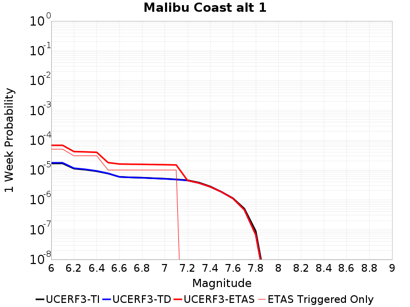 | 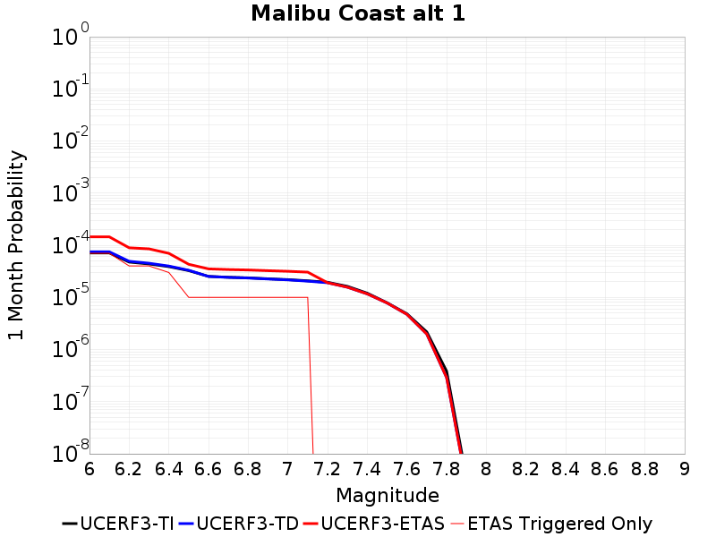 |  |  |

| Magnitude | 1 wk TI Prob | 1 wk TD Prob | 1 wk ETAS Prob | 1 wk ETAS/TD Gain | 1 wk ETAS Triggered Only | 1 mo TI Prob | 1 mo TD Prob | 1 mo ETAS Prob | 1 mo ETAS/TD Gain | 1 mo ETAS Triggered Only | 1 yr TI Prob | 1 yr TD Prob | 1 yr ETAS Prob | 1 yr ETAS/TD Gain | 1 yr ETAS Triggered Only | 10 yr TI Prob | 10 yr TD Prob | 10 yr ETAS Prob | 10 yr ETAS/TD Gain | 10 yr ETAS Triggered Only |
|-----|-----|-----|-----|-----|-----|-----|-----|-----|-----|-----|-----|-----|-----|-----|-----|-----|-----|-----|-----|-----|
| 6.0 | 1.6572556E-5 | 1.7441651E-5 | 6.744078E-5 | 3.866651 | 5.0E-5 | 7.102331E-5 | 7.47479E-5 | 1.4474266E-4 | 1.9364113 | 7.0E-5 | 8.6436566E-4 | 9.0969395E-4 | 0.0010195939 | 1.1208098 | 1.1E-4 | 0.0086101135 | 0.009061573 | 0.009230033 | 1.0185906 | 1.7E-4 |
| 6.1 | 1.6572556E-5 | 1.7441651E-5 | 6.744078E-5 | 3.866651 | 5.0E-5 | 7.102331E-5 | 7.47479E-5 | 1.4474266E-4 | 1.9364113 | 7.0E-5 | 8.6436566E-4 | 9.0969395E-4 | 0.0010195939 | 1.1208098 | 1.1E-4 | 0.0086101135 | 0.009061573 | 0.009230033 | 1.0185906 | 1.7E-4 |
| 6.2 | 1.1085717E-5 | 1.1486805E-5 | 4.148646E-5 | 3.6116621 | 3.0E-5 | 4.750935E-5 | 4.9228256E-5 | 8.922628E-5 | 1.8125014 | 4.0E-5 | 5.782728E-4 | 5.9919263E-4 | 6.691507E-4 | 1.1167538 | 7.0E-5 | 0.0057677035 | 0.0059761317 | 0.0060556536 | 1.0133066 | 8.0E-5 |
| 6.3 | 1.0208568E-5 | 1.0536048E-5 | 4.053573E-5 | 3.8473375 | 3.0E-5 | 4.375027E-5 | 4.5153723E-5 | 8.515192E-5 | 1.8858227 | 4.0E-5 | 5.325294E-4 | 5.496108E-4 | 6.195723E-4 | 1.1272929 | 7.0E-5 | 0.0053125503 | 0.0054828157 | 0.0055524316 | 1.0126972 | 7.0E-5 |
| 6.4 | 9.0682315E-6 | 9.302382E-6 | 3.9302104E-5 | 4.224951 | 3.0E-5 | 3.8863272E-5 | 3.986675E-5 | 6.986556E-5 | 1.7524767 | 3.0E-5 | 4.730576E-4 | 4.852716E-4 | 5.352473E-4 | 1.102985 | 5.0E-5 | 0.0047205184 | 0.0048423284 | 0.004892086 | 1.0102756 | 5.0E-5 |
| 6.5 | 7.605796E-6 | 7.725194E-6 | 1.7725117E-5 | 2.2944558 | 1.0E-5 | 3.259586E-5 | 3.3107564E-5 | 4.3107233E-5 | 1.3020358 | 1.0E-5 | 3.9678233E-4 | 4.0301133E-4 | 4.2300328E-4 | 1.0496064 | 2.0E-5 | 0.0039607463 | 0.0040229396 | 0.004042859 | 1.0049515 | 2.0E-5 |
| 6.6 | 5.889873E-6 | 5.875984E-6 | 1.5875925E-5 | 2.7018328 | 1.0E-5 | 2.5242069E-5 | 2.5182544E-5 | 3.5182293E-5 | 1.3970904 | 1.0E-5 | 3.0727885E-4 | 3.0655443E-4 | 3.265483E-4 | 1.0652213 | 2.0E-5 | 0.003068543 | 0.0030613285 | 0.0030812672 | 1.0065131 | 2.0E-5 |
| 6.7 | 5.66586E-6 | 5.639251E-6 | 1.5639194E-5 | 2.7732751 | 1.0E-5 | 2.428203E-5 | 2.4167995E-5 | 3.416775E-5 | 1.4137603 | 1.0E-5 | 2.955936E-4 | 2.942057E-4 | 3.141998E-4 | 1.0679597 | 2.0E-5 | 0.0029520073 | 0.002938174 | 0.0029581152 | 1.006787 | 2.0E-5 |
| 6.8 | 5.521556E-6 | 5.4877437E-6 | 1.5487689E-5 | 2.8222327 | 1.0E-5 | 2.3663597E-5 | 2.3518689E-5 | 3.3518452E-5 | 1.4251838 | 1.0E-5 | 2.880662E-4 | 2.863025E-4 | 3.0629677E-4 | 1.0698361 | 2.0E-5 | 0.0028769306 | 0.0028593482 | 0.002879291 | 1.0069746 | 2.0E-5 |
| 6.9 | 5.29752E-6 | 5.2496835E-6 | 1.5249631E-5 | 2.9048667 | 1.0E-5 | 2.270346E-5 | 2.249845E-5 | 3.2498225E-5 | 1.444465 | 1.0E-5 | 2.7637955E-4 | 2.7388427E-4 | 2.938788E-4 | 1.0730035 | 2.0E-5 | 0.0027603607 | 0.0027354776 | 0.0027554228 | 1.0072913 | 2.0E-5 |
| 7.0 | 5.106743E-6 | 5.0485887E-6 | 1.5048538E-5 | 2.9807415 | 1.0E-5 | 2.1885859E-5 | 2.163663E-5 | 3.1636413E-5 | 1.4621692 | 1.0E-5 | 2.6642776E-4 | 2.633942E-4 | 2.8338892E-4 | 1.0759118 | 2.0E-5 | 0.0026610855 | 0.0026308298 | 0.002650777 | 1.0075822 | 2.0E-5 |
| 7.1 | 4.8469647E-6 | 4.773E-6 | 1.4772952E-5 | 3.0951083 | 1.0E-5 | 2.0772539E-5 | 2.0455554E-5 | 3.045535E-5 | 1.4888548 | 1.0E-5 | 2.528763E-4 | 2.49018E-4 | 2.69013E-4 | 1.0802954 | 2.0E-5 | 0.0025258875 | 0.0024873975 | 0.0025073478 | 1.0080205 | 2.0E-5 |
| 7.2 | 4.545514E-6 | 4.451277E-6 | 4.451277E-6 | 1.0 | 0.0 | 1.9480629E-5 | 1.9076762E-5 | 1.9076762E-5 | 1.0 | 0.0 | 2.3715083E-4 | 2.3223489E-4 | 2.4223256E-4 | 1.0430498 | 1.0E-5 | 0.0023689792 | 0.0023199294 | 0.0023299062 | 1.0043005 | 1.0E-5 |
| 7.3 | 3.794097E-6 | 3.6546335E-6 | 3.6546335E-6 | 1.0 | 0.0 | 1.6260314E-5 | 1.5662621E-5 | 1.5662621E-5 | 1.0 | 0.0 | 1.9795135E-4 | 1.9067577E-4 | 2.0067387E-4 | 1.052435 | 1.0E-5 | 0.001977751 | 0.0019051264 | 0.0019151072 | 1.005239 | 1.0E-5 |
| 7.4 | 2.808217E-6 | 2.7213014E-6 | 2.7213014E-6 | 1.0 | 0.0 | 1.203516E-5 | 1.1662669E-5 | 1.1662669E-5 | 1.0 | 0.0 | 1.4651821E-4 | 1.4198376E-4 | 1.5198234E-4 | 1.0704206 | 1.0E-5 | 0.0014642165 | 0.0014189332 | 0.001428919 | 1.0070375 | 1.0E-5 |
| 7.5 | 1.83809E-6 | 1.8208791E-6 | 1.8208791E-6 | 1.0 | 0.0 | 7.877505E-6 | 7.803745E-6 | 7.803745E-6 | 1.0 | 0.0 | 9.59044E-5 | 9.5006464E-5 | 9.5006464E-5 | 1.0 | 0.0 | 9.5863023E-4 | 9.496605E-4 | 9.496605E-4 | 1.0 | 0.0 |
| 7.6 | 1.1292672E-6 | 1.1016862E-6 | 1.1016862E-6 | 1.0 | 0.0 | 4.839708E-6 | 4.7215035E-6 | 4.7215035E-6 | 1.0 | 0.0 | 5.8921847E-5 | 5.7482805E-5 | 5.7482805E-5 | 1.0 | 0.0 | 5.890623E-4 | 5.7468103E-4 | 5.7468103E-4 | 1.0 | 0.0 |
| 7.7 | 5.065272E-7 | 4.6200392E-7 | 4.6200392E-7 | 1.0 | 0.0 | 2.170829E-6 | 1.9800154E-6 | 1.9800154E-6 | 1.0 | 0.0 | 2.6429525E-5 | 2.4106432E-5 | 2.4106432E-5 | 1.0 | 0.0 | 2.642638E-4 | 2.4103929E-4 | 2.4103929E-4 | 1.0 | 0.0 |
| 7.8 | 8.952991E-8 | 6.760581E-8 | 6.760581E-8 | 1.0 | 0.0 | 3.8369956E-7 | 2.8973915E-7 | 2.8973915E-7 | 1.0 | 0.0 | 4.671532E-6 | 3.5275687E-6 | 3.5275687E-6 | 1.0 | 0.0 | 4.671434E-5 | 3.527515E-5 | 3.527515E-5 | 1.0 | 0.0 |
| 7.9 | 8.007447E-10 | 6.213752E-10 | 6.213752E-10 | 1.0 | 0.0 | 3.4317629E-9 | 2.663036E-9 | 2.663036E-9 | 1.0 | 0.0 | 4.1781714E-8 | 3.2422466E-8 | 3.2422466E-8 | 1.0 | 0.0 | 4.1781706E-7 | 3.2422463E-7 | 3.2422463E-7 | 1.0 | 0.0 |

## Malibu Coast (Extension) alt 1
*[(top)](#table-of-contents)*

| 1 Week | 1 Month | 1 Year | 10 Year |
|-----|-----|-----|-----|
|  |  |  |  |

| Magnitude | 1 wk TI Prob | 1 wk TD Prob | 1 wk ETAS Prob | 1 wk ETAS/TD Gain | 1 wk ETAS Triggered Only | 1 mo TI Prob | 1 mo TD Prob | 1 mo ETAS Prob | 1 mo ETAS/TD Gain | 1 mo ETAS Triggered Only | 1 yr TI Prob | 1 yr TD Prob | 1 yr ETAS Prob | 1 yr ETAS/TD Gain | 1 yr ETAS Triggered Only | 10 yr TI Prob | 10 yr TD Prob | 10 yr ETAS Prob | 10 yr ETAS/TD Gain | 10 yr ETAS Triggered Only |
|-----|-----|-----|-----|-----|-----|-----|-----|-----|-----|-----|-----|-----|-----|-----|-----|-----|-----|-----|-----|-----|
| 6.0 | 7.516028E-6 | 7.845023E-6 | 1.7844945E-5 | 2.2746835 | 1.0E-5 | 3.221115E-5 | 3.3621094E-5 | 4.362076E-5 | 1.2974223 | 1.0E-5 | 3.9210016E-4 | 4.092606E-4 | 4.392483E-4 | 1.073273 | 3.0E-5 | 0.0039140903 | 0.004085139 | 0.004134935 | 1.0121895 | 5.0E-5 |
| 6.1 | 7.199952E-6 | 7.5184635E-6 | 1.7518389E-5 | 2.330049 | 1.0E-5 | 3.0856572E-5 | 3.2221593E-5 | 4.222127E-5 | 1.3103409 | 1.0E-5 | 3.75614E-4 | 3.9222787E-4 | 4.222161E-4 | 1.0764562 | 3.0E-5 | 0.0037497976 | 0.003915422 | 0.003965226 | 1.01272 | 5.0E-5 |
| 6.2 | 6.3721413E-6 | 6.6590474E-6 | 6.6590474E-6 | 1.0 | 0.0 | 2.7308892E-5 | 2.8538465E-5 | 2.8538465E-5 | 1.0 | 0.0 | 3.3243504E-4 | 3.4740078E-4 | 3.6739383E-4 | 1.0575504 | 2.0E-5 | 0.0033193815 | 0.0034686169 | 0.0034885476 | 1.005746 | 2.0E-5 |
| 6.3 | 6.016345E-6 | 6.289086E-6 | 6.289086E-6 | 1.0 | 0.0 | 2.578408E-5 | 2.6952948E-5 | 2.6952948E-5 | 1.0 | 0.0 | 3.1387596E-4 | 3.2810305E-4 | 3.4809648E-4 | 1.0609365 | 2.0E-5 | 0.00313433 | 0.0032762226 | 0.003296157 | 1.0060846 | 2.0E-5 |
| 6.4 | 5.8104883E-6 | 6.0744264E-6 | 6.0744264E-6 | 1.0 | 0.0 | 2.4901856E-5 | 2.6033E-5 | 2.6033E-5 | 1.0 | 0.0 | 3.031379E-4 | 3.16906E-4 | 3.3689965E-4 | 1.0630902 | 2.0E-5 | 0.0030272473 | 0.0031645754 | 0.003184512 | 1.0063 | 2.0E-5 |
| 6.5 | 5.476925E-6 | 5.724136E-6 | 5.724136E-6 | 1.0 | 0.0 | 2.3472323E-5 | 2.4531782E-5 | 2.4531782E-5 | 1.0 | 0.0 | 2.8573806E-4 | 2.9863382E-4 | 3.086308E-4 | 1.0334759 | 1.0E-5 | 0.0028537093 | 0.002982357 | 0.0029923273 | 1.0033431 | 1.0E-5 |
| 6.6 | 5.222387E-6 | 5.456664E-6 | 5.456664E-6 | 1.0 | 0.0 | 2.2381464E-5 | 2.3385495E-5 | 2.3385495E-5 | 1.0 | 0.0 | 2.7246025E-4 | 2.8468148E-4 | 2.9467864E-4 | 1.035117 | 1.0E-5 | 0.0027212645 | 0.0028431988 | 0.0028531703 | 1.0035071 | 1.0E-5 |
| 6.7 | 5.0337076E-6 | 5.2583127E-6 | 5.2583127E-6 | 1.0 | 0.0 | 2.1572854E-5 | 2.2535432E-5 | 2.2535432E-5 | 1.0 | 0.0 | 2.6261783E-4 | 2.7433463E-4 | 2.8433188E-4 | 1.0364418 | 1.0E-5 | 0.002623077 | 0.00273999 | 0.0027499625 | 1.0036397 | 1.0E-5 |
| 6.8 | 4.5675624E-6 | 4.7581684E-6 | 4.7581684E-6 | 1.0 | 0.0 | 1.9575122E-5 | 2.0391992E-5 | 2.0391992E-5 | 1.0 | 0.0 | 2.3830103E-4 | 2.4824438E-4 | 2.582419E-4 | 1.0402728 | 1.0E-5 | 0.0023804565 | 0.0024796906 | 0.0024896658 | 1.0040227 | 1.0E-5 |
| 6.9 | 4.2802412E-6 | 4.45228E-6 | 4.45228E-6 | 1.0 | 0.0 | 1.8343762E-5 | 1.908106E-5 | 1.908106E-5 | 1.0 | 0.0 | 2.2331243E-4 | 2.322873E-4 | 2.4228498E-4 | 1.0430402 | 1.0E-5 | 0.0022308815 | 0.002320462 | 0.0023304387 | 1.0042995 | 1.0E-5 |
| 7.0 | 3.9794063E-6 | 4.130231E-6 | 4.130231E-6 | 1.0 | 0.0 | 1.7054486E-5 | 1.770087E-5 | 1.770087E-5 | 1.0 | 0.0 | 2.0761859E-4 | 2.154869E-4 | 2.2548475E-4 | 1.0463965 | 1.0E-5 | 0.0020742472 | 0.002152793 | 0.0021627715 | 1.0046351 | 1.0E-5 |
| 7.1 | 3.7730424E-6 | 3.911522E-6 | 3.911522E-6 | 1.0 | 0.0 | 1.6170083E-5 | 1.6763559E-5 | 1.6763559E-5 | 1.0 | 0.0 | 1.9685295E-4 | 2.0407734E-4 | 2.140753E-4 | 1.0489911 | 1.0E-5 | 0.0019667868 | 0.0020389124 | 0.002048892 | 1.0048946 | 1.0E-5 |
| 7.2 | 3.424985E-6 | 3.542232E-6 | 3.542232E-6 | 1.0 | 0.0 | 1.4678424E-5 | 1.5180906E-5 | 1.5180906E-5 | 1.0 | 0.0 | 1.7869516E-4 | 1.8481197E-4 | 1.9481013E-4 | 1.0540991 | 1.0E-5 | 0.0017855153 | 0.001846595 | 0.0018565764 | 1.0054054 | 1.0E-5 |
| 7.3 | 2.6966375E-6 | 2.7599212E-6 | 2.7599212E-6 | 1.0 | 0.0 | 1.15569665E-5 | 1.18281805E-5 | 1.18281805E-5 | 1.0 | 0.0 | 1.4069698E-4 | 1.4399862E-4 | 1.5399719E-4 | 1.0694351 | 1.0E-5 | 0.0014060794 | 0.0014390573 | 0.0014490429 | 1.0069389 | 1.0E-5 |
| 7.4 | 2.215957E-6 | 2.2498898E-6 | 2.2498898E-6 | 1.0 | 0.0 | 9.496924E-6 | 9.642349E-6 | 9.642349E-6 | 1.0 | 0.0 | 1.1561892E-4 | 1.1738931E-4 | 1.2738814E-4 | 1.0851766 | 1.0E-5 | 0.0011555878 | 0.0011732768 | 0.001183265 | 1.0085131 | 1.0E-5 |
| 7.5 | 1.2040218E-6 | 1.2222439E-6 | 1.2222439E-6 | 1.0 | 0.0 | 5.160083E-6 | 5.238178E-6 | 5.238178E-6 | 1.0 | 0.0 | 6.2822204E-5 | 6.377297E-5 | 6.377297E-5 | 1.0 | 0.0 | 6.280445E-4 | 6.375485E-4 | 6.375485E-4 | 1.0 | 0.0 |
| 7.6 | 6.6157446E-7 | 6.6826254E-7 | 6.6826254E-7 | 1.0 | 0.0 | 2.835316E-6 | 2.8639793E-6 | 2.8639793E-6 | 1.0 | 0.0 | 3.4519428E-5 | 3.4868408E-5 | 3.4868408E-5 | 1.0 | 0.0 | 3.4514067E-4 | 3.4863089E-4 | 3.4863089E-4 | 1.0 | 0.0 |
| 7.7 | 2.6012302E-7 | 2.4384235E-7 | 2.4384235E-7 | 1.0 | 0.0 | 1.1148124E-6 | 1.0450383E-6 | 1.0450383E-6 | 1.0 | 0.0 | 1.3572758E-5 | 1.2723278E-5 | 1.2723278E-5 | 1.0 | 0.0 | 1.3571928E-4 | 1.2722657E-4 | 1.2722657E-4 | 1.0 | 0.0 |
| 7.8 | 2.8323132E-8 | 2.03209E-8 | 2.03209E-8 | 1.0 | 0.0 | 1.2138484E-7 | 8.7089575E-8 | 8.7089575E-8 | 1.0 | 0.0 | 1.4778595E-6 | 1.0603151E-6 | 1.0603151E-6 | 1.0 | 0.0 | 1.4778497E-5 | 1.0603108E-5 | 1.0603108E-5 | 1.0 | 0.0 |

## Anacapa-Dume alt 1
*[(top)](#table-of-contents)*

| 1 Week | 1 Month | 1 Year | 10 Year |
|-----|-----|-----|-----|
|  |  | 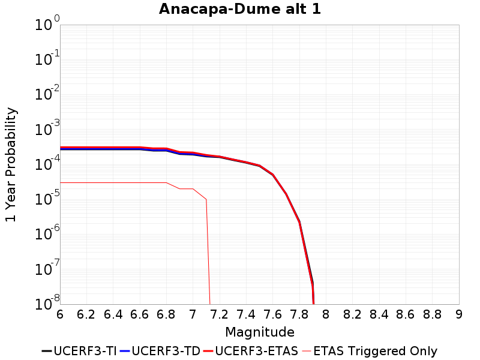 |  |

| Magnitude | 1 wk TI Prob | 1 wk TD Prob | 1 wk ETAS Prob | 1 wk ETAS/TD Gain | 1 wk ETAS Triggered Only | 1 mo TI Prob | 1 mo TD Prob | 1 mo ETAS Prob | 1 mo ETAS/TD Gain | 1 mo ETAS Triggered Only | 1 yr TI Prob | 1 yr TD Prob | 1 yr ETAS Prob | 1 yr ETAS/TD Gain | 1 yr ETAS Triggered Only | 10 yr TI Prob | 10 yr TD Prob | 10 yr ETAS Prob | 10 yr ETAS/TD Gain | 10 yr ETAS Triggered Only |
|-----|-----|-----|-----|-----|-----|-----|-----|-----|-----|-----|-----|-----|-----|-----|-----|-----|-----|-----|-----|-----|
| 6.0 | 5.1871802E-6 | 5.3748513E-6 | 1.5374797E-5 | 2.8605065 | 1.0E-5 | 2.2230583E-5 | 2.3034878E-5 | 3.303465E-5 | 1.4341143 | 1.0E-5 | 2.7062374E-4 | 2.804144E-4 | 3.1040597E-4 | 1.1069546 | 3.0E-5 | 0.002702944 | 0.0028006912 | 0.0028306071 | 1.0106816 | 3.0E-5 |
| 6.1 | 5.1871802E-6 | 5.3748513E-6 | 1.5374797E-5 | 2.8605065 | 1.0E-5 | 2.2230583E-5 | 2.3034878E-5 | 3.303465E-5 | 1.4341143 | 1.0E-5 | 2.7062374E-4 | 2.804144E-4 | 3.1040597E-4 | 1.1069546 | 3.0E-5 | 0.002702944 | 0.0028006912 | 0.0028306071 | 1.0106816 | 3.0E-5 |
| 6.2 | 5.1871802E-6 | 5.3748513E-6 | 1.5374797E-5 | 2.8605065 | 1.0E-5 | 2.2230583E-5 | 2.3034878E-5 | 3.303465E-5 | 1.4341143 | 1.0E-5 | 2.7062374E-4 | 2.804144E-4 | 3.1040597E-4 | 1.1069546 | 3.0E-5 | 0.002702944 | 0.0028006912 | 0.0028306071 | 1.0106816 | 3.0E-5 |
| 6.3 | 5.1871802E-6 | 5.3748513E-6 | 1.5374797E-5 | 2.8605065 | 1.0E-5 | 2.2230583E-5 | 2.3034878E-5 | 3.303465E-5 | 1.4341143 | 1.0E-5 | 2.7062374E-4 | 2.804144E-4 | 3.1040597E-4 | 1.1069546 | 3.0E-5 | 0.002702944 | 0.0028006912 | 0.0028306071 | 1.0106816 | 3.0E-5 |
| 6.4 | 5.1871802E-6 | 5.3748513E-6 | 1.5374797E-5 | 2.8605065 | 1.0E-5 | 2.2230583E-5 | 2.3034878E-5 | 3.303465E-5 | 1.4341143 | 1.0E-5 | 2.7062374E-4 | 2.804144E-4 | 3.1040597E-4 | 1.1069546 | 3.0E-5 | 0.002702944 | 0.0028006912 | 0.0028306071 | 1.0106816 | 3.0E-5 |
| 6.5 | 5.1871802E-6 | 5.3748513E-6 | 1.5374797E-5 | 2.8605065 | 1.0E-5 | 2.2230583E-5 | 2.3034878E-5 | 3.303465E-5 | 1.4341143 | 1.0E-5 | 2.7062374E-4 | 2.804144E-4 | 3.1040597E-4 | 1.1069546 | 3.0E-5 | 0.002702944 | 0.0028006912 | 0.0028306071 | 1.0106816 | 3.0E-5 |
| 6.6 | 5.1871802E-6 | 5.3748513E-6 | 1.5374797E-5 | 2.8605065 | 1.0E-5 | 2.2230583E-5 | 2.3034878E-5 | 3.303465E-5 | 1.4341143 | 1.0E-5 | 2.7062374E-4 | 2.804144E-4 | 3.1040597E-4 | 1.1069546 | 3.0E-5 | 0.002702944 | 0.0028006912 | 0.0028306071 | 1.0106816 | 3.0E-5 |
| 6.7 | 4.7693475E-6 | 4.943628E-6 | 1.4943578E-5 | 3.022796 | 1.0E-5 | 2.04399E-5 | 2.118681E-5 | 3.11866E-5 | 1.4719818 | 1.0E-5 | 2.4882736E-4 | 2.5791963E-4 | 2.8791188E-4 | 1.1162853 | 3.0E-5 | 0.0024854892 | 0.0025762792 | 0.002606202 | 1.0116147 | 3.0E-5 |
| 6.8 | 4.753408E-6 | 4.9271634E-6 | 1.49271145E-5 | 3.0295553 | 1.0E-5 | 2.037159E-5 | 2.1116248E-5 | 3.1116037E-5 | 1.473559 | 1.0E-5 | 2.4799586E-4 | 2.5706075E-4 | 2.8705303E-4 | 1.116674 | 3.0E-5 | 0.002477193 | 0.0025677101 | 0.002597633 | 1.0116535 | 3.0E-5 |
| 6.9 | 3.800069E-6 | 3.942849E-6 | 1.394281E-5 | 3.536227 | 1.0E-5 | 1.6285909E-5 | 1.6897817E-5 | 2.689765E-5 | 1.5917825 | 1.0E-5 | 1.9826289E-4 | 2.0571174E-4 | 2.2570763E-4 | 1.0972034 | 2.0E-5 | 0.001980861 | 0.002055237 | 0.002075196 | 1.0097113 | 2.0E-5 |
| 7.0 | 3.6671938E-6 | 3.8054804E-6 | 1.3805442E-5 | 3.6277792 | 1.0E-5 | 1.571645E-5 | 1.63091E-5 | 2.6308937E-5 | 1.6131446 | 1.0E-5 | 1.9133097E-4 | 1.9854544E-4 | 2.1854146E-4 | 1.1007127 | 2.0E-5 | 0.0019116632 | 0.0019837038 | 0.0020036642 | 1.0100621 | 2.0E-5 |
| 7.1 | 3.2394885E-6 | 3.3638305E-6 | 1.3363797E-5 | 3.9727914 | 1.0E-5 | 1.3883448E-5 | 1.4416338E-5 | 2.4416193E-5 | 1.6936475 | 1.0E-5 | 1.6901788E-4 | 1.7550487E-4 | 1.8550313E-4 | 1.0569685 | 1.0E-5 | 0.0016888938 | 0.001753674 | 0.0017636565 | 1.0056924 | 1.0E-5 |
| 7.2 | 3.0935948E-6 | 3.2128107E-6 | 3.2128107E-6 | 1.0 | 0.0 | 1.3258196E-5 | 1.3769117E-5 | 1.3769117E-5 | 1.0 | 0.0 | 1.6140658E-4 | 1.676262E-4 | 1.676262E-4 | 1.0 | 0.0 | 0.001612894 | 0.0016750088 | 0.0016750088 | 1.0 | 0.0 |
| 7.3 | 2.5604163E-6 | 2.650852E-6 | 2.650852E-6 | 1.0 | 0.0 | 1.0973167E-5 | 1.1360745E-5 | 1.1360745E-5 | 1.0 | 0.0 | 1.3359012E-4 | 1.3830833E-4 | 1.3830833E-4 | 1.0 | 0.0 | 0.0013350984 | 0.0013822272 | 0.0013822272 | 1.0 | 0.0 |
| 7.4 | 2.1429005E-6 | 2.2136867E-6 | 2.2136867E-6 | 1.0 | 0.0 | 9.1838265E-6 | 9.487195E-6 | 9.487195E-6 | 1.0 | 0.0 | 1.11807356E-4 | 1.15500494E-4 | 1.15500494E-4 | 1.0 | 0.0 | 0.0011175112 | 0.0011544073 | 0.0011544073 | 1.0 | 0.0 |
| 7.5 | 1.7237151E-6 | 1.7787231E-6 | 1.7787231E-6 | 1.0 | 0.0 | 7.3873293E-6 | 7.623077E-6 | 7.623077E-6 | 1.0 | 0.0 | 8.993702E-5 | 9.280703E-5 | 9.280703E-5 | 1.0 | 0.0 | 8.990063E-4 | 9.2768506E-4 | 9.2768506E-4 | 1.0 | 0.0 |
| 7.6 | 9.541696E-7 | 9.837082E-7 | 9.837082E-7 | 1.0 | 0.0 | 4.089292E-6 | 4.2158854E-6 | 4.2158854E-6 | 1.0 | 0.0 | 4.9785995E-5 | 5.132721E-5 | 5.132721E-5 | 1.0 | 0.0 | 4.9774844E-4 | 5.1315484E-4 | 5.1315484E-4 | 1.0 | 0.0 |
| 7.7 | 2.7226676E-7 | 2.7206164E-7 | 2.7206164E-7 | 1.0 | 0.0 | 1.166857E-6 | 1.1659779E-6 | 1.1659779E-6 | 1.0 | 0.0 | 1.4206392E-5 | 1.4195689E-5 | 1.4195689E-5 | 1.0 | 0.0 | 1.4205484E-4 | 1.419479E-4 | 1.419479E-4 | 1.0 | 0.0 |
| 7.8 | 4.5017995E-8 | 4.221125E-8 | 4.221125E-8 | 1.0 | 0.0 | 1.9293425E-7 | 1.8090535E-7 | 1.8090535E-7 | 1.0 | 0.0 | 2.348972E-6 | 2.2025206E-6 | 2.2025206E-6 | 1.0 | 0.0 | 2.348947E-5 | 2.202501E-5 | 2.202501E-5 | 1.0 | 0.0 |
| 7.9 | 8.007447E-10 | 6.213752E-10 | 6.213752E-10 | 1.0 | 0.0 | 3.4317629E-9 | 2.663036E-9 | 2.663036E-9 | 1.0 | 0.0 | 4.1781714E-8 | 3.2422466E-8 | 3.2422466E-8 | 1.0 | 0.0 | 4.1781706E-7 | 3.2422463E-7 | 3.2422463E-7 | 1.0 | 0.0 |

## Santa Monica alt 1
*[(top)](#table-of-contents)*

| 1 Week | 1 Month | 1 Year | 10 Year |
|-----|-----|-----|-----|
| 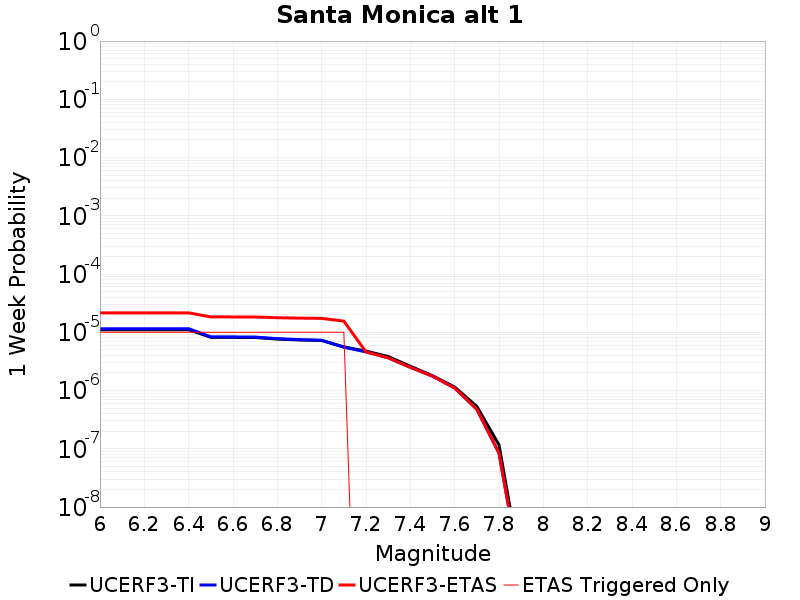 |  |  |  |

| Magnitude | 1 wk TI Prob | 1 wk TD Prob | 1 wk ETAS Prob | 1 wk ETAS/TD Gain | 1 wk ETAS Triggered Only | 1 mo TI Prob | 1 mo TD Prob | 1 mo ETAS Prob | 1 mo ETAS/TD Gain | 1 mo ETAS Triggered Only | 1 yr TI Prob | 1 yr TD Prob | 1 yr ETAS Prob | 1 yr ETAS/TD Gain | 1 yr ETAS Triggered Only | 10 yr TI Prob | 10 yr TD Prob | 10 yr ETAS Prob | 10 yr ETAS/TD Gain | 10 yr ETAS Triggered Only |
|-----|-----|-----|-----|-----|-----|-----|-----|-----|-----|-----|-----|-----|-----|-----|-----|-----|-----|-----|-----|-----|
| 6.0 | 1.1066008E-5 | 1.15029015E-5 | 2.1502787E-5 | 1.8693359 | 1.0E-5 | 4.742488E-5 | 4.9297298E-5 | 5.9296803E-5 | 1.2028409 | 1.0E-5 | 5.7724497E-4 | 6.0004333E-4 | 6.200313E-4 | 1.0333109 | 2.0E-5 | 0.005757478 | 0.0059856283 | 0.006005509 | 1.0033213 | 2.0E-5 |
| 6.1 | 1.1066008E-5 | 1.15029015E-5 | 2.1502787E-5 | 1.8693359 | 1.0E-5 | 4.742488E-5 | 4.9297298E-5 | 5.9296803E-5 | 1.2028409 | 1.0E-5 | 5.7724497E-4 | 6.0004333E-4 | 6.200313E-4 | 1.0333109 | 2.0E-5 | 0.005757478 | 0.0059856283 | 0.006005509 | 1.0033213 | 2.0E-5 |
| 6.2 | 1.1066008E-5 | 1.15029015E-5 | 2.1502787E-5 | 1.8693359 | 1.0E-5 | 4.742488E-5 | 4.9297298E-5 | 5.9296803E-5 | 1.2028409 | 1.0E-5 | 5.7724497E-4 | 6.0004333E-4 | 6.200313E-4 | 1.0333109 | 2.0E-5 | 0.005757478 | 0.0059856283 | 0.006005509 | 1.0033213 | 2.0E-5 |
| 6.3 | 1.1066008E-5 | 1.15029015E-5 | 2.1502787E-5 | 1.8693359 | 1.0E-5 | 4.742488E-5 | 4.9297298E-5 | 5.9296803E-5 | 1.2028409 | 1.0E-5 | 5.7724497E-4 | 6.0004333E-4 | 6.200313E-4 | 1.0333109 | 2.0E-5 | 0.005757478 | 0.0059856283 | 0.006005509 | 1.0033213 | 2.0E-5 |
| 6.4 | 1.1066008E-5 | 1.15029015E-5 | 2.1502787E-5 | 1.8693359 | 1.0E-5 | 4.742488E-5 | 4.9297298E-5 | 5.9296803E-5 | 1.2028409 | 1.0E-5 | 5.7724497E-4 | 6.0004333E-4 | 6.200313E-4 | 1.0333109 | 2.0E-5 | 0.005757478 | 0.0059856283 | 0.006005509 | 1.0033213 | 2.0E-5 |
| 6.5 | 8.183544E-6 | 8.346685E-6 | 1.8346602E-5 | 2.1980705 | 1.0E-5 | 3.5071862E-5 | 3.5771027E-5 | 4.5770666E-5 | 1.2795459 | 1.0E-5 | 4.2691626E-4 | 4.354268E-4 | 4.554181E-4 | 1.0459119 | 2.0E-5 | 0.0042609703 | 0.004345903 | 0.0043658162 | 1.004582 | 2.0E-5 |
| 6.6 | 8.1543285E-6 | 8.3148925E-6 | 1.831481E-5 | 2.2026513 | 1.0E-5 | 3.4946657E-5 | 3.5634777E-5 | 4.563442E-5 | 1.2806147 | 1.0E-5 | 4.2539247E-4 | 4.3376864E-4 | 4.5375997E-4 | 1.0460875 | 2.0E-5 | 0.0042457907 | 0.004329386 | 0.0043492997 | 1.0045996 | 2.0E-5 |
| 6.7 | 8.110878E-6 | 8.268326E-6 | 1.8268243E-5 | 2.2094247 | 1.0E-5 | 3.4760444E-5 | 3.5435212E-5 | 4.5434856E-5 | 1.2821952 | 1.0E-5 | 4.231262E-4 | 4.313399E-4 | 4.5133126E-4 | 1.0463471 | 2.0E-5 | 0.0042232145 | 0.004305193 | 0.0043251067 | 1.0046256 | 2.0E-5 |
| 6.8 | 7.644036E-6 | 7.762148E-6 | 1.7762071E-5 | 2.2882931 | 1.0E-5 | 3.275974E-5 | 3.3265933E-5 | 4.32656E-5 | 1.3005978 | 1.0E-5 | 3.9877684E-4 | 4.049389E-4 | 4.249308E-4 | 1.0493702 | 2.0E-5 | 0.00398062 | 0.004042158 | 0.004062077 | 1.0049279 | 2.0E-5 |
| 6.9 | 7.3698293E-6 | 7.46775E-6 | 1.7467675E-5 | 2.3390815 | 1.0E-5 | 3.15846E-5 | 3.200426E-5 | 4.200394E-5 | 1.3124484 | 1.0E-5 | 3.8447464E-4 | 3.8958358E-4 | 4.095758E-4 | 1.0513169 | 2.0E-5 | 0.0038381014 | 0.0038891507 | 0.003909073 | 1.0051225 | 2.0E-5 |
| 7.0 | 7.209872E-6 | 7.2987864E-6 | 1.7298713E-5 | 2.3700807 | 1.0E-5 | 3.0899086E-5 | 3.1280146E-5 | 4.1279833E-5 | 1.3196816 | 1.0E-5 | 3.7613141E-4 | 3.8077062E-4 | 4.00763E-4 | 1.052505 | 2.0E-5 | 0.0037549543 | 0.0038013258 | 0.0038212498 | 1.0052413 | 2.0E-5 |
| 7.1 | 5.603456E-6 | 5.5325845E-6 | 1.5532529E-5 | 2.8074636 | 1.0E-5 | 2.4014591E-5 | 2.3710862E-5 | 3.3710625E-5 | 1.4217377 | 1.0E-5 | 2.923384E-4 | 2.886419E-4 | 3.0863614E-4 | 1.06927 | 2.0E-5 | 0.0029195412 | 0.002882712 | 0.0029026545 | 1.006918 | 2.0E-5 |
| 7.2 | 4.7483613E-6 | 4.597456E-6 | 4.597456E-6 | 1.0 | 0.0 | 2.0349962E-5 | 1.9703235E-5 | 1.9703235E-5 | 1.0 | 0.0 | 2.4773262E-4 | 2.3986062E-4 | 2.4985822E-4 | 1.0416809 | 1.0E-5 | 0.0024745662 | 0.0023960315 | 0.0024060076 | 1.0041636 | 1.0E-5 |
| 7.3 | 3.829015E-6 | 3.6395165E-6 | 3.6395165E-6 | 1.0 | 0.0 | 1.6409962E-5 | 1.5597836E-5 | 1.5597836E-5 | 1.0 | 0.0 | 1.9977297E-4 | 1.8988719E-4 | 1.9988528E-4 | 1.0526528 | 1.0E-5 | 0.0019959346 | 0.0018972582 | 0.0019072392 | 1.0052607 | 1.0E-5 |
| 7.4 | 2.610755E-6 | 2.5031716E-6 | 2.5031716E-6 | 1.0 | 0.0 | 1.1188902E-5 | 1.0727835E-5 | 1.0727835E-5 | 1.0 | 0.0 | 1.3621636E-4 | 1.306036E-4 | 1.406023E-4 | 1.0765575 | 1.0E-5 | 0.001361329 | 0.0013052729 | 0.0013152598 | 1.0076512 | 1.0E-5 |
| 7.5 | 1.792146E-6 | 1.7610378E-6 | 1.7610378E-6 | 1.0 | 0.0 | 7.680603E-6 | 7.547283E-6 | 7.547283E-6 | 1.0 | 0.0 | 9.3507326E-5 | 9.188433E-5 | 9.188433E-5 | 1.0 | 0.0 | 9.3467993E-4 | 9.1846654E-4 | 9.1846654E-4 | 1.0 | 0.0 |
| 7.6 | 1.1473018E-6 | 1.1047732E-6 | 1.1047732E-6 | 1.0 | 0.0 | 4.9169985E-6 | 4.734734E-6 | 4.734734E-6 | 1.0 | 0.0 | 5.986281E-5 | 5.7643876E-5 | 5.7643876E-5 | 1.0 | 0.0 | 5.984669E-4 | 5.762909E-4 | 5.762909E-4 | 1.0 | 0.0 |
| 7.7 | 5.330919E-7 | 4.7594247E-7 | 4.7594247E-7 | 1.0 | 0.0 | 2.2846775E-6 | 2.039752E-6 | 2.039752E-6 | 1.0 | 0.0 | 2.7815593E-5 | 2.4833707E-5 | 2.4833707E-5 | 1.0 | 0.0 | 2.7812112E-4 | 2.4831048E-4 | 2.4831048E-4 | 1.0 | 0.0 |
| 7.8 | 1.1668574E-7 | 8.3810434E-8 | 8.3810434E-8 | 1.0 | 0.0 | 5.000816E-7 | 3.5918754E-7 | 3.5918754E-7 | 1.0 | 0.0 | 6.0884768E-6 | 4.3730997E-6 | 4.3730997E-6 | 1.0 | 0.0 | 6.08831E-5 | 4.3730168E-5 | 4.3730168E-5 | 1.0 | 0.0 |
| 7.9 | 8.007447E-10 | 6.213752E-10 | 6.213752E-10 | 1.0 | 0.0 | 3.4317629E-9 | 2.663036E-9 | 2.663036E-9 | 1.0 | 0.0 | 4.1781714E-8 | 3.2422466E-8 | 3.2422466E-8 | 1.0 | 0.0 | 4.1781706E-7 | 3.2422463E-7 | 3.2422463E-7 | 1.0 | 0.0 |

## Elysian Park (Upper)
*[(top)](#table-of-contents)*

| 1 Week | 1 Month | 1 Year | 10 Year |
|-----|-----|-----|-----|
| 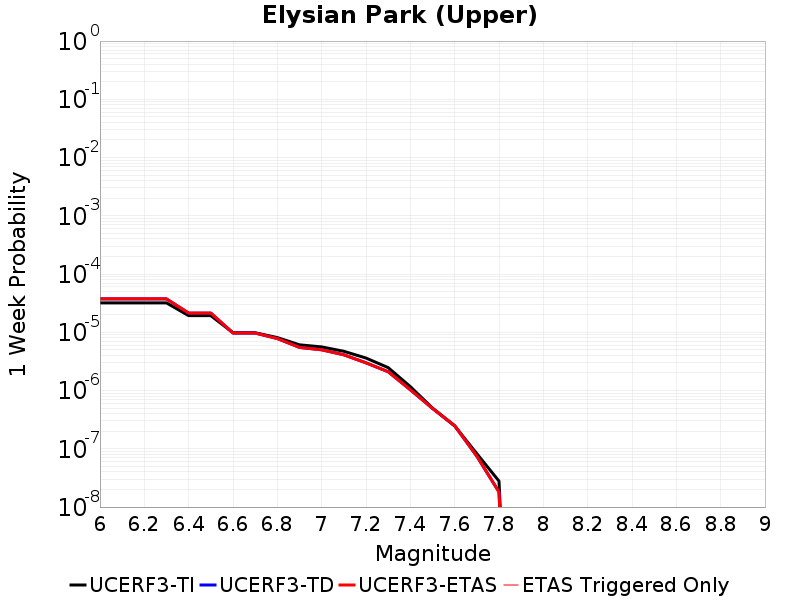 | 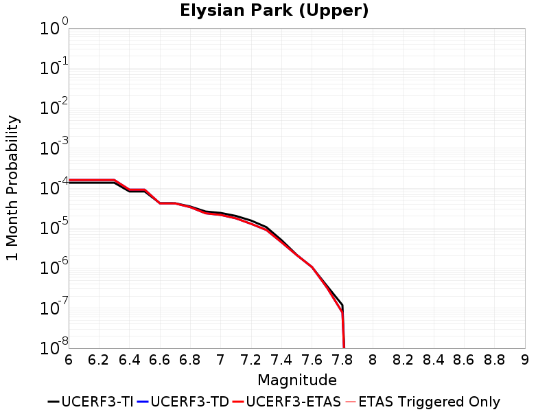 |  | 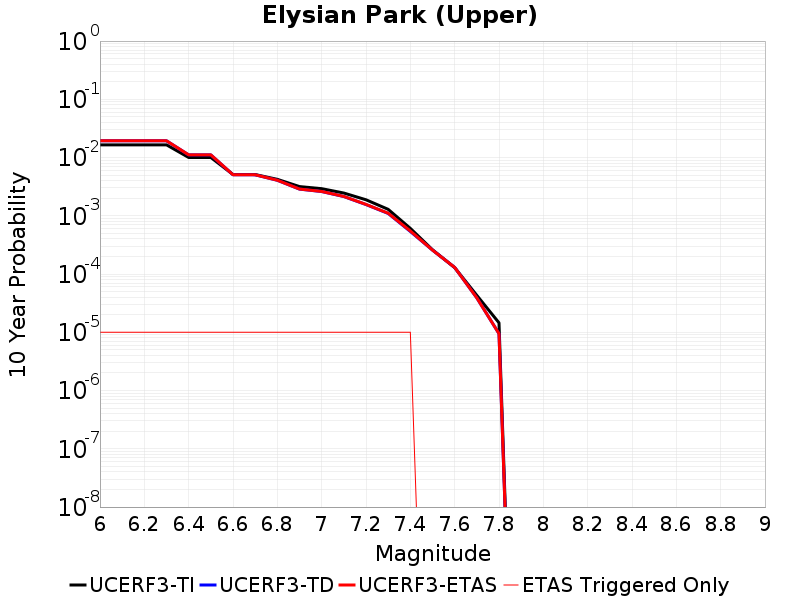 |

| Magnitude | 1 wk TI Prob | 1 wk TD Prob | 1 wk ETAS Prob | 1 wk ETAS/TD Gain | 1 wk ETAS Triggered Only | 1 mo TI Prob | 1 mo TD Prob | 1 mo ETAS Prob | 1 mo ETAS/TD Gain | 1 mo ETAS Triggered Only | 1 yr TI Prob | 1 yr TD Prob | 1 yr ETAS Prob | 1 yr ETAS/TD Gain | 1 yr ETAS Triggered Only | 10 yr TI Prob | 10 yr TD Prob | 10 yr ETAS Prob | 10 yr ETAS/TD Gain | 10 yr ETAS Triggered Only |
|-----|-----|-----|-----|-----|-----|-----|-----|-----|-----|-----|-----|-----|-----|-----|-----|-----|-----|-----|-----|-----|
| 6.0 | 3.1876025E-5 | 3.7330923E-5 | 3.7330923E-5 | 1.0 | 0.0 | 1.3660437E-4 | 1.5998239E-4 | 1.5998239E-4 | 1.0 | 0.0 | 0.0016618895 | 0.0019465222 | 0.0019565027 | 1.0051273 | 1.0E-5 | 0.016495159 | 0.019341612 | 0.019351419 | 1.000507 | 1.0E-5 |
| 6.1 | 3.1876025E-5 | 3.7330923E-5 | 3.7330923E-5 | 1.0 | 0.0 | 1.3660437E-4 | 1.5998239E-4 | 1.5998239E-4 | 1.0 | 0.0 | 0.0016618895 | 0.0019465222 | 0.0019565027 | 1.0051273 | 1.0E-5 | 0.016495159 | 0.019341612 | 0.019351419 | 1.000507 | 1.0E-5 |
| 6.2 | 3.1876025E-5 | 3.7330923E-5 | 3.7330923E-5 | 1.0 | 0.0 | 1.3660437E-4 | 1.5998239E-4 | 1.5998239E-4 | 1.0 | 0.0 | 0.0016618895 | 0.0019465222 | 0.0019565027 | 1.0051273 | 1.0E-5 | 0.016495159 | 0.019341612 | 0.019351419 | 1.000507 | 1.0E-5 |
| 6.3 | 3.1876025E-5 | 3.7330923E-5 | 3.7330923E-5 | 1.0 | 0.0 | 1.3660437E-4 | 1.5998239E-4 | 1.5998239E-4 | 1.0 | 0.0 | 0.0016618895 | 0.0019465222 | 0.0019565027 | 1.0051273 | 1.0E-5 | 0.016495159 | 0.019341612 | 0.019351419 | 1.000507 | 1.0E-5 |
| 6.4 | 1.9273462E-5 | 2.1338712E-5 | 2.1338712E-5 | 1.0 | 0.0 | 8.259794E-5 | 9.144941E-5 | 9.144941E-5 | 1.0 | 0.0 | 0.001005166 | 0.0011130014 | 0.0011229903 | 1.0089747 | 1.0E-5 | 0.010006315 | 0.01109127 | 0.011101159 | 1.0008916 | 1.0E-5 |
| 6.5 | 1.9273462E-5 | 2.1338712E-5 | 2.1338712E-5 | 1.0 | 0.0 | 8.259794E-5 | 9.144941E-5 | 9.144941E-5 | 1.0 | 0.0 | 0.001005166 | 0.0011130014 | 0.0011229903 | 1.0089747 | 1.0E-5 | 0.010006315 | 0.01109127 | 0.011101159 | 1.0008916 | 1.0E-5 |
| 6.6 | 9.813258E-6 | 9.701602E-6 | 9.701602E-6 | 1.0 | 0.0 | 4.205614E-5 | 4.157767E-5 | 4.157767E-5 | 1.0 | 0.0 | 5.119132E-4 | 5.0609786E-4 | 5.160928E-4 | 1.019749 | 1.0E-5 | 0.005107356 | 0.0050501837 | 0.005060133 | 1.0019702 | 1.0E-5 |
| 6.7 | 9.801478E-6 | 9.689142E-6 | 9.689142E-6 | 1.0 | 0.0 | 4.2005657E-5 | 4.1524276E-5 | 4.1524276E-5 | 1.0 | 0.0 | 5.112989E-4 | 5.054481E-4 | 5.1544304E-4 | 1.0197744 | 1.0E-5 | 0.0051012407 | 0.0050437152 | 0.005053665 | 1.0019727 | 1.0E-5 |
| 6.8 | 8.102489E-6 | 7.800994E-6 | 7.800994E-6 | 1.0 | 0.0 | 3.4724493E-5 | 3.3432432E-5 | 3.3432432E-5 | 1.0 | 0.0 | 4.2268867E-4 | 4.0696887E-4 | 4.169648E-4 | 1.0245619 | 1.0E-5 | 0.004218856 | 0.004062735 | 0.004072694 | 1.0024514 | 1.0E-5 |
| 6.9 | 6.08275E-6 | 5.4972015E-6 | 5.4972015E-6 | 1.0 | 0.0 | 2.6068668E-5 | 2.3559227E-5 | 2.3559227E-5 | 1.0 | 0.0 | 3.173398E-4 | 2.867966E-4 | 2.9679373E-4 | 1.0348579 | 1.0E-5 | 0.0031688702 | 0.002864343 | 0.0028743143 | 1.0034811 | 1.0E-5 |
| 7.0 | 5.5995934E-6 | 4.996761E-6 | 4.996761E-6 | 1.0 | 0.0 | 2.3998036E-5 | 2.141452E-5 | 2.141452E-5 | 1.0 | 0.0 | 2.9213692E-4 | 2.6069125E-4 | 2.7068864E-4 | 1.0383495 | 1.0E-5 | 0.0029175316 | 0.0026039223 | 0.0026138963 | 1.0038303 | 1.0E-5 |
| 7.1 | 4.709881E-6 | 4.0983055E-6 | 4.0983055E-6 | 1.0 | 0.0 | 2.0185047E-5 | 1.756405E-5 | 1.756405E-5 | 1.0 | 0.0 | 2.4572524E-4 | 2.1382174E-4 | 2.238196E-4 | 1.0467579 | 1.0E-5 | 0.002454537 | 0.0021362018 | 0.0021461805 | 1.0046712 | 1.0E-5 |
| 7.2 | 3.6063436E-6 | 2.9849357E-6 | 2.9849357E-6 | 1.0 | 0.0 | 1.5455667E-5 | 1.279252E-5 | 1.279252E-5 | 1.0 | 0.0 | 1.881565E-4 | 1.557379E-4 | 1.6573635E-4 | 1.0642004 | 1.0E-5 | 0.0018799726 | 0.0015562989 | 0.0015662834 | 1.0064155 | 1.0E-5 |
| 7.3 | 2.471135E-6 | 2.100582E-6 | 2.100582E-6 | 1.0 | 0.0 | 1.0590536E-5 | 9.002463E-6 | 9.002463E-6 | 1.0 | 0.0 | 1.2893214E-4 | 1.0959955E-4 | 1.1959845E-4 | 1.0912312 | 1.0E-5 | 0.0012885736 | 0.0010954622 | 0.0011054513 | 1.0091186 | 1.0E-5 |
| 7.4 | 1.163943E-6 | 1.0300093E-6 | 1.0300093E-6 | 1.0 | 0.0 | 4.988318E-6 | 4.4143185E-6 | 4.4143185E-6 | 1.0 | 0.0 | 6.0731076E-5 | 5.3743035E-5 | 6.37425E-5 | 1.1860607 | 1.0E-5 | 6.071448E-4 | 5.3730333E-4 | 5.47298E-4 | 1.0186014 | 1.0E-5 |
| 7.5 | 4.99459E-7 | 4.928455E-7 | 4.928455E-7 | 1.0 | 0.0 | 2.140537E-6 | 2.1121934E-6 | 2.1121934E-6 | 1.0 | 0.0 | 2.6060725E-5 | 2.5715668E-5 | 2.5715668E-5 | 1.0 | 0.0 | 2.605767E-4 | 2.571285E-4 | 2.571285E-4 | 1.0 | 0.0 |
| 7.6 | 2.4667852E-7 | 2.485151E-7 | 2.485151E-7 | 1.0 | 0.0 | 1.0571932E-6 | 1.0650643E-6 | 1.0650643E-6 | 1.0 | 0.0 | 1.2871251E-5 | 1.2967084E-5 | 1.2967084E-5 | 1.0 | 0.0 | 1.2870505E-4 | 1.2966365E-4 | 1.2966365E-4 | 1.0 | 0.0 |
| 7.7 | 8.2312795E-8 | 7.453474E-8 | 7.453474E-8 | 1.0 | 0.0 | 3.527691E-7 | 3.1943455E-7 | 3.1943455E-7 | 1.0 | 0.0 | 4.294955E-6 | 3.88911E-6 | 3.88911E-6 | 1.0 | 0.0 | 4.2948723E-5 | 3.8890536E-5 | 3.8890536E-5 | 1.0 | 0.0 |
| 7.8 | 2.7819295E-8 | 1.8105403E-8 | 1.8105403E-8 | 1.0 | 0.0 | 1.1922555E-7 | 7.759458E-8 | 7.759458E-8 | 1.0 | 0.0 | 1.45157E-6 | 9.4471375E-7 | 9.4471375E-7 | 1.0 | 0.0 | 1.45156055E-5 | 9.447113E-6 | 9.447113E-6 | 1.0 | 0.0 |

## San Pedro Basin
*[(top)](#table-of-contents)*

| 1 Week | 1 Month | 1 Year | 10 Year |
|-----|-----|-----|-----|
| 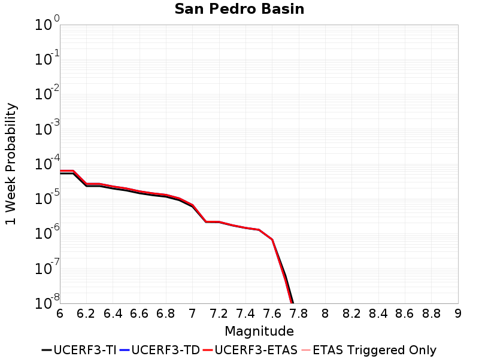 | 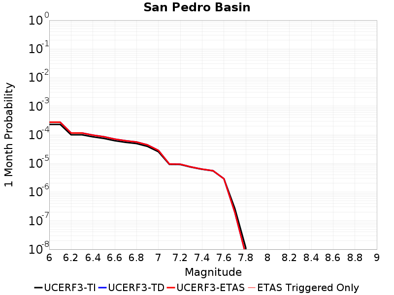 |  |  |

| Magnitude | 1 wk TI Prob | 1 wk TD Prob | 1 wk ETAS Prob | 1 wk ETAS/TD Gain | 1 wk ETAS Triggered Only | 1 mo TI Prob | 1 mo TD Prob | 1 mo ETAS Prob | 1 mo ETAS/TD Gain | 1 mo ETAS Triggered Only | 1 yr TI Prob | 1 yr TD Prob | 1 yr ETAS Prob | 1 yr ETAS/TD Gain | 1 yr ETAS Triggered Only | 10 yr TI Prob | 10 yr TD Prob | 10 yr ETAS Prob | 10 yr ETAS/TD Gain | 10 yr ETAS Triggered Only |
|-----|-----|-----|-----|-----|-----|-----|-----|-----|-----|-----|-----|-----|-----|-----|-----|-----|-----|-----|-----|-----|
| 6.0 | 5.3449043E-5 | 6.3842475E-5 | 6.3842475E-5 | 1.0 | 0.0 | 2.2904722E-4 | 2.7358544E-4 | 2.7358544E-4 | 1.0 | 0.0 | 0.0027850836 | 0.0033264186 | 0.0033363854 | 1.0029962 | 1.0E-5 | 0.027504366 | 0.032828487 | 0.03283816 | 1.0002946 | 1.0E-5 |
| 6.1 | 5.3449043E-5 | 6.3842475E-5 | 6.3842475E-5 | 1.0 | 0.0 | 2.2904722E-4 | 2.7358544E-4 | 2.7358544E-4 | 1.0 | 0.0 | 0.0027850836 | 0.0033264186 | 0.0033363854 | 1.0029962 | 1.0E-5 | 0.027504366 | 0.032828487 | 0.03283816 | 1.0002946 | 1.0E-5 |
| 6.2 | 2.3189454E-5 | 2.680303E-5 | 2.680303E-5 | 1.0 | 0.0 | 9.9379584E-5 | 1.1486534E-4 | 1.1486534E-4 | 1.0 | 0.0 | 0.0012092749 | 0.0013976356 | 0.0013976356 | 1.0 | 0.0 | 0.012027155 | 0.013893364 | 0.013893364 | 1.0 | 0.0 |
| 6.3 | 2.3189454E-5 | 2.680303E-5 | 2.680303E-5 | 1.0 | 0.0 | 9.9379584E-5 | 1.1486534E-4 | 1.1486534E-4 | 1.0 | 0.0 | 0.0012092749 | 0.0013976356 | 0.0013976356 | 1.0 | 0.0 | 0.012027155 | 0.013893364 | 0.013893364 | 1.0 | 0.0 |
| 6.4 | 1.966056E-5 | 2.2592947E-5 | 2.2592947E-5 | 1.0 | 0.0 | 8.425682E-5 | 9.682355E-5 | 9.682355E-5 | 1.0 | 0.0 | 0.001025344 | 0.0011782297 | 0.0011782297 | 1.0 | 0.0 | 0.010206259 | 0.01172396 | 0.01172396 | 1.0 | 0.0 |
| 6.5 | 1.7342953E-5 | 1.9855986E-5 | 1.9855986E-5 | 1.0 | 0.0 | 7.4324824E-5 | 8.5094514E-5 | 8.5094514E-5 | 1.0 | 0.0 | 9.04529E-4 | 0.0010355706 | 0.0010355706 | 1.0 | 0.0 | 0.009008561 | 0.010311216 | 0.010311216 | 1.0 | 0.0 |
| 6.6 | 1.439804E-5 | 1.6411492E-5 | 1.6411492E-5 | 1.0 | 0.0 | 6.170443E-5 | 7.0333255E-5 | 7.0333255E-5 | 1.0 | 0.0 | 7.509924E-4 | 8.5600343E-4 | 8.5600343E-4 | 1.0 | 0.0 | 0.0074845953 | 0.008530304 | 0.008530304 | 1.0 | 0.0 |
| 6.7 | 1.2634884E-5 | 1.4361484E-5 | 1.4361484E-5 | 1.0 | 0.0 | 5.414838E-5 | 6.1547944E-5 | 6.1547944E-5 | 1.0 | 0.0 | 6.590571E-4 | 7.491194E-4 | 7.491194E-4 | 1.0 | 0.0 | 0.006571059 | 0.0074690003 | 0.0074690003 | 1.0 | 0.0 |
| 6.8 | 1.146091E-5 | 1.300123E-5 | 1.300123E-5 | 1.0 | 0.0 | 4.911726E-5 | 5.571854E-5 | 5.571854E-5 | 1.0 | 0.0 | 5.9783855E-4 | 6.781922E-4 | 6.781922E-4 | 1.0 | 0.0 | 0.0059623276 | 0.006764202 | 0.006764202 | 1.0 | 0.0 |
| 6.9 | 9.109035E-6 | 1.0287259E-5 | 1.0287259E-5 | 1.0 | 0.0 | 3.9038136E-5 | 4.408767E-5 | 4.408767E-5 | 1.0 | 0.0 | 4.7518566E-4 | 5.366635E-4 | 5.366635E-4 | 1.0 | 0.0 | 0.0047417083 | 0.0053564636 | 0.0053564636 | 1.0 | 0.0 |
| 7.0 | 5.9351028E-6 | 6.6144034E-6 | 6.6144034E-6 | 1.0 | 0.0 | 2.5435906E-5 | 2.8347271E-5 | 2.8347271E-5 | 1.0 | 0.0 | 3.0963816E-4 | 3.4509727E-4 | 3.4509727E-4 | 1.0 | 0.0 | 0.0030920706 | 0.00344796 | 0.00344796 | 1.0 | 0.0 |
| 7.1 | 2.1557585E-6 | 2.21272E-6 | 2.21272E-6 | 1.0 | 0.0 | 9.238933E-6 | 9.483052E-6 | 9.483052E-6 | 1.0 | 0.0 | 1.1247819E-4 | 1.15450195E-4 | 1.15450195E-4 | 1.0 | 0.0 | 0.0011242128 | 0.0011539175 | 0.0011539175 | 1.0 | 0.0 |
| 7.2 | 2.1251979E-6 | 2.1810251E-6 | 2.1810251E-6 | 1.0 | 0.0 | 9.107958E-6 | 9.347218E-6 | 9.347218E-6 | 1.0 | 0.0 | 1.1088375E-4 | 1.13796596E-4 | 1.13796596E-4 | 1.0 | 0.0 | 0.0011082845 | 0.0011373986 | 0.0011373986 | 1.0 | 0.0 |
| 7.3 | 1.7145798E-6 | 1.7463539E-6 | 1.7463539E-6 | 1.0 | 0.0 | 7.3481783E-6 | 7.484353E-6 | 7.484353E-6 | 1.0 | 0.0 | 8.94604E-5 | 9.111828E-5 | 9.111828E-5 | 1.0 | 0.0 | 8.9424395E-4 | 9.1081834E-4 | 9.1081834E-4 | 1.0 | 0.0 |
| 7.4 | 1.4467993E-6 | 1.4657498E-6 | 1.4657498E-6 | 1.0 | 0.0 | 6.200554E-6 | 6.2817703E-6 | 6.2817703E-6 | 1.0 | 0.0 | 7.548913E-5 | 7.647794E-5 | 7.647794E-5 | 1.0 | 0.0 | 7.546349E-4 | 7.645235E-4 | 7.645235E-4 | 1.0 | 0.0 |
| 7.5 | 1.2803735E-6 | 1.2944732E-6 | 1.2944732E-6 | 1.0 | 0.0 | 5.487303E-6 | 5.5477312E-6 | 5.5477312E-6 | 1.0 | 0.0 | 6.680587E-5 | 6.75416E-5 | 6.75416E-5 | 1.0 | 0.0 | 6.678579E-4 | 6.7521783E-4 | 6.7521783E-4 | 1.0 | 0.0 |
| 7.6 | 6.755009E-7 | 6.7733976E-7 | 6.7733976E-7 | 1.0 | 0.0 | 2.8950008E-6 | 2.9028818E-6 | 2.9028818E-6 | 1.0 | 0.0 | 3.5246063E-5 | 3.534207E-5 | 3.534207E-5 | 1.0 | 0.0 | 3.5240475E-4 | 3.533702E-4 | 3.533702E-4 | 1.0 | 0.0 |
| 7.7 | 6.211885E-8 | 4.5259455E-8 | 4.5259455E-8 | 1.0 | 0.0 | 2.6622362E-7 | 1.9396909E-7 | 1.9396909E-7 | 1.0 | 0.0 | 3.2412677E-6 | 2.3615712E-6 | 2.3615712E-6 | 1.0 | 0.0 | 3.2412205E-5 | 2.3615481E-5 | 2.3615481E-5 | 1.0 | 0.0 |
| 7.8 | 2.6580573E-9 | 1.529309E-9 | 1.529309E-9 | 1.0 | 0.0 | 1.1391674E-8 | 6.554181E-9 | 6.554181E-9 | 1.0 | 0.0 | 1.3869362E-7 | 7.979716E-8 | 7.979716E-8 | 1.0 | 0.0 | 1.3869354E-6 | 7.979716E-7 | 7.979716E-7 | 1.0 | 0.0 |

## Hollywood
*[(top)](#table-of-contents)*

| 1 Week | 1 Month | 1 Year | 10 Year |
|-----|-----|-----|-----|
|  | 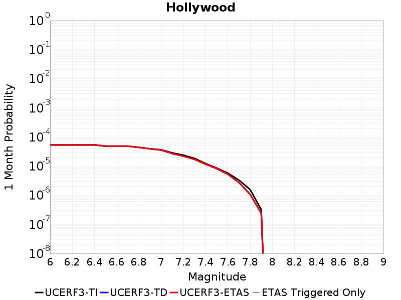 |  | 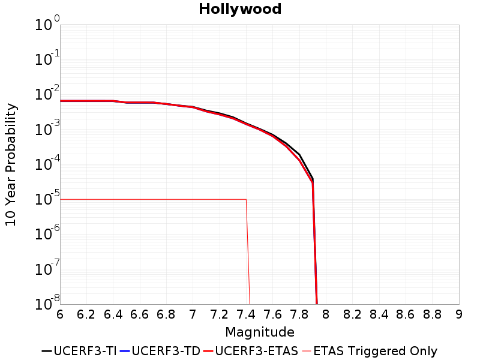 |

| Magnitude | 1 wk TI Prob | 1 wk TD Prob | 1 wk ETAS Prob | 1 wk ETAS/TD Gain | 1 wk ETAS Triggered Only | 1 mo TI Prob | 1 mo TD Prob | 1 mo ETAS Prob | 1 mo ETAS/TD Gain | 1 mo ETAS Triggered Only | 1 yr TI Prob | 1 yr TD Prob | 1 yr ETAS Prob | 1 yr ETAS/TD Gain | 1 yr ETAS Triggered Only | 10 yr TI Prob | 10 yr TD Prob | 10 yr ETAS Prob | 10 yr ETAS/TD Gain | 10 yr ETAS Triggered Only |
|-----|-----|-----|-----|-----|-----|-----|-----|-----|-----|-----|-----|-----|-----|-----|-----|-----|-----|-----|-----|-----|
| 6.0 | 1.24487615E-5 | 1.26091845E-5 | 1.26091845E-5 | 1.0 | 0.0 | 5.3350745E-5 | 5.4038268E-5 | 5.4038268E-5 | 1.0 | 0.0 | 6.4935174E-4 | 6.5772195E-4 | 6.677154E-4 | 1.0151939 | 1.0E-5 | 0.0064745755 | 0.0065582385 | 0.006568173 | 1.0015148 | 1.0E-5 |
| 6.1 | 1.24487615E-5 | 1.26091845E-5 | 1.26091845E-5 | 1.0 | 0.0 | 5.3350745E-5 | 5.4038268E-5 | 5.4038268E-5 | 1.0 | 0.0 | 6.4935174E-4 | 6.5772195E-4 | 6.677154E-4 | 1.0151939 | 1.0E-5 | 0.0064745755 | 0.0065582385 | 0.006568173 | 1.0015148 | 1.0E-5 |
| 6.2 | 1.24487615E-5 | 1.26091845E-5 | 1.26091845E-5 | 1.0 | 0.0 | 5.3350745E-5 | 5.4038268E-5 | 5.4038268E-5 | 1.0 | 0.0 | 6.4935174E-4 | 6.5772195E-4 | 6.677154E-4 | 1.0151939 | 1.0E-5 | 0.0064745755 | 0.0065582385 | 0.006568173 | 1.0015148 | 1.0E-5 |
| 6.3 | 1.24487615E-5 | 1.26091845E-5 | 1.26091845E-5 | 1.0 | 0.0 | 5.3350745E-5 | 5.4038268E-5 | 5.4038268E-5 | 1.0 | 0.0 | 6.4935174E-4 | 6.5772195E-4 | 6.677154E-4 | 1.0151939 | 1.0E-5 | 0.0064745755 | 0.0065582385 | 0.006568173 | 1.0015148 | 1.0E-5 |
| 6.4 | 1.2431024E-5 | 1.2589727E-5 | 1.2589727E-5 | 1.0 | 0.0 | 5.327473E-5 | 5.3954882E-5 | 5.3954882E-5 | 1.0 | 0.0 | 6.4842677E-4 | 6.567073E-4 | 6.6670077E-4 | 1.0152175 | 1.0E-5 | 0.0064653796 | 0.006548152 | 0.0065580867 | 1.0015172 | 1.0E-5 |
| 6.5 | 1.1242222E-5 | 1.1349283E-5 | 1.1349283E-5 | 1.0 | 0.0 | 4.8180063E-5 | 4.8638893E-5 | 4.8638893E-5 | 1.0 | 0.0 | 5.864344E-4 | 5.9202034E-4 | 6.020144E-4 | 1.0168813 | 1.0E-5 | 0.0058488925 | 0.005904721 | 0.005914662 | 1.0016836 | 1.0E-5 |
| 6.6 | 1.1234066E-5 | 1.1340366E-5 | 1.1340366E-5 | 1.0 | 0.0 | 4.8145106E-5 | 4.8600676E-5 | 4.8600676E-5 | 1.0 | 0.0 | 5.86009E-4 | 5.915553E-4 | 6.015494E-4 | 1.0168946 | 1.0E-5 | 0.005844661 | 0.005900095 | 0.005910036 | 1.0016849 | 1.0E-5 |
| 6.7 | 1.12294E-5 | 1.13350825E-5 | 1.13350825E-5 | 1.0 | 0.0 | 4.812511E-5 | 4.8578037E-5 | 4.8578037E-5 | 1.0 | 0.0 | 5.857657E-4 | 5.9127976E-4 | 6.012739E-4 | 1.0169024 | 1.0E-5 | 0.0058422405 | 0.005897355 | 0.0059072957 | 1.0016856 | 1.0E-5 |
| 6.8 | 1.0252819E-5 | 1.0246429E-5 | 1.0246429E-5 | 1.0 | 0.0 | 4.3939912E-5 | 4.3912543E-5 | 4.3912543E-5 | 1.0 | 0.0 | 5.3483713E-4 | 5.345062E-4 | 5.445008E-4 | 1.0186988 | 1.0E-5 | 0.005335517 | 0.005332434 | 0.0053423806 | 1.0018653 | 1.0E-5 |
| 6.9 | 9.252289E-6 | 9.1349675E-6 | 9.1349675E-6 | 1.0 | 0.0 | 3.9652066E-5 | 3.9149283E-5 | 3.9149283E-5 | 1.0 | 0.0 | 4.8265693E-4 | 4.7653992E-4 | 4.8653517E-4 | 1.0209746 | 1.0E-5 | 0.0048161 | 0.0047553554 | 0.0047653075 | 1.0020928 | 1.0E-5 |
| 7.0 | 8.474604E-6 | 8.2811475E-6 | 8.2811475E-6 | 1.0 | 0.0 | 3.6319227E-5 | 3.549016E-5 | 3.549016E-5 | 1.0 | 0.0 | 4.4209688E-4 | 4.3200847E-4 | 4.4200415E-4 | 1.0231377 | 1.0E-5 | 0.004412184 | 0.0043118377 | 0.004321795 | 1.0023092 | 1.0E-5 |
| 7.1 | 6.643643E-6 | 6.286091E-6 | 6.286091E-6 | 1.0 | 0.0 | 2.8472443E-5 | 2.6940113E-5 | 2.6940113E-5 | 1.0 | 0.0 | 3.4659685E-4 | 3.2794697E-4 | 3.3794367E-4 | 1.0304828 | 1.0E-5 | 0.0034605677 | 0.0032746764 | 0.0032846436 | 1.0030438 | 1.0E-5 |
| 7.2 | 5.549002E-6 | 5.123562E-6 | 5.123562E-6 | 1.0 | 0.0 | 2.378122E-5 | 2.1957938E-5 | 2.1957938E-5 | 1.0 | 0.0 | 2.8949787E-4 | 2.6730527E-4 | 2.7730258E-4 | 1.0374004 | 1.0E-5 | 0.0028912104 | 0.0026698539 | 0.0026798272 | 1.0037355 | 1.0E-5 |
| 7.3 | 4.3059727E-6 | 3.9729703E-6 | 3.9729703E-6 | 1.0 | 0.0 | 1.8454039E-5 | 1.7026905E-5 | 1.7026905E-5 | 1.0 | 0.0 | 2.2465475E-4 | 2.0728294E-4 | 2.1728086E-4 | 1.0482333 | 1.0E-5 | 0.0022442779 | 0.002070906 | 0.0020808855 | 1.0048188 | 1.0E-5 |
| 7.4 | 2.8550733E-6 | 2.7118995E-6 | 2.7118995E-6 | 1.0 | 0.0 | 1.2235971E-5 | 1.1622375E-5 | 1.1622375E-5 | 1.0 | 0.0 | 1.4896276E-4 | 1.4149326E-4 | 1.5149185E-4 | 1.0706648 | 1.0E-5 | 0.0014886294 | 0.001414037 | 0.0014240228 | 1.007062 | 1.0E-5 |
| 7.5 | 1.9927045E-6 | 1.9064355E-6 | 1.9064355E-6 | 1.0 | 0.0 | 8.540134E-6 | 8.170412E-6 | 8.170412E-6 | 1.0 | 0.0 | 1.0397117E-4 | 9.9470264E-5 | 9.9470264E-5 | 1.0 | 0.0 | 0.0010392254 | 9.942611E-4 | 9.942611E-4 | 1.0 | 0.0 |
| 7.6 | 1.345084E-6 | 1.228253E-6 | 1.228253E-6 | 1.0 | 0.0 | 5.764633E-6 | 5.2639307E-6 | 5.2639307E-6 | 1.0 | 0.0 | 7.018215E-5 | 6.40865E-5 | 6.40865E-5 | 1.0 | 0.0 | 7.0159987E-4 | 6.406821E-4 | 6.406821E-4 | 1.0 | 0.0 |
| 7.7 | 7.6835164E-7 | 6.337217E-7 | 6.337217E-7 | 1.0 | 0.0 | 3.2929315E-6 | 2.7159474E-6 | 2.7159474E-6 | 1.0 | 0.0 | 4.00907E-5 | 3.306617E-5 | 3.306617E-5 | 1.0 | 0.0 | 4.0083472E-4 | 3.30614E-4 | 3.30614E-4 | 1.0 | 0.0 |
| 7.8 | 3.6562128E-7 | 2.5076878E-7 | 2.5076878E-7 | 1.0 | 0.0 | 1.5669474E-6 | 1.0747228E-6 | 1.0747228E-6 | 1.0 | 0.0 | 1.9077417E-5 | 1.30846765E-5 | 1.30846765E-5 | 1.0 | 0.0 | 1.907578E-4 | 1.3083946E-4 | 1.3083946E-4 | 1.0 | 0.0 |
| 7.9 | 7.5024424E-8 | 5.631532E-8 | 5.631532E-8 | 1.0 | 0.0 | 3.215332E-7 | 2.4135136E-7 | 2.4135136E-7 | 1.0 | 0.0 | 3.91466E-6 | 2.9384503E-6 | 2.9384503E-6 | 1.0 | 0.0 | 3.9145907E-5 | 2.9384257E-5 | 2.9384257E-5 | 1.0 | 0.0 |

## Puente Hills
*[(top)](#table-of-contents)*

| 1 Week | 1 Month | 1 Year | 10 Year |
|-----|-----|-----|-----|
| 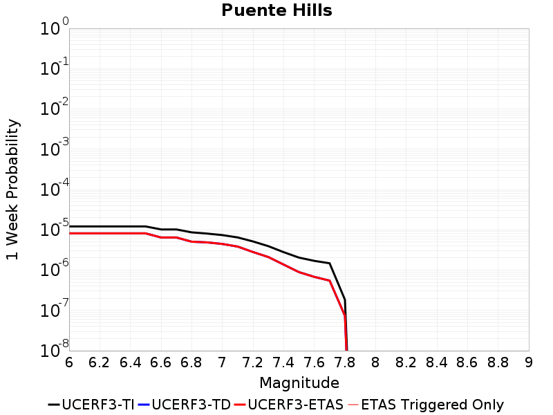 |  | 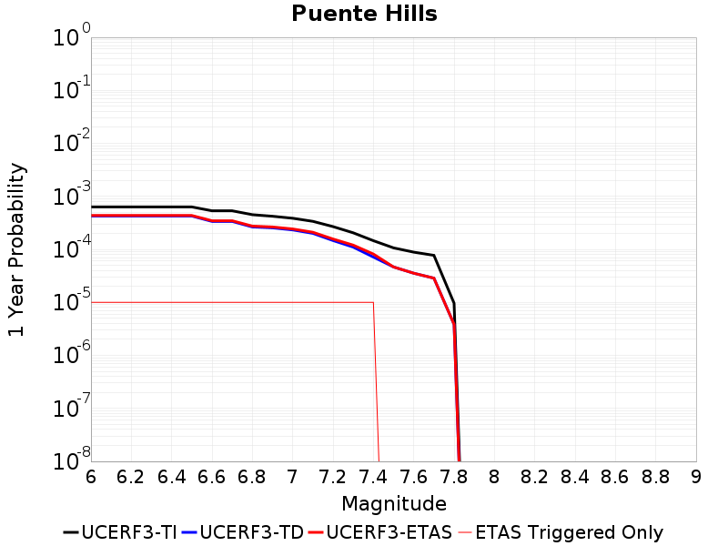 | 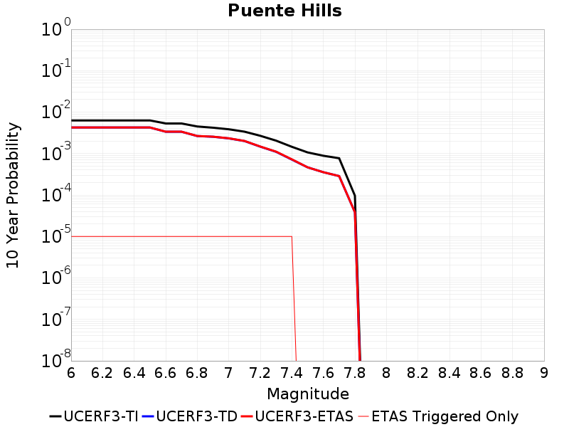 |

| Magnitude | 1 wk TI Prob | 1 wk TD Prob | 1 wk ETAS Prob | 1 wk ETAS/TD Gain | 1 wk ETAS Triggered Only | 1 mo TI Prob | 1 mo TD Prob | 1 mo ETAS Prob | 1 mo ETAS/TD Gain | 1 mo ETAS Triggered Only | 1 yr TI Prob | 1 yr TD Prob | 1 yr ETAS Prob | 1 yr ETAS/TD Gain | 1 yr ETAS Triggered Only | 10 yr TI Prob | 10 yr TD Prob | 10 yr ETAS Prob | 10 yr ETAS/TD Gain | 10 yr ETAS Triggered Only |
|-----|-----|-----|-----|-----|-----|-----|-----|-----|-----|-----|-----|-----|-----|-----|-----|-----|-----|-----|-----|-----|
| 6.0 | 1.2101656E-5 | 8.148065E-6 | 8.148065E-6 | 1.0 | 0.0 | 5.1863204E-5 | 3.491984E-5 | 3.491984E-5 | 1.0 | 0.0 | 6.312516E-4 | 4.250718E-4 | 4.3506754E-4 | 1.0235155 | 1.0E-5 | 0.0062946146 | 0.0042431518 | 0.004253109 | 1.0023468 | 1.0E-5 |
| 6.1 | 1.2101656E-5 | 8.148065E-6 | 8.148065E-6 | 1.0 | 0.0 | 5.1863204E-5 | 3.491984E-5 | 3.491984E-5 | 1.0 | 0.0 | 6.312516E-4 | 4.250718E-4 | 4.3506754E-4 | 1.0235155 | 1.0E-5 | 0.0062946146 | 0.0042431518 | 0.004253109 | 1.0023468 | 1.0E-5 |
| 6.2 | 1.2101656E-5 | 8.148065E-6 | 8.148065E-6 | 1.0 | 0.0 | 5.1863204E-5 | 3.491984E-5 | 3.491984E-5 | 1.0 | 0.0 | 6.312516E-4 | 4.250718E-4 | 4.3506754E-4 | 1.0235155 | 1.0E-5 | 0.0062946146 | 0.0042431518 | 0.004253109 | 1.0023468 | 1.0E-5 |
| 6.3 | 1.2101656E-5 | 8.148065E-6 | 8.148065E-6 | 1.0 | 0.0 | 5.1863204E-5 | 3.491984E-5 | 3.491984E-5 | 1.0 | 0.0 | 6.312516E-4 | 4.250718E-4 | 4.3506754E-4 | 1.0235155 | 1.0E-5 | 0.0062946146 | 0.0042431518 | 0.004253109 | 1.0023468 | 1.0E-5 |
| 6.4 | 1.2101656E-5 | 8.148065E-6 | 8.148065E-6 | 1.0 | 0.0 | 5.1863204E-5 | 3.491984E-5 | 3.491984E-5 | 1.0 | 0.0 | 6.312516E-4 | 4.250718E-4 | 4.3506754E-4 | 1.0235155 | 1.0E-5 | 0.0062946146 | 0.0042431518 | 0.004253109 | 1.0023468 | 1.0E-5 |
| 6.5 | 1.2101656E-5 | 8.148065E-6 | 8.148065E-6 | 1.0 | 0.0 | 5.1863204E-5 | 3.491984E-5 | 3.491984E-5 | 1.0 | 0.0 | 6.312516E-4 | 4.250718E-4 | 4.3506754E-4 | 1.0235155 | 1.0E-5 | 0.0062946146 | 0.0042431518 | 0.004253109 | 1.0023468 | 1.0E-5 |
| 6.6 | 1.0222488E-5 | 6.4440933E-6 | 6.4440933E-6 | 1.0 | 0.0 | 4.3809923E-5 | 2.7617263E-5 | 2.7617263E-5 | 1.0 | 0.0 | 5.332553E-4 | 3.3619077E-4 | 3.4618741E-4 | 1.029735 | 1.0E-5 | 0.0053197746 | 0.0033570693 | 0.0033670356 | 1.0029688 | 1.0E-5 |
| 6.7 | 1.0222488E-5 | 6.4440933E-6 | 6.4440933E-6 | 1.0 | 0.0 | 4.3809923E-5 | 2.7617263E-5 | 2.7617263E-5 | 1.0 | 0.0 | 5.332553E-4 | 3.3619077E-4 | 3.4618741E-4 | 1.029735 | 1.0E-5 | 0.0053197746 | 0.0033570693 | 0.0033670356 | 1.0029688 | 1.0E-5 |
| 6.8 | 8.6367845E-6 | 5.0680965E-6 | 5.0680965E-6 | 1.0 | 0.0 | 3.7014266E-5 | 2.1720236E-5 | 2.1720236E-5 | 1.0 | 0.0 | 4.505555E-4 | 2.6441235E-4 | 2.744097E-4 | 1.0378097 | 1.0E-5 | 0.004496431 | 0.0026410343 | 0.002651008 | 1.0037764 | 1.0E-5 |
| 6.9 | 8.066481E-6 | 4.874947E-6 | 4.874947E-6 | 1.0 | 0.0 | 3.4570177E-5 | 2.0892467E-5 | 2.0892467E-5 | 1.0 | 0.0 | 4.2081063E-4 | 2.5433663E-4 | 2.6433408E-4 | 1.039308 | 1.0E-5 | 0.0042001465 | 0.00254051 | 0.0025504846 | 1.0039262 | 1.0E-5 |
| 7.0 | 7.393828E-6 | 4.4543153E-6 | 4.4543153E-6 | 1.0 | 0.0 | 3.168745E-5 | 1.9089786E-5 | 1.9089786E-5 | 1.0 | 0.0 | 3.857264E-4 | 2.3239381E-4 | 2.4239148E-4 | 1.0430204 | 1.0E-5 | 0.0038505755 | 0.002321554 | 0.002331531 | 1.0042975 | 1.0E-5 |
| 7.1 | 6.4660953E-6 | 3.8360904E-6 | 3.8360904E-6 | 1.0 | 0.0 | 2.7711543E-5 | 1.6440286E-5 | 1.6440286E-5 | 1.0 | 0.0 | 3.373358E-4 | 2.0014247E-4 | 2.1014047E-4 | 1.0499544 | 1.0E-5 | 0.0033682417 | 0.0019996585 | 0.0020096386 | 1.0049908 | 1.0E-5 |
| 7.2 | 5.143232E-6 | 2.8088684E-6 | 2.8088684E-6 | 1.0 | 0.0 | 2.2042237E-5 | 1.2037953E-5 | 1.2037953E-5 | 1.0 | 0.0 | 2.6833118E-4 | 1.4655231E-4 | 1.5655084E-4 | 1.068225 | 1.0E-5 | 0.002680074 | 0.0014645666 | 0.001474552 | 1.0068179 | 1.0E-5 |
| 7.3 | 3.928255E-6 | 2.1101926E-6 | 2.1101926E-6 | 1.0 | 0.0 | 1.683527E-5 | 9.043651E-6 | 9.043651E-6 | 1.0 | 0.0 | 2.0495013E-4 | 1.10100955E-4 | 1.2009985E-4 | 1.0908158 | 1.0E-5 | 0.002047612 | 0.0011004709 | 0.0011104598 | 1.0090771 | 1.0E-5 |
| 7.4 | 2.7894434E-6 | 1.3702554E-6 | 1.3702554E-6 | 1.0 | 0.0 | 1.1954703E-5 | 5.87251E-6 | 5.87251E-6 | 1.0 | 0.0 | 1.4553878E-4 | 7.149551E-5 | 8.149479E-5 | 1.139859 | 1.0E-5 | 0.001454435 | 7.1472954E-4 | 7.247224E-4 | 1.0139813 | 1.0E-5 |
| 7.5 | 2.041735E-6 | 8.907034E-7 | 8.907034E-7 | 1.0 | 0.0 | 8.750263E-6 | 3.817295E-6 | 3.817295E-6 | 1.0 | 0.0 | 1.06529245E-4 | 4.6474608E-5 | 4.6474608E-5 | 1.0 | 0.0 | 0.0010647819 | 4.6465234E-4 | 4.6465234E-4 | 1.0 | 0.0 |
| 7.6 | 1.6959062E-6 | 6.7922394E-7 | 6.7922394E-7 | 1.0 | 0.0 | 7.268149E-6 | 2.9109567E-6 | 2.9109567E-6 | 1.0 | 0.0 | 8.848612E-5 | 3.5440353E-5 | 3.5440353E-5 | 1.0 | 0.0 | 8.84509E-4 | 3.5434993E-4 | 3.5434993E-4 | 1.0 | 0.0 |
| 7.7 | 1.4767965E-6 | 5.4805736E-7 | 5.4805736E-7 | 1.0 | 0.0 | 6.3291122E-6 | 2.348815E-6 | 2.348815E-6 | 1.0 | 0.0 | 7.705422E-5 | 2.8596476E-5 | 2.8596476E-5 | 1.0 | 0.0 | 7.702751E-4 | 2.8593058E-4 | 2.8593058E-4 | 1.0 | 0.0 |
| 7.8 | 1.8432911E-7 | 7.346978E-8 | 7.346978E-8 | 1.0 | 0.0 | 7.8998164E-7 | 3.1487048E-7 | 3.1487048E-7 | 1.0 | 0.0 | 9.617985E-6 | 3.8335447E-6 | 3.8335447E-6 | 1.0 | 0.0 | 9.617568E-5 | 3.8335114E-5 | 3.8335114E-5 | 1.0 | 0.0 |

