# Parent Section Magnitude-Probability Distributions

Only fault sections with at least one triggered aftershock are plotted. Sections are sorted by total supraseismogenic trigger rate (decreasing)

## Table Of Contents

* [Hayward (So) 2011 CFM](#hayward-so-2011-cfm)
* [Calaveras (No) 2011 CFM](#calaveras-no-2011-cfm)
* [Calaveras (Central) 2011 CFM](#calaveras-central-2011-cfm)
* [Hayward (So) extension 2011 CFM](#hayward-so-extension-2011-cfm)
* [Hayward (No) 2011 CFM](#hayward-no-2011-cfm)
* [San Andreas (Creeping Section) 2011 CFM](#san-andreas-creeping-section-2011-cfm)
* [Mission (connected) 2011 CFM](#mission-connected-2011-cfm)
* [Calaveras (So) - Paicines extension 2011 CFM](#calaveras-so---paicines-extension-2011-cfm)
* [Calaveras (So) 2011 CFM](#calaveras-so-2011-cfm)
* [Contra Costa Shear Zone (connector) 2011 CFM](#contra-costa-shear-zone-connector-2011-cfm)
* [Franklin 2011 CFM](#franklin-2011-cfm)
* [Contra Costa (Lafayette) 2011 CFM](#contra-costa-lafayette-2011-cfm)
* [Green Valley 2011 CFM](#green-valley-2011-cfm)
* [Ortigalita (North)](#ortigalita-north)
* [Great Valley 07 (Orestimba)](#great-valley-07-orestimba)
* [Great Valley 09 (Laguna Seca)](#great-valley-09-laguna-seca)
* [Concord 2011 CFM](#concord-2011-cfm)
* [Great Valley 06 (Midland) 2011 CFM alt1](#great-valley-06-midland-2011-cfm-alt1)
* [San Andreas (Santa Cruz Mts) 2011 CFM](#san-andreas-santa-cruz-mts-2011-cfm)
* [Ortigalita (South)](#ortigalita-south)
* [Hunting Creek - Berryessa 2011 CFM](#hunting-creek---berryessa-2011-cfm)

## Hayward (So) 2011 CFM
*[(top)](#table-of-contents)*

| 1 Week | 1 Month | 1 Year | 10 Year |
|-----|-----|-----|-----|
|  |  | 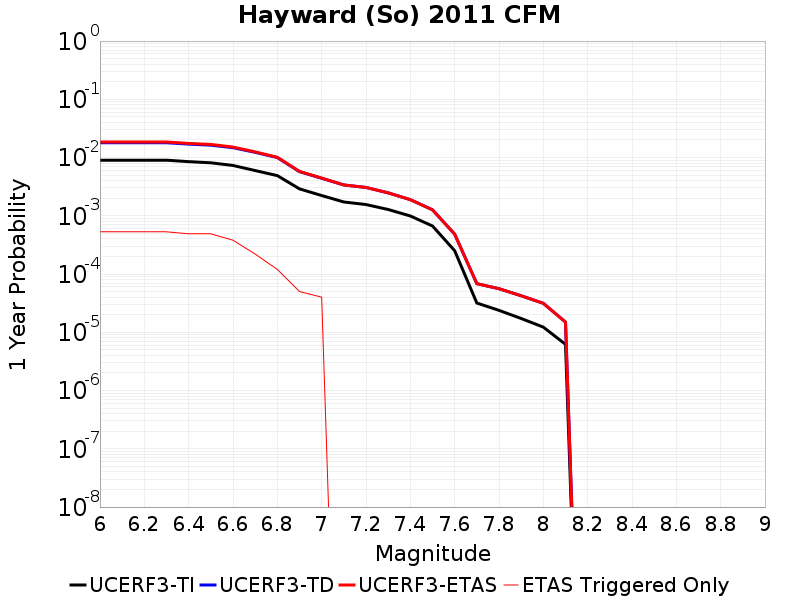 |  |

| Magnitude | 1 wk TI Prob | 1 wk TD Prob | 1 wk ETAS Prob | 1 wk ETAS/TD Gain | 1 wk ETAS Triggered Only | 1 mo TI Prob | 1 mo TD Prob | 1 mo ETAS Prob | 1 mo ETAS/TD Gain | 1 mo ETAS Triggered Only | 1 yr TI Prob | 1 yr TD Prob | 1 yr ETAS Prob | 1 yr ETAS/TD Gain | 1 yr ETAS Triggered Only | 10 yr TI Prob | 10 yr TD Prob | 10 yr ETAS Prob | 10 yr ETAS/TD Gain | 10 yr ETAS Triggered Only |
|-----|-----|-----|-----|-----|-----|-----|-----|-----|-----|-----|-----|-----|-----|-----|-----|-----|-----|-----|-----|-----|
| 6.0 | 1.7309593E-4 | 3.4654353E-4 | 5.364777E-4 | 1.5480816 | 1.9E-4 | 7.4162876E-4 | 0.001484351 | 0.0017938908 | 1.2085354 | 3.1E-4 | 0.008992008 | 0.017924538 | 0.018445037 | 1.0290384 | 5.3E-4 | 0.086367436 | 0.16231295 | 0.16294959 | 1.0039223 | 7.6E-4 |
| 6.1 | 1.7309593E-4 | 3.4654353E-4 | 5.364777E-4 | 1.5480816 | 1.9E-4 | 7.4162876E-4 | 0.001484351 | 0.0017938908 | 1.2085354 | 3.1E-4 | 0.008992008 | 0.017924538 | 0.018445037 | 1.0290384 | 5.3E-4 | 0.086367436 | 0.16231295 | 0.16294959 | 1.0039223 | 7.6E-4 |
| 6.2 | 1.7309593E-4 | 3.4654353E-4 | 5.364777E-4 | 1.5480816 | 1.9E-4 | 7.4162876E-4 | 0.001484351 | 0.0017938908 | 1.2085354 | 3.1E-4 | 0.008992008 | 0.017924538 | 0.018445037 | 1.0290384 | 5.3E-4 | 0.086367436 | 0.16231295 | 0.16294959 | 1.0039223 | 7.6E-4 |
| 6.3 | 1.7308246E-4 | 3.4654353E-4 | 5.364777E-4 | 1.5480816 | 1.9E-4 | 7.41571E-4 | 0.001484351 | 0.0017938908 | 1.2085354 | 3.1E-4 | 0.008991311 | 0.017924538 | 0.018445037 | 1.0290384 | 5.3E-4 | 0.08636101 | 0.16231295 | 0.16294959 | 1.0039223 | 7.6E-4 |
| 6.4 | 1.6334097E-4 | 3.2782133E-4 | 4.7777218E-4 | 1.4574163 | 1.5E-4 | 6.998449E-4 | 0.0014042009 | 0.0016738218 | 1.1920102 | 2.7E-4 | 0.008487372 | 0.016964182 | 0.01744587 | 1.0283943 | 4.9E-4 | 0.081704415 | 0.15443315 | 0.1550335 | 1.0038874 | 7.1E-4 |
| 6.5 | 1.5600289E-4 | 3.1445018E-4 | 4.64403E-4 | 1.476873 | 1.5E-4 | 6.684125E-4 | 0.0013469561 | 0.0016165924 | 1.200182 | 2.7E-4 | 0.008107598 | 0.016277807 | 0.016759831 | 1.0296123 | 4.9E-4 | 0.078181036 | 0.1486754 | 0.14926282 | 1.003951 | 6.9E-4 |
| 6.6 | 1.4046066E-4 | 2.84432E-4 | 3.8440354E-4 | 1.3514779 | 1.0E-4 | 6.018354E-4 | 0.0012184316 | 0.0013982123 | 1.147551 | 1.8E-4 | 0.0073027555 | 0.014735035 | 0.015109435 | 1.0254089 | 3.8E-4 | 0.07067384 | 0.13572748 | 0.13619418 | 1.0034386 | 5.4E-4 |
| 6.7 | 1.14696966E-4 | 2.3649324E-4 | 2.8648143E-4 | 1.2113725 | 5.0E-5 | 4.914658E-4 | 0.0010131539 | 0.0011130526 | 1.0986017 | 1.0E-4 | 0.0059671924 | 0.012266466 | 0.012483767 | 1.0177151 | 2.2E-4 | 0.058094822 | 0.11441133 | 0.11473015 | 1.0027865 | 3.6E-4 |
| 6.8 | 9.3874296E-5 | 1.918769E-4 | 2.3186923E-4 | 1.208427 | 4.0E-5 | 4.0225635E-4 | 8.2207413E-4 | 8.920166E-4 | 1.0850805 | 7.0E-5 | 0.0048864787 | 0.009963564 | 0.010082368 | 1.0119239 | 1.2E-4 | 0.047804173 | 0.09407991 | 0.094288275 | 1.0022148 | 2.3E-4 |
| 6.9 | 5.551852E-5 | 1.09825894E-4 | 1.398226E-4 | 1.2731296 | 3.0E-5 | 2.3791482E-4 | 4.705981E-4 | 5.105793E-4 | 1.0849582 | 4.0E-5 | 0.0028927654 | 0.005714603 | 0.0057643172 | 1.0086995 | 5.0E-5 | 0.028553981 | 0.055412717 | 0.055526067 | 1.0020455 | 1.2E-4 |
| 7.0 | 4.2662363E-5 | 8.4457664E-5 | 1.14455135E-4 | 1.3551775 | 3.0E-5 | 1.8282588E-4 | 3.619116E-4 | 4.0189712E-4 | 1.1104842 | 4.0E-5 | 0.0022236328 | 0.0043974463 | 0.0044372706 | 1.0090562 | 4.0E-5 | 0.022015138 | 0.043003786 | 0.043080345 | 1.0017803 | 8.0E-5 |
| 7.1 | 3.305886E-5 | 6.48344E-5 | 6.48344E-5 | 1.0 | 0.0 | 1.4167312E-4 | 2.7783224E-4 | 2.7783224E-4 | 1.0 | 0.0 | 0.0017235056 | 0.0033773805 | 0.0033773805 | 1.0 | 0.0 | 0.017101998 | 0.03331612 | 0.033325788 | 1.0002902 | 1.0E-5 |
| 7.2 | 2.9856887E-5 | 5.8746467E-5 | 5.8746467E-5 | 1.0 | 0.0 | 1.2795182E-4 | 2.517464E-4 | 2.517464E-4 | 1.0 | 0.0 | 0.0015567001 | 0.003060722 | 0.003060722 | 1.0 | 0.0 | 0.015458403 | 0.030280782 | 0.030290479 | 1.0003202 | 1.0E-5 |
| 7.3 | 2.4559737E-5 | 4.7440186E-5 | 4.7440186E-5 | 1.0 | 0.0 | 1.0525176E-4 | 2.0329932E-4 | 2.0329932E-4 | 1.0 | 0.0 | 0.0012806869 | 0.0024723732 | 0.0024723732 | 1.0 | 0.0 | 0.012733313 | 0.024557363 | 0.024557363 | 1.0 | 0.0 |
| 7.4 | 1.9002231E-5 | 3.6251335E-5 | 3.6251335E-5 | 1.0 | 0.0 | 8.143559E-5 | 1.5535366E-4 | 1.5535366E-4 | 1.0 | 0.0 | 9.910273E-4 | 0.0018898004 | 0.0018898004 | 1.0 | 0.0 | 0.009866194 | 0.018843682 | 0.018843682 | 1.0 | 0.0 |
| 7.5 | 1.2783333E-5 | 2.4232126E-5 | 2.4232126E-5 | 1.0 | 0.0 | 5.4784563E-5 | 1.0384787E-4 | 1.0384787E-4 | 1.0 | 0.0 | 6.667979E-4 | 0.0012636207 | 0.0012636207 | 1.0 | 0.0 | 0.006648007 | 0.012651795 | 0.012651795 | 1.0 | 0.0 |
| 7.6 | 4.8149627E-6 | 9.269701E-6 | 9.269701E-6 | 1.0 | 0.0 | 2.063539E-5 | 3.9726692E-5 | 3.9726692E-5 | 1.0 | 0.0 | 2.5120692E-4 | 4.8356643E-4 | 4.8356643E-4 | 1.0 | 0.0 | 0.0025092314 | 0.004868131 | 0.004868131 | 1.0 | 0.0 |
| 7.7 | 6.0838227E-7 | 1.3090383E-6 | 1.3090383E-6 | 1.0 | 0.0 | 2.6073499E-6 | 5.610152E-6 | 5.610152E-6 | 1.0 | 0.0 | 3.174402E-5 | 6.8301466E-5 | 6.8301466E-5 | 1.0 | 0.0 | 3.1739488E-4 | 7.0246676E-4 | 7.0246676E-4 | 1.0 | 0.0 |
| 7.8 | 4.5542808E-7 | 1.071405E-6 | 1.071405E-6 | 1.0 | 0.0 | 1.9518332E-6 | 4.5917277E-6 | 4.5917277E-6 | 1.0 | 0.0 | 2.376331E-5 | 5.5902856E-5 | 5.5902856E-5 | 1.0 | 0.0 | 2.3760769E-4 | 5.761873E-4 | 5.761873E-4 | 1.0 | 0.0 |
| 7.9 | 3.3016747E-7 | 8.1082663E-7 | 8.1082663E-7 | 1.0 | 0.0 | 1.4150027E-6 | 3.4749667E-6 | 3.4749667E-6 | 1.0 | 0.0 | 1.7227521E-5 | 4.23069E-5 | 4.23069E-5 | 1.0 | 0.0 | 1.7226185E-4 | 4.337793E-4 | 4.337793E-4 | 1.0 | 0.0 |
| 8.0 | 2.347038E-7 | 6.013221E-7 | 6.013221E-7 | 1.0 | 0.0 | 1.0058731E-6 | 2.5770921E-6 | 2.5770921E-6 | 1.0 | 0.0 | 1.2246436E-5 | 3.1375646E-5 | 3.1375646E-5 | 1.0 | 0.0 | 1.2245761E-4 | 3.1944108E-4 | 3.1944108E-4 | 1.0 | 0.0 |
| 8.1 | 1.18822804E-7 | 2.8634196E-7 | 2.8634196E-7 | 1.0 | 0.0 | 5.092405E-7 | 1.2271793E-6 | 1.2271793E-6 | 1.0 | 0.0 | 6.1999854E-6 | 1.4940806E-5 | 1.4940806E-5 | 1.0 | 0.0 | 6.199812E-5 | 1.5171032E-4 | 1.5171032E-4 | 1.0 | 0.0 |

## Calaveras (No) 2011 CFM
*[(top)](#table-of-contents)*

| 1 Week | 1 Month | 1 Year | 10 Year |
|-----|-----|-----|-----|
|  | 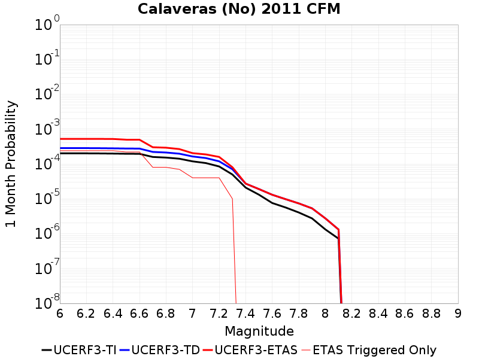 | 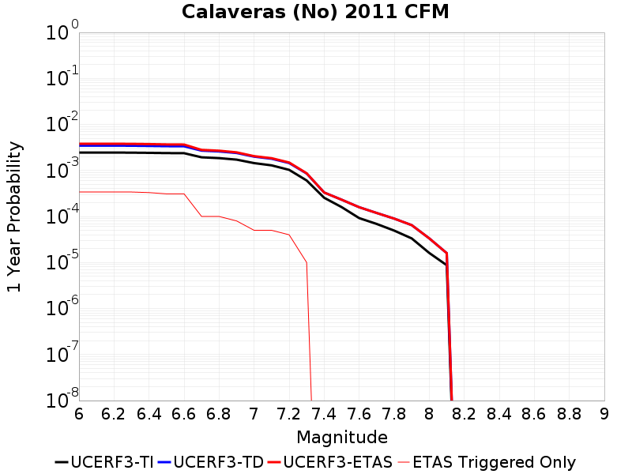 |  |

| Magnitude | 1 wk TI Prob | 1 wk TD Prob | 1 wk ETAS Prob | 1 wk ETAS/TD Gain | 1 wk ETAS Triggered Only | 1 mo TI Prob | 1 mo TD Prob | 1 mo ETAS Prob | 1 mo ETAS/TD Gain | 1 mo ETAS Triggered Only | 1 yr TI Prob | 1 yr TD Prob | 1 yr ETAS Prob | 1 yr ETAS/TD Gain | 1 yr ETAS Triggered Only | 10 yr TI Prob | 10 yr TD Prob | 10 yr ETAS Prob | 10 yr ETAS/TD Gain | 10 yr ETAS Triggered Only |
|-----|-----|-----|-----|-----|-----|-----|-----|-----|-----|-----|-----|-----|-----|-----|-----|-----|-----|-----|-----|-----|
| 6.0 | 4.698747E-5 | 6.643681E-5 | 1.9642817E-4 | 2.9566164 | 1.3E-4 | 2.0135932E-4 | 2.8469917E-4 | 5.246308E-4 | 1.8427551 | 2.4E-4 | 0.0024487933 | 0.0034607248 | 0.0037995481 | 1.0979053 | 3.4E-4 | 0.02421984 | 0.034229152 | 0.03466375 | 1.0126967 | 4.5E-4 |
| 6.1 | 4.698747E-5 | 6.643681E-5 | 1.9642817E-4 | 2.9566164 | 1.3E-4 | 2.0135932E-4 | 2.8469917E-4 | 5.246308E-4 | 1.8427551 | 2.4E-4 | 0.0024487933 | 0.0034607248 | 0.0037995481 | 1.0979053 | 3.4E-4 | 0.02421984 | 0.034229152 | 0.03466375 | 1.0126967 | 4.5E-4 |
| 6.2 | 4.698747E-5 | 6.643681E-5 | 1.9642817E-4 | 2.9566164 | 1.3E-4 | 2.0135932E-4 | 2.8469917E-4 | 5.246308E-4 | 1.8427551 | 2.4E-4 | 0.0024487933 | 0.0034607248 | 0.0037995481 | 1.0979053 | 3.4E-4 | 0.02421984 | 0.034229152 | 0.03466375 | 1.0126967 | 4.5E-4 |
| 6.3 | 4.6717287E-5 | 6.606483E-5 | 1.9605624E-4 | 2.9676342 | 1.3E-4 | 2.0020158E-4 | 2.831053E-4 | 5.2303734E-4 | 1.8475012 | 2.4E-4 | 0.0024347296 | 0.0034413806 | 0.0037802106 | 1.0984576 | 3.4E-4 | 0.024082264 | 0.03404143 | 0.034476113 | 1.0127692 | 4.5E-4 |
| 6.4 | 4.6276386E-5 | 6.5422166E-5 | 1.9541367E-4 | 2.986964 | 1.3E-4 | 1.983123E-4 | 2.8035167E-4 | 5.202844E-4 | 1.8558277 | 2.4E-4 | 0.0024117786 | 0.0034079687 | 0.003736844 | 1.0965018 | 3.3E-4 | 0.02385771 | 0.0337184 | 0.034143563 | 1.0126092 | 4.4E-4 |
| 6.5 | 4.5720994E-5 | 6.461681E-5 | 1.746097E-4 | 2.7022333 | 1.1E-4 | 1.9593239E-4 | 2.769009E-4 | 4.9684E-4 | 1.7942882 | 2.2E-4 | 0.002382867 | 0.003366094 | 0.0036750506 | 1.0917848 | 3.1E-4 | 0.023574775 | 0.033313263 | 0.03371927 | 1.0121876 | 4.2E-4 |
| 6.6 | 4.549134E-5 | 6.426535E-5 | 1.7425828E-4 | 2.7115433 | 1.1E-4 | 1.949483E-4 | 2.7539494E-4 | 4.9533433E-4 | 1.7986327 | 2.2E-4 | 0.0023709119 | 0.0033478157 | 0.0036567778 | 1.0922877 | 3.1E-4 | 0.023457756 | 0.033136543 | 0.033542626 | 1.0122548 | 4.2E-4 |
| 6.7 | 3.701047E-5 | 5.1677842E-5 | 1.0167526E-4 | 1.9674827 | 5.0E-5 | 1.5860666E-4 | 2.2145791E-4 | 3.014402E-4 | 1.3611624 | 8.0E-5 | 0.0019293258 | 0.002692962 | 0.0027926927 | 1.0370338 | 1.0E-4 | 0.019126613 | 0.026772749 | 0.026938198 | 1.0061797 | 1.7E-4 |
| 6.8 | 3.5523568E-5 | 4.9642145E-5 | 9.963966E-5 | 2.0071588 | 5.0E-5 | 1.5223498E-4 | 2.1273496E-4 | 2.9271794E-4 | 1.3759748 | 8.0E-5 | 0.0018518851 | 0.0025870171 | 0.0026867583 | 1.0385545 | 1.0E-4 | 0.018365284 | 0.025737006 | 0.02590263 | 1.0064353 | 1.7E-4 |
| 6.9 | 3.2946147E-5 | 4.5916357E-5 | 9.591406E-5 | 2.0888865 | 5.0E-5 | 1.4119013E-4 | 1.9676979E-4 | 2.6675602E-4 | 1.3556757 | 7.0E-5 | 0.0017176344 | 0.0023930846 | 0.002472893 | 1.0333496 | 8.0E-5 | 0.017044188 | 0.023836482 | 0.023982907 | 1.0061429 | 1.5E-4 |
| 7.0 | 2.7682381E-5 | 3.82365E-5 | 5.8235735E-5 | 1.5230404 | 2.0E-5 | 1.1863338E-4 | 1.638606E-4 | 2.0385406E-4 | 1.2440699 | 4.0E-5 | 0.0014434044 | 0.0019932098 | 0.00204311 | 1.0250351 | 5.0E-5 | 0.01434065 | 0.019910663 | 0.020008672 | 1.0049224 | 1.0E-4 |
| 7.1 | 2.471967E-5 | 3.4420078E-5 | 5.441939E-5 | 1.5810362 | 2.0E-5 | 1.05937135E-4 | 1.4750645E-4 | 1.8750055E-4 | 1.2711346 | 4.0E-5 | 0.0012890215 | 0.0017944428 | 0.001844353 | 1.0278138 | 5.0E-5 | 0.0128157 | 0.01794654 | 0.018044746 | 1.0054721 | 1.0E-4 |
| 7.2 | 1.9748062E-5 | 2.777571E-5 | 4.7775156E-5 | 1.7200335 | 2.0E-5 | 8.463181E-5 | 1.1903347E-4 | 1.5902871E-4 | 1.336 | 4.0E-5 | 0.0010299052 | 0.0014482944 | 0.0014882364 | 1.0275787 | 4.0E-5 | 0.01025145 | 0.014527808 | 0.014606645 | 1.0054266 | 8.0E-5 |
| 7.3 | 1.1603734E-5 | 1.6445929E-5 | 2.6445763E-5 | 1.6080432 | 1.0E-5 | 4.9729337E-5 | 7.048073E-5 | 8.048003E-5 | 1.1418728 | 1.0E-5 | 6.052865E-4 | 8.5778034E-4 | 8.677718E-4 | 1.0116479 | 1.0E-5 | 0.0060364045 | 0.00863911 | 0.008658938 | 1.002295 | 2.0E-5 |
| 7.4 | 4.885381E-6 | 6.353186E-6 | 6.353186E-6 | 1.0 | 0.0 | 2.0937177E-5 | 2.7227657E-5 | 2.7227657E-5 | 1.0 | 0.0 | 2.5488032E-4 | 3.314465E-4 | 3.314465E-4 | 1.0 | 0.0 | 0.0025458818 | 0.003360156 | 0.0033701225 | 1.002966 | 1.0E-5 |
| 7.5 | 3.0571264E-6 | 4.428544E-6 | 4.428544E-6 | 1.0 | 0.0 | 1.3101904E-5 | 1.8979337E-5 | 1.8979337E-5 | 1.0 | 0.0 | 1.5950401E-4 | 2.3104904E-4 | 2.3104904E-4 | 1.0 | 0.0 | 0.0015938957 | 0.002357251 | 0.002357251 | 1.0 | 0.0 |
| 7.6 | 1.764948E-6 | 3.0440094E-6 | 3.0440094E-6 | 1.0 | 0.0 | 7.564041E-6 | 1.3045689E-5 | 1.3045689E-5 | 1.0 | 0.0 | 9.208831E-5 | 1.5881978E-4 | 1.5881978E-4 | 1.0 | 0.0 | 9.205016E-4 | 0.0016356126 | 0.0016356126 | 1.0 | 0.0 |
| 7.7 | 1.3173734E-6 | 2.280866E-6 | 2.280866E-6 | 1.0 | 0.0 | 5.645874E-6 | 9.7751035E-6 | 9.7751035E-6 | 1.0 | 0.0 | 6.873634E-5 | 1.1900542E-4 | 1.1900542E-4 | 1.0 | 0.0 | 6.8715087E-4 | 0.0012369959 | 0.0012369959 | 1.0 | 0.0 |
| 7.8 | 9.4429885E-7 | 1.7206044E-6 | 1.7206044E-6 | 1.0 | 0.0 | 4.0469886E-6 | 7.373998E-6 | 7.373998E-6 | 1.0 | 0.0 | 4.9270973E-5 | 8.9774745E-5 | 8.9774745E-5 | 1.0 | 0.0 | 4.926005E-4 | 9.352752E-4 | 9.352752E-4 | 1.0 | 0.0 |
| 7.9 | 6.388233E-7 | 1.241737E-6 | 1.241737E-6 | 1.0 | 0.0 | 2.7378112E-6 | 5.321719E-6 | 5.321719E-6 | 1.0 | 0.0 | 3.3332344E-5 | 6.4790016E-5 | 6.4790016E-5 | 1.0 | 0.0 | 3.3327343E-4 | 6.7234307E-4 | 6.7234307E-4 | 1.0 | 0.0 |
| 8.0 | 3.087986E-7 | 6.412399E-7 | 6.412399E-7 | 1.0 | 0.0 | 1.323422E-6 | 2.748168E-6 | 2.748168E-6 | 1.0 | 0.0 | 1.6112543E-5 | 3.3458437E-5 | 3.3458437E-5 | 1.0 | 0.0 | 1.6111376E-4 | 3.4369744E-4 | 3.4369744E-4 | 1.0 | 0.0 |
| 8.1 | 1.6725647E-7 | 3.057178E-7 | 3.057178E-7 | 1.0 | 0.0 | 7.168133E-7 | 1.3102184E-6 | 1.3102184E-6 | 1.0 | 0.0 | 8.7271665E-6 | 1.5951795E-5 | 1.5951795E-5 | 1.0 | 0.0 | 8.726824E-5 | 1.6445982E-4 | 1.6445982E-4 | 1.0 | 0.0 |

## Calaveras (Central) 2011 CFM
*[(top)](#table-of-contents)*

| 1 Week | 1 Month | 1 Year | 10 Year |
|-----|-----|-----|-----|
|  |  | 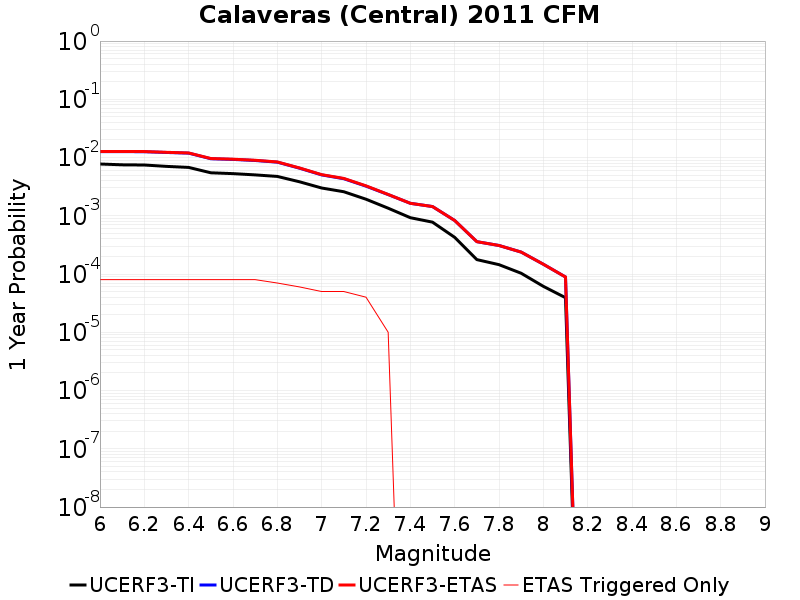 |  |

| Magnitude | 1 wk TI Prob | 1 wk TD Prob | 1 wk ETAS Prob | 1 wk ETAS/TD Gain | 1 wk ETAS Triggered Only | 1 mo TI Prob | 1 mo TD Prob | 1 mo ETAS Prob | 1 mo ETAS/TD Gain | 1 mo ETAS Triggered Only | 1 yr TI Prob | 1 yr TD Prob | 1 yr ETAS Prob | 1 yr ETAS/TD Gain | 1 yr ETAS Triggered Only | 10 yr TI Prob | 10 yr TD Prob | 10 yr ETAS Prob | 10 yr ETAS/TD Gain | 10 yr ETAS Triggered Only |
|-----|-----|-----|-----|-----|-----|-----|-----|-----|-----|-----|-----|-----|-----|-----|-----|-----|-----|-----|-----|-----|
| 6.0 | 1.4873758E-4 | 2.4319925E-4 | 2.8318953E-4 | 1.1644342 | 4.0E-5 | 6.3729106E-4 | 0.0010418477 | 0.0011117748 | 1.0671183 | 7.0E-5 | 0.0077314493 | 0.012605471 | 0.012684462 | 1.0062665 | 8.0E-5 | 0.074679315 | 0.11839449 | 0.11851791 | 1.0010425 | 1.4E-4 |
| 6.1 | 1.4409686E-4 | 2.4313973E-4 | 2.8313E-4 | 1.1644745 | 4.0E-5 | 6.174118E-4 | 0.0010415929 | 0.00111152 | 1.0671347 | 7.0E-5 | 0.0074911113 | 0.012602404 | 0.012681396 | 1.006268 | 8.0E-5 | 0.07243565 | 0.11836669 | 0.118490115 | 1.0010427 | 1.4E-4 |
| 6.2 | 1.4297929E-4 | 2.4245592E-4 | 2.824462E-4 | 1.1649384 | 4.0E-5 | 6.1262446E-4 | 0.0010386648 | 0.0011085921 | 1.0673242 | 7.0E-5 | 0.007433224 | 0.012567195 | 0.01264619 | 1.0062858 | 8.0E-5 | 0.07189451 | 0.118035674 | 0.11815915 | 1.0010461 | 1.4E-4 |
| 6.3 | 1.3536085E-4 | 2.3527762E-4 | 2.7526822E-4 | 1.169972 | 4.0E-5 | 5.79989E-4 | 0.0010079264 | 0.0010778558 | 1.0693796 | 7.0E-5 | 0.0070385267 | 0.0121978 | 0.012276824 | 1.0064785 | 8.0E-5 | 0.068197265 | 0.11468159 | 0.114805534 | 1.0010808 | 1.4E-4 |
| 6.4 | 1.2993296E-4 | 2.292152E-4 | 2.6920604E-4 | 1.1744685 | 4.0E-5 | 5.5673666E-4 | 9.819648E-4 | 0.001051896 | 1.0712156 | 7.0E-5 | 0.006757223 | 0.011885263 | 0.011964313 | 1.006651 | 8.0E-5 | 0.06555412 | 0.11182265 | 0.11194699 | 1.001112 | 1.4E-4 |
| 6.5 | 1.0498927E-4 | 1.8337589E-4 | 2.2336855E-4 | 1.2180912 | 4.0E-5 | 4.498764E-4 | 7.8565895E-4 | 8.5560395E-4 | 1.0890272 | 7.0E-5 | 0.005463498 | 0.009523431 | 0.00960267 | 1.0083203 | 8.0E-5 | 0.053311124 | 0.09077747 | 0.090904765 | 1.0014023 | 1.4E-4 |
| 6.6 | 1.0157505E-4 | 1.7847691E-4 | 2.1846978E-4 | 1.2240787 | 4.0E-5 | 4.35249E-4 | 7.6467596E-4 | 8.346224E-4 | 1.091472 | 7.0E-5 | 0.0052862884 | 0.009270187 | 0.009349445 | 1.0085498 | 8.0E-5 | 0.05162293 | 0.088461585 | 0.0885892 | 1.0014426 | 1.4E-4 |
| 6.7 | 9.660386E-5 | 1.7103154E-4 | 2.110247E-4 | 1.233835 | 4.0E-5 | 4.1395082E-4 | 7.3278585E-4 | 8.027345E-4 | 1.0954559 | 7.0E-5 | 0.0050282106 | 0.008885189 | 0.008964478 | 1.0089238 | 8.0E-5 | 0.049159497 | 0.08494285 | 0.0850618 | 1.0014005 | 1.3E-4 |
| 6.8 | 9.089927E-5 | 1.6002775E-4 | 1.9002295E-4 | 1.1874375 | 3.0E-5 | 3.8951015E-4 | 6.8565283E-4 | 7.4561173E-4 | 1.0874479 | 6.0E-5 | 0.0047319788 | 0.008315889 | 0.008385307 | 1.0083476 | 7.0E-5 | 0.046324775 | 0.07978378 | 0.07989421 | 1.001384 | 1.2E-4 |
| 6.9 | 7.353187E-5 | 1.2601161E-4 | 1.5600784E-4 | 1.2380433 | 3.0E-5 | 3.150985E-4 | 5.399386E-4 | 5.8991165E-4 | 1.0925531 | 5.0E-5 | 0.0038295772 | 0.0065540657 | 0.0066136722 | 1.0090946 | 6.0E-5 | 0.037642512 | 0.063601054 | 0.06370405 | 1.0016196 | 1.1E-4 |
| 7.0 | 5.746064E-5 | 9.656077E-5 | 1.1655883E-4 | 1.2071035 | 2.0E-5 | 2.4623662E-4 | 4.137666E-4 | 4.5375005E-4 | 1.0966328 | 4.0E-5 | 0.0029938098 | 0.005026047 | 0.0050757956 | 1.0098982 | 5.0E-5 | 0.02953797 | 0.04924561 | 0.049331177 | 1.0017376 | 9.0E-5 |
| 7.1 | 4.9557195E-5 | 8.298197E-5 | 1.0298031E-4 | 1.2409962 | 2.0E-5 | 2.123707E-4 | 3.555889E-4 | 3.9557467E-4 | 1.1124494 | 4.0E-5 | 0.0025825473 | 0.0043207663 | 0.0043705506 | 1.011522 | 5.0E-5 | 0.0255274 | 0.042537827 | 0.042623997 | 1.0020257 | 9.0E-5 |
| 7.2 | 3.687595E-5 | 6.18442E-5 | 8.184296E-5 | 1.3233733 | 2.0E-5 | 1.5803022E-4 | 2.650198E-4 | 3.0500922E-4 | 1.1508921 | 4.0E-5 | 0.0019223199 | 0.0032218734 | 0.0032617445 | 1.0123751 | 4.0E-5 | 0.01905776 | 0.03199202 | 0.03206946 | 1.0024207 | 8.0E-5 |
| 7.3 | 2.5846984E-5 | 4.4304372E-5 | 5.4303928E-5 | 1.2257013 | 1.0E-5 | 1.1076809E-4 | 1.8986217E-4 | 1.9986027E-4 | 1.0526597 | 1.0E-5 | 0.0013477671 | 0.00230914 | 0.002319117 | 1.0043206 | 1.0E-5 | 0.013396223 | 0.0230594 | 0.023078939 | 1.0008473 | 2.0E-5 |
| 7.4 | 1.7747854E-5 | 3.1370848E-5 | 3.1370848E-5 | 1.0 | 0.0 | 7.6060016E-5 | 1.3443957E-4 | 1.3443957E-4 | 1.0 | 0.0 | 9.2563726E-4 | 0.001635576 | 0.001635576 | 1.0 | 0.0 | 0.009217911 | 0.01640349 | 0.016413327 | 1.0005996 | 1.0E-5 |
| 7.5 | 1.4883479E-5 | 2.7593871E-5 | 2.7593871E-5 | 1.0 | 0.0 | 6.378478E-5 | 1.1825411E-4 | 1.1825411E-4 | 1.0 | 0.0 | 7.76303E-4 | 0.0014387959 | 0.0014387959 | 1.0 | 0.0 | 0.0077359667 | 0.014457004 | 0.014457004 | 1.0 | 0.0 |
| 7.6 | 8.166975E-6 | 1.5910477E-5 | 1.5910477E-5 | 1.0 | 0.0 | 3.5000852E-5 | 6.818598E-5 | 6.818598E-5 | 1.0 | 0.0 | 4.2605202E-4 | 8.2984957E-4 | 8.2984957E-4 | 1.0 | 0.0 | 0.004252361 | 0.008399398 | 0.008399398 | 1.0 | 0.0 |
| 7.7 | 3.3858064E-6 | 6.884272E-6 | 6.884272E-6 | 1.0 | 0.0 | 1.4510518E-5 | 2.950369E-5 | 2.950369E-5 | 1.0 | 0.0 | 1.7665124E-4 | 3.5914828E-4 | 3.5914828E-4 | 1.0 | 0.0 | 0.0017651088 | 0.0036942512 | 0.0036942512 | 1.0 | 0.0 |
| 7.8 | 2.7721615E-6 | 5.915513E-6 | 5.915513E-6 | 1.0 | 0.0 | 1.1880637E-5 | 2.5351954E-5 | 2.5351954E-5 | 1.0 | 0.0 | 1.4463716E-4 | 3.0861638E-4 | 3.0861638E-4 | 1.0 | 0.0 | 0.0014454306 | 0.0031729995 | 0.0031729995 | 1.0 | 0.0 |
| 7.9 | 1.9736292E-6 | 4.557281E-6 | 4.557281E-6 | 1.0 | 0.0 | 8.4583835E-6 | 1.9531059E-5 | 1.9531059E-5 | 1.0 | 0.0 | 1.0297595E-4 | 2.3776475E-4 | 2.3776475E-4 | 1.0 | 0.0 | 0.0010292825 | 0.0024302125 | 0.0024302125 | 1.0 | 0.0 |
| 8.0 | 1.1767289E-6 | 2.8199634E-6 | 2.8199634E-6 | 1.0 | 0.0 | 5.0431145E-6 | 1.2085502E-5 | 1.2085502E-5 | 1.0 | 0.0 | 6.139818E-5 | 1.4713108E-4 | 1.4713108E-4 | 1.0 | 0.0 | 6.1381224E-4 | 0.0014944294 | 0.0014944294 | 1.0 | 0.0 |
| 8.1 | 7.5112825E-7 | 1.7022699E-6 | 1.7022699E-6 | 1.0 | 0.0 | 3.2191172E-6 | 7.2954217E-6 | 7.2954217E-6 | 1.0 | 0.0 | 3.9192048E-5 | 8.881817E-5 | 8.881817E-5 | 1.0 | 0.0 | 3.9185135E-4 | 9.021689E-4 | 9.021689E-4 | 1.0 | 0.0 |

## Hayward (So) extension 2011 CFM
*[(top)](#table-of-contents)*

| 1 Week | 1 Month | 1 Year | 10 Year |
|-----|-----|-----|-----|
| 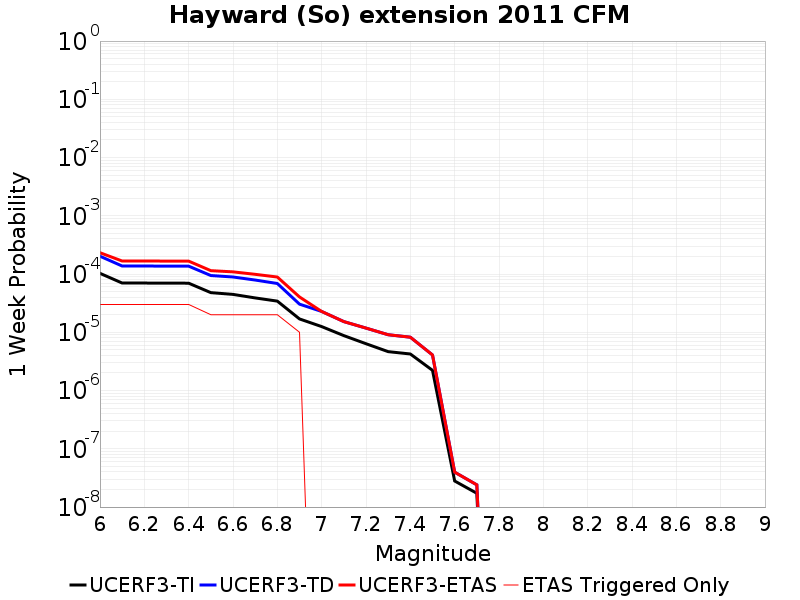 |  |  | 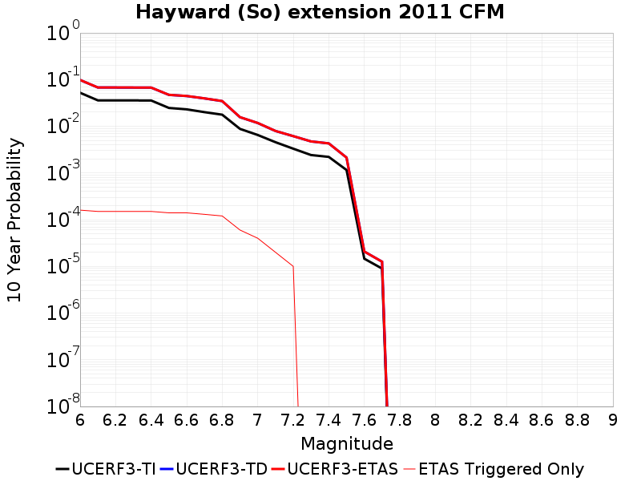 |

| Magnitude | 1 wk TI Prob | 1 wk TD Prob | 1 wk ETAS Prob | 1 wk ETAS/TD Gain | 1 wk ETAS Triggered Only | 1 mo TI Prob | 1 mo TD Prob | 1 mo ETAS Prob | 1 mo ETAS/TD Gain | 1 mo ETAS Triggered Only | 1 yr TI Prob | 1 yr TD Prob | 1 yr ETAS Prob | 1 yr ETAS/TD Gain | 1 yr ETAS Triggered Only | 10 yr TI Prob | 10 yr TD Prob | 10 yr ETAS Prob | 10 yr ETAS/TD Gain | 10 yr ETAS Triggered Only |
|-----|-----|-----|-----|-----|-----|-----|-----|-----|-----|-----|-----|-----|-----|-----|-----|-----|-----|-----|-----|-----|
| 6.0 | 1.0263006E-4 | 2.0189807E-4 | 2.3189202E-4 | 1.1485598 | 3.0E-5 | 4.3976895E-4 | 8.6486887E-4 | 9.1482565E-4 | 1.0577623 | 5.0E-5 | 0.00534105 | 0.010467567 | 0.01056652 | 1.0094533 | 1.0E-4 | 0.05214491 | 0.09784471 | 0.09798905 | 1.0014752 | 1.6E-4 |
| 6.1 | 6.99169E-5 | 1.3698777E-4 | 1.6698366E-4 | 1.2189677 | 3.0E-5 | 2.9960944E-4 | 5.869449E-4 | 6.369156E-4 | 1.0851369 | 5.0E-5 | 0.0036416445 | 0.007118304 | 0.0072076633 | 1.0125535 | 9.0E-5 | 0.035825435 | 0.06752545 | 0.06766532 | 1.0020714 | 1.5E-4 |
| 6.2 | 6.99169E-5 | 1.3698777E-4 | 1.6698366E-4 | 1.2189677 | 3.0E-5 | 2.9960944E-4 | 5.869449E-4 | 6.369156E-4 | 1.0851369 | 5.0E-5 | 0.0036416445 | 0.007118304 | 0.0072076633 | 1.0125535 | 9.0E-5 | 0.035825435 | 0.06752545 | 0.06766532 | 1.0020714 | 1.5E-4 |
| 6.3 | 6.970908E-5 | 1.3667115E-4 | 1.6666706E-4 | 1.219475 | 3.0E-5 | 2.9871898E-4 | 5.8558874E-4 | 6.355595E-4 | 1.0853342 | 5.0E-5 | 0.0036308395 | 0.0071019353 | 0.0071912957 | 1.0125827 | 9.0E-5 | 0.035720866 | 0.06737494 | 0.06751483 | 1.0020764 | 1.5E-4 |
| 6.4 | 6.9517155E-5 | 1.3634615E-4 | 1.6634206E-4 | 1.2199982 | 3.0E-5 | 2.9789665E-4 | 5.841969E-4 | 6.341677E-4 | 1.0855376 | 5.0E-5 | 0.0036208609 | 0.0070851403 | 0.0071745026 | 1.0126127 | 9.0E-5 | 0.03562429 | 0.06722094 | 0.067360856 | 1.0020814 | 1.5E-4 |
| 6.5 | 4.786248E-5 | 9.409968E-5 | 1.140978E-4 | 1.2125206 | 2.0E-5 | 2.0510878E-4 | 4.032245E-4 | 4.3321238E-4 | 1.0743703 | 3.0E-5 | 0.0024943394 | 0.004898651 | 0.004978259 | 1.016251 | 8.0E-5 | 0.02466527 | 0.046957713 | 0.047091138 | 1.0028414 | 1.4E-4 |
| 6.6 | 4.4662214E-5 | 8.8850175E-5 | 1.088484E-4 | 1.225078 | 2.0E-5 | 1.9139545E-4 | 3.8073346E-4 | 4.1072202E-4 | 1.0787653 | 3.0E-5 | 0.0023277493 | 0.0046260357 | 0.0047056656 | 1.0172135 | 8.0E-5 | 0.02303517 | 0.04438612 | 0.044519905 | 1.0030141 | 1.4E-4 |
| 6.7 | 3.884542E-5 | 7.8747544E-5 | 9.8745964E-5 | 1.2539562 | 2.0E-5 | 1.6646975E-4 | 3.3744826E-4 | 3.6743813E-4 | 1.0888726 | 3.0E-5 | 0.002024885 | 0.0041011306 | 0.0041708434 | 1.0169984 | 7.0E-5 | 0.020065336 | 0.039450515 | 0.039575387 | 1.0031652 | 1.3E-4 |
| 6.8 | 3.4221863E-5 | 6.869454E-5 | 8.8693174E-5 | 1.291124 | 2.0E-5 | 1.4665688E-4 | 2.943743E-4 | 3.2436548E-4 | 1.101881 | 3.0E-5 | 0.0017840851 | 0.0035785316 | 0.0036383166 | 1.0167067 | 6.0E-5 | 0.017698295 | 0.034544673 | 0.03466053 | 1.0033537 | 1.2E-4 |
| 6.9 | 1.6927712E-5 | 3.0366526E-5 | 4.0366223E-5 | 1.3292999 | 1.0E-5 | 7.2545314E-5 | 1.3013609E-4 | 1.4013478E-4 | 1.0768327 | 1.0E-5 | 8.828813E-4 | 0.001583312 | 0.0016032804 | 1.0126117 | 2.0E-5 | 0.008793819 | 0.015620204 | 0.015679266 | 1.0037812 | 6.0E-5 |
| 7.0 | 1.2509653E-5 | 2.2745196E-5 | 2.2745196E-5 | 1.0 | 0.0 | 5.3611697E-5 | 9.747602E-5 | 9.747602E-5 | 1.0 | 0.0 | 6.525269E-4 | 0.0011861683 | 0.0011961564 | 1.0084205 | 1.0E-5 | 0.0065061417 | 0.011727746 | 0.011767277 | 1.0033708 | 4.0E-5 |
| 7.1 | 8.751583E-6 | 1.52346465E-5 | 1.52346465E-5 | 1.0 | 0.0 | 3.750624E-5 | 6.528974E-5 | 6.528974E-5 | 1.0 | 0.0 | 4.5654282E-4 | 7.9461886E-4 | 8.046109E-4 | 1.0125747 | 1.0E-5 | 0.0045560603 | 0.007917307 | 0.007937148 | 1.0025061 | 2.0E-5 |
| 7.2 | 6.354379E-6 | 1.1784563E-5 | 1.1784563E-5 | 1.0 | 0.0 | 2.7232769E-5 | 5.050432E-5 | 5.050432E-5 | 1.0 | 0.0 | 3.3150852E-4 | 6.1472174E-4 | 6.1472174E-4 | 1.0 | 0.0 | 0.0033101442 | 0.0061426377 | 0.0061525763 | 1.0016179 | 1.0E-5 |
| 7.3 | 4.645554E-6 | 9.066434E-6 | 9.066434E-6 | 1.0 | 0.0 | 1.9909365E-5 | 3.8855593E-5 | 3.8855593E-5 | 1.0 | 0.0 | 2.4236954E-4 | 4.7296833E-4 | 4.7296833E-4 | 1.0 | 0.0 | 0.0024210536 | 0.004735149 | 0.004735149 | 1.0 | 0.0 |
| 7.4 | 4.23437E-6 | 8.223522E-6 | 8.223522E-6 | 1.0 | 0.0 | 1.8147173E-5 | 3.524321E-5 | 3.524321E-5 | 1.0 | 0.0 | 2.2091944E-4 | 4.290057E-4 | 4.290057E-4 | 1.0 | 0.0 | 0.0022069993 | 0.00429811 | 0.00429811 | 1.0 | 0.0 |
| 7.5 | 2.2187417E-6 | 4.074432E-6 | 4.074432E-6 | 1.0 | 0.0 | 9.508858E-6 | 1.746175E-5 | 1.746175E-5 | 1.0 | 0.0 | 1.157642E-4 | 2.1257886E-4 | 2.1257886E-4 | 1.0 | 0.0 | 0.0011570391 | 0.0021359047 | 0.0021359047 | 1.0 | 0.0 |
| 7.6 | 2.7952495E-8 | 3.964626E-8 | 3.964626E-8 | 1.0 | 0.0 | 1.1979641E-7 | 1.6991252E-7 | 1.6991252E-7 | 1.0 | 0.0 | 1.4585203E-6 | 2.068683E-6 | 2.068683E-6 | 1.0 | 0.0 | 1.4585107E-5 | 2.0769494E-5 | 2.0769494E-5 | 1.0 | 0.0 |
| 7.7 | 1.7192724E-8 | 2.399215E-8 | 2.399215E-8 | 1.0 | 0.0 | 7.36831E-8 | 1.0282349E-7 | 1.0282349E-7 | 1.0 | 0.0 | 8.9709135E-7 | 1.2518753E-6 | 1.2518753E-6 | 1.0 | 0.0 | 8.970877E-6 | 1.2584041E-5 | 1.2584041E-5 | 1.0 | 0.0 |

## Hayward (No) 2011 CFM
*[(top)](#table-of-contents)*

| 1 Week | 1 Month | 1 Year | 10 Year |
|-----|-----|-----|-----|
|  | 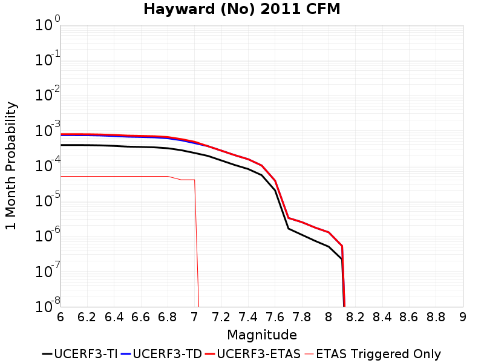 | 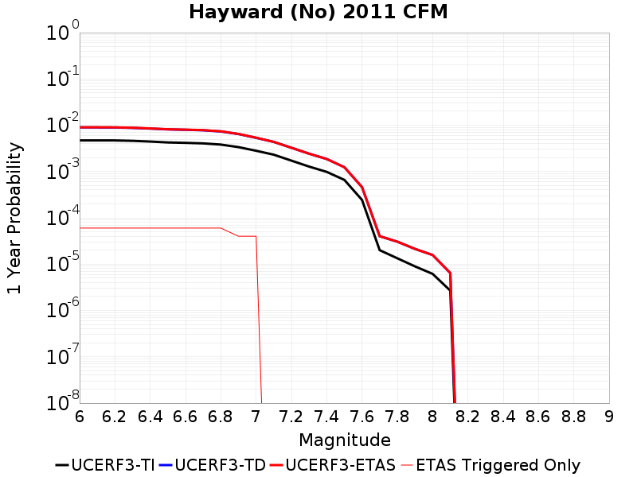 |  |

| Magnitude | 1 wk TI Prob | 1 wk TD Prob | 1 wk ETAS Prob | 1 wk ETAS/TD Gain | 1 wk ETAS Triggered Only | 1 mo TI Prob | 1 mo TD Prob | 1 mo ETAS Prob | 1 mo ETAS/TD Gain | 1 mo ETAS Triggered Only | 1 yr TI Prob | 1 yr TD Prob | 1 yr ETAS Prob | 1 yr ETAS/TD Gain | 1 yr ETAS Triggered Only | 10 yr TI Prob | 10 yr TD Prob | 10 yr ETAS Prob | 10 yr ETAS/TD Gain | 10 yr ETAS Triggered Only |
|-----|-----|-----|-----|-----|-----|-----|-----|-----|-----|-----|-----|-----|-----|-----|-----|-----|-----|-----|-----|-----|
| 6.0 | 9.0370086E-5 | 1.7227109E-4 | 2.0226592E-4 | 1.1741141 | 3.0E-5 | 3.8724288E-4 | 7.380958E-4 | 7.8805885E-4 | 1.0676919 | 5.0E-5 | 0.004704494 | 0.008949386 | 0.009008849 | 1.0066444 | 6.0E-5 | 0.04606138 | 0.085525386 | 0.085635126 | 1.001283 | 1.2E-4 |
| 6.1 | 9.0370086E-5 | 1.7227109E-4 | 2.0226592E-4 | 1.1741141 | 3.0E-5 | 3.8724288E-4 | 7.380958E-4 | 7.8805885E-4 | 1.0676919 | 5.0E-5 | 0.004704494 | 0.008949386 | 0.009008849 | 1.0066444 | 6.0E-5 | 0.04606138 | 0.085525386 | 0.085635126 | 1.001283 | 1.2E-4 |
| 6.2 | 9.006742E-5 | 1.7187605E-4 | 2.0187089E-4 | 1.1745144 | 3.0E-5 | 3.859461E-4 | 7.364037E-4 | 7.863669E-4 | 1.0678475 | 5.0E-5 | 0.0046887742 | 0.00892897 | 0.008988434 | 1.0066597 | 6.0E-5 | 0.0459107 | 0.08533874 | 0.0854485 | 1.0012861 | 1.2E-4 |
| 6.3 | 8.8336754E-5 | 1.6864658E-4 | 1.9864153E-4 | 1.1778568 | 3.0E-5 | 3.7853114E-4 | 7.225713E-4 | 7.7253516E-4 | 1.0691473 | 5.0E-5 | 0.004598882 | 0.008761982 | 0.008821457 | 1.0067878 | 6.0E-5 | 0.04504866 | 0.08382439 | 0.08393433 | 1.0013115 | 1.2E-4 |
| 6.4 | 8.526157E-5 | 1.6286744E-4 | 1.9286256E-4 | 1.1841689 | 3.0E-5 | 3.6535555E-4 | 6.978172E-4 | 7.477823E-4 | 1.071602 | 5.0E-5 | 0.0044391346 | 0.0084629925 | 0.008522484 | 1.0070297 | 6.0E-5 | 0.043514993 | 0.081101134 | 0.0812114 | 1.0013596 | 1.2E-4 |
| 6.5 | 8.152396E-5 | 1.5612974E-4 | 1.8612506E-4 | 1.1921179 | 3.0E-5 | 3.493416E-4 | 6.689565E-4 | 7.1892305E-4 | 1.0746933 | 5.0E-5 | 0.0042449418 | 0.008114286 | 0.008173799 | 1.0073344 | 6.0E-5 | 0.04164765 | 0.07791164 | 0.07802229 | 1.0014203 | 1.2E-4 |
| 6.6 | 7.987405E-5 | 1.53145E-4 | 1.8314041E-4 | 1.1958628 | 3.0E-5 | 3.4227243E-4 | 6.5617135E-4 | 7.061385E-4 | 1.0761496 | 5.0E-5 | 0.0041592065 | 0.007959787 | 0.0080193095 | 1.0074779 | 6.0E-5 | 0.04082218 | 0.07649393 | 0.07660475 | 1.0014488 | 1.2E-4 |
| 6.7 | 7.777665E-5 | 1.4949596E-4 | 1.7949147E-4 | 1.2006444 | 3.0E-5 | 3.332859E-4 | 6.405403E-4 | 6.9050834E-4 | 1.0780091 | 5.0E-5 | 0.004050208 | 0.0077708545 | 0.007830388 | 1.0076611 | 6.0E-5 | 0.039771806 | 0.07475405 | 0.07486508 | 1.0014852 | 1.2E-4 |
| 6.8 | 7.3284005E-5 | 1.4085161E-4 | 1.7084739E-4 | 1.2129601 | 3.0E-5 | 3.140365E-4 | 6.035107E-4 | 6.534805E-4 | 1.0827986 | 5.0E-5 | 0.0038166929 | 0.0073231314 | 0.007382692 | 1.0081332 | 6.0E-5 | 0.037518036 | 0.07060552 | 0.070717044 | 1.0015796 | 1.2E-4 |
| 6.9 | 6.458263E-5 | 1.2393434E-4 | 1.5393061E-4 | 1.2420337 | 3.0E-5 | 2.7675333E-4 | 5.310395E-4 | 5.7101826E-4 | 1.075284 | 4.0E-5 | 0.0033642664 | 0.006446345 | 0.006486087 | 1.006165 | 4.0E-5 | 0.033137884 | 0.06244421 | 0.06252859 | 1.0013512 | 9.0E-5 |
| 7.0 | 5.3853604E-5 | 1.0259165E-4 | 1.3258857E-4 | 1.2923914 | 3.0E-5 | 2.3078074E-4 | 4.3960472E-4 | 4.7958715E-4 | 1.0909508 | 4.0E-5 | 0.0028061352 | 0.0053391205 | 0.0053789066 | 1.0074519 | 4.0E-5 | 0.027709642 | 0.052060854 | 0.05211773 | 1.0010926 | 6.0E-5 |
| 7.1 | 4.4308683E-5 | 8.378193E-5 | 8.378193E-5 | 1.0 | 0.0 | 1.8988053E-4 | 3.5901624E-4 | 3.5901624E-4 | 1.0 | 0.0 | 0.0023093442 | 0.0043623056 | 0.0043623056 | 1.0 | 0.0 | 0.022854926 | 0.04281535 | 0.042824924 | 1.0002235 | 1.0E-5 |
| 7.2 | 3.295973E-5 | 6.254464E-5 | 6.254464E-5 | 1.0 | 0.0 | 1.4124835E-4 | 2.6802107E-4 | 2.6802107E-4 | 1.0 | 0.0 | 0.0017183421 | 0.003258298 | 0.003258298 | 1.0 | 0.0 | 0.017051157 | 0.032225184 | 0.032234862 | 1.0003003 | 1.0E-5 |
| 7.3 | 2.452256E-5 | 4.6578538E-5 | 4.6578538E-5 | 1.0 | 0.0 | 1.05092455E-4 | 1.9960711E-4 | 1.9960711E-4 | 1.0 | 0.0 | 0.0012787496 | 0.0024275226 | 0.0024275226 | 1.0 | 0.0 | 0.0127141625 | 0.024119584 | 0.024119584 | 1.0 | 0.0 |
| 7.4 | 1.8829967E-5 | 3.5756868E-5 | 3.5756868E-5 | 1.0 | 0.0 | 8.069736E-5 | 1.5323478E-4 | 1.5323478E-4 | 1.0 | 0.0 | 9.820475E-4 | 0.0018640475 | 0.0018640475 | 1.0 | 0.0 | 0.009777189 | 0.01858272 | 0.01858272 | 1.0 | 0.0 |
| 7.5 | 1.26374125E-5 | 2.3775643E-5 | 2.3775643E-5 | 1.0 | 0.0 | 5.4159216E-5 | 1.0189167E-4 | 1.0189167E-4 | 1.0 | 0.0 | 6.5918895E-4 | 0.0012398312 | 0.0012398312 | 1.0 | 0.0 | 0.00657237 | 0.012408774 | 0.012408774 | 1.0 | 0.0 |
| 7.6 | 4.666429E-6 | 8.813961E-6 | 8.813961E-6 | 1.0 | 0.0 | 1.9998828E-5 | 3.777358E-5 | 3.777358E-5 | 1.0 | 0.0 | 2.4345852E-4 | 4.5979762E-4 | 4.5979762E-4 | 1.0 | 0.0 | 0.0024319198 | 0.004623559 | 0.004623559 | 1.0 | 0.0 |
| 7.7 | 3.8399318E-7 | 7.6975005E-7 | 7.6975005E-7 | 1.0 | 0.0 | 1.6456839E-6 | 3.2989244E-6 | 3.2989244E-6 | 1.0 | 0.0 | 2.003602E-5 | 4.0163668E-5 | 4.0163668E-5 | 1.0 | 0.0 | 2.0034213E-4 | 4.1327215E-4 | 4.1327215E-4 | 1.0 | 0.0 |
| 7.8 | 2.5637698E-7 | 5.8604127E-7 | 5.8604127E-7 | 1.0 | 0.0 | 1.098758E-6 | 2.5116028E-6 | 2.5116028E-6 | 1.0 | 0.0 | 1.3377297E-5 | 3.0578336E-5 | 3.0578336E-5 | 1.0 | 0.0 | 1.3376492E-4 | 3.161056E-4 | 3.161056E-4 | 1.0 | 0.0 |
| 7.9 | 1.7141245E-7 | 4.088877E-7 | 4.088877E-7 | 1.0 | 0.0 | 7.3462456E-7 | 1.7523746E-6 | 1.7523746E-6 | 1.0 | 0.0 | 8.944017E-6 | 2.1334954E-5 | 2.1334954E-5 | 1.0 | 0.0 | 8.943657E-5 | 2.1965297E-4 | 2.1965297E-4 | 1.0 | 0.0 |
| 8.0 | 1.1808895E-7 | 3.0190884E-7 | 3.0190884E-7 | 1.0 | 0.0 | 5.060954E-7 | 1.2938943E-6 | 1.2938943E-6 | 1.0 | 0.0 | 6.161694E-6 | 1.575305E-5 | 1.575305E-5 | 1.0 | 0.0 | 6.161523E-5 | 1.6090895E-4 | 1.6090895E-4 | 1.0 | 0.0 |
| 8.1 | 5.138535E-8 | 1.2334732E-7 | 1.2334732E-7 | 1.0 | 0.0 | 2.2022292E-7 | 5.2863123E-7 | 5.2863123E-7 | 1.0 | 0.0 | 2.6812106E-6 | 6.4360665E-6 | 6.4360665E-6 | 1.0 | 0.0 | 2.6811784E-5 | 6.551903E-5 | 6.551903E-5 | 1.0 | 0.0 |

## San Andreas (Creeping Section) 2011 CFM
*[(top)](#table-of-contents)*

| 1 Week | 1 Month | 1 Year | 10 Year |
|-----|-----|-----|-----|
|  | 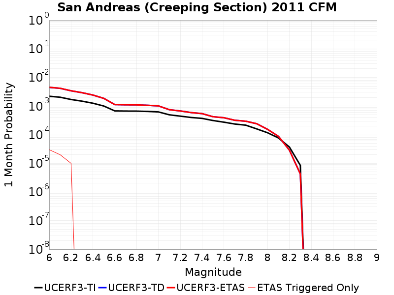 |  | 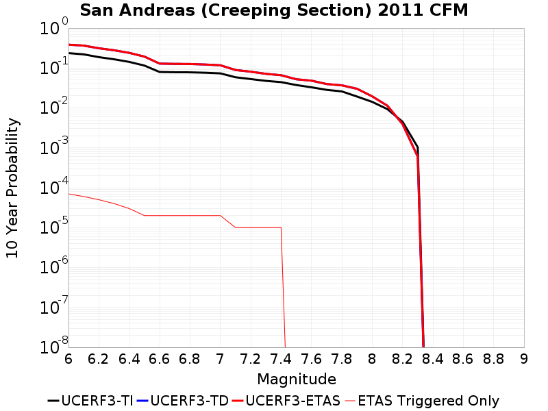 |

| Magnitude | 1 wk TI Prob | 1 wk TD Prob | 1 wk ETAS Prob | 1 wk ETAS/TD Gain | 1 wk ETAS Triggered Only | 1 mo TI Prob | 1 mo TD Prob | 1 mo ETAS Prob | 1 mo ETAS/TD Gain | 1 mo ETAS Triggered Only | 1 yr TI Prob | 1 yr TD Prob | 1 yr ETAS Prob | 1 yr ETAS/TD Gain | 1 yr ETAS Triggered Only | 10 yr TI Prob | 10 yr TD Prob | 10 yr ETAS Prob | 10 yr ETAS/TD Gain | 10 yr ETAS Triggered Only |
|-----|-----|-----|-----|-----|-----|-----|-----|-----|-----|-----|-----|-----|-----|-----|-----|-----|-----|-----|-----|-----|
| 6.0 | 5.151163E-4 | 0.001050991 | 0.00107097 | 1.0190097 | 2.0E-5 | 0.002205774 | 0.0044927653 | 0.0045226305 | 1.0066473 | 3.0E-5 | 0.026526777 | 0.052733816 | 0.052762233 | 1.000539 | 3.0E-5 | 0.23574181 | 0.38426527 | 0.3843084 | 1.0001122 | 7.0E-5 |
| 6.1 | 4.7540772E-4 | 9.7384077E-4 | 9.83831E-4 | 1.0102587 | 1.0E-5 | 0.002035871 | 0.0041636056 | 0.0041835224 | 1.0047835 | 2.0E-5 | 0.024506707 | 0.048983116 | 0.049002137 | 1.0003883 | 2.0E-5 | 0.21973366 | 0.36350197 | 0.36354014 | 1.000105 | 6.0E-5 |
| 6.2 | 3.9647578E-4 | 7.978802E-4 | 8.0787216E-4 | 1.0125232 | 1.0E-5 | 0.0016980754 | 0.003412546 | 0.0034225117 | 1.0029204 | 1.0E-5 | 0.020479038 | 0.040353574 | 0.04036317 | 1.0002378 | 1.0E-5 | 0.18691239 | 0.31219187 | 0.31222627 | 1.0001101 | 5.0E-5 |
| 6.3 | 3.4640636E-4 | 6.868305E-4 | 6.868305E-4 | 1.0 | 0.0 | 0.001483754 | 0.0029383395 | 0.0029383395 | 1.0 | 0.0 | 0.017915692 | 0.034873843 | 0.034873843 | 1.0 | 0.0 | 0.16538206 | 0.27809402 | 0.2781229 | 1.0001038 | 4.0E-5 |
| 6.4 | 2.935057E-4 | 5.6722434E-4 | 5.6722434E-4 | 1.0 | 0.0 | 0.0012572751 | 0.002427381 | 0.002427381 | 1.0 | 0.0 | 0.015200248 | 0.028935352 | 0.028935352 | 1.0 | 0.0 | 0.14201577 | 0.23932269 | 0.2393455 | 1.0000954 | 3.0E-5 |
| 6.5 | 2.3409708E-4 | 4.3367624E-4 | 4.3367624E-4 | 1.0 | 0.0 | 0.0010028875 | 0.0018565594 | 0.0018565594 | 1.0 | 0.0 | 0.012141965 | 0.022250744 | 0.022250744 | 1.0 | 0.0 | 0.11499573 | 0.19288178 | 0.19289793 | 1.0000837 | 2.0E-5 |
| 6.6 | 1.5842178E-4 | 2.6345765E-4 | 2.6345765E-4 | 1.0 | 0.0 | 6.7877385E-4 | 0.0011286087 | 0.0011286087 | 1.0 | 0.0 | 0.0082328 | 0.013653248 | 0.013653248 | 1.0 | 0.0 | 0.07934396 | 0.12873979 | 0.12875721 | 1.0001353 | 2.0E-5 |
| 6.7 | 1.5616413E-4 | 2.5883503E-4 | 2.5883503E-4 | 1.0 | 0.0 | 6.691031E-4 | 0.0011088166 | 0.0011088166 | 1.0 | 0.0 | 0.0081159435 | 0.01341573 | 0.01341573 | 1.0 | 0.0 | 0.0782586 | 0.12677163 | 0.1267891 | 1.0001378 | 2.0E-5 |
| 6.8 | 1.5538467E-4 | 2.5708484E-4 | 2.5708484E-4 | 1.0 | 0.0 | 6.6576427E-4 | 0.0011013225 | 0.0011013225 | 1.0 | 0.0 | 0.008075596 | 0.013325731 | 0.013325731 | 1.0 | 0.0 | 0.07788358 | 0.12600972 | 0.1260272 | 1.0001388 | 2.0E-5 |
| 6.9 | 1.5153569E-4 | 2.482793E-4 | 2.482793E-4 | 1.0 | 0.0 | 6.49277E-4 | 0.0010636223 | 0.0010636223 | 1.0 | 0.0 | 0.007876333 | 0.012873291 | 0.012873291 | 1.0 | 0.0 | 0.07602952 | 0.122136764 | 0.12215432 | 1.0001438 | 2.0E-5 |
| 7.0 | 1.4588932E-4 | 2.3684054E-4 | 2.3684054E-4 | 1.0 | 0.0 | 6.250901E-4 | 0.0010146381 | 0.0010146381 | 1.0 | 0.0 | 0.0075839474 | 0.012283797 | 0.012283797 | 1.0 | 0.0 | 0.073302895 | 0.11700419 | 0.11702185 | 1.0001509 | 2.0E-5 |
| 7.1 | 1.1565079E-4 | 1.746272E-4 | 1.746272E-4 | 1.0 | 0.0 | 4.955521E-4 | 7.481885E-4 | 7.481885E-4 | 1.0 | 0.0 | 0.006016669 | 0.009071379 | 0.009071379 | 1.0 | 0.0 | 0.058563538 | 0.08902377 | 0.08903287 | 1.0001023 | 1.0E-5 |
| 7.2 | 1.0393792E-4 | 1.5739669E-4 | 1.5739669E-4 | 1.0 | 0.0 | 4.4537216E-4 | 6.7438366E-4 | 6.7438366E-4 | 1.0 | 0.0 | 0.005408933 | 0.008179903 | 0.008179903 | 1.0 | 0.0 | 0.052791595 | 0.0807411 | 0.080750294 | 1.0001138 | 1.0E-5 |
| 7.3 | 9.332884E-5 | 1.3838815E-4 | 1.3838815E-4 | 1.0 | 0.0 | 3.999194E-4 | 5.929579E-4 | 5.929579E-4 | 1.0 | 0.0 | 0.0048581534 | 0.007195518 | 0.007195518 | 1.0 | 0.0 | 0.047533102 | 0.07136165 | 0.07137094 | 1.0001302 | 1.0E-5 |
| 7.4 | 8.670252E-5 | 1.2727914E-4 | 1.2727914E-4 | 1.0 | 0.0 | 3.715293E-4 | 5.4536865E-4 | 5.4536865E-4 | 1.0 | 0.0 | 0.004513991 | 0.0066197845 | 0.0066197845 | 1.0 | 0.0 | 0.044233937 | 0.06590772 | 0.06591706 | 1.0001417 | 1.0E-5 |
| 7.5 | 7.3036405E-5 | 9.91762E-5 | 9.91762E-5 | 1.0 | 0.0 | 3.129756E-4 | 4.2497172E-4 | 4.2497172E-4 | 1.0 | 0.0 | 0.0038038217 | 0.005161782 | 0.005161782 | 1.0 | 0.0 | 0.03739367 | 0.052210037 | 0.052210037 | 1.0 | 0.0 |
| 7.6 | 6.3935775E-5 | 9.1417096E-5 | 9.1417096E-5 | 1.0 | 0.0 | 2.7398168E-4 | 3.9172883E-4 | 3.9172883E-4 | 1.0 | 0.0 | 0.0033306254 | 0.004758891 | 0.004758891 | 1.0 | 0.0 | 0.032811474 | 0.048093103 | 0.048093103 | 1.0 | 0.0 |
| 7.7 | 5.5050095E-5 | 7.4564385E-5 | 7.4564385E-5 | 1.0 | 0.0 | 2.3590765E-4 | 3.195225E-4 | 3.195225E-4 | 1.0 | 0.0 | 0.0028683927 | 0.0038832533 | 0.0038832533 | 1.0 | 0.0 | 0.0283165 | 0.039627593 | 0.039627593 | 1.0 | 0.0 |
| 7.8 | 5.027131E-5 | 6.9117355E-5 | 6.9117355E-5 | 1.0 | 0.0 | 2.1543067E-4 | 2.9618363E-4 | 2.9618363E-4 | 1.0 | 0.0 | 0.0026197135 | 0.0036000777 | 0.0036000777 | 1.0 | 0.0 | 0.025890453 | 0.03674681 | 0.03674681 | 1.0 | 0.0 |
| 7.9 | 3.7271806E-5 | 5.655389E-5 | 5.655389E-5 | 1.0 | 0.0 | 1.5972654E-4 | 2.423513E-4 | 2.423513E-4 | 1.0 | 0.0 | 0.0019429359 | 0.0029466373 | 0.0029466373 | 1.0 | 0.0 | 0.019260362 | 0.030160228 | 0.030160228 | 1.0 | 0.0 |
| 8.0 | 2.7310243E-5 | 3.5879184E-5 | 3.5879184E-5 | 1.0 | 0.0 | 1.17038646E-4 | 1.5375888E-4 | 1.5375888E-4 | 1.0 | 0.0 | 0.0014240141 | 0.0018704081 | 0.0018704081 | 1.0 | 0.0 | 0.014149235 | 0.019454207 | 0.019454207 | 1.0 | 0.0 |
| 8.1 | 1.7940547E-5 | 2.037314E-5 | 2.037314E-5 | 1.0 | 0.0 | 7.688579E-5 | 8.731054E-5 | 8.731054E-5 | 1.0 | 0.0 | 9.3568244E-4 | 0.0010624882 | 0.0010624882 | 1.0 | 0.0 | 0.009317525 | 0.0113425255 | 0.0113425255 | 1.0 | 0.0 |
| 8.2 | 8.643924E-6 | 6.7311976E-6 | 6.7311976E-6 | 1.0 | 0.0 | 3.704486E-5 | 2.8847671E-5 | 2.8847671E-5 | 1.0 | 0.0 | 4.5092785E-4 | 3.511639E-4 | 3.511639E-4 | 1.0 | 0.0 | 0.0045001395 | 0.003926461 | 0.003926461 | 1.0 | 0.0 |
| 8.3 | 1.983087E-6 | 9.907583E-7 | 9.907583E-7 | 1.0 | 0.0 | 8.498917E-6 | 4.2461E-6 | 4.2461E-6 | 1.0 | 0.0 | 1.034694E-4 | 5.1695068E-5 | 5.1695068E-5 | 1.0 | 0.0 | 0.0010342124 | 5.989684E-4 | 5.989684E-4 | 1.0 | 0.0 |

## Mission (connected) 2011 CFM
*[(top)](#table-of-contents)*

| 1 Week | 1 Month | 1 Year | 10 Year |
|-----|-----|-----|-----|
|  | 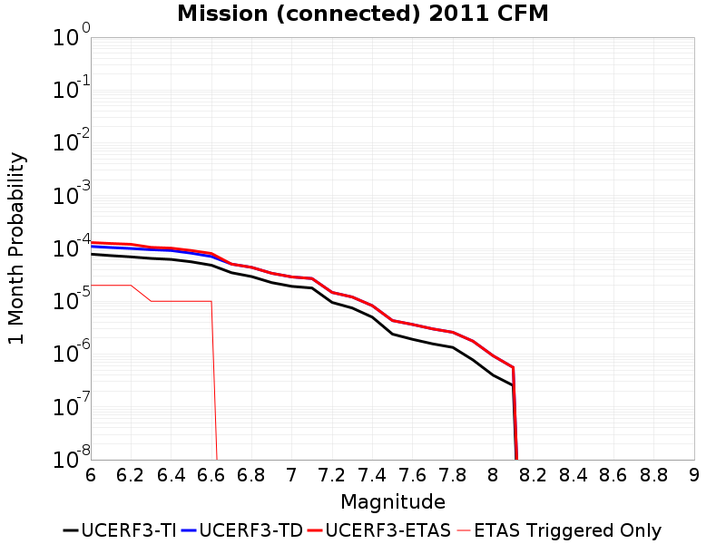 | 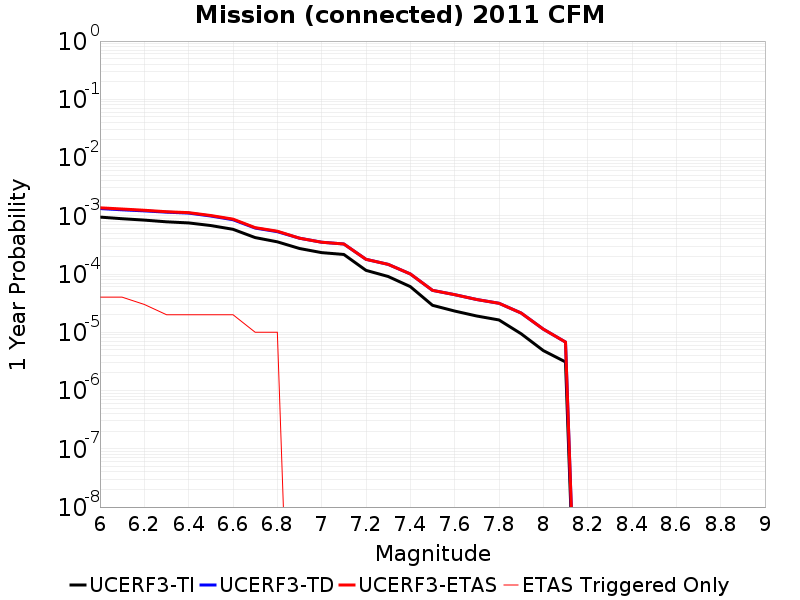 |  |

| Magnitude | 1 wk TI Prob | 1 wk TD Prob | 1 wk ETAS Prob | 1 wk ETAS/TD Gain | 1 wk ETAS Triggered Only | 1 mo TI Prob | 1 mo TD Prob | 1 mo ETAS Prob | 1 mo ETAS/TD Gain | 1 mo ETAS Triggered Only | 1 yr TI Prob | 1 yr TD Prob | 1 yr ETAS Prob | 1 yr ETAS/TD Gain | 1 yr ETAS Triggered Only | 10 yr TI Prob | 10 yr TD Prob | 10 yr ETAS Prob | 10 yr ETAS/TD Gain | 10 yr ETAS Triggered Only |
|-----|-----|-----|-----|-----|-----|-----|-----|-----|-----|-----|-----|-----|-----|-----|-----|-----|-----|-----|-----|-----|
| 6.0 | 1.8170693E-5 | 2.5483849E-5 | 4.548334E-5 | 1.7847908 | 2.0E-5 | 7.787207E-5 | 1.0921178E-4 | 1.292096E-4 | 1.1831105 | 2.0E-5 | 9.476801E-4 | 0.0013287764 | 0.0013687231 | 1.0300629 | 4.0E-5 | 0.009436488 | 0.013222038 | 0.013281245 | 1.0044779 | 6.0E-5 |
| 6.1 | 1.7048891E-5 | 2.425615E-5 | 4.4255663E-5 | 1.8245132 | 2.0E-5 | 7.306463E-5 | 1.0395064E-4 | 1.2394856E-4 | 1.192379 | 2.0E-5 | 8.8919874E-4 | 0.0012647978 | 0.0013047472 | 1.0315856 | 4.0E-5 | 0.008856491 | 0.012589653 | 0.012648898 | 1.0047058 | 6.0E-5 |
| 6.2 | 1.6137668E-5 | 2.3249782E-5 | 4.3249318E-5 | 1.8602031 | 2.0E-5 | 6.91596E-5 | 9.9637975E-5 | 1.1963598E-4 | 1.2007067 | 2.0E-5 | 8.416928E-4 | 0.0012123509 | 0.0012423146 | 1.0247153 | 3.0E-5 | 0.008385119 | 0.012071025 | 0.012120421 | 1.0040921 | 5.0E-5 |
| 6.3 | 1.5083093E-5 | 2.20987E-5 | 3.209848E-5 | 1.4525054 | 1.0E-5 | 6.4640226E-5 | 9.470513E-5 | 1.0470418E-4 | 1.1055809 | 1.0E-5 | 7.8671053E-4 | 0.0011523587 | 0.0011723357 | 1.0173357 | 2.0E-5 | 0.007839313 | 0.011477473 | 0.011517014 | 1.003445 | 4.0E-5 |
| 6.4 | 1.4435828E-5 | 2.1296071E-5 | 3.129586E-5 | 1.4695601 | 1.0E-5 | 6.186637E-5 | 9.1265545E-5 | 1.0126464E-4 | 1.1095604 | 1.0E-5 | 7.529627E-4 | 0.0011105264 | 0.0011305042 | 1.0179895 | 2.0E-5 | 0.007504165 | 0.011065043 | 0.0111046005 | 1.003575 | 4.0E-5 |
| 6.5 | 1.30127955E-5 | 1.896415E-5 | 2.8963961E-5 | 1.5273007 | 1.0E-5 | 5.576793E-5 | 8.127228E-5 | 9.127147E-5 | 1.1230332 | 1.0E-5 | 6.78763E-4 | 9.890216E-4 | 0.0010090019 | 1.020202 | 2.0E-5 | 0.0067669353 | 0.009870554 | 0.009910159 | 1.0040125 | 4.0E-5 |
| 6.6 | 1.1220718E-5 | 1.6391674E-5 | 2.639151E-5 | 1.6100558 | 1.0E-5 | 4.8087906E-5 | 7.0248134E-5 | 8.024743E-5 | 1.1423426 | 1.0E-5 | 5.8531296E-4 | 8.549368E-4 | 8.749197E-4 | 1.0233735 | 2.0E-5 | 0.005837737 | 0.008543533 | 0.008583192 | 1.0046419 | 4.0E-5 |
| 6.7 | 8.086152E-6 | 1.1782112E-5 | 1.1782112E-5 | 1.0 | 0.0 | 3.4654473E-5 | 5.0493793E-5 | 5.0493793E-5 | 1.0 | 0.0 | 4.2183654E-4 | 6.1458925E-4 | 6.2458316E-4 | 1.016261 | 1.0E-5 | 0.004210367 | 0.0061593275 | 0.006169266 | 1.0016135 | 1.0E-5 |
| 6.8 | 6.8361655E-6 | 1.0214729E-5 | 1.0214729E-5 | 1.0 | 0.0 | 2.9297524E-5 | 4.3776676E-5 | 4.3776676E-5 | 1.0 | 0.0 | 3.5663895E-4 | 5.328513E-4 | 5.42846E-4 | 1.018757 | 1.0E-5 | 0.0035606713 | 0.0053428533 | 0.0053528 | 1.0018617 | 1.0E-5 |
| 6.9 | 5.2517353E-6 | 7.893083E-6 | 7.893083E-6 | 1.0 | 0.0 | 2.2507242E-5 | 3.3827062E-5 | 3.3827062E-5 | 1.0 | 0.0 | 2.739912E-4 | 4.117669E-4 | 4.117669E-4 | 1.0 | 0.0 | 0.0027365363 | 0.0041370085 | 0.0041370085 | 1.0 | 0.0 |
| 7.0 | 4.4602784E-6 | 6.7289066E-6 | 6.7289066E-6 | 1.0 | 0.0 | 1.911534E-5 | 2.8837854E-5 | 2.8837854E-5 | 1.0 | 0.0 | 2.327044E-4 | 3.5104447E-4 | 3.5104447E-4 | 1.0 | 0.0 | 0.0023246086 | 0.0035314276 | 0.0035314276 | 1.0 | 0.0 |
| 7.1 | 4.1492594E-6 | 6.2776217E-6 | 6.2776217E-6 | 1.0 | 0.0 | 1.7782419E-5 | 2.6903816E-5 | 2.6903816E-5 | 1.0 | 0.0 | 2.1647944E-4 | 3.2750488E-4 | 3.2750488E-4 | 1.0 | 0.0 | 0.0021626868 | 0.0032963401 | 0.0032963401 | 1.0 | 0.0 |
| 7.2 | 2.213247E-6 | 3.4238813E-6 | 3.4238813E-6 | 1.0 | 0.0 | 9.485309E-6 | 1.4673694E-5 | 1.4673694E-5 | 1.0 | 0.0 | 1.15477524E-4 | 1.7863761E-4 | 1.7863761E-4 | 1.0 | 0.0 | 0.0011541754 | 0.0018092212 | 0.0018092212 | 1.0 | 0.0 |
| 7.3 | 1.7362703E-6 | 2.8051227E-6 | 2.8051227E-6 | 1.0 | 0.0 | 7.4411373E-6 | 1.2021898E-5 | 1.2021898E-5 | 1.0 | 0.0 | 9.0592075E-5 | 1.463568E-4 | 1.463568E-4 | 1.0 | 0.0 | 9.0555154E-4 | 0.0014842501 | 0.0014842501 | 1.0 | 0.0 |
| 7.4 | 1.1628409E-6 | 1.9202985E-6 | 1.9202985E-6 | 1.0 | 0.0 | 4.9835944E-6 | 8.229825E-6 | 8.229825E-6 | 1.0 | 0.0 | 6.0673574E-5 | 1.00193516E-4 | 1.00193516E-4 | 1.0 | 0.0 | 6.065701E-4 | 0.0010191645 | 0.0010191645 | 1.0 | 0.0 |
| 7.5 | 5.5610667E-7 | 1.0040669E-6 | 1.0040669E-6 | 1.0 | 0.0 | 2.3833122E-6 | 4.303137E-6 | 4.303137E-6 | 1.0 | 0.0 | 2.9016439E-5 | 5.2389438E-5 | 5.2389438E-5 | 1.0 | 0.0 | 2.901265E-4 | 5.378698E-4 | 5.378698E-4 | 1.0 | 0.0 |
| 7.6 | 4.4307663E-7 | 8.467016E-7 | 8.467016E-7 | 1.0 | 0.0 | 1.8988985E-6 | 3.628716E-6 | 3.628716E-6 | 1.0 | 0.0 | 2.3118844E-5 | 4.4178727E-5 | 4.4178727E-5 | 1.0 | 0.0 | 2.3116439E-4 | 4.5519305E-4 | 4.5519305E-4 | 1.0 | 0.0 |
| 7.7 | 3.639119E-7 | 6.984673E-7 | 6.984673E-7 | 1.0 | 0.0 | 1.5596215E-6 | 2.9934279E-6 | 2.9934279E-6 | 1.0 | 0.0 | 1.8988227E-5 | 3.6444377E-5 | 3.6444377E-5 | 1.0 | 0.0 | 1.8986604E-4 | 3.7746204E-4 | 3.7746204E-4 | 1.0 | 0.0 |
| 7.8 | 3.1152942E-7 | 6.0232696E-7 | 6.0232696E-7 | 1.0 | 0.0 | 1.3351254E-6 | 2.5813986E-6 | 2.5813986E-6 | 1.0 | 0.0 | 1.6255031E-5 | 3.1428077E-5 | 3.1428077E-5 | 1.0 | 0.0 | 1.6253842E-4 | 3.243876E-4 | 3.243876E-4 | 1.0 | 0.0 |
| 7.9 | 1.8035962E-7 | 4.0935615E-7 | 4.0935615E-7 | 1.0 | 0.0 | 7.729696E-7 | 1.7543823E-6 | 1.7543823E-6 | 1.0 | 0.0 | 9.410865E-6 | 2.1359396E-5 | 2.1359396E-5 | 1.0 | 0.0 | 9.410465E-5 | 2.1879897E-4 | 2.1879897E-4 | 1.0 | 0.0 |
| 8.0 | 9.279334E-8 | 2.1655896E-7 | 2.1655896E-7 | 1.0 | 0.0 | 3.976857E-7 | 9.281095E-7 | 9.281095E-7 | 1.0 | 0.0 | 4.841813E-6 | 1.1299676E-5 | 1.1299676E-5 | 1.0 | 0.0 | 4.841707E-5 | 1.1485598E-4 | 1.1485598E-4 | 1.0 | 0.0 |
| 8.1 | 5.9253985E-8 | 1.3003579E-7 | 1.3003579E-7 | 1.0 | 0.0 | 2.5394561E-7 | 5.572961E-7 | 5.572961E-7 | 1.0 | 0.0 | 3.0917836E-6 | 6.7850597E-6 | 6.7850597E-6 | 1.0 | 0.0 | 3.0917407E-5 | 6.8895795E-5 | 6.8895795E-5 | 1.0 | 0.0 |

## Calaveras (So) - Paicines extension 2011 CFM
*[(top)](#table-of-contents)*

| 1 Week | 1 Month | 1 Year | 10 Year |
|-----|-----|-----|-----|
|  |  |  |  |

| Magnitude | 1 wk TI Prob | 1 wk TD Prob | 1 wk ETAS Prob | 1 wk ETAS/TD Gain | 1 wk ETAS Triggered Only | 1 mo TI Prob | 1 mo TD Prob | 1 mo ETAS Prob | 1 mo ETAS/TD Gain | 1 mo ETAS Triggered Only | 1 yr TI Prob | 1 yr TD Prob | 1 yr ETAS Prob | 1 yr ETAS/TD Gain | 1 yr ETAS Triggered Only | 10 yr TI Prob | 10 yr TD Prob | 10 yr ETAS Prob | 10 yr ETAS/TD Gain | 10 yr ETAS Triggered Only |
|-----|-----|-----|-----|-----|-----|-----|-----|-----|-----|-----|-----|-----|-----|-----|-----|-----|-----|-----|-----|-----|
| 6.0 | 1.1894548E-4 | 2.2839737E-4 | 2.483928E-4 | 1.0875467 | 2.0E-5 | 5.0966674E-4 | 9.78231E-4 | 0.0010082016 | 1.0306376 | 3.0E-5 | 0.006187552 | 0.011801471 | 0.011831117 | 1.0025121 | 3.0E-5 | 0.060180783 | 0.10820386 | 0.10825737 | 1.0004945 | 6.0E-5 |
| 6.1 | 1.1894548E-4 | 2.2839737E-4 | 2.483928E-4 | 1.0875467 | 2.0E-5 | 5.0966674E-4 | 9.78231E-4 | 0.0010082016 | 1.0306376 | 3.0E-5 | 0.006187552 | 0.011801471 | 0.011831117 | 1.0025121 | 3.0E-5 | 0.060180783 | 0.10820386 | 0.10825737 | 1.0004945 | 6.0E-5 |
| 6.2 | 1.1656485E-4 | 2.2839737E-4 | 2.483928E-4 | 1.0875467 | 2.0E-5 | 4.99468E-4 | 9.78231E-4 | 0.0010082016 | 1.0306376 | 3.0E-5 | 0.0060640806 | 0.011801471 | 0.011831117 | 1.0025121 | 3.0E-5 | 0.059012495 | 0.10820386 | 0.10825737 | 1.0004945 | 6.0E-5 |
| 6.3 | 1.152476E-4 | 2.2713983E-4 | 2.471353E-4 | 1.0880315 | 2.0E-5 | 4.938248E-4 | 9.728461E-4 | 0.001002817 | 1.0308074 | 3.0E-5 | 0.005995755 | 0.0117368 | 0.011766448 | 1.002526 | 3.0E-5 | 0.058365438 | 0.1076362 | 0.10768974 | 1.0004975 | 6.0E-5 |
| 6.4 | 1.07200925E-4 | 2.0962297E-4 | 2.2961879E-4 | 1.0953894 | 2.0E-5 | 4.5935164E-4 | 8.9787174E-4 | 9.2784484E-4 | 1.0333823 | 3.0E-5 | 0.0055782744 | 0.010842715 | 0.01087239 | 1.0027368 | 3.0E-5 | 0.0544031 | 0.100294 | 0.10034798 | 1.0005382 | 6.0E-5 |
| 6.5 | 9.69631E-5 | 1.8881948E-4 | 2.088157E-4 | 1.1059012 | 2.0E-5 | 4.1548995E-4 | 8.088033E-4 | 8.3877903E-4 | 1.0370618 | 3.0E-5 | 0.0050468626 | 0.009776018 | 0.009805725 | 1.0030388 | 3.0E-5 | 0.04933773 | 0.09117402 | 0.09122855 | 1.0005981 | 6.0E-5 |
| 6.6 | 8.0552316E-5 | 1.5222294E-4 | 1.722199E-4 | 1.1313663 | 2.0E-5 | 3.4517853E-4 | 6.5218995E-4 | 6.821704E-4 | 1.0459689 | 3.0E-5 | 0.0041944524 | 0.007905796 | 0.007935558 | 1.0037646 | 3.0E-5 | 0.04116161 | 0.07564722 | 0.07570268 | 1.0007331 | 6.0E-5 |
| 6.7 | 7.815757E-5 | 1.4763781E-4 | 1.6763485E-4 | 1.1354467 | 2.0E-5 | 3.34918E-4 | 6.325532E-4 | 6.625342E-4 | 1.0473969 | 3.0E-5 | 0.004070005 | 0.0076690665 | 0.0076988363 | 1.0038818 | 3.0E-5 | 0.039962657 | 0.07349947 | 0.07355507 | 1.0007564 | 6.0E-5 |
| 6.8 | 6.965264E-5 | 1.2894826E-4 | 1.4894569E-4 | 1.1550809 | 2.0E-5 | 2.9847719E-4 | 5.524992E-4 | 5.824826E-4 | 1.0542687 | 3.0E-5 | 0.0036279052 | 0.006703201 | 0.0067330003 | 1.0044454 | 3.0E-5 | 0.03569247 | 0.06466918 | 0.064725295 | 1.0008678 | 6.0E-5 |
| 6.9 | 5.8000453E-5 | 1.0347973E-4 | 1.2347766E-4 | 1.1932546 | 2.0E-5 | 2.4854968E-4 | 4.4340966E-4 | 4.7339636E-4 | 1.0676275 | 3.0E-5 | 0.0030218933 | 0.0053852503 | 0.005415089 | 1.0055407 | 3.0E-5 | 0.029811295 | 0.05249505 | 0.052551903 | 1.001083 | 6.0E-5 |
| 7.0 | 4.9865852E-5 | 8.7692424E-5 | 1.0769067E-4 | 1.2280499 | 2.0E-5 | 2.1369329E-4 | 3.7577102E-4 | 4.0575975E-4 | 1.0798059 | 3.0E-5 | 0.0025986114 | 0.0045655044 | 0.0045953672 | 1.006541 | 3.0E-5 | 0.025684336 | 0.044763867 | 0.04482118 | 1.0012803 | 6.0E-5 |
| 7.1 | 4.283875E-5 | 7.334545E-5 | 9.334399E-5 | 1.2726622 | 2.0E-5 | 1.8358172E-4 | 3.143001E-4 | 3.442907E-4 | 1.0954201 | 3.0E-5 | 0.0022328163 | 0.003819948 | 0.0038498335 | 1.0078235 | 3.0E-5 | 0.022105146 | 0.037790373 | 0.037848108 | 1.0015277 | 6.0E-5 |
| 7.2 | 3.450115E-5 | 5.801248E-5 | 7.801132E-5 | 1.3447334 | 2.0E-5 | 1.478537E-4 | 2.486014E-4 | 2.785939E-4 | 1.1206452 | 3.0E-5 | 0.0017986323 | 0.003022552 | 0.0030524612 | 1.0098954 | 3.0E-5 | 0.017841442 | 0.030143661 | 0.030201852 | 1.0019305 | 6.0E-5 |
| 7.3 | 2.5709045E-5 | 4.249788E-5 | 5.2497457E-5 | 1.2352959 | 1.0E-5 | 1.1017697E-4 | 1.8212116E-4 | 1.9211933E-4 | 1.0548985 | 1.0E-5 | 0.0013405791 | 0.0022150883 | 0.0022250663 | 1.0045044 | 1.0E-5 | 0.013325208 | 0.0222097 | 0.022229256 | 1.0008805 | 2.0E-5 |
| 7.4 | 1.8003093E-5 | 3.0062056E-5 | 3.0062056E-5 | 1.0 | 0.0 | 7.715383E-5 | 1.2883103E-4 | 1.2883103E-4 | 1.0 | 0.0 | 9.3894306E-4 | 0.0015673918 | 0.0015673918 | 1.0 | 0.0 | 0.009349857 | 0.015794838 | 0.015804678 | 1.0006231 | 1.0E-5 |
| 7.5 | 1.5595824E-5 | 2.7343915E-5 | 2.7343915E-5 | 1.0 | 0.0 | 6.683753E-5 | 1.1718295E-4 | 1.1718295E-4 | 1.0 | 0.0 | 8.134431E-4 | 0.0014257712 | 0.0014257712 | 1.0 | 0.0 | 0.008104719 | 0.014381331 | 0.014381331 | 1.0 | 0.0 |
| 7.6 | 1.1110309E-5 | 2.0583162E-5 | 2.0583162E-5 | 1.0 | 0.0 | 4.761474E-5 | 8.821058E-5 | 8.821058E-5 | 1.0 | 0.0 | 5.795553E-4 | 0.0010734361 | 0.0010734361 | 1.0 | 0.0 | 0.0057804612 | 0.0108594345 | 0.0108594345 | 1.0 | 0.0 |
| 7.7 | 6.2140443E-6 | 1.1480837E-5 | 1.1480837E-5 | 1.0 | 0.0 | 2.6631347E-5 | 4.920266E-5 | 4.920266E-5 | 1.0 | 0.0 | 3.241884E-4 | 5.9887784E-4 | 5.9887784E-4 | 1.0 | 0.0 | 0.0032371588 | 0.006122898 | 0.006122898 | 1.0 | 0.0 |
| 7.8 | 5.305533E-6 | 1.038381E-5 | 1.038381E-5 | 1.0 | 0.0 | 2.27378E-5 | 4.4501285E-5 | 4.4501285E-5 | 1.0 | 0.0 | 2.7679754E-4 | 5.4166856E-4 | 5.4166856E-4 | 1.0 | 0.0 | 0.0027645302 | 0.005531331 | 0.005531331 | 1.0 | 0.0 |
| 7.9 | 3.363505E-6 | 8.135678E-6 | 8.135678E-6 | 1.0 | 0.0 | 1.4414942E-5 | 3.486673E-5 | 3.486673E-5 | 1.0 | 0.0 | 1.7548777E-4 | 4.2441985E-4 | 4.2441985E-4 | 1.0 | 0.0 | 0.0017534926 | 0.0043086 | 0.0043086 | 1.0 | 0.0 |
| 8.0 | 2.0271132E-6 | 4.8661404E-6 | 4.8661404E-6 | 1.0 | 0.0 | 8.687599E-6 | 2.085472E-5 | 2.085472E-5 | 1.0 | 0.0 | 1.05766376E-4 | 2.538767E-4 | 2.538767E-4 | 1.0 | 0.0 | 0.0010571606 | 0.0025706848 | 0.0025706848 | 1.0 | 0.0 |
| 8.1 | 1.2206116E-6 | 2.6320488E-6 | 2.6320488E-6 | 1.0 | 0.0 | 5.2311816E-6 | 1.1280161E-5 | 1.1280161E-5 | 1.0 | 0.0 | 6.3687774E-5 | 1.3732734E-4 | 1.3732734E-4 | 1.0 | 0.0 | 6.366953E-4 | 0.0013972797 | 0.0013972797 | 1.0 | 0.0 |

## Calaveras (So) 2011 CFM
*[(top)](#table-of-contents)*

| 1 Week | 1 Month | 1 Year | 10 Year |
|-----|-----|-----|-----|
| 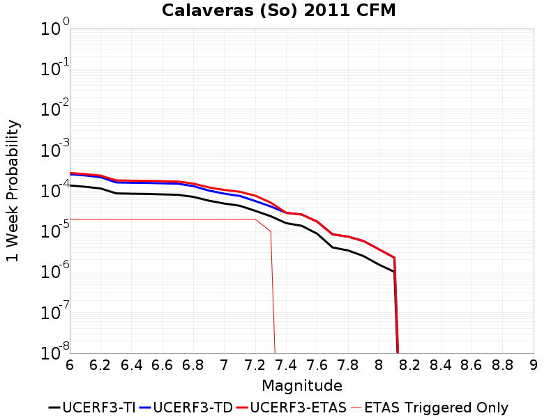 |  |  |  |

| Magnitude | 1 wk TI Prob | 1 wk TD Prob | 1 wk ETAS Prob | 1 wk ETAS/TD Gain | 1 wk ETAS Triggered Only | 1 mo TI Prob | 1 mo TD Prob | 1 mo ETAS Prob | 1 mo ETAS/TD Gain | 1 mo ETAS Triggered Only | 1 yr TI Prob | 1 yr TD Prob | 1 yr ETAS Prob | 1 yr ETAS/TD Gain | 1 yr ETAS Triggered Only | 10 yr TI Prob | 10 yr TD Prob | 10 yr ETAS Prob | 10 yr ETAS/TD Gain | 10 yr ETAS Triggered Only |
|-----|-----|-----|-----|-----|-----|-----|-----|-----|-----|-----|-----|-----|-----|-----|-----|-----|-----|-----|-----|-----|
| 6.0 | 1.358289E-4 | 2.5595276E-4 | 2.7594765E-4 | 1.0781194 | 2.0E-5 | 5.8199395E-4 | 0.0010963918 | 0.0011263589 | 1.0273324 | 3.0E-5 | 0.0070627797 | 0.013243392 | 0.013272995 | 1.0022353 | 3.0E-5 | 0.06842483 | 0.122731276 | 0.122783914 | 1.0004289 | 6.0E-5 |
| 6.1 | 1.2634568E-4 | 2.3974723E-4 | 2.5974243E-4 | 1.0834012 | 2.0E-5 | 5.4136914E-4 | 0.0010269987 | 0.0010569679 | 1.0291814 | 3.0E-5 | 0.0065712677 | 0.012410515 | 0.012440143 | 1.0023873 | 3.0E-5 | 0.06380317 | 0.11547472 | 0.115527794 | 1.0004596 | 6.0E-5 |
| 6.2 | 1.1466059E-4 | 2.1772322E-4 | 2.3771888E-4 | 1.0918398 | 2.0E-5 | 4.9130997E-4 | 9.3271263E-4 | 9.626847E-4 | 1.0321343 | 3.0E-5 | 0.005965305 | 0.011279094 | 0.011308756 | 1.0026298 | 3.0E-5 | 0.05807694 | 0.105639234 | 0.10569289 | 1.000508 | 6.0E-5 |
| 6.3 | 8.691518E-5 | 1.6131687E-4 | 1.8131365E-4 | 1.1239595 | 2.0E-5 | 3.7244044E-4 | 6.911433E-4 | 7.2112255E-4 | 1.0433763 | 3.0E-5 | 0.004525038 | 0.008376316 | 0.0084060645 | 1.0035515 | 3.0E-5 | 0.044339992 | 0.080065 | 0.08012019 | 1.0006894 | 6.0E-5 |
| 6.4 | 8.50982E-5 | 1.5857484E-4 | 1.7857166E-4 | 1.1261034 | 2.0E-5 | 3.646556E-4 | 6.7939784E-4 | 7.093774E-4 | 1.0441267 | 3.0E-5 | 0.0044306475 | 0.008234401 | 0.008264154 | 1.0036132 | 3.0E-5 | 0.04343345 | 0.07875367 | 0.07880895 | 1.0007019 | 6.0E-5 |
| 6.5 | 8.4062965E-5 | 1.5696572E-4 | 1.7696258E-4 | 1.1273963 | 2.0E-5 | 3.602201E-4 | 6.725055E-4 | 7.024853E-4 | 1.0445793 | 3.0E-5 | 0.004376863 | 0.00815121 | 0.008180966 | 1.0036504 | 3.0E-5 | 0.042916555 | 0.077989765 | 0.078045085 | 1.0007093 | 6.0E-5 |
| 6.6 | 8.194716E-5 | 1.535064E-4 | 1.7350333E-4 | 1.1302677 | 2.0E-5 | 3.5115483E-4 | 6.5768947E-4 | 6.8766973E-4 | 1.0455842 | 3.0E-5 | 0.0042669317 | 0.007972512 | 0.008002273 | 1.0037329 | 3.0E-5 | 0.04185927 | 0.07635824 | 0.07641366 | 1.0007257 | 6.0E-5 |
| 6.7 | 8.012326E-5 | 1.5021837E-4 | 1.7021537E-4 | 1.1331195 | 2.0E-5 | 3.433402E-4 | 6.436076E-4 | 6.7358825E-4 | 1.0465822 | 3.0E-5 | 0.004172157 | 0.0078027113 | 0.007832478 | 1.0038148 | 3.0E-5 | 0.040946912 | 0.07481533 | 0.07487085 | 1.000742 | 6.0E-5 |
| 6.8 | 7.119773E-5 | 1.3101929E-4 | 1.5101668E-4 | 1.1526293 | 2.0E-5 | 3.0509746E-4 | 5.613712E-4 | 5.913544E-4 | 1.0534105 | 3.0E-5 | 0.0037082357 | 0.0068105385 | 0.006840334 | 1.004375 | 3.0E-5 | 0.036469642 | 0.06574274 | 0.0657988 | 1.0008527 | 6.0E-5 |
| 6.9 | 5.7343088E-5 | 1.017338E-4 | 1.2173177E-4 | 1.1965715 | 2.0E-5 | 2.4573295E-4 | 4.359295E-4 | 4.6591644E-4 | 1.0687884 | 3.0E-5 | 0.0029876942 | 0.005294607 | 0.005324448 | 1.0056361 | 3.0E-5 | 0.02947844 | 0.051706363 | 0.051763263 | 1.0011004 | 6.0E-5 |
| 7.0 | 4.8746577E-5 | 8.535553E-5 | 1.0535383E-4 | 1.234294 | 2.0E-5 | 2.0889717E-4 | 3.6575852E-4 | 3.9574754E-4 | 1.0819913 | 3.0E-5 | 0.0025403565 | 0.004444087 | 0.0044739535 | 1.0067205 | 3.0E-5 | 0.025115121 | 0.043670624 | 0.043728005 | 1.0013139 | 6.0E-5 |
| 7.1 | 4.2998014E-5 | 7.503305E-5 | 9.503155E-5 | 1.2665292 | 2.0E-5 | 1.8426418E-4 | 3.215309E-4 | 3.5152127E-4 | 1.0932736 | 3.0E-5 | 0.002241108 | 0.0039076754 | 0.0039375583 | 1.0076472 | 3.0E-5 | 0.022186412 | 0.038554676 | 0.038612366 | 1.0014962 | 6.0E-5 |
| 7.2 | 3.221292E-5 | 5.6165998E-5 | 7.616488E-5 | 1.3560673 | 2.0E-5 | 1.3804805E-4 | 2.4068939E-4 | 2.7068215E-4 | 1.124612 | 3.0E-5 | 0.0016794393 | 0.0029264856 | 0.0029563978 | 1.0102212 | 3.0E-5 | 0.016668037 | 0.02911592 | 0.029174173 | 1.0020007 | 6.0E-5 |
| 7.3 | 2.3756531E-5 | 4.1290208E-5 | 5.1289797E-5 | 1.2421782 | 1.0E-5 | 1.0180973E-4 | 1.7694614E-4 | 1.8694437E-4 | 1.0565044 | 1.0E-5 | 0.0012388286 | 0.002152209 | 0.0021621874 | 1.0046364 | 1.0E-5 | 0.012319452 | 0.0215194 | 0.02153897 | 1.0009094 | 2.0E-5 |
| 7.4 | 1.5997684E-5 | 2.8770244E-5 | 2.8770244E-5 | 1.0 | 0.0 | 6.8559704E-5 | 1.2329523E-4 | 1.2329523E-4 | 1.0 | 0.0 | 8.343947E-4 | 0.0015000885 | 0.0015000885 | 1.0 | 0.0 | 0.008312687 | 0.015066539 | 0.015076389 | 1.0006537 | 1.0E-5 |
| 7.5 | 1.3814293E-5 | 2.6155752E-5 | 2.6155752E-5 | 1.0 | 0.0 | 5.9202768E-5 | 1.1209128E-4 | 1.1209128E-4 | 1.0 | 0.0 | 7.205553E-4 | 0.0013638595 | 0.0013638595 | 1.0 | 0.0 | 0.007182234 | 0.013718862 | 0.013718862 | 1.0 | 0.0 |
| 7.6 | 8.817309E-6 | 1.7516644E-5 | 1.7516644E-5 | 1.0 | 0.0 | 3.7787922E-5 | 7.506918E-5 | 7.506918E-5 | 1.0 | 0.0 | 4.5997082E-4 | 9.1358554E-4 | 9.1358554E-4 | 1.0 | 0.0 | 0.004590199 | 0.009245693 | 0.009245693 | 1.0 | 0.0 |
| 7.7 | 4.0352206E-6 | 8.47665E-6 | 8.47665E-6 | 1.0 | 0.0 | 1.7293689E-5 | 3.6327994E-5 | 3.6327994E-5 | 1.0 | 0.0 | 2.1053031E-4 | 4.4220366E-4 | 4.4220366E-4 | 1.0 | 0.0 | 0.0021033096 | 0.0045375535 | 0.0045375535 | 1.0 | 0.0 |
| 7.8 | 3.413169E-6 | 7.4718164E-6 | 7.4718164E-6 | 1.0 | 0.0 | 1.4627784E-5 | 3.202168E-5 | 3.202168E-5 | 1.0 | 0.0 | 1.7807873E-4 | 3.8979427E-4 | 3.8979427E-4 | 1.0 | 0.0 | 0.0017793609 | 0.00399676 | 0.00399676 | 1.0 | 0.0 |
| 7.9 | 2.4740732E-6 | 5.8200585E-6 | 5.8200585E-6 | 1.0 | 0.0 | 1.06031275E-5 | 2.4942869E-5 | 2.4942869E-5 | 1.0 | 0.0 | 1.2908543E-4 | 3.0363718E-4 | 3.0363718E-4 | 1.0 | 0.0 | 0.0012901047 | 0.0030951104 | 0.0030951104 | 1.0 | 0.0 |
| 8.0 | 1.5231818E-6 | 3.628742E-6 | 3.628742E-6 | 1.0 | 0.0 | 6.527906E-6 | 1.5551659E-5 | 1.5551659E-5 | 1.0 | 0.0 | 7.9474354E-5 | 1.8932503E-4 | 1.8932503E-4 | 1.0 | 0.0 | 7.944594E-4 | 0.0019211415 | 0.0019211415 | 1.0 | 0.0 |
| 8.1 | 1.0104524E-6 | 2.2611148E-6 | 2.2611148E-6 | 1.0 | 0.0 | 4.330503E-6 | 9.690456E-6 | 9.690456E-6 | 1.0 | 0.0 | 5.2722597E-5 | 1.1797495E-4 | 1.1797495E-4 | 1.0 | 0.0 | 5.271009E-4 | 0.0011984004 | 0.0011984004 | 1.0 | 0.0 |

## Contra Costa Shear Zone (connector) 2011 CFM
*[(top)](#table-of-contents)*

| 1 Week | 1 Month | 1 Year | 10 Year |
|-----|-----|-----|-----|
| 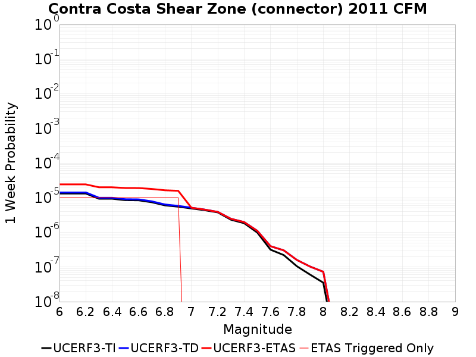 |  | 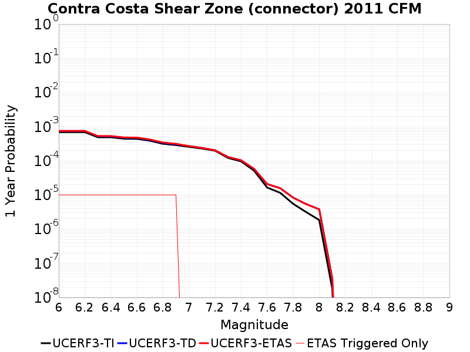 | 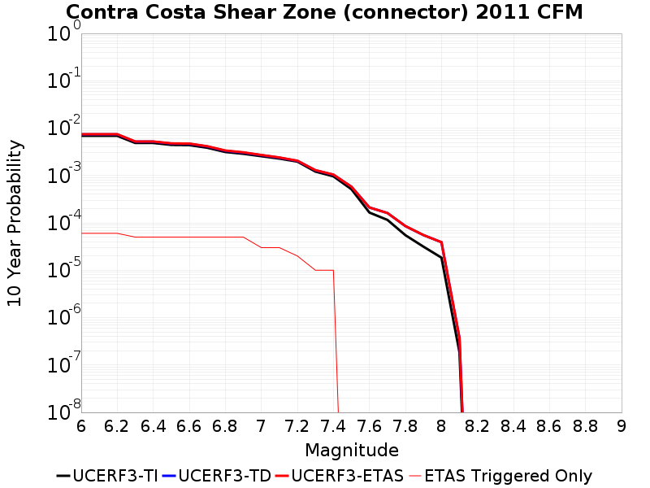 |

| Magnitude | 1 wk TI Prob | 1 wk TD Prob | 1 wk ETAS Prob | 1 wk ETAS/TD Gain | 1 wk ETAS Triggered Only | 1 mo TI Prob | 1 mo TD Prob | 1 mo ETAS Prob | 1 mo ETAS/TD Gain | 1 mo ETAS Triggered Only | 1 yr TI Prob | 1 yr TD Prob | 1 yr ETAS Prob | 1 yr ETAS/TD Gain | 1 yr ETAS Triggered Only | 10 yr TI Prob | 10 yr TD Prob | 10 yr ETAS Prob | 10 yr ETAS/TD Gain | 10 yr ETAS Triggered Only |
|-----|-----|-----|-----|-----|-----|-----|-----|-----|-----|-----|-----|-----|-----|-----|-----|-----|-----|-----|-----|-----|
| 6.0 | 1.3187427E-5 | 1.41607425E-5 | 2.4160601E-5 | 1.7061677 | 1.0E-5 | 5.6516317E-5 | 6.0687613E-5 | 7.0687005E-5 | 1.1647682 | 1.0E-5 | 6.878689E-4 | 7.386442E-4 | 7.4863684E-4 | 1.0135283 | 1.0E-5 | 0.006857436 | 0.0073679206 | 0.0074274787 | 1.0080835 | 6.0E-5 |
| 6.1 | 1.3187427E-5 | 1.41607425E-5 | 2.4160601E-5 | 1.7061677 | 1.0E-5 | 5.6516317E-5 | 6.0687613E-5 | 7.0687005E-5 | 1.1647682 | 1.0E-5 | 6.878689E-4 | 7.386442E-4 | 7.4863684E-4 | 1.0135283 | 1.0E-5 | 0.006857436 | 0.0073679206 | 0.0074274787 | 1.0080835 | 6.0E-5 |
| 6.2 | 1.3187427E-5 | 1.41607425E-5 | 2.4160601E-5 | 1.7061677 | 1.0E-5 | 5.6516317E-5 | 6.0687613E-5 | 7.0687005E-5 | 1.1647682 | 1.0E-5 | 6.878689E-4 | 7.386442E-4 | 7.4863684E-4 | 1.0135283 | 1.0E-5 | 0.006857436 | 0.0073679206 | 0.0074274787 | 1.0080835 | 6.0E-5 |
| 6.3 | 9.315374E-6 | 9.92878E-6 | 1.992868E-5 | 2.007163 | 1.0E-5 | 3.992242E-5 | 4.2551244E-5 | 5.255082E-5 | 1.2350007 | 1.0E-5 | 4.8594706E-4 | 5.179424E-4 | 5.2793726E-4 | 1.0192971 | 1.0E-5 | 0.004848858 | 0.005171523 | 0.0052212644 | 1.0096183 | 5.0E-5 |
| 6.4 | 9.315374E-6 | 9.92878E-6 | 1.992868E-5 | 2.007163 | 1.0E-5 | 3.992242E-5 | 4.2551244E-5 | 5.255082E-5 | 1.2350007 | 1.0E-5 | 4.8594706E-4 | 5.179424E-4 | 5.2793726E-4 | 1.0192971 | 1.0E-5 | 0.004848858 | 0.005171523 | 0.0052212644 | 1.0096183 | 5.0E-5 |
| 6.5 | 8.492638E-6 | 9.03975E-6 | 1.9039659E-5 | 2.1062152 | 1.0E-5 | 3.639651E-5 | 3.874123E-5 | 4.874084E-5 | 1.2581129 | 1.0E-5 | 4.430374E-4 | 4.7157577E-4 | 4.8157104E-4 | 1.0211955 | 1.0E-5 | 0.0044215517 | 0.004709845 | 0.0047596092 | 1.0105661 | 5.0E-5 |
| 6.6 | 8.402072E-6 | 8.940177E-6 | 1.8940089E-5 | 2.118536 | 1.0E-5 | 3.6008387E-5 | 3.8314505E-5 | 4.831412E-5 | 1.2609878 | 1.0E-5 | 4.383139E-4 | 4.6638263E-4 | 4.7637796E-4 | 1.0214316 | 1.0E-5 | 0.0043745036 | 0.0046581323 | 0.0047078994 | 1.0106839 | 5.0E-5 |
| 6.7 | 7.383587E-6 | 7.844658E-6 | 1.7844579E-5 | 2.2747428 | 1.0E-5 | 3.164356E-5 | 3.361954E-5 | 4.3619206E-5 | 1.297436 | 1.0E-5 | 3.8519225E-4 | 4.0924316E-4 | 4.1923908E-4 | 1.0244254 | 1.0E-5 | 0.0038452526 | 0.0040888623 | 0.004138658 | 1.0121783 | 5.0E-5 |
| 6.8 | 6.004921E-6 | 6.3580187E-6 | 1.6357955E-5 | 2.572807 | 1.0E-5 | 2.5735122E-5 | 2.724837E-5 | 3.7248097E-5 | 1.3669844 | 1.0E-5 | 3.1328006E-4 | 3.3169895E-4 | 3.4169562E-4 | 1.0301378 | 1.0E-5 | 0.0031283877 | 0.0033158509 | 0.003365685 | 1.0150291 | 5.0E-5 |
| 6.9 | 5.505255E-6 | 5.8086353E-6 | 1.5808577E-5 | 2.7215648 | 1.0E-5 | 2.3593739E-5 | 2.4893916E-5 | 3.4893666E-5 | 1.4016945 | 1.0E-5 | 2.872159E-4 | 3.030417E-4 | 3.130387E-4 | 1.0329888 | 1.0E-5 | 0.0028684495 | 0.003030088 | 0.0030799364 | 1.0164511 | 5.0E-5 |
| 7.0 | 4.891922E-6 | 5.137418E-6 | 5.137418E-6 | 1.0 | 0.0 | 2.096521E-5 | 2.2017322E-5 | 2.2017322E-5 | 1.0 | 0.0 | 2.5522153E-4 | 2.680283E-4 | 2.680283E-4 | 1.0 | 0.0 | 0.0025492862 | 0.0026808453 | 0.002710765 | 1.0111605 | 3.0E-5 |
| 7.1 | 4.3599E-6 | 4.539159E-6 | 4.539159E-6 | 1.0 | 0.0 | 1.868515E-5 | 1.9453395E-5 | 1.9453395E-5 | 1.0 | 0.0 | 2.2746796E-4 | 2.3681961E-4 | 2.3681961E-4 | 1.0 | 0.0 | 0.0022723526 | 0.0023694606 | 0.0023993896 | 1.012631 | 3.0E-5 |
| 7.2 | 3.7647926E-6 | 3.886955E-6 | 3.886955E-6 | 1.0 | 0.0 | 1.6134725E-5 | 1.6658272E-5 | 1.6658272E-5 | 1.0 | 0.0 | 1.9642258E-4 | 2.0279585E-4 | 2.0279585E-4 | 1.0 | 0.0 | 0.0019624906 | 0.002029922 | 0.0020498815 | 1.0098326 | 2.0E-5 |
| 7.3 | 2.3179882E-6 | 2.4580886E-6 | 2.4580886E-6 | 1.0 | 0.0 | 9.934198E-6 | 1.0534623E-5 | 1.0534623E-5 | 1.0 | 0.0 | 1.20942146E-4 | 1.2825154E-4 | 1.2825154E-4 | 1.0 | 0.0 | 0.0012087635 | 0.0012855662 | 0.0012955534 | 1.0077686 | 1.0E-5 |
| 7.4 | 1.8378355E-6 | 1.9777103E-6 | 1.9777103E-6 | 1.0 | 0.0 | 7.876414E-6 | 8.475874E-6 | 8.475874E-6 | 1.0 | 0.0 | 9.5891126E-5 | 1.03188926E-4 | 1.03188926E-4 | 1.0 | 0.0 | 9.584976E-4 | 0.0010350728 | 0.0010450626 | 1.0096512 | 1.0E-5 |
| 7.5 | 9.840493E-7 | 1.1034521E-6 | 1.1034521E-6 | 1.0 | 0.0 | 4.2173474E-6 | 4.7290714E-6 | 4.7290714E-6 | 1.0 | 0.0 | 5.1344992E-5 | 5.757494E-5 | 5.757494E-5 | 1.0 | 0.0 | 5.133313E-4 | 5.7905825E-4 | 5.7905825E-4 | 1.0 | 0.0 |
| 7.6 | 3.1602997E-7 | 3.9811158E-7 | 3.9811158E-7 | 1.0 | 0.0 | 1.3544135E-6 | 1.7061914E-6 | 1.7061914E-6 | 1.0 | 0.0 | 1.648986E-5 | 2.0772684E-5 | 2.0772684E-5 | 1.0 | 0.0 | 1.6488635E-4 | 2.1107974E-4 | 2.1107974E-4 | 1.0 | 0.0 |
| 7.7 | 2.2125788E-7 | 3.028324E-7 | 3.028324E-7 | 1.0 | 0.0 | 9.482477E-7 | 1.2978525E-6 | 1.2978525E-6 | 1.0 | 0.0 | 1.1544855E-5 | 1.580124E-5 | 1.580124E-5 | 1.0 | 0.0 | 1.1544255E-4 | 1.6134823E-4 | 1.6134823E-4 | 1.0 | 0.0 |
| 7.8 | 1.0509553E-7 | 1.5950478E-7 | 1.5950478E-7 | 1.0 | 0.0 | 4.5040935E-7 | 6.8359174E-7 | 6.8359174E-7 | 1.0 | 0.0 | 5.48372E-6 | 8.322698E-6 | 8.322698E-6 | 1.0 | 0.0 | 5.4835844E-5 | 8.5384825E-5 | 8.5384825E-5 | 1.0 | 0.0 |
| 7.9 | 6.029319E-8 | 1.0301095E-7 | 1.0301095E-7 | 1.0 | 0.0 | 2.5839938E-7 | 4.414754E-7 | 4.414754E-7 | 1.0 | 0.0 | 3.1460077E-6 | 5.37495E-6 | 5.37495E-6 | 1.0 | 0.0 | 3.1459633E-5 | 5.519904E-5 | 5.519904E-5 | 1.0 | 0.0 |
| 8.0 | 3.531068E-8 | 7.288849E-8 | 7.288849E-8 | 1.0 | 0.0 | 1.5133148E-7 | 3.1237923E-7 | 3.1237923E-7 | 1.0 | 0.0 | 1.8424593E-6 | 3.8032103E-6 | 3.8032103E-6 | 1.0 | 0.0 | 1.842444E-5 | 3.9046332E-5 | 3.9046332E-5 | 1.0 | 0.0 |
| 8.1 | 3.5238246E-10 | 6.967752E-10 | 6.967752E-10 | 1.0 | 0.0 | 1.5102107E-9 | 2.9861797E-9 | 2.9861797E-9 | 1.0 | 0.0 | 1.8386816E-8 | 3.6356738E-8 | 3.6356738E-8 | 1.0 | 0.0 | 1.8386814E-7 | 3.7071342E-7 | 3.7071342E-7 | 1.0 | 0.0 |

## Franklin 2011 CFM
*[(top)](#table-of-contents)*

| 1 Week | 1 Month | 1 Year | 10 Year |
|-----|-----|-----|-----|
| 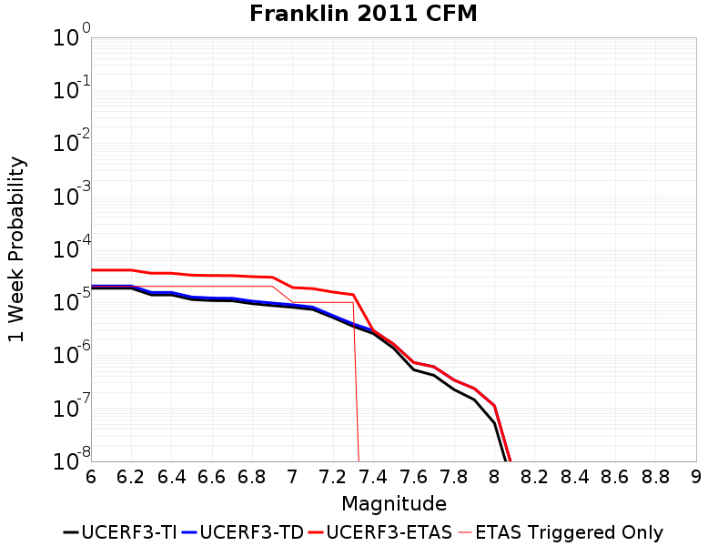 | 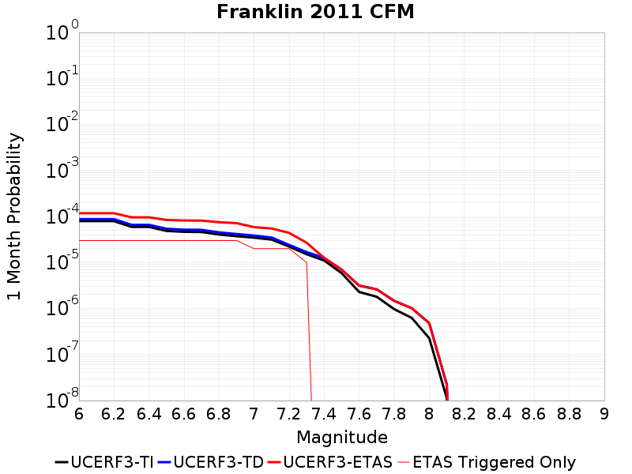 | 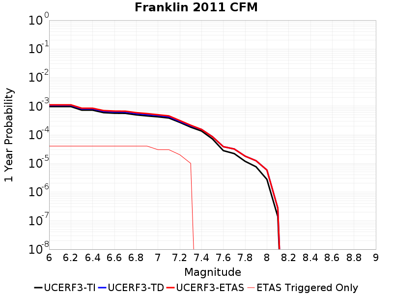 | 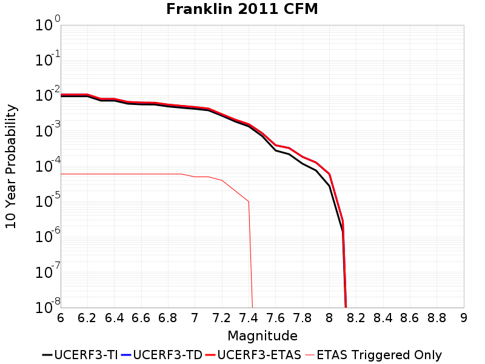 |

| Magnitude | 1 wk TI Prob | 1 wk TD Prob | 1 wk ETAS Prob | 1 wk ETAS/TD Gain | 1 wk ETAS Triggered Only | 1 mo TI Prob | 1 mo TD Prob | 1 mo ETAS Prob | 1 mo ETAS/TD Gain | 1 mo ETAS Triggered Only | 1 yr TI Prob | 1 yr TD Prob | 1 yr ETAS Prob | 1 yr ETAS/TD Gain | 1 yr ETAS Triggered Only | 10 yr TI Prob | 10 yr TD Prob | 10 yr ETAS Prob | 10 yr ETAS/TD Gain | 10 yr ETAS Triggered Only |
|-----|-----|-----|-----|-----|-----|-----|-----|-----|-----|-----|-----|-----|-----|-----|-----|-----|-----|-----|-----|-----|
| 6.0 | 1.845602E-5 | 2.0421232E-5 | 4.0420826E-5 | 1.9793528 | 2.0E-5 | 7.9094825E-5 | 8.75168E-5 | 1.1751417E-4 | 1.3427613 | 3.0E-5 | 9.6255407E-4 | 0.0010650253 | 0.0011049828 | 1.0375178 | 4.0E-5 | 0.009583955 | 0.010615967 | 0.010675331 | 1.0055919 | 6.0E-5 |
| 6.1 | 1.845602E-5 | 2.0421232E-5 | 4.0420826E-5 | 1.9793528 | 2.0E-5 | 7.9094825E-5 | 8.75168E-5 | 1.1751417E-4 | 1.3427613 | 3.0E-5 | 9.6255407E-4 | 0.0010650253 | 0.0011049828 | 1.0375178 | 4.0E-5 | 0.009583955 | 0.010615967 | 0.010675331 | 1.0055919 | 6.0E-5 |
| 6.2 | 1.845602E-5 | 2.0421232E-5 | 4.0420826E-5 | 1.9793528 | 2.0E-5 | 7.9094825E-5 | 8.75168E-5 | 1.1751417E-4 | 1.3427613 | 3.0E-5 | 9.6255407E-4 | 0.0010650253 | 0.0011049828 | 1.0375178 | 4.0E-5 | 0.009583955 | 0.010615967 | 0.010675331 | 1.0055919 | 6.0E-5 |
| 6.3 | 1.3813506E-5 | 1.5345518E-5 | 3.5345212E-5 | 2.303292 | 2.0E-5 | 5.9199396E-5 | 6.576489E-5 | 9.5762916E-5 | 1.4561404 | 3.0E-5 | 7.205143E-4 | 8.004012E-4 | 8.4036915E-4 | 1.049935 | 4.0E-5 | 0.007181826 | 0.007989804 | 0.008049325 | 1.0074496 | 6.0E-5 |
| 6.4 | 1.3813506E-5 | 1.5345518E-5 | 3.5345212E-5 | 2.303292 | 2.0E-5 | 5.9199396E-5 | 6.576489E-5 | 9.5762916E-5 | 1.4561404 | 3.0E-5 | 7.205143E-4 | 8.004012E-4 | 8.4036915E-4 | 1.049935 | 4.0E-5 | 0.007181826 | 0.007989804 | 0.008049325 | 1.0074496 | 6.0E-5 |
| 6.5 | 1.1308949E-5 | 1.2598428E-5 | 3.2598175E-5 | 2.5874796 | 2.0E-5 | 4.8466023E-5 | 5.3992157E-5 | 8.399053E-5 | 1.5556062 | 3.0E-5 | 5.899141E-4 | 6.571583E-4 | 6.97132E-4 | 1.0608281 | 4.0E-5 | 0.0058835056 | 0.00656621 | 0.006625816 | 1.0090777 | 6.0E-5 |
| 6.6 | 1.0813164E-5 | 1.2054695E-5 | 3.2054453E-5 | 2.6590848 | 2.0E-5 | 4.6341313E-5 | 5.1661962E-5 | 8.1660415E-5 | 1.580668 | 3.0E-5 | 5.640594E-4 | 6.288048E-4 | 6.6877966E-4 | 1.0635728 | 4.0E-5 | 0.005626298 | 0.0062843 | 0.0063439226 | 1.0094876 | 6.0E-5 |
| 6.7 | 1.0706348E-5 | 1.1936044E-5 | 3.1935804E-5 | 2.6755772 | 2.0E-5 | 4.5883542E-5 | 5.115348E-5 | 8.115195E-5 | 1.5864403 | 3.0E-5 | 5.5848894E-4 | 6.226176E-4 | 6.625927E-4 | 1.0642049 | 4.0E-5 | 0.005570874 | 0.0062227757 | 0.006282402 | 1.009582 | 6.0E-5 |
| 6.8 | 9.443655E-6 | 1.0522507E-5 | 3.0522297E-5 | 2.9006677 | 2.0E-5 | 4.0472176E-5 | 4.509569E-5 | 7.5094336E-5 | 1.665222 | 3.0E-5 | 4.9263734E-4 | 5.489031E-4 | 5.8888114E-4 | 1.0728326 | 4.0E-5 | 0.0049154665 | 0.005489466 | 0.0055491365 | 1.01087 | 6.0E-5 |
| 6.9 | 8.7001645E-6 | 9.692892E-6 | 2.9692697E-5 | 3.0633478 | 2.0E-5 | 3.728589E-5 | 4.1540312E-5 | 7.153906E-5 | 1.7221601 | 3.0E-5 | 4.538611E-4 | 5.0563714E-4 | 5.4561696E-4 | 1.0790681 | 4.0E-5 | 0.0045293528 | 0.005058845 | 0.005118542 | 1.0118004 | 6.0E-5 |
| 7.0 | 8.074731E-6 | 8.984034E-6 | 1.8983945E-5 | 2.1130757 | 1.0E-5 | 3.460553E-5 | 3.850244E-5 | 5.850167E-5 | 1.5194275 | 2.0E-5 | 4.212409E-4 | 4.6866748E-4 | 4.9865345E-4 | 1.0639813 | 3.0E-5 | 0.004204433 | 0.0046907575 | 0.0047405227 | 1.0106093 | 5.0E-5 |
| 7.1 | 7.3370957E-6 | 8.12603E-6 | 1.8125947E-5 | 2.2306032 | 1.0E-5 | 3.1444317E-5 | 3.482538E-5 | 5.4824686E-5 | 1.5742738 | 2.0E-5 | 3.8276732E-4 | 4.2391755E-4 | 4.5390482E-4 | 1.0707384 | 3.0E-5 | 0.0038210868 | 0.004244911 | 0.004294699 | 1.0117288 | 5.0E-5 |
| 7.2 | 5.1750103E-6 | 5.6092613E-6 | 1.5609205E-5 | 2.782756 | 1.0E-5 | 2.2178427E-5 | 2.4039471E-5 | 4.403899E-5 | 1.8319451 | 2.0E-5 | 2.699889E-4 | 2.9264158E-4 | 3.1263573E-4 | 1.068323 | 2.0E-5 | 0.002696611 | 0.0029358782 | 0.0029757607 | 1.0135845 | 4.0E-5 |
| 7.3 | 3.5221371E-6 | 3.9236716E-6 | 1.3923633E-5 | 3.5486233 | 1.0E-5 | 1.5094786E-5 | 1.6815628E-5 | 2.6815458E-5 | 1.594675 | 1.0E-5 | 1.8376352E-4 | 2.0471113E-4 | 2.1470909E-4 | 1.0488393 | 1.0E-5 | 0.0018361164 | 0.002058207 | 0.002078166 | 1.0096972 | 2.0E-5 |
| 7.4 | 2.5749775E-6 | 2.9255248E-6 | 2.9255248E-6 | 1.0 | 0.0 | 1.1035571E-5 | 1.2537904E-5 | 1.2537904E-5 | 1.0 | 0.0 | 1.343498E-4 | 1.5263836E-4 | 1.5263836E-4 | 1.0 | 0.0 | 0.001342686 | 0.0015371201 | 0.0015471048 | 1.0064957 | 1.0E-5 |
| 7.5 | 1.3642131E-6 | 1.6272223E-6 | 1.6272223E-6 | 1.0 | 0.0 | 5.8466144E-6 | 6.973791E-6 | 6.973791E-6 | 1.0 | 0.0 | 7.1180206E-5 | 8.4902626E-5 | 8.4902626E-5 | 1.0 | 0.0 | 7.115741E-4 | 8.5918984E-4 | 8.5918984E-4 | 1.0 | 0.0 |
| 7.6 | 5.329124E-7 | 7.3192365E-7 | 7.3192365E-7 | 1.0 | 0.0 | 2.2839083E-6 | 3.1368118E-6 | 3.1368118E-6 | 1.0 | 0.0 | 2.7806227E-5 | 3.819002E-5 | 3.819002E-5 | 1.0 | 0.0 | 2.780275E-4 | 3.9174166E-4 | 3.9174166E-4 | 1.0 | 0.0 |
| 7.7 | 4.199127E-7 | 6.0862016E-7 | 6.0862016E-7 | 1.0 | 0.0 | 1.7996247E-6 | 2.6083696E-6 | 2.6083696E-6 | 1.0 | 0.0 | 2.191021E-5 | 3.175644E-5 | 3.175644E-5 | 1.0 | 0.0 | 2.190805E-4 | 3.2727447E-4 | 3.2727447E-4 | 1.0 | 0.0 |
| 7.8 | 2.2586491E-7 | 3.4183662E-7 | 3.4183662E-7 | 1.0 | 0.0 | 9.67992E-7 | 1.4650133E-6 | 1.4650133E-6 | 1.0 | 0.0 | 1.178524E-5 | 1.7836392E-5 | 1.7836392E-5 | 1.0 | 0.0 | 1.17846146E-4 | 1.8431769E-4 | 1.8431769E-4 | 1.0 | 0.0 |
| 7.9 | 1.4568845E-7 | 2.3710543E-7 | 2.3710543E-7 | 1.0 | 0.0 | 6.243789E-7 | 1.0161657E-6 | 1.0161657E-6 | 1.0 | 0.0 | 7.601787E-6 | 1.2371747E-5 | 1.2371747E-5 | 1.0 | 0.0 | 7.601527E-5 | 1.2784738E-4 | 1.2784738E-4 | 1.0 | 0.0 |
| 8.0 | 5.2868224E-8 | 1.1212778E-7 | 1.1212778E-7 | 1.0 | 0.0 | 2.2657808E-7 | 4.8054756E-7 | 4.8054756E-7 | 1.0 | 0.0 | 2.7585847E-6 | 5.8506507E-6 | 5.8506507E-6 | 1.0 | 0.0 | 2.7585504E-5 | 6.0122824E-5 | 6.0122824E-5 | 1.0 | 0.0 |
| 8.1 | 2.654434E-9 | 5.2440576E-9 | 5.2440576E-9 | 1.0 | 0.0 | 1.1376145E-8 | 2.2474532E-8 | 2.2474532E-8 | 1.0 | 0.0 | 1.3850456E-7 | 2.7362742E-7 | 2.7362742E-7 | 1.0 | 0.0 | 1.3850448E-6 | 2.796036E-6 | 2.796036E-6 | 1.0 | 0.0 |

## Contra Costa (Lafayette) 2011 CFM
*[(top)](#table-of-contents)*

| 1 Week | 1 Month | 1 Year | 10 Year |
|-----|-----|-----|-----|
|  |  |  |  |

| Magnitude | 1 wk TI Prob | 1 wk TD Prob | 1 wk ETAS Prob | 1 wk ETAS/TD Gain | 1 wk ETAS Triggered Only | 1 mo TI Prob | 1 mo TD Prob | 1 mo ETAS Prob | 1 mo ETAS/TD Gain | 1 mo ETAS Triggered Only | 1 yr TI Prob | 1 yr TD Prob | 1 yr ETAS Prob | 1 yr ETAS/TD Gain | 1 yr ETAS Triggered Only | 10 yr TI Prob | 10 yr TD Prob | 10 yr ETAS Prob | 10 yr ETAS/TD Gain | 10 yr ETAS Triggered Only |
|-----|-----|-----|-----|-----|-----|-----|-----|-----|-----|-----|-----|-----|-----|-----|-----|-----|-----|-----|-----|-----|
| 6.0 | 6.655419E-6 | 7.0292904E-6 | 1.702922E-5 | 2.4226089 | 1.0E-5 | 2.8522913E-5 | 3.0125193E-5 | 4.012489E-5 | 1.331938 | 1.0E-5 | 3.472111E-4 | 3.667145E-4 | 3.767108E-4 | 1.0272591 | 1.0E-5 | 0.0034666911 | 0.003665444 | 0.0037052974 | 1.0108727 | 4.0E-5 |
| 6.1 | 6.655419E-6 | 7.0292904E-6 | 1.702922E-5 | 2.4226089 | 1.0E-5 | 2.8522913E-5 | 3.0125193E-5 | 4.012489E-5 | 1.331938 | 1.0E-5 | 3.472111E-4 | 3.667145E-4 | 3.767108E-4 | 1.0272591 | 1.0E-5 | 0.0034666911 | 0.003665444 | 0.0037052974 | 1.0108727 | 4.0E-5 |
| 6.2 | 6.6254133E-6 | 6.9976336E-6 | 1.6997563E-5 | 2.4290445 | 1.0E-5 | 2.839432E-5 | 2.9989524E-5 | 3.9989223E-5 | 1.3334398 | 1.0E-5 | 3.45646E-4 | 3.650633E-4 | 3.750596E-4 | 1.0273825 | 1.0E-5 | 0.003451089 | 0.003648986 | 0.0036888402 | 1.010922 | 4.0E-5 |
| 6.3 | 6.6254133E-6 | 6.9976336E-6 | 1.6997563E-5 | 2.4290445 | 1.0E-5 | 2.839432E-5 | 2.9989524E-5 | 3.9989223E-5 | 1.3334398 | 1.0E-5 | 3.45646E-4 | 3.650633E-4 | 3.750596E-4 | 1.0273825 | 1.0E-5 | 0.003451089 | 0.003648986 | 0.0036888402 | 1.010922 | 4.0E-5 |
| 6.4 | 6.6254133E-6 | 6.9976336E-6 | 1.6997563E-5 | 2.4290445 | 1.0E-5 | 2.839432E-5 | 2.9989524E-5 | 3.9989223E-5 | 1.3334398 | 1.0E-5 | 3.45646E-4 | 3.650633E-4 | 3.750596E-4 | 1.0273825 | 1.0E-5 | 0.003451089 | 0.003648986 | 0.0036888402 | 1.010922 | 4.0E-5 |
| 6.5 | 6.606445E-6 | 6.977138E-6 | 1.6977068E-5 | 2.4332423 | 1.0E-5 | 2.8313027E-5 | 2.9901688E-5 | 3.990139E-5 | 1.3344193 | 1.0E-5 | 3.4465658E-4 | 3.6399424E-4 | 3.739906E-4 | 1.027463 | 1.0E-5 | 0.0034412253 | 0.0036383308 | 0.0036781854 | 1.010954 | 4.0E-5 |
| 6.6 | 6.59966E-6 | 6.9696584E-6 | 1.6969589E-5 | 2.4347806 | 1.0E-5 | 2.828395E-5 | 2.9869634E-5 | 3.9869337E-5 | 1.3347782 | 1.0E-5 | 3.4430268E-4 | 3.636041E-4 | 3.7360046E-4 | 1.0274924 | 1.0E-5 | 0.0034376972 | 0.0036344423 | 0.003674297 | 1.0109658 | 4.0E-5 |
| 6.7 | 6.5570975E-6 | 6.9235443E-6 | 1.6923475E-5 | 2.444337 | 1.0E-5 | 2.8101544E-5 | 2.9672006E-5 | 3.967171E-5 | 1.337008 | 1.0E-5 | 3.4208258E-4 | 3.611988E-4 | 3.7119517E-4 | 1.0276756 | 1.0E-5 | 0.0034155648 | 0.0036104675 | 0.003650323 | 1.0110389 | 4.0E-5 |
| 6.8 | 5.472255E-6 | 5.763545E-6 | 1.5763488E-5 | 2.7350333 | 1.0E-5 | 2.345231E-5 | 2.4700676E-5 | 3.4700428E-5 | 1.4048373 | 1.0E-5 | 2.8549446E-4 | 3.006897E-4 | 3.1068668E-4 | 1.0332469 | 1.0E-5 | 0.0028512797 | 0.0030070299 | 0.0030469096 | 1.0132622 | 4.0E-5 |
| 6.9 | 5.092346E-6 | 5.3527683E-6 | 1.5352714E-5 | 2.8681822 | 1.0E-5 | 2.1824157E-5 | 2.2940236E-5 | 3.2940006E-5 | 1.4359053 | 1.0E-5 | 2.656767E-4 | 2.7926196E-4 | 2.8925916E-4 | 1.0357987 | 1.0E-5 | 0.002653593 | 0.0027933035 | 0.0028331918 | 1.01428 | 4.0E-5 |
| 7.0 | 4.5525762E-6 | 4.7644908E-6 | 4.7644908E-6 | 1.0 | 0.0 | 1.9510895E-5 | 2.0419087E-5 | 2.0419087E-5 | 1.0 | 0.0 | 2.3751926E-4 | 2.4857433E-4 | 2.4857433E-4 | 1.0 | 0.0 | 0.0023726553 | 0.0024871486 | 0.002507099 | 1.0080214 | 2.0E-5 |
| 7.1 | 4.261504E-6 | 4.442642E-6 | 4.442642E-6 | 1.0 | 0.0 | 1.826346E-5 | 1.9039757E-5 | 1.9039757E-5 | 1.0 | 0.0 | 2.2233493E-4 | 2.3178467E-4 | 2.3178467E-4 | 1.0 | 0.0 | 0.002221126 | 0.0023196018 | 0.0023395554 | 1.0086021 | 2.0E-5 |
| 7.2 | 3.654114E-6 | 3.7795498E-6 | 3.7795498E-6 | 1.0 | 0.0 | 1.5660395E-5 | 1.6197971E-5 | 1.6197971E-5 | 1.0 | 0.0 | 1.9064861E-4 | 1.971927E-4 | 1.971927E-4 | 1.0 | 0.0 | 0.0019048514 | 0.001974343 | 0.0019843234 | 1.005055 | 1.0E-5 |
| 7.3 | 2.1595129E-6 | 2.3082498E-6 | 2.3082498E-6 | 1.0 | 0.0 | 9.255023E-6 | 9.892461E-6 | 9.892461E-6 | 1.0 | 0.0 | 1.1267407E-4 | 1.2043411E-4 | 1.2043411E-4 | 1.0 | 0.0 | 0.0011261696 | 0.0012078269 | 0.0012078269 | 1.0 | 0.0 |
| 7.4 | 1.7532738E-6 | 1.8912892E-6 | 1.8912892E-6 | 1.0 | 0.0 | 7.5140088E-6 | 8.1055005E-6 | 8.1055005E-6 | 1.0 | 0.0 | 9.147922E-5 | 9.868004E-5 | 9.868004E-5 | 1.0 | 0.0 | 9.144157E-4 | 9.903604E-4 | 9.903604E-4 | 1.0 | 0.0 |
| 7.5 | 9.387875E-7 | 1.0594213E-6 | 1.0594213E-6 | 1.0 | 0.0 | 4.0233685E-6 | 4.540369E-6 | 4.540369E-6 | 1.0 | 0.0 | 4.8983413E-5 | 5.5277607E-5 | 5.5277607E-5 | 1.0 | 0.0 | 4.897262E-4 | 5.5645505E-4 | 5.5645505E-4 | 1.0 | 0.0 |
| 7.6 | 2.7471893E-7 | 3.5811524E-7 | 3.5811524E-7 | 1.0 | 0.0 | 1.1773664E-6 | 1.5347787E-6 | 1.5347787E-6 | 1.0 | 0.0 | 1.433434E-5 | 1.8685772E-5 | 1.8685772E-5 | 1.0 | 0.0 | 1.4333417E-4 | 1.9053422E-4 | 1.9053422E-4 | 1.0 | 0.0 |
| 7.7 | 2.0057985E-7 | 2.8269648E-7 | 2.8269648E-7 | 1.0 | 0.0 | 8.596276E-7 | 1.2115557E-6 | 1.2115557E-6 | 1.0 | 0.0 | 1.0465916E-5 | 1.47505925E-5 | 1.47505925E-5 | 1.0 | 0.0 | 1.0465423E-4 | 1.5115649E-4 | 1.5115649E-4 | 1.0 | 0.0 |
| 7.8 | 8.7403905E-8 | 1.3652922E-7 | 1.3652922E-7 | 1.0 | 0.0 | 3.745881E-7 | 5.8512506E-7 | 5.8512506E-7 | 1.0 | 0.0 | 4.5606007E-6 | 7.1238746E-6 | 7.1238746E-6 | 1.0 | 0.0 | 4.560507E-5 | 7.3362215E-5 | 7.3362215E-5 | 1.0 | 0.0 |
| 7.9 | 4.740233E-8 | 8.570102E-8 | 8.570102E-8 | 1.0 | 0.0 | 2.0315284E-7 | 3.6729003E-7 | 3.6729003E-7 | 1.0 | 0.0 | 2.473383E-6 | 4.471747E-6 | 4.471747E-6 | 1.0 | 0.0 | 2.4733554E-5 | 4.6124886E-5 | 4.6124886E-5 | 1.0 | 0.0 |
| 8.0 | 2.99164E-8 | 6.267363E-8 | 6.267363E-8 | 1.0 | 0.0 | 1.2821314E-7 | 2.686012E-7 | 2.686012E-7 | 1.0 | 0.0 | 1.5609938E-6 | 3.270215E-6 | 3.270215E-6 | 1.0 | 0.0 | 1.5609829E-5 | 3.36058E-5 | 3.36058E-5 | 1.0 | 0.0 |
| 8.1 | 4.431212E-10 | 8.261366E-10 | 8.261366E-10 | 1.0 | 0.0 | 1.899091E-9 | 3.5405847E-9 | 3.5405847E-9 | 1.0 | 0.0 | 2.3121432E-8 | 4.3106613E-8 | 4.3106613E-8 | 1.0 | 0.0 | 2.312143E-7 | 4.393053E-7 | 4.393053E-7 | 1.0 | 0.0 |

## Green Valley 2011 CFM
*[(top)](#table-of-contents)*

| 1 Week | 1 Month | 1 Year | 10 Year |
|-----|-----|-----|-----|
| 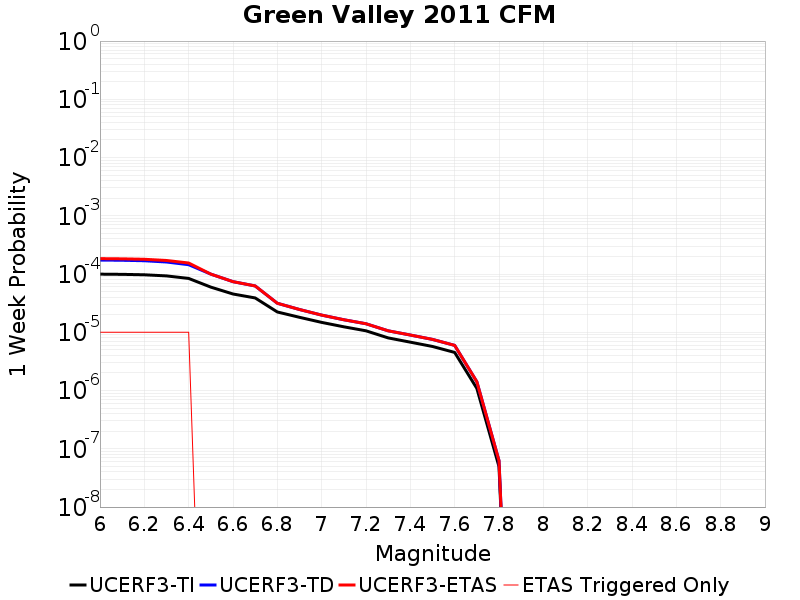 |  |  |  |

| Magnitude | 1 wk TI Prob | 1 wk TD Prob | 1 wk ETAS Prob | 1 wk ETAS/TD Gain | 1 wk ETAS Triggered Only | 1 mo TI Prob | 1 mo TD Prob | 1 mo ETAS Prob | 1 mo ETAS/TD Gain | 1 mo ETAS Triggered Only | 1 yr TI Prob | 1 yr TD Prob | 1 yr ETAS Prob | 1 yr ETAS/TD Gain | 1 yr ETAS Triggered Only | 10 yr TI Prob | 10 yr TD Prob | 10 yr ETAS Prob | 10 yr ETAS/TD Gain | 10 yr ETAS Triggered Only |
|-----|-----|-----|-----|-----|-----|-----|-----|-----|-----|-----|-----|-----|-----|-----|-----|-----|-----|-----|-----|-----|
| 6.0 | 9.938062E-5 | 1.7352535E-4 | 1.835236E-4 | 1.0576185 | 1.0E-5 | 4.2584742E-4 | 7.434561E-4 | 7.534487E-4 | 1.0134407 | 1.0E-5 | 0.0051723733 | 0.009012584 | 0.009022493 | 1.0010996 | 1.0E-5 | 0.050536286 | 0.08574862 | 0.085776046 | 1.0003198 | 3.0E-5 |
| 6.1 | 9.862786E-5 | 1.7208728E-4 | 1.8208557E-4 | 1.0581 | 1.0E-5 | 4.2262237E-4 | 7.372966E-4 | 7.472892E-4 | 1.013553 | 1.0E-5 | 0.005133294 | 0.008938213 | 0.008948123 | 1.0011088 | 1.0E-5 | 0.050163247 | 0.08507834 | 0.085105784 | 1.0003226 | 3.0E-5 |
| 6.2 | 9.695835E-5 | 1.6893646E-4 | 1.7893476E-4 | 1.0591838 | 1.0E-5 | 4.154696E-4 | 7.238014E-4 | 7.337942E-4 | 1.013806 | 1.0E-5 | 0.0050466163 | 0.008775335 | 0.008785247 | 1.0011295 | 1.0E-5 | 0.049335375 | 0.08360554 | 0.083633035 | 1.0003288 | 3.0E-5 |
| 6.3 | 9.274664E-5 | 1.6065962E-4 | 1.7065802E-4 | 1.0622334 | 1.0E-5 | 3.9742506E-4 | 6.883483E-4 | 6.983414E-4 | 1.0145175 | 1.0E-5 | 0.00482792 | 0.0083470475 | 0.008356964 | 1.001188 | 1.0E-5 | 0.047243692 | 0.07971518 | 0.07974278 | 1.0003463 | 3.0E-5 |
| 6.4 | 8.391499E-5 | 1.4441091E-4 | 1.5440947E-4 | 1.0692369 | 1.0E-5 | 3.595861E-4 | 6.187457E-4 | 6.287395E-4 | 1.0161518 | 1.0E-5 | 0.004369175 | 0.007506117 | 0.0075160423 | 1.0013223 | 1.0E-5 | 0.04284265 | 0.07199271 | 0.07201127 | 1.0002578 | 2.0E-5 |
| 6.5 | 5.9519385E-5 | 9.952112E-5 | 9.952112E-5 | 1.0 | 0.0 | 2.5505814E-4 | 4.264409E-4 | 4.264409E-4 | 1.0 | 0.0 | 0.0031009112 | 0.005178493 | 0.005178493 | 1.0 | 0.0 | 0.030579966 | 0.050253972 | 0.05026347 | 1.000189 | 1.0E-5 |
| 6.6 | 4.5361558E-5 | 7.3878015E-5 | 7.3878015E-5 | 1.0 | 0.0 | 1.9439218E-4 | 3.1657677E-4 | 3.1657677E-4 | 1.0 | 0.0 | 0.0023641558 | 0.0038466526 | 0.0038466526 | 1.0 | 0.0 | 0.023391623 | 0.037617598 | 0.037617598 | 1.0 | 0.0 |
| 6.7 | 3.8808106E-5 | 6.236445E-5 | 6.236445E-5 | 1.0 | 0.0 | 1.6630985E-4 | 2.672439E-4 | 2.672439E-4 | 1.0 | 0.0 | 0.0020229418 | 0.0032483516 | 0.0032483516 | 1.0 | 0.0 | 0.020046256 | 0.031891566 | 0.031891566 | 1.0 | 0.0 |
| 6.8 | 2.2284667E-5 | 3.1452462E-5 | 3.1452462E-5 | 1.0 | 0.0 | 9.550222E-5 | 1.347893E-4 | 1.347893E-4 | 1.0 | 0.0 | 0.0011621192 | 0.0016398237 | 0.0016398237 | 1.0 | 0.0 | 0.011560607 | 0.016253117 | 0.016253117 | 1.0 | 0.0 |
| 6.9 | 1.8050168E-5 | 2.4574709E-5 | 2.4574709E-5 | 1.0 | 0.0 | 7.735557E-5 | 1.05315965E-4 | 1.05315965E-4 | 1.0 | 0.0 | 9.4139716E-4 | 0.0012814703 | 0.0012814703 | 1.0 | 0.0 | 0.009374191 | 0.012732854 | 0.012732854 | 1.0 | 0.0 |
| 7.0 | 1.4763166E-5 | 1.9693196E-5 | 1.9693196E-5 | 1.0 | 0.0 | 6.326917E-5 | 8.43967E-5 | 8.43967E-5 | 1.0 | 0.0 | 7.7002996E-4 | 0.0010270467 | 0.0010270467 | 1.0 | 0.0 | 0.007673672 | 0.010221799 | 0.010221799 | 1.0 | 0.0 |
| 7.1 | 1.2399713E-5 | 1.6390279E-5 | 1.6390279E-5 | 1.0 | 0.0 | 5.3140546E-5 | 7.0242175E-5 | 7.0242175E-5 | 1.0 | 0.0 | 6.467941E-4 | 8.548649E-4 | 8.548649E-4 | 1.0 | 0.0 | 0.006449148 | 0.008515597 | 0.008515597 | 1.0 | 0.0 |
| 7.2 | 1.0584195E-5 | 1.3991741E-5 | 1.3991741E-5 | 1.0 | 0.0 | 4.5360044E-5 | 5.9963233E-5 | 5.9963233E-5 | 1.0 | 0.0 | 5.521186E-4 | 7.2980946E-4 | 7.2980946E-4 | 1.0 | 0.0 | 0.0055074887 | 0.0072746775 | 0.0072746775 | 1.0 | 0.0 |
| 7.3 | 7.998173E-6 | 1.0582663E-5 | 1.0582663E-5 | 1.0 | 0.0 | 3.4277433E-5 | 4.535349E-5 | 4.535349E-5 | 1.0 | 0.0 | 4.1724785E-4 | 5.520399E-4 | 5.520399E-4 | 1.0 | 0.0 | 0.004164653 | 0.0055070734 | 0.0055070734 | 1.0 | 0.0 |
| 7.4 | 6.7571127E-6 | 8.959359E-6 | 8.959359E-6 | 1.0 | 0.0 | 2.8958733E-5 | 3.839669E-5 | 3.839669E-5 | 1.0 | 0.0 | 3.5251552E-4 | 4.673804E-4 | 4.673804E-4 | 1.0 | 0.0 | 0.0035195686 | 0.0046641673 | 0.0046641673 | 1.0 | 0.0 |
| 7.5 | 5.69878E-6 | 7.5359458E-6 | 7.5359458E-6 | 1.0 | 0.0 | 2.4423114E-5 | 3.2296517E-5 | 3.2296517E-5 | 1.0 | 0.0 | 2.9731085E-4 | 3.9314E-4 | 3.9314E-4 | 1.0 | 0.0 | 0.002969134 | 0.003924675 | 0.003924675 | 1.0 | 0.0 |
| 7.6 | 4.503664E-6 | 5.950222E-6 | 5.950222E-6 | 1.0 | 0.0 | 1.9301275E-5 | 2.5500707E-5 | 2.5500707E-5 | 1.0 | 0.0 | 2.3496768E-4 | 3.104277E-4 | 3.104277E-4 | 1.0 | 0.0 | 0.002347194 | 0.0031000876 | 0.0031000876 | 1.0 | 0.0 |
| 7.7 | 1.0873546E-6 | 1.4147535E-6 | 1.4147535E-6 | 1.0 | 0.0 | 4.6600826E-6 | 6.063215E-6 | 6.063215E-6 | 1.0 | 0.0 | 5.6735033E-5 | 7.381717E-5 | 7.381717E-5 | 1.0 | 0.0 | 5.672055E-4 | 7.3792884E-4 | 7.3792884E-4 | 1.0 | 0.0 |
| 7.8 | 4.9373917E-8 | 6.242781E-8 | 6.242781E-8 | 1.0 | 0.0 | 2.1160248E-7 | 2.6754773E-7 | 2.6754773E-7 | 1.0 | 0.0 | 2.5762572E-6 | 3.25739E-6 | 3.25739E-6 | 1.0 | 0.0 | 2.5762274E-5 | 3.2567666E-5 | 3.2567666E-5 | 1.0 | 0.0 |

## Ortigalita (North)
*[(top)](#table-of-contents)*

| 1 Week | 1 Month | 1 Year | 10 Year |
|-----|-----|-----|-----|
| 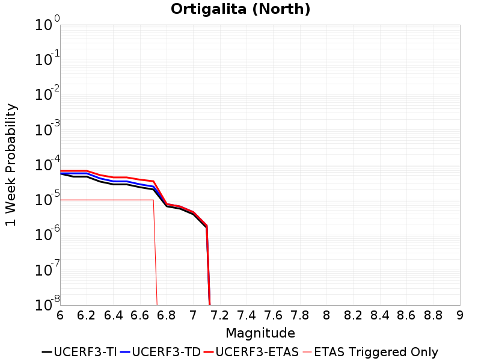 |  |  |  |

| Magnitude | 1 wk TI Prob | 1 wk TD Prob | 1 wk ETAS Prob | 1 wk ETAS/TD Gain | 1 wk ETAS Triggered Only | 1 mo TI Prob | 1 mo TD Prob | 1 mo ETAS Prob | 1 mo ETAS/TD Gain | 1 mo ETAS Triggered Only | 1 yr TI Prob | 1 yr TD Prob | 1 yr ETAS Prob | 1 yr ETAS/TD Gain | 1 yr ETAS Triggered Only | 10 yr TI Prob | 10 yr TD Prob | 10 yr ETAS Prob | 10 yr ETAS/TD Gain | 10 yr ETAS Triggered Only |
|-----|-----|-----|-----|-----|-----|-----|-----|-----|-----|-----|-----|-----|-----|-----|-----|-----|-----|-----|-----|-----|
| 6.0 | 5.620697E-5 | 5.7324185E-5 | 6.732361E-5 | 1.1744365 | 1.0E-5 | 2.4086477E-4 | 2.4565405E-4 | 2.556516E-4 | 1.0406977 | 1.0E-5 | 0.002928585 | 0.0029871243 | 0.0029970943 | 1.0033377 | 1.0E-5 | 0.028902901 | 0.029509468 | 0.029519172 | 1.0003289 | 1.0E-5 |
| 6.1 | 4.607858E-5 | 5.7324185E-5 | 6.732361E-5 | 1.1744365 | 1.0E-5 | 1.9746469E-4 | 2.4565405E-4 | 2.556516E-4 | 1.0406977 | 1.0E-5 | 0.0024014818 | 0.0029871243 | 0.0029970943 | 1.0033377 | 1.0E-5 | 0.023756953 | 0.029509468 | 0.029519172 | 1.0003289 | 1.0E-5 |
| 6.2 | 4.607858E-5 | 5.7324185E-5 | 6.732361E-5 | 1.1744365 | 1.0E-5 | 1.9746469E-4 | 2.4565405E-4 | 2.556516E-4 | 1.0406977 | 1.0E-5 | 0.0024014818 | 0.0029871243 | 0.0029970943 | 1.0033377 | 1.0E-5 | 0.023756953 | 0.029509468 | 0.029519172 | 1.0003289 | 1.0E-5 |
| 6.3 | 3.327423E-5 | 4.099137E-5 | 5.0990962E-5 | 1.2439438 | 1.0E-5 | 1.4259605E-4 | 1.7566672E-4 | 1.8566496E-4 | 1.056916 | 1.0E-5 | 0.0017347244 | 0.0021369013 | 0.00214688 | 1.0046697 | 1.0E-5 | 0.017212452 | 0.021189135 | 0.021198923 | 1.0004619 | 1.0E-5 |
| 6.4 | 2.7732503E-5 | 3.3812816E-5 | 4.3812477E-5 | 1.2957358 | 1.0E-5 | 1.1884817E-4 | 1.4490532E-4 | 1.5490387E-4 | 1.0690006 | 1.0E-5 | 0.001446016 | 0.001763024 | 0.0017730064 | 1.0056621 | 1.0E-5 | 0.014366428 | 0.017513044 | 0.017522868 | 1.000561 | 1.0E-5 |
| 6.5 | 2.7689714E-5 | 3.3762735E-5 | 4.3762397E-5 | 1.2961745 | 1.0E-5 | 1.186648E-4 | 1.4469071E-4 | 1.5468926E-4 | 1.0691029 | 1.0E-5 | 0.0014437864 | 0.0017604154 | 0.0017703978 | 1.0056704 | 1.0E-5 | 0.014344421 | 0.01748737 | 0.017497193 | 1.0005618 | 1.0E-5 |
| 6.6 | 2.2976905E-5 | 2.7761793E-5 | 3.7761514E-5 | 1.3601973 | 1.0E-5 | 9.846873E-5 | 1.1897496E-4 | 1.2897377E-4 | 1.0840414 | 1.0E-5 | 0.0011981975 | 0.00144778 | 0.0014577656 | 1.0068971 | 1.0E-5 | 0.011917574 | 0.014405417 | 0.0144152725 | 1.0006841 | 1.0E-5 |
| 6.7 | 1.9871539E-5 | 2.4054316E-5 | 3.4054076E-5 | 1.4157158 | 1.0E-5 | 8.516096E-5 | 1.030871E-4 | 1.1308607E-4 | 1.0969954 | 1.0E-5 | 0.0010363415 | 0.0012545832 | 0.0012645707 | 1.0079608 | 1.0E-5 | 0.010315218 | 0.012496683 | 0.012506559 | 1.0007902 | 1.0E-5 |
| 6.8 | 6.5640475E-6 | 7.5848156E-6 | 7.5848156E-6 | 1.0 | 0.0 | 2.813133E-5 | 3.2505966E-5 | 3.2505966E-5 | 1.0 | 0.0 | 3.424451E-4 | 3.9569108E-4 | 3.9569108E-4 | 1.0 | 0.0 | 0.0034191788 | 0.00395015 | 0.00395015 | 1.0 | 0.0 |
| 6.9 | 5.6219683E-6 | 6.482988E-6 | 6.482988E-6 | 1.0 | 0.0 | 2.4093928E-5 | 2.7783952E-5 | 2.7783952E-5 | 1.0 | 0.0 | 2.933041E-4 | 3.382197E-4 | 3.382197E-4 | 1.0 | 0.0 | 0.0029291727 | 0.0033773042 | 0.0033773042 | 1.0 | 0.0 |
| 7.0 | 3.875591E-6 | 4.466295E-6 | 4.466295E-6 | 1.0 | 0.0 | 1.6609569E-5 | 1.9141136E-5 | 1.9141136E-5 | 1.0 | 0.0 | 2.0220275E-4 | 2.330205E-4 | 2.330205E-4 | 1.0 | 0.0 | 0.0020201886 | 0.0023279677 | 0.0023279677 | 1.0 | 0.0 |
| 7.1 | 1.6017933E-6 | 1.8457472E-6 | 1.8457472E-6 | 1.0 | 0.0 | 6.8648105E-6 | 7.910327E-6 | 7.910327E-6 | 1.0 | 0.0 | 8.357586E-5 | 9.630503E-5 | 9.630503E-5 | 1.0 | 0.0 | 8.3544437E-4 | 9.627362E-4 | 9.627362E-4 | 1.0 | 0.0 |

## Great Valley 07 (Orestimba)
*[(top)](#table-of-contents)*

| 1 Week | 1 Month | 1 Year | 10 Year |
|-----|-----|-----|-----|
|  |  |  |  |

| Magnitude | 1 wk TI Prob | 1 wk TD Prob | 1 wk ETAS Prob | 1 wk ETAS/TD Gain | 1 wk ETAS Triggered Only | 1 mo TI Prob | 1 mo TD Prob | 1 mo ETAS Prob | 1 mo ETAS/TD Gain | 1 mo ETAS Triggered Only | 1 yr TI Prob | 1 yr TD Prob | 1 yr ETAS Prob | 1 yr ETAS/TD Gain | 1 yr ETAS Triggered Only | 10 yr TI Prob | 10 yr TD Prob | 10 yr ETAS Prob | 10 yr ETAS/TD Gain | 10 yr ETAS Triggered Only |
|-----|-----|-----|-----|-----|-----|-----|-----|-----|-----|-----|-----|-----|-----|-----|-----|-----|-----|-----|-----|-----|
| 6.0 | 2.718083E-5 | 2.9644152E-5 | 3.9643855E-5 | 1.3373246 | 1.0E-5 | 1.1648407E-4 | 1.2704045E-4 | 1.3703917E-4 | 1.0787051 | 1.0E-5 | 0.0014172709 | 0.0015456673 | 0.0015556518 | 1.0064597 | 1.0E-5 | 0.01408266 | 0.015354181 | 0.0153738735 | 1.0012826 | 2.0E-5 |
| 6.1 | 2.718083E-5 | 2.9644152E-5 | 3.9643855E-5 | 1.3373246 | 1.0E-5 | 1.1648407E-4 | 1.2704045E-4 | 1.3703917E-4 | 1.0787051 | 1.0E-5 | 0.0014172709 | 0.0015456673 | 0.0015556518 | 1.0064597 | 1.0E-5 | 0.01408266 | 0.015354181 | 0.0153738735 | 1.0012826 | 2.0E-5 |
| 6.2 | 1.9231524E-5 | 2.0964339E-5 | 3.096413E-5 | 1.4769905 | 1.0E-5 | 8.2418206E-5 | 8.9844194E-5 | 9.9843295E-5 | 1.1112938 | 1.0E-5 | 0.0010029797 | 0.0010933267 | 0.0011033157 | 1.0091364 | 1.0E-5 | 0.00998465 | 0.010881825 | 0.010901608 | 1.001818 | 2.0E-5 |
| 6.3 | 1.324766E-5 | 1.4431825E-5 | 2.443168E-5 | 1.692903 | 1.0E-5 | 5.6774446E-5 | 6.184926E-5 | 7.184864E-5 | 1.1616734 | 1.0E-5 | 6.910097E-4 | 7.527636E-4 | 7.6275604E-4 | 1.0132744 | 1.0E-5 | 0.006888649 | 0.0075030634 | 0.0075229136 | 1.0026456 | 2.0E-5 |
| 6.4 | 7.818645E-6 | 8.51264E-6 | 8.51264E-6 | 1.0 | 0.0 | 3.3508048E-5 | 3.6482255E-5 | 3.6482255E-5 | 1.0 | 0.0 | 4.078841E-4 | 4.4408423E-4 | 4.4408423E-4 | 1.0 | 0.0 | 0.004071363 | 0.004432303 | 0.0044422583 | 1.0022461 | 1.0E-5 |
| 6.5 | 5.3076565E-6 | 5.778286E-6 | 5.778286E-6 | 1.0 | 0.0 | 2.27469E-5 | 2.4763858E-5 | 2.4763858E-5 | 1.0 | 0.0 | 2.7690834E-4 | 3.0146033E-4 | 3.0146033E-4 | 1.0 | 0.0 | 0.0027656353 | 0.00301072 | 0.00302069 | 1.0033115 | 1.0E-5 |
| 6.6 | 3.6003578E-6 | 3.920605E-6 | 3.920605E-6 | 1.0 | 0.0 | 1.5430012E-5 | 1.6802494E-5 | 1.6802494E-5 | 1.0 | 0.0 | 1.8784421E-4 | 2.045527E-4 | 2.045527E-4 | 1.0 | 0.0 | 0.0018768552 | 0.002043796 | 0.002043796 | 1.0 | 0.0 |
| 6.7 | 2.5361826E-6 | 2.7626938E-6 | 2.7626938E-6 | 1.0 | 0.0 | 1.0869308E-5 | 1.184007E-5 | 1.184007E-5 | 1.0 | 0.0 | 1.3232579E-4 | 1.4414462E-4 | 1.4414462E-4 | 1.0 | 0.0 | 0.0013224703 | 0.0014406391 | 0.0014406391 | 1.0 | 0.0 |
| 6.8 | 1.2115831E-6 | 1.3201102E-6 | 1.3201102E-6 | 1.0 | 0.0 | 5.1924885E-6 | 5.657608E-6 | 5.657608E-6 | 1.0 | 0.0 | 6.3216714E-5 | 6.888015E-5 | 6.888015E-5 | 1.0 | 0.0 | 6.3198735E-4 | 6.886815E-4 | 6.886815E-4 | 1.0 | 0.0 |

## Great Valley 09 (Laguna Seca)
*[(top)](#table-of-contents)*

| 1 Week | 1 Month | 1 Year | 10 Year |
|-----|-----|-----|-----|
|  | 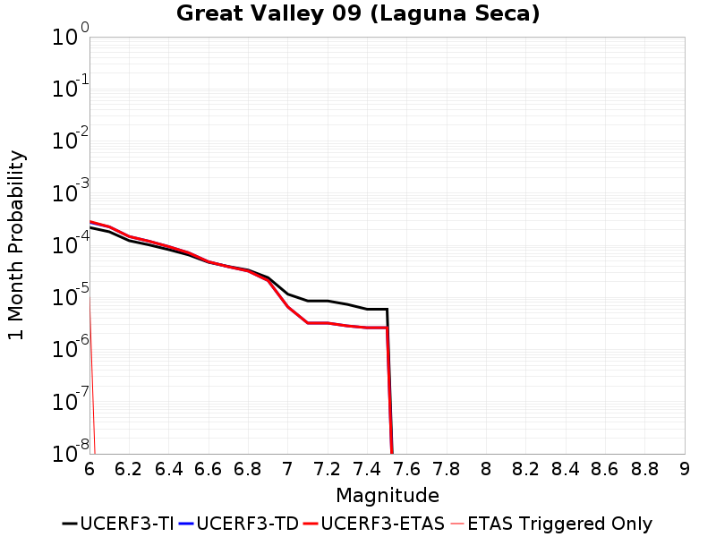 | 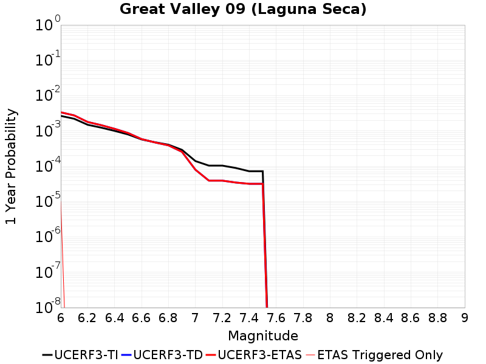 |  |

| Magnitude | 1 wk TI Prob | 1 wk TD Prob | 1 wk ETAS Prob | 1 wk ETAS/TD Gain | 1 wk ETAS Triggered Only | 1 mo TI Prob | 1 mo TD Prob | 1 mo ETAS Prob | 1 mo ETAS/TD Gain | 1 mo ETAS Triggered Only | 1 yr TI Prob | 1 yr TD Prob | 1 yr ETAS Prob | 1 yr ETAS/TD Gain | 1 yr ETAS Triggered Only | 10 yr TI Prob | 10 yr TD Prob | 10 yr ETAS Prob | 10 yr ETAS/TD Gain | 10 yr ETAS Triggered Only |
|-----|-----|-----|-----|-----|-----|-----|-----|-----|-----|-----|-----|-----|-----|-----|-----|-----|-----|-----|-----|-----|
| 6.0 | 5.0995786E-5 | 6.433955E-5 | 7.43389E-5 | 1.1554154 | 1.0E-5 | 2.1853506E-4 | 2.7571214E-4 | 2.857094E-4 | 1.0362598 | 1.0E-5 | 0.002657418 | 0.003351754 | 0.0033617206 | 1.0029736 | 1.0E-5 | 0.026258636 | 0.033026554 | 0.03304589 | 1.0005856 | 2.0E-5 |
| 6.1 | 4.2256117E-5 | 5.2580555E-5 | 5.2580555E-5 | 1.0 | 0.0 | 1.8108507E-4 | 2.2532557E-4 | 2.2532557E-4 | 1.0 | 0.0 | 0.0022024813 | 0.0027399631 | 0.0027399631 | 1.0 | 0.0 | 0.0218078 | 0.027069341 | 0.027079072 | 1.0003594 | 1.0E-5 |
| 6.2 | 2.8536782E-5 | 3.4259054E-5 | 3.4259054E-5 | 1.0 | 0.0 | 1.2229476E-4 | 1.4681602E-4 | 1.4681602E-4 | 1.0 | 0.0 | 0.0014879217 | 0.0017860403 | 0.0017860403 | 1.0 | 0.0 | 0.014779986 | 0.017718581 | 0.017728405 | 1.0005543 | 1.0E-5 |
| 6.3 | 2.3698774E-5 | 2.7879625E-5 | 2.7879625E-5 | 1.0 | 0.0 | 1.01562226E-4 | 1.1947827E-4 | 1.1947827E-4 | 1.0 | 0.0 | 0.0012358186 | 0.0014536923 | 0.0014536923 | 1.0 | 0.0 | 0.012289686 | 0.014443124 | 0.014452979 | 1.0006824 | 1.0E-5 |
| 6.4 | 1.9191197E-5 | 2.1919372E-5 | 2.1919372E-5 | 1.0 | 0.0 | 8.2245395E-5 | 9.393686E-5 | 9.393686E-5 | 1.0 | 0.0 | 0.0010008777 | 0.0011430989 | 0.0011430989 | 1.0 | 0.0 | 0.009963818 | 0.011373853 | 0.01138374 | 1.0008692 | 1.0E-5 |
| 6.5 | 1.5203241E-5 | 1.6703425E-5 | 1.6703425E-5 | 1.0 | 0.0 | 6.5155116E-5 | 7.1584305E-5 | 7.1584305E-5 | 1.0 | 0.0 | 7.9297484E-4 | 8.712104E-4 | 8.712104E-4 | 1.0 | 0.0 | 0.007901512 | 0.008679802 | 0.008679802 | 1.0 | 0.0 |
| 6.6 | 1.0984925E-5 | 1.1245169E-5 | 1.1245169E-5 | 1.0 | 0.0 | 4.70774E-5 | 4.8192705E-5 | 4.8192705E-5 | 1.0 | 0.0 | 5.730166E-4 | 5.865921E-4 | 5.865921E-4 | 1.0 | 0.0 | 0.005715413 | 0.0058508352 | 0.0058508352 | 1.0 | 0.0 |
| 6.7 | 9.134616E-6 | 9.027869E-6 | 9.027869E-6 | 1.0 | 0.0 | 3.9147766E-5 | 3.8690305E-5 | 3.8690305E-5 | 1.0 | 0.0 | 4.7651984E-4 | 4.7095504E-4 | 4.7095504E-4 | 1.0 | 0.0 | 0.004754993 | 0.0046998146 | 0.0046998146 | 1.0 | 0.0 |
| 6.8 | 7.785589E-6 | 7.458635E-6 | 7.458635E-6 | 1.0 | 0.0 | 3.3366385E-5 | 3.19652E-5 | 3.19652E-5 | 1.0 | 0.0 | 4.0616E-4 | 3.891088E-4 | 3.891088E-4 | 1.0 | 0.0 | 0.0040541845 | 0.003884479 | 0.003884479 | 1.0 | 0.0 |
| 6.9 | 5.579095E-6 | 4.9029823E-6 | 4.9029823E-6 | 1.0 | 0.0 | 2.3910188E-5 | 2.101262E-5 | 2.101262E-5 | 1.0 | 0.0 | 2.9106764E-4 | 2.558E-4 | 2.558E-4 | 1.0 | 0.0 | 0.002906867 | 0.002555193 | 0.002555193 | 1.0 | 0.0 |
| 7.0 | 2.6816688E-6 | 1.5264371E-6 | 1.5264371E-6 | 1.0 | 0.0 | 1.1492816E-5 | 6.5418576E-6 | 6.5418576E-6 | 1.0 | 0.0 | 1.3991605E-4 | 7.964429E-5 | 7.964429E-5 | 1.0 | 0.0 | 0.0013982799 | 7.9616625E-4 | 7.9616625E-4 | 1.0 | 0.0 |
| 7.1 | 1.9951021E-6 | 7.4980596E-7 | 7.4980596E-7 | 1.0 | 0.0 | 8.55041E-6 | 3.2134503E-6 | 3.2134503E-6 | 1.0 | 0.0 | 1.0409627E-4 | 3.91231E-5 | 3.91231E-5 | 1.0 | 0.0 | 0.0010404752 | 3.911663E-4 | 3.911663E-4 | 1.0 | 0.0 |
| 7.2 | 1.9951021E-6 | 7.4980596E-7 | 7.4980596E-7 | 1.0 | 0.0 | 8.55041E-6 | 3.2134503E-6 | 3.2134503E-6 | 1.0 | 0.0 | 1.0409627E-4 | 3.91231E-5 | 3.91231E-5 | 1.0 | 0.0 | 0.0010404752 | 3.911663E-4 | 3.911663E-4 | 1.0 | 0.0 |
| 7.3 | 1.7087556E-6 | 6.6153854E-7 | 6.6153854E-7 | 1.0 | 0.0 | 7.3232177E-6 | 2.8351624E-6 | 2.8351624E-6 | 1.0 | 0.0 | 8.915652E-5 | 3.4517598E-5 | 3.4517598E-5 | 1.0 | 0.0 | 8.9120766E-4 | 3.4512643E-4 | 3.4512643E-4 | 1.0 | 0.0 |
| 7.4 | 1.3804846E-6 | 6.103747E-7 | 6.103747E-7 | 1.0 | 0.0 | 5.916349E-6 | 2.6158891E-6 | 2.6158891E-6 | 1.0 | 0.0 | 7.2029165E-5 | 3.1848027E-5 | 3.1848027E-5 | 1.0 | 0.0 | 7.200583E-4 | 3.1843866E-4 | 3.1843866E-4 | 1.0 | 0.0 |
| 7.5 | 1.3804846E-6 | 6.103747E-7 | 6.103747E-7 | 1.0 | 0.0 | 5.916349E-6 | 2.6158891E-6 | 2.6158891E-6 | 1.0 | 0.0 | 7.2029165E-5 | 3.1848027E-5 | 3.1848027E-5 | 1.0 | 0.0 | 7.200583E-4 | 3.1843866E-4 | 3.1843866E-4 | 1.0 | 0.0 |

## Concord 2011 CFM
*[(top)](#table-of-contents)*

| 1 Week | 1 Month | 1 Year | 10 Year |
|-----|-----|-----|-----|
|  |  | 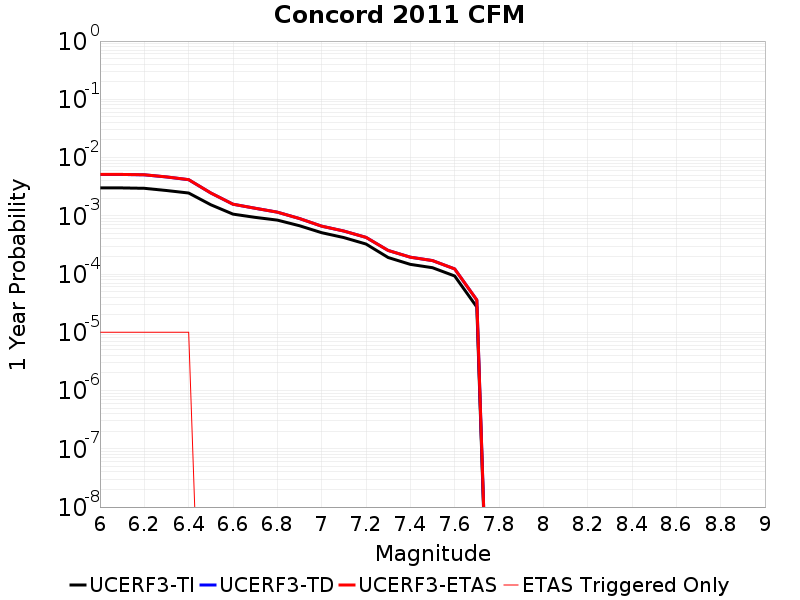 | 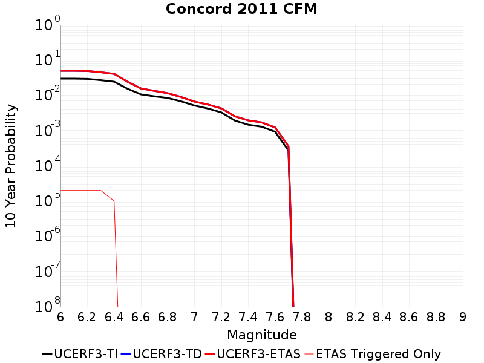 |

| Magnitude | 1 wk TI Prob | 1 wk TD Prob | 1 wk ETAS Prob | 1 wk ETAS/TD Gain | 1 wk ETAS Triggered Only | 1 mo TI Prob | 1 mo TD Prob | 1 mo ETAS Prob | 1 mo ETAS/TD Gain | 1 mo ETAS Triggered Only | 1 yr TI Prob | 1 yr TD Prob | 1 yr ETAS Prob | 1 yr ETAS/TD Gain | 1 yr ETAS Triggered Only | 10 yr TI Prob | 10 yr TD Prob | 10 yr ETAS Prob | 10 yr ETAS/TD Gain | 10 yr ETAS Triggered Only |
|-----|-----|-----|-----|-----|-----|-----|-----|-----|-----|-----|-----|-----|-----|-----|-----|-----|-----|-----|-----|-----|
| 6.0 | 5.765594E-5 | 9.821352E-5 | 1.0821254E-4 | 1.101809 | 1.0E-5 | 2.4707348E-4 | 4.2085114E-4 | 4.3084694E-4 | 1.0237514 | 1.0E-5 | 0.0030039703 | 0.0051123295 | 0.0051222784 | 1.0019461 | 1.0E-5 | 0.029636865 | 0.049542706 | 0.049561717 | 1.0003837 | 2.0E-5 |
| 6.1 | 5.765594E-5 | 9.821352E-5 | 1.0821254E-4 | 1.101809 | 1.0E-5 | 2.4707348E-4 | 4.2085114E-4 | 4.3084694E-4 | 1.0237514 | 1.0E-5 | 0.0030039703 | 0.0051123295 | 0.0051222784 | 1.0019461 | 1.0E-5 | 0.029636865 | 0.049542706 | 0.049561717 | 1.0003837 | 2.0E-5 |
| 6.2 | 5.678553E-5 | 9.68565E-5 | 1.06855536E-4 | 1.1032355 | 1.0E-5 | 2.4334386E-4 | 4.1503814E-4 | 4.2503397E-4 | 1.0240842 | 1.0E-5 | 0.0029586866 | 0.0050419373 | 0.005051887 | 1.0019734 | 1.0E-5 | 0.029196035 | 0.048875466 | 0.048894487 | 1.0003892 | 2.0E-5 |
| 6.3 | 5.20309E-5 | 8.898985E-5 | 9.898897E-5 | 1.1123624 | 1.0E-5 | 2.2297051E-4 | 3.8133384E-4 | 3.9133005E-4 | 1.0262138 | 1.0E-5 | 0.0027112865 | 0.0046336586 | 0.004643612 | 1.0021482 | 1.0E-5 | 0.026784448 | 0.044996537 | 0.045015637 | 1.0004245 | 2.0E-5 |
| 6.4 | 4.7120942E-5 | 7.982079E-5 | 8.9819994E-5 | 1.1252706 | 1.0E-5 | 2.0193127E-4 | 3.4204853E-4 | 3.520451E-4 | 1.0292256 | 1.0E-5 | 0.0024557412 | 0.0041572517 | 0.0041672103 | 1.0023954 | 1.0E-5 | 0.024287801 | 0.04047405 | 0.040483646 | 1.0002371 | 1.0E-5 |
| 6.5 | 2.9598437E-5 | 4.7155423E-5 | 4.7155423E-5 | 1.0 | 0.0 | 1.2684427E-4 | 2.0208023E-4 | 2.0208023E-4 | 1.0 | 0.0 | 0.001543235 | 0.0024577666 | 0.0024577666 | 1.0 | 0.0 | 0.015325619 | 0.024145655 | 0.024145655 | 1.0 | 0.0 |
| 6.6 | 2.0443718E-5 | 3.0259993E-5 | 3.0259993E-5 | 1.0 | 0.0 | 8.7613E-5 | 1.2967945E-4 | 1.2967945E-4 | 1.0 | 0.0 | 0.0010661662 | 0.001577741 | 0.001577741 | 1.0 | 0.0 | 0.010610655 | 0.015605551 | 0.015605551 | 1.0 | 0.0 |
| 6.7 | 1.798539E-5 | 2.5786094E-5 | 2.5786094E-5 | 1.0 | 0.0 | 7.7077966E-5 | 1.1050727E-4 | 1.1050727E-4 | 1.0 | 0.0 | 9.380202E-4 | 0.0013446178 | 0.0013446178 | 1.0 | 0.0 | 0.009340706 | 0.013333193 | 0.013333193 | 1.0 | 0.0 |
| 6.8 | 1.613555E-5 | 2.2099335E-5 | 2.2099335E-5 | 1.0 | 0.0 | 6.915052E-5 | 9.470808E-5 | 9.470808E-5 | 1.0 | 0.0 | 8.4158237E-4 | 0.001152475 | 0.001152475 | 1.0 | 0.0 | 0.008384023 | 0.011450763 | 0.011450763 | 1.0 | 0.0 |
| 6.9 | 1.2916435E-5 | 1.7166774E-5 | 1.7166774E-5 | 1.0 | 0.0 | 5.5354973E-5 | 7.356985E-5 | 7.356985E-5 | 1.0 | 0.0 | 6.7373837E-4 | 8.9535065E-4 | 8.9535065E-4 | 1.0 | 0.0 | 0.006716994 | 0.008911367 | 0.008911367 | 1.0 | 0.0 |
| 7.0 | 9.81129E-6 | 1.2701575E-5 | 1.2701575E-5 | 1.0 | 0.0 | 4.2047708E-5 | 5.4434193E-5 | 5.4434193E-5 | 1.0 | 0.0 | 5.118106E-4 | 6.625364E-4 | 6.625364E-4 | 1.0 | 0.0 | 0.005106334 | 0.00660536 | 0.00660536 | 1.0 | 0.0 |
| 7.1 | 8.0889195E-6 | 1.0471377E-5 | 1.0471377E-5 | 1.0 | 0.0 | 3.4666336E-5 | 4.4876564E-5 | 4.4876564E-5 | 1.0 | 0.0 | 4.219809E-4 | 5.462363E-4 | 5.462363E-4 | 1.0 | 0.0 | 0.004211805 | 0.0054487605 | 0.0054487605 | 1.0 | 0.0 |
| 7.2 | 6.267438E-6 | 8.154199E-6 | 8.154199E-6 | 1.0 | 0.0 | 2.6860173E-5 | 3.4946104E-5 | 3.4946104E-5 | 1.0 | 0.0 | 3.2697353E-4 | 4.253865E-4 | 4.253865E-4 | 1.0 | 0.0 | 0.0032649285 | 0.0042461376 | 0.0042461376 | 1.0 | 0.0 |
| 7.3 | 3.6761196E-6 | 4.860928E-6 | 4.860928E-6 | 1.0 | 0.0 | 1.5754704E-5 | 2.0832385E-5 | 2.0832385E-5 | 1.0 | 0.0 | 1.9179663E-4 | 2.53605E-4 | 2.53605E-4 | 1.0 | 0.0 | 0.0019163118 | 0.002533429 | 0.002533429 | 1.0 | 0.0 |
| 7.4 | 2.8044356E-6 | 3.724007E-6 | 3.724007E-6 | 1.0 | 0.0 | 1.2018954E-5 | 1.5959933E-5 | 1.5959933E-5 | 1.0 | 0.0 | 1.4632095E-4 | 1.9429497E-4 | 1.9429497E-4 | 1.0 | 0.0 | 0.0014622464 | 0.0019413842 | 0.0019413842 | 1.0 | 0.0 |
| 7.5 | 2.4578699E-6 | 3.2568157E-6 | 3.2568157E-6 | 1.0 | 0.0 | 1.0533685E-5 | 1.3957708E-5 | 1.3957708E-5 | 1.0 | 0.0 | 1.2824008E-4 | 1.6992196E-4 | 1.6992196E-4 | 1.0 | 0.0 | 0.0012816609 | 0.0016979921 | 0.0016979921 | 1.0 | 0.0 |
| 7.6 | 1.7713267E-6 | 2.3434977E-6 | 2.3434977E-6 | 1.0 | 0.0 | 7.591378E-6 | 1.0043524E-5 | 1.0043524E-5 | 1.0 | 0.0 | 9.2421105E-5 | 1.2227314E-4 | 1.2227314E-4 | 1.0 | 0.0 | 9.2382677E-4 | 0.0012220967 | 0.0012220967 | 1.0 | 0.0 |
| 7.7 | 5.1912366E-7 | 6.8454926E-7 | 6.8454926E-7 | 1.0 | 0.0 | 2.2248137E-6 | 2.9337793E-6 | 2.9337793E-6 | 1.0 | 0.0 | 2.708677E-5 | 3.571819E-5 | 3.571819E-5 | 1.0 | 0.0 | 2.708347E-4 | 3.5712414E-4 | 3.5712414E-4 | 1.0 | 0.0 |

## Great Valley 06 (Midland) 2011 CFM alt1
*[(top)](#table-of-contents)*

| 1 Week | 1 Month | 1 Year | 10 Year |
|-----|-----|-----|-----|
| 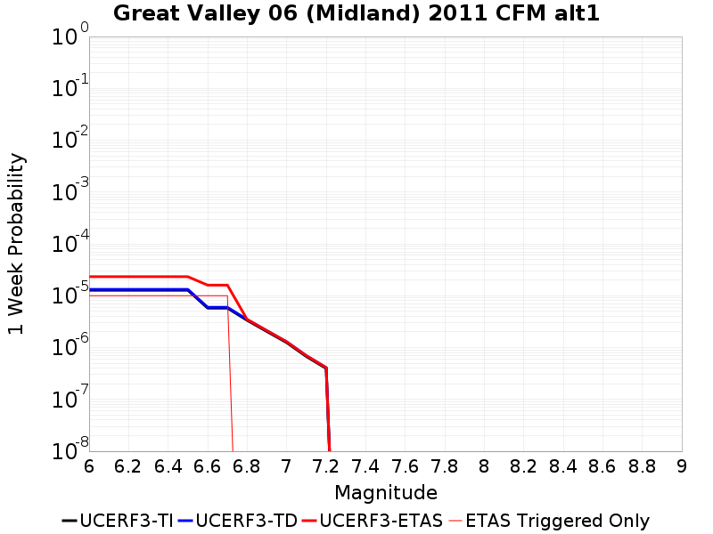 |  |  |  |

| Magnitude | 1 wk TI Prob | 1 wk TD Prob | 1 wk ETAS Prob | 1 wk ETAS/TD Gain | 1 wk ETAS Triggered Only | 1 mo TI Prob | 1 mo TD Prob | 1 mo ETAS Prob | 1 mo ETAS/TD Gain | 1 mo ETAS Triggered Only | 1 yr TI Prob | 1 yr TD Prob | 1 yr ETAS Prob | 1 yr ETAS/TD Gain | 1 yr ETAS Triggered Only | 10 yr TI Prob | 10 yr TD Prob | 10 yr ETAS Prob | 10 yr ETAS/TD Gain | 10 yr ETAS Triggered Only |
|-----|-----|-----|-----|-----|-----|-----|-----|-----|-----|-----|-----|-----|-----|-----|-----|-----|-----|-----|-----|-----|
| 6.0 | 1.2712525E-5 | 1.3231041E-5 | 2.3230908E-5 | 1.7557884 | 1.0E-5 | 5.4481112E-5 | 5.670337E-5 | 6.670281E-5 | 1.1763463 | 1.0E-5 | 6.6310563E-4 | 6.9017033E-4 | 7.101565E-4 | 1.0289583 | 2.0E-5 | 0.0066113044 | 0.006882793 | 0.006902655 | 1.0028858 | 2.0E-5 |
| 6.1 | 1.2712525E-5 | 1.3231041E-5 | 2.3230908E-5 | 1.7557884 | 1.0E-5 | 5.4481112E-5 | 5.670337E-5 | 6.670281E-5 | 1.1763463 | 1.0E-5 | 6.6310563E-4 | 6.9017033E-4 | 7.101565E-4 | 1.0289583 | 2.0E-5 | 0.0066113044 | 0.006882793 | 0.006902655 | 1.0028858 | 2.0E-5 |
| 6.2 | 1.2712525E-5 | 1.3231041E-5 | 2.3230908E-5 | 1.7557884 | 1.0E-5 | 5.4481112E-5 | 5.670337E-5 | 6.670281E-5 | 1.1763463 | 1.0E-5 | 6.6310563E-4 | 6.9017033E-4 | 7.101565E-4 | 1.0289583 | 2.0E-5 | 0.0066113044 | 0.006882793 | 0.006902655 | 1.0028858 | 2.0E-5 |
| 6.3 | 1.2712525E-5 | 1.3231041E-5 | 2.3230908E-5 | 1.7557884 | 1.0E-5 | 5.4481112E-5 | 5.670337E-5 | 6.670281E-5 | 1.1763463 | 1.0E-5 | 6.6310563E-4 | 6.9017033E-4 | 7.101565E-4 | 1.0289583 | 2.0E-5 | 0.0066113044 | 0.006882793 | 0.006902655 | 1.0028858 | 2.0E-5 |
| 6.4 | 1.2712525E-5 | 1.3231041E-5 | 2.3230908E-5 | 1.7557884 | 1.0E-5 | 5.4481112E-5 | 5.670337E-5 | 6.670281E-5 | 1.1763463 | 1.0E-5 | 6.6310563E-4 | 6.9017033E-4 | 7.101565E-4 | 1.0289583 | 2.0E-5 | 0.0066113044 | 0.006882793 | 0.006902655 | 1.0028858 | 2.0E-5 |
| 6.5 | 1.2712525E-5 | 1.3231041E-5 | 2.3230908E-5 | 1.7557884 | 1.0E-5 | 5.4481112E-5 | 5.670337E-5 | 6.670281E-5 | 1.1763463 | 1.0E-5 | 6.6310563E-4 | 6.9017033E-4 | 7.101565E-4 | 1.0289583 | 2.0E-5 | 0.0066113044 | 0.006882793 | 0.006902655 | 1.0028858 | 2.0E-5 |
| 6.6 | 5.7574384E-6 | 5.979386E-6 | 1.5979325E-5 | 2.6724026 | 1.0E-5 | 2.4674504E-5 | 2.562571E-5 | 3.5625453E-5 | 1.390223 | 1.0E-5 | 3.0037065E-4 | 3.119523E-4 | 3.2194916E-4 | 1.0320462 | 1.0E-5 | 0.0029996498 | 0.0031155315 | 0.0031255004 | 1.0031997 | 1.0E-5 |
| 6.7 | 5.7574384E-6 | 5.979386E-6 | 1.5979325E-5 | 2.6724026 | 1.0E-5 | 2.4674504E-5 | 2.562571E-5 | 3.5625453E-5 | 1.390223 | 1.0E-5 | 3.0037065E-4 | 3.119523E-4 | 3.2194916E-4 | 1.0320462 | 1.0E-5 | 0.0029996498 | 0.0031155315 | 0.0031255004 | 1.0031997 | 1.0E-5 |
| 6.8 | 3.3474828E-6 | 3.4743782E-6 | 3.4743782E-6 | 1.0 | 0.0 | 1.4346277E-5 | 1.4890116E-5 | 1.4890116E-5 | 1.0 | 0.0 | 1.7465191E-4 | 1.8127357E-4 | 1.8127357E-4 | 1.0 | 0.0 | 0.0017451472 | 0.0018114046 | 0.0018114046 | 1.0 | 0.0 |
| 6.9 | 2.035106E-6 | 2.1120636E-6 | 2.1120636E-6 | 1.0 | 0.0 | 8.721853E-6 | 9.051674E-6 | 9.051674E-6 | 1.0 | 0.0 | 1.0618339E-4 | 1.101993E-4 | 1.101993E-4 | 1.0 | 0.0 | 0.0010613267 | 0.001101519 | 0.001101519 | 1.0 | 0.0 |
| 7.0 | 1.2424716E-6 | 1.2897362E-6 | 1.2897362E-6 | 1.0 | 0.0 | 5.3248673E-6 | 5.527432E-6 | 5.527432E-6 | 1.0 | 0.0 | 6.482833E-5 | 6.729486E-5 | 6.729486E-5 | 1.0 | 0.0 | 6.480942E-4 | 6.727893E-4 | 6.727893E-4 | 1.0 | 0.0 |
| 7.1 | 6.6904556E-7 | 6.9492245E-7 | 6.9492245E-7 | 1.0 | 0.0 | 2.867335E-6 | 2.978237E-6 | 2.978237E-6 | 1.0 | 0.0 | 3.4909244E-5 | 3.6259695E-5 | 3.6259695E-5 | 1.0 | 0.0 | 3.490376E-4 | 3.6256335E-4 | 3.6256335E-4 | 1.0 | 0.0 |
| 7.2 | 3.948168E-7 | 4.101754E-7 | 4.101754E-7 | 1.0 | 0.0 | 1.6920709E-6 | 1.7578946E-6 | 1.7578946E-6 | 1.0 | 0.0 | 2.0600768E-5 | 2.1402368E-5 | 2.1402368E-5 | 1.0 | 0.0 | 2.0598859E-4 | 2.1402366E-4 | 2.1402366E-4 | 1.0 | 0.0 |

## San Andreas (Santa Cruz Mts) 2011 CFM
*[(top)](#table-of-contents)*

| 1 Week | 1 Month | 1 Year | 10 Year |
|-----|-----|-----|-----|
|  | 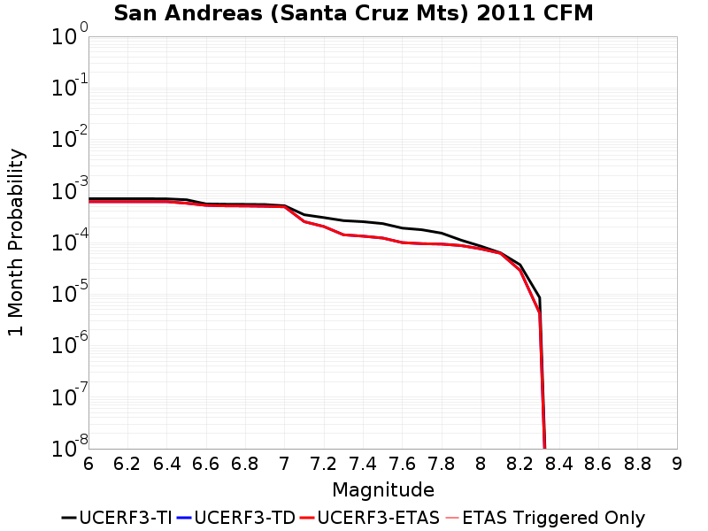 | 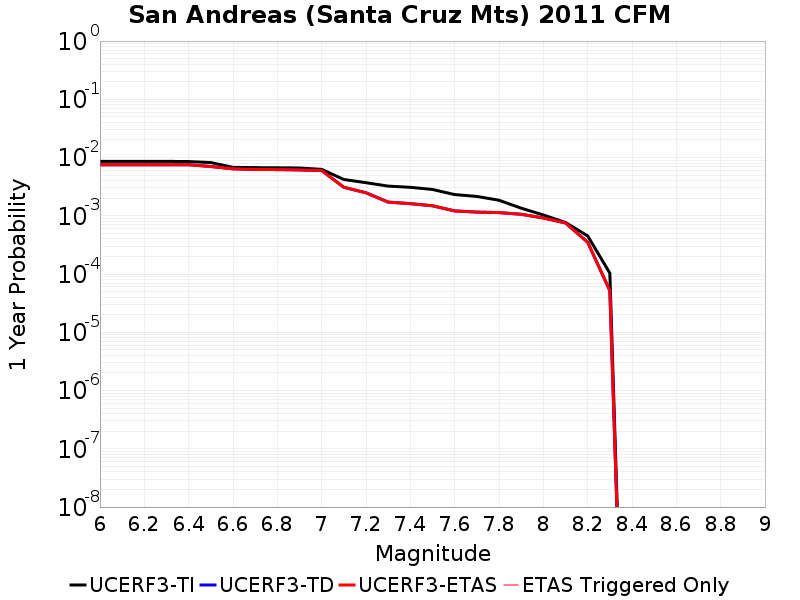 |  |

| Magnitude | 1 wk TI Prob | 1 wk TD Prob | 1 wk ETAS Prob | 1 wk ETAS/TD Gain | 1 wk ETAS Triggered Only | 1 mo TI Prob | 1 mo TD Prob | 1 mo ETAS Prob | 1 mo ETAS/TD Gain | 1 mo ETAS Triggered Only | 1 yr TI Prob | 1 yr TD Prob | 1 yr ETAS Prob | 1 yr ETAS/TD Gain | 1 yr ETAS Triggered Only | 10 yr TI Prob | 10 yr TD Prob | 10 yr ETAS Prob | 10 yr ETAS/TD Gain | 10 yr ETAS Triggered Only |
|-----|-----|-----|-----|-----|-----|-----|-----|-----|-----|-----|-----|-----|-----|-----|-----|-----|-----|-----|-----|-----|
| 6.0 | 1.6520628E-4 | 1.4455015E-4 | 1.4455015E-4 | 1.0 | 0.0 | 7.078348E-4 | 6.1935576E-4 | 6.1935576E-4 | 1.0 | 0.0 | 0.008583886 | 0.0075150006 | 0.0075150006 | 1.0 | 0.0 | 0.08259789 | 0.07383768 | 0.07384694 | 1.0001254 | 1.0E-5 |
| 6.1 | 1.6520628E-4 | 1.4455015E-4 | 1.4455015E-4 | 1.0 | 0.0 | 7.078348E-4 | 6.1935576E-4 | 6.1935576E-4 | 1.0 | 0.0 | 0.008583886 | 0.0075150006 | 0.0075150006 | 1.0 | 0.0 | 0.08259789 | 0.07383768 | 0.07384694 | 1.0001254 | 1.0E-5 |
| 6.2 | 1.6520628E-4 | 1.4455015E-4 | 1.4455015E-4 | 1.0 | 0.0 | 7.078348E-4 | 6.1935576E-4 | 6.1935576E-4 | 1.0 | 0.0 | 0.008583886 | 0.0075150006 | 0.0075150006 | 1.0 | 0.0 | 0.08259789 | 0.07383768 | 0.07384694 | 1.0001254 | 1.0E-5 |
| 6.3 | 1.6520628E-4 | 1.4455015E-4 | 1.4455015E-4 | 1.0 | 0.0 | 7.078348E-4 | 6.1935576E-4 | 6.1935576E-4 | 1.0 | 0.0 | 0.008583886 | 0.0075150006 | 0.0075150006 | 1.0 | 0.0 | 0.08259789 | 0.07383768 | 0.07384694 | 1.0001254 | 1.0E-5 |
| 6.4 | 1.6392978E-4 | 1.4452905E-4 | 1.4452905E-4 | 1.0 | 0.0 | 7.02367E-4 | 6.1926537E-4 | 6.1926537E-4 | 1.0 | 0.0 | 0.008517839 | 0.007513908 | 0.007513908 | 1.0 | 0.0 | 0.08198654 | 0.07381457 | 0.07382383 | 1.0001255 | 1.0E-5 |
| 6.5 | 1.5742714E-4 | 1.346872E-4 | 1.346872E-4 | 1.0 | 0.0 | 6.745133E-4 | 5.77105E-4 | 5.77105E-4 | 1.0 | 0.0 | 0.00818132 | 0.0070039663 | 0.0070039663 | 1.0 | 0.0 | 0.078865945 | 0.069117814 | 0.06912712 | 1.0001347 | 1.0E-5 |
| 6.6 | 1.3038084E-4 | 1.2271946E-4 | 1.2271946E-4 | 1.0 | 0.0 | 5.5865536E-4 | 5.258359E-4 | 5.258359E-4 | 1.0 | 0.0 | 0.006780438 | 0.0063835164 | 0.0063835164 | 1.0 | 0.0 | 0.0657725 | 0.06280841 | 0.06281778 | 1.0001493 | 1.0E-5 |
| 6.7 | 1.2867592E-4 | 1.1990215E-4 | 1.1990215E-4 | 1.0 | 0.0 | 5.5135164E-4 | 5.137665E-4 | 5.137665E-4 | 1.0 | 0.0 | 0.0066920654 | 0.0062374207 | 0.0062374207 | 1.0 | 0.0 | 0.06494093 | 0.06148647 | 0.061495855 | 1.0001526 | 1.0E-5 |
| 6.8 | 1.2801298E-4 | 1.1926184E-4 | 1.1926184E-4 | 1.0 | 0.0 | 5.485117E-4 | 5.110234E-4 | 5.110234E-4 | 1.0 | 0.0 | 0.0066577005 | 0.006204214 | 0.006204214 | 1.0 | 0.0 | 0.06461738 | 0.0611928 | 0.06120219 | 1.0001534 | 1.0E-5 |
| 6.9 | 1.269149E-4 | 1.17651376E-4 | 1.17651376E-4 | 1.0 | 0.0 | 5.4380763E-4 | 5.041241E-4 | 5.041241E-4 | 1.0 | 0.0 | 0.006600777 | 0.00612069 | 0.00612069 | 1.0 | 0.0 | 0.06408122 | 0.060452048 | 0.060461443 | 1.0001554 | 1.0E-5 |
| 7.0 | 1.2030331E-4 | 1.147868E-4 | 1.147868E-4 | 1.0 | 0.0 | 5.154837E-4 | 4.91852E-4 | 4.91852E-4 | 1.0 | 0.0 | 0.006257969 | 0.005972106 | 0.005972106 | 1.0 | 0.0 | 0.06084648 | 0.059012692 | 0.059022103 | 1.0001595 | 1.0E-5 |
| 7.1 | 8.049617E-5 | 5.9146023E-5 | 5.9146023E-5 | 1.0 | 0.0 | 3.4493793E-4 | 2.5345854E-4 | 2.5345854E-4 | 1.0 | 0.0 | 0.0041915346 | 0.0030815303 | 0.0030815303 | 1.0 | 0.0 | 0.041133516 | 0.032301474 | 0.032301474 | 1.0 | 0.0 |
| 7.2 | 7.093979E-5 | 4.754688E-5 | 4.754688E-5 | 1.0 | 0.0 | 3.0399222E-4 | 2.0375657E-4 | 2.0375657E-4 | 1.0 | 0.0 | 0.0036948253 | 0.0024779392 | 0.0024779392 | 1.0 | 0.0 | 0.03633994 | 0.026324188 | 0.026324188 | 1.0 | 0.0 |
| 7.3 | 6.193693E-5 | 3.2892054E-5 | 3.2892054E-5 | 1.0 | 0.0 | 2.6541698E-4 | 1.4095833E-4 | 1.4095833E-4 | 1.0 | 0.0 | 0.0032266637 | 0.0017148189 | 0.0017148189 | 1.0 | 0.0 | 0.031802133 | 0.018611338 | 0.018611338 | 1.0 | 0.0 |
| 7.4 | 5.906492E-5 | 3.0944295E-5 | 3.0944295E-5 | 1.0 | 0.0 | 2.5311083E-4 | 1.3261168E-4 | 1.3261168E-4 | 1.0 | 0.0 | 0.0030772698 | 0.0016133531 | 0.0016133531 | 1.0 | 0.0 | 0.030350044 | 0.017546441 | 0.017546441 | 1.0 | 0.0 |
| 7.5 | 5.424296E-5 | 2.8445113E-5 | 2.8445113E-5 | 1.0 | 0.0 | 2.324491E-4 | 1.2190193E-4 | 1.2190193E-4 | 1.0 | 0.0 | 0.002826395 | 0.0014831471 | 0.0014831471 | 1.0 | 0.0 | 0.027907165 | 0.01616104 | 0.01616104 | 1.0 | 0.0 |
| 7.6 | 4.43084E-5 | 2.3214727E-5 | 2.3214727E-5 | 1.0 | 0.0 | 1.8987931E-4 | 9.9487894E-5 | 9.9487894E-5 | 1.0 | 0.0 | 0.0023093296 | 0.0012105925 | 0.0012105925 | 1.0 | 0.0 | 0.022854783 | 0.013176443 | 0.013176443 | 1.0 | 0.0 |
| 7.7 | 4.118098E-5 | 2.214159E-5 | 2.214159E-5 | 1.0 | 0.0 | 1.7647797E-4 | 9.4889074E-5 | 9.4889074E-5 | 1.0 | 0.0 | 0.002146502 | 0.0011546626 | 0.0011546626 | 1.0 | 0.0 | 0.021258866 | 0.012576821 | 0.012576821 | 1.0 | 0.0 |
| 7.8 | 3.5408906E-5 | 2.1729391E-5 | 2.1729391E-5 | 1.0 | 0.0 | 1.5174363E-4 | 9.312264E-5 | 9.312264E-5 | 1.0 | 0.0 | 0.0018459131 | 0.0011331788 | 0.0011331788 | 1.0 | 0.0 | 0.018306552 | 0.012331997 | 0.012331997 | 1.0 | 0.0 |
| 7.9 | 2.5860836E-5 | 2.0325853E-5 | 2.0325853E-5 | 1.0 | 0.0 | 1.10827445E-4 | 8.710789E-5 | 8.710789E-5 | 1.0 | 0.0 | 0.001348489 | 0.0010600229 | 0.0010600229 | 1.0 | 0.0 | 0.013403354 | 0.011491893 | 0.011491893 | 1.0 | 0.0 |
| 8.0 | 1.9777332E-5 | 1.7556547E-5 | 1.7556547E-5 | 1.0 | 0.0 | 8.4757245E-5 | 7.5240176E-5 | 7.5240176E-5 | 1.0 | 0.0 | 0.0010314309 | 9.156644E-4 | 9.156644E-4 | 1.0 | 0.0 | 0.010266567 | 0.009931865 | 0.009931865 | 1.0 | 0.0 |
| 8.1 | 1.468494E-5 | 1.4423621E-5 | 1.4423621E-5 | 1.0 | 0.0 | 6.293394E-5 | 6.1814055E-5 | 6.1814055E-5 | 1.0 | 0.0 | 7.6595135E-4 | 7.523265E-4 | 7.523265E-4 | 1.0 | 0.0 | 0.0076331664 | 0.008185689 | 0.008185689 | 1.0 | 0.0 |
| 8.2 | 8.63836E-6 | 6.724746E-6 | 6.724746E-6 | 1.0 | 0.0 | 3.7021015E-5 | 2.8820023E-5 | 2.8820023E-5 | 1.0 | 0.0 | 4.5063766E-4 | 3.508274E-4 | 3.508274E-4 | 1.0 | 0.0 | 0.004497249 | 0.003923108 | 0.003923108 | 1.0 | 0.0 |
| 8.3 | 1.983087E-6 | 9.907583E-7 | 9.907583E-7 | 1.0 | 0.0 | 8.498917E-6 | 4.2461E-6 | 4.2461E-6 | 1.0 | 0.0 | 1.034694E-4 | 5.1695068E-5 | 5.1695068E-5 | 1.0 | 0.0 | 0.0010342124 | 5.989684E-4 | 5.989684E-4 | 1.0 | 0.0 |

## Ortigalita (South)
*[(top)](#table-of-contents)*

| 1 Week | 1 Month | 1 Year | 10 Year |
|-----|-----|-----|-----|
|  |  |  | 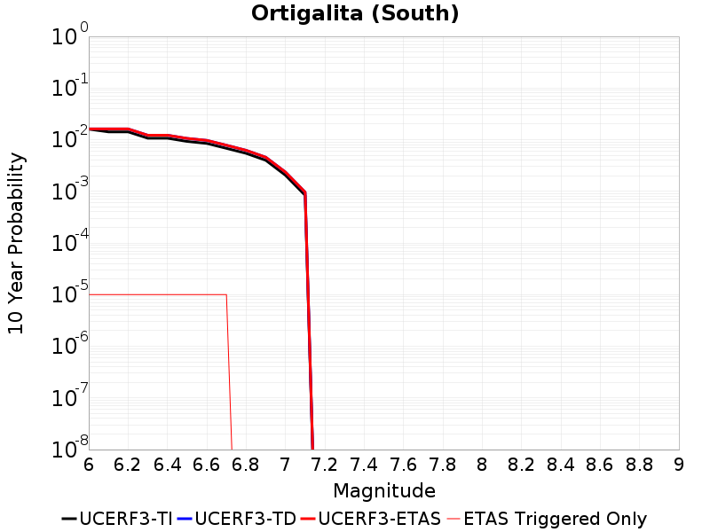 |

| Magnitude | 1 wk TI Prob | 1 wk TD Prob | 1 wk ETAS Prob | 1 wk ETAS/TD Gain | 1 wk ETAS Triggered Only | 1 mo TI Prob | 1 mo TD Prob | 1 mo ETAS Prob | 1 mo ETAS/TD Gain | 1 mo ETAS Triggered Only | 1 yr TI Prob | 1 yr TD Prob | 1 yr ETAS Prob | 1 yr ETAS/TD Gain | 1 yr ETAS Triggered Only | 10 yr TI Prob | 10 yr TD Prob | 10 yr ETAS Prob | 10 yr ETAS/TD Gain | 10 yr ETAS Triggered Only |
|-----|-----|-----|-----|-----|-----|-----|-----|-----|-----|-----|-----|-----|-----|-----|-----|-----|-----|-----|-----|-----|
| 6.0 | 3.08484E-5 | 3.11453E-5 | 4.1144987E-5 | 1.3210658 | 1.0E-5 | 1.3220073E-4 | 1.3347332E-4 | 1.4347199E-4 | 1.0749114 | 1.0E-5 | 0.0016083556 | 0.0016238795 | 0.0016338633 | 1.0061481 | 1.0E-5 | 0.015967647 | 0.016125785 | 0.016135624 | 1.0006101 | 1.0E-5 |
| 6.1 | 2.7299884E-5 | 3.11453E-5 | 4.1144987E-5 | 1.3210658 | 1.0E-5 | 1.16994255E-4 | 1.3347332E-4 | 1.4347199E-4 | 1.0749114 | 1.0E-5 | 0.0014234743 | 0.0016238795 | 0.0016338633 | 1.0061481 | 1.0E-5 | 0.014143906 | 0.016125785 | 0.016135624 | 1.0006101 | 1.0E-5 |
| 6.2 | 2.7299884E-5 | 3.11453E-5 | 4.1144987E-5 | 1.3210658 | 1.0E-5 | 1.16994255E-4 | 1.3347332E-4 | 1.4347199E-4 | 1.0749114 | 1.0E-5 | 0.0014234743 | 0.0016238795 | 0.0016338633 | 1.0061481 | 1.0E-5 | 0.014143906 | 0.016125785 | 0.016135624 | 1.0006101 | 1.0E-5 |
| 6.3 | 2.0546433E-5 | 2.348093E-5 | 3.3480697E-5 | 1.4258674 | 1.0E-5 | 8.805317E-5 | 1.00628786E-4 | 1.1062778E-4 | 1.0993651 | 1.0E-5 | 0.00107152 | 0.0012244855 | 0.0012344732 | 1.0081567 | 1.0E-5 | 0.010663681 | 0.012179405 | 0.012189283 | 1.0008111 | 1.0E-5 |
| 6.4 | 2.0546433E-5 | 2.348093E-5 | 3.3480697E-5 | 1.4258674 | 1.0E-5 | 8.805317E-5 | 1.00628786E-4 | 1.1062778E-4 | 1.0993651 | 1.0E-5 | 0.00107152 | 0.0012244855 | 0.0012344732 | 1.0081567 | 1.0E-5 | 0.010663681 | 0.012179405 | 0.012189283 | 1.0008111 | 1.0E-5 |
| 6.5 | 1.7779594E-5 | 2.0346224E-5 | 3.034602E-5 | 1.4914817 | 1.0E-5 | 7.619603E-5 | 8.7195265E-5 | 9.7194395E-5 | 1.1146752 | 1.0E-5 | 9.272918E-4 | 0.0010610988 | 0.0010710881 | 1.0094142 | 1.0E-5 | 0.009234319 | 0.010561768 | 0.010571662 | 1.0009369 | 1.0E-5 |
| 6.6 | 1.6272212E-5 | 1.8633224E-5 | 2.8633038E-5 | 1.5366658 | 1.0E-5 | 6.973618E-5 | 7.98543E-5 | 8.98535E-5 | 1.125218 | 1.0E-5 | 8.487073E-4 | 9.7180455E-4 | 9.817948E-4 | 1.0102801 | 1.0E-5 | 0.008454733 | 0.009676835 | 0.009686737 | 1.0010234 | 1.0E-5 |
| 6.7 | 1.3051484E-5 | 1.4982097E-5 | 2.4981948E-5 | 1.6674533 | 1.0E-5 | 5.593373E-5 | 6.420746E-5 | 7.4206815E-5 | 1.1557351 | 1.0E-5 | 6.807804E-4 | 7.8145484E-4 | 7.91447E-4 | 1.0127866 | 1.0E-5 | 0.006786986 | 0.0077880425 | 0.007797965 | 1.001274 | 1.0E-5 |
| 6.8 | 1.04277415E-5 | 1.1944537E-5 | 1.1944537E-5 | 1.0 | 0.0 | 4.4689557E-5 | 5.1189905E-5 | 5.1189905E-5 | 1.0 | 0.0 | 5.439595E-4 | 6.2306627E-4 | 6.2306627E-4 | 1.0 | 0.0 | 0.0054262993 | 0.00621394 | 0.00621394 | 1.0 | 0.0 |
| 6.9 | 7.639968E-6 | 8.759321E-6 | 8.759321E-6 | 1.0 | 0.0 | 3.274231E-5 | 3.753944E-5 | 3.753944E-5 | 1.0 | 0.0 | 3.9856473E-4 | 4.5695266E-4 | 4.5695266E-4 | 1.0 | 0.0 | 0.003978506 | 0.0045607104 | 0.0045607104 | 1.0 | 0.0 |
| 7.0 | 3.919831E-6 | 4.514887E-6 | 4.514887E-6 | 1.0 | 0.0 | 1.679917E-5 | 1.9349385E-5 | 1.9349385E-5 | 1.0 | 0.0 | 2.045107E-4 | 2.3555539E-4 | 2.3555539E-4 | 1.0 | 0.0 | 0.0020432258 | 0.0023532636 | 0.0023532636 | 1.0 | 0.0 |
| 7.1 | 1.6017933E-6 | 1.8457472E-6 | 1.8457472E-6 | 1.0 | 0.0 | 6.8648105E-6 | 7.910327E-6 | 7.910327E-6 | 1.0 | 0.0 | 8.357586E-5 | 9.630503E-5 | 9.630503E-5 | 1.0 | 0.0 | 8.3544437E-4 | 9.627362E-4 | 9.627362E-4 | 1.0 | 0.0 |

## Hunting Creek - Berryessa 2011 CFM
*[(top)](#table-of-contents)*

| 1 Week | 1 Month | 1 Year | 10 Year |
|-----|-----|-----|-----|
|  |  |  |  |

| Magnitude | 1 wk TI Prob | 1 wk TD Prob | 1 wk ETAS Prob | 1 wk ETAS/TD Gain | 1 wk ETAS Triggered Only | 1 mo TI Prob | 1 mo TD Prob | 1 mo ETAS Prob | 1 mo ETAS/TD Gain | 1 mo ETAS Triggered Only | 1 yr TI Prob | 1 yr TD Prob | 1 yr ETAS Prob | 1 yr ETAS/TD Gain | 1 yr ETAS Triggered Only | 10 yr TI Prob | 10 yr TD Prob | 10 yr ETAS Prob | 10 yr ETAS/TD Gain | 10 yr ETAS Triggered Only |
|-----|-----|-----|-----|-----|-----|-----|-----|-----|-----|-----|-----|-----|-----|-----|-----|-----|-----|-----|-----|-----|
| 6.0 | 1.0533147E-4 | 1.792163E-4 | 1.792163E-4 | 1.0 | 0.0 | 4.5134246E-4 | 7.678453E-4 | 7.678453E-4 | 1.0 | 0.0 | 0.005481258 | 0.009303757 | 0.009303757 | 1.0 | 0.0 | 0.053480163 | 0.08863165 | 0.08864077 | 1.0001029 | 1.0E-5 |
| 6.1 | 1.0510782E-4 | 1.7909017E-4 | 1.7909017E-4 | 1.0 | 0.0 | 4.503843E-4 | 7.673052E-4 | 7.673052E-4 | 1.0 | 0.0 | 0.005469651 | 0.009297241 | 0.009297241 | 1.0 | 0.0 | 0.05336969 | 0.08857222 | 0.08858133 | 1.0001029 | 1.0E-5 |
| 6.2 | 7.595682E-5 | 1.2808482E-4 | 1.2808482E-4 | 1.0 | 0.0 | 3.254886E-4 | 5.488039E-4 | 5.488039E-4 | 1.0 | 0.0 | 0.0039556245 | 0.006657505 | 0.006657505 | 1.0 | 0.0 | 0.03885951 | 0.06409124 | 0.0641006 | 1.000146 | 1.0E-5 |
| 6.3 | 6.787612E-5 | 1.1421244E-4 | 1.1421244E-4 | 1.0 | 0.0 | 2.9086522E-4 | 4.8937363E-4 | 4.8937363E-4 | 1.0 | 0.0 | 0.0035355345 | 0.0059388904 | 0.0059388904 | 1.0 | 0.0 | 0.034798115 | 0.05736881 | 0.057378236 | 1.0001643 | 1.0E-5 |
| 6.4 | 6.2165134E-5 | 1.0411788E-4 | 1.0411788E-4 | 1.0 | 0.0 | 2.6639478E-4 | 4.461276E-4 | 4.461276E-4 | 1.0 | 0.0 | 0.0032385332 | 0.0054156426 | 0.0054156426 | 1.0 | 0.0 | 0.03191742 | 0.05246774 | 0.052477214 | 1.0001806 | 1.0E-5 |
| 6.5 | 5.4368087E-5 | 9.034608E-5 | 9.034608E-5 | 1.0 | 0.0 | 2.3298527E-4 | 3.871305E-4 | 3.871305E-4 | 1.0 | 0.0 | 0.0028329059 | 0.004701374 | 0.004701374 | 1.0 | 0.0 | 0.027970633 | 0.045737334 | 0.045746874 | 1.0002086 | 1.0E-5 |
| 6.6 | 4.729947E-5 | 7.806E-5 | 7.806E-5 | 1.0 | 0.0 | 2.0269625E-4 | 3.3449527E-4 | 3.3449527E-4 | 1.0 | 0.0 | 0.002465034 | 0.0040636677 | 0.0040636677 | 1.0 | 0.0 | 0.02437869 | 0.03968051 | 0.03968051 | 1.0 | 0.0 |
| 6.7 | 3.6875328E-5 | 6.006384E-5 | 6.006384E-5 | 1.0 | 0.0 | 1.5802756E-4 | 2.5738604E-4 | 2.5738604E-4 | 1.0 | 0.0 | 0.0019222875 | 0.0031286713 | 0.0031286713 | 1.0 | 0.0 | 0.019057442 | 0.030727765 | 0.030727765 | 1.0 | 0.0 |
| 6.8 | 2.0292036E-5 | 2.9044137E-5 | 2.9044137E-5 | 1.0 | 0.0 | 8.6962966E-5 | 1.2446889E-4 | 1.2446889E-4 | 1.0 | 0.0 | 0.0010582599 | 0.0015143431 | 0.0015143431 | 1.0 | 0.0 | 0.010532344 | 0.0150153255 | 0.0150153255 | 1.0 | 0.0 |
| 6.9 | 1.7871042E-5 | 2.4544395E-5 | 2.4544395E-5 | 1.0 | 0.0 | 7.658793E-5 | 1.0518605E-4 | 1.0518605E-4 | 1.0 | 0.0 | 9.320591E-4 | 0.0012798873 | 0.0012798873 | 1.0 | 0.0 | 0.009281595 | 0.0127174435 | 0.0127174435 | 1.0 | 0.0 |
| 7.0 | 1.6415532E-5 | 2.1978827E-5 | 2.1978827E-5 | 1.0 | 0.0 | 7.035038E-5 | 9.4191586E-5 | 9.4191586E-5 | 1.0 | 0.0 | 8.561793E-4 | 0.0011461804 | 0.0011461804 | 1.0 | 0.0 | 0.008528882 | 0.011401875 | 0.011401875 | 1.0 | 0.0 |
| 7.1 | 1.5409885E-5 | 2.0411668E-5 | 2.0411668E-5 | 1.0 | 0.0 | 6.6040695E-5 | 8.747566E-5 | 8.747566E-5 | 1.0 | 0.0 | 8.0374884E-4 | 0.0010644984 | 0.0010644984 | 1.0 | 0.0 | 0.00800848 | 0.010594279 | 0.010594279 | 1.0 | 0.0 |
| 7.2 | 1.4497423E-5 | 1.9113768E-5 | 1.9113768E-5 | 1.0 | 0.0 | 6.213033E-5 | 8.19136E-5 | 8.19136E-5 | 1.0 | 0.0 | 7.5617427E-4 | 9.968448E-4 | 9.968448E-4 | 1.0 | 0.0 | 0.0075360634 | 0.009924306 | 0.009924306 | 1.0 | 0.0 |
| 7.3 | 1.3615175E-5 | 1.7869166E-5 | 1.7869166E-5 | 1.0 | 0.0 | 5.8349444E-5 | 7.657991E-5 | 7.657991E-5 | 1.0 | 0.0 | 7.101729E-4 | 9.3196455E-4 | 9.3196455E-4 | 1.0 | 0.0 | 0.0070790765 | 0.009281065 | 0.009281065 | 1.0 | 0.0 |
| 7.4 | 1.2252825E-5 | 1.6057225E-5 | 1.6057225E-5 | 1.0 | 0.0 | 5.251105E-5 | 6.881488E-5 | 6.881488E-5 | 1.0 | 0.0 | 6.391345E-4 | 8.3750195E-4 | 8.3750195E-4 | 1.0 | 0.0 | 0.0063729943 | 0.008343889 | 0.008343889 | 1.0 | 0.0 |
| 7.5 | 1.0913301E-5 | 1.4264977E-5 | 1.4264977E-5 | 1.0 | 0.0 | 4.6770452E-5 | 6.11342E-5 | 6.11342E-5 | 1.0 | 0.0 | 5.6928146E-4 | 7.440574E-4 | 7.440574E-4 | 1.0 | 0.0 | 0.0056782532 | 0.007416114 | 0.007416114 | 1.0 | 0.0 |
| 7.6 | 8.623192E-6 | 1.1251279E-5 | 1.1251279E-5 | 1.0 | 0.0 | 3.6956015E-5 | 4.821889E-5 | 4.821889E-5 | 1.0 | 0.0 | 4.4984656E-4 | 5.869094E-4 | 5.869094E-4 | 1.0 | 0.0 | 0.00448937 | 0.0058539305 | 0.0058539305 | 1.0 | 0.0 |
| 7.7 | 2.0993634E-6 | 2.6701523E-6 | 2.6701523E-6 | 1.0 | 0.0 | 8.997241E-6 | 1.144346E-5 | 1.144346E-5 | 1.0 | 0.0 | 1.09535904E-4 | 1.3931529E-4 | 1.3931529E-4 | 1.0 | 0.0 | 0.0010948193 | 0.0013922863 | 0.0013922863 | 1.0 | 0.0 |
| 7.8 | 1.8428308E-7 | 2.1797119E-7 | 2.1797119E-7 | 1.0 | 0.0 | 7.897844E-7 | 9.3416196E-7 | 9.3416196E-7 | 1.0 | 0.0 | 9.615583E-6 | 1.1373366E-5 | 1.1373366E-5 | 1.0 | 0.0 | 9.615166E-5 | 1.13722315E-4 | 1.13722315E-4 | 1.0 | 0.0 |

