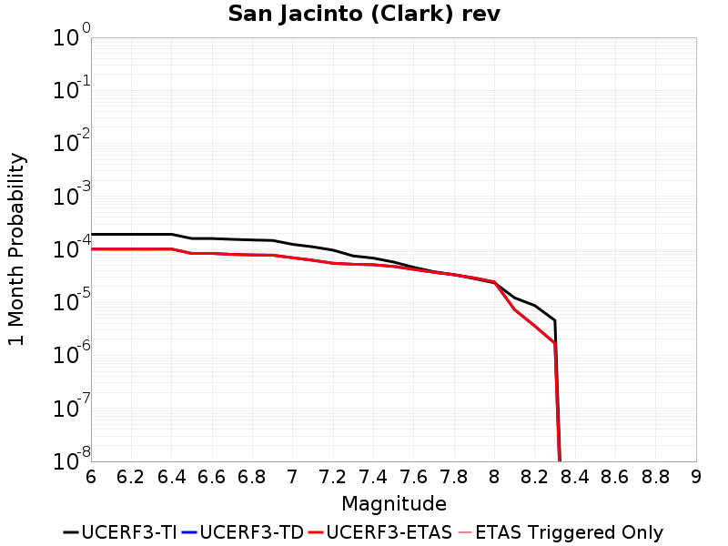

# Parent Section Magnitude-Probability Distributions

Only fault sections with at least one triggered aftershock are plotted. Sections are sorted by total supraseismogenic trigger rate (decreasing)

## Table Of Contents

* [San Jacinto (Clark) rev](#san-jacinto-clark-rev)
* [Earthquake Valley (So Extension)](#earthquake-valley-so-extension)

## San Jacinto (Clark) rev
*[(top)](#table-of-contents)*

| 1 Week | 1 Month | 1 Year | 10 Year |
|-----|-----|-----|-----|
|  |  |  |  |

| Magnitude | 1 wk TI Prob | 1 wk TD Prob | 1 wk ETAS Prob | 1 wk ETAS/TD Gain | 1 wk ETAS Triggered Only | 1 mo TI Prob | 1 mo TD Prob | 1 mo ETAS Prob | 1 mo ETAS/TD Gain | 1 mo ETAS Triggered Only | 1 yr TI Prob | 1 yr TD Prob | 1 yr ETAS Prob | 1 yr ETAS/TD Gain | 1 yr ETAS Triggered Only | 10 yr TI Prob | 10 yr TD Prob | 10 yr ETAS Prob | 10 yr ETAS/TD Gain | 10 yr ETAS Triggered Only |
|-----|-----|-----|-----|-----|-----|-----|-----|-----|-----|-----|-----|-----|-----|-----|-----|-----|-----|-----|-----|-----|
| 6.0 | 4.482615E-5 | 2.3595621E-5 | 2.3595621E-5 | 1.0 | 0.0 | 1.9209793E-4 | 1.0112023E-4 | 1.0112023E-4 | 1.0 | 0.0 | 0.0023362834 | 0.0012304544 | 0.0012304544 | 1.0 | 0.0 | 0.02311874 | 0.0127630485 | 0.0127729215 | 1.0007735 | 1.0E-5 |
| 6.1 | 4.482615E-5 | 2.3595621E-5 | 2.3595621E-5 | 1.0 | 0.0 | 1.9209793E-4 | 1.0112023E-4 | 1.0112023E-4 | 1.0 | 0.0 | 0.0023362834 | 0.0012304544 | 0.0012304544 | 1.0 | 0.0 | 0.02311874 | 0.0127630485 | 0.0127729215 | 1.0007735 | 1.0E-5 |
| 6.2 | 4.482615E-5 | 2.3595621E-5 | 2.3595621E-5 | 1.0 | 0.0 | 1.9209793E-4 | 1.0112023E-4 | 1.0112023E-4 | 1.0 | 0.0 | 0.0023362834 | 0.0012304544 | 0.0012304544 | 1.0 | 0.0 | 0.02311874 | 0.0127630485 | 0.0127729215 | 1.0007735 | 1.0E-5 |
| 6.3 | 4.482615E-5 | 2.3595621E-5 | 2.3595621E-5 | 1.0 | 0.0 | 1.9209793E-4 | 1.0112023E-4 | 1.0112023E-4 | 1.0 | 0.0 | 0.0023362834 | 0.0012304544 | 0.0012304544 | 1.0 | 0.0 | 0.02311874 | 0.0127630485 | 0.0127729215 | 1.0007735 | 1.0E-5 |
| 6.4 | 4.482615E-5 | 2.3595621E-5 | 2.3595621E-5 | 1.0 | 0.0 | 1.9209793E-4 | 1.0112023E-4 | 1.0112023E-4 | 1.0 | 0.0 | 0.0023362834 | 0.0012304544 | 0.0012304544 | 1.0 | 0.0 | 0.02311874 | 0.0127630485 | 0.0127729215 | 1.0007735 | 1.0E-5 |
| 6.5 | 3.7294863E-5 | 1.9520434E-5 | 1.9520434E-5 | 1.0 | 0.0 | 1.5982533E-4 | 8.365635E-5 | 8.365635E-5 | 1.0 | 0.0 | 0.0019441366 | 0.0010180456 | 0.0010180456 | 1.0 | 0.0 | 0.01927216 | 0.010616361 | 0.010616361 | 1.0 | 0.0 |
| 6.6 | 3.7294863E-5 | 1.9520434E-5 | 1.9520434E-5 | 1.0 | 0.0 | 1.5982533E-4 | 8.365635E-5 | 8.365635E-5 | 1.0 | 0.0 | 0.0019441366 | 0.0010180456 | 0.0010180456 | 1.0 | 0.0 | 0.01927216 | 0.010616361 | 0.010616361 | 1.0 | 0.0 |
| 6.7 | 3.6039248E-5 | 1.8717254E-5 | 1.8717254E-5 | 1.0 | 0.0 | 1.5444479E-4 | 8.021436E-5 | 8.021436E-5 | 1.0 | 0.0 | 0.0018787434 | 9.7617746E-4 | 9.7617746E-4 | 1.0 | 0.0 | 0.01862939 | 0.010191489 | 0.010191489 | 1.0 | 0.0 |
| 6.8 | 3.5031844E-5 | 1.830528E-5 | 1.830528E-5 | 1.0 | 0.0 | 1.5012783E-4 | 7.8448866E-5 | 7.8448866E-5 | 1.0 | 0.0 | 0.0018262739 | 9.5470145E-4 | 9.5470145E-4 | 1.0 | 0.0 | 0.01811338 | 0.009971579 | 0.009971579 | 1.0 | 0.0 |
| 6.9 | 3.435112E-5 | 1.8113682E-5 | 1.8113682E-5 | 1.0 | 0.0 | 1.4721078E-4 | 7.762779E-5 | 7.762779E-5 | 1.0 | 0.0 | 0.0017908178 | 9.4471354E-4 | 9.4471354E-4 | 1.0 | 0.0 | 0.017764548 | 0.00986946 | 0.00986946 | 1.0 | 0.0 |
| 7.0 | 2.8959772E-5 | 1.6176113E-5 | 1.6176113E-5 | 1.0 | 0.0 | 1.241074E-4 | 6.932437E-5 | 6.932437E-5 | 1.0 | 0.0 | 0.0015099603 | 8.437008E-4 | 8.437008E-4 | 1.0 | 0.0 | 0.014997416 | 0.008832858 | 0.008832858 | 1.0 | 0.0 |
| 7.1 | 2.6002877E-5 | 1.4499559E-5 | 1.4499559E-5 | 1.0 | 0.0 | 1.11436144E-4 | 6.21395E-5 | 6.21395E-5 | 1.0 | 0.0 | 0.0013558907 | 7.562884E-4 | 7.562884E-4 | 1.0 | 0.0 | 0.013476475 | 0.007925498 | 0.007925498 | 1.0 | 0.0 |
| 7.2 | 2.2544838E-5 | 1.27506755E-5 | 1.27506755E-5 | 1.0 | 0.0 | 9.661716E-5 | 5.464462E-5 | 5.464462E-5 | 1.0 | 0.0 | 0.001175679 | 6.650969E-4 | 6.650969E-4 | 1.0 | 0.0 | 0.011694785 | 0.006984848 | 0.006984848 | 1.0 | 0.0 |
| 7.3 | 1.75334E-5 | 1.2189003E-5 | 1.2189003E-5 | 1.0 | 0.0 | 7.514098E-5 | 5.223755E-5 | 5.223755E-5 | 1.0 | 0.0 | 9.144575E-4 | 6.358082E-4 | 6.358082E-4 | 1.0 | 0.0 | 0.009107036 | 0.00666311 | 0.00666311 | 1.0 | 0.0 |
| 7.4 | 1.5924552E-5 | 1.195297E-5 | 1.195297E-5 | 1.0 | 0.0 | 6.82463E-5 | 5.122602E-5 | 5.122602E-5 | 1.0 | 0.0 | 8.305819E-4 | 6.234999E-4 | 6.234999E-4 | 1.0 | 0.0 | 0.008274844 | 0.006530918 | 0.006530918 | 1.0 | 0.0 |
| 7.5 | 1.3428931E-5 | 1.1113782E-5 | 1.1113782E-5 | 1.0 | 0.0 | 5.7551293E-5 | 4.7629634E-5 | 4.7629634E-5 | 1.0 | 0.0 | 7.004617E-4 | 5.7973777E-4 | 5.7973777E-4 | 1.0 | 0.0 | 0.006982579 | 0.00607426 | 0.00607426 | 1.0 | 0.0 |
| 7.6 | 1.0688787E-5 | 9.781283E-6 | 9.781283E-6 | 1.0 | 0.0 | 4.5808283E-5 | 4.1919113E-5 | 4.1919113E-5 | 1.0 | 0.0 | 5.5757316E-4 | 5.102462E-4 | 5.102462E-4 | 1.0 | 0.0 | 0.005561762 | 0.005359003 | 0.005359003 | 1.0 | 0.0 |
| 7.7 | 8.81236E-6 | 8.586131E-6 | 8.586131E-6 | 1.0 | 0.0 | 3.776671E-5 | 3.6797184E-5 | 3.6797184E-5 | 1.0 | 0.0 | 4.597127E-4 | 4.4791392E-4 | 4.4791392E-4 | 1.0 | 0.0 | 0.0045876284 | 0.004726972 | 0.004726972 | 1.0 | 0.0 |
| 7.8 | 7.780431E-6 | 7.736962E-6 | 7.736962E-6 | 1.0 | 0.0 | 3.3344273E-5 | 3.3157987E-5 | 3.3157987E-5 | 1.0 | 0.0 | 4.0589093E-4 | 4.0362397E-4 | 4.0362397E-4 | 1.0 | 0.0 | 0.0040515037 | 0.0042745406 | 0.0042745406 | 1.0 | 0.0 |
| 7.9 | 6.5437994E-6 | 6.7345154E-6 | 6.7345154E-6 | 1.0 | 0.0 | 2.8044553E-5 | 2.886189E-5 | 2.886189E-5 | 1.0 | 0.0 | 3.4138895E-4 | 3.5133708E-4 | 3.5133708E-4 | 1.0 | 0.0 | 0.0034086495 | 0.0037413682 | 0.0037413682 | 1.0 | 0.0 |
| 8.0 | 5.4488164E-6 | 5.6490985E-6 | 5.6490985E-6 | 1.0 | 0.0 | 2.3351862E-5 | 2.42102E-5 | 2.42102E-5 | 1.0 | 0.0 | 2.8427184E-4 | 2.947195E-4 | 2.947195E-4 | 1.0 | 0.0 | 0.0028390845 | 0.0031559675 | 0.0031559675 | 1.0 | 0.0 |
| 8.1 | 2.8397242E-6 | 1.6975727E-6 | 1.6975727E-6 | 1.0 | 0.0 | 1.217019E-5 | 7.2752914E-6 | 7.2752914E-6 | 1.0 | 0.0 | 1.4816198E-4 | 8.857309E-5 | 8.857309E-5 | 1.0 | 0.0 | 0.0014806325 | 9.963397E-4 | 9.963397E-4 | 1.0 | 0.0 |
| 8.2 | 2.030244E-6 | 8.356216E-7 | 8.356216E-7 | 1.0 | 0.0 | 8.701017E-6 | 3.5812307E-6 | 3.5812307E-6 | 1.0 | 0.0 | 1.05929736E-4 | 4.360062E-5 | 4.360062E-5 | 1.0 | 0.0 | 0.0010587925 | 5.123145E-4 | 5.123145E-4 | 1.0 | 0.0 |
| 8.3 | 1.0659804E-6 | 3.943599E-7 | 3.943599E-7 | 1.0 | 0.0 | 4.568479E-6 | 1.6901128E-6 | 1.6901128E-6 | 1.0 | 0.0 | 5.5619817E-5 | 2.0576936E-5 | 2.0576936E-5 | 1.0 | 0.0 | 5.5605895E-4 | 2.4503714E-4 | 2.4503714E-4 | 1.0 | 0.0 |

## Earthquake Valley (So Extension)
*[(top)](#table-of-contents)*

| 1 Week | 1 Month | 1 Year | 10 Year |
|-----|-----|-----|-----|
|  |  |  |  |

| Magnitude | 1 wk TI Prob | 1 wk TD Prob | 1 wk ETAS Prob | 1 wk ETAS/TD Gain | 1 wk ETAS Triggered Only | 1 mo TI Prob | 1 mo TD Prob | 1 mo ETAS Prob | 1 mo ETAS/TD Gain | 1 mo ETAS Triggered Only | 1 yr TI Prob | 1 yr TD Prob | 1 yr ETAS Prob | 1 yr ETAS/TD Gain | 1 yr ETAS Triggered Only | 10 yr TI Prob | 10 yr TD Prob | 10 yr ETAS Prob | 10 yr ETAS/TD Gain | 10 yr ETAS Triggered Only |
|-----|-----|-----|-----|-----|-----|-----|-----|-----|-----|-----|-----|-----|-----|-----|-----|-----|-----|-----|-----|-----|
| 6.0 | 3.0194888E-5 | 3.7410435E-5 | 4.741006E-5 | 1.2672951 | 1.0E-5 | 1.2940024E-4 | 1.6032372E-4 | 1.703221E-4 | 1.0623639 | 1.0E-5 | 0.0015743093 | 0.0019507128 | 0.0019606934 | 1.0051163 | 1.0E-5 | 0.01563203 | 0.019386461 | 0.019396268 | 1.0005058 | 1.0E-5 |
| 6.1 | 3.0194888E-5 | 3.7410435E-5 | 4.741006E-5 | 1.2672951 | 1.0E-5 | 1.2940024E-4 | 1.6032372E-4 | 1.703221E-4 | 1.0623639 | 1.0E-5 | 0.0015743093 | 0.0019507128 | 0.0019606934 | 1.0051163 | 1.0E-5 | 0.01563203 | 0.019386461 | 0.019396268 | 1.0005058 | 1.0E-5 |
| 6.2 | 3.0194888E-5 | 3.7410435E-5 | 4.741006E-5 | 1.2672951 | 1.0E-5 | 1.2940024E-4 | 1.6032372E-4 | 1.703221E-4 | 1.0623639 | 1.0E-5 | 0.0015743093 | 0.0019507128 | 0.0019606934 | 1.0051163 | 1.0E-5 | 0.01563203 | 0.019386461 | 0.019396268 | 1.0005058 | 1.0E-5 |
| 6.3 | 1.5795305E-5 | 1.8573395E-5 | 1.8573395E-5 | 1.0 | 0.0 | 6.769241E-5 | 7.9598474E-5 | 7.9598474E-5 | 1.0 | 0.0 | 8.238434E-4 | 9.687929E-4 | 9.687929E-4 | 1.0 | 0.0 | 0.008207959 | 0.009656723 | 0.009656723 | 1.0 | 0.0 |
| 6.4 | 1.5795305E-5 | 1.8573395E-5 | 1.8573395E-5 | 1.0 | 0.0 | 6.769241E-5 | 7.9598474E-5 | 7.9598474E-5 | 1.0 | 0.0 | 8.238434E-4 | 9.687929E-4 | 9.687929E-4 | 1.0 | 0.0 | 0.008207959 | 0.009656723 | 0.009656723 | 1.0 | 0.0 |
| 6.5 | 1.5795305E-5 | 1.8573395E-5 | 1.8573395E-5 | 1.0 | 0.0 | 6.769241E-5 | 7.9598474E-5 | 7.9598474E-5 | 1.0 | 0.0 | 8.238434E-4 | 9.687929E-4 | 9.687929E-4 | 1.0 | 0.0 | 0.008207959 | 0.009656723 | 0.009656723 | 1.0 | 0.0 |
| 6.6 | 1.5795305E-5 | 1.8573395E-5 | 1.8573395E-5 | 1.0 | 0.0 | 6.769241E-5 | 7.9598474E-5 | 7.9598474E-5 | 1.0 | 0.0 | 8.238434E-4 | 9.687929E-4 | 9.687929E-4 | 1.0 | 0.0 | 0.008207959 | 0.009656723 | 0.009656723 | 1.0 | 0.0 |
| 6.7 | 1.1363076E-5 | 1.3223407E-5 | 1.3223407E-5 | 1.0 | 0.0 | 4.8697988E-5 | 5.667095E-5 | 5.667095E-5 | 1.0 | 0.0 | 5.927367E-4 | 6.898275E-4 | 6.898275E-4 | 1.0 | 0.0 | 0.0059115817 | 0.00688443 | 0.00688443 | 1.0 | 0.0 |
| 6.8 | 1.0049611E-5 | 1.16686715E-5 | 1.16686715E-5 | 1.0 | 0.0 | 4.306905E-5 | 5.000805E-5 | 5.000805E-5 | 1.0 | 0.0 | 5.242395E-4 | 6.08752E-4 | 6.08752E-4 | 1.0 | 0.0 | 0.0052300454 | 0.0060781124 | 0.0060781124 | 1.0 | 0.0 |
| 6.9 | 1.0049611E-5 | 1.16686715E-5 | 1.16686715E-5 | 1.0 | 0.0 | 4.306905E-5 | 5.000805E-5 | 5.000805E-5 | 1.0 | 0.0 | 5.242395E-4 | 6.08752E-4 | 6.08752E-4 | 1.0 | 0.0 | 0.0052300454 | 0.0060781124 | 0.0060781124 | 1.0 | 0.0 |
| 7.0 | 1.0049611E-5 | 1.16686715E-5 | 1.16686715E-5 | 1.0 | 0.0 | 4.306905E-5 | 5.000805E-5 | 5.000805E-5 | 1.0 | 0.0 | 5.242395E-4 | 6.08752E-4 | 6.08752E-4 | 1.0 | 0.0 | 0.0052300454 | 0.0060781124 | 0.0060781124 | 1.0 | 0.0 |
| 7.1 | 8.140254E-6 | 9.44392E-6 | 9.44392E-6 | 1.0 | 0.0 | 3.4886336E-5 | 4.0473697E-5 | 4.0473697E-5 | 1.0 | 0.0 | 4.2465836E-4 | 4.927238E-4 | 4.927238E-4 | 1.0 | 0.0 | 0.0042384774 | 0.0049229725 | 0.0049229725 | 1.0 | 0.0 |
| 7.2 | 1.673835E-7 | 1.4349627E-7 | 1.4349627E-7 | 1.0 | 0.0 | 7.173577E-7 | 6.1498383E-7 | 6.1498383E-7 | 1.0 | 0.0 | 8.733795E-6 | 7.4874065E-6 | 7.4874065E-6 | 1.0 | 0.0 | 8.733451E-5 | 7.487191E-5 | 7.487191E-5 | 1.0 | 0.0 |
| 7.3 | 1.6632116E-7 | 1.4246217E-7 | 1.4246217E-7 | 1.0 | 0.0 | 7.1280476E-7 | 6.1055204E-7 | 6.1055204E-7 | 1.0 | 0.0 | 8.678364E-6 | 7.4334494E-6 | 7.4334494E-6 | 1.0 | 0.0 | 8.6780245E-5 | 7.4332376E-5 | 7.4332376E-5 | 1.0 | 0.0 |
| 7.4 | 1.6569169E-7 | 1.4190543E-7 | 1.4190543E-7 | 1.0 | 0.0 | 7.1010703E-7 | 6.0816603E-7 | 6.0816603E-7 | 1.0 | 0.0 | 8.645519E-6 | 7.4044E-6 | 7.4044E-6 | 1.0 | 0.0 | 8.645182E-5 | 7.40419E-5 | 7.40419E-5 | 1.0 | 0.0 |
| 7.5 | 1.1764555E-7 | 1.02187464E-7 | 1.02187464E-7 | 1.0 | 0.0 | 5.041951E-7 | 4.379462E-7 | 4.379462E-7 | 1.0 | 0.0 | 6.138558E-6 | 5.331984E-6 | 5.331984E-6 | 1.0 | 0.0 | 6.1383886E-5 | 5.331878E-5 | 5.331878E-5 | 1.0 | 0.0 |
| 7.6 | 1.07927605E-7 | 9.377977E-8 | 9.377977E-8 | 1.0 | 0.0 | 4.6254678E-7 | 4.0191324E-7 | 4.0191324E-7 | 1.0 | 0.0 | 5.6314925E-6 | 4.893285E-6 | 4.893285E-6 | 1.0 | 0.0 | 5.63135E-5 | 4.8931986E-5 | 4.8931986E-5 | 1.0 | 0.0 |
| 7.7 | 2.1826905E-8 | 1.13473195E-8 | 1.13473195E-8 | 1.0 | 0.0 | 9.3543875E-8 | 4.863137E-8 | 4.863137E-8 | 1.0 | 0.0 | 1.1388961E-6 | 5.920868E-7 | 5.920868E-7 | 1.0 | 0.0 | 1.1388902E-5 | 5.920858E-6 | 5.920858E-6 | 1.0 | 0.0 |
| 7.8 | 2.6169649E-9 | 1.2144047E-9 | 1.2144047E-9 | 1.0 | 0.0 | 1.1215564E-8 | 5.2045914E-9 | 5.2045914E-9 | 1.0 | 0.0 | 1.3654947E-7 | 6.33659E-8 | 6.33659E-8 | 1.0 | 0.0 | 1.365494E-6 | 6.33659E-7 | 6.33659E-7 | 1.0 | 0.0 |

