# Parent Section Magnitude-Probability Distributions

Only fault sections with at least one triggered aftershock are plotted. Sections are sorted by total supraseismogenic trigger rate (decreasing)

## Table Of Contents

* [San Jacinto (Anza) rev](#san-jacinto-anza-rev)
* [Tank Canyon](#tank-canyon)
* [Garlock (Central)](#garlock-central)
* [San Jacinto (Clark) rev](#san-jacinto-clark-rev)

## San Jacinto (Anza) rev
*[(top)](#table-of-contents)*

| 1 Week | 1 Month | 1 Year | 10 Year |
|-----|-----|-----|-----|
| 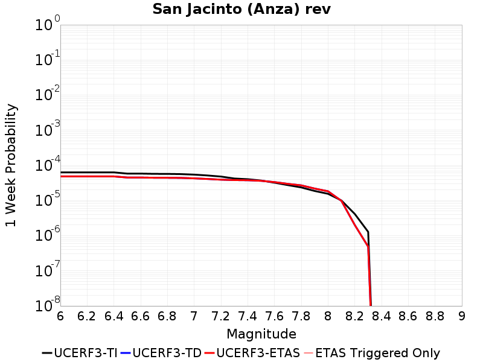 | 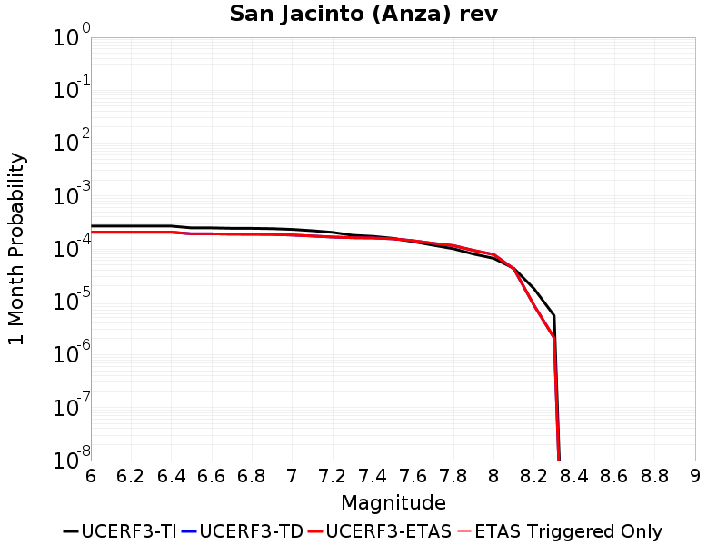 | 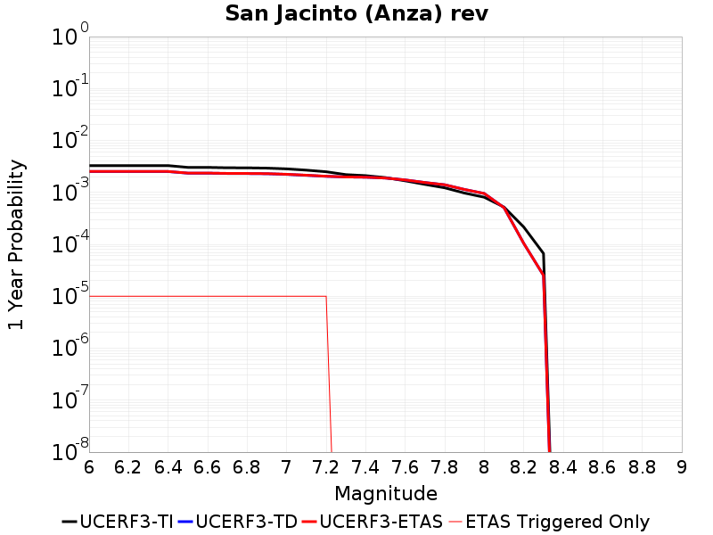 | 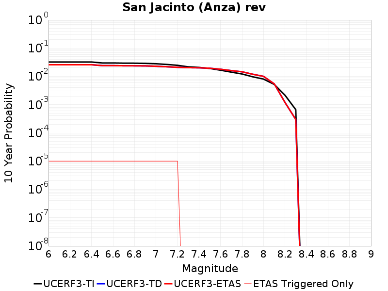 |

| Magnitude | 1 wk TI Prob | 1 wk TD Prob | 1 wk ETAS Prob | 1 wk ETAS/TD Gain | 1 wk ETAS Triggered Only | 1 mo TI Prob | 1 mo TD Prob | 1 mo ETAS Prob | 1 mo ETAS/TD Gain | 1 mo ETAS Triggered Only | 1 yr TI Prob | 1 yr TD Prob | 1 yr ETAS Prob | 1 yr ETAS/TD Gain | 1 yr ETAS Triggered Only | 10 yr TI Prob | 10 yr TD Prob | 10 yr ETAS Prob | 10 yr ETAS/TD Gain | 10 yr ETAS Triggered Only |
|-----|-----|-----|-----|-----|-----|-----|-----|-----|-----|-----|-----|-----|-----|-----|-----|-----|-----|-----|-----|-----|
| 6.0 | 6.28807E-5 | 4.8271413E-5 | 4.8271413E-5 | 1.0 | 0.0 | 2.6946087E-4 | 2.0686115E-4 | 2.0686115E-4 | 1.0 | 0.0 | 0.0032757511 | 0.0025156396 | 0.0025256146 | 1.0039651 | 1.0E-5 | 0.032278832 | 0.025828365 | 0.025838107 | 1.0003772 | 1.0E-5 |
| 6.1 | 6.28807E-5 | 4.8271413E-5 | 4.8271413E-5 | 1.0 | 0.0 | 2.6946087E-4 | 2.0686115E-4 | 2.0686115E-4 | 1.0 | 0.0 | 0.0032757511 | 0.0025156396 | 0.0025256146 | 1.0039651 | 1.0E-5 | 0.032278832 | 0.025828365 | 0.025838107 | 1.0003772 | 1.0E-5 |
| 6.2 | 6.28807E-5 | 4.8271413E-5 | 4.8271413E-5 | 1.0 | 0.0 | 2.6946087E-4 | 2.0686115E-4 | 2.0686115E-4 | 1.0 | 0.0 | 0.0032757511 | 0.0025156396 | 0.0025256146 | 1.0039651 | 1.0E-5 | 0.032278832 | 0.025828365 | 0.025838107 | 1.0003772 | 1.0E-5 |
| 6.3 | 6.28807E-5 | 4.8271413E-5 | 4.8271413E-5 | 1.0 | 0.0 | 2.6946087E-4 | 2.0686115E-4 | 2.0686115E-4 | 1.0 | 0.0 | 0.0032757511 | 0.0025156396 | 0.0025256146 | 1.0039651 | 1.0E-5 | 0.032278832 | 0.025828365 | 0.025838107 | 1.0003772 | 1.0E-5 |
| 6.4 | 6.28807E-5 | 4.8271413E-5 | 4.8271413E-5 | 1.0 | 0.0 | 2.6946087E-4 | 2.0686115E-4 | 2.0686115E-4 | 1.0 | 0.0 | 0.0032757511 | 0.0025156396 | 0.0025256146 | 1.0039651 | 1.0E-5 | 0.032278832 | 0.025828365 | 0.025838107 | 1.0003772 | 1.0E-5 |
| 6.5 | 5.811017E-5 | 4.494311E-5 | 4.494311E-5 | 1.0 | 0.0 | 2.4901982E-4 | 1.9259915E-4 | 1.9259915E-4 | 1.0 | 0.0 | 0.0030276014 | 0.00234238 | 0.0023523564 | 1.0042591 | 1.0E-5 | 0.02986684 | 0.024088016 | 0.024097774 | 1.0004052 | 1.0E-5 |
| 6.6 | 5.811017E-5 | 4.494311E-5 | 4.494311E-5 | 1.0 | 0.0 | 2.4901982E-4 | 1.9259915E-4 | 1.9259915E-4 | 1.0 | 0.0 | 0.0030276014 | 0.00234238 | 0.0023523564 | 1.0042591 | 1.0E-5 | 0.02986684 | 0.024088016 | 0.024097774 | 1.0004052 | 1.0E-5 |
| 6.7 | 5.712442E-5 | 4.4316377E-5 | 4.4316377E-5 | 1.0 | 0.0 | 2.4479596E-4 | 1.8991354E-4 | 1.8991354E-4 | 1.0 | 0.0 | 0.0029763177 | 0.0023097522 | 0.0023197292 | 1.0043194 | 1.0E-5 | 0.029367693 | 0.023755515 | 0.023765277 | 1.0004109 | 1.0E-5 |
| 6.8 | 5.6967532E-5 | 4.4163142E-5 | 4.4163142E-5 | 1.0 | 0.0 | 2.4412372E-4 | 1.8925691E-4 | 1.8925691E-4 | 1.0 | 0.0 | 0.0029681553 | 0.0023017747 | 0.0023117517 | 1.0043344 | 1.0E-5 | 0.029288229 | 0.023675065 | 0.023684828 | 1.0004123 | 1.0E-5 |
| 6.9 | 5.6211324E-5 | 4.383571E-5 | 4.383571E-5 | 1.0 | 0.0 | 2.4088343E-4 | 1.8785383E-4 | 1.8785383E-4 | 1.0 | 0.0 | 0.0029288116 | 0.002284728 | 0.0022947052 | 1.0043669 | 1.0E-5 | 0.028905109 | 0.023498168 | 0.023507934 | 1.0004156 | 1.0E-5 |
| 7.0 | 5.4383527E-5 | 4.258266E-5 | 4.258266E-5 | 1.0 | 0.0 | 2.3305144E-4 | 1.8248438E-4 | 1.8248438E-4 | 1.0 | 0.0 | 0.0028337094 | 0.0022194893 | 0.002229467 | 1.0044955 | 1.0E-5 | 0.027978465 | 0.022835076 | 0.022844847 | 1.000428 | 1.0E-5 |
| 7.1 | 5.1393665E-5 | 4.0875555E-5 | 4.0875555E-5 | 1.0 | 0.0 | 2.2023996E-4 | 1.7516922E-4 | 1.7516922E-4 | 1.0 | 0.0 | 0.0026781242 | 0.002130604 | 0.002140583 | 1.0046835 | 1.0E-5 | 0.026460782 | 0.021924648 | 0.02193443 | 1.0004461 | 1.0E-5 |
| 7.2 | 4.785222E-5 | 3.9042043E-5 | 3.9042043E-5 | 1.0 | 0.0 | 2.0506482E-4 | 1.6731233E-4 | 1.6731233E-4 | 1.0 | 0.0 | 0.0024938055 | 0.002035129 | 0.0020451085 | 1.0049037 | 1.0E-5 | 0.024660049 | 0.02095352 | 0.020963311 | 1.0004673 | 1.0E-5 |
| 7.3 | 4.2143256E-5 | 3.799878E-5 | 3.799878E-5 | 1.0 | 0.0 | 1.8060145E-4 | 1.6284178E-4 | 1.6284178E-4 | 1.0 | 0.0 | 0.002196605 | 0.0019808 | 0.0019808 | 1.0 | 0.0 | 0.02175019 | 0.020387303 | 0.020387303 | 1.0 | 0.0 |
| 7.4 | 4.0264713E-5 | 3.758991E-5 | 3.758991E-5 | 1.0 | 0.0 | 1.7255165E-4 | 1.6108969E-4 | 1.6108969E-4 | 1.0 | 0.0 | 0.002098792 | 0.001959507 | 0.001959507 | 1.0 | 0.0 | 0.020790804 | 0.020167278 | 0.020167278 | 1.0 | 0.0 |
| 7.5 | 3.694492E-5 | 3.6180038E-5 | 3.6180038E-5 | 1.0 | 0.0 | 1.5832575E-4 | 1.5504811E-4 | 1.5504811E-4 | 1.0 | 0.0 | 0.0019259118 | 0.00188608 | 0.00188608 | 1.0 | 0.0 | 0.01909306 | 0.019420564 | 0.019420564 | 1.0 | 0.0 |
| 7.6 | 3.200565E-5 | 3.3289118E-5 | 3.3289118E-5 | 1.0 | 0.0 | 1.3715986E-4 | 1.4265986E-4 | 1.4265986E-4 | 1.0 | 0.0 | 0.001668642 | 0.0017355026 | 0.0017355026 | 1.0 | 0.0 | 0.01656168 | 0.017904438 | 0.017904438 | 1.0 | 0.0 |
| 7.7 | 2.731642E-5 | 2.9682396E-5 | 2.9682396E-5 | 1.0 | 0.0 | 1.1706512E-4 | 1.2720408E-4 | 1.2720408E-4 | 1.0 | 0.0 | 0.001424336 | 0.0015476107 | 0.0015476107 | 1.0 | 0.0 | 0.014152412 | 0.016028112 | 0.016028112 | 1.0 | 0.0 |
| 7.8 | 2.3466424E-5 | 2.6865382E-5 | 2.6865382E-5 | 1.0 | 0.0 | 1.0056651E-4 | 1.1513228E-4 | 1.1513228E-4 | 1.0 | 0.0 | 0.0012237094 | 0.0014008352 | 0.0014008352 | 1.0 | 0.0 | 0.012169928 | 0.014554209 | 0.014554209 | 1.0 | 0.0 |
| 7.9 | 1.8611925E-5 | 2.1804384E-5 | 2.1804384E-5 | 1.0 | 0.0 | 7.9762955E-5 | 9.3444025E-5 | 9.3444025E-5 | 1.0 | 0.0 | 9.7068126E-4 | 0.0011370882 | 0.0011370882 | 1.0 | 0.0 | 0.0096645225 | 0.011904085 | 0.011904085 | 1.0 | 0.0 |
| 8.0 | 1.5460775E-5 | 1.8254268E-5 | 1.8254268E-5 | 1.0 | 0.0 | 6.6258784E-5 | 7.823024E-5 | 7.823024E-5 | 1.0 | 0.0 | 8.0640207E-4 | 9.5203787E-4 | 9.5203787E-4 | 1.0 | 0.0 | 0.008034821 | 0.010018029 | 0.010018029 | 1.0 | 0.0 |
| 8.1 | 9.983884E-6 | 9.7500615E-6 | 9.7500615E-6 | 1.0 | 0.0 | 4.2787375E-5 | 4.1785315E-5 | 4.1785315E-5 | 1.0 | 0.0 | 5.2081177E-4 | 5.0861813E-4 | 5.0861813E-4 | 1.0 | 0.0 | 0.0051959283 | 0.005430107 | 0.005430107 | 1.0 | 0.0 |
| 8.2 | 4.1226E-6 | 1.9957415E-6 | 1.9957415E-6 | 1.0 | 0.0 | 1.7668166E-5 | 8.55315E-6 | 8.55315E-6 | 1.0 | 0.0 | 2.1508869E-4 | 1.0412967E-4 | 1.0412967E-4 | 1.0 | 0.0 | 0.0021488064 | 0.001191049 | 0.001191049 | 1.0 | 0.0 |
| 8.3 | 1.2750878E-6 | 4.836685E-7 | 4.836685E-7 | 1.0 | 0.0 | 5.4646503E-6 | 2.0728635E-6 | 2.0728635E-6 | 1.0 | 0.0 | 6.653009E-5 | 2.5236828E-5 | 2.5236828E-5 | 1.0 | 0.0 | 6.6510175E-4 | 2.9840614E-4 | 2.9840614E-4 | 1.0 | 0.0 |

## Tank Canyon
*[(top)](#table-of-contents)*

| 1 Week | 1 Month | 1 Year | 10 Year |
|-----|-----|-----|-----|
| 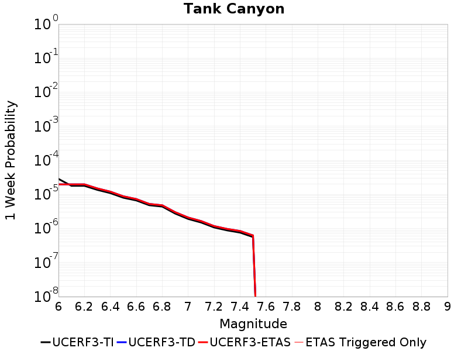 | 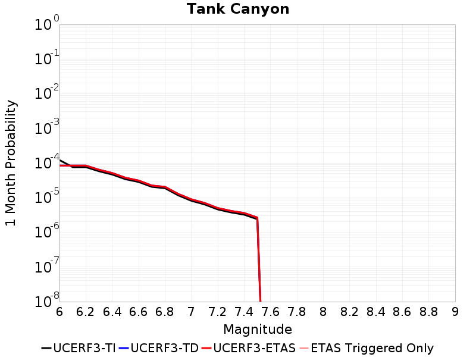 | 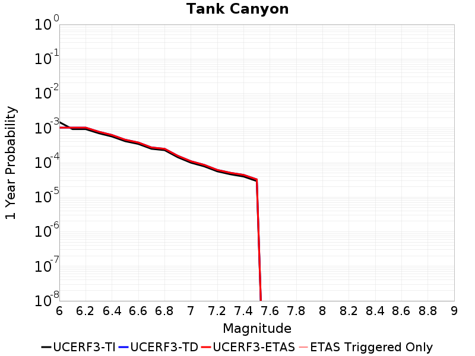 | 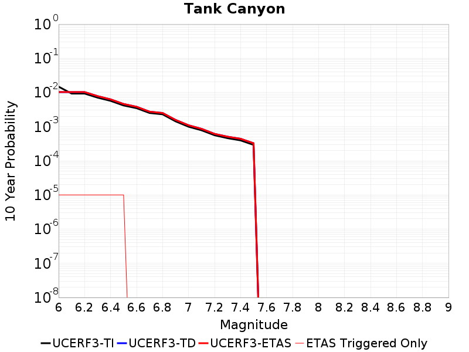 |

| Magnitude | 1 wk TI Prob | 1 wk TD Prob | 1 wk ETAS Prob | 1 wk ETAS/TD Gain | 1 wk ETAS Triggered Only | 1 mo TI Prob | 1 mo TD Prob | 1 mo ETAS Prob | 1 mo ETAS/TD Gain | 1 mo ETAS Triggered Only | 1 yr TI Prob | 1 yr TD Prob | 1 yr ETAS Prob | 1 yr ETAS/TD Gain | 1 yr ETAS Triggered Only | 10 yr TI Prob | 10 yr TD Prob | 10 yr ETAS Prob | 10 yr ETAS/TD Gain | 10 yr ETAS Triggered Only |
|-----|-----|-----|-----|-----|-----|-----|-----|-----|-----|-----|-----|-----|-----|-----|-----|-----|-----|-----|-----|-----|
| 6.0 | 2.8397822E-5 | 1.9688334E-5 | 1.9688334E-5 | 1.0 | 0.0 | 1.21699275E-4 | 8.4376035E-5 | 8.4376035E-5 | 1.0 | 0.0 | 0.0014806816 | 0.001026828 | 0.001026828 | 1.0 | 0.0 | 0.014708545 | 0.010224259 | 0.010234158 | 1.0009681 | 1.0E-5 |
| 6.1 | 1.7796336E-5 | 1.9688334E-5 | 1.9688334E-5 | 1.0 | 0.0 | 7.626778E-5 | 8.4376035E-5 | 8.4376035E-5 | 1.0 | 0.0 | 9.281647E-4 | 0.001026828 | 0.001026828 | 1.0 | 0.0 | 0.009242975 | 0.010224259 | 0.010234158 | 1.0009681 | 1.0E-5 |
| 6.2 | 1.7796336E-5 | 1.9688334E-5 | 1.9688334E-5 | 1.0 | 0.0 | 7.626778E-5 | 8.4376035E-5 | 8.4376035E-5 | 1.0 | 0.0 | 9.281647E-4 | 0.001026828 | 0.001026828 | 1.0 | 0.0 | 0.009242975 | 0.010224259 | 0.010234158 | 1.0009681 | 1.0E-5 |
| 6.3 | 1.3515912E-5 | 1.4947946E-5 | 1.4947946E-5 | 1.0 | 0.0 | 5.792405E-5 | 6.406117E-5 | 6.406117E-5 | 1.0 | 0.0 | 7.049971E-4 | 7.7968684E-4 | 7.7968684E-4 | 1.0 | 0.0 | 0.007027647 | 0.0077716354 | 0.0077815577 | 1.0012767 | 1.0E-5 |
| 6.4 | 1.0870146E-5 | 1.2013966E-5 | 1.2013966E-5 | 1.0 | 0.0 | 4.658551E-5 | 5.1487496E-5 | 5.1487496E-5 | 1.0 | 0.0 | 5.67031E-4 | 6.2669587E-4 | 6.2669587E-4 | 1.0 | 0.0 | 0.005655863 | 0.0062508676 | 0.0062608053 | 1.0015898 | 1.0E-5 |
| 6.5 | 7.964826E-6 | 8.782238E-6 | 8.782238E-6 | 1.0 | 0.0 | 3.4134522E-5 | 3.7637677E-5 | 3.7637677E-5 | 1.0 | 0.0 | 4.1550855E-4 | 4.5815183E-4 | 4.5815183E-4 | 1.0 | 0.0 | 0.0041473247 | 0.00457301 | 0.0045829643 | 1.0021768 | 1.0E-5 |
| 6.6 | 6.6317E-6 | 7.290308E-6 | 7.290308E-6 | 1.0 | 0.0 | 2.8421264E-5 | 3.124385E-5 | 3.124385E-5 | 1.0 | 0.0 | 3.4597394E-4 | 3.8033558E-4 | 3.8033558E-4 | 1.0 | 0.0 | 0.0034543579 | 0.0037976468 | 0.0037976468 | 1.0 | 0.0 |
| 6.7 | 4.793663E-6 | 5.2388305E-6 | 5.2388305E-6 | 1.0 | 0.0 | 2.0544108E-5 | 2.2451959E-5 | 2.2451959E-5 | 1.0 | 0.0 | 2.500958E-4 | 2.7332225E-4 | 2.7332225E-4 | 1.0 | 0.0 | 0.0024981452 | 0.0027302501 | 0.0027302501 | 1.0 | 0.0 |
| 6.8 | 4.382823E-6 | 4.794475E-6 | 4.794475E-6 | 1.0 | 0.0 | 1.8783392E-5 | 2.054761E-5 | 2.054761E-5 | 1.0 | 0.0 | 2.286638E-4 | 2.501423E-4 | 2.501423E-4 | 1.0 | 0.0 | 0.0022842865 | 0.0024989862 | 0.0024989862 | 1.0 | 0.0 |
| 6.9 | 2.729601E-6 | 3.0039553E-6 | 3.0039553E-6 | 1.0 | 0.0 | 1.1698237E-5 | 1.2874038E-5 | 1.2874038E-5 | 1.0 | 0.0 | 1.4241673E-4 | 1.5673129E-4 | 1.5673129E-4 | 1.0 | 0.0 | 0.001423255 | 0.0015663219 | 0.0015663219 | 1.0 | 0.0 |
| 7.0 | 1.8987357E-6 | 2.0930465E-6 | 2.0930465E-6 | 1.0 | 0.0 | 8.137413E-6 | 8.9701725E-6 | 8.9701725E-6 | 1.0 | 0.0 | 9.90685E-5 | 1.0920705E-4 | 1.0920705E-4 | 1.0 | 0.0 | 9.902435E-4 | 0.0010916004 | 0.0010916004 | 1.0 | 0.0 |
| 7.1 | 1.4928986E-6 | 1.6460489E-6 | 1.6460489E-6 | 1.0 | 0.0 | 6.398121E-6 | 7.0544793E-6 | 7.0544793E-6 | 1.0 | 0.0 | 7.789434E-5 | 8.588548E-5 | 8.588548E-5 | 1.0 | 0.0 | 7.786704E-4 | 8.585795E-4 | 8.585795E-4 | 1.0 | 0.0 |
| 7.2 | 1.069082E-6 | 1.172662E-6 | 1.172662E-6 | 1.0 | 0.0 | 4.581772E-6 | 5.0256876E-6 | 5.0256876E-6 | 1.0 | 0.0 | 5.5781646E-5 | 6.1186554E-5 | 6.1186554E-5 | 1.0 | 0.0 | 5.576765E-4 | 6.1174826E-4 | 6.1174826E-4 | 1.0 | 0.0 |
| 7.3 | 8.776551E-7 | 9.691341E-7 | 9.691341E-7 | 1.0 | 0.0 | 3.7613736E-6 | 4.153428E-6 | 4.153428E-6 | 1.0 | 0.0 | 4.579376E-5 | 5.0567323E-5 | 5.0567323E-5 | 1.0 | 0.0 | 4.5784327E-4 | 5.0560816E-4 | 5.0560816E-4 | 1.0 | 0.0 |
| 7.4 | 7.55721E-7 | 8.433857E-7 | 8.433857E-7 | 1.0 | 0.0 | 3.2388E-6 | 3.614508E-6 | 3.614508E-6 | 1.0 | 0.0 | 3.9431678E-5 | 4.4006254E-5 | 4.4006254E-5 | 1.0 | 0.0 | 3.942468E-4 | 4.4002524E-4 | 4.4002524E-4 | 1.0 | 0.0 |
| 7.5 | 5.587665E-7 | 6.241268E-7 | 6.241268E-7 | 1.0 | 0.0 | 2.3947114E-6 | 2.6748291E-6 | 2.6748291E-6 | 1.0 | 0.0 | 2.915522E-5 | 3.2566044E-5 | 3.2566044E-5 | 1.0 | 0.0 | 2.9151395E-4 | 3.2566045E-4 | 3.2566045E-4 | 1.0 | 0.0 |

## Garlock (Central)
*[(top)](#table-of-contents)*

| 1 Week | 1 Month | 1 Year | 10 Year |
|-----|-----|-----|-----|
| 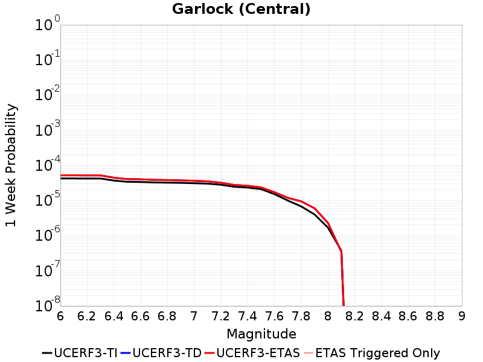 | 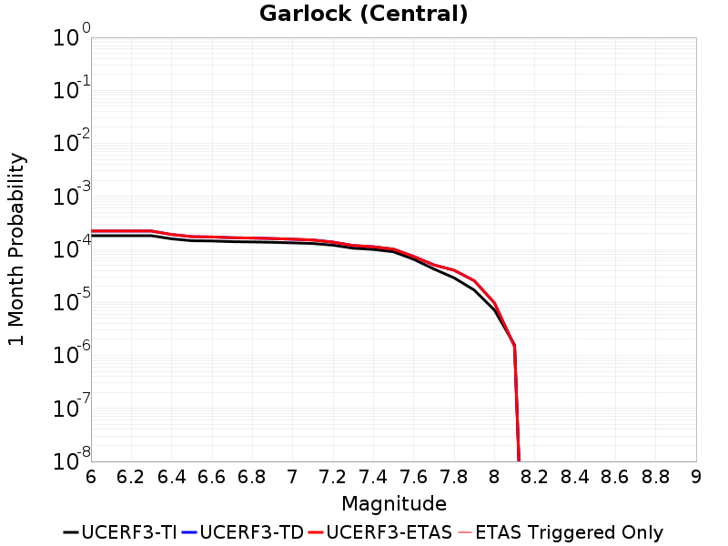 | 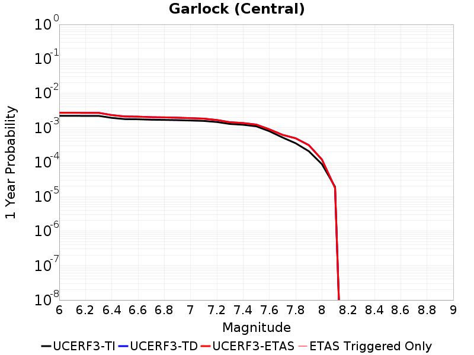 | 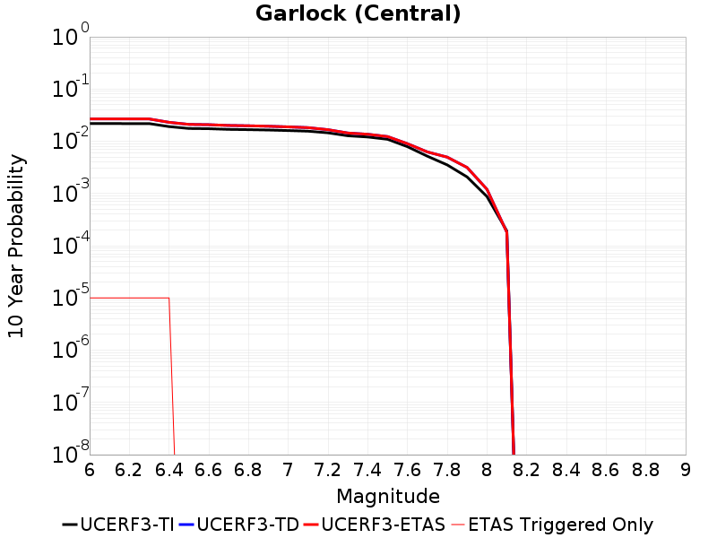 |

| Magnitude | 1 wk TI Prob | 1 wk TD Prob | 1 wk ETAS Prob | 1 wk ETAS/TD Gain | 1 wk ETAS Triggered Only | 1 mo TI Prob | 1 mo TD Prob | 1 mo ETAS Prob | 1 mo ETAS/TD Gain | 1 mo ETAS Triggered Only | 1 yr TI Prob | 1 yr TD Prob | 1 yr ETAS Prob | 1 yr ETAS/TD Gain | 1 yr ETAS Triggered Only | 10 yr TI Prob | 10 yr TD Prob | 10 yr ETAS Prob | 10 yr ETAS/TD Gain | 10 yr ETAS Triggered Only |
|-----|-----|-----|-----|-----|-----|-----|-----|-----|-----|-----|-----|-----|-----|-----|-----|-----|-----|-----|-----|-----|
| 6.0 | 4.2243486E-5 | 5.1760788E-5 | 5.1760788E-5 | 1.0 | 0.0 | 1.8103095E-4 | 2.2181324E-4 | 2.2181324E-4 | 1.0 | 0.0 | 0.0022018238 | 0.0026972615 | 0.0026972615 | 1.0 | 0.0 | 0.021801353 | 0.026738541 | 0.026748274 | 1.000364 | 1.0E-5 |
| 6.1 | 4.2243486E-5 | 5.1760788E-5 | 5.1760788E-5 | 1.0 | 0.0 | 1.8103095E-4 | 2.2181324E-4 | 2.2181324E-4 | 1.0 | 0.0 | 0.0022018238 | 0.0026972615 | 0.0026972615 | 1.0 | 0.0 | 0.021801353 | 0.026738541 | 0.026748274 | 1.000364 | 1.0E-5 |
| 6.2 | 4.216245E-5 | 5.1627805E-5 | 5.1627805E-5 | 1.0 | 0.0 | 1.806837E-4 | 2.2124342E-4 | 2.2124342E-4 | 1.0 | 0.0 | 0.0021976046 | 0.002690341 | 0.002690341 | 1.0 | 0.0 | 0.021759989 | 0.026669621 | 0.026679356 | 1.0003649 | 1.0E-5 |
| 6.3 | 4.216245E-5 | 5.1627805E-5 | 5.1627805E-5 | 1.0 | 0.0 | 1.806837E-4 | 2.2124342E-4 | 2.2124342E-4 | 1.0 | 0.0 | 0.0021976046 | 0.002690341 | 0.002690341 | 1.0 | 0.0 | 0.021759989 | 0.026669621 | 0.026679356 | 1.0003649 | 1.0E-5 |
| 6.4 | 3.6858168E-5 | 4.439758E-5 | 4.439758E-5 | 1.0 | 0.0 | 1.5795401E-4 | 1.902616E-4 | 1.902616E-4 | 1.0 | 0.0 | 0.0019213937 | 0.002313998 | 0.002313998 | 1.0 | 0.0 | 0.019048655 | 0.02299409 | 0.02300386 | 1.0004249 | 1.0E-5 |
| 6.5 | 3.39199E-5 | 4.05045E-5 | 4.05045E-5 | 1.0 | 0.0 | 1.453629E-4 | 1.7357928E-4 | 1.7357928E-4 | 1.0 | 0.0 | 0.0017683565 | 0.0021113001 | 0.0021113001 | 1.0 | 0.0 | 0.017543508 | 0.021005128 | 0.021005128 | 1.0 | 0.0 |
| 6.6 | 3.3571985E-5 | 3.9958126E-5 | 3.9958126E-5 | 1.0 | 0.0 | 1.4387199E-4 | 1.7123799E-4 | 1.7123799E-4 | 1.0 | 0.0 | 0.0017502342 | 0.0020828499 | 0.0020828499 | 1.0 | 0.0 | 0.017365133 | 0.020725599 | 0.020725599 | 1.0 | 0.0 |
| 6.7 | 3.2580007E-5 | 3.8628557E-5 | 3.8628557E-5 | 1.0 | 0.0 | 1.3962112E-4 | 1.6554056E-4 | 1.6554056E-4 | 1.0 | 0.0 | 0.0016985617 | 0.002013614 | 0.002013614 | 1.0 | 0.0 | 0.016856372 | 0.02004323 | 0.02004323 | 1.0 | 0.0 |
| 6.8 | 3.2185937E-5 | 3.8065627E-5 | 3.8065627E-5 | 1.0 | 0.0 | 1.3793244E-4 | 1.6312831E-4 | 1.6312831E-4 | 1.0 | 0.0 | 0.0016780337 | 0.0019842987 | 0.0019842987 | 1.0 | 0.0 | 0.016654192 | 0.019754926 | 0.019754926 | 1.0 | 0.0 |
| 6.9 | 3.165394E-5 | 3.7282636E-5 | 3.7282636E-5 | 1.0 | 0.0 | 1.3565269E-4 | 1.5977306E-4 | 1.5977306E-4 | 1.0 | 0.0 | 0.0016503202 | 0.0019435219 | 0.0019435219 | 1.0 | 0.0 | 0.01638118 | 0.019353736 | 0.019353736 | 1.0 | 0.0 |
| 7.0 | 3.0903822E-5 | 3.621314E-5 | 3.621314E-5 | 1.0 | 0.0 | 1.3243823E-4 | 1.5519005E-4 | 1.5519005E-4 | 1.0 | 0.0 | 0.0016112428 | 0.0018878218 | 0.0018878218 | 1.0 | 0.0 | 0.015996104 | 0.0188081 | 0.0188081 | 1.0 | 0.0 |
| 7.1 | 3.0069863E-5 | 3.500909E-5 | 3.500909E-5 | 1.0 | 0.0 | 1.2886449E-4 | 1.5003044E-4 | 1.5003044E-4 | 1.0 | 0.0 | 0.0015677959 | 0.0018251103 | 0.0018251103 | 1.0 | 0.0 | 0.01556781 | 0.01819113 | 0.01819113 | 1.0 | 0.0 |
| 7.2 | 2.7957109E-5 | 3.1958745E-5 | 3.1958745E-5 | 1.0 | 0.0 | 1.1981068E-4 | 1.3695896E-4 | 1.3695896E-4 | 1.0 | 0.0 | 0.0014577188 | 0.0016662187 | 0.0016662187 | 1.0 | 0.0 | 0.014481937 | 0.016626183 | 0.016626183 | 1.0 | 0.0 |
| 7.3 | 2.4519275E-5 | 2.7566917E-5 | 2.7566917E-5 | 1.0 | 0.0 | 1.0507837E-4 | 1.1813866E-4 | 1.1813866E-4 | 1.0 | 0.0 | 0.0012785783 | 0.0014374036 | 0.0014374036 | 1.0 | 0.0 | 0.012712469 | 0.014361666 | 0.014361666 | 1.0 | 0.0 |
| 7.4 | 2.3225532E-5 | 2.6098833E-5 | 2.6098833E-5 | 1.0 | 0.0 | 9.95342E-5 | 1.11847425E-4 | 1.11847425E-4 | 1.0 | 0.0 | 0.0012111551 | 0.0013609058 | 0.0013609058 | 1.0 | 0.0 | 0.012045753 | 0.013604252 | 0.013604252 | 1.0 | 0.0 |
| 7.5 | 2.097765E-5 | 2.3511704E-5 | 2.3511704E-5 | 1.0 | 0.0 | 8.9901114E-5 | 1.00760626E-4 | 1.00760626E-4 | 1.0 | 0.0 | 0.0010939965 | 0.0012260819 | 0.0012260819 | 1.0 | 0.0 | 0.010886264 | 0.01226654 | 0.01226654 | 1.0 | 0.0 |
| 7.6 | 1.511254E-5 | 1.7130158E-5 | 1.7130158E-5 | 1.0 | 0.0 | 6.476642E-5 | 7.341294E-5 | 7.341294E-5 | 1.0 | 0.0 | 7.882459E-4 | 8.934439E-4 | 8.934439E-4 | 1.0 | 0.0 | 0.007854558 | 0.008969829 | 0.008969829 | 1.0 | 0.0 |
| 7.7 | 9.934069E-6 | 1.1851146E-5 | 1.1851146E-5 | 1.0 | 0.0 | 4.2573887E-5 | 5.078964E-5 | 5.078964E-5 | 1.0 | 0.0 | 5.182138E-4 | 6.1818893E-4 | 6.1818893E-4 | 1.0 | 0.0 | 0.00517007 | 0.006234468 | 0.006234468 | 1.0 | 0.0 |
| 7.8 | 6.7562896E-6 | 9.41631E-6 | 9.41631E-6 | 1.0 | 0.0 | 2.8955206E-5 | 4.035499E-5 | 4.035499E-5 | 1.0 | 0.0 | 3.5247262E-4 | 4.912114E-4 | 4.912114E-4 | 1.0 | 0.0 | 0.0035191406 | 0.004958287 | 0.004958287 | 1.0 | 0.0 |
| 7.9 | 3.975453E-6 | 5.9693566E-6 | 5.9693566E-6 | 1.0 | 0.0 | 1.7037546E-5 | 2.5582707E-5 | 2.5582707E-5 | 1.0 | 0.0 | 2.0741238E-4 | 3.1142507E-4 | 3.1142507E-4 | 1.0 | 0.0 | 0.002072189 | 0.0031439015 | 0.0031439015 | 1.0 | 0.0 |
| 8.0 | 1.6729537E-6 | 2.278323E-6 | 2.278323E-6 | 1.0 | 0.0 | 7.169782E-6 | 9.764206E-6 | 9.764206E-6 | 1.0 | 0.0 | 8.7288594E-5 | 1.1887276E-4 | 1.1887276E-4 | 1.0 | 0.0 | 8.7254314E-4 | 0.0012012776 | 0.0012012776 | 1.0 | 0.0 |
| 8.1 | 3.6733252E-7 | 3.422402E-7 | 3.422402E-7 | 1.0 | 0.0 | 1.5742813E-6 | 1.466743E-6 | 1.466743E-6 | 1.0 | 0.0 | 1.9166706E-5 | 1.785747E-5 | 1.785747E-5 | 1.0 | 0.0 | 1.9165053E-4 | 1.8069171E-4 | 1.8069171E-4 | 1.0 | 0.0 |

## San Jacinto (Clark) rev
*[(top)](#table-of-contents)*

| 1 Week | 1 Month | 1 Year | 10 Year |
|-----|-----|-----|-----|
| 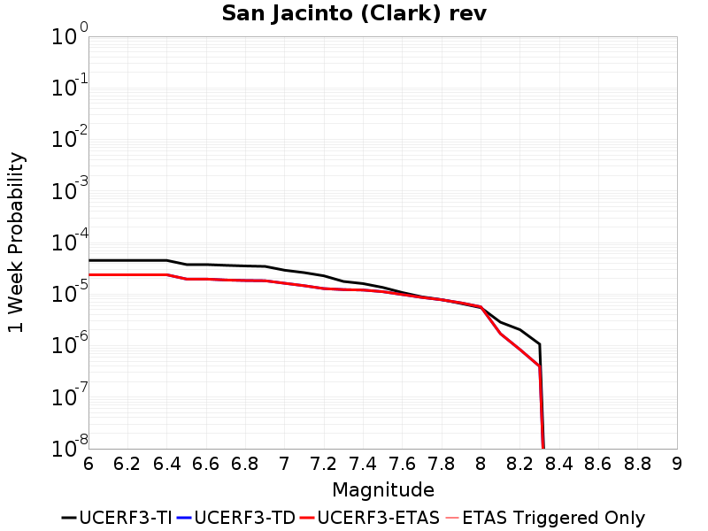 | 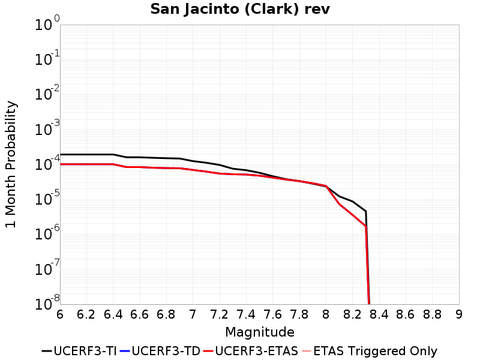 | 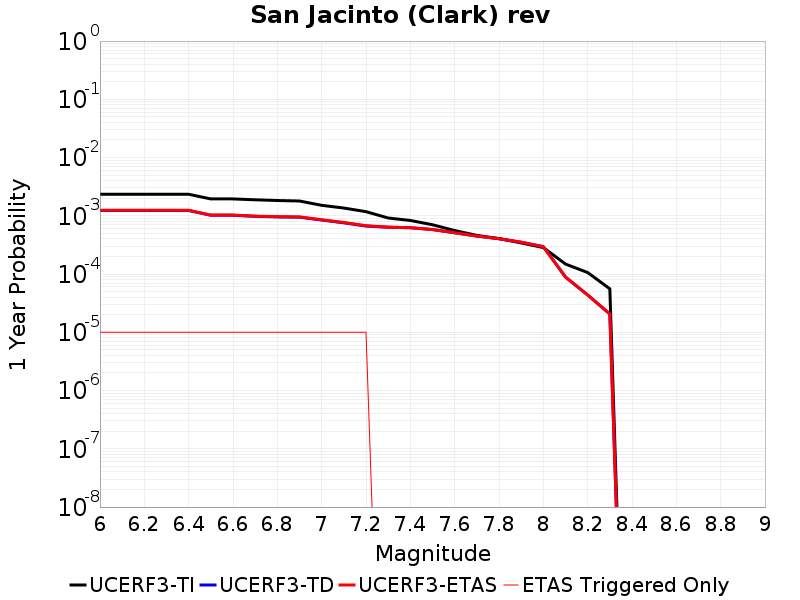 | 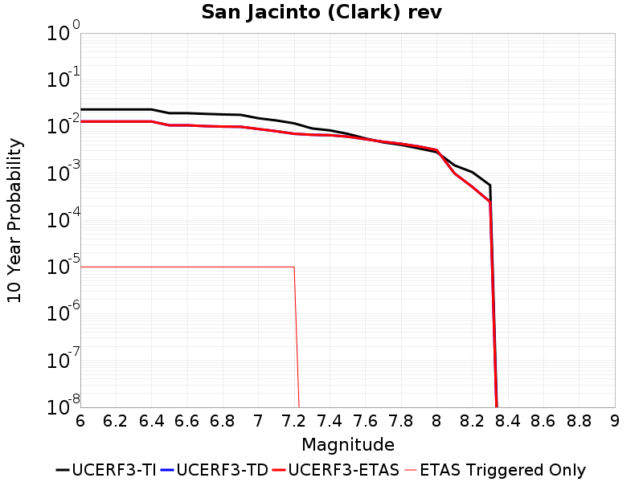 |

| Magnitude | 1 wk TI Prob | 1 wk TD Prob | 1 wk ETAS Prob | 1 wk ETAS/TD Gain | 1 wk ETAS Triggered Only | 1 mo TI Prob | 1 mo TD Prob | 1 mo ETAS Prob | 1 mo ETAS/TD Gain | 1 mo ETAS Triggered Only | 1 yr TI Prob | 1 yr TD Prob | 1 yr ETAS Prob | 1 yr ETAS/TD Gain | 1 yr ETAS Triggered Only | 10 yr TI Prob | 10 yr TD Prob | 10 yr ETAS Prob | 10 yr ETAS/TD Gain | 10 yr ETAS Triggered Only |
|-----|-----|-----|-----|-----|-----|-----|-----|-----|-----|-----|-----|-----|-----|-----|-----|-----|-----|-----|-----|-----|
| 6.0 | 4.482615E-5 | 2.3595625E-5 | 2.3595625E-5 | 1.0 | 0.0 | 1.9209793E-4 | 1.0112025E-4 | 1.0112025E-4 | 1.0 | 0.0 | 0.0023362834 | 0.0012304547 | 0.0012404424 | 1.0081171 | 1.0E-5 | 0.02311874 | 0.012783842 | 0.012793715 | 1.0007722 | 1.0E-5 |
| 6.1 | 4.482615E-5 | 2.3595625E-5 | 2.3595625E-5 | 1.0 | 0.0 | 1.9209793E-4 | 1.0112025E-4 | 1.0112025E-4 | 1.0 | 0.0 | 0.0023362834 | 0.0012304547 | 0.0012404424 | 1.0081171 | 1.0E-5 | 0.02311874 | 0.012783842 | 0.012793715 | 1.0007722 | 1.0E-5 |
| 6.2 | 4.482615E-5 | 2.3595625E-5 | 2.3595625E-5 | 1.0 | 0.0 | 1.9209793E-4 | 1.0112025E-4 | 1.0112025E-4 | 1.0 | 0.0 | 0.0023362834 | 0.0012304547 | 0.0012404424 | 1.0081171 | 1.0E-5 | 0.02311874 | 0.012783842 | 0.012793715 | 1.0007722 | 1.0E-5 |
| 6.3 | 4.482615E-5 | 2.3595625E-5 | 2.3595625E-5 | 1.0 | 0.0 | 1.9209793E-4 | 1.0112025E-4 | 1.0112025E-4 | 1.0 | 0.0 | 0.0023362834 | 0.0012304547 | 0.0012404424 | 1.0081171 | 1.0E-5 | 0.02311874 | 0.012783842 | 0.012793715 | 1.0007722 | 1.0E-5 |
| 6.4 | 4.482615E-5 | 2.3595625E-5 | 2.3595625E-5 | 1.0 | 0.0 | 1.9209793E-4 | 1.0112025E-4 | 1.0112025E-4 | 1.0 | 0.0 | 0.0023362834 | 0.0012304547 | 0.0012404424 | 1.0081171 | 1.0E-5 | 0.02311874 | 0.012783842 | 0.012793715 | 1.0007722 | 1.0E-5 |
| 6.5 | 3.7294863E-5 | 1.9520437E-5 | 1.9520437E-5 | 1.0 | 0.0 | 1.5982533E-4 | 8.365637E-5 | 8.365637E-5 | 1.0 | 0.0 | 0.0019441366 | 0.0010180458 | 0.0010280357 | 1.0098127 | 1.0E-5 | 0.01927216 | 0.010616358 | 0.010626253 | 1.000932 | 1.0E-5 |
| 6.6 | 3.7294863E-5 | 1.9520437E-5 | 1.9520437E-5 | 1.0 | 0.0 | 1.5982533E-4 | 8.365637E-5 | 8.365637E-5 | 1.0 | 0.0 | 0.0019441366 | 0.0010180458 | 0.0010280357 | 1.0098127 | 1.0E-5 | 0.01927216 | 0.010616358 | 0.010626253 | 1.000932 | 1.0E-5 |
| 6.7 | 3.6039248E-5 | 1.8717257E-5 | 1.8717257E-5 | 1.0 | 0.0 | 1.5444479E-4 | 8.0214384E-5 | 8.0214384E-5 | 1.0 | 0.0 | 0.0018787434 | 9.761777E-4 | 9.861679E-4 | 1.010234 | 1.0E-5 | 0.01862939 | 0.010191487 | 0.010201385 | 1.0009712 | 1.0E-5 |
| 6.8 | 3.5031844E-5 | 1.8305283E-5 | 1.8305283E-5 | 1.0 | 0.0 | 1.5012783E-4 | 7.844889E-5 | 7.844889E-5 | 1.0 | 0.0 | 0.0018262739 | 9.547017E-4 | 9.6469215E-4 | 1.0104644 | 1.0E-5 | 0.01811338 | 0.009971576 | 0.009981477 | 1.0009929 | 1.0E-5 |
| 6.9 | 3.435112E-5 | 1.8113686E-5 | 1.8113686E-5 | 1.0 | 0.0 | 1.4721078E-4 | 7.76278E-5 | 7.76278E-5 | 1.0 | 0.0 | 0.0017908178 | 9.4471377E-4 | 9.547043E-4 | 1.0105752 | 1.0E-5 | 0.017764548 | 0.009869458 | 0.009879359 | 1.0010033 | 1.0E-5 |
| 7.0 | 2.8959772E-5 | 1.6176116E-5 | 1.6176116E-5 | 1.0 | 0.0 | 1.241074E-4 | 6.932439E-5 | 6.932439E-5 | 1.0 | 0.0 | 0.0015099603 | 8.43701E-4 | 8.536926E-4 | 1.0118425 | 1.0E-5 | 0.014997416 | 0.008832855 | 0.008842767 | 1.0011221 | 1.0E-5 |
| 7.1 | 2.6002877E-5 | 1.4499564E-5 | 1.4499564E-5 | 1.0 | 0.0 | 1.11436144E-4 | 6.213952E-5 | 6.213952E-5 | 1.0 | 0.0 | 0.0013558907 | 7.5628865E-4 | 7.662811E-4 | 1.0132124 | 1.0E-5 | 0.013476475 | 0.0079254955 | 0.007935417 | 1.0012517 | 1.0E-5 |
| 7.2 | 2.2544838E-5 | 1.275068E-5 | 1.275068E-5 | 1.0 | 0.0 | 9.661716E-5 | 5.464464E-5 | 5.464464E-5 | 1.0 | 0.0 | 0.001175679 | 6.650971E-4 | 6.750905E-4 | 1.0150254 | 1.0E-5 | 0.011694785 | 0.0069848457 | 0.006994776 | 1.0014217 | 1.0E-5 |
| 7.3 | 1.75334E-5 | 1.2189008E-5 | 1.2189008E-5 | 1.0 | 0.0 | 7.514098E-5 | 5.2237567E-5 | 5.2237567E-5 | 1.0 | 0.0 | 9.144575E-4 | 6.3580845E-4 | 6.3580845E-4 | 1.0 | 0.0 | 0.009107036 | 0.006663108 | 0.006663108 | 1.0 | 0.0 |
| 7.4 | 1.5924552E-5 | 1.1952975E-5 | 1.1952975E-5 | 1.0 | 0.0 | 6.82463E-5 | 5.1226038E-5 | 5.1226038E-5 | 1.0 | 0.0 | 8.305819E-4 | 6.2350015E-4 | 6.2350015E-4 | 1.0 | 0.0 | 0.008274844 | 0.006530916 | 0.006530916 | 1.0 | 0.0 |
| 7.5 | 1.3428931E-5 | 1.1113786E-5 | 1.1113786E-5 | 1.0 | 0.0 | 5.7551293E-5 | 4.762965E-5 | 4.762965E-5 | 1.0 | 0.0 | 7.004617E-4 | 5.79738E-4 | 5.79738E-4 | 1.0 | 0.0 | 0.006982579 | 0.0060742577 | 0.0060742577 | 1.0 | 0.0 |
| 7.6 | 1.0688787E-5 | 9.781287E-6 | 9.781287E-6 | 1.0 | 0.0 | 4.5808283E-5 | 4.191913E-5 | 4.191913E-5 | 1.0 | 0.0 | 5.5757316E-4 | 5.1024643E-4 | 5.1024643E-4 | 1.0 | 0.0 | 0.005561762 | 0.0053590005 | 0.0053590005 | 1.0 | 0.0 |
| 7.7 | 8.81236E-6 | 8.586135E-6 | 8.586135E-6 | 1.0 | 0.0 | 3.776671E-5 | 3.6797202E-5 | 3.6797202E-5 | 1.0 | 0.0 | 4.597127E-4 | 4.4791415E-4 | 4.4791415E-4 | 1.0 | 0.0 | 0.0045876284 | 0.00472697 | 0.00472697 | 1.0 | 0.0 |
| 7.8 | 7.780431E-6 | 7.736966E-6 | 7.736966E-6 | 1.0 | 0.0 | 3.3344273E-5 | 3.3158005E-5 | 3.3158005E-5 | 1.0 | 0.0 | 4.0589093E-4 | 4.0362417E-4 | 4.0362417E-4 | 1.0 | 0.0 | 0.0040515037 | 0.00427454 | 0.00427454 | 1.0 | 0.0 |
| 7.9 | 6.5437994E-6 | 6.7345195E-6 | 6.7345195E-6 | 1.0 | 0.0 | 2.8044553E-5 | 2.8861907E-5 | 2.8861907E-5 | 1.0 | 0.0 | 3.4138895E-4 | 3.5133728E-4 | 3.5133728E-4 | 1.0 | 0.0 | 0.0034086495 | 0.0037413673 | 0.0037413673 | 1.0 | 0.0 |
| 8.0 | 5.4488164E-6 | 5.6491026E-6 | 5.6491026E-6 | 1.0 | 0.0 | 2.3351862E-5 | 2.4210216E-5 | 2.4210216E-5 | 1.0 | 0.0 | 2.8427184E-4 | 2.947197E-4 | 2.947197E-4 | 1.0 | 0.0 | 0.0028390845 | 0.0031559644 | 0.0031559644 | 1.0 | 0.0 |
| 8.1 | 2.8397242E-6 | 1.6975739E-6 | 1.6975739E-6 | 1.0 | 0.0 | 1.217019E-5 | 7.2752964E-6 | 7.2752964E-6 | 1.0 | 0.0 | 1.4816198E-4 | 8.857315E-5 | 8.857315E-5 | 1.0 | 0.0 | 0.0014806325 | 9.963387E-4 | 9.963387E-4 | 1.0 | 0.0 |
| 8.2 | 2.030244E-6 | 8.356225E-7 | 8.356225E-7 | 1.0 | 0.0 | 8.701017E-6 | 3.5812343E-6 | 3.5812343E-6 | 1.0 | 0.0 | 1.05929736E-4 | 4.3600663E-5 | 4.3600663E-5 | 1.0 | 0.0 | 0.0010587925 | 5.1231374E-4 | 5.1231374E-4 | 1.0 | 0.0 |
| 8.3 | 1.0659804E-6 | 3.943601E-7 | 3.943601E-7 | 1.0 | 0.0 | 4.568479E-6 | 1.6901135E-6 | 1.6901135E-6 | 1.0 | 0.0 | 5.5619817E-5 | 2.0576945E-5 | 2.0576945E-5 | 1.0 | 0.0 | 5.5605895E-4 | 2.4503694E-4 | 2.4503694E-4 | 1.0 | 0.0 |

