# Parent Section Magnitude-Probability Distributions

Only fault sections with at least one triggered aftershock are plotted. Sections are sorted by total supraseismogenic trigger rate (decreasing)

## Table Of Contents

* [San Andreas (Coachella) rev](#san-andreas-coachella-rev)
* [San Andreas (San Gorgonio Pass-Garnet HIll)](#san-andreas-san-gorgonio-pass-garnet-hill)
* [Brawley (Seismic Zone) alt 1](#brawley-seismic-zone-alt-1)
* [Imperial](#imperial)
* [San Andreas (Creeping Section) 2011 CFM](#san-andreas-creeping-section-2011-cfm)
* [Calaveras (So) - Paicines extension 2011 CFM](#calaveras-so---paicines-extension-2011-cfm)
* [San Andreas (San Bernardino S)](#san-andreas-san-bernardino-s)
* [San Andreas (Big Bend)](#san-andreas-big-bend)
* [San Andreas (Mojave N)](#san-andreas-mojave-n)
* [Helendale-So Lockhart](#helendale-so-lockhart)
* [San Jacinto (Superstition Mtn)](#san-jacinto-superstition-mtn)
* [San Andreas (San Bernardino N)](#san-andreas-san-bernardino-n)
* [San Andreas (Carrizo) rev](#san-andreas-carrizo-rev)
* [San Andreas (Mojave S)](#san-andreas-mojave-s)
* [Goldstone Lake](#goldstone-lake)
* [San Andreas (Parkfield)](#san-andreas-parkfield)
* [Calaveras (Central) 2011 CFM](#calaveras-central-2011-cfm)
* [San Andreas (Cholame) rev](#san-andreas-cholame-rev)
* [Lost Hills](#lost-hills)
* [Blue Cut](#blue-cut)
* [Superstition Hills](#superstition-hills)
* [Elmore Ranch](#elmore-ranch)
* [Calaveras (So) 2011 CFM](#calaveras-so-2011-cfm)
* [Coyote Canyon](#coyote-canyon)

## San Andreas (Coachella) rev
*[(top)](#table-of-contents)*

| 1 Week | 1 Month | 1 Year | 10 Year |
|-----|-----|-----|-----|
|  |  |  |  |

| Magnitude | 1 wk TI Prob | 1 wk TD Prob | 1 wk ETAS Prob | 1 wk ETAS/TD Gain | 1 wk ETAS Triggered Only | 1 mo TI Prob | 1 mo TD Prob | 1 mo ETAS Prob | 1 mo ETAS/TD Gain | 1 mo ETAS Triggered Only | 1 yr TI Prob | 1 yr TD Prob | 1 yr ETAS Prob | 1 yr ETAS/TD Gain | 1 yr ETAS Triggered Only | 10 yr TI Prob | 10 yr TD Prob | 10 yr ETAS Prob | 10 yr ETAS/TD Gain | 10 yr ETAS Triggered Only |
|-----|-----|-----|-----|-----|-----|-----|-----|-----|-----|-----|-----|-----|-----|-----|-----|-----|-----|-----|-----|-----|
| 6.0 | 1.1925945E-4 | 3.3809608E-4 | 3.880792E-4 | 1.1478369 | 5.0E-5 | 5.110118E-4 | 0.0014481836 | 0.0014981112 | 1.034476 | 5.0E-5 | 0.0062038354 | 0.017490521 | 0.017588772 | 1.0056174 | 1.0E-4 | 0.060334753 | 0.15691422 | 0.15703225 | 1.0007522 | 1.4E-4 |
| 6.1 | 1.1925945E-4 | 3.3809608E-4 | 3.880792E-4 | 1.1478369 | 5.0E-5 | 5.110118E-4 | 0.0014481836 | 0.0014981112 | 1.034476 | 5.0E-5 | 0.0062038354 | 0.017490521 | 0.017588772 | 1.0056174 | 1.0E-4 | 0.060334753 | 0.15691422 | 0.15703225 | 1.0007522 | 1.4E-4 |
| 6.2 | 1.07432395E-4 | 3.130109E-4 | 3.6299526E-4 | 1.1596888 | 5.0E-5 | 4.603433E-4 | 0.0013407898 | 0.0013907228 | 1.0372415 | 5.0E-5 | 0.005590286 | 0.016203111 | 0.016301492 | 1.0060717 | 1.0E-4 | 0.05451731 | 0.14609641 | 0.1462074 | 1.0007598 | 1.3E-4 |
| 6.3 | 1.0718766E-4 | 3.124643E-4 | 3.6244869E-4 | 1.1599683 | 5.0E-5 | 4.592948E-4 | 0.0013384497 | 0.0013883827 | 1.0373067 | 5.0E-5 | 0.005577586 | 0.016175043 | 0.016273426 | 1.0060824 | 1.0E-4 | 0.054396555 | 0.14586563 | 0.14597668 | 1.0007613 | 1.3E-4 |
| 6.4 | 1.0355944E-4 | 3.0452712E-4 | 3.545119E-4 | 1.164139 | 5.0E-5 | 4.4375064E-4 | 0.0013044676 | 0.0013544024 | 1.0382798 | 5.0E-5 | 0.0053892885 | 0.015767371 | 0.015865793 | 1.0062422 | 1.0E-4 | 0.052604496 | 0.14243276 | 0.14253567 | 1.0007225 | 1.2E-4 |
| 6.5 | 1.0227914E-4 | 3.0171592E-4 | 3.5170084E-4 | 1.1656688 | 5.0E-5 | 4.382655E-4 | 0.0012924316 | 0.001342367 | 1.0386368 | 5.0E-5 | 0.0053228354 | 0.015622945 | 0.015711538 | 1.0056708 | 9.0E-5 | 0.051971316 | 0.14121392 | 0.14130838 | 1.000669 | 1.1E-4 |
| 6.6 | 1.0116757E-4 | 2.9936444E-4 | 3.4934946E-4 | 1.1669705 | 5.0E-5 | 4.3350324E-4 | 0.0012823638 | 0.0013322997 | 1.0389405 | 5.0E-5 | 0.0052651367 | 0.015502118 | 0.015590723 | 1.0057156 | 9.0E-5 | 0.051421247 | 0.14019419 | 0.14028877 | 1.0006746 | 1.1E-4 |
| 6.7 | 1.0050676E-4 | 2.9794622E-4 | 3.4793132E-4 | 1.1677655 | 5.0E-5 | 4.3067214E-4 | 0.0012762916 | 0.0013262277 | 1.039126 | 5.0E-5 | 0.005230834 | 0.015429239 | 0.0155178495 | 1.005743 | 9.0E-5 | 0.051094085 | 0.13958009 | 0.13967474 | 1.0006781 | 1.1E-4 |
| 6.8 | 9.976819E-5 | 2.9596873E-4 | 3.359569E-4 | 1.1351094 | 4.0E-5 | 4.2750788E-4 | 0.0012678249 | 0.0013077742 | 1.0315101 | 4.0E-5 | 0.0051924936 | 0.015327613 | 0.01539654 | 1.0044969 | 7.0E-5 | 0.050728295 | 0.13872996 | 0.13880748 | 1.0005587 | 9.0E-5 |
| 6.9 | 9.77719E-5 | 2.9089846E-4 | 3.2088973E-4 | 1.1030988 | 3.0E-5 | 4.1895514E-4 | 0.0012461161 | 0.0012760788 | 1.0240448 | 3.0E-5 | 0.0050888555 | 0.015066993 | 0.01512609 | 1.0039222 | 6.0E-5 | 0.049738888 | 0.1365525 | 0.13662158 | 1.0005058 | 8.0E-5 |
| 7.0 | 8.500761E-5 | 2.579873E-4 | 2.8797955E-4 | 1.1162548 | 3.0E-5 | 3.6426744E-4 | 0.0011051948 | 0.0011351616 | 1.0271145 | 3.0E-5 | 0.0044259406 | 0.013373565 | 0.013432763 | 1.0044265 | 6.0E-5 | 0.04338823 | 0.12236388 | 0.12243409 | 1.0005738 | 8.0E-5 |
| 7.1 | 8.319876E-5 | 2.5395644E-4 | 2.8394884E-4 | 1.1181005 | 3.0E-5 | 3.5651738E-4 | 0.0010879342 | 0.0011179015 | 1.0275452 | 3.0E-5 | 0.004331963 | 0.013165977 | 0.013225188 | 1.0044972 | 6.0E-5 | 0.042484846 | 0.12056868 | 0.12063903 | 1.0005835 | 8.0E-5 |
| 7.2 | 7.563917E-5 | 2.3427542E-4 | 2.642684E-4 | 1.1280245 | 3.0E-5 | 3.2412758E-4 | 0.0010036544 | 0.0010336243 | 1.0298607 | 3.0E-5 | 0.0039391145 | 0.012151773 | 0.012211043 | 1.0048776 | 6.0E-5 | 0.03870018 | 0.1119462 | 0.112017244 | 1.0006347 | 8.0E-5 |
| 7.3 | 7.082985E-5 | 2.1713927E-4 | 2.4713276E-4 | 1.1381302 | 3.0E-5 | 3.0352117E-4 | 9.30268E-4 | 9.6024014E-4 | 1.0322188 | 3.0E-5 | 0.0036891096 | 0.011267871 | 0.011327194 | 1.0052649 | 6.0E-5 | 0.03628465 | 0.10438401 | 0.1044467 | 1.0006006 | 7.0E-5 |
| 7.4 | 5.146215E-5 | 1.5094392E-4 | 1.609424E-4 | 1.0662397 | 1.0E-5 | 2.2053342E-4 | 6.4674305E-4 | 6.567366E-4 | 1.0154521 | 1.0E-5 | 0.0026816884 | 0.007845876 | 0.007855797 | 1.0012646 | 1.0E-5 | 0.02649557 | 0.074406505 | 0.07441576 | 1.0001245 | 1.0E-5 |
| 7.5 | 4.0285166E-5 | 1.1653234E-4 | 1.2653117E-4 | 1.085803 | 1.0E-5 | 1.7263928E-4 | 4.9932906E-4 | 5.093241E-4 | 1.0200169 | 1.0E-5 | 0.002099857 | 0.0060624634 | 0.0060724025 | 1.0016395 | 1.0E-5 | 0.020801254 | 0.05815609 | 0.05816551 | 1.000162 | 1.0E-5 |
| 7.6 | 3.1168736E-5 | 9.058674E-5 | 1.00585836E-4 | 1.1103815 | 1.0E-5 | 1.3357346E-4 | 3.8817126E-4 | 3.9816738E-4 | 1.0257518 | 1.0E-5 | 0.0016250437 | 0.0047157747 | 0.0047257273 | 1.0021106 | 1.0E-5 | 0.016132116 | 0.045583583 | 0.045593128 | 1.0002093 | 1.0E-5 |
| 7.7 | 2.2100989E-5 | 6.772414E-5 | 7.772347E-5 | 1.1476479 | 1.0E-5 | 9.4715084E-5 | 2.9021408E-4 | 3.0021116E-4 | 1.0344473 | 1.0E-5 | 0.001152546 | 0.0035276394 | 0.0035376041 | 1.0028248 | 1.0E-5 | 0.011465867 | 0.034301765 | 0.034311425 | 1.0002816 | 1.0E-5 |
| 7.8 | 1.7484861E-5 | 5.648573E-5 | 6.648516E-5 | 1.1770259 | 1.0E-5 | 7.493296E-5 | 2.4205925E-4 | 2.5205684E-4 | 1.0413022 | 1.0E-5 | 9.1192697E-4 | 0.002943092 | 0.0029530628 | 1.0033878 | 1.0E-5 | 0.009081938 | 0.028757842 | 0.028767554 | 1.0003377 | 1.0E-5 |
| 7.9 | 1.3967285E-5 | 4.1933865E-5 | 5.1933446E-5 | 1.2384608 | 1.0E-5 | 5.985842E-5 | 1.7970419E-4 | 1.8970239E-4 | 1.055637 | 1.0E-5 | 7.2853256E-4 | 0.0021857047 | 0.0021956826 | 1.0045652 | 1.0E-5 | 0.0072614877 | 0.021612879 | 0.021622663 | 1.0004526 | 1.0E-5 |
| 8.0 | 1.1887396E-5 | 3.420336E-5 | 4.4203018E-5 | 1.292359 | 1.0E-5 | 5.094499E-5 | 1.465776E-4 | 1.5657613E-4 | 1.0682132 | 1.0E-5 | 6.200787E-4 | 0.0017831227 | 0.0017931048 | 1.0055982 | 1.0E-5 | 0.006183513 | 0.01773106 | 0.017740881 | 1.000554 | 1.0E-5 |
| 8.1 | 5.100864E-6 | 1.0216764E-5 | 2.0216661E-5 | 1.9787735 | 1.0E-5 | 2.1860664E-5 | 4.3785396E-5 | 5.378496E-5 | 1.2283766 | 1.0E-5 | 2.6612106E-4 | 5.3295697E-4 | 5.4295163E-4 | 1.0187533 | 1.0E-5 | 0.002658026 | 0.0055313553 | 0.0055413 | 1.0017979 | 1.0E-5 |
| 8.2 | 2.3004484E-6 | 3.3080587E-6 | 3.3080587E-6 | 1.0 | 0.0 | 9.859027E-6 | 1.4177318E-5 | 1.4177318E-5 | 1.0 | 0.0 | 1.2002704E-4 | 1.7259522E-4 | 1.7259522E-4 | 1.0 | 0.0 | 0.0011996223 | 0.0018630916 | 0.0018630916 | 1.0 | 0.0 |
| 8.3 | 1.0424446E-7 | 7.297297E-8 | 7.297297E-8 | 1.0 | 0.0 | 4.4676187E-7 | 3.1274126E-7 | 3.1274126E-7 | 1.0 | 0.0 | 5.439312E-6 | 3.807619E-6 | 3.807619E-6 | 1.0 | 0.0 | 5.4391792E-5 | 3.97662E-5 | 3.97662E-5 | 1.0 | 0.0 |

## San Andreas (San Gorgonio Pass-Garnet HIll)
*[(top)](#table-of-contents)*

| 1 Week | 1 Month | 1 Year | 10 Year |
|-----|-----|-----|-----|
|  |  | 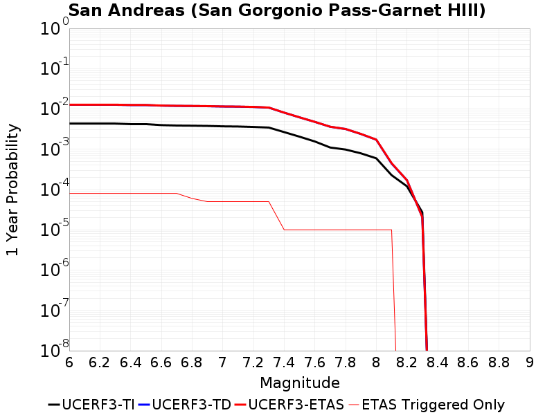 |  |

| Magnitude | 1 wk TI Prob | 1 wk TD Prob | 1 wk ETAS Prob | 1 wk ETAS/TD Gain | 1 wk ETAS Triggered Only | 1 mo TI Prob | 1 mo TD Prob | 1 mo ETAS Prob | 1 mo ETAS/TD Gain | 1 mo ETAS Triggered Only | 1 yr TI Prob | 1 yr TD Prob | 1 yr ETAS Prob | 1 yr ETAS/TD Gain | 1 yr ETAS Triggered Only | 10 yr TI Prob | 10 yr TD Prob | 10 yr ETAS Prob | 10 yr ETAS/TD Gain | 10 yr ETAS Triggered Only |
|-----|-----|-----|-----|-----|-----|-----|-----|-----|-----|-----|-----|-----|-----|-----|-----|-----|-----|-----|-----|-----|
| 6.0 | 8.31567E-5 | 2.445404E-4 | 2.845306E-4 | 1.1635321 | 4.0E-5 | 3.5633717E-4 | 0.0010476031 | 0.0010875611 | 1.0381424 | 4.0E-5 | 0.004329778 | 0.012679869 | 0.012758855 | 1.0062292 | 8.0E-5 | 0.042463828 | 0.116965234 | 0.11705353 | 1.000755 | 1.0E-4 |
| 6.1 | 8.31567E-5 | 2.445404E-4 | 2.845306E-4 | 1.1635321 | 4.0E-5 | 3.5633717E-4 | 0.0010476031 | 0.0010875611 | 1.0381424 | 4.0E-5 | 0.004329778 | 0.012679869 | 0.012758855 | 1.0062292 | 8.0E-5 | 0.042463828 | 0.116965234 | 0.11705353 | 1.000755 | 1.0E-4 |
| 6.2 | 8.31567E-5 | 2.445404E-4 | 2.845306E-4 | 1.1635321 | 4.0E-5 | 3.5633717E-4 | 0.0010476031 | 0.0010875611 | 1.0381424 | 4.0E-5 | 0.004329778 | 0.012679869 | 0.012758855 | 1.0062292 | 8.0E-5 | 0.042463828 | 0.116965234 | 0.11705353 | 1.000755 | 1.0E-4 |
| 6.3 | 8.31567E-5 | 2.445404E-4 | 2.845306E-4 | 1.1635321 | 4.0E-5 | 3.5633717E-4 | 0.0010476031 | 0.0010875611 | 1.0381424 | 4.0E-5 | 0.004329778 | 0.012679869 | 0.012758855 | 1.0062292 | 8.0E-5 | 0.042463828 | 0.116965234 | 0.11705353 | 1.000755 | 1.0E-4 |
| 6.4 | 8.059055E-5 | 2.4004723E-4 | 2.800376E-4 | 1.1665939 | 4.0E-5 | 3.4534236E-4 | 0.0010283651 | 0.001068324 | 1.0388567 | 4.0E-5 | 0.0041964394 | 0.012448709 | 0.012527714 | 1.0063463 | 8.0E-5 | 0.041180745 | 0.114927605 | 0.11501612 | 1.0007701 | 1.0E-4 |
| 6.5 | 8.059055E-5 | 2.4004723E-4 | 2.800376E-4 | 1.1665939 | 4.0E-5 | 3.4534236E-4 | 0.0010283651 | 0.001068324 | 1.0388567 | 4.0E-5 | 0.0041964394 | 0.012448709 | 0.012527714 | 1.0063463 | 8.0E-5 | 0.041180745 | 0.114927605 | 0.11501612 | 1.0007701 | 1.0E-4 |
| 6.6 | 7.619237E-5 | 2.32386E-4 | 2.723767E-4 | 1.1720874 | 4.0E-5 | 3.2649786E-4 | 9.955623E-4 | 0.0010355226 | 1.0401382 | 4.0E-5 | 0.0039678677 | 0.012054202 | 0.012133238 | 1.0065566 | 8.0E-5 | 0.03897764 | 0.11143575 | 0.111524604 | 1.0007974 | 1.0E-4 |
| 6.7 | 7.440636E-5 | 2.2910813E-4 | 2.6909896E-4 | 1.17455 | 4.0E-5 | 3.188454E-4 | 9.815249E-4 | 0.0010214857 | 1.040713 | 4.0E-5 | 0.0038750346 | 0.01188517 | 0.011964219 | 1.006651 | 8.0E-5 | 0.038081564 | 0.109936014 | 0.110025026 | 1.0008097 | 1.0E-4 |
| 6.8 | 7.3735864E-5 | 2.2755613E-4 | 2.5754928E-4 | 1.1318057 | 3.0E-5 | 3.1597257E-4 | 9.7487844E-4 | 0.0010048492 | 1.0307431 | 3.0E-5 | 0.0038401815 | 0.011805132 | 0.011864424 | 1.0050225 | 6.0E-5 | 0.03774495 | 0.10923074 | 0.10930201 | 1.0006524 | 8.0E-5 |
| 6.9 | 7.27575E-5 | 2.252187E-4 | 2.452142E-4 | 1.0887825 | 2.0E-5 | 3.117806E-4 | 9.6486835E-4 | 9.848491E-4 | 1.0207082 | 2.0E-5 | 0.003789323 | 0.011684573 | 0.011733989 | 1.0042292 | 5.0E-5 | 0.037253562 | 0.10817222 | 0.108234644 | 1.0005771 | 7.0E-5 |
| 7.0 | 7.102591E-5 | 2.210005E-4 | 2.4099609E-4 | 1.0904776 | 2.0E-5 | 3.0436125E-4 | 9.468036E-4 | 9.667847E-4 | 1.0211037 | 2.0E-5 | 0.003699303 | 0.011466969 | 0.011516395 | 1.0043104 | 5.0E-5 | 0.03638325 | 0.10625881 | 0.10632137 | 1.0005888 | 7.0E-5 |
| 7.1 | 7.028513E-5 | 2.193271E-4 | 2.3932272E-4 | 1.091168 | 2.0E-5 | 3.0118722E-4 | 9.396371E-4 | 9.596183E-4 | 1.0212648 | 2.0E-5 | 0.0036607897 | 0.0113806315 | 0.011430062 | 1.0043434 | 5.0E-5 | 0.036010686 | 0.10549257 | 0.105555184 | 1.0005935 | 7.0E-5 |
| 7.2 | 6.8498244E-5 | 2.1532761E-4 | 2.353233E-4 | 1.0928618 | 2.0E-5 | 2.9353087E-4 | 9.225086E-4 | 9.424901E-4 | 1.02166 | 2.0E-5 | 0.003567883 | 0.011174248 | 0.011223689 | 1.0044246 | 5.0E-5 | 0.035111405 | 0.103659466 | 0.10372221 | 1.0006053 | 7.0E-5 |
| 7.3 | 6.622592E-5 | 2.0743677E-4 | 2.2743263E-4 | 1.0963949 | 2.0E-5 | 2.8379448E-4 | 8.8871416E-4 | 9.086964E-4 | 1.0224844 | 2.0E-5 | 0.0034497243 | 0.010766937 | 0.0108164 | 1.0045938 | 5.0E-5 | 0.033966612 | 0.100104086 | 0.10015808 | 1.0005394 | 6.0E-5 |
| 7.4 | 5.1050705E-5 | 1.5561753E-4 | 1.6561597E-4 | 1.0642501 | 1.0E-5 | 2.1877038E-4 | 6.6676276E-4 | 6.767561E-4 | 1.0149878 | 1.0E-5 | 0.002660276 | 0.008087833 | 0.008097752 | 1.0012264 | 1.0E-5 | 0.02628654 | 0.076612525 | 0.076621756 | 1.0001205 | 1.0E-5 |
| 7.5 | 3.9302922E-5 | 1.1885556E-4 | 1.2885437E-4 | 1.0841258 | 1.0E-5 | 1.6843023E-4 | 5.092819E-4 | 5.192768E-4 | 1.0196255 | 1.0E-5 | 0.0020487092 | 0.006182957 | 0.006192895 | 1.0016073 | 1.0E-5 | 0.020299247 | 0.059323862 | 0.05933327 | 1.0001585 | 1.0E-5 |
| 7.6 | 2.9851626E-5 | 9.154006E-5 | 1.01539146E-4 | 1.1092318 | 1.0E-5 | 1.2792926E-4 | 3.922557E-4 | 4.0225175E-4 | 1.0254836 | 1.0E-5 | 0.0015564259 | 0.0047652847 | 0.004775237 | 1.0020885 | 1.0E-5 | 0.0154556995 | 0.04612209 | 0.04613163 | 1.0002068 | 1.0E-5 |
| 7.7 | 2.1135214E-5 | 6.926895E-5 | 7.926826E-5 | 1.1443548 | 1.0E-5 | 9.0576345E-5 | 2.968332E-4 | 3.0683022E-4 | 1.033679 | 1.0E-5 | 0.0011022091 | 0.003607962 | 0.0036179258 | 1.0027616 | 1.0E-5 | 0.010967582 | 0.035145815 | 0.035155464 | 1.0002745 | 1.0E-5 |
| 7.8 | 1.883379E-5 | 6.084268E-5 | 7.084208E-5 | 1.1643482 | 1.0E-5 | 8.0713755E-5 | 2.6072832E-4 | 2.707257E-4 | 1.0383441 | 1.0E-5 | 9.822468E-4 | 0.0031697506 | 0.0031797187 | 1.0031449 | 1.0E-5 | 0.0097791655 | 0.031032335 | 0.031042024 | 1.0003122 | 1.0E-5 |
| 7.9 | 1.5156185E-5 | 4.5789388E-5 | 5.578893E-5 | 1.2183812 | 1.0E-5 | 6.495346E-5 | 1.9622548E-4 | 2.0622351E-4 | 1.0509518 | 1.0E-5 | 7.9052144E-4 | 0.0023864293 | 0.0023964054 | 1.0041803 | 1.0E-5 | 0.007877152 | 0.023643257 | 0.02365302 | 1.000413 | 1.0E-5 |
| 8.0 | 1.1405907E-5 | 3.3035187E-5 | 4.3034855E-5 | 1.3026975 | 1.0E-5 | 4.8881542E-5 | 1.415717E-4 | 1.5157028E-4 | 1.0706255 | 1.0E-5 | 5.9497025E-4 | 0.0017222738 | 0.0017322566 | 1.0057963 | 1.0E-5 | 0.005933798 | 0.017183186 | 0.017193016 | 1.000572 | 1.0E-5 |
| 8.1 | 4.3511436E-6 | 8.45235E-6 | 1.8452265E-5 | 2.1830928 | 1.0E-5 | 1.8647626E-5 | 3.6223857E-5 | 4.6223493E-5 | 1.2760512 | 1.0E-5 | 2.2701119E-4 | 4.4093636E-4 | 4.5093196E-4 | 1.022669 | 1.0E-5 | 0.0022677942 | 0.0046501523 | 0.004660106 | 1.0021405 | 1.0E-5 |
| 8.2 | 2.3042528E-6 | 3.2568887E-6 | 3.2568887E-6 | 1.0 | 0.0 | 9.875332E-6 | 1.395802E-5 | 1.395802E-5 | 1.0 | 0.0 | 1.2022553E-4 | 1.699257E-4 | 1.699257E-4 | 1.0 | 0.0 | 0.0012016051 | 0.0018672793 | 0.0018672793 | 1.0 | 0.0 |
| 8.3 | 5.202968E-7 | 3.9583597E-7 | 3.9583597E-7 | 1.0 | 0.0 | 2.2298414E-6 | 1.6964389E-6 | 1.6964389E-6 | 1.0 | 0.0 | 2.714798E-5 | 2.0653968E-5 | 2.0653968E-5 | 1.0 | 0.0 | 2.7144665E-4 | 2.3965216E-4 | 2.3965216E-4 | 1.0 | 0.0 |

## Brawley (Seismic Zone) alt 1
*[(top)](#table-of-contents)*

| 1 Week | 1 Month | 1 Year | 10 Year |
|-----|-----|-----|-----|
|  | 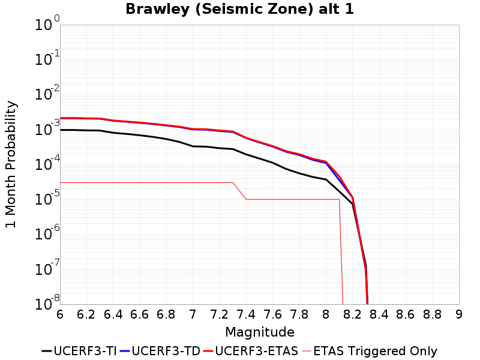 |  |  |

| Magnitude | 1 wk TI Prob | 1 wk TD Prob | 1 wk ETAS Prob | 1 wk ETAS/TD Gain | 1 wk ETAS Triggered Only | 1 mo TI Prob | 1 mo TD Prob | 1 mo ETAS Prob | 1 mo ETAS/TD Gain | 1 mo ETAS Triggered Only | 1 yr TI Prob | 1 yr TD Prob | 1 yr ETAS Prob | 1 yr ETAS/TD Gain | 1 yr ETAS Triggered Only | 10 yr TI Prob | 10 yr TD Prob | 10 yr ETAS Prob | 10 yr ETAS/TD Gain | 10 yr ETAS Triggered Only |
|-----|-----|-----|-----|-----|-----|-----|-----|-----|-----|-----|-----|-----|-----|-----|-----|-----|-----|-----|-----|-----|
| 6.0 | 2.2521618E-4 | 4.88685E-4 | 5.186703E-4 | 1.0613593 | 3.0E-5 | 9.6485513E-4 | 0.0020927202 | 0.0021226576 | 1.0143054 | 3.0E-5 | 0.011683988 | 0.025168015 | 0.025226504 | 1.002324 | 6.0E-5 | 0.11088423 | 0.2183189 | 0.21837361 | 1.0002506 | 7.0E-5 |
| 6.1 | 2.2521618E-4 | 4.88685E-4 | 5.186703E-4 | 1.0613593 | 3.0E-5 | 9.6485513E-4 | 0.0020927202 | 0.0021226576 | 1.0143054 | 3.0E-5 | 0.011683988 | 0.025168015 | 0.025226504 | 1.002324 | 6.0E-5 | 0.11088423 | 0.2183189 | 0.21837361 | 1.0002506 | 7.0E-5 |
| 6.2 | 2.198148E-4 | 4.7927583E-4 | 5.0926144E-4 | 1.0625645 | 3.0E-5 | 9.417233E-4 | 0.0020524592 | 0.0020823975 | 1.0145866 | 3.0E-5 | 0.011405343 | 0.02468948 | 0.024748 | 1.0023702 | 6.0E-5 | 0.10837428 | 0.21469285 | 0.21474782 | 1.0002561 | 7.0E-5 |
| 6.3 | 2.1704129E-4 | 4.7365637E-4 | 5.0364214E-4 | 1.063307 | 3.0E-5 | 9.298453E-4 | 0.0020284133 | 0.0020583526 | 1.0147599 | 3.0E-5 | 0.011262234 | 0.02440387 | 0.024462406 | 1.0023986 | 6.0E-5 | 0.107082725 | 0.21258736 | 0.21264248 | 1.0002593 | 7.0E-5 |
| 6.4 | 1.876142E-4 | 4.130211E-4 | 4.430087E-4 | 1.0726055 | 3.0E-5 | 8.038131E-4 | 0.0017689044 | 0.0017988514 | 1.0169296 | 3.0E-5 | 0.00974259 | 0.02131109 | 0.02136981 | 1.0027554 | 6.0E-5 | 0.093263686 | 0.18938397 | 0.1894407 | 1.0002996 | 7.0E-5 |
| 6.5 | 1.7390939E-4 | 3.872565E-4 | 4.1724488E-4 | 1.077438 | 3.0E-5 | 7.45113E-4 | 0.0016586276 | 0.0016885779 | 1.0180572 | 3.0E-5 | 0.009034078 | 0.019994017 | 0.020052817 | 1.0029409 | 6.0E-5 | 0.086755216 | 0.17917323 | 0.17923069 | 1.0003207 | 7.0E-5 |
| 6.6 | 1.591791E-4 | 3.6115793E-4 | 3.911471E-4 | 1.0830362 | 3.0E-5 | 6.8201777E-4 | 0.001546912 | 0.0015768657 | 1.0193635 | 3.0E-5 | 0.008271996 | 0.0186692 | 0.01872808 | 1.0031538 | 6.0E-5 | 0.07970774 | 0.16852407 | 0.16858228 | 1.0003453 | 7.0E-5 |
| 6.7 | 1.4268003E-4 | 3.3259066E-4 | 3.625807E-4 | 1.090171 | 3.0E-5 | 6.1134255E-4 | 0.0014246186 | 0.0014545759 | 1.0210283 | 3.0E-5 | 0.007417723 | 0.017205717 | 0.017264687 | 1.0034273 | 6.0E-5 | 0.07174956 | 0.1566036 | 0.15666264 | 1.0003769 | 7.0E-5 |
| 6.8 | 1.239713E-4 | 3.0190693E-4 | 3.3189787E-4 | 1.0993384 | 3.0E-5 | 5.3119735E-4 | 0.0012932518 | 0.001323213 | 1.0231674 | 3.0E-5 | 0.0064481674 | 0.01563321 | 0.015692271 | 1.003778 | 6.0E-5 | 0.06264243 | 0.1428904 | 0.1429504 | 1.0004199 | 7.0E-5 |
| 6.9 | 1.0180238E-4 | 2.7268063E-4 | 3.0267244E-4 | 1.1099888 | 3.0E-5 | 4.3622297E-4 | 0.0011681124 | 0.0011980773 | 1.0256524 | 3.0E-5 | 0.005298089 | 0.014130105 | 0.014189257 | 1.0041863 | 6.0E-5 | 0.05173543 | 0.12907021 | 0.12913117 | 1.0004723 | 7.0E-5 |
| 7.0 | 7.6619996E-5 | 2.3298731E-4 | 2.6298032E-4 | 1.1287323 | 3.0E-5 | 3.283301E-4 | 9.981383E-4 | 0.0010281083 | 1.030026 | 3.0E-5 | 0.0039900932 | 0.012085382 | 0.012144657 | 1.0049046 | 6.0E-5 | 0.039192066 | 0.11097067 | 0.111032896 | 1.0005608 | 7.0E-5 |
| 7.1 | 7.5127435E-5 | 2.2976703E-4 | 2.5976013E-4 | 1.130537 | 3.0E-5 | 3.2193496E-4 | 9.843475E-4 | 0.001014318 | 1.030447 | 3.0E-5 | 0.0039125155 | 0.011919329 | 0.011978613 | 1.0049739 | 6.0E-5 | 0.038443442 | 0.10951895 | 0.109581284 | 1.0005691 | 7.0E-5 |
| 7.2 | 6.788582E-5 | 2.1088718E-4 | 2.4088087E-4 | 1.1422261 | 3.0E-5 | 2.9090676E-4 | 9.034924E-4 | 9.3346526E-4 | 1.0331745 | 3.0E-5 | 0.0035360386 | 0.010945225 | 0.011004569 | 1.0054219 | 6.0E-5 | 0.034803 | 0.10115689 | 0.10121981 | 1.000622 | 7.0E-5 |
| 7.3 | 6.399602E-5 | 1.9695156E-4 | 2.2694566E-4 | 1.1522918 | 3.0E-5 | 2.7423984E-4 | 8.438081E-4 | 8.737828E-4 | 1.035523 | 3.0E-5 | 0.0033337586 | 0.010225604 | 0.010284991 | 1.0058076 | 6.0E-5 | 0.03284188 | 0.094978236 | 0.09504159 | 1.000667 | 7.0E-5 |
| 7.4 | 4.506759E-5 | 1.3222237E-4 | 1.4222105E-4 | 1.0756202 | 1.0E-5 | 1.9313251E-4 | 5.665452E-4 | 5.765395E-4 | 1.0176408 | 1.0E-5 | 0.0023488526 | 0.006876063 | 0.006885994 | 1.0014443 | 1.0E-5 | 0.023241805 | 0.0653857 | 0.06539505 | 1.0001429 | 1.0E-5 |
| 7.5 | 3.43289E-5 | 9.922428E-5 | 1.09223285E-4 | 1.1007718 | 1.0E-5 | 1.4711556E-4 | 4.2517792E-4 | 4.351737E-4 | 1.0235096 | 1.0E-5 | 0.0017896603 | 0.0051643234 | 0.0051742718 | 1.0019263 | 1.0E-5 | 0.01775316 | 0.049663156 | 0.04967266 | 1.0001913 | 1.0E-5 |
| 7.6 | 2.5980507E-5 | 7.553555E-5 | 8.55348E-5 | 1.132378 | 1.0E-5 | 1.1134028E-4 | 3.2368378E-4 | 3.3368054E-4 | 1.0308844 | 1.0E-5 | 0.001354725 | 0.003933756 | 0.0039437166 | 1.0025321 | 1.0E-5 | 0.013464959 | 0.038089003 | 0.038098622 | 1.0002525 | 1.0E-5 |
| 7.7 | 1.7292105E-5 | 5.3570697E-5 | 6.357016E-5 | 1.1866592 | 1.0E-5 | 7.4106916E-5 | 2.2956853E-4 | 2.3956623E-4 | 1.04355 | 1.0E-5 | 9.018782E-4 | 0.002791421 | 0.0028013932 | 1.0035725 | 1.0E-5 | 0.008982267 | 0.027165884 | 0.027175613 | 1.0003581 | 1.0E-5 |
| 7.8 | 1.2927471E-5 | 4.3258595E-5 | 5.325816E-5 | 1.2311579 | 1.0E-5 | 5.5402274E-5 | 1.8538082E-4 | 1.9537896E-4 | 1.053933 | 1.0E-5 | 6.743139E-4 | 0.0022546782 | 0.0022646557 | 1.0044252 | 1.0E-5 | 0.0067227143 | 0.022040091 | 0.02204987 | 1.0004437 | 1.0E-5 |
| 7.9 | 1.0200774E-5 | 3.1519474E-5 | 4.1519157E-5 | 1.3172542 | 1.0E-5 | 4.371687E-5 | 1.3507647E-4 | 1.4507512E-4 | 1.0740222 | 1.0E-5 | 5.321229E-4 | 0.0016433167 | 0.0016533004 | 1.0060753 | 1.0E-5 | 0.005308505 | 0.016264528 | 0.016274365 | 1.0006049 | 1.0E-5 |
| 8.0 | 8.650396E-6 | 2.5617392E-5 | 3.5617137E-5 | 1.3903497 | 1.0E-5 | 3.70726E-5 | 1.0978421E-4 | 1.1978311E-4 | 1.0910778 | 1.0E-5 | 4.5126543E-4 | 0.0013358042 | 0.0013457908 | 1.0074761 | 1.0E-5 | 0.0045035016 | 0.0132923145 | 0.013302182 | 1.0007423 | 1.0E-5 |
| 8.1 | 3.9368224E-6 | 8.307862E-6 | 1.830778E-5 | 2.203669 | 1.0E-5 | 1.6871985E-5 | 3.560464E-5 | 4.5604284E-5 | 1.2808523 | 1.0E-5 | 2.0539707E-4 | 4.3340042E-4 | 4.433961E-4 | 1.0230633 | 1.0E-5 | 0.0020520731 | 0.004482354 | 0.0044923094 | 1.002221 | 1.0E-5 |
| 8.2 | 1.7101195E-6 | 2.6172736E-6 | 2.6172736E-6 | 1.0 | 0.0 | 7.329063E-6 | 1.1216839E-5 | 1.1216839E-5 | 1.0 | 0.0 | 8.922769E-5 | 1.365565E-4 | 1.365565E-4 | 1.0 | 0.0 | 8.9191867E-4 | 0.0014686696 | 0.0014686696 | 1.0 | 0.0 |
| 8.3 | 3.0346666E-8 | 2.1517515E-8 | 2.1517515E-8 | 1.0 | 0.0 | 1.3005713E-7 | 9.221792E-8 | 9.221792E-8 | 1.0 | 0.0 | 1.5834444E-6 | 1.122753E-6 | 1.122753E-6 | 1.0 | 0.0 | 1.5834332E-5 | 1.1654672E-5 | 1.1654672E-5 | 1.0 | 0.0 |

## Imperial
*[(top)](#table-of-contents)*

| 1 Week | 1 Month | 1 Year | 10 Year |
|-----|-----|-----|-----|
|  |  | 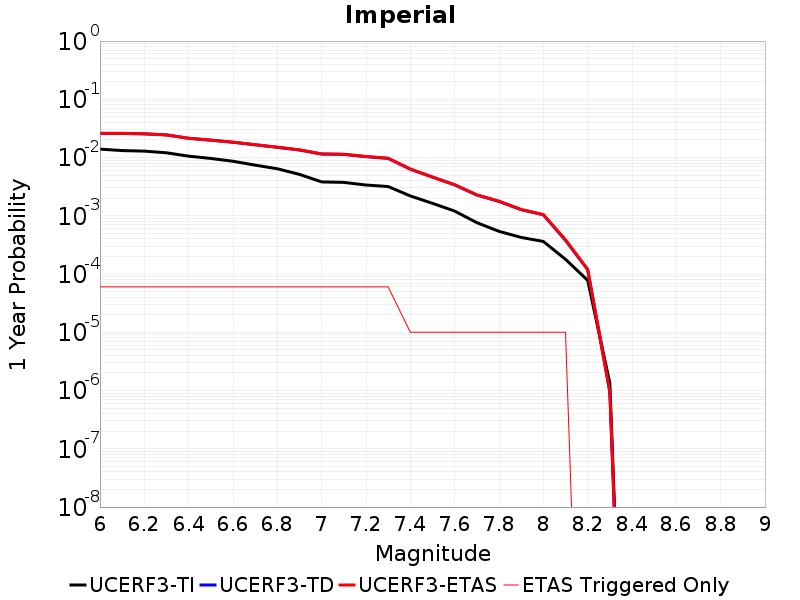 |  |

| Magnitude | 1 wk TI Prob | 1 wk TD Prob | 1 wk ETAS Prob | 1 wk ETAS/TD Gain | 1 wk ETAS Triggered Only | 1 mo TI Prob | 1 mo TD Prob | 1 mo ETAS Prob | 1 mo ETAS/TD Gain | 1 mo ETAS Triggered Only | 1 yr TI Prob | 1 yr TD Prob | 1 yr ETAS Prob | 1 yr ETAS/TD Gain | 1 yr ETAS Triggered Only | 10 yr TI Prob | 10 yr TD Prob | 10 yr ETAS Prob | 10 yr ETAS/TD Gain | 10 yr ETAS Triggered Only |
|-----|-----|-----|-----|-----|-----|-----|-----|-----|-----|-----|-----|-----|-----|-----|-----|-----|-----|-----|-----|-----|
| 6.0 | 2.6875173E-4 | 5.0359184E-4 | 5.3357676E-4 | 1.0595421 | 3.0E-5 | 0.0011512847 | 0.0021565047 | 0.00218644 | 1.0138814 | 3.0E-5 | 0.013927074 | 0.02593887 | 0.025997313 | 1.0022532 | 6.0E-5 | 0.13085878 | 0.22576174 | 0.22581594 | 1.0002401 | 7.0E-5 |
| 6.1 | 2.5356023E-4 | 5.0359184E-4 | 5.3357676E-4 | 1.0595421 | 3.0E-5 | 0.001086234 | 0.0021565047 | 0.00218644 | 1.0138814 | 3.0E-5 | 0.013144928 | 0.02593887 | 0.025997313 | 1.0022532 | 6.0E-5 | 0.123940155 | 0.22576174 | 0.22581594 | 1.0002401 | 7.0E-5 |
| 6.2 | 2.4820742E-4 | 4.94291E-4 | 5.2427617E-4 | 1.060663 | 3.0E-5 | 0.0010633124 | 0.0021167086 | 0.002146645 | 1.014143 | 3.0E-5 | 0.01286919 | 0.025466217 | 0.025524689 | 1.0022961 | 6.0E-5 | 0.12148927 | 0.222212 | 0.22226645 | 1.000245 | 7.0E-5 |
| 6.3 | 2.3205351E-4 | 4.7352712E-4 | 5.035129E-4 | 1.0633243 | 3.0E-5 | 9.94136E-4 | 0.0020278606 | 0.0020577998 | 1.014764 | 3.0E-5 | 0.012036599 | 0.024402209 | 0.024460744 | 1.0023988 | 6.0E-5 | 0.11405133 | 0.21356042 | 0.21361548 | 1.0002577 | 7.0E-5 |
| 6.4 | 2.0304754E-4 | 4.138309E-4 | 4.4381846E-4 | 1.0724634 | 3.0E-5 | 8.6991355E-4 | 0.0017723705 | 0.0018023174 | 1.0168965 | 3.0E-5 | 0.010539869 | 0.021357395 | 0.021416113 | 1.0027493 | 6.0E-5 | 0.100537635 | 0.19076191 | 0.19081856 | 1.000297 | 7.0E-5 |
| 6.5 | 1.854992E-4 | 3.8420298E-4 | 4.1419145E-4 | 1.0780537 | 3.0E-5 | 7.9475436E-4 | 0.001645558 | 0.0016755087 | 1.0182009 | 3.0E-5 | 0.009633281 | 0.019836854 | 0.019895665 | 1.0029646 | 6.0E-5 | 0.0922623 | 0.17876355 | 0.17882104 | 1.0003216 | 7.0E-5 |
| 6.6 | 1.6586106E-4 | 3.53529E-4 | 3.835184E-4 | 1.0848286 | 3.0E-5 | 7.106394E-4 | 0.0015142552 | 0.0015442098 | 1.0197817 | 3.0E-5 | 0.008617763 | 0.018276308 | 0.01833521 | 1.003223 | 6.0E-5 | 0.08291132 | 0.1658996 | 0.165958 | 1.0003519 | 7.0E-5 |
| 6.7 | 1.4224656E-4 | 3.1937333E-4 | 3.4936375E-4 | 1.0939039 | 3.0E-5 | 6.094856E-4 | 0.0013680336 | 0.0013979925 | 1.0218993 | 3.0E-5 | 0.0073952693 | 0.016527468 | 0.016586475 | 1.0035703 | 6.0E-5 | 0.07153955 | 0.15111384 | 0.15117325 | 1.0003933 | 7.0E-5 |
| 6.8 | 1.2317259E-4 | 2.8891393E-4 | 3.1890525E-4 | 1.1038072 | 3.0E-5 | 5.2777573E-4 | 0.0012376215 | 0.0012675844 | 1.0242101 | 3.0E-5 | 0.0064067547 | 0.014965429 | 0.015024531 | 1.0039493 | 6.0E-5 | 0.06225166 | 0.1373741 | 0.13743448 | 1.0004395 | 7.0E-5 |
| 6.9 | 9.859898E-5 | 2.5959525E-4 | 2.8958745E-4 | 1.1155345 | 3.0E-5 | 4.2249862E-4 | 0.0011120812 | 0.0011420478 | 1.0269464 | 3.0E-5 | 0.0051317946 | 0.013456566 | 0.013515759 | 1.0043988 | 6.0E-5 | 0.05014893 | 0.12327197 | 0.12333334 | 1.0004978 | 7.0E-5 |
| 7.0 | 7.3191884E-5 | 2.2093552E-4 | 2.509289E-4 | 1.1357563 | 3.0E-5 | 3.136418E-4 | 9.4652624E-4 | 9.764979E-4 | 1.0316648 | 3.0E-5 | 0.003811904 | 0.0114637995 | 0.011523112 | 1.0051739 | 6.0E-5 | 0.037471764 | 0.105492495 | 0.10555511 | 1.0005935 | 7.0E-5 |
| 7.1 | 7.1760296E-5 | 2.1789764E-4 | 2.4789112E-4 | 1.1376493 | 3.0E-5 | 3.0750787E-4 | 9.335162E-4 | 9.634882E-4 | 1.0321065 | 3.0E-5 | 0.003737482 | 0.011307057 | 0.0113663785 | 1.0052464 | 6.0E-5 | 0.03675245 | 0.104112625 | 0.10417534 | 1.0006024 | 7.0E-5 |
| 7.2 | 6.46614E-5 | 1.9942832E-4 | 2.2942234E-4 | 1.1504 | 3.0E-5 | 2.7709085E-4 | 8.5441605E-4 | 8.8439044E-4 | 1.0350817 | 3.0E-5 | 0.0033683628 | 0.010353564 | 0.010412943 | 1.0057352 | 6.0E-5 | 0.033177625 | 0.095884986 | 0.09594828 | 1.0006601 | 7.0E-5 |
| 7.3 | 6.088115E-5 | 1.8590545E-4 | 2.1589987E-4 | 1.1613424 | 3.0E-5 | 2.6089314E-4 | 7.964974E-4 | 8.264735E-4 | 1.0376348 | 3.0E-5 | 0.0031717476 | 0.009654854 | 0.009714275 | 1.0061545 | 6.0E-5 | 0.031268585 | 0.08986151 | 0.08992522 | 1.0007089 | 7.0E-5 |
| 7.4 | 4.199346E-5 | 1.2131732E-4 | 1.313161E-4 | 1.0824184 | 1.0E-5 | 1.7995955E-4 | 5.198287E-4 | 5.298235E-4 | 1.0192271 | 1.0E-5 | 0.0021888057 | 0.0063107326 | 0.0063206693 | 1.0015746 | 1.0E-5 | 0.02167372 | 0.060169354 | 0.060178753 | 1.0001562 | 1.0E-5 |
| 7.5 | 3.130448E-5 | 8.848937E-5 | 9.848848E-5 | 1.1129979 | 1.0E-5 | 1.3415517E-4 | 3.7918537E-4 | 3.8918157E-4 | 1.0263623 | 1.0E-5 | 0.0016321153 | 0.0046068756 | 0.004616829 | 1.0021607 | 1.0E-5 | 0.016201803 | 0.044441357 | 0.044450913 | 1.000215 | 1.0E-5 |
| 7.6 | 2.3074248E-5 | 6.514187E-5 | 7.5141215E-5 | 1.1535012 | 1.0E-5 | 9.888588E-5 | 2.7914968E-4 | 2.891469E-4 | 1.0358131 | 1.0E-5 | 0.0012032706 | 0.0033933767 | 0.0034033428 | 1.002937 | 1.0E-5 | 0.011967761 | 0.032972928 | 0.0329826 | 1.0002933 | 1.0E-5 |
| 7.7 | 1.45864815E-5 | 4.358962E-5 | 5.3589185E-5 | 1.2294024 | 1.0E-5 | 6.2511994E-5 | 1.8679931E-4 | 1.9679745E-4 | 1.0535234 | 1.0E-5 | 7.608177E-4 | 0.0022719158 | 0.002281893 | 1.0043916 | 1.0E-5 | 0.007582182 | 0.02220025 | 0.022210026 | 1.0004405 | 1.0E-5 |
| 7.8 | 1.0352979E-5 | 3.3855464E-5 | 4.3855125E-5 | 1.2953633 | 1.0E-5 | 4.4369157E-5 | 1.4508679E-4 | 1.5508533E-4 | 1.0689143 | 1.0E-5 | 5.400606E-4 | 0.0017650032 | 0.0017749856 | 1.0056558 | 1.0E-5 | 0.0053875 | 0.01733116 | 0.017340986 | 1.000567 | 1.0E-5 |
| 7.9 | 8.137906E-6 | 2.4382973E-5 | 3.438273E-5 | 1.4101123 | 1.0E-5 | 3.4876273E-5 | 1.0449428E-4 | 1.1449323E-4 | 1.095689 | 1.0E-5 | 4.2453592E-4 | 0.0012714765 | 0.0012814638 | 1.0078548 | 1.0E-5 | 0.004237258 | 0.012650066 | 0.01265994 | 1.0007805 | 1.0E-5 |
| 8.0 | 6.93792E-6 | 1.99001E-5 | 2.9899902E-5 | 1.5025 | 1.0E-5 | 2.9733603E-5 | 8.528336E-5 | 9.528251E-5 | 1.1172462 | 1.0E-5 | 3.6194647E-4 | 0.0010378313 | 0.0010478209 | 1.0096254 | 1.0E-5 | 0.0036135751 | 0.0103810765 | 0.010390973 | 1.0009533 | 1.0E-5 |
| 8.1 | 3.4286315E-6 | 7.237961E-6 | 1.723789E-5 | 2.3815944 | 1.0E-5 | 1.4694053E-5 | 3.1019466E-5 | 4.1019157E-5 | 1.3223683 | 1.0E-5 | 1.7888541E-4 | 3.775967E-4 | 3.8759294E-4 | 1.0264733 | 1.0E-5 | 0.0017874148 | 0.0039077844 | 0.0039177453 | 1.002549 | 1.0E-5 |
| 8.2 | 1.4906886E-6 | 2.2869515E-6 | 2.2869515E-6 | 1.0 | 0.0 | 6.3886496E-6 | 9.801184E-6 | 9.801184E-6 | 1.0 | 0.0 | 7.7779034E-5 | 1.19322925E-4 | 1.19322925E-4 | 1.0 | 0.0 | 7.775182E-4 | 0.0012846492 | 0.0012846492 | 1.0 | 0.0 |
| 8.3 | 2.5758007E-8 | 1.8131319E-8 | 1.8131319E-8 | 1.0 | 0.0 | 1.10391454E-7 | 7.770566E-8 | 7.770566E-8 | 1.0 | 0.0 | 1.3440151E-6 | 9.4606634E-7 | 9.4606634E-7 | 1.0 | 0.0 | 1.344007E-5 | 9.819742E-6 | 9.819742E-6 | 1.0 | 0.0 |

## San Andreas (Creeping Section) 2011 CFM
*[(top)](#table-of-contents)*

| 1 Week | 1 Month | 1 Year | 10 Year |
|-----|-----|-----|-----|
| 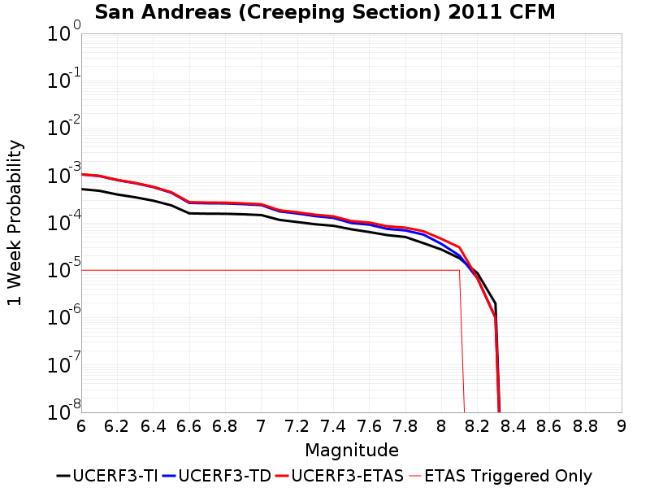 | 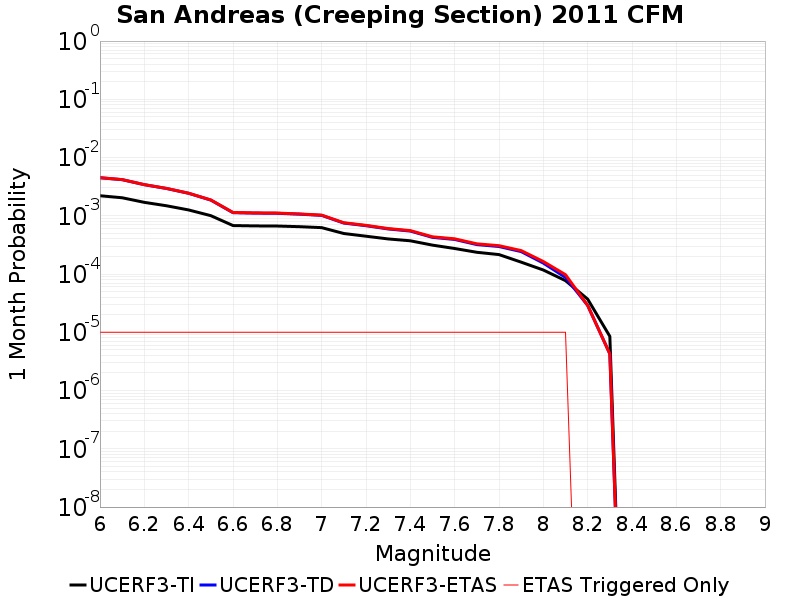 |  |  |

| Magnitude | 1 wk TI Prob | 1 wk TD Prob | 1 wk ETAS Prob | 1 wk ETAS/TD Gain | 1 wk ETAS Triggered Only | 1 mo TI Prob | 1 mo TD Prob | 1 mo ETAS Prob | 1 mo ETAS/TD Gain | 1 mo ETAS Triggered Only | 1 yr TI Prob | 1 yr TD Prob | 1 yr ETAS Prob | 1 yr ETAS/TD Gain | 1 yr ETAS Triggered Only | 10 yr TI Prob | 10 yr TD Prob | 10 yr ETAS Prob | 10 yr ETAS/TD Gain | 10 yr ETAS Triggered Only |
|-----|-----|-----|-----|-----|-----|-----|-----|-----|-----|-----|-----|-----|-----|-----|-----|-----|-----|-----|-----|-----|
| 6.0 | 5.151163E-4 | 0.0010510404 | 0.0010610298 | 1.0095044 | 1.0E-5 | 0.002205774 | 0.004493024 | 0.004502979 | 1.0022156 | 1.0E-5 | 0.026526777 | 0.052737042 | 0.052746516 | 1.0001796 | 1.0E-5 | 0.23574181 | 0.38428178 | 0.38428792 | 1.000016 | 1.0E-5 |
| 6.1 | 4.7540772E-4 | 9.7387773E-4 | 9.83868E-4 | 1.0102582 | 1.0E-5 | 0.002035871 | 0.004163873 | 0.004173831 | 1.0023916 | 1.0E-5 | 0.024506707 | 0.048986353 | 0.048995864 | 1.0001942 | 1.0E-5 | 0.21973366 | 0.36351907 | 0.36352542 | 1.0000175 | 1.0E-5 |
| 6.2 | 3.9647578E-4 | 7.9792336E-4 | 8.079154E-4 | 1.0125226 | 1.0E-5 | 0.0016980754 | 0.0034127696 | 0.0034227355 | 1.0029202 | 1.0E-5 | 0.020479038 | 0.040356316 | 0.040365912 | 1.0002378 | 1.0E-5 | 0.18691239 | 0.31220686 | 0.31221375 | 1.000022 | 1.0E-5 |
| 6.3 | 3.4640636E-4 | 6.868761E-4 | 6.968692E-4 | 1.0145487 | 1.0E-5 | 0.001483754 | 0.0029385583 | 0.0029485289 | 1.003393 | 1.0E-5 | 0.017915692 | 0.034876604 | 0.034886252 | 1.0002767 | 1.0E-5 | 0.16538206 | 0.2781097 | 0.2781169 | 1.000026 | 1.0E-5 |
| 6.4 | 2.935057E-4 | 5.67266E-4 | 5.7726033E-4 | 1.0176184 | 1.0E-5 | 0.0012572751 | 0.0024275985 | 0.0024375743 | 1.0041093 | 1.0E-5 | 0.015200248 | 0.028938137 | 0.028947849 | 1.0003356 | 1.0E-5 | 0.14201577 | 0.23933919 | 0.23934679 | 1.0000318 | 1.0E-5 |
| 6.5 | 2.3409708E-4 | 4.3371724E-4 | 4.437129E-4 | 1.0230465 | 1.0E-5 | 0.0010028875 | 0.0018567805 | 0.0018667618 | 1.0053756 | 1.0E-5 | 0.012141965 | 0.022253547 | 0.022263324 | 1.0004394 | 1.0E-5 | 0.11499573 | 0.19289884 | 0.19290692 | 1.0000418 | 1.0E-5 |
| 6.6 | 1.5842178E-4 | 2.6351245E-4 | 2.7350982E-4 | 1.0379388 | 1.0E-5 | 6.7877385E-4 | 0.0011288415 | 0.0011388303 | 1.0088487 | 1.0E-5 | 0.0082328 | 0.013656045 | 0.013665909 | 1.0007223 | 1.0E-5 | 0.07934396 | 0.12875828 | 0.128767 | 1.0000677 | 1.0E-5 |
| 6.7 | 1.5616413E-4 | 2.5888951E-4 | 2.6888694E-4 | 1.0386165 | 1.0E-5 | 6.691031E-4 | 0.0011090486 | 0.0011190375 | 1.0090067 | 1.0E-5 | 0.0081159435 | 0.013418522 | 0.013428388 | 1.0007353 | 1.0E-5 | 0.0782586 | 0.12679008 | 0.12679881 | 1.0000689 | 1.0E-5 |
| 6.8 | 1.5538467E-4 | 2.5713918E-4 | 2.671366E-4 | 1.0388794 | 1.0E-5 | 6.6576427E-4 | 0.0011015541 | 0.001111543 | 1.0090681 | 1.0E-5 | 0.008075596 | 0.013328519 | 0.013338385 | 1.0007403 | 1.0E-5 | 0.07788358 | 0.12602812 | 0.12603685 | 1.0000694 | 1.0E-5 |
| 6.9 | 1.5153569E-4 | 2.4833297E-4 | 2.583305E-4 | 1.0402585 | 1.0E-5 | 6.49277E-4 | 0.0010638521 | 0.0010738415 | 1.0093898 | 1.0E-5 | 0.007876333 | 0.012876055 | 0.012885927 | 1.0007666 | 1.0E-5 | 0.07602952 | 0.12215508 | 0.122163855 | 1.0000719 | 1.0E-5 |
| 7.0 | 1.4588932E-4 | 2.3689358E-4 | 2.468912E-4 | 1.0422031 | 1.0E-5 | 6.250901E-4 | 0.0010148652 | 0.0010248551 | 1.0098435 | 1.0E-5 | 0.0075839474 | 0.012286532 | 0.012296408 | 1.000804 | 1.0E-5 | 0.073302895 | 0.11702275 | 0.11703158 | 1.0000755 | 1.0E-5 |
| 7.1 | 1.1565079E-4 | 1.7467531E-4 | 1.8467355E-4 | 1.057239 | 1.0E-5 | 4.955521E-4 | 7.4839464E-4 | 7.5838715E-4 | 1.0133519 | 1.0E-5 | 0.006016669 | 0.009073867 | 0.009083777 | 1.0010921 | 1.0E-5 | 0.058563538 | 0.08904292 | 0.08905203 | 1.0001023 | 1.0E-5 |
| 7.2 | 1.0393792E-4 | 1.5744315E-4 | 1.6744157E-4 | 1.0635049 | 1.0E-5 | 4.4537216E-4 | 6.7458267E-4 | 6.8457593E-4 | 1.014814 | 1.0E-5 | 0.005408933 | 0.008182308 | 0.008192226 | 1.0012121 | 1.0E-5 | 0.052791595 | 0.08075969 | 0.08076888 | 1.0001138 | 1.0E-5 |
| 7.3 | 9.332884E-5 | 1.3843122E-4 | 1.4842984E-4 | 1.0722281 | 1.0E-5 | 3.999194E-4 | 5.9314247E-4 | 6.0313655E-4 | 1.0168494 | 1.0E-5 | 0.0048581534 | 0.00719775 | 0.0072076777 | 1.0013794 | 1.0E-5 | 0.047533102 | 0.07137775 | 0.07138703 | 1.00013 | 1.0E-5 |
| 7.4 | 8.670252E-5 | 1.2732051E-4 | 1.3731925E-4 | 1.078532 | 1.0E-5 | 3.715293E-4 | 5.455459E-4 | 5.5554044E-4 | 1.0183203 | 1.0E-5 | 0.004513991 | 0.0066219294 | 0.006631863 | 1.0015001 | 1.0E-5 | 0.044233937 | 0.06592361 | 0.06593295 | 1.0001417 | 1.0E-5 |
| 7.5 | 7.3036405E-5 | 9.921132E-5 | 1.09210334E-4 | 1.1007849 | 1.0E-5 | 3.129756E-4 | 4.2512218E-4 | 4.3511795E-4 | 1.0235126 | 1.0E-5 | 0.0038038217 | 0.005163605 | 0.0051735532 | 1.0019267 | 1.0E-5 | 0.03739367 | 0.052227393 | 0.05223687 | 1.0001814 | 1.0E-5 |
| 7.6 | 6.3935775E-5 | 9.144942E-5 | 1.0144851E-4 | 1.1093401 | 1.0E-5 | 2.7398168E-4 | 3.9186733E-4 | 4.018634E-4 | 1.0255089 | 1.0E-5 | 0.0033306254 | 0.00476057 | 0.0047705225 | 1.0020906 | 1.0E-5 | 0.032811474 | 0.04810887 | 0.048118386 | 1.0001979 | 1.0E-5 |
| 7.7 | 5.5050095E-5 | 7.459254E-5 | 8.45918E-5 | 1.1340517 | 1.0E-5 | 2.3590765E-4 | 3.1964318E-4 | 3.2964E-4 | 1.0312749 | 1.0E-5 | 0.0028683927 | 0.0038847171 | 0.0038946783 | 1.0025642 | 1.0E-5 | 0.0283165 | 0.039641943 | 0.039651547 | 1.0002422 | 1.0E-5 |
| 7.8 | 5.027131E-5 | 6.914323E-5 | 7.914254E-5 | 1.1446173 | 1.0E-5 | 2.1543067E-4 | 2.962945E-4 | 3.0629153E-4 | 1.0337402 | 1.0E-5 | 0.0026197135 | 0.003601423 | 0.003611387 | 1.0027667 | 1.0E-5 | 0.025890453 | 0.036760326 | 0.03676996 | 1.000262 | 1.0E-5 |
| 7.9 | 3.7271806E-5 | 5.6574914E-5 | 6.657435E-5 | 1.1767467 | 1.0E-5 | 1.5972654E-4 | 2.424414E-4 | 2.5243897E-4 | 1.0412371 | 1.0E-5 | 0.0019429359 | 0.0029477314 | 0.002957702 | 1.0033824 | 1.0E-5 | 0.019260362 | 0.0301716 | 0.030181298 | 1.0003214 | 1.0E-5 |
| 8.0 | 2.7310243E-5 | 3.589325E-5 | 4.589289E-5 | 1.2785939 | 1.0E-5 | 1.17038646E-4 | 1.5381916E-4 | 1.6381762E-4 | 1.0650014 | 1.0E-5 | 0.0014240141 | 0.0018711406 | 0.0018811219 | 1.0053344 | 1.0E-5 | 0.014149235 | 0.019462295 | 0.0194721 | 1.0005038 | 1.0E-5 |
| 8.1 | 1.7940547E-5 | 2.038207E-5 | 3.0381865E-5 | 1.4906174 | 1.0E-5 | 7.688579E-5 | 8.73488E-5 | 9.7347925E-5 | 1.1144736 | 1.0E-5 | 9.3568244E-4 | 0.0010629535 | 0.0010729429 | 1.0093977 | 1.0E-5 | 0.009317525 | 0.01134782 | 0.011357707 | 1.0008712 | 1.0E-5 |
| 8.2 | 8.643924E-6 | 6.7348897E-6 | 6.7348897E-6 | 1.0 | 0.0 | 3.704486E-5 | 2.8863493E-5 | 2.8863493E-5 | 1.0 | 0.0 | 4.5092785E-4 | 3.513565E-4 | 3.513565E-4 | 1.0 | 0.0 | 0.0045001395 | 0.0039285375 | 0.0039285375 | 1.0 | 0.0 |
| 8.3 | 1.983087E-6 | 9.914278E-7 | 9.914278E-7 | 1.0 | 0.0 | 8.498917E-6 | 4.2489696E-6 | 4.2489696E-6 | 1.0 | 0.0 | 1.034694E-4 | 5.1730003E-5 | 5.1730003E-5 | 1.0 | 0.0 | 0.0010342124 | 5.993849E-4 | 5.993849E-4 | 1.0 | 0.0 |

## Calaveras (So) - Paicines extension 2011 CFM
*[(top)](#table-of-contents)*

| 1 Week | 1 Month | 1 Year | 10 Year |
|-----|-----|-----|-----|
|  | 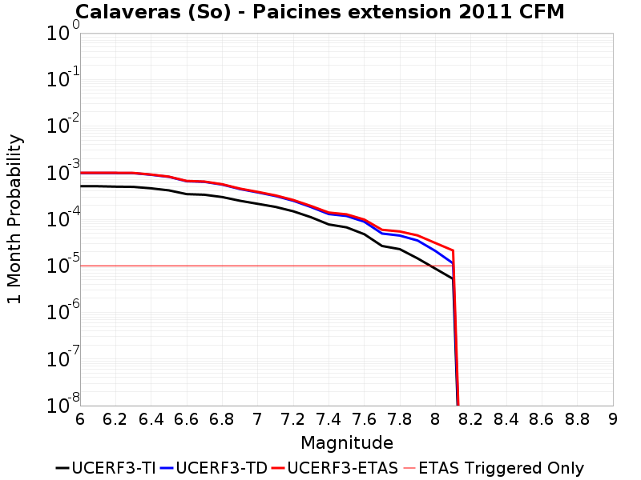 |  | 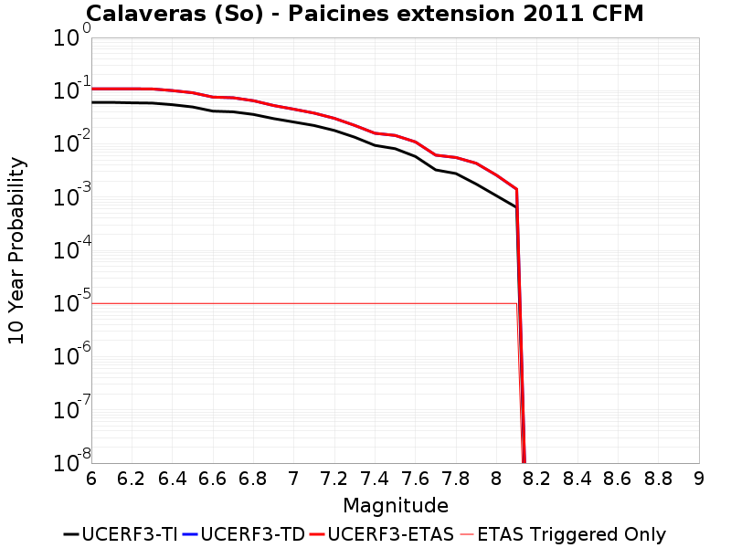 |

| Magnitude | 1 wk TI Prob | 1 wk TD Prob | 1 wk ETAS Prob | 1 wk ETAS/TD Gain | 1 wk ETAS Triggered Only | 1 mo TI Prob | 1 mo TD Prob | 1 mo ETAS Prob | 1 mo ETAS/TD Gain | 1 mo ETAS Triggered Only | 1 yr TI Prob | 1 yr TD Prob | 1 yr ETAS Prob | 1 yr ETAS/TD Gain | 1 yr ETAS Triggered Only | 10 yr TI Prob | 10 yr TD Prob | 10 yr ETAS Prob | 10 yr ETAS/TD Gain | 10 yr ETAS Triggered Only |
|-----|-----|-----|-----|-----|-----|-----|-----|-----|-----|-----|-----|-----|-----|-----|-----|-----|-----|-----|-----|-----|
| 6.0 | 1.1894548E-4 | 2.2840951E-4 | 2.3840723E-4 | 1.043771 | 1.0E-5 | 5.0966674E-4 | 9.782864E-4 | 9.882766E-4 | 1.010212 | 1.0E-5 | 0.006187552 | 0.01180213 | 0.011812013 | 1.0008373 | 1.0E-5 | 0.060180783 | 0.10820886 | 0.108217776 | 1.0000824 | 1.0E-5 |
| 6.1 | 1.1894548E-4 | 2.2840951E-4 | 2.3840723E-4 | 1.043771 | 1.0E-5 | 5.0966674E-4 | 9.782864E-4 | 9.882766E-4 | 1.010212 | 1.0E-5 | 0.006187552 | 0.01180213 | 0.011812013 | 1.0008373 | 1.0E-5 | 0.060180783 | 0.10820886 | 0.108217776 | 1.0000824 | 1.0E-5 |
| 6.2 | 1.1656485E-4 | 2.2840951E-4 | 2.3840723E-4 | 1.043771 | 1.0E-5 | 4.99468E-4 | 9.782864E-4 | 9.882766E-4 | 1.010212 | 1.0E-5 | 0.0060640806 | 0.01180213 | 0.011812013 | 1.0008373 | 1.0E-5 | 0.059012495 | 0.10820886 | 0.108217776 | 1.0000824 | 1.0E-5 |
| 6.3 | 1.152476E-4 | 2.2715183E-4 | 2.3714956E-4 | 1.0440134 | 1.0E-5 | 4.938248E-4 | 9.729014E-4 | 9.828917E-4 | 1.0102686 | 1.0E-5 | 0.005995755 | 0.011737458 | 0.011747341 | 1.000842 | 1.0E-5 | 0.058365438 | 0.10764118 | 0.1076501 | 1.0000829 | 1.0E-5 |
| 6.4 | 1.07200925E-4 | 2.0963418E-4 | 2.1963207E-4 | 1.0476922 | 1.0E-5 | 4.5935164E-4 | 8.979269E-4 | 9.079179E-4 | 1.0111268 | 1.0E-5 | 0.0055782744 | 0.010843367 | 0.010853259 | 1.0009122 | 1.0E-5 | 0.0544031 | 0.10029898 | 0.10030797 | 1.0000896 | 1.0E-5 |
| 6.5 | 9.69631E-5 | 1.8882791E-4 | 1.9882602E-4 | 1.0529482 | 1.0E-5 | 4.1548995E-4 | 8.088559E-4 | 8.1884785E-4 | 1.0123532 | 1.0E-5 | 0.0050468626 | 0.009776652 | 0.009786554 | 1.0010128 | 1.0E-5 | 0.04933773 | 0.091178894 | 0.091187984 | 1.0000997 | 1.0E-5 |
| 6.6 | 8.0552316E-5 | 1.5223403E-4 | 1.622325E-4 | 1.0656784 | 1.0E-5 | 3.4517853E-4 | 6.522407E-4 | 6.622342E-4 | 1.0153217 | 1.0E-5 | 0.0041944524 | 0.007906425 | 0.007916345 | 1.0012548 | 1.0E-5 | 0.04116161 | 0.07565212 | 0.07566136 | 1.0001222 | 1.0E-5 |
| 6.7 | 7.815757E-5 | 1.4764894E-4 | 1.5764746E-4 | 1.0677183 | 1.0E-5 | 3.34918E-4 | 6.3260336E-4 | 6.4259704E-4 | 1.0157977 | 1.0E-5 | 0.004070005 | 0.0076696887 | 0.007679612 | 1.0012938 | 1.0E-5 | 0.039962657 | 0.07350432 | 0.07351359 | 1.000126 | 1.0E-5 |
| 6.8 | 6.965264E-5 | 1.2895741E-4 | 1.3895612E-4 | 1.077535 | 1.0E-5 | 2.9847719E-4 | 5.5254635E-4 | 5.6254084E-4 | 1.018088 | 1.0E-5 | 0.0036279052 | 0.0067037772 | 0.0067137103 | 1.0014817 | 1.0E-5 | 0.03569247 | 0.06467368 | 0.06468303 | 1.0001446 | 1.0E-5 |
| 6.9 | 5.8000453E-5 | 1.03489765E-4 | 1.1348873E-4 | 1.0966179 | 1.0E-5 | 2.4854968E-4 | 4.4345262E-4 | 4.5344818E-4 | 1.0225403 | 1.0E-5 | 0.0030218933 | 0.005385771 | 0.005395717 | 1.0018468 | 1.0E-5 | 0.029811295 | 0.05249875 | 0.052508228 | 1.0001805 | 1.0E-5 |
| 7.0 | 4.9865852E-5 | 8.770212E-5 | 9.7701246E-5 | 1.1140124 | 1.0E-5 | 2.1369329E-4 | 3.7581258E-4 | 3.8580882E-4 | 1.026599 | 1.0E-5 | 0.0025986114 | 0.004566008 | 0.0045759627 | 1.0021801 | 1.0E-5 | 0.025684336 | 0.044767726 | 0.04477728 | 1.0002134 | 1.0E-5 |
| 7.1 | 4.283875E-5 | 7.335474E-5 | 8.3354E-5 | 1.1363138 | 1.0E-5 | 1.8358172E-4 | 3.1433988E-4 | 3.2433675E-4 | 1.0318027 | 1.0E-5 | 0.0022328163 | 0.0038204307 | 0.0038303926 | 1.0026075 | 1.0E-5 | 0.022105146 | 0.0377936 | 0.03780322 | 1.0002546 | 1.0E-5 |
| 7.2 | 3.450115E-5 | 5.8021484E-5 | 6.8020905E-5 | 1.1723399 | 1.0E-5 | 1.478537E-4 | 2.4863996E-4 | 2.5863748E-4 | 1.0402088 | 1.0E-5 | 0.0017986323 | 0.0030230205 | 0.00303299 | 1.0032979 | 1.0E-5 | 0.017841442 | 0.030146834 | 0.030156532 | 1.0003217 | 1.0E-5 |
| 7.3 | 2.5709045E-5 | 4.2505886E-5 | 5.250546E-5 | 1.2352515 | 1.0E-5 | 1.1017697E-4 | 1.8215548E-4 | 1.9215365E-4 | 1.0548881 | 1.0E-5 | 0.0013405791 | 0.0022155053 | 0.002225483 | 1.0045036 | 1.0E-5 | 0.013325208 | 0.022212753 | 0.022222532 | 1.0004402 | 1.0E-5 |
| 7.4 | 1.8003093E-5 | 3.0069059E-5 | 4.0068757E-5 | 1.3325578 | 1.0E-5 | 7.715383E-5 | 1.2886104E-4 | 1.3885976E-4 | 1.077593 | 1.0E-5 | 9.3894306E-4 | 0.0015677566 | 0.0015777409 | 1.0063685 | 1.0E-5 | 0.009349857 | 0.01579796 | 0.015807802 | 1.000623 | 1.0E-5 |
| 7.5 | 1.5595824E-5 | 2.7350685E-5 | 3.735041E-5 | 1.3656116 | 1.0E-5 | 6.683753E-5 | 1.1721197E-4 | 1.2721079E-4 | 1.0853056 | 1.0E-5 | 8.134431E-4 | 0.0014261239 | 0.0014361097 | 1.007002 | 1.0E-5 | 0.008104719 | 0.014384247 | 0.014394104 | 1.0006852 | 1.0E-5 |
| 7.6 | 1.1110309E-5 | 2.0588623E-5 | 3.0588417E-5 | 1.4856951 | 1.0E-5 | 4.761474E-5 | 8.823398E-5 | 9.82331E-5 | 1.113325 | 1.0E-5 | 5.795553E-4 | 0.0010737207 | 0.00108371 | 1.0093035 | 1.0E-5 | 0.0057804612 | 0.010861759 | 0.010871651 | 1.0009106 | 1.0E-5 |
| 7.7 | 6.2140443E-6 | 1.1484518E-5 | 2.1484404E-5 | 1.8707274 | 1.0E-5 | 2.6631347E-5 | 4.9218437E-5 | 5.9217942E-5 | 1.2031659 | 1.0E-5 | 3.241884E-4 | 5.990698E-4 | 6.0906383E-4 | 1.0166825 | 1.0E-5 | 0.0032371588 | 0.006124597 | 0.0061345357 | 1.0016228 | 1.0E-5 |
| 7.8 | 5.305533E-6 | 1.0387131E-5 | 2.0387028E-5 | 1.9627198 | 1.0E-5 | 2.27378E-5 | 4.4515516E-5 | 5.4515072E-5 | 1.2246307 | 1.0E-5 | 2.7679754E-4 | 5.418417E-4 | 5.5183633E-4 | 1.0184456 | 1.0E-5 | 0.0027645302 | 0.0055328566 | 0.005542801 | 1.0017974 | 1.0E-5 |
| 7.9 | 3.363505E-6 | 8.138078E-6 | 1.8137996E-5 | 2.2287815 | 1.0E-5 | 1.4414942E-5 | 3.487701E-5 | 4.4876662E-5 | 1.2867118 | 1.0E-5 | 1.7548777E-4 | 4.2454497E-4 | 4.345407E-4 | 1.0235447 | 1.0E-5 | 0.0017534926 | 0.0043097106 | 0.004319668 | 1.0023104 | 1.0E-5 |
| 8.0 | 2.0271132E-6 | 4.8675233E-6 | 1.4867474E-5 | 3.0544229 | 1.0E-5 | 8.687599E-6 | 2.0860647E-5 | 3.086044E-5 | 1.4793615 | 1.0E-5 | 1.05766376E-4 | 2.5394885E-4 | 2.639463E-4 | 1.039368 | 1.0E-5 | 0.0010571606 | 0.0025713819 | 0.002581356 | 1.003879 | 1.0E-5 |
| 8.1 | 1.2206116E-6 | 2.6327887E-6 | 1.2632762E-5 | 4.798244 | 1.0E-5 | 5.2311816E-6 | 1.1283331E-5 | 2.1283218E-5 | 1.8862531 | 1.0E-5 | 6.3687774E-5 | 1.3736595E-4 | 1.4736457E-4 | 1.0727882 | 1.0E-5 | 6.366953E-4 | 0.0013976981 | 0.0014076841 | 1.0071446 | 1.0E-5 |

## San Andreas (San Bernardino S)
*[(top)](#table-of-contents)*

| 1 Week | 1 Month | 1 Year | 10 Year |
|-----|-----|-----|-----|
| 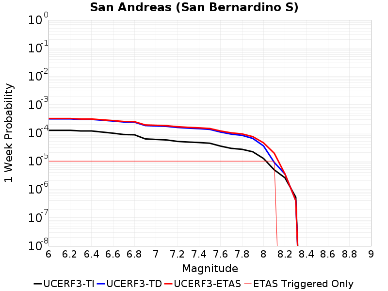 |  |  |  |

| Magnitude | 1 wk TI Prob | 1 wk TD Prob | 1 wk ETAS Prob | 1 wk ETAS/TD Gain | 1 wk ETAS Triggered Only | 1 mo TI Prob | 1 mo TD Prob | 1 mo ETAS Prob | 1 mo ETAS/TD Gain | 1 mo ETAS Triggered Only | 1 yr TI Prob | 1 yr TD Prob | 1 yr ETAS Prob | 1 yr ETAS/TD Gain | 1 yr ETAS Triggered Only | 10 yr TI Prob | 10 yr TD Prob | 10 yr ETAS Prob | 10 yr ETAS/TD Gain | 10 yr ETAS Triggered Only |
|-----|-----|-----|-----|-----|-----|-----|-----|-----|-----|-----|-----|-----|-----|-----|-----|-----|-----|-----|-----|-----|
| 6.0 | 1.2336002E-4 | 3.1303556E-4 | 3.2303244E-4 | 1.0319352 | 1.0E-5 | 5.2857865E-4 | 0.0013409184 | 0.001350905 | 1.0074476 | 1.0E-5 | 0.006416472 | 0.016208688 | 0.016218524 | 1.0006069 | 1.0E-5 | 0.06234337 | 0.1480437 | 0.14806074 | 1.000115 | 2.0E-5 |
| 6.1 | 1.2336002E-4 | 3.1303556E-4 | 3.2303244E-4 | 1.0319352 | 1.0E-5 | 5.2857865E-4 | 0.0013409184 | 0.001350905 | 1.0074476 | 1.0E-5 | 0.006416472 | 0.016208688 | 0.016218524 | 1.0006069 | 1.0E-5 | 0.06234337 | 0.1480437 | 0.14806074 | 1.000115 | 2.0E-5 |
| 6.2 | 1.2336002E-4 | 3.1303556E-4 | 3.2303244E-4 | 1.0319352 | 1.0E-5 | 5.2857865E-4 | 0.0013409184 | 0.001350905 | 1.0074476 | 1.0E-5 | 0.006416472 | 0.016208688 | 0.016218524 | 1.0006069 | 1.0E-5 | 0.06234337 | 0.1480437 | 0.14806074 | 1.000115 | 2.0E-5 |
| 6.3 | 1.1712257E-4 | 3.0076946E-4 | 3.1076645E-4 | 1.033238 | 1.0E-5 | 5.018573E-4 | 0.001288402 | 0.0012983892 | 1.0077516 | 1.0E-5 | 0.006093008 | 0.015578564 | 0.015588408 | 1.0006319 | 1.0E-5 | 0.059286322 | 0.14273104 | 0.14274818 | 1.0001202 | 2.0E-5 |
| 6.4 | 1.1712257E-4 | 3.0076946E-4 | 3.1076645E-4 | 1.033238 | 1.0E-5 | 5.018573E-4 | 0.001288402 | 0.0012983892 | 1.0077516 | 1.0E-5 | 0.006093008 | 0.015578564 | 0.015588408 | 1.0006319 | 1.0E-5 | 0.059286322 | 0.14273104 | 0.14274818 | 1.0001202 | 2.0E-5 |
| 6.5 | 1.0689076E-4 | 2.806512E-4 | 2.906484E-4 | 1.0356214 | 1.0E-5 | 4.5802278E-4 | 0.0012022624 | 0.0012122503 | 1.0083077 | 1.0E-5 | 0.0055621783 | 0.014544158 | 0.014554013 | 1.0006776 | 1.0E-5 | 0.05425003 | 0.13392475 | 0.13394207 | 1.0001293 | 2.0E-5 |
| 6.6 | 9.7648895E-5 | 2.6285643E-4 | 2.728538E-4 | 1.0380336 | 1.0E-5 | 4.1842813E-4 | 0.0011260659 | 0.0011360546 | 1.0088705 | 1.0E-5 | 0.005082469 | 0.01362826 | 0.013638124 | 1.0007237 | 1.0E-5 | 0.049677886 | 0.1260339 | 0.12605138 | 1.0001386 | 2.0E-5 |
| 6.7 | 8.757013E-5 | 2.4332039E-4 | 2.5331796E-4 | 1.0410881 | 1.0E-5 | 3.7524657E-4 | 0.0010424083 | 0.0010523979 | 1.0095831 | 1.0E-5 | 0.00455906 | 0.012621767 | 0.012631641 | 1.0007823 | 1.0E-5 | 0.04466656 | 0.11733893 | 0.11735659 | 1.0001504 | 2.0E-5 |
| 6.8 | 8.562978E-5 | 2.3881605E-4 | 2.4881365E-4 | 1.0418632 | 1.0E-5 | 3.6693315E-4 | 0.0010231192 | 0.0010331089 | 1.0097641 | 1.0E-5 | 0.004458263 | 0.012389609 | 0.012399485 | 1.0007972 | 1.0E-5 | 0.043698758 | 0.115323246 | 0.11534094 | 1.0001534 | 2.0E-5 |
| 6.9 | 6.124075E-5 | 1.8136931E-4 | 1.913675E-4 | 1.0551261 | 1.0E-5 | 2.6243398E-4 | 7.7706634E-4 | 7.8705855E-4 | 1.0128589 | 1.0E-5 | 0.0031904527 | 0.009419973 | 0.0094298795 | 1.0010515 | 1.0E-5 | 0.031450346 | 0.08873526 | 0.088753484 | 1.0002054 | 2.0E-5 |
| 7.0 | 5.8598747E-5 | 1.7552858E-4 | 1.8552682E-4 | 1.0569608 | 1.0E-5 | 2.5111332E-4 | 7.5204927E-4 | 7.620418E-4 | 1.013287 | 1.0E-5 | 0.0030530186 | 0.009117978 | 0.009127886 | 1.0010867 | 1.0E-5 | 0.03011414 | 0.08600493 | 0.086023204 | 1.0002126 | 2.0E-5 |
| 7.1 | 5.613814E-5 | 1.6959054E-4 | 1.7958884E-4 | 1.0589556 | 1.0E-5 | 2.4056983E-4 | 7.266149E-4 | 7.3660765E-4 | 1.0137525 | 1.0E-5 | 0.0029250039 | 0.0088108545 | 0.008820767 | 1.001125 | 1.0E-5 | 0.028868021 | 0.08326115 | 0.08327948 | 1.0002202 | 2.0E-5 |
| 7.2 | 4.991222E-5 | 1.5535248E-4 | 1.6535092E-4 | 1.0643598 | 1.0E-5 | 2.1389198E-4 | 6.6562684E-4 | 6.756202E-4 | 1.0150135 | 1.0E-5 | 0.002601025 | 0.008074013 | 0.008083931 | 1.0012286 | 1.0E-5 | 0.025707912 | 0.07660596 | 0.07662443 | 1.000241 | 2.0E-5 |
| 7.3 | 4.7410045E-5 | 1.4702747E-4 | 1.57026E-4 | 1.0680045 | 1.0E-5 | 2.0317009E-4 | 6.299659E-4 | 6.3995965E-4 | 1.0158639 | 1.0E-5 | 0.0024707897 | 0.0076429616 | 0.007652885 | 1.0012984 | 1.0E-5 | 0.024434982 | 0.072796665 | 0.07280594 | 1.0001273 | 1.0E-5 |
| 7.4 | 4.5556746E-5 | 1.4090733E-4 | 1.5090592E-4 | 1.0709586 | 1.0E-5 | 1.952286E-4 | 6.037491E-4 | 6.137431E-4 | 1.0165532 | 1.0E-5 | 0.002374317 | 0.0073259617 | 0.0073358887 | 1.001355 | 1.0E-5 | 0.023491086 | 0.06997941 | 0.06998871 | 1.0001329 | 1.0E-5 |
| 7.5 | 4.3084514E-5 | 1.3301524E-4 | 1.4301392E-4 | 1.0751693 | 1.0E-5 | 1.8463485E-4 | 5.699411E-4 | 5.7993544E-4 | 1.0175357 | 1.0E-5 | 0.0022456115 | 0.006917038 | 0.0069269687 | 1.0014358 | 1.0E-5 | 0.022230545 | 0.066291474 | 0.06630081 | 1.0001409 | 1.0E-5 |
| 7.6 | 3.408608E-5 | 1.0686412E-4 | 1.1686305E-4 | 1.0935668 | 1.0E-5 | 1.4607502E-4 | 4.579088E-4 | 4.6790423E-4 | 1.0218284 | 1.0E-5 | 0.0017770125 | 0.0055608195 | 0.0055707637 | 1.0017883 | 1.0E-5 | 0.017628696 | 0.05376404 | 0.053773504 | 1.000176 | 1.0E-5 |
| 7.7 | 2.8315713E-5 | 9.037419E-5 | 1.0037328E-4 | 1.110641 | 1.0E-5 | 1.2134742E-4 | 3.872605E-4 | 3.9725663E-4 | 1.0258124 | 1.0E-5 | 0.0014764034 | 0.004704715 | 0.0047146683 | 1.0021155 | 1.0E-5 | 0.01466633 | 0.04576835 | 0.045777895 | 1.0002085 | 1.0E-5 |
| 7.8 | 2.6222975E-5 | 8.192681E-5 | 9.192599E-5 | 1.1220502 | 1.0E-5 | 1.1237934E-4 | 3.510677E-4 | 3.6106416E-4 | 1.0284746 | 1.0E-5 | 0.0013673597 | 0.00426588 | 0.0042758374 | 1.0023342 | 1.0E-5 | 0.013589768 | 0.041691024 | 0.04170061 | 1.0002298 | 1.0E-5 |
| 7.9 | 2.1469694E-5 | 6.374481E-5 | 7.374417E-5 | 1.1568655 | 1.0E-5 | 9.200973E-5 | 2.7316346E-4 | 2.831607E-4 | 1.0365981 | 1.0E-5 | 0.0011196428 | 0.003320697 | 0.003330664 | 1.0030015 | 1.0E-5 | 0.011140184 | 0.03280531 | 0.032814983 | 1.0002948 | 1.0E-5 |
| 8.0 | 1.2420249E-5 | 3.4581008E-5 | 4.458066E-5 | 1.2891661 | 1.0E-5 | 5.322855E-5 | 1.481959E-4 | 1.5819442E-4 | 1.0674683 | 1.0E-5 | 6.478649E-4 | 0.0018027931 | 0.001812775 | 1.0055369 | 1.0E-5 | 0.0064597935 | 0.01803221 | 0.01804203 | 1.0005445 | 1.0E-5 |
| 8.1 | 4.9197724E-6 | 9.0034255E-6 | 1.9003335E-5 | 2.1106784 | 1.0E-5 | 2.1084568E-5 | 3.8585542E-5 | 4.8585156E-5 | 1.2591544 | 1.0E-5 | 2.566744E-4 | 4.6967788E-4 | 4.7967318E-4 | 1.0212812 | 1.0E-5 | 0.002563781 | 0.0049704127 | 0.0049803634 | 1.0020019 | 1.0E-5 |
| 8.2 | 2.5634774E-6 | 3.4720465E-6 | 3.4720465E-6 | 1.0 | 0.0 | 1.0986286E-5 | 1.4880115E-5 | 1.4880115E-5 | 1.0 | 0.0 | 1.3374983E-4 | 1.811504E-4 | 1.811504E-4 | 1.0 | 0.0 | 0.0013366934 | 0.001996832 | 0.001996832 | 1.0 | 0.0 |
| 8.3 | 5.2850464E-7 | 4.0198205E-7 | 4.0198205E-7 | 1.0 | 0.0 | 2.2650179E-6 | 1.7227792E-6 | 1.7227792E-6 | 1.0 | 0.0 | 2.7576245E-5 | 2.0974654E-5 | 2.0974654E-5 | 1.0 | 0.0 | 2.7572823E-4 | 2.4340476E-4 | 2.4340476E-4 | 1.0 | 0.0 |

## San Andreas (Big Bend)
*[(top)](#table-of-contents)*

| 1 Week | 1 Month | 1 Year | 10 Year |
|-----|-----|-----|-----|
| 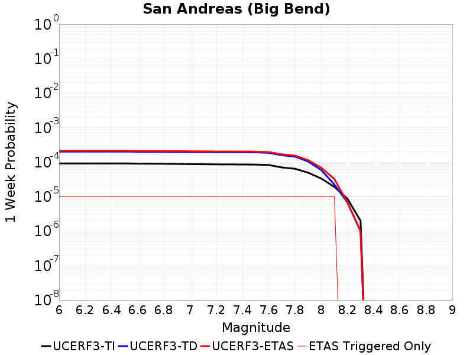 | 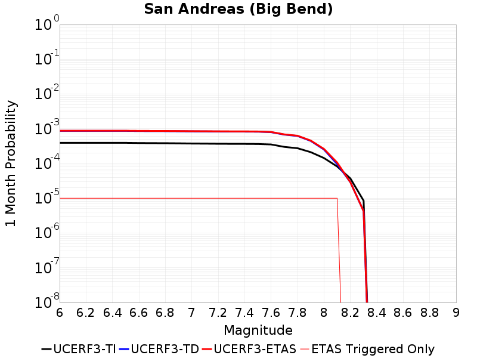 |  |  |

| Magnitude | 1 wk TI Prob | 1 wk TD Prob | 1 wk ETAS Prob | 1 wk ETAS/TD Gain | 1 wk ETAS Triggered Only | 1 mo TI Prob | 1 mo TD Prob | 1 mo ETAS Prob | 1 mo ETAS/TD Gain | 1 mo ETAS Triggered Only | 1 yr TI Prob | 1 yr TD Prob | 1 yr ETAS Prob | 1 yr ETAS/TD Gain | 1 yr ETAS Triggered Only | 10 yr TI Prob | 10 yr TD Prob | 10 yr ETAS Prob | 10 yr ETAS/TD Gain | 10 yr ETAS Triggered Only |
|-----|-----|-----|-----|-----|-----|-----|-----|-----|-----|-----|-----|-----|-----|-----|-----|-----|-----|-----|-----|-----|
| 6.0 | 9.168226E-5 | 2.0203675E-4 | 2.1203472E-4 | 1.0494859 | 1.0E-5 | 3.928648E-4 | 8.655847E-4 | 8.7557605E-4 | 1.0115429 | 1.0E-5 | 0.0047726436 | 0.010487722 | 0.010497618 | 1.0009435 | 1.0E-5 | 0.046714354 | 0.10149963 | 0.10150862 | 1.0000886 | 1.0E-5 |
| 6.1 | 9.168226E-5 | 2.0203675E-4 | 2.1203472E-4 | 1.0494859 | 1.0E-5 | 3.928648E-4 | 8.655847E-4 | 8.7557605E-4 | 1.0115429 | 1.0E-5 | 0.0047726436 | 0.010487722 | 0.010497618 | 1.0009435 | 1.0E-5 | 0.046714354 | 0.10149963 | 0.10150862 | 1.0000886 | 1.0E-5 |
| 6.2 | 9.168226E-5 | 2.0203675E-4 | 2.1203472E-4 | 1.0494859 | 1.0E-5 | 3.928648E-4 | 8.655847E-4 | 8.7557605E-4 | 1.0115429 | 1.0E-5 | 0.0047726436 | 0.010487722 | 0.010497618 | 1.0009435 | 1.0E-5 | 0.046714354 | 0.10149963 | 0.10150862 | 1.0000886 | 1.0E-5 |
| 6.3 | 9.168226E-5 | 2.0203675E-4 | 2.1203472E-4 | 1.0494859 | 1.0E-5 | 3.928648E-4 | 8.655847E-4 | 8.7557605E-4 | 1.0115429 | 1.0E-5 | 0.0047726436 | 0.010487722 | 0.010497618 | 1.0009435 | 1.0E-5 | 0.046714354 | 0.10149963 | 0.10150862 | 1.0000886 | 1.0E-5 |
| 6.4 | 9.1639464E-5 | 2.0197062E-4 | 2.119686E-4 | 1.0495021 | 1.0E-5 | 3.9268145E-4 | 8.6530147E-4 | 8.752928E-4 | 1.0115466 | 1.0E-5 | 0.0047704205 | 0.010484307 | 0.010494202 | 1.0009438 | 1.0E-5 | 0.046693064 | 0.10146857 | 0.101477556 | 1.0000886 | 1.0E-5 |
| 6.5 | 9.1639464E-5 | 2.0197062E-4 | 2.119686E-4 | 1.0495021 | 1.0E-5 | 3.9268145E-4 | 8.6530147E-4 | 8.752928E-4 | 1.0115466 | 1.0E-5 | 0.0047704205 | 0.010484307 | 0.010494202 | 1.0009438 | 1.0E-5 | 0.046693064 | 0.10146857 | 0.101477556 | 1.0000886 | 1.0E-5 |
| 6.6 | 9.042622E-5 | 2.0007875E-4 | 2.1007675E-4 | 1.0499703 | 1.0E-5 | 3.8748336E-4 | 8.571988E-4 | 8.6719025E-4 | 1.0116559 | 1.0E-5 | 0.0047074095 | 0.0103866 | 0.010396496 | 1.0009527 | 1.0E-5 | 0.046089325 | 0.10058089 | 0.100589894 | 1.0000894 | 1.0E-5 |
| 6.7 | 8.9836685E-5 | 1.9924933E-4 | 2.0924734E-4 | 1.0501784 | 1.0E-5 | 3.8495753E-4 | 8.536465E-4 | 8.6363795E-4 | 1.0117044 | 1.0E-5 | 0.00467679 | 0.010343761 | 0.010353658 | 1.0009568 | 1.0E-5 | 0.045795817 | 0.1001914 | 0.1002004 | 1.0000898 | 1.0E-5 |
| 6.8 | 8.9471854E-5 | 1.9872855E-4 | 2.0872657E-4 | 1.0503099 | 1.0E-5 | 3.8339442E-4 | 8.51416E-4 | 8.6140755E-4 | 1.0117351 | 1.0E-5 | 0.004657841 | 0.010316864 | 0.01032676 | 1.0009593 | 1.0E-5 | 0.04561414 | 0.0999463 | 0.0999553 | 1.00009 | 1.0E-5 |
| 6.9 | 8.858234E-5 | 1.9757997E-4 | 2.0757799E-4 | 1.0506024 | 1.0E-5 | 3.7958333E-4 | 8.464967E-4 | 8.5648824E-4 | 1.0118034 | 1.0E-5 | 0.004611638 | 0.010257536 | 0.010267433 | 1.0009649 | 1.0E-5 | 0.04517103 | 0.09940637 | 0.09941538 | 1.0000906 | 1.0E-5 |
| 7.0 | 8.7433385E-5 | 1.9599659E-4 | 2.0599463E-4 | 1.0510113 | 1.0E-5 | 3.746607E-4 | 8.397152E-4 | 8.497068E-4 | 1.0118988 | 1.0E-5 | 0.004551957 | 0.010175745 | 0.010185643 | 1.0009727 | 1.0E-5 | 0.044598386 | 0.09866108 | 0.098670095 | 1.0000913 | 1.0E-5 |
| 7.1 | 8.684964E-5 | 1.9511214E-4 | 2.0511019E-4 | 1.0512426 | 1.0E-5 | 3.7215967E-4 | 8.3592715E-4 | 8.459188E-4 | 1.0119528 | 1.0E-5 | 0.0045216335 | 0.010130054 | 0.010139953 | 1.0009772 | 1.0E-5 | 0.04430731 | 0.09824451 | 0.09825353 | 1.0000918 | 1.0E-5 |
| 7.2 | 8.606521E-5 | 1.9401335E-4 | 2.040114E-4 | 1.0515329 | 1.0E-5 | 3.6879873E-4 | 8.3122106E-4 | 8.412127E-4 | 1.0120205 | 1.0E-5 | 0.0044808835 | 0.010073289 | 0.010083188 | 1.0009828 | 1.0E-5 | 0.043916024 | 0.097728 | 0.09773702 | 1.0000923 | 1.0E-5 |
| 7.3 | 8.568266E-5 | 1.9341054E-4 | 2.034086E-4 | 1.0516934 | 1.0E-5 | 3.6715972E-4 | 8.286392E-4 | 8.386309E-4 | 1.012058 | 1.0E-5 | 0.0044610105 | 0.010042146 | 0.010052045 | 1.0009859 | 1.0E-5 | 0.043725148 | 0.09744167 | 0.0974507 | 1.0000926 | 1.0E-5 |
| 7.4 | 8.5432206E-5 | 1.9301988E-4 | 2.0301795E-4 | 1.0517981 | 1.0E-5 | 3.6608664E-4 | 8.26966E-4 | 8.369577E-4 | 1.0120823 | 1.0E-5 | 0.004447999 | 0.010021962 | 0.010031862 | 1.0009878 | 1.0E-5 | 0.043600157 | 0.09725616 | 0.09726519 | 1.0000929 | 1.0E-5 |
| 7.5 | 8.4791965E-5 | 1.9163192E-4 | 2.0163E-4 | 1.0521734 | 1.0E-5 | 3.633435E-4 | 8.210214E-4 | 8.310132E-4 | 1.01217 | 1.0E-5 | 0.0044147377 | 0.009950249 | 0.00996015 | 1.000995 | 1.0E-5 | 0.043280575 | 0.09660622 | 0.096615255 | 1.0000935 | 1.0E-5 |
| 7.6 | 8.241105E-5 | 1.8579888E-4 | 1.9579702E-4 | 1.0538117 | 1.0E-5 | 3.531424E-4 | 7.9603813E-4 | 8.060302E-4 | 1.0125523 | 1.0E-5 | 0.0042910352 | 0.009648812 | 0.009658716 | 1.0010264 | 1.0E-5 | 0.042091176 | 0.09388672 | 0.09389578 | 1.0000966 | 1.0E-5 |
| 7.7 | 7.00432E-5 | 1.5814225E-4 | 1.6814067E-4 | 1.0632242 | 1.0E-5 | 3.001506E-4 | 6.775766E-4 | 6.875698E-4 | 1.0147485 | 1.0E-5 | 0.0036482112 | 0.008218347 | 0.008228265 | 1.0012068 | 1.0E-5 | 0.035888977 | 0.080704555 | 0.08071375 | 1.000114 | 1.0E-5 |
| 7.8 | 6.415362E-5 | 1.4443192E-4 | 1.5443048E-4 | 1.0692267 | 1.0E-5 | 2.749151E-4 | 6.1884715E-4 | 6.2884093E-4 | 1.016149 | 1.0E-5 | 0.0033419547 | 0.0075084777 | 0.0075184023 | 1.0013218 | 1.0E-5 | 0.03292141 | 0.07388296 | 0.07389222 | 1.0001254 | 1.0E-5 |
| 7.9 | 4.939911E-5 | 1.0419509E-4 | 1.1419405E-4 | 1.0959638 | 1.0E-5 | 2.116933E-4 | 4.4647398E-4 | 4.564695E-4 | 1.0223877 | 1.0E-5 | 0.0025743195 | 0.0054222858 | 0.0054322314 | 1.0018343 | 1.0E-5 | 0.025447013 | 0.053926688 | 0.05393615 | 1.0001755 | 1.0E-5 |
| 8.0 | 3.344983E-5 | 5.8869693E-5 | 6.88691E-5 | 1.1698567 | 1.0E-5 | 1.4334853E-4 | 2.522743E-4 | 2.6227176E-4 | 1.0396293 | 1.0E-5 | 0.0017438711 | 0.003067116 | 0.0030770854 | 1.0032504 | 1.0E-5 | 0.017302496 | 0.031153884 | 0.031163573 | 1.000311 | 1.0E-5 |
| 8.1 | 1.9104898E-5 | 2.2412927E-5 | 3.2412703E-5 | 1.446161 | 1.0E-5 | 8.1875565E-5 | 9.605187E-5 | 1.0605091E-4 | 1.1041005 | 1.0E-5 | 9.963791E-4 | 0.0011688049 | 0.0011787933 | 1.0085458 | 1.0E-5 | 0.009919235 | 0.012429283 | 0.012439159 | 1.0007945 | 1.0E-5 |
| 8.2 | 8.643924E-6 | 6.7348897E-6 | 6.7348897E-6 | 1.0 | 0.0 | 3.704486E-5 | 2.8863493E-5 | 2.8863493E-5 | 1.0 | 0.0 | 4.5092785E-4 | 3.513565E-4 | 3.513565E-4 | 1.0 | 0.0 | 0.0045001395 | 0.0039285375 | 0.0039285375 | 1.0 | 0.0 |
| 8.3 | 1.983087E-6 | 9.914278E-7 | 9.914278E-7 | 1.0 | 0.0 | 8.498917E-6 | 4.2489696E-6 | 4.2489696E-6 | 1.0 | 0.0 | 1.034694E-4 | 5.1730003E-5 | 5.1730003E-5 | 1.0 | 0.0 | 0.0010342124 | 5.993849E-4 | 5.993849E-4 | 1.0 | 0.0 |

## San Andreas (Mojave N)
*[(top)](#table-of-contents)*

| 1 Week | 1 Month | 1 Year | 10 Year |
|-----|-----|-----|-----|
|  |  |  | 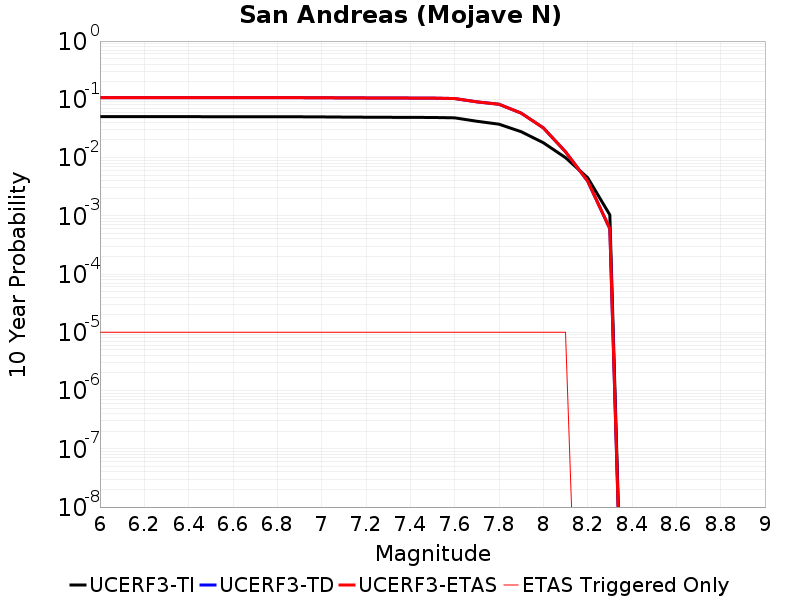 |

| Magnitude | 1 wk TI Prob | 1 wk TD Prob | 1 wk ETAS Prob | 1 wk ETAS/TD Gain | 1 wk ETAS Triggered Only | 1 mo TI Prob | 1 mo TD Prob | 1 mo ETAS Prob | 1 mo ETAS/TD Gain | 1 mo ETAS Triggered Only | 1 yr TI Prob | 1 yr TD Prob | 1 yr ETAS Prob | 1 yr ETAS/TD Gain | 1 yr ETAS Triggered Only | 10 yr TI Prob | 10 yr TD Prob | 10 yr ETAS Prob | 10 yr ETAS/TD Gain | 10 yr ETAS Triggered Only |
|-----|-----|-----|-----|-----|-----|-----|-----|-----|-----|-----|-----|-----|-----|-----|-----|-----|-----|-----|-----|-----|
| 6.0 | 9.877682E-5 | 2.1356462E-4 | 2.2356249E-4 | 1.0468142 | 1.0E-5 | 4.2326056E-4 | 9.149561E-4 | 9.24947E-4 | 1.0109195 | 1.0E-5 | 0.0051410277 | 0.011082861 | 0.011092749 | 1.0008923 | 1.0E-5 | 0.05023708 | 0.106821924 | 0.10683086 | 1.0000836 | 1.0E-5 |
| 6.1 | 9.877682E-5 | 2.1356462E-4 | 2.2356249E-4 | 1.0468142 | 1.0E-5 | 4.2326056E-4 | 9.149561E-4 | 9.24947E-4 | 1.0109195 | 1.0E-5 | 0.0051410277 | 0.011082861 | 0.011092749 | 1.0008923 | 1.0E-5 | 0.05023708 | 0.106821924 | 0.10683086 | 1.0000836 | 1.0E-5 |
| 6.2 | 9.877682E-5 | 2.1356462E-4 | 2.2356249E-4 | 1.0468142 | 1.0E-5 | 4.2326056E-4 | 9.149561E-4 | 9.24947E-4 | 1.0109195 | 1.0E-5 | 0.0051410277 | 0.011082861 | 0.011092749 | 1.0008923 | 1.0E-5 | 0.05023708 | 0.106821924 | 0.10683086 | 1.0000836 | 1.0E-5 |
| 6.3 | 9.877682E-5 | 2.1356462E-4 | 2.2356249E-4 | 1.0468142 | 1.0E-5 | 4.2326056E-4 | 9.149561E-4 | 9.24947E-4 | 1.0109195 | 1.0E-5 | 0.0051410277 | 0.011082861 | 0.011092749 | 1.0008923 | 1.0E-5 | 0.05023708 | 0.106821924 | 0.10683086 | 1.0000836 | 1.0E-5 |
| 6.4 | 9.877682E-5 | 2.1356462E-4 | 2.2356249E-4 | 1.0468142 | 1.0E-5 | 4.2326056E-4 | 9.149561E-4 | 9.24947E-4 | 1.0109195 | 1.0E-5 | 0.0051410277 | 0.011082861 | 0.011092749 | 1.0008923 | 1.0E-5 | 0.05023708 | 0.106821924 | 0.10683086 | 1.0000836 | 1.0E-5 |
| 6.5 | 9.861474E-5 | 2.132946E-4 | 2.2329246E-4 | 1.0468736 | 1.0E-5 | 4.2256617E-4 | 9.137997E-4 | 9.2379056E-4 | 1.0109333 | 1.0E-5 | 0.0051326132 | 0.011068924 | 0.011078813 | 1.0008935 | 1.0E-5 | 0.050156746 | 0.106697425 | 0.10670636 | 1.0000837 | 1.0E-5 |
| 6.6 | 9.861474E-5 | 2.132946E-4 | 2.2329246E-4 | 1.0468736 | 1.0E-5 | 4.2256617E-4 | 9.137997E-4 | 9.2379056E-4 | 1.0109333 | 1.0E-5 | 0.0051326132 | 0.011068924 | 0.011078813 | 1.0008935 | 1.0E-5 | 0.050156746 | 0.106697425 | 0.10670636 | 1.0000837 | 1.0E-5 |
| 6.7 | 9.8552715E-5 | 2.1319119E-4 | 2.2318905E-4 | 1.0468962 | 1.0E-5 | 4.223004E-4 | 9.133568E-4 | 9.2334766E-4 | 1.0109386 | 1.0E-5 | 0.0051293927 | 0.011063587 | 0.011073476 | 1.0008938 | 1.0E-5 | 0.050125998 | 0.106650025 | 0.10665896 | 1.0000838 | 1.0E-5 |
| 6.8 | 9.8464974E-5 | 2.1303889E-4 | 2.2303677E-4 | 1.0469298 | 1.0E-5 | 4.219245E-4 | 9.1270456E-4 | 9.2269544E-4 | 1.0109464 | 1.0E-5 | 0.0051248376 | 0.011055727 | 0.011065616 | 1.0008945 | 1.0E-5 | 0.05008251 | 0.10657881 | 0.106587745 | 1.0000838 | 1.0E-5 |
| 6.9 | 9.825824E-5 | 2.1271201E-4 | 2.2270989E-4 | 1.047002 | 1.0E-5 | 4.2103877E-4 | 9.113046E-4 | 9.212955E-4 | 1.0109633 | 1.0E-5 | 0.0051141046 | 0.011038855 | 0.011048744 | 1.0008959 | 1.0E-5 | 0.049980022 | 0.10642651 | 0.10643544 | 1.0000839 | 1.0E-5 |
| 7.0 | 9.781462E-5 | 2.1201474E-4 | 2.2201262E-4 | 1.0471566 | 1.0E-5 | 4.1913814E-4 | 9.083184E-4 | 9.183093E-4 | 1.0109993 | 1.0E-5 | 0.005091073 | 0.011002866 | 0.011012755 | 1.0008988 | 1.0E-5 | 0.04976007 | 0.10610094 | 0.10610988 | 1.0000843 | 1.0E-5 |
| 7.1 | 9.7121134E-5 | 2.110156E-4 | 2.210135E-4 | 1.0473799 | 1.0E-5 | 4.1616702E-4 | 9.0403936E-4 | 9.140303E-4 | 1.0110514 | 1.0E-5 | 0.005055068 | 0.010951294 | 0.010961184 | 1.0009031 | 1.0E-5 | 0.04941613 | 0.105634496 | 0.105643444 | 1.0000846 | 1.0E-5 |
| 7.2 | 9.663819E-5 | 2.1031314E-4 | 2.2031103E-4 | 1.0475382 | 1.0E-5 | 4.1409794E-4 | 9.010309E-4 | 9.110219E-4 | 1.0110884 | 1.0E-5 | 0.0050299936 | 0.010915033 | 0.010924923 | 1.0009061 | 1.0E-5 | 0.049176537 | 0.105306216 | 0.10531516 | 1.000085 | 1.0E-5 |
| 7.3 | 9.6277574E-5 | 2.0981862E-4 | 2.1981653E-4 | 1.0476502 | 1.0E-5 | 4.125529E-4 | 8.98913E-4 | 9.08904E-4 | 1.0111146 | 1.0E-5 | 0.0050112694 | 0.010889506 | 0.010899397 | 1.0009084 | 1.0E-5 | 0.04899759 | 0.10507285 | 0.105081804 | 1.0000851 | 1.0E-5 |
| 7.4 | 9.593308E-5 | 2.0918738E-4 | 2.1918528E-4 | 1.047794 | 1.0E-5 | 4.1107697E-4 | 8.962095E-4 | 9.062005E-4 | 1.0111481 | 1.0E-5 | 0.0049933824 | 0.010856919 | 0.010866811 | 1.0009111 | 1.0E-5 | 0.04882661 | 0.104781024 | 0.10478998 | 1.0000855 | 1.0E-5 |
| 7.5 | 9.561707E-5 | 2.0862171E-4 | 2.1861962E-4 | 1.0479237 | 1.0E-5 | 4.0972308E-4 | 8.937869E-4 | 9.0377795E-4 | 1.0111784 | 1.0E-5 | 0.0049769743 | 0.010827717 | 0.010837609 | 1.0009135 | 1.0E-5 | 0.048669744 | 0.10451823 | 0.10452718 | 1.0000857 | 1.0E-5 |
| 7.6 | 9.418194E-5 | 2.0496751E-4 | 2.1496546E-4 | 1.0487782 | 1.0E-5 | 4.0357444E-4 | 8.7813666E-4 | 8.8812783E-4 | 1.0113777 | 1.0E-5 | 0.004902454 | 0.010639052 | 0.010648945 | 1.00093 | 1.0E-5 | 0.047957025 | 0.102845 | 0.10285397 | 1.0000873 | 1.0E-5 |
| 7.7 | 8.202141E-5 | 1.7818407E-4 | 1.8818228E-4 | 1.0561117 | 1.0E-5 | 3.51473E-4 | 7.634226E-4 | 7.734149E-4 | 1.013089 | 1.0E-5 | 0.00427079 | 0.009255139 | 0.009265047 | 1.0010705 | 1.0E-5 | 0.04189639 | 0.09021106 | 0.09022016 | 1.0001009 | 1.0E-5 |
| 7.8 | 7.2859846E-5 | 1.6152565E-4 | 1.7152404E-4 | 1.0618997 | 1.0E-5 | 3.1221908E-4 | 6.920692E-4 | 7.020622E-4 | 1.0144395 | 1.0E-5 | 0.003794643 | 0.008393448 | 0.008403364 | 1.0011814 | 1.0E-5 | 0.037304975 | 0.08204744 | 0.08205662 | 1.0001119 | 1.0E-5 |
| 7.9 | 5.3874453E-5 | 1.1201162E-4 | 1.22010504E-4 | 1.0892664 | 1.0E-5 | 2.3087008E-4 | 4.799615E-4 | 4.899567E-4 | 1.020825 | 1.0E-5 | 0.0028072202 | 0.005827891 | 0.0058378326 | 1.0017059 | 1.0E-5 | 0.02772022 | 0.057791486 | 0.057800908 | 1.0001631 | 1.0E-5 |
| 8.0 | 3.468538E-5 | 6.108402E-5 | 7.1083414E-5 | 1.1636989 | 1.0E-5 | 1.4864317E-4 | 2.617624E-4 | 2.7175978E-4 | 1.0381926 | 1.0E-5 | 0.0018082283 | 0.0031823025 | 0.0031922706 | 1.0031323 | 1.0E-5 | 0.017935853 | 0.032264378 | 0.032274056 | 1.0002999 | 1.0E-5 |
| 8.1 | 1.9152367E-5 | 2.2648572E-5 | 3.2648346E-5 | 1.4415189 | 1.0E-5 | 8.207899E-5 | 9.7061704E-5 | 1.0706073E-4 | 1.1030172 | 1.0E-5 | 9.988535E-4 | 0.0011810865 | 0.0011910747 | 1.0084568 | 1.0E-5 | 0.009943757 | 0.012536974 | 0.012546848 | 1.0007876 | 1.0E-5 |
| 8.2 | 8.643924E-6 | 6.7348897E-6 | 6.7348897E-6 | 1.0 | 0.0 | 3.704486E-5 | 2.8863493E-5 | 2.8863493E-5 | 1.0 | 0.0 | 4.5092785E-4 | 3.513565E-4 | 3.513565E-4 | 1.0 | 0.0 | 0.0045001395 | 0.0039285375 | 0.0039285375 | 1.0 | 0.0 |
| 8.3 | 1.983087E-6 | 9.914278E-7 | 9.914278E-7 | 1.0 | 0.0 | 8.498917E-6 | 4.2489696E-6 | 4.2489696E-6 | 1.0 | 0.0 | 1.034694E-4 | 5.1730003E-5 | 5.1730003E-5 | 1.0 | 0.0 | 0.0010342124 | 5.993849E-4 | 5.993849E-4 | 1.0 | 0.0 |

## Helendale-So Lockhart
*[(top)](#table-of-contents)*

| 1 Week | 1 Month | 1 Year | 10 Year |
|-----|-----|-----|-----|
| 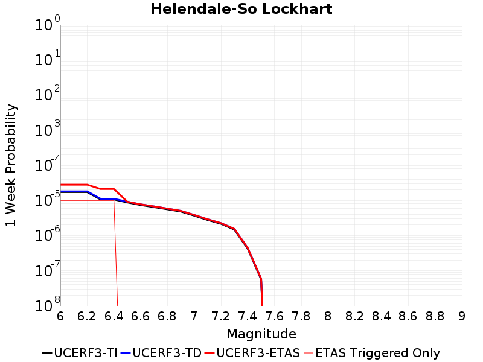 | 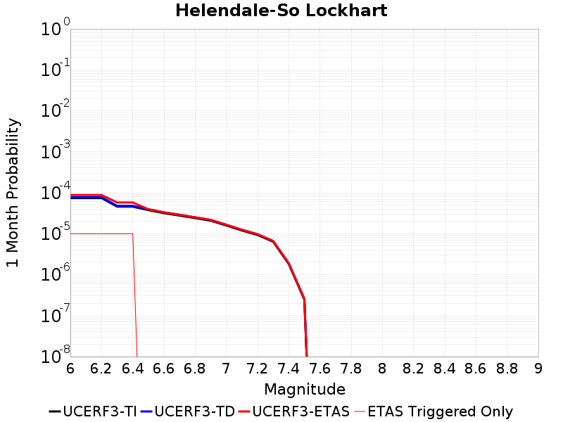 |  |  |

| Magnitude | 1 wk TI Prob | 1 wk TD Prob | 1 wk ETAS Prob | 1 wk ETAS/TD Gain | 1 wk ETAS Triggered Only | 1 mo TI Prob | 1 mo TD Prob | 1 mo ETAS Prob | 1 mo ETAS/TD Gain | 1 mo ETAS Triggered Only | 1 yr TI Prob | 1 yr TD Prob | 1 yr ETAS Prob | 1 yr ETAS/TD Gain | 1 yr ETAS Triggered Only | 10 yr TI Prob | 10 yr TD Prob | 10 yr ETAS Prob | 10 yr ETAS/TD Gain | 10 yr ETAS Triggered Only |
|-----|-----|-----|-----|-----|-----|-----|-----|-----|-----|-----|-----|-----|-----|-----|-----|-----|-----|-----|-----|-----|
| 6.0 | 1.7296055E-5 | 1.8137307E-5 | 2.8137127E-5 | 1.5513397 | 1.0E-5 | 7.412385E-5 | 7.772912E-5 | 8.7728346E-5 | 1.128642 | 1.0E-5 | 9.0208417E-4 | 9.45962E-4 | 9.559525E-4 | 1.0105612 | 1.0E-5 | 0.008984311 | 0.009421483 | 0.009431388 | 1.0010514 | 1.0E-5 |
| 6.1 | 1.7296055E-5 | 1.8137307E-5 | 2.8137127E-5 | 1.5513397 | 1.0E-5 | 7.412385E-5 | 7.772912E-5 | 8.7728346E-5 | 1.128642 | 1.0E-5 | 9.0208417E-4 | 9.45962E-4 | 9.559525E-4 | 1.0105612 | 1.0E-5 | 0.008984311 | 0.009421483 | 0.009431388 | 1.0010514 | 1.0E-5 |
| 6.2 | 1.7296055E-5 | 1.8137307E-5 | 2.8137127E-5 | 1.5513397 | 1.0E-5 | 7.412385E-5 | 7.772912E-5 | 8.7728346E-5 | 1.128642 | 1.0E-5 | 9.0208417E-4 | 9.45962E-4 | 9.559525E-4 | 1.0105612 | 1.0E-5 | 0.008984311 | 0.009421483 | 0.009431388 | 1.0010514 | 1.0E-5 |
| 6.3 | 1.0669118E-5 | 1.1154741E-5 | 2.1154628E-5 | 1.8964698 | 1.0E-5 | 4.5723988E-5 | 4.7805173E-5 | 5.7804693E-5 | 1.2091724 | 1.0E-5 | 5.5654737E-4 | 5.818753E-4 | 5.918695E-4 | 1.0171758 | 1.0E-5 | 0.0055515557 | 0.0058038156 | 0.0058137574 | 1.001713 | 1.0E-5 |
| 6.4 | 1.0669118E-5 | 1.1154741E-5 | 2.1154628E-5 | 1.8964698 | 1.0E-5 | 4.5723988E-5 | 4.7805173E-5 | 5.7804693E-5 | 1.2091724 | 1.0E-5 | 5.5654737E-4 | 5.818753E-4 | 5.918695E-4 | 1.0171758 | 1.0E-5 | 0.0055515557 | 0.0058038156 | 0.0058137574 | 1.001713 | 1.0E-5 |
| 6.5 | 8.790038E-6 | 9.185937E-6 | 9.185937E-6 | 1.0 | 0.0 | 3.767105E-5 | 3.9367715E-5 | 3.9367715E-5 | 1.0 | 0.0 | 4.585485E-4 | 4.791981E-4 | 4.791981E-4 | 1.0 | 0.0 | 0.0045760344 | 0.004781813 | 0.004781813 | 1.0 | 0.0 |
| 6.6 | 7.396949E-6 | 7.728726E-6 | 7.728726E-6 | 1.0 | 0.0 | 3.1700827E-5 | 3.3122695E-5 | 3.3122695E-5 | 1.0 | 0.0 | 3.858892E-4 | 4.031952E-4 | 4.031952E-4 | 1.0 | 0.0 | 0.003852198 | 0.0040247445 | 0.0040247445 | 1.0 | 0.0 |
| 6.7 | 6.4600285E-6 | 6.7495394E-6 | 6.7495394E-6 | 1.0 | 0.0 | 2.7685543E-5 | 2.892628E-5 | 2.892628E-5 | 1.0 | 0.0 | 3.3701936E-4 | 3.5212134E-4 | 3.5212134E-4 | 1.0 | 0.0 | 0.0033650869 | 0.0035157162 | 0.0035157162 | 1.0 | 0.0 |
| 6.8 | 5.600104E-6 | 5.845761E-6 | 5.845761E-6 | 1.0 | 0.0 | 2.4000226E-5 | 2.5053023E-5 | 2.5053023E-5 | 1.0 | 0.0 | 2.9216358E-4 | 3.0497846E-4 | 3.0497846E-4 | 1.0 | 0.0 | 0.0029177975 | 0.003045661 | 0.003045661 | 1.0 | 0.0 |
| 6.9 | 4.839122E-6 | 5.0477843E-6 | 5.0477843E-6 | 1.0 | 0.0 | 2.0738931E-5 | 2.1633185E-5 | 2.1633185E-5 | 1.0 | 0.0 | 2.5246723E-4 | 2.6335265E-4 | 2.6335265E-4 | 1.0 | 0.0 | 0.002521806 | 0.0026304533 | 0.0026304533 | 1.0 | 0.0 |
| 7.0 | 3.6937633E-6 | 3.8514577E-6 | 3.8514577E-6 | 1.0 | 0.0 | 1.5830317E-5 | 1.6506145E-5 | 1.6506145E-5 | 1.0 | 0.0 | 1.9271708E-4 | 2.009441E-4 | 2.009441E-4 | 1.0 | 0.0 | 0.0019255003 | 0.0020076556 | 0.0020076556 | 1.0 | 0.0 |
| 7.1 | 2.7858857E-6 | 2.9024695E-6 | 2.9024695E-6 | 1.0 | 0.0 | 1.1939455E-5 | 1.2439097E-5 | 1.2439097E-5 | 1.0 | 0.0 | 1.4535317E-4 | 1.514357E-4 | 1.514357E-4 | 1.0 | 0.0 | 0.0014525814 | 0.0015133466 | 0.0015133466 | 1.0 | 0.0 |
| 7.2 | 2.1672065E-6 | 2.2575903E-6 | 2.2575903E-6 | 1.0 | 0.0 | 9.2879945E-6 | 9.675352E-6 | 9.675352E-6 | 1.0 | 0.0 | 1.1307546E-4 | 1.1779123E-4 | 1.1779123E-4 | 1.0 | 0.0 | 0.0011301794 | 0.0011773062 | 0.0011773062 | 1.0 | 0.0 |
| 7.3 | 1.4823496E-6 | 1.5446778E-6 | 1.5446778E-6 | 1.0 | 0.0 | 6.3529114E-6 | 6.620032E-6 | 6.620032E-6 | 1.0 | 0.0 | 7.734395E-5 | 8.059606E-5 | 8.059606E-5 | 1.0 | 0.0 | 7.731704E-4 | 8.056835E-4 | 8.056835E-4 | 1.0 | 0.0 |
| 7.4 | 4.2321457E-7 | 4.4182573E-7 | 4.4182573E-7 | 1.0 | 0.0 | 1.8137755E-6 | 1.8935377E-6 | 1.8935377E-6 | 1.0 | 0.0 | 2.2082493E-5 | 2.3053624E-5 | 2.3053624E-5 | 1.0 | 0.0 | 2.2080299E-4 | 2.3051687E-4 | 2.3051687E-4 | 1.0 | 0.0 |
| 7.5 | 5.6942316E-8 | 5.951791E-8 | 5.951791E-8 | 1.0 | 0.0 | 2.440385E-7 | 2.5507674E-7 | 2.5507674E-7 | 1.0 | 0.0 | 2.9711643E-6 | 3.1055556E-6 | 3.1055556E-6 | 1.0 | 0.0 | 2.9711247E-5 | 3.10552E-5 | 3.10552E-5 | 1.0 | 0.0 |

## San Jacinto (Superstition Mtn)
*[(top)](#table-of-contents)*

| 1 Week | 1 Month | 1 Year | 10 Year |
|-----|-----|-----|-----|
|  |  |  | 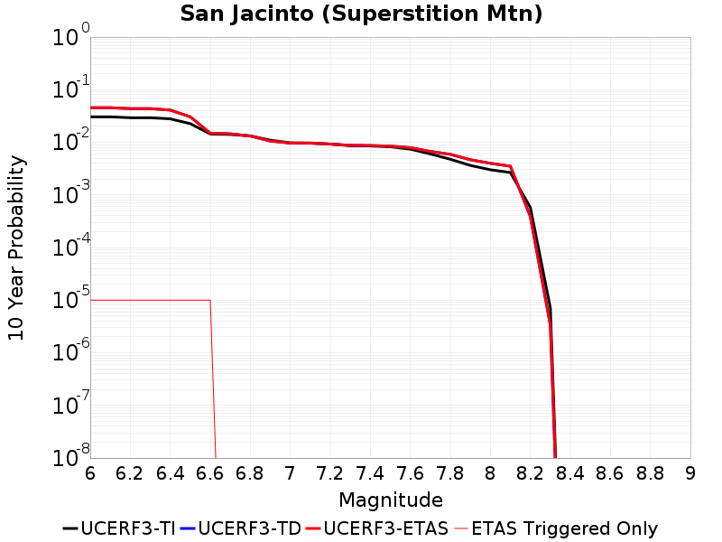 |

| Magnitude | 1 wk TI Prob | 1 wk TD Prob | 1 wk ETAS Prob | 1 wk ETAS/TD Gain | 1 wk ETAS Triggered Only | 1 mo TI Prob | 1 mo TD Prob | 1 mo ETAS Prob | 1 mo ETAS/TD Gain | 1 mo ETAS Triggered Only | 1 yr TI Prob | 1 yr TD Prob | 1 yr ETAS Prob | 1 yr ETAS/TD Gain | 1 yr ETAS Triggered Only | 10 yr TI Prob | 10 yr TD Prob | 10 yr ETAS Prob | 10 yr ETAS/TD Gain | 10 yr ETAS Triggered Only |
|-----|-----|-----|-----|-----|-----|-----|-----|-----|-----|-----|-----|-----|-----|-----|-----|-----|-----|-----|-----|-----|
| 6.0 | 5.921579E-5 | 8.884697E-5 | 8.884697E-5 | 1.0 | 0.0 | 2.5375726E-4 | 3.8072647E-4 | 3.9072268E-4 | 1.0262556 | 1.0E-5 | 0.0030851178 | 0.00462704 | 0.004636994 | 1.0021513 | 1.0E-5 | 0.030426376 | 0.0453783 | 0.045387845 | 1.0002104 | 1.0E-5 |
| 6.1 | 5.921579E-5 | 8.884697E-5 | 8.884697E-5 | 1.0 | 0.0 | 2.5375726E-4 | 3.8072647E-4 | 3.9072268E-4 | 1.0262556 | 1.0E-5 | 0.0030851178 | 0.00462704 | 0.004636994 | 1.0021513 | 1.0E-5 | 0.030426376 | 0.0453783 | 0.045387845 | 1.0002104 | 1.0E-5 |
| 6.2 | 5.6963574E-5 | 8.533698E-5 | 8.533698E-5 | 1.0 | 0.0 | 2.4410675E-4 | 3.6568788E-4 | 3.7568423E-4 | 1.0273358 | 1.0E-5 | 0.0029679495 | 0.0044447826 | 0.004454738 | 1.0022398 | 1.0E-5 | 0.029286223 | 0.04363771 | 0.043647274 | 1.0002191 | 1.0E-5 |
| 6.3 | 5.6940098E-5 | 8.529126E-5 | 8.529126E-5 | 1.0 | 0.0 | 2.4400617E-4 | 3.6549201E-4 | 3.7548834E-4 | 1.0273504 | 1.0E-5 | 0.002966728 | 0.0044424077 | 0.004452363 | 1.002241 | 1.0E-5 | 0.029274331 | 0.043615047 | 0.04362461 | 1.0002192 | 1.0E-5 |
| 6.4 | 5.4171585E-5 | 7.980832E-5 | 7.980832E-5 | 1.0 | 0.0 | 2.3214328E-4 | 3.42E-4 | 3.5199657E-4 | 1.0292298 | 1.0E-5 | 0.0028226813 | 0.004157529 | 0.004167488 | 1.0023953 | 1.0E-5 | 0.02787096 | 0.040915716 | 0.040925305 | 1.0002344 | 1.0E-5 |
| 6.5 | 4.375144E-5 | 5.8862304E-5 | 5.8862304E-5 | 1.0 | 0.0 | 1.874927E-4 | 2.5224918E-4 | 2.6224667E-4 | 1.0396334 | 1.0E-5 | 0.0022803338 | 0.0030679712 | 0.0030779405 | 1.0032495 | 1.0E-5 | 0.022570757 | 0.030486146 | 0.030495841 | 1.000318 | 1.0E-5 |
| 6.6 | 2.772192E-5 | 2.8114933E-5 | 2.8114933E-5 | 1.0 | 0.0 | 1.1880282E-4 | 1.2048713E-4 | 1.3048592E-4 | 1.0829865 | 1.0E-5 | 0.0014454646 | 0.0014659656 | 0.001475951 | 1.0068115 | 1.0E-5 | 0.014360986 | 0.01489028 | 0.014900131 | 1.0006616 | 1.0E-5 |
| 6.7 | 2.7124124E-5 | 2.7306925E-5 | 2.7306925E-5 | 1.0 | 0.0 | 1.1624106E-4 | 1.1702455E-4 | 1.1702455E-4 | 1.0 | 0.0 | 0.0014143161 | 0.0014238646 | 0.0014238646 | 1.0 | 0.0 | 0.014053487 | 0.014475009 | 0.014475009 | 1.0 | 0.0 |
| 6.8 | 2.5475807E-5 | 2.4782825E-5 | 2.4782825E-5 | 1.0 | 0.0 | 1.0917746E-4 | 1.06207866E-4 | 1.06207866E-4 | 1.0 | 0.0 | 0.001328425 | 0.0012923285 | 0.0012923285 | 1.0 | 0.0 | 0.0132051185 | 0.013171058 | 0.013171058 | 1.0 | 0.0 |
| 6.9 | 2.1162023E-5 | 1.9744257E-5 | 1.9744257E-5 | 1.0 | 0.0 | 9.069123E-5 | 8.461552E-5 | 8.461552E-5 | 1.0 | 0.0 | 0.0011036064 | 0.0010297118 | 0.0010297118 | 1.0 | 0.0 | 0.010981417 | 0.010543396 | 0.010543396 | 1.0 | 0.0 |
| 7.0 | 1.8754288E-5 | 1.8077812E-5 | 1.8077812E-5 | 1.0 | 0.0 | 8.037304E-5 | 7.747405E-5 | 7.747405E-5 | 1.0 | 0.0 | 9.781026E-4 | 9.428413E-4 | 9.428413E-4 | 1.0 | 0.0 | 0.009738087 | 0.009664384 | 0.009664384 | 1.0 | 0.0 |
| 7.1 | 1.8678527E-5 | 1.799736E-5 | 1.799736E-5 | 1.0 | 0.0 | 8.0048376E-5 | 7.7129276E-5 | 7.7129276E-5 | 1.0 | 0.0 | 9.7415317E-4 | 9.3864737E-4 | 9.3864737E-4 | 1.0 | 0.0 | 0.009698939 | 0.00962254 | 0.00962254 | 1.0 | 0.0 |
| 7.2 | 1.7804578E-5 | 1.7237431E-5 | 1.7237431E-5 | 1.0 | 0.0 | 7.6303106E-5 | 7.387263E-5 | 7.387263E-5 | 1.0 | 0.0 | 9.285943E-4 | 8.990309E-4 | 8.990309E-4 | 1.0 | 0.0 | 0.009247236 | 0.009226251 | 0.009226251 | 1.0 | 0.0 |
| 7.3 | 1.6583685E-5 | 1.6307886E-5 | 1.6307886E-5 | 1.0 | 0.0 | 7.1070994E-5 | 6.988908E-5 | 6.988908E-5 | 1.0 | 0.0 | 8.649459E-4 | 8.505698E-4 | 8.505698E-4 | 1.0 | 0.0 | 0.00861587 | 0.00874182 | 0.00874182 | 1.0 | 0.0 |
| 7.4 | 1.6387552E-5 | 1.6160764E-5 | 1.6160764E-5 | 1.0 | 0.0 | 7.023047E-5 | 6.9258596E-5 | 6.9258596E-5 | 1.0 | 0.0 | 8.5472054E-4 | 8.4289955E-4 | 8.4289955E-4 | 1.0 | 0.0 | 0.008514405 | 0.008665097 | 0.008665097 | 1.0 | 0.0 |
| 7.5 | 1.5790754E-5 | 1.5764537E-5 | 1.5764537E-5 | 1.0 | 0.0 | 6.767291E-5 | 6.756057E-5 | 6.756057E-5 | 1.0 | 0.0 | 8.236062E-4 | 8.222419E-4 | 8.222419E-4 | 1.0 | 0.0 | 0.008205604 | 0.008456723 | 0.008456723 | 1.0 | 0.0 |
| 7.6 | 1.4248672E-5 | 1.4696763E-5 | 1.4696763E-5 | 1.0 | 0.0 | 6.106431E-5 | 6.298462E-5 | 6.298462E-5 | 1.0 | 0.0 | 7.432043E-4 | 7.6657E-4 | 7.6657E-4 | 1.0 | 0.0 | 0.007407237 | 0.0078949 | 0.0078949 | 1.0 | 0.0 |
| 7.7 | 1.15449975E-5 | 1.2403384E-5 | 1.2403384E-5 | 1.0 | 0.0 | 4.947762E-5 | 5.315628E-5 | 5.315628E-5 | 1.0 | 0.0 | 6.022235E-4 | 6.4698653E-4 | 6.4698653E-4 | 1.0 | 0.0 | 0.006005941 | 0.0066923136 | 0.0066923136 | 1.0 | 0.0 |
| 7.8 | 9.1391985E-6 | 1.0897104E-5 | 1.0897104E-5 | 1.0 | 0.0 | 3.9167408E-5 | 4.6701047E-5 | 4.6701047E-5 | 1.0 | 0.0 | 4.767588E-4 | 5.684377E-4 | 5.684377E-4 | 1.0 | 0.0 | 0.0047573727 | 0.005898474 | 0.005898474 | 1.0 | 0.0 |
| 7.9 | 6.973017E-6 | 8.532317E-6 | 8.532317E-6 | 1.0 | 0.0 | 2.9884017E-5 | 3.6566566E-5 | 3.6566566E-5 | 1.0 | 0.0 | 3.6377716E-4 | 4.451077E-4 | 4.451077E-4 | 1.0 | 0.0 | 0.0036318225 | 0.004653772 | 0.004653772 | 1.0 | 0.0 |
| 8.0 | 5.7638235E-6 | 7.2710577E-6 | 7.2710577E-6 | 1.0 | 0.0 | 2.4701867E-5 | 3.1161308E-5 | 3.1161308E-5 | 1.0 | 0.0 | 3.0070372E-4 | 3.7932355E-4 | 3.7932355E-4 | 1.0 | 0.0 | 0.0030029714 | 0.0039832625 | 0.0039832625 | 1.0 | 0.0 |
| 8.1 | 5.1124434E-6 | 6.397646E-6 | 6.397646E-6 | 1.0 | 0.0 | 2.1910288E-5 | 2.7418198E-5 | 2.7418198E-5 | 1.0 | 0.0 | 2.6672508E-4 | 3.3376607E-4 | 3.3376607E-4 | 1.0 | 0.0 | 0.0026640517 | 0.0035136996 | 0.0035136996 | 1.0 | 0.0 |
| 8.2 | 1.1075938E-6 | 6.6710044E-7 | 6.6710044E-7 | 1.0 | 0.0 | 4.7468216E-6 | 2.858999E-6 | 2.858999E-6 | 1.0 | 0.0 | 5.779102E-5 | 3.4807792E-5 | 3.4807792E-5 | 1.0 | 0.0 | 5.777599E-4 | 3.873566E-4 | 3.873566E-4 | 1.0 | 0.0 |
| 8.3 | 1.3584393E-8 | 5.7286393E-9 | 5.7286393E-9 | 1.0 | 0.0 | 5.8218827E-8 | 2.4551312E-8 | 2.4551312E-8 | 1.0 | 0.0 | 7.0881396E-7 | 2.9891223E-7 | 2.9891223E-7 | 1.0 | 0.0 | 7.0881174E-6 | 3.3137355E-6 | 3.3137355E-6 | 1.0 | 0.0 |

## San Andreas (San Bernardino N)
*[(top)](#table-of-contents)*

| 1 Week | 1 Month | 1 Year | 10 Year |
|-----|-----|-----|-----|
|  |  |  |  |

| Magnitude | 1 wk TI Prob | 1 wk TD Prob | 1 wk ETAS Prob | 1 wk ETAS/TD Gain | 1 wk ETAS Triggered Only | 1 mo TI Prob | 1 mo TD Prob | 1 mo ETAS Prob | 1 mo ETAS/TD Gain | 1 mo ETAS Triggered Only | 1 yr TI Prob | 1 yr TD Prob | 1 yr ETAS Prob | 1 yr ETAS/TD Gain | 1 yr ETAS Triggered Only | 10 yr TI Prob | 10 yr TD Prob | 10 yr ETAS Prob | 10 yr ETAS/TD Gain | 10 yr ETAS Triggered Only |
|-----|-----|-----|-----|-----|-----|-----|-----|-----|-----|-----|-----|-----|-----|-----|-----|-----|-----|-----|-----|-----|
| 6.0 | 1.4273766E-4 | 3.3486786E-4 | 3.448645E-4 | 1.0298525 | 1.0E-5 | 6.115894E-4 | 0.0014343647 | 0.0014443503 | 1.0069617 | 1.0E-5 | 0.0074207084 | 0.017325178 | 0.017335003 | 1.0005672 | 1.0E-5 | 0.07177748 | 0.15787303 | 0.15788147 | 1.0000533 | 1.0E-5 |
| 6.1 | 1.4273766E-4 | 3.3486786E-4 | 3.448645E-4 | 1.0298525 | 1.0E-5 | 6.115894E-4 | 0.0014343647 | 0.0014443503 | 1.0069617 | 1.0E-5 | 0.0074207084 | 0.017325178 | 0.017335003 | 1.0005672 | 1.0E-5 | 0.07177748 | 0.15787303 | 0.15788147 | 1.0000533 | 1.0E-5 |
| 6.2 | 1.4273766E-4 | 3.3486786E-4 | 3.448645E-4 | 1.0298525 | 1.0E-5 | 6.115894E-4 | 0.0014343647 | 0.0014443503 | 1.0069617 | 1.0E-5 | 0.0074207084 | 0.017325178 | 0.017335003 | 1.0005672 | 1.0E-5 | 0.07177748 | 0.15787303 | 0.15788147 | 1.0000533 | 1.0E-5 |
| 6.3 | 1.3730655E-4 | 3.2380843E-4 | 3.338052E-4 | 1.0308725 | 1.0E-5 | 5.883239E-4 | 0.0013870182 | 0.0013970044 | 1.0071998 | 1.0E-5 | 0.0071393442 | 0.016757706 | 0.01676754 | 1.0005867 | 1.0E-5 | 0.06914291 | 0.15318461 | 0.15319307 | 1.0000553 | 1.0E-5 |
| 6.4 | 1.3730655E-4 | 3.2380843E-4 | 3.338052E-4 | 1.0308725 | 1.0E-5 | 5.883239E-4 | 0.0013870182 | 0.0013970044 | 1.0071998 | 1.0E-5 | 0.0071393442 | 0.016757706 | 0.01676754 | 1.0005867 | 1.0E-5 | 0.06914291 | 0.15318461 | 0.15319307 | 1.0000553 | 1.0E-5 |
| 6.5 | 1.2942807E-4 | 3.0779463E-4 | 3.1779154E-4 | 1.0324792 | 1.0E-5 | 5.545738E-4 | 0.0013184582 | 0.001328445 | 1.0075746 | 1.0E-5 | 0.0067310524 | 0.01593543 | 0.01594527 | 1.0006175 | 1.0E-5 | 0.06530788 | 0.14635257 | 0.14636111 | 1.0000583 | 1.0E-5 |
| 6.6 | 1.1125901E-4 | 2.7176674E-4 | 2.8176402E-4 | 1.0367863 | 1.0E-5 | 4.767372E-4 | 0.0011641971 | 0.0011741854 | 1.0085796 | 1.0E-5 | 0.005788839 | 0.014082686 | 0.014092545 | 1.0007001 | 1.0E-5 | 0.056403454 | 0.13059114 | 0.13059983 | 1.0000665 | 1.0E-5 |
| 6.7 | 1.02209575E-4 | 2.5296074E-4 | 2.6295823E-4 | 1.0395218 | 1.0E-5 | 4.3796748E-4 | 0.0010836686 | 0.0010936577 | 1.0092179 | 1.0E-5 | 0.0053192247 | 0.013114332 | 0.013124201 | 1.0007526 | 1.0E-5 | 0.051936906 | 0.12240085 | 0.12240963 | 1.0000716 | 1.0E-5 |
| 6.8 | 9.610582E-5 | 2.3793142E-4 | 2.4792904E-4 | 1.0420189 | 1.0E-5 | 4.1181705E-4 | 0.0010193083 | 0.0010292982 | 1.0098006 | 1.0E-5 | 0.0050023515 | 0.012339777 | 0.012349654 | 1.0008004 | 1.0E-5 | 0.048912346 | 0.11575347 | 0.11576231 | 1.0000764 | 1.0E-5 |
| 6.9 | 9.3877505E-5 | 2.3240023E-4 | 2.423979E-4 | 1.0430192 | 1.0E-5 | 4.0227012E-4 | 9.956214E-4 | 0.0010056115 | 1.010034 | 1.0E-5 | 0.0048866454 | 0.012054611 | 0.0120644905 | 1.0008196 | 1.0E-5 | 0.04780577 | 0.1133356 | 0.11334447 | 1.0000782 | 1.0E-5 |
| 7.0 | 9.1019785E-5 | 2.2553967E-4 | 2.3553742E-4 | 1.0443281 | 1.0E-5 | 3.900265E-4 | 9.662412E-4 | 9.762315E-4 | 1.0103394 | 1.0E-5 | 0.0047382377 | 0.011700799 | 0.011710682 | 1.0008446 | 1.0E-5 | 0.046384744 | 0.110270105 | 0.110279 | 1.0000807 | 1.0E-5 |
| 7.1 | 8.771155E-5 | 2.1713394E-4 | 2.2713178E-4 | 1.0460445 | 1.0E-5 | 3.758525E-4 | 9.3024276E-4 | 9.4023347E-4 | 1.0107399 | 1.0E-5 | 0.0045664064 | 0.0112671275 | 0.011277014 | 1.0008775 | 1.0E-5 | 0.044737056 | 0.106552266 | 0.1065612 | 1.0000838 | 1.0E-5 |
| 7.2 | 8.0830236E-5 | 2.0086858E-4 | 2.1086658E-4 | 1.0497738 | 1.0E-5 | 3.4636928E-4 | 8.605815E-4 | 8.705729E-4 | 1.01161 | 1.0E-5 | 0.0042088944 | 0.010427381 | 0.010437276 | 1.000949 | 1.0E-5 | 0.041300658 | 0.09920109 | 0.0992101 | 1.0000908 | 1.0E-5 |
| 7.3 | 7.7668235E-5 | 1.8995945E-4 | 1.9995755E-4 | 1.0526328 | 1.0E-5 | 3.328214E-4 | 8.13858E-4 | 8.2384987E-4 | 1.0122771 | 1.0E-5 | 0.0040445733 | 0.009863808 | 0.00987371 | 1.0010039 | 1.0E-5 | 0.03971748 | 0.09437331 | 0.09438237 | 1.000096 | 1.0E-5 |
| 7.4 | 7.520177E-5 | 1.8188953E-4 | 1.918877E-4 | 1.0549685 | 1.0E-5 | 3.2225347E-4 | 7.792937E-4 | 7.892859E-4 | 1.0128222 | 1.0E-5 | 0.0039163795 | 0.009446715 | 0.009456621 | 1.0010486 | 1.0E-5 | 0.038480744 | 0.09074827 | 0.09075737 | 1.0001001 | 1.0E-5 |
| 7.5 | 7.274697E-5 | 1.7451252E-4 | 1.8451078E-4 | 1.0572925 | 1.0E-5 | 3.1173544E-4 | 7.476965E-4 | 7.57689E-4 | 1.0133644 | 1.0E-5 | 0.003788775 | 0.009065286 | 0.0090751955 | 1.0010931 | 1.0E-5 | 0.03724827 | 0.0873859 | 0.08739502 | 1.0001044 | 1.0E-5 |
| 7.6 | 7.1185845E-5 | 1.7004821E-4 | 1.8004651E-4 | 1.0587969 | 1.0E-5 | 3.0504653E-4 | 7.285746E-4 | 7.3856727E-4 | 1.0137154 | 1.0E-5 | 0.0037076178 | 0.008834389 | 0.0088443 | 1.001122 | 1.0E-5 | 0.036463667 | 0.08532249 | 0.08533164 | 1.0001072 | 1.0E-5 |
| 7.7 | 6.709961E-5 | 1.5868114E-4 | 1.6867956E-4 | 1.0630095 | 1.0E-5 | 2.8753807E-4 | 6.7988486E-4 | 6.8987807E-4 | 1.0146984 | 1.0E-5 | 0.003495157 | 0.008246236 | 0.008256153 | 1.0012027 | 1.0E-5 | 0.034406938 | 0.0799934 | 0.0800026 | 1.000115 | 1.0E-5 |
| 7.8 | 6.300812E-5 | 1.4658849E-4 | 1.5658702E-4 | 1.0682082 | 1.0E-5 | 2.7000686E-4 | 6.280851E-4 | 6.3807884E-4 | 1.0159115 | 1.0E-5 | 0.0032823787 | 0.0076201656 | 0.0076300893 | 1.0013024 | 1.0E-5 | 0.032343175 | 0.07428589 | 0.07429515 | 1.0001246 | 1.0E-5 |
| 7.9 | 4.983037E-5 | 1.0836649E-4 | 1.1836541E-4 | 1.0922694 | 1.0E-5 | 2.1354125E-4 | 4.6434518E-4 | 4.7434052E-4 | 1.0215257 | 1.0E-5 | 0.0025967648 | 0.005638763 | 0.0056487066 | 1.0017635 | 1.0E-5 | 0.025666296 | 0.055814598 | 0.055824038 | 1.0001692 | 1.0E-5 |
| 8.0 | 3.2211527E-5 | 5.9916812E-5 | 6.991621E-5 | 1.1668881 | 1.0E-5 | 1.380421E-4 | 2.567611E-4 | 2.6675852E-4 | 1.0389367 | 1.0E-5 | 0.0016793669 | 0.0031215874 | 0.0031315563 | 1.0031935 | 1.0E-5 | 0.016667323 | 0.031564154 | 0.03157384 | 1.0003068 | 1.0E-5 |
| 8.1 | 1.743376E-5 | 2.1920725E-5 | 3.1920506E-5 | 1.4561793 | 1.0E-5 | 7.471398E-5 | 9.394259E-5 | 1.03941646E-4 | 1.106438 | 1.0E-5 | 9.0926304E-4 | 0.0011431518 | 0.0011531403 | 1.0087378 | 1.0E-5 | 0.009055517 | 0.012080277 | 0.012090157 | 1.0008178 | 1.0E-5 |
| 8.2 | 7.831616E-6 | 6.3297157E-6 | 6.3297157E-6 | 1.0 | 0.0 | 3.3563636E-5 | 2.7127071E-5 | 2.7127071E-5 | 1.0 | 0.0 | 4.0856065E-4 | 3.3022216E-4 | 3.3022216E-4 | 1.0 | 0.0 | 0.004078103 | 0.0036730017 | 0.0036730017 | 1.0 | 0.0 |
| 8.3 | 1.983087E-6 | 9.914278E-7 | 9.914278E-7 | 1.0 | 0.0 | 8.498917E-6 | 4.2489696E-6 | 4.2489696E-6 | 1.0 | 0.0 | 1.034694E-4 | 5.1730003E-5 | 5.1730003E-5 | 1.0 | 0.0 | 0.0010342124 | 5.993849E-4 | 5.993849E-4 | 1.0 | 0.0 |

## San Andreas (Carrizo) rev
*[(top)](#table-of-contents)*

| 1 Week | 1 Month | 1 Year | 10 Year |
|-----|-----|-----|-----|
| 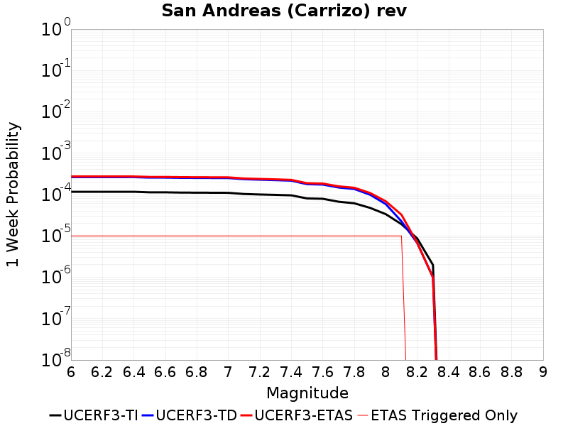 |  | 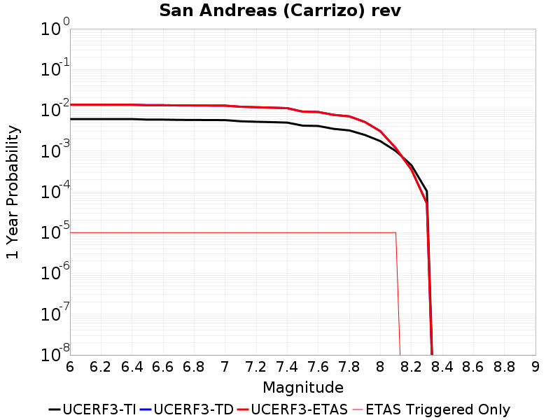 | 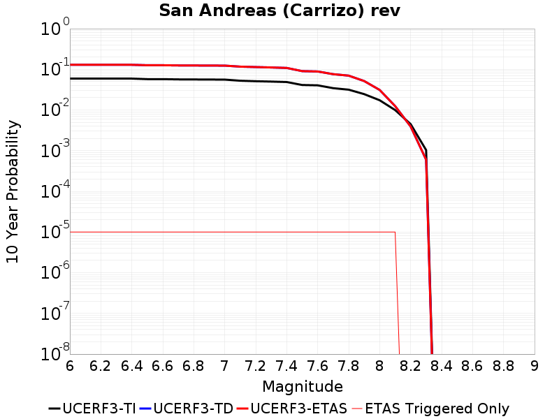 |

| Magnitude | 1 wk TI Prob | 1 wk TD Prob | 1 wk ETAS Prob | 1 wk ETAS/TD Gain | 1 wk ETAS Triggered Only | 1 mo TI Prob | 1 mo TD Prob | 1 mo ETAS Prob | 1 mo ETAS/TD Gain | 1 mo ETAS Triggered Only | 1 yr TI Prob | 1 yr TD Prob | 1 yr ETAS Prob | 1 yr ETAS/TD Gain | 1 yr ETAS Triggered Only | 10 yr TI Prob | 10 yr TD Prob | 10 yr ETAS Prob | 10 yr ETAS/TD Gain | 10 yr ETAS Triggered Only |
|-----|-----|-----|-----|-----|-----|-----|-----|-----|-----|-----|-----|-----|-----|-----|-----|-----|-----|-----|-----|-----|
| 6.0 | 1.1674632E-4 | 2.6336682E-4 | 2.733642E-4 | 1.0379598 | 1.0E-5 | 5.002454E-4 | 0.0011282285 | 0.0011382173 | 1.0088534 | 1.0E-5 | 0.006073493 | 0.013650238 | 0.0136601 | 1.0007226 | 1.0E-5 | 0.0591016 | 0.12899965 | 0.12900835 | 1.0000675 | 1.0E-5 |
| 6.1 | 1.1674632E-4 | 2.6336682E-4 | 2.733642E-4 | 1.0379598 | 1.0E-5 | 5.002454E-4 | 0.0011282285 | 0.0011382173 | 1.0088534 | 1.0E-5 | 0.006073493 | 0.013650238 | 0.0136601 | 1.0007226 | 1.0E-5 | 0.0591016 | 0.12899965 | 0.12900835 | 1.0000675 | 1.0E-5 |
| 6.2 | 1.1674632E-4 | 2.6336682E-4 | 2.733642E-4 | 1.0379598 | 1.0E-5 | 5.002454E-4 | 0.0011282285 | 0.0011382173 | 1.0088534 | 1.0E-5 | 0.006073493 | 0.013650238 | 0.0136601 | 1.0007226 | 1.0E-5 | 0.0591016 | 0.12899965 | 0.12900835 | 1.0000675 | 1.0E-5 |
| 6.3 | 1.1674632E-4 | 2.6336682E-4 | 2.733642E-4 | 1.0379598 | 1.0E-5 | 5.002454E-4 | 0.0011282285 | 0.0011382173 | 1.0088534 | 1.0E-5 | 0.006073493 | 0.013650238 | 0.0136601 | 1.0007226 | 1.0E-5 | 0.0591016 | 0.12899965 | 0.12900835 | 1.0000675 | 1.0E-5 |
| 6.4 | 1.1674632E-4 | 2.6336682E-4 | 2.733642E-4 | 1.0379598 | 1.0E-5 | 5.002454E-4 | 0.0011282285 | 0.0011382173 | 1.0088534 | 1.0E-5 | 0.006073493 | 0.013650238 | 0.0136601 | 1.0007226 | 1.0E-5 | 0.0591016 | 0.12899965 | 0.12900835 | 1.0000675 | 1.0E-5 |
| 6.5 | 1.13136164E-4 | 2.564443E-4 | 2.6644176E-4 | 1.0389848 | 1.0E-5 | 4.847792E-4 | 0.0010985858 | 0.0011085748 | 1.0090926 | 1.0E-5 | 0.0058862255 | 0.013293784 | 0.013303651 | 1.0007422 | 1.0E-5 | 0.057327334 | 0.12595625 | 0.125965 | 1.0000694 | 1.0E-5 |
| 6.6 | 1.13136164E-4 | 2.564443E-4 | 2.6644176E-4 | 1.0389848 | 1.0E-5 | 4.847792E-4 | 0.0010985858 | 0.0011085748 | 1.0090926 | 1.0E-5 | 0.0058862255 | 0.013293784 | 0.013303651 | 1.0007422 | 1.0E-5 | 0.057327334 | 0.12595625 | 0.125965 | 1.0000694 | 1.0E-5 |
| 6.7 | 1.1149675E-4 | 2.5330068E-4 | 2.6329813E-4 | 1.0394688 | 1.0E-5 | 4.777557E-4 | 0.0010851243 | 0.0010951135 | 1.0092056 | 1.0E-5 | 0.0058011734 | 0.013131875 | 0.013141743 | 1.0007515 | 1.0E-5 | 0.05652051 | 0.124575175 | 0.12458393 | 1.0000702 | 1.0E-5 |
| 6.8 | 1.1103589E-4 | 2.5228894E-4 | 2.622864E-4 | 1.0396271 | 1.0E-5 | 4.7578133E-4 | 0.0010807919 | 0.0010907811 | 1.0092425 | 1.0E-5 | 0.005777263 | 0.0130797615 | 0.013089631 | 1.0007546 | 1.0E-5 | 0.056293584 | 0.12412688 | 0.12413564 | 1.0000706 | 1.0E-5 |
| 6.9 | 1.1053259E-4 | 2.5117616E-4 | 2.6117364E-4 | 1.0398027 | 1.0E-5 | 4.7362508E-4 | 0.0010760268 | 0.0010860161 | 1.0092834 | 1.0E-5 | 0.0057511497 | 0.013022442 | 0.0130323125 | 1.0007579 | 1.0E-5 | 0.05604569 | 0.123632446 | 0.12364121 | 1.0000709 | 1.0E-5 |
| 7.0 | 1.1005377E-4 | 2.501504E-4 | 2.6014788E-4 | 1.039966 | 1.0E-5 | 4.7157376E-4 | 0.0010716342 | 0.0010816235 | 1.0093216 | 1.0E-5 | 0.0057263062 | 0.012969601 | 0.012979471 | 1.000761 | 1.0E-5 | 0.055809796 | 0.1231751 | 0.12318387 | 1.0000712 | 1.0E-5 |
| 7.1 | 1.0308142E-4 | 2.3473377E-4 | 2.4473143E-4 | 1.0425915 | 1.0E-5 | 4.417027E-4 | 0.0010056152 | 0.0010156052 | 1.0099342 | 1.0E-5 | 0.0053644776 | 0.012175012 | 0.012184891 | 1.0008113 | 1.0E-5 | 0.052368138 | 0.11629886 | 0.1163077 | 1.0000759 | 1.0E-5 |
| 7.2 | 1.0027479E-4 | 2.2861021E-4 | 2.3860793E-4 | 1.0437325 | 1.0E-5 | 4.296783E-4 | 9.793913E-4 | 9.893815E-4 | 1.0102004 | 1.0E-5 | 0.0052187922 | 0.011859254 | 0.011869135 | 1.0008333 | 1.0E-5 | 0.050979212 | 0.11354454 | 0.113553405 | 1.0000781 | 1.0E-5 |
| 7.3 | 9.816942E-5 | 2.2304947E-4 | 2.3304723E-4 | 1.044823 | 1.0E-5 | 4.2065824E-4 | 9.555772E-4 | 9.6556765E-4 | 1.0104549 | 1.0E-5 | 0.005109493 | 0.011572434 | 0.011582318 | 1.0008541 | 1.0E-5 | 0.049935985 | 0.11102194 | 0.11103083 | 1.0000801 | 1.0E-5 |
| 7.4 | 9.5634205E-5 | 2.1641988E-4 | 2.2641772E-4 | 1.0461965 | 1.0E-5 | 4.0979648E-4 | 9.2718506E-4 | 9.371758E-4 | 1.0107753 | 1.0E-5 | 0.0049778637 | 0.011230365 | 0.011240253 | 1.0008805 | 1.0E-5 | 0.048678253 | 0.10801017 | 0.10801909 | 1.0000826 | 1.0E-5 |
| 7.5 | 8.052417E-5 | 1.7780263E-4 | 1.8780085E-4 | 1.0562321 | 1.0E-5 | 3.4505792E-4 | 7.617889E-4 | 7.717813E-4 | 1.013117 | 1.0E-5 | 0.0041929903 | 0.009235444 | 0.009245352 | 1.0010728 | 1.0E-5 | 0.04114753 | 0.090170845 | 0.09017994 | 1.0001009 | 1.0E-5 |
| 7.6 | 7.897024E-5 | 1.7416013E-4 | 1.841584E-4 | 1.0574085 | 1.0E-5 | 3.384E-4 | 7.461873E-4 | 7.561798E-4 | 1.0133915 | 1.0E-5 | 0.0041122385 | 0.009047086 | 0.009056997 | 1.0010953 | 1.0E-5 | 0.040369697 | 0.08845026 | 0.08845937 | 1.0001031 | 1.0E-5 |
| 7.7 | 6.707427E-5 | 1.4805033E-4 | 1.5804885E-4 | 1.0675346 | 1.0E-5 | 2.8742946E-4 | 6.343472E-4 | 6.443408E-4 | 1.0157542 | 1.0E-5 | 0.003493839 | 0.007695874 | 0.0077057974 | 1.0012894 | 1.0E-5 | 0.034394164 | 0.07591465 | 0.07592389 | 1.0001217 | 1.0E-5 |
| 7.8 | 6.147705E-5 | 1.3605437E-4 | 1.46053E-4 | 1.07349 | 1.0E-5 | 2.6344648E-4 | 5.829599E-4 | 5.9295405E-4 | 1.0171438 | 1.0E-5 | 0.0032027436 | 0.007074475 | 0.007084404 | 1.0014036 | 1.0E-5 | 0.031569764 | 0.069878295 | 0.0698876 | 1.0001332 | 1.0E-5 |
| 7.9 | 4.7636717E-5 | 9.916982E-5 | 1.09168825E-4 | 1.1008271 | 1.0E-5 | 2.0414138E-4 | 4.249443E-4 | 4.3494004E-4 | 1.0235225 | 1.0E-5 | 0.0024825884 | 0.005161435 | 0.0051713833 | 1.0019275 | 1.0E-5 | 0.024550365 | 0.051465966 | 0.05147545 | 1.0001843 | 1.0E-5 |
| 8.0 | 3.3554235E-5 | 5.877488E-5 | 6.8774294E-5 | 1.1701307 | 1.0E-5 | 1.4379594E-4 | 2.5186804E-4 | 2.6186553E-4 | 1.0396934 | 1.0E-5 | 0.0017493097 | 0.0030621837 | 0.003072153 | 1.0032556 | 1.0E-5 | 0.017356034 | 0.031111363 | 0.031121051 | 1.0003114 | 1.0E-5 |
| 8.1 | 1.9175432E-5 | 2.2428874E-5 | 3.242865E-5 | 1.4458438 | 1.0E-5 | 8.217783E-5 | 9.612021E-5 | 1.06119245E-4 | 1.1040264 | 1.0E-5 | 0.0010000558 | 0.0011696361 | 0.0011796243 | 1.0085397 | 1.0E-5 | 0.009955673 | 0.012439982 | 0.012449858 | 1.0007938 | 1.0E-5 |
| 8.2 | 8.643924E-6 | 6.7348897E-6 | 6.7348897E-6 | 1.0 | 0.0 | 3.704486E-5 | 2.8863493E-5 | 2.8863493E-5 | 1.0 | 0.0 | 4.5092785E-4 | 3.513565E-4 | 3.513565E-4 | 1.0 | 0.0 | 0.0045001395 | 0.0039285375 | 0.0039285375 | 1.0 | 0.0 |
| 8.3 | 1.983087E-6 | 9.914278E-7 | 9.914278E-7 | 1.0 | 0.0 | 8.498917E-6 | 4.2489696E-6 | 4.2489696E-6 | 1.0 | 0.0 | 1.034694E-4 | 5.1730003E-5 | 5.1730003E-5 | 1.0 | 0.0 | 0.0010342124 | 5.993849E-4 | 5.993849E-4 | 1.0 | 0.0 |

## San Andreas (Mojave S)
*[(top)](#table-of-contents)*

| 1 Week | 1 Month | 1 Year | 10 Year |
|-----|-----|-----|-----|
| 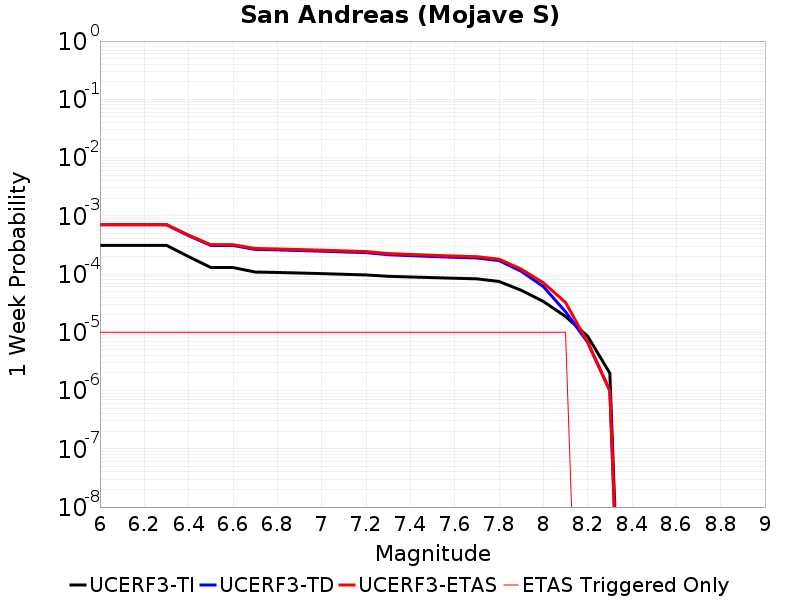 |  |  |  |

| Magnitude | 1 wk TI Prob | 1 wk TD Prob | 1 wk ETAS Prob | 1 wk ETAS/TD Gain | 1 wk ETAS Triggered Only | 1 mo TI Prob | 1 mo TD Prob | 1 mo ETAS Prob | 1 mo ETAS/TD Gain | 1 mo ETAS Triggered Only | 1 yr TI Prob | 1 yr TD Prob | 1 yr ETAS Prob | 1 yr ETAS/TD Gain | 1 yr ETAS Triggered Only | 10 yr TI Prob | 10 yr TD Prob | 10 yr ETAS Prob | 10 yr ETAS/TD Gain | 10 yr ETAS Triggered Only |
|-----|-----|-----|-----|-----|-----|-----|-----|-----|-----|-----|-----|-----|-----|-----|-----|-----|-----|-----|-----|-----|
| 6.0 | 3.1064058E-4 | 6.98577E-4 | 7.0857E-4 | 1.0143048 | 1.0E-5 | 0.0013306376 | 0.0029905958 | 0.003000566 | 1.0033338 | 1.0E-5 | 0.016080605 | 0.035930794 | 0.035940435 | 1.0002683 | 1.0E-5 | 0.1496549 | 0.29457688 | 0.29458395 | 1.000024 | 1.0E-5 |
| 6.1 | 3.1064058E-4 | 6.98577E-4 | 7.0857E-4 | 1.0143048 | 1.0E-5 | 0.0013306376 | 0.0029905958 | 0.003000566 | 1.0033338 | 1.0E-5 | 0.016080605 | 0.035930794 | 0.035940435 | 1.0002683 | 1.0E-5 | 0.1496549 | 0.29457688 | 0.29458395 | 1.000024 | 1.0E-5 |
| 6.2 | 3.1064058E-4 | 6.98577E-4 | 7.0857E-4 | 1.0143048 | 1.0E-5 | 0.0013306376 | 0.0029905958 | 0.003000566 | 1.0033338 | 1.0E-5 | 0.016080605 | 0.035930794 | 0.035940435 | 1.0002683 | 1.0E-5 | 0.1496549 | 0.29457688 | 0.29458395 | 1.000024 | 1.0E-5 |
| 6.3 | 3.1064058E-4 | 6.98577E-4 | 7.0857E-4 | 1.0143048 | 1.0E-5 | 0.0013306376 | 0.0029905958 | 0.003000566 | 1.0033338 | 1.0E-5 | 0.016080605 | 0.035930794 | 0.035940435 | 1.0002683 | 1.0E-5 | 0.1496549 | 0.29457688 | 0.29458395 | 1.000024 | 1.0E-5 |
| 6.4 | 1.9872203E-4 | 4.544386E-4 | 4.6443404E-4 | 1.0219952 | 1.0E-5 | 8.5138786E-4 | 0.001946169 | 0.0019561495 | 1.0051283 | 1.0E-5 | 0.010316478 | 0.023443596 | 0.02345336 | 1.0004165 | 1.0E-5 | 0.098504856 | 0.20566934 | 0.20567729 | 1.0000386 | 1.0E-5 |
| 6.5 | 1.291105E-4 | 3.088359E-4 | 3.1883284E-4 | 1.0323696 | 1.0E-5 | 5.5321335E-4 | 0.001322914 | 0.0013329007 | 1.007549 | 1.0E-5 | 0.006714592 | 0.015988456 | 0.015998296 | 1.0006155 | 1.0E-5 | 0.065152965 | 0.14679395 | 0.14680247 | 1.0000582 | 1.0E-5 |
| 6.6 | 1.291105E-4 | 3.088359E-4 | 3.1883284E-4 | 1.0323696 | 1.0E-5 | 5.5321335E-4 | 0.001322914 | 0.0013329007 | 1.007549 | 1.0E-5 | 0.006714592 | 0.015988456 | 0.015998296 | 1.0006155 | 1.0E-5 | 0.065152965 | 0.14679395 | 0.14680247 | 1.0000582 | 1.0E-5 |
| 6.7 | 1.08001186E-4 | 2.6427073E-4 | 2.742681E-4 | 1.03783 | 1.0E-5 | 4.6278012E-4 | 0.0011320979 | 0.0011420866 | 1.0088232 | 1.0E-5 | 0.0056198016 | 0.013696551 | 0.013706415 | 1.0007201 | 1.0E-5 | 0.054797906 | 0.12797838 | 0.1279871 | 1.0000682 | 1.0E-5 |
| 6.8 | 1.0624356E-4 | 2.5937625E-4 | 2.6937365E-4 | 1.038544 | 1.0E-5 | 4.5525006E-4 | 0.0011111394 | 0.0011211283 | 1.0089898 | 1.0E-5 | 0.0055285925 | 0.01344455 | 0.013454416 | 1.0007339 | 1.0E-5 | 0.053930566 | 0.12592247 | 0.12593122 | 1.0000694 | 1.0E-5 |
| 6.9 | 1.0393785E-4 | 2.5298554E-4 | 2.62983E-4 | 1.039518 | 1.0E-5 | 4.4537184E-4 | 0.0010837737 | 0.0010937628 | 1.009217 | 1.0E-5 | 0.0054089287 | 0.013115426 | 0.013125294 | 1.0007524 | 1.0E-5 | 0.05279156 | 0.123215474 | 0.12322424 | 1.0000712 | 1.0E-5 |
| 7.0 | 1.0155622E-4 | 2.4657333E-4 | 2.5657087E-4 | 1.040546 | 1.0E-5 | 4.3516833E-4 | 0.0010563153 | 0.0010663047 | 1.0094569 | 1.0E-5 | 0.005285311 | 0.012785086 | 0.012794958 | 1.0007721 | 1.0E-5 | 0.05161361 | 0.12045757 | 0.12046637 | 1.0000731 | 1.0E-5 |
| 7.1 | 9.885595E-5 | 2.3933485E-4 | 2.4933246E-4 | 1.0417725 | 1.0E-5 | 4.2359953E-4 | 0.0010253179 | 0.0010353077 | 1.0097431 | 1.0E-5 | 0.0051451353 | 0.012412049 | 0.012421925 | 1.0007957 | 1.0E-5 | 0.05027629 | 0.11732793 | 0.11733676 | 1.0000752 | 1.0E-5 |
| 7.2 | 9.6411415E-5 | 2.3285148E-4 | 2.4284916E-4 | 1.0429358 | 1.0E-5 | 4.1312634E-4 | 9.975536E-4 | 0.0010075436 | 1.0100145 | 1.0E-5 | 0.005018219 | 0.012077814 | 0.012087693 | 1.000818 | 1.0E-5 | 0.049064007 | 0.11449775 | 0.1145066 | 1.0000774 | 1.0E-5 |
| 7.3 | 9.1180635E-5 | 2.144856E-4 | 2.2448345E-4 | 1.0466132 | 1.0E-5 | 3.907156E-4 | 9.189003E-4 | 9.2889107E-4 | 1.0108726 | 1.0E-5 | 0.004746591 | 0.011130374 | 0.011140263 | 1.0008885 | 1.0E-5 | 0.046464786 | 0.10652285 | 0.106531784 | 1.0000839 | 1.0E-5 |
| 7.4 | 8.887388E-5 | 2.0670144E-4 | 2.1669938E-4 | 1.0483689 | 1.0E-5 | 3.8083247E-4 | 8.855627E-4 | 8.9555385E-4 | 1.0112822 | 1.0E-5 | 0.0046267817 | 0.0107285585 | 0.010738451 | 1.0009221 | 1.0E-5 | 0.045316286 | 0.10308253 | 0.1030915 | 1.000087 | 1.0E-5 |
| 7.5 | 8.6750515E-5 | 1.9976603E-4 | 2.0976404E-4 | 1.0500486 | 1.0E-5 | 3.7173493E-4 | 8.558593E-4 | 8.658508E-4 | 1.0116742 | 1.0E-5 | 0.004516484 | 0.01037042 | 0.0103803165 | 1.0009543 | 1.0E-5 | 0.04425787 | 0.099972695 | 0.099981695 | 1.00009 | 1.0E-5 |
| 7.6 | 8.453092E-5 | 1.9336505E-4 | 2.0336312E-4 | 1.0517056 | 1.0E-5 | 3.6222505E-4 | 8.284442E-4 | 8.384359E-4 | 1.0120608 | 1.0E-5 | 0.0044011753 | 0.010039766 | 0.010049666 | 1.000986 | 1.0E-5 | 0.04315024 | 0.09704569 | 0.09705472 | 1.0000931 | 1.0E-5 |
| 7.7 | 8.259102E-5 | 1.8834666E-4 | 1.9834479E-4 | 1.0530835 | 1.0E-5 | 3.539135E-4 | 8.069504E-4 | 8.169423E-4 | 1.0123824 | 1.0E-5 | 0.004300386 | 0.00978046 | 0.009790362 | 1.0010124 | 1.0E-5 | 0.042181134 | 0.09471262 | 0.094721675 | 1.0000956 | 1.0E-5 |
| 7.8 | 7.444844E-5 | 1.6983121E-4 | 1.7982951E-4 | 1.058872 | 1.0E-5 | 3.1902574E-4 | 7.2764506E-4 | 7.376378E-4 | 1.0137329 | 1.0E-5 | 0.0038772223 | 0.008823163 | 0.008833074 | 1.0011234 | 1.0E-5 | 0.03810269 | 0.08585454 | 0.08586367 | 1.0001065 | 1.0E-5 |
| 7.9 | 5.2586525E-5 | 1.1155001E-4 | 1.21548896E-4 | 1.0896358 | 1.0E-5 | 2.2535135E-4 | 4.779839E-4 | 4.8797912E-4 | 1.0209112 | 1.0E-5 | 0.0027402006 | 0.005803942 | 0.005813884 | 1.0017129 | 1.0E-5 | 0.027066574 | 0.057532083 | 0.05754151 | 1.0001638 | 1.0E-5 |
| 8.0 | 3.379877E-5 | 6.085172E-5 | 7.085111E-5 | 1.1643239 | 1.0E-5 | 1.4484383E-4 | 2.6076703E-4 | 2.707644E-4 | 1.0383384 | 1.0E-5 | 0.0017620471 | 0.003170219 | 0.0031801872 | 1.0031444 | 1.0E-5 | 0.017481409 | 0.032126736 | 0.032136414 | 1.0003012 | 1.0E-5 |
| 8.1 | 1.8668277E-5 | 2.2530296E-5 | 3.253007E-5 | 1.4438368 | 1.0E-5 | 8.000444E-5 | 9.6554846E-5 | 1.06553875E-4 | 1.1035581 | 1.0E-5 | 9.736188E-4 | 0.0011749221 | 0.0011849104 | 1.0085012 | 1.0E-5 | 0.009693642 | 0.01246568 | 0.012475555 | 1.0007921 | 1.0E-5 |
| 8.2 | 8.541571E-6 | 6.716429E-6 | 6.716429E-6 | 1.0 | 0.0 | 3.660622E-5 | 2.878438E-5 | 2.878438E-5 | 1.0 | 0.0 | 4.455896E-4 | 3.503936E-4 | 3.503936E-4 | 1.0 | 0.0 | 0.0044469717 | 0.0039182208 | 0.0039182208 | 1.0 | 0.0 |
| 8.3 | 1.983087E-6 | 9.914278E-7 | 9.914278E-7 | 1.0 | 0.0 | 8.498917E-6 | 4.2489696E-6 | 4.2489696E-6 | 1.0 | 0.0 | 1.034694E-4 | 5.1730003E-5 | 5.1730003E-5 | 1.0 | 0.0 | 0.0010342124 | 5.993849E-4 | 5.993849E-4 | 1.0 | 0.0 |

## Goldstone Lake
*[(top)](#table-of-contents)*

| 1 Week | 1 Month | 1 Year | 10 Year |
|-----|-----|-----|-----|
| 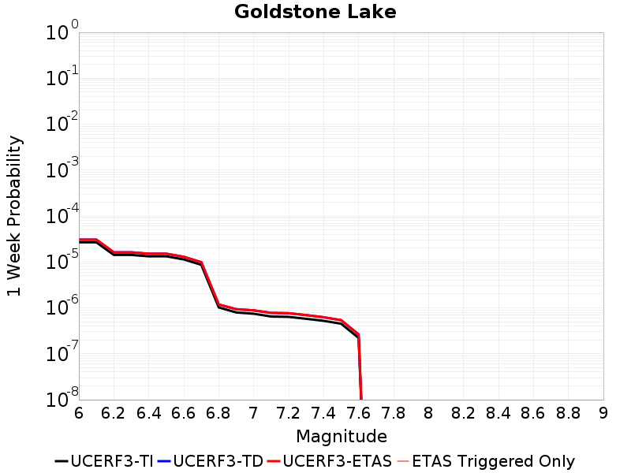 |  | 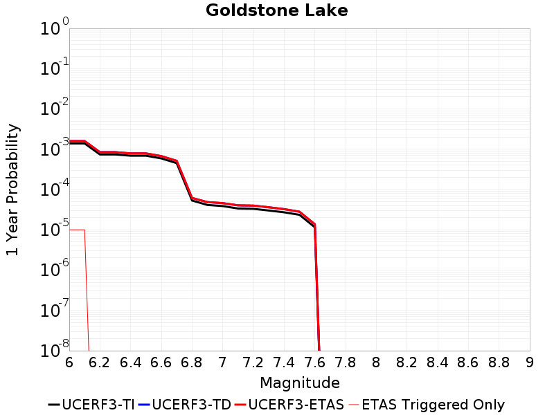 | 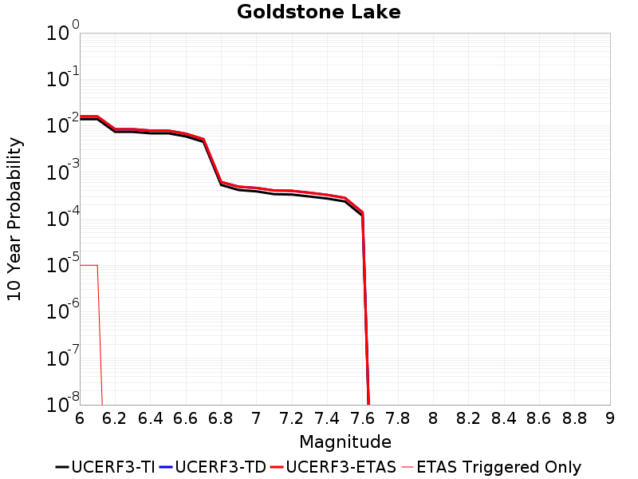 |

| Magnitude | 1 wk TI Prob | 1 wk TD Prob | 1 wk ETAS Prob | 1 wk ETAS/TD Gain | 1 wk ETAS Triggered Only | 1 mo TI Prob | 1 mo TD Prob | 1 mo ETAS Prob | 1 mo ETAS/TD Gain | 1 mo ETAS Triggered Only | 1 yr TI Prob | 1 yr TD Prob | 1 yr ETAS Prob | 1 yr ETAS/TD Gain | 1 yr ETAS Triggered Only | 10 yr TI Prob | 10 yr TD Prob | 10 yr ETAS Prob | 10 yr ETAS/TD Gain | 10 yr ETAS Triggered Only |
|-----|-----|-----|-----|-----|-----|-----|-----|-----|-----|-----|-----|-----|-----|-----|-----|-----|-----|-----|-----|-----|
| 6.0 | 2.671352E-5 | 3.054092E-5 | 3.054092E-5 | 1.0 | 0.0 | 1.1448149E-4 | 1.308842E-4 | 1.408829E-4 | 1.0763934 | 1.0E-5 | 0.001392921 | 0.0015925488 | 0.0016025329 | 1.0062692 | 1.0E-5 | 0.013842222 | 0.015831076 | 0.015840918 | 1.0006217 | 1.0E-5 |
| 6.1 | 2.671352E-5 | 3.054092E-5 | 3.054092E-5 | 1.0 | 0.0 | 1.1448149E-4 | 1.308842E-4 | 1.408829E-4 | 1.0763934 | 1.0E-5 | 0.001392921 | 0.0015925488 | 0.0016025329 | 1.0062692 | 1.0E-5 | 0.013842222 | 0.015831076 | 0.015840918 | 1.0006217 | 1.0E-5 |
| 6.2 | 1.4197047E-5 | 1.618099E-5 | 1.618099E-5 | 1.0 | 0.0 | 6.0843064E-5 | 6.934582E-5 | 6.934582E-5 | 1.0 | 0.0 | 7.4051257E-4 | 8.44058E-4 | 8.44058E-4 | 1.0 | 0.0 | 0.007380498 | 0.008418321 | 0.008418321 | 1.0 | 0.0 |
| 6.3 | 1.4197047E-5 | 1.618099E-5 | 1.618099E-5 | 1.0 | 0.0 | 6.0843064E-5 | 6.934582E-5 | 6.934582E-5 | 1.0 | 0.0 | 7.4051257E-4 | 8.44058E-4 | 8.44058E-4 | 1.0 | 0.0 | 0.007380498 | 0.008418321 | 0.008418321 | 1.0 | 0.0 |
| 6.4 | 1.3238931E-5 | 1.5087349E-5 | 1.5087349E-5 | 1.0 | 0.0 | 5.6737044E-5 | 6.465903E-5 | 6.465903E-5 | 1.0 | 0.0 | 6.9055456E-4 | 7.8703836E-4 | 7.8703836E-4 | 1.0 | 0.0 | 0.006884126 | 0.007852239 | 0.007852239 | 1.0 | 0.0 |
| 6.5 | 1.3238931E-5 | 1.5087349E-5 | 1.5087349E-5 | 1.0 | 0.0 | 5.6737044E-5 | 6.465903E-5 | 6.465903E-5 | 1.0 | 0.0 | 6.9055456E-4 | 7.8703836E-4 | 7.8703836E-4 | 1.0 | 0.0 | 0.006884126 | 0.007852239 | 0.007852239 | 1.0 | 0.0 |
| 6.6 | 1.1328278E-5 | 1.2923178E-5 | 1.2923178E-5 | 1.0 | 0.0 | 4.8548856E-5 | 5.5384415E-5 | 5.5384415E-5 | 1.0 | 0.0 | 5.90922E-4 | 6.741934E-4 | 6.741934E-4 | 1.0 | 0.0 | 0.0058935313 | 0.0067309695 | 0.0067309695 | 1.0 | 0.0 |
| 6.7 | 8.651175E-6 | 9.876658E-6 | 9.876658E-6 | 1.0 | 0.0 | 3.707594E-5 | 4.232836E-5 | 4.232836E-5 | 1.0 | 0.0 | 4.5130608E-4 | 5.153174E-4 | 5.153174E-4 | 1.0 | 0.0 | 0.0045039062 | 0.0051501985 | 0.0051501985 | 1.0 | 0.0 |
| 6.8 | 1.0215377E-6 | 1.1815986E-6 | 1.1815986E-6 | 1.0 | 0.0 | 4.378012E-6 | 5.0639846E-6 | 5.0639846E-6 | 1.0 | 0.0 | 5.3300988E-5 | 6.165238E-5 | 6.165238E-5 | 1.0 | 0.0 | 5.3288206E-4 | 6.163642E-4 | 6.163642E-4 | 1.0 | 0.0 |
| 6.9 | 7.9360774E-7 | 9.3364173E-7 | 9.3364173E-7 | 1.0 | 0.0 | 3.4011714E-6 | 4.001316E-6 | 4.001316E-6 | 1.0 | 0.0 | 4.1408475E-5 | 4.8715003E-5 | 4.8715003E-5 | 1.0 | 0.0 | 4.140076E-4 | 4.8705033E-4 | 4.8705033E-4 | 1.0 | 0.0 |
| 7.0 | 7.4382757E-7 | 8.7987144E-7 | 8.7987144E-7 | 1.0 | 0.0 | 3.1878285E-6 | 3.7708724E-6 | 3.7708724E-6 | 1.0 | 0.0 | 3.8811122E-5 | 4.5909474E-5 | 4.5909474E-5 | 1.0 | 0.0 | 3.8804344E-4 | 4.590066E-4 | 4.590066E-4 | 1.0 | 0.0 |
| 7.1 | 6.4709513E-7 | 7.759767E-7 | 7.759767E-7 | 1.0 | 0.0 | 2.773262E-6 | 3.3256104E-6 | 3.3256104E-6 | 1.0 | 0.0 | 3.376394E-5 | 4.0488616E-5 | 4.0488616E-5 | 1.0 | 0.0 | 3.375881E-4 | 4.0481842E-4 | 4.0481842E-4 | 1.0 | 0.0 |
| 7.2 | 6.356704E-7 | 7.636455E-7 | 7.636455E-7 | 1.0 | 0.0 | 2.7242988E-6 | 3.2727628E-6 | 3.2727628E-6 | 1.0 | 0.0 | 3.3167835E-5 | 3.9845218E-5 | 3.9845218E-5 | 1.0 | 0.0 | 3.3162883E-4 | 3.9838676E-4 | 3.9838676E-4 | 1.0 | 0.0 |
| 7.3 | 5.7695723E-7 | 6.943571E-7 | 6.943571E-7 | 1.0 | 0.0 | 2.4726714E-6 | 2.975813E-6 | 2.975813E-6 | 1.0 | 0.0 | 3.0104358E-5 | 3.622998E-5 | 3.622998E-5 | 1.0 | 0.0 | 3.0100282E-4 | 3.6224653E-4 | 3.6224653E-4 | 1.0 | 0.0 |
| 7.4 | 5.209647E-7 | 6.23853E-7 | 6.23853E-7 | 1.0 | 0.0 | 2.232704E-6 | 2.6736534E-6 | 2.6736534E-6 | 1.0 | 0.0 | 2.718283E-5 | 3.25513E-5 | 3.25513E-5 | 1.0 | 0.0 | 2.7179506E-4 | 3.2547096E-4 | 3.2547096E-4 | 1.0 | 0.0 |
| 7.5 | 4.512955E-7 | 5.388315E-7 | 5.388315E-7 | 1.0 | 0.0 | 1.934122E-6 | 2.3092762E-6 | 2.3092762E-6 | 1.0 | 0.0 | 2.3547682E-5 | 2.811513E-5 | 2.811513E-5 | 1.0 | 0.0 | 2.3545188E-4 | 2.8112112E-4 | 2.8112112E-4 | 1.0 | 0.0 |
| 7.6 | 2.21172E-7 | 2.6276138E-7 | 2.6276138E-7 | 1.0 | 0.0 | 9.478797E-7 | 1.1261199E-6 | 1.1261199E-6 | 1.0 | 0.0 | 1.1540374E-5 | 1.3710453E-5 | 1.3710453E-5 | 1.0 | 0.0 | 1.1539775E-4 | 1.3709893E-4 | 1.3709893E-4 | 1.0 | 0.0 |

## San Andreas (Parkfield)
*[(top)](#table-of-contents)*

| 1 Week | 1 Month | 1 Year | 10 Year |
|-----|-----|-----|-----|
|  |  | 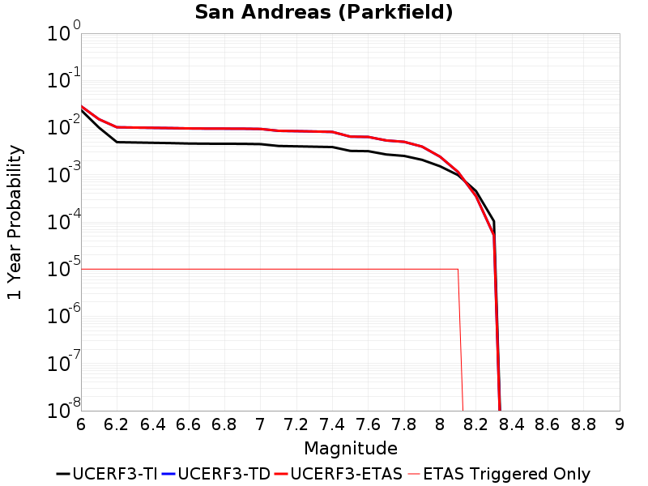 |  |

| Magnitude | 1 wk TI Prob | 1 wk TD Prob | 1 wk ETAS Prob | 1 wk ETAS/TD Gain | 1 wk ETAS Triggered Only | 1 mo TI Prob | 1 mo TD Prob | 1 mo ETAS Prob | 1 mo ETAS/TD Gain | 1 mo ETAS Triggered Only | 1 yr TI Prob | 1 yr TD Prob | 1 yr ETAS Prob | 1 yr ETAS/TD Gain | 1 yr ETAS Triggered Only | 10 yr TI Prob | 10 yr TD Prob | 10 yr ETAS Prob | 10 yr ETAS/TD Gain | 10 yr ETAS Triggered Only |
|-----|-----|-----|-----|-----|-----|-----|-----|-----|-----|-----|-----|-----|-----|-----|-----|-----|-----|-----|-----|-----|
| 6.0 | 4.5600464E-4 | 5.4511934E-4 | 5.551139E-4 | 1.0183346 | 1.0E-5 | 0.0019528421 | 0.002334374 | 0.0023443506 | 1.0042738 | 1.0E-5 | 0.023518132 | 0.028404618 | 0.028414333 | 1.000342 | 1.0E-5 | 0.21179019 | 0.2757554 | 0.27576265 | 1.0000262 | 1.0E-5 |
| 6.1 | 1.9252734E-4 | 2.8768927E-4 | 2.976864E-4 | 1.0347497 | 1.0E-5 | 8.248562E-4 | 0.0012324266 | 0.0012424143 | 1.0081041 | 1.0E-5 | 0.009996468 | 0.015015532 | 0.015025382 | 1.000656 | 1.0E-5 | 0.09558567 | 0.14899819 | 0.1490067 | 1.0000571 | 1.0E-5 |
| 6.2 | 9.4269315E-5 | 1.9534092E-4 | 2.0533896E-4 | 1.0511825 | 1.0E-5 | 4.039488E-4 | 8.369081E-4 | 8.4689975E-4 | 1.0119387 | 1.0E-5 | 0.0049069915 | 0.010142086 | 0.010151984 | 1.000976 | 1.0E-5 | 0.048000436 | 0.09756934 | 0.09757836 | 1.0000925 | 1.0E-5 |
| 6.3 | 9.283051E-5 | 1.9257588E-4 | 2.0257395E-4 | 1.0519176 | 1.0E-5 | 3.9778434E-4 | 8.250655E-4 | 8.3505723E-4 | 1.0121102 | 1.0E-5 | 0.0048322747 | 0.009999226 | 0.010009126 | 1.00099 | 1.0E-5 | 0.047285385 | 0.09631575 | 0.09632479 | 1.0000938 | 1.0E-5 |
| 6.4 | 9.138826E-5 | 1.9017438E-4 | 2.0017248E-4 | 1.0525733 | 1.0E-5 | 3.916052E-4 | 8.147798E-4 | 8.247716E-4 | 1.0122633 | 1.0E-5 | 0.0047573745 | 0.009875136 | 0.009885037 | 1.0010027 | 1.0E-5 | 0.046568092 | 0.09521093 | 0.09521998 | 1.000095 | 1.0E-5 |
| 6.5 | 9.000255E-5 | 1.8772551E-4 | 1.9772364E-4 | 1.0532593 | 1.0E-5 | 3.8566816E-4 | 8.042911E-4 | 8.1428303E-4 | 1.0124233 | 1.0E-5 | 0.0046854047 | 0.009748584 | 0.009758486 | 1.0010158 | 1.0E-5 | 0.045878403 | 0.09409101 | 0.09410007 | 1.0000963 | 1.0E-5 |
| 6.6 | 8.8109264E-5 | 1.8465567E-4 | 1.9465383E-4 | 1.0541449 | 1.0E-5 | 3.7755648E-4 | 7.9114264E-4 | 8.0113474E-4 | 1.01263 | 1.0E-5 | 0.0045870654 | 0.009589921 | 0.009599824 | 1.0010327 | 1.0E-5 | 0.04493529 | 0.092671804 | 0.09268088 | 1.0000979 | 1.0E-5 |
| 6.7 | 8.738073E-5 | 1.8334102E-4 | 1.9333918E-4 | 1.0545331 | 1.0E-5 | 3.7443507E-4 | 7.8551186E-4 | 7.9550396E-4 | 1.0127206 | 1.0E-5 | 0.0045492216 | 0.009521965 | 0.00953187 | 1.0010402 | 1.0E-5 | 0.04457213 | 0.09207709 | 0.092086166 | 1.0000986 | 1.0E-5 |
| 6.8 | 8.710195E-5 | 1.8280382E-4 | 1.9280199E-4 | 1.0546935 | 1.0E-5 | 3.7324068E-4 | 7.8321097E-4 | 7.9320313E-4 | 1.0127579 | 1.0E-5 | 0.0045347405 | 0.009494199 | 0.009504104 | 1.0010433 | 1.0E-5 | 0.04443313 | 0.09182864 | 0.09183772 | 1.000099 | 1.0E-5 |
| 6.9 | 8.6801556E-5 | 1.8221815E-4 | 1.9221634E-4 | 1.0548693 | 1.0E-5 | 3.7195362E-4 | 7.807025E-4 | 7.9069467E-4 | 1.012799 | 1.0E-5 | 0.0045191357 | 0.009463924 | 0.0094738295 | 1.0010467 | 1.0E-5 | 0.044283327 | 0.09155786 | 0.09156694 | 1.0000992 | 1.0E-5 |
| 7.0 | 8.5571606E-5 | 1.7974159E-4 | 1.8973979E-4 | 1.0556254 | 1.0E-5 | 3.6668387E-4 | 7.700949E-4 | 7.800872E-4 | 1.0129755 | 1.0E-5 | 0.004455241 | 0.00933589 | 0.009345797 | 1.0010611 | 1.0E-5 | 0.043669727 | 0.09041047 | 0.09041957 | 1.0001006 | 1.0E-5 |
| 7.1 | 7.82589E-5 | 1.6426934E-4 | 1.742677E-4 | 1.0608656 | 1.0E-5 | 3.3535215E-4 | 7.0382236E-4 | 7.138153E-4 | 1.0141982 | 1.0E-5 | 0.0040752706 | 0.008535565 | 0.00854548 | 1.0011616 | 1.0E-5 | 0.040013418 | 0.083230406 | 0.08323958 | 1.0001101 | 1.0E-5 |
| 7.2 | 7.690929E-5 | 1.6175203E-4 | 1.7175042E-4 | 1.061813 | 1.0E-5 | 3.2956956E-4 | 6.930396E-4 | 7.030327E-4 | 1.0144192 | 1.0E-5 | 0.004005129 | 0.008405305 | 0.008415222 | 1.0011797 | 1.0E-5 | 0.0393371 | 0.0820509 | 0.08206008 | 1.0001118 | 1.0E-5 |
| 7.3 | 7.5543794E-5 | 1.5866091E-4 | 1.6865932E-4 | 1.0630175 | 1.0E-5 | 3.2371894E-4 | 6.7979895E-4 | 6.8979216E-4 | 1.0147002 | 1.0E-5 | 0.003934157 | 0.00824533 | 0.008255248 | 1.0012028 | 1.0E-5 | 0.038652334 | 0.080595 | 0.080604196 | 1.0001141 | 1.0E-5 |
| 7.4 | 7.4214564E-5 | 1.555754E-4 | 1.6557385E-4 | 1.0642675 | 1.0E-5 | 3.1802364E-4 | 6.6658214E-4 | 6.7657547E-4 | 1.0149919 | 1.0E-5 | 0.003865065 | 0.008085621 | 0.00809554 | 1.0012268 | 1.0E-5 | 0.03798529 | 0.0791388 | 0.07914801 | 1.0001163 | 1.0E-5 |
| 7.5 | 6.149578E-5 | 1.2343035E-4 | 1.3342912E-4 | 1.0810074 | 1.0E-5 | 2.6352672E-4 | 5.288801E-4 | 5.388748E-4 | 1.0188979 | 1.0E-5 | 0.0032037178 | 0.006420144 | 0.0064300797 | 1.0015476 | 1.0E-5 | 0.03157923 | 0.06382737 | 0.06383674 | 1.0001466 | 1.0E-5 |
| 7.6 | 6.0643448E-5 | 1.2166136E-4 | 1.3166014E-4 | 1.0821854 | 1.0E-5 | 2.598746E-4 | 5.2130176E-4 | 5.3129654E-4 | 1.0191728 | 1.0E-5 | 0.0031593828 | 0.0063284175 | 0.006338354 | 1.0015702 | 1.0E-5 | 0.031148417 | 0.06296933 | 0.06297869 | 1.0001488 | 1.0E-5 |
| 7.7 | 5.1652263E-5 | 1.02393E-4 | 1.1239198E-4 | 1.0976529 | 1.0E-5 | 2.2134806E-4 | 4.3875337E-4 | 4.48749E-4 | 1.0227818 | 1.0E-5 | 0.002691582 | 0.005328753 | 0.0053386996 | 1.0018666 | 1.0E-5 | 0.026592141 | 0.053475335 | 0.053484797 | 1.000177 | 1.0E-5 |
| 7.8 | 4.8090482E-5 | 9.5641175E-5 | 1.0564022E-4 | 1.1045475 | 1.0E-5 | 2.060858E-4 | 4.098264E-4 | 4.198223E-4 | 1.0243906 | 1.0E-5 | 0.0025062072 | 0.0049782326 | 0.004988183 | 1.0019988 | 1.0E-5 | 0.024781305 | 0.049978036 | 0.049987536 | 1.0001901 | 1.0E-5 |
| 7.9 | 3.970278E-5 | 7.56347E-5 | 8.563394E-5 | 1.1322044 | 1.0E-5 | 1.7014367E-4 | 3.2410846E-4 | 3.3410522E-4 | 1.0308439 | 1.0E-5 | 0.002069531 | 0.003938886 | 0.0039488464 | 1.0025288 | 1.0E-5 | 0.020503636 | 0.039747514 | 0.039757118 | 1.0002416 | 1.0E-5 |
| 8.0 | 2.8982335E-5 | 4.613598E-5 | 5.613552E-5 | 1.2167406 | 1.0E-5 | 1.2420409E-4 | 1.9771066E-4 | 2.0770868E-4 | 1.0505689 | 1.0E-5 | 0.0015111357 | 0.0024044716 | 0.0024144475 | 1.004149 | 1.0E-5 | 0.015009012 | 0.024699807 | 0.02470956 | 1.0003948 | 1.0E-5 |
| 8.1 | 1.8836186E-5 | 2.1850334E-5 | 3.1850115E-5 | 1.4576489 | 1.0E-5 | 8.0724014E-5 | 9.364093E-5 | 1.0363999E-4 | 1.1067809 | 1.0E-5 | 9.823717E-4 | 0.0011394828 | 0.0011494715 | 1.0087659 | 1.0E-5 | 0.009780403 | 0.012132144 | 0.012142022 | 1.0008142 | 1.0E-5 |
| 8.2 | 8.643924E-6 | 6.7348897E-6 | 6.7348897E-6 | 1.0 | 0.0 | 3.704486E-5 | 2.8863493E-5 | 2.8863493E-5 | 1.0 | 0.0 | 4.5092785E-4 | 3.513565E-4 | 3.513565E-4 | 1.0 | 0.0 | 0.0045001395 | 0.0039285375 | 0.0039285375 | 1.0 | 0.0 |
| 8.3 | 1.983087E-6 | 9.914278E-7 | 9.914278E-7 | 1.0 | 0.0 | 8.498917E-6 | 4.2489696E-6 | 4.2489696E-6 | 1.0 | 0.0 | 1.034694E-4 | 5.1730003E-5 | 5.1730003E-5 | 1.0 | 0.0 | 0.0010342124 | 5.993849E-4 | 5.993849E-4 | 1.0 | 0.0 |

## Calaveras (Central) 2011 CFM
*[(top)](#table-of-contents)*

| 1 Week | 1 Month | 1 Year | 10 Year |
|-----|-----|-----|-----|
|  |  | 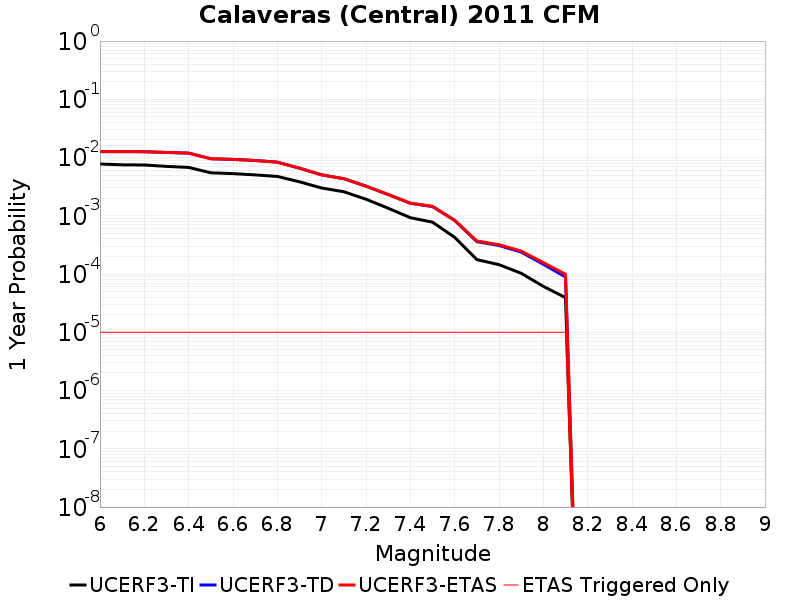 |  |

| Magnitude | 1 wk TI Prob | 1 wk TD Prob | 1 wk ETAS Prob | 1 wk ETAS/TD Gain | 1 wk ETAS Triggered Only | 1 mo TI Prob | 1 mo TD Prob | 1 mo ETAS Prob | 1 mo ETAS/TD Gain | 1 mo ETAS Triggered Only | 1 yr TI Prob | 1 yr TD Prob | 1 yr ETAS Prob | 1 yr ETAS/TD Gain | 1 yr ETAS Triggered Only | 10 yr TI Prob | 10 yr TD Prob | 10 yr ETAS Prob | 10 yr ETAS/TD Gain | 10 yr ETAS Triggered Only |
|-----|-----|-----|-----|-----|-----|-----|-----|-----|-----|-----|-----|-----|-----|-----|-----|-----|-----|-----|-----|-----|
| 6.0 | 1.4873758E-4 | 2.4321025E-4 | 2.532078E-4 | 1.0411067 | 1.0E-5 | 6.3729106E-4 | 0.0010419196 | 0.0010519092 | 1.0095876 | 1.0E-5 | 0.0077314493 | 0.012606242 | 0.012616116 | 1.0007832 | 1.0E-5 | 0.074679315 | 0.11840243 | 0.11841125 | 1.0000745 | 1.0E-5 |
| 6.1 | 1.4409686E-4 | 2.4315073E-4 | 2.531483E-4 | 1.0411167 | 1.0E-5 | 6.174118E-4 | 0.0010416647 | 0.0010516543 | 1.00959 | 1.0E-5 | 0.0074911113 | 0.012603175 | 0.012613049 | 1.0007834 | 1.0E-5 | 0.07243565 | 0.11837463 | 0.118383445 | 1.0000745 | 1.0E-5 |
| 6.2 | 1.4297929E-4 | 2.4246676E-4 | 2.5246432E-4 | 1.0412328 | 1.0E-5 | 6.1262446E-4 | 0.0010387361 | 0.0010487257 | 1.0096171 | 1.0E-5 | 0.007433224 | 0.01256796 | 0.012577834 | 1.0007857 | 1.0E-5 | 0.07189451 | 0.118043564 | 0.11805238 | 1.0000747 | 1.0E-5 |
| 6.3 | 1.3536085E-4 | 2.352873E-4 | 2.4528496E-4 | 1.0424912 | 1.0E-5 | 5.79989E-4 | 0.0010079943 | 0.0010179842 | 1.0099107 | 1.0E-5 | 0.0070385267 | 0.012198521 | 0.012208398 | 1.0008098 | 1.0E-5 | 0.068197265 | 0.11468921 | 0.11469806 | 1.0000772 | 1.0E-5 |
| 6.4 | 1.2993296E-4 | 2.2922446E-4 | 2.3922216E-4 | 1.0436153 | 1.0E-5 | 5.5673666E-4 | 9.820308E-4 | 9.920209E-4 | 1.010173 | 1.0E-5 | 0.006757223 | 0.011885963 | 0.011895844 | 1.0008314 | 1.0E-5 | 0.06555412 | 0.111829795 | 0.111838676 | 1.0000794 | 1.0E-5 |
| 6.5 | 1.0498927E-4 | 1.8338801E-4 | 1.9338618E-4 | 1.0545192 | 1.0E-5 | 4.498764E-4 | 7.857109E-4 | 7.9570303E-4 | 1.0127174 | 1.0E-5 | 0.005463498 | 0.009524059 | 0.009533963 | 1.00104 | 1.0E-5 | 0.053311124 | 0.09078419 | 0.09079328 | 1.0001001 | 1.0E-5 |
| 6.6 | 1.0157505E-4 | 1.7848887E-4 | 1.8848709E-4 | 1.0560158 | 1.0E-5 | 4.35249E-4 | 7.6472724E-4 | 7.747196E-4 | 1.0130665 | 1.0E-5 | 0.0052862884 | 0.009270806 | 0.009280713 | 1.0010687 | 1.0E-5 | 0.05162293 | 0.088468224 | 0.088477336 | 1.000103 | 1.0E-5 |
| 6.7 | 9.660386E-5 | 1.7104324E-4 | 1.8104153E-4 | 1.0584548 | 1.0E-5 | 4.1395082E-4 | 7.328361E-4 | 7.428287E-4 | 1.0136356 | 1.0E-5 | 0.0050282106 | 0.008885795 | 0.008895706 | 1.0011154 | 1.0E-5 | 0.049159497 | 0.084949344 | 0.08495849 | 1.0001078 | 1.0E-5 |
| 6.8 | 9.089927E-5 | 1.6003866E-4 | 1.7003706E-4 | 1.0624748 | 1.0E-5 | 3.8951015E-4 | 6.856992E-4 | 6.956924E-4 | 1.0145737 | 1.0E-5 | 0.0047319788 | 0.00831645 | 0.008326367 | 1.0011925 | 1.0E-5 | 0.046324775 | 0.079789884 | 0.079799086 | 1.0001153 | 1.0E-5 |
| 6.9 | 7.353187E-5 | 1.2602114E-4 | 1.3601988E-4 | 1.0793418 | 1.0E-5 | 3.150985E-4 | 5.399794E-4 | 5.49974E-4 | 1.0185093 | 1.0E-5 | 0.0038295772 | 0.006554559 | 0.0065644933 | 1.0015156 | 1.0E-5 | 0.037642512 | 0.06360406 | 0.063613415 | 1.0001472 | 1.0E-5 |
| 7.0 | 5.746064E-5 | 9.656923E-5 | 1.06568266E-4 | 1.1035427 | 1.0E-5 | 2.4623662E-4 | 4.1380286E-4 | 4.2379872E-4 | 1.0241561 | 1.0E-5 | 0.0029938098 | 0.0050264862 | 0.005036436 | 1.0019795 | 1.0E-5 | 0.02953797 | 0.049248453 | 0.04925796 | 1.000193 | 1.0E-5 |
| 7.1 | 4.9557195E-5 | 8.299008E-5 | 9.2989256E-5 | 1.1204864 | 1.0E-5 | 2.123707E-4 | 3.5562366E-4 | 3.656201E-4 | 1.0281097 | 1.0E-5 | 0.0025825473 | 0.004321188 | 0.004331145 | 1.0023042 | 1.0E-5 | 0.0255274 | 0.042540506 | 0.04255008 | 1.0002251 | 1.0E-5 |
| 7.2 | 3.687595E-5 | 6.1851904E-5 | 7.185129E-5 | 1.1616665 | 1.0E-5 | 1.5803022E-4 | 2.6505283E-4 | 2.7505017E-4 | 1.0377183 | 1.0E-5 | 0.0019223199 | 0.0032222744 | 0.003232242 | 1.0030934 | 1.0E-5 | 0.01905776 | 0.031994686 | 0.032004364 | 1.0003026 | 1.0E-5 |
| 7.3 | 2.5846984E-5 | 4.4311255E-5 | 5.431081E-5 | 1.2256663 | 1.0E-5 | 1.1076809E-4 | 1.8989165E-4 | 1.9988976E-4 | 1.0526516 | 1.0E-5 | 0.0013477671 | 0.0023094984 | 0.0023194752 | 1.0043199 | 1.0E-5 | 0.013396223 | 0.02306172 | 0.02307149 | 1.0004237 | 1.0E-5 |
| 7.4 | 1.7747854E-5 | 3.1376774E-5 | 4.137646E-5 | 1.3186971 | 1.0E-5 | 7.6060016E-5 | 1.3446498E-4 | 1.4446364E-4 | 1.0743588 | 1.0E-5 | 9.2563726E-4 | 0.0016358849 | 0.0016458685 | 1.0061029 | 1.0E-5 | 0.009217911 | 0.016405867 | 0.016415702 | 1.0005995 | 1.0E-5 |
| 7.5 | 1.4883479E-5 | 2.7599528E-5 | 3.7599253E-5 | 1.362315 | 1.0E-5 | 6.378478E-5 | 1.18278345E-4 | 1.2827716E-4 | 1.0845363 | 1.0E-5 | 7.76303E-4 | 0.0014390906 | 0.0014490762 | 1.0069388 | 1.0E-5 | 0.0077359667 | 0.01445914 | 0.014468995 | 1.0006816 | 1.0E-5 |
| 7.6 | 8.166975E-6 | 1.5914567E-5 | 2.5914407E-5 | 1.6283451 | 1.0E-5 | 3.5000852E-5 | 6.820351E-5 | 7.820283E-5 | 1.14661 | 1.0E-5 | 4.2605202E-4 | 8.3006284E-4 | 8.4005453E-4 | 1.0120373 | 1.0E-5 | 0.004252361 | 0.008401065 | 0.008410981 | 1.0011803 | 1.0E-5 |
| 7.7 | 3.3858064E-6 | 6.886614E-6 | 1.6886544E-5 | 2.4520824 | 1.0E-5 | 1.4510518E-5 | 2.9513725E-5 | 3.951343E-5 | 1.3388155 | 1.0E-5 | 1.7665124E-4 | 3.5927043E-4 | 3.6926684E-4 | 1.0278242 | 1.0E-5 | 0.0017651088 | 0.0036953092 | 0.0037052722 | 1.0026962 | 1.0E-5 |
| 7.8 | 2.7721615E-6 | 5.917555E-6 | 1.5917496E-5 | 2.689877 | 1.0E-5 | 1.1880637E-5 | 2.5360703E-5 | 3.536045E-5 | 1.3943008 | 1.0E-5 | 1.4463716E-4 | 3.0872287E-4 | 3.187198E-4 | 1.0323815 | 1.0E-5 | 0.0014454306 | 0.0031739208 | 0.003183889 | 1.0031407 | 1.0E-5 |
| 7.9 | 1.9736292E-6 | 4.558718E-6 | 1.4558673E-5 | 3.193589 | 1.0E-5 | 8.4583835E-6 | 1.9537218E-5 | 2.9537023E-5 | 1.5118335 | 1.0E-5 | 1.0297595E-4 | 2.3783972E-4 | 2.4783734E-4 | 1.0420351 | 1.0E-5 | 0.0010292825 | 0.002430851 | 0.002440827 | 1.0041038 | 1.0E-5 |
| 8.0 | 1.1767289E-6 | 2.8208149E-6 | 1.2820787E-5 | 4.545065 | 1.0E-5 | 5.0431145E-6 | 1.2089151E-5 | 2.208903E-5 | 1.827178 | 1.0E-5 | 6.139818E-5 | 1.4717551E-4 | 1.5717403E-4 | 1.0679361 | 1.0E-5 | 6.1381224E-4 | 0.0014948518 | 0.0015048367 | 1.0066797 | 1.0E-5 |
| 8.1 | 7.5112825E-7 | 1.7027508E-6 | 1.1702734E-5 | 6.87284 | 1.0E-5 | 3.2191172E-6 | 7.297483E-6 | 1.729741E-5 | 2.3703256 | 1.0E-5 | 3.9192048E-5 | 8.884326E-5 | 9.884237E-5 | 1.1125478 | 1.0E-5 | 3.9185135E-4 | 9.024215E-4 | 9.124125E-4 | 1.0110713 | 1.0E-5 |

## San Andreas (Cholame) rev
*[(top)](#table-of-contents)*

| 1 Week | 1 Month | 1 Year | 10 Year |
|-----|-----|-----|-----|
|  |  |  |  |

| Magnitude | 1 wk TI Prob | 1 wk TD Prob | 1 wk ETAS Prob | 1 wk ETAS/TD Gain | 1 wk ETAS Triggered Only | 1 mo TI Prob | 1 mo TD Prob | 1 mo ETAS Prob | 1 mo ETAS/TD Gain | 1 mo ETAS Triggered Only | 1 yr TI Prob | 1 yr TD Prob | 1 yr ETAS Prob | 1 yr ETAS/TD Gain | 1 yr ETAS Triggered Only | 10 yr TI Prob | 10 yr TD Prob | 10 yr ETAS Prob | 10 yr ETAS/TD Gain | 10 yr ETAS Triggered Only |
|-----|-----|-----|-----|-----|-----|-----|-----|-----|-----|-----|-----|-----|-----|-----|-----|-----|-----|-----|-----|-----|
| 6.0 | 1.2188602E-4 | 2.6910144E-4 | 2.7909875E-4 | 1.0371507 | 1.0E-5 | 5.2226405E-4 | 0.001152784 | 0.0011627724 | 1.0086646 | 1.0E-5 | 0.0063400427 | 0.013945409 | 0.01395527 | 1.000707 | 1.0E-5 | 0.061621845 | 0.13145381 | 0.1314625 | 1.000066 | 1.0E-5 |
| 6.1 | 1.2188602E-4 | 2.6910144E-4 | 2.7909875E-4 | 1.0371507 | 1.0E-5 | 5.2226405E-4 | 0.001152784 | 0.0011627724 | 1.0086646 | 1.0E-5 | 0.0063400427 | 0.013945409 | 0.01395527 | 1.000707 | 1.0E-5 | 0.061621845 | 0.13145381 | 0.1314625 | 1.000066 | 1.0E-5 |
| 6.2 | 1.2188602E-4 | 2.6910144E-4 | 2.7909875E-4 | 1.0371507 | 1.0E-5 | 5.2226405E-4 | 0.001152784 | 0.0011627724 | 1.0086646 | 1.0E-5 | 0.0063400427 | 0.013945409 | 0.01395527 | 1.000707 | 1.0E-5 | 0.061621845 | 0.13145381 | 0.1314625 | 1.000066 | 1.0E-5 |
| 6.3 | 1.2142645E-4 | 2.6822442E-4 | 2.7822173E-4 | 1.0372722 | 1.0E-5 | 5.202953E-4 | 0.0011490287 | 0.0011590171 | 1.008693 | 1.0E-5 | 0.006316212 | 0.013900273 | 0.013910133 | 1.0007094 | 1.0E-5 | 0.06139677 | 0.13106887 | 0.13107757 | 1.0000663 | 1.0E-5 |
| 6.4 | 1.1865206E-4 | 2.6315873E-4 | 2.731561E-4 | 1.0379899 | 1.0E-5 | 5.0840975E-4 | 0.0011273375 | 0.0011373261 | 1.0088605 | 1.0E-5 | 0.006172335 | 0.013639515 | 0.013649379 | 1.0007231 | 1.0E-5 | 0.060036868 | 0.12883419 | 0.12884289 | 1.0000676 | 1.0E-5 |
| 6.5 | 1.17443946E-4 | 2.6104136E-4 | 2.7103873E-4 | 1.0382981 | 1.0E-5 | 5.032341E-4 | 0.0011182707 | 0.0011282596 | 1.0089324 | 1.0E-5 | 0.006109677 | 0.013530501 | 0.013540367 | 1.0007291 | 1.0E-5 | 0.059444077 | 0.12789953 | 0.12790826 | 1.0000682 | 1.0E-5 |
| 6.6 | 1.13579066E-4 | 2.541583E-4 | 2.6415577E-4 | 1.0393356 | 1.0E-5 | 4.866766E-4 | 0.0010887969 | 0.001098786 | 1.0091745 | 1.0E-5 | 0.0059092017 | 0.01317605 | 0.013185918 | 1.000749 | 1.0E-5 | 0.057545185 | 0.12484557 | 0.124854326 | 1.0000701 | 1.0E-5 |
| 6.7 | 1.1271412E-4 | 2.525923E-4 | 2.6258978E-4 | 1.0395795 | 1.0E-5 | 4.829711E-4 | 0.001082091 | 0.0010920801 | 1.0092313 | 1.0E-5 | 0.005864331 | 0.01309539 | 0.013105259 | 1.0007536 | 1.0E-5 | 0.057119697 | 0.1241516 | 0.12416036 | 1.0000706 | 1.0E-5 |
| 6.8 | 1.1217975E-4 | 2.5145727E-4 | 2.6145476E-4 | 1.0397582 | 1.0E-5 | 4.8068175E-4 | 0.0010772307 | 0.0010872199 | 1.009273 | 1.0E-5 | 0.005836608 | 0.013036926 | 0.0130467955 | 1.0007571 | 1.0E-5 | 0.056856725 | 0.12364601 | 0.12365478 | 1.0000709 | 1.0E-5 |
| 6.9 | 1.1146753E-4 | 2.4991078E-4 | 2.599083E-4 | 1.0400043 | 1.0E-5 | 4.7763053E-4 | 0.0010706083 | 0.0010805975 | 1.0093305 | 1.0E-5 | 0.0057996577 | 0.012957261 | 0.012967131 | 1.0007617 | 1.0E-5 | 0.056506127 | 0.12295836 | 0.12296713 | 1.0000713 | 1.0E-5 |
| 7.0 | 1.0965793E-4 | 2.4608264E-4 | 2.5608018E-4 | 1.0406268 | 1.0E-5 | 4.698779E-4 | 0.0010542152 | 0.0010642047 | 1.0094757 | 1.0E-5 | 0.005705768 | 0.01276003 | 0.012769903 | 1.0007737 | 1.0E-5 | 0.055614736 | 0.12125059 | 0.121259384 | 1.0000725 | 1.0E-5 |
| 7.1 | 9.927982E-5 | 2.2361656E-4 | 2.3361432E-4 | 1.0447094 | 1.0E-5 | 4.2541555E-4 | 9.5800584E-4 | 9.679963E-4 | 1.0104283 | 1.0E-5 | 0.0051671406 | 0.011601694 | 0.011611578 | 1.000852 | 1.0E-5 | 0.05048634 | 0.1111579 | 0.11116679 | 1.00008 | 1.0E-5 |
| 7.2 | 9.696786E-5 | 2.1851483E-4 | 2.2851264E-4 | 1.0457535 | 1.0E-5 | 4.1551032E-4 | 9.361571E-4 | 9.461478E-4 | 1.010672 | 1.0E-5 | 0.00504711 | 0.0113384845 | 0.011348371 | 1.0008719 | 1.0E-5 | 0.04934009 | 0.10885665 | 0.10886556 | 1.0000819 | 1.0E-5 |
| 7.3 | 9.4727984E-5 | 2.1256137E-4 | 2.2255923E-4 | 1.0470352 | 1.0E-5 | 4.0591392E-4 | 9.106603E-4 | 9.206512E-4 | 1.0109711 | 1.0E-5 | 0.0049308087 | 0.011031246 | 0.0110411355 | 1.0008966 | 1.0E-5 | 0.048228268 | 0.106145605 | 0.106154546 | 1.0000842 | 1.0E-5 |
| 7.4 | 9.220358E-5 | 2.0595024E-4 | 2.159482E-4 | 1.0485454 | 1.0E-5 | 3.9509835E-4 | 8.8234636E-4 | 8.923376E-4 | 1.0113235 | 1.0E-5 | 0.004799717 | 0.010689948 | 0.010699841 | 1.0009254 | 1.0E-5 | 0.046973653 | 0.10312675 | 0.10313572 | 1.000087 | 1.0E-5 |
| 7.5 | 7.71631E-5 | 1.6748834E-4 | 1.7748665E-4 | 1.0596956 | 1.0E-5 | 3.306571E-4 | 7.176099E-4 | 7.276027E-4 | 1.0139252 | 1.0E-5 | 0.0040183207 | 0.008701993 | 0.008711906 | 1.0011392 | 1.0E-5 | 0.03946433 | 0.0852646 | 0.08527375 | 1.0001073 | 1.0E-5 |
| 7.6 | 7.5634416E-5 | 1.639154E-4 | 1.7391377E-4 | 1.0609971 | 1.0E-5 | 3.241072E-4 | 7.0230564E-4 | 7.122986E-4 | 1.0142288 | 1.0E-5 | 0.0039388672 | 0.008517135 | 0.00852705 | 1.0011641 | 1.0E-5 | 0.038697794 | 0.08356825 | 0.08357742 | 1.0001097 | 1.0E-5 |
| 7.7 | 6.3783E-5 | 1.3792564E-4 | 1.4792426E-4 | 1.0724928 | 1.0E-5 | 2.7332708E-4 | 5.909761E-4 | 6.009702E-4 | 1.0169111 | 1.0E-5 | 0.0033226798 | 0.0071714344 | 0.0071813627 | 1.0013844 | 1.0E-5 | 0.032734364 | 0.071024075 | 0.071033366 | 1.0001308 | 1.0E-5 |
| 7.8 | 5.863422E-5 | 1.2744064E-4 | 1.3743936E-4 | 1.078458 | 1.0E-5 | 2.512653E-4 | 5.460599E-4 | 5.560544E-4 | 1.018303 | 1.0E-5 | 0.003054864 | 0.006628043 | 0.0066379765 | 1.0014987 | 1.0E-5 | 0.030132094 | 0.06569422 | 0.06570356 | 1.0001422 | 1.0E-5 |
| 7.9 | 4.595283E-5 | 9.420146E-5 | 1.0420052E-4 | 1.1061455 | 1.0E-5 | 1.9692584E-4 | 4.0365808E-4 | 4.1365405E-4 | 1.0247635 | 1.0E-5 | 0.0023949358 | 0.0049034725 | 0.0049134237 | 1.0020294 | 1.0E-5 | 0.023692891 | 0.049015492 | 0.049025003 | 1.0001941 | 1.0E-5 |
| 8.0 | 3.2950178E-5 | 5.7264002E-5 | 6.726343E-5 | 1.1746198 | 1.0E-5 | 1.412074E-4 | 2.4539407E-4 | 2.553916E-4 | 1.0407407 | 1.0E-5 | 0.0017178444 | 0.002983582 | 0.002993552 | 1.0033417 | 1.0E-5 | 0.017046256 | 0.03034371 | 0.030353405 | 1.0003196 | 1.0E-5 |
| 8.1 | 1.9177472E-5 | 2.2429105E-5 | 3.242888E-5 | 1.4458393 | 1.0E-5 | 8.218658E-5 | 9.61212E-5 | 1.0612024E-4 | 1.1040254 | 1.0E-5 | 0.0010001622 | 0.0011696481 | 0.0011796365 | 1.0085396 | 1.0E-5 | 0.009956728 | 0.012440136 | 0.012450011 | 1.0007938 | 1.0E-5 |
| 8.2 | 8.643924E-6 | 6.7348897E-6 | 6.7348897E-6 | 1.0 | 0.0 | 3.704486E-5 | 2.8863493E-5 | 2.8863493E-5 | 1.0 | 0.0 | 4.5092785E-4 | 3.513565E-4 | 3.513565E-4 | 1.0 | 0.0 | 0.0045001395 | 0.0039285375 | 0.0039285375 | 1.0 | 0.0 |
| 8.3 | 1.983087E-6 | 9.914278E-7 | 9.914278E-7 | 1.0 | 0.0 | 8.498917E-6 | 4.2489696E-6 | 4.2489696E-6 | 1.0 | 0.0 | 1.034694E-4 | 5.1730003E-5 | 5.1730003E-5 | 1.0 | 0.0 | 0.0010342124 | 5.993849E-4 | 5.993849E-4 | 1.0 | 0.0 |

## Lost Hills
*[(top)](#table-of-contents)*

| 1 Week | 1 Month | 1 Year | 10 Year |
|-----|-----|-----|-----|
| 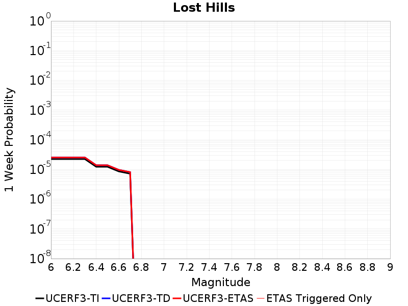 |  | 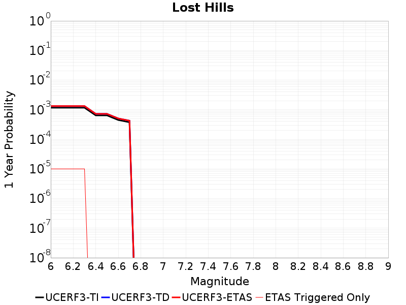 |  |

| Magnitude | 1 wk TI Prob | 1 wk TD Prob | 1 wk ETAS Prob | 1 wk ETAS/TD Gain | 1 wk ETAS Triggered Only | 1 mo TI Prob | 1 mo TD Prob | 1 mo ETAS Prob | 1 mo ETAS/TD Gain | 1 mo ETAS Triggered Only | 1 yr TI Prob | 1 yr TD Prob | 1 yr ETAS Prob | 1 yr ETAS/TD Gain | 1 yr ETAS Triggered Only | 10 yr TI Prob | 10 yr TD Prob | 10 yr ETAS Prob | 10 yr ETAS/TD Gain | 10 yr ETAS Triggered Only |
|-----|-----|-----|-----|-----|-----|-----|-----|-----|-----|-----|-----|-----|-----|-----|-----|-----|-----|-----|-----|-----|
| 6.0 | 2.233523E-5 | 2.5230422E-5 | 2.5230422E-5 | 1.0 | 0.0 | 9.571891E-5 | 1.0812685E-4 | 1.0812685E-4 | 1.0 | 0.0 | 0.0011647546 | 0.0013158192 | 0.001325806 | 1.0075898 | 1.0E-5 | 0.011586686 | 0.013097045 | 0.013106914 | 1.0007535 | 1.0E-5 |
| 6.1 | 2.233523E-5 | 2.5230422E-5 | 2.5230422E-5 | 1.0 | 0.0 | 9.571891E-5 | 1.0812685E-4 | 1.0812685E-4 | 1.0 | 0.0 | 0.0011647546 | 0.0013158192 | 0.001325806 | 1.0075898 | 1.0E-5 | 0.011586686 | 0.013097045 | 0.013106914 | 1.0007535 | 1.0E-5 |
| 6.2 | 2.233523E-5 | 2.5230422E-5 | 2.5230422E-5 | 1.0 | 0.0 | 9.571891E-5 | 1.0812685E-4 | 1.0812685E-4 | 1.0 | 0.0 | 0.0011647546 | 0.0013158192 | 0.001325806 | 1.0075898 | 1.0E-5 | 0.011586686 | 0.013097045 | 0.013106914 | 1.0007535 | 1.0E-5 |
| 6.3 | 2.233523E-5 | 2.5230422E-5 | 2.5230422E-5 | 1.0 | 0.0 | 9.571891E-5 | 1.0812685E-4 | 1.0812685E-4 | 1.0 | 0.0 | 0.0011647546 | 0.0013158192 | 0.001325806 | 1.0075898 | 1.0E-5 | 0.011586686 | 0.013097045 | 0.013106914 | 1.0007535 | 1.0E-5 |
| 6.4 | 1.2288092E-5 | 1.3847659E-5 | 1.3847659E-5 | 1.0 | 0.0 | 5.2662188E-5 | 5.9346294E-5 | 5.9346294E-5 | 1.0 | 0.0 | 6.409735E-4 | 7.223963E-4 | 7.223963E-4 | 1.0 | 0.0 | 0.006391279 | 0.007209776 | 0.007209776 | 1.0 | 0.0 |
| 6.5 | 1.2288092E-5 | 1.3847659E-5 | 1.3847659E-5 | 1.0 | 0.0 | 5.2662188E-5 | 5.9346294E-5 | 5.9346294E-5 | 1.0 | 0.0 | 6.409735E-4 | 7.223963E-4 | 7.223963E-4 | 1.0 | 0.0 | 0.006391279 | 0.007209776 | 0.007209776 | 1.0 | 0.0 |
| 6.6 | 8.58281E-6 | 9.680657E-6 | 9.680657E-6 | 1.0 | 0.0 | 3.6782953E-5 | 4.1488347E-5 | 4.1488347E-5 | 1.0 | 0.0 | 4.4774043E-4 | 5.0508755E-4 | 5.0508755E-4 | 1.0 | 0.0 | 0.0044683935 | 0.0050476356 | 0.0050476356 | 1.0 | 0.0 |
| 6.7 | 7.205685E-6 | 8.12768E-6 | 8.12768E-6 | 1.0 | 0.0 | 3.088114E-5 | 3.4832916E-5 | 3.4832916E-5 | 1.0 | 0.0 | 3.7591302E-4 | 4.2409074E-4 | 4.2409074E-4 | 1.0 | 0.0 | 0.0037527776 | 0.0042409073 | 0.0042409073 | 1.0 | 0.0 |

## Blue Cut
*[(top)](#table-of-contents)*

| 1 Week | 1 Month | 1 Year | 10 Year |
|-----|-----|-----|-----|
|  |  | 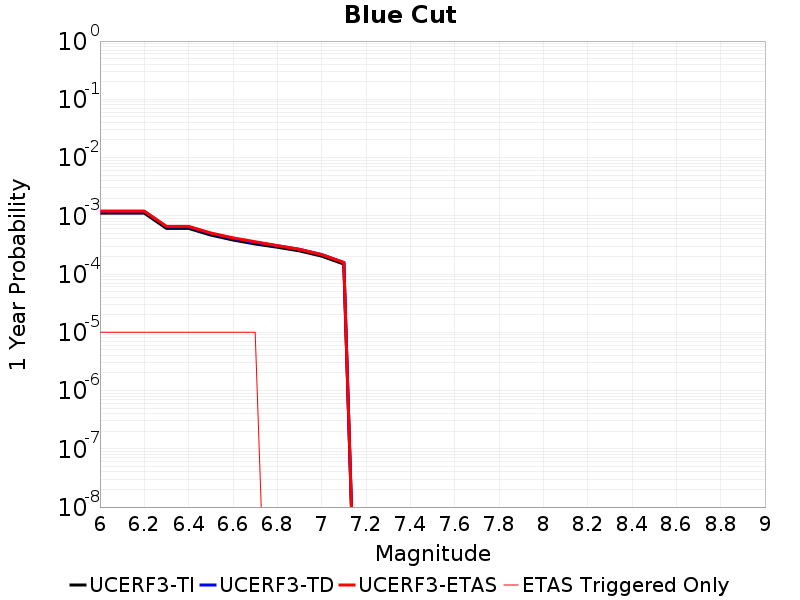 |  |

| Magnitude | 1 wk TI Prob | 1 wk TD Prob | 1 wk ETAS Prob | 1 wk ETAS/TD Gain | 1 wk ETAS Triggered Only | 1 mo TI Prob | 1 mo TD Prob | 1 mo ETAS Prob | 1 mo ETAS/TD Gain | 1 mo ETAS Triggered Only | 1 yr TI Prob | 1 yr TD Prob | 1 yr ETAS Prob | 1 yr ETAS/TD Gain | 1 yr ETAS Triggered Only | 10 yr TI Prob | 10 yr TD Prob | 10 yr ETAS Prob | 10 yr ETAS/TD Gain | 10 yr ETAS Triggered Only |
|-----|-----|-----|-----|-----|-----|-----|-----|-----|-----|-----|-----|-----|-----|-----|-----|-----|-----|-----|-----|-----|
| 6.0 | 2.1227985E-5 | 2.2783006E-5 | 2.2783006E-5 | 1.0 | 0.0 | 9.097391E-5 | 9.763813E-5 | 1.0763715E-4 | 1.102409 | 1.0E-5 | 0.0011070445 | 0.0011881543 | 0.0011981425 | 1.0084064 | 1.0E-5 | 0.011015458 | 0.011823898 | 0.0118337795 | 1.0008358 | 1.0E-5 |
| 6.1 | 2.1227985E-5 | 2.2783006E-5 | 2.2783006E-5 | 1.0 | 0.0 | 9.097391E-5 | 9.763813E-5 | 1.0763715E-4 | 1.102409 | 1.0E-5 | 0.0011070445 | 0.0011881543 | 0.0011981425 | 1.0084064 | 1.0E-5 | 0.011015458 | 0.011823898 | 0.0118337795 | 1.0008358 | 1.0E-5 |
| 6.2 | 2.1227985E-5 | 2.2783006E-5 | 2.2783006E-5 | 1.0 | 0.0 | 9.097391E-5 | 9.763813E-5 | 1.0763715E-4 | 1.102409 | 1.0E-5 | 0.0011070445 | 0.0011881543 | 0.0011981425 | 1.0084064 | 1.0E-5 | 0.011015458 | 0.011823898 | 0.0118337795 | 1.0008358 | 1.0E-5 |
| 6.3 | 1.1613981E-5 | 1.2384758E-5 | 1.2384758E-5 | 1.0 | 0.0 | 4.9773254E-5 | 5.307652E-5 | 6.307599E-5 | 1.1883972 | 1.0E-5 | 6.0582085E-4 | 6.4602756E-4 | 6.560211E-4 | 1.0154692 | 1.0E-5 | 0.0060417196 | 0.0064427494 | 0.006452685 | 1.0015421 | 1.0E-5 |
| 6.4 | 1.1613981E-5 | 1.2384758E-5 | 1.2384758E-5 | 1.0 | 0.0 | 4.9773254E-5 | 5.307652E-5 | 6.307599E-5 | 1.1883972 | 1.0E-5 | 6.0582085E-4 | 6.4602756E-4 | 6.560211E-4 | 1.0154692 | 1.0E-5 | 0.0060417196 | 0.0064427494 | 0.006452685 | 1.0015421 | 1.0E-5 |
| 6.5 | 8.931326E-6 | 9.50477E-6 | 9.50477E-6 | 1.0 | 0.0 | 3.8276554E-5 | 4.0734143E-5 | 5.0733735E-5 | 1.2454844 | 1.0E-5 | 4.6591737E-4 | 4.9583457E-4 | 5.058296E-4 | 1.020158 | 1.0E-5 | 0.0046494175 | 0.0049481965 | 0.0049581467 | 1.002011 | 1.0E-5 |
| 6.6 | 7.345353E-6 | 7.8089915E-6 | 7.8089915E-6 | 1.0 | 0.0 | 3.1479703E-5 | 3.3466724E-5 | 4.346639E-5 | 1.2987943 | 1.0E-5 | 3.83198E-4 | 4.0738922E-4 | 4.1738513E-4 | 1.0245366 | 1.0E-5 | 0.0038253788 | 0.0040672193 | 0.004077179 | 1.0024487 | 1.0E-5 |
| 6.7 | 6.2775666E-6 | 6.6710218E-6 | 6.6710218E-6 | 1.0 | 0.0 | 2.690358E-5 | 2.8589822E-5 | 3.8589536E-5 | 1.3497648 | 1.0E-5 | 3.2750185E-4 | 3.4803303E-4 | 3.5802956E-4 | 1.0287229 | 1.0E-5 | 0.0032701963 | 0.0034756246 | 0.0034855898 | 1.0028672 | 1.0E-5 |
| 6.8 | 5.5234095E-6 | 5.8690534E-6 | 5.8690534E-6 | 1.0 | 0.0 | 2.367154E-5 | 2.5152885E-5 | 2.5152885E-5 | 1.0 | 0.0 | 2.8816288E-4 | 3.0620067E-4 | 3.0620067E-4 | 1.0 | 0.0 | 0.002877895 | 0.003058507 | 0.003058507 | 1.0 | 0.0 |
| 6.9 | 4.7780054E-6 | 5.0775025E-6 | 5.0775025E-6 | 1.0 | 0.0 | 2.0477004E-5 | 2.1760583E-5 | 2.1760583E-5 | 1.0 | 0.0 | 2.4927902E-4 | 2.6490996E-4 | 2.6490996E-4 | 1.0 | 0.0 | 0.0024899957 | 0.0026466374 | 0.0026466374 | 1.0 | 0.0 |
| 7.0 | 3.883171E-6 | 4.1283834E-6 | 4.1283834E-6 | 1.0 | 0.0 | 1.6642054E-5 | 1.769299E-5 | 1.769299E-5 | 1.0 | 0.0 | 2.0259817E-4 | 2.1539777E-4 | 2.1539777E-4 | 1.0 | 0.0 | 0.0020241356 | 0.002152569 | 0.002152569 | 1.0 | 0.0 |
| 7.1 | 2.8358215E-6 | 3.0170338E-6 | 3.0170338E-6 | 1.0 | 0.0 | 1.2153464E-5 | 1.2930118E-5 | 1.2930118E-5 | 1.0 | 0.0 | 1.4795837E-4 | 1.5741943E-4 | 1.5741943E-4 | 1.0 | 0.0 | 0.001478599 | 0.0015737276 | 0.0015737276 | 1.0 | 0.0 |

## Superstition Hills
*[(top)](#table-of-contents)*

| 1 Week | 1 Month | 1 Year | 10 Year |
|-----|-----|-----|-----|
|  |  |  |  |

| Magnitude | 1 wk TI Prob | 1 wk TD Prob | 1 wk ETAS Prob | 1 wk ETAS/TD Gain | 1 wk ETAS Triggered Only | 1 mo TI Prob | 1 mo TD Prob | 1 mo ETAS Prob | 1 mo ETAS/TD Gain | 1 mo ETAS Triggered Only | 1 yr TI Prob | 1 yr TD Prob | 1 yr ETAS Prob | 1 yr ETAS/TD Gain | 1 yr ETAS Triggered Only | 10 yr TI Prob | 10 yr TD Prob | 10 yr ETAS Prob | 10 yr ETAS/TD Gain | 10 yr ETAS Triggered Only |
|-----|-----|-----|-----|-----|-----|-----|-----|-----|-----|-----|-----|-----|-----|-----|-----|-----|-----|-----|-----|-----|
| 6.0 | 5.687118E-5 | 1.5476213E-5 | 1.5476213E-5 | 1.0 | 0.0 | 2.4371086E-4 | 6.632505E-5 | 7.632438E-5 | 1.1507626 | 1.0E-5 | 0.0029631425 | 8.072264E-4 | 8.1721833E-4 | 1.0123781 | 1.0E-5 | 0.029239422 | 0.00821091 | 0.008220828 | 1.001208 | 1.0E-5 |
| 6.1 | 5.687118E-5 | 1.5476213E-5 | 1.5476213E-5 | 1.0 | 0.0 | 2.4371086E-4 | 6.632505E-5 | 7.632438E-5 | 1.1507626 | 1.0E-5 | 0.0029631425 | 8.072264E-4 | 8.1721833E-4 | 1.0123781 | 1.0E-5 | 0.029239422 | 0.00821091 | 0.008220828 | 1.001208 | 1.0E-5 |
| 6.2 | 5.687118E-5 | 1.5476213E-5 | 1.5476213E-5 | 1.0 | 0.0 | 2.4371086E-4 | 6.632505E-5 | 7.632438E-5 | 1.1507626 | 1.0E-5 | 0.0029631425 | 8.072264E-4 | 8.1721833E-4 | 1.0123781 | 1.0E-5 | 0.029239422 | 0.00821091 | 0.008220828 | 1.001208 | 1.0E-5 |
| 6.3 | 5.22535E-5 | 1.5476213E-5 | 1.5476213E-5 | 1.0 | 0.0 | 2.2392436E-4 | 6.632505E-5 | 7.632438E-5 | 1.1507626 | 1.0E-5 | 0.0027228706 | 8.072264E-4 | 8.1721833E-4 | 1.0123781 | 1.0E-5 | 0.026897486 | 0.00821091 | 0.008220828 | 1.001208 | 1.0E-5 |
| 6.4 | 4.542238E-5 | 1.5476213E-5 | 1.5476213E-5 | 1.0 | 0.0 | 1.9465282E-4 | 6.632505E-5 | 7.632438E-5 | 1.1507626 | 1.0E-5 | 0.0023673223 | 8.072264E-4 | 8.1721833E-4 | 1.0123781 | 1.0E-5 | 0.023422617 | 0.00821091 | 0.008220827 | 1.001208 | 1.0E-5 |
| 6.5 | 2.9672969E-5 | 1.5476213E-5 | 1.5476213E-5 | 1.0 | 0.0 | 1.2716366E-4 | 6.632505E-5 | 7.632438E-5 | 1.1507626 | 1.0E-5 | 0.0015471181 | 8.072264E-4 | 8.1721833E-4 | 1.0123781 | 1.0E-5 | 0.015363912 | 0.00821091 | 0.008220827 | 1.001208 | 1.0E-5 |
| 6.6 | 2.6056105E-5 | 1.5127071E-5 | 1.5127071E-5 | 1.0 | 0.0 | 1.1166424E-4 | 6.48288E-5 | 7.4828145E-5 | 1.1542424 | 1.0E-5 | 0.0013586642 | 7.890228E-4 | 7.990149E-4 | 1.012664 | 1.0E-5 | 0.013503874 | 0.008027847 | 0.008037766 | 1.0012357 | 1.0E-5 |
| 6.7 | 1.4611248E-5 | 1.4703994E-5 | 1.4703994E-5 | 1.0 | 0.0 | 6.261813E-5 | 6.3015694E-5 | 6.3015694E-5 | 1.0 | 0.0 | 7.6210906E-4 | 7.6696393E-4 | 7.6696393E-4 | 1.0 | 0.0 | 0.0075950073 | 0.007807714 | 0.007807714 | 1.0 | 0.0 |
| 6.8 | 1.30607E-5 | 1.232457E-5 | 1.232457E-5 | 1.0 | 0.0 | 5.597323E-5 | 5.2818577E-5 | 5.2818577E-5 | 1.0 | 0.0 | 6.8126095E-4 | 6.428873E-4 | 6.428873E-4 | 1.0 | 0.0 | 0.006791762 | 0.00657024 | 0.00657024 | 1.0 | 0.0 |
| 6.9 | 1.0443096E-5 | 9.244103E-6 | 9.244103E-6 | 1.0 | 0.0 | 4.4755358E-5 | 3.9617003E-5 | 3.9617003E-5 | 1.0 | 0.0 | 5.447602E-4 | 4.8223324E-4 | 4.8223324E-4 | 1.0 | 0.0 | 0.005434267 | 0.004953235 | 0.004953235 | 1.0 | 0.0 |
| 7.0 | 8.045912E-6 | 7.587679E-6 | 7.587679E-6 | 1.0 | 0.0 | 3.4482026E-5 | 3.2518226E-5 | 3.2518226E-5 | 1.0 | 0.0 | 4.197378E-4 | 3.9583878E-4 | 3.9583878E-4 | 1.0 | 0.0 | 0.0041894587 | 0.0040745144 | 0.0040745144 | 1.0 | 0.0 |
| 7.1 | 8.045912E-6 | 7.587679E-6 | 7.587679E-6 | 1.0 | 0.0 | 3.4482026E-5 | 3.2518226E-5 | 3.2518226E-5 | 1.0 | 0.0 | 4.197378E-4 | 3.9583878E-4 | 3.9583878E-4 | 1.0 | 0.0 | 0.0041894587 | 0.0040745144 | 0.0040745144 | 1.0 | 0.0 |
| 7.2 | 7.375506E-6 | 7.0538335E-6 | 7.0538335E-6 | 1.0 | 0.0 | 3.1608928E-5 | 3.0230372E-5 | 3.0230372E-5 | 1.0 | 0.0 | 3.8477074E-4 | 3.679937E-4 | 3.679937E-4 | 1.0 | 0.0 | 0.003841052 | 0.003794066 | 0.003794066 | 1.0 | 0.0 |
| 7.3 | 6.6063913E-6 | 6.5591425E-6 | 6.5591425E-6 | 1.0 | 0.0 | 2.8312797E-5 | 2.8110315E-5 | 2.8110315E-5 | 1.0 | 0.0 | 3.446538E-4 | 3.4219024E-4 | 3.4219024E-4 | 1.0 | 0.0 | 0.0034411973 | 0.003534098 | 0.003534098 | 1.0 | 0.0 |
| 7.4 | 6.4313126E-6 | 6.4300552E-6 | 6.4300552E-6 | 1.0 | 0.0 | 2.7562477E-5 | 2.7557093E-5 | 2.7557093E-5 | 1.0 | 0.0 | 3.355215E-4 | 3.3545683E-4 | 3.3545683E-4 | 1.0 | 0.0 | 0.0033501536 | 0.0034664555 | 0.0034664555 | 1.0 | 0.0 |
| 7.5 | 6.0742927E-6 | 6.2043846E-6 | 6.2043846E-6 | 1.0 | 0.0 | 2.6032423E-5 | 2.6589953E-5 | 2.6589953E-5 | 1.0 | 0.0 | 3.1689866E-4 | 3.2368544E-4 | 3.2368544E-4 | 1.0 | 0.0 | 0.0031644711 | 0.003347143 | 0.003347143 | 1.0 | 0.0 |
| 7.6 | 5.6987187E-6 | 6.0033344E-6 | 6.0033344E-6 | 1.0 | 0.0 | 2.4422852E-5 | 2.5728326E-5 | 2.5728326E-5 | 1.0 | 0.0 | 2.9730765E-4 | 3.131982E-4 | 3.131982E-4 | 1.0 | 0.0 | 0.002969102 | 0.0032403953 | 0.0032403953 | 1.0 | 0.0 |
| 7.7 | 5.1658035E-6 | 5.6078275E-6 | 5.6078275E-6 | 1.0 | 0.0 | 2.2138971E-5 | 2.403333E-5 | 2.403333E-5 | 1.0 | 0.0 | 2.6950863E-4 | 2.9256727E-4 | 2.9256727E-4 | 1.0 | 0.0 | 0.00269182 | 0.0030317304 | 0.0030317304 | 1.0 | 0.0 |
| 7.8 | 3.6864697E-6 | 4.8181505E-6 | 4.8181505E-6 | 1.0 | 0.0 | 1.579906E-5 | 2.0649055E-5 | 2.0649055E-5 | 1.0 | 0.0 | 1.9233658E-4 | 2.5137386E-4 | 2.5137386E-4 | 1.0 | 0.0 | 0.0019217018 | 0.0026133019 | 0.0026133019 | 1.0 | 0.0 |
| 7.9 | 3.0265903E-6 | 4.110513E-6 | 4.110513E-6 | 1.0 | 0.0 | 1.2971037E-5 | 1.7616368E-5 | 1.7616368E-5 | 1.0 | 0.0 | 1.5791094E-4 | 2.1445876E-4 | 2.1445876E-4 | 1.0 | 0.0 | 0.0015779877 | 0.0022386217 | 0.0022386217 | 1.0 | 0.0 |
| 8.0 | 2.5271493E-6 | 3.567864E-6 | 3.567864E-6 | 1.0 | 0.0 | 1.0830595E-5 | 1.529076E-5 | 1.529076E-5 | 1.0 | 0.0 | 1.3185451E-4 | 1.8614966E-4 | 1.8614966E-4 | 1.0 | 0.0 | 0.0013177631 | 0.0019481872 | 0.0019481872 | 1.0 | 0.0 |
| 8.1 | 2.3749135E-6 | 3.3723334E-6 | 3.3723334E-6 | 1.0 | 0.0 | 1.0178161E-5 | 1.445278E-5 | 1.445278E-5 | 1.0 | 0.0 | 1.2391206E-4 | 1.7594895E-4 | 1.7594895E-4 | 1.0 | 0.0 | 0.0012384299 | 0.0018420637 | 0.0018420637 | 1.0 | 0.0 |
| 8.2 | 1.7186406E-9 | 1.3685268E-9 | 1.3685268E-9 | 1.0 | 0.0 | 7.3656024E-9 | 5.8651146E-9 | 5.8651146E-9 | 1.0 | 0.0 | 8.9676206E-8 | 7.1407776E-8 | 7.1407776E-8 | 1.0 | 0.0 | 8.9676166E-7 | 7.618697E-7 | 7.618697E-7 | 1.0 | 0.0 |

## Elmore Ranch
*[(top)](#table-of-contents)*

| 1 Week | 1 Month | 1 Year | 10 Year |
|-----|-----|-----|-----|
|  |  | 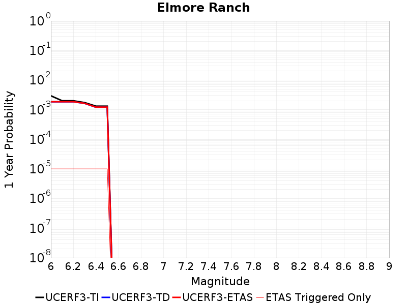 |  |

| Magnitude | 1 wk TI Prob | 1 wk TD Prob | 1 wk ETAS Prob | 1 wk ETAS/TD Gain | 1 wk ETAS Triggered Only | 1 mo TI Prob | 1 mo TD Prob | 1 mo ETAS Prob | 1 mo ETAS/TD Gain | 1 mo ETAS Triggered Only | 1 yr TI Prob | 1 yr TD Prob | 1 yr ETAS Prob | 1 yr ETAS/TD Gain | 1 yr ETAS Triggered Only | 10 yr TI Prob | 10 yr TD Prob | 10 yr ETAS Prob | 10 yr ETAS/TD Gain | 10 yr ETAS Triggered Only |
|-----|-----|-----|-----|-----|-----|-----|-----|-----|-----|-----|-----|-----|-----|-----|-----|-----|-----|-----|-----|-----|
| 6.0 | 5.6540124E-5 | 3.5413006E-5 | 3.5413006E-5 | 1.0 | 0.0 | 2.4229231E-4 | 1.517641E-4 | 1.517641E-4 | 1.0 | 0.0 | 0.0029459186 | 0.0018466533 | 0.0018566349 | 1.0054052 | 1.0E-5 | 0.029071707 | 0.018523706 | 0.01853352 | 1.0005299 | 1.0E-5 |
| 6.1 | 3.8306698E-5 | 3.5413006E-5 | 3.5413006E-5 | 1.0 | 0.0 | 1.6416123E-4 | 1.517641E-4 | 1.517641E-4 | 1.0 | 0.0 | 0.0019968306 | 0.0018466533 | 0.0018566349 | 1.0054052 | 1.0E-5 | 0.019789828 | 0.018523706 | 0.01853352 | 1.0005299 | 1.0E-5 |
| 6.2 | 3.8306698E-5 | 3.5413006E-5 | 3.5413006E-5 | 1.0 | 0.0 | 1.6416123E-4 | 1.517641E-4 | 1.517641E-4 | 1.0 | 0.0 | 0.0019968306 | 0.0018466533 | 0.0018566349 | 1.0054052 | 1.0E-5 | 0.019789828 | 0.018523706 | 0.01853352 | 1.0005299 | 1.0E-5 |
| 6.3 | 3.3197924E-5 | 3.1173826E-5 | 3.1173826E-5 | 1.0 | 0.0 | 1.4226905E-4 | 1.3359809E-4 | 1.3359809E-4 | 1.0 | 0.0 | 0.0017307495 | 0.0016258296 | 0.0016358134 | 1.0061407 | 1.0E-5 | 0.017173318 | 0.016341109 | 0.016350945 | 1.000602 | 1.0E-5 |
| 6.4 | 2.5148964E-5 | 2.3130056E-5 | 2.3130056E-5 | 1.0 | 0.0 | 1.0777682E-4 | 9.912763E-5 | 9.912763E-5 | 1.0 | 0.0 | 0.0013113929 | 0.0012066693 | 0.0012166572 | 1.0082773 | 1.0E-5 | 0.01303681 | 0.012167156 | 0.012177034 | 1.0008119 | 1.0E-5 |
| 6.5 | 2.5148964E-5 | 2.3130056E-5 | 2.3130056E-5 | 1.0 | 0.0 | 1.0777682E-4 | 9.912763E-5 | 9.912763E-5 | 1.0 | 0.0 | 0.0013113929 | 0.0012066693 | 0.0012166572 | 1.0082773 | 1.0E-5 | 0.01303681 | 0.012167156 | 0.012177034 | 1.0008119 | 1.0E-5 |

## Calaveras (So) 2011 CFM
*[(top)](#table-of-contents)*

| 1 Week | 1 Month | 1 Year | 10 Year |
|-----|-----|-----|-----|
|  | 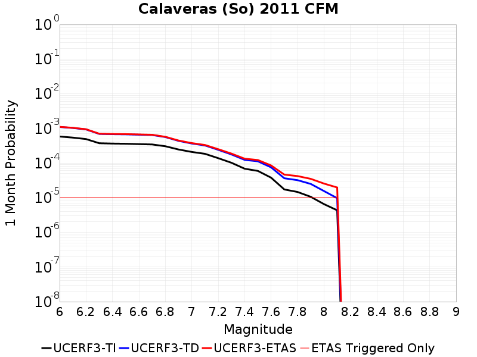 |  | 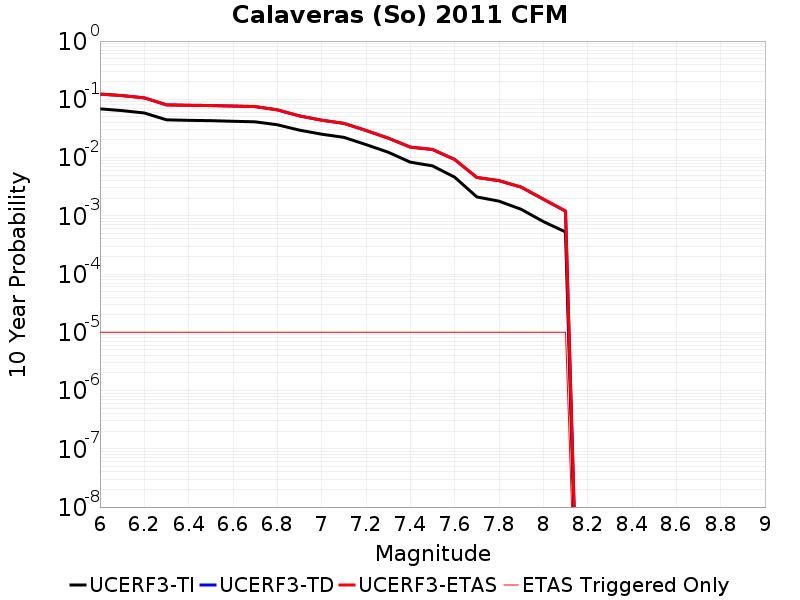 |

| Magnitude | 1 wk TI Prob | 1 wk TD Prob | 1 wk ETAS Prob | 1 wk ETAS/TD Gain | 1 wk ETAS Triggered Only | 1 mo TI Prob | 1 mo TD Prob | 1 mo ETAS Prob | 1 mo ETAS/TD Gain | 1 mo ETAS Triggered Only | 1 yr TI Prob | 1 yr TD Prob | 1 yr ETAS Prob | 1 yr ETAS/TD Gain | 1 yr ETAS Triggered Only | 10 yr TI Prob | 10 yr TD Prob | 10 yr ETAS Prob | 10 yr ETAS/TD Gain | 10 yr ETAS Triggered Only |
|-----|-----|-----|-----|-----|-----|-----|-----|-----|-----|-----|-----|-----|-----|-----|-----|-----|-----|-----|-----|-----|
| 6.0 | 1.358289E-4 | 2.5595893E-4 | 2.6595636E-4 | 1.0390588 | 1.0E-5 | 5.8199395E-4 | 0.0010964427 | 0.0011064317 | 1.0091105 | 1.0E-5 | 0.0070627797 | 0.013244081 | 0.01325395 | 1.000745 | 1.0E-5 | 0.06842483 | 0.12273818 | 0.12274695 | 1.0000715 | 1.0E-5 |
| 6.1 | 1.2634568E-4 | 2.3975209E-4 | 2.497497E-4 | 1.0416998 | 1.0E-5 | 5.4136914E-4 | 0.0010270472 | 0.0010370369 | 1.0097266 | 1.0E-5 | 0.0065712677 | 0.012411182 | 0.012421058 | 1.0007957 | 1.0E-5 | 0.06380317 | 0.11548149 | 0.11549033 | 1.0000767 | 1.0E-5 |
| 6.2 | 1.1466059E-4 | 2.1773067E-4 | 2.277285E-4 | 1.0459183 | 1.0E-5 | 4.9130997E-4 | 9.3275856E-4 | 9.427492E-4 | 1.0107108 | 1.0E-5 | 0.005965305 | 0.011279736 | 0.011289623 | 1.0008765 | 1.0E-5 | 0.05807694 | 0.10564585 | 0.1056548 | 1.0000846 | 1.0E-5 |
| 6.3 | 8.691518E-5 | 1.6132691E-4 | 1.713253E-4 | 1.061976 | 1.0E-5 | 3.7244044E-4 | 6.911895E-4 | 7.011826E-4 | 1.0144578 | 1.0E-5 | 0.004525038 | 0.008376888 | 0.008386804 | 1.0011837 | 1.0E-5 | 0.044339992 | 0.08007135 | 0.080080554 | 1.0001149 | 1.0E-5 |
| 6.4 | 8.50982E-5 | 1.585848E-4 | 1.6858321E-4 | 1.0630478 | 1.0E-5 | 3.646556E-4 | 6.794437E-4 | 6.894369E-4 | 1.0147079 | 1.0E-5 | 0.0044306475 | 0.008234969 | 0.008244887 | 1.0012044 | 1.0E-5 | 0.04343345 | 0.07875997 | 0.078769185 | 1.000117 | 1.0E-5 |
| 6.5 | 8.4062965E-5 | 1.5697564E-4 | 1.6697407E-4 | 1.0636941 | 1.0E-5 | 3.602201E-4 | 6.7255105E-4 | 6.825443E-4 | 1.0148587 | 1.0E-5 | 0.004376863 | 0.008151775 | 0.008161694 | 1.0012168 | 1.0E-5 | 0.042916555 | 0.07799608 | 0.0780053 | 1.0001183 | 1.0E-5 |
| 6.6 | 8.194716E-5 | 1.5351603E-4 | 1.6351449E-4 | 1.0651298 | 1.0E-5 | 3.5115483E-4 | 6.5773464E-4 | 6.677281E-4 | 1.0151937 | 1.0E-5 | 0.0042669317 | 0.007973071 | 0.007982992 | 1.0012442 | 1.0E-5 | 0.04185927 | 0.076364525 | 0.07637376 | 1.000121 | 1.0E-5 |
| 6.7 | 8.012326E-5 | 1.502282E-4 | 1.6022669E-4 | 1.0665554 | 1.0E-5 | 3.433402E-4 | 6.4365217E-4 | 6.536457E-4 | 1.0155263 | 1.0E-5 | 0.004172157 | 0.007803266 | 0.007813188 | 1.0012715 | 1.0E-5 | 0.040946912 | 0.07482161 | 0.07483086 | 1.0001236 | 1.0E-5 |
| 6.8 | 7.119773E-5 | 1.310271E-4 | 1.410258E-4 | 1.07631 | 1.0E-5 | 3.0509746E-4 | 5.6141266E-4 | 5.71407E-4 | 1.0178022 | 1.0E-5 | 0.0037082357 | 0.006811045 | 0.0068209767 | 1.0014582 | 1.0E-5 | 0.036469642 | 0.06574858 | 0.06575792 | 1.0001421 | 1.0E-5 |
| 6.9 | 5.7343088E-5 | 1.0174245E-4 | 1.1174143E-4 | 1.0982774 | 1.0E-5 | 2.4573295E-4 | 4.3596653E-4 | 4.4596219E-4 | 1.0229275 | 1.0E-5 | 0.0029876942 | 0.0052950555 | 0.0053050024 | 1.0018785 | 1.0E-5 | 0.02947844 | 0.051708963 | 0.051718447 | 1.0001833 | 1.0E-5 |
| 7.0 | 4.8746577E-5 | 8.536381E-5 | 9.5362964E-5 | 1.1171356 | 1.0E-5 | 2.0889717E-4 | 3.65794E-4 | 3.7579035E-4 | 1.0273278 | 1.0E-5 | 0.0025403565 | 0.004444517 | 0.0044544726 | 1.00224 | 1.0E-5 | 0.025115121 | 0.043673374 | 0.043682937 | 1.000219 | 1.0E-5 |
| 7.1 | 4.2998014E-5 | 7.504114E-5 | 8.504039E-5 | 1.1332502 | 1.0E-5 | 1.8426418E-4 | 3.215656E-4 | 3.3156236E-4 | 1.0310879 | 1.0E-5 | 0.002241108 | 0.003908096 | 0.003918057 | 1.0025488 | 1.0E-5 | 0.022186412 | 0.03855722 | 0.038566835 | 1.0002494 | 1.0E-5 |
| 7.2 | 3.221292E-5 | 5.6173718E-5 | 6.6173154E-5 | 1.1780092 | 1.0E-5 | 1.3804805E-4 | 2.4072245E-4 | 2.5072004E-4 | 1.0415316 | 1.0E-5 | 0.0016794393 | 0.0029268872 | 0.002936858 | 1.0034066 | 1.0E-5 | 0.016668037 | 0.0291185 | 0.029128209 | 1.0003334 | 1.0E-5 |
| 7.3 | 2.3756531E-5 | 4.1297182E-5 | 5.1296767E-5 | 1.2421373 | 1.0E-5 | 1.0180973E-4 | 1.7697601E-4 | 1.8697426E-4 | 1.0564948 | 1.0E-5 | 0.0012388286 | 0.0021525722 | 0.0021625506 | 1.0046356 | 1.0E-5 | 0.012319452 | 0.021521827 | 0.021531612 | 1.0004547 | 1.0E-5 |
| 7.4 | 1.5997684E-5 | 2.8776285E-5 | 3.8775997E-5 | 1.3474984 | 1.0E-5 | 6.8559704E-5 | 1.2332112E-4 | 1.3331989E-4 | 1.0810791 | 1.0E-5 | 8.343947E-4 | 0.0015004032 | 0.0015103882 | 1.0066549 | 1.0E-5 | 0.008312687 | 0.015069054 | 0.015078904 | 1.0006536 | 1.0E-5 |
| 7.5 | 1.3814293E-5 | 2.6161599E-5 | 3.616134E-5 | 1.3822297 | 1.0E-5 | 5.9202768E-5 | 1.1211633E-4 | 1.221152E-4 | 1.0891831 | 1.0E-5 | 7.205553E-4 | 0.0013641642 | 0.0013741505 | 1.0073205 | 1.0E-5 | 0.007182234 | 0.013721189 | 0.013731052 | 1.0007188 | 1.0E-5 |
| 7.6 | 8.817309E-6 | 1.752118E-5 | 2.7521006E-5 | 1.5707278 | 1.0E-5 | 3.7787922E-5 | 7.5088625E-5 | 8.508787E-5 | 1.133166 | 1.0E-5 | 4.5997082E-4 | 9.1382203E-4 | 9.2381286E-4 | 1.010933 | 1.0E-5 | 0.004590199 | 0.009247634 | 0.009257541 | 1.0010713 | 1.0E-5 |
| 7.7 | 4.0352206E-6 | 8.479434E-6 | 1.847935E-5 | 2.1793141 | 1.0E-5 | 1.7293689E-5 | 3.6339923E-5 | 4.6339563E-5 | 1.2751695 | 1.0E-5 | 2.1053031E-4 | 4.4234886E-4 | 4.5234442E-4 | 1.0225966 | 1.0E-5 | 0.0021033096 | 0.0045388867 | 0.0045488416 | 1.0021932 | 1.0E-5 |
| 7.8 | 3.413169E-6 | 7.4742816E-6 | 1.7474207E-5 | 2.3379111 | 1.0E-5 | 1.4627784E-5 | 3.2032243E-5 | 4.2031923E-5 | 1.3121754 | 1.0E-5 | 1.7807873E-4 | 3.8992285E-4 | 3.9991894E-4 | 1.0256361 | 1.0E-5 | 0.0017793609 | 0.0039979443 | 0.0040079043 | 1.0024912 | 1.0E-5 |
| 7.9 | 2.4740732E-6 | 5.8218243E-6 | 1.5821766E-5 | 2.7176647 | 1.0E-5 | 1.06031275E-5 | 2.4950437E-5 | 3.4950186E-5 | 1.4007846 | 1.0E-5 | 1.2908543E-4 | 3.037293E-4 | 3.1372625E-4 | 1.032914 | 1.0E-5 | 0.0012901047 | 0.0030959495 | 0.0031059184 | 1.0032201 | 1.0E-5 |
| 8.0 | 1.5231818E-6 | 3.6297965E-6 | 1.362976E-5 | 3.7549653 | 1.0E-5 | 6.527906E-6 | 1.555618E-5 | 2.5556023E-5 | 1.6428214 | 1.0E-5 | 7.9474354E-5 | 1.8938007E-4 | 1.9937816E-4 | 1.0527939 | 1.0E-5 | 7.944594E-4 | 0.0019217122 | 0.0019316929 | 1.0051937 | 1.0E-5 |
| 8.1 | 1.0104524E-6 | 2.261741E-6 | 1.2261718E-5 | 5.4213624 | 1.0E-5 | 4.330503E-6 | 9.69314E-6 | 1.9693043E-5 | 2.0316474 | 1.0E-5 | 5.2722597E-5 | 1.1800763E-4 | 1.2800645E-4 | 1.0847303 | 1.0E-5 | 5.271009E-4 | 0.0011987599 | 0.001208748 | 1.0083319 | 1.0E-5 |

## Coyote Canyon
*[(top)](#table-of-contents)*

| 1 Week | 1 Month | 1 Year | 10 Year |
|-----|-----|-----|-----|
|  |  | 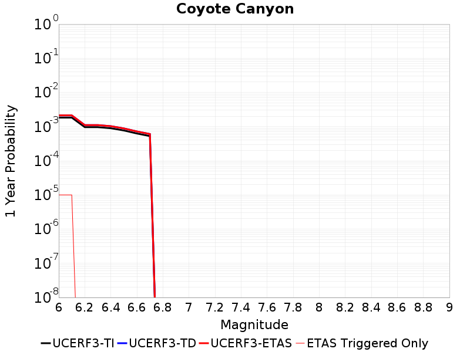 | 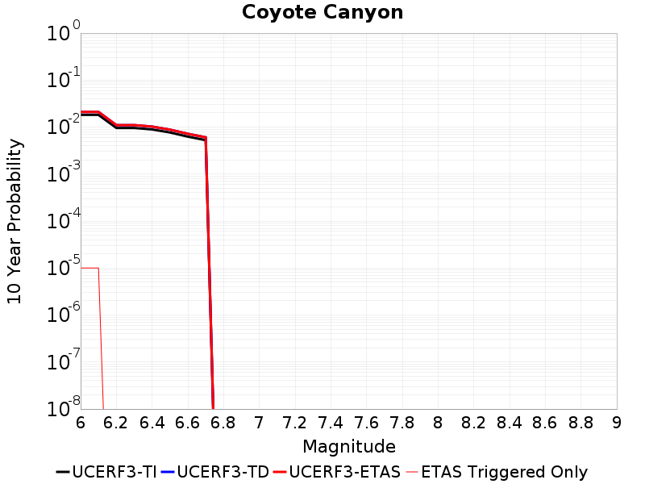 |

| Magnitude | 1 wk TI Prob | 1 wk TD Prob | 1 wk ETAS Prob | 1 wk ETAS/TD Gain | 1 wk ETAS Triggered Only | 1 mo TI Prob | 1 mo TD Prob | 1 mo ETAS Prob | 1 mo ETAS/TD Gain | 1 mo ETAS Triggered Only | 1 yr TI Prob | 1 yr TD Prob | 1 yr ETAS Prob | 1 yr ETAS/TD Gain | 1 yr ETAS Triggered Only | 10 yr TI Prob | 10 yr TD Prob | 10 yr ETAS Prob | 10 yr ETAS/TD Gain | 10 yr ETAS Triggered Only |
|-----|-----|-----|-----|-----|-----|-----|-----|-----|-----|-----|-----|-----|-----|-----|-----|-----|-----|-----|-----|-----|
| 6.0 | 3.5090034E-5 | 4.0605944E-5 | 4.0605944E-5 | 1.0 | 0.0 | 1.503772E-4 | 1.7401534E-4 | 1.7401534E-4 | 1.0 | 0.0 | 0.0018293047 | 0.0021168385 | 0.0021268174 | 1.004714 | 1.0E-5 | 0.018143194 | 0.020992978 | 0.021002768 | 1.0004663 | 1.0E-5 |
| 6.1 | 3.5090034E-5 | 4.0605944E-5 | 4.0605944E-5 | 1.0 | 0.0 | 1.503772E-4 | 1.7401534E-4 | 1.7401534E-4 | 1.0 | 0.0 | 0.0018293047 | 0.0021168385 | 0.0021268174 | 1.004714 | 1.0E-5 | 0.018143194 | 0.020992978 | 0.021002768 | 1.0004663 | 1.0E-5 |
| 6.2 | 1.841879E-5 | 2.1179967E-5 | 2.1179967E-5 | 1.0 | 0.0 | 7.8935285E-5 | 9.076871E-5 | 9.076871E-5 | 1.0 | 0.0 | 9.606133E-4 | 0.0011046521 | 0.0011046521 | 1.0 | 0.0 | 0.0095647145 | 0.011001811 | 0.011001811 | 1.0 | 0.0 |
| 6.3 | 1.841879E-5 | 2.1179967E-5 | 2.1179967E-5 | 1.0 | 0.0 | 7.8935285E-5 | 9.076871E-5 | 9.076871E-5 | 1.0 | 0.0 | 9.606133E-4 | 0.0011046521 | 0.0011046521 | 1.0 | 0.0 | 0.0095647145 | 0.011001811 | 0.011001811 | 1.0 | 0.0 |
| 6.4 | 1.712201E-5 | 1.9676314E-5 | 1.9676314E-5 | 1.0 | 0.0 | 7.337798E-5 | 8.432491E-5 | 8.432491E-5 | 1.0 | 0.0 | 8.930107E-4 | 0.0010262739 | 0.0010262739 | 1.0 | 0.0 | 0.008894307 | 0.010225376 | 0.010225376 | 1.0 | 0.0 |
| 6.5 | 1.4744935E-5 | 1.693204E-5 | 1.693204E-5 | 1.0 | 0.0 | 6.3191044E-5 | 7.25644E-5 | 7.25644E-5 | 1.0 | 0.0 | 7.6907943E-4 | 8.83208E-4 | 8.83208E-4 | 1.0 | 0.0 | 0.007664232 | 0.00880628 | 0.00880628 | 1.0 | 0.0 |
| 6.6 | 1.2017839E-5 | 1.3801637E-5 | 1.3801637E-5 | 1.0 | 0.0 | 5.150401E-5 | 5.9149035E-5 | 5.9149035E-5 | 1.0 | 0.0 | 6.268809E-4 | 7.1999116E-4 | 7.1999116E-4 | 1.0 | 0.0 | 0.0062511545 | 0.0071853776 | 0.0071853776 | 1.0 | 0.0 |
| 6.7 | 1.00956095E-5 | 1.1598895E-5 | 1.1598895E-5 | 1.0 | 0.0 | 4.326618E-5 | 4.97091E-5 | 4.97091E-5 | 1.0 | 0.0 | 5.266384E-4 | 6.051282E-4 | 6.051282E-4 | 1.0 | 0.0 | 0.005253921 | 0.0060434295 | 0.0060434295 | 1.0 | 0.0 |

