# Parent Section Magnitude-Probability Distributions

Only fault sections with at least one triggered aftershock are plotted. Sections are sorted by total supraseismogenic trigger rate (decreasing)

## Table Of Contents

* [Earthquake Valley (So Extension)](#earthquake-valley-so-extension)
* [Earthquake Valley](#earthquake-valley)
* [Earthquake Valley (No  Extension)](#earthquake-valley-no--extension)
* [Elsinore (Julian)](#elsinore-julian)
* [Elsinore (Coyote Mountains)](#elsinore-coyote-mountains)
* [Elsinore (Temecula) rev](#elsinore-temecula-rev)
* [Elsinore (Glen Ivy) rev](#elsinore-glen-ivy-rev)
* [Elsinore (Stepovers Combined)](#elsinore-stepovers-combined)
* [Whittier alt 1](#whittier-alt-1)
* [Chino alt 1](#chino-alt-1)
* [Rose Canyon](#rose-canyon)
* [San Andreas (Coachella) rev](#san-andreas-coachella-rev)
* [Coronado Bank alt1](#coronado-bank-alt1)
* [Imperial](#imperial)
* [Brawley (Seismic Zone) alt 1](#brawley-seismic-zone-alt-1)
* [San Andreas (Mojave S)](#san-andreas-mojave-s)
* [San Andreas (San Gorgonio Pass-Garnet HIll)](#san-andreas-san-gorgonio-pass-garnet-hill)
* [San Jacinto (Superstition Mtn)](#san-jacinto-superstition-mtn)
* [Cerro Prieto](#cerro-prieto)
* [San Clemente](#san-clemente)
* [Panamint Valley](#panamint-valley)
* [San Andreas (San Bernardino N)](#san-andreas-san-bernardino-n)
* [Elysian Park (Upper)](#elysian-park-upper)
* [San Andreas (North Branch Mill Creek)](#san-andreas-north-branch-mill-creek)
* [Pinto Mtn](#pinto-mtn)
* [San Andreas (Big Bend)](#san-andreas-big-bend)
* [Newport-Inglewood (Offshore)](#newport-inglewood-offshore)
* [Gravel Hills-Harper Lk](#gravel-hills-harper-lk)
* [San Andreas (San Bernardino S)](#san-andreas-san-bernardino-s)
* [San Andreas (Cholame) rev](#san-andreas-cholame-rev)
* [Raymond](#raymond)
* [Peralta Hills](#peralta-hills)
* [Puente Hills](#puente-hills)
* [San Andreas (Carrizo) rev](#san-andreas-carrizo-rev)
* [San Andreas (Mojave N)](#san-andreas-mojave-n)
* [Homestead Valley 2011](#homestead-valley-2011)
* [Elmore Ranch](#elmore-ranch)
* [Blue Cut](#blue-cut)
* [Oceanside alt1](#oceanside-alt1)
* [Mission Creek](#mission-creek)

## Earthquake Valley (So Extension)
*[(top)](#table-of-contents)*

| 1 Week | 1 Month | 1 Year | 10 Year |
|-----|-----|-----|-----|
|  |  |  | 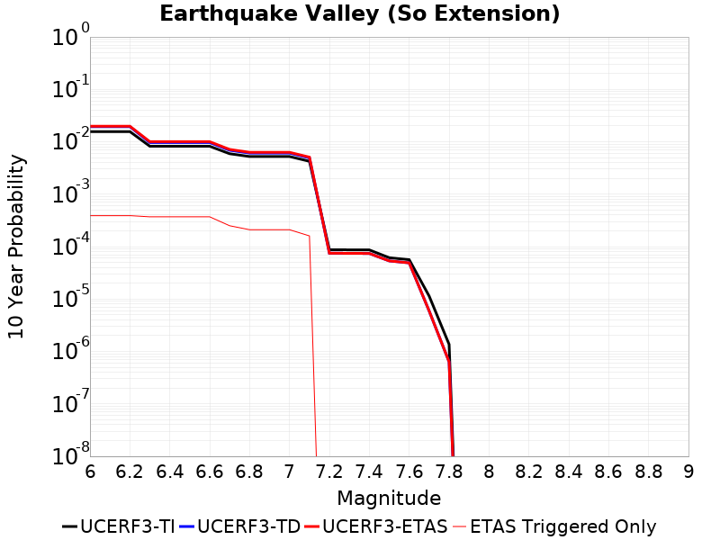 |

| Magnitude | 1 wk TI Prob | 1 wk TD Prob | 1 wk ETAS Prob | 1 wk ETAS/TD Gain | 1 wk ETAS Triggered Only | 1 mo TI Prob | 1 mo TD Prob | 1 mo ETAS Prob | 1 mo ETAS/TD Gain | 1 mo ETAS Triggered Only | 1 yr TI Prob | 1 yr TD Prob | 1 yr ETAS Prob | 1 yr ETAS/TD Gain | 1 yr ETAS Triggered Only | 10 yr TI Prob | 10 yr TD Prob | 10 yr ETAS Prob | 10 yr ETAS/TD Gain | 10 yr ETAS Triggered Only |
|-----|-----|-----|-----|-----|-----|-----|-----|-----|-----|-----|-----|-----|-----|-----|-----|-----|-----|-----|-----|-----|
| 6.0 | 3.0194888E-5 | 3.7414648E-5 | 3.1740416E-4 | 8.48342 | 2.8E-4 | 1.2940024E-4 | 1.6034176E-4 | 6.102696E-4 | 3.8060553 | 4.5E-4 | 0.0015743093 | 0.001950927 | 0.0026196197 | 1.3427565 | 6.7E-4 | 0.01563203 | 0.019388564 | 0.020418206 | 1.0531056 | 0.00105 |
| 6.1 | 3.0194888E-5 | 3.7414648E-5 | 3.1740416E-4 | 8.48342 | 2.8E-4 | 1.2940024E-4 | 1.6034176E-4 | 6.102696E-4 | 3.8060553 | 4.5E-4 | 0.0015743093 | 0.001950927 | 0.0026196197 | 1.3427565 | 6.7E-4 | 0.01563203 | 0.019388564 | 0.020418206 | 1.0531056 | 0.00105 |
| 6.2 | 3.0194888E-5 | 3.7414648E-5 | 3.1740416E-4 | 8.48342 | 2.8E-4 | 1.2940024E-4 | 1.6034176E-4 | 6.102696E-4 | 3.8060553 | 4.5E-4 | 0.0015743093 | 0.001950927 | 0.0026196197 | 1.3427565 | 6.7E-4 | 0.01563203 | 0.019388564 | 0.020418206 | 1.0531056 | 0.00105 |
| 6.3 | 1.5795305E-5 | 1.857493E-5 | 2.685703E-4 | 14.458751 | 2.5E-4 | 6.769241E-5 | 7.960505E-5 | 4.295772E-4 | 5.396356 | 3.5E-4 | 8.238434E-4 | 9.688728E-4 | 0.0015083497 | 1.5568087 | 5.4E-4 | 0.008207959 | 0.009657517 | 0.010509212 | 1.0881898 | 8.6E-4 |
| 6.4 | 1.5795305E-5 | 1.857493E-5 | 2.685703E-4 | 14.458751 | 2.5E-4 | 6.769241E-5 | 7.960505E-5 | 4.295772E-4 | 5.396356 | 3.5E-4 | 8.238434E-4 | 9.688728E-4 | 0.0015083497 | 1.5568087 | 5.4E-4 | 0.008207959 | 0.009657517 | 0.010509212 | 1.0881898 | 8.6E-4 |
| 6.5 | 1.5795305E-5 | 1.857493E-5 | 2.685703E-4 | 14.458751 | 2.5E-4 | 6.769241E-5 | 7.960505E-5 | 4.295772E-4 | 5.396356 | 3.5E-4 | 8.238434E-4 | 9.688728E-4 | 0.0015083497 | 1.5568087 | 5.4E-4 | 0.008207959 | 0.009657517 | 0.010509212 | 1.0881898 | 8.6E-4 |
| 6.6 | 1.5795305E-5 | 1.857493E-5 | 2.685703E-4 | 14.458751 | 2.5E-4 | 6.769241E-5 | 7.960505E-5 | 4.295772E-4 | 5.396356 | 3.5E-4 | 8.238434E-4 | 9.688728E-4 | 0.0015083497 | 1.5568087 | 5.4E-4 | 0.008207959 | 0.009657517 | 0.010509212 | 1.0881898 | 8.6E-4 |
| 6.7 | 1.1363076E-5 | 1.3224433E-5 | 1.9322205E-4 | 14.61099 | 1.8E-4 | 4.8697988E-5 | 5.6675344E-5 | 3.1666062E-4 | 5.5872726 | 2.6E-4 | 5.927367E-4 | 6.89881E-4 | 0.0010596258 | 1.5359544 | 3.7E-4 | 0.0059115817 | 0.006884963 | 0.0074609695 | 1.0836616 | 5.8E-4 |
| 6.8 | 1.0049611E-5 | 1.16695655E-5 | 1.6166782E-4 | 13.853799 | 1.5E-4 | 4.306905E-5 | 5.0011884E-5 | 2.700009E-4 | 5.3987346 | 2.2E-4 | 5.242395E-4 | 6.087987E-4 | 9.385978E-4 | 1.5417211 | 3.3E-4 | 0.0052300454 | 0.0060785776 | 0.0065854774 | 1.0833912 | 5.1E-4 |
| 6.9 | 1.0049611E-5 | 1.16695655E-5 | 1.6166782E-4 | 13.853799 | 1.5E-4 | 4.306905E-5 | 5.0011884E-5 | 2.700009E-4 | 5.3987346 | 2.2E-4 | 5.242395E-4 | 6.087987E-4 | 9.385978E-4 | 1.5417211 | 3.3E-4 | 0.0052300454 | 0.0060785776 | 0.0065854774 | 1.0833912 | 5.1E-4 |
| 7.0 | 1.0049611E-5 | 1.16695655E-5 | 1.6166782E-4 | 13.853799 | 1.5E-4 | 4.306905E-5 | 5.0011884E-5 | 2.700009E-4 | 5.3987346 | 2.2E-4 | 5.242395E-4 | 6.087987E-4 | 9.385978E-4 | 1.5417211 | 3.3E-4 | 0.0052300454 | 0.0060785776 | 0.0065854774 | 1.0833912 | 5.1E-4 |
| 7.1 | 8.140254E-6 | 9.444646E-6 | 1.3944342E-4 | 14.764283 | 1.3E-4 | 3.4886336E-5 | 4.0476807E-5 | 2.3046912E-4 | 5.6938562 | 1.9E-4 | 4.2465836E-4 | 4.927616E-4 | 7.6262857E-4 | 1.5476623 | 2.7E-4 | 0.0042384774 | 0.0049233506 | 0.0053512338 | 1.0869089 | 4.3E-4 |
| 7.2 | 1.673835E-7 | 1.4351134E-7 | 1.4351134E-7 | 1.0 | 0.0 | 7.173577E-7 | 6.150485E-7 | 6.150485E-7 | 1.0 | 0.0 | 8.733795E-6 | 7.4881937E-6 | 7.4881937E-6 | 1.0 | 0.0 | 8.733451E-5 | 7.4879776E-5 | 7.4879776E-5 | 1.0 | 0.0 |
| 7.3 | 1.6632116E-7 | 1.4247722E-7 | 1.4247722E-7 | 1.0 | 0.0 | 7.1280476E-7 | 6.1061655E-7 | 6.1061655E-7 | 1.0 | 0.0 | 8.678364E-6 | 7.4342347E-6 | 7.4342347E-6 | 1.0 | 0.0 | 8.6780245E-5 | 7.434023E-5 | 7.434023E-5 | 1.0 | 0.0 |
| 7.4 | 1.6569169E-7 | 1.4192045E-7 | 1.4192045E-7 | 1.0 | 0.0 | 7.1010703E-7 | 6.082304E-7 | 6.082304E-7 | 1.0 | 0.0 | 8.645519E-6 | 7.405183E-6 | 7.405183E-6 | 1.0 | 0.0 | 8.645182E-5 | 7.404973E-5 | 7.404973E-5 | 1.0 | 0.0 |
| 7.5 | 1.1764555E-7 | 1.02199756E-7 | 1.02199756E-7 | 1.0 | 0.0 | 5.041951E-7 | 4.379989E-7 | 4.379989E-7 | 1.0 | 0.0 | 6.138558E-6 | 5.3326257E-6 | 5.3326257E-6 | 1.0 | 0.0 | 6.1383886E-5 | 5.3325195E-5 | 5.3325195E-5 | 1.0 | 0.0 |
| 7.6 | 1.07927605E-7 | 9.3791364E-8 | 9.3791364E-8 | 1.0 | 0.0 | 4.6254678E-7 | 4.0196292E-7 | 4.0196292E-7 | 1.0 | 0.0 | 5.6314925E-6 | 4.89389E-6 | 4.89389E-6 | 1.0 | 0.0 | 5.63135E-5 | 4.8938036E-5 | 4.8938036E-5 | 1.0 | 0.0 |
| 7.7 | 2.1826905E-8 | 1.1349447E-8 | 1.1349447E-8 | 1.0 | 0.0 | 9.3543875E-8 | 4.8640484E-8 | 4.8640484E-8 | 1.0 | 0.0 | 1.1388961E-6 | 5.9219775E-7 | 5.9219775E-7 | 1.0 | 0.0 | 1.1388902E-5 | 5.9219674E-6 | 5.9219674E-6 | 1.0 | 0.0 |
| 7.8 | 2.6169649E-9 | 1.2145672E-9 | 1.2145672E-9 | 1.0 | 0.0 | 1.1215564E-8 | 5.205288E-9 | 5.205288E-9 | 1.0 | 0.0 | 1.3654947E-7 | 6.337438E-8 | 6.337438E-8 | 1.0 | 0.0 | 1.365494E-6 | 6.337438E-7 | 6.337438E-7 | 1.0 | 0.0 |

## Earthquake Valley
*[(top)](#table-of-contents)*

| 1 Week | 1 Month | 1 Year | 10 Year |
|-----|-----|-----|-----|
|  |  | 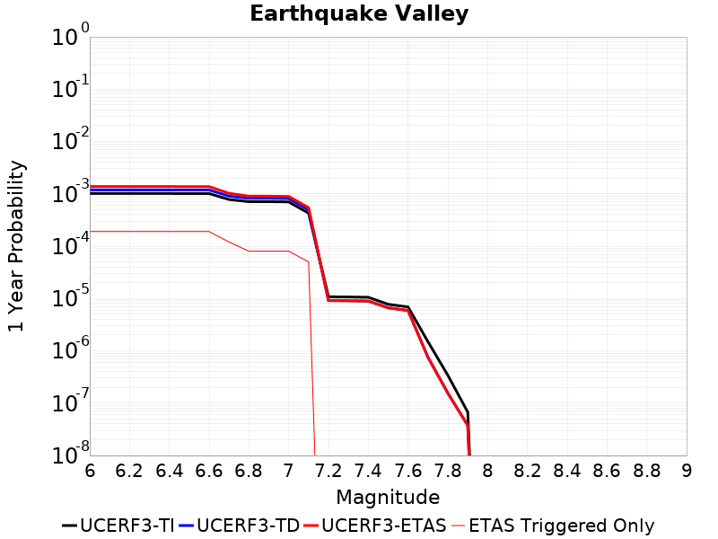 |  |

| Magnitude | 1 wk TI Prob | 1 wk TD Prob | 1 wk ETAS Prob | 1 wk ETAS/TD Gain | 1 wk ETAS Triggered Only | 1 mo TI Prob | 1 mo TD Prob | 1 mo ETAS Prob | 1 mo ETAS/TD Gain | 1 mo ETAS Triggered Only | 1 yr TI Prob | 1 yr TD Prob | 1 yr ETAS Prob | 1 yr ETAS/TD Gain | 1 yr ETAS Triggered Only | 10 yr TI Prob | 10 yr TD Prob | 10 yr ETAS Prob | 10 yr ETAS/TD Gain | 10 yr ETAS Triggered Only |
|-----|-----|-----|-----|-----|-----|-----|-----|-----|-----|-----|-----|-----|-----|-----|-----|-----|-----|-----|-----|-----|
| 6.0 | 1.9416384E-5 | 2.2737106E-5 | 3.2273028E-4 | 14.193992 | 3.0E-4 | 8.321042E-5 | 9.7441785E-5 | 5.1740085E-4 | 5.309846 | 4.2E-4 | 0.001012616 | 0.0011858294 | 0.0018350586 | 1.5474895 | 6.5E-4 | 0.010080142 | 0.011806992 | 0.012844594 | 1.0878804 | 0.00105 |
| 6.1 | 1.9416384E-5 | 2.2737106E-5 | 3.2273028E-4 | 14.193992 | 3.0E-4 | 8.321042E-5 | 9.7441785E-5 | 5.1740085E-4 | 5.309846 | 4.2E-4 | 0.001012616 | 0.0011858294 | 0.0018350586 | 1.5474895 | 6.5E-4 | 0.010080142 | 0.011806992 | 0.012844594 | 1.0878804 | 0.00105 |
| 6.2 | 1.9416384E-5 | 2.2737106E-5 | 3.2273028E-4 | 14.193992 | 3.0E-4 | 8.321042E-5 | 9.7441785E-5 | 5.1740085E-4 | 5.309846 | 4.2E-4 | 0.001012616 | 0.0011858294 | 0.0018350586 | 1.5474895 | 6.5E-4 | 0.010080142 | 0.011806992 | 0.012844594 | 1.0878804 | 0.00105 |
| 6.3 | 1.9416384E-5 | 2.2737106E-5 | 3.2273028E-4 | 14.193992 | 3.0E-4 | 8.321042E-5 | 9.7441785E-5 | 5.1740085E-4 | 5.309846 | 4.2E-4 | 0.001012616 | 0.0011858294 | 0.0018350586 | 1.5474895 | 6.5E-4 | 0.010080142 | 0.011806992 | 0.012844594 | 1.0878804 | 0.00105 |
| 6.4 | 1.9416384E-5 | 2.2737106E-5 | 3.2273028E-4 | 14.193992 | 3.0E-4 | 8.321042E-5 | 9.7441785E-5 | 5.1740085E-4 | 5.309846 | 4.2E-4 | 0.001012616 | 0.0011858294 | 0.0018350586 | 1.5474895 | 6.5E-4 | 0.010080142 | 0.011806992 | 0.012844594 | 1.0878804 | 0.00105 |
| 6.5 | 1.9389157E-5 | 2.27055E-5 | 3.226987E-4 | 14.2123575 | 3.0E-4 | 8.309374E-5 | 9.730634E-5 | 5.1726546E-4 | 5.3158455 | 4.2E-4 | 0.0010111968 | 0.0011841821 | 0.0018334124 | 1.548252 | 6.5E-4 | 0.010066078 | 0.011790695 | 0.012828315 | 1.0880033 | 0.00105 |
| 6.6 | 1.9389157E-5 | 2.27055E-5 | 3.226987E-4 | 14.2123575 | 3.0E-4 | 8.309374E-5 | 9.730634E-5 | 5.1726546E-4 | 5.3158455 | 4.2E-4 | 0.0010111968 | 0.0011841821 | 0.0018334124 | 1.548252 | 6.5E-4 | 0.010066078 | 0.011790695 | 0.012828315 | 1.0880033 | 0.00105 |
| 6.7 | 1.4925434E-5 | 1.7318634E-5 | 2.4731466E-4 | 14.280263 | 2.3E-4 | 6.396457E-5 | 7.422109E-5 | 4.041966E-4 | 5.4458456 | 3.3E-4 | 7.7849044E-4 | 9.0335327E-4 | 0.0013829197 | 1.5308735 | 4.8E-4 | 0.007757689 | 0.009005295 | 0.00976836 | 1.0847353 | 7.7E-4 |
| 6.8 | 1.3570335E-5 | 1.5716078E-5 | 2.0571309E-4 | 13.08934 | 1.9E-4 | 5.8157282E-5 | 6.735335E-5 | 3.4733448E-4 | 5.1569 | 2.8E-4 | 7.0783484E-4 | 8.1980164E-4 | 0.0012494491 | 1.5240871 | 4.3E-4 | 0.0070558446 | 0.008175948 | 0.008860306 | 1.0837039 | 6.9E-4 |
| 6.9 | 1.3570335E-5 | 1.5716078E-5 | 2.0571309E-4 | 13.08934 | 1.9E-4 | 5.8157282E-5 | 6.735335E-5 | 3.4733448E-4 | 5.1569 | 2.8E-4 | 7.0783484E-4 | 8.1980164E-4 | 0.0012494491 | 1.5240871 | 4.3E-4 | 0.0070558446 | 0.008175948 | 0.008860306 | 1.0837039 | 6.9E-4 |
| 7.0 | 1.3433392E-5 | 1.5558726E-5 | 1.9555593E-4 | 12.568892 | 1.8E-4 | 5.757041E-5 | 6.6679015E-5 | 3.36661E-4 | 5.0489798 | 2.7E-4 | 7.0069433E-4 | 8.1159774E-4 | 0.0012312569 | 1.5170777 | 4.2E-4 | 0.006984891 | 0.008094508 | 0.008769004 | 1.0833275 | 6.8E-4 |
| 7.1 | 8.181609E-6 | 9.478542E-6 | 1.4947722E-4 | 15.770063 | 1.4E-4 | 3.5063567E-5 | 4.0622075E-5 | 2.4061395E-4 | 5.9232316 | 2.0E-4 | 4.268153E-4 | 4.9452943E-4 | 7.74391E-4 | 1.5659148 | 2.8E-4 | 0.0042599645 | 0.0049409503 | 0.005378776 | 1.0886117 | 4.4E-4 |
| 7.2 | 2.0663983E-7 | 1.7509522E-7 | 1.0175094E-5 | 58.11177 | 1.0E-5 | 8.855989E-7 | 7.5040793E-7 | 1.07504E-5 | 14.326076 | 1.0E-5 | 1.0782113E-5 | 9.136182E-6 | 1.913609E-5 | 2.0945392 | 1.0E-5 | 1.07815904E-4 | 9.135843E-5 | 1.0135752E-4 | 1.109449 | 1.0E-5 |
| 7.3 | 2.0462376E-7 | 1.7322327E-7 | 1.7322327E-7 | 1.0 | 0.0 | 8.7695867E-7 | 7.423852E-7 | 7.423852E-7 | 1.0 | 0.0 | 1.0676919E-5 | 9.0385065E-6 | 9.0385065E-6 | 1.0 | 0.0 | 1.0676406E-4 | 9.0381756E-5 | 9.0381756E-5 | 1.0 | 0.0 |
| 7.4 | 2.0171088E-7 | 1.7102073E-7 | 1.7102073E-7 | 1.0 | 0.0 | 8.644749E-7 | 7.329458E-7 | 7.329458E-7 | 1.0 | 0.0 | 1.0524931E-5 | 8.923583E-6 | 8.923583E-6 | 1.0 | 0.0 | 1.05244326E-4 | 8.923261E-5 | 8.923261E-5 | 1.0 | 0.0 |
| 7.5 | 1.4847944E-7 | 1.2724793E-7 | 1.2724793E-7 | 1.0 | 0.0 | 6.363403E-7 | 5.4534814E-7 | 5.4534814E-7 | 1.0 | 0.0 | 7.747416E-6 | 6.639596E-6 | 6.639596E-6 | 1.0 | 0.0 | 7.747146E-5 | 6.63942E-5 | 6.63942E-5 | 1.0 | 0.0 |
| 7.6 | 1.3185847E-7 | 1.1273307E-7 | 1.1273307E-7 | 1.0 | 0.0 | 5.6510765E-7 | 4.8314166E-7 | 4.8314166E-7 | 1.0 | 0.0 | 6.8801637E-6 | 5.882236E-6 | 5.882236E-6 | 1.0 | 0.0 | 6.8799505E-5 | 5.882102E-5 | 5.882102E-5 | 1.0 | 0.0 |
| 7.7 | 2.8609954E-8 | 1.4394732E-8 | 1.4394732E-8 | 1.0 | 0.0 | 1.2261408E-7 | 6.169171E-8 | 6.169171E-8 | 1.0 | 0.0 | 1.4928254E-6 | 7.510963E-7 | 7.510963E-7 | 1.0 | 0.0 | 1.4928154E-5 | 7.5109433E-6 | 7.5109433E-6 | 1.0 | 0.0 |
| 7.8 | 6.527266E-9 | 2.9676186E-9 | 2.9676186E-9 | 1.0 | 0.0 | 2.7973995E-8 | 1.2718365E-8 | 1.2718365E-8 | 1.0 | 0.0 | 3.4058334E-7 | 1.5484608E-7 | 1.5484608E-7 | 1.0 | 0.0 | 3.4058282E-6 | 1.54846E-6 | 1.54846E-6 | 1.0 | 0.0 |
| 7.9 | 1.2898267E-9 | 7.2003614E-10 | 7.2003614E-10 | 1.0 | 0.0 | 5.527829E-9 | 3.0858693E-9 | 3.0858693E-9 | 1.0 | 0.0 | 6.7301315E-8 | 3.757046E-8 | 3.757046E-8 | 1.0 | 0.0 | 6.7301295E-7 | 3.757046E-7 | 3.757046E-7 | 1.0 | 0.0 |

## Earthquake Valley (No  Extension)
*[(top)](#table-of-contents)*

| 1 Week | 1 Month | 1 Year | 10 Year |
|-----|-----|-----|-----|
| 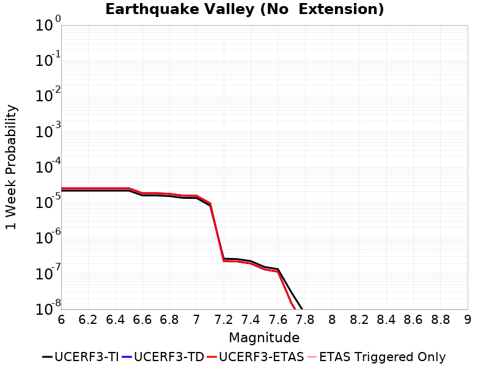 | 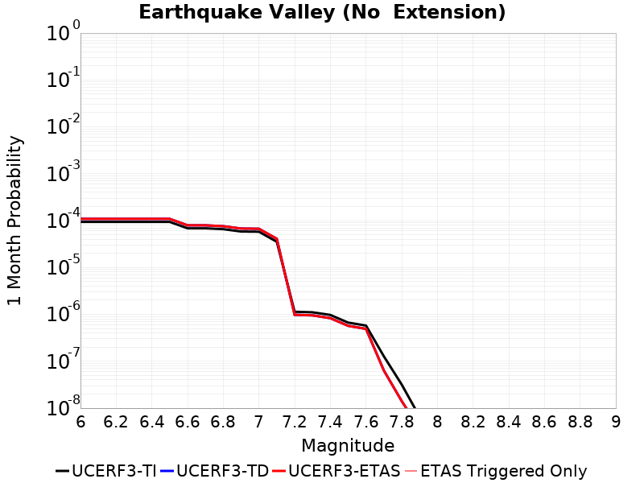 | 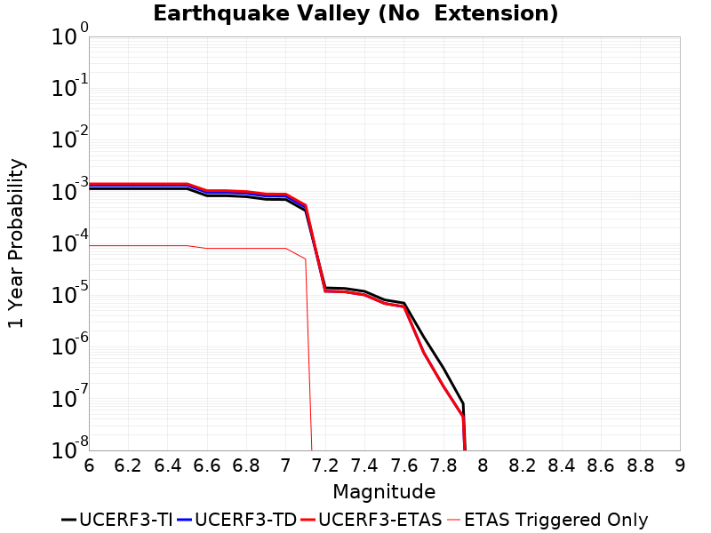 | 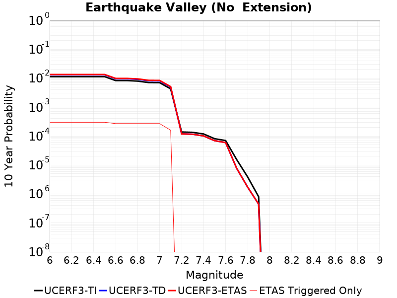 |

| Magnitude | 1 wk TI Prob | 1 wk TD Prob | 1 wk ETAS Prob | 1 wk ETAS/TD Gain | 1 wk ETAS Triggered Only | 1 mo TI Prob | 1 mo TD Prob | 1 mo ETAS Prob | 1 mo ETAS/TD Gain | 1 mo ETAS Triggered Only | 1 yr TI Prob | 1 yr TD Prob | 1 yr ETAS Prob | 1 yr ETAS/TD Gain | 1 yr ETAS Triggered Only | 10 yr TI Prob | 10 yr TD Prob | 10 yr ETAS Prob | 10 yr ETAS/TD Gain | 10 yr ETAS Triggered Only |
|-----|-----|-----|-----|-----|-----|-----|-----|-----|-----|-----|-----|-----|-----|-----|-----|-----|-----|-----|-----|-----|
| 6.0 | 2.1859703E-5 | 2.5358233E-5 | 2.553524E-4 | 10.069802 | 2.3E-4 | 9.3681076E-5 | 1.08674445E-4 | 4.486375E-4 | 4.1282706 | 3.4E-4 | 0.0011399703 | 0.0013224552 | 0.001821794 | 1.3775847 | 5.0E-4 | 0.011341401 | 0.013160396 | 0.013959737 | 1.0607383 | 8.1E-4 |
| 6.1 | 2.1859703E-5 | 2.5358233E-5 | 2.553524E-4 | 10.069802 | 2.3E-4 | 9.3681076E-5 | 1.08674445E-4 | 4.486375E-4 | 4.1282706 | 3.4E-4 | 0.0011399703 | 0.0013224552 | 0.001821794 | 1.3775847 | 5.0E-4 | 0.011341401 | 0.013160396 | 0.013959737 | 1.0607383 | 8.1E-4 |
| 6.2 | 2.1859703E-5 | 2.5358233E-5 | 2.553524E-4 | 10.069802 | 2.3E-4 | 9.3681076E-5 | 1.08674445E-4 | 4.486375E-4 | 4.1282706 | 3.4E-4 | 0.0011399703 | 0.0013224552 | 0.001821794 | 1.3775847 | 5.0E-4 | 0.011341401 | 0.013160396 | 0.013959737 | 1.0607383 | 8.1E-4 |
| 6.3 | 2.1859703E-5 | 2.5358233E-5 | 2.553524E-4 | 10.069802 | 2.3E-4 | 9.3681076E-5 | 1.08674445E-4 | 4.486375E-4 | 4.1282706 | 3.4E-4 | 0.0011399703 | 0.0013224552 | 0.001821794 | 1.3775847 | 5.0E-4 | 0.011341401 | 0.013160396 | 0.013959737 | 1.0607383 | 8.1E-4 |
| 6.4 | 2.1859703E-5 | 2.5358233E-5 | 2.553524E-4 | 10.069802 | 2.3E-4 | 9.3681076E-5 | 1.08674445E-4 | 4.486375E-4 | 4.1282706 | 3.4E-4 | 0.0011399703 | 0.0013224552 | 0.001821794 | 1.3775847 | 5.0E-4 | 0.011341401 | 0.013160396 | 0.013959737 | 1.0607383 | 8.1E-4 |
| 6.5 | 2.1859703E-5 | 2.5358233E-5 | 2.553524E-4 | 10.069802 | 2.3E-4 | 9.3681076E-5 | 1.08674445E-4 | 4.486375E-4 | 4.1282706 | 3.4E-4 | 0.0011399703 | 0.0013224552 | 0.001821794 | 1.3775847 | 5.0E-4 | 0.011341401 | 0.013160396 | 0.013959737 | 1.0607383 | 8.1E-4 |
| 6.6 | 1.597E-5 | 1.8471655E-5 | 2.1846796E-4 | 11.8272 | 2.0E-4 | 6.8441055E-5 | 7.916234E-5 | 3.6913936E-4 | 4.6630683 | 2.9E-4 | 8.329513E-4 | 9.634637E-4 | 0.0014030398 | 1.4562457 | 4.4E-4 | 0.008298361 | 0.009601584 | 0.010334479 | 1.0763307 | 7.4E-4 |
| 6.7 | 1.597E-5 | 1.8471655E-5 | 2.1846796E-4 | 11.8272 | 2.0E-4 | 6.8441055E-5 | 7.916234E-5 | 3.6913936E-4 | 4.6630683 | 2.9E-4 | 8.329513E-4 | 9.634637E-4 | 0.0014030398 | 1.4562457 | 4.4E-4 | 0.008298361 | 0.009601584 | 0.010334479 | 1.0763307 | 7.4E-4 |
| 6.8 | 1.5315149E-5 | 1.7712871E-5 | 2.0770951E-4 | 11.726473 | 1.9E-4 | 6.5634704E-5 | 7.591059E-5 | 3.5588932E-4 | 4.68827 | 2.8E-4 | 7.988095E-4 | 9.239073E-4 | 0.0013535101 | 1.4649847 | 4.3E-4 | 0.007959441 | 0.009209311 | 0.00992268 | 1.0774617 | 7.2E-4 |
| 6.9 | 1.3634728E-5 | 1.5775246E-5 | 2.0577224E-4 | 13.043996 | 1.9E-4 | 5.8433237E-5 | 6.760692E-5 | 3.4758798E-4 | 5.1413083 | 2.8E-4 | 7.1119244E-4 | 8.228865E-4 | 0.0012525326 | 1.5221208 | 4.3E-4 | 0.007089207 | 0.008206569 | 0.008890906 | 1.083389 | 6.9E-4 |
| 7.0 | 1.3496271E-5 | 1.5616377E-5 | 1.9561357E-4 | 12.526181 | 1.8E-4 | 5.783988E-5 | 6.6926084E-5 | 3.36908E-4 | 5.0340314 | 2.7E-4 | 7.03973E-4 | 8.146035E-4 | 0.0012342614 | 1.5151682 | 4.2E-4 | 0.007017471 | 0.008124346 | 0.008798822 | 1.083019 | 6.8E-4 |
| 7.1 | 8.242798E-6 | 9.534466E-6 | 1.4953314E-4 | 15.683431 | 1.4E-4 | 3.53258E-5 | 4.0861738E-5 | 2.4085357E-4 | 5.8943543 | 2.0E-4 | 4.300067E-4 | 4.9744605E-4 | 7.7730673E-4 | 1.5625951 | 2.8E-4 | 0.004291756 | 0.004969986 | 0.0054077995 | 1.0880915 | 4.4E-4 |
| 7.2 | 2.6506527E-7 | 2.2822029E-7 | 1.0228218E-5 | 44.817307 | 1.0E-5 | 1.1359936E-6 | 9.780866E-7 | 1.0978077E-5 | 11.224033 | 1.0E-5 | 1.3830633E-5 | 1.1908143E-5 | 2.1908025E-5 | 1.8397515 | 1.0E-5 | 1.3829772E-4 | 1.1907548E-4 | 1.2907428E-4 | 1.0839703 | 1.0E-5 |
| 7.3 | 2.5810488E-7 | 2.2213085E-7 | 2.2213085E-7 | 1.0 | 0.0 | 1.1061633E-6 | 9.519891E-7 | 9.519891E-7 | 1.0 | 0.0 | 1.3467455E-5 | 1.15904095E-5 | 1.15904095E-5 | 1.0 | 0.0 | 1.3466639E-4 | 1.15898474E-4 | 1.15898474E-4 | 1.0 | 0.0 |
| 7.4 | 2.2676066E-7 | 1.9360824E-7 | 1.9360824E-7 | 1.0 | 0.0 | 9.71831E-7 | 8.2974935E-7 | 8.2974935E-7 | 1.0 | 0.0 | 1.1831979E-5 | 1.0102156E-5 | 1.0102156E-5 | 1.0 | 0.0 | 1.1831349E-4 | 1.01017366E-4 | 1.01017366E-4 | 1.0 | 0.0 |
| 7.5 | 1.5553917E-7 | 1.3284796E-7 | 1.3284796E-7 | 1.0 | 0.0 | 6.6659624E-7 | 5.693483E-7 | 5.693483E-7 | 1.0 | 0.0 | 8.115779E-6 | 6.9317957E-6 | 6.9317957E-6 | 1.0 | 0.0 | 8.115482E-5 | 6.931602E-5 | 6.931602E-5 | 1.0 | 0.0 |
| 7.6 | 1.3448629E-7 | 1.1440672E-7 | 1.1440672E-7 | 1.0 | 0.0 | 5.7636964E-7 | 4.9031445E-7 | 4.9031445E-7 | 1.0 | 0.0 | 7.017278E-6 | 5.969564E-6 | 5.969564E-6 | 1.0 | 0.0 | 7.0170565E-5 | 5.9694252E-5 | 5.9694252E-5 | 1.0 | 0.0 |
| 7.7 | 2.9719402E-8 | 1.48128585E-8 | 1.48128585E-8 | 1.0 | 0.0 | 1.2736886E-7 | 6.3483675E-8 | 6.3483675E-8 | 1.0 | 0.0 | 1.5507147E-6 | 7.7291355E-7 | 7.7291355E-7 | 1.0 | 0.0 | 1.550704E-5 | 7.729114E-6 | 7.729114E-6 | 1.0 | 0.0 |
| 7.8 | 7.4390196E-9 | 3.2999616E-9 | 3.2999616E-9 | 1.0 | 0.0 | 3.1881513E-8 | 1.4142693E-8 | 1.4142693E-8 | 1.0 | 0.0 | 3.8815733E-7 | 1.7218727E-7 | 1.7218727E-7 | 1.0 | 0.0 | 3.8815665E-6 | 1.7218716E-6 | 1.7218716E-6 | 1.0 | 0.0 |
| 7.9 | 1.5373532E-9 | 8.5272767E-10 | 8.5272767E-10 | 1.0 | 0.0 | 6.5886567E-9 | 3.6545473E-9 | 3.6545473E-9 | 1.0 | 0.0 | 8.021689E-8 | 4.4494115E-8 | 4.4494115E-8 | 1.0 | 0.0 | 8.0216864E-7 | 4.4494112E-7 | 4.4494112E-7 | 1.0 | 0.0 |

## Elsinore (Julian)
*[(top)](#table-of-contents)*

| 1 Week | 1 Month | 1 Year | 10 Year |
|-----|-----|-----|-----|
|  | 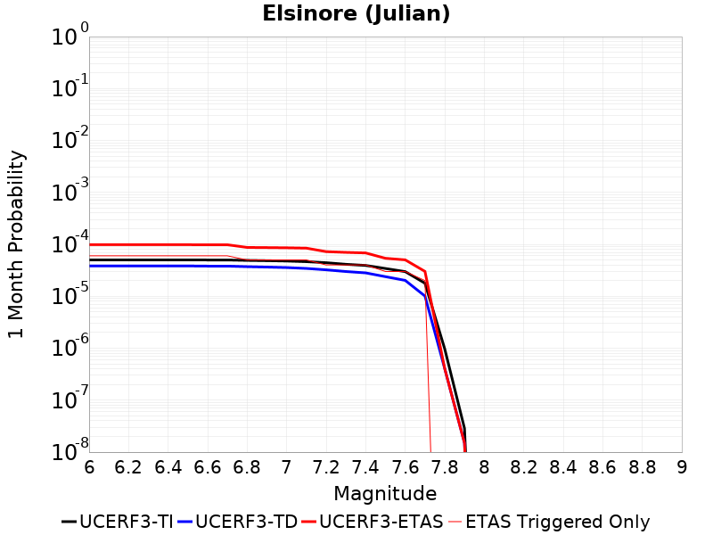 |  | 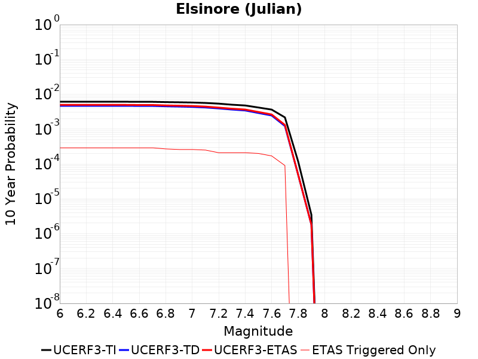 |

| Magnitude | 1 wk TI Prob | 1 wk TD Prob | 1 wk ETAS Prob | 1 wk ETAS/TD Gain | 1 wk ETAS Triggered Only | 1 mo TI Prob | 1 mo TD Prob | 1 mo ETAS Prob | 1 mo ETAS/TD Gain | 1 mo ETAS Triggered Only | 1 yr TI Prob | 1 yr TD Prob | 1 yr ETAS Prob | 1 yr ETAS/TD Gain | 1 yr ETAS Triggered Only | 10 yr TI Prob | 10 yr TD Prob | 10 yr ETAS Prob | 10 yr ETAS/TD Gain | 10 yr ETAS Triggered Only |
|-----|-----|-----|-----|-----|-----|-----|-----|-----|-----|-----|-----|-----|-----|-----|-----|-----|-----|-----|-----|-----|
| 6.0 | 1.1710231E-5 | 8.943179E-6 | 1.3894202E-4 | 15.536089 | 1.3E-4 | 5.0185736E-5 | 3.8327355E-5 | 2.483193E-4 | 6.4789057 | 2.1E-4 | 6.1084004E-4 | 4.6653734E-4 | 8.3636475E-4 | 1.792707 | 3.7E-4 | 0.006091637 | 0.0046557775 | 0.0051634028 | 1.1090313 | 5.1E-4 |
| 6.1 | 1.1710231E-5 | 8.943179E-6 | 1.3894202E-4 | 15.536089 | 1.3E-4 | 5.0185736E-5 | 3.8327355E-5 | 2.483193E-4 | 6.4789057 | 2.1E-4 | 6.1084004E-4 | 4.6653734E-4 | 8.3636475E-4 | 1.792707 | 3.7E-4 | 0.006091637 | 0.0046557775 | 0.0051634028 | 1.1090313 | 5.1E-4 |
| 6.2 | 1.1710231E-5 | 8.943179E-6 | 1.3894202E-4 | 15.536089 | 1.3E-4 | 5.0185736E-5 | 3.8327355E-5 | 2.483193E-4 | 6.4789057 | 2.1E-4 | 6.1084004E-4 | 4.6653734E-4 | 8.3636475E-4 | 1.792707 | 3.7E-4 | 0.006091637 | 0.0046557775 | 0.0051634028 | 1.1090313 | 5.1E-4 |
| 6.3 | 1.1710231E-5 | 8.943179E-6 | 1.3894202E-4 | 15.536089 | 1.3E-4 | 5.0185736E-5 | 3.8327355E-5 | 2.483193E-4 | 6.4789057 | 2.1E-4 | 6.1084004E-4 | 4.6653734E-4 | 8.3636475E-4 | 1.792707 | 3.7E-4 | 0.006091637 | 0.0046557775 | 0.0051634028 | 1.1090313 | 5.1E-4 |
| 6.4 | 1.1710231E-5 | 8.943179E-6 | 1.3894202E-4 | 15.536089 | 1.3E-4 | 5.0185736E-5 | 3.8327355E-5 | 2.483193E-4 | 6.4789057 | 2.1E-4 | 6.1084004E-4 | 4.6653734E-4 | 8.3636475E-4 | 1.792707 | 3.7E-4 | 0.006091637 | 0.0046557775 | 0.0051634028 | 1.1090313 | 5.1E-4 |
| 6.5 | 1.1710231E-5 | 8.943179E-6 | 1.3894202E-4 | 15.536089 | 1.3E-4 | 5.0185736E-5 | 3.8327355E-5 | 2.483193E-4 | 6.4789057 | 2.1E-4 | 6.1084004E-4 | 4.6653734E-4 | 8.3636475E-4 | 1.792707 | 3.7E-4 | 0.006091637 | 0.0046557775 | 0.0051634028 | 1.1090313 | 5.1E-4 |
| 6.6 | 1.1650619E-5 | 8.8752495E-6 | 1.388741E-4 | 15.6473465 | 1.3E-4 | 4.993027E-5 | 3.8036236E-5 | 2.3802863E-4 | 6.2579436 | 2.0E-4 | 6.0773146E-4 | 4.629945E-4 | 7.928417E-4 | 1.7124214 | 3.3E-4 | 0.0060607214 | 0.0046204966 | 0.005088325 | 1.1012506 | 4.7E-4 |
| 6.7 | 1.1650619E-5 | 8.8752495E-6 | 1.388741E-4 | 15.6473465 | 1.3E-4 | 4.993027E-5 | 3.8036236E-5 | 2.3802863E-4 | 6.2579436 | 2.0E-4 | 6.0773146E-4 | 4.629945E-4 | 7.928417E-4 | 1.7124214 | 3.3E-4 | 0.0060607214 | 0.0046204966 | 0.005088325 | 1.1012506 | 4.7E-4 |
| 6.8 | 1.1442698E-5 | 8.657465E-6 | 1.2865642E-4 | 14.860751 | 1.2E-4 | 4.9039216E-5 | 3.7102902E-5 | 2.2709585E-4 | 6.120703 | 1.9E-4 | 5.968889E-4 | 4.5163592E-4 | 7.714914E-4 | 1.7082154 | 3.2E-4 | 0.0059528816 | 0.0045073763 | 0.0049653025 | 1.1015949 | 4.6E-4 |
| 6.9 | 1.1300589E-5 | 8.505243E-6 | 1.2850422E-4 | 15.108824 | 1.2E-4 | 4.8430196E-5 | 3.6450543E-5 | 2.2644362E-4 | 6.2123523 | 1.9E-4 | 5.894781E-4 | 4.4369668E-4 | 7.635547E-4 | 1.7208934 | 3.2E-4 | 0.005879169 | 0.004428302 | 0.004886265 | 1.1034173 | 4.6E-4 |
| 7.0 | 1.1117729E-5 | 8.321745E-6 | 1.2832074E-4 | 15.419934 | 1.2E-4 | 4.764654E-5 | 3.566414E-5 | 2.2565736E-4 | 6.32729 | 1.9E-4 | 5.799422E-4 | 4.341261E-4 | 7.539872E-4 | 1.736793 | 3.2E-4 | 0.0057843104 | 0.0043329727 | 0.004771066 | 1.1011069 | 4.4E-4 |
| 7.1 | 1.08053955E-5 | 8.006102E-6 | 9.800538E-5 | 12.241336 | 9.0E-5 | 4.6308014E-5 | 3.4311422E-5 | 1.7430662E-4 | 5.080134 | 1.4E-4 | 5.6365423E-4 | 4.1766316E-4 | 6.6755875E-4 | 1.5983185 | 2.5E-4 | 0.005622267 | 0.0041689714 | 0.0045274706 | 1.0859922 | 3.6E-4 |
| 7.2 | 1.032804E-5 | 7.5247635E-6 | 9.7524084E-5 | 12.960419 | 9.0E-5 | 4.4262277E-5 | 3.2248598E-5 | 1.7224408E-4 | 5.341134 | 1.4E-4 | 5.387599E-4 | 3.9255753E-4 | 6.2246725E-4 | 1.5856714 | 2.3E-4 | 0.0053745564 | 0.003918822 | 0.004237568 | 1.0813372 | 3.2E-4 |
| 7.3 | 9.622426E-6 | 6.9815046E-6 | 8.6980945E-5 | 12.458768 | 8.0E-5 | 4.1238312E-5 | 2.99204E-5 | 1.5991651E-4 | 5.344732 | 1.3E-4 | 5.019608E-4 | 3.6422143E-4 | 5.841413E-4 | 1.6038082 | 2.2E-4 | 0.005008285 | 0.0036364098 | 0.0039452827 | 1.0849389 | 3.1E-4 |
| 7.4 | 9.144434E-6 | 6.5724503E-6 | 8.657193E-5 | 13.171941 | 8.0E-5 | 3.9189843E-5 | 2.8167347E-5 | 1.5816369E-4 | 5.615143 | 1.3E-4 | 4.7703186E-4 | 3.428849E-4 | 5.6280947E-4 | 1.6413947 | 2.2E-4 | 0.0047600917 | 0.0034237013 | 0.0037326398 | 1.0902352 | 3.1E-4 |
| 7.5 | 7.988981E-6 | 5.5568958E-6 | 8.555645E-5 | 15.396446 | 8.0E-5 | 3.4238044E-5 | 2.3815059E-5 | 1.3381244E-4 | 5.6188164 | 1.1E-4 | 4.1676845E-4 | 2.8991106E-4 | 4.898531E-4 | 1.6896667 | 2.0E-4 | 0.0041598766 | 0.0028954584 | 0.0031846187 | 1.0998669 | 2.9E-4 |
| 7.6 | 6.9554876E-6 | 4.7095127E-6 | 7.470918E-5 | 15.863464 | 7.0E-5 | 2.9808893E-5 | 2.0183475E-5 | 1.1018166E-4 | 5.4590034 | 9.0E-5 | 3.6286283E-4 | 2.4570728E-4 | 4.2566308E-4 | 1.732399 | 1.8E-4 | 0.0036227088 | 0.0024544748 | 0.002723812 | 1.1097332 | 2.7E-4 |
| 7.7 | 4.1557314E-6 | 2.351313E-6 | 6.235117E-5 | 26.517597 | 6.0E-5 | 1.7810156E-5 | 1.0077021E-5 | 7.0076414E-5 | 6.9540806 | 6.0E-5 | 2.1681708E-4 | 1.2268158E-4 | 2.3266808E-4 | 1.8965201 | 1.1E-4 | 0.0021660565 | 0.0012262131 | 0.0013760291 | 1.1221778 | 1.5E-4 |
| 7.8 | 2.2597293E-7 | 9.426559E-8 | 1.0094264E-5 | 107.083244 | 1.0E-5 | 9.684551E-7 | 4.0399533E-7 | 1.0403991E-5 | 25.75275 | 1.0E-5 | 1.1790877E-5 | 4.9186356E-6 | 1.4918586E-5 | 3.0330741 | 1.0E-5 | 1.17902506E-4 | 4.9185597E-5 | 5.9185106E-5 | 1.2033015 | 1.0E-5 |
| 7.9 | 6.676829E-9 | 3.4813614E-9 | 3.4813614E-9 | 1.0 | 0.0 | 2.861498E-8 | 1.492012E-8 | 1.492012E-8 | 1.0 | 0.0 | 3.4838732E-7 | 1.8165245E-7 | 1.8165245E-7 | 1.0 | 0.0 | 3.4838679E-6 | 1.8165232E-6 | 1.8165232E-6 | 1.0 | 0.0 |

## Elsinore (Coyote Mountains)
*[(top)](#table-of-contents)*

| 1 Week | 1 Month | 1 Year | 10 Year |
|-----|-----|-----|-----|
|  |  |  |  |

| Magnitude | 1 wk TI Prob | 1 wk TD Prob | 1 wk ETAS Prob | 1 wk ETAS/TD Gain | 1 wk ETAS Triggered Only | 1 mo TI Prob | 1 mo TD Prob | 1 mo ETAS Prob | 1 mo ETAS/TD Gain | 1 mo ETAS Triggered Only | 1 yr TI Prob | 1 yr TD Prob | 1 yr ETAS Prob | 1 yr ETAS/TD Gain | 1 yr ETAS Triggered Only | 10 yr TI Prob | 10 yr TD Prob | 10 yr ETAS Prob | 10 yr ETAS/TD Gain | 10 yr ETAS Triggered Only |
|-----|-----|-----|-----|-----|-----|-----|-----|-----|-----|-----|-----|-----|-----|-----|-----|-----|-----|-----|-----|-----|
| 6.0 | 3.4392266E-5 | 2.3756522E-5 | 1.5375344E-4 | 6.4720516 | 1.3E-4 | 1.473871E-4 | 1.0181017E-4 | 2.917908E-4 | 2.8660283 | 1.9E-4 | 0.0017929609 | 0.0012389178 | 0.0015784967 | 1.274093 | 3.4E-4 | 0.017785637 | 0.012328482 | 0.012792688 | 1.0376531 | 4.7E-4 |
| 6.1 | 3.4392266E-5 | 2.3756522E-5 | 1.5375344E-4 | 6.4720516 | 1.3E-4 | 1.473871E-4 | 1.0181017E-4 | 2.917908E-4 | 2.8660283 | 1.9E-4 | 0.0017929609 | 0.0012389178 | 0.0015784967 | 1.274093 | 3.4E-4 | 0.017785637 | 0.012328482 | 0.012792688 | 1.0376531 | 4.7E-4 |
| 6.2 | 2.3413893E-5 | 2.3756522E-5 | 1.5375344E-4 | 6.4720516 | 1.3E-4 | 1.0034139E-4 | 1.0181017E-4 | 2.917908E-4 | 2.8660283 | 1.9E-4 | 0.0012209718 | 0.0012389178 | 0.0015784967 | 1.274093 | 3.4E-4 | 0.012142851 | 0.012328482 | 0.012792688 | 1.0376531 | 4.7E-4 |
| 6.3 | 2.3413893E-5 | 2.3756522E-5 | 1.5375344E-4 | 6.4720516 | 1.3E-4 | 1.0034139E-4 | 1.0181017E-4 | 2.917908E-4 | 2.8660283 | 1.9E-4 | 0.0012209718 | 0.0012389178 | 0.0015784967 | 1.274093 | 3.4E-4 | 0.012142851 | 0.012328482 | 0.012792688 | 1.0376531 | 4.7E-4 |
| 6.4 | 1.6894814E-5 | 1.6172527E-5 | 1.4617042E-4 | 9.038194 | 1.3E-4 | 7.240433E-5 | 6.9309186E-5 | 2.59296E-4 | 3.7411492 | 1.9E-4 | 8.811662E-4 | 8.435481E-4 | 0.0011632781 | 1.37903 | 3.2E-4 | 0.0087768035 | 0.008406986 | 0.008853203 | 1.0530769 | 4.5E-4 |
| 6.5 | 1.6894814E-5 | 1.6172527E-5 | 1.4617042E-4 | 9.038194 | 1.3E-4 | 7.240433E-5 | 6.9309186E-5 | 2.59296E-4 | 3.7411492 | 1.9E-4 | 8.811662E-4 | 8.435481E-4 | 0.0011632781 | 1.37903 | 3.2E-4 | 0.0087768035 | 0.008406986 | 0.008853203 | 1.0530769 | 4.5E-4 |
| 6.6 | 1.1910969E-5 | 1.0390855E-5 | 1.3038961E-4 | 12.548497 | 1.2E-4 | 5.1046012E-5 | 4.4531545E-5 | 2.2452354E-4 | 5.0418983 | 1.8E-4 | 6.21308E-4 | 5.420493E-4 | 8.518813E-4 | 1.5715936 | 3.1E-4 | 0.0061957375 | 0.005408521 | 0.0058461414 | 1.0809131 | 4.4E-4 |
| 6.7 | 9.1486E-6 | 7.195586E-6 | 1.2719473E-4 | 17.676771 | 1.2E-4 | 3.9207694E-5 | 3.083788E-5 | 2.1083232E-4 | 6.8367968 | 1.8E-4 | 4.7724912E-4 | 3.753902E-4 | 6.852738E-4 | 1.8254974 | 3.1E-4 | 0.0047622547 | 0.0037479252 | 0.004186276 | 1.1169583 | 4.4E-4 |
| 6.8 | 7.90441E-6 | 5.772103E-6 | 1.2577142E-4 | 21.78953 | 1.2E-4 | 3.3875604E-5 | 2.4737357E-5 | 2.047329E-4 | 8.276264 | 1.8E-4 | 4.1235742E-4 | 3.0113698E-4 | 6.1104365E-4 | 2.0291219 | 3.1E-4 | 0.0041159308 | 0.00300742 | 0.0034460968 | 1.1458648 | 4.4E-4 |
| 6.9 | 7.77015E-6 | 5.6261106E-6 | 1.2562543E-4 | 22.329002 | 1.2E-4 | 3.3300217E-5 | 2.4111687E-5 | 2.0410735E-4 | 8.465079 | 1.8E-4 | 4.0535472E-4 | 2.9352153E-4 | 6.0343056E-4 | 2.0558305 | 3.1E-4 | 0.004046161 | 0.0029314677 | 0.003370178 | 1.1496555 | 4.4E-4 |
| 7.0 | 7.675798E-6 | 5.5232854E-6 | 1.2552262E-4 | 22.726078 | 1.2E-4 | 3.289586E-5 | 2.3671017E-5 | 2.0366676E-4 | 8.604056 | 1.8E-4 | 4.004335E-4 | 2.8815778E-4 | 5.9806847E-4 | 2.0754895 | 3.1E-4 | 0.003997127 | 0.0028779702 | 0.0033067327 | 1.1489809 | 4.3E-4 |
| 7.1 | 7.447814E-6 | 5.2824003E-6 | 9.5281925E-5 | 18.037619 | 9.0E-5 | 3.191881E-5 | 2.263867E-5 | 1.5263572E-4 | 6.742257 | 1.3E-4 | 3.8854225E-4 | 2.755922E-4 | 5.1552604E-4 | 1.8706119 | 2.4E-4 | 0.003878636 | 0.002752631 | 0.0031016674 | 1.1268011 | 3.5E-4 |
| 7.2 | 7.128185E-6 | 4.9489895E-6 | 8.4948595E-5 | 17.164837 | 8.0E-5 | 3.0549007E-5 | 2.120979E-5 | 1.4120725E-4 | 6.6576447 | 1.2E-4 | 3.7187067E-4 | 2.581998E-4 | 4.681456E-4 | 1.8131137 | 2.1E-4 | 0.00371249 | 0.0025791186 | 0.0028783449 | 1.1160188 | 3.0E-4 |
| 7.3 | 7.0913875E-6 | 4.917663E-6 | 8.491727E-5 | 17.26781 | 8.0E-5 | 3.0391306E-5 | 2.1075535E-5 | 1.41073E-4 | 6.693686 | 1.2E-4 | 3.6995133E-4 | 2.5656563E-4 | 4.6651176E-4 | 1.818294 | 2.1E-4 | 0.0036933604 | 0.0025628146 | 0.0028620458 | 1.1167588 | 3.0E-4 |
| 7.4 | 7.051521E-6 | 4.8814686E-6 | 8.488108E-5 | 17.38843 | 8.0E-5 | 3.0220453E-5 | 2.0920419E-5 | 1.4091791E-4 | 6.735903 | 1.2E-4 | 3.6787192E-4 | 2.5467755E-4 | 4.6462406E-4 | 1.824362 | 2.1E-4 | 0.0036726352 | 0.0025439772 | 0.0028432142 | 1.1176256 | 3.0E-4 |
| 7.5 | 6.910666E-6 | 4.7764506E-6 | 8.477607E-5 | 17.748758 | 8.0E-5 | 2.9616802E-5 | 2.0470348E-5 | 1.3046809E-4 | 6.373516 | 1.1E-4 | 3.605249E-4 | 2.491992E-4 | 4.4914937E-4 | 1.8023708 | 2.0E-4 | 0.0035994058 | 0.0024893177 | 0.0027785958 | 1.1162078 | 2.9E-4 |
| 7.6 | 6.341753E-6 | 4.3474415E-6 | 7.434714E-5 | 17.101355 | 7.0E-5 | 2.7178658E-5 | 1.8631767E-5 | 1.0863009E-4 | 5.83037 | 9.0E-5 | 3.3084993E-4 | 2.2681933E-4 | 4.067785E-4 | 1.7934031 | 1.8E-4 | 0.0033035777 | 0.0022659956 | 0.002535384 | 1.1188829 | 2.7E-4 |
| 7.7 | 3.9205916E-6 | 2.2688525E-6 | 6.2268715E-5 | 27.445026 | 6.0E-5 | 1.6802427E-5 | 9.723622E-6 | 6.9723035E-5 | 7.1704807 | 6.0E-5 | 2.0455034E-4 | 1.18379416E-4 | 2.2836639E-4 | 1.9291056 | 1.1E-4 | 0.0020436216 | 0.001183238 | 0.0013330606 | 1.1266208 | 1.5E-4 |
| 7.8 | 2.0846227E-7 | 8.568886E-8 | 1.0085688E-5 | 117.70127 | 1.0E-5 | 8.9340944E-7 | 3.6723796E-7 | 1.0367235E-5 | 28.230291 | 1.0E-5 | 1.0877206E-5 | 4.4711164E-6 | 1.4471071E-5 | 3.236568 | 1.0E-5 | 1.0876673E-4 | 4.4710596E-5 | 5.4710148E-5 | 1.2236506 | 1.0E-5 |
| 7.9 | 4.4969806E-9 | 2.2982332E-9 | 2.2982332E-9 | 1.0 | 0.0 | 1.9272775E-8 | 9.849571E-9 | 9.849571E-9 | 1.0 | 0.0 | 2.3464601E-7 | 1.1991851E-7 | 1.1991851E-7 | 1.0 | 0.0 | 2.3464577E-6 | 1.1991846E-6 | 1.1991846E-6 | 1.0 | 0.0 |

## Elsinore (Temecula) rev
*[(top)](#table-of-contents)*

| 1 Week | 1 Month | 1 Year | 10 Year |
|-----|-----|-----|-----|
|  |  | 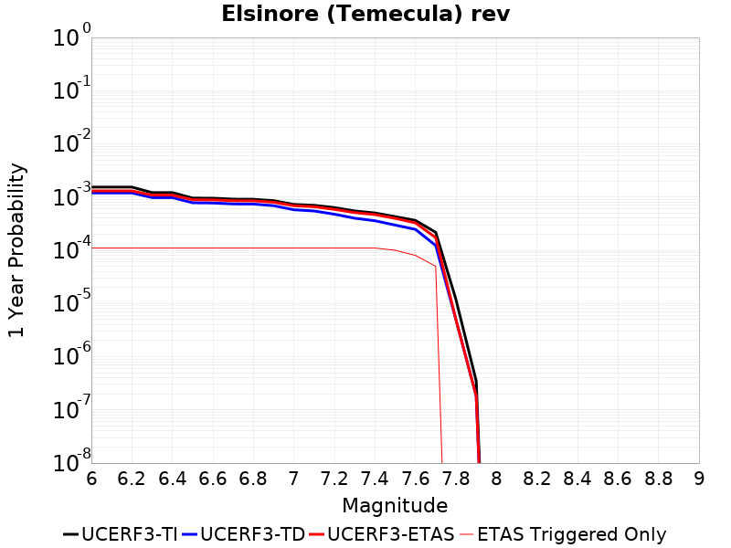 |  |

| Magnitude | 1 wk TI Prob | 1 wk TD Prob | 1 wk ETAS Prob | 1 wk ETAS/TD Gain | 1 wk ETAS Triggered Only | 1 mo TI Prob | 1 mo TD Prob | 1 mo ETAS Prob | 1 mo ETAS/TD Gain | 1 mo ETAS Triggered Only | 1 yr TI Prob | 1 yr TD Prob | 1 yr ETAS Prob | 1 yr ETAS/TD Gain | 1 yr ETAS Triggered Only | 10 yr TI Prob | 10 yr TD Prob | 10 yr ETAS Prob | 10 yr ETAS/TD Gain | 10 yr ETAS Triggered Only |
|-----|-----|-----|-----|-----|-----|-----|-----|-----|-----|-----|-----|-----|-----|-----|-----|-----|-----|-----|-----|-----|
| 6.0 | 2.9514995E-5 | 2.2930755E-5 | 1.1292869E-4 | 4.92477 | 9.0E-5 | 1.264867E-4 | 9.827109E-5 | 2.3825733E-4 | 2.4244907 | 1.4E-4 | 0.0015388876 | 0.0011958164 | 0.0014255414 | 1.1921072 | 2.3E-4 | 0.015282745 | 0.011915557 | 0.012231744 | 1.0265356 | 3.2E-4 |
| 6.1 | 2.9514995E-5 | 2.2930755E-5 | 1.1292869E-4 | 4.92477 | 9.0E-5 | 1.264867E-4 | 9.827109E-5 | 2.3825733E-4 | 2.4244907 | 1.4E-4 | 0.0015388876 | 0.0011958164 | 0.0014255414 | 1.1921072 | 2.3E-4 | 0.015282745 | 0.011915557 | 0.012231744 | 1.0265356 | 3.2E-4 |
| 6.2 | 2.9514995E-5 | 2.2930755E-5 | 1.1292869E-4 | 4.92477 | 9.0E-5 | 1.264867E-4 | 9.827109E-5 | 2.3825733E-4 | 2.4244907 | 1.4E-4 | 0.0015388876 | 0.0011958164 | 0.0014255414 | 1.1921072 | 2.3E-4 | 0.015282745 | 0.011915557 | 0.012231744 | 1.0265356 | 3.2E-4 |
| 6.3 | 2.3223649E-5 | 1.8697285E-5 | 1.086956E-4 | 5.813443 | 9.0E-5 | 9.952613E-5 | 8.0128855E-5 | 2.2011764E-4 | 2.7470458 | 1.4E-4 | 0.001211057 | 9.751498E-4 | 0.0012049255 | 1.2356312 | 2.3E-4 | 0.012044783 | 0.009715463 | 0.010032354 | 1.0326172 | 3.2E-4 |
| 6.4 | 2.3223649E-5 | 1.8697285E-5 | 1.086956E-4 | 5.813443 | 9.0E-5 | 9.952613E-5 | 8.0128855E-5 | 2.2011764E-4 | 2.7470458 | 1.4E-4 | 0.001211057 | 9.751498E-4 | 0.0012049255 | 1.2356312 | 2.3E-4 | 0.012044783 | 0.009715463 | 0.010032354 | 1.0326172 | 3.2E-4 |
| 6.5 | 1.8338875E-5 | 1.495689E-5 | 1.0495554E-4 | 7.0172043 | 9.0E-5 | 7.8592806E-5 | 6.4099426E-5 | 2.0409045E-4 | 3.1839669 | 1.4E-4 | 9.5644733E-4 | 7.801401E-4 | 0.0010099607 | 1.2945888 | 2.3E-4 | 0.009523412 | 0.0077752485 | 0.008092761 | 1.0408362 | 3.2E-4 |
| 6.6 | 1.8223333E-5 | 1.4818398E-5 | 1.0481707E-4 | 7.073441 | 9.0E-5 | 7.809766E-5 | 6.3505926E-5 | 2.0349704E-4 | 3.2043788 | 1.4E-4 | 9.504242E-4 | 7.729193E-4 | 0.0010027415 | 1.2973431 | 2.3E-4 | 0.009463696 | 0.0077035427 | 0.008021078 | 1.0412194 | 3.2E-4 |
| 6.7 | 1.7512752E-5 | 1.4218282E-5 | 1.04217004E-4 | 7.3297887 | 9.0E-5 | 7.505249E-5 | 6.093412E-5 | 2.0092558E-4 | 3.2974234 | 1.4E-4 | 9.13381E-4 | 7.4162916E-4 | 9.714586E-4 | 1.309898 | 2.3E-4 | 0.00909636 | 0.0073973634 | 0.0077149966 | 1.0429387 | 3.2E-4 |
| 6.8 | 1.7417142E-5 | 1.4140865E-5 | 1.0413959E-4 | 7.3644433 | 9.0E-5 | 7.4642754E-5 | 6.0602346E-5 | 2.0059386E-4 | 3.3100016 | 1.4E-4 | 9.083966E-4 | 7.375926E-4 | 9.674229E-4 | 1.3115953 | 2.3E-4 | 0.009046922 | 0.007357692 | 0.0076753376 | 1.0431719 | 3.2E-4 |
| 6.9 | 1.6402591E-5 | 1.3171088E-5 | 1.031699E-4 | 7.833059 | 9.0E-5 | 7.0294926E-5 | 5.644634E-5 | 1.9643844E-4 | 3.4800916 | 1.4E-4 | 8.5550465E-4 | 6.870254E-4 | 9.1686734E-4 | 1.3345466 | 2.3E-4 | 0.008522186 | 0.006854506 | 0.0071723126 | 1.0463647 | 3.2E-4 |
| 7.0 | 1.3912486E-5 | 1.1040662E-5 | 1.01039666E-4 | 9.151595 | 9.0E-5 | 5.9623577E-5 | 4.731628E-5 | 1.8730966E-4 | 3.9586725 | 1.4E-4 | 7.2567526E-4 | 5.759263E-4 | 8.057938E-4 | 1.3991266 | 2.3E-4 | 0.0072331014 | 0.005748071 | 0.0060662315 | 1.0553509 | 3.2E-4 |
| 7.1 | 1.3405147E-5 | 1.04811525E-5 | 1.0048021E-4 | 9.586752 | 9.0E-5 | 5.7449364E-5 | 4.4918466E-5 | 1.8491218E-4 | 4.116618 | 1.4E-4 | 6.9922156E-4 | 5.4674776E-4 | 7.7662204E-4 | 1.4204392 | 2.3E-4 | 0.0069702556 | 0.0054574767 | 0.00577573 | 1.0583152 | 3.2E-4 |
| 7.2 | 1.21402E-5 | 9.119696E-6 | 9.911888E-5 | 10.86866 | 9.0E-5 | 5.202839E-5 | 3.9083836E-5 | 1.7907837E-4 | 4.5819035 | 1.4E-4 | 6.332616E-4 | 4.7574367E-4 | 7.0563424E-4 | 1.4832237 | 2.3E-4 | 0.0063146 | 0.0047485936 | 0.005067074 | 1.0670683 | 3.2E-4 |
| 7.3 | 1.05047775E-5 | 7.667848E-6 | 8.7667235E-5 | 11.433096 | 8.0E-5 | 4.5019697E-5 | 3.2861797E-5 | 1.6285753E-4 | 4.955831 | 1.3E-4 | 5.4797693E-4 | 4.0002042E-4 | 6.199324E-4 | 1.5497519 | 2.2E-4 | 0.005466277 | 0.0039933333 | 0.0043020956 | 1.0773194 | 3.1E-4 |
| 7.4 | 9.624483E-6 | 6.867406E-6 | 8.686686E-5 | 12.649151 | 8.0E-5 | 4.124713E-5 | 2.9431416E-5 | 1.594276E-4 | 5.4169188 | 1.3E-4 | 5.0206814E-4 | 3.5827E-4 | 5.781912E-4 | 1.613842 | 2.2E-4 | 0.005009353 | 0.0035770754 | 0.0038859665 | 1.086353 | 3.1E-4 |
| 7.5 | 8.215151E-6 | 5.695854E-6 | 8.56954E-5 | 15.045224 | 8.0E-5 | 3.5207315E-5 | 2.4410581E-5 | 1.3440789E-4 | 5.5061326 | 1.1E-4 | 4.2856473E-4 | 2.971596E-4 | 4.971002E-4 | 1.672839 | 2.0E-4 | 0.004277392 | 0.002967753 | 0.0032568923 | 1.097427 | 2.9E-4 |
| 7.6 | 6.975058E-6 | 4.7231624E-6 | 7.472283E-5 | 15.820509 | 7.0E-5 | 2.9892764E-5 | 2.0241974E-5 | 1.1024015E-4 | 5.446117 | 9.0E-5 | 3.6388362E-4 | 2.4641934E-4 | 4.26375E-4 | 1.7302821 | 1.8E-4 | 0.0036328835 | 0.0024615794 | 0.0027309149 | 1.1094157 | 2.7E-4 |
| 7.7 | 4.159604E-6 | 2.3536809E-6 | 6.235354E-5 | 26.491924 | 6.0E-5 | 1.7826753E-5 | 1.0087169E-5 | 7.0086564E-5 | 6.94809 | 6.0E-5 | 2.1701909E-4 | 1.2280513E-4 | 2.3279162E-4 | 1.8956181 | 1.1E-4 | 0.0021680726 | 0.0012274472 | 0.001377263 | 1.1220548 | 1.5E-4 |
| 7.8 | 2.2692414E-7 | 9.479678E-8 | 1.00947955E-5 | 106.4888 | 1.0E-5 | 9.725317E-7 | 4.0627188E-7 | 1.0406267E-5 | 25.61405 | 1.0E-5 | 1.1840509E-5 | 4.9463524E-6 | 1.4946303E-5 | 3.0216818 | 1.0E-5 | 1.1839878E-4 | 4.9462757E-5 | 5.946226E-5 | 1.2021623 | 1.0E-5 |
| 7.9 | 6.676829E-9 | 3.4813614E-9 | 3.4813614E-9 | 1.0 | 0.0 | 2.861498E-8 | 1.492012E-8 | 1.492012E-8 | 1.0 | 0.0 | 3.4838732E-7 | 1.8165245E-7 | 1.8165245E-7 | 1.0 | 0.0 | 3.4838679E-6 | 1.8165232E-6 | 1.8165232E-6 | 1.0 | 0.0 |

## Elsinore (Glen Ivy) rev
*[(top)](#table-of-contents)*

| 1 Week | 1 Month | 1 Year | 10 Year |
|-----|-----|-----|-----|
| 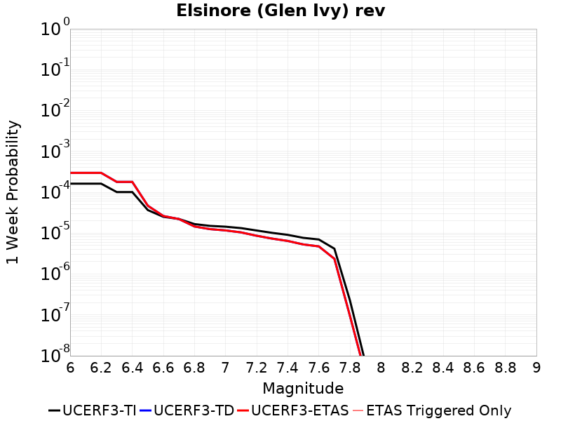 |  |  |  |

| Magnitude | 1 wk TI Prob | 1 wk TD Prob | 1 wk ETAS Prob | 1 wk ETAS/TD Gain | 1 wk ETAS Triggered Only | 1 mo TI Prob | 1 mo TD Prob | 1 mo ETAS Prob | 1 mo ETAS/TD Gain | 1 mo ETAS Triggered Only | 1 yr TI Prob | 1 yr TD Prob | 1 yr ETAS Prob | 1 yr ETAS/TD Gain | 1 yr ETAS Triggered Only | 10 yr TI Prob | 10 yr TD Prob | 10 yr ETAS Prob | 10 yr ETAS/TD Gain | 10 yr ETAS Triggered Only |
|-----|-----|-----|-----|-----|-----|-----|-----|-----|-----|-----|-----|-----|-----|-----|-----|-----|-----|-----|-----|-----|
| 6.0 | 1.6204086E-4 | 2.9748265E-4 | 3.7745884E-4 | 1.2688433 | 8.0E-5 | 6.94276E-4 | 0.0012744096 | 0.0013742821 | 1.0783677 | 1.0E-4 | 0.008420097 | 0.015427484 | 0.015624399 | 1.0127639 | 2.0E-4 | 0.081081145 | 0.1409439 | 0.14120162 | 1.0018286 | 3.0E-4 |
| 6.1 | 1.6204086E-4 | 2.9748265E-4 | 3.7745884E-4 | 1.2688433 | 8.0E-5 | 6.94276E-4 | 0.0012744096 | 0.0013742821 | 1.0783677 | 1.0E-4 | 0.008420097 | 0.015427484 | 0.015624399 | 1.0127639 | 2.0E-4 | 0.081081145 | 0.1409439 | 0.14120162 | 1.0018286 | 3.0E-4 |
| 6.2 | 1.6204086E-4 | 2.9748265E-4 | 3.7745884E-4 | 1.2688433 | 8.0E-5 | 6.94276E-4 | 0.0012744096 | 0.0013742821 | 1.0783677 | 1.0E-4 | 0.008420097 | 0.015427484 | 0.015624399 | 1.0127639 | 2.0E-4 | 0.081081145 | 0.1409439 | 0.14120162 | 1.0018286 | 3.0E-4 |
| 6.3 | 1.0111737E-4 | 1.7901426E-4 | 2.4900172E-4 | 1.3909603 | 7.0E-5 | 4.332882E-4 | 7.670979E-4 | 8.570289E-4 | 1.1172353 | 9.0E-5 | 0.005262531 | 0.009320619 | 0.009498941 | 1.019132 | 1.8E-4 | 0.0513964 | 0.08774428 | 0.08799971 | 1.0029111 | 2.8E-4 |
| 6.4 | 1.0111737E-4 | 1.7901426E-4 | 2.4900172E-4 | 1.3909603 | 7.0E-5 | 4.332882E-4 | 7.670979E-4 | 8.570289E-4 | 1.1172353 | 9.0E-5 | 0.005262531 | 0.009320619 | 0.009498941 | 1.019132 | 1.8E-4 | 0.0513964 | 0.08774428 | 0.08799971 | 1.0029111 | 2.8E-4 |
| 6.5 | 3.6624708E-5 | 4.6766832E-5 | 1.1676356E-4 | 2.4967172 | 7.0E-5 | 1.569536E-4 | 2.0041599E-4 | 2.9039796E-4 | 1.4489759 | 9.0E-5 | 0.001909235 | 0.002437705 | 0.0026172663 | 1.0736599 | 1.8E-4 | 0.01892915 | 0.023860194 | 0.024123752 | 1.0110459 | 2.7E-4 |
| 6.6 | 2.5051324E-5 | 2.6199563E-5 | 9.619773E-5 | 3.6717303 | 7.0E-5 | 1.073584E-4 | 1.1227926E-4 | 2.0226915E-4 | 1.8014828 | 9.0E-5 | 0.0013063047 | 0.0013661869 | 0.001545941 | 1.1315736 | 1.8E-4 | 0.012986525 | 0.013582595 | 0.013848927 | 1.0196084 | 2.7E-4 |
| 6.7 | 2.2189772E-5 | 2.2085485E-5 | 9.208394E-5 | 4.1694326 | 7.0E-5 | 9.509556E-5 | 9.464885E-5 | 1.8464033E-4 | 1.9507931 | 9.0E-5 | 0.0011571734 | 0.0011517763 | 0.0013315689 | 1.1561004 | 1.8E-4 | 0.011511663 | 0.011463617 | 0.011730521 | 1.0232828 | 2.7E-4 |
| 6.8 | 1.6654378E-5 | 1.4526513E-5 | 8.45255E-5 | 5.818705 | 7.0E-5 | 7.137396E-5 | 6.225503E-5 | 1.5224943E-4 | 2.4455764 | 9.0E-5 | 8.686314E-4 | 7.576964E-4 | 9.3756E-4 | 1.2373822 | 1.8E-4 | 0.008652439 | 0.007555189 | 0.007823149 | 1.035467 | 2.7E-4 |
| 6.9 | 1.5042909E-5 | 1.2520759E-5 | 8.251988E-5 | 6.5906453 | 7.0E-5 | 6.446802E-5 | 5.365931E-5 | 1.4365448E-4 | 2.6771586 | 9.0E-5 | 7.8461546E-4 | 6.531095E-4 | 8.3299197E-4 | 1.2754246 | 1.8E-4 | 0.007818509 | 0.006515453 | 0.006783694 | 1.04117 | 2.7E-4 |
| 7.0 | 1.4361385E-5 | 1.1632033E-5 | 8.163122E-5 | 7.017794 | 7.0E-5 | 6.154734E-5 | 4.9850638E-5 | 1.3984615E-4 | 2.805303 | 9.0E-5 | 7.490812E-4 | 6.067655E-4 | 7.866563E-4 | 1.2964749 | 1.8E-4 | 0.007465612 | 0.0060546244 | 0.0063229897 | 1.044324 | 2.7E-4 |
| 7.1 | 1.3265571E-5 | 1.0405161E-5 | 8.040443E-5 | 7.7273607 | 7.0E-5 | 5.6851208E-5 | 4.45928E-5 | 1.3458879E-4 | 3.018173 | 9.0E-5 | 6.919436E-4 | 5.4278475E-4 | 7.2268705E-4 | 1.3314432 | 1.8E-4 | 0.006897931 | 0.005418048 | 0.005686585 | 1.0495634 | 2.7E-4 |
| 7.2 | 1.1596403E-5 | 8.626314E-6 | 7.862571E-5 | 9.114635 | 7.0E-5 | 4.9697923E-5 | 3.6969403E-5 | 1.2696607E-4 | 3.4343555 | 9.0E-5 | 6.049042E-4 | 4.5001128E-4 | 6.299303E-4 | 1.39981 | 1.8E-4 | 0.006032603 | 0.004492331 | 0.004761118 | 1.0598325 | 2.7E-4 |
| 7.3 | 1.0150827E-5 | 7.3345736E-6 | 7.733406E-5 | 10.54377 | 7.0E-5 | 4.3502816E-5 | 3.1433516E-5 | 1.2143069E-4 | 3.8630958 | 9.0E-5 | 5.2951806E-4 | 3.8263734E-4 | 5.625685E-4 | 1.4702393 | 1.8E-4 | 0.005282581 | 0.0038201117 | 0.0040890803 | 1.0704086 | 2.7E-4 |
| 7.4 | 9.080705E-6 | 6.4309274E-6 | 7.643048E-5 | 11.8848295 | 7.0E-5 | 3.8916725E-5 | 2.7560834E-5 | 1.1755835E-4 | 4.2654133 | 9.0E-5 | 4.7370812E-4 | 3.3550287E-4 | 5.154425E-4 | 1.5363281 | 1.8E-4 | 0.004726996 | 0.0033501121 | 0.0036192075 | 1.0803243 | 2.7E-4 |
| 7.5 | 7.671649E-6 | 5.2840037E-6 | 7.5283635E-5 | 14.24746 | 7.0E-5 | 3.287808E-5 | 2.2645541E-5 | 1.126435E-4 | 4.974202 | 9.0E-5 | 4.0021708E-4 | 2.7567585E-4 | 4.5562623E-4 | 1.6527607 | 1.8E-4 | 0.0039949706 | 0.0027534664 | 0.003022723 | 1.0977882 | 2.7E-4 |
| 7.6 | 6.990086E-6 | 4.734735E-6 | 7.47344E-5 | 15.784285 | 7.0E-5 | 2.9957167E-5 | 2.0291569E-5 | 1.10289744E-4 | 5.4352493 | 9.0E-5 | 3.6466747E-4 | 2.4702304E-4 | 4.2697857E-4 | 1.7284969 | 1.8E-4 | 0.0036406964 | 0.002467603 | 0.0027369368 | 1.1091479 | 2.7E-4 |
| 7.7 | 4.163505E-6 | 2.3562436E-6 | 6.23561E-5 | 26.464201 | 6.0E-5 | 1.7843471E-5 | 1.0098152E-5 | 7.009754E-5 | 6.9416213 | 6.0E-5 | 2.172226E-4 | 1.2293883E-4 | 2.329253E-4 | 1.894644 | 1.1E-4 | 0.0021701038 | 0.0012287827 | 0.0013785983 | 1.121922 | 1.5E-4 |
| 7.8 | 2.2692414E-7 | 9.479678E-8 | 1.00947955E-5 | 106.4888 | 1.0E-5 | 9.725317E-7 | 4.0627188E-7 | 1.0406267E-5 | 25.61405 | 1.0E-5 | 1.1840509E-5 | 4.9463524E-6 | 1.4946303E-5 | 3.0216818 | 1.0E-5 | 1.1839878E-4 | 4.9462757E-5 | 5.946226E-5 | 1.2021623 | 1.0E-5 |
| 7.9 | 6.676829E-9 | 3.4813614E-9 | 3.4813614E-9 | 1.0 | 0.0 | 2.861498E-8 | 1.492012E-8 | 1.492012E-8 | 1.0 | 0.0 | 3.4838732E-7 | 1.8165245E-7 | 1.8165245E-7 | 1.0 | 0.0 | 3.4838679E-6 | 1.8165232E-6 | 1.8165232E-6 | 1.0 | 0.0 |

## Elsinore (Stepovers Combined)
*[(top)](#table-of-contents)*

| 1 Week | 1 Month | 1 Year | 10 Year |
|-----|-----|-----|-----|
|  |  |  |  |

| Magnitude | 1 wk TI Prob | 1 wk TD Prob | 1 wk ETAS Prob | 1 wk ETAS/TD Gain | 1 wk ETAS Triggered Only | 1 mo TI Prob | 1 mo TD Prob | 1 mo ETAS Prob | 1 mo ETAS/TD Gain | 1 mo ETAS Triggered Only | 1 yr TI Prob | 1 yr TD Prob | 1 yr ETAS Prob | 1 yr ETAS/TD Gain | 1 yr ETAS Triggered Only | 10 yr TI Prob | 10 yr TD Prob | 10 yr ETAS Prob | 10 yr ETAS/TD Gain | 10 yr ETAS Triggered Only |
|-----|-----|-----|-----|-----|-----|-----|-----|-----|-----|-----|-----|-----|-----|-----|-----|-----|-----|-----|-----|-----|
| 6.0 | 2.144392E-5 | 2.0042457E-5 | 1.0004085E-4 | 4.991447 | 8.0E-5 | 9.189928E-5 | 8.589354E-5 | 1.8588494E-4 | 2.1641319 | 1.0E-4 | 0.0011182994 | 0.0010452716 | 0.0012350731 | 1.1815809 | 1.9E-4 | 0.011126885 | 0.0104096085 | 0.010686694 | 1.0266182 | 2.8E-4 |
| 6.1 | 2.144392E-5 | 2.0042457E-5 | 1.0004085E-4 | 4.991447 | 8.0E-5 | 9.189928E-5 | 8.589354E-5 | 1.8588494E-4 | 2.1641319 | 1.0E-4 | 0.0011182994 | 0.0010452716 | 0.0012350731 | 1.1815809 | 1.9E-4 | 0.011126885 | 0.0104096085 | 0.010686694 | 1.0266182 | 2.8E-4 |
| 6.2 | 2.144392E-5 | 2.0042457E-5 | 1.0004085E-4 | 4.991447 | 8.0E-5 | 9.189928E-5 | 8.589354E-5 | 1.8588494E-4 | 2.1641319 | 1.0E-4 | 0.0011182994 | 0.0010452716 | 0.0012350731 | 1.1815809 | 1.9E-4 | 0.011126885 | 0.0104096085 | 0.010686694 | 1.0266182 | 2.8E-4 |
| 6.3 | 1.9751555E-5 | 1.800806E-5 | 9.800662E-5 | 5.442375 | 8.0E-5 | 8.4646774E-5 | 7.717522E-5 | 1.771675E-4 | 2.2956529 | 1.0E-4 | 0.0010300872 | 9.3921775E-4 | 0.0011290392 | 1.202106 | 1.9E-4 | 0.010253254 | 0.009358027 | 0.009635407 | 1.0296408 | 2.8E-4 |
| 6.4 | 1.9751555E-5 | 1.800806E-5 | 9.800662E-5 | 5.442375 | 8.0E-5 | 8.4646774E-5 | 7.717522E-5 | 1.771675E-4 | 2.2956529 | 1.0E-4 | 0.0010300872 | 9.3921775E-4 | 0.0011290392 | 1.202106 | 1.9E-4 | 0.010253254 | 0.009358027 | 0.009635407 | 1.0296408 | 2.8E-4 |
| 6.5 | 1.9751555E-5 | 1.800806E-5 | 9.800662E-5 | 5.442375 | 8.0E-5 | 8.4646774E-5 | 7.717522E-5 | 1.771675E-4 | 2.2956529 | 1.0E-4 | 0.0010300872 | 9.3921775E-4 | 0.0011290392 | 1.202106 | 1.9E-4 | 0.010253254 | 0.009358027 | 0.009635407 | 1.0296408 | 2.8E-4 |
| 6.6 | 1.9188685E-5 | 1.7261129E-5 | 9.725975E-5 | 5.6346107 | 8.0E-5 | 8.2234634E-5 | 7.397427E-5 | 1.7396687E-4 | 2.3517215 | 1.0E-4 | 0.0010007467 | 9.002813E-4 | 0.0010901103 | 1.2108551 | 1.9E-4 | 0.00996252 | 0.008972132 | 0.00924962 | 1.0309278 | 2.8E-4 |
| 6.7 | 1.7608272E-5 | 1.4940253E-5 | 9.493906E-5 | 6.354582 | 8.0E-5 | 7.546184E-5 | 6.402814E-5 | 1.6402174E-4 | 2.5617132 | 1.0E-4 | 9.183606E-4 | 7.792738E-4 | 9.691257E-4 | 1.2436267 | 1.9E-4 | 0.009145746 | 0.007771784 | 0.008049608 | 1.0357478 | 2.8E-4 |
| 6.8 | 1.697165E-5 | 1.39657095E-5 | 9.396459E-5 | 6.728236 | 8.0E-5 | 7.273361E-5 | 5.9851714E-5 | 1.5984573E-4 | 2.6706958 | 1.0E-4 | 8.8517193E-4 | 7.284599E-4 | 9.183215E-4 | 1.2606343 | 1.9E-4 | 0.008816543 | 0.007266598 | 0.007544563 | 1.0382525 | 2.8E-4 |
| 6.9 | 1.600365E-5 | 1.3022468E-5 | 9.302142E-5 | 7.143149 | 8.0E-5 | 6.858527E-5 | 5.580943E-5 | 1.5580385E-4 | 2.791712 | 1.0E-4 | 8.347058E-4 | 6.792759E-4 | 8.6914684E-4 | 1.2795196 | 1.9E-4 | 0.008315775 | 0.0067774695 | 0.007055572 | 1.0410334 | 2.8E-4 |
| 7.0 | 1.3314581E-5 | 1.0604389E-5 | 9.060354E-5 | 8.543966 | 8.0E-5 | 5.7061243E-5 | 4.5446603E-5 | 1.4544206E-4 | 3.2002845 | 1.0E-4 | 6.944992E-4 | 5.531747E-4 | 7.430696E-4 | 1.343282 | 1.9E-4 | 0.006923327 | 0.0055217147 | 0.0058001685 | 1.0504289 | 2.8E-4 |
| 7.1 | 1.2865345E-5 | 1.0087612E-5 | 9.00868E-5 | 8.930439 | 8.0E-5 | 5.5136024E-5 | 4.3231925E-5 | 1.432276E-4 | 3.3130054 | 1.0E-4 | 6.710743E-4 | 5.262242E-4 | 7.161242E-4 | 1.3608729 | 1.9E-4 | 0.0066905143 | 0.00525322 | 0.0055317488 | 1.0530206 | 2.8E-4 |
| 7.2 | 1.1650051E-5 | 8.754546E-6 | 8.875385E-5 | 10.13803 | 8.0E-5 | 4.9927836E-5 | 3.7518952E-5 | 1.375152E-4 | 3.6652195 | 1.0E-4 | 6.0770183E-4 | 4.5669932E-4 | 6.4661255E-4 | 1.4158386 | 1.9E-4 | 0.0060604266 | 0.004558947 | 0.0048376704 | 1.0611377 | 2.8E-4 |
| 7.3 | 1.0008533E-5 | 7.294786E-6 | 8.7294204E-5 | 11.966658 | 8.0E-5 | 4.2893007E-5 | 3.1263E-5 | 1.3125988E-4 | 4.1985693 | 1.0E-4 | 5.220972E-4 | 3.8056204E-4 | 5.7048973E-4 | 1.4990716 | 1.9E-4 | 0.005208723 | 0.0037994308 | 0.0040783673 | 1.0734153 | 2.8E-4 |
| 7.4 | 9.116759E-6 | 6.4880824E-6 | 8.648756E-5 | 13.330219 | 8.0E-5 | 3.907124E-5 | 2.780578E-5 | 1.27803E-4 | 4.596275 | 1.0E-4 | 4.7558855E-4 | 3.3848418E-4 | 5.2841986E-4 | 1.5611361 | 1.9E-4 | 0.00474572 | 0.0033798355 | 0.0036588893 | 1.0825642 | 2.8E-4 |
| 7.5 | 7.870524E-6 | 5.4417887E-6 | 8.544135E-5 | 15.700969 | 8.0E-5 | 3.3730383E-5 | 2.332175E-5 | 1.2331942E-4 | 5.287743 | 1.0E-4 | 4.1059E-4 | 2.8390661E-4 | 4.7385265E-4 | 1.6690441 | 1.9E-4 | 0.0040983222 | 0.0028355683 | 0.0031147744 | 1.0984657 | 2.8E-4 |
| 7.6 | 6.9774537E-6 | 4.724737E-6 | 7.4724405E-5 | 15.81557 | 7.0E-5 | 2.990303E-5 | 2.0248723E-5 | 1.102469E-4 | 5.444635 | 9.0E-5 | 3.640086E-4 | 2.465015E-4 | 4.2645712E-4 | 1.7300386 | 1.8E-4 | 0.003634129 | 0.0024623992 | 0.0027317342 | 1.1093792 | 2.7E-4 |
| 7.7 | 4.1616954E-6 | 2.3550404E-6 | 6.23549E-5 | 26.477211 | 6.0E-5 | 1.7835715E-5 | 1.0092995E-5 | 7.009239E-5 | 6.9446573 | 6.0E-5 | 2.171282E-4 | 1.2287604E-4 | 2.3286253E-4 | 1.8951012 | 1.1E-4 | 0.0021691616 | 0.0012281556 | 0.0013779713 | 1.1219844 | 1.5E-4 |
| 7.8 | 2.2692414E-7 | 9.479678E-8 | 1.00947955E-5 | 106.4888 | 1.0E-5 | 9.725317E-7 | 4.0627188E-7 | 1.0406267E-5 | 25.61405 | 1.0E-5 | 1.1840509E-5 | 4.9463524E-6 | 1.4946303E-5 | 3.0216818 | 1.0E-5 | 1.1839878E-4 | 4.9462757E-5 | 5.946226E-5 | 1.2021623 | 1.0E-5 |
| 7.9 | 6.676829E-9 | 3.4813614E-9 | 3.4813614E-9 | 1.0 | 0.0 | 2.861498E-8 | 1.492012E-8 | 1.492012E-8 | 1.0 | 0.0 | 3.4838732E-7 | 1.8165245E-7 | 1.8165245E-7 | 1.0 | 0.0 | 3.4838679E-6 | 1.8165232E-6 | 1.8165232E-6 | 1.0 | 0.0 |

## Whittier alt 1
*[(top)](#table-of-contents)*

| 1 Week | 1 Month | 1 Year | 10 Year |
|-----|-----|-----|-----|
|  |  | 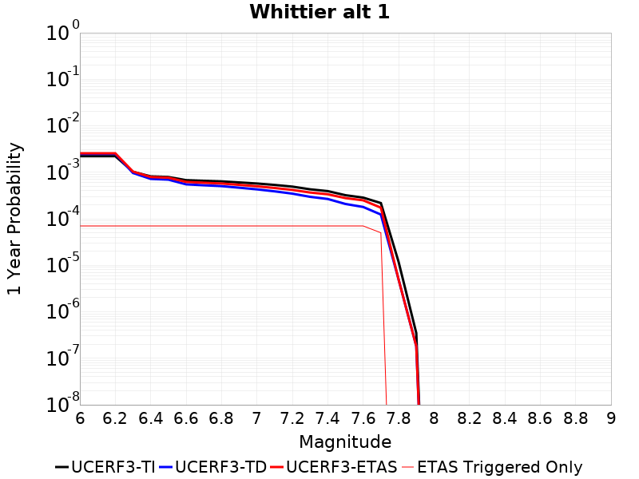 |  |

| Magnitude | 1 wk TI Prob | 1 wk TD Prob | 1 wk ETAS Prob | 1 wk ETAS/TD Gain | 1 wk ETAS Triggered Only | 1 mo TI Prob | 1 mo TD Prob | 1 mo ETAS Prob | 1 mo ETAS/TD Gain | 1 mo ETAS Triggered Only | 1 yr TI Prob | 1 yr TD Prob | 1 yr ETAS Prob | 1 yr ETAS/TD Gain | 1 yr ETAS Triggered Only | 10 yr TI Prob | 10 yr TD Prob | 10 yr ETAS Prob | 10 yr ETAS/TD Gain | 10 yr ETAS Triggered Only |
|-----|-----|-----|-----|-----|-----|-----|-----|-----|-----|-----|-----|-----|-----|-----|-----|-----|-----|-----|-----|-----|
| 6.0 | 4.2554693E-5 | 4.7645186E-5 | 1.1764185E-4 | 2.4691236 | 7.0E-5 | 1.8236451E-4 | 2.0417951E-4 | 2.9416115E-4 | 1.4406986 | 9.0E-5 | 0.002218027 | 0.0024833775 | 0.0026230298 | 1.0562348 | 1.4E-4 | 0.02196019 | 0.024590079 | 0.024765652 | 1.00714 | 1.8E-4 |
| 6.1 | 4.2554693E-5 | 4.7645186E-5 | 1.1764185E-4 | 2.4691236 | 7.0E-5 | 1.8236451E-4 | 2.0417951E-4 | 2.9416115E-4 | 1.4406986 | 9.0E-5 | 0.002218027 | 0.0024833775 | 0.0026230298 | 1.0562348 | 1.4E-4 | 0.02196019 | 0.024590079 | 0.024765652 | 1.00714 | 1.8E-4 |
| 6.2 | 4.2554693E-5 | 4.7645186E-5 | 1.1764185E-4 | 2.4691236 | 7.0E-5 | 1.8236451E-4 | 2.0417951E-4 | 2.9416115E-4 | 1.4406986 | 9.0E-5 | 0.002218027 | 0.0024833775 | 0.0026230298 | 1.0562348 | 1.4E-4 | 0.02196019 | 0.024590079 | 0.024765652 | 1.00714 | 1.8E-4 |
| 6.3 | 1.9617712E-5 | 1.8474973E-5 | 8.847368E-5 | 4.7888393 | 7.0E-5 | 8.40732E-5 | 7.917616E-5 | 1.6916904E-4 | 2.1366158 | 9.0E-5 | 0.0010231105 | 9.6356275E-4 | 0.0011034278 | 1.1451541 | 1.4E-4 | 0.01018413 | 0.009596508 | 0.009774781 | 1.0185769 | 1.8E-4 |
| 6.4 | 1.5611336E-5 | 1.3780378E-5 | 8.3779414E-5 | 6.0796165 | 7.0E-5 | 6.690401E-5 | 5.905746E-5 | 1.4905214E-4 | 2.5238495 | 9.0E-5 | 8.142519E-4 | 7.187935E-4 | 8.5869286E-4 | 1.1946309 | 1.4E-4 | 0.008112748 | 0.0071660066 | 0.0073447167 | 1.0249386 | 1.8E-4 |
| 6.5 | 1.5150166E-5 | 1.3277446E-5 | 8.3276514E-5 | 6.2720284 | 7.0E-5 | 6.492767E-5 | 5.6902132E-5 | 1.4689701E-4 | 2.581573 | 9.0E-5 | 7.9020765E-4 | 6.925693E-4 | 8.3247235E-4 | 1.2020059 | 1.4E-4 | 0.007874036 | 0.006905415 | 0.0070841718 | 1.0258865 | 1.8E-4 |
| 6.6 | 1.295588E-5 | 1.052891E-5 | 8.0528174E-5 | 7.6482916 | 7.0E-5 | 5.552402E-5 | 4.512313E-5 | 1.3511907E-4 | 2.9944525 | 9.0E-5 | 6.7579525E-4 | 5.4923765E-4 | 6.891608E-4 | 1.2547587 | 1.4E-4 | 0.006737438 | 0.0054797987 | 0.0056588124 | 1.0326679 | 1.8E-4 |
| 6.7 | 1.2542085E-5 | 1.0045103E-5 | 8.00444E-5 | 7.968499 | 7.0E-5 | 5.3750682E-5 | 4.3049746E-5 | 1.3304588E-4 | 3.0905147 | 9.0E-5 | 6.542181E-4 | 5.2400655E-4 | 6.6393317E-4 | 1.2670323 | 1.4E-4 | 0.006522954 | 0.005228713 | 0.0054077716 | 1.0342453 | 1.8E-4 |
| 6.8 | 1.2195878E-5 | 9.637428E-6 | 7.963675E-5 | 8.263279 | 7.0E-5 | 5.2267E-5 | 4.1302617E-5 | 1.312989E-4 | 3.1789486 | 9.0E-5 | 6.36165E-4 | 5.027453E-4 | 6.4267486E-4 | 1.278331 | 1.4E-4 | 0.0063434686 | 0.005016999 | 0.005196096 | 1.035698 | 1.8E-4 |
| 6.9 | 1.1580298E-5 | 8.91156E-6 | 7.891093E-5 | 8.854897 | 7.0E-5 | 4.9628903E-5 | 3.819185E-5 | 1.2818842E-4 | 3.3564339 | 9.0E-5 | 6.040644E-4 | 4.6488826E-4 | 6.048232E-4 | 1.3010076 | 1.4E-4 | 0.00602425 | 0.004640064 | 0.004819229 | 1.0386126 | 1.8E-4 |
| 7.0 | 1.0964795E-5 | 8.213073E-6 | 7.82125E-5 | 9.522928 | 7.0E-5 | 4.6991136E-5 | 3.5198416E-5 | 1.2519525E-4 | 3.5568433 | 9.0E-5 | 5.7196687E-4 | 4.2845804E-4 | 5.6839804E-4 | 1.3266131 | 1.4E-4 | 0.0057049696 | 0.0042772205 | 0.0044564507 | 1.0419034 | 1.8E-4 |
| 7.1 | 1.0230601E-5 | 7.4413597E-6 | 7.744084E-5 | 10.406813 | 7.0E-5 | 4.3844695E-5 | 3.189116E-5 | 1.2188829E-4 | 3.8220086 | 9.0E-5 | 5.336784E-4 | 3.8820703E-4 | 5.281527E-4 | 1.3604923 | 1.4E-4 | 0.005323986 | 0.0038763972 | 0.0040556993 | 1.0462549 | 1.8E-4 |
| 7.2 | 9.40865E-6 | 6.6436014E-6 | 7.664313E-5 | 11.536385 | 7.0E-5 | 4.032216E-5 | 2.8472274E-5 | 1.1846971E-4 | 4.16088 | 9.0E-5 | 4.908117E-4 | 3.4659603E-4 | 4.865475E-4 | 1.4037884 | 1.4E-4 | 0.0048972913 | 0.003461624 | 0.003641001 | 1.0518187 | 1.8E-4 |
| 7.3 | 8.237384E-6 | 5.6766503E-6 | 7.567625E-5 | 13.331146 | 7.0E-5 | 3.5302593E-5 | 2.432828E-5 | 1.1432609E-4 | 4.6993084 | 9.0E-5 | 4.2972428E-4 | 2.961576E-4 | 4.3611616E-4 | 1.4725813 | 1.4E-4 | 0.0042889426 | 0.0029578987 | 0.0031373664 | 1.060674 | 1.8E-4 |
| 7.4 | 7.5316966E-6 | 5.0963286E-6 | 7.509597E-5 | 14.735309 | 7.0E-5 | 3.2278298E-5 | 2.1841232E-5 | 1.1183927E-4 | 5.120557 | 9.0E-5 | 3.9291743E-4 | 2.6588558E-4 | 4.0584835E-4 | 1.5264022 | 1.4E-4 | 0.0039222343 | 0.0026557858 | 0.0028353075 | 1.0675966 | 1.8E-4 |
| 7.5 | 6.149649E-6 | 3.982355E-6 | 7.3982075E-5 | 18.577469 | 7.0E-5 | 2.6355372E-5 | 1.7067128E-5 | 1.0706559E-4 | 6.273205 | 9.0E-5 | 3.208294E-4 | 2.077734E-4 | 3.4774432E-4 | 1.673671 | 1.4E-4 | 0.003203666 | 0.0020758826 | 0.002255509 | 1.0865301 | 1.8E-4 |
| 7.6 | 5.457711E-6 | 3.4329378E-6 | 7.34327E-5 | 21.390629 | 7.0E-5 | 2.338998E-5 | 1.4712512E-5 | 1.0471119E-4 | 7.117152 | 9.0E-5 | 2.8473578E-4 | 1.7911094E-4 | 3.1908587E-4 | 1.7814984 | 1.4E-4 | 0.0028437122 | 0.0017897482 | 0.001969426 | 1.1003928 | 1.8E-4 |
| 7.7 | 4.1676276E-6 | 2.3599077E-6 | 6.2359766E-5 | 26.424664 | 6.0E-5 | 1.7861139E-5 | 1.0113855E-5 | 7.0113245E-5 | 6.932396 | 6.0E-5 | 2.1743766E-4 | 1.2312998E-4 | 2.3311644E-4 | 1.8932549 | 1.1E-4 | 0.0021722503 | 0.0012306921 | 0.0013805076 | 1.1217326 | 1.5E-4 |
| 7.8 | 2.2692414E-7 | 9.479678E-8 | 1.00947955E-5 | 106.4888 | 1.0E-5 | 9.725317E-7 | 4.0627188E-7 | 1.0406267E-5 | 25.61405 | 1.0E-5 | 1.1840509E-5 | 4.9463524E-6 | 1.4946303E-5 | 3.0216818 | 1.0E-5 | 1.1839878E-4 | 4.9462757E-5 | 5.946226E-5 | 1.2021623 | 1.0E-5 |
| 7.9 | 6.676829E-9 | 3.4813614E-9 | 3.4813614E-9 | 1.0 | 0.0 | 2.861498E-8 | 1.492012E-8 | 1.492012E-8 | 1.0 | 0.0 | 3.4838732E-7 | 1.8165245E-7 | 1.8165245E-7 | 1.0 | 0.0 | 3.4838679E-6 | 1.8165232E-6 | 1.8165232E-6 | 1.0 | 0.0 |

## Chino alt 1
*[(top)](#table-of-contents)*

| 1 Week | 1 Month | 1 Year | 10 Year |
|-----|-----|-----|-----|
|  | 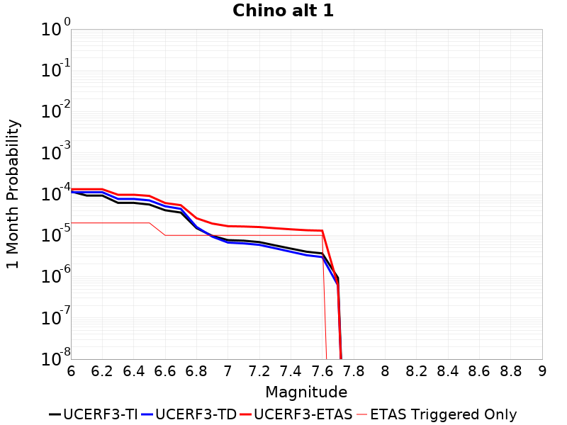 |  |  |

| Magnitude | 1 wk TI Prob | 1 wk TD Prob | 1 wk ETAS Prob | 1 wk ETAS/TD Gain | 1 wk ETAS Triggered Only | 1 mo TI Prob | 1 mo TD Prob | 1 mo ETAS Prob | 1 mo ETAS/TD Gain | 1 mo ETAS Triggered Only | 1 yr TI Prob | 1 yr TD Prob | 1 yr ETAS Prob | 1 yr ETAS/TD Gain | 1 yr ETAS Triggered Only | 10 yr TI Prob | 10 yr TD Prob | 10 yr ETAS Prob | 10 yr ETAS/TD Gain | 10 yr ETAS Triggered Only |
|-----|-----|-----|-----|-----|-----|-----|-----|-----|-----|-----|-----|-----|-----|-----|-----|-----|-----|-----|-----|-----|
| 6.0 | 2.7059663E-5 | 2.5890993E-5 | 3.5890735E-5 | 1.3862247 | 1.0E-5 | 1.1596483E-4 | 1.1095724E-4 | 1.3095503E-4 | 1.1802297 | 2.0E-5 | 0.0014109573 | 0.0013501669 | 0.0013801263 | 1.0221895 | 3.0E-5 | 0.014020323 | 0.0134275 | 0.013536023 | 1.0080822 | 1.1E-4 |
| 6.1 | 2.1505624E-5 | 2.5890993E-5 | 3.5890735E-5 | 1.3862247 | 1.0E-5 | 9.2163704E-5 | 1.1095724E-4 | 1.3095503E-4 | 1.1802297 | 2.0E-5 | 0.0011215154 | 0.0013501669 | 0.0013801263 | 1.0221895 | 3.0E-5 | 0.011158722 | 0.0134275 | 0.013536023 | 1.0080822 | 1.1E-4 |
| 6.2 | 2.1505624E-5 | 2.5890993E-5 | 3.5890735E-5 | 1.3862247 | 1.0E-5 | 9.2163704E-5 | 1.1095724E-4 | 1.3095503E-4 | 1.1802297 | 2.0E-5 | 0.0011215154 | 0.0013501669 | 0.0013801263 | 1.0221895 | 3.0E-5 | 0.011158722 | 0.0134275 | 0.013536023 | 1.0080822 | 1.1E-4 |
| 6.3 | 1.4290785E-5 | 1.7810473E-5 | 2.7810294E-5 | 1.5614574 | 1.0E-5 | 6.1244784E-5 | 7.6328615E-5 | 9.632709E-5 | 1.262005 | 2.0E-5 | 7.454001E-4 | 9.289487E-4 | 9.489301E-4 | 1.0215098 | 2.0E-5 | 0.007429048 | 0.0092529375 | 0.009312383 | 1.0064244 | 6.0E-5 |
| 6.4 | 1.4290785E-5 | 1.7810473E-5 | 2.7810294E-5 | 1.5614574 | 1.0E-5 | 6.1244784E-5 | 7.6328615E-5 | 9.632709E-5 | 1.262005 | 2.0E-5 | 7.454001E-4 | 9.289487E-4 | 9.489301E-4 | 1.0215098 | 2.0E-5 | 0.007429048 | 0.0092529375 | 0.009312383 | 1.0064244 | 6.0E-5 |
| 6.5 | 1.3017944E-5 | 1.6376876E-5 | 2.6376712E-5 | 1.610607 | 1.0E-5 | 5.5789995E-5 | 7.0184964E-5 | 9.018356E-5 | 1.2849413 | 2.0E-5 | 6.790315E-4 | 8.542096E-4 | 8.741925E-4 | 1.0233935 | 2.0E-5 | 0.0067696036 | 0.008511388 | 0.008570877 | 1.0069894 | 6.0E-5 |
| 6.6 | 9.470016E-6 | 1.1830411E-5 | 2.1830292E-5 | 1.8452692 | 1.0E-5 | 4.058515E-5 | 5.070096E-5 | 6.0700455E-5 | 1.197225 | 1.0E-5 | 4.940122E-4 | 6.171425E-4 | 6.271363E-4 | 1.0161937 | 1.0E-5 | 0.004929154 | 0.0061556255 | 0.006195379 | 1.0064582 | 4.0E-5 |
| 6.7 | 8.314155E-6 | 1.0213275E-5 | 2.0213174E-5 | 1.9791079 | 1.0E-5 | 3.5631605E-5 | 4.3770622E-5 | 5.3770185E-5 | 1.2284538 | 1.0E-5 | 4.3372845E-4 | 5.328085E-4 | 5.4280314E-4 | 1.0187584 | 1.0E-5 | 0.004328829 | 0.0053169727 | 0.00535676 | 1.0074831 | 4.0E-5 |
| 6.8 | 3.4856364E-6 | 3.7224736E-6 | 1.3722436E-5 | 3.6863759 | 1.0E-5 | 1.4938357E-5 | 1.595337E-5 | 2.5953212E-5 | 1.6268167 | 1.0E-5 | 1.8185932E-4 | 1.942168E-4 | 2.0421486E-4 | 1.0514789 | 1.0E-5 | 0.0018171056 | 0.0019412758 | 0.001981198 | 1.020565 | 4.0E-5 |
| 6.9 | 2.2645952E-6 | 2.1682265E-6 | 1.2168205E-5 | 5.612054 | 1.0E-5 | 9.705372E-6 | 9.292367E-6 | 1.9292274E-5 | 2.076142 | 1.0E-5 | 1.18156495E-4 | 1.1312892E-4 | 1.2312779E-4 | 1.0883847 | 1.0E-5 | 0.0011809369 | 0.0011310373 | 0.0011709919 | 1.0353258 | 4.0E-5 |
| 7.0 | 1.7864003E-6 | 1.5567477E-6 | 1.1556732E-5 | 7.4236383 | 1.0E-5 | 7.655979E-6 | 6.671759E-6 | 1.6671693E-5 | 2.498845 | 1.0E-5 | 9.3207556E-5 | 8.12257E-5 | 9.122489E-5 | 1.1231037 | 1.0E-5 | 9.316847E-4 | 8.1229676E-4 | 8.522643E-4 | 1.049203 | 4.0E-5 |
| 7.1 | 1.7315456E-6 | 1.487152E-6 | 1.1487137E-5 | 7.724252 | 1.0E-5 | 7.420889E-6 | 6.3734933E-6 | 1.637343E-5 | 2.5689883 | 1.0E-5 | 9.034557E-5 | 7.7594574E-5 | 8.75938E-5 | 1.128865 | 1.0E-5 | 9.0308854E-4 | 7.760046E-4 | 8.159736E-4 | 1.051506 | 4.0E-5 |
| 7.2 | 1.6008337E-6 | 1.3699579E-6 | 1.1369944E-5 | 8.299484 | 1.0E-5 | 6.860698E-6 | 5.8712353E-6 | 1.5871177E-5 | 2.7032092 | 1.0E-5 | 8.352579E-5 | 7.1480004E-5 | 8.147929E-5 | 1.1398892 | 1.0E-5 | 8.34944E-4 | 7.148908E-4 | 7.5486215E-4 | 1.0559126 | 4.0E-5 |
| 7.3 | 1.3320939E-6 | 1.1335292E-6 | 1.1133518E-5 | 9.821995 | 1.0E-5 | 5.7089615E-6 | 4.857973E-6 | 1.4857925E-5 | 3.0584617 | 1.0E-5 | 6.9504385E-5 | 5.914427E-5 | 6.914368E-5 | 1.1690681 | 1.0E-5 | 6.9482654E-4 | 5.9138425E-4 | 6.313606E-4 | 1.0675979 | 4.0E-5 |
| 7.4 | 1.114294E-6 | 9.3234195E-7 | 1.0932333E-5 | 11.725668 | 1.0E-5 | 4.775537E-6 | 3.9957454E-6 | 1.3995706E-5 | 3.502652 | 1.0E-5 | 5.8140613E-5 | 4.864715E-5 | 5.8646667E-5 | 1.2055519 | 1.0E-5 | 5.81254E-4 | 4.8637614E-4 | 5.263567E-4 | 1.0822009 | 4.0E-5 |
| 7.5 | 9.354081E-7 | 7.690368E-7 | 1.0769029E-5 | 14.003269 | 1.0E-5 | 4.0088858E-6 | 3.2958678E-6 | 1.3295835E-5 | 4.0340924 | 1.0E-5 | 4.8807087E-5 | 4.0126488E-5 | 5.0126087E-5 | 1.2492019 | 1.0E-5 | 4.879637E-4 | 4.0119587E-4 | 4.411798E-4 | 1.099662 | 4.0E-5 |
| 7.6 | 8.521771E-7 | 6.931121E-7 | 1.0693105E-5 | 15.4276705 | 1.0E-5 | 3.6521824E-6 | 2.9704772E-6 | 1.2970448E-5 | 4.3664527 | 1.0E-5 | 4.4464414E-5 | 3.616499E-5 | 4.616463E-5 | 1.2765005 | 1.0E-5 | 4.4455516E-4 | 3.6159428E-4 | 4.015798E-4 | 1.1105813 | 4.0E-5 |
| 7.7 | 2.1803626E-7 | 1.4362476E-7 | 1.01436235E-5 | 70.62587 | 1.0E-5 | 9.344408E-7 | 6.155346E-7 | 1.06155285E-5 | 17.24603 | 1.0E-5 | 1.1376757E-5 | 7.4941177E-6 | 1.7494043E-5 | 2.33437 | 1.0E-5 | 1.13761744E-4 | 7.493963E-5 | 8.493888E-5 | 1.1334307 | 1.0E-5 |

## Rose Canyon
*[(top)](#table-of-contents)*

| 1 Week | 1 Month | 1 Year | 10 Year |
|-----|-----|-----|-----|
|  |  |  |  |

| Magnitude | 1 wk TI Prob | 1 wk TD Prob | 1 wk ETAS Prob | 1 wk ETAS/TD Gain | 1 wk ETAS Triggered Only | 1 mo TI Prob | 1 mo TD Prob | 1 mo ETAS Prob | 1 mo ETAS/TD Gain | 1 mo ETAS Triggered Only | 1 yr TI Prob | 1 yr TD Prob | 1 yr ETAS Prob | 1 yr ETAS/TD Gain | 1 yr ETAS Triggered Only | 10 yr TI Prob | 10 yr TD Prob | 10 yr ETAS Prob | 10 yr ETAS/TD Gain | 10 yr ETAS Triggered Only |
|-----|-----|-----|-----|-----|-----|-----|-----|-----|-----|-----|-----|-----|-----|-----|-----|-----|-----|-----|-----|-----|
| 6.0 | 3.86988E-5 | 3.765824E-5 | 5.7657486E-5 | 1.5310723 | 2.0E-5 | 1.6584145E-4 | 1.6138294E-4 | 2.0137649E-4 | 1.2478176 | 4.0E-5 | 0.0020172498 | 0.0019631488 | 0.0020030702 | 1.0203354 | 4.0E-5 | 0.01999036 | 0.01946472 | 0.019533359 | 1.0035262 | 7.0E-5 |
| 6.1 | 3.86988E-5 | 3.765824E-5 | 5.7657486E-5 | 1.5310723 | 2.0E-5 | 1.6584145E-4 | 1.6138294E-4 | 2.0137649E-4 | 1.2478176 | 4.0E-5 | 0.0020172498 | 0.0019631488 | 0.0020030702 | 1.0203354 | 4.0E-5 | 0.01999036 | 0.01946472 | 0.019533359 | 1.0035262 | 7.0E-5 |
| 6.2 | 2.8844734E-5 | 2.721357E-5 | 4.7213027E-5 | 1.7349075 | 2.0E-5 | 1.2361443E-4 | 1.16624535E-4 | 1.4662104E-4 | 1.2572057 | 3.0E-5 | 0.0015039665 | 0.0014190077 | 0.0014489652 | 1.0211115 | 3.0E-5 | 0.0149382865 | 0.014100683 | 0.014140119 | 1.0027968 | 4.0E-5 |
| 6.3 | 2.3171577E-5 | 2.131354E-5 | 2.131354E-5 | 1.0 | 0.0 | 9.9302975E-5 | 9.1340604E-5 | 1.0133969E-4 | 1.1094704 | 1.0E-5 | 0.0012083431 | 0.0011115152 | 0.0011215041 | 1.0089867 | 1.0E-5 | 0.012017938 | 0.011056171 | 0.011075949 | 1.001789 | 2.0E-5 |
| 6.4 | 2.0066604E-5 | 1.8178378E-5 | 1.8178378E-5 | 1.0 | 0.0 | 8.599689E-5 | 7.790505E-5 | 8.790427E-5 | 1.1283513 | 1.0E-5 | 0.0010465092 | 9.480893E-4 | 9.580798E-4 | 1.0105375 | 1.0E-5 | 0.010415946 | 0.009440459 | 0.009450365 | 1.0010493 | 1.0E-5 |
| 6.5 | 1.776989E-5 | 1.5891612E-5 | 1.5891612E-5 | 1.0 | 0.0 | 7.615444E-5 | 6.810516E-5 | 7.810448E-5 | 1.1468217 | 1.0E-5 | 9.267859E-4 | 8.2887046E-4 | 8.388622E-4 | 1.0120546 | 1.0E-5 | 0.009229303 | 0.008254631 | 0.008264548 | 1.0012014 | 1.0E-5 |
| 6.6 | 1.5227364E-5 | 1.3416921E-5 | 1.3416921E-5 | 1.0 | 0.0 | 6.52585E-5 | 5.749985E-5 | 6.749927E-5 | 1.1739035 | 1.0E-5 | 7.942326E-4 | 6.9984E-4 | 7.0983305E-4 | 1.014279 | 1.0E-5 | 0.007914 | 0.006976818 | 0.0069867484 | 1.0014234 | 1.0E-5 |
| 6.7 | 1.2703898E-5 | 1.1043575E-5 | 1.1043575E-5 | 1.0 | 0.0 | 5.4444143E-5 | 4.732877E-5 | 5.7328296E-5 | 1.211278 | 1.0E-5 | 6.626558E-4 | 5.7607895E-4 | 5.860732E-4 | 1.0173488 | 1.0E-5 | 0.006606833 | 0.0057462254 | 0.0057561677 | 1.0017303 | 1.0E-5 |
| 6.8 | 1.1554917E-5 | 1.0088288E-5 | 1.0088288E-5 | 1.0 | 0.0 | 4.9520135E-5 | 4.323482E-5 | 5.3234387E-5 | 1.2312851 | 1.0E-5 | 6.0274085E-4 | 5.262602E-4 | 5.3625496E-4 | 1.0189921 | 1.0E-5 | 0.0060110865 | 0.005250489 | 0.0052604363 | 1.0018946 | 1.0E-5 |
| 6.9 | 8.732078E-6 | 7.5975654E-6 | 7.5975654E-6 | 1.0 | 0.0 | 3.7422655E-5 | 3.25606E-5 | 4.2560278E-5 | 1.3071096 | 1.0E-5 | 4.5552556E-4 | 3.9635572E-4 | 4.0635176E-4 | 1.0252199 | 1.0E-5 | 0.0045459294 | 0.0039567384 | 0.003966699 | 1.0025173 | 1.0E-5 |
| 7.0 | 5.9337494E-6 | 5.0124927E-6 | 5.0124927E-6 | 1.0 | 0.0 | 2.5430107E-5 | 2.1481936E-5 | 2.1481936E-5 | 1.0 | 0.0 | 3.0956755E-4 | 2.615113E-4 | 2.615113E-4 | 1.0 | 0.0 | 0.0030913667 | 0.0026120506 | 0.0026120506 | 1.0 | 0.0 |
| 7.1 | 5.013409E-6 | 4.1074686E-6 | 4.1074686E-6 | 1.0 | 0.0 | 2.1485863E-5 | 1.7603319E-5 | 1.7603319E-5 | 1.0 | 0.0 | 2.6155898E-4 | 2.1429942E-4 | 2.1429942E-4 | 1.0 | 0.0 | 0.0026125133 | 0.0021409388 | 0.0021409388 | 1.0 | 0.0 |
| 7.2 | 4.120763E-6 | 3.2326418E-6 | 3.2326418E-6 | 1.0 | 0.0 | 1.7660293E-5 | 1.3854106E-5 | 1.3854106E-5 | 1.0 | 0.0 | 2.1499286E-4 | 1.6866077E-4 | 1.6866077E-4 | 1.0 | 0.0 | 0.0021478499 | 0.0016853369 | 0.0016853369 | 1.0 | 0.0 |
| 7.3 | 3.2081239E-6 | 2.4088772E-6 | 2.4088772E-6 | 1.0 | 0.0 | 1.374903E-5 | 1.0323719E-5 | 1.0323719E-5 | 1.0 | 0.0 | 1.6738157E-4 | 1.2568409E-4 | 1.2568409E-4 | 1.0 | 0.0 | 0.0016725556 | 0.0012561369 | 0.0012561369 | 1.0 | 0.0 |
| 7.4 | 2.4194755E-6 | 1.747328E-6 | 1.747328E-6 | 1.0 | 0.0 | 1.0369139E-5 | 7.488528E-6 | 7.488528E-6 | 1.0 | 0.0 | 1.2623696E-4 | 9.1169066E-5 | 9.1169066E-5 | 1.0 | 0.0 | 0.0012616527 | 9.113218E-4 | 9.113218E-4 | 1.0 | 0.0 |
| 7.5 | 1.3842889E-6 | 9.2687714E-7 | 9.2687714E-7 | 1.0 | 0.0 | 5.9326535E-6 | 3.9723245E-6 | 3.9723245E-6 | 1.0 | 0.0 | 7.222766E-5 | 4.8362013E-5 | 4.8362013E-5 | 1.0 | 0.0 | 7.220419E-4 | 4.8351832E-4 | 4.8351832E-4 | 1.0 | 0.0 |
| 7.6 | 1.0021575E-6 | 6.345389E-7 | 6.345389E-7 | 1.0 | 0.0 | 4.2949537E-6 | 2.7194496E-6 | 2.7194496E-6 | 1.0 | 0.0 | 5.2289808E-5 | 3.310882E-5 | 3.310882E-5 | 1.0 | 0.0 | 5.2277505E-4 | 3.3104094E-4 | 3.3104094E-4 | 1.0 | 0.0 |
| 7.7 | 8.7620116E-8 | 6.376161E-8 | 6.376161E-8 | 1.0 | 0.0 | 3.7551473E-7 | 2.7326402E-7 | 2.7326402E-7 | 1.0 | 0.0 | 4.5718825E-6 | 3.3269846E-6 | 3.3269846E-6 | 1.0 | 0.0 | 4.5717883E-5 | 3.3269374E-5 | 3.3269374E-5 | 1.0 | 0.0 |

## San Andreas (Coachella) rev
*[(top)](#table-of-contents)*

| 1 Week | 1 Month | 1 Year | 10 Year |
|-----|-----|-----|-----|
|  |  |  | 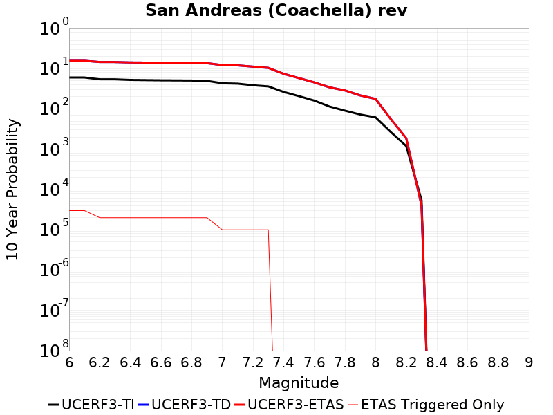 |

| Magnitude | 1 wk TI Prob | 1 wk TD Prob | 1 wk ETAS Prob | 1 wk ETAS/TD Gain | 1 wk ETAS Triggered Only | 1 mo TI Prob | 1 mo TD Prob | 1 mo ETAS Prob | 1 mo ETAS/TD Gain | 1 mo ETAS Triggered Only | 1 yr TI Prob | 1 yr TD Prob | 1 yr ETAS Prob | 1 yr ETAS/TD Gain | 1 yr ETAS Triggered Only | 10 yr TI Prob | 10 yr TD Prob | 10 yr ETAS Prob | 10 yr ETAS/TD Gain | 10 yr ETAS Triggered Only |
|-----|-----|-----|-----|-----|-----|-----|-----|-----|-----|-----|-----|-----|-----|-----|-----|-----|-----|-----|-----|-----|
| 6.0 | 1.1925945E-4 | 3.382285E-4 | 3.5822173E-4 | 1.0591116 | 2.0E-5 | 5.110118E-4 | 0.0014487504 | 0.0014687214 | 1.013785 | 2.0E-5 | 0.0062038354 | 0.017497312 | 0.017526787 | 1.0016845 | 3.0E-5 | 0.060334753 | 0.1569121 | 0.1569627 | 1.0003223 | 6.0E-5 |
| 6.1 | 1.1925945E-4 | 3.382285E-4 | 3.5822173E-4 | 1.0591116 | 2.0E-5 | 5.110118E-4 | 0.0014487504 | 0.0014687214 | 1.013785 | 2.0E-5 | 0.0062038354 | 0.017497312 | 0.017526787 | 1.0016845 | 3.0E-5 | 0.060334753 | 0.1569121 | 0.1569627 | 1.0003223 | 6.0E-5 |
| 6.2 | 1.07432395E-4 | 3.1314307E-4 | 3.331368E-4 | 1.0638486 | 2.0E-5 | 4.603433E-4 | 0.0013413556 | 0.0013613289 | 1.0148903 | 2.0E-5 | 0.005590286 | 0.016209899 | 0.016239412 | 1.0018207 | 3.0E-5 | 0.05451731 | 0.14610708 | 0.14614977 | 1.0002922 | 5.0E-5 |
| 6.3 | 1.0718766E-4 | 3.1259644E-4 | 3.325902E-4 | 1.0639603 | 2.0E-5 | 4.592948E-4 | 0.0013390154 | 0.0013589886 | 1.0149163 | 2.0E-5 | 0.005577586 | 0.016181828 | 0.016211344 | 1.0018239 | 3.0E-5 | 0.054396555 | 0.14587633 | 0.14591904 | 1.0002928 | 5.0E-5 |
| 6.4 | 1.0355944E-4 | 3.0465893E-4 | 3.2465282E-4 | 1.0656272 | 2.0E-5 | 4.4375064E-4 | 0.0013050318 | 0.0013250058 | 1.0153053 | 2.0E-5 | 0.0053892885 | 0.015774142 | 0.015803669 | 1.0018718 | 3.0E-5 | 0.052604496 | 0.14246936 | 0.14251223 | 1.000301 | 5.0E-5 |
| 6.5 | 1.0227914E-4 | 3.0184764E-4 | 3.2184162E-4 | 1.0662386 | 2.0E-5 | 4.382655E-4 | 0.0012929956 | 0.0013129697 | 1.015448 | 2.0E-5 | 0.0053228354 | 0.015629712 | 0.015659243 | 1.0018895 | 3.0E-5 | 0.051971316 | 0.14125448 | 0.14129743 | 1.000304 | 5.0E-5 |
| 6.6 | 1.0116757E-4 | 2.994961E-4 | 3.1949012E-4 | 1.0667589 | 2.0E-5 | 4.3350324E-4 | 0.0012829275 | 0.0013029019 | 1.0155693 | 2.0E-5 | 0.0052651367 | 0.015508885 | 0.015538419 | 1.0019044 | 3.0E-5 | 0.051421247 | 0.14023352 | 0.1402765 | 1.0003066 | 5.0E-5 |
| 6.7 | 1.0050676E-4 | 2.9807785E-4 | 3.180719E-4 | 1.0670766 | 2.0E-5 | 4.3067214E-4 | 0.0012768551 | 0.0012968297 | 1.0156435 | 2.0E-5 | 0.005230834 | 0.015436004 | 0.015465541 | 1.0019135 | 3.0E-5 | 0.051094085 | 0.13961959 | 0.13966261 | 1.0003082 | 5.0E-5 |
| 6.8 | 9.976819E-5 | 2.9610022E-4 | 3.160943E-4 | 1.0675247 | 2.0E-5 | 4.2750788E-4 | 0.0012683879 | 0.0012883624 | 1.015748 | 2.0E-5 | 0.0051924936 | 0.015334371 | 0.01536391 | 1.0019264 | 3.0E-5 | 0.050728295 | 0.13876928 | 0.13881235 | 1.0003103 | 5.0E-5 |
| 6.9 | 9.77719E-5 | 2.91029E-4 | 3.1102318E-4 | 1.0687016 | 2.0E-5 | 4.1895514E-4 | 0.001246675 | 0.0012666502 | 1.0160227 | 2.0E-5 | 0.0050888555 | 0.0150737045 | 0.015103253 | 1.0019603 | 3.0E-5 | 0.049738888 | 0.13659208 | 0.13663524 | 1.000316 | 5.0E-5 |
| 7.0 | 8.500761E-5 | 2.5811055E-4 | 2.7810538E-4 | 1.0774661 | 2.0E-5 | 3.6426744E-4 | 0.0011057225 | 0.0011257004 | 1.0180677 | 2.0E-5 | 0.0044259406 | 0.013379913 | 0.013409511 | 1.0022122 | 3.0E-5 | 0.04338823 | 0.12241873 | 0.12246261 | 1.0003585 | 5.0E-5 |
| 7.1 | 8.319876E-5 | 2.540783E-4 | 2.7407322E-4 | 1.0786959 | 2.0E-5 | 3.5651738E-4 | 0.001088456 | 0.0011084343 | 1.0183547 | 2.0E-5 | 0.004331963 | 0.013172254 | 0.013201858 | 1.0022476 | 3.0E-5 | 0.042484846 | 0.12062319 | 0.12066717 | 1.0003645 | 5.0E-5 |
| 7.2 | 7.563917E-5 | 2.3439355E-4 | 2.5438887E-4 | 1.0853065 | 2.0E-5 | 3.2412758E-4 | 0.0010041603 | 0.0010241402 | 1.0198971 | 2.0E-5 | 0.0039391145 | 0.012157864 | 0.012187499 | 1.0024376 | 3.0E-5 | 0.03870018 | 0.11199934 | 0.11204374 | 1.0003965 | 5.0E-5 |
| 7.3 | 7.082985E-5 | 2.1725292E-4 | 2.2725074E-4 | 1.0460193 | 1.0E-5 | 3.0352117E-4 | 9.3075476E-4 | 9.4074546E-4 | 1.010734 | 1.0E-5 | 0.0036891096 | 0.011273735 | 0.01129351 | 1.001754 | 2.0E-5 | 0.03628465 | 0.10443457 | 0.104470395 | 1.000343 | 4.0E-5 |
| 7.4 | 5.146215E-5 | 1.5103686E-4 | 1.5103686E-4 | 1.0 | 0.0 | 2.2053342E-4 | 6.4714125E-4 | 6.4714125E-4 | 1.0 | 0.0 | 0.0026816884 | 0.007850689 | 0.007850689 | 1.0 | 0.0 | 0.02649557 | 0.074453264 | 0.07446252 | 1.0001243 | 1.0E-5 |
| 7.5 | 4.0285166E-5 | 1.1661329E-4 | 1.1661329E-4 | 1.0 | 0.0 | 1.7263928E-4 | 4.9967587E-4 | 4.9967587E-4 | 1.0 | 0.0 | 0.002099857 | 0.0060666623 | 0.0060666623 | 1.0 | 0.0 | 0.020801254 | 0.05819751 | 0.058206927 | 1.0001619 | 1.0E-5 |
| 7.6 | 3.1168736E-5 | 9.065916E-5 | 9.065916E-5 | 1.0 | 0.0 | 1.3357346E-4 | 3.8848154E-4 | 3.8848154E-4 | 1.0 | 0.0 | 0.0016250437 | 0.004719536 | 0.004719536 | 1.0 | 0.0 | 0.016132116 | 0.04561831 | 0.045627855 | 1.0002092 | 1.0E-5 |
| 7.7 | 2.2100989E-5 | 6.778807E-5 | 6.778807E-5 | 1.0 | 0.0 | 9.4715084E-5 | 2.9048795E-4 | 2.9048795E-4 | 1.0 | 0.0 | 0.001152546 | 0.0035309633 | 0.0035309633 | 1.0 | 0.0 | 0.011465867 | 0.034331102 | 0.034340758 | 1.0002813 | 1.0E-5 |
| 7.8 | 1.7484861E-5 | 5.6542638E-5 | 5.6542638E-5 | 1.0 | 0.0 | 7.493296E-5 | 2.423031E-4 | 2.423031E-4 | 1.0 | 0.0 | 9.1192697E-4 | 0.002946053 | 0.002946053 | 1.0 | 0.0 | 0.009081938 | 0.028784277 | 0.028793989 | 1.0003374 | 1.0E-5 |
| 7.9 | 1.3967285E-5 | 4.19807E-5 | 4.19807E-5 | 1.0 | 0.0 | 5.985842E-5 | 1.7990489E-4 | 1.7990489E-4 | 1.0 | 0.0 | 7.2853256E-4 | 0.002188143 | 0.002188143 | 1.0 | 0.0 | 0.0072614877 | 0.021634236 | 0.021644019 | 1.0004523 | 1.0E-5 |
| 8.0 | 1.1887396E-5 | 3.4243614E-5 | 3.4243614E-5 | 1.0 | 0.0 | 5.094499E-5 | 1.467501E-4 | 1.467501E-4 | 1.0 | 0.0 | 6.200787E-4 | 0.0017852194 | 0.0017852194 | 1.0 | 0.0 | 0.006183513 | 0.017749414 | 0.017759236 | 1.0005534 | 1.0E-5 |
| 8.1 | 5.100864E-6 | 1.023354E-5 | 1.023354E-5 | 1.0 | 0.0 | 2.1860664E-5 | 4.3857293E-5 | 4.3857293E-5 | 1.0 | 0.0 | 2.6612106E-4 | 5.338319E-4 | 5.338319E-4 | 1.0 | 0.0 | 0.002658026 | 0.005539333 | 0.005539333 | 1.0 | 0.0 |
| 8.2 | 2.3004484E-6 | 3.3150052E-6 | 3.3150052E-6 | 1.0 | 0.0 | 9.859027E-6 | 1.4207088E-5 | 1.4207088E-5 | 1.0 | 0.0 | 1.2002704E-4 | 1.729576E-4 | 1.729576E-4 | 1.0 | 0.0 | 0.0011996223 | 0.0018665125 | 0.0018665125 | 1.0 | 0.0 |
| 8.3 | 1.0424446E-7 | 7.317801E-8 | 7.317801E-8 | 1.0 | 0.0 | 4.4676187E-7 | 3.1362E-7 | 3.1362E-7 | 1.0 | 0.0 | 5.439312E-6 | 3.8183175E-6 | 3.8183175E-6 | 1.0 | 0.0 | 5.4391792E-5 | 3.9855473E-5 | 3.9855473E-5 | 1.0 | 0.0 |

## Coronado Bank alt1
*[(top)](#table-of-contents)*

| 1 Week | 1 Month | 1 Year | 10 Year |
|-----|-----|-----|-----|
|  |  |  |  |

| Magnitude | 1 wk TI Prob | 1 wk TD Prob | 1 wk ETAS Prob | 1 wk ETAS/TD Gain | 1 wk ETAS Triggered Only | 1 mo TI Prob | 1 mo TD Prob | 1 mo ETAS Prob | 1 mo ETAS/TD Gain | 1 mo ETAS Triggered Only | 1 yr TI Prob | 1 yr TD Prob | 1 yr ETAS Prob | 1 yr ETAS/TD Gain | 1 yr ETAS Triggered Only | 10 yr TI Prob | 10 yr TD Prob | 10 yr ETAS Prob | 10 yr ETAS/TD Gain | 10 yr ETAS Triggered Only |
|-----|-----|-----|-----|-----|-----|-----|-----|-----|-----|-----|-----|-----|-----|-----|-----|-----|-----|-----|-----|-----|
| 6.0 | 6.753342E-5 | 8.2096005E-5 | 8.2096005E-5 | 1.0 | 0.0 | 2.8939685E-4 | 3.5179465E-4 | 3.717876E-4 | 1.0568314 | 2.0E-5 | 0.003517715 | 0.0042750756 | 0.004324862 | 1.0116457 | 5.0E-5 | 0.034625497 | 0.041973736 | 0.042031217 | 1.0013695 | 6.0E-5 |
| 6.1 | 4.1807285E-5 | 4.9980812E-5 | 4.9980812E-5 | 1.0 | 0.0 | 1.7916178E-4 | 2.1418613E-4 | 2.24184E-4 | 1.0466783 | 1.0E-5 | 0.0021791123 | 0.0026046878 | 0.0026346098 | 1.0114877 | 3.0E-5 | 0.021578677 | 0.025752103 | 0.025791073 | 1.0015132 | 4.0E-5 |
| 6.2 | 4.1807285E-5 | 4.9980812E-5 | 4.9980812E-5 | 1.0 | 0.0 | 1.7916178E-4 | 2.1418613E-4 | 2.24184E-4 | 1.0466783 | 1.0E-5 | 0.0021791123 | 0.0026046878 | 0.0026346098 | 1.0114877 | 3.0E-5 | 0.021578677 | 0.025752103 | 0.025791073 | 1.0015132 | 4.0E-5 |
| 6.3 | 3.1793104E-5 | 3.7527356E-5 | 3.7527356E-5 | 1.0 | 0.0 | 1.3624904E-4 | 1.608218E-4 | 1.608218E-4 | 1.0 | 0.0 | 0.0016575698 | 0.0019562813 | 0.001976242 | 1.0102035 | 2.0E-5 | 0.016452603 | 0.019394737 | 0.01941435 | 1.0010113 | 2.0E-5 |
| 6.4 | 2.9878007E-5 | 3.518963E-5 | 3.518963E-5 | 1.0 | 0.0 | 1.2804232E-4 | 1.5080418E-4 | 1.5080418E-4 | 1.0 | 0.0 | 0.0015578003 | 0.0018345279 | 0.0018544912 | 1.010882 | 2.0E-5 | 0.015469253 | 0.018197741 | 0.018217377 | 1.0010791 | 2.0E-5 |
| 6.5 | 2.4512565E-5 | 2.8689492E-5 | 2.8689492E-5 | 1.0 | 0.0 | 1.0504962E-4 | 1.229493E-4 | 1.229493E-4 | 1.0 | 0.0 | 0.0012782287 | 0.001495907 | 0.001505892 | 1.0066749 | 1.0E-5 | 0.012709012 | 0.014861371 | 0.014871223 | 1.0006629 | 1.0E-5 |
| 6.6 | 2.1317413E-5 | 2.486086E-5 | 2.486086E-5 | 1.0 | 0.0 | 9.135714E-5 | 1.0654231E-4 | 1.0654231E-4 | 1.0 | 0.0 | 0.0011117056 | 0.001296403 | 0.00130639 | 1.0077037 | 1.0E-5 | 0.011061605 | 0.012890818 | 0.012900689 | 1.0007658 | 1.0E-5 |
| 6.7 | 1.8585655E-5 | 2.1607742E-5 | 2.1607742E-5 | 1.0 | 0.0 | 7.9650374E-5 | 9.260144E-5 | 9.260144E-5 | 1.0 | 0.0 | 9.6931186E-4 | 0.0011268598 | 0.0011268598 | 1.0 | 0.0 | 0.0096509475 | 0.011213613 | 0.011213613 | 1.0 | 0.0 |
| 6.8 | 1.5862879E-5 | 1.8401894E-5 | 1.8401894E-5 | 1.0 | 0.0 | 6.798199E-5 | 7.8862984E-5 | 7.8862984E-5 | 1.0 | 0.0 | 8.273665E-4 | 9.5975306E-4 | 9.5975306E-4 | 1.0 | 0.0 | 0.008242928 | 0.0095580565 | 0.0095580565 | 1.0 | 0.0 |
| 6.9 | 1.3021509E-5 | 1.508224E-5 | 1.508224E-5 | 1.0 | 0.0 | 5.5805274E-5 | 6.463667E-5 | 6.463667E-5 | 1.0 | 0.0 | 6.792174E-4 | 7.866854E-4 | 7.866854E-4 | 1.0 | 0.0 | 0.006771452 | 0.007840822 | 0.007840822 | 1.0 | 0.0 |
| 7.0 | 1.0974371E-5 | 1.2707888E-5 | 1.2707888E-5 | 1.0 | 0.0 | 4.7032172E-5 | 5.4461343E-5 | 5.4461343E-5 | 1.0 | 0.0 | 5.7246623E-4 | 6.6288264E-4 | 6.6288264E-4 | 1.0 | 0.0 | 0.0057099373 | 0.006610796 | 0.006610796 | 1.0 | 0.0 |
| 7.1 | 8.766221E-6 | 1.0151318E-5 | 1.0151318E-5 | 1.0 | 0.0 | 3.7568978E-5 | 4.3505017E-5 | 4.3505017E-5 | 1.0 | 0.0 | 4.573063E-4 | 5.29562E-4 | 5.29562E-4 | 1.0 | 0.0 | 0.0045636636 | 0.005284694 | 0.005284694 | 1.0 | 0.0 |
| 7.2 | 8.026024E-7 | 8.322313E-7 | 8.322313E-7 | 1.0 | 0.0 | 3.43972E-6 | 3.5667008E-6 | 3.5667008E-6 | 1.0 | 0.0 | 4.1877785E-5 | 4.3423726E-5 | 4.3423726E-5 | 1.0 | 0.0 | 4.1869894E-4 | 4.341535E-4 | 4.341535E-4 | 1.0 | 0.0 |
| 7.3 | 3.7293114E-7 | 3.6957266E-7 | 3.6957266E-7 | 1.0 | 0.0 | 1.5982754E-6 | 1.5838818E-6 | 1.5838818E-6 | 1.0 | 0.0 | 1.9458828E-5 | 1.9283592E-5 | 1.9283592E-5 | 1.0 | 0.0 | 1.9457124E-4 | 1.9281925E-4 | 1.9281925E-4 | 1.0 | 0.0 |
| 7.4 | 2.0557036E-7 | 1.9656915E-7 | 1.9656915E-7 | 1.0 | 0.0 | 8.810155E-7 | 8.424389E-7 | 8.424389E-7 | 1.0 | 0.0 | 1.0726311E-5 | 1.02566455E-5 | 1.02566455E-5 | 1.0 | 0.0 | 1.0725793E-4 | 1.0256175E-4 | 1.0256175E-4 | 1.0 | 0.0 |
| 7.5 | 6.845446E-8 | 6.274678E-8 | 6.274678E-8 | 1.0 | 0.0 | 2.9337625E-7 | 2.6891473E-7 | 2.6891473E-7 | 1.0 | 0.0 | 3.5718497E-6 | 3.2740322E-6 | 3.2740322E-6 | 1.0 | 0.0 | 3.5717923E-5 | 3.273985E-5 | 3.273985E-5 | 1.0 | 0.0 |
| 7.6 | 6.0975145E-9 | 5.535216E-9 | 5.535216E-9 | 1.0 | 0.0 | 2.6132206E-8 | 2.3722354E-8 | 2.3722354E-8 | 1.0 | 0.0 | 3.1815955E-7 | 2.8881965E-7 | 2.8881965E-7 | 1.0 | 0.0 | 3.181591E-6 | 2.8881936E-6 | 2.8881936E-6 | 1.0 | 0.0 |

## Imperial
*[(top)](#table-of-contents)*

| 1 Week | 1 Month | 1 Year | 10 Year |
|-----|-----|-----|-----|
|  |  | 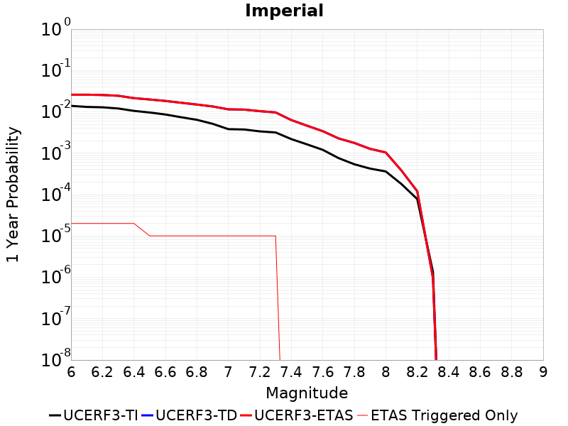 | 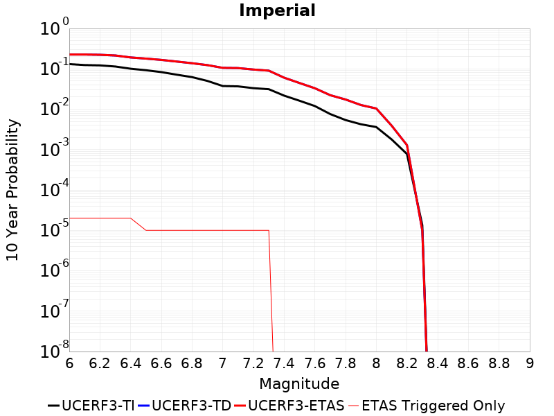 |

| Magnitude | 1 wk TI Prob | 1 wk TD Prob | 1 wk ETAS Prob | 1 wk ETAS/TD Gain | 1 wk ETAS Triggered Only | 1 mo TI Prob | 1 mo TD Prob | 1 mo ETAS Prob | 1 mo ETAS/TD Gain | 1 mo ETAS Triggered Only | 1 yr TI Prob | 1 yr TD Prob | 1 yr ETAS Prob | 1 yr ETAS/TD Gain | 1 yr ETAS Triggered Only | 10 yr TI Prob | 10 yr TD Prob | 10 yr ETAS Prob | 10 yr ETAS/TD Gain | 10 yr ETAS Triggered Only |
|-----|-----|-----|-----|-----|-----|-----|-----|-----|-----|-----|-----|-----|-----|-----|-----|-----|-----|-----|-----|-----|
| 6.0 | 2.6875173E-4 | 5.039087E-4 | 5.139037E-4 | 1.0198349 | 1.0E-5 | 0.0011512847 | 0.0021578602 | 0.0021678386 | 1.0046242 | 1.0E-5 | 0.013927074 | 0.025961103 | 0.025990324 | 1.0011256 | 3.0E-5 | 0.13085878 | 0.22591513 | 0.22595385 | 1.0001713 | 5.0E-5 |
| 6.1 | 2.5356023E-4 | 5.039087E-4 | 5.139037E-4 | 1.0198349 | 1.0E-5 | 0.001086234 | 0.0021578602 | 0.0021678386 | 1.0046242 | 1.0E-5 | 0.013144928 | 0.025961103 | 0.025990324 | 1.0011256 | 3.0E-5 | 0.123940155 | 0.22591513 | 0.22595385 | 1.0001713 | 5.0E-5 |
| 6.2 | 2.4820742E-4 | 4.946023E-4 | 5.045974E-4 | 1.0202082 | 1.0E-5 | 0.0010633124 | 0.0021180408 | 0.0021280195 | 1.0047114 | 1.0E-5 | 0.01286919 | 0.025488215 | 0.025517449 | 1.001147 | 3.0E-5 | 0.12148927 | 0.2223646 | 0.22240348 | 1.0001749 | 5.0E-5 |
| 6.3 | 2.3205351E-4 | 4.7381633E-4 | 4.838116E-4 | 1.0210953 | 1.0E-5 | 9.94136E-4 | 0.002029098 | 0.002039078 | 1.0049183 | 1.0E-5 | 0.012036599 | 0.02442297 | 0.024442483 | 1.000799 | 2.0E-5 | 0.11405133 | 0.21368001 | 0.21371147 | 1.0001472 | 4.0E-5 |
| 6.4 | 2.0304754E-4 | 4.1411206E-4 | 4.2410792E-4 | 1.0241381 | 1.0E-5 | 8.6991355E-4 | 0.001773574 | 0.0017835563 | 1.0056283 | 1.0E-5 | 0.010539869 | 0.021378446 | 0.021398019 | 1.0009155 | 2.0E-5 | 0.100537635 | 0.19088103 | 0.1909134 | 1.0001695 | 4.0E-5 |
| 6.5 | 1.854992E-4 | 3.844629E-4 | 3.9445906E-4 | 1.0260003 | 1.0E-5 | 7.9475436E-4 | 0.0016466706 | 0.0016566542 | 1.0060629 | 1.0E-5 | 0.009633281 | 0.019866109 | 0.019885711 | 1.0009867 | 2.0E-5 | 0.0922623 | 0.1788774 | 0.17891024 | 1.0001836 | 4.0E-5 |
| 6.6 | 1.6586106E-4 | 3.5376832E-4 | 3.637648E-4 | 1.0282571 | 1.0E-5 | 7.106394E-4 | 0.0015152796 | 0.0015252645 | 1.0065894 | 1.0E-5 | 0.008617763 | 0.018289281 | 0.018308915 | 1.0010735 | 2.0E-5 | 0.08291132 | 0.16599509 | 0.16602844 | 1.000201 | 4.0E-5 |
| 6.7 | 1.4224656E-4 | 3.1958567E-4 | 3.2958246E-4 | 1.0312805 | 1.0E-5 | 6.094856E-4 | 0.0013689426 | 0.0013789289 | 1.0072949 | 1.0E-5 | 0.0073952693 | 0.016538857 | 0.016558526 | 1.0011892 | 2.0E-5 | 0.07153955 | 0.15120147 | 0.15123542 | 1.0002246 | 4.0E-5 |
| 6.8 | 1.2317259E-4 | 2.8909283E-4 | 2.9908994E-4 | 1.034581 | 1.0E-5 | 5.2777573E-4 | 0.0012383875 | 0.0012483752 | 1.008065 | 1.0E-5 | 0.0064067547 | 0.014974629 | 0.014994329 | 1.0013156 | 2.0E-5 | 0.06225166 | 0.13745101 | 0.1374855 | 1.000251 | 4.0E-5 |
| 6.9 | 9.859898E-5 | 2.5972805E-4 | 2.6972545E-4 | 1.0384918 | 1.0E-5 | 4.2249862E-4 | 0.0011126499 | 0.0011226387 | 1.0089775 | 1.0E-5 | 0.0051317946 | 0.013463405 | 0.013483136 | 1.0014656 | 2.0E-5 | 0.05014893 | 0.12333331 | 0.123368375 | 1.0002843 | 4.0E-5 |
| 7.0 | 7.3191884E-5 | 2.2103409E-4 | 2.3103187E-4 | 1.0452319 | 1.0E-5 | 3.136418E-4 | 9.4694836E-4 | 9.569389E-4 | 1.0105503 | 1.0E-5 | 0.003811904 | 0.0114688855 | 0.0114886565 | 1.0017239 | 2.0E-5 | 0.037471764 | 0.10553827 | 0.10557405 | 1.000339 | 4.0E-5 |
| 7.1 | 7.1760296E-5 | 2.1799486E-4 | 2.2799268E-4 | 1.0458627 | 1.0E-5 | 3.0750787E-4 | 9.3393255E-4 | 9.439232E-4 | 1.0106974 | 1.0E-5 | 0.003737482 | 0.011312073 | 0.011331847 | 1.001748 | 2.0E-5 | 0.03675245 | 0.10415812 | 0.104193956 | 1.000344 | 4.0E-5 |
| 7.2 | 6.46614E-5 | 1.995219E-4 | 2.0951992E-4 | 1.0501099 | 1.0E-5 | 2.7709085E-4 | 8.5481687E-4 | 8.6480833E-4 | 1.0116885 | 1.0E-5 | 0.0033683628 | 0.010358398 | 0.010378191 | 1.0019108 | 2.0E-5 | 0.033177625 | 0.09592893 | 0.095965095 | 1.0003769 | 4.0E-5 |
| 7.3 | 6.088115E-5 | 1.8599501E-4 | 1.9599315E-4 | 1.0537549 | 1.0E-5 | 2.6089314E-4 | 7.9688104E-4 | 8.068731E-4 | 1.0125389 | 1.0E-5 | 0.0031717476 | 0.009659484 | 0.0096792905 | 1.0020505 | 2.0E-5 | 0.031268585 | 0.08990306 | 0.08993946 | 1.000405 | 4.0E-5 |
| 7.4 | 4.199346E-5 | 1.21386416E-4 | 1.21386416E-4 | 1.0 | 0.0 | 1.7995955E-4 | 5.201247E-4 | 5.201247E-4 | 1.0 | 0.0 | 0.0021888057 | 0.006314316 | 0.006314316 | 1.0 | 0.0 | 0.02167372 | 0.060206667 | 0.060216065 | 1.000156 | 1.0E-5 |
| 7.5 | 3.130448E-5 | 8.854673E-5 | 8.854673E-5 | 1.0 | 0.0 | 1.3415517E-4 | 3.7943115E-4 | 3.7943115E-4 | 1.0 | 0.0 | 0.0016321153 | 0.004609855 | 0.004609855 | 1.0 | 0.0 | 0.016201803 | 0.04447315 | 0.044482704 | 1.0002148 | 1.0E-5 |
| 7.6 | 2.3074248E-5 | 6.5191205E-5 | 6.5191205E-5 | 1.0 | 0.0 | 9.888588E-5 | 2.7936112E-4 | 2.7936112E-4 | 1.0 | 0.0 | 0.0012032706 | 0.0033959427 | 0.0033959427 | 1.0 | 0.0 | 0.011967761 | 0.032997735 | 0.033007406 | 1.000293 | 1.0E-5 |
| 7.7 | 1.45864815E-5 | 4.3630745E-5 | 4.3630745E-5 | 1.0 | 0.0 | 6.2511994E-5 | 1.8697554E-4 | 1.8697554E-4 | 1.0 | 0.0 | 7.608177E-4 | 0.002274057 | 0.002274057 | 1.0 | 0.0 | 0.007582182 | 0.022219736 | 0.022229515 | 1.00044 | 1.0E-5 |
| 7.8 | 1.0352979E-5 | 3.3890345E-5 | 3.3890345E-5 | 1.0 | 0.0 | 4.4369157E-5 | 1.4523628E-4 | 1.4523628E-4 | 1.0 | 0.0 | 5.400606E-4 | 0.0017668202 | 0.0017668202 | 1.0 | 0.0 | 0.0053875 | 0.01734779 | 0.017357618 | 1.0005665 | 1.0E-5 |
| 7.9 | 8.137906E-6 | 2.441119E-5 | 2.441119E-5 | 1.0 | 0.0 | 3.4876273E-5 | 1.046152E-4 | 1.046152E-4 | 1.0 | 0.0 | 4.2453592E-4 | 0.0012729471 | 0.0012729471 | 1.0 | 0.0 | 0.004237258 | 0.012662951 | 0.012672825 | 1.0007797 | 1.0E-5 |
| 8.0 | 6.93792E-6 | 1.992439E-5 | 1.992439E-5 | 1.0 | 0.0 | 2.9733603E-5 | 8.538745E-5 | 8.538745E-5 | 1.0 | 0.0 | 3.6194647E-4 | 0.0010390973 | 0.0010390973 | 1.0 | 0.0 | 0.0036135751 | 0.010392023 | 0.0104019195 | 1.0009522 | 1.0E-5 |
| 8.1 | 3.4286315E-6 | 7.2494217E-6 | 7.2494217E-6 | 1.0 | 0.0 | 1.4694053E-5 | 3.106858E-5 | 3.106858E-5 | 1.0 | 0.0 | 1.7888541E-4 | 3.7819447E-4 | 3.7819447E-4 | 1.0 | 0.0 | 0.0017874148 | 0.0039131506 | 0.0039131506 | 1.0 | 0.0 |
| 8.2 | 1.4906886E-6 | 2.2915806E-6 | 2.2915806E-6 | 1.0 | 0.0 | 6.3886496E-6 | 9.821023E-6 | 9.821023E-6 | 1.0 | 0.0 | 7.7779034E-5 | 1.19564436E-4 | 1.19564436E-4 | 1.0 | 0.0 | 7.775182E-4 | 0.0012869048 | 0.0012869048 | 1.0 | 0.0 |
| 8.3 | 2.5758007E-8 | 1.8184636E-8 | 1.8184636E-8 | 1.0 | 0.0 | 1.10391454E-7 | 7.793416E-8 | 7.793416E-8 | 1.0 | 0.0 | 1.3440151E-6 | 9.4884837E-7 | 9.4884837E-7 | 1.0 | 0.0 | 1.344007E-5 | 9.82873E-6 | 9.82873E-6 | 1.0 | 0.0 |

## Brawley (Seismic Zone) alt 1
*[(top)](#table-of-contents)*

| 1 Week | 1 Month | 1 Year | 10 Year |
|-----|-----|-----|-----|
|  | 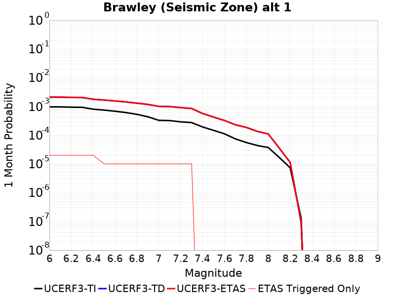 |  |  |

| Magnitude | 1 wk TI Prob | 1 wk TD Prob | 1 wk ETAS Prob | 1 wk ETAS/TD Gain | 1 wk ETAS Triggered Only | 1 mo TI Prob | 1 mo TD Prob | 1 mo ETAS Prob | 1 mo ETAS/TD Gain | 1 mo ETAS Triggered Only | 1 yr TI Prob | 1 yr TD Prob | 1 yr ETAS Prob | 1 yr ETAS/TD Gain | 1 yr ETAS Triggered Only | 10 yr TI Prob | 10 yr TD Prob | 10 yr ETAS Prob | 10 yr ETAS/TD Gain | 10 yr ETAS Triggered Only |
|-----|-----|-----|-----|-----|-----|-----|-----|-----|-----|-----|-----|-----|-----|-----|-----|-----|-----|-----|-----|-----|
| 6.0 | 2.2521618E-4 | 4.889486E-4 | 4.989437E-4 | 1.020442 | 1.0E-5 | 9.6485513E-4 | 0.0020938483 | 0.0021038274 | 1.0047659 | 1.0E-5 | 0.011683988 | 0.025196694 | 0.025225937 | 1.0011606 | 3.0E-5 | 0.11088423 | 0.21842867 | 0.21846776 | 1.0001789 | 5.0E-5 |
| 6.1 | 2.2521618E-4 | 4.889486E-4 | 4.989437E-4 | 1.020442 | 1.0E-5 | 9.6485513E-4 | 0.0020938483 | 0.0021038274 | 1.0047659 | 1.0E-5 | 0.011683988 | 0.025196694 | 0.025225937 | 1.0011606 | 3.0E-5 | 0.11088423 | 0.21842867 | 0.21846776 | 1.0001789 | 5.0E-5 |
| 6.2 | 2.198148E-4 | 4.7953392E-4 | 4.895291E-4 | 1.0208436 | 1.0E-5 | 9.417233E-4 | 0.0020535635 | 0.0020635428 | 1.0048596 | 1.0E-5 | 0.011405343 | 0.024717929 | 0.024747187 | 1.0011837 | 3.0E-5 | 0.10837428 | 0.21480164 | 0.21484089 | 1.0001827 | 5.0E-5 |
| 6.3 | 2.1704129E-4 | 4.7391347E-4 | 4.8390872E-4 | 1.0210909 | 1.0E-5 | 9.298453E-4 | 0.0020295135 | 0.002039493 | 1.0049173 | 1.0E-5 | 0.011262234 | 0.024432143 | 0.024451654 | 1.0007986 | 2.0E-5 | 0.107082725 | 0.21269608 | 0.21272756 | 1.000148 | 4.0E-5 |
| 6.4 | 1.876142E-4 | 4.1327014E-4 | 4.2326603E-4 | 1.0241872 | 1.0E-5 | 8.038131E-4 | 0.0017699704 | 0.0017799527 | 1.0056398 | 1.0E-5 | 0.00974259 | 0.021339677 | 0.02135925 | 1.0009172 | 2.0E-5 | 0.093263686 | 0.18949188 | 0.18952431 | 1.0001711 | 4.0E-5 |
| 6.5 | 1.7390939E-4 | 3.8749698E-4 | 3.9749313E-4 | 1.0257967 | 1.0E-5 | 7.45113E-4 | 0.0016596571 | 0.0016696405 | 1.0060153 | 1.0E-5 | 0.009034078 | 0.020022275 | 0.020041876 | 1.000979 | 2.0E-5 | 0.086755216 | 0.1792797 | 0.17931253 | 1.0001831 | 4.0E-5 |
| 6.6 | 1.591791E-4 | 3.6138672E-4 | 3.713831E-4 | 1.0276612 | 1.0E-5 | 6.8201777E-4 | 0.0015478914 | 0.001557876 | 1.0064504 | 1.0E-5 | 0.008271996 | 0.018681634 | 0.01870126 | 1.0010506 | 2.0E-5 | 0.07970774 | 0.16861494 | 0.1686482 | 1.0001972 | 4.0E-5 |
| 6.7 | 1.4268003E-4 | 3.32806E-4 | 3.4280267E-4 | 1.0300375 | 1.0E-5 | 6.1134255E-4 | 0.0014255404 | 0.0014355262 | 1.0070049 | 1.0E-5 | 0.007417723 | 0.017217252 | 0.017236909 | 1.0011417 | 2.0E-5 | 0.07174956 | 0.1566909 | 0.15672463 | 1.0002153 | 4.0E-5 |
| 6.8 | 1.239713E-4 | 3.0208967E-4 | 3.1208666E-4 | 1.0330927 | 1.0E-5 | 5.3119735E-4 | 0.0012940342 | 0.0013040213 | 1.0077177 | 1.0E-5 | 0.0064481674 | 0.015642602 | 0.015662288 | 1.0012586 | 2.0E-5 | 0.06264243 | 0.14296745 | 0.14300174 | 1.0002397 | 4.0E-5 |
| 6.9 | 1.0180238E-4 | 2.7282172E-4 | 2.82819E-4 | 1.036644 | 1.0E-5 | 4.3622297E-4 | 0.0011687166 | 0.0011787049 | 1.0085464 | 1.0E-5 | 0.005298089 | 0.014137366 | 0.014157084 | 1.0013947 | 2.0E-5 | 0.05173543 | 0.12913422 | 0.12916906 | 1.0002698 | 4.0E-5 |
| 7.0 | 7.6619996E-5 | 2.330949E-4 | 2.4309257E-4 | 1.042891 | 1.0E-5 | 3.283301E-4 | 9.985991E-4 | 0.001008589 | 1.010004 | 1.0E-5 | 0.0039900932 | 0.01209093 | 0.012110689 | 1.0016341 | 2.0E-5 | 0.039192066 | 0.11101967 | 0.111055225 | 1.0003203 | 4.0E-5 |
| 7.1 | 7.5127435E-5 | 2.2987326E-4 | 2.3987096E-4 | 1.0434922 | 1.0E-5 | 3.2193496E-4 | 9.848025E-4 | 9.947927E-4 | 1.0101444 | 1.0E-5 | 0.0039125155 | 0.011924808 | 0.011944569 | 1.0016571 | 2.0E-5 | 0.038443442 | 0.10956767 | 0.109603286 | 1.0003251 | 4.0E-5 |
| 7.2 | 6.788582E-5 | 2.1098976E-4 | 2.2098765E-4 | 1.0473857 | 1.0E-5 | 2.9090676E-4 | 9.039317E-4 | 9.139227E-4 | 1.0110527 | 1.0E-5 | 0.0035360386 | 0.010950521 | 0.010970302 | 1.0018064 | 2.0E-5 | 0.034803 | 0.10120417 | 0.10124013 | 1.0003552 | 4.0E-5 |
| 7.3 | 6.399602E-5 | 1.9705007E-4 | 2.070481E-4 | 1.0507386 | 1.0E-5 | 2.7423984E-4 | 8.4423E-4 | 8.542216E-4 | 1.0118351 | 1.0E-5 | 0.0033337586 | 0.010230693 | 0.010250489 | 1.0019349 | 2.0E-5 | 0.03284188 | 0.09502314 | 0.09505934 | 1.000381 | 4.0E-5 |
| 7.4 | 4.506759E-5 | 1.323004E-4 | 1.323004E-4 | 1.0 | 0.0 | 1.9313251E-4 | 5.668794E-4 | 5.668794E-4 | 1.0 | 0.0 | 0.0023488526 | 0.0068801064 | 0.0068801064 | 1.0 | 0.0 | 0.023241805 | 0.065426506 | 0.06543585 | 1.0001428 | 1.0E-5 |
| 7.5 | 3.43289E-5 | 9.929053E-5 | 9.929053E-5 | 1.0 | 0.0 | 1.4711556E-4 | 4.254618E-4 | 4.254618E-4 | 1.0 | 0.0 | 0.0017896603 | 0.005167763 | 0.005167763 | 1.0 | 0.0 | 0.01775316 | 0.049698524 | 0.049708027 | 1.0001912 | 1.0E-5 |
| 7.6 | 2.5980507E-5 | 7.559373E-5 | 7.559373E-5 | 1.0 | 0.0 | 1.1134028E-4 | 3.2393305E-4 | 3.2393305E-4 | 1.0 | 0.0 | 0.001354725 | 0.00393678 | 0.00393678 | 1.0 | 0.0 | 0.013464959 | 0.038117465 | 0.038127083 | 1.0002524 | 1.0E-5 |
| 7.7 | 1.7292105E-5 | 5.3620573E-5 | 5.3620573E-5 | 1.0 | 0.0 | 7.4106916E-5 | 2.2978225E-4 | 2.2978225E-4 | 1.0 | 0.0 | 9.018782E-4 | 0.0027940166 | 0.0027940166 | 1.0 | 0.0 | 0.008982267 | 0.027189055 | 0.027198784 | 1.0003577 | 1.0E-5 |
| 7.8 | 1.2927471E-5 | 4.330195E-5 | 4.330195E-5 | 1.0 | 0.0 | 5.5402274E-5 | 1.855666E-4 | 1.855666E-4 | 1.0 | 0.0 | 6.743139E-4 | 0.0022569355 | 0.0022569355 | 1.0 | 0.0 | 0.0067227143 | 0.022060374 | 0.022070153 | 1.0004433 | 1.0E-5 |
| 7.9 | 1.0200774E-5 | 3.155478E-5 | 3.155478E-5 | 1.0 | 0.0 | 4.371687E-5 | 1.3522778E-4 | 1.3522778E-4 | 1.0 | 0.0 | 5.321229E-4 | 0.0016451561 | 0.0016451561 | 1.0 | 0.0 | 0.005308505 | 0.01628054 | 0.016290378 | 1.0006043 | 1.0E-5 |
| 8.0 | 8.650396E-6 | 2.564773E-5 | 2.564773E-5 | 1.0 | 0.0 | 3.70726E-5 | 1.09914225E-4 | 1.09914225E-4 | 1.0 | 0.0 | 4.5126543E-4 | 0.0013373852 | 0.0013373852 | 1.0 | 0.0 | 0.0045035016 | 0.013305954 | 0.013315821 | 1.0007416 | 1.0E-5 |
| 8.1 | 3.9368224E-6 | 8.321222E-6 | 8.321222E-6 | 1.0 | 0.0 | 1.6871985E-5 | 3.566189E-5 | 3.566189E-5 | 1.0 | 0.0 | 2.0539707E-4 | 4.340972E-4 | 4.340972E-4 | 1.0 | 0.0 | 0.0020520731 | 0.0044886265 | 0.0044886265 | 1.0 | 0.0 |
| 8.2 | 1.7101195E-6 | 2.6226278E-6 | 2.6226278E-6 | 1.0 | 0.0 | 7.329063E-6 | 1.1239786E-5 | 1.1239786E-5 | 1.0 | 0.0 | 8.922769E-5 | 1.3683584E-4 | 1.3683584E-4 | 1.0 | 0.0 | 8.9191867E-4 | 0.0014712793 | 0.0014712793 | 1.0 | 0.0 |
| 8.3 | 3.0346666E-8 | 2.1579979E-8 | 2.1579979E-8 | 1.0 | 0.0 | 1.3005713E-7 | 9.248562E-8 | 9.248562E-8 | 1.0 | 0.0 | 1.5834444E-6 | 1.1260123E-6 | 1.1260123E-6 | 1.0 | 0.0 | 1.5834332E-5 | 1.1668709E-5 | 1.1668709E-5 | 1.0 | 0.0 |

## San Andreas (Mojave S)
*[(top)](#table-of-contents)*

| 1 Week | 1 Month | 1 Year | 10 Year |
|-----|-----|-----|-----|
|  |  |  |  |

| Magnitude | 1 wk TI Prob | 1 wk TD Prob | 1 wk ETAS Prob | 1 wk ETAS/TD Gain | 1 wk ETAS Triggered Only | 1 mo TI Prob | 1 mo TD Prob | 1 mo ETAS Prob | 1 mo ETAS/TD Gain | 1 mo ETAS Triggered Only | 1 yr TI Prob | 1 yr TD Prob | 1 yr ETAS Prob | 1 yr ETAS/TD Gain | 1 yr ETAS Triggered Only | 10 yr TI Prob | 10 yr TD Prob | 10 yr ETAS Prob | 10 yr ETAS/TD Gain | 10 yr ETAS Triggered Only |
|-----|-----|-----|-----|-----|-----|-----|-----|-----|-----|-----|-----|-----|-----|-----|-----|-----|-----|-----|-----|-----|
| 6.0 | 3.1064058E-4 | 6.9887115E-4 | 6.9887115E-4 | 1.0 | 0.0 | 0.0013306376 | 0.0029918537 | 0.0029918537 | 1.0 | 0.0 | 0.016080605 | 0.035787147 | 0.035796788 | 1.0002694 | 1.0E-5 | 0.1496549 | 0.29470137 | 0.2947225 | 1.0000718 | 3.0E-5 |
| 6.1 | 3.1064058E-4 | 6.9887115E-4 | 6.9887115E-4 | 1.0 | 0.0 | 0.0013306376 | 0.0029918537 | 0.0029918537 | 1.0 | 0.0 | 0.016080605 | 0.035787147 | 0.035796788 | 1.0002694 | 1.0E-5 | 0.1496549 | 0.29470137 | 0.2947225 | 1.0000718 | 3.0E-5 |
| 6.2 | 3.1064058E-4 | 6.9887115E-4 | 6.9887115E-4 | 1.0 | 0.0 | 0.0013306376 | 0.0029918537 | 0.0029918537 | 1.0 | 0.0 | 0.016080605 | 0.035787147 | 0.035796788 | 1.0002694 | 1.0E-5 | 0.1496549 | 0.29470137 | 0.2947225 | 1.0000718 | 3.0E-5 |
| 6.3 | 3.1064058E-4 | 6.9887115E-4 | 6.9887115E-4 | 1.0 | 0.0 | 0.0013306376 | 0.0029918537 | 0.0029918537 | 1.0 | 0.0 | 0.016080605 | 0.035787147 | 0.035796788 | 1.0002694 | 1.0E-5 | 0.1496549 | 0.29470137 | 0.2947225 | 1.0000718 | 3.0E-5 |
| 6.4 | 1.9872203E-4 | 4.547186E-4 | 4.547186E-4 | 1.0 | 0.0 | 8.5138786E-4 | 0.0019473671 | 0.0019473671 | 1.0 | 0.0 | 0.010316478 | 0.02345787 | 0.02345787 | 1.0 | 0.0 | 0.098504856 | 0.20574327 | 0.20575121 | 1.0000386 | 1.0E-5 |
| 6.5 | 1.291105E-4 | 3.0910253E-4 | 3.0910253E-4 | 1.0 | 0.0 | 5.5321335E-4 | 0.0013240555 | 0.0013240555 | 1.0 | 0.0 | 0.006714592 | 0.01600215 | 0.01600215 | 1.0 | 0.0 | 0.065152965 | 0.14693463 | 0.14694315 | 1.000058 | 1.0E-5 |
| 6.6 | 1.291105E-4 | 3.0910253E-4 | 3.0910253E-4 | 1.0 | 0.0 | 5.5321335E-4 | 0.0013240555 | 0.0013240555 | 1.0 | 0.0 | 0.006714592 | 0.01600215 | 0.01600215 | 1.0 | 0.0 | 0.065152965 | 0.14693463 | 0.14694315 | 1.000058 | 1.0E-5 |
| 6.7 | 1.08001186E-4 | 2.6453452E-4 | 2.6453452E-4 | 1.0 | 0.0 | 4.6278012E-4 | 0.0011332274 | 0.0011332274 | 1.0 | 0.0 | 0.0056198016 | 0.013710131 | 0.013710131 | 1.0 | 0.0 | 0.054797906 | 0.12809089 | 0.1280996 | 1.0000681 | 1.0E-5 |
| 6.8 | 1.0624356E-4 | 2.596393E-4 | 2.596393E-4 | 1.0 | 0.0 | 4.5525006E-4 | 0.0011122659 | 0.0011122659 | 1.0 | 0.0 | 0.0055285925 | 0.013458095 | 0.013458095 | 1.0 | 0.0 | 0.053930566 | 0.12604176 | 0.1260505 | 1.0000694 | 1.0E-5 |
| 6.9 | 1.0393785E-4 | 2.532479E-4 | 2.532479E-4 | 1.0 | 0.0 | 4.4537184E-4 | 0.0010848973 | 0.0010848973 | 1.0 | 0.0 | 0.0054089287 | 0.013128941 | 0.013128941 | 1.0 | 0.0 | 0.05279156 | 0.12332805 | 0.12333682 | 1.000071 | 1.0E-5 |
| 7.0 | 1.0155622E-4 | 2.468346E-4 | 2.468346E-4 | 1.0 | 0.0 | 4.3516833E-4 | 0.0010574341 | 0.0010574341 | 1.0 | 0.0 | 0.005285311 | 0.012798547 | 0.012798547 | 1.0 | 0.0 | 0.05161361 | 0.120571144 | 0.12057994 | 1.000073 | 1.0E-5 |
| 7.1 | 9.885595E-5 | 2.395946E-4 | 2.395946E-4 | 1.0 | 0.0 | 4.2359953E-4 | 0.0010264303 | 0.0010264303 | 1.0 | 0.0 | 0.0051451353 | 0.012425438 | 0.012425438 | 1.0 | 0.0 | 0.05027629 | 0.11744134 | 0.11745016 | 1.0000751 | 1.0E-5 |
| 7.2 | 9.6411415E-5 | 2.3310988E-4 | 2.3310988E-4 | 1.0 | 0.0 | 4.1312634E-4 | 9.986602E-4 | 9.986602E-4 | 1.0 | 0.0 | 0.005018219 | 0.0120911375 | 0.0120911375 | 1.0 | 0.0 | 0.049064007 | 0.11461841 | 0.114627264 | 1.0000772 | 1.0E-5 |
| 7.3 | 9.1180635E-5 | 2.1473624E-4 | 2.1473624E-4 | 1.0 | 0.0 | 3.907156E-4 | 9.199737E-4 | 9.199737E-4 | 1.0 | 0.0 | 0.004746591 | 0.011143309 | 0.011143309 | 1.0 | 0.0 | 0.046464786 | 0.106639445 | 0.10664838 | 1.0000838 | 1.0E-5 |
| 7.4 | 8.887388E-5 | 2.069492E-4 | 2.069492E-4 | 1.0 | 0.0 | 3.8083247E-4 | 8.866238E-4 | 8.866238E-4 | 1.0 | 0.0 | 0.0046267817 | 0.01074135 | 0.01074135 | 1.0 | 0.0 | 0.045316286 | 0.103196956 | 0.10320593 | 1.0000869 | 1.0E-5 |
| 7.5 | 8.6750515E-5 | 2.0001113E-4 | 2.0001113E-4 | 1.0 | 0.0 | 3.7173493E-4 | 8.56909E-4 | 8.56909E-4 | 1.0 | 0.0 | 0.004516484 | 0.01038308 | 0.01038308 | 1.0 | 0.0 | 0.04425787 | 0.100087784 | 0.100096785 | 1.0000899 | 1.0E-5 |
| 7.6 | 8.453092E-5 | 1.9360743E-4 | 1.9360743E-4 | 1.0 | 0.0 | 3.6222505E-4 | 8.2948233E-4 | 8.2948233E-4 | 1.0 | 0.0 | 0.0044011753 | 0.01005229 | 0.01005229 | 1.0 | 0.0 | 0.04315024 | 0.09715789 | 0.09716691 | 1.000093 | 1.0E-5 |
| 7.7 | 8.259102E-5 | 1.8858642E-4 | 1.8858642E-4 | 1.0 | 0.0 | 3.539135E-4 | 8.079772E-4 | 8.079772E-4 | 1.0 | 0.0 | 0.004300386 | 0.009792849 | 0.009792849 | 1.0 | 0.0 | 0.042181134 | 0.09482298 | 0.09483203 | 1.0000955 | 1.0E-5 |
| 7.8 | 7.444844E-5 | 1.7004914E-4 | 1.7004914E-4 | 1.0 | 0.0 | 3.1902574E-4 | 7.2857854E-4 | 7.2857854E-4 | 1.0 | 0.0 | 0.0038772223 | 0.008834436 | 0.008834436 | 1.0 | 0.0 | 0.03810269 | 0.08595886 | 0.085968 | 1.0001063 | 1.0E-5 |
| 7.9 | 5.2586525E-5 | 1.1170097E-4 | 1.1170097E-4 | 1.0 | 0.0 | 2.2535135E-4 | 4.7863062E-4 | 4.7863062E-4 | 1.0 | 0.0 | 0.0027402006 | 0.005811774 | 0.005811774 | 1.0 | 0.0 | 0.027066574 | 0.05760259 | 0.057612017 | 1.0001636 | 1.0E-5 |
| 8.0 | 3.379877E-5 | 6.094068E-5 | 6.094068E-5 | 1.0 | 0.0 | 1.4484383E-4 | 2.611482E-4 | 2.611482E-4 | 1.0 | 0.0 | 0.0017620471 | 0.0031748465 | 0.0031748465 | 1.0 | 0.0 | 0.017481409 | 0.032169558 | 0.032179236 | 1.0003009 | 1.0E-5 |
| 8.1 | 1.8668277E-5 | 2.2573546E-5 | 2.2573546E-5 | 1.0 | 0.0 | 8.000444E-5 | 9.674019E-5 | 9.674019E-5 | 1.0 | 0.0 | 9.736188E-4 | 0.0011771763 | 0.0011771763 | 1.0 | 0.0 | 0.009693642 | 0.012487708 | 0.012487708 | 1.0 | 0.0 |
| 8.2 | 8.541571E-6 | 6.7338347E-6 | 6.7338347E-6 | 1.0 | 0.0 | 3.660622E-5 | 2.8858973E-5 | 2.8858973E-5 | 1.0 | 0.0 | 4.455896E-4 | 3.5130145E-4 | 3.5130145E-4 | 1.0 | 0.0 | 0.0044469717 | 0.0039274064 | 0.0039274064 | 1.0 | 0.0 |
| 8.3 | 1.983087E-6 | 9.94482E-7 | 9.94482E-7 | 1.0 | 0.0 | 8.498917E-6 | 4.2620586E-6 | 4.2620586E-6 | 1.0 | 0.0 | 1.034694E-4 | 5.1889358E-5 | 5.1889358E-5 | 1.0 | 0.0 | 0.0010342124 | 6.010915E-4 | 6.010915E-4 | 1.0 | 0.0 |

## San Andreas (San Gorgonio Pass-Garnet HIll)
*[(top)](#table-of-contents)*

| 1 Week | 1 Month | 1 Year | 10 Year |
|-----|-----|-----|-----|
|  | 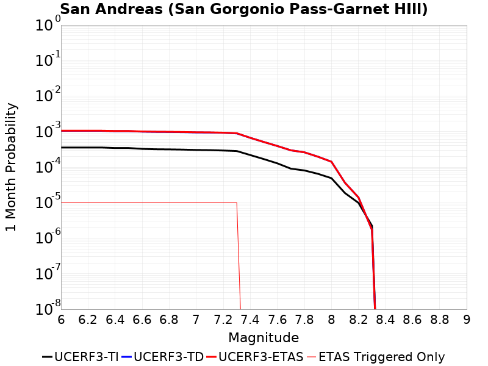 |  | 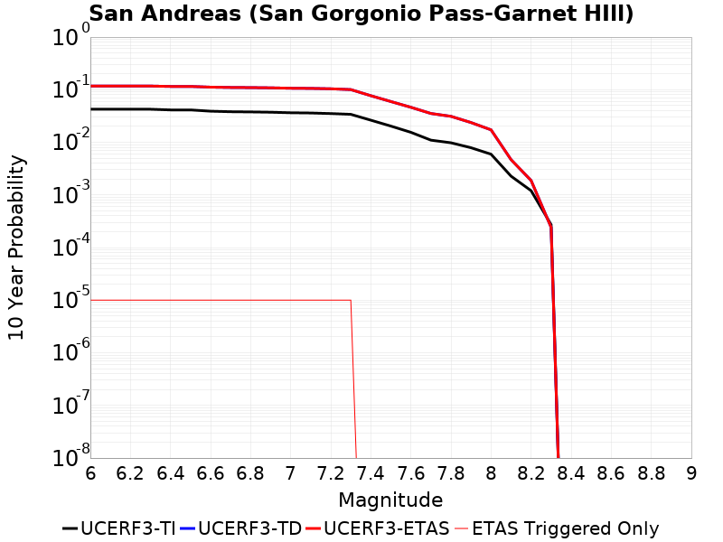 |

| Magnitude | 1 wk TI Prob | 1 wk TD Prob | 1 wk ETAS Prob | 1 wk ETAS/TD Gain | 1 wk ETAS Triggered Only | 1 mo TI Prob | 1 mo TD Prob | 1 mo ETAS Prob | 1 mo ETAS/TD Gain | 1 mo ETAS Triggered Only | 1 yr TI Prob | 1 yr TD Prob | 1 yr ETAS Prob | 1 yr ETAS/TD Gain | 1 yr ETAS Triggered Only | 10 yr TI Prob | 10 yr TD Prob | 10 yr ETAS Prob | 10 yr ETAS/TD Gain | 10 yr ETAS Triggered Only |
|-----|-----|-----|-----|-----|-----|-----|-----|-----|-----|-----|-----|-----|-----|-----|-----|-----|-----|-----|-----|-----|
| 6.0 | 8.31567E-5 | 2.4465667E-4 | 2.6465175E-4 | 1.0817273 | 2.0E-5 | 3.5633717E-4 | 0.001048109 | 0.001068088 | 1.019062 | 2.0E-5 | 0.004329778 | 0.012685969 | 0.012715588 | 1.0023348 | 3.0E-5 | 0.042463828 | 0.11701894 | 0.117045425 | 1.0002264 | 3.0E-5 |
| 6.1 | 8.31567E-5 | 2.4465667E-4 | 2.6465175E-4 | 1.0817273 | 2.0E-5 | 3.5633717E-4 | 0.001048109 | 0.001068088 | 1.019062 | 2.0E-5 | 0.004329778 | 0.012685969 | 0.012715588 | 1.0023348 | 3.0E-5 | 0.042463828 | 0.11701894 | 0.117045425 | 1.0002264 | 3.0E-5 |
| 6.2 | 8.31567E-5 | 2.4465667E-4 | 2.6465175E-4 | 1.0817273 | 2.0E-5 | 3.5633717E-4 | 0.001048109 | 0.001068088 | 1.019062 | 2.0E-5 | 0.004329778 | 0.012685969 | 0.012715588 | 1.0023348 | 3.0E-5 | 0.042463828 | 0.11701894 | 0.117045425 | 1.0002264 | 3.0E-5 |
| 6.3 | 8.31567E-5 | 2.4465667E-4 | 2.6465175E-4 | 1.0817273 | 2.0E-5 | 3.5633717E-4 | 0.001048109 | 0.001068088 | 1.019062 | 2.0E-5 | 0.004329778 | 0.012685969 | 0.012715588 | 1.0023348 | 3.0E-5 | 0.042463828 | 0.11701894 | 0.117045425 | 1.0002264 | 3.0E-5 |
| 6.4 | 8.059055E-5 | 2.4016376E-4 | 2.6015897E-4 | 1.0832565 | 2.0E-5 | 3.4534236E-4 | 0.0010288698 | 0.0010488492 | 1.0194188 | 2.0E-5 | 0.0041964394 | 0.012454777 | 0.012484403 | 1.0023787 | 3.0E-5 | 0.041180745 | 0.114981145 | 0.1150077 | 1.0002309 | 3.0E-5 |
| 6.5 | 8.059055E-5 | 2.4016376E-4 | 2.6015897E-4 | 1.0832565 | 2.0E-5 | 3.4534236E-4 | 0.0010288698 | 0.0010488492 | 1.0194188 | 2.0E-5 | 0.0041964394 | 0.012454777 | 0.012484403 | 1.0023787 | 3.0E-5 | 0.041180745 | 0.114981145 | 0.1150077 | 1.0002309 | 3.0E-5 |
| 6.6 | 7.619237E-5 | 2.3250267E-4 | 2.5249802E-4 | 1.0860006 | 2.0E-5 | 3.2649786E-4 | 9.960618E-4 | 0.001016042 | 1.0200591 | 2.0E-5 | 0.0039678677 | 0.012060218 | 0.012089856 | 1.0024575 | 3.0E-5 | 0.03897764 | 0.11148894 | 0.11151559 | 1.0002391 | 3.0E-5 |
| 6.7 | 7.440636E-5 | 2.2922455E-4 | 2.4921997E-4 | 1.0872307 | 2.0E-5 | 3.188454E-4 | 9.820234E-4 | 0.0010020038 | 1.0203462 | 2.0E-5 | 0.0038750346 | 0.011891174 | 0.011920817 | 1.0024929 | 3.0E-5 | 0.038081564 | 0.10998879 | 0.11001549 | 1.0002427 | 3.0E-5 |
| 6.8 | 7.3735864E-5 | 2.2767238E-4 | 2.4766783E-4 | 1.0878255 | 2.0E-5 | 3.1597257E-4 | 9.7537634E-4 | 9.953568E-4 | 1.0204849 | 2.0E-5 | 0.0038401815 | 0.011811128 | 0.011840774 | 1.00251 | 3.0E-5 | 0.03774495 | 0.1092836 | 0.109310314 | 1.0002445 | 3.0E-5 |
| 6.9 | 7.27575E-5 | 2.2533479E-4 | 2.453303E-4 | 1.0887368 | 2.0E-5 | 3.117806E-4 | 9.6536556E-4 | 9.853463E-4 | 1.0206976 | 2.0E-5 | 0.003789323 | 0.011690562 | 0.011720211 | 1.0025362 | 3.0E-5 | 0.037253562 | 0.10822471 | 0.10825147 | 1.0002472 | 3.0E-5 |
| 7.0 | 7.102591E-5 | 2.2111616E-4 | 2.4111173E-4 | 1.0904301 | 2.0E-5 | 3.0436125E-4 | 9.472989E-4 | 9.6727995E-4 | 1.0210927 | 2.0E-5 | 0.003699303 | 0.011472935 | 0.011502591 | 1.0025848 | 3.0E-5 | 0.03638325 | 0.10631236 | 0.106339164 | 1.0002522 | 3.0E-5 |
| 7.1 | 7.028513E-5 | 2.1944255E-4 | 2.3943816E-4 | 1.09112 | 2.0E-5 | 3.0118722E-4 | 9.401315E-4 | 9.6011267E-4 | 1.0212536 | 2.0E-5 | 0.0036607897 | 0.011386588 | 0.011416246 | 1.0026047 | 3.0E-5 | 0.036010686 | 0.1055459 | 0.10557273 | 1.0002543 | 3.0E-5 |
| 7.2 | 6.8498244E-5 | 2.1544249E-4 | 2.3543817E-4 | 1.0928122 | 2.0E-5 | 2.9353087E-4 | 9.2300057E-4 | 9.429821E-4 | 1.0216484 | 2.0E-5 | 0.003567883 | 0.0111801755 | 0.01120984 | 1.0026534 | 3.0E-5 | 0.035111405 | 0.10371256 | 0.10373945 | 1.0002593 | 3.0E-5 |
| 7.3 | 6.622592E-5 | 2.0755013E-4 | 2.1754806E-4 | 1.0481712 | 1.0E-5 | 2.8379448E-4 | 8.8919967E-4 | 8.991908E-4 | 1.0112361 | 1.0E-5 | 0.0034497243 | 0.010772791 | 0.010792575 | 1.0018365 | 2.0E-5 | 0.033966612 | 0.10015641 | 0.100174405 | 1.0001796 | 2.0E-5 |
| 7.4 | 5.1050705E-5 | 1.5571568E-4 | 1.5571568E-4 | 1.0 | 0.0 | 2.1877038E-4 | 6.671832E-4 | 6.671832E-4 | 1.0 | 0.0 | 0.002660276 | 0.008092915 | 0.008092915 | 1.0 | 0.0 | 0.02628654 | 0.07666043 | 0.07666043 | 1.0 | 0.0 |
| 7.5 | 3.9302922E-5 | 1.1894104E-4 | 1.1894104E-4 | 1.0 | 0.0 | 1.6843023E-4 | 5.0964806E-4 | 5.0964806E-4 | 1.0 | 0.0 | 0.0020487092 | 0.00618739 | 0.00618739 | 1.0 | 0.0 | 0.020299247 | 0.059367232 | 0.059367232 | 1.0 | 0.0 |
| 7.6 | 2.9851626E-5 | 9.16166E-5 | 9.16166E-5 | 1.0 | 0.0 | 1.2792926E-4 | 3.9258364E-4 | 3.9258364E-4 | 1.0 | 0.0 | 0.0015564259 | 0.00476926 | 0.00476926 | 1.0 | 0.0 | 0.0154556995 | 0.046158627 | 0.046158627 | 1.0 | 0.0 |
| 7.7 | 2.1135214E-5 | 6.9337155E-5 | 6.9337155E-5 | 1.0 | 0.0 | 9.0576345E-5 | 2.9712543E-4 | 2.9712543E-4 | 1.0 | 0.0 | 0.0011022091 | 0.003611508 | 0.003611508 | 1.0 | 0.0 | 0.010967582 | 0.035177056 | 0.035177056 | 1.0 | 0.0 |
| 7.8 | 1.883379E-5 | 6.0905128E-5 | 6.0905128E-5 | 1.0 | 0.0 | 8.0713755E-5 | 2.6099588E-4 | 2.6099588E-4 | 1.0 | 0.0 | 9.822468E-4 | 0.0031729985 | 0.0031729985 | 1.0 | 0.0 | 0.0097791655 | 0.031061338 | 0.031061338 | 1.0 | 0.0 |
| 7.9 | 1.5156185E-5 | 4.5840934E-5 | 4.5840934E-5 | 1.0 | 0.0 | 6.495346E-5 | 1.9644636E-4 | 1.9644636E-4 | 1.0 | 0.0 | 7.9052144E-4 | 0.0023891127 | 0.0023891127 | 1.0 | 0.0 | 0.007877152 | 0.023666754 | 0.023666754 | 1.0 | 0.0 |
| 8.0 | 1.1405907E-5 | 3.3074073E-5 | 3.3074073E-5 | 1.0 | 0.0 | 4.8881542E-5 | 1.4173833E-4 | 1.4173833E-4 | 1.0 | 0.0 | 5.9497025E-4 | 0.0017242995 | 0.0017242995 | 1.0 | 0.0 | 0.005933798 | 0.017201016 | 0.017201016 | 1.0 | 0.0 |
| 8.1 | 4.3511436E-6 | 8.466716E-6 | 8.466716E-6 | 1.0 | 0.0 | 1.8647626E-5 | 3.6285423E-5 | 3.6285423E-5 | 1.0 | 0.0 | 2.2701119E-4 | 4.4168564E-4 | 4.4168564E-4 | 1.0 | 0.0 | 0.0022677942 | 0.004657159 | 0.004657159 | 1.0 | 0.0 |
| 8.2 | 2.3042528E-6 | 3.2637677E-6 | 3.2637677E-6 | 1.0 | 0.0 | 9.875332E-6 | 1.3987501E-5 | 1.3987501E-5 | 1.0 | 0.0 | 1.2022553E-4 | 1.7028458E-4 | 1.7028458E-4 | 1.0 | 0.0 | 0.0012016051 | 0.0018707041 | 0.0018707041 | 1.0 | 0.0 |
| 8.3 | 5.202968E-7 | 3.9685835E-7 | 3.9685835E-7 | 1.0 | 0.0 | 2.2298414E-6 | 1.7008205E-6 | 1.7008205E-6 | 1.0 | 0.0 | 2.714798E-5 | 2.0707312E-5 | 2.0707312E-5 | 1.0 | 0.0 | 2.7144665E-4 | 2.4021482E-4 | 2.4021482E-4 | 1.0 | 0.0 |

## San Jacinto (Superstition Mtn)
*[(top)](#table-of-contents)*

| 1 Week | 1 Month | 1 Year | 10 Year |
|-----|-----|-----|-----|
|  | 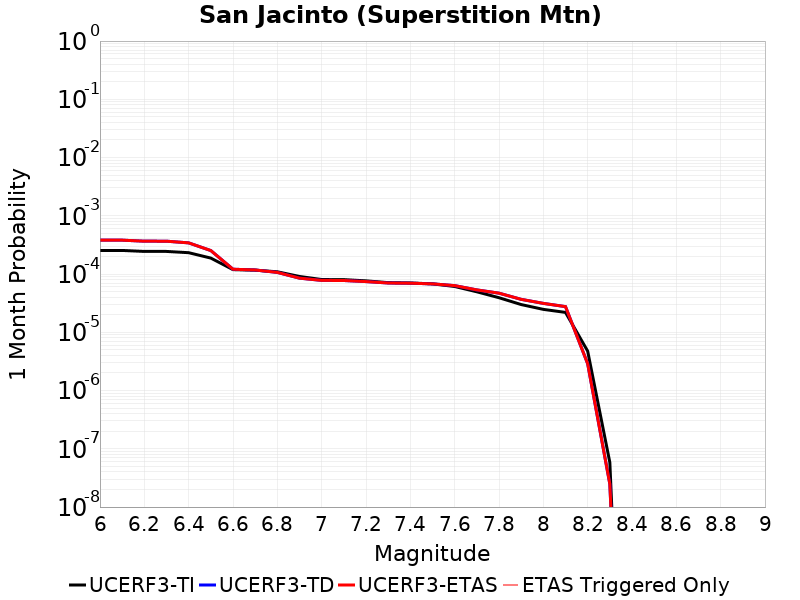 | 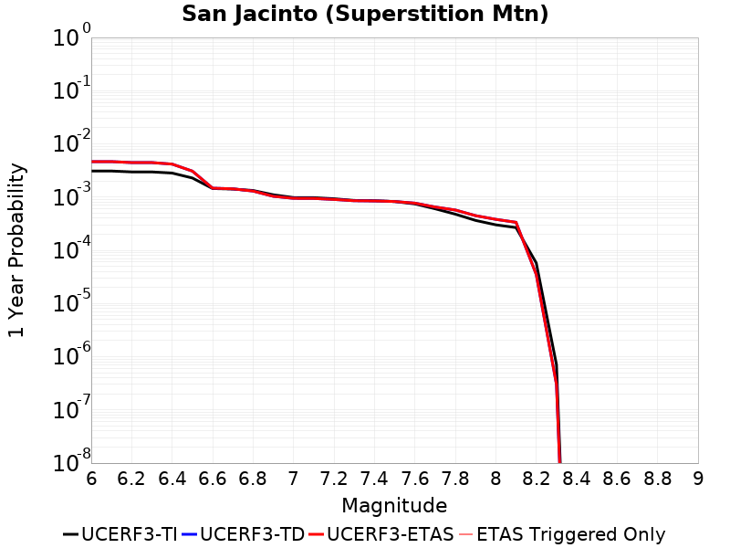 |  |

| Magnitude | 1 wk TI Prob | 1 wk TD Prob | 1 wk ETAS Prob | 1 wk ETAS/TD Gain | 1 wk ETAS Triggered Only | 1 mo TI Prob | 1 mo TD Prob | 1 mo ETAS Prob | 1 mo ETAS/TD Gain | 1 mo ETAS Triggered Only | 1 yr TI Prob | 1 yr TD Prob | 1 yr ETAS Prob | 1 yr ETAS/TD Gain | 1 yr ETAS Triggered Only | 10 yr TI Prob | 10 yr TD Prob | 10 yr ETAS Prob | 10 yr ETAS/TD Gain | 10 yr ETAS Triggered Only |
|-----|-----|-----|-----|-----|-----|-----|-----|-----|-----|-----|-----|-----|-----|-----|-----|-----|-----|-----|-----|-----|
| 6.0 | 5.921579E-5 | 8.8868925E-5 | 9.886804E-5 | 1.1125152 | 1.0E-5 | 2.5375726E-4 | 3.808201E-4 | 3.9081628E-4 | 1.0262492 | 1.0E-5 | 0.0030851178 | 0.004628166 | 0.00463812 | 1.0021507 | 1.0E-5 | 0.030426376 | 0.045387737 | 0.04539728 | 1.0002103 | 1.0E-5 |
| 6.1 | 5.921579E-5 | 8.8868925E-5 | 9.886804E-5 | 1.1125152 | 1.0E-5 | 2.5375726E-4 | 3.808201E-4 | 3.9081628E-4 | 1.0262492 | 1.0E-5 | 0.0030851178 | 0.004628166 | 0.00463812 | 1.0021507 | 1.0E-5 | 0.030426376 | 0.045387737 | 0.04539728 | 1.0002103 | 1.0E-5 |
| 6.2 | 5.6963574E-5 | 8.53581E-5 | 9.5357245E-5 | 1.1171435 | 1.0E-5 | 2.4410675E-4 | 3.657779E-4 | 3.7577425E-4 | 1.027329 | 1.0E-5 | 0.0029679495 | 0.0044458783 | 0.004455834 | 1.0022392 | 1.0E-5 | 0.029286223 | 0.043646887 | 0.04365645 | 1.0002191 | 1.0E-5 |
| 6.3 | 5.6940098E-5 | 8.5312386E-5 | 9.531153E-5 | 1.1172063 | 1.0E-5 | 2.4400617E-4 | 3.6558203E-4 | 3.7557838E-4 | 1.0273436 | 1.0E-5 | 0.002966728 | 0.0044435035 | 0.004453459 | 1.0022404 | 1.0E-5 | 0.029274331 | 0.043624226 | 0.04363379 | 1.0002192 | 1.0E-5 |
| 6.4 | 5.4171585E-5 | 7.9829166E-5 | 7.9829166E-5 | 1.0 | 0.0 | 2.3214328E-4 | 3.4208933E-4 | 3.4208933E-4 | 1.0 | 0.0 | 0.0028226813 | 0.004158613 | 0.004158613 | 1.0 | 0.0 | 0.02787096 | 0.040924914 | 0.040924914 | 1.0 | 0.0 |
| 6.5 | 4.375144E-5 | 5.8882444E-5 | 5.8882444E-5 | 1.0 | 0.0 | 1.874927E-4 | 2.5233548E-4 | 2.5233548E-4 | 1.0 | 0.0 | 0.0022803338 | 0.003069019 | 0.003069019 | 1.0 | 0.0 | 0.022570757 | 0.0304991 | 0.0304991 | 1.0 | 0.0 |
| 6.6 | 2.772192E-5 | 2.8134225E-5 | 2.8134225E-5 | 1.0 | 0.0 | 1.1880282E-4 | 1.20569806E-4 | 1.20569806E-4 | 1.0 | 0.0 | 0.0014454646 | 0.001466971 | 0.001466971 | 1.0 | 0.0 | 0.014360986 | 0.014900402 | 0.014900402 | 1.0 | 0.0 |
| 6.7 | 2.7124124E-5 | 2.7326143E-5 | 2.7326143E-5 | 1.0 | 0.0 | 1.1624106E-4 | 1.1710691E-4 | 1.1710691E-4 | 1.0 | 0.0 | 0.0014143161 | 0.001424866 | 0.001424866 | 1.0 | 0.0 | 0.014053487 | 0.0144849215 | 0.0144849215 | 1.0 | 0.0 |
| 6.8 | 2.5475807E-5 | 2.480165E-5 | 2.480165E-5 | 1.0 | 0.0 | 1.0917746E-4 | 1.06288535E-4 | 1.06288535E-4 | 1.0 | 0.0 | 0.001328425 | 0.0012933095 | 0.0012933095 | 1.0 | 0.0 | 0.0132051185 | 0.013180648 | 0.013180648 | 1.0 | 0.0 |
| 6.9 | 2.1162023E-5 | 1.9761703E-5 | 1.9761703E-5 | 1.0 | 0.0 | 9.069123E-5 | 8.469029E-5 | 8.469029E-5 | 1.0 | 0.0 | 0.0011036064 | 0.0010306212 | 0.0010306212 | 1.0 | 0.0 | 0.010981417 | 0.010552676 | 0.010552676 | 1.0 | 0.0 |
| 7.0 | 1.8754288E-5 | 1.8094539E-5 | 1.8094539E-5 | 1.0 | 0.0 | 8.037304E-5 | 7.754574E-5 | 7.754574E-5 | 1.0 | 0.0 | 9.781026E-4 | 9.437134E-4 | 9.437134E-4 | 1.0 | 0.0 | 0.009738087 | 0.009672864 | 0.009672864 | 1.0 | 0.0 |
| 7.1 | 1.8678527E-5 | 1.8014076E-5 | 1.8014076E-5 | 1.0 | 0.0 | 8.0048376E-5 | 7.720091E-5 | 7.720091E-5 | 1.0 | 0.0 | 9.7415317E-4 | 9.3951874E-4 | 9.3951874E-4 | 1.0 | 0.0 | 0.009698939 | 0.009631009 | 0.009631009 | 1.0 | 0.0 |
| 7.2 | 1.7804578E-5 | 1.7253975E-5 | 1.7253975E-5 | 1.0 | 0.0 | 7.6303106E-5 | 7.394353E-5 | 7.394353E-5 | 1.0 | 0.0 | 9.285943E-4 | 8.998933E-4 | 8.998933E-4 | 1.0 | 0.0 | 0.009247236 | 0.009234722 | 0.009234722 | 1.0 | 0.0 |
| 7.3 | 1.6583685E-5 | 1.6324273E-5 | 1.6324273E-5 | 1.0 | 0.0 | 7.1070994E-5 | 6.995931E-5 | 6.995931E-5 | 1.0 | 0.0 | 8.649459E-4 | 8.514242E-4 | 8.514242E-4 | 1.0 | 0.0 | 0.00861587 | 0.008750354 | 0.008750354 | 1.0 | 0.0 |
| 7.4 | 1.6387552E-5 | 1.617712E-5 | 1.617712E-5 | 1.0 | 0.0 | 7.023047E-5 | 6.9328686E-5 | 6.9328686E-5 | 1.0 | 0.0 | 8.5472054E-4 | 8.4375223E-4 | 8.4375223E-4 | 1.0 | 0.0 | 0.008514405 | 0.008673614 | 0.008673614 | 1.0 | 0.0 |
| 7.5 | 1.5790754E-5 | 1.5780724E-5 | 1.5780724E-5 | 1.0 | 0.0 | 6.767291E-5 | 6.762994E-5 | 6.762994E-5 | 1.0 | 0.0 | 8.236062E-4 | 8.2308584E-4 | 8.2308584E-4 | 1.0 | 0.0 | 0.008205604 | 0.008465131 | 0.008465131 | 1.0 | 0.0 |
| 7.6 | 1.4248672E-5 | 1.471255E-5 | 1.471255E-5 | 1.0 | 0.0 | 6.106431E-5 | 6.305228E-5 | 6.305228E-5 | 1.0 | 0.0 | 7.432043E-4 | 7.6739315E-4 | 7.6739315E-4 | 1.0 | 0.0 | 0.007407237 | 0.007902893 | 0.007902893 | 1.0 | 0.0 |
| 7.7 | 1.15449975E-5 | 1.2418523E-5 | 1.2418523E-5 | 1.0 | 0.0 | 4.947762E-5 | 5.322116E-5 | 5.322116E-5 | 1.0 | 0.0 | 6.022235E-4 | 6.47776E-4 | 6.47776E-4 | 1.0 | 0.0 | 0.006005941 | 0.0067003486 | 0.0067003486 | 1.0 | 0.0 |
| 7.8 | 9.1391985E-6 | 1.09116645E-5 | 1.09116645E-5 | 1.0 | 0.0 | 3.9167408E-5 | 4.676344E-5 | 4.676344E-5 | 1.0 | 0.0 | 4.767588E-4 | 5.6919694E-4 | 5.6919694E-4 | 1.0 | 0.0 | 0.0047573727 | 0.0059061595 | 0.0059061595 | 1.0 | 0.0 |
| 7.9 | 6.973017E-6 | 8.545253E-6 | 8.545253E-6 | 1.0 | 0.0 | 2.9884017E-5 | 3.6622E-5 | 3.6622E-5 | 1.0 | 0.0 | 3.6377716E-4 | 4.4578235E-4 | 4.4578235E-4 | 1.0 | 0.0 | 0.0036318225 | 0.0046604755 | 0.0046604755 | 1.0 | 0.0 |
| 8.0 | 5.7638235E-6 | 7.2828393E-6 | 7.2828393E-6 | 1.0 | 0.0 | 2.4701867E-5 | 3.12118E-5 | 3.12118E-5 | 1.0 | 0.0 | 3.0070372E-4 | 3.7993805E-4 | 3.7993805E-4 | 1.0 | 0.0 | 0.0030029714 | 0.003989363 | 0.003989363 | 1.0 | 0.0 |
| 8.1 | 5.1124434E-6 | 6.408339E-6 | 6.408339E-6 | 1.0 | 0.0 | 2.1910288E-5 | 2.7464024E-5 | 2.7464024E-5 | 1.0 | 0.0 | 2.6672508E-4 | 3.3432385E-4 | 3.3432385E-4 | 1.0 | 0.0 | 0.0026640517 | 0.0035193048 | 0.0035193048 | 1.0 | 0.0 |
| 8.2 | 1.1075938E-6 | 6.6879755E-7 | 6.6879755E-7 | 1.0 | 0.0 | 4.7468216E-6 | 2.8662723E-6 | 2.8662723E-6 | 1.0 | 0.0 | 5.779102E-5 | 3.489634E-5 | 3.489634E-5 | 1.0 | 0.0 | 5.777599E-4 | 3.8821626E-4 | 3.8821626E-4 | 1.0 | 0.0 |
| 8.3 | 1.3584393E-8 | 5.7453753E-9 | 5.7453753E-9 | 1.0 | 0.0 | 5.8218827E-8 | 2.4623036E-8 | 2.4623036E-8 | 1.0 | 0.0 | 7.0881396E-7 | 2.9978546E-7 | 2.9978546E-7 | 1.0 | 0.0 | 7.0881174E-6 | 3.3218928E-6 | 3.3218928E-6 | 1.0 | 0.0 |

## Cerro Prieto
*[(top)](#table-of-contents)*

| 1 Week | 1 Month | 1 Year | 10 Year |
|-----|-----|-----|-----|
|  | 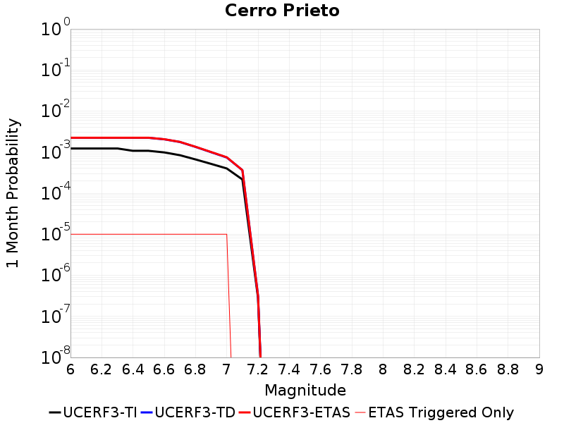 | 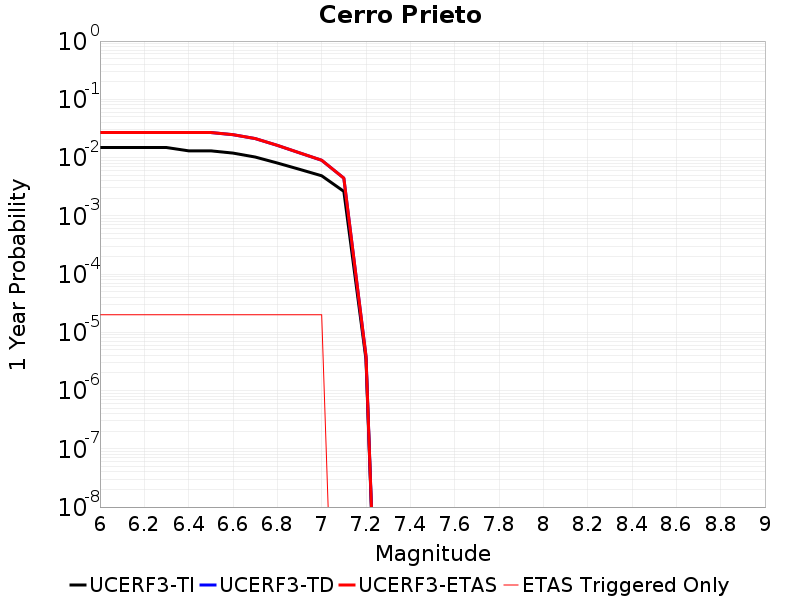 | 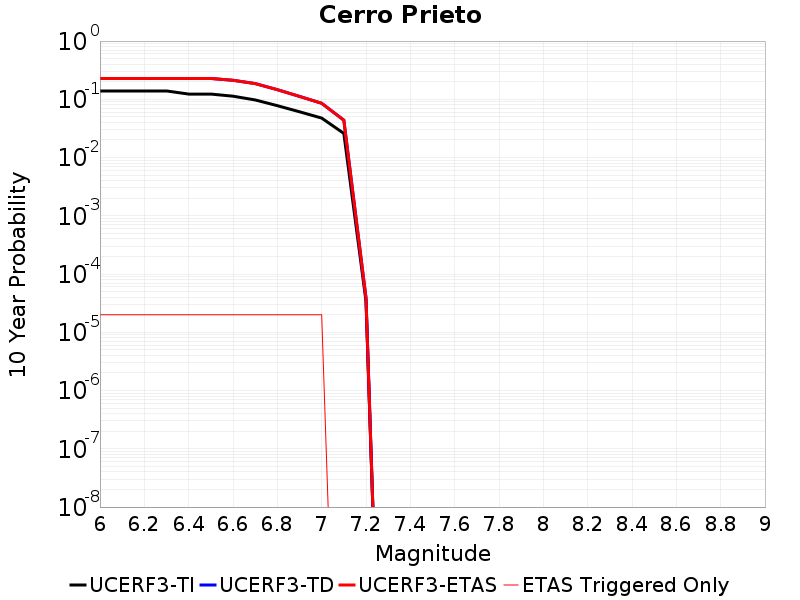 |

| Magnitude | 1 wk TI Prob | 1 wk TD Prob | 1 wk ETAS Prob | 1 wk ETAS/TD Gain | 1 wk ETAS Triggered Only | 1 mo TI Prob | 1 mo TD Prob | 1 mo ETAS Prob | 1 mo ETAS/TD Gain | 1 mo ETAS Triggered Only | 1 yr TI Prob | 1 yr TD Prob | 1 yr ETAS Prob | 1 yr ETAS/TD Gain | 1 yr ETAS Triggered Only | 10 yr TI Prob | 10 yr TD Prob | 10 yr ETAS Prob | 10 yr ETAS/TD Gain | 10 yr ETAS Triggered Only |
|-----|-----|-----|-----|-----|-----|-----|-----|-----|-----|-----|-----|-----|-----|-----|-----|-----|-----|-----|-----|-----|
| 6.0 | 2.863869E-4 | 5.2066805E-4 | 5.3066283E-4 | 1.0191962 | 1.0E-5 | 0.001226795 | 0.002229727 | 0.0022397048 | 1.0044749 | 1.0E-5 | 0.014834271 | 0.026828922 | 0.026848385 | 1.0007255 | 2.0E-5 | 0.13882194 | 0.22739662 | 0.22741207 | 1.000068 | 2.0E-5 |
| 6.1 | 2.863869E-4 | 5.2066805E-4 | 5.3066283E-4 | 1.0191962 | 1.0E-5 | 0.001226795 | 0.002229727 | 0.0022397048 | 1.0044749 | 1.0E-5 | 0.014834271 | 0.026828922 | 0.026848385 | 1.0007255 | 2.0E-5 | 0.13882194 | 0.22739662 | 0.22741207 | 1.000068 | 2.0E-5 |
| 6.2 | 2.863869E-4 | 5.2066805E-4 | 5.3066283E-4 | 1.0191962 | 1.0E-5 | 0.001226795 | 0.002229727 | 0.0022397048 | 1.0044749 | 1.0E-5 | 0.014834271 | 0.026828922 | 0.026848385 | 1.0007255 | 2.0E-5 | 0.13882194 | 0.22739662 | 0.22741207 | 1.000068 | 2.0E-5 |
| 6.3 | 2.863869E-4 | 5.2066805E-4 | 5.3066283E-4 | 1.0191962 | 1.0E-5 | 0.001226795 | 0.002229727 | 0.0022397048 | 1.0044749 | 1.0E-5 | 0.014834271 | 0.026828922 | 0.026848385 | 1.0007255 | 2.0E-5 | 0.13882194 | 0.22739662 | 0.22741207 | 1.000068 | 2.0E-5 |
| 6.4 | 2.508648E-4 | 5.2066805E-4 | 5.3066283E-4 | 1.0191962 | 1.0E-5 | 0.0010746918 | 0.002229727 | 0.0022397048 | 1.0044749 | 1.0E-5 | 0.013006088 | 0.026828922 | 0.026848385 | 1.0007255 | 2.0E-5 | 0.12270685 | 0.22739662 | 0.22741207 | 1.000068 | 2.0E-5 |
| 6.5 | 2.508648E-4 | 5.2066805E-4 | 5.3066283E-4 | 1.0191962 | 1.0E-5 | 0.0010746918 | 0.002229727 | 0.0022397048 | 1.0044749 | 1.0E-5 | 0.013006088 | 0.026828922 | 0.026848385 | 1.0007255 | 2.0E-5 | 0.12270685 | 0.22739662 | 0.22741207 | 1.000068 | 2.0E-5 |
| 6.6 | 2.294914E-4 | 4.782268E-4 | 4.8822202E-4 | 1.0209006 | 1.0E-5 | 9.831638E-4 | 0.0020481239 | 0.0020581032 | 1.0048726 | 1.0E-5 | 0.011904482 | 0.024633603 | 0.02465311 | 1.0007919 | 2.0E-5 | 0.11286586 | 0.21155198 | 0.21156776 | 1.0000745 | 2.0E-5 |
| 6.7 | 1.9621674E-4 | 4.114555E-4 | 4.2145138E-4 | 1.024294 | 1.0E-5 | 8.4065786E-4 | 0.0017623503 | 0.0017723327 | 1.0056642 | 1.0E-5 | 0.010187071 | 0.021135846 | 0.021155424 | 1.0009263 | 2.0E-5 | 0.09732539 | 0.18579678 | 0.18581307 | 1.0000876 | 2.0E-5 |
| 6.8 | 1.5476145E-4 | 3.1244737E-4 | 3.2244425E-4 | 1.0319954 | 1.0E-5 | 6.6309475E-4 | 0.0013384783 | 0.0013484649 | 1.0074612 | 1.0E-5 | 0.008043335 | 0.016149217 | 0.016168894 | 1.0012184 | 2.0E-5 | 0.07758363 | 0.14603464 | 0.14605172 | 1.000117 | 2.0E-5 |
| 6.9 | 1.20509176E-4 | 2.3195444E-4 | 2.4195213E-4 | 1.0431019 | 1.0E-5 | 5.1636563E-4 | 9.937776E-4 | 0.0010037677 | 1.0100526 | 1.0E-5 | 0.006268645 | 0.012012476 | 0.012032236 | 1.001645 | 2.0E-5 | 0.060947374 | 0.11190601 | 0.11192377 | 1.0001587 | 2.0E-5 |
| 7.0 | 9.3269155E-5 | 1.72301E-4 | 1.8229929E-4 | 1.058028 | 1.0E-5 | 3.9966372E-4 | 7.3826924E-4 | 7.4826187E-4 | 1.0135351 | 1.0E-5 | 0.0048550544 | 0.008959428 | 0.00897925 | 1.0022123 | 2.0E-5 | 0.04750344 | 0.08527018 | 0.08528848 | 1.0002146 | 2.0E-5 |
| 7.1 | 5.029709E-5 | 8.484251E-5 | 8.484251E-5 | 1.0 | 0.0 | 2.1554115E-4 | 3.6358068E-4 | 3.6358068E-4 | 1.0 | 0.0 | 0.0026210553 | 0.0044212583 | 0.0044212583 | 1.0 | 0.0 | 0.025903556 | 0.04369726 | 0.04369726 | 1.0 | 0.0 |
| 7.2 | 6.5445185E-8 | 7.435469E-8 | 7.435469E-8 | 1.0 | 0.0 | 2.8047933E-7 | 3.1866293E-7 | 3.1866293E-7 | 1.0 | 0.0 | 3.4148304E-6 | 3.879721E-6 | 3.879721E-6 | 1.0 | 0.0 | 3.414778E-5 | 3.879721E-5 | 3.879721E-5 | 1.0 | 0.0 |

## San Clemente
*[(top)](#table-of-contents)*

| 1 Week | 1 Month | 1 Year | 10 Year |
|-----|-----|-----|-----|
| 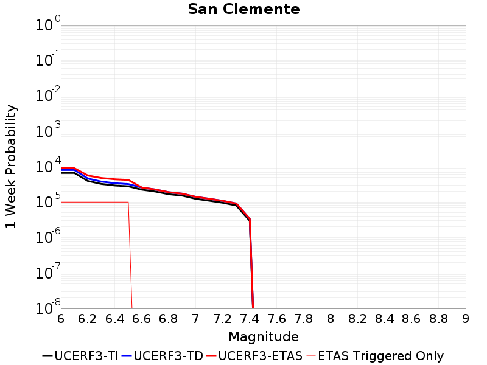 | 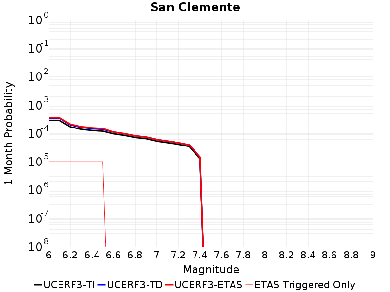 | 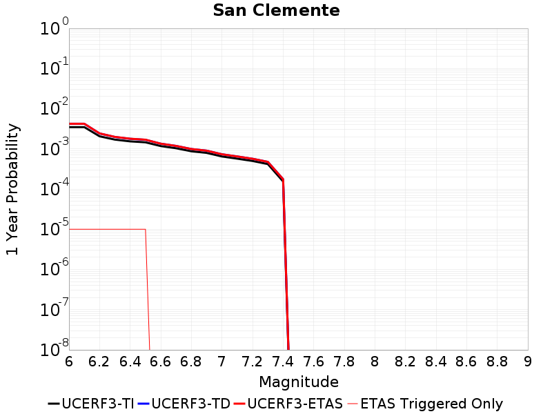 | 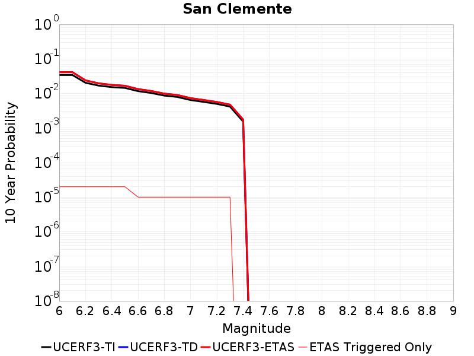 |

| Magnitude | 1 wk TI Prob | 1 wk TD Prob | 1 wk ETAS Prob | 1 wk ETAS/TD Gain | 1 wk ETAS Triggered Only | 1 mo TI Prob | 1 mo TD Prob | 1 mo ETAS Prob | 1 mo ETAS/TD Gain | 1 mo ETAS Triggered Only | 1 yr TI Prob | 1 yr TD Prob | 1 yr ETAS Prob | 1 yr ETAS/TD Gain | 1 yr ETAS Triggered Only | 10 yr TI Prob | 10 yr TD Prob | 10 yr ETAS Prob | 10 yr ETAS/TD Gain | 10 yr ETAS Triggered Only |
|-----|-----|-----|-----|-----|-----|-----|-----|-----|-----|-----|-----|-----|-----|-----|-----|-----|-----|-----|-----|-----|
| 6.0 | 6.681379E-5 | 8.075263E-5 | 9.075182E-5 | 1.123825 | 1.0E-5 | 2.8631336E-4 | 3.4603986E-4 | 3.5603638E-4 | 1.0288885 | 1.0E-5 | 0.003480294 | 0.004205419 | 0.004215377 | 1.0023679 | 1.0E-5 | 0.03426291 | 0.04131524 | 0.041334413 | 1.0004641 | 2.0E-5 |
| 6.1 | 6.681379E-5 | 8.075263E-5 | 9.075182E-5 | 1.123825 | 1.0E-5 | 2.8631336E-4 | 3.4603986E-4 | 3.5603638E-4 | 1.0288885 | 1.0E-5 | 0.003480294 | 0.004205419 | 0.004215377 | 1.0023679 | 1.0E-5 | 0.03426291 | 0.04131524 | 0.041334413 | 1.0004641 | 2.0E-5 |
| 6.2 | 3.9400576E-5 | 4.630346E-5 | 5.6302993E-5 | 1.2159566 | 1.0E-5 | 1.6884868E-4 | 1.9842859E-4 | 2.084266E-4 | 1.050386 | 1.0E-5 | 0.0020537945 | 0.0024132484 | 0.0024232243 | 1.0041338 | 1.0E-5 | 0.020349167 | 0.023877436 | 0.02389696 | 1.0008177 | 2.0E-5 |
| 6.3 | 3.2590255E-5 | 3.7899154E-5 | 4.7898775E-5 | 1.2638482 | 1.0E-5 | 1.3966505E-4 | 1.6241502E-4 | 1.7241339E-4 | 1.0615606 | 1.0E-5 | 0.0016990956 | 0.0019756407 | 0.0019856207 | 1.0050516 | 1.0E-5 | 0.01686163 | 0.019584637 | 0.019604245 | 1.0010012 | 2.0E-5 |
| 6.4 | 2.9454652E-5 | 3.4098277E-5 | 4.4097935E-5 | 1.29326 | 1.0E-5 | 1.2622811E-4 | 1.4612744E-4 | 1.5612597E-4 | 1.0684234 | 1.0E-5 | 0.0015357438 | 0.0017776762 | 0.0017876583 | 1.0056154 | 1.0E-5 | 0.015251739 | 0.01763776 | 0.017657407 | 1.0011139 | 2.0E-5 |
| 6.5 | 2.790836E-5 | 3.22552E-5 | 4.2254876E-5 | 1.3100176 | 1.0E-5 | 1.1960178E-4 | 1.3822938E-4 | 1.48228E-4 | 1.0723336 | 1.0E-5 | 0.001455179 | 0.0016816693 | 0.0016916525 | 1.0059365 | 1.0E-5 | 0.014456868 | 0.016692469 | 0.016712135 | 1.0011781 | 2.0E-5 |
| 6.6 | 2.2492153E-5 | 2.5789712E-5 | 2.5789712E-5 | 1.0 | 0.0 | 9.639138E-5 | 1.10522735E-4 | 1.10522735E-4 | 1.0 | 0.0 | 0.0011729331 | 0.0013447985 | 0.0013447985 | 1.0 | 0.0 | 0.011667615 | 0.013368326 | 0.013378193 | 1.000738 | 1.0E-5 |
| 6.7 | 1.9862755E-5 | 2.269691E-5 | 2.269691E-5 | 1.0 | 0.0 | 8.512331E-5 | 9.726891E-5 | 9.726891E-5 | 1.0 | 0.0 | 0.0010358836 | 0.0011836168 | 0.0011836168 | 1.0 | 0.0 | 0.010310682 | 0.011774424 | 0.011784307 | 1.0008394 | 1.0E-5 |
| 6.8 | 1.6697575E-5 | 1.900844E-5 | 1.900844E-5 | 1.0 | 0.0 | 7.155907E-5 | 8.146225E-5 | 8.146225E-5 | 1.0 | 0.0 | 8.7088346E-4 | 9.91361E-4 | 9.91361E-4 | 1.0 | 0.0 | 0.008674784 | 0.0098704165 | 0.009880317 | 1.0010031 | 1.0E-5 |
| 6.9 | 1.5218415E-5 | 1.729891E-5 | 1.729891E-5 | 1.0 | 0.0 | 6.522015E-5 | 7.413612E-5 | 7.413612E-5 | 1.0 | 0.0 | 7.93766E-4 | 9.022424E-4 | 9.022424E-4 | 1.0 | 0.0 | 0.007909367 | 0.008986742 | 0.008996652 | 1.0011028 | 1.0E-5 |
| 7.0 | 1.2392958E-5 | 1.4058584E-5 | 1.4058584E-5 | 1.0 | 0.0 | 5.3111595E-5 | 6.0249728E-5 | 6.0249728E-5 | 1.0 | 0.0 | 6.4644177E-4 | 7.3330116E-4 | 7.3330116E-4 | 1.0 | 0.0 | 0.0064456454 | 0.0073096035 | 0.0073195305 | 1.001358 | 1.0E-5 |
| 7.1 | 1.0934128E-5 | 1.2398103E-5 | 1.2398103E-5 | 1.0 | 0.0 | 4.6859706E-5 | 5.3133685E-5 | 5.3133685E-5 | 1.0 | 0.0 | 5.7036756E-4 | 6.467179E-4 | 6.467179E-4 | 1.0 | 0.0 | 0.0056890585 | 0.006449108 | 0.0064590434 | 1.0015407 | 1.0E-5 |
| 7.2 | 9.5798805E-6 | 1.0865161E-5 | 1.0865161E-5 | 1.0 | 0.0 | 4.1055984E-5 | 4.6564186E-5 | 4.6564186E-5 | 1.0 | 0.0 | 4.9974193E-4 | 5.667787E-4 | 5.667787E-4 | 1.0 | 0.0 | 0.0049861963 | 0.0056540584 | 0.0056640017 | 1.0017587 | 1.0E-5 |
| 7.3 | 8.0167365E-6 | 9.100675E-6 | 9.100675E-6 | 1.0 | 0.0 | 3.4356988E-5 | 3.900235E-5 | 3.900235E-5 | 1.0 | 0.0 | 4.1821605E-4 | 4.7475722E-4 | 4.7475722E-4 | 1.0 | 0.0 | 0.0041742986 | 0.004738135 | 0.004748088 | 1.0021006 | 1.0E-5 |
| 7.4 | 2.9581017E-6 | 3.3676843E-6 | 3.3676843E-6 | 1.0 | 0.0 | 1.2677518E-5 | 1.44328815E-5 | 1.44328815E-5 | 1.0 | 0.0 | 1.5433785E-4 | 1.7571123E-4 | 1.7571123E-4 | 1.0 | 0.0 | 0.001542307 | 0.0017562195 | 0.0017562195 | 1.0 | 0.0 |

## Panamint Valley
*[(top)](#table-of-contents)*

| 1 Week | 1 Month | 1 Year | 10 Year |
|-----|-----|-----|-----|
| 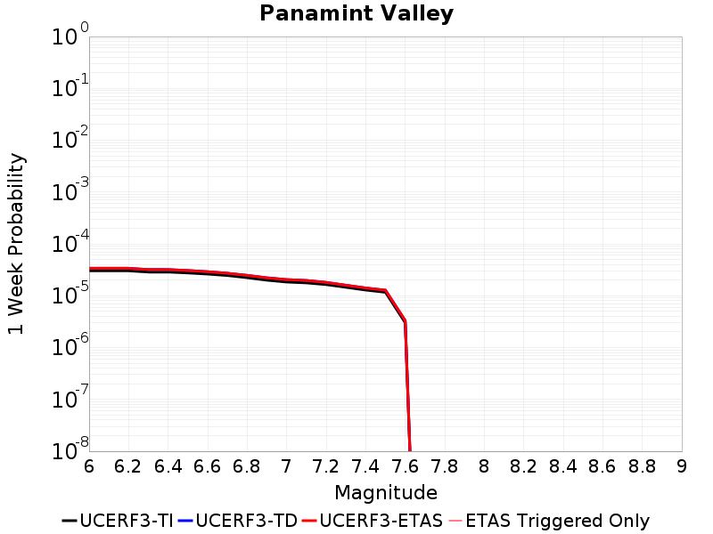 | 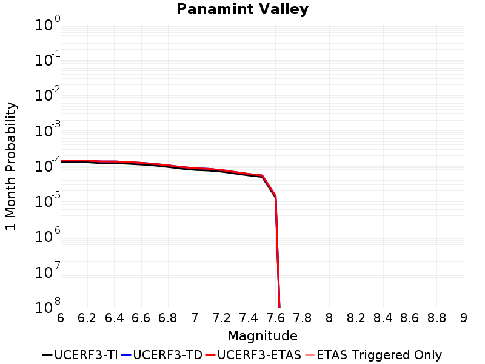 | 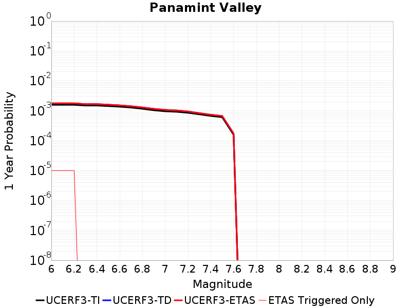 | 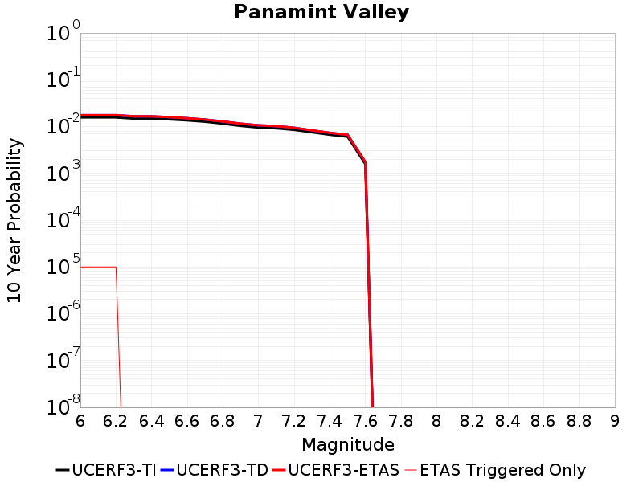 |

| Magnitude | 1 wk TI Prob | 1 wk TD Prob | 1 wk ETAS Prob | 1 wk ETAS/TD Gain | 1 wk ETAS Triggered Only | 1 mo TI Prob | 1 mo TD Prob | 1 mo ETAS Prob | 1 mo ETAS/TD Gain | 1 mo ETAS Triggered Only | 1 yr TI Prob | 1 yr TD Prob | 1 yr ETAS Prob | 1 yr ETAS/TD Gain | 1 yr ETAS Triggered Only | 10 yr TI Prob | 10 yr TD Prob | 10 yr ETAS Prob | 10 yr ETAS/TD Gain | 10 yr ETAS Triggered Only |
|-----|-----|-----|-----|-----|-----|-----|-----|-----|-----|-----|-----|-----|-----|-----|-----|-----|-----|-----|-----|-----|
| 6.0 | 3.0211835E-5 | 3.3804783E-5 | 3.3804783E-5 | 1.0 | 0.0 | 1.2947287E-4 | 1.4486976E-4 | 1.4486976E-4 | 1.0 | 0.0 | 0.0015751923 | 0.0017623915 | 0.0017723739 | 1.0056641 | 1.0E-5 | 0.015640736 | 0.017489593 | 0.017499419 | 1.0005617 | 1.0E-5 |
| 6.1 | 3.0211835E-5 | 3.3804783E-5 | 3.3804783E-5 | 1.0 | 0.0 | 1.2947287E-4 | 1.4486976E-4 | 1.4486976E-4 | 1.0 | 0.0 | 0.0015751923 | 0.0017623915 | 0.0017723739 | 1.0056641 | 1.0E-5 | 0.015640736 | 0.017489593 | 0.017499419 | 1.0005617 | 1.0E-5 |
| 6.2 | 3.0211835E-5 | 3.3804783E-5 | 3.3804783E-5 | 1.0 | 0.0 | 1.2947287E-4 | 1.4486976E-4 | 1.4486976E-4 | 1.0 | 0.0 | 0.0015751923 | 0.0017623915 | 0.0017723739 | 1.0056641 | 1.0E-5 | 0.015640736 | 0.017489593 | 0.017499419 | 1.0005617 | 1.0E-5 |
| 6.3 | 2.8573924E-5 | 3.1908814E-5 | 3.1908814E-5 | 1.0 | 0.0 | 1.2245393E-4 | 1.3674505E-4 | 1.3674505E-4 | 1.0 | 0.0 | 0.001489857 | 0.0016636269 | 0.0016636269 | 1.0 | 0.0 | 0.01479908 | 0.016517276 | 0.016517276 | 1.0 | 0.0 |
| 6.4 | 2.8573924E-5 | 3.1908814E-5 | 3.1908814E-5 | 1.0 | 0.0 | 1.2245393E-4 | 1.3674505E-4 | 1.3674505E-4 | 1.0 | 0.0 | 0.001489857 | 0.0016636269 | 0.0016636269 | 1.0 | 0.0 | 0.01479908 | 0.016517276 | 0.016517276 | 1.0 | 0.0 |
| 6.5 | 2.7468774E-5 | 3.062473E-5 | 3.062473E-5 | 1.0 | 0.0 | 1.1771801E-4 | 1.312424E-4 | 1.312424E-4 | 1.0 | 0.0 | 0.0014322745 | 0.001596732 | 0.001596732 | 1.0 | 0.0 | 0.014230782 | 0.015858036 | 0.015858036 | 1.0 | 0.0 |
| 6.6 | 2.6135967E-5 | 2.9040712E-5 | 2.9040712E-5 | 1.0 | 0.0 | 1.1200648E-4 | 1.2445441E-4 | 1.2445441E-4 | 1.0 | 0.0 | 0.0013628257 | 0.0015142052 | 0.0015142052 | 1.0 | 0.0 | 0.013544982 | 0.015044269 | 0.015044269 | 1.0 | 0.0 |
| 6.7 | 2.4498746E-5 | 2.7116124E-5 | 2.7116124E-5 | 1.0 | 0.0 | 1.04990395E-4 | 1.16206924E-4 | 1.16206924E-4 | 1.0 | 0.0 | 0.0012775084 | 0.0014139257 | 0.0014139257 | 1.0 | 0.0 | 0.012701893 | 0.014054475 | 0.014054475 | 1.0 | 0.0 |
| 6.8 | 2.2244329E-5 | 2.4697481E-5 | 2.4697481E-5 | 1.0 | 0.0 | 9.532935E-5 | 1.0584217E-4 | 1.0584217E-4 | 1.0 | 0.0 | 0.0011600169 | 0.0012878879 | 0.0012878879 | 1.0 | 0.0 | 0.011539802 | 0.012809015 | 0.012809015 | 1.0 | 0.0 |
| 6.9 | 1.9902658E-5 | 2.2146629E-5 | 2.2146629E-5 | 1.0 | 0.0 | 8.529431E-5 | 9.491077E-5 | 9.491077E-5 | 1.0 | 0.0 | 0.0010379635 | 0.0011549443 | 0.0011549443 | 1.0 | 0.0 | 0.010331288 | 0.011493826 | 0.011493826 | 1.0 | 0.0 |
| 7.0 | 1.8353881E-5 | 2.0446512E-5 | 2.0446512E-5 | 1.0 | 0.0 | 7.865712E-5 | 8.762506E-5 | 8.762506E-5 | 1.0 | 0.0 | 9.5722964E-4 | 0.0010663305 | 0.0010663305 | 1.0 | 0.0 | 0.009531168 | 0.010616417 | 0.010616417 | 1.0 | 0.0 |
| 7.1 | 1.7667631E-5 | 1.966884E-5 | 1.966884E-5 | 1.0 | 0.0 | 7.571623E-5 | 8.4292406E-5 | 8.4292406E-5 | 1.0 | 0.0 | 9.2145515E-4 | 0.0010257942 | 0.0010257942 | 1.0 | 0.0 | 0.009176437 | 0.010214817 | 0.010214817 | 1.0 | 0.0 |
| 7.2 | 1.6381597E-5 | 1.8072795E-5 | 1.8072795E-5 | 1.0 | 0.0 | 7.020495E-5 | 7.7452634E-5 | 7.7452634E-5 | 1.0 | 0.0 | 8.544101E-4 | 9.425949E-4 | 9.425949E-4 | 1.0 | 0.0 | 0.008511325 | 0.009389933 | 0.009389933 | 1.0 | 0.0 |
| 7.3 | 1.4520491E-5 | 1.5915473E-5 | 1.5915473E-5 | 1.0 | 0.0 | 6.222919E-5 | 6.8207475E-5 | 6.8207475E-5 | 1.0 | 0.0 | 7.57377E-4 | 8.301257E-4 | 8.301257E-4 | 1.0 | 0.0 | 0.0075480095 | 0.008272762 | 0.008272762 | 1.0 | 0.0 |
| 7.4 | 1.2852287E-5 | 1.4087601E-5 | 1.4087601E-5 | 1.0 | 0.0 | 5.5080065E-5 | 6.037412E-5 | 6.037412E-5 | 1.0 | 0.0 | 6.7039346E-4 | 7.348227E-4 | 7.348227E-4 | 1.0 | 0.0 | 0.0066837464 | 0.007326293 | 0.007326293 | 1.0 | 0.0 |
| 7.5 | 1.1637851E-5 | 1.2771287E-5 | 1.2771287E-5 | 1.0 | 0.0 | 4.987555E-5 | 5.473303E-5 | 5.473303E-5 | 1.0 | 0.0 | 6.070656E-4 | 6.661864E-4 | 6.661864E-4 | 1.0 | 0.0 | 0.006054099 | 0.0066442336 | 0.0066442336 | 1.0 | 0.0 |
| 7.6 | 3.0068115E-6 | 3.3124325E-6 | 3.3124325E-6 | 1.0 | 0.0 | 1.2886271E-5 | 1.4196102E-5 | 1.4196102E-5 | 1.0 | 0.0 | 1.5687906E-4 | 1.7283103E-4 | 1.7283103E-4 | 1.0 | 0.0 | 0.0015676835 | 0.0017282001 | 0.0017282001 | 1.0 | 0.0 |

## San Andreas (San Bernardino N)
*[(top)](#table-of-contents)*

| 1 Week | 1 Month | 1 Year | 10 Year |
|-----|-----|-----|-----|
|  |  |  |  |

| Magnitude | 1 wk TI Prob | 1 wk TD Prob | 1 wk ETAS Prob | 1 wk ETAS/TD Gain | 1 wk ETAS Triggered Only | 1 mo TI Prob | 1 mo TD Prob | 1 mo ETAS Prob | 1 mo ETAS/TD Gain | 1 mo ETAS Triggered Only | 1 yr TI Prob | 1 yr TD Prob | 1 yr ETAS Prob | 1 yr ETAS/TD Gain | 1 yr ETAS Triggered Only | 10 yr TI Prob | 10 yr TD Prob | 10 yr ETAS Prob | 10 yr ETAS/TD Gain | 10 yr ETAS Triggered Only |
|-----|-----|-----|-----|-----|-----|-----|-----|-----|-----|-----|-----|-----|-----|-----|-----|-----|-----|-----|-----|-----|
| 6.0 | 1.4273766E-4 | 3.350922E-4 | 3.350922E-4 | 1.0 | 0.0 | 6.115894E-4 | 0.0014353251 | 0.0014353251 | 1.0 | 0.0 | 0.0074207084 | 0.017336685 | 0.017336685 | 1.0 | 0.0 | 0.07177748 | 0.1580206 | 0.15802902 | 1.0000533 | 1.0E-5 |
| 6.1 | 1.4273766E-4 | 3.350922E-4 | 3.350922E-4 | 1.0 | 0.0 | 6.115894E-4 | 0.0014353251 | 0.0014353251 | 1.0 | 0.0 | 0.0074207084 | 0.017336685 | 0.017336685 | 1.0 | 0.0 | 0.07177748 | 0.1580206 | 0.15802902 | 1.0000533 | 1.0E-5 |
| 6.2 | 1.4273766E-4 | 3.350922E-4 | 3.350922E-4 | 1.0 | 0.0 | 6.115894E-4 | 0.0014353251 | 0.0014353251 | 1.0 | 0.0 | 0.0074207084 | 0.017336685 | 0.017336685 | 1.0 | 0.0 | 0.07177748 | 0.1580206 | 0.15802902 | 1.0000533 | 1.0E-5 |
| 6.3 | 1.3730655E-4 | 3.24032E-4 | 3.24032E-4 | 1.0 | 0.0 | 5.883239E-4 | 0.0013879753 | 0.0013879753 | 1.0 | 0.0 | 0.0071393442 | 0.01676918 | 0.01676918 | 1.0 | 0.0 | 0.06914291 | 0.15332404 | 0.1533325 | 1.0000552 | 1.0E-5 |
| 6.4 | 1.3730655E-4 | 3.24032E-4 | 3.24032E-4 | 1.0 | 0.0 | 5.883239E-4 | 0.0013879753 | 0.0013879753 | 1.0 | 0.0 | 0.0071393442 | 0.01676918 | 0.01676918 | 1.0 | 0.0 | 0.06914291 | 0.15332404 | 0.1533325 | 1.0000552 | 1.0E-5 |
| 6.5 | 1.2942807E-4 | 3.0801728E-4 | 3.0801728E-4 | 1.0 | 0.0 | 5.545738E-4 | 0.0013194114 | 0.0013194114 | 1.0 | 0.0 | 0.0067310524 | 0.015946867 | 0.015946867 | 1.0 | 0.0 | 0.06530788 | 0.14644936 | 0.1464579 | 1.0000583 | 1.0E-5 |
| 6.6 | 1.1125901E-4 | 2.7198574E-4 | 2.7198574E-4 | 1.0 | 0.0 | 4.767372E-4 | 0.0011651348 | 0.0011651348 | 1.0 | 0.0 | 0.005788839 | 0.014093955 | 0.014093955 | 1.0 | 0.0 | 0.056403454 | 0.13071866 | 0.13072737 | 1.0000665 | 1.0E-5 |
| 6.7 | 1.02209575E-4 | 2.5317914E-4 | 2.5317914E-4 | 1.0 | 0.0 | 4.3796748E-4 | 0.0010846037 | 0.0010846037 | 1.0 | 0.0 | 0.0053192247 | 0.013125581 | 0.013125581 | 1.0 | 0.0 | 0.051936906 | 0.12248722 | 0.122495994 | 1.0000716 | 1.0E-5 |
| 6.8 | 9.610582E-5 | 2.3814605E-4 | 2.3814605E-4 | 1.0 | 0.0 | 4.1181705E-4 | 0.0010202274 | 0.0010202274 | 1.0 | 0.0 | 0.0050023515 | 0.0123508405 | 0.0123508405 | 1.0 | 0.0 | 0.048912346 | 0.1158456 | 0.115854435 | 1.0000763 | 1.0E-5 |
| 6.9 | 9.3877505E-5 | 2.3261436E-4 | 2.3261436E-4 | 1.0 | 0.0 | 4.0227012E-4 | 9.965384E-4 | 9.965384E-4 | 1.0 | 0.0 | 0.0048866454 | 0.012065652 | 0.012065652 | 1.0 | 0.0 | 0.04780577 | 0.113419004 | 0.11342787 | 1.0000782 | 1.0E-5 |
| 7.0 | 9.1019785E-5 | 2.2575205E-4 | 2.2575205E-4 | 1.0 | 0.0 | 3.900265E-4 | 9.671507E-4 | 9.671507E-4 | 1.0 | 0.0 | 0.0047382377 | 0.011711754 | 0.011711754 | 1.0 | 0.0 | 0.046384744 | 0.110358104 | 0.110367 | 1.0000806 | 1.0E-5 |
| 7.1 | 8.771155E-5 | 2.1734509E-4 | 2.1734509E-4 | 1.0 | 0.0 | 3.758525E-4 | 9.31147E-4 | 9.31147E-4 | 1.0 | 0.0 | 0.0045664064 | 0.011278023 | 0.011278023 | 1.0 | 0.0 | 0.044737056 | 0.106640115 | 0.10664905 | 1.0000838 | 1.0E-5 |
| 7.2 | 8.0830236E-5 | 2.0107519E-4 | 2.0107519E-4 | 1.0 | 0.0 | 3.4636928E-4 | 8.614664E-4 | 8.614664E-4 | 1.0 | 0.0 | 0.0042088944 | 0.010438051 | 0.010438051 | 1.0 | 0.0 | 0.041300658 | 0.099294916 | 0.09930392 | 1.0000907 | 1.0E-5 |
| 7.3 | 7.7668235E-5 | 1.9016233E-4 | 1.9016233E-4 | 1.0 | 0.0 | 3.328214E-4 | 8.14727E-4 | 8.14727E-4 | 1.0 | 0.0 | 0.0040445733 | 0.009874292 | 0.009874292 | 1.0 | 0.0 | 0.03971748 | 0.094464615 | 0.09447367 | 1.0000958 | 1.0E-5 |
| 7.4 | 7.520177E-5 | 1.820896E-4 | 1.820896E-4 | 1.0 | 0.0 | 3.2225347E-4 | 7.801507E-4 | 7.801507E-4 | 1.0 | 0.0 | 0.0039163795 | 0.009457058 | 0.009457058 | 1.0 | 0.0 | 0.038480744 | 0.09083755 | 0.09084665 | 1.0001001 | 1.0E-5 |
| 7.5 | 7.274697E-5 | 1.7471E-4 | 1.7471E-4 | 1.0 | 0.0 | 3.1173544E-4 | 7.485423E-4 | 7.485423E-4 | 1.0 | 0.0 | 0.003788775 | 0.009075498 | 0.009075498 | 1.0 | 0.0 | 0.03724827 | 0.087475784 | 0.08748491 | 1.0001043 | 1.0E-5 |
| 7.6 | 7.1185845E-5 | 1.7024399E-4 | 1.7024399E-4 | 1.0 | 0.0 | 3.0504653E-4 | 7.294132E-4 | 7.294132E-4 | 1.0 | 0.0 | 0.0037076178 | 0.008844516 | 0.008844516 | 1.0 | 0.0 | 0.036463667 | 0.08541188 | 0.08542102 | 1.000107 | 1.0E-5 |
| 7.7 | 6.709961E-5 | 1.5887244E-4 | 1.5887244E-4 | 1.0 | 0.0 | 2.8753807E-4 | 6.8070425E-4 | 6.8070425E-4 | 1.0 | 0.0 | 0.003495157 | 0.008256136 | 0.008256136 | 1.0 | 0.0 | 0.034406938 | 0.08008029 | 0.080089495 | 1.0001149 | 1.0E-5 |
| 7.8 | 6.300812E-5 | 1.4677E-4 | 1.4677E-4 | 1.0 | 0.0 | 2.7000686E-4 | 6.288627E-4 | 6.288627E-4 | 1.0 | 0.0 | 0.0032823787 | 0.0076295664 | 0.0076295664 | 1.0 | 0.0 | 0.032343175 | 0.07436863 | 0.07437789 | 1.0001245 | 1.0E-5 |
| 7.9 | 4.983037E-5 | 1.0851013E-4 | 1.0851013E-4 | 1.0 | 0.0 | 2.1354125E-4 | 4.6496055E-4 | 4.6496055E-4 | 1.0 | 0.0 | 0.0025967648 | 0.005646216 | 0.005646216 | 1.0 | 0.0 | 0.025666296 | 0.055881612 | 0.055891052 | 1.0001689 | 1.0E-5 |
| 8.0 | 3.2211527E-5 | 6.000248E-5 | 6.000248E-5 | 1.0 | 0.0 | 1.380421E-4 | 2.5712815E-4 | 2.5712815E-4 | 1.0 | 0.0 | 0.0016793669 | 0.0031260438 | 0.0031260438 | 1.0 | 0.0 | 0.016667323 | 0.031605225 | 0.031614907 | 1.0003064 | 1.0E-5 |
| 8.1 | 1.743376E-5 | 2.1961576E-5 | 2.1961576E-5 | 1.0 | 0.0 | 7.471398E-5 | 9.4117655E-5 | 9.4117655E-5 | 1.0 | 0.0 | 9.0926304E-4 | 0.0011452809 | 0.0011452809 | 1.0 | 0.0 | 0.009055517 | 0.012100907 | 0.012100907 | 1.0 | 0.0 |
| 8.2 | 7.831616E-6 | 6.345626E-6 | 6.345626E-6 | 1.0 | 0.0 | 3.3563636E-5 | 2.7195256E-5 | 2.7195256E-5 | 1.0 | 0.0 | 4.0856065E-4 | 3.3105206E-4 | 3.3105206E-4 | 1.0 | 0.0 | 0.004078103 | 0.0036813389 | 0.0036813389 | 1.0 | 0.0 |
| 8.3 | 1.983087E-6 | 9.94482E-7 | 9.94482E-7 | 1.0 | 0.0 | 8.498917E-6 | 4.2620586E-6 | 4.2620586E-6 | 1.0 | 0.0 | 1.034694E-4 | 5.1889358E-5 | 5.1889358E-5 | 1.0 | 0.0 | 0.0010342124 | 6.010915E-4 | 6.010915E-4 | 1.0 | 0.0 |

## Elysian Park (Upper)
*[(top)](#table-of-contents)*

| 1 Week | 1 Month | 1 Year | 10 Year |
|-----|-----|-----|-----|
| 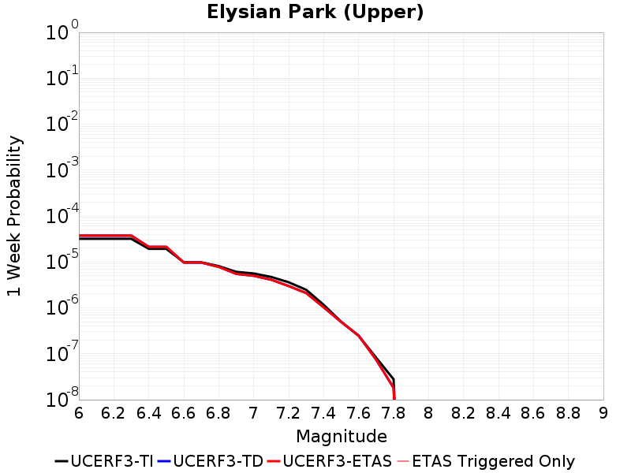 | 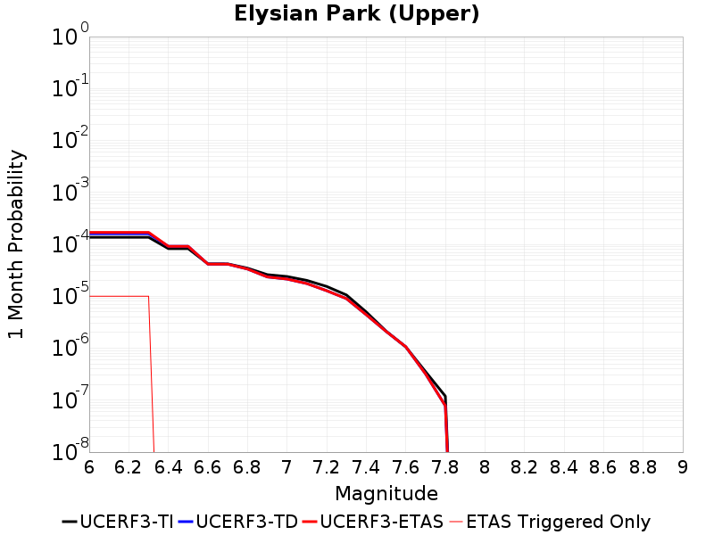 | 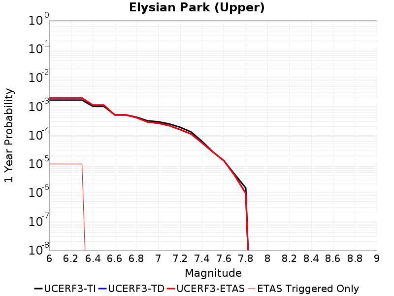 | 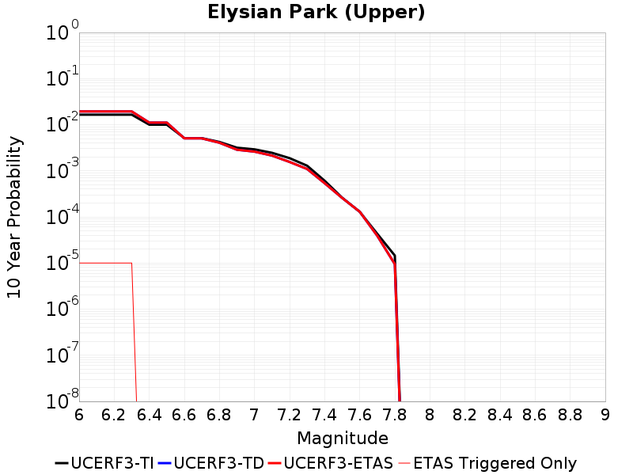 |

| Magnitude | 1 wk TI Prob | 1 wk TD Prob | 1 wk ETAS Prob | 1 wk ETAS/TD Gain | 1 wk ETAS Triggered Only | 1 mo TI Prob | 1 mo TD Prob | 1 mo ETAS Prob | 1 mo ETAS/TD Gain | 1 mo ETAS Triggered Only | 1 yr TI Prob | 1 yr TD Prob | 1 yr ETAS Prob | 1 yr ETAS/TD Gain | 1 yr ETAS Triggered Only | 10 yr TI Prob | 10 yr TD Prob | 10 yr ETAS Prob | 10 yr ETAS/TD Gain | 10 yr ETAS Triggered Only |
|-----|-----|-----|-----|-----|-----|-----|-----|-----|-----|-----|-----|-----|-----|-----|-----|-----|-----|-----|-----|-----|
| 6.0 | 3.1876025E-5 | 3.733468E-5 | 3.733468E-5 | 1.0 | 0.0 | 1.3660437E-4 | 1.5999876E-4 | 1.6999716E-4 | 1.0624905 | 1.0E-5 | 0.0016618895 | 0.0019467255 | 0.001956706 | 1.0051268 | 1.0E-5 | 0.016495159 | 0.019343615 | 0.019353421 | 1.000507 | 1.0E-5 |
| 6.1 | 3.1876025E-5 | 3.733468E-5 | 3.733468E-5 | 1.0 | 0.0 | 1.3660437E-4 | 1.5999876E-4 | 1.6999716E-4 | 1.0624905 | 1.0E-5 | 0.0016618895 | 0.0019467255 | 0.001956706 | 1.0051268 | 1.0E-5 | 0.016495159 | 0.019343615 | 0.019353421 | 1.000507 | 1.0E-5 |
| 6.2 | 3.1876025E-5 | 3.733468E-5 | 3.733468E-5 | 1.0 | 0.0 | 1.3660437E-4 | 1.5999876E-4 | 1.6999716E-4 | 1.0624905 | 1.0E-5 | 0.0016618895 | 0.0019467255 | 0.001956706 | 1.0051268 | 1.0E-5 | 0.016495159 | 0.019343615 | 0.019353421 | 1.000507 | 1.0E-5 |
| 6.3 | 3.1876025E-5 | 3.733468E-5 | 3.733468E-5 | 1.0 | 0.0 | 1.3660437E-4 | 1.5999876E-4 | 1.6999716E-4 | 1.0624905 | 1.0E-5 | 0.0016618895 | 0.0019467255 | 0.001956706 | 1.0051268 | 1.0E-5 | 0.016495159 | 0.019343615 | 0.019353421 | 1.000507 | 1.0E-5 |
| 6.4 | 1.9273462E-5 | 2.1340535E-5 | 2.1340535E-5 | 1.0 | 0.0 | 8.259794E-5 | 9.145722E-5 | 9.145722E-5 | 1.0 | 0.0 | 0.001005166 | 0.001113096 | 0.001113096 | 1.0 | 0.0 | 0.010006315 | 0.011092208 | 0.011092208 | 1.0 | 0.0 |
| 6.5 | 1.9273462E-5 | 2.1340535E-5 | 2.1340535E-5 | 1.0 | 0.0 | 8.259794E-5 | 9.145722E-5 | 9.145722E-5 | 1.0 | 0.0 | 0.001005166 | 0.001113096 | 0.001113096 | 1.0 | 0.0 | 0.010006315 | 0.011092208 | 0.011092208 | 1.0 | 0.0 |
| 6.6 | 9.813258E-6 | 9.702103E-6 | 9.702103E-6 | 1.0 | 0.0 | 4.205614E-5 | 4.1579817E-5 | 4.1579817E-5 | 1.0 | 0.0 | 5.119132E-4 | 5.06124E-4 | 5.06124E-4 | 1.0 | 0.0 | 0.005107356 | 0.005050444 | 0.005050444 | 1.0 | 0.0 |
| 6.7 | 9.801478E-6 | 9.689643E-6 | 9.689643E-6 | 1.0 | 0.0 | 4.2005657E-5 | 4.1526422E-5 | 4.1526422E-5 | 1.0 | 0.0 | 5.112989E-4 | 5.054742E-4 | 5.054742E-4 | 1.0 | 0.0 | 0.0051012407 | 0.0050439755 | 0.0050439755 | 1.0 | 0.0 |
| 6.8 | 8.102489E-6 | 7.801391E-6 | 7.801391E-6 | 1.0 | 0.0 | 3.4724493E-5 | 3.343413E-5 | 3.343413E-5 | 1.0 | 0.0 | 4.2268867E-4 | 4.0698957E-4 | 4.0698957E-4 | 1.0 | 0.0 | 0.004218856 | 0.0040629413 | 0.0040629413 | 1.0 | 0.0 |
| 6.9 | 6.08275E-6 | 5.497438E-6 | 5.497438E-6 | 1.0 | 0.0 | 2.6068668E-5 | 2.356024E-5 | 2.356024E-5 | 1.0 | 0.0 | 3.173398E-4 | 2.8680894E-4 | 2.8680894E-4 | 1.0 | 0.0 | 0.0031688702 | 0.0028644663 | 0.0028644663 | 1.0 | 0.0 |
| 7.0 | 5.5995934E-6 | 4.9969763E-6 | 4.9969763E-6 | 1.0 | 0.0 | 2.3998036E-5 | 2.141544E-5 | 2.141544E-5 | 1.0 | 0.0 | 2.9213692E-4 | 2.6070245E-4 | 2.6070245E-4 | 1.0 | 0.0 | 0.0029175316 | 0.002604034 | 0.002604034 | 1.0 | 0.0 |
| 7.1 | 4.709881E-6 | 4.09848E-6 | 4.09848E-6 | 1.0 | 0.0 | 2.0185047E-5 | 1.7564798E-5 | 1.7564798E-5 | 1.0 | 0.0 | 2.4572524E-4 | 2.1383085E-4 | 2.1383085E-4 | 1.0 | 0.0 | 0.002454537 | 0.0021362926 | 0.0021362926 | 1.0 | 0.0 |
| 7.2 | 3.6063436E-6 | 2.9850587E-6 | 2.9850587E-6 | 1.0 | 0.0 | 1.5455667E-5 | 1.2793046E-5 | 1.2793046E-5 | 1.0 | 0.0 | 1.881565E-4 | 1.5574432E-4 | 1.5574432E-4 | 1.0 | 0.0 | 0.0018799726 | 0.001556363 | 0.001556363 | 1.0 | 0.0 |
| 7.3 | 2.471135E-6 | 2.1006701E-6 | 2.1006701E-6 | 1.0 | 0.0 | 1.0590536E-5 | 9.002841E-6 | 9.002841E-6 | 1.0 | 0.0 | 1.2893214E-4 | 1.0960415E-4 | 1.0960415E-4 | 1.0 | 0.0 | 0.0012885736 | 0.0010955082 | 0.0010955082 | 1.0 | 0.0 |
| 7.4 | 1.163943E-6 | 1.0300552E-6 | 1.0300552E-6 | 1.0 | 0.0 | 4.988318E-6 | 4.414515E-6 | 4.414515E-6 | 1.0 | 0.0 | 6.0731076E-5 | 5.374542E-5 | 5.374542E-5 | 1.0 | 0.0 | 6.071448E-4 | 5.3732726E-4 | 5.3732726E-4 | 1.0 | 0.0 |
| 7.5 | 4.99459E-7 | 4.9286723E-7 | 4.9286723E-7 | 1.0 | 0.0 | 2.140537E-6 | 2.1122864E-6 | 2.1122864E-6 | 1.0 | 0.0 | 2.6060725E-5 | 2.5716801E-5 | 2.5716801E-5 | 1.0 | 0.0 | 2.605767E-4 | 2.5713982E-4 | 2.5713982E-4 | 1.0 | 0.0 |
| 7.6 | 2.4667852E-7 | 2.4852793E-7 | 2.4852793E-7 | 1.0 | 0.0 | 1.0571932E-6 | 1.0651192E-6 | 1.0651192E-6 | 1.0 | 0.0 | 1.2871251E-5 | 1.2967754E-5 | 1.2967754E-5 | 1.0 | 0.0 | 1.2870505E-4 | 1.2967034E-4 | 1.2967034E-4 | 1.0 | 0.0 |
| 7.7 | 8.2312795E-8 | 7.45418E-8 | 7.45418E-8 | 1.0 | 0.0 | 3.527691E-7 | 3.1946485E-7 | 3.1946485E-7 | 1.0 | 0.0 | 4.294955E-6 | 3.8894786E-6 | 3.8894786E-6 | 1.0 | 0.0 | 4.2948723E-5 | 3.8894224E-5 | 3.8894224E-5 | 1.0 | 0.0 |
| 7.8 | 2.7819295E-8 | 1.8110338E-8 | 1.8110338E-8 | 1.0 | 0.0 | 1.1922555E-7 | 7.761573E-8 | 7.761573E-8 | 1.0 | 0.0 | 1.45157E-6 | 9.4497125E-7 | 9.4497125E-7 | 1.0 | 0.0 | 1.45156055E-5 | 9.449688E-6 | 9.449688E-6 | 1.0 | 0.0 |

## San Andreas (North Branch Mill Creek)
*[(top)](#table-of-contents)*

| 1 Week | 1 Month | 1 Year | 10 Year |
|-----|-----|-----|-----|
| 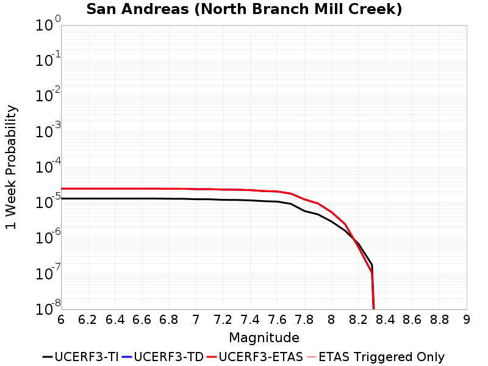 | 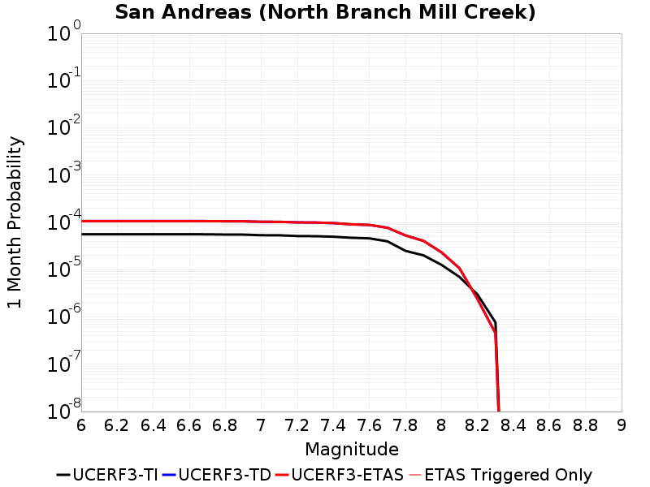 | 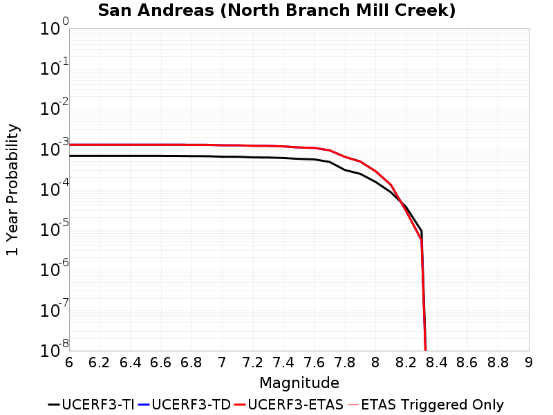 | 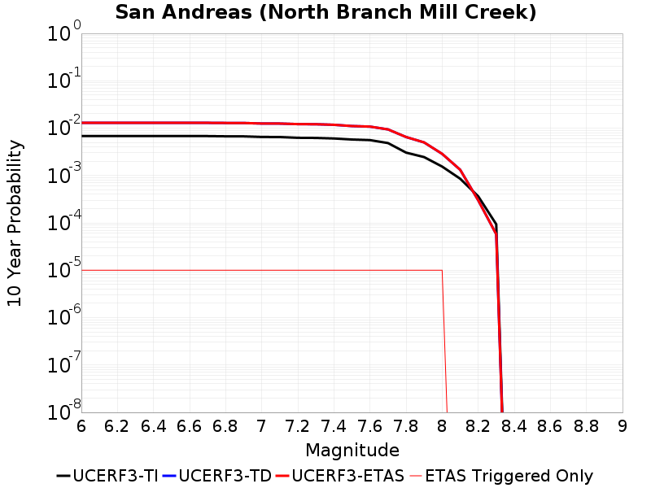 |

| Magnitude | 1 wk TI Prob | 1 wk TD Prob | 1 wk ETAS Prob | 1 wk ETAS/TD Gain | 1 wk ETAS Triggered Only | 1 mo TI Prob | 1 mo TD Prob | 1 mo ETAS Prob | 1 mo ETAS/TD Gain | 1 mo ETAS Triggered Only | 1 yr TI Prob | 1 yr TD Prob | 1 yr ETAS Prob | 1 yr ETAS/TD Gain | 1 yr ETAS Triggered Only | 10 yr TI Prob | 10 yr TD Prob | 10 yr ETAS Prob | 10 yr ETAS/TD Gain | 10 yr ETAS Triggered Only |
|-----|-----|-----|-----|-----|-----|-----|-----|-----|-----|-----|-----|-----|-----|-----|-----|-----|-----|-----|-----|-----|
| 6.0 | 1.3079164E-5 | 2.4849123E-5 | 2.4849123E-5 | 1.0 | 0.0 | 5.6052355E-5 | 1.0649191E-4 | 1.0649191E-4 | 1.0 | 0.0 | 6.822237E-4 | 0.0012957714 | 0.0012957714 | 1.0 | 0.0 | 0.006801331 | 0.012918473 | 0.012928344 | 1.0007641 | 1.0E-5 |
| 6.1 | 1.3079164E-5 | 2.4849123E-5 | 2.4849123E-5 | 1.0 | 0.0 | 5.6052355E-5 | 1.0649191E-4 | 1.0649191E-4 | 1.0 | 0.0 | 6.822237E-4 | 0.0012957714 | 0.0012957714 | 1.0 | 0.0 | 0.006801331 | 0.012918473 | 0.012928344 | 1.0007641 | 1.0E-5 |
| 6.2 | 1.3079164E-5 | 2.4849123E-5 | 2.4849123E-5 | 1.0 | 0.0 | 5.6052355E-5 | 1.0649191E-4 | 1.0649191E-4 | 1.0 | 0.0 | 6.822237E-4 | 0.0012957714 | 0.0012957714 | 1.0 | 0.0 | 0.006801331 | 0.012918473 | 0.012928344 | 1.0007641 | 1.0E-5 |
| 6.3 | 1.3079164E-5 | 2.4849123E-5 | 2.4849123E-5 | 1.0 | 0.0 | 5.6052355E-5 | 1.0649191E-4 | 1.0649191E-4 | 1.0 | 0.0 | 6.822237E-4 | 0.0012957714 | 0.0012957714 | 1.0 | 0.0 | 0.006801331 | 0.012918473 | 0.012928344 | 1.0007641 | 1.0E-5 |
| 6.4 | 1.3079164E-5 | 2.4849123E-5 | 2.4849123E-5 | 1.0 | 0.0 | 5.6052355E-5 | 1.0649191E-4 | 1.0649191E-4 | 1.0 | 0.0 | 6.822237E-4 | 0.0012957714 | 0.0012957714 | 1.0 | 0.0 | 0.006801331 | 0.012918473 | 0.012928344 | 1.0007641 | 1.0E-5 |
| 6.5 | 1.3079164E-5 | 2.4849123E-5 | 2.4849123E-5 | 1.0 | 0.0 | 5.6052355E-5 | 1.0649191E-4 | 1.0649191E-4 | 1.0 | 0.0 | 6.822237E-4 | 0.0012957714 | 0.0012957714 | 1.0 | 0.0 | 0.006801331 | 0.012918473 | 0.012928344 | 1.0007641 | 1.0E-5 |
| 6.6 | 1.3074523E-5 | 2.4844187E-5 | 2.4844187E-5 | 1.0 | 0.0 | 5.6032466E-5 | 1.0647076E-4 | 1.0647076E-4 | 1.0 | 0.0 | 6.8198174E-4 | 0.0012955143 | 0.0012955143 | 1.0 | 0.0 | 0.006798926 | 0.012915932 | 0.012925802 | 1.0007643 | 1.0E-5 |
| 6.7 | 1.3050216E-5 | 2.481943E-5 | 2.481943E-5 | 1.0 | 0.0 | 5.59283E-5 | 1.0636467E-4 | 1.0636467E-4 | 1.0 | 0.0 | 6.8071426E-4 | 0.0012942242 | 0.0012942242 | 1.0 | 0.0 | 0.0067863287 | 0.01290318 | 0.012913051 | 1.000765 | 1.0E-5 |
| 6.8 | 1.29049395E-5 | 2.46678E-5 | 2.46678E-5 | 1.0 | 0.0 | 5.530571E-5 | 1.0571487E-4 | 1.0571487E-4 | 1.0 | 0.0 | 6.73139E-4 | 0.0012863221 | 0.0012863221 | 1.0 | 0.0 | 0.0067110364 | 0.012825075 | 0.012834946 | 1.0007697 | 1.0E-5 |
| 6.9 | 1.2867369E-5 | 2.4627054E-5 | 2.4627054E-5 | 1.0 | 0.0 | 5.51447E-5 | 1.0554027E-4 | 1.0554027E-4 | 1.0 | 0.0 | 6.711799E-4 | 0.0012841988 | 0.0012841988 | 1.0 | 0.0 | 0.006691564 | 0.012804086 | 0.012813958 | 1.000771 | 1.0E-5 |
| 7.0 | 1.2495996E-5 | 2.4013047E-5 | 2.4013047E-5 | 1.0 | 0.0 | 5.3553173E-5 | 1.0290901E-4 | 1.0290901E-4 | 1.0 | 0.0 | 6.518148E-4 | 0.0012522002 | 0.0012522002 | 1.0 | 0.0 | 0.0064990623 | 0.012487709 | 0.012497583 | 1.0007908 | 1.0E-5 |
| 7.1 | 1.2452067E-5 | 2.395748E-5 | 2.395748E-5 | 1.0 | 0.0 | 5.3364907E-5 | 1.0267089E-4 | 1.0267089E-4 | 1.0 | 0.0 | 6.4952404E-4 | 0.0012493044 | 0.0012493044 | 1.0 | 0.0 | 0.0064762887 | 0.012459075 | 0.012468951 | 1.0007926 | 1.0E-5 |
| 7.2 | 1.2002777E-5 | 2.3322167E-5 | 2.3322167E-5 | 1.0 | 0.0 | 5.143946E-5 | 9.994833E-5 | 9.994833E-5 | 1.0 | 0.0 | 6.2609545E-4 | 0.0012161946 | 0.0012161946 | 1.0 | 0.0 | 0.006243344 | 0.012131631 | 0.01214151 | 1.0008143 | 1.0E-5 |
| 7.3 | 1.1923425E-5 | 2.3190209E-5 | 2.3190209E-5 | 1.0 | 0.0 | 5.109939E-5 | 9.9382836E-5 | 9.9382836E-5 | 1.0 | 0.0 | 6.219575E-4 | 0.0012093174 | 0.0012093174 | 1.0 | 0.0 | 0.0062021962 | 0.012063637 | 0.012073516 | 1.000819 | 1.0E-5 |
| 7.4 | 1.16105175E-5 | 2.2553526E-5 | 2.2553526E-5 | 1.0 | 0.0 | 4.975841E-5 | 9.66544E-5 | 9.66544E-5 | 1.0 | 0.0 | 6.0564023E-4 | 0.0011761349 | 0.0011761349 | 1.0 | 0.0 | 0.006039923 | 0.011735816 | 0.011745699 | 1.0008421 | 1.0E-5 |
| 7.5 | 1.1037265E-5 | 2.121032E-5 | 2.121032E-5 | 1.0 | 0.0 | 4.7301706E-5 | 9.089822E-5 | 9.089822E-5 | 1.0 | 0.0 | 5.757461E-4 | 0.0011061264 | 0.0011061264 | 1.0 | 0.0 | 0.005742567 | 0.0110432785 | 0.011053167 | 1.0008955 | 1.0E-5 |
| 7.6 | 1.0720915E-5 | 2.0632147E-5 | 2.0632147E-5 | 1.0 | 0.0 | 4.5945973E-5 | 8.84205E-5 | 8.84205E-5 | 1.0 | 0.0 | 5.592486E-4 | 0.0010759904 | 0.0010759904 | 1.0 | 0.0 | 0.005578433 | 0.010744886 | 0.010754778 | 1.0009207 | 1.0E-5 |
| 7.7 | 9.276279E-6 | 1.7989225E-5 | 1.7989225E-5 | 1.0 | 0.0 | 3.9754876E-5 | 7.709441E-5 | 7.709441E-5 | 1.0 | 0.0 | 4.839081E-4 | 9.382221E-4 | 9.382221E-4 | 1.0 | 0.0 | 0.0048285574 | 0.009379554 | 0.009389459 | 1.0010562 | 1.0E-5 |
| 7.8 | 5.8346777E-6 | 1.23864975E-5 | 1.23864975E-5 | 1.0 | 0.0 | 2.5005522E-5 | 5.308391E-5 | 5.308391E-5 | 1.0 | 0.0 | 3.043997E-4 | 6.461051E-4 | 6.461051E-4 | 1.0 | 0.0 | 0.0030398308 | 0.0064788987 | 0.006488834 | 1.0015335 | 1.0E-5 |
| 7.9 | 4.690204E-6 | 9.503702E-6 | 9.503702E-6 | 1.0 | 0.0 | 2.0100719E-5 | 4.072952E-5 | 4.072952E-5 | 1.0 | 0.0 | 2.4469878E-4 | 4.9576914E-4 | 4.9576914E-4 | 1.0 | 0.0 | 0.002444295 | 0.004981362 | 0.004991312 | 1.0019975 | 1.0E-5 |
| 8.0 | 2.9570454E-6 | 5.438112E-6 | 5.438112E-6 | 1.0 | 0.0 | 1.267299E-5 | 2.3305987E-5 | 2.3305987E-5 | 1.0 | 0.0 | 1.5428272E-4 | 2.8371348E-4 | 2.8371348E-4 | 1.0 | 0.0 | 0.0015417566 | 0.0028559722 | 0.0028659436 | 1.0034914 | 1.0E-5 |
| 8.1 | 1.6376824E-6 | 2.503496E-6 | 2.503496E-6 | 1.0 | 0.0 | 7.01862E-6 | 1.0729224E-5 | 1.0729224E-5 | 1.0 | 0.0 | 8.544835E-5 | 1.306205E-4 | 1.306205E-4 | 1.0 | 0.0 | 8.54155E-4 | 0.0013202996 | 0.0013202996 | 1.0 | 0.0 |
| 8.2 | 6.9631557E-7 | 5.564125E-7 | 5.564125E-7 | 1.0 | 0.0 | 2.984206E-6 | 2.3846226E-6 | 2.3846226E-6 | 1.0 | 0.0 | 3.63321E-5 | 2.9032397E-5 | 2.9032397E-5 | 1.0 | 0.0 | 3.6326164E-4 | 2.9937425E-4 | 2.9937425E-4 | 1.0 | 0.0 |
| 8.3 | 1.7876137E-7 | 1.0547836E-7 | 1.0547836E-7 | 1.0 | 0.0 | 7.661199E-7 | 4.5205002E-7 | 4.5205002E-7 | 1.0 | 0.0 | 9.32747E-6 | 5.503696E-6 | 5.503696E-6 | 1.0 | 0.0 | 9.3270784E-5 | 5.7449917E-5 | 5.7449917E-5 | 1.0 | 0.0 |

## Pinto Mtn
*[(top)](#table-of-contents)*

| 1 Week | 1 Month | 1 Year | 10 Year |
|-----|-----|-----|-----|
| 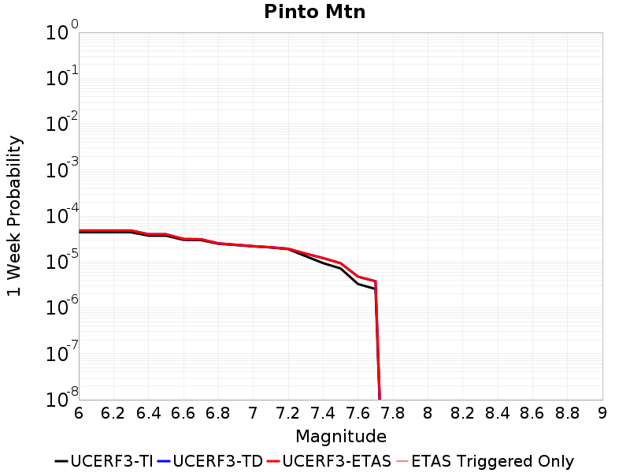 | 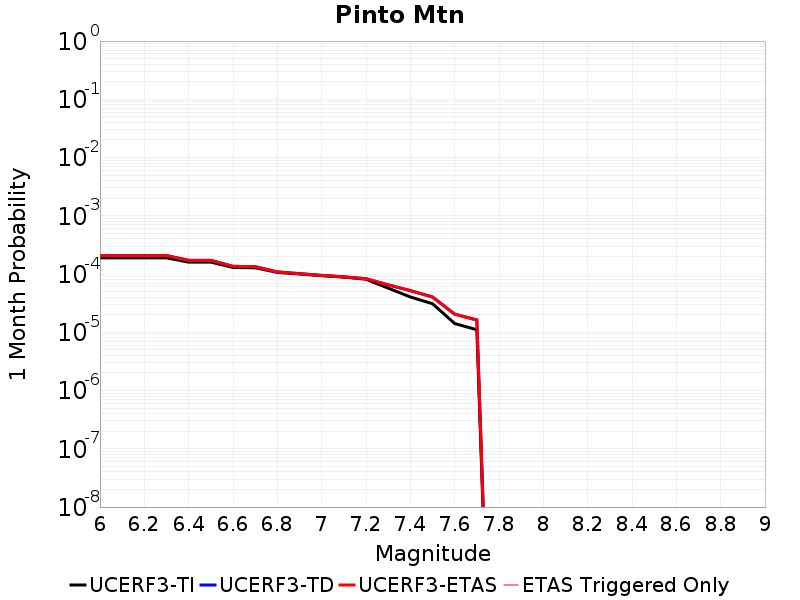 | 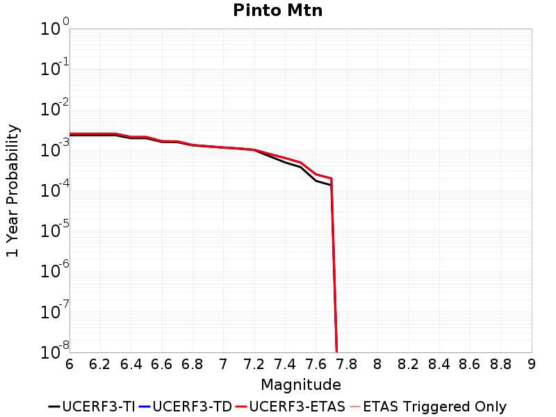 | 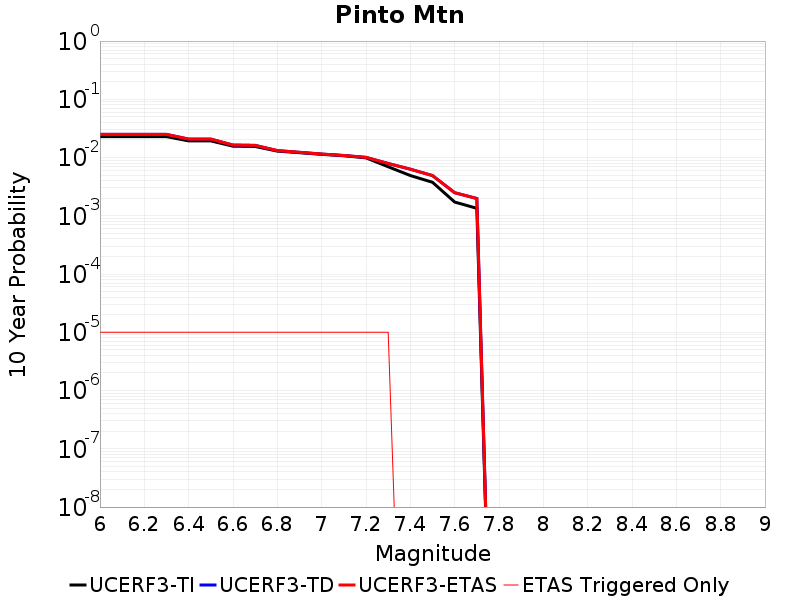 |

| Magnitude | 1 wk TI Prob | 1 wk TD Prob | 1 wk ETAS Prob | 1 wk ETAS/TD Gain | 1 wk ETAS Triggered Only | 1 mo TI Prob | 1 mo TD Prob | 1 mo ETAS Prob | 1 mo ETAS/TD Gain | 1 mo ETAS Triggered Only | 1 yr TI Prob | 1 yr TD Prob | 1 yr ETAS Prob | 1 yr ETAS/TD Gain | 1 yr ETAS Triggered Only | 10 yr TI Prob | 10 yr TD Prob | 10 yr ETAS Prob | 10 yr ETAS/TD Gain | 10 yr ETAS Triggered Only |
|-----|-----|-----|-----|-----|-----|-----|-----|-----|-----|-----|-----|-----|-----|-----|-----|-----|-----|-----|-----|-----|
| 6.0 | 4.4194956E-5 | 4.8341943E-5 | 4.8341943E-5 | 1.0 | 0.0 | 1.893932E-4 | 2.0716424E-4 | 2.0716424E-4 | 1.0 | 0.0 | 0.0023034236 | 0.0025194727 | 0.0025194727 | 1.0 | 0.0 | 0.022796938 | 0.024926854 | 0.024936605 | 1.0003911 | 1.0E-5 |
| 6.1 | 4.4194956E-5 | 4.8341943E-5 | 4.8341943E-5 | 1.0 | 0.0 | 1.893932E-4 | 2.0716424E-4 | 2.0716424E-4 | 1.0 | 0.0 | 0.0023034236 | 0.0025194727 | 0.0025194727 | 1.0 | 0.0 | 0.022796938 | 0.024926854 | 0.024936605 | 1.0003911 | 1.0E-5 |
| 6.2 | 4.4194956E-5 | 4.8341943E-5 | 4.8341943E-5 | 1.0 | 0.0 | 1.893932E-4 | 2.0716424E-4 | 2.0716424E-4 | 1.0 | 0.0 | 0.0023034236 | 0.0025194727 | 0.0025194727 | 1.0 | 0.0 | 0.022796938 | 0.024926854 | 0.024936605 | 1.0003911 | 1.0E-5 |
| 6.3 | 4.4194956E-5 | 4.8341943E-5 | 4.8341943E-5 | 1.0 | 0.0 | 1.893932E-4 | 2.0716424E-4 | 2.0716424E-4 | 1.0 | 0.0 | 0.0023034236 | 0.0025194727 | 0.0025194727 | 1.0 | 0.0 | 0.022796938 | 0.024926854 | 0.024936605 | 1.0003911 | 1.0E-5 |
| 6.4 | 3.729929E-5 | 4.0026305E-5 | 4.0026305E-5 | 1.0 | 0.0 | 1.5984432E-4 | 1.7153057E-4 | 1.7153057E-4 | 1.0 | 0.0 | 0.0019443673 | 0.0020864788 | 0.0020864788 | 1.0 | 0.0 | 0.019274427 | 0.020679062 | 0.020688856 | 1.0004736 | 1.0E-5 |
| 6.5 | 3.729929E-5 | 4.0026305E-5 | 4.0026305E-5 | 1.0 | 0.0 | 1.5984432E-4 | 1.7153057E-4 | 1.7153057E-4 | 1.0 | 0.0 | 0.0019443673 | 0.0020864788 | 0.0020864788 | 1.0 | 0.0 | 0.019274427 | 0.020679062 | 0.020688856 | 1.0004736 | 1.0E-5 |
| 6.6 | 3.0204548E-5 | 3.1566287E-5 | 3.1566287E-5 | 1.0 | 0.0 | 1.2944164E-4 | 1.3527727E-4 | 1.3527727E-4 | 1.0 | 0.0 | 0.0015748127 | 0.0016457916 | 0.0016457916 | 1.0 | 0.0 | 0.015636992 | 0.016339967 | 0.016349804 | 1.000602 | 1.0E-5 |
| 6.7 | 2.9857754E-5 | 3.1173688E-5 | 3.1173688E-5 | 1.0 | 0.0 | 1.2795553E-4 | 1.3359488E-4 | 1.3359488E-4 | 1.0 | 0.0 | 0.0015567453 | 0.0016253392 | 0.0016253392 | 1.0 | 0.0 | 0.015458848 | 0.016138427 | 0.016148265 | 1.0006096 | 1.0E-5 |
| 6.8 | 2.4819734E-5 | 2.533263E-5 | 2.533263E-5 | 1.0 | 0.0 | 1.0636595E-4 | 1.0856402E-4 | 1.0856402E-4 | 1.0 | 0.0 | 0.0012942362 | 0.0013209875 | 0.0013209875 | 1.0 | 0.0 | 0.012867244 | 0.013133762 | 0.013143631 | 1.0007514 | 1.0E-5 |
| 6.9 | 2.331124E-5 | 2.365361E-5 | 2.365361E-5 | 1.0 | 0.0 | 9.990149E-5 | 1.01368794E-4 | 1.01368794E-4 | 1.0 | 0.0 | 0.001215622 | 0.0012334869 | 0.0012334869 | 1.0 | 0.0 | 0.012089936 | 0.012268638 | 0.012278516 | 1.0008051 | 1.0E-5 |
| 7.0 | 2.1818534E-5 | 2.2070171E-5 | 2.2070171E-5 | 1.0 | 0.0 | 9.3504656E-5 | 9.4583134E-5 | 9.4583134E-5 | 1.0 | 0.0 | 0.0011378246 | 0.0011509615 | 0.0011509615 | 1.0 | 0.0 | 0.011320163 | 0.011452146 | 0.011462031 | 1.0008632 | 1.0E-5 |
| 7.1 | 2.066081E-5 | 2.0842333E-5 | 2.0842333E-5 | 1.0 | 0.0 | 8.854332E-5 | 8.932134E-5 | 8.932134E-5 | 1.0 | 0.0 | 0.0010774818 | 0.0010869646 | 0.0010869646 | 1.0 | 0.0 | 0.010722724 | 0.010818569 | 0.0108284615 | 1.0009143 | 1.0E-5 |
| 7.2 | 1.8990233E-5 | 1.9347888E-5 | 1.9347888E-5 | 1.0 | 0.0 | 8.138417E-5 | 8.2916995E-5 | 8.2916995E-5 | 1.0 | 0.0 | 9.904018E-4 | 0.0010090666 | 0.0010090666 | 1.0 | 0.0 | 0.009859995 | 0.010046883 | 0.0100567825 | 1.0009854 | 1.0E-5 |
| 7.3 | 1.3335872E-5 | 1.51720205E-5 | 1.51720205E-5 | 1.0 | 0.0 | 5.7152483E-5 | 6.50214E-5 | 6.50214E-5 | 1.0 | 0.0 | 6.956093E-4 | 7.91361E-4 | 7.91361E-4 | 1.0 | 0.0 | 0.006934359 | 0.007886754 | 0.007896676 | 1.0012579 | 1.0E-5 |
| 7.4 | 9.414066E-6 | 1.210927E-5 | 1.210927E-5 | 1.0 | 0.0 | 4.0345374E-5 | 5.189589E-5 | 5.189589E-5 | 1.0 | 0.0 | 4.910942E-4 | 6.3165894E-4 | 6.3165894E-4 | 1.0 | 0.0 | 0.0049001034 | 0.006299605 | 0.006299605 | 1.0 | 0.0 |
| 7.5 | 7.2101157E-6 | 9.393789E-6 | 9.393789E-6 | 1.0 | 0.0 | 3.090013E-5 | 4.025852E-5 | 4.025852E-5 | 1.0 | 0.0 | 3.7614413E-4 | 4.9004523E-4 | 4.9004523E-4 | 1.0 | 0.0 | 0.0037550807 | 0.004890441 | 0.004890441 | 1.0 | 0.0 |
| 7.6 | 3.296375E-6 | 4.770281E-6 | 4.770281E-6 | 1.0 | 0.0 | 1.4127245E-5 | 2.0443911E-5 | 2.0443911E-5 | 1.0 | 0.0 | 1.7198564E-4 | 2.4887774E-4 | 2.4887774E-4 | 1.0 | 0.0 | 0.0017185259 | 0.0024861442 | 0.0024861442 | 1.0 | 0.0 |
| 7.7 | 2.5741092E-6 | 3.7933323E-6 | 3.7933323E-6 | 1.0 | 0.0 | 1.103185E-5 | 1.6257045E-5 | 1.6257045E-5 | 1.0 | 0.0 | 1.3430449E-4 | 1.9791303E-4 | 1.9791303E-4 | 1.0 | 0.0 | 0.0013422335 | 0.001977514 | 0.001977514 | 1.0 | 0.0 |

## San Andreas (Big Bend)
*[(top)](#table-of-contents)*

| 1 Week | 1 Month | 1 Year | 10 Year |
|-----|-----|-----|-----|
|  |  | 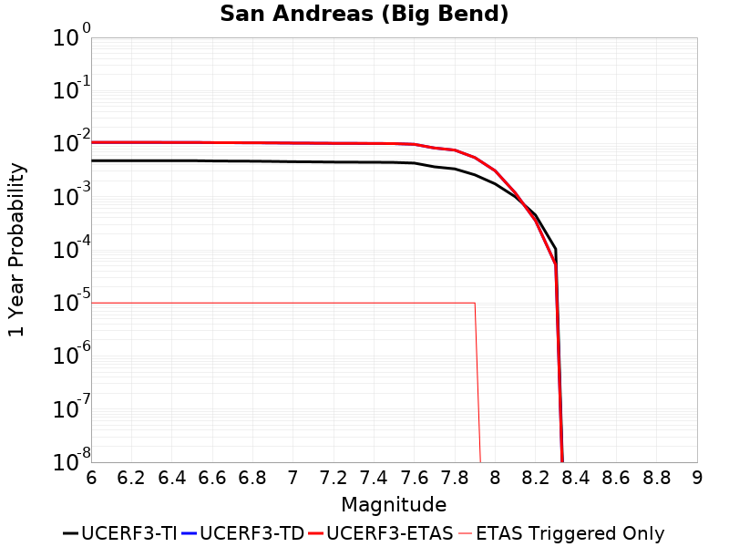 |  |

| Magnitude | 1 wk TI Prob | 1 wk TD Prob | 1 wk ETAS Prob | 1 wk ETAS/TD Gain | 1 wk ETAS Triggered Only | 1 mo TI Prob | 1 mo TD Prob | 1 mo ETAS Prob | 1 mo ETAS/TD Gain | 1 mo ETAS Triggered Only | 1 yr TI Prob | 1 yr TD Prob | 1 yr ETAS Prob | 1 yr ETAS/TD Gain | 1 yr ETAS Triggered Only | 10 yr TI Prob | 10 yr TD Prob | 10 yr ETAS Prob | 10 yr ETAS/TD Gain | 10 yr ETAS Triggered Only |
|-----|-----|-----|-----|-----|-----|-----|-----|-----|-----|-----|-----|-----|-----|-----|-----|-----|-----|-----|-----|-----|
| 6.0 | 9.168226E-5 | 2.022902E-4 | 2.022902E-4 | 1.0 | 0.0 | 3.928648E-4 | 8.666702E-4 | 8.666702E-4 | 1.0 | 0.0 | 0.0047726436 | 0.010500811 | 0.010500811 | 1.0 | 0.0 | 0.046714354 | 0.10160212 | 0.1016111 | 1.0000885 | 1.0E-5 |
| 6.1 | 9.168226E-5 | 2.022902E-4 | 2.022902E-4 | 1.0 | 0.0 | 3.928648E-4 | 8.666702E-4 | 8.666702E-4 | 1.0 | 0.0 | 0.0047726436 | 0.010500811 | 0.010500811 | 1.0 | 0.0 | 0.046714354 | 0.10160212 | 0.1016111 | 1.0000885 | 1.0E-5 |
| 6.2 | 9.168226E-5 | 2.022902E-4 | 2.022902E-4 | 1.0 | 0.0 | 3.928648E-4 | 8.666702E-4 | 8.666702E-4 | 1.0 | 0.0 | 0.0047726436 | 0.010500811 | 0.010500811 | 1.0 | 0.0 | 0.046714354 | 0.10160212 | 0.1016111 | 1.0000885 | 1.0E-5 |
| 6.3 | 9.168226E-5 | 2.022902E-4 | 2.022902E-4 | 1.0 | 0.0 | 3.928648E-4 | 8.666702E-4 | 8.666702E-4 | 1.0 | 0.0 | 0.0047726436 | 0.010500811 | 0.010500811 | 1.0 | 0.0 | 0.046714354 | 0.10160212 | 0.1016111 | 1.0000885 | 1.0E-5 |
| 6.4 | 9.1639464E-5 | 2.0222402E-4 | 2.0222402E-4 | 1.0 | 0.0 | 3.9268145E-4 | 8.6638675E-4 | 8.6638675E-4 | 1.0 | 0.0 | 0.0047704205 | 0.010497394 | 0.010497394 | 1.0 | 0.0 | 0.046693064 | 0.1015714 | 0.10158039 | 1.0000885 | 1.0E-5 |
| 6.5 | 9.1639464E-5 | 2.0222402E-4 | 2.0222402E-4 | 1.0 | 0.0 | 3.9268145E-4 | 8.6638675E-4 | 8.6638675E-4 | 1.0 | 0.0 | 0.0047704205 | 0.010497394 | 0.010497394 | 1.0 | 0.0 | 0.046693064 | 0.1015714 | 0.10158039 | 1.0000885 | 1.0E-5 |
| 6.6 | 9.042622E-5 | 2.00331E-4 | 2.00331E-4 | 1.0 | 0.0 | 3.8748336E-4 | 8.582791E-4 | 8.582791E-4 | 1.0 | 0.0 | 0.0047074095 | 0.0103996275 | 0.0103996275 | 1.0 | 0.0 | 0.046089325 | 0.10069078 | 0.100699775 | 1.0000893 | 1.0E-5 |
| 6.7 | 8.9836685E-5 | 1.9950133E-4 | 1.9950133E-4 | 1.0 | 0.0 | 3.8495753E-4 | 8.547258E-4 | 8.547258E-4 | 1.0 | 0.0 | 0.00467679 | 0.010356776 | 0.010356776 | 1.0 | 0.0 | 0.045795817 | 0.10030121 | 0.100310214 | 1.0000896 | 1.0E-5 |
| 6.8 | 8.9471854E-5 | 1.9898036E-4 | 1.9898036E-4 | 1.0 | 0.0 | 3.8339442E-4 | 8.524945E-4 | 8.524945E-4 | 1.0 | 0.0 | 0.004657841 | 0.010329869 | 0.010329869 | 1.0 | 0.0 | 0.04561414 | 0.10005566 | 0.10006466 | 1.00009 | 1.0E-5 |
| 6.9 | 8.858234E-5 | 1.9783145E-4 | 1.9783145E-4 | 1.0 | 0.0 | 3.7958333E-4 | 8.4757386E-4 | 8.4757386E-4 | 1.0 | 0.0 | 0.004611638 | 0.010270526 | 0.010270526 | 1.0 | 0.0 | 0.04517103 | 0.09951487 | 0.09952387 | 1.0000905 | 1.0E-5 |
| 7.0 | 8.7433385E-5 | 1.9624754E-4 | 1.9624754E-4 | 1.0 | 0.0 | 3.746607E-4 | 8.4079E-4 | 8.4079E-4 | 1.0 | 0.0 | 0.004551957 | 0.010188708 | 0.010188708 | 1.0 | 0.0 | 0.044598386 | 0.098768644 | 0.09877766 | 1.0000912 | 1.0E-5 |
| 7.1 | 8.684964E-5 | 1.9536277E-4 | 1.9536277E-4 | 1.0 | 0.0 | 3.7215967E-4 | 8.3700055E-4 | 8.3700055E-4 | 1.0 | 0.0 | 0.0045216335 | 0.0101430025 | 0.0101430025 | 1.0 | 0.0 | 0.04430731 | 0.09835205 | 0.09836107 | 1.0000917 | 1.0E-5 |
| 7.2 | 8.606521E-5 | 1.942636E-4 | 1.942636E-4 | 1.0 | 0.0 | 3.6879873E-4 | 8.322929E-4 | 8.322929E-4 | 1.0 | 0.0 | 0.0044808835 | 0.010086219 | 0.010086219 | 1.0 | 0.0 | 0.043916024 | 0.09783512 | 0.097844146 | 1.0000923 | 1.0E-5 |
| 7.3 | 8.568266E-5 | 1.936603E-4 | 1.936603E-4 | 1.0 | 0.0 | 3.6715972E-4 | 8.297089E-4 | 8.297089E-4 | 1.0 | 0.0 | 0.0044610105 | 0.010055049 | 0.010055049 | 1.0 | 0.0 | 0.043725148 | 0.09754858 | 0.097557604 | 1.0000925 | 1.0E-5 |
| 7.4 | 8.5432206E-5 | 1.932693E-4 | 1.932693E-4 | 1.0 | 0.0 | 3.6608664E-4 | 8.280343E-4 | 8.280343E-4 | 1.0 | 0.0 | 0.004447999 | 0.010034849 | 0.010034849 | 1.0 | 0.0 | 0.043600157 | 0.09736291 | 0.097371936 | 1.0000927 | 1.0E-5 |
| 7.5 | 8.4791965E-5 | 1.918801E-4 | 1.918801E-4 | 1.0 | 0.0 | 3.633435E-4 | 8.220843E-4 | 8.220843E-4 | 1.0 | 0.0 | 0.0044147377 | 0.009963073 | 0.009963073 | 1.0 | 0.0 | 0.043280575 | 0.09671205 | 0.09672108 | 1.0000933 | 1.0E-5 |
| 7.6 | 8.241105E-5 | 1.8604357E-4 | 1.8604357E-4 | 1.0 | 0.0 | 3.531424E-4 | 7.9708616E-4 | 7.9708616E-4 | 1.0 | 0.0 | 0.0042910352 | 0.009661458 | 0.009661458 | 1.0 | 0.0 | 0.042091176 | 0.09399079 | 0.09399985 | 1.0000964 | 1.0E-5 |
| 7.7 | 7.00432E-5 | 1.5836382E-4 | 1.5836382E-4 | 1.0 | 0.0 | 3.001506E-4 | 6.785256E-4 | 6.785256E-4 | 1.0 | 0.0 | 0.0036482112 | 0.0082298145 | 0.0082298145 | 1.0 | 0.0 | 0.035888977 | 0.08080769 | 0.08081688 | 1.0001137 | 1.0E-5 |
| 7.8 | 6.415362E-5 | 1.4463169E-4 | 1.4463169E-4 | 1.0 | 0.0 | 2.749151E-4 | 6.197029E-4 | 6.197029E-4 | 1.0 | 0.0 | 0.0033419547 | 0.0075188247 | 0.0075188247 | 1.0 | 0.0 | 0.03292141 | 0.07397922 | 0.07398848 | 1.0001252 | 1.0E-5 |
| 7.9 | 4.939911E-5 | 1.0434049E-4 | 1.0434049E-4 | 1.0 | 0.0 | 2.116933E-4 | 4.470969E-4 | 4.470969E-4 | 1.0 | 0.0 | 0.0025743195 | 0.0054298323 | 0.0054298323 | 1.0 | 0.0 | 0.025447013 | 0.053994503 | 0.054003965 | 1.0001752 | 1.0E-5 |
| 8.0 | 3.344983E-5 | 5.895822E-5 | 5.895822E-5 | 1.0 | 0.0 | 1.4334853E-4 | 2.5265364E-4 | 2.5265364E-4 | 1.0 | 0.0 | 0.0017438711 | 0.0030717214 | 0.0030717214 | 1.0 | 0.0 | 0.017302496 | 0.031196557 | 0.031206246 | 1.0003105 | 1.0E-5 |
| 8.1 | 1.9104898E-5 | 2.2456994E-5 | 2.2456994E-5 | 1.0 | 0.0 | 8.1875565E-5 | 9.6240714E-5 | 9.6240714E-5 | 1.0 | 0.0 | 9.963791E-4 | 0.0011711017 | 0.0011711017 | 1.0 | 0.0 | 0.009919235 | 0.012451808 | 0.012451808 | 1.0 | 0.0 |
| 8.2 | 8.643924E-6 | 6.7523606E-6 | 6.7523606E-6 | 1.0 | 0.0 | 3.704486E-5 | 2.8938368E-5 | 2.8938368E-5 | 1.0 | 0.0 | 4.5092785E-4 | 3.522678E-4 | 3.522678E-4 | 1.0 | 0.0 | 0.0045001395 | 0.003937757 | 0.003937757 | 1.0 | 0.0 |
| 8.3 | 1.983087E-6 | 9.94482E-7 | 9.94482E-7 | 1.0 | 0.0 | 8.498917E-6 | 4.2620586E-6 | 4.2620586E-6 | 1.0 | 0.0 | 1.034694E-4 | 5.1889358E-5 | 5.1889358E-5 | 1.0 | 0.0 | 0.0010342124 | 6.010915E-4 | 6.010915E-4 | 1.0 | 0.0 |

## Newport-Inglewood (Offshore)
*[(top)](#table-of-contents)*

| 1 Week | 1 Month | 1 Year | 10 Year |
|-----|-----|-----|-----|
| 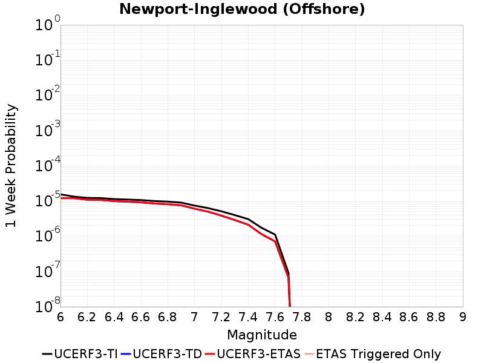 | 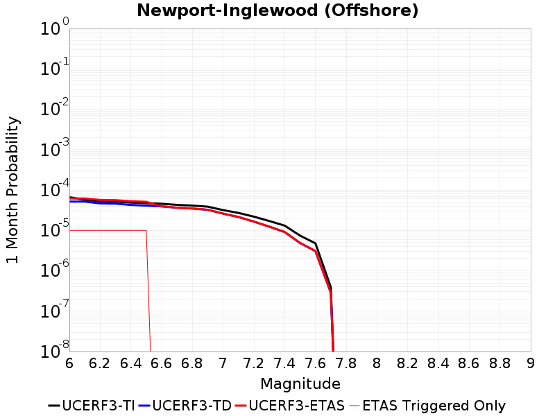 |  | 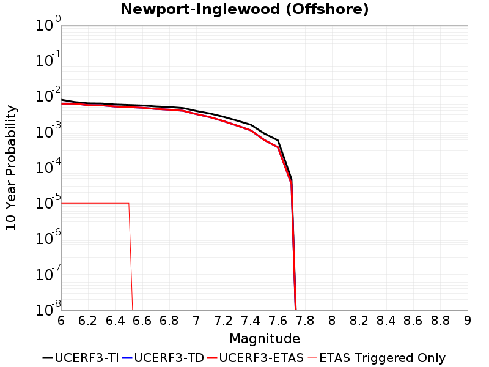 |

| Magnitude | 1 wk TI Prob | 1 wk TD Prob | 1 wk ETAS Prob | 1 wk ETAS/TD Gain | 1 wk ETAS Triggered Only | 1 mo TI Prob | 1 mo TD Prob | 1 mo ETAS Prob | 1 mo ETAS/TD Gain | 1 mo ETAS Triggered Only | 1 yr TI Prob | 1 yr TD Prob | 1 yr ETAS Prob | 1 yr ETAS/TD Gain | 1 yr ETAS Triggered Only | 10 yr TI Prob | 10 yr TD Prob | 10 yr ETAS Prob | 10 yr ETAS/TD Gain | 10 yr ETAS Triggered Only |
|-----|-----|-----|-----|-----|-----|-----|-----|-----|-----|-----|-----|-----|-----|-----|-----|-----|-----|-----|-----|-----|
| 6.0 | 1.5457945E-5 | 1.2014177E-5 | 1.2014177E-5 | 1.0 | 0.0 | 6.6246655E-5 | 5.1488318E-5 | 6.14878E-5 | 1.1942089 | 1.0E-5 | 8.062545E-4 | 6.266914E-4 | 6.366851E-4 | 1.0159469 | 1.0E-5 | 0.008033356 | 0.0062494087 | 0.006259346 | 1.0015901 | 1.0E-5 |
| 6.1 | 1.331886E-5 | 1.2014177E-5 | 1.2014177E-5 | 1.0 | 0.0 | 5.707958E-5 | 5.1488318E-5 | 6.14878E-5 | 1.1942089 | 1.0E-5 | 6.947222E-4 | 6.266914E-4 | 6.366851E-4 | 1.0159469 | 1.0E-5 | 0.006925544 | 0.0062494087 | 0.006259346 | 1.0015901 | 1.0E-5 |
| 6.2 | 1.2250852E-5 | 1.0882379E-5 | 1.0882379E-5 | 1.0 | 0.0 | 5.2502597E-5 | 4.663794E-5 | 5.663747E-5 | 1.2144077 | 1.0E-5 | 6.3903164E-4 | 5.6766986E-4 | 5.776642E-4 | 1.0176059 | 1.0E-5 | 0.006371971 | 0.0056623104 | 0.005672254 | 1.0017561 | 1.0E-5 |
| 6.3 | 1.2106258E-5 | 1.0725935E-5 | 1.0725935E-5 | 1.0 | 0.0 | 5.1882926E-5 | 4.5967485E-5 | 5.5967026E-5 | 1.217535 | 1.0E-5 | 6.3149154E-4 | 5.595113E-4 | 5.6950573E-4 | 1.0178628 | 1.0E-5 | 0.0062970007 | 0.005581135 | 0.005591079 | 1.0017817 | 1.0E-5 |
| 6.4 | 1.1348758E-5 | 9.922117E-6 | 9.922117E-6 | 1.0 | 0.0 | 4.8636626E-5 | 4.2522668E-5 | 5.2522246E-5 | 1.2351587 | 1.0E-5 | 5.919901E-4 | 5.1759125E-4 | 5.275861E-4 | 1.0193102 | 1.0E-5 | 0.005904155 | 0.0051639453 | 0.0051738936 | 1.0019265 | 1.0E-5 |
| 6.5 | 1.100837E-5 | 9.558561E-6 | 9.558561E-6 | 1.0 | 0.0 | 4.7177873E-5 | 4.0964624E-5 | 5.0964212E-5 | 1.2441031 | 1.0E-5 | 5.7423924E-4 | 4.9863086E-4 | 5.086259E-4 | 1.0200449 | 1.0E-5 | 0.005727576 | 0.0049752044 | 0.0049851546 | 1.002 | 1.0E-5 |
| 6.6 | 1.0634696E-5 | 9.163311E-6 | 9.163311E-6 | 1.0 | 0.0 | 4.557647E-5 | 3.9270744E-5 | 3.9270744E-5 | 1.0 | 0.0 | 5.5475225E-4 | 4.7801711E-4 | 4.7801711E-4 | 1.0 | 0.0 | 0.0055336943 | 0.004769968 | 0.004769968 | 1.0 | 0.0 |
| 6.7 | 9.9780855E-6 | 8.489732E-6 | 8.489732E-6 | 1.0 | 0.0 | 4.276252E-5 | 3.6384063E-5 | 3.6384063E-5 | 1.0 | 0.0 | 5.205093E-4 | 4.4288655E-4 | 4.4288655E-4 | 1.0 | 0.0 | 0.0051929182 | 0.0044201105 | 0.0044201105 | 1.0 | 0.0 |
| 6.8 | 9.59546E-6 | 8.098179E-6 | 8.098179E-6 | 1.0 | 0.0 | 4.1122752E-5 | 3.4706023E-5 | 3.4706023E-5 | 1.0 | 0.0 | 5.0055445E-4 | 4.224645E-4 | 4.224645E-4 | 1.0 | 0.0 | 0.004994285 | 0.004216682 | 0.004216682 | 1.0 | 0.0 |
| 6.9 | 9.000614E-6 | 7.545004E-6 | 7.545004E-6 | 1.0 | 0.0 | 3.857349E-5 | 3.2335334E-5 | 3.2335334E-5 | 1.0 | 0.0 | 4.6953102E-4 | 3.9361216E-4 | 3.9361216E-4 | 1.0 | 0.0 | 0.004685402 | 0.0039292146 | 0.0039292146 | 1.0 | 0.0 |
| 7.0 | 7.4070194E-6 | 6.0572143E-6 | 6.0572143E-6 | 1.0 | 0.0 | 3.1743984E-5 | 2.5959233E-5 | 2.5959233E-5 | 1.0 | 0.0 | 3.8641447E-4 | 3.1600797E-4 | 3.1600797E-4 | 1.0 | 0.0 | 0.0038574322 | 0.0031556052 | 0.0031556052 | 1.0 | 0.0 |
| 7.1 | 6.299615E-6 | 4.9897108E-6 | 4.9897108E-6 | 1.0 | 0.0 | 2.699807E-5 | 2.13843E-5 | 2.13843E-5 | 1.0 | 0.0 | 3.2865192E-4 | 2.6032285E-4 | 2.6032285E-4 | 1.0 | 0.0 | 0.003281663 | 0.0026001935 | 0.0026001935 | 1.0 | 0.0 |
| 7.2 | 5.096653E-6 | 3.845762E-6 | 3.845762E-6 | 1.0 | 0.0 | 2.1842614E-5 | 1.6481734E-5 | 1.6481734E-5 | 1.0 | 0.0 | 2.6590136E-4 | 2.0064674E-4 | 2.0064674E-4 | 1.0 | 0.0 | 0.0026558342 | 0.0020046665 | 0.0020046665 | 1.0 | 0.0 |
| 7.3 | 3.9753018E-6 | 2.880066E-6 | 2.880066E-6 | 1.0 | 0.0 | 1.7036897E-5 | 1.2343082E-5 | 1.2343082E-5 | 1.0 | 0.0 | 2.0740448E-4 | 1.5026673E-4 | 1.5026673E-4 | 1.0 | 0.0 | 0.00207211 | 0.0015016592 | 0.0015016592 | 1.0 | 0.0 |
| 7.4 | 3.0568392E-6 | 2.1260098E-6 | 2.1260098E-6 | 1.0 | 0.0 | 1.3100675E-5 | 9.111439E-6 | 9.111439E-6 | 1.0 | 0.0 | 1.5948903E-4 | 1.1092619E-4 | 1.1092619E-4 | 1.0 | 0.0 | 0.0015937461 | 0.0011087143 | 0.0011087143 | 1.0 | 0.0 |
| 7.5 | 1.7279019E-6 | 1.1371075E-6 | 1.1371075E-6 | 1.0 | 0.0 | 7.405273E-6 | 4.873309E-6 | 4.873309E-6 | 1.0 | 0.0 | 9.015547E-5 | 5.933096E-5 | 5.933096E-5 | 1.0 | 0.0 | 9.01189E-4 | 5.93155E-4 | 5.93155E-4 | 1.0 | 0.0 |
| 7.6 | 1.1156416E-6 | 7.1587715E-7 | 7.1587715E-7 | 1.0 | 0.0 | 4.7813123E-6 | 3.0680415E-6 | 3.0680415E-6 | 1.0 | 0.0 | 5.821092E-5 | 3.7352787E-5 | 3.7352787E-5 | 1.0 | 0.0 | 5.8195676E-4 | 3.7346737E-4 | 3.7346737E-4 | 1.0 | 0.0 |
| 7.7 | 9.117973E-8 | 6.661296E-8 | 6.661296E-8 | 1.0 | 0.0 | 3.907702E-7 | 2.854841E-7 | 2.854841E-7 | 1.0 | 0.0 | 4.757617E-6 | 3.4757636E-6 | 3.4757636E-6 | 1.0 | 0.0 | 4.7575148E-5 | 3.4757122E-5 | 3.4757122E-5 | 1.0 | 0.0 |

## Gravel Hills-Harper Lk
*[(top)](#table-of-contents)*

| 1 Week | 1 Month | 1 Year | 10 Year |
|-----|-----|-----|-----|
| 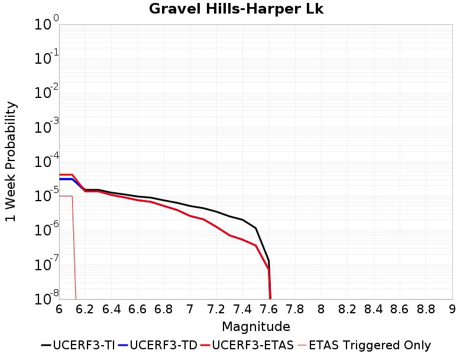 | 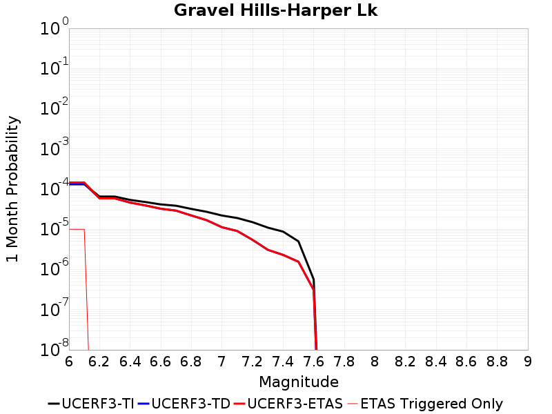 | 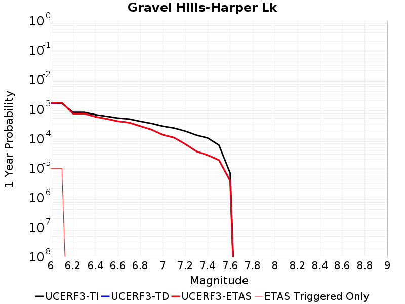 | 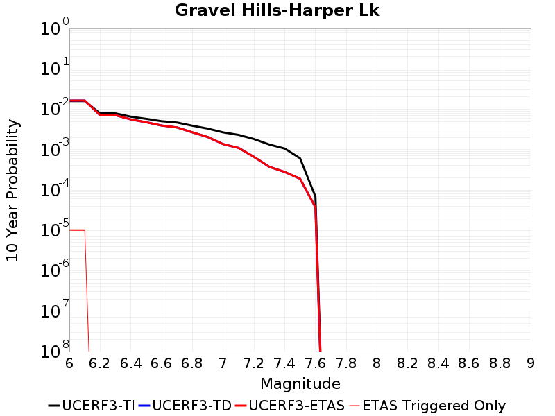 |

| Magnitude | 1 wk TI Prob | 1 wk TD Prob | 1 wk ETAS Prob | 1 wk ETAS/TD Gain | 1 wk ETAS Triggered Only | 1 mo TI Prob | 1 mo TD Prob | 1 mo ETAS Prob | 1 mo ETAS/TD Gain | 1 mo ETAS Triggered Only | 1 yr TI Prob | 1 yr TD Prob | 1 yr ETAS Prob | 1 yr ETAS/TD Gain | 1 yr ETAS Triggered Only | 10 yr TI Prob | 10 yr TD Prob | 10 yr ETAS Prob | 10 yr ETAS/TD Gain | 10 yr ETAS Triggered Only |
|-----|-----|-----|-----|-----|-----|-----|-----|-----|-----|-----|-----|-----|-----|-----|-----|-----|-----|-----|-----|-----|
| 6.0 | 3.0679566E-5 | 3.1631043E-5 | 4.1630727E-5 | 1.3161352 | 1.0E-5 | 1.3147724E-4 | 1.355558E-4 | 1.4555446E-4 | 1.0737604 | 1.0E-5 | 0.0015995599 | 0.0016493624 | 0.0016593459 | 1.006053 | 1.0E-5 | 0.015880952 | 0.016393056 | 0.01640289 | 1.0006 | 1.0E-5 |
| 6.1 | 3.0679566E-5 | 3.1631043E-5 | 4.1630727E-5 | 1.3161352 | 1.0E-5 | 1.3147724E-4 | 1.355558E-4 | 1.4555446E-4 | 1.0737604 | 1.0E-5 | 0.0015995599 | 0.0016493624 | 0.0016593459 | 1.006053 | 1.0E-5 | 0.015880952 | 0.016393056 | 0.01640289 | 1.0006 | 1.0E-5 |
| 6.2 | 1.514536E-5 | 1.3694593E-5 | 1.3694593E-5 | 1.0 | 0.0 | 6.490707E-5 | 5.8689857E-5 | 5.8689857E-5 | 1.0 | 0.0 | 7.8995706E-4 | 7.1432674E-4 | 7.1432674E-4 | 1.0 | 0.0 | 0.007871548 | 0.0071215197 | 0.0071215197 | 1.0 | 0.0 |
| 6.3 | 1.514536E-5 | 1.3694593E-5 | 1.3694593E-5 | 1.0 | 0.0 | 6.490707E-5 | 5.8689857E-5 | 5.8689857E-5 | 1.0 | 0.0 | 7.8995706E-4 | 7.1432674E-4 | 7.1432674E-4 | 1.0 | 0.0 | 0.007871548 | 0.0071215197 | 0.0071215197 | 1.0 | 0.0 |
| 6.4 | 1.2532521E-5 | 1.0733912E-5 | 1.0733912E-5 | 1.0 | 0.0 | 5.37097E-5 | 4.6001704E-5 | 4.6001704E-5 | 1.0 | 0.0 | 6.537194E-4 | 5.5993267E-4 | 5.5993267E-4 | 1.0 | 0.0 | 0.0065179965 | 0.005585814 | 0.005585814 | 1.0 | 0.0 |
| 6.5 | 1.1094058E-5 | 9.120338E-6 | 9.120338E-6 | 1.0 | 0.0 | 4.7545094E-5 | 3.9086604E-5 | 3.9086604E-5 | 1.0 | 0.0 | 5.787078E-4 | 4.7577955E-4 | 4.7577955E-4 | 1.0 | 0.0 | 0.0057720304 | 0.0047480203 | 0.0047480203 | 1.0 | 0.0 |
| 6.6 | 9.688328E-6 | 7.5618636E-6 | 7.5618636E-6 | 1.0 | 0.0 | 4.1520743E-5 | 3.24076E-5 | 3.24076E-5 | 1.0 | 0.0 | 5.053978E-4 | 3.9449366E-4 | 3.9449366E-4 | 1.0 | 0.0 | 0.0050424994 | 0.0039381925 | 0.0039381925 | 1.0 | 0.0 |
| 6.7 | 8.974824E-6 | 6.7765463E-6 | 6.7765463E-6 | 1.0 | 0.0 | 3.8462964E-5 | 2.904203E-5 | 2.904203E-5 | 1.0 | 0.0 | 4.6818596E-4 | 3.5353156E-4 | 3.5353156E-4 | 1.0 | 0.0 | 0.004672008 | 0.0035299142 | 0.0035299142 | 1.0 | 0.0 |
| 6.8 | 7.4780046E-6 | 5.1373445E-6 | 5.1373445E-6 | 1.0 | 0.0 | 3.20482E-5 | 2.2017011E-5 | 2.2017011E-5 | 1.0 | 0.0 | 3.9011694E-4 | 2.6802556E-4 | 2.6802556E-4 | 1.0 | 0.0 | 0.0038943281 | 0.002677162 | 0.002677162 | 1.0 | 0.0 |
| 6.9 | 6.3409307E-6 | 3.924699E-6 | 3.924699E-6 | 1.0 | 0.0 | 2.7175134E-5 | 1.6820037E-5 | 1.6820037E-5 | 1.0 | 0.0 | 3.3080703E-4 | 2.0476569E-4 | 2.0476569E-4 | 1.0 | 0.0 | 0.0033031502 | 0.002045869 | 0.002045869 | 1.0 | 0.0 |
| 7.0 | 5.1239335E-6 | 2.6188675E-6 | 2.6188675E-6 | 1.0 | 0.0 | 2.195953E-5 | 1.1223671E-5 | 1.1223671E-5 | 1.0 | 0.0 | 2.6732447E-4 | 1.3663988E-4 | 1.3663988E-4 | 1.0 | 0.0 | 0.0026700313 | 0.0013655841 | 0.0013655841 | 1.0 | 0.0 |
| 7.1 | 4.438899E-6 | 2.1096532E-6 | 2.1096532E-6 | 1.0 | 0.0 | 1.9023713E-5 | 9.0413405E-6 | 9.0413405E-6 | 1.0 | 0.0 | 2.315891E-4 | 1.10072986E-4 | 1.10072986E-4 | 1.0 | 0.0 | 0.002313479 | 0.0011002066 | 0.0011002066 | 1.0 | 0.0 |
| 7.2 | 3.50367E-6 | 1.2697573E-6 | 1.2697573E-6 | 1.0 | 0.0 | 1.5015643E-5 | 5.441806E-6 | 5.441806E-6 | 1.0 | 0.0 | 1.8280011E-4 | 6.6252054E-5 | 6.6252054E-5 | 1.0 | 0.0 | 0.0018264982 | 6.623313E-4 | 6.623313E-4 | 1.0 | 0.0 |
| 7.3 | 2.561638E-6 | 7.183015E-7 | 7.183015E-7 | 1.0 | 0.0 | 1.0978401E-5 | 3.0784315E-6 | 3.0784315E-6 | 1.0 | 0.0 | 1.3365384E-4 | 3.747928E-5 | 3.747928E-5 | 1.0 | 0.0 | 0.0013357349 | 3.747316E-4 | 3.747316E-4 | 1.0 | 0.0 |
| 7.4 | 2.0368864E-6 | 5.3590685E-7 | 5.3590685E-7 | 1.0 | 0.0 | 8.729483E-6 | 2.2967415E-6 | 2.2967415E-6 | 1.0 | 0.0 | 1.06276275E-4 | 2.7962476E-5 | 2.7962476E-5 | 1.0 | 0.0 | 0.0010622547 | 2.795901E-4 | 2.795901E-4 | 1.0 | 0.0 |
| 7.5 | 1.1681728E-6 | 3.638847E-7 | 3.638847E-7 | 1.0 | 0.0 | 5.0064455E-6 | 1.559505E-6 | 1.559505E-6 | 1.0 | 0.0 | 6.0951766E-5 | 1.8986813E-5 | 1.8986813E-5 | 1.0 | 0.0 | 6.093505E-4 | 1.8985239E-4 | 1.8985239E-4 | 1.0 | 0.0 |
| 7.6 | 1.3154387E-7 | 7.2021535E-8 | 7.2021535E-8 | 1.0 | 0.0 | 5.6375933E-7 | 3.0866372E-7 | 3.0866372E-7 | 1.0 | 0.0 | 6.863748E-6 | 3.7579757E-6 | 3.7579757E-6 | 1.0 | 0.0 | 6.863536E-5 | 3.7579284E-5 | 3.7579284E-5 | 1.0 | 0.0 |

## San Andreas (San Bernardino S)
*[(top)](#table-of-contents)*

| 1 Week | 1 Month | 1 Year | 10 Year |
|-----|-----|-----|-----|
| 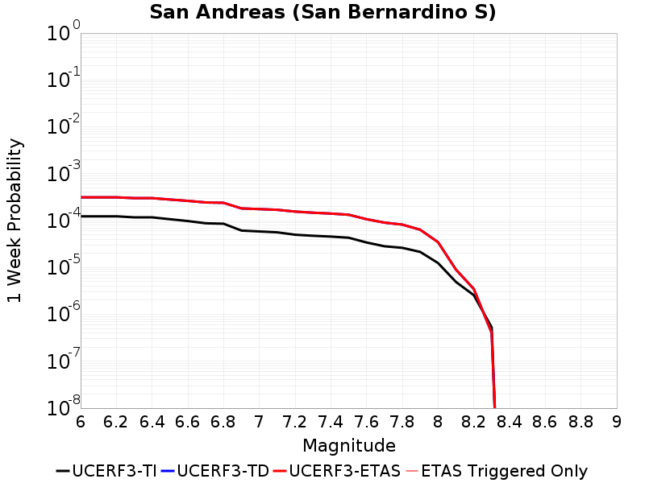 | 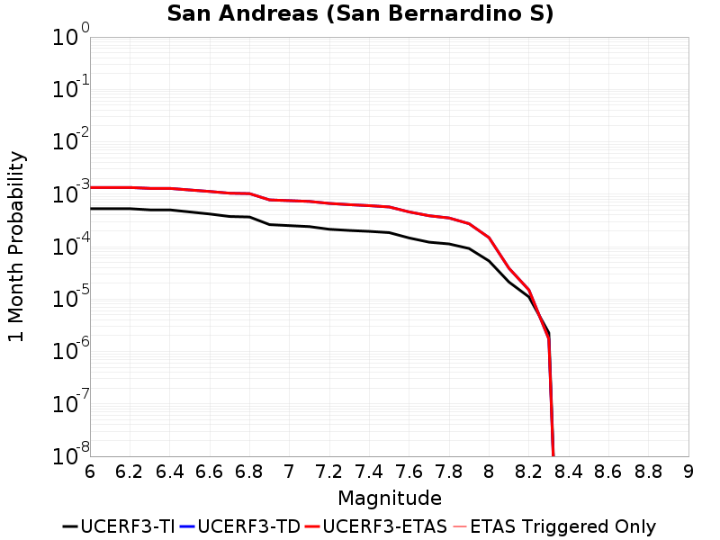 | 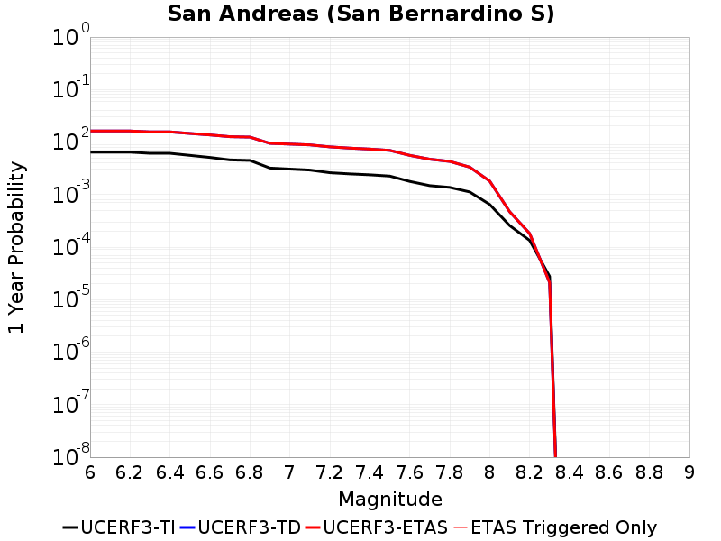 | 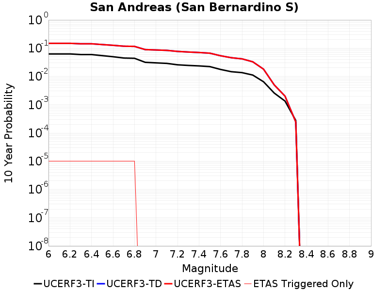 |

| Magnitude | 1 wk TI Prob | 1 wk TD Prob | 1 wk ETAS Prob | 1 wk ETAS/TD Gain | 1 wk ETAS Triggered Only | 1 mo TI Prob | 1 mo TD Prob | 1 mo ETAS Prob | 1 mo ETAS/TD Gain | 1 mo ETAS Triggered Only | 1 yr TI Prob | 1 yr TD Prob | 1 yr ETAS Prob | 1 yr ETAS/TD Gain | 1 yr ETAS Triggered Only | 10 yr TI Prob | 10 yr TD Prob | 10 yr ETAS Prob | 10 yr ETAS/TD Gain | 10 yr ETAS Triggered Only |
|-----|-----|-----|-----|-----|-----|-----|-----|-----|-----|-----|-----|-----|-----|-----|-----|-----|-----|-----|-----|-----|
| 6.0 | 1.2336002E-4 | 3.131872E-4 | 3.131872E-4 | 1.0 | 0.0 | 5.2857865E-4 | 0.0013415676 | 0.0013415676 | 1.0 | 0.0 | 0.006416472 | 0.016216477 | 0.016216477 | 1.0 | 0.0 | 0.06234337 | 0.14791872 | 0.14792724 | 1.0000576 | 1.0E-5 |
| 6.1 | 1.2336002E-4 | 3.131872E-4 | 3.131872E-4 | 1.0 | 0.0 | 5.2857865E-4 | 0.0013415676 | 0.0013415676 | 1.0 | 0.0 | 0.006416472 | 0.016216477 | 0.016216477 | 1.0 | 0.0 | 0.06234337 | 0.14791872 | 0.14792724 | 1.0000576 | 1.0E-5 |
| 6.2 | 1.2336002E-4 | 3.131872E-4 | 3.131872E-4 | 1.0 | 0.0 | 5.2857865E-4 | 0.0013415676 | 0.0013415676 | 1.0 | 0.0 | 0.006416472 | 0.016216477 | 0.016216477 | 1.0 | 0.0 | 0.06234337 | 0.14791872 | 0.14792724 | 1.0000576 | 1.0E-5 |
| 6.3 | 1.1712257E-4 | 3.0091906E-4 | 3.0091906E-4 | 1.0 | 0.0 | 5.018573E-4 | 0.0012890425 | 0.0012890425 | 1.0 | 0.0 | 0.006093008 | 0.015586253 | 0.015586253 | 1.0 | 0.0 | 0.059286322 | 0.14260347 | 0.14261205 | 1.0000601 | 1.0E-5 |
| 6.4 | 1.1712257E-4 | 3.0091906E-4 | 3.0091906E-4 | 1.0 | 0.0 | 5.018573E-4 | 0.0012890425 | 0.0012890425 | 1.0 | 0.0 | 0.006093008 | 0.015586253 | 0.015586253 | 1.0 | 0.0 | 0.059286322 | 0.14260347 | 0.14261205 | 1.0000601 | 1.0E-5 |
| 6.5 | 1.0689076E-4 | 2.808008E-4 | 2.808008E-4 | 1.0 | 0.0 | 4.5802278E-4 | 0.0012029029 | 0.0012029029 | 1.0 | 0.0 | 0.0055621783 | 0.014551856 | 0.014551856 | 1.0 | 0.0 | 0.05425003 | 0.13379407 | 0.13380273 | 1.0000647 | 1.0E-5 |
| 6.6 | 9.7648895E-5 | 2.630049E-4 | 2.630049E-4 | 1.0 | 0.0 | 4.1842813E-4 | 0.0011267017 | 0.0011267017 | 1.0 | 0.0 | 0.005082469 | 0.013635907 | 0.013635907 | 1.0 | 0.0 | 0.049677886 | 0.12590991 | 0.12591864 | 1.0000694 | 1.0E-5 |
| 6.7 | 8.757013E-5 | 2.4346856E-4 | 2.4346856E-4 | 1.0 | 0.0 | 3.7524657E-4 | 0.0010430428 | 0.0010430428 | 1.0 | 0.0 | 0.00455906 | 0.012629406 | 0.012629406 | 1.0 | 0.0 | 0.04466656 | 0.11714024 | 0.11714907 | 1.0000753 | 1.0E-5 |
| 6.8 | 8.562978E-5 | 2.3896413E-4 | 2.3896413E-4 | 1.0 | 0.0 | 3.6693315E-4 | 0.0010237533 | 0.0010237533 | 1.0 | 0.0 | 0.004458263 | 0.012397245 | 0.012397245 | 1.0 | 0.0 | 0.043698758 | 0.11511439 | 0.11512324 | 1.0000769 | 1.0E-5 |
| 6.9 | 6.124075E-5 | 1.814945E-4 | 1.814945E-4 | 1.0 | 0.0 | 2.6243398E-4 | 7.776026E-4 | 7.776026E-4 | 1.0 | 0.0 | 0.0031904527 | 0.009426446 | 0.009426446 | 1.0 | 0.0 | 0.031450346 | 0.08878044 | 0.08878044 | 1.0 | 0.0 |
| 7.0 | 5.8598747E-5 | 1.7565211E-4 | 1.7565211E-4 | 1.0 | 0.0 | 2.5111332E-4 | 7.5257843E-4 | 7.5257843E-4 | 1.0 | 0.0 | 0.0030530186 | 0.009124367 | 0.009124367 | 1.0 | 0.0 | 0.03011414 | 0.08605458 | 0.08605458 | 1.0 | 0.0 |
| 7.1 | 5.613814E-5 | 1.6971321E-4 | 1.6971321E-4 | 1.0 | 0.0 | 2.4056983E-4 | 7.271404E-4 | 7.271404E-4 | 1.0 | 0.0 | 0.0029250039 | 0.008817201 | 0.008817201 | 1.0 | 0.0 | 0.028868021 | 0.08331029 | 0.08331029 | 1.0 | 0.0 |
| 7.2 | 4.991222E-5 | 1.5547099E-4 | 1.5547099E-4 | 1.0 | 0.0 | 2.1389198E-4 | 6.661345E-4 | 6.661345E-4 | 1.0 | 0.0 | 0.002601025 | 0.008080147 | 0.008080147 | 1.0 | 0.0 | 0.025707912 | 0.07666044 | 0.07666044 | 1.0 | 0.0 |
| 7.3 | 4.7410045E-5 | 1.4714288E-4 | 1.4714288E-4 | 1.0 | 0.0 | 2.0317009E-4 | 6.3046033E-4 | 6.3046033E-4 | 1.0 | 0.0 | 0.0024707897 | 0.0076489383 | 0.0076489383 | 1.0 | 0.0 | 0.024434982 | 0.072851375 | 0.072851375 | 1.0 | 0.0 |
| 7.4 | 4.5556746E-5 | 1.410208E-4 | 1.410208E-4 | 1.0 | 0.0 | 1.952286E-4 | 6.042352E-4 | 6.042352E-4 | 1.0 | 0.0 | 0.002374317 | 0.00733184 | 0.00733184 | 1.0 | 0.0 | 0.023491086 | 0.070031926 | 0.070031926 | 1.0 | 0.0 |
| 7.5 | 4.3084514E-5 | 1.3312626E-4 | 1.3312626E-4 | 1.0 | 0.0 | 1.8463485E-4 | 5.704167E-4 | 5.704167E-4 | 1.0 | 0.0 | 0.0022456115 | 0.006922791 | 0.006922791 | 1.0 | 0.0 | 0.022230545 | 0.066344485 | 0.066344485 | 1.0 | 0.0 |
| 7.6 | 3.408608E-5 | 1.0696633E-4 | 1.0696633E-4 | 1.0 | 0.0 | 1.4607502E-4 | 4.5834668E-4 | 4.5834668E-4 | 1.0 | 0.0 | 0.0017770125 | 0.0055661234 | 0.0055661234 | 1.0 | 0.0 | 0.017628696 | 0.05381154 | 0.05381154 | 1.0 | 0.0 |
| 7.7 | 2.8315713E-5 | 9.047038E-5 | 9.047038E-5 | 1.0 | 0.0 | 1.2134742E-4 | 3.8767263E-4 | 3.8767263E-4 | 1.0 | 0.0 | 0.0014764034 | 0.0047097113 | 0.0047097113 | 1.0 | 0.0 | 0.01466633 | 0.0458133 | 0.0458133 | 1.0 | 0.0 |
| 7.8 | 2.6222975E-5 | 8.2016726E-5 | 8.2016726E-5 | 1.0 | 0.0 | 1.1237934E-4 | 3.5145294E-4 | 3.5145294E-4 | 1.0 | 0.0 | 0.0013673597 | 0.004270552 | 0.004270552 | 1.0 | 0.0 | 0.013589768 | 0.041733075 | 0.041733075 | 1.0 | 0.0 |
| 7.9 | 2.1469694E-5 | 6.381998E-5 | 6.381998E-5 | 1.0 | 0.0 | 9.200973E-5 | 2.7348552E-4 | 2.7348552E-4 | 1.0 | 0.0 | 0.0011196428 | 0.0033246065 | 0.0033246065 | 1.0 | 0.0 | 0.011140184 | 0.03284017 | 0.03284017 | 1.0 | 0.0 |
| 8.0 | 1.2420249E-5 | 3.4623154E-5 | 3.4623154E-5 | 1.0 | 0.0 | 5.322855E-5 | 1.4837651E-4 | 1.4837651E-4 | 1.0 | 0.0 | 6.478649E-4 | 0.0018049882 | 0.0018049882 | 1.0 | 0.0 | 0.0064597935 | 0.018051587 | 0.018051587 | 1.0 | 0.0 |
| 8.1 | 4.9197724E-6 | 9.019301E-6 | 9.019301E-6 | 1.0 | 0.0 | 2.1084568E-5 | 3.8653576E-5 | 3.8653576E-5 | 1.0 | 0.0 | 2.566744E-4 | 4.7050582E-4 | 4.7050582E-4 | 1.0 | 0.0 | 0.002563781 | 0.004978215 | 0.004978215 | 1.0 | 0.0 |
| 8.2 | 2.5634774E-6 | 3.4795708E-6 | 3.4795708E-6 | 1.0 | 0.0 | 1.0986286E-5 | 1.4912361E-5 | 1.4912361E-5 | 1.0 | 0.0 | 1.3374983E-4 | 1.8154293E-4 | 1.8154293E-4 | 1.0 | 0.0 | 0.0013366934 | 0.0020006064 | 0.0020006064 | 1.0 | 0.0 |
| 8.3 | 5.2850464E-7 | 4.030262E-7 | 4.030262E-7 | 1.0 | 0.0 | 2.2650179E-6 | 1.7272541E-6 | 1.7272541E-6 | 1.0 | 0.0 | 2.7576245E-5 | 2.1029136E-5 | 2.1029136E-5 | 1.0 | 0.0 | 2.7572823E-4 | 2.4397958E-4 | 2.4397958E-4 | 1.0 | 0.0 |

## San Andreas (Cholame) rev
*[(top)](#table-of-contents)*

| 1 Week | 1 Month | 1 Year | 10 Year |
|-----|-----|-----|-----|
|  |  |  | 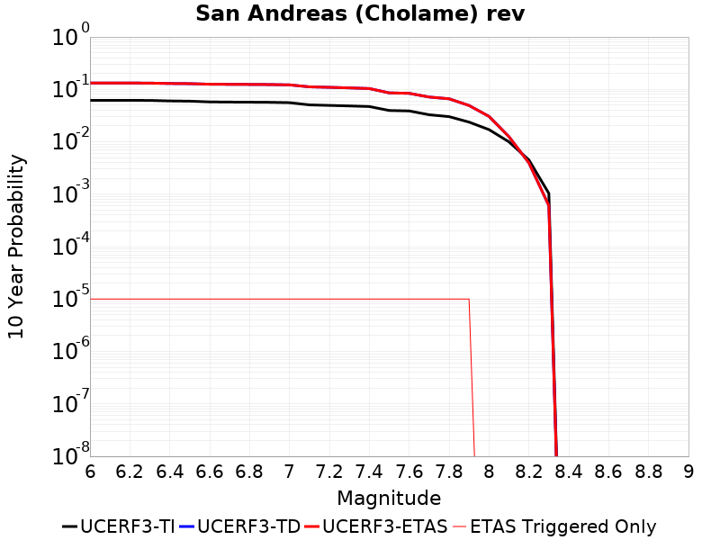 |

| Magnitude | 1 wk TI Prob | 1 wk TD Prob | 1 wk ETAS Prob | 1 wk ETAS/TD Gain | 1 wk ETAS Triggered Only | 1 mo TI Prob | 1 mo TD Prob | 1 mo ETAS Prob | 1 mo ETAS/TD Gain | 1 mo ETAS Triggered Only | 1 yr TI Prob | 1 yr TD Prob | 1 yr ETAS Prob | 1 yr ETAS/TD Gain | 1 yr ETAS Triggered Only | 10 yr TI Prob | 10 yr TD Prob | 10 yr ETAS Prob | 10 yr ETAS/TD Gain | 10 yr ETAS Triggered Only |
|-----|-----|-----|-----|-----|-----|-----|-----|-----|-----|-----|-----|-----|-----|-----|-----|-----|-----|-----|-----|-----|
| 6.0 | 1.2188602E-4 | 2.6938927E-4 | 2.6938927E-4 | 1.0 | 0.0 | 5.2226405E-4 | 0.0011540164 | 0.0011540164 | 1.0 | 0.0 | 0.0063400427 | 0.013960223 | 0.013960223 | 1.0 | 0.0 | 0.061621845 | 0.13155037 | 0.13155906 | 1.000066 | 1.0E-5 |
| 6.1 | 1.2188602E-4 | 2.6938927E-4 | 2.6938927E-4 | 1.0 | 0.0 | 5.2226405E-4 | 0.0011540164 | 0.0011540164 | 1.0 | 0.0 | 0.0063400427 | 0.013960223 | 0.013960223 | 1.0 | 0.0 | 0.061621845 | 0.13155037 | 0.13155906 | 1.000066 | 1.0E-5 |
| 6.2 | 1.2188602E-4 | 2.6938927E-4 | 2.6938927E-4 | 1.0 | 0.0 | 5.2226405E-4 | 0.0011540164 | 0.0011540164 | 1.0 | 0.0 | 0.0063400427 | 0.013960223 | 0.013960223 | 1.0 | 0.0 | 0.061621845 | 0.13155037 | 0.13155906 | 1.000066 | 1.0E-5 |
| 6.3 | 1.2142645E-4 | 2.6851203E-4 | 2.6851203E-4 | 1.0 | 0.0 | 5.202953E-4 | 0.0011502601 | 0.0011502601 | 1.0 | 0.0 | 0.006316212 | 0.013915075 | 0.013915075 | 1.0 | 0.0 | 0.06139677 | 0.1311654 | 0.13117409 | 1.0000663 | 1.0E-5 |
| 6.4 | 1.1865206E-4 | 2.6344406E-4 | 2.6344406E-4 | 1.0 | 0.0 | 5.0840975E-4 | 0.0011285591 | 0.0011285591 | 1.0 | 0.0 | 0.006172335 | 0.013654204 | 0.013654204 | 1.0 | 0.0 | 0.060036868 | 0.12893449 | 0.12894319 | 1.0000676 | 1.0E-5 |
| 6.5 | 1.17443946E-4 | 2.6132565E-4 | 2.6132565E-4 | 1.0 | 0.0 | 5.032341E-4 | 0.001119488 | 0.001119488 | 1.0 | 0.0 | 0.006109677 | 0.013545139 | 0.013545139 | 1.0 | 0.0 | 0.059444077 | 0.1279997 | 0.12800841 | 1.0000681 | 1.0E-5 |
| 6.6 | 1.13579066E-4 | 2.544396E-4 | 2.544396E-4 | 1.0 | 0.0 | 4.866766E-4 | 0.0010900014 | 0.0010900014 | 1.0 | 0.0 | 0.0059092017 | 0.013190538 | 0.013190538 | 1.0 | 0.0 | 0.057545185 | 0.12494551 | 0.12495425 | 1.00007 | 1.0E-5 |
| 6.7 | 1.1271412E-4 | 2.5287303E-4 | 2.5287303E-4 | 1.0 | 0.0 | 4.829711E-4 | 0.0010832931 | 0.0010832931 | 1.0 | 0.0 | 0.005864331 | 0.013109851 | 0.013109851 | 1.0 | 0.0 | 0.057119697 | 0.12425073 | 0.12425949 | 1.0000705 | 1.0E-5 |
| 6.8 | 1.1217975E-4 | 2.517373E-4 | 2.517373E-4 | 1.0 | 0.0 | 4.8068175E-4 | 0.0010784297 | 0.0010784297 | 1.0 | 0.0 | 0.005836608 | 0.013051351 | 0.013051351 | 1.0 | 0.0 | 0.056856725 | 0.1237463 | 0.12375506 | 1.0000708 | 1.0E-5 |
| 6.9 | 1.1146753E-4 | 2.5019E-4 | 2.5019E-4 | 1.0 | 0.0 | 4.7763053E-4 | 0.001071804 | 0.001071804 | 1.0 | 0.0 | 0.0057996577 | 0.012971645 | 0.012971645 | 1.0 | 0.0 | 0.056506127 | 0.123058856 | 0.123067625 | 1.0000713 | 1.0E-5 |
| 7.0 | 1.0965793E-4 | 2.463598E-4 | 2.463598E-4 | 1.0 | 0.0 | 4.698779E-4 | 0.0010554021 | 0.0010554021 | 1.0 | 0.0 | 0.005705768 | 0.012774312 | 0.012774312 | 1.0 | 0.0 | 0.055614736 | 0.12135146 | 0.12136024 | 1.0000724 | 1.0E-5 |
| 7.1 | 9.927982E-5 | 2.238823E-4 | 2.238823E-4 | 1.0 | 0.0 | 4.2541555E-4 | 9.591439E-4 | 9.591439E-4 | 1.0 | 0.0 | 0.0051671406 | 0.011615402 | 0.011615402 | 1.0 | 0.0 | 0.05048634 | 0.11126483 | 0.11127371 | 1.0000799 | 1.0E-5 |
| 7.2 | 9.696786E-5 | 2.1877873E-4 | 2.1877873E-4 | 1.0 | 0.0 | 4.1551032E-4 | 9.3728735E-4 | 9.3728735E-4 | 1.0 | 0.0 | 0.00504711 | 0.011352101 | 0.011352101 | 1.0 | 0.0 | 0.04934009 | 0.10896777 | 0.108976685 | 1.0000818 | 1.0E-5 |
| 7.3 | 9.4727984E-5 | 2.1282076E-4 | 2.1282076E-4 | 1.0 | 0.0 | 4.0591392E-4 | 9.1177126E-4 | 9.1177126E-4 | 1.0 | 0.0 | 0.0049308087 | 0.0110446345 | 0.0110446345 | 1.0 | 0.0 | 0.048228268 | 0.10625996 | 0.10626889 | 1.0000842 | 1.0E-5 |
| 7.4 | 9.220358E-5 | 2.0620394E-4 | 2.0620394E-4 | 1.0 | 0.0 | 3.9509835E-4 | 8.834329E-4 | 8.834329E-4 | 1.0 | 0.0 | 0.004799717 | 0.010703047 | 0.010703047 | 1.0 | 0.0 | 0.046973653 | 0.103239916 | 0.10324889 | 1.0000869 | 1.0E-5 |
| 7.5 | 7.71631E-5 | 1.677154E-4 | 1.677154E-4 | 1.0 | 0.0 | 3.306571E-4 | 7.1858254E-4 | 7.1858254E-4 | 1.0 | 0.0 | 0.0040183207 | 0.00871374 | 0.00871374 | 1.0 | 0.0 | 0.03946433 | 0.085359074 | 0.08536822 | 1.0001072 | 1.0E-5 |
| 7.6 | 7.5634416E-5 | 1.641399E-4 | 1.641399E-4 | 1.0 | 0.0 | 3.241072E-4 | 7.0326723E-4 | 7.0326723E-4 | 1.0 | 0.0 | 0.0039388672 | 0.008528751 | 0.008528751 | 1.0 | 0.0 | 0.038697794 | 0.083662756 | 0.08367192 | 1.0001096 | 1.0E-5 |
| 7.7 | 6.3783E-5 | 1.3812778E-4 | 1.3812778E-4 | 1.0 | 0.0 | 2.7332708E-4 | 5.9184193E-4 | 5.9184193E-4 | 1.0 | 0.0 | 0.0033226798 | 0.007181907 | 0.007181907 | 1.0 | 0.0 | 0.032734364 | 0.07111793 | 0.07112722 | 1.0001307 | 1.0E-5 |
| 7.8 | 5.863422E-5 | 1.2762393E-4 | 1.2762393E-4 | 1.0 | 0.0 | 2.512653E-4 | 5.4684514E-4 | 5.4684514E-4 | 1.0 | 0.0 | 0.003054864 | 0.0066375453 | 0.0066375453 | 1.0 | 0.0 | 0.030132094 | 0.0657828 | 0.06579214 | 1.000142 | 1.0E-5 |
| 7.9 | 4.595283E-5 | 9.433732E-5 | 9.433732E-5 | 1.0 | 0.0 | 1.9692584E-4 | 4.0424019E-4 | 4.0424019E-4 | 1.0 | 0.0 | 0.0023949358 | 0.0049105277 | 0.0049105277 | 1.0 | 0.0 | 0.023692891 | 0.049078956 | 0.049088463 | 1.0001937 | 1.0E-5 |
| 8.0 | 3.2950178E-5 | 5.7350924E-5 | 5.7350924E-5 | 1.0 | 0.0 | 1.412074E-4 | 2.457665E-4 | 2.457665E-4 | 1.0 | 0.0 | 0.0017178444 | 0.002988104 | 0.002988104 | 1.0 | 0.0 | 0.017046256 | 0.030385733 | 0.030395428 | 1.0003191 | 1.0E-5 |
| 8.1 | 1.9177472E-5 | 2.2473245E-5 | 2.2473245E-5 | 1.0 | 0.0 | 8.218658E-5 | 9.631035E-5 | 9.631035E-5 | 1.0 | 0.0 | 0.0010001622 | 0.0011719486 | 0.0011719486 | 1.0 | 0.0 | 0.009956728 | 0.012462701 | 0.012462701 | 1.0 | 0.0 |
| 8.2 | 8.643924E-6 | 6.7523606E-6 | 6.7523606E-6 | 1.0 | 0.0 | 3.704486E-5 | 2.8938368E-5 | 2.8938368E-5 | 1.0 | 0.0 | 4.5092785E-4 | 3.522678E-4 | 3.522678E-4 | 1.0 | 0.0 | 0.0045001395 | 0.003937757 | 0.003937757 | 1.0 | 0.0 |
| 8.3 | 1.983087E-6 | 9.94482E-7 | 9.94482E-7 | 1.0 | 0.0 | 8.498917E-6 | 4.2620586E-6 | 4.2620586E-6 | 1.0 | 0.0 | 1.034694E-4 | 5.1889358E-5 | 5.1889358E-5 | 1.0 | 0.0 | 0.0010342124 | 6.010915E-4 | 6.010915E-4 | 1.0 | 0.0 |

## Raymond
*[(top)](#table-of-contents)*

| 1 Week | 1 Month | 1 Year | 10 Year |
|-----|-----|-----|-----|
| 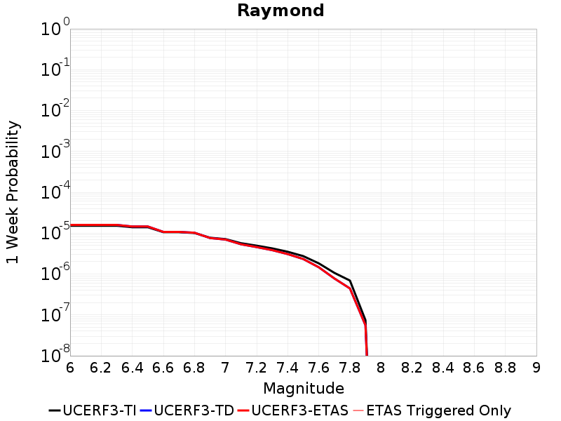 | 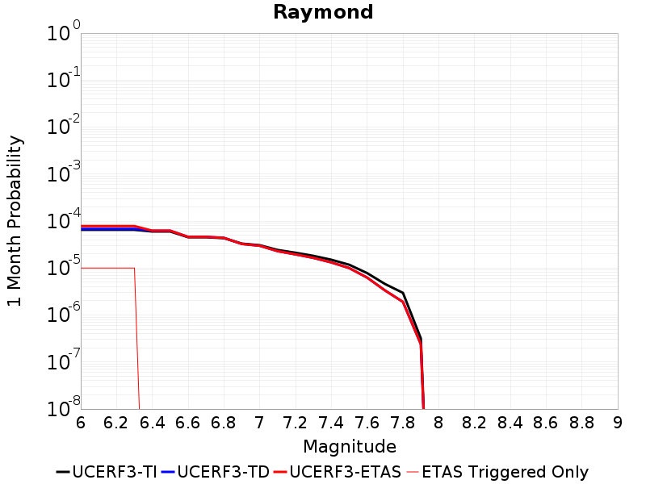 | 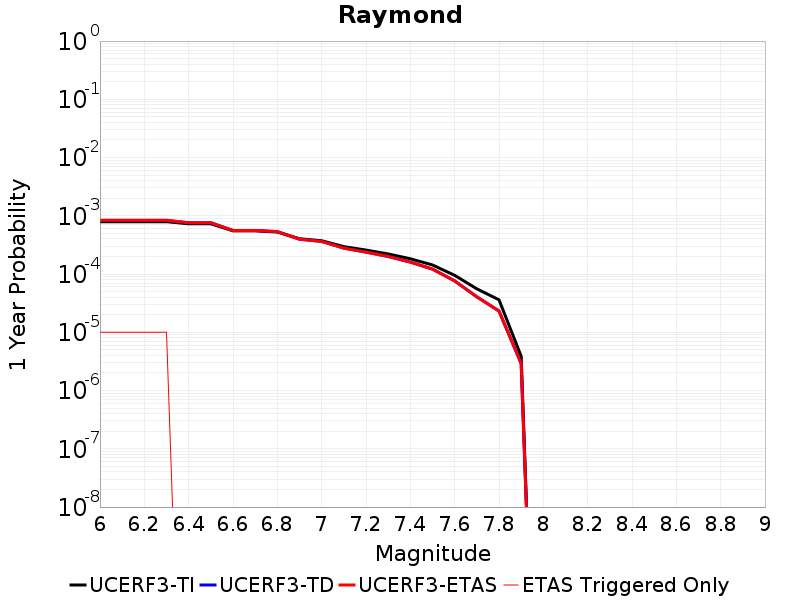 | 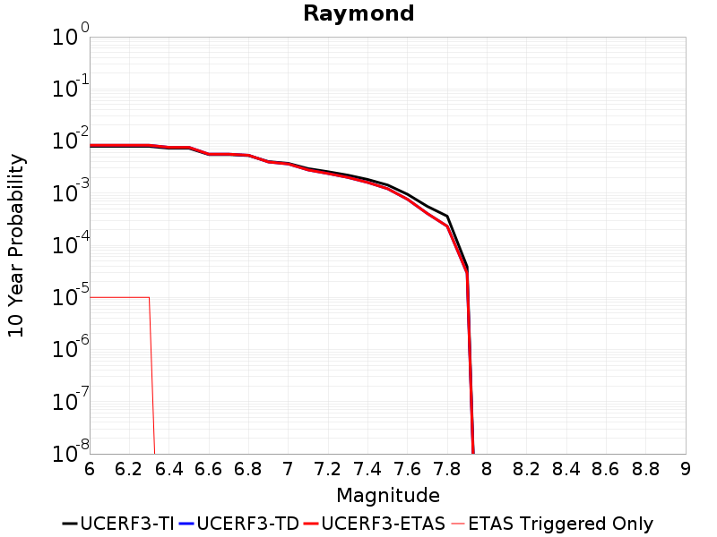 |

| Magnitude | 1 wk TI Prob | 1 wk TD Prob | 1 wk ETAS Prob | 1 wk ETAS/TD Gain | 1 wk ETAS Triggered Only | 1 mo TI Prob | 1 mo TD Prob | 1 mo ETAS Prob | 1 mo ETAS/TD Gain | 1 mo ETAS Triggered Only | 1 yr TI Prob | 1 yr TD Prob | 1 yr ETAS Prob | 1 yr ETAS/TD Gain | 1 yr ETAS Triggered Only | 10 yr TI Prob | 10 yr TD Prob | 10 yr ETAS Prob | 10 yr ETAS/TD Gain | 10 yr ETAS Triggered Only |
|-----|-----|-----|-----|-----|-----|-----|-----|-----|-----|-----|-----|-----|-----|-----|-----|-----|-----|-----|-----|-----|
| 6.0 | 1.5157413E-5 | 1.5886424E-5 | 1.5886424E-5 | 1.0 | 0.0 | 6.4958724E-5 | 6.808304E-5 | 7.808236E-5 | 1.1468694 | 1.0E-5 | 7.905855E-4 | 8.286211E-4 | 8.386128E-4 | 1.0120583 | 1.0E-5 | 0.007877788 | 0.00825785 | 0.008267768 | 1.0012009 | 1.0E-5 |
| 6.1 | 1.5157413E-5 | 1.5886424E-5 | 1.5886424E-5 | 1.0 | 0.0 | 6.4958724E-5 | 6.808304E-5 | 7.808236E-5 | 1.1468694 | 1.0E-5 | 7.905855E-4 | 8.286211E-4 | 8.386128E-4 | 1.0120583 | 1.0E-5 | 0.007877788 | 0.00825785 | 0.008267768 | 1.0012009 | 1.0E-5 |
| 6.2 | 1.5157413E-5 | 1.5886424E-5 | 1.5886424E-5 | 1.0 | 0.0 | 6.4958724E-5 | 6.808304E-5 | 7.808236E-5 | 1.1468694 | 1.0E-5 | 7.905855E-4 | 8.286211E-4 | 8.386128E-4 | 1.0120583 | 1.0E-5 | 0.007877788 | 0.00825785 | 0.008267768 | 1.0012009 | 1.0E-5 |
| 6.3 | 1.5157413E-5 | 1.5886424E-5 | 1.5886424E-5 | 1.0 | 0.0 | 6.4958724E-5 | 6.808304E-5 | 7.808236E-5 | 1.1468694 | 1.0E-5 | 7.905855E-4 | 8.286211E-4 | 8.386128E-4 | 1.0120583 | 1.0E-5 | 0.007877788 | 0.00825785 | 0.008267768 | 1.0012009 | 1.0E-5 |
| 6.4 | 1.3941944E-5 | 1.4524719E-5 | 1.4524719E-5 | 1.0 | 0.0 | 5.9749822E-5 | 6.224744E-5 | 6.224744E-5 | 1.0 | 0.0 | 7.2721124E-4 | 7.5762265E-4 | 7.5762265E-4 | 1.0 | 0.0 | 0.007248361 | 0.0075527476 | 0.0075527476 | 1.0 | 0.0 |
| 6.5 | 1.3941944E-5 | 1.4524719E-5 | 1.4524719E-5 | 1.0 | 0.0 | 5.9749822E-5 | 6.224744E-5 | 6.224744E-5 | 1.0 | 0.0 | 7.2721124E-4 | 7.5762265E-4 | 7.5762265E-4 | 1.0 | 0.0 | 0.007248361 | 0.0075527476 | 0.0075527476 | 1.0 | 0.0 |
| 6.6 | 1.0542609E-5 | 1.0723968E-5 | 1.0723968E-5 | 1.0 | 0.0 | 4.5181827E-5 | 4.595909E-5 | 4.595909E-5 | 1.0 | 0.0 | 5.499499E-4 | 5.5941375E-4 | 5.5941375E-4 | 1.0 | 0.0 | 0.005485909 | 0.0055806166 | 0.0055806166 | 1.0 | 0.0 |
| 6.7 | 1.0542609E-5 | 1.0723968E-5 | 1.0723968E-5 | 1.0 | 0.0 | 4.5181827E-5 | 4.595909E-5 | 4.595909E-5 | 1.0 | 0.0 | 5.499499E-4 | 5.5941375E-4 | 5.5941375E-4 | 1.0 | 0.0 | 0.005485909 | 0.0055806166 | 0.0055806166 | 1.0 | 0.0 |
| 6.8 | 1.0079132E-5 | 1.0228146E-5 | 1.0228146E-5 | 1.0 | 0.0 | 4.3195567E-5 | 4.3834203E-5 | 4.3834203E-5 | 1.0 | 0.0 | 5.257791E-4 | 5.3355616E-4 | 5.3355616E-4 | 1.0 | 0.0 | 0.0052453685 | 0.0053233006 | 0.0053233006 | 1.0 | 0.0 |
| 6.9 | 7.721598E-6 | 7.588178E-6 | 7.588178E-6 | 1.0 | 0.0 | 3.3092143E-5 | 3.2520365E-5 | 3.2520365E-5 | 1.0 | 0.0 | 4.0282236E-4 | 3.9586474E-4 | 3.9586474E-4 | 1.0 | 0.0 | 0.0040209293 | 0.0039517246 | 0.0039517246 | 1.0 | 0.0 |
| 7.0 | 7.137566E-6 | 6.948214E-6 | 6.948214E-6 | 1.0 | 0.0 | 3.058921E-5 | 2.9777726E-5 | 2.9777726E-5 | 1.0 | 0.0 | 3.7236E-4 | 3.6248457E-4 | 3.6248457E-4 | 1.0 | 0.0 | 0.0037173668 | 0.0036190466 | 0.0036190466 | 1.0 | 0.0 |
| 7.1 | 5.654976E-6 | 5.3308117E-6 | 5.3308117E-6 | 1.0 | 0.0 | 2.4235387E-5 | 2.2846138E-5 | 2.2846138E-5 | 1.0 | 0.0 | 2.9502588E-4 | 2.7811644E-4 | 2.7811644E-4 | 1.0 | 0.0 | 0.0029463451 | 0.0027777094 | 0.0027777094 | 1.0 | 0.0 |
| 7.2 | 4.9358455E-6 | 4.5554725E-6 | 4.5554725E-6 | 1.0 | 0.0 | 2.1153453E-5 | 1.9523308E-5 | 1.9523308E-5 | 1.0 | 0.0 | 2.5751285E-4 | 2.3767048E-4 | 2.3767048E-4 | 1.0 | 0.0 | 0.0025721465 | 0.0023741794 | 0.0023741794 | 1.0 | 0.0 |
| 7.3 | 4.2368597E-6 | 3.832968E-6 | 3.832968E-6 | 1.0 | 0.0 | 1.8157843E-5 | 1.6426904E-5 | 1.6426904E-5 | 1.0 | 0.0 | 2.2104931E-4 | 1.999793E-4 | 1.999793E-4 | 1.0 | 0.0 | 0.0022082955 | 0.0019980066 | 0.0019980066 | 1.0 | 0.0 |
| 7.4 | 3.4999923E-6 | 3.0689534E-6 | 3.0689534E-6 | 1.0 | 0.0 | 1.49998805E-5 | 1.3152592E-5 | 1.3152592E-5 | 1.0 | 0.0 | 1.8260824E-4 | 1.6012113E-4 | 1.6012113E-4 | 1.0 | 0.0 | 0.0018245826 | 0.0016000676 | 0.0016000676 | 1.0 | 0.0 |
| 7.5 | 2.738017E-6 | 2.324312E-6 | 2.324312E-6 | 1.0 | 0.0 | 1.1734306E-5 | 9.9613E-6 | 9.9613E-6 | 1.0 | 0.0 | 1.428558E-4 | 1.2127215E-4 | 1.2127215E-4 | 1.0 | 0.0 | 0.0014276401 | 0.0012120684 | 0.0012120684 | 1.0 | 0.0 |
| 7.6 | 1.8186392E-6 | 1.458355E-6 | 1.458355E-6 | 1.0 | 0.0 | 7.794145E-6 | 6.250078E-6 | 6.250078E-6 | 1.0 | 0.0 | 9.488958E-5 | 7.609209E-5 | 7.609209E-5 | 1.0 | 0.0 | 9.4849075E-4 | 7.606661E-4 | 7.606661E-4 | 1.0 | 0.0 |
| 7.7 | 1.0660348E-6 | 7.771047E-7 | 7.771047E-7 | 1.0 | 0.0 | 4.5687125E-6 | 3.3304445E-6 | 3.3304445E-6 | 1.0 | 0.0 | 5.5622655E-5 | 4.0547424E-5 | 4.0547424E-5 | 1.0 | 0.0 | 5.5608735E-4 | 4.0540364E-4 | 4.0540364E-4 | 1.0 | 0.0 |
| 7.8 | 6.913602E-7 | 4.433239E-7 | 4.433239E-7 | 1.0 | 0.0 | 2.962969E-6 | 1.8999582E-6 | 1.8999582E-6 | 1.0 | 0.0 | 3.607355E-5 | 2.3131752E-5 | 2.3131752E-5 | 1.0 | 0.0 | 3.6067693E-4 | 2.3129799E-4 | 2.3129799E-4 | 1.0 | 0.0 |
| 7.9 | 7.425201E-8 | 5.5720783E-8 | 5.5720783E-8 | 1.0 | 0.0 | 3.1822285E-7 | 2.3880335E-7 | 2.3880335E-7 | 1.0 | 0.0 | 3.874356E-6 | 2.9074283E-6 | 2.9074283E-6 | 1.0 | 0.0 | 3.8742884E-5 | 2.9074045E-5 | 2.9074045E-5 | 1.0 | 0.0 |

## Peralta Hills
*[(top)](#table-of-contents)*

| 1 Week | 1 Month | 1 Year | 10 Year |
|-----|-----|-----|-----|
| 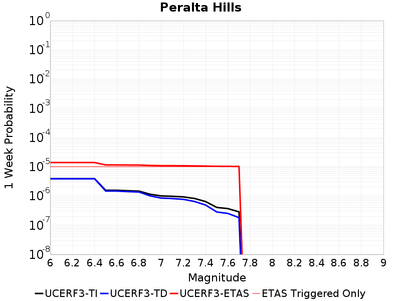 | 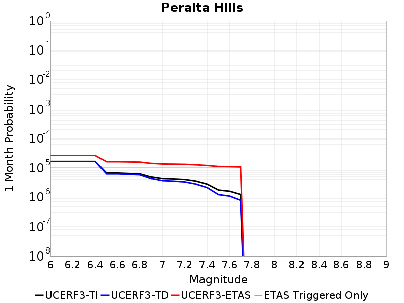 | 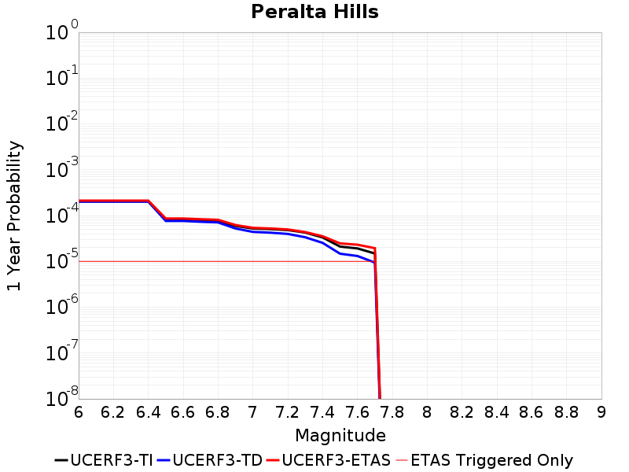 | 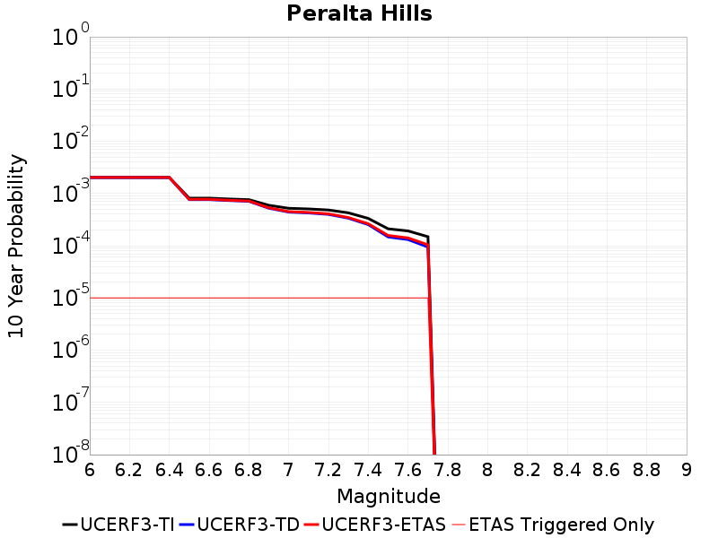 |

| Magnitude | 1 wk TI Prob | 1 wk TD Prob | 1 wk ETAS Prob | 1 wk ETAS/TD Gain | 1 wk ETAS Triggered Only | 1 mo TI Prob | 1 mo TD Prob | 1 mo ETAS Prob | 1 mo ETAS/TD Gain | 1 mo ETAS Triggered Only | 1 yr TI Prob | 1 yr TD Prob | 1 yr ETAS Prob | 1 yr ETAS/TD Gain | 1 yr ETAS Triggered Only | 10 yr TI Prob | 10 yr TD Prob | 10 yr ETAS Prob | 10 yr ETAS/TD Gain | 10 yr ETAS Triggered Only |
|-----|-----|-----|-----|-----|-----|-----|-----|-----|-----|-----|-----|-----|-----|-----|-----|-----|-----|-----|-----|-----|
| 6.0 | 3.8850067E-6 | 3.8606654E-6 | 1.38606265E-5 | 3.590217 | 1.0E-5 | 1.6649923E-5 | 1.6545646E-5 | 2.654548E-5 | 1.6043786 | 1.0E-5 | 2.0269395E-4 | 2.0143206E-4 | 2.1143004E-4 | 1.0496346 | 1.0E-5 | 0.0020250916 | 0.0020132246 | 0.0020232047 | 1.0049572 | 1.0E-5 |
| 6.1 | 3.8850067E-6 | 3.8606654E-6 | 1.38606265E-5 | 3.590217 | 1.0E-5 | 1.6649923E-5 | 1.6545646E-5 | 2.654548E-5 | 1.6043786 | 1.0E-5 | 2.0269395E-4 | 2.0143206E-4 | 2.1143004E-4 | 1.0496346 | 1.0E-5 | 0.0020250916 | 0.0020132246 | 0.0020232047 | 1.0049572 | 1.0E-5 |
| 6.2 | 3.8850067E-6 | 3.8606654E-6 | 1.38606265E-5 | 3.590217 | 1.0E-5 | 1.6649923E-5 | 1.6545646E-5 | 2.654548E-5 | 1.6043786 | 1.0E-5 | 2.0269395E-4 | 2.0143206E-4 | 2.1143004E-4 | 1.0496346 | 1.0E-5 | 0.0020250916 | 0.0020132246 | 0.0020232047 | 1.0049572 | 1.0E-5 |
| 6.3 | 3.8850067E-6 | 3.8606654E-6 | 1.38606265E-5 | 3.590217 | 1.0E-5 | 1.6649923E-5 | 1.6545646E-5 | 2.654548E-5 | 1.6043786 | 1.0E-5 | 2.0269395E-4 | 2.0143206E-4 | 2.1143004E-4 | 1.0496346 | 1.0E-5 | 0.0020250916 | 0.0020132246 | 0.0020232047 | 1.0049572 | 1.0E-5 |
| 6.4 | 3.8850067E-6 | 3.8606654E-6 | 1.38606265E-5 | 3.590217 | 1.0E-5 | 1.6649923E-5 | 1.6545646E-5 | 2.654548E-5 | 1.6043786 | 1.0E-5 | 2.0269395E-4 | 2.0143206E-4 | 2.1143004E-4 | 1.0496346 | 1.0E-5 | 0.0020250916 | 0.0020132246 | 0.0020232047 | 1.0049572 | 1.0E-5 |
| 6.5 | 1.5587785E-6 | 1.4613389E-6 | 1.1461324E-5 | 7.8430295 | 1.0E-5 | 6.6804623E-6 | 6.2628674E-6 | 1.6262806E-5 | 2.5967026 | 1.0E-5 | 8.133159E-5 | 7.6248E-5 | 8.624723E-5 | 1.131141 | 1.0E-5 | 8.1301836E-4 | 7.622429E-4 | 7.722353E-4 | 1.0131092 | 1.0E-5 |
| 6.6 | 1.5587785E-6 | 1.4613389E-6 | 1.1461324E-5 | 7.8430295 | 1.0E-5 | 6.6804623E-6 | 6.2628674E-6 | 1.6262806E-5 | 2.5967026 | 1.0E-5 | 8.133159E-5 | 7.6248E-5 | 8.624723E-5 | 1.131141 | 1.0E-5 | 8.1301836E-4 | 7.622429E-4 | 7.722353E-4 | 1.0131092 | 1.0E-5 |
| 6.7 | 1.5018579E-6 | 1.4018589E-6 | 1.1401845E-5 | 8.133375 | 1.0E-5 | 6.436518E-6 | 6.007954E-6 | 1.6007894E-5 | 2.6644502 | 1.0E-5 | 7.836179E-5 | 7.3144634E-5 | 8.31439E-5 | 1.1367054 | 1.0E-5 | 7.833416E-4 | 7.312297E-4 | 7.412224E-4 | 1.0136656 | 1.0E-5 |
| 6.8 | 1.4584314E-6 | 1.3562099E-6 | 1.1356196E-5 | 8.373481 | 1.0E-5 | 6.250405E-6 | 5.812316E-6 | 1.5812258E-5 | 2.7204745 | 1.0E-5 | 7.6096025E-5 | 7.076289E-5 | 8.076219E-5 | 1.141307 | 1.0E-5 | 7.6069974E-4 | 7.074276E-4 | 7.1742054E-4 | 1.0141257 | 1.0E-5 |
| 6.9 | 1.1382393E-6 | 1.0000774E-6 | 1.1000067E-5 | 10.999216 | 1.0E-5 | 4.8781594E-6 | 4.2860393E-6 | 1.4285996E-5 | 3.3331463 | 1.0E-5 | 5.9389975E-5 | 5.2181364E-5 | 6.218084E-5 | 1.1916293 | 1.0E-5 | 5.93741E-4 | 5.2169955E-4 | 5.316943E-4 | 1.0191581 | 1.0E-5 |
| 7.0 | 9.970413E-7 | 8.4311563E-7 | 1.0843107E-5 | 12.86076 | 1.0E-5 | 4.273027E-6 | 3.613348E-6 | 1.3613312E-5 | 3.7675064 | 1.0E-5 | 5.2022864E-5 | 4.3991695E-5 | 5.3991254E-5 | 1.2273057 | 1.0E-5 | 5.2010687E-4 | 4.3983685E-4 | 4.4983247E-4 | 1.0227257 | 1.0E-5 |
| 7.1 | 9.684443E-7 | 8.1101325E-7 | 1.0811005E-5 | 13.330245 | 1.0E-5 | 4.150469E-6 | 3.4757668E-6 | 1.3475732E-5 | 3.877053 | 1.0E-5 | 5.053079E-5 | 4.231671E-5 | 5.2316285E-5 | 1.2363032 | 1.0E-5 | 5.05193E-4 | 4.230934E-4 | 4.3308918E-4 | 1.0236255 | 1.0E-5 |
| 7.2 | 9.240811E-7 | 7.614082E-7 | 1.07614005E-5 | 14.13355 | 1.0E-5 | 3.960342E-6 | 3.2631742E-6 | 1.3263141E-5 | 4.064491 | 1.0E-5 | 4.8216094E-5 | 3.972849E-5 | 4.9728093E-5 | 1.2516985 | 1.0E-5 | 4.8205635E-4 | 3.972206E-4 | 4.0721663E-4 | 1.025165 | 1.0E-5 |
| 7.3 | 8.158643E-7 | 6.4429014E-7 | 1.0644284E-5 | 16.520947 | 1.0E-5 | 3.4965567E-6 | 2.761241E-6 | 1.2761213E-5 | 4.62155 | 1.0E-5 | 4.2569747E-5 | 3.3617653E-5 | 4.3617318E-5 | 1.2974528 | 1.0E-5 | 4.2561593E-4 | 3.3613198E-4 | 3.4612863E-4 | 1.0297402 | 1.0E-5 |
| 7.4 | 6.3822824E-7 | 4.8525834E-7 | 1.0485253E-5 | 21.60757 | 1.0E-5 | 2.7352612E-6 | 2.0796772E-6 | 1.2079657E-5 | 5.8084283 | 1.0E-5 | 3.3301294E-5 | 2.531983E-5 | 3.5319576E-5 | 1.3949374 | 1.0E-5 | 3.3296304E-4 | 2.5317472E-4 | 2.6317217E-4 | 1.0394884 | 1.0E-5 |
| 7.5 | 4.0292628E-7 | 2.8153775E-7 | 1.0281535E-5 | 36.519203 | 1.0E-5 | 1.7268258E-6 | 1.20659E-6 | 1.1206578E-5 | 9.287809 | 1.0E-5 | 2.1023901E-5 | 1.4690164E-5 | 2.4690016E-5 | 1.6807176 | 1.0E-5 | 2.1021912E-4 | 1.4689477E-4 | 1.5689331E-4 | 1.068066 | 1.0E-5 |
| 7.6 | 3.672993E-7 | 2.5096347E-7 | 1.0250961E-5 | 40.846428 | 1.0E-5 | 1.5741389E-6 | 1.0755574E-6 | 1.1075546E-5 | 10.297494 | 1.0E-5 | 1.9164972E-5 | 1.3094862E-5 | 2.309473E-5 | 1.7636483 | 1.0E-5 | 1.916332E-4 | 1.3094366E-4 | 1.4094236E-4 | 1.0763587 | 1.0E-5 |
| 7.7 | 2.8466823E-7 | 1.8027346E-7 | 1.0180272E-5 | 56.47127 | 1.0E-5 | 1.2200061E-6 | 7.7260046E-7 | 1.0772593E-5 | 13.943291 | 1.0E-5 | 1.4853474E-5 | 9.406397E-6 | 1.9406303E-5 | 2.0630963 | 1.0E-5 | 1.485248E-4 | 9.4062634E-5 | 1.0406169E-4 | 1.1063021 | 1.0E-5 |

## Puente Hills
*[(top)](#table-of-contents)*

| 1 Week | 1 Month | 1 Year | 10 Year |
|-----|-----|-----|-----|
|  |  |  |  |

| Magnitude | 1 wk TI Prob | 1 wk TD Prob | 1 wk ETAS Prob | 1 wk ETAS/TD Gain | 1 wk ETAS Triggered Only | 1 mo TI Prob | 1 mo TD Prob | 1 mo ETAS Prob | 1 mo ETAS/TD Gain | 1 mo ETAS Triggered Only | 1 yr TI Prob | 1 yr TD Prob | 1 yr ETAS Prob | 1 yr ETAS/TD Gain | 1 yr ETAS Triggered Only | 10 yr TI Prob | 10 yr TD Prob | 10 yr ETAS Prob | 10 yr ETAS/TD Gain | 10 yr ETAS Triggered Only |
|-----|-----|-----|-----|-----|-----|-----|-----|-----|-----|-----|-----|-----|-----|-----|-----|-----|-----|-----|-----|-----|
| 6.0 | 1.2101656E-5 | 8.148743E-6 | 1.8148661E-5 | 2.227173 | 1.0E-5 | 5.1863204E-5 | 3.492275E-5 | 4.49224E-5 | 1.2863363 | 1.0E-5 | 6.312516E-4 | 4.251072E-4 | 4.3510296E-4 | 1.0235134 | 1.0E-5 | 0.0062946146 | 0.0042435043 | 0.004253462 | 1.0023465 | 1.0E-5 |
| 6.1 | 1.2101656E-5 | 8.148743E-6 | 1.8148661E-5 | 2.227173 | 1.0E-5 | 5.1863204E-5 | 3.492275E-5 | 4.49224E-5 | 1.2863363 | 1.0E-5 | 6.312516E-4 | 4.251072E-4 | 4.3510296E-4 | 1.0235134 | 1.0E-5 | 0.0062946146 | 0.0042435043 | 0.004253462 | 1.0023465 | 1.0E-5 |
| 6.2 | 1.2101656E-5 | 8.148743E-6 | 1.8148661E-5 | 2.227173 | 1.0E-5 | 5.1863204E-5 | 3.492275E-5 | 4.49224E-5 | 1.2863363 | 1.0E-5 | 6.312516E-4 | 4.251072E-4 | 4.3510296E-4 | 1.0235134 | 1.0E-5 | 0.0062946146 | 0.0042435043 | 0.004253462 | 1.0023465 | 1.0E-5 |
| 6.3 | 1.2101656E-5 | 8.148743E-6 | 1.8148661E-5 | 2.227173 | 1.0E-5 | 5.1863204E-5 | 3.492275E-5 | 4.49224E-5 | 1.2863363 | 1.0E-5 | 6.312516E-4 | 4.251072E-4 | 4.3510296E-4 | 1.0235134 | 1.0E-5 | 0.0062946146 | 0.0042435043 | 0.004253462 | 1.0023465 | 1.0E-5 |
| 6.4 | 1.2101656E-5 | 8.148743E-6 | 1.8148661E-5 | 2.227173 | 1.0E-5 | 5.1863204E-5 | 3.492275E-5 | 4.49224E-5 | 1.2863363 | 1.0E-5 | 6.312516E-4 | 4.251072E-4 | 4.3510296E-4 | 1.0235134 | 1.0E-5 | 0.0062946146 | 0.0042435043 | 0.004253462 | 1.0023465 | 1.0E-5 |
| 6.5 | 1.2101656E-5 | 8.148743E-6 | 1.8148661E-5 | 2.227173 | 1.0E-5 | 5.1863204E-5 | 3.492275E-5 | 4.49224E-5 | 1.2863363 | 1.0E-5 | 6.312516E-4 | 4.251072E-4 | 4.3510296E-4 | 1.0235134 | 1.0E-5 | 0.0062946146 | 0.0042435043 | 0.004253462 | 1.0023465 | 1.0E-5 |
| 6.6 | 1.0222488E-5 | 6.4447167E-6 | 1.6444652E-5 | 2.5516486 | 1.0E-5 | 4.3809923E-5 | 2.7619935E-5 | 3.761966E-5 | 1.3620473 | 1.0E-5 | 5.332553E-4 | 3.362233E-4 | 3.4621995E-4 | 1.0297321 | 1.0E-5 | 0.0053197746 | 0.0033573937 | 0.00336736 | 1.0029685 | 1.0E-5 |
| 6.7 | 1.0222488E-5 | 6.4447167E-6 | 1.6444652E-5 | 2.5516486 | 1.0E-5 | 4.3809923E-5 | 2.7619935E-5 | 3.761966E-5 | 1.3620473 | 1.0E-5 | 5.332553E-4 | 3.362233E-4 | 3.4621995E-4 | 1.0297321 | 1.0E-5 | 0.0053197746 | 0.0033573937 | 0.00336736 | 1.0029685 | 1.0E-5 |
| 6.8 | 8.6367845E-6 | 5.068658E-6 | 1.5068607E-5 | 2.972899 | 1.0E-5 | 3.7014266E-5 | 2.1722642E-5 | 3.1722426E-5 | 1.4603392 | 1.0E-5 | 4.505555E-4 | 2.6444162E-4 | 2.74439E-4 | 1.0378056 | 1.0E-5 | 0.004496431 | 0.0026413265 | 0.0026513003 | 1.003776 | 1.0E-5 |
| 6.9 | 8.066481E-6 | 4.875499E-6 | 1.487545E-5 | 3.051062 | 1.0E-5 | 3.4570177E-5 | 2.0894831E-5 | 3.0894622E-5 | 1.4785773 | 1.0E-5 | 4.2081063E-4 | 2.543654E-4 | 2.6436287E-4 | 1.0393035 | 1.0E-5 | 0.0042001465 | 0.0025407972 | 0.002550772 | 1.0039258 | 1.0E-5 |
| 7.0 | 7.393828E-6 | 4.4548497E-6 | 1.4454805E-5 | 3.2447345 | 1.0E-5 | 3.168745E-5 | 1.9092076E-5 | 2.9091885E-5 | 1.5237675 | 1.0E-5 | 3.857264E-4 | 2.3242169E-4 | 2.4241937E-4 | 1.0430152 | 1.0E-5 | 0.0038505755 | 0.0023218323 | 0.002331809 | 1.0042969 | 1.0E-5 |
| 7.1 | 6.4660953E-6 | 3.836555E-6 | 1.3836517E-5 | 3.606495 | 1.0E-5 | 2.7711543E-5 | 1.6442278E-5 | 2.6442112E-5 | 1.6081783 | 1.0E-5 | 3.373358E-4 | 2.001667E-4 | 2.101647E-4 | 1.0499483 | 1.0E-5 | 0.0033682417 | 0.0019999004 | 0.0020098805 | 1.0049902 | 1.0E-5 |
| 7.2 | 5.143232E-6 | 2.8092436E-6 | 1.2809215E-5 | 4.559667 | 1.0E-5 | 2.2042237E-5 | 1.2039561E-5 | 2.203944E-5 | 1.8305851 | 1.0E-5 | 2.6833118E-4 | 1.4657188E-4 | 1.5657042E-4 | 1.068216 | 1.0E-5 | 0.002680074 | 0.001464762 | 0.0014747474 | 1.0068171 | 1.0E-5 |
| 7.3 | 3.928255E-6 | 2.1105302E-6 | 1.2110509E-5 | 5.7381363 | 1.0E-5 | 1.683527E-5 | 9.0450985E-6 | 1.9045008E-5 | 2.1055613 | 1.0E-5 | 2.0495013E-4 | 1.1011857E-4 | 1.2011747E-4 | 1.0908012 | 1.0E-5 | 0.002047612 | 0.0011006468 | 0.0011106358 | 1.0090755 | 1.0E-5 |
| 7.4 | 2.7894434E-6 | 1.3705526E-6 | 1.1370539E-5 | 8.296317 | 1.0E-5 | 1.1954703E-5 | 5.873784E-6 | 1.5873726E-5 | 2.70247 | 1.0E-5 | 1.4553878E-4 | 7.151102E-5 | 8.1510305E-5 | 1.1398286 | 1.0E-5 | 0.001454435 | 7.1488455E-4 | 7.248774E-4 | 1.0139782 | 1.0E-5 |
| 7.5 | 2.041735E-6 | 8.9096216E-7 | 1.08909535E-5 | 12.223811 | 1.0E-5 | 8.750263E-6 | 3.818404E-6 | 1.3818366E-5 | 3.6188853 | 1.0E-5 | 1.06529245E-4 | 4.648811E-5 | 5.6487646E-5 | 1.2150987 | 1.0E-5 | 0.0010647819 | 4.647873E-4 | 4.7478263E-4 | 1.0215052 | 1.0E-5 |
| 7.6 | 1.6959062E-6 | 6.794532E-7 | 1.0679447E-5 | 15.717707 | 1.0E-5 | 7.268149E-6 | 2.9119392E-6 | 1.291191E-5 | 4.4341273 | 1.0E-5 | 8.848612E-5 | 3.5452314E-5 | 4.5451958E-5 | 1.2820591 | 1.0E-5 | 8.84509E-4 | 3.5446952E-4 | 3.64466E-4 | 1.0282012 | 1.0E-5 |
| 7.7 | 1.4767965E-6 | 5.4826944E-7 | 1.0548264E-5 | 19.239197 | 1.0E-5 | 6.3291122E-6 | 2.3497241E-6 | 1.23497E-5 | 5.255809 | 1.0E-5 | 7.705422E-5 | 2.8607543E-5 | 3.8607257E-5 | 1.3495481 | 1.0E-5 | 7.702751E-4 | 2.8604124E-4 | 2.9603837E-4 | 1.03495 | 1.0E-5 |
| 7.8 | 1.8432911E-7 | 7.348368E-8 | 1.0073483E-5 | 137.08463 | 1.0E-5 | 7.8998164E-7 | 3.1493005E-7 | 1.0314927E-5 | 32.753075 | 1.0E-5 | 9.617985E-6 | 3.83427E-6 | 1.3834232E-5 | 3.6080484 | 1.0E-5 | 9.617568E-5 | 3.834237E-5 | 4.8341986E-5 | 1.2607981 | 1.0E-5 |

## San Andreas (Carrizo) rev
*[(top)](#table-of-contents)*

| 1 Week | 1 Month | 1 Year | 10 Year |
|-----|-----|-----|-----|
|  |  |  | 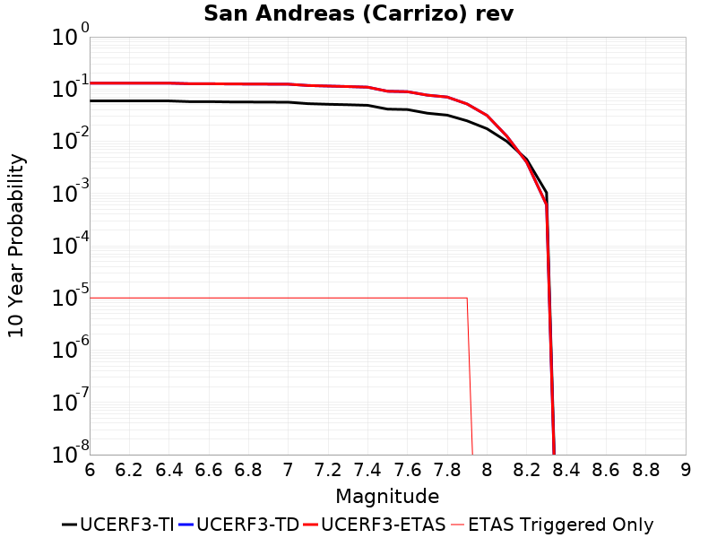 |

| Magnitude | 1 wk TI Prob | 1 wk TD Prob | 1 wk ETAS Prob | 1 wk ETAS/TD Gain | 1 wk ETAS Triggered Only | 1 mo TI Prob | 1 mo TD Prob | 1 mo ETAS Prob | 1 mo ETAS/TD Gain | 1 mo ETAS Triggered Only | 1 yr TI Prob | 1 yr TD Prob | 1 yr ETAS Prob | 1 yr ETAS/TD Gain | 1 yr ETAS Triggered Only | 10 yr TI Prob | 10 yr TD Prob | 10 yr ETAS Prob | 10 yr ETAS/TD Gain | 10 yr ETAS Triggered Only |
|-----|-----|-----|-----|-----|-----|-----|-----|-----|-----|-----|-----|-----|-----|-----|-----|-----|-----|-----|-----|-----|
| 6.0 | 1.1674632E-4 | 2.6365352E-4 | 2.6365352E-4 | 1.0 | 0.0 | 5.002454E-4 | 0.0011294561 | 0.0011294561 | 1.0 | 0.0 | 0.006073493 | 0.013664996 | 0.013664996 | 1.0 | 0.0 | 0.0591016 | 0.12912665 | 0.12913536 | 1.0000675 | 1.0E-5 |
| 6.1 | 1.1674632E-4 | 2.6365352E-4 | 2.6365352E-4 | 1.0 | 0.0 | 5.002454E-4 | 0.0011294561 | 0.0011294561 | 1.0 | 0.0 | 0.006073493 | 0.013664996 | 0.013664996 | 1.0 | 0.0 | 0.0591016 | 0.12912665 | 0.12913536 | 1.0000675 | 1.0E-5 |
| 6.2 | 1.1674632E-4 | 2.6365352E-4 | 2.6365352E-4 | 1.0 | 0.0 | 5.002454E-4 | 0.0011294561 | 0.0011294561 | 1.0 | 0.0 | 0.006073493 | 0.013664996 | 0.013664996 | 1.0 | 0.0 | 0.0591016 | 0.12912665 | 0.12913536 | 1.0000675 | 1.0E-5 |
| 6.3 | 1.1674632E-4 | 2.6365352E-4 | 2.6365352E-4 | 1.0 | 0.0 | 5.002454E-4 | 0.0011294561 | 0.0011294561 | 1.0 | 0.0 | 0.006073493 | 0.013664996 | 0.013664996 | 1.0 | 0.0 | 0.0591016 | 0.12912665 | 0.12913536 | 1.0000675 | 1.0E-5 |
| 6.4 | 1.1674632E-4 | 2.6365352E-4 | 2.6365352E-4 | 1.0 | 0.0 | 5.002454E-4 | 0.0011294561 | 0.0011294561 | 1.0 | 0.0 | 0.006073493 | 0.013664996 | 0.013664996 | 1.0 | 0.0 | 0.0591016 | 0.12912665 | 0.12913536 | 1.0000675 | 1.0E-5 |
| 6.5 | 1.13136164E-4 | 2.5672963E-4 | 2.5672963E-4 | 1.0 | 0.0 | 4.847792E-4 | 0.0010998076 | 0.0010998076 | 1.0 | 0.0 | 0.0058862255 | 0.013308478 | 0.013308478 | 1.0 | 0.0 | 0.057327334 | 0.12607728 | 0.12608601 | 1.0000693 | 1.0E-5 |
| 6.6 | 1.13136164E-4 | 2.5672963E-4 | 2.5672963E-4 | 1.0 | 0.0 | 4.847792E-4 | 0.0010998076 | 0.0010998076 | 1.0 | 0.0 | 0.0058862255 | 0.013308478 | 0.013308478 | 1.0 | 0.0 | 0.057327334 | 0.12607728 | 0.12608601 | 1.0000693 | 1.0E-5 |
| 6.7 | 1.1149675E-4 | 2.5358563E-4 | 2.5358563E-4 | 1.0 | 0.0 | 4.777557E-4 | 0.0010863446 | 0.0010863446 | 1.0 | 0.0 | 0.0058011734 | 0.013146553 | 0.013146553 | 1.0 | 0.0 | 0.05652051 | 0.12469038 | 0.12469914 | 1.0000702 | 1.0E-5 |
| 6.8 | 1.1103589E-4 | 2.5257363E-4 | 2.5257363E-4 | 1.0 | 0.0 | 4.7578133E-4 | 0.001082011 | 0.001082011 | 1.0 | 0.0 | 0.005777263 | 0.013094426 | 0.013094426 | 1.0 | 0.0 | 0.056293584 | 0.12424143 | 0.12425018 | 1.0000705 | 1.0E-5 |
| 6.9 | 1.1053259E-4 | 2.5146035E-4 | 2.5146035E-4 | 1.0 | 0.0 | 4.7362508E-4 | 0.0010772438 | 0.0010772438 | 1.0 | 0.0 | 0.0057511497 | 0.013037082 | 0.013037082 | 1.0 | 0.0 | 0.05604569 | 0.12374752 | 0.12375628 | 1.0000708 | 1.0E-5 |
| 7.0 | 1.1005377E-4 | 2.504342E-4 | 2.504342E-4 | 1.0 | 0.0 | 4.7157376E-4 | 0.0010728497 | 0.0010728497 | 1.0 | 0.0 | 0.0057263062 | 0.012984223 | 0.012984223 | 1.0 | 0.0 | 0.055809796 | 0.12329075 | 0.12329952 | 1.0000712 | 1.0E-5 |
| 7.1 | 1.0308142E-4 | 2.350106E-4 | 2.350106E-4 | 1.0 | 0.0 | 4.417027E-4 | 0.0010068007 | 0.0010068007 | 1.0 | 0.0 | 0.0053644776 | 0.012189284 | 0.012189284 | 1.0 | 0.0 | 0.052368138 | 0.11641187 | 0.11642071 | 1.0000759 | 1.0E-5 |
| 7.2 | 1.0027479E-4 | 2.2888466E-4 | 2.2888466E-4 | 1.0 | 0.0 | 4.296783E-4 | 9.805666E-4 | 9.805666E-4 | 1.0 | 0.0 | 0.0052187922 | 0.011873407 | 0.011873407 | 1.0 | 0.0 | 0.050979212 | 0.113661274 | 0.11367013 | 1.000078 | 1.0E-5 |
| 7.3 | 9.816942E-5 | 2.2331963E-4 | 2.2331963E-4 | 1.0 | 0.0 | 4.2065824E-4 | 9.567342E-4 | 9.567342E-4 | 1.0 | 0.0 | 0.005109493 | 0.01158637 | 0.01158637 | 1.0 | 0.0 | 0.049935985 | 0.1111419 | 0.11115079 | 1.00008 | 1.0E-5 |
| 7.4 | 9.5634205E-5 | 2.1668429E-4 | 2.1668429E-4 | 1.0 | 0.0 | 4.0979648E-4 | 9.283175E-4 | 9.283175E-4 | 1.0 | 0.0 | 0.0049778637 | 0.011244011 | 0.011244011 | 1.0 | 0.0 | 0.048678253 | 0.108128965 | 0.10813788 | 1.0000825 | 1.0E-5 |
| 7.5 | 8.052417E-5 | 1.7804035E-4 | 1.7804035E-4 | 1.0 | 0.0 | 3.4505792E-4 | 7.6280715E-4 | 7.6280715E-4 | 1.0 | 0.0 | 0.0041929903 | 0.009247736 | 0.009247736 | 1.0 | 0.0 | 0.04114753 | 0.09027062 | 0.09027972 | 1.0001007 | 1.0E-5 |
| 7.6 | 7.897024E-5 | 1.7439522E-4 | 1.7439522E-4 | 1.0 | 0.0 | 3.384E-4 | 7.4719416E-4 | 7.4719416E-4 | 1.0 | 0.0 | 0.0041122385 | 0.009059244 | 0.009059244 | 1.0 | 0.0 | 0.040369697 | 0.088550255 | 0.088559374 | 1.0001029 | 1.0E-5 |
| 7.7 | 6.707427E-5 | 1.4826297E-4 | 1.4826297E-4 | 1.0 | 0.0 | 2.8742946E-4 | 6.352581E-4 | 6.352581E-4 | 1.0 | 0.0 | 0.003493839 | 0.0077068857 | 0.0077068857 | 1.0 | 0.0 | 0.034394164 | 0.076014 | 0.076023236 | 1.0001216 | 1.0E-5 |
| 7.8 | 6.147705E-5 | 1.3624677E-4 | 1.3624677E-4 | 1.0 | 0.0 | 2.6344648E-4 | 5.837841E-4 | 5.837841E-4 | 1.0 | 0.0 | 0.0032027436 | 0.007084444 | 0.007084444 | 1.0 | 0.0 | 0.031569764 | 0.0699715 | 0.0699808 | 1.0001329 | 1.0E-5 |
| 7.9 | 4.7636717E-5 | 9.931068E-5 | 9.931068E-5 | 1.0 | 0.0 | 2.0414138E-4 | 4.2554777E-4 | 4.2554777E-4 | 1.0 | 0.0 | 0.0024825884 | 0.0051687476 | 0.0051687476 | 1.0 | 0.0 | 0.024550365 | 0.05153166 | 0.051541146 | 1.000184 | 1.0E-5 |
| 8.0 | 3.3554235E-5 | 5.886348E-5 | 5.886348E-5 | 1.0 | 0.0 | 1.4379594E-4 | 2.5224767E-4 | 2.5224767E-4 | 1.0 | 0.0 | 0.0017493097 | 0.0030667926 | 0.0030667926 | 1.0 | 0.0 | 0.017356034 | 0.031154132 | 0.03116382 | 1.000311 | 1.0E-5 |
| 8.1 | 1.9175432E-5 | 2.2473012E-5 | 2.2473012E-5 | 1.0 | 0.0 | 8.217783E-5 | 9.6309355E-5 | 9.6309355E-5 | 1.0 | 0.0 | 0.0010000558 | 0.0011719365 | 0.0011719365 | 1.0 | 0.0 | 0.009955673 | 0.012462547 | 0.012462547 | 1.0 | 0.0 |
| 8.2 | 8.643924E-6 | 6.7523606E-6 | 6.7523606E-6 | 1.0 | 0.0 | 3.704486E-5 | 2.8938368E-5 | 2.8938368E-5 | 1.0 | 0.0 | 4.5092785E-4 | 3.522678E-4 | 3.522678E-4 | 1.0 | 0.0 | 0.0045001395 | 0.003937757 | 0.003937757 | 1.0 | 0.0 |
| 8.3 | 1.983087E-6 | 9.94482E-7 | 9.94482E-7 | 1.0 | 0.0 | 8.498917E-6 | 4.2620586E-6 | 4.2620586E-6 | 1.0 | 0.0 | 1.034694E-4 | 5.1889358E-5 | 5.1889358E-5 | 1.0 | 0.0 | 0.0010342124 | 6.010915E-4 | 6.010915E-4 | 1.0 | 0.0 |

## San Andreas (Mojave N)
*[(top)](#table-of-contents)*

| 1 Week | 1 Month | 1 Year | 10 Year |
|-----|-----|-----|-----|
|  | 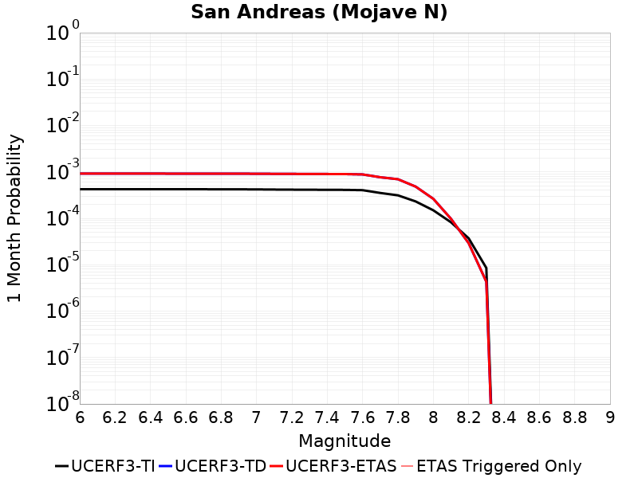 |  |  |

| Magnitude | 1 wk TI Prob | 1 wk TD Prob | 1 wk ETAS Prob | 1 wk ETAS/TD Gain | 1 wk ETAS Triggered Only | 1 mo TI Prob | 1 mo TD Prob | 1 mo ETAS Prob | 1 mo ETAS/TD Gain | 1 mo ETAS Triggered Only | 1 yr TI Prob | 1 yr TD Prob | 1 yr ETAS Prob | 1 yr ETAS/TD Gain | 1 yr ETAS Triggered Only | 10 yr TI Prob | 10 yr TD Prob | 10 yr ETAS Prob | 10 yr ETAS/TD Gain | 10 yr ETAS Triggered Only |
|-----|-----|-----|-----|-----|-----|-----|-----|-----|-----|-----|-----|-----|-----|-----|-----|-----|-----|-----|-----|-----|
| 6.0 | 9.877682E-5 | 2.138305E-4 | 2.138305E-4 | 1.0 | 0.0 | 4.2326056E-4 | 9.160948E-4 | 9.160948E-4 | 1.0 | 0.0 | 0.0051410277 | 0.011096583 | 0.011096583 | 1.0 | 0.0 | 0.05023708 | 0.10693662 | 0.106945544 | 1.0000836 | 1.0E-5 |
| 6.1 | 9.877682E-5 | 2.138305E-4 | 2.138305E-4 | 1.0 | 0.0 | 4.2326056E-4 | 9.160948E-4 | 9.160948E-4 | 1.0 | 0.0 | 0.0051410277 | 0.011096583 | 0.011096583 | 1.0 | 0.0 | 0.05023708 | 0.10693662 | 0.106945544 | 1.0000836 | 1.0E-5 |
| 6.2 | 9.877682E-5 | 2.138305E-4 | 2.138305E-4 | 1.0 | 0.0 | 4.2326056E-4 | 9.160948E-4 | 9.160948E-4 | 1.0 | 0.0 | 0.0051410277 | 0.011096583 | 0.011096583 | 1.0 | 0.0 | 0.05023708 | 0.10693662 | 0.106945544 | 1.0000836 | 1.0E-5 |
| 6.3 | 9.877682E-5 | 2.138305E-4 | 2.138305E-4 | 1.0 | 0.0 | 4.2326056E-4 | 9.160948E-4 | 9.160948E-4 | 1.0 | 0.0 | 0.0051410277 | 0.011096583 | 0.011096583 | 1.0 | 0.0 | 0.05023708 | 0.10693662 | 0.106945544 | 1.0000836 | 1.0E-5 |
| 6.4 | 9.877682E-5 | 2.138305E-4 | 2.138305E-4 | 1.0 | 0.0 | 4.2326056E-4 | 9.160948E-4 | 9.160948E-4 | 1.0 | 0.0 | 0.0051410277 | 0.011096583 | 0.011096583 | 1.0 | 0.0 | 0.05023708 | 0.10693662 | 0.106945544 | 1.0000836 | 1.0E-5 |
| 6.5 | 9.861474E-5 | 2.135604E-4 | 2.135604E-4 | 1.0 | 0.0 | 4.2256617E-4 | 9.1493805E-4 | 9.1493805E-4 | 1.0 | 0.0 | 0.0051326132 | 0.011082643 | 0.011082643 | 1.0 | 0.0 | 0.050156746 | 0.10681243 | 0.106821366 | 1.0000836 | 1.0E-5 |
| 6.6 | 9.861474E-5 | 2.135604E-4 | 2.135604E-4 | 1.0 | 0.0 | 4.2256617E-4 | 9.1493805E-4 | 9.1493805E-4 | 1.0 | 0.0 | 0.0051326132 | 0.011082643 | 0.011082643 | 1.0 | 0.0 | 0.050156746 | 0.10681243 | 0.106821366 | 1.0000836 | 1.0E-5 |
| 6.7 | 9.8552715E-5 | 2.1345695E-4 | 2.1345695E-4 | 1.0 | 0.0 | 4.223004E-4 | 9.14495E-4 | 9.14495E-4 | 1.0 | 0.0 | 0.0051293927 | 0.011077303 | 0.011077303 | 1.0 | 0.0 | 0.050125998 | 0.10676485 | 0.106773786 | 1.0000837 | 1.0E-5 |
| 6.8 | 9.8464974E-5 | 2.1330452E-4 | 2.1330452E-4 | 1.0 | 0.0 | 4.219245E-4 | 9.138422E-4 | 9.138422E-4 | 1.0 | 0.0 | 0.0051248376 | 0.011069437 | 0.011069437 | 1.0 | 0.0 | 0.05008251 | 0.10669421 | 0.10670314 | 1.0000837 | 1.0E-5 |
| 6.9 | 9.825824E-5 | 2.1297757E-4 | 2.1297757E-4 | 1.0 | 0.0 | 4.2103877E-4 | 9.1244193E-4 | 9.1244193E-4 | 1.0 | 0.0 | 0.0051141046 | 0.011052561 | 0.011052561 | 1.0 | 0.0 | 0.049980022 | 0.106541194 | 0.10655013 | 1.0000838 | 1.0E-5 |
| 7.0 | 9.781462E-5 | 2.1227996E-4 | 2.1227996E-4 | 1.0 | 0.0 | 4.1913814E-4 | 9.094543E-4 | 9.094543E-4 | 1.0 | 0.0 | 0.005091073 | 0.011016556 | 0.011016556 | 1.0 | 0.0 | 0.04976007 | 0.10621561 | 0.10622455 | 1.0000842 | 1.0E-5 |
| 7.1 | 9.7121134E-5 | 2.1128047E-4 | 2.1128047E-4 | 1.0 | 0.0 | 4.1616702E-4 | 9.0517366E-4 | 9.0517366E-4 | 1.0 | 0.0 | 0.005055068 | 0.0109649645 | 0.0109649645 | 1.0 | 0.0 | 0.04941613 | 0.10574889 | 0.10575783 | 1.0000845 | 1.0E-5 |
| 7.2 | 9.663819E-5 | 2.1057767E-4 | 2.1057767E-4 | 1.0 | 0.0 | 4.1409794E-4 | 9.021638E-4 | 9.021638E-4 | 1.0 | 0.0 | 0.0050299936 | 0.010928688 | 0.010928688 | 1.0 | 0.0 | 0.049176537 | 0.1054205 | 0.10542945 | 1.0000849 | 1.0E-5 |
| 7.3 | 9.6277574E-5 | 2.1008273E-4 | 2.1008273E-4 | 1.0 | 0.0 | 4.125529E-4 | 9.000441E-4 | 9.000441E-4 | 1.0 | 0.0 | 0.0050112694 | 0.01090314 | 0.01090314 | 1.0 | 0.0 | 0.04899759 | 0.10518709 | 0.10519604 | 1.0000851 | 1.0E-5 |
| 7.4 | 9.593308E-5 | 2.0945103E-4 | 2.0945103E-4 | 1.0 | 0.0 | 4.1107697E-4 | 8.973387E-4 | 8.973387E-4 | 1.0 | 0.0 | 0.0049933824 | 0.010870529 | 0.010870529 | 1.0 | 0.0 | 0.04882661 | 0.10489499 | 0.104903944 | 1.0000854 | 1.0E-5 |
| 7.5 | 9.561707E-5 | 2.0888496E-4 | 2.0888496E-4 | 1.0 | 0.0 | 4.0972308E-4 | 8.949143E-4 | 8.949143E-4 | 1.0 | 0.0 | 0.0049769743 | 0.010841307 | 0.010841307 | 1.0 | 0.0 | 0.048669744 | 0.10463183 | 0.104640774 | 1.0000856 | 1.0E-5 |
| 7.6 | 9.418194E-5 | 2.0522901E-4 | 2.0522901E-4 | 1.0 | 0.0 | 4.0357444E-4 | 8.792566E-4 | 8.792566E-4 | 1.0 | 0.0 | 0.004902454 | 0.010652554 | 0.010652554 | 1.0 | 0.0 | 0.047957025 | 0.10295597 | 0.10296494 | 1.0000871 | 1.0E-5 |
| 7.7 | 8.202141E-5 | 1.7842352E-4 | 1.7842352E-4 | 1.0 | 0.0 | 3.51473E-4 | 7.644482E-4 | 7.644482E-4 | 1.0 | 0.0 | 0.00427079 | 0.009267519 | 0.009267519 | 1.0 | 0.0 | 0.04189639 | 0.09032151 | 0.09033061 | 1.0001007 | 1.0E-5 |
| 7.8 | 7.2859846E-5 | 1.6174071E-4 | 1.6174071E-4 | 1.0 | 0.0 | 3.1221908E-4 | 6.929904E-4 | 6.929904E-4 | 1.0 | 0.0 | 0.003794643 | 0.008404577 | 0.008404577 | 1.0 | 0.0 | 0.037304975 | 0.08215026 | 0.08215944 | 1.0001117 | 1.0E-5 |
| 7.9 | 5.3874453E-5 | 1.1216441E-4 | 1.1216441E-4 | 1.0 | 0.0 | 2.3087008E-4 | 4.806161E-4 | 4.806161E-4 | 1.0 | 0.0 | 0.0028072202 | 0.0058358177 | 0.0058358177 | 1.0 | 0.0 | 0.02772022 | 0.057862937 | 0.05787236 | 1.0001628 | 1.0E-5 |
| 8.0 | 3.468538E-5 | 6.117403E-5 | 6.117403E-5 | 1.0 | 0.0 | 1.4864317E-4 | 2.621481E-4 | 2.621481E-4 | 1.0 | 0.0 | 0.0018082283 | 0.0031869845 | 0.0031869845 | 1.0 | 0.0 | 0.017935853 | 0.03230777 | 0.03231745 | 1.0002996 | 1.0E-5 |
| 8.1 | 1.9152367E-5 | 2.2692406E-5 | 2.2692406E-5 | 1.0 | 0.0 | 8.207899E-5 | 9.724955E-5 | 9.724955E-5 | 1.0 | 0.0 | 9.988535E-4 | 0.0011833711 | 0.0011833711 | 1.0 | 0.0 | 0.009943757 | 0.012559321 | 0.012559321 | 1.0 | 0.0 |
| 8.2 | 8.643924E-6 | 6.7523606E-6 | 6.7523606E-6 | 1.0 | 0.0 | 3.704486E-5 | 2.8938368E-5 | 2.8938368E-5 | 1.0 | 0.0 | 4.5092785E-4 | 3.522678E-4 | 3.522678E-4 | 1.0 | 0.0 | 0.0045001395 | 0.003937757 | 0.003937757 | 1.0 | 0.0 |
| 8.3 | 1.983087E-6 | 9.94482E-7 | 9.94482E-7 | 1.0 | 0.0 | 8.498917E-6 | 4.2620586E-6 | 4.2620586E-6 | 1.0 | 0.0 | 1.034694E-4 | 5.1889358E-5 | 5.1889358E-5 | 1.0 | 0.0 | 0.0010342124 | 6.010915E-4 | 6.010915E-4 | 1.0 | 0.0 |

## Homestead Valley 2011
*[(top)](#table-of-contents)*

| 1 Week | 1 Month | 1 Year | 10 Year |
|-----|-----|-----|-----|
| 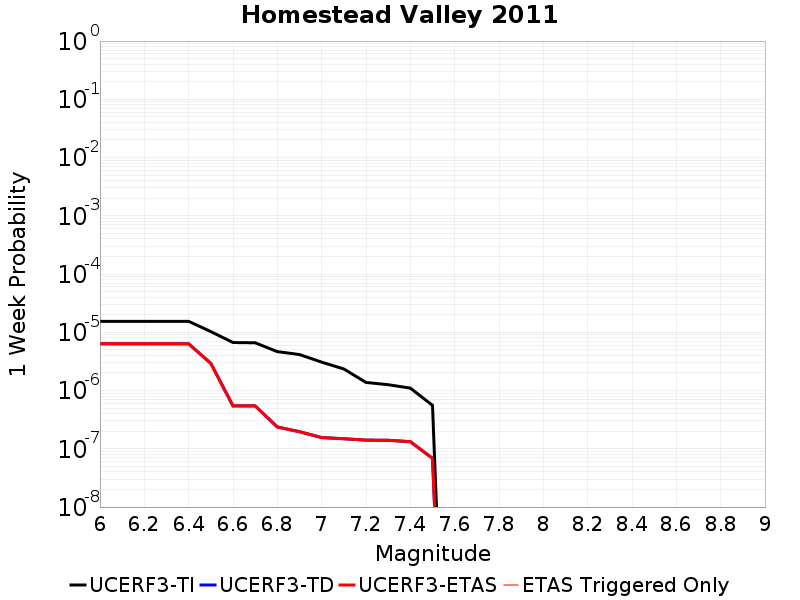 | 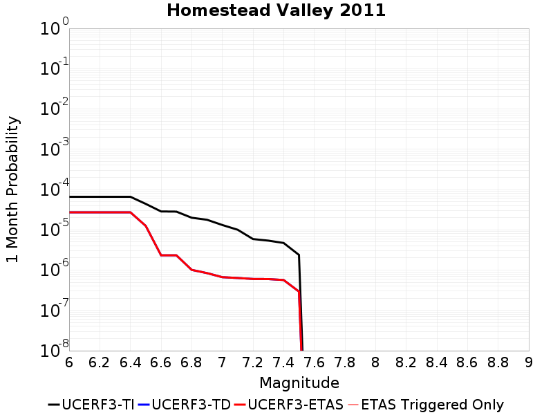 | 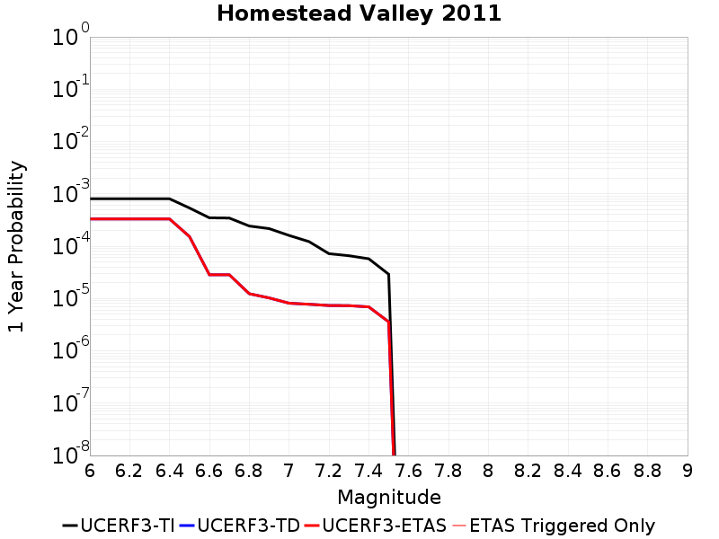 | 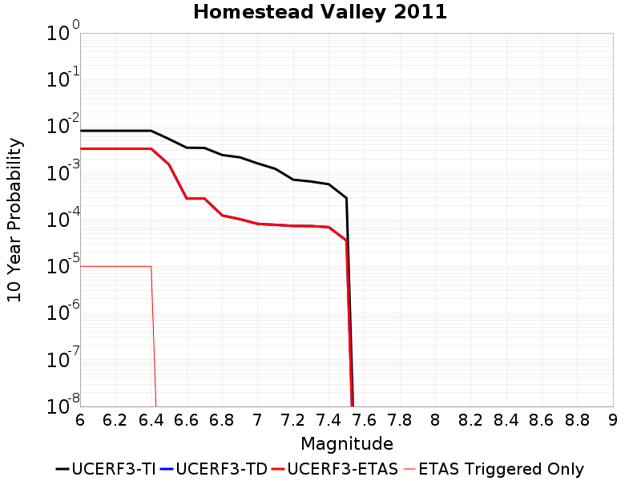 |

| Magnitude | 1 wk TI Prob | 1 wk TD Prob | 1 wk ETAS Prob | 1 wk ETAS/TD Gain | 1 wk ETAS Triggered Only | 1 mo TI Prob | 1 mo TD Prob | 1 mo ETAS Prob | 1 mo ETAS/TD Gain | 1 mo ETAS Triggered Only | 1 yr TI Prob | 1 yr TD Prob | 1 yr ETAS Prob | 1 yr ETAS/TD Gain | 1 yr ETAS Triggered Only | 10 yr TI Prob | 10 yr TD Prob | 10 yr ETAS Prob | 10 yr ETAS/TD Gain | 10 yr ETAS Triggered Only |
|-----|-----|-----|-----|-----|-----|-----|-----|-----|-----|-----|-----|-----|-----|-----|-----|-----|-----|-----|-----|-----|
| 6.0 | 1.539795E-5 | 6.3358757E-6 | 6.3358757E-6 | 1.0 | 0.0 | 6.5989545E-5 | 2.7153588E-5 | 2.7153588E-5 | 1.0 | 0.0 | 8.0312655E-4 | 3.3056564E-4 | 3.3056564E-4 | 1.0 | 0.0 | 0.008002302 | 0.003302786 | 0.003312753 | 1.0030178 | 1.0E-5 |
| 6.1 | 1.539795E-5 | 6.3358757E-6 | 6.3358757E-6 | 1.0 | 0.0 | 6.5989545E-5 | 2.7153588E-5 | 2.7153588E-5 | 1.0 | 0.0 | 8.0312655E-4 | 3.3056564E-4 | 3.3056564E-4 | 1.0 | 0.0 | 0.008002302 | 0.003302786 | 0.003312753 | 1.0030178 | 1.0E-5 |
| 6.2 | 1.539795E-5 | 6.3358757E-6 | 6.3358757E-6 | 1.0 | 0.0 | 6.5989545E-5 | 2.7153588E-5 | 2.7153588E-5 | 1.0 | 0.0 | 8.0312655E-4 | 3.3056564E-4 | 3.3056564E-4 | 1.0 | 0.0 | 0.008002302 | 0.003302786 | 0.003312753 | 1.0030178 | 1.0E-5 |
| 6.3 | 1.539795E-5 | 6.3358757E-6 | 6.3358757E-6 | 1.0 | 0.0 | 6.5989545E-5 | 2.7153588E-5 | 2.7153588E-5 | 1.0 | 0.0 | 8.0312655E-4 | 3.3056564E-4 | 3.3056564E-4 | 1.0 | 0.0 | 0.008002302 | 0.003302786 | 0.003312753 | 1.0030178 | 1.0E-5 |
| 6.4 | 1.539795E-5 | 6.3358757E-6 | 6.3358757E-6 | 1.0 | 0.0 | 6.5989545E-5 | 2.7153588E-5 | 2.7153588E-5 | 1.0 | 0.0 | 8.0312655E-4 | 3.3056564E-4 | 3.3056564E-4 | 1.0 | 0.0 | 0.008002302 | 0.003302786 | 0.003312753 | 1.0030178 | 1.0E-5 |
| 6.5 | 1.0265258E-5 | 2.9177531E-6 | 2.9177531E-6 | 1.0 | 0.0 | 4.3993223E-5 | 1.2504637E-5 | 1.2504637E-5 | 1.0 | 0.0 | 5.3548586E-4 | 1.5224045E-4 | 1.5224045E-4 | 1.0 | 0.0 | 0.005341973 | 0.0015220612 | 0.0015220612 | 1.0 | 0.0 |
| 6.6 | 6.664671E-6 | 5.436986E-7 | 5.436986E-7 | 1.0 | 0.0 | 2.8562565E-5 | 2.3301354E-6 | 2.3301354E-6 | 1.0 | 0.0 | 3.476937E-4 | 2.8369153E-5 | 2.8369153E-5 | 1.0 | 0.0 | 0.003471502 | 2.8366738E-4 | 2.8366738E-4 | 1.0 | 0.0 |
| 6.7 | 6.5954046E-6 | 5.436986E-7 | 5.436986E-7 | 1.0 | 0.0 | 2.8265715E-5 | 2.3301354E-6 | 2.3301354E-6 | 1.0 | 0.0 | 3.4408073E-4 | 2.8369153E-5 | 2.8369153E-5 | 1.0 | 0.0 | 0.0034354846 | 2.8366738E-4 | 2.8366738E-4 | 1.0 | 0.0 |
| 6.8 | 4.648189E-6 | 2.3623126E-7 | 2.3623126E-7 | 1.0 | 0.0 | 1.9920659E-5 | 1.0124194E-6 | 1.0124194E-6 | 1.0 | 0.0 | 2.4250703E-4 | 1.2326141E-5 | 1.2326141E-5 | 1.0 | 0.0 | 0.0024224254 | 1.2325507E-4 | 1.2325507E-4 | 1.0 | 0.0 |
| 6.9 | 4.1428534E-6 | 1.9624497E-7 | 1.9624497E-7 | 1.0 | 0.0 | 1.7754966E-5 | 8.410496E-7 | 8.410496E-7 | 1.0 | 0.0 | 2.1614527E-4 | 1.0239734E-5 | 1.0239734E-5 | 1.0 | 0.0 | 0.0021593515 | 1.0239293E-4 | 1.0239293E-4 | 1.0 | 0.0 |
| 7.0 | 3.0673707E-6 | 1.555645E-7 | 1.555645E-7 | 1.0 | 0.0 | 1.3145808E-5 | 6.6670486E-7 | 6.6670486E-7 | 1.0 | 0.0 | 1.6003846E-4 | 8.117103E-6 | 8.117103E-6 | 1.0 | 0.0 | 0.0015992324 | 8.116817E-5 | 8.116817E-5 | 1.0 | 0.0 |
| 7.1 | 2.340854E-6 | 1.4854496E-7 | 1.4854496E-7 | 1.0 | 0.0 | 1.0032193E-5 | 6.366211E-7 | 6.366211E-7 | 1.0 | 0.0 | 1.221351E-4 | 7.750836E-6 | 7.750836E-6 | 1.0 | 0.0 | 0.00122068 | 7.7505756E-5 | 7.7505756E-5 | 1.0 | 0.0 |
| 7.2 | 1.3754182E-6 | 1.4061975E-7 | 1.4061975E-7 | 1.0 | 0.0 | 5.8946357E-6 | 6.026559E-7 | 6.026559E-7 | 1.0 | 0.0 | 7.176483E-5 | 7.3373117E-6 | 7.3373117E-6 | 1.0 | 0.0 | 7.174166E-4 | 7.337079E-5 | 7.337079E-5 | 1.0 | 0.0 |
| 7.3 | 1.2573237E-6 | 1.3964627E-7 | 1.3964627E-7 | 1.0 | 0.0 | 5.388519E-6 | 5.9848395E-7 | 5.9848395E-7 | 1.0 | 0.0 | 6.560324E-5 | 7.286518E-6 | 7.286518E-6 | 1.0 | 0.0 | 6.558388E-4 | 7.286289E-5 | 7.286289E-5 | 1.0 | 0.0 |
| 7.4 | 1.0994207E-6 | 1.3231711E-7 | 1.3231711E-7 | 1.0 | 0.0 | 4.7117946E-6 | 5.670732E-7 | 5.670732E-7 | 1.0 | 0.0 | 5.736459E-5 | 6.9040952E-6 | 6.9040952E-6 | 1.0 | 0.0 | 5.734978E-4 | 6.9038906E-5 | 6.9038906E-5 | 1.0 | 0.0 |
| 7.5 | 5.5569126E-7 | 6.843441E-8 | 6.843441E-8 | 1.0 | 0.0 | 2.3815317E-6 | 2.932903E-7 | 2.932903E-7 | 1.0 | 0.0 | 2.8994764E-5 | 3.5708042E-6 | 3.5708042E-6 | 1.0 | 0.0 | 2.899098E-4 | 3.5707533E-5 | 3.5707533E-5 | 1.0 | 0.0 |

## Elmore Ranch
*[(top)](#table-of-contents)*

| 1 Week | 1 Month | 1 Year | 10 Year |
|-----|-----|-----|-----|
| 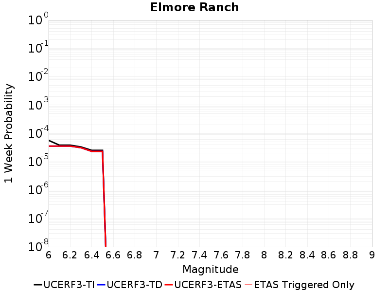 | 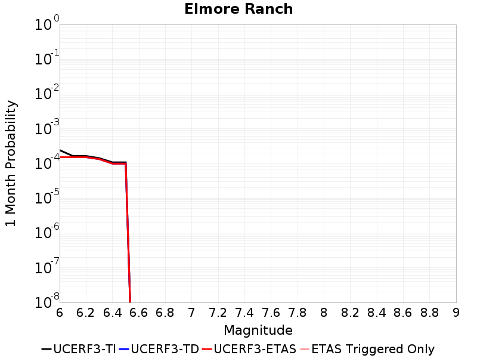 | 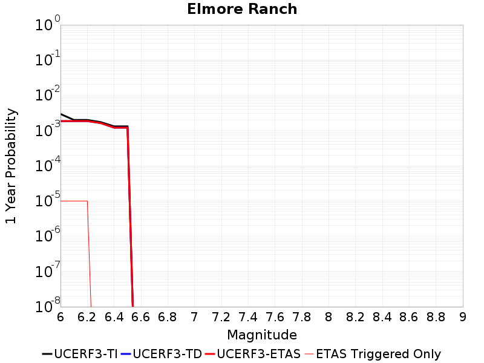 | 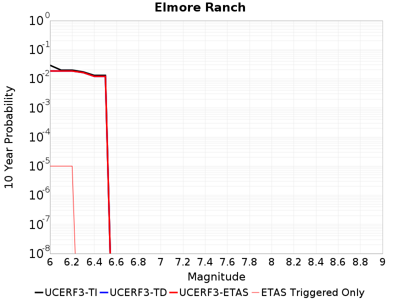 |

| Magnitude | 1 wk TI Prob | 1 wk TD Prob | 1 wk ETAS Prob | 1 wk ETAS/TD Gain | 1 wk ETAS Triggered Only | 1 mo TI Prob | 1 mo TD Prob | 1 mo ETAS Prob | 1 mo ETAS/TD Gain | 1 mo ETAS Triggered Only | 1 yr TI Prob | 1 yr TD Prob | 1 yr ETAS Prob | 1 yr ETAS/TD Gain | 1 yr ETAS Triggered Only | 10 yr TI Prob | 10 yr TD Prob | 10 yr ETAS Prob | 10 yr ETAS/TD Gain | 10 yr ETAS Triggered Only |
|-----|-----|-----|-----|-----|-----|-----|-----|-----|-----|-----|-----|-----|-----|-----|-----|-----|-----|-----|-----|-----|
| 6.0 | 5.6540124E-5 | 3.542285E-5 | 3.542285E-5 | 1.0 | 0.0 | 2.4229231E-4 | 1.5180629E-4 | 1.5180629E-4 | 1.0 | 0.0 | 0.0029459186 | 0.0018471631 | 0.0018571446 | 1.0054038 | 1.0E-5 | 0.029071707 | 0.018429855 | 0.01843967 | 1.0005326 | 1.0E-5 |
| 6.1 | 3.8306698E-5 | 3.542285E-5 | 3.542285E-5 | 1.0 | 0.0 | 1.6416123E-4 | 1.5180629E-4 | 1.5180629E-4 | 1.0 | 0.0 | 0.0019968306 | 0.0018471631 | 0.0018571446 | 1.0054038 | 1.0E-5 | 0.019789828 | 0.018429855 | 0.01843967 | 1.0005326 | 1.0E-5 |
| 6.2 | 3.8306698E-5 | 3.542285E-5 | 3.542285E-5 | 1.0 | 0.0 | 1.6416123E-4 | 1.5180629E-4 | 1.5180629E-4 | 1.0 | 0.0 | 0.0019968306 | 0.0018471631 | 0.0018571446 | 1.0054038 | 1.0E-5 | 0.019789828 | 0.018429855 | 0.01843967 | 1.0005326 | 1.0E-5 |
| 6.3 | 3.3197924E-5 | 3.1183223E-5 | 3.1183223E-5 | 1.0 | 0.0 | 1.4226905E-4 | 1.3363837E-4 | 1.3363837E-4 | 1.0 | 0.0 | 0.0017307495 | 0.0016263175 | 0.0016263175 | 1.0 | 0.0 | 0.017173318 | 0.016246833 | 0.016246833 | 1.0 | 0.0 |
| 6.4 | 2.5148964E-5 | 2.3138717E-5 | 2.3138717E-5 | 1.0 | 0.0 | 1.0777682E-4 | 9.916475E-5 | 9.916475E-5 | 1.0 | 0.0 | 0.0013113929 | 0.0012071211 | 0.0012071211 | 1.0 | 0.0 | 0.01303681 | 0.012072129 | 0.012072129 | 1.0 | 0.0 |
| 6.5 | 2.5148964E-5 | 2.3138717E-5 | 2.3138717E-5 | 1.0 | 0.0 | 1.0777682E-4 | 9.916475E-5 | 9.916475E-5 | 1.0 | 0.0 | 0.0013113929 | 0.0012071211 | 0.0012071211 | 1.0 | 0.0 | 0.01303681 | 0.012072129 | 0.012072129 | 1.0 | 0.0 |

## Blue Cut
*[(top)](#table-of-contents)*

| 1 Week | 1 Month | 1 Year | 10 Year |
|-----|-----|-----|-----|
|  |  |  | 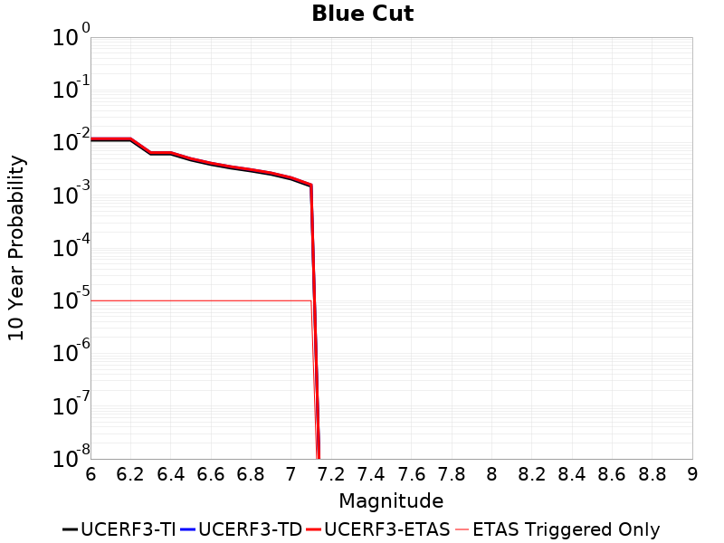 |

| Magnitude | 1 wk TI Prob | 1 wk TD Prob | 1 wk ETAS Prob | 1 wk ETAS/TD Gain | 1 wk ETAS Triggered Only | 1 mo TI Prob | 1 mo TD Prob | 1 mo ETAS Prob | 1 mo ETAS/TD Gain | 1 mo ETAS Triggered Only | 1 yr TI Prob | 1 yr TD Prob | 1 yr ETAS Prob | 1 yr ETAS/TD Gain | 1 yr ETAS Triggered Only | 10 yr TI Prob | 10 yr TD Prob | 10 yr ETAS Prob | 10 yr ETAS/TD Gain | 10 yr ETAS Triggered Only |
|-----|-----|-----|-----|-----|-----|-----|-----|-----|-----|-----|-----|-----|-----|-----|-----|-----|-----|-----|-----|-----|
| 6.0 | 2.1227985E-5 | 2.2783675E-5 | 2.2783675E-5 | 1.0 | 0.0 | 9.097391E-5 | 9.7640994E-5 | 9.7640994E-5 | 1.0 | 0.0 | 0.0011070445 | 0.0011881893 | 0.0011881893 | 1.0 | 0.0 | 0.011015458 | 0.011824244 | 0.011834126 | 1.0008358 | 1.0E-5 |
| 6.1 | 2.1227985E-5 | 2.2783675E-5 | 2.2783675E-5 | 1.0 | 0.0 | 9.097391E-5 | 9.7640994E-5 | 9.7640994E-5 | 1.0 | 0.0 | 0.0011070445 | 0.0011881893 | 0.0011881893 | 1.0 | 0.0 | 0.011015458 | 0.011824244 | 0.011834126 | 1.0008358 | 1.0E-5 |
| 6.2 | 2.1227985E-5 | 2.2783675E-5 | 2.2783675E-5 | 1.0 | 0.0 | 9.097391E-5 | 9.7640994E-5 | 9.7640994E-5 | 1.0 | 0.0 | 0.0011070445 | 0.0011881893 | 0.0011881893 | 1.0 | 0.0 | 0.011015458 | 0.011824244 | 0.011834126 | 1.0008358 | 1.0E-5 |
| 6.3 | 1.1613981E-5 | 1.2385087E-5 | 1.2385087E-5 | 1.0 | 0.0 | 4.9773254E-5 | 5.3077936E-5 | 5.3077936E-5 | 1.0 | 0.0 | 6.0582085E-4 | 6.460448E-4 | 6.460448E-4 | 1.0 | 0.0 | 0.0060417196 | 0.0064429203 | 0.0064429203 | 1.0 | 0.0 |
| 6.4 | 1.1613981E-5 | 1.2385087E-5 | 1.2385087E-5 | 1.0 | 0.0 | 4.9773254E-5 | 5.3077936E-5 | 5.3077936E-5 | 1.0 | 0.0 | 6.0582085E-4 | 6.460448E-4 | 6.460448E-4 | 1.0 | 0.0 | 0.0060417196 | 0.0064429203 | 0.0064429203 | 1.0 | 0.0 |
| 6.5 | 8.931326E-6 | 9.5050145E-6 | 9.5050145E-6 | 1.0 | 0.0 | 3.8276554E-5 | 4.0735194E-5 | 4.0735194E-5 | 1.0 | 0.0 | 4.6591737E-4 | 4.958473E-4 | 4.958473E-4 | 1.0 | 0.0 | 0.0046494175 | 0.0049483236 | 0.0049483236 | 1.0 | 0.0 |
| 6.6 | 7.345353E-6 | 7.809189E-6 | 7.809189E-6 | 1.0 | 0.0 | 3.1479703E-5 | 3.3467568E-5 | 3.3467568E-5 | 1.0 | 0.0 | 3.83198E-4 | 4.0739952E-4 | 4.0739952E-4 | 1.0 | 0.0 | 0.0038253788 | 0.0040673222 | 0.0040673222 | 1.0 | 0.0 |
| 6.7 | 6.2775666E-6 | 6.671189E-6 | 6.671189E-6 | 1.0 | 0.0 | 2.690358E-5 | 2.859054E-5 | 2.859054E-5 | 1.0 | 0.0 | 3.2750185E-4 | 3.480418E-4 | 3.480418E-4 | 1.0 | 0.0 | 0.0032701963 | 0.0034757117 | 0.0034757117 | 1.0 | 0.0 |
| 6.8 | 5.5234095E-6 | 5.869201E-6 | 5.869201E-6 | 1.0 | 0.0 | 2.367154E-5 | 2.5153517E-5 | 2.5153517E-5 | 1.0 | 0.0 | 2.8816288E-4 | 3.0620836E-4 | 3.0620836E-4 | 1.0 | 0.0 | 0.002877895 | 0.0030585837 | 0.0030585837 | 1.0 | 0.0 |
| 6.9 | 4.7780054E-6 | 5.07763E-6 | 5.07763E-6 | 1.0 | 0.0 | 2.0477004E-5 | 2.176113E-5 | 2.176113E-5 | 1.0 | 0.0 | 2.4927902E-4 | 2.6491663E-4 | 2.6491663E-4 | 1.0 | 0.0 | 0.0024899957 | 0.0026467037 | 0.0026467037 | 1.0 | 0.0 |
| 7.0 | 3.883171E-6 | 4.1284875E-6 | 4.1284875E-6 | 1.0 | 0.0 | 1.6642054E-5 | 1.7693437E-5 | 1.7693437E-5 | 1.0 | 0.0 | 2.0259817E-4 | 2.1540323E-4 | 2.1540323E-4 | 1.0 | 0.0 | 0.0020241356 | 0.0021526234 | 0.0021526234 | 1.0 | 0.0 |
| 7.1 | 2.8358215E-6 | 3.017111E-6 | 3.017111E-6 | 1.0 | 0.0 | 1.2153464E-5 | 1.2930449E-5 | 1.2930449E-5 | 1.0 | 0.0 | 1.4795837E-4 | 1.5742346E-4 | 1.5742346E-4 | 1.0 | 0.0 | 0.001478599 | 0.0015737679 | 0.0015737679 | 1.0 | 0.0 |

## Oceanside alt1
*[(top)](#table-of-contents)*

| 1 Week | 1 Month | 1 Year | 10 Year |
|-----|-----|-----|-----|
| 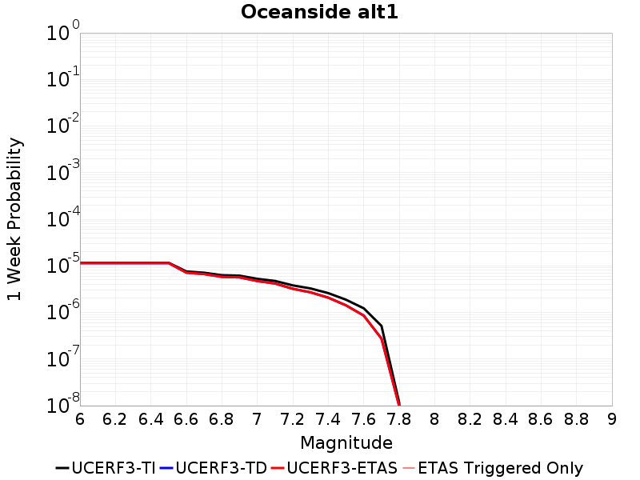 | 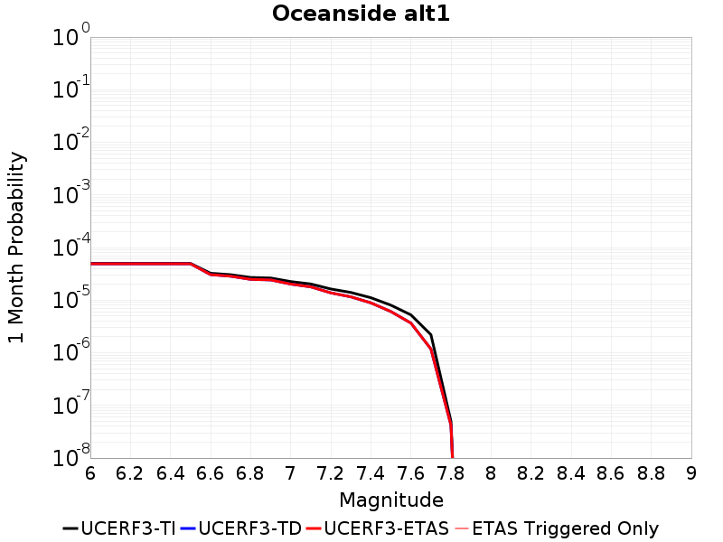 | 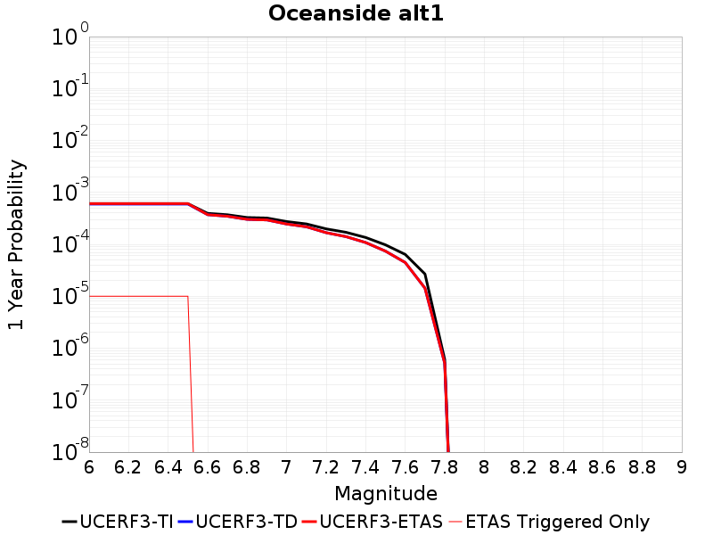 | 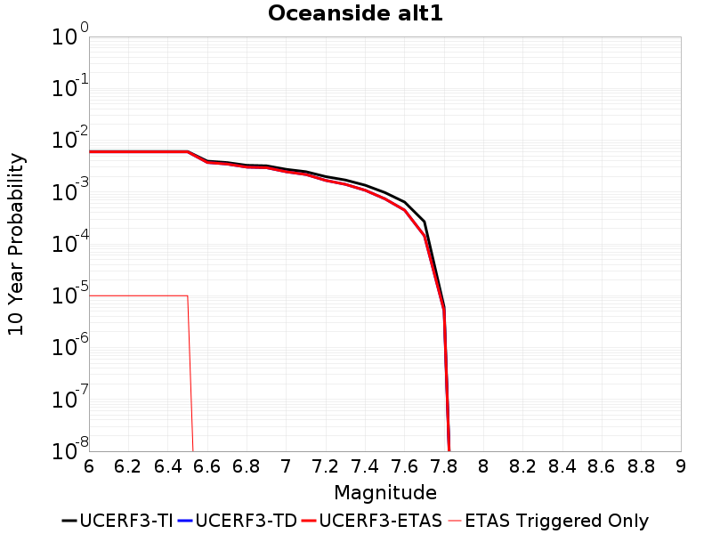 |

| Magnitude | 1 wk TI Prob | 1 wk TD Prob | 1 wk ETAS Prob | 1 wk ETAS/TD Gain | 1 wk ETAS Triggered Only | 1 mo TI Prob | 1 mo TD Prob | 1 mo ETAS Prob | 1 mo ETAS/TD Gain | 1 mo ETAS Triggered Only | 1 yr TI Prob | 1 yr TD Prob | 1 yr ETAS Prob | 1 yr ETAS/TD Gain | 1 yr ETAS Triggered Only | 10 yr TI Prob | 10 yr TD Prob | 10 yr ETAS Prob | 10 yr ETAS/TD Gain | 10 yr ETAS Triggered Only |
|-----|-----|-----|-----|-----|-----|-----|-----|-----|-----|-----|-----|-----|-----|-----|-----|-----|-----|-----|-----|-----|
| 6.0 | 1.1617542E-5 | 1.1428763E-5 | 1.1428763E-5 | 1.0 | 0.0 | 4.9788516E-5 | 4.8979582E-5 | 4.8979582E-5 | 1.0 | 0.0 | 6.060066E-4 | 5.9617945E-4 | 6.061735E-4 | 1.0167634 | 1.0E-5 | 0.0060435664 | 0.0059474064 | 0.005957347 | 1.0016714 | 1.0E-5 |
| 6.1 | 1.1617542E-5 | 1.1428763E-5 | 1.1428763E-5 | 1.0 | 0.0 | 4.9788516E-5 | 4.8979582E-5 | 4.8979582E-5 | 1.0 | 0.0 | 6.060066E-4 | 5.9617945E-4 | 6.061735E-4 | 1.0167634 | 1.0E-5 | 0.0060435664 | 0.0059474064 | 0.005957347 | 1.0016714 | 1.0E-5 |
| 6.2 | 1.1617542E-5 | 1.1428763E-5 | 1.1428763E-5 | 1.0 | 0.0 | 4.9788516E-5 | 4.8979582E-5 | 4.8979582E-5 | 1.0 | 0.0 | 6.060066E-4 | 5.9617945E-4 | 6.061735E-4 | 1.0167634 | 1.0E-5 | 0.0060435664 | 0.0059474064 | 0.005957347 | 1.0016714 | 1.0E-5 |
| 6.3 | 1.1617542E-5 | 1.1428763E-5 | 1.1428763E-5 | 1.0 | 0.0 | 4.9788516E-5 | 4.8979582E-5 | 4.8979582E-5 | 1.0 | 0.0 | 6.060066E-4 | 5.9617945E-4 | 6.061735E-4 | 1.0167634 | 1.0E-5 | 0.0060435664 | 0.0059474064 | 0.005957347 | 1.0016714 | 1.0E-5 |
| 6.4 | 1.1617542E-5 | 1.1428763E-5 | 1.1428763E-5 | 1.0 | 0.0 | 4.9788516E-5 | 4.8979582E-5 | 4.8979582E-5 | 1.0 | 0.0 | 6.060066E-4 | 5.9617945E-4 | 6.061735E-4 | 1.0167634 | 1.0E-5 | 0.0060435664 | 0.0059474064 | 0.005957347 | 1.0016714 | 1.0E-5 |
| 6.5 | 1.1617542E-5 | 1.1428763E-5 | 1.1428763E-5 | 1.0 | 0.0 | 4.9788516E-5 | 4.8979582E-5 | 4.8979582E-5 | 1.0 | 0.0 | 6.060066E-4 | 5.9617945E-4 | 6.061735E-4 | 1.0167634 | 1.0E-5 | 0.0060435664 | 0.0059474064 | 0.005957347 | 1.0016714 | 1.0E-5 |
| 6.6 | 7.561768E-6 | 7.128952E-6 | 7.128952E-6 | 1.0 | 0.0 | 3.2407173E-5 | 3.05523E-5 | 3.05523E-5 | 1.0 | 0.0 | 3.9448592E-4 | 3.7191182E-4 | 3.7191182E-4 | 1.0 | 0.0 | 0.0039378637 | 0.003713006 | 0.003713006 | 1.0 | 0.0 |
| 6.7 | 7.1042605E-6 | 6.651373E-6 | 6.651373E-6 | 1.0 | 0.0 | 3.0446476E-5 | 2.8505578E-5 | 2.8505578E-5 | 1.0 | 0.0 | 3.706228E-4 | 3.4700095E-4 | 3.4700095E-4 | 1.0 | 0.0 | 0.0037000529 | 0.0034646748 | 0.0034646748 | 1.0 | 0.0 |
| 6.8 | 6.285554E-6 | 5.7939274E-6 | 5.7939274E-6 | 1.0 | 0.0 | 2.693781E-5 | 2.4830884E-5 | 2.4830884E-5 | 1.0 | 0.0 | 3.2791847E-4 | 3.0227462E-4 | 3.0227462E-4 | 1.0 | 0.0 | 0.0032743502 | 0.0030186924 | 0.0030186924 | 1.0 | 0.0 |
| 6.9 | 6.148883E-6 | 5.650724E-6 | 5.650724E-6 | 1.0 | 0.0 | 2.635209E-5 | 2.4217165E-5 | 2.4217165E-5 | 1.0 | 0.0 | 3.2078946E-4 | 2.9480466E-4 | 2.9480466E-4 | 1.0 | 0.0 | 0.003203268 | 0.0029441926 | 0.0029441926 | 1.0 | 0.0 |
| 7.0 | 5.253857E-6 | 4.715545E-6 | 4.715545E-6 | 1.0 | 0.0 | 2.2516335E-5 | 2.0209323E-5 | 2.0209323E-5 | 1.0 | 0.0 | 2.7410188E-4 | 2.4602105E-4 | 2.4602105E-4 | 1.0 | 0.0 | 0.0027376404 | 0.0024575184 | 0.0024575184 | 1.0 | 0.0 |
| 7.1 | 4.730754E-6 | 4.1719163E-6 | 4.1719163E-6 | 1.0 | 0.0 | 2.0274503E-5 | 1.787952E-5 | 1.787952E-5 | 1.0 | 0.0 | 2.468141E-4 | 2.1766167E-4 | 2.1766167E-4 | 1.0 | 0.0 | 0.0024654015 | 0.0021745113 | 0.0021745113 | 1.0 | 0.0 |
| 7.2 | 3.7998386E-6 | 3.2090745E-6 | 3.2090745E-6 | 1.0 | 0.0 | 1.6284921E-5 | 1.3753105E-5 | 1.3753105E-5 | 1.0 | 0.0 | 1.9825088E-4 | 1.6743131E-4 | 1.6743131E-4 | 1.0 | 0.0 | 0.001980741 | 0.0016730638 | 0.0016730638 | 1.0 | 0.0 |
| 7.3 | 3.2656465E-6 | 2.69646E-6 | 2.69646E-6 | 1.0 | 0.0 | 1.3995553E-5 | 1.1556206E-5 | 1.1556206E-5 | 1.0 | 0.0 | 1.7038253E-4 | 1.4068783E-4 | 1.4068783E-4 | 1.0 | 0.0 | 0.0017025196 | 0.0014059988 | 0.0014059988 | 1.0 | 0.0 |
| 7.4 | 2.593703E-6 | 2.0713255E-6 | 2.0713255E-6 | 1.0 | 0.0 | 1.1115822E-5 | 8.87708E-6 | 8.87708E-6 | 1.0 | 0.0 | 1.3532673E-4 | 1.0807318E-4 | 1.0807318E-4 | 1.0 | 0.0 | 0.0013524436 | 0.0010802151 | 0.0010802151 | 1.0 | 0.0 |
| 7.5 | 1.8715585E-6 | 1.416574E-6 | 1.416574E-6 | 1.0 | 0.0 | 8.020941E-6 | 6.0710177E-6 | 6.0710177E-6 | 1.0 | 0.0 | 9.7650576E-5 | 7.39122E-5 | 7.39122E-5 | 1.0 | 0.0 | 9.7607676E-4 | 7.388822E-4 | 7.388822E-4 | 1.0 | 0.0 |
| 7.6 | 1.2246786E-6 | 8.552523E-7 | 8.552523E-7 | 1.0 | 0.0 | 5.248612E-6 | 3.665362E-6 | 3.665362E-6 | 1.0 | 0.0 | 6.389998E-5 | 4.4624918E-5 | 4.4624918E-5 | 1.0 | 0.0 | 6.3881604E-4 | 4.4616408E-4 | 4.4616408E-4 | 1.0 | 0.0 |
| 7.7 | 5.140719E-7 | 2.743932E-7 | 2.743932E-7 | 1.0 | 0.0 | 2.2031636E-6 | 1.1759704E-6 | 1.1759704E-6 | 1.0 | 0.0 | 2.6823185E-5 | 1.4317358E-5 | 1.4317358E-5 | 1.0 | 0.0 | 2.6819948E-4 | 1.4316573E-4 | 1.4316573E-4 | 1.0 | 0.0 |
| 7.8 | 1.16056995E-8 | 9.788668E-9 | 9.788668E-9 | 1.0 | 0.0 | 4.9738713E-8 | 4.195143E-8 | 4.195143E-8 | 1.0 | 0.0 | 6.0556863E-7 | 5.107587E-7 | 5.107587E-7 | 1.0 | 0.0 | 6.05567E-6 | 5.1075867E-6 | 5.1075867E-6 | 1.0 | 0.0 |

## Mission Creek
*[(top)](#table-of-contents)*

| 1 Week | 1 Month | 1 Year | 10 Year |
|-----|-----|-----|-----|
| 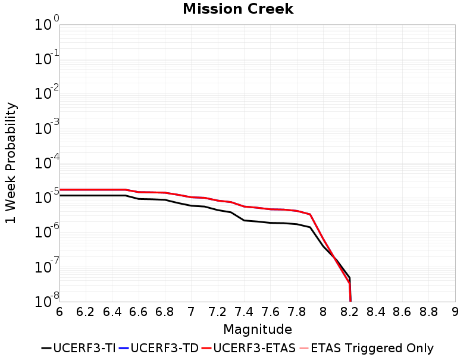 | 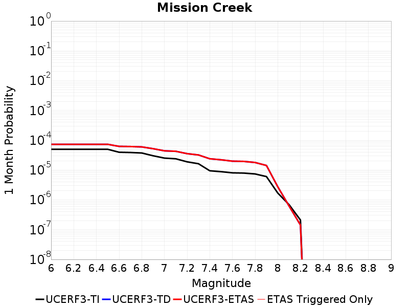 | 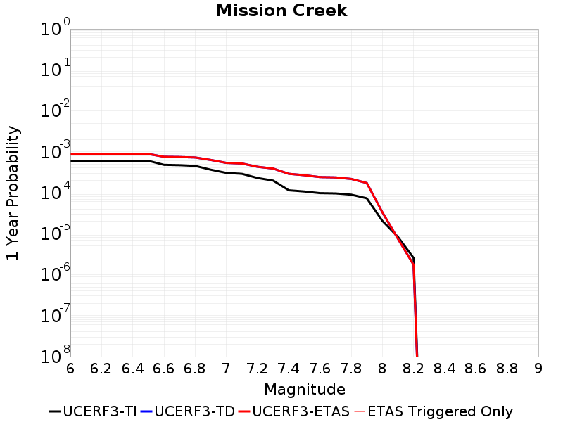 | 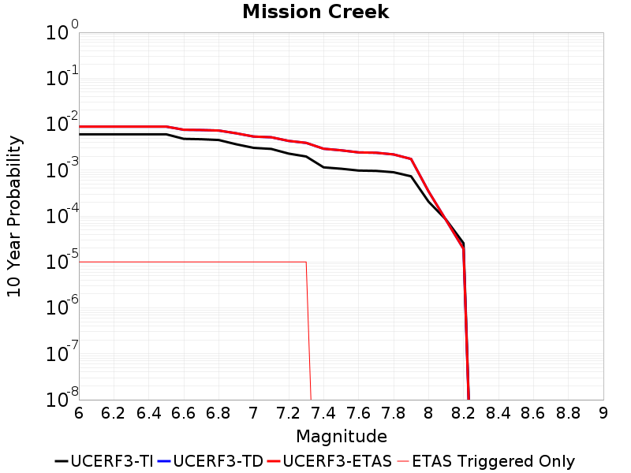 |

| Magnitude | 1 wk TI Prob | 1 wk TD Prob | 1 wk ETAS Prob | 1 wk ETAS/TD Gain | 1 wk ETAS Triggered Only | 1 mo TI Prob | 1 mo TD Prob | 1 mo ETAS Prob | 1 mo ETAS/TD Gain | 1 mo ETAS Triggered Only | 1 yr TI Prob | 1 yr TD Prob | 1 yr ETAS Prob | 1 yr ETAS/TD Gain | 1 yr ETAS Triggered Only | 10 yr TI Prob | 10 yr TD Prob | 10 yr ETAS Prob | 10 yr ETAS/TD Gain | 10 yr ETAS Triggered Only |
|-----|-----|-----|-----|-----|-----|-----|-----|-----|-----|-----|-----|-----|-----|-----|-----|-----|-----|-----|-----|-----|
| 6.0 | 1.1549387E-5 | 1.696067E-5 | 1.696067E-5 | 1.0 | 0.0 | 4.9496433E-5 | 7.268665E-5 | 7.268665E-5 | 1.0 | 0.0 | 6.0245243E-4 | 8.846159E-4 | 8.846159E-4 | 1.0 | 0.0 | 0.006008218 | 0.008833316 | 0.008843228 | 1.0011221 | 1.0E-5 |
| 6.1 | 1.1549387E-5 | 1.696067E-5 | 1.696067E-5 | 1.0 | 0.0 | 4.9496433E-5 | 7.268665E-5 | 7.268665E-5 | 1.0 | 0.0 | 6.0245243E-4 | 8.846159E-4 | 8.846159E-4 | 1.0 | 0.0 | 0.006008218 | 0.008833316 | 0.008843228 | 1.0011221 | 1.0E-5 |
| 6.2 | 1.1549387E-5 | 1.696067E-5 | 1.696067E-5 | 1.0 | 0.0 | 4.9496433E-5 | 7.268665E-5 | 7.268665E-5 | 1.0 | 0.0 | 6.0245243E-4 | 8.846159E-4 | 8.846159E-4 | 1.0 | 0.0 | 0.006008218 | 0.008833316 | 0.008843228 | 1.0011221 | 1.0E-5 |
| 6.3 | 1.1549387E-5 | 1.696067E-5 | 1.696067E-5 | 1.0 | 0.0 | 4.9496433E-5 | 7.268665E-5 | 7.268665E-5 | 1.0 | 0.0 | 6.0245243E-4 | 8.846159E-4 | 8.846159E-4 | 1.0 | 0.0 | 0.006008218 | 0.008833316 | 0.008843228 | 1.0011221 | 1.0E-5 |
| 6.4 | 1.1549387E-5 | 1.696067E-5 | 1.696067E-5 | 1.0 | 0.0 | 4.9496433E-5 | 7.268665E-5 | 7.268665E-5 | 1.0 | 0.0 | 6.0245243E-4 | 8.846159E-4 | 8.846159E-4 | 1.0 | 0.0 | 0.006008218 | 0.008833316 | 0.008843228 | 1.0011221 | 1.0E-5 |
| 6.5 | 1.1549387E-5 | 1.696067E-5 | 1.696067E-5 | 1.0 | 0.0 | 4.9496433E-5 | 7.268665E-5 | 7.268665E-5 | 1.0 | 0.0 | 6.0245243E-4 | 8.846159E-4 | 8.846159E-4 | 1.0 | 0.0 | 0.006008218 | 0.008833316 | 0.008843228 | 1.0011221 | 1.0E-5 |
| 6.6 | 9.202681E-6 | 1.4478451E-5 | 1.4478451E-5 | 1.0 | 0.0 | 3.9439463E-5 | 6.2049075E-5 | 6.2049075E-5 | 1.0 | 0.0 | 4.800697E-4 | 7.551949E-4 | 7.551949E-4 | 1.0 | 0.0 | 0.004790339 | 0.0075480677 | 0.0075579924 | 1.0013149 | 1.0E-5 |
| 6.7 | 9.019164E-6 | 1.4283662E-5 | 1.4283662E-5 | 1.0 | 0.0 | 3.8652986E-5 | 6.1214305E-5 | 6.1214305E-5 | 1.0 | 0.0 | 4.7049852E-4 | 7.4503856E-4 | 7.4503856E-4 | 1.0 | 0.0 | 0.004695036 | 0.0074471873 | 0.007457113 | 1.0013328 | 1.0E-5 |
| 6.8 | 8.673558E-6 | 1.390427E-5 | 1.390427E-5 | 1.0 | 0.0 | 3.717186E-5 | 5.9588423E-5 | 5.9588423E-5 | 1.0 | 0.0 | 4.524734E-4 | 7.2525657E-4 | 7.2525657E-4 | 1.0 | 0.0 | 0.0045155324 | 0.0072506606 | 0.007260588 | 1.0013692 | 1.0E-5 |
| 6.9 | 7.002255E-6 | 1.2103082E-5 | 1.2103082E-5 | 1.0 | 0.0 | 3.000932E-5 | 5.1869356E-5 | 5.1869356E-5 | 1.0 | 0.0 | 3.653022E-4 | 6.313335E-4 | 6.313335E-4 | 1.0 | 0.0 | 0.0036470229 | 0.0063169724 | 0.006326909 | 1.0015731 | 1.0E-5 |
| 7.0 | 5.84644E-6 | 1.0265527E-5 | 1.0265527E-5 | 1.0 | 0.0 | 2.5055931E-5 | 4.3994398E-5 | 4.3994398E-5 | 1.0 | 0.0 | 3.0501327E-4 | 5.3550483E-4 | 5.3550483E-4 | 1.0 | 0.0 | 0.0030459496 | 0.0053634928 | 0.0053734393 | 1.0018544 | 1.0E-5 |
| 7.1 | 5.54703E-6 | 9.917618E-6 | 9.917618E-6 | 1.0 | 0.0 | 2.377277E-5 | 4.2503412E-5 | 4.2503412E-5 | 1.0 | 0.0 | 2.8939504E-4 | 5.173607E-4 | 5.173607E-4 | 1.0 | 0.0 | 0.0028901845 | 0.005182903 | 0.005192851 | 1.0019194 | 1.0E-5 |
| 7.2 | 4.384709E-6 | 8.2407005E-6 | 8.2407005E-6 | 1.0 | 0.0 | 1.8791474E-5 | 3.531683E-5 | 3.531683E-5 | 1.0 | 0.0 | 2.2876218E-4 | 4.299013E-4 | 4.299013E-4 | 1.0 | 0.0 | 0.0022852682 | 0.0043119886 | 0.004321946 | 1.0023091 | 1.0E-5 |
| 7.3 | 3.7888456E-6 | 7.46229E-6 | 7.46229E-6 | 1.0 | 0.0 | 1.623781E-5 | 3.1980868E-5 | 3.1980868E-5 | 1.0 | 0.0 | 1.9767738E-4 | 3.8930093E-4 | 3.8930093E-4 | 1.0 | 0.0 | 0.0019750162 | 0.00390747 | 0.003917431 | 1.0025492 | 1.0E-5 |
| 7.4 | 2.1982462E-6 | 5.5524265E-6 | 5.5524265E-6 | 1.0 | 0.0 | 9.421021E-6 | 2.3795898E-5 | 2.3795898E-5 | 1.0 | 0.0 | 1.1469489E-4 | 2.8967674E-4 | 2.8967674E-4 | 1.0 | 0.0 | 0.0011463572 | 0.0029140583 | 0.0029140583 | 1.0 | 0.0 |
| 7.5 | 2.051923E-6 | 5.1277507E-6 | 5.1277507E-6 | 1.0 | 0.0 | 8.793926E-6 | 2.1975891E-5 | 2.1975891E-5 | 1.0 | 0.0 | 1.0706078E-4 | 2.6752378E-4 | 2.6752378E-4 | 1.0 | 0.0 | 0.0010700922 | 0.0026937628 | 0.0026937628 | 1.0 | 0.0 |
| 7.6 | 1.8733427E-6 | 4.6166665E-6 | 4.6166665E-6 | 1.0 | 0.0 | 8.028587E-6 | 1.9785564E-5 | 1.9785564E-5 | 1.0 | 0.0 | 9.774366E-5 | 2.408627E-4 | 2.408627E-4 | 1.0 | 0.0 | 9.770069E-4 | 0.0024282245 | 0.0024282245 | 1.0 | 0.0 |
| 7.7 | 1.8411953E-6 | 4.5326815E-6 | 4.5326815E-6 | 1.0 | 0.0 | 7.890813E-6 | 1.9425634E-5 | 1.9425634E-5 | 1.0 | 0.0 | 9.606641E-5 | 2.3648152E-4 | 2.3648152E-4 | 1.0 | 0.0 | 9.6024893E-4 | 0.0023846577 | 0.0023846577 | 1.0 | 0.0 |
| 7.8 | 1.7194251E-6 | 4.163152E-6 | 4.163152E-6 | 1.0 | 0.0 | 7.368944E-6 | 1.784196E-5 | 1.784196E-5 | 1.0 | 0.0 | 8.97132E-5 | 2.1720429E-4 | 2.1720429E-4 | 1.0 | 0.0 | 8.967699E-4 | 0.0021918667 | 0.0021918667 | 1.0 | 0.0 |
| 7.9 | 1.4035052E-6 | 3.3088859E-6 | 3.3088859E-6 | 1.0 | 0.0 | 6.0150082E-6 | 1.4180862E-5 | 1.4180862E-5 | 1.0 | 0.0 | 7.3230265E-5 | 1.7263839E-4 | 1.7263839E-4 | 1.0 | 0.0 | 7.3206134E-4 | 0.0017448735 | 0.0017448735 | 1.0 | 0.0 |
| 8.0 | 3.9318823E-7 | 6.3825433E-7 | 6.3825433E-7 | 1.0 | 0.0 | 1.6850913E-6 | 2.7353728E-6 | 2.7353728E-6 | 1.0 | 0.0 | 2.0515794E-5 | 3.3302662E-5 | 3.3302662E-5 | 1.0 | 0.0 | 2.0513899E-4 | 3.4342415E-4 | 3.4342415E-4 | 1.0 | 0.0 |
| 8.1 | 1.596793E-7 | 1.4361649E-7 | 1.4361649E-7 | 1.0 | 0.0 | 6.8433974E-7 | 6.1549906E-7 | 6.1549906E-7 | 1.0 | 0.0 | 8.331805E-6 | 7.493676E-6 | 7.493676E-6 | 1.0 | 0.0 | 8.331492E-5 | 8.153742E-5 | 8.153742E-5 | 1.0 | 0.0 |
| 8.2 | 4.9003038E-8 | 3.3304104E-8 | 3.3304104E-8 | 1.0 | 0.0 | 2.10013E-7 | 1.4273186E-7 | 1.4273186E-7 | 1.0 | 0.0 | 2.5569052E-6 | 1.737759E-6 | 1.737759E-6 | 1.0 | 0.0 | 2.556876E-5 | 1.9264839E-5 | 1.9264839E-5 | 1.0 | 0.0 |

