# Parent Section Magnitude-Probability Distributions

Only fault sections with at least one triggered aftershock are plotted. Sections are sorted by total supraseismogenic trigger rate (decreasing)

## Table Of Contents

* [Earthquake Valley](#earthquake-valley)
* [Earthquake Valley (So Extension)](#earthquake-valley-so-extension)
* [Earthquake Valley (No  Extension)](#earthquake-valley-no--extension)
* [Elsinore (Julian)](#elsinore-julian)
* [Elsinore (Coyote Mountains)](#elsinore-coyote-mountains)
* [Elsinore (Temecula) rev](#elsinore-temecula-rev)
* [Elsinore (Glen Ivy) rev](#elsinore-glen-ivy-rev)
* [Elsinore (Stepovers Combined)](#elsinore-stepovers-combined)
* [Whittier alt 1](#whittier-alt-1)
* [Chino alt 1](#chino-alt-1)
* [San Diego Trough north alt1](#san-diego-trough-north-alt1)
* [San Andreas (Coachella) rev](#san-andreas-coachella-rev)
* [Coronado Bank alt1](#coronado-bank-alt1)
* [Brawley (Seismic Zone) alt 1](#brawley-seismic-zone-alt-1)
* [Imperial](#imperial)
* [Thirty Mile Bank](#thirty-mile-bank)
* [Rose Canyon](#rose-canyon)
* [San Diego Trough south](#san-diego-trough-south)
* [San Andreas (Parkfield)](#san-andreas-parkfield)
* [San Andreas (San Gorgonio Pass-Garnet HIll)](#san-andreas-san-gorgonio-pass-garnet-hill)
* [San Jacinto (Anza) rev](#san-jacinto-anza-rev)
* [San Andreas (Cholame) rev](#san-andreas-cholame-rev)
* [San Andreas (Carrizo) rev](#san-andreas-carrizo-rev)
* [Puente Hills](#puente-hills)
* [Hunting Creek - Berryessa 2011 CFM](#hunting-creek---berryessa-2011-cfm)
* [San Jose](#san-jose)
* [Ludlow](#ludlow)
* [San Andreas (Big Bend)](#san-andreas-big-bend)
* [San Andreas (Mojave S)](#san-andreas-mojave-s)
* [San Andreas (Mojave N)](#san-andreas-mojave-n)
* [San Andreas (San Bernardino N)](#san-andreas-san-bernardino-n)
* [San Juan](#san-juan)
* [San Jacinto (San Bernardino)](#san-jacinto-san-bernardino)
* [Blue Cut](#blue-cut)
* [San Jacinto (Superstition Mtn)](#san-jacinto-superstition-mtn)

## Earthquake Valley
*[(top)](#table-of-contents)*

| 1 Week | 1 Month | 1 Year | 10 Year |
|-----|-----|-----|-----|
|  |  |  |  |

| Magnitude | 1 wk TI Prob | 1 wk TD Prob | 1 wk ETAS Prob | 1 wk ETAS/TD Gain | 1 wk ETAS Triggered Only | 1 mo TI Prob | 1 mo TD Prob | 1 mo ETAS Prob | 1 mo ETAS/TD Gain | 1 mo ETAS Triggered Only | 1 yr TI Prob | 1 yr TD Prob | 1 yr ETAS Prob | 1 yr ETAS/TD Gain | 1 yr ETAS Triggered Only | 10 yr TI Prob | 10 yr TD Prob | 10 yr ETAS Prob | 10 yr ETAS/TD Gain | 10 yr ETAS Triggered Only |
|-----|-----|-----|-----|-----|-----|-----|-----|-----|-----|-----|-----|-----|-----|-----|-----|-----|-----|-----|-----|-----|
| 6.0 | 1.9416384E-5 | 2.2739945E-5 | 3.2739717E-5 | 1.4397448 | 1.0E-5 | 8.321042E-5 | 9.745396E-5 | 1.2745103E-4 | 1.3078077 | 3.0E-5 | 0.001012616 | 0.0011859772 | 0.0013757519 | 1.1600155 | 1.9E-4 | 0.010080142 | 0.011808458 | 0.012223498 | 1.0351478 | 4.2E-4 |
| 6.1 | 1.9416384E-5 | 2.2739945E-5 | 3.2739717E-5 | 1.4397448 | 1.0E-5 | 8.321042E-5 | 9.745396E-5 | 1.2745103E-4 | 1.3078077 | 3.0E-5 | 0.001012616 | 0.0011859772 | 0.0013757519 | 1.1600155 | 1.9E-4 | 0.010080142 | 0.011808458 | 0.012223498 | 1.0351478 | 4.2E-4 |
| 6.2 | 1.9416384E-5 | 2.2739945E-5 | 3.2739717E-5 | 1.4397448 | 1.0E-5 | 8.321042E-5 | 9.745396E-5 | 1.2745103E-4 | 1.3078077 | 3.0E-5 | 0.001012616 | 0.0011859772 | 0.0013757519 | 1.1600155 | 1.9E-4 | 0.010080142 | 0.011808458 | 0.012223498 | 1.0351478 | 4.2E-4 |
| 6.3 | 1.9416384E-5 | 2.2739945E-5 | 3.2739717E-5 | 1.4397448 | 1.0E-5 | 8.321042E-5 | 9.745396E-5 | 1.2745103E-4 | 1.3078077 | 3.0E-5 | 0.001012616 | 0.0011859772 | 0.0013757519 | 1.1600155 | 1.9E-4 | 0.010080142 | 0.011808458 | 0.012223498 | 1.0351478 | 4.2E-4 |
| 6.4 | 1.9416384E-5 | 2.2739945E-5 | 3.2739717E-5 | 1.4397448 | 1.0E-5 | 8.321042E-5 | 9.745396E-5 | 1.2745103E-4 | 1.3078077 | 3.0E-5 | 0.001012616 | 0.0011859772 | 0.0013757519 | 1.1600155 | 1.9E-4 | 0.010080142 | 0.011808458 | 0.012223498 | 1.0351478 | 4.2E-4 |
| 6.5 | 1.9389157E-5 | 2.2708336E-5 | 3.270811E-5 | 1.4403569 | 1.0E-5 | 8.309374E-5 | 9.73185E-5 | 1.2731558E-4 | 1.3082361 | 3.0E-5 | 0.0010111968 | 0.00118433 | 0.0013741049 | 1.1602383 | 1.9E-4 | 0.010066078 | 0.011792159 | 0.012207206 | 1.0351969 | 4.2E-4 |
| 6.6 | 1.9389157E-5 | 2.2708336E-5 | 3.270811E-5 | 1.4403569 | 1.0E-5 | 8.309374E-5 | 9.73185E-5 | 1.2731558E-4 | 1.3082361 | 3.0E-5 | 0.0010111968 | 0.00118433 | 0.0013741049 | 1.1602383 | 1.9E-4 | 0.010066078 | 0.011792159 | 0.012207206 | 1.0351969 | 4.2E-4 |
| 6.7 | 1.4925434E-5 | 1.7320677E-5 | 1.7320677E-5 | 1.0 | 0.0 | 6.396457E-5 | 7.422984E-5 | 7.422984E-5 | 1.0 | 0.0 | 7.7849044E-4 | 9.034598E-4 | 0.0010233513 | 1.1327027 | 1.2E-4 | 0.007757689 | 0.009006353 | 0.009313561 | 1.0341102 | 3.1E-4 |
| 6.8 | 1.3570335E-5 | 1.5717913E-5 | 1.5717913E-5 | 1.0 | 0.0 | 5.8157282E-5 | 6.736121E-5 | 6.736121E-5 | 1.0 | 0.0 | 7.0783484E-4 | 8.198973E-4 | 8.998317E-4 | 1.0974932 | 8.0E-5 | 0.0070558446 | 0.008176899 | 0.008444691 | 1.0327499 | 2.7E-4 |
| 6.9 | 1.3570335E-5 | 1.5717913E-5 | 1.5717913E-5 | 1.0 | 0.0 | 5.8157282E-5 | 6.736121E-5 | 6.736121E-5 | 1.0 | 0.0 | 7.0783484E-4 | 8.198973E-4 | 8.998317E-4 | 1.0974932 | 8.0E-5 | 0.0070558446 | 0.008176899 | 0.008444691 | 1.0327499 | 2.7E-4 |
| 7.0 | 1.3433392E-5 | 1.5560543E-5 | 1.5560543E-5 | 1.0 | 0.0 | 5.757041E-5 | 6.668681E-5 | 6.668681E-5 | 1.0 | 0.0 | 7.0069433E-4 | 8.116925E-4 | 8.9162757E-4 | 1.0984795 | 8.0E-5 | 0.006984891 | 0.008095451 | 0.008363265 | 1.033082 | 2.7E-4 |
| 7.1 | 8.181609E-6 | 9.479676E-6 | 9.479676E-6 | 1.0 | 0.0 | 3.5063567E-5 | 4.0626936E-5 | 4.0626936E-5 | 1.0 | 0.0 | 4.268153E-4 | 4.9458863E-4 | 5.4456387E-4 | 1.1010442 | 5.0E-5 | 0.0042599645 | 0.004941541 | 0.0051007504 | 1.0322186 | 1.6E-4 |
| 7.2 | 2.0663983E-7 | 1.7512568E-7 | 1.7512568E-7 | 1.0 | 0.0 | 8.855989E-7 | 7.5053845E-7 | 7.5053845E-7 | 1.0 | 0.0 | 1.0782113E-5 | 9.137771E-6 | 9.137771E-6 | 1.0 | 0.0 | 1.07815904E-4 | 9.137432E-5 | 9.137432E-5 | 1.0 | 0.0 |
| 7.3 | 2.0462376E-7 | 1.7325358E-7 | 1.7325358E-7 | 1.0 | 0.0 | 8.7695867E-7 | 7.425151E-7 | 7.425151E-7 | 1.0 | 0.0 | 1.0676919E-5 | 9.040088E-6 | 9.040088E-6 | 1.0 | 0.0 | 1.0676406E-4 | 9.0397574E-5 | 9.0397574E-5 | 1.0 | 0.0 |
| 7.4 | 2.0171088E-7 | 1.7105069E-7 | 1.7105069E-7 | 1.0 | 0.0 | 8.644749E-7 | 7.3307416E-7 | 7.3307416E-7 | 1.0 | 0.0 | 1.0524931E-5 | 8.925145E-6 | 8.925145E-6 | 1.0 | 0.0 | 1.05244326E-4 | 8.924824E-5 | 8.924824E-5 | 1.0 | 0.0 |
| 7.5 | 1.4847944E-7 | 1.2727219E-7 | 1.2727219E-7 | 1.0 | 0.0 | 6.363403E-7 | 5.4545217E-7 | 5.4545217E-7 | 1.0 | 0.0 | 7.747416E-6 | 6.640862E-6 | 6.640862E-6 | 1.0 | 0.0 | 7.747146E-5 | 6.640686E-5 | 6.640686E-5 | 1.0 | 0.0 |
| 7.6 | 1.3185847E-7 | 1.12754876E-7 | 1.12754876E-7 | 1.0 | 0.0 | 5.6510765E-7 | 4.832351E-7 | 4.832351E-7 | 1.0 | 0.0 | 6.8801637E-6 | 5.883374E-6 | 5.883374E-6 | 1.0 | 0.0 | 6.8799505E-5 | 5.8832396E-5 | 5.8832396E-5 | 1.0 | 0.0 |
| 7.7 | 2.8609954E-8 | 1.4398805E-8 | 1.4398805E-8 | 1.0 | 0.0 | 1.2261408E-7 | 6.170916E-8 | 6.170916E-8 | 1.0 | 0.0 | 1.4928254E-6 | 7.5130885E-7 | 7.5130885E-7 | 1.0 | 0.0 | 1.4928154E-5 | 7.5130683E-6 | 7.5130683E-6 | 1.0 | 0.0 |
| 7.8 | 6.527266E-9 | 2.9687661E-9 | 2.9687661E-9 | 1.0 | 0.0 | 2.7973995E-8 | 1.2723283E-8 | 1.2723283E-8 | 1.0 | 0.0 | 3.4058334E-7 | 1.5490596E-7 | 1.5490596E-7 | 1.0 | 0.0 | 3.4058282E-6 | 1.5490588E-6 | 1.5490588E-6 | 1.0 | 0.0 |
| 7.9 | 1.2898267E-9 | 7.201957E-10 | 7.201957E-10 | 1.0 | 0.0 | 5.527829E-9 | 3.0865532E-9 | 3.0865532E-9 | 1.0 | 0.0 | 6.7301315E-8 | 3.7578783E-8 | 3.7578783E-8 | 1.0 | 0.0 | 6.7301295E-7 | 3.7578783E-7 | 3.7578783E-7 | 1.0 | 0.0 |

## Earthquake Valley (So Extension)
*[(top)](#table-of-contents)*

| 1 Week | 1 Month | 1 Year | 10 Year |
|-----|-----|-----|-----|
|  |  |  |  |

| Magnitude | 1 wk TI Prob | 1 wk TD Prob | 1 wk ETAS Prob | 1 wk ETAS/TD Gain | 1 wk ETAS Triggered Only | 1 mo TI Prob | 1 mo TD Prob | 1 mo ETAS Prob | 1 mo ETAS/TD Gain | 1 mo ETAS Triggered Only | 1 yr TI Prob | 1 yr TD Prob | 1 yr ETAS Prob | 1 yr ETAS/TD Gain | 1 yr ETAS Triggered Only | 10 yr TI Prob | 10 yr TD Prob | 10 yr ETAS Prob | 10 yr ETAS/TD Gain | 10 yr ETAS Triggered Only |
|-----|-----|-----|-----|-----|-----|-----|-----|-----|-----|-----|-----|-----|-----|-----|-----|-----|-----|-----|-----|-----|
| 6.0 | 3.0194888E-5 | 3.742119E-5 | 4.7420814E-5 | 1.2672184 | 1.0E-5 | 1.2940024E-4 | 1.6036852E-4 | 1.9036372E-4 | 1.1870391 | 3.0E-5 | 0.0015743093 | 0.0019512591 | 0.002130908 | 1.0920681 | 1.8E-4 | 0.01563203 | 0.019391827 | 0.019774266 | 1.0197215 | 3.9E-4 |
| 6.1 | 3.0194888E-5 | 3.742119E-5 | 4.7420814E-5 | 1.2672184 | 1.0E-5 | 1.2940024E-4 | 1.6036852E-4 | 1.9036372E-4 | 1.1870391 | 3.0E-5 | 0.0015743093 | 0.0019512591 | 0.002130908 | 1.0920681 | 1.8E-4 | 0.01563203 | 0.019391827 | 0.019774266 | 1.0197215 | 3.9E-4 |
| 6.2 | 3.0194888E-5 | 3.742119E-5 | 4.7420814E-5 | 1.2672184 | 1.0E-5 | 1.2940024E-4 | 1.6036852E-4 | 1.9036372E-4 | 1.1870391 | 3.0E-5 | 0.0015743093 | 0.0019512591 | 0.002130908 | 1.0920681 | 1.8E-4 | 0.01563203 | 0.019391827 | 0.019774266 | 1.0197215 | 3.9E-4 |
| 6.3 | 1.5795305E-5 | 1.8577313E-5 | 2.8577128E-5 | 1.538281 | 1.0E-5 | 6.769241E-5 | 7.961526E-5 | 1.09612876E-4 | 1.3767822 | 3.0E-5 | 8.238434E-4 | 9.6899696E-4 | 0.0011488225 | 1.1855791 | 1.8E-4 | 0.008207959 | 0.009658749 | 0.010025176 | 1.0379373 | 3.7E-4 |
| 6.4 | 1.5795305E-5 | 1.8577313E-5 | 2.8577128E-5 | 1.538281 | 1.0E-5 | 6.769241E-5 | 7.961526E-5 | 1.09612876E-4 | 1.3767822 | 3.0E-5 | 8.238434E-4 | 9.6899696E-4 | 0.0011488225 | 1.1855791 | 1.8E-4 | 0.008207959 | 0.009658749 | 0.010025176 | 1.0379373 | 3.7E-4 |
| 6.5 | 1.5795305E-5 | 1.8577313E-5 | 2.8577128E-5 | 1.538281 | 1.0E-5 | 6.769241E-5 | 7.961526E-5 | 1.09612876E-4 | 1.3767822 | 3.0E-5 | 8.238434E-4 | 9.6899696E-4 | 0.0011488225 | 1.1855791 | 1.8E-4 | 0.008207959 | 0.009658749 | 0.010025176 | 1.0379373 | 3.7E-4 |
| 6.6 | 1.5795305E-5 | 1.8577313E-5 | 2.8577128E-5 | 1.538281 | 1.0E-5 | 6.769241E-5 | 7.961526E-5 | 1.09612876E-4 | 1.3767822 | 3.0E-5 | 8.238434E-4 | 9.6899696E-4 | 0.0011488225 | 1.1855791 | 1.8E-4 | 0.008207959 | 0.009658749 | 0.010025176 | 1.0379373 | 3.7E-4 |
| 6.7 | 1.1363076E-5 | 1.3226026E-5 | 1.3226026E-5 | 1.0 | 0.0 | 4.8697988E-5 | 5.6682173E-5 | 5.6682173E-5 | 1.0 | 0.0 | 5.927367E-4 | 6.8996404E-4 | 7.9988816E-4 | 1.1593186 | 1.1E-4 | 0.0059115817 | 0.0068857903 | 0.0071340688 | 1.0360566 | 2.5E-4 |
| 6.8 | 1.0049611E-5 | 1.1670955E-5 | 1.1670955E-5 | 1.0 | 0.0 | 4.306905E-5 | 5.001784E-5 | 5.001784E-5 | 1.0 | 0.0 | 5.242395E-4 | 6.0887117E-4 | 6.7882857E-4 | 1.1148969 | 7.0E-5 | 0.0052300454 | 0.0060793003 | 0.006288023 | 1.0343335 | 2.1E-4 |
| 6.9 | 1.0049611E-5 | 1.1670955E-5 | 1.1670955E-5 | 1.0 | 0.0 | 4.306905E-5 | 5.001784E-5 | 5.001784E-5 | 1.0 | 0.0 | 5.242395E-4 | 6.0887117E-4 | 6.7882857E-4 | 1.1148969 | 7.0E-5 | 0.0052300454 | 0.0060793003 | 0.006288023 | 1.0343335 | 2.1E-4 |
| 7.0 | 1.0049611E-5 | 1.1670955E-5 | 1.1670955E-5 | 1.0 | 0.0 | 4.306905E-5 | 5.001784E-5 | 5.001784E-5 | 1.0 | 0.0 | 5.242395E-4 | 6.0887117E-4 | 6.7882857E-4 | 1.1148969 | 7.0E-5 | 0.0052300454 | 0.0060793003 | 0.006288023 | 1.0343335 | 2.1E-4 |
| 7.1 | 8.140254E-6 | 9.445773E-6 | 9.445773E-6 | 1.0 | 0.0 | 3.4886336E-5 | 4.048164E-5 | 4.048164E-5 | 1.0 | 0.0 | 4.2465836E-4 | 4.9282046E-4 | 5.427958E-4 | 1.1014068 | 5.0E-5 | 0.0042384774 | 0.004923938 | 0.00508315 | 1.0323343 | 1.6E-4 |
| 7.2 | 1.673835E-7 | 1.4353543E-7 | 1.4353543E-7 | 1.0 | 0.0 | 7.173577E-7 | 6.151517E-7 | 6.151517E-7 | 1.0 | 0.0 | 8.733795E-6 | 7.48945E-6 | 7.48945E-6 | 1.0 | 0.0 | 8.733451E-5 | 7.489234E-5 | 7.489234E-5 | 1.0 | 0.0 |
| 7.3 | 1.6632116E-7 | 1.4250122E-7 | 1.4250122E-7 | 1.0 | 0.0 | 7.1280476E-7 | 6.107194E-7 | 6.107194E-7 | 1.0 | 0.0 | 8.678364E-6 | 7.435487E-6 | 7.435487E-6 | 1.0 | 0.0 | 8.6780245E-5 | 7.435275E-5 | 7.435275E-5 | 1.0 | 0.0 |
| 7.4 | 1.6569169E-7 | 1.419444E-7 | 1.419444E-7 | 1.0 | 0.0 | 7.1010703E-7 | 6.08333E-7 | 6.08333E-7 | 1.0 | 0.0 | 8.645519E-6 | 7.406433E-6 | 7.406433E-6 | 1.0 | 0.0 | 8.645182E-5 | 7.406223E-5 | 7.406223E-5 | 1.0 | 0.0 |
| 7.5 | 1.1764555E-7 | 1.0221857E-7 | 1.0221857E-7 | 1.0 | 0.0 | 5.041951E-7 | 4.3807952E-7 | 4.3807952E-7 | 1.0 | 0.0 | 6.138558E-6 | 5.3336075E-6 | 5.3336075E-6 | 1.0 | 0.0 | 6.1383886E-5 | 5.3335014E-5 | 5.3335014E-5 | 1.0 | 0.0 |
| 7.6 | 1.07927605E-7 | 9.380899E-8 | 9.380899E-8 | 1.0 | 0.0 | 4.6254678E-7 | 4.020385E-7 | 4.020385E-7 | 1.0 | 0.0 | 5.6314925E-6 | 4.89481E-6 | 4.89481E-6 | 1.0 | 0.0 | 5.63135E-5 | 4.8947233E-5 | 4.8947233E-5 | 1.0 | 0.0 |
| 7.7 | 2.1826905E-8 | 1.1352367E-8 | 1.1352367E-8 | 1.0 | 0.0 | 9.3543875E-8 | 4.8653E-8 | 4.8653E-8 | 1.0 | 0.0 | 1.1388961E-6 | 5.923502E-7 | 5.923502E-7 | 1.0 | 0.0 | 1.1388902E-5 | 5.9234912E-6 | 5.9234912E-6 | 1.0 | 0.0 |
| 7.8 | 2.6169649E-9 | 1.2149415E-9 | 1.2149415E-9 | 1.0 | 0.0 | 1.1215564E-8 | 5.206892E-9 | 5.206892E-9 | 1.0 | 0.0 | 1.3654947E-7 | 6.3393905E-8 | 6.3393905E-8 | 1.0 | 0.0 | 1.365494E-6 | 6.3393907E-7 | 6.3393907E-7 | 1.0 | 0.0 |

## Earthquake Valley (No  Extension)
*[(top)](#table-of-contents)*

| 1 Week | 1 Month | 1 Year | 10 Year |
|-----|-----|-----|-----|
|  |  |  |  |

| Magnitude | 1 wk TI Prob | 1 wk TD Prob | 1 wk ETAS Prob | 1 wk ETAS/TD Gain | 1 wk ETAS Triggered Only | 1 mo TI Prob | 1 mo TD Prob | 1 mo ETAS Prob | 1 mo ETAS/TD Gain | 1 mo ETAS Triggered Only | 1 yr TI Prob | 1 yr TD Prob | 1 yr ETAS Prob | 1 yr ETAS/TD Gain | 1 yr ETAS Triggered Only | 10 yr TI Prob | 10 yr TD Prob | 10 yr ETAS Prob | 10 yr ETAS/TD Gain | 10 yr ETAS Triggered Only |
|-----|-----|-----|-----|-----|-----|-----|-----|-----|-----|-----|-----|-----|-----|-----|-----|-----|-----|-----|-----|-----|
| 6.0 | 2.1859703E-5 | 2.53612E-5 | 2.53612E-5 | 1.0 | 0.0 | 9.3681076E-5 | 1.08687156E-4 | 1.08687156E-4 | 1.0 | 0.0 | 0.0011399703 | 0.0013226098 | 0.0014124907 | 1.0679573 | 9.0E-5 | 0.011341401 | 0.013161927 | 0.013457979 | 1.022493 | 3.0E-4 |
| 6.1 | 2.1859703E-5 | 2.53612E-5 | 2.53612E-5 | 1.0 | 0.0 | 9.3681076E-5 | 1.08687156E-4 | 1.08687156E-4 | 1.0 | 0.0 | 0.0011399703 | 0.0013226098 | 0.0014124907 | 1.0679573 | 9.0E-5 | 0.011341401 | 0.013161927 | 0.013457979 | 1.022493 | 3.0E-4 |
| 6.2 | 2.1859703E-5 | 2.53612E-5 | 2.53612E-5 | 1.0 | 0.0 | 9.3681076E-5 | 1.08687156E-4 | 1.08687156E-4 | 1.0 | 0.0 | 0.0011399703 | 0.0013226098 | 0.0014124907 | 1.0679573 | 9.0E-5 | 0.011341401 | 0.013161927 | 0.013457979 | 1.022493 | 3.0E-4 |
| 6.3 | 2.1859703E-5 | 2.53612E-5 | 2.53612E-5 | 1.0 | 0.0 | 9.3681076E-5 | 1.08687156E-4 | 1.08687156E-4 | 1.0 | 0.0 | 0.0011399703 | 0.0013226098 | 0.0014124907 | 1.0679573 | 9.0E-5 | 0.011341401 | 0.013161927 | 0.013457979 | 1.022493 | 3.0E-4 |
| 6.4 | 2.1859703E-5 | 2.53612E-5 | 2.53612E-5 | 1.0 | 0.0 | 9.3681076E-5 | 1.08687156E-4 | 1.08687156E-4 | 1.0 | 0.0 | 0.0011399703 | 0.0013226098 | 0.0014124907 | 1.0679573 | 9.0E-5 | 0.011341401 | 0.013161927 | 0.013457979 | 1.022493 | 3.0E-4 |
| 6.5 | 2.1859703E-5 | 2.53612E-5 | 2.53612E-5 | 1.0 | 0.0 | 9.3681076E-5 | 1.08687156E-4 | 1.08687156E-4 | 1.0 | 0.0 | 0.0011399703 | 0.0013226098 | 0.0014124907 | 1.0679573 | 9.0E-5 | 0.011341401 | 0.013161927 | 0.013457979 | 1.022493 | 3.0E-4 |
| 6.6 | 1.597E-5 | 1.8473793E-5 | 1.8473793E-5 | 1.0 | 0.0 | 6.8441055E-5 | 7.917149E-5 | 7.917149E-5 | 1.0 | 0.0 | 8.329513E-4 | 9.635751E-4 | 0.001043498 | 1.0829442 | 8.0E-5 | 0.008298361 | 0.00960269 | 0.009870098 | 1.0278472 | 2.7E-4 |
| 6.7 | 1.597E-5 | 1.8473793E-5 | 1.8473793E-5 | 1.0 | 0.0 | 6.8441055E-5 | 7.917149E-5 | 7.917149E-5 | 1.0 | 0.0 | 8.329513E-4 | 9.635751E-4 | 0.001043498 | 1.0829442 | 8.0E-5 | 0.008298361 | 0.00960269 | 0.009870098 | 1.0278472 | 2.7E-4 |
| 6.8 | 1.5315149E-5 | 1.7714921E-5 | 1.7714921E-5 | 1.0 | 0.0 | 6.5634704E-5 | 7.591938E-5 | 7.591938E-5 | 1.0 | 0.0 | 7.988095E-4 | 9.240143E-4 | 0.0010039404 | 1.0864987 | 8.0E-5 | 0.007959441 | 0.009210373 | 0.009477886 | 1.0290447 | 2.7E-4 |
| 6.9 | 1.3634728E-5 | 1.5777086E-5 | 1.5777086E-5 | 1.0 | 0.0 | 5.8433237E-5 | 6.76148E-5 | 6.76148E-5 | 1.0 | 0.0 | 7.1119244E-4 | 8.229824E-4 | 9.029166E-4 | 1.0971274 | 8.0E-5 | 0.007089207 | 0.008207522 | 0.008475306 | 1.0326266 | 2.7E-4 |
| 7.0 | 1.3496271E-5 | 1.56182E-5 | 1.56182E-5 | 1.0 | 0.0 | 5.783988E-5 | 6.693389E-5 | 6.693389E-5 | 1.0 | 0.0 | 7.03973E-4 | 8.146986E-4 | 8.946334E-4 | 1.0981158 | 8.0E-5 | 0.007017471 | 0.008125292 | 0.008393098 | 1.0329596 | 2.7E-4 |
| 7.1 | 8.242798E-6 | 9.535605E-6 | 9.535605E-6 | 1.0 | 0.0 | 3.53258E-5 | 4.086662E-5 | 4.086662E-5 | 1.0 | 0.0 | 4.300067E-4 | 4.975055E-4 | 5.474806E-4 | 1.1004514 | 5.0E-5 | 0.004291756 | 0.0049705794 | 0.0051297843 | 1.0320294 | 1.6E-4 |
| 7.2 | 2.6506527E-7 | 2.2825574E-7 | 2.2825574E-7 | 1.0 | 0.0 | 1.1359936E-6 | 9.782385E-7 | 9.782385E-7 | 1.0 | 0.0 | 1.3830633E-5 | 1.1909993E-5 | 1.1909993E-5 | 1.0 | 0.0 | 1.3829772E-4 | 1.1909397E-4 | 1.1909397E-4 | 1.0 | 0.0 |
| 7.3 | 2.5810488E-7 | 2.2216591E-7 | 2.2216591E-7 | 1.0 | 0.0 | 1.1061633E-6 | 9.5213926E-7 | 9.5213926E-7 | 1.0 | 0.0 | 1.3467455E-5 | 1.15922385E-5 | 1.15922385E-5 | 1.0 | 0.0 | 1.3466639E-4 | 1.1591676E-4 | 1.1591676E-4 | 1.0 | 0.0 |
| 7.4 | 2.2676066E-7 | 1.9364211E-7 | 1.9364211E-7 | 1.0 | 0.0 | 9.71831E-7 | 8.298945E-7 | 8.298945E-7 | 1.0 | 0.0 | 1.1831979E-5 | 1.0103922E-5 | 1.0103922E-5 | 1.0 | 0.0 | 1.1831349E-4 | 1.0103503E-4 | 1.0103503E-4 | 1.0 | 0.0 |
| 7.5 | 1.5553917E-7 | 1.3287543E-7 | 1.3287543E-7 | 1.0 | 0.0 | 6.6659624E-7 | 5.69466E-7 | 5.69466E-7 | 1.0 | 0.0 | 8.115779E-6 | 6.933229E-6 | 6.933229E-6 | 1.0 | 0.0 | 8.115482E-5 | 6.933035E-5 | 6.933035E-5 | 1.0 | 0.0 |
| 7.6 | 1.3448629E-7 | 1.144288E-7 | 1.144288E-7 | 1.0 | 0.0 | 5.7636964E-7 | 4.9040904E-7 | 4.9040904E-7 | 1.0 | 0.0 | 7.017278E-6 | 5.970716E-6 | 5.970716E-6 | 1.0 | 0.0 | 7.0170565E-5 | 5.9705773E-5 | 5.9705773E-5 | 1.0 | 0.0 |
| 7.7 | 2.9719402E-8 | 1.481708E-8 | 1.481708E-8 | 1.0 | 0.0 | 1.2736886E-7 | 6.350177E-8 | 6.350177E-8 | 1.0 | 0.0 | 1.5507147E-6 | 7.731338E-7 | 7.731338E-7 | 1.0 | 0.0 | 1.550704E-5 | 7.731317E-6 | 7.731317E-6 | 1.0 | 0.0 |
| 7.8 | 7.4390196E-9 | 3.3012282E-9 | 3.3012282E-9 | 1.0 | 0.0 | 3.1881513E-8 | 1.4148121E-8 | 1.4148121E-8 | 1.0 | 0.0 | 3.8815733E-7 | 1.7225335E-7 | 1.7225335E-7 | 1.0 | 0.0 | 3.8815665E-6 | 1.7225325E-6 | 1.7225325E-6 | 1.0 | 0.0 |
| 7.9 | 1.5373532E-9 | 8.5291274E-10 | 8.5291274E-10 | 1.0 | 0.0 | 6.5886567E-9 | 3.6553405E-9 | 3.6553405E-9 | 1.0 | 0.0 | 8.021689E-8 | 4.4503768E-8 | 4.4503768E-8 | 1.0 | 0.0 | 8.0216864E-7 | 4.4503767E-7 | 4.4503767E-7 | 1.0 | 0.0 |

## Elsinore (Julian)
*[(top)](#table-of-contents)*

| 1 Week | 1 Month | 1 Year | 10 Year |
|-----|-----|-----|-----|
|  |  |  |  |

| Magnitude | 1 wk TI Prob | 1 wk TD Prob | 1 wk ETAS Prob | 1 wk ETAS/TD Gain | 1 wk ETAS Triggered Only | 1 mo TI Prob | 1 mo TD Prob | 1 mo ETAS Prob | 1 mo ETAS/TD Gain | 1 mo ETAS Triggered Only | 1 yr TI Prob | 1 yr TD Prob | 1 yr ETAS Prob | 1 yr ETAS/TD Gain | 1 yr ETAS Triggered Only | 10 yr TI Prob | 10 yr TD Prob | 10 yr ETAS Prob | 10 yr ETAS/TD Gain | 10 yr ETAS Triggered Only |
|-----|-----|-----|-----|-----|-----|-----|-----|-----|-----|-----|-----|-----|-----|-----|-----|-----|-----|-----|-----|-----|
| 6.0 | 1.1710231E-5 | 8.946821E-6 | 1.8946732E-5 | 2.1177053 | 1.0E-5 | 5.0185736E-5 | 3.8342965E-5 | 9.8340664E-5 | 2.5647643 | 6.0E-5 | 6.1084004E-4 | 4.6672733E-4 | 6.166573E-4 | 1.3212367 | 1.5E-4 | 0.006091637 | 0.004657692 | 0.0049463413 | 1.0619726 | 2.9E-4 |
| 6.1 | 1.1710231E-5 | 8.946821E-6 | 1.8946732E-5 | 2.1177053 | 1.0E-5 | 5.0185736E-5 | 3.8342965E-5 | 9.8340664E-5 | 2.5647643 | 6.0E-5 | 6.1084004E-4 | 4.6672733E-4 | 6.166573E-4 | 1.3212367 | 1.5E-4 | 0.006091637 | 0.004657692 | 0.0049463413 | 1.0619726 | 2.9E-4 |
| 6.2 | 1.1710231E-5 | 8.946821E-6 | 1.8946732E-5 | 2.1177053 | 1.0E-5 | 5.0185736E-5 | 3.8342965E-5 | 9.8340664E-5 | 2.5647643 | 6.0E-5 | 6.1084004E-4 | 4.6672733E-4 | 6.166573E-4 | 1.3212367 | 1.5E-4 | 0.006091637 | 0.004657692 | 0.0049463413 | 1.0619726 | 2.9E-4 |
| 6.3 | 1.1710231E-5 | 8.946821E-6 | 1.8946732E-5 | 2.1177053 | 1.0E-5 | 5.0185736E-5 | 3.8342965E-5 | 9.8340664E-5 | 2.5647643 | 6.0E-5 | 6.1084004E-4 | 4.6672733E-4 | 6.166573E-4 | 1.3212367 | 1.5E-4 | 0.006091637 | 0.004657692 | 0.0049463413 | 1.0619726 | 2.9E-4 |
| 6.4 | 1.1710231E-5 | 8.946821E-6 | 1.8946732E-5 | 2.1177053 | 1.0E-5 | 5.0185736E-5 | 3.8342965E-5 | 9.8340664E-5 | 2.5647643 | 6.0E-5 | 6.1084004E-4 | 4.6672733E-4 | 6.166573E-4 | 1.3212367 | 1.5E-4 | 0.006091637 | 0.004657692 | 0.0049463413 | 1.0619726 | 2.9E-4 |
| 6.5 | 1.1710231E-5 | 8.946821E-6 | 1.8946732E-5 | 2.1177053 | 1.0E-5 | 5.0185736E-5 | 3.8342965E-5 | 9.8340664E-5 | 2.5647643 | 6.0E-5 | 6.1084004E-4 | 4.6672733E-4 | 6.166573E-4 | 1.3212367 | 1.5E-4 | 0.006091637 | 0.004657692 | 0.0049463413 | 1.0619726 | 2.9E-4 |
| 6.6 | 1.1650619E-5 | 8.87889E-6 | 1.8878802E-5 | 2.126257 | 1.0E-5 | 4.993027E-5 | 3.8051843E-5 | 9.804956E-5 | 2.5767362 | 6.0E-5 | 6.0773146E-4 | 4.6318443E-4 | 6.13115E-4 | 1.3236951 | 1.5E-4 | 0.0060607214 | 0.0046224105 | 0.00491107 | 1.0624478 | 2.9E-4 |
| 6.7 | 1.1650619E-5 | 8.87889E-6 | 1.8878802E-5 | 2.126257 | 1.0E-5 | 4.993027E-5 | 3.8051843E-5 | 9.804956E-5 | 2.5767362 | 6.0E-5 | 6.0773146E-4 | 4.6318443E-4 | 6.13115E-4 | 1.3236951 | 1.5E-4 | 0.0060607214 | 0.0046224105 | 0.00491107 | 1.0624478 | 2.9E-4 |
| 6.8 | 1.1442698E-5 | 8.661072E-6 | 1.8660985E-5 | 2.1545815 | 1.0E-5 | 4.9039216E-5 | 3.7118363E-5 | 8.71165E-5 | 2.3469923 | 5.0E-5 | 5.968889E-4 | 4.5182405E-4 | 5.817653E-4 | 1.2875926 | 1.3E-4 | 0.0059528816 | 0.0045092725 | 0.004778055 | 1.0596067 | 2.7E-4 |
| 6.9 | 1.1300589E-5 | 8.5088395E-6 | 1.8508754E-5 | 2.1752384 | 1.0E-5 | 4.8430196E-5 | 3.6465957E-5 | 8.646413E-5 | 2.3710918 | 5.0E-5 | 5.894781E-4 | 4.4388426E-4 | 5.7382655E-4 | 1.2927392 | 1.3E-4 | 0.005879169 | 0.0044301925 | 0.0046890406 | 1.0584282 | 2.6E-4 |
| 7.0 | 1.1117729E-5 | 8.325323E-6 | 1.832524E-5 | 2.2011447 | 1.0E-5 | 4.764654E-5 | 3.5679477E-5 | 8.567769E-5 | 2.401316 | 5.0E-5 | 5.799422E-4 | 4.3431274E-4 | 5.642563E-4 | 1.2991935 | 1.3E-4 | 0.0057843104 | 0.004334854 | 0.004593727 | 1.059719 | 2.6E-4 |
| 7.1 | 1.08053955E-5 | 8.009662E-6 | 1.8009583E-5 | 2.248482 | 1.0E-5 | 4.6308014E-5 | 3.4326684E-5 | 8.4324965E-5 | 2.4565427 | 5.0E-5 | 5.6365423E-4 | 4.178489E-4 | 5.4779457E-4 | 1.3109872 | 1.3E-4 | 0.005622267 | 0.004170844 | 0.0044198013 | 1.0596899 | 2.5E-4 |
| 7.2 | 1.032804E-5 | 7.528291E-6 | 7.528291E-6 | 1.0 | 0.0 | 4.4262277E-5 | 3.2263713E-5 | 7.2262425E-5 | 2.2397428 | 4.0E-5 | 5.387599E-4 | 3.9274152E-4 | 5.0269836E-4 | 1.2799724 | 1.1E-4 | 0.0053745564 | 0.003920678 | 0.0041298545 | 1.0533521 | 2.1E-4 |
| 7.3 | 9.622426E-6 | 6.984893E-6 | 6.984893E-6 | 1.0 | 0.0 | 4.1238312E-5 | 2.9934921E-5 | 6.9933725E-5 | 2.3361921 | 4.0E-5 | 5.019608E-4 | 3.6439818E-4 | 4.7435806E-4 | 1.3017576 | 1.1E-4 | 0.005008285 | 0.0036381937 | 0.0038474298 | 1.057511 | 2.1E-4 |
| 7.4 | 9.144434E-6 | 6.5757126E-6 | 6.5757126E-6 | 1.0 | 0.0 | 3.9189843E-5 | 2.818133E-5 | 6.8180205E-5 | 2.4193394 | 4.0E-5 | 4.7703186E-4 | 3.430551E-4 | 4.5301733E-4 | 1.3205382 | 1.1E-4 | 0.0047600917 | 0.0034253977 | 0.0036346784 | 1.0610968 | 2.1E-4 |
| 7.5 | 7.988981E-6 | 5.5599353E-6 | 5.5599353E-6 | 1.0 | 0.0 | 3.4238044E-5 | 2.3828083E-5 | 5.3827367E-5 | 2.2589886 | 3.0E-5 | 4.1676845E-4 | 2.9006958E-4 | 3.9004057E-4 | 1.3446449 | 1.0E-4 | 0.0041598766 | 0.0028970398 | 0.0030964604 | 1.068836 | 2.0E-4 |
| 7.6 | 6.9554876E-6 | 4.7124076E-6 | 4.7124076E-6 | 1.0 | 0.0 | 2.9808893E-5 | 2.0195883E-5 | 5.0195278E-5 | 2.4854214 | 3.0E-5 | 3.6286283E-4 | 2.458583E-4 | 3.2583866E-4 | 1.3253107 | 8.0E-5 | 0.0036227088 | 0.0024559817 | 0.002625564 | 1.0690488 | 1.7E-4 |
| 7.7 | 4.1557314E-6 | 2.3521975E-6 | 2.3521975E-6 | 1.0 | 0.0 | 1.7810156E-5 | 1.0080812E-5 | 3.008061E-5 | 2.9839473 | 2.0E-5 | 2.1681708E-4 | 1.2272772E-4 | 1.7272159E-4 | 1.4073559 | 5.0E-5 | 0.0021660565 | 0.0012266741 | 0.0013165637 | 1.0732791 | 9.0E-5 |
| 7.8 | 2.2597293E-7 | 9.428683E-8 | 9.428683E-8 | 1.0 | 0.0 | 9.684551E-7 | 4.040864E-7 | 4.040864E-7 | 1.0 | 0.0 | 1.1790877E-5 | 4.9197442E-6 | 4.9197442E-6 | 1.0 | 0.0 | 1.17902506E-4 | 4.9196686E-5 | 4.9196686E-5 | 1.0 | 0.0 |
| 7.9 | 6.676829E-9 | 3.4820105E-9 | 3.4820105E-9 | 1.0 | 0.0 | 2.861498E-8 | 1.4922902E-8 | 1.4922902E-8 | 1.0 | 0.0 | 3.4838732E-7 | 1.8168632E-7 | 1.8168632E-7 | 1.0 | 0.0 | 3.4838679E-6 | 1.8168619E-6 | 1.8168619E-6 | 1.0 | 0.0 |

## Elsinore (Coyote Mountains)
*[(top)](#table-of-contents)*

| 1 Week | 1 Month | 1 Year | 10 Year |
|-----|-----|-----|-----|
|  |  |  |  |

| Magnitude | 1 wk TI Prob | 1 wk TD Prob | 1 wk ETAS Prob | 1 wk ETAS/TD Gain | 1 wk ETAS Triggered Only | 1 mo TI Prob | 1 mo TD Prob | 1 mo ETAS Prob | 1 mo ETAS/TD Gain | 1 mo ETAS Triggered Only | 1 yr TI Prob | 1 yr TD Prob | 1 yr ETAS Prob | 1 yr ETAS/TD Gain | 1 yr ETAS Triggered Only | 10 yr TI Prob | 10 yr TD Prob | 10 yr ETAS Prob | 10 yr ETAS/TD Gain | 10 yr ETAS Triggered Only |
|-----|-----|-----|-----|-----|-----|-----|-----|-----|-----|-----|-----|-----|-----|-----|-----|-----|-----|-----|-----|-----|
| 6.0 | 3.4392266E-5 | 2.376149E-5 | 3.376125E-5 | 1.4208391 | 1.0E-5 | 1.473871E-4 | 1.0183145E-4 | 1.5182636E-4 | 1.4909575 | 5.0E-5 | 0.0017929609 | 0.0012391767 | 0.001359028 | 1.0967185 | 1.2E-4 | 0.017785637 | 0.012331043 | 0.012587838 | 1.020825 | 2.6E-4 |
| 6.1 | 3.4392266E-5 | 2.376149E-5 | 3.376125E-5 | 1.4208391 | 1.0E-5 | 1.473871E-4 | 1.0183145E-4 | 1.5182636E-4 | 1.4909575 | 5.0E-5 | 0.0017929609 | 0.0012391767 | 0.001359028 | 1.0967185 | 1.2E-4 | 0.017785637 | 0.012331043 | 0.012587838 | 1.020825 | 2.6E-4 |
| 6.2 | 2.3413893E-5 | 2.376149E-5 | 3.376125E-5 | 1.4208391 | 1.0E-5 | 1.0034139E-4 | 1.0183145E-4 | 1.5182636E-4 | 1.4909575 | 5.0E-5 | 0.0012209718 | 0.0012391767 | 0.001359028 | 1.0967185 | 1.2E-4 | 0.012142851 | 0.012331043 | 0.012587838 | 1.020825 | 2.6E-4 |
| 6.3 | 2.3413893E-5 | 2.376149E-5 | 3.376125E-5 | 1.4208391 | 1.0E-5 | 1.0034139E-4 | 1.0183145E-4 | 1.5182636E-4 | 1.4909575 | 5.0E-5 | 0.0012209718 | 0.0012391767 | 0.001359028 | 1.0967185 | 1.2E-4 | 0.012142851 | 0.012331043 | 0.012587838 | 1.020825 | 2.6E-4 |
| 6.4 | 1.6894814E-5 | 1.617661E-5 | 2.6176449E-5 | 1.6181664 | 1.0E-5 | 7.240433E-5 | 6.9326685E-5 | 1.1932322E-4 | 1.721173 | 5.0E-5 | 8.811662E-4 | 8.43761E-4 | 9.636598E-4 | 1.1421003 | 1.2E-4 | 0.0087768035 | 0.0084091 | 0.008666913 | 1.0306588 | 2.6E-4 |
| 6.5 | 1.6894814E-5 | 1.617661E-5 | 2.6176449E-5 | 1.6181664 | 1.0E-5 | 7.240433E-5 | 6.9326685E-5 | 1.1932322E-4 | 1.721173 | 5.0E-5 | 8.811662E-4 | 8.43761E-4 | 9.636598E-4 | 1.1421003 | 1.2E-4 | 0.0087768035 | 0.0084091 | 0.008666913 | 1.0306588 | 2.6E-4 |
| 6.6 | 1.1910969E-5 | 1.0394278E-5 | 2.0394174E-5 | 1.9620577 | 1.0E-5 | 5.1046012E-5 | 4.454622E-5 | 9.454399E-5 | 2.1223798 | 5.0E-5 | 6.21308E-4 | 5.422279E-4 | 6.621628E-4 | 1.2211891 | 1.2E-4 | 0.0061957375 | 0.0054102982 | 0.0056688916 | 1.0477965 | 2.6E-4 |
| 6.7 | 9.1486E-6 | 7.1986533E-6 | 1.7198581E-5 | 2.3891387 | 1.0E-5 | 3.9207694E-5 | 3.0851028E-5 | 8.084948E-5 | 2.6206417 | 5.0E-5 | 4.7724912E-4 | 3.7555018E-4 | 4.955051E-4 | 1.3194112 | 1.2E-4 | 0.0047622547 | 0.0037495198 | 0.004008545 | 1.0690823 | 2.6E-4 |
| 6.8 | 7.90441E-6 | 5.775024E-6 | 1.5774966E-5 | 2.7315845 | 1.0E-5 | 3.3875604E-5 | 2.4749876E-5 | 7.474864E-5 | 3.020162 | 5.0E-5 | 4.1235742E-4 | 3.0128937E-4 | 4.212532E-4 | 1.3981682 | 1.2E-4 | 0.0041159308 | 0.0030089398 | 0.0032681576 | 1.0861492 | 2.6E-4 |
| 6.9 | 7.77015E-6 | 5.629023E-6 | 1.5628966E-5 | 2.7764974 | 1.0E-5 | 3.3300217E-5 | 2.4124167E-5 | 7.412296E-5 | 3.0725605 | 5.0E-5 | 4.0535472E-4 | 2.9367342E-4 | 4.136382E-4 | 1.4084971 | 1.2E-4 | 0.004046161 | 0.0029329828 | 0.0031822496 | 1.0849874 | 2.5E-4 |
| 7.0 | 7.675798E-6 | 5.5261908E-6 | 1.5526135E-5 | 2.8095548 | 1.0E-5 | 3.289586E-5 | 2.3683468E-5 | 7.3682284E-5 | 3.1111274 | 5.0E-5 | 4.004335E-4 | 2.8830935E-4 | 4.0827476E-4 | 1.4160995 | 1.2E-4 | 0.003997127 | 0.0028794818 | 0.003128762 | 1.0865712 | 2.5E-4 |
| 7.1 | 7.447814E-6 | 5.2852947E-6 | 1.5285243E-5 | 2.892032 | 1.0E-5 | 3.191881E-5 | 2.2651075E-5 | 7.264994E-5 | 3.2073507 | 5.0E-5 | 3.8854225E-4 | 2.757432E-4 | 3.957101E-4 | 1.4350675 | 1.2E-4 | 0.003878636 | 0.0027541372 | 0.0029934763 | 1.0869017 | 2.4E-4 |
| 7.2 | 7.128185E-6 | 4.951877E-6 | 4.951877E-6 | 1.0 | 0.0 | 3.0549007E-5 | 2.1222164E-5 | 6.122132E-5 | 2.8847818 | 4.0E-5 | 3.7187067E-4 | 2.5835042E-4 | 3.5832459E-4 | 1.3869711 | 1.0E-4 | 0.00371249 | 0.0025806215 | 0.0027801055 | 1.0773007 | 2.0E-4 |
| 7.3 | 7.0913875E-6 | 4.9205482E-6 | 4.9205482E-6 | 1.0 | 0.0 | 3.0391306E-5 | 2.10879E-5 | 6.1087056E-5 | 2.8967824 | 4.0E-5 | 3.6995133E-4 | 2.5671616E-4 | 3.5669046E-4 | 1.3894353 | 1.0E-4 | 0.0036933604 | 0.0025643164 | 0.0027638036 | 1.0777935 | 2.0E-4 |
| 7.4 | 7.051521E-6 | 4.8843526E-6 | 4.8843526E-6 | 1.0 | 0.0 | 3.0220453E-5 | 2.0932777E-5 | 6.093194E-5 | 2.9108388 | 4.0E-5 | 3.6787192E-4 | 2.54828E-4 | 3.548025E-4 | 1.3923216 | 1.0E-4 | 0.0036726352 | 0.0025454783 | 0.002744969 | 1.0783707 | 2.0E-4 |
| 7.5 | 6.910666E-6 | 4.779319E-6 | 4.779319E-6 | 1.0 | 0.0 | 2.9616802E-5 | 2.0482641E-5 | 5.0482027E-5 | 2.464625 | 3.0E-5 | 3.605249E-4 | 2.4934884E-4 | 3.393264E-4 | 1.3608501 | 9.0E-5 | 0.0035994058 | 0.0024908108 | 0.0026803375 | 1.0760903 | 1.9E-4 |
| 7.6 | 6.341753E-6 | 4.350256E-6 | 4.350256E-6 | 1.0 | 0.0 | 2.7178658E-5 | 1.8643828E-5 | 4.864327E-5 | 2.6090815 | 3.0E-5 | 3.3084993E-4 | 2.2696615E-4 | 2.9695025E-4 | 1.308346 | 7.0E-5 | 0.0033035777 | 0.002267461 | 0.002427098 | 1.0704035 | 1.6E-4 |
| 7.7 | 3.9205916E-6 | 2.269709E-6 | 2.269709E-6 | 1.0 | 0.0 | 1.6802427E-5 | 9.727292E-6 | 2.9727098E-5 | 3.0560505 | 2.0E-5 | 2.0455034E-4 | 1.1842411E-4 | 1.5841937E-4 | 1.3377291 | 4.0E-5 | 0.0020436216 | 0.0011836844 | 0.0012635898 | 1.0675056 | 8.0E-5 |
| 7.8 | 2.0846227E-7 | 8.5707825E-8 | 8.5707825E-8 | 1.0 | 0.0 | 8.9340944E-7 | 3.6731922E-7 | 3.6731922E-7 | 1.0 | 0.0 | 1.0877206E-5 | 4.472106E-6 | 4.472106E-6 | 1.0 | 0.0 | 1.0876673E-4 | 4.472049E-5 | 4.472049E-5 | 1.0 | 0.0 |
| 7.9 | 4.4969806E-9 | 2.2986353E-9 | 2.2986353E-9 | 1.0 | 0.0 | 1.9272775E-8 | 9.851294E-9 | 9.851294E-9 | 1.0 | 0.0 | 2.3464601E-7 | 1.199395E-7 | 1.199395E-7 | 1.0 | 0.0 | 2.3464577E-6 | 1.1993944E-6 | 1.1993944E-6 | 1.0 | 0.0 |

## Elsinore (Temecula) rev
*[(top)](#table-of-contents)*

| 1 Week | 1 Month | 1 Year | 10 Year |
|-----|-----|-----|-----|
|  | 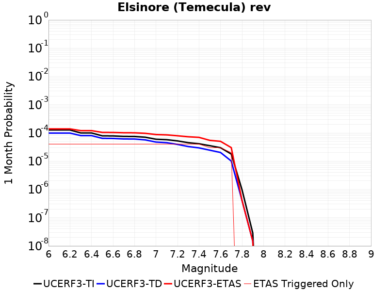 |  |  |

| Magnitude | 1 wk TI Prob | 1 wk TD Prob | 1 wk ETAS Prob | 1 wk ETAS/TD Gain | 1 wk ETAS Triggered Only | 1 mo TI Prob | 1 mo TD Prob | 1 mo ETAS Prob | 1 mo ETAS/TD Gain | 1 mo ETAS Triggered Only | 1 yr TI Prob | 1 yr TD Prob | 1 yr ETAS Prob | 1 yr ETAS/TD Gain | 1 yr ETAS Triggered Only | 10 yr TI Prob | 10 yr TD Prob | 10 yr ETAS Prob | 10 yr ETAS/TD Gain | 10 yr ETAS Triggered Only |
|-----|-----|-----|-----|-----|-----|-----|-----|-----|-----|-----|-----|-----|-----|-----|-----|-----|-----|-----|-----|-----|
| 6.0 | 2.9514995E-5 | 2.2948332E-5 | 2.2948332E-5 | 1.0 | 0.0 | 1.264867E-4 | 9.834641E-5 | 1.3834248E-4 | 1.4066856 | 4.0E-5 | 0.0015388876 | 0.0011967324 | 0.0013066008 | 1.091807 | 1.1E-4 | 0.015282745 | 0.011914459 | 0.012121957 | 1.0174156 | 2.1E-4 |
| 6.1 | 2.9514995E-5 | 2.2948332E-5 | 2.2948332E-5 | 1.0 | 0.0 | 1.264867E-4 | 9.834641E-5 | 1.3834248E-4 | 1.4066856 | 4.0E-5 | 0.0015388876 | 0.0011967324 | 0.0013066008 | 1.091807 | 1.1E-4 | 0.015282745 | 0.011914459 | 0.012121957 | 1.0174156 | 2.1E-4 |
| 6.2 | 2.9514995E-5 | 2.2948332E-5 | 2.2948332E-5 | 1.0 | 0.0 | 1.264867E-4 | 9.834641E-5 | 1.3834248E-4 | 1.4066856 | 4.0E-5 | 0.0015388876 | 0.0011967324 | 0.0013066008 | 1.091807 | 1.1E-4 | 0.015282745 | 0.011914459 | 0.012121957 | 1.0174156 | 2.1E-4 |
| 6.3 | 2.3223649E-5 | 1.8712344E-5 | 1.8712344E-5 | 1.0 | 0.0 | 9.952613E-5 | 8.019339E-5 | 1.2019018E-4 | 1.4987543 | 4.0E-5 | 0.001211057 | 9.759348E-4 | 0.0010858275 | 1.1126025 | 1.1E-4 | 0.012044783 | 0.009723753 | 0.009931711 | 1.0213866 | 2.1E-4 |
| 6.4 | 2.3223649E-5 | 1.8712344E-5 | 1.8712344E-5 | 1.0 | 0.0 | 9.952613E-5 | 8.019339E-5 | 1.2019018E-4 | 1.4987543 | 4.0E-5 | 0.001211057 | 9.759348E-4 | 0.0010858275 | 1.1126025 | 1.1E-4 | 0.012044783 | 0.009723753 | 0.009931711 | 1.0213866 | 2.1E-4 |
| 6.5 | 1.8338875E-5 | 1.4971586E-5 | 1.4971586E-5 | 1.0 | 0.0 | 7.8592806E-5 | 6.4162414E-5 | 1.04159844E-4 | 1.6233779 | 4.0E-5 | 9.5644733E-4 | 7.8090635E-4 | 8.9082046E-4 | 1.140752 | 1.1E-4 | 0.009523412 | 0.0077833678 | 0.007991733 | 1.0267706 | 2.1E-4 |
| 6.6 | 1.8223333E-5 | 1.4833075E-5 | 1.4833075E-5 | 1.0 | 0.0 | 7.809766E-5 | 6.356882E-5 | 1.0356628E-4 | 1.6291993 | 4.0E-5 | 9.504242E-4 | 7.7368453E-4 | 8.8359945E-4 | 1.1420668 | 1.1E-4 | 0.009463696 | 0.0077116527 | 0.007920033 | 1.0270215 | 2.1E-4 |
| 6.7 | 1.7512752E-5 | 1.4232959E-5 | 1.4232959E-5 | 1.0 | 0.0 | 7.505249E-5 | 6.099702E-5 | 1.0099458E-4 | 1.6557298 | 4.0E-5 | 9.13381E-4 | 7.423945E-4 | 8.523128E-4 | 1.1480592 | 1.1E-4 | 0.00909636 | 0.0074054757 | 0.0076139206 | 1.0281473 | 2.1E-4 |
| 6.8 | 1.7417142E-5 | 1.4155536E-5 | 1.4155536E-5 | 1.0 | 0.0 | 7.4642754E-5 | 6.0665217E-5 | 1.0066279E-4 | 1.6593164 | 4.0E-5 | 9.083966E-4 | 7.3835754E-4 | 8.482763E-4 | 1.1488693 | 1.1E-4 | 0.009046922 | 0.0073653134 | 0.0075737666 | 1.0283021 | 2.1E-4 |
| 6.9 | 1.6402591E-5 | 1.3185652E-5 | 1.3185652E-5 | 1.0 | 0.0 | 7.0294926E-5 | 5.6508758E-5 | 9.65065E-5 | 1.7078148 | 4.0E-5 | 8.5550465E-4 | 6.8778486E-4 | 7.9770916E-4 | 1.1598238 | 1.1E-4 | 0.008522186 | 0.00686207 | 0.007070629 | 1.030393 | 2.1E-4 |
| 7.0 | 1.3912486E-5 | 1.1054096E-5 | 1.1054096E-5 | 1.0 | 0.0 | 5.9623577E-5 | 4.737385E-5 | 8.7371955E-5 | 1.8443077 | 4.0E-5 | 7.2567526E-4 | 5.7662686E-4 | 6.8656344E-4 | 1.1906546 | 1.1E-4 | 0.0072331014 | 0.0057547716 | 0.005963563 | 1.0362815 | 2.1E-4 |
| 7.1 | 1.3405147E-5 | 1.048886E-5 | 1.048886E-5 | 1.0 | 0.0 | 5.7449364E-5 | 4.49515E-5 | 8.49497E-5 | 1.8898079 | 4.0E-5 | 6.9922156E-4 | 5.4714974E-4 | 6.570896E-4 | 1.2009319 | 1.1E-4 | 0.0069702556 | 0.005461185 | 0.0056700376 | 1.0382432 | 2.1E-4 |
| 7.2 | 1.21402E-5 | 9.123623E-6 | 9.123623E-6 | 1.0 | 0.0 | 5.202839E-5 | 3.910067E-5 | 7.90991E-5 | 2.0229604 | 4.0E-5 | 6.332616E-4 | 4.759485E-4 | 5.8589614E-4 | 1.2310075 | 1.1E-4 | 0.0063146 | 0.004750558 | 0.004959561 | 1.0439954 | 2.1E-4 |
| 7.3 | 1.05047775E-5 | 7.67141E-6 | 7.67141E-6 | 1.0 | 0.0 | 4.5019697E-5 | 3.2877062E-5 | 7.2875744E-5 | 2.2166138 | 4.0E-5 | 5.4797693E-4 | 4.0020622E-4 | 5.101622E-4 | 1.2747483 | 1.1E-4 | 0.005466277 | 0.003995195 | 0.004204356 | 1.0523531 | 2.1E-4 |
| 7.4 | 9.624483E-6 | 6.8707523E-6 | 6.8707523E-6 | 1.0 | 0.0 | 4.124713E-5 | 2.9445757E-5 | 6.944458E-5 | 2.35839 | 4.0E-5 | 5.0206814E-4 | 3.5844452E-4 | 4.6840508E-4 | 1.3067715 | 1.1E-4 | 0.005009353 | 0.0035788175 | 0.0037880659 | 1.0584686 | 2.1E-4 |
| 7.5 | 8.215151E-6 | 5.6989293E-6 | 5.6989293E-6 | 1.0 | 0.0 | 3.5207315E-5 | 2.4423762E-5 | 5.4423028E-5 | 2.228282 | 3.0E-5 | 4.2856473E-4 | 2.9732002E-4 | 3.9729028E-4 | 1.3362379 | 1.0E-4 | 0.004277392 | 0.002969353 | 0.0031687592 | 1.0671548 | 2.0E-4 |
| 7.6 | 6.975058E-6 | 4.7260596E-6 | 4.7260596E-6 | 1.0 | 0.0 | 2.9892764E-5 | 2.025439E-5 | 5.025378E-5 | 2.4811304 | 3.0E-5 | 3.6388362E-4 | 2.4657047E-4 | 3.2655077E-4 | 1.3243709 | 8.0E-5 | 0.0036328835 | 0.0024630874 | 0.0026326687 | 1.0688491 | 1.7E-4 |
| 7.7 | 4.159604E-6 | 2.3545658E-6 | 2.3545658E-6 | 1.0 | 0.0 | 1.7826753E-5 | 1.0090962E-5 | 3.009076E-5 | 2.9819517 | 2.0E-5 | 2.1701909E-4 | 1.2285128E-4 | 1.7284515E-4 | 1.4069462 | 5.0E-5 | 0.0021680726 | 0.0012279083 | 0.0013177978 | 1.0732054 | 9.0E-5 |
| 7.8 | 2.2692414E-7 | 9.481812E-8 | 9.481812E-8 | 1.0 | 0.0 | 9.725317E-7 | 4.063633E-7 | 4.063633E-7 | 1.0 | 0.0 | 1.1840509E-5 | 4.9474656E-6 | 4.9474656E-6 | 1.0 | 0.0 | 1.1839878E-4 | 4.947389E-5 | 4.947389E-5 | 1.0 | 0.0 |
| 7.9 | 6.676829E-9 | 3.4820105E-9 | 3.4820105E-9 | 1.0 | 0.0 | 2.861498E-8 | 1.4922902E-8 | 1.4922902E-8 | 1.0 | 0.0 | 3.4838732E-7 | 1.8168632E-7 | 1.8168632E-7 | 1.0 | 0.0 | 3.4838679E-6 | 1.8168619E-6 | 1.8168619E-6 | 1.0 | 0.0 |

## Elsinore (Glen Ivy) rev
*[(top)](#table-of-contents)*

| 1 Week | 1 Month | 1 Year | 10 Year |
|-----|-----|-----|-----|
|  |  |  | 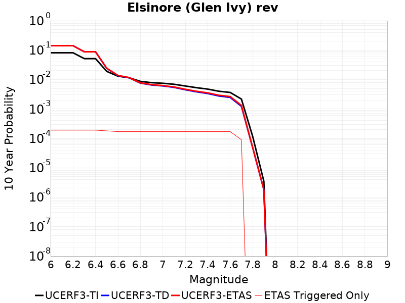 |

| Magnitude | 1 wk TI Prob | 1 wk TD Prob | 1 wk ETAS Prob | 1 wk ETAS/TD Gain | 1 wk ETAS Triggered Only | 1 mo TI Prob | 1 mo TD Prob | 1 mo ETAS Prob | 1 mo ETAS/TD Gain | 1 mo ETAS Triggered Only | 1 yr TI Prob | 1 yr TD Prob | 1 yr ETAS Prob | 1 yr ETAS/TD Gain | 1 yr ETAS Triggered Only | 10 yr TI Prob | 10 yr TD Prob | 10 yr ETAS Prob | 10 yr ETAS/TD Gain | 10 yr ETAS Triggered Only |
|-----|-----|-----|-----|-----|-----|-----|-----|-----|-----|-----|-----|-----|-----|-----|-----|-----|-----|-----|-----|-----|
| 6.0 | 1.6204086E-4 | 2.975498E-4 | 2.975498E-4 | 1.0 | 0.0 | 6.94276E-4 | 0.0012746474 | 0.0013046091 | 1.0235059 | 3.0E-5 | 0.008420097 | 0.015430223 | 0.015518835 | 1.0057427 | 9.0E-5 | 0.081081145 | 0.14104177 | 0.14120497 | 1.0011572 | 1.9E-4 |
| 6.1 | 1.6204086E-4 | 2.975498E-4 | 2.975498E-4 | 1.0 | 0.0 | 6.94276E-4 | 0.0012746474 | 0.0013046091 | 1.0235059 | 3.0E-5 | 0.008420097 | 0.015430223 | 0.015518835 | 1.0057427 | 9.0E-5 | 0.081081145 | 0.14104177 | 0.14120497 | 1.0011572 | 1.9E-4 |
| 6.2 | 1.6204086E-4 | 2.975498E-4 | 2.975498E-4 | 1.0 | 0.0 | 6.94276E-4 | 0.0012746474 | 0.0013046091 | 1.0235059 | 3.0E-5 | 0.008420097 | 0.015430223 | 0.015518835 | 1.0057427 | 9.0E-5 | 0.081081145 | 0.14104177 | 0.14120497 | 1.0011572 | 1.9E-4 |
| 6.3 | 1.0111737E-4 | 1.7904189E-4 | 1.7904189E-4 | 1.0 | 0.0 | 4.332882E-4 | 7.6721626E-4 | 7.9719326E-4 | 1.0390724 | 3.0E-5 | 0.005262531 | 0.009322048 | 0.009411209 | 1.0095645 | 9.0E-5 | 0.0513964 | 0.08783754 | 0.088010855 | 1.001973 | 1.9E-4 |
| 6.4 | 1.0111737E-4 | 1.7904189E-4 | 1.7904189E-4 | 1.0 | 0.0 | 4.332882E-4 | 7.6721626E-4 | 7.9719326E-4 | 1.0390724 | 3.0E-5 | 0.005262531 | 0.009322048 | 0.009411209 | 1.0095645 | 9.0E-5 | 0.0513964 | 0.08783754 | 0.088010855 | 1.001973 | 1.9E-4 |
| 6.5 | 3.6624708E-5 | 4.678819E-5 | 4.678819E-5 | 1.0 | 0.0 | 1.569536E-4 | 2.0050751E-4 | 2.305015E-4 | 1.1495904 | 3.0E-5 | 0.001909235 | 0.002438816 | 0.002518621 | 1.0327228 | 8.0E-5 | 0.01892915 | 0.023950899 | 0.02412659 | 1.0073354 | 1.8E-4 |
| 6.6 | 2.5051324E-5 | 2.621918E-5 | 2.621918E-5 | 1.0 | 0.0 | 1.073584E-4 | 1.1236333E-4 | 1.4235996E-4 | 1.266961 | 3.0E-5 | 0.0013063047 | 0.0013672091 | 0.0014470998 | 1.0584334 | 8.0E-5 | 0.012986525 | 0.013595596 | 0.013763284 | 1.0123341 | 1.7E-4 |
| 6.7 | 2.2189772E-5 | 2.2104108E-5 | 2.2104108E-5 | 1.0 | 0.0 | 9.509556E-5 | 9.472865E-5 | 1.247258E-4 | 1.3166641 | 3.0E-5 | 0.0011571734 | 0.0011527468 | 0.0012326547 | 1.0693195 | 8.0E-5 | 0.011511663 | 0.011476447 | 0.011644496 | 1.014643 | 1.7E-4 |
| 6.8 | 1.6654378E-5 | 1.4541682E-5 | 1.4541682E-5 | 1.0 | 0.0 | 7.137396E-5 | 6.232003E-5 | 9.2318165E-5 | 1.4813561 | 3.0E-5 | 8.686314E-4 | 7.5848727E-4 | 8.384266E-4 | 1.105393 | 8.0E-5 | 0.008652439 | 0.007563076 | 0.00773179 | 1.0223076 | 1.7E-4 |
| 6.9 | 1.5042909E-5 | 1.2535468E-5 | 1.2535468E-5 | 1.0 | 0.0 | 6.446802E-5 | 5.3722346E-5 | 8.372073E-5 | 1.5583968 | 3.0E-5 | 7.8461546E-4 | 6.538766E-4 | 7.338242E-4 | 1.1222672 | 8.0E-5 | 0.007818509 | 0.0065231477 | 0.006692039 | 1.0258911 | 1.7E-4 |
| 7.0 | 1.4361385E-5 | 1.1645722E-5 | 1.1645722E-5 | 1.0 | 0.0 | 6.154734E-5 | 4.99093E-5 | 7.9907804E-5 | 1.6010604 | 3.0E-5 | 7.490812E-4 | 6.0747936E-4 | 6.8743073E-4 | 1.1316117 | 8.0E-5 | 0.007465612 | 0.006061769 | 0.0062307385 | 1.0278746 | 1.7E-4 |
| 7.1 | 1.3265571E-5 | 1.0412932E-5 | 1.0412932E-5 | 1.0 | 0.0 | 5.6851208E-5 | 4.4626104E-5 | 7.462476E-5 | 1.6722223 | 3.0E-5 | 6.919436E-4 | 5.4319E-4 | 6.2314654E-4 | 1.1471981 | 8.0E-5 | 0.006897931 | 0.0054218024 | 0.0055908808 | 1.0311849 | 1.7E-4 |
| 7.2 | 1.1596403E-5 | 8.630211E-6 | 8.630211E-6 | 1.0 | 0.0 | 4.9697923E-5 | 3.69861E-5 | 6.698499E-5 | 1.8110855 | 3.0E-5 | 6.049042E-4 | 4.5021446E-4 | 5.301784E-4 | 1.1776131 | 8.0E-5 | 0.006032603 | 0.0044942806 | 0.0046635163 | 1.0376558 | 1.7E-4 |
| 7.3 | 1.0150827E-5 | 7.338121E-6 | 7.338121E-6 | 1.0 | 0.0 | 4.3502816E-5 | 3.144872E-5 | 6.1447776E-5 | 1.9539039 | 3.0E-5 | 5.2951806E-4 | 3.8282236E-4 | 4.6279174E-4 | 1.2088943 | 8.0E-5 | 0.005282581 | 0.0038219665 | 0.0039913165 | 1.0443097 | 1.7E-4 |
| 7.4 | 9.080705E-6 | 6.4342303E-6 | 6.4342303E-6 | 1.0 | 0.0 | 3.8916725E-5 | 2.7574988E-5 | 5.757416E-5 | 2.0879123 | 3.0E-5 | 4.7370812E-4 | 3.3567517E-4 | 4.156483E-4 | 1.2382456 | 8.0E-5 | 0.004726996 | 0.0033518318 | 0.0035212622 | 1.0505486 | 1.7E-4 |
| 7.5 | 7.671649E-6 | 5.287028E-6 | 5.287028E-6 | 1.0 | 0.0 | 3.287808E-5 | 2.2658503E-5 | 5.2657822E-5 | 2.3239763 | 3.0E-5 | 4.0021708E-4 | 2.7583365E-4 | 3.5581156E-4 | 1.2899499 | 8.0E-5 | 0.0039949706 | 0.0027550403 | 0.002924572 | 1.0615351 | 1.7E-4 |
| 7.6 | 6.990086E-6 | 4.7376334E-6 | 4.7376334E-6 | 1.0 | 0.0 | 2.9957167E-5 | 2.0303993E-5 | 5.0303384E-5 | 2.477512 | 3.0E-5 | 3.6466747E-4 | 2.4717426E-4 | 3.2715447E-4 | 1.3235784 | 8.0E-5 | 0.0036406964 | 0.002469112 | 0.002638692 | 1.0686806 | 1.7E-4 |
| 7.7 | 4.163505E-6 | 2.3571288E-6 | 2.3571288E-6 | 1.0 | 0.0 | 1.7843471E-5 | 1.0101946E-5 | 3.0101744E-5 | 2.9797966 | 2.0E-5 | 2.172226E-4 | 1.22985E-4 | 1.7297886E-4 | 1.4065037 | 5.0E-5 | 0.0021701038 | 0.001229244 | 0.0013191333 | 1.0731257 | 9.0E-5 |
| 7.8 | 2.2692414E-7 | 9.481812E-8 | 9.481812E-8 | 1.0 | 0.0 | 9.725317E-7 | 4.063633E-7 | 4.063633E-7 | 1.0 | 0.0 | 1.1840509E-5 | 4.9474656E-6 | 4.9474656E-6 | 1.0 | 0.0 | 1.1839878E-4 | 4.947389E-5 | 4.947389E-5 | 1.0 | 0.0 |
| 7.9 | 6.676829E-9 | 3.4820105E-9 | 3.4820105E-9 | 1.0 | 0.0 | 2.861498E-8 | 1.4922902E-8 | 1.4922902E-8 | 1.0 | 0.0 | 3.4838732E-7 | 1.8168632E-7 | 1.8168632E-7 | 1.0 | 0.0 | 3.4838679E-6 | 1.8168619E-6 | 1.8168619E-6 | 1.0 | 0.0 |

## Elsinore (Stepovers Combined)
*[(top)](#table-of-contents)*

| 1 Week | 1 Month | 1 Year | 10 Year |
|-----|-----|-----|-----|
|  |  |  |  |

| Magnitude | 1 wk TI Prob | 1 wk TD Prob | 1 wk ETAS Prob | 1 wk ETAS/TD Gain | 1 wk ETAS Triggered Only | 1 mo TI Prob | 1 mo TD Prob | 1 mo ETAS Prob | 1 mo ETAS/TD Gain | 1 mo ETAS Triggered Only | 1 yr TI Prob | 1 yr TD Prob | 1 yr ETAS Prob | 1 yr ETAS/TD Gain | 1 yr ETAS Triggered Only | 10 yr TI Prob | 10 yr TD Prob | 10 yr ETAS Prob | 10 yr ETAS/TD Gain | 10 yr ETAS Triggered Only |
|-----|-----|-----|-----|-----|-----|-----|-----|-----|-----|-----|-----|-----|-----|-----|-----|-----|-----|-----|-----|-----|
| 6.0 | 2.144392E-5 | 2.0058407E-5 | 2.0058407E-5 | 1.0 | 0.0 | 9.189928E-5 | 8.5961896E-5 | 1.15959316E-4 | 1.3489618 | 3.0E-5 | 0.0011182994 | 0.0010461024 | 0.0011559874 | 1.1050422 | 1.1E-4 | 0.011126885 | 0.010417535 | 0.010615451 | 1.0189984 | 2.0E-4 |
| 6.1 | 2.144392E-5 | 2.0058407E-5 | 2.0058407E-5 | 1.0 | 0.0 | 9.189928E-5 | 8.5961896E-5 | 1.15959316E-4 | 1.3489618 | 3.0E-5 | 0.0011182994 | 0.0010461024 | 0.0011559874 | 1.1050422 | 1.1E-4 | 0.011126885 | 0.010417535 | 0.010615451 | 1.0189984 | 2.0E-4 |
| 6.2 | 2.144392E-5 | 2.0058407E-5 | 2.0058407E-5 | 1.0 | 0.0 | 9.189928E-5 | 8.5961896E-5 | 1.15959316E-4 | 1.3489618 | 3.0E-5 | 0.0011182994 | 0.0010461024 | 0.0011559874 | 1.1050422 | 1.1E-4 | 0.011126885 | 0.010417535 | 0.010615451 | 1.0189984 | 2.0E-4 |
| 6.3 | 1.9751555E-5 | 1.8023718E-5 | 1.8023718E-5 | 1.0 | 0.0 | 8.4646774E-5 | 7.724232E-5 | 1.07240005E-4 | 1.3883581 | 3.0E-5 | 0.0010300872 | 9.4003335E-4 | 0.00104993 | 1.1169071 | 1.1E-4 | 0.010253254 | 0.009365811 | 0.009563938 | 1.0211543 | 2.0E-4 |
| 6.4 | 1.9751555E-5 | 1.8023718E-5 | 1.8023718E-5 | 1.0 | 0.0 | 8.4646774E-5 | 7.724232E-5 | 1.07240005E-4 | 1.3883581 | 3.0E-5 | 0.0010300872 | 9.4003335E-4 | 0.00104993 | 1.1169071 | 1.1E-4 | 0.010253254 | 0.009365811 | 0.009563938 | 1.0211543 | 2.0E-4 |
| 6.5 | 1.9751555E-5 | 1.8023718E-5 | 1.8023718E-5 | 1.0 | 0.0 | 8.4646774E-5 | 7.724232E-5 | 1.07240005E-4 | 1.3883581 | 3.0E-5 | 0.0010300872 | 9.4003335E-4 | 0.00104993 | 1.1169071 | 1.1E-4 | 0.010253254 | 0.009365811 | 0.009563938 | 1.0211543 | 2.0E-4 |
| 6.6 | 1.9188685E-5 | 1.727661E-5 | 1.727661E-5 | 1.0 | 0.0 | 8.2234634E-5 | 7.404061E-5 | 1.04038394E-4 | 1.405153 | 3.0E-5 | 0.0010007467 | 9.010884E-4 | 0.0010109893 | 1.1219646 | 1.1E-4 | 0.00996252 | 0.008979836 | 0.00917804 | 1.0220721 | 2.0E-4 |
| 6.7 | 1.7608272E-5 | 1.49552125E-5 | 1.49552125E-5 | 1.0 | 0.0 | 7.546184E-5 | 6.409225E-5 | 9.409033E-5 | 1.4680454 | 3.0E-5 | 9.183606E-4 | 7.800538E-4 | 8.89968E-4 | 1.1409059 | 1.1E-4 | 0.009145746 | 0.007779522 | 0.007977966 | 1.0255085 | 2.0E-4 |
| 6.8 | 1.697165E-5 | 1.3980407E-5 | 1.3980407E-5 | 1.0 | 0.0 | 7.273361E-5 | 5.9914706E-5 | 8.991291E-5 | 1.5006818 | 3.0E-5 | 8.8517193E-4 | 7.292263E-4 | 8.39146E-4 | 1.1507348 | 1.1E-4 | 0.008816543 | 0.0072742207 | 0.0074727656 | 1.0272944 | 2.0E-4 |
| 6.9 | 1.600365E-5 | 1.3037058E-5 | 1.3037058E-5 | 1.0 | 0.0 | 6.858527E-5 | 5.5871955E-5 | 8.587028E-5 | 1.536912 | 3.0E-5 | 8.347058E-4 | 6.800367E-4 | 7.899619E-4 | 1.161646 | 1.1E-4 | 0.008315775 | 0.0067850314 | 0.006983674 | 1.0292766 | 2.0E-4 |
| 7.0 | 1.3314581E-5 | 1.0617795E-5 | 1.0617795E-5 | 1.0 | 0.0 | 5.7061243E-5 | 4.5504057E-5 | 7.550269E-5 | 1.6592519 | 3.0E-5 | 6.944992E-4 | 5.538739E-4 | 6.538185E-4 | 1.1804465 | 1.0E-4 | 0.006923327 | 0.005528401 | 0.005717351 | 1.034178 | 1.9E-4 |
| 7.1 | 1.2865345E-5 | 1.0095267E-5 | 1.0095267E-5 | 1.0 | 0.0 | 5.5136024E-5 | 4.3264725E-5 | 7.326343E-5 | 1.6933755 | 3.0E-5 | 6.710743E-4 | 5.266234E-4 | 6.265707E-4 | 1.189789 | 1.0E-4 | 0.0066905143 | 0.005256917 | 0.005445918 | 1.0359528 | 1.9E-4 |
| 7.2 | 1.1650051E-5 | 8.75843E-6 | 8.75843E-6 | 1.0 | 0.0 | 4.9927836E-5 | 3.7535603E-5 | 6.753448E-5 | 1.7992113 | 3.0E-5 | 6.0770183E-4 | 4.5690194E-4 | 5.568562E-4 | 1.2187654 | 1.0E-4 | 0.0060604266 | 0.0045608906 | 0.004750024 | 1.0414685 | 1.9E-4 |
| 7.3 | 1.0008533E-5 | 7.298304E-6 | 7.298304E-6 | 1.0 | 0.0 | 4.2893007E-5 | 3.127808E-5 | 6.127714E-5 | 1.9591081 | 3.0E-5 | 5.220972E-4 | 3.8074557E-4 | 4.8070747E-4 | 1.2625426 | 1.0E-4 | 0.005208723 | 0.0038012704 | 0.003990548 | 1.0497932 | 1.9E-4 |
| 7.4 | 9.116759E-6 | 6.491383E-6 | 6.491383E-6 | 1.0 | 0.0 | 3.907124E-5 | 2.7819924E-5 | 5.781909E-5 | 2.0783339 | 3.0E-5 | 4.7558855E-4 | 3.3865633E-4 | 4.386225E-4 | 1.2951846 | 1.0E-4 | 0.00474572 | 0.0033815543 | 0.003570912 | 1.0559971 | 1.9E-4 |
| 7.5 | 7.870524E-6 | 5.4448337E-6 | 5.4448337E-6 | 1.0 | 0.0 | 3.3730383E-5 | 2.3334802E-5 | 5.33341E-5 | 2.2856035 | 3.0E-5 | 4.1059E-4 | 2.8406546E-4 | 3.8403706E-4 | 1.3519316 | 1.0E-4 | 0.0040983222 | 0.002837153 | 0.0030266137 | 1.0667785 | 1.9E-4 |
| 7.6 | 6.9774537E-6 | 4.7276344E-6 | 4.7276344E-6 | 1.0 | 0.0 | 2.990303E-5 | 2.0261139E-5 | 5.0260533E-5 | 2.4806368 | 3.0E-5 | 3.640086E-4 | 2.4665263E-4 | 3.266329E-4 | 1.3242627 | 8.0E-5 | 0.003634129 | 0.0024639072 | 0.0026334885 | 1.0688261 | 1.7E-4 |
| 7.7 | 4.1616954E-6 | 2.3559253E-6 | 2.3559253E-6 | 1.0 | 0.0 | 1.7835715E-5 | 1.0096788E-5 | 3.0096586E-5 | 2.980808 | 2.0E-5 | 2.171282E-4 | 1.2292223E-4 | 1.7291607E-4 | 1.4067113 | 5.0E-5 | 0.0021691616 | 0.0012286168 | 0.0013185062 | 1.0731632 | 9.0E-5 |
| 7.8 | 2.2692414E-7 | 9.481812E-8 | 9.481812E-8 | 1.0 | 0.0 | 9.725317E-7 | 4.063633E-7 | 4.063633E-7 | 1.0 | 0.0 | 1.1840509E-5 | 4.9474656E-6 | 4.9474656E-6 | 1.0 | 0.0 | 1.1839878E-4 | 4.947389E-5 | 4.947389E-5 | 1.0 | 0.0 |
| 7.9 | 6.676829E-9 | 3.4820105E-9 | 3.4820105E-9 | 1.0 | 0.0 | 2.861498E-8 | 1.4922902E-8 | 1.4922902E-8 | 1.0 | 0.0 | 3.4838732E-7 | 1.8168632E-7 | 1.8168632E-7 | 1.0 | 0.0 | 3.4838679E-6 | 1.8168619E-6 | 1.8168619E-6 | 1.0 | 0.0 |

## Whittier alt 1
*[(top)](#table-of-contents)*

| 1 Week | 1 Month | 1 Year | 10 Year |
|-----|-----|-----|-----|
|  |  |  |  |

| Magnitude | 1 wk TI Prob | 1 wk TD Prob | 1 wk ETAS Prob | 1 wk ETAS/TD Gain | 1 wk ETAS Triggered Only | 1 mo TI Prob | 1 mo TD Prob | 1 mo ETAS Prob | 1 mo ETAS/TD Gain | 1 mo ETAS Triggered Only | 1 yr TI Prob | 1 yr TD Prob | 1 yr ETAS Prob | 1 yr ETAS/TD Gain | 1 yr ETAS Triggered Only | 10 yr TI Prob | 10 yr TD Prob | 10 yr ETAS Prob | 10 yr ETAS/TD Gain | 10 yr ETAS Triggered Only |
|-----|-----|-----|-----|-----|-----|-----|-----|-----|-----|-----|-----|-----|-----|-----|-----|-----|-----|-----|-----|-----|
| 6.0 | 4.2554693E-5 | 4.765207E-5 | 4.765207E-5 | 1.0 | 0.0 | 1.8236451E-4 | 2.04209E-4 | 2.2420492E-4 | 1.0979189 | 2.0E-5 | 0.002218027 | 0.002483736 | 0.0025535622 | 1.0281134 | 7.0E-5 | 0.02196019 | 0.024593877 | 0.024730433 | 1.0055525 | 1.4E-4 |
| 6.1 | 4.2554693E-5 | 4.765207E-5 | 4.765207E-5 | 1.0 | 0.0 | 1.8236451E-4 | 2.04209E-4 | 2.2420492E-4 | 1.0979189 | 2.0E-5 | 0.002218027 | 0.002483736 | 0.0025535622 | 1.0281134 | 7.0E-5 | 0.02196019 | 0.024593877 | 0.024730433 | 1.0055525 | 1.4E-4 |
| 6.2 | 4.2554693E-5 | 4.765207E-5 | 4.765207E-5 | 1.0 | 0.0 | 1.8236451E-4 | 2.04209E-4 | 2.2420492E-4 | 1.0979189 | 2.0E-5 | 0.002218027 | 0.002483736 | 0.0025535622 | 1.0281134 | 7.0E-5 | 0.02196019 | 0.024593877 | 0.024730433 | 1.0055525 | 1.4E-4 |
| 6.3 | 1.9617712E-5 | 1.8478831E-5 | 1.8478831E-5 | 1.0 | 0.0 | 8.40732E-5 | 7.919269E-5 | 9.919111E-5 | 1.2525285 | 2.0E-5 | 0.0010231105 | 9.6376386E-4 | 0.0010336963 | 1.0725619 | 7.0E-5 | 0.01018413 | 0.009598791 | 0.009737447 | 1.0144452 | 1.4E-4 |
| 6.4 | 1.5611336E-5 | 1.3783675E-5 | 1.3783675E-5 | 1.0 | 0.0 | 6.690401E-5 | 5.907159E-5 | 7.907041E-5 | 1.3385522 | 2.0E-5 | 8.142519E-4 | 7.189654E-4 | 7.889151E-4 | 1.0972921 | 7.0E-5 | 0.008112748 | 0.0071680043 | 0.007307001 | 1.0193912 | 1.4E-4 |
| 6.5 | 1.5150166E-5 | 1.328071E-5 | 1.328071E-5 | 1.0 | 0.0 | 6.492767E-5 | 5.691612E-5 | 7.691498E-5 | 1.3513743 | 2.0E-5 | 7.9020765E-4 | 6.9273944E-4 | 7.6269096E-4 | 1.1009781 | 7.0E-5 | 0.007874036 | 0.0069073956 | 0.0070464285 | 1.0201281 | 1.4E-4 |
| 6.6 | 1.295588E-5 | 1.05316785E-5 | 1.05316785E-5 | 1.0 | 0.0 | 5.552402E-5 | 4.5134995E-5 | 6.5134096E-5 | 1.4430951 | 2.0E-5 | 6.7579525E-4 | 5.4938206E-4 | 6.193436E-4 | 1.1273459 | 7.0E-5 | 0.006737438 | 0.0054815016 | 0.0056207343 | 1.0254004 | 1.4E-4 |
| 6.7 | 1.2542085E-5 | 1.0047812E-5 | 1.0047812E-5 | 1.0 | 0.0 | 5.3750682E-5 | 4.306135E-5 | 6.306049E-5 | 1.4644337 | 2.0E-5 | 6.542181E-4 | 5.2414776E-4 | 5.941111E-4 | 1.1334801 | 7.0E-5 | 0.006522954 | 0.005230383 | 0.0053696507 | 1.0266267 | 1.4E-4 |
| 6.8 | 1.2195878E-5 | 9.640053E-6 | 9.640053E-6 | 1.0 | 0.0 | 5.2267E-5 | 4.1313866E-5 | 6.131304E-5 | 1.484079 | 2.0E-5 | 6.36165E-4 | 5.028821E-4 | 5.7284697E-4 | 1.1391276 | 7.0E-5 | 0.0063434686 | 0.005018658 | 0.005157955 | 1.0277559 | 1.4E-4 |
| 6.9 | 1.1580298E-5 | 8.9140585E-6 | 8.9140585E-6 | 1.0 | 0.0 | 4.9628903E-5 | 3.8202557E-5 | 5.8201793E-5 | 1.5235052 | 2.0E-5 | 6.040644E-4 | 4.6501856E-4 | 5.3498603E-4 | 1.1504617 | 7.0E-5 | 0.00602425 | 0.0046416065 | 0.004780957 | 1.030022 | 1.4E-4 |
| 7.0 | 1.0964795E-5 | 8.215464E-6 | 8.215464E-6 | 1.0 | 0.0 | 4.6991136E-5 | 3.5208664E-5 | 5.5207962E-5 | 1.568022 | 2.0E-5 | 5.7196687E-4 | 4.2858277E-4 | 4.9855275E-4 | 1.163259 | 7.0E-5 | 0.0057049696 | 0.004278672 | 0.0044180728 | 1.0325804 | 1.4E-4 |
| 7.1 | 1.0230601E-5 | 7.4435493E-6 | 7.4435493E-6 | 1.0 | 0.0 | 4.3844695E-5 | 3.1900545E-5 | 5.1899904E-5 | 1.6269286 | 2.0E-5 | 5.336784E-4 | 3.8832123E-4 | 4.5829406E-4 | 1.1801931 | 7.0E-5 | 0.005323986 | 0.0038774433 | 0.0040169004 | 1.0359663 | 1.4E-4 |
| 7.2 | 9.40865E-6 | 6.645643E-6 | 6.645643E-6 | 1.0 | 0.0 | 4.032216E-5 | 2.8481025E-5 | 4.8480455E-5 | 1.702202 | 2.0E-5 | 4.908117E-4 | 3.4670255E-4 | 4.166783E-4 | 1.2018322 | 7.0E-5 | 0.0048972913 | 0.0034625875 | 0.0036021029 | 1.0402921 | 1.4E-4 |
| 7.3 | 8.237384E-6 | 5.6784643E-6 | 5.6784643E-6 | 1.0 | 0.0 | 3.5302593E-5 | 2.4336054E-5 | 4.4335568E-5 | 1.821806 | 2.0E-5 | 4.2972428E-4 | 2.9625223E-4 | 3.662315E-4 | 1.2362151 | 7.0E-5 | 0.0042889426 | 0.0029588302 | 0.003098416 | 1.047176 | 1.4E-4 |
| 7.4 | 7.5316966E-6 | 5.0980148E-6 | 5.0980148E-6 | 1.0 | 0.0 | 3.2278298E-5 | 2.1848458E-5 | 4.184802E-5 | 1.9153764 | 2.0E-5 | 3.9291743E-4 | 2.6597353E-4 | 3.3595492E-4 | 1.2631141 | 7.0E-5 | 0.0039222343 | 0.0026566654 | 0.0027962935 | 1.0525576 | 1.4E-4 |
| 7.5 | 6.149649E-6 | 3.983778E-6 | 3.983778E-6 | 1.0 | 0.0 | 2.6355372E-5 | 1.7073226E-5 | 3.7072885E-5 | 2.1714048 | 2.0E-5 | 3.208294E-4 | 2.0784762E-4 | 2.7783308E-4 | 1.3367152 | 7.0E-5 | 0.003203666 | 0.0020766235 | 0.0022163328 | 1.0672771 | 1.4E-4 |
| 7.6 | 5.457711E-6 | 3.4342395E-6 | 3.4342395E-6 | 1.0 | 0.0 | 2.338998E-5 | 1.4718091E-5 | 3.4717796E-5 | 2.358852 | 2.0E-5 | 2.8473578E-4 | 1.7917885E-4 | 2.491663E-4 | 1.3906012 | 7.0E-5 | 0.0028437122 | 0.0017904262 | 0.0019301756 | 1.0780537 | 1.4E-4 |
| 7.7 | 4.1676276E-6 | 2.3607931E-6 | 2.3607931E-6 | 1.0 | 0.0 | 1.7861139E-5 | 1.0117649E-5 | 3.0117448E-5 | 2.9767237 | 2.0E-5 | 2.1743766E-4 | 1.2317619E-4 | 1.7317002E-4 | 1.4058727 | 5.0E-5 | 0.0021722503 | 0.0012311536 | 0.0013210428 | 1.0730121 | 9.0E-5 |
| 7.8 | 2.2692414E-7 | 9.481812E-8 | 9.481812E-8 | 1.0 | 0.0 | 9.725317E-7 | 4.063633E-7 | 4.063633E-7 | 1.0 | 0.0 | 1.1840509E-5 | 4.9474656E-6 | 4.9474656E-6 | 1.0 | 0.0 | 1.1839878E-4 | 4.947389E-5 | 4.947389E-5 | 1.0 | 0.0 |
| 7.9 | 6.676829E-9 | 3.4820105E-9 | 3.4820105E-9 | 1.0 | 0.0 | 2.861498E-8 | 1.4922902E-8 | 1.4922902E-8 | 1.0 | 0.0 | 3.4838732E-7 | 1.8168632E-7 | 1.8168632E-7 | 1.0 | 0.0 | 3.4838679E-6 | 1.8168619E-6 | 1.8168619E-6 | 1.0 | 0.0 |

## Chino alt 1
*[(top)](#table-of-contents)*

| 1 Week | 1 Month | 1 Year | 10 Year |
|-----|-----|-----|-----|
|  |  |  |  |

| Magnitude | 1 wk TI Prob | 1 wk TD Prob | 1 wk ETAS Prob | 1 wk ETAS/TD Gain | 1 wk ETAS Triggered Only | 1 mo TI Prob | 1 mo TD Prob | 1 mo ETAS Prob | 1 mo ETAS/TD Gain | 1 mo ETAS Triggered Only | 1 yr TI Prob | 1 yr TD Prob | 1 yr ETAS Prob | 1 yr ETAS/TD Gain | 1 yr ETAS Triggered Only | 10 yr TI Prob | 10 yr TD Prob | 10 yr ETAS Prob | 10 yr ETAS/TD Gain | 10 yr ETAS Triggered Only |
|-----|-----|-----|-----|-----|-----|-----|-----|-----|-----|-----|-----|-----|-----|-----|-----|-----|-----|-----|-----|-----|
| 6.0 | 2.7059663E-5 | 2.5898926E-5 | 2.5898926E-5 | 1.0 | 0.0 | 1.1596483E-4 | 1.10991234E-4 | 1.3098902E-4 | 1.1801744 | 2.0E-5 | 0.0014109573 | 0.0013505802 | 0.0014005126 | 1.0369711 | 5.0E-5 | 0.014020323 | 0.013435085 | 0.013523876 | 1.0066088 | 9.0E-5 |
| 6.1 | 2.1505624E-5 | 2.5898926E-5 | 2.5898926E-5 | 1.0 | 0.0 | 9.2163704E-5 | 1.10991234E-4 | 1.3098902E-4 | 1.1801744 | 2.0E-5 | 0.0011215154 | 0.0013505802 | 0.0014005126 | 1.0369711 | 5.0E-5 | 0.011158722 | 0.013435085 | 0.013523876 | 1.0066088 | 9.0E-5 |
| 6.2 | 2.1505624E-5 | 2.5898926E-5 | 2.5898926E-5 | 1.0 | 0.0 | 9.2163704E-5 | 1.10991234E-4 | 1.3098902E-4 | 1.1801744 | 2.0E-5 | 0.0011215154 | 0.0013505802 | 0.0014005126 | 1.0369711 | 5.0E-5 | 0.011158722 | 0.013435085 | 0.013523876 | 1.0066088 | 9.0E-5 |
| 6.3 | 1.4290785E-5 | 1.7817714E-5 | 1.7817714E-5 | 1.0 | 0.0 | 6.1244784E-5 | 7.635964E-5 | 9.635812E-5 | 1.2618984 | 2.0E-5 | 7.454001E-4 | 9.293262E-4 | 9.6928905E-4 | 1.0430019 | 4.0E-5 | 0.007429048 | 0.009260196 | 0.009329548 | 1.0074892 | 7.0E-5 |
| 6.4 | 1.4290785E-5 | 1.7817714E-5 | 1.7817714E-5 | 1.0 | 0.0 | 6.1244784E-5 | 7.635964E-5 | 9.635812E-5 | 1.2618984 | 2.0E-5 | 7.454001E-4 | 9.293262E-4 | 9.6928905E-4 | 1.0430019 | 4.0E-5 | 0.007429048 | 0.009260196 | 0.009329548 | 1.0074892 | 7.0E-5 |
| 6.5 | 1.3017944E-5 | 1.6383987E-5 | 1.6383987E-5 | 1.0 | 0.0 | 5.5789995E-5 | 7.021544E-5 | 9.021404E-5 | 1.2848177 | 2.0E-5 | 6.790315E-4 | 8.545804E-4 | 8.8455476E-4 | 1.035075 | 3.0E-5 | 0.0067696036 | 0.008518585 | 0.008578074 | 1.0069834 | 6.0E-5 |
| 6.6 | 9.470016E-6 | 1.1836141E-5 | 1.1836141E-5 | 1.0 | 0.0 | 4.058515E-5 | 5.072552E-5 | 6.072501E-5 | 1.1971295 | 1.0E-5 | 4.940122E-4 | 6.174413E-4 | 6.3742895E-4 | 1.0323718 | 2.0E-5 | 0.004929154 | 0.0061617433 | 0.006201497 | 1.0064517 | 4.0E-5 |
| 6.7 | 8.314155E-6 | 1.0218582E-5 | 1.0218582E-5 | 1.0 | 0.0 | 3.5631605E-5 | 4.3793367E-5 | 5.379293E-5 | 1.228335 | 1.0E-5 | 4.3372845E-4 | 5.3308526E-4 | 5.530746E-4 | 1.0374974 | 2.0E-5 | 0.004328829 | 0.005322899 | 0.0053626862 | 1.0074747 | 4.0E-5 |
| 6.8 | 3.4856364E-6 | 3.7246245E-6 | 3.7246245E-6 | 1.0 | 0.0 | 1.4938357E-5 | 1.5962589E-5 | 2.596243E-5 | 1.6264548 | 1.0E-5 | 1.8185932E-4 | 1.9432901E-4 | 2.0432707E-4 | 1.0514491 | 1.0E-5 | 0.0018171056 | 0.0019422994 | 0.001972241 | 1.0154157 | 3.0E-5 |
| 6.9 | 2.2645952E-6 | 2.1700187E-6 | 2.1700187E-6 | 1.0 | 0.0 | 9.705372E-6 | 9.300048E-6 | 1.9299954E-5 | 2.0752532 | 1.0E-5 | 1.18156495E-4 | 1.1322241E-4 | 1.2322128E-4 | 1.0883118 | 1.0E-5 | 0.0011809369 | 0.0011319777 | 0.0011619438 | 1.0264723 | 3.0E-5 |
| 7.0 | 1.7864003E-6 | 1.5584468E-6 | 1.5584468E-6 | 1.0 | 0.0 | 7.655979E-6 | 6.679041E-6 | 1.6678974E-5 | 2.497211 | 1.0E-5 | 9.3207556E-5 | 8.131435E-5 | 9.131354E-5 | 1.1229695 | 1.0E-5 | 9.316847E-4 | 8.1319787E-4 | 8.431735E-4 | 1.0368614 | 3.0E-5 |
| 7.1 | 1.7315456E-6 | 1.4888112E-6 | 1.4888112E-6 | 1.0 | 0.0 | 7.420889E-6 | 6.3806046E-6 | 1.638054E-5 | 2.5672395 | 1.0E-5 | 9.034557E-5 | 7.768115E-5 | 8.768037E-5 | 1.1287214 | 1.0E-5 | 9.0308854E-4 | 7.768899E-4 | 8.068666E-4 | 1.0385855 | 3.0E-5 |
| 7.2 | 1.6008337E-6 | 1.3715944E-6 | 1.3715944E-6 | 1.0 | 0.0 | 6.860698E-6 | 5.878249E-6 | 1.587819E-5 | 2.701177 | 1.0E-5 | 8.352579E-5 | 7.156539E-5 | 8.156467E-5 | 1.1397223 | 1.0E-5 | 8.34944E-4 | 7.1575894E-4 | 7.457375E-4 | 1.0418836 | 3.0E-5 |
| 7.3 | 1.3320939E-6 | 1.1351094E-6 | 1.1351094E-6 | 1.0 | 0.0 | 5.7089615E-6 | 4.8647457E-6 | 1.4864697E-5 | 3.0555959 | 1.0E-5 | 6.9504385E-5 | 5.9226717E-5 | 6.9226124E-5 | 1.1688328 | 1.0E-5 | 6.9482654E-4 | 5.922248E-4 | 6.2220707E-4 | 1.0506264 | 3.0E-5 |
| 7.4 | 1.114294E-6 | 9.338729E-7 | 9.338729E-7 | 1.0 | 0.0 | 4.775537E-6 | 4.0023065E-6 | 1.4002267E-5 | 3.4985492 | 1.0E-5 | 5.8140613E-5 | 4.872703E-5 | 5.8726542E-5 | 1.2052149 | 1.0E-5 | 5.81254E-4 | 4.871768E-4 | 5.1716215E-4 | 1.0615493 | 3.0E-5 |
| 7.5 | 9.354081E-7 | 7.705272E-7 | 7.705272E-7 | 1.0 | 0.0 | 4.0088858E-6 | 3.3022554E-6 | 1.3302222E-5 | 4.0282235 | 1.0E-5 | 4.8807087E-5 | 4.0204253E-5 | 5.020385E-5 | 1.2487199 | 1.0E-5 | 4.879637E-4 | 4.0197326E-4 | 4.319612E-4 | 1.0746019 | 3.0E-5 |
| 7.6 | 8.521771E-7 | 6.945846E-7 | 6.945846E-7 | 1.0 | 0.0 | 3.6521824E-6 | 2.9767882E-6 | 1.2976759E-5 | 4.3593154 | 1.0E-5 | 4.4464414E-5 | 3.6241825E-5 | 4.6241465E-5 | 1.2759143 | 1.0E-5 | 4.4455516E-4 | 3.623624E-4 | 3.923515E-4 | 1.0827601 | 3.0E-5 |
| 7.7 | 2.1803626E-7 | 1.4366287E-7 | 1.4366287E-7 | 1.0 | 0.0 | 9.344408E-7 | 6.1569796E-7 | 6.1569796E-7 | 1.0 | 0.0 | 1.1376757E-5 | 7.4961067E-6 | 7.4961067E-6 | 1.0 | 0.0 | 1.13761744E-4 | 7.495952E-5 | 7.495952E-5 | 1.0 | 0.0 |

## San Diego Trough north alt1
*[(top)](#table-of-contents)*

| 1 Week | 1 Month | 1 Year | 10 Year |
|-----|-----|-----|-----|
| 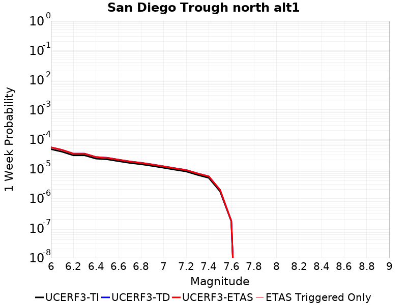 |  |  |  |

| Magnitude | 1 wk TI Prob | 1 wk TD Prob | 1 wk ETAS Prob | 1 wk ETAS/TD Gain | 1 wk ETAS Triggered Only | 1 mo TI Prob | 1 mo TD Prob | 1 mo ETAS Prob | 1 mo ETAS/TD Gain | 1 mo ETAS Triggered Only | 1 yr TI Prob | 1 yr TD Prob | 1 yr ETAS Prob | 1 yr ETAS/TD Gain | 1 yr ETAS Triggered Only | 10 yr TI Prob | 10 yr TD Prob | 10 yr ETAS Prob | 10 yr ETAS/TD Gain | 10 yr ETAS Triggered Only |
|-----|-----|-----|-----|-----|-----|-----|-----|-----|-----|-----|-----|-----|-----|-----|-----|-----|-----|-----|-----|-----|
| 6.0 | 4.6490888E-5 | 5.3660537E-5 | 5.3660537E-5 | 1.0 | 0.0 | 1.9923145E-4 | 2.299541E-4 | 2.299541E-4 | 1.0 | 0.0 | 0.0024229444 | 0.0027962131 | 0.0028161572 | 1.0071325 | 2.0E-5 | 0.023966964 | 0.027623951 | 0.027653124 | 1.001056 | 3.0E-5 |
| 6.1 | 3.7940346E-5 | 4.3713928E-5 | 4.3713928E-5 | 1.0 | 0.0 | 1.6259136E-4 | 1.8733244E-4 | 1.8733244E-4 | 1.0 | 0.0 | 0.0019777524 | 0.0022784725 | 0.002298427 | 1.0087578 | 2.0E-5 | 0.019602431 | 0.02256072 | 0.022590041 | 1.0012997 | 3.0E-5 |
| 6.2 | 2.8645263E-5 | 3.2690637E-5 | 3.2690637E-5 | 1.0 | 0.0 | 1.2275964E-4 | 1.4009536E-4 | 1.4009536E-4 | 1.0 | 0.0 | 0.0014935739 | 0.001704351 | 0.001724317 | 1.0117147 | 2.0E-5 | 0.0148357535 | 0.016915755 | 0.016935417 | 1.0011623 | 2.0E-5 |
| 6.3 | 2.8645263E-5 | 3.2690637E-5 | 3.2690637E-5 | 1.0 | 0.0 | 1.2275964E-4 | 1.4009536E-4 | 1.4009536E-4 | 1.0 | 0.0 | 0.0014935739 | 0.001704351 | 0.001724317 | 1.0117147 | 2.0E-5 | 0.0148357535 | 0.016915755 | 0.016935417 | 1.0011623 | 2.0E-5 |
| 6.4 | 2.2204576E-5 | 2.5122146E-5 | 2.5122146E-5 | 1.0 | 0.0 | 9.5159E-5 | 1.0766195E-4 | 1.0766195E-4 | 1.0 | 0.0 | 0.001157945 | 0.0013100057 | 0.0013299794 | 1.0152471 | 2.0E-5 | 0.011519298 | 0.013024028 | 0.013043768 | 1.0015156 | 2.0E-5 |
| 6.5 | 2.1004838E-5 | 2.373333E-5 | 2.373333E-5 | 1.0 | 0.0 | 9.0017624E-5 | 1.0171036E-4 | 1.0171036E-4 | 1.0 | 0.0 | 0.0010954136 | 0.001237629 | 0.0012576042 | 1.01614 | 2.0E-5 | 0.010900296 | 0.012308453 | 0.0123282075 | 1.0016049 | 2.0E-5 |
| 6.6 | 1.820557E-5 | 2.0488407E-5 | 2.0488407E-5 | 1.0 | 0.0 | 7.802154E-5 | 8.780453E-5 | 8.780453E-5 | 1.0 | 0.0 | 9.4949827E-4 | 0.0010685012 | 0.0010884798 | 1.0186979 | 2.0E-5 | 0.009454516 | 0.0106342975 | 0.010654085 | 1.0018607 | 2.0E-5 |
| 6.7 | 1.5884485E-5 | 1.7814586E-5 | 1.7814586E-5 | 1.0 | 0.0 | 6.807459E-5 | 7.6346005E-5 | 7.6346005E-5 | 1.0 | 0.0 | 8.284929E-4 | 9.2911895E-4 | 9.4910036E-4 | 1.0215057 | 2.0E-5 | 0.008254109 | 0.009252701 | 0.009272516 | 1.0021415 | 2.0E-5 |
| 6.8 | 1.4331171E-5 | 1.6055397E-5 | 1.6055397E-5 | 1.0 | 0.0 | 6.141786E-5 | 6.880704E-5 | 6.880704E-5 | 1.0 | 0.0 | 7.4750587E-4 | 8.374057E-4 | 8.473973E-4 | 1.0119317 | 1.0E-5 | 0.0074499645 | 0.0083427625 | 0.008352679 | 1.0011886 | 1.0E-5 |
| 6.9 | 1.2574203E-5 | 1.4081544E-5 | 1.4081544E-5 | 1.0 | 0.0 | 5.3888325E-5 | 6.0348084E-5 | 6.0348084E-5 | 1.0 | 0.0 | 6.558929E-4 | 7.344916E-4 | 7.4448425E-4 | 1.0136049 | 1.0E-5 | 0.0065396037 | 0.0073208227 | 0.007330749 | 1.001356 | 1.0E-5 |
| 7.0 | 1.0883844E-5 | 1.21832E-5 | 1.21832E-5 | 1.0 | 0.0 | 4.664421E-5 | 5.2212676E-5 | 5.2212676E-5 | 1.0 | 0.0 | 5.677453E-4 | 6.3550484E-4 | 6.454985E-4 | 1.0157255 | 1.0E-5 | 0.00566297 | 0.0063370005 | 0.0063469373 | 1.0015681 | 1.0E-5 |
| 7.1 | 9.393088E-6 | 1.0515171E-5 | 1.0515171E-5 | 1.0 | 0.0 | 4.025547E-5 | 4.5064244E-5 | 4.5064244E-5 | 1.0 | 0.0 | 4.900001E-4 | 5.4851983E-4 | 5.585143E-4 | 1.0182209 | 1.0E-5 | 0.0048892107 | 0.0054717534 | 0.005481699 | 1.0018176 | 1.0E-5 |
| 7.2 | 8.190791E-6 | 9.178507E-6 | 9.178507E-6 | 1.0 | 0.0 | 3.510292E-5 | 3.9335868E-5 | 3.9335868E-5 | 1.0 | 0.0 | 4.2729423E-4 | 4.788096E-4 | 4.888048E-4 | 1.0208751 | 1.0E-5 | 0.0042647356 | 0.004777858 | 0.0047878106 | 1.002083 | 1.0E-5 |
| 7.3 | 6.268162E-6 | 7.0312285E-6 | 7.0312285E-6 | 1.0 | 0.0 | 2.6863276E-5 | 3.0133491E-5 | 3.0133491E-5 | 1.0 | 0.0 | 3.2701128E-4 | 3.668139E-4 | 3.7681023E-4 | 1.0272518 | 1.0E-5 | 0.003265305 | 0.0036621294 | 0.003672093 | 1.0027206 | 1.0E-5 |
| 7.4 | 4.985186E-6 | 5.596353E-6 | 5.596353E-6 | 1.0 | 0.0 | 2.1364907E-5 | 2.3984152E-5 | 2.3984152E-5 | 1.0 | 0.0 | 2.600867E-4 | 2.919683E-4 | 2.919683E-4 | 1.0 | 0.0 | 0.002597825 | 0.0029158876 | 0.0029158876 | 1.0 | 0.0 |
| 7.5 | 1.7489613E-6 | 1.954147E-6 | 1.954147E-6 | 1.0 | 0.0 | 7.495527E-6 | 8.37489E-6 | 8.37489E-6 | 1.0 | 0.0 | 9.125422E-5 | 1.0195973E-4 | 1.0195973E-4 | 1.0 | 0.0 | 9.1216754E-4 | 0.0010191512 | 0.0010191512 | 1.0 | 0.0 |
| 7.6 | 1.6988751E-7 | 1.7549213E-7 | 1.7549213E-7 | 1.0 | 0.0 | 7.2808916E-7 | 7.521089E-7 | 7.521089E-7 | 1.0 | 0.0 | 8.864449E-6 | 9.15689E-6 | 9.15689E-6 | 1.0 | 0.0 | 8.8640954E-5 | 9.156532E-5 | 9.156532E-5 | 1.0 | 0.0 |

## San Andreas (Coachella) rev
*[(top)](#table-of-contents)*

| 1 Week | 1 Month | 1 Year | 10 Year |
|-----|-----|-----|-----|
| 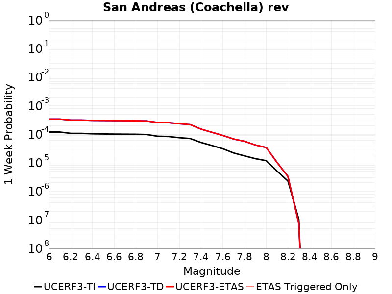 | 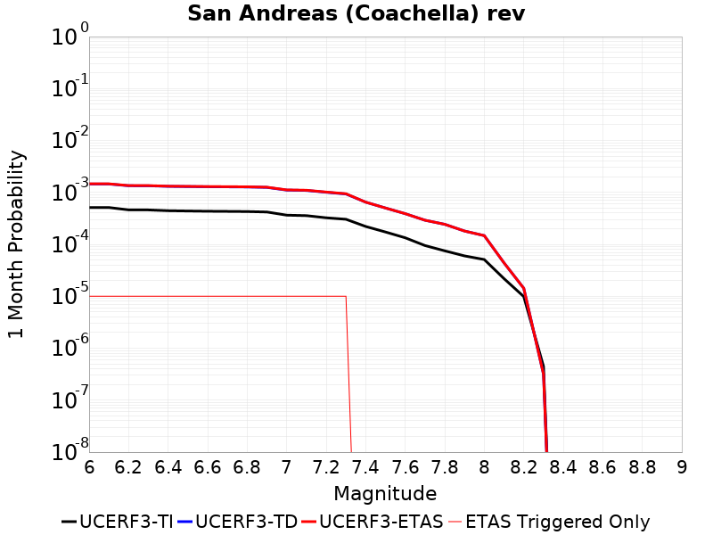 |  |  |

| Magnitude | 1 wk TI Prob | 1 wk TD Prob | 1 wk ETAS Prob | 1 wk ETAS/TD Gain | 1 wk ETAS Triggered Only | 1 mo TI Prob | 1 mo TD Prob | 1 mo ETAS Prob | 1 mo ETAS/TD Gain | 1 mo ETAS Triggered Only | 1 yr TI Prob | 1 yr TD Prob | 1 yr ETAS Prob | 1 yr ETAS/TD Gain | 1 yr ETAS Triggered Only | 10 yr TI Prob | 10 yr TD Prob | 10 yr ETAS Prob | 10 yr ETAS/TD Gain | 10 yr ETAS Triggered Only |
|-----|-----|-----|-----|-----|-----|-----|-----|-----|-----|-----|-----|-----|-----|-----|-----|-----|-----|-----|-----|-----|
| 6.0 | 1.1925945E-4 | 3.3846626E-4 | 3.3846626E-4 | 1.0 | 0.0 | 5.110118E-4 | 0.0014497682 | 0.0014597537 | 1.0068877 | 1.0E-5 | 0.0062038354 | 0.017509505 | 0.017529154 | 1.0011222 | 2.0E-5 | 0.060334753 | 0.15702793 | 0.15705322 | 1.000161 | 3.0E-5 |
| 6.1 | 1.1925945E-4 | 3.3846626E-4 | 3.3846626E-4 | 1.0 | 0.0 | 5.110118E-4 | 0.0014497682 | 0.0014597537 | 1.0068877 | 1.0E-5 | 0.0062038354 | 0.017509505 | 0.017529154 | 1.0011222 | 2.0E-5 | 0.060334753 | 0.15702793 | 0.15705322 | 1.000161 | 3.0E-5 |
| 6.2 | 1.07432395E-4 | 3.1337843E-4 | 3.1337843E-4 | 1.0 | 0.0 | 4.603433E-4 | 0.0013423633 | 0.0013523499 | 1.0074395 | 1.0E-5 | 0.005590286 | 0.016221983 | 0.01624166 | 1.0012128 | 2.0E-5 | 0.05451731 | 0.14622878 | 0.14624585 | 1.0001168 | 2.0E-5 |
| 6.3 | 1.0718766E-4 | 3.128318E-4 | 3.128318E-4 | 1.0 | 0.0 | 4.592948E-4 | 0.001340023 | 0.0013500096 | 1.0074526 | 1.0E-5 | 0.005577586 | 0.016193915 | 0.016213592 | 1.001215 | 2.0E-5 | 0.054396555 | 0.14599806 | 0.14601514 | 1.000117 | 2.0E-5 |
| 6.4 | 1.0355944E-4 | 3.0489403E-4 | 3.0489403E-4 | 1.0 | 0.0 | 4.4375064E-4 | 0.0013060385 | 0.0013160254 | 1.0076468 | 1.0E-5 | 0.0053892885 | 0.01578622 | 0.015805904 | 1.0012469 | 2.0E-5 | 0.052604496 | 0.14256826 | 0.14258541 | 1.0001203 | 2.0E-5 |
| 6.5 | 1.0227914E-4 | 3.0208266E-4 | 3.0208266E-4 | 1.0 | 0.0 | 4.382655E-4 | 0.0012940018 | 0.0013039889 | 1.007718 | 1.0E-5 | 0.0053228354 | 0.015641788 | 0.015661474 | 1.0012586 | 2.0E-5 | 0.051971316 | 0.14134881 | 0.14136598 | 1.0001215 | 2.0E-5 |
| 6.6 | 1.0116757E-4 | 2.99731E-4 | 2.99731E-4 | 1.0 | 0.0 | 4.3350324E-4 | 0.0012839333 | 0.0012939204 | 1.0077785 | 1.0E-5 | 0.0052651367 | 0.015520955 | 0.015540645 | 1.0012686 | 2.0E-5 | 0.051421247 | 0.14032802 | 0.14034522 | 1.0001225 | 2.0E-5 |
| 6.7 | 1.0050676E-4 | 2.9831266E-4 | 2.9831266E-4 | 1.0 | 0.0 | 4.3067214E-4 | 0.0012778606 | 0.0012878479 | 1.0078156 | 1.0E-5 | 0.005230834 | 0.015448072 | 0.015467763 | 1.0012747 | 2.0E-5 | 0.051094085 | 0.13971427 | 0.13973147 | 1.0001231 | 2.0E-5 |
| 6.8 | 9.976819E-5 | 2.9633477E-4 | 2.9633477E-4 | 1.0 | 0.0 | 4.2750788E-4 | 0.0012693921 | 0.0012793795 | 1.0078678 | 1.0E-5 | 0.0051924936 | 0.015346426 | 0.015366118 | 1.0012833 | 2.0E-5 | 0.050728295 | 0.13886397 | 0.13888119 | 1.000124 | 2.0E-5 |
| 6.9 | 9.77719E-5 | 2.912619E-4 | 2.912619E-4 | 1.0 | 0.0 | 4.1895514E-4 | 0.0012476724 | 0.0012576599 | 1.0080049 | 1.0E-5 | 0.0050888555 | 0.0150856795 | 0.015105378 | 1.0013058 | 2.0E-5 | 0.049738888 | 0.1366863 | 0.13670357 | 1.0001264 | 2.0E-5 |
| 7.0 | 8.500761E-5 | 2.583307E-4 | 2.583307E-4 | 1.0 | 0.0 | 3.6426744E-4 | 0.0011066651 | 0.0011166541 | 1.0090262 | 1.0E-5 | 0.0044259406 | 0.013391249 | 0.013401114 | 1.0007367 | 1.0E-5 | 0.04338823 | 0.12251013 | 0.1225189 | 1.0000716 | 1.0E-5 |
| 7.1 | 8.319876E-5 | 2.542959E-4 | 2.542959E-4 | 1.0 | 0.0 | 3.5651738E-4 | 0.0010893878 | 0.0010993769 | 1.0091695 | 1.0E-5 | 0.004331963 | 0.013183462 | 0.013193331 | 1.0007485 | 1.0E-5 | 0.042484846 | 0.12071391 | 0.1207227 | 1.0000728 | 1.0E-5 |
| 7.2 | 7.563917E-5 | 2.3460457E-4 | 2.3460457E-4 | 1.0 | 0.0 | 3.2412758E-4 | 0.001005064 | 0.001015054 | 1.0099397 | 1.0E-5 | 0.0039391145 | 0.012168744 | 0.012178622 | 1.0008118 | 1.0E-5 | 0.03870018 | 0.11208927 | 0.11209815 | 1.0000793 | 1.0E-5 |
| 7.3 | 7.082985E-5 | 2.1745558E-4 | 2.1745558E-4 | 1.0 | 0.0 | 3.0352117E-4 | 9.3162275E-4 | 9.416134E-4 | 1.010724 | 1.0E-5 | 0.0036891096 | 0.011284194 | 0.011294081 | 1.0008762 | 1.0E-5 | 0.03628465 | 0.10452271 | 0.10453167 | 1.0000857 | 1.0E-5 |
| 7.4 | 5.146215E-5 | 1.5120325E-4 | 1.5120325E-4 | 1.0 | 0.0 | 2.2053342E-4 | 6.478539E-4 | 6.478539E-4 | 1.0 | 0.0 | 0.0026816884 | 0.007859304 | 0.007859304 | 1.0 | 0.0 | 0.02649557 | 0.07452673 | 0.07452673 | 1.0 | 0.0 |
| 7.5 | 4.0285166E-5 | 1.1675843E-4 | 1.1675843E-4 | 1.0 | 0.0 | 1.7263928E-4 | 5.0029764E-4 | 5.0029764E-4 | 1.0 | 0.0 | 0.002099857 | 0.00607419 | 0.00607419 | 1.0 | 0.0 | 0.020801254 | 0.058263 | 0.058263 | 1.0 | 0.0 |
| 7.6 | 3.1168736E-5 | 9.078859E-5 | 9.078859E-5 | 1.0 | 0.0 | 1.3357346E-4 | 3.8903608E-4 | 3.8903608E-4 | 1.0 | 0.0 | 0.0016250437 | 0.004726258 | 0.004726258 | 1.0 | 0.0 | 0.016132116 | 0.045677274 | 0.045677274 | 1.0 | 0.0 |
| 7.7 | 2.2100989E-5 | 6.790209E-5 | 6.790209E-5 | 1.0 | 0.0 | 9.4715084E-5 | 2.9097652E-4 | 2.9097652E-4 | 1.0 | 0.0 | 0.001152546 | 0.0035368921 | 0.0035368921 | 1.0 | 0.0 | 0.011465867 | 0.034384675 | 0.034384675 | 1.0 | 0.0 |
| 7.8 | 1.7484861E-5 | 5.6644316E-5 | 5.6644316E-5 | 1.0 | 0.0 | 7.493296E-5 | 2.4273878E-4 | 2.4273878E-4 | 1.0 | 0.0 | 9.1192697E-4 | 0.002951343 | 0.002951343 | 1.0 | 0.0 | 0.009081938 | 0.028830025 | 0.028830025 | 1.0 | 0.0 |
| 7.9 | 1.3967285E-5 | 4.206386E-5 | 4.206386E-5 | 1.0 | 0.0 | 5.985842E-5 | 1.8026124E-4 | 1.8026124E-4 | 1.0 | 0.0 | 7.2853256E-4 | 0.002192473 | 0.002192473 | 1.0 | 0.0 | 0.0072614877 | 0.021672254 | 0.021672254 | 1.0 | 0.0 |
| 8.0 | 1.1887396E-5 | 3.4314675E-5 | 3.4314675E-5 | 1.0 | 0.0 | 5.094499E-5 | 1.4705461E-4 | 1.4705461E-4 | 1.0 | 0.0 | 6.200787E-4 | 0.0017889208 | 0.0017889208 | 1.0 | 0.0 | 0.006183513 | 0.017782133 | 0.017782133 | 1.0 | 0.0 |
| 8.1 | 5.100864E-6 | 1.02627055E-5 | 1.02627055E-5 | 1.0 | 0.0 | 2.1860664E-5 | 4.3982283E-5 | 4.3982283E-5 | 1.0 | 0.0 | 2.6612106E-4 | 5.353529E-4 | 5.353529E-4 | 1.0 | 0.0 | 0.002658026 | 0.0055537117 | 0.0055537117 | 1.0 | 0.0 |
| 8.2 | 2.3004484E-6 | 3.3271394E-6 | 3.3271394E-6 | 1.0 | 0.0 | 9.859027E-6 | 1.4259092E-5 | 1.4259092E-5 | 1.0 | 0.0 | 1.2002704E-4 | 1.7359066E-4 | 1.7359066E-4 | 1.0 | 0.0 | 0.0011996223 | 0.00187271 | 0.00187271 | 1.0 | 0.0 |
| 8.3 | 1.0424446E-7 | 7.353542E-8 | 7.353542E-8 | 1.0 | 0.0 | 4.4676187E-7 | 3.1515177E-7 | 3.1515177E-7 | 1.0 | 0.0 | 5.439312E-6 | 3.8369662E-6 | 3.8369662E-6 | 1.0 | 0.0 | 5.4391792E-5 | 4.0049774E-5 | 4.0049774E-5 | 1.0 | 0.0 |

## Coronado Bank alt1
*[(top)](#table-of-contents)*

| 1 Week | 1 Month | 1 Year | 10 Year |
|-----|-----|-----|-----|
|  |  |  |  |

| Magnitude | 1 wk TI Prob | 1 wk TD Prob | 1 wk ETAS Prob | 1 wk ETAS/TD Gain | 1 wk ETAS Triggered Only | 1 mo TI Prob | 1 mo TD Prob | 1 mo ETAS Prob | 1 mo ETAS/TD Gain | 1 mo ETAS Triggered Only | 1 yr TI Prob | 1 yr TD Prob | 1 yr ETAS Prob | 1 yr ETAS/TD Gain | 1 yr ETAS Triggered Only | 10 yr TI Prob | 10 yr TD Prob | 10 yr ETAS Prob | 10 yr ETAS/TD Gain | 10 yr ETAS Triggered Only |
|-----|-----|-----|-----|-----|-----|-----|-----|-----|-----|-----|-----|-----|-----|-----|-----|-----|-----|-----|-----|-----|
| 6.0 | 6.753342E-5 | 8.210847E-5 | 8.210847E-5 | 1.0 | 0.0 | 2.8939685E-4 | 3.5184837E-4 | 3.5184837E-4 | 1.0 | 0.0 | 0.003517715 | 0.0042757327 | 0.004295647 | 1.0046575 | 2.0E-5 | 0.034625497 | 0.041980054 | 0.042008795 | 1.0006846 | 3.0E-5 |
| 6.1 | 4.1807285E-5 | 4.9987757E-5 | 4.9987757E-5 | 1.0 | 0.0 | 1.7916178E-4 | 2.1421621E-4 | 2.1421621E-4 | 1.0 | 0.0 | 0.0021791123 | 0.0026050531 | 0.0026250011 | 1.0076574 | 2.0E-5 | 0.021578677 | 0.025755668 | 0.025784895 | 1.0011348 | 3.0E-5 |
| 6.2 | 4.1807285E-5 | 4.9987757E-5 | 4.9987757E-5 | 1.0 | 0.0 | 1.7916178E-4 | 2.1421621E-4 | 2.1421621E-4 | 1.0 | 0.0 | 0.0021791123 | 0.0026050531 | 0.0026250011 | 1.0076574 | 2.0E-5 | 0.021578677 | 0.025755668 | 0.025784895 | 1.0011348 | 3.0E-5 |
| 6.3 | 3.1793104E-5 | 3.753223E-5 | 3.753223E-5 | 1.0 | 0.0 | 1.3624904E-4 | 1.608427E-4 | 1.608427E-4 | 1.0 | 0.0 | 0.0016575698 | 0.001956535 | 0.0019764958 | 1.0102022 | 2.0E-5 | 0.016452603 | 0.01939723 | 0.019426648 | 1.0015166 | 3.0E-5 |
| 6.4 | 2.9878007E-5 | 3.519414E-5 | 3.519414E-5 | 1.0 | 0.0 | 1.2804232E-4 | 1.508235E-4 | 1.508235E-4 | 1.0 | 0.0 | 0.0015578003 | 0.0018347626 | 0.0018547259 | 1.0108806 | 2.0E-5 | 0.015469253 | 0.018200051 | 0.018229505 | 1.0016184 | 3.0E-5 |
| 6.5 | 2.4512565E-5 | 2.8693017E-5 | 2.8693017E-5 | 1.0 | 0.0 | 1.0504962E-4 | 1.2296444E-4 | 1.2296444E-4 | 1.0 | 0.0 | 0.0012782287 | 0.0014960908 | 0.0014960908 | 1.0 | 0.0 | 0.012709012 | 0.014863185 | 0.014873036 | 1.0006628 | 1.0E-5 |
| 6.6 | 2.1317413E-5 | 2.4863846E-5 | 2.4863846E-5 | 1.0 | 0.0 | 9.135714E-5 | 1.0655512E-4 | 1.0655512E-4 | 1.0 | 0.0 | 0.0011117056 | 0.0012965587 | 0.0012965587 | 1.0 | 0.0 | 0.011061605 | 0.012892356 | 0.012902227 | 1.0007657 | 1.0E-5 |
| 6.7 | 1.8585655E-5 | 2.1610285E-5 | 2.1610285E-5 | 1.0 | 0.0 | 7.9650374E-5 | 9.261234E-5 | 9.261234E-5 | 1.0 | 0.0 | 9.6931186E-4 | 0.0011269924 | 0.0011269924 | 1.0 | 0.0 | 0.0096509475 | 0.011214925 | 0.011224813 | 1.0008817 | 1.0E-5 |
| 6.8 | 1.5862879E-5 | 1.840403E-5 | 1.840403E-5 | 1.0 | 0.0 | 6.798199E-5 | 7.887214E-5 | 7.887214E-5 | 1.0 | 0.0 | 8.273665E-4 | 9.598644E-4 | 9.598644E-4 | 1.0 | 0.0 | 0.008242928 | 0.00955916 | 0.009569065 | 1.0010362 | 1.0E-5 |
| 6.9 | 1.3021509E-5 | 1.5083976E-5 | 1.5083976E-5 | 1.0 | 0.0 | 5.5805274E-5 | 6.464411E-5 | 6.464411E-5 | 1.0 | 0.0 | 6.792174E-4 | 7.867759E-4 | 7.867759E-4 | 1.0 | 0.0 | 0.006771452 | 0.007841722 | 0.007841722 | 1.0 | 0.0 |
| 7.0 | 1.0974371E-5 | 1.27093535E-5 | 1.27093535E-5 | 1.0 | 0.0 | 4.7032172E-5 | 5.446762E-5 | 5.446762E-5 | 1.0 | 0.0 | 5.7246623E-4 | 6.62959E-4 | 6.62959E-4 | 1.0 | 0.0 | 0.0057099373 | 0.006611556 | 0.006611556 | 1.0 | 0.0 |
| 7.1 | 8.766221E-6 | 1.0152494E-5 | 1.0152494E-5 | 1.0 | 0.0 | 3.7568978E-5 | 4.351006E-5 | 4.351006E-5 | 1.0 | 0.0 | 4.573063E-4 | 5.2962336E-4 | 5.2962336E-4 | 1.0 | 0.0 | 0.0045636636 | 0.005285305 | 0.005285305 | 1.0 | 0.0 |
| 7.2 | 8.026024E-7 | 8.322746E-7 | 8.322746E-7 | 1.0 | 0.0 | 3.43972E-6 | 3.5668863E-6 | 3.5668863E-6 | 1.0 | 0.0 | 4.1877785E-5 | 4.3425985E-5 | 4.3425985E-5 | 1.0 | 0.0 | 4.1869894E-4 | 4.341761E-4 | 4.341761E-4 | 1.0 | 0.0 |
| 7.3 | 3.7293114E-7 | 3.6959025E-7 | 3.6959025E-7 | 1.0 | 0.0 | 1.5982754E-6 | 1.5839572E-6 | 1.5839572E-6 | 1.0 | 0.0 | 1.9458828E-5 | 1.928451E-5 | 1.928451E-5 | 1.0 | 0.0 | 1.9457124E-4 | 1.9282842E-4 | 1.9282842E-4 | 1.0 | 0.0 |
| 7.4 | 2.0557036E-7 | 1.9657956E-7 | 1.9657956E-7 | 1.0 | 0.0 | 8.810155E-7 | 8.424836E-7 | 8.424836E-7 | 1.0 | 0.0 | 1.0726311E-5 | 1.0257189E-5 | 1.0257189E-5 | 1.0 | 0.0 | 1.0725793E-4 | 1.02567195E-4 | 1.02567195E-4 | 1.0 | 0.0 |
| 7.5 | 6.845446E-8 | 6.275291E-8 | 6.275291E-8 | 1.0 | 0.0 | 2.9337625E-7 | 2.68941E-7 | 2.68941E-7 | 1.0 | 0.0 | 3.5718497E-6 | 3.274352E-6 | 3.274352E-6 | 1.0 | 0.0 | 3.5717923E-5 | 3.2743046E-5 | 3.2743046E-5 | 1.0 | 0.0 |
| 7.6 | 6.0975145E-9 | 5.5352585E-9 | 5.5352585E-9 | 1.0 | 0.0 | 2.6132206E-8 | 2.3722537E-8 | 2.3722537E-8 | 1.0 | 0.0 | 3.1815955E-7 | 2.8882184E-7 | 2.8882184E-7 | 1.0 | 0.0 | 3.181591E-6 | 2.8882157E-6 | 2.8882157E-6 | 1.0 | 0.0 |

## Brawley (Seismic Zone) alt 1
*[(top)](#table-of-contents)*

| 1 Week | 1 Month | 1 Year | 10 Year |
|-----|-----|-----|-----|
|  |  | 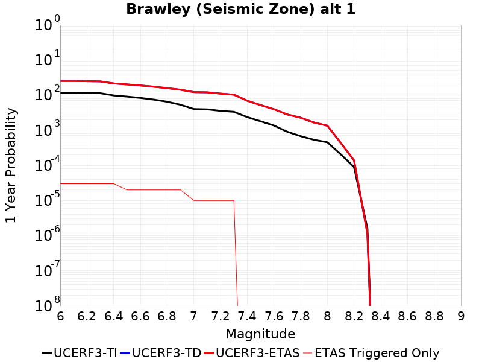 | 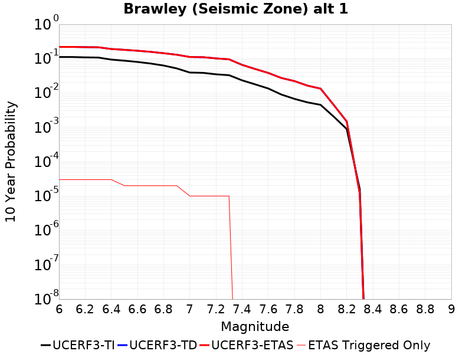 |

| Magnitude | 1 wk TI Prob | 1 wk TD Prob | 1 wk ETAS Prob | 1 wk ETAS/TD Gain | 1 wk ETAS Triggered Only | 1 mo TI Prob | 1 mo TD Prob | 1 mo ETAS Prob | 1 mo ETAS/TD Gain | 1 mo ETAS Triggered Only | 1 yr TI Prob | 1 yr TD Prob | 1 yr ETAS Prob | 1 yr ETAS/TD Gain | 1 yr ETAS Triggered Only | 10 yr TI Prob | 10 yr TD Prob | 10 yr ETAS Prob | 10 yr ETAS/TD Gain | 10 yr ETAS Triggered Only |
|-----|-----|-----|-----|-----|-----|-----|-----|-----|-----|-----|-----|-----|-----|-----|-----|-----|-----|-----|-----|-----|
| 6.0 | 2.2521618E-4 | 4.8941793E-4 | 4.8941793E-4 | 1.0 | 0.0 | 9.6485513E-4 | 0.0020958567 | 0.0021158147 | 1.0095227 | 2.0E-5 | 0.011683988 | 0.025205242 | 0.025234485 | 1.0011603 | 3.0E-5 | 0.11088423 | 0.21858159 | 0.21860503 | 1.0001073 | 3.0E-5 |
| 6.1 | 2.2521618E-4 | 4.8941793E-4 | 4.8941793E-4 | 1.0 | 0.0 | 9.6485513E-4 | 0.0020958567 | 0.0021158147 | 1.0095227 | 2.0E-5 | 0.011683988 | 0.025205242 | 0.025234485 | 1.0011603 | 3.0E-5 | 0.11088423 | 0.21858159 | 0.21860503 | 1.0001073 | 3.0E-5 |
| 6.2 | 2.198148E-4 | 4.7999353E-4 | 4.7999353E-4 | 1.0 | 0.0 | 9.417233E-4 | 0.0020555302 | 0.0020754891 | 1.0097098 | 2.0E-5 | 0.011405343 | 0.024726178 | 0.024755437 | 1.0011833 | 3.0E-5 | 0.10837428 | 0.21495251 | 0.21497606 | 1.0001096 | 3.0E-5 |
| 6.3 | 2.1704129E-4 | 4.743713E-4 | 4.743713E-4 | 1.0 | 0.0 | 9.298453E-4 | 0.0020314725 | 0.002051432 | 1.0098251 | 2.0E-5 | 0.011262234 | 0.024440393 | 0.02446966 | 1.0011975 | 3.0E-5 | 0.107082725 | 0.21284688 | 0.21287048 | 1.000111 | 3.0E-5 |
| 6.4 | 1.876142E-4 | 4.1371366E-4 | 4.1371366E-4 | 1.0 | 0.0 | 8.038131E-4 | 0.0017718684 | 0.0017918331 | 1.0112675 | 2.0E-5 | 0.00974259 | 0.021349696 | 0.021379055 | 1.0013752 | 3.0E-5 | 0.093263686 | 0.18964355 | 0.18966785 | 1.0001281 | 3.0E-5 |
| 6.5 | 1.7390939E-4 | 3.879251E-4 | 3.879251E-4 | 1.0 | 0.0 | 7.45113E-4 | 0.0016614895 | 0.0016714729 | 1.0060087 | 1.0E-5 | 0.009034078 | 0.02003334 | 0.02005294 | 1.0009784 | 2.0E-5 | 0.086755216 | 0.17942911 | 0.17944553 | 1.0000914 | 2.0E-5 |
| 6.6 | 1.591791E-4 | 3.617932E-4 | 3.617932E-4 | 1.0 | 0.0 | 6.8201777E-4 | 0.0015496315 | 0.0015596161 | 1.0064431 | 1.0E-5 | 0.008271996 | 0.018706974 | 0.0187266 | 1.0010492 | 2.0E-5 | 0.07970774 | 0.16877295 | 0.16878957 | 1.0000985 | 2.0E-5 |
| 6.7 | 1.4268003E-4 | 3.3318854E-4 | 3.3318854E-4 | 1.0 | 0.0 | 6.1134255E-4 | 0.0014271782 | 0.0014371639 | 1.0069969 | 1.0E-5 | 0.007417723 | 0.017239684 | 0.017259339 | 1.0011401 | 2.0E-5 | 0.07174956 | 0.15684228 | 0.15685913 | 1.0001075 | 2.0E-5 |
| 6.8 | 1.239713E-4 | 3.0241546E-4 | 3.0241546E-4 | 1.0 | 0.0 | 5.3119735E-4 | 0.0012954291 | 0.0013054161 | 1.0077095 | 1.0E-5 | 0.0064481674 | 0.015659342 | 0.015679028 | 1.0012572 | 2.0E-5 | 0.06264243 | 0.14309788 | 0.14311501 | 1.0001198 | 2.0E-5 |
| 6.9 | 1.0180238E-4 | 2.730748E-4 | 2.730748E-4 | 1.0 | 0.0 | 4.3622297E-4 | 0.0011698002 | 0.0011797885 | 1.0085385 | 1.0E-5 | 0.005298089 | 0.0141503895 | 0.0141701065 | 1.0013934 | 2.0E-5 | 0.05173543 | 0.12923668 | 0.1292541 | 1.0001347 | 2.0E-5 |
| 7.0 | 7.6619996E-5 | 2.3328733E-4 | 2.3328733E-4 | 1.0 | 0.0 | 3.283301E-4 | 9.994231E-4 | 0.001009413 | 1.0099958 | 1.0E-5 | 0.0039900932 | 0.012100852 | 0.012110731 | 1.0008163 | 1.0E-5 | 0.039192066 | 0.11110052 | 0.111109406 | 1.00008 | 1.0E-5 |
| 7.1 | 7.5127435E-5 | 2.3006325E-4 | 2.3006325E-4 | 1.0 | 0.0 | 3.2193496E-4 | 9.856161E-4 | 9.956063E-4 | 1.0101359 | 1.0E-5 | 0.0039125155 | 0.011934605 | 0.011944487 | 1.0008279 | 1.0E-5 | 0.038443442 | 0.109647654 | 0.10965656 | 1.0000812 | 1.0E-5 |
| 7.2 | 6.788582E-5 | 2.1117326E-4 | 2.1117326E-4 | 1.0 | 0.0 | 2.9090676E-4 | 9.047176E-4 | 9.1470854E-4 | 1.0110432 | 1.0E-5 | 0.0035360386 | 0.010959993 | 0.010969884 | 1.0009024 | 1.0E-5 | 0.034803 | 0.10128337 | 0.10129236 | 1.0000887 | 1.0E-5 |
| 7.3 | 6.399602E-5 | 1.9722596E-4 | 1.9722596E-4 | 1.0 | 0.0 | 2.7423984E-4 | 8.449834E-4 | 8.549749E-4 | 1.0118246 | 1.0E-5 | 0.0033337586 | 0.01023978 | 0.010249677 | 1.0009665 | 1.0E-5 | 0.03284188 | 0.09510064 | 0.09510969 | 1.0000951 | 1.0E-5 |
| 7.4 | 4.506759E-5 | 1.3244034E-4 | 1.3244034E-4 | 1.0 | 0.0 | 1.9313251E-4 | 5.6747894E-4 | 5.6747894E-4 | 1.0 | 0.0 | 0.0023488526 | 0.00688736 | 0.00688736 | 1.0 | 0.0 | 0.023241805 | 0.065488786 | 0.065488786 | 1.0 | 0.0 |
| 7.5 | 3.43289E-5 | 9.940965E-5 | 9.940965E-5 | 1.0 | 0.0 | 1.4711556E-4 | 4.259721E-4 | 4.259721E-4 | 1.0 | 0.0 | 0.0017896603 | 0.0051739467 | 0.0051739467 | 1.0 | 0.0 | 0.01775316 | 0.049752764 | 0.049752764 | 1.0 | 0.0 |
| 7.6 | 2.5980507E-5 | 7.569793E-5 | 7.569793E-5 | 1.0 | 0.0 | 1.1134028E-4 | 3.243795E-4 | 3.243795E-4 | 1.0 | 0.0 | 0.001354725 | 0.003942196 | 0.003942196 | 1.0 | 0.0 | 0.013464959 | 0.038165342 | 0.038165342 | 1.0 | 0.0 |
| 7.7 | 1.7292105E-5 | 5.370972E-5 | 5.370972E-5 | 1.0 | 0.0 | 7.4106916E-5 | 2.3016424E-4 | 2.3016424E-4 | 1.0 | 0.0 | 9.018782E-4 | 0.0027986553 | 0.0027986553 | 1.0 | 0.0 | 0.008982267 | 0.027231509 | 0.027231509 | 1.0 | 0.0 |
| 7.8 | 1.2927471E-5 | 4.337961E-5 | 4.337961E-5 | 1.0 | 0.0 | 5.5402274E-5 | 1.8589938E-4 | 1.8589938E-4 | 1.0 | 0.0 | 6.743139E-4 | 0.0022609786 | 0.0022609786 | 1.0 | 0.0 | 0.0067227143 | 0.022095269 | 0.022095269 | 1.0 | 0.0 |
| 7.9 | 1.0200774E-5 | 3.1617496E-5 | 3.1617496E-5 | 1.0 | 0.0 | 4.371687E-5 | 1.3549652E-4 | 1.3549652E-4 | 1.0 | 0.0 | 5.321229E-4 | 0.0016484231 | 0.0016484231 | 1.0 | 0.0 | 0.005308505 | 0.016309226 | 0.016309226 | 1.0 | 0.0 |
| 8.0 | 8.650396E-6 | 2.5701194E-5 | 2.5701194E-5 | 1.0 | 0.0 | 3.70726E-5 | 1.1014333E-4 | 1.1014333E-4 | 1.0 | 0.0 | 4.5126543E-4 | 0.0013401712 | 0.0013401712 | 1.0 | 0.0 | 0.0045035016 | 0.013330548 | 0.013330548 | 1.0 | 0.0 |
| 8.1 | 3.9368224E-6 | 8.34435E-6 | 8.34435E-6 | 1.0 | 0.0 | 1.6871985E-5 | 3.576101E-5 | 3.576101E-5 | 1.0 | 0.0 | 2.0539707E-4 | 4.353035E-4 | 4.353035E-4 | 1.0 | 0.0 | 0.0020520731 | 0.004499974 | 0.004499974 | 1.0 | 0.0 |
| 8.2 | 1.7101195E-6 | 2.6319756E-6 | 2.6319756E-6 | 1.0 | 0.0 | 7.329063E-6 | 1.1279847E-5 | 1.1279847E-5 | 1.0 | 0.0 | 8.922769E-5 | 1.3732353E-4 | 1.3732353E-4 | 1.0 | 0.0 | 8.9191867E-4 | 0.0014760132 | 0.0014760132 | 1.0 | 0.0 |
| 8.3 | 3.0346666E-8 | 2.1685658E-8 | 2.1685658E-8 | 1.0 | 0.0 | 1.3005713E-7 | 9.2938535E-8 | 9.2938535E-8 | 1.0 | 0.0 | 1.5834444E-6 | 1.1315265E-6 | 1.1315265E-6 | 1.0 | 0.0 | 1.5834332E-5 | 1.17275495E-5 | 1.17275495E-5 | 1.0 | 0.0 |

## Imperial
*[(top)](#table-of-contents)*

| 1 Week | 1 Month | 1 Year | 10 Year |
|-----|-----|-----|-----|
|  |  |  |  |

| Magnitude | 1 wk TI Prob | 1 wk TD Prob | 1 wk ETAS Prob | 1 wk ETAS/TD Gain | 1 wk ETAS Triggered Only | 1 mo TI Prob | 1 mo TD Prob | 1 mo ETAS Prob | 1 mo ETAS/TD Gain | 1 mo ETAS Triggered Only | 1 yr TI Prob | 1 yr TD Prob | 1 yr ETAS Prob | 1 yr ETAS/TD Gain | 1 yr ETAS Triggered Only | 10 yr TI Prob | 10 yr TD Prob | 10 yr ETAS Prob | 10 yr ETAS/TD Gain | 10 yr ETAS Triggered Only |
|-----|-----|-----|-----|-----|-----|-----|-----|-----|-----|-----|-----|-----|-----|-----|-----|-----|-----|-----|-----|-----|
| 6.0 | 2.6875173E-4 | 5.044925E-4 | 5.044925E-4 | 1.0 | 0.0 | 0.0011512847 | 0.002160358 | 0.0021803149 | 1.0092378 | 2.0E-5 | 0.013927074 | 0.025979733 | 0.025999213 | 1.0007498 | 2.0E-5 | 0.13085878 | 0.22608201 | 0.2260975 | 1.0000684 | 2.0E-5 |
| 6.1 | 2.5356023E-4 | 5.044925E-4 | 5.044925E-4 | 1.0 | 0.0 | 0.001086234 | 0.002160358 | 0.0021803149 | 1.0092378 | 2.0E-5 | 0.013144928 | 0.025979733 | 0.025999213 | 1.0007498 | 2.0E-5 | 0.123940155 | 0.22608201 | 0.2260975 | 1.0000684 | 2.0E-5 |
| 6.2 | 2.4820742E-4 | 4.9517635E-4 | 4.9517635E-4 | 1.0 | 0.0 | 0.0010633124 | 0.002120497 | 0.0021404545 | 1.0094117 | 2.0E-5 | 0.01286919 | 0.02550655 | 0.025526041 | 1.0007641 | 2.0E-5 | 0.12148927 | 0.22252953 | 0.22254507 | 1.0000699 | 2.0E-5 |
| 6.3 | 2.3205351E-4 | 4.7432643E-4 | 4.7432643E-4 | 1.0 | 0.0 | 9.94136E-4 | 0.002031281 | 0.0020512403 | 1.009826 | 2.0E-5 | 0.012036599 | 0.024443045 | 0.024462556 | 1.0007982 | 2.0E-5 | 0.11405133 | 0.21385488 | 0.21387061 | 1.0000736 | 2.0E-5 |
| 6.4 | 2.0304754E-4 | 4.146078E-4 | 4.146078E-4 | 1.0 | 0.0 | 8.6991355E-4 | 0.001775696 | 0.0017956604 | 1.0112432 | 2.0E-5 | 0.010539869 | 0.021400329 | 0.021419901 | 1.0009146 | 2.0E-5 | 0.100537635 | 0.1910574 | 0.19107358 | 1.0000846 | 2.0E-5 |
| 6.5 | 1.854992E-4 | 3.8493008E-4 | 3.8493008E-4 | 1.0 | 0.0 | 7.9475436E-4 | 0.0016486703 | 0.0016586538 | 1.0060555 | 1.0E-5 | 0.009633281 | 0.019879166 | 0.019888967 | 1.000493 | 1.0E-5 | 0.0922623 | 0.17904787 | 0.17905608 | 1.0000459 | 1.0E-5 |
| 6.6 | 1.6586106E-4 | 3.5419615E-4 | 3.5419615E-4 | 1.0 | 0.0 | 7.106394E-4 | 0.0015171112 | 0.001527096 | 1.0065814 | 1.0E-5 | 0.008617763 | 0.018315718 | 0.018325534 | 1.000536 | 1.0E-5 | 0.08291132 | 0.16615768 | 0.16616602 | 1.0000502 | 1.0E-5 |
| 6.7 | 1.4224656E-4 | 3.199631E-4 | 3.199631E-4 | 1.0 | 0.0 | 6.094856E-4 | 0.0013705585 | 0.0013805447 | 1.0072863 | 1.0E-5 | 0.0073952693 | 0.01656104 | 0.016570875 | 1.0005938 | 1.0E-5 | 0.07153955 | 0.15134814 | 0.15135664 | 1.000056 | 1.0E-5 |
| 6.8 | 1.2317259E-4 | 2.8941184E-4 | 2.8941184E-4 | 1.0 | 0.0 | 5.2777573E-4 | 0.0012397534 | 0.0012497411 | 1.0080562 | 1.0E-5 | 0.0064067547 | 0.014991032 | 0.015000883 | 1.0006571 | 1.0E-5 | 0.06225166 | 0.1375757 | 0.13758433 | 1.0000627 | 1.0E-5 |
| 6.9 | 9.859898E-5 | 2.599655E-4 | 2.599655E-4 | 1.0 | 0.0 | 4.2249862E-4 | 0.0011136668 | 0.0011236556 | 1.0089693 | 1.0E-5 | 0.0051317946 | 0.013475634 | 0.0134855 | 1.0007321 | 1.0E-5 | 0.05014893 | 0.123429604 | 0.12343837 | 1.000071 | 1.0E-5 |
| 7.0 | 7.3191884E-5 | 2.2120944E-4 | 2.2120944E-4 | 1.0 | 0.0 | 3.136418E-4 | 9.4769936E-4 | 9.576899E-4 | 1.0105419 | 1.0E-5 | 0.003811904 | 0.011477933 | 0.011487818 | 1.0008613 | 1.0E-5 | 0.037471764 | 0.10561263 | 0.10562157 | 1.0000846 | 1.0E-5 |
| 7.1 | 7.1760296E-5 | 2.181678E-4 | 2.181678E-4 | 1.0 | 0.0 | 3.0750787E-4 | 9.346732E-4 | 9.446638E-4 | 1.0106889 | 1.0E-5 | 0.003737482 | 0.011320998 | 0.011330885 | 1.0008733 | 1.0E-5 | 0.03675245 | 0.10423159 | 0.104240544 | 1.000086 | 1.0E-5 |
| 7.2 | 6.46614E-5 | 1.9968842E-4 | 1.9968842E-4 | 1.0 | 0.0 | 2.7709085E-4 | 8.5553003E-4 | 8.655215E-4 | 1.0116787 | 1.0E-5 | 0.0033683628 | 0.010366999 | 0.010376895 | 1.0009546 | 1.0E-5 | 0.033177625 | 0.09600159 | 0.096010625 | 1.0000942 | 1.0E-5 |
| 7.3 | 6.088115E-5 | 1.8615402E-4 | 1.8615402E-4 | 1.0 | 0.0 | 2.6089314E-4 | 7.9756207E-4 | 8.075541E-4 | 1.0125282 | 1.0E-5 | 0.0031717476 | 0.009667703 | 0.009677606 | 1.0010244 | 1.0E-5 | 0.031268585 | 0.089973986 | 0.08998308 | 1.0001011 | 1.0E-5 |
| 7.4 | 4.199346E-5 | 1.2150953E-4 | 1.2150953E-4 | 1.0 | 0.0 | 1.7995955E-4 | 5.2065216E-4 | 5.2065216E-4 | 1.0 | 0.0 | 0.0021888057 | 0.0063207 | 0.0063207 | 1.0 | 0.0 | 0.02167372 | 0.06026207 | 0.06026207 | 1.0 | 0.0 |
| 7.5 | 3.130448E-5 | 8.8649125E-5 | 8.8649125E-5 | 1.0 | 0.0 | 1.3415517E-4 | 3.7986983E-4 | 3.7986983E-4 | 1.0 | 0.0 | 0.0016321153 | 0.0046151737 | 0.0046151737 | 1.0 | 0.0 | 0.016201803 | 0.0445204 | 0.0445204 | 1.0 | 0.0 |
| 7.6 | 2.3074248E-5 | 6.527884E-5 | 6.527884E-5 | 1.0 | 0.0 | 9.888588E-5 | 2.797366E-4 | 2.797366E-4 | 1.0 | 0.0 | 0.0012032706 | 0.0034005 | 0.0034005 | 1.0 | 0.0 | 0.011967761 | 0.033038583 | 0.033038583 | 1.0 | 0.0 |
| 7.7 | 1.45864815E-5 | 4.370348E-5 | 4.370348E-5 | 1.0 | 0.0 | 6.2511994E-5 | 1.8728722E-4 | 1.8728722E-4 | 1.0 | 0.0 | 7.608177E-4 | 0.0022778437 | 0.0022778437 | 1.0 | 0.0 | 0.007582182 | 0.022255126 | 0.022255126 | 1.0 | 0.0 |
| 7.8 | 1.0352979E-5 | 3.3952194E-5 | 3.3952194E-5 | 1.0 | 0.0 | 4.4369157E-5 | 1.455013E-4 | 1.455013E-4 | 1.0 | 0.0 | 5.400606E-4 | 0.0017700418 | 0.0017700418 | 1.0 | 0.0 | 0.0053875 | 0.017375804 | 0.017375804 | 1.0 | 0.0 |
| 7.9 | 8.137906E-6 | 2.4460951E-5 | 2.4460951E-5 | 1.0 | 0.0 | 3.4876273E-5 | 1.0482844E-4 | 1.0482844E-4 | 1.0 | 0.0 | 4.2453592E-4 | 0.0012755402 | 0.0012755402 | 1.0 | 0.0 | 0.004237258 | 0.012685919 | 0.012685919 | 1.0 | 0.0 |
| 8.0 | 6.93792E-6 | 1.9967181E-5 | 1.9967181E-5 | 1.0 | 0.0 | 2.9733603E-5 | 8.5570835E-5 | 8.5570835E-5 | 1.0 | 0.0 | 3.6194647E-4 | 0.0010413278 | 0.0010413278 | 1.0 | 0.0 | 0.0036135751 | 0.010411874 | 0.010411874 | 1.0 | 0.0 |
| 8.1 | 3.4286315E-6 | 7.2696753E-6 | 7.2696753E-6 | 1.0 | 0.0 | 1.4694053E-5 | 3.115538E-5 | 3.115538E-5 | 1.0 | 0.0 | 1.7888541E-4 | 3.7925088E-4 | 3.7925088E-4 | 1.0 | 0.0 | 0.0017874148 | 0.0039230934 | 0.0039230934 | 1.0 | 0.0 |
| 8.2 | 1.4906886E-6 | 2.2997815E-6 | 2.2997815E-6 | 1.0 | 0.0 | 6.3886496E-6 | 9.8561695E-6 | 9.8561695E-6 | 1.0 | 0.0 | 7.7779034E-5 | 1.199923E-4 | 1.199923E-4 | 1.0 | 0.0 | 7.775182E-4 | 0.0012910578 | 0.0012910578 | 1.0 | 0.0 |
| 8.3 | 2.5758007E-8 | 1.8274152E-8 | 1.8274152E-8 | 1.0 | 0.0 | 1.10391454E-7 | 7.83178E-8 | 7.83178E-8 | 1.0 | 0.0 | 1.3440151E-6 | 9.535192E-7 | 9.535192E-7 | 1.0 | 0.0 | 1.344007E-5 | 9.879519E-6 | 9.879519E-6 | 1.0 | 0.0 |

## Thirty Mile Bank
*[(top)](#table-of-contents)*

| 1 Week | 1 Month | 1 Year | 10 Year |
|-----|-----|-----|-----|
|  |  | 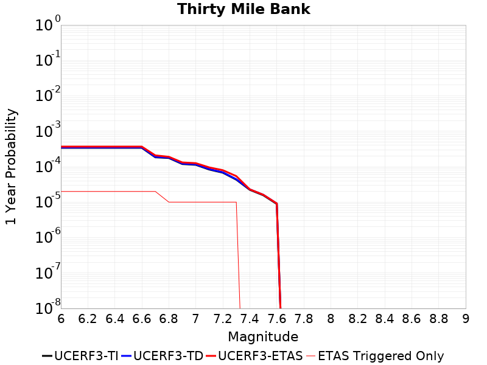 | 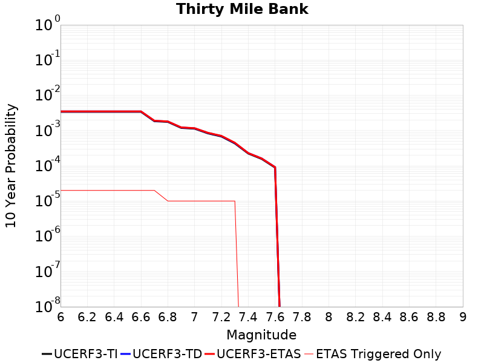 |

| Magnitude | 1 wk TI Prob | 1 wk TD Prob | 1 wk ETAS Prob | 1 wk ETAS/TD Gain | 1 wk ETAS Triggered Only | 1 mo TI Prob | 1 mo TD Prob | 1 mo ETAS Prob | 1 mo ETAS/TD Gain | 1 mo ETAS Triggered Only | 1 yr TI Prob | 1 yr TD Prob | 1 yr ETAS Prob | 1 yr ETAS/TD Gain | 1 yr ETAS Triggered Only | 10 yr TI Prob | 10 yr TD Prob | 10 yr ETAS Prob | 10 yr ETAS/TD Gain | 10 yr ETAS Triggered Only |
|-----|-----|-----|-----|-----|-----|-----|-----|-----|-----|-----|-----|-----|-----|-----|-----|-----|-----|-----|-----|-----|
| 6.0 | 6.5124755E-6 | 6.66477E-6 | 6.66477E-6 | 1.0 | 0.0 | 2.791031E-5 | 2.856301E-5 | 2.856301E-5 | 1.0 | 0.0 | 3.3975503E-4 | 3.4770355E-4 | 3.6769657E-4 | 1.0575002 | 2.0E-5 | 0.0033923604 | 0.0034720276 | 0.0034919581 | 1.0057403 | 2.0E-5 |
| 6.1 | 6.5124755E-6 | 6.66477E-6 | 6.66477E-6 | 1.0 | 0.0 | 2.791031E-5 | 2.856301E-5 | 2.856301E-5 | 1.0 | 0.0 | 3.3975503E-4 | 3.4770355E-4 | 3.6769657E-4 | 1.0575002 | 2.0E-5 | 0.0033923604 | 0.0034720276 | 0.0034919581 | 1.0057403 | 2.0E-5 |
| 6.2 | 6.5124755E-6 | 6.66477E-6 | 6.66477E-6 | 1.0 | 0.0 | 2.791031E-5 | 2.856301E-5 | 2.856301E-5 | 1.0 | 0.0 | 3.3975503E-4 | 3.4770355E-4 | 3.6769657E-4 | 1.0575002 | 2.0E-5 | 0.0033923604 | 0.0034720276 | 0.0034919581 | 1.0057403 | 2.0E-5 |
| 6.3 | 6.5124755E-6 | 6.66477E-6 | 6.66477E-6 | 1.0 | 0.0 | 2.791031E-5 | 2.856301E-5 | 2.856301E-5 | 1.0 | 0.0 | 3.3975503E-4 | 3.4770355E-4 | 3.6769657E-4 | 1.0575002 | 2.0E-5 | 0.0033923604 | 0.0034720276 | 0.0034919581 | 1.0057403 | 2.0E-5 |
| 6.4 | 6.5124755E-6 | 6.66477E-6 | 6.66477E-6 | 1.0 | 0.0 | 2.791031E-5 | 2.856301E-5 | 2.856301E-5 | 1.0 | 0.0 | 3.3975503E-4 | 3.4770355E-4 | 3.6769657E-4 | 1.0575002 | 2.0E-5 | 0.0033923604 | 0.0034720276 | 0.0034919581 | 1.0057403 | 2.0E-5 |
| 6.5 | 6.5124755E-6 | 6.66477E-6 | 6.66477E-6 | 1.0 | 0.0 | 2.791031E-5 | 2.856301E-5 | 2.856301E-5 | 1.0 | 0.0 | 3.3975503E-4 | 3.4770355E-4 | 3.6769657E-4 | 1.0575002 | 2.0E-5 | 0.0033923604 | 0.0034720276 | 0.0034919581 | 1.0057403 | 2.0E-5 |
| 6.6 | 6.5124755E-6 | 6.66477E-6 | 6.66477E-6 | 1.0 | 0.0 | 2.791031E-5 | 2.856301E-5 | 2.856301E-5 | 1.0 | 0.0 | 3.3975503E-4 | 3.4770355E-4 | 3.6769657E-4 | 1.0575002 | 2.0E-5 | 0.0033923604 | 0.0034720276 | 0.0034919581 | 1.0057403 | 2.0E-5 |
| 6.7 | 3.5261137E-6 | 3.612783E-6 | 3.612783E-6 | 1.0 | 0.0 | 1.5111828E-5 | 1.5483267E-5 | 1.5483267E-5 | 1.0 | 0.0 | 1.8397097E-4 | 1.8849313E-4 | 2.0848936E-4 | 1.1060847 | 2.0E-5 | 0.0018381875 | 0.0018833976 | 0.0019033599 | 1.0105991 | 2.0E-5 |
| 6.8 | 3.370743E-6 | 3.453678E-6 | 3.453678E-6 | 1.0 | 0.0 | 1.4445961E-5 | 1.4801396E-5 | 1.4801396E-5 | 1.0 | 0.0 | 1.7586538E-4 | 1.8019271E-4 | 1.9019091E-4 | 1.0554861 | 1.0E-5 | 0.0017572626 | 0.001800528 | 0.0018105101 | 1.005544 | 1.0E-5 |
| 6.9 | 2.2756835E-6 | 2.3349855E-6 | 2.3349855E-6 | 1.0 | 0.0 | 9.752893E-6 | 1.0007044E-5 | 1.0007044E-5 | 1.0 | 0.0 | 1.18735006E-4 | 1.21829195E-4 | 1.3182798E-4 | 1.0820721 | 1.0E-5 | 0.0011867158 | 0.0012176487 | 0.0012276366 | 1.0082026 | 1.0E-5 |
| 7.0 | 2.1617404E-6 | 2.2177E-6 | 2.2177E-6 | 1.0 | 0.0 | 9.264569E-6 | 9.504396E-6 | 9.504396E-6 | 1.0 | 0.0 | 1.1279029E-4 | 1.15710114E-4 | 1.2570896E-4 | 1.0864129 | 1.0E-5 | 0.0011273306 | 0.0011565228 | 0.0011665112 | 1.0086366 | 1.0E-5 |
| 7.1 | 1.5900777E-6 | 1.6339658E-6 | 1.6339658E-6 | 1.0 | 0.0 | 6.814601E-6 | 7.002692E-6 | 7.002692E-6 | 1.0 | 0.0 | 8.296461E-5 | 8.525457E-5 | 9.5253716E-5 | 1.1172857 | 1.0E-5 | 8.293364E-4 | 8.5223146E-4 | 8.622229E-4 | 1.0117239 | 1.0E-5 |
| 7.2 | 1.2971728E-6 | 1.3339283E-6 | 1.3339283E-6 | 1.0 | 0.0 | 5.5593005E-6 | 5.7168236E-6 | 5.7168236E-6 | 1.0 | 0.0 | 6.768238E-5 | 6.960021E-5 | 7.9599515E-5 | 1.1436677 | 1.0E-5 | 6.7661767E-4 | 6.957945E-4 | 7.057875E-4 | 1.0143621 | 1.0E-5 |
| 7.3 | 8.2454284E-7 | 8.455664E-7 | 8.455664E-7 | 1.0 | 0.0 | 3.5337503E-6 | 3.6238512E-6 | 3.6238512E-6 | 1.0 | 0.0 | 4.302256E-5 | 4.4119555E-5 | 5.4119115E-5 | 1.2266469 | 1.0E-5 | 4.301423E-4 | 4.4111404E-4 | 4.5110963E-4 | 1.0226599 | 1.0E-5 |
| 7.4 | 4.2619024E-7 | 4.3899496E-7 | 4.3899496E-7 | 1.0 | 0.0 | 1.8265283E-6 | 1.8814056E-6 | 1.8814056E-6 | 1.0 | 0.0 | 2.2237757E-5 | 2.2905877E-5 | 2.2905877E-5 | 1.0 | 0.0 | 2.223553E-4 | 2.2903555E-4 | 2.2903555E-4 | 1.0 | 0.0 |
| 7.5 | 2.993922E-7 | 3.0890754E-7 | 3.0890754E-7 | 1.0 | 0.0 | 1.2831089E-6 | 1.3238888E-6 | 1.3238888E-6 | 1.0 | 0.0 | 1.5621737E-5 | 1.6118229E-5 | 1.6118229E-5 | 1.0 | 0.0 | 1.562064E-4 | 1.6117086E-4 | 1.6117086E-4 | 1.0 | 0.0 |
| 7.6 | 1.6988751E-7 | 1.7549213E-7 | 1.7549213E-7 | 1.0 | 0.0 | 7.2808916E-7 | 7.521089E-7 | 7.521089E-7 | 1.0 | 0.0 | 8.864449E-6 | 9.15689E-6 | 9.15689E-6 | 1.0 | 0.0 | 8.8640954E-5 | 9.156532E-5 | 9.156532E-5 | 1.0 | 0.0 |

## Rose Canyon
*[(top)](#table-of-contents)*

| 1 Week | 1 Month | 1 Year | 10 Year |
|-----|-----|-----|-----|
|  | 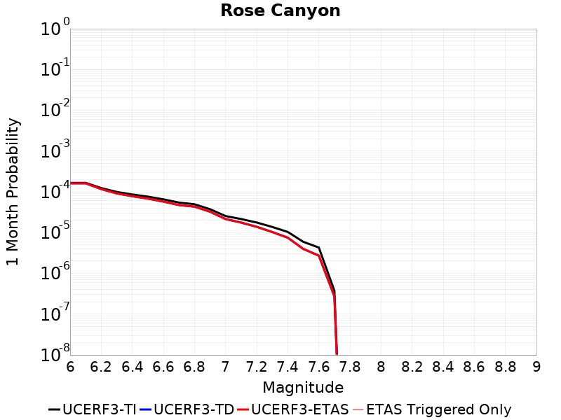 | 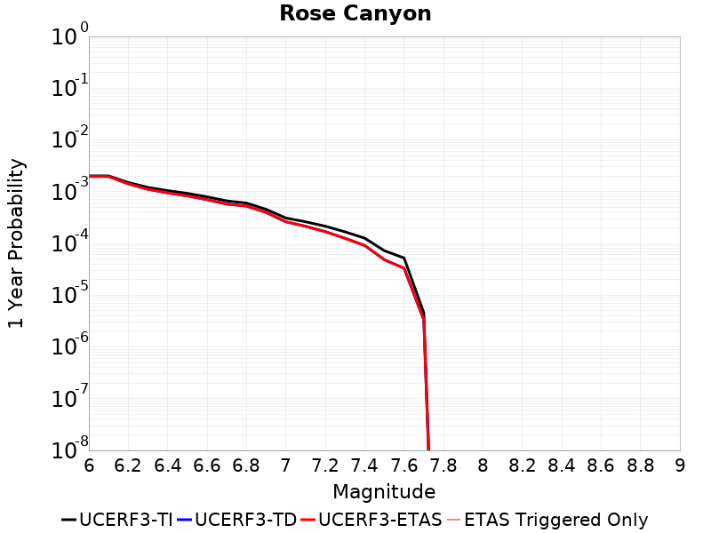 |  |

| Magnitude | 1 wk TI Prob | 1 wk TD Prob | 1 wk ETAS Prob | 1 wk ETAS/TD Gain | 1 wk ETAS Triggered Only | 1 mo TI Prob | 1 mo TD Prob | 1 mo ETAS Prob | 1 mo ETAS/TD Gain | 1 mo ETAS Triggered Only | 1 yr TI Prob | 1 yr TD Prob | 1 yr ETAS Prob | 1 yr ETAS/TD Gain | 1 yr ETAS Triggered Only | 10 yr TI Prob | 10 yr TD Prob | 10 yr ETAS Prob | 10 yr ETAS/TD Gain | 10 yr ETAS Triggered Only |
|-----|-----|-----|-----|-----|-----|-----|-----|-----|-----|-----|-----|-----|-----|-----|-----|-----|-----|-----|-----|-----|
| 6.0 | 3.86988E-5 | 3.7661724E-5 | 3.7661724E-5 | 1.0 | 0.0 | 1.6584145E-4 | 1.6139787E-4 | 1.6139787E-4 | 1.0 | 0.0 | 0.0020172498 | 0.0019633302 | 0.0019633302 | 1.0 | 0.0 | 0.01999036 | 0.019470721 | 0.019490331 | 1.0010072 | 2.0E-5 |
| 6.1 | 3.86988E-5 | 3.7661724E-5 | 3.7661724E-5 | 1.0 | 0.0 | 1.6584145E-4 | 1.6139787E-4 | 1.6139787E-4 | 1.0 | 0.0 | 0.0020172498 | 0.0019633302 | 0.0019633302 | 1.0 | 0.0 | 0.01999036 | 0.019470721 | 0.019490331 | 1.0010072 | 2.0E-5 |
| 6.2 | 2.8844734E-5 | 2.721592E-5 | 2.721592E-5 | 1.0 | 0.0 | 1.2361443E-4 | 1.16634605E-4 | 1.16634605E-4 | 1.0 | 0.0 | 0.0015039665 | 0.0014191301 | 0.0014191301 | 1.0 | 0.0 | 0.0149382865 | 0.014106132 | 0.014115991 | 1.0006989 | 1.0E-5 |
| 6.3 | 2.3171577E-5 | 2.1315027E-5 | 2.1315027E-5 | 1.0 | 0.0 | 9.9302975E-5 | 9.134698E-5 | 9.134698E-5 | 1.0 | 0.0 | 0.0012083431 | 0.0011115927 | 0.0011115927 | 1.0 | 0.0 | 0.012017938 | 0.011063496 | 0.011073384 | 1.0008938 | 1.0E-5 |
| 6.4 | 2.0066604E-5 | 1.8179551E-5 | 1.8179551E-5 | 1.0 | 0.0 | 8.599689E-5 | 7.791008E-5 | 7.791008E-5 | 1.0 | 0.0 | 0.0010465092 | 9.4815047E-4 | 9.4815047E-4 | 1.0 | 0.0 | 0.010415946 | 0.00944108 | 0.009450985 | 1.0010492 | 1.0E-5 |
| 6.5 | 1.776989E-5 | 1.589263E-5 | 1.589263E-5 | 1.0 | 0.0 | 7.615444E-5 | 6.8109526E-5 | 6.8109526E-5 | 1.0 | 0.0 | 9.267859E-4 | 8.289236E-4 | 8.289236E-4 | 1.0 | 0.0 | 0.009229303 | 0.008255172 | 0.008265088 | 1.0012014 | 1.0E-5 |
| 6.6 | 1.5227364E-5 | 1.3417626E-5 | 1.3417626E-5 | 1.0 | 0.0 | 6.52585E-5 | 5.7502868E-5 | 5.7502868E-5 | 1.0 | 0.0 | 7.942326E-4 | 6.998768E-4 | 6.998768E-4 | 1.0 | 0.0 | 0.007914 | 0.0069771837 | 0.0069771837 | 1.0 | 0.0 |
| 6.7 | 1.2703898E-5 | 1.1044094E-5 | 1.1044094E-5 | 1.0 | 0.0 | 5.4444143E-5 | 4.7330996E-5 | 4.7330996E-5 | 1.0 | 0.0 | 6.626558E-4 | 5.76106E-4 | 5.76106E-4 | 1.0 | 0.0 | 0.006606833 | 0.0057464945 | 0.0057464945 | 1.0 | 0.0 |
| 6.8 | 1.1554917E-5 | 1.0088718E-5 | 1.0088718E-5 | 1.0 | 0.0 | 4.9520135E-5 | 4.3236665E-5 | 4.3236665E-5 | 1.0 | 0.0 | 6.0274085E-4 | 5.2628265E-4 | 5.2628265E-4 | 1.0 | 0.0 | 0.0060110865 | 0.0052507124 | 0.0052507124 | 1.0 | 0.0 |
| 6.9 | 8.732078E-6 | 7.597872E-6 | 7.597872E-6 | 1.0 | 0.0 | 3.7422655E-5 | 3.2561915E-5 | 3.2561915E-5 | 1.0 | 0.0 | 4.5552556E-4 | 3.963717E-4 | 3.963717E-4 | 1.0 | 0.0 | 0.0045459294 | 0.0039568976 | 0.0039568976 | 1.0 | 0.0 |
| 7.0 | 5.9337494E-6 | 5.01271E-6 | 5.01271E-6 | 1.0 | 0.0 | 2.5430107E-5 | 2.1482867E-5 | 2.1482867E-5 | 1.0 | 0.0 | 3.0956755E-4 | 2.6152265E-4 | 2.6152265E-4 | 1.0 | 0.0 | 0.0030913667 | 0.0026121638 | 0.0026121638 | 1.0 | 0.0 |
| 7.1 | 5.013409E-6 | 4.1076482E-6 | 4.1076482E-6 | 1.0 | 0.0 | 2.1485863E-5 | 1.7604088E-5 | 1.7604088E-5 | 1.0 | 0.0 | 2.6155898E-4 | 2.1430879E-4 | 2.1430879E-4 | 1.0 | 0.0 | 0.0026125133 | 0.0021410324 | 0.0021410324 | 1.0 | 0.0 |
| 7.2 | 4.120763E-6 | 3.2327916E-6 | 3.2327916E-6 | 1.0 | 0.0 | 1.7660293E-5 | 1.38547475E-5 | 1.38547475E-5 | 1.0 | 0.0 | 2.1499286E-4 | 1.6866859E-4 | 1.6866859E-4 | 1.0 | 0.0 | 0.0021478499 | 0.0016854148 | 0.0016854148 | 1.0 | 0.0 |
| 7.3 | 3.2081239E-6 | 2.4089964E-6 | 2.4089964E-6 | 1.0 | 0.0 | 1.374903E-5 | 1.032423E-5 | 1.032423E-5 | 1.0 | 0.0 | 1.6738157E-4 | 1.2569032E-4 | 1.2569032E-4 | 1.0 | 0.0 | 0.0016725556 | 0.0012561991 | 0.0012561991 | 1.0 | 0.0 |
| 7.4 | 2.4194755E-6 | 1.7474185E-6 | 1.7474185E-6 | 1.0 | 0.0 | 1.0369139E-5 | 7.4889153E-6 | 7.4889153E-6 | 1.0 | 0.0 | 1.2623696E-4 | 9.117378E-5 | 9.117378E-5 | 1.0 | 0.0 | 0.0012616527 | 9.1136893E-4 | 9.1136893E-4 | 1.0 | 0.0 |
| 7.5 | 1.3842889E-6 | 9.2693637E-7 | 9.2693637E-7 | 1.0 | 0.0 | 5.9326535E-6 | 3.9725787E-6 | 3.9725787E-6 | 1.0 | 0.0 | 7.222766E-5 | 4.8365106E-5 | 4.8365106E-5 | 1.0 | 0.0 | 7.220419E-4 | 4.835492E-4 | 4.835492E-4 | 1.0 | 0.0 |
| 7.6 | 1.0021575E-6 | 6.3458396E-7 | 6.3458396E-7 | 1.0 | 0.0 | 4.2949537E-6 | 2.719643E-6 | 2.719643E-6 | 1.0 | 0.0 | 5.2289808E-5 | 3.311117E-5 | 3.311117E-5 | 1.0 | 0.0 | 5.2277505E-4 | 3.3106445E-4 | 3.3106445E-4 | 1.0 | 0.0 |
| 7.7 | 8.7620116E-8 | 6.3763295E-8 | 6.3763295E-8 | 1.0 | 0.0 | 3.7551473E-7 | 2.7327124E-7 | 2.7327124E-7 | 1.0 | 0.0 | 4.5718825E-6 | 3.3270724E-6 | 3.3270724E-6 | 1.0 | 0.0 | 4.5717883E-5 | 3.3270255E-5 | 3.3270255E-5 | 1.0 | 0.0 |

## San Diego Trough south
*[(top)](#table-of-contents)*

| 1 Week | 1 Month | 1 Year | 10 Year |
|-----|-----|-----|-----|
|  |  |  |  |

| Magnitude | 1 wk TI Prob | 1 wk TD Prob | 1 wk ETAS Prob | 1 wk ETAS/TD Gain | 1 wk ETAS Triggered Only | 1 mo TI Prob | 1 mo TD Prob | 1 mo ETAS Prob | 1 mo ETAS/TD Gain | 1 mo ETAS Triggered Only | 1 yr TI Prob | 1 yr TD Prob | 1 yr ETAS Prob | 1 yr ETAS/TD Gain | 1 yr ETAS Triggered Only | 10 yr TI Prob | 10 yr TD Prob | 10 yr ETAS Prob | 10 yr ETAS/TD Gain | 10 yr ETAS Triggered Only |
|-----|-----|-----|-----|-----|-----|-----|-----|-----|-----|-----|-----|-----|-----|-----|-----|-----|-----|-----|-----|-----|
| 6.0 | 5.618514E-5 | 6.7557376E-5 | 6.7557376E-5 | 1.0 | 0.0 | 2.4077125E-4 | 2.8950014E-4 | 2.8950014E-4 | 1.0 | 0.0 | 0.0029274495 | 0.0035191302 | 0.0035191302 | 1.0 | 0.0 | 0.028891841 | 0.03465433 | 0.034663983 | 1.0002786 | 1.0E-5 |
| 6.1 | 4.6961468E-5 | 5.6161312E-5 | 5.6161312E-5 | 1.0 | 0.0 | 2.0124791E-4 | 2.4066961E-4 | 2.4066961E-4 | 1.0 | 0.0 | 0.00244744 | 0.0029263436 | 0.0029263436 | 1.0 | 0.0 | 0.024206603 | 0.028893037 | 0.028902749 | 1.000336 | 1.0E-5 |
| 6.2 | 3.5079658E-5 | 4.1368796E-5 | 4.1368796E-5 | 1.0 | 0.0 | 1.5033272E-4 | 1.77283E-4 | 1.77283E-4 | 1.0 | 0.0 | 0.0018287642 | 0.0021563189 | 0.0021563189 | 1.0 | 0.0 | 0.018137876 | 0.021358402 | 0.021368189 | 1.0004582 | 1.0E-5 |
| 6.3 | 3.5079658E-5 | 4.1368796E-5 | 4.1368796E-5 | 1.0 | 0.0 | 1.5033272E-4 | 1.77283E-4 | 1.77283E-4 | 1.0 | 0.0 | 0.0018287642 | 0.0021563189 | 0.0021563189 | 1.0 | 0.0 | 0.018137876 | 0.021358402 | 0.021368189 | 1.0004582 | 1.0E-5 |
| 6.4 | 2.7196904E-5 | 3.1679916E-5 | 3.1679916E-5 | 1.0 | 0.0 | 1.16552954E-4 | 1.3576407E-4 | 1.3576407E-4 | 1.0 | 0.0 | 0.0014181085 | 0.001651689 | 0.001651689 | 1.0 | 0.0 | 0.014090929 | 0.016396044 | 0.01640588 | 1.0005999 | 1.0E-5 |
| 6.5 | 2.5584688E-5 | 2.9740311E-5 | 2.9740311E-5 | 1.0 | 0.0 | 1.0964406E-4 | 1.2745231E-4 | 1.2745231E-4 | 1.0 | 0.0 | 0.0013340989 | 0.001550641 | 0.001550641 | 1.0 | 0.0 | 0.013261181 | 0.015399957 | 0.015409803 | 1.0006393 | 1.0E-5 |
| 6.6 | 2.2034688E-5 | 2.547389E-5 | 2.547389E-5 | 1.0 | 0.0 | 9.443096E-5 | 1.0916929E-4 | 1.0916929E-4 | 1.0 | 0.0 | 0.0011490905 | 0.0013283336 | 0.0013283336 | 1.0 | 0.0 | 0.011431668 | 0.013204977 | 0.013214845 | 1.0007473 | 1.0E-5 |
| 6.7 | 1.9394853E-5 | 2.2327074E-5 | 2.2327074E-5 | 1.0 | 0.0 | 8.311815E-5 | 9.568399E-5 | 9.568399E-5 | 1.0 | 0.0 | 0.0010114936 | 0.0011643351 | 0.0011643351 | 1.0 | 0.0 | 0.01006902 | 0.011583036 | 0.01159292 | 1.0008533 | 1.0E-5 |
| 6.8 | 1.7615313E-5 | 2.0218105E-5 | 2.0218105E-5 | 1.0 | 0.0 | 7.549201E-5 | 8.664617E-5 | 8.664617E-5 | 1.0 | 0.0 | 9.1872766E-4 | 0.0010544108 | 0.0010544108 | 1.0 | 0.0 | 0.009149387 | 0.0104946345 | 0.010504529 | 1.0009428 | 1.0E-5 |
| 6.9 | 1.5621423E-5 | 1.7868859E-5 | 1.7868859E-5 | 1.0 | 0.0 | 6.6947236E-5 | 7.6578595E-5 | 7.6578595E-5 | 1.0 | 0.0 | 8.147778E-4 | 9.31949E-4 | 9.31949E-4 | 1.0 | 0.0 | 0.008117969 | 0.009280844 | 0.009290751 | 1.0010675 | 1.0E-5 |
| 7.0 | 1.3444376E-5 | 1.5317457E-5 | 1.5317457E-5 | 1.0 | 0.0 | 5.7617483E-5 | 6.564461E-5 | 6.564461E-5 | 1.0 | 0.0 | 7.0126704E-4 | 7.9893274E-4 | 7.9893274E-4 | 1.0 | 0.0 | 0.006990582 | 0.007960932 | 0.007970852 | 1.0012461 | 1.0E-5 |
| 7.1 | 1.2268361E-5 | 1.3953636E-5 | 1.3953636E-5 | 1.0 | 0.0 | 5.2577634E-5 | 5.9799942E-5 | 5.9799942E-5 | 1.0 | 0.0 | 6.399447E-4 | 7.2782364E-4 | 7.2782364E-4 | 1.0 | 0.0 | 0.0063810493 | 0.007254699 | 0.007264626 | 1.0013684 | 1.0E-5 |
| 7.2 | 1.0922655E-5 | 1.24057E-5 | 1.24057E-5 | 1.0 | 0.0 | 4.681054E-5 | 5.316621E-5 | 5.316621E-5 | 1.0 | 0.0 | 5.697693E-4 | 6.471089E-4 | 6.471089E-4 | 1.0 | 0.0 | 0.0056831064 | 0.006452521 | 0.0064624567 | 1.0015398 | 1.0E-5 |
| 7.3 | 6.1106753E-6 | 6.8703125E-6 | 6.8703125E-6 | 1.0 | 0.0 | 2.6188345E-5 | 2.9443867E-5 | 2.9443867E-5 | 1.0 | 0.0 | 3.1879646E-4 | 3.584205E-4 | 3.584205E-4 | 1.0 | 0.0 | 0.0031833951 | 0.0035784687 | 0.0035784687 | 1.0 | 0.0 |
| 7.4 | 4.933187E-6 | 5.5431833E-6 | 5.5431833E-6 | 1.0 | 0.0 | 2.114206E-5 | 2.3756285E-5 | 2.3756285E-5 | 1.0 | 0.0 | 2.5737417E-4 | 2.8919478E-4 | 2.8919478E-4 | 1.0 | 0.0 | 0.002570763 | 0.0028882248 | 0.0028882248 | 1.0 | 0.0 |
| 7.5 | 1.7489613E-6 | 1.954147E-6 | 1.954147E-6 | 1.0 | 0.0 | 7.495527E-6 | 8.37489E-6 | 8.37489E-6 | 1.0 | 0.0 | 9.125422E-5 | 1.0195973E-4 | 1.0195973E-4 | 1.0 | 0.0 | 9.1216754E-4 | 0.0010191512 | 0.0010191512 | 1.0 | 0.0 |
| 7.6 | 1.6988751E-7 | 1.7549213E-7 | 1.7549213E-7 | 1.0 | 0.0 | 7.2808916E-7 | 7.521089E-7 | 7.521089E-7 | 1.0 | 0.0 | 8.864449E-6 | 9.15689E-6 | 9.15689E-6 | 1.0 | 0.0 | 8.8640954E-5 | 9.156532E-5 | 9.156532E-5 | 1.0 | 0.0 |

## San Andreas (Parkfield)
*[(top)](#table-of-contents)*

| 1 Week | 1 Month | 1 Year | 10 Year |
|-----|-----|-----|-----|
|  |  | 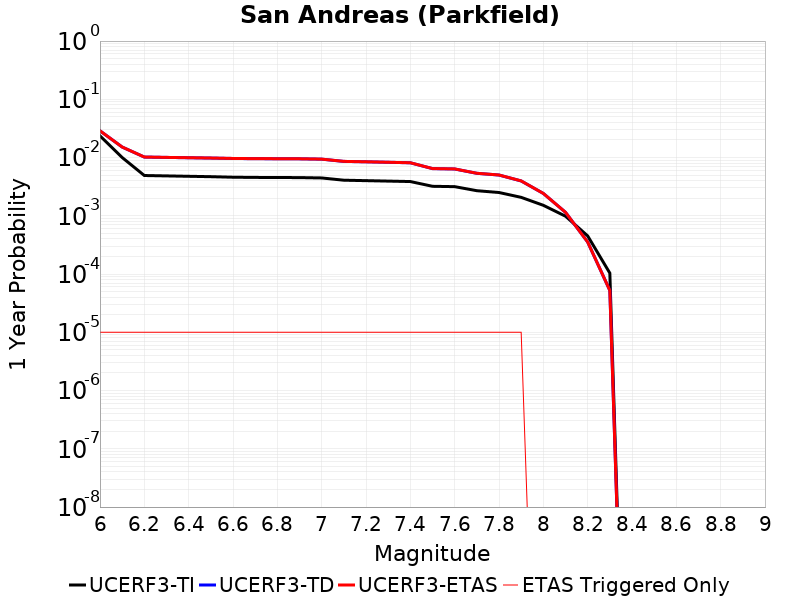 | 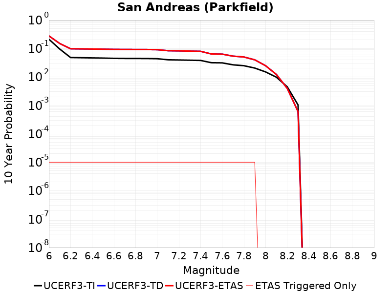 |

| Magnitude | 1 wk TI Prob | 1 wk TD Prob | 1 wk ETAS Prob | 1 wk ETAS/TD Gain | 1 wk ETAS Triggered Only | 1 mo TI Prob | 1 mo TD Prob | 1 mo ETAS Prob | 1 mo ETAS/TD Gain | 1 mo ETAS Triggered Only | 1 yr TI Prob | 1 yr TD Prob | 1 yr ETAS Prob | 1 yr ETAS/TD Gain | 1 yr ETAS Triggered Only | 10 yr TI Prob | 10 yr TD Prob | 10 yr ETAS Prob | 10 yr ETAS/TD Gain | 10 yr ETAS Triggered Only |
|-----|-----|-----|-----|-----|-----|-----|-----|-----|-----|-----|-----|-----|-----|-----|-----|-----|-----|-----|-----|-----|
| 6.0 | 4.5600464E-4 | 5.5087014E-4 | 5.5087014E-4 | 1.0 | 0.0 | 0.0019528421 | 0.002358983 | 0.002358983 | 1.0 | 0.0 | 0.023518132 | 0.028690847 | 0.02870056 | 1.0003386 | 1.0E-5 | 0.21179019 | 0.27719787 | 0.2772051 | 1.0000261 | 1.0E-5 |
| 6.1 | 1.9252734E-4 | 2.897127E-4 | 2.897127E-4 | 1.0 | 0.0 | 8.248562E-4 | 0.001241092 | 0.001241092 | 1.0 | 0.0 | 0.009996468 | 0.015118554 | 0.015128403 | 1.0006515 | 1.0E-5 | 0.09558567 | 0.14964907 | 0.14965756 | 1.0000569 | 1.0E-5 |
| 6.2 | 9.4269315E-5 | 1.9595977E-4 | 1.9595977E-4 | 1.0 | 0.0 | 4.039488E-4 | 8.3955866E-4 | 8.3955866E-4 | 1.0 | 0.0 | 0.0049069915 | 0.010174048 | 0.010183947 | 1.0009729 | 1.0E-5 | 0.048000436 | 0.097841196 | 0.09785022 | 1.0000921 | 1.0E-5 |
| 6.3 | 9.283051E-5 | 1.9319291E-4 | 1.9319291E-4 | 1.0 | 0.0 | 3.9778434E-4 | 8.277082E-4 | 8.277082E-4 | 1.0 | 0.0 | 0.0048322747 | 0.010031103 | 0.010041003 | 1.0009869 | 1.0E-5 | 0.047285385 | 0.096587345 | 0.09659638 | 1.0000936 | 1.0E-5 |
| 6.4 | 9.138826E-5 | 1.907871E-4 | 1.907871E-4 | 1.0 | 0.0 | 3.916052E-4 | 8.174041E-4 | 8.174041E-4 | 1.0 | 0.0 | 0.0047573745 | 0.009906796 | 0.009916697 | 1.0009995 | 1.0E-5 | 0.046568092 | 0.0954817 | 0.095490746 | 1.0000948 | 1.0E-5 |
| 6.5 | 9.000255E-5 | 1.8833562E-4 | 1.8833562E-4 | 1.0 | 0.0 | 3.8566816E-4 | 8.069042E-4 | 8.069042E-4 | 1.0 | 0.0 | 0.0046854047 | 0.009780111 | 0.009790014 | 1.0010124 | 1.0E-5 | 0.045878403 | 0.094354995 | 0.094364055 | 1.000096 | 1.0E-5 |
| 6.6 | 8.8109264E-5 | 1.8525922E-4 | 1.8525922E-4 | 1.0 | 0.0 | 3.7755648E-4 | 7.9372776E-4 | 7.9372776E-4 | 1.0 | 0.0 | 0.0045870654 | 0.0096211145 | 0.009631018 | 1.0010294 | 1.0E-5 | 0.04493529 | 0.092932485 | 0.09294155 | 1.0000976 | 1.0E-5 |
| 6.7 | 8.738073E-5 | 1.839432E-4 | 1.839432E-4 | 1.0 | 0.0 | 3.7443507E-4 | 7.8809104E-4 | 7.8809104E-4 | 1.0 | 0.0 | 0.0045492216 | 0.0095530925 | 0.009562997 | 1.0010368 | 1.0E-5 | 0.04457213 | 0.09233731 | 0.092346385 | 1.0000983 | 1.0E-5 |
| 6.8 | 8.710195E-5 | 1.8340492E-4 | 1.8340492E-4 | 1.0 | 0.0 | 3.7324068E-4 | 7.8578555E-4 | 7.8578555E-4 | 1.0 | 0.0 | 0.0045347405 | 0.009525272 | 0.009535177 | 1.0010399 | 1.0E-5 | 0.04443313 | 0.0920883 | 0.09209738 | 1.0000986 | 1.0E-5 |
| 6.9 | 8.6801556E-5 | 1.8281827E-4 | 1.8281827E-4 | 1.0 | 0.0 | 3.7195362E-4 | 7.8327284E-4 | 7.8327284E-4 | 1.0 | 0.0 | 0.0045191357 | 0.009494947 | 0.009504852 | 1.0010432 | 1.0E-5 | 0.044283327 | 0.09181708 | 0.09182616 | 1.000099 | 1.0E-5 |
| 7.0 | 8.5571606E-5 | 1.8033771E-4 | 1.8033771E-4 | 1.0 | 0.0 | 3.6668387E-4 | 7.726482E-4 | 7.726482E-4 | 1.0 | 0.0 | 0.004455241 | 0.009366711 | 0.009376617 | 1.0010576 | 1.0E-5 | 0.043669727 | 0.09066798 | 0.09067707 | 1.0001003 | 1.0E-5 |
| 7.1 | 7.82589E-5 | 1.6484612E-4 | 1.6484612E-4 | 1.0 | 0.0 | 3.3535215E-4 | 7.062929E-4 | 7.062929E-4 | 1.0 | 0.0 | 0.0040752706 | 0.008565409 | 0.008575323 | 1.0011575 | 1.0E-5 | 0.040013418 | 0.083488025 | 0.08349719 | 1.0001098 | 1.0E-5 |
| 7.2 | 7.690929E-5 | 1.6232548E-4 | 1.6232548E-4 | 1.0 | 0.0 | 3.2956956E-4 | 6.954959E-4 | 6.954959E-4 | 1.0 | 0.0 | 0.004005129 | 0.008434981 | 0.008444896 | 1.0011755 | 1.0E-5 | 0.0393371 | 0.08230865 | 0.08231783 | 1.0001115 | 1.0E-5 |
| 7.3 | 7.5543794E-5 | 1.5922789E-4 | 1.5922789E-4 | 1.0 | 0.0 | 3.2371894E-4 | 6.822276E-4 | 6.822276E-4 | 1.0 | 0.0 | 0.003934157 | 0.008274676 | 0.008284593 | 1.0011985 | 1.0E-5 | 0.038652334 | 0.080851406 | 0.08086059 | 1.0001137 | 1.0E-5 |
| 7.4 | 7.4214564E-5 | 1.5613556E-4 | 1.5613556E-4 | 1.0 | 0.0 | 3.1802364E-4 | 6.689816E-4 | 6.689816E-4 | 1.0 | 0.0 | 0.003865065 | 0.008114617 | 0.008124537 | 1.0012224 | 1.0E-5 | 0.03798529 | 0.07939268 | 0.07940189 | 1.000116 | 1.0E-5 |
| 7.5 | 6.149578E-5 | 1.2392073E-4 | 1.2392073E-4 | 1.0 | 0.0 | 2.6352672E-4 | 5.309809E-4 | 5.309809E-4 | 1.0 | 0.0 | 0.0032037178 | 0.0064455704 | 0.0064555057 | 1.0015415 | 1.0E-5 | 0.03157923 | 0.06405272 | 0.06406209 | 1.0001462 | 1.0E-5 |
| 7.6 | 6.0643448E-5 | 1.2214783E-4 | 1.2214783E-4 | 1.0 | 0.0 | 2.598746E-4 | 5.233858E-4 | 5.233858E-4 | 1.0 | 0.0 | 0.0031593828 | 0.0063536433 | 0.00636358 | 1.0015639 | 1.0E-5 | 0.031148417 | 0.06319322 | 0.06320258 | 1.0001483 | 1.0E-5 |
| 7.7 | 5.1652263E-5 | 1.0283335E-4 | 1.0283335E-4 | 1.0 | 0.0 | 2.2134806E-4 | 4.4063994E-4 | 4.4063994E-4 | 1.0 | 0.0 | 0.002691582 | 0.005351609 | 0.0053615556 | 1.0018586 | 1.0E-5 | 0.026592141 | 0.05367731 | 0.053686775 | 1.0001763 | 1.0E-5 |
| 7.8 | 4.8090482E-5 | 9.604806E-5 | 9.604806E-5 | 1.0 | 0.0 | 2.060858E-4 | 4.1156964E-4 | 4.1156964E-4 | 1.0 | 0.0 | 0.0025062072 | 0.004999359 | 0.0050093094 | 1.0019902 | 1.0E-5 | 0.024781305 | 0.050165027 | 0.050174523 | 1.0001893 | 1.0E-5 |
| 7.9 | 3.970278E-5 | 7.595376E-5 | 7.595376E-5 | 1.0 | 0.0 | 1.7014367E-4 | 3.2547553E-4 | 3.2547553E-4 | 1.0 | 0.0 | 0.002069531 | 0.0039554695 | 0.00396543 | 1.0025182 | 1.0E-5 | 0.020503636 | 0.039897103 | 0.039906703 | 1.0002407 | 1.0E-5 |
| 8.0 | 2.8982335E-5 | 4.6342353E-5 | 4.6342353E-5 | 1.0 | 0.0 | 1.2420409E-4 | 1.9859496E-4 | 1.9859496E-4 | 1.0 | 0.0 | 0.0015111357 | 0.0024152142 | 0.0024152142 | 1.0 | 0.0 | 0.015009012 | 0.024801826 | 0.024801826 | 1.0 | 0.0 |
| 8.1 | 1.8836186E-5 | 2.1969267E-5 | 2.1969267E-5 | 1.0 | 0.0 | 8.0724014E-5 | 9.41506E-5 | 9.41506E-5 | 1.0 | 0.0 | 9.823717E-4 | 0.0011456816 | 0.0011456816 | 1.0 | 0.0 | 0.009780403 | 0.012193687 | 0.012193687 | 1.0 | 0.0 |
| 8.2 | 8.643924E-6 | 6.7827064E-6 | 6.7827064E-6 | 1.0 | 0.0 | 3.704486E-5 | 2.9068418E-5 | 2.9068418E-5 | 1.0 | 0.0 | 4.5092785E-4 | 3.5385066E-4 | 3.5385066E-4 | 1.0 | 0.0 | 0.0045001395 | 0.00395419 | 0.00395419 | 1.0 | 0.0 |
| 8.3 | 1.983087E-6 | 9.998656E-7 | 9.998656E-7 | 1.0 | 0.0 | 8.498917E-6 | 4.285131E-6 | 4.285131E-6 | 1.0 | 0.0 | 1.034694E-4 | 5.2170253E-5 | 5.2170253E-5 | 1.0 | 0.0 | 0.0010342124 | 6.042036E-4 | 6.042036E-4 | 1.0 | 0.0 |

## San Andreas (San Gorgonio Pass-Garnet HIll)
*[(top)](#table-of-contents)*

| 1 Week | 1 Month | 1 Year | 10 Year |
|-----|-----|-----|-----|
|  |  | 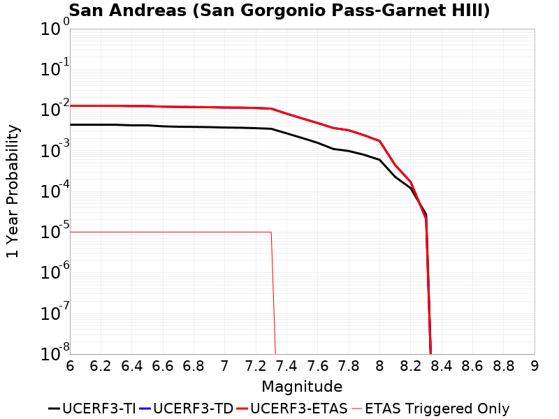 |  |

| Magnitude | 1 wk TI Prob | 1 wk TD Prob | 1 wk ETAS Prob | 1 wk ETAS/TD Gain | 1 wk ETAS Triggered Only | 1 mo TI Prob | 1 mo TD Prob | 1 mo ETAS Prob | 1 mo ETAS/TD Gain | 1 mo ETAS Triggered Only | 1 yr TI Prob | 1 yr TD Prob | 1 yr ETAS Prob | 1 yr ETAS/TD Gain | 1 yr ETAS Triggered Only | 10 yr TI Prob | 10 yr TD Prob | 10 yr ETAS Prob | 10 yr ETAS/TD Gain | 10 yr ETAS Triggered Only |
|-----|-----|-----|-----|-----|-----|-----|-----|-----|-----|-----|-----|-----|-----|-----|-----|-----|-----|-----|-----|-----|
| 6.0 | 8.31567E-5 | 2.4487285E-4 | 2.4487285E-4 | 1.0 | 0.0 | 3.5633717E-4 | 0.0010490254 | 0.0010590149 | 1.0095227 | 1.0E-5 | 0.004329778 | 0.012697014 | 0.012706887 | 1.0007776 | 1.0E-5 | 0.042463828 | 0.117108576 | 0.117117405 | 1.0000753 | 1.0E-5 |
| 6.1 | 8.31567E-5 | 2.4487285E-4 | 2.4487285E-4 | 1.0 | 0.0 | 3.5633717E-4 | 0.0010490254 | 0.0010590149 | 1.0095227 | 1.0E-5 | 0.004329778 | 0.012697014 | 0.012706887 | 1.0007776 | 1.0E-5 | 0.042463828 | 0.117108576 | 0.117117405 | 1.0000753 | 1.0E-5 |
| 6.2 | 8.31567E-5 | 2.4487285E-4 | 2.4487285E-4 | 1.0 | 0.0 | 3.5633717E-4 | 0.0010490254 | 0.0010590149 | 1.0095227 | 1.0E-5 | 0.004329778 | 0.012697014 | 0.012706887 | 1.0007776 | 1.0E-5 | 0.042463828 | 0.117108576 | 0.117117405 | 1.0000753 | 1.0E-5 |
| 6.3 | 8.31567E-5 | 2.4487285E-4 | 2.4487285E-4 | 1.0 | 0.0 | 3.5633717E-4 | 0.0010490254 | 0.0010590149 | 1.0095227 | 1.0E-5 | 0.004329778 | 0.012697014 | 0.012706887 | 1.0007776 | 1.0E-5 | 0.042463828 | 0.117108576 | 0.117117405 | 1.0000753 | 1.0E-5 |
| 6.4 | 8.059055E-5 | 2.4037733E-4 | 2.4037733E-4 | 1.0 | 0.0 | 3.4534236E-4 | 0.0010297804 | 0.0010397701 | 1.0097008 | 1.0E-5 | 0.0041964394 | 0.01246576 | 0.012475636 | 1.0007921 | 1.0E-5 | 0.041180745 | 0.11507046 | 0.11507931 | 1.0000769 | 1.0E-5 |
| 6.5 | 8.059055E-5 | 2.4037733E-4 | 2.4037733E-4 | 1.0 | 0.0 | 3.4534236E-4 | 0.0010297804 | 0.0010397701 | 1.0097008 | 1.0E-5 | 0.0041964394 | 0.01246576 | 0.012475636 | 1.0007921 | 1.0E-5 | 0.041180745 | 0.11507046 | 0.11507931 | 1.0000769 | 1.0E-5 |
| 6.6 | 7.619237E-5 | 2.3271391E-4 | 2.3271391E-4 | 1.0 | 0.0 | 3.2649786E-4 | 9.969666E-4 | 0.0010069566 | 1.0100204 | 1.0E-5 | 0.0039678677 | 0.01207111 | 0.01208099 | 1.0008184 | 1.0E-5 | 0.03897764 | 0.111577936 | 0.111586824 | 1.0000796 | 1.0E-5 |
| 6.7 | 7.440636E-5 | 2.2943533E-4 | 2.2943533E-4 | 1.0 | 0.0 | 3.188454E-4 | 9.829261E-4 | 9.929163E-4 | 1.0101637 | 1.0E-5 | 0.0038750346 | 0.0119020445 | 0.011911926 | 1.0008302 | 1.0E-5 | 0.038081564 | 0.11007791 | 0.110086806 | 1.0000808 | 1.0E-5 |
| 6.8 | 7.3735864E-5 | 2.278829E-4 | 2.278829E-4 | 1.0 | 0.0 | 3.1597257E-4 | 9.7627786E-4 | 9.862682E-4 | 1.010233 | 1.0E-5 | 0.0038401815 | 0.011821986 | 0.0118318675 | 1.0008359 | 1.0E-5 | 0.03774495 | 0.10937255 | 0.10938145 | 1.0000814 | 1.0E-5 |
| 6.9 | 7.27575E-5 | 2.2554498E-4 | 2.2554498E-4 | 1.0 | 0.0 | 3.117806E-4 | 9.662657E-4 | 9.76256E-4 | 1.0103391 | 1.0E-5 | 0.003789323 | 0.011701403 | 0.011711286 | 1.0008446 | 1.0E-5 | 0.037253562 | 0.10831358 | 0.108322494 | 1.0000824 | 1.0E-5 |
| 7.0 | 7.102591E-5 | 2.2132532E-4 | 2.2132532E-4 | 1.0 | 0.0 | 3.0436125E-4 | 9.4819465E-4 | 9.581852E-4 | 1.0105363 | 1.0E-5 | 0.003699303 | 0.011483727 | 0.011493612 | 1.0008608 | 1.0E-5 | 0.03638325 | 0.10639909 | 0.10640803 | 1.000084 | 1.0E-5 |
| 7.1 | 7.028513E-5 | 2.1965116E-4 | 2.1965116E-4 | 1.0 | 0.0 | 3.0118722E-4 | 9.4102486E-4 | 9.510155E-4 | 1.0106167 | 1.0E-5 | 0.0036607897 | 0.011397352 | 0.011407238 | 1.0008674 | 1.0E-5 | 0.036010686 | 0.10563269 | 0.10564163 | 1.0000846 | 1.0E-5 |
| 7.2 | 6.8498244E-5 | 2.1565003E-4 | 2.1565003E-4 | 1.0 | 0.0 | 2.9353087E-4 | 9.238894E-4 | 9.3388016E-4 | 1.0108138 | 1.0E-5 | 0.003567883 | 0.011190887 | 0.011200774 | 1.0008836 | 1.0E-5 | 0.035111405 | 0.10379907 | 0.10380803 | 1.0000863 | 1.0E-5 |
| 7.3 | 6.622592E-5 | 2.0775473E-4 | 2.0775473E-4 | 1.0 | 0.0 | 2.8379448E-4 | 8.9007587E-4 | 9.00067E-4 | 1.011225 | 1.0E-5 | 0.0034497243 | 0.010783354 | 0.010793245 | 1.0009173 | 1.0E-5 | 0.033966612 | 0.10024222 | 0.10025121 | 1.0000898 | 1.0E-5 |
| 7.4 | 5.1050705E-5 | 1.558918E-4 | 1.558918E-4 | 1.0 | 0.0 | 2.1877038E-4 | 6.6793757E-4 | 6.6793757E-4 | 1.0 | 0.0 | 0.002660276 | 0.0081020305 | 0.0081020305 | 1.0 | 0.0 | 0.02628654 | 0.07673683 | 0.07673683 | 1.0 | 0.0 |
| 7.5 | 3.9302922E-5 | 1.1909496E-4 | 1.1909496E-4 | 1.0 | 0.0 | 1.6843023E-4 | 5.103075E-4 | 5.103075E-4 | 1.0 | 0.0 | 0.0020487092 | 0.006195373 | 0.006195373 | 1.0 | 0.0 | 0.020299247 | 0.059435718 | 0.059435718 | 1.0 | 0.0 |
| 7.6 | 2.9851626E-5 | 9.175407E-5 | 9.175407E-5 | 1.0 | 0.0 | 1.2792926E-4 | 3.9317258E-4 | 3.9317258E-4 | 1.0 | 0.0 | 0.0015564259 | 0.0047763987 | 0.0047763987 | 1.0 | 0.0 | 0.0154556995 | 0.04622048 | 0.04622048 | 1.0 | 0.0 |
| 7.7 | 2.1135214E-5 | 6.945948E-5 | 6.945948E-5 | 1.0 | 0.0 | 9.0576345E-5 | 2.9764953E-4 | 2.9764953E-4 | 1.0 | 0.0 | 0.0011022091 | 0.0036178683 | 0.0036178683 | 1.0 | 0.0 | 0.010967582 | 0.035233684 | 0.035233684 | 1.0 | 0.0 |
| 7.8 | 1.883379E-5 | 6.1017647E-5 | 6.1017647E-5 | 1.0 | 0.0 | 8.0713755E-5 | 2.61478E-4 | 2.61478E-4 | 1.0 | 0.0 | 9.822468E-4 | 0.0031788514 | 0.0031788514 | 1.0 | 0.0 | 0.0097791655 | 0.031111512 | 0.031111512 | 1.0 | 0.0 |
| 7.9 | 1.5156185E-5 | 4.5933088E-5 | 4.5933088E-5 | 1.0 | 0.0 | 6.495346E-5 | 1.9684124E-4 | 1.9684124E-4 | 1.0 | 0.0 | 7.9052144E-4 | 0.00239391 | 0.00239391 | 1.0 | 0.0 | 0.007877152 | 0.023708642 | 0.023708642 | 1.0 | 0.0 |
| 8.0 | 1.1405907E-5 | 3.3142853E-5 | 3.3142853E-5 | 1.0 | 0.0 | 4.8881542E-5 | 1.4203307E-4 | 1.4203307E-4 | 1.0 | 0.0 | 5.9497025E-4 | 0.0017278822 | 0.0017278822 | 1.0 | 0.0 | 0.005933798 | 0.017232588 | 0.017232588 | 1.0 | 0.0 |
| 8.1 | 4.3511436E-6 | 8.491744E-6 | 8.491744E-6 | 1.0 | 0.0 | 1.8647626E-5 | 3.639268E-5 | 3.639268E-5 | 1.0 | 0.0 | 2.2701119E-4 | 4.4299097E-4 | 4.4299097E-4 | 1.0 | 0.0 | 0.0022677942 | 0.004669549 | 0.004669549 | 1.0 | 0.0 |
| 8.2 | 2.3042528E-6 | 3.2758387E-6 | 3.2758387E-6 | 1.0 | 0.0 | 9.875332E-6 | 1.4039233E-5 | 1.4039233E-5 | 1.0 | 0.0 | 1.2022553E-4 | 1.7091433E-4 | 1.7091433E-4 | 1.0 | 0.0 | 0.0012016051 | 0.0018769655 | 0.0018769655 | 1.0 | 0.0 |
| 8.3 | 5.202968E-7 | 3.9872228E-7 | 3.9872228E-7 | 1.0 | 0.0 | 2.2298414E-6 | 1.7088088E-6 | 1.7088088E-6 | 1.0 | 0.0 | 2.714798E-5 | 2.0804568E-5 | 2.0804568E-5 | 1.0 | 0.0 | 2.7144665E-4 | 2.4129663E-4 | 2.4129663E-4 | 1.0 | 0.0 |

## San Jacinto (Anza) rev
*[(top)](#table-of-contents)*

| 1 Week | 1 Month | 1 Year | 10 Year |
|-----|-----|-----|-----|
|  |  |  |  |

| Magnitude | 1 wk TI Prob | 1 wk TD Prob | 1 wk ETAS Prob | 1 wk ETAS/TD Gain | 1 wk ETAS Triggered Only | 1 mo TI Prob | 1 mo TD Prob | 1 mo ETAS Prob | 1 mo ETAS/TD Gain | 1 mo ETAS Triggered Only | 1 yr TI Prob | 1 yr TD Prob | 1 yr ETAS Prob | 1 yr ETAS/TD Gain | 1 yr ETAS Triggered Only | 10 yr TI Prob | 10 yr TD Prob | 10 yr ETAS Prob | 10 yr ETAS/TD Gain | 10 yr ETAS Triggered Only |
|-----|-----|-----|-----|-----|-----|-----|-----|-----|-----|-----|-----|-----|-----|-----|-----|-----|-----|-----|-----|-----|
| 6.0 | 6.28807E-5 | 4.8434817E-5 | 4.8434817E-5 | 1.0 | 0.0 | 2.6946087E-4 | 2.0756136E-4 | 2.0756136E-4 | 1.0 | 0.0 | 0.0032757511 | 0.002524145 | 0.002524145 | 1.0 | 0.0 | 0.032278832 | 0.02590953 | 0.025919272 | 1.000376 | 1.0E-5 |
| 6.1 | 6.28807E-5 | 4.8434817E-5 | 4.8434817E-5 | 1.0 | 0.0 | 2.6946087E-4 | 2.0756136E-4 | 2.0756136E-4 | 1.0 | 0.0 | 0.0032757511 | 0.002524145 | 0.002524145 | 1.0 | 0.0 | 0.032278832 | 0.02590953 | 0.025919272 | 1.000376 | 1.0E-5 |
| 6.2 | 6.28807E-5 | 4.8434817E-5 | 4.8434817E-5 | 1.0 | 0.0 | 2.6946087E-4 | 2.0756136E-4 | 2.0756136E-4 | 1.0 | 0.0 | 0.0032757511 | 0.002524145 | 0.002524145 | 1.0 | 0.0 | 0.032278832 | 0.02590953 | 0.025919272 | 1.000376 | 1.0E-5 |
| 6.3 | 6.28807E-5 | 4.8434817E-5 | 4.8434817E-5 | 1.0 | 0.0 | 2.6946087E-4 | 2.0756136E-4 | 2.0756136E-4 | 1.0 | 0.0 | 0.0032757511 | 0.002524145 | 0.002524145 | 1.0 | 0.0 | 0.032278832 | 0.02590953 | 0.025919272 | 1.000376 | 1.0E-5 |
| 6.4 | 6.28807E-5 | 4.8434817E-5 | 4.8434817E-5 | 1.0 | 0.0 | 2.6946087E-4 | 2.0756136E-4 | 2.0756136E-4 | 1.0 | 0.0 | 0.0032757511 | 0.002524145 | 0.002524145 | 1.0 | 0.0 | 0.032278832 | 0.02590953 | 0.025919272 | 1.000376 | 1.0E-5 |
| 6.5 | 5.811017E-5 | 4.509983E-5 | 4.509983E-5 | 1.0 | 0.0 | 2.4901982E-4 | 1.9327071E-4 | 1.9327071E-4 | 1.0 | 0.0 | 0.0030276014 | 0.0023505385 | 0.0023505385 | 1.0 | 0.0 | 0.02986684 | 0.024165995 | 0.024165995 | 1.0 | 0.0 |
| 6.6 | 5.811017E-5 | 4.509983E-5 | 4.509983E-5 | 1.0 | 0.0 | 2.4901982E-4 | 1.9327071E-4 | 1.9327071E-4 | 1.0 | 0.0 | 0.0030276014 | 0.0023505385 | 0.0023505385 | 1.0 | 0.0 | 0.02986684 | 0.024165995 | 0.024165995 | 1.0 | 0.0 |
| 6.7 | 5.712442E-5 | 4.4471464E-5 | 4.4471464E-5 | 1.0 | 0.0 | 2.4479596E-4 | 1.905781E-4 | 1.905781E-4 | 1.0 | 0.0 | 0.0029763177 | 0.002317826 | 0.002317826 | 1.0 | 0.0 | 0.029367693 | 0.023832694 | 0.023832694 | 1.0 | 0.0 |
| 6.8 | 5.6967532E-5 | 4.43179E-5 | 4.43179E-5 | 1.0 | 0.0 | 2.4412372E-4 | 1.8992007E-4 | 1.8992007E-4 | 1.0 | 0.0 | 0.0029681553 | 0.0023098316 | 0.0023098316 | 1.0 | 0.0 | 0.029288229 | 0.023752077 | 0.023752077 | 1.0 | 0.0 |
| 6.9 | 5.6211324E-5 | 4.3989286E-5 | 4.3989286E-5 | 1.0 | 0.0 | 2.4088343E-4 | 1.8851193E-4 | 1.8851193E-4 | 1.0 | 0.0 | 0.0029288116 | 0.0022927236 | 0.0022927236 | 1.0 | 0.0 | 0.028905109 | 0.023574658 | 0.023574658 | 1.0 | 0.0 |
| 7.0 | 5.4383527E-5 | 4.2732412E-5 | 4.2732412E-5 | 1.0 | 0.0 | 2.3305144E-4 | 1.8312609E-4 | 1.8312609E-4 | 1.0 | 0.0 | 0.0028337094 | 0.0022272863 | 0.0022272863 | 1.0 | 0.0 | 0.027978465 | 0.022915052 | 0.022915052 | 1.0 | 0.0 |
| 7.1 | 5.1393665E-5 | 4.101899E-5 | 4.101899E-5 | 1.0 | 0.0 | 2.2023996E-4 | 1.7578385E-4 | 1.7578385E-4 | 1.0 | 0.0 | 0.0026781242 | 0.0021380729 | 0.0021380729 | 1.0 | 0.0 | 0.026460782 | 0.022001464 | 0.022001464 | 1.0 | 0.0 |
| 7.2 | 4.785222E-5 | 3.917986E-5 | 3.917986E-5 | 1.0 | 0.0 | 2.0506482E-4 | 1.679029E-4 | 1.679029E-4 | 1.0 | 0.0 | 0.0024938055 | 0.0020423054 | 0.0020423054 | 1.0 | 0.0 | 0.024660049 | 0.02102246 | 0.02102246 | 1.0 | 0.0 |
| 7.3 | 4.2143256E-5 | 3.8131457E-5 | 3.8131457E-5 | 1.0 | 0.0 | 1.8060145E-4 | 1.6341031E-4 | 1.6341031E-4 | 1.0 | 0.0 | 0.002196605 | 0.0019877094 | 0.0019877094 | 1.0 | 0.0 | 0.02175019 | 0.02045581 | 0.02045581 | 1.0 | 0.0 |
| 7.4 | 4.0264713E-5 | 3.7721144E-5 | 3.7721144E-5 | 1.0 | 0.0 | 1.7255165E-4 | 1.6165205E-4 | 1.6165205E-4 | 1.0 | 0.0 | 0.002098792 | 0.0019663412 | 0.0019663412 | 1.0 | 0.0 | 0.020790804 | 0.020235062 | 0.020235062 | 1.0 | 0.0 |
| 7.5 | 3.694492E-5 | 3.6308313E-5 | 3.6308313E-5 | 1.0 | 0.0 | 1.5832575E-4 | 1.555978E-4 | 1.555978E-4 | 1.0 | 0.0 | 0.0019259118 | 0.0018927607 | 0.0018927607 | 1.0 | 0.0 | 0.01909306 | 0.01948672 | 0.01948672 | 1.0 | 0.0 |
| 7.6 | 3.200565E-5 | 3.3413264E-5 | 3.3413264E-5 | 1.0 | 0.0 | 1.3715986E-4 | 1.4319186E-4 | 1.4319186E-4 | 1.0 | 0.0 | 0.001668642 | 0.0017419695 | 0.0017419695 | 1.0 | 0.0 | 0.01656168 | 0.017968465 | 0.017968465 | 1.0 | 0.0 |
| 7.7 | 2.731642E-5 | 2.980321E-5 | 2.980321E-5 | 1.0 | 0.0 | 1.1706512E-4 | 1.277218E-4 | 1.277218E-4 | 1.0 | 0.0 | 0.001424336 | 0.0015539051 | 0.0015539051 | 1.0 | 0.0 | 0.014152412 | 0.016090857 | 0.016090857 | 1.0 | 0.0 |
| 7.8 | 2.3466424E-5 | 2.6981292E-5 | 2.6981292E-5 | 1.0 | 0.0 | 1.0056651E-4 | 1.1562899E-4 | 1.1562899E-4 | 1.0 | 0.0 | 0.0012237094 | 0.001406875 | 0.001406875 | 1.0 | 0.0 | 0.012169928 | 0.014614585 | 0.014614585 | 1.0 | 0.0 |
| 7.9 | 1.8611925E-5 | 2.1908725E-5 | 2.1908725E-5 | 1.0 | 0.0 | 7.9762955E-5 | 9.389116E-5 | 9.389116E-5 | 1.0 | 0.0 | 9.7068126E-4 | 0.0011425264 | 0.0011425264 | 1.0 | 0.0 | 0.0096645225 | 0.011958644 | 0.011958644 | 1.0 | 0.0 |
| 8.0 | 1.5460775E-5 | 1.8346798E-5 | 1.8346798E-5 | 1.0 | 0.0 | 6.6258784E-5 | 7.862677E-5 | 7.862677E-5 | 1.0 | 0.0 | 8.0640207E-4 | 9.568615E-4 | 9.568615E-4 | 1.0 | 0.0 | 0.008034821 | 0.010066621 | 0.010066621 | 1.0 | 0.0 |
| 8.1 | 9.983884E-6 | 9.804789E-6 | 9.804789E-6 | 1.0 | 0.0 | 4.2787375E-5 | 4.2019852E-5 | 4.2019852E-5 | 1.0 | 0.0 | 5.2081177E-4 | 5.1147235E-4 | 5.1147235E-4 | 1.0 | 0.0 | 0.0051959283 | 0.005459369 | 0.005459369 | 1.0 | 0.0 |
| 8.2 | 4.1226E-6 | 2.0129978E-6 | 2.0129978E-6 | 1.0 | 0.0 | 1.7668166E-5 | 8.627105E-6 | 8.627105E-6 | 1.0 | 0.0 | 2.1508869E-4 | 1.0502998E-4 | 1.0502998E-4 | 1.0 | 0.0 | 0.0021488064 | 0.0012007467 | 0.0012007467 | 1.0 | 0.0 |
| 8.3 | 1.2750878E-6 | 4.885877E-7 | 4.885877E-7 | 1.0 | 0.0 | 5.4646503E-6 | 2.0939458E-6 | 2.0939458E-6 | 1.0 | 0.0 | 6.653009E-5 | 2.54935E-5 | 2.54935E-5 | 1.0 | 0.0 | 6.6510175E-4 | 3.0127197E-4 | 3.0127197E-4 | 1.0 | 0.0 |

## San Andreas (Cholame) rev
*[(top)](#table-of-contents)*

| 1 Week | 1 Month | 1 Year | 10 Year |
|-----|-----|-----|-----|
| 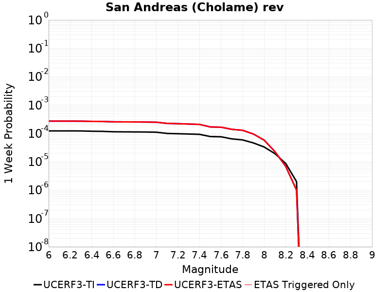 | 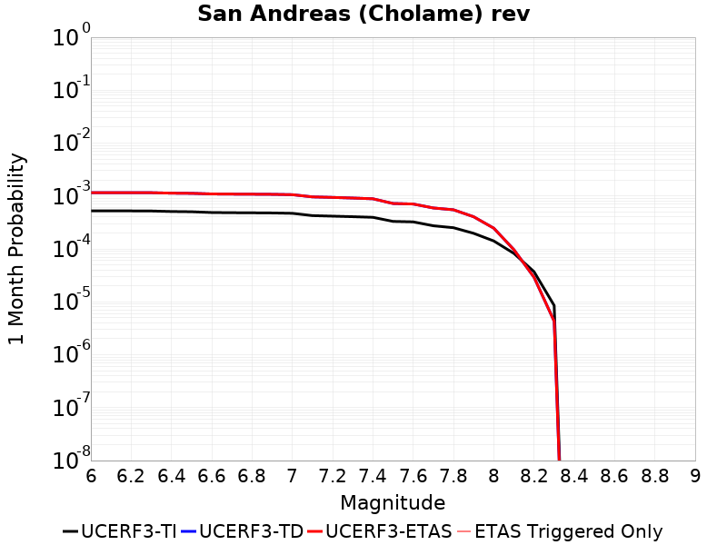 |  |  |

| Magnitude | 1 wk TI Prob | 1 wk TD Prob | 1 wk ETAS Prob | 1 wk ETAS/TD Gain | 1 wk ETAS Triggered Only | 1 mo TI Prob | 1 mo TD Prob | 1 mo ETAS Prob | 1 mo ETAS/TD Gain | 1 mo ETAS Triggered Only | 1 yr TI Prob | 1 yr TD Prob | 1 yr ETAS Prob | 1 yr ETAS/TD Gain | 1 yr ETAS Triggered Only | 10 yr TI Prob | 10 yr TD Prob | 10 yr ETAS Prob | 10 yr ETAS/TD Gain | 10 yr ETAS Triggered Only |
|-----|-----|-----|-----|-----|-----|-----|-----|-----|-----|-----|-----|-----|-----|-----|-----|-----|-----|-----|-----|-----|
| 6.0 | 1.2188602E-4 | 2.6989586E-4 | 2.6989586E-4 | 1.0 | 0.0 | 5.2226405E-4 | 0.0011561855 | 0.0011561855 | 1.0 | 0.0 | 0.0063400427 | 0.013986294 | 0.013996154 | 1.000705 | 1.0E-5 | 0.061621845 | 0.13176234 | 0.13177101 | 1.0000659 | 1.0E-5 |
| 6.1 | 1.2188602E-4 | 2.6989586E-4 | 2.6989586E-4 | 1.0 | 0.0 | 5.2226405E-4 | 0.0011561855 | 0.0011561855 | 1.0 | 0.0 | 0.0063400427 | 0.013986294 | 0.013996154 | 1.000705 | 1.0E-5 | 0.061621845 | 0.13176234 | 0.13177101 | 1.0000659 | 1.0E-5 |
| 6.2 | 1.2188602E-4 | 2.6989586E-4 | 2.6989586E-4 | 1.0 | 0.0 | 5.2226405E-4 | 0.0011561855 | 0.0011561855 | 1.0 | 0.0 | 0.0063400427 | 0.013986294 | 0.013996154 | 1.000705 | 1.0E-5 | 0.061621845 | 0.13176234 | 0.13177101 | 1.0000659 | 1.0E-5 |
| 6.3 | 1.2142645E-4 | 2.6901838E-4 | 2.6901838E-4 | 1.0 | 0.0 | 5.202953E-4 | 0.0011524282 | 0.0011524282 | 1.0 | 0.0 | 0.006316212 | 0.013941135 | 0.013950996 | 1.0007073 | 1.0E-5 | 0.06139677 | 0.13137735 | 0.13138604 | 1.0000662 | 1.0E-5 |
| 6.4 | 1.1865206E-4 | 2.6394756E-4 | 2.6394756E-4 | 1.0 | 0.0 | 5.0840975E-4 | 0.0011307151 | 0.0011307151 | 1.0 | 0.0 | 0.006172335 | 0.013680125 | 0.013689988 | 1.000721 | 1.0E-5 | 0.060036868 | 0.12914203 | 0.12915073 | 1.0000675 | 1.0E-5 |
| 6.5 | 1.17443946E-4 | 2.618279E-4 | 2.618279E-4 | 1.0 | 0.0 | 5.032341E-4 | 0.0011216388 | 0.0011216388 | 1.0 | 0.0 | 0.006109677 | 0.013570999 | 0.013580862 | 1.0007268 | 1.0E-5 | 0.059444077 | 0.12820101 | 0.12820973 | 1.000068 | 1.0E-5 |
| 6.6 | 1.13579066E-4 | 2.5493678E-4 | 2.5493678E-4 | 1.0 | 0.0 | 4.866766E-4 | 0.0010921303 | 0.0010921303 | 1.0 | 0.0 | 0.0059092017 | 0.013216144 | 0.013226013 | 1.0007466 | 1.0E-5 | 0.057545185 | 0.12514178 | 0.12515053 | 1.0000699 | 1.0E-5 |
| 6.7 | 1.1271412E-4 | 2.5336916E-4 | 2.5336916E-4 | 1.0 | 0.0 | 4.829711E-4 | 0.0010854177 | 0.0010854177 | 1.0 | 0.0 | 0.005864331 | 0.013135406 | 0.0131452745 | 1.0007513 | 1.0E-5 | 0.057119697 | 0.12444669 | 0.12445545 | 1.0000703 | 1.0E-5 |
| 6.8 | 1.1217975E-4 | 2.5223248E-4 | 2.5223248E-4 | 1.0 | 0.0 | 4.8068175E-4 | 0.0010805503 | 0.0010805503 | 1.0 | 0.0 | 0.005836608 | 0.013076858 | 0.013086727 | 1.0007547 | 1.0E-5 | 0.056856725 | 0.12394087 | 0.12394963 | 1.0000707 | 1.0E-5 |
| 6.9 | 1.1146753E-4 | 2.506841E-4 | 2.506841E-4 | 1.0 | 0.0 | 4.7763053E-4 | 0.0010739197 | 0.0010739197 | 1.0 | 0.0 | 0.0057996577 | 0.012997098 | 0.013006968 | 1.0007594 | 1.0E-5 | 0.056506127 | 0.123252384 | 0.123261146 | 1.0000712 | 1.0E-5 |
| 7.0 | 1.0965793E-4 | 2.4685054E-4 | 2.4685054E-4 | 1.0 | 0.0 | 4.698779E-4 | 0.0010575036 | 0.0010575036 | 1.0 | 0.0 | 0.005705768 | 0.012799597 | 0.012809469 | 1.0007713 | 1.0E-5 | 0.055614736 | 0.121542655 | 0.12155144 | 1.0000722 | 1.0E-5 |
| 7.1 | 9.927982E-5 | 2.2435751E-4 | 2.2435751E-4 | 1.0 | 0.0 | 4.2541555E-4 | 9.6117903E-4 | 9.6117903E-4 | 1.0 | 0.0 | 0.0051671406 | 0.011639916 | 0.0116497995 | 1.0008491 | 1.0E-5 | 0.05048634 | 0.11145944 | 0.11146833 | 1.0000798 | 1.0E-5 |
| 7.2 | 9.696786E-5 | 2.1925064E-4 | 2.1925064E-4 | 1.0 | 0.0 | 4.1551032E-4 | 9.393083E-4 | 9.393083E-4 | 1.0 | 0.0 | 0.00504711 | 0.011376451 | 0.011386337 | 1.000869 | 1.0E-5 | 0.04934009 | 0.10915593 | 0.109164834 | 1.0000817 | 1.0E-5 |
| 7.3 | 9.4727984E-5 | 2.1328554E-4 | 2.1328554E-4 | 1.0 | 0.0 | 4.0591392E-4 | 9.137618E-4 | 9.137618E-4 | 1.0 | 0.0 | 0.0049308087 | 0.0110686235 | 0.011078513 | 1.0008935 | 1.0E-5 | 0.048228268 | 0.1064441 | 0.10645304 | 1.0000839 | 1.0E-5 |
| 7.4 | 9.220358E-5 | 2.0666113E-4 | 2.0666113E-4 | 1.0 | 0.0 | 3.9509835E-4 | 8.85391E-4 | 8.85391E-4 | 1.0 | 0.0 | 0.004799717 | 0.010726653 | 0.010736546 | 1.0009222 | 1.0E-5 | 0.046973653 | 0.10342104 | 0.10343 | 1.0000867 | 1.0E-5 |
| 7.5 | 7.71631E-5 | 1.6812171E-4 | 1.6812171E-4 | 1.0 | 0.0 | 3.306571E-4 | 7.2032283E-4 | 7.2032283E-4 | 1.0 | 0.0 | 0.0040183207 | 0.008734759 | 0.008744672 | 1.0011349 | 1.0E-5 | 0.03946433 | 0.08552974 | 0.08553888 | 1.0001069 | 1.0E-5 |
| 7.6 | 7.5634416E-5 | 1.6454085E-4 | 1.6454085E-4 | 1.0 | 0.0 | 3.241072E-4 | 7.0498465E-4 | 7.0498465E-4 | 1.0 | 0.0 | 0.0039388672 | 0.008549497 | 0.008559411 | 1.0011597 | 1.0E-5 | 0.038697794 | 0.08383459 | 0.08384375 | 1.0001093 | 1.0E-5 |
| 7.7 | 6.3783E-5 | 1.3848906E-4 | 1.3848906E-4 | 1.0 | 0.0 | 2.7332708E-4 | 5.933896E-4 | 5.933896E-4 | 1.0 | 0.0 | 0.0033226798 | 0.0072006257 | 0.0072105536 | 1.0013788 | 1.0E-5 | 0.032734364 | 0.071275435 | 0.07128472 | 1.0001303 | 1.0E-5 |
| 7.8 | 5.863422E-5 | 1.279528E-4 | 1.279528E-4 | 1.0 | 0.0 | 2.512653E-4 | 5.482539E-4 | 5.482539E-4 | 1.0 | 0.0 | 0.003054864 | 0.006654592 | 0.0066645257 | 1.0014927 | 1.0E-5 | 0.030132094 | 0.06592763 | 0.06593697 | 1.0001417 | 1.0E-5 |
| 7.9 | 4.595283E-5 | 9.4578274E-5 | 9.4578274E-5 | 1.0 | 0.0 | 1.9692584E-4 | 4.0527253E-4 | 4.0527253E-4 | 1.0 | 0.0 | 0.0023949358 | 0.0049230396 | 0.0049329903 | 1.0020213 | 1.0E-5 | 0.023692891 | 0.049190413 | 0.049199924 | 1.0001932 | 1.0E-5 |
| 8.0 | 3.2950178E-5 | 5.7503854E-5 | 5.7503854E-5 | 1.0 | 0.0 | 1.412074E-4 | 2.464218E-4 | 2.464218E-4 | 1.0 | 0.0 | 0.0017178444 | 0.0029960603 | 0.0029960603 | 1.0 | 0.0 | 0.017046256 | 0.030460447 | 0.030460447 | 1.0 | 0.0 |
| 8.1 | 1.9177472E-5 | 2.2550263E-5 | 2.2550263E-5 | 1.0 | 0.0 | 8.218658E-5 | 9.6640404E-5 | 9.6640404E-5 | 1.0 | 0.0 | 0.0010001622 | 0.0011759627 | 0.0011759627 | 1.0 | 0.0 | 0.009956728 | 0.012502639 | 0.012502639 | 1.0 | 0.0 |
| 8.2 | 8.643924E-6 | 6.7827064E-6 | 6.7827064E-6 | 1.0 | 0.0 | 3.704486E-5 | 2.9068418E-5 | 2.9068418E-5 | 1.0 | 0.0 | 4.5092785E-4 | 3.5385066E-4 | 3.5385066E-4 | 1.0 | 0.0 | 0.0045001395 | 0.00395419 | 0.00395419 | 1.0 | 0.0 |
| 8.3 | 1.983087E-6 | 9.998656E-7 | 9.998656E-7 | 1.0 | 0.0 | 8.498917E-6 | 4.285131E-6 | 4.285131E-6 | 1.0 | 0.0 | 1.034694E-4 | 5.2170253E-5 | 5.2170253E-5 | 1.0 | 0.0 | 0.0010342124 | 6.042036E-4 | 6.042036E-4 | 1.0 | 0.0 |

## San Andreas (Carrizo) rev
*[(top)](#table-of-contents)*

| 1 Week | 1 Month | 1 Year | 10 Year |
|-----|-----|-----|-----|
|  |  | 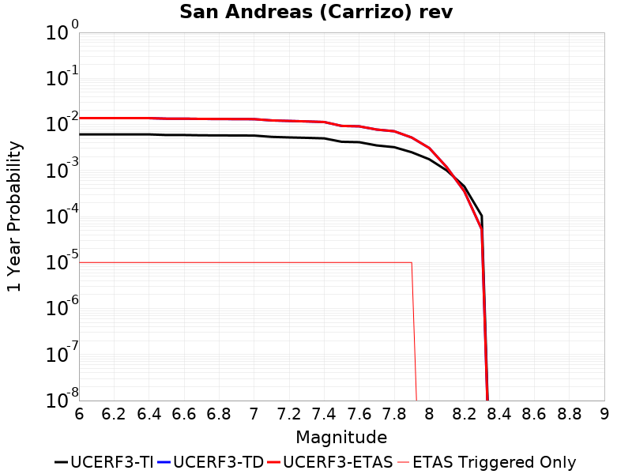 |  |

| Magnitude | 1 wk TI Prob | 1 wk TD Prob | 1 wk ETAS Prob | 1 wk ETAS/TD Gain | 1 wk ETAS Triggered Only | 1 mo TI Prob | 1 mo TD Prob | 1 mo ETAS Prob | 1 mo ETAS/TD Gain | 1 mo ETAS Triggered Only | 1 yr TI Prob | 1 yr TD Prob | 1 yr ETAS Prob | 1 yr ETAS/TD Gain | 1 yr ETAS Triggered Only | 10 yr TI Prob | 10 yr TD Prob | 10 yr ETAS Prob | 10 yr ETAS/TD Gain | 10 yr ETAS Triggered Only |
|-----|-----|-----|-----|-----|-----|-----|-----|-----|-----|-----|-----|-----|-----|-----|-----|-----|-----|-----|-----|-----|
| 6.0 | 1.1674632E-4 | 2.6416322E-4 | 2.6416322E-4 | 1.0 | 0.0 | 5.002454E-4 | 0.0011316387 | 0.0011316387 | 1.0 | 0.0 | 0.006073493 | 0.013691235 | 0.013701098 | 1.0007204 | 1.0E-5 | 0.0591016 | 0.12932026 | 0.12932898 | 1.0000674 | 1.0E-5 |
| 6.1 | 1.1674632E-4 | 2.6416322E-4 | 2.6416322E-4 | 1.0 | 0.0 | 5.002454E-4 | 0.0011316387 | 0.0011316387 | 1.0 | 0.0 | 0.006073493 | 0.013691235 | 0.013701098 | 1.0007204 | 1.0E-5 | 0.0591016 | 0.12932026 | 0.12932898 | 1.0000674 | 1.0E-5 |
| 6.2 | 1.1674632E-4 | 2.6416322E-4 | 2.6416322E-4 | 1.0 | 0.0 | 5.002454E-4 | 0.0011316387 | 0.0011316387 | 1.0 | 0.0 | 0.006073493 | 0.013691235 | 0.013701098 | 1.0007204 | 1.0E-5 | 0.0591016 | 0.12932026 | 0.12932898 | 1.0000674 | 1.0E-5 |
| 6.3 | 1.1674632E-4 | 2.6416322E-4 | 2.6416322E-4 | 1.0 | 0.0 | 5.002454E-4 | 0.0011316387 | 0.0011316387 | 1.0 | 0.0 | 0.006073493 | 0.013691235 | 0.013701098 | 1.0007204 | 1.0E-5 | 0.0591016 | 0.12932026 | 0.12932898 | 1.0000674 | 1.0E-5 |
| 6.4 | 1.1674632E-4 | 2.6416322E-4 | 2.6416322E-4 | 1.0 | 0.0 | 5.002454E-4 | 0.0011316387 | 0.0011316387 | 1.0 | 0.0 | 0.006073493 | 0.013691235 | 0.013701098 | 1.0007204 | 1.0E-5 | 0.0591016 | 0.12932026 | 0.12932898 | 1.0000674 | 1.0E-5 |
| 6.5 | 1.13136164E-4 | 2.5723714E-4 | 2.5723714E-4 | 1.0 | 0.0 | 4.847792E-4 | 0.0011019808 | 0.0011019808 | 1.0 | 0.0 | 0.0058862255 | 0.013334613 | 0.01334448 | 1.0007399 | 1.0E-5 | 0.057327334 | 0.126277 | 0.12628575 | 1.0000691 | 1.0E-5 |
| 6.6 | 1.13136164E-4 | 2.5723714E-4 | 2.5723714E-4 | 1.0 | 0.0 | 4.847792E-4 | 0.0011019808 | 0.0011019808 | 1.0 | 0.0 | 0.0058862255 | 0.013334613 | 0.01334448 | 1.0007399 | 1.0E-5 | 0.057327334 | 0.126277 | 0.12628575 | 1.0000691 | 1.0E-5 |
| 6.7 | 1.1149675E-4 | 2.540919E-4 | 2.540919E-4 | 1.0 | 0.0 | 4.777557E-4 | 0.0010885125 | 0.0010885125 | 1.0 | 0.0 | 0.0058011734 | 0.013172628 | 0.013182497 | 1.0007491 | 1.0E-5 | 0.05652051 | 0.124895595 | 0.12490435 | 1.0000701 | 1.0E-5 |
| 6.8 | 1.1103589E-4 | 2.5307928E-4 | 2.5307928E-4 | 1.0 | 0.0 | 4.7578133E-4 | 0.0010841764 | 0.0010841764 | 1.0 | 0.0 | 0.005777263 | 0.013120472 | 0.013130342 | 1.0007522 | 1.0E-5 | 0.056293584 | 0.124446265 | 0.12445503 | 1.0000703 | 1.0E-5 |
| 6.9 | 1.1053259E-4 | 2.5196545E-4 | 2.5196545E-4 | 1.0 | 0.0 | 4.7362508E-4 | 0.0010794067 | 0.0010794067 | 1.0 | 0.0 | 0.0057511497 | 0.013063101 | 0.01307297 | 1.0007555 | 1.0E-5 | 0.05604569 | 0.12395169 | 0.12396045 | 1.0000707 | 1.0E-5 |
| 7.0 | 1.1005377E-4 | 2.5093867E-4 | 2.5093867E-4 | 1.0 | 0.0 | 4.7157376E-4 | 0.0010750098 | 0.0010750098 | 1.0 | 0.0 | 0.0057263062 | 0.013010209 | 0.01302008 | 1.0007586 | 1.0E-5 | 0.055809796 | 0.12349404 | 0.123502806 | 1.0000709 | 1.0E-5 |
| 7.1 | 1.0308142E-4 | 2.3550657E-4 | 2.3550657E-4 | 1.0 | 0.0 | 4.417027E-4 | 0.0010089247 | 0.0010089247 | 1.0 | 0.0 | 0.0053644776 | 0.012214854 | 0.012224732 | 1.0008087 | 1.0E-5 | 0.052368138 | 0.11661513 | 0.11662396 | 1.0000757 | 1.0E-5 |
| 7.2 | 1.0027479E-4 | 2.2937686E-4 | 2.2937686E-4 | 1.0 | 0.0 | 4.296783E-4 | 9.826744E-4 | 9.826744E-4 | 1.0 | 0.0 | 0.0052187922 | 0.011898791 | 0.011908673 | 1.0008304 | 1.0E-5 | 0.050979212 | 0.11385806 | 0.113866925 | 1.0000778 | 1.0E-5 |
| 7.3 | 9.816942E-5 | 2.2380531E-4 | 2.2380531E-4 | 1.0 | 0.0 | 4.2065824E-4 | 9.5881417E-4 | 9.5881417E-4 | 1.0 | 0.0 | 0.005109493 | 0.011611424 | 0.0116213085 | 1.0008513 | 1.0E-5 | 0.049935985 | 0.11133491 | 0.1113438 | 1.0000799 | 1.0E-5 |
| 7.4 | 9.5634205E-5 | 2.1716232E-4 | 2.1716232E-4 | 1.0 | 0.0 | 4.0979648E-4 | 9.3036477E-4 | 9.3036477E-4 | 1.0 | 0.0 | 0.0049778637 | 0.011268679 | 0.011278566 | 1.0008774 | 1.0E-5 | 0.048678253 | 0.108319014 | 0.10832793 | 1.0000824 | 1.0E-5 |
| 7.5 | 8.052417E-5 | 1.7846726E-4 | 1.7846726E-4 | 1.0 | 0.0 | 3.4505792E-4 | 7.6463574E-4 | 7.6463574E-4 | 1.0 | 0.0 | 0.0041929903 | 0.009269809 | 0.009279717 | 1.0010687 | 1.0E-5 | 0.04114753 | 0.09045039 | 0.09045949 | 1.0001006 | 1.0E-5 |
| 7.6 | 7.897024E-5 | 1.7481668E-4 | 1.7481668E-4 | 1.0 | 0.0 | 3.384E-4 | 7.489994E-4 | 7.489994E-4 | 1.0 | 0.0 | 0.0041122385 | 0.00908104 | 0.009090949 | 1.0010912 | 1.0E-5 | 0.040369697 | 0.08873117 | 0.08874028 | 1.0001028 | 1.0E-5 |
| 7.7 | 6.707427E-5 | 1.4864461E-4 | 1.4864461E-4 | 1.0 | 0.0 | 2.8742946E-4 | 6.3689286E-4 | 6.3689286E-4 | 1.0 | 0.0 | 0.003493839 | 0.007726649 | 0.0077365716 | 1.0012842 | 1.0E-5 | 0.034394164 | 0.07618075 | 0.07618999 | 1.0001212 | 1.0E-5 |
| 7.8 | 6.147705E-5 | 1.3659235E-4 | 1.3659235E-4 | 1.0 | 0.0 | 2.6344648E-4 | 5.852645E-4 | 5.852645E-4 | 1.0 | 0.0 | 0.0032027436 | 0.007102351 | 0.00711228 | 1.001398 | 1.0E-5 | 0.031569764 | 0.07012356 | 0.07013286 | 1.0001326 | 1.0E-5 |
| 7.9 | 4.7636717E-5 | 9.9560835E-5 | 9.9560835E-5 | 1.0 | 0.0 | 2.0414138E-4 | 4.2661955E-4 | 4.2661955E-4 | 1.0 | 0.0 | 0.0024825884 | 0.005181734 | 0.0051916824 | 1.0019199 | 1.0E-5 | 0.024550365 | 0.05164693 | 0.051656414 | 1.0001836 | 1.0E-5 |
| 8.0 | 3.3554235E-5 | 5.9019396E-5 | 5.9019396E-5 | 1.0 | 0.0 | 1.4379594E-4 | 2.5291575E-4 | 2.5291575E-4 | 1.0 | 0.0 | 0.0017493097 | 0.0030749037 | 0.0030749037 | 1.0 | 0.0 | 0.017356034 | 0.031230139 | 0.031230139 | 1.0 | 0.0 |
| 8.1 | 1.9175432E-5 | 2.2550028E-5 | 2.2550028E-5 | 1.0 | 0.0 | 8.217783E-5 | 9.66394E-5 | 9.66394E-5 | 1.0 | 0.0 | 0.0010000558 | 0.0011759505 | 0.0011759505 | 1.0 | 0.0 | 0.009955673 | 0.012502483 | 0.012502483 | 1.0 | 0.0 |
| 8.2 | 8.643924E-6 | 6.7827064E-6 | 6.7827064E-6 | 1.0 | 0.0 | 3.704486E-5 | 2.9068418E-5 | 2.9068418E-5 | 1.0 | 0.0 | 4.5092785E-4 | 3.5385066E-4 | 3.5385066E-4 | 1.0 | 0.0 | 0.0045001395 | 0.00395419 | 0.00395419 | 1.0 | 0.0 |
| 8.3 | 1.983087E-6 | 9.998656E-7 | 9.998656E-7 | 1.0 | 0.0 | 8.498917E-6 | 4.285131E-6 | 4.285131E-6 | 1.0 | 0.0 | 1.034694E-4 | 5.2170253E-5 | 5.2170253E-5 | 1.0 | 0.0 | 0.0010342124 | 6.042036E-4 | 6.042036E-4 | 1.0 | 0.0 |

## Puente Hills
*[(top)](#table-of-contents)*

| 1 Week | 1 Month | 1 Year | 10 Year |
|-----|-----|-----|-----|
|  |  |  | 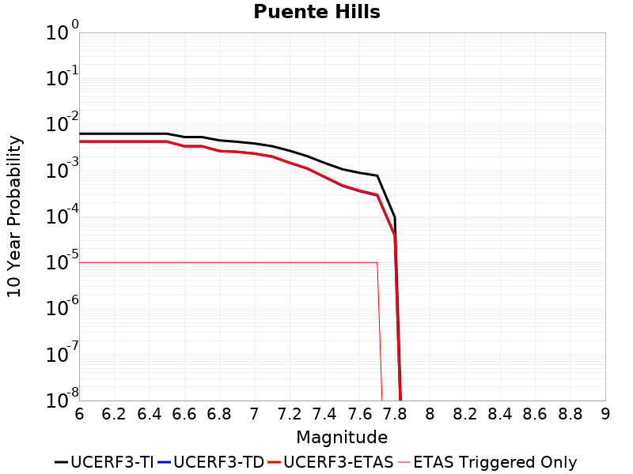 |

| Magnitude | 1 wk TI Prob | 1 wk TD Prob | 1 wk ETAS Prob | 1 wk ETAS/TD Gain | 1 wk ETAS Triggered Only | 1 mo TI Prob | 1 mo TD Prob | 1 mo ETAS Prob | 1 mo ETAS/TD Gain | 1 mo ETAS Triggered Only | 1 yr TI Prob | 1 yr TD Prob | 1 yr ETAS Prob | 1 yr ETAS/TD Gain | 1 yr ETAS Triggered Only | 10 yr TI Prob | 10 yr TD Prob | 10 yr ETAS Prob | 10 yr ETAS/TD Gain | 10 yr ETAS Triggered Only |
|-----|-----|-----|-----|-----|-----|-----|-----|-----|-----|-----|-----|-----|-----|-----|-----|-----|-----|-----|-----|-----|
| 6.0 | 1.2101656E-5 | 8.149895E-6 | 8.149895E-6 | 1.0 | 0.0 | 5.1863204E-5 | 3.4927685E-5 | 3.4927685E-5 | 1.0 | 0.0 | 6.312516E-4 | 4.2516727E-4 | 4.35163E-4 | 1.0235101 | 1.0E-5 | 0.0062946146 | 0.0042441026 | 0.0042540603 | 1.0023462 | 1.0E-5 |
| 6.1 | 1.2101656E-5 | 8.149895E-6 | 8.149895E-6 | 1.0 | 0.0 | 5.1863204E-5 | 3.4927685E-5 | 3.4927685E-5 | 1.0 | 0.0 | 6.312516E-4 | 4.2516727E-4 | 4.35163E-4 | 1.0235101 | 1.0E-5 | 0.0062946146 | 0.0042441026 | 0.0042540603 | 1.0023462 | 1.0E-5 |
| 6.2 | 1.2101656E-5 | 8.149895E-6 | 8.149895E-6 | 1.0 | 0.0 | 5.1863204E-5 | 3.4927685E-5 | 3.4927685E-5 | 1.0 | 0.0 | 6.312516E-4 | 4.2516727E-4 | 4.35163E-4 | 1.0235101 | 1.0E-5 | 0.0062946146 | 0.0042441026 | 0.0042540603 | 1.0023462 | 1.0E-5 |
| 6.3 | 1.2101656E-5 | 8.149895E-6 | 8.149895E-6 | 1.0 | 0.0 | 5.1863204E-5 | 3.4927685E-5 | 3.4927685E-5 | 1.0 | 0.0 | 6.312516E-4 | 4.2516727E-4 | 4.35163E-4 | 1.0235101 | 1.0E-5 | 0.0062946146 | 0.0042441026 | 0.0042540603 | 1.0023462 | 1.0E-5 |
| 6.4 | 1.2101656E-5 | 8.149895E-6 | 8.149895E-6 | 1.0 | 0.0 | 5.1863204E-5 | 3.4927685E-5 | 3.4927685E-5 | 1.0 | 0.0 | 6.312516E-4 | 4.2516727E-4 | 4.35163E-4 | 1.0235101 | 1.0E-5 | 0.0062946146 | 0.0042441026 | 0.0042540603 | 1.0023462 | 1.0E-5 |
| 6.5 | 1.2101656E-5 | 8.149895E-6 | 8.149895E-6 | 1.0 | 0.0 | 5.1863204E-5 | 3.4927685E-5 | 3.4927685E-5 | 1.0 | 0.0 | 6.312516E-4 | 4.2516727E-4 | 4.35163E-4 | 1.0235101 | 1.0E-5 | 0.0062946146 | 0.0042441026 | 0.0042540603 | 1.0023462 | 1.0E-5 |
| 6.6 | 1.0222488E-5 | 6.445789E-6 | 6.445789E-6 | 1.0 | 0.0 | 4.3809923E-5 | 2.7624532E-5 | 2.7624532E-5 | 1.0 | 0.0 | 5.332553E-4 | 3.3627925E-4 | 3.462759E-4 | 1.0297272 | 1.0E-5 | 0.0053197746 | 0.0033579513 | 0.0033679178 | 1.002968 | 1.0E-5 |
| 6.7 | 1.0222488E-5 | 6.445789E-6 | 6.445789E-6 | 1.0 | 0.0 | 4.3809923E-5 | 2.7624532E-5 | 2.7624532E-5 | 1.0 | 0.0 | 5.332553E-4 | 3.3627925E-4 | 3.462759E-4 | 1.0297272 | 1.0E-5 | 0.0053197746 | 0.0033579513 | 0.0033679178 | 1.002968 | 1.0E-5 |
| 6.8 | 8.6367845E-6 | 5.069638E-6 | 5.069638E-6 | 1.0 | 0.0 | 3.7014266E-5 | 2.1726843E-5 | 2.1726843E-5 | 1.0 | 0.0 | 4.505555E-4 | 2.6449276E-4 | 2.7449013E-4 | 1.0377982 | 1.0E-5 | 0.004496431 | 0.0026418369 | 0.0026518104 | 1.0037752 | 1.0E-5 |
| 6.9 | 8.066481E-6 | 4.876415E-6 | 4.876415E-6 | 1.0 | 0.0 | 3.4570177E-5 | 2.0898757E-5 | 2.0898757E-5 | 1.0 | 0.0 | 4.2081063E-4 | 2.544132E-4 | 2.6441066E-4 | 1.0392962 | 1.0E-5 | 0.0042001465 | 0.0025412738 | 0.0025512485 | 1.0039251 | 1.0E-5 |
| 7.0 | 7.393828E-6 | 4.455737E-6 | 4.455737E-6 | 1.0 | 0.0 | 3.168745E-5 | 1.9095876E-5 | 1.9095876E-5 | 1.0 | 0.0 | 3.857264E-4 | 2.3246795E-4 | 2.4246563E-4 | 1.0430067 | 1.0E-5 | 0.0038505755 | 0.002322294 | 0.0023322708 | 1.0042961 | 1.0E-5 |
| 7.1 | 6.4660953E-6 | 3.837349E-6 | 3.837349E-6 | 1.0 | 0.0 | 2.7711543E-5 | 1.644568E-5 | 1.644568E-5 | 1.0 | 0.0 | 3.373358E-4 | 2.0020812E-4 | 2.1020611E-4 | 1.0499381 | 1.0E-5 | 0.0033682417 | 0.0020003137 | 0.0020102938 | 1.0049893 | 1.0E-5 |
| 7.2 | 5.143232E-6 | 2.809916E-6 | 2.809916E-6 | 1.0 | 0.0 | 2.2042237E-5 | 1.2042441E-5 | 1.2042441E-5 | 1.0 | 0.0 | 2.6833118E-4 | 1.4660695E-4 | 1.5660549E-4 | 1.0681996 | 1.0E-5 | 0.002680074 | 0.0014651123 | 0.0014750976 | 1.0068154 | 1.0E-5 |
| 7.3 | 3.928255E-6 | 2.1111398E-6 | 2.1111398E-6 | 1.0 | 0.0 | 1.683527E-5 | 9.0477115E-6 | 9.0477115E-6 | 1.0 | 0.0 | 2.0495013E-4 | 1.1015039E-4 | 1.20149285E-4 | 1.090775 | 1.0E-5 | 0.002047612 | 0.0011009647 | 0.0011109536 | 1.0090729 | 1.0E-5 |
| 7.4 | 2.7894434E-6 | 1.3711082E-6 | 1.3711082E-6 | 1.0 | 0.0 | 1.1954703E-5 | 5.876165E-6 | 5.876165E-6 | 1.0 | 0.0 | 1.4553878E-4 | 7.154E-5 | 8.153929E-5 | 1.1397719 | 1.0E-5 | 0.001454435 | 7.1517425E-4 | 7.251671E-4 | 1.0139726 | 1.0E-5 |
| 7.5 | 2.041735E-6 | 8.9144703E-7 | 8.9144703E-7 | 1.0 | 0.0 | 8.750263E-6 | 3.8204817E-6 | 3.8204817E-6 | 1.0 | 0.0 | 1.06529245E-4 | 4.6513407E-5 | 5.651294E-5 | 1.2149818 | 1.0E-5 | 0.0010647819 | 4.6504015E-4 | 4.7503551E-4 | 1.0214936 | 1.0E-5 |
| 7.6 | 1.6959062E-6 | 6.798903E-7 | 6.798903E-7 | 1.0 | 0.0 | 7.268149E-6 | 2.9138125E-6 | 2.9138125E-6 | 1.0 | 0.0 | 8.848612E-5 | 3.547512E-5 | 4.5474768E-5 | 1.2818776 | 1.0E-5 | 8.84509E-4 | 3.5469755E-4 | 3.64694E-4 | 1.028183 | 1.0E-5 |
| 7.7 | 1.4767965E-6 | 5.4868383E-7 | 5.4868383E-7 | 1.0 | 0.0 | 6.3291122E-6 | 2.3515001E-6 | 2.3515001E-6 | 1.0 | 0.0 | 7.705422E-5 | 2.8629165E-5 | 3.8628878E-5 | 1.3492842 | 1.0E-5 | 7.702751E-4 | 2.862574E-4 | 2.9625453E-4 | 1.0349236 | 1.0E-5 |
| 7.8 | 1.8432911E-7 | 7.349981E-8 | 7.349981E-8 | 1.0 | 0.0 | 7.8998164E-7 | 3.149992E-7 | 3.149992E-7 | 1.0 | 0.0 | 9.617985E-6 | 3.835112E-6 | 3.835112E-6 | 1.0 | 0.0 | 9.617568E-5 | 3.8350787E-5 | 3.8350787E-5 | 1.0 | 0.0 |

## Hunting Creek - Berryessa 2011 CFM
*[(top)](#table-of-contents)*

| 1 Week | 1 Month | 1 Year | 10 Year |
|-----|-----|-----|-----|
|  |  |  | 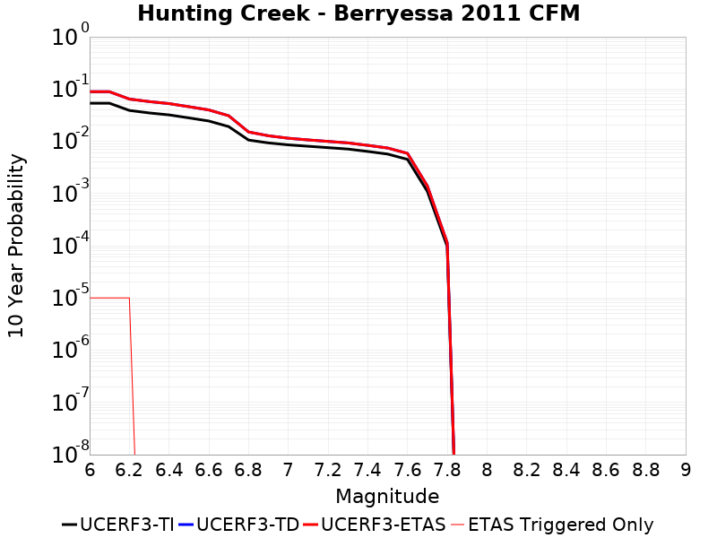 |

| Magnitude | 1 wk TI Prob | 1 wk TD Prob | 1 wk ETAS Prob | 1 wk ETAS/TD Gain | 1 wk ETAS Triggered Only | 1 mo TI Prob | 1 mo TD Prob | 1 mo ETAS Prob | 1 mo ETAS/TD Gain | 1 mo ETAS Triggered Only | 1 yr TI Prob | 1 yr TD Prob | 1 yr ETAS Prob | 1 yr ETAS/TD Gain | 1 yr ETAS Triggered Only | 10 yr TI Prob | 10 yr TD Prob | 10 yr ETAS Prob | 10 yr ETAS/TD Gain | 10 yr ETAS Triggered Only |
|-----|-----|-----|-----|-----|-----|-----|-----|-----|-----|-----|-----|-----|-----|-----|-----|-----|-----|-----|-----|-----|
| 6.0 | 1.0533147E-4 | 1.7935074E-4 | 1.7935074E-4 | 1.0 | 0.0 | 4.5134246E-4 | 7.6838396E-4 | 7.6838396E-4 | 1.0 | 0.0 | 0.005481258 | 0.009310324 | 0.009310324 | 1.0 | 0.0 | 0.053480163 | 0.088688985 | 0.0886981 | 1.0001028 | 1.0E-5 |
| 6.1 | 1.0510782E-4 | 1.7922455E-4 | 1.7922455E-4 | 1.0 | 0.0 | 4.503843E-4 | 7.6784356E-4 | 7.6784356E-4 | 1.0 | 0.0 | 0.005469651 | 0.009303805 | 0.009303805 | 1.0 | 0.0 | 0.05336969 | 0.08862953 | 0.08863864 | 1.0001029 | 1.0E-5 |
| 6.2 | 7.595682E-5 | 1.281894E-4 | 1.281894E-4 | 1.0 | 0.0 | 3.254886E-4 | 5.4923806E-4 | 5.4923806E-4 | 1.0 | 0.0 | 0.0039556245 | 0.0066628316 | 0.0066628316 | 1.0 | 0.0 | 0.03885951 | 0.06413891 | 0.06414827 | 1.0001459 | 1.0E-5 |
| 6.3 | 6.787612E-5 | 1.14309325E-4 | 1.14309325E-4 | 1.0 | 0.0 | 2.9086522E-4 | 4.897797E-4 | 4.897797E-4 | 1.0 | 0.0 | 0.0035355345 | 0.0059438697 | 0.0059438697 | 1.0 | 0.0 | 0.034798115 | 0.057413742 | 0.057413742 | 1.0 | 0.0 |
| 6.4 | 6.2165134E-5 | 1.0421056E-4 | 1.0421056E-4 | 1.0 | 0.0 | 2.6639478E-4 | 4.4651912E-4 | 4.4651912E-4 | 1.0 | 0.0 | 0.0032385332 | 0.0054204417 | 0.0054204417 | 1.0 | 0.0 | 0.03191742 | 0.0525114 | 0.0525114 | 1.0 | 0.0 |
| 6.5 | 5.4368087E-5 | 9.0435125E-5 | 9.0435125E-5 | 1.0 | 0.0 | 2.3298527E-4 | 3.8750036E-4 | 3.8750036E-4 | 1.0 | 0.0 | 0.0028329059 | 0.0047059194 | 0.0047059194 | 1.0 | 0.0 | 0.027970633 | 0.045778614 | 0.045778614 | 1.0 | 0.0 |
| 6.6 | 4.729947E-5 | 7.8143785E-5 | 7.8143785E-5 | 1.0 | 0.0 | 2.0269625E-4 | 3.3484717E-4 | 3.3484717E-4 | 1.0 | 0.0 | 0.002465034 | 0.0040679756 | 0.0040679756 | 1.0 | 0.0 | 0.02437869 | 0.039720055 | 0.039720055 | 1.0 | 0.0 |
| 6.7 | 3.6875328E-5 | 6.012169E-5 | 6.012169E-5 | 1.0 | 0.0 | 1.5802756E-4 | 2.5763E-4 | 2.5763E-4 | 1.0 | 0.0 | 0.0019222875 | 0.0031316648 | 0.0031316648 | 1.0 | 0.0 | 0.019057442 | 0.030755816 | 0.030755816 | 1.0 | 0.0 |
| 6.8 | 2.0292036E-5 | 2.907337E-5 | 2.907337E-5 | 1.0 | 0.0 | 8.6962966E-5 | 1.2459411E-4 | 1.2459411E-4 | 1.0 | 0.0 | 0.0010582599 | 0.0015158657 | 0.0015158657 | 1.0 | 0.0 | 0.010532344 | 0.015029482 | 0.015029482 | 1.0 | 0.0 |
| 6.9 | 1.7871042E-5 | 2.4559837E-5 | 2.4559837E-5 | 1.0 | 0.0 | 7.658793E-5 | 1.052522E-4 | 1.052522E-4 | 1.0 | 0.0 | 9.320591E-4 | 0.0012806916 | 0.0012806916 | 1.0 | 0.0 | 0.009281595 | 0.012724797 | 0.012724797 | 1.0 | 0.0 |
| 7.0 | 1.6415532E-5 | 2.199382E-5 | 2.199382E-5 | 1.0 | 0.0 | 7.035038E-5 | 9.425583E-5 | 9.425583E-5 | 1.0 | 0.0 | 8.561793E-4 | 0.0011469618 | 0.0011469618 | 1.0 | 0.0 | 0.008528882 | 0.011409159 | 0.011409159 | 1.0 | 0.0 |
| 7.1 | 1.5409885E-5 | 2.0417612E-5 | 2.0417612E-5 | 1.0 | 0.0 | 6.6040695E-5 | 8.750113E-5 | 8.750113E-5 | 1.0 | 0.0 | 8.0374884E-4 | 0.0010648082 | 0.0010648082 | 1.0 | 0.0 | 0.00800848 | 0.010596938 | 0.010596938 | 1.0 | 0.0 |
| 7.2 | 1.4497423E-5 | 1.9119412E-5 | 1.9119412E-5 | 1.0 | 0.0 | 6.213033E-5 | 8.193778E-5 | 8.193778E-5 | 1.0 | 0.0 | 7.5617427E-4 | 9.97139E-4 | 9.97139E-4 | 1.0 | 0.0 | 0.0075360634 | 0.009926821 | 0.009926821 | 1.0 | 0.0 |
| 7.3 | 1.3615175E-5 | 1.7874656E-5 | 1.7874656E-5 | 1.0 | 0.0 | 5.8349444E-5 | 7.6603435E-5 | 7.6603435E-5 | 1.0 | 0.0 | 7.101729E-4 | 9.322507E-4 | 9.322507E-4 | 1.0 | 0.0 | 0.0070790765 | 0.009283577 | 0.009283577 | 1.0 | 0.0 |
| 7.4 | 1.2252825E-5 | 1.6061938E-5 | 1.6061938E-5 | 1.0 | 0.0 | 5.251105E-5 | 6.883508E-5 | 6.883508E-5 | 1.0 | 0.0 | 6.391345E-4 | 8.3774765E-4 | 8.3774765E-4 | 1.0 | 0.0 | 0.0063729943 | 0.008345973 | 0.008345973 | 1.0 | 0.0 |
| 7.5 | 1.0913301E-5 | 1.4269101E-5 | 1.4269101E-5 | 1.0 | 0.0 | 4.6770452E-5 | 6.115187E-5 | 6.115187E-5 | 1.0 | 0.0 | 5.6928146E-4 | 7.4427243E-4 | 7.4427243E-4 | 1.0 | 0.0 | 0.0056782532 | 0.007417951 | 0.007417951 | 1.0 | 0.0 |
| 7.6 | 8.623192E-6 | 1.12545395E-5 | 1.12545395E-5 | 1.0 | 0.0 | 3.6956015E-5 | 4.8232865E-5 | 4.8232865E-5 | 1.0 | 0.0 | 4.4984656E-4 | 5.8707944E-4 | 5.8707944E-4 | 1.0 | 0.0 | 0.00448937 | 0.0058553084 | 0.0058553084 | 1.0 | 0.0 |
| 7.7 | 2.0993634E-6 | 2.6715059E-6 | 2.6715059E-6 | 1.0 | 0.0 | 8.997241E-6 | 1.14492605E-5 | 1.14492605E-5 | 1.0 | 0.0 | 1.09535904E-4 | 1.393859E-4 | 1.393859E-4 | 1.0 | 0.0 | 0.0010948193 | 0.0013929661 | 0.0013929661 | 1.0 | 0.0 |
| 7.8 | 1.8428308E-7 | 2.1800615E-7 | 2.1800615E-7 | 1.0 | 0.0 | 7.897844E-7 | 9.3431174E-7 | 9.3431174E-7 | 1.0 | 0.0 | 9.615583E-6 | 1.137519E-5 | 1.137519E-5 | 1.0 | 0.0 | 9.615166E-5 | 1.13740665E-4 | 1.13740665E-4 | 1.0 | 0.0 |

## San Jose
*[(top)](#table-of-contents)*

| 1 Week | 1 Month | 1 Year | 10 Year |
|-----|-----|-----|-----|
| 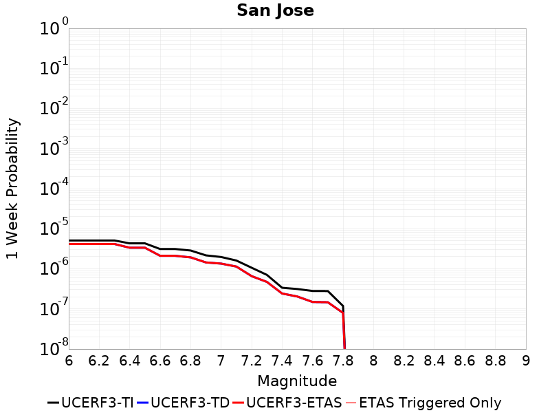 | 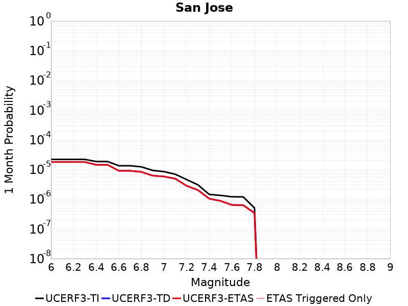 | 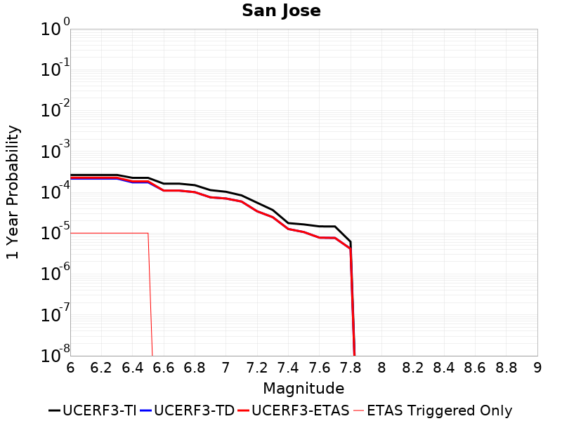 |  |

| Magnitude | 1 wk TI Prob | 1 wk TD Prob | 1 wk ETAS Prob | 1 wk ETAS/TD Gain | 1 wk ETAS Triggered Only | 1 mo TI Prob | 1 mo TD Prob | 1 mo ETAS Prob | 1 mo ETAS/TD Gain | 1 mo ETAS Triggered Only | 1 yr TI Prob | 1 yr TD Prob | 1 yr ETAS Prob | 1 yr ETAS/TD Gain | 1 yr ETAS Triggered Only | 10 yr TI Prob | 10 yr TD Prob | 10 yr ETAS Prob | 10 yr ETAS/TD Gain | 10 yr ETAS Triggered Only |
|-----|-----|-----|-----|-----|-----|-----|-----|-----|-----|-----|-----|-----|-----|-----|-----|-----|-----|-----|-----|-----|
| 6.0 | 5.0851277E-6 | 4.1528556E-6 | 4.1528556E-6 | 1.0 | 0.0 | 2.1793223E-5 | 1.7797845E-5 | 1.7797845E-5 | 1.0 | 0.0 | 2.653002E-4 | 2.1666987E-4 | 2.266677E-4 | 1.0461432 | 1.0E-5 | 0.0026498367 | 0.0021649492 | 0.0021749276 | 1.004609 | 1.0E-5 |
| 6.1 | 5.0851277E-6 | 4.1528556E-6 | 4.1528556E-6 | 1.0 | 0.0 | 2.1793223E-5 | 1.7797845E-5 | 1.7797845E-5 | 1.0 | 0.0 | 2.653002E-4 | 2.1666987E-4 | 2.266677E-4 | 1.0461432 | 1.0E-5 | 0.0026498367 | 0.0021649492 | 0.0021749276 | 1.004609 | 1.0E-5 |
| 6.2 | 5.0851277E-6 | 4.1528556E-6 | 4.1528556E-6 | 1.0 | 0.0 | 2.1793223E-5 | 1.7797845E-5 | 1.7797845E-5 | 1.0 | 0.0 | 2.653002E-4 | 2.1666987E-4 | 2.266677E-4 | 1.0461432 | 1.0E-5 | 0.0026498367 | 0.0021649492 | 0.0021749276 | 1.004609 | 1.0E-5 |
| 6.3 | 5.0851277E-6 | 4.1528556E-6 | 4.1528556E-6 | 1.0 | 0.0 | 2.1793223E-5 | 1.7797845E-5 | 1.7797845E-5 | 1.0 | 0.0 | 2.653002E-4 | 2.1666987E-4 | 2.266677E-4 | 1.0461432 | 1.0E-5 | 0.0026498367 | 0.0021649492 | 0.0021749276 | 1.004609 | 1.0E-5 |
| 6.4 | 4.3115124E-6 | 3.349771E-6 | 3.349771E-6 | 1.0 | 0.0 | 1.8477778E-5 | 1.4356096E-5 | 1.4356096E-5 | 1.0 | 0.0 | 2.2494372E-4 | 1.7477367E-4 | 1.8477191E-4 | 1.0572069 | 1.0E-5 | 0.0022471617 | 0.0017466837 | 0.0017566662 | 1.0057151 | 1.0E-5 |
| 6.5 | 4.3115124E-6 | 3.349771E-6 | 3.349771E-6 | 1.0 | 0.0 | 1.8477778E-5 | 1.4356096E-5 | 1.4356096E-5 | 1.0 | 0.0 | 2.2494372E-4 | 1.7477367E-4 | 1.8477191E-4 | 1.0572069 | 1.0E-5 | 0.0022471617 | 0.0017466837 | 0.0017566662 | 1.0057151 | 1.0E-5 |
| 6.6 | 3.110396E-6 | 2.1041726E-6 | 2.1041726E-6 | 1.0 | 0.0 | 1.33302E-5 | 9.017854E-6 | 9.017854E-6 | 1.0 | 0.0 | 1.622831E-4 | 1.0978711E-4 | 1.0978711E-4 | 1.0 | 0.0 | 0.0016216465 | 0.0010974602 | 0.0010974602 | 1.0 | 0.0 |
| 6.7 | 3.110396E-6 | 2.1041726E-6 | 2.1041726E-6 | 1.0 | 0.0 | 1.33302E-5 | 9.017854E-6 | 9.017854E-6 | 1.0 | 0.0 | 1.622831E-4 | 1.0978711E-4 | 1.0978711E-4 | 1.0 | 0.0 | 0.0016216465 | 0.0010974602 | 0.0010974602 | 1.0 | 0.0 |
| 6.8 | 2.856651E-6 | 1.9260913E-6 | 1.9260913E-6 | 1.0 | 0.0 | 1.2242733E-5 | 8.254652E-6 | 8.254652E-6 | 1.0 | 0.0 | 1.4904508E-4 | 1.0049601E-4 | 1.0049601E-4 | 1.0 | 0.0 | 0.0014894515 | 0.001004634 | 0.001004634 | 1.0 | 0.0 |
| 6.9 | 2.1618725E-6 | 1.4409343E-6 | 1.4409343E-6 | 1.0 | 0.0 | 9.265135E-6 | 6.1754185E-6 | 6.1754185E-6 | 1.0 | 0.0 | 1.12797185E-4 | 7.518322E-5 | 7.518322E-5 | 1.0 | 0.0 | 0.0011273995 | 7.5169036E-4 | 7.5169036E-4 | 1.0 | 0.0 |
| 7.0 | 1.9684312E-6 | 1.3475384E-6 | 1.3475384E-6 | 1.0 | 0.0 | 8.436106E-6 | 5.775152E-6 | 5.775152E-6 | 1.0 | 0.0 | 1.02704755E-4 | 7.031029E-5 | 7.031029E-5 | 1.0 | 0.0 | 0.001026573 | 7.029925E-4 | 7.029925E-4 | 1.0 | 0.0 |
| 7.1 | 1.6070337E-6 | 1.1364749E-6 | 1.1364749E-6 | 1.0 | 0.0 | 6.887269E-6 | 4.870598E-6 | 4.870598E-6 | 1.0 | 0.0 | 8.384928E-5 | 5.929798E-5 | 5.929798E-5 | 1.0 | 0.0 | 8.3817646E-4 | 5.929316E-4 | 5.929316E-4 | 1.0 | 0.0 |
| 7.2 | 1.0631658E-6 | 6.561876E-7 | 6.561876E-7 | 1.0 | 0.0 | 4.556417E-6 | 2.8122295E-6 | 2.8122295E-6 | 1.0 | 0.0 | 5.5472963E-5 | 3.4238372E-5 | 3.4238372E-5 | 1.0 | 0.0 | 5.545912E-4 | 3.4243608E-4 | 3.4243608E-4 | 1.0 | 0.0 |
| 7.3 | 7.060711E-7 | 4.712109E-7 | 4.712109E-7 | 1.0 | 0.0 | 3.0260155E-6 | 2.0194739E-6 | 2.0194739E-6 | 1.0 | 0.0 | 3.6841117E-5 | 2.4586825E-5 | 2.4586825E-5 | 1.0 | 0.0 | 3.6835007E-4 | 2.4594567E-4 | 2.4594567E-4 | 1.0 | 0.0 |
| 7.4 | 3.3677085E-7 | 2.419299E-7 | 2.419299E-7 | 1.0 | 0.0 | 1.4433028E-6 | 1.0368421E-6 | 1.0368421E-6 | 1.0 | 0.0 | 1.757207E-5 | 1.2623483E-5 | 1.2623483E-5 | 1.0 | 0.0 | 1.7570681E-4 | 1.2633165E-4 | 1.2633165E-4 | 1.0 | 0.0 |
| 7.5 | 3.129161E-7 | 2.0349438E-7 | 2.0349438E-7 | 1.0 | 0.0 | 1.3410682E-6 | 8.7211845E-7 | 8.7211845E-7 | 1.0 | 0.0 | 1.6327383E-5 | 1.0617993E-5 | 1.0617993E-5 | 1.0 | 0.0 | 1.6326184E-4 | 1.06278814E-4 | 1.06278814E-4 | 1.0 | 0.0 |
| 7.6 | 2.8008668E-7 | 1.486692E-7 | 1.486692E-7 | 1.0 | 0.0 | 1.2003709E-6 | 6.3715356E-7 | 6.3715356E-7 | 1.0 | 0.0 | 1.46144175E-5 | 7.757319E-6 | 7.757319E-6 | 1.0 | 0.0 | 1.4613457E-4 | 7.767434E-5 | 7.767434E-5 | 1.0 | 0.0 |
| 7.7 | 2.7852005E-7 | 1.4635397E-7 | 1.4635397E-7 | 1.0 | 0.0 | 1.1936568E-6 | 6.2723115E-7 | 6.2723115E-7 | 1.0 | 0.0 | 1.4532674E-5 | 7.636514E-6 | 7.636514E-6 | 1.0 | 0.0 | 1.4531724E-4 | 7.646637E-5 | 7.646637E-5 | 1.0 | 0.0 |
| 7.8 | 1.1810797E-7 | 7.931202E-8 | 7.931202E-8 | 1.0 | 0.0 | 5.0617695E-7 | 3.399086E-7 | 3.399086E-7 | 1.0 | 0.0 | 6.1626865E-6 | 4.13838E-6 | 4.13838E-6 | 1.0 | 0.0 | 6.162516E-5 | 4.14762E-5 | 4.14762E-5 | 1.0 | 0.0 |

## Ludlow
*[(top)](#table-of-contents)*

| 1 Week | 1 Month | 1 Year | 10 Year |
|-----|-----|-----|-----|
|  |  | 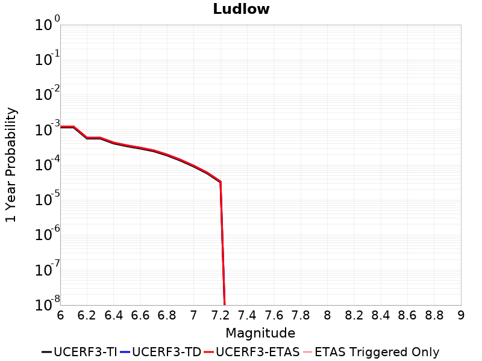 |  |

| Magnitude | 1 wk TI Prob | 1 wk TD Prob | 1 wk ETAS Prob | 1 wk ETAS/TD Gain | 1 wk ETAS Triggered Only | 1 mo TI Prob | 1 mo TD Prob | 1 mo ETAS Prob | 1 mo ETAS/TD Gain | 1 mo ETAS Triggered Only | 1 yr TI Prob | 1 yr TD Prob | 1 yr ETAS Prob | 1 yr ETAS/TD Gain | 1 yr ETAS Triggered Only | 10 yr TI Prob | 10 yr TD Prob | 10 yr ETAS Prob | 10 yr ETAS/TD Gain | 10 yr ETAS Triggered Only |
|-----|-----|-----|-----|-----|-----|-----|-----|-----|-----|-----|-----|-----|-----|-----|-----|-----|-----|-----|-----|-----|
| 6.0 | 2.2407607E-5 | 2.3711124E-5 | 2.3711124E-5 | 1.0 | 0.0 | 9.602906E-5 | 1.0161539E-4 | 1.0161539E-4 | 1.0 | 0.0 | 0.0011685267 | 0.0012365096 | 0.0012365096 | 1.0 | 0.0 | 0.011624013 | 0.012300829 | 0.012310706 | 1.000803 | 1.0E-5 |
| 6.1 | 2.2407607E-5 | 2.3711124E-5 | 2.3711124E-5 | 1.0 | 0.0 | 9.602906E-5 | 1.0161539E-4 | 1.0161539E-4 | 1.0 | 0.0 | 0.0011685267 | 0.0012365096 | 0.0012365096 | 1.0 | 0.0 | 0.011624013 | 0.012300829 | 0.012310706 | 1.000803 | 1.0E-5 |
| 6.2 | 1.0781252E-5 | 1.1390816E-5 | 1.1390816E-5 | 1.0 | 0.0 | 4.620455E-5 | 4.8816895E-5 | 4.8816895E-5 | 1.0 | 0.0 | 5.623952E-4 | 5.9418764E-4 | 5.9418764E-4 | 1.0 | 0.0 | 0.00560974 | 0.00592641 | 0.00592641 | 1.0 | 0.0 |
| 6.3 | 1.0781252E-5 | 1.1390816E-5 | 1.1390816E-5 | 1.0 | 0.0 | 4.620455E-5 | 4.8816895E-5 | 4.8816895E-5 | 1.0 | 0.0 | 5.623952E-4 | 5.9418764E-4 | 5.9418764E-4 | 1.0 | 0.0 | 0.00560974 | 0.00592641 | 0.00592641 | 1.0 | 0.0 |
| 6.4 | 7.814439E-6 | 8.255949E-6 | 8.255949E-6 | 1.0 | 0.0 | 3.3490025E-5 | 3.5382167E-5 | 3.5382167E-5 | 1.0 | 0.0 | 4.0766477E-4 | 4.3069414E-4 | 4.3069414E-4 | 1.0 | 0.0 | 0.0040691774 | 0.0042987415 | 0.0042987415 | 1.0 | 0.0 |
| 6.5 | 6.4986366E-6 | 6.8660847E-6 | 6.8660847E-6 | 1.0 | 0.0 | 2.7851002E-5 | 2.9425752E-5 | 2.9425752E-5 | 1.0 | 0.0 | 3.390332E-4 | 3.5820054E-4 | 3.5820054E-4 | 1.0 | 0.0 | 0.003385164 | 0.0035763285 | 0.0035763285 | 1.0 | 0.0 |
| 6.6 | 5.582177E-6 | 5.8990886E-6 | 5.8990886E-6 | 1.0 | 0.0 | 2.3923398E-5 | 2.5281568E-5 | 2.5281568E-5 | 1.0 | 0.0 | 2.9122844E-4 | 3.0776032E-4 | 3.0776032E-4 | 1.0 | 0.0 | 0.0029084706 | 0.0030734148 | 0.0030734148 | 1.0 | 0.0 |
| 6.7 | 4.6858763E-6 | 4.951386E-6 | 4.951386E-6 | 1.0 | 0.0 | 2.0082172E-5 | 2.1220058E-5 | 2.1220058E-5 | 1.0 | 0.0 | 2.4447302E-4 | 2.5832411E-4 | 2.5832411E-4 | 1.0 | 0.0 | 0.0024420423 | 0.002580295 | 0.002580295 | 1.0 | 0.0 |
| 6.8 | 3.5584908E-6 | 3.7603486E-6 | 3.7603486E-6 | 1.0 | 0.0 | 1.5250586E-5 | 1.6115682E-5 | 1.6115682E-5 | 1.0 | 0.0 | 1.8566006E-4 | 1.9619118E-4 | 1.9619118E-4 | 1.0 | 0.0 | 0.0018550502 | 0.001960221 | 0.001960221 | 1.0 | 0.0 |
| 6.9 | 2.532834E-6 | 2.6769505E-6 | 2.6769505E-6 | 1.0 | 0.0 | 1.0854958E-5 | 1.1472596E-5 | 1.1472596E-5 | 1.0 | 0.0 | 1.3215111E-4 | 1.3967018E-4 | 1.3967018E-4 | 1.0 | 0.0 | 0.0013207254 | 0.0013958518 | 0.0013958518 | 1.0 | 0.0 |
| 7.0 | 1.7083285E-6 | 1.8059741E-6 | 1.8059741E-6 | 1.0 | 0.0 | 7.3213873E-6 | 7.739867E-6 | 7.739867E-6 | 1.0 | 0.0 | 8.913424E-5 | 9.422897E-5 | 9.422897E-5 | 1.0 | 0.0 | 8.9098496E-4 | 9.4190676E-4 | 9.4190676E-4 | 1.0 | 0.0 |
| 7.1 | 1.0905424E-6 | 1.1523101E-6 | 1.1523101E-6 | 1.0 | 0.0 | 4.6737446E-6 | 4.9384635E-6 | 4.9384635E-6 | 1.0 | 0.0 | 5.6901354E-5 | 6.0124232E-5 | 6.0124232E-5 | 1.0 | 0.0 | 5.6886784E-4 | 6.0108944E-4 | 6.0108944E-4 | 1.0 | 0.0 |
| 7.2 | 6.06668E-7 | 6.4010504E-7 | 6.4010504E-7 | 1.0 | 0.0 | 2.600003E-6 | 2.743305E-6 | 2.743305E-6 | 1.0 | 0.0 | 3.1654577E-5 | 3.3399298E-5 | 3.3399298E-5 | 1.0 | 0.0 | 3.1650066E-4 | 3.3394963E-4 | 3.3394963E-4 | 1.0 | 0.0 |

## San Andreas (Big Bend)
*[(top)](#table-of-contents)*

| 1 Week | 1 Month | 1 Year | 10 Year |
|-----|-----|-----|-----|
|  |  |  |  |

| Magnitude | 1 wk TI Prob | 1 wk TD Prob | 1 wk ETAS Prob | 1 wk ETAS/TD Gain | 1 wk ETAS Triggered Only | 1 mo TI Prob | 1 mo TD Prob | 1 mo ETAS Prob | 1 mo ETAS/TD Gain | 1 mo ETAS Triggered Only | 1 yr TI Prob | 1 yr TD Prob | 1 yr ETAS Prob | 1 yr ETAS/TD Gain | 1 yr ETAS Triggered Only | 10 yr TI Prob | 10 yr TD Prob | 10 yr ETAS Prob | 10 yr ETAS/TD Gain | 10 yr ETAS Triggered Only |
|-----|-----|-----|-----|-----|-----|-----|-----|-----|-----|-----|-----|-----|-----|-----|-----|-----|-----|-----|-----|-----|
| 6.0 | 9.168226E-5 | 2.0274545E-4 | 2.0274545E-4 | 1.0 | 0.0 | 3.928648E-4 | 8.6861994E-4 | 8.6861994E-4 | 1.0 | 0.0 | 0.0047726436 | 0.01052432 | 0.010534216 | 1.0009402 | 1.0E-5 | 0.046714354 | 0.10179128 | 0.10180026 | 1.0000882 | 1.0E-5 |
| 6.1 | 9.168226E-5 | 2.0274545E-4 | 2.0274545E-4 | 1.0 | 0.0 | 3.928648E-4 | 8.6861994E-4 | 8.6861994E-4 | 1.0 | 0.0 | 0.0047726436 | 0.01052432 | 0.010534216 | 1.0009402 | 1.0E-5 | 0.046714354 | 0.10179128 | 0.10180026 | 1.0000882 | 1.0E-5 |
| 6.2 | 9.168226E-5 | 2.0274545E-4 | 2.0274545E-4 | 1.0 | 0.0 | 3.928648E-4 | 8.6861994E-4 | 8.6861994E-4 | 1.0 | 0.0 | 0.0047726436 | 0.01052432 | 0.010534216 | 1.0009402 | 1.0E-5 | 0.046714354 | 0.10179128 | 0.10180026 | 1.0000882 | 1.0E-5 |
| 6.3 | 9.168226E-5 | 2.0274545E-4 | 2.0274545E-4 | 1.0 | 0.0 | 3.928648E-4 | 8.6861994E-4 | 8.6861994E-4 | 1.0 | 0.0 | 0.0047726436 | 0.01052432 | 0.010534216 | 1.0009402 | 1.0E-5 | 0.046714354 | 0.10179128 | 0.10180026 | 1.0000882 | 1.0E-5 |
| 6.4 | 9.1639464E-5 | 2.0267922E-4 | 2.0267922E-4 | 1.0 | 0.0 | 3.9268145E-4 | 8.6833636E-4 | 8.6833636E-4 | 1.0 | 0.0 | 0.0047704205 | 0.010520901 | 0.010530796 | 1.0009404 | 1.0E-5 | 0.046693064 | 0.10176055 | 0.10176954 | 1.0000882 | 1.0E-5 |
| 6.5 | 9.1639464E-5 | 2.0267922E-4 | 2.0267922E-4 | 1.0 | 0.0 | 3.9268145E-4 | 8.6833636E-4 | 8.6833636E-4 | 1.0 | 0.0 | 0.0047704205 | 0.010520901 | 0.010530796 | 1.0009404 | 1.0E-5 | 0.046693064 | 0.10176055 | 0.10176954 | 1.0000882 | 1.0E-5 |
| 6.6 | 9.042622E-5 | 2.0078495E-4 | 2.0078495E-4 | 1.0 | 0.0 | 3.8748336E-4 | 8.6022343E-4 | 8.6022343E-4 | 1.0 | 0.0 | 0.0047074095 | 0.010423074 | 0.010432969 | 1.0009494 | 1.0E-5 | 0.046089325 | 0.10087959 | 0.10088858 | 1.0000892 | 1.0E-5 |
| 6.7 | 8.9836685E-5 | 1.999549E-4 | 1.999549E-4 | 1.0 | 0.0 | 3.8495753E-4 | 8.5666834E-4 | 8.5666834E-4 | 1.0 | 0.0 | 0.00467679 | 0.010380203 | 0.010390099 | 1.0009533 | 1.0E-5 | 0.045795817 | 0.10048992 | 0.100498915 | 1.0000895 | 1.0E-5 |
| 6.8 | 8.9471854E-5 | 1.9943347E-4 | 1.9943347E-4 | 1.0 | 0.0 | 3.8339442E-4 | 8.5443514E-4 | 8.5443514E-4 | 1.0 | 0.0 | 0.004657841 | 0.010353273 | 0.010363169 | 1.0009558 | 1.0E-5 | 0.04561414 | 0.100244336 | 0.100253336 | 1.0000898 | 1.0E-5 |
| 6.9 | 8.858234E-5 | 1.9828387E-4 | 1.9828387E-4 | 1.0 | 0.0 | 3.7958333E-4 | 8.495115E-4 | 8.495115E-4 | 1.0 | 0.0 | 0.004611638 | 0.010293894 | 0.010303792 | 1.0009614 | 1.0E-5 | 0.04517103 | 0.09970334 | 0.09971234 | 1.0000902 | 1.0E-5 |
| 7.0 | 8.7433385E-5 | 1.966988E-4 | 1.966988E-4 | 1.0 | 0.0 | 3.746607E-4 | 8.427228E-4 | 8.427228E-4 | 1.0 | 0.0 | 0.004551957 | 0.010212019 | 0.010221917 | 1.0009693 | 1.0E-5 | 0.044598386 | 0.09895689 | 0.0989659 | 1.0000911 | 1.0E-5 |
| 7.1 | 8.684964E-5 | 1.9581332E-4 | 1.9581332E-4 | 1.0 | 0.0 | 3.7215967E-4 | 8.3893025E-4 | 8.3893025E-4 | 1.0 | 0.0 | 0.0045216335 | 0.010166277 | 0.010176175 | 1.0009737 | 1.0E-5 | 0.04430731 | 0.098540165 | 0.09854918 | 1.0000914 | 1.0E-5 |
| 7.2 | 8.606521E-5 | 1.9471344E-4 | 1.9471344E-4 | 1.0 | 0.0 | 3.6879873E-4 | 8.342195E-4 | 8.342195E-4 | 1.0 | 0.0 | 0.0044808835 | 0.010109457 | 0.010119356 | 1.0009792 | 1.0E-5 | 0.043916024 | 0.09802318 | 0.0980322 | 1.000092 | 1.0E-5 |
| 7.3 | 8.568266E-5 | 1.9410929E-4 | 1.9410929E-4 | 1.0 | 0.0 | 3.6715972E-4 | 8.3163194E-4 | 8.3163194E-4 | 1.0 | 0.0 | 0.0044610105 | 0.010078246 | 0.010088145 | 1.0009823 | 1.0E-5 | 0.043725148 | 0.09773631 | 0.09774533 | 1.0000923 | 1.0E-5 |
| 7.4 | 8.5432206E-5 | 1.9371776E-4 | 1.9371776E-4 | 1.0 | 0.0 | 3.6608664E-4 | 8.29955E-4 | 8.29955E-4 | 1.0 | 0.0 | 0.004447999 | 0.010058018 | 0.010067917 | 1.0009842 | 1.0E-5 | 0.043600157 | 0.09755056 | 0.097559586 | 1.0000925 | 1.0E-5 |
| 7.5 | 8.4791965E-5 | 1.9232689E-4 | 1.9232689E-4 | 1.0 | 0.0 | 3.633435E-4 | 8.2399795E-4 | 8.2399795E-4 | 1.0 | 0.0 | 0.0044147377 | 0.009986158 | 0.009996058 | 1.0009913 | 1.0E-5 | 0.043280575 | 0.09689921 | 0.09690824 | 1.0000932 | 1.0E-5 |
| 7.6 | 8.241105E-5 | 1.8648298E-4 | 1.8648298E-4 | 1.0 | 0.0 | 3.531424E-4 | 7.9896825E-4 | 7.9896825E-4 | 1.0 | 0.0 | 0.0042910352 | 0.00968417 | 0.009694072 | 1.0010226 | 1.0E-5 | 0.042091176 | 0.094178036 | 0.094187096 | 1.0000962 | 1.0E-5 |
| 7.7 | 7.00432E-5 | 1.5876217E-4 | 1.5876217E-4 | 1.0 | 0.0 | 3.001506E-4 | 6.802319E-4 | 6.802319E-4 | 1.0 | 0.0 | 0.0036482112 | 0.008250432 | 0.008260349 | 1.0012021 | 1.0E-5 | 0.035888977 | 0.080980636 | 0.08098982 | 1.0001135 | 1.0E-5 |
| 7.8 | 6.415362E-5 | 1.4499103E-4 | 1.4499103E-4 | 1.0 | 0.0 | 2.749151E-4 | 6.212422E-4 | 6.212422E-4 | 1.0 | 0.0 | 0.0033419547 | 0.007537436 | 0.007547361 | 1.0013167 | 1.0E-5 | 0.03292141 | 0.074136436 | 0.0741457 | 1.0001249 | 1.0E-5 |
| 7.9 | 4.939911E-5 | 1.0459902E-4 | 1.0459902E-4 | 1.0 | 0.0 | 2.116933E-4 | 4.4820452E-4 | 4.4820452E-4 | 1.0 | 0.0 | 0.0025743195 | 0.00544325 | 0.0054531954 | 1.0018271 | 1.0E-5 | 0.025447013 | 0.054112975 | 0.054122433 | 1.0001748 | 1.0E-5 |
| 8.0 | 3.344983E-5 | 5.9114063E-5 | 5.9114063E-5 | 1.0 | 0.0 | 1.4334853E-4 | 2.533214E-4 | 2.533214E-4 | 1.0 | 0.0 | 0.0017438711 | 0.0030798286 | 0.0030798286 | 1.0 | 0.0 | 0.017302496 | 0.031272497 | 0.031272497 | 1.0 | 0.0 |
| 8.1 | 1.9104898E-5 | 2.2533894E-5 | 2.2533894E-5 | 1.0 | 0.0 | 8.1875565E-5 | 9.657026E-5 | 9.657026E-5 | 1.0 | 0.0 | 9.963791E-4 | 0.0011751096 | 0.0011751096 | 1.0 | 0.0 | 0.009919235 | 0.01249167 | 0.01249167 | 1.0 | 0.0 |
| 8.2 | 8.643924E-6 | 6.7827064E-6 | 6.7827064E-6 | 1.0 | 0.0 | 3.704486E-5 | 2.9068418E-5 | 2.9068418E-5 | 1.0 | 0.0 | 4.5092785E-4 | 3.5385066E-4 | 3.5385066E-4 | 1.0 | 0.0 | 0.0045001395 | 0.00395419 | 0.00395419 | 1.0 | 0.0 |
| 8.3 | 1.983087E-6 | 9.998656E-7 | 9.998656E-7 | 1.0 | 0.0 | 8.498917E-6 | 4.285131E-6 | 4.285131E-6 | 1.0 | 0.0 | 1.034694E-4 | 5.2170253E-5 | 5.2170253E-5 | 1.0 | 0.0 | 0.0010342124 | 6.042036E-4 | 6.042036E-4 | 1.0 | 0.0 |

## San Andreas (Mojave S)
*[(top)](#table-of-contents)*

| 1 Week | 1 Month | 1 Year | 10 Year |
|-----|-----|-----|-----|
|  |  |  |  |

| Magnitude | 1 wk TI Prob | 1 wk TD Prob | 1 wk ETAS Prob | 1 wk ETAS/TD Gain | 1 wk ETAS Triggered Only | 1 mo TI Prob | 1 mo TD Prob | 1 mo ETAS Prob | 1 mo ETAS/TD Gain | 1 mo ETAS Triggered Only | 1 yr TI Prob | 1 yr TD Prob | 1 yr ETAS Prob | 1 yr ETAS/TD Gain | 1 yr ETAS Triggered Only | 10 yr TI Prob | 10 yr TD Prob | 10 yr ETAS Prob | 10 yr ETAS/TD Gain | 10 yr ETAS Triggered Only |
|-----|-----|-----|-----|-----|-----|-----|-----|-----|-----|-----|-----|-----|-----|-----|-----|-----|-----|-----|-----|-----|
| 6.0 | 3.1064058E-4 | 6.9939735E-4 | 6.9939735E-4 | 1.0 | 0.0 | 0.0013306376 | 0.0029941036 | 0.0029941036 | 1.0 | 0.0 | 0.016080605 | 0.035813637 | 0.03582328 | 1.0002692 | 1.0E-5 | 0.1496549 | 0.2948384 | 0.29484546 | 1.000024 | 1.0E-5 |
| 6.1 | 3.1064058E-4 | 6.9939735E-4 | 6.9939735E-4 | 1.0 | 0.0 | 0.0013306376 | 0.0029941036 | 0.0029941036 | 1.0 | 0.0 | 0.016080605 | 0.035813637 | 0.03582328 | 1.0002692 | 1.0E-5 | 0.1496549 | 0.2948384 | 0.29484546 | 1.000024 | 1.0E-5 |
| 6.2 | 3.1064058E-4 | 6.9939735E-4 | 6.9939735E-4 | 1.0 | 0.0 | 0.0013306376 | 0.0029941036 | 0.0029941036 | 1.0 | 0.0 | 0.016080605 | 0.035813637 | 0.03582328 | 1.0002692 | 1.0E-5 | 0.1496549 | 0.2948384 | 0.29484546 | 1.000024 | 1.0E-5 |
| 6.3 | 3.1064058E-4 | 6.9939735E-4 | 6.9939735E-4 | 1.0 | 0.0 | 0.0013306376 | 0.0029941036 | 0.0029941036 | 1.0 | 0.0 | 0.016080605 | 0.035813637 | 0.03582328 | 1.0002692 | 1.0E-5 | 0.1496549 | 0.2948384 | 0.29484546 | 1.000024 | 1.0E-5 |
| 6.4 | 1.9872203E-4 | 4.5522174E-4 | 4.5522174E-4 | 1.0 | 0.0 | 8.5138786E-4 | 0.0019495203 | 0.0019495203 | 1.0 | 0.0 | 0.010316478 | 0.023483522 | 0.023493286 | 1.0004158 | 1.0E-5 | 0.098504856 | 0.20587581 | 0.20588376 | 1.0000386 | 1.0E-5 |
| 6.5 | 1.291105E-4 | 3.095805E-4 | 3.095805E-4 | 1.0 | 0.0 | 5.5321335E-4 | 0.0013261018 | 0.0013261018 | 1.0 | 0.0 | 0.006714592 | 0.016026698 | 0.016036538 | 1.0006139 | 1.0E-5 | 0.065152965 | 0.14708357 | 0.1470921 | 1.0000579 | 1.0E-5 |
| 6.6 | 1.291105E-4 | 3.095805E-4 | 3.095805E-4 | 1.0 | 0.0 | 5.5321335E-4 | 0.0013261018 | 0.0013261018 | 1.0 | 0.0 | 0.006714592 | 0.016026698 | 0.016036538 | 1.0006139 | 1.0E-5 | 0.065152965 | 0.14708357 | 0.1470921 | 1.0000579 | 1.0E-5 |
| 6.7 | 1.08001186E-4 | 2.650054E-4 | 2.650054E-4 | 1.0 | 0.0 | 4.6278012E-4 | 0.0011352437 | 0.0011352437 | 1.0 | 0.0 | 0.0056198016 | 0.013734369 | 0.013744231 | 1.0007181 | 1.0E-5 | 0.054797906 | 0.12829696 | 0.12830567 | 1.000068 | 1.0E-5 |
| 6.8 | 1.0624356E-4 | 2.6010905E-4 | 2.6010905E-4 | 1.0 | 0.0 | 4.5525006E-4 | 0.0011142774 | 0.0011142774 | 1.0 | 0.0 | 0.0055285925 | 0.013482284 | 0.013492148 | 1.0007317 | 1.0E-5 | 0.053930566 | 0.12624094 | 0.12624967 | 1.0000693 | 1.0E-5 |
| 6.9 | 1.0393785E-4 | 2.5371576E-4 | 2.5371576E-4 | 1.0 | 0.0 | 4.4537184E-4 | 0.0010869006 | 0.0010869006 | 1.0 | 0.0 | 0.0054089287 | 0.013153037 | 0.013162905 | 1.0007503 | 1.0E-5 | 0.05279156 | 0.12353832 | 0.123547085 | 1.0000709 | 1.0E-5 |
| 7.0 | 1.0155622E-4 | 2.473005E-4 | 2.473005E-4 | 1.0 | 0.0 | 4.3516833E-4 | 0.0010594291 | 0.0010594291 | 1.0 | 0.0 | 0.005285311 | 0.012822552 | 0.012832423 | 1.0007699 | 1.0E-5 | 0.05161361 | 0.120781556 | 0.12079035 | 1.0000728 | 1.0E-5 |
| 7.1 | 9.885595E-5 | 2.4005886E-4 | 2.4005886E-4 | 1.0 | 0.0 | 4.2359953E-4 | 0.0010284184 | 0.0010284184 | 1.0 | 0.0 | 0.0051451353 | 0.012449366 | 0.012459242 | 1.0007932 | 1.0E-5 | 0.05027629 | 0.117646135 | 0.117654964 | 1.000075 | 1.0E-5 |
| 7.2 | 9.6411415E-5 | 2.335722E-4 | 2.335722E-4 | 1.0 | 0.0 | 4.1312634E-4 | 0.00100064 | 0.00100064 | 1.0 | 0.0 | 0.005018219 | 0.012114974 | 0.012124853 | 1.0008154 | 1.0E-5 | 0.049064007 | 0.11481758 | 0.11482643 | 1.0000771 | 1.0E-5 |
| 7.3 | 9.1180635E-5 | 2.1518774E-4 | 2.1518774E-4 | 1.0 | 0.0 | 3.907156E-4 | 9.2190737E-4 | 9.2190737E-4 | 1.0 | 0.0 | 0.004746591 | 0.01116661 | 0.011176499 | 1.0008855 | 1.0E-5 | 0.046464786 | 0.10682786 | 0.106836796 | 1.0000836 | 1.0E-5 |
| 7.4 | 8.887388E-5 | 2.0739564E-4 | 2.0739564E-4 | 1.0 | 0.0 | 3.8083247E-4 | 8.885358E-4 | 8.885358E-4 | 1.0 | 0.0 | 0.0046267817 | 0.010764399 | 0.010774291 | 1.000919 | 1.0E-5 | 0.045316286 | 0.10338766 | 0.10339663 | 1.0000867 | 1.0E-5 |
| 7.5 | 8.6750515E-5 | 2.0045314E-4 | 2.0045314E-4 | 1.0 | 0.0 | 3.7173493E-4 | 8.588021E-4 | 8.588021E-4 | 1.0 | 0.0 | 0.004516484 | 0.010405907 | 0.010415804 | 1.000951 | 1.0E-5 | 0.04425787 | 0.10027526 | 0.10028426 | 1.0000898 | 1.0E-5 |
| 7.6 | 8.453092E-5 | 1.9404438E-4 | 1.9404438E-4 | 1.0 | 0.0 | 3.6222505E-4 | 8.3135377E-4 | 8.3135377E-4 | 1.0 | 0.0 | 0.0044011753 | 0.010074863 | 0.010084762 | 1.0009825 | 1.0E-5 | 0.04315024 | 0.097343765 | 0.09735279 | 1.0000927 | 1.0E-5 |
| 7.7 | 8.259102E-5 | 1.8901864E-4 | 1.8901864E-4 | 1.0 | 0.0 | 3.539135E-4 | 8.0982846E-4 | 8.0982846E-4 | 1.0 | 0.0 | 0.004300386 | 0.009815185 | 0.009825087 | 1.0010089 | 1.0E-5 | 0.042181134 | 0.09500741 | 0.095016465 | 1.0000952 | 1.0E-5 |
| 7.8 | 7.444844E-5 | 1.7044203E-4 | 1.7044203E-4 | 1.0 | 0.0 | 3.1902574E-4 | 7.3026144E-4 | 7.3026144E-4 | 1.0 | 0.0 | 0.0038772223 | 0.008854758 | 0.00886467 | 1.0011194 | 1.0E-5 | 0.03810269 | 0.08612805 | 0.08613719 | 1.0001061 | 1.0E-5 |
| 7.9 | 5.2586525E-5 | 1.1196978E-4 | 1.1196978E-4 | 1.0 | 0.0 | 2.2535135E-4 | 4.7978223E-4 | 4.7978223E-4 | 1.0 | 0.0 | 0.0027402006 | 0.00582572 | 0.0058356617 | 1.0017065 | 1.0E-5 | 0.027066574 | 0.05772511 | 0.057734534 | 1.0001632 | 1.0E-5 |
| 8.0 | 3.379877E-5 | 6.109769E-5 | 6.109769E-5 | 1.0 | 0.0 | 1.4484383E-4 | 2.61821E-4 | 2.61821E-4 | 1.0 | 0.0 | 0.0017620471 | 0.0031830138 | 0.0031830138 | 1.0 | 0.0 | 0.017481409 | 0.032245744 | 0.032245744 | 1.0 | 0.0 |
| 8.1 | 1.8668277E-5 | 2.2649385E-5 | 2.2649385E-5 | 1.0 | 0.0 | 8.000444E-5 | 9.706518E-5 | 9.706518E-5 | 1.0 | 0.0 | 9.736188E-4 | 0.0011811288 | 0.0011811288 | 1.0 | 0.0 | 0.009693642 | 0.012526958 | 0.012526958 | 1.0 | 0.0 |
| 8.2 | 8.541571E-6 | 6.7640617E-6 | 6.7640617E-6 | 1.0 | 0.0 | 3.660622E-5 | 2.8988514E-5 | 2.8988514E-5 | 1.0 | 0.0 | 4.455896E-4 | 3.5287812E-4 | 3.5287812E-4 | 1.0 | 0.0 | 0.0044469717 | 0.0039437762 | 0.0039437762 | 1.0 | 0.0 |
| 8.3 | 1.983087E-6 | 9.998656E-7 | 9.998656E-7 | 1.0 | 0.0 | 8.498917E-6 | 4.285131E-6 | 4.285131E-6 | 1.0 | 0.0 | 1.034694E-4 | 5.2170253E-5 | 5.2170253E-5 | 1.0 | 0.0 | 0.0010342124 | 6.042036E-4 | 6.042036E-4 | 1.0 | 0.0 |

## San Andreas (Mojave N)
*[(top)](#table-of-contents)*

| 1 Week | 1 Month | 1 Year | 10 Year |
|-----|-----|-----|-----|
|  |  |  | 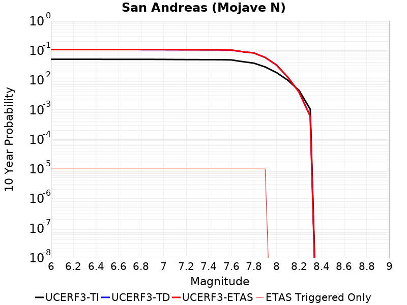 |

| Magnitude | 1 wk TI Prob | 1 wk TD Prob | 1 wk ETAS Prob | 1 wk ETAS/TD Gain | 1 wk ETAS Triggered Only | 1 mo TI Prob | 1 mo TD Prob | 1 mo ETAS Prob | 1 mo ETAS/TD Gain | 1 mo ETAS Triggered Only | 1 yr TI Prob | 1 yr TD Prob | 1 yr ETAS Prob | 1 yr ETAS/TD Gain | 1 yr ETAS Triggered Only | 10 yr TI Prob | 10 yr TD Prob | 10 yr ETAS Prob | 10 yr ETAS/TD Gain | 10 yr ETAS Triggered Only |
|-----|-----|-----|-----|-----|-----|-----|-----|-----|-----|-----|-----|-----|-----|-----|-----|-----|-----|-----|-----|-----|
| 6.0 | 9.877682E-5 | 2.1430755E-4 | 2.1430755E-4 | 1.0 | 0.0 | 4.2326056E-4 | 9.181379E-4 | 9.181379E-4 | 1.0 | 0.0 | 0.0051410277 | 0.011121204 | 0.011131093 | 1.0008892 | 1.0E-5 | 0.05023708 | 0.1071373 | 0.10714623 | 1.0000833 | 1.0E-5 |
| 6.1 | 9.877682E-5 | 2.1430755E-4 | 2.1430755E-4 | 1.0 | 0.0 | 4.2326056E-4 | 9.181379E-4 | 9.181379E-4 | 1.0 | 0.0 | 0.0051410277 | 0.011121204 | 0.011131093 | 1.0008892 | 1.0E-5 | 0.05023708 | 0.1071373 | 0.10714623 | 1.0000833 | 1.0E-5 |
| 6.2 | 9.877682E-5 | 2.1430755E-4 | 2.1430755E-4 | 1.0 | 0.0 | 4.2326056E-4 | 9.181379E-4 | 9.181379E-4 | 1.0 | 0.0 | 0.0051410277 | 0.011121204 | 0.011131093 | 1.0008892 | 1.0E-5 | 0.05023708 | 0.1071373 | 0.10714623 | 1.0000833 | 1.0E-5 |
| 6.3 | 9.877682E-5 | 2.1430755E-4 | 2.1430755E-4 | 1.0 | 0.0 | 4.2326056E-4 | 9.181379E-4 | 9.181379E-4 | 1.0 | 0.0 | 0.0051410277 | 0.011121204 | 0.011131093 | 1.0008892 | 1.0E-5 | 0.05023708 | 0.1071373 | 0.10714623 | 1.0000833 | 1.0E-5 |
| 6.4 | 9.877682E-5 | 2.1430755E-4 | 2.1430755E-4 | 1.0 | 0.0 | 4.2326056E-4 | 9.181379E-4 | 9.181379E-4 | 1.0 | 0.0 | 0.0051410277 | 0.011121204 | 0.011131093 | 1.0008892 | 1.0E-5 | 0.05023708 | 0.1071373 | 0.10714623 | 1.0000833 | 1.0E-5 |
| 6.5 | 9.861474E-5 | 2.1403731E-4 | 2.1403731E-4 | 1.0 | 0.0 | 4.2256617E-4 | 9.1698056E-4 | 9.1698056E-4 | 1.0 | 0.0 | 0.0051326132 | 0.011107257 | 0.011117146 | 1.0008903 | 1.0E-5 | 0.050156746 | 0.10701309 | 0.107022025 | 1.0000834 | 1.0E-5 |
| 6.6 | 9.861474E-5 | 2.1403731E-4 | 2.1403731E-4 | 1.0 | 0.0 | 4.2256617E-4 | 9.1698056E-4 | 9.1698056E-4 | 1.0 | 0.0 | 0.0051326132 | 0.011107257 | 0.011117146 | 1.0008903 | 1.0E-5 | 0.050156746 | 0.10701309 | 0.107022025 | 1.0000834 | 1.0E-5 |
| 6.7 | 9.8552715E-5 | 2.1393382E-4 | 2.1393382E-4 | 1.0 | 0.0 | 4.223004E-4 | 9.1653725E-4 | 9.1653725E-4 | 1.0 | 0.0 | 0.0051293927 | 0.0111019155 | 0.011111804 | 1.0008907 | 1.0E-5 | 0.050125998 | 0.1069655 | 0.10697443 | 1.0000834 | 1.0E-5 |
| 6.8 | 9.8464974E-5 | 2.1378128E-4 | 2.1378128E-4 | 1.0 | 0.0 | 4.219245E-4 | 9.15884E-4 | 9.15884E-4 | 1.0 | 0.0 | 0.0051248376 | 0.011094043 | 0.011103932 | 1.0008913 | 1.0E-5 | 0.05008251 | 0.10689468 | 0.106903605 | 1.0000836 | 1.0E-5 |
| 6.9 | 9.825824E-5 | 2.1345406E-4 | 2.1345406E-4 | 1.0 | 0.0 | 4.2103877E-4 | 9.144826E-4 | 9.144826E-4 | 1.0 | 0.0 | 0.0051141046 | 0.011077154 | 0.011087043 | 1.0008928 | 1.0E-5 | 0.049980022 | 0.10674158 | 0.1067505 | 1.0000837 | 1.0E-5 |
| 7.0 | 9.781462E-5 | 2.1275591E-4 | 2.1275591E-4 | 1.0 | 0.0 | 4.1913814E-4 | 9.114926E-4 | 9.114926E-4 | 1.0 | 0.0 | 0.005091073 | 0.011041121 | 0.01105101 | 1.0008957 | 1.0E-5 | 0.04976007 | 0.10641585 | 0.106424786 | 1.0000839 | 1.0E-5 |
| 7.1 | 9.7121134E-5 | 2.1175564E-4 | 2.1175564E-4 | 1.0 | 0.0 | 4.1616702E-4 | 9.0720877E-4 | 9.0720877E-4 | 1.0 | 0.0 | 0.005055068 | 0.010989493 | 0.0109993825 | 1.0008999 | 1.0E-5 | 0.04941613 | 0.105949014 | 0.105957955 | 1.0000844 | 1.0E-5 |
| 7.2 | 9.663819E-5 | 2.1105232E-4 | 2.1105232E-4 | 1.0 | 0.0 | 4.1409794E-4 | 9.041966E-4 | 9.041966E-4 | 1.0 | 0.0 | 0.0050299936 | 0.010953189 | 0.0109630795 | 1.000903 | 1.0E-5 | 0.049176537 | 0.10562062 | 0.10562956 | 1.0000846 | 1.0E-5 |
| 7.3 | 9.6277574E-5 | 2.1055671E-4 | 2.1055671E-4 | 1.0 | 0.0 | 4.125529E-4 | 9.0207404E-4 | 9.0207404E-4 | 1.0 | 0.0 | 0.0050112694 | 0.010927606 | 0.010937497 | 1.0009052 | 1.0E-5 | 0.04899759 | 0.10538683 | 0.10539578 | 1.0000849 | 1.0E-5 |
| 7.4 | 9.593308E-5 | 2.0992433E-4 | 2.0992433E-4 | 1.0 | 0.0 | 4.1107697E-4 | 8.993657E-4 | 8.993657E-4 | 1.0 | 0.0 | 0.0049933824 | 0.010894963 | 0.010904853 | 1.0009079 | 1.0E-5 | 0.04882661 | 0.10509459 | 0.10510354 | 1.0000851 | 1.0E-5 |
| 7.5 | 9.561707E-5 | 2.0935759E-4 | 2.0935759E-4 | 1.0 | 0.0 | 4.0972308E-4 | 8.969385E-4 | 8.969385E-4 | 1.0 | 0.0 | 0.0049769743 | 0.010865706 | 0.010875598 | 1.0009103 | 1.0E-5 | 0.048669744 | 0.10483141 | 0.10484036 | 1.0000854 | 1.0E-5 |
| 7.6 | 9.418194E-5 | 2.0569816E-4 | 2.0569816E-4 | 1.0 | 0.0 | 4.0357444E-4 | 8.812659E-4 | 8.812659E-4 | 1.0 | 0.0 | 0.004902454 | 0.010676778 | 0.010686671 | 1.0009266 | 1.0E-5 | 0.047957025 | 0.103154235 | 0.103163205 | 1.0000869 | 1.0E-5 |
| 7.7 | 8.202141E-5 | 1.7885394E-4 | 1.7885394E-4 | 1.0 | 0.0 | 3.51473E-4 | 7.6629175E-4 | 7.6629175E-4 | 1.0 | 0.0 | 0.00427079 | 0.009289774 | 0.009299681 | 1.0010664 | 1.0E-5 | 0.04189639 | 0.09050704 | 0.090516135 | 1.0001005 | 1.0E-5 |
| 7.8 | 7.2859846E-5 | 1.621275E-4 | 1.621275E-4 | 1.0 | 0.0 | 3.1221908E-4 | 6.9464714E-4 | 6.9464714E-4 | 1.0 | 0.0 | 0.003794643 | 0.008424593 | 0.008434509 | 1.001177 | 1.0E-5 | 0.037304975 | 0.08231804 | 0.08232722 | 1.0001115 | 1.0E-5 |
| 7.9 | 5.3874453E-5 | 1.12436144E-4 | 1.12436144E-4 | 1.0 | 0.0 | 2.3087008E-4 | 4.817802E-4 | 4.817802E-4 | 1.0 | 0.0 | 0.0028072202 | 0.005849915 | 0.0058598565 | 1.0016994 | 1.0E-5 | 0.02772022 | 0.057986964 | 0.05799638 | 1.0001625 | 1.0E-5 |
| 8.0 | 3.468538E-5 | 6.133266E-5 | 6.133266E-5 | 1.0 | 0.0 | 1.4864317E-4 | 2.628278E-4 | 2.628278E-4 | 1.0 | 0.0 | 0.0018082283 | 0.0031952355 | 0.0031952355 | 1.0 | 0.0 | 0.017935853 | 0.032384824 | 0.032384824 | 1.0 | 0.0 |
| 8.1 | 1.9152367E-5 | 2.2769058E-5 | 2.2769058E-5 | 1.0 | 0.0 | 8.207899E-5 | 9.7578035E-5 | 9.7578035E-5 | 1.0 | 0.0 | 9.988535E-4 | 0.001187366 | 0.001187366 | 1.0 | 0.0 | 0.009943757 | 0.012599011 | 0.012599011 | 1.0 | 0.0 |
| 8.2 | 8.643924E-6 | 6.7827064E-6 | 6.7827064E-6 | 1.0 | 0.0 | 3.704486E-5 | 2.9068418E-5 | 2.9068418E-5 | 1.0 | 0.0 | 4.5092785E-4 | 3.5385066E-4 | 3.5385066E-4 | 1.0 | 0.0 | 0.0045001395 | 0.00395419 | 0.00395419 | 1.0 | 0.0 |
| 8.3 | 1.983087E-6 | 9.998656E-7 | 9.998656E-7 | 1.0 | 0.0 | 8.498917E-6 | 4.285131E-6 | 4.285131E-6 | 1.0 | 0.0 | 1.034694E-4 | 5.2170253E-5 | 5.2170253E-5 | 1.0 | 0.0 | 0.0010342124 | 6.042036E-4 | 6.042036E-4 | 1.0 | 0.0 |

## San Andreas (San Bernardino N)
*[(top)](#table-of-contents)*

| 1 Week | 1 Month | 1 Year | 10 Year |
|-----|-----|-----|-----|
|  |  | 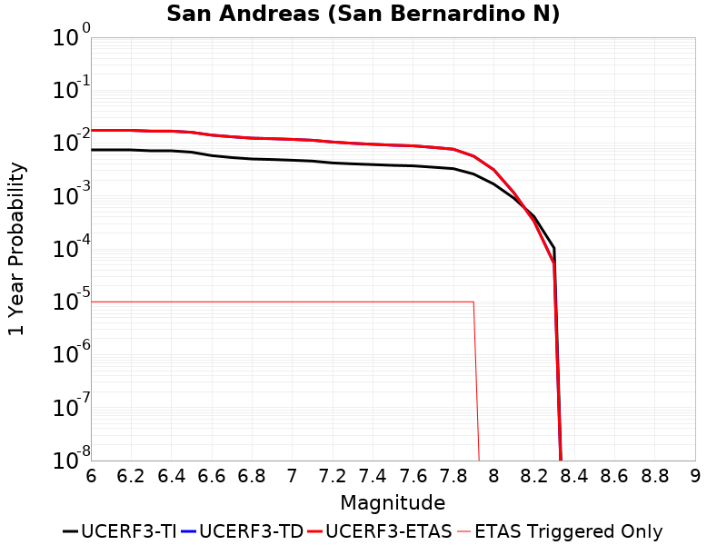 |  |

| Magnitude | 1 wk TI Prob | 1 wk TD Prob | 1 wk ETAS Prob | 1 wk ETAS/TD Gain | 1 wk ETAS Triggered Only | 1 mo TI Prob | 1 mo TD Prob | 1 mo ETAS Prob | 1 mo ETAS/TD Gain | 1 mo ETAS Triggered Only | 1 yr TI Prob | 1 yr TD Prob | 1 yr ETAS Prob | 1 yr ETAS/TD Gain | 1 yr ETAS Triggered Only | 10 yr TI Prob | 10 yr TD Prob | 10 yr ETAS Prob | 10 yr ETAS/TD Gain | 10 yr ETAS Triggered Only |
|-----|-----|-----|-----|-----|-----|-----|-----|-----|-----|-----|-----|-----|-----|-----|-----|-----|-----|-----|-----|-----|
| 6.0 | 1.4273766E-4 | 3.3549557E-4 | 3.3549557E-4 | 1.0 | 0.0 | 6.115894E-4 | 0.001437052 | 0.001437052 | 1.0 | 0.0 | 0.0074207084 | 0.017357375 | 0.0173672 | 1.0005661 | 1.0E-5 | 0.07177748 | 0.15811461 | 0.15812303 | 1.0000533 | 1.0E-5 |
| 6.1 | 1.4273766E-4 | 3.3549557E-4 | 3.3549557E-4 | 1.0 | 0.0 | 6.115894E-4 | 0.001437052 | 0.001437052 | 1.0 | 0.0 | 0.0074207084 | 0.017357375 | 0.0173672 | 1.0005661 | 1.0E-5 | 0.07177748 | 0.15811461 | 0.15812303 | 1.0000533 | 1.0E-5 |
| 6.2 | 1.4273766E-4 | 3.3549557E-4 | 3.3549557E-4 | 1.0 | 0.0 | 6.115894E-4 | 0.001437052 | 0.001437052 | 1.0 | 0.0 | 0.0074207084 | 0.017357375 | 0.0173672 | 1.0005661 | 1.0E-5 | 0.07177748 | 0.15811461 | 0.15812303 | 1.0000533 | 1.0E-5 |
| 6.3 | 1.3730655E-4 | 3.2443323E-4 | 3.2443323E-4 | 1.0 | 0.0 | 5.883239E-4 | 0.0013896931 | 0.0013896931 | 1.0 | 0.0 | 0.0071393442 | 0.016789772 | 0.016799605 | 1.0005856 | 1.0E-5 | 0.06914291 | 0.15341613 | 0.15342459 | 1.0000552 | 1.0E-5 |
| 6.4 | 1.3730655E-4 | 3.2443323E-4 | 3.2443323E-4 | 1.0 | 0.0 | 5.883239E-4 | 0.0013896931 | 0.0013896931 | 1.0 | 0.0 | 0.0071393442 | 0.016789772 | 0.016799605 | 1.0005856 | 1.0E-5 | 0.06914291 | 0.15341613 | 0.15342459 | 1.0000552 | 1.0E-5 |
| 6.5 | 1.2942807E-4 | 3.0841472E-4 | 3.0841472E-4 | 1.0 | 0.0 | 5.545738E-4 | 0.0013211131 | 0.0013211131 | 1.0 | 0.0 | 0.0067310524 | 0.015967282 | 0.015977122 | 1.0006163 | 1.0E-5 | 0.06530788 | 0.146576 | 0.14658454 | 1.0000582 | 1.0E-5 |
| 6.6 | 1.1125901E-4 | 2.7237594E-4 | 2.7237594E-4 | 1.0 | 0.0 | 4.767372E-4 | 0.0011668057 | 0.0011668057 | 1.0 | 0.0 | 0.005788839 | 0.014114035 | 0.014123894 | 1.0006986 | 1.0E-5 | 0.056403454 | 0.13084476 | 0.13085344 | 1.0000664 | 1.0E-5 |
| 6.7 | 1.02209575E-4 | 2.5356538E-4 | 2.5356538E-4 | 1.0 | 0.0 | 4.3796748E-4 | 0.0010862576 | 0.0010862576 | 1.0 | 0.0 | 0.0053192247 | 0.013145474 | 0.013155342 | 1.0007507 | 1.0E-5 | 0.051936906 | 0.12266772 | 0.1226765 | 1.0000715 | 1.0E-5 |
| 6.8 | 9.610582E-5 | 2.3852754E-4 | 2.3852754E-4 | 1.0 | 0.0 | 4.1181705E-4 | 0.0010218611 | 0.0010218611 | 1.0 | 0.0 | 0.0050023515 | 0.012370504 | 0.012380381 | 1.0007983 | 1.0E-5 | 0.048912346 | 0.116018936 | 0.11602777 | 1.0000762 | 1.0E-5 |
| 6.9 | 9.3877505E-5 | 2.3299409E-4 | 2.3299409E-4 | 1.0 | 0.0 | 4.0227012E-4 | 9.981646E-4 | 9.981646E-4 | 1.0 | 0.0 | 0.0048866454 | 0.012085231 | 0.0120951105 | 1.0008174 | 1.0E-5 | 0.04780577 | 0.11359858 | 0.113607444 | 1.0000781 | 1.0E-5 |
| 7.0 | 9.1019785E-5 | 2.2612956E-4 | 2.2612956E-4 | 1.0 | 0.0 | 3.900265E-4 | 9.687674E-4 | 9.687674E-4 | 1.0 | 0.0 | 0.0047382377 | 0.011731225 | 0.011741108 | 1.0008425 | 1.0E-5 | 0.046384744 | 0.110537134 | 0.11054603 | 1.0000805 | 1.0E-5 |
| 7.1 | 8.771155E-5 | 2.1772033E-4 | 2.1772033E-4 | 1.0 | 0.0 | 3.758525E-4 | 9.32754E-4 | 9.32754E-4 | 1.0 | 0.0 | 0.0045664064 | 0.011297385 | 0.011307272 | 1.0008751 | 1.0E-5 | 0.044737056 | 0.106813185 | 0.10682212 | 1.0000836 | 1.0E-5 |
| 7.2 | 8.0830236E-5 | 2.0144497E-4 | 2.0144497E-4 | 1.0 | 0.0 | 3.4636928E-4 | 8.6305017E-4 | 8.6305017E-4 | 1.0 | 0.0 | 0.0042088944 | 0.010457148 | 0.010467043 | 1.0009463 | 1.0E-5 | 0.041300658 | 0.0994615 | 0.09947051 | 1.0000906 | 1.0E-5 |
| 7.3 | 7.7668235E-5 | 1.9052647E-4 | 1.9052647E-4 | 1.0 | 0.0 | 3.328214E-4 | 8.1628654E-4 | 8.1628654E-4 | 1.0 | 0.0 | 0.0040445733 | 0.009893107 | 0.009903008 | 1.0010008 | 1.0E-5 | 0.03971748 | 0.09462428 | 0.09463334 | 1.0000957 | 1.0E-5 |
| 7.4 | 7.520177E-5 | 1.8244739E-4 | 1.8244739E-4 | 1.0 | 0.0 | 3.2225347E-4 | 7.8168313E-4 | 7.8168313E-4 | 1.0 | 0.0 | 0.0039163795 | 0.009475553 | 0.009485459 | 1.0010453 | 1.0E-5 | 0.038480744 | 0.09099878 | 0.09100787 | 1.0000999 | 1.0E-5 |
| 7.5 | 7.274697E-5 | 1.7506338E-4 | 1.7506338E-4 | 1.0 | 0.0 | 3.1173544E-4 | 7.50056E-4 | 7.50056E-4 | 1.0 | 0.0 | 0.003788775 | 0.009093774 | 0.009103683 | 1.0010897 | 1.0E-5 | 0.03724827 | 0.08763369 | 0.08764281 | 1.0001041 | 1.0E-5 |
| 7.6 | 7.1185845E-5 | 1.7059456E-4 | 1.7059456E-4 | 1.0 | 0.0 | 3.0504653E-4 | 7.3091476E-4 | 7.3091476E-4 | 1.0 | 0.0 | 0.0037076178 | 0.008862649 | 0.008872561 | 1.0011183 | 1.0E-5 | 0.036463667 | 0.0855688 | 0.08557794 | 1.0001068 | 1.0E-5 |
| 7.7 | 6.709961E-5 | 1.5921479E-4 | 1.5921479E-4 | 1.0 | 0.0 | 2.8753807E-4 | 6.8217074E-4 | 6.8217074E-4 | 1.0 | 0.0 | 0.003495157 | 0.008273855 | 0.0082837725 | 1.0011986 | 1.0E-5 | 0.034406938 | 0.08023481 | 0.080244005 | 1.0001147 | 1.0E-5 |
| 7.8 | 6.300812E-5 | 1.470951E-4 | 1.470951E-4 | 1.0 | 0.0 | 2.7000686E-4 | 6.3025526E-4 | 6.3025526E-4 | 1.0 | 0.0 | 0.0032823787 | 0.007646402 | 0.007656325 | 1.0012978 | 1.0E-5 | 0.032343175 | 0.07451355 | 0.0745228 | 1.0001242 | 1.0E-5 |
| 7.9 | 4.983037E-5 | 1.08766566E-4 | 1.08766566E-4 | 1.0 | 0.0 | 2.1354125E-4 | 4.660592E-4 | 4.660592E-4 | 1.0 | 0.0 | 0.0025967648 | 0.0056595225 | 0.005669466 | 1.0017569 | 1.0E-5 | 0.025666296 | 0.055998255 | 0.056007694 | 1.0001686 | 1.0E-5 |
| 8.0 | 3.2211527E-5 | 6.015421E-5 | 6.015421E-5 | 1.0 | 0.0 | 1.380421E-4 | 2.5777827E-4 | 2.5777827E-4 | 1.0 | 0.0 | 0.0016793669 | 0.0031339363 | 0.0031339363 | 1.0 | 0.0 | 0.016667323 | 0.031678557 | 0.031678557 | 1.0 | 0.0 |
| 8.1 | 1.743376E-5 | 2.2033617E-5 | 2.2033617E-5 | 1.0 | 0.0 | 7.471398E-5 | 9.4426374E-5 | 9.4426374E-5 | 1.0 | 0.0 | 9.0926304E-4 | 0.0011490356 | 0.0011490356 | 1.0 | 0.0 | 0.009055517 | 0.012138036 | 0.012138036 | 1.0 | 0.0 |
| 8.2 | 7.831616E-6 | 6.373544E-6 | 6.373544E-6 | 1.0 | 0.0 | 3.3563636E-5 | 2.7314902E-5 | 2.7314902E-5 | 1.0 | 0.0 | 4.0856065E-4 | 3.325083E-4 | 3.325083E-4 | 1.0 | 0.0 | 0.004078103 | 0.0036964193 | 0.0036964193 | 1.0 | 0.0 |
| 8.3 | 1.983087E-6 | 9.998656E-7 | 9.998656E-7 | 1.0 | 0.0 | 8.498917E-6 | 4.285131E-6 | 4.285131E-6 | 1.0 | 0.0 | 1.034694E-4 | 5.2170253E-5 | 5.2170253E-5 | 1.0 | 0.0 | 0.0010342124 | 6.042036E-4 | 6.042036E-4 | 1.0 | 0.0 |

## San Juan
*[(top)](#table-of-contents)*

| 1 Week | 1 Month | 1 Year | 10 Year |
|-----|-----|-----|-----|
|  |  |  |  |

| Magnitude | 1 wk TI Prob | 1 wk TD Prob | 1 wk ETAS Prob | 1 wk ETAS/TD Gain | 1 wk ETAS Triggered Only | 1 mo TI Prob | 1 mo TD Prob | 1 mo ETAS Prob | 1 mo ETAS/TD Gain | 1 mo ETAS Triggered Only | 1 yr TI Prob | 1 yr TD Prob | 1 yr ETAS Prob | 1 yr ETAS/TD Gain | 1 yr ETAS Triggered Only | 10 yr TI Prob | 10 yr TD Prob | 10 yr ETAS Prob | 10 yr ETAS/TD Gain | 10 yr ETAS Triggered Only |
|-----|-----|-----|-----|-----|-----|-----|-----|-----|-----|-----|-----|-----|-----|-----|-----|-----|-----|-----|-----|-----|
| 6.0 | 8.682808E-6 | 8.722151E-6 | 8.722151E-6 | 1.0 | 0.0 | 3.72115E-5 | 3.7380138E-5 | 3.7380138E-5 | 1.0 | 0.0 | 4.5295584E-4 | 4.5501298E-4 | 4.6500843E-4 | 1.0219674 | 1.0E-5 | 0.004520337 | 0.004541355 | 0.0045513096 | 1.002192 | 1.0E-5 |
| 6.1 | 8.682808E-6 | 8.722151E-6 | 8.722151E-6 | 1.0 | 0.0 | 3.72115E-5 | 3.7380138E-5 | 3.7380138E-5 | 1.0 | 0.0 | 4.5295584E-4 | 4.5501298E-4 | 4.6500843E-4 | 1.0219674 | 1.0E-5 | 0.004520337 | 0.004541355 | 0.0045513096 | 1.002192 | 1.0E-5 |
| 6.2 | 8.682808E-6 | 8.722151E-6 | 8.722151E-6 | 1.0 | 0.0 | 3.72115E-5 | 3.7380138E-5 | 3.7380138E-5 | 1.0 | 0.0 | 4.5295584E-4 | 4.5501298E-4 | 4.6500843E-4 | 1.0219674 | 1.0E-5 | 0.004520337 | 0.004541355 | 0.0045513096 | 1.002192 | 1.0E-5 |
| 6.3 | 6.3054235E-6 | 6.2517965E-6 | 6.2517965E-6 | 1.0 | 0.0 | 2.7022963E-5 | 2.6793146E-5 | 2.6793146E-5 | 1.0 | 0.0 | 3.2895492E-4 | 3.2615912E-4 | 3.3615588E-4 | 1.0306499 | 1.0E-5 | 0.003284684 | 0.0032570038 | 0.0032669713 | 1.0030603 | 1.0E-5 |
| 6.4 | 6.1490473E-6 | 6.0881703E-6 | 6.0881703E-6 | 1.0 | 0.0 | 2.6352795E-5 | 2.6091906E-5 | 2.6091906E-5 | 1.0 | 0.0 | 3.2079802E-4 | 3.17624E-4 | 3.2762083E-4 | 1.0314738 | 1.0E-5 | 0.0032033534 | 0.0031718966 | 0.0031818647 | 1.0031427 | 1.0E-5 |
| 6.5 | 5.204848E-6 | 5.1106013E-6 | 5.1106013E-6 | 1.0 | 0.0 | 2.23063E-5 | 2.1902397E-5 | 2.1902397E-5 | 1.0 | 0.0 | 2.7154534E-4 | 2.6663003E-4 | 2.7662734E-4 | 1.0374951 | 1.0E-5 | 0.0027121378 | 0.0026632547 | 0.0026732283 | 1.0037448 | 1.0E-5 |
| 6.6 | 4.5179986E-6 | 4.4005515E-6 | 4.4005515E-6 | 1.0 | 0.0 | 1.9362706E-5 | 1.8859373E-5 | 1.8859373E-5 | 1.0 | 0.0 | 2.3571544E-4 | 2.2958947E-4 | 2.3958717E-4 | 1.043546 | 1.0E-5 | 0.0023546559 | 0.0022936596 | 0.0023036366 | 1.0043498 | 1.0E-5 |
| 6.7 | 3.9442616E-6 | 3.8083786E-6 | 3.8083786E-6 | 1.0 | 0.0 | 1.6903869E-5 | 1.6321525E-5 | 1.6321525E-5 | 1.0 | 0.0 | 2.0578515E-4 | 1.986971E-4 | 2.0869511E-4 | 1.0503179 | 1.0E-5 | 0.002055947 | 0.0019853192 | 0.0019952992 | 1.0050269 | 1.0E-5 |
| 6.8 | 3.4536245E-6 | 3.3055385E-6 | 3.3055385E-6 | 1.0 | 0.0 | 1.4801163E-5 | 1.41665205E-5 | 1.41665205E-5 | 1.0 | 0.0 | 1.8018926E-4 | 1.7246435E-4 | 1.7246435E-4 | 1.0 | 0.0 | 0.0018004322 | 0.0017234236 | 0.0017234236 | 1.0 | 0.0 |
| 6.9 | 3.059865E-6 | 2.9019996E-6 | 2.9019996E-6 | 1.0 | 0.0 | 1.3113641E-5 | 1.2437085E-5 | 1.2437085E-5 | 1.0 | 0.0 | 1.596469E-4 | 1.5141156E-4 | 1.5141156E-4 | 1.0 | 0.0 | 0.0015953224 | 0.0015131984 | 0.0015131984 | 1.0 | 0.0 |
| 7.0 | 2.6504351E-6 | 2.4829706E-6 | 2.4829706E-6 | 1.0 | 0.0 | 1.1358958E-5 | 1.0641262E-5 | 1.0641262E-5 | 1.0 | 0.0 | 1.3828653E-4 | 1.295502E-4 | 1.295502E-4 | 1.0 | 0.0 | 0.0013820052 | 0.0012948584 | 0.0012948584 | 1.0 | 0.0 |
| 7.1 | 2.2039317E-6 | 2.029339E-6 | 2.029339E-6 | 1.0 | 0.0 | 9.445387E-6 | 8.69714E-6 | 8.69714E-6 | 1.0 | 0.0 | 1.1499152E-4 | 1.05883075E-4 | 1.05883075E-4 | 1.0 | 0.0 | 0.0011493203 | 0.001058436 | 0.001058436 | 1.0 | 0.0 |
| 7.2 | 1.0786707E-6 | 8.7246644E-7 | 8.7246644E-7 | 1.0 | 0.0 | 4.622866E-6 | 3.7391364E-6 | 3.7391364E-6 | 1.0 | 0.0 | 5.628194E-5 | 4.5523047E-5 | 4.5523047E-5 | 1.0 | 0.0 | 5.6267687E-4 | 4.5519546E-4 | 4.5519546E-4 | 1.0 | 0.0 |
| 7.3 | 6.846433E-7 | 4.8685865E-7 | 4.8685865E-7 | 1.0 | 0.0 | 2.9341822E-6 | 2.0865352E-6 | 2.0865352E-6 | 1.0 | 0.0 | 3.5723086E-5 | 2.5403271E-5 | 2.5403271E-5 | 1.0 | 0.0 | 3.571734E-4 | 2.5403805E-4 | 2.5403805E-4 | 1.0 | 0.0 |
| 7.4 | 5.23043E-7 | 3.2925965E-7 | 3.2925965E-7 | 1.0 | 0.0 | 2.2416111E-6 | 1.411112E-6 | 1.411112E-6 | 1.0 | 0.0 | 2.7291273E-5 | 1.7180153E-5 | 1.7180153E-5 | 1.0 | 0.0 | 2.7287923E-4 | 1.7182119E-4 | 1.7182119E-4 | 1.0 | 0.0 |
| 7.5 | 4.648444E-7 | 2.758725E-7 | 2.758725E-7 | 1.0 | 0.0 | 1.9921886E-6 | 1.1823101E-6 | 1.1823101E-6 | 1.0 | 0.0 | 2.4254627E-5 | 1.4394532E-5 | 1.4394532E-5 | 1.0 | 0.0 | 2.425198E-4 | 1.439668E-4 | 1.439668E-4 | 1.0 | 0.0 |
| 7.6 | 3.9906567E-7 | 2.2392153E-7 | 2.2392153E-7 | 1.0 | 0.0 | 1.7102802E-6 | 9.596633E-7 | 9.596633E-7 | 1.0 | 0.0 | 2.0822463E-5 | 1.1683839E-5 | 1.1683839E-5 | 1.0 | 0.0 | 2.0820512E-4 | 1.1685861E-4 | 1.1685861E-4 | 1.0 | 0.0 |
| 7.7 | 1.8784601E-7 | 5.531437E-8 | 5.531437E-8 | 1.0 | 0.0 | 8.0505407E-7 | 2.3706157E-7 | 2.3706157E-7 | 1.0 | 0.0 | 9.80149E-6 | 2.8862207E-6 | 2.8862207E-6 | 1.0 | 0.0 | 9.801057E-5 | 2.8873368E-5 | 2.8873368E-5 | 1.0 | 0.0 |
| 7.8 | 1.00154914E-7 | 1.3257425E-8 | 1.3257425E-8 | 1.0 | 0.0 | 4.2923529E-7 | 5.6817537E-8 | 5.6817537E-8 | 1.0 | 0.0 | 5.225927E-6 | 6.9175326E-7 | 6.9175326E-7 | 1.0 | 0.0 | 5.225804E-5 | 6.9259618E-6 | 6.9259618E-6 | 1.0 | 0.0 |
| 7.9 | 6.171429E-8 | 4.850767E-9 | 4.850767E-9 | 1.0 | 0.0 | 2.6448978E-7 | 2.0788997E-8 | 2.0788997E-8 | 1.0 | 0.0 | 3.2201583E-6 | 2.5310598E-7 | 2.5310598E-7 | 1.0 | 0.0 | 3.2201115E-5 | 2.538562E-6 | 2.538562E-6 | 1.0 | 0.0 |
| 8.0 | 1.3974572E-8 | 4.6556703E-10 | 4.6556703E-10 | 1.0 | 0.0 | 5.989102E-8 | 1.9952853E-9 | 1.9952853E-9 | 1.0 | 0.0 | 7.2917294E-7 | 2.4292584E-8 | 2.4292584E-8 | 1.0 | 0.0 | 7.2917055E-6 | 2.4883494E-7 | 2.4883494E-7 | 1.0 | 0.0 |
| 8.1 | 1.8403477E-9 | 1.4380552E-10 | 1.4380552E-10 | 1.0 | 0.0 | 7.887204E-9 | 6.163101E-10 | 6.163101E-10 | 1.0 | 0.0 | 9.602671E-8 | 7.503583E-9 | 7.503583E-9 | 1.0 | 0.0 | 9.602667E-7 | 7.655988E-8 | 7.655988E-8 | 1.0 | 0.0 |

## San Jacinto (San Bernardino)
*[(top)](#table-of-contents)*

| 1 Week | 1 Month | 1 Year | 10 Year |
|-----|-----|-----|-----|
|  | 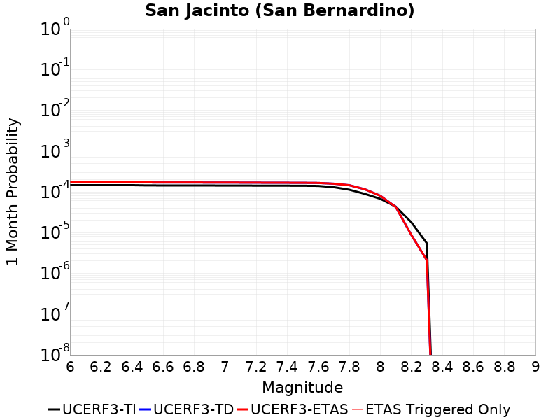 |  | 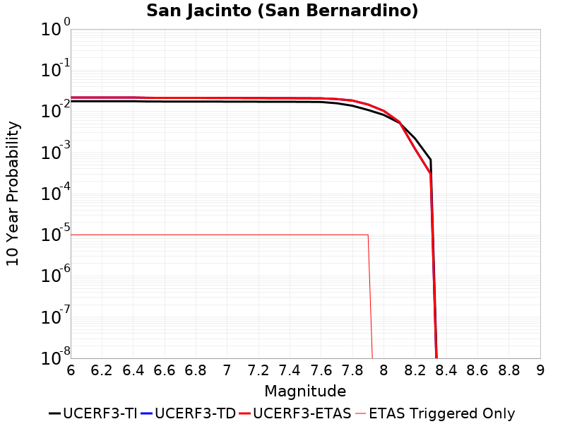 |

| Magnitude | 1 wk TI Prob | 1 wk TD Prob | 1 wk ETAS Prob | 1 wk ETAS/TD Gain | 1 wk ETAS Triggered Only | 1 mo TI Prob | 1 mo TD Prob | 1 mo ETAS Prob | 1 mo ETAS/TD Gain | 1 mo ETAS Triggered Only | 1 yr TI Prob | 1 yr TD Prob | 1 yr ETAS Prob | 1 yr ETAS/TD Gain | 1 yr ETAS Triggered Only | 10 yr TI Prob | 10 yr TD Prob | 10 yr ETAS Prob | 10 yr ETAS/TD Gain | 10 yr ETAS Triggered Only |
|-----|-----|-----|-----|-----|-----|-----|-----|-----|-----|-----|-----|-----|-----|-----|-----|-----|-----|-----|-----|-----|
| 6.0 | 3.399087E-5 | 4.0433395E-5 | 4.0433395E-5 | 1.0 | 0.0 | 1.4566703E-4 | 1.7327449E-4 | 1.7327449E-4 | 1.0 | 0.0 | 0.0017720532 | 0.0021075774 | 0.0021175563 | 1.0047348 | 1.0E-5 | 0.01757989 | 0.021613428 | 0.021623213 | 1.0004526 | 1.0E-5 |
| 6.1 | 3.399087E-5 | 4.0433395E-5 | 4.0433395E-5 | 1.0 | 0.0 | 1.4566703E-4 | 1.7327449E-4 | 1.7327449E-4 | 1.0 | 0.0 | 0.0017720532 | 0.0021075774 | 0.0021175563 | 1.0047348 | 1.0E-5 | 0.01757989 | 0.021613428 | 0.021623213 | 1.0004526 | 1.0E-5 |
| 6.2 | 3.399087E-5 | 4.0433395E-5 | 4.0433395E-5 | 1.0 | 0.0 | 1.4566703E-4 | 1.7327449E-4 | 1.7327449E-4 | 1.0 | 0.0 | 0.0017720532 | 0.0021075774 | 0.0021175563 | 1.0047348 | 1.0E-5 | 0.01757989 | 0.021613428 | 0.021623213 | 1.0004526 | 1.0E-5 |
| 6.3 | 3.399087E-5 | 4.0433395E-5 | 4.0433395E-5 | 1.0 | 0.0 | 1.4566703E-4 | 1.7327449E-4 | 1.7327449E-4 | 1.0 | 0.0 | 0.0017720532 | 0.0021075774 | 0.0021175563 | 1.0047348 | 1.0E-5 | 0.01757989 | 0.021613428 | 0.021623213 | 1.0004526 | 1.0E-5 |
| 6.4 | 3.399087E-5 | 4.0433395E-5 | 4.0433395E-5 | 1.0 | 0.0 | 1.4566703E-4 | 1.7327449E-4 | 1.7327449E-4 | 1.0 | 0.0 | 0.0017720532 | 0.0021075774 | 0.0021175563 | 1.0047348 | 1.0E-5 | 0.01757989 | 0.021613428 | 0.021623213 | 1.0004526 | 1.0E-5 |
| 6.5 | 3.341482E-5 | 3.9709677E-5 | 3.9709677E-5 | 1.0 | 0.0 | 1.4319851E-4 | 1.7017324E-4 | 1.7017324E-4 | 1.0 | 0.0 | 0.0017420477 | 0.0020698921 | 0.0020798715 | 1.0048212 | 1.0E-5 | 0.017284546 | 0.021243867 | 0.021253653 | 1.0004607 | 1.0E-5 |
| 6.6 | 3.3364955E-5 | 3.9646264E-5 | 3.9646264E-5 | 1.0 | 0.0 | 1.4298483E-4 | 1.699015E-4 | 1.699015E-4 | 1.0 | 0.0 | 0.0017394501 | 0.0020665901 | 0.0020765695 | 1.0048289 | 1.0E-5 | 0.017258976 | 0.021211484 | 0.021221273 | 1.0004615 | 1.0E-5 |
| 6.7 | 3.335922E-5 | 3.9635863E-5 | 3.9635863E-5 | 1.0 | 0.0 | 1.4296026E-4 | 1.6985692E-4 | 1.6985692E-4 | 1.0 | 0.0 | 0.0017391514 | 0.0020660483 | 0.0020760277 | 1.0048301 | 1.0E-5 | 0.017256035 | 0.021206202 | 0.02121599 | 1.0004616 | 1.0E-5 |
| 6.8 | 3.327683E-5 | 3.952867E-5 | 3.952867E-5 | 1.0 | 0.0 | 1.4260718E-4 | 1.693976E-4 | 1.693976E-4 | 1.0 | 0.0 | 0.0017348597 | 0.0020604667 | 0.002070446 | 1.0048432 | 1.0E-5 | 0.017213784 | 0.021151463 | 0.02116125 | 1.0004628 | 1.0E-5 |
| 6.9 | 3.3235785E-5 | 3.946875E-5 | 3.946875E-5 | 1.0 | 0.0 | 1.4243131E-4 | 1.6914083E-4 | 1.6914083E-4 | 1.0 | 0.0 | 0.0017327217 | 0.0020573465 | 0.0020673259 | 1.0048506 | 1.0E-5 | 0.017192734 | 0.021120967 | 0.021130757 | 1.0004635 | 1.0E-5 |
| 7.0 | 3.3197095E-5 | 3.9407612E-5 | 3.9407612E-5 | 1.0 | 0.0 | 1.422655E-4 | 1.6887885E-4 | 1.6887885E-4 | 1.0 | 0.0 | 0.0017307063 | 0.0020541628 | 0.0020641424 | 1.0048581 | 1.0E-5 | 0.017172894 | 0.021089893 | 0.021099681 | 1.0004642 | 1.0E-5 |
| 7.1 | 3.3129716E-5 | 3.9285158E-5 | 3.9285158E-5 | 1.0 | 0.0 | 1.4197677E-4 | 1.6835412E-4 | 1.6835412E-4 | 1.0 | 0.0 | 0.0017271966 | 0.0020477863 | 0.0020577658 | 1.0048733 | 1.0E-5 | 0.017138338 | 0.021027809 | 0.0210376 | 1.0004655 | 1.0E-5 |
| 7.2 | 3.3034008E-5 | 3.9150837E-5 | 3.9150837E-5 | 1.0 | 0.0 | 1.4156665E-4 | 1.6777852E-4 | 1.6777852E-4 | 1.0 | 0.0 | 0.0017222111 | 0.0020407916 | 0.0020507711 | 1.0048901 | 1.0E-5 | 0.017089253 | 0.020959485 | 0.020969277 | 1.0004671 | 1.0E-5 |
| 7.3 | 3.2956614E-5 | 3.90148E-5 | 3.90148E-5 | 1.0 | 0.0 | 1.4123498E-4 | 1.671956E-4 | 1.671956E-4 | 1.0 | 0.0 | 0.0017181796 | 0.0020337077 | 0.0020436873 | 1.0049071 | 1.0E-5 | 0.017049557 | 0.020890536 | 0.020900326 | 1.0004687 | 1.0E-5 |
| 7.4 | 3.2915937E-5 | 3.8933667E-5 | 3.8933667E-5 | 1.0 | 0.0 | 1.4106068E-4 | 1.6684791E-4 | 1.6684791E-4 | 1.0 | 0.0 | 0.0017160608 | 0.0020294825 | 0.002039462 | 1.0049174 | 1.0E-5 | 0.017028693 | 0.020849535 | 0.020859327 | 1.0004697 | 1.0E-5 |
| 7.5 | 3.281791E-5 | 3.8794115E-5 | 3.8794115E-5 | 1.0 | 0.0 | 1.406406E-4 | 1.662499E-4 | 1.662499E-4 | 1.0 | 0.0 | 0.0017109542 | 0.0020222154 | 0.002032195 | 1.004935 | 1.0E-5 | 0.016978411 | 0.020778382 | 0.020788174 | 1.0004712 | 1.0E-5 |
| 7.6 | 3.2521442E-5 | 3.8508188E-5 | 3.8508188E-5 | 1.0 | 0.0 | 1.3937015E-4 | 1.6502467E-4 | 1.6502467E-4 | 1.0 | 0.0 | 0.0016955109 | 0.0020073256 | 0.0020173055 | 1.0049717 | 1.0E-5 | 0.016826328 | 0.02063082 | 0.020640614 | 1.0004747 | 1.0E-5 |
| 7.7 | 3.0287873E-5 | 3.6924866E-5 | 3.6924866E-5 | 1.0 | 0.0 | 1.297987E-4 | 1.5823984E-4 | 1.5823984E-4 | 1.0 | 0.0 | 0.0015791537 | 0.0019248691 | 0.0019348499 | 1.0051851 | 1.0E-5 | 0.01567979 | 0.01980889 | 0.019818693 | 1.0004948 | 1.0E-5 |
| 7.8 | 2.6316151E-5 | 3.38836E-5 | 3.38836E-5 | 1.0 | 0.0 | 1.1277862E-4 | 1.4520735E-4 | 1.4520735E-4 | 1.0 | 0.0 | 0.0013722149 | 0.0017664671 | 0.0017764494 | 1.005651 | 1.0E-5 | 0.013637724 | 0.018224614 | 0.018234432 | 1.0005387 | 1.0E-5 |
| 7.9 | 2.0761147E-5 | 2.6965576E-5 | 2.6965576E-5 | 1.0 | 0.0 | 8.897331E-5 | 1.1556164E-4 | 1.1556164E-4 | 1.0 | 0.0 | 0.0010827117 | 0.0014060561 | 0.001416042 | 1.0071021 | 1.0E-5 | 0.010774517 | 0.014618008 | 0.014627863 | 1.0006741 | 1.0E-5 |
| 8.0 | 1.5738568E-5 | 1.868978E-5 | 1.868978E-5 | 1.0 | 0.0 | 6.744926E-5 | 8.00966E-5 | 8.00966E-5 | 1.0 | 0.0 | 8.2088535E-4 | 9.747407E-4 | 9.747407E-4 | 1.0 | 0.0 | 0.008178596 | 0.010255785 | 0.010255785 | 1.0 | 0.0 |
| 8.1 | 1.0105832E-5 | 9.8835135E-6 | 9.8835135E-6 | 1.0 | 0.0 | 4.3309992E-5 | 4.235723E-5 | 4.235723E-5 | 1.0 | 0.0 | 5.2717153E-4 | 5.1557797E-4 | 5.1557797E-4 | 1.0 | 0.0 | 0.005259227 | 0.0055066952 | 0.0055066952 | 1.0 | 0.0 |
| 8.2 | 4.189207E-6 | 2.0471616E-6 | 2.0471616E-6 | 1.0 | 0.0 | 1.7953622E-5 | 8.773521E-6 | 8.773521E-6 | 1.0 | 0.0 | 2.1856341E-4 | 1.0681242E-4 | 1.0681242E-4 | 1.0 | 0.0 | 0.0021834858 | 0.0012218137 | 0.0012218137 | 1.0 | 0.0 |
| 8.3 | 1.2758221E-6 | 4.889535E-7 | 4.889535E-7 | 1.0 | 0.0 | 5.4677976E-6 | 2.0955135E-6 | 2.0955135E-6 | 1.0 | 0.0 | 6.65684E-5 | 2.5512585E-5 | 2.5512585E-5 | 1.0 | 0.0 | 6.6548464E-4 | 3.0148673E-4 | 3.0148673E-4 | 1.0 | 0.0 |

## Blue Cut
*[(top)](#table-of-contents)*

| 1 Week | 1 Month | 1 Year | 10 Year |
|-----|-----|-----|-----|
|  |  |  |  |

| Magnitude | 1 wk TI Prob | 1 wk TD Prob | 1 wk ETAS Prob | 1 wk ETAS/TD Gain | 1 wk ETAS Triggered Only | 1 mo TI Prob | 1 mo TD Prob | 1 mo ETAS Prob | 1 mo ETAS/TD Gain | 1 mo ETAS Triggered Only | 1 yr TI Prob | 1 yr TD Prob | 1 yr ETAS Prob | 1 yr ETAS/TD Gain | 1 yr ETAS Triggered Only | 10 yr TI Prob | 10 yr TD Prob | 10 yr ETAS Prob | 10 yr ETAS/TD Gain | 10 yr ETAS Triggered Only |
|-----|-----|-----|-----|-----|-----|-----|-----|-----|-----|-----|-----|-----|-----|-----|-----|-----|-----|-----|-----|-----|
| 6.0 | 2.1227985E-5 | 2.2784867E-5 | 2.2784867E-5 | 1.0 | 0.0 | 9.097391E-5 | 9.76461E-5 | 1.0764512E-4 | 1.1024007 | 1.0E-5 | 0.0011070445 | 0.0011882514 | 0.0011982395 | 1.0084057 | 1.0E-5 | 0.011015458 | 0.011824859 | 0.011834741 | 1.0008357 | 1.0E-5 |
| 6.1 | 2.1227985E-5 | 2.2784867E-5 | 2.2784867E-5 | 1.0 | 0.0 | 9.097391E-5 | 9.76461E-5 | 1.0764512E-4 | 1.1024007 | 1.0E-5 | 0.0011070445 | 0.0011882514 | 0.0011982395 | 1.0084057 | 1.0E-5 | 0.011015458 | 0.011824859 | 0.011834741 | 1.0008357 | 1.0E-5 |
| 6.2 | 2.1227985E-5 | 2.2784867E-5 | 2.2784867E-5 | 1.0 | 0.0 | 9.097391E-5 | 9.76461E-5 | 1.0764512E-4 | 1.1024007 | 1.0E-5 | 0.0011070445 | 0.0011882514 | 0.0011982395 | 1.0084057 | 1.0E-5 | 0.011015458 | 0.011824859 | 0.011834741 | 1.0008357 | 1.0E-5 |
| 6.3 | 1.1613981E-5 | 1.23856735E-5 | 1.23856735E-5 | 1.0 | 0.0 | 4.9773254E-5 | 5.3080446E-5 | 6.307992E-5 | 1.1883833 | 1.0E-5 | 6.0582085E-4 | 6.4607535E-4 | 6.5606885E-4 | 1.0154681 | 1.0E-5 | 0.0060417196 | 0.0064432244 | 0.00645316 | 1.001542 | 1.0E-5 |
| 6.4 | 1.1613981E-5 | 1.23856735E-5 | 1.23856735E-5 | 1.0 | 0.0 | 4.9773254E-5 | 5.3080446E-5 | 6.307992E-5 | 1.1883833 | 1.0E-5 | 6.0582085E-4 | 6.4607535E-4 | 6.5606885E-4 | 1.0154681 | 1.0E-5 | 0.0060417196 | 0.0064432244 | 0.00645316 | 1.001542 | 1.0E-5 |
| 6.5 | 8.931326E-6 | 9.505449E-6 | 9.505449E-6 | 1.0 | 0.0 | 3.8276554E-5 | 4.0737057E-5 | 5.073665E-5 | 1.2454667 | 1.0E-5 | 4.6591737E-4 | 4.9587E-4 | 5.05865E-4 | 1.0201566 | 1.0E-5 | 0.0046494175 | 0.0049485494 | 0.0049584997 | 1.0020108 | 1.0E-5 |
| 6.6 | 7.345353E-6 | 7.809541E-6 | 7.809541E-6 | 1.0 | 0.0 | 3.1479703E-5 | 3.3469074E-5 | 4.346874E-5 | 1.2987733 | 1.0E-5 | 3.83198E-4 | 4.0741786E-4 | 4.1741377E-4 | 1.0245348 | 1.0E-5 | 0.0038253788 | 0.004067505 | 0.004077464 | 1.0024486 | 1.0E-5 |
| 6.7 | 6.2775666E-6 | 6.671487E-6 | 6.671487E-6 | 1.0 | 0.0 | 2.690358E-5 | 2.8591818E-5 | 3.859153E-5 | 1.3497404 | 1.0E-5 | 3.2750185E-4 | 3.4805734E-4 | 3.5805386E-4 | 1.0287209 | 1.0E-5 | 0.0032701963 | 0.0034758667 | 0.003485832 | 1.002867 | 1.0E-5 |
| 6.8 | 5.5234095E-6 | 5.8694627E-6 | 5.8694627E-6 | 1.0 | 0.0 | 2.367154E-5 | 2.5154639E-5 | 3.5154386E-5 | 1.397531 | 1.0E-5 | 2.8816288E-4 | 3.06222E-4 | 3.1621894E-4 | 1.0326461 | 1.0E-5 | 0.002877895 | 0.00305872 | 0.0030686895 | 1.0032593 | 1.0E-5 |
| 6.9 | 4.7780054E-6 | 5.0778567E-6 | 5.0778567E-6 | 1.0 | 0.0 | 2.0477004E-5 | 2.1762102E-5 | 3.1761883E-5 | 1.4595045 | 1.0E-5 | 2.4927902E-4 | 2.6492847E-4 | 2.749258E-4 | 1.037736 | 1.0E-5 | 0.0024899957 | 0.002646822 | 0.0026567956 | 1.0037681 | 1.0E-5 |
| 7.0 | 3.883171E-6 | 4.1286735E-6 | 4.1286735E-6 | 1.0 | 0.0 | 1.6642054E-5 | 1.7694234E-5 | 2.7694057E-5 | 1.5651459 | 1.0E-5 | 2.0259817E-4 | 2.1541292E-4 | 2.2541077E-4 | 1.0464125 | 1.0E-5 | 0.0020241356 | 0.0021527202 | 0.0021626987 | 1.0046353 | 1.0E-5 |
| 7.1 | 2.8358215E-6 | 3.0172484E-6 | 3.0172484E-6 | 1.0 | 0.0 | 1.2153464E-5 | 1.2931038E-5 | 2.2930908E-5 | 1.773323 | 1.0E-5 | 1.4795837E-4 | 1.5743062E-4 | 1.6742905E-4 | 1.0635101 | 1.0E-5 | 0.001478599 | 0.0015738395 | 0.0015838237 | 1.0063438 | 1.0E-5 |

## San Jacinto (Superstition Mtn)
*[(top)](#table-of-contents)*

| 1 Week | 1 Month | 1 Year | 10 Year |
|-----|-----|-----|-----|
| 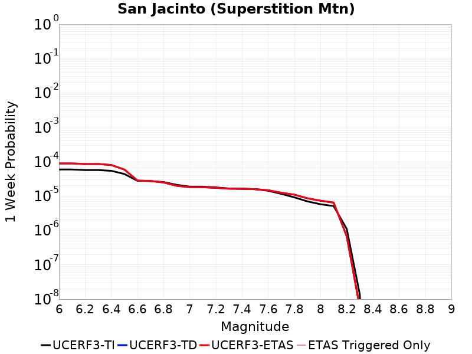 |  |  |  |

| Magnitude | 1 wk TI Prob | 1 wk TD Prob | 1 wk ETAS Prob | 1 wk ETAS/TD Gain | 1 wk ETAS Triggered Only | 1 mo TI Prob | 1 mo TD Prob | 1 mo ETAS Prob | 1 mo ETAS/TD Gain | 1 mo ETAS Triggered Only | 1 yr TI Prob | 1 yr TD Prob | 1 yr ETAS Prob | 1 yr ETAS/TD Gain | 1 yr ETAS Triggered Only | 10 yr TI Prob | 10 yr TD Prob | 10 yr ETAS Prob | 10 yr ETAS/TD Gain | 10 yr ETAS Triggered Only |
|-----|-----|-----|-----|-----|-----|-----|-----|-----|-----|-----|-----|-----|-----|-----|-----|-----|-----|-----|-----|-----|
| 6.0 | 5.921579E-5 | 8.89135E-5 | 8.89135E-5 | 1.0 | 0.0 | 2.5375726E-4 | 3.8100922E-4 | 3.8100922E-4 | 1.0 | 0.0 | 0.0030851178 | 0.0046304604 | 0.0046304604 | 1.0 | 0.0 | 0.030426376 | 0.045413267 | 0.04542281 | 1.0002102 | 1.0E-5 |
| 6.1 | 5.921579E-5 | 8.89135E-5 | 8.89135E-5 | 1.0 | 0.0 | 2.5375726E-4 | 3.8100922E-4 | 3.8100922E-4 | 1.0 | 0.0 | 0.0030851178 | 0.0046304604 | 0.0046304604 | 1.0 | 0.0 | 0.030426376 | 0.045413267 | 0.04542281 | 1.0002102 | 1.0E-5 |
| 6.2 | 5.6963574E-5 | 8.5401174E-5 | 8.5401174E-5 | 1.0 | 0.0 | 2.4410675E-4 | 3.65963E-4 | 3.65963E-4 | 1.0 | 0.0 | 0.0029679495 | 0.004448119 | 0.004448119 | 1.0 | 0.0 | 0.029286223 | 0.043671973 | 0.043681536 | 1.000219 | 1.0E-5 |
| 6.3 | 5.6940098E-5 | 8.5355445E-5 | 8.5355445E-5 | 1.0 | 0.0 | 2.4400617E-4 | 3.6576707E-4 | 3.6576707E-4 | 1.0 | 0.0 | 0.002966728 | 0.0044457433 | 0.0044457433 | 1.0 | 0.0 | 0.029274331 | 0.043649305 | 0.043658867 | 1.0002191 | 1.0E-5 |
| 6.4 | 5.4171585E-5 | 7.987182E-5 | 7.987182E-5 | 1.0 | 0.0 | 2.3214328E-4 | 3.4227208E-4 | 3.4227208E-4 | 1.0 | 0.0 | 0.0028226813 | 0.0041608294 | 0.0041608294 | 1.0 | 0.0 | 0.02787096 | 0.040949315 | 0.040958907 | 1.0002342 | 1.0E-5 |
| 6.5 | 4.375144E-5 | 5.8924303E-5 | 5.8924303E-5 | 1.0 | 0.0 | 1.874927E-4 | 2.5251484E-4 | 2.5251484E-4 | 1.0 | 0.0 | 0.0022803338 | 0.0030711966 | 0.0030711966 | 1.0 | 0.0 | 0.022570757 | 0.030519143 | 0.030528838 | 1.0003177 | 1.0E-5 |
| 6.6 | 2.772192E-5 | 2.8174312E-5 | 2.8174312E-5 | 1.0 | 0.0 | 1.1880282E-4 | 1.20741584E-4 | 1.20741584E-4 | 1.0 | 0.0 | 0.0014454646 | 0.0014690596 | 0.0014690596 | 1.0 | 0.0 | 0.014360986 | 0.014919545 | 0.014919545 | 1.0 | 0.0 |
| 6.7 | 2.7124124E-5 | 2.7366077E-5 | 2.7366077E-5 | 1.0 | 0.0 | 1.1624106E-4 | 1.1727804E-4 | 1.1727804E-4 | 1.0 | 0.0 | 0.0014143161 | 0.0014269467 | 0.0014269467 | 1.0 | 0.0 | 0.014053487 | 0.014504156 | 0.014504156 | 1.0 | 0.0 |
| 6.8 | 2.5475807E-5 | 2.4840738E-5 | 2.4840738E-5 | 1.0 | 0.0 | 1.0917746E-4 | 1.0645604E-4 | 1.0645604E-4 | 1.0 | 0.0 | 0.001328425 | 0.0012953464 | 0.0012953464 | 1.0 | 0.0 | 0.0132051185 | 0.013199127 | 0.013199127 | 1.0 | 0.0 |
| 6.9 | 2.1162023E-5 | 1.9798375E-5 | 1.9798375E-5 | 1.0 | 0.0 | 9.069123E-5 | 8.4847445E-5 | 8.4847445E-5 | 1.0 | 0.0 | 0.0011036064 | 0.0010325328 | 0.0010325328 | 1.0 | 0.0 | 0.010981417 | 0.010571153 | 0.010571153 | 1.0 | 0.0 |
| 7.0 | 1.8754288E-5 | 1.8129858E-5 | 1.8129858E-5 | 1.0 | 0.0 | 8.037304E-5 | 7.769709E-5 | 7.769709E-5 | 1.0 | 0.0 | 9.781026E-4 | 9.455546E-4 | 9.455546E-4 | 1.0 | 0.0 | 0.009738087 | 0.009690906 | 0.009690906 | 1.0 | 0.0 |
| 7.1 | 1.8678527E-5 | 1.8048686E-5 | 1.8048686E-5 | 1.0 | 0.0 | 8.0048376E-5 | 7.734923E-5 | 7.734923E-5 | 1.0 | 0.0 | 9.7415317E-4 | 9.41323E-4 | 9.41323E-4 | 1.0 | 0.0 | 0.009698939 | 0.009648685 | 0.009648685 | 1.0 | 0.0 |
| 7.2 | 1.7804578E-5 | 1.7283759E-5 | 1.7283759E-5 | 1.0 | 0.0 | 7.6303106E-5 | 7.407116E-5 | 7.407116E-5 | 1.0 | 0.0 | 9.285943E-4 | 9.0144604E-4 | 9.0144604E-4 | 1.0 | 0.0 | 0.009247236 | 0.009249902 | 0.009249902 | 1.0 | 0.0 |
| 7.3 | 1.6583685E-5 | 1.6353799E-5 | 1.6353799E-5 | 1.0 | 0.0 | 7.1070994E-5 | 7.008584E-5 | 7.008584E-5 | 1.0 | 0.0 | 8.649459E-4 | 8.529635E-4 | 8.529635E-4 | 1.0 | 0.0 | 0.00861587 | 0.008765268 | 0.008765268 | 1.0 | 0.0 |
| 7.4 | 1.6387552E-5 | 1.6206594E-5 | 1.6206594E-5 | 1.0 | 0.0 | 7.023047E-5 | 6.9454996E-5 | 6.9454996E-5 | 1.0 | 0.0 | 8.5472054E-4 | 8.452889E-4 | 8.452889E-4 | 1.0 | 0.0 | 0.008514405 | 0.008688498 | 0.008688498 | 1.0 | 0.0 |
| 7.5 | 1.5790754E-5 | 1.5809896E-5 | 1.5809896E-5 | 1.0 | 0.0 | 6.767291E-5 | 6.7754954E-5 | 6.7754954E-5 | 1.0 | 0.0 | 8.236062E-4 | 8.246067E-4 | 8.246067E-4 | 1.0 | 0.0 | 0.008205604 | 0.008479888 | 0.008479888 | 1.0 | 0.0 |
| 7.6 | 1.4248672E-5 | 1.47409655E-5 | 1.47409655E-5 | 1.0 | 0.0 | 6.106431E-5 | 6.317405E-5 | 6.317405E-5 | 1.0 | 0.0 | 7.432043E-4 | 7.688747E-4 | 7.688747E-4 | 1.0 | 0.0 | 0.007407237 | 0.007917439 | 0.007917439 | 1.0 | 0.0 |
| 7.7 | 1.15449975E-5 | 1.24458475E-5 | 1.24458475E-5 | 1.0 | 0.0 | 4.947762E-5 | 5.3338263E-5 | 5.3338263E-5 | 1.0 | 0.0 | 6.022235E-4 | 6.4920087E-4 | 6.4920087E-4 | 1.0 | 0.0 | 0.006005941 | 0.00671427 | 0.00671427 | 1.0 | 0.0 |
| 7.8 | 9.1391985E-6 | 1.0937948E-5 | 1.0937948E-5 | 1.0 | 0.0 | 3.9167408E-5 | 4.687608E-5 | 4.687608E-5 | 1.0 | 0.0 | 4.767588E-4 | 5.705676E-4 | 5.705676E-4 | 1.0 | 0.0 | 0.0047573727 | 0.005919773 | 0.005919773 | 1.0 | 0.0 |
| 7.9 | 6.973017E-6 | 8.568603E-6 | 8.568603E-6 | 1.0 | 0.0 | 2.9884017E-5 | 3.672207E-5 | 3.672207E-5 | 1.0 | 0.0 | 3.6377716E-4 | 4.4700023E-4 | 4.4700023E-4 | 1.0 | 0.0 | 0.0036318225 | 0.0046726577 | 0.0046726577 | 1.0 | 0.0 |
| 8.0 | 5.7638235E-6 | 7.3041124E-6 | 7.3041124E-6 | 1.0 | 0.0 | 2.4701867E-5 | 3.1302967E-5 | 3.1302967E-5 | 1.0 | 0.0 | 3.0070372E-4 | 3.8104766E-4 | 3.8104766E-4 | 1.0 | 0.0 | 0.0030029714 | 0.0040004873 | 0.0040004873 | 1.0 | 0.0 |
| 8.1 | 5.1124434E-6 | 6.4276755E-6 | 6.4276755E-6 | 1.0 | 0.0 | 2.1910288E-5 | 2.7546894E-5 | 2.7546894E-5 | 1.0 | 0.0 | 2.6672508E-4 | 3.3533247E-4 | 3.3533247E-4 | 1.0 | 0.0 | 0.0026640517 | 0.003529423 | 0.003529423 | 1.0 | 0.0 |
| 8.2 | 1.1075938E-6 | 6.718009E-7 | 6.718009E-7 | 1.0 | 0.0 | 4.7468216E-6 | 2.8791437E-6 | 2.8791437E-6 | 1.0 | 0.0 | 5.779102E-5 | 3.5053046E-5 | 3.5053046E-5 | 1.0 | 0.0 | 5.777599E-4 | 3.8987593E-4 | 3.8987593E-4 | 1.0 | 0.0 |
| 8.3 | 1.3584393E-8 | 5.7739014E-9 | 5.7739014E-9 | 1.0 | 0.0 | 5.8218827E-8 | 2.4745292E-8 | 2.4745292E-8 | 1.0 | 0.0 | 7.0881396E-7 | 3.0127393E-7 | 3.0127393E-7 | 1.0 | 0.0 | 7.0881174E-6 | 3.3399433E-6 | 3.3399433E-6 | 1.0 | 0.0 |

