# Parent Section Magnitude-Probability Distributions

Only fault sections with at least one triggered aftershock are plotted. Sections are sorted by total supraseismogenic trigger rate (decreasing)

## Table Of Contents

* [San Andreas (Mojave S)](#san-andreas-mojave-s)
* [San Andreas (Cholame) rev](#san-andreas-cholame-rev)
* [Big Pine (East)](#big-pine-east)
* [Pleito](#pleito)
* [San Andreas (San Bernardino N)](#san-andreas-san-bernardino-n)
* [San Andreas (Creeping Section) 2011 CFM](#san-andreas-creeping-section-2011-cfm)
* [San Andreas (Carrizo) rev](#san-andreas-carrizo-rev)
* [San Andreas (Big Bend)](#san-andreas-big-bend)
* [San Andreas (Mojave N)](#san-andreas-mojave-n)
* [San Andreas (Parkfield)](#san-andreas-parkfield)

## San Andreas (Mojave S)
*[(top)](#table-of-contents)*

| 1 Week | 1 Month | 1 Year | 10 Year |
|-----|-----|-----|-----|
|  | 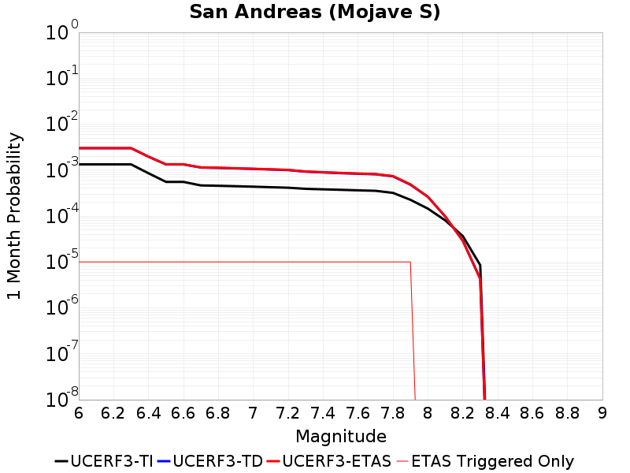 |  | 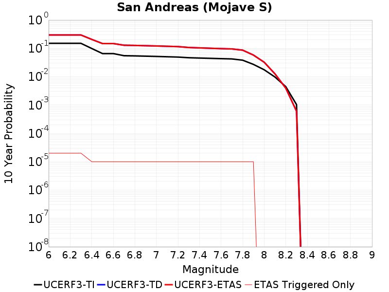 |

| Magnitude | 1 wk TI Prob | 1 wk TD Prob | 1 wk ETAS Prob | 1 wk ETAS/TD Gain | 1 wk ETAS Triggered Only | 1 mo TI Prob | 1 mo TD Prob | 1 mo ETAS Prob | 1 mo ETAS/TD Gain | 1 mo ETAS Triggered Only | 1 yr TI Prob | 1 yr TD Prob | 1 yr ETAS Prob | 1 yr ETAS/TD Gain | 1 yr ETAS Triggered Only | 10 yr TI Prob | 10 yr TD Prob | 10 yr ETAS Prob | 10 yr ETAS/TD Gain | 10 yr ETAS Triggered Only |
|-----|-----|-----|-----|-----|-----|-----|-----|-----|-----|-----|-----|-----|-----|-----|-----|-----|-----|-----|-----|-----|
| 6.0 | 3.1064058E-4 | 6.993538E-4 | 7.093468E-4 | 1.0142889 | 1.0E-5 | 0.0013306376 | 0.0029939176 | 0.0030038876 | 1.0033301 | 1.0E-5 | 0.016080605 | 0.035811447 | 0.035830732 | 1.0005385 | 2.0E-5 | 0.1496549 | 0.29474646 | 0.29476058 | 1.0000478 | 2.0E-5 |
| 6.1 | 3.1064058E-4 | 6.993538E-4 | 7.093468E-4 | 1.0142889 | 1.0E-5 | 0.0013306376 | 0.0029939176 | 0.0030038876 | 1.0033301 | 1.0E-5 | 0.016080605 | 0.035811447 | 0.035830732 | 1.0005385 | 2.0E-5 | 0.1496549 | 0.29474646 | 0.29476058 | 1.0000478 | 2.0E-5 |
| 6.2 | 3.1064058E-4 | 6.993538E-4 | 7.093468E-4 | 1.0142889 | 1.0E-5 | 0.0013306376 | 0.0029939176 | 0.0030038876 | 1.0033301 | 1.0E-5 | 0.016080605 | 0.035811447 | 0.035830732 | 1.0005385 | 2.0E-5 | 0.1496549 | 0.29474646 | 0.29476058 | 1.0000478 | 2.0E-5 |
| 6.3 | 3.1064058E-4 | 6.993538E-4 | 7.093468E-4 | 1.0142889 | 1.0E-5 | 0.0013306376 | 0.0029939176 | 0.0030038876 | 1.0033301 | 1.0E-5 | 0.016080605 | 0.035811447 | 0.035830732 | 1.0005385 | 2.0E-5 | 0.1496549 | 0.29474646 | 0.29476058 | 1.0000478 | 2.0E-5 |
| 6.4 | 1.9872203E-4 | 4.5518152E-4 | 4.6517697E-4 | 1.0219593 | 1.0E-5 | 8.5138786E-4 | 0.0019493483 | 0.0019593288 | 1.0051199 | 1.0E-5 | 0.010316478 | 0.023481471 | 0.023491235 | 1.0004159 | 1.0E-5 | 0.098504856 | 0.20589855 | 0.2059065 | 1.0000386 | 1.0E-5 |
| 6.5 | 1.291105E-4 | 3.095437E-4 | 3.1954062E-4 | 1.0322956 | 1.0E-5 | 5.5321335E-4 | 0.0013259443 | 0.001335931 | 1.0075318 | 1.0E-5 | 0.006714592 | 0.01602481 | 0.016034648 | 1.000614 | 1.0E-5 | 0.065152965 | 0.14706185 | 0.1470704 | 1.000058 | 1.0E-5 |
| 6.6 | 1.291105E-4 | 3.095437E-4 | 3.1954062E-4 | 1.0322956 | 1.0E-5 | 5.5321335E-4 | 0.0013259443 | 0.001335931 | 1.0075318 | 1.0E-5 | 0.006714592 | 0.01602481 | 0.016034648 | 1.000614 | 1.0E-5 | 0.065152965 | 0.14706185 | 0.1470704 | 1.000058 | 1.0E-5 |
| 6.7 | 1.08001186E-4 | 2.6496866E-4 | 2.74966E-4 | 1.0377303 | 1.0E-5 | 4.6278012E-4 | 0.0011350864 | 0.0011450751 | 1.0087999 | 1.0E-5 | 0.0056198016 | 0.013732479 | 0.013742342 | 1.0007182 | 1.0E-5 | 0.054797906 | 0.1282748 | 0.12828352 | 1.000068 | 1.0E-5 |
| 6.8 | 1.0624356E-4 | 2.6007235E-4 | 2.7006975E-4 | 1.0384408 | 1.0E-5 | 4.5525006E-4 | 0.0011141204 | 0.0011241091 | 1.0089657 | 1.0E-5 | 0.0055285925 | 0.013480394 | 0.01349026 | 1.0007318 | 1.0E-5 | 0.053930566 | 0.12621877 | 0.12622751 | 1.0000693 | 1.0E-5 |
| 6.9 | 1.0393785E-4 | 2.5367938E-4 | 2.6367683E-4 | 1.0394099 | 1.0E-5 | 4.4537184E-4 | 0.0010867448 | 0.001096734 | 1.0091918 | 1.0E-5 | 0.0054089287 | 0.013151163 | 0.0131610315 | 1.0007504 | 1.0E-5 | 0.05279156 | 0.1235107 | 0.123519465 | 1.0000709 | 1.0E-5 |
| 7.0 | 1.0155622E-4 | 2.4726425E-4 | 2.5726177E-4 | 1.0404326 | 1.0E-5 | 4.3516833E-4 | 0.001059274 | 0.0010692633 | 1.0094304 | 1.0E-5 | 0.005285311 | 0.012820684 | 0.012830556 | 1.00077 | 1.0E-5 | 0.05161361 | 0.120754 | 0.120762795 | 1.0000728 | 1.0E-5 |
| 7.1 | 9.885595E-5 | 2.4002264E-4 | 2.5002024E-4 | 1.0416527 | 1.0E-5 | 4.2359953E-4 | 0.0010282632 | 0.001038253 | 1.0097151 | 1.0E-5 | 0.0051451353 | 0.012447499 | 0.0124573745 | 1.0007933 | 1.0E-5 | 0.05027629 | 0.117618464 | 0.117627285 | 1.000075 | 1.0E-5 |
| 7.2 | 9.6411415E-5 | 2.3353602E-4 | 2.4353368E-4 | 1.04281 | 1.0E-5 | 4.1312634E-4 | 0.0010004852 | 0.0010104751 | 1.0099852 | 1.0E-5 | 0.005018219 | 0.012113109 | 0.012122988 | 1.0008155 | 1.0E-5 | 0.049064007 | 0.11478997 | 0.11479883 | 1.0000771 | 1.0E-5 |
| 7.3 | 9.1180635E-5 | 2.1515302E-4 | 2.2515086E-4 | 1.0464685 | 1.0E-5 | 3.907156E-4 | 9.217586E-4 | 9.317494E-4 | 1.0108389 | 1.0E-5 | 0.004746591 | 0.011164818 | 0.011174706 | 1.0008857 | 1.0E-5 | 0.046464786 | 0.10681359 | 0.10682251 | 1.0000836 | 1.0E-5 |
| 7.4 | 8.887388E-5 | 2.0736143E-4 | 2.1735937E-4 | 1.048215 | 1.0E-5 | 3.8083247E-4 | 8.883893E-4 | 8.983804E-4 | 1.0112463 | 1.0E-5 | 0.0046267817 | 0.010762633 | 0.010772525 | 1.0009191 | 1.0E-5 | 0.045316286 | 0.10337204 | 0.103381 | 1.0000868 | 1.0E-5 |
| 7.5 | 8.6750515E-5 | 2.0041918E-4 | 2.1041717E-4 | 1.0498854 | 1.0E-5 | 3.7173493E-4 | 8.5865665E-4 | 8.6864806E-4 | 1.0116361 | 1.0E-5 | 0.004516484 | 0.010404154 | 0.010414049 | 1.0009512 | 1.0E-5 | 0.04425787 | 0.10026207 | 0.10027107 | 1.0000898 | 1.0E-5 |
| 7.6 | 8.453092E-5 | 1.9401067E-4 | 2.0400874E-4 | 1.0515336 | 1.0E-5 | 3.6222505E-4 | 8.312095E-4 | 8.4120117E-4 | 1.0120207 | 1.0E-5 | 0.0044011753 | 0.010073123 | 0.010083022 | 1.0009828 | 1.0E-5 | 0.04315024 | 0.09733018 | 0.097339205 | 1.0000927 | 1.0E-5 |
| 7.7 | 8.259102E-5 | 1.8898537E-4 | 1.9898349E-4 | 1.0529041 | 1.0E-5 | 3.539135E-4 | 8.0968597E-4 | 8.196779E-4 | 1.0123404 | 1.0E-5 | 0.004300386 | 0.009813466 | 0.009823368 | 1.001009 | 1.0E-5 | 0.042181134 | 0.09499346 | 0.09500251 | 1.0000952 | 1.0E-5 |
| 7.8 | 7.444844E-5 | 1.7041214E-4 | 1.8041044E-4 | 1.0586712 | 1.0E-5 | 3.1902574E-4 | 7.301334E-4 | 7.401261E-4 | 1.0136862 | 1.0E-5 | 0.0038772223 | 0.008853212 | 0.008863124 | 1.0011195 | 1.0E-5 | 0.03810269 | 0.08611435 | 0.08612349 | 1.0001061 | 1.0E-5 |
| 7.9 | 5.2586525E-5 | 1.119492E-4 | 1.21948084E-4 | 1.0893162 | 1.0E-5 | 2.2535135E-4 | 4.7969408E-4 | 4.896893E-4 | 1.0208366 | 1.0E-5 | 0.0027402006 | 0.0058246525 | 0.0058345944 | 1.0017068 | 1.0E-5 | 0.027066574 | 0.057714704 | 0.057724126 | 1.0001633 | 1.0E-5 |
| 8.0 | 3.379877E-5 | 6.108525E-5 | 6.108525E-5 | 1.0 | 0.0 | 1.4484383E-4 | 2.6176768E-4 | 2.6176768E-4 | 1.0 | 0.0 | 0.0017620471 | 0.0031823663 | 0.0031823663 | 1.0 | 0.0 | 0.017481409 | 0.03224004 | 0.03224004 | 1.0 | 0.0 |
| 8.1 | 1.8668277E-5 | 2.264322E-5 | 2.264322E-5 | 1.0 | 0.0 | 8.000444E-5 | 9.703877E-5 | 9.703877E-5 | 1.0 | 0.0 | 9.736188E-4 | 0.0011808076 | 0.0011808076 | 1.0 | 0.0 | 0.009693642 | 0.012523894 | 0.012523894 | 1.0 | 0.0 |
| 8.2 | 8.541571E-6 | 6.7617284E-6 | 6.7617284E-6 | 1.0 | 0.0 | 3.660622E-5 | 2.8978515E-5 | 2.8978515E-5 | 1.0 | 0.0 | 4.455896E-4 | 3.527564E-4 | 3.527564E-4 | 1.0 | 0.0 | 0.0044469717 | 0.003942438 | 0.003942438 | 1.0 | 0.0 |
| 8.3 | 1.983087E-6 | 9.994538E-7 | 9.994538E-7 | 1.0 | 0.0 | 8.498917E-6 | 4.2833667E-6 | 4.2833667E-6 | 1.0 | 0.0 | 1.034694E-4 | 5.2148767E-5 | 5.2148767E-5 | 1.0 | 0.0 | 0.0010342124 | 6.0386653E-4 | 6.0386653E-4 | 1.0 | 0.0 |

## San Andreas (Cholame) rev
*[(top)](#table-of-contents)*

| 1 Week | 1 Month | 1 Year | 10 Year |
|-----|-----|-----|-----|
| 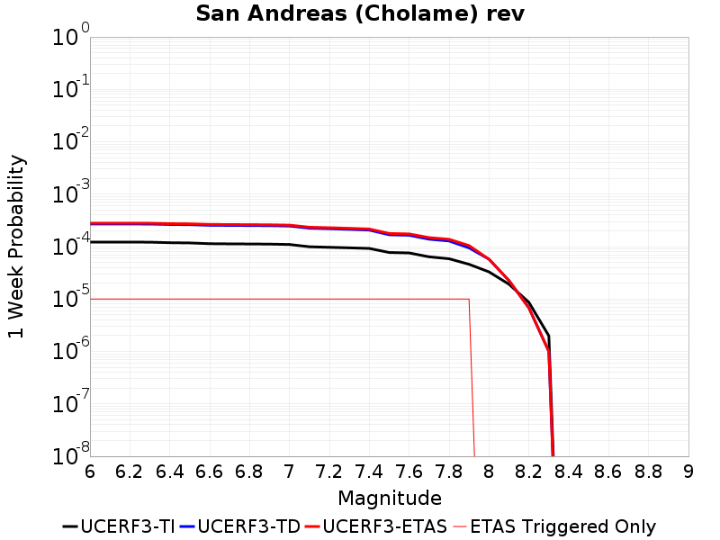 |  |  | 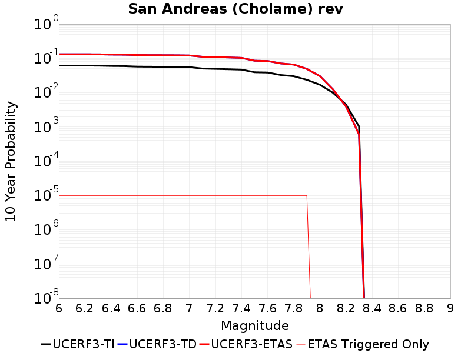 |

| Magnitude | 1 wk TI Prob | 1 wk TD Prob | 1 wk ETAS Prob | 1 wk ETAS/TD Gain | 1 wk ETAS Triggered Only | 1 mo TI Prob | 1 mo TD Prob | 1 mo ETAS Prob | 1 mo ETAS/TD Gain | 1 mo ETAS Triggered Only | 1 yr TI Prob | 1 yr TD Prob | 1 yr ETAS Prob | 1 yr ETAS/TD Gain | 1 yr ETAS Triggered Only | 10 yr TI Prob | 10 yr TD Prob | 10 yr ETAS Prob | 10 yr ETAS/TD Gain | 10 yr ETAS Triggered Only |
|-----|-----|-----|-----|-----|-----|-----|-----|-----|-----|-----|-----|-----|-----|-----|-----|-----|-----|-----|-----|-----|
| 6.0 | 1.2188602E-4 | 2.6985892E-4 | 2.7985623E-4 | 1.0370464 | 1.0E-5 | 5.2226405E-4 | 0.0011560274 | 0.0011660159 | 1.0086403 | 1.0E-5 | 0.0063400427 | 0.013984394 | 0.013994254 | 1.0007051 | 1.0E-5 | 0.061621845 | 0.13173757 | 0.13174626 | 1.0000659 | 1.0E-5 |
| 6.1 | 1.2188602E-4 | 2.6985892E-4 | 2.7985623E-4 | 1.0370464 | 1.0E-5 | 5.2226405E-4 | 0.0011560274 | 0.0011660159 | 1.0086403 | 1.0E-5 | 0.0063400427 | 0.013984394 | 0.013994254 | 1.0007051 | 1.0E-5 | 0.061621845 | 0.13173757 | 0.13174626 | 1.0000659 | 1.0E-5 |
| 6.2 | 1.2188602E-4 | 2.6985892E-4 | 2.7985623E-4 | 1.0370464 | 1.0E-5 | 5.2226405E-4 | 0.0011560274 | 0.0011660159 | 1.0086403 | 1.0E-5 | 0.0063400427 | 0.013984394 | 0.013994254 | 1.0007051 | 1.0E-5 | 0.061621845 | 0.13173757 | 0.13174626 | 1.0000659 | 1.0E-5 |
| 6.3 | 1.2142645E-4 | 2.6898144E-4 | 2.7897875E-4 | 1.0371673 | 1.0E-5 | 5.202953E-4 | 0.0011522701 | 0.0011622587 | 1.0086685 | 1.0E-5 | 0.006316212 | 0.013939235 | 0.013949095 | 1.0007074 | 1.0E-5 | 0.06139677 | 0.13135259 | 0.13136128 | 1.0000662 | 1.0E-5 |
| 6.4 | 1.1865206E-4 | 2.6391068E-4 | 2.7390805E-4 | 1.0378816 | 1.0E-5 | 5.0840975E-4 | 0.0011305573 | 0.001140546 | 1.0088352 | 1.0E-5 | 0.006172335 | 0.013678227 | 0.01368809 | 1.0007211 | 1.0E-5 | 0.060036868 | 0.1291236 | 0.12913232 | 1.0000675 | 1.0E-5 |
| 6.5 | 1.17443946E-4 | 2.617911E-4 | 2.717885E-4 | 1.0381883 | 1.0E-5 | 5.032341E-4 | 0.0011214812 | 0.00113147 | 1.0089067 | 1.0E-5 | 0.006109677 | 0.0135691045 | 0.013578968 | 1.0007269 | 1.0E-5 | 0.059444077 | 0.12818246 | 0.12819117 | 1.0000681 | 1.0E-5 |
| 6.6 | 1.13579066E-4 | 2.549003E-4 | 2.6489777E-4 | 1.039221 | 1.0E-5 | 4.866766E-4 | 0.0010919742 | 0.0011019632 | 1.0091478 | 1.0E-5 | 0.0059092017 | 0.013214266 | 0.013224134 | 1.0007467 | 1.0E-5 | 0.057545185 | 0.12512863 | 0.12513737 | 1.00007 | 1.0E-5 |
| 6.7 | 1.1271412E-4 | 2.5333278E-4 | 2.6333026E-4 | 1.0394638 | 1.0E-5 | 4.829711E-4 | 0.0010852619 | 0.0010952511 | 1.0092044 | 1.0E-5 | 0.005864331 | 0.013133532 | 0.013143401 | 1.0007514 | 1.0E-5 | 0.057119697 | 0.124433525 | 0.12444228 | 1.0000703 | 1.0E-5 |
| 6.8 | 1.1217975E-4 | 2.5219616E-4 | 2.6219364E-4 | 1.0396416 | 1.0E-5 | 4.8068175E-4 | 0.0010803946 | 0.0010903839 | 1.0092459 | 1.0E-5 | 0.005836608 | 0.013074987 | 0.013084856 | 1.0007548 | 1.0E-5 | 0.056856725 | 0.12392751 | 0.12393627 | 1.0000707 | 1.0E-5 |
| 6.9 | 1.1146753E-4 | 2.5064778E-4 | 2.606453E-4 | 1.0398866 | 1.0E-5 | 4.7763053E-4 | 0.0010737643 | 0.0010837535 | 1.009303 | 1.0E-5 | 0.0057996577 | 0.012995228 | 0.013005098 | 1.0007595 | 1.0E-5 | 0.056506127 | 0.12323958 | 0.123248346 | 1.0000712 | 1.0E-5 |
| 7.0 | 1.0965793E-4 | 2.468145E-4 | 2.5681205E-4 | 1.0405062 | 1.0E-5 | 4.698779E-4 | 0.0010573494 | 0.0010673387 | 1.0094476 | 1.0E-5 | 0.005705768 | 0.012797741 | 0.012807613 | 1.0007714 | 1.0E-5 | 0.055614736 | 0.12152999 | 0.12153877 | 1.0000722 | 1.0E-5 |
| 7.1 | 9.927982E-5 | 2.243219E-4 | 2.3431967E-4 | 1.0445688 | 1.0E-5 | 4.2541555E-4 | 9.610266E-4 | 9.7101694E-4 | 1.0103955 | 1.0E-5 | 0.0051671406 | 0.01163808 | 0.011647963 | 1.0008492 | 1.0E-5 | 0.05048634 | 0.11144588 | 0.11145477 | 1.0000798 | 1.0E-5 |
| 7.2 | 9.696786E-5 | 2.1921552E-4 | 2.2921333E-4 | 1.0456072 | 1.0E-5 | 4.1551032E-4 | 9.3915797E-4 | 9.4914855E-4 | 1.0106379 | 1.0E-5 | 0.00504711 | 0.011374639 | 0.011384525 | 1.0008692 | 1.0E-5 | 0.04934009 | 0.10914123 | 0.10915014 | 1.0000817 | 1.0E-5 |
| 7.3 | 9.4727984E-5 | 2.1325123E-4 | 2.232491E-4 | 1.0468831 | 1.0E-5 | 4.0591392E-4 | 9.136148E-4 | 9.236057E-4 | 1.0109355 | 1.0E-5 | 0.0049308087 | 0.011066852 | 0.011076742 | 1.0008936 | 1.0E-5 | 0.048228268 | 0.10642675 | 0.10643569 | 1.0000839 | 1.0E-5 |
| 7.4 | 9.220358E-5 | 2.0662716E-4 | 2.1662509E-4 | 1.0483863 | 1.0E-5 | 3.9509835E-4 | 8.852455E-4 | 8.952366E-4 | 1.0112863 | 1.0E-5 | 0.004799717 | 0.010724898 | 0.010734791 | 1.0009224 | 1.0E-5 | 0.046973653 | 0.103403695 | 0.103412665 | 1.0000867 | 1.0E-5 |
| 7.5 | 7.71631E-5 | 1.6809045E-4 | 1.7808877E-4 | 1.0594817 | 1.0E-5 | 3.306571E-4 | 7.2018895E-4 | 7.3018175E-4 | 1.0138752 | 1.0E-5 | 0.0040183207 | 0.008733142 | 0.008743054 | 1.0011351 | 1.0E-5 | 0.03946433 | 0.08551391 | 0.08552306 | 1.0001069 | 1.0E-5 |
| 7.6 | 7.5634416E-5 | 1.6451061E-4 | 1.7450897E-4 | 1.0607764 | 1.0E-5 | 3.241072E-4 | 7.048552E-4 | 7.148481E-4 | 1.0141773 | 1.0E-5 | 0.0039388672 | 0.008547933 | 0.008557848 | 1.0011599 | 1.0E-5 | 0.038697794 | 0.083815955 | 0.08382512 | 1.0001093 | 1.0E-5 |
| 7.7 | 6.3783E-5 | 1.38461E-4 | 1.484596E-4 | 1.0722125 | 1.0E-5 | 2.7332708E-4 | 5.9326936E-4 | 6.032634E-4 | 1.0168457 | 1.0E-5 | 0.0033226798 | 0.007199171 | 0.007209099 | 1.001379 | 1.0E-5 | 0.032734364 | 0.07126405 | 0.07127334 | 1.0001303 | 1.0E-5 |
| 7.8 | 5.863422E-5 | 1.2792757E-4 | 1.379263E-4 | 1.0781592 | 1.0E-5 | 2.512653E-4 | 5.481459E-4 | 5.581404E-4 | 1.0182333 | 1.0E-5 | 0.003054864 | 0.006653285 | 0.0066632186 | 1.001493 | 1.0E-5 | 0.030132094 | 0.06591608 | 0.06592541 | 1.0001417 | 1.0E-5 |
| 7.9 | 4.595283E-5 | 9.455976E-5 | 1.04558814E-4 | 1.1057433 | 1.0E-5 | 1.9692584E-4 | 4.0519316E-4 | 4.1518913E-4 | 1.0246695 | 1.0E-5 | 0.0023949358 | 0.004922078 | 0.0049320287 | 1.0020217 | 1.0E-5 | 0.023692891 | 0.049180716 | 0.049190227 | 1.0001934 | 1.0E-5 |
| 8.0 | 3.2950178E-5 | 5.7491718E-5 | 5.7491718E-5 | 1.0 | 0.0 | 1.412074E-4 | 2.4636983E-4 | 2.4636983E-4 | 1.0 | 0.0 | 0.0017178444 | 0.002995429 | 0.002995429 | 1.0 | 0.0 | 0.017046256 | 0.030454762 | 0.030454762 | 1.0 | 0.0 |
| 8.1 | 1.9177472E-5 | 2.2544013E-5 | 2.2544013E-5 | 1.0 | 0.0 | 8.218658E-5 | 9.661362E-5 | 9.661362E-5 | 1.0 | 0.0 | 0.0010001622 | 0.001175637 | 0.001175637 | 1.0 | 0.0 | 0.009956728 | 0.012499441 | 0.012499441 | 1.0 | 0.0 |
| 8.2 | 8.643924E-6 | 6.7803635E-6 | 6.7803635E-6 | 1.0 | 0.0 | 3.704486E-5 | 2.9058378E-5 | 2.9058378E-5 | 1.0 | 0.0 | 4.5092785E-4 | 3.5372845E-4 | 3.5372845E-4 | 1.0 | 0.0 | 0.0045001395 | 0.0039528483 | 0.0039528483 | 1.0 | 0.0 |
| 8.3 | 1.983087E-6 | 9.994538E-7 | 9.994538E-7 | 1.0 | 0.0 | 8.498917E-6 | 4.2833667E-6 | 4.2833667E-6 | 1.0 | 0.0 | 1.034694E-4 | 5.2148767E-5 | 5.2148767E-5 | 1.0 | 0.0 | 0.0010342124 | 6.0386653E-4 | 6.0386653E-4 | 1.0 | 0.0 |

## Big Pine (East)
*[(top)](#table-of-contents)*

| 1 Week | 1 Month | 1 Year | 10 Year |
|-----|-----|-----|-----|
| 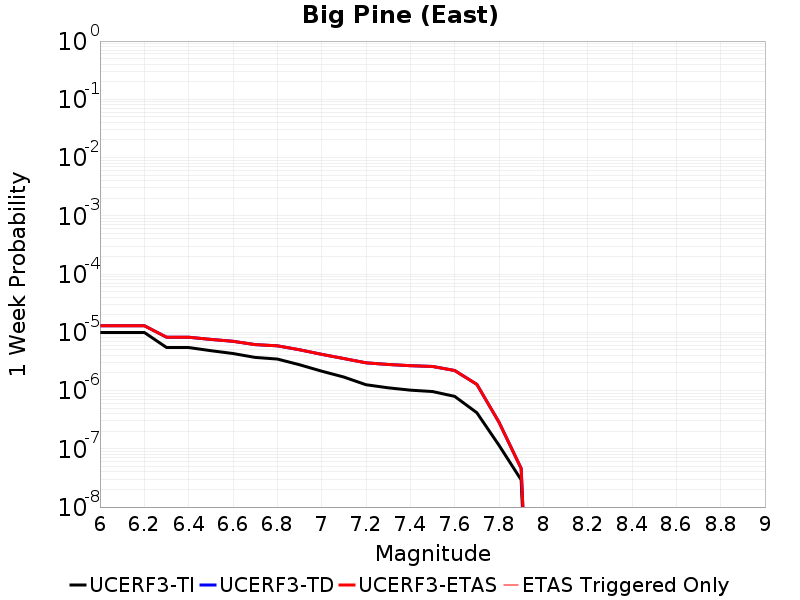 |  |  | 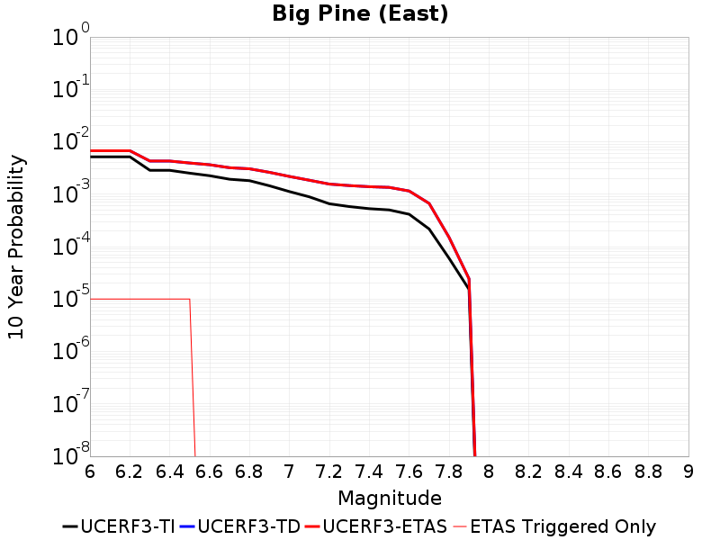 |

| Magnitude | 1 wk TI Prob | 1 wk TD Prob | 1 wk ETAS Prob | 1 wk ETAS/TD Gain | 1 wk ETAS Triggered Only | 1 mo TI Prob | 1 mo TD Prob | 1 mo ETAS Prob | 1 mo ETAS/TD Gain | 1 mo ETAS Triggered Only | 1 yr TI Prob | 1 yr TD Prob | 1 yr ETAS Prob | 1 yr ETAS/TD Gain | 1 yr ETAS Triggered Only | 10 yr TI Prob | 10 yr TD Prob | 10 yr ETAS Prob | 10 yr ETAS/TD Gain | 10 yr ETAS Triggered Only |
|-----|-----|-----|-----|-----|-----|-----|-----|-----|-----|-----|-----|-----|-----|-----|-----|-----|-----|-----|-----|-----|
| 6.0 | 9.916913E-6 | 1.2942914E-5 | 1.2942914E-5 | 1.0 | 0.0 | 4.250036E-5 | 5.5468576E-5 | 5.5468576E-5 | 1.0 | 0.0 | 5.173191E-4 | 6.7514274E-4 | 6.7514274E-4 | 1.0 | 0.0 | 0.0051611643 | 0.006732742 | 0.0067426744 | 1.0014753 | 1.0E-5 |
| 6.1 | 9.916913E-6 | 1.2942914E-5 | 1.2942914E-5 | 1.0 | 0.0 | 4.250036E-5 | 5.5468576E-5 | 5.5468576E-5 | 1.0 | 0.0 | 5.173191E-4 | 6.7514274E-4 | 6.7514274E-4 | 1.0 | 0.0 | 0.0051611643 | 0.006732742 | 0.0067426744 | 1.0014753 | 1.0E-5 |
| 6.2 | 9.916913E-6 | 1.2942914E-5 | 1.2942914E-5 | 1.0 | 0.0 | 4.250036E-5 | 5.5468576E-5 | 5.5468576E-5 | 1.0 | 0.0 | 5.173191E-4 | 6.7514274E-4 | 6.7514274E-4 | 1.0 | 0.0 | 0.0051611643 | 0.006732742 | 0.0067426744 | 1.0014753 | 1.0E-5 |
| 6.3 | 5.479711E-6 | 8.227345E-6 | 8.227345E-6 | 1.0 | 0.0 | 2.3484265E-5 | 3.525959E-5 | 3.525959E-5 | 1.0 | 0.0 | 2.858834E-4 | 4.2920405E-4 | 4.2920405E-4 | 1.0 | 0.0 | 0.0028551589 | 0.004283693 | 0.0042936504 | 1.0023245 | 1.0E-5 |
| 6.4 | 5.465009E-6 | 8.21166E-6 | 8.21166E-6 | 1.0 | 0.0 | 2.3421257E-5 | 3.519237E-5 | 3.519237E-5 | 1.0 | 0.0 | 2.851165E-4 | 4.2838597E-4 | 4.2838597E-4 | 1.0 | 0.0 | 0.0028475097 | 0.004275544 | 0.0042855013 | 1.0023289 | 1.0E-5 |
| 6.5 | 4.826767E-6 | 7.5352364E-6 | 7.5352364E-6 | 1.0 | 0.0 | 2.068598E-5 | 3.2293487E-5 | 3.2293487E-5 | 1.0 | 0.0 | 2.518227E-4 | 3.9310494E-4 | 3.9310494E-4 | 1.0 | 0.0 | 0.0025153751 | 0.003923995 | 0.0039339554 | 1.0025384 | 1.0E-5 |
| 6.6 | 4.3146847E-6 | 6.9941384E-6 | 6.9941384E-6 | 1.0 | 0.0 | 1.8491375E-5 | 2.9974548E-5 | 2.9974548E-5 | 1.0 | 0.0 | 2.2510924E-4 | 3.6488136E-4 | 3.6488136E-4 | 1.0 | 0.0 | 0.0022488134 | 0.0036426883 | 0.0036426883 | 1.0 | 0.0 |
| 6.7 | 3.6968106E-6 | 6.1339983E-6 | 6.1339983E-6 | 1.0 | 0.0 | 1.5843378E-5 | 2.6288308E-5 | 2.6288308E-5 | 1.0 | 0.0 | 1.9287605E-4 | 3.2001463E-4 | 3.2001463E-4 | 1.0 | 0.0 | 0.0019270873 | 0.0031953175 | 0.0031953175 | 1.0 | 0.0 |
| 6.8 | 3.4671132E-6 | 5.8496553E-6 | 5.8496553E-6 | 1.0 | 0.0 | 1.4858972E-5 | 2.5069718E-5 | 2.5069718E-5 | 1.0 | 0.0 | 1.8089297E-4 | 3.0518248E-4 | 3.0518248E-4 | 1.0 | 0.0 | 0.0018074579 | 0.0030474048 | 0.0030474048 | 1.0 | 0.0 |
| 6.9 | 2.7686972E-6 | 5.0037074E-6 | 5.0037074E-6 | 1.0 | 0.0 | 1.1865792E-5 | 2.1444288E-5 | 2.1444288E-5 | 1.0 | 0.0 | 1.4445644E-4 | 2.610537E-4 | 2.610537E-4 | 1.0 | 0.0 | 0.0014436257 | 0.0026071768 | 0.0026071768 | 1.0 | 0.0 |
| 7.0 | 2.1472624E-6 | 4.1770254E-6 | 4.1770254E-6 | 1.0 | 0.0 | 9.20252E-6 | 1.7901417E-5 | 1.7901417E-5 | 1.0 | 0.0 | 1.12034926E-4 | 2.1792852E-4 | 2.1792852E-4 | 1.0 | 0.0 | 0.0011197845 | 0.0021768203 | 0.0021768203 | 1.0 | 0.0 |
| 7.1 | 1.7018335E-6 | 3.5356406E-6 | 3.5356406E-6 | 1.0 | 0.0 | 7.293552E-6 | 1.515266E-5 | 1.515266E-5 | 1.0 | 0.0 | 8.879537E-5 | 1.844684E-4 | 1.844684E-4 | 1.0 | 0.0 | 8.87599E-4 | 0.001842802 | 0.001842802 | 1.0 | 0.0 |
| 7.2 | 1.25603E-6 | 2.9872765E-6 | 2.9872765E-6 | 1.0 | 0.0 | 5.3829745E-6 | 1.2802552E-5 | 1.2802552E-5 | 1.0 | 0.0 | 6.553574E-5 | 1.5586018E-4 | 1.5586018E-4 | 1.0 | 0.0 | 6.551642E-4 | 0.001557136 | 0.001557136 | 1.0 | 0.0 |
| 7.3 | 1.112297E-6 | 2.797845E-6 | 2.797845E-6 | 1.0 | 0.0 | 4.7669787E-6 | 1.199071E-5 | 1.199071E-5 | 1.0 | 0.0 | 5.803642E-5 | 1.4597735E-4 | 1.4597735E-4 | 1.0 | 0.0 | 5.802127E-4 | 0.0014582669 | 0.0014582669 | 1.0 | 0.0 |
| 7.4 | 1.0137181E-6 | 2.6661053E-6 | 2.6661053E-6 | 1.0 | 0.0 | 4.3444993E-6 | 1.14261165E-5 | 1.14261165E-5 | 1.0 | 0.0 | 5.2892992E-5 | 1.3910433E-4 | 1.3910433E-4 | 1.0 | 0.0 | 5.288041E-4 | 0.001389366 | 0.001389366 | 1.0 | 0.0 |
| 7.5 | 9.598608E-7 | 2.5855854E-6 | 2.5855854E-6 | 1.0 | 0.0 | 4.1136827E-6 | 1.1081035E-5 | 1.1081035E-5 | 1.0 | 0.0 | 5.0082934E-5 | 1.3490349E-4 | 1.3490349E-4 | 1.0 | 0.0 | 5.007165E-4 | 0.0013472415 | 0.0013472415 | 1.0 | 0.0 |
| 7.6 | 7.929459E-7 | 2.204039E-6 | 2.204039E-6 | 1.0 | 0.0 | 3.3983351E-6 | 9.445848E-6 | 9.445848E-6 | 1.0 | 0.0 | 4.1373947E-5 | 1.14997325E-4 | 1.14997325E-4 | 1.0 | 0.0 | 4.1366243E-4 | 0.0011488434 | 0.0011488434 | 1.0 | 0.0 |
| 7.7 | 4.155788E-7 | 1.2753144E-6 | 1.2753144E-6 | 1.0 | 0.0 | 1.7810507E-6 | 5.4656216E-6 | 5.4656216E-6 | 1.0 | 0.0 | 2.1684076E-5 | 6.6541965E-5 | 6.6541965E-5 | 1.0 | 0.0 | 2.1681961E-4 | 6.663493E-4 | 6.663493E-4 | 1.0 | 0.0 |
| 7.8 | 1.14666925E-7 | 2.8526364E-7 | 2.8526364E-7 | 1.0 | 0.0 | 4.914296E-7 | 1.2225579E-6 | 1.2225579E-6 | 1.0 | 0.0 | 5.9831386E-6 | 1.4884546E-5 | 1.4884546E-5 | 1.0 | 0.0 | 5.9829777E-5 | 1.4964968E-4 | 1.4964968E-4 | 1.0 | 0.0 |
| 7.9 | 2.9231824E-8 | 4.590243E-8 | 4.590243E-8 | 1.0 | 0.0 | 1.2527924E-7 | 1.9672468E-7 | 1.9672468E-7 | 1.0 | 0.0 | 1.5252737E-6 | 2.3951206E-6 | 2.3951206E-6 | 1.0 | 0.0 | 1.5252632E-5 | 2.428473E-5 | 2.428473E-5 | 1.0 | 0.0 |

## Pleito
*[(top)](#table-of-contents)*

| 1 Week | 1 Month | 1 Year | 10 Year |
|-----|-----|-----|-----|
|  | 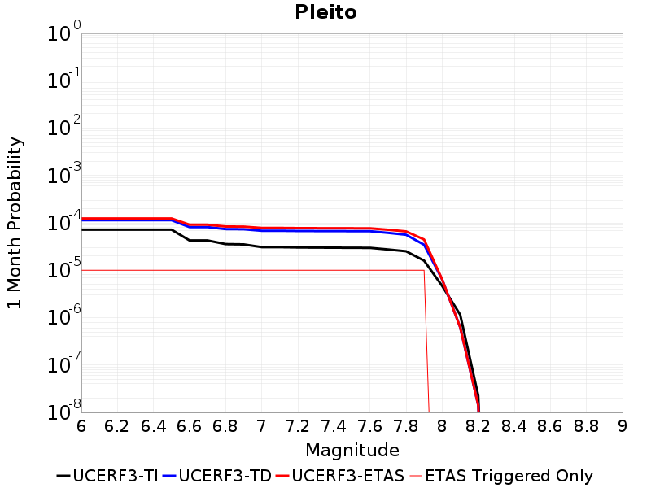 |  | 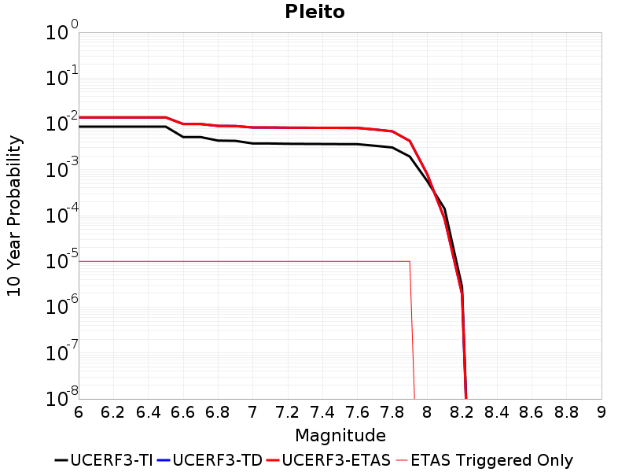 |

| Magnitude | 1 wk TI Prob | 1 wk TD Prob | 1 wk ETAS Prob | 1 wk ETAS/TD Gain | 1 wk ETAS Triggered Only | 1 mo TI Prob | 1 mo TD Prob | 1 mo ETAS Prob | 1 mo ETAS/TD Gain | 1 mo ETAS Triggered Only | 1 yr TI Prob | 1 yr TD Prob | 1 yr ETAS Prob | 1 yr ETAS/TD Gain | 1 yr ETAS Triggered Only | 10 yr TI Prob | 10 yr TD Prob | 10 yr ETAS Prob | 10 yr ETAS/TD Gain | 10 yr ETAS Triggered Only |
|-----|-----|-----|-----|-----|-----|-----|-----|-----|-----|-----|-----|-----|-----|-----|-----|-----|-----|-----|-----|-----|
| 6.0 | 1.6763008E-5 | 2.6548056E-5 | 3.654779E-5 | 1.3766655 | 1.0E-5 | 7.183948E-5 | 1.1377283E-4 | 1.237717E-4 | 1.0878844 | 1.0E-5 | 8.742947E-4 | 0.0013843768 | 0.0013943629 | 1.0072135 | 1.0E-5 | 0.00870863 | 0.013851222 | 0.013861083 | 1.0007119 | 1.0E-5 |
| 6.1 | 1.6763008E-5 | 2.6548056E-5 | 3.654779E-5 | 1.3766655 | 1.0E-5 | 7.183948E-5 | 1.1377283E-4 | 1.237717E-4 | 1.0878844 | 1.0E-5 | 8.742947E-4 | 0.0013843768 | 0.0013943629 | 1.0072135 | 1.0E-5 | 0.00870863 | 0.013851222 | 0.013861083 | 1.0007119 | 1.0E-5 |
| 6.2 | 1.6763008E-5 | 2.6548056E-5 | 3.654779E-5 | 1.3766655 | 1.0E-5 | 7.183948E-5 | 1.1377283E-4 | 1.237717E-4 | 1.0878844 | 1.0E-5 | 8.742947E-4 | 0.0013843768 | 0.0013943629 | 1.0072135 | 1.0E-5 | 0.00870863 | 0.013851222 | 0.013861083 | 1.0007119 | 1.0E-5 |
| 6.3 | 1.6763008E-5 | 2.6548056E-5 | 3.654779E-5 | 1.3766655 | 1.0E-5 | 7.183948E-5 | 1.1377283E-4 | 1.237717E-4 | 1.0878844 | 1.0E-5 | 8.742947E-4 | 0.0013843768 | 0.0013943629 | 1.0072135 | 1.0E-5 | 0.00870863 | 0.013851222 | 0.013861083 | 1.0007119 | 1.0E-5 |
| 6.4 | 1.6763008E-5 | 2.6548056E-5 | 3.654779E-5 | 1.3766655 | 1.0E-5 | 7.183948E-5 | 1.1377283E-4 | 1.237717E-4 | 1.0878844 | 1.0E-5 | 8.742947E-4 | 0.0013843768 | 0.0013943629 | 1.0072135 | 1.0E-5 | 0.00870863 | 0.013851222 | 0.013861083 | 1.0007119 | 1.0E-5 |
| 6.5 | 1.6763008E-5 | 2.6548056E-5 | 3.654779E-5 | 1.3766655 | 1.0E-5 | 7.183948E-5 | 1.1377283E-4 | 1.237717E-4 | 1.0878844 | 1.0E-5 | 8.742947E-4 | 0.0013843768 | 0.0013943629 | 1.0072135 | 1.0E-5 | 0.00870863 | 0.013851222 | 0.013861083 | 1.0007119 | 1.0E-5 |
| 6.6 | 9.910213E-6 | 1.8967523E-5 | 2.8967333E-5 | 1.527207 | 1.0E-5 | 4.247165E-5 | 8.1286875E-5 | 9.128606E-5 | 1.1230111 | 1.0E-5 | 5.169696E-4 | 9.892222E-4 | 9.992123E-4 | 1.0100989 | 1.0E-5 | 0.0051576863 | 0.009935334 | 0.009945235 | 1.0009965 | 1.0E-5 |
| 6.7 | 9.910213E-6 | 1.8967523E-5 | 2.8967333E-5 | 1.527207 | 1.0E-5 | 4.247165E-5 | 8.1286875E-5 | 9.128606E-5 | 1.1230111 | 1.0E-5 | 5.169696E-4 | 9.892222E-4 | 9.992123E-4 | 1.0100989 | 1.0E-5 | 0.0051576863 | 0.009935334 | 0.009945235 | 1.0009965 | 1.0E-5 |
| 6.8 | 8.300162E-6 | 1.722138E-5 | 2.7221207E-5 | 1.5806636 | 1.0E-5 | 3.557164E-5 | 7.3803836E-5 | 8.38031E-5 | 1.1354843 | 1.0E-5 | 4.3299864E-4 | 8.9819275E-4 | 9.0818375E-4 | 1.0111234 | 1.0E-5 | 0.004321559 | 0.009032598 | 0.009042507 | 1.0010971 | 1.0E-5 |
| 6.9 | 8.183114E-6 | 1.7092132E-5 | 2.709196E-5 | 1.5850545 | 1.0E-5 | 3.5070017E-5 | 7.324995E-5 | 8.3249215E-5 | 1.1365088 | 1.0E-5 | 4.2689382E-4 | 8.9145475E-4 | 9.014458E-4 | 1.0112076 | 1.0E-5 | 0.0042607468 | 0.008965762 | 0.008975673 | 1.0011053 | 1.0E-5 |
| 7.0 | 7.1748823E-6 | 1.5891395E-5 | 2.5891237E-5 | 1.6292614 | 1.0E-5 | 3.0749135E-5 | 6.810421E-5 | 7.810353E-5 | 1.1468238 | 1.0E-5 | 3.743064E-4 | 8.2885387E-4 | 8.388456E-4 | 1.0120548 | 1.0E-5 | 0.0037367654 | 0.008343986 | 0.008353903 | 1.0011885 | 1.0E-5 |
| 7.1 | 7.1671807E-6 | 1.5881473E-5 | 2.5881314E-5 | 1.6296545 | 1.0E-5 | 3.0716128E-5 | 6.806169E-5 | 7.8061006E-5 | 1.1469156 | 1.0E-5 | 3.7390468E-4 | 8.283366E-4 | 8.383283E-4 | 1.0120624 | 1.0E-5 | 0.0037327618 | 0.008338852 | 0.008348769 | 1.0011892 | 1.0E-5 |
| 7.2 | 7.0649667E-6 | 1.572854E-5 | 2.5728383E-5 | 1.6357769 | 1.0E-5 | 3.0278077E-5 | 6.740629E-5 | 7.740562E-5 | 1.1483442 | 1.0E-5 | 3.6857324E-4 | 8.2036323E-4 | 8.30355E-4 | 1.0121797 | 1.0E-5 | 0.0036796255 | 0.008259569 | 0.008269486 | 1.0012007 | 1.0E-5 |
| 7.3 | 7.02082E-6 | 1.5670683E-5 | 2.5670526E-5 | 1.6381243 | 1.0E-5 | 3.008888E-5 | 6.715834E-5 | 7.7157674E-5 | 1.1488918 | 1.0E-5 | 3.6627054E-4 | 8.173467E-4 | 8.2733855E-4 | 1.0122247 | 1.0E-5 | 0.0036566744 | 0.008229422 | 0.00823934 | 1.0012052 | 1.0E-5 |
| 7.4 | 6.987146E-6 | 1.5628846E-5 | 2.562869E-5 | 1.6398325 | 1.0E-5 | 2.9944567E-5 | 6.697905E-5 | 7.697838E-5 | 1.1492904 | 1.0E-5 | 3.6451413E-4 | 8.1516546E-4 | 8.2515733E-4 | 1.0122575 | 1.0E-5 | 0.0036391679 | 0.008207659 | 0.008217577 | 1.0012084 | 1.0E-5 |
| 7.5 | 6.9494554E-6 | 1.5584672E-5 | 2.5584515E-5 | 1.6416461 | 1.0E-5 | 2.9783041E-5 | 6.678975E-5 | 7.6789074E-5 | 1.1497136 | 1.0E-5 | 3.625482E-4 | 8.1286236E-4 | 8.228542E-4 | 1.0122921 | 1.0E-5 | 0.0036195726 | 0.008184753 | 0.008194671 | 1.0012118 | 1.0E-5 |
| 7.6 | 6.92694E-6 | 1.5540902E-5 | 2.5540747E-5 | 1.6434534 | 1.0E-5 | 2.9686547E-5 | 6.6602166E-5 | 7.66015E-5 | 1.1501353 | 1.0E-5 | 3.6137376E-4 | 8.105803E-4 | 8.205722E-4 | 1.0123268 | 1.0E-5 | 0.0036078666 | 0.008162058 | 0.008171977 | 1.0012152 | 1.0E-5 |
| 7.7 | 6.395867E-6 | 1.4351619E-5 | 2.4351475E-5 | 1.6967754 | 1.0E-5 | 2.741057E-5 | 6.150549E-5 | 7.150487E-5 | 1.1625772 | 1.0E-5 | 3.336726E-4 | 7.4857246E-4 | 7.58565E-4 | 1.0133488 | 1.0E-5 | 0.0033317201 | 0.007546821 | 0.007556746 | 1.0013151 | 1.0E-5 |
| 7.8 | 5.8664327E-6 | 1.30736435E-5 | 2.3073513E-5 | 1.7648877 | 1.0E-5 | 2.5141611E-5 | 5.6028697E-5 | 6.602814E-5 | 1.17847 | 1.0E-5 | 3.060561E-4 | 6.8193616E-4 | 6.9192937E-4 | 1.0146542 | 1.0E-5 | 0.0030563495 | 0.0068789967 | 0.006888928 | 1.0014437 | 1.0E-5 |
| 7.9 | 3.7167474E-6 | 8.040976E-6 | 1.8040895E-5 | 2.2436202 | 1.0E-5 | 1.592882E-5 | 3.446087E-5 | 4.446053E-5 | 1.2901742 | 1.0E-5 | 1.9391612E-4 | 4.1948052E-4 | 4.2947632E-4 | 1.023829 | 1.0E-5 | 0.0019374699 | 0.0042374646 | 0.0042474223 | 1.0023499 | 1.0E-5 |
| 8.0 | 1.0903841E-6 | 1.4949024E-6 | 1.4949024E-6 | 1.0 | 0.0 | 4.6730665E-6 | 6.406709E-6 | 6.406709E-6 | 1.0 | 0.0 | 5.68931E-5 | 7.7998906E-5 | 7.7998906E-5 | 1.0 | 0.0 | 5.6878536E-4 | 8.024865E-4 | 8.024865E-4 | 1.0 | 0.0 |
| 8.1 | 2.6894583E-7 | 1.4586595E-7 | 1.4586595E-7 | 1.0 | 0.0 | 1.1526245E-6 | 6.2513965E-7 | 6.2513965E-7 | 1.0 | 0.0 | 1.4033113E-5 | 7.611049E-6 | 7.611049E-6 | 1.0 | 0.0 | 1.4032227E-4 | 8.407562E-5 | 8.407562E-5 | 1.0 | 0.0 |
| 8.2 | 5.2967013E-9 | 3.3192675E-9 | 3.3192675E-9 | 1.0 | 0.0 | 2.2700148E-8 | 1.42254315E-8 | 1.42254315E-8 | 1.0 | 0.0 | 2.7637427E-7 | 1.7319462E-7 | 1.7319462E-7 | 1.0 | 0.0 | 2.7637393E-6 | 1.935171E-6 | 1.935171E-6 | 1.0 | 0.0 |

## San Andreas (San Bernardino N)
*[(top)](#table-of-contents)*

| 1 Week | 1 Month | 1 Year | 10 Year |
|-----|-----|-----|-----|
|  | 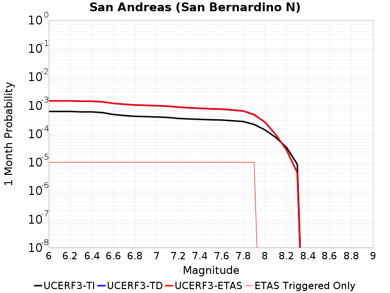 |  |  |

| Magnitude | 1 wk TI Prob | 1 wk TD Prob | 1 wk ETAS Prob | 1 wk ETAS/TD Gain | 1 wk ETAS Triggered Only | 1 mo TI Prob | 1 mo TD Prob | 1 mo ETAS Prob | 1 mo ETAS/TD Gain | 1 mo ETAS Triggered Only | 1 yr TI Prob | 1 yr TD Prob | 1 yr ETAS Prob | 1 yr ETAS/TD Gain | 1 yr ETAS Triggered Only | 10 yr TI Prob | 10 yr TD Prob | 10 yr ETAS Prob | 10 yr ETAS/TD Gain | 10 yr ETAS Triggered Only |
|-----|-----|-----|-----|-----|-----|-----|-----|-----|-----|-----|-----|-----|-----|-----|-----|-----|-----|-----|-----|-----|
| 6.0 | 1.4273766E-4 | 3.3546516E-4 | 3.454618E-4 | 1.0297993 | 1.0E-5 | 6.115894E-4 | 0.0014369219 | 0.0014469074 | 1.0069493 | 1.0E-5 | 0.0074207084 | 0.017355815 | 0.017365642 | 1.0005661 | 1.0E-5 | 0.07177748 | 0.15814212 | 0.15815054 | 1.0000533 | 1.0E-5 |
| 6.1 | 1.4273766E-4 | 3.3546516E-4 | 3.454618E-4 | 1.0297993 | 1.0E-5 | 6.115894E-4 | 0.0014369219 | 0.0014469074 | 1.0069493 | 1.0E-5 | 0.0074207084 | 0.017355815 | 0.017365642 | 1.0005661 | 1.0E-5 | 0.07177748 | 0.15814212 | 0.15815054 | 1.0000533 | 1.0E-5 |
| 6.2 | 1.4273766E-4 | 3.3546516E-4 | 3.454618E-4 | 1.0297993 | 1.0E-5 | 6.115894E-4 | 0.0014369219 | 0.0014469074 | 1.0069493 | 1.0E-5 | 0.0074207084 | 0.017355815 | 0.017365642 | 1.0005661 | 1.0E-5 | 0.07177748 | 0.15814212 | 0.15815054 | 1.0000533 | 1.0E-5 |
| 6.3 | 1.3730655E-4 | 3.244033E-4 | 3.3440007E-4 | 1.0308158 | 1.0E-5 | 5.883239E-4 | 0.001389565 | 0.001399551 | 1.0071865 | 1.0E-5 | 0.0071393442 | 0.016788237 | 0.01679807 | 1.0005857 | 1.0E-5 | 0.06914291 | 0.15342833 | 0.1534368 | 1.0000552 | 1.0E-5 |
| 6.4 | 1.3730655E-4 | 3.244033E-4 | 3.3440007E-4 | 1.0308158 | 1.0E-5 | 5.883239E-4 | 0.001389565 | 0.001399551 | 1.0071865 | 1.0E-5 | 0.0071393442 | 0.016788237 | 0.01679807 | 1.0005857 | 1.0E-5 | 0.06914291 | 0.15342833 | 0.1534368 | 1.0000552 | 1.0E-5 |
| 6.5 | 1.2942807E-4 | 3.0838602E-4 | 3.1838292E-4 | 1.0324169 | 1.0E-5 | 5.545738E-4 | 0.0013209902 | 0.001330977 | 1.0075601 | 1.0E-5 | 0.0067310524 | 0.015965806 | 0.015975647 | 1.0006163 | 1.0E-5 | 0.06530788 | 0.1465535 | 0.14656204 | 1.0000583 | 1.0E-5 |
| 6.6 | 1.1125901E-4 | 2.7234724E-4 | 2.8234452E-4 | 1.0367079 | 1.0E-5 | 4.767372E-4 | 0.0011666828 | 0.0011766711 | 1.0085613 | 1.0E-5 | 0.005788839 | 0.014112557 | 0.014122416 | 1.0006986 | 1.0E-5 | 0.056403454 | 0.13082182 | 0.13083051 | 1.0000664 | 1.0E-5 |
| 6.7 | 1.02209575E-4 | 2.5353674E-4 | 2.6353422E-4 | 1.039432 | 1.0E-5 | 4.3796748E-4 | 0.001086135 | 0.0010961242 | 1.009197 | 1.0E-5 | 0.0053192247 | 0.013144 | 0.013153869 | 1.0007508 | 1.0E-5 | 0.051936906 | 0.122644626 | 0.1226534 | 1.0000715 | 1.0E-5 |
| 6.8 | 9.610582E-5 | 2.3849896E-4 | 2.4849657E-4 | 1.0419189 | 1.0E-5 | 4.1181705E-4 | 0.0010217387 | 0.0010317285 | 1.0097772 | 1.0E-5 | 0.0050023515 | 0.012369031 | 0.012378908 | 1.0007985 | 1.0E-5 | 0.048912346 | 0.115995556 | 0.1160044 | 1.0000762 | 1.0E-5 |
| 6.9 | 9.3877505E-5 | 2.3296566E-4 | 2.4296333E-4 | 1.0429147 | 1.0E-5 | 4.0227012E-4 | 9.980429E-4 | 0.0010080329 | 1.0100096 | 1.0E-5 | 0.0048866454 | 0.012083765 | 0.012093645 | 1.0008175 | 1.0E-5 | 0.04780577 | 0.11357259 | 0.113581456 | 1.0000781 | 1.0E-5 |
| 7.0 | 9.1019785E-5 | 2.2610114E-4 | 2.3609887E-4 | 1.044218 | 1.0E-5 | 3.900265E-4 | 9.686457E-4 | 9.78636E-4 | 1.0103137 | 1.0E-5 | 0.0047382377 | 0.011729759 | 0.011739642 | 1.0008426 | 1.0E-5 | 0.046384744 | 0.11051353 | 0.11052243 | 1.0000805 | 1.0E-5 |
| 7.1 | 8.771155E-5 | 2.1769192E-4 | 2.2768974E-4 | 1.0459265 | 1.0E-5 | 3.758525E-4 | 9.3263236E-4 | 9.4262307E-4 | 1.0107124 | 1.0E-5 | 0.0045664064 | 0.011295919 | 0.011305807 | 1.0008752 | 1.0E-5 | 0.044737056 | 0.10678948 | 0.10679841 | 1.0000837 | 1.0E-5 |
| 7.2 | 8.0830236E-5 | 2.014167E-4 | 2.1141468E-4 | 1.0496383 | 1.0E-5 | 3.4636928E-4 | 8.6292904E-4 | 8.729204E-4 | 1.0115784 | 1.0E-5 | 0.0042088944 | 0.0104556875 | 0.010465583 | 1.0009464 | 1.0E-5 | 0.041300658 | 0.09943944 | 0.09944845 | 1.0000906 | 1.0E-5 |
| 7.3 | 7.7668235E-5 | 1.904983E-4 | 2.0049639E-4 | 1.0524839 | 1.0E-5 | 3.328214E-4 | 8.161659E-4 | 8.2615775E-4 | 1.0122424 | 1.0E-5 | 0.0040445733 | 0.009891652 | 0.009901552 | 1.001001 | 1.0E-5 | 0.03971748 | 0.0946116 | 0.09462066 | 1.0000957 | 1.0E-5 |
| 7.4 | 7.520177E-5 | 1.8241974E-4 | 1.9241792E-4 | 1.0548086 | 1.0E-5 | 3.2225347E-4 | 7.8156474E-4 | 7.915569E-4 | 1.0127848 | 1.0E-5 | 0.0039163795 | 0.009474125 | 0.009484029 | 1.0010455 | 1.0E-5 | 0.038480744 | 0.09098472 | 0.09099381 | 1.0000999 | 1.0E-5 |
| 7.5 | 7.274697E-5 | 1.75036E-4 | 1.8503424E-4 | 1.0571212 | 1.0E-5 | 3.1173544E-4 | 7.4993866E-4 | 7.5993116E-4 | 1.0133244 | 1.0E-5 | 0.003788775 | 0.009092357 | 0.009102265 | 1.0010898 | 1.0E-5 | 0.03724827 | 0.08762205 | 0.08763117 | 1.0001041 | 1.0E-5 |
| 7.6 | 7.1185845E-5 | 1.705674E-4 | 1.805657E-4 | 1.0586178 | 1.0E-5 | 3.0504653E-4 | 7.307984E-4 | 7.407911E-4 | 1.0136737 | 1.0E-5 | 0.0037076178 | 0.008861244 | 0.008871156 | 1.0011185 | 1.0E-5 | 0.036463667 | 0.085556746 | 0.085565895 | 1.0001069 | 1.0E-5 |
| 7.7 | 6.709961E-5 | 1.5918835E-4 | 1.6918677E-4 | 1.0628086 | 1.0E-5 | 2.8753807E-4 | 6.8205746E-4 | 6.920506E-4 | 1.0146515 | 1.0E-5 | 0.003495157 | 0.008272487 | 0.008282403 | 1.0011988 | 1.0E-5 | 0.034406938 | 0.08022239 | 0.08023159 | 1.0001147 | 1.0E-5 |
| 7.8 | 6.300812E-5 | 1.4707008E-4 | 1.5706861E-4 | 1.0679848 | 1.0E-5 | 2.7000686E-4 | 6.301481E-4 | 6.4014184E-4 | 1.0158592 | 1.0E-5 | 0.0032823787 | 0.0076451064 | 0.00765503 | 1.0012981 | 1.0E-5 | 0.032343175 | 0.07450133 | 0.07451058 | 1.0001242 | 1.0E-5 |
| 7.9 | 4.983037E-5 | 1.08746906E-4 | 1.1874582E-4 | 1.0919466 | 1.0E-5 | 2.1354125E-4 | 4.6597494E-4 | 4.7597027E-4 | 1.0214504 | 1.0E-5 | 0.0025967648 | 0.005658502 | 0.005668446 | 1.0017573 | 1.0E-5 | 0.025666296 | 0.055988252 | 0.055997692 | 1.0001686 | 1.0E-5 |
| 8.0 | 3.2211527E-5 | 6.0142134E-5 | 6.0142134E-5 | 1.0 | 0.0 | 1.380421E-4 | 2.5772655E-4 | 2.5772655E-4 | 1.0 | 0.0 | 0.0016793669 | 0.0031333084 | 0.0031333084 | 1.0 | 0.0 | 0.016667323 | 0.03167307 | 0.03167307 | 1.0 | 0.0 |
| 8.1 | 1.743376E-5 | 2.2027725E-5 | 2.2027725E-5 | 1.0 | 0.0 | 7.471398E-5 | 9.4401126E-5 | 9.4401126E-5 | 1.0 | 0.0 | 9.0926304E-4 | 0.0011487285 | 0.0011487285 | 1.0 | 0.0 | 0.009055517 | 0.0121351285 | 0.0121351285 | 1.0 | 0.0 |
| 8.2 | 7.831616E-6 | 6.3713705E-6 | 6.3713705E-6 | 1.0 | 0.0 | 3.3563636E-5 | 2.7305588E-5 | 2.7305588E-5 | 1.0 | 0.0 | 4.0856065E-4 | 3.3239496E-4 | 3.3239496E-4 | 1.0 | 0.0 | 0.004078103 | 0.00369519 | 0.00369519 | 1.0 | 0.0 |
| 8.3 | 1.983087E-6 | 9.994538E-7 | 9.994538E-7 | 1.0 | 0.0 | 8.498917E-6 | 4.2833667E-6 | 4.2833667E-6 | 1.0 | 0.0 | 1.034694E-4 | 5.2148767E-5 | 5.2148767E-5 | 1.0 | 0.0 | 0.0010342124 | 6.0386653E-4 | 6.0386653E-4 | 1.0 | 0.0 |

## San Andreas (Creeping Section) 2011 CFM
*[(top)](#table-of-contents)*

| 1 Week | 1 Month | 1 Year | 10 Year |
|-----|-----|-----|-----|
| 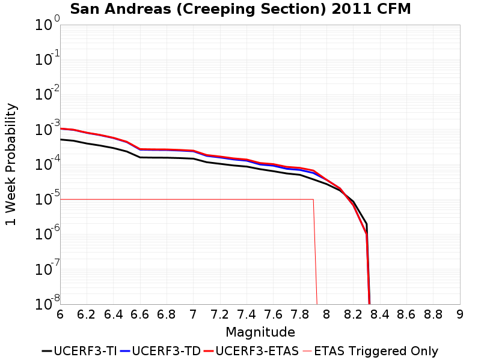 | 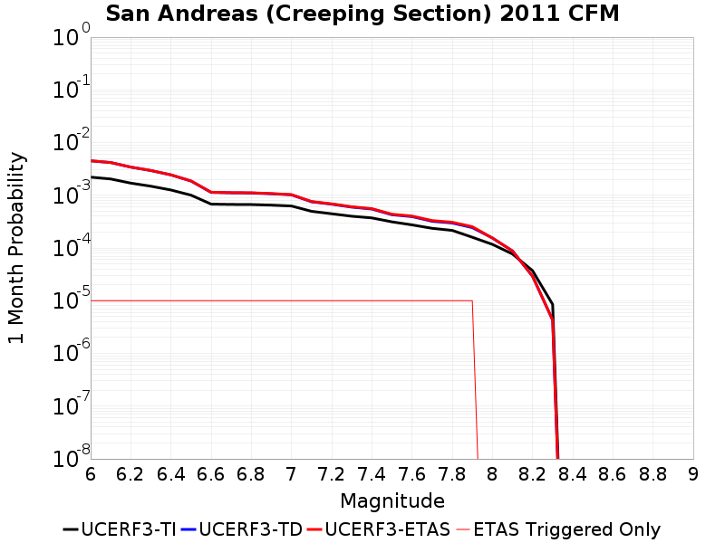 | 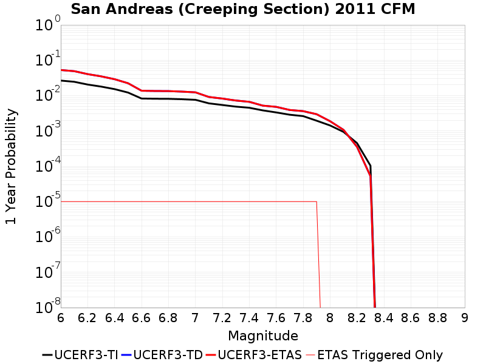 |  |

| Magnitude | 1 wk TI Prob | 1 wk TD Prob | 1 wk ETAS Prob | 1 wk ETAS/TD Gain | 1 wk ETAS Triggered Only | 1 mo TI Prob | 1 mo TD Prob | 1 mo ETAS Prob | 1 mo ETAS/TD Gain | 1 mo ETAS Triggered Only | 1 yr TI Prob | 1 yr TD Prob | 1 yr ETAS Prob | 1 yr ETAS/TD Gain | 1 yr ETAS Triggered Only | 10 yr TI Prob | 10 yr TD Prob | 10 yr ETAS Prob | 10 yr ETAS/TD Gain | 10 yr ETAS Triggered Only |
|-----|-----|-----|-----|-----|-----|-----|-----|-----|-----|-----|-----|-----|-----|-----|-----|-----|-----|-----|-----|-----|
| 6.0 | 5.151163E-4 | 0.001051745 | 0.0010617345 | 1.009498 | 1.0E-5 | 0.002205774 | 0.0044960934 | 0.0045060487 | 1.0022142 | 1.0E-5 | 0.026526777 | 0.052772705 | 0.052782178 | 1.0001795 | 1.0E-5 | 0.23574181 | 0.38450518 | 0.38451135 | 1.000016 | 1.0E-5 |
| 6.1 | 4.7540772E-4 | 9.7458914E-4 | 9.845794E-4 | 1.0102507 | 1.0E-5 | 0.002035871 | 0.0041669505 | 0.004176909 | 1.0023898 | 1.0E-5 | 0.024506707 | 0.049022265 | 0.04903177 | 1.000194 | 1.0E-5 | 0.21973366 | 0.36375046 | 0.36375684 | 1.0000175 | 1.0E-5 |
| 6.2 | 3.9647578E-4 | 7.9862145E-4 | 8.0861343E-4 | 1.0125116 | 1.0E-5 | 0.0016980754 | 0.0034157976 | 0.0034257635 | 1.0029175 | 1.0E-5 | 0.020479038 | 0.040391948 | 0.040401544 | 1.0002376 | 1.0E-5 | 0.18691239 | 0.31245458 | 0.31246147 | 1.000022 | 1.0E-5 |
| 6.3 | 3.4640636E-4 | 6.8757863E-4 | 6.975717E-4 | 1.0145338 | 1.0E-5 | 0.001483754 | 0.002941595 | 0.0029515654 | 1.0033895 | 1.0E-5 | 0.017915692 | 0.03491247 | 0.034922123 | 1.0002764 | 1.0E-5 | 0.16538206 | 0.27836993 | 0.27837715 | 1.0000259 | 1.0E-5 |
| 6.4 | 2.935057E-4 | 5.6797755E-4 | 5.7797186E-4 | 1.0175964 | 1.0E-5 | 0.0012572751 | 0.0024306462 | 0.002440622 | 1.0041041 | 1.0E-5 | 0.015200248 | 0.028974313 | 0.028984023 | 1.0003351 | 1.0E-5 | 0.14201577 | 0.23961394 | 0.23962153 | 1.0000317 | 1.0E-5 |
| 6.5 | 2.3409708E-4 | 4.344311E-4 | 4.4442675E-4 | 1.0230086 | 1.0E-5 | 0.0010028875 | 0.001859836 | 0.0018698174 | 1.0053668 | 1.0E-5 | 0.012141965 | 0.022289988 | 0.022299765 | 1.0004387 | 1.0E-5 | 0.11499573 | 0.19319054 | 0.1931986 | 1.0000417 | 1.0E-5 |
| 6.6 | 1.5842178E-4 | 2.6422195E-4 | 2.742193E-4 | 1.037837 | 1.0E-5 | 6.7877385E-4 | 0.0011318821 | 0.0011418707 | 1.0088248 | 1.0E-5 | 0.0082328 | 0.013692595 | 0.013702458 | 1.0007203 | 1.0E-5 | 0.07934396 | 0.12907176 | 0.12908047 | 1.0000675 | 1.0E-5 |
| 6.7 | 1.5616413E-4 | 2.5959781E-4 | 2.695952E-4 | 1.0385112 | 1.0E-5 | 6.691031E-4 | 0.0011120833 | 0.0011220722 | 1.0089822 | 1.0E-5 | 0.0081159435 | 0.013455015 | 0.01346488 | 1.0007333 | 1.0E-5 | 0.0782586 | 0.12710384 | 0.12711255 | 1.0000687 | 1.0E-5 |
| 6.8 | 1.5538467E-4 | 2.5784597E-4 | 2.678434E-4 | 1.0387728 | 1.0E-5 | 6.6576427E-4 | 0.0011045831 | 0.001114572 | 1.0090432 | 1.0E-5 | 0.008075596 | 0.013364943 | 0.013374809 | 1.0007383 | 1.0E-5 | 0.07788358 | 0.1263416 | 0.12635034 | 1.0000691 | 1.0E-5 |
| 6.9 | 1.5153569E-4 | 2.490345E-4 | 2.59032E-4 | 1.040145 | 1.0E-5 | 6.49277E-4 | 0.0010668562 | 0.0010768456 | 1.0093633 | 1.0E-5 | 0.007876333 | 0.012912199 | 0.01292207 | 1.0007645 | 1.0E-5 | 0.07602952 | 0.1224676 | 0.12247638 | 1.0000716 | 1.0E-5 |
| 7.0 | 1.4588932E-4 | 2.3758819E-4 | 2.4758582E-4 | 1.0420797 | 1.0E-5 | 6.250901E-4 | 0.0010178399 | 0.0010278297 | 1.0098147 | 1.0E-5 | 0.0075839474 | 0.012322339 | 0.012332216 | 1.0008016 | 1.0E-5 | 0.073302895 | 0.1173316 | 0.11734042 | 1.0000752 | 1.0E-5 |
| 7.1 | 1.1565079E-4 | 1.752953E-4 | 1.8529354E-4 | 1.0570366 | 1.0E-5 | 4.955521E-4 | 7.510502E-4 | 7.610427E-4 | 1.0133047 | 1.0E-5 | 0.006016669 | 0.00910593 | 0.009115838 | 1.0010881 | 1.0E-5 | 0.058563538 | 0.08932068 | 0.089329794 | 1.0001019 | 1.0E-5 |
| 7.2 | 1.0393792E-4 | 1.5801386E-4 | 1.6801228E-4 | 1.0632756 | 1.0E-5 | 4.4537216E-4 | 6.7702733E-4 | 6.870206E-4 | 1.0147605 | 1.0E-5 | 0.005408933 | 0.008211848 | 0.008221767 | 1.0012077 | 1.0E-5 | 0.052791595 | 0.08101882 | 0.08102801 | 1.0001135 | 1.0E-5 |
| 7.3 | 9.332884E-5 | 1.3891923E-4 | 1.4891784E-4 | 1.0719743 | 1.0E-5 | 3.999194E-4 | 5.95233E-4 | 6.05227E-4 | 1.0167902 | 1.0E-5 | 0.0048581534 | 0.007223034 | 0.0072329617 | 1.0013745 | 1.0E-5 | 0.047533102 | 0.071603276 | 0.07161256 | 1.0001297 | 1.0E-5 |
| 7.4 | 8.670252E-5 | 1.2779151E-4 | 1.3779024E-4 | 1.0782424 | 1.0E-5 | 3.715293E-4 | 5.475636E-4 | 5.5755815E-4 | 1.0182527 | 1.0E-5 | 0.004513991 | 0.006646346 | 0.0066562793 | 1.0014945 | 1.0E-5 | 0.044233937 | 0.06614274 | 0.06615208 | 1.0001411 | 1.0E-5 |
| 7.5 | 7.3036405E-5 | 9.961757E-5 | 1.0961657E-4 | 1.1003739 | 1.0E-5 | 3.129756E-4 | 4.2686268E-4 | 4.3685842E-4 | 1.0234168 | 1.0E-5 | 0.0038038217 | 0.005184695 | 0.005194643 | 1.0019188 | 1.0E-5 | 0.03739367 | 0.052418824 | 0.052428298 | 1.0001807 | 1.0E-5 |
| 7.6 | 6.3935775E-5 | 9.1819864E-5 | 1.0181894E-4 | 1.1088989 | 1.0E-5 | 2.7398168E-4 | 3.9345442E-4 | 4.034505E-4 | 1.0254059 | 1.0E-5 | 0.0033306254 | 0.0047798087 | 0.004789761 | 1.0020821 | 1.0E-5 | 0.032811474 | 0.048283637 | 0.048293155 | 1.000197 | 1.0E-5 |
| 7.7 | 5.5050095E-5 | 7.4921205E-5 | 8.492045E-5 | 1.1334636 | 1.0E-5 | 2.3590765E-4 | 3.2105137E-4 | 3.3104816E-4 | 1.0311377 | 1.0E-5 | 0.0028683927 | 0.0039018006 | 0.0039117616 | 1.0025529 | 1.0E-5 | 0.0283165 | 0.039799076 | 0.039808676 | 1.0002413 | 1.0E-5 |
| 7.8 | 5.027131E-5 | 6.9445094E-5 | 7.94444E-5 | 1.1439886 | 1.0E-5 | 2.1543067E-4 | 2.9758792E-4 | 3.0758494E-4 | 1.0335935 | 1.0E-5 | 0.0026197135 | 0.003617118 | 0.003627082 | 1.0027547 | 1.0E-5 | 0.025890453 | 0.036905054 | 0.036914684 | 1.000261 | 1.0E-5 |
| 7.9 | 3.7271806E-5 | 5.6819048E-5 | 6.681848E-5 | 1.1759874 | 1.0E-5 | 1.5972654E-4 | 2.4348748E-4 | 2.5348505E-4 | 1.0410599 | 1.0E-5 | 0.0019429359 | 0.0029604328 | 0.0029704033 | 1.0033679 | 1.0E-5 | 0.019260362 | 0.030289693 | 0.03029939 | 1.0003202 | 1.0E-5 |
| 8.0 | 2.7310243E-5 | 3.6057536E-5 | 3.6057536E-5 | 1.0 | 0.0 | 1.17038646E-4 | 1.5452315E-4 | 1.5452315E-4 | 1.0 | 0.0 | 0.0014240141 | 0.0018796971 | 0.0018796971 | 1.0 | 0.0 | 0.014149235 | 0.019544682 | 0.019544682 | 1.0 | 0.0 |
| 8.1 | 1.7940547E-5 | 2.048917E-5 | 2.048917E-5 | 1.0 | 0.0 | 7.688579E-5 | 8.780777E-5 | 8.780777E-5 | 1.0 | 0.0 | 9.3568244E-4 | 0.0010685361 | 0.0010685361 | 1.0 | 0.0 | 0.009317525 | 0.011403054 | 0.011403054 | 1.0 | 0.0 |
| 8.2 | 8.643924E-6 | 6.7803635E-6 | 6.7803635E-6 | 1.0 | 0.0 | 3.704486E-5 | 2.9058378E-5 | 2.9058378E-5 | 1.0 | 0.0 | 4.5092785E-4 | 3.5372845E-4 | 3.5372845E-4 | 1.0 | 0.0 | 0.0045001395 | 0.0039528483 | 0.0039528483 | 1.0 | 0.0 |
| 8.3 | 1.983087E-6 | 9.994538E-7 | 9.994538E-7 | 1.0 | 0.0 | 8.498917E-6 | 4.2833667E-6 | 4.2833667E-6 | 1.0 | 0.0 | 1.034694E-4 | 5.2148767E-5 | 5.2148767E-5 | 1.0 | 0.0 | 0.0010342124 | 6.0386653E-4 | 6.0386653E-4 | 1.0 | 0.0 |

## San Andreas (Carrizo) rev
*[(top)](#table-of-contents)*

| 1 Week | 1 Month | 1 Year | 10 Year |
|-----|-----|-----|-----|
|  |  |  |  |

| Magnitude | 1 wk TI Prob | 1 wk TD Prob | 1 wk ETAS Prob | 1 wk ETAS/TD Gain | 1 wk ETAS Triggered Only | 1 mo TI Prob | 1 mo TD Prob | 1 mo ETAS Prob | 1 mo ETAS/TD Gain | 1 mo ETAS Triggered Only | 1 yr TI Prob | 1 yr TD Prob | 1 yr ETAS Prob | 1 yr ETAS/TD Gain | 1 yr ETAS Triggered Only | 10 yr TI Prob | 10 yr TD Prob | 10 yr ETAS Prob | 10 yr ETAS/TD Gain | 10 yr ETAS Triggered Only |
|-----|-----|-----|-----|-----|-----|-----|-----|-----|-----|-----|-----|-----|-----|-----|-----|-----|-----|-----|-----|-----|
| 6.0 | 1.1674632E-4 | 2.6412585E-4 | 2.741232E-4 | 1.0378507 | 1.0E-5 | 5.002454E-4 | 0.0011314786 | 0.0011414672 | 1.008828 | 1.0E-5 | 0.006073493 | 0.013689311 | 0.013699174 | 1.0007205 | 1.0E-5 | 0.0591016 | 0.1293108 | 0.1293195 | 1.0000674 | 1.0E-5 |
| 6.1 | 1.1674632E-4 | 2.6412585E-4 | 2.741232E-4 | 1.0378507 | 1.0E-5 | 5.002454E-4 | 0.0011314786 | 0.0011414672 | 1.008828 | 1.0E-5 | 0.006073493 | 0.013689311 | 0.013699174 | 1.0007205 | 1.0E-5 | 0.0591016 | 0.1293108 | 0.1293195 | 1.0000674 | 1.0E-5 |
| 6.2 | 1.1674632E-4 | 2.6412585E-4 | 2.741232E-4 | 1.0378507 | 1.0E-5 | 5.002454E-4 | 0.0011314786 | 0.0011414672 | 1.008828 | 1.0E-5 | 0.006073493 | 0.013689311 | 0.013699174 | 1.0007205 | 1.0E-5 | 0.0591016 | 0.1293108 | 0.1293195 | 1.0000674 | 1.0E-5 |
| 6.3 | 1.1674632E-4 | 2.6412585E-4 | 2.741232E-4 | 1.0378507 | 1.0E-5 | 5.002454E-4 | 0.0011314786 | 0.0011414672 | 1.008828 | 1.0E-5 | 0.006073493 | 0.013689311 | 0.013699174 | 1.0007205 | 1.0E-5 | 0.0591016 | 0.1293108 | 0.1293195 | 1.0000674 | 1.0E-5 |
| 6.4 | 1.1674632E-4 | 2.6412585E-4 | 2.741232E-4 | 1.0378507 | 1.0E-5 | 5.002454E-4 | 0.0011314786 | 0.0011414672 | 1.008828 | 1.0E-5 | 0.006073493 | 0.013689311 | 0.013699174 | 1.0007205 | 1.0E-5 | 0.0591016 | 0.1293108 | 0.1293195 | 1.0000674 | 1.0E-5 |
| 6.5 | 1.13136164E-4 | 2.5719975E-4 | 2.6719717E-4 | 1.0388703 | 1.0E-5 | 4.847792E-4 | 0.0011018207 | 0.0011118096 | 1.0090659 | 1.0E-5 | 0.0058862255 | 0.013332688 | 0.013342555 | 1.00074 | 1.0E-5 | 0.057327334 | 0.12626751 | 0.12627624 | 1.0000691 | 1.0E-5 |
| 6.6 | 1.13136164E-4 | 2.5719975E-4 | 2.6719717E-4 | 1.0388703 | 1.0E-5 | 4.847792E-4 | 0.0011018207 | 0.0011118096 | 1.0090659 | 1.0E-5 | 0.0058862255 | 0.013332688 | 0.013342555 | 1.00074 | 1.0E-5 | 0.057327334 | 0.12626751 | 0.12627624 | 1.0000691 | 1.0E-5 |
| 6.7 | 1.1149675E-4 | 2.540549E-4 | 2.6405236E-4 | 1.0393516 | 1.0E-5 | 4.777557E-4 | 0.0010883542 | 0.0010983432 | 1.0091782 | 1.0E-5 | 0.0058011734 | 0.013170723 | 0.013180591 | 1.0007492 | 1.0E-5 | 0.05652051 | 0.1248804 | 0.12488916 | 1.0000701 | 1.0E-5 |
| 6.8 | 1.1103589E-4 | 2.5304232E-4 | 2.630398E-4 | 1.039509 | 1.0E-5 | 4.7578133E-4 | 0.001084018 | 0.0010940072 | 1.009215 | 1.0E-5 | 0.005777263 | 0.013118569 | 0.013128438 | 1.0007523 | 1.0E-5 | 0.056293584 | 0.12443095 | 0.1244397 | 1.0000703 | 1.0E-5 |
| 6.9 | 1.1053259E-4 | 2.519285E-4 | 2.6192598E-4 | 1.0396838 | 1.0E-5 | 4.7362508E-4 | 0.0010792485 | 0.0010892376 | 1.0092556 | 1.0E-5 | 0.0057511497 | 0.013061197 | 0.013071067 | 1.0007557 | 1.0E-5 | 0.05604569 | 0.12393693 | 0.12394569 | 1.0000707 | 1.0E-5 |
| 7.0 | 1.1005377E-4 | 2.509018E-4 | 2.608993E-4 | 1.0398462 | 1.0E-5 | 4.7157376E-4 | 0.001074852 | 0.0010848412 | 1.0092936 | 1.0E-5 | 0.0057263062 | 0.01300831 | 0.013018181 | 1.0007588 | 1.0E-5 | 0.055809796 | 0.123480275 | 0.12348904 | 1.0000709 | 1.0E-5 |
| 7.1 | 1.0308142E-4 | 2.3546982E-4 | 2.4546747E-4 | 1.0424583 | 1.0E-5 | 4.417027E-4 | 0.0010087673 | 0.0010187571 | 1.0099031 | 1.0E-5 | 0.0053644776 | 0.012212959 | 0.012222838 | 1.0008088 | 1.0E-5 | 0.052368138 | 0.116600476 | 0.11660931 | 1.0000758 | 1.0E-5 |
| 7.2 | 1.0027479E-4 | 2.2934057E-4 | 2.3933829E-4 | 1.0435933 | 1.0E-5 | 4.296783E-4 | 9.825191E-4 | 9.925093E-4 | 1.010168 | 1.0E-5 | 0.0052187922 | 0.01189692 | 0.011906801 | 1.0008305 | 1.0E-5 | 0.050979212 | 0.11384225 | 0.113851115 | 1.0000778 | 1.0E-5 |
| 7.3 | 9.816942E-5 | 2.2376975E-4 | 2.3376751E-4 | 1.0446788 | 1.0E-5 | 4.2065824E-4 | 9.5866184E-4 | 9.6865225E-4 | 1.0104212 | 1.0E-5 | 0.005109493 | 0.011609591 | 0.011619474 | 1.0008514 | 1.0E-5 | 0.049935985 | 0.111316405 | 0.111325294 | 1.0000799 | 1.0E-5 |
| 7.4 | 9.5634205E-5 | 2.1712712E-4 | 2.2712495E-4 | 1.046046 | 1.0E-5 | 4.0979648E-4 | 9.3021395E-4 | 9.4020466E-4 | 1.0107402 | 1.0E-5 | 0.0049778637 | 0.011266862 | 0.01127675 | 1.0008775 | 1.0E-5 | 0.048678253 | 0.10830048 | 0.108309396 | 1.0000824 | 1.0E-5 |
| 7.5 | 8.052417E-5 | 1.7843477E-4 | 1.88433E-4 | 1.0560329 | 1.0E-5 | 3.4505792E-4 | 7.6449657E-4 | 7.744889E-4 | 1.0130705 | 1.0E-5 | 0.0041929903 | 0.009268129 | 0.009278037 | 1.001069 | 1.0E-5 | 0.04114753 | 0.09043335 | 0.09044245 | 1.0001006 | 1.0E-5 |
| 7.6 | 7.897024E-5 | 1.7478522E-4 | 1.8478346E-4 | 1.057203 | 1.0E-5 | 3.384E-4 | 7.4886467E-4 | 7.588572E-4 | 1.0133436 | 1.0E-5 | 0.0041122385 | 0.009079413 | 0.009089322 | 1.0010914 | 1.0E-5 | 0.040369697 | 0.088711336 | 0.08872045 | 1.0001028 | 1.0E-5 |
| 7.7 | 6.707427E-5 | 1.486153E-4 | 1.5861382E-4 | 1.0672778 | 1.0E-5 | 2.8742946E-4 | 6.367673E-4 | 6.46761E-4 | 1.0156944 | 1.0E-5 | 0.003493839 | 0.007725131 | 0.007735054 | 1.0012845 | 1.0E-5 | 0.034394164 | 0.076168105 | 0.076177344 | 1.0001212 | 1.0E-5 |
| 7.8 | 6.147705E-5 | 1.3656601E-4 | 1.4656465E-4 | 1.0732147 | 1.0E-5 | 2.6344648E-4 | 5.8515166E-4 | 5.9514586E-4 | 1.0170796 | 1.0E-5 | 0.0032027436 | 0.0071009863 | 0.007110915 | 1.0013982 | 1.0E-5 | 0.031569764 | 0.070111 | 0.0701203 | 1.0001327 | 1.0E-5 |
| 7.9 | 4.7636717E-5 | 9.9541634E-5 | 1.0954064E-4 | 1.1004505 | 1.0E-5 | 2.0414138E-4 | 4.2653727E-4 | 4.36533E-4 | 1.0234346 | 1.0E-5 | 0.0024825884 | 0.0051807375 | 0.0051906854 | 1.0019202 | 1.0E-5 | 0.024550365 | 0.051636945 | 0.05164643 | 1.0001837 | 1.0E-5 |
| 8.0 | 3.3554235E-5 | 5.9007034E-5 | 5.9007034E-5 | 1.0 | 0.0 | 1.4379594E-4 | 2.5286278E-4 | 2.5286278E-4 | 1.0 | 0.0 | 0.0017493097 | 0.003074261 | 0.003074261 | 1.0 | 0.0 | 0.017356034 | 0.031224355 | 0.031224355 | 1.0 | 0.0 |
| 8.1 | 1.9175432E-5 | 2.2543778E-5 | 2.2543778E-5 | 1.0 | 0.0 | 8.217783E-5 | 9.661262E-5 | 9.661262E-5 | 1.0 | 0.0 | 0.0010000558 | 0.0011756248 | 0.0011756248 | 1.0 | 0.0 | 0.009955673 | 0.012499286 | 0.012499286 | 1.0 | 0.0 |
| 8.2 | 8.643924E-6 | 6.7803635E-6 | 6.7803635E-6 | 1.0 | 0.0 | 3.704486E-5 | 2.9058378E-5 | 2.9058378E-5 | 1.0 | 0.0 | 4.5092785E-4 | 3.5372845E-4 | 3.5372845E-4 | 1.0 | 0.0 | 0.0045001395 | 0.0039528483 | 0.0039528483 | 1.0 | 0.0 |
| 8.3 | 1.983087E-6 | 9.994538E-7 | 9.994538E-7 | 1.0 | 0.0 | 8.498917E-6 | 4.2833667E-6 | 4.2833667E-6 | 1.0 | 0.0 | 1.034694E-4 | 5.2148767E-5 | 5.2148767E-5 | 1.0 | 0.0 | 0.0010342124 | 6.0386653E-4 | 6.0386653E-4 | 1.0 | 0.0 |

## San Andreas (Big Bend)
*[(top)](#table-of-contents)*

| 1 Week | 1 Month | 1 Year | 10 Year |
|-----|-----|-----|-----|
| 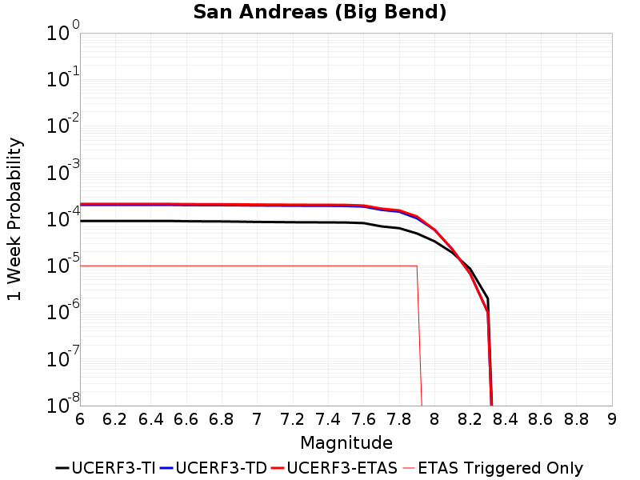 |  | 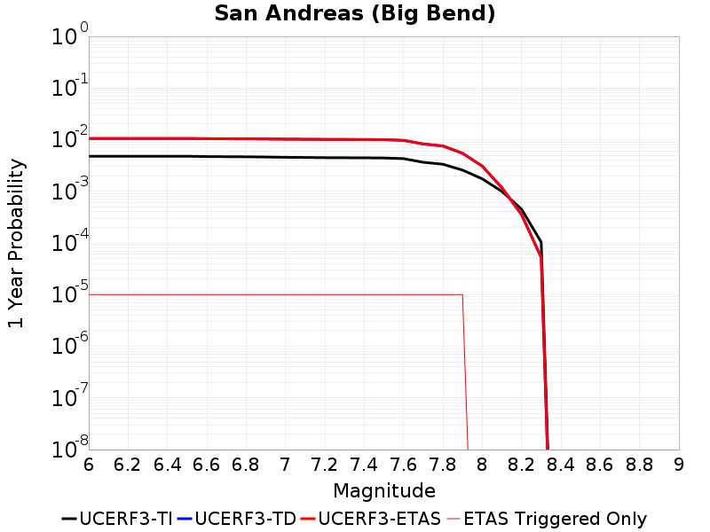 | 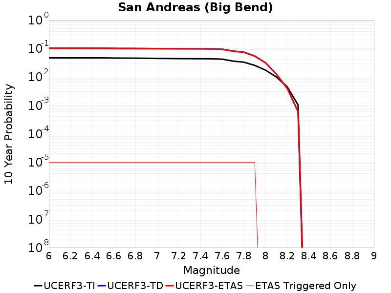 |

| Magnitude | 1 wk TI Prob | 1 wk TD Prob | 1 wk ETAS Prob | 1 wk ETAS/TD Gain | 1 wk ETAS Triggered Only | 1 mo TI Prob | 1 mo TD Prob | 1 mo ETAS Prob | 1 mo ETAS/TD Gain | 1 mo ETAS Triggered Only | 1 yr TI Prob | 1 yr TD Prob | 1 yr ETAS Prob | 1 yr ETAS/TD Gain | 1 yr ETAS Triggered Only | 10 yr TI Prob | 10 yr TD Prob | 10 yr ETAS Prob | 10 yr ETAS/TD Gain | 10 yr ETAS Triggered Only |
|-----|-----|-----|-----|-----|-----|-----|-----|-----|-----|-----|-----|-----|-----|-----|-----|-----|-----|-----|-----|-----|
| 6.0 | 9.168226E-5 | 2.0271106E-4 | 2.1270904E-4 | 1.0493213 | 1.0E-5 | 3.928648E-4 | 8.684727E-4 | 8.78464E-4 | 1.0115044 | 1.0E-5 | 0.0047726436 | 0.010522545 | 0.01053244 | 1.0009403 | 1.0E-5 | 0.046714354 | 0.10177293 | 0.101781905 | 1.0000882 | 1.0E-5 |
| 6.1 | 9.168226E-5 | 2.0271106E-4 | 2.1270904E-4 | 1.0493213 | 1.0E-5 | 3.928648E-4 | 8.684727E-4 | 8.78464E-4 | 1.0115044 | 1.0E-5 | 0.0047726436 | 0.010522545 | 0.01053244 | 1.0009403 | 1.0E-5 | 0.046714354 | 0.10177293 | 0.101781905 | 1.0000882 | 1.0E-5 |
| 6.2 | 9.168226E-5 | 2.0271106E-4 | 2.1270904E-4 | 1.0493213 | 1.0E-5 | 3.928648E-4 | 8.684727E-4 | 8.78464E-4 | 1.0115044 | 1.0E-5 | 0.0047726436 | 0.010522545 | 0.01053244 | 1.0009403 | 1.0E-5 | 0.046714354 | 0.10177293 | 0.101781905 | 1.0000882 | 1.0E-5 |
| 6.3 | 9.168226E-5 | 2.0271106E-4 | 2.1270904E-4 | 1.0493213 | 1.0E-5 | 3.928648E-4 | 8.684727E-4 | 8.78464E-4 | 1.0115044 | 1.0E-5 | 0.0047726436 | 0.010522545 | 0.01053244 | 1.0009403 | 1.0E-5 | 0.046714354 | 0.10177293 | 0.101781905 | 1.0000882 | 1.0E-5 |
| 6.4 | 9.1639464E-5 | 2.0264483E-4 | 2.1264282E-4 | 1.0493374 | 1.0E-5 | 3.9268145E-4 | 8.681891E-4 | 8.781804E-4 | 1.0115082 | 1.0E-5 | 0.0047704205 | 0.0105191255 | 0.01052902 | 1.0009407 | 1.0E-5 | 0.046693064 | 0.1017422 | 0.10175118 | 1.0000883 | 1.0E-5 |
| 6.5 | 9.1639464E-5 | 2.0264483E-4 | 2.1264282E-4 | 1.0493374 | 1.0E-5 | 3.9268145E-4 | 8.681891E-4 | 8.781804E-4 | 1.0115082 | 1.0E-5 | 0.0047704205 | 0.0105191255 | 0.01052902 | 1.0009407 | 1.0E-5 | 0.046693064 | 0.1017422 | 0.10175118 | 1.0000883 | 1.0E-5 |
| 6.6 | 9.042622E-5 | 2.0075057E-4 | 2.1074856E-4 | 1.049803 | 1.0E-5 | 3.8748336E-4 | 8.6007616E-4 | 8.7006757E-4 | 1.0116168 | 1.0E-5 | 0.0047074095 | 0.0104212975 | 0.010431193 | 1.0009496 | 1.0E-5 | 0.046089325 | 0.100861415 | 0.10087041 | 1.0000892 | 1.0E-5 |
| 6.7 | 8.9836685E-5 | 1.9992056E-4 | 2.0991855E-4 | 1.0500098 | 1.0E-5 | 3.8495753E-4 | 8.5652125E-4 | 8.665127E-4 | 1.0116651 | 1.0E-5 | 0.00467679 | 0.010378429 | 0.010388325 | 1.0009536 | 1.0E-5 | 0.045795817 | 0.10047176 | 0.10048075 | 1.0000895 | 1.0E-5 |
| 6.8 | 8.9471854E-5 | 1.9939916E-4 | 2.0939717E-4 | 1.0501406 | 1.0E-5 | 3.8339442E-4 | 8.542882E-4 | 8.642797E-4 | 1.0116956 | 1.0E-5 | 0.004657841 | 0.0103515005 | 0.010361397 | 1.000956 | 1.0E-5 | 0.04561414 | 0.100226805 | 0.100235805 | 1.0000898 | 1.0E-5 |
| 6.9 | 8.858234E-5 | 1.9824959E-4 | 2.082476E-4 | 1.0504315 | 1.0E-5 | 3.7958333E-4 | 8.493647E-4 | 8.593562E-4 | 1.0117635 | 1.0E-5 | 0.004611638 | 0.010292124 | 0.01030202 | 1.0009617 | 1.0E-5 | 0.04517103 | 0.09968581 | 0.09969481 | 1.0000904 | 1.0E-5 |
| 7.0 | 8.7433385E-5 | 1.9666464E-4 | 2.0666266E-4 | 1.050838 | 1.0E-5 | 3.746607E-4 | 8.425764E-4 | 8.5256796E-4 | 1.0118583 | 1.0E-5 | 0.004551957 | 0.010210254 | 0.010220151 | 1.0009694 | 1.0E-5 | 0.044598386 | 0.09893971 | 0.09894872 | 1.0000911 | 1.0E-5 |
| 7.1 | 8.684964E-5 | 1.9577918E-4 | 2.0577722E-4 | 1.051068 | 1.0E-5 | 3.7215967E-4 | 8.387841E-4 | 8.487757E-4 | 1.011912 | 1.0E-5 | 0.0045216335 | 0.010164514 | 0.010174412 | 1.0009738 | 1.0E-5 | 0.04430731 | 0.09852293 | 0.09853195 | 1.0000916 | 1.0E-5 |
| 7.2 | 8.606521E-5 | 1.9467936E-4 | 2.0467742E-4 | 1.0513566 | 1.0E-5 | 3.6879873E-4 | 8.340735E-4 | 8.440652E-4 | 1.0119793 | 1.0E-5 | 0.0044808835 | 0.010107697 | 0.010117596 | 1.0009793 | 1.0E-5 | 0.043916024 | 0.09800598 | 0.098014995 | 1.000092 | 1.0E-5 |
| 7.3 | 8.568266E-5 | 1.9407524E-4 | 2.0407331E-4 | 1.0515164 | 1.0E-5 | 3.6715972E-4 | 8.3148613E-4 | 8.414778E-4 | 1.0120167 | 1.0E-5 | 0.0044610105 | 0.010076487 | 0.010086386 | 1.0009824 | 1.0E-5 | 0.043725148 | 0.09771911 | 0.09772813 | 1.0000924 | 1.0E-5 |
| 7.4 | 8.5432206E-5 | 1.9368377E-4 | 2.0368183E-4 | 1.0516206 | 1.0E-5 | 3.6608664E-4 | 8.2980946E-4 | 8.3980116E-4 | 1.012041 | 1.0E-5 | 0.004447999 | 0.010056262 | 0.010066162 | 1.0009844 | 1.0E-5 | 0.043600157 | 0.09753325 | 0.09754227 | 1.0000925 | 1.0E-5 |
| 7.5 | 8.4791965E-5 | 1.9229297E-4 | 2.0229105E-4 | 1.051994 | 1.0E-5 | 3.633435E-4 | 8.2385266E-4 | 8.338444E-4 | 1.0121281 | 1.0E-5 | 0.0044147377 | 0.009984405 | 0.009994306 | 1.0009916 | 1.0E-5 | 0.043280575 | 0.09688186 | 0.09689089 | 1.0000932 | 1.0E-5 |
| 7.6 | 8.241105E-5 | 1.864501E-4 | 1.9644824E-4 | 1.0536237 | 1.0E-5 | 3.531424E-4 | 7.988274E-4 | 8.088194E-4 | 1.0125084 | 1.0E-5 | 0.0042910352 | 0.00968247 | 0.009692373 | 1.0010228 | 1.0E-5 | 0.042091176 | 0.0941579 | 0.09416696 | 1.0000962 | 1.0E-5 |
| 7.7 | 7.00432E-5 | 1.5873162E-4 | 1.6873002E-4 | 1.0629895 | 1.0E-5 | 3.001506E-4 | 6.8010105E-4 | 6.9009425E-4 | 1.0146937 | 1.0E-5 | 0.0036482112 | 0.008248851 | 0.008258768 | 1.0012023 | 1.0E-5 | 0.035888977 | 0.08096725 | 0.08097644 | 1.0001135 | 1.0E-5 |
| 7.8 | 6.415362E-5 | 1.4496373E-4 | 1.5496228E-4 | 1.0689728 | 1.0E-5 | 2.749151E-4 | 6.211252E-4 | 6.31119E-4 | 1.0160898 | 1.0E-5 | 0.0033419547 | 0.007536022 | 0.0075459466 | 1.0013169 | 1.0E-5 | 0.03292141 | 0.07412324 | 0.074132495 | 1.0001249 | 1.0E-5 |
| 7.9 | 4.939911E-5 | 1.0457922E-4 | 1.1457818E-4 | 1.0956113 | 1.0E-5 | 2.116933E-4 | 4.481197E-4 | 4.5811522E-4 | 1.0223055 | 1.0E-5 | 0.0025743195 | 0.0054422226 | 0.005452168 | 1.0018275 | 1.0E-5 | 0.025447013 | 0.054102696 | 0.054112155 | 1.0001749 | 1.0E-5 |
| 8.0 | 3.344983E-5 | 5.910171E-5 | 5.910171E-5 | 1.0 | 0.0 | 1.4334853E-4 | 2.5326846E-4 | 2.5326846E-4 | 1.0 | 0.0 | 0.0017438711 | 0.0030791857 | 0.0030791857 | 1.0 | 0.0 | 0.017302496 | 0.031266715 | 0.031266715 | 1.0 | 0.0 |
| 8.1 | 1.9104898E-5 | 2.252765E-5 | 2.252765E-5 | 1.0 | 0.0 | 8.1875565E-5 | 9.65435E-5 | 9.65435E-5 | 1.0 | 0.0 | 9.963791E-4 | 0.0011747841 | 0.0011747841 | 1.0 | 0.0 | 0.009919235 | 0.012488482 | 0.012488482 | 1.0 | 0.0 |
| 8.2 | 8.643924E-6 | 6.7803635E-6 | 6.7803635E-6 | 1.0 | 0.0 | 3.704486E-5 | 2.9058378E-5 | 2.9058378E-5 | 1.0 | 0.0 | 4.5092785E-4 | 3.5372845E-4 | 3.5372845E-4 | 1.0 | 0.0 | 0.0045001395 | 0.0039528483 | 0.0039528483 | 1.0 | 0.0 |
| 8.3 | 1.983087E-6 | 9.994538E-7 | 9.994538E-7 | 1.0 | 0.0 | 8.498917E-6 | 4.2833667E-6 | 4.2833667E-6 | 1.0 | 0.0 | 1.034694E-4 | 5.2148767E-5 | 5.2148767E-5 | 1.0 | 0.0 | 0.0010342124 | 6.0386653E-4 | 6.0386653E-4 | 1.0 | 0.0 |

## San Andreas (Mojave N)
*[(top)](#table-of-contents)*

| 1 Week | 1 Month | 1 Year | 10 Year |
|-----|-----|-----|-----|
| 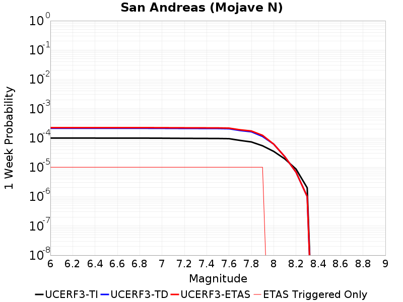 | 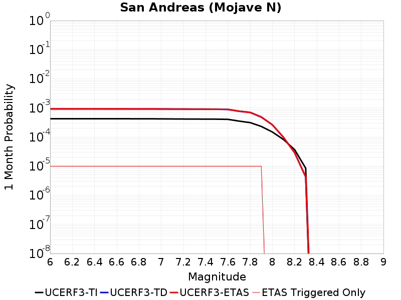 |  | 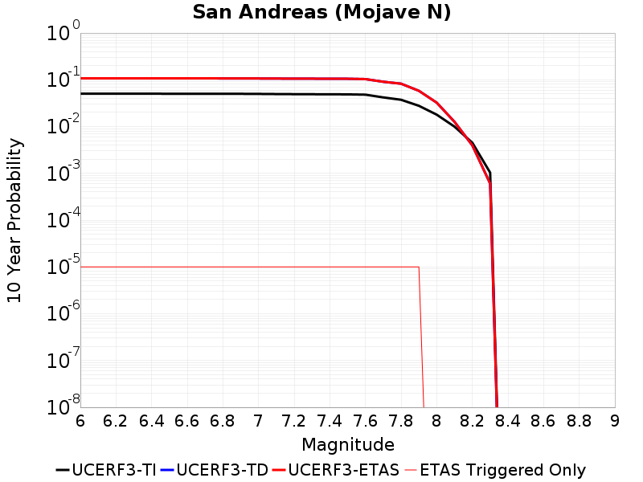 |

| Magnitude | 1 wk TI Prob | 1 wk TD Prob | 1 wk ETAS Prob | 1 wk ETAS/TD Gain | 1 wk ETAS Triggered Only | 1 mo TI Prob | 1 mo TD Prob | 1 mo ETAS Prob | 1 mo ETAS/TD Gain | 1 mo ETAS Triggered Only | 1 yr TI Prob | 1 yr TD Prob | 1 yr ETAS Prob | 1 yr ETAS/TD Gain | 1 yr ETAS Triggered Only | 10 yr TI Prob | 10 yr TD Prob | 10 yr ETAS Prob | 10 yr ETAS/TD Gain | 10 yr ETAS Triggered Only |
|-----|-----|-----|-----|-----|-----|-----|-----|-----|-----|-----|-----|-----|-----|-----|-----|-----|-----|-----|-----|-----|
| 6.0 | 9.877682E-5 | 2.1427183E-4 | 2.2426968E-4 | 1.0466597 | 1.0E-5 | 4.2326056E-4 | 9.179849E-4 | 9.279757E-4 | 1.0108835 | 1.0E-5 | 0.0051410277 | 0.01111936 | 0.011129249 | 1.0008893 | 1.0E-5 | 0.05023708 | 0.107117794 | 0.10712672 | 1.0000833 | 1.0E-5 |
| 6.1 | 9.877682E-5 | 2.1427183E-4 | 2.2426968E-4 | 1.0466597 | 1.0E-5 | 4.2326056E-4 | 9.179849E-4 | 9.279757E-4 | 1.0108835 | 1.0E-5 | 0.0051410277 | 0.01111936 | 0.011129249 | 1.0008893 | 1.0E-5 | 0.05023708 | 0.107117794 | 0.10712672 | 1.0000833 | 1.0E-5 |
| 6.2 | 9.877682E-5 | 2.1427183E-4 | 2.2426968E-4 | 1.0466597 | 1.0E-5 | 4.2326056E-4 | 9.179849E-4 | 9.279757E-4 | 1.0108835 | 1.0E-5 | 0.0051410277 | 0.01111936 | 0.011129249 | 1.0008893 | 1.0E-5 | 0.05023708 | 0.107117794 | 0.10712672 | 1.0000833 | 1.0E-5 |
| 6.3 | 9.877682E-5 | 2.1427183E-4 | 2.2426968E-4 | 1.0466597 | 1.0E-5 | 4.2326056E-4 | 9.179849E-4 | 9.279757E-4 | 1.0108835 | 1.0E-5 | 0.0051410277 | 0.01111936 | 0.011129249 | 1.0008893 | 1.0E-5 | 0.05023708 | 0.107117794 | 0.10712672 | 1.0000833 | 1.0E-5 |
| 6.4 | 9.877682E-5 | 2.1427183E-4 | 2.2426968E-4 | 1.0466597 | 1.0E-5 | 4.2326056E-4 | 9.179849E-4 | 9.279757E-4 | 1.0108835 | 1.0E-5 | 0.0051410277 | 0.01111936 | 0.011129249 | 1.0008893 | 1.0E-5 | 0.05023708 | 0.107117794 | 0.10712672 | 1.0000833 | 1.0E-5 |
| 6.5 | 9.861474E-5 | 2.1400159E-4 | 2.2399945E-4 | 1.0467186 | 1.0E-5 | 4.2256617E-4 | 9.168275E-4 | 9.2681835E-4 | 1.0108972 | 1.0E-5 | 0.0051326132 | 0.011105413 | 0.011115301 | 1.0008905 | 1.0E-5 | 0.050156746 | 0.10699358 | 0.107002504 | 1.0000834 | 1.0E-5 |
| 6.6 | 9.861474E-5 | 2.1400159E-4 | 2.2399945E-4 | 1.0467186 | 1.0E-5 | 4.2256617E-4 | 9.168275E-4 | 9.2681835E-4 | 1.0108972 | 1.0E-5 | 0.0051326132 | 0.011105413 | 0.011115301 | 1.0008905 | 1.0E-5 | 0.050156746 | 0.10699358 | 0.107002504 | 1.0000834 | 1.0E-5 |
| 6.7 | 9.8552715E-5 | 2.1389808E-4 | 2.2389594E-4 | 1.0467412 | 1.0E-5 | 4.223004E-4 | 9.163842E-4 | 9.2637504E-4 | 1.0109024 | 1.0E-5 | 0.0051293927 | 0.011100071 | 0.01110996 | 1.0008909 | 1.0E-5 | 0.050125998 | 0.106945984 | 0.10695492 | 1.0000834 | 1.0E-5 |
| 6.8 | 9.8464974E-5 | 2.1374557E-4 | 2.2374342E-4 | 1.0467746 | 1.0E-5 | 4.219245E-4 | 9.1573107E-4 | 9.257219E-4 | 1.0109103 | 1.0E-5 | 0.0051248376 | 0.0110922 | 0.011102089 | 1.0008916 | 1.0E-5 | 0.05008251 | 0.10687517 | 0.1068841 | 1.0000836 | 1.0E-5 |
| 6.9 | 9.825824E-5 | 2.1341835E-4 | 2.2341622E-4 | 1.0468463 | 1.0E-5 | 4.2103877E-4 | 9.1432966E-4 | 9.2432054E-4 | 1.010927 | 1.0E-5 | 0.0051141046 | 0.011075311 | 0.011085201 | 1.0008929 | 1.0E-5 | 0.049980022 | 0.10672208 | 0.10673101 | 1.0000837 | 1.0E-5 |
| 7.0 | 9.781462E-5 | 2.1272028E-4 | 2.2271815E-4 | 1.047 | 1.0E-5 | 4.1913814E-4 | 9.1134E-4 | 9.2133094E-4 | 1.0109628 | 1.0E-5 | 0.005091073 | 0.011039282 | 0.011049172 | 1.0008959 | 1.0E-5 | 0.04976007 | 0.10639624 | 0.106405176 | 1.000084 | 1.0E-5 |
| 7.1 | 9.7121134E-5 | 2.1172006E-4 | 2.2171794E-4 | 1.0472221 | 1.0E-5 | 4.1616702E-4 | 9.070564E-4 | 9.170473E-4 | 1.0110147 | 1.0E-5 | 0.005055068 | 0.010987656 | 0.010997546 | 1.0009001 | 1.0E-5 | 0.04941613 | 0.10592935 | 0.10593829 | 1.0000844 | 1.0E-5 |
| 7.2 | 9.663819E-5 | 2.110168E-4 | 2.2101468E-4 | 1.0473796 | 1.0E-5 | 4.1409794E-4 | 9.040445E-4 | 9.140354E-4 | 1.0110514 | 1.0E-5 | 0.0050299936 | 0.010951355 | 0.010961246 | 1.0009031 | 1.0E-5 | 0.049176537 | 0.10560095 | 0.105609894 | 1.0000846 | 1.0E-5 |
| 7.3 | 9.6277574E-5 | 2.1052126E-4 | 2.2051916E-4 | 1.0474912 | 1.0E-5 | 4.125529E-4 | 9.0192223E-4 | 9.1191323E-4 | 1.0110774 | 1.0E-5 | 0.0050112694 | 0.010925776 | 0.010935667 | 1.0009053 | 1.0E-5 | 0.04899759 | 0.10536713 | 0.10537608 | 1.0000849 | 1.0E-5 |
| 7.4 | 9.593308E-5 | 2.0988892E-4 | 2.1988683E-4 | 1.0476342 | 1.0E-5 | 4.1107697E-4 | 8.992141E-4 | 9.092051E-4 | 1.0111108 | 1.0E-5 | 0.0049933824 | 0.010893135 | 0.010903026 | 1.000908 | 1.0E-5 | 0.04882661 | 0.105074786 | 0.10508374 | 1.0000851 | 1.0E-5 |
| 7.5 | 9.561707E-5 | 2.0932221E-4 | 2.1932012E-4 | 1.0477632 | 1.0E-5 | 4.0972308E-4 | 8.96787E-4 | 9.0677803E-4 | 1.011141 | 1.0E-5 | 0.0049769743 | 0.010863881 | 0.010873772 | 1.0009105 | 1.0E-5 | 0.048669744 | 0.10481167 | 0.10482062 | 1.0000854 | 1.0E-5 |
| 7.6 | 9.418194E-5 | 2.0566295E-4 | 2.156609E-4 | 1.0486132 | 1.0E-5 | 4.0357444E-4 | 8.811151E-4 | 8.9110626E-4 | 1.0113393 | 1.0E-5 | 0.004902454 | 0.01067496 | 0.0106848525 | 1.0009267 | 1.0E-5 | 0.047957025 | 0.103134245 | 0.103143215 | 1.0000869 | 1.0E-5 |
| 7.7 | 8.202141E-5 | 1.7882092E-4 | 1.8881913E-4 | 1.0559119 | 1.0E-5 | 3.51473E-4 | 7.6615036E-4 | 7.761427E-4 | 1.0130422 | 1.0E-5 | 0.00427079 | 0.009288067 | 0.0092979735 | 1.0010667 | 1.0E-5 | 0.04189639 | 0.09049273 | 0.09050183 | 1.0001005 | 1.0E-5 |
| 7.8 | 7.2859846E-5 | 1.6209808E-4 | 1.7209646E-4 | 1.061681 | 1.0E-5 | 3.1221908E-4 | 6.945211E-4 | 7.045142E-4 | 1.0143884 | 1.0E-5 | 0.003794643 | 0.00842307 | 0.008432986 | 1.0011772 | 1.0E-5 | 0.037304975 | 0.08230431 | 0.082313485 | 1.0001115 | 1.0E-5 |
| 7.9 | 5.3874453E-5 | 1.12415335E-4 | 1.224142E-4 | 1.0889459 | 1.0E-5 | 2.3087008E-4 | 4.8169107E-4 | 4.916862E-4 | 1.0207502 | 1.0E-5 | 0.0028072202 | 0.0058488357 | 0.005858777 | 1.0016997 | 1.0E-5 | 0.02772022 | 0.057976432 | 0.057985853 | 1.0001625 | 1.0E-5 |
| 8.0 | 3.468538E-5 | 6.132008E-5 | 6.132008E-5 | 1.0 | 0.0 | 1.4864317E-4 | 2.627739E-4 | 2.627739E-4 | 1.0 | 0.0 | 0.0018082283 | 0.0031945813 | 0.0031945813 | 1.0 | 0.0 | 0.017935853 | 0.03237906 | 0.03237906 | 1.0 | 0.0 |
| 8.1 | 1.9152367E-5 | 2.2762822E-5 | 2.2762822E-5 | 1.0 | 0.0 | 8.207899E-5 | 9.755131E-5 | 9.755131E-5 | 1.0 | 0.0 | 9.988535E-4 | 0.001187041 | 0.001187041 | 1.0 | 0.0 | 0.009943757 | 0.012595916 | 0.012595916 | 1.0 | 0.0 |
| 8.2 | 8.643924E-6 | 6.7803635E-6 | 6.7803635E-6 | 1.0 | 0.0 | 3.704486E-5 | 2.9058378E-5 | 2.9058378E-5 | 1.0 | 0.0 | 4.5092785E-4 | 3.5372845E-4 | 3.5372845E-4 | 1.0 | 0.0 | 0.0045001395 | 0.0039528483 | 0.0039528483 | 1.0 | 0.0 |
| 8.3 | 1.983087E-6 | 9.994538E-7 | 9.994538E-7 | 1.0 | 0.0 | 8.498917E-6 | 4.2833667E-6 | 4.2833667E-6 | 1.0 | 0.0 | 1.034694E-4 | 5.2148767E-5 | 5.2148767E-5 | 1.0 | 0.0 | 0.0010342124 | 6.0386653E-4 | 6.0386653E-4 | 1.0 | 0.0 |

## San Andreas (Parkfield)
*[(top)](#table-of-contents)*

| 1 Week | 1 Month | 1 Year | 10 Year |
|-----|-----|-----|-----|
| 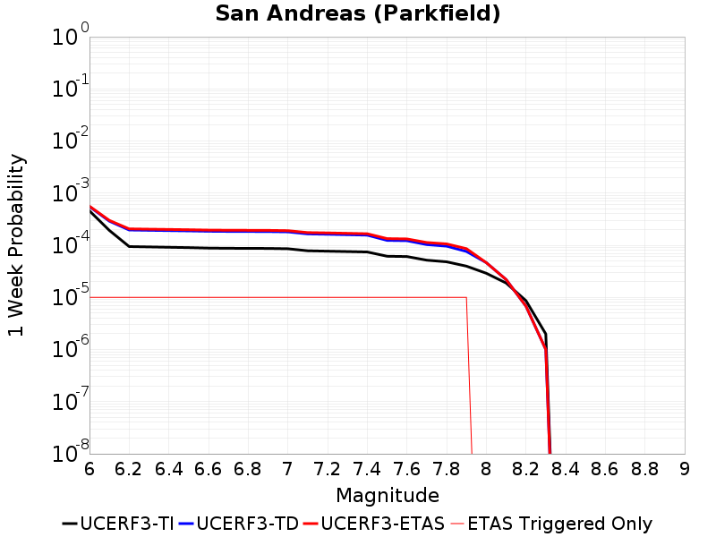 |  |  |  |

| Magnitude | 1 wk TI Prob | 1 wk TD Prob | 1 wk ETAS Prob | 1 wk ETAS/TD Gain | 1 wk ETAS Triggered Only | 1 mo TI Prob | 1 mo TD Prob | 1 mo ETAS Prob | 1 mo ETAS/TD Gain | 1 mo ETAS Triggered Only | 1 yr TI Prob | 1 yr TD Prob | 1 yr ETAS Prob | 1 yr ETAS/TD Gain | 1 yr ETAS Triggered Only | 10 yr TI Prob | 10 yr TD Prob | 10 yr ETAS Prob | 10 yr ETAS/TD Gain | 10 yr ETAS Triggered Only |
|-----|-----|-----|-----|-----|-----|-----|-----|-----|-----|-----|-----|-----|-----|-----|-----|-----|-----|-----|-----|-----|
| 6.0 | 4.5600464E-4 | 5.506042E-4 | 5.605987E-4 | 1.0181519 | 1.0E-5 | 0.0019528421 | 0.0023578447 | 0.0023678213 | 1.0042312 | 1.0E-5 | 0.023518132 | 0.028616657 | 0.028626371 | 1.0003394 | 1.0E-5 | 0.21179019 | 0.2771262 | 0.27713344 | 1.0000261 | 1.0E-5 |
| 6.1 | 1.9252734E-4 | 2.8968294E-4 | 2.9968002E-4 | 1.0345105 | 1.0E-5 | 8.248562E-4 | 0.0012409645 | 0.0012509521 | 1.0080483 | 1.0E-5 | 0.009996468 | 0.015009604 | 0.015019454 | 1.0006562 | 1.0E-5 | 0.09558567 | 0.14962599 | 0.14963448 | 1.0000569 | 1.0E-5 |
| 6.2 | 9.4269315E-5 | 1.959308E-4 | 2.0592884E-4 | 1.0510284 | 1.0E-5 | 4.039488E-4 | 8.3943456E-4 | 8.4942614E-4 | 1.0119028 | 1.0E-5 | 0.0049069915 | 0.010172555 | 0.010182453 | 1.000973 | 1.0E-5 | 0.048000436 | 0.09781673 | 0.09782575 | 1.0000923 | 1.0E-5 |
| 6.3 | 9.283051E-5 | 1.9316401E-4 | 2.0316208E-4 | 1.0517595 | 1.0E-5 | 3.9778434E-4 | 8.275844E-4 | 8.3757617E-4 | 1.0120734 | 1.0E-5 | 0.0048322747 | 0.01002961 | 0.01003951 | 1.000987 | 1.0E-5 | 0.047285385 | 0.0965629 | 0.09657194 | 1.0000936 | 1.0E-5 |
| 6.4 | 9.138826E-5 | 1.9075825E-4 | 2.0075635E-4 | 1.0524124 | 1.0E-5 | 3.916052E-4 | 8.172805E-4 | 8.272723E-4 | 1.0122257 | 1.0E-5 | 0.0047573745 | 0.009905305 | 0.009915206 | 1.0009996 | 1.0E-5 | 0.046568092 | 0.09546263 | 0.09547167 | 1.0000948 | 1.0E-5 |
| 6.5 | 9.000255E-5 | 1.8830685E-4 | 1.9830496E-4 | 1.0530949 | 1.0E-5 | 3.8566816E-4 | 8.06781E-4 | 8.167729E-4 | 1.0123849 | 1.0E-5 | 0.0046854047 | 0.009778624 | 0.009788526 | 1.0010127 | 1.0E-5 | 0.045878403 | 0.0943358 | 0.09434486 | 1.000096 | 1.0E-5 |
| 6.6 | 8.8109264E-5 | 1.8523078E-4 | 1.9522893E-4 | 1.0539767 | 1.0E-5 | 3.7755648E-4 | 7.936059E-4 | 8.03598E-4 | 1.0125908 | 1.0E-5 | 0.0045870654 | 0.009619644 | 0.0096295485 | 1.0010295 | 1.0E-5 | 0.04493529 | 0.092914894 | 0.09292397 | 1.0000976 | 1.0E-5 |
| 6.7 | 8.738073E-5 | 1.8391485E-4 | 1.93913E-4 | 1.054363 | 1.0E-5 | 3.7443507E-4 | 7.879696E-4 | 7.979618E-4 | 1.0126809 | 1.0E-5 | 0.0045492216 | 0.0095516285 | 0.009561533 | 1.0010369 | 1.0E-5 | 0.04457213 | 0.09231972 | 0.092328794 | 1.0000983 | 1.0E-5 |
| 6.8 | 8.710195E-5 | 1.8337661E-4 | 1.9337477E-4 | 1.0545226 | 1.0E-5 | 3.7324068E-4 | 7.856643E-4 | 7.9565647E-4 | 1.0127181 | 1.0E-5 | 0.0045347405 | 0.009523809 | 0.009533714 | 1.00104 | 1.0E-5 | 0.04443313 | 0.09207065 | 0.09207973 | 1.0000986 | 1.0E-5 |
| 6.9 | 8.6801556E-5 | 1.8278998E-4 | 1.9278815E-4 | 1.0546976 | 1.0E-5 | 3.7195362E-4 | 7.831517E-4 | 7.931439E-4 | 1.012759 | 1.0E-5 | 0.0045191357 | 0.009493484 | 0.00950339 | 1.0010433 | 1.0E-5 | 0.044283327 | 0.09179943 | 0.09180851 | 1.000099 | 1.0E-5 |
| 7.0 | 8.5571606E-5 | 1.8030958E-4 | 1.9030778E-4 | 1.0554502 | 1.0E-5 | 3.6668387E-4 | 7.7252777E-4 | 7.8252004E-4 | 1.0129346 | 1.0E-5 | 0.004455241 | 0.009365257 | 0.009375163 | 1.0010577 | 1.0E-5 | 0.043669727 | 0.090650365 | 0.090659454 | 1.0001003 | 1.0E-5 |
| 7.1 | 7.82589E-5 | 1.6481837E-4 | 1.7481671E-4 | 1.0606629 | 1.0E-5 | 3.3535215E-4 | 7.06174E-4 | 7.161669E-4 | 1.0141509 | 1.0E-5 | 0.0040752706 | 0.008563973 | 0.008573887 | 1.0011576 | 1.0E-5 | 0.040013418 | 0.083470255 | 0.08347942 | 1.0001098 | 1.0E-5 |
| 7.2 | 7.690929E-5 | 1.6229802E-4 | 1.722964E-4 | 1.0616051 | 1.0E-5 | 3.2956956E-4 | 6.9537834E-4 | 7.053714E-4 | 1.0143707 | 1.0E-5 | 0.004005129 | 0.00843356 | 0.008443476 | 1.0011758 | 1.0E-5 | 0.0393371 | 0.08228986 | 0.08229904 | 1.0001116 | 1.0E-5 |
| 7.3 | 7.5543794E-5 | 1.5920056E-4 | 1.6919896E-4 | 1.0628039 | 1.0E-5 | 3.2371894E-4 | 6.821105E-4 | 6.9210364E-4 | 1.0146503 | 1.0E-5 | 0.003934157 | 0.008273261 | 0.008283178 | 1.0011988 | 1.0E-5 | 0.038652334 | 0.08083269 | 0.080841884 | 1.0001137 | 1.0E-5 |
| 7.4 | 7.4214564E-5 | 1.5610855E-4 | 1.66107E-4 | 1.0640479 | 1.0E-5 | 3.1802364E-4 | 6.688659E-4 | 6.7885924E-4 | 1.0149407 | 1.0E-5 | 0.003865065 | 0.00811322 | 0.008123139 | 1.0012226 | 1.0E-5 | 0.03798529 | 0.07937401 | 0.07938322 | 1.000116 | 1.0E-5 |
| 7.5 | 6.149578E-5 | 1.2389642E-4 | 1.3389517E-4 | 1.0807025 | 1.0E-5 | 2.6352672E-4 | 5.308767E-4 | 5.408714E-4 | 1.0188267 | 1.0E-5 | 0.0032037178 | 0.0064443094 | 0.0064542447 | 1.0015417 | 1.0E-5 | 0.03157923 | 0.06403574 | 0.0640451 | 1.0001462 | 1.0E-5 |
| 7.6 | 6.0643448E-5 | 1.2212373E-4 | 1.3212251E-4 | 1.0818741 | 1.0E-5 | 2.598746E-4 | 5.2328256E-4 | 5.3327734E-4 | 1.0191002 | 1.0E-5 | 0.0031593828 | 0.006352394 | 0.0063623306 | 1.0015643 | 1.0E-5 | 0.031148417 | 0.06317615 | 0.06318551 | 1.0001483 | 1.0E-5 |
| 7.7 | 5.1652263E-5 | 1.0281109E-4 | 1.1281007E-4 | 1.0972557 | 1.0E-5 | 2.2134806E-4 | 4.405446E-4 | 4.505402E-4 | 1.0226892 | 1.0E-5 | 0.002691582 | 0.0053504542 | 0.005360401 | 1.001859 | 1.0E-5 | 0.026592141 | 0.05366825 | 0.05367771 | 1.0001763 | 1.0E-5 |
| 7.8 | 4.8090482E-5 | 9.6027325E-5 | 1.0602636E-4 | 1.104127 | 1.0E-5 | 2.060858E-4 | 4.1148078E-4 | 4.2147667E-4 | 1.0242925 | 1.0E-5 | 0.0025062072 | 0.0049982825 | 0.0050082323 | 1.0019907 | 1.0E-5 | 0.024781305 | 0.050156973 | 0.050166473 | 1.0001894 | 1.0E-5 |
| 7.9 | 3.970278E-5 | 7.5937925E-5 | 8.5937165E-5 | 1.1316766 | 1.0E-5 | 1.7014367E-4 | 3.254077E-4 | 3.3540442E-4 | 1.0307207 | 1.0E-5 | 0.002069531 | 0.0039546466 | 0.003964607 | 1.0025187 | 1.0E-5 | 0.020503636 | 0.039889276 | 0.039898876 | 1.0002407 | 1.0E-5 |
| 8.0 | 2.8982335E-5 | 4.63319E-5 | 4.63319E-5 | 1.0 | 0.0 | 1.2420409E-4 | 1.9855019E-4 | 1.9855019E-4 | 1.0 | 0.0 | 0.0015111357 | 0.0024146703 | 0.0024146703 | 1.0 | 0.0 | 0.015009012 | 0.02479693 | 0.02479693 | 1.0 | 0.0 |
| 8.1 | 1.8836186E-5 | 2.1963137E-5 | 2.1963137E-5 | 1.0 | 0.0 | 8.0724014E-5 | 9.4124334E-5 | 9.4124334E-5 | 1.0 | 0.0 | 9.823717E-4 | 0.0011453622 | 0.0011453622 | 1.0 | 0.0 | 0.009780403 | 0.012190569 | 0.012190569 | 1.0 | 0.0 |
| 8.2 | 8.643924E-6 | 6.7803635E-6 | 6.7803635E-6 | 1.0 | 0.0 | 3.704486E-5 | 2.9058378E-5 | 2.9058378E-5 | 1.0 | 0.0 | 4.5092785E-4 | 3.5372845E-4 | 3.5372845E-4 | 1.0 | 0.0 | 0.0045001395 | 0.0039528483 | 0.0039528483 | 1.0 | 0.0 |
| 8.3 | 1.983087E-6 | 9.994538E-7 | 9.994538E-7 | 1.0 | 0.0 | 8.498917E-6 | 4.2833667E-6 | 4.2833667E-6 | 1.0 | 0.0 | 1.034694E-4 | 5.2148767E-5 | 5.2148767E-5 | 1.0 | 0.0 | 0.0010342124 | 6.0386653E-4 | 6.0386653E-4 | 1.0 | 0.0 |

