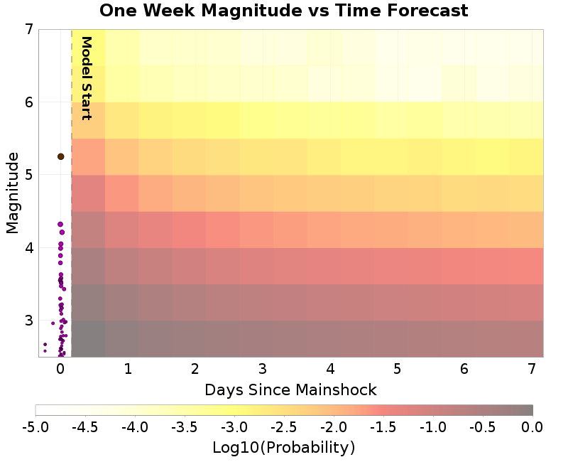
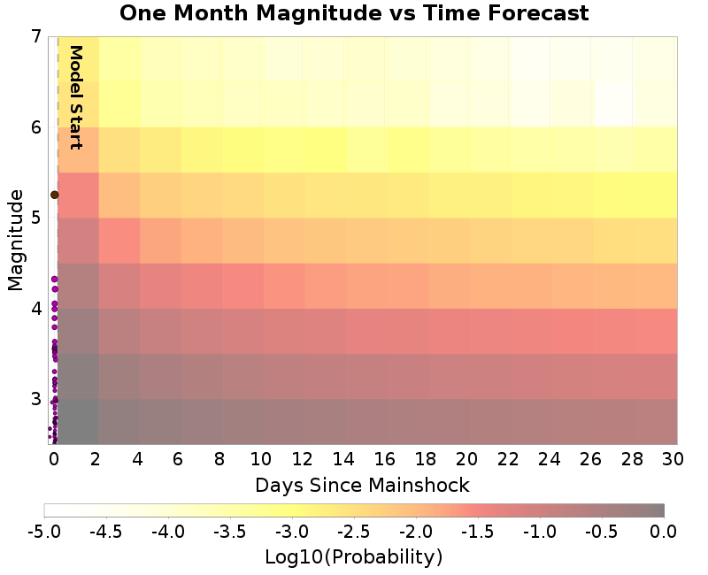
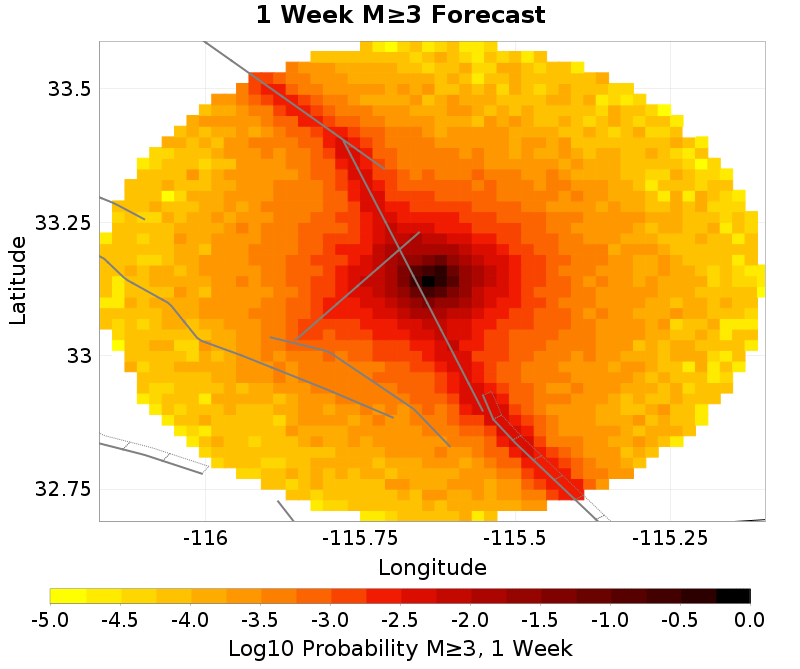
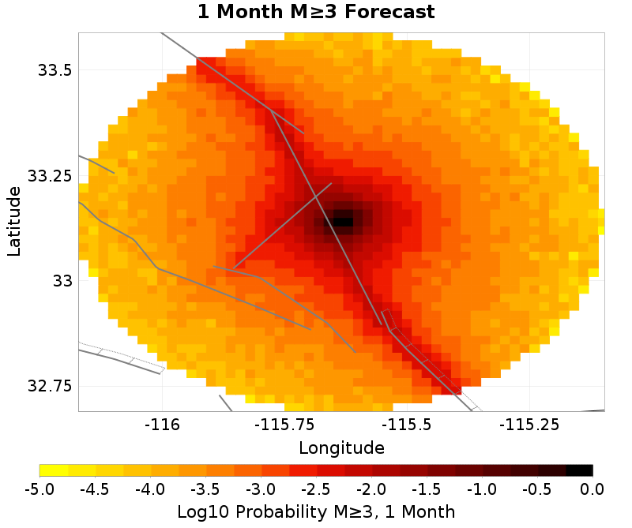
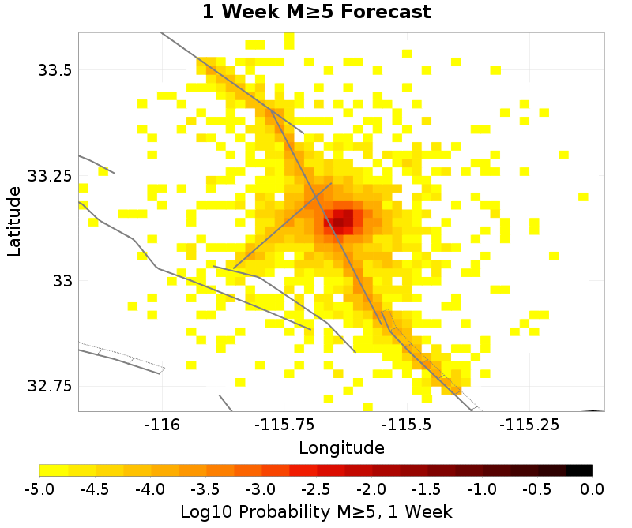
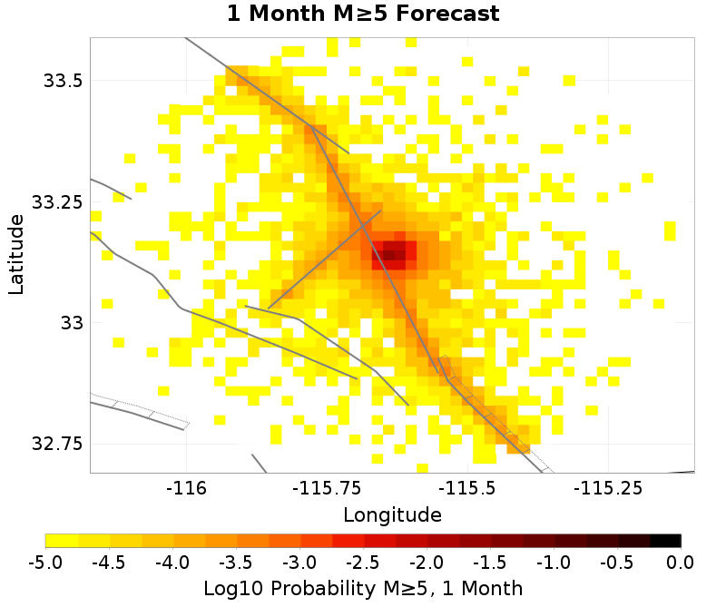

## UCERF3-ETAS Forecast
*[(top)](#table-of-contents)*

This section gives results from the UCERF3-ETAS short-term forecasting model. This model is described in [Field et al. (2017)](http://bssa.geoscienceworld.org/lookup/doi/10.1785/0120160173), and computes probabilities of this sequence triggering subsequent aftershocks, including events on known faults.

Probabilities are inherantly time-dependent. Those stated here are for time periods beginning the instant when this report was generated, 2021/06/05 14:47:53 PDT. The model was updated with all observed aftershcoks up to 2 hours after the mainshock, and may be out of date, especially if large aftershocks have occurred subsequently or a significant amount of time has passed since the last update.

Results are summarized below and should be considered preliminary. The exact timing, size, location, or number of aftershocks cannot be predicted, and all probabilities are uncertain.

This table gives forecasted one week and one month probabilities for events triggered by this sequence; it does not include the long-term probability of such events.

|  | 1 Week | 1 Month |
|-----|-----|-----|
| **M&ge;3** | 96.365% | 98.424% |
| **M&ge;4** | 39.616% | 47.989% |
| **M&ge;5** | 6.096% | 8.135% |
| **M&ge;6** | 0.801% | 1.131% |
| **M&ge;7** | 0.173% | 0.248% |
| **M&ge;8** | 0.007% | 0.010% |
| **M&ge;9** | <0.001% | <0.001% |

### ETAS Forecasted Magnitude Vs. Time
*[(top)](#table-of-contents)*

These plots show the show the magnitude versus time probability function since simulation start. Observed event data lie on top, with those input to the simulation plotted as magenta circles and those that occurred after the simulation start time as cyan circles. Time is relative to the mainshock (M5.25, ci39919392, plotted as a brown circle). Probabilities are only shown above the minimum simulated magnitude, M=2.5.

| One Week | One Month |
|-----|-----|
|  |  |

### ETAS Spatial Distribution Forecast
*[(top)](#table-of-contents)*

These plots show the predicted spatial distribution of aftershocks above the given magnitude threshold and for the given time period. The 'Current' plot shows the forecasted spatial distribution to date, along with as any observed aftershocks overlaid with cyan circles. Observed aftershocks will be included in the week/month plots as well if the forecasted time window has elapsed.

|  | Forecast: 1 Week | Forecast: 1 Month |
|-----|-----|-----|
| **M&ge;3** |  |  |
| **M&ge;5** |  |  |

### ETAS Fault Trigger Probabilities
*[(top)](#table-of-contents)*

The table below summarizes the probabilities of this sequence triggering large supra-seismogenic aftershocks on nearby known active faults.

| Fault Section | 1 wk supra-seis prob | 1 mo supra-seis prob | 1 wk M&ge;7 prob | 1 mo M&ge;7 prob |
|-----|-----|-----|-----|-----|
| **Brawley (Seismic Zone) alt 1** | 0.597% | 0.859% | 0.173% | 0.246% |
| **Imperial** | 0.485% | 0.691% | 0.169% | 0.241% |
| **Elmore Ranch** | 0.288% | 0.411% | <0.001% | <0.001% |
| **San Andreas (Coachella) rev** | 0.211% | 0.298% | 0.173% | 0.247% |
| **San Andreas (San Gorgonio Pass-Garnet HIll)** | 0.128% | 0.181% | 0.128% | 0.181% |
| **San Andreas (San Bernardino S)** | 0.048% | 0.073% | 0.047% | 0.068% |
| **San Andreas (San Bernardino N)** | 0.019% | 0.030% | 0.019% | 0.029% |
| **San Andreas (Mojave S)** | 0.014% | 0.021% | 0.013% | 0.019% |
| **San Jacinto (Superstition Mtn)** | 0.009% | 0.015% | <0.001% | <0.001% |
| **San Andreas (Mojave N)** | 0.010% | 0.014% | 0.010% | 0.014% |
